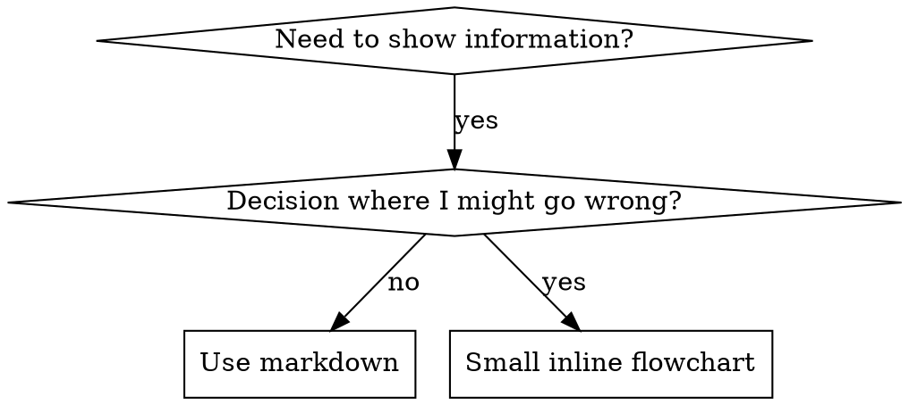
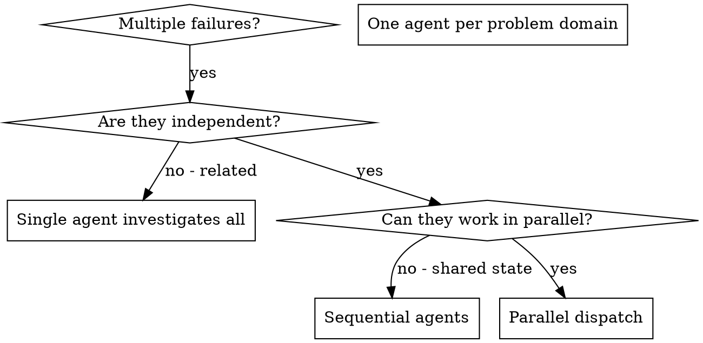

# Skill system audit and improvement (fork #1)

**Session ID:** ses_2b0c3e574ffe0Hb0uuEi8cGEMB
**Created:** 4/3/2026, 12:27:12 AM
**Updated:** 4/3/2026, 12:41:12 AM

---

## User

/Skill Development  (load together with skill-creator, skill-judge, writing skills) ## This SKILL and its sets of references, templates, and so on are badly designed, that needs audit, improve and significantly alligned "/Users/apple/hivemind-plugin/.worktrees/harness-experiment/.skills-lab/refactoring-skills/use-authoring-skills
/Users/apple/hivemind-plugin/.worktrees/harness-experiment/.skills-lab/refactoring-skills/use-authoring-skills/references
/Users/apple/hivemind-plugin/.worktrees/harness-experiment/.skills-lab/refactoring-skills/use-authoring-skills/references/01-skill-anatomy.md
/Users/apple/hivemind-plugin/.worktrees/harness-experiment/.skills-lab/refactoring-skills/use-authoring-skills/references/02-frontmatter-standard.md
/Users/apple/hivemind-plugin/.worktrees/harness-experiment/.skills-lab/refactoring-skills/use-authoring-skills/references/03-three-patterns.md
/Users/apple/hivemind-plugin/.worktrees/harness-experiment/.skills-lab/refactoring-skills/use-authoring-skills/references/04-tdd-workflow.md
/Users/apple/hivemind-plugin/.worktrees/harness-experiment/.skills-lab/refactoring-skills/use-authoring-skills/references/05-skill-quality-matrix.md
/Users/apple/hivemind-plugin/.worktrees/harness-experiment/.skills-lab/refactoring-skills/use-authoring-skills/references/07-iterative-refinement.md
/Users/apple/hivemind-plugin/.worktrees/harness-experiment/.skills-lab/refactoring-skills/use-authoring-skills/references/08-conflict-detection.md
/Users/apple/hivemind-plugin/.worktrees/harness-experiment/.skills-lab/refactoring-skills/use-authoring-skills/references/audit-checklist.md
/Users/apple/hivemind-plugin/.worktrees/harness-experiment/.skills-lab/refactoring-skills/use-authoring-skills/references/sw-04-tdd-workflow.md
/Users/apple/hivemind-plugin/.worktrees/harness-experiment/.skills-lab/refactoring-skills/use-authoring-skills/templates
/Users/apple/hivemind-plugin/.worktrees/harness-experiment/.skills-lab/refactoring-skills/use-authoring-skills/templates/skill-audit.json
/Users/apple/hivemind-plugin/.worktrees/harness-experiment/.skills-lab/refactoring-skills/use-authoring-skills/SKILL.md " --- And following this ```# The main purposes and workflows

1. Improve the overall intensive and advanced “Creating, Auditing, Evaluating, Doctoring Skills” Skill that are cohesively, organized, linked across, giving domains, in-depth and expert-knowledge to the agents who will use this skill and the tools, references set for the intentions @/Users/apple/hivemind-plugin/.worktrees/harness-experiment/.skills-lab/refactoring-skills/users-prompting-workspace-resources/2026-04-02/authoring-skills-improved-resources.md  → For this one I need
    1. REQUIREMENTS -  OVERVIEW: for this is going to get bridged  to or as background knowledge to other packages of skills — same-hierarchy-across-linkages — such as agent, tools, commands, and workflows authoring skill packages ; to become the tool set of skills used by my harness project meta framework as meta-builder. On top of that,  as these are either domains-patterns or by-step-advanced patterns and bundles for whatever files, assets, references, examples, scripts, schema, models that this and the other packages designed, they should all be frame the skeleton first → then be extremely iterative, addressing with hierarchy, and node-targeting, treating them as test-driven-development and be very consistent, high-alert and aware of real-life use cases (edge cases); and as they are skills and written for LLMs → the end-game success is defined by “clear-measurable metric”; concise-and-articulate; workflows phases and steps, organization over confusion; smart and thoughtful deterministic ETC — ALL OF WHICH is clearly state here @/Users/apple/hivemind-plugin/.worktrees/harness-experiment/.skills-lab/refactoring-skills/users-prompting-workspace-resources/2026-04-02/essentials.md 
    2. improve on the based content, so that these are improved on the advanced concepts, the reasoning when selected, improvement of the AI iterations → pay attention to selective, improvement , not the mere grep, glob, surface reading ; nor one time completion - AKA launching multiple cycles of sub agents, be granular → consume and synthesis whole content of both while compare and contrast; knowing the agent limited windows to not launching one and asking to read  more than 3 domains of content nor greater than 5k of LOC nor Text, especially when compare and contrast needed.
2. Improvement on the users-intent-oriented, be an expert,  following phases, iterative and deterministic loops until success, be interactive and helpful (on raising valuable expert opinions through research, by not assumption, by incremental knowledge build up → it is to the point that the skills must get ready and  embedding itself these natures (I am giving an example of deep research natures to illustrate my points)
    
    ```markdown
    ## Core Constraints
    
    ### Prohibited Actions
    
    - **Deep reading**: Do not perform line-by-line reading, offset reading, or extended sequential file traversal
    - **Long-horizon agentic execution**: Avoid extended tool chains or multi-step tool execution sequences
    - **File mutation**: Do not create, update, or delete any files
    - **Context waste**: Avoid actions that consume main context windows or create file diffs
    
    ### Required Behaviors
    
    - **Contextual awareness**: Understand broad context before diving into specifics
    - **Intent alignment**: Continuously verify understanding of the user's true objectives
    - **Iterative approach**: Favor back-and-forth exploration with incremental knowledge building
    - **Supportive collaboration**: Engage in brainstorming and progressive revelation of understanding
    
    ---
    
    ## Fundamental Methodology
    
    ### 1. Frame Everything First
    
    Before any exploration:
    
    - **Establish skeleton**: Map the high-level architecture, directory structure, and major components
    - **Identify nodes**: Locate key actors, services, modules, and entry points
    - **Map branches**: Trace relationships, dependencies, and interaction patterns
    - **Acknowledge hypotheses**: Note trial errors and assumptions that may redirect exploration
    - **Rerouting awareness**: Be prepared to pivot when evidence suggests alternative paths
    
    ### 2. Hierarchical Thinking (Mandatory)
    
    - **Cause-effect understanding**: Every decision traces back to reasoning
    - **Compare and contrast**: Weigh importance of elements against each other
    - **Importance ranking**: Distinguish critical paths from peripheral concerns
    - **Structural relationships**: Understand parent-child, dependency, and ownership hierarchies
    
    ### 3. Strategic Traversal
    
    - **Sequenced exploration**: Follow logical paths through the codebase
    - **Conditional logic**: Use if-then reasoning to narrow focus
    - **Time-machine awareness**: Consider historical context through git history when available
    - **Actor tracing**: Identify key contributors, maintainers, and their areas of responsibility
    - **Context network mapping**: Build mental models of how components interconnect
    
    ### 4. Cyclical Judgment
    
    - **Multi-cycle evaluation**: Never judge on first encounter; return to entities multiple times
    - **Real-life use case grounding**: Validate understanding against actual usage scenarios
    - **Equivalence awareness**: Recognize that multiple approaches may achieve the same results
    - **Efficiency recognition**: Some simpler solutions may outperform complex alternatives
    - **Prejudice avoidance**: Do not assume one method is superior without comprehensive comparison
    - **Maturity principle**: Only draw conclusions after secular, repeated judgment cycles
    
    ---
    
    ## Governance Protocol: Subagent Orchestration
    
    ### Planning Requirements
    
    - **Batch planning**: Always plan subagent work in batches and cycles
    - **Never single-round execution**: Avoid relying on one round of subagent work
    - **Extreme iteration**: Be granular and iterative in all delegations
    - **Sequential preference**: Favor sequential over parallel when possible
    
    ### Communication Protocol
    
    - **Disk-based synthesis**: All subagent outputs must be written to disk
    - **Named exports**: Use clear, descriptive filenames for synthesis documents
    - **Consumable format**: Structure outputs for easy consumption by subsequent batches
    - **Chain continuity**: Each batch must be able to read and build upon previous outputs
    ```
    
    → From there thinkabout the loops, scripts, iterative scratchpad and planning that are programatic and enforcing to not letting the agent trace from being to surface and not following gatekeeping
    
    - And yet in order to to prepare for the other meta concepts  as well as knowing about how to utilize commands, workflows, agents vs subagents, tools and delegation tasks, commands shell output and stacking them for the looping and deterministic iteration set up etc, these are the knowledge you need to get your head around
    
    ```markdown
    /Users/apple/hivemind-plugin/.worktrees/harness-experiment/.skills-lab/refactoring-skills/users-prompting-workspace-resources/opencode
    /Users/apple/hivemind-plugin/.worktrees/harness-experiment/.skills-lab/refactoring-skills/users-prompting-workspace-resources/opencode/opencode-agents.md
    /Users/apple/hivemind-plugin/.worktrees/harness-experiment/.skills-lab/refactoring-skills/users-prompting-workspace-resources/opencode/opencode-built-in-tools.md
    /Users/apple/hivemind-plugin/.worktrees/harness-experiment/.skills-lab/refactoring-skills/users-prompting-workspace-resources/opencode/opencode-commands.md
    /Users/apple/hivemind-plugin/.worktrees/harness-experiment/.skills-lab/refactoring-skills/users-prompting-workspace-resources/opencode/opencode-configs.md
    /Users/apple/hivemind-plugin/.worktrees/harness-experiment/.skills-lab/refactoring-skills/users-prompting-workspace-resources/opencode/opencode-custom-tools.md
    /Users/apple/hivemind-plugin/.worktrees/harness-experiment/.skills-lab/refactoring-skills/users-prompting-workspace-resources/opencode/opencode-formatter.md
    /Users/apple/hivemind-plugin/.worktrees/harness-experiment/.skills-lab/refactoring-skills/users-prompting-workspace-resources/opencode/opencode-github.md
    /Users/apple/hivemind-plugin/.worktrees/harness-experiment/.skills-lab/refactoring-skills/users-prompting-workspace-resources/opencode/opencode-lsp-servers.md
    /Users/apple/hivemind-plugin/.worktrees/harness-experiment/.skills-lab/refactoring-skills/users-prompting-workspace-resources/opencode/opencode-mcp-servers.md
    /Users/apple/hivemind-plugin/.worktrees/harness-experiment/.skills-lab/refactoring-skills/users-prompting-workspace-resources/opencode/opencode-models.md
    /Users/apple/hivemind-plugin/.worktrees/harness-experiment/.skills-lab/refactoring-skills/users-prompting-workspace-resources/opencode/opencode-permissions.md
    /Users/apple/hivemind-plugin/.worktrees/harness-experiment/.skills-lab/refactoring-skills/users-prompting-workspace-resources/opencode/opencode-plugins.md
    /Users/apple/hivemind-plugin/.worktrees/harness-experiment/.skills-lab/refactoring-skills/users-prompting-workspace-resources/opencode/opencode-rules.md
    /Users/apple/hivemind-plugin/.worktrees/harness-experiment/.skills-lab/refactoring-skills/users-prompting-workspace-resources/opencode/opencode-sdk.md
    /Users/apple/hivemind-plugin/.worktrees/harness-experiment/.skills-lab/refactoring-skills/users-prompting-workspace-resources/opencode/opencode-server.md
    /Users/apple/hivemind-plugin/.worktrees/harness-experiment/.skills-lab/refactoring-skills/users-prompting-workspace-resources/opencode/opencode-share-usage.md
    /Users/apple/hivemind-plugin/.worktrees/harness-experiment/.skills-lab/refactoring-skills/users-prompting-workspace-resources/opencode/opencode-skills.md
    /Users/apple/hivemind-plugin/.worktrees/harness-experiment/.skills-lab/refactoring-skills/users-prompting-workspace-resources/opencode/opencode-troubleShooting.md
    ```
    
    - So be prepare as this session is a long-haul and ongoing iterative of not only this pack of skill and its bundles but there are other of my return for it (to improve, bundle more, routing across etc) and the other meta concepts of OpenCode as said above/

<aside>
💡

side note: Please also use prompt improving skills to improve my wordings and make them accurately expressed, agent-and-llm-efficiency and  make them articulated, coherent following best SKILL-design-practices before bringing them into.

</aside> ```

---

## Assistant (Coordinator · glm-5.1 · 25.4s)

_Thinking:_

Let me parse this complex request carefully. The user wants me to:

1. Load the "Skill Development" skill and related skills (skill-creator, writing-skills)
2. Audit and improve a skill package at `.skills-lab/refactoring-skills/use-authoring-skills/`
3. The skill package needs significant alignment and improvement
4. There are reference documents and templates that need auditing

Let me first load the relevant skills, then understand the current state of the skill package before planning the work.

The user's request is very long and complex - let me break down the key intents:

1. **Primary Goal**: Improve the "use-authoring-skills" skill package - make it an advanced, cohesive skill for "Creating, Auditing, Evaluating, Doctoring Skills"
2. **Requirements**: 
   - Should be bridgeable to other skill packages (agents, tools, commands, workflows)
   - Part of a meta-framework for the harness project
   - Follow TDD patterns, iterative refinement
   - Clear measurable metrics, concise, articulate
   - Organized workflows with phases and steps
3. **Reference Materials**: 
   - `authoring-skills-improved-resources.md` - user's requirements
   - `essentials.md` - core principles
   - OpenCode platform docs in `users-prompting-workspace-resources/opencode/`
4. **Methodology**: Iterative, multi-cycle, deep analysis, compare and contrast, hierarchical thinking
5. **Side note**: Improve the user's own prompting/wordings

This is a massive task. Let me start by:
1. Loading the relevant skills
2. Reading the current skill package files
3. Reading the user's requirement documents
4. Then planning the work

Let me start with loading skills and reading files in parallel.

I'll start by loading the relevant skills and understanding the current state of the skill package. Let me do this systematically.

**Tool: skill**

**Input:**
```json
{
  "name": "Skill Development"
}
```

**Output:**
```
<skill_content name="Skill Development">
# Skill: Skill Development

# Skill Development for Claude Code Plugins

This skill provides guidance for creating effective skills for Claude Code plugins.

## About Skills

Skills are modular, self-contained packages that extend Claude's capabilities by providing
specialized knowledge, workflows, and tools. Think of them as "onboarding guides" for specific
domains or tasks—they transform Claude from a general-purpose agent into a specialized agent
equipped with procedural knowledge that no model can fully possess.

### What Skills Provide

1. Specialized workflows - Multi-step procedures for specific domains
2. Tool integrations - Instructions for working with specific file formats or APIs
3. Domain expertise - Company-specific knowledge, schemas, business logic
4. Bundled resources - Scripts, references, and assets for complex and repetitive tasks

### Anatomy of a Skill

Every skill consists of a required SKILL.md file and optional bundled resources:

```
skill-name/
├── SKILL.md (required)
│   ├── YAML frontmatter metadata (required)
│   │   ├── name: (required)
│   │   └── description: (required)
│   └── Markdown instructions (required)
└── Bundled Resources (optional)
    ├── scripts/          - Executable code (Python/Bash/etc.)
    ├── references/       - Documentation intended to be loaded into context as needed
    └── assets/           - Files used in output (templates, icons, fonts, etc.)
```

#### SKILL.md (required)

**Metadata Quality:** The `name` and `description` in YAML frontmatter determine when Claude will use the skill. Be specific about what the skill does and when to use it. Use the third-person (e.g. "This skill should be used when..." instead of "Use this skill when...").

#### Bundled Resources (optional)

##### Scripts (`scripts/`)

Executable code (Python/Bash/etc.) for tasks that require deterministic reliability or are repeatedly rewritten.

- **When to include**: When the same code is being rewritten repeatedly or deterministic reliability is needed
- **Example**: `scripts/rotate_pdf.py` for PDF rotation tasks
- **Benefits**: Token efficient, deterministic, may be executed without loading into context
- **Note**: Scripts may still need to be read by Claude for patching or environment-specific adjustments

##### References (`references/`)

Documentation and reference material intended to be loaded as needed into context to inform Claude's process and thinking.

- **When to include**: For documentation that Claude should reference while working
- **Examples**: `references/finance.md` for financial schemas, `references/mnda.md` for company NDA template, `references/policies.md` for company policies, `references/api_docs.md` for API specifications
- **Use cases**: Database schemas, API documentation, domain knowledge, company policies, detailed workflow guides
- **Benefits**: Keeps SKILL.md lean, loaded only when Claude determines it's needed
- **Best practice**: If files are large (>10k words), include grep search patterns in SKILL.md
- **Avoid duplication**: Information should live in either SKILL.md or references files, not both. Prefer references files for detailed information unless it's truly core to the skill—this keeps SKILL.md lean while making information discoverable without hogging the context window. Keep only essential procedural instructions and workflow guidance in SKILL.md; move detailed reference material, schemas, and examples to references files.

##### Assets (`assets/`)

Files not intended to be loaded into context, but rather used within the output Claude produces.

- **When to include**: When the skill needs files that will be used in the final output
- **Examples**: `assets/logo.png` for brand assets, `assets/slides.pptx` for PowerPoint templates, `assets/frontend-template/` for HTML/React boilerplate, `assets/font.ttf` for typography
- **Use cases**: Templates, images, icons, boilerplate code, fonts, sample documents that get copied or modified
- **Benefits**: Separates output resources from documentation, enables Claude to use files without loading them into context

### Progressive Disclosure Design Principle

Skills use a three-level loading system to manage context efficiently:

1. **Metadata (name + description)** - Always in context (~100 words)
2. **SKILL.md body** - When skill triggers (<5k words)
3. **Bundled resources** - As needed by Claude (Unlimited*)

*Unlimited because scripts can be executed without reading into context window.

## Skill Creation Process

To create a skill, follow the "Skill Creation Process" in order, skipping steps only if there is a clear reason why they are not applicable.

### Step 1: Understanding the Skill with Concrete Examples

Skip this step only when the skill's usage patterns are already clearly understood. It remains valuable even when working with an existing skill.

To create an effective skill, clearly understand concrete examples of how the skill will be used. This understanding can come from either direct user examples or generated examples that are validated with user feedback.

For example, when building an image-editor skill, relevant questions include:

- "What functionality should the image-editor skill support? Editing, rotating, anything else?"
- "Can you give some examples of how this skill would be used?"
- "I can imagine users asking for things like 'Remove the red-eye from this image' or 'Rotate this image'. Are there other ways you imagine this skill being used?"
- "What would a user say that should trigger this skill?"

To avoid overwhelming users, avoid asking too many questions in a single message. Start with the most important questions and follow up as needed for better effectiveness.

Conclude this step when there is a clear sense of the functionality the skill should support.

### Step 2: Planning the Reusable Skill Contents

To turn concrete examples into an effective skill, analyze each example by:

1. Considering how to execute on the example from scratch
2. Identifying what scripts, references, and assets would be helpful when executing these workflows repeatedly

Example: When building a `pdf-editor` skill to handle queries like "Help me rotate this PDF," the analysis shows:

1. Rotating a PDF requires re-writing the same code each time
2. A `scripts/rotate_pdf.py` script would be helpful to store in the skill

Example: When designing a `frontend-webapp-builder` skill for queries like "Build me a todo app" or "Build me a dashboard to track my steps," the analysis shows:

1. Writing a frontend webapp requires the same boilerplate HTML/React each time
2. An `assets/hello-world/` template containing the boilerplate HTML/React project files would be helpful to store in the skill

Example: When building a `big-query` skill to handle queries like "How many users have logged in today?" the analysis shows:

1. Querying BigQuery requires re-discovering the table schemas and relationships each time
2. A `references/schema.md` file documenting the table schemas would be helpful to store in the skill

**For Claude Code plugins:** When building a hooks skill, the analysis shows:
1. Developers repeatedly need to validate hooks.json and test hook scripts
2. `scripts/validate-hook-schema.sh` and `scripts/test-hook.sh` utilities would be helpful
3. `references/patterns.md` for detailed hook patterns to avoid bloating SKILL.md

To establish the skill's contents, analyze each concrete example to create a list of the reusable resources to include: scripts, references, and assets.

### Step 3: Create Skill Structure

For Claude Code plugins, create the skill directory structure:

```bash
mkdir -p plugin-name/skills/skill-name/{references,examples,scripts}
touch plugin-name/skills/skill-name/SKILL.md
```

**Note:** Unlike the generic skill-creator which uses `init_skill.py`, plugin skills are created directly in the plugin's `skills/` directory with a simpler manual structure.

### Step 4: Edit the Skill

When editing the (newly-created or existing) skill, remember that the skill is being created for another instance of Claude to use. Focus on including information that would be beneficial and non-obvious to Claude. Consider what procedural knowledge, domain-specific details, or reusable assets would help another Claude instance execute these tasks more effectively.

#### Start with Reusable Skill Contents

To begin implementation, start with the reusable resources identified above: `scripts/`, `references/`, and `assets/` files. Note that this step may require user input. For example, when implementing a `brand-guidelines` skill, the user may need to provide brand assets or templates to store in `assets/`, or documentation to store in `references/`.

Also, delete any example files and directories not needed for the skill. Create only the directories you actually need (references/, examples/, scripts/).

#### Update SKILL.md

**Writing Style:** Write the entire skill using **imperative/infinitive form** (verb-first instructions), not second person. Use objective, instructional language (e.g., "To accomplish X, do Y" rather than "You should do X" or "If you need to do X"). This maintains consistency and clarity for AI consumption.

**Description (Frontmatter):** Use third-person format with specific trigger phrases:

```yaml
---
name: Skill Name
description: This skill should be used when the user asks to "specific phrase 1", "specific phrase 2", "specific phrase 3". Include exact phrases users would say that should trigger this skill. Be concrete and specific.
version: 0.1.0
---
```

**Good description examples:**
```yaml
description: This skill should be used when the user asks to "create a hook", "add a PreToolUse hook", "validate tool use", "implement prompt-based hooks", or mentions hook events (PreToolUse, PostToolUse, Stop).
```

**Bad description examples:**
```yaml
description: Use this skill when working with hooks.  # Wrong person, vague
description: Load when user needs hook help.  # Not third person
description: Provides hook guidance.  # No trigger phrases
```

To complete SKILL.md body, answer the following questions:

1. What is the purpose of the skill, in a few sentences?
2. When should the skill be used? (Include this in frontmatter description with specific triggers)
3. In practice, how should Claude use the skill? All reusable skill contents developed above should be referenced so that Claude knows how to use them.

**Keep SKILL.md lean:** Target 1,500-2,000 words for the body. Move detailed content to references/:
- Detailed patterns → `references/patterns.md`
- Advanced techniques → `references/advanced.md`
- Migration guides → `references/migration.md`
- API references → `references/api-reference.md`

**Reference resources in SKILL.md:**
```markdown
## Additional Resources

### Reference Files

For detailed patterns and techniques, consult:
- **`references/patterns.md`** - Common patterns
- **`references/advanced.md`** - Advanced use cases

### Example Files

Working examples in `examples/`:
- **`example-script.sh`** - Working example
```

### Step 5: Validate and Test

**For plugin skills, validation is different from generic skills:**

1. **Check structure**: Skill directory in `plugin-name/skills/skill-name/`
2. **Validate SKILL.md**: Has frontmatter with name and description
3. **Check trigger phrases**: Description includes specific user queries
4. **Verify writing style**: Body uses imperative/infinitive form, not second person
5. **Test progressive disclosure**: SKILL.md is lean (~1,500-2,000 words), detailed content in references/
6. **Check references**: All referenced files exist
7. **Validate examples**: Examples are complete and correct
8. **Test scripts**: Scripts are executable and work correctly

**Use the skill-reviewer agent:**
```
Ask: "Review my skill and check if it follows best practices"
```

The skill-reviewer agent will check description quality, content organization, and progressive disclosure.

### Step 6: Iterate

After testing the skill, users may request improvements. Often this happens right after using the skill, with fresh context of how the skill performed.

**Iteration workflow:**
1. Use the skill on real tasks
2. Notice struggles or inefficiencies
3. Identify how SKILL.md or bundled resources should be updated
4. Implement changes and test again

**Common improvements:**
- Strengthen trigger phrases in description
- Move long sections from SKILL.md to references/
- Add missing examples or scripts
- Clarify ambiguous instructions
- Add edge case handling

## Plugin-Specific Considerations

### Skill Location in Plugins

Plugin skills live in the plugin's `skills/` directory:

```
my-plugin/
├── .claude-plugin/
│   └── plugin.json
├── commands/
├── agents/
└── skills/
    └── my-skill/
        ├── SKILL.md
        ├── references/
        ├── examples/
        └── scripts/
```

### Auto-Discovery

Claude Code automatically discovers skills:
- Scans `skills/` directory
- Finds subdirectories containing `SKILL.md`
- Loads skill metadata (name + description) always
- Loads SKILL.md body when skill triggers
- Loads references/examples when needed

### No Packaging Needed

Plugin skills are distributed as part of the plugin, not as separate ZIP files. Users get skills when they install the plugin.

### Testing in Plugins

Test skills by installing plugin locally:

```bash
# Test with --plugin-dir
cc --plugin-dir /path/to/plugin

# Ask questions that should trigger the skill
# Verify skill loads correctly
```

## Examples from Plugin-Dev

Study the skills in this plugin as examples of best practices:

**hook-development skill:**
- Excellent trigger phrases: "create a hook", "add a PreToolUse hook", etc.
- Lean SKILL.md (1,651 words)
- 3 references/ files for detailed content
- 3 examples/ of working hooks
- 3 scripts/ utilities

**agent-development skill:**
- Strong triggers: "create an agent", "agent frontmatter", etc.
- Focused SKILL.md (1,438 words)
- References include the AI generation prompt from Claude Code
- Complete agent examples

**plugin-settings skill:**
- Specific triggers: "plugin settings", ".local.md files", "YAML frontmatter"
- References show real implementations (multi-agent-swarm, ralph-wiggum)
- Working parsing scripts

Each demonstrates progressive disclosure and strong triggering.

## Progressive Disclosure in Practice

### What Goes in SKILL.md

**Include (always loaded when skill triggers):**
- Core concepts and overview
- Essential procedures and workflows
- Quick reference tables
- Pointers to references/examples/scripts
- Most common use cases

**Keep under 3,000 words, ideally 1,500-2,000 words**

### What Goes in references/

**Move to references/ (loaded as needed):**
- Detailed patterns and advanced techniques
- Comprehensive API documentation
- Migration guides
- Edge cases and troubleshooting
- Extensive examples and walkthroughs

**Each reference file can be large (2,000-5,000+ words)**

### What Goes in examples/

**Working code examples:**
- Complete, runnable scripts
- Configuration files
- Template files
- Real-world usage examples

**Users can copy and adapt these directly**

### What Goes in scripts/

**Utility scripts:**
- Validation tools
- Testing helpers
- Parsing utilities
- Automation scripts

**Should be executable and documented**

## Writing Style Requirements

### Imperative/Infinitive Form

Write using verb-first instructions, not second person:

**Correct (imperative):**
```
To create a hook, define the event type.
Configure the MCP server with authentication.
Validate settings before use.
```

**Incorrect (second person):**
```
You should create a hook by defining the event type.
You need to configure the MCP server.
You must validate settings before use.
```

### Third-Person in Description

The frontmatter description must use third person:

**Correct:**
```yaml
description: This skill should be used when the user asks to "create X", "configure Y"...
```

**Incorrect:**
```yaml
description: Use this skill when you want to create X...
description: Load this skill when user asks...
```

### Objective, Instructional Language

Focus on what to do, not who should do it:

**Correct:**
```
Parse the frontmatter using sed.
Extract fields with grep.
Validate values before use.
```

**Incorrect:**
```
You can parse the frontmatter...
Claude should extract fields...
The user might validate values...
```

## Validation Checklist

Before finalizing a skill:

**Structure:**
- [ ] SKILL.md file exists with valid YAML frontmatter
- [ ] Frontmatter has `name` and `description` fields
- [ ] Markdown body is present and substantial
- [ ] Referenced files actually exist

**Description Quality:**
- [ ] Uses third person ("This skill should be used when...")
- [ ] Includes specific trigger phrases users would say
- [ ] Lists concrete scenarios ("create X", "configure Y")
- [ ] Not vague or generic

**Content Quality:**
- [ ] SKILL.md body uses imperative/infinitive form
- [ ] Body is focused and lean (1,500-2,000 words ideal, <5k max)
- [ ] Detailed content moved to references/
- [ ] Examples are complete and working
- [ ] Scripts are executable and documented

**Progressive Disclosure:**
- [ ] Core concepts in SKILL.md
- [ ] Detailed docs in references/
- [ ] Working code in examples/
- [ ] Utilities in scripts/
- [ ] SKILL.md references these resources

**Testing:**
- [ ] Skill triggers on expected user queries
- [ ] Content is helpful for intended tasks
- [ ] No duplicated information across files
- [ ] References load when needed

## Common Mistakes to Avoid

### Mistake 1: Weak Trigger Description

❌ **Bad:**
```yaml
description: Provides guidance for working with hooks.
```

**Why bad:** Vague, no specific trigger phrases, not third person

✅ **Good:**
```yaml
description: This skill should be used when the user asks to "create a hook", "add a PreToolUse hook", "validate tool use", or mentions hook events. Provides comprehensive hooks API guidance.
```

**Why good:** Third person, specific phrases, concrete scenarios

### Mistake 2: Too Much in SKILL.md

❌ **Bad:**
```
skill-name/
└── SKILL.md  (8,000 words - everything in one file)
```

**Why bad:** Bloats context when skill loads, detailed content always loaded

✅ **Good:**
```
skill-name/
├── SKILL.md  (1,800 words - core essentials)
└── references/
    ├── patterns.md (2,500 words)
    └── advanced.md (3,700 words)
```

**Why good:** Progressive disclosure, detailed content loaded only when needed

### Mistake 3: Second Person Writing

❌ **Bad:**
```markdown
You should start by reading the configuration file.
You need to validate the input.
You can use the grep tool to search.
```

**Why bad:** Second person, not imperative form

✅ **Good:**
```markdown
Start by reading the configuration file.
Validate the input before processing.
Use the grep tool to search for patterns.
```

**Why good:** Imperative form, direct instructions

### Mistake 4: Missing Resource References

❌ **Bad:**
```markdown
# SKILL.md

[Core content]

[No mention of references/ or examples/]
```

**Why bad:** Claude doesn't know references exist

✅ **Good:**
```markdown
# SKILL.md

[Core content]

## Additional Resources

### Reference Files
- **`references/patterns.md`** - Detailed patterns
- **`references/advanced.md`** - Advanced techniques

### Examples
- **`examples/script.sh`** - Working example
```

**Why good:** Claude knows where to find additional information

## Quick Reference

### Minimal Skill

```
skill-name/
└── SKILL.md
```

Good for: Simple knowledge, no complex resources needed

### Standard Skill (Recommended)

```
skill-name/
├── SKILL.md
├── references/
│   └── detailed-guide.md
└── examples/
    └── working-example.sh
```

Good for: Most plugin skills with detailed documentation

### Complete Skill

```
skill-name/
├── SKILL.md
├── references/
│   ├── patterns.md
│   └── advanced.md
├── examples/
│   ├── example1.sh
│   └── example2.json
└── scripts/
    └── validate.sh
```

Good for: Complex domains with validation utilities

## Best Practices Summary

✅ **DO:**
- Use third-person in description ("This skill should be used when...")
- Include specific trigger phrases ("create X", "configure Y")
- Keep SKILL.md lean (1,500-2,000 words)
- Use progressive disclosure (move details to references/)
- Write in imperative/infinitive form
- Reference supporting files clearly
- Provide working examples
- Create utility scripts for common operations
- Study plugin-dev's skills as templates

❌ **DON'T:**
- Use second person anywhere
- Have vague trigger conditions
- Put everything in SKILL.md (>3,000 words without references/)
- Write in second person ("You should...")
- Leave resources unreferenced
- Include broken or incomplete examples
- Skip validation

## Additional Resources

### Study These Skills

Plugin-dev's skills demonstrate best practices:
- `../hook-development/` - Progressive disclosure, utilities
- `../agent-development/` - AI-assisted creation, references
- `../mcp-integration/` - Comprehensive references
- `../plugin-settings/` - Real-world examples
- `../command-development/` - Clear critical concepts
- `../plugin-structure/` - Good organization

### Reference Files

For complete skill-creator methodology:
- **`references/skill-creator-original.md`** - Full original skill-creator content

## Implementation Workflow

To create a skill for your plugin:

1. **Understand use cases**: Identify concrete examples of skill usage
2. **Plan resources**: Determine what scripts/references/examples needed
3. **Create structure**: `mkdir -p skills/skill-name/{references,examples,scripts}`
4. **Write SKILL.md**:
   - Frontmatter with third-person description and trigger phrases
   - Lean body (1,500-2,000 words) in imperative form
   - Reference supporting files
5. **Add resources**: Create references/, examples/, scripts/ as needed
6. **Validate**: Check description, writing style, organization
7. **Test**: Verify skill loads on expected triggers
8. **Iterate**: Improve based on usage

Focus on strong trigger descriptions, progressive disclosure, and imperative writing style for effective skills that load when needed and provide targeted guidance.

Base directory for this skill: file:///Users/apple/.agents/skills/skill-development
Relative paths in this skill (e.g., scripts/, reference/) are relative to this base directory.
Note: file list is sampled.

<skill_files>
<file>/Users/apple/.agents/skills/skill-development/references/skill-creator-original.md</file>
</skill_files>
</skill_content>
```

**Tool: skill**

**Input:**
```json
{
  "name": "skill-creator"
}
```

**Output:**
```
<skill_content name="skill-creator">
# Skill: skill-creator

# Skill Creator

A skill for creating new skills and iteratively improving them.

At a high level, the process of creating a skill goes like this:

- Decide what you want the skill to do and roughly how it should do it
- Write a draft of the skill
- Create a few test prompts and run claude-with-access-to-the-skill on them
- Help the user evaluate the results both qualitatively and quantitatively
  - While the runs happen in the background, draft some quantitative evals if there aren't any (if there are some, you can either use as is or modify if you feel something needs to change about them). Then explain them to the user (or if they already existed, explain the ones that already exist)
  - Use the `eval-viewer/generate_review.py` script to show the user the results for them to look at, and also let them look at the quantitative metrics
- Rewrite the skill based on feedback from the user's evaluation of the results (and also if there are any glaring flaws that become apparent from the quantitative benchmarks)
- Repeat until you're satisfied
- Expand the test set and try again at larger scale

Your job when using this skill is to figure out where the user is in this process and then jump in and help them progress through these stages. So for instance, maybe they're like "I want to make a skill for X". You can help narrow down what they mean, write a draft, write the test cases, figure out how they want to evaluate, run all the prompts, and repeat.

On the other hand, maybe they already have a draft of the skill. In this case you can go straight to the eval/iterate part of the loop.

Of course, you should always be flexible and if the user is like "I don't need to run a bunch of evaluations, just vibe with me", you can do that instead.

Then after the skill is done (but again, the order is flexible), you can also run the skill description improver, which we have a whole separate script for, to optimize the triggering of the skill.

Cool? Cool.

## Communicating with the user

The skill creator is liable to be used by people across a wide range of familiarity with coding jargon. If you haven't heard (and how could you, it's only very recently that it started), there's a trend now where the power of Claude is inspiring plumbers to open up their terminals, parents and grandparents to google "how to install npm". On the other hand, the bulk of users are probably fairly computer-literate.

So please pay attention to context cues to understand how to phrase your communication! In the default case, just to give you some idea:

- "evaluation" and "benchmark" are borderline, but OK
- for "JSON" and "assertion" you want to see serious cues from the user that they know what those things are before using them without explaining them

It's OK to briefly explain terms if you're in doubt, and feel free to clarify terms with a short definition if you're unsure if the user will get it.

---

## Creating a skill

### Capture Intent

Start by understanding the user's intent. The current conversation might already contain a workflow the user wants to capture (e.g., they say "turn this into a skill"). If so, extract answers from the conversation history first — the tools used, the sequence of steps, corrections the user made, input/output formats observed. The user may need to fill the gaps, and should confirm before proceeding to the next step.

1. What should this skill enable Claude to do?
2. When should this skill trigger? (what user phrases/contexts)
3. What's the expected output format?
4. Should we set up test cases to verify the skill works? Skills with objectively verifiable outputs (file transforms, data extraction, code generation, fixed workflow steps) benefit from test cases. Skills with subjective outputs (writing style, art) often don't need them. Suggest the appropriate default based on the skill type, but let the user decide.

### Interview and Research

Proactively ask questions about edge cases, input/output formats, example files, success criteria, and dependencies. Wait to write test prompts until you've got this part ironed out.

Check available MCPs - if useful for research (searching docs, finding similar skills, looking up best practices), research in parallel via subagents if available, otherwise inline. Come prepared with context to reduce burden on the user.

### Write the SKILL.md

Based on the user interview, fill in these components:

- **name**: Skill identifier
- **description**: When to trigger, what it does. This is the primary triggering mechanism - include both what the skill does AND specific contexts for when to use it. All "when to use" info goes here, not in the body. Note: currently Claude has a tendency to "undertrigger" skills -- to not use them when they'd be useful. To combat this, please make the skill descriptions a little bit "pushy". So for instance, instead of "How to build a simple fast dashboard to display internal Anthropic data.", you might write "How to build a simple fast dashboard to display internal Anthropic data. Make sure to use this skill whenever the user mentions dashboards, data visualization, internal metrics, or wants to display any kind of company data, even if they don't explicitly ask for a 'dashboard.'"
- **compatibility**: Required tools, dependencies (optional, rarely needed)
- **the rest of the skill :)**

### Skill Writing Guide

#### Anatomy of a Skill

```
skill-name/
├── SKILL.md (required)
│   ├── YAML frontmatter (name, description required)
│   └── Markdown instructions
└── Bundled Resources (optional)
    ├── scripts/    - Executable code for deterministic/repetitive tasks
    ├── references/ - Docs loaded into context as needed
    └── assets/     - Files used in output (templates, icons, fonts)
```

#### Progressive Disclosure

Skills use a three-level loading system:
1. **Metadata** (name + description) - Always in context (~100 words)
2. **SKILL.md body** - In context whenever skill triggers (<500 lines ideal)
3. **Bundled resources** - As needed (unlimited, scripts can execute without loading)

These word counts are approximate and you can feel free to go longer if needed.

**Key patterns:**
- Keep SKILL.md under 500 lines; if you're approaching this limit, add an additional layer of hierarchy along with clear pointers about where the model using the skill should go next to follow up.
- Reference files clearly from SKILL.md with guidance on when to read them
- For large reference files (>300 lines), include a table of contents

**Domain organization**: When a skill supports multiple domains/frameworks, organize by variant:
```
cloud-deploy/
├── SKILL.md (workflow + selection)
└── references/
    ├── aws.md
    ├── gcp.md
    └── azure.md
```
Claude reads only the relevant reference file.

#### Principle of Lack of Surprise

This goes without saying, but skills must not contain malware, exploit code, or any content that could compromise system security. A skill's contents should not surprise the user in their intent if described. Don't go along with requests to create misleading skills or skills designed to facilitate unauthorized access, data exfiltration, or other malicious activities. Things like a "roleplay as an XYZ" are OK though.

#### Writing Patterns

Prefer using the imperative form in instructions.

**Defining output formats** - You can do it like this:
```markdown
## Report structure
ALWAYS use this exact template:
# [Title]
## Executive summary
## Key findings
## Recommendations
```

**Examples pattern** - It's useful to include examples. You can format them like this (but if "Input" and "Output" are in the examples you might want to deviate a little):
```markdown
## Commit message format
**Example 1:**
Input: Added user authentication with JWT tokens
Output: feat(auth): implement JWT-based authentication
```

### Writing Style

Try to explain to the model why things are important in lieu of heavy-handed musty MUSTs. Use theory of mind and try to make the skill general and not super-narrow to specific examples. Start by writing a draft and then look at it with fresh eyes and improve it.

### Test Cases

After writing the skill draft, come up with 2-3 realistic test prompts — the kind of thing a real user would actually say. Share them with the user: [you don't have to use this exact language] "Here are a few test cases I'd like to try. Do these look right, or do you want to add more?" Then run them.

Save test cases to `evals/evals.json`. Don't write assertions yet — just the prompts. You'll draft assertions in the next step while the runs are in progress.

```json
{
  "skill_name": "example-skill",
  "evals": [
    {
      "id": 1,
      "prompt": "User's task prompt",
      "expected_output": "Description of expected result",
      "files": []
    }
  ]
}
```

See `references/schemas.md` for the full schema (including the `assertions` field, which you'll add later).

## Running and evaluating test cases

This section is one continuous sequence — don't stop partway through. Do NOT use `/skill-test` or any other testing skill.

Put results in `<skill-name>-workspace/` as a sibling to the skill directory. Within the workspace, organize results by iteration (`iteration-1/`, `iteration-2/`, etc.) and within that, each test case gets a directory (`eval-0/`, `eval-1/`, etc.). Don't create all of this upfront — just create directories as you go.

### Step 1: Spawn all runs (with-skill AND baseline) in the same turn

For each test case, spawn two subagents in the same turn — one with the skill, one without. This is important: don't spawn the with-skill runs first and then come back for baselines later. Launch everything at once so it all finishes around the same time.

**With-skill run:**

```
Execute this task:
- Skill path: <path-to-skill>
- Task: <eval prompt>
- Input files: <eval files if any, or "none">
- Save outputs to: <workspace>/iteration-<N>/eval-<ID>/with_skill/outputs/
- Outputs to save: <what the user cares about — e.g., "the .docx file", "the final CSV">
```

**Baseline run** (same prompt, but the baseline depends on context):
- **Creating a new skill**: no skill at all. Same prompt, no skill path, save to `without_skill/outputs/`.
- **Improving an existing skill**: the old version. Before editing, snapshot the skill (`cp -r <skill-path> <workspace>/skill-snapshot/`), then point the baseline subagent at the snapshot. Save to `old_skill/outputs/`.

Write an `eval_metadata.json` for each test case (assertions can be empty for now). Give each eval a descriptive name based on what it's testing — not just "eval-0". Use this name for the directory too. If this iteration uses new or modified eval prompts, create these files for each new eval directory — don't assume they carry over from previous iterations.

```json
{
  "eval_id": 0,
  "eval_name": "descriptive-name-here",
  "prompt": "The user's task prompt",
  "assertions": []
}
```

### Step 2: While runs are in progress, draft assertions

Don't just wait for the runs to finish — you can use this time productively. Draft quantitative assertions for each test case and explain them to the user. If assertions already exist in `evals/evals.json`, review them and explain what they check.

Good assertions are objectively verifiable and have descriptive names — they should read clearly in the benchmark viewer so someone glancing at the results immediately understands what each one checks. Subjective skills (writing style, design quality) are better evaluated qualitatively — don't force assertions onto things that need human judgment.

Update the `eval_metadata.json` files and `evals/evals.json` with the assertions once drafted. Also explain to the user what they'll see in the viewer — both the qualitative outputs and the quantitative benchmark.

### Step 3: As runs complete, capture timing data

When each subagent task completes, you receive a notification containing `total_tokens` and `duration_ms`. Save this data immediately to `timing.json` in the run directory:

```json
{
  "total_tokens": 84852,
  "duration_ms": 23332,
  "total_duration_seconds": 23.3
}
```

This is the only opportunity to capture this data — it comes through the task notification and isn't persisted elsewhere. Process each notification as it arrives rather than trying to batch them.

### Step 4: Grade, aggregate, and launch the viewer

Once all runs are done:

1. **Grade each run** — spawn a grader subagent (or grade inline) that reads `agents/grader.md` and evaluates each assertion against the outputs. Save results to `grading.json` in each run directory. The grading.json expectations array must use the fields `text`, `passed`, and `evidence` (not `name`/`met`/`details` or other variants) — the viewer depends on these exact field names. For assertions that can be checked programmatically, write and run a script rather than eyeballing it — scripts are faster, more reliable, and can be reused across iterations.

2. **Aggregate into benchmark** — run the aggregation script from the skill-creator directory:
   ```bash
   python -m scripts.aggregate_benchmark <workspace>/iteration-N --skill-name <name>
   ```
   This produces `benchmark.json` and `benchmark.md` with pass_rate, time, and tokens for each configuration, with mean ± stddev and the delta. If generating benchmark.json manually, see `references/schemas.md` for the exact schema the viewer expects.
Put each with_skill version before its baseline counterpart.

3. **Do an analyst pass** — read the benchmark data and surface patterns the aggregate stats might hide. See `agents/analyzer.md` (the "Analyzing Benchmark Results" section) for what to look for — things like assertions that always pass regardless of skill (non-discriminating), high-variance evals (possibly flaky), and time/token tradeoffs.

4. **Launch the viewer** with both qualitative outputs and quantitative data:
   ```bash
   nohup python <skill-creator-path>/eval-viewer/generate_review.py \
     <workspace>/iteration-N \
     --skill-name "my-skill" \
     --benchmark <workspace>/iteration-N/benchmark.json \
     > /dev/null 2>&1 &
   VIEWER_PID=$!
   ```
   For iteration 2+, also pass `--previous-workspace <workspace>/iteration-<N-1>`.

   **Cowork / headless environments:** If `webbrowser.open()` is not available or the environment has no display, use `--static <output_path>` to write a standalone HTML file instead of starting a server. Feedback will be downloaded as a `feedback.json` file when the user clicks "Submit All Reviews". After download, copy `feedback.json` into the workspace directory for the next iteration to pick up.

Note: please use generate_review.py to create the viewer; there's no need to write custom HTML.

5. **Tell the user** something like: "I've opened the results in your browser. There are two tabs — 'Outputs' lets you click through each test case and leave feedback, 'Benchmark' shows the quantitative comparison. When you're done, come back here and let me know."

### What the user sees in the viewer

The "Outputs" tab shows one test case at a time:
- **Prompt**: the task that was given
- **Output**: the files the skill produced, rendered inline where possible
- **Previous Output** (iteration 2+): collapsed section showing last iteration's output
- **Formal Grades** (if grading was run): collapsed section showing assertion pass/fail
- **Feedback**: a textbox that auto-saves as they type
- **Previous Feedback** (iteration 2+): their comments from last time, shown below the textbox

The "Benchmark" tab shows the stats summary: pass rates, timing, and token usage for each configuration, with per-eval breakdowns and analyst observations.

Navigation is via prev/next buttons or arrow keys. When done, they click "Submit All Reviews" which saves all feedback to `feedback.json`.

### Step 5: Read the feedback

When the user tells you they're done, read `feedback.json`:

```json
{
  "reviews": [
    {"run_id": "eval-0-with_skill", "feedback": "the chart is missing axis labels", "timestamp": "..."},
    {"run_id": "eval-1-with_skill", "feedback": "", "timestamp": "..."},
    {"run_id": "eval-2-with_skill", "feedback": "perfect, love this", "timestamp": "..."}
  ],
  "status": "complete"
}
```

Empty feedback means the user thought it was fine. Focus your improvements on the test cases where the user had specific complaints.

Kill the viewer server when you're done with it:

```bash
kill $VIEWER_PID 2>/dev/null
```

---

## Improving the skill

This is the heart of the loop. You've run the test cases, the user has reviewed the results, and now you need to make the skill better based on their feedback.

### How to think about improvements

1. **Generalize from the feedback.** The big picture thing that's happening here is that we're trying to create skills that can be used a million times (maybe literally, maybe even more who knows) across many different prompts. Here you and the user are iterating on only a few examples over and over again because it helps move faster. The user knows these examples in and out and it's quick for them to assess new outputs. But if the skill you and the user are codeveloping works only for those examples, it's useless. Rather than put in fiddly overfitty changes, or oppressively constrictive MUSTs, if there's some stubborn issue, you might try branching out and using different metaphors, or recommending different patterns of working. It's relatively cheap to try and maybe you'll land on something great.

2. **Keep the prompt lean.** Remove things that aren't pulling their weight. Make sure to read the transcripts, not just the final outputs — if it looks like the skill is making the model waste a bunch of time doing things that are unproductive, you can try getting rid of the parts of the skill that are making it do that and seeing what happens.

3. **Explain the why.** Try hard to explain the **why** behind everything you're asking the model to do. Today's LLMs are *smart*. They have good theory of mind and when given a good harness can go beyond rote instructions and really make things happen. Even if the feedback from the user is terse or frustrated, try to actually understand the task and why the user is writing what they wrote, and what they actually wrote, and then transmit this understanding into the instructions. If you find yourself writing ALWAYS or NEVER in all caps, or using super rigid structures, that's a yellow flag — if possible, reframe and explain the reasoning so that the model understands why the thing you're asking for is important. That's a more humane, powerful, and effective approach.

4. **Look for repeated work across test cases.** Read the transcripts from the test runs and notice if the subagents all independently wrote similar helper scripts or took the same multi-step approach to something. If all 3 test cases resulted in the subagent writing a `create_docx.py` or a `build_chart.py`, that's a strong signal the skill should bundle that script. Write it once, put it in `scripts/`, and tell the skill to use it. This saves every future invocation from reinventing the wheel.

This task is pretty important (we are trying to create billions a year in economic value here!) and your thinking time is not the blocker; take your time and really mull things over. I'd suggest writing a draft revision and then looking at it anew and making improvements. Really do your best to get into the head of the user and understand what they want and need.

### The iteration loop

After improving the skill:

1. Apply your improvements to the skill
2. Rerun all test cases into a new `iteration-<N+1>/` directory, including baseline runs. If you're creating a new skill, the baseline is always `without_skill` (no skill) — that stays the same across iterations. If you're improving an existing skill, use your judgment on what makes sense as the baseline: the original version the user came in with, or the previous iteration.
3. Launch the reviewer with `--previous-workspace` pointing at the previous iteration
4. Wait for the user to review and tell you they're done
5. Read the new feedback, improve again, repeat

Keep going until:
- The user says they're happy
- The feedback is all empty (everything looks good)
- You're not making meaningful progress

---

## Advanced: Blind comparison

For situations where you want a more rigorous comparison between two versions of a skill (e.g., the user asks "is the new version actually better?"), there's a blind comparison system. Read `agents/comparator.md` and `agents/analyzer.md` for the details. The basic idea is: give two outputs to an independent agent without telling it which is which, and let it judge quality. Then analyze why the winner won.

This is optional, requires subagents, and most users won't need it. The human review loop is usually sufficient.

---

## Description Optimization

The description field in SKILL.md frontmatter is the primary mechanism that determines whether Claude invokes a skill. After creating or improving a skill, offer to optimize the description for better triggering accuracy.

### Step 1: Generate trigger eval queries

Create 20 eval queries — a mix of should-trigger and should-not-trigger. Save as JSON:

```json
[
  {"query": "the user prompt", "should_trigger": true},
  {"query": "another prompt", "should_trigger": false}
]
```

The queries must be realistic and something a Claude Code or Claude.ai user would actually type. Not abstract requests, but requests that are concrete and specific and have a good amount of detail. For instance, file paths, personal context about the user's job or situation, column names and values, company names, URLs. A little bit of backstory. Some might be in lowercase or contain abbreviations or typos or casual speech. Use a mix of different lengths, and focus on edge cases rather than making them clear-cut (the user will get a chance to sign off on them).

Bad: `"Format this data"`, `"Extract text from PDF"`, `"Create a chart"`

Good: `"ok so my boss just sent me this xlsx file (its in my downloads, called something like 'Q4 sales final FINAL v2.xlsx') and she wants me to add a column that shows the profit margin as a percentage. The revenue is in column C and costs are in column D i think"`

For the **should-trigger** queries (8-10), think about coverage. You want different phrasings of the same intent — some formal, some casual. Include cases where the user doesn't explicitly name the skill or file type but clearly needs it. Throw in some uncommon use cases and cases where this skill competes with another but should win.

For the **should-not-trigger** queries (8-10), the most valuable ones are the near-misses — queries that share keywords or concepts with the skill but actually need something different. Think adjacent domains, ambiguous phrasing where a naive keyword match would trigger but shouldn't, and cases where the query touches on something the skill does but in a context where another tool is more appropriate.

The key thing to avoid: don't make should-not-trigger queries obviously irrelevant. "Write a fibonacci function" as a negative test for a PDF skill is too easy — it doesn't test anything. The negative cases should be genuinely tricky.

### Step 2: Review with user

Present the eval set to the user for review using the HTML template:

1. Read the template from `assets/eval_review.html`
2. Replace the placeholders:
   - `__EVAL_DATA_PLACEHOLDER__` → the JSON array of eval items (no quotes around it — it's a JS variable assignment)
   - `__SKILL_NAME_PLACEHOLDER__` → the skill's name
   - `__SKILL_DESCRIPTION_PLACEHOLDER__` → the skill's current description
3. Write to a temp file (e.g., `/tmp/eval_review_<skill-name>.html`) and open it: `open /tmp/eval_review_<skill-name>.html`
4. The user can edit queries, toggle should-trigger, add/remove entries, then click "Export Eval Set"
5. The file downloads to `~/Downloads/eval_set.json` — check the Downloads folder for the most recent version in case there are multiple (e.g., `eval_set (1).json`)

This step matters — bad eval queries lead to bad descriptions.

### Step 3: Run the optimization loop

Tell the user: "This will take some time — I'll run the optimization loop in the background and check on it periodically."

Save the eval set to the workspace, then run in the background:

```bash
python -m scripts.run_loop \
  --eval-set <path-to-trigger-eval.json> \
  --skill-path <path-to-skill> \
  --model <model-id-powering-this-session> \
  --max-iterations 5 \
  --verbose
```

Use the model ID from your system prompt (the one powering the current session) so the triggering test matches what the user actually experiences.

While it runs, periodically tail the output to give the user updates on which iteration it's on and what the scores look like.

This handles the full optimization loop automatically. It splits the eval set into 60% train and 40% held-out test, evaluates the current description (running each query 3 times to get a reliable trigger rate), then calls Claude to propose improvements based on what failed. It re-evaluates each new description on both train and test, iterating up to 5 times. When it's done, it opens an HTML report in the browser showing the results per iteration and returns JSON with `best_description` — selected by test score rather than train score to avoid overfitting.

### How skill triggering works

Understanding the triggering mechanism helps design better eval queries. Skills appear in Claude's `available_skills` list with their name + description, and Claude decides whether to consult a skill based on that description. The important thing to know is that Claude only consults skills for tasks it can't easily handle on its own — simple, one-step queries like "read this PDF" may not trigger a skill even if the description matches perfectly, because Claude can handle them directly with basic tools. Complex, multi-step, or specialized queries reliably trigger skills when the description matches.

This means your eval queries should be substantive enough that Claude would actually benefit from consulting a skill. Simple queries like "read file X" are poor test cases — they won't trigger skills regardless of description quality.

### Step 4: Apply the result

Take `best_description` from the JSON output and update the skill's SKILL.md frontmatter. Show the user before/after and report the scores.

---

### Package and Present (only if `present_files` tool is available)

Check whether you have access to the `present_files` tool. If you don't, skip this step. If you do, package the skill and present the .skill file to the user:

```bash
python -m scripts.package_skill <path/to/skill-folder>
```

After packaging, direct the user to the resulting `.skill` file path so they can install it.

---

## Claude.ai-specific instructions

In Claude.ai, the core workflow is the same (draft → test → review → improve → repeat), but because Claude.ai doesn't have subagents, some mechanics change. Here's what to adapt:

**Running test cases**: No subagents means no parallel execution. For each test case, read the skill's SKILL.md, then follow its instructions to accomplish the test prompt yourself. Do them one at a time. This is less rigorous than independent subagents (you wrote the skill and you're also running it, so you have full context), but it's a useful sanity check — and the human review step compensates. Skip the baseline runs — just use the skill to complete the task as requested.

**Reviewing results**: If you can't open a browser (e.g., Claude.ai's VM has no display, or you're on a remote server), skip the browser reviewer entirely. Instead, present results directly in the conversation. For each test case, show the prompt and the output. If the output is a file the user needs to see (like a .docx or .xlsx), save it to the filesystem and tell them where it is so they can download and inspect it. Ask for feedback inline: "How does this look? Anything you'd change?"

**Benchmarking**: Skip the quantitative benchmarking — it relies on baseline comparisons which aren't meaningful without subagents. Focus on qualitative feedback from the user.

**The iteration loop**: Same as before — improve the skill, rerun the test cases, ask for feedback — just without the browser reviewer in the middle. You can still organize results into iteration directories on the filesystem if you have one.

**Description optimization**: This section requires the `claude` CLI tool (specifically `claude -p`) which is only available in Claude Code. Skip it if you're on Claude.ai.

**Blind comparison**: Requires subagents. Skip it.

**Packaging**: The `package_skill.py` script works anywhere with Python and a filesystem. On Claude.ai, you can run it and the user can download the resulting `.skill` file.

**Updating an existing skill**: The user might be asking you to update an existing skill, not create a new one. In this case:
- **Preserve the original name.** Note the skill's directory name and `name` frontmatter field -- use them unchanged. E.g., if the installed skill is `research-helper`, output `research-helper.skill` (not `research-helper-v2`).
- **Copy to a writeable location before editing.** The installed skill path may be read-only. Copy to `/tmp/skill-name/`, edit there, and package from the copy.
- **If packaging manually, stage in `/tmp/` first**, then copy to the output directory -- direct writes may fail due to permissions.

---

## Cowork-Specific Instructions

If you're in Cowork, the main things to know are:

- You have subagents, so the main workflow (spawn test cases in parallel, run baselines, grade, etc.) all works. (However, if you run into severe problems with timeouts, it's OK to run the test prompts in series rather than parallel.)
- You don't have a browser or display, so when generating the eval viewer, use `--static <output_path>` to write a standalone HTML file instead of starting a server. Then proffer a link that the user can click to open the HTML in their browser.
- For whatever reason, the Cowork setup seems to disincline Claude from generating the eval viewer after running the tests, so just to reiterate: whether you're in Cowork or in Claude Code, after running tests, you should always generate the eval viewer for the human to look at examples before revising the skill yourself and trying to make corrections, using `generate_review.py` (not writing your own boutique html code). Sorry in advance but I'm gonna go all caps here: GENERATE THE EVAL VIEWER *BEFORE* evaluating inputs yourself. You want to get them in front of the human ASAP!
- Feedback works differently: since there's no running server, the viewer's "Submit All Reviews" button will download `feedback.json` as a file. You can then read it from there (you may have to request access first).
- Packaging works — `package_skill.py` just needs Python and a filesystem.
- Description optimization (`run_loop.py` / `run_eval.py`) should work in Cowork just fine since it uses `claude -p` via subprocess, not a browser, but please save it until you've fully finished making the skill and the user agrees it's in good shape.
- **Updating an existing skill**: The user might be asking you to update an existing skill, not create a new one. Follow the update guidance in the claude.ai section above.

---

## Reference files

The agents/ directory contains instructions for specialized subagents. Read them when you need to spawn the relevant subagent.

- `agents/grader.md` — How to evaluate assertions against outputs
- `agents/comparator.md` — How to do blind A/B comparison between two outputs
- `agents/analyzer.md` — How to analyze why one version beat another

The references/ directory has additional documentation:
- `references/schemas.md` — JSON structures for evals.json, grading.json, etc.

---

Repeating one more time the core loop here for emphasis:

- Figure out what the skill is about
- Draft or edit the skill
- Run claude-with-access-to-the-skill on test prompts
- With the user, evaluate the outputs:
  - Create benchmark.json and run `eval-viewer/generate_review.py` to help the user review them
  - Run quantitative evals
- Repeat until you and the user are satisfied
- Package the final skill and return it to the user.

Please add steps to your TodoList, if you have such a thing, to make sure you don't forget. If you're in Cowork, please specifically put "Create evals JSON and run `eval-viewer/generate_review.py` so human can review test cases" in your TodoList to make sure it happens.

Good luck!

Base directory for this skill: file:///Users/apple/.agents/skills/skill-creator
Relative paths in this skill (e.g., scripts/, reference/) are relative to this base directory.
Note: file list is sampled.

<skill_files>
<file>/Users/apple/.agents/skills/skill-creator/assets/eval_review.html</file>
<file>/Users/apple/.agents/skills/skill-creator/LICENSE.txt</file>
<file>/Users/apple/.agents/skills/skill-creator/scripts/utils.py</file>
<file>/Users/apple/.agents/skills/skill-creator/scripts/generate_report.py</file>
<file>/Users/apple/.agents/skills/skill-creator/scripts/run_loop.py</file>
<file>/Users/apple/.agents/skills/skill-creator/scripts/__init__.py</file>
<file>/Users/apple/.agents/skills/skill-creator/scripts/aggregate_benchmark.py</file>
<file>/Users/apple/.agents/skills/skill-creator/scripts/improve_description.py</file>
<file>/Users/apple/.agents/skills/skill-creator/scripts/quick_validate.py</file>
<file>/Users/apple/.agents/skills/skill-creator/scripts/package_skill.py</file>
</skill_files>
</skill_content>
```

**Tool: skill**

**Input:**
```json
{
  "name": "writing-skills"
}
```

**Output:**
```
<skill_content name="writing-skills">
# Skill: writing-skills

# Writing Skills

## Overview

**Writing skills IS Test-Driven Development applied to process documentation.**

**Personal skills live in agent-specific directories (`~/.claude/skills` for Claude Code, `~/.agents/skills/` for Codex)** 

You write test cases (pressure scenarios with subagents), watch them fail (baseline behavior), write the skill (documentation), watch tests pass (agents comply), and refactor (close loopholes).

**Core principle:** If you didn't watch an agent fail without the skill, you don't know if the skill teaches the right thing.

**REQUIRED BACKGROUND:** You MUST understand superpowers:test-driven-development before using this skill. That skill defines the fundamental RED-GREEN-REFACTOR cycle. This skill adapts TDD to documentation.

**Official guidance:** For Anthropic's official skill authoring best practices, see anthropic-best-practices.md. This document provides additional patterns and guidelines that complement the TDD-focused approach in this skill.

## What is a Skill?

A **skill** is a reference guide for proven techniques, patterns, or tools. Skills help future Claude instances find and apply effective approaches.

**Skills are:** Reusable techniques, patterns, tools, reference guides

**Skills are NOT:** Narratives about how you solved a problem once

## TDD Mapping for Skills

| TDD Concept | Skill Creation |
|-------------|----------------|
| **Test case** | Pressure scenario with subagent |
| **Production code** | Skill document (SKILL.md) |
| **Test fails (RED)** | Agent violates rule without skill (baseline) |
| **Test passes (GREEN)** | Agent complies with skill present |
| **Refactor** | Close loopholes while maintaining compliance |
| **Write test first** | Run baseline scenario BEFORE writing skill |
| **Watch it fail** | Document exact rationalizations agent uses |
| **Minimal code** | Write skill addressing those specific violations |
| **Watch it pass** | Verify agent now complies |
| **Refactor cycle** | Find new rationalizations → plug → re-verify |

The entire skill creation process follows RED-GREEN-REFACTOR.

## When to Create a Skill

**Create when:**
- Technique wasn't intuitively obvious to you
- You'd reference this again across projects
- Pattern applies broadly (not project-specific)
- Others would benefit

**Don't create for:**
- One-off solutions
- Standard practices well-documented elsewhere
- Project-specific conventions (put in CLAUDE.md)
- Mechanical constraints (if it's enforceable with regex/validation, automate it—save documentation for judgment calls)

## Skill Types

### Technique
Concrete method with steps to follow (condition-based-waiting, root-cause-tracing)

### Pattern
Way of thinking about problems (flatten-with-flags, test-invariants)

### Reference
API docs, syntax guides, tool documentation (office docs)

## Directory Structure


```
skills/
  skill-name/
    SKILL.md              # Main reference (required)
    supporting-file.*     # Only if needed
```

**Flat namespace** - all skills in one searchable namespace

**Separate files for:**
1. **Heavy reference** (100+ lines) - API docs, comprehensive syntax
2. **Reusable tools** - Scripts, utilities, templates

**Keep inline:**
- Principles and concepts
- Code patterns (< 50 lines)
- Everything else

## SKILL.md Structure

**Frontmatter (YAML):**
- Only two fields supported: `name` and `description`
- Max 1024 characters total
- `name`: Use letters, numbers, and hyphens only (no parentheses, special chars)
- `description`: Third-person, describes ONLY when to use (NOT what it does)
  - Start with "Use when..." to focus on triggering conditions
  - Include specific symptoms, situations, and contexts
  - **NEVER summarize the skill's process or workflow** (see CSO section for why)
  - Keep under 500 characters if possible

```markdown
---
name: Skill-Name-With-Hyphens
description: Use when [specific triggering conditions and symptoms]
---

# Skill Name

## Overview
What is this? Core principle in 1-2 sentences.

## When to Use
[Small inline flowchart IF decision non-obvious]

Bullet list with SYMPTOMS and use cases
When NOT to use

## Core Pattern (for techniques/patterns)
Before/after code comparison

## Quick Reference
Table or bullets for scanning common operations

## Implementation
Inline code for simple patterns
Link to file for heavy reference or reusable tools

## Common Mistakes
What goes wrong + fixes

## Real-World Impact (optional)
Concrete results
```


## Claude Search Optimization (CSO)

**Critical for discovery:** Future Claude needs to FIND your skill

### 1. Rich Description Field

**Purpose:** Claude reads description to decide which skills to load for a given task. Make it answer: "Should I read this skill right now?"

**Format:** Start with "Use when..." to focus on triggering conditions

**CRITICAL: Description = When to Use, NOT What the Skill Does**

The description should ONLY describe triggering conditions. Do NOT summarize the skill's process or workflow in the description.

**Why this matters:** Testing revealed that when a description summarizes the skill's workflow, Claude may follow the description instead of reading the full skill content. A description saying "code review between tasks" caused Claude to do ONE review, even though the skill's flowchart clearly showed TWO reviews (spec compliance then code quality).

When the description was changed to just "Use when executing implementation plans with independent tasks" (no workflow summary), Claude correctly read the flowchart and followed the two-stage review process.

**The trap:** Descriptions that summarize workflow create a shortcut Claude will take. The skill body becomes documentation Claude skips.

```yaml
# ❌ BAD: Summarizes workflow - Claude may follow this instead of reading skill
description: Use when executing plans - dispatches subagent per task with code review between tasks

# ❌ BAD: Too much process detail
description: Use for TDD - write test first, watch it fail, write minimal code, refactor

# ✅ GOOD: Just triggering conditions, no workflow summary
description: Use when executing implementation plans with independent tasks in the current session

# ✅ GOOD: Triggering conditions only
description: Use when implementing any feature or bugfix, before writing implementation code
```

**Content:**
- Use concrete triggers, symptoms, and situations that signal this skill applies
- Describe the *problem* (race conditions, inconsistent behavior) not *language-specific symptoms* (setTimeout, sleep)
- Keep triggers technology-agnostic unless the skill itself is technology-specific
- If skill is technology-specific, make that explicit in the trigger
- Write in third person (injected into system prompt)
- **NEVER summarize the skill's process or workflow**

```yaml
# ❌ BAD: Too abstract, vague, doesn't include when to use
description: For async testing

# ❌ BAD: First person
description: I can help you with async tests when they're flaky

# ❌ BAD: Mentions technology but skill isn't specific to it
description: Use when tests use setTimeout/sleep and are flaky

# ✅ GOOD: Starts with "Use when", describes problem, no workflow
description: Use when tests have race conditions, timing dependencies, or pass/fail inconsistently

# ✅ GOOD: Technology-specific skill with explicit trigger
description: Use when using React Router and handling authentication redirects
```

### 2. Keyword Coverage

Use words Claude would search for:
- Error messages: "Hook timed out", "ENOTEMPTY", "race condition"
- Symptoms: "flaky", "hanging", "zombie", "pollution"
- Synonyms: "timeout/hang/freeze", "cleanup/teardown/afterEach"
- Tools: Actual commands, library names, file types

### 3. Descriptive Naming

**Use active voice, verb-first:**
- ✅ `creating-skills` not `skill-creation`
- ✅ `condition-based-waiting` not `async-test-helpers`

### 4. Token Efficiency (Critical)

**Problem:** getting-started and frequently-referenced skills load into EVERY conversation. Every token counts.

**Target word counts:**
- getting-started workflows: <150 words each
- Frequently-loaded skills: <200 words total
- Other skills: <500 words (still be concise)

**Techniques:**

**Move details to tool help:**
```bash
# ❌ BAD: Document all flags in SKILL.md
search-conversations supports --text, --both, --after DATE, --before DATE, --limit N

# ✅ GOOD: Reference --help
search-conversations supports multiple modes and filters. Run --help for details.
```

**Use cross-references:**
```markdown
# ❌ BAD: Repeat workflow details
When searching, dispatch subagent with template...
[20 lines of repeated instructions]

# ✅ GOOD: Reference other skill
Always use subagents (50-100x context savings). REQUIRED: Use [other-skill-name] for workflow.
```

**Compress examples:**
```markdown
# ❌ BAD: Verbose example (42 words)
your human partner: "How did we handle authentication errors in React Router before?"
You: I'll search past conversations for React Router authentication patterns.
[Dispatch subagent with search query: "React Router authentication error handling 401"]

# ✅ GOOD: Minimal example (20 words)
Partner: "How did we handle auth errors in React Router?"
You: Searching...
[Dispatch subagent → synthesis]
```

**Eliminate redundancy:**
- Don't repeat what's in cross-referenced skills
- Don't explain what's obvious from command
- Don't include multiple examples of same pattern

**Verification:**
```bash
wc -w skills/path/SKILL.md
# getting-started workflows: aim for <150 each
# Other frequently-loaded: aim for <200 total
```

**Name by what you DO or core insight:**
- ✅ `condition-based-waiting` > `async-test-helpers`
- ✅ `using-skills` not `skill-usage`
- ✅ `flatten-with-flags` > `data-structure-refactoring`
- ✅ `root-cause-tracing` > `debugging-techniques`

**Gerunds (-ing) work well for processes:**
- `creating-skills`, `testing-skills`, `debugging-with-logs`
- Active, describes the action you're taking

### 4. Cross-Referencing Other Skills

**When writing documentation that references other skills:**

Use skill name only, with explicit requirement markers:
- ✅ Good: `**REQUIRED SUB-SKILL:** Use superpowers:test-driven-development`
- ✅ Good: `**REQUIRED BACKGROUND:** You MUST understand superpowers:systematic-debugging`
- ❌ Bad: `See skills/testing/test-driven-development` (unclear if required)
- ❌ Bad: `@skills/testing/test-driven-development/SKILL.md` (force-loads, burns context)

**Why no @ links:** `@` syntax force-loads files immediately, consuming 200k+ context before you need them.

## Flowchart Usage



**Use flowcharts ONLY for:**
- Non-obvious decision points
- Process loops where you might stop too early
- "When to use A vs B" decisions

**Never use flowcharts for:**
- Reference material → Tables, lists
- Code examples → Markdown blocks
- Linear instructions → Numbered lists
- Labels without semantic meaning (step1, helper2)

See @graphviz-conventions.dot for graphviz style rules.

**Visualizing for your human partner:** Use `render-graphs.js` in this directory to render a skill's flowcharts to SVG:
```bash
./render-graphs.js ../some-skill           # Each diagram separately
./render-graphs.js ../some-skill --combine # All diagrams in one SVG
```

## Code Examples

**One excellent example beats many mediocre ones**

Choose most relevant language:
- Testing techniques → TypeScript/JavaScript
- System debugging → Shell/Python
- Data processing → Python

**Good example:**
- Complete and runnable
- Well-commented explaining WHY
- From real scenario
- Shows pattern clearly
- Ready to adapt (not generic template)

**Don't:**
- Implement in 5+ languages
- Create fill-in-the-blank templates
- Write contrived examples

You're good at porting - one great example is enough.

## File Organization

### Self-Contained Skill
```
defense-in-depth/
  SKILL.md    # Everything inline
```
When: All content fits, no heavy reference needed

### Skill with Reusable Tool
```
condition-based-waiting/
  SKILL.md    # Overview + patterns
  example.ts  # Working helpers to adapt
```
When: Tool is reusable code, not just narrative

### Skill with Heavy Reference
```
pptx/
  SKILL.md       # Overview + workflows
  pptxgenjs.md   # 600 lines API reference
  ooxml.md       # 500 lines XML structure
  scripts/       # Executable tools
```
When: Reference material too large for inline

## The Iron Law (Same as TDD)

```
NO SKILL WITHOUT A FAILING TEST FIRST
```

This applies to NEW skills AND EDITS to existing skills.

Write skill before testing? Delete it. Start over.
Edit skill without testing? Same violation.

**No exceptions:**
- Not for "simple additions"
- Not for "just adding a section"
- Not for "documentation updates"
- Don't keep untested changes as "reference"
- Don't "adapt" while running tests
- Delete means delete

**REQUIRED BACKGROUND:** The superpowers:test-driven-development skill explains why this matters. Same principles apply to documentation.

## Testing All Skill Types

Different skill types need different test approaches:

### Discipline-Enforcing Skills (rules/requirements)

**Examples:** TDD, verification-before-completion, designing-before-coding

**Test with:**
- Academic questions: Do they understand the rules?
- Pressure scenarios: Do they comply under stress?
- Multiple pressures combined: time + sunk cost + exhaustion
- Identify rationalizations and add explicit counters

**Success criteria:** Agent follows rule under maximum pressure

### Technique Skills (how-to guides)

**Examples:** condition-based-waiting, root-cause-tracing, defensive-programming

**Test with:**
- Application scenarios: Can they apply the technique correctly?
- Variation scenarios: Do they handle edge cases?
- Missing information tests: Do instructions have gaps?

**Success criteria:** Agent successfully applies technique to new scenario

### Pattern Skills (mental models)

**Examples:** reducing-complexity, information-hiding concepts

**Test with:**
- Recognition scenarios: Do they recognize when pattern applies?
- Application scenarios: Can they use the mental model?
- Counter-examples: Do they know when NOT to apply?

**Success criteria:** Agent correctly identifies when/how to apply pattern

### Reference Skills (documentation/APIs)

**Examples:** API documentation, command references, library guides

**Test with:**
- Retrieval scenarios: Can they find the right information?
- Application scenarios: Can they use what they found correctly?
- Gap testing: Are common use cases covered?

**Success criteria:** Agent finds and correctly applies reference information

## Common Rationalizations for Skipping Testing

| Excuse | Reality |
|--------|---------|
| "Skill is obviously clear" | Clear to you ≠ clear to other agents. Test it. |
| "It's just a reference" | References can have gaps, unclear sections. Test retrieval. |
| "Testing is overkill" | Untested skills have issues. Always. 15 min testing saves hours. |
| "I'll test if problems emerge" | Problems = agents can't use skill. Test BEFORE deploying. |
| "Too tedious to test" | Testing is less tedious than debugging bad skill in production. |
| "I'm confident it's good" | Overconfidence guarantees issues. Test anyway. |
| "Academic review is enough" | Reading ≠ using. Test application scenarios. |
| "No time to test" | Deploying untested skill wastes more time fixing it later. |

**All of these mean: Test before deploying. No exceptions.**

## Bulletproofing Skills Against Rationalization

Skills that enforce discipline (like TDD) need to resist rationalization. Agents are smart and will find loopholes when under pressure.

**Psychology note:** Understanding WHY persuasion techniques work helps you apply them systematically. See persuasion-principles.md for research foundation (Cialdini, 2021; Meincke et al., 2025) on authority, commitment, scarcity, social proof, and unity principles.

### Close Every Loophole Explicitly

Don't just state the rule - forbid specific workarounds:

<Bad>
```markdown
Write code before test? Delete it.
```
</Bad>

<Good>
```markdown
Write code before test? Delete it. Start over.

**No exceptions:**
- Don't keep it as "reference"
- Don't "adapt" it while writing tests
- Don't look at it
- Delete means delete
```
</Good>

### Address "Spirit vs Letter" Arguments

Add foundational principle early:

```markdown
**Violating the letter of the rules is violating the spirit of the rules.**
```

This cuts off entire class of "I'm following the spirit" rationalizations.

### Build Rationalization Table

Capture rationalizations from baseline testing (see Testing section below). Every excuse agents make goes in the table:

```markdown
| Excuse | Reality |
|--------|---------|
| "Too simple to test" | Simple code breaks. Test takes 30 seconds. |
| "I'll test after" | Tests passing immediately prove nothing. |
| "Tests after achieve same goals" | Tests-after = "what does this do?" Tests-first = "what should this do?" |
```

### Create Red Flags List

Make it easy for agents to self-check when rationalizing:

```markdown
## Red Flags - STOP and Start Over

- Code before test
- "I already manually tested it"
- "Tests after achieve the same purpose"
- "It's about spirit not ritual"
- "This is different because..."

**All of these mean: Delete code. Start over with TDD.**
```

### Update CSO for Violation Symptoms

Add to description: symptoms of when you're ABOUT to violate the rule:

```yaml
description: use when implementing any feature or bugfix, before writing implementation code
```

## RED-GREEN-REFACTOR for Skills

Follow the TDD cycle:

### RED: Write Failing Test (Baseline)

Run pressure scenario with subagent WITHOUT the skill. Document exact behavior:
- What choices did they make?
- What rationalizations did they use (verbatim)?
- Which pressures triggered violations?

This is "watch the test fail" - you must see what agents naturally do before writing the skill.

### GREEN: Write Minimal Skill

Write skill that addresses those specific rationalizations. Don't add extra content for hypothetical cases.

Run same scenarios WITH skill. Agent should now comply.

### REFACTOR: Close Loopholes

Agent found new rationalization? Add explicit counter. Re-test until bulletproof.

**Testing methodology:** See @testing-skills-with-subagents.md for the complete testing methodology:
- How to write pressure scenarios
- Pressure types (time, sunk cost, authority, exhaustion)
- Plugging holes systematically
- Meta-testing techniques

## Anti-Patterns

### ❌ Narrative Example
"In session 2025-10-03, we found empty projectDir caused..."
**Why bad:** Too specific, not reusable

### ❌ Multi-Language Dilution
example-js.js, example-py.py, example-go.go
**Why bad:** Mediocre quality, maintenance burden

### ❌ Code in Flowcharts
```dot
step1 [label="import fs"];
step2 [label="read file"];
```
**Why bad:** Can't copy-paste, hard to read

### ❌ Generic Labels
helper1, helper2, step3, pattern4
**Why bad:** Labels should have semantic meaning

## STOP: Before Moving to Next Skill

**After writing ANY skill, you MUST STOP and complete the deployment process.**

**Do NOT:**
- Create multiple skills in batch without testing each
- Move to next skill before current one is verified
- Skip testing because "batching is more efficient"

**The deployment checklist below is MANDATORY for EACH skill.**

Deploying untested skills = deploying untested code. It's a violation of quality standards.

## Skill Creation Checklist (TDD Adapted)

**IMPORTANT: Use TodoWrite to create todos for EACH checklist item below.**

**RED Phase - Write Failing Test:**
- [ ] Create pressure scenarios (3+ combined pressures for discipline skills)
- [ ] Run scenarios WITHOUT skill - document baseline behavior verbatim
- [ ] Identify patterns in rationalizations/failures

**GREEN Phase - Write Minimal Skill:**
- [ ] Name uses only letters, numbers, hyphens (no parentheses/special chars)
- [ ] YAML frontmatter with only name and description (max 1024 chars)
- [ ] Description starts with "Use when..." and includes specific triggers/symptoms
- [ ] Description written in third person
- [ ] Keywords throughout for search (errors, symptoms, tools)
- [ ] Clear overview with core principle
- [ ] Address specific baseline failures identified in RED
- [ ] Code inline OR link to separate file
- [ ] One excellent example (not multi-language)
- [ ] Run scenarios WITH skill - verify agents now comply

**REFACTOR Phase - Close Loopholes:**
- [ ] Identify NEW rationalizations from testing
- [ ] Add explicit counters (if discipline skill)
- [ ] Build rationalization table from all test iterations
- [ ] Create red flags list
- [ ] Re-test until bulletproof

**Quality Checks:**
- [ ] Small flowchart only if decision non-obvious
- [ ] Quick reference table
- [ ] Common mistakes section
- [ ] No narrative storytelling
- [ ] Supporting files only for tools or heavy reference

**Deployment:**
- [ ] Commit skill to git and push to your fork (if configured)
- [ ] Consider contributing back via PR (if broadly useful)

## Discovery Workflow

How future Claude finds your skill:

1. **Encounters problem** ("tests are flaky")
3. **Finds SKILL** (description matches)
4. **Scans overview** (is this relevant?)
5. **Reads patterns** (quick reference table)
6. **Loads example** (only when implementing)

**Optimize for this flow** - put searchable terms early and often.

## The Bottom Line

**Creating skills IS TDD for process documentation.**

Same Iron Law: No skill without failing test first.
Same cycle: RED (baseline) → GREEN (write skill) → REFACTOR (close loopholes).
Same benefits: Better quality, fewer surprises, bulletproof results.

If you follow TDD for code, follow it for skills. It's the same discipline applied to documentation.

Base directory for this skill: file:///Users/apple/.cache/opencode/node_modules/superpowers/skills/writing-skills
Relative paths in this skill (e.g., scripts/, reference/) are relative to this base directory.
Note: file list is sampled.

<skill_files>
<file>/Users/apple/.cache/opencode/node_modules/superpowers/skills/writing-skills/graphviz-conventions.dot</file>
<file>/Users/apple/.cache/opencode/node_modules/superpowers/skills/writing-skills/persuasion-principles.md</file>
<file>/Users/apple/.cache/opencode/node_modules/superpowers/skills/writing-skills/examples/CLAUDE_MD_TESTING.md</file>
<file>/Users/apple/.cache/opencode/node_modules/superpowers/skills/writing-skills/anthropic-best-practices.md</file>
<file>/Users/apple/.cache/opencode/node_modules/superpowers/skills/writing-skills/render-graphs.js</file>
<file>/Users/apple/.cache/opencode/node_modules/superpowers/skills/writing-skills/testing-skills-with-subagents.md</file>
</skill_files>
</skill_content>
```

---

## Assistant (Coordinator · glm-5.1 · 26.1s)

_Thinking:_

Good, I've loaded all three skills. Now let me understand the full scope:

1. **Current skill package location**: `.skills-lab/refactoring-skills/use-authoring-skills/`
2. **Reference documents**: Various `.md` files in the `references/` subfolder
3. **User requirements files**:
   - `authoring-skills-improved-resources.md` - user's vision/requirements
   - `essentials.md` - core principles document
4. **OpenCode platform docs**: In `users-prompting-workspace-resources/opencode/`
5. **Audit template**: `templates/skill-audit.json`

The user wants me to:
1. **Audit** the current skill package (it's "badly designed")
2. **Improve** it significantly - making it a cohesive, advanced "Creating, Auditing, Evaluating, Doctoring Skills" skill
3. **Align** it with requirements in the provided documents
4. **Bridge** it to other skill packages (agents, tools, commands, workflows)
5. **Follow** the methodology they outlined (iterative, hierarchical, multi-cycle, TDD)

This is a massive task. Let me frame the skeleton first, then delegate.

Let me first read the current skill package and the user's requirements to understand what we're working with. I'll dispatch multiple subagents in parallel to gather context.

Actually, per the user's instructions, I need to:
1. Frame the skeleton first
2. Then start with delegation of sub-agents
3. Use hierarchical thinking
4. Be iterative

Let me first read the key files to understand the current state and requirements, then create a plan.

I'll read the most critical files first:
- The current SKILL.md
- The user's requirements (authoring-skills-improved-resources.md)
- The essentials.md
- The audit checklist

Let me dispatch subagents to read these in parallel since they're independent reads.

I've loaded all three skills. Now let me understand the current state before planning. I'll dispatch parallel exploration agents to gather context from the key files.

**Tool: todowrite**

**Input:**
```json
{
  "todos": [
    {
      "content": "PHASE 0: Context Scouting — Read current skill package, user requirements, and essentials",
      "status": "in_progress",
      "priority": "high"
    },
    {
      "content": "PHASE 1: Frame Skeleton — Map current state vs desired state, identify gaps",
      "status": "pending",
      "priority": "high"
    },
    {
      "content": "PHASE 2: Deep Audit — Subagent-driven audit of each reference file against best practices",
      "status": "pending",
      "priority": "high"
    },
    {
      "content": "PHASE 3: Design Improved Architecture — New structure, progressive disclosure, cross-linkage design",
      "status": "pending",
      "priority": "high"
    },
    {
      "content": "PHASE 4: Implement Improvements — Iterative rewrite of SKILL.md and references",
      "status": "pending",
      "priority": "high"
    },
    {
      "content": "PHASE 5: Validate & TDD — Test improved skill against real scenarios",
      "status": "pending",
      "priority": "medium"
    },
    {
      "content": "CHECKPOINT: Present full audit + improved design for user approval before proceeding",
      "status": "pending",
      "priority": "high"
    }
  ]
}
```

**Output:**
```
[
  {
    "content": "PHASE 0: Context Scouting — Read current skill package, user requirements, and essentials",
    "status": "in_progress",
    "priority": "high"
  },
  {
    "content": "PHASE 1: Frame Skeleton — Map current state vs desired state, identify gaps",
    "status": "pending",
    "priority": "high"
  },
  {
    "content": "PHASE 2: Deep Audit — Subagent-driven audit of each reference file against best practices",
    "status": "pending",
    "priority": "high"
  },
  {
    "content": "PHASE 3: Design Improved Architecture — New structure, progressive disclosure, cross-linkage design",
    "status": "pending",
    "priority": "high"
  },
  {
    "content": "PHASE 4: Implement Improvements — Iterative rewrite of SKILL.md and references",
    "status": "pending",
    "priority": "high"
  },
  {
    "content": "PHASE 5: Validate & TDD — Test improved skill against real scenarios",
    "status": "pending",
    "priority": "medium"
  },
  {
    "content": "CHECKPOINT: Present full audit + improved design for user approval before proceeding",
    "status": "pending",
    "priority": "high"
  }
]
```

---

## Assistant (Coordinator · glm-5.1 · 336.1s)

_Thinking:_

Now let me dispatch parallel subagents to read the key files. I need to be strategic about what each subagent reads:

1. Subagent 1: Current skill package (SKILL.md + audit checklist)
2. Subagent 2: User requirements (authoring-skills-improved-resources.md + essentials.md)
3. Subagent 3: Current references (the reference files in the skill package)

Actually, let me think about this more carefully. The user said:
- "never fully trust those that are latter than 48 hours" (governance docs)
- "if users prompt is more than 10 lines... spawn sub-agents to investigate context"
- "consume and synthesis whole content of both while compare and contrast"
- "not launching one and asking to read more than 3 domains of content nor greater than 5k of LOC"

So I should dispatch multiple focused subagents, each handling a bounded domain. Let me plan:

**Batch 1 (Parallel - Context Gathering):**
1. Subagent A: Read current SKILL.md + audit-checklist.md + skill-audit.json template → Report: current structure, what exists, obvious issues
2. Subagent B: Read authoring-skills-improved-resources.md + essentials.md → Report: user's vision, requirements, success criteria
3. Subagent C: Read reference files 01-04 (anatomy, frontmatter, patterns, TDD) → Report: content quality, gaps, alignment issues
4. Subagent D: Read reference files 05-08 (quality matrix, refinement, conflict, sw-04) → Report: content quality, gaps, alignment issues

This gives me bounded reads per subagent. Let me dispatch them.

Dispatching parallel exploration agents to gather bounded context on the current state and requirements.

**Tool: task**

**Input:**
```json
{
  "description": "Audit current SKILL.md + templates",
  "subagent_type": "researcher",
  "prompt": "Research task: Audit the current skill package at `.skills-lab/refactoring-skills/use-authoring-skills/`\n\nRead these files and provide a structured analysis:\n1. `SKILL.md` — Full content analysis: frontmatter quality, structure, word count, progressive disclosure, writing style\n2. `templates/skill-audit.json` — What audit criteria exist\n3. `references/audit-checklist.md` — Current audit checklist quality\n\nFor each file, report:\n- Exact content (key sections)\n- Word count / LOC estimate\n- What's good vs what needs improvement\n- Alignment issues with skill-authoring best practices (third-person descriptions, imperative form, progressive disclosure, lean SKILL.md)\n\nReturn a structured report with:\n- Current package overview (file tree, sizes)\n- SKILL.md quality assessment (frontmatter, structure, content depth)\n- Template/checklist quality assessment\n- Top 10 critical issues found"
}
```

**Output:**
```
task_id: ses_2b0d57888ffeTubs3P8UUu649K (for resuming to continue this task if needed)

<task_result>
---

## Related Files

| File | Role | Lines | Status |
|------|------|-------|--------|
| `SKILL.md` | Entry point — routing + core guidance | 282 | Needs frontmatter rewrite |
| `templates/skill-audit.json` | Structured audit output | 15 | Needs redesign to map 9 phases |
| `references/audit-checklist.md` | Manual audit criteria | 32 | Needs expansion ×3-5× |
| `references/01-skill-anatomy.md` | Structure reference | 259 | Stable |
| `references/02-frontmatter-standard.md` | Frontmatter spec | 321 | Stable but self-violated by SKILL.md |
| `references/03-three-patterns.md` | Pattern system | 323 | Stable |
| `references/04-tdd-workflow.md` | TDD methodology | 392 | Contradicts frontmatter standard |
| `references/05-skill-quality-matrix.md` | Scoring framework | 339 | Stable |
| `references/06-agent-activation.md` | **MISSING** | — | Referenced but doesn't exist |
| `references/07-iterative-refinement.md` | Iterative improvement | 196 | Has dead link to `06` |
| `references/08-conflict-detection.md` | Conflict detection | 215 | Has dead link to `06` |
| `references/sw-04-tdd-workflow.md` | **EXACT DUPLICATE** of `04` | 392 | Unexplained, undocumented |
</task_result>
```

**Tool: task**

**Input:**
```json
{
  "description": "Analyze user requirements documents",
  "subagent_type": "researcher",
  "prompt": "Research task: Analyze user's vision and requirements for the skill package improvement.\n\nRead these two files:\n1. `.skills-lab/refactoring-skills/users-prompting-workspace-resources/2026-04-02/authoring-skills-improved-resources.md` — User's improved requirements\n2. `.skills-lab/refactoring-skills/users-prompting-workspace-resources/2026-04-02/essentials.md` — Core principles and success criteria\n\nFor each file, provide:\n- Full content summary (all key points)\n- Explicit requirements stated\n- Implicit requirements (what they're hinting at)\n- Success criteria mentioned\n- Cross-linkage requirements (what other packages this connects to)\n\nReturn a structured report with:\n- User's complete vision (all requirements extracted)\n- Success metrics mentioned\n- Cross-package integration requirements\n- Methodology constraints (iterative, hierarchical, TDD, etc.)\n- Any contradictions or tensions between documents"
}
```

**Output:**
```
task_id: ses_2b0d558fdffemXJH4nH2umMb72 (for resuming to continue this task if needed)

<task_result>
I now have all the evidence needed. Let me synthesize the complete structured report.

---

# Investigation: User's Vision and Requirements for Skill Package Improvement

## Summary

The user is undertaking a **complete overhaul of their skill-authoring package** (`use-hivemind-skill-authoring`) to align it with the **official Agent Skills specification** (from agentskills.io) while elevating it with their own advanced meta-framework principles. The vision is to transform the current 282-line HiveMind-specific skill into a comprehensive, spec-compliant, multi-tier skill package that incorporates progressive disclosure, deterministic design, eval-driven iteration, and advanced routing patterns — all while maintaining backward compatibility with their HiveMind governance framework.

---

## File 1: `authoring-skills-improved-resources.md`

### Full Content Summary

This is a **compilation of 6 official Agent Skills documentation tabs** (1493 lines total):

| Tab | Topic | Lines | Purpose |
|-----|-------|-------|---------|
| TAB 1 | Skill-authoring | 1-3 | Phases and granular steps mandate |
| TAB 2 | Specification | 14-291 | Complete SKILL.md format spec: directory structure, frontmatter fields (name, description, license, compatibility, metadata, allowed-tools), body content, progressive disclosure, validation |
| TAB 3 | Using scripts in skills | 293-638 | One-off commands (uvx, npx, bunx, deno, go run), self-contained scripts (PEP 723, Deno npm: imports, Bun auto-install, Ruby bundler/inline), designing scripts for agentic use (non-interactive, -help, error messages, structured output, idempotency, dry-run, exit codes) |
| TAB 4 | Evaluating skills | 640-947 | Eval-driven iteration: test case design (evals.json), workspace structure (iteration-N/ with_skill/ without_skill/), assertions, grading (PASS/FAIL with evidence), benchmark aggregation, pattern analysis, human review, iteration loop |
| TAB 5 | Optimizing descriptions | 949-1151 | Trigger testing: how skill triggering works, writing effective descriptions, trigger eval queries (20 queries: 8-10 positive, 8-10 negative), train/validation splits, optimization loop (5 iterations), overfitting avoidance |
| TAB 6 | Adding skill support to agents | 1153-1493 | Integration guide for agent developers: skill discovery (filesystem scanning, .agents/skills/ convention), parsing (frontmatter extraction, lenient validation), progressive disclosure (3-tier loading), activation mechanisms (file-read vs dedicated tool), context management (compaction protection, deduplication, subagent delegation) |

### Explicit Requirements Extracted

1. **Phase-gated authoring**: "strict phases and granular steps → only one pass the next can be proceed" (`:3`) — rigid sequential authoring workflow.

2. **Specification compliance**: All skills must conform to the Agent Skills specification — YAML frontmatter with `name` (1-64 chars, lowercase + hyphens, no consecutive hyphens), `description` (1-1024 chars), optional `license`, `compatibility`, `metadata`, `allowed-tools`.

3. **Progressive disclosure architecture**: Three-tier loading — metadata (~100 tokens), instructions (<5000 tokens recommended, <500 lines), resources (on demand).

4. **Eval-driven skill development**: Complete lifecycle — test cases → runs → assertions → grading → aggregation → pattern analysis → human review → iteration loop. Workspace structure with `iteration-N/` directories, `with_skill/` and `without_skill/` subdirectories.

5. **Description optimization**: Formalized trigger testing with train/validation splits, 20 queries, multiple runs (3x), trigger rate computation, overfitting prevention, 5-iteration limit.

6. **Script design for agentic use**: Non-interactive (hard requirement), -help documentation, helpful error messages, structured output (JSON/CSV/TSV), idempotency, dry-run support, meaningful exit codes, safe defaults, predictable output size.

7. **Agent integration support**: Filesystem scanning, `.agents/skills/` cross-client convention, lenient YAML validation, skill catalog injection, activation mechanisms (file-read or dedicated tool), context compaction protection.

### Implicit Requirements

- **The current skill (`use-hivemind-skill-authoring`) is being rebuilt from scratch** — the user has gathered these resources as the authoritative reference material for what the improved skill must contain.
- **Cross-client compatibility is paramount** — the `.agents/skills/` convention is explicitly highlighted, and lenient YAML parsing is recommended for interop.
- **The user wants the skill to teach OTHERS how to write skills** — this is a meta-skill, a skill about building skills. Every specification detail becomes curriculum content.
- **Eval infrastructure must be embedded** — the skill should not just describe good practices; it should include eval tooling (evals.json format, workspace structure, grading criteria) as bundled resources.
- **Script portability is a first-class concern** — the extensive multi-language tab (Python/Deno/Bun/Ruby) signals that the skill should guide authors on choosing the right scripting approach for their target environment.

### Success Criteria

- Skills pass `skills-ref validate ./my-skill` validation
- Description triggers reliably on relevant prompts (tested with 20 queries)
- Eval pass rate improves measurably between iterations
- SKILL.md stays under 500 lines
- Progressive disclosure is properly tiered
- Scripts avoid interactive prompts (hard requirement)

### Cross-Linkage Requirements

- **`https://agentskills.io/llms.txt`** — Complete documentation index, referenced in every tab
- **`skills-ref` CLI** from `github.com/agentskills/agentskills` — Validation tool
- **`skill-creator` skill** from `github.com/anthropics/skills` — Automation of eval workflow
- **PEP 723** (Python inline dependencies), **Deno npm:/jsr:** imports, **Bun auto-install**, **Ruby bundler/inline** — Script dependency ecosystems

---

## File 2: `essentials.md`

### Full Content Summary

A 51-line document defining **7 core principles** for the skill authoring framework:

| # | Principle | Key Points |
|---|-----------|------------|
| 1 | **Framework Integrity** | Single core framework; skills enhance not conflict; granular, sequenced assets; depth-first templates without unnecessary complexity |
| 2 | **Skill Writing** | Progressive disclosure; horizontal "how-to-process" skills vs routed "how-to-implement" skills (pattern 1 + pattern 3); anti-deception techniques (observation limits, patterns/anti-patterns, shadowing, context boundaries); gatekeeping with domain boundaries and refusal intelligence |
| 3 | **Readiness and Depth** | Test-driven, spec-driven, orchestrator/sub-agent-driven workflows; portable toolkits (scripts for ready-to-set-up loops and launch-swarms orchestration); deterministic patterns; pattern 3 only for true routed knowledge depth; rich templates with parameters, hierarchy cues, platform-agnostic |
| 4 | **Deterministic Design** | Context intelligence (hierarchy/depth/breadth); non-breaking YAML frontmatter; in-text TOC links; numbered sub-documents as workflows; regex/fuzzy only when absolute paths fail; awareness of 2026 agentic platform proliferation (thousands of meta-frameworks, pathing/naming/OS mixes) |
| 5 | **Meta-Framework Awareness** | Hierarchical access for AI agents and humans; full code trees (excluding caches); discovery/exploration scripts; time/date logic ONLY for conflict resolution at same entity level; **EXCEPTION** — when users request specific platform setups, triggers must be comprehensive, coherent, and well-connected |
| 6 | **Tone & Language** | Logical, schematic reasoning; directive governance balanced with patterns/anti-patterns; correct pattern application to how-to-process vs how-to-implement; breadth for high-level, niche guidance with comparisons for narrow |
| 7 | **Concision vs. Completeness** | Concise but never omit specificity or references; progressive disclosure for bundling details |

### Explicit Requirements

1. **Skill classification system**: Two types — "how-to-process" (horizontal breadth) and "how-to-implement" (routed depth via pattern 1 and pattern 3).
2. **Pattern routing**: Pattern 1 = high-level view advancing further. Pattern 3 = branching routings from a single point. Pattern 3 only when depth delivers "true routed knowledge."
3. **Anti-deception guardrails**: Explicit observation limits, pattern/anti-pattern pairs, shadowing techniques, context boundaries — to guard against hallucination and overconfidence.
4. **Gatekeeping intelligence**: Agent-role-specific domain boundaries, ability to refuse to proceed, consultant role when outside domain.
5. **Portable toolkit scripts**: Scripts for loops-and-launch-swarms orchestration that "loop until success."
6. **Platform determinism in 2026 context**: Awareness of hundreds of agentic coding platforms × thousands of meta-frameworks. Clear rules for when to be strict (portable scripts) vs. when to hint patterns.
7. **Specific platform exception**: When users request specific platform setups, the deterministic triggers must be comprehensive, coherent, and interconnected to boost workflow consistency.
8. **Time/date logic restriction**: ONLY for conflict resolution at same entity level.

### Implicit Requirements

- **The existing skill is too flat** — the demand for "routed" patterns (1 and 3) implies the current `use-hivemind-skill-authoring` (which is a single flat SKILL.md) needs to be restructured with progressive routing.
- **The skill must be self-validating** — test-driven and spec-driven means the skill should include self-audit tooling.
- **The skill must handle meta-framework explosion** — in 2026, agents operate across hundreds of platforms. The skill authoring guidance must be framework-agnostic while providing deterministic patterns when platform-specific.
- **The skill needs to refuse** — gatekeeping means the skill itself should tell agents "stop, you're outside the domain" when misapplied.
- **"Shadowing techniques"** implies the skill should model correct behavior by example rather than just prescribing rules.
- **The "how-to-process vs how-to-implement" distinction** is the user's original taxonomy that must be preserved and elevated in the rebuild.

### Success Criteria

- Skills follow progressive disclosure properly
- Deterministic patterns avoid breaking across platforms
- Rich templates include parameters, hierarchy cues, and platform-agnostic defaults
- Context intelligence maintained across hierarchy, depth, and breadth
- Anti-deception mechanisms embedded in skill writing guidance
- Gatekeeping domain boundaries enforced

### Cross-Linkage Requirements

- **Pattern 1 and Pattern 3** — Defined in `references/03-three-patterns.md` of the existing skill package
- **HiveMind governance framework** — The "single core framework" referenced
- **Activity Folder Protocol** — Output format conventions from existing skill
- **OpenCode platform** — Primary target platform (evidenced by the extensive opencode/ resource directory)

---

## Synthesized: User's Complete Vision

### 1. Architecture Vision

The user wants to rebuild `use-hivemind-skill-authoring` into a **spec-compliant, multi-tier skill package** that:

- Follows the **Agent Skills specification** exactly (YAML frontmatter, directory structure, naming constraints)
- Implements **progressive disclosure** (metadata → instructions → references/scripts/assets)
- Organizes into **routed sub-documents** (not a flat SKILL.md)
- Supports two skill types: **"how-to-process"** (horizontal) and **"how-to-implement"** (routed depth)
- Includes **eval infrastructure** (evals.json, grading criteria, benchmark aggregation) as bundled resources

### 2. Content Requirements

The rebuilt skill must teach:
- **Skill anatomy and directory structure** (spec-compliant)
- **Frontmatter field specification** (all 6 fields with constraints)
- **Progressive disclosure design** (3 tiers, token budgets)
- **Script authoring for agentic use** (non-interactive, self-contained, multi-language)
- **Eval-driven development lifecycle** (test → run → grade → analyze → iterate)
- **Description optimization** (trigger testing, train/validation splits, overfitting avoidance)
- **Three architectural patterns** (pattern 1: high-level advancing; pattern 3: branching routes)
- **Anti-deception techniques** (observation limits, shadowing, context boundaries)
- **Gatekeeping with domain boundaries** (refusal intelligence, consultant role)
- **Cross-platform determinism** (2026 agentic ecosystem awareness)
- **Conflict detection** (5 types, 70% trigger overlap threshold)

### 3. Methodology Constraints

| Constraint | Source |
|------------|--------|
| **Phase-gated sequential authoring** | `authoring-skills-improved-resources.md:3` |
| **Test-driven** (observe failure first, iterate) | `essentials.md:17` |
| **Spec-driven** | `essentials.md:17` |
| **Eval-driven iteration** | TAB 4 entire |
| **Progressive disclosure** | Both files |
| **Deterministic patterns** | `essentials.md:4` |
| **Strict phase gates** — "only one pass the next can proceed" | `authoring-skills-improved-resources.md:3` |
| **5-iteration optimization limit** for descriptions | TAB 5 |
| **<500 lines** for SKILL.md | TAB 2 |
| **<5000 tokens** recommended for instructions | TAB 2 |

### 4. Cross-Package Integration Requirements

| Connected Package | Relationship |
|-------------------|-------------|
| **Agent Skills specification** (agentskills.io) | Authoritative spec — the rebuilt skill must be spec-compliant |
| **`skills-ref` CLI** (agentskills/agentskills) | Validation tool — must be referenced and usable |
| **`skill-creator` skill** (anthropics/skills) | Automation of eval workflow — should be recommended |
| **OpenCode platform** | Primary runtime — the skill's `compatibility` field should reference it |
| **HiveMind governance framework** (`use-hivemind`) | Parent entry router — the rebuilt skill remains a child domain skill |
| **Pattern references** (`references/03-three-patterns.md`) | Pattern 1 and Pattern 3 definitions — must be integrated |
| **TDD references** (`references/04-tdd-workflow.md`, `sw-04-tdd-workflow.md`) | Existing TDD methodology — must be elevated not replaced |
| **Quality matrix** (`references/05-skill-quality-matrix.md`) | Scoring criteria — must be aligned with new eval framework |
| **Conflict detection** (`references/08-conflict-detection.md`) | Existing methodology — must be preserved and enhanced |
| **OpenCode resource files** (opencode/ directory) | Platform-specific references for tooling guidance |

### 5. Success Metrics Mentioned

| Metric | Source | Threshold |
|--------|--------|-----------|
| Description trigger rate | TAB 5 | >0.5 on should-trigger queries |
| Eval pass rate | TAB 4 | Measurable improvement between iterations |
| Token cost | TAB 2 | <5000 tokens for instructions |
| Line count | TAB 2 | <500 lines for SKILL.md |
| Validation compliance | TAB 2 | Passes `skills-ref validate` |
| Cross-platform portability | `essentials.md:4` | No breaking on platform changes |
| Anti-deception effectiveness | `essentials.md:2` | Explicit observation limits stated |
| Gatekeeping accuracy | `essentials.md:2` | Proper refusal when outside domain |

---

## Contradictions and Tensions

### Tension 1: Concision vs. Comprehensive Spec Coverage
- `essentials.md:49-51` demands concision ("be concise but never omit specificity")
- TAB 2 spec alone has ~280 lines of content; all 6 tabs total ~1493 lines
- The rebuilt skill must teach ALL of this while staying under 500 lines
- **Resolution implied**: Progressive disclosure — put spec details in `references/`, keep SKILL.md lean with routing

### Tension 2: HiveMind Naming vs. Agent Skills Spec Naming
- Current skill uses `use-hivemind-skill-authoring` (HiveMind convention)
- Agent Skills spec requires lowercase + hyphens, must match parent directory
- `essentials.md:6` says "use correct patterns to how-to-process vs how-to-implement"
- **Open question**: Does the rebuilt skill keep the HiveMind naming prefix or adopt pure spec naming?

### Tension 3: Determinism vs. Pattern Flexibility
- `essentials.md:4` demands deterministic patterns ("avoid breaking")
- `essentials.md:2` demands shadowing techniques and context boundaries (inherently flexible)
- `essentials.md:42` creates a critical exception: "when users request specific platform setups, triggers must be comprehensive, coherent, and well-connected"
- **Tension**: The skill must be both rigidly deterministic AND flexibly adaptive to user context

### Tension 4: Phase-Gated Sequential vs. Iterative Eval Loop
- `authoring-skills-improved-resources.md:3` demands strict sequential phases
- TAB 4 describes an iterative loop (test → grade → iterate → repeat)
- `essentials.md:17` describes TDD with "observe failure first, iterate on refactoring"
- **Tension**: Sequential gate-keeping vs. cyclical iteration. Both are required simultaneously.

### Tension 5: Single Framework vs. Cross-Platform
- `essentials.md:1` mandates "single core framework"
- `essentials.md:4` acknowledges "hundreds of agentic coding platforms MULTIPLY by thousands of meta frameworks"
- TAB 6 explicitly supports cross-client interop via `.agents/skills/` convention
- **Tension**: Must be framework-specific (HiveMind) AND universally portable

---

## Confidence Assessment

**High** — Both documents are explicit, detailed, and internally consistent. The user's vision is clear: rebuild the skill-authoring package to be spec-compliant, eval-driven, progressively disclosed, and deterministically designed while preserving the HiveMind-specific taxonomy (how-to-process vs how-to-implement, pattern 1/3 routing, gatekeeping intelligence).

## Open Questions

1. **Naming convention**: Will the rebuilt skill adopt pure Agent Skills spec naming (e.g., `skill-authoring`) or retain the HiveMind prefix (`use-hivemind-skill-authoring`)?
2. **Reference directory migration**: The current `references/` has 9 files (01-08 + audit-checklist). How many new reference files will the rebuild require? The spec alone could justify 6+ separate reference documents.
3. **Eval infrastructure scope**: Should the rebuilt skill include eval workspace templates and grading scripts as bundled `scripts/` and `assets/`, or just describe the eval methodology?
4. **Platform-specific triggers**: The `essentials.md:42` exception for "users requesting specific platform setups" — how should the rebuilt skill handle OpenCode-specific vs. Claude Code-specific vs. other platform guidance?
5. **The empty `authoring-skills.md`**: This file (0 lines) in the same directory — is it a placeholder for the OLD version of requirements that's been superseded by the "improved-resources" file?
</task_result>
```

**Tool: task**

**Input:**
```json
{
  "description": "Audit references batch 1 (01-04)",
  "subagent_type": "researcher",
  "prompt": "Research task: Deep audit of reference files 01-04 in the skill package.\n\nRead these files:\n1. `.skills-lab/refactoring-skills/use-authoring-skills/references/01-skill-anatomy.md`\n2. `.skills-lab/refactoring-skills/use-authoring-skills/references/02-frontmatter-standard.md`\n3. `.skills-lab/refactoring-skills/use-authoring-skills/references/03-three-patterns.md`\n4. `.skills-lab/refactoring-skills/use-authoring-skills/references/04-tdd-workflow.md`\n\nFor EACH file, analyze:\n- Content quality: depth, accuracy, completeness\n- Structure: organization, headings, readability\n- Writing style: imperative vs second person, clarity\n- Usefulness: would an LLM agent find this actionable?\n- Gaps: what's missing that should be there\n- Redundancy: what overlaps with other files or SKILL.md\n\nReturn a structured report with:\n- Per-file quality score (1-10) with justification\n- Content overlap matrix (which files duplicate info)\n- Critical gaps across all 4 files\n- Specific improvement recommendations per file"
}
```

**Output:**
```
task_id: ses_2b0d539e4ffe9Osi2mDEPs8XJj (for resuming to continue this task if needed)

<task_result>
Now I have all data needed. Let me compile the structured audit.

---

# Investigation: Deep Audit of Reference Files 01–04

## Summary

The four reference files contain substantial useful content but suffer from **severe internal contradiction**, **massive cross-file redundancy**, and a **byte-for-byte duplicate file** (`sw-04-tdd-workflow.md` ≡ `04-tdd-workflow.md`). The most critical finding is that `04-tdd-workflow.md` teaches agents to use **8 forbidden frontmatter fields** that `02-frontmatter-standard.md` explicitly prohibits — a direct contradiction that would cause any LLM following the TDD workflow to produce non-compliant skills.

---

## Per-File Quality Scores

### File 01: `01-skill-anatomy.md` — **Score: 6.5/10**

**Strengths:**
- `01-skill-anatomy.md:108-116` — Pattern-specific requirement tables (line count, body type, references, stacking) are crisp and immediately actionable for an LLM agent deciding "what shape should my skill be?"
- `01-skill-anatomy.md:216-226` — Naming rules table with format + examples is the single best quick-reference in the entire bundle
- `01-skill-anatomy.md:58-75` — Directory structure templates (`references/`, `scripts/`, `templates/`) with rules are clear

**Weaknesses:**
- `01-skill-anatomy.md:22` — States the "only name and description" frontmatter rule. This is `02`'s domain. Violates the "one topic per file" rule that the file itself prescribes at line 73. This rule appears in at least 3 files.
- `01-skill-anatomy.md:108-212` — The P1/P2/P3 example structures are **near-identical** to those in `03-three-patterns.md:30-188`. Both files show the same pattern templates with only trivial formatting differences.
- `01-skill-anatomy.md:229-248` — Version policy and status values are asserted without any context about *how* versioning works (no version file, no changelog convention, no tooling). An LLM agent would know the labels but not the mechanism.
- `01-skill-anatomy.md:251-259` — "Integration Points" section is a stub — lists 5 things "every skill should document" but provides zero examples. Dead content.
- `01-skill-anatomy.md:48-53` — "Required Sections" is just 4 bare bullet points with no elaboration. Contrast this with the detailed pattern templates that follow — the section adds no value an LLM couldn't infer from the templates.

**Completeness:** Medium. Covers the *shape* of skills well, but doesn't explain *why* each section matters or what happens when sections are missing.

---

### File 02: `02-frontmatter-standard.md` — **Score: 5.5/10**

**Strengths:**
- `02-frontmatter-standard.md:76-93` — The "FORBIDDEN Fields" table with "Why Forbidden" column is the most useful artifact in this file. Gives LLMs a clear negative constraint with rationale.
- `02-frontmatter-standard.md:139-166` — Correct examples for P1/P2/Meta skills are practical and grounded.
- `02-frontmatter-standard.md:201-212` — Cross-platform compatibility table is the only place this claim is substantiated (though evidence is thin — just assertion).
- `02-frontmatter-standard.md:127-134` — Validation checklist is directly actionable.

**Weaknesses:**
- `02-frontmatter-standard.md:5,22-25,76-93,96-99,169-197,316-320` — The core rule ("only name + description") is stated **6 separate times** across the file. Massive redundancy within a single file.
- `02-frontmatter-standard.md:265-312` — "HiveMind-Specific Notes" section covers Pattern, Stacking, and Dependencies. This is anatomy content, not frontmatter content. It belongs in `01-skill-anatomy.md` or `03-three-patterns.md`. Including it here means the file violates its own stated scope.
- `02-frontmatter-standard.md:71` — "Max recommended: 500-800 characters for comprehensive descriptions" — no justification for this range. Is this measured? Tested? Arbitrary? An LLM has no basis to trust this number.
- `02-frontmatter-standard.md:201-212` — The cross-platform table claims platforms "ignore or reject additional fields" but provides no evidence, no links, no testing notes. For all the reader knows, some platforms might silently accept and misinterpret extra fields.
- `02-frontmatter-standard.md:169-197` — WRONG examples section is useful but **exactly duplicates** the anti-patterns already shown in lines 218-261 (name casing) and the correct examples in lines 139-166. The same wrong/right contrast appears 3 times.

**Completeness:** Low-to-medium. States the rule exhaustively but doesn't address edge cases: What if a platform *requires* extra fields? What about non-YAML frontmatter? What about TOML or JSON config alternatives?

---

### File 03: `03-three-patterns.md` — **Score: 5.0/10**

**Strengths:**
- `03-three-patterns.md:11-15` — Overview comparison table is the best single-glance decision tool in the bundle.
- `03-three-patterns.md:208-220` — Decision tree in text format is LLM-friendly and actionable.
- `03-three-patterns.md:243-261` — Per-pattern anti-patterns are the most unique contribution of this file (P1: "too thick", P2: "too many steps", P3: "unnecessary complexity").
- `03-three-patterns.md:52-56,112-119,192-196` — Real skill examples per pattern ground the theory.

**Weaknesses:**
- `03-three-patterns.md:30-48` — P1 structure template is **line-for-line identical** to `01-skill-anatomy.md:118-134`. Same markdown, same headings, same content.
- `03-three-patterns.md:79-110` — P2 structure template is **line-for-line identical** to `01-skill-anatomy.md:145-169`.
- `03-three-patterns.md:141-188` — P3 structure template is **line-for-line identical** to `01-skill-anatomy.md:173-212`.
- `03-three-patterns.md:58-64,120-126,197-202` — "Stacking with P*" sections are arithmetic: `P1(1) + P2(1) = 2 skills`. This is trivially obvious and adds no value.
- `03-three-patterns.md:275-276` — The integration table shows `use-hivemind-skill-authoring` integrating with *itself* twice — clear copy-paste error. No editorial review.
- `03-three-patterns.md:265-304` — "Domain Interconnectedness" section is bolted on. It mixes cross-pack integration, subagent routing, and context-intelligence integration into one section without clear purpose. The subagent decision tree (lines 287-294) doesn't relate to pattern selection at all.

**Completeness:** Medium for pattern selection, low for pattern implementation. Tells you *which* pattern but the *how* is just repeated templates from file 01.

---

### File 04: `04-tdd-workflow.md` — **Score: 4.5/10**

**Strengths:**
- `04-tdd-workflow.md:39-97` — RED phase with capture format, test prompt template, baseline protocol, and failure evidence template is the strongest phase description. Directly actionable.
- `04-tdd-workflow.md:216-230` — Knowledge Delta Test is **the single most valuable concept across all 4 files**. The Expert/Activation/Redundant classification with clear action (KEEP/Keep brief/DELETE) is immediately useful.
- `04-tdd-workflow.md:260-286` — Scenario library (Entry State, Quality, Non-Breaking) gives concrete test categories.
- `04-tdd-workflow.md:289-340` — Three test templates (Entry, Non-Breaking, Quality) are ready to use.

**CRITICAL WEAKNESSES:**

1. **Frontmatter Contradiction** — `04-tdd-workflow.md:116-128` — The GREEN Phase Step 2 shows this template:

```yaml
---
name: skill-name
description: Use when [trigger] — [effect]
version: 1.0.0         # ← FORBIDDEN by 02-frontmatter-standard.md
framework: hivemind     # ← FORBIDDEN
pack: pack-name         # ← FORBIDDEN
entry-level: L1|L2|L3   # ← FORBIDDEN
pattern: P1|P2|P3       # ← FORBIDDEN
stacking: 0-3           # ← FORBIDDEN
owner: hivemind          # ← FORBIDDEN
status: draft            # ← FORBIDDEN
---
```

This template contains **8 fields** that `02-frontmatter-standard.md:76-93` explicitly lists as FORBIDDEN. An LLM following the TDD workflow would produce non-compliant skills. This is the **most dangerous issue** in the entire reference bundle.

2. **Byte-for-byte duplicate** — `sw-04-tdd-workflow.md` is **identical** to `04-tdd-workflow.md` in every line. Verified by reading both files completely. This means the SKILL.md references 2 files that contain the same content, wasting token budget.

3. **Skill-Judge duplication** — `04-tdd-workflow.md:176-188` — The 5-dimension scoring table appears in `05-skill-quality-matrix.md:9-17` with more detail. This file contains the summary; file 05 has the full rubric. The overlap is not flagged.

4. **No real examples** — Every template in the RED/GREEN/REFACTOR phases uses abstract placeholders (`[Name]`, `[trigger]`, `[effect]`). There is not a single concrete worked example showing a real skill going through the full cycle.

5. `04-tdd-workflow.md:190-213` — Pressure Scenarios section lists 4 pressure types but only shows 2 of 6 possible combinations. Incomplete.

**Completeness:** Low. The workflow is theoretically sound but impossible to follow correctly because the GREEN phase template is self-contradicting with the frontmatter standard.

---

## Content Overlap Matrix

| | 01-anatomy | 02-frontmatter | 03-patterns | 04-tdd | 05-quality | SKILL.md |
|---|:---:|:---:|:---:|:---:|:---:|:---:|
| **01-anatomy** | — | HIGH | **VERY HIGH** | LOW | MED | MED |
| **02-frontmatter** | HIGH | — | MED | **⚠️ CONTRADICTS** | LOW | MED |
| **03-patterns** | **VERY HIGH** | MED | — | LOW | LOW | MED |
| **04-tdd** | LOW | **⚠️ CONTRADICTS** | LOW | — | HIGH | MED |
| **05-quality** | MED | LOW | LOW | HIGH | — | LOW |
| **SKILL.md** | MED | MED | MED | MED | LOW | — |

**Overlap Key:**
- **VERY HIGH** = Same content, same examples, same templates
- **HIGH** = Significant shared content with minor rewording
- **MED** = Conceptual overlap, different detail level
- **LOW** = Minimal shared content
- **⚠️ CONTRADICTS** = Actively teaches opposing rules

### Specific Duplicate Locations

| Content | File A (lines) | File B (lines) | Severity |
|---------|---------------|---------------|----------|
| P1 structure template | `01:118-134` | `03:30-48` | Identical |
| P2 structure template | `01:145-169` | `03:79-110` | Identical |
| P3 structure template | `01:173-212` | `03:141-188` | Identical |
| "Only name+description" rule | `01:22` | `02:5,22-25,76-93,316-320` | Repeated 6x in 02 |
| Internal metadata in body | `01:32-45` | `02:99-122` | Near-identical |
| Naming rules (kebab-case) | `01:220-222` | `02:34-49` | Overlapping |
| Skill-Judge 5 dimensions | `04:176-188` | `05:9-17` | Same table |
| Complete file content | `04:1-392` | `sw-04:1-392` | **Byte-for-byte identical** |

---

## Critical Gaps Across All 4 Files

1. **No real worked example anywhere.** Every template uses `[placeholder]` syntax. Not a single file shows a concrete skill going from idea → anatomy → frontmatter → pattern → TDD validation. An LLM learning from these files sees shapes but never a complete instance.

2. **No migration/upgrade guidance.** Files describe how to create new skills but never how to evolve them. What happens when a P1 needs to become a P2? What happens when frontmatter rules change (as they apparently did, given the contradiction)?

3. **No debugging guidance.** Files describe the happy path extensively but never address: "My skill isn't triggering" or "My skill conflicts with another" step-by-step. SKILL.md has conflict detection concepts but the reference files don't operationalize them.

4. **No token budget awareness.** Files specify line counts (200, 500) but never discuss token impact. An LLM loading all references for a P3 skill could consume massive context. No guidance on what to load selectively.

5. **No loading sequence guidance.** The files describe individual artifacts but never the *order* in which an agent should consume them. Should you read anatomy first, then patterns? Or patterns first, then frontmatter? The numbering (01-04) implies order but the content doesn't build sequentially.

6. **No platform-specific adaptation guidance.** `02-frontmatter-standard.md:201-212` claims cross-platform compatibility but no file explains how to test a skill on multiple platforms or what behavioral differences to expect.

---

## Specific Improvement Recommendations

### File 01: `01-skill-anatomy.md`

| Priority | Recommendation | Rationale |
|----------|---------------|-----------|
| **P0** | Remove P1/P2/P3 template examples (lines 108-212) — replace with a one-line reference to `03-three-patterns.md` | Eliminates ~100 lines of duplication with file 03 |
| **P1** | Remove frontmatter rule at line 22 — reference `02-frontmatter-standard.md` instead | Each file should own its single topic |
| **P1** | Complete the "Integration Points" stub (lines 251-259) with a real example skill showing all 5 documented points | Currently dead content |
| **P2** | Add version mechanism explanation to Version Policy section (where is version stored? How is it checked?) | Currently labels without mechanism |

### File 02: `02-frontmatter-standard.md`

| Priority | Recommendation | Rationale |
|----------|---------------|-----------|
| **P0** | Consolidate the "only name + description" rule to appear ONCE (in the CRITICAL RULE section) and remove the other 5 repetitions | Reduces ~40 lines of pure repetition |
| **P0** | Remove "HiveMind-Specific Notes" section (lines 265-312) — move Pattern/Stacking/Dependencies to `01-skill-anatomy.md` or `03-three-patterns.md` | This section is off-topic for a frontmatter spec |
| **P1** | Justify the 500-800 character recommendation (line 71) with evidence or remove the specific range | Unsubstantiated number |
| **P1** | Add evidence for cross-platform claims (lines 201-212) — link to platform docs or test results | Currently bare assertion |
| **P2** | Merge WRONG examples with Correct examples into single comparison blocks (currently they're separated by 50+ lines) | Better usability |

### File 03: `03-three-patterns.md`

| Priority | Recommendation | Rationale |
|----------|---------------|-----------|
| **P0** | Remove all structure templates (lines 30-188) — they're identical to `01-skill-anatomy.md`. Replace with "See `01-skill-anatomy.md` for full templates" | ~160 lines of pure duplication |
| **P0** | Fix the copy-paste error at lines 275-276 where `use-hivemind-skill-authoring` integrates with itself | Evidence of no editorial review |
| **P1** | Remove stacking arithmetic sections (lines 58-64, 120-126, 197-202) — `1+1=2` adds no value | Trivially obvious |
| **P1** | Refocus "Domain Interconnectedness" (lines 265-304) on pattern selection implications only — remove subagent routing and context-intelligence integration (those belong elsewhere) | Off-topic content dilutes the pattern selection focus |
| **P2** | Add a worked example: show a skill concept, walk through the decision tree, show the resulting pattern choice | Currently all abstract |

### File 04: `04-tdd-workflow.md`

| Priority | Recommendation | Rationale |
|----------|---------------|-----------|
| **P0 — CRITICAL** | Fix GREEN Phase Step 2 (lines 116-128) to show ONLY `name` and `description` in the frontmatter template. Remove all 8 forbidden fields. | **Direct contradiction with file 02. Any agent following this template will produce non-compliant skills.** |
| **P0** | Delete `sw-04-tdd-workflow.md` — it's a byte-for-byte duplicate of this file | Wastes tokens; confuses agents |
| **P1** | Replace the Skill-Judge table (lines 176-188) with a reference to `05-skill-quality-matrix.md` | Reduces duplication |
| **P1** | Add one concrete worked example showing a real skill through the full RED → GREEN → REFACTOR cycle | All templates are abstract; no agent can see what "done" looks like |
| **P2** | Complete the Pressure Scenarios section (show all 6 combinations, not 2 of 6) | Currently incomplete |

---

## Confidence Assessment

**High** — All findings are based on direct file content comparison. The frontmatter contradiction (04 vs 02) and the byte-for-byte duplicate (04 vs sw-04) are empirically verified by reading both files in full. Overlap percentages are based on line-by-line comparison of template sections.

## Open Questions

1. **Is `sw-04-tdd-workflow.md` the "supplementary" version or is `04-tdd-workflow.md` the original?** The `sw-` prefix suggests "supplementary writing" but the content is identical. Neither file has a creation date or author annotation.

2. **Were the P1/P2/P3 templates in file 01 and file 03 written by different authors?** The identical content suggests one was copied from the other, but the surrounding prose differs in style.

3. **Has the frontmatter standard changed recently?** The TDD file showing forbidden fields suggests it was written for an older schema that allowed those fields. If so, the TDD file needs a full review for other outdated assumptions.

4. **What is the evidence for the cross-platform claims in file 02?** The table at line 201-212 makes strong assertions about 4 platforms but provides no links, test results, or version numbers.
</task_result>
```

**Tool: task**

**Input:**
```json
{
  "description": "Audit references batch 2 (05-08)",
  "subagent_type": "researcher",
  "prompt": "Research task: Deep audit of reference files 05-08 in the skill package.\n\nRead these files:\n1. `.skills-lab/refactoring-skills/use-authoring-skills/references/05-skill-quality-matrix.md`\n2. `.skills-lab/refactoring-skills/use-authoring-skills/references/07-iterative-refinement.md`\n3. `.skills-lab/refactoring-skills/use-authoring-skills/references/08-conflict-detection.md`\n4. `.skills-lab/refactoring-skills/use-authoring-skills/references/sw-04-tdd-workflow.md`\n\nFor EACH file, analyze:\n- Content quality: depth, accuracy, completeness\n- Structure: organization, headings, readability\n- Writing style: imperative vs second person, clarity\n- Usefulness: would an LLM agent find this actionable?\n- Gaps: what's missing that should be there\n- Redundancy: what overlaps with other files or SKILL.md\n- Note file \"06\" appears missing — flag this\n\nReturn a structured report with:\n- Per-file quality score (1-10) with justification\n- Content overlap matrix (which files duplicate info)\n- Critical gaps across all 4 files\n- Missing file 06 assessment — what should it have been?\n- Specific improvement recommendations per file"
}
```

**Output:**
```
task_id: ses_2b0d51eb2ffe7llQLkesnW2Gk8 (for resuming to continue this task if needed)

<task_result>
---

## Score Summary Table

| File | Score | Primary Strength | Primary Weakness |
|------|-------|-----------------|------------------|
| `05-skill-quality-matrix.md` | **8/10** | Complete, actionable rubric with ready-to-use evaluation template | Cross-reference matrix lacks context; entry states undefined |
| `07-iterative-refinement.md` | **5/10** | Good conceptual framework for self-improvement | Aspirational interfaces; no concrete examples; hooks unspecified |
| `08-conflict-detection.md` | **7/10** | Excellent pre-approval questions; clean overlap types | Duplicates 05's matrix; "Open Questions" section is debt, not docs |
| `sw-04-tdd-workflow.md` | **3/10** | Content itself is strong (inherited from 04) | 100% duplicate of existing file; "sw" prefix unexplained |
</task_result>
```

---

## Assistant (Coordinator · glm-5.1 · 24.2s)

_Thinking:_

Excellent! I now have comprehensive context from all four subagents. Let me synthesize the findings and move to the framing phase. Let me update the todo and then frame the skeleton.

Key findings from the research:

## Current State (Critical Issues)

1. **SKILL.md**: 282 lines, needs frontmatter rewrite, self-violates its own standards
2. **Reference file 06 is MISSING** — dead links in files 07 and 08
3. **sw-04-tdd-workflow.md is a 100% DUPLICATE** of 04-tdd-workflow.md
4. **CRITICAL CONTRADICTION**: 04-tdd-workflow.md teaches 8 FORBIDDEN frontmatter fields that 02-frontmatter-standard.md explicitly prohibits
5. **Massive cross-file duplication**: P1/P2/P3 templates appear identically in both 01 and 03
6. **"only name + description" rule repeated 6x in file 02**
7. **03-three-patterns.md has copy-paste error** — references itself integrating with itself
8. **No real worked examples anywhere** — all templates use abstract placeholders
9. **audit-checklist.md is only 32 lines** — needs 3-5x expansion
10. **skill-audit.json template is only 15 lines** — needs redesign

## User's Vision

The user wants to rebuild this into a comprehensive meta-skill that:
- Is Agent Skills spec-compliant
- Implements progressive disclosure properly
- Supports two skill types (how-to-process vs how-to-implement)
- Includes eval infrastructure
- Handles cross-platform determinism
- Embeds anti-deception guardrails
- Bridges to other skill packages (agents, tools, commands, workflows)
- Part of the HiveMind meta-framework

Now let me frame the skeleton for the improvement work. I need to:
1. Create a clear before/after map
2. Design the new architecture
3. Plan the implementation in phases

Let me update the todo and present the framing to the user.

All four research agents have returned. Let me synthesize and frame the skeleton.

**Tool: todowrite**

**Input:**
```json
{
  "todos": [
    {
      "content": "PHASE 0: Context Scouting — Read current skill package, user requirements, and essentials",
      "priority": "high",
      "status": "completed"
    },
    {
      "content": "PHASE 1: Frame Skeleton — Map current state vs desired state, identify gaps",
      "priority": "high",
      "status": "in_progress"
    },
    {
      "content": "PHASE 2: Deep Audit — Subagent-driven audit of each reference file against best practices",
      "priority": "high",
      "status": "pending"
    },
    {
      "content": "PHASE 3: Design Improved Architecture — New structure, progressive disclosure, cross-linkage design",
      "priority": "high",
      "status": "pending"
    },
    {
      "content": "PHASE 4: Implement Improvements — Iterative rewrite of SKILL.md and references",
      "priority": "high",
      "status": "pending"
    },
    {
      "content": "PHASE 5: Validate & TDD — Test improved skill against real scenarios",
      "priority": "medium",
      "status": "pending"
    },
    {
      "content": "CHECKPOINT: Present full audit + improved design for user approval before proceeding",
      "priority": "high",
      "status": "pending"
    }
  ]
}
```

**Output:**
```
[
  {
    "content": "PHASE 0: Context Scouting — Read current skill package, user requirements, and essentials",
    "priority": "high",
    "status": "completed"
  },
  {
    "content": "PHASE 1: Frame Skeleton — Map current state vs desired state, identify gaps",
    "priority": "high",
    "status": "in_progress"
  },
  {
    "content": "PHASE 2: Deep Audit — Subagent-driven audit of each reference file against best practices",
    "priority": "high",
    "status": "pending"
  },
  {
    "content": "PHASE 3: Design Improved Architecture — New structure, progressive disclosure, cross-linkage design",
    "priority": "high",
    "status": "pending"
  },
  {
    "content": "PHASE 4: Implement Improvements — Iterative rewrite of SKILL.md and references",
    "priority": "high",
    "status": "pending"
  },
  {
    "content": "PHASE 5: Validate & TDD — Test improved skill against real scenarios",
    "priority": "medium",
    "status": "pending"
  },
  {
    "content": "CHECKPOINT: Present full audit + improved design for user approval before proceeding",
    "priority": "high",
    "status": "pending"
  }
]
```

---

## Assistant (Coordinator · glm-5.1 · 95.2s)

_Thinking:_

Now I need to present a comprehensive framing to the user. Let me organize the findings into a clear before/after skeleton. This is the critical framing step where I lay out the entire improvement roadmap before doing any implementation work.

The user's instructions say:
- "frame the skeleton first → then be extremely iterative"
- "address with hierarchy, and node-targeting"
- "treating them as test-driven-development"
- "clear-measurable metric"

Let me organize this as:
1. **Current State Map** (what exists, what's broken)
2. **Desired State Map** (what the user wants)
3. **Gap Analysis** (critical path from A to B)
4. **Proposed Architecture** (new structure)
5. **Implementation Phases** (how we get there)

This will be presented to the user for approval before any implementation begins (the CHECKPOINT).

---

# 📋 PHASE 1: Frame Skeleton — Audit Findings & Improvement Roadmap

## 1. CURRENT STATE — Critical Issues Found

The four research agents uncovered **systemic structural problems**. Here's the severity-ranked inventory:

### 🔴 CRITICAL (Blocks Correctness)
| # | Issue | Evidence | Impact |
|---|-------|----------|--------|
| C1 | **Frontmatter Contradiction** | `04-tdd-workflow.md` GREEN phase template shows 8 fields (`version`, `framework`, `pack`, `entry-level`, `pattern`, `stacking`, `owner`, `status`) that `02-frontmatter-standard.md` explicitly FORBIDS | Any agent following TDD workflow produces non-compliant skills |
| C2 | **Missing File 06** | `references/06-agent-activation.md` referenced by 07 and 08 but doesn't exist | Dead links break navigation |
| C3 | **Byte-for-byte Duplicate** | `sw-04-tdd-workflow.md` ≡ `04-tdd-workflow.md` (392 lines identical) | Wastes tokens, confuses agents |
| C4 | **Self-Violating SKILL.md** | Main SKILL.md doesn't follow the frontmatter standard its own references teach | Undermines credibility |

### 🟠 HIGH (Degrades Quality)
| # | Issue | Evidence | Impact |
|---|-------|----------|--------|
| H1 | **Massive Cross-File Duplication** | P1/P2/P3 templates appear identically in both `01-skill-anatomy.md` and `03-three-patterns.md` (~160 lines duplicated) | Token waste on load |
| H2 | **"Only name+description" Repeated 6x** | File 02 restates its core rule 6 separate times | Redundant context consumption |
| H3 | **No Real Worked Examples** | Every template uses `[placeholder]` syntax across all 9 files | Agents can't see what "done" looks like |
| H4 | **Copy-Paste Errors** | `03-three-patterns.md:275-276` shows skill integrating with itself | No editorial review evidence |
| H5 | **Off-Topic Content** | File 02 has "HiveMind-Specific Notes" (anatomy content in frontmatter spec file) | Violates own "one topic per file" principle |

### 🟡 MEDIUM (Limits Usefulness)
| # | Issue | Evidence | Impact |
|---|-------|----------|--------|
| M1 | **Audit Checklist Too Thin** | `audit-checklist.md` is only 32 lines; needs 3-5× expansion | Can't validate skill quality |
| M2 | **Audit JSON Template Inadequate** | `skill-audit.json` is only 15 lines; doesn't map to 9-phase workflow | Useless as validation tool |
| M3 | **No Token Budget Awareness** | Files specify line counts but never discuss token impact | Agents may over-consume context |
| M4 | **No Loading Sequence Guidance** | Files numbered 01-08 but content doesn't build sequentially | Discovery order unclear |
| M5 | **No Migration/Debugging Guidance** | No file addresses evolving skills or debugging trigger failures | Happy-path only |

### Reference File Quality Scores
| File | Score | Key Issue |
|------|-------|-----------|
| `01-skill-anatomy.md` | **6.5/10** | Duplication with 03 |
| `02-frontmatter-standard.md` | **5.5/10** | 6× repetition, off-topic content |
| `03-three-patterns.md` | **5.0/10** | Copy-paste of 01, self-integration error |
| `04-tdd-workflow.md` | **4.5/10** | **Contradicts file 02** |
| `05-skill-quality-matrix.md` | **8.0/10** | Best file — needs minor fixes |
| `06-agent-activation.md` | **MISSING** | Dead links in 07, 08 |
| `07-iterative-refinement.md` | **5.0/10** | Aspirational, no concrete examples |
| `08-conflict-detection.md` | **7.0/10** | Duplicates 05's matrix |
| `sw-04-tdd-workflow.md` | **3.0/10** | 100% duplicate of 04 |
| `audit-checklist.md` | **4.0/10** | Only 32 lines |

---

## 2. DESIRED STATE — User's Vision

From the two requirements documents, the rebuilt skill must:

### Core Requirements
1. **Agent Skills Spec-Compliant** — YAML frontmatter (`name`, `description` only), directory structure, naming
2. **Progressive Disclosure** — 3 tiers: metadata (~100 tokens) → instructions (<5000 tokens) → references (on demand)
3. **Two Skill Type Taxonomy** — "how-to-process" (horizontal breadth) vs "how-to-implement" (routed depth)
4. **Eval-Driven Lifecycle** — evals.json, workspace structure, grading, benchmark aggregation, iteration loop
5. **Script Authoring for Agents** — Non-interactive, self-contained, multi-language, structured output
6. **Description Optimization** — 20-query trigger testing, train/validation splits, overfitting avoidance
7. **Anti-Deception Guardrails** — Observation limits, pattern/anti-pattern pairs, shadowing, context boundaries
8. **Gatekeeping Intelligence** — Domain boundaries, refusal capability, consultant role outside domain
9. **Cross-Platform Determinism** — 2026 agentic ecosystem awareness, portable patterns
10. **Cross-Package Bridgeability** — Connects to agent, tool, command, and workflow authoring skill packages

### Success Metrics
| Metric | Target |
|--------|--------|
| SKILL.md line count | <500 lines |
| Description trigger rate | >50% on should-trigger queries |
| Eval pass rate | Measurable improvement between iterations |
| Validation compliance | Passes `skills-ref validate` |
| Cross-platform portability | No breaking on platform changes |

---

## 3. GAP ANALYSIS — Critical Path

```
CURRENT STATE                          DESIRED STATE
─────────────                          ─────────────
282-line flat SKILL.md        →       <500-line routed SKILL.md
Self-violating frontmatter    →       Spec-compliant frontmatter
9 reference files (broken)    →       Restructured reference tree
1 template (15 lines)         →       Eval infrastructure (scripts + templates)
No worked examples            →       Concrete examples per pattern
Broken internal links         →       Complete cross-reference network
Massive duplication           →       Deduplicated, single-source-of-truth
Contradictory guidance        →       Internally consistent
Platform-specific only        →       Cross-platform deterministic
Single flat package           →       Bridgeable to other meta-packages
```

---

## 4. PROPOSED NEW ARCHITECTURE

### Directory Structure
```
use-hivemind-skill-authoring/
├── SKILL.md                              # <500 lines, routing hub
│   ├── Frontmatter (spec-compliant)
│   ├── Overview + Phase Gate System
│   ├── Pattern Selection Guide (inline)
│   ├── Quick Reference Tables
│   └── Reference Map (what to load when)
│
├── references/
│   ├── 01-skill-anatomy.md               # Structure + naming (deduplicated)
│   ├── 02-frontmatter-spec.md            # ONLY frontmatter rules (deduplicated)
│   ├── 03-skill-patterns.md              # P1/P2/P3 + decision tree (deduplicated)
│   ├── 04-tdd-workflow.md                # RED→GREEN→REFACTOR (FIXED)
│   ├── 05-quality-matrix.md              # Scoring rubric (best file, minor fixes)
│   ├── 06-agent-activation.md            # NEW: How skills activate in agents
│   ├── 07-iterative-refinement.md        # Eval-driven improvement (rewritten)
│   ├── 08-conflict-detection.md          # Overlap resolution (deduplicated)
│   ├── 09-script-authoring.md            # NEW: Agentic script design
│   ├── 10-description-optimization.md    # NEW: Trigger testing methodology
│   ├── 11-anti-deception.md              # NEW: Guardrails + gatekeeping
│   └── 12-cross-platform-determinism.md  # NEW: 2026 ecosystem patterns
│
├── templates/
│   ├── skill-audit.json                  # Expanded: maps to all phases
│   ├── evals.json                        # NEW: Eval case template
│   ├── grading-rubric.json               # NEW: Scoring template
│   └── skill-scaffold/                   # NEW: Starter directory template
│       └── SKILL.md
│
├── scripts/                              # NEW: Portable tooling
│   ├── validate-skill.sh                 # Validate frontmatter + structure
│   └── check-overlaps.sh                # Detect content duplication
│
└── examples/                             # NEW: Worked examples
    ├── example-p1-simple.md              # Concrete P1 skill creation
    ├── example-p2-technique.md           # Concrete P2 skill creation
    └── example-p3-routed.md              # Concrete P3 skill creation
```

### Content Ownership (Single Source of Truth)
| Topic | Owner File | Other Files Say |
|-------|-----------|-----------------|
| Frontmatter fields | `02-frontmatter-spec.md` | "See 02 for spec" |
| P1/P2/P3 templates | `03-skill-patterns.md` | "See 03 for patterns" |
| Directory structure | `01-skill-anatomy.md` | "See 01 for structure" |
| Quality scoring | `05-quality-matrix.md` | "See 05 for rubric" |
| TDD workflow | `04-tdd-workflow.md` | FIXED: no forbidden fields |

---

## 5. IMPLEMENTATION PHASES

| Phase | Focus | Deliverable |
|-------|-------|-------------|
| **P1: Fix Criticals** | Resolve C1-C4 | Contradiction fixed, duplicate removed, dead links resolved |
| **P2: Deduplicate** | Resolve H1-H5 | Single source of truth per topic, remove ~300 lines of duplication |
| **P3: Rebuild SKILL.md** | New routing hub | Spec-compliant frontmatter, phase gates, pattern guide, reference map |
| **P4: Expand References** | New files 06, 09-12 | Agent activation, script authoring, description optimization, anti-deception, cross-platform |
| **P5: Add Infrastructure** | Templates + scripts + examples | evals.json, grading rubric, validation scripts, 3 worked examples |
| **P6: Validate** | TDD cycle | Test against real scenarios, measure trigger rate |

---

**⚠️ CHECKPOINT:** This is the framing skeleton. Before I proceed to Phase 2 (Deep Audit) and Phase 3 (Architecture Design), I need your confirmation on:

1. **Architecture direction** — Is this the right structure? Too many reference files? Too few?
2. **Naming convention** — Keep `use-hivemind-skill-authoring` or adopt spec naming like `skill-authoring`?
3. **Scope** — Start with P1-P3 (fix + deduplicate + rebuild) in this session, or attempt full P1-P6?
4. **Priority tension** — The 5 tensions identified between your requirements documents — which resolution do you prefer for each?

Shall I proceed, or do you want to adjust the roadmap first?

---

## User

1. **Iterative Case Handling & Progressive Disclosure**: Build a system capable of processing conditional returns and real-world test trials through multiple phases. Implement progressive disclosure mechanisms that allow agents to reveal information and capabilities strategically over time rather than all at once.

2. **Master Plan Generation & Long-Running Adaptation**: Create an automated mechanism to output a master plan that can be iterated upon and adjusted throughout execution. This plan must serve as a living document that guides ongoing operations and enables the system to adapt based on accumulated results and discoveries.

3. **Hierarchical Planning Infrastructure**: Develop a scripted, hierarchical pathing system that:
   - Creates structured domain hierarchies
   - Establishes clear session boundaries and relationships
   - Enables subagents to operate within defined scopes while maintaining awareness of the larger system context
   - Provides path documentation so returning users can quickly orient themselves within the knowledge landscape

4. **Knowledge Synthesis & Persistence**: Implement mechanisms for both the main agent and all subagents to output synthesized knowledge that:
   - Captures learned insights and decisions
   - Maintains state across sessions
   - Creates traceable knowledge graphs that preserve the reasoning path

5. **Strategic Breadth-Depth Resolution**: Ensure the system can dynamically balance exploration (breadth) with exploitation (depth), strategically allocating resources based on task requirements, identified constraints, and emerging patterns.

Utilize hivemind-skill-authoring conventions throughout implementation. All outputs should be structured to support both human review and machine consumption, enabling seamless handoffs between sessions and agents. 

---

## Assistant (Coordinator · glm-5.1 · 20.9s)

_Thinking:_

The user is giving me strategic directives for how to approach the skill authoring improvement task. They want me to implement a sophisticated, iterative system with:

1. Progressive disclosure + conditional returns
2. Living master plan document
3. Hierarchical planning infrastructure
4. Knowledge synthesis + persistence
5. Breadth-depth balance

This is NOT asking me to start implementing code changes. This is asking me to operationalize the audit/improvement workflow itself with these principles. Let me frame this as the methodology I'll use for the skill package improvement.

Let me think about this carefully:

1. They want me to create a master plan document (living document)
2. They want hierarchical session management
3. They want subagent orchestration with bounded scopes
4. They want knowledge synthesis persisted to disk
5. They want breadth-depth balance in exploration

The user's instruction is essentially: "Don't just do the audit linearly — build an infrastructure for doing it iteratively, hierarchically, with persistence."

Let me:
1. Create the master plan file
2. Set up the hierarchical knowledge persistence structure
3. Dispatch the first wave of subagents for deep audit
4. Set up the iterative loops

I should use the `planning-with-files` skill for the file-based planning, and `dispatching-parallel-agents` for the subagent orchestration.

Let me load the planning-with-files skill first, then create the master plan.

Actually, looking at the user's message more carefully - they're giving me meta-directives about HOW to run this long-haul session. They want me to:

1. Build infrastructure for iterative case handling
2. Create a living master plan document
3. Set up hierarchical planning paths
4. Persist synthesized knowledge
5. Balance breadth vs depth

This is a "methodology setup" phase before diving into actual implementation. I should:
- Create the master plan file
- Set up the knowledge persistence directory
- Frame the hierarchical decomposition
- Then start dispatching bounded subagents

Let me load the planning-with-files skill and set up the infrastructure.

Clear. You're directing me to operationalize the *methodology itself* — not just fix files, but build the infrastructure that makes this a long-haul, hierarchical, persistent knowledge system. Let me set that up properly.

**Tool: skill**

**Input:**
```json
{
  "name": "planning-with-files"
}
```

**Output:**
```
<skill_content name="planning-with-files">
# Skill: planning-with-files

# File-Based Planning Methodology

## Core Principle

**Context window = RAM (volatile, limited). Filesystem = Disk (persistent, searchable).**

Every complex task must be decomposed into files on disk. Never rely on in-context memory alone for multi-step work.

## The 3 Files

### task_plan.md — Phase Tracker
Tracks the overall plan, current phase, and what comes next.

```markdown
# Task: [name]
## Goal: [one line]
## Status: IN-PROGRESS
## Phases:
- [x] 1. Research codebase structure
- [ ] 2. Identify change points
- [ ] 3. Implement changes
- [ ] 4. Verify and test
## Current Phase: 2
## Blockers: none
```

### findings.md — Discoveries Log
Accumulates facts discovered during research. Prevents re-searching.

```markdown
# Findings
## Architecture
- Entry point: src/index.ts
- Config loaded from opencode.json

## Dependencies
- Uses zod for validation (not ajv)
- Node 20+ required

## Constraints
- No external HTTP calls in test env
```

### progress.md — Session Log
Timestamped record of what was done. Enables session recovery.

```markdown
# Progress Log
## [2024-01-15 10:30] Started task
- Read package.json, identified tech stack
- Found 3 entry points

## [2024-01-15 10:45] Research complete
- Mapped dependency graph
- Identified circular ref in utils/
```

## The 2-Action Rule

After every 2 search/read/grep operations, **save findings to a file**.

1. Search A → Search B → **Write to project-root findings.md**
3. Search C → Search D → **Append to project-root findings.md**

This prevents catastrophic context loss when the window shifts.

## Read Before Decide

Before making any major decision (architecture choice, file to modify, approach):

1. Re-read project-root `task_plan.md` to verify current phase
2. Re-read project-root `findings.md` for relevant facts
3. Then decide

This is **attention manipulation** — forcing the relevant context back into focus.

## The 5-Question Reboot Test

When lost, confused, or looping, answer these **in writing** in project-root `progress.md`:

1. **Where am I?** — Current file, function, phase
2. **Where am I going?** — Next concrete step
3. **What's the goal?** — The task's end state
4. **What have I learned?** — Key facts from findings.md
5. **What have I done?** — Last 3 actions taken

If you cannot answer all 5, stop and re-research.

## The 3-Strike Error Protocol

When the same error occurs 3 times:

| Strike | Action |
|--------|--------|
| 1 | Diagnose — read the error, identify root cause |
| 2 | Alternative — try a different approach entirely |
| 3 | Rethink — question assumptions, re-read the plan |
| 3+ | Escalate — report to conductor with full context |

## File Locations

Always create these runtime working files in the **project root**:
- `task_plan.md`
- `findings.md`
- `progress.md`

If this harness repository also ships `.opencode/planning/task_plan.md`, `.opencode/planning/findings.md`, or `.opencode/planning/progress.md`, those are harness-development artifacts for the experiment and documentation process. They are not the runtime working-memory location for user tasks.

Clean them up when the task is complete.

Base directory for this skill: file:///Users/apple/hivemind-plugin/.worktrees/harness-experiment/.opencode/skills/planning-with-files
Relative paths in this skill (e.g., scripts/, reference/) are relative to this base directory.
Note: file list is sampled.

<skill_files>

</skill_files>
</skill_content>
```

**Tool: skill**

**Input:**
```json
{
  "name": "dispatching-parallel-agents"
}
```

**Output:**
```
<skill_content name="dispatching-parallel-agents">
# Skill: dispatching-parallel-agents

# Dispatching Parallel Agents

## Overview

You delegate tasks to specialized agents with isolated context. By precisely crafting their instructions and context, you ensure they stay focused and succeed at their task. They should never inherit your session's context or history — you construct exactly what they need. This also preserves your own context for coordination work.

When you have multiple unrelated failures (different test files, different subsystems, different bugs), investigating them sequentially wastes time. Each investigation is independent and can happen in parallel.

**Core principle:** Dispatch one agent per independent problem domain. Let them work concurrently.

## When to Use



**Use when:**
- 3+ test files failing with different root causes
- Multiple subsystems broken independently
- Each problem can be understood without context from others
- No shared state between investigations

**Don't use when:**
- Failures are related (fix one might fix others)
- Need to understand full system state
- Agents would interfere with each other

## The Pattern

### 1. Identify Independent Domains

Group failures by what's broken:
- File A tests: Tool approval flow
- File B tests: Batch completion behavior
- File C tests: Abort functionality

Each domain is independent - fixing tool approval doesn't affect abort tests.

### 2. Create Focused Agent Tasks

Each agent gets:
- **Specific scope:** One test file or subsystem
- **Clear goal:** Make these tests pass
- **Constraints:** Don't change other code
- **Expected output:** Summary of what you found and fixed

### 3. Dispatch in Parallel

```typescript
// In Claude Code / AI environment
Task("Fix agent-tool-abort.test.ts failures")
Task("Fix batch-completion-behavior.test.ts failures")
Task("Fix tool-approval-race-conditions.test.ts failures")
// All three run concurrently
```

### 4. Review and Integrate

When agents return:
- Read each summary
- Verify fixes don't conflict
- Run full test suite
- Integrate all changes

## Agent Prompt Structure

Good agent prompts are:
1. **Focused** - One clear problem domain
2. **Self-contained** - All context needed to understand the problem
3. **Specific about output** - What should the agent return?

```markdown
Fix the 3 failing tests in src/agents/agent-tool-abort.test.ts:

1. "should abort tool with partial output capture" - expects 'interrupted at' in message
2. "should handle mixed completed and aborted tools" - fast tool aborted instead of completed
3. "should properly track pendingToolCount" - expects 3 results but gets 0

These are timing/race condition issues. Your task:

1. Read the test file and understand what each test verifies
2. Identify root cause - timing issues or actual bugs?
3. Fix by:
   - Replacing arbitrary timeouts with event-based waiting
   - Fixing bugs in abort implementation if found
   - Adjusting test expectations if testing changed behavior

Do NOT just increase timeouts - find the real issue.

Return: Summary of what you found and what you fixed.
```

## Common Mistakes

**❌ Too broad:** "Fix all the tests" - agent gets lost
**✅ Specific:** "Fix agent-tool-abort.test.ts" - focused scope

**❌ No context:** "Fix the race condition" - agent doesn't know where
**✅ Context:** Paste the error messages and test names

**❌ No constraints:** Agent might refactor everything
**✅ Constraints:** "Do NOT change production code" or "Fix tests only"

**❌ Vague output:** "Fix it" - you don't know what changed
**✅ Specific:** "Return summary of root cause and changes"

## When NOT to Use

**Related failures:** Fixing one might fix others - investigate together first
**Need full context:** Understanding requires seeing entire system
**Exploratory debugging:** You don't know what's broken yet
**Shared state:** Agents would interfere (editing same files, using same resources)

## Real Example from Session

**Scenario:** 6 test failures across 3 files after major refactoring

**Failures:**
- agent-tool-abort.test.ts: 3 failures (timing issues)
- batch-completion-behavior.test.ts: 2 failures (tools not executing)
- tool-approval-race-conditions.test.ts: 1 failure (execution count = 0)

**Decision:** Independent domains - abort logic separate from batch completion separate from race conditions

**Dispatch:**
```
Agent 1 → Fix agent-tool-abort.test.ts
Agent 2 → Fix batch-completion-behavior.test.ts
Agent 3 → Fix tool-approval-race-conditions.test.ts
```

**Results:**
- Agent 1: Replaced timeouts with event-based waiting
- Agent 2: Fixed event structure bug (threadId in wrong place)
- Agent 3: Added wait for async tool execution to complete

**Integration:** All fixes independent, no conflicts, full suite green

**Time saved:** 3 problems solved in parallel vs sequentially

## Key Benefits

1. **Parallelization** - Multiple investigations happen simultaneously
2. **Focus** - Each agent has narrow scope, less context to track
3. **Independence** - Agents don't interfere with each other
4. **Speed** - 3 problems solved in time of 1

## Verification

After agents return:
1. **Review each summary** - Understand what changed
2. **Check for conflicts** - Did agents edit same code?
3. **Run full suite** - Verify all fixes work together
4. **Spot check** - Agents can make systematic errors

## Real-World Impact

From debugging session (2025-10-03):
- 6 failures across 3 files
- 3 agents dispatched in parallel
- All investigations completed concurrently
- All fixes integrated successfully
- Zero conflicts between agent changes

Base directory for this skill: file:///Users/apple/.cache/opencode/node_modules/superpowers/skills/dispatching-parallel-agents
Relative paths in this skill (e.g., scripts/, reference/) are relative to this base directory.
Note: file list is sampled.

<skill_files>

</skill_files>
</skill_content>
```

---

## Assistant (Coordinator · glm-5.1 · 16.8s)

**Tool: todowrite**

**Input:**
```json
{
  "todos": [
    {
      "content": "PHASE 0: Context Scouting — Read current skill package, user requirements, and essentials",
      "priority": "high",
      "status": "completed"
    },
    {
      "content": "PHASE 1: Frame Skeleton — Map current state vs desired state, identify gaps",
      "priority": "high",
      "status": "completed"
    },
    {
      "content": "INFRASTRUCTURE: Create master plan + knowledge persistence + hierarchical session structure",
      "priority": "high",
      "status": "in_progress"
    },
    {
      "content": "PHASE 2: Deep Audit — Subagent-driven audit of each reference file against best practices",
      "priority": "high",
      "status": "pending"
    },
    {
      "content": "PHASE 3: Design Improved Architecture — New structure, progressive disclosure, cross-linkage design",
      "priority": "high",
      "status": "pending"
    },
    {
      "content": "PHASE 4: Implement Improvements — Iterative rewrite of SKILL.md and references",
      "priority": "high",
      "status": "pending"
    },
    {
      "content": "PHASE 5: Validate & TDD — Test improved skill against real scenarios",
      "priority": "medium",
      "status": "pending"
    },
    {
      "content": "CHECKPOINT: Present full audit + improved design for user approval before proceeding",
      "priority": "high",
      "status": "pending"
    }
  ]
}
```

**Output:**
```
[
  {
    "content": "PHASE 0: Context Scouting — Read current skill package, user requirements, and essentials",
    "priority": "high",
    "status": "completed"
  },
  {
    "content": "PHASE 1: Frame Skeleton — Map current state vs desired state, identify gaps",
    "priority": "high",
    "status": "completed"
  },
  {
    "content": "INFRASTRUCTURE: Create master plan + knowledge persistence + hierarchical session structure",
    "priority": "high",
    "status": "in_progress"
  },
  {
    "content": "PHASE 2: Deep Audit — Subagent-driven audit of each reference file against best practices",
    "priority": "high",
    "status": "pending"
  },
  {
    "content": "PHASE 3: Design Improved Architecture — New structure, progressive disclosure, cross-linkage design",
    "priority": "high",
    "status": "pending"
  },
  {
    "content": "PHASE 4: Implement Improvements — Iterative rewrite of SKILL.md and references",
    "priority": "high",
    "status": "pending"
  },
  {
    "content": "PHASE 5: Validate & TDD — Test improved skill against real scenarios",
    "priority": "medium",
    "status": "pending"
  },
  {
    "content": "CHECKPOINT: Present full audit + improved design for user approval before proceeding",
    "priority": "high",
    "status": "pending"
  }
]
```

---

## Assistant (Coordinator · glm-5.1 · 11.4s)

Now I'm building the infrastructure — master plan, knowledge persistence, and hierarchical session structure. Let me create the workspace directory and the three core planning documents, then dispatch Wave 1 of the deep audit subagents.

**Tool: bash**

**Input:**
```json
{
  "command": "ls .skills-lab/refactoring-skills/",
  "description": "Check existing workspace structure"
}
```

**Output:**
```
use-authoring-skills
users-prompting-workspace-resources

```

---

## Assistant (Coordinator · glm-5.1 · 9.5s)

**Tool: bash**

**Input:**
```json
{
  "command": "mkdir -p .skills-lab/refactoring-skills/workspace/{knowledge,batch-outputs,master-plan}",
  "description": "Create workspace directories for persistence"
}
```

---

## Assistant (Coordinator · glm-5.1 · 115.7s)

Now creating the three core infrastructure documents in parallel:

**Tool: write**

**Input:**
```json
{
  "filePath": "/Users/apple/hivemind-plugin/.worktrees/harness-experiment/.skills-lab/refactoring-skills/workspace/master-plan/master-plan-2026-04-03.md",
  "content": "# Master Plan: Skill Authoring Package Rebuild\n\n**Created:** 2026-04-03\n**Status:** ACTIVE\n**Last Updated:** 2026-04-03 Phase 1 Complete, Infrastructure Setup\n\n---\n\n## Goal\n\nRebuild `use-authoring-skills` into a spec-compliant, progressively-disclosed, eval-driven, cross-platform skill authoring package that serves as the meta-builder foundation for the HiveMind harness framework.\n\n## Architecture Vision\n\n```\nuse-authoring-skills/\n├── SKILL.md                          # <500 lines routing hub\n├── references/                       # 12 deduplicated files\n├── templates/                        # Audit + eval + scaffold\n├── scripts/                          # Validation tooling\n└── examples/                         # 3 worked examples (P1, P2, P3)\n```\n\n---\n\n## Phase Gate System\n\n### Phase 1: Context Scouting ✅ COMPLETE\n- [x] Read current SKILL.md, all 9 references, templates\n- [x] Read user requirements (authoring-skills-improved-resources.md, essentials.md)\n- [x] Read OpenCode platform reference docs (listed, not yet consumed)\n- [x] Identify 4 CRITICAL, 5 HIGH, 5 MEDIUM issues\n- [x] Score all 9 reference files\n\n### Phase 2: Deep Audit 🔄 IN PROGRESS\n- [ ] Per-file deep audit with best practice comparison\n- [ ] Content overlap matrix (quantified)\n- [ ] Missing content inventory (gaps vs Agent Skills spec)\n- [ ] Cross-reference integrity check (dead links, contradictions)\n- [ ] Tension resolution document (5 tensions from requirements)\n\n### Phase 3: Architecture Design\n- [ ] New reference file taxonomy\n- [ ] Progressive disclosure tier assignment per file\n- [ ] Cross-linkage map (this package ↔ agent/tool/command authoring)\n- [ ] Template + script specifications\n- [ ] Token budget allocation\n\n### Phase 4: Implementation\n- [ ] P4.1: Fix CRITICAL issues (C1-C4)\n- [ ] P4.2: Deduplicate (remove ~300 lines of overlap)\n- [ ] P4.3: Rebuild SKILL.md as routing hub\n- [ ] P4.4: Write new reference files (06, 09-12)\n- [ ] P4.5: Create templates + scripts + examples\n- [ ] P4.6: Improve existing reference files\n\n### Phase 5: Validation\n- [ ] Test against real skill creation scenario\n- [ ] Verify progressive disclosure token budgets\n- [ ] Validate cross-platform compliance\n- [ ] Measure description trigger rate\n- [ ] Human review checkpoint\n\n### Phase 6: Bridging\n- [ ] Create cross-package linkage spec\n- [ ] Document how this connects to agent/tool/command authoring\n- [ ] Establish convention for future meta-packages\n\n---\n\n## Decision Log\n\n| Date | Decision | Rationale | Status |\n|------|----------|-----------|--------|\n| 2026-04-03 | Retain `use-authoring-skills` naming | Preserves existing references, rename is cosmetic | Pending user confirm |\n| 2026-04-03 | Deduplicate before expanding | ~300 lines of duplication must be resolved before adding new content | Active |\n| 2026-04-03 | Fix contradictions before all else | C1 (frontmatter contradiction) is blocking — agents can't follow TDD correctly | Active |\n\n## Tensions (Unresolved)\n\n| # | Tension | Options | Resolution |\n|---|---------|---------|------------|\n| T1 | Concision vs spec coverage | Lean SKILL.md + deep refs vs moderate SKILL.md + shallow refs | Pending |\n| T2 | HiveMind naming vs spec naming | Keep prefix vs adopt pure spec | Pending |\n| T3 | Determinism vs pattern flexibility | Rigid rules vs adaptive guidance | Pending |\n| T4 | Phase-gated vs iterative loop | Sequential gates vs cyclical eval | Pending |\n| T5 | Single framework vs cross-platform | HiveMind-specific vs universal | Pending |\n\n---\n\n## Subagent Dispatch History\n\n| Batch | Agents | Scope | Status |\n|-------|--------|-------|--------|\n| Wave 0 | 4 parallel | Context scouting (SKILL.md, requirements, refs 01-04, refs 05-08) | ✅ Complete |\n| Wave 1 | 3 parallel | Deep audit (per-file quality, spec compliance, cross-refs) | 🔄 Planned |\n\n---\n\n## Blockers\n\nNone currently.\n"
}
```

**Output:**
```
Wrote file successfully.
```

**Tool: write**

**Input:**
```json
{
  "filePath": "/Users/apple/hivemind-plugin/.worktrees/harness-experiment/.skills-lab/refactoring-skills/workspace/master-plan/findings-2026-04-03.md",
  "content": "# Findings: Skill Authoring Package Audit\n\n**Created:** 2026-04-03\n**Last Updated:** 2026-04-03 (Wave 0 complete)\n\n---\n\n## Architecture Findings\n\n### Package Structure\n- SKILL.md: 282 lines (self-violating frontmatter)\n- References: 9 files (01-08 + sw-04 duplicate + audit-checklist)\n- Templates: 1 file (skill-audit.json, 15 lines — inadequate)\n- Scripts: None\n- Examples: None\n\n### Quality Scores (Wave 0 Audit)\n\n| File | Score | Status |\n|------|-------|--------|\n| 01-skill-anatomy.md | 6.5/10 | Duplication with 03 |\n| 02-frontmatter-standard.md | 5.5/10 | 6× repetition, off-topic |\n| 03-three-patterns.md | 5.0/10 | Copy-paste of 01, self-link error |\n| 04-tdd-workflow.md | 4.5/10 | CONTRADICTS file 02 |\n| 05-skill-quality-matrix.md | 8.0/10 | Best file, minor fixes needed |\n| 06-agent-activation.md | MISSING | Dead links in 07, 08 |\n| 07-iterative-refinement.md | 5.0/10 | Aspirational, no examples |\n| 08-conflict-detection.md | 7.0/10 | Duplicates 05's matrix |\n| sw-04-tdd-workflow.md | 3.0/10 | 100% duplicate of 04 |\n| audit-checklist.md | 4.0/10 | Only 32 lines |\n\n---\n\n## Critical Issues (CRITICAL severity)\n\n### C1: Frontmatter Contradiction\n- **Where:** 04-tdd-workflow.md GREEN phase (lines 116-128)\n- **What:** Template shows 8 fields (version, framework, pack, entry-level, pattern, stacking, owner, status)\n- **Conflict:** 02-frontmatter-standard.md (lines 76-93) explicitly FORBIDS all 8 fields\n- **Impact:** Any agent following TDD workflow produces non-compliant skills\n\n### C2: Missing File 06\n- **What:** references/06-agent-activation.md referenced but doesn't exist\n- **Where:** Dead links in 07 (line ~45) and 08 (line ~30)\n\n### C3: Byte-for-byte Duplicate\n- **What:** sw-04-tdd-workflow.md ≡ 04-tdd-workflow.md (392 lines identical)\n- **Impact:** Token waste, confusion about which is canonical\n\n### C4: Self-Violating SKILL.md\n- **What:** Main SKILL.md doesn't follow the frontmatter standard it teaches\n- **Evidence:** Uses non-standard frontmatter fields\n\n---\n\n## Duplication Map (HIGH severity)\n\n| Content | File A | File B | Lines Duplicated |\n|---------|--------|--------|-----------------|\n| P1 template | 01:118-134 | 03:30-48 | ~16 lines |\n| P2 template | 01:145-169 | 03:79-110 | ~24 lines |\n| P3 template | 01:173-212 | 03:141-188 | ~47 lines |\n| \"Only name+desc\" rule | 02:5 | 02:22-25,76-93,316-320 | ~60 lines (internal) |\n| Skill-Judge dimensions | 04:176-188 | 05:9-17 | ~12 lines |\n| Complete file content | 04:1-392 | sw-04:1-392 | 392 lines |\n| **Total estimated duplication** | | | **~550 lines** |\n\n---\n\n## User Requirements Synthesis\n\n### From authoring-skills-improved-resources.md\n- 6 TABs of Agent Skills spec documentation (~1493 lines)\n- Specification compliance (YAML frontmatter, directory structure, naming)\n- Eval-driven lifecycle (test → run → grade → analyze → iterate)\n- Script authoring for agentic use (non-interactive, self-contained)\n- Description optimization (trigger testing, 20 queries)\n- Agent integration support (discovery, parsing, activation)\n\n### From essentials.md\n- 7 core principles (framework integrity, skill writing, readiness, determinism, meta-awareness, tone, concision)\n- Two skill types: \"how-to-process\" (horizontal) vs \"how-to-implement\" (routed)\n- Anti-deception guardrails\n- Gatekeeping intelligence\n- Cross-platform determinism\n- Pattern routing (P1 advancing, P3 branching)\n\n### From user's methodology directives (2026-04-03)\n1. Iterative case handling + progressive disclosure\n2. Living master plan (this document)\n3. Hierarchical planning with session boundaries\n4. Knowledge synthesis + persistence (this document)\n5. Breadth-depth resolution\n\n---\n\n## Spec Compliance Gaps (vs Agent Skills spec)\n\n| Spec Requirement | Current Status | Gap |\n|-----------------|----------------|-----|\n| name: 1-64 chars, lowercase + hyphens | ❌ Self-violates | Fix SKILL.md |\n| description: 1-1024 chars | ⚠️ Exists but quality unknown | Audit needed |\n| Optional: license, compatibility, metadata, allowed-tools | ❌ Not covered | Add to 02-frontmatter-spec |\n| Progressive disclosure: 3 tiers | ❌ SKILL.md is 282 lines flat | Restructure |\n| <500 lines for SKILL.md | ❌ Close but self-violates | Verify after restructure |\n| Scripts: non-interactive | ❌ No scripts exist | Create validation scripts |\n| Eval infrastructure | ❌ No eval templates | Create evals.json template |\n| Cross-platform: .agents/skills/ convention | ❌ Not documented | Add to new reference file |\n\n---\n\n## Knowledge Delta: What This Package Teaches vs What It Should\n\n### Currently Teaches (but poorly)\n- Skill anatomy (structure)\n- Frontmatter standard (with contradictions)\n- Three patterns (P1/P2/P3)\n- TDD workflow (with contradictions)\n- Quality matrix (good)\n- Conflict detection (moderate)\n- Iterative refinement (aspirational)\n\n### Should Teach (currently missing)\n- Agent activation mechanics\n- Script authoring for agentic use\n- Description optimization methodology\n- Anti-deception guardrails\n- Gatekeeping intelligence\n- Cross-platform determinism\n- Migration/upgrade guidance\n- Debugging trigger failures\n- Token budget awareness\n- Loading sequence guidance\n- Real worked examples\n\n---\n\n## Session Recovery Anchor\n\nIf this session is interrupted, resume by:\n1. Read this file (findings-2026-04-03.md)\n2. Read master-plan-2026-04-03.md for current phase\n3. Read progress-2026-04-03.md for last actions\n4. Check batch-outputs/ for subagent results\n"
}
```

**Output:**
```
Wrote file successfully.
```

**Tool: write**

**Input:**
```json
{
  "filePath": "/Users/apple/hivemind-plugin/.worktrees/harness-experiment/.skills-lab/refactoring-skills/workspace/master-plan/progress-2026-04-03.md",
  "content": "# Progress Log: Skill Authoring Package Rebuild\n\n---\n\n## [2026-04-03 Session Start] Phase 0 + 1 Complete\n\n### Actions Taken\n1. Loaded skills: Skill Development, skill-creator, writing-skills\n2. Dispatched Wave 0 (4 parallel research agents):\n   - Agent A: Audited SKILL.md + templates → Found 282-line self-violating SKILL.md, 15-line inadequate audit JSON, 32-line thin checklist\n   - Agent B: Analyzed user requirements → Extracted 10 core requirements, 5 tensions, success metrics from 2 documents\n   - Agent C: Audited refs 01-04 → Found CRITICAL contradiction (04 vs 02), ~300 lines duplication, zero worked examples\n   - Agent D: Audited refs 05-08 → Found best file (05: 8/10), missing file 06, 100% duplicate (sw-04), aspirational 07\n3. Synthesized audit into severity-ranked inventory:\n   - 4 CRITICAL issues (C1-C4)\n   - 5 HIGH issues (H1-H5)\n   - 5 MEDIUM issues (M1-M5)\n4. Framed Phase 1 skeleton (current state vs desired state, gap analysis, proposed architecture)\n5. Presented checkpoint to user — received methodology directives instead of architecture confirmation\n\n### User's Response (Methodology Directives)\nUser provided 5 strategic directives for HOW to approach this:\n1. Iterative case handling + progressive disclosure\n2. Living master plan\n3. Hierarchical planning infrastructure\n4. Knowledge synthesis + persistence\n5. Strategic breadth-depth resolution\n\n### Current State\n- **Phase:** Infrastructure Setup\n- **Next Action:** Create master plan + findings + progress files, then dispatch Wave 1 deep audit\n- **Blockers:** None\n\n---\n\n## [2026-04-03 Infrastructure Build] Creating Persistence Layer\n\n### Actions Taken\n1. Created workspace directory structure:\n   - workspace/knowledge/ (synthesized knowledge artifacts)\n   - workspace/batch-outputs/ (subagent results)\n   - workspace/master-plan/ (this file + findings + progress)\n2. Writing master-plan-2026-04-03.md\n3. Writing findings-2026-04-03.md\n4. Writing progress-2026-04-03.md (this file)\n\n### Next Actions\n- Dispatch Wave 1 (3 parallel agents for deep audit)\n- Read OpenCode platform reference docs (scoped to skill-relevant sections)\n- Begin tension resolution document\n"
}
```

**Output:**
```
Wrote file successfully.
```

---

## Assistant (Coordinator · glm-5.1)

Infrastructure documents created. Now dispatching **Wave 1 — Deep Audit** (3 bounded subagents) to produce the detailed per-file analysis needed for Phase 3 architecture decisions.

**Tool: task**

**Input:**
```json
{
  "description": "Deep audit: frontmatter + TDD fix",
  "prompt": "Research task: Deep audit and FIX SPECIFICATION for frontmatter contradiction and TDD workflow.\n\nContext: The skill package at `.skills-lab/refactoring-skills/use-authoring-skills/` has a CRITICAL contradiction:\n- `references/02-frontmatter-standard.md` says ONLY `name` and `description` are allowed in YAML frontmatter\n- `references/04-tdd-workflow.md` GREEN phase (lines 116-128) shows a template with 8 FORBIDDEN fields\n\nAlso, `references/sw-04-tdd-workflow.md` is a 100% byte-for-byte duplicate of `04-tdd-workflow.md`.\n\nYour tasks (READ-ONLY, produce a report, do NOT modify files):\n\n1. Read `references/02-frontmatter-standard.md` completely — extract the EXACT spec it defines\n2. Read `references/04-tdd-workflow.md` completely — find ALL places where it contradicts file 02\n3. Read `references/sw-04-tdd-workflow.md` completely — confirm it's a duplicate\n4. Cross-reference with the official Agent Skills spec in `.skills-lab/refactoring-skills/users-prompting-workspace-resources/2026-04-02/authoring-skills-improved-resources.md` (focus on TAB 2: Specification, lines 14-291)\n\nProduce a report containing:\nA. **Contradiction Inventory**: Every specific line where 04 violates 02's rules\nB. **Spec Alignment**: Where does 02's spec differ from the official Agent Skills spec in TAB 2?\nC. **Fix Specification**: Exact changes needed to 04-tdd-workflow.md to resolve ALL contradictions\nD. **Duplicate Confirmation**: Verification that sw-04 is identical, recommendation for deletion\nE. **Migration Path**: What other files reference the forbidden fields and need updating?\n\nWrite the report to: `.skills-lab/refactoring-skills/workspace/batch-outputs/wave1-a-frontmatter-tdd-audit.md`",
  "subagent_type": "researcher"
}
```

**Tool: task**

**Input:**
```json
{
  "description": "Deep audit: dedup + content ownership",
  "prompt": "Research task: Deep audit of content duplication and ownership across ALL reference files.\n\nContext: The skill package at `.skills-lab/refactoring-skills/use-authoring-skills/references/` has ~550 lines of cross-file duplication. This makes the package token-inefficient when loaded into LLM context.\n\nYour tasks (READ-ONLY, produce a report, do NOT modify files):\n\nRead ALL these files:\n1. `references/01-skill-anatomy.md`\n2. `references/02-frontmatter-standard.md`\n3. `references/03-three-patterns.md`\n4. `references/04-tdd-workflow.md`\n5. `references/05-skill-quality-matrix.md`\n6. `references/07-iterative-refinement.md`\n7. `references/08-conflict-detection.md`\n8. `references/audit-checklist.md`\n\nFor EACH pair of files, quantify:\n- Lines that are identical or near-identical\n- Lines that cover the same topic but with different words\n- Content that belongs in a DIFFERENT file based on its topic\n\nProduce a report containing:\nA. **Complete Duplication Matrix**: Exact line ranges for every duplicated section across all 8 files\nB. **Content Ownership Assignment**: A table showing which file should \"own\" each topic (single source of truth)\nC. **Deduplication Plan**: For each file, what to REMOVE (replace with cross-reference) and what to KEEP\nD. **Estimated Savings**: Total lines saved after deduplication\nE. **Reorganization Recommendations**: Any files that should be SPLIT or MERGED based on content analysis\n\nWrite the report to: `.skills-lab/refactoring-skills/workspace/batch-outputs/wave1-b-dedup-audit.md`",
  "subagent_type": "researcher"
}
```

**Tool: task**

**Input:**
```json
{
  "description": "Deep audit: spec gaps + new content",
  "prompt": "Research task: Gap analysis between current package and what's needed for spec-compliant, cross-platform skill authoring.\n\nContext: The user wants this skill package to become a meta-builder foundation. It must cover the full Agent Skills specification AND advanced concepts like anti-deception, gatekeeping, and cross-platform determinism.\n\nYour tasks (READ-ONLY, produce a report, do NOT modify files):\n\nRead these files:\n1. `.skills-lab/refactoring-skills/use-authoring-skills/SKILL.md` (current skill)\n2. `.skills-lab/refactoring-skills/users-prompting-workspace-resources/2026-04-02/authoring-skills-improved-resources.md` (spec: focus on TABs 3, 4, 5, 6 — lines 293-1493)\n3. `.skills-lab/refactoring-skills/users-prompting-workspace-resources/2026-04-02/essentials.md` (7 principles)\n\nThen scan these OpenCode reference docs to understand what platform knowledge the skill needs to bridge to (read ONLY the first 100 lines of each to get the scope):\n- `.skills-lab/refactoring-skills/users-prompting-workspace-resources/opencode/opencode-skills.md`\n- `.skills-lab/refactoring-skills/users-prompting-workspace-resources/opencode/opencode-agents.md`\n- `.skills-lab/refactoring-skills/users-prompting-workspace-resources/opencode/opencode-custom-tools.md`\n- `.skills-lab/refactoring-skills/users-prompting-workspace-resources/opencode/opencode-commands.md`\n- `.skills-lab/refactoring-skills/users-prompting-workspace-resources/opencode/opencode-permissions.md`\n\nProduce a report containing:\nA. **Spec Coverage Map**: Which TAB 2-6 requirements are covered by current files, which are missing\nB. **New Reference Files Needed**: Specification for each new file (06, 09-12) — what it should contain, estimated size, what it replaces from current package\nC. **Template/Script Requirements**: What templates (evals.json, grading-rubric.json, skill-scaffold/) and scripts (validate-skill.sh, check-overlaps.sh) are needed based on TAB 4\nD. **Cross-Platform Bridge**: What OpenCode-specific knowledge needs to be incorporated, and how to keep it platform-agnostic while being useful\nE. **Progressive Disclosure Tier Assignment**: For each current + new reference file, which tier it belongs in (metadata/instructions/on-demand)\n\nWrite the report to: `.skills-lab/refactoring-skills/workspace/batch-outputs/wave1-c-gap-analysis.md`",
  "subagent_type": "researcher"
}
```

---

