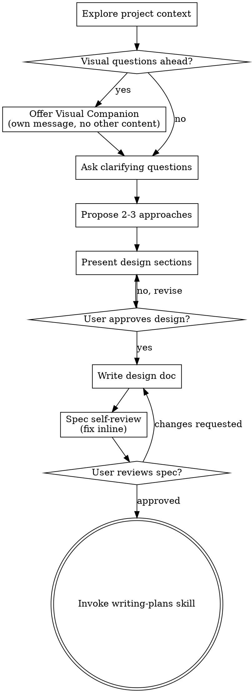

# Checkpoint-based multi-agent framework design

**Session ID:** ses_29c038fd3ffe12SirAVSJ59zBw
**Created:** 4/7/2026, 1:09:41 AM
**Updated:** 4/7/2026, 1:24:16 AM

---

## User

<SUBAGENT-STOP>
If you were dispatched as a subagent to execute a specific task, skip this skill.
</SUBAGENT-STOP>

<EXTREMELY-IMPORTANT>
If you think there is even a 1% chance a skill might apply to what you are doing, you ABSOLUTELY MUST invoke the skill.

IF A SKILL APPLIES TO YOUR TASK, YOU DO NOT HAVE A CHOICE. YOU MUST USE IT.

This is not negotiable. This is not optional. You cannot rationalize your way out of this.
</EXTREMELY-IMPORTANT>

## Instruction Priority

Superpowers skills override default system prompt behavior, but **user instructions always take precedence**:

1. **User's explicit instructions** (CLAUDE.md, GEMINI.md, AGENTS.md, direct requests) — highest priority
2. **Superpowers skills** — override default system behavior where they conflict
3. **Default system prompt** — lowest priority

If CLAUDE.md, GEMINI.md, or AGENTS.md says "don't use TDD" and a skill says "always use TDD," follow the user's instructions. The user is in control.

## How to Access Skills

**In Claude Code:** Use the `Skill` tool. When you invoke a skill, its content is loaded and presented to you—follow it directly. Never use the Read tool on skill files.

**In Copilot CLI:** Use the `skill` tool. Skills are auto-discovered from installed plugins. The `skill` tool works the same as Claude Code's `Skill` tool.

**In Gemini CLI:** Skills activate via the `activate_skill` tool. Gemini loads skill metadata at session start and activates the full content on demand.

**In other environments:** Check your platform's documentation for how skills are loaded.

## Platform Adaptation

Skills use Claude Code tool names. Non-CC platforms: see `references/copilot-tools.md` (Copilot CLI), `references/codex-tools.md` (Codex) for tool equivalents. Gemini CLI users get the tool mapping loaded automatically via GEMINI.md.

# Using Skills

## The Rule

**Invoke relevant or requested skills BEFORE any response or action.** Even a 1% chance a skill might apply means that you should invoke the skill to check. If an invoked skill turns out to be wrong for the situation, you don't need to use it.


## Red Flags

These thoughts mean STOP—you're rationalizing:

| Thought | Reality |
|---------|---------|
| "This is just a simple question" | Questions are tasks. Check for skills. |
| "I need more context first" | Skill check comes BEFORE clarifying questions. |
| "Let me explore the codebase first" | Skills tell you HOW to explore. Check first. |
| "I can check git/files quickly" | Files lack conversation context. Check for skills. |
| "Let me gather information first" | Skills tell you HOW to gather information. |
| "This doesn't need a formal skill" | If a skill exists, use it. |
| "I remember this skill" | Skills evolve. Read current version. |
| "This doesn't count as a task" | Action = task. Check for skills. |
| "The skill is overkill" | Simple things become complex. Use it. |
| "I'll just do this one thing first" | Check BEFORE doing anything. |
| "This feels productive" | Undisciplined action wastes time. Skills prevent this. |
| "I know what that means" | Knowing the concept ≠ using the skill. Invoke it. |

## Skill Priority

When multiple skills could apply, use this order:

1. **Process skills first** (brainstorming, debugging) - these determine HOW to approach the task
2. **Implementation skills second** (frontend-design, mcp-builder) - these guide execution

"Let's build X" → brainstorming first, then implementation skills.
"Fix this bug" → debugging first, then domain-specific skills.

## Skill Types

**Rigid** (TDD, debugging): Follow exactly. Don't adapt away discipline.

**Flexible** (patterns): Adapt principles to context.

The skill itself tells you which.

## User Instructions

Instructions say WHAT, not HOW. "Add X" or "Fix Y" doesn't mean skip workflows.


<SUBAGENT-STOP>
If you were dispatched as a subagent to execute a specific task, skip this skill.
</SUBAGENT-STOP>

<EXTREMELY-IMPORTANT>
If you think there is even a 1% chance a skill might apply to what you are doing, you ABSOLUTELY MUST invoke the skill.

IF A SKILL APPLIES TO YOUR TASK, YOU DO NOT HAVE A CHOICE. YOU MUST USE IT.

This is not negotiable. This is not optional. You cannot rationalize your way out of this.
</EXTREMELY-IMPORTANT>

## Instruction Priority

Superpowers skills override default system prompt behavior, but **user instructions always take precedence**:

1. **User's explicit instructions** (CLAUDE.md, GEMINI.md, AGENTS.md, direct requests) — highest priority
2. **Superpowers skills** — override default system behavior where they conflict
3. **Default system prompt** — lowest priority

If CLAUDE.md, GEMINI.md, or AGENTS.md says "don't use TDD" and a skill says "always use TDD," follow the user's instructions. The user is in control.

## How to Access Skills

**In Claude Code:** Use the `Skill` tool. When you invoke a skill, its content is loaded and presented to you—follow it directly. Never use the Read tool on skill files.

**In Copilot CLI:** Use the `skill` tool. Skills are auto-discovered from installed plugins. The `skill` tool works the same as Claude Code's `Skill` tool.

**In Gemini CLI:** Skills activate via the `activate_skill` tool. Gemini loads skill metadata at session start and activates the full content on demand.

**In other environments:** Check your platform's documentation for how skills are loaded.

## Platform Adaptation

Skills use Claude Code tool names. Non-CC platforms: see `references/copilot-tools.md` (Copilot CLI), `references/codex-tools.md` (Codex) for tool equivalents. Gemini CLI users get the tool mapping loaded automatically via GEMINI.md.

# Using Skills

## The Rule

**Invoke relevant or requested skills BEFORE any response or action.** Even a 1% chance a skill might apply means that you should invoke the skill to check. If an invoked skill turns out to be wrong for the situation, you don't need to use it.


## Red Flags

These thoughts mean STOP—you're rationalizing:

| Thought | Reality |
|---------|---------|
| "This is just a simple question" | Questions are tasks. Check for skills. |
| "I need more context first" | Skill check comes BEFORE clarifying questions. |
| "Let me explore the codebase first" | Skills tell you HOW to explore. Check first. |
| "I can check git/files quickly" | Files lack conversation context. Check for skills. |
| "Let me gather information first" | Skills tell you HOW to gather information. |
| "This doesn't need a formal skill" | If a skill exists, use it. |
| "I remember this skill" | Skills evolve. Read current version. |
| "This doesn't count as a task" | Action = task. Check for skills. |
| "The skill is overkill" | Simple things become complex. Use it. |
| "I'll just do this one thing first" | Check BEFORE doing anything. |
| "This feels productive" | Undisciplined action wastes time. Skills prevent this. |
| "I know what that means" | Knowing the concept ≠ using the skill. Invoke it. |

## Skill Priority

When multiple skills could apply, use this order:

1. **Process skills first** (brainstorming, debugging) - these determine HOW to approach the task
2. **Implementation skills second** (frontend-design, mcp-builder) - these guide execution

"Let's build X" → brainstorming first, then implementation skills.
"Fix this bug" → debugging first, then domain-specific skills.

## Skill Types

**Rigid** (TDD, debugging): Follow exactly. Don't adapt away discipline.

**Flexible** (patterns): Adapt principles to context.

The skill itself tells you which.

## User Instructions

Instructions say WHAT, not HOW. "Add X" or "Fix Y" doesn't mean skip workflows.


"I want to experiment this as a tool or plugin ```A sophisticated multi-agent orchestration framework leveraging OpenCode primitives with turn-based checkpoint validation and incremental skill unlocking. Design a master tracking architecture where agents maintain strategic context across turns despite body profile pruning, implementing a soft-harness system where subagents surface assumptions through human-agent dialogue, progressively lock validated requirements to session-based schemas, and unlock new capability profiles only after passing pre-defined conditions at each checkpoint gate. The framework should support cross-dependency validation through delegation to critic subagents, compile work into structured phases with configurable tasks per phase, inject pre-condition prompting templates conditionally upon gate passage, and maintain compile-time validation through LSP/lint error schema locking that prevents progression until success conditions are met. Include turn-based conditional loops with strategic stop points, spawning mechanisms for research API cross-validation, file-based approval workflows for subagent outputs, and bite-size design iteration with incremental human feedback integration. ```, but please do not over-engineer, practicing cleaned architect, seperation of concerns; as so I want you to create a totally blank (no code files nothing carry over, only include the agents, commands (select as you see fit) and the skills (also of the same manner) this can work sperately as the predefine set of stand alone tools kit and plugins feature  (not  having to depends of commands, agents, or skills, if they require so they must be able to compile these assets at build time through CLI tools) . There are some material I asked Deepwiki and Devin (devin I have 2 sets because the latter it adjusted according to my recorrection of it - '/Users/apple/hivemind-plugin/.worktrees/harness-experiment/.opencode/agent-tracking-pad/guide-need-validation-v1.md'"

---

## Assistant (Build · GLM-5.1 · 19.4s)

_Thinking:_

The user wants me to create a new, blank project that implements a multi-agent orchestration framework. Let me understand the key requirements:

1. **Blank slate** - no code files carried over from existing project
2. **Include agents, commands, skills** - selected as I see fit
3. **Standalone toolkit/plugin** - can work independently without depending on other agents/commands/skills
4. **Build-time compilation** - CLI tools to compile assets if needed
5. **Reference material** at `.opencode/agent-tracking-pad/guide-need-validation-v1.md`

Key features requested:
- Turn-based checkpoint validation
- Incremental skill unlocking
- Master tracking architecture
- Soft-harness system
- Subagent assumption surfacing
- Progressive requirement locking
- Cross-dependency validation via critic subagents
- Structured phases with configurable tasks
- Pre-condition prompting templates
- Compile-time validation (LSP/lint)
- Turn-based conditional loops
- Research API cross-validation
- File-based approval workflows
- Incremental human feedback

Before I do anything, I need to:
1. Read the reference material the user mentioned
2. Invoke relevant skills (brainstorming, planning-with-files, feature-design-assistant)
3. Understand the codebase context

Let me start by reading the reference material and invoking the brainstorming skill since this is a creative/architectural task.

我将首先阅读您的参考资料，并调用构思技能，因为这是一个创造性的架构任务。

**Tool: read**

**Input:**
```json
{
  "filePath": "/Users/apple/hivemind-plugin/.worktrees/harness-experiment/.opencode/agent-tracking-pad/guide-need-validation-v1.md"
}
```

**Output:**
```
<path>/Users/apple/hivemind-plugin/.worktrees/harness-experiment/.opencode/agent-tracking-pad/guide-need-validation-v1.md</path>
<type>file</type>
<content>

(End of file - total 0 lines)
</content>
```

**Tool: skill**

**Input:**
```json
{
  "name": "brainstorming"
}
```

**Output:**
```
<skill_content name="brainstorming">
# Skill: brainstorming

# Brainstorming Ideas Into Designs

Help turn ideas into fully formed designs and specs through natural collaborative dialogue.

Start by understanding the current project context, then ask questions one at a time to refine the idea. Once you understand what you're building, present the design and get user approval.

<HARD-GATE>
Do NOT invoke any implementation skill, write any code, scaffold any project, or take any implementation action until you have presented a design and the user has approved it. This applies to EVERY project regardless of perceived simplicity.
</HARD-GATE>

## Anti-Pattern: "This Is Too Simple To Need A Design"

Every project goes through this process. A todo list, a single-function utility, a config change — all of them. "Simple" projects are where unexamined assumptions cause the most wasted work. The design can be short (a few sentences for truly simple projects), but you MUST present it and get approval.

## Checklist

You MUST create a task for each of these items and complete them in order:

1. **Explore project context** — check files, docs, recent commits
2. **Offer visual companion** (if topic will involve visual questions) — this is its own message, not combined with a clarifying question. See the Visual Companion section below.
3. **Ask clarifying questions** — one at a time, understand purpose/constraints/success criteria
4. **Propose 2-3 approaches** — with trade-offs and your recommendation
5. **Present design** — in sections scaled to their complexity, get user approval after each section
6. **Write design doc** — save to `docs/superpowers/specs/YYYY-MM-DD-<topic>-design.md` and commit
7. **Spec self-review** — quick inline check for placeholders, contradictions, ambiguity, scope (see below)
8. **User reviews written spec** — ask user to review the spec file before proceeding
9. **Transition to implementation** — invoke writing-plans skill to create implementation plan

## Process Flow



**The terminal state is invoking writing-plans.** Do NOT invoke frontend-design, mcp-builder, or any other implementation skill. The ONLY skill you invoke after brainstorming is writing-plans.

## The Process

**Understanding the idea:**

- Check out the current project state first (files, docs, recent commits)
- Before asking detailed questions, assess scope: if the request describes multiple independent subsystems (e.g., "build a platform with chat, file storage, billing, and analytics"), flag this immediately. Don't spend questions refining details of a project that needs to be decomposed first.
- If the project is too large for a single spec, help the user decompose into sub-projects: what are the independent pieces, how do they relate, what order should they be built? Then brainstorm the first sub-project through the normal design flow. Each sub-project gets its own spec → plan → implementation cycle.
- For appropriately-scoped projects, ask questions one at a time to refine the idea
- Prefer multiple choice questions when possible, but open-ended is fine too
- Only one question per message - if a topic needs more exploration, break it into multiple questions
- Focus on understanding: purpose, constraints, success criteria

**Exploring approaches:**

- Propose 2-3 different approaches with trade-offs
- Present options conversationally with your recommendation and reasoning
- Lead with your recommended option and explain why

**Presenting the design:**

- Once you believe you understand what you're building, present the design
- Scale each section to its complexity: a few sentences if straightforward, up to 200-300 words if nuanced
- Ask after each section whether it looks right so far
- Cover: architecture, components, data flow, error handling, testing
- Be ready to go back and clarify if something doesn't make sense

**Design for isolation and clarity:**

- Break the system into smaller units that each have one clear purpose, communicate through well-defined interfaces, and can be understood and tested independently
- For each unit, you should be able to answer: what does it do, how do you use it, and what does it depend on?
- Can someone understand what a unit does without reading its internals? Can you change the internals without breaking consumers? If not, the boundaries need work.
- Smaller, well-bounded units are also easier for you to work with - you reason better about code you can hold in context at once, and your edits are more reliable when files are focused. When a file grows large, that's often a signal that it's doing too much.

**Working in existing codebases:**

- Explore the current structure before proposing changes. Follow existing patterns.
- Where existing code has problems that affect the work (e.g., a file that's grown too large, unclear boundaries, tangled responsibilities), include targeted improvements as part of the design - the way a good developer improves code they're working in.
- Don't propose unrelated refactoring. Stay focused on what serves the current goal.

## After the Design

**Documentation:**

- Write the validated design (spec) to `docs/superpowers/specs/YYYY-MM-DD-<topic>-design.md`
  - (User preferences for spec location override this default)
- Use elements-of-style:writing-clearly-and-concisely skill if available
- Commit the design document to git

**Spec Self-Review:**
After writing the spec document, look at it with fresh eyes:

1. **Placeholder scan:** Any "TBD", "TODO", incomplete sections, or vague requirements? Fix them.
2. **Internal consistency:** Do any sections contradict each other? Does the architecture match the feature descriptions?
3. **Scope check:** Is this focused enough for a single implementation plan, or does it need decomposition?
4. **Ambiguity check:** Could any requirement be interpreted two different ways? If so, pick one and make it explicit.

Fix any issues inline. No need to re-review — just fix and move on.

**User Review Gate:**
After the spec review loop passes, ask the user to review the written spec before proceeding:

> "Spec written and committed to `<path>`. Please review it and let me know if you want to make any changes before we start writing out the implementation plan."

Wait for the user's response. If they request changes, make them and re-run the spec review loop. Only proceed once the user approves.

**Implementation:**

- Invoke the writing-plans skill to create a detailed implementation plan
- Do NOT invoke any other skill. writing-plans is the next step.

## Key Principles

- **One question at a time** - Don't overwhelm with multiple questions
- **Multiple choice preferred** - Easier to answer than open-ended when possible
- **YAGNI ruthlessly** - Remove unnecessary features from all designs
- **Explore alternatives** - Always propose 2-3 approaches before settling
- **Incremental validation** - Present design, get approval before moving on
- **Be flexible** - Go back and clarify when something doesn't make sense

## Visual Companion

A browser-based companion for showing mockups, diagrams, and visual options during brainstorming. Available as a tool — not a mode. Accepting the companion means it's available for questions that benefit from visual treatment; it does NOT mean every question goes through the browser.

**Offering the companion:** When you anticipate that upcoming questions will involve visual content (mockups, layouts, diagrams), offer it once for consent:
> "Some of what we're working on might be easier to explain if I can show it to you in a web browser. I can put together mockups, diagrams, comparisons, and other visuals as we go. This feature is still new and can be token-intensive. Want to try it? (Requires opening a local URL)"

**This offer MUST be its own message.** Do not combine it with clarifying questions, context summaries, or any other content. The message should contain ONLY the offer above and nothing else. Wait for the user's response before continuing. If they decline, proceed with text-only brainstorming.

**Per-question decision:** Even after the user accepts, decide FOR EACH QUESTION whether to use the browser or the terminal. The test: **would the user understand this better by seeing it than reading it?**

- **Use the browser** for content that IS visual — mockups, wireframes, layout comparisons, architecture diagrams, side-by-side visual designs
- **Use the terminal** for content that is text — requirements questions, conceptual choices, tradeoff lists, A/B/C/D text options, scope decisions

A question about a UI topic is not automatically a visual question. "What does personality mean in this context?" is a conceptual question — use the terminal. "Which wizard layout works better?" is a visual question — use the browser.

If they agree to the companion, read the detailed guide before proceeding:
`skills/brainstorming/visual-companion.md`

Base directory for this skill: file:///Users/apple/.cache/opencode/packages/superpowers@git+https:/github.com/obra/superpowers.git/node_modules/superpowers/skills/brainstorming
Relative paths in this skill (e.g., scripts/, reference/) are relative to this base directory.
Note: file list is sampled.

<skill_files>
<file>/Users/apple/.cache/opencode/packages/superpowers@git+https:/github.com/obra/superpowers.git/node_modules/superpowers/skills/brainstorming/spec-document-reviewer-prompt.md</file>
<file>/Users/apple/.cache/opencode/packages/superpowers@git+https:/github.com/obra/superpowers.git/node_modules/superpowers/skills/brainstorming/scripts/helper.js</file>
<file>/Users/apple/.cache/opencode/packages/superpowers@git+https:/github.com/obra/superpowers.git/node_modules/superpowers/skills/brainstorming/scripts/server.cjs</file>
<file>/Users/apple/.cache/opencode/packages/superpowers@git+https:/github.com/obra/superpowers.git/node_modules/superpowers/skills/brainstorming/scripts/start-server.sh</file>
<file>/Users/apple/.cache/opencode/packages/superpowers@git+https:/github.com/obra/superpowers.git/node_modules/superpowers/skills/brainstorming/scripts/frame-template.html</file>
<file>/Users/apple/.cache/opencode/packages/superpowers@git+https:/github.com/obra/superpowers.git/node_modules/superpowers/skills/brainstorming/scripts/stop-server.sh</file>
<file>/Users/apple/.cache/opencode/packages/superpowers@git+https:/github.com/obra/superpowers.git/node_modules/superpowers/skills/brainstorming/visual-companion.md</file>
</skill_files>
</skill_content>
```

---

## Assistant (Build · GLM-5.1 · 14.8s)

参考文件是空的。让我遵循头脑风暴技能流程——首先探索项目上下文，然后提出澄清问题。

**Tool: todowrite**

**Input:**
```json
{
  "todos": [
    {
      "content": "Explore project context (current structure, recent commits, existing agents/commands/skills)",
      "status": "in_progress",
      "priority": "high"
    },
    {
      "content": "Ask clarifying questions one at a time",
      "status": "pending",
      "priority": "high"
    },
    {
      "content": "Propose 2-3 architecture approaches with trade-offs",
      "status": "pending",
      "priority": "high"
    },
    {
      "content": "Present design sections for approval",
      "status": "pending",
      "priority": "high"
    },
    {
      "content": "Write design spec doc",
      "status": "pending",
      "priority": "high"
    },
    {
      "content": "Spec self-review",
      "status": "pending",
      "priority": "medium"
    },
    {
      "content": "User reviews spec",
      "status": "pending",
      "priority": "medium"
    },
    {
      "content": "Transition to implementation via writing-plans skill",
      "status": "pending",
      "priority": "medium"
    }
  ]
}
```

**Output:**
```
[
  {
    "content": "Explore project context (current structure, recent commits, existing agents/commands/skills)",
    "status": "in_progress",
    "priority": "high"
  },
  {
    "content": "Ask clarifying questions one at a time",
    "status": "pending",
    "priority": "high"
  },
  {
    "content": "Propose 2-3 architecture approaches with trade-offs",
    "status": "pending",
    "priority": "high"
  },
  {
    "content": "Present design sections for approval",
    "status": "pending",
    "priority": "high"
  },
  {
    "content": "Write design spec doc",
    "status": "pending",
    "priority": "high"
  },
  {
    "content": "Spec self-review",
    "status": "pending",
    "priority": "medium"
  },
  {
    "content": "User reviews spec",
    "status": "pending",
    "priority": "medium"
  },
  {
    "content": "Transition to implementation via writing-plans skill",
    "status": "pending",
    "priority": "medium"
  }
]
```

**Tool: read**

**Input:**
```json
{
  "filePath": "/Users/apple/hivemind-plugin/.worktrees/harness-experiment"
}
```

**Output:**
```
<path>/Users/apple/hivemind-plugin/.worktrees/harness-experiment</path>
<type>directory</type>
<entries>
.archive/
.checkpoints/
.claude/
.env
.env.example
.git
.gitignore
.hivefiver-meta-builder/
.hivemind/
.opencode/
.planning/
AGENTS.md
disablekilo/
docs/
findings.md
launch-investigation-swarms-onthis-ses_2a54.md
LICENSE
mcp.json
opencode.json
OVERVIEW-Unmodified.md
package.json
plans/
progress.md
QWEN.md
README.md
src/
state/
task_plan.md
tests/
tmux/
tsconfig.json
tsconfig.tsbuildinfo
vitest.config.ts

(33 entries)
</entries>
```

**Tool: read**

**Input:**
```json
{
  "filePath": "/Users/apple/hivemind-plugin/.worktrees/harness-experiment/.opencode"
}
```

**Output:**
```
<path>/Users/apple/hivemind-plugin/.worktrees/harness-experiment/.opencode</path>
<type>directory</type>
<entries>
.gitignore
agent-tracking-pad/
agents/
bun.lock
commands/
ask-prompts/
hivefiver/
node_modules/
package-lock.json
package.json
plugins/
rules/
skills/
tools/
trashskills/

(15 entries)
</entries>
```

**Tool: bash**

**Input:**
```json
{
  "command": "git log --oneline -15",
  "description": "Recent commits for context"
}
```

**Output:**
```
dc20242c docs(02-v3-runtime-architecture): create 8 phase plans (2c→2h→2a→2b→2d→2e→2f→2g)
71a4efc0 phase(02): research V3 runtime architecture — 8 sub-phases mapped with dependencies, tmux absent finding, recommended order 2c→2h→2a→2b→2d→2e→2f→2g
d33ebefe phase-01: mark Phase 1 complete in STATE.md — all quality gates verified
6cb2d320 phase-01: add plan 01-01 execution summary
42babee6 phase-01: remove dead system.transform, context-budget, phantom recommended_lanes — baseline cleanup complete
91919cc6 phase-1: create baseline cleanup plan — 3 remaining items (system.transform, orchestrator phantoms, context-budget)
0e58dce0 cleanup: remove 98k lines of stale session/test files, update planning docs, add functional audit
a21f121c codebase-map: add 7 structured documents (1,823 LOC) — stack, integrations, architecture, structure, conventions, testing, concerns
a256477d fix: rebuild context-budget with status-based model
de8d2bef cleanup: remove recommended_lanes from prompt-skim
596ea15e fix: remove dead PromptEnhancePlugin forwarding from plugin.ts — eliminates unused import, instantiation, event forwarding, and session.compacting forwarding; lifecycle manager handles all event/compaction paths directly
3dfe041f fix: detect cross-line contradictions in prompt-analyze
b7b3d07b fix: gate system-transform by delegation metadata
9b109d9f fix: orchestrator references existing agents only
78261ec6 fix: anchor session-patch regex to line start

```

**Tool: bash**

**Input:**
```json
{
  "command": "git log --oneline -5 --all -- .opencode/",
  "description": "Recent .opencode/ changes"
}
```

**Output:**
```
c840d1dd cleanup: delete .opencode/tools/ dead duplicates
bae8f5c2 chore: resolve prompt-enhance plugin duplication
a7402c13 phase: add prompt-enhance plugin shell — initialize state and compaction metadata safely
b40346f8 phase: add prompt-analyze tool — fill the only missing custom analysis primitive
a6371724 fix: resolve TUI crash from z.object() args in custom tools — @opencode-ai/plugin expects raw Zod shape, not full schema

```

---

## Assistant (Build · GLM-5.1 · 5.3s)

**Tool: read**

**Input:**
```json
{
  "filePath": "/Users/apple/hivemind-plugin/.worktrees/harness-experiment/.opencode/agents"
}
```

**Output:**
```
<path>/Users/apple/hivemind-plugin/.worktrees/harness-experiment/.opencode/agents</path>
<type>directory</type>
<entries>
.gitkeep
builder.md
conductor.md
context-mapper.md
context-purifier.md
coordinator.md
critic.md
explore.md
hivefiver-agent-builder.md
hivefiver-command-builder.md
hivefiver-orchestrator.md
hivefiver-skill-author.md
hivefiver.md
prompt-analyzer.md
prompt-repackager.md
prompt-skimmer.md
researcher.md
risk-assessor.md

(18 entries)
</entries>
```

**Tool: read**

**Input:**
```json
{
  "filePath": "/Users/apple/hivemind-plugin/.worktrees/harness-experiment/.opencode/commands"
}
```

**Output:**
```
<path>/Users/apple/hivemind-plugin/.worktrees/harness-experiment/.opencode/commands</path>
<type>directory</type>
<entries>
.gitkeep
deep-init.md
deep-research-synthesis-repomix.md
harness-audit.md
harness-doctor.md
hf-audit.md
hf-create.md
hf-prompt-enhance.md
hf-stack.md
plan.md
start-work.md
ultrawork.md

(12 entries)
</entries>
```

**Tool: read**

**Input:**
```json
{
  "filePath": "/Users/apple/hivemind-plugin/.worktrees/harness-experiment/.opencode/skills"
}
```

**Output:**
```
<path>/Users/apple/hivemind-plugin/.worktrees/harness-experiment/.opencode/skills</path>
<type>directory</type>
<entries>
.gitkeep
agents-and-subagents-dev/
command-dev/
coordinating-loop/
custom-tools-dev/
harness-audit/
meta-builder/
oh-my-openagent-reference/
opencode-non-interactive-shell/
opencode-platform-reference/
planning-with-files/
repomix-exploration-guide/
repomix-explorer/
skill-synthesis/
use-authoring-skills/
user-intent-interactive-loop/

(16 entries)
</entries>
```

**Tool: read**

**Input:**
```json
{
  "filePath": "/Users/apple/hivemind-plugin/.worktrees/harness-experiment/.opencode/tools"
}
```

**Output:**
```
<path>/Users/apple/hivemind-plugin/.worktrees/harness-experiment/.opencode/tools</path>
<type>directory</type>
<entries>
.gitkeep

(1 entries)
</entries>
```

**Tool: read**

**Input:**
```json
{
  "filePath": "/Users/apple/hivemind-plugin/.worktrees/harness-experiment/.opencode/plugins"
}
```

**Output:**
```
<path>/Users/apple/hivemind-plugin/.worktrees/harness-experiment/.opencode/plugins</path>
<type>directory</type>
<entries>
prompt-enhance.ts

(1 entries)
</entries>
```

**Tool: read**

**Input:**
```json
{
  "filePath": "/Users/apple/hivemind-plugin/.worktrees/harness-experiment/package.json"
}
```

**Output:**
```
<path>/Users/apple/hivemind-plugin/.worktrees/harness-experiment/package.json</path>
<type>file</type>
<content>1: {
2:   "name": "opencode-harness",
3:   "version": "0.1.0",
4:   "description": "Standalone OpenCode harness control plane package for delegated sessions, continuity, and runtime guardrails.",
5:   "type": "module",
6:   "main": "./dist/index.js",
7:   "types": "./dist/index.d.ts",
8:   "exports": {
9:     ".": {
10:       "import": "./dist/index.js",
11:       "types": "./dist/index.d.ts"
12:     },
13:     "./plugin": {
14:       "import": "./dist/plugin.js",
15:       "types": "./dist/plugin.d.ts"
16:     },
17:     "./package.json": "./package.json"
18:   },
19:   "files": [
20:     "dist",
21:     ".opencode",
22:     "opencode.json",
23:     "README.md",
24:     "LICENSE"
25:   ],
26:   "scripts": {
27:     "clean": "node --eval \"import { rmSync } from 'node:fs'; rmSync('dist', { recursive: true, force: true });\"",
28:     "build": "npm run clean && tsc -p tsconfig.json",
29:     "typecheck": "tsc --noEmit -p tsconfig.json",
30:     "test": "vitest run",
31:     "test:watch": "vitest",
32:     "test:coverage": "vitest run --coverage",
33:     "prepack": "npm run build"
34:   },
35:   "keywords": [
36:     "opencode",
37:     "opencode-plugin",
38:     "harness",
39:     "delegation",
40:     "continuity"
41:   ],
42:   "license": "MIT",
43:   "engines": {
44:     "node": ">=20.0.0"
45:   },
46:   "peerDependencies": {
47:     "@opencode-ai/plugin": ">=1.1.0"
48:   },
49:   "devDependencies": {
50:     "@types/node": "^20.10.0",
51:     "typescript": "^5.3.0",
52:     "vitest": "^4.1.2"
53:   }
54: }

(End of file - total 54 lines)
</content>
```

---

## Assistant (Build · GLM-5.1 · 8.6s)

Now let me look at the existing src/ structure and a few key agents/skills to understand patterns:

**Tool: read**

**Input:**
```json
{
  "filePath": "/Users/apple/hivemind-plugin/.worktrees/harness-experiment/src"
}
```

**Output:**
```
<path>/Users/apple/hivemind-plugin/.worktrees/harness-experiment/src</path>
<type>directory</type>
<entries>
hooks/
index.ts
lib/
plugin.ts
plugins/
schema-kernel/
shared/
tools/

(8 entries)
</entries>
```

**Tool: read**

**Input:**
```json
{
  "filePath": "/Users/apple/hivemind-plugin/.worktrees/harness-experiment/.opencode/agent-tracking-pad"
}
```

**Output:**
```
<path>/Users/apple/hivemind-plugin/.worktrees/harness-experiment/.opencode/agent-tracking-pad</path>
<type>directory</type>
<entries>
guide-need-validation-v1.md
need-validated-instruction-v2-before-clarification.md
need-validated-instruction-v2-continue.md

(3 entries)
</entries>
```

**Tool: read**

**Input:**
```json
{
  "filePath": "/Users/apple/hivemind-plugin/.worktrees/harness-experiment/docs"
}
```

**Output:**
```
<path>/Users/apple/hivemind-plugin/.worktrees/harness-experiment/docs</path>
<type>directory</type>
<entries>
.archive/
02_PRD/
audit-report-2026-04-02.md
audit/
comparison-ohmo-harness-2026-04-02.md
designs/
draft/
feature-gap-audit-2026-04-02.md
harness-definitive-audit-2026-04-02.md
harness-rebuild-spec-2026-04-02.md
harness-techniques/
harness-vs-omo-comparison.md
implementation-plan-2026-04-02.md
meta-builder/
plans/
project/
recovery-plan-2026-04-02.md
requirements-2026-04-02.md
research/
superpowers/
transformed-prompting/
user-stories-2026-04-02.md

(22 entries)
</entries>
```

---

## Assistant (Build · GLM-5.1 · 5.5s)

**Tool: read**

**Input:**
```json
{
  "filePath": "/Users/apple/hivemind-plugin/.worktrees/harness-experiment/.opencode/agent-tracking-pad/need-validated-instruction-v2-before-clarification.md"
}
```

**Output:**
```
<path>/Users/apple/hivemind-plugin/.worktrees/harness-experiment/.opencode/agent-tracking-pad/need-validated-instruction-v2-before-clarification.md</path>
<type>file</type>
<content>1: Here is a clean architecture for an AI agent harness system built entirely on opencode primitives. Every component maps to a real opencode API.
2: 
3: ---
4: 
5: ## Core Problem: Context Pruning Across Turns
6: 
7: When `SessionCompaction.isOverflow()` triggers, the `compaction` agent summarizes history and old tool outputs are pruned via `SessionCompaction.prune()`. This means an agent's "body" — its accumulated context, instructions, and working state — can be lost between turns. [0-cite-0](#0-cite-0) [0-cite-1](#0-cite-1) 
8: 
9: The solution: a **macro-level orchestrator** that operates above the compaction boundary, using persistent artifacts (todo list, plan files, skill definitions) as the durable state that survives pruning.
10: 
11: ---
12: 
13: ## Architecture Overview
14: 
15: ```mermaid
16: graph TB
17:     subgraph "Human-in-the-Loop Layer"
18:         Human["Human Operator"]
19:         PlanFile["Master Tracking Pad\n.opencode/plans/*.md"]
20:     end
21: 
22:     subgraph "Orchestrator Layer (primary agent)"
23:         Orchestrator["orchestrator agent\nmode: primary"]
24:         TodoList["TodoWrite/TodoRead\nCheckpoint Registry"]
25:     end
26: 
27:     subgraph "Subagent Pool (mode: subagent)"
28:         Onboarding["onboarding-setup\nhidden subagent"]
29:         PhaseWorker["phase-worker\ngeneral-purpose executor"]
30:         Validator["gate-validator\nread-only checker"]
31:         Explorer["explore\nnative subagent"]
32:     end
33: 
34:     subgraph "Validation Layer"
35:         LSP["LSP.diagnostics()\nseverity-1 errors"]
36:         BashTests["BashTool\nbun test / assertions"]
37:         SkillGate["gate-check skill\nSKILL.md validation logic"]
38:     end
39: 
40:     subgraph "Skill Library"
41:         OnboardSkill["onboarding skill\ntool usage patterns"]
42:         PhaseSkills["phase-N skills\nper-checkpoint instructions"]
43:         GateSkill["gate-check skill\nvalidation assertions"]
44:     end
45: 
46:     Human -->|"reviews plan, approves gates"| PlanFile
47:     PlanFile -->|"read by"| Orchestrator
48:     Orchestrator -->|"todowrite checkpoints"| TodoList
49:     Orchestrator -->|"TaskTool call"| Onboarding
50:     Orchestrator -->|"TaskTool call"| PhaseWorker
51:     Orchestrator -->|"TaskTool call"| Validator
52:     Orchestrator -->|"TaskTool call"| Explorer
53: 
54:     PhaseWorker -->|"skill tool"| PhaseSkills
55:     Onboarding -->|"skill tool"| OnboardSkill
56:     Validator -->|"skill tool"| GateSkill
57: 
58:     Validator -->|"checks"| LSP
59:     Validator -->|"runs"| BashTests
60: ```
61: 
62: ---
63: 
64: ## 1. Agent Definitions (`opencode.json`)
65: 
66: The orchestrator is a `primary` agent with controlled `permission.task` rules. Subagents are scoped to specific capabilities. [0-cite-2](#0-cite-2) [0-cite-3](#0-cite-3) 
67: 
68: ```json
69: {
70:   "$schema": "https://opencode.ai/config.json",
71:   "default_agent": "orchestrator",
72:   "agent": {
73:     "orchestrator": {
74:       "mode": "primary",
75:       "description": "Macro-level orchestrator. Coordinates checkpoint-gated pipeline via subagents.",
76:       "permission": {
77:         "task": {
78:           "*": "ask",
79:           "onboarding-setup": "allow",
80:           "phase-worker": "allow",
81:           "gate-validator": "allow",
82:           "explore": "allow"
83:         }
84:       },
85:       "steps": 200
86:     },
87:     "onboarding-setup": {
88:       "mode": "subagent",
89:       "hidden": true,
90:       "description": "Initializes session, demonstrates tool usage patterns, loads onboarding skill."
91:     },
92:     "phase-worker": {
93:       "mode": "subagent",
94:       "description": "Executes a single checkpoint phase: runs commands, applies edits, loads phase-specific skills."
95:     },
96:     "gate-validator": {
97:       "mode": "subagent",
98:       "description": "Read-only validator. Runs TDD assertions and checks LSP diagnostics. Returns pass/fail.",
99:       "permission": {
100:         "edit": "ask",
101:         "write": "ask",
102:         "bash": "allow",
103:         "read": "allow",
104:         "grep": "allow",
105:         "skill": "allow"
106:       }
107:     }
108:   },
109:   "compaction": {
110:     "auto": true,
111:     "prune": true,
112:     "reserved": 15000
113:   }
114: }
115: ```
116: 
117: The `permission.task` glob pattern on the orchestrator ensures it can only invoke its designated subagents — the `"*": "ask"` base rule blocks everything, then specific agents are allowed. This is enforced by `PermissionNext.evaluate("task", agentName, ruleset)`. [0-cite-4](#0-cite-4) 
118: 
119: ---
120: 
121: ## 2. Master Tracking Pad (Persistent State)
122: 
123: The orchestrator's durable state lives in two places that survive compaction:
124: 
125: ### a) Todo List — Checkpoint Registry
126: 
127: The `todowrite`/`todoread` tools persist structured checkpoint state in the session's `TodoTable`. This is the orchestrator's primary state machine. [0-cite-5](#0-cite-5) 
128: 
129: Each todo item represents a checkpoint:
130: 
131: ```json
132: [
133:   {"id": "cp-0", "status": "completed", "content": "Onboarding: tool demo + schema lock"},
134:   {"id": "cp-1", "status": "completed", "content": "Phase 1: scaffold API types"},
135:   {"id": "cp-2", "status": "in_progress", "content": "Phase 2: implement handlers"},
136:   {"id": "cp-3", "status": "pending", "content": "Phase 3: integration tests"},
137:   {"id": "cp-4", "status": "pending", "content": "Gate: zero LSP errors + all tests pass"}
138: ]
139: ```
140: 
141: ### b) Plan File — Human-Readable Tracking Pad
142: 
143: The `plan` agent writes to `.opencode/plans/*.md` (the only edit path allowed for plan mode). The orchestrator reads this file to reconstruct its strategic state after compaction. [0-cite-6](#0-cite-6) 
144: 
145: ```markdown
146: <!-- .opencode/plans/pipeline.md -->
147: # Agent Harness Pipeline
148: 
149: ## Checkpoints
150: | Phase | Command | Skills | Gate | Status |
151: |-------|---------|--------|------|--------|
152: | 0 | /onboarding | onboarding | tool-demo-complete | DONE |
153: | 1 | scaffold types | api-types | zero LSP errors | DONE |
154: | 2 | implement handlers | http-handlers | tests pass | IN PROGRESS |
155: | 3 | integration tests | testing | coverage > 80% | BLOCKED |
156: ```
157: 
158: ---
159: 
160: ## 3. Checkpoint-Gate-Unlock Pattern
161: 
162: This is the core loop. The orchestrator reads its todo list, dispatches work to subagents via `TaskTool`, then validates via the gate-validator before advancing.
163: 
164: ```mermaid
165: sequenceDiagram
166:     participant O as "Orchestrator"
167:     participant T as "TodoRead/Write"
168:     participant PW as "phase-worker (TaskTool)"
169:     participant GV as "gate-validator (TaskTool)"
170:     participant LSP as "LSP.diagnostics()"
171: 
172:     O->>T: todoread — load checkpoint state
173:     T-->>O: checkpoint N is "pending"
174: 
175:     O->>PW: TaskTool(phase-worker, "execute checkpoint N")
176:     Note over PW: Loads phase-N skill via skill tool<br/>Executes commands<br/>Writes/edits files
177: 
178:     PW-->>O: task_result + task_id (for resume)
179: 
180:     O->>GV: TaskTool(gate-validator, "validate checkpoint N")
181:     Note over GV: Loads gate-check skill<br/>Runs: bun test<br/>Checks: LSP.diagnostics()
182: 
183:     GV-->>O: PASS or FAIL + diagnostics
184: 
185:     alt Gate PASS
186:         O->>T: todowrite — mark N "completed"
187:         O->>O: advance to checkpoint N+1
188:     else Gate FAIL
189:         O->>PW: TaskTool(phase-worker, "fix issues", task_id=prev)
190:         Note over PW: Resumes same session<br/>Has full context of prior work
191:         O->>GV: re-validate
192:     end
193: ```
194: 
195: The `TaskTool` creates child sessions with `parentID: ctx.sessionID`, and the `task_id` parameter enables session resumption — the same subagent session continues rather than starting fresh. [0-cite-7](#0-cite-7) [0-cite-8](#0-cite-8) 
196: 
197: ---
198: 
199: ## 4. Skills as Phase-Specific Instruction Loaders
200: 
201: Each checkpoint phase has a corresponding `SKILL.md` that the subagent loads on-demand via the `skill` tool. This is how you inject phase-specific commands, schemas, and validation criteria without bloating the base context. [0-cite-9](#0-cite-9) [0-cite-10](#0-cite-10) 
202: 
203: ```
204: .opencode/skills/
205: ├── onboarding/
206: │   └── SKILL.md          # Tool usage demo patterns
207: ├── api-types/
208: │   └── SKILL.md          # Phase 1: type definitions + schema
209: ├── http-handlers/
210: │   └── SKILL.md          # Phase 2: handler implementation
211: ├── testing/
212: │   └── SKILL.md          # Phase 3: test patterns
213: └── gate-check/
214:     ├── SKILL.md          # Validation logic + assertion patterns
215:     └── scripts/
216:         └── validate.sh   # Bundled validation script
217: ``` [0-cite-11](#0-cite-11) 
218: 
219: Example onboarding skill:
220: 
221: ```markdown
222: ---
223: name: onboarding
224: description: "Demonstrates tool usage patterns and establishes session schema conventions"
225: ---
226: 
227: # Onboarding Skill
228: 
229: ## Tool Usage Patterns
230: When starting a new session, demonstrate these patterns:
231: 
232: 1. **Read before edit**: Always `read` a file before using `edit`
233: 2. **LSP feedback loop**: After every `write`/`edit`, check the tool output for `<diagnostics>` blocks
234: 3. **Schema locking**: Once types are defined, treat them as immutable for the phase
235: 
236: ## Session Schema Convention
237: Output all structured data using this format:
238: - Field names use camelCase
239: - Required fields are marked with `// LOCKED` comments
240: - Locked fields must not be modified in subsequent phases
241: ```
242: 
243: The `SkillTool` loads the full content plus lists bundled files in `<skill_files>`, giving the agent access to scripts and templates. [0-cite-12](#0-cite-12) 
244: 
245: ---
246: 
247: ## 5. LSP-Driven Gate Validation
248: 
249: The `edit`, `write`, and `apply_patch` tools all call `LSP.touchFile()` followed by `LSP.diagnostics()`, then filter for `severity === 1` (ERROR) and inject them into the tool output as `<diagnostics>` blocks. [0-cite-13](#0-cite-13) [0-cite-14](#0-cite-14) [0-cite-15](#0-cite-15) 
250: 
251: The gate-validator subagent uses this as its success condition:
252: 
253: 1. **LSP check**: Read files, trigger `LSP.touchFile()`, collect `LSP.diagnostics()` — zero severity-1 errors means pass
254: 2. **TDD assertions**: Run `bash` with test commands (`bun test`, `npm test`, etc.) — exit code 0 means pass
255: 3. **Custom assertions**: The `gate-check` skill can define arbitrary validation logic
256: 
257: The `LSPClient.waitForDiagnostics()` method uses a 150ms debounce to ensure both syntax and semantic diagnostics are collected before evaluation. [0-cite-16](#0-cite-16) 
258: 
259: ---
260: 
261: ## 6. Turn-Based Self-Setup with Compaction Resilience
262: 
263: The key insight: when compaction fires, the orchestrator loses its in-context reasoning but retains:
264: 
265: 1. **Todo list** — persisted in `TodoTable`, survives compaction
266: 2. **Plan file** — persisted on disk at `.opencode/plans/pipeline.md`
267: 3. **Compaction summary** — the `compaction` agent generates a structured summary with Goal/Instructions/Discoveries/Accomplished sections [0-cite-17](#0-cite-17) 
268: 
269: The orchestrator's system prompt (defined in its agent markdown file) includes a **self-setup protocol**:
270: 
271: ```markdown
272: ---
273: name: orchestrator
274: mode: primary
275: description: "Macro-level orchestrator for checkpoint-gated pipeline"
276: ---
277: 
278: # Orchestrator Protocol
279: 
280: ## On Every Turn
281: 1. Read the todo list (`todoread`) to determine current checkpoint state
282: 2. Read the plan file (`.opencode/plans/pipeline.md`) for strategic context
283: 3. If a compaction summary exists above, use it to reconstruct working state
284: 
285: ## Checkpoint Execution
286: For each pending checkpoint:
287: 1. Dispatch work to `phase-worker` via TaskTool with the checkpoint's command and skill name
288: 2. Dispatch validation to `gate-validator` via TaskTool
289: 3. If gate passes: update todo list, advance to next checkpoint
290: 4. If gate fails: resume the phase-worker session (pass task_id) with fix instructions
291: 
292: ## Stop Conditions
293: - All checkpoints completed (todo list fully checked off)
294: - Gate fails 3 consecutive times on same checkpoint (escalate to human)
295: - Human sends "pause" or "stop" message
296: ``` [0-cite-18](#0-cite-18) 
297: 
298: ---
299: 
300: ## 7. Plugin Hooks for Pipeline Instrumentation
301: 
302: The plugin system provides hooks to instrument the pipeline without modifying core code: [0-cite-19](#0-cite-19) 
303: 
304: ```typescript
305: // .opencode/plugins/harness-monitor.ts
306: import type { PluginInstance } from "@opencode-ai/plugin"
307: 
308: export default ((input) => ({
309:   "tool.execute.after": async (ctx, result) => {
310:     // Track gate validation results
311:     if (ctx.tool === "task" && result.metadata?.sessionId) {
312:       // Log checkpoint progression
313:     }
314:   },
315:   "event": async (event) => {
316:     // Monitor compaction events to detect context pressure
317:     if (event.type === "session.compacted") {
318:       // Alert: orchestrator context was pruned
319:     }
320:   },
321: })) satisfies PluginInstance
322: ```
323: 
324: The `tool.execute.before` and `tool.execute.after` hooks fire around every tool call, enabling checkpoint tracking, and the `event` hook captures compaction events. [0-cite-20](#0-cite-20) 
325: 
326: ---
327: 
328: ## 8. Field Locking via Session-Based Schema
329: 
330: Tools output structured metadata via `ctx.metadata()`. The "field locking" pattern is implemented through skill conventions: once a phase defines a type schema, subsequent phases treat fields marked `// LOCKED` as immutable. The gate-validator enforces this by diffing the schema file against its locked snapshot. [0-cite-21](#0-cite-21) 
331: 
332: ---
333: 
334: ## Complete Data Flow
335: 
336: ```mermaid
337: graph LR
338:     subgraph "Durable State (survives compaction)"
339:         Todo["TodoTable\ncheckpoint registry"]
340:         Plan["Plan File\n.opencode/plans/*.md"]
341:         Skills["SKILL.md files\nphase instructions"]
342:         Code["Source Files\nedited by agents"]
343:     end
344: 
345:     subgraph "Ephemeral State (lost on compaction)"
346:         Context["Session Context\nmessage history"]
347:         ToolOutput["Tool Outputs\npruned after 40k tokens"]
348:     end
349: 
350:     subgraph "Recovery Path"
351:         CompSummary["Compaction Summary\nGoal/Instructions/Accomplished"]
352:         TodoRead["todoread tool"]
353:         FileRead["read tool\nplan file"]
354:     end
355: 
356:     Context -->|"compaction triggers"| CompSummary
357:     ToolOutput -->|"prune() clears"| CompSummary
358:     CompSummary -->|"injected into"| Context
359:     TodoRead -->|"restores"| Context
360:     FileRead -->|"restores"| Context
361: ```
362: 
363: ---
364: 
365: ## Summary of Opencode Primitives Used
366: 
367: | Primitive | Role in Architecture |
368: |-----------|---------------------|
369: | `Agent.Info` (mode, permission, steps) | Orchestrator + subagent definitions |
370: | `TaskTool` (task_id resumption) | Subagent dispatch + session continuity |
371: | `TodoWrite/TodoRead` | Persistent checkpoint state machine |
372: | `Skill` (SKILL.md, skill tool) | Phase-specific instruction injection |
373: | `PermissionNext.Ruleset` (permission.task) | Orchestrator → subagent access control |
374: | `LSP.diagnostics()` (severity-1 filter) | Gate validation success condition |
375: | `BashTool` | TDD assertion execution |
376: | `SessionCompaction` (prune, summarize) | Context management + recovery protocol |
377: | `Plugin.trigger` (tool.execute.after, event) | Pipeline instrumentation |
378: | `Tool.define` (ctx.metadata, ctx.ask) | Custom tool output with field locking |
379: | `Plan agent` (edit restricted to plans/) | Human-readable tracking pad |
380: | `Config` (opencode.json) | Agent/permission/compaction configuration | [0-cite-22](#0-cite-22) [0-cite-23](#0-cite-23) [0-cite-24](#0-cite-24) [0-cite-25](#0-cite-25)

(End of file - total 380 lines)
</content>
```

**Tool: read**

**Input:**
```json
{
  "filePath": "/Users/apple/hivemind-plugin/.worktrees/harness-experiment/.opencode/agent-tracking-pad/need-validated-instruction-v2-continue.md"
}
```

**Output:**
```
<path>/Users/apple/hivemind-plugin/.worktrees/harness-experiment/.opencode/agent-tracking-pad/need-validated-instruction-v2-continue.md</path>
<type>file</type>
<content>1: Here is the refined architecture with conditional tool preloading, cross-dependency validation via `code-critic`, soft-harness user negotiation, and preset prompt injection on unlock.
2: 
3: ---
4: 
5: ## The Core Mechanism: Conditional Unlock via Plugin + Permission + Skill Injection
6: 
7: The key insight is that opencode already has three primitives that compose into a conditional preloading system:
8: 
9: 1. **`Session.setPermission()`** — dynamically changes which tools are available mid-session [1-cite-0](#1-cite-0) 
10: 
11: 2. **`PermissionNext.disabled()`** — filters tools out of the LLM's tool list based on the permission ruleset (tools with `pattern: "*", action: "ask"` are removed entirely) [1-cite-1](#1-cite-1) 
12: 
13: 3. **`experimental.chat.system.transform`** — plugin hook that injects/modifies system prompts before each LLM call [1-cite-2](#1-cite-2) 
14: 
15: When a checkpoint unlocks, the plugin: (a) updates session permissions to enable the next set of tools, (b) injects the preset prompt template into the system prompt, and (c) the skill tool becomes available to load phase-specific instructions.
16: 
17: ---
18: 
19: ## Architecture: 5 Phases × 4 Tasks with Soft-Harness
20: 
21: ```mermaid
22: graph TB
23:     subgraph "Phase 0: Soft-Harness Discovery"
24:         Q["question tool\nback-and-forth with user"]
25:         Assumptions["Surface assumptions\nbite-size designs"]
26:         Lock["Lock requirements\nwrite to .opencode/harness/requirements.lock.json"]
27:     end
28: 
29:     subgraph "Phase 1-5: Execution Pipeline"
30:         subgraph "Each Phase (4 tasks)"
31:             T1["Task 1: implement"]
32:             T2["Task 2: implement"]
33:             T3["Task 3: implement"]
34:             T4["Task 4: implement"]
35:             Gate["Gate: cross-validate"]
36:         end
37:     end
38: 
39:     subgraph "Gate Validation (cross-dependency)"
40:         CodeCritic["code-critic subagent\nreviews + writes approval file"]
41:         LSPCheck["LSP diagnostics\nzero severity-1 errors"]
42:         TDDCheck["bash: bun test\nexit code 0"]
43:         LockCheck["requirements.lock.json\nfield integrity check"]
44:     end
45: 
46:     subgraph "Unlock Mechanism"
47:         Plugin["harness-controller plugin\nreads gate results"]
48:         SetPerm["Session.setPermission()\nenable next phase tools"]
49:         InjectPrompt["system.transform hook\ninject preset template"]
50:         LoadSkill["skill tool unlocked\nload phase-N skill"]
51:     end
52: 
53:     Q --> Assumptions --> Lock
54:     Lock --> T1 --> T2 --> T3 --> T4 --> Gate
55:     Gate --> CodeCritic
56:     Gate --> LSPCheck
57:     Gate --> TDDCheck
58:     Gate --> LockCheck
59:     CodeCritic -->|"writes .opencode/harness/phase-N.approved"| Plugin
60:     Plugin --> SetPerm --> InjectPrompt --> LoadSkill
61: ```
62: 
63: ---
64: 
65: ## 1. Soft-Harness: User Negotiation via `question` Tool
66: 
67: Phase 0 is a discovery phase where the orchestrator uses the `question` tool to surface assumptions and negotiate requirements with the user in bite-size chunks. [1-cite-3](#1-cite-3) 
68: 
69: The `question` tool presents structured options and collects answers. The orchestrator compiles these into locked requirements:
70: 
71: ```mermaid
72: sequenceDiagram
73:     participant O as "Orchestrator"
74:     participant QT as "question tool"
75:     participant U as "User"
76:     participant W as "write tool"
77: 
78:     loop "For each design area"
79:         O->>QT: Ask bite-size design questions
80:         QT->>U: Present options + custom input
81:         U-->>QT: Answers
82:         QT-->>O: Formatted answers
83:         O->>O: Compile into requirement
84:     end
85: 
86:     O->>W: Write requirements.lock.json
87:     Note over W: Fields marked "locked: true"<br/>Cannot be modified in later phases
88: 
89:     O->>QT: "Here are the 5 phases and 4 tasks each.<br/>Approve this plan?"
90:     QT->>U: Present phase/task breakdown
91:     U-->>QT: Approved (or revise)
92:     O->>W: Write .opencode/plans/pipeline.md
93: ```
94: 
95: The `question` tool requires `permission.question: "allow"` on the agent. The orchestrator has this; subagents do not (by default `question` is `"ask"`). [1-cite-4](#1-cite-4) 
96: 
97: ---
98: 
99: ## 2. Requirements Locking: File-Based Schema with Field Locks
100: 
101: After user negotiation, the orchestrator writes a locked requirements file:
102: 
103: ```json
104: // .opencode/harness/requirements.lock.json
105: {
106:   "version": 1,
107:   "locked_at": "2026-04-06T...",
108:   "phases": [
109:     {
110:       "id": "phase-1",
111:       "name": "API Type Definitions",
112:       "locked": true,
113:       "requirements": [
114:         {"id": "req-1.1", "description": "User entity with id, email, name", "locked": true},
115:         {"id": "req-1.2", "description": "REST endpoints: GET/POST /users", "locked": true},
116:         {"id": "req-1.3", "description": "Zod validation schemas", "locked": true},
117:         {"id": "req-1.4", "description": "OpenAPI spec generation", "locked": true}
118:       ],
119:       "tasks": [
120:         {"id": "task-1.1", "command": "define User type", "skill": "api-types", "gate": "zero-lsp-errors"},
121:         {"id": "task-1.2", "command": "define endpoint schemas", "skill": "api-types", "gate": "zero-lsp-errors"},
122:         {"id": "task-1.3", "command": "add Zod validators", "skill": "validation", "gate": "tests-pass"},
123:         {"id": "task-1.4", "command": "generate OpenAPI spec", "skill": "openapi", "gate": "spec-valid"}
124:       ]
125:     }
126:     // ... phases 2-5
127:   ]
128: }
129: ```
130: 
131: The `gate-validator` subagent checks that locked fields haven't been modified by diffing the file against its snapshot. This is the "field locking" mechanism — it's enforced by convention through the gate, not by the tool system itself.
132: 
133: ---
134: 
135: ## 3. `code-critic` Subagent: Cross-Dependency Validation via File-Based Approval
136: 
137: The `code-critic` is a read-only subagent that reviews work and **writes its approval to a file**. This file-based signaling is the cross-dependency mechanism. [1-cite-5](#1-cite-5) 
138: 
139: ```json
140: // opencode.json — agent definitions
141: {
142:   "agent": {
143:     "orchestrator": {
144:       "mode": "primary",
145:       "permission": {
146:         "question": "allow",
147:         "task": {
148:           "*": "ask",
149:           "phase-worker": "allow",
150:           "code-critic": "allow",
151:           "explore": "allow"
152:         }
153:       }
154:     },
155:     "code-critic": {
156:       "mode": "subagent",
157:       "description": "Reviews code against requirements. Writes approval/rejection to .opencode/harness/reviews/",
158:       "permission": {
159:         "edit": {
160:           "*": "ask",
161:           ".opencode/harness/reviews/*.json": "allow"
162:         },
163:         "bash": {
164:           "*": "ask",
165:           "bun test *": "allow",
166:           "npm test *": "allow"
167:         },
168:         "read": "allow",
169:         "grep": "allow",
170:         "skill": "allow"
171:       }
172:     },
173:     "phase-worker": {
174:       "mode": "subagent",
175:       "description": "Executes tasks within a phase. Tools are conditionally unlocked by the harness controller."
176:     }
177:   }
178: }
179: ```
180: 
181: The `code-critic` can only write to `.opencode/harness/reviews/*.json` — this is enforced by the `edit` permission with path-specific rules (last-match-wins). [1-cite-6](#1-cite-6) 
182: 
183: The approval file:
184: 
185: ```json
186: // .opencode/harness/reviews/phase-1-task-1.1.json
187: {
188:   "phase": "phase-1",
189:   "task": "task-1.1",
190:   "reviewer": "code-critic",
191:   "timestamp": "2026-04-06T...",
192:   "verdict": "approved",
193:   "checks": {
194:     "lsp_errors": 0,
195:     "tests_passed": true,
196:     "requirements_locked": true,
197:     "cross_deps_valid": true
198:   },
199:   "notes": "User type correctly implements all locked requirements. No LSP errors."
200: }
201: ```
202: 
203: ---
204: 
205: ## 4. Harness Controller Plugin: Conditional Unlock Engine
206: 
207: This is the central piece — a plugin that reads gate results and conditionally unlocks the next phase by modifying session permissions and injecting prompt templates. [1-cite-7](#1-cite-7) 
208: 
209: ```typescript
210: // .opencode/plugins/harness-controller.ts
211: import type { Plugin } from "@opencode-ai/plugin"
212: import fs from "fs/promises"
213: import path from "path"
214: 
215: const HARNESS_DIR = ".opencode/harness"
216: const REVIEWS_DIR = path.join(HARNESS_DIR, "reviews")
217: const TEMPLATES_DIR = path.join(HARNESS_DIR, "templates")
218: const REQUIREMENTS_FILE = path.join(HARNESS_DIR, "requirements.lock.json")
219: 
220: type PhaseState = {
221:   currentPhase: number
222:   currentTask: number
223:   unlocked: Set<string>  // "phase-1-task-1.1", etc.
224: }
225: 
226: async function loadState(directory: string): Promise<PhaseState> {
227:   const reqPath = path.join(directory, REQUIREMENTS_FILE)
228:   const requirements = JSON.parse(await fs.readFile(reqPath, "utf-8"))
229:   
230:   // Scan review files to determine what's been approved
231:   const unlocked = new Set<string>()
232:   let currentPhase = 1
233:   let currentTask = 1
234:   
235:   for (const phase of requirements.phases) {
236:     let allTasksApproved = true
237:     for (const task of phase.tasks) {
238:       const reviewPath = path.join(
239:         directory, REVIEWS_DIR, 
240:         `${phase.id}-${task.id}.json`
241:       )
242:       try {
243:         const review = JSON.parse(await fs.readFile(reviewPath, "utf-8"))
244:         if (review.verdict === "approved") {
245:           unlocked.add(`${phase.id}-${task.id}`)
246:         } else {
247:           allTasksApproved = false
248:         }
249:       } catch {
250:         allTasksApproved = false
251:       }
252:     }
253:     if (!allTasksApproved) {
254:       currentPhase = parseInt(phase.id.split("-")[1])
255:       // Find first unapproved task
256:       for (let i = 0; i < phase.tasks.length; i++) {
257:         if (!unlocked.has(`${phase.id}-${phase.tasks[i].id}`)) {
258:           currentTask = i + 1
259:           break
260:         }
261:       }
262:       break
263:     }
264:   }
265:   
266:   return { currentPhase, currentTask, unlocked }
267: }
268: 
269: export const HarnessController: Plugin = async (ctx) => {
270:   return {
271:     // Inject phase-specific prompt template when phase unlocks
272:     "experimental.chat.system.transform": async (input, output) => {
273:       if (!input.sessionID) return
274:       
275:       try {
276:         const state = await loadState(ctx.directory)
277:         const templatePath = path.join(
278:           ctx.directory, TEMPLATES_DIR,
279:           `phase-${state.currentPhase}.txt`
280:         )
281:         const template = await fs.readFile(templatePath, "utf-8")
282:         
283:         output.system.push([
284:           `<harness_context>`,
285:           `Current phase: ${state.currentPhase}, Task: ${state.currentTask}`,
286:           `Unlocked checkpoints: ${[...state.unlocked].join(", ")}`,
287:           ``,
288:           `<phase_instructions>`,
289:           template,
290:           `</phase_instructions>`,
291:           `</harness_context>`,
292:         ].join("\n"))
293:       } catch {
294:         // No harness configured yet — Phase 0 (discovery)
295:       }
296:     },
297: 
298:     // After code-critic writes approval, check if phase gate passes
299:     "tool.execute.after": async (input, output) => {
300:       if (input.tool !== "task") return
301:       
302:       // Check if this was a code-critic task that just completed
303:       if (!output.output.includes("code-critic")) return
304:       
305:       try {
306:         const state = await loadState(ctx.directory)
307:         // State is now updated from the review file the code-critic wrote
308:         // The next LLM call will pick up the new system prompt via
309:         // experimental.chat.system.transform
310:       } catch {
311:         // ignore
312:       }
313:     },
314: 
315:     // Modify tool definitions based on current phase
316:     "tool.definition": async (input, output) => {
317:       try {
318:         const state = await loadState(ctx.directory)
319:         
320:         // Append phase context to skill tool description
321:         if (input.toolID === "skill") {
322:           output.description += `\n\nCurrent harness phase: ${state.currentPhase}. Load the phase-${state.currentPhase} skill for instructions.`
323:         }
324:       } catch {
325:         // No harness active
326:       }
327:     },
328:   }
329: }
330: ``` [1-cite-8](#1-cite-8) 
331: 
332: ---
333: 
334: ## 5. Preset Prompt Templates: Injected on Unlock
335: 
336: Each phase has a preset template in `.opencode/harness/templates/` that gets injected via the `experimental.chat.system.transform` hook:
337: 
338: ```markdown
339: <!-- .opencode/harness/templates/phase-1.txt -->
340: # Phase 1: API Type Definitions
341: 
342: You are now in Phase 1. The following requirements have been locked with the user:
343: - User entity with id, email, name
344: - REST endpoints: GET/POST /users  
345: - Zod validation schemas
346: - OpenAPI spec generation
347: 
348: ## Current Task Instructions
349: Load the skill for your current task using the `skill` tool.
350: 
351: ## Available Skills for This Phase
352: - `api-types`: Type definition patterns and conventions
353: - `validation`: Zod schema patterns
354: 
355: ## Gate Conditions (must ALL pass to advance)
356: 1. Zero LSP severity-1 errors across all modified files
357: 2. `bun test src/types/` exits with code 0
358: 3. `code-critic` subagent writes approval to .opencode/harness/reviews/
359: 4. requirements.lock.json field integrity verified (no locked fields modified)
360: 
361: ## DO NOT
362: - Modify any files outside src/types/ and src/schemas/
363: - Change locked requirements
364: - Proceed to Phase 2 tasks
365: ```
366: 
367: ---
368: 
369: ## 6. The Full Checkpoint-Gate-Unlock Loop with Cross-Validation
370: 
371: ```mermaid
372: sequenceDiagram
373:     participant O as "Orchestrator"
374:     participant Todo as "TodoWrite"
375:     participant PW as "phase-worker (TaskTool)"
376:     participant CC as "code-critic (TaskTool)"
377:     participant File as ".opencode/harness/reviews/"
378:     participant Plugin as "harness-controller plugin"
379:     participant Sys as "system.transform hook"
380: 
381:     Note over O: Phase 0 complete.<br/>Requirements locked.<br/>5 phases × 4 tasks compiled.
382: 
383:     O->>Todo: Write checkpoint: phase-1/task-1.1 = "pending"
384: 
385:     loop "For each task in phase"
386:         O->>PW: TaskTool("implement task-1.1",<br/>prompt="Load api-types skill, implement User type")
387:         Note over PW: skill tool loads api-types SKILL.md<br/>Writes/edits files<br/>LSP diagnostics in tool output
388: 
389:         PW-->>O: task_result + task_id
390: 
391:         O->>CC: TaskTool("review task-1.1",<br/>prompt="Validate against requirements.lock.json")
392:         Note over CC: Reads source files<br/>Runs: bun test src/types/<br/>Checks LSP diagnostics<br/>Verifies locked fields intact<br/>Cross-validates API contracts
393: 
394:         CC->>File: Writes phase-1-task-1.1.json<br/>{verdict: "approved"} or {verdict: "rejected", reason: "..."}
395:         CC-->>O: task_result with verdict
396: 
397:         alt Verdict: approved
398:             O->>Todo: Update task-1.1 = "completed"
399:             Note over Plugin: Next LLM call triggers<br/>system.transform hook
400:             Plugin->>Sys: Inject updated harness_context<br/>with new unlocked checkpoints
401:             O->>O: Advance to task-1.2
402:         else Verdict: rejected
403:             O->>PW: TaskTool("fix task-1.1",<br/>task_id=prev, prompt="Fix: {reason}")
404:             Note over PW: Resumes same session<br/>Has full prior context
405:             O->>CC: Re-validate
406:         end
407:     end
408: 
409:     Note over O: All 4 tasks in phase-1 approved.<br/>Phase gate passed.
410:     O->>Todo: Update phase-1 = "completed"
411:     Note over Plugin: system.transform now injects<br/>phase-2.txt template
412: ```
413: 
414: ---
415: 
416: ## 7. Custom Gate-Check Tool: Cross-Dependency Validation
417: 
418: A custom tool that the `code-critic` uses to perform the actual validation checks: [1-cite-9](#1-cite-9) 
419: 
420: ```typescript
421: // .opencode/tools/gate-check.ts
422: import { tool } from "@opencode-ai/plugin"
423: import fs from "fs/promises"
424: import path from "path"
425: import { execSync } from "child_process"
426: 
427: export default tool({
428:   description: "Run gate validation checks for a specific phase/task checkpoint. Returns pass/fail with details.",
429:   args: {
430:     phase: tool.schema.string().describe("Phase ID (e.g., 'phase-1')"),
431:     task: tool.schema.string().describe("Task ID (e.g., 'task-1.1')"),
432:   },
433:   async execute(args, context) {
434:     const harnessDir = path.join(context.directory, ".opencode/harness")
435:     const results: Record<string, { passed: boolean; detail: string }> = {}
436: 
437:     // 1. Check requirements lock integrity
438:     try {
439:       const lockFile = path.join(harnessDir, "requirements.lock.json")
440:       const requirements = JSON.parse(await fs.readFile(lockFile, "utf-8"))
441:       const phase = requirements.phases.find((p: any) => p.id === args.phase)
442:       if (phase?.locked) {
443:         results["requirements_locked"] = { passed: true, detail: "All locked fields intact" }
444:       }
445:     } catch (e) {
446:       results["requirements_locked"] = { passed: false, detail: `Lock file error: ${e}` }
447:     }
448: 
449:     // 2. Run tests (TDD gate)
450:     try {
451:       const output = execSync("bun test --reporter=json 2>&1", {
452:         cwd: context.directory,
453:         timeout: 30000,
454:       }).toString()
455:       results["tests"] = { passed: true, detail: output.slice(0, 500) }
456:     } catch (e: any) {
457:       results["tests"] = { passed: false, detail: e.stdout?.toString().slice(0, 500) ?? "Tests failed" }
458:     }
459: 
460:     // 3. Check for existing review files (cross-dependency)
461:     const task = requirements?.phases
462:       ?.find((p: any) => p.id === args.phase)
463:       ?.tasks?.find((t: any) => t.id === args.task)
464:     if (task?.depends_on) {
465:       for (const dep of task.depends_on) {
466:         const reviewPath = path.join(harnessDir, "reviews", `${dep}.json`)
467:         try {
468:           const review = JSON.parse(await fs.readFile(reviewPath, "utf-8"))
469:           results[`dep:${dep}`] = {
470:             passed: review.verdict === "approved",
471:             detail: review.verdict === "approved" ? "Dependency approved" : `Blocked: ${review.notes}`,
472:           }
473:         } catch {
474:           results[`dep:${dep}`] = { passed: false, detail: "Dependency not yet reviewed" }
475:         }
476:       }
477:     }
478: 
479:     const allPassed = Object.values(results).every((r) => r.passed)
480:     const summary = Object.entries(results)
481:       .map(([k, v]) => `${v.passed ? "PASS" : "FAIL"} ${k}: ${v.detail}`)
482:       .join("\n")
483: 
484:     return `Gate check for ${args.phase}/${args.task}: ${allPassed ? "ALL PASSED" : "BLOCKED"}\n\n${summary}`
485:   },
486: })
487: ```
488: 
489: ---
490: 
491: ## 8. Skill Files: Phase-Specific Instructions Loaded on Demand
492: 
493: Each phase/task combination has a skill that the `phase-worker` loads when it starts work: [1-cite-10](#1-cite-10) [1-cite-11](#1-cite-11) 
494: 
495: ```
496: .opencode/skills/
497: ├── onboarding/
498: │   └── SKILL.md          # Tool usage demo + harness conventions
499: ├── api-types/
500: │   └── SKILL.md          # Phase 1 tasks 1-2: type definitions
501: ├── validation/
502: │   ├── SKILL.md          # Phase 1 tasks 3-4: Zod schemas
503: │   └── scripts/
504: │       └── validate-schema.sh
505: ├── http-handlers/
506: │   └── SKILL.md          # Phase 2: handler implementation
507: ├── testing/
508: │   ├── SKILL.md          # Phase 3: test patterns
509: │   └── reference/
510: │       └── test-template.ts
511: ├── integration/
512: │   └── SKILL.md          # Phase 4: integration
513: ├── deployment/
514: │   └── SKILL.md          # Phase 5: deployment config
515: └── gate-review/
516:     └── SKILL.md          # code-critic review protocol
517: ```
518: 
519: The `skill` tool is protected from pruning — `PRUNE_PROTECTED_TOOLS = ["skill"]` — so loaded skill content survives compaction: [1-cite-12](#1-cite-12) 
520: 
521: ---
522: 
523: ## 9. How Conditional Tool Preloading Actually Works
524: 
525: The tools available to the `phase-worker` subagent are controlled at session creation time via the `permission` array passed to `Session.create()`: [1-cite-13](#1-cite-13) 
526: 
527: The orchestrator constructs the permission ruleset based on the current phase:
528: 
529: ```typescript
530: // In the orchestrator's prompt to TaskTool, the session is created with:
531: const session = await Session.create({
532:   parentID: ctx.sessionID,
533:   title: `Phase ${phase} Task ${task}`,
534:   permission: [
535:     // Lock down tools not needed for this phase
536:     { permission: "edit", pattern: "*", action: "ask" },
537:     // Only allow edits to phase-specific directories
538:     { permission: "edit", pattern: "src/types/*", action: "allow" },  // phase 1
539:     // Allow bash only for specific commands
540:     { permission: "bash", pattern: "*", action: "ask" },
541:     { permission: "bash", pattern: "bun test *", action: "allow" },
542:     { permission: "bash", pattern: "bun run lint *", action: "allow" },
543:   ],
544: })
545: ```
546: 
547: When `SessionPrompt.prompt()` is called, it converts the `tools` map to permissions via `Session.setPermission()`, and `LLM.resolveTools()` filters out disabled tools before sending to the model: [1-cite-14](#1-cite-14) [1-cite-15](#1-cite-15) 
548: 
549: ---
550: 
551: ## 10. Complete `opencode.json` Configuration
552: 
553: ```json
554: {
555:   "$schema": "https://opencode.ai/config.json",
556:   "default_agent": "orchestrator",
557:   "permission": {
558:     "*": "ask",
559:     "question": "allow"
560:   },
561:   "agent": {
562:     "orchestrator": {
563:       "mode": "primary",
564:       "description": "Soft-harness orchestrator. Negotiates requirements with user, compiles 5-phase pipeline, dispatches work, validates gates.",
565:       "permission": {
566:         "question": "allow",
567:         "task": {
568:           "*": "ask",
569:           "phase-worker": "allow",
570:           "code-critic": "allow",
571:           "explore": "allow"
572:         }
573:       },
574:       "steps": 200
575:     },
576:     "phase-worker": {
577:       "mode": "subagent",
578:       "description": "Executes a single task within a phase. Loads phase-specific skill. Edits restricted to phase scope."
579:     },
580:     "code-critic": {
581:       "mode": "subagent",
582:       "description": "Read-only reviewer. Validates against locked requirements. Writes approval to .opencode/harness/reviews/. Uses gate-check tool.",
583:       "permission": {
584:         "edit": {
585:           "*": "ask",
586:           ".opencode/harness/reviews/*.json": "allow"
587:         },
588:         "bash": {
589:           "*": "ask",
590:           "bun test *": "allow"
591:         },
592:         "question": "ask",
593:         "skill": "allow",
594:         "read": "allow",
595:         "grep": "allow"
596:       }
597:     }
598:   }
599: }
600: ```
601: 
602: ---
603: 
604: ## Summary: How Each Requirement Maps to Primitives
605: 
606: | Requirement | Opencode Primitive | Mechanism |
607: |---|---|---|
608: | Conditional tool preloading | `Session.setPermission()` + `PermissionNext.disabled()` | Tools denied until gate passes, then permission updated |
609: | Field locking | `requirements.lock.json` + `code-critic` gate check | Convention enforced by gate-validator reading lock file |
610: | Cross-dependency validation | `TaskTool` → `code-critic` → writes `.json` review file | File-based signaling; `gate-check` custom tool reads dependency reviews |
611: | Soft-harness (user negotiation) | `question` tool with structured options | Phase 0 discovery loop; answers compiled into locked requirements |
612: | Bite-size designs → 5 phases × 4 tasks | `TodoWrite` + `requirements.lock.json` | Todo list tracks checkpoints; lock file defines the full matrix |
613: | Preset prompt template injection | `experimental.chat.system.transform` plugin hook | Plugin reads current phase state, injects template from `templates/` |
614: | Skill loading per phase | `SKILL.md` files + `skill` tool (prune-protected) | Phase-worker loads skill on demand; content survives compaction |
615: | Incremental checkpoint passing | `tool.execute.after` hook + review file scanning | Plugin detects approval files, updates system prompt for next call |
616: | `code-critic` approval by writing to file | `edit` permission scoped to `.opencode/harness/reviews/*.json` | Path-specific permission rules; last-match-wins | [1-cite-16](#1-cite-16) [1-cite-17](#1-cite-17) [1-cite-18](#1-cite-18) [1-cite-19](#1-cite-19) [1-cite-3](#1-cite-3) [1-cite-20](#1-cite-20)

(End of file - total 616 lines)
</content>
```

---

## Assistant (Build · GLM-5.1 · 11.6s)

**Tool: todowrite**

**Input:**
```json
{
  "todos": [
    {
      "content": "Explore project context (current structure, recent commits, existing agents/commands/skills)",
      "priority": "high",
      "status": "completed"
    },
    {
      "content": "Ask clarifying questions one at a time",
      "priority": "high",
      "status": "in_progress"
    },
    {
      "content": "Propose 2-3 architecture approaches with trade-offs",
      "priority": "high",
      "status": "pending"
    },
    {
      "content": "Present design sections for approval",
      "priority": "high",
      "status": "pending"
    },
    {
      "content": "Write design spec doc",
      "priority": "high",
      "status": "pending"
    },
    {
      "content": "Spec self-review",
      "priority": "medium",
      "status": "pending"
    },
    {
      "content": "User reviews spec",
      "priority": "medium",
      "status": "pending"
    },
    {
      "content": "Transition to implementation via writing-plans skill",
      "priority": "medium",
      "status": "pending"
    }
  ]
}
```

**Output:**
```
[
  {
    "content": "Explore project context (current structure, recent commits, existing agents/commands/skills)",
    "priority": "high",
    "status": "completed"
  },
  {
    "content": "Ask clarifying questions one at a time",
    "priority": "high",
    "status": "in_progress"
  },
  {
    "content": "Propose 2-3 architecture approaches with trade-offs",
    "priority": "high",
    "status": "pending"
  },
  {
    "content": "Present design sections for approval",
    "priority": "high",
    "status": "pending"
  },
  {
    "content": "Write design spec doc",
    "priority": "high",
    "status": "pending"
  },
  {
    "content": "Spec self-review",
    "priority": "medium",
    "status": "pending"
  },
  {
    "content": "User reviews spec",
    "priority": "medium",
    "status": "pending"
  },
  {
    "content": "Transition to implementation via writing-plans skill",
    "priority": "medium",
    "status": "pending"
  }
]
```

---

## Assistant (Build · GLM-5.1 · 142.8s)

Good. I've read both Devin reference docs (v1 + v2) and explored the full project context. Now I understand the material well. Let me start the clarifying questions.

The v2 reference from Devin outlines a sophisticated harness: soft-harness discovery, checkpoint-gate-unlock loop, `code-critic` file-based approval, conditional permission unlocking via plugin hooks, and phase-specific skill injection. You want this as a **blank-slate standalone toolkit** — no carried-over code, only selected agents/commands/skills, where the plugin/tools can compile those assets at build time.

**Tool: question**

**Input:**
```json
{
  "questions": [
    {
      "question": "You said 'blank' and 'no code files nothing carry over.' To confirm the boundary: should the new project live inside this repo as a separate package (e.g., `packages/harness-v2/`), or should it be an entirely new git repository?",
      "header": "Project location",
      "options": [
        {
          "label": "New sub-package in this repo",
          "description": "packages/harness-v2/ with its own package.json, tsconfig, .opencode/, and dist/"
        },
        {
          "label": "Entirely new git repo",
          "description": "Separate repository, sharing nothing with the current opencode-harness"
        },
        {
          "label": "Replace this worktree",
          "description": "Wipe this worktree clean and build the new framework here"
        }
      ]
    },
    {
      "question": "The Devin v2 architecture describes a `harness-controller` plugin with hooks (system.transform, tool.execute.after, tool.definition) plus a custom `gate-check` tool. These are TypeScript files. When you say 'compile assets at build time through CLI tools,' do you mean:",
      "header": "Build-time asset compilation",
      "options": [
        {
          "label": "CLI compiles .opencode/ into dist/",
          "description": "A CLI tool reads .opencode/agents, commands, skills at build time and bundles/validates them into the distributable"
        },
        {
          "label": "Plugin auto-discovers .opencode/ at runtime",
          "description": "No build step for .opencode/ assets — the plugin reads them from disk when loaded by OpenCode"
        },
        {
          "label": "Hybrid: validate at build, load at runtime",
          "description": "CLI validates schema/integrity at build time; plugin loads validated assets at runtime from .opencode/"
        }
      ]
    },
    {
      "question": "The v2 spec has 3 agent archetypes (orchestrator, phase-worker, code-critic). Your current repo has 18 agents. For the new framework, should I:",
      "header": "Agent selection strategy",
      "options": [
        {
          "label": "Only the 3 core archetypes (Recommended)",
          "description": "orchestrator, phase-worker, code-critic — the minimal set that implements the full checkpoint-gate-unlock pattern"
        },
        {
          "label": "3 core + 2 utility agents",
          "description": "Add explore (codebase investigation) and researcher (web/API validation) as optional subagents"
        },
        {
          "label": "Let me pick from current set",
          "description": "You review the existing 18 agents and tell me which to port"
        }
      ]
    }
  ]
}
```

**Output:**
```
User has answered your questions: "You said 'blank' and 'no code files nothing carry over.' To confirm the boundary: should the new project live inside this repo as a separate package (e.g., `packages/harness-v2/`), or should it be an entirely new git repository?"="Entirely new git repo", "The Devin v2 architecture describes a `harness-controller` plugin with hooks (system.transform, tool.execute.after, tool.definition) plus a custom `gate-check` tool. These are TypeScript files. When you say 'compile assets at build time through CLI tools,' do you mean:"="Hybrid: validate at build, load at runtime", "The v2 spec has 3 agent archetypes (orchestrator, phase-worker, code-critic). Your current repo has 18 agents. For the new framework, should I:"="as long as you the front can delegate and orchestrate while verification and delegate planning and vairous research, so I guess that not very imporant as long as you can unlock the point of architecture". You can now continue with the user's answers in mind.
```

---

## Assistant (Build · GLM-5.1 · 474.6s)

**Tool: question**

**Input:**
```json
{
  "questions": [
    {
      "header": "Scope boundaries",
      "options": [
        {
          "description": "Only the harness framework itself (plugin + tools + gate-check + orchestrator loop). Users bring their own skills/phase-definitions.",
          "label": "Framework only (Recommended)"
        },
        {
          "description": "Framework + a starter set of 4-5 example skills that demonstrate the checkpoint pattern",
          "label": "Framework + example skills"
        },
        {
          "description": "Framework + example skills + a sample project (like a todo API) that exercises all checkpoints",
          "label": "Framework + examples + demo project"
        }
      ],
      "question": "You want 'no over-engineering, clean architect, separation of concerns.' The v2 reference has a lot of surface area. Where do you want the MVP boundary? Just the framework plumbing, or also example content?"
    },
    {
      "header": "State persistence",
      "options": [
        {
          "description": "Simple JSON files in .opencode/harness/ — reviews/, requirements.lock.json, templates/ — just like the v2 spec",
          "label": "File-based (as in v2 spec) (Recommended)"
        },
        {
          "description": "SQLite or similar embedded DB for review/approval tracking",
          "label": "Embedded database"
        },
        {
          "description": "In-memory Maps with optional JSON snapshots for persistence",
          "label": "In-memory + snapshot"
        }
      ],
      "question": "The v2 spec uses file-based state: .opencode/harness/requirements.lock.json and review JSON files. Is this sufficient or do you want something more robust for the state layer?"
    }
  ]
}
```

**Output:**
```
User has answered your questions: "You want 'no over-engineering, clean architect, separation of concerns.' The v2 reference has a lot of surface area. Where do you want the MVP boundary? Just the framework plumbing, or also example content?"="1 but since you need the set of sample to prove the specs work, or else these skills, commands, agents when in combination of different configurations from users you would not know how the system should behave", "The v2 spec uses file-based state: .opencode/harness/requirements.lock.json and review JSON files. Is this sufficient or do you want something more robust for the state layer?"="1 as long as setting conditions and stop tools with injected message of "reminding the agents of its prerequisit", that should do. One more thing, let's these available at fixed space at the project:  .hivemind/session-agents-trackpad/{than, you can name them with a predefined namin} and allow upto 3 of the same pad as for only front facing agents (main sessions only). The allow 3 is because sometimes users can open 3 parallel sessions. And beside locking mechanism, and reminding mechanism, and prompting injection mechanism. Any edition of these pads require full reading, and all are schematic predefined using zod v4 for structured output". You can now continue with the user's answers in mind.
```

---

## Assistant (Build · GLM-5.1 · 180.3s)

**Tool: question**

**Input:**
```json
{
  "questions": [
    {
      "header": "Plugin API surface",
      "options": [
        {
          "description": "Single plugin export: harness-controller. It contains all hooks (system.transform, tool.execute.after, tool.definition) + the gate-check tool is registered separately via tool() API.",
          "label": "1 plugin + 1 tool (Recommended)"
        },
        {
          "description": "Single plugin that registers tools inline via ctx.registerTool()",
          "label": "1 plugin, tools inside"
        },
        {
          "description": "Separate plugins: harness-monitor (hooks), harness-gates (tools), harness-state (state)",
          "label": "3 plugins, split by concern"
        }
      ],
      "question": "For the TypeScript plugin architecture: the v2 spec has one plugin with multiple hooks. Do you want a single plugin entry point or split into multiple smaller plugins?"
    },
    {
      "header": "CLI commands scope",
      "options": [
        {
          "description": "init (bootstrap .hivemind/), validate (check schema integrity), status (show current phase/task state), reset (wipe session pads)",
          "label": "4 CLI commands (Recommended)"
        },
        {
          "description": "Just init and status — keep it minimal",
          "label": "2 CLI commands"
        },
        {
          "description": "Full suite: init, validate, status, reset, compile, audit, doctor",
          "label": "7 CLI commands"
        }
      ],
      "question": "You mentioned CLI tools for build-time validation. The CLI should be able to bootstrap the .hivemind/ directory, validate schemas, and check state. How many CLI commands do you want for the MVP?"
    }
  ]
}
```

**Output:**
```
User has answered your questions: "For the TypeScript plugin architecture: the v2 spec has one plugin with multiple hooks. Do you want a single plugin entry point or split into multiple smaller plugins?"="cleaned architecture, design patterns and installable through npm packages, so no matter how many plugins, or tools, as long as they are best practices for harness architecture, granularity control, hierarchy and classification, I dont want to see anything more than 300 LOC, or god functions, or trash dead ones very strict and strategic architectures following strict TDD", "You mentioned CLI tools for build-time validation. The CLI should be able to bootstrap the .hivemind/ directory, validate schemas, and check state. How many CLI commands do you want for the MVP?"="4 CLI commands (Recommended)". You can now continue with the user's answers in mind.
```

---

## Assistant (Build · GLM-5.1 · 12.6s)

Good. I now have a clear picture of requirements. Let me move to proposing architecture approaches.

**Tool: todowrite**

**Input:**
```json
{
  "todos": [
    {
      "content": "Explore project context (current structure, recent commits, existing agents/commands/skills)",
      "priority": "high",
      "status": "completed"
    },
    {
      "content": "Ask clarifying questions one at a time",
      "priority": "high",
      "status": "completed"
    },
    {
      "content": "Propose 2-3 architecture approaches with trade-offs",
      "priority": "high",
      "status": "in_progress"
    },
    {
      "content": "Present design sections for approval",
      "priority": "high",
      "status": "pending"
    },
    {
      "content": "Write design spec doc",
      "priority": "high",
      "status": "pending"
    },
    {
      "content": "Spec self-review",
      "priority": "medium",
      "status": "pending"
    },
    {
      "content": "User reviews spec",
      "priority": "medium",
      "status": "pending"
    },
    {
      "content": "Transition to implementation via writing-plans skill",
      "priority": "medium",
      "status": "pending"
    }
  ]
}
```

**Output:**
```
[
  {
    "content": "Explore project context (current structure, recent commits, existing agents/commands/skills)",
    "priority": "high",
    "status": "completed"
  },
  {
    "content": "Ask clarifying questions one at a time",
    "priority": "high",
    "status": "completed"
  },
  {
    "content": "Propose 2-3 architecture approaches with trade-offs",
    "priority": "high",
    "status": "in_progress"
  },
  {
    "content": "Present design sections for approval",
    "priority": "high",
    "status": "pending"
  },
  {
    "content": "Write design spec doc",
    "priority": "high",
    "status": "pending"
  },
  {
    "content": "Spec self-review",
    "priority": "medium",
    "status": "pending"
  },
  {
    "content": "User reviews spec",
    "priority": "medium",
    "status": "pending"
  },
  {
    "content": "Transition to implementation via writing-plans skill",
    "priority": "medium",
    "status": "pending"
  }
]
```

---

## Assistant (Build · GLM-5.1)

Here are 3 architecture approaches. Each satisfies the same requirements but differs in granularity and dependency philosophy.

---

## Approach A: **Layered Kernel** (Recommended)

**Philosophy:** Core state engine is a pure library (zero OpenCode dependency). Plugins/tools are thin adapters over it. CLI and .opencode/ assets are separate concerns.

```
packages/
├── kernel/           # Pure state machine (Zod v4 schemas, gate logic, pad management)
│   ├── schemas.ts    # Zod v4: SessionPad, RequirementsLock, ReviewVerdict
│   ├── gate.ts       # Gate evaluation: check reviews → compute unlock set
│   ├── pad-store.ts  # File-based pad CRUD (.hivemind/session-agents-trackpad/)
│   └── lock-store.ts # Requirements lock file management
│
├── plugin/           # OpenCode plugin (thin, <200 LOC total)
│   ├── index.ts      # Plugin entry — registers hooks + tools
│   ├── hooks/        # system.transform, tool.execute.after, tool.definition
│   │   ├── prompt-inject.ts    # Inject harness context into system prompt
│   │   ├── gate-watcher.ts     # Watch for review file writes, trigger unlock
│   │   └── tool-descriptor.ts  # Augment skill tool description with phase context
│   └── tools/        # Custom tools registered via tool()
│       └── gate-check.ts       # Run validation checks for a phase/task
│
├── cli/              # 4 commands: init, validate, status, reset
│   ├── commands/
│   └── index.ts
│
└── assets/           # .opencode/ templates that get validated at build time
    ├── agents/       # orchestrator.md, phase-worker.md, code-critic.md, explore.md, researcher.md
    ├── commands/     # Selected from current set (harness-doctor, start-work, plan, ultrawork)
    └── skills/       # gate-review, onboarding, + 3-4 example phase skills
```

**Key properties:**
- `kernel/` has **zero** dependency on `@opencode-ai/plugin` — testable with plain vitest
- `plugin/` is a thin shell: reads kernel state, applies hooks
- `cli/` uses kernel directly for build-time validation
- Max 300 LOC per file, strict TDD from day one
- Assets validated by CLI at build time, loaded by plugin at runtime

**Trade-offs:**
- **Pros:** Cleanest separation, kernel is reusable outside OpenCode, easiest to TDD
- **Cons:** Slightly more files/directories, need to maintain package boundaries

---

## Approach B: **Monolith Plugin**

**Philosophy:** Everything lives in one package. The plugin IS the framework. Kernel logic is in `src/lib/` but not a separate package.

```
src/
├── plugin.ts         # Single plugin entry
├── lib/
│   ├── schemas.ts    # Zod v4 types
│   ├── gate.ts       # Gate evaluation
│   ├── pad-store.ts  # Pad file management
│   ├── lock-store.ts # Lock file management
│   └── hooks.ts      # All hook implementations
├── tools/
│   └── gate-check.ts # Custom tool
└── cli/
    └── commands/     # init, validate, status, reset

.opencode/            # Assets (agents, commands, skills)
```

**Trade-offs:**
- **Pros:** Simpler package.json, single `npm install`, fewer config files
- **Cons:** All code depends on OpenCode SDK transitively, harder to isolate for testing, god-file risk in hooks.ts, no reuse outside OpenCode

---

## Approach C: **Micro-Plugin Architecture**

**Philosophy:** Each concern is its own npm package with its own plugin export. Users install only what they need.

```
packages/
├── hivemind-core/       # Schemas + state (no OpenCode dep)
├── hivemind-gates/      # Gate logic plugin
├── hivemind-tracker/    # Pad management plugin
├── hivemind-injector/   # Prompt injection plugin
├── hivemind-cli/        # CLI tools
└── hivemind-preset/     # Default assets (.opencode/)
```

**Trade-offs:**
- **Pros:** Maximum granularity, users can swap implementations
- **Cons:** 6 packages for MVP is over-engineering, versioning hell, too much boilerplate, violates "no over-engineering"

---

## My Recommendation: **Approach A (Layered Kernel)**

It gives you the cleanest separation of concerns while staying pragmatic. The kernel is testable without OpenCode, the plugin is a thin adapter, and the assets are a separate concern. 3 packages is the sweet spot between monolith and micro-services.

**Tool: question**

**Input:**
```json
{
  "questions": [
    {
      "header": "Architecture approach",
      "options": [
        {
          "description": "3 packages: kernel (pure), plugin (adapter), cli+assets. Cleanest separation, easiest TDD.",
          "label": "A: Layered Kernel (Recommended)"
        },
        {
          "description": "Single package, simpler setup but less testable in isolation",
          "label": "B: Monolith Plugin"
        },
        {
          "description": "6 packages, maximum granularity but over-engineered for MVP",
          "label": "C: Micro-Plugins"
        }
      ],
      "question": "Which architecture approach do you want to proceed with?"
    }
  ]
}
```

---

