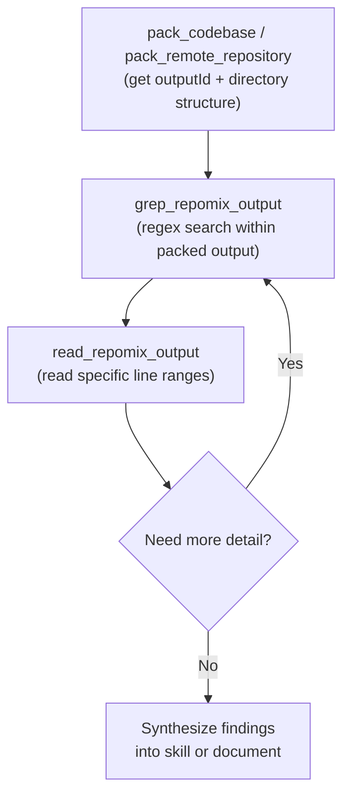
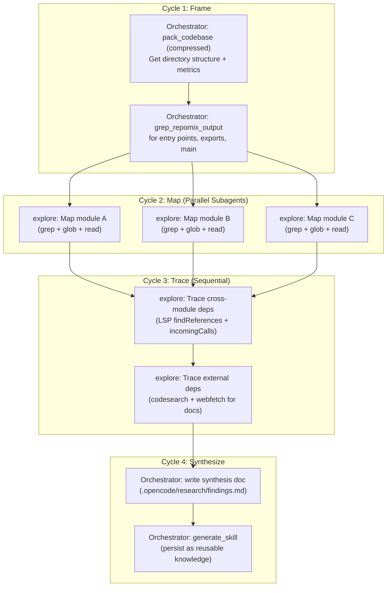
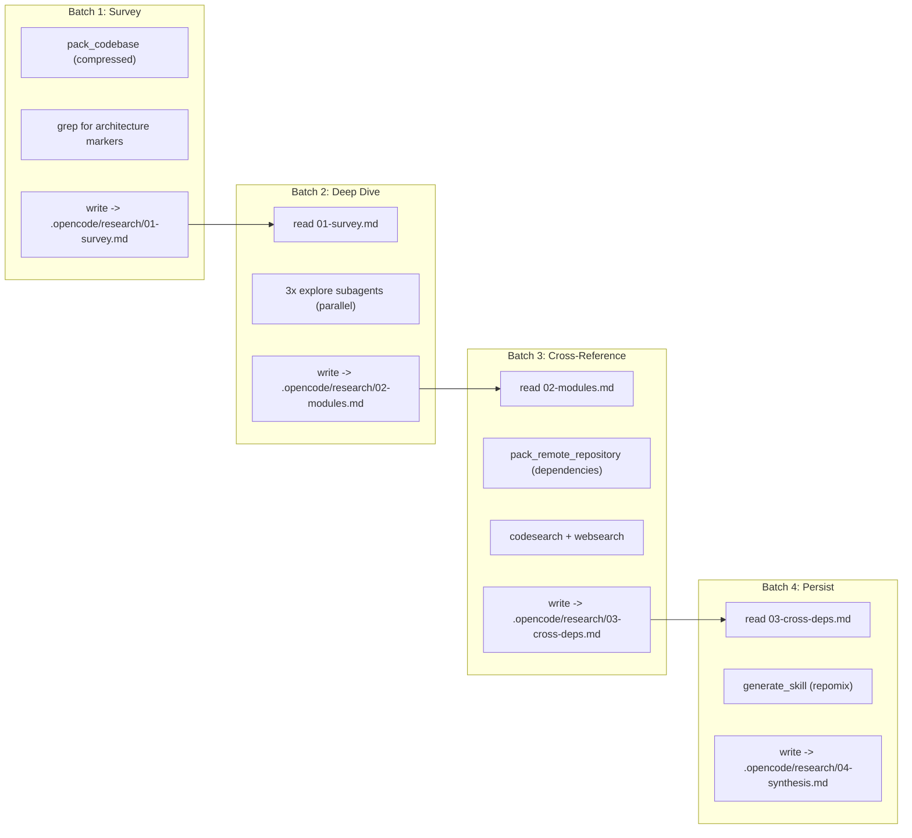

# Advanced Repomix + Opencode Orchestration: Deep Research & Cross-Dependency Cheat Sheet

---

## Part I: Opencode Tool Taxonomy -- What Agents Underutilize

### 1.1 Complete Tool Registry

Opencode registers tools in `ToolRegistry` with this priority order: [1-cite-0](#1-cite-0) 

| Tool | Kind | What agents miss | Key params |
|---|---|---|---|
| `read` | read | **Offset reading** for large files, directory listing mode | `filePath`, `offset` (1-indexed), `limit` (default 2000) |
| `grep` | search | `include` glob filter, results sorted by mtime | `pattern` (regex), `path`, `include` |
| `glob` | search | Results sorted by mtime (most recent first), 100-file limit | `pattern`, `path` |
| `list` | read | Accepts glob patterns for filtering | `path` |
| `bash` | execute | Full shell -- git, curl, jq, sed, awk, piping | `command`, `description` |
| `webfetch` | fetch | `format`: text/markdown/html, timeout control | `url`, `format`, `timeout` |
| `websearch` | search | `type`: auto/fast/deep, `livecrawl`: fallback/preferred | `query`, `numResults`, `type` |
| `codesearch` | search | **Exa Code API** for npm/library docs, 1K-50K tokens | `query`, `tokensNum` |
| `lsp` | other | **9 operations** -- experimental, needs env flag | `operation`, `filePath`, `line`, `character` |
| `skill` | other | Loads `SKILL.md` + bundled files into context | `name` |
| `task` | other | Subagent delegation with `task_id` resume | `prompt`, `description`, `subagent_type`, `task_id` |
| `batch` | other | **Parallel tool execution**, 1-25 calls | `tool_calls[]` |
| `apply_patch` | edit | Multi-file atomic patches with LSP diagnostics | `patchText` |
| `edit` | edit | Surgical line edits | `filePath`, ... |
| `write` | edit | Create/overwrite files | `filePath`, `content` |
| `todowrite` | other | Persistent task tracking across turns | `todos[]` |

### 1.2 The Read Tool -- Offset Reading (Agents Almost Never Use This)

The `ReadTool` has a 50KB byte cap and 2000-line default limit. When truncated, it explicitly tells the agent to use `offset`: [1-cite-1](#1-cite-1) 

```
Output capped at 50 KB. Showing lines 1-847. Use offset=848 to continue.
Showing lines 1-2000 of 5432. Use offset=2001 to continue.
``` [1-cite-2](#1-cite-2) 

**Orchestrator instruction pattern:**
```
Read the file at /path/to/large-file.ts. If truncated, continue reading 
with offset= as indicated until you have the complete picture of [specific 
section/function/class]. Report back the full content of [target].
```

### 1.3 LSP Tool -- The Most Underused Power Tool

Requires `OPENCODE_EXPERIMENTAL_LSP_TOOL=true` (or `OPENCODE_EXPERIMENTAL=true`). [1-cite-3](#1-cite-3) 

9 operations available:

| Operation | Use Case in Research |
|---|---|
| `goToDefinition` | Trace where a type/function is actually defined |
| `findReferences` | Find all callers/consumers of a symbol |
| `hover` | Get type signature without reading full file |
| `documentSymbol` | List all symbols in a file (classes, functions, exports) |
| `workspaceSymbol` | Search symbols across entire workspace |
| `goToImplementation` | Find concrete implementations of interfaces |
| `prepareCallHierarchy` | Set up call hierarchy analysis |
| `incomingCalls` | Who calls this function? |
| `outgoingCalls` | What does this function call? | [1-cite-4](#1-cite-4) 

**Orchestrator instruction pattern:**
```
Use the LSP tool to trace the call hierarchy of `delegateTask` in 
src/delegation/manager.ts. First use documentSymbol to find the line number, 
then use incomingCalls and outgoingCalls to map the full call graph. 
Report the dependency chain.
```

### 1.4 CodeSearch -- npm/Library Documentation on Demand

Uses Exa Code API (`get_code_context_exa`) -- no API key needed. Returns code examples, docs, and API references for any library/SDK. [1-cite-5](#1-cite-5) 

**Key insight agents miss:** `tokensNum` is adjustable from 1,000 to 50,000. Default 5,000 is often too low for comprehensive library research.

```
codesearch({ query: "zod schema validation advanced patterns discriminated unions", tokensNum: 20000 })
codesearch({ query: "Model Context Protocol SDK server tool registration TypeScript", tokensNum: 15000 })
codesearch({ query: "Tree-sitter TypeScript parser AST node types", tokensNum: 10000 })
```

### 1.5 WebSearch vs WebFetch -- Discovery vs Retrieval [1-cite-6](#1-cite-6) [1-cite-7](#1-cite-7) 

| | `websearch` | `webfetch` |
|---|---|---|
| Purpose | **Discovery** -- find what exists | **Retrieval** -- get specific content |
| Backend | Exa AI MCP (`web_search_exa`) | Direct HTTP fetch |
| Auth | None needed | None needed |
| Enable | `OPENCODE_ENABLE_EXA=1` or OpenCode provider | Always available |
| Key params | `query`, `type` (auto/fast/deep), `numResults` | `url`, `format` (text/markdown/html) |

**Research chain pattern:**
```
1. websearch({ query: "hivemind plugin architecture patterns 2025", type: "deep" })
2. webfetch({ url: "<best result URL>", format: "markdown" })
3. codesearch({ query: "<specific API from the article>", tokensNum: 15000 })
```

### 1.6 Context7 MCP -- Library Documentation Search

Opencode recognizes `context7_resolve_library_id` and `context7_get_library_docs` as search-kind tools. [1-cite-8](#1-cite-8) 

Configure in `opencode.json`:
```json
{
  "mcp": {
    "context7": {
      "type": "remote",
      "url": "https://mcp.context7.com/mcp"
    }
  }
}
``` [1-cite-9](#1-cite-9) 

**Usage pattern:** Add `use context7` to prompts, or put in `AGENTS.md`:
```md
When you need to search docs, use `context7` tools.
```

---

## Part II: Orchestrator & Swarm Delegation Patterns

### 2.1 Agent Architecture in Opencode

Opencode has 4 native visible agents + hidden utility agents: [1-cite-10](#1-cite-10) 

| Agent | Mode | Tools | Purpose |
|---|---|---|---|
| `build` | primary | All (with question, plan_enter) | Default coding agent |
| `plan` | primary | Read-only + plan files | Planning mode, no edits |
| `general` | subagent | All except todo | Multi-step autonomous tasks |
| `explore` | subagent | grep, glob, list, bash, read, webfetch, websearch, codesearch | **Read-only codebase exploration** |
| `compaction` | primary (hidden) | None | Context compaction |
| `title` | primary (hidden) | None | Title generation |
| `summary` | primary (hidden) | None | Summary generation |

The `explore` agent is the key research subagent -- it has read-only permissions and access to all search/fetch tools: [1-cite-11](#1-cite-11) 

### 2.2 Task Tool -- Subagent Delegation

The `TaskTool` is how orchestrators spawn subagents: [1-cite-12](#1-cite-12) 

Critical patterns agents miss:

**a) Concurrent subagent launch** (single message, multiple tool uses):
```
// Launch 3 explore agents in parallel
Task(description="Map hivemind-plugin architecture", prompt="...", subagent_type="explore")
Task(description="Map openagent MCP layer", prompt="...", subagent_type="explore")  
Task(description="Map opencode SDK plugin system", prompt="...", subagent_type="explore")
``` [1-cite-13](#1-cite-13) 

**b) Session resumption** via `task_id`:
```
Task(task_id="ses_abc123", prompt="Continue from where you left off. Now trace the delegation chain...", subagent_type="explore")
``` [1-cite-14](#1-cite-14) 

**c) Research vs. code distinction** -- always tell the subagent:
```
Task(
  description="Research hivemind delegation layer",
  prompt="This is a RESEARCH-ONLY task. Do NOT modify any files. 
  Use grep, glob, read, and bash (git log only) to:
  1. Find all files in src/delegation/
  2. Map the class hierarchy
  3. Identify all public APIs
  Return a structured summary with file paths and key function signatures.",
  subagent_type="explore"
)
``` [1-cite-15](#1-cite-15) 

### 2.3 Task Permission Control for Orchestrator Patterns

Configure which subagents an orchestrator can invoke:
```json
{
  "agent": {
    "orchestrator": {
      "mode": "primary",
      "permission": {
        "task": {
          "*": "ask",
          "explore": "allow",
          "general": "allow",
          "researcher-*": "allow"
        }
      }
    }
  }
}
```
Last matching rule wins. When set to `ask`, the subagent is removed from the Task tool description entirely. [1-cite-16](#1-cite-16) 

### 2.4 Batch Tool -- Parallel Tool Execution Within a Single Agent

The `BatchTool` executes 1-25 tool calls concurrently. This is the **intra-agent parallelism** complement to Task's **inter-agent parallelism**. [1-cite-17](#1-cite-17) [1-cite-18](#1-cite-18) 

Enable with `experimental.batch_tool: true` in config.

```json
// Batch payload example: read 3 files + grep 2 patterns simultaneously
[
  {"tool": "read", "parameters": {"filePath": "/path/to/hivemind/src/core/index.ts", "limit": 500}},
  {"tool": "read", "parameters": {"filePath": "/path/to/hivemind/src/delegation/manager.ts", "limit": 500}},
  {"tool": "read", "parameters": {"filePath": "/path/to/hivemind/src/intelligence/engine.ts", "limit": 500}},
  {"tool": "grep", "parameters": {"pattern": "export class.*Plugin", "path": "/path/to/hivemind/src"}},
  {"tool": "grep", "parameters": {"pattern": "implements.*Interface", "path": "/path/to/hivemind/src"}}
]
```

### 2.5 Apply Patch -- Iterative Document Updates

The `ApplyPatchTool` supports multi-file atomic patches with add/update/delete/move operations and automatic LSP diagnostics after application: [1-cite-19](#1-cite-19) [1-cite-20](#1-cite-20) 

**For iterative synthesis documents:**
```
apply_patch({
  patchText: `*** Begin Patch
*** Update File: .opencode/research/hivemind-architecture.md
@@@ --- a/.opencode/research/hivemind-architecture.md
+++ b/.opencode/research/hivemind-architecture.md
@@ Section: Delegation Layer @@
-TODO: Map delegation patterns
+## Delegation Layer
+
+### Core Classes
+- DelegationManager (src/delegation/manager.ts:45)
+- TaskRouter (src/delegation/router.ts:12)
+...
*** End Patch`
})
```

---

## Part III: Repomix Advanced Techniques for Deep Research

### 3.1 Remote Repository Packing for Cross-Dependency Research

Pack any GitHub repo (public or accessible) without cloning locally: [1-cite-21](#1-cite-21) 

```jsonc
// Pack a specific npm library's source to understand its internals
{ "remote": "yamadashy/repomix", "includePatterns": "src/**/*.ts", "compress": true }

// Pack a dependency you're investigating
{ "remote": "modelcontextprotocol/typescript-sdk", "includePatterns": "src/**" }

// Pack with branch targeting
{ "remote": "https://github.com/shynlee04/hivemind-plugin/tree/v2.9.5-detox-dev",
  "includePatterns": "src/delegation/**,src/intelligence/**" }
```

### 3.2 Skill Generation as Persistent Knowledge Artifacts

The `generate_skill` tool creates a structured knowledge package that persists across sessions: [1-cite-22](#1-cite-22) 

**Output structure:**
```
.claude/skills/<skill-name>/
├── SKILL.md                    # Entry point with usage guide
└── references/
    ├── summary.md              # Purpose, format, and statistics
    ├── project-structure.md    # Directory tree with line counts
    ├── files.md                # All file contents
    └── tech-stacks.md          # Languages, frameworks, dependencies
```

**The skill loading chain in opencode:**
When an agent calls `skill({ name: "..." })`, the `SkillTool` loads `SKILL.md` content + up to 10 bundled files into the conversation context: [1-cite-23](#1-cite-23) 

### 3.3 The Pack-Grep-Read Pipeline (Incremental Exploration)

This is the core pattern for token-efficient deep research. The repomix MCP server instructions explicitly describe this workflow: [1-cite-24](#1-cite-24) 



**grep_repomix_output** supports asymmetric context windows: [1-cite-25](#1-cite-25) 

```jsonc
// Show 2 lines before, 15 lines after each match (see full function body after signature)
{ "outputId": "<id>", "pattern": "export class DelegationManager", "beforeLines": 2, "afterLines": 15 }

// Case-insensitive search for cross-cutting concerns
{ "outputId": "<id>", "pattern": "lifecycle|dispose|cleanup|teardown", "ignoreCase": true, "contextLines": 3 }
```

### 3.4 Stacking Skills for Multi-Repo Synthesis

**Phase 1: Generate skills from each repo**
```jsonc
// Via repomix MCP
generate_skill({ directory: "/path/to/hivemind-plugin", skillName: "hivemind-core", compress: true,
  includePatterns: "src/**/*.ts", ignorePatterns: "**/*.test.*,**/*.spec.*" })

generate_skill({ directory: "/path/to/oh-my-openagent", skillName: "openagent-mcp-system",
  includePatterns: "src/mcp/**,src/plugin/**,src/hooks/**" })

// For remote repos you don't have locally:
// First pack_remote_repository, then use the output as reference
```

**Phase 2: Load skills in orchestrator context**
```
skill({ name: "hivemind-core" })
skill({ name: "openagent-mcp-system" })
// Now the agent has both codebases in context for cross-reference
```

**Phase 3: Cross-reference with targeted searches**
```
// Use opencode grep to find live code patterns
grep({ pattern: "McpServer|registerTool|MCP", path: "/path/to/hivemind-plugin/src" })
// Use repomix grep on packed openagent output
grep_repomix_output({ outputId: "<openagent-id>", pattern: "McpServer|registerTool" })
```

---

## Part IV: Orchestration Patterns Aligned with Your Research Protocol

### 4.1 Mapping to Your Protocol's Core Constraints

| Protocol Rule | Implementation |
|---|---|
| No deep line-by-line reading | Use `grep` + `glob` first, then targeted `read` with `limit` |
| No long-horizon agentic execution | Use `batch` for parallel tool calls; use `task` with specific bounded prompts |
| No file mutation (research mode) | Use `explore` subagent (edit permissions denied); use `plan` mode |
| Disk-based synthesis | Use `apply_patch` or `write` to create synthesis docs in `.opencode/research/` |
| Batch planning for subagents | Launch multiple `task` calls in single message; chain via `task_id` |

### 4.2 The Hierarchical Exploration Pattern



### 4.3 Concrete Orchestrator Prompt Templates

**Template: Initial Framing**
```
You are conducting a deep codebase research audit. DO NOT modify any files 
except in .opencode/research/. Follow this protocol:

1. FRAME: Use repomix pack_codebase (compressed) on the target directory.
   Read the directory structure and metrics from the response.
   Use grep_repomix_output to locate entry points (index.ts, main exports).

2. MAP: Launch parallel explore subagents to map each major module.
   Each agent should return: file list, key exports, class hierarchy, 
   dependency imports.

3. TRACE: Use LSP (if available) or grep to trace cross-module dependencies.
   Use codesearch/websearch for external library documentation.

4. SYNTHESIZE: Write findings to .opencode/research/<topic>.md using apply_patch.
   Generate a skill using repomix generate_skill for persistent reference.

Current target: [REPO_PATH]
Focus area: [SPECIFIC_SUBSYSTEM]
```

**Template: Subagent Research Delegation**
```
Task(
  description="Map [MODULE_NAME] architecture",
  subagent_type="explore",
  prompt=`RESEARCH ONLY - no file modifications.

  Target: [REPO_PATH]/src/[MODULE]/
  
  Execute these steps:
  1. glob({ pattern: "**/*.ts", path: "[REPO_PATH]/src/[MODULE]" })
  2. For each key file, grep for exports: grep({ pattern: "^export", path: "[file]" })
  3. Read the main entry point with read({ filePath: "[entry]", limit: 200 })
  4. If files are large, use offset reading to get specific sections
  
  Return a structured report:
  - File tree with descriptions
  - Key exports and their types
  - Import dependencies (what this module depends on)
  - Exported APIs (what other modules consume)
  - Patterns observed (singleton, factory, observer, etc.)
  `
)
```

**Template: Cross-Repo Dependency Tracing**
```
Task(
  description="Trace MCP integration across repos",
  subagent_type="explore",
  prompt=`RESEARCH ONLY.

  I have already packed these repos:
  - hivemind-plugin outputId: [ID1]
  - oh-my-openagent outputId: [ID2]
  
  Use grep_repomix_output on both outputs to find:
  1. All MCP server registrations: pattern "registerTool|McpServer|mcp"
  2. All tool definitions: pattern "Tool\\.define|registerTool"
  3. All plugin hooks: pattern "hook|lifecycle|register|dispose"
  
  Cross-reference the patterns. Report:
  - Shared abstractions between repos
  - Divergent implementations
  - Integration points where hivemind-plugin could adopt openagent patterns
  `
)
```

### 4.4 Shell Output Chaining & $Argument Patterns

Use `bash` tool for git-based research and piped analysis:

```bash
# Git archaeology -- find most-changed files (hot spots for refactoring)
git log --since="6 months ago" --name-only --pretty=format: | sort | uniq -c | sort -rn | head -30

# Find all cross-repo imports
grep -rn "from.*@opencode\|from.*@hivemind\|from.*openagent" src/ --include="*.ts"

# Dependency graph via package.json
cat package.json | jq '.dependencies + .devDependencies | keys[]' | sort

# Find circular dependencies
npx madge --circular src/index.ts

# Git blame for understanding ownership
git blame --line-porcelain src/delegation/manager.ts | grep "^author " | sort | uniq -c | sort -rn

# Diff between branches for refactoring scope
git diff main..v2.9.5-detox-dev --stat
git diff main..v2.9.5-detox-dev -- src/delegation/
```

### 4.5 Auto-Parsed Prompting & Command Chaining

Opencode supports slash commands via Task tool: [1-cite-26](#1-cite-26) 

```
Task(description="Run custom check", prompt="/check-architecture src/delegation/", subagent_type="general")
```

Custom modes can restrict tool access for research-only sessions: [1-cite-27](#1-cite-27) 

```json
{
  "mode": {
    "research": {
      "prompt": "{file:./prompts/research-protocol.txt}",
      "tools": {
        "write": false, "edit": false, "bash": true,
        "read": true, "grep": true, "glob": true,
        "list": true, "webfetch": true, "websearch": true
      }
    }
  }
}
```

---

## Part V: Integrated Workflow -- Long-Haul Audit Protocol

### 5.1 The Disk-Based Synthesis Chain

Aligned with your protocol's `Batch 1 -> Disk Write -> Batch 2 -> ...` pattern:



### 5.2 TodoWrite for Multi-Cycle Tracking

Use `todowrite` to maintain research state across cycles: [1-cite-28](#1-cite-28) 

```jsonc
todowrite({ todos: [
  { "id": "1", "content": "Survey hivemind-plugin architecture", "status": "completed" },
  { "id": "2", "content": "Map delegation layer in detail", "status": "in_progress" },
  { "id": "3", "content": "Trace MCP integration points", "status": "pending" },
  { "id": "4", "content": "Cross-reference with openagent patterns", "status": "pending" },
  { "id": "5", "content": "Generate synthesis skill", "status": "pending" }
]})
```

### 5.3 Complete opencode.json for Research-Optimized Setup

```json
{
  "$schema": "https://opencode.ai/config.json",
  "permission": {
    "read": "allow",
    "grep": "allow",
    "glob": "allow",
    "list": "allow",
    "bash": "allow",
    "webfetch": "allow",
    "websearch": "allow",
    "codesearch": "allow",
    "skill": "allow",
    "lsp": "allow",
    "edit": "allow"
  },
  "experimental": {
    "batch_tool": true
  },
  "mcp": {
    "repomix": {
      "command": "npx",
      "args": ["-y", "repomix", "--mcp"]
    },
    "context7": {
      "type": "remote",
      "url": "https://mcp.context7.com/mcp"
    },
    "gh_grep": {
      "type": "remote",
      "url": "https://mcp.grep.app"
    }
  },
  "agent": {
    "researcher": {
      "mode": "subagent",
      "description": "Deep codebase researcher. Use for comprehensive architecture analysis, cross-repo dependency tracing, and synthesis document generation.",
      "permission": {
        "edit": { "*": "ask", ".opencode/research/*": "allow" },
        "task": { "explore": "allow" }
      }
    }
  },
  "mode": {
    "research": {
      "prompt": "{file:./prompts/research-protocol.txt}",
      "tools": {
        "write": false, "edit": false, "bash": true,
        "read": true, "grep": true, "glob": true
      }
    }
  }
}
```

### 5.4 Environment Variables for Full Power

```bash
# Enable all experimental features
export OPENCODE_EXPERIMENTAL=true          # Enables LSP tool + other experimental features
export OPENCODE_EXPERIMENTAL_LSP_TOOL=true # LSP tool specifically
export OPENCODE_ENABLE_EXA=1