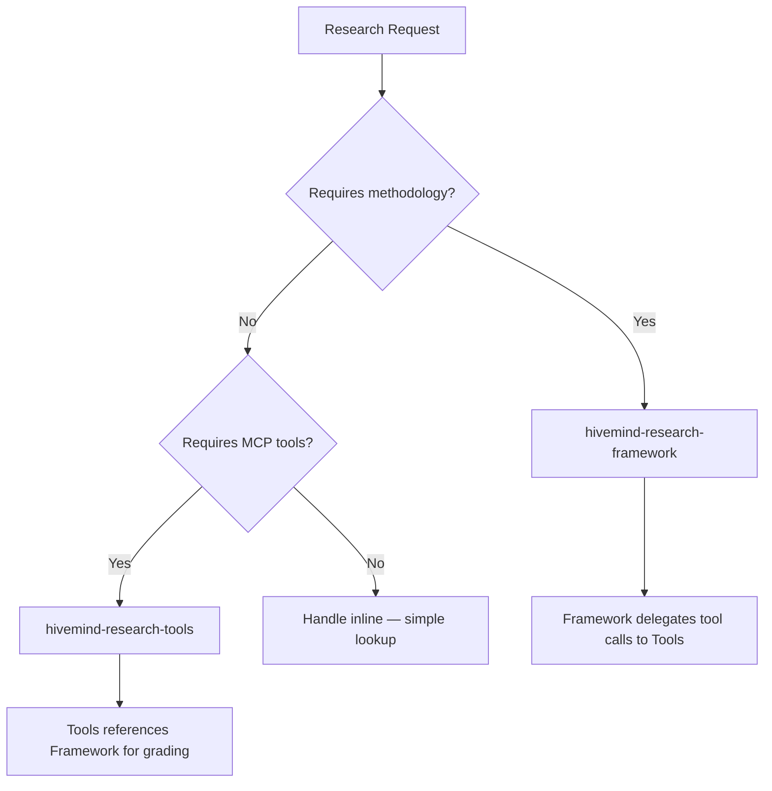

# use-hivemind-research — Research Router

Thin entry point that classifies the research request and delegates to the correct specialist skill.

## Use This For

- User asks "research", "investigate", "compare", "evaluate", "what is the best", "how does X work"
- Any question requiring 3+ sources to answer reliably
- Technology decisions, architecture evaluation, library comparison
- API behavior investigation, pattern discovery
- User wants evidence-backed recommendations, not opinions

## Routing Logic



### Step 1 — Classify the Request

Determine the **research type** by matching signal words:

| Signal Words | Research Type | Route To |
|---|---|---|
| compare, versus, alternative, which is better | Comparison | Framework + Tools |
| how does X work, API behavior, library semantics | Tech/API | Framework + Tools |
| pattern, architecture, design approach | Pattern | Framework |
| requirements, scope, what do we need | Requirements | Framework |
| landscape, ecosystem, who does what | Landscape | Tools |
| dependency, coupling, impact, break | Cross-Dependency | Framework + Tools |
| quick lookup, simple fact, what version | Inline | Self (skip delegation) |

### Step 2 — Load the Correct Package

**Framework (methodology)** loads when:
- Question needs multi-source evidence grading
- Confidence scoring required
- Delegation to subagents needed
- Contradiction resolution anticipated

**Tools (protocols)** loads when:
- MCP providers are available
- Codebase analysis needed (Repomix)
- Official docs retrieval needed (Context7)
- Web search with extraction needed (Tavily/Exa)
- Repository deep analysis needed (DeepWiki)

**Both** load when the request is complex enough to need methodology AND tool execution.

### Step 3 — Delegate with Context

Hand off using the research delegation packet:

```markdown
## Delegation Packet
- **Research type**: <type from classification>
- **Sub-questions**: <3-5 decomposed questions>
- **Evidence sources**: <which MCP providers to use>
- **Confidence target**: full | partial | low
- **Constraints**: <scope boundaries, time limits>
```

## Sibling Skill Integration

| Skill | Integration Point |
|---|---|
| use-hivemind-delegation | Subagent spawning for parallel research threads |
| spec-distillation | Refining vague research requests into answerable questions |
| context-intelligence-entry | Session health check before long research runs |

## Anti-Patterns at Router Level

1. **Skipping classification** — routes to wrong package, wastes MCP calls
2. **Loading both when one suffices** — unnecessary context overhead
3. **Inline research for complex questions** — no evidence grading, no confidence scoring
4. **Recursive routing** — router must not call itself

## Bundled Resources

| Resource | Path | Purpose |
|---|---|---|
| hivemind-research-framework | `../hivemind-research-framework/SKILL.md` | Methodology, types, grading |
| hivemind-research-tools | `../hivemind-research-tools/SKILL.md` | MCP protocols, chaining, fallbacks |
