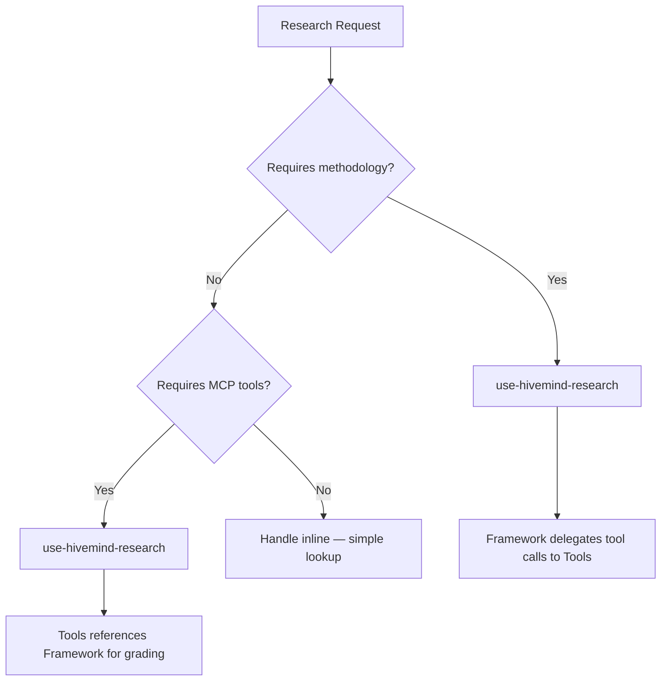

# ses_2bb0

**Session ID:** ses_2bb0
**Created:** 4/1/2026, 12:30:09 AM
**Updated:** 4/1/2026, 12:45:02 AM

---

## Table of Contents

| # | Timestamp | Actor | Tools | Summary |
|---|-----------|-------|-------|---------|

---
## User


---
**Tool:** read

**Input:**
```json
{"filePath":"/Users/apple/hivemind-plugin/.worktrees/product-detox/.hivemind/activity/ACTIVE-TASKS.md"}
```

**Output:**
```
<path>/Users/apple/hivemind-plugin/.worktrees/product-detox/.hivemind/activity/ACTIVE-TASKS.md</path>
<type>file</type>
<content>1: # Protocols:
2: 
3: 1. Untrusted documents - even what is in [AGENTS.md](http://AGENTS.md) - check for the sack of the project’s health and real-life implementation and uses of it
4: 2. the scopes of the project has not been really decided - OVERVIEW.md
5: 3. You are the orchestrator - you are blind you can think within this session chat workflow → the rest you must coordinate and orchestrate other agents -WHY? - Because this session is intensive and long-haul with token-consumption-demanding → so keeping this session fresh to clearly see turn and intents’ layer shift, seeing from high-level of what has happened and parse the collected of output investigation (must delegate the agents to output the research, investigation and evidences to disk for later turns retrieval and re-consumption) 
6:     1. there are tools as agent-work-contract, trajectory, or something related to tasks management - I am not sure if they are working but these be the “managing layer” so the orchestrator can read form high-level seeing across sessions, quick write and update the flows of orchestration and the downstream sub-agents also what artifacts documents, handoff and so on, they are the utilities factor for your purposes - also record and manage main and sub-sessions, and help the todo tasks survive through compacts etc - in-short the utilities to aid the long-haul, across session vs. integrity of the project
7: 
8: ## Briefing about the project at [OVERVIEW.md](http://OVERVIEW.md)
9: 
10: <aside>
11: 💡
12: 
13: ## EXTREMELY IMPORTANT! UNDERSTAND THESE CONDITIONS - These are facts of how this project works
14: 
15: - A harness system running on OpenCode → so users install this through npm and npx → built into the dist folder at root (from this the engine works and tools, SDK engines and other npm libraries run, the programatic engines of auto write, parse start working and distribute assets, json, md files, logs in to .hivemind/*.*/*.*/ ~*.json, *.md, *.xml, *.yaml -
16: - AND because you are also functioning on this same OpenCode environment → to really check and see how “something” works, the pipeline, flow, consumers and what code files work or not you must reinstall and run new clean build and ask me for restart afterward the next run will see impact
17: - And since you are working under .worktree → I don’t know if `npm link` is needed?
18: </aside>
19: 
20: ## The following are what I think as “good practices” - but not sure you must delegate your expert team to verify with fact from research deep synthesis with the true uses and intents of use vs. the tradeoff for the architecture, extensions, reusability, bloats, code smell,  design patterns and refactor - etc
21: 
22: ### Definition of run-time:
23: 
24: Since following the granularity, hierarchy and relationships vs. domain-specific harness games. to control what read, what to follow, controlling the agents’ deterministic decisions to use which tools under what situations as workflows and user’s intents and the integrity of the project under the scopes of context-engineering  for long-horizon, long-haul and across-sessions run - you follow the scopes to assess if these are the true run-time events that the above factors can be manipulated:
25: 
26: - When users create a new session (THESE ARE FACTS !  **IMPORTANT** THE FOLLOWING 3 ARE WHAT USERS CAN DO WITH THERE OPENCODE CLIENT →
27:     - resume from it
28:     - fork from a message → a new forked session ledger
29:     - redo and undo turns in a session
30: - And since turn takes anew API sent to llm after the next message sent by users → these are when the variables that either benefit or harm the harness for these facts:
31:     - many turns last → the profile body of agents will get pruned and not in the priority of the llms decision of “next actions”
32:     - but if the runtime is loaded with what I mentioned below {  `commands, prompts (as workflows) , rules, permissions (to manipulate the what tools, what skills, what commands are allowed to use or assign to which agent and subagents), agents vs subagents, skills` } >>>>> these can refresh the instruction for what agents should behave next
33:     - and there are 2 types of sessions which is main-facing users and the ones are delegated as subagents run for isolation of context
34: - The above can be all intercepted with “soft” techniques - if more granular controls are needed (like files changed, tools execution, message in sessions events, permissions and lsp events etc) and to apply “extra features” to the runtime → the next levels are custom tools and plugins - so these are also my rationales and arguments for what the system should be refactored toward
35:     
36:     <aside>
37:     💡
38:     
39:     #### PLUGINS vs.  CUSTOM TOOLS - and the stacking of OpenCode Innate Concepts factor upon these knowledge
40:     
41:     1. The events https://opencode.ai/docs/plugins/#events that plugins can subscribe - then add functions and features through internal hooks and installed https://opencode.ai/docs/plugins/#from-npm  libraries ; and since https://opencode.ai/docs/plugins/#create-a-plugin and custom tools can add with plugins https://opencode.ai/docs/plugins/#dependencies  
42:     2. Custom tools: since https://opencode.ai/docs/custom-tools/#multiple-tools-per-file - we can split tools by register which tools for what kind of agents, or which workflows, or which classifications based on the intents and the purposes as users prompting and creating new sessions  and these following features of a tool we can also consider to stack more wisely 
43:         1. https://opencode.ai/docs/custom-tools/#context - tools can Tools receive context about the current session
44:         2. https://opencode.ai/docs/custom-tools/#arguments - You can also import [Zod](https://zod.dev/) directly and return a plain object: You can use **`tool.schema`**, which is just [Zod](https://zod.dev/), to define argument types.
45:         3. tools that can also be written in other languages https://opencode.ai/docs/custom-tools/#write-a-tool-in-python 
46:         
47:     3. From what I have collected from OpenCODE the soft concepts as commands, prompts (as workflows) , rules, permissions (to manipulate the what tools, what skills, what commands are allowed to use or assign to which agent and subagents), agents vs subagents, skills are can all modify by users and manually added as anew by them (by either modifying the opencode.json, setting.json, or simply the dedicated folders containing .md files and frontmatter yaml config  under .opencode/ for project-only-config or ~./.config/opencode/*.json or that of folders dot md → and among these the “skills” are the most flexible → the concepts work for other platforms too and since they are portable they play as “Tier 3” for the reason. And from the above knowledge, I don’t think it is wise to mix these “fragile” commands, prompts (as workflows) , rules, permissions, agents vs subagents  into our harness governance unless we can hard-wire the default into 
48:     </aside>
49:     
50: 
51: ### RUN-TIME and interception:
52: 
53: - as prompt, commands, skills, injection (simply the hooks to events → message append before) and since we can stack these and custom tools and plugins
54: 
55: <aside>
56: 💡
57: 
58: ### KNOWLEDGE THAT I HAVE COLLECTED - THE XML Files ARE THE WHOLE GIT REPO DOWNLOAD :
59: 
60: #### OPENCODE:
61: 
62: ```markdown
63: /Users/apple/hivemind-plugin/.worktrees/product-detox/.sdk-lib/opencode
64: /Users/apple/hivemind-plugin/.worktrees/product-detox/.sdk-lib/opencode/opencode-agents.md
65: /Users/apple/hivemind-plugin/.worktrees/product-detox/.sdk-lib/opencode/opencode-built-in-tools.md
66: /Users/apple/hivemind-plugin/.worktrees/product-detox/.sdk-lib/opencode/opencode-commands.md
67: /Users/apple/hivemind-plugin/.worktrees/product-detox/.sdk-lib/opencode/opencode-configs.md
68: /Users/apple/hivemind-plugin/.worktrees/product-detox/.sdk-lib/opencode/opencode-custom-tools.md
69: /Users/apple/hivemind-plugin/.worktrees/product-detox/.sdk-lib/opencode/opencode-plugins.md
70: /Users/apple/hivemind-plugin/.worktrees/product-detox/.sdk-lib/opencode/opencode-rules.md
71: /Users/apple/hivemind-plugin/.worktrees/product-detox/.sdk-lib/opencode/opencode-sdk.md
72: /Users/apple/hivemind-plugin/.worktrees/product-detox/.sdk-lib/opencode/opencode-server.md
73: /Users/apple/hivemind-plugin/.worktrees/product-detox/.sdk-lib/opencode/opencode-skills.md
74: /Users/apple/hivemind-plugin/.worktrees/product-detox/.sdk-lib/opencode/repomix-opencode.md
75: /Users/apple/hivemind-plugin/.worktrees/product-detox/.sdk-lib/opencode/repomix-opencode.xml
76: ```
77: 
78: ### JSON-Render
79: 
80: this is what I use as for the GUI interactive internal client-vs server using SDK and API of OpencodenCode for the 2 purposes 
81: 
82: /Users/apple/hivemind-plugin/.worktrees/product-detox/.sdk-lib/json-render
83: /Users/apple/hivemind-plugin/.worktrees/product-detox/.sdk-lib/json-render/repomix-json-render.xml
84: 
85: - so that the “Module builder Agent - Hivefiver” can visually interact and display “artifact” to aid users configuration for the build of concepts run-time concepts injections - of both Hivemind custom features (stacking custom tools and plugins as features ) OpenCode’s innate meta concepts (skills, commands, built-in tools, config  of permissions, creation of new agents → to visualize this when user or run slash command /hm-skill-config  , /hm-skill-build -or  prompt “the Hivefiver agent” I want to build skill - the intent hook will triger the command agent run and load what skills available and dis play the GUI and base on what we have defined as which runtimes to inject what skill to which agents or to which workflows (as we have config the conditional functions for this granular control)
86: - And also the local client  local host display with ReAct
87: 
88: #### The other repos to learn from some “features” as background sub-sessions agents, timing sessions, runtime build programatic and deterministic functions to trigger a workflow , context prune,  or the way they structure and organize, hooks, features, plugins, tools
89: 
90: /Users/apple/hivemind-plugin/.worktrees/product-detox/.sdk-lib/dynamic-context-prunning
91: /Users/apple/hivemind-plugin/.worktrees/product-detox/.sdk-lib/dynamic-context-prunning/repomix-dynamic-context-prunning.xml
92: /Users/apple/hivemind-plugin/.worktrees/product-detox/.sdk-lib/oh-my-openagents
93: /Users/apple/hivemind-plugin/.worktrees/product-detox/.sdk-lib/oh-my-openagents/repomix-oh-my-openagents.xml
94: 
95: </aside>
96: 
97: # ALL in ALL my rationales are
98: 
99: 1. There are not many “features” that require me to use SDK yet → so take this into arguments between modules and interfaces 
100: 2. CRUD operations are mostly to internal .hivemind and the json and md, xml, yaml  but I categorize them into the 3 groups and reflect these with 4 of our philosophies - hierarchy, relationships, context-integrity-governance, granularity control, and agents’ intelligence (and consider this with if CQRS needed in which cases or totally not needed; and at certain feature the field schema either need to get validated if OpenCode configs settings of concepts needed (these are when OpenCode API interfaces need to match)  or when internal used schema fields are used  as consistency for parsing purposes and hierarchy and relationship set up needed like the trajectory; else those like session-used for management of a flow like agent-work contract, tasks-persistent is more like the session-only ones  and are updated deterministically by agents):
101:     1. The deterministic of agents decide to use a custom tools → I don’t think this has any high frequency and much simultaneous of write, read nor update - because the agents flows and even if users run parallel instances they write and update on different files
102:     2. the auto appended, parse based, write as appended as example below → so these are the write and  parse  and auto append  ( and obviously you can track them in code as the `journal` or `track` `tracker` or `event` or `session` related I could not remember → to see example delegate investigation to ses_2bcc (the purposes of such - and later I will modify the parse and write engines to select more refine metadata and parse concise context to facilitate the time-machine purposes across sessions)
103:         
104:         ```markdown
105:         /Users/apple/hivemind-plugin/.worktrees/product-detox/.hivemind/sessions/journey-events
106:         /Users/apple/hivemind-plugin/.worktrees/product-detox/.hivemind/sessions/journey-events/ses_2bca.json
107:         /Users/apple/hivemind-plugin/.worktrees/product-detox/.hivemind/sessions/journey-events/ses_2bca.md
108:         /Users/apple/hivemind-plugin/.worktrees/product-detox/.hivemind/sessions/journey-events/ses_2bcb.json
109:         /Users/apple/hivemind-plugin/.worktrees/product-detox/.hivemind/sessions/journey-events/ses_2bcb.md
110:         /Users/apple/hivemind-plugin/.worktrees/product-detox/.hivemind/sessions/journey-events/ses_2be2.json
111:         /Users/apple/hivemind-plugin/.worktrees/product-detox/.hivemind/sessions/journey-events/ses_2be2.md
112:         /Users/apple/hivemind-plugin/.worktrees/product-detox/.hivemind/sessions/journey-events/ses_2be3.json
113:         journey-events/ses_2c56.md
114:         ```
115:         
116:     3. and the hybrid of the two
117: 3. And for organization purposes I make the whole project into
118:     1. Tools as agents’ deterministic uses
119:     2. features can be group further into:
120:         1. self-sustain on and of features
121:         2. features that need subscription with hooks  and our custom functions then can be further:
122:             1. types of hooks base on run-time
123:             2. we can manage more plugins handlers for better grouping and structure for the purposes
124:     3. and the advanced ones with need a grouping that require external libraries
125:     4. the last one is the most advanced that require both c and external interaction with SDK of OpenCode ; or further down the road the project can add in with custom-made MCP server tools → These can be leave aside for less concerns
126: 
127: → As the grand purpose of the  before grouping and npm install packages → I can ship the product as modular as plugin-based 
128: 
129: <aside>
130: 💡
131: 
132: # HEAD UP
133: 
134: ## Notice! As An Orchestrator - You Delegate, You do not investigate (`hivexplorer` does ), do not read, you are blind, you do not consult me (`architect` consult me) , you must never plan (`hiveplanner` does), `hivemaker` code and implement etc you must never research yourself You must delegate
135: 
136: - Plan your orchestration, maintain tasks → they are cycles loops within
137: - when delegate → you do not show how-to-implement to the specialist agents YOU MUST instruct how-to-process ; the metric, handle the handoff make sure they are matched and factual
138: - you do not execute the verification nor gatekeeping you → you delegate specialist by passing the handoff to `hiveq` ; to `code-skeptic`
139: - you must understand this as hierarchy and granular extensive traversal route and reroute → It is very dumb and shallow if you have not understand the full scopes - be extremely iterative and skeptic
140: - you must know the cap of 1 context window of the agent you delegate - if the tasks are large they could not all fit a single delegation and the results returned are trash
141: </aside>
142: 
143: ```markdown
144: **The HIVEMIND FRAMEWORK**
145: - Absolute Granularity refers to components that operate at a single hierarchical level without sublevels, and which are linked in a chain where each unit has identical preceding and following units. Every variant and edge case of these units has been evaluated. The system is safeguarded by precise static metrics at both extreme ends. These units are atomic and, when CRUD operations are performed on the base reference @OVERVIEW.md, they produce minimal regression.
146: - Using @.planning/PROJECT.md and @OVERVIEW.md as sources, identify traversal, rerouting, branching, and pivot strategies. Ensure “hiveminder” can adapt with safe fallback, a time‑machine memory context, and the ability to revert atomic actions. Avoid the following anti‑patterns:
147:     1. **No outline, framing, or skeleton** – the agent must begin with a high‑level structure, otherwise it fails.
148:     2. **Assuming low‑level tasks or showing how‑to implementation** – the agent must capture user intent, delegate to “hivexplorer” for context matching and transformation, validate the intent, then break the work into granular tasks.
149: - The concept of  **Absolute** 2-end-extreme-success-metrics: of such to **Gate-Keeping** the Absolute Granularity’s success and passed, these metrics must feature the following:
150:     - **Programmatic, end‑to‑end testability**: The metrics must be implementable via automated tests that validate system behavior in real‑world scenarios, from start to finish, ensuring a clean commit at every stage.
151:     - **Valid, scale‑based quantitative metrics**: Metrics must be expressed as numerical values with clear scoring guidelines; they cannot be simple state flags.
152:     - **Scope‑aware adjustment**: Metrics should adapt to in‑scope and out‑of‑scope requirements without allowing feature creep.
153:     - **Role‑focused responsibility assessment**: Clearly define concerns, responsibilities, and actors; set boundaries while still validating edge cases, risks, and the minimal viable product. Deferred decisions should be recorded as future items, ensuring a deterministic yet non‑mechanical testing approach.
154:     - **Integration‑centric incremental assessment**: Use integration and incremental tests to pinpoint precisely where failures occur, enabling minimal effort remediation.
155:     - **Anti‑pattern awareness**: Recognize the anti‑pattern where baseline unit tests pass but unrelated functionality fails, and ensure metrics guard against such false positives.
156: - Clarify the distinctions between ecosystem, hierarchy, and cross‑domain relationships and establish a clear mindset for each. Then design a step‑by‑step workflow for node resolution before moving on. Expand coverage to encompass the full horizontal breadth at the smallest granularity, and ensure that tasks are not performed out of order, as that can lead to confusion.
157: - The system must distinguish between tasks that directly contribute to a project’s deliverables and those that serve purely as exploratory research or learning. Not every file or folder within an organization’s repository is an asset ready for technology synthesis; many are simply reference material for users. For instance, a `.hivemind/*.*/*.*` directory structure should be categorized by topic and domain, not treated as a pending asset.
158: - When research is conducted to identify patterns and API interfaces across repositories A, B, and C for the purpose of creating new feature‑class implementations, this is a distinct phase: research synthesis that feeds into technical knowledge synthesis. The system should recognize this workflow and handle it accordingly.
159: - the concept of **Absolute Entries**, defined as the true runtime starter of an entity at its finest granularity. When a user initiates a session with a prompt, the system must evaluate a set of variables that qualify the entry as absolute:
160:     - Is the prompt clear, ambiguous, or absurd?
161:     - Does it include attached documents?
162:     - Does it fail to identify work/task orientation and classification?
163:     - Is it linked to its parental hierarchy?
164:     - Does it have a concrete plan or is it entirely open‑ended?
165:     - Are any associated documents stored on hard disk?
166:     - Are the documents and artifacts trustworthy?
167:     - Other relevant variables that impact assessment.
168: ```
169: 
170: [Architecture Inventory Hivemind](https://www.notion.so/Architecture-Inventory-Hivemind-334926f31a4d80fc82dedb8becd17b27?pvs=21)

(End of file - total 170 lines)
</content>
```

---
**Tool:** read

**Input:**
```json
{"filePath":"/Users/apple/hivemind-plugin/.worktrees/product-detox/.hivemind/activity"}
```

**Output:**
```
<path>/Users/apple/hivemind-plugin/.worktrees/product-detox/.hivemind/activity</path>
<type>directory</type>
<entries>
ACTIVE-TASKS.md
agents/
audit/
codescan/
delegation/
handoff/
hivefiver-manifesto/
image.png
orchestration/
planning/
plans/
PROTOCOL.md
research/
review/
sessions/
specs/
state/
status.json
synthesis/
tdd/
verification/

(21 entries)
</entries>
```

---
**Tool:** bash

**Input:**
```json
{"command":"git status --short","description":"Check working tree status"}
```

**Output:**
```
 D ../../.archive/legacy-src-20260314-140720/AGENTS.md
 M ../../.codexdisabled/agents/gsd-codebase-mapper.md
 M ../../.codexdisabled/agents/gsd-debugger.md
 M ../../.codexdisabled/agents/gsd-executor.md
 M ../../.codexdisabled/agents/gsd-nyquist-auditor.md
 M ../../.codexdisabled/agents/gsd-phase-researcher.md
 M ../../.codexdisabled/agents/gsd-planner.md
 M ../../.codexdisabled/agents/gsd-project-researcher.md
 M ../../.codexdisabled/agents/gsd-research-synthesizer.md
 M ../../.codexdisabled/agents/gsd-roadmapper.md
 M ../../.codexdisabled/agents/gsd-ui-auditor.md
 M ../../.codexdisabled/agents/gsd-verifier.md
 D ../HIVEMIND-AGENT-ECOSYSTEM-MASTER.md
 M ../guidelines/anthropic-skils-dev-ref.md
 M ../missions.md
 D ../refactored-skills/depth-skills.json
 D ../refactored-skills/hivemind-architecture/SKILL.md
 D ../refactored-skills/hivemind-architecture/references/adr-tool-reference.md
 D ../refactored-skills/hivemind-architecture/references/architecture-decision-record.md
 D ../refactored-skills/hivemind-architecture/references/clean-architecture-rules.md
 D ../refactored-skills/hivemind-architecture/references/database-selection-matrix.md
 D ../refactored-skills/hivemind-architecture/references/dependency-categories.md
 D ../refactored-skills/hivemind-architecture/references/nfr-checklist.md
 D ../refactored-skills/hivemind-architecture/references/pattern-selection-decision-tree.md
 D ../refactored-skills/hivemind-architecture/references/pattern-selection-matrix.md
 D ../refactored-skills/hivemind-architecture/templates/adr-template-advanced.md
 D ../refactored-skills/hivemind-architecture/templates/architecture-decision.md
 D ../refactored-skills/hivemind-architecture/templates/blueprint-template.md
 D ../refactored-skills/hivemind-atomic-commit/SKILL.md
 D ../refactored-skills/hivemind-atomic-commit/references/activity-classifier.md
 D ../refactored-skills/hivemind-atomic-commit/references/activity-mapper.md
 D ../refactored-skills/hivemind-atomic-commit/references/git-gate-reference.md
 D ../refactored-skills/hivemind-atomic-commit/references/git-gate.md
 D ../refactored-skills/hivemind-atomic-commit/references/rollback-protocol.md
 D ../refactored-skills/hivemind-atomic-commit/references/surface-ownership.md
 D ../refactored-skills/hivemind-atomic-commit/references/verification-before-completion.md
 D ../refactored-skills/hivemind-atomic-commit/scripts/hm-activity-classify.sh
 D ../refactored-skills/hivemind-atomic-commit/scripts/hm-atomic-commit.sh
 D ../refactored-skills/hivemind-atomic-commit/scripts/hm-git-gate.sh
 D ../refactored-skills/hivemind-atomic-commit/templates/activity-map.md
 D ../refactored-skills/hivemind-atomic-commit/templates/activity-record.md
 D ../refactored-skills/hivemind-atomic-commit/templates/commit-gate-result.md
 D ../refactored-skills/hivemind-atomic-commit/templates/commit-gate.json
 D ../refactored-skills/hivemind-atomic-commit/templates/rollback-plan.md
 D ../refactored-skills/hivemind-atomic-commit/tests/direct-invocation.md
 D ../refactored-skills/hivemind-codemap/SKILL.md
 D ../refactored-skills/hivemind-codemap/references/batching-loop.md
 D ../refactored-skills/hivemind-codemap/references/codemap-techniques.md
 D ../refactored-skills/hivemind-codemap/references/delegation-contract.md
 D ../refactored-skills/hivemind-codemap/references/lsp-code-mapping.md
 D ../refactored-skills/hivemind-codemap/references/repomix-mode.md
 D ../refactored-skills/hivemind-codemap/references/scan-layers.md
 D ../refactored-skills/hivemind-codemap/references/scan-levels.md
 D ../refactored-skills/hivemind-codemap/scripts/hm-codescan.sh
 D ../refactored-skills/hivemind-codemap/templates/codemap-scan-state.json.md
 D ../refactored-skills/hivemind-codemap/templates/codemap-synthesis-report.md
 D ../refactored-skills/hivemind-codemap/templates/repomix-extraction-report.md
 D ../refactored-skills/hivemind-codemap/templates/scan-plan.json
 D ../refactored-skills/hivemind-codemap/templates/scan-plan.md
 D ../refactored-skills/hivemind-codemap/templates/seam-inventory.md
 D ../refactored-skills/hivemind-codemap/tests/direct-invocation.md
 D ../refactored-skills/hivemind-execution/SKILL.md
 D ../refactored-skills/hivemind-execution/references/code-quality-metrics.md
 D ../refactored-skills/hivemind-execution/references/dependency-audit-workflow.md
 D ../refactored-skills/hivemind-execution/references/refactor-roi.md
 D ../refactored-skills/hivemind-execution/references/solid-principles.md
 D ../refactored-skills/hivemind-execution/templates/execution-packet.md
 D ../refactored-skills/hivemind-execution/templates/quality-gate-advanced.json
 D ../refactored-skills/hivemind-execution/templates/quality-gate.md
 D ../refactored-skills/hivemind-gatekeeping/SKILL.md
 D ../refactored-skills/hivemind-gatekeeping/references/cascading-failure.md
 D ../refactored-skills/hivemind-gatekeeping/references/evidence-based-gatekeeping.md
 D ../refactored-skills/hivemind-gatekeeping/references/integration-checkpoint.md
 D ../refactored-skills/hivemind-gatekeeping/references/integration-verification.md
 D ../refactored-skills/hivemind-gatekeeping/references/iterative-loop-control.md
 D ../refactored-skills/hivemind-gatekeeping/references/loop-control.md
 D ../refactored-skills/hivemind-gatekeeping/references/review-gate.md
 D ../refactored-skills/hivemind-gatekeeping/references/synthesis-gates.md
 D ../refactored-skills/hivemind-gatekeeping/templates/loop-checkpoint.md
 D ../refactored-skills/hivemind-gatekeeping/templates/synthesis-gate-result.md
 D ../refactored-skills/hivemind-gatekeeping/tests/cascading-failure.md
 D ../refactored-skills/hivemind-gatekeeping/tests/iterative-loop.md
 D ../refactored-skills/hivemind-patterns/SKILL.md
 D ../refactored-skills/hivemind-patterns/references/anti-pattern-catalog.md
 D ../refactored-skills/hivemind-patterns/references/architecture-patterns.md
 D ../refactored-skills/hivemind-patterns/references/pattern-catalog-with-code.md
 D ../refactored-skills/hivemind-patterns/references/pattern-catalog.md
 D ../refactored-skills/hivemind-patterns/templates/pattern-application.json
 D ../refactored-skills/hivemind-patterns/templates/pattern-decision.md
 D ../refactored-skills/hivemind-refactor/SKILL.md
 D ../refactored-skills/hivemind-refactor/references/code-review-checklist.md
 D ../refactored-skills/hivemind-refactor/references/code-review-reception.md
 D ../refactored-skills/hivemind-refactor/references/code-review-request.md
 D ../refactored-skills/hivemind-refactor/references/code-smell-taxonomy.md
 D ../refactored-skills/hivemind-refactor/references/lsp-refactor-workflows.md
 D ../refactored-skills/hivemind-refactor/references/refactor-techniques-catalog.md
 D ../refactored-skills/hivemind-refactor/references/refactor-techniques.md
 D ../refactored-skills/hivemind-refactor/references/review-comment-template.md
 D ../refactored-skills/hivemind-refactor/references/reviewer-dimensions.md
 D ../refactored-skills/hivemind-refactor/references/severity-calibration.md
 D ../refactored-skills/hivemind-refactor/references/verification-before-completion.md
 D ../refactored-skills/hivemind-refactor/scripts/hm-refactor-verify.sh
 D ../refactored-skills/hivemind-refactor/templates/code-reviewer-prompt.md
 D ../refactored-skills/hivemind-refactor/templates/refactor-checklist.json
 D ../refactored-skills/hivemind-refactor/templates/refactor-checklist.md
 D ../refactored-skills/hivemind-refactor/templates/refactor-session.json
 D ../refactored-skills/hivemind-refactor/tests/refactor-scenario.md
 D ../refactored-skills/hivemind-spec-driven/SKILL.md
 D ../refactored-skills/hivemind-spec-driven/references/acceptance-criteria-patterns.md
 D ../refactored-skills/hivemind-spec-driven/references/acceptance-criteria.md
 D ../refactored-skills/hivemind-spec-driven/references/problem-solution-impact.md
 D ../refactored-skills/hivemind-spec-driven/references/traceability-matrix.md
 D ../refactored-skills/hivemind-spec-driven/references/verification-before-completion.md
 D ../refactored-skills/hivemind-spec-driven/templates/spec-candidate-advanced.json
 D ../refactored-skills/hivemind-spec-driven/templates/spec-template.md
 D ../refactored-skills/hivemind-spec-driven/tests/spec-scenario.md
 D ../refactored-skills/hivemind-synthesis/SKILL.md
 D ../refactored-skills/hivemind-synthesis/references/activity-investigation.md
 D ../refactored-skills/hivemind-synthesis/references/claims-evidence-framework.md
 D ../refactored-skills/hivemind-synthesis/references/codebase-investigation.md
 D ../refactored-skills/hivemind-synthesis/references/cross-dependency-analysis.md
 D ../refactored-skills/hivemind-synthesis/references/mcp-tool-catalog.md
 D ../refactored-skills/hivemind-synthesis/references/pre-gatekeeping.md
 D ../refactored-skills/hivemind-synthesis/references/progressive-assembly.md
 D ../refactored-skills/hivemind-synthesis/references/repomix-workflows.md
 D ../refactored-skills/hivemind-synthesis/references/session-investigation.md
 D ../refactored-skills/hivemind-synthesis/references/source-credibility-scoring.md
 D ../refactored-skills/hivemind-synthesis/references/synthesis-protocols.md
 D ../refactored-skills/hivemind-synthesis/references/synthesis-validation.md
 D ../refactored-skills/hivemind-synthesis/scripts/hm-synthesis-validate.sh
 D ../refactored-skills/hivemind-synthesis/templates/claims-evidence-table.json
 D ../refactored-skills/hivemind-synthesis/templates/synthesis-report.md
 D ../refactored-skills/hivemind-system-debug/SKILL.md
 D ../refactored-skills/hivemind-system-debug/references/debug-loop.md
 D ../refactored-skills/hivemind-system-debug/references/debug-workflow-reference.md
 D ../refactored-skills/hivemind-system-debug/references/diagnosis-template.md
 D ../refactored-skills/hivemind-system-debug/references/verification-before-completion.md
 D ../refactored-skills/hivemind-system-debug/templates/diagnosis-report.json
 D ../refactored-skills/hivemind-system-debug/tests/direct-invocation.md
 D ../refactored-skills/hiveminder-operation-guidelines.md
 D ../refactored-skills/use-hivemind-context/SKILL.md
 D ../refactored-skills/use-hivemind-context/references/context-distrust-protocol.md
 D ../refactored-skills/use-hivemind-context/references/context-rot-taxonomy.md
 D ../refactored-skills/use-hivemind-context/references/delegation-scope.md
 D ../refactored-skills/use-hivemind-context/references/entry-state-matrix.md
 D ../refactored-skills/use-hivemind-context/references/false-signal-detection.md
 D ../refactored-skills/use-hivemind-context/references/freshness-probe-reference.md
 D ../refactored-skills/use-hivemind-context/references/gate-chain-order.md
 D ../refactored-skills/use-hivemind-context/references/gate-definitions.md
 D ../refactored-skills/use-hivemind-context/references/platform-surface.md
 D ../refactored-skills/use-hivemind-context/references/trust-matrix.md
 D ../refactored-skills/use-hivemind-context/schemas/output.schema.ts
 D ../refactored-skills/use-hivemind-context/scripts/context-harness-init.cjs
 D ../refactored-skills/use-hivemind-context/scripts/hm-verify.cjs
 D ../refactored-skills/use-hivemind-context/templates/context-freshness-report.json
 D ../refactored-skills/use-hivemind-context/tests/direct-invocation.md
 D ../refactored-skills/use-hivemind-delegation/SKILL.md
 D ../refactored-skills/use-hivemind-delegation/_artifacts/01-synthesis-2026-03-22.md
 D ../refactored-skills/use-hivemind-delegation/_artifacts/02-audit-2026-03-22.md
 D ../refactored-skills/use-hivemind-delegation/_artifacts/03-change-summary-2026-03-22.md
 D ../refactored-skills/use-hivemind-delegation/references/activity-pathing-protocol.md
 D ../refactored-skills/use-hivemind-delegation/references/architecture-audit-delegation.md
 D ../refactored-skills/use-hivemind-delegation/references/codescan-delegation.md
 D ../refactored-skills/use-hivemind-delegation/references/cross-domain-coordination.md
 D ../refactored-skills/use-hivemind-delegation/references/debug-delegation.md
 D ../refactored-skills/use-hivemind-delegation/references/delegation-decision.md
 D ../refactored-skills/use-hivemind-delegation/references/delegation-modes.md
 D ../refactored-skills/use-hivemind-delegation/references/domain-escalation.md
 D ../refactored-skills/use-hivemind-delegation/references/evidence-collection.md
 D ../refactored-skills/use-hivemind-delegation/references/evidence-return-schema.md
 D ../refactored-skills/use-hivemind-delegation/references/failure-recovery.md
 D ../refactored-skills/use-hivemind-delegation/references/hard-stop-conditions.md
 D ../refactored-skills/use-hivemind-delegation/references/hierarchical-consumption.md
 D ../refactored-skills/use-hivemind-delegation/references/investigation-swarm.md
 D ../refactored-skills/use-hivemind-delegation/references/multi-packet-protocol.md
 D ../refactored-skills/use-hivemind-delegation/references/multi-reviewer-protocol.md
 D ../refactored-skills/use-hivemind-delegation/references/multi-wave-dispatch.md
 D ../refactored-skills/use-hivemind-delegation/references/parallel-dispatch.md
 D ../refactored-skills/use-hivemind-delegation/references/rb-role-platform-mapping.md
 D ../refactored-skills/use-hivemind-delegation/references/refactor-delegation.md
 D ../refactored-skills/use-hivemind-delegation/references/research-thread-management.md
 D ../refactored-skills/use-hivemind-delegation/references/role-boundaries.md
 D ../refactored-skills/use-hivemind-delegation/references/role-platform-mapping.md
 D ../refactored-skills/use-hivemind-delegation/references/source-validation.md
 D ../refactored-skills/use-hivemind-delegation/references/subagent-driven-development.md
 D ../refactored-skills/use-hivemind-delegation/scripts/hm-artifact-create.sh
 D ../refactored-skills/use-hivemind-delegation/scripts/hm-artifact-validate.sh
 D ../refactored-skills/use-hivemind-delegation/scripts/hm-packet-validate.sh
 D ../refactored-skills/use-hivemind-delegation/templates/artifact-meta.json
 D ../refactored-skills/use-hivemind-delegation/templates/audit-delegation-packet.md
 D ../refactored-skills/use-hivemind-delegation/templates/codescan-delegation-packet.md
 D ../refactored-skills/use-hivemind-delegation/templates/debug-delegation-packet.md
 D ../refactored-skills/use-hivemind-delegation/templates/delegation-packet.json
 D ../refactored-skills/use-hivemind-delegation/templates/delegation-packet.md
 D ../refactored-skills/use-hivemind-delegation/templates/evidence-return.json
 D ../refactored-skills/use-hivemind-delegation/templates/evidence-table.md
 D ../refactored-skills/use-hivemind-delegation/templates/handoff-brief.md
 D ../refactored-skills/use-hivemind-delegation/templates/implementer-prompt.md
 D ../refactored-skills/use-hivemind-delegation/templates/multi-domain-investigation.json
 D ../refactored-skills/use-hivemind-delegation/templates/rb-role-declaration.md
 D ../refactored-skills/use-hivemind-delegation/templates/refactor-delegation-packet.md
 D ../refactored-skills/use-hivemind-delegation/templates/research-delegation-packet.md
 D ../refactored-skills/use-hivemind-delegation/templates/role-declaration.md
 D ../refactored-skills/use-hivemind-delegation/templates/spec-reviewer-prompt.md
 D ../refactored-skills/use-hivemind-delegation/tests/course-correction.md
 D ../refactored-skills/use-hivemind-delegation/tests/direct-invocation.md
 D ../refactored-skills/use-hivemind-delegation/tests/failure-recovery.md
 D ../refactored-skills/use-hivemind-delegation/tests/parallel-delegation.md
 D ../refactored-skills/use-hivemind-delegation/tests/research-delegation.md
 D ../refactored-skills/use-hivemind-git-memory/SKILL.md
 D ../refactored-skills/use-hivemind-git-memory/references/activity-pathing.md
 D ../refactored-skills/use-hivemind-git-memory/references/anchor-format.md
 D ../refactored-skills/use-hivemind-git-memory/references/commit-memory-schema.md
 D ../refactored-skills/use-hivemind-git-memory/references/context-capture.md
 D ../refactored-skills/use-hivemind-git-memory/references/git-command-reference.md
 D ../refactored-skills/use-hivemind-git-memory/references/index-registration.md
 D ../refactored-skills/use-hivemind-git-memory/references/knowledge-network.md
 D ../refactored-skills/use-hivemind-git-memory/references/memory-fields.md
 D ../refactored-skills/use-hivemind-git-memory/references/memory-message-format.md
 D ../refactored-skills/use-hivemind-git-memory/references/packet-linkage.md
 D ../refactored-skills/use-hivemind-git-memory/references/retrieval-methodology.md
 D ../refactored-skills/use-hivemind-git-memory/references/retrieval-playbook.md
 D ../refactored-skills/use-hivemind-git-memory/references/session-continuity.md
 D ../refactored-skills/use-hivemind-git-memory/templates/commit-memory-record.md
 D ../refactored-skills/use-hivemind-git-memory/templates/continuity-result.md
 D ../refactored-skills/use-hivemind-git-memory/templates/longhaul-task-state.md
 D ../refactored-skills/use-hivemind-git-memory/templates/memory-gate-result.md
 D ../refactored-skills/use-hivemind-git-memory/templates/memory-index-entry.md
 D ../refactored-skills/use-hivemind-git-memory/templates/session-continuity-state.md
 D ../refactored-skills/use-hivemind-git-memory/tests/direct-invocation.md
 D ../refactored-skills/use-hivemind-git-memory/tests/git-memory-enforce-direct-invocation.md
 D ../refactored-skills/use-hivemind-ideating/SKILL.md
 D ../refactored-skills/use-hivemind-ideating/references/brainstorming-pipeline.md
 D ../refactored-skills/use-hivemind-ideating/references/cross-stack-research-integration.md
 D ../refactored-skills/use-hivemind-ideating/references/feature-quality-gates.md
 D ../refactored-skills/use-hivemind-ideating/references/handoff-to-planning.md
 D ../refactored-skills/use-hivemind-ideating/references/intent-gate-protocol.md
 D ../refactored-skills/use-hivemind-ideating/references/mcp-tool-selection-matrix.md
 D ../refactored-skills/use-hivemind-ideating/references/multi-agent-review.md
 D ../refactored-skills/use-hivemind-ideating/references/swarm-orchestration.md
 D ../refactored-skills/use-hivemind-ideating/scripts/check-research-readiness.mjs
 D ../refactored-skills/use-hivemind-ideating/scripts/hm-ideating-validate.sh
 D ../refactored-skills/use-hivemind-ideating/scripts/score-idea-viability.sh
 D ../refactored-skills/use-hivemind-ideating/templates/decision-log.md
 D ../refactored-skills/use-hivemind-ideating/templates/ideation-session.md
 D ../refactored-skills/use-hivemind-ideating/templates/requirements-document.md
 D ../refactored-skills/use-hivemind-ideating/templates/ten-x-analysis.md
 D ../refactored-skills/use-hivemind-ideating/templates/vocabulary-map.md
 D ../refactored-skills/use-hivemind-ideating/tests/deep-ideation.md
 D ../refactored-skills/use-hivemind-ideating/tests/intent-gate-classification.md
 D ../refactored-skills/use-hivemind-ideating/tests/lightweight-ideation.md
 D ../refactored-skills/use-hivemind-ideating/tests/standard-ideation.md
 D ../refactored-skills/use-hivemind-planning/SKILL.md
 D ../refactored-skills/use-hivemind-planning/references/ambiguity-taxonomy.md
 D ../refactored-skills/use-hivemind-planning/references/decomposition-steps.md
 D ../refactored-skills/use-hivemind-planning/references/dependency-analysis-reference.md
 D ../refactored-skills/use-hivemind-planning/references/dependency-ordering.md
 D ../refactored-skills/use-hivemind-planning/references/dependency-types.md
 D ../refactored-skills/use-hivemind-planning/references/estimation-techniques.md
 D ../refactored-skills/use-hivemind-planning/references/invest-criteria.md
 D ../refactored-skills/use-hivemind-planning/references/phase-numbering.md
 D ../refactored-skills/use-hivemind-planning/references/plan-execution.md
 D ../refactored-skills/use-hivemind-planning/references/plan-lifecycle.md
 D ../refactored-skills/use-hivemind-planning/references/plan-to-delegation.md
 D ../refactored-skills/use-hivemind-planning/references/planning-lifecycle.md
 D ../refactored-skills/use-hivemind-planning/references/priority-value-matrix.md
 D ../refactored-skills/use-hivemind-planning/references/re-decomposition-protocol.md
 D ../refactored-skills/use-hivemind-planning/references/slice-splitting-heuristics.md
 D ../refactored-skills/use-hivemind-planning/references/verification-before-completion.md
 D ../refactored-skills/use-hivemind-planning/scripts/extract-requirements.sh
 D ../refactored-skills/use-hivemind-planning/templates/decomposition-plan.json
 D ../refactored-skills/use-hivemind-planning/templates/plan-record.md
 D ../refactored-skills/use-hivemind-planning/templates/slice-template.json
 D ../refactored-skills/use-hivemind-planning/templates/spec-candidate.md
 D ../refactored-skills/use-hivemind-planning/tests/basic-decomposition.md
 D ../refactored-skills/use-hivemind-planning/tests/direct-invocation.md
 D ../refactored-skills/use-hivemind-planning/tests/parallel-candidates.md
 D ../refactored-skills/use-hivemind-planning/tests/plan-scenario.md
 D ../refactored-skills/use-hivemind-planning/tests/re-decomposition.md
 D ../refactored-skills/use-hivemind-research/SKILL.md
 D ../refactored-skills/use-hivemind-research/references/anti-patterns.md
 D ../refactored-skills/use-hivemind-research/references/cross-stack-workflow.md
 D ../refactored-skills/use-hivemind-research/references/delegation-for-research.md
 D ../refactored-skills/use-hivemind-research/references/evidence-contract.md
 D ../refactored-skills/use-hivemind-research/references/experiment-safety.md
 D ../refactored-skills/use-hivemind-research/references/fallback-hierarchy.md
 D ../refactored-skills/use-hivemind-research/references/mcp-setup-guide.md
 D ../refactored-skills/use-hivemind-research/references/mcp-tool-protocols.md
 D ../refactored-skills/use-hivemind-research/references/repomix-ingestion.md
 D ../refactored-skills/use-hivemind-research/references/research-classification.md
 D ../refactored-skills/use-hivemind-research/references/results-format.md
 D ../refactored-skills/use-hivemind-research/references/tool-protocols.md
 D ../refactored-skills/use-hivemind-research/references/vocabulary-discovery.md
 D ../refactored-skills/use-hivemind-research/scripts/check-mcp-readiness.mjs
 D ../refactored-skills/use-hivemind-research/scripts/hm-research-validate.sh
 D ../refactored-skills/use-hivemind-research/scripts/score-confidence.sh
 D ../refactored-skills/use-hivemind-research/templates/claims-evidence-table.md
 D ../refactored-skills/use-hivemind-research/templates/evidence-table.md
 D ../refactored-skills/use-hivemind-research/templates/mcp-config-template.json
 D ../refactored-skills/use-hivemind-research/templates/research-packet.json
 D ../refactored-skills/use-hivemind-research/templates/research-packet.md
 D ../refactored-skills/use-hivemind-skill-authoring/SKILL.md
 D ../refactored-skills/use-hivemind-skill-authoring/references/01-skill-anatomy.md
 D ../refactored-skills/use-hivemind-skill-authoring/references/02-frontmatter-standard.md
 D ../refactored-skills/use-hivemind-skill-authoring/references/03-three-patterns.md
 D ../refactored-skills/use-hivemind-skill-authoring/references/04-tdd-workflow.md
 D ../refactored-skills/use-hivemind-skill-authoring/references/05-skill-quality-matrix.md
 D ../refactored-skills/use-hivemind-skill-authoring/references/07-iterative-refinement.md
 D ../refactored-skills/use-hivemind-skill-authoring/references/08-conflict-detection.md
 D ../refactored-skills/use-hivemind-skill-authoring/references/audit-checklist.md
 D ../refactored-skills/use-hivemind-skill-authoring/references/sw-04-tdd-workflow.md
 D ../refactored-skills/use-hivemind-skill-authoring/templates/skill-audit.json
 D ../refactored-skills/use-hivemind-tdd/SKILL.md
 D ../refactored-skills/use-hivemind-tdd/references/interface-design.md
 D ../refactored-skills/use-hivemind-tdd/references/mocking-guide.md
 D ../refactored-skills/use-hivemind-tdd/references/phase-tdd-strategy.md
 D ../refactored-skills/use-hivemind-tdd/references/quality-gates.md
 D ../refactored-skills/use-hivemind-tdd/references/quality-model.md
 D ../refactored-skills/use-hivemind-tdd/references/risk-based-testing.md
 D ../refactored-skills/use-hivemind-tdd/references/tdd-loop-delegation.md
 D ../refactored-skills/use-hivemind-tdd/references/tdd-loop.md
 D ../refactored-skills/use-hivemind-tdd/references/test-design-techniques.md
 D ../refactored-skills/use-hivemind-tdd/references/test-first-packet.md
 D ../refactored-skills/use-hivemind-tdd/references/test-gate-enforcement.md
 D ../refactored-skills/use-hivemind-tdd/references/test-quality.md
 D ../refactored-skills/use-hivemind-tdd/references/verification-before-completion.md
 D ../refactored-skills/use-hivemind-tdd/references/vertical-slicing.md
 D ../refactored-skills/use-hivemind-tdd/templates/build-verify-checkpoint.md
 D ../refactored-skills/use-hivemind-tdd/templates/tdd-checkpoint.md
 D ../refactored-skills/use-hivemind-tdd/templates/tdd-delegation-packet.md
 D ../refactored-skills/use-hivemind-tdd/tests/tdd-delegation.md
 D ../refactored-skills/use-hivemind-tdd/tests/tdd-scenario.md
 D ../refactored-skills/use-hivemind/SKILL.md
 D ../refactored-skills/use-hivemind/references/agent-roles.md
 D ../refactored-skills/use-hivemind/references/anti-patterns-compendium.md
 D ../refactored-skills/use-hivemind/references/context-health-protocol.md
 D ../refactored-skills/use-hivemind/references/context-rot-defense.md
 D ../refactored-skills/use-hivemind/references/intent-classification.md
 D ../refactored-skills/use-hivemind/references/orchestrator-mandate.md
 D ../refactored-skills/use-hivemind/references/orchestrator-self-assessment.md
 D ../refactored-skills/use-hivemind/references/role-boundaries.md
 D ../refactored-skills/use-hivemind/references/verification-before-completion.md
 D ../refactored-skills/use-hivemind/templates/load-template.md
 D ../skills-essential-knowledge.md
 D ../use-hivemind-skills-patterns.md
 M ../../.gemini/agents/gsd-codebase-mapper.md
 M ../../.gemini/agents/gsd-debugger.md
 M ../../.gemini/agents/gsd-executor.md
 M ../../.gemini/agents/gsd-nyquist-auditor.md
 M ../../.gemini/agents/gsd-phase-researcher.md
 M ../../.gemini/agents/gsd-planner.md
 M ../../.gemini/agents/gsd-project-researcher.md
 M ../../.gemini/agents/gsd-research-synthesizer.md
 M ../../.gemini/agents/gsd-roadmapper.md
 M ../../.gemini/agents/gsd-ui-auditor.md
 M ../../.gemini/agents/gsd-ui-researcher.md
 M ../../.gemini/agents/gsd-verifier.md
 M ../../.github/agents/gsd-codebase-mapper.agent.md
 M ../../.github/agents/gsd-debugger.agent.md
 M ../../.github/agents/gsd-executor.agent.md
 M ../../.github/agents/gsd-nyquist-auditor.agent.md
 M ../../.github/agents/gsd-phase-researcher.agent.md
 M ../../.github/agents/gsd-planner.agent.md
 M ../../.github/agents/gsd-project-researcher.agent.md
 M ../../.github/agents/gsd-research-synthesizer.agent.md
 M ../../.github/agents/gsd-roadmapper.agent.md
 M ../../.github/agents/gsd-ui-auditor.agent.md
 M ../../.github/agents/gsd-verifier.agent.md
 M ../../.hivemind/activity/sessions/continuity.json
 M ../../.opencode/agents/architect.md
 M ../../.opencode/agents/code-skeptic.md
 M ../../.opencode/agents/explore.md
 M ../../.opencode/agents/general.md
 M ../../.opencode/agents/hitea.md
 M ../../.opencode/agents/hivefiver.md
 M ../../.opencode/agents/hivehealer.md
 M ../../.opencode/agents/hivemaker.md
 M ../../.opencode/agents/hiveminder.md
 M ../../.opencode/agents/hiveplanner.md
 M ../../.opencode/agents/hiveq.md
 M ../../.opencode/agents/hiverd.md
 M ../../.opencode/agents/hivexplorer.md
 M ../../.opencode/package.json
 M ../../.opencode/skills/hivemind-architecture/SKILL.md
 M ../../.opencode/skills/hivemind-atomic-commit/SKILL.md
 M ../../.opencode/skills/hivemind-codemap/SKILL.md
 M ../../.opencode/skills/hivemind-execution/SKILL.md
 M ../../.opencode/skills/hivemind-gatekeeping/SKILL.md
 M ../../.opencode/skills/hivemind-patterns/SKILL.md
 M ../../.opencode/skills/hivemind-refactor/SKILL.md
 M ../../.opencode/skills/hivemind-spec-driven/SKILL.md
 M ../../.opencode/skills/hivemind-synthesis/SKILL.md
 M ../../.opencode/skills/hivemind-system-debug/SKILL.md
 M ../../.opencode/skills/use-hivemind-context/SKILL.md
 M ../../.opencode/skills/use-hivemind-delegation/SKILL.md
 D ../../.opencode/skills/use-hivemind-delegation/_artifacts/01-synthesis-2026-03-22.md
 D ../../.opencode/skills/use-hivemind-delegation/_artifacts/02-audit-2026-03-22.md
 D ../../.opencode/skills/use-hivemind-delegation/_artifacts/03-change-summary-2026-03-22.md
 M ../../.opencode/skills/use-hivemind-git-memory/SKILL.md
 M ../../.opencode/skills/use-hivemind-ideating/SKILL.md
 M ../../.opencode/skills/use-hivemind-planning/SKILL.md
 M ../../.opencode/skills/use-hivemind-research/SKILL.md
 M ../../.opencode/skills/use-hivemind-skill-authoring/SKILL.md
 M ../../.opencode/skills/use-hivemind-tdd/SKILL.md
 M ../../.opencode/skills/use-hivemind/SKILL.md
 D ../../.planning/AGENT-WORK-CONTRACT-ARCHITECTURE.md
 D ../../.planning/GAP-CLOSURE-PLAN.md
 D ../../.planning/PROJECT-2026-03-20.md
 D ../../.planning/PROJECT.md
 D ../../.planning/REQUIREMENTS.md
 D ../../.planning/ROADMAP.md
 D ../../.planning/STATE-2026-03-20.md
 D ../../.planning/STATE.md
 D ../../.planning/codebase/ARCHITECTURE.md
 D ../../.planning/codebase/CONCERNS.md
 D ../../.planning/codebase/CONVENTIONS.md
 D ../../.planning/codebase/INTEGRATIONS.md
 D ../../.planning/codebase/STACK.md
 D ../../.planning/codebase/STRUCTURE.md
 D ../../.planning/codebase/TESTING.md
 D ../../.planning/config.json
 D ../../.planning/phases/01-dual-plane-runtime-backbone/01-01-OWNER-MAP.md
 D ../../.planning/phases/01-dual-plane-runtime-backbone/01-01-PROOF-GATE.md
 D ../../.planning/phases/01-dual-plane-runtime-backbone/01-01-SHADOW-INVENTORY.md
 D ../../.planning/phases/01-dual-plane-runtime-backbone/01-01-SUMMARY.md
 D ../../.planning/phases/01-dual-plane-runtime-backbone/VERIFICATION.md
 D ../../.planning/phases/01-runtime-authority-baseline/01-01-PLAN.md
 D ../../.planning/phases/01-runtime-authority-baseline/01-01-SUMMARY.md
 D ../../.planning/phases/01-runtime-authority-baseline/01-02-PLAN.md
 D ../../.planning/phases/01-runtime-authority-baseline/01-02-SUMMARY.md
 D ../../.planning/phases/01-runtime-authority-baseline/01-CONTEXT.md
 D ../../.planning/phases/01-runtime-authority-baseline/01-RESEARCH.md
 D ../../.planning/phases/01-runtime-authority-baseline/01-VALIDATION.md
 D ../../.planning/phases/01-runtime-authority-baseline/deferred-items.md
 D ../../.planning/phases/02-unified-runtime-operations/02-00-PLAN.md
 D ../../.planning/phases/02-unified-runtime-operations/02-00-SUMMARY.md
 D ../../.planning/phases/02-unified-runtime-operations/02-01-PLAN.md
 D ../../.planning/phases/02-unified-runtime-operations/02-01-SUMMARY.md
 D ../../.planning/phases/02-unified-runtime-operations/02-02-PLAN.md
 D ../../.planning/phases/02-unified-runtime-operations/02-02-SUMMARY.md
 D ../../.planning/phases/02-unified-runtime-operations/02-03-PLAN.md
 D ../../.planning/phases/02-unified-runtime-operations/02-03-SUMMARY.md
 D ../../.planning/phases/02-unified-runtime-operations/02-CONTEXT.md
 D ../../.planning/phases/02-unified-runtime-operations/02-RESEARCH.md
 D ../../.planning/phases/02-unified-runtime-operations/02-VALIDATION.md
 D ../../.planning/phases/02-unified-runtime-operations/02-VERIFICATION.md
 D ../../.planning/phases/03-tui-e2e-server-connection/03-01-PLAN.md
 D ../../.planning/phases/03-tui-e2e-server-connection/03-01-SUMMARY.md
 D ../../.planning/phases/03-tui-e2e-server-connection/03-01-tui-server-connection.md
 D ../../.planning/phases/03-tui-e2e-server-connection/03-02-PLAN.md
 D ../../.planning/phases/03-tui-e2e-server-connection/03-02-SUMMARY.md
 D ../../.planning/phases/03-tui-e2e-server-connection/03-03-PLAN.md
 D ../../.planning/phases/03-tui-e2e-server-connection/03-03-SUMMARY.md
 D ../../.planning/phases/03-tui-e2e-server-connection/03-CONTEXT.md
 D ../../.planning/phases/03-tui-e2e-server-connection/BOUNDED-SLICE-TEMPLATE.md
 D ../../.planning/phases/03-tui-e2e-server-connection/METHODOLOGY-VALIDATION.md
 D ../../.planning/phases/03-tui-e2e-server-connection/MODULE-INVENTORY.md
 D ../../.planning/phases/03-tui-e2e-server-connection/VERIFICATION.md
 D ../../.planning/phases/04-tool-governed-mutation-foundation/04-04-PLAN.md
 D ../../.planning/phases/04-tool-governed-mutation-foundation/04-CONTEXT.md
 D ../../.planning/phases/04-tool-governed-mutation-foundation/04-REVIEWS.md
 D ../../.planning/phases/09-context-intelligence/09-CONTEXT.md
 D ../../.planning/phases/09-context-intelligence/09-RESEARCH.md
 D ../../.planning/phases/10-deep-skill-writer-pack-ecosystem-integrate-meta-concepts-booster-harness-research-framework-iterative-refinement-and-qa-to-enable-skilled-user-brainstorming-with-no-conflicts-or-overlaps/.gitkeep
 D ../../.planning/phases/10-deep-skill-writer-pack-ecosystem-integrate-meta-concepts-booster-harness-research-framework-iterative-refinement-and-qa-to-enable-skilled-user-brainstorming-with-no-conflicts-or-overlaps/10-01-PLAN.md
 D ../../.planning/phases/10-deep-skill-writer-pack-ecosystem-integrate-meta-concepts-booster-harness-research-framework-iterative-refinement-and-qa-to-enable-skilled-user-brainstorming-with-no-conflicts-or-overlaps/10-01-SUMMARY.md
 D ../../.planning/phases/10-deep-skill-writer-pack-ecosystem-integrate-meta-concepts-booster-harness-research-framework-iterative-refinement-and-qa-to-enable-skilled-user-brainstorming-with-no-conflicts-or-overlaps/10-02-PLAN.md
 D ../../.planning/phases/10-deep-skill-writer-pack-ecosystem-integrate-meta-concepts-booster-harness-research-framework-iterative-refinement-and-qa-to-enable-skilled-user-brainstorming-with-no-conflicts-or-overlaps/10-02-SUMMARY.md
 D ../../.planning/phases/10-deep-skill-writer-pack-ecosystem-integrate-meta-concepts-booster-harness-research-framework-iterative-refinement-and-qa-to-enable-skilled-user-brainstorming-with-no-conflicts-or-overlaps/10-03-PLAN.md
 D ../../.planning/phases/10-deep-skill-writer-pack-ecosystem-integrate-meta-concepts-booster-harness-research-framework-iterative-refinement-and-qa-to-enable-skilled-user-brainstorming-with-no-conflicts-or-overlaps/10-03-SUMMARY.md
 D ../../.planning/phases/10-deep-skill-writer-pack-ecosystem-integrate-meta-concepts-booster-harness-research-framework-iterative-refinement-and-qa-to-enable-skilled-user-brainstorming-with-no-conflicts-or-overlaps/10-04-PLAN.md
 D ../../.planning/phases/10-deep-skill-writer-pack-ecosystem-integrate-meta-concepts-booster-harness-research-framework-iterative-refinement-and-qa-to-enable-skilled-user-brainstorming-with-no-conflicts-or-overlaps/10-04-SUMMARY.md
 D ../../.planning/phases/10-deep-skill-writer-pack-ecosystem-integrate-meta-concepts-booster-harness-research-framework-iterative-refinement-and-qa-to-enable-skilled-user-brainstorming-with-no-conflicts-or-overlaps/10-05-PLAN.md
 D ../../.planning/phases/10-deep-skill-writer-pack-ecosystem-integrate-meta-concepts-booster-harness-research-framework-iterative-refinement-and-qa-to-enable-skilled-user-brainstorming-with-no-conflicts-or-overlaps/10-05-SUMMARY.md
 D ../../.planning/phases/10-deep-skill-writer-pack-ecosystem-integrate-meta-concepts-booster-harness-research-framework-iterative-refinement-and-qa-to-enable-skilled-user-brainstorming-with-no-conflicts-or-overlaps/10-06-PLAN.md
 D ../../.planning/phases/10-deep-skill-writer-pack-ecosystem-integrate-meta-concepts-booster-harness-research-framework-iterative-refinement-and-qa-to-enable-skilled-user-brainstorming-with-no-conflicts-or-overlaps/10-07-PLAN.md
 D ../../.planning/phases/10-deep-skill-writer-pack-ecosystem-integrate-meta-concepts-booster-harness-research-framework-iterative-refinement-and-qa-to-enable-skilled-user-brainstorming-with-no-conflicts-or-overlaps/10-08-PLAN.md
 D ../../.planning/phases/10-deep-skill-writer-pack-ecosystem-integrate-meta-concepts-booster-harness-research-framework-iterative-refinement-and-qa-to-enable-skilled-user-brainstorming-with-no-conflicts-or-overlaps/10-09-PLAN.md
 D ../../.planning/phases/10-deep-skill-writer-pack-ecosystem-integrate-meta-concepts-booster-harness-research-framework-iterative-refinement-and-qa-to-enable-skilled-user-brainstorming-with-no-conflicts-or-overlaps/10-PLAN.md
 D ../../.planning/phases/10-deep-skill-writer-pack-ecosystem-integrate-meta-concepts-booster-harness-research-framework-iterative-refinement-and-qa-to-enable-skilled-user-brainstorming-with-no-conflicts-or-overlaps/10-RESEARCH.md
 D ../../.planning/phases/10-deep-skill-writer-pack-ecosystem-integrate-meta-concepts-booster-harness-research-framework-iterative-refinement-and-qa-to-enable-skilled-user-brainstorming-with-no-conflicts-or-overlaps/10-VERIFICATION.md
 D ../../.planning/phases/11-runtime-context-detox-and-plugin-flattening/.continue-here.md
 D ../../.planning/phases/11-runtime-context-detox-and-plugin-flattening/.gitkeep
 D ../../.planning/phases/11-runtime-context-detox-and-plugin-flattening/11-01-PLAN.md
 D ../../.planning/phases/11-runtime-context-detox-and-plugin-flattening/11-01-SUMMARY.md
 D ../../.planning/phases/11-runtime-context-detox-and-plugin-flattening/11-02-PLAN.md
 D ../../.planning/phases/11-runtime-context-detox-and-plugin-flattening/11-02-SUMMARY.md
 D ../../.planning/phases/11-runtime-context-detox-and-plugin-flattening/11-03-PLAN.md
 D ../../.planning/phases/11-runtime-context-detox-and-plugin-flattening/11-03-SUMMARY.md
 D ../../.planning/phases/11-runtime-context-detox-and-plugin-flattening/11-04-PLAN.md
 D ../../.planning/phases/11-runtime-context-detox-and-plugin-flattening/11-04-SUMMARY.md
 D ../../.planning/phases/11-runtime-context-detox-and-plugin-flattening/11-05-PLAN.md
 D ../../.planning/phases/11-runtime-context-detox-and-plugin-flattening/11-05-SUMMARY.md
 D ../../.planning/phases/11-runtime-context-detox-and-plugin-flattening/11-06-PLAN.md
 D ../../.planning/phases/11-runtime-context-detox-and-plugin-flattening/11-06-SUMMARY.md
 D ../../.planning/phases/11-runtime-context-detox-and-plugin-flattening/11-07-PLAN.md
 D ../../.planning/phases/11-runtime-context-detox-and-plugin-flattening/11-07-SUMMARY.md
 D ../../.planning/phases/11-runtime-context-detox-and-plugin-flattening/11-08-PLAN.md
 D ../../.planning/phases/11-runtime-context-detox-and-plugin-flattening/11-08-SUMMARY.md
 D ../../.planning/phases/11-runtime-context-detox-and-plugin-flattening/11-09-PLAN.md
 D ../../.planning/phases/11-runtime-context-detox-and-plugin-flattening/11-09-SUMMARY.md
 D ../../.planning/phases/11-runtime-context-detox-and-plugin-flattening/11-10-PLAN.md
 D ../../.planning/phases/11-runtime-context-detox-and-plugin-flattening/11-10-SUMMARY.md
 D ../../.planning/phases/11-runtime-context-detox-and-plugin-flattening/11-11-PLAN.md
 D ../../.planning/phases/11-runtime-context-detox-and-plugin-flattening/11-11-SUMMARY.md
 D ../../.planning/phases/11-runtime-context-detox-and-plugin-flattening/11-CONSUMER-PROOF.md
 D ../../.planning/phases/11-runtime-context-detox-and-plugin-flattening/11-CONTEXT.md
 D ../../.planning/phases/11-runtime-context-detox-and-plugin-flattening/11-RESEARCH.md
 D ../../.planning/phases/11-runtime-context-detox-and-plugin-flattening/11-VALIDATION.md
 D ../../.planning/phases/11-runtime-context-detox-and-plugin-flattening/11-VERIFICATION.md
 D ../../.planning/phases/11-runtime-context-detox-and-plugin-flattening/deferred-items.md
 D ../../.planning/phases/2.1-feature-architecture-migration/2.1-01-PLAN.md
 D ../../.planning/phases/2.1-feature-architecture-migration/2.1-01-SUMMARY.md
 D ../../.planning/phases/2.1-feature-architecture-migration/2.1-02-PLAN.md
 D ../../.planning/phases/2.1-feature-architecture-migration/2.1-02-SUMMARY.md
 D ../../.planning/phases/2.1-feature-architecture-migration/2.1-03-PLAN.md
 D ../../.planning/phases/2.1-feature-architecture-migration/2.1-03-SUMMARY.md
 D ../../.planning/phases/2.1-feature-architecture-migration/2.1-04-PLAN.md
 D ../../.planning/phases/2.1-feature-architecture-migration/2.1-04-SUMMARY.md
 D ../../.planning/phases/2.1-feature-architecture-migration/2.1-05-PLAN.md
 D ../../.planning/phases/2.1-feature-architecture-migration/2.1-05-SUMMARY.md
 D ../../.planning/phases/2.1-feature-architecture-migration/2.1-06-PLAN.md
 D ../../.planning/phases/2.1-feature-architecture-migration/2.1-06-SUMMARY.md
 D ../../.planning/phases/2.1-feature-architecture-migration/2.1-06-VERIFICATION.md
 D ../../.planning/phases/2.1-feature-architecture-migration/2.1-07-PLAN.md
 D ../../.planning/phases/2.1-feature-architecture-migration/2.1-07-SUMMARY.md
 D ../../.planning/phases/2.1-feature-architecture-migration/2.1-07-VERIFICATION.md
 D ../../.planning/phases/2.1-feature-architecture-migration/2.1-CONTEXT.md
 D ../../.planning/phases/2.1-feature-architecture-migration/2.1-RESEARCH.md
 D ../../.planning/phases/2.1-feature-architecture-migration/2.1-VALIDATION.md
 D ../../.planning/phases/2.1-feature-architecture-migration/deferred-items.md
 D ../../.planning/phases/2.2-tui-e2e-server-connection/2.2-CONTEXT.md
 D ../../.planning/phases/2.2-tui-e2e-server-connection/2.2-RESEARCH.md
 D ../../.planning/phases/agent-work-contract/agent-work-contract-01-PLAN.md
 D ../../.planning/phases/agent-work-contract/agent-work-contract-02-PLAN.md
 D ../../.planning/phases/agent-work-contract/agent-work-contract-03-PLAN.md
 D ../../.planning/quick/260319-bd4-create-customized-hivemind-skill-writer-/260319-bd4-PLAN.md
 D ../../.planning/quick/260319-bd4-create-customized-hivemind-skill-writer-/260319-bd4-SUMMARY.md
 D ../../.planning/research/ARCHITECTURE.md
 D ../../.planning/research/FEATURES.md
 D ../../.planning/research/PITFALLS.md
 D ../../.planning/research/STACK.md
 D ../../.planning/research/SUMMARY.md
 D ../../.planning/saved-sessions.md
 D ../../.planning/skill-module/architecture.md
 D ../../.planning/skill-module/eval-tracking.md
 D ../../.planning/skill-module/index.md
 D ../../.planning/skill-module/planning/index.md
 D ../../.planning/skill-module/planning/skill-pack-naming/hivemind-skill-packages-innovations-planning-2026-03-19.md
 D ../../.planning/skill-module/planning/skill-pack-naming/index.md
 D ../../.planning/skill-module/progress.md
 D ../../.planning/v1.0-MILESTONE-AUDIT.md
 M ../../AGENTS.md
 M ../../OVERVIEW.md
 D ../../agents/AGENTS.md
 M ../../agents/architect.md
 M ../../agents/code-skeptic.md
 M ../../agents/explore.md
 M ../../agents/general.md
 M ../../agents/hitea.md
 M ../../agents/hivefiver.md
 M ../../agents/hivehealer.md
 M ../../agents/hivemaker.md
 M ../../agents/hiveminder.md
 M ../../agents/hiveplanner.md
 M ../../agents/hiveq.md
 M ../../agents/hiverd.md
 M ../../agents/hivexplorer.md
 M ../../apps/side-car/app/api/events/route.ts
 M ../../apps/side-car/app/page.tsx
 D ../../commands/AGENTS.md
 D ../../conductor/archive/runtime-command-validator.ts
 D ../../conductor/archive/runtime-status-validator.ts
 D ../../conductor/code_styleguides/typescript.md
 D ../../conductor/index.md
 D ../../conductor/product-guidelines.md
 D ../../conductor/product.md
 D ../../conductor/tech-stack.md
 D ../../conductor/tracks.md
 D ../../conductor/tracks/opentui_integration_20260317/index.md
 D ../../conductor/tracks/opentui_integration_20260317/metadata.json
 D ../../conductor/tracks/opentui_integration_20260317/plan.md
 D ../../conductor/tracks/opentui_integration_20260317/spec.md
 D ../../conductor/workflow.md
 D ../../docs/plans/archive/legacy-2026-03-14/AGENTS.md
 M ../../package-lock.json
 M ../../package.json
 M ../../prompts/hiveminder-mandate.txt
 D ../../src/commands/slash-command/AGENTS.md
 D ../../src/context/prompt-packet/AGENTS.md
 D ../../src/control-plane/AGENTS.md
 D ../../src/core/AGENTS.md
 D ../../src/core/trajectory/AGENTS.md
 D ../../src/delegation/AGENTS.md
 M ../../src/features/event-tracker/paths.test.ts
 D ../../src/governance/AGENTS.md
 D ../../src/hooks/AGENTS.md
 M ../../src/hooks/compaction-handler.ts
 M ../../src/hooks/event-handler.ts
 D ../../src/hooks/start-work/AGENTS.md
 M ../../src/hooks/text-complete-handler.ts
 M ../../src/hooks/tool-execution-handler.ts
 D ../../src/intelligence/doc/AGENTS.md
 D ../../src/plugin/AGENTS.md
 D ../../src/recovery/AGENTS.md
 D ../../src/schema-kernel/AGENTS.md
 D ../../src/shared/AGENTS.md
 D ../../src/tools/AGENTS.md
 M ../../src/tools/hivefiver-setting/dashboard.ts
 M ../../src/tools/hivefiver-setting/index.ts
 M ../../src/tools/hivefiver-setting/render.ts
 M ../../src/tools/hivefiver-setting/spec-builder.ts
 M ../../src/tools/hivefiver-setting/types.ts
 M ../../tests/tools/hivefiver-setting/hm-setting-spec-builder.test.ts
 M ../../tsconfig.tsbuildinfo
 D ../../workflows/AGENTS.md
 D ../../workflows/bug-remediation.yaml
 D ../../workflows/composed-workflow.yaml
 D ../../workflows/feature-sprint.yaml
 D ../../workflows/hivefiver-enterprise-architect.yaml
 D ../../workflows/hivefiver-enterprise.yaml
 D ../../workflows/hivefiver-floppy-engineer.yaml
 D ../../workflows/hivefiver-mcp-fallback.yaml
 D ../../workflows/hivefiver-vibecoder.yaml
 D ../../workflows/hivemind-brownfield-bootstrap.yaml
 D ../../workflows/hiveq-audit-workflow.yaml
 D ../../workflows/hiveq-gate-enforcement.yaml
 D ../../workflows/hiveq-regression-suite.yaml
 D ../../workflows/hiveq-verification-pipeline.yaml
 D ../../workflows/hiverd-brainstorm-session.yaml
 D ../../workflows/hiverd-comparative-analysis.yaml
 D ../../workflows/hiverd-deep-research.yaml
 D ../../workflows/hiverd-synthesis-pipeline.yaml
 D ../../workflows/research-synthesis.yaml
 D ../../workflows/sequential-delegation-workflow.yaml
 D ../../workflows/spec-generation.yaml
 D ../../workflows/verification-gate.yaml
?? ./
?? ../../.hivemind/activity/ACTIVE-TASKS.md
?? ../../.hivemind/activity/agents/hiveq/tool-inventory-verification-2026-03-31.md
?? ../../.hivemind/activity/agents/hiverd/parameterized-skill-patterns-design-2026-03-31.md
?? ../../.hivemind/activity/agents/hivexploker/
?? ../../.hivemind/activity/agents/hivexplorer/agent-mapping-2026-03-31/
?? ../../.hivemind/activity/agents/hivexplorer/inventory-features-layer-2026-03-31.md
?? ../../.hivemind/activity/agents/hivexplorer/inventory-hooks-plugin-shared-2026-03-31.md
?? ../../.hivemind/activity/agents/hivexplorer/inventory-remaining-layers-2026-03-31.md
?? ../../.hivemind/activity/agents/hivexplorer/inventory-tools-layer-2026-03-31.md
?? ../../.hivemind/activity/agents/hivexplorer/investigation-report-legacy-code-intel-2026-03-31.md
?? ../../.hivemind/activity/agents/hivexplorer/investigation-report-tier-architecture-2026-03-31.md
?? ../../.hivemind/activity/agents/hivexplorer/managing-layer-tools-audit-2026-03-31.md
?? ../../.hivemind/activity/agents/hivexplorer/node1-doc-tool-chain-2026-03-31.md
?? ../../.hivemind/activity/agents/hivexplorer/node2-trajectory-pattern-2026-03-31.md
?? ../../.hivemind/activity/agents/hivexplorer/node4-handoff-overengineering-2026-03-31.md
?? ../../.hivemind/activity/agents/hivexplorer/node5a-runtime-tools-2026-03-31.md
?? ../../.hivemind/activity/agents/hivexplorer/node5b-journal-contract-2026-03-31.md
?? ../../.hivemind/activity/agents/hivexplorer/orchestration-tools-audit-2026-03-31.md
?? ../../.hivemind/activity/agents/hivexplorer/plugin-tool-architecture-verification-2026-03-31.md
?? ../../.hivemind/activity/agents/hivexplorer/plugins-vs-tools-architecture-audit-2026-03-31.md
?? ../../.hivemind/activity/agents/hivexplorer/responsibility-doc-tool-2026-03-31.md
?? ../../.hivemind/activity/agents/hivexplorer/responsibility-handoff-tool-2026-03-31.md
?? ../../.hivemind/activity/agents/hivexplorer/responsibility-task-tool-2026-03-31.md
?? ../../.hivemind/activity/agents/hivexplorer/responsibility-trajectory-tool-2026-03-31.md
?? ../../.hivemind/activity/agents/hivexplorer/runtime-concepts-verification-2026-03-31.md
?? ../../.hivemind/activity/agents/hivexplorer/runtime-event-wiring-investigation-2026-03-31.md
?? ../../.hivemind/activity/agents/hivexplorer/runtime-lifecycle-map-2026-03-31.md
?? ../../.hivemind/activity/agents/hivexplorer/sdk-capability-gap-2026-03-31.md
?? ../../.hivemind/activity/agents/hivexplorer/tool-functionality-verification-2026-03-31.md
?? ../../.hivemind/activity/agents/hivexplorer/tool-source-inventory-2026-03-31.md
?? ../../.hivemind/activity/audit/journal-eventtracker-overlap-audit-2026-03-31.md
?? ../../.hivemind/activity/audit/session-journal-output-audit-2026-03-31.md
?? ../../.hivemind/activity/codescan/skill-audit-refactoring-skills-2026-03-30.json
?? ../../.hivemind/activity/orchestration/
?? ../../.hivemind/activity/planning/decomposition-plan-2026-03-30.json
?? ../../.hivemind/activity/planning/decomposition-plan-2026-03-30.md
?? ../../.hivemind/activity/verification/handoff-tool-verification-2026-03-31.md
?? ../../.hivemind/activity/verification/overview-scope-validation-2026-03-31.md
?? ../../.hivemind/activity/verification/task-tool-verification-2026-03-31.md
?? ../../.hivemind/activity/verification/trajectory-tool-verification-2026-03-31.md
?? ../../.hivemind/plans/adr-mandate-enforcement-hook-2026-03-30.md
?? ../../.hivemind/plans/architecture-proposal-2026-03-31.md
?? ../../.hivemind/plans/execution-plan-2026-03-31.md
?? ../../.hivemind/plans/skeptic-review-2026-03-31.md
?? ../../.hivemind/plans/tool-refactoring-plan-2026-03-31.md
?? ../../.opencode/agents/explore-small.md
?? ../../.opencode/skills/use-hivemind-delegation/DEBT.md
?? ../../.opencode/skills/use-hivemind/references/absolute-entry-variables.md
?? ../../.opencode/skills/use-hivemind/references/domain-coupling-map.md
?? ../../.opencode/skills/use-hivemind/references/executor-entry.md
?? ../../.opencode/skills/use-hivemind/references/orchestrator-entry.md
?? ../../.opencode/skills/use-hivemind/references/project-state-awareness.md
?? ../../.opencode/skills/use-hivemind/references/session-state.md
?? ../../.opencode/skills/use-hivemind/references/task-classification.md
?? ../../.opencode/skills/use-hivemind/scripts/
?? ../../ACTIVE-TASKS.md
?? ../../apps/side-car/app/api/sessions/
?? ../../docs/synthesis/gap-analysis-legacy-vs-current-2026-03-31.md
?? ../../docs/synthesis/legacy-inventory-validated-2026-03-31.md
?? ../../docs/synthesis/modernization-plan-validated-2026-03-31.md
?? ../../docs/synthesis/tool-audit-reconciled-2026-03-31.md
?? ../../docs/synthesis/vision-target-definition-2026-03-31.md
?? ../../tests/tools/hivefiver-setting/hm-setting-registry.test.ts
?? ../../tests/tools/hivefiver-setting/hm-setting-spec-expanded.test.ts
?? ../../tests/tools/hivefiver-setting/hm-setting-wiring.test.ts

```

---
**Tool:** bash

**Input:**
```json
{"command":"git status --short","description":"Check working tree status"}
```

**Output:**
```
 D ../../.archive/legacy-src-20260314-140720/AGENTS.md
 M ../../.codexdisabled/agents/gsd-codebase-mapper.md
 M ../../.codexdisabled/agents/gsd-debugger.md
 M ../../.codexdisabled/agents/gsd-executor.md
 M ../../.codexdisabled/agents/gsd-nyquist-auditor.md
 M ../../.codexdisabled/agents/gsd-phase-researcher.md
 M ../../.codexdisabled/agents/gsd-planner.md
 M ../../.codexdisabled/agents/gsd-project-researcher.md
 M ../../.codexdisabled/agents/gsd-research-synthesizer.md
 M ../../.codexdisabled/agents/gsd-roadmapper.md
 M ../../.codexdisabled/agents/gsd-ui-auditor.md
 M ../../.codexdisabled/agents/gsd-verifier.md
 D ../HIVEMIND-AGENT-ECOSYSTEM-MASTER.md
 M ../guidelines/anthropic-skils-dev-ref.md
 M ../missions.md
 D ../refactored-skills/depth-skills.json
 D ../refactored-skills/hivemind-architecture/SKILL.md
 D ../refactored-skills/hivemind-architecture/references/adr-tool-reference.md
 D ../refactored-skills/hivemind-architecture/references/architecture-decision-record.md
 D ../refactored-skills/hivemind-architecture/references/clean-architecture-rules.md
 D ../refactored-skills/hivemind-architecture/references/database-selection-matrix.md
 D ../refactored-skills/hivemind-architecture/references/dependency-categories.md
 D ../refactored-skills/hivemind-architecture/references/nfr-checklist.md
 D ../refactored-skills/hivemind-architecture/references/pattern-selection-decision-tree.md
 D ../refactored-skills/hivemind-architecture/references/pattern-selection-matrix.md
 D ../refactored-skills/hivemind-architecture/templates/adr-template-advanced.md
 D ../refactored-skills/hivemind-architecture/templates/architecture-decision.md
 D ../refactored-skills/hivemind-architecture/templates/blueprint-template.md
 D ../refactored-skills/hivemind-atomic-commit/SKILL.md
 D ../refactored-skills/hivemind-atomic-commit/references/activity-classifier.md
 D ../refactored-skills/hivemind-atomic-commit/references/activity-mapper.md
 D ../refactored-skills/hivemind-atomic-commit/references/git-gate-reference.md
 D ../refactored-skills/hivemind-atomic-commit/references/git-gate.md
 D ../refactored-skills/hivemind-atomic-commit/references/rollback-protocol.md
 D ../refactored-skills/hivemind-atomic-commit/references/surface-ownership.md
 D ../refactored-skills/hivemind-atomic-commit/references/verification-before-completion.md
 D ../refactored-skills/hivemind-atomic-commit/scripts/hm-activity-classify.sh
 D ../refactored-skills/hivemind-atomic-commit/scripts/hm-atomic-commit.sh
 D ../refactored-skills/hivemind-atomic-commit/scripts/hm-git-gate.sh
 D ../refactored-skills/hivemind-atomic-commit/templates/activity-map.md
 D ../refactored-skills/hivemind-atomic-commit/templates/activity-record.md
 D ../refactored-skills/hivemind-atomic-commit/templates/commit-gate-result.md
 D ../refactored-skills/hivemind-atomic-commit/templates/commit-gate.json
 D ../refactored-skills/hivemind-atomic-commit/templates/rollback-plan.md
 D ../refactored-skills/hivemind-atomic-commit/tests/direct-invocation.md
 D ../refactored-skills/hivemind-codemap/SKILL.md
 D ../refactored-skills/hivemind-codemap/references/batching-loop.md
 D ../refactored-skills/hivemind-codemap/references/codemap-techniques.md
 D ../refactored-skills/hivemind-codemap/references/delegation-contract.md
 D ../refactored-skills/hivemind-codemap/references/lsp-code-mapping.md
 D ../refactored-skills/hivemind-codemap/references/repomix-mode.md
 D ../refactored-skills/hivemind-codemap/references/scan-layers.md
 D ../refactored-skills/hivemind-codemap/references/scan-levels.md
 D ../refactored-skills/hivemind-codemap/scripts/hm-codescan.sh
 D ../refactored-skills/hivemind-codemap/templates/codemap-scan-state.json.md
 D ../refactored-skills/hivemind-codemap/templates/codemap-synthesis-report.md
 D ../refactored-skills/hivemind-codemap/templates/repomix-extraction-report.md
 D ../refactored-skills/hivemind-codemap/templates/scan-plan.json
 D ../refactored-skills/hivemind-codemap/templates/scan-plan.md
 D ../refactored-skills/hivemind-codemap/templates/seam-inventory.md
 D ../refactored-skills/hivemind-codemap/tests/direct-invocation.md
 D ../refactored-skills/hivemind-execution/SKILL.md
 D ../refactored-skills/hivemind-execution/references/code-quality-metrics.md
 D ../refactored-skills/hivemind-execution/references/dependency-audit-workflow.md
 D ../refactored-skills/hivemind-execution/references/refactor-roi.md
 D ../refactored-skills/hivemind-execution/references/solid-principles.md
 D ../refactored-skills/hivemind-execution/templates/execution-packet.md
 D ../refactored-skills/hivemind-execution/templates/quality-gate-advanced.json
 D ../refactored-skills/hivemind-execution/templates/quality-gate.md
 D ../refactored-skills/hivemind-gatekeeping/SKILL.md
 D ../refactored-skills/hivemind-gatekeeping/references/cascading-failure.md
 D ../refactored-skills/hivemind-gatekeeping/references/evidence-based-gatekeeping.md
 D ../refactored-skills/hivemind-gatekeeping/references/integration-checkpoint.md
 D ../refactored-skills/hivemind-gatekeeping/references/integration-verification.md
 D ../refactored-skills/hivemind-gatekeeping/references/iterative-loop-control.md
 D ../refactored-skills/hivemind-gatekeeping/references/loop-control.md
 D ../refactored-skills/hivemind-gatekeeping/references/review-gate.md
 D ../refactored-skills/hivemind-gatekeeping/references/synthesis-gates.md
 D ../refactored-skills/hivemind-gatekeeping/templates/loop-checkpoint.md
 D ../refactored-skills/hivemind-gatekeeping/templates/synthesis-gate-result.md
 D ../refactored-skills/hivemind-gatekeeping/tests/cascading-failure.md
 D ../refactored-skills/hivemind-gatekeeping/tests/iterative-loop.md
 D ../refactored-skills/hivemind-patterns/SKILL.md
 D ../refactored-skills/hivemind-patterns/references/anti-pattern-catalog.md
 D ../refactored-skills/hivemind-patterns/references/architecture-patterns.md
 D ../refactored-skills/hivemind-patterns/references/pattern-catalog-with-code.md
 D ../refactored-skills/hivemind-patterns/references/pattern-catalog.md
 D ../refactored-skills/hivemind-patterns/templates/pattern-application.json
 D ../refactored-skills/hivemind-patterns/templates/pattern-decision.md
 D ../refactored-skills/hivemind-refactor/SKILL.md
 D ../refactored-skills/hivemind-refactor/references/code-review-checklist.md
 D ../refactored-skills/hivemind-refactor/references/code-review-reception.md
 D ../refactored-skills/hivemind-refactor/references/code-review-request.md
 D ../refactored-skills/hivemind-refactor/references/code-smell-taxonomy.md
 D ../refactored-skills/hivemind-refactor/references/lsp-refactor-workflows.md
 D ../refactored-skills/hivemind-refactor/references/refactor-techniques-catalog.md
 D ../refactored-skills/hivemind-refactor/references/refactor-techniques.md
 D ../refactored-skills/hivemind-refactor/references/review-comment-template.md
 D ../refactored-skills/hivemind-refactor/references/reviewer-dimensions.md
 D ../refactored-skills/hivemind-refactor/references/severity-calibration.md
 D ../refactored-skills/hivemind-refactor/references/verification-before-completion.md
 D ../refactored-skills/hivemind-refactor/scripts/hm-refactor-verify.sh
 D ../refactored-skills/hivemind-refactor/templates/code-reviewer-prompt.md
 D ../refactored-skills/hivemind-refactor/templates/refactor-checklist.json
 D ../refactored-skills/hivemind-refactor/templates/refactor-checklist.md
 D ../refactored-skills/hivemind-refactor/templates/refactor-session.json
 D ../refactored-skills/hivemind-refactor/tests/refactor-scenario.md
 D ../refactored-skills/hivemind-spec-driven/SKILL.md
 D ../refactored-skills/hivemind-spec-driven/references/acceptance-criteria-patterns.md
 D ../refactored-skills/hivemind-spec-driven/references/acceptance-criteria.md
 D ../refactored-skills/hivemind-spec-driven/references/problem-solution-impact.md
 D ../refactored-skills/hivemind-spec-driven/references/traceability-matrix.md
 D ../refactored-skills/hivemind-spec-driven/references/verification-before-completion.md
 D ../refactored-skills/hivemind-spec-driven/templates/spec-candidate-advanced.json
 D ../refactored-skills/hivemind-spec-driven/templates/spec-template.md
 D ../refactored-skills/hivemind-spec-driven/tests/spec-scenario.md
 D ../refactored-skills/hivemind-synthesis/SKILL.md
 D ../refactored-skills/hivemind-synthesis/references/activity-investigation.md
 D ../refactored-skills/hivemind-synthesis/references/claims-evidence-framework.md
 D ../refactored-skills/hivemind-synthesis/references/codebase-investigation.md
 D ../refactored-skills/hivemind-synthesis/references/cross-dependency-analysis.md
 D ../refactored-skills/hivemind-synthesis/references/mcp-tool-catalog.md
 D ../refactored-skills/hivemind-synthesis/references/pre-gatekeeping.md
 D ../refactored-skills/hivemind-synthesis/references/progressive-assembly.md
 D ../refactored-skills/hivemind-synthesis/references/repomix-workflows.md
 D ../refactored-skills/hivemind-synthesis/references/session-investigation.md
 D ../refactored-skills/hivemind-synthesis/references/source-credibility-scoring.md
 D ../refactored-skills/hivemind-synthesis/references/synthesis-protocols.md
 D ../refactored-skills/hivemind-synthesis/references/synthesis-validation.md
 D ../refactored-skills/hivemind-synthesis/scripts/hm-synthesis-validate.sh
 D ../refactored-skills/hivemind-synthesis/templates/claims-evidence-table.json
 D ../refactored-skills/hivemind-synthesis/templates/synthesis-report.md
 D ../refactored-skills/hivemind-system-debug/SKILL.md
 D ../refactored-skills/hivemind-system-debug/references/debug-loop.md
 D ../refactored-skills/hivemind-system-debug/references/debug-workflow-reference.md
 D ../refactored-skills/hivemind-system-debug/references/diagnosis-template.md
 D ../refactored-skills/hivemind-system-debug/references/verification-before-completion.md
 D ../refactored-skills/hivemind-system-debug/templates/diagnosis-report.json
 D ../refactored-skills/hivemind-system-debug/tests/direct-invocation.md
 D ../refactored-skills/hiveminder-operation-guidelines.md
 D ../refactored-skills/use-hivemind-context/SKILL.md
 D ../refactored-skills/use-hivemind-context/references/context-distrust-protocol.md
 D ../refactored-skills/use-hivemind-context/references/context-rot-taxonomy.md
 D ../refactored-skills/use-hivemind-context/references/delegation-scope.md
 D ../refactored-skills/use-hivemind-context/references/entry-state-matrix.md
 D ../refactored-skills/use-hivemind-context/references/false-signal-detection.md
 D ../refactored-skills/use-hivemind-context/references/freshness-probe-reference.md
 D ../refactored-skills/use-hivemind-context/references/gate-chain-order.md
 D ../refactored-skills/use-hivemind-context/references/gate-definitions.md
 D ../refactored-skills/use-hivemind-context/references/platform-surface.md
 D ../refactored-skills/use-hivemind-context/references/trust-matrix.md
 D ../refactored-skills/use-hivemind-context/schemas/output.schema.ts
 D ../refactored-skills/use-hivemind-context/scripts/context-harness-init.cjs
 D ../refactored-skills/use-hivemind-context/scripts/hm-verify.cjs
 D ../refactored-skills/use-hivemind-context/templates/context-freshness-report.json
 D ../refactored-skills/use-hivemind-context/tests/direct-invocation.md
 D ../refactored-skills/use-hivemind-delegation/SKILL.md
 D ../refactored-skills/use-hivemind-delegation/_artifacts/01-synthesis-2026-03-22.md
 D ../refactored-skills/use-hivemind-delegation/_artifacts/02-audit-2026-03-22.md
 D ../refactored-skills/use-hivemind-delegation/_artifacts/03-change-summary-2026-03-22.md
 D ../refactored-skills/use-hivemind-delegation/references/activity-pathing-protocol.md
 D ../refactored-skills/use-hivemind-delegation/references/architecture-audit-delegation.md
 D ../refactored-skills/use-hivemind-delegation/references/codescan-delegation.md
 D ../refactored-skills/use-hivemind-delegation/references/cross-domain-coordination.md
 D ../refactored-skills/use-hivemind-delegation/references/debug-delegation.md
 D ../refactored-skills/use-hivemind-delegation/references/delegation-decision.md
 D ../refactored-skills/use-hivemind-delegation/references/delegation-modes.md
 D ../refactored-skills/use-hivemind-delegation/references/domain-escalation.md
 D ../refactored-skills/use-hivemind-delegation/references/evidence-collection.md
 D ../refactored-skills/use-hivemind-delegation/references/evidence-return-schema.md
 D ../refactored-skills/use-hivemind-delegation/references/failure-recovery.md
 D ../refactored-skills/use-hivemind-delegation/references/hard-stop-conditions.md
 D ../refactored-skills/use-hivemind-delegation/references/hierarchical-consumption.md
 D ../refactored-skills/use-hivemind-delegation/references/investigation-swarm.md
 D ../refactored-skills/use-hivemind-delegation/references/multi-packet-protocol.md
 D ../refactored-skills/use-hivemind-delegation/references/multi-reviewer-protocol.md
 D ../refactored-skills/use-hivemind-delegation/references/multi-wave-dispatch.md
 D ../refactored-skills/use-hivemind-delegation/references/parallel-dispatch.md
 D ../refactored-skills/use-hivemind-delegation/references/rb-role-platform-mapping.md
 D ../refactored-skills/use-hivemind-delegation/references/refactor-delegation.md
 D ../refactored-skills/use-hivemind-delegation/references/research-thread-management.md
 D ../refactored-skills/use-hivemind-delegation/references/role-boundaries.md
 D ../refactored-skills/use-hivemind-delegation/references/role-platform-mapping.md
 D ../refactored-skills/use-hivemind-delegation/references/source-validation.md
 D ../refactored-skills/use-hivemind-delegation/references/subagent-driven-development.md
 D ../refactored-skills/use-hivemind-delegation/scripts/hm-artifact-create.sh
 D ../refactored-skills/use-hivemind-delegation/scripts/hm-artifact-validate.sh
 D ../refactored-skills/use-hivemind-delegation/scripts/hm-packet-validate.sh
 D ../refactored-skills/use-hivemind-delegation/templates/artifact-meta.json
 D ../refactored-skills/use-hivemind-delegation/templates/audit-delegation-packet.md
 D ../refactored-skills/use-hivemind-delegation/templates/codescan-delegation-packet.md
 D ../refactored-skills/use-hivemind-delegation/templates/debug-delegation-packet.md
 D ../refactored-skills/use-hivemind-delegation/templates/delegation-packet.json
 D ../refactored-skills/use-hivemind-delegation/templates/delegation-packet.md
 D ../refactored-skills/use-hivemind-delegation/templates/evidence-return.json
 D ../refactored-skills/use-hivemind-delegation/templates/evidence-table.md
 D ../refactored-skills/use-hivemind-delegation/templates/handoff-brief.md
 D ../refactored-skills/use-hivemind-delegation/templates/implementer-prompt.md
 D ../refactored-skills/use-hivemind-delegation/templates/multi-domain-investigation.json
 D ../refactored-skills/use-hivemind-delegation/templates/rb-role-declaration.md
 D ../refactored-skills/use-hivemind-delegation/templates/refactor-delegation-packet.md
 D ../refactored-skills/use-hivemind-delegation/templates/research-delegation-packet.md
 D ../refactored-skills/use-hivemind-delegation/templates/role-declaration.md
 D ../refactored-skills/use-hivemind-delegation/templates/spec-reviewer-prompt.md
 D ../refactored-skills/use-hivemind-delegation/tests/course-correction.md
 D ../refactored-skills/use-hivemind-delegation/tests/direct-invocation.md
 D ../refactored-skills/use-hivemind-delegation/tests/failure-recovery.md
 D ../refactored-skills/use-hivemind-delegation/tests/parallel-delegation.md
 D ../refactored-skills/use-hivemind-delegation/tests/research-delegation.md
 D ../refactored-skills/use-hivemind-git-memory/SKILL.md
 D ../refactored-skills/use-hivemind-git-memory/references/activity-pathing.md
 D ../refactored-skills/use-hivemind-git-memory/references/anchor-format.md
 D ../refactored-skills/use-hivemind-git-memory/references/commit-memory-schema.md
 D ../refactored-skills/use-hivemind-git-memory/references/context-capture.md
 D ../refactored-skills/use-hivemind-git-memory/references/git-command-reference.md
 D ../refactored-skills/use-hivemind-git-memory/references/index-registration.md
 D ../refactored-skills/use-hivemind-git-memory/references/knowledge-network.md
 D ../refactored-skills/use-hivemind-git-memory/references/memory-fields.md
 D ../refactored-skills/use-hivemind-git-memory/references/memory-message-format.md
 D ../refactored-skills/use-hivemind-git-memory/references/packet-linkage.md
 D ../refactored-skills/use-hivemind-git-memory/references/retrieval-methodology.md
 D ../refactored-skills/use-hivemind-git-memory/references/retrieval-playbook.md
 D ../refactored-skills/use-hivemind-git-memory/references/session-continuity.md
 D ../refactored-skills/use-hivemind-git-memory/templates/commit-memory-record.md
 D ../refactored-skills/use-hivemind-git-memory/templates/continuity-result.md
 D ../refactored-skills/use-hivemind-git-memory/templates/longhaul-task-state.md
 D ../refactored-skills/use-hivemind-git-memory/templates/memory-gate-result.md
 D ../refactored-skills/use-hivemind-git-memory/templates/memory-index-entry.md
 D ../refactored-skills/use-hivemind-git-memory/templates/session-continuity-state.md
 D ../refactored-skills/use-hivemind-git-memory/tests/direct-invocation.md
 D ../refactored-skills/use-hivemind-git-memory/tests/git-memory-enforce-direct-invocation.md
 D ../refactored-skills/use-hivemind-ideating/SKILL.md
 D ../refactored-skills/use-hivemind-ideating/references/brainstorming-pipeline.md
 D ../refactored-skills/use-hivemind-ideating/references/cross-stack-research-integration.md
 D ../refactored-skills/use-hivemind-ideating/references/feature-quality-gates.md
 D ../refactored-skills/use-hivemind-ideating/references/handoff-to-planning.md
 D ../refactored-skills/use-hivemind-ideating/references/intent-gate-protocol.md
 D ../refactored-skills/use-hivemind-ideating/references/mcp-tool-selection-matrix.md
 D ../refactored-skills/use-hivemind-ideating/references/multi-agent-review.md
 D ../refactored-skills/use-hivemind-ideating/references/swarm-orchestration.md
 D ../refactored-skills/use-hivemind-ideating/scripts/check-research-readiness.mjs
 D ../refactored-skills/use-hivemind-ideating/scripts/hm-ideating-validate.sh
 D ../refactored-skills/use-hivemind-ideating/scripts/score-idea-viability.sh
 D ../refactored-skills/use-hivemind-ideating/templates/decision-log.md
 D ../refactored-skills/use-hivemind-ideating/templates/ideation-session.md
 D ../refactored-skills/use-hivemind-ideating/templates/requirements-document.md
 D ../refactored-skills/use-hivemind-ideating/templates/ten-x-analysis.md
 D ../refactored-skills/use-hivemind-ideating/templates/vocabulary-map.md
 D ../refactored-skills/use-hivemind-ideating/tests/deep-ideation.md
 D ../refactored-skills/use-hivemind-ideating/tests/intent-gate-classification.md
 D ../refactored-skills/use-hivemind-ideating/tests/lightweight-ideation.md
 D ../refactored-skills/use-hivemind-ideating/tests/standard-ideation.md
 D ../refactored-skills/use-hivemind-planning/SKILL.md
 D ../refactored-skills/use-hivemind-planning/references/ambiguity-taxonomy.md
 D ../refactored-skills/use-hivemind-planning/references/decomposition-steps.md
 D ../refactored-skills/use-hivemind-planning/references/dependency-analysis-reference.md
 D ../refactored-skills/use-hivemind-planning/references/dependency-ordering.md
 D ../refactored-skills/use-hivemind-planning/references/dependency-types.md
 D ../refactored-skills/use-hivemind-planning/references/estimation-techniques.md
 D ../refactored-skills/use-hivemind-planning/references/invest-criteria.md
 D ../refactored-skills/use-hivemind-planning/references/phase-numbering.md
 D ../refactored-skills/use-hivemind-planning/references/plan-execution.md
 D ../refactored-skills/use-hivemind-planning/references/plan-lifecycle.md
 D ../refactored-skills/use-hivemind-planning/references/plan-to-delegation.md
 D ../refactored-skills/use-hivemind-planning/references/planning-lifecycle.md
 D ../refactored-skills/use-hivemind-planning/references/priority-value-matrix.md
 D ../refactored-skills/use-hivemind-planning/references/re-decomposition-protocol.md
 D ../refactored-skills/use-hivemind-planning/references/slice-splitting-heuristics.md
 D ../refactored-skills/use-hivemind-planning/references/verification-before-completion.md
 D ../refactored-skills/use-hivemind-planning/scripts/extract-requirements.sh
 D ../refactored-skills/use-hivemind-planning/templates/decomposition-plan.json
 D ../refactored-skills/use-hivemind-planning/templates/plan-record.md
 D ../refactored-skills/use-hivemind-planning/templates/slice-template.json
 D ../refactored-skills/use-hivemind-planning/templates/spec-candidate.md
 D ../refactored-skills/use-hivemind-planning/tests/basic-decomposition.md
 D ../refactored-skills/use-hivemind-planning/tests/direct-invocation.md
 D ../refactored-skills/use-hivemind-planning/tests/parallel-candidates.md
 D ../refactored-skills/use-hivemind-planning/tests/plan-scenario.md
 D ../refactored-skills/use-hivemind-planning/tests/re-decomposition.md
 D ../refactored-skills/use-hivemind-research/SKILL.md
 D ../refactored-skills/use-hivemind-research/references/anti-patterns.md
 D ../refactored-skills/use-hivemind-research/references/cross-stack-workflow.md
 D ../refactored-skills/use-hivemind-research/references/delegation-for-research.md
 D ../refactored-skills/use-hivemind-research/references/evidence-contract.md
 D ../refactored-skills/use-hivemind-research/references/experiment-safety.md
 D ../refactored-skills/use-hivemind-research/references/fallback-hierarchy.md
 D ../refactored-skills/use-hivemind-research/references/mcp-setup-guide.md
 D ../refactored-skills/use-hivemind-research/references/mcp-tool-protocols.md
 D ../refactored-skills/use-hivemind-research/references/repomix-ingestion.md
 D ../refactored-skills/use-hivemind-research/references/research-classification.md
 D ../refactored-skills/use-hivemind-research/references/results-format.md
 D ../refactored-skills/use-hivemind-research/references/tool-protocols.md
 D ../refactored-skills/use-hivemind-research/references/vocabulary-discovery.md
 D ../refactored-skills/use-hivemind-research/scripts/check-mcp-readiness.mjs
 D ../refactored-skills/use-hivemind-research/scripts/hm-research-validate.sh
 D ../refactored-skills/use-hivemind-research/scripts/score-confidence.sh
 D ../refactored-skills/use-hivemind-research/templates/claims-evidence-table.md
 D ../refactored-skills/use-hivemind-research/templates/evidence-table.md
 D ../refactored-skills/use-hivemind-research/templates/mcp-config-template.json
 D ../refactored-skills/use-hivemind-research/templates/research-packet.json
 D ../refactored-skills/use-hivemind-research/templates/research-packet.md
 D ../refactored-skills/use-hivemind-skill-authoring/SKILL.md
 D ../refactored-skills/use-hivemind-skill-authoring/references/01-skill-anatomy.md
 D ../refactored-skills/use-hivemind-skill-authoring/references/02-frontmatter-standard.md
 D ../refactored-skills/use-hivemind-skill-authoring/references/03-three-patterns.md
 D ../refactored-skills/use-hivemind-skill-authoring/references/04-tdd-workflow.md
 D ../refactored-skills/use-hivemind-skill-authoring/references/05-skill-quality-matrix.md
 D ../refactored-skills/use-hivemind-skill-authoring/references/07-iterative-refinement.md
 D ../refactored-skills/use-hivemind-skill-authoring/references/08-conflict-detection.md
 D ../refactored-skills/use-hivemind-skill-authoring/references/audit-checklist.md
 D ../refactored-skills/use-hivemind-skill-authoring/references/sw-04-tdd-workflow.md
 D ../refactored-skills/use-hivemind-skill-authoring/templates/skill-audit.json
 D ../refactored-skills/use-hivemind-tdd/SKILL.md
 D ../refactored-skills/use-hivemind-tdd/references/interface-design.md
 D ../refactored-skills/use-hivemind-tdd/references/mocking-guide.md
 D ../refactored-skills/use-hivemind-tdd/references/phase-tdd-strategy.md
 D ../refactored-skills/use-hivemind-tdd/references/quality-gates.md
 D ../refactored-skills/use-hivemind-tdd/references/quality-model.md
 D ../refactored-skills/use-hivemind-tdd/references/risk-based-testing.md
 D ../refactored-skills/use-hivemind-tdd/references/tdd-loop-delegation.md
 D ../refactored-skills/use-hivemind-tdd/references/tdd-loop.md
 D ../refactored-skills/use-hivemind-tdd/references/test-design-techniques.md
 D ../refactored-skills/use-hivemind-tdd/references/test-first-packet.md
 D ../refactored-skills/use-hivemind-tdd/references/test-gate-enforcement.md
 D ../refactored-skills/use-hivemind-tdd/references/test-quality.md
 D ../refactored-skills/use-hivemind-tdd/references/verification-before-completion.md
 D ../refactored-skills/use-hivemind-tdd/references/vertical-slicing.md
 D ../refactored-skills/use-hivemind-tdd/templates/build-verify-checkpoint.md
 D ../refactored-skills/use-hivemind-tdd/templates/tdd-checkpoint.md
 D ../refactored-skills/use-hivemind-tdd/templates/tdd-delegation-packet.md
 D ../refactored-skills/use-hivemind-tdd/tests/tdd-delegation.md
 D ../refactored-skills/use-hivemind-tdd/tests/tdd-scenario.md
 D ../refactored-skills/use-hivemind/SKILL.md
 D ../refactored-skills/use-hivemind/references/agent-roles.md
 D ../refactored-skills/use-hivemind/references/anti-patterns-compendium.md
 D ../refactored-skills/use-hivemind/references/context-health-protocol.md
 D ../refactored-skills/use-hivemind/references/context-rot-defense.md
 D ../refactored-skills/use-hivemind/references/intent-classification.md
 D ../refactored-skills/use-hivemind/references/orchestrator-mandate.md
 D ../refactored-skills/use-hivemind/references/orchestrator-self-assessment.md
 D ../refactored-skills/use-hivemind/references/role-boundaries.md
 D ../refactored-skills/use-hivemind/references/verification-before-completion.md
 D ../refactored-skills/use-hivemind/templates/load-template.md
 D ../skills-essential-knowledge.md
 D ../use-hivemind-skills-patterns.md
 M ../../.gemini/agents/gsd-codebase-mapper.md
 M ../../.gemini/agents/gsd-debugger.md
 M ../../.gemini/agents/gsd-executor.md
 M ../../.gemini/agents/gsd-nyquist-auditor.md
 M ../../.gemini/agents/gsd-phase-researcher.md
 M ../../.gemini/agents/gsd-planner.md
 M ../../.gemini/agents/gsd-project-researcher.md
 M ../../.gemini/agents/gsd-research-synthesizer.md
 M ../../.gemini/agents/gsd-roadmapper.md
 M ../../.gemini/agents/gsd-ui-auditor.md
 M ../../.gemini/agents/gsd-ui-researcher.md
 M ../../.gemini/agents/gsd-verifier.md
 M ../../.github/agents/gsd-codebase-mapper.agent.md
 M ../../.github/agents/gsd-debugger.agent.md
 M ../../.github/agents/gsd-executor.agent.md
 M ../../.github/agents/gsd-nyquist-auditor.agent.md
 M ../../.github/agents/gsd-phase-researcher.agent.md
 M ../../.github/agents/gsd-planner.agent.md
 M ../../.github/agents/gsd-project-researcher.agent.md
 M ../../.github/agents/gsd-research-synthesizer.agent.md
 M ../../.github/agents/gsd-roadmapper.agent.md
 M ../../.github/agents/gsd-ui-auditor.agent.md
 M ../../.github/agents/gsd-verifier.agent.md
 M ../../.hivemind/activity/sessions/continuity.json
 M ../../.opencode/agents/architect.md
 M ../../.opencode/agents/code-skeptic.md
 M ../../.opencode/agents/explore.md
 M ../../.opencode/agents/general.md
 M ../../.opencode/agents/hitea.md
 M ../../.opencode/agents/hivefiver.md
 M ../../.opencode/agents/hivehealer.md
 M ../../.opencode/agents/hivemaker.md
 M ../../.opencode/agents/hiveminder.md
 M ../../.opencode/agents/hiveplanner.md
 M ../../.opencode/agents/hiveq.md
 M ../../.opencode/agents/hiverd.md
 M ../../.opencode/agents/hivexplorer.md
 M ../../.opencode/package.json
 M ../../.opencode/skills/hivemind-architecture/SKILL.md
 M ../../.opencode/skills/hivemind-atomic-commit/SKILL.md
 M ../../.opencode/skills/hivemind-codemap/SKILL.md
 M ../../.opencode/skills/hivemind-execution/SKILL.md
 M ../../.opencode/skills/hivemind-gatekeeping/SKILL.md
 M ../../.opencode/skills/hivemind-patterns/SKILL.md
 M ../../.opencode/skills/hivemind-refactor/SKILL.md
 M ../../.opencode/skills/hivemind-spec-driven/SKILL.md
 M ../../.opencode/skills/hivemind-synthesis/SKILL.md
 M ../../.opencode/skills/hivemind-system-debug/SKILL.md
 M ../../.opencode/skills/use-hivemind-context/SKILL.md
 M ../../.opencode/skills/use-hivemind-delegation/SKILL.md
 D ../../.opencode/skills/use-hivemind-delegation/_artifacts/01-synthesis-2026-03-22.md
 D ../../.opencode/skills/use-hivemind-delegation/_artifacts/02-audit-2026-03-22.md
 D ../../.opencode/skills/use-hivemind-delegation/_artifacts/03-change-summary-2026-03-22.md
 M ../../.opencode/skills/use-hivemind-git-memory/SKILL.md
 M ../../.opencode/skills/use-hivemind-ideating/SKILL.md
 M ../../.opencode/skills/use-hivemind-planning/SKILL.md
 M ../../.opencode/skills/use-hivemind-research/SKILL.md
 M ../../.opencode/skills/use-hivemind-skill-authoring/SKILL.md
 M ../../.opencode/skills/use-hivemind-tdd/SKILL.md
 M ../../.opencode/skills/use-hivemind/SKILL.md
 D ../../.planning/AGENT-WORK-CONTRACT-ARCHITECTURE.md
 D ../../.planning/GAP-CLOSURE-PLAN.md
 D ../../.planning/PROJECT-2026-03-20.md
 D ../../.planning/PROJECT.md
 D ../../.planning/REQUIREMENTS.md
 D ../../.planning/ROADMAP.md
 D ../../.planning/STATE-2026-03-20.md
 D ../../.planning/STATE.md
 D ../../.planning/codebase/ARCHITECTURE.md
 D ../../.planning/codebase/CONCERNS.md
 D ../../.planning/codebase/CONVENTIONS.md
 D ../../.planning/codebase/INTEGRATIONS.md
 D ../../.planning/codebase/STACK.md
 D ../../.planning/codebase/STRUCTURE.md
 D ../../.planning/codebase/TESTING.md
 D ../../.planning/config.json
 D ../../.planning/phases/01-dual-plane-runtime-backbone/01-01-OWNER-MAP.md
 D ../../.planning/phases/01-dual-plane-runtime-backbone/01-01-PROOF-GATE.md
 D ../../.planning/phases/01-dual-plane-runtime-backbone/01-01-SHADOW-INVENTORY.md
 D ../../.planning/phases/01-dual-plane-runtime-backbone/01-01-SUMMARY.md
 D ../../.planning/phases/01-dual-plane-runtime-backbone/VERIFICATION.md
 D ../../.planning/phases/01-runtime-authority-baseline/01-01-PLAN.md
 D ../../.planning/phases/01-runtime-authority-baseline/01-01-SUMMARY.md
 D ../../.planning/phases/01-runtime-authority-baseline/01-02-PLAN.md
 D ../../.planning/phases/01-runtime-authority-baseline/01-02-SUMMARY.md
 D ../../.planning/phases/01-runtime-authority-baseline/01-CONTEXT.md
 D ../../.planning/phases/01-runtime-authority-baseline/01-RESEARCH.md
 D ../../.planning/phases/01-runtime-authority-baseline/01-VALIDATION.md
 D ../../.planning/phases/01-runtime-authority-baseline/deferred-items.md
 D ../../.planning/phases/02-unified-runtime-operations/02-00-PLAN.md
 D ../../.planning/phases/02-unified-runtime-operations/02-00-SUMMARY.md
 D ../../.planning/phases/02-unified-runtime-operations/02-01-PLAN.md
 D ../../.planning/phases/02-unified-runtime-operations/02-01-SUMMARY.md
 D ../../.planning/phases/02-unified-runtime-operations/02-02-PLAN.md
 D ../../.planning/phases/02-unified-runtime-operations/02-02-SUMMARY.md
 D ../../.planning/phases/02-unified-runtime-operations/02-03-PLAN.md
 D ../../.planning/phases/02-unified-runtime-operations/02-03-SUMMARY.md
 D ../../.planning/phases/02-unified-runtime-operations/02-CONTEXT.md
 D ../../.planning/phases/02-unified-runtime-operations/02-RESEARCH.md
 D ../../.planning/phases/02-unified-runtime-operations/02-VALIDATION.md
 D ../../.planning/phases/02-unified-runtime-operations/02-VERIFICATION.md
 D ../../.planning/phases/03-tui-e2e-server-connection/03-01-PLAN.md
 D ../../.planning/phases/03-tui-e2e-server-connection/03-01-SUMMARY.md
 D ../../.planning/phases/03-tui-e2e-server-connection/03-01-tui-server-connection.md
 D ../../.planning/phases/03-tui-e2e-server-connection/03-02-PLAN.md
 D ../../.planning/phases/03-tui-e2e-server-connection/03-02-SUMMARY.md
 D ../../.planning/phases/03-tui-e2e-server-connection/03-03-PLAN.md
 D ../../.planning/phases/03-tui-e2e-server-connection/03-03-SUMMARY.md
 D ../../.planning/phases/03-tui-e2e-server-connection/03-CONTEXT.md
 D ../../.planning/phases/03-tui-e2e-server-connection/BOUNDED-SLICE-TEMPLATE.md
 D ../../.planning/phases/03-tui-e2e-server-connection/METHODOLOGY-VALIDATION.md
 D ../../.planning/phases/03-tui-e2e-server-connection/MODULE-INVENTORY.md
 D ../../.planning/phases/03-tui-e2e-server-connection/VERIFICATION.md
 D ../../.planning/phases/04-tool-governed-mutation-foundation/04-04-PLAN.md
 D ../../.planning/phases/04-tool-governed-mutation-foundation/04-CONTEXT.md
 D ../../.planning/phases/04-tool-governed-mutation-foundation/04-REVIEWS.md
 D ../../.planning/phases/09-context-intelligence/09-CONTEXT.md
 D ../../.planning/phases/09-context-intelligence/09-RESEARCH.md
 D ../../.planning/phases/10-deep-skill-writer-pack-ecosystem-integrate-meta-concepts-booster-harness-research-framework-iterative-refinement-and-qa-to-enable-skilled-user-brainstorming-with-no-conflicts-or-overlaps/.gitkeep
 D ../../.planning/phases/10-deep-skill-writer-pack-ecosystem-integrate-meta-concepts-booster-harness-research-framework-iterative-refinement-and-qa-to-enable-skilled-user-brainstorming-with-no-conflicts-or-overlaps/10-01-PLAN.md
 D ../../.planning/phases/10-deep-skill-writer-pack-ecosystem-integrate-meta-concepts-booster-harness-research-framework-iterative-refinement-and-qa-to-enable-skilled-user-brainstorming-with-no-conflicts-or-overlaps/10-01-SUMMARY.md
 D ../../.planning/phases/10-deep-skill-writer-pack-ecosystem-integrate-meta-concepts-booster-harness-research-framework-iterative-refinement-and-qa-to-enable-skilled-user-brainstorming-with-no-conflicts-or-overlaps/10-02-PLAN.md
 D ../../.planning/phases/10-deep-skill-writer-pack-ecosystem-integrate-meta-concepts-booster-harness-research-framework-iterative-refinement-and-qa-to-enable-skilled-user-brainstorming-with-no-conflicts-or-overlaps/10-02-SUMMARY.md
 D ../../.planning/phases/10-deep-skill-writer-pack-ecosystem-integrate-meta-concepts-booster-harness-research-framework-iterative-refinement-and-qa-to-enable-skilled-user-brainstorming-with-no-conflicts-or-overlaps/10-03-PLAN.md
 D ../../.planning/phases/10-deep-skill-writer-pack-ecosystem-integrate-meta-concepts-booster-harness-research-framework-iterative-refinement-and-qa-to-enable-skilled-user-brainstorming-with-no-conflicts-or-overlaps/10-03-SUMMARY.md
 D ../../.planning/phases/10-deep-skill-writer-pack-ecosystem-integrate-meta-concepts-booster-harness-research-framework-iterative-refinement-and-qa-to-enable-skilled-user-brainstorming-with-no-conflicts-or-overlaps/10-04-PLAN.md
 D ../../.planning/phases/10-deep-skill-writer-pack-ecosystem-integrate-meta-concepts-booster-harness-research-framework-iterative-refinement-and-qa-to-enable-skilled-user-brainstorming-with-no-conflicts-or-overlaps/10-04-SUMMARY.md
 D ../../.planning/phases/10-deep-skill-writer-pack-ecosystem-integrate-meta-concepts-booster-harness-research-framework-iterative-refinement-and-qa-to-enable-skilled-user-brainstorming-with-no-conflicts-or-overlaps/10-05-PLAN.md
 D ../../.planning/phases/10-deep-skill-writer-pack-ecosystem-integrate-meta-concepts-booster-harness-research-framework-iterative-refinement-and-qa-to-enable-skilled-user-brainstorming-with-no-conflicts-or-overlaps/10-05-SUMMARY.md
 D ../../.planning/phases/10-deep-skill-writer-pack-ecosystem-integrate-meta-concepts-booster-harness-research-framework-iterative-refinement-and-qa-to-enable-skilled-user-brainstorming-with-no-conflicts-or-overlaps/10-06-PLAN.md
 D ../../.planning/phases/10-deep-skill-writer-pack-ecosystem-integrate-meta-concepts-booster-harness-research-framework-iterative-refinement-and-qa-to-enable-skilled-user-brainstorming-with-no-conflicts-or-overlaps/10-07-PLAN.md
 D ../../.planning/phases/10-deep-skill-writer-pack-ecosystem-integrate-meta-concepts-booster-harness-research-framework-iterative-refinement-and-qa-to-enable-skilled-user-brainstorming-with-no-conflicts-or-overlaps/10-08-PLAN.md
 D ../../.planning/phases/10-deep-skill-writer-pack-ecosystem-integrate-meta-concepts-booster-harness-research-framework-iterative-refinement-and-qa-to-enable-skilled-user-brainstorming-with-no-conflicts-or-overlaps/10-09-PLAN.md
 D ../../.planning/phases/10-deep-skill-writer-pack-ecosystem-integrate-meta-concepts-booster-harness-research-framework-iterative-refinement-and-qa-to-enable-skilled-user-brainstorming-with-no-conflicts-or-overlaps/10-PLAN.md
 D ../../.planning/phases/10-deep-skill-writer-pack-ecosystem-integrate-meta-concepts-booster-harness-research-framework-iterative-refinement-and-qa-to-enable-skilled-user-brainstorming-with-no-conflicts-or-overlaps/10-RESEARCH.md
 D ../../.planning/phases/10-deep-skill-writer-pack-ecosystem-integrate-meta-concepts-booster-harness-research-framework-iterative-refinement-and-qa-to-enable-skilled-user-brainstorming-with-no-conflicts-or-overlaps/10-VERIFICATION.md
 D ../../.planning/phases/11-runtime-context-detox-and-plugin-flattening/.continue-here.md
 D ../../.planning/phases/11-runtime-context-detox-and-plugin-flattening/.gitkeep
 D ../../.planning/phases/11-runtime-context-detox-and-plugin-flattening/11-01-PLAN.md
 D ../../.planning/phases/11-runtime-context-detox-and-plugin-flattening/11-01-SUMMARY.md
 D ../../.planning/phases/11-runtime-context-detox-and-plugin-flattening/11-02-PLAN.md
 D ../../.planning/phases/11-runtime-context-detox-and-plugin-flattening/11-02-SUMMARY.md
 D ../../.planning/phases/11-runtime-context-detox-and-plugin-flattening/11-03-PLAN.md
 D ../../.planning/phases/11-runtime-context-detox-and-plugin-flattening/11-03-SUMMARY.md
 D ../../.planning/phases/11-runtime-context-detox-and-plugin-flattening/11-04-PLAN.md
 D ../../.planning/phases/11-runtime-context-detox-and-plugin-flattening/11-04-SUMMARY.md
 D ../../.planning/phases/11-runtime-context-detox-and-plugin-flattening/11-05-PLAN.md
 D ../../.planning/phases/11-runtime-context-detox-and-plugin-flattening/11-05-SUMMARY.md
 D ../../.planning/phases/11-runtime-context-detox-and-plugin-flattening/11-06-PLAN.md
 D ../../.planning/phases/11-runtime-context-detox-and-plugin-flattening/11-06-SUMMARY.md
 D ../../.planning/phases/11-runtime-context-detox-and-plugin-flattening/11-07-PLAN.md
 D ../../.planning/phases/11-runtime-context-detox-and-plugin-flattening/11-07-SUMMARY.md
 D ../../.planning/phases/11-runtime-context-detox-and-plugin-flattening/11-08-PLAN.md
 D ../../.planning/phases/11-runtime-context-detox-and-plugin-flattening/11-08-SUMMARY.md
 D ../../.planning/phases/11-runtime-context-detox-and-plugin-flattening/11-09-PLAN.md
 D ../../.planning/phases/11-runtime-context-detox-and-plugin-flattening/11-09-SUMMARY.md
 D ../../.planning/phases/11-runtime-context-detox-and-plugin-flattening/11-10-PLAN.md
 D ../../.planning/phases/11-runtime-context-detox-and-plugin-flattening/11-10-SUMMARY.md
 D ../../.planning/phases/11-runtime-context-detox-and-plugin-flattening/11-11-PLAN.md
 D ../../.planning/phases/11-runtime-context-detox-and-plugin-flattening/11-11-SUMMARY.md
 D ../../.planning/phases/11-runtime-context-detox-and-plugin-flattening/11-CONSUMER-PROOF.md
 D ../../.planning/phases/11-runtime-context-detox-and-plugin-flattening/11-CONTEXT.md
 D ../../.planning/phases/11-runtime-context-detox-and-plugin-flattening/11-RESEARCH.md
 D ../../.planning/phases/11-runtime-context-detox-and-plugin-flattening/11-VALIDATION.md
 D ../../.planning/phases/11-runtime-context-detox-and-plugin-flattening/11-VERIFICATION.md
 D ../../.planning/phases/11-runtime-context-detox-and-plugin-flattening/deferred-items.md
 D ../../.planning/phases/2.1-feature-architecture-migration/2.1-01-PLAN.md
 D ../../.planning/phases/2.1-feature-architecture-migration/2.1-01-SUMMARY.md
 D ../../.planning/phases/2.1-feature-architecture-migration/2.1-02-PLAN.md
 D ../../.planning/phases/2.1-feature-architecture-migration/2.1-02-SUMMARY.md
 D ../../.planning/phases/2.1-feature-architecture-migration/2.1-03-PLAN.md
 D ../../.planning/phases/2.1-feature-architecture-migration/2.1-03-SUMMARY.md
 D ../../.planning/phases/2.1-feature-architecture-migration/2.1-04-PLAN.md
 D ../../.planning/phases/2.1-feature-architecture-migration/2.1-04-SUMMARY.md
 D ../../.planning/phases/2.1-feature-architecture-migration/2.1-05-PLAN.md
 D ../../.planning/phases/2.1-feature-architecture-migration/2.1-05-SUMMARY.md
 D ../../.planning/phases/2.1-feature-architecture-migration/2.1-06-PLAN.md
 D ../../.planning/phases/2.1-feature-architecture-migration/2.1-06-SUMMARY.md
 D ../../.planning/phases/2.1-feature-architecture-migration/2.1-06-VERIFICATION.md
 D ../../.planning/phases/2.1-feature-architecture-migration/2.1-07-PLAN.md
 D ../../.planning/phases/2.1-feature-architecture-migration/2.1-07-SUMMARY.md
 D ../../.planning/phases/2.1-feature-architecture-migration/2.1-07-VERIFICATION.md
 D ../../.planning/phases/2.1-feature-architecture-migration/2.1-CONTEXT.md
 D ../../.planning/phases/2.1-feature-architecture-migration/2.1-RESEARCH.md
 D ../../.planning/phases/2.1-feature-architecture-migration/2.1-VALIDATION.md
 D ../../.planning/phases/2.1-feature-architecture-migration/deferred-items.md
 D ../../.planning/phases/2.2-tui-e2e-server-connection/2.2-CONTEXT.md
 D ../../.planning/phases/2.2-tui-e2e-server-connection/2.2-RESEARCH.md
 D ../../.planning/phases/agent-work-contract/agent-work-contract-01-PLAN.md
 D ../../.planning/phases/agent-work-contract/agent-work-contract-02-PLAN.md
 D ../../.planning/phases/agent-work-contract/agent-work-contract-03-PLAN.md
 D ../../.planning/quick/260319-bd4-create-customized-hivemind-skill-writer-/260319-bd4-PLAN.md
 D ../../.planning/quick/260319-bd4-create-customized-hivemind-skill-writer-/260319-bd4-SUMMARY.md
 D ../../.planning/research/ARCHITECTURE.md
 D ../../.planning/research/FEATURES.md
 D ../../.planning/research/PITFALLS.md
 D ../../.planning/research/STACK.md
 D ../../.planning/research/SUMMARY.md
 D ../../.planning/saved-sessions.md
 D ../../.planning/skill-module/architecture.md
 D ../../.planning/skill-module/eval-tracking.md
 D ../../.planning/skill-module/index.md
 D ../../.planning/skill-module/planning/index.md
 D ../../.planning/skill-module/planning/skill-pack-naming/hivemind-skill-packages-innovations-planning-2026-03-19.md
 D ../../.planning/skill-module/planning/skill-pack-naming/index.md
 D ../../.planning/skill-module/progress.md
 D ../../.planning/v1.0-MILESTONE-AUDIT.md
 M ../../AGENTS.md
 M ../../OVERVIEW.md
 D ../../agents/AGENTS.md
 M ../../agents/architect.md
 M ../../agents/code-skeptic.md
 M ../../agents/explore.md
 M ../../agents/general.md
 M ../../agents/hitea.md
 M ../../agents/hivefiver.md
 M ../../agents/hivehealer.md
 M ../../agents/hivemaker.md
 M ../../agents/hiveminder.md
 M ../../agents/hiveplanner.md
 M ../../agents/hiveq.md
 M ../../agents/hiverd.md
 M ../../agents/hivexplorer.md
 M ../../apps/side-car/app/api/events/route.ts
 M ../../apps/side-car/app/page.tsx
 D ../../commands/AGENTS.md
 D ../../conductor/archive/runtime-command-validator.ts
 D ../../conductor/archive/runtime-status-validator.ts
 D ../../conductor/code_styleguides/typescript.md
 D ../../conductor/index.md
 D ../../conductor/product-guidelines.md
 D ../../conductor/product.md
 D ../../conductor/tech-stack.md
 D ../../conductor/tracks.md
 D ../../conductor/tracks/opentui_integration_20260317/index.md
 D ../../conductor/tracks/opentui_integration_20260317/metadata.json
 D ../../conductor/tracks/opentui_integration_20260317/plan.md
 D ../../conductor/tracks/opentui_integration_20260317/spec.md
 D ../../conductor/workflow.md
 D ../../docs/plans/archive/legacy-2026-03-14/AGENTS.md
 M ../../package-lock.json
 M ../../package.json
 M ../../prompts/hiveminder-mandate.txt
 D ../../src/commands/slash-command/AGENTS.md
 D ../../src/context/prompt-packet/AGENTS.md
 D ../../src/control-plane/AGENTS.md
 D ../../src/core/AGENTS.md
 D ../../src/core/trajectory/AGENTS.md
 D ../../src/delegation/AGENTS.md
 M ../../src/features/event-tracker/paths.test.ts
 D ../../src/governance/AGENTS.md
 D ../../src/hooks/AGENTS.md
 M ../../src/hooks/compaction-handler.ts
 M ../../src/hooks/event-handler.ts
 D ../../src/hooks/start-work/AGENTS.md
 M ../../src/hooks/text-complete-handler.ts
 M ../../src/hooks/tool-execution-handler.ts
 D ../../src/intelligence/doc/AGENTS.md
 D ../../src/plugin/AGENTS.md
 D ../../src/recovery/AGENTS.md
 D ../../src/schema-kernel/AGENTS.md
 D ../../src/shared/AGENTS.md
 D ../../src/tools/AGENTS.md
 M ../../src/tools/hivefiver-setting/dashboard.ts
 M ../../src/tools/hivefiver-setting/index.ts
 M ../../src/tools/hivefiver-setting/render.ts
 M ../../src/tools/hivefiver-setting/spec-builder.ts
 M ../../src/tools/hivefiver-setting/types.ts
 M ../../tests/tools/hivefiver-setting/hm-setting-spec-builder.test.ts
 M ../../tsconfig.tsbuildinfo
 D ../../workflows/AGENTS.md
 D ../../workflows/bug-remediation.yaml
 D ../../workflows/composed-workflow.yaml
 D ../../workflows/feature-sprint.yaml
 D ../../workflows/hivefiver-enterprise-architect.yaml
 D ../../workflows/hivefiver-enterprise.yaml
 D ../../workflows/hivefiver-floppy-engineer.yaml
 D ../../workflows/hivefiver-mcp-fallback.yaml
 D ../../workflows/hivefiver-vibecoder.yaml
 D ../../workflows/hivemind-brownfield-bootstrap.yaml
 D ../../workflows/hiveq-audit-workflow.yaml
 D ../../workflows/hiveq-gate-enforcement.yaml
 D ../../workflows/hiveq-regression-suite.yaml
 D ../../workflows/hiveq-verification-pipeline.yaml
 D ../../workflows/hiverd-brainstorm-session.yaml
 D ../../workflows/hiverd-comparative-analysis.yaml
 D ../../workflows/hiverd-deep-research.yaml
 D ../../workflows/hiverd-synthesis-pipeline.yaml
 D ../../workflows/research-synthesis.yaml
 D ../../workflows/sequential-delegation-workflow.yaml
 D ../../workflows/spec-generation.yaml
 D ../../workflows/verification-gate.yaml
?? ./
?? ../../.hivemind/activity/ACTIVE-TASKS.md
?? ../../.hivemind/activity/agents/hiveq/tool-inventory-verification-2026-03-31.md
?? ../../.hivemind/activity/agents/hiverd/parameterized-skill-patterns-design-2026-03-31.md
?? ../../.hivemind/activity/agents/hivexploker/
?? ../../.hivemind/activity/agents/hivexplorer/agent-mapping-2026-03-31/
?? ../../.hivemind/activity/agents/hivexplorer/inventory-features-layer-2026-03-31.md
?? ../../.hivemind/activity/agents/hivexplorer/inventory-hooks-plugin-shared-2026-03-31.md
?? ../../.hivemind/activity/agents/hivexplorer/inventory-remaining-layers-2026-03-31.md
?? ../../.hivemind/activity/agents/hivexplorer/inventory-tools-layer-2026-03-31.md
?? ../../.hivemind/activity/agents/hivexplorer/investigation-report-legacy-code-intel-2026-03-31.md
?? ../../.hivemind/activity/agents/hivexplorer/investigation-report-tier-architecture-2026-03-31.md
?? ../../.hivemind/activity/agents/hivexplorer/managing-layer-tools-audit-2026-03-31.md
?? ../../.hivemind/activity/agents/hivexplorer/node1-doc-tool-chain-2026-03-31.md
?? ../../.hivemind/activity/agents/hivexplorer/node2-trajectory-pattern-2026-03-31.md
?? ../../.hivemind/activity/agents/hivexplorer/node4-handoff-overengineering-2026-03-31.md
?? ../../.hivemind/activity/agents/hivexplorer/node5a-runtime-tools-2026-03-31.md
?? ../../.hivemind/activity/agents/hivexplorer/node5b-journal-contract-2026-03-31.md
?? ../../.hivemind/activity/agents/hivexplorer/orchestration-tools-audit-2026-03-31.md
?? ../../.hivemind/activity/agents/hivexplorer/plugin-tool-architecture-verification-2026-03-31.md
?? ../../.hivemind/activity/agents/hivexplorer/plugins-vs-tools-architecture-audit-2026-03-31.md
?? ../../.hivemind/activity/agents/hivexplorer/responsibility-doc-tool-2026-03-31.md
?? ../../.hivemind/activity/agents/hivexplorer/responsibility-handoff-tool-2026-03-31.md
?? ../../.hivemind/activity/agents/hivexplorer/responsibility-task-tool-2026-03-31.md
?? ../../.hivemind/activity/agents/hivexplorer/responsibility-trajectory-tool-2026-03-31.md
?? ../../.hivemind/activity/agents/hivexplorer/runtime-concepts-verification-2026-03-31.md
?? ../../.hivemind/activity/agents/hivexplorer/runtime-event-wiring-investigation-2026-03-31.md
?? ../../.hivemind/activity/agents/hivexplorer/runtime-lifecycle-map-2026-03-31.md
?? ../../.hivemind/activity/agents/hivexplorer/sdk-capability-gap-2026-03-31.md
?? ../../.hivemind/activity/agents/hivexplorer/tool-functionality-verification-2026-03-31.md
?? ../../.hivemind/activity/agents/hivexplorer/tool-source-inventory-2026-03-31.md
?? ../../.hivemind/activity/audit/journal-eventtracker-overlap-audit-2026-03-31.md
?? ../../.hivemind/activity/audit/session-journal-output-audit-2026-03-31.md
?? ../../.hivemind/activity/codescan/skill-audit-refactoring-skills-2026-03-30.json
?? ../../.hivemind/activity/orchestration/
?? ../../.hivemind/activity/planning/decomposition-plan-2026-03-30.json
?? ../../.hivemind/activity/planning/decomposition-plan-2026-03-30.md
?? ../../.hivemind/activity/verification/handoff-tool-verification-2026-03-31.md
?? ../../.hivemind/activity/verification/overview-scope-validation-2026-03-31.md
?? ../../.hivemind/activity/verification/task-tool-verification-2026-03-31.md
?? ../../.hivemind/activity/verification/trajectory-tool-verification-2026-03-31.md
?? ../../.hivemind/plans/adr-mandate-enforcement-hook-2026-03-30.md
?? ../../.hivemind/plans/architecture-proposal-2026-03-31.md
?? ../../.hivemind/plans/execution-plan-2026-03-31.md
?? ../../.hivemind/plans/skeptic-review-2026-03-31.md
?? ../../.hivemind/plans/tool-refactoring-plan-2026-03-31.md
?? ../../.opencode/agents/explore-small.md
?? ../../.opencode/skills/use-hivemind-delegation/DEBT.md
?? ../../.opencode/skills/use-hivemind/references/absolute-entry-variables.md
?? ../../.opencode/skills/use-hivemind/references/domain-coupling-map.md
?? ../../.opencode/skills/use-hivemind/references/executor-entry.md
?? ../../.opencode/skills/use-hivemind/references/orchestrator-entry.md
?? ../../.opencode/skills/use-hivemind/references/project-state-awareness.md
?? ../../.opencode/skills/use-hivemind/references/session-state.md
?? ../../.opencode/skills/use-hivemind/references/task-classification.md
?? ../../.opencode/skills/use-hivemind/scripts/
?? ../../ACTIVE-TASKS.md
?? ../../apps/side-car/app/api/sessions/
?? ../../docs/synthesis/gap-analysis-legacy-vs-current-2026-03-31.md
?? ../../docs/synthesis/legacy-inventory-validated-2026-03-31.md
?? ../../docs/synthesis/modernization-plan-validated-2026-03-31.md
?? ../../docs/synthesis/tool-audit-reconciled-2026-03-31.md
?? ../../docs/synthesis/vision-target-definition-2026-03-31.md
?? ../../tests/tools/hivefiver-setting/hm-setting-registry.test.ts
?? ../../tests/tools/hivefiver-setting/hm-setting-spec-expanded.test.ts
?? ../../tests/tools/hivefiver-setting/hm-setting-wiring.test.ts

```

---
**Tool:** read

**Input:**
```json
{"filePath":"/Users/apple/hivemind-plugin/.worktrees/product-detox/.hivemind/activity/agents/hivexplorer"}
```

**Output:**
```
<path>/Users/apple/hivemind-plugin/.worktrees/product-detox/.hivemind/activity/agents/hivexplorer</path>
<type>directory</type>
<entries>
activity-forensics-2026-03-29/
agent-mapping-2026-03-31/
discovery-legacy-md/
discovery-opencode-paths/
integration-lifecycle-map/
inventory-features-layer-2026-03-31.md
inventory-hooks-plugin-shared-2026-03-31.md
inventory-remaining-layers-2026-03-31.md
inventory-tools-layer-2026-03-31.md
investigate-hm-commands-connection/
investigation-001/
investigation-report-legacy-code-intel-2026-03-31.md
investigation-report-tier-architecture-2026-03-31.md
json-render-deep-research-2026-03-30.md
managing-layer-tools-audit-2026-03-31.md
node1-doc-tool-chain-2026-03-31.md
node2-trajectory-pattern-2026-03-31.md
node3-task-anomaly-2026-03-31.md
node4-handoff-overengineering-2026-03-31.md
node5a-runtime-tools-2026-03-31.md
node5b-journal-contract-2026-03-31.md
orchestration-tools-audit-2026-03-31.md
permission-denial-audit-2026-03-30.md
phase-02-legacy-cli-audit/
plugin-tool-architecture-verification-2026-03-31.md
plugins-vs-tools-architecture-audit-2026-03-31.md
responsibility-doc-tool-2026-03-31.md
responsibility-handoff-tool-2026-03-31.md
responsibility-task-tool-2026-03-31.md
responsibility-trajectory-tool-2026-03-31.md
runtime-concepts-verification-2026-03-31.md
runtime-event-wiring-investigation-2026-03-31.md
runtime-lifecycle-map-2026-03-31.md
sdk-capability-gap-2026-03-31.md
skills-depth-audit-2026-03-29.md
tool-functionality-verification-2026-03-31.md
tool-source-inventory-2026-03-31.md

(37 entries)
</entries>
```

---
**Tool:** read

**Input:**
```json
{"filePath":"/Users/apple/hivemind-plugin/.worktrees/product-detox/.hivemind/plans"}
```

**Output:**
```
<path>/Users/apple/hivemind-plugin/.worktrees/product-detox/.hivemind/plans</path>
<type>directory</type>
<entries>
2026-03-26-session-hierarchy-restructure.md
2026-03-29-json-render-side-car-rendering-engine.md
adr-mandate-enforcement-hook-2026-03-30.md
architecture-proposal-2026-03-31.md
execution-plan-2026-03-31.md
skeptic-review-2026-03-31.md
tool-refactoring-plan-2026-03-31.md

(7 entries)
</entries>
```

---
**Tool:** read

**Input:**
```json
{"filePath":"/Users/apple/hivemind-plugin/.worktrees/product-detox/.hivemind/plans"}
```

**Output:**
```
<path>/Users/apple/hivemind-plugin/.worktrees/product-detox/.hivemind/plans</path>
<type>directory</type>
<entries>
2026-03-26-session-hierarchy-restructure.md
2026-03-29-json-render-side-car-rendering-engine.md
adr-mandate-enforcement-hook-2026-03-30.md
architecture-proposal-2026-03-31.md
execution-plan-2026-03-31.md
skeptic-review-2026-03-31.md
tool-refactoring-plan-2026-03-31.md

(7 entries)
</entries>
```

---
**Tool:** todowrite

**Input:**
```json
{"todos":[{"content":"Delegate hivexplorer: Study oh-my-openagent architecture patterns (handlers, factories, compositions, boundaries)","status":"pending","priority":"high"},{"content":"Delegate hivexplorer: Study OpenCode SDK capabilities (custom tools, plugins, per-agent registration, context stacking)","status":"pending","priority":"high"},{"content":"Delegate architect: Re-evaluate entire architecture based on runtime lifecycle + intent classification + reference patterns → propose ideal architecture","status":"pending","priority":"high"},{"content":"Delegate code-skeptic: Challenge new architecture proposal for over-engineering, missing context, false assumptions","status":"pending","priority":"high"},{"content":"Delegate hiveplanner: Create phased execution plan from reconciled architecture","status":"pending","priority":"high"},{"content":"Present reconciled plan to user for authorization","status":"pending","priority":"medium"}]}
```

**Output:**
```
[
  {
    "content": "Delegate hivexplorer: Study oh-my-openagent architecture patterns (handlers, factories, compositions, boundaries)",
    "status": "pending",
    "priority": "high"
  },
  {
    "content": "Delegate hivexplorer: Study OpenCode SDK capabilities (custom tools, plugins, per-agent registration, context stacking)",
    "status": "pending",
    "priority": "high"
  },
  {
    "content": "Delegate architect: Re-evaluate entire architecture based on runtime lifecycle + intent classification + reference patterns → propose ideal architecture",
    "status": "pending",
    "priority": "high"
  },
  {
    "content": "Delegate code-skeptic: Challenge new architecture proposal for over-engineering, missing context, false assumptions",
    "status": "pending",
    "priority": "high"
  },
  {
    "content": "Delegate hiveplanner: Create phased execution plan from reconciled architecture",
    "status": "pending",
    "priority": "high"
  },
  {
    "content": "Present reconciled plan to user for authorization",
    "status": "pending",
    "priority": "medium"
  }
]
```

---
**Tool:** todowrite

**Input:**
```json
{"todos":[{"content":"Delegate hivexplorer: Study oh-my-openagent architecture patterns (handlers, factories, compositions, boundaries)","status":"pending","priority":"high"},{"content":"Delegate hivexplorer: Study OpenCode SDK capabilities (custom tools, plugins, per-agent registration, context stacking)","status":"pending","priority":"high"},{"content":"Delegate architect: Re-evaluate entire architecture based on runtime lifecycle + intent classification + reference patterns → propose ideal architecture","status":"pending","priority":"high"},{"content":"Delegate code-skeptic: Challenge new architecture proposal for over-engineering, missing context, false assumptions","status":"pending","priority":"high"},{"content":"Delegate hiveplanner: Create phased execution plan from reconciled architecture","status":"pending","priority":"high"},{"content":"Present reconciled plan to user for authorization","status":"pending","priority":"medium"}]}
```

**Output:**
```
[
  {
    "content": "Delegate hivexplorer: Study oh-my-openagent architecture patterns (handlers, factories, compositions, boundaries)",
    "status": "pending",
    "priority": "high"
  },
  {
    "content": "Delegate hivexplorer: Study OpenCode SDK capabilities (custom tools, plugins, per-agent registration, context stacking)",
    "status": "pending",
    "priority": "high"
  },
  {
    "content": "Delegate architect: Re-evaluate entire architecture based on runtime lifecycle + intent classification + reference patterns → propose ideal architecture",
    "status": "pending",
    "priority": "high"
  },
  {
    "content": "Delegate code-skeptic: Challenge new architecture proposal for over-engineering, missing context, false assumptions",
    "status": "pending",
    "priority": "high"
  },
  {
    "content": "Delegate hiveplanner: Create phased execution plan from reconciled architecture",
    "status": "pending",
    "priority": "high"
  },
  {
    "content": "Present reconciled plan to user for authorization",
    "status": "pending",
    "priority": "medium"
  }
]
```

---
**Tool:** skill

**Input:**
```json
{"name":"use-hivemind"}
```

**Output:**
```
<skill_content name="use-hivemind">
# Skill: use-hivemind

# use-hivemind

## Purpose

Resolve one question before any action: "Am I the orchestrator or an executor?" Then gate project validity. Then route.

## GATE 0: Role Lineage Detection

Check ONE signal: does this agent receive instructions from a human, or from a delegation packet?

| Signal | Orchestrator | Executor |
|--------|-------------|----------|
| Prompt source | Human user directly | Delegation packet from another agent |
| Session type | Primary session | Sub-session (delegated) |
| context.ask() | Available (human in loop) | Not available (autonomous within bounds) |

Resolution rules:
1. Human prompt + context.ask() available → ORCHESTRATOR
2. Pre-defined scope + return contract → EXECUTOR
3. Ambiguous signal → assume ORCHESTRATOR (safer default)
4. Executor signal but no packet → BLOCK, escalate

Load exactly ONE reference after resolution:

| Role | Load |
|------|------|
| Orchestrator | `references/orchestrator-entry.md` |
| Executor | `references/executor-entry.md` |

## GATE 1: Project Validity

Run: `node scripts/hm-entry-gate.cjs --cwd <project-root>`

Exit code 0, PASS → proceed.
Exit code 0, DEGRADED → proceed with caution. Log soft warnings.
Exit code 1, FAIL → STOP. Report failures. Do not proceed.

Run GATE 1 once per session start (or when context feels uncertain). Not every turn.

## Post-Gate Routing

After GATE 0 + GATE 1 resolve, load routing and intelligence references:

### Protocol References (loaded by both branches)

| File | Contains |
|------|----------|
| `references/agent-roles.md` | Per-agent capability matrix for routing resolution |
| `references/role-boundaries.md` | Session positioning, lineage detection, delegation thresholds |
| `references/domain-coupling-map.md` | Intent → specialist → depth reference routing table |

### Intelligence References (loaded after routing)

| File | Contains |
|------|----------|
| `references/project-state-awareness.md` | Phase detection, blockage signals, doc trustworthiness, distrust levels |
| `references/task-classification.md` | Request type classification matrix with routing targets |
| `references/session-state.md` | Session continuity: fresh, resume, post-compaction tracking |

### Templates

| File | Contains |
|------|----------|
| `templates/load-template.md` | Dynamic batch loading templates for common workflows |

### Scripts

| File | Contains |
|------|----------|
| `scripts/hm-entry-gate.cjs` | Universal project validity gate (6 gates, zero deps) |

## Turn Loop

Re-enter GATE 0 every turn. Do not carry state between turns except what the orchestrator persists via git memory.

```
Turn start → GATE 0 → Load role reference → Follow role protocol → Turn end
                                                                      │
                                                Next turn → GATE 0 ──┘
```

## Hard Blocks

- Skip GATE 0 → BLOCK
- Load BOTH branch references → BLOCK
- Act before role resolved → BLOCK
- Executor loading governance content → BLOCK
- Proceed past GATE 1 when script fails → BLOCK

## Platform

Framework-agnostic. Works in OpenCode, Claude Code, Cursor, Gemini CLI, and any agent system that supports skill loading. Platform-specific behaviors handled by the platform layer, not by this skill.

## Independence Rules

- No implementation — routes only
- No deep reads — context assessment is shallow
- No mutation — never writes files, modifies state, or commits
- No how-to-implement — delegates process guidance only

Base directory for this skill: file:///Users/apple/hivemind-plugin/.worktrees/product-detox/.opencode/skills/use-hivemind
Relative paths in this skill (e.g., scripts/, reference/) are relative to this base directory.
Note: file list is sampled.

<skill_files>
<file>/Users/apple/hivemind-plugin/.worktrees/product-detox/.opencode/skills/use-hivemind/templates/load-template.md</file>
<file>/Users/apple/hivemind-plugin/.worktrees/product-detox/.opencode/skills/use-hivemind/scripts/hm-entry-gate.cjs</file>
<file>/Users/apple/hivemind-plugin/.worktrees/product-detox/.opencode/skills/use-hivemind/references/context-rot-defense.md</file>
<file>/Users/apple/hivemind-plugin/.worktrees/product-detox/.opencode/skills/use-hivemind/references/orchestrator-self-assessment.md</file>
<file>/Users/apple/hivemind-plugin/.worktrees/product-detox/.opencode/skills/use-hivemind/references/verification-before-completion.md</file>
<file>/Users/apple/hivemind-plugin/.worktrees/product-detox/.opencode/skills/use-hivemind/references/orchestrator-entry.md</file>
<file>/Users/apple/hivemind-plugin/.worktrees/product-detox/.opencode/skills/use-hivemind/references/task-classification.md</file>
<file>/Users/apple/hivemind-plugin/.worktrees/product-detox/.opencode/skills/use-hivemind/references/intent-classification.md</file>
<file>/Users/apple/hivemind-plugin/.worktrees/product-detox/.opencode/skills/use-hivemind/references/context-health-protocol.md</file>
<file>/Users/apple/hivemind-plugin/.worktrees/product-detox/.opencode/skills/use-hivemind/references/agent-roles.md</file>
</skill_files>
</skill_content>
```

---
**Tool:** skill

**Input:**
```json
{"name":"use-hivemind"}
```

**Output:**
```
<skill_content name="use-hivemind">
# Skill: use-hivemind

# use-hivemind

## Purpose

Resolve one question before any action: "Am I the orchestrator or an executor?" Then gate project validity. Then route.

## GATE 0: Role Lineage Detection

Check ONE signal: does this agent receive instructions from a human, or from a delegation packet?

| Signal | Orchestrator | Executor |
|--------|-------------|----------|
| Prompt source | Human user directly | Delegation packet from another agent |
| Session type | Primary session | Sub-session (delegated) |
| context.ask() | Available (human in loop) | Not available (autonomous within bounds) |

Resolution rules:
1. Human prompt + context.ask() available → ORCHESTRATOR
2. Pre-defined scope + return contract → EXECUTOR
3. Ambiguous signal → assume ORCHESTRATOR (safer default)
4. Executor signal but no packet → BLOCK, escalate

Load exactly ONE reference after resolution:

| Role | Load |
|------|------|
| Orchestrator | `references/orchestrator-entry.md` |
| Executor | `references/executor-entry.md` |

## GATE 1: Project Validity

Run: `node scripts/hm-entry-gate.cjs --cwd <project-root>`

Exit code 0, PASS → proceed.
Exit code 0, DEGRADED → proceed with caution. Log soft warnings.
Exit code 1, FAIL → STOP. Report failures. Do not proceed.

Run GATE 1 once per session start (or when context feels uncertain). Not every turn.

## Post-Gate Routing

After GATE 0 + GATE 1 resolve, load routing and intelligence references:

### Protocol References (loaded by both branches)

| File | Contains |
|------|----------|
| `references/agent-roles.md` | Per-agent capability matrix for routing resolution |
| `references/role-boundaries.md` | Session positioning, lineage detection, delegation thresholds |
| `references/domain-coupling-map.md` | Intent → specialist → depth reference routing table |

### Intelligence References (loaded after routing)

| File | Contains |
|------|----------|
| `references/project-state-awareness.md` | Phase detection, blockage signals, doc trustworthiness, distrust levels |
| `references/task-classification.md` | Request type classification matrix with routing targets |
| `references/session-state.md` | Session continuity: fresh, resume, post-compaction tracking |

### Templates

| File | Contains |
|------|----------|
| `templates/load-template.md` | Dynamic batch loading templates for common workflows |

### Scripts

| File | Contains |
|------|----------|
| `scripts/hm-entry-gate.cjs` | Universal project validity gate (6 gates, zero deps) |

## Turn Loop

Re-enter GATE 0 every turn. Do not carry state between turns except what the orchestrator persists via git memory.

```
Turn start → GATE 0 → Load role reference → Follow role protocol → Turn end
                                                                      │
                                                Next turn → GATE 0 ──┘
```

## Hard Blocks

- Skip GATE 0 → BLOCK
- Load BOTH branch references → BLOCK
- Act before role resolved → BLOCK
- Executor loading governance content → BLOCK
- Proceed past GATE 1 when script fails → BLOCK

## Platform

Framework-agnostic. Works in OpenCode, Claude Code, Cursor, Gemini CLI, and any agent system that supports skill loading. Platform-specific behaviors handled by the platform layer, not by this skill.

## Independence Rules

- No implementation — routes only
- No deep reads — context assessment is shallow
- No mutation — never writes files, modifies state, or commits
- No how-to-implement — delegates process guidance only

Base directory for this skill: file:///Users/apple/hivemind-plugin/.worktrees/product-detox/.opencode/skills/use-hivemind
Relative paths in this skill (e.g., scripts/, reference/) are relative to this base directory.
Note: file list is sampled.

<skill_files>
<file>/Users/apple/hivemind-plugin/.worktrees/product-detox/.opencode/skills/use-hivemind/templates/load-template.md</file>
<file>/Users/apple/hivemind-plugin/.worktrees/product-detox/.opencode/skills/use-hivemind/scripts/hm-entry-gate.cjs</file>
<file>/Users/apple/hivemind-plugin/.worktrees/product-detox/.opencode/skills/use-hivemind/references/session-state.md</file>
<file>/Users/apple/hivemind-plugin/.worktrees/product-detox/.opencode/skills/use-hivemind/references/executor-entry.md</file>
<file>/Users/apple/hivemind-plugin/.worktrees/product-detox/.opencode/skills/use-hivemind/references/project-state-awareness.md</file>
<file>/Users/apple/hivemind-plugin/.worktrees/product-detox/.opencode/skills/use-hivemind/references/domain-coupling-map.md</file>
<file>/Users/apple/hivemind-plugin/.worktrees/product-detox/.opencode/skills/use-hivemind/references/role-boundaries.md</file>
<file>/Users/apple/hivemind-plugin/.worktrees/product-detox/.opencode/skills/use-hivemind/references/orchestrator-mandate.md</file>
<file>/Users/apple/hivemind-plugin/.worktrees/product-detox/.opencode/skills/use-hivemind/references/absolute-entry-variables.md</file>
<file>/Users/apple/hivemind-plugin/.worktrees/product-detox/.opencode/skills/use-hivemind/references/anti-patterns-compendium.md</file>
</skill_files>
</skill_content>
```

---
**Tool:** bash

**Input:**
```json
{"command":"node /Users/apple/hivemind-plugin/.worktrees/product-detox/.opencode/skills/use-hivemind/scripts/hm-entry-gate.cjs --cwd /Users/apple/hivemind-plugin/.worktrees/product-detox","description":"Run project validity gate"}
```

**Output:**
```
{
  "passed": true,
  "verdict": "DEGRADED",
  "gates": [
    {
      "id": "manifest",
      "label": "Project manifest exists and parseable",
      "severity": "hard",
      "data": {
        "type": "package.json",
        "name": "hivemind-context-governance",
        "version": "2.9.5"
      },
      "passed": true
    },
    {
      "id": "build",
      "label": "Build/typecheck passes",
      "severity": "hard",
      "data": {
        "command": "npm run typecheck",
        "exitCode": 0
      },
      "passed": true
    },
    {
      "id": "git-state",
      "label": "Git state is known",
      "severity": "hard",
      "data": {
        "clean": false,
        "dirtyCount": 703
      },
      "passed": true
    },
    {
      "id": "deps-critical",
      "label": "No broken critical dependencies",
      "severity": "hard",
      "data": {
        "manager": "npm",
        "missing": 0,
        "invalid": 0
      },
      "passed": true
    },
    {
      "id": "doc-freshness",
      "label": "Documentation not obviously stale",
      "severity": "soft",
      "data": {
        "note": "no docs found"
      },
      "passed": true
    },
    {
      "id": "structure-health",
      "label": "No obvious structural issues",
      "severity": "soft",
      "data": {
        "rootMdCount": 45,
        "hasGitignore": true,
        "warning": "root has many .md files, may need cleanup"
      },
      "passed": false
    }
  ]
}

```

---
**Tool:** bash

**Input:**
```json
{"command":"node /Users/apple/hivemind-plugin/.worktrees/product-detox/.opencode/skills/use-hivemind/scripts/hm-entry-gate.cjs --cwd /Users/apple/hivemind-plugin/.worktrees/product-detox","description":"Run project validity gate"}
```

**Output:**
```
{
  "passed": true,
  "verdict": "DEGRADED",
  "gates": [
    {
      "id": "manifest",
      "label": "Project manifest exists and parseable",
      "severity": "hard",
      "data": {
        "type": "package.json",
        "name": "hivemind-context-governance",
        "version": "2.9.5"
      },
      "passed": true
    },
    {
      "id": "build",
      "label": "Build/typecheck passes",
      "severity": "hard",
      "data": {
        "command": "npm run typecheck",
        "exitCode": 0
      },
      "passed": true
    },
    {
      "id": "git-state",
      "label": "Git state is known",
      "severity": "hard",
      "data": {
        "clean": false,
        "dirtyCount": 703
      },
      "passed": true
    },
    {
      "id": "deps-critical",
      "label": "No broken critical dependencies",
      "severity": "hard",
      "data": {
        "manager": "npm",
        "missing": 0,
        "invalid": 0
      },
      "passed": true
    },
    {
      "id": "doc-freshness",
      "label": "Documentation not obviously stale",
      "severity": "soft",
      "data": {
        "note": "no docs found"
      },
      "passed": true
    },
    {
      "id": "structure-health",
      "label": "No obvious structural issues",
      "severity": "soft",
      "data": {
        "rootMdCount": 45,
        "hasGitignore": true,
        "warning": "root has many .md files, may need cleanup"
      },
      "passed": false
    }
  ]
}

```

---
**Tool:** todowrite

**Input:**
```json
{"todos":[{"content":"Delegate hivexplorer: Study oh-my-openagent architecture patterns (handlers, factories, compositions, boundaries)","status":"in_progress","priority":"high"},{"content":"Delegate hivexplorer: Study OpenCode SDK capabilities (custom tools, plugins, per-agent registration, context stacking)","status":"in_progress","priority":"high"},{"content":"Delegate architect: Re-evaluate entire architecture based on runtime lifecycle + intent classification + reference patterns → propose ideal architecture","status":"pending","priority":"high"},{"content":"Delegate code-skeptic: Challenge new architecture proposal for over-engineering, missing context, false assumptions","status":"pending","priority":"high"},{"content":"Delegate hiveplanner: Create phased execution plan from reconciled architecture","status":"pending","priority":"high"},{"content":"Present reconciled plan to user for authorization","status":"pending","priority":"medium"}]}
```

**Output:**
```
[
  {
    "content": "Delegate hivexplorer: Study oh-my-openagent architecture patterns (handlers, factories, compositions, boundaries)",
    "status": "in_progress",
    "priority": "high"
  },
  {
    "content": "Delegate hivexplorer: Study OpenCode SDK capabilities (custom tools, plugins, per-agent registration, context stacking)",
    "status": "in_progress",
    "priority": "high"
  },
  {
    "content": "Delegate architect: Re-evaluate entire architecture based on runtime lifecycle + intent classification + reference patterns → propose ideal architecture",
    "status": "pending",
    "priority": "high"
  },
  {
    "content": "Delegate code-skeptic: Challenge new architecture proposal for over-engineering, missing context, false assumptions",
    "status": "pending",
    "priority": "high"
  },
  {
    "content": "Delegate hiveplanner: Create phased execution plan from reconciled architecture",
    "status": "pending",
    "priority": "high"
  },
  {
    "content": "Present reconciled plan to user for authorization",
    "status": "pending",
    "priority": "medium"
  }
]
```

---
**Tool:** todowrite

**Input:**
```json
{"todos":[{"content":"Delegate hivexplorer: Study oh-my-openagent architecture patterns (handlers, factories, compositions, boundaries)","status":"in_progress","priority":"high"},{"content":"Delegate hivexplorer: Study OpenCode SDK capabilities (custom tools, plugins, per-agent registration, context stacking)","status":"in_progress","priority":"high"},{"content":"Delegate architect: Re-evaluate entire architecture based on runtime lifecycle + intent classification + reference patterns → propose ideal architecture","status":"pending","priority":"high"},{"content":"Delegate code-skeptic: Challenge new architecture proposal for over-engineering, missing context, false assumptions","status":"pending","priority":"high"},{"content":"Delegate hiveplanner: Create phased execution plan from reconciled architecture","status":"pending","priority":"high"},{"content":"Present reconciled plan to user for authorization","status":"pending","priority":"medium"}]}
```

**Output:**
```
[
  {
    "content": "Delegate hivexplorer: Study oh-my-openagent architecture patterns (handlers, factories, compositions, boundaries)",
    "status": "in_progress",
    "priority": "high"
  },
  {
    "content": "Delegate hivexplorer: Study OpenCode SDK capabilities (custom tools, plugins, per-agent registration, context stacking)",
    "status": "in_progress",
    "priority": "high"
  },
  {
    "content": "Delegate architect: Re-evaluate entire architecture based on runtime lifecycle + intent classification + reference patterns → propose ideal architecture",
    "status": "pending",
    "priority": "high"
  },
  {
    "content": "Delegate code-skeptic: Challenge new architecture proposal for over-engineering, missing context, false assumptions",
    "status": "pending",
    "priority": "high"
  },
  {
    "content": "Delegate hiveplanner: Create phased execution plan from reconciled architecture",
    "status": "pending",
    "priority": "high"
  },
  {
    "content": "Present reconciled plan to user for authorization",
    "status": "pending",
    "priority": "medium"
  }
]
```

---
## User


---
## Assistant (Assistant · unknown)

_Thinking:_

I'm resuming from the previous session's state. The user wants a full architecture restructure driven by runtime lifecycle truth, true intent classification, and ideal state — not "what works." I have two parallel investigation delegations to launch first.

---
**Tool:** skill

**Input:**
```json
{"name":"use-hivemind"}
```

**Output:**
```
<skill_content name="use-hivemind">
# Skill: use-hivemind

# use-hivemind

## Purpose

Resolve one question before any action: "Am I the orchestrator or an executor?" Then gate project validity. Then route.

## GATE 0: Role Lineage Detection

Check ONE signal: does this agent receive instructions from a human, or from a delegation packet?

| Signal | Orchestrator | Executor |
|--------|-------------|----------|
| Prompt source | Human user directly | Delegation packet from another agent |
| Session type | Primary session | Sub-session (delegated) |
| context.ask() | Available (human in loop) | Not available (autonomous within bounds) |

Resolution rules:
1. Human prompt + context.ask() available → ORCHESTRATOR
2. Pre-defined scope + return contract → EXECUTOR
3. Ambiguous signal → assume ORCHESTRATOR (safer default)
4. Executor signal but no packet → BLOCK, escalate

Load exactly ONE reference after resolution:

| Role | Load |
|------|------|
| Orchestrator | `references/orchestrator-entry.md` |
| Executor | `references/executor-entry.md` |

## GATE 1: Project Validity

Run: `node scripts/hm-entry-gate.cjs --cwd <project-root>`

Exit code 0, PASS → proceed.
Exit code 0, DEGRADED → proceed with caution. Log soft warnings.
Exit code 1, FAIL → STOP. Report failures. Do not proceed.

Run GATE 1 once per session start (or when context feels uncertain). Not every turn.

## Post-Gate Routing

After GATE 0 + GATE 1 resolve, load routing and intelligence references:

### Protocol References (loaded by both branches)

| File | Contains |
|------|----------|
| `references/agent-roles.md` | Per-agent capability matrix for routing resolution |
| `references/role-boundaries.md` | Session positioning, lineage detection, delegation thresholds |
| `references/domain-coupling-map.md` | Intent → specialist → depth reference routing table |

### Intelligence References (loaded after routing)

| File | Contains |
|------|----------|
| `references/project-state-awareness.md` | Phase detection, blockage signals, doc trustworthiness, distrust levels |
| `references/task-classification.md` | Request type classification matrix with routing targets |
| `references/session-state.md` | Session continuity: fresh, resume, post-compaction tracking |

### Templates

| File | Contains |
|------|----------|
| `templates/load-template.md` | Dynamic batch loading templates for common workflows |

### Scripts

| File | Contains |
|------|----------|
| `scripts/hm-entry-gate.cjs` | Universal project validity gate (6 gates, zero deps) |

## Turn Loop

Re-enter GATE 0 every turn. Do not carry state between turns except what the orchestrator persists via git memory.

```
Turn start → GATE 0 → Load role reference → Follow role protocol → Turn end
                                                                      │
                                                Next turn → GATE 0 ──┘
```

## Hard Blocks

- Skip GATE 0 → BLOCK
- Load BOTH branch references → BLOCK
- Act before role resolved → BLOCK
- Executor loading governance content → BLOCK
- Proceed past GATE 1 when script fails → BLOCK

## Platform

Framework-agnostic. Works in OpenCode, Claude Code, Cursor, Gemini CLI, and any agent system that supports skill loading. Platform-specific behaviors handled by the platform layer, not by this skill.

## Independence Rules

- No implementation — routes only
- No deep reads — context assessment is shallow
- No mutation — never writes files, modifies state, or commits
- No how-to-implement — delegates process guidance only

Base directory for this skill: file:///Users/apple/hivemind-plugin/.worktrees/product-detox/.opencode/skills/use-hivemind
Relative paths in this skill (e.g., scripts/, reference/) are relative to this base directory.
Note: file list is sampled.

<skill_files>
<file>/Users/apple/hivemind-plugin/.worktrees/product-detox/.opencode/skills/use-hivemind/templates/load-template.md</file>
<file>/Users/apple/hivemind-plugin/.worktrees/product-detox/.opencode/skills/use-hivemind/scripts/hm-entry-gate.cjs</file>
<file>/Users/apple/hivemind-plugin/.worktrees/product-detox/.opencode/skills/use-hivemind/references/context-rot-defense.md</file>
<file>/Users/apple/hivemind-plugin/.worktrees/product-detox/.opencode/skills/use-hivemind/references/orchestrator-self-assessment.md</file>
<file>/Users/apple/hivemind-plugin/.worktrees/product-detox/.opencode/skills/use-hivemind/references/verification-before-completion.md</file>
<file>/Users/apple/hivemind-plugin/.worktrees/product-detox/.opencode/skills/use-hivemind/references/orchestrator-entry.md</file>
<file>/Users/apple/hivemind-plugin/.worktrees/product-detox/.opencode/skills/use-hivemind/references/task-classification.md</file>
<file>/Users/apple/hivemind-plugin/.worktrees/product-detox/.opencode/skills/use-hivemind/references/intent-classification.md</file>
<file>/Users/apple/hivemind-plugin/.worktrees/product-detox/.opencode/skills/use-hivemind/references/context-health-protocol.md</file>
<file>/Users/apple/hivemind-plugin/.worktrees/product-detox/.opencode/skills/use-hivemind/references/agent-roles.md</file>
</skill_files>
</skill_content>
```

---
**Tool:** skill

**Input:**
```json
{"name":"hivemind-codemap"}
```

**Output:**
```
<skill_content name="hivemind-codemap">
# Skill: hivemind-codemap

# hivemind-codemap

This is the deep codemap branch family for `use-hivemind`.

## Table of Contents

- [Purpose](#purpose)
- [Use This For](#use-this-for)
- [Preconditions](#preconditions)
- [Do Not Use This For](#do-not-use-this-for)
- [Scan Levels](#scan-levels)
- [Tool Modes](#tool-modes)
- [Core Process](#core-process)
- [Delegation Loop](#delegation-loop)
- [Reusable Codemap Techniques](#reusable-codemap-techniques)
- [Bash Scan Helper](#bash-scan-helper)
- [Iterative Output Storage](#iterative-output-storage)
- [Delegation Integration](#delegation-integration)
- [Orchestrator Integration](#orchestrator-integration)
- [Outputs](#outputs)
- [Bundled Resources](#bundled-resources)


**Path Parameters** (adapt to your framework):
- `{runtime_state_dir}` — Root runtime state directory (e.g., `.hivemind/`, `.claude/`, `.cursor/`)
- `{runtime_activity_dir}` — Activity artifacts directory (e.g., `.hivemind/activity/`, `.claude/activity/`)
- `{pathing_config}` — Pathing configuration file (e.g., `.hivemind/pathing/active-paths.json`)

## Purpose
- map the codebase before refactor strategy
- produce high-level, pipeline, journey, then low-level scan outputs
- identify seams, hotspots, overlaps, and concern ownership
- generate synthesis artifacts that later debug and refactor stages can trust

## Use This For
- repo-wide structural investigation
- concern-based or seam-based partitioning
- locating hidden overlap between routing, memory, governance, and execution surfaces
- producing bounded slices for later delegation or debugging

## Preconditions
- authority and scan goal are explicit before starting
- no code changes are made during the codemap pass itself
- `deep` and `exhaustive` scans must use state tracking and write-as-you-go outputs
- Repomix is optional acceleration, not a mandatory dependency

## Do Not Use This For
- direct debugging of a reproduced failure with already-known scope
- generic file listing without structural synthesis
- making code changes from the codemap stage alone

## Scan Levels

| Level | Use When | Read Strategy | Output Expectation |
| --- | --- | --- | --- |
| `quick` | scope is still broad and a high-level map is needed fast | pattern-based only; configs, manifests, structure | scan plan + early seam hypotheses |
| `deep` | structure is unclear but only critical areas matter | read bounded critical directories or router-selected slices | seam inventory + codemap synthesis |
| `exhaustive` | migration, severe rot, or full restoration requires whole-repo certainty | read all relevant source slices excluding ignored build/vendor paths | full seam inventory + hotspot ledger + synthesis |

Read `references/scan-levels.md`.

## Tool Modes

| Mode | Role | When To Prefer |
| --- | --- | --- |
| `native` | `glob` + `grep` + `read` for direct evidence | small or medium slices, file verification, low tooling risk |
| `repomix` | pack repository or scoped slices into AI-friendly output | high-level structure extraction, metadata-only maps, compressed scans |
| `hybrid` | repomix for overview, native reads for verification | large repos where pack-first then verify is safer |

Read `references/repomix-mode.md`.

## Core Process
1. Establish the scan goal, authority surfaces, and required outputs.
2. Choose `quick`, `deep`, or `exhaustive`.
3. Choose `native`, `repomix`, or `hybrid` mode.
4. Initialize scan state from `templates/codemap-scan-state.json.md` for `deep` or `exhaustive` work.
5. Run the phase ladder:
   - `high-level-map`: authorities, entry surfaces, and seam hypotheses
   - `pipeline-map`: execution paths, state transitions, downstream consumers
   - `journey-map`: user-visible flows, degraded paths, resume paths, and edge cases
   - `low-level-proof`: bounded file review for the still-open slices
   - `cross-pass-synthesis`: reconcile findings, risks, and delegation-ready slices
6. Build batches only after the active phase is explicit:
   - `deep`: critical directories, key pipelines, or router-selected seams
   - `exhaustive`: all recursive subfolders except ignored paths, grouped by authority or pipeline where possible
   - file-audit loops: roughly 20 files per parallel batch after slice isolation
7. For each batch:
    - read or pack the batch
    - extract seams, interfaces, hotspots, pipeline notes, journey impact, and edge cases
    - immediately write findings to disk
    - validate the written artifact
    - update scan state
    - purge detailed batch findings from working context
8. If using parallel audit-style subagents, reconcile total `FILES CHECKED` before final synthesis.
9. Emit seam inventory, codemap synthesis, and optional Repomix extraction report.
10. Hand off bounded slices back to the detox router for delegation, debugging, or refactor.

## Delegation Loop
- Use sequential passes until the high-level map identifies clean seams.
- Parallel codemap swarms are allowed only after slices are isolated.
- Audit-like file review loops must use file accounting and rerun missing slices before reporting complete.
- Each deeper pass must read the previous phase synthesis artifact first.
- If the current pass cannot explain behavior through a pipeline or journey model, the codemap remains incomplete and must recurse before delegation.

Read `references/batching-loop.md` and `references/delegation-contract.md`.

## Reusable Codemap Techniques
1. `layered scan lattice`
2. `critical-directory deep pass`
3. `pack-then-verify`
4. `write-validate-purge loop`

Read `references/codemap-techniques.md`.

## Bash Scan Helper

The package includes `scripts/hm-codescan.sh` — a zero-dependency Bash script that produces structured JSON output for code scanning workflows.

```bash
# Repository structure extraction
bash scripts/hm-codescan.sh structure --scope src --cwd /path/to/project

# Find exported symbols
bash scripts/hm-codescan.sh exports --scope src/tools

# Map import relationships
bash scripts/hm-codescan.sh imports --scope src

# Detect seam/barrel files (index.ts)
bash scripts/hm-codescan.sh seams --scope src

# Find large/complex files (>200 lines)
bash scripts/hm-codescan.sh hotspots --scope src

# Generate a batch plan for deep/exhaustive scans
bash scripts/hm-codescan.sh batch-plan --scope src --batch-size 20 --pass-id pass_1
```

All commands return JSON to stdout. The helper currently supports `structure`, `exports`, `imports`, `seams`, `hotspots`, and `batch-plan`. Batch execution and output persistence are workflow conventions performed by the surrounding delegation process, not by a dedicated `scan-batch` or `--output` flag in this script.

## Iterative Output Storage

Scan outputs are stored in `{project}/{runtime_activity_dir}/codescan/` with this structure:

```
codescan/
├── {pass_id}/
│   ├── plan.json            # Batch plan (from batch-plan command)
│   ├── {batch_id}.json      # Per-batch results
│   ├── loop-checkpoint.json # Iteration state (if multi-iteration)
│   └── synthesis.json       # Final synthesis after all batches
└── cross-pass-synthesis.json  # Synthesis across multiple passes
```

This structure supports:
- **Resumable scans:** read `plan.json` + completed batch files to determine where to resume.
- **Multi-pass chaining:** each pass gets its own `pass_id` folder.
- **Comparison:** side-by-side batch results from different passes.
- **Export:** each folder is self-contained and can be shared.
- **Phase-first recovery:** each pass should declare which phase of the ladder it belongs to.

## Delegation Integration

When delegating scan work through `use-hivemind-delegation`:
- Use `codescan-delegation.md` from the delegation protocol for agent selection and packet structure.
- The codemap skill owns the scan mechanics; the delegation skill owns the handoff discipline.
- Use `iterative-loop-control.md` from the delegation protocol for multi-iteration checkpoint management.

## Orchestrator Integration

Codemap work is **never** run inline in the orchestrator's session. The orchestrator:
1. Selects the scan level (`quick`, `deep`, `exhaustive`) and tool mode (`native`, `repomix`, `hybrid`).
2. Emits a delegation packet via `use-hivemind-delegation`.
3. Receives only: seam count, critical seam list, hotspot count, blocked routes, and output paths.
4. Does NOT read full scan output or seam inventories into its own session.
5. Refers subagents to the detailed output files when further work on a specific slice is needed.

If the orchestrator catches itself doing multi-file reads or pattern matching, it is violating session freshness discipline — stop and delegate.

## Outputs
- scan plan
- codemap scan state
- seam inventory
- codemap synthesis report
- optional repomix extraction report
- bash scan helper JSON outputs (per command)

## OpenCode Tool Matrix

| Mapping Need | Preferred Tool | Why | Fallback |
| --- | --- | --- | --- |
| discover candidate files | `glob` | fast file discovery | `list` |
| scan names or call sites | `grep` | cheap cross-file search | `repomix_grep_repomix_output` |
| inspect specific seams | `read` | exact local context | `repomix_read_repomix_output` |
| trace symbol ownership | `lsp.goToDefinition` / `lsp.findReferences` | semantic proof | `grep` |
| inspect a remote public repo | `repomix_pack_remote_repository` | whole-repo packing | `deepwiki_read_wiki_structure` |

## Concrete Bash Examples

```bash
# Show recent changes summary (e.g., git diff --stat HEAD~1..HEAD)
# Run type checking (e.g., npx tsc --noEmit for TypeScript, mypy for Python)
# Run the test suite (e.g., npm test, pytest, cargo test)
```

## LSP and Remote Repo Decision Tree

1. **IF** the project has a working language server, **THEN** use `lsp.documentSymbol` and `lsp.findReferences` before regex search.
2. **IF** LSP is unavailable, **THEN** fall back to `glob` + `grep` + targeted `read`.
3. **IF** the repo is remote-only or too large for local scanning, **THEN** use `repomix_pack_remote_repository` or `deepwiki_read_wiki_structure`.
4. **IF** the scan must show call hierarchy evidence, **THEN** load `references/lsp-code-mapping.md` before summarizing results.

## Sibling Skills

| Skill | Relationship |
|-------|-------------|
| `use-hivemind-delegation` | Delegation protocol for scan dispatch |
| `hivemind-synthesis` | Codebase investigation — extends scan mechanics with Repomix + MCP tool chain |
| `hivemind-gatekeeping` | Scan results pass through gate checks |

## Bundled Resources

| Resource | Path | Purpose |
|----------|------|---------|
| Scan Layers | `references/scan-layers.md` | High-level to low-level scan pass definitions |
| Scan Levels | `references/scan-levels.md` | Depth granularity for each scan pass |
| Batching Loop | `references/batching-loop.md` | Batch processing loop for large codebases |
| Repomix Mode | `references/repomix-mode.md` | Repomix integration for codebase packing |
| Codemap Techniques | `references/codemap-techniques.md` | Specific scanning techniques and patterns |
| Delegation Contract | `references/delegation-contract.md` | Contract format for codemap delegation packets |
| Codescan Script | `scripts/hm-codescan.sh` | Bash helper for automated code scanning |
| Scan Plan | `templates/scan-plan.md` | Template for scan pass planning |
| Scan State | `templates/codemap-scan-state.json.md` | JSON template for scan state tracking |
| Seam Inventory | `templates/seam-inventory.md` | Template for recording discovered seams |
| Synthesis Report | `templates/codemap-synthesis-report.md` | Template for scan result synthesis |
| Repomix Report | `templates/repomix-extraction-report.md` | Template for repomix extraction results |
| Direct Invocation | `tests/direct-invocation.md` | Test scenario for direct skill invocation |

## Activity Output

All artifacts produced by this skill follow the Activity Folder Protocol.

**Pathing:** See `{pathing_config}` for resolved output paths.
**Naming:** `{category}-{semantic-id}-{YYYY-MM-DD}.{ext}`
**Meta:** All JSON includes `_meta.created_at`, `_meta.updated_at`, `_meta.producer`.
**Validation:** Run `bash use-hivemind-delegation/scripts/hm-artifact-validate.sh {path}` to confirm compliance.

Base directory for this skill: file:///Users/apple/hivemind-plugin/.worktrees/product-detox/.opencode/skills/hivemind-codemap
Relative paths in this skill (e.g., scripts/, reference/) are relative to this base directory.
Note: file list is sampled.

<skill_files>
<file>/Users/apple/hivemind-plugin/.worktrees/product-detox/.opencode/skills/hivemind-codemap/templates/scan-plan.json</file>
<file>/Users/apple/hivemind-plugin/.worktrees/product-detox/.opencode/skills/hivemind-codemap/templates/codemap-synthesis-report.md</file>
<file>/Users/apple/hivemind-plugin/.worktrees/product-detox/.opencode/skills/hivemind-codemap/templates/codemap-scan-state.json.md</file>
<file>/Users/apple/hivemind-plugin/.worktrees/product-detox/.opencode/skills/hivemind-codemap/templates/scan-plan.md</file>
<file>/Users/apple/hivemind-plugin/.worktrees/product-detox/.opencode/skills/hivemind-codemap/templates/repomix-extraction-report.md</file>
<file>/Users/apple/hivemind-plugin/.worktrees/product-detox/.opencode/skills/hivemind-codemap/templates/seam-inventory.md</file>
<file>/Users/apple/hivemind-plugin/.worktrees/product-detox/.opencode/skills/hivemind-codemap/scripts/hm-codescan.sh</file>
<file>/Users/apple/hivemind-plugin/.worktrees/product-detox/.opencode/skills/hivemind-codemap/tests/direct-invocation.md</file>
<file>/Users/apple/hivemind-plugin/.worktrees/product-detox/.opencode/skills/hivemind-codemap/references/delegation-contract.md</file>
<file>/Users/apple/hivemind-plugin/.worktrees/product-detox/.opencode/skills/hivemind-codemap/references/scan-layers.md</file>
</skill_files>
</skill_content>
```

---
**Tool:** skill

**Input:**
```json
{"name":"use-hivemind-research"}
```

**Output:**
```
<skill_content name="use-hivemind-research">
# Skill: use-hivemind-research

## Parameters

| Parameter | Meaning |
|-----------|---------|
| `{runtime_state_dir}` | Runtime state directory (e.g., `.hivemind/`) |
| `{runtime_activity_dir}` | Activity subdirectory (e.g., `.hivemind/activity/`) |
| `{pathing_config}` | Pathing config file (e.g., `.hivemind/pathing/active-paths.json`) |
| `{validation_script}` | Artifact validation script path |

# use-hivemind-research — Research Router

## Table of Contents

- [Load Position](#load-position)
- [Use This For](#use-this-for)
- [Routing Logic](#routing-logic)
  - [Step 1 — Classify the Request](#step-1--classify-the-request)
  - [Step 2 — Load the Correct Package](#step-2--load-the-correct-package)
  - [Step 3 — Delegate with Context](#step-3--delegate-with-context)
- [Sibling Skill Integration](#sibling-skill-integration)
- [Anti-Patterns at Router Level](#anti-patterns-at-router-level)
- [Experiment Safety Protocol](#experiment-safety-protocol)
- [Results Formatting](#results-formatting)
- [Conditional Loading](#conditional-loading)
- [Bundled Resources](#bundled-resources)

## Load Position

Layer: Domain. Requires `use-hivemind` (entry router) loaded first.

Thin entry point that classifies the research request and delegates to the correct specialist skill.

## Use This For

- User asks "research", "investigate", "compare", "evaluate", "what is the best", "how does X work"
- Any question requiring 3+ sources to answer reliably
- Technology decisions, architecture evaluation, library comparison
- API behavior investigation, pattern discovery
- User wants evidence-backed recommendations, not opinions

## Routing Logic



### Step 1 — Classify the Request

Determine the **research type** by matching signal words:

| Signal Words | Research Type | Route To |
|---|---|---|
| compare, versus, alternative, which is better | Comparison | Framework + Tools |
| how does X work, API behavior, library semantics | Tech/API | Framework + Tools |
| pattern, architecture, design approach | Pattern | Framework |
| requirements, scope, what do we need | Requirements | Framework |
| landscape, ecosystem, who does what | Landscape | Tools |
| dependency, coupling, impact, break | Cross-Dependency | Framework + Tools |
| quick lookup, simple fact, what version | Inline | Self (skip delegation) |

### Step 2 — Load the Correct Package

**Framework (methodology)** loads when:
- Question needs multi-source evidence grading
- Confidence scoring required
- Delegation to subagents needed
- Contradiction resolution anticipated

**Tools (protocols)** loads when:
- MCP providers are available
- Codebase analysis needed (Repomix)
- Official docs retrieval needed (Context7)
- Web search with extraction needed (Tavily/Exa)
- Repository deep analysis needed (DeepWiki)

**Both** load when the request is complex enough to need methodology AND tool execution.

### Step 3 — Delegate with Context

Hand off using the research delegation packet:

```markdown
## Delegation Packet
- **Research type**: <type from classification>
- **Sub-questions**: <3-5 decomposed questions>
- **Evidence sources**: <which MCP providers to use>
- **Confidence target**: full | partial | low
- **Constraints**: <scope boundaries, time limits>
```

## Sibling Skill Integration

| Skill | Integration Point |
|---|---|
| use-hivemind-delegation | Subagent spawning for parallel research threads |
| hivemind-spec-driven | Refining vague research requests into answerable questions |
| use-hivemind-context | Session health check before long research runs |
| `hivemind-synthesis` | Research + investigation → synthesis pipeline — this skill provides MCP tool routing |

## Anti-Patterns at Router Level

1. **Skipping classification** — routes to wrong package, wastes MCP calls
2. **Loading both when one suffices** — unnecessary context overhead
3. **Inline research for complex questions** — no evidence grading, no confidence scoring
4. **Recursive routing** — router must not call itself

## Experiment Safety Protocol

Research investigations are experiments. Every experiment needs safety rails.

| Rule | Implementation |
|------|----------------|
| Isolate research threads | Each investigation runs on its own branch or in a separate artifact folder |
| Checkpoint before deep dive | Commit state before entering a research rabbit hole |
| Rollback on dead end | If investigation yields nothing, discard artifacts and revert to checkpoint |
| Preserve evidence | Findings captured before rollback — never lose confirmed data |
| Abort conditions | Stop when: source is unreliable, 3 parallel threads converge on same gap, cost exceeds value |

For full protocol details, see `references/experiment-safety.md`.

## Results Formatting

All research outputs must follow a structured format for downstream consumption.

| Field | Type | Required | Description |
|-------|------|----------|-------------|
| `source` | string | Yes | Origin of the finding (repo name, doc URL, commit SHA) |
| `finding` | string | Yes | The discovered fact or conclusion |
| `confidence` | enum | Yes | `confirmed` / `inferred` / `unverified` |
| `evidence_path` | string | Yes | Relative path to supporting artifact |
| `timestamp` | ISO 8601 | Yes | When the finding was captured |

For TSV/JSON templates and aggregation rules, see `references/results-format.md`.

## Conditional Loading

| Condition | Load Reference |
|-----------|---------------|
| Technology evaluation needed | `evidence-contract.md` |
| Documentation research | `mcp-setup-guide.md` |
| Multi-source investigation | `research-classification.md` |
| Repomix codebase analysis | `repomix-ingestion.md` |
| Source credibility assessment | `evidence-contract.md` + `anti-patterns.md` |

## OpenCode Tool Matrix

| Tool | Use For | Avoid When | Research Note |
|---|---|---|---|
| `glob` | Find manifests, lockfiles, README, config targets | Content search | Brownfield packets start here |
| `grep` | Trace imports, errors, keywords, version strings | File discovery | Use before expensive MCP calls |
| `read` | Validate exact versions, README claims, package metadata | Cross-file discovery | Read only the slices needed |
| `bash` | List dependencies, git metadata, local verification | Replacing read/grep/glob | Use for dependency truth and final validation |
| `webfetch` | Known URL fetch after discovery | URL discovery | Good for official docs or release notes |
| `google_search` | Fresh public-web discovery | Version-specific docs | Use when no MCP-specific provider fits |
| `repomix_pack_codebase` | Whole-codebase truth | Tiny file questions | Best for wide brownfield analysis |

## MCP Priority Table

| Priority | Tool Chain | Best Use | Rate Limit / Budget |
|---|---|---|---|
| 1 | `context7_resolve-library-id` → `context7_query-docs` | Version-specific dependency docs | 60 req/hour free-tier budget |
| 2 | `deepwiki_ask_question` | Public repo understanding | Free, effectively unbounded |
| 3 | `tavily_tavily_search` → `tavily_tavily_extract` | Extractable web evidence | Credit budgeted: 1,000/mo free |
| 4 | `exa_web_search_exa` → `exa_crawling_exa` | Semantic discovery | 10 QPS on search |
| 5 | `brave-search_brave_web_search` | Fresh web confirmation | 50 QPS search plan |
| 6 | `repomix_pack_codebase` → `repomix_grep_repomix_output` | Local code truth | No external provider limit |

## 4-Mode Depth Workflow

| Mode | Budget | Min Sources | Credibility Floor | Default Use |
|---|---:|---:|---:|---|
| Quick | 3 min | 5 | 50 | Reversible lookup or orientation |
| Standard | 8 min | 10 | 60 | Default engineering research |
| Deep | 15 min | 15 | 70 | Architectural or migration work |
| UltraDeep | 30 min | 25 | 75 | Hard-to-reverse or externally visible decisions |

### Workflow Steps

1. Classify stakes and set mode before searching.
2. Run Phase 0.5 vocabulary discovery.
3. Choose primary research type: `technology-eval`, `codebase-investigation`, `cross-stack-analysis`, `greenfield-spec`, or `brownfield-trace`.
4. Run broad discovery only until the mode's minimum source target is reachable.
5. Validate major claims with official docs, repo evidence, or local code truth.
6. Run counter-perspective queries for Standard, Deep, and UltraDeep work.
7. Stop only when claims coverage and credibility floor match the chosen mode.

### Escalation Rules

- Escalate Quick to Standard if the first five sources disagree.
- Escalate Standard to Deep if major claims lack two independent sources.
- Escalate Deep to UltraDeep if the decision is hard to reverse.

## Vocabulary Discovery Phase

Run **Phase 0.5** before deep search.

1. Extract raw user terms, domain nouns, and action verbs.
2. Map outsider language to expert vocabulary.
3. Add adjacent terms and one exclusion term per noisy concept.
4. Store the result in `vocabulary_map` inside `templates/research-packet.json`.
5. Read `references/vocabulary-discovery.md` when the first search results feel shallow or repetitive.

Minimum output:

- 3 expert terms
- 2 adjacent terms
- 1 exclusion term

## Counter-Perspective Protocol

Treat adversarial search as mandatory for non-trivial work.

1. Write one query that assumes the preferred answer is wrong.
2. Add terms such as `failure mode`, `limitations`, `migration pain`, `not recommended`, or `counterexample`.
3. Prefer independent domains over many pages from one vendor.
4. Downgrade confidence when counter-evidence is stronger than the primary narrative.
5. Record contradictions instead of smoothing them away.

## Bash Examples (5)

Use bash for local truth gathering, then pair the result with the exact MCP call.

```bash
List direct dependencies (e.g., npm ls --depth=0, pip list, cargo tree --depth=1)
```

Pair with `context7_resolve-library-id` and `context7_query-docs` for each important dependency.

```bash
Extract dependency metadata (e.g., python3 -c "import json; print(json.load(open('package.json')).get('dependencies', {}))")
```

Pair with `deepwiki_ask_question` to inspect upstream repos named by the manifest.

```bash
Inspect remote configuration (e.g., git remote -v)
```

Pair with `repomix_pack_remote_repository` when the upstream public repo needs deeper code truth.

```bash
# Trace imports (e.g., rg "from ['\"]|require\(" src, or grep -rn "import" src)
```

Pair with `exa_web_search_exa` or `tavily_tavily_search` to research the imported libraries and integration paths.

```bash
Check project surface files (e.g., ls README.md package.json tsconfig.json)
```

Pair with `tavily_tavily_search`, `brave-search_brave_web_search`, or `webfetch` to validate docs freshness against the local project surface.

## Decision Tree: Research Type → Tool Chain

- IF `technology-eval` THEN `context7_resolve-library-id` → `context7_query-docs` → `deepwiki_ask_question` → `tavily_tavily_search`
- IF `codebase-investigation` THEN `glob` + `grep` + `read` → `repomix_pack_codebase` → `repomix_grep_repomix_output`
- IF `cross-stack-analysis` THEN package scan → Context7 per dependency → `deepwiki_ask_question` or Repomix → Tavily/Exa for compatibility evidence
- IF `greenfield-spec` THEN vocabulary discovery → `exa_web_search_exa` → `tavily_tavily_extract` → Context7 for shortlisted frameworks
- IF `brownfield-trace` THEN `package.json` + README validation → version trace → Context7 → Deepwiki/Repomix → targeted web search for unresolved gaps

## Cross-Skill Chaining

- Load `use-hivemind-delegation` when one packet needs multiple sub-questions or parallel evidence slices.
- Load `hivemind-synthesis` when multiple research returns must be merged into one evidence-backed recommendation.
- Load `use-hivemind-context` before long-running research if document freshness or prior-session drift is suspect.

## Metrics & Verification

- Source count must meet the chosen mode threshold.
- Average credibility must meet the chosen mode floor.
- Claims-evidence coverage must meet the chosen mode target.
- Placeholder text is a hard failure.
- Validate output with a validation script (e.g., `bash scripts/hm-research-validate.sh <output.json> <min-evidence>`).

## Template References

- Use `templates/research-packet.json` for machine-validated research setup.
- Use `templates/claims-evidence-table.md` for human-readable claim packaging.
- Read `references/mcp-tool-protocols.md` for exact MCP signatures, rate limits, and fallback chains.
- Read `references/cross-stack-workflow.md` for greenfield vs brownfield sequencing.

## Bundled Resources

| Resource | Path | Purpose |
|---|---|---|
| Evidence Contract | `references/evidence-contract.md` | Evidence grading, confidence scoring, source credibility |
| Tool Protocols | `references/tool-protocols.md` | MCP tool chaining, provider selection, fallback sequences |
| Research Classification | `references/research-classification.md` | Request type taxonomy, signal-word matching, routing rules |
| Anti-Patterns | `references/anti-patterns.md` | Common research mistakes and how the router avoids them |
| Delegation for Research | `references/delegation-for-research.md` | Subagent spawning patterns for parallel research threads |
| Fallback Hierarchy | `references/fallback-hierarchy.md` | Provider fallback order when primary MCP tools are unavailable |
| MCP Setup Guide | `references/mcp-setup-guide.md` | MCP provider configuration and capability verification |
| Repomix Ingestion | `references/repomix-ingestion.md` | Codebase analysis via Repomix for research contexts |
| Experiment Safety | `references/experiment-safety.md` | Git-backed experiment safety, rollback, isolation |
| Results Format | `references/results-format.md` | Structured results format (TSV/JSON), aggregation rules |
| Check MCP Readiness | `scripts/check-mcp-readiness.mjs` | MCP provider readiness verification script |
| Score Confidence | `scripts/score-confidence.sh` | Confidence scoring helper script |
| Evidence Table | `templates/evidence-table.md` | Template for evidence table format |
| MCP Config | `templates/mcp-config-template.json` | JSON template for MCP configuration |
| Research Packet | `templates/research-packet.md` | Template for research delegation packets |

## Activity Output

All artifacts produced by this skill follow the Activity Folder Protocol.

**Pathing:** See `{pathing_config}` for resolved output paths.
**Naming:** `{category}-{semantic-id}-{YYYY-MM-DD}.{ext}`
**Meta:** All JSON includes `_meta.created_at`, `_meta.updated_at`, `_meta.producer`.
**Validation:** Run `{validation_script} {path}` to confirm compliance.

Base directory for this skill: file:///Users/apple/hivemind-plugin/.worktrees/product-detox/.opencode/skills/use-hivemind-research
Relative paths in this skill (e.g., scripts/, reference/) are relative to this base directory.
Note: file list is sampled.

<skill_files>
<file>/Users/apple/hivemind-plugin/.worktrees/product-detox/.opencode/skills/use-hivemind-research/templates/evidence-table.md</file>
<file>/Users/apple/hivemind-plugin/.worktrees/product-detox/.opencode/skills/use-hivemind-research/templates/mcp-config-template.json</file>
<file>/Users/apple/hivemind-plugin/.worktrees/product-detox/.opencode/skills/use-hivemind-research/templates/claims-evidence-table.md</file>
<file>/Users/apple/hivemind-plugin/.worktrees/product-detox/.opencode/skills/use-hivemind-research/templates/research-packet.json</file>
<file>/Users/apple/hivemind-plugin/.worktrees/product-detox/.opencode/skills/use-hivemind-research/templates/research-packet.md</file>
<file>/Users/apple/hivemind-plugin/.worktrees/product-detox/.opencode/skills/use-hivemind-research/scripts/check-mcp-readiness.mjs</file>
<file>/Users/apple/hivemind-plugin/.worktrees/product-detox/.opencode/skills/use-hivemind-research/scripts/score-confidence.sh</file>
<file>/Users/apple/hivemind-plugin/.worktrees/product-detox/.opencode/skills/use-hivemind-research/scripts/hm-research-validate.sh</file>
<file>/Users/apple/hivemind-plugin/.worktrees/product-detox/.opencode/skills/use-hivemind-research/references/fallback-hierarchy.md</file>
<file>/Users/apple/hivemind-plugin/.worktrees/product-detox/.opencode/skills/use-hivemind-research/references/mcp-tool-protocols.md</file>
</skill_files>
</skill_content>
```

---
**Tool:** skill

**Input:**
```json
{"name":"hivemind-codemap"}
```

**Output:**
```
<skill_content name="hivemind-codemap">
# Skill: hivemind-codemap

# hivemind-codemap

This is the deep codemap branch family for `use-hivemind`.

## Table of Contents

- [Purpose](#purpose)
- [Use This For](#use-this-for)
- [Preconditions](#preconditions)
- [Do Not Use This For](#do-not-use-this-for)
- [Scan Levels](#scan-levels)
- [Tool Modes](#tool-modes)
- [Core Process](#core-process)
- [Delegation Loop](#delegation-loop)
- [Reusable Codemap Techniques](#reusable-codemap-techniques)
- [Bash Scan Helper](#bash-scan-helper)
- [Iterative Output Storage](#iterative-output-storage)
- [Delegation Integration](#delegation-integration)
- [Orchestrator Integration](#orchestrator-integration)
- [Outputs](#outputs)
- [Bundled Resources](#bundled-resources)


**Path Parameters** (adapt to your framework):
- `{runtime_state_dir}` — Root runtime state directory (e.g., `.hivemind/`, `.claude/`, `.cursor/`)
- `{runtime_activity_dir}` — Activity artifacts directory (e.g., `.hivemind/activity/`, `.claude/activity/`)
- `{pathing_config}` — Pathing configuration file (e.g., `.hivemind/pathing/active-paths.json`)

## Purpose
- map the codebase before refactor strategy
- produce high-level, pipeline, journey, then low-level scan outputs
- identify seams, hotspots, overlaps, and concern ownership
- generate synthesis artifacts that later debug and refactor stages can trust

## Use This For
- repo-wide structural investigation
- concern-based or seam-based partitioning
- locating hidden overlap between routing, memory, governance, and execution surfaces
- producing bounded slices for later delegation or debugging

## Preconditions
- authority and scan goal are explicit before starting
- no code changes are made during the codemap pass itself
- `deep` and `exhaustive` scans must use state tracking and write-as-you-go outputs
- Repomix is optional acceleration, not a mandatory dependency

## Do Not Use This For
- direct debugging of a reproduced failure with already-known scope
- generic file listing without structural synthesis
- making code changes from the codemap stage alone

## Scan Levels

| Level | Use When | Read Strategy | Output Expectation |
| --- | --- | --- | --- |
| `quick` | scope is still broad and a high-level map is needed fast | pattern-based only; configs, manifests, structure | scan plan + early seam hypotheses |
| `deep` | structure is unclear but only critical areas matter | read bounded critical directories or router-selected slices | seam inventory + codemap synthesis |
| `exhaustive` | migration, severe rot, or full restoration requires whole-repo certainty | read all relevant source slices excluding ignored build/vendor paths | full seam inventory + hotspot ledger + synthesis |

Read `references/scan-levels.md`.

## Tool Modes

| Mode | Role | When To Prefer |
| --- | --- | --- |
| `native` | `glob` + `grep` + `read` for direct evidence | small or medium slices, file verification, low tooling risk |
| `repomix` | pack repository or scoped slices into AI-friendly output | high-level structure extraction, metadata-only maps, compressed scans |
| `hybrid` | repomix for overview, native reads for verification | large repos where pack-first then verify is safer |

Read `references/repomix-mode.md`.

## Core Process
1. Establish the scan goal, authority surfaces, and required outputs.
2. Choose `quick`, `deep`, or `exhaustive`.
3. Choose `native`, `repomix`, or `hybrid` mode.
4. Initialize scan state from `templates/codemap-scan-state.json.md` for `deep` or `exhaustive` work.
5. Run the phase ladder:
   - `high-level-map`: authorities, entry surfaces, and seam hypotheses
   - `pipeline-map`: execution paths, state transitions, downstream consumers
   - `journey-map`: user-visible flows, degraded paths, resume paths, and edge cases
   - `low-level-proof`: bounded file review for the still-open slices
   - `cross-pass-synthesis`: reconcile findings, risks, and delegation-ready slices
6. Build batches only after the active phase is explicit:
   - `deep`: critical directories, key pipelines, or router-selected seams
   - `exhaustive`: all recursive subfolders except ignored paths, grouped by authority or pipeline where possible
   - file-audit loops: roughly 20 files per parallel batch after slice isolation
7. For each batch:
    - read or pack the batch
    - extract seams, interfaces, hotspots, pipeline notes, journey impact, and edge cases
    - immediately write findings to disk
    - validate the written artifact
    - update scan state
    - purge detailed batch findings from working context
8. If using parallel audit-style subagents, reconcile total `FILES CHECKED` before final synthesis.
9. Emit seam inventory, codemap synthesis, and optional Repomix extraction report.
10. Hand off bounded slices back to the detox router for delegation, debugging, or refactor.

## Delegation Loop
- Use sequential passes until the high-level map identifies clean seams.
- Parallel codemap swarms are allowed only after slices are isolated.
- Audit-like file review loops must use file accounting and rerun missing slices before reporting complete.
- Each deeper pass must read the previous phase synthesis artifact first.
- If the current pass cannot explain behavior through a pipeline or journey model, the codemap remains incomplete and must recurse before delegation.

Read `references/batching-loop.md` and `references/delegation-contract.md`.

## Reusable Codemap Techniques
1. `layered scan lattice`
2. `critical-directory deep pass`
3. `pack-then-verify`
4. `write-validate-purge loop`

Read `references/codemap-techniques.md`.

## Bash Scan Helper

The package includes `scripts/hm-codescan.sh` — a zero-dependency Bash script that produces structured JSON output for code scanning workflows.

```bash
# Repository structure extraction
bash scripts/hm-codescan.sh structure --scope src --cwd /path/to/project

# Find exported symbols
bash scripts/hm-codescan.sh exports --scope src/tools

# Map import relationships
bash scripts/hm-codescan.sh imports --scope src

# Detect seam/barrel files (index.ts)
bash scripts/hm-codescan.sh seams --scope src

# Find large/complex files (>200 lines)
bash scripts/hm-codescan.sh hotspots --scope src

# Generate a batch plan for deep/exhaustive scans
bash scripts/hm-codescan.sh batch-plan --scope src --batch-size 20 --pass-id pass_1
```

All commands return JSON to stdout. The helper currently supports `structure`, `exports`, `imports`, `seams`, `hotspots`, and `batch-plan`. Batch execution and output persistence are workflow conventions performed by the surrounding delegation process, not by a dedicated `scan-batch` or `--output` flag in this script.

## Iterative Output Storage

Scan outputs are stored in `{project}/{runtime_activity_dir}/codescan/` with this structure:

```
codescan/
├── {pass_id}/
│   ├── plan.json            # Batch plan (from batch-plan command)
│   ├── {batch_id}.json      # Per-batch results
│   ├── loop-checkpoint.json # Iteration state (if multi-iteration)
│   └── synthesis.json       # Final synthesis after all batches
└── cross-pass-synthesis.json  # Synthesis across multiple passes
```

This structure supports:
- **Resumable scans:** read `plan.json` + completed batch files to determine where to resume.
- **Multi-pass chaining:** each pass gets its own `pass_id` folder.
- **Comparison:** side-by-side batch results from different passes.
- **Export:** each folder is self-contained and can be shared.
- **Phase-first recovery:** each pass should declare which phase of the ladder it belongs to.

## Delegation Integration

When delegating scan work through `use-hivemind-delegation`:
- Use `codescan-delegation.md` from the delegation protocol for agent selection and packet structure.
- The codemap skill owns the scan mechanics; the delegation skill owns the handoff discipline.
- Use `iterative-loop-control.md` from the delegation protocol for multi-iteration checkpoint management.

## Orchestrator Integration

Codemap work is **never** run inline in the orchestrator's session. The orchestrator:
1. Selects the scan level (`quick`, `deep`, `exhaustive`) and tool mode (`native`, `repomix`, `hybrid`).
2. Emits a delegation packet via `use-hivemind-delegation`.
3. Receives only: seam count, critical seam list, hotspot count, blocked routes, and output paths.
4. Does NOT read full scan output or seam inventories into its own session.
5. Refers subagents to the detailed output files when further work on a specific slice is needed.

If the orchestrator catches itself doing multi-file reads or pattern matching, it is violating session freshness discipline — stop and delegate.

## Outputs
- scan plan
- codemap scan state
- seam inventory
- codemap synthesis report
- optional repomix extraction report
- bash scan helper JSON outputs (per command)

## OpenCode Tool Matrix

| Mapping Need | Preferred Tool | Why | Fallback |
| --- | --- | --- | --- |
| discover candidate files | `glob` | fast file discovery | `list` |
| scan names or call sites | `grep` | cheap cross-file search | `repomix_grep_repomix_output` |
| inspect specific seams | `read` | exact local context | `repomix_read_repomix_output` |
| trace symbol ownership | `lsp.goToDefinition` / `lsp.findReferences` | semantic proof | `grep` |
| inspect a remote public repo | `repomix_pack_remote_repository` | whole-repo packing | `deepwiki_read_wiki_structure` |

## Concrete Bash Examples

```bash
# Show recent changes summary (e.g., git diff --stat HEAD~1..HEAD)
# Run type checking (e.g., npx tsc --noEmit for TypeScript, mypy for Python)
# Run the test suite (e.g., npm test, pytest, cargo test)
```

## LSP and Remote Repo Decision Tree

1. **IF** the project has a working language server, **THEN** use `lsp.documentSymbol` and `lsp.findReferences` before regex search.
2. **IF** LSP is unavailable, **THEN** fall back to `glob` + `grep` + targeted `read`.
3. **IF** the repo is remote-only or too large for local scanning, **THEN** use `repomix_pack_remote_repository` or `deepwiki_read_wiki_structure`.
4. **IF** the scan must show call hierarchy evidence, **THEN** load `references/lsp-code-mapping.md` before summarizing results.

## Sibling Skills

| Skill | Relationship |
|-------|-------------|
| `use-hivemind-delegation` | Delegation protocol for scan dispatch |
| `hivemind-synthesis` | Codebase investigation — extends scan mechanics with Repomix + MCP tool chain |
| `hivemind-gatekeeping` | Scan results pass through gate checks |

## Bundled Resources

| Resource | Path | Purpose |
|----------|------|---------|
| Scan Layers | `references/scan-layers.md` | High-level to low-level scan pass definitions |
| Scan Levels | `references/scan-levels.md` | Depth granularity for each scan pass |
| Batching Loop | `references/batching-loop.md` | Batch processing loop for large codebases |
| Repomix Mode | `references/repomix-mode.md` | Repomix integration for codebase packing |
| Codemap Techniques | `references/codemap-techniques.md` | Specific scanning techniques and patterns |
| Delegation Contract | `references/delegation-contract.md` | Contract format for codemap delegation packets |
| Codescan Script | `scripts/hm-codescan.sh` | Bash helper for automated code scanning |
| Scan Plan | `templates/scan-plan.md` | Template for scan pass planning |
| Scan State | `templates/codemap-scan-state.json.md` | JSON template for scan state tracking |
| Seam Inventory | `templates/seam-inventory.md` | Template for recording discovered seams |
| Synthesis Report | `templates/codemap-synthesis-report.md` | Template for scan result synthesis |
| Repomix Report | `templates/repomix-extraction-report.md` | Template for repomix extraction results |
| Direct Invocation | `tests/direct-invocation.md` | Test scenario for direct skill invocation |

## Activity Output

All artifacts produced by this skill follow the Activity Folder Protocol.

**Pathing:** See `{pathing_config}` for resolved output paths.
**Naming:** `{category}-{semantic-id}-{YYYY-MM-DD}.{ext}`
**Meta:** All JSON includes `_meta.created_at`, `_meta.updated_at`, `_meta.producer`.
**Validation:** Run `bash use-hivemind-delegation/scripts/hm-artifact-validate.sh {path}` to confirm compliance.

Base directory for this skill: file:///Users/apple/hivemind-plugin/.worktrees/product-detox/.opencode/skills/hivemind-codemap
Relative paths in this skill (e.g., scripts/, reference/) are relative to this base directory.
Note: file list is sampled.

<skill_files>
<file>/Users/apple/hivemind-plugin/.worktrees/product-detox/.opencode/skills/hivemind-codemap/templates/scan-plan.json</file>
<file>/Users/apple/hivemind-plugin/.worktrees/product-detox/.opencode/skills/hivemind-codemap/templates/codemap-synthesis-report.md</file>
<file>/Users/apple/hivemind-plugin/.worktrees/product-detox/.opencode/skills/hivemind-codemap/templates/codemap-scan-state.json.md</file>
<file>/Users/apple/hivemind-plugin/.worktrees/product-detox/.opencode/skills/hivemind-codemap/templates/scan-plan.md</file>
<file>/Users/apple/hivemind-plugin/.worktrees/product-detox/.opencode/skills/hivemind-codemap/templates/repomix-extraction-report.md</file>
<file>/Users/apple/hivemind-plugin/.worktrees/product-detox/.opencode/skills/hivemind-codemap/templates/seam-inventory.md</file>
<file>/Users/apple/hivemind-plugin/.worktrees/product-detox/.opencode/skills/hivemind-codemap/scripts/hm-codescan.sh</file>
<file>/Users/apple/hivemind-plugin/.worktrees/product-detox/.opencode/skills/hivemind-codemap/tests/direct-invocation.md</file>
<file>/Users/apple/hivemind-plugin/.worktrees/product-detox/.opencode/skills/hivemind-codemap/references/delegation-contract.md</file>
<file>/Users/apple/hivemind-plugin/.worktrees/product-detox/.opencode/skills/hivemind-codemap/references/scan-layers.md</file>
</skill_files>
</skill_content>
```

---
**Tool:** skill

**Input:**
```json
{"name":"use-hivemind-git-memory"}
```

**Output:**
```
<skill_content name="use-hivemind-git-memory">
# Skill: use-hivemind-git-memory

# use-hivemind-git-memory


**Path Parameters** (adapt to your framework):
- `{runtime_state_dir}` — Root runtime state directory (e.g., `.hivemind/` for Hivemind, `.claude/` for Claude Code, `.cursor/` for Cursor)
- `{activity_dir}` — Activity artifacts directory (e.g., `{runtime_state_dir}/activity/`)
- `{session_state_file}` — Session continuity state file (e.g., `{activity_dir}/sessions/continuity.json`)
- `{delegation_dir}` — Delegation artifacts directory (e.g., `{activity_dir}/delegation/`)
- `{pathing_config}` — Pathing configuration file (e.g., `{runtime_state_dir}/pathing/active-paths.json`)
- `{delegation_registry}` — Delegation registry file (e.g., `{delegation_dir}/registry.json`)

Monolithic implementation guide for all git-based semantic memory operations. This skill handles session recovery, continuity state management, decision rationale retrieval, and hierarchy index registration — all directly, without routing to non-existent sub-specialists.

## Purpose

- Recover session state from `{session_state_file}` after interruptions
- Retrieve decisions and context from git history using indexed or grep-based queries
- Register memory-enforced commits in the hierarchy index for future retrieval
- Manage long-haul task checkpoints spanning multiple turns
- Maintain deterministic path resolution for all git-memory artifacts

## Table of Contents

- [Load Position](#load-position)
- [When to Activate](#when-to-activate)
- [Prerequisites](#prerequisites)
- [Bundled Resources](#bundled-resources)
- [Implementation Operations](#implementation-operations)
- [Sibling Skills](#sibling-skills)
- [Anti-Patterns](#anti-patterns)
- [Independence Rules](#independence-rules)
- [Return Contract](#return-contract)

## Load Position

| Attribute | Value |
|-----------|-------|
| Layer | Domain |
| Requires | `use-hivemind` (entry router) |
| Activates When | Session recovery, decision tracing, hierarchy indexing, long-haul resume |

## When to Activate

| Operation | Context | Output |
|-----------|---------|--------|
| Resume after interruption | Session continuity file exists, `sessionID` known | Continuity result with confirmed state, inferred gaps |
| Trace decision rationale | Git commit with `decision_id` in footer | Decision chain with who/what/why |
| Query hierarchy index | Index file populated | Commit SHAs filtered by packet/decision/phase |
| Register memory commit | Post-commit SHA + memory fields | Index record + tag updates |
| Handle long-haul task | Multi-turn refactor with active checkpoint | Task state with progress and next step |

## Prerequisites

- `use-hivemind` loaded (parent entry router provides session context)
- Git repository initialized with commit history
- `{activity_dir}` directory structure present (created by runtime)
- For retrieval: index files or grep-accessible commit messages with memory-footer

## Bundled Resources

### Reference Files (12)

| File | Purpose |
|------|---------|
| `references/activity-pathing.md` | Deterministic path resolution for activity outputs |
| `references/anchor-format.md` | Commit anchor schema and tagging conventions |
| `references/commit-memory-schema.md` | Memory-enforced commit footer schema |
| `references/context-capture.md` | Context capture during session transitions |
| `references/index-registration.md` | Hierarchy index registration and maintenance |
| `references/knowledge-network.md` | Knowledge graph linking decisions to commits |
| `references/memory-fields.md` | Field definitions for memory context |
| `references/memory-message-format.md` | Commit message format with memory footer |
| `references/packet-linkage.md` | Delegation packet to commit linkage |
| `references/retrieval-methodology.md` | Git grep and index-based retrieval commands |
| `references/retrieval-playbook.md` | Step-by-step retrieval playbooks |
| `references/session-continuity.md` | Session continuity state schema and turn protocol |

### Template Files (6)

| File | Purpose |
|------|---------|
| `templates/commit-memory-record.md` | Memory-enforced commit record template |
| `templates/continuity-result.md` | Resume result with confirmed decisions |
| `templates/longhaul-task-state.md` | Long-haul task checkpoint state |
| `templates/memory-gate-result.md` | Memory enforcement gate result |
| `templates/memory-index-entry.md` | Hierarchy index entry template |
| `templates/session-continuity-state.md` | Continuity state JSON template |

### Test Files (2)

| File | Purpose |
|------|---------|
| `tests/direct-invocation.md` | Resume-after-interruption test scenario |
| `tests/git-memory-enforce-direct-invocation.md` | Memory enforcement test scenario |

## Implementation Operations

### 1. Session Recovery (resume mode)

```
Input: sessionID from context.sessionID
Action:
  1. Read {session_state_file}
  2. Verify last_turn_at age < 24h (stale check)
  3. Extract current_session.ses_id, task_id, activity_type, phase_type
  4. Check subsessions[] for active task_id to resume
  5. Output: ContinuityResult {
       confirmed_state: sessionID, branch, worktree, activity_type,
       inferred_gaps: open_loop_ids, open_packet_ids,
       next_step: activity_type from last checkpoint
     }
```

### 2. Decision Retrieval (retrieve/trace mode)

```
Input: decision_id | packet_id | plan_phase | agent identity
Action:
  1. Check if {activity_dir}/git-memory/index/index.json exists
  2. If index exists: jq query for matching commits by decision/packet/phase
  3. If no index: search commit history by identifier (e.g., git log --grep="<identifier>" or equivalent)
  4. For each commit SHA, extract memory_context from footer
  5. Chain reconstruction: commit → decision → packet → phase
  6. Output: 3-5 bullet summary (not full history), with confidence level
```

### 3. Hierarchy Indexing (index mode)

```
Input: commit SHA + memory fields (decision_id, packet_id, retrieval_tags)
Action:
  1. Validate required fields: commit_sha, decision_id, packet_id
  2. Write {activity_dir}/git-memory/index/{sha}.json
  3. Update the master index file: append to commits[], update by_* aggregates
  4. For each retrieval_tag, update tags/{tag}.json
  5. Output: Registration confirmation with registered tags
```

### 4. Long-Haul Task Handling

```
Input: task_id from session continuity file subsessions[] or direct query
Action:
  1. Read {activity_dir}/{domain}/task-state.json
  2. Extract active_task.checkpoint for turn/phase state
  3. Identify blocking_issues and open_loop_ids
  4. Output: TaskState snapshot with next_step and blocking issues
```

## OpenCode Tool Matrix

| Git-Memory Need | Preferred Tool | Why |
| --- | --- | --- |
| inspect continuity artifacts | `read` | exact state recovery |
| locate matching packet IDs or tags | `grep` | cheap indexed lookup |
| collect git evidence | `bash` | authoritative commit output |

## Concrete Bash Examples

```bash
# Search commits by decision label (e.g., git log --oneline --grep "decision:" -10)
# Show latest commit details (e.g., git show --stat --summary HEAD)
# Confirm current branch (e.g., git branch --show-current)
```

## Retrieval Decision Tree

1. **IF** a commit SHA is already known, **THEN** start with `git show`.
2. **IF** only a keyword or decision label is known, **THEN** use `git log --grep` first.
3. **IF** branch context is unclear, **THEN** confirm `git branch --show-current` before summarizing history.
4. **IF** session state and git disagree, **THEN** trust git and mark the continuity artifact stale.

## Git Command Reference

Use `references/git-command-reference.md` for retrieval, diff, branch, and stash examples.

## Sibling Skills

| Skill | Relationship | Role |
|-------|--------------|------|
| `use-hivemind` | Parent | Entry router providing session context |
| `hivemind-atomic-commit` | Sibling | Commit discipline, git gates, typed activity classification |
| `use-hivemind-context` | Sibling | Session continuity context health verification |
| `use-hivemind-delegation` | Sibling | Delegation packets with git-aware continuity tracking |

## Anti-Patterns

| Anti-Pattern | Why It Fails | Correct Approach |
|--------------|--------------|------------------|
| Querying index without checking existence | Index may not exist; git fallback required | Check for the index file first, fall back to grep |
| Assuming continuity state is current | `last_turn_at` may be >24h old, session effectively lost | Verify timestamp before trusting state |
| Using grep retrieval on large repos | Linear scan is slow; prefer indexed lookup | Build index during commit, use for retrieval |
| Returning full commit history | Caller needs 3-5 bullet summary, not raw data | Synthesize into summary with confidence level |
| Registering without required fields | Incomplete records break retrieval | Validate decision_id + packet_id before write |

## Independence Rules

```
IMPLEMENTATION SKILL (not a router). This skill executes git-memory
operations directly using the reference implementations in references/.

Dependency chain:
  use-hivemind (session entry)
    → use-hivemind-git-memory (this implementation)
      → {session_state_file} (read)
      → {activity_dir}/git-memory/index/ (read/write)
      → hivemind-atomic-commit (sibling, for commit-side gates)

Direct file operations: reads session continuity file, writes index entries
Git operations: search commit history, resolve references, extract messages (adapt to your VCS)
```

## Return Contract

Returns structured results with evidence references:

| Operation | Return Type | Fields |
|-----------|-------------|--------|
| Resume | `ContinuityResult` | confirmed_state, inferred_gaps, next_step |
| Retrieve | `DecisionSummary` | summary[], confidence, evidence_refs[] |
| Index | `RegistrationConfirm` | sha, tags[], index_updated |
| LongHaul | `TaskStateSnapshot` | checkpoint, blocking_issues, next_step |

Each result includes `_meta.timestamp` and reaches into specific files in `{activity_dir}` as evidence.

## Activity Output

All artifacts produced by this skill follow the Activity Folder Protocol.

**Pathing:** See `{pathing_config}` for resolved output paths.
**Naming:** `{category}-{semantic-id}-{YYYY-MM-DD}.{ext}`
**Meta:** All JSON includes `_meta.created_at`, `_meta.updated_at`, `_meta.producer`.
**Validation:** Run the artifact validation script (e.g., `bash scripts/hm-artifact-validate.sh {path}` or equivalent) to confirm compliance.

Base directory for this skill: file:///Users/apple/hivemind-plugin/.worktrees/product-detox/.opencode/skills/use-hivemind-git-memory
Relative paths in this skill (e.g., scripts/, reference/) are relative to this base directory.
Note: file list is sampled.

<skill_files>
<file>/Users/apple/hivemind-plugin/.worktrees/product-detox/.opencode/skills/use-hivemind-git-memory/templates/session-continuity-state.md</file>
<file>/Users/apple/hivemind-plugin/.worktrees/product-detox/.opencode/skills/use-hivemind-git-memory/templates/memory-index-entry.md</file>
<file>/Users/apple/hivemind-plugin/.worktrees/product-detox/.opencode/skills/use-hivemind-git-memory/templates/commit-memory-record.md</file>
<file>/Users/apple/hivemind-plugin/.worktrees/product-detox/.opencode/skills/use-hivemind-git-memory/templates/longhaul-task-state.md</file>
<file>/Users/apple/hivemind-plugin/.worktrees/product-detox/.opencode/skills/use-hivemind-git-memory/templates/memory-gate-result.md</file>
<file>/Users/apple/hivemind-plugin/.worktrees/product-detox/.opencode/skills/use-hivemind-git-memory/templates/continuity-result.md</file>
<file>/Users/apple/hivemind-plugin/.worktrees/product-detox/.opencode/skills/use-hivemind-git-memory/tests/git-memory-enforce-direct-invocation.md</file>
<file>/Users/apple/hivemind-plugin/.worktrees/product-detox/.opencode/skills/use-hivemind-git-memory/tests/direct-invocation.md</file>
<file>/Users/apple/hivemind-plugin/.worktrees/product-detox/.opencode/skills/use-hivemind-git-memory/references/context-capture.md</file>
<file>/Users/apple/hivemind-plugin/.worktrees/product-detox/.opencode/skills/use-hivemind-git-memory/references/retrieval-playbook.md</file>
</skill_files>
</skill_content>
```

---
**Tool:** skill

**Input:**
```json
{"name":"use-hivemind-research"}
```

**Output:**
```
<skill_content name="use-hivemind-research">
# Skill: use-hivemind-research

## Parameters

| Parameter | Meaning |
|-----------|---------|
| `{runtime_state_dir}` | Runtime state directory (e.g., `.hivemind/`) |
| `{runtime_activity_dir}` | Activity subdirectory (e.g., `.hivemind/activity/`) |
| `{pathing_config}` | Pathing config file (e.g., `.hivemind/pathing/active-paths.json`) |
| `{validation_script}` | Artifact validation script path |

# use-hivemind-research — Research Router

## Table of Contents

- [Load Position](#load-position)
- [Use This For](#use-this-for)
- [Routing Logic](#routing-logic)
  - [Step 1 — Classify the Request](#step-1--classify-the-request)
  - [Step 2 — Load the Correct Package](#step-2--load-the-correct-package)
  - [Step 3 — Delegate with Context](#step-3--delegate-with-context)
- [Sibling Skill Integration](#sibling-skill-integration)
- [Anti-Patterns at Router Level](#anti-patterns-at-router-level)
- [Experiment Safety Protocol](#experiment-safety-protocol)
- [Results Formatting](#results-formatting)
- [Conditional Loading](#conditional-loading)
- [Bundled Resources](#bundled-resources)

## Load Position

Layer: Domain. Requires `use-hivemind` (entry router) loaded first.

Thin entry point that classifies the research request and delegates to the correct specialist skill.

## Use This For

- User asks "research", "investigate", "compare", "evaluate", "what is the best", "how does X work"
- Any question requiring 3+ sources to answer reliably
- Technology decisions, architecture evaluation, library comparison
- API behavior investigation, pattern discovery
- User wants evidence-backed recommendations, not opinions

## Routing Logic


### Step 1 — Classify the Request

Determine the **research type** by matching signal words:

| Signal Words | Research Type | Route To |
|---|---|---|
| compare, versus, alternative, which is better | Comparison | Framework + Tools |
| how does X work, API behavior, library semantics | Tech/API | Framework + Tools |
| pattern, architecture, design approach | Pattern | Framework |
| requirements, scope, what do we need | Requirements | Framework |
| landscape, ecosystem, who does what | Landscape | Tools |
| dependency, coupling, impact, break | Cross-Dependency | Framework + Tools |
| quick lookup, simple fact, what version | Inline | Self (skip delegation) |

### Step 2 — Load the Correct Package

**Framework (methodology)** loads when:
- Question needs multi-source evidence grading
- Confidence scoring required
- Delegation to subagents needed
- Contradiction resolution anticipated

**Tools (protocols)** loads when:
- MCP providers are available
- Codebase analysis needed (Repomix)
- Official docs retrieval needed (Context7)
- Web search with extraction needed (Tavily/Exa)
- Repository deep analysis needed (DeepWiki)

**Both** load when the request is complex enough to need methodology AND tool execution.

### Step 3 — Delegate with Context

Hand off using the research delegation packet:

```markdown
## Delegation Packet
- **Research type**: <type from classification>
- **Sub-questions**: <3-5 decomposed questions>
- **Evidence sources**: <which MCP providers to use>
- **Confidence target**: full | partial | low
- **Constraints**: <scope boundaries, time limits>
```

## Sibling Skill Integration

| Skill | Integration Point |
|---|---|
| use-hivemind-delegation | Subagent spawning for parallel research threads |
| hivemind-spec-driven | Refining vague research requests into answerable questions |
| use-hivemind-context | Session health check before long research runs |
| `hivemind-synthesis` | Research + investigation → synthesis pipeline — this skill provides MCP tool routing |

## Anti-Patterns at Router Level

1. **Skipping classification** — routes to wrong package, wastes MCP calls
2. **Loading both when one suffices** — unnecessary context overhead
3. **Inline research for complex questions** — no evidence grading, no confidence scoring
4. **Recursive routing** — router must not call itself

## Experiment Safety Protocol

Research investigations are experiments. Every experiment needs safety rails.

| Rule | Implementation |
|------|----------------|
| Isolate research threads | Each investigation runs on its own branch or in a separate artifact folder |
| Checkpoint before deep dive | Commit state before entering a research rabbit hole |
| Rollback on dead end | If investigation yields nothing, discard artifacts and revert to checkpoint |
| Preserve evidence | Findings captured before rollback — never lose confirmed data |
| Abort conditions | Stop when: source is unreliable, 3 parallel threads converge on same gap, cost exceeds value |

For full protocol details, see `references/experiment-safety.md`.

## Results Formatting

All research outputs must follow a structured format for downstream consumption.

| Field | Type | Required | Description |
|-------|------|----------|-------------|
| `source` | string | Yes | Origin of the finding (repo name, doc URL, commit SHA) |
| `finding` | string | Yes | The discovered fact or conclusion |
| `confidence` | enum | Yes | `confirmed` / `inferred` / `unverified` |
| `evidence_path` | string | Yes | Relative path to supporting artifact |
| `timestamp` | ISO 8601 | Yes | When the finding was captured |

For TSV/JSON templates and aggregation rules, see `references/results-format.md`.

## Conditional Loading

| Condition | Load Reference |
|-----------|---------------|
| Technology evaluation needed | `evidence-contract.md` |
| Documentation research | `mcp-setup-guide.md` |
| Multi-source investigation | `research-classification.md` |
| Repomix codebase analysis | `repomix-ingestion.md` |
| Source credibility assessment | `evidence-contract.md` + `anti-patterns.md` |

## OpenCode Tool Matrix

| Tool | Use For | Avoid When | Research Note |
|---|---|---|---|
| `glob` | Find manifests, lockfiles, README, config targets | Content search | Brownfield packets start here |
| `grep` | Trace imports, errors, keywords, version strings | File discovery | Use before expensive MCP calls |
| `read` | Validate exact versions, README claims, package metadata | Cross-file discovery | Read only the slices needed |
| `bash` | List dependencies, git metadata, local verification | Replacing read/grep/glob | Use for dependency truth and final validation |
| `webfetch` | Known URL fetch after discovery | URL discovery | Good for official docs or release notes |
| `google_search` | Fresh public-web discovery | Version-specific docs | Use when no MCP-specific provider fits |
| `repomix_pack_codebase` | Whole-codebase truth | Tiny file questions | Best for wide brownfield analysis |

## MCP Priority Table

| Priority | Tool Chain | Best Use | Rate Limit / Budget |
|---|---|---|---|
| 1 | `context7_resolve-library-id` → `context7_query-docs` | Version-specific dependency docs | 60 req/hour free-tier budget |
| 2 | `deepwiki_ask_question` | Public repo understanding | Free, effectively unbounded |
| 3 | `tavily_tavily_search` → `tavily_tavily_extract` | Extractable web evidence | Credit budgeted: 1,000/mo free |
| 4 | `exa_web_search_exa` → `exa_crawling_exa` | Semantic discovery | 10 QPS on search |
| 5 | `brave-search_brave_web_search` | Fresh web confirmation | 50 QPS search plan |
| 6 | `repomix_pack_codebase` → `repomix_grep_repomix_output` | Local code truth | No external provider limit |

## 4-Mode Depth Workflow

| Mode | Budget | Min Sources | Credibility Floor | Default Use |
|---|---:|---:|---:|---|
| Quick | 3 min | 5 | 50 | Reversible lookup or orientation |
| Standard | 8 min | 10 | 60 | Default engineering research |
| Deep | 15 min | 15 | 70 | Architectural or migration work |
| UltraDeep | 30 min | 25 | 75 | Hard-to-reverse or externally visible decisions |

### Workflow Steps

1. Classify stakes and set mode before searching.
2. Run Phase 0.5 vocabulary discovery.
3. Choose primary research type: `technology-eval`, `codebase-investigation`, `cross-stack-analysis`, `greenfield-spec`, or `brownfield-trace`.
4. Run broad discovery only until the mode's minimum source target is reachable.
5. Validate major claims with official docs, repo evidence, or local code truth.
6. Run counter-perspective queries for Standard, Deep, and UltraDeep work.
7. Stop only when claims coverage and credibility floor match the chosen mode.

### Escalation Rules

- Escalate Quick to Standard if the first five sources disagree.
- Escalate Standard to Deep if major claims lack two independent sources.
- Escalate Deep to UltraDeep if the decision is hard to reverse.

## Vocabulary Discovery Phase

Run **Phase 0.5** before deep search.

1. Extract raw user terms, domain nouns, and action verbs.
2. Map outsider language to expert vocabulary.
3. Add adjacent terms and one exclusion term per noisy concept.
4. Store the result in `vocabulary_map` inside `templates/research-packet.json`.
5. Read `references/vocabulary-discovery.md` when the first search results feel shallow or repetitive.

Minimum output:

- 3 expert terms
- 2 adjacent terms
- 1 exclusion term

## Counter-Perspective Protocol

Treat adversarial search as mandatory for non-trivial work.

1. Write one query that assumes the preferred answer is wrong.
2. Add terms such as `failure mode`, `limitations`, `migration pain`, `not recommended`, or `counterexample`.
3. Prefer independent domains over many pages from one vendor.
4. Downgrade confidence when counter-evidence is stronger than the primary narrative.
5. Record contradictions instead of smoothing them away.

## Bash Examples (5)

Use bash for local truth gathering, then pair the result with the exact MCP call.

```bash
List direct dependencies (e.g., npm ls --depth=0, pip list, cargo tree --depth=1)
```

Pair with `context7_resolve-library-id` and `context7_query-docs` for each important dependency.

```bash
Extract dependency metadata (e.g., python3 -c "import json; print(json.load(open('package.json')).get('dependencies', {}))")
```

Pair with `deepwiki_ask_question` to inspect upstream repos named by the manifest.

```bash
Inspect remote configuration (e.g., git remote -v)
```

Pair with `repomix_pack_remote_repository` when the upstream public repo needs deeper code truth.

```bash
# Trace imports (e.g., rg "from ['\"]|require\(" src, or grep -rn "import" src)
```

Pair with `exa_web_search_exa` or `tavily_tavily_search` to research the imported libraries and integration paths.

```bash
Check project surface files (e.g., ls README.md package.json tsconfig.json)
```

Pair with `tavily_tavily_search`, `brave-search_brave_web_search`, or `webfetch` to validate docs freshness against the local project surface.

## Decision Tree: Research Type → Tool Chain

- IF `technology-eval` THEN `context7_resolve-library-id` → `context7_query-docs` → `deepwiki_ask_question` → `tavily_tavily_search`
- IF `codebase-investigation` THEN `glob` + `grep` + `read` → `repomix_pack_codebase` → `repomix_grep_repomix_output`
- IF `cross-stack-analysis` THEN package scan → Context7 per dependency → `deepwiki_ask_question` or Repomix → Tavily/Exa for compatibility evidence
- IF `greenfield-spec` THEN vocabulary discovery → `exa_web_search_exa` → `tavily_tavily_extract` → Context7 for shortlisted frameworks
- IF `brownfield-trace` THEN `package.json` + README validation → version trace → Context7 → Deepwiki/Repomix → targeted web search for unresolved gaps

## Cross-Skill Chaining

- Load `use-hivemind-delegation` when one packet needs multiple sub-questions or parallel evidence slices.
- Load `hivemind-synthesis` when multiple research returns must be merged into one evidence-backed recommendation.
- Load `use-hivemind-context` before long-running research if document freshness or prior-session drift is suspect.

## Metrics & Verification

- Source count must meet the chosen mode threshold.
- Average credibility must meet the chosen mode floor.
- Claims-evidence coverage must meet the chosen mode target.
- Placeholder text is a hard failure.
- Validate output with a validation script (e.g., `bash scripts/hm-research-validate.sh <output.json> <min-evidence>`).

## Template References

- Use `templates/research-packet.json` for machine-validated research setup.
- Use `templates/claims-evidence-table.md` for human-readable claim packaging.
- Read `references/mcp-tool-protocols.md` for exact MCP signatures, rate limits, and fallback chains.
- Read `references/cross-stack-workflow.md` for greenfield vs brownfield sequencing.

## Bundled Resources

| Resource | Path | Purpose |
|---|---|---|
| Evidence Contract | `references/evidence-contract.md` | Evidence grading, confidence scoring, source credibility |
| Tool Protocols | `references/tool-protocols.md` | MCP tool chaining, provider selection, fallback sequences |
| Research Classification | `references/research-classification.md` | Request type taxonomy, signal-word matching, routing rules |
| Anti-Patterns | `references/anti-patterns.md` | Common research mistakes and how the router avoids them |
| Delegation for Research | `references/delegation-for-research.md` | Subagent spawning patterns for parallel research threads |
| Fallback Hierarchy | `references/fallback-hierarchy.md` | Provider fallback order when primary MCP tools are unavailable |
| MCP Setup Guide | `references/mcp-setup-guide.md` | MCP provider configuration and capability verification |
| Repomix Ingestion | `references/repomix-ingestion.md` | Codebase analysis via Repomix for research contexts |
| Experiment Safety | `references/experiment-safety.md` | Git-backed experiment safety, rollback, isolation |
| Results Format | `references/results-format.md` | Structured results format (TSV/JSON), aggregation rules |
| Check MCP Readiness | `scripts/check-mcp-readiness.mjs` | MCP provider readiness verification script |
| Score Confidence | `scripts/score-confidence.sh` | Confidence scoring helper script |
| Evidence Table | `templates/evidence-table.md` | Template for evidence table format |
| MCP Config | `templates/mcp-config-template.json` | JSON template for MCP configuration |
| Research Packet | `templates/research-packet.md` | Template for research delegation packets |

## Activity Output

All artifacts produced by this skill follow the Activity Folder Protocol.

**Pathing:** See `{pathing_config}` for resolved output paths.
**Naming:** `{category}-{semantic-id}-{YYYY-MM-DD}.{ext}`
**Meta:** All JSON includes `_meta.created_at`, `_meta.updated_at`, `_meta.producer`.
**Validation:** Run `{validation_script} {path}` to confirm compliance.

Base directory for this skill: file:///Users/apple/hivemind-plugin/.worktrees/product-detox/.opencode/skills/use-hivemind-research
Relative paths in this skill (e.g., scripts/, reference/) are relative to this base directory.
Note: file list is sampled.

<skill_files>
<file>/Users/apple/hivemind-plugin/.worktrees/product-detox/.opencode/skills/use-hivemind-research/templates/evidence-table.md</file>
<file>/Users/apple/hivemind-plugin/.worktrees/product-detox/.opencode/skills/use-hivemind-research/templates/mcp-config-template.json</file>
<file>/Users/apple/hivemind-plugin/.worktrees/product-detox/.opencode/skills/use-hivemind-research/templates/claims-evidence-table.md</file>
<file>/Users/apple/hivemind-plugin/.worktrees/product-detox/.opencode/skills/use-hivemind-research/templates/research-packet.json</file>
<file>/Users/apple/hivemind-plugin/.worktrees/product-detox/.opencode/skills/use-hivemind-research/templates/research-packet.md</file>
<file>/Users/apple/hivemind-plugin/.worktrees/product-detox/.opencode/skills/use-hivemind-research/scripts/check-mcp-readiness.mjs</file>
<file>/Users/apple/hivemind-plugin/.worktrees/product-detox/.opencode/skills/use-hivemind-research/scripts/score-confidence.sh</file>
<file>/Users/apple/hivemind-plugin/.worktrees/product-detox/.opencode/skills/use-hivemind-research/scripts/hm-research-validate.sh</file>
<file>/Users/apple/hivemind-plugin/.worktrees/product-detox/.opencode/skills/use-hivemind-research/references/evidence-contract.md</file>
<file>/Users/apple/hivemind-plugin/.worktrees/product-detox/.opencode/skills/use-hivemind-research/references/research-classification.md</file>
</skill_files>
</skill_content>
```

---
**Tool:** glob

**Input:**
```json
{"pattern":"**/*.md","path":"/Users/apple/hivemind-plugin/.worktrees/product-detox/.sdk-lib/oh-my-openagents"}
```

**Output:**
```
No files found
```

---
**Tool:** bash

**Input:**
```json
{"command":"wc -l /Users/apple/hivemind-plugin/.worktrees/product-detox/.sdk-lib/oh-my-openagents/repomix-oh-my-openagents.xml","description":"Check repomix XML file size"}
```

**Output:**
```
  276597 /Users/apple/hivemind-plugin/.worktrees/product-detox/.sdk-lib/oh-my-openagents/repomix-oh-my-openagents.xml

```

---
**Tool:** bash

**Input:**
```json
{"command":"ls -la /Users/apple/hivemind-plugin/.worktrees/product-detox/.sdk-lib/oh-my-openagents/ 2>/dev/null | head -20","description":"List oh-my-openagent SDK lib directory"}
```

**Output:**
```
total 22752
drwxr-xr-x  3 apple  staff        96 Mar 31 23:25 .
drwxr-xr-x  7 apple  staff       224 Mar 28 19:48 ..
-rw-r--r--  1 apple  staff  11645944 Mar 31 23:25 repomix-oh-my-openagents.xml

```

---
**Tool:** glob

**Input:**
```json
{"pattern":"**/*.xml","path":"/Users/apple/hivemind-plugin/.worktrees/product-detox/.sdk-lib/oh-my-openagents"}
```

**Output:**
```
/Users/apple/hivemind-plugin/.worktrees/product-detox/.sdk-lib/oh-my-openagents/repomix-oh-my-openagents.xml
```

---
**Tool:** bash

**Input:**
```json
{"command":"ls -la /Users/apple/hivemind-plugin/.worktrees/product-detox/.sdk-lib/oh-my-openagents/","description":"List oh-my-openagents SDK lib directory"}
```

**Output:**
```
total 22752
drwxr-xr-x  3 apple  staff        96 Mar 31 23:25 .
drwxr-xr-x  7 apple  staff       224 Mar 28 19:48 ..
-rw-r--r--  1 apple  staff  11645944 Mar 31 23:25 repomix-oh-my-openagents.xml

```

---
**Tool:** glob

**Input:**
```json
{"pattern":"**/package.json","path":"/Users/apple/hivemind-plugin/.worktrees/product-detox/.sdk-lib/oh-my-openagents"}
```

**Output:**
```
No files found
```

---
**Tool:** read

**Input:**
```json
{"filePath":"/Users/apple/hivemind-plugin/.worktrees/product-detox/.sdk-lib/oh-my-openagents/repomix-oh-my-openagents.xml","limit":500}
```

**Output:**
```
<path>/Users/apple/hivemind-plugin/.worktrees/product-detox/.sdk-lib/oh-my-openagents/repomix-oh-my-openagents.xml</path>
<type>file</type>
<content>1: <repomix><file_summary>This file is a merged representation of the entire codebase, combined into a single document by Repomix.
2: The content has been processed where line numbers have been added, content has been formatted for parsing in xml style.<purpose>This file contains a packed representation of the entire repository&apos;s contents.
3: It is designed to be easily consumable by AI systems for analysis, code review,
4: or other automated processes.</purpose><file_format>The content is organized as follows:
5: 1. This summary section
6: 2. Repository information
7: 3. Directory structure
8: 4. Repository files (if enabled)
9: 5. Repository files, each consisting of:
10:   - File path as an attribute
11:   - Full contents of the file</file_format><usage_guidelines>- This file should be treated as read-only. Any changes should be made to the
12:   original repository files, not this packed version.
13: - When processing this file, use the file path to distinguish
14:   between different files in the repository.
15: - Be aware that this file may contain sensitive information. Handle it with
16:   the same level of security as you would the original repository.</usage_guidelines><notes>- Some files may have been excluded based on .gitignore rules and Repomix&apos;s configuration
17: - Binary files are not included in this packed representation. Please refer to the Repository Structure section for a complete list of file paths, including binary files
18: - Files matching patterns in .gitignore are excluded
19: - Files matching default ignore patterns are excluded
20: - Line numbers have been added to the beginning of each line
21: - Content has been formatted for parsing in xml style
22: - Files are sorted by Git change count (files with more changes are at the bottom)</notes></file_summary><directory_structure>.github/
23:   assets/
24:     building-in-public.png
25:     elestyle.jpg
26:     google.jpg
27:     hephaestus.png
28:     hero.jpg
29:     indent.jpg
30:     microsoft.jpg
31:     omo.png
32:     orchestrator-atlas.png
33:     sisyphus.png
34:     sisyphuslabs.png
35:   ISSUE_TEMPLATE/
36:     bug_report.yml
37:     config.yml
38:     feature_request.yml
39:     general.yml
40:   workflows/
41:     ci.yml
42:     cla.yml
43:     lint-workflows.yml
44:     publish-platform.yml
45:     publish.yml
46:     refresh-model-capabilities.yml
47:     sisyphus-agent.yml
48:   FUNDING.yml
49:   pull_request_template.md
50: .opencode/
51:   command/
52:     get-unpublished-changes.md
53:     omomomo.md
54:     publish.md
55:     remove-deadcode.md
56:   skills/
57:     github-triage/
58:       scripts/
59:         gh_fetch.py
60:       SKILL.md
61:     pre-publish-review/
62:       SKILL.md
63:     work-with-pr/
64:       SKILL.md
65:     work-with-pr-workspace/
66:       evals/
67:         evals.json
68:       iteration-1/
69:         eval-1/
70:           with_skill/
71:             outputs/
72:               code-changes.md
73:               execution-plan.md
74:               pr-description.md
75:               verification-strategy.md
76:             grading.json
77:             timing.json
78:           without_skill/
79:             outputs/
80:               code-changes.md
81:               execution-plan.md
82:               pr-description.md
83:               verification-strategy.md
84:             grading.json
85:             timing.json
86:           eval_metadata.json
87:         eval-2/
88:           with_skill/
89:             outputs/
90:               code-changes.md
91:               execution-plan.md
92:               pr-description.md
93:               verification-strategy.md
94:             grading.json
95:             timing.json
96:           without_skill/
97:             outputs/
98:               code-changes.md
99:               execution-plan.md
100:               pr-description.md
101:               verification-strategy.md
102:             grading.json
103:             timing.json
104:           eval_metadata.json
105:         eval-3/
106:           with_skill/
107:             outputs/
108:               code-changes.md
109:               execution-plan.md
110:               pr-description.md
111:               verification-strategy.md
112:             grading.json
113:             timing.json
114:           without_skill/
115:             outputs/
116:               code-changes.md
117:               execution-plan.md
118:               pr-description.md
119:               verification-strategy.md
120:             grading.json
121:             timing.json
122:           eval_metadata.json
123:         eval-4/
124:           with_skill/
125:             outputs/
126:               code-changes.md
127:               execution-plan.md
128:               pr-description.md
129:               verification-strategy.md
130:             grading.json
131:             timing.json
132:           without_skill/
133:             outputs/
134:               code-changes.md
135:               execution-plan.md
136:               pr-description.md
137:               verification-strategy.md
138:             grading.json
139:             timing.json
140:           eval_metadata.json
141:         eval-5/
142:           with_skill/
143:             outputs/
144:               code-changes.md
145:               execution-plan.md
146:               pr-description.md
147:               verification-strategy.md
148:             grading.json
149:             timing.json
150:           without_skill/
151:             outputs/
152:               code-changes.md
153:               execution-plan.md
154:               pr-description.md
155:               verification-strategy.md
156:             grading.json
157:             timing.json
158:           eval_metadata.json
159:         benchmark.json
160:         benchmark.md
161:         review.html
162:   background-tasks.json
163: .sisyphus/
164:   rules/
165:     modular-code-enforcement.md
166: assets/
167:   oh-my-opencode.schema.json
168: bin/
169:   oh-my-opencode.js
170:   platform.d.ts
171:   platform.js
172:   platform.test.ts
173: docs/
174:   examples/
175:     coding-focused.jsonc
176:     default.jsonc
177:     planning-focused.jsonc
178:   guide/
179:     agent-model-matching.md
180:     installation.md
181:     orchestration.md
182:     overview.md
183:   reference/
184:     cli.md
185:     configuration.md
186:     features.md
187:   superpowers/
188:     plans/
189:       2026-03-17-model-settings-compatibility-resolver.md
190:     specs/
191:       2026-03-17-model-settings-compatibility-design.md
192:   troubleshooting/
193:     ollama.md
194:   manifesto.md
195:   model-capabilities-maintenance.md
196: packages/
197:   darwin-arm64/
198:     bin/
199:       .gitkeep
200:     package.json
201:   darwin-x64/
202:     bin/
203:       .gitkeep
204:     package.json
205:   darwin-x64-baseline/
206:     package.json
207:   linux-arm64/
208:     bin/
209:       .gitkeep
210:     package.json
211:   linux-arm64-musl/
212:     bin/
213:       .gitkeep
214:     package.json
215:   linux-x64/
216:     bin/
217:       .gitkeep
218:     package.json
219:   linux-x64-baseline/
220:     package.json
221:   linux-x64-musl/
222:     bin/
223:       .gitkeep
224:     package.json
225:   linux-x64-musl-baseline/
226:     package.json
227:   windows-x64/
228:     bin/
229:       .gitkeep
230:     package.json
231:   windows-x64-baseline/
232:     package.json
233: script/
234:   build-binaries.test.ts
235:   build-binaries.ts
236:   build-model-capabilities.ts
237:   build-schema-document.ts
238:   build-schema.test.ts
239:   build-schema.ts
240:   generate-changelog.ts
241:   publish.ts
242: signatures/
243:   cla.json
244: src/
245:   agents/
246:     atlas/
247:       agent.ts
248:       atlas-prompt.test.ts
249:       default.ts
250:       gemini.ts
251:       gpt.ts
252:       index.ts
253:       prompt-checkbox-enforcement.test.ts
254:       prompt-section-builder.ts
255:     builtin-agents/
256:       agent-overrides.ts
257:       atlas-agent.ts
258:       available-skills.ts
259:       environment-context.ts
260:       general-agents.ts
261:       hephaestus-agent.ts
262:       model-resolution.ts
263:       resolve-file-uri.test.ts
264:       resolve-file-uri.ts
265:       sisyphus-agent.ts
266:     hephaestus/
267:       agent.test.ts
268:       agent.ts
269:       gpt-5-3-codex.ts
270:       gpt-5-4.ts
271:       gpt.ts
272:       index.ts
273:     prometheus/
274:       behavioral-summary.ts
275:       gemini.ts
276:       gpt.ts
277:       high-accuracy-mode.ts
278:       identity-constraints.ts
279:       index.ts
280:       interview-mode.ts
281:       plan-generation.ts
282:       plan-template.ts
283:       system-prompt.test.ts
284:       system-prompt.ts
285:     sisyphus/
286:       default.ts
287:       gemini.ts
288:       gpt-5-4.ts
289:       index.ts
290:     sisyphus-junior/
291:       agent.ts
292:       default.ts
293:       gemini.ts
294:       gpt-5-3-codex.ts
295:       gpt-5-4.ts
296:       gpt.ts
297:       index.test.ts
298:       index.ts
299:     agent-builder.ts
300:     AGENTS.md
301:     anti-duplication.test.ts
302:     builtin-agents.ts
303:     custom-agent-summaries.ts
304:     delegation-trust-prompt.test.ts
305:     dynamic-agent-prompt-builder.test.ts
306:     dynamic-agent-prompt-builder.ts
307:     env-context.test.ts
308:     env-context.ts
309:     explore.ts
310:     index.ts
311:     librarian.ts
312:     metis.ts
313:     momus.test.ts
314:     momus.ts
315:     multimodal-looker.ts
316:     oracle.ts
317:     prometheus-prompt.test.ts
318:     sisyphus.ts
319:     tool-restrictions.test.ts
320:     types.test.ts
321:     types.ts
322:     utils.test.ts
323:   cli/
324:     __snapshots__/
325:       model-fallback.test.ts.snap
326:     config-manager/
327:       add-plugin-to-opencode-config.ts
328:       AGENTS.md
329:       bun-install.test.ts
330:       bun-install.ts
331:       config-context.ts
332:       deep-merge-record.ts
333:       detect-current-config.ts
334:       ensure-config-directory-exists.ts
335:       format-error-with-suggestion.ts
336:       generate-omo-config.test.ts
337:       generate-omo-config.ts
338:       npm-dist-tags.test.ts
339:       npm-dist-tags.ts
340:       opencode-binary.ts
341:       opencode-config-format.ts
342:       parse-opencode-config-file.ts
343:       plugin-detection.test.ts
344:       plugin-name-with-version.test.ts
345:       plugin-name-with-version.ts
346:       write-omo-config.test.ts
347:       write-omo-config.ts
348:     doctor/
349:       checks/
350:         config.test.ts
351:         config.ts
352:         dependencies.test.ts
353:         dependencies.ts
354:         index.ts
355:         model-resolution-cache.ts
356:         model-resolution-config.ts
357:         model-resolution-details.ts
358:         model-resolution-effective-model.ts
359:         model-resolution-types.ts
360:         model-resolution-variant.ts
361:         model-resolution.test.ts
362:         model-resolution.ts
363:         system-binary.ts
364:         system-loaded-version.test.ts
365:         system-loaded-version.ts
366:         system-plugin.ts
367:         system.test.ts
368:         system.ts
369:         tools-gh.ts
370:         tools-lsp.ts
371:         tools-mcp.ts
372:         tools.ts
373:       constants.ts
374:       format-default.test.ts
375:       format-default.ts
376:       format-shared.ts
377:       format-status.ts
378:       format-verbose.ts
379:       formatter.test.ts
380:       formatter.ts
381:       index.ts
382:       runner.test.ts
383:       runner.ts
384:       types.ts
385:     get-local-version/
386:       formatter.ts
387:       get-local-version.ts
388:       index.ts
389:       types.ts
390:     mcp-oauth/
391:       index.test.ts
392:       index.ts
393:       login.test.ts
394:       login.ts
395:       logout.test.ts
396:       logout.ts
397:       status.test.ts
398:       status.ts
399:     run/
400:       agent-profile-colors.ts
401:       agent-resolver.ts
402:       AGENTS.md
403:       completion-continuation.test.ts
404:       completion-verbose-logging.test.ts
405:       completion.test.ts
406:       completion.ts
407:       continuation-state-marker.test.ts
408:       continuation-state.ts
409:       display-chars.ts
410:       event-formatting.ts
411:       event-handlers.test.ts
412:       event-handlers.ts
413:       event-state.ts
414:       event-stream-processor.ts
415:       events.test.ts
416:       events.ts
417:       index.ts
418:       integration.test.ts
419:       json-output.test.ts
420:       json-output.ts
421:       message-part-delta.test.ts
422:       model-resolver.test.ts
423:       model-resolver.ts
424:       on-complete-hook.test.ts
425:       on-complete-hook.ts
426:       opencode-binary-resolver.test.ts
427:       opencode-binary-resolver.ts
428:       output-renderer.ts
429:       poll-for-completion.test.ts
430:       poll-for-completion.ts
431:       runner.test.ts
432:       runner.ts
433:       server-connection.test.ts
434:       server-connection.ts
435:       session-resolver.test.ts
436:       session-resolver.ts
437:       stdin-suppression.test.ts
438:       stdin-suppression.ts
439:       timestamp-output.test.ts
440:       timestamp-output.ts
441:       tool-input-preview.ts
442:       types.ts
443:     AGENTS.md
444:     cli-installer.test.ts
445:     cli-installer.ts
446:     cli-program.ts
447:     config-manager.ts
448:     fallback-chain-resolution.ts
449:     index.test.ts
450:     index.ts
451:     install-validators.test.ts
452:     install-validators.ts
453:     install.test.ts
454:     install.ts
455:     model-fallback-requirements.test.ts
456:     model-fallback-requirements.ts
457:     model-fallback-types.ts
458:     model-fallback.test.ts
459:     model-fallback.ts
460:     openai-only-model-catalog.test.ts
461:     openai-only-model-catalog.ts
462:     provider-availability.ts
463:     provider-model-id-transform.test.ts
464:     provider-model-id-transform.ts
465:     refresh-model-capabilities.test.ts
466:     refresh-model-capabilities.ts
467:     tui-install-prompts.ts
468:     tui-installer.ts
469:     types.ts
470:   config/
471:     schema/
472:       internal/
473:         permission.ts
474:       agent-names.ts
475:       agent-overrides.ts
476:       babysitting.ts
477:       background-task-circuit-breaker.test.ts
478:       background-task.test.ts
479:       background-task.ts
480:       browser-automation.ts
481:       categories.ts
482:       claude-code.ts
483:       commands.ts
484:       comment-checker.ts
485:       dynamic-context-pruning.ts
486:       experimental.ts
487:       fallback-models.ts
488:       git-env-prefix.ts
489:       git-master.ts
490:       hooks.ts
491:       model-capabilities.ts
492:       notification.ts
493:       oh-my-opencode-config.ts
494:       openclaw.ts
495:       ralph-loop.ts
496:       runtime-fallback.ts
497:       sisyphus-agent.ts
498:       sisyphus.ts
499:       skills.ts
500:       start-work.ts

(Showing lines 1-500 of 276598. Use offset=501 to continue.)
</content>
```

---
**Tool:** grep

**Input:**
```json
{"pattern":"src/","path":"/Users/apple/hivemind-plugin/.worktrees/product-detox/.sdk-lib/oh-my-openagents/repomix-oh-my-openagents.xml"}
```

**Output:**
```
Found 2188 matches (showing first 100)
/Users/apple/hivemind-plugin/.worktrees/product-detox/.sdk-lib/oh-my-openagents/repomix-oh-my-openagents.xml:
  Line 244: src/
  Line 2300:  51:           bun test src/plugin-handlers
  Line 2301:  52:           bun test src/hooks/atlas
  Line 2302:  53:           bun test src/hooks/compaction-context-injector
  Line 2303:  54:           bun test src/features/tmux-subagent
  Line 2304:  55:           bun test src/cli/doctor/formatter.test.ts
  Line 2305:  56:           bun test src/cli/doctor/format-default.test.ts
  Line 2306:  57:           bun test src/tools/call-omo-agent/sync-executor.test.ts
  Line 2307:  58:           bun test src/tools/call-omo-agent/session-creator.test.ts
  Line 2308:  59:           bun test src/tools/session-manager
  Line 2309:  60:           bun test src/features/opencode-skill-loader/loader.test.ts
  Line 2310:  61:           bun test src/hooks/anthropic-context-window-limit-recovery/recovery-hook.test.ts
  Line 2311:  62:           bun test src/hooks/anthropic-context-window-limit-recovery/executor.test.ts
  Line 2312:  63:           # src/shared mock-heavy files (mock.module pollutes connected-providers-cache and legacy-plugin-warning)
  Line 2313:  64:           bun test src/shared/model-capabilities.test.ts
  Line 2314:  65:           bun test src/shared/log-legacy-plugin-startup-warning.test.ts
  Line 2315:  66:           bun test src/shared/model-error-classifier.test.ts
  Line 2316:  67:           bun test src/shared/opencode-message-dir.test.ts
  Line 2318:  69:           bun test src/hooks/session-recovery/recover-tool-result-missing.test.ts
  Line 2320:  71:           bun test src/hooks/legacy-plugin-toast/hook.test.ts
  Line 2326:  77:           # Excluded from src/shared: model-capabilities, log-legacy-plugin-startup-warning, model-error-classifier, opencode-message-dir
  Line 2327:  78:           # Excluded from src/cli: doctor/formatter.test.ts, doctor/format-default.test.ts
  Line 2328:  79:           # Excluded from src/tools: call-omo-agent/sync-executor.test.ts, call-omo-agent/session-creator.test.ts, session-manager (all)
  Line 2329:  80:           # Excluded from src/hooks/anthropic-context-window-limit-recovery: recovery-hook.test.ts, executor.test.ts
  Line 2330:  81:           # Build src/shared file list excluding mock-heavy files already run in isolation
  Line 2331:  82:           SHARED_FILES=$(find src/shared -name &apos;*.test.ts&apos; \
  Line 2337:  88:           bun test bin script src/config src/mcp src/index.test.ts \
  Line 2338:  89:             src/agents $SHARED_FILES \
  Line 2339:  90:             src/cli/run src/cli/config-manager src/cli/mcp-oauth \
  Line 2340:  91:             src/cli/index.test.ts src/cli/install.test.ts src/cli/model-fallback.test.ts \
  Line 2341:  92:             src/cli/config-manager.test.ts \
  Line 2342:  93:             src/cli/doctor/runner.test.ts src/cli/doctor/checks \
  Line 2343:  94:             src/tools/ast-grep src/tools/background-task src/tools/delegate-task \
  Line 2344:  95:             src/tools/glob src/tools/grep src/tools/interactive-bash \
  Line 2345:  96:             src/tools/look-at src/tools/lsp \
  Line 2346:  97:             src/tools/skill src/tools/skill-mcp src/tools/slashcommand src/tools/task \
  Line 2347:  98:             src/tools/call-omo-agent/background-agent-executor.test.ts \
  Line 2348:  99:             src/tools/call-omo-agent/background-executor.test.ts \
  Line 2349: 100:             src/tools/call-omo-agent/subagent-session-creator.test.ts \
  Line 2350: 101:             src/hooks/anthropic-context-window-limit-recovery/empty-content-recovery-sdk.test.ts src/hooks/anthropic-context-window-limit-recovery/parser.test.ts src/hooks/anthropic-context-window-limit-recovery/pruning-deduplication.test.ts src/hooks/anthropic-context-window-limit-recovery/recovery-deduplication.test.ts src/hooks/anthropic-context-window-limit-recovery/storage.test.ts \
  Line 2351: 102:             src/hooks/session-recovery/detect-error-type.test.ts src/hooks/session-recovery/index.test.ts src/hooks/session-recovery/recover-empty-content-message-sdk.test.ts src/hooks/session-recovery/resume.test.ts src/hooks/session-recovery/storage \
  Line 2352: 103:             src/hooks/legacy-plugin-toast/auto-migrate.test.ts \
  Line 2353: 104:             src/hooks/claude-code-compatibility \
  Line 2354: 105:             src/hooks/context-injection \
  Line 2355: 106:             src/hooks/provider-toast \
  Line 2356: 107:             src/hooks/session-notification \
  Line 2357: 108:             src/hooks/sisyphus \
  Line 2358: 109:             src/hooks/todo-continuation-enforcer \
  Line 2359: 110:             src/features/background-agent \
  Line 2360: 111:             src/features/builtin-commands \
  Line 2361: 112:             src/features/builtin-skills \
  Line 2362: 113:             src/features/claude-code-session-state \
  Line 2363: 114:             src/features/hook-message-injector \
  Line 2364: 115:             src/features/opencode-skill-loader/config-source-discovery.test.ts \
  Line 2365: 116:             src/features/opencode-skill-loader/merger.test.ts \
  Line 2366: 117:             src/features/opencode-skill-loader/skill-content.test.ts \
  Line 2367: 118:             src/features/opencode-skill-loader/blocking.test.ts \
  Line 2368: 119:             src/features/opencode-skill-loader/async-loader.test.ts \
  Line 2369: 120:             src/features/skill-mcp-manager
  Line 2749: 211:             bun build src/cli/index.ts --compile --minify --target=$TARGET --outfile=$OUTPUT
  Line 2962:  52:           bun test src/plugin-handlers
  Line 2963:  53:           bun test src/hooks/atlas
  Line 2964:  54:           bun test src/hooks/compaction-context-injector
  Line 2965:  55:           bun test src/features/tmux-subagent
  Line 2966:  56:           bun test src/cli/doctor/formatter.test.ts
  Line 2967:  57:           bun test src/cli/doctor/format-default.test.ts
  Line 2968:  58:           bun test src/tools/call-omo-agent/sync-executor.test.ts
  Line 2969:  59:           bun test src/tools/call-omo-agent/session-creator.test.ts
  Line 2970:  60:           bun test src/tools/session-manager
  Line 2971:  61:           bun test src/features/opencode-skill-loader/loader.test.ts
  Line 2972:  62:           bun test src/hooks/anthropic-context-window-limit-recovery/recovery-hook.test.ts
  Line 2973:  63:           bun test src/hooks/anthropic-context-window-limit-recovery/executor.test.ts
  Line 2974:  64:           # src/shared mock-heavy files (mock.module pollutes connected-providers-cache and legacy-plugin-warning)
  Line 2975:  65:           bun test src/shared/model-capabilities.test.ts
  Line 2976:  66:           bun test src/shared/log-legacy-plugin-startup-warning.test.ts
  Line 2977:  67:           bun test src/shared/model-error-classifier.test.ts
  Line 2978:  68:           bun test src/shared/opencode-message-dir.test.ts
  Line 2980:  70:           bun test src/hooks/session-recovery/recover-tool-result-missing.test.ts
  Line 2982:  72:           bun test src/hooks/legacy-plugin-toast/hook.test.ts
  Line 2988:  78:           # Excluded from src/shared: model-capabilities, log-legacy-plugin-startup-warning, model-error-classifier, opencode-message-dir
  Line 2989:  79:           # Excluded from src/cli: doctor/formatter.test.ts, doctor/format-default.test.ts
  Line 2990:  80:           # Excluded from src/tools: call-omo-agent/sync-executor.test.ts, call-omo-agent/session-creator.test.ts, session-manager (all)
  Line 2991:  81:           # Excluded from src/hooks/anthropic-context-window-limit-recovery: recovery-hook.test.ts, executor.test.ts
  Line 2992:  82:           # Build src/shared file list excluding mock-heavy files already run in isolation
  Line 2993:  83:           SHARED_FILES=$(find src/shared -name &apos;*.test.ts&apos; \
  Line 2999:  89:           bun test bin script src/config src/mcp src/index.test.ts \
  Line 3000:  90:             src/agents $SHARED_FILES \
  Line 3001:  91:             src/cli/run src/cli/config-manager src/cli/mcp-oauth \
  Line 3002:  92:             src/cli/index.test.ts src/cli/install.test.ts src/cli/model-fallback.test.ts \
  Line 3003:  93:             src/cli/config-manager.test.ts \
  Line 3004:  94:             src/cli/doctor/runner.test.ts src/cli/doctor/checks \
  Line 3005:  95:             src/tools/ast-grep src/tools/background-task src/tools/delegate-task \
  Line 3006:  96:             src/tools/glob src/tools/grep src/tools/interactive-bash \
  Line 3007:  97:             src/tools/look-at src/tools/lsp \
  Line 3008:  98:             src/tools/skill src/tools/skill-mcp src/tools/slashcommand src/tools/task \
  Line 3009:  99:             src/tools/call-omo-agent/background-agent-executor.test.ts \
  Line 3010: 100:             src/tools/call-omo-agent/background-executor.test.ts \
  Line 3011: 101:             src/tools/call-omo-agent/subagent-session-creator.test.ts \
  Line 3012: 102:             src/hooks/anthropic-context-window-limit-recovery/empty-content-recovery-sdk.test.ts src/hooks/anthropic-context-window-limit-recovery/parser.test.ts src/hooks/anthropic-context-window-limit-recovery/pruning-deduplication.test.ts src/hooks/anthropic-context-window-limit-recovery/recovery-deduplication.test.ts src/hooks/anthropic-context-window-limit-recovery/storage.test.ts \
  Line 3013: 103:             src/hooks/session-recovery/detect-error-type.test.ts src/hooks/session-recovery/index.test.ts src/hooks/session-recovery/recover-empty-content-message-sdk.test.ts src/hooks/session-recovery/resume.test.ts src/hooks/session-recovery/storage \

(Results truncated: showing 100 of 2188 matches (2088 hidden). Consider using a more specific path or pattern.)
```

---
**Tool:** grep

**Input:**
```json
{"pattern":"AGENTS\\.md|agents\\.md","path":"/Users/apple/hivemind-plugin/.worktrees/product-detox/.sdk-lib/oh-my-openagents/repomix-oh-my-openagents.xml"}
```

**Output:**
```
Found 167 matches (showing first 100)
/Users/apple/hivemind-plugin/.worktrees/product-detox/.sdk-lib/oh-my-openagents/repomix-oh-my-openagents.xml:
  Line 300:     AGENTS.md
  Line 328:       AGENTS.md
  Line 402:       AGENTS.md
  Line 443:     AGENTS.md
  Line 503:     AGENTS.md
  Line 512:       AGENTS.md
  Line 639:       AGENTS.md
  Line 660:       AGENTS.md
  Line 686:       AGENTS.md
  Line 746:       AGENTS.md
  Line 782:     AGENTS.md
  Line 793:       AGENTS.md
  Line 832:       AGENTS.md
  Line 934:       AGENTS.md
  Line 1046:       AGENTS.md
  Line 1091:       AGENTS.md
  Line 1126:       AGENTS.md
  Line 1190:       AGENTS.md
  Line 1253:       AGENTS.md
  Line 1297:     AGENTS.md
  Line 1327:     AGENTS.md
  Line 1357:     AGENTS.md
  Line 1404:     AGENTS.md
  Line 1469:     AGENTS.md
  Line 1630:       AGENTS.md
  Line 1653:       AGENTS.md
  Line 1677:       AGENTS.md
  Line 1750:       AGENTS.md
  Line 1803:       AGENTS.md
  Line 1888:     AGENTS.md
  Line 1890:   AGENTS.md
  Line 1913: AGENTS.md
  Line 9668: 35: `CATEGORY_MODEL_REQUIREMENTS` already lives in `src/shared/model-requirements.ts`. No move needed. The AGENTS.md reference to it being in `constants.ts` is outdated.
  Line 10567: 126: ## 6. MODIFY: `src/mcp/AGENTS.md`
  Line 10584: 143: | `src/mcp/AGENTS.md` | MODIFY (add table row) |</file><file path=".opencode/skills/work-with-pr-workspace/iteration-1/eval-4/with_skill/outputs/execution-plan.md"> 1: # Execution Plan: Issue #100 - Built-in arXiv MCP
  Line 10622: 39: ### Step 6: Update `src/mcp/AGENTS.md`
  Line 10633: 50: 3. `docs(mcp): update AGENTS.md with arxiv MCP` - AGENTS.md update
  Line 10689: 25: - `src/mcp/AGENTS.md` - document new MCP
  Line 10994: 203: ## 5. MODIFY: `src/mcp/AGENTS.md`
  Line 11041: 250: | `src/mcp/AGENTS.md` | ~6 lines | Modify |
  Line 11087: 45: ### Step 6: Update `src/mcp/AGENTS.md`
  Line 11103: 61: git add src/mcp/arxiv.ts src/mcp/types.ts src/mcp/index.ts src/mcp/index.test.ts src/mcp/AGENTS.md
  Line 11125: 83: | `src/mcp/AGENTS.md` | Modify | Update docs to reflect 4 MCPs |</file><file path=".opencode/skills/work-with-pr-workspace/iteration-1/eval-4/without_skill/outputs/pr-description.md"> 1: ## Summary
  Line 11139: 15: | `src/mcp/AGENTS.md` | Update docs to reflect 4 built-in MCPs |
  Line 11257: 101: - [ ] AGENTS.md updated to reflect 4 MCPs</file><file path=".opencode/skills/work-with-pr-workspace/iteration-1/eval-4/without_skill/grading.json"> 1: {
  Line 13675:  717:     const APP_DATA = {&quot;skill_name&quot;: &quot;work-with-pr&quot;, &quot;workspace_dir&quot;: &quot;/Users/yeongyu/local-workspaces/omo/.opencode/skills/work-with-pr-workspace/iteration-1&quot;, &quot;generated_at&quot;: &quot;2026-03-13T06:51:22.776914+00:00&quot;, &quot;has_previous_workspace&quot;: false, &quot;evals&quot;: [{&quot;eval_name&quot;: &quot;happy-path-feature-config-option&quot;, &quot;eval_id&quot;: 1, &quot;run_id&quot;: &quot;eval-1_with_skill&quot;, &quot;prompt&quot;: &quot;I need to add a `max_background_agents` config option to oh-my-opencode that limits how many background agents can run simultaneously. It should be in the plugin config schema with a default of 5. Add validation and make sure the background manager respects it. Create a PR for this.&quot;, &quot;with_skill&quot;: {&quot;outputs&quot;: [{&quot;relative_path&quot;: &quot;code-changes.md&quot;, &quot;kind&quot;: &quot;markdown&quot;, &quot;language&quot;: &quot;markdown&quot;, &quot;rendered_html&quot;: &quot;&lt;div class=\&quot;rendered-markdown\&quot;&gt;&lt;h1&gt;Code Changes: &lt;code&gt;max_background_agents&lt;\/code&gt; Config Option&lt;\/h1&gt;&lt;h2&gt;1. &lt;code&gt;src/config/schema/background-task.ts&lt;\/code&gt; — Add schema field&lt;\/h2&gt;&lt;div class=\&quot;code-block\&quot;&gt;&lt;div class=\&quot;code-block__meta\&quot;&gt;typescript&lt;\/div&gt;&lt;pre&gt;&lt;code class=\&quot;code-block__code\&quot; data-language=\&quot;typescript\&quot;&gt;import { z } from &amp;quot;zod&amp;quot;\n\nexport const BackgroundTaskConfigSchema = z.object({\n  defaultConcurrency: z.number().min(1).optional(),\n  providerConcurrency: z.record(z.string(), z.number().min(0)).optional(),\n  modelConcurrency: z.record(z.string(), z.number().min(0)).optional(),\n  maxDepth: z.number().int().min(1).optional(),\n  maxDescendants: z.number().int().min(1).optional(),\n  /** Maximum number of background agents that can run simultaneously across all models/providers (default:...
  Line 22696: 516: - `directory-agents-injector` - auto-disabled on OpenCode 1.1.37+ (native AGENTS.md support)
  Line 23622:  446: | `/init-deep`         | Initialize hierarchical AGENTS.md knowledge base                                           |
  Line 23633:  457: **Purpose**: Generate hierarchical AGENTS.md files throughout your project
  Line 23645:  469: ├── AGENTS.md              # Project-wide context
  Line 23647:  471: │   ├── AGENTS.md          # src-specific context
  Line 23649:  473: │       └── AGENTS.md      # Component-specific context
  Line 23914:  738: | **directory-agents-injector**   | PreToolUse + PostToolUse | Auto-injects AGENTS.md when reading files. Walks from file to project root, collecting all AGENTS.md files. Deprecated for OpenCode 1.1.37+ — Auto-disabled when native AGENTS.md injection is available. |
  Line 24131:  955: ### Directory AGENTS.md
  Line 24133:  957: Auto-injects AGENTS.md when reading files. Walks from file directory to project root:
  Line 24137:  961: ├── AGENTS.md              # Injected first
  Line 24139:  963: │   ├── AGENTS.md          # Injected second
  Line 24141:  965: │       ├── AGENTS.md      # Injected third
  Line 37445: 50: }</file><file path="src/agents/AGENTS.md"> 1: # src/agents/ — 11 Agent Definitions
  Line 43008: 94: }</file><file path="src/cli/config-manager/AGENTS.md"> 1: # src/cli/config-manager/ — CLI Installation Utilities
  Line 48255: 88: }</file><file path="src/cli/run/AGENTS.md"> 1: # src/cli/run/ — Non-Interactive Session Launcher
  Line 54476: 136: }</file><file path="src/cli/AGENTS.md"> 1: # src/cli/ — CLI: install, run, doctor, mcp-oauth
  Line 57895: 15: export type WebsearchConfig = z.infer&lt;typeof WebsearchConfigSchema&gt;</file><file path="src/config/AGENTS.md"> 1: # src/config/ — Zod v4 Schema System
  Line 59077: 24: }</file><file path="src/features/background-agent/AGENTS.md"> 1: # src/features/background-agent/ — Core Orchestration Engine
  Line 74362: 124: - [Verbatim constraints only - from user or existing AGENTS.md]
  Line 74417:   3: Generate hierarchical AGENTS.md files. Root + complexity-scored subdirectories.
  Line 74433:  19:    - Main session: bash structure + LSP codemap + read existing AGENTS.md
  Line 74434:  20: 2. **Score &amp; Decide** - Determine AGENTS.md locations from merged findings
  Line 74444:  30:   { id: &quot;generate&quot;, content: &quot;Generate AGENTS.md files (root + subdirs)&quot;, status: &quot;pending&quot;, priority: &quot;high&quot; },
  Line 74515: 101: # Existing AGENTS.md / CLAUDE.md
  Line 74516: 102: find . -type f \\( -name &quot;AGENTS.md&quot; -o -name &quot;CLAUDE.md&quot; \\) -not -path &apos;*/node_modules/*&apos; 2&gt;/dev/null
  Line 74519: 105: #### 2. Read Existing AGENTS.md
  Line 74581: 167: | **&gt;15** | Create AGENTS.md |
  Line 74598: 184: ## Phase 3: Generate AGENTS.md
  Line 74603: 189: **File Writing Rule**: If AGENTS.md already exists at the target path → use \`Edit\` tool. If it does NOT exist → use \`Write\` tool.
  Line 74607: 193: ### Root AGENTS.md (Full Treatment)
  Line 74656: 242: ### Subdirectory AGENTS.md (Parallel)
  Line 74662: 248:   task(category=&quot;writing&quot;, load_skills=[], run_in_background=false, description=&quot;Generate AGENTS.md&quot;, prompt=\\\`
  Line 74663: 249:     Generate AGENTS.md for: \${loc.path}
  Line 74697: 283:   [OK] ./AGENTS.md (root, {N} lines)
  Line 74698: 284:   [OK] ./src/hooks/AGENTS.md ({N} lines)
  Line 74701: 287: AGENTS.md Created: {N}
  Line 74702: 288: AGENTS.md Updated: {N}
  Line 74705: 291:   ./AGENTS.md
  Line 74706: 292:   └── src/hooks/AGENTS.md
  Line 74716: 302: - **Over-documenting**: Not every dir needs AGENTS.md
  Line 75713:  12:     description: &quot;(builtin) Initialize hierarchical AGENTS.md knowledge base&quot;,
  Line 82881: 51: }</file><file path="src/features/claude-tasks/AGENTS.md"> 1: # src/features/claude-tasks/ — Task Schema + Storage
  Line 85673: 49: }</file><file path="src/features/mcp-oauth/AGENTS.md"> 1: # src/features/mcp-oauth/ — OAuth 2.0 + PKCE + DCR for MCP Servers
  Line 88185: 48: })</file><file path="src/features/opencode-skill-loader/AGENTS.md"> 1: # src/features/opencode-skill-loader/ — 4-Scope Skill Discovery
  Line 95619: 137: }</file><file path="src/features/tmux-subagent/AGENTS.md"> 1: # src/features/tmux-subagent/ — Tmux Pane Management
  Line 100633: 84: }</file><file path="src/features/AGENTS.md"> 1: # src/features/ — 19 Feature Modules
  Line 100655: 23: | **context-injector** | 6 | MEDIUM | AGENTS.md/README.md injection into context |
  Line 141621: 6: }</file><file path="src/hooks/anthropic-context-window-limit-recovery/AGENTS.md"> 1: # src/hooks/anthropic-context-window-limit-recovery/ — Multi-Strategy Context Recovery
  Line 145501: 143: })</file><file path="src/hooks/anthropic-effort/index.ts">1: export { createAnthropicEffortHook } from &quot;./hook&quot;;</file><file path="src/hooks/atlas/AGENTS.md"> 1: # src/hooks/atlas/ — Master Boulder Orchestrator
  Line 156453: 93: }</file><file path="src/hooks/claude-code-hooks/AGENTS.md"> 1: # src/hooks/claude-code-hooks/ — Claude Code Compatibility
  Line 160020: 36: - Include ONLY constraints explicitly stated by the user or in existing AGENTS.md context
  Line 161898: 7: export const AGENTS_FILENAME = &quot;AGENTS.md&quot;;</file><file path="src/hooks/directory-agents-injector/finder.ts"> 1: import { existsSync } from &quot;node:fs&quot;;
  Line 161917: 20:     // Skip root AGENTS.md - OpenCode&apos;s system.ts already loads it via custom()
  Line 162032:  12:   AGENTS_FILENAME: &quot;AGENTS.md&quot;,

(Results truncated: showing 100 of 167 matches (67 hidden). Consider using a more specific path or pattern.)
```

---
## Assistant (Assistant · unknown)

_Thinking:_

Let me read more sections to understand the full structure:

---
**Tool:** read

**Input:**
```json
{"filePath":"/Users/apple/hivemind-plugin/.worktrees/product-detox/.sdk-lib/oh-my-openagents/repomix-oh-my-openagents.xml","offset":500,"limit":500}
```

**Output:**
```
<path>/Users/apple/hivemind-plugin/.worktrees/product-detox/.sdk-lib/oh-my-openagents/repomix-oh-my-openagents.xml</path>
<type>file</type>
<content>500:       start-work.ts
501:       tmux.ts
502:       websearch.ts
503:     AGENTS.md
504:     index.ts
505:     schema.test.ts
506:     schema.ts
507:   features/
508:     background-agent/
509:       spawner/
510:         parent-directory-resolver.test.ts
511:         parent-directory-resolver.ts
512:       AGENTS.md
513:       background-task-notification-template.ts
514:       cancel-task-cleanup.test.ts
515:       compaction-aware-message-resolver.test.ts
516:       compaction-aware-message-resolver.ts
517:       concurrency.test.ts
518:       concurrency.ts
519:       constants.ts
520:       default-message-staleness-timeout.test.ts
521:       default-stale-timeout.test.ts
522:       duration-formatter.ts
523:       error-classifier.test.ts
524:       error-classifier.ts
525:       fallback-retry-handler.test.ts
526:       fallback-retry-handler.ts
527:       index.ts
528:       loop-detector.test.ts
529:       loop-detector.ts
530:       manager-circuit-breaker.test.ts
531:       manager-session-permission.test.ts
532:       manager-shutdown-global-cleanup.test.ts
533:       manager.polling.test.ts
534:       manager.test.ts
535:       manager.ts
536:       opencode-client.ts
537:       process-cleanup.test.ts
538:       process-cleanup.ts
539:       remove-task-toast-tracking.ts
540:       session-idle-event-handler.test.ts
541:       session-idle-event-handler.ts
542:       session-status-classifier.test.ts
543:       session-status-classifier.ts
544:       spawner.test.ts
545:       spawner.ts
546:       state.ts
547:       subagent-spawn-limits.test.ts
548:       subagent-spawn-limits.ts
549:       task-completion-cleanup.test.ts
550:       task-history-cleanup.test.ts
551:       task-history.test.ts
552:       task-history.ts
553:       task-poller.test.ts
554:       task-poller.ts
555:       types.ts
556:     boulder-state/
557:       constants.ts
558:       index.ts
559:       storage.test.ts
560:       storage.ts
561:       top-level-task.test.ts
562:       top-level-task.ts
563:       types.ts
564:       worktree-sync.test.ts
565:       worktree-sync.ts
566:     builtin-commands/
567:       templates/
568:         handoff.ts
569:         init-deep.ts
570:         ralph-loop.ts
571:         refactor.ts
572:         start-work.ts
573:         stop-continuation.test.ts
574:         stop-continuation.ts
575:       commands.test.ts
576:       commands.ts
577:       index.ts
578:       types.ts
579:     builtin-skills/
580:       agent-browser/
581:         SKILL.md
582:       dev-browser/
583:         references/
584:           installation.md
585:           scraping.md
586:         SKILL.md
587:       frontend-ui-ux/
588:         SKILL.md
589:       git-master/
590:         SKILL.md
591:       skills/
592:         dev-browser.ts
593:         frontend-ui-ux.ts
594:         git-master-skill-metadata.ts
595:         git-master.ts
596:         index.ts
597:         playwright-cli.ts
598:         playwright.ts
599:       index.ts
600:       skills.test.ts
601:       skills.ts
602:       types.ts
603:     claude-code-agent-loader/
604:       claude-model-mapper.test.ts
605:       claude-model-mapper.ts
606:       index.ts
607:       loader.ts
608:       types.ts
609:     claude-code-command-loader/
610:       index.ts
611:       loader.test.ts
612:       loader.ts
613:       types.ts
614:     claude-code-mcp-loader/
615:       env-expander.ts
616:       index.ts
617:       loader.test.ts
618:       loader.ts
619:       transformer.ts
620:       types.ts
621:     claude-code-plugin-loader/
622:       agent-loader.ts
623:       command-loader.ts
624:       discovery.test.ts
625:       discovery.ts
626:       hook-loader.ts
627:       index.ts
628:       loader.test.ts
629:       loader.ts
630:       mcp-server-loader.ts
631:       plugin-path-resolver.ts
632:       skill-loader.ts
633:       types.ts
634:     claude-code-session-state/
635:       index.ts
636:       state.test.ts
637:       state.ts
638:     claude-tasks/
639:       AGENTS.md
640:       session-storage.test.ts
641:       session-storage.ts
642:       storage.test.ts
643:       storage.ts
644:       types.test.ts
645:       types.ts
646:     context-injector/
647:       collector.test.ts
648:       collector.ts
649:       index.ts
650:       injector.test.ts
651:       injector.ts
652:       types.ts
653:     hook-message-injector/
654:       constants.ts
655:       index.ts
656:       injector.test.ts
657:       injector.ts
658:       types.ts
659:     mcp-oauth/
660:       AGENTS.md
661:       callback-server.test.ts
662:       callback-server.ts
663:       dcr.test.ts
664:       dcr.ts
665:       discovery.test.ts
666:       discovery.ts
667:       oauth-authorization-flow.ts
668:       provider.test.ts
669:       provider.ts
670:       resource-indicator.test.ts
671:       resource-indicator.ts
672:       schema.test.ts
673:       schema.ts
674:       step-up.test.ts
675:       step-up.ts
676:       storage.test.ts
677:       storage.ts
678:     opencode-skill-loader/
679:       merger/
680:         builtin-skill-converter.ts
681:         config-skill-entry-loader.ts
682:         scope-priority.ts
683:         skill-definition-merger.ts
684:         skills-config-normalizer.ts
685:       agents-skills-global.test.ts
686:       AGENTS.md
687:       allowed-tools-parser.ts
688:       async-loader.test.ts
689:       async-loader.ts
690:       blocking.test.ts
691:       blocking.ts
692:       config-source-discovery.test.ts
693:       config-source-discovery.ts
694:       discover-worker.ts
695:       git-master-template-injection.test.ts
696:       git-master-template-injection.ts
697:       index.ts
698:       loaded-skill-from-path.ts
699:       loaded-skill-template-extractor.ts
700:       loader.test.ts
701:       loader.ts
702:       merger.test.ts
703:       merger.ts
704:       project-skill-discovery.test.ts
705:       project-skill-tool-references.test.ts
706:       skill-content.test.ts
707:       skill-content.ts
708:       skill-deduplication.ts
709:       skill-definition-record.ts
710:       skill-directory-loader.ts
711:       skill-discovery.ts
712:       skill-mcp-config.ts
713:       skill-resolution-options.ts
714:       skill-template-resolver.ts
715:       types.ts
716:     run-continuation-state/
717:       constants.ts
718:       index.ts
719:       storage.test.ts
720:       storage.ts
721:       types.ts
722:     skill-mcp-manager/
723:       cleanup.ts
724:       connection-race.test.ts
725:       connection-type.ts
726:       connection.ts
727:       disconnect-cleanup.test.ts
728:       env-cleaner.test.ts
729:       env-cleaner.ts
730:       http-client.ts
731:       index.ts
732:       manager.test.ts
733:       manager.ts
734:       oauth-handler.ts
735:       stdio-client.ts
736:       types.ts
737:     task-toast-manager/
738:       index.ts
739:       manager.test.ts
740:       manager.ts
741:       types.ts
742:     tmux-subagent/
743:       action-executor-core.ts
744:       action-executor.test.ts
745:       action-executor.ts
746:       AGENTS.md
747:       cleanup.ts
748:       decision-engine.test.ts
749:       decision-engine.ts
750:       event-handlers.ts
751:       grid-planning.ts
752:       index.ts
753:       layout-config.test.ts
754:       manager.test.ts
755:       manager.ts
756:       oldest-agent-pane.ts
757:       pane-split-availability.ts
758:       pane-state-parser.test.ts
759:       pane-state-parser.ts
760:       pane-state-querier.test.ts
761:       pane-state-querier.ts
762:       polling-constants.ts
763:       polling-manager.test.ts
764:       polling-manager.ts
765:       polling.ts
766:       session-created-event.ts
767:       session-created-handler.ts
768:       session-deleted-handler.ts
769:       session-message-count.ts
770:       session-ready-waiter.ts
771:       session-status-parser.ts
772:       spawn-action-decider.ts
773:       spawn-target-finder.ts
774:       tmux-grid-constants.ts
775:       tracked-session-state.ts
776:       types.ts
777:       zombie-pane.test.ts
778:     tool-metadata-store/
779:       index.test.ts
780:       index.ts
781:       store.ts
782:     AGENTS.md
783:   generated/
784:     model-capabilities.generated.json
785:   hooks/
786:     agent-usage-reminder/
787:       constants.ts
788:       hook.ts
789:       index.ts
790:       storage.ts
791:       types.ts
792:     anthropic-context-window-limit-recovery/
793:       AGENTS.md
794:       aggressive-truncation-strategy.ts
795:       client.ts
796:       deduplication-recovery.ts
797:       empty-content-recovery-sdk.test.ts
798:       empty-content-recovery-sdk.ts
799:       empty-content-recovery.ts
800:       executor.test.ts
801:       executor.ts
802:       index.ts
803:       message-builder.test.ts
804:       message-builder.ts
805:       message-storage-directory.ts
806:       parser.test.ts
807:       parser.ts
808:       pruning-deduplication.test.ts
809:       pruning-deduplication.ts
810:       pruning-tool-output-truncation.ts
811:       pruning-types.ts
812:       recovery-deduplication.test.ts
813:       recovery-hook.test.ts
814:       recovery-hook.ts
815:       recovery-strategy.ts
816:       state.ts
817:       storage-paths.ts
818:       storage.test.ts
819:       storage.ts
820:       summarize-retry-strategy.test.ts
821:       summarize-retry-strategy.ts
822:       target-token-truncation.ts
823:       tool-part-types.ts
824:       tool-result-storage-sdk.ts
825:       tool-result-storage.ts
826:       types.ts
827:     anthropic-effort/
828:       hook.ts
829:       index.test.ts
830:       index.ts
831:     atlas/
832:       AGENTS.md
833:       atlas-hook.ts
834:       boulder-continuation-injector.ts
835:       boulder-session-lineage.ts
836:       compaction-agent-filter.test.ts
837:       event-handler.ts
838:       final-wave-approval-gate-regression.test.ts
839:       final-wave-approval-gate.test.ts
840:       final-wave-approval-gate.ts
841:       final-wave-plan-state.ts
842:       hook-name.ts
843:       idle-event-lineage.test.ts
844:       idle-event.ts
845:       index.test.ts
846:       index.ts
847:       is-abort-error.ts
848:       recent-model-resolver.ts
849:       resolve-active-boulder-session.ts
850:       session-last-agent.sqlite.test.ts
851:       session-last-agent.ts
852:       sisyphus-path.ts
853:       subagent-session-id.test.ts
854:       subagent-session-id.ts
855:       system-reminder-templates.test.ts
856:       system-reminder-templates.ts
857:       tool-execute-after.ts
858:       tool-execute-before.ts
859:       tsconfig.json
860:       types.ts
861:       verification-reminders.test.ts
862:       verification-reminders.ts
863:       write-edit-tool-policy.ts
864:     auto-slash-command/
865:       auto-slash-command-leak.test.ts
866:       constants.test.ts
867:       constants.ts
868:       detector.test.ts
869:       detector.ts
870:       executor-resolution.test.ts
871:       executor.test.ts
872:       executor.ts
873:       hook.ts
874:       index.test.ts
875:       index.ts
876:       processed-command-store.ts
877:       types.ts
878:     auto-update-checker/
879:       checker/
880:         cached-version.ts
881:         check-for-update.ts
882:         config-paths.ts
883:         jsonc-strip.ts
884:         latest-version.ts
885:         local-dev-path.ts
886:         local-dev-version.ts
887:         package-json-locator.ts
888:         pinned-version-updater.test.ts
889:         pinned-version-updater.ts
890:         plugin-entry.test.ts
891:         plugin-entry.ts
892:         sync-package-json.test.ts
893:         sync-package-json.ts
894:       hook/
895:         background-update-check.test.ts
896:         background-update-check.ts
897:         config-errors-toast.ts
898:         connected-providers-status.ts
899:         model-cache-warning.ts
900:         model-capabilities-status.ts
901:         spinner-toast.ts
902:         startup-toasts.ts
903:         update-toasts.ts
904:         workspace-resolution.test.ts
905:       cache.test.ts
906:       cache.ts
907:       checker.test.ts
908:       checker.ts
909:       constants.test.ts
910:       constants.ts
911:       hook.test.ts
912:       hook.ts
913:       index.test.ts
914:       index.ts
915:       types.ts
916:       version-channel.ts
917:     background-notification/
918:       hook.ts
919:       index.ts
920:       types.ts
921:     category-skill-reminder/
922:       formatter.ts
923:       hook.ts
924:       index.test.ts
925:       index.ts
926:     claude-code-hooks/
927:       handlers/
928:         chat-message-handler.ts
929:         pre-compact-handler.ts
930:         session-event-handler.ts
931:         tool-execute-after-handler.test.ts
932:         tool-execute-after-handler.ts
933:         tool-execute-before-handler.ts
934:       AGENTS.md
935:       claude-code-hooks-hook.ts
936:       config-loader.ts
937:       config.ts
938:       dispatch-hook.ts
939:       execute-http-hook.test.ts
940:       execute-http-hook.ts
941:       index.ts
942:       plugin-config.ts
943:       post-tool-use.ts
944:       pre-compact.ts
945:       pre-tool-use.ts
946:       session-hook-state.ts
947:       stop.test.ts
948:       stop.ts
949:       todo.ts
950:       tool-input-cache.ts
951:       transcript.test.ts
952:       transcript.ts
953:       types.ts
954:       user-prompt-submit.test.ts
955:       user-prompt-submit.ts
956:     comment-checker/
957:       cli-runner.ts
958:       cli.test.ts
959:       cli.ts
960:       downloader.ts
961:       hook.apply-patch.test.ts
962:       hook.ts
963:       index.ts
964:       pending-calls.test.ts
965:       pending-calls.ts
966:       types.ts
967:     compaction-context-injector/
968:       compaction-context-prompt.ts
969:       constants.ts
970:       hook.ts
971:       index.test.ts
972:       index.ts
973:       recovery-prompt-config.ts
974:       recovery.test.ts
975:       recovery.ts
976:       session-id.ts
977:       session-prompt-config-resolver.test.ts
978:       session-prompt-config-resolver.ts
979:       tail-monitor.ts
980:       types.ts
981:       validated-model.ts
982:     compaction-todo-preserver/
983:       hook.ts
984:       index.test.ts
985:       index.ts
986:     delegate-task-retry/
987:       guidance.ts
988:       hook.ts
989:       index.test.ts
990:       index.ts
991:       patterns.ts
992:     directory-agents-injector/
993:       constants.ts
994:       finder.ts
995:       hook.ts
996:       index.ts
997:       injector.test.ts
998:       injector.ts
999:       storage.ts

(Showing lines 500-999 of 276598. Use offset=1000 to continue.)
</content>
```

---
**Tool:** grep

**Input:**
```json
{"pattern":"AGENTS\\.md","path":"/Users/apple/hivemind-plugin/.worktrees/product-detox/.sdk-lib/oh-my-openagents"}
```

**Output:**
```
Found 167 matches (showing first 100)
/Users/apple/hivemind-plugin/.worktrees/product-detox/.sdk-lib/oh-my-openagents/repomix-oh-my-openagents.xml:
  Line 300:     AGENTS.md
  Line 328:       AGENTS.md
  Line 402:       AGENTS.md
  Line 443:     AGENTS.md
  Line 503:     AGENTS.md
  Line 512:       AGENTS.md
  Line 639:       AGENTS.md
  Line 660:       AGENTS.md
  Line 686:       AGENTS.md
  Line 746:       AGENTS.md
  Line 782:     AGENTS.md
  Line 793:       AGENTS.md
  Line 832:       AGENTS.md
  Line 934:       AGENTS.md
  Line 1046:       AGENTS.md
  Line 1091:       AGENTS.md
  Line 1126:       AGENTS.md
  Line 1190:       AGENTS.md
  Line 1253:       AGENTS.md
  Line 1297:     AGENTS.md
  Line 1327:     AGENTS.md
  Line 1357:     AGENTS.md
  Line 1404:     AGENTS.md
  Line 1469:     AGENTS.md
  Line 1630:       AGENTS.md
  Line 1653:       AGENTS.md
  Line 1677:       AGENTS.md
  Line 1750:       AGENTS.md
  Line 1803:       AGENTS.md
  Line 1888:     AGENTS.md
  Line 1890:   AGENTS.md
  Line 1913: AGENTS.md
  Line 9668: 35: `CATEGORY_MODEL_REQUIREMENTS` already lives in `src/shared/model-requirements.ts`. No move needed. The AGENTS.md reference to it being in `constants.ts` is outdated.
  Line 10567: 126: ## 6. MODIFY: `src/mcp/AGENTS.md`
  Line 10584: 143: | `src/mcp/AGENTS.md` | MODIFY (add table row) |</file><file path=".opencode/skills/work-with-pr-workspace/iteration-1/eval-4/with_skill/outputs/execution-plan.md"> 1: # Execution Plan: Issue #100 - Built-in arXiv MCP
  Line 10622: 39: ### Step 6: Update `src/mcp/AGENTS.md`
  Line 10633: 50: 3. `docs(mcp): update AGENTS.md with arxiv MCP` - AGENTS.md update
  Line 10689: 25: - `src/mcp/AGENTS.md` - document new MCP
  Line 10994: 203: ## 5. MODIFY: `src/mcp/AGENTS.md`
  Line 11041: 250: | `src/mcp/AGENTS.md` | ~6 lines | Modify |
  Line 11087: 45: ### Step 6: Update `src/mcp/AGENTS.md`
  Line 11103: 61: git add src/mcp/arxiv.ts src/mcp/types.ts src/mcp/index.ts src/mcp/index.test.ts src/mcp/AGENTS.md
  Line 11125: 83: | `src/mcp/AGENTS.md` | Modify | Update docs to reflect 4 MCPs |</file><file path=".opencode/skills/work-with-pr-workspace/iteration-1/eval-4/without_skill/outputs/pr-description.md"> 1: ## Summary
  Line 11139: 15: | `src/mcp/AGENTS.md` | Update docs to reflect 4 built-in MCPs |
  Line 11257: 101: - [ ] AGENTS.md updated to reflect 4 MCPs</file><file path=".opencode/skills/work-with-pr-workspace/iteration-1/eval-4/without_skill/grading.json"> 1: {
  Line 13675:  717:     const APP_DATA = {&quot;skill_name&quot;: &quot;work-with-pr&quot;, &quot;workspace_dir&quot;: &quot;/Users/yeongyu/local-workspaces/omo/.opencode/skills/work-with-pr-workspace/iteration-1&quot;, &quot;generated_at&quot;: &quot;2026-03-13T06:51:22.776914+00:00&quot;, &quot;has_previous_workspace&quot;: false, &quot;evals&quot;: [{&quot;eval_name&quot;: &quot;happy-path-feature-config-option&quot;, &quot;eval_id&quot;: 1, &quot;run_id&quot;: &quot;eval-1_with_skill&quot;, &quot;prompt&quot;: &quot;I need to add a `max_background_agents` config option to oh-my-opencode that limits how many background agents can run simultaneously. It should be in the plugin config schema with a default of 5. Add validation and make sure the background manager respects it. Create a PR for this.&quot;, &quot;with_skill&quot;: {&quot;outputs&quot;: [{&quot;relative_path&quot;: &quot;code-changes.md&quot;, &quot;kind&quot;: &quot;markdown&quot;, &quot;language&quot;: &quot;markdown&quot;, &quot;rendered_html&quot;: &quot;&lt;div class=\&quot;rendered-markdown\&quot;&gt;&lt;h1&gt;Code Changes: &lt;code&gt;max_background_agents&lt;\/code&gt; Config Option&lt;\/h1&gt;&lt;h2&gt;1. &lt;code&gt;src/config/schema/background-task.ts&lt;\/code&gt; — Add schema field&lt;\/h2&gt;&lt;div class=\&quot;code-block\&quot;&gt;&lt;div class=\&quot;code-block__meta\&quot;&gt;typescript&lt;\/div&gt;&lt;pre&gt;&lt;code class=\&quot;code-block__code\&quot; data-language=\&quot;typescript\&quot;&gt;import { z } from &amp;quot;zod&amp;quot;\n\nexport const BackgroundTaskConfigSchema = z.object({\n  defaultConcurrency: z.number().min(1).optional(),\n  providerConcurrency: z.record(z.string(), z.number().min(0)).optional(),\n  modelConcurrency: z.record(z.string(), z.number().min(0)).optional(),\n  maxDepth: z.number().int().min(1).optional(),\n  maxDescendants: z.number().int().min(1).optional(),\n  /** Maximum number of background agents that can run simultaneously across all models/providers (default:...
  Line 22696: 516: - `directory-agents-injector` - auto-disabled on OpenCode 1.1.37+ (native AGENTS.md support)
  Line 23622:  446: | `/init-deep`         | Initialize hierarchical AGENTS.md knowledge base                                           |
  Line 23633:  457: **Purpose**: Generate hierarchical AGENTS.md files throughout your project
  Line 23645:  469: ├── AGENTS.md              # Project-wide context
  Line 23647:  471: │   ├── AGENTS.md          # src-specific context
  Line 23649:  473: │       └── AGENTS.md      # Component-specific context
  Line 23914:  738: | **directory-agents-injector**   | PreToolUse + PostToolUse | Auto-injects AGENTS.md when reading files. Walks from file to project root, collecting all AGENTS.md files. Deprecated for OpenCode 1.1.37+ — Auto-disabled when native AGENTS.md injection is available. |
  Line 24131:  955: ### Directory AGENTS.md
  Line 24133:  957: Auto-injects AGENTS.md when reading files. Walks from file directory to project root:
  Line 24137:  961: ├── AGENTS.md              # Injected first
  Line 24139:  963: │   ├── AGENTS.md          # Injected second
  Line 24141:  965: │       ├── AGENTS.md      # Injected third
  Line 37445: 50: }</file><file path="src/agents/AGENTS.md"> 1: # src/agents/ — 11 Agent Definitions
  Line 43008: 94: }</file><file path="src/cli/config-manager/AGENTS.md"> 1: # src/cli/config-manager/ — CLI Installation Utilities
  Line 48255: 88: }</file><file path="src/cli/run/AGENTS.md"> 1: # src/cli/run/ — Non-Interactive Session Launcher
  Line 54476: 136: }</file><file path="src/cli/AGENTS.md"> 1: # src/cli/ — CLI: install, run, doctor, mcp-oauth
  Line 57895: 15: export type WebsearchConfig = z.infer&lt;typeof WebsearchConfigSchema&gt;</file><file path="src/config/AGENTS.md"> 1: # src/config/ — Zod v4 Schema System
  Line 59077: 24: }</file><file path="src/features/background-agent/AGENTS.md"> 1: # src/features/background-agent/ — Core Orchestration Engine
  Line 74362: 124: - [Verbatim constraints only - from user or existing AGENTS.md]
  Line 74417:   3: Generate hierarchical AGENTS.md files. Root + complexity-scored subdirectories.
  Line 74433:  19:    - Main session: bash structure + LSP codemap + read existing AGENTS.md
  Line 74434:  20: 2. **Score &amp; Decide** - Determine AGENTS.md locations from merged findings
  Line 74444:  30:   { id: &quot;generate&quot;, content: &quot;Generate AGENTS.md files (root + subdirs)&quot;, status: &quot;pending&quot;, priority: &quot;high&quot; },
  Line 74515: 101: # Existing AGENTS.md / CLAUDE.md
  Line 74516: 102: find . -type f \\( -name &quot;AGENTS.md&quot; -o -name &quot;CLAUDE.md&quot; \\) -not -path &apos;*/node_modules/*&apos; 2&gt;/dev/null
  Line 74519: 105: #### 2. Read Existing AGENTS.md
  Line 74581: 167: | **&gt;15** | Create AGENTS.md |
  Line 74598: 184: ## Phase 3: Generate AGENTS.md
  Line 74603: 189: **File Writing Rule**: If AGENTS.md already exists at the target path → use \`Edit\` tool. If it does NOT exist → use \`Write\` tool.
  Line 74607: 193: ### Root AGENTS.md (Full Treatment)
  Line 74656: 242: ### Subdirectory AGENTS.md (Parallel)
  Line 74662: 248:   task(category=&quot;writing&quot;, load_skills=[], run_in_background=false, description=&quot;Generate AGENTS.md&quot;, prompt=\\\`
  Line 74663: 249:     Generate AGENTS.md for: \${loc.path}
  Line 74697: 283:   [OK] ./AGENTS.md (root, {N} lines)
  Line 74698: 284:   [OK] ./src/hooks/AGENTS.md ({N} lines)
  Line 74701: 287: AGENTS.md Created: {N}
  Line 74702: 288: AGENTS.md Updated: {N}
  Line 74705: 291:   ./AGENTS.md
  Line 74706: 292:   └── src/hooks/AGENTS.md
  Line 74716: 302: - **Over-documenting**: Not every dir needs AGENTS.md
  Line 75713:  12:     description: &quot;(builtin) Initialize hierarchical AGENTS.md knowledge base&quot;,
  Line 82881: 51: }</file><file path="src/features/claude-tasks/AGENTS.md"> 1: # src/features/claude-tasks/ — Task Schema + Storage
  Line 85673: 49: }</file><file path="src/features/mcp-oauth/AGENTS.md"> 1: # src/features/mcp-oauth/ — OAuth 2.0 + PKCE + DCR for MCP Servers
  Line 88185: 48: })</file><file path="src/features/opencode-skill-loader/AGENTS.md"> 1: # src/features/opencode-skill-loader/ — 4-Scope Skill Discovery
  Line 95619: 137: }</file><file path="src/features/tmux-subagent/AGENTS.md"> 1: # src/features/tmux-subagent/ — Tmux Pane Management
  Line 100633: 84: }</file><file path="src/features/AGENTS.md"> 1: # src/features/ — 19 Feature Modules
  Line 100655: 23: | **context-injector** | 6 | MEDIUM | AGENTS.md/README.md injection into context |
  Line 141621: 6: }</file><file path="src/hooks/anthropic-context-window-limit-recovery/AGENTS.md"> 1: # src/hooks/anthropic-context-window-limit-recovery/ — Multi-Strategy Context Recovery
  Line 145501: 143: })</file><file path="src/hooks/anthropic-effort/index.ts">1: export { createAnthropicEffortHook } from &quot;./hook&quot;;</file><file path="src/hooks/atlas/AGENTS.md"> 1: # src/hooks/atlas/ — Master Boulder Orchestrator
  Line 156453: 93: }</file><file path="src/hooks/claude-code-hooks/AGENTS.md"> 1: # src/hooks/claude-code-hooks/ — Claude Code Compatibility
  Line 160020: 36: - Include ONLY constraints explicitly stated by the user or in existing AGENTS.md context
  Line 161898: 7: export const AGENTS_FILENAME = &quot;AGENTS.md&quot;;</file><file path="src/hooks/directory-agents-injector/finder.ts"> 1: import { existsSync } from &quot;node:fs&quot;;
  Line 161917: 20:     // Skip root AGENTS.md - OpenCode&apos;s system.ts already loads it via custom()
  Line 162032:  12:   AGENTS_FILENAME: &quot;AGENTS.md&quot;,

(Results truncated: showing 100 of 167 matches (67 hidden). Consider using a more specific path or pattern.)
```

---
**Tool:** grep

**Input:**
```json
{"pattern":"^src/(agents|cli|config|features|hooks|tools|plugin|shared|mcp|bin|script)/","path":"/Users/apple/hivemind-plugin/.worktrees/product-detox/.sdk-lib/oh-my-openagents/repomix-oh-my-openagents.xml"}
```

**Output:**
```
No files found
```

---
**Tool:** grep

**Input:**
```json
{"pattern":"plugin-handler","path":"/Users/apple/hivemind-plugin/.worktrees/product-detox/.sdk-lib/oh-my-openagents/repomix-oh-my-openagents.xml"}
```

**Output:**
```
Found 38 matches
/Users/apple/hivemind-plugin/.worktrees/product-detox/.sdk-lib/oh-my-openagents/repomix-oh-my-openagents.xml:
  Line 1396:   plugin-handlers/
  Line 2300:  51:           bun test src/plugin-handlers
  Line 2962:  52:           bun test src/plugin-handlers
  Line 9620:  90: | `src/plugin-handlers/category-config-resolver.ts` | `DEFAULT_CATEGORIES` | `../tools/delegate-task/constants` |
  Line 10148:  42: | `plugin-handlers/category-config-resolver.ts` | `DEFAULT_CATEGORIES` |
  Line 10399: 125: | `plugin-handlers/category-config-resolver.ts` | `../tools/delegate-task/constants` | Yes (barrel) |
  Line 13675:  717:     const APP_DATA = {&quot;skill_name&quot;: &quot;work-with-pr&quot;, &quot;workspace_dir&quot;: &quot;/Users/yeongyu/local-workspaces/omo/.opencode/skills/work-with-pr-workspace/iteration-1&quot;, &quot;generated_at&quot;: &quot;2026-03-13T06:51:22.776914+00:00&quot;, &quot;has_previous_workspace&quot;: false, &quot;evals&quot;: [{&quot;eval_name&quot;: &quot;happy-path-feature-config-option&quot;, &quot;eval_id&quot;: 1, &quot;run_id&quot;: &quot;eval-1_with_skill&quot;, &quot;prompt&quot;: &quot;I need to add a `max_background_agents` config option to oh-my-opencode that limits how many background agents can run simultaneously. It should be in the plugin config schema with a default of 5. Add validation and make sure the background manager respects it. Create a PR for this.&quot;, &quot;with_skill&quot;: {&quot;outputs&quot;: [{&quot;relative_path&quot;: &quot;code-changes.md&quot;, &quot;kind&quot;: &quot;markdown&quot;, &quot;language&quot;: &quot;markdown&quot;, &quot;rendered_html&quot;: &quot;&lt;div class=\&quot;rendered-markdown\&quot;&gt;&lt;h1&gt;Code Changes: &lt;code&gt;max_background_agents&lt;\/code&gt; Config Option&lt;\/h1&gt;&lt;h2&gt;1. &lt;code&gt;src/config/schema/background-task.ts&lt;\/code&gt; — Add schema field&lt;\/h2&gt;&lt;div class=\&quot;code-block\&quot;&gt;&lt;div class=\&quot;code-block__meta\&quot;&gt;typescript&lt;\/div&gt;&lt;pre&gt;&lt;code class=\&quot;code-block__code\&quot; data-language=\&quot;typescript\&quot;&gt;import { z } from &amp;quot;zod&amp;quot;\n\nexport const BackgroundTaskConfigSchema = z.object({\n  defaultConcurrency: z.number().min(1).optional(),\n  providerConcurrency: z.record(z.string(), z.number().min(0)).optional(),\n  modelConcurrency: z.record(z.string(), z.number().min(0)).optional(),\n  maxDepth: z.number().int().min(1).optional(),\n  maxDescendants: z.number().int().min(1).optional(),\n  /** Maximum number of background agents that can run simultaneously across all models/providers (default:...
  Line 25387:  75:       &quot;src/plugin-handlers/agent-config-handler.ts&quot;,
  Line 25388:  76:       &quot;src/plugin-handlers/tool-config-handler.ts&quot;,
  Line 195476:  3: import { applyProviderConfig } from &quot;../plugin-handlers/provider-config-handler&quot;
  Line 208712: 41: }</file><file path="src/plugin-handlers/agent-config-handler-agents-skills.test.ts">  1: import type { AgentConfig } from &quot;@opencode-ai/sdk&quot;
  Line 208836: 125: })</file><file path="src/plugin-handlers/agent-config-handler.test.ts">  1: /// &lt;reference types=&quot;bun-types&quot; /&gt;
  Line 209171: 336: })</file><file path="src/plugin-handlers/agent-config-handler.ts">  1: import { createBuiltinAgents } from &quot;../agents&quot;;
  Line 209471: 301: }</file><file path="src/plugin-handlers/agent-key-remapper.test.ts"> 1: import { describe, it, expect } from &quot;bun:test&quot;
  Line 209535: 65: })</file><file path="src/plugin-handlers/agent-key-remapper.ts"> 1: import { AGENT_DISPLAY_NAMES } from &quot;../shared/agent-display-names&quot;
  Line 209553: 19: }</file><file path="src/plugin-handlers/agent-override-protection.ts"> 1: const PARENTHETICAL_SUFFIX_PATTERN = /\s*(\([^)]*\)\s*)+$/u
  Line 209586: 34: }</file><file path="src/plugin-handlers/agent-priority-order.ts"> 1: import { getAgentDisplayName } from &quot;../shared/agent-display-names&quot;;
  Line 209625: 40: }</file><file path="src/plugin-handlers/AGENTS.md"> 1: # src/plugin-handlers/ — 6-Phase Config Loading Pipeline
  Line 209682: 58: - `disabled_*` arrays: Set union</file><file path="src/plugin-handlers/category-config-resolver.ts">1: import type { CategoryConfig } from &quot;../config/schema&quot;;
  Line 209690: 9: }</file><file path="src/plugin-handlers/command-config-handler.test.ts"> 1: import { afterEach, beforeEach, describe, expect, spyOn, test } from &quot;bun:test&quot;;
  Line 209787: 98: });</file><file path="src/plugin-handlers/command-config-handler.ts">  1: import type { OhMyOpenCodeConfig } from &quot;../config&quot;;
  Line 209887: 101: }</file><file path="src/plugin-handlers/config-handler-formatter.test.ts">  1: import { afterEach, beforeEach, describe, expect, spyOn, test } from &quot;bun:test&quot;
  Line 210006: 120: })</file><file path="src/plugin-handlers/config-handler.test.ts">   1: /// &lt;reference types=&quot;bun-types&quot; /&gt;
  Line 211354: 1349: })</file><file path="src/plugin-handlers/config-handler.ts"> 1: import type { OhMyOpenCodeConfig } from &quot;../config&quot;;
  Line 211403: 50: }</file><file path="src/plugin-handlers/index.ts"> 1: export { createConfigHandler, type ConfigHandlerDeps } from &quot;./config-handler&quot;;
  Line 211412: 10: export * from &quot;./agent-priority-order&quot;;</file><file path="src/plugin-handlers/mcp-config-handler.test.ts">  1: /// &lt;reference types=&quot;bun-types&quot; /&gt;
  Line 211578: 167: })</file><file path="src/plugin-handlers/mcp-config-handler.ts"> 1: import type { OhMyOpenCodeConfig } from &quot;../config&quot;;
  Line 211637: 60: }</file><file path="src/plugin-handlers/plan-model-inheritance.test.ts">  1: import { describe, test, expect } from &quot;bun:test&quot;
  Line 211754: 118: })</file><file path="src/plugin-handlers/plan-model-inheritance.ts"> 1: const MODEL_SETTINGS_KEYS = [
  Line 211780: 27: }</file><file path="src/plugin-handlers/plugin-components-loader.ts"> 1: import type { OhMyOpenCodeConfig } from &quot;../config&quot;;
  Line 211849: 70: }</file><file path="src/plugin-handlers/prometheus-agent-config-builder.ts">  1: import type { CategoryConfig } from &quot;../config/schema&quot;;
  Line 211951: 103: }</file><file path="src/plugin-handlers/provider-config-handler.test.ts">  1: /// &lt;reference types=&quot;bun-types&quot; /&gt;
  Line 212074: 124: clearVisionCapableModelsCache()</file><file path="src/plugin-handlers/provider-config-handler.ts"> 1: import type { ModelCacheState, VisionCapableModel } from &quot;../plugin-state&quot;;
  Line 212146: 73: }</file><file path="src/plugin-handlers/tool-config-handler.test.ts">  1: import { describe, it, expect, beforeEach, afterEach } from &quot;bun:test&quot;
  Line 212469: 324: })</file><file path="src/plugin-handlers/tool-config-handler.ts">  1: import type { OhMyOpenCodeConfig } from &quot;../config&quot;;
  Line 269742: 11: import { createConfigHandler } from &quot;./plugin-handlers&quot;
  Line 273900:  25: │   └── plugin-handlers/      # 6-phase config loading pipeline
  Line 274235: 124: │   └── plugin-handlers/ # 6-phase config loading pipeline
```

---
## Assistant (Assistant · unknown)

_Thinking:_

Let me continue reading more sections and search for specific patterns:

---
**Tool:** read

**Input:**
```json
{"filePath":"/Users/apple/hivemind-plugin/.worktrees/product-detox/.sdk-lib/oh-my-openagents/repomix-oh-my-openagents.xml","offset":1,"limit":200}
```

**Output:**
```
<path>/Users/apple/hivemind-plugin/.worktrees/product-detox/.sdk-lib/oh-my-openagents/repomix-oh-my-openagents.xml</path>
<type>file</type>
<content>1: <repomix><file_summary>This file is a merged representation of the entire codebase, combined into a single document by Repomix.
2: The content has been processed where line numbers have been added, content has been formatted for parsing in xml style.<purpose>This file contains a packed representation of the entire repository&apos;s contents.
3: It is designed to be easily consumable by AI systems for analysis, code review,
4: or other automated processes.</purpose><file_format>The content is organized as follows:
5: 1. This summary section
6: 2. Repository information
7: 3. Directory structure
8: 4. Repository files (if enabled)
9: 5. Repository files, each consisting of:
10:   - File path as an attribute
11:   - Full contents of the file</file_format><usage_guidelines>- This file should be treated as read-only. Any changes should be made to the
12:   original repository files, not this packed version.
13: - When processing this file, use the file path to distinguish
14:   between different files in the repository.
15: - Be aware that this file may contain sensitive information. Handle it with
16:   the same level of security as you would the original repository.</usage_guidelines><notes>- Some files may have been excluded based on .gitignore rules and Repomix&apos;s configuration
17: - Binary files are not included in this packed representation. Please refer to the Repository Structure section for a complete list of file paths, including binary files
18: - Files matching patterns in .gitignore are excluded
19: - Files matching default ignore patterns are excluded
20: - Line numbers have been added to the beginning of each line
21: - Content has been formatted for parsing in xml style
22: - Files are sorted by Git change count (files with more changes are at the bottom)</notes></file_summary><directory_structure>.github/
23:   assets/
24:     building-in-public.png
25:     elestyle.jpg
26:     google.jpg
27:     hephaestus.png
28:     hero.jpg
29:     indent.jpg
30:     microsoft.jpg
31:     omo.png
32:     orchestrator-atlas.png
33:     sisyphus.png
34:     sisyphuslabs.png
35:   ISSUE_TEMPLATE/
36:     bug_report.yml
37:     config.yml
38:     feature_request.yml
39:     general.yml
40:   workflows/
41:     ci.yml
42:     cla.yml
43:     lint-workflows.yml
44:     publish-platform.yml
45:     publish.yml
46:     refresh-model-capabilities.yml
47:     sisyphus-agent.yml
48:   FUNDING.yml
49:   pull_request_template.md
50: .opencode/
51:   command/
52:     get-unpublished-changes.md
53:     omomomo.md
54:     publish.md
55:     remove-deadcode.md
56:   skills/
57:     github-triage/
58:       scripts/
59:         gh_fetch.py
60:       SKILL.md
61:     pre-publish-review/
62:       SKILL.md
63:     work-with-pr/
64:       SKILL.md
65:     work-with-pr-workspace/
66:       evals/
67:         evals.json
68:       iteration-1/
69:         eval-1/
70:           with_skill/
71:             outputs/
72:               code-changes.md
73:               execution-plan.md
74:               pr-description.md
75:               verification-strategy.md
76:             grading.json
77:             timing.json
78:           without_skill/
79:             outputs/
80:               code-changes.md
81:               execution-plan.md
82:               pr-description.md
83:               verification-strategy.md
84:             grading.json
85:             timing.json
86:           eval_metadata.json
87:         eval-2/
88:           with_skill/
89:             outputs/
90:               code-changes.md
91:               execution-plan.md
92:               pr-description.md
93:               verification-strategy.md
94:             grading.json
95:             timing.json
96:           without_skill/
97:             outputs/
98:               code-changes.md
99:               execution-plan.md
100:               pr-description.md
101:               verification-strategy.md
102:             grading.json
103:             timing.json
104:           eval_metadata.json
105:         eval-3/
106:           with_skill/
107:             outputs/
108:               code-changes.md
109:               execution-plan.md
110:               pr-description.md
111:               verification-strategy.md
112:             grading.json
113:             timing.json
114:           without_skill/
115:             outputs/
116:               code-changes.md
117:               execution-plan.md
118:               pr-description.md
119:               verification-strategy.md
120:             grading.json
121:             timing.json
122:           eval_metadata.json
123:         eval-4/
124:           with_skill/
125:             outputs/
126:               code-changes.md
127:               execution-plan.md
128:               pr-description.md
129:               verification-strategy.md
130:             grading.json
131:             timing.json
132:           without_skill/
133:             outputs/
134:               code-changes.md
135:               execution-plan.md
136:               pr-description.md
137:               verification-strategy.md
138:             grading.json
139:             timing.json
140:           eval_metadata.json
141:         eval-5/
142:           with_skill/
143:             outputs/
144:               code-changes.md
145:               execution-plan.md
146:               pr-description.md
147:               verification-strategy.md
148:             grading.json
149:             timing.json
150:           without_skill/
151:             outputs/
152:               code-changes.md
153:               execution-plan.md
154:               pr-description.md
155:               verification-strategy.md
156:             grading.json
157:             timing.json
158:           eval_metadata.json
159:         benchmark.json
160:         benchmark.md
161:         review.html
162:   background-tasks.json
163: .sisyphus/
164:   rules/
165:     modular-code-enforcement.md
166: assets/
167:   oh-my-opencode.schema.json
168: bin/
169:   oh-my-opencode.js
170:   platform.d.ts
171:   platform.js
172:   platform.test.ts
173: docs/
174:   examples/
175:     coding-focused.jsonc
176:     default.jsonc
177:     planning-focused.jsonc
178:   guide/
179:     agent-model-matching.md
180:     installation.md
181:     orchestration.md
182:     overview.md
183:   reference/
184:     cli.md
185:     configuration.md
186:     features.md
187:   superpowers/
188:     plans/
189:       2026-03-17-model-settings-compatibility-resolver.md
190:     specs/
191:       2026-03-17-model-settings-compatibility-design.md
192:   troubleshooting/
193:     ollama.md
194:   manifesto.md
195:   model-capabilities-maintenance.md
196: packages/
197:   darwin-arm64/
198:     bin/
199:       .gitkeep
200:     package.json

(Showing lines 1-200 of 276598. Use offset=201 to continue.)
</content>
```

---
**Tool:** read

**Input:**
```json
{"filePath":"/Users/apple/hivemind-plugin/.worktrees/product-detox/.sdk-lib/oh-my-openagents/repomix-oh-my-openagents.xml","offset":999,"limit":500}
```

**Output:**
```
<path>/Users/apple/hivemind-plugin/.worktrees/product-detox/.sdk-lib/oh-my-openagents/repomix-oh-my-openagents.xml</path>
<type>file</type>
<content>999:       storage.ts
1000:     directory-readme-injector/
1001:       constants.ts
1002:       finder.ts
1003:       hook.ts
1004:       index.ts
1005:       injector.test.ts
1006:       injector.ts
1007:       storage.ts
1008:     edit-error-recovery/
1009:       hook.ts
1010:       index.test.ts
1011:       index.ts
1012:     hashline-edit-diff-enhancer/
1013:       hook.ts
1014:     hashline-read-enhancer/
1015:       hook.ts
1016:       index.test.ts
1017:       index.ts
1018:     interactive-bash-session/
1019:       constants.ts
1020:       hook.ts
1021:       index.ts
1022:       interactive-bash-session-tracker.ts
1023:       parser.ts
1024:       state-manager.ts
1025:       storage.ts
1026:       tmux-command-parser.ts
1027:       types.ts
1028:     json-error-recovery/
1029:       hook.ts
1030:       index.test.ts
1031:       index.ts
1032:     keyword-detector/
1033:       analyze/
1034:         default.ts
1035:         index.ts
1036:       search/
1037:         default.ts
1038:         index.ts
1039:       ultrawork/
1040:         default.ts
1041:         gemini.ts
1042:         gpt.ts
1043:         index.ts
1044:         planner.ts
1045:         source-detector.ts
1046:       AGENTS.md
1047:       constants.ts
1048:       detector.ts
1049:       hook.ts
1050:       index.test.ts
1051:       index.ts
1052:       types.ts
1053:       ultrawork-runtime-variant.test.ts
1054:     legacy-plugin-toast/
1055:       auto-migrate.test.ts
1056:       auto-migrate.ts
1057:       hook.test.ts
1058:       hook.ts
1059:       index.ts
1060:     model-fallback/
1061:       hook.test.ts
1062:       hook.ts
1063:     no-hephaestus-non-gpt/
1064:       hook.ts
1065:       index.test.ts
1066:       index.ts
1067:     no-sisyphus-gpt/
1068:       hook.ts
1069:       index.test.ts
1070:       index.ts
1071:     non-interactive-env/
1072:       constants.ts
1073:       detector.ts
1074:       index.test.ts
1075:       index.ts
1076:       non-interactive-env-hook.ts
1077:       types.ts
1078:     prometheus-md-only/
1079:       agent-matcher.ts
1080:       agent-resolution.ts
1081:       constants.ts
1082:       hook.ts
1083:       index.test.ts
1084:       index.ts
1085:       path-policy.ts
1086:     question-label-truncator/
1087:       hook.ts
1088:       index.test.ts
1089:       index.ts
1090:     ralph-loop/
1091:       AGENTS.md
1092:       command-arguments.ts
1093:       completion-handler.ts
1094:       completion-promise-detector.test.ts
1095:       completion-promise-detector.ts
1096:       constants.ts
1097:       continuation-prompt-builder.ts
1098:       continuation-prompt-injector.ts
1099:       index.test.ts
1100:       index.ts
1101:       iteration-continuation.ts
1102:       loop-session-recovery.ts
1103:       loop-state-controller.ts
1104:       message-storage-directory.ts
1105:       pending-verification-handler.ts
1106:       ralph-loop-event-handler.ts
1107:       ralph-loop-hook.ts
1108:       reset-strategy-race-condition.test.ts
1109:       session-event-handler.ts
1110:       session-reset-strategy.ts
1111:       storage.ts
1112:       types.ts
1113:       ulw-loop-verification.test.ts
1114:       verification-failure-handler.ts
1115:       with-timeout.ts
1116:     read-image-resizer/
1117:       hook.test.ts
1118:       hook.ts
1119:       image-dimensions.test.ts
1120:       image-dimensions.ts
1121:       image-resizer.test.ts
1122:       image-resizer.ts
1123:       index.ts
1124:       types.ts
1125:     rules-injector/
1126:       AGENTS.md
1127:       cache.ts
1128:       constants.ts
1129:       finder.test.ts
1130:       finder.ts
1131:       hook.ts
1132:       index.ts
1133:       injector.test.ts
1134:       injector.ts
1135:       matcher.ts
1136:       output-path.test.ts
1137:       output-path.ts
1138:       parser.test.ts
1139:       parser.ts
1140:       project-root-finder.ts
1141:       rule-distance.ts
1142:       rule-file-finder.ts
1143:       rule-file-scanner.ts
1144:       storage.ts
1145:       types.ts
1146:     runtime-fallback/
1147:       agent-resolver.ts
1148:       auto-retry.ts
1149:       chat-message-handler.ts
1150:       constants.ts
1151:       dispose.test.ts
1152:       error-classifier.test.ts
1153:       error-classifier.ts
1154:       event-handler.test.ts
1155:       event-handler.ts
1156:       fallback-bootstrap-model.ts
1157:       fallback-models.test.ts
1158:       fallback-models.ts
1159:       fallback-retry-dispatcher.ts
1160:       fallback-state.ts
1161:       hook-dispose-cleanup.test.ts
1162:       hook.ts
1163:       index.test.ts
1164:       index.ts
1165:       last-user-retry-parts.ts
1166:       message-update-handler.test.ts
1167:       message-update-handler.ts
1168:       retry-model-payload.ts
1169:       session-messages.ts
1170:       session-status-handler.test.ts
1171:       session-status-handler.ts
1172:       success-retry-key-cleanup.test.ts
1173:       types.ts
1174:       visible-assistant-response.ts
1175:     session-recovery/
1176:       storage/
1177:         empty-messages.ts
1178:         empty-text.ts
1179:         message-dir.ts
1180:         messages-reader.ts
1181:         orphan-thinking-search.ts
1182:         part-content.ts
1183:         part-id.ts
1184:         parts-reader.ts
1185:         readers-from-sdk.test.ts
1186:         text-part-injector.ts
1187:         thinking-block-search.ts
1188:         thinking-prepend.ts
1189:         thinking-strip.ts
1190:       AGENTS.md
1191:       constants.ts
1192:       detect-error-type.test.ts
1193:       detect-error-type.ts
1194:       hook.ts
1195:       index.test.ts
1196:       index.ts
1197:       recover-empty-content-message-sdk.test.ts
1198:       recover-empty-content-message-sdk.ts
1199:       recover-thinking-block-order.ts
1200:       recover-thinking-disabled-violation.ts
1201:       recover-tool-result-missing.test.ts
1202:       recover-tool-result-missing.ts
1203:       recover-unavailable-tool.ts
1204:       resume.test.ts
1205:       resume.ts
1206:       storage.ts
1207:       types.ts
1208:     shared/
1209:       compaction-model-resolver.ts
1210:     sisyphus-junior-notepad/
1211:       constants.ts
1212:       hook.ts
1213:       index.ts
1214:     start-work/
1215:       index.test.ts
1216:       index.ts
1217:       parse-user-request.test.ts
1218:       parse-user-request.ts
1219:       start-work-hook.ts
1220:       worktree-detector.test.ts
1221:       worktree-detector.ts
1222:     stop-continuation-guard/
1223:       hook.ts
1224:       index.test.ts
1225:       index.ts
1226:     task-reminder/
1227:       hook.ts
1228:       index.test.ts
1229:       index.ts
1230:     task-resume-info/
1231:       hook.ts
1232:       index.test.ts
1233:       index.ts
1234:     tasks-todowrite-disabler/
1235:       constants.ts
1236:       hook.ts
1237:       index.test.ts
1238:       index.ts
1239:     think-mode/
1240:       detector.ts
1241:       hook.ts
1242:       index.test.ts
1243:       index.ts
1244:       switcher.test.ts
1245:       switcher.ts
1246:       types.ts
1247:     thinking-block-validator/
1248:       hook.test.ts
1249:       hook.ts
1250:       index.ts
1251:     todo-continuation-enforcer/
1252:       abort-detection.ts
1253:       AGENTS.md
1254:       compaction-guard.regression.test.ts
1255:       compaction-guard.ts
1256:       constants.ts
1257:       continuation-injection.test.ts
1258:       continuation-injection.ts
1259:       countdown.ts
1260:       dispose.test.ts
1261:       handler.ts
1262:       idle-event.ts
1263:       index.ts
1264:       message-directory.ts
1265:       non-idle-events.ts
1266:       pending-question-detection.test.ts
1267:       pending-question-detection.ts
1268:       resolve-message-info.ts
1269:       session-state.regression.test.ts
1270:       session-state.test.ts
1271:       session-state.ts
1272:       stagnation-detection.test.ts
1273:       stagnation-detection.ts
1274:       todo-continuation-enforcer.test.ts
1275:       todo.ts
1276:       types.ts
1277:     todo-description-override/
1278:       description.ts
1279:       hook.ts
1280:       index.test.ts
1281:       index.ts
1282:     unstable-agent-babysitter/
1283:       index.test.ts
1284:       index.ts
1285:       task-message-analyzer.ts
1286:       unstable-agent-babysitter-hook.ts
1287:     webfetch-redirect-guard/
1288:       constants.ts
1289:       hook.ts
1290:       index.test.ts
1291:       index.ts
1292:       redirect-resolution.ts
1293:     write-existing-file-guard/
1294:       hook.ts
1295:       index.test.ts
1296:       index.ts
1297:     AGENTS.md
1298:     bash-file-read-guard.ts
1299:     context-window-monitor.model-context-limits.test.ts
1300:     context-window-monitor.test.ts
1301:     context-window-monitor.ts
1302:     empty-task-response-detector.ts
1303:     index.ts
1304:     openclaw.test.ts
1305:     openclaw.ts
1306:     preemptive-compaction-degradation-monitor.ts
1307:     preemptive-compaction-no-text-tail.ts
1308:     preemptive-compaction.aws-bedrock.test.ts
1309:     preemptive-compaction.context-limit-cache.test.ts
1310:     preemptive-compaction.degradation-monitor.test.ts
1311:     preemptive-compaction.test.ts
1312:     preemptive-compaction.ts
1313:     session-notification-content.test.ts
1314:     session-notification-content.ts
1315:     session-notification-formatting.ts
1316:     session-notification-input-needed.test.ts
1317:     session-notification-scheduler.ts
1318:     session-notification-sender.test.ts
1319:     session-notification-sender.ts
1320:     session-notification-utils.ts
1321:     session-notification.test.ts
1322:     session-notification.ts
1323:     session-todo-status.ts
1324:     tool-output-truncator.test.ts
1325:     tool-output-truncator.ts
1326:   mcp/
1327:     AGENTS.md
1328:     context7.ts
1329:     grep-app.ts
1330:     index.test.ts
1331:     index.ts
1332:     types.ts
1333:     websearch.test.ts
1334:     websearch.ts
1335:   openclaw/
1336:     __tests__/
1337:       config.test.ts
1338:       dispatcher.test.ts
1339:       tmux.test.ts
1340:     config.ts
1341:     daemon.ts
1342:     dispatcher.ts
1343:     index.ts
1344:     reply-listener.ts
1345:     session-registry.ts
1346:     tmux.ts
1347:     types.ts
1348:   plugin/
1349:     hooks/
1350:       create-continuation-hooks.ts
1351:       create-core-hooks.ts
1352:       create-session-hooks.test.ts
1353:       create-session-hooks.ts
1354:       create-skill-hooks.ts
1355:       create-tool-guard-hooks.ts
1356:       create-transform-hooks.ts
1357:     AGENTS.md
1358:     available-categories.ts
1359:     chat-headers.test.ts
1360:     chat-headers.ts
1361:     chat-message.test.ts
1362:     chat-message.ts
1363:     chat-params.test.ts
1364:     chat-params.ts
1365:     event-compaction-agent.test.ts
1366:     event.model-fallback.test.ts
1367:     event.test.ts
1368:     event.ts
1369:     messages-transform.ts
1370:     normalize-tool-arg-schemas.test.ts
1371:     normalize-tool-arg-schemas.ts
1372:     recent-synthetic-idles.test.ts
1373:     recent-synthetic-idles.ts
1374:     session-agent-resolver.test.ts
1375:     session-agent-resolver.ts
1376:     session-status-normalizer.test.ts
1377:     session-status-normalizer.ts
1378:     skill-context.test.ts
1379:     skill-context.ts
1380:     system-transform.ts
1381:     tool-execute-after.test.ts
1382:     tool-execute-after.ts
1383:     tool-execute-before-session-notification.test.ts
1384:     tool-execute-before.test.ts
1385:     tool-execute-before.ts
1386:     tool-execute-before.ulw-loop.test.ts
1387:     tool-registry.ts
1388:     types.ts
1389:     ultrawork-db-model-override.test.ts
1390:     ultrawork-db-model-override.ts
1391:     ultrawork-model-override.test.ts
1392:     ultrawork-model-override.ts
1393:     ultrawork-variant-availability.test.ts
1394:     ultrawork-variant-availability.ts
1395:     unstable-agent-babysitter.ts
1396:   plugin-handlers/
1397:     agent-config-handler-agents-skills.test.ts
1398:     agent-config-handler.test.ts
1399:     agent-config-handler.ts
1400:     agent-key-remapper.test.ts
1401:     agent-key-remapper.ts
1402:     agent-override-protection.ts
1403:     agent-priority-order.ts
1404:     AGENTS.md
1405:     category-config-resolver.ts
1406:     command-config-handler.test.ts
1407:     command-config-handler.ts
1408:     config-handler-formatter.test.ts
1409:     config-handler.test.ts
1410:     config-handler.ts
1411:     index.ts
1412:     mcp-config-handler.test.ts
1413:     mcp-config-handler.ts
1414:     plan-model-inheritance.test.ts
1415:     plan-model-inheritance.ts
1416:     plugin-components-loader.ts
1417:     prometheus-agent-config-builder.ts
1418:     provider-config-handler.test.ts
1419:     provider-config-handler.ts
1420:     tool-config-handler.test.ts
1421:     tool-config-handler.ts
1422:   shared/
1423:     command-executor/
1424:       embedded-commands.ts
1425:       execute-command.ts
1426:       execute-hook-command.ts
1427:       home-directory.ts
1428:       resolve-commands-in-text.ts
1429:       shell-path.ts
1430:     git-worktree/
1431:       collect-git-diff-stats.test.ts
1432:       collect-git-diff-stats.ts
1433:       format-file-changes.ts
1434:       git-worktree.test.ts
1435:       index.ts
1436:       parse-diff-numstat.ts
1437:       parse-status-porcelain-line.test.ts
1438:       parse-status-porcelain-line.ts
1439:       parse-status-porcelain.ts
1440:       types.ts
1441:     migration/
1442:       agent-category.ts
1443:       agent-names.ts
1444:       config-migration.ts
1445:       hook-names.ts
1446:       model-versions.ts
1447:     tmux/
1448:       tmux-utils/
1449:         environment.ts
1450:         layout.test.ts
1451:         layout.ts
1452:         pane-close.ts
1453:         pane-dimensions.ts
1454:         pane-replace.ts
1455:         pane-spawn.test.ts
1456:         pane-spawn.ts
1457:         server-health.ts
1458:       constants.ts
1459:       index.ts
1460:       tmux-utils.test.ts
1461:       tmux-utils.ts
1462:       types.ts
1463:     agent-config-integration.test.ts
1464:     agent-display-names.test.ts
1465:     agent-display-names.ts
1466:     agent-tool-restrictions.ts
1467:     agent-variant.test.ts
1468:     agent-variant.ts
1469:     AGENTS.md
1470:     binary-downloader.ts
1471:     claude-config-dir.test.ts
1472:     claude-config-dir.ts
1473:     command-executor.ts
1474:     compaction-agent-config-checkpoint.ts
1475:     config-errors.ts
1476:     connected-providers-cache.test.ts
1477:     connected-providers-cache.ts
1478:     context-limit-resolver.test.ts
1479:     context-limit-resolver.ts
1480:     data-path.ts
1481:     deep-merge.test.ts
1482:     deep-merge.ts
1483:     disabled-tools.ts
1484:     dynamic-truncator.test.ts
1485:     dynamic-truncator.ts
1486:     external-plugin-detector.test.ts
1487:     external-plugin-detector.ts
1488:     fallback-chain-from-models.test.ts
1489:     fallback-chain-from-models.ts
1490:     fallback-model-availability.ts
1491:     file-reference-resolver.ts
1492:     file-utils.test.ts
1493:     file-utils.ts
1494:     first-message-variant.test.ts
1495:     first-message-variant.ts
1496:     frontmatter.test.ts
1497:     frontmatter.ts
1498:     hook-disabled.ts

(Showing lines 999-1498 of 276598. Use offset=1499 to continue.)
</content>
```

---
**Tool:** read

**Input:**
```json
{"filePath":"/Users/apple/hivemind-plugin/.worktrees/product-detox/.sdk-lib/oh-my-openagents/repomix-oh-my-openagents.xml","offset":209625,"limit":50}
```

**Output:**
```
<path>/Users/apple/hivemind-plugin/.worktrees/product-detox/.sdk-lib/oh-my-openagents/repomix-oh-my-openagents.xml</path>
<type>file</type>
<content>209625: 40: }</file><file path="src/plugin-handlers/AGENTS.md"> 1: # src/plugin-handlers/ — 6-Phase Config Loading Pipeline
209626:  2: 
209627:  3: **Generated:** 2026-03-06
209628:  4: 
209629:  5: ## OVERVIEW
209630:  6: 
209631:  7: 13 non-test files implementing the `ConfigHandler` — the `config` hook handler. Executes 6 sequential phases to register agents, tools, MCPs, and commands with OpenCode.
209632:  8: 
209633:  9: ## 6-PHASE PIPELINE
209634: 10: 
209635: 11: | Phase | Handler | Purpose |
209636: 12: |-------|---------|---------|
209637: 13: | 1 | `applyProviderConfig` | Cache model context limits, detect anthropic-beta headers |
209638: 14: | 2 | `loadPluginComponents` | Discover Claude Code plugins (10s timeout, error isolation) |
209639: 15: | 3 | `applyAgentConfig` | Load agents from 5 sources, skill discovery, plan demotion |
209640: 16: | 4 | `applyToolConfig` | Agent-specific tool permissions |
209641: 17: | 5 | `applyMcpConfig` | Merge builtin + CC + plugin MCPs |
209642: 18: | 6 | `applyCommandConfig` | Merge commands/skills from 9 parallel sources |
209643: 19: 
209644: 20: ## FILES
209645: 21: 
209646: 22: | File | Lines | Purpose |
209647: 23: |------|-------|---------|
209648: 24: | `config-handler.ts` | ~200 | Main orchestrator, 6-phase sequential |
209649: 25: | `plugin-components-loader.ts` | ~100 | CC plugin discovery (10s timeout) |
209650: 26: | `agent-config-handler.ts` | ~300 | Agent loading + skill discovery from 5 sources |
209651: 27: | `mcp-config-handler.ts` | ~150 | Builtin + CC + plugin MCP merge |
209652: 28: | `command-config-handler.ts` | ~200 | 9 parallel sources for commands/skills |
209653: 29: | `tool-config-handler.ts` | ~100 | Agent-specific tool grants/denials |
209654: 30: | `provider-config-handler.ts` | ~80 | Provider config + model cache |
209655: 31: | `prometheus-agent-config-builder.ts` | ~100 | Prometheus config with model resolution |
209656: 32: | `plan-model-inheritance.ts` | 28 | Plan demotion logic |
209657: 33: | `agent-priority-order.ts` | ~30 | sisyphus, hephaestus, prometheus, atlas first |
209658: 34: | `agent-key-remapper.ts` | ~30 | Agent key → display name |
209659: 35: | `category-config-resolver.ts` | ~40 | User vs default category lookup |
209660: 36: | `index.ts` | ~10 | Barrel exports |
209661: 37: 
209662: 38: ## TOOL PERMISSIONS
209663: 39: 
209664: 40: | Agent | Granted | Denied |
209665: 41: |-------|---------|--------|
209666: 42: | Librarian | grep_app_* | — |
209667: 43: | Atlas, Sisyphus, Prometheus | task, task_*, teammate | — |
209668: 44: | Hephaestus | task | — |
209669: 45: | Default (all others) | — | grep_app_*, task_*, teammate, LSP |
209670: 46: 
209671: 47: ## MULTI-LEVEL CONFIG MERGE
209672: 48: 
209673: 49: ```
209674: 50: User (~/.config/opencode/oh-my-opencode.jsonc)

(Showing lines 209625-209674 of 276598. Use offset=209675 to continue.)
</content>
```

---
**Tool:** grep

**Input:**
```json
{"pattern":"handler.*interface|type Handler|export.*Handler","path":"/Users/apple/hivemind-plugin/.worktrees/product-detox/.sdk-lib/oh-my-openagents"}
```

**Output:**
```
Found 32 matches
/Users/apple/hivemind-plugin/.worktrees/product-detox/.sdk-lib/oh-my-openagents/repomix-oh-my-openagents.xml:
  Line 13675:  717:     const APP_DATA = {&quot;skill_name&quot;: &quot;work-with-pr&quot;, &quot;workspace_dir&quot;: &quot;/Users/yeongyu/local-workspaces/omo/.opencode/skills/work-with-pr-workspace/iteration-1&quot;, &quot;generated_at&quot;: &quot;2026-03-13T06:51:22.776914+00:00&quot;, &quot;has_previous_workspace&quot;: false, &quot;evals&quot;: [{&quot;eval_name&quot;: &quot;happy-path-feature-config-option&quot;, &quot;eval_id&quot;: 1, &quot;run_id&quot;: &quot;eval-1_with_skill&quot;, &quot;prompt&quot;: &quot;I need to add a `max_background_agents` config option to oh-my-opencode that limits how many background agents can run simultaneously. It should be in the plugin config schema with a default of 5. Add validation and make sure the background manager respects it. Create a PR for this.&quot;, &quot;with_skill&quot;: {&quot;outputs&quot;: [{&quot;relative_path&quot;: &quot;code-changes.md&quot;, &quot;kind&quot;: &quot;markdown&quot;, &quot;language&quot;: &quot;markdown&quot;, &quot;rendered_html&quot;: &quot;&lt;div class=\&quot;rendered-markdown\&quot;&gt;&lt;h1&gt;Code Changes: &lt;code&gt;max_background_agents&lt;\/code&gt; Config Option&lt;\/h1&gt;&lt;h2&gt;1. &lt;code&gt;src/config/schema/background-task.ts&lt;\/code&gt; — Add schema field&lt;\/h2&gt;&lt;div class=\&quot;code-block\&quot;&gt;&lt;div class=\&quot;code-block__meta\&quot;&gt;typescript&lt;\/div&gt;&lt;pre&gt;&lt;code class=\&quot;code-block__code\&quot; data-language=\&quot;typescript\&quot;&gt;import { z } from &amp;quot;zod&amp;quot;\n\nexport const BackgroundTaskConfigSchema = z.object({\n  defaultConcurrency: z.number().min(1).optional(),\n  providerConcurrency: z.record(z.string(), z.number().min(0)).optional(),\n  modelConcurrency: z.record(z.string(), z.number().min(0)).optional(),\n  maxDepth: z.number().int().min(1).optional(),\n  maxDescendants: z.number().int().min(1).optional(),\n  /** Maximum number of background agents that can run simultaneously across all models/providers (default:...
  Line 94569: 46: export interface ProcessCleanupHandler {
  Line 96406: 4: export type { SessionCreatedHandlerDeps } from &quot;./session-created-handler&quot;
  Line 96408: 6: export type { SessionDeletedHandlerDeps } from &quot;./session-deleted-handler&quot;</file><file path="src/features/tmux-subagent/grid-planning.ts">  1: import { MIN_PANE_HEIGHT, MIN_PANE_WIDTH } from &quot;./types&quot;
  Line 99467:  13: export interface SessionCreatedHandlerDeps {
  Line 99636:  8: export interface SessionDeletedHandlerDeps {
  Line 145843:   8: export function createAtlasEventHandler(input: {
  Line 149912:  71: export function createToolExecuteAfterHandler(input: {
  Line 150101:  12: export function createToolExecuteBeforeHandler(input: {
  Line 155798:  15: export function createChatMessageHandler(
  Line 155930:  8: export function createPreCompactHandler(ctx: PluginInput, config: PluginConfig) {
  Line 155975:  13: export function createSessionEventHandler(ctx: PluginInput, config: PluginConfig) {
  Line 156274:  73: export function createToolExecuteAfterHandler(ctx: PluginInput, config: PluginConfig) {
  Line 156373: 13: export function createToolExecuteBeforeHandler(ctx: PluginInput, config: PluginConfig) {
  Line 172502:  30: export function createRalphLoopEventHandler(
  Line 177158:  6: export function createChatMessageHandler(deps: HookDeps) {
  Line 178054:  13: export function createEventHandler(deps: HookDeps, helpers: AutoRetryHelpers) {
  Line 181539:  14: export function createMessageUpdateHandler(deps: HookDeps, helpers: AutoRetryHelpers) {
  Line 181875:  12: export function createSessionStatusHandler(
  Line 189197: 15: export function createTodoContinuationHandler(args: {
  Line 202191: 117: export function createChatHeadersHandler(args: { ctx: PluginContext }): (input: unknown, output: unknown) =&gt; Promise&lt;void&gt; {
  Line 202481:  18: export type ChatMessageHandlerOutput = { message: Record&lt;string, unknown&gt;; parts: ChatMessagePart[] }
  Line 202550:  87: export function createChatMessageHandler(args: {
  Line 203035:  85: export function createChatParamsHandler(args: {
  Line 204807: 129: export function createEventHandler(args: {
  Line 205296: 12: export function createMessagesTransformHandler(args: {
  Line 206158: 132: }</file><file path="src/plugin/system-transform.ts">1: export function createSystemTransformHandler(): (
  Line 206224:  28: export function createToolExecuteAfterHandler(args: {
  Line 206710:  14: export function createToolExecuteBeforeHandler(args: {
  Line 211367: 14: export interface ConfigHandlerDeps {
  Line 211373: 20: export function createConfigHandler(deps: ConfigHandlerDeps) {
  Line 211403: 50: }</file><file path="src/plugin-handlers/index.ts"> 1: export { createConfigHandler, type ConfigHandlerDeps } from &quot;./config-handler&quot;;
```

---
**Tool:** read

**Input:**
```json
{"filePath":"/Users/apple/hivemind-plugin/.worktrees/product-detox/.sdk-lib/oh-my-openagents/repomix-oh-my-openagents.xml","offset":100633,"limit":100}
```

**Output:**
```
<path>/Users/apple/hivemind-plugin/.worktrees/product-detox/.sdk-lib/oh-my-openagents/repomix-oh-my-openagents.xml</path>
<type>file</type>
<content>100633: 84: }</file><file path="src/features/AGENTS.md"> 1: # src/features/ — 19 Feature Modules
100634:  2: 
100635:  3: **Generated:** 2026-03-06
100636:  4: 
100637:  5: ## OVERVIEW
100638:  6: 
100639:  7: Standalone feature modules wired into plugin/ layer. Each is self-contained with own types, implementation, and tests.
100640:  8: 
100641:  9: ## MODULE MAP
100642: 10: 
100643: 11: | Module | Files | Complexity | Purpose |
100644: 12: |--------|-------|------------|---------|
100645: 13: | **opencode-skill-loader** | 33 | HIGH | YAML frontmatter skill loading from 4 scopes |
100646: 14: | **background-agent** | 31 | HIGH | Task lifecycle, concurrency (5/model), polling, spawner pattern |
100647: 15: | **tmux-subagent** | 30 | HIGH | Tmux pane management, grid planning, session orchestration |
100648: 16: | **mcp-oauth** | 18 | HIGH | OAuth 2.0 + PKCE + DCR (RFC 7591) for MCP servers |
100649: 17: | **builtin-skills** | 17 | LOW | 6 skills: git-master, playwright, playwright-cli, agent-browser, dev-browser, frontend-ui-ux |
100650: 18: | **skill-mcp-manager** | 12 | MEDIUM | MCP client lifecycle per session (stdio + HTTP) |
100651: 19: | **claude-code-plugin-loader** | 10 | MEDIUM | Unified plugin discovery from .opencode/plugins/ |
100652: 20: | **builtin-commands** | 11 | LOW | Command templates: refactor, init-deep, handoff, etc. |
100653: 21: | **claude-tasks** | 7 | MEDIUM | Task schema + file storage + OpenCode todo sync |
100654: 22: | **claude-code-mcp-loader** | 6 | MEDIUM | .mcp.json loading with ${VAR} env expansion |
100655: 23: | **context-injector** | 6 | MEDIUM | AGENTS.md/README.md injection into context |
100656: 24: | **run-continuation-state** | 5 | LOW | Persistent state for `run` command continuation across sessions |
100657: 25: | **hook-message-injector** | 5 | MEDIUM | System message injection for hooks |
100658: 26: | **boulder-state** | 5 | LOW | Persistent state for multi-step operations |
100659: 27: | **task-toast-manager** | 4 | MEDIUM | Task progress notifications |
100660: 28: | **tool-metadata-store** | 3 | LOW | Tool execution metadata cache |
100661: 29: | **claude-code-session-state** | 3 | LOW | Subagent session state tracking |
100662: 30: | **claude-code-command-loader** | 3 | LOW | Load commands from .opencode/commands/ |
100663: 31: | **claude-code-agent-loader** | 3 | LOW | Load agents from .opencode/agents/ |
100664: 32: 
100665: 33: ## KEY MODULES
100666: 34: 
100667: 35: ### background-agent (31 files, ~10k LOC)
100668: 36: 
100669: 37: Core orchestration engine. `BackgroundManager` manages task lifecycle:
100670: 38: - States: pending → running → completed/error/cancelled/interrupt
100671: 39: - Concurrency: per-model/provider limits via `ConcurrencyManager` (FIFO queue)
100672: 40: - Polling: 3s interval, completion via idle events + stability detection (10s unchanged)
100673: 41: - spawner/: 8 focused files composing via `SpawnerContext` interface
100674: 42: 
100675: 43: ### opencode-skill-loader (33 files, ~3.2k LOC)
100676: 44: 
100677: 45: 4-scope skill discovery (project &gt; opencode &gt; user &gt; global):
100678: 46: - YAML frontmatter parsing from SKILL.md files
100679: 47: - Skill merger with priority deduplication
100680: 48: - Template resolution with variable substitution
100681: 49: - Provider gating for model-specific skills
100682: 50: 
100683: 51: ### tmux-subagent (30 files, ~3.6k LOC)
100684: 52: 
100685: 53: State-first tmux integration:
100686: 54: - `TmuxSessionManager`: pane lifecycle, grid planning
100687: 55: - Spawn action decider + target finder
100688: 56: - Polling manager for session health
100689: 57: - Event handlers for pane creation/destruction
100690: 58: 
100691: 59: ### builtin-skills (6 skill objects)
100692: 60: 
100693: 61: | Skill | Size | MCP | Tools |
100694: 62: |-------|------|-----|-------|
100695: 63: | git-master | 1111 LOC | — | Bash |
100696: 64: | playwright | 312 LOC | @playwright/mcp | — |
100697: 65: | agent-browser | (in playwright.ts) | — | Bash(agent-browser:*) |
100698: 66: | playwright-cli | 268 LOC | — | Bash(playwright-cli:*) |
100699: 67: | dev-browser | 221 LOC | — | Bash |
100700: 68: | frontend-ui-ux | 79 LOC | — | — |
100701: 69: 
100702: 70: Browser variant selected by `browserProvider` config: playwright (default) | playwright-cli | agent-browser.</file><file path="src/generated/model-capabilities.generated.json">    1: {
100703:     2:   &quot;generatedAt&quot;: &quot;2026-03-25T13:44:08.677Z&quot;,
100704:     3:   &quot;sourceUrl&quot;: &quot;https://models.dev/api.json&quot;,
100705:     4:   &quot;models&quot;: {
100706:     5:     &quot;nvidia/llama-3.3-70b-instruct-fp8&quot;: {
100707:     6:       &quot;id&quot;: &quot;nvidia/Llama-3.3-70B-Instruct-FP8&quot;,
100708:     7:       &quot;family&quot;: &quot;llama&quot;,
100709:     8:       &quot;reasoning&quot;: false,
100710:     9:       &quot;toolCall&quot;: false,
100711:    10:       &quot;modalities&quot;: {
100712:    11:         &quot;input&quot;: [
100713:    12:           &quot;text&quot;
100714:    13:         ],
100715:    14:         &quot;output&quot;: [
100716:    15:           &quot;text&quot;
100717:    16:         ]
100718:    17:       },
100719:    18:       &quot;limit&quot;: {
100720:    19:         &quot;context&quot;: 131072,
100721:    20:         &quot;output&quot;: 32768
100722:    21:       }
100723:    22:     },
100724:    23:     &quot;microsoft/phi-4-multimodal-instruct&quot;: {
100725:    24:       &quot;id&quot;: &quot;microsoft/phi-4-multimodal-instruct&quot;,
100726:    25:       &quot;family&quot;: &quot;phi&quot;,
100727:    26:       &quot;reasoning&quot;: true,
100728:    27:       &quot;toolCall&quot;: true,
100729:    28:       &quot;modalities&quot;: {
100730:    29:         &quot;input&quot;: [
100731:    30:           &quot;text&quot;,
100732:    31:           &quot;image&quot;,

(Showing lines 100633-100732 of 276598. Use offset=100733 to continue.)
</content>
```

---
**Tool:** grep

**Input:**
```json
{"pattern":"createFactory|factory|Factory","path":"/Users/apple/hivemind-plugin/.worktrees/product-detox/.sdk-lib/oh-my-openagents"}
```

**Output:**
```
Found 128 matches (showing first 100)
/Users/apple/hivemind-plugin/.worktrees/product-detox/.sdk-lib/oh-my-openagents/repomix-oh-my-openagents.xml:
  Line 5866: 169: - Factory pattern (createXXX) for tools, hooks, agents
  Line 8649: 39: 2. **Oracle (code quality)**: Validates code follows existing patterns — factory pattern, given/when/then tests, &lt; 200 LOC, no catch-all files
  Line 10455:  14: Pattern: identical to `grep-app.ts` (static export, no auth, no config factory needed).
  Line 10807:  16: Pattern followed: `grep-app.ts` (static export, no auth, no config factory needed since arXiv API is public).
  Line 11022: 231:  | `index.ts` | `createBuiltinMcps()` factory |
  Line 11083: 41: ### Step 5: Create `src/mcp/arxiv.test.ts` (optional, only if factory pattern used)
  Line 11085: 43: - If using factory with config, add tests following `websearch.test.ts` pattern
  Line 11877: 34: | Oracle (code quality) | Code quality check | Factory pattern consistency, no catch-all files, &lt;200 LOC |
  Line 12491:  37: - `src/hooks/comment-checker/hook.ts` - Hook factory, registers before/after handlers
  Line 13675:  717:     const APP_DATA = {&quot;skill_name&quot;: &quot;work-with-pr&quot;, &quot;workspace_dir&quot;: &quot;/Users/yeongyu/local-workspaces/omo/.opencode/skills/work-with-pr-workspace/iteration-1&quot;, &quot;generated_at&quot;: &quot;2026-03-13T06:51:22.776914+00:00&quot;, &quot;has_previous_workspace&quot;: false, &quot;evals&quot;: [{&quot;eval_name&quot;: &quot;happy-path-feature-config-option&quot;, &quot;eval_id&quot;: 1, &quot;run_id&quot;: &quot;eval-1_with_skill&quot;, &quot;prompt&quot;: &quot;I need to add a `max_background_agents` config option to oh-my-opencode that limits how many background agents can run simultaneously. It should be in the plugin config schema with a default of 5. Add validation and make sure the background manager respects it. Create a PR for this.&quot;, &quot;with_skill&quot;: {&quot;outputs&quot;: [{&quot;relative_path&quot;: &quot;code-changes.md&quot;, &quot;kind&quot;: &quot;markdown&quot;, &quot;language&quot;: &quot;markdown&quot;, &quot;rendered_html&quot;: &quot;&lt;div class=\&quot;rendered-markdown\&quot;&gt;&lt;h1&gt;Code Changes: &lt;code&gt;max_background_agents&lt;\/code&gt; Config Option&lt;\/h1&gt;&lt;h2&gt;1. &lt;code&gt;src/config/schema/background-task.ts&lt;\/code&gt; — Add schema field&lt;\/h2&gt;&lt;div class=\&quot;code-block\&quot;&gt;&lt;div class=\&quot;code-block__meta\&quot;&gt;typescript&lt;\/div&gt;&lt;pre&gt;&lt;code class=\&quot;code-block__code\&quot; data-language=\&quot;typescript\&quot;&gt;import { z } from &amp;quot;zod&amp;quot;\n\nexport const BackgroundTaskConfigSchema = z.object({\n  defaultConcurrency: z.number().min(1).optional(),\n  providerConcurrency: z.record(z.string(), z.number().min(0)).optional(),\n  modelConcurrency: z.record(z.string(), z.number().min(0)).optional(),\n  maxDepth: z.number().int().min(1).optional(),\n  maxDescendants: z.number().int().min(1).optional(),\n  /** Maximum number of background agents that can run simultaneously across all models/providers (default:...
  Line 14326:  17: - Factory function calls that compose modules
  Line 30111:  9:  * Category properties are applied unconditionally (overwriting factory defaults),
  Line 30112: 10:  * because the user&apos;s chosen category should take priority over factory base values.
  Line 30297:   7: import { buildAgent, isFactory } from &quot;../agent-builder&quot;
  Line 30360:  70:     const isPrimaryAgent = isFactory(source) &amp;&amp; source.mode === &quot;primary&quot;
  Line 31513: 346: - **After discovery**: &quot;Found the config in \`src/config/\`. The pattern uses factory functions.&quot;
  Line 32001: 288: - After discovery: &quot;Found the config in \`src/config/\`. The pattern uses factory functions.&quot;
  Line 32358: 243: - **After discovery**: &quot;Found the config in \`src/config/\`. The pattern uses factory functions.&quot;
  Line 36287:  98: - **After discovery**: &quot;Found the config in \`src/config/\`. The pattern uses factory functions.&quot;
  Line 36460:  78: - **After discovery**: &quot;Found the config in \`src/config/\`. The pattern uses factory functions.&quot;
  Line 36617:  82: - **After discovery**: &quot;Found the config in \`src/config/\`. The pattern uses factory functions.&quot;
  Line 36773:  79: - **After discovery**: &quot;Found the config in \`src/config/\`. The pattern uses factory functions.&quot;
  Line 37397:  2: import type { AgentFactory } from &quot;./types&quot;
  Line 37403:  8: export type AgentSource = AgentFactory | AgentConfig
  Line 37405: 10: export function isFactory(source: AgentSource): source is AgentFactory {
  Line 37417: 22:   const base = isFactory(source) ? source(model) : { ...source }
  Line 37451:  7: Agent factories following `createXXXAgent(model) → AgentConfig` pattern. Each has static `mode` property. Built via `buildAgent()` compositing factory + categories + skills.
  Line 37493: 49: ├── types.ts               # AgentFactory, AgentMode
  Line 37508: 64: const createXXXAgent: AgentFactory = (model: string) =&gt; ({
  Line 37629:   2: import type { BuiltinAgentName, AgentOverrides, AgentFactory, AgentPromptMetadata } from &quot;./types&quot;
  Line 37658:  31: type AgentSource = AgentFactory | AgentConfig
  Line 37671:  44:   atlas: createAtlasAgent as AgentFactory,
  Line 37672:  45:   &quot;sisyphus-junior&quot;: createSisyphusJuniorAgentWithOverrides as unknown as AgentFactory,
  Line 41325:  12:  * Agent factory function with static mode property.
  Line 41328:  15: export type AgentFactory = ((model: string) =&gt; AgentConfig) &amp; {
  Line 41676:  228:    test(&quot;non-model overrides are still applied after factory rebuild&quot;, async () =&gt; {
  Line 42454: 1006:     // #given - agent factory that sets category but no model
  Line 42610: 1162:     // Note: The factory receives model, but if category doesn&apos;t exist, it&apos;s not applied
  Line 42611: 1163:     // The agent&apos;s model comes from the factory output (which doesn&apos;t set model)
  Line 154548:  48: type HookFactory = typeof import(&quot;./hook&quot;).createAutoUpdateCheckerHook
  Line 154550:  50: async function importFreshHookFactory(): Promise&lt;HookFactory&gt; {
  Line 154571:  71:   hook: ReturnType&lt;HookFactory&gt;,
  Line 154605: 105:     const createAutoUpdateCheckerHook = await importFreshHookFactory()
  Line 154629: 129:     const createAutoUpdateCheckerHook = await importFreshHookFactory()
  Line 154647: 147:     const createAutoUpdateCheckerHook = await importFreshHookFactory()
  Line 154666: 166:     const createAutoUpdateCheckerHook = await importFreshHookFactory()
  Line 154686: 186:     const createAutoUpdateCheckerHook = await importFreshHookFactory()
  Line 154705: 205:     const createAutoUpdateCheckerHook = await importFreshHookFactory()
  Line 154728: 228:     const createAutoUpdateCheckerHook = await importFreshHookFactory()
  Line 159116: 141:       const cliMockFactory = () =&gt; ({
  Line 159127: 152:       mock.module(&quot;./cli&quot;, cliMockFactory)
  Line 159128: 153:       mock.module(&quot;./cli.ts&quot;, cliMockFactory)
  Line 159129: 154:       mock.module(new URL(&quot;./cli.ts&quot;, import.meta.url).href, cliMockFactory)
  Line 159153: 178:       const cliMockFactory = () =&gt; ({
  Line 159161: 186:       mock.module(&quot;./cli&quot;, cliMockFactory)
  Line 159162: 187:       mock.module(&quot;./cli.ts&quot;, cliMockFactory)
  Line 159163: 188:       mock.module(new URL(&quot;./cli.ts&quot;, import.meta.url).href, cliMockFactory)
  Line 174721: 112:     const mockSharpFactory = mock(() =&gt; ({
  Line 174728: 119:       default: mockSharpFactory,
  Line 174762:  22: type SharpFactory = (input: Buffer) =&gt; SharpInstance
  Line 174764:  24: function resolveSharpFactory(sharpModule: unknown): SharpFactory | null {
  Line 174766:  26:     return sharpModule as SharpFactory
  Line 174774:  34:   return typeof defaultExport === &quot;function&quot; ? (defaultExport as SharpFactory) : null
  Line 174804:  64:   sharpFactory: SharpFactory
  Line 174810:  70:   const { sharpFactory, inputBuffer, target, format, quality } = args
  Line 174811:  71:   return sharpFactory(inputBuffer)
  Line 174861: 121:     const sharpFactory = resolveSharpFactory(sharpModule)
  Line 174862: 122:     if (!sharpFactory) {
  Line 174877: 137:     const original = toDimensions(await sharpFactory(inputBuffer).metadata())
  Line 174884: 144:       sharpFactory,
  Line 174893: 153:           sharpFactory,
  Line 174906: 166:     const resized = toDimensions(await sharpFactory(resizedBuffer).metadata())
  Line 189100:  18:   module: (specifier: string, factory: () =&gt; unknown) =&gt; void
  Line 194019:   7: 48 hooks across dedicated modules and standalone files. Three-tier composition: Core(39) + Continuation(7) + Skill(2). All hooks follow `createXXXHook(deps) → HookFunction` factory pattern.
  Line 194176: 164: 1. Create `src/hooks/{name}/index.ts` with `createXXXHook(deps)` factory
  Line 198840: 28: // Factory with config (websearch)
  Line 198866: 54: | `index.ts` | `createBuiltinMcps()` factory |
  Line 201114:  48:   const safeHook = &lt;T&gt;(hookName: HookName, factory: () =&gt; T): T | null =&gt;
  Line 201115:  49:     safeCreateHook(hookName, factory, { enabled: safeHookEnabled })
  Line 201368:  75:   const safeHook = &lt;T&gt;(hookName: HookName, factory: () =&gt; T): T | null =&gt;
  Line 201369:  76:     safeCreateHook(hookName, factory, { enabled: safeHookEnabled })
  Line 201621: 31:   const safeHook = &lt;T&gt;(hookName: HookName, factory: () =&gt; T): T | null =&gt;
  Line 201622: 32:     safeCreateHook(hookName, factory, { enabled: safeHookEnabled })
  Line 201692:  54:   const safeHook = &lt;T&gt;(hookName: HookName, factory: () =&gt; T): T | null =&gt;
  Line 201693:  55:     safeCreateHook(hookName, factory, { enabled: safeHookEnabled })
  Line 232464: 10:   test(&quot;returns hook object when factory succeeds&quot;, () =&gt; {
  Line 232467: 13:     const factory = () =&gt; hook
  Line 232470: 16:     const result = safeCreateHook(&quot;test-hook&quot;, factory)
  Line 232476: 22:   test(&quot;returns null when factory throws&quot;, () =&gt; {
  Line 232479: 25:     const factory = () =&gt; {
  Line 232484: 30:     const result = safeCreateHook(&quot;test-hook&quot;, factory)
  Line 232490: 36:   test(&quot;logs error when factory throws&quot;, () =&gt; {
  Line 232493: 39:     const factory = () =&gt; {
  Line 232498: 44:     safeCreateHook(&quot;my-hook&quot;, factory)
  Line 232509: 55:     const factory = () =&gt; {
  Line 232514: 60:     expect(() =&gt; safeCreateHook(&quot;test-hook&quot;, factory, { enabled: false })).toThrow(&quot;boom&quot;)
  Line 232517: 63:   test(&quot;returns null for factory returning undefined&quot;, () =&gt; {
  Line 232519: 65:     const factory = () =&gt; undefined as any
  Line 232522: 68:     const result = safeCreateHook(&quot;test-hook&quot;, factory)
  Line 232535:  9:   factory: () =&gt; T,

(Results truncated: showing 100 of 128 matches (28 hidden). Consider using a more specific path or pattern.)
```

---
**Tool:** read

**Input:**
```json
{"filePath":"/Users/apple/hivemind-plugin/.worktrees/product-detox/.sdk-lib/oh-my-openagents/repomix-oh-my-openagents.xml","offset":100,"limit":200}
```

**Output:**
```
<path>/Users/apple/hivemind-plugin/.worktrees/product-detox/.sdk-lib/oh-my-openagents/repomix-oh-my-openagents.xml</path>
<type>file</type>
<content>100:               pr-description.md
101:               verification-strategy.md
102:             grading.json
103:             timing.json
104:           eval_metadata.json
105:         eval-3/
106:           with_skill/
107:             outputs/
108:               code-changes.md
109:               execution-plan.md
110:               pr-description.md
111:               verification-strategy.md
112:             grading.json
113:             timing.json
114:           without_skill/
115:             outputs/
116:               code-changes.md
117:               execution-plan.md
118:               pr-description.md
119:               verification-strategy.md
120:             grading.json
121:             timing.json
122:           eval_metadata.json
123:         eval-4/
124:           with_skill/
125:             outputs/
126:               code-changes.md
127:               execution-plan.md
128:               pr-description.md
129:               verification-strategy.md
130:             grading.json
131:             timing.json
132:           without_skill/
133:             outputs/
134:               code-changes.md
135:               execution-plan.md
136:               pr-description.md
137:               verification-strategy.md
138:             grading.json
139:             timing.json
140:           eval_metadata.json
141:         eval-5/
142:           with_skill/
143:             outputs/
144:               code-changes.md
145:               execution-plan.md
146:               pr-description.md
147:               verification-strategy.md
148:             grading.json
149:             timing.json
150:           without_skill/
151:             outputs/
152:               code-changes.md
153:               execution-plan.md
154:               pr-description.md
155:               verification-strategy.md
156:             grading.json
157:             timing.json
158:           eval_metadata.json
159:         benchmark.json
160:         benchmark.md
161:         review.html
162:   background-tasks.json
163: .sisyphus/
164:   rules/
165:     modular-code-enforcement.md
166: assets/
167:   oh-my-opencode.schema.json
168: bin/
169:   oh-my-opencode.js
170:   platform.d.ts
171:   platform.js
172:   platform.test.ts
173: docs/
174:   examples/
175:     coding-focused.jsonc
176:     default.jsonc
177:     planning-focused.jsonc
178:   guide/
179:     agent-model-matching.md
180:     installation.md
181:     orchestration.md
182:     overview.md
183:   reference/
184:     cli.md
185:     configuration.md
186:     features.md
187:   superpowers/
188:     plans/
189:       2026-03-17-model-settings-compatibility-resolver.md
190:     specs/
191:       2026-03-17-model-settings-compatibility-design.md
192:   troubleshooting/
193:     ollama.md
194:   manifesto.md
195:   model-capabilities-maintenance.md
196: packages/
197:   darwin-arm64/
198:     bin/
199:       .gitkeep
200:     package.json
201:   darwin-x64/
202:     bin/
203:       .gitkeep
204:     package.json
205:   darwin-x64-baseline/
206:     package.json
207:   linux-arm64/
208:     bin/
209:       .gitkeep
210:     package.json
211:   linux-arm64-musl/
212:     bin/
213:       .gitkeep
214:     package.json
215:   linux-x64/
216:     bin/
217:       .gitkeep
218:     package.json
219:   linux-x64-baseline/
220:     package.json
221:   linux-x64-musl/
222:     bin/
223:       .gitkeep
224:     package.json
225:   linux-x64-musl-baseline/
226:     package.json
227:   windows-x64/
228:     bin/
229:       .gitkeep
230:     package.json
231:   windows-x64-baseline/
232:     package.json
233: script/
234:   build-binaries.test.ts
235:   build-binaries.ts
236:   build-model-capabilities.ts
237:   build-schema-document.ts
238:   build-schema.test.ts
239:   build-schema.ts
240:   generate-changelog.ts
241:   publish.ts
242: signatures/
243:   cla.json
244: src/
245:   agents/
246:     atlas/
247:       agent.ts
248:       atlas-prompt.test.ts
249:       default.ts
250:       gemini.ts
251:       gpt.ts
252:       index.ts
253:       prompt-checkbox-enforcement.test.ts
254:       prompt-section-builder.ts
255:     builtin-agents/
256:       agent-overrides.ts
257:       atlas-agent.ts
258:       available-skills.ts
259:       environment-context.ts
260:       general-agents.ts
261:       hephaestus-agent.ts
262:       model-resolution.ts
263:       resolve-file-uri.test.ts
264:       resolve-file-uri.ts
265:       sisyphus-agent.ts
266:     hephaestus/
267:       agent.test.ts
268:       agent.ts
269:       gpt-5-3-codex.ts
270:       gpt-5-4.ts
271:       gpt.ts
272:       index.ts
273:     prometheus/
274:       behavioral-summary.ts
275:       gemini.ts
276:       gpt.ts
277:       high-accuracy-mode.ts
278:       identity-constraints.ts
279:       index.ts
280:       interview-mode.ts
281:       plan-generation.ts
282:       plan-template.ts
283:       system-prompt.test.ts
284:       system-prompt.ts
285:     sisyphus/
286:       default.ts
287:       gemini.ts
288:       gpt-5-4.ts
289:       index.ts
290:     sisyphus-junior/
291:       agent.ts
292:       default.ts
293:       gemini.ts
294:       gpt-5-3-codex.ts
295:       gpt-5-4.ts
296:       gpt.ts
297:       index.test.ts
298:       index.ts
299:     agent-builder.ts

(Showing lines 100-299 of 276598. Use offset=300 to continue.)
</content>
```

---
**Tool:** grep

**Input:**
```json
{"pattern":"tool-registry|registerTool|toolRegistry|register.*tool","path":"/Users/apple/hivemind-plugin/.worktrees/product-detox/.sdk-lib/oh-my-openagents"}
```

**Output:**
```
Found 20 matches
/Users/apple/hivemind-plugin/.worktrees/product-detox/.sdk-lib/oh-my-openagents/repomix-oh-my-openagents.xml:
  Line 1387:     tool-registry.ts
  Line 13675:  717:     const APP_DATA = {&quot;skill_name&quot;: &quot;work-with-pr&quot;, &quot;workspace_dir&quot;: &quot;/Users/yeongyu/local-workspaces/omo/.opencode/skills/work-with-pr-workspace/iteration-1&quot;, &quot;generated_at&quot;: &quot;2026-03-13T06:51:22.776914+00:00&quot;, &quot;has_previous_workspace&quot;: false, &quot;evals&quot;: [{&quot;eval_name&quot;: &quot;happy-path-feature-config-option&quot;, &quot;eval_id&quot;: 1, &quot;run_id&quot;: &quot;eval-1_with_skill&quot;, &quot;prompt&quot;: &quot;I need to add a `max_background_agents` config option to oh-my-opencode that limits how many background agents can run simultaneously. It should be in the plugin config schema with a default of 5. Add validation and make sure the background manager respects it. Create a PR for this.&quot;, &quot;with_skill&quot;: {&quot;outputs&quot;: [{&quot;relative_path&quot;: &quot;code-changes.md&quot;, &quot;kind&quot;: &quot;markdown&quot;, &quot;language&quot;: &quot;markdown&quot;, &quot;rendered_html&quot;: &quot;&lt;div class=\&quot;rendered-markdown\&quot;&gt;&lt;h1&gt;Code Changes: &lt;code&gt;max_background_agents&lt;\/code&gt; Config Option&lt;\/h1&gt;&lt;h2&gt;1. &lt;code&gt;src/config/schema/background-task.ts&lt;\/code&gt; — Add schema field&lt;\/h2&gt;&lt;div class=\&quot;code-block\&quot;&gt;&lt;div class=\&quot;code-block__meta\&quot;&gt;typescript&lt;\/div&gt;&lt;pre&gt;&lt;code class=\&quot;code-block__code\&quot; data-language=\&quot;typescript\&quot;&gt;import { z } from &amp;quot;zod&amp;quot;\n\nexport const BackgroundTaskConfigSchema = z.object({\n  defaultConcurrency: z.number().min(1).optional(),\n  providerConcurrency: z.record(z.string(), z.number().min(0)).optional(),\n  modelConcurrency: z.record(z.string(), z.number().min(0)).optional(),\n  maxDepth: z.number().int().min(1).optional(),\n  maxDescendants: z.number().int().min(1).optional(),\n  /** Maximum number of background agents that can run simultaneously across all models/providers (default:...
  Line 25380:  68:   if (touchesAnyPath(files, [&quot;src/tools/delegate-task&quot;, &quot;src/plugin/tool-registry.ts&quot;])) {
  Line 25386:  74:       &quot;src/plugin/tool-registry.ts&quot;,
  Line 57496: 24:   /** Maximum number of tools to register. When set, lower-priority tools are excluded to stay within provider limits (e.g., OpenAI&apos;s 128-tool cap). Accounts for ~20 OpenCode built-in tools. */
  Line 201875: 19: | `tool-registry.ts` | `tool` | 26 tools assembled from factories |
  Line 206388:   3: const { createToolRegistry } = require(&quot;./tool-registry&quot;)
  Line 206636: 251:       test(&quot;#then should not register edit tool&quot;, () =&gt; {
  Line 206646: 261:       test(&quot;#then should register edit tool&quot;, () =&gt; {
  Line 207158: 284: })</file><file path="src/plugin/tool-registry.ts">  1: import type { ToolDefinition } from &quot;@opencode-ai/plugin&quot;
  Line 207253:  96:     `[tool-registry] Trimmed ${removed} tools to satisfy max_tools=${maxTools}. Final plugin tool count=${currentCount}.`,
  Line 209631:  7: 13 non-test files implementing the `ConfigHandler` — the `config` hook handler. Executes 6 sequential phases to register agents, tools, MCPs, and commands with OpenCode.
  Line 217572:  29:  * Both plugins scan ~/.config/opencode/skills/ and register tools independently,
  Line 217752: 209: Both oh-my-opencode and ${pluginName} scan ~/.config/opencode/skills/ and register tools independently.
  Line 259089: 20: All 6 are direct `ToolDefinition` objects (not factory functions) — registered directly in `tool-registry.ts`.
  Line 269442:   7: 26 tools registered via `createToolRegistry()`. Two patterns: factory functions (`createXXXTool`) for 19 tools, direct `ToolDefinition` for 7 (LSP + interactive_bash).
  Line 269543: 108: 4. Register in `src/plugin/tool-registry.ts`</file><file path="src/tools/index.ts"> 1: import {
  Line 269832: 10: import { createToolRegistry } from &quot;./plugin/tool-registry&quot;
  Line 273921:  46: | `tool` | 26 registered tools |
  Line 273936:  61: | Add new tool | `src/tools/{name}/` + register in `src/plugin/tool-registry.ts` | Follow createXXXTool factory |
```

---
**Tool:** grep

**Input:**
```json
{"pattern":"runtime.*build|selectable|variant|build.*variant","path":"/Users/apple/hivemind-plugin/.worktrees/product-detox/.sdk-lib/oh-my-openagents"}
```

**Output:**
```
Found 1270 matches (showing first 100)
/Users/apple/hivemind-plugin/.worktrees/product-detox/.sdk-lib/oh-my-openagents/repomix-oh-my-openagents.xml:
  Line 360:         model-resolution-variant.ts
  Line 1053:       ultrawork-runtime-variant.test.ts
  Line 1393:     ultrawork-variant-availability.test.ts
  Line 1394:     ultrawork-variant-availability.ts
  Line 1467:     agent-variant.test.ts
  Line 1468:     agent-variant.ts
  Line 1494:     first-message-variant.test.ts
  Line 1495:     first-message-variant.ts
  Line 1503:     known-variants.ts
  Line 9319:   9:   &quot;visual-engineering&quot;: { model: &quot;google/gemini-3.1-pro&quot;, variant: &quot;high&quot; },
  Line 9320:  10:   ultrabrain: { model: &quot;openai/gpt-5.4&quot;, variant: &quot;xhigh&quot; },
  Line 9321:  11:   deep: { model: &quot;openai/gpt-5.3-codex&quot;, variant: &quot;medium&quot; },
  Line 9322:  12:   artistry: { model: &quot;google/gemini-3.1-pro&quot;, variant: &quot;high&quot; },
  Line 9325:  15:   &quot;unspecified-high&quot;: { model: &quot;anthropic/claude-opus-4-6&quot;, variant: &quot;max&quot; },
  Line 9774:   9:   &quot;visual-engineering&quot;: { model: &quot;google/gemini-3.1-pro&quot;, variant: &quot;high&quot; },
  Line 9775:  10:   ultrabrain: { model: &quot;openai/gpt-5.4&quot;, variant: &quot;xhigh&quot; },
  Line 9776:  11:   deep: { model: &quot;openai/gpt-5.3-codex&quot;, variant: &quot;medium&quot; },
  Line 9777:  12:   artistry: { model: &quot;google/gemini-3.1-pro&quot;, variant: &quot;high&quot; },
  Line 9780:  15:   &quot;unspecified-high&quot;: { model: &quot;anthropic/claude-opus-4-6&quot;, variant: &quot;max&quot; },
  Line 10014: 249:         variant: &quot;high&quot;,
  Line 10020: 255:         variant: &quot;max&quot;,
  Line 10076: 311:   variant?: string;
  Line 10081: 316:   variant?: string;
  Line 11723:  41: | `(?i)^[\s#/*-]*refactor(ed\|ing)?\b` | Detects &quot;refactor&quot; variants |
  Line 13675:  717:     const APP_DATA = {&quot;skill_name&quot;: &quot;work-with-pr&quot;, &quot;workspace_dir&quot;: &quot;/Users/yeongyu/local-workspaces/omo/.opencode/skills/work-with-pr-workspace/iteration-1&quot;, &quot;generated_at&quot;: &quot;2026-03-13T06:51:22.776914+00:00&quot;, &quot;has_previous_workspace&quot;: false, &quot;evals&quot;: [{&quot;eval_name&quot;: &quot;happy-path-feature-config-option&quot;, &quot;eval_id&quot;: 1, &quot;run_id&quot;: &quot;eval-1_with_skill&quot;, &quot;prompt&quot;: &quot;I need to add a `max_background_agents` config option to oh-my-opencode that limits how many background agents can run simultaneously. It should be in the plugin config schema with a default of 5. Add validation and make sure the background manager respects it. Create a PR for this.&quot;, &quot;with_skill&quot;: {&quot;outputs&quot;: [{&quot;relative_path&quot;: &quot;code-changes.md&quot;, &quot;kind&quot;: &quot;markdown&quot;, &quot;language&quot;: &quot;markdown&quot;, &quot;rendered_html&quot;: &quot;&lt;div class=\&quot;rendered-markdown\&quot;&gt;&lt;h1&gt;Code Changes: &lt;code&gt;max_background_agents&lt;\/code&gt; Config Option&lt;\/h1&gt;&lt;h2&gt;1. &lt;code&gt;src/config/schema/background-task.ts&lt;\/code&gt; — Add schema field&lt;\/h2&gt;&lt;div class=\&quot;code-block\&quot;&gt;&lt;div class=\&quot;code-block__meta\&quot;&gt;typescript&lt;\/div&gt;&lt;pre&gt;&lt;code class=\&quot;code-block__code\&quot; data-language=\&quot;typescript\&quot;&gt;import { z } from &amp;quot;zod&amp;quot;\n\nexport const BackgroundTaskConfigSchema = z.object({\n  defaultConcurrency: z.number().min(1).optional(),\n  providerConcurrency: z.record(z.string(), z.number().min(0)).optional(),\n  modelConcurrency: z.record(z.string(), z.number().min(0)).optional(),\n  maxDepth: z.number().int().min(1).optional(),\n  maxDescendants: z.number().int().min(1).optional(),\n  /** Maximum number of background agents that can run simultaneously across all models/providers (default:...
  Line 14528:  103:                           &quot;variant&quot;: {
  Line 14585:  160:             &quot;variant&quot;: {
  Line 14766:  341:                 &quot;variant&quot;: {
  Line 14778:  353:                 &quot;variant&quot;: {
  Line 14811:  386:                           &quot;variant&quot;: {
  Line 14868:  443:             &quot;variant&quot;: {
  Line 15049:  624:                 &quot;variant&quot;: {
  Line 15061:  636:                 &quot;variant&quot;: {
  Line 15094:  669:                           &quot;variant&quot;: {
  Line 15151:  726:             &quot;variant&quot;: {
  Line 15332:  907:                 &quot;variant&quot;: {
  Line 15344:  919:                 &quot;variant&quot;: {
  Line 15377:  952:                           &quot;variant&quot;: {
  Line 15434: 1009:             &quot;variant&quot;: {
  Line 15615: 1190:                 &quot;variant&quot;: {
  Line 15627: 1202:                 &quot;variant&quot;: {
  Line 15663: 1238:                           &quot;variant&quot;: {
  Line 15720: 1295:             &quot;variant&quot;: {
  Line 15901: 1476:                 &quot;variant&quot;: {
  Line 15913: 1488:                 &quot;variant&quot;: {
  Line 15946: 1521:                           &quot;variant&quot;: {
  Line 16003: 1578:             &quot;variant&quot;: {
  Line 16184: 1759:                 &quot;variant&quot;: {
  Line 16196: 1771:                 &quot;variant&quot;: {
  Line 16229: 1804:                           &quot;variant&quot;: {
  Line 16286: 1861:             &quot;variant&quot;: {
  Line 16467: 2042:                 &quot;variant&quot;: {
  Line 16479: 2054:                 &quot;variant&quot;: {
  Line 16512: 2087:                           &quot;variant&quot;: {
  Line 16569: 2144:             &quot;variant&quot;: {
  Line 16750: 2325:                 &quot;variant&quot;: {
  Line 16762: 2337:                 &quot;variant&quot;: {
  Line 16795: 2370:                           &quot;variant&quot;: {
  Line 16852: 2427:             &quot;variant&quot;: {
  Line 17033: 2608:                 &quot;variant&quot;: {
  Line 17045: 2620:                 &quot;variant&quot;: {
  Line 17078: 2653:                           &quot;variant&quot;: {
  Line 17135: 2710:             &quot;variant&quot;: {
  Line 17316: 2891:                 &quot;variant&quot;: {
  Line 17328: 2903:                 &quot;variant&quot;: {
  Line 17361: 2936:                           &quot;variant&quot;: {
  Line 17418: 2993:             &quot;variant&quot;: {
  Line 17599: 3174:                 &quot;variant&quot;: {
  Line 17611: 3186:                 &quot;variant&quot;: {
  Line 17644: 3219:                           &quot;variant&quot;: {
  Line 17701: 3276:             &quot;variant&quot;: {
  Line 17882: 3457:                 &quot;variant&quot;: {
  Line 17894: 3469:                 &quot;variant&quot;: {
  Line 17927: 3502:                           &quot;variant&quot;: {
  Line 17984: 3559:             &quot;variant&quot;: {
  Line 18165: 3740:                 &quot;variant&quot;: {
  Line 18177: 3752:                 &quot;variant&quot;: {
  Line 18210: 3785:                           &quot;variant&quot;: {
  Line 18267: 3842:             &quot;variant&quot;: {
  Line 18448: 4023:                 &quot;variant&quot;: {
  Line 18460: 4035:                 &quot;variant&quot;: {
  Line 18504: 4079:                         &quot;variant&quot;: {
  Line 18561: 4136:           &quot;variant&quot;: {
  Line 19945: 11:       &quot;ultrawork&quot;: { &quot;model&quot;: &quot;anthropic/claude-opus-4-6&quot;, &quot;variant&quot;: &quot;max&quot; },
  Line 19963: 29:     &quot;oracle&quot;: { &quot;model&quot;: &quot;openai/gpt-5.4&quot;, &quot;variant&quot;: &quot;high&quot; },
  Line 19998: 64:     &quot;visual-engineering&quot;: { &quot;model&quot;: &quot;google/gemini-3.1-pro&quot;, &quot;variant&quot;: &quot;high&quot; },
  Line 20004: 70:     &quot;ultrabrain&quot;: { &quot;model&quot;: &quot;openai/gpt-5.4&quot;, &quot;variant&quot;: &quot;xhigh&quot; },
  Line 20032: 11:       &quot;ultrawork&quot;: { &quot;model&quot;: &quot;anthropic/claude-opus-4-6&quot;, &quot;variant&quot;: &quot;max&quot; },
  Line 20047: 26:     &quot;oracle&quot;: { &quot;model&quot;: &quot;openai/gpt-5.4&quot;, &quot;variant&quot;: &quot;high&quot; },
  Line 20074: 53:     &quot;unspecified-high&quot;: { &quot;model&quot;: &quot;anthropic/claude-opus-4-6&quot;, &quot;variant&quot;: &quot;max&quot; },
  Line 20076: 55:     &quot;visual-engineering&quot;: { &quot;model&quot;: &quot;google/gemini-3.1-pro&quot;, &quot;variant&quot;: &quot;high&quot; },
  Line 20078: 57:     &quot;ultrabrain&quot;: { &quot;model&quot;: &quot;openai/gpt-5.4&quot;, &quot;variant&quot;: &quot;xhigh&quot; },
  Line 20102:  11:       &quot;ultrawork&quot;: { &quot;model&quot;: &quot;anthropic/claude-opus-4-6&quot;, &quot;variant&quot;: &quot;max&quot; },
  Line 20122:  31:       &quot;variant&quot;: &quot;xhigh&quot;,
  Line 20133:  42:     &quot;multimodal-looker&quot;: { &quot;model&quot;: &quot;google/gemini-3.1-pro&quot;, &quot;variant&quot;: &quot;high&quot; },
  Line 20164:  73:       &quot;variant&quot;: &quot;xhigh&quot;,
  Line 20171:  80:     &quot;visual-engineering&quot;: { &quot;model&quot;: &quot;google/gemini-3.1-pro&quot;, &quot;variant&quot;: &quot;high&quot; },
  Line 20177:  86:     &quot;ultrabrain&quot;: { &quot;model&quot;: &quot;openai/gpt-5.4&quot;, &quot;variant&quot;: &quot;xhigh&quot; },
  Line 20180:  89:     &quot;artistry&quot;: { &quot;model&quot;: &quot;google/gemini-3.1-pro&quot;, &quot;variant&quot;: &quot;high&quot; },
  Line 20325: 123: | **GPT-5.4**       | High intelligence, strategic reasoning. Default for Oracle, Momus, and a key fallback for Prometheus / Atlas. Uses xhigh variant for Momus. |

(Results truncated: showing 100 of 1270 matches (1170 hidden). Consider using a more specific path or pattern.)
```

---
**Tool:** grep

**Input:**
```json
{"pattern":"src/tools/","path":"/Users/apple/hivemind-plugin/.worktrees/product-detox/.sdk-lib/oh-my-openagents/repomix-oh-my-openagents.xml"}
```

**Output:**
```
Found 339 matches (showing first 100)
/Users/apple/hivemind-plugin/.worktrees/product-detox/.sdk-lib/oh-my-openagents/repomix-oh-my-openagents.xml:
  Line 2306:  57:           bun test src/tools/call-omo-agent/sync-executor.test.ts
  Line 2307:  58:           bun test src/tools/call-omo-agent/session-creator.test.ts
  Line 2308:  59:           bun test src/tools/session-manager
  Line 2343:  94:             src/tools/ast-grep src/tools/background-task src/tools/delegate-task \
  Line 2344:  95:             src/tools/glob src/tools/grep src/tools/interactive-bash \
  Line 2345:  96:             src/tools/look-at src/tools/lsp \
  Line 2346:  97:             src/tools/skill src/tools/skill-mcp src/tools/slashcommand src/tools/task \
  Line 2347:  98:             src/tools/call-omo-agent/background-agent-executor.test.ts \
  Line 2348:  99:             src/tools/call-omo-agent/background-executor.test.ts \
  Line 2349: 100:             src/tools/call-omo-agent/subagent-session-creator.test.ts \
  Line 2968:  58:           bun test src/tools/call-omo-agent/sync-executor.test.ts
  Line 2969:  59:           bun test src/tools/call-omo-agent/session-creator.test.ts
  Line 2970:  60:           bun test src/tools/session-manager
  Line 3005:  95:             src/tools/ast-grep src/tools/background-task src/tools/delegate-task \
  Line 3006:  96:             src/tools/glob src/tools/grep src/tools/interactive-bash \
  Line 3007:  97:             src/tools/look-at src/tools/lsp \
  Line 3008:  98:             src/tools/skill src/tools/skill-mcp src/tools/slashcommand src/tools/task \
  Line 3009:  99:             src/tools/call-omo-agent/background-agent-executor.test.ts \
  Line 3010: 100:             src/tools/call-omo-agent/background-executor.test.ts \
  Line 3011: 101:             src/tools/call-omo-agent/subagent-session-creator.test.ts \
  Line 4594: 100: Batch C: [src/tools/baz/tool.ts — 1 unused param, src/tools/baz/types.ts — 1 unused type]
  Line 6500: 38:       &quot;prompt&quot;: &quot;Refactor src/tools/delegate-task/constants.ts to split DEFAULT_CATEGORIES and CATEGORY_MODEL_REQUIREMENTS into separate files. Keep backward compatibility with the barrel export. Make a PR.&quot;,
  Line 6508: 46:         {&quot;id&quot;: &quot;real-constants-file&quot;, &quot;text&quot;: &quot;References actual src/tools/delegate-task/constants.ts file and its exports&quot;}
  Line 9313:   3: ## New File: `src/tools/delegate-task/default-categories.ts`
  Line 9341:  31: ## New File: `src/tools/delegate-task/category-prompt-appends.ts`
  Line 9397:  87: ## New File: `src/tools/delegate-task/plan-agent-prompt.ts`
  Line 9475: 165: ## New File: `src/tools/delegate-task/plan-agent-names.ts`
  Line 9513: 203: ## Modified File: `src/tools/delegate-task/constants.ts`
  Line 9522: 212: ## Unchanged: `src/tools/delegate-task/index.ts`
  Line 9545:  15: `src/tools/delegate-task/constants.ts` is 654 lines with 4 distinct responsibilities:
  Line 9567:  37: - Create `src/tools/delegate-task/default-categories.ts`
  Line 9568:  38: - Create `src/tools/delegate-task/category-prompt-appends.ts`
  Line 9569:  39: - Modify `src/tools/delegate-task/constants.ts` (remove extracted code, add re-exports)
  Line 9574:  44: - Create `src/tools/delegate-task/plan-agent-prompt.ts`
  Line 9575:  45: - Create `src/tools/delegate-task/plan-agent-names.ts`
  Line 9576:  46: - Modify `src/tools/delegate-task/constants.ts` (final: re-exports only)
  Line 9582:  52: bun test src/tools/delegate-task/
  Line 9644: 11: - Split the 654-line `src/tools/delegate-task/constants.ts` into 4 single-responsibility modules: `default-categories.ts`, `category-prompt-appends.ts`, `plan-agent-prompt.ts`, `plan-agent-names.ts`
  Line 9673: 40: - `bun test src/tools/delegate-task/` passes (all existing tests untouched)
  Line 9706: 33: 4. **QA (hands-on execution)**: Run `bun test src/tools/delegate-task/` and verify all pass.
  Line 9722: 49: bun test src/tools/delegate-task/
  Line 9726: 53: bun -e &quot;import * as c from &apos;./src/tools/delegate-task/constants&apos;; console.log(Object.keys(c).sort().join(&apos;\n&apos;))&quot;
  Line 9764:  8:     {&quot;text&quot;: &quot;References actual src/tools/delegate-task/constants.ts&quot;, &quot;passed&quot;: true, &quot;evidence&quot;: &quot;654 lines analyzed, 4 responsibilities identified, full external+internal import map&quot;}
  Line 9768:   3: ## 1. NEW: `src/tools/delegate-task/default-categories.ts`
  Line 9785:  20: ## 2. NEW: `src/tools/delegate-task/category-descriptions.ts`
  Line 9800:  35: ## 3. NEW: `src/tools/delegate-task/category-prompt-appends.ts`
  Line 9857:  92: ## 4. NEW: `src/tools/delegate-task/plan-agent-prompt.ts`
  Line 9935: 170: ## 5. NEW: `src/tools/delegate-task/plan-agent-identity.ts`
  Line 9973: 208: ## 6. MODIFIED: `src/tools/delegate-task/constants.ts` (barrel re-export)
  Line 10111:   5: `src/tools/delegate-task/constants.ts` is **654 lines** with 6 distinct responsibilities. Violates the 200 LOC modular-code-enforcement rule. `CATEGORY_MODEL_REQUIREMENTS` is actually in `src/shared/model-requirements.ts` (311 lines, also violating 200 LOC), not in `constants.ts`.
  Line 10228: 122: | `src/tools/delegate-task/constants.ts` | Rewrite as barrel re-export |
  Line 10229: 123: | `src/tools/delegate-task/default-categories.ts` | **NEW** |
  Line 10230: 124: | `src/tools/delegate-task/category-descriptions.ts` | **NEW** |
  Line 10231: 125: | `src/tools/delegate-task/category-prompt-appends.ts` | **NEW** |
  Line 10232: 126: | `src/tools/delegate-task/plan-agent-prompt.ts` | **NEW** |
  Line 10233: 127: | `src/tools/delegate-task/plan-agent-identity.ts` | **NEW** |
  Line 10239:  3: - Split `src/tools/delegate-task/constants.ts` (654 LOC, 6 responsibilities) into 5 focused modules: `default-categories.ts`, `category-descriptions.ts`, `category-prompt-appends.ts`, `plan-agent-prompt.ts`, `plan-agent-identity.ts`
  Line 10249: 13: ### `src/tools/delegate-task/`
  Line 10281:   7: lsp_diagnostics(&quot;src/tools/delegate-task/default-categories.ts&quot;)
  Line 10282:   8: lsp_diagnostics(&quot;src/tools/delegate-task/category-descriptions.ts&quot;)
  Line 10283:   9: lsp_diagnostics(&quot;src/tools/delegate-task/category-prompt-appends.ts&quot;)
  Line 10284:  10: lsp_diagnostics(&quot;src/tools/delegate-task/plan-agent-prompt.ts&quot;)
  Line 10285:  11: lsp_diagnostics(&quot;src/tools/delegate-task/plan-agent-identity.ts&quot;)
  Line 10291:  17: lsp_diagnostics(&quot;src/tools/delegate-task/constants.ts&quot;)
  Line 10305:  31: bun test src/tools/delegate-task/tools.test.ts
  Line 10311:  37: bun test src/tools/delegate-task/category-resolver.test.ts
  Line 10317:  43: bun test src/tools/delegate-task/model-selection.test.ts
  Line 10409:  8:     {&quot;text&quot;: &quot;References actual src/tools/delegate-task/constants.ts&quot;, &quot;passed&quot;: true, &quot;evidence&quot;: &quot;654 lines, detailed responsibility breakdown, full import maps&quot;}
  Line 10414:  4:   &quot;prompt&quot;: &quot;Refactor src/tools/delegate-task/constants.ts to split DEFAULT_CATEGORIES and CATEGORY_MODEL_REQUIREMENTS into separate files. Keep backward compatibility with the barrel export. Make a PR.&quot;,
  Line 10438: 28:       &quot;text&quot;: &quot;References actual src/tools/delegate-task/constants.ts file and its exports&quot;,
  Line 13675:  717:     const APP_DATA = {&quot;skill_name&quot;: &quot;work-with-pr&quot;, &quot;workspace_dir&quot;: &quot;/Users/yeongyu/local-workspaces/omo/.opencode/skills/work-with-pr-workspace/iteration-1&quot;, &quot;generated_at&quot;: &quot;2026-03-13T06:51:22.776914+00:00&quot;, &quot;has_previous_workspace&quot;: false, &quot;evals&quot;: [{&quot;eval_name&quot;: &quot;happy-path-feature-config-option&quot;, &quot;eval_id&quot;: 1, &quot;run_id&quot;: &quot;eval-1_with_skill&quot;, &quot;prompt&quot;: &quot;I need to add a `max_background_agents` config option to oh-my-opencode that limits how many background agents can run simultaneously. It should be in the plugin config schema with a default of 5. Add validation and make sure the background manager respects it. Create a PR for this.&quot;, &quot;with_skill&quot;: {&quot;outputs&quot;: [{&quot;relative_path&quot;: &quot;code-changes.md&quot;, &quot;kind&quot;: &quot;markdown&quot;, &quot;language&quot;: &quot;markdown&quot;, &quot;rendered_html&quot;: &quot;&lt;div class=\&quot;rendered-markdown\&quot;&gt;&lt;h1&gt;Code Changes: &lt;code&gt;max_background_agents&lt;\/code&gt; Config Option&lt;\/h1&gt;&lt;h2&gt;1. &lt;code&gt;src/config/schema/background-task.ts&lt;\/code&gt; — Add schema field&lt;\/h2&gt;&lt;div class=\&quot;code-block\&quot;&gt;&lt;div class=\&quot;code-block__meta\&quot;&gt;typescript&lt;\/div&gt;&lt;pre&gt;&lt;code class=\&quot;code-block__code\&quot; data-language=\&quot;typescript\&quot;&gt;import { z } from &amp;quot;zod&amp;quot;\n\nexport const BackgroundTaskConfigSchema = z.object({\n  defaultConcurrency: z.number().min(1).optional(),\n  providerConcurrency: z.record(z.string(), z.number().min(0)).optional(),\n  modelConcurrency: z.record(z.string(), z.number().min(0)).optional(),\n  maxDepth: z.number().int().min(1).optional(),\n  maxDescendants: z.number().int().min(1).optional(),\n  /** Maximum number of background agents that can run simultaneously across all models/providers (default:...
  Line 25380:  68:   if (touchesAnyPath(files, [&quot;src/tools/delegate-task&quot;, &quot;src/plugin/tool-registry.ts&quot;])) {
  Line 234613: 83: }</file><file path="src/tools/ast-grep/cli-binary-path-resolution.ts"> 1: import { existsSync } from &quot;fs&quot;
  Line 234672: 60: }</file><file path="src/tools/ast-grep/cli.ts">  1: import { spawn } from &quot;bun&quot;
  Line 234848: 177: }</file><file path="src/tools/ast-grep/constants.ts">1: export type { EnvironmentCheckResult } from &quot;./environment-check&quot;
  Line 234852: 5: export { findSgCliPathSync, getSgCliPath, setSgCliPath } from &quot;./sg-cli-path&quot;</file><file path="src/tools/ast-grep/downloader.ts">  1: import { existsSync } from &quot;fs&quot;
  Line 234969: 118: }</file><file path="src/tools/ast-grep/environment-check.ts"> 1: import { existsSync } from &quot;fs&quot;
  Line 235057: 89: }</file><file path="src/tools/ast-grep/index.ts">1: export { createAstGrepTools } from &quot;./tools&quot;
  Line 235061: 5: export type { EnvironmentCheckResult } from &quot;./constants&quot;</file><file path="src/tools/ast-grep/language-support.ts"> 1: // CLI supported languages (25 total)
  Line 235123: 63: }</file><file path="src/tools/ast-grep/process-output-timeout.ts"> 1: type SpawnedProcess = {
  Line 235150: 28: }</file><file path="src/tools/ast-grep/result-formatter.ts">  1: import type { AnalyzeResult, SgResult } from &quot;./types&quot;
  Line 235251: 102: }</file><file path="src/tools/ast-grep/sg-cli-path.ts">  1: import { createRequire } from &quot;module&quot;
  Line 235352: 102: }</file><file path="src/tools/ast-grep/sg-compact-json-output.ts"> 1: import { DEFAULT_MAX_MATCHES, DEFAULT_MAX_OUTPUT_BYTES } from &quot;./constants&quot;
  Line 235405: 54: }</file><file path="src/tools/ast-grep/tools.ts">  1: import type { PluginInput } from &quot;@opencode-ai/plugin&quot;
  Line 235521: 117: }</file><file path="src/tools/ast-grep/types.ts"> 1: import type { CLI_LANGUAGES, NAPI_LANGUAGES } from &quot;./constants&quot;
  Line 235581: 61: }</file><file path="src/tools/background-task/AGENTS.md"> 1: # src/tools/background-task/ — Background Task Tool Wrappers
  Line 235633: 53: `createBackgroundOutput` queries `BackgroundManager.getTask(task_id)` — it does not manage task state.</file><file path="src/tools/background-task/clients.ts"> 1: import type { BackgroundManager } from &quot;../../features/background-agent&quot;
  Line 235664: 32: export type BackgroundOutputManager = Pick&lt;BackgroundManager, &quot;getTask&quot;&gt;</file><file path="src/tools/background-task/constants.ts">1: export const BACKGROUND_TASK_DESCRIPTION = `Run agent task in background. Returns task_id immediately; notifies on completion.
  Line 235670: 7: export const BACKGROUND_CANCEL_DESCRIPTION = `Cancel running background task(s). Use all=true to cancel ALL before final answer.`</file><file path="src/tools/background-task/create-background-cancel.ts">  1: import { tool, type ToolDefinition } from &quot;@opencode-ai/plugin&quot;
  Line 235784: 115: }</file><file path="src/tools/background-task/create-background-output.blocking.test.ts">  1: /// &lt;reference types=&quot;bun-types&quot; /&gt;
  Line 235895: 112: })</file><file path="src/tools/background-task/create-background-output.metadata.test.ts"> 1: /// &lt;reference types=&quot;bun-types&quot; /&gt;
  Line 235962: 68: })</file><file path="src/tools/background-task/create-background-output.ts">  1: import { tool, type ToolDefinition } from &quot;@opencode-ai/plugin&quot;
  Line 236117: 156: }</file><file path="src/tools/background-task/create-background-task.metadata.test.ts"> 1: /// &lt;reference types=&quot;bun-types&quot; /&gt;
  Line 236200: 84: })</file><file path="src/tools/background-task/create-background-task.test.ts"> 1: /// &lt;reference types=&quot;bun-types&quot; /&gt;
  Line 236267: 68: })</file><file path="src/tools/background-task/create-background-task.ts">  1: import { tool, type PluginInput, type ToolDefinition } from &quot;@opencode-ai/plugin&quot;
  Line 236391: 125: }</file><file path="src/tools/background-task/delay.ts">1: export function delay(ms: number): Promise&lt;void&gt; {
  Line 236393: 3: }</file><file path="src/tools/background-task/full-session-format.ts">  1: import type { BackgroundTask } from &quot;../../features/background-agent&quot;
  Line 236540: 148: }</file><file path="src/tools/background-task/index.ts">1: export {
  Line 236547: 8: export * from &quot;./constants&quot;</file><file path="src/tools/background-task/message-dir.ts">1: export { getMessageDir } from &quot;../../shared/opencode-message-dir&quot;</file><file path="src/tools/background-task/session-messages.ts"> 1: import type { BackgroundOutputMessage, BackgroundOutputMessagesResult } from &quot;./clients&quot;
  Line 236568: 22: }</file><file path="src/tools/background-task/task-result-format.ts">  1: import type { BackgroundTask } from &quot;../../features/background-agent&quot;

(Results truncated: showing 100 of 339 matches (239 hidden). Consider using a more specific path or pattern.)
```

---
**Tool:** grep

**Input:**
```json
{"pattern":"src/hooks/","path":"/Users/apple/hivemind-plugin/.worktrees/product-detox/.sdk-lib/oh-my-openagents/repomix-oh-my-openagents.xml"}
```

**Output:**
```
Found 582 matches (showing first 100)
/Users/apple/hivemind-plugin/.worktrees/product-detox/.sdk-lib/oh-my-openagents/repomix-oh-my-openagents.xml:
  Line 2301:  52:           bun test src/hooks/atlas
  Line 2302:  53:           bun test src/hooks/compaction-context-injector
  Line 2310:  61:           bun test src/hooks/anthropic-context-window-limit-recovery/recovery-hook.test.ts
  Line 2311:  62:           bun test src/hooks/anthropic-context-window-limit-recovery/executor.test.ts
  Line 2318:  69:           bun test src/hooks/session-recovery/recover-tool-result-missing.test.ts
  Line 2320:  71:           bun test src/hooks/legacy-plugin-toast/hook.test.ts
  Line 2329:  80:           # Excluded from src/hooks/anthropic-context-window-limit-recovery: recovery-hook.test.ts, executor.test.ts
  Line 2350: 101:             src/hooks/anthropic-context-window-limit-recovery/empty-content-recovery-sdk.test.ts src/hooks/anthropic-context-window-limit-recovery/parser.test.ts src/hooks/anthropic-context-window-limit-recovery/pruning-deduplication.test.ts src/hooks/anthropic-context-window-limit-recovery/recovery-deduplication.test.ts src/hooks/anthropic-context-window-limit-recovery/storage.test.ts \
  Line 2351: 102:             src/hooks/session-recovery/detect-error-type.test.ts src/hooks/session-recovery/index.test.ts src/hooks/session-recovery/recover-empty-content-message-sdk.test.ts src/hooks/session-recovery/resume.test.ts src/hooks/session-recovery/storage \
  Line 2352: 103:             src/hooks/legacy-plugin-toast/auto-migrate.test.ts \
  Line 2353: 104:             src/hooks/claude-code-compatibility \
  Line 2354: 105:             src/hooks/context-injection \
  Line 2355: 106:             src/hooks/provider-toast \
  Line 2356: 107:             src/hooks/session-notification \
  Line 2357: 108:             src/hooks/sisyphus \
  Line 2358: 109:             src/hooks/todo-continuation-enforcer \
  Line 2963:  53:           bun test src/hooks/atlas
  Line 2964:  54:           bun test src/hooks/compaction-context-injector
  Line 2972:  62:           bun test src/hooks/anthropic-context-window-limit-recovery/recovery-hook.test.ts
  Line 2973:  63:           bun test src/hooks/anthropic-context-window-limit-recovery/executor.test.ts
  Line 2980:  70:           bun test src/hooks/session-recovery/recover-tool-result-missing.test.ts
  Line 2982:  72:           bun test src/hooks/legacy-plugin-toast/hook.test.ts
  Line 2991:  81:           # Excluded from src/hooks/anthropic-context-window-limit-recovery: recovery-hook.test.ts, executor.test.ts
  Line 3012: 102:             src/hooks/anthropic-context-window-limit-recovery/empty-content-recovery-sdk.test.ts src/hooks/anthropic-context-window-limit-recovery/parser.test.ts src/hooks/anthropic-context-window-limit-recovery/pruning-deduplication.test.ts src/hooks/anthropic-context-window-limit-recovery/recovery-deduplication.test.ts src/hooks/anthropic-context-window-limit-recovery/storage.test.ts \
  Line 3013: 103:             src/hooks/session-recovery/detect-error-type.test.ts src/hooks/session-recovery/index.test.ts src/hooks/session-recovery/recover-empty-content-message-sdk.test.ts src/hooks/session-recovery/resume.test.ts src/hooks/session-recovery/storage \
  Line 3014: 104:             src/hooks/legacy-plugin-toast/auto-migrate.test.ts \
  Line 3015: 105:             src/hooks/claude-code-compatibility \
  Line 3016: 106:             src/hooks/context-injection \
  Line 3017: 107:             src/hooks/provider-toast \
  Line 3018: 108:             src/hooks/session-notification \
  Line 3019: 109:             src/hooks/sisyphus \
  Line 3020: 110:             src/hooks/todo-continuation-enforcer \
  Line 4592:  98: Batch A: [src/hooks/foo/hook.ts — 3 unused imports]
  Line 6494: 32:         {&quot;id&quot;: &quot;real-atlas-files&quot;, &quot;text&quot;: &quot;References actual atlas hook files in src/hooks/atlas/&quot;},
  Line 8316:  28: ## File 2: `src/hooks/atlas/idle-event.ts`
  Line 8376:  88: ## File 3: `src/hooks/atlas/index.test.ts`
  Line 8515: 23: ### Step 2: Add defensive guard in `src/hooks/atlas/idle-event.ts`
  Line 8520: 28: ### Step 3: Add test coverage in `src/hooks/atlas/index.test.ts`
  Line 8529: 37: bun test src/hooks/atlas/
  Line 8536: 44: git add src/features/boulder-state/storage.ts src/hooks/atlas/idle-event.ts src/hooks/atlas/index.test.ts
  Line 8602: 33: | `src/hooks/atlas/idle-event.ts` | Add `typeof` guards before passing worktree_path to continuation (2 call sites) |
  Line 8603: 34: | `src/hooks/atlas/index.test.ts` | Add 2 tests: missing worktree_path + null worktree_path in session.idle |
  Line 8608: 39: - `bun test src/hooks/atlas/` — all existing + new tests pass
  Line 8626: 16: bun test src/hooks/atlas/index.test.ts
  Line 8658: 48: - QA: Run `bun test src/hooks/atlas/index.test.ts` — does the null worktree_path test actually trigger the bug before fix?
  Line 8704:  8:     {&quot;text&quot;: &quot;References actual atlas hook files&quot;, &quot;passed&quot;: true, &quot;evidence&quot;: &quot;src/hooks/atlas/idle-event.ts, src/features/boulder-state/storage.ts&quot;},
  Line 8775:  69: **File:** `src/hooks/atlas/idle-event.ts`
  Line 8962: 256: ### File: `src/hooks/atlas/index.test.ts` (additions to session.idle section)
  Line 9036: 330: | `src/hooks/atlas/idle-event.ts` | try/catch around setTimeout async callback | ~4 lines added |
  Line 9038: 332: | `src/hooks/atlas/index.test.ts` | 2 new tests for worktree_path handling | ~50 lines added |
  Line 9062: 23:    - `src/hooks/atlas/idle-event.ts:72` (inside `setTimeout` callback - unhandled rejection!)
  Line 9063: 24:    - `src/hooks/atlas/resolve-active-boulder-session.ts:21`
  Line 9064: 25:    - `src/hooks/atlas/tool-execute-after.ts:74`
  Line 9099: 60: **File:** `src/hooks/atlas/idle-event.ts`
  Line 9112: 73: - `src/hooks/atlas/index.test.ts` - test atlas hook with boulder missing worktree_path
  Line 9118: 79: bun test src/hooks/atlas/index.test.ts
  Line 9142: 18: ### `src/hooks/atlas/idle-event.ts`
  Line 9147: 23: - `src/hooks/atlas/index.test.ts`: 2 new tests for worktree_path presence/absence in continuation prompt</file><file path=".opencode/skills/work-with-pr-workspace/iteration-1/eval-2/without_skill/outputs/verification-strategy.md">  1: # Verification Strategy
  Line 9166:  20: bun test src/hooks/atlas/index.test.ts
  Line 9176:  30: bun test src/hooks/atlas/idle-event-lineage.test.ts
  Line 9183:  37: bun test src/hooks/start-work/index.test.ts
  Line 9201:  55:   - src/hooks/atlas/idle-event.ts
  Line 9302: 28:       &quot;text&quot;: &quot;References actual atlas hook files in src/hooks/atlas/&quot;,
  Line 11329:  33: ## File 2: `src/hooks/comment-checker/cli.ts`
  Line 11371:  75: ## File 3: `src/hooks/comment-checker/cli-runner.ts`
  Line 11443: 147: ## File 4: `src/hooks/comment-checker/hook.ts`
  Line 11484: 188: ## File 5: `src/hooks/comment-checker/cli.test.ts` (new tests added)
  Line 11644: 348: ## File 6: `src/hooks/comment-checker/hook.apply-patch.test.ts` (added test)
  Line 11746:  64: | 2 | `feat(comment-checker): pass exclude patterns to CLI binary` | `src/hooks/comment-checker/cli.ts`, `src/hooks/comment-checker/cli-runner.ts` |
  Line 11747:  65: | 3 | `test(comment-checker): add false positive test cases for Note: comments` | `src/hooks/comment-checker/cli.test.ts`, `src/hooks/comment-checker/hook.apply-patch.test.ts` |
  Line 11753:  71: bun test src/hooks/comment-checker/
  Line 11825: 32: | `src/hooks/comment-checker/cli.ts` | Pass `--exclude-pattern` flags to binary |
  Line 11826: 33: | `src/hooks/comment-checker/cli-runner.ts` | Thread `excludePatterns` through `processWithCli` and `processApplyPatchEditsWithCli` |
  Line 11827: 34: | `src/hooks/comment-checker/hook.ts` | Pass `config.exclude_patterns` to CLI runner calls |
  Line 11828: 35: | `src/hooks/comment-checker/cli.test.ts` | Add 6 new test cases for false positive scenarios |
  Line 11829: 36: | `src/hooks/comment-checker/hook.apply-patch.test.ts` | Add test verifying exclude_patterns config threading |
  Line 11851:  8: bun test src/hooks/comment-checker/            # All comment-checker tests pass
  Line 11980:  54: **File: `src/hooks/comment-checker/allowed-prefix-filter.ts`** (NEW)
  Line 12056: 130: **File: `src/hooks/comment-checker/cli-runner.ts`**
  Line 12178: 252: **File: `src/hooks/comment-checker/hook.ts`**
  Line 12215: 289: **File: `src/hooks/comment-checker/allowed-prefix-filter.test.ts`** (NEW)
  Line 12413: 487: **File: `src/hooks/comment-checker/hook.apply-patch.test.ts`**
  Line 12451: 525: | `src/hooks/comment-checker/allowed-prefix-filter.ts` | **New** | Post-processing filter for legitimate comment prefixes |
  Line 12452: 526: | `src/hooks/comment-checker/allowed-prefix-filter.test.ts` | **New** | 11 test cases covering false positives and edge cases |
  Line 12453: 527: | `src/hooks/comment-checker/cli-runner.ts` | Modified | Thread `allowedPrefixes` param, apply filter after binary result |
  Line 12454: 528: | `src/hooks/comment-checker/hook.ts` | Modified | Pass `allowed_comment_prefixes` from config to CLI runner |
  Line 12455: 529: | `src/hooks/comment-checker/hook.apply-patch.test.ts` | Modified | Update mock assertions for new parameter |</file><file path=".opencode/skills/work-with-pr-workspace/iteration-1/eval-5/without_skill/outputs/execution-plan.md">  1: # Execution Plan: Relax comment-checker hook false positives
  Line 12491:  37: - `src/hooks/comment-checker/hook.ts` - Hook factory, registers before/after handlers
  Line 12492:  38: - `src/hooks/comment-checker/cli-runner.ts` - Orchestrates CLI invocation, semaphore
  Line 12493:  39: - `src/hooks/comment-checker/cli.ts` - Binary resolution, process spawning, timeout handling
  Line 12494:  40: - `src/hooks/comment-checker/types.ts` - PendingCall, CommentInfo types
  Line 12517:  63: **File: `src/hooks/comment-checker/cli-runner.ts`**
  Line 12533:  79: **File: `src/hooks/comment-checker/allowed-prefix-filter.ts`** (new)
  Line 12538:  84: **File: `src/hooks/comment-checker/hook.ts`**
  Line 12543:  89: **File: `src/hooks/comment-checker/allowed-prefix-filter.test.ts`** (new)
  Line 12555: 101: **File: `src/hooks/comment-checker/cli-runner.test.ts`** (new or extend cli.test.ts)
  Line 12561: 107: bun test src/hooks/comment-checker/
  Line 12621: 41: - `bun test src/hooks/comment-checker/` passes
  Line 12627:   6: Run: `bun test src/hooks/comment-checker/allowed-prefix-filter.test.ts`
  Line 12644:  23: Run: `bun test src/hooks/comment-checker/hook.apply-patch.test.ts`

(Results truncated: showing 100 of 582 matches (482 hidden). Consider using a more specific path or pattern.)
```

---
## Assistant (Assistant · unknown)

_Thinking:_

Let me read more of the key sections to understand the patterns:

---
**Tool:** read

**Input:**
```json
{"filePath":"/Users/apple/hivemind-plugin/.worktrees/product-detox/.sdk-lib/oh-my-openagents/repomix-oh-my-openagents.xml","offset":1900,"limit":300}
```

**Output:**
```
<path>/Users/apple/hivemind-plugin/.worktrees/product-detox/.sdk-lib/oh-my-openagents/repomix-oh-my-openagents.xml</path>
<type>file</type>
<content>1900:   plugin-dispose.ts
1901:   plugin-interface.ts
1902:   plugin-state.ts
1903: tests/
1904:   hashline/
1905:     headless.ts
1906:     package.json
1907:     test-edge-cases.ts
1908:     test-edit-ops.ts
1909:     test-multi-model.ts
1910: uvscripts/
1911:   gh_fetch.py
1912: .gitignore
1913: AGENTS.md
1914: bun-test.d.ts
1915: bunfig.toml
1916: CLA.md
1917: CONTRIBUTING.md
1918: FIX-BLOCKS.md
1919: LICENSE.md
1920: package.json
1921: postinstall.mjs
1922: README.ja.md
1923: README.ko.md
1924: README.md
1925: README.ru.md
1926: README.zh-cn.md
1927: test-setup.ts
1928: tsconfig.json</directory_structure><files>This section contains the contents of the repository&apos;s files.<file path=".github/ISSUE_TEMPLATE/bug_report.yml">  1: name: Bug Report
1929:   2: description: Report a bug or unexpected behavior in oh-my-opencode
1930:   3: title: &quot;[Bug]: &quot;
1931:   4: labels: [&quot;bug&quot;, &quot;needs-triage&quot;]
1932:   5: body:
1933:   6:   - type: markdown
1934:   7:     attributes:
1935:   8:       value: |
1936:   9:         **Please write your issue in English.** See our [Language Policy](https://github.com/code-yeongyu/oh-my-opencode/blob/dev/CONTRIBUTING.md#language-policy) for details.
1937:  10: 
1938:  11:   - type: checkboxes
1939:  12:     id: prerequisites
1940:  13:     attributes:
1941:  14:       label: Prerequisites
1942:  15:       description: Please confirm the following before submitting
1943:  16:       options:
1944:  17:         - label: I will write this issue in English (see our [Language Policy](https://github.com/code-yeongyu/oh-my-opencode/blob/dev/CONTRIBUTING.md#language-policy))
1945:  18:           required: true
1946:  19:         - label: I have searched existing issues to avoid duplicates
1947:  20:           required: true
1948:  21:         - label: I am using the latest version of oh-my-opencode
1949:  22:           required: true
1950:  23:         - label: I have read the [documentation](https://github.com/code-yeongyu/oh-my-opencode#readme) or asked an AI coding agent with this project&apos;s GitHub URL loaded and couldn&apos;t find the answer
1951:  24:           required: true
1952:  25: 
1953:  26:   - type: textarea
1954:  27:     id: description
1955:  28:     attributes:
1956:  29:       label: Bug Description
1957:  30:       description: A clear and concise description of what the bug is
1958:  31:       placeholder: Describe the bug in detail...
1959:  32:     validations:
1960:  33:       required: true
1961:  34: 
1962:  35:   - type: textarea
1963:  36:     id: reproduction
1964:  37:     attributes:
1965:  38:       label: Steps to Reproduce
1966:  39:       description: Steps to reproduce the behavior
1967:  40:       placeholder: |
1968:  41:         1. Configure oh-my-opencode with...
1969:  42:         2. Run command &apos;...&apos;
1970:  43:         3. See error...
1971:  44:     validations:
1972:  45:       required: true
1973:  46: 
1974:  47:   - type: textarea
1975:  48:     id: expected
1976:  49:     attributes:
1977:  50:       label: Expected Behavior
1978:  51:       description: What did you expect to happen?
1979:  52:       placeholder: Describe what should happen...
1980:  53:     validations:
1981:  54:       required: true
1982:  55: 
1983:  56:   - type: textarea
1984:  57:     id: actual
1985:  58:     attributes:
1986:  59:       label: Actual Behavior
1987:  60:       description: What actually happened?
1988:  61:       placeholder: Describe what actually happened...
1989:  62:     validations:
1990:  63:       required: true
1991:  64: 
1992:  65:   - type: textarea
1993:  66:     id: doctor
1994:  67:     attributes:
1995:  68:       label: Doctor Output
1996:  69:       description: |
1997:  70:         **Required:** Run `bunx oh-my-opencode doctor` and paste the full output below.
1998:  71:         This helps us diagnose your environment and configuration.
1999:  72:       placeholder: |
2000:  73:         Paste the output of: bunx oh-my-opencode doctor
2001:  74:         
2002:  75:         Example:
2003:  76:         ✓ OpenCode version: 1.0.150
2004:  77:         ✓ oh-my-opencode version: 1.2.3
2005:  78:         ✓ Plugin loaded successfully
2006:  79:         ...
2007:  80:       render: shell
2008:  81:     validations:
2009:  82:       required: true
2010:  83: 
2011:  84:   - type: textarea
2012:  85:     id: logs
2013:  86:     attributes:
2014:  87:       label: Error Logs
2015:  88:       description: If applicable, add any error messages or logs
2016:  89:       placeholder: Paste error logs here...
2017:  90:       render: shell
2018:  91: 
2019:  92:   - type: textarea
2020:  93:     id: config
2021:  94:     attributes:
2022:  95:       label: Configuration
2023:  96:       description: If relevant, share your oh-my-opencode configuration (remove sensitive data)
2024:  97:       placeholder: |
2025:  98:         {
2026:  99:           &quot;agents&quot;: { ... },
2027: 100:           &quot;disabled_hooks&quot;: [ ... ]
2028: 101:         }
2029: 102:       render: json
2030: 103: 
2031: 104:   - type: textarea
2032: 105:     id: context
2033: 106:     attributes:
2034: 107:       label: Additional Context
2035: 108:       description: Any other context about the problem
2036: 109:       placeholder: Add any other context, screenshots, or information...
2037: 110: 
2038: 111:   - type: dropdown
2039: 112:     id: os
2040: 113:     attributes:
2041: 114:       label: Operating System
2042: 115:       description: Which operating system are you using?
2043: 116:       options:
2044: 117:         - macOS
2045: 118:         - Linux
2046: 119:         - Windows
2047: 120:         - Other
2048: 121:     validations:
2049: 122:       required: true
2050: 123: 
2051: 124:   - type: input
2052: 125:     id: opencode-version
2053: 126:     attributes:
2054: 127:       label: OpenCode Version
2055: 128:       description: Run `opencode --version` to get your version
2056: 129:       placeholder: &quot;1.0.150&quot;
2057: 130:     validations:
2058: 131:       required: true</file><file path=".github/ISSUE_TEMPLATE/config.yml">1: blank_issues_enabled: false
2059: 2: contact_links:
2060: 3:   - name: Discord Community
2061: 4:     url: https://discord.gg/PUwSMR9XNk
2062: 5:     about: Join our Discord server for real-time discussions and community support
2063: 6:   - name: Documentation
2064: 7:     url: https://github.com/code-yeongyu/oh-my-opencode#readme
2065: 8:     about: Read the comprehensive documentation and guides</file><file path=".github/ISSUE_TEMPLATE/feature_request.yml">  1: name: Feature Request
2066:   2: description: Suggest a new feature or enhancement for oh-my-opencode
2067:   3: title: &quot;[Feature]: &quot;
2068:   4: labels: [&quot;enhancement&quot;, &quot;needs-triage&quot;]
2069:   5: body:
2070:   6:   - type: markdown
2071:   7:     attributes:
2072:   8:       value: |
2073:   9:         **Please write your issue in English.** See our [Language Policy](https://github.com/code-yeongyu/oh-my-opencode/blob/dev/CONTRIBUTING.md#language-policy) for details.
2074:  10: 
2075:  11:   - type: checkboxes
2076:  12:     id: prerequisites
2077:  13:     attributes:
2078:  14:       label: Prerequisites
2079:  15:       description: Please confirm the following before submitting
2080:  16:       options:
2081:  17:         - label: I will write this issue in English (see our [Language Policy](https://github.com/code-yeongyu/oh-my-opencode/blob/dev/CONTRIBUTING.md#language-policy))
2082:  18:           required: true
2083:  19:         - label: I have searched existing issues and discussions to avoid duplicates
2084:  20:           required: true
2085:  21:         - label: This feature request is specific to oh-my-opencode (not OpenCode core)
2086:  22:           required: true
2087:  23:         - label: I have read the [documentation](https://github.com/code-yeongyu/oh-my-opencode#readme) or asked an AI coding agent with this project&apos;s GitHub URL loaded and couldn&apos;t find the answer
2088:  24:           required: true
2089:  25: 
2090:  26:   - type: textarea
2091:  27:     id: problem
2092:  28:     attributes:
2093:  29:       label: Problem Description
2094:  30:       description: What problem does this feature solve? What&apos;s the use case?
2095:  31:       placeholder: |
2096:  32:         Describe the problem or limitation you&apos;re experiencing...
2097:  33:         Example: &quot;As a user, I find it difficult to...&quot;
2098:  34:     validations:
2099:  35:       required: true
2100:  36: 
2101:  37:   - type: textarea
2102:  38:     id: solution
2103:  39:     attributes:
2104:  40:       label: Proposed Solution
2105:  41:       description: Describe how you&apos;d like this feature to work
2106:  42:       placeholder: |
2107:  43:         Describe your proposed solution in detail...
2108:  44:         Example: &quot;Add a new hook that...&quot;
2109:  45:     validations:
2110:  46:       required: true
2111:  47: 
2112:  48:   - type: textarea
2113:  49:     id: alternatives
2114:  50:     attributes:
2115:  51:       label: Alternatives Considered
2116:  52:       description: Have you considered any alternative solutions or workarounds?
2117:  53:       placeholder: |
2118:  54:         Describe any alternative solutions you&apos;ve considered...
2119:  55:         Example: &quot;I tried using X but it didn&apos;t work because...&quot;
2120:  56: 
2121:  57:   - type: textarea
2122:  58:     id: doctor
2123:  59:     attributes:
2124:  60:       label: Doctor Output (Optional)
2125:  61:       description: |
2126:  62:         If relevant to your feature request, run `bunx oh-my-opencode doctor` and paste the output.
2127:  63:         This helps us understand your environment.
2128:  64:       placeholder: |
2129:  65:         Paste the output of: bunx oh-my-opencode doctor
2130:  66:         (Optional for feature requests)
2131:  67:       render: shell
2132:  68: 
2133:  69:   - type: textarea
2134:  70:     id: context
2135:  71:     attributes:
2136:  72:       label: Additional Context
2137:  73:       description: Any other context, mockups, or examples
2138:  74:       placeholder: |
2139:  75:         Add any other context, screenshots, code examples, or links...
2140:  76:         Examples from other tools/projects are helpful!
2141:  77: 
2142:  78:   - type: dropdown
2143:  79:     id: feature-type
2144:  80:     attributes:
2145:  81:       label: Feature Type
2146:  82:       description: What type of feature is this?
2147:  83:       options:
2148:  84:         - New Agent
2149:  85:         - New Hook
2150:  86:         - New Tool
2151:  87:         - New MCP Integration
2152:  88:         - Configuration Option
2153:  89:         - Documentation
2154:  90:         - Other
2155:  91:     validations:
2156:  92:       required: true
2157:  93: 
2158:  94:   - type: checkboxes
2159:  95:     id: contribution
2160:  96:     attributes:
2161:  97:       label: Contribution
2162:  98:       description: Are you willing to contribute to this feature?
2163:  99:       options:
2164: 100:         - label: I&apos;m willing to submit a PR for this feature
2165: 101:         - label: I can help with testing
2166: 102:         - label: I can help with documentation</file><file path=".github/ISSUE_TEMPLATE/general.yml"> 1: name: Question or Discussion
2167:  2: description: Ask a question or start a discussion about oh-my-opencode
2168:  3: title: &quot;[Question]: &quot;
2169:  4: labels: [&quot;question&quot;, &quot;needs-triage&quot;]
2170:  5: body:
2171:  6:   - type: markdown
2172:  7:     attributes:
2173:  8:       value: |
2174:  9:         **Please write your issue in English.** See our [Language Policy](https://github.com/code-yeongyu/oh-my-opencode/blob/dev/CONTRIBUTING.md#language-policy) for details.
2175: 10: 
2176: 11:   - type: checkboxes
2177: 12:     id: prerequisites
2178: 13:     attributes:
2179: 14:       label: Prerequisites
2180: 15:       description: Please confirm the following before submitting
2181: 16:       options:
2182: 17:         - label: I will write this issue in English (see our [Language Policy](https://github.com/code-yeongyu/oh-my-opencode/blob/dev/CONTRIBUTING.md#language-policy))
2183: 18:           required: true
2184: 19:         - label: I have searched existing issues and discussions
2185: 20:           required: true
2186: 21:         - label: I have read the [documentation](https://github.com/code-yeongyu/oh-my-opencode#readme) or asked an AI coding agent with this project&apos;s GitHub URL loaded and couldn&apos;t find the answer
2187: 22:           required: true
2188: 23:         - label: This is a question (not a bug report or feature request)
2189: 24:           required: true
2190: 25: 
2191: 26:   - type: textarea
2192: 27:     id: question
2193: 28:     attributes:
2194: 29:       label: Question
2195: 30:       description: What would you like to know or discuss?
2196: 31:       placeholder: |
2197: 32:         Ask your question in detail...
2198: 33:         
2199: 34:         Examples:

(Showing lines 1900-2199 of 276598. Use offset=2200 to continue.)
</content>
```

---
**Tool:** read

**Input:**
```json
{"filePath":"/Users/apple/hivemind-plugin/.worktrees/product-detox/.sdk-lib/oh-my-openagents/repomix-oh-my-openagents.xml","offset":1340,"limit":300}
```

**Output:**
```
<path>/Users/apple/hivemind-plugin/.worktrees/product-detox/.sdk-lib/oh-my-openagents/repomix-oh-my-openagents.xml</path>
<type>file</type>
<content>1340:     config.ts
1341:     daemon.ts
1342:     dispatcher.ts
1343:     index.ts
1344:     reply-listener.ts
1345:     session-registry.ts
1346:     tmux.ts
1347:     types.ts
1348:   plugin/
1349:     hooks/
1350:       create-continuation-hooks.ts
1351:       create-core-hooks.ts
1352:       create-session-hooks.test.ts
1353:       create-session-hooks.ts
1354:       create-skill-hooks.ts
1355:       create-tool-guard-hooks.ts
1356:       create-transform-hooks.ts
1357:     AGENTS.md
1358:     available-categories.ts
1359:     chat-headers.test.ts
1360:     chat-headers.ts
1361:     chat-message.test.ts
1362:     chat-message.ts
1363:     chat-params.test.ts
1364:     chat-params.ts
1365:     event-compaction-agent.test.ts
1366:     event.model-fallback.test.ts
1367:     event.test.ts
1368:     event.ts
1369:     messages-transform.ts
1370:     normalize-tool-arg-schemas.test.ts
1371:     normalize-tool-arg-schemas.ts
1372:     recent-synthetic-idles.test.ts
1373:     recent-synthetic-idles.ts
1374:     session-agent-resolver.test.ts
1375:     session-agent-resolver.ts
1376:     session-status-normalizer.test.ts
1377:     session-status-normalizer.ts
1378:     skill-context.test.ts
1379:     skill-context.ts
1380:     system-transform.ts
1381:     tool-execute-after.test.ts
1382:     tool-execute-after.ts
1383:     tool-execute-before-session-notification.test.ts
1384:     tool-execute-before.test.ts
1385:     tool-execute-before.ts
1386:     tool-execute-before.ulw-loop.test.ts
1387:     tool-registry.ts
1388:     types.ts
1389:     ultrawork-db-model-override.test.ts
1390:     ultrawork-db-model-override.ts
1391:     ultrawork-model-override.test.ts
1392:     ultrawork-model-override.ts
1393:     ultrawork-variant-availability.test.ts
1394:     ultrawork-variant-availability.ts
1395:     unstable-agent-babysitter.ts
1396:   plugin-handlers/
1397:     agent-config-handler-agents-skills.test.ts
1398:     agent-config-handler.test.ts
1399:     agent-config-handler.ts
1400:     agent-key-remapper.test.ts
1401:     agent-key-remapper.ts
1402:     agent-override-protection.ts
1403:     agent-priority-order.ts
1404:     AGENTS.md
1405:     category-config-resolver.ts
1406:     command-config-handler.test.ts
1407:     command-config-handler.ts
1408:     config-handler-formatter.test.ts
1409:     config-handler.test.ts
1410:     config-handler.ts
1411:     index.ts
1412:     mcp-config-handler.test.ts
1413:     mcp-config-handler.ts
1414:     plan-model-inheritance.test.ts
1415:     plan-model-inheritance.ts
1416:     plugin-components-loader.ts
1417:     prometheus-agent-config-builder.ts
1418:     provider-config-handler.test.ts
1419:     provider-config-handler.ts
1420:     tool-config-handler.test.ts
1421:     tool-config-handler.ts
1422:   shared/
1423:     command-executor/
1424:       embedded-commands.ts
1425:       execute-command.ts
1426:       execute-hook-command.ts
1427:       home-directory.ts
1428:       resolve-commands-in-text.ts
1429:       shell-path.ts
1430:     git-worktree/
1431:       collect-git-diff-stats.test.ts
1432:       collect-git-diff-stats.ts
1433:       format-file-changes.ts
1434:       git-worktree.test.ts
1435:       index.ts
1436:       parse-diff-numstat.ts
1437:       parse-status-porcelain-line.test.ts
1438:       parse-status-porcelain-line.ts
1439:       parse-status-porcelain.ts
1440:       types.ts
1441:     migration/
1442:       agent-category.ts
1443:       agent-names.ts
1444:       config-migration.ts
1445:       hook-names.ts
1446:       model-versions.ts
1447:     tmux/
1448:       tmux-utils/
1449:         environment.ts
1450:         layout.test.ts
1451:         layout.ts
1452:         pane-close.ts
1453:         pane-dimensions.ts
1454:         pane-replace.ts
1455:         pane-spawn.test.ts
1456:         pane-spawn.ts
1457:         server-health.ts
1458:       constants.ts
1459:       index.ts
1460:       tmux-utils.test.ts
1461:       tmux-utils.ts
1462:       types.ts
1463:     agent-config-integration.test.ts
1464:     agent-display-names.test.ts
1465:     agent-display-names.ts
1466:     agent-tool-restrictions.ts
1467:     agent-variant.test.ts
1468:     agent-variant.ts
1469:     AGENTS.md
1470:     binary-downloader.ts
1471:     claude-config-dir.test.ts
1472:     claude-config-dir.ts
1473:     command-executor.ts
1474:     compaction-agent-config-checkpoint.ts
1475:     config-errors.ts
1476:     connected-providers-cache.test.ts
1477:     connected-providers-cache.ts
1478:     context-limit-resolver.test.ts
1479:     context-limit-resolver.ts
1480:     data-path.ts
1481:     deep-merge.test.ts
1482:     deep-merge.ts
1483:     disabled-tools.ts
1484:     dynamic-truncator.test.ts
1485:     dynamic-truncator.ts
1486:     external-plugin-detector.test.ts
1487:     external-plugin-detector.ts
1488:     fallback-chain-from-models.test.ts
1489:     fallback-chain-from-models.ts
1490:     fallback-model-availability.ts
1491:     file-reference-resolver.ts
1492:     file-utils.test.ts
1493:     file-utils.ts
1494:     first-message-variant.test.ts
1495:     first-message-variant.ts
1496:     frontmatter.test.ts
1497:     frontmatter.ts
1498:     hook-disabled.ts
1499:     index.ts
1500:     internal-initiator-marker.ts
1501:     jsonc-parser.test.ts
1502:     jsonc-parser.ts
1503:     known-variants.ts
1504:     legacy-plugin-warning.test.ts
1505:     legacy-plugin-warning.ts
1506:     log-legacy-plugin-startup-warning.test.ts
1507:     log-legacy-plugin-startup-warning.ts
1508:     logger.ts
1509:     merge-categories.test.ts
1510:     merge-categories.ts
1511:     migrate-legacy-config-file.test.ts
1512:     migrate-legacy-config-file.ts
1513:     migrate-legacy-plugin-entry.test.ts
1514:     migrate-legacy-plugin-entry.ts
1515:     migration.test.ts
1516:     migration.ts
1517:     model-availability.test.ts
1518:     model-availability.ts
1519:     model-capabilities-cache.test.ts
1520:     model-capabilities-cache.ts
1521:     model-capabilities.test.ts
1522:     model-capabilities.ts
1523:     model-capability-aliases.test.ts
1524:     model-capability-aliases.ts
1525:     model-capability-guardrails.test.ts
1526:     model-capability-guardrails.ts
1527:     model-capability-heuristics.ts
1528:     model-error-classifier.test.ts
1529:     model-error-classifier.ts
1530:     model-format-normalizer.test.ts
1531:     model-format-normalizer.ts
1532:     model-normalization.test.ts
1533:     model-normalization.ts
1534:     model-requirements.test.ts
1535:     model-requirements.ts
1536:     model-resolution-pipeline.test.ts
1537:     model-resolution-pipeline.ts
1538:     model-resolution-types.ts
1539:     model-resolver.test.ts
1540:     model-resolver.ts
1541:     model-sanitizer.ts
1542:     model-settings-compatibility.test.ts
1543:     model-settings-compatibility.ts
1544:     model-suggestion-retry.test.ts
1545:     model-suggestion-retry.ts
1546:     normalize-sdk-response.test.ts
1547:     normalize-sdk-response.ts
1548:     opencode-command-dirs.test.ts
1549:     opencode-command-dirs.ts
1550:     opencode-config-dir-types.ts
1551:     opencode-config-dir.test.ts
1552:     opencode-config-dir.ts
1553:     opencode-http-api.test.ts
1554:     opencode-http-api.ts
1555:     opencode-message-dir.test.ts
1556:     opencode-message-dir.ts
1557:     opencode-server-auth.test.ts
1558:     opencode-server-auth.ts
1559:     opencode-storage-detection.test.ts
1560:     opencode-storage-detection.ts
1561:     opencode-storage-paths.ts
1562:     opencode-version.test.ts
1563:     opencode-version.ts
1564:     pattern-matcher.test.ts
1565:     pattern-matcher.ts
1566:     permission-compat.test.ts
1567:     permission-compat.ts
1568:     plugin-command-discovery.test.ts
1569:     plugin-command-discovery.ts
1570:     plugin-config-detection.test.ts
1571:     plugin-identity.test.ts
1572:     plugin-identity.ts
1573:     port-utils.test.ts
1574:     port-utils.ts
1575:     project-discovery-dirs.test.ts
1576:     project-discovery-dirs.ts
1577:     prompt-timeout-context.ts
1578:     prompt-tools.test.ts
1579:     prompt-tools.ts
1580:     provider-model-id-transform.ts
1581:     question-denied-session-permission.ts
1582:     record-type-guard.ts
1583:     retry-status-utils.ts
1584:     safe-create-hook.test.ts
1585:     safe-create-hook.ts
1586:     session-category-registry.ts
1587:     session-cursor.test.ts
1588:     session-cursor.ts
1589:     session-directory-resolver.test.ts
1590:     session-directory-resolver.ts
1591:     session-injected-paths.ts
1592:     session-model-state.test.ts
1593:     session-model-state.ts
1594:     session-prompt-params-helpers.ts
1595:     session-prompt-params-state.test.ts
1596:     session-prompt-params-state.ts
1597:     session-tools-store.test.ts
1598:     session-tools-store.ts
1599:     session-utils.ts
1600:     shell-env.test.ts
1601:     shell-env.ts
1602:     skill-path-resolver.test.ts
1603:     skill-path-resolver.ts
1604:     snake-case.ts
1605:     spawn-with-windows-hide.ts
1606:     system-directive.test.ts
1607:     system-directive.ts
1608:     tool-name.test.ts
1609:     tool-name.ts
1610:     truncate-description.test.ts
1611:     truncate-description.ts
1612:     vision-capable-models-cache.ts
1613:     zip-extractor.ts
1614:   tools/
1615:     ast-grep/
1616:       cli-binary-path-resolution.ts
1617:       cli.ts
1618:       constants.ts
1619:       downloader.ts
1620:       environment-check.ts
1621:       index.ts
1622:       language-support.ts
1623:       process-output-timeout.ts
1624:       result-formatter.ts
1625:       sg-cli-path.ts
1626:       sg-compact-json-output.ts
1627:       tools.ts
1628:       types.ts
1629:     background-task/
1630:       AGENTS.md
1631:       clients.ts
1632:       constants.ts
1633:       create-background-cancel.ts
1634:       create-background-output.blocking.test.ts
1635:       create-background-output.metadata.test.ts
1636:       create-background-output.ts
1637:       create-background-task.metadata.test.ts
1638:       create-background-task.test.ts
1639:       create-background-task.ts

(Showing lines 1340-1639 of 276598. Use offset=1640 to continue.)
</content>
```

---
**Tool:** grep

**Input:**
```json
{"pattern":"src/tools/AGENTS\\.md","path":"/Users/apple/hivemind-plugin/.worktrees/product-detox/.sdk-lib/oh-my-openagents/repomix-oh-my-openagents.xml"}
```

**Output:**
```
Found 1 matches
/Users/apple/hivemind-plugin/.worktrees/product-detox/.sdk-lib/oh-my-openagents/repomix-oh-my-openagents.xml:
  Line 269436: 77: export type TaskDeleteInput = z.infer&lt;typeof TaskDeleteInputSchema&gt;</file><file path="src/tools/AGENTS.md">  1: # src/tools/ — 26 Tools Across 15 Directories
```

---
**Tool:** grep

**Input:**
```json
{"pattern":"src/hooks/AGENTS\\.md","path":"/Users/apple/hivemind-plugin/.worktrees/product-detox/.sdk-lib/oh-my-openagents/repomix-oh-my-openagents.xml"}
```

**Output:**
```
Found 3 matches
/Users/apple/hivemind-plugin/.worktrees/product-detox/.sdk-lib/oh-my-openagents/repomix-oh-my-openagents.xml:
  Line 74698: 284:   [OK] ./src/hooks/AGENTS.md ({N} lines)
  Line 74706: 292:   └── src/hooks/AGENTS.md
  Line 194013: 550: })</file><file path="src/hooks/write-existing-file-guard/index.ts">1: export { createWriteExistingFileGuardHook } from &quot;./hook&quot;</file><file path="src/hooks/AGENTS.md">  1: # src/hooks/ — 48 Lifecycle Hooks
```

---
## Assistant (Assistant · unknown)

_Thinking:_

Let me read the root AGENTS.md and some specific AGENTS.md files to understand the organizational rationale:

---
**Tool:** read

**Input:**
```json
{"filePath":"/Users/apple/hivemind-plugin/.worktrees/product-detox/.sdk-lib/oh-my-openagents/repomix-oh-my-openagents.xml","offset":43000,"limit":200}
```

**Output:**
```
<path>/Users/apple/hivemind-plugin/.worktrees/product-detox/.sdk-lib/oh-my-openagents/repomix-oh-my-openagents.xml</path>
<type>file</type>
<content>43000: 86:     return { success: true, configPath: path }
43001: 87:   } catch (err) {
43002: 88:     return {
43003: 89:       success: false,
43004: 90:       configPath: path,
43005: 91:       error: formatErrorWithSuggestion(err, &quot;update opencode config&quot;),
43006: 92:     }
43007: 93:   }
43008: 94: }</file><file path="src/cli/config-manager/AGENTS.md"> 1: # src/cli/config-manager/ — CLI Installation Utilities
43009:  2: 
43010:  3: **Generated:** 2026-03-06
43011:  4: 
43012:  5: ## OVERVIEW
43013:  6: 
43014:  7: 20 files. Stateless utility functions for the `install` command. Handles OpenCode config manipulation, provider configuration, JSONC operations, binary detection, and npm registry queries. No class — flat utility collection.
43015:  8: 
43016:  9: ## FILE CATALOG
43017: 10: 
43018: 11: | File | Purpose |
43019: 12: |------|---------|
43020: 13: | `add-plugin-to-opencode-config.ts` | Register `oh-my-opencode` in `.opencode/opencode.json` plugin array |
43021: 14: | `add-provider-config.ts` | Add provider API key to OpenCode config (user-level) |
43022: 15: | `antigravity-provider-configuration.ts` | Handle Antigravity provider setup (special case) |
43023: 16: | `auth-plugins.ts` | Detect auth plugin requirements per provider (oauth vs key) |
43024: 17: | `bun-install.ts` | Run `bun install` / `npm install` for plugin setup |
43025: 18: | `config-context.ts` | `ConfigContext` — shared config state across install steps |
43026: 19: | `deep-merge-record.ts` | Deep merge utility for JSONC config objects |
43027: 20: | `detect-current-config.ts` | Read existing OpenCode config, detect installed plugins |
43028: 21: | `ensure-config-directory-exists.ts` | Create `.opencode/` dir if missing |
43029: 22: | `format-error-with-suggestion.ts` | Format errors with actionable suggestions |
43030: 23: | `generate-omo-config.ts` | Generate `oh-my-opencode.jsonc` from install selections |
43031: 24: | `jsonc-provider-editor.ts` | Read/write JSONC files with comment preservation |
43032: 25: | `npm-dist-tags.ts` | Fetch latest version from npm registry (dist-tags) |
43033: 26: | `opencode-binary.ts` | Detect OpenCode binary location, verify it&apos;s installed |
43034: 27: | `opencode-config-format.ts` | OpenCode config format constants and type guards |
43035: 28: | `parse-opencode-config-file.ts` | Parse opencode.json/opencode.jsonc with fallback |
43036: 29: | `plugin-name-with-version.ts` | Resolve `oh-my-opencode@X.Y.Z` for installation |
43037: 30: | `write-omo-config.ts` | Write generated config to `.opencode/oh-my-opencode.jsonc` |
43038: 31: 
43039: 32: ## USAGE PATTERN
43040: 33: 
43041: 34: Functions are called sequentially by `src/cli/install.ts` / `src/cli/tui-installer.ts`:
43042: 35: 
43043: 36: ```
43044: 37: 1. ensure-config-directory-exists
43045: 38: 2. detect-current-config (check what&apos;s already set up)
43046: 39: 3. opencode-binary (verify opencode installed)
43047: 40: 4. npm-dist-tags (get latest version)
43048: 41: 5. generate-omo-config (build config from user selections)
43049: 42: 6. write-omo-config
43050: 43: 7. add-plugin-to-opencode-config
43051: 44: 8. add-provider-config (for each provider selected)
43052: 45: 9. bun-install
43053: 46: ```
43054: 47: 
43055: 48: ## NOTES
43056: 49: 
43057: 50: - All functions are pure / stateless (except disk I/O) — no shared module state
43058: 51: - `jsonc-provider-editor.ts` uses comment-preserving JSONC library — NEVER use `JSON.parse` on JSONC files
43059: 52: - `opencode-binary.ts` searches PATH + common install locations (`.local/bin`, `~/.bun/bin`, etc.)</file><file path="src/cli/config-manager/bun-install.test.ts">  1: /// &lt;reference types=&quot;bun-types&quot; /&gt;
43060:   2: 
43061:   3: import * as fs from &quot;node:fs&quot;
43062:   4: 
43063:   5: import { afterEach, beforeEach, describe, expect, it, jest, spyOn } from &quot;bun:test&quot;
43064:   6: 
43065:   7: import * as dataPath from &quot;../../shared/data-path&quot;
43066:   8: import * as logger from &quot;../../shared/logger&quot;
43067:   9: import * as spawnHelpers from &quot;../../shared/spawn-with-windows-hide&quot;
43068:  10: import type { BunInstallResult } from &quot;./bun-install&quot;
43069:  11: import { runBunInstallWithDetails } from &quot;./bun-install&quot;
43070:  12: 
43071:  13: type CreateProcOptions = {
43072:  14:   exitCode?: number | null
43073:  15:   exited?: Promise&lt;number&gt;
43074:  16:   kill?: () =&gt; void
43075:  17:   output?: {
43076:  18:     stdout?: string
43077:  19:     stderr?: string
43078:  20:   }
43079:  21: }
43080:  22: 
43081:  23: function createProc(options: CreateProcOptions = {}): ReturnType&lt;typeof spawnHelpers.spawnWithWindowsHide&gt; {
43082:  24:   const exitCode = options.exitCode ?? 0
43083:  25: 
43084:  26:   return {
43085:  27:     exited: options.exited ?? Promise.resolve(exitCode),
43086:  28:     exitCode,
43087:  29:     stdout: options.output?.stdout !== undefined ? new Blob([options.output.stdout]).stream() : undefined,
43088:  30:     stderr: options.output?.stderr !== undefined ? new Blob([options.output.stderr]).stream() : undefined,
43089:  31:     kill: options.kill ?? (() =&gt; {}),
43090:  32:   } satisfies ReturnType&lt;typeof spawnHelpers.spawnWithWindowsHide&gt;
43091:  33: }
43092:  34: 
43093:  35: describe(&quot;runBunInstallWithDetails&quot;, () =&gt; {
43094:  36:   let getOpenCodeCacheDirSpy: ReturnType&lt;typeof spyOn&gt;
43095:  37:   let logSpy: ReturnType&lt;typeof spyOn&gt;
43096:  38:   let spawnWithWindowsHideSpy: ReturnType&lt;typeof spyOn&gt;
43097:  39:   let existsSyncSpy: ReturnType&lt;typeof spyOn&gt;
43098:  40: 
43099:  41:   beforeEach(() =&gt; {
43100:  42:     getOpenCodeCacheDirSpy = spyOn(dataPath, &quot;getOpenCodeCacheDir&quot;).mockReturnValue(&quot;/tmp/opencode-cache&quot;)
43101:  43:     logSpy = spyOn(logger, &quot;log&quot;).mockImplementation(() =&gt; {})
43102:  44:     spawnWithWindowsHideSpy = spyOn(spawnHelpers, &quot;spawnWithWindowsHide&quot;).mockReturnValue(createProc())
43103:  45:     existsSyncSpy = spyOn(fs, &quot;existsSync&quot;).mockReturnValue(true)
43104:  46:   })
43105:  47: 
43106:  48:   afterEach(() =&gt; {
43107:  49:     getOpenCodeCacheDirSpy.mockRestore()
43108:  50:     logSpy.mockRestore()
43109:  51:     spawnWithWindowsHideSpy.mockRestore()
43110:  52:     existsSyncSpy.mockRestore()
43111:  53:   })
43112:  54: 
43113:  55:   describe(&quot;#given the cache workspace exists&quot;, () =&gt; {
43114:  56:     describe(&quot;#when bun install uses default piped output&quot;, () =&gt; {
43115:  57:       it(&quot;#then pipes stdout and stderr by default&quot;, async () =&gt; {
43116:  58:         // given
43117:  59: 
43118:  60:         // when
43119:  61:         const result = await runBunInstallWithDetails()
43120:  62: 
43121:  63:         // then
43122:  64:         expect(result).toEqual({ success: true })
43123:  65:         expect(getOpenCodeCacheDirSpy).toHaveBeenCalledTimes(1)
43124:  66:         expect(spawnWithWindowsHideSpy).toHaveBeenCalledWith([&quot;bun&quot;, &quot;install&quot;], {
43125:  67:           cwd: &quot;/tmp/opencode-cache&quot;,
43126:  68:           stdout: &quot;pipe&quot;,
43127:  69:           stderr: &quot;pipe&quot;,
43128:  70:         })
43129:  71:       })
43130:  72:     })
43131:  73: 
43132:  74:     describe(&quot;#when bun install uses piped output&quot;, () =&gt; {
43133:  75:       it(&quot;#then passes pipe mode to the spawned process&quot;, async () =&gt; {
43134:  76:         // given
43135:  77: 
43136:  78:         // when
43137:  79:         const result = await runBunInstallWithDetails({ outputMode: &quot;pipe&quot; })
43138:  80: 
43139:  81:         // then
43140:  82:         expect(result).toEqual({ success: true })
43141:  83:         expect(spawnWithWindowsHideSpy).toHaveBeenCalledWith([&quot;bun&quot;, &quot;install&quot;], {
43142:  84:           cwd: &quot;/tmp/opencode-cache&quot;,
43143:  85:           stdout: &quot;pipe&quot;,
43144:  86:           stderr: &quot;pipe&quot;,
43145:  87:         })
43146:  88:       })
43147:  89:     })
43148:  90: 
43149:  91:     describe(&quot;#when bun install uses explicit inherited output&quot;, () =&gt; {
43150:  92:       it(&quot;#then passes inherit mode to the spawned process&quot;, async () =&gt; {
43151:  93:         // given
43152:  94: 
43153:  95:         // when
43154:  96:         const result = await runBunInstallWithDetails({ outputMode: &quot;inherit&quot; })
43155:  97: 
43156:  98:         // then
43157:  99:         expect(result).toEqual({ success: true })
43158: 100:         expect(spawnWithWindowsHideSpy).toHaveBeenCalledWith([&quot;bun&quot;, &quot;install&quot;], {
43159: 101:           cwd: &quot;/tmp/opencode-cache&quot;,
43160: 102:           stdout: &quot;inherit&quot;,
43161: 103:           stderr: &quot;inherit&quot;,
43162: 104:         })
43163: 105:       })
43164: 106:     })
43165: 107: 
43166: 108:     describe(&quot;#when piped bun install fails&quot;, () =&gt; {
43167: 109:       it(&quot;#then logs captured stdout and stderr&quot;, async () =&gt; {
43168: 110:         // given
43169: 111:         spawnWithWindowsHideSpy.mockReturnValue(
43170: 112:           createProc({
43171: 113:             exitCode: 1,
43172: 114:             output: {
43173: 115:               stdout: &quot;resolved 10 packages&quot;,
43174: 116:               stderr: &quot;network error&quot;,
43175: 117:             },
43176: 118:           })
43177: 119:         )
43178: 120: 
43179: 121:         // when
43180: 122:         const result = await runBunInstallWithDetails({ outputMode: &quot;pipe&quot; })
43181: 123: 
43182: 124:         // then
43183: 125:         expect(result).toEqual({
43184: 126:           success: false,
43185: 127:           error: &quot;bun install failed with exit code 1&quot;,
43186: 128:         })
43187: 129:         expect(logSpy).toHaveBeenCalledWith(&quot;[bun-install] Captured output from failed bun install&quot;, {
43188: 130:           stdout: &quot;resolved 10 packages&quot;,
43189: 131:           stderr: &quot;network error&quot;,
43190: 132:         })
43191: 133:       })
43192: 134:     })
43193: 135: 
43194: 136:     describe(&quot;#when the install times out and proc.exited never resolves&quot;, () =&gt; {
43195: 137:       it(&quot;#then returns timedOut true without hanging&quot;, async () =&gt; {
43196: 138:         // given
43197: 139:         jest.useFakeTimers()
43198: 140: 
43199: 141:         let killCallCount = 0

(Showing lines 43000-43199 of 276598. Use offset=43200 to continue.)
</content>
```

---
**Tool:** read

**Input:**
```json
{"filePath":"/Users/apple/hivemind-plugin/.worktrees/product-detox/.sdk-lib/oh-my-openagents/repomix-oh-my-openagents.xml","offset":100630,"limit":200}
```

**Output:**
```
<path>/Users/apple/hivemind-plugin/.worktrees/product-detox/.sdk-lib/oh-my-openagents/repomix-oh-my-openagents.xml</path>
<type>file</type>
<content>100630: 81:  */
100631: 82: export function clearPendingStore(): void {
100632: 83:   pendingStore.clear()
100633: 84: }</file><file path="src/features/AGENTS.md"> 1: # src/features/ — 19 Feature Modules
100634:  2: 
100635:  3: **Generated:** 2026-03-06
100636:  4: 
100637:  5: ## OVERVIEW
100638:  6: 
100639:  7: Standalone feature modules wired into plugin/ layer. Each is self-contained with own types, implementation, and tests.
100640:  8: 
100641:  9: ## MODULE MAP
100642: 10: 
100643: 11: | Module | Files | Complexity | Purpose |
100644: 12: |--------|-------|------------|---------|
100645: 13: | **opencode-skill-loader** | 33 | HIGH | YAML frontmatter skill loading from 4 scopes |
100646: 14: | **background-agent** | 31 | HIGH | Task lifecycle, concurrency (5/model), polling, spawner pattern |
100647: 15: | **tmux-subagent** | 30 | HIGH | Tmux pane management, grid planning, session orchestration |
100648: 16: | **mcp-oauth** | 18 | HIGH | OAuth 2.0 + PKCE + DCR (RFC 7591) for MCP servers |
100649: 17: | **builtin-skills** | 17 | LOW | 6 skills: git-master, playwright, playwright-cli, agent-browser, dev-browser, frontend-ui-ux |
100650: 18: | **skill-mcp-manager** | 12 | MEDIUM | MCP client lifecycle per session (stdio + HTTP) |
100651: 19: | **claude-code-plugin-loader** | 10 | MEDIUM | Unified plugin discovery from .opencode/plugins/ |
100652: 20: | **builtin-commands** | 11 | LOW | Command templates: refactor, init-deep, handoff, etc. |
100653: 21: | **claude-tasks** | 7 | MEDIUM | Task schema + file storage + OpenCode todo sync |
100654: 22: | **claude-code-mcp-loader** | 6 | MEDIUM | .mcp.json loading with ${VAR} env expansion |
100655: 23: | **context-injector** | 6 | MEDIUM | AGENTS.md/README.md injection into context |
100656: 24: | **run-continuation-state** | 5 | LOW | Persistent state for `run` command continuation across sessions |
100657: 25: | **hook-message-injector** | 5 | MEDIUM | System message injection for hooks |
100658: 26: | **boulder-state** | 5 | LOW | Persistent state for multi-step operations |
100659: 27: | **task-toast-manager** | 4 | MEDIUM | Task progress notifications |
100660: 28: | **tool-metadata-store** | 3 | LOW | Tool execution metadata cache |
100661: 29: | **claude-code-session-state** | 3 | LOW | Subagent session state tracking |
100662: 30: | **claude-code-command-loader** | 3 | LOW | Load commands from .opencode/commands/ |
100663: 31: | **claude-code-agent-loader** | 3 | LOW | Load agents from .opencode/agents/ |
100664: 32: 
100665: 33: ## KEY MODULES
100666: 34: 
100667: 35: ### background-agent (31 files, ~10k LOC)
100668: 36: 
100669: 37: Core orchestration engine. `BackgroundManager` manages task lifecycle:
100670: 38: - States: pending → running → completed/error/cancelled/interrupt
100671: 39: - Concurrency: per-model/provider limits via `ConcurrencyManager` (FIFO queue)
100672: 40: - Polling: 3s interval, completion via idle events + stability detection (10s unchanged)
100673: 41: - spawner/: 8 focused files composing via `SpawnerContext` interface
100674: 42: 
100675: 43: ### opencode-skill-loader (33 files, ~3.2k LOC)
100676: 44: 
100677: 45: 4-scope skill discovery (project &gt; opencode &gt; user &gt; global):
100678: 46: - YAML frontmatter parsing from SKILL.md files
100679: 47: - Skill merger with priority deduplication
100680: 48: - Template resolution with variable substitution
100681: 49: - Provider gating for model-specific skills
100682: 50: 
100683: 51: ### tmux-subagent (30 files, ~3.6k LOC)
100684: 52: 
100685: 53: State-first tmux integration:
100686: 54: - `TmuxSessionManager`: pane lifecycle, grid planning
100687: 55: - Spawn action decider + target finder
100688: 56: - Polling manager for session health
100689: 57: - Event handlers for pane creation/destruction
100690: 58: 
100691: 59: ### builtin-skills (6 skill objects)
100692: 60: 
100693: 61: | Skill | Size | MCP | Tools |
100694: 62: |-------|------|-----|-------|
100695: 63: | git-master | 1111 LOC | — | Bash |
100696: 64: | playwright | 312 LOC | @playwright/mcp | — |
100697: 65: | agent-browser | (in playwright.ts) | — | Bash(agent-browser:*) |
100698: 66: | playwright-cli | 268 LOC | — | Bash(playwright-cli:*) |
100699: 67: | dev-browser | 221 LOC | — | Bash |
100700: 68: | frontend-ui-ux | 79 LOC | — | — |
100701: 69: 
100702: 70: Browser variant selected by `browserProvider` config: playwright (default) | playwright-cli | agent-browser.</file><file path="src/generated/model-capabilities.generated.json">    1: {
100703:     2:   &quot;generatedAt&quot;: &quot;2026-03-25T13:44:08.677Z&quot;,
100704:     3:   &quot;sourceUrl&quot;: &quot;https://models.dev/api.json&quot;,
100705:     4:   &quot;models&quot;: {
100706:     5:     &quot;nvidia/llama-3.3-70b-instruct-fp8&quot;: {
100707:     6:       &quot;id&quot;: &quot;nvidia/Llama-3.3-70B-Instruct-FP8&quot;,
100708:     7:       &quot;family&quot;: &quot;llama&quot;,
100709:     8:       &quot;reasoning&quot;: false,
100710:     9:       &quot;toolCall&quot;: false,
100711:    10:       &quot;modalities&quot;: {
100712:    11:         &quot;input&quot;: [
100713:    12:           &quot;text&quot;
100714:    13:         ],
100715:    14:         &quot;output&quot;: [
100716:    15:           &quot;text&quot;
100717:    16:         ]
100718:    17:       },
100719:    18:       &quot;limit&quot;: {
100720:    19:         &quot;context&quot;: 131072,
100721:    20:         &quot;output&quot;: 32768
100722:    21:       }
100723:    22:     },
100724:    23:     &quot;microsoft/phi-4-multimodal-instruct&quot;: {
100725:    24:       &quot;id&quot;: &quot;microsoft/phi-4-multimodal-instruct&quot;,
100726:    25:       &quot;family&quot;: &quot;phi&quot;,
100727:    26:       &quot;reasoning&quot;: true,
100728:    27:       &quot;toolCall&quot;: true,
100729:    28:       &quot;modalities&quot;: {
100730:    29:         &quot;input&quot;: [
100731:    30:           &quot;text&quot;,
100732:    31:           &quot;image&quot;,
100733:    32:           &quot;audio&quot;
100734:    33:         ],
100735:    34:         &quot;output&quot;: [
100736:    35:           &quot;text&quot;
100737:    36:         ]
100738:    37:       },
100739:    38:       &quot;limit&quot;: {
100740:    39:         &quot;context&quot;: 128000,
100741:    40:         &quot;output&quot;: 4096
100742:    41:       },
100743:    42:       &quot;temperature&quot;: true
100744:    43:     },
100745:    44:     &quot;intfloat/multilingual-e5-large-instruct&quot;: {
100746:    45:       &quot;id&quot;: &quot;intfloat/multilingual-e5-large-instruct&quot;,
100747:    46:       &quot;family&quot;: &quot;text-embedding&quot;,
100748:    47:       &quot;reasoning&quot;: false,
100749:    48:       &quot;toolCall&quot;: false,
100750:    49:       &quot;modalities&quot;: {
100751:    50:         &quot;input&quot;: [
100752:    51:           &quot;text&quot;
100753:    52:         ],
100754:    53:         &quot;output&quot;: [
100755:    54:           &quot;text&quot;
100756:    55:         ]
100757:    56:       },
100758:    57:       &quot;limit&quot;: {
100759:    58:         &quot;context&quot;: 512,
100760:    59:         &quot;output&quot;: 1024
100761:    60:       },
100762:    61:       &quot;temperature&quot;: false
100763:    62:     },
100764:    63:     &quot;moonshotai/kimi-k2.5&quot;: {
100765:    64:       &quot;id&quot;: &quot;moonshotai/kimi-k2.5&quot;,
100766:    65:       &quot;family&quot;: &quot;kimi&quot;,
100767:    66:       &quot;reasoning&quot;: false,
100768:    67:       &quot;toolCall&quot;: true,
100769:    68:       &quot;modalities&quot;: {
100770:    69:         &quot;input&quot;: [
100771:    70:           &quot;text&quot;,
100772:    71:           &quot;image&quot;
100773:    72:         ],
100774:    73:         &quot;output&quot;: [
100775:    74:           &quot;text&quot;
100776:    75:         ]
100777:    76:       },
100778:    77:       &quot;limit&quot;: {
100779:    78:         &quot;context&quot;: 256000,
100780:    79:         &quot;output&quot;: 65536,
100781:    80:         &quot;input&quot;: 256000
100782:    81:       },
100783:    82:       &quot;temperature&quot;: true
100784:    83:     },
100785:    84:     &quot;kblab/kb-whisper-large&quot;: {
100786:    85:       &quot;id&quot;: &quot;KBLab/kb-whisper-large&quot;,
100787:    86:       &quot;family&quot;: &quot;whisper&quot;,
100788:    87:       &quot;reasoning&quot;: false,
100789:    88:       &quot;toolCall&quot;: false,
100790:    89:       &quot;modalities&quot;: {
100791:    90:         &quot;input&quot;: [
100792:    91:           &quot;audio&quot;
100793:    92:         ],
100794:    93:         &quot;output&quot;: [
100795:    94:           &quot;text&quot;
100796:    95:         ]
100797:    96:       },
100798:    97:       &quot;limit&quot;: {
100799:    98:         &quot;context&quot;: 480000,
100800:    99:         &quot;output&quot;: 4800
100801:   100:       },
100802:   101:       &quot;temperature&quot;: false
100803:   102:     },
100804:   103:     &quot;qwen/qwen3-30b-a3b-instruct-2507-fp8&quot;: {
100805:   104:       &quot;id&quot;: &quot;Qwen/Qwen3-30B-A3B-Instruct-2507-FP8&quot;,
100806:   105:       &quot;family&quot;: &quot;qwen&quot;,
100807:   106:       &quot;reasoning&quot;: false,
100808:   107:       &quot;toolCall&quot;: true,
100809:   108:       &quot;modalities&quot;: {
100810:   109:         &quot;input&quot;: [
100811:   110:           &quot;text&quot;
100812:   111:         ],
100813:   112:         &quot;output&quot;: [
100814:   113:           &quot;text&quot;
100815:   114:         ]
100816:   115:       },
100817:   116:       &quot;limit&quot;: {
100818:   117:         &quot;context&quot;: 64000,
100819:   118:         &quot;output&quot;: 64000
100820:   119:       }
100821:   120:     },
100822:   121:     &quot;qwen/qwen3-embedding-8b&quot;: {
100823:   122:       &quot;id&quot;: &quot;Qwen/Qwen3-Embedding-8B&quot;,
100824:   123:       &quot;family&quot;: &quot;qwen&quot;,
100825:   124:       &quot;reasoning&quot;: false,
100826:   125:       &quot;toolCall&quot;: false,
100827:   126:       &quot;modalities&quot;: {
100828:   127:         &quot;input&quot;: [
100829:   128:           &quot;text&quot;

(Showing lines 100630-100829 of 276598. Use offset=100830 to continue.)
</content>
```

---
**Tool:** read

**Input:**
```json
{"filePath":"/Users/apple/hivemind-plugin/.worktrees/product-detox/.sdk-lib/oh-my-openagents/repomix-oh-my-openagents.xml","offset":269436,"limit":200}
```

**Output:**
```
<path>/Users/apple/hivemind-plugin/.worktrees/product-detox/.sdk-lib/oh-my-openagents/repomix-oh-my-openagents.xml</path>
<type>file</type>
<content>269436: 77: export type TaskDeleteInput = z.infer&lt;typeof TaskDeleteInputSchema&gt;</file><file path="src/tools/AGENTS.md">  1: # src/tools/ — 26 Tools Across 15 Directories
269437:   2: 
269438:   3: **Generated:** 2026-03-06
269439:   4: 
269440:   5: ## OVERVIEW
269441:   6: 
269442:   7: 26 tools registered via `createToolRegistry()`. Two patterns: factory functions (`createXXXTool`) for 19 tools, direct `ToolDefinition` for 7 (LSP + interactive_bash).
269443:   8: 
269444:   9: ## TOOL CATALOG
269445:  10: 
269446:  11: ### Task Management (4)
269447:  12: 
269448:  13: | Tool | Factory | Parameters |
269449:  14: |------|---------|------------|
269450:  15: | `task_create` | `createTaskCreateTool` | subject, description, blockedBy, blocks, metadata, parentID |
269451:  16: | `task_list` | `createTaskList` | (none) |
269452:  17: | `task_get` | `createTaskGetTool` | id |
269453:  18: | `task_update` | `createTaskUpdateTool` | id, subject, description, status, addBlocks, addBlockedBy, owner, metadata |
269454:  19: 
269455:  20: ### Delegation (1)
269456:  21: 
269457:  22: | Tool | Factory | Parameters |
269458:  23: |------|---------|------------|
269459:  24: | `task` | `createDelegateTask` | description, prompt, category, subagent_type, run_in_background, session_id, load_skills, command |
269460:  25: 
269461:  26: **8 Built-in Categories**: visual-engineering, ultrabrain, deep, artistry, quick, unspecified-low, unspecified-high, writing
269462:  27: 
269463:  28: ### Agent Invocation (1)
269464:  29: 
269465:  30: | Tool | Factory | Parameters |
269466:  31: |------|---------|------------|
269467:  32: | `call_omo_agent` | `createCallOmoAgent` | description, prompt, subagent_type, run_in_background, session_id |
269468:  33: 
269469:  34: ### Background Tasks (2)
269470:  35: 
269471:  36: | Tool | Factory | Parameters |
269472:  37: |------|---------|------------|
269473:  38: | `background_output` | `createBackgroundOutput` | task_id, block, timeout, full_session, include_thinking, message_limit, since_message_id, thinking_max_chars |
269474:  39: | `background_cancel` | `createBackgroundCancel` | taskId, all |
269475:  40: 
269476:  41: ### LSP Refactoring (6) — Direct ToolDefinition
269477:  42: 
269478:  43: | Tool | Parameters |
269479:  44: |------|------------|
269480:  45: | `lsp_goto_definition` | filePath, line, character |
269481:  46: | `lsp_find_references` | filePath, line, character, includeDeclaration |
269482:  47: | `lsp_symbols` | filePath, scope (document/workspace), query, limit |
269483:  48: | `lsp_diagnostics` | filePath, severity |
269484:  49: | `lsp_prepare_rename` | filePath, line, character |
269485:  50: | `lsp_rename` | filePath, line, character, newName |
269486:  51: 
269487:  52: ### Code Search (4)
269488:  53: 
269489:  54: | Tool | Factory | Parameters |
269490:  55: |------|---------|------------|
269491:  56: | `ast_grep_search` | `createAstGrepTools` | pattern, lang, paths, globs, context |
269492:  57: | `ast_grep_replace` | `createAstGrepTools` | pattern, rewrite, lang, paths, globs, dryRun |
269493:  58: | `grep` | `createGrepTools` | pattern, path, include (60s timeout, 10MB limit) |
269494:  59: | `glob` | `createGlobTools` | pattern, path (60s timeout, 100 file limit) |
269495:  60: 
269496:  61: ### Session History (4)
269497:  62: 
269498:  63: | Tool | Factory | Parameters |
269499:  64: |------|---------|------------|
269500:  65: | `session_list` | `createSessionManagerTools` | (none) |
269501:  66: | `session_read` | `createSessionManagerTools` | session_id, include_todos, limit |
269502:  67: | `session_search` | `createSessionManagerTools` | query, session_id, case_sensitive, limit |
269503:  68: | `session_info` | `createSessionManagerTools` | session_id |
269504:  69: 
269505:  70: ### Skill/Command (2)
269506:  71: 
269507:  72: | Tool | Factory | Parameters |
269508:  73: |------|---------|------------|
269509:  74: | `skill` | `createSkillTool` | name, user_message |
269510:  75: | `skill_mcp` | `createSkillMcpTool` | mcp_name, tool_name/resource_name/prompt_name, arguments, grep |
269511:  76: 
269512:  77: ### System (2)
269513:  78: 
269514:  79: | Tool | Factory | Parameters |
269515:  80: |------|---------|------------|
269516:  81: | `interactive_bash` | Direct | tmux_command |
269517:  82: | `look_at` | `createLookAt` | file_path, image_data, goal |
269518:  83: 
269519:  84: ### Editing (1) — Conditional
269520:  85: 
269521:  86: | Tool | Factory | Parameters |
269522:  87: |------|---------|------------|
269523:  88: | `hashline_edit` | `createHashlineEditTool` | file, edits[] |
269524:  89: 
269525:  90: ## DELEGATION CATEGORIES
269526:  91: 
269527:  92: | Category | Model | Domain |
269528:  93: |----------|-------|--------|
269529:  94: | visual-engineering | gemini-3.1-pro high | Frontend, UI/UX |
269530:  95: | ultrabrain | gpt-5.4 xhigh | Hard logic |
269531:  96: | deep | gpt-5.3-codex medium | Autonomous problem-solving |
269532:  97: | artistry | gemini-3.1-pro high | Creative approaches |
269533:  98: | quick | gpt-5.4-mini | Trivial tasks |
269534:  99: | unspecified-low | claude-sonnet-4-6 | Moderate effort |
269535: 100: | unspecified-high | claude-opus-4-6 max | High effort |
269536: 101: | writing | kimi-k2p5 | Documentation |
269537: 102: 
269538: 103: ## HOW TO ADD A TOOL
269539: 104: 
269540: 105: 1. Create `src/tools/{name}/index.ts` exporting factory
269541: 106: 2. Create `src/tools/{name}/types.ts` for parameter schemas
269542: 107: 3. Create `src/tools/{name}/tools.ts` for implementation
269543: 108: 4. Register in `src/plugin/tool-registry.ts`</file><file path="src/tools/index.ts"> 1: import {
269544:  2:   lsp_goto_definition,
269545:  3:   lsp_find_references,
269546:  4:   lsp_symbols,
269547:  5:   lsp_diagnostics,
269548:  6:   lsp_prepare_rename,
269549:  7:   lsp_rename,
269550:  8:   lspManager,
269551:  9: } from &quot;./lsp&quot;
269552: 10: 
269553: 11: export { lspManager }
269554: 12: 
269555: 13: export { createAstGrepTools } from &quot;./ast-grep&quot;
269556: 14: export { createGrepTools } from &quot;./grep&quot;
269557: 15: export { createGlobTools } from &quot;./glob&quot;
269558: 16: export { createSkillTool } from &quot;./skill&quot;
269559: 17: export { discoverCommandsSync } from &quot;./slashcommand&quot;
269560: 18: export { createSessionManagerTools } from &quot;./session-manager&quot;
269561: 19: 
269562: 20: export { sessionExists } from &quot;./session-manager/storage&quot;
269563: 21: 
269564: 22: export { interactive_bash, startBackgroundCheck as startTmuxCheck } from &quot;./interactive-bash&quot;
269565: 23: export { createSkillMcpTool } from &quot;./skill-mcp&quot;
269566: 24: 
269567: 25: import {
269568: 26:   createBackgroundOutput,
269569: 27:   createBackgroundCancel,
269570: 28:   type BackgroundOutputManager,
269571: 29:   type BackgroundCancelClient,
269572: 30: } from &quot;./background-task&quot;
269573: 31: 
269574: 32: import type { PluginInput, ToolDefinition } from &quot;@opencode-ai/plugin&quot;
269575: 33: import type { BackgroundManager } from &quot;../features/background-agent&quot;
269576: 34: 
269577: 35: type OpencodeClient = PluginInput[&quot;client&quot;]
269578: 36: 
269579: 37: export { createCallOmoAgent } from &quot;./call-omo-agent&quot;
269580: 38: export { createLookAt } from &quot;./look-at&quot;
269581: 39: export { createDelegateTask } from &quot;./delegate-task&quot;
269582: 40: export {
269583: 41:   createTaskCreateTool,
269584: 42:   createTaskGetTool,
269585: 43:   createTaskList,
269586: 44:   createTaskUpdateTool,
269587: 45: } from &quot;./task&quot;
269588: 46: export { createHashlineEditTool } from &quot;./hashline-edit&quot;
269589: 47: 
269590: 48: export function createBackgroundTools(manager: BackgroundManager, client: OpencodeClient): Record&lt;string, ToolDefinition&gt; {
269591: 49:   const outputManager: BackgroundOutputManager = manager
269592: 50:   const cancelClient: BackgroundCancelClient = client
269593: 51:   return {
269594: 52:     background_output: createBackgroundOutput(outputManager, client),
269595: 53:     background_cancel: createBackgroundCancel(manager, cancelClient),
269596: 54:   }
269597: 55: }
269598: 56: 
269599: 57: export const builtinTools: Record&lt;string, ToolDefinition&gt; = {
269600: 58:   lsp_goto_definition,
269601: 59:   lsp_find_references,
269602: 60:   lsp_symbols,
269603: 61:   lsp_diagnostics,
269604: 62:   lsp_prepare_rename,
269605: 63:   lsp_rename,
269606: 64: }</file><file path="src/AGENTS.md"> 1: # src/ — Plugin Source
269607:  2: 
269608:  3: **Generated:** 2026-03-06
269609:  4: 
269610:  5: ## OVERVIEW
269611:  6: 
269612:  7: Entry point `index.ts` orchestrates 5-step initialization: loadConfig → createManagers → createTools → createHooks → createPluginInterface.
269613:  8: 
269614:  9: ## KEY FILES
269615: 10: 
269616: 11: | File | Purpose |
269617: 12: |------|---------|
269618: 13: | `index.ts` | Plugin entry, exports `OhMyOpenCodePlugin` |
269619: 14: | `plugin-config.ts` | JSONC parse, multi-level merge, Zod v4 validation |
269620: 15: | `create-managers.ts` | TmuxSessionManager, BackgroundManager, SkillMcpManager, ConfigHandler |
269621: 16: | `create-tools.ts` | SkillContext + AvailableCategories + ToolRegistry (26 tools) |
269622: 17: | `create-hooks.ts` | 3-tier: Core(39) + Continuation(7) + Skill(2) = 48 hooks |
269623: 18: | `plugin-interface.ts` | 8 OpenCode hook handlers: config, tool, chat.message, chat.params, chat.headers, event, tool.execute.before, tool.execute.after |
269624: 19: 
269625: 20: ## CONFIG LOADING
269626: 21: 
269627: 22: ```
269628: 23: loadPluginConfig(directory, ctx)
269629: 24:   1. User: ~/.config/opencode/oh-my-opencode.jsonc
269630: 25:   2. Project: .opencode/oh-my-opencode.jsonc
269631: 26:   3. mergeConfigs(user, project) → deepMerge for agents/categories, Set union for disabled_*
269632: 27:   4. Zod safeParse → defaults for omitted fields
269633: 28:   5. migrateConfigFile() → legacy key transformation
269634: 29: ```
269635: 30: 

(Showing lines 269436-269635 of 276598. Use offset=269636 to continue.)
</content>
```

---
**Tool:** read

**Input:**
```json
{"filePath":"/Users/apple/hivemind-plugin/.worktrees/product-detox/.sdk-lib/oh-my-openagents/repomix-oh-my-openagents.xml","offset":194013,"limit":200}
```

**Output:**
```
<path>/Users/apple/hivemind-plugin/.worktrees/product-detox/.sdk-lib/oh-my-openagents/repomix-oh-my-openagents.xml</path>
<type>file</type>
<content>194013: 550: })</file><file path="src/hooks/write-existing-file-guard/index.ts">1: export { createWriteExistingFileGuardHook } from &quot;./hook&quot;</file><file path="src/hooks/AGENTS.md">  1: # src/hooks/ — 48 Lifecycle Hooks
194014:   2: 
194015:   3: **Generated:** 2026-03-06
194016:   4: 
194017:   5: ## OVERVIEW
194018:   6: 
194019:   7: 48 hooks across dedicated modules and standalone files. Three-tier composition: Core(39) + Continuation(7) + Skill(2). All hooks follow `createXXXHook(deps) → HookFunction` factory pattern.
194020:   8: 
194021:   9: ## HOOK TIERS
194022:  10: 
194023:  11: ### Tier 1: Session Hooks (23) — `create-session-hooks.ts`
194024:  12: ## STRUCTURE
194025:  13: ```
194026:  14: hooks/
194027:  15: ├── atlas/                      # Main orchestration (757 lines)
194028:  16: ├── anthropic-context-window-limit-recovery/ # Auto-summarize
194029:  17: ├── anthropic-effort/            # Reasoning effort level adjustment
194030:  18: ├── anthropic-image-context/     # Image context handling for Anthropic
194031:  19: ├── auto-slash-command/         # Detects /command patterns
194032:  20: ├── auto-update-checker/        # Plugin update check
194033:  21: ├── background-notification/    # OS notification
194034:  22: ├── beast-mode-system/          # Beast mode system prompt injection
194035:  23: ├── category-skill-reminder/    # Reminds of category skills
194036:  24: ├── claude-code-hooks/          # settings.json compat layer
194037:  25: ├── comment-checker/            # Prevents AI slop
194038:  26: ├── compaction-context-injector/ # Injects context on compaction
194039:  27: ├── compaction-todo-preserver/  # Preserves todos through compaction
194040:  28: ├── delegate-task-retry/        # Retries failed delegations
194041:  29: ├── directory-agents-injector/  # Auto-injects AGENTS.md
194042:  30: ├── directory-readme-injector/  # Auto-injects README.md
194043:  31: ├── edit-error-recovery/        # Recovers from failures
194044:  32: ├── hashline-edit-diff-enhancer/ # Enhanced diff output for hashline edits
194045:  33: ├── hashline-read-enhancer/     # Adds LINE#ID hashes to Read output
194046:  34: ├── interactive-bash-session/   # Tmux session management
194047:  35: ├── json-error-recovery/        # JSON parse error correction
194048:  36: ├── keyword-detector/           # ultrawork/search/analyze modes
194049:  37: ├── model-fallback/             # Provider-level model fallback
194050:  38: ├── no-hephaestus-non-gpt/      # Block Hephaestus from non-GPT
194051:  39: ├── no-sisyphus-gpt/            # Block Sisyphus from GPT
194052:  40: ├── non-interactive-env/        # Non-TTY environment handling
194053:  41: ├── prometheus-md-only/         # Planner read-only mode
194054:  42: ├── question-label-truncator/   # Auto-truncates question labels
194055:  43: ├── ralph-loop/                 # Self-referential dev loop
194056:  44: ├── read-image-resizer/         # Resize images for context efficiency
194057:  45: ├── rules-injector/             # Conditional rules
194058:  46: ├── runtime-fallback/           # Auto-switch models on API errors
194059:  47: ├── session-recovery/           # Auto-recovers from crashes
194060:  48: ├── sisyphus-junior-notepad/    # Sisyphus Junior notepad
194061:  49: ├── start-work/                 # Sisyphus work session starter
194062:  50: ├── stop-continuation-guard/    # Guards stop continuation
194063:  51: ├── task-reminder/              # Task system usage reminders
194064:  52: ├── task-resume-info/           # Resume info for cancelled tasks
194065:  53: ├── tasks-todowrite-disabler/   # Disable TodoWrite when task system active
194066:  54: ├── think-mode/                 # Dynamic thinking budget
194067:  55: ├── thinking-block-validator/   # Ensures valid &lt;thinking&gt;
194068:  56: ├── todo-continuation-enforcer/ # Force TODO completion
194069:  57: ├── unstable-agent-babysitter/  # Monitor unstable agent behavior
194070:  58: ├── write-existing-file-guard/  # Require Read before Write
194071:  59: └── index.ts                    # Hook aggregation + registration
194072:  60: ```
194073:  61: 
194074:  62: | Hook | Event | Purpose |
194075:  63: |------|-------|---------|
194076:  64: | contextWindowMonitor | session.idle | Track context window usage |
194077:  65: | preemptiveCompaction | session.idle | Trigger compaction before limit |
194078:  66: | sessionRecovery | session.error | Auto-retry on recoverable errors |
194079:  67: | sessionNotification | session.idle | OS notifications on completion |
194080:  68: | thinkMode | chat.params | Model variant switching (extended thinking) |
194081:  69: | anthropicContextWindowLimitRecovery | session.error | Multi-strategy context recovery (truncation, compaction) |
194082:  70: | autoUpdateChecker | session.created | Check npm for plugin updates |
194083:  71: | agentUsageReminder | chat.message | Remind about available agents |
194084:  72: | nonInteractiveEnv | chat.message | Adjust behavior for `run` command |
194085:  73: | interactiveBashSession | tool.execute | Tmux session for interactive tools |
194086:  74: | ralphLoop | event | Self-referential dev loop (boulder continuation) |
194087:  75: | editErrorRecovery | tool.execute.after | Retry failed file edits |
194088:  76: | delegateTaskRetry | tool.execute.after | Retry failed task delegations |
194089:  77: | startWork | chat.message | `/start-work` command handler |
194090:  78: | prometheusMdOnly | tool.execute.before | Enforce .md-only writes for Prometheus |
194091:  79: | sisyphusJuniorNotepad | chat.message | Notepad injection for subagents |
194092:  80: | questionLabelTruncator | tool.execute.before | Truncate long question labels |
194093:  81: | taskResumeInfo | chat.message | Inject task context on resume |
194094:  82: | anthropicEffort | chat.params | Adjust reasoning effort level |
194095:  83: | modelFallback | chat.params | Provider-level model fallback on errors |
194096:  84: | noSisyphusGpt | chat.message | Block Sisyphus from using GPT models (toast warning) |
194097:  85: | noHephaestusNonGpt | chat.message | Block Hephaestus from using non-GPT models |
194098:  86: | runtimeFallback | event | Auto-switch models on API provider errors |
194099:  87: 
194100:  88: ### Tier 2: Tool Guard Hooks (12) — `create-tool-guard-hooks.ts`
194101:  89: 
194102:  90: | Hook | Event | Purpose |
194103:  91: |------|-------|---------|
194104:  92: | commentChecker | tool.execute.after | Block AI-generated comment patterns |
194105:  93: | toolOutputTruncator | tool.execute.after | Truncate oversized tool output |
194106:  94: | directoryAgentsInjector | tool.execute.before | Inject dir AGENTS.md into context |
194107:  95: | directoryReadmeInjector | tool.execute.before | Inject dir README.md into context |
194108:  96: | emptyTaskResponseDetector | tool.execute.after | Detect empty task responses |
194109:  97: | rulesInjector | tool.execute.before | Conditional rules injection (AGENTS.md, config) |
194110:  98: | tasksTodowriteDisabler | tool.execute.before | Disable TodoWrite when task system active |
194111:  99: | writeExistingFileGuard | tool.execute.before | Require Read before Write on existing files |
194112: 100: | hashlineReadEnhancer | tool.execute.after | Enhance Read output with line hashes |
194113: 101: | jsonErrorRecovery | tool.execute.after | Detect JSON parse errors, inject correction reminder |
194114: 102: 
194115: 103: ### Tier 3: Transform Hooks (4) — `create-transform-hooks.ts`
194116: 104: 
194117: 105: | Hook | Event | Purpose |
194118: 106: |------|-------|---------|
194119: 107: | claudeCodeHooks | messages.transform | Claude Code settings.json compatibility |
194120: 108: | keywordDetector | messages.transform | Detect ultrawork/search/analyze modes |
194121: 109: | contextInjectorMessagesTransform | messages.transform | Inject AGENTS.md/README.md into context |
194122: 110: | thinkingBlockValidator | messages.transform | Validate thinking block structure |
194123: 111: 
194124: 112: ### Tier 4: Continuation Hooks (7) — `create-continuation-hooks.ts`
194125: 113: 
194126: 114: | Hook | Event | Purpose |
194127: 115: |------|-------|---------|
194128: 116: | stopContinuationGuard | chat.message | `/stop-continuation` command handler |
194129: 117: | compactionContextInjector | session.compacted | Re-inject context after compaction |
194130: 118: | compactionTodoPreserver | session.compacted | Preserve todos through compaction |
194131: 119: | todoContinuationEnforcer | session.idle | **Boulder**: force continuation on incomplete todos |
194132: 120: | unstableAgentBabysitter | session.idle | Monitor unstable agent behavior |
194133: 121: | backgroundNotificationHook | event | Background task completion notifications |
194134: 122: | atlasHook | event | Master orchestrator for boulder/background sessions |
194135: 123: 
194136: 124: ### Tier 5: Skill Hooks (2) — `create-skill-hooks.ts`
194137: 125: 
194138: 126: | Hook | Event | Purpose |
194139: 127: |------|-------|---------|
194140: 128: | categorySkillReminder | chat.message | Remind about category+skill delegation |
194141: 129: | autoSlashCommand | chat.message | Auto-detect `/command` in user input |
194142: 130: 
194143: 131: ## KEY HOOKS (COMPLEX)
194144: 132: 
194145: 133: ### anthropic-context-window-limit-recovery (31 files, ~2232 LOC)
194146: 134: Multi-strategy recovery when hitting context limits. Strategies: truncation, compaction, summarization.
194147: 135: 
194148: 136: ### atlas (17 files, ~1976 LOC)
194149: 137: Master orchestrator for boulder sessions. Decision gates: session type → abort check → failure count → background tasks → agent match → plan completeness → cooldown (5s). Injects continuation prompts on session.idle.
194150: 138: 
194151: 139: ### ralph-loop (14 files, ~1687 LOC)
194152: 140: Self-referential dev loop via `/ralph-loop` command. State persisted in `.sisyphus/ralph-loop.local.md`. Detects `&lt;promise&gt;DONE&lt;/promise&gt;` in AI output. Max 100 iterations default.
194153: 141: 
194154: 142: ### todo-continuation-enforcer (13 files, ~2061 LOC)
194155: 143: &quot;Boulder&quot; mechanism. Forces agent to continue when todos remain incomplete. 2s countdown toast → continuation injection. Exponential backoff: 30s base, ×2 per failure, max 5 consecutive failures then 5min pause.
194156: 144: 
194157: 145: ### keyword-detector (~1665 LOC)
194158: 146: Detects modes from user input: ultrawork, search, analyze, prove-yourself. Injects mode-specific system prompts.
194159: 147: 
194160: 148: ### rules-injector (19 files, ~1604 LOC)
194161: 149: Conditional rules injection from AGENTS.md, config, skill rules. Evaluates conditions to determine which rules apply.
194162: 150: 
194163: 151: ## STANDALONE HOOKS (in src/hooks/ root)
194164: 152: 
194165: 153: | File | Purpose |
194166: 154: |------|---------|
194167: 155: | context-window-monitor.ts | Track context window percentage |
194168: 156: | preemptive-compaction.ts | Trigger compaction before hard limit |
194169: 157: | tool-output-truncator.ts | Truncate tool output by token count |
194170: 158: | session-notification.ts + 4 helpers | OS notification on session completion |
194171: 159: | empty-task-response-detector.ts | Detect empty/failed task responses |
194172: 160: | session-todo-status.ts | Todo completion status tracking |
194173: 161: 
194174: 162: ## HOW TO ADD A HOOK
194175: 163: 
194176: 164: 1. Create `src/hooks/{name}/index.ts` with `createXXXHook(deps)` factory
194177: 165: 2. Register in appropriate tier file (`src/plugin/hooks/create-{tier}-hooks.ts`)
194178: 166: 3. Add hook name to `src/config/schema/hooks.ts` HookNameSchema
194179: 167: 4. Hook receives `(event, ctx)` — return value depends on event type</file><file path="src/hooks/bash-file-read-guard.ts"> 1: import type { Hooks } from &quot;@opencode-ai/plugin&quot;
194180:  2: 
194181:  3: import { log } from &quot;../shared&quot;
194182:  4: 
194183:  5: const WARNING_MESSAGE = &quot;Prefer the Read tool over `cat`/`head`/`tail` for reading file contents. The Read tool provides line numbers and hash anchors for precise editing.&quot;
194184:  6: 
194185:  7: const FILE_READ_PATTERNS = [
194186:  8:   /^\s*cat\s+(?!-)[^\s|&amp;;]+\s*$/,
194187:  9:   /^\s*head\s+(-n\s+\d+\s+)?(?!-)[^\s|&amp;;]+\s*$/,
194188: 10:   /^\s*tail\s+(-n\s+\d+\s+)?(?!-)[^\s|&amp;;]+\s*$/,
194189: 11: ]
194190: 12: 
194191: 13: function isSimpleFileReadCommand(command: string): boolean {
194192: 14:   return FILE_READ_PATTERNS.some((pattern) =&gt; pattern.test(command))
194193: 15: }
194194: 16: 
194195: 17: export function createBashFileReadGuardHook(): Hooks {
194196: 18:   return {
194197: 19:     &quot;tool.execute.before&quot;: async (
194198: 20:       input: { tool: string; sessionID: string; callID: string },
194199: 21:       output: { args: Record&lt;string, unknown&gt;; message?: string },
194200: 22:     ): Promise&lt;void&gt; =&gt; {
194201: 23:       if (input.tool.toLowerCase() !== &quot;bash&quot;) {
194202: 24:         return
194203: 25:       }
194204: 26: 
194205: 27:       const command = output.args.command
194206: 28:       if (typeof command !== &quot;string&quot;) {
194207: 29:         return
194208: 30:       }
194209: 31: 
194210: 32:       if (!isSimpleFileReadCommand(command)) {
194211: 33:         return
194212: 34:       }

(Showing lines 194013-194212 of 276598. Use offset=194213 to continue.)
</content>
```

---
## Assistant (Assistant · unknown)

_Thinking:_

Let me read the root AGENTS.md and the hooks AGENTS.md:

---
**Tool:** grep

**Input:**
```json
{"pattern":"file path=\"AGENTS\\.md\"","path":"/Users/apple/hivemind-plugin/.worktrees/product-detox/.sdk-lib/oh-my-openagents"}
```

**Output:**
```
Found 1 matches
/Users/apple/hivemind-plugin/.worktrees/product-detox/.sdk-lib/oh-my-openagents/repomix-oh-my-openagents.xml:
  Line 273876: 39: .omx/</file><file path="AGENTS.md">  1: # oh-my-opencode — O P E N C O D E Plugin
```

---
**Tool:** read

**Input:**
```json
{"filePath":"/Users/apple/hivemind-plugin/.worktrees/product-detox/.sdk-lib/oh-my-openagents/repomix-oh-my-openagents.xml","offset":58000,"limit":200}
```

**Output:**
```
<path>/Users/apple/hivemind-plugin/.worktrees/product-detox/.sdk-lib/oh-my-openagents/repomix-oh-my-openagents.xml</path>
<type>file</type>
<content>58000:   30:     }
58001:   31:   })
58002:   32: 
58003:   33:   test(&quot;should accept custom MCP names&quot;, () =&gt; {
58004:   34:     // given
58005:   35:     const config = {
58006:   36:       disabled_mcps: [&quot;playwright&quot;, &quot;sqlite&quot;, &quot;custom-mcp&quot;],
58007:   37:     }
58008:   38: 
58009:   39:     // when
58010:   40:     const result = OhMyOpenCodeConfigSchema.safeParse(config)
58011:   41: 
58012:   42:     // then
58013:   43:     expect(result.success).toBe(true)
58014:   44:     if (result.success) {
58015:   45:       expect(result.data.disabled_mcps).toEqual([&quot;playwright&quot;, &quot;sqlite&quot;, &quot;custom-mcp&quot;])
58016:   46:     }
58017:   47:   })
58018:   48: 
58019:   49:   test(&quot;should accept mixed built-in and custom names&quot;, () =&gt; {
58020:   50:     // given
58021:   51:     const config = {
58022:   52:       disabled_mcps: [&quot;context7&quot;, &quot;playwright&quot;, &quot;custom-server&quot;],
58023:   53:     }
58024:   54: 
58025:   55:     // when
58026:   56:     const result = OhMyOpenCodeConfigSchema.safeParse(config)
58027:   57: 
58028:   58:     // then
58029:   59:     expect(result.success).toBe(true)
58030:   60:     if (result.success) {
58031:   61:       expect(result.data.disabled_mcps).toEqual([&quot;context7&quot;, &quot;playwright&quot;, &quot;custom-server&quot;])
58032:   62:     }
58033:   63:   })
58034:   64: 
58035:   65:   test(&quot;should accept empty array&quot;, () =&gt; {
58036:   66:     // given
58037:   67:     const config = {
58038:   68:       disabled_mcps: [],
58039:   69:     }
58040:   70: 
58041:   71:     // when
58042:   72:     const result = OhMyOpenCodeConfigSchema.safeParse(config)
58043:   73: 
58044:   74:     // then
58045:   75:     expect(result.success).toBe(true)
58046:   76:     if (result.success) {
58047:   77:       expect(result.data.disabled_mcps).toEqual([])
58048:   78:     }
58049:   79:   })
58050:   80: 
58051:   81:   test(&quot;should reject non-string values&quot;, () =&gt; {
58052:   82:     // given
58053:   83:     const config = {
58054:   84:       disabled_mcps: [123, true, null],
58055:   85:     }
58056:   86: 
58057:   87:     // when
58058:   88:     const result = OhMyOpenCodeConfigSchema.safeParse(config)
58059:   89: 
58060:   90:     // then
58061:   91:     expect(result.success).toBe(false)
58062:   92:   })
58063:   93: 
58064:   94:   test(&quot;should accept undefined (optional field)&quot;, () =&gt; {
58065:   95:     // given
58066:   96:     const config = {}
58067:   97: 
58068:   98:     // when
58069:   99:     const result = OhMyOpenCodeConfigSchema.safeParse(config)
58070:  100: 
58071:  101:     // then
58072:  102:     expect(result.success).toBe(true)
58073:  103:     if (result.success) {
58074:  104:       expect(result.data.disabled_mcps).toBeUndefined()
58075:  105:     }
58076:  106:   })
58077:  107: 
58078:  108:   test(&quot;should reject empty strings&quot;, () =&gt; {
58079:  109:     // given
58080:  110:     const config = {
58081:  111:       disabled_mcps: [&quot;&quot;],
58082:  112:     }
58083:  113: 
58084:  114:     // when
58085:  115:     const result = OhMyOpenCodeConfigSchema.safeParse(config)
58086:  116: 
58087:  117:     // then
58088:  118:     expect(result.success).toBe(false)
58089:  119:   })
58090:  120: 
58091:  121:   test(&quot;should accept MCP names with various naming patterns&quot;, () =&gt; {
58092:  122:     // given
58093:  123:     const config = {
58094:  124:       disabled_mcps: [
58095:  125:         &quot;my-custom-mcp&quot;,
58096:  126:         &quot;my_custom_mcp&quot;,
58097:  127:         &quot;myCustomMcp&quot;,
58098:  128:         &quot;my.custom.mcp&quot;,
58099:  129:         &quot;my-custom-mcp-123&quot;,
58100:  130:       ],
58101:  131:     }
58102:  132: 
58103:  133:     // when
58104:  134:     const result = OhMyOpenCodeConfigSchema.safeParse(config)
58105:  135: 
58106:  136:     // then
58107:  137:     expect(result.success).toBe(true)
58108:  138:     if (result.success) {
58109:  139:       expect(result.data.disabled_mcps).toEqual([
58110:  140:         &quot;my-custom-mcp&quot;,
58111:  141:         &quot;my_custom_mcp&quot;,
58112:  142:         &quot;myCustomMcp&quot;,
58113:  143:         &quot;my.custom.mcp&quot;,
58114:  144:         &quot;my-custom-mcp-123&quot;,
58115:  145:       ])
58116:  146:     }
58117:  147:   })
58118:  148: })
58119:  149: 
58120:  150: describe(&quot;OhMyOpenCodeConfigSchema - model_capabilities&quot;, () =&gt; {
58121:  151:   test(&quot;accepts valid model capabilities config&quot;, () =&gt; {
58122:  152:     const input = {
58123:  153:       model_capabilities: {
58124:  154:         enabled: true,
58125:  155:         auto_refresh_on_start: true,
58126:  156:         refresh_timeout_ms: 5000,
58127:  157:         source_url: &quot;https://models.dev/api.json&quot;,
58128:  158:       },
58129:  159:     }
58130:  160: 
58131:  161:     const result = OhMyOpenCodeConfigSchema.safeParse(input)
58132:  162: 
58133:  163:     expect(result.success).toBe(true)
58134:  164:     if (result.success) {
58135:  165:       expect(result.data.model_capabilities).toEqual(input.model_capabilities)
58136:  166:     }
58137:  167:   })
58138:  168: 
58139:  169:   test(&quot;rejects invalid model capabilities config&quot;, () =&gt; {
58140:  170:     const result = OhMyOpenCodeConfigSchema.safeParse({
58141:  171:       model_capabilities: {
58142:  172:         refresh_timeout_ms: -1,
58143:  173:         source_url: &quot;not-a-url&quot;,
58144:  174:       },
58145:  175:     })
58146:  176: 
58147:  177:     expect(result.success).toBe(false)
58148:  178:   })
58149:  179: })
58150:  180: 
58151:  181: describe(&quot;AgentOverrideConfigSchema&quot;, () =&gt; {
58152:  182:   describe(&quot;category field&quot;, () =&gt; {
58153:  183:     test(&quot;accepts category as optional string&quot;, () =&gt; {
58154:  184:       // given
58155:  185:       const config = { category: &quot;visual-engineering&quot; }
58156:  186: 
58157:  187:       // when
58158:  188:       const result = AgentOverrideConfigSchema.safeParse(config)
58159:  189: 
58160:  190:       // then
58161:  191:       expect(result.success).toBe(true)
58162:  192:       if (result.success) {
58163:  193:         expect(result.data.category).toBe(&quot;visual-engineering&quot;)
58164:  194:       }
58165:  195:     })
58166:  196: 
58167:  197:     test(&quot;accepts config without category&quot;, () =&gt; {
58168:  198:       // given
58169:  199:       const config = { temperature: 0.5 }
58170:  200: 
58171:  201:       // when
58172:  202:       const result = AgentOverrideConfigSchema.safeParse(config)
58173:  203: 
58174:  204:       // then
58175:  205:       expect(result.success).toBe(true)
58176:  206:     })
58177:  207: 
58178:  208:     test(&quot;rejects non-string category&quot;, () =&gt; {
58179:  209:       // given
58180:  210:       const config = { category: 123 }
58181:  211: 
58182:  212:       // when
58183:  213:       const result = AgentOverrideConfigSchema.safeParse(config)
58184:  214: 
58185:  215:       // then
58186:  216:       expect(result.success).toBe(false)
58187:  217:     })
58188:  218:   })
58189:  219: 
58190:  220:   describe(&quot;variant field&quot;, () =&gt; {
58191:  221:     test(&quot;accepts variant as optional string&quot;, () =&gt; {
58192:  222:       // given
58193:  223:       const config = { variant: &quot;high&quot; }
58194:  224: 
58195:  225:       // when
58196:  226:       const result = AgentOverrideConfigSchema.safeParse(config)
58197:  227: 
58198:  228:       // then
58199:  229:       expect(result.success).toBe(true)

(Showing lines 58000-58199 of 276598. Use offset=58200 to continue.)
</content>
```

---
**Tool:** grep

**Input:**
```json
{"pattern":"selectable|runtime.*build|build.*runtime","path":"/Users/apple/hivemind-plugin/.worktrees/product-detox/.sdk-lib/oh-my-openagents/repomix-oh-my-openagents.xml"}
```

**Output:**
```
Found 1 matches
/Users/apple/hivemind-plugin/.worktrees/product-detox/.sdk-lib/oh-my-openagents/repomix-oh-my-openagents.xml:
  Line 13675:  717:     const APP_DATA = {&quot;skill_name&quot;: &quot;work-with-pr&quot;, &quot;workspace_dir&quot;: &quot;/Users/yeongyu/local-workspaces/omo/.opencode/skills/work-with-pr-workspace/iteration-1&quot;, &quot;generated_at&quot;: &quot;2026-03-13T06:51:22.776914+00:00&quot;, &quot;has_previous_workspace&quot;: false, &quot;evals&quot;: [{&quot;eval_name&quot;: &quot;happy-path-feature-config-option&quot;, &quot;eval_id&quot;: 1, &quot;run_id&quot;: &quot;eval-1_with_skill&quot;, &quot;prompt&quot;: &quot;I need to add a `max_background_agents` config option to oh-my-opencode that limits how many background agents can run simultaneously. It should be in the plugin config schema with a default of 5. Add validation and make sure the background manager respects it. Create a PR for this.&quot;, &quot;with_skill&quot;: {&quot;outputs&quot;: [{&quot;relative_path&quot;: &quot;code-changes.md&quot;, &quot;kind&quot;: &quot;markdown&quot;, &quot;language&quot;: &quot;markdown&quot;, &quot;rendered_html&quot;: &quot;&lt;div class=\&quot;rendered-markdown\&quot;&gt;&lt;h1&gt;Code Changes: &lt;code&gt;max_background_agents&lt;\/code&gt; Config Option&lt;\/h1&gt;&lt;h2&gt;1. &lt;code&gt;src/config/schema/background-task.ts&lt;\/code&gt; — Add schema field&lt;\/h2&gt;&lt;div class=\&quot;code-block\&quot;&gt;&lt;div class=\&quot;code-block__meta\&quot;&gt;typescript&lt;\/div&gt;&lt;pre&gt;&lt;code class=\&quot;code-block__code\&quot; data-language=\&quot;typescript\&quot;&gt;import { z } from &amp;quot;zod&amp;quot;\n\nexport const BackgroundTaskConfigSchema = z.object({\n  defaultConcurrency: z.number().min(1).optional(),\n  providerConcurrency: z.record(z.string(), z.number().min(0)).optional(),\n  modelConcurrency: z.record(z.string(), z.number().min(0)).optional(),\n  maxDepth: z.number().int().min(1).optional(),\n  maxDescendants: z.number().int().min(1).optional(),\n  /** Maximum number of background agents that can run simultaneously across all models/providers (default:...
```

---
**Tool:** grep

**Input:**
```json
{"pattern":"create-tools|create-hooks|create-managers","path":"/Users/apple/hivemind-plugin/.worktrees/product-detox/.sdk-lib/oh-my-openagents/repomix-oh-my-openagents.xml"}
```

**Output:**
```
Found 27 matches
/Users/apple/hivemind-plugin/.worktrees/product-detox/.sdk-lib/oh-my-openagents/repomix-oh-my-openagents.xml:
  Line 1891:   create-hooks.ts
  Line 1892:   create-managers.ts
  Line 1893:   create-tools.ts
  Line 8045: 84: | `src/create-managers.ts` | No change needed - `pluginConfig.background_task` already passed to `BackgroundManager` constructor |
  Line 8175:  67: 3. **Config → Manager**: `create-managers.ts` passes `pluginConfig.background_task` to `BackgroundManager` constructor
  Line 13675:  717:     const APP_DATA = {&quot;skill_name&quot;: &quot;work-with-pr&quot;, &quot;workspace_dir&quot;: &quot;/Users/yeongyu/local-workspaces/omo/.opencode/skills/work-with-pr-workspace/iteration-1&quot;, &quot;generated_at&quot;: &quot;2026-03-13T06:51:22.776914+00:00&quot;, &quot;has_previous_workspace&quot;: false, &quot;evals&quot;: [{&quot;eval_name&quot;: &quot;happy-path-feature-config-option&quot;, &quot;eval_id&quot;: 1, &quot;run_id&quot;: &quot;eval-1_with_skill&quot;, &quot;prompt&quot;: &quot;I need to add a `max_background_agents` config option to oh-my-opencode that limits how many background agents can run simultaneously. It should be in the plugin config schema with a default of 5. Add validation and make sure the background manager respects it. Create a PR for this.&quot;, &quot;with_skill&quot;: {&quot;outputs&quot;: [{&quot;relative_path&quot;: &quot;code-changes.md&quot;, &quot;kind&quot;: &quot;markdown&quot;, &quot;language&quot;: &quot;markdown&quot;, &quot;rendered_html&quot;: &quot;&lt;div class=\&quot;rendered-markdown\&quot;&gt;&lt;h1&gt;Code Changes: &lt;code&gt;max_background_agents&lt;\/code&gt; Config Option&lt;\/h1&gt;&lt;h2&gt;1. &lt;code&gt;src/config/schema/background-task.ts&lt;\/code&gt; — Add schema field&lt;\/h2&gt;&lt;div class=\&quot;code-block\&quot;&gt;&lt;div class=\&quot;code-block__meta\&quot;&gt;typescript&lt;\/div&gt;&lt;pre&gt;&lt;code class=\&quot;code-block__code\&quot; data-language=\&quot;typescript\&quot;&gt;import { z } from &amp;quot;zod&amp;quot;\n\nexport const BackgroundTaskConfigSchema = z.object({\n  defaultConcurrency: z.number().min(1).optional(),\n  providerConcurrency: z.record(z.string(), z.number().min(0)).optional(),\n  modelConcurrency: z.record(z.string(), z.number().min(0)).optional(),\n  maxDepth: z.number().int().min(1).optional(),\n  maxDescendants: z.number().int().min(1).optional(),\n  /** Maximum number of background agents that can run simultaneously across all models/providers (default:...
  Line 202473:  10: import type { CreatedHooks } from &quot;../create-hooks&quot;
  Line 204710:  32: import type { CreatedHooks } from &quot;../create-hooks&quot;;
  Line 204711:  33: import type { Managers } from &quot;../create-managers&quot;;
  Line 205287:  3: import type { CreatedHooks } from &quot;../create-hooks&quot;
  Line 206198:   2: import type { CreatedHooks } from &quot;../create-hooks&quot;
  Line 206708:  12: import type { CreatedHooks } from &quot;../create-hooks&quot;
  Line 207191:  34: import type { Managers } from &quot;../create-managers&quot;
  Line 269620: 15: | `create-managers.ts` | TmuxSessionManager, BackgroundManager, SkillMcpManager, ConfigHandler |
  Line 269621: 16: | `create-tools.ts` | SkillContext + AvailableCategories + ToolRegistry (26 tools) |
  Line 269622: 17: | `create-hooks.ts` | 3-tier: Core(39) + Continuation(7) + Skill(2) = 48 hooks |
  Line 269646: 41: ```</file><file path="src/create-hooks.ts"> 1: import type { AvailableSkill } from &quot;./agents/dynamic-agent-prompt-builder&quot;
  Line 269732: 87: }</file><file path="src/create-managers.ts"> 1: import type { OhMyOpenCodeConfig } from &quot;./config&quot;
  Line 269768: 37:         log(&quot;[create-managers] tmux cleanup error during process shutdown:&quot;, error)
  Line 269823: 92: }</file><file path="src/create-tools.ts"> 1: import type { AvailableCategory, AvailableSkill } from &quot;./agents/dynamic-agent-prompt-builder&quot;
  Line 269828:  6: import type { Managers } from &quot;./create-managers&quot;
  Line 270118:   6: import { createHooks } from &quot;./create-hooks&quot;
  Line 270119:   7: import { createManagers } from &quot;./create-managers&quot;
  Line 270120:   8: import { createTools } from &quot;./create-tools&quot;
  Line 270739:   3: import { disposeCreatedHooks } from &quot;./create-hooks&quot;
  Line 270965: 13: import type { CreatedHooks } from &quot;./create-hooks&quot;
  Line 270966: 14: import type { Managers } from &quot;./create-managers&quot;
```

---
**Tool:** read

**Input:**
```json
{"filePath":"/Users/apple/hivemind-plugin/.worktrees/product-detox/.sdk-lib/oh-my-openagents/repomix-oh-my-openagents.xml","offset":273870,"limit":400}
```

**Output:**
```
<path>/Users/apple/hivemind-plugin/.worktrees/product-detox/.sdk-lib/oh-my-openagents/repomix-oh-my-openagents.xml</path>
<type>file</type>
<content>273870: 33: .env
273871: 34: .env.local
273872: 35: test-injection/
273873: 36: notepad.md
273874: 37: oauth-success.html
273875: 38: *.bun-build
273876: 39: .omx/</file><file path="AGENTS.md">  1: # oh-my-opencode — O P E N C O D E Plugin
273877:   2: 
273878:   3: **Generated:** 2026-03-06 | **Commit:** 7fe44024 | **Branch:** dev
273879:   4: 
273880:   5: ## OVERVIEW
273881:   6: 
273882:   7: OpenCode plugin (npm: `oh-my-opencode`) that extends Claude Code (OpenCode fork) with multi-agent orchestration, 48 lifecycle hooks, 26 tools, skill/command/MCP systems, and Claude Code compatibility. 1268 TypeScript files, 160k LOC.
273883:   8: 
273884:   9: ## STRUCTURE
273885:  10: 
273886:  11: ```
273887:  12: oh-my-opencode/
273888:  13: ├── src/
273889:  14: │   ├── index.ts              # Plugin entry: loadConfig → createManagers → createTools → createHooks → createPluginInterface
273890:  15: │   ├── plugin-config.ts      # JSONC multi-level config: user → project → defaults (Zod v4)
273891:  16: │   ├── agents/               # 11 agents (Sisyphus, Hephaestus, Oracle, Librarian, Explore, Atlas, Prometheus, Metis, Momus, Multimodal-Looker, Sisyphus-Junior)
273892:  17: │   ├── hooks/                # 48 lifecycle hooks across dedicated modules and standalone files
273893:  18: │   ├── tools/                # 26 tools across 15 directories
273894:  19: │   ├── features/             # 19 feature modules (background-agent, skill-loader, tmux, MCP-OAuth, etc.)
273895:  20: │   ├── shared/               # 95+ utility files in 13 categories
273896:  21: │   ├── config/               # Zod v4 schema system (24 files)
273897:  22: │   ├── cli/                  # CLI: install, run, doctor, mcp-oauth (Commander.js)
273898:  23: │   ├── mcp/                  # 3 built-in remote MCPs (websearch, context7, grep_app)
273899:  24: │   ├── plugin/               # 8 OpenCode hook handlers + 48 hook composition
273900:  25: │   └── plugin-handlers/      # 6-phase config loading pipeline
273901:  26: ├── packages/                 # Monorepo: cli-runner, 12 platform binaries
273902:  27: └── local-ignore/             # Dev-only test fixtures
273903:  28: ```
273904:  29: 
273905:  30: ## INITIALIZATION FLOW
273906:  31: 
273907:  32: ```
273908:  33: OhMyOpenCodePlugin(ctx)
273909:  34:   ├─→ loadPluginConfig()         # JSONC parse → project/user merge → Zod validate → migrate
273910:  35:   ├─→ createManagers()           # TmuxSessionManager, BackgroundManager, SkillMcpManager, ConfigHandler
273911:  36:   ├─→ createTools()              # SkillContext + AvailableCategories + ToolRegistry (26 tools)
273912:  37:   ├─→ createHooks()              # 3-tier: Core(39) + Continuation(7) + Skill(2) = 48 hooks
273913:  38:   └─→ createPluginInterface()    # 8 OpenCode hook handlers → PluginInterface
273914:  39: ```
273915:  40: 
273916:  41: ## 8 OPENCODE HOOK HANDLERS
273917:  42: 
273918:  43: | Handler | Purpose |
273919:  44: |---------|---------|
273920:  45: | `config` | 6-phase: provider → plugin-components → agents → tools → MCPs → commands |
273921:  46: | `tool` | 26 registered tools |
273922:  47: | `chat.message` | First-message variant, session setup, keyword detection |
273923:  48: | `chat.params` | Anthropic effort level adjustment |
273924:  49: | `chat.headers` | Copilot x-initiator header injection |
273925:  50: | `event` | Session lifecycle (created, deleted, idle, error) |
273926:  51: | `tool.execute.before` | Pre-tool hooks (file guard, label truncator, rules injector) |
273927:  52: | `tool.execute.after` | Post-tool hooks (output truncation, metadata store) |
273928:  53: | `experimental.chat.messages.transform` | Context injection, thinking block validation |
273929:  54: 
273930:  55: ## WHERE TO LOOK
273931:  56: 
273932:  57: | Task | Location | Notes |
273933:  58: |------|----------|-------|
273934:  59: | Add new agent | `src/agents/` + `src/agents/builtin-agents/` | Follow createXXXAgent factory pattern |
273935:  60: | Add new hook | `src/hooks/{name}/` + register in `src/plugin/hooks/create-*-hooks.ts` | Match event type to tier |
273936:  61: | Add new tool | `src/tools/{name}/` + register in `src/plugin/tool-registry.ts` | Follow createXXXTool factory |
273937:  62: | Add new feature module | `src/features/{name}/` | Standalone module, wire in plugin/ |
273938:  63: | Add new MCP | `src/mcp/` + register in `createBuiltinMcps()` | Remote HTTP only |
273939:  64: | Add new skill | `src/features/builtin-skills/skills/` | Implement BuiltinSkill interface |
273940:  65: | Add new command | `src/features/builtin-commands/` | Template in templates/ |
273941:  66: | Add new CLI command | `src/cli/cli-program.ts` | Commander.js subcommand |
273942:  67: | Add new doctor check | `src/cli/doctor/checks/` | Register in checks/index.ts |
273943:  68: | Modify config schema | `src/config/schema/` + update root schema | Zod v4, add to OhMyOpenCodeConfigSchema |
273944:  69: | Add new category | `src/tools/delegate-task/constants.ts` | DEFAULT_CATEGORIES + CATEGORY_MODEL_REQUIREMENTS |
273945:  70: 
273946:  71: ## MULTI-LEVEL CONFIG
273947:  72: 
273948:  73: ```
273949:  74: Project (.opencode/oh-my-opencode.jsonc)  →  User (~/.config/opencode/oh-my-opencode.jsonc)  →  Defaults
273950:  75: ```
273951:  76: 
273952:  77: - `agents`, `categories`, `claude_code`: deep merged recursively
273953:  78: - `disabled_*` arrays: Set union (concatenated + deduplicated)
273954:  79: - All other fields: override replaces base value
273955:  80: - Zod `safeParse()` fills defaults for omitted fields
273956:  81: - `migrateConfigFile()` transforms legacy keys automatically
273957:  82: 
273958:  83: Fields: agents (14 overridable, 21 fields each), categories (8 built-in + custom), disabled_* arrays (agents, hooks, mcps, skills, commands, tools), 19 feature-specific configs.
273959:  84: 
273960:  85: ## THREE-TIER MCP SYSTEM
273961:  86: 
273962:  87: | Tier | Source | Mechanism |
273963:  88: |------|--------|-----------|
273964:  89: | Built-in | `src/mcp/` | 3 remote HTTP: websearch (Exa/Tavily), context7, grep_app |
273965:  90: | Claude Code | `.mcp.json` | `${VAR}` env expansion via claude-code-mcp-loader |
273966:  91: | Skill-embedded | SKILL.md YAML | Managed by SkillMcpManager (stdio + HTTP) |
273967:  92: 
273968:  93: ## CONVENTIONS
273969:  94: 
273970:  95: - **Runtime**: Bun only — never use npm/yarn
273971:  96: - **TypeScript**: strict mode, ESNext, bundler moduleResolution, `bun-types` (never `@types/node`)
273972:  97: - **Test pattern**: Bun test (`bun:test`), co-located `*.test.ts`, given/when/then style (nested describe with `#given`/`#when`/`#then` prefixes)
273973:  98: - **CI test split**: mock-heavy tests run in isolation (separate `bun test` processes), rest in batch
273974:  99: - **Factory pattern**: `createXXX()` for all tools, hooks, agents
273975: 100: - **Hook tiers**: Session (23) → Tool-Guard (12) → Transform (4) → Continuation (7) → Skill (2)
273976: 101: - **Agent modes**: `primary` (respects UI model) vs `subagent` (own fallback chain) vs `all`
273977: 102: - **Model resolution**: 4-step: override → category-default → provider-fallback → system-default
273978: 103: - **Config format**: JSONC with comments, Zod v4 validation, snake_case keys
273979: 104: - **File naming**: kebab-case for all files/directories
273980: 105: - **Module structure**: index.ts barrel exports, no catch-all files (utils.ts, helpers.ts banned), 200 LOC soft limit
273981: 106: - **Imports**: relative within module, barrel imports across modules (`import { log } from &quot;./shared&quot;`)
273982: 107: - **No path aliases**: no `@/` — relative imports only
273983: 108: 
273984: 109: ## ANTI-PATTERNS
273985: 110: 
273986: 111: - Never use `as any`, `@ts-ignore`, `@ts-expect-error`
273987: 112: - Never suppress lint/type errors
273988: 113: - Never add emojis to code/comments unless user explicitly asks
273989: 114: - Never commit unless explicitly requested
273990: 115: - Never run `bun publish` directly — use GitHub Actions
273991: 116: - Never modify `package.json` version locally
273992: 117: - Test: given/when/then — never use Arrange-Act-Assert comments
273993: 118: - Comments: avoid AI-generated comment patterns (enforced by comment-checker hook)
273994: 119: - Never create catch-all files (`utils.ts`, `helpers.ts`, `service.ts`)
273995: 120: - Empty catch blocks `catch(e) {}` — always handle errors
273996: 121: - Never use em dashes (—), en dashes (–), or AI filler phrases in generated content
273997: 122: - index.ts is entry point ONLY — never dump business logic there
273998: 123: 
273999: 124: ## COMMANDS
274000: 125: 
274001: 126: ```bash
274002: 127: bun test                    # Bun test suite
274003: 128: bun run build              # Build plugin (ESM + declarations + schema)
274004: 129: bun run build:all          # Build + platform binaries
274005: 130: bun run typecheck           # tsc --noEmit
274006: 131: bunx oh-my-opencode install # Interactive setup
274007: 132: bunx oh-my-opencode doctor  # Health diagnostics
274008: 133: bunx oh-my-opencode run     # Non-interactive session
274009: 134: ```
274010: 135: 
274011: 136: ## CI/CD
274012: 137: 
274013: 138: | Workflow | Trigger | Purpose |
274014: 139: |----------|---------|---------|
274015: 140: | ci.yml | push/PR to master/dev | Tests (split: mock-heavy isolated + batch), typecheck, build, schema auto-commit |
274016: 141: | publish.yml | manual dispatch | Version bump, npm publish, platform binaries, GitHub release, merge to master |
274017: 142: | publish-platform.yml | called by publish | 12 platform binaries via bun compile (darwin/linux/windows) |
274018: 143: | sisyphus-agent.yml | @mention / dispatch | AI agent handles issues/PRs |
274019: 144: | cla.yml | issue_comment/PR | CLA assistant for contributors |
274020: 145: | lint-workflows.yml | push to .github/ | actionlint + shellcheck on workflow files |
274021: 146: 
274022: 147: ## NOTES
274023: 148: 
274024: 149: - Logger writes to `/tmp/oh-my-opencode.log` — check there for debugging
274025: 150: - Background tasks: 5 concurrent per model/provider (configurable)
274026: 151: - Plugin load timeout: 10s for Claude Code plugins
274027: 152: - Model fallback priority: Claude &gt; OpenAI &gt; Gemini &gt; Copilot &gt; OpenCode Zen &gt; Z.ai &gt; Kimi
274028: 153: - Config migration runs automatically on legacy keys (agent names, hook names, model versions)
274029: 154: - Build: bun build (ESM) + tsc --emitDeclarationOnly, externals: @ast-grep/napi
274030: 155: - Test setup: `test-setup.ts` preloaded via bunfig.toml, mock-heavy tests run in isolation in CI
274031: 156: - 98 barrel export files (index.ts) establish module boundaries
274032: 157: - Architecture rules enforced via `.sisyphus/rules/modular-code-enforcement.md`</file><file path="bun-test.d.ts"> 1: declare module &quot;bun:test&quot; {
274033:  2:   export function describe(name: string, fn: () =&gt; void): void
274034:  3:   export function it(name: string, fn: () =&gt; void | Promise&lt;void&gt;): void
274035:  4:   export function beforeEach(fn: () =&gt; void | Promise&lt;void&gt;): void
274036:  5:   export function afterEach(fn: () =&gt; void | Promise&lt;void&gt;): void
274037:  6:   export function beforeAll(fn: () =&gt; void | Promise&lt;void&gt;): void
274038:  7:   export function afterAll(fn: () =&gt; void | Promise&lt;void&gt;): void
274039:  8:   export function mock&lt;T extends (...args: never[]) =&gt; unknown&gt;(fn: T): T
274040:  9: 
274041: 10:   interface Matchers {
274042: 11:     toBe(expected: unknown): void
274043: 12:     toEqual(expected: unknown): void
274044: 13:     toContain(expected: unknown): void
274045: 14:     toMatch(expected: RegExp | string): void
274046: 15:     toHaveLength(expected: number): void
274047: 16:     toBeGreaterThan(expected: number): void
274048: 17:     toThrow(expected?: RegExp | string): void
274049: 18:     toStartWith(expected: string): void
274050: 19:     not: Matchers
274051: 20:   }
274052: 21: 
274053: 22:   export function expect(received: unknown): Matchers
274054: 23: }</file><file path="bunfig.toml">1: [test]
274055: 2: preload = [&quot;./test-setup.ts&quot;]</file><file path="CLA.md"> 1: # Contributor License Agreement
274056:  2: 
274057:  3: Thank you for your interest in contributing to oh-my-opencode (&quot;Project&quot;), owned by YeonGyu Kim (&quot;Owner&quot;).
274058:  4: 
274059:  5: By signing this Contributor License Agreement (&quot;Agreement&quot;), you agree to the following terms:
274060:  6: 
274061:  7: ## 1. Definitions
274062:  8: 
274063:  9: - **&quot;Contribution&quot;** means any original work of authorship, including any modifications or additions to existing work, that you submit to the Project.
274064: 10: - **&quot;Submit&quot;** means any form of communication sent to the Project, including but not limited to pull requests, issues, commits, and documentation changes.
274065: 11: 
274066: 12: ## 2. Grant of Rights
274067: 13: 
274068: 14: By submitting a Contribution, you grant the Owner:
274069: 15: 
274070: 16: 1. **Copyright License**: A perpetual, worldwide, non-exclusive, no-charge, royalty-free, irrevocable copyright license to reproduce, prepare derivative works of, publicly display, publicly perform, sublicense, and distribute your Contributions and such derivative works.
274071: 17: 
274072: 18: 2. **Patent License**: A perpetual, worldwide, non-exclusive, no-charge, royalty-free, irrevocable patent license to make, have made, use, offer to sell, sell, import, and otherwise transfer the Contribution.
274073: 19: 
274074: 20: 3. **Relicensing Rights**: The right to relicense the Contribution under any license, including proprietary licenses, without requiring additional permission from you.
274075: 21: 
274076: 22: ## 3. Representations
274077: 23: 
274078: 24: You represent that:
274079: 25: 
274080: 26: 1. You are legally entitled to grant the above licenses.
274081: 27: 2. Each Contribution is your original creation or you have sufficient rights to submit it.
274082: 28: 3. Your Contribution does not violate any third party&apos;s intellectual property rights.
274083: 29: 4. If your employer has rights to intellectual property that you create, you have received permission to make Contributions on behalf of that employer.
274084: 30: 
274085: 31: ## 4. No Obligation
274086: 32: 
274087: 33: You understand that:
274088: 34: 
274089: 35: 1. The Owner is not obligated to use or include your Contribution.
274090: 36: 2. The decision to include any Contribution is at the sole discretion of the Owner.
274091: 37: 3. You are not entitled to any compensation for your Contributions.
274092: 38: 
274093: 39: ## 5. Future License Changes
274094: 40: 
274095: 41: You acknowledge and agree that:
274096: 42: 
274097: 43: 1. The Project may change its license in the future.
274098: 44: 2. Your Contributions may be distributed under a different license than the one in effect at the time of your Contribution.
274099: 45: 3. This includes, but is not limited to, relicensing under source-available or proprietary licenses.
274100: 46: 
274101: 47: ## 6. Miscellaneous
274102: 48: 
274103: 49: - This Agreement is governed by the laws of the Republic of Korea.
274104: 50: - This Agreement represents the entire agreement between you and the Owner concerning Contributions.
274105: 51: 
274106: 52: ---
274107: 53: 
274108: 54: ## How to Sign
274109: 55: 
274110: 56: By submitting a pull request to this repository, you agree to the terms of this Contributor License Agreement. The CLA Assistant bot will automatically track your agreement.
274111: 57: 
274112: 58: If you have any questions, please open an issue or contact the Owner.</file><file path="CONTRIBUTING.md">  1: # Contributing to Oh My OpenCode
274113:   2: 
274114:   3: First off, thanks for taking the time to contribute! This document provides guidelines and instructions for contributing to oh-my-opencode.
274115:   4: 
274116:   5: ## Table of Contents
274117:   6: 
274118:   7: - [Code of Conduct](#code-of-conduct)
274119:   8: - [Getting Started](#getting-started)
274120:   9:   - [Prerequisites](#prerequisites)
274121:  10:   - [Development Setup](#development-setup)
274122:  11:   - [Testing Your Changes Locally](#testing-your-changes-locally)
274123:  12: - [Project Structure](#project-structure)
274124:  13: - [Development Workflow](#development-workflow)
274125:  14:   - [Build Commands](#build-commands)
274126:  15:   - [Code Style &amp; Conventions](#code-style--conventions)
274127:  16: - [Making Changes](#making-changes)
274128:  17:   - [Adding a New Agent](#adding-a-new-agent)
274129:  18:   - [Adding a New Hook](#adding-a-new-hook)
274130:  19:   - [Adding a New Tool](#adding-a-new-tool)
274131:  20:   - [Adding a New MCP Server](#adding-a-new-mcp-server)
274132:  21: - [Pull Request Process](#pull-request-process)
274133:  22: - [Publishing](#publishing)
274134:  23: - [Getting Help](#getting-help)
274135:  24: 
274136:  25: ## Code of Conduct
274137:  26: 
274138:  27: Be respectful, inclusive, and constructive. We&apos;re all here to make better tools together.
274139:  28: 
274140:  29: ## Language Policy
274141:  30: 
274142:  31: **English is the primary language for all communications in this repository.**
274143:  32: 
274144:  33: This includes:
274145:  34: 
274146:  35: - Issues and bug reports
274147:  36: - Pull requests and code reviews
274148:  37: - Documentation and comments
274149:  38: - Discussions and community interactions
274150:  39: 
274151:  40: ### Why English?
274152:  41: 
274153:  42: - **Global Accessibility**: English allows contributors from all regions to collaborate effectively
274154:  43: - **Consistency**: A single language keeps discussions organized and searchable
274155:  44: - **Open Source Best Practice**: Most successful open-source projects use English as the lingua franca
274156:  45: 
274157:  46: ### Need Help with English?
274158:  47: 
274159:  48: If English isn&apos;t your first language, don&apos;t worry! We value your contributions regardless of perfect grammar. You can:
274160:  49: 
274161:  50: - Use translation tools to help compose messages
274162:  51: - Ask for help from other community members
274163:  52: - Focus on clear, simple communication rather than perfect prose
274164:  53: 
274165:  54: ## Getting Started
274166:  55: 
274167:  56: ### Prerequisites
274168:  57: 
274169:  58: - **Bun** (latest version) - The only supported package manager
274170:  59: - **TypeScript 5.7.3+** - For type checking and declarations
274171:  60: - **OpenCode 1.0.150+** - For testing the plugin
274172:  61: 
274173:  62: ### Development Setup
274174:  63: 
274175:  64: ```bash
274176:  65: # Clone the repository
274177:  66: git clone https://github.com/code-yeongyu/oh-my-openagent.git
274178:  67: cd oh-my-openagent
274179:  68: 
274180:  69: # Install dependencies (bun only - never use npm/yarn)
274181:  70: bun install
274182:  71: 
274183:  72: # Build the project
274184:  73: bun run build
274185:  74: ```
274186:  75: 
274187:  76: ### Testing Your Changes Locally
274188:  77: 
274189:  78: After making changes, you can test your local build in OpenCode:
274190:  79: 
274191:  80: 1. **Build the project**:
274192:  81: 
274193:  82:    ```bash
274194:  83:    bun run build
274195:  84:    ```
274196:  85: 
274197:  86: 2. **Update your OpenCode config** (`~/.config/opencode/opencode.json` or `opencode.jsonc`):
274198:  87: 
274199:  88:    ```json
274200:  89:    {
274201:  90:      &quot;plugin&quot;: [&quot;file:///absolute/path/to/oh-my-opencode/dist/index.js&quot;]
274202:  91:    }
274203:  92:    ```
274204:  93: 
274205:  94:    For example, if your project is at `/Users/yourname/projects/oh-my-opencode`:
274206:  95: 
274207:  96:    ```json
274208:  97:    {
274209:  98:      &quot;plugin&quot;: [&quot;file:///Users/yourname/projects/oh-my-opencode/dist/index.js&quot;]
274210:  99:    }
274211: 100:    ```
274212: 101: 
274213: 102:    &gt; **Note**: Remove `&quot;oh-my-opencode&quot;` from the plugin array if it exists, to avoid conflicts with the npm version.
274214: 103: 
274215: 104: 3. **Restart OpenCode** to load the changes.
274216: 105: 
274217: 106: 4. **Verify** the plugin is loaded by checking for OmO agent availability or startup messages.
274218: 107: 
274219: 108: ## Project Structure
274220: 109: 
274221: 110: ```
274222: 111: oh-my-opencode/
274223: 112: ├── src/
274224: 113: │   ├── index.ts         # Plugin entry (OhMyOpenCodePlugin)
274225: 114: │   ├── plugin-config.ts # JSONC multi-level config (Zod v4)
274226: 115: │   ├── agents/          # 11 agents (Sisyphus, Hephaestus, Oracle, Librarian, Explore, Atlas, Prometheus, Metis, Momus, Multimodal-Looker, Sisyphus-Junior)
274227: 116: │   ├── hooks/           # Lifecycle hooks for orchestration, recovery, UX, and context management
274228: 117: │   ├── tools/           # 26 tools across 15 directories
274229: 118: │   ├── mcp/             # 3 built-in remote MCPs (websearch, context7, grep_app)
274230: 119: │   ├── features/        # 19 feature modules (background-agent, skill-loader, tmux, MCP-OAuth, etc.)
274231: 120: │   ├── config/          # Zod v4 schema system
274232: 121: │   ├── shared/          # Cross-cutting utilities
274233: 122: │   ├── cli/             # CLI: install, run, doctor, mcp-oauth (Commander.js)
274234: 123: │   ├── plugin/          # 8 OpenCode hook handlers + hook composition
274235: 124: │   └── plugin-handlers/ # 6-phase config loading pipeline
274236: 125: ├── packages/            # Monorepo: comment-checker, opencode-sdk
274237: 126: └── dist/                # Build output (ESM + .d.ts)
274238: 127: ```
274239: 128: 
274240: 129: ## Development Workflow
274241: 130: 
274242: 131: ### Build Commands
274243: 132: 
274244: 133: ```bash
274245: 134: # Type check only
274246: 135: bun run typecheck
274247: 136: 
274248: 137: # Full build (ESM + TypeScript declarations + JSON schema)
274249: 138: bun run build
274250: 139: 
274251: 140: # Clean build output
274252: 141: bun run clean
274253: 142: 
274254: 143: # Rebuild from scratch
274255: 144: bun run clean &amp;&amp; bun run build
274256: 145: 
274257: 146: # Build schema only (after modifying src/config/schema.ts)
274258: 147: bun run build:schema
274259: 148: ```
274260: 149: 
274261: 150: ### Code Style &amp; Conventions
274262: 151: 
274263: 152: | Convention       | Rule                                                                      |
274264: 153: | ---------------- | ------------------------------------------------------------------------- |
274265: 154: | Package Manager  | **Bun only** (`bun run`, `bun build`, `bunx`)                             |
274266: 155: | Types            | Use `bun-types`, not `@types/node`                                        |
274267: 156: | Directory Naming | kebab-case (`ast-grep/`, `claude-code-hooks/`)                            |
274268: 157: | File Operations  | Never use bash commands (mkdir/touch/rm) for file creation in code        |
274269: 158: | Tool Structure   | Each tool: `index.ts`, `types.ts`, `constants.ts`, `tools.ts`, `utils.ts` |

(Showing lines 273870-274269 of 276598. Use offset=274270 to continue.)
</content>
```

---
**Tool:** read

**Input:**
```json
{"filePath":"/Users/apple/hivemind-plugin/.worktrees/product-detox/.sdk-lib/oh-my-openagents/repomix-oh-my-openagents.xml","offset":269732,"limit":150}
```

**Output:**
```
<path>/Users/apple/hivemind-plugin/.worktrees/product-detox/.sdk-lib/oh-my-openagents/repomix-oh-my-openagents.xml</path>
<type>file</type>
<content>269732: 87: }</file><file path="src/create-managers.ts"> 1: import type { OhMyOpenCodeConfig } from &quot;./config&quot;
269733:  2: import type { ModelCacheState } from &quot;./plugin-state&quot;
269734:  3: import type { PluginContext, TmuxConfig } from &quot;./plugin/types&quot;
269735:  4: 
269736:  5: import type { SubagentSessionCreatedEvent } from &quot;./features/background-agent&quot;
269737:  6: import { BackgroundManager } from &quot;./features/background-agent&quot;
269738:  7: import { SkillMcpManager } from &quot;./features/skill-mcp-manager&quot;
269739:  8: import { initTaskToastManager } from &quot;./features/task-toast-manager&quot;
269740:  9: import { TmuxSessionManager } from &quot;./features/tmux-subagent&quot;
269741: 10: import { registerManagerForCleanup } from &quot;./features/background-agent/process-cleanup&quot;
269742: 11: import { createConfigHandler } from &quot;./plugin-handlers&quot;
269743: 12: import { log } from &quot;./shared&quot;
269744: 13: import { markServerRunningInProcess } from &quot;./shared/tmux/tmux-utils/server-health&quot;
269745: 14: 
269746: 15: export type Managers = {
269747: 16:   tmuxSessionManager: TmuxSessionManager
269748: 17:   backgroundManager: BackgroundManager
269749: 18:   skillMcpManager: SkillMcpManager
269750: 19:   configHandler: ReturnType&lt;typeof createConfigHandler&gt;
269751: 20: }
269752: 21: 
269753: 22: export function createManagers(args: {
269754: 23:   ctx: PluginContext
269755: 24:   pluginConfig: OhMyOpenCodeConfig
269756: 25:   tmuxConfig: TmuxConfig
269757: 26:   modelCacheState: ModelCacheState
269758: 27:   backgroundNotificationHookEnabled: boolean
269759: 28: }): Managers {
269760: 29:   const { ctx, pluginConfig, tmuxConfig, modelCacheState, backgroundNotificationHookEnabled } = args
269761: 30: 
269762: 31:   markServerRunningInProcess()
269763: 32:   const tmuxSessionManager = new TmuxSessionManager(ctx, tmuxConfig)
269764: 33: 
269765: 34:   registerManagerForCleanup({
269766: 35:     shutdown: async () =&gt; {
269767: 36:       await tmuxSessionManager.cleanup().catch((error) =&gt; {
269768: 37:         log(&quot;[create-managers] tmux cleanup error during process shutdown:&quot;, error)
269769: 38:       })
269770: 39:     },
269771: 40:   })
269772: 41: 
269773: 42:   const backgroundManager = new BackgroundManager(
269774: 43:     ctx,
269775: 44:     pluginConfig.background_task,
269776: 45:     {
269777: 46:       tmuxConfig,
269778: 47: 		onSubagentSessionCreated: async (event: SubagentSessionCreatedEvent) =&gt; {
269779: 48: 			log(&quot;[index] onSubagentSessionCreated callback received&quot;, {
269780: 49: 				sessionID: event.sessionID,
269781: 50: 				parentID: event.parentID,
269782: 51:           title: event.title,
269783: 52:         })
269784: 53: 
269785: 54:         await tmuxSessionManager.onSessionCreated({
269786: 55:           type: &quot;session.created&quot;,
269787: 56:           properties: {
269788: 57:             info: {
269789: 58:               id: event.sessionID,
269790: 59:               parentID: event.parentID,
269791: 60:               title: event.title,
269792: 61:             },
269793: 62:           },
269794: 63:         })
269795: 64: 
269796: 65:         log(&quot;[index] onSubagentSessionCreated callback completed&quot;)
269797: 66:       },
269798: 67:       onShutdown: async () =&gt; {
269799: 68:         await tmuxSessionManager.cleanup().catch((error) =&gt; {
269800: 69:           log(&quot;[index] tmux cleanup error during shutdown:&quot;, error)
269801: 70:         })
269802: 71:       },
269803: 72:       enableParentSessionNotifications: backgroundNotificationHookEnabled,
269804: 73:     },
269805: 74:   )
269806: 75: 
269807: 76:   initTaskToastManager(ctx.client)
269808: 77: 
269809: 78:   const skillMcpManager = new SkillMcpManager()
269810: 79: 
269811: 80:   const configHandler = createConfigHandler({
269812: 81:     ctx: { directory: ctx.directory, client: ctx.client },
269813: 82:     pluginConfig,
269814: 83:     modelCacheState,
269815: 84:   })
269816: 85: 
269817: 86:   return {
269818: 87:     tmuxSessionManager,
269819: 88:     backgroundManager,
269820: 89:     skillMcpManager,
269821: 90:     configHandler,
269822: 91:   }
269823: 92: }</file><file path="src/create-tools.ts"> 1: import type { AvailableCategory, AvailableSkill } from &quot;./agents/dynamic-agent-prompt-builder&quot;
269824:  2: import type { OhMyOpenCodeConfig } from &quot;./config&quot;
269825:  3: import type { BrowserAutomationProvider } from &quot;./config/schema/browser-automation&quot;
269826:  4: import type { LoadedSkill } from &quot;./features/opencode-skill-loader/types&quot;
269827:  5: import type { PluginContext, ToolsRecord } from &quot;./plugin/types&quot;
269828:  6: import type { Managers } from &quot;./create-managers&quot;
269829:  7: 
269830:  8: import { createAvailableCategories } from &quot;./plugin/available-categories&quot;
269831:  9: import { createSkillContext } from &quot;./plugin/skill-context&quot;
269832: 10: import { createToolRegistry } from &quot;./plugin/tool-registry&quot;
269833: 11: 
269834: 12: export type CreateToolsResult = {
269835: 13:   filteredTools: ToolsRecord
269836: 14:   mergedSkills: LoadedSkill[]
269837: 15:   availableSkills: AvailableSkill[]
269838: 16:   availableCategories: AvailableCategory[]
269839: 17:   browserProvider: BrowserAutomationProvider
269840: 18:   disabledSkills: Set&lt;string&gt;
269841: 19:   taskSystemEnabled: boolean
269842: 20: }
269843: 21: 
269844: 22: export async function createTools(args: {
269845: 23:   ctx: PluginContext
269846: 24:   pluginConfig: OhMyOpenCodeConfig
269847: 25:   managers: Pick&lt;Managers, &quot;backgroundManager&quot; | &quot;tmuxSessionManager&quot; | &quot;skillMcpManager&quot;&gt;
269848: 26: }): Promise&lt;CreateToolsResult&gt; {
269849: 27:   const { ctx, pluginConfig, managers } = args
269850: 28: 
269851: 29:   const skillContext = await createSkillContext({
269852: 30:     directory: ctx.directory,
269853: 31:     pluginConfig,
269854: 32:   })
269855: 33: 
269856: 34:   const availableCategories = createAvailableCategories(pluginConfig)
269857: 35: 
269858: 36:   const { filteredTools, taskSystemEnabled } = createToolRegistry({
269859: 37:     ctx,
269860: 38:     pluginConfig,
269861: 39:     managers,
269862: 40:     skillContext,
269863: 41:     availableCategories,
269864: 42:   })
269865: 43: 
269866: 44:   return {
269867: 45:     filteredTools,
269868: 46:     mergedSkills: skillContext.mergedSkills,
269869: 47:     availableSkills: skillContext.availableSkills,
269870: 48:     availableCategories,
269871: 49:     browserProvider: skillContext.browserProvider,
269872: 50:     disabledSkills: skillContext.disabledSkills,
269873: 51:     taskSystemEnabled,
269874: 52:   }
269875: 53: }</file><file path="src/index.compaction-model-agnostic.static.test.ts"> 1: import { describe, expect, test } from &quot;bun:test&quot;
269876:  2: import { readFileSync } from &quot;node:fs&quot;
269877:  3: 
269878:  4: describe(&quot;experimental.session.compacting&quot;, () =&gt; {
269879:  5:   test(&quot;does not hardcode a model and uses output.context&quot;, () =&gt; {
269880:  6:     //#given
269881:  7:     const indexUrl = new URL(&quot;./index.ts&quot;, import.meta.url)

(Showing lines 269732-269881 of 276598. Use offset=269882 to continue.)
</content>
```

---
**Tool:** read

**Input:**
```json
{"filePath":"/Users/apple/hivemind-plugin/.worktrees/product-detox/.sdk-lib/oh-my-openagents/repomix-oh-my-openagents.xml","offset":269828,"limit":200}
```

**Output:**
```
<path>/Users/apple/hivemind-plugin/.worktrees/product-detox/.sdk-lib/oh-my-openagents/repomix-oh-my-openagents.xml</path>
<type>file</type>
<content>269828:  6: import type { Managers } from &quot;./create-managers&quot;
269829:  7: 
269830:  8: import { createAvailableCategories } from &quot;./plugin/available-categories&quot;
269831:  9: import { createSkillContext } from &quot;./plugin/skill-context&quot;
269832: 10: import { createToolRegistry } from &quot;./plugin/tool-registry&quot;
269833: 11: 
269834: 12: export type CreateToolsResult = {
269835: 13:   filteredTools: ToolsRecord
269836: 14:   mergedSkills: LoadedSkill[]
269837: 15:   availableSkills: AvailableSkill[]
269838: 16:   availableCategories: AvailableCategory[]
269839: 17:   browserProvider: BrowserAutomationProvider
269840: 18:   disabledSkills: Set&lt;string&gt;
269841: 19:   taskSystemEnabled: boolean
269842: 20: }
269843: 21: 
269844: 22: export async function createTools(args: {
269845: 23:   ctx: PluginContext
269846: 24:   pluginConfig: OhMyOpenCodeConfig
269847: 25:   managers: Pick&lt;Managers, &quot;backgroundManager&quot; | &quot;tmuxSessionManager&quot; | &quot;skillMcpManager&quot;&gt;
269848: 26: }): Promise&lt;CreateToolsResult&gt; {
269849: 27:   const { ctx, pluginConfig, managers } = args
269850: 28: 
269851: 29:   const skillContext = await createSkillContext({
269852: 30:     directory: ctx.directory,
269853: 31:     pluginConfig,
269854: 32:   })
269855: 33: 
269856: 34:   const availableCategories = createAvailableCategories(pluginConfig)
269857: 35: 
269858: 36:   const { filteredTools, taskSystemEnabled } = createToolRegistry({
269859: 37:     ctx,
269860: 38:     pluginConfig,
269861: 39:     managers,
269862: 40:     skillContext,
269863: 41:     availableCategories,
269864: 42:   })
269865: 43: 
269866: 44:   return {
269867: 45:     filteredTools,
269868: 46:     mergedSkills: skillContext.mergedSkills,
269869: 47:     availableSkills: skillContext.availableSkills,
269870: 48:     availableCategories,
269871: 49:     browserProvider: skillContext.browserProvider,
269872: 50:     disabledSkills: skillContext.disabledSkills,
269873: 51:     taskSystemEnabled,
269874: 52:   }
269875: 53: }</file><file path="src/index.compaction-model-agnostic.static.test.ts"> 1: import { describe, expect, test } from &quot;bun:test&quot;
269876:  2: import { readFileSync } from &quot;node:fs&quot;
269877:  3: 
269878:  4: describe(&quot;experimental.session.compacting&quot;, () =&gt; {
269879:  5:   test(&quot;does not hardcode a model and uses output.context&quot;, () =&gt; {
269880:  6:     //#given
269881:  7:     const indexUrl = new URL(&quot;./index.ts&quot;, import.meta.url)
269882:  8:     const content = readFileSync(indexUrl, &quot;utf-8&quot;)
269883:  9:     const hookIndex = content.indexOf(&apos;&quot;experimental.session.compacting&quot;&apos;)
269884: 10: 
269885: 11:     //#when
269886: 12:     const hookSlice = hookIndex &gt;= 0 ? content.slice(hookIndex, hookIndex + 1200) : &quot;&quot;
269887: 13: 
269888: 14:     //#then
269889: 15:     expect(hookIndex).toBeGreaterThanOrEqual(0)
269890: 16:     expect(content.includes(&apos;modelID: &quot;claude-opus-4-6&quot;&apos;)).toBe(false)
269891: 17:     expect(hookSlice.includes(&quot;output.context.push&quot;)).toBe(true)
269892: 18:     expect(hookSlice.includes(&quot;providerID:&quot;)).toBe(false)
269893: 19:     expect(hookSlice.includes(&quot;modelID:&quot;)).toBe(false)
269894: 20:   })
269895: 21: })</file><file path="src/index.test.ts">  1: import { describe, expect, it, mock } from &quot;bun:test&quot;
269896:   2: 
269897:   3: describe(&quot;experimental.session.compacting handler&quot;, () =&gt; {
269898:   4:   function createCompactingHandler(hooks: {
269899:   5:     compactionContextInjector?: {
269900:   6:       capture: (sessionID: string) =&gt; Promise&lt;void&gt;
269901:   7:       inject: (sessionID: string) =&gt; string
269902:   8:     }
269903:   9:     compactionTodoPreserver?: { capture: (sessionID: string) =&gt; Promise&lt;void&gt; }
269904:  10:     claudeCodeHooks?: {
269905:  11:       &quot;experimental.session.compacting&quot;?: (
269906:  12:         input: { sessionID: string },
269907:  13:         output: { context: string[] },
269908:  14:       ) =&gt; Promise&lt;void&gt;
269909:  15:     }
269910:  16:   }) {
269911:  17:     return async (
269912:  18:       _input: { sessionID: string },
269913:  19:       output: { context: string[] },
269914:  20:     ): Promise&lt;void&gt; =&gt; {
269915:  21:       await hooks.compactionContextInjector?.capture(_input.sessionID)
269916:  22:       await hooks.compactionTodoPreserver?.capture(_input.sessionID)
269917:  23:       await hooks.claudeCodeHooks?.[&quot;experimental.session.compacting&quot;]?.(
269918:  24:         _input,
269919:  25:         output,
269920:  26:       )
269921:  27:       if (hooks.compactionContextInjector) {
269922:  28:         output.context.push(hooks.compactionContextInjector.inject(_input.sessionID))
269923:  29:       }
269924:  30:     }
269925:  31:   }
269926:  32: 
269927:  33:   //#given all three hooks are present
269928:  34:   //#when compacting handler is invoked
269929:  35:   //#then all hooks are called in order: capture → PreCompact → contextInjector
269930:  36:   it(&quot;calls claudeCodeHooks PreCompact alongside other hooks&quot;, async () =&gt; {
269931:  37:     const callOrder: string[] = []
269932:  38: 
269933:  39:     const handler = createCompactingHandler({
269934:  40:       compactionContextInjector: {
269935:  41:         capture: mock(async () =&gt; {
269936:  42:           callOrder.push(&quot;checkpointCapture&quot;)
269937:  43:         }),
269938:  44:         inject: mock((sessionID: string) =&gt; {
269939:  45:           callOrder.push(&quot;contextInjector&quot;)
269940:  46:           return `context-for-${sessionID}`
269941:  47:         }),
269942:  48:       },
269943:  49:       compactionTodoPreserver: {
269944:  50:         capture: mock(async () =&gt; { callOrder.push(&quot;capture&quot;) }),
269945:  51:       },
269946:  52:       claudeCodeHooks: {
269947:  53:         &quot;experimental.session.compacting&quot;: mock(async () =&gt; {
269948:  54:           callOrder.push(&quot;preCompact&quot;)
269949:  55:         }),
269950:  56:       },
269951:  57:     })
269952:  58: 
269953:  59:     const output = { context: [] as string[] }
269954:  60:     await handler({ sessionID: &quot;ses_test&quot; }, output)
269955:  61: 
269956:  62:     expect(callOrder).toEqual([&quot;checkpointCapture&quot;, &quot;capture&quot;, &quot;preCompact&quot;, &quot;contextInjector&quot;])
269957:  63:     expect(output.context).toEqual([&quot;context-for-ses_test&quot;])
269958:  64:   })
269959:  65: 
269960:  66:   //#given claudeCodeHooks injects context during PreCompact
269961:  67:   //#when compacting handler is invoked
269962:  68:   //#then injected context from PreCompact is preserved in output
269963:  69:   it(&quot;preserves context injected by PreCompact hooks&quot;, async () =&gt; {
269964:  70:     const handler = createCompactingHandler({
269965:  71:       claudeCodeHooks: {
269966:  72:         &quot;experimental.session.compacting&quot;: async (_input, output) =&gt; {
269967:  73:           output.context.push(&quot;precompact-injected-context&quot;)
269968:  74:         },
269969:  75:       },
269970:  76:     })
269971:  77: 
269972:  78:     const output = { context: [] as string[] }
269973:  79:     await handler({ sessionID: &quot;ses_test&quot; }, output)
269974:  80: 
269975:  81:     expect(output.context).toContain(&quot;precompact-injected-context&quot;)
269976:  82:   })
269977:  83: 
269978:  84:   //#given claudeCodeHooks is null (no claude code hooks configured)
269979:  85:   //#when compacting handler is invoked
269980:  86:   //#then handler completes without error and other hooks still run
269981:  87:   it(&quot;handles null claudeCodeHooks gracefully&quot;, async () =&gt; {
269982:  88:     const captureMock = mock(async () =&gt; {})
269983:  89:     const checkpointCaptureMock = mock(async () =&gt; {})
269984:  90:     const contextMock = mock(() =&gt; &quot;injected-context&quot;)
269985:  91: 
269986:  92:     const handler = createCompactingHandler({
269987:  93:       compactionContextInjector: {
269988:  94:         capture: checkpointCaptureMock,
269989:  95:         inject: contextMock,
269990:  96:       },
269991:  97:       compactionTodoPreserver: { capture: captureMock },
269992:  98:       claudeCodeHooks: undefined,
269993:  99:     })
269994: 100: 
269995: 101:     const output = { context: [] as string[] }
269996: 102:     await handler({ sessionID: &quot;ses_test&quot; }, output)
269997: 103: 
269998: 104:     expect(checkpointCaptureMock).toHaveBeenCalledWith(&quot;ses_test&quot;)
269999: 105:     expect(captureMock).toHaveBeenCalledWith(&quot;ses_test&quot;)
270000: 106:     expect(contextMock).toHaveBeenCalledWith(&quot;ses_test&quot;)
270001: 107:     expect(output.context).toEqual([&quot;injected-context&quot;])
270002: 108:   })
270003: 109: 
270004: 110:   //#given compactionContextInjector is null
270005: 111:   //#when compacting handler is invoked
270006: 112:   //#then handler does not early-return, PreCompact hooks still execute
270007: 113:   it(&quot;does not early-return when compactionContextInjector is null&quot;, async () =&gt; {
270008: 114:     const preCompactMock = mock(async () =&gt; {})
270009: 115: 
270010: 116:     const handler = createCompactingHandler({
270011: 117:       claudeCodeHooks: {
270012: 118:         &quot;experimental.session.compacting&quot;: preCompactMock,
270013: 119:       },
270014: 120:       compactionContextInjector: undefined,
270015: 121:     })
270016: 122: 
270017: 123:     const output = { context: [] as string[] }
270018: 124:     await handler({ sessionID: &quot;ses_test&quot; }, output)
270019: 125: 
270020: 126:     expect(preCompactMock).toHaveBeenCalled()
270021: 127:     expect(output.context).toEqual([])
270022: 128:   })
270023: 129: })
270024: 130: 
270025: 131: /**
270026: 132:  * Tests for conditional tool registration logic in index.ts
270027: 133:  * 

(Showing lines 269828-270027 of 276598. Use offset=270028 to continue.)
</content>
```

---
## Assistant (Assistant · unknown)

_Thinking:_

Let me get a few more specific sections:

---
**Tool:** grep

**Input:**
```json
{"pattern":"file path=\"src/hooks/AGENTS\\.md\"","path":"/Users/apple/hivemind-plugin/.worktrees/product-detox/.sdk-lib/oh-my-openagents"}
```

**Output:**
```
Found 1 matches
/Users/apple/hivemind-plugin/.worktrees/product-detox/.sdk-lib/oh-my-openagents/repomix-oh-my-openagents.xml:
  Line 194013: 550: })</file><file path="src/hooks/write-existing-file-guard/index.ts">1: export { createWriteExistingFileGuardHook } from &quot;./hook&quot;</file><file path="src/hooks/AGENTS.md">  1: # src/hooks/ — 48 Lifecycle Hooks
```

---
**Tool:** read

**Input:**
```json
{"filePath":"/Users/apple/hivemind-plugin/.worktrees/product-detox/.sdk-lib/oh-my-openagents/repomix-oh-my-openagents.xml","offset":270100,"limit":200}
```

**Output:**
```
<path>/Users/apple/hivemind-plugin/.worktrees/product-detox/.sdk-lib/oh-my-openagents/repomix-oh-my-openagents.xml</path>
<type>file</type>
<content>270100: 206:     })
270101: 207: 
270102: 208:     // given lookAt is null (agent disabled)
270103: 209:     // when spreading into tool object
270104: 210:     // then look_at should NOT be included
270105: 211:     it(&quot;excludes look_at when lookAt is null&quot;, () =&gt; {
270106: 212:       const lookAt = null
270107: 213:       const tools = {
270108: 214:         ...(lookAt ? { look_at: lookAt } : {}),
270109: 215:       }
270110: 216:       expect(tools).not.toHaveProperty(&quot;look_at&quot;)
270111: 217:     })
270112: 218:   })
270113: 219: })</file><file path="src/index.ts">  1: import { initConfigContext } from &quot;./cli/config-manager/config-context&quot;
270114:   2: import type { Plugin } from &quot;@opencode-ai/plugin&quot;
270115:   3: 
270116:   4: import type { HookName } from &quot;./config&quot;
270117:   5: 
270118:   6: import { createHooks } from &quot;./create-hooks&quot;
270119:   7: import { createManagers } from &quot;./create-managers&quot;
270120:   8: import { createTools } from &quot;./create-tools&quot;
270121:   9: import { createPluginInterface } from &quot;./plugin-interface&quot;
270122:  10: import { createPluginDispose, type PluginDispose } from &quot;./plugin-dispose&quot;
270123:  11: 
270124:  12: import { loadPluginConfig } from &quot;./plugin-config&quot;
270125:  13: import { createModelCacheState } from &quot;./plugin-state&quot;
270126:  14: import { createFirstMessageVariantGate } from &quot;./shared/first-message-variant&quot;
270127:  15: import { injectServerAuthIntoClient, log, logLegacyPluginStartupWarning } from &quot;./shared&quot;
270128:  16: import { detectExternalSkillPlugin, getSkillPluginConflictWarning } from &quot;./shared/external-plugin-detector&quot;
270129:  17: import { startTmuxCheck } from &quot;./tools&quot;
270130:  18: 
270131:  19: let activePluginDispose: PluginDispose | null = null
270132:  20: 
270133:  21: const OhMyOpenCodePlugin: Plugin = async (ctx) =&gt; {
270134:  22:   // Initialize config context for plugin runtime (prevents warnings from hooks)
270135:  23:   initConfigContext(&quot;opencode&quot;, null)
270136:  24:   log(&quot;[OhMyOpenCodePlugin] ENTRY - plugin loading&quot;, {
270137:  25:     directory: ctx.directory,
270138:  26:   })
270139:  27:   logLegacyPluginStartupWarning()
270140:  28: 
270141:  29:   // Detect conflicting skill plugins (e.g., opencode-skills)
270142:  30:   const skillPluginCheck = detectExternalSkillPlugin(ctx.directory)
270143:  31:   if (skillPluginCheck.detected &amp;&amp; skillPluginCheck.pluginName) {
270144:  32:     console.warn(getSkillPluginConflictWarning(skillPluginCheck.pluginName))
270145:  33:   }
270146:  34: 
270147:  35:   injectServerAuthIntoClient(ctx.client)
270148:  36:   startTmuxCheck()
270149:  37:   await activePluginDispose?.()
270150:  38: 
270151:  39:   const pluginConfig = loadPluginConfig(ctx.directory, ctx)
270152:  40:   const disabledHooks = new Set(pluginConfig.disabled_hooks ?? [])
270153:  41: 
270154:  42:   const isHookEnabled = (hookName: HookName): boolean =&gt; !disabledHooks.has(hookName)
270155:  43:   const safeHookEnabled = pluginConfig.experimental?.safe_hook_creation ?? true
270156:  44: 
270157:  45:   const firstMessageVariantGate = createFirstMessageVariantGate()
270158:  46: 
270159:  47:   const tmuxConfig = {
270160:  48:     enabled: pluginConfig.tmux?.enabled ?? false,
270161:  49:     layout: pluginConfig.tmux?.layout ?? &quot;main-vertical&quot;,
270162:  50:     main_pane_size: pluginConfig.tmux?.main_pane_size ?? 60,
270163:  51:     main_pane_min_width: pluginConfig.tmux?.main_pane_min_width ?? 120,
270164:  52:     agent_pane_min_width: pluginConfig.tmux?.agent_pane_min_width ?? 40,
270165:  53:   }
270166:  54: 
270167:  55:   const modelCacheState = createModelCacheState()
270168:  56: 
270169:  57:   const managers = createManagers({
270170:  58:     ctx,
270171:  59:     pluginConfig,
270172:  60:     tmuxConfig,
270173:  61:     modelCacheState,
270174:  62:     backgroundNotificationHookEnabled: isHookEnabled(&quot;background-notification&quot;),
270175:  63:   })
270176:  64: 
270177:  65:   const toolsResult = await createTools({
270178:  66:     ctx,
270179:  67:     pluginConfig,
270180:  68:     managers,
270181:  69:   })
270182:  70: 
270183:  71:   const hooks = createHooks({
270184:  72:     ctx,
270185:  73:     pluginConfig,
270186:  74:     modelCacheState,
270187:  75:     backgroundManager: managers.backgroundManager,
270188:  76:     isHookEnabled,
270189:  77:     safeHookEnabled,
270190:  78:     mergedSkills: toolsResult.mergedSkills,
270191:  79:     availableSkills: toolsResult.availableSkills,
270192:  80:   })
270193:  81: 
270194:  82:   const dispose = createPluginDispose({
270195:  83:     backgroundManager: managers.backgroundManager,
270196:  84:     skillMcpManager: managers.skillMcpManager,
270197:  85:     disposeHooks: hooks.disposeHooks,
270198:  86:   })
270199:  87: 
270200:  88:   const pluginInterface = createPluginInterface({
270201:  89:     ctx,
270202:  90:     pluginConfig,
270203:  91:     firstMessageVariantGate,
270204:  92:     managers,
270205:  93:     hooks,
270206:  94:     tools: toolsResult.filteredTools,
270207:  95:   })
270208:  96: 
270209:  97:   activePluginDispose = dispose
270210:  98: 
270211:  99:   return {
270212: 100:     name: &quot;oh-my-openagent&quot;,
270213: 101:     ...pluginInterface,
270214: 102: 
270215: 103:     &quot;experimental.session.compacting&quot;: async (
270216: 104:       _input: { sessionID: string },
270217: 105:       output: { context: string[] },
270218: 106:     ): Promise&lt;void&gt; =&gt; {
270219: 107:       await hooks.compactionContextInjector?.capture(_input.sessionID)
270220: 108:       await hooks.compactionTodoPreserver?.capture(_input.sessionID)
270221: 109:       await hooks.claudeCodeHooks?.[&quot;experimental.session.compacting&quot;]?.(
270222: 110:         _input,
270223: 111:         output,
270224: 112:       )
270225: 113:       if (hooks.compactionContextInjector) {
270226: 114:         output.context.push(hooks.compactionContextInjector.inject(_input.sessionID))
270227: 115:       }
270228: 116:     },
270229: 117:   }
270230: 118: }
270231: 119: 
270232: 120: export default OhMyOpenCodePlugin
270233: 121: 
270234: 122: export type {
270235: 123:   OhMyOpenCodeConfig,
270236: 124:   AgentName,
270237: 125:   AgentOverrideConfig,
270238: 126:   AgentOverrides,
270239: 127:   McpName,
270240: 128:   HookName,
270241: 129:   BuiltinCommandName,
270242: 130: } from &quot;./config&quot;
270243: 131: 
270244: 132: // NOTE: Do NOT export functions from main index.ts!
270245: 133: // OpenCode treats ALL exports as plugin instances and calls them.
270246: 134: // Config error utilities are available via &quot;./shared/config-errors&quot; for internal use only.
270247: 135: export type { ConfigLoadError } from &quot;./shared/config-errors&quot;</file><file path="src/plugin-config.test.ts">  1: import { describe, expect, it } from &quot;bun:test&quot;;
270248:   2: import { mergeConfigs, parseConfigPartially } from &quot;./plugin-config&quot;;
270249:   3: import { OhMyOpenCodeConfigSchema, type OhMyOpenCodeConfig } from &quot;./config&quot;;
270250:   4: 
270251:   5: describe(&quot;mergeConfigs&quot;, () =&gt; {
270252:   6:   describe(&quot;categories merging&quot;, () =&gt; {
270253:   7:     // given base config has categories, override has different categories
270254:   8:     // when merging configs
270255:   9:     // then should deep merge categories, not override completely
270256:  10: 
270257:  11:     it(&quot;should deep merge categories from base and override&quot;, () =&gt; {
270258:  12:       const base = {
270259:  13:         categories: {
270260:  14:           general: {
270261:  15:             model: &quot;openai/gpt-5.4&quot;,
270262:  16:             temperature: 0.5,
270263:  17:           },
270264:  18:           quick: {
270265:  19:             model: &quot;anthropic/claude-haiku-4-5&quot;,
270266:  20:           },
270267:  21:         },
270268:  22:       } as OhMyOpenCodeConfig;
270269:  23: 
270270:  24:       const override = {
270271:  25:         categories: {
270272:  26:           general: {
270273:  27:             temperature: 0.3,
270274:  28:           },
270275:  29:           visual: {
270276:  30:             model: &quot;google/gemini-3.1-pro&quot;,
270277:  31:           },
270278:  32:         },
270279:  33:       } as unknown as OhMyOpenCodeConfig;
270280:  34: 
270281:  35:       const result = mergeConfigs(base, override);
270282:  36: 
270283:  37:       // then general.model should be preserved from base
270284:  38:       expect(result.categories?.general?.model).toBe(&quot;openai/gpt-5.4&quot;);
270285:  39:       // then general.temperature should be overridden
270286:  40:       expect(result.categories?.general?.temperature).toBe(0.3);
270287:  41:       // then quick should be preserved from base
270288:  42:       expect(result.categories?.quick?.model).toBe(&quot;anthropic/claude-haiku-4-5&quot;);
270289:  43:       // then visual should be added from override
270290:  44:       expect(result.categories?.visual?.model).toBe(&quot;google/gemini-3.1-pro&quot;);
270291:  45:     });
270292:  46: 
270293:  47:     it(&quot;should preserve base categories when override has no categories&quot;, () =&gt; {
270294:  48:       const base: OhMyOpenCodeConfig = {
270295:  49:         categories: {
270296:  50:           general: {
270297:  51:             model: &quot;openai/gpt-5.4&quot;,
270298:  52:           },
270299:  53:         },

(Showing lines 270100-270299 of 276598. Use offset=270300 to continue.)
</content>
```

---
**Tool:** grep

**Input:**
```json
{"pattern":"file path=\"src/plugin/AGENTS\\.md\"","path":"/Users/apple/hivemind-plugin/.worktrees/product-detox/.sdk-lib/oh-my-openagents"}
```

**Output:**
```
Found 1 matches
/Users/apple/hivemind-plugin/.worktrees/product-detox/.sdk-lib/oh-my-openagents/repomix-oh-my-openagents.xml:
  Line 201857: 72: }</file><file path="src/plugin/AGENTS.md"> 1: # src/plugin/ — 8 OpenCode Hook Handlers + Hook Composition
```

---
**Tool:** grep

**Input:**
```json
{"pattern":"export.*OhMyOpenCodePlugin|index\\.ts.*export","path":"/Users/apple/hivemind-plugin/.worktrees/product-detox/.sdk-lib/oh-my-openagents/repomix-oh-my-openagents.xml"}
```

**Output:**
```
Found 104 matches (showing first 100)
/Users/apple/hivemind-plugin/.worktrees/product-detox/.sdk-lib/oh-my-openagents/repomix-oh-my-openagents.xml:
  Line 4511:  17: - Symbols in `src/index.ts` or barrel `index.ts` re-exports
  Line 4542:  48:   prompt=&quot;Find exported functions/types/constants in src/ that are never imported by other files. Cross-reference: for each export, grep the symbol name across src/ — if it only appears in its own file, it&apos;s a candidate. EXCLUDE: src/index.ts exports, test files. Return: file path, line, symbol name, export type.&quot;)
  Line 9610:  80: 2. `index.ts` already does `export * from &quot;./constants&quot;` (unchanged)
  Line 10140:  34: | `index.ts` | `export * from &quot;./constants&quot;` (barrel) |
  Line 10734: 20: | Build failure | Import path or barrel export issue | Verify `src/mcp/index.ts` exports are clean |
  Line 13675:  717:     const APP_DATA = {&quot;skill_name&quot;: &quot;work-with-pr&quot;, &quot;workspace_dir&quot;: &quot;/Users/yeongyu/local-workspaces/omo/.opencode/skills/work-with-pr-workspace/iteration-1&quot;, &quot;generated_at&quot;: &quot;2026-03-13T06:51:22.776914+00:00&quot;, &quot;has_previous_workspace&quot;: false, &quot;evals&quot;: [{&quot;eval_name&quot;: &quot;happy-path-feature-config-option&quot;, &quot;eval_id&quot;: 1, &quot;run_id&quot;: &quot;eval-1_with_skill&quot;, &quot;prompt&quot;: &quot;I need to add a `max_background_agents` config option to oh-my-opencode that limits how many background agents can run simultaneously. It should be in the plugin config schema with a default of 5. Add validation and make sure the background manager respects it. Create a PR for this.&quot;, &quot;with_skill&quot;: {&quot;outputs&quot;: [{&quot;relative_path&quot;: &quot;code-changes.md&quot;, &quot;kind&quot;: &quot;markdown&quot;, &quot;language&quot;: &quot;markdown&quot;, &quot;rendered_html&quot;: &quot;&lt;div class=\&quot;rendered-markdown\&quot;&gt;&lt;h1&gt;Code Changes: &lt;code&gt;max_background_agents&lt;\/code&gt; Config Option&lt;\/h1&gt;&lt;h2&gt;1. &lt;code&gt;src/config/schema/background-task.ts&lt;\/code&gt; — Add schema field&lt;\/h2&gt;&lt;div class=\&quot;code-block\&quot;&gt;&lt;div class=\&quot;code-block__meta\&quot;&gt;typescript&lt;\/div&gt;&lt;pre&gt;&lt;code class=\&quot;code-block__code\&quot; data-language=\&quot;typescript\&quot;&gt;import { z } from &amp;quot;zod&amp;quot;\n\nexport const BackgroundTaskConfigSchema = z.object({\n  defaultConcurrency: z.number().min(1).optional(),\n  providerConcurrency: z.record(z.string(), z.number().min(0)).optional(),\n  modelConcurrency: z.record(z.string(), z.number().min(0)).optional(),\n  maxDepth: z.number().int().min(1).optional(),\n  maxDescendants: z.number().int().min(1).optional(),\n  /** Maximum number of background agents that can run simultaneously across all models/providers (default:...
  Line 29845: 427: }</file><file path="src/agents/atlas/index.ts">1: export { createAtlasAgent, atlasPromptMetadata } from &quot;./agent&quot;
  Line 32450: 335: }</file><file path="src/agents/hephaestus/index.ts">1: export {
  Line 33742: 336: `</file><file path="src/agents/prometheus/index.ts">1: export {
  Line 37384: 536: })</file><file path="src/agents/sisyphus-junior/index.ts"> 1: export { buildDefaultSisyphusJuniorPrompt } from &quot;./default&quot;
  Line 39008: 122: createExploreAgent.mode = MODE</file><file path="src/agents/index.ts">1: export * from &quot;./types&quot;
  Line 47658: 112: }</file><file path="src/cli/get-local-version/index.ts">1: export { getLocalVersion } from &quot;./get-local-version&quot;
  Line 50291: 4: export { processEvents } from &quot;./event-stream-processor&quot;</file><file path="src/cli/run/index.ts"> 1: export { run } from &quot;./runner&quot;
  Line 57948: 54: 4. Access in handlers via `pluginConfig.{name}`</file><file path="src/config/index.ts"> 1: export {
  Line 61355: 130: }</file><file path="src/features/background-agent/index.ts">1: export * from &quot;./types&quot;
  Line 72933: 13: export const PROMETHEUS_PLANS_DIR = &quot;.sisyphus/plans&quot;</file><file path="src/features/boulder-state/index.ts">1: export * from &quot;./types&quot;
  Line 75814: 113: }</file><file path="src/features/builtin-commands/index.ts">1: export * from &quot;./types&quot;
  Line 79422: 1111: }</file><file path="src/features/builtin-skills/skills/index.ts">1: export { playwrightSkill, agentBrowserSkill } from &quot;./playwright&quot;
  Line 80158: 466: }</file><file path="src/features/builtin-skills/index.ts">1: export * from &quot;./types&quot;
  Line 80541: 48: }</file><file path="src/features/claude-code-agent-loader/index.ts">1: export * from &quot;./types&quot;
  Line 80658: 22: }</file><file path="src/features/claude-code-command-loader/index.ts">1: export * from &quot;./types&quot;
  Line 82117: 26: }</file><file path="src/features/claude-code-plugin-loader/index.ts"> 1: export * from &quot;./types&quot;
  Line 82668: 232: }</file><file path="src/features/claude-code-session-state/index.ts">1: export * from &quot;./state&quot;</file><file path="src/features/claude-code-session-state/state.test.ts">  1: import { describe, test, expect, beforeEach, afterEach } from &quot;bun:test&quot;
  Line 82915: 35: | `index.ts` | Barrel exports |
  Line 84533: 87: export const contextCollector = new ContextCollector()</file><file path="src/features/context-injector/index.ts"> 1: export { ContextCollector, contextCollector } from &quot;./collector&quot;
  Line 84968: 91: export type InjectionStrategy = &quot;prepend-parts&quot; | &quot;storage&quot; | &quot;auto&quot;</file><file path="src/features/hook-message-injector/constants.ts">1: export { OPENCODE_STORAGE, MESSAGE_STORAGE, PART_STORAGE } from &quot;../../shared&quot;</file><file path="src/features/hook-message-injector/index.ts"> 1: export {
  Line 89752: 150: }</file><file path="src/features/opencode-skill-loader/index.ts"> 1: export * from &quot;./types&quot;
  Line 91865: 38: }</file><file path="src/features/run-continuation-state/constants.ts">1: export const CONTINUATION_MARKER_DIR = &quot;.sisyphus/run-continuation&quot;</file><file path="src/features/run-continuation-state/index.ts">1: export * from &quot;./types&quot;
  Line 93361: 93: }</file><file path="src/features/skill-mcp-manager/index.ts">1: export * from &quot;./types&quot;
  Line 94593: 70: }</file><file path="src/features/task-toast-manager/index.ts">1: export { TaskToastManager, getTaskToastManager, initTaskToastManager } from &quot;./manager&quot;
  Line 96544: 137: }</file><file path="src/features/tmux-subagent/index.ts"> 1: export * from &quot;./manager&quot;
  Line 100544: 111: })</file><file path="src/features/tool-metadata-store/index.ts">1: export {
  Line 141575: 134: }</file><file path="src/hooks/agent-usage-reminder/index.ts">1: export { createAgentUsageReminderHook } from &quot;./hook&quot;;</file><file path="src/hooks/agent-usage-reminder/storage.ts"> 1: import {
  Line 142815: 83: }</file><file path="src/hooks/anthropic-context-window-limit-recovery/index.ts">1: export { createAnthropicContextWindowLimitRecoveryHook } from &quot;./recovery-hook&quot;
  Line 145501: 143: })</file><file path="src/hooks/anthropic-effort/index.ts">1: export { createAnthropicEffortHook } from &quot;./hook&quot;;</file><file path="src/hooks/atlas/AGENTS.md"> 1: # src/hooks/atlas/ — Master Boulder Orchestrator
  Line 149177: 2273: })</file><file path="src/hooks/atlas/index.ts">1: export { HOOK_NAME } from &quot;./hook-name&quot;
  Line 152270: 417: })</file><file path="src/hooks/auto-slash-command/index.ts">1: export * from &quot;./detector&quot;
  Line 155070: 254: })</file><file path="src/hooks/auto-update-checker/index.ts"> 1: export { createAutoUpdateCheckerHook } from &quot;./hook&quot;
  Line 155185: 42: }</file><file path="src/hooks/background-notification/index.ts">1: export { createBackgroundNotificationHook } from &quot;./hook&quot;
  Line 155784: 418: })</file><file path="src/hooks/category-skill-reminder/index.ts">1: export { createCategorySkillReminderHook } from &quot;./hook&quot;</file><file path="src/hooks/claude-code-hooks/handlers/chat-message-handler.ts">  1: import type { PluginInput } from &quot;@opencode-ai/plugin&quot;
  Line 157152: 92: }</file><file path="src/hooks/claude-code-hooks/index.ts">1: export { createClaudeCodeHooksHook } from &quot;./claude-code-hooks-hook&quot;</file><file path="src/hooks/claude-code-hooks/plugin-config.ts"> 1: /**
  Line 159881: 184: }</file><file path="src/hooks/comment-checker/index.ts">1: export { createCommentCheckerHooks } from &quot;./hook&quot;</file><file path="src/hooks/comment-checker/pending-calls.test.ts"> 1: import { describe, test, expect } from &quot;bun:test&quot;
  Line 160482: 276: })</file><file path="src/hooks/compaction-context-injector/index.ts">1: export { createCompactionContextInjector } from &quot;./hook&quot;</file><file path="src/hooks/compaction-context-injector/recovery-prompt-config.ts"> 1: import type { CompactionAgentConfigCheckpoint } from &quot;../../shared/compaction-agent-config-checkpoint&quot;
  Line 161629: 86: })</file><file path="src/hooks/compaction-todo-preserver/index.ts">1: export type { CompactionTodoPreserver } from &quot;./hook&quot;
  Line 161813: 119: })</file><file path="src/hooks/delegate-task-retry/index.ts">1: export type { DelegateTaskErrorPattern, DetectedError } from &quot;./patterns&quot;
  Line 162021: 87: }</file><file path="src/hooks/directory-agents-injector/index.ts">1: export { createDirectoryAgentsInjectorHook } from &quot;./hook&quot;;</file><file path="src/hooks/directory-agents-injector/injector.test.ts">  1: import { randomUUID } from &quot;node:crypto&quot;
  Line 162413: 87: }</file><file path="src/hooks/directory-readme-injector/index.ts">1: export { createDirectoryReadmeInjectorHook } from &quot;./hook&quot;;</file><file path="src/hooks/directory-readme-injector/injector.test.ts">  1: import { afterEach, beforeEach, describe, expect, it, mock } from &quot;bun:test&quot;
  Line 162888: 143: })</file><file path="src/hooks/edit-error-recovery/index.ts">1: export {
  Line 163468: 280: })</file><file path="src/hooks/hashline-read-enhancer/index.ts">1: export { createHashlineReadEnhancerHook } from &quot;./hook&quot;</file><file path="src/hooks/interactive-bash-session/constants.ts"> 1: import { join } from &quot;node:path&quot;;
  Line 163604: 125: }</file><file path="src/hooks/interactive-bash-session/index.ts">1: export { createInteractiveBashSessionHook } from &quot;./hook&quot;
  Line 164319: 196: })</file><file path="src/hooks/json-error-recovery/index.ts">1: export {
  Line 164350: 27: SYNTHESIZE findings before proceeding.`</file><file path="src/hooks/keyword-detector/analyze/index.ts">1: export { ANALYZE_PATTERN, ANALYZE_MESSAGE } from &quot;./default&quot;</file><file path="src/hooks/keyword-detector/search/default.ts"> 1: /**
  Line 164369: 20: NEVER stop at first result - be exhaustive.`</file><file path="src/hooks/keyword-detector/search/index.ts">1: export { SEARCH_PATTERN, SEARCH_MESSAGE } from &quot;./default&quot;</file><file path="src/hooks/keyword-detector/ultrawork/default.ts">  1: /**
  Line 165407: 21: ├── index.ts           # Barrel export
  Line 166529: 854: })</file><file path="src/hooks/keyword-detector/index.ts">1: export * from &quot;./detector&quot;
  Line 167081: 59: }</file><file path="src/hooks/legacy-plugin-toast/index.ts">1: export { createLegacyPluginToastHook } from &quot;./hook&quot;</file><file path="src/hooks/model-fallback/hook.test.ts">  1: declare const require: (name: string) =&gt; any
  Line 168024: 146: })</file><file path="src/hooks/no-hephaestus-non-gpt/index.ts">1: export { createNoHephaestusNonGptHook } from &quot;./hook&quot;</file><file path="src/hooks/no-sisyphus-gpt/hook.ts"> 1: import type { PluginInput } from &quot;@opencode-ai/plugin&quot;
  Line 168212: 136: })</file><file path="src/hooks/no-sisyphus-gpt/index.ts">1: export { createNoSisyphusGptHook } from &quot;./hook&quot;</file><file path="src/hooks/non-interactive-env/constants.ts"> 1: export const HOOK_NAME = &quot;non-interactive-env&quot;
  Line 168646: 348: })</file><file path="src/hooks/non-interactive-env/index.ts">1: export * from &quot;./constants&quot;
  Line 169748: 796: })</file><file path="src/hooks/prometheus-md-only/index.ts">1: export * from &quot;./constants&quot;
  Line 169985: 136: });</file><file path="src/hooks/question-label-truncator/index.ts">1: export { createQuestionLabelTruncatorHook } from &quot;./hook&quot;;</file><file path="src/hooks/ralph-loop/AGENTS.md"> 1: # src/hooks/ralph-loop/ — Self-Referential Dev Loop
  Line 172038: 1180: })</file><file path="src/hooks/ralph-loop/index.ts">1: export * from &quot;./types&quot;
  Line 174924: 184: }</file><file path="src/hooks/read-image-resizer/index.ts">1: export { createReadImageResizerHook } from &quot;./hook&quot;</file><file path="src/hooks/read-image-resizer/types.ts"> 1: export interface ImageDimensions {
  Line 175516: 90: }</file><file path="src/hooks/rules-injector/index.ts">1: export { createRulesInjectorHook } from &quot;./hook&quot;;
  Line 181425: 2690: })</file><file path="src/hooks/runtime-fallback/index.ts">1: export { createRuntimeFallbackHook } from &quot;./hook&quot;
  Line 183150: 39:   └── index.ts            # Barrel export
  Line 184183: 531: })</file><file path="src/hooks/session-recovery/index.ts">1: export { createSessionRecoveryHook } from &quot;./hook&quot;
  Line 185419: 44: }</file><file path="src/hooks/sisyphus-junior-notepad/index.ts">1: export * from &quot;./constants&quot;
  Line 186024: 604: })</file><file path="src/hooks/start-work/index.ts">1: export { HOOK_NAME, createStartWorkHook } from &quot;./start-work-hook&quot;
  Line 187019: 229: })</file><file path="src/hooks/stop-continuation-guard/index.ts">1: export { createStopContinuationGuardHook } from &quot;./hook&quot;
  Line 187227: 150: })</file><file path="src/hooks/task-reminder/index.ts">1: export { createTaskReminderHook } from &quot;./hook&quot;;</file><file path="src/hooks/task-resume-info/hook.ts"> 1: const TARGET_TOOLS = [&quot;task&quot;, &quot;Task&quot;, &quot;task_tool&quot;, &quot;call_omo_agent&quot;]
  Line 187365: 101: })</file><file path="src/hooks/task-resume-info/index.ts">1: export { createTaskResumeInfoHook } from &quot;./hook&quot;;</file><file path="src/hooks/tasks-todowrite-disabler/constants.ts"> 1: export const HOOK_NAME = &quot;tasks-todowrite-disabler&quot;
  Line 187562: 137: })</file><file path="src/hooks/tasks-todowrite-disabler/index.ts">1: export { createTasksTodowriteDisablerHook } from &quot;./hook&quot;;
  Line 187844: 149: })</file><file path="src/hooks/think-mode/index.ts">1: export * from &quot;./detector&quot;
  Line 188520: 181: }</file><file path="src/hooks/thinking-block-validator/index.ts">1: export { createThinkingBlockValidatorHook } from &quot;./hook&quot;</file><file path="src/hooks/todo-continuation-enforcer/abort-detection.ts"> 1: import type { MessageInfo } from &quot;./types&quot;
  Line 192337: 40: })</file><file path="src/hooks/todo-description-override/index.ts">1: export { createTodoDescriptionOverrideHook } from &quot;./hook&quot;</file><file path="src/hooks/unstable-agent-babysitter/index.test.ts">  1: import { afterEach, describe, expect, test } from &quot;bun:test&quot;
  Line 192520: 184: })</file><file path="src/hooks/unstable-agent-babysitter/index.ts">1: export { createUnstableAgentBabysitterHook } from &quot;./unstable-agent-babysitter-hook&quot;
  Line 193123: 184: })</file><file path="src/hooks/webfetch-redirect-guard/index.ts">1: export { createWebFetchRedirectGuardHook } from &quot;./hook&quot;</file><file path="src/hooks/webfetch-redirect-guard/redirect-resolution.ts"> 1: import {
  Line 194013: 550: })</file><file path="src/hooks/write-existing-file-guard/index.ts">1: export { createWriteExistingFileGuardHook } from &quot;./hook&quot;</file><file path="src/hooks/AGENTS.md">  1: # src/hooks/ — 48 Lifecycle Hooks
  Line 194953: 27: }</file><file path="src/hooks/index.ts"> 1: export { createTodoContinuationEnforcer, type TodoContinuationEnforcer } from &quot;./todo-continuation-enforcer&quot;;
  Line 209660: 36: | `index.ts` | ~10 | Barrel exports |
  Line 211403: 50: }</file><file path="src/plugin-handlers/index.ts"> 1: export { createConfigHandler, type ConfigHandlerDeps } from &quot;./config-handler&quot;;
  Line 213105: 51: })</file><file path="src/shared/git-worktree/index.ts">1: export type { GitFileStatus, GitFileStat } from &quot;./types&quot;
  Line 214171: 12: export const SESSION_READY_TIMEOUT_MS = 10_000  // 10 seconds max wait</file><file path="src/shared/tmux/index.ts">1: export * from &quot;./types&quot;
  Line 218968: 22: }</file><file path="src/shared/index.ts"> 1: export * from &quot;./frontmatter&quot;
  Line 235057: 89: }</file><file path="src/tools/ast-grep/index.ts">1: export { createAstGrepTools } from &quot;./tools&quot;
  Line 236540: 148: }</file><file path="src/tools/background-task/index.ts">1: export {
  Line 237854: 15: Pass \`session_id=&lt;id&gt;\` to continue previous agent with full context. Nested subagent depth is tracked automatically and blocked past the configured limit. Prompts MUST be in English. Use \`background_output\` for async results.`</file><file path="src/tools/call-omo-agent/index.ts">1: export * from &quot;./types&quot;
  Line 241500: 16: export { resolveSubagentExecution } from &quot;./subagent-resolver&quot;</file><file path="src/tools/delegate-task/index.ts">1: export { createDelegateTask, resolveCategoryConfig, buildSystemContent, buildTaskPrompt } from &quot;./tools&quot;
  Line 252023: 12: ] as const</file><file path="src/tools/glob/index.ts">1: export { createGlobTools } from &quot;./tools&quot;</file><file path="src/tools/glob/result-formatter.ts"> 1: import type { GlobResult } from &quot;./types&quot;
  Line 252741: 127: }</file><file path="src/tools/grep/index.ts">1: export { createGrepTools } from &quot;./tools&quot;</file><file path="src/tools/grep/result-formatter.test.ts">  1: /// &lt;reference types=&quot;bun-types&quot; /&gt;
  Line 255657: 197: }</file><file path="src/tools/hashline-edit/index.ts"> 1: export {
  Line 257406: 164: }</file><file path="src/tools/look-at/index.ts">1: export * from &quot;./types&quot;
  Line 259989: 42: })</file><file path="src/tools/lsp/index.ts">1: export * from &quot;./types&quot;
  Line 262438: 93: export const TOOL_NAME_PREFIX = &quot;session_&quot;</file><file path="src/tools/session-manager/index.ts">1: export { createSessionManagerTools } from &quot;./tools&quot;
  Line 264113: 14: `</file><file path="src/tools/skill/index.ts">1: export * from &quot;./constants&quot;
  Line 265284: 9: }</file><file path="src/tools/skill-mcp/index.ts">1: export * from &quot;./constants&quot;
  Line 266300: 17: })</file><file path="src/tools/slashcommand/index.ts">1: export * from &quot;./types&quot;
  Line 266382: 21: }</file><file path="src/tools/task/index.ts">1: export { createTaskCreateTool } from &quot;./task-create&quot;
  Line 269540: 105: 1. Create `src/tools/{name}/index.ts` exporting factory

(Results truncated: showing 100 of 104 matches (4 hidden). Consider using a more specific path or pattern.)
```

---
**Tool:** read

**Input:**
```json
{"filePath":"/Users/apple/hivemind-plugin/.worktrees/product-detox/.sdk-lib/oh-my-openagents/repomix-oh-my-openagents.xml","offset":201857,"limit":200}
```

**Output:**
```
<path>/Users/apple/hivemind-plugin/.worktrees/product-detox/.sdk-lib/oh-my-openagents/repomix-oh-my-openagents.xml</path>
<type>file</type>
<content>201857: 72: }</file><file path="src/plugin/AGENTS.md"> 1: # src/plugin/ — 8 OpenCode Hook Handlers + Hook Composition
201858:  2: 
201859:  3: **Generated:** 2026-03-06
201860:  4: 
201861:  5: ## OVERVIEW
201862:  6: 
201863:  7: Core glue layer. 20 source files assembling the 8 OpenCode hook handlers and composing 48 hooks into the PluginInterface. Every handler file corresponds to one OpenCode hook type.
201864:  8: 
201865:  9: ## HANDLER FILES
201866: 10: 
201867: 11: | File | OpenCode Hook | Purpose |
201868: 12: |------|---------------|---------|
201869: 13: | `chat-message.ts` | `chat.message` | First-message variant, session setup, keyword detection |
201870: 14: | `chat-params.ts` | `chat.params` | Anthropic effort level, think mode |
201871: 15: | `event.ts` | `event` | Session lifecycle (created, deleted, idle, error) |
201872: 16: | `tool-execute-before.ts` | `tool.execute.before` | Pre-tool guards (file guard, label truncator, rules injector) |
201873: 17: | `tool-execute-after.ts` | `tool.execute.after` | Post-tool hooks (output truncation, comment checker, metadata) |
201874: 18: | `messages-transform.ts` | `experimental.chat.messages.transform` | Context injection, thinking block validation |
201875: 19: | `tool-registry.ts` | `tool` | 26 tools assembled from factories |
201876: 20: | `chat-headers.ts` | `chat.headers` | Copilot x-initiator header injection |
201877: 21: | `skill-context.ts` | — | Skill/browser/category context for tool creation |
201878: 22: 
201879: 23: ## HOOK COMPOSITION (hooks/ subdir)
201880: 24: 
201881: 25: | File | Tier | Count |
201882: 26: |------|------|-------|
201883: 27: | `create-session-hooks.ts` | Session | 23 |
201884: 28: | `create-tool-guard-hooks.ts` | Tool Guard | 12 |
201885: 29: | `create-skill-hooks.ts` | Skill | 2 |
201886: 30: | `create-core-hooks.ts` | Aggregator | Session + Guard + Transform = 39 |
201887: 31: 
201888: 32: ## SUPPORT FILES
201889: 33: 
201890: 34: | File | Purpose |
201891: 35: |------|---------|
201892: 36: | `available-categories.ts` | Build `AvailableCategory[]` for agent prompt injection |
201893: 37: | `session-agent-resolver.ts` | Resolve which agent owns a session |
201894: 38: | `session-status-normalizer.ts` | Normalize session status across OpenCode versions |
201895: 39: | `recent-synthetic-idles.ts` | Dedup rapid idle events |
201896: 40: | `unstable-agent-babysitter.ts` | Track unstable agent behavior across sessions |
201897: 41: | `types.ts` | `PluginContext`, `PluginInterface`, `ToolsRecord`, `TmuxConfig` |
201898: 42: | `ultrawork-model-override.ts` | Ultrawork mode model override logic |
201899: 43: | `ultrawork-db-model-override.ts` | DB-level model override for ultrawork |
201900: 44: | `config-handler.ts` | Runtime config loading and caching |
201901: 45: 
201902: 46: ## KEY PATTERNS
201903: 47: 
201904: 48: - Each handler exports a function receiving `(hookRecord, ctx, pluginConfig, managers)` → returns OpenCode hook function
201905: 49: - Handlers iterate over hook records, calling each hook with `(input, output)` in sequence
201906: 50: - `safeHook()` wrapper in composition files catches errors per-hook without breaking the chain
201907: 51: - Tool registry uses `filterDisabledTools()` before returning</file><file path="src/plugin/available-categories.ts"> 1: import type { AvailableCategory } from &quot;../agents/dynamic-agent-prompt-builder&quot;
201908:  2: import type { OhMyOpenCodeConfig } from &quot;../config&quot;
201909:  3: import { CATEGORY_DESCRIPTIONS } from &quot;../tools/delegate-task/constants&quot;
201910:  4: import { mergeCategories } from &quot;../shared/merge-categories&quot;
201911:  5: 
201912:  6: export function createAvailableCategories(
201913:  7:   pluginConfig: OhMyOpenCodeConfig,
201914:  8: ): AvailableCategory[] {
201915:  9:   const categories = mergeCategories(pluginConfig.categories)
201916: 10: 
201917: 11:   return Object.entries(categories).map(([name, categoryConfig]) =&gt; {
201918: 12:     const model =
201919: 13:       typeof categoryConfig.model === &quot;string&quot; ? categoryConfig.model : undefined
201920: 14: 
201921: 15:     return {
201922: 16:       name,
201923: 17:       description:
201924: 18:         pluginConfig.categories?.[name]?.description ??
201925: 19:         CATEGORY_DESCRIPTIONS[name] ??
201926: 20:         &quot;General tasks&quot;,
201927: 21:       model,
201928: 22:     }
201929: 23:   })
201930: 24: }</file><file path="src/plugin/chat-headers.test.ts">  1: import { describe, expect, test } from &quot;bun:test&quot;
201931:   2: 
201932:   3: import { OMO_INTERNAL_INITIATOR_MARKER } from &quot;../shared&quot;
201933:   4: import { createChatHeadersHandler } from &quot;./chat-headers&quot;
201934:   5: 
201935:   6: describe(&quot;createChatHeadersHandler&quot;, () =&gt; {
201936:   7:   test(&quot;sets x-initiator=agent for Copilot internal marker messages&quot;, async () =&gt; {
201937:   8:     const handler = createChatHeadersHandler({
201938:   9:       ctx: {
201939:  10:         client: {
201940:  11:           session: {
201941:  12:             message: async () =&gt; ({
201942:  13:               data: {
201943:  14:                 parts: [
201944:  15:                   {
201945:  16:                     type: &quot;text&quot;,
201946:  17:                     text: `notification\n${OMO_INTERNAL_INITIATOR_MARKER}`,
201947:  18:                   },
201948:  19:                 ],
201949:  20:               },
201950:  21:             }),
201951:  22:           },
201952:  23:         },
201953:  24:       } as never,
201954:  25:     })
201955:  26:     const output: { headers: Record&lt;string, string&gt; } = { headers: {} }
201956:  27: 
201957:  28:     await handler(
201958:  29:       {
201959:  30:         sessionID: &quot;ses_1&quot;,
201960:  31:         provider: { id: &quot;github-copilot&quot; },
201961:  32:         message: {
201962:  33:           id: &quot;msg_1&quot;,
201963:  34:           role: &quot;user&quot;,
201964:  35:         },
201965:  36:       },
201966:  37:       output,
201967:  38:     )
201968:  39: 
201969:  40:     expect(output.headers[&quot;x-initiator&quot;]).toBe(&quot;agent&quot;)
201970:  41:   })
201971:  42: 
201972:  43:   test(&quot;does not override non-copilot providers&quot;, async () =&gt; {
201973:  44:     const handler = createChatHeadersHandler({
201974:  45:       ctx: {
201975:  46:         client: {
201976:  47:           session: {
201977:  48:             message: async () =&gt; ({
201978:  49:               data: {
201979:  50:                 parts: [
201980:  51:                   {
201981:  52:                     type: &quot;text&quot;,
201982:  53:                     text: `notification\n${OMO_INTERNAL_INITIATOR_MARKER}`,
201983:  54:                   },
201984:  55:                 ],
201985:  56:               },
201986:  57:             }),
201987:  58:           },
201988:  59:         },
201989:  60:       } as never,
201990:  61:     })
201991:  62:     const output: { headers: Record&lt;string, string&gt; } = { headers: {} }
201992:  63: 
201993:  64:     await handler(
201994:  65:       {
201995:  66:         sessionID: &quot;ses_1&quot;,
201996:  67:         provider: { id: &quot;openai&quot; },
201997:  68:         message: {
201998:  69:           id: &quot;msg_2&quot;,
201999:  70:           role: &quot;user&quot;,
202000:  71:         },
202001:  72:       },
202002:  73:       output,
202003:  74:     )
202004:  75: 
202005:  76:     expect(output.headers[&quot;x-initiator&quot;]).toBeUndefined()
202006:  77:   })
202007:  78: 
202008:  79:   test(&quot;does not override regular user messages&quot;, async () =&gt; {
202009:  80:     const handler = createChatHeadersHandler({
202010:  81:       ctx: {
202011:  82:         client: {
202012:  83:           session: {
202013:  84:             message: async () =&gt; ({
202014:  85:               data: {
202015:  86:                 parts: [{ type: &quot;text&quot;, text: &quot;normal user message&quot; }],
202016:  87:               },
202017:  88:             }),
202018:  89:           },
202019:  90:         },
202020:  91:       } as never,
202021:  92:     })
202022:  93:     const output: { headers: Record&lt;string, string&gt; } = { headers: {} }
202023:  94: 
202024:  95:     await handler(
202025:  96:       {
202026:  97:         sessionID: &quot;ses_3&quot;,
202027:  98:         provider: { id: &quot;github-copilot&quot; },
202028:  99:         message: {
202029: 100:           id: &quot;msg_3&quot;,
202030: 101:           role: &quot;user&quot;,
202031: 102:         },
202032: 103:       },
202033: 104:       output,
202034: 105:     )
202035: 106: 
202036: 107:     expect(output.headers[&quot;x-initiator&quot;]).toBeUndefined()
202037: 108:   })
202038: 109: 
202039: 110:   test(&quot;skips x-initiator override when model uses @ai-sdk/github-copilot&quot;, async () =&gt; {
202040: 111:     const handler = createChatHeadersHandler({
202041: 112:       ctx: {
202042: 113:         client: {
202043: 114:           session: {
202044: 115:             message: async () =&gt; ({
202045: 116:               data: {
202046: 117:                 parts: [
202047: 118:                   {
202048: 119:                     type: &quot;text&quot;,
202049: 120:                     text: `notification\n${OMO_INTERNAL_INITIATOR_MARKER}`,
202050: 121:                   },
202051: 122:                 ],
202052: 123:               },
202053: 124:             }),
202054: 125:           },
202055: 126:         },
202056: 127:       } as never,

(Showing lines 201857-202056 of 276598. Use offset=202057 to continue.)
</content>
```

---
**Tool:** read

**Input:**
```json
{"filePath":"/Users/apple/hivemind-plugin/.worktrees/product-detox/.sdk-lib/oh-my-openagents/repomix-oh-my-openagents.xml","offset":202130,"limit":200}
```

**Output:**
```
<path>/Users/apple/hivemind-plugin/.worktrees/product-detox/.sdk-lib/oh-my-openagents/repomix-oh-my-openagents.xml</path>
<type>file</type>
<content>202130:  56: 
202131:  57: async function hasInternalMarker(
202132:  58:   client: PluginContext[&quot;client&quot;],
202133:  59:   sessionID: string,
202134:  60:   messageID: string,
202135:  61: ): Promise&lt;boolean&gt; {
202136:  62:   const cacheKey = `${sessionID}:${messageID}`
202137:  63:   const cached = internalMarkerCache.get(cacheKey)
202138:  64:   if (cached !== undefined) {
202139:  65:     return cached
202140:  66:   }
202141:  67: 
202142:  68:   try {
202143:  69:     const response = await client.session.message({
202144:  70:       path: { id: sessionID, messageID },
202145:  71:     })
202146:  72: 
202147:  73:     const data = response.data
202148:  74:     if (!isRecord(data) || !Array.isArray(data.parts)) {
202149:  75:       internalMarkerCache.set(cacheKey, false)
202150:  76:       if (internalMarkerCache.size &gt; INTERNAL_MARKER_CACHE_LIMIT) {
202151:  77:         internalMarkerCache.clear()
202152:  78:       }
202153:  79:       return false
202154:  80:     }
202155:  81: 
202156:  82:     const hasMarker = data.parts.some((part) =&gt; {
202157:  83:       if (!isRecord(part) || part.type !== &quot;text&quot; || typeof part.text !== &quot;string&quot;) {
202158:  84:         return false
202159:  85:       }
202160:  86: 
202161:  87:       return part.text.includes(OMO_INTERNAL_INITIATOR_MARKER)
202162:  88:     })
202163:  89: 
202164:  90:     internalMarkerCache.set(cacheKey, hasMarker)
202165:  91:     if (internalMarkerCache.size &gt; INTERNAL_MARKER_CACHE_LIMIT) {
202166:  92:       internalMarkerCache.clear()
202167:  93:     }
202168:  94: 
202169:  95:     return hasMarker
202170:  96:   } catch {
202171:  97:     internalMarkerCache.set(cacheKey, false)
202172:  98:     if (internalMarkerCache.size &gt; INTERNAL_MARKER_CACHE_LIMIT) {
202173:  99:       internalMarkerCache.clear()
202174: 100:     }
202175: 101:     return false
202176: 102:   }
202177: 103: }
202178: 104: 
202179: 105: async function isOmoInternalMessage(input: ChatHeadersInput, client: PluginContext[&quot;client&quot;]): Promise&lt;boolean&gt; {
202180: 106:   if (input.message.role !== &quot;user&quot;) {
202181: 107:     return false
202182: 108:   }
202183: 109: 
202184: 110:   if (!input.message.id) {
202185: 111:     return false
202186: 112:   }
202187: 113: 
202188: 114:   return hasInternalMarker(client, input.sessionID, input.message.id)
202189: 115: }
202190: 116: 
202191: 117: export function createChatHeadersHandler(args: { ctx: PluginContext }): (input: unknown, output: unknown) =&gt; Promise&lt;void&gt; {
202192: 118:   const { ctx } = args
202193: 119: 
202194: 120:   return async (input, output): Promise&lt;void&gt; =&gt; {
202195: 121:     const normalizedInput = buildChatHeadersInput(input)
202196: 122:     if (!normalizedInput) return
202197: 123:     if (!isChatHeadersOutput(output)) return
202198: 124: 
202199: 125:     if (!isCopilotProvider(normalizedInput.provider.id)) return
202200: 126: 
202201: 127:     // Do not override x-initiator when @ai-sdk/github-copilot is active.
202202: 128:     // OpenCode&apos;s copilot fetch wrapper already sets x-initiator based on
202203: 129:     // the actual request body content. Overriding it here causes a mismatch
202204: 130:     // that the Copilot API rejects with &quot;invalid initiator&quot;.
202205: 131:     const model = isRecord(input) &amp;&amp; isRecord((input as Record&lt;string, unknown&gt;).model)
202206: 132:       ? (input as Record&lt;string, unknown&gt;).model as Record&lt;string, unknown&gt;
202207: 133:       : undefined
202208: 134:     const api = model &amp;&amp; isRecord(model.api) ? model.api as Record&lt;string, unknown&gt; : undefined
202209: 135:     if (api?.npm === &quot;@ai-sdk/github-copilot&quot;) return
202210: 136: 
202211: 137:     if (!(await isOmoInternalMessage(normalizedInput, ctx.client))) return
202212: 138: 
202213: 139:     output.headers[&quot;x-initiator&quot;] = &quot;agent&quot;
202214: 140:   }
202215: 141: }</file><file path="src/plugin/chat-message.test.ts">  1: import { afterEach, describe, test, expect } from &quot;bun:test&quot;
202216:   2: 
202217:   3: import { createChatMessageHandler } from &quot;./chat-message&quot;
202218:   4: import { _resetForTesting, setMainSession, subagentSessions } from &quot;../features/claude-code-session-state&quot;
202219:   5: import { clearSessionModel, getSessionModel, setSessionModel } from &quot;../shared/session-model-state&quot;
202220:   6: 
202221:   7: type ChatMessagePart = { type: string; text?: string; [key: string]: unknown }
202222:   8: type ChatMessageHandlerOutput = { message: Record&lt;string, unknown&gt;; parts: ChatMessagePart[] }
202223:   9: 
202224:  10: function createMockHandlerArgs(overrides?: {
202225:  11:   pluginConfig?: Record&lt;string, unknown&gt;
202226:  12:   shouldOverride?: boolean
202227:  13: }) {
202228:  14:   const appliedSessions: string[] = []
202229:  15:   return {
202230:  16:     ctx: { client: { tui: { showToast: async () =&gt; {} } } } as any,
202231:  17:     pluginConfig: (overrides?.pluginConfig ?? {}) as any,
202232:  18:     firstMessageVariantGate: {
202233:  19:       shouldOverride: () =&gt; overrides?.shouldOverride ?? false,
202234:  20:       markApplied: (sessionID: string) =&gt; { appliedSessions.push(sessionID) },
202235:  21:     },
202236:  22:     hooks: {
202237:  23:       stopContinuationGuard: null,
202238:  24:       backgroundNotificationHook: null,
202239:  25:       keywordDetector: null,
202240:  26:       claudeCodeHooks: null,
202241:  27:       autoSlashCommand: null,
202242:  28:       startWork: null,
202243:  29:       ralphLoop: null,
202244:  30:     } as any,
202245:  31:     _appliedSessions: appliedSessions,
202246:  32:   }
202247:  33: }
202248:  34: 
202249:  35: afterEach(() =&gt; {
202250:  36:   _resetForTesting()
202251:  37:   clearSessionModel(&quot;test-session&quot;)
202252:  38:   clearSessionModel(&quot;main-session&quot;)
202253:  39:   clearSessionModel(&quot;subagent-session&quot;)
202254:  40: })
202255:  41: 
202256:  42: function createMockInput(agent?: string, model?: { providerID: string; modelID: string }) {
202257:  43:   return {
202258:  44:     sessionID: &quot;test-session&quot;,
202259:  45:     agent,
202260:  46:     model,
202261:  47:   }
202262:  48: }
202263:  49: 
202264:  50: function createMockOutput(variant?: string): ChatMessageHandlerOutput {
202265:  51:   const message: Record&lt;string, unknown&gt; = {}
202266:  52:   if (variant !== undefined) {
202267:  53:     message[&quot;variant&quot;] = variant
202268:  54:   }
202269:  55:   return { message, parts: [] }
202270:  56: }
202271:  57: 
202272:  58: describe(&quot;createChatMessageHandler - TUI variant passthrough&quot;, () =&gt; {
202273:  59:   test(&quot;first message: does not override TUI variant when user has no selection&quot;, async () =&gt; {
202274:  60:     //#given - first message, no user-selected variant
202275:  61:     const args = createMockHandlerArgs({ shouldOverride: true })
202276:  62:     const handler = createChatMessageHandler(args)
202277:  63:     const input = createMockInput(&quot;hephaestus&quot;, { providerID: &quot;openai&quot;, modelID: &quot;gpt-5.3-codex&quot; })
202278:  64:     const output = createMockOutput() // no variant set
202279:  65: 
202280:  66:     //#when
202281:  67:     await handler(input, output)
202282:  68: 
202283:  69:     //#then - TUI sent undefined, should stay undefined (no config override)
202284:  70:     expect(output.message[&quot;variant&quot;]).toBeUndefined()
202285:  71:   })
202286:  72: 
202287:  73:   test(&quot;first message: preserves user-selected variant when already set&quot;, async () =&gt; {
202288:  74:     //#given - first message, user already selected &quot;xhigh&quot; variant in OpenCode UI
202289:  75:     const args = createMockHandlerArgs({ shouldOverride: true })
202290:  76:     const handler = createChatMessageHandler(args)
202291:  77:     const input = createMockInput(&quot;hephaestus&quot;, { providerID: &quot;openai&quot;, modelID: &quot;gpt-5.3-codex&quot; })
202292:  78:     const output = createMockOutput(&quot;xhigh&quot;) // user selected xhigh
202293:  79: 
202294:  80:     //#when
202295:  81:     await handler(input, output)
202296:  82: 
202297:  83:     //#then - user&apos;s xhigh must be preserved
202298:  84:     expect(output.message[&quot;variant&quot;]).toBe(&quot;xhigh&quot;)
202299:  85:   })
202300:  86: 
202301:  87:   test(&quot;subsequent message: preserves TUI variant&quot;, async () =&gt; {
202302:  88:     //#given - not first message, variant already set
202303:  89:     const args = createMockHandlerArgs({ shouldOverride: false })
202304:  90:     const handler = createChatMessageHandler(args)
202305:  91:     const input = createMockInput(&quot;hephaestus&quot;, { providerID: &quot;openai&quot;, modelID: &quot;gpt-5.3-codex&quot; })
202306:  92:     const output = createMockOutput(&quot;xhigh&quot;)
202307:  93: 
202308:  94:     //#when
202309:  95:     await handler(input, output)
202310:  96: 
202311:  97:     //#then
202312:  98:     expect(output.message[&quot;variant&quot;]).toBe(&quot;xhigh&quot;)
202313:  99:   })
202314: 100: 
202315: 101:   test(&quot;subsequent message: does not inject variant when TUI sends none&quot;, async () =&gt; {
202316: 102:     //#given - not first message, no variant from TUI
202317: 103:     const args = createMockHandlerArgs({ shouldOverride: false })
202318: 104:     const handler = createChatMessageHandler(args)
202319: 105:     const input = createMockInput(&quot;hephaestus&quot;, { providerID: &quot;openai&quot;, modelID: &quot;gpt-5.3-codex&quot; })
202320: 106:     const output = createMockOutput() // no variant
202321: 107: 
202322: 108:     //#when
202323: 109:     await handler(input, output)
202324: 110: 
202325: 111:     //#then - should stay undefined, not auto-resolved from config
202326: 112:     expect(output.message[&quot;variant&quot;]).toBeUndefined()
202327: 113:   })
202328: 114: 
202329: 115:   test(&quot;first message: marks gate as applied regardless of variant presence&quot;, async () =&gt; {

(Showing lines 202130-202329 of 276598. Use offset=202330 to continue.)
</content>
```

---
**Tool:** grep

**Input:**
```json
{"pattern":"createPluginInterface|tool-registry","path":"/Users/apple/hivemind-plugin/.worktrees/product-detox/.sdk-lib/oh-my-openagents/repomix-oh-my-openagents.xml"}
```

**Output:**
```
Found 17 matches
/Users/apple/hivemind-plugin/.worktrees/product-detox/.sdk-lib/oh-my-openagents/repomix-oh-my-openagents.xml:
  Line 1387:     tool-registry.ts
  Line 25380:  68:   if (touchesAnyPath(files, [&quot;src/tools/delegate-task&quot;, &quot;src/plugin/tool-registry.ts&quot;])) {
  Line 25386:  74:       &quot;src/plugin/tool-registry.ts&quot;,
  Line 201875: 19: | `tool-registry.ts` | `tool` | 26 tools assembled from factories |
  Line 206388:   3: const { createToolRegistry } = require(&quot;./tool-registry&quot;)
  Line 207158: 284: })</file><file path="src/plugin/tool-registry.ts">  1: import type { ToolDefinition } from &quot;@opencode-ai/plugin&quot;
  Line 207253:  96:     `[tool-registry] Trimmed ${removed} tools to satisfy max_tools=${maxTools}. Final plugin tool count=${currentCount}.`,
  Line 259089: 20: All 6 are direct `ToolDefinition` objects (not factory functions) — registered directly in `tool-registry.ts`.
  Line 269543: 108: 4. Register in `src/plugin/tool-registry.ts`</file><file path="src/tools/index.ts"> 1: import {
  Line 269612:  7: Entry point `index.ts` orchestrates 5-step initialization: loadConfig → createManagers → createTools → createHooks → createPluginInterface.
  Line 269832: 10: import { createToolRegistry } from &quot;./plugin/tool-registry&quot;
  Line 270121:   9: import { createPluginInterface } from &quot;./plugin-interface&quot;
  Line 270200:  88:   const pluginInterface = createPluginInterface({
  Line 270968: 16: export function createPluginInterface(args: {
  Line 273889:  14: │   ├── index.ts              # Plugin entry: loadConfig → createManagers → createTools → createHooks → createPluginInterface
  Line 273913:  38:   └─→ createPluginInterface()    # 8 OpenCode hook handlers → PluginInterface
  Line 273936:  61: | Add new tool | `src/tools/{name}/` + register in `src/plugin/tool-registry.ts` | Follow createXXXTool factory |
```

---
**Tool:** read

**Input:**
```json
{"filePath":"/Users/apple/hivemind-plugin/.worktrees/product-detox/.sdk-lib/oh-my-openagents/repomix-oh-my-openagents.xml","offset":269636,"limit":100}
```

**Output:**
```
<path>/Users/apple/hivemind-plugin/.worktrees/product-detox/.sdk-lib/oh-my-openagents/repomix-oh-my-openagents.xml</path>
<type>file</type>
<content>269636: 31: ## HOOK COMPOSITION
269637: 32: 
269638: 33: ```
269639: 34: createHooks()
269640: 35:   ├─→ createCoreHooks()           # 39 hooks
269641: 36:   │   ├─ createSessionHooks()     # 23: contextWindowMonitor, thinkMode, ralphLoop, modelFallback, runtimeFallback, noSisyphusGpt, noHephaestusNonGpt, anthropicEffort, intentGate...
269642: 37:   │   ├─ createToolGuardHooks()   # 12: commentChecker, rulesInjector, writeExistingFileGuard, jsonErrorRecovery, hashlineReadEnhancer...
269643: 38:   │   └─ createTransformHooks()   # 4: claudeCodeHooks, keywordDetector, contextInjector, thinkingBlockValidator
269644: 39:   ├─→ createContinuationHooks()   # 7: todoContinuationEnforcer, atlas, stopContinuationGuard, compactionContextInjector...
269645: 40:   └─→ createSkillHooks()          # 2: categorySkillReminder, autoSlashCommand
269646: 41: ```</file><file path="src/create-hooks.ts"> 1: import type { AvailableSkill } from &quot;./agents/dynamic-agent-prompt-builder&quot;
269647:  2: import type { HookName, OhMyOpenCodeConfig } from &quot;./config&quot;
269648:  3: import type { LoadedSkill } from &quot;./features/opencode-skill-loader/types&quot;
269649:  4: import type { BackgroundManager } from &quot;./features/background-agent&quot;
269650:  5: import type { PluginContext } from &quot;./plugin/types&quot;
269651:  6: import type { ModelCacheState } from &quot;./plugin-state&quot;
269652:  7: 
269653:  8: import { createCoreHooks } from &quot;./plugin/hooks/create-core-hooks&quot;
269654:  9: import { createContinuationHooks } from &quot;./plugin/hooks/create-continuation-hooks&quot;
269655: 10: import { createSkillHooks } from &quot;./plugin/hooks/create-skill-hooks&quot;
269656: 11: 
269657: 12: export type CreatedHooks = ReturnType&lt;typeof createHooks&gt;
269658: 13: 
269659: 14: type DisposableHook = { dispose?: () =&gt; void } | null | undefined
269660: 15: 
269661: 16: export type DisposableCreatedHooks = {
269662: 17:   runtimeFallback?: DisposableHook
269663: 18:   todoContinuationEnforcer?: DisposableHook
269664: 19:   autoSlashCommand?: DisposableHook
269665: 20: }
269666: 21: 
269667: 22: export function disposeCreatedHooks(hooks: DisposableCreatedHooks): void {
269668: 23:   hooks.runtimeFallback?.dispose?.()
269669: 24:   hooks.todoContinuationEnforcer?.dispose?.()
269670: 25:   hooks.autoSlashCommand?.dispose?.()
269671: 26: }
269672: 27: 
269673: 28: export function createHooks(args: {
269674: 29:   ctx: PluginContext
269675: 30:   pluginConfig: OhMyOpenCodeConfig
269676: 31:   modelCacheState: ModelCacheState
269677: 32:   backgroundManager: BackgroundManager
269678: 33:   isHookEnabled: (hookName: HookName) =&gt; boolean
269679: 34:   safeHookEnabled: boolean
269680: 35:   mergedSkills: LoadedSkill[]
269681: 36:   availableSkills: AvailableSkill[]
269682: 37: }) {
269683: 38:   const {
269684: 39:     ctx,
269685: 40:     pluginConfig,
269686: 41:     modelCacheState,
269687: 42:     backgroundManager,
269688: 43:     isHookEnabled,
269689: 44:     safeHookEnabled,
269690: 45:     mergedSkills,
269691: 46:     availableSkills,
269692: 47:   } = args
269693: 48: 
269694: 49:   const core = createCoreHooks({
269695: 50:     ctx,
269696: 51:     pluginConfig,
269697: 52:     modelCacheState,
269698: 53:     isHookEnabled,
269699: 54:     safeHookEnabled,
269700: 55:   })
269701: 56: 
269702: 57:   const continuation = createContinuationHooks({
269703: 58:     ctx,
269704: 59:     pluginConfig,
269705: 60:     isHookEnabled,
269706: 61:     safeHookEnabled,
269707: 62:     backgroundManager,
269708: 63:     sessionRecovery: core.sessionRecovery,
269709: 64:   })
269710: 65: 
269711: 66:   const skill = createSkillHooks({
269712: 67:     ctx,
269713: 68:     pluginConfig,
269714: 69:     isHookEnabled,
269715: 70:     safeHookEnabled,
269716: 71:     mergedSkills,
269717: 72:     availableSkills,
269718: 73:   })
269719: 74: 
269720: 75:   const hooks = {
269721: 76:     ...core,
269722: 77:     ...continuation,
269723: 78:     ...skill,
269724: 79:   }
269725: 80: 
269726: 81:   return {
269727: 82:     ...hooks,
269728: 83:     disposeHooks: (): void =&gt; {
269729: 84:       disposeCreatedHooks(hooks)
269730: 85:     },
269731: 86:   }
269732: 87: }</file><file path="src/create-managers.ts"> 1: import type { OhMyOpenCodeConfig } from &quot;./config&quot;
269733:  2: import type { ModelCacheState } from &quot;./plugin-state&quot;
269734:  3: import type { PluginContext, TmuxConfig } from &quot;./plugin/types&quot;
269735:  4: 

(Showing lines 269636-269735 of 276598. Use offset=269736 to continue.)
</content>
```

---
**Tool:** read

**Input:**
```json
{"filePath":"/Users/apple/hivemind-plugin/.worktrees/product-detox/.sdk-lib/oh-my-openagents/repomix-oh-my-openagents.xml","offset":207158,"limit":100}
```

**Output:**
```
<path>/Users/apple/hivemind-plugin/.worktrees/product-detox/.sdk-lib/oh-my-openagents/repomix-oh-my-openagents.xml</path>
<type>file</type>
<content>207158: 284: })</file><file path="src/plugin/tool-registry.ts">  1: import type { ToolDefinition } from &quot;@opencode-ai/plugin&quot;
207159:   2: import type { SkillLoadOptions } from &quot;../tools/skill/types&quot;
207160:   3: 
207161:   4: import type {
207162:   5:   AvailableCategory,
207163:   6: } from &quot;../agents/dynamic-agent-prompt-builder&quot;
207164:   7: import type { OhMyOpenCodeConfig } from &quot;../config&quot;
207165:   8: import type { PluginContext, ToolsRecord } from &quot;./types&quot;
207166:   9: 
207167:  10: import {
207168:  11:   builtinTools,
207169:  12:   createBackgroundTools,
207170:  13:   createCallOmoAgent,
207171:  14:   createLookAt,
207172:  15:   createSkillMcpTool,
207173:  16:   createSkillTool,
207174:  17:   createGrepTools,
207175:  18:   createGlobTools,
207176:  19:   createAstGrepTools,
207177:  20:   createSessionManagerTools,
207178:  21:   createDelegateTask,
207179:  22:   discoverCommandsSync,
207180:  23:   interactive_bash,
207181:  24:   createTaskCreateTool,
207182:  25:   createTaskGetTool,
207183:  26:   createTaskList,
207184:  27:   createTaskUpdateTool,
207185:  28:   createHashlineEditTool,
207186:  29: } from &quot;../tools&quot;
207187:  30: import { getMainSessionID } from &quot;../features/claude-code-session-state&quot;
207188:  31: import { filterDisabledTools } from &quot;../shared/disabled-tools&quot;
207189:  32: import { log } from &quot;../shared&quot;
207190:  33: 
207191:  34: import type { Managers } from &quot;../create-managers&quot;
207192:  35: import type { SkillContext } from &quot;./skill-context&quot;
207193:  36: import { normalizeToolArgSchemas } from &quot;./normalize-tool-arg-schemas&quot;
207194:  37: 
207195:  38: export type ToolRegistryResult = {
207196:  39:   filteredTools: ToolsRecord
207197:  40:   taskSystemEnabled: boolean
207198:  41: }
207199:  42: 
207200:  43: const LOW_PRIORITY_TOOL_ORDER = [
207201:  44:   &quot;session_list&quot;,
207202:  45:   &quot;session_read&quot;,
207203:  46:   &quot;session_search&quot;,
207204:  47:   &quot;session_info&quot;,
207205:  48:   &quot;interactive_bash&quot;,
207206:  49:   &quot;look_at&quot;,
207207:  50:   &quot;call_omo_agent&quot;,
207208:  51:   &quot;task_create&quot;,
207209:  52:   &quot;task_get&quot;,
207210:  53:   &quot;task_list&quot;,
207211:  54:   &quot;task_update&quot;,
207212:  55:   &quot;background_output&quot;,
207213:  56:   &quot;background_cancel&quot;,
207214:  57:   &quot;hashline_edit&quot;,
207215:  58:   &quot;ast_grep_replace&quot;,
207216:  59:   &quot;ast_grep_search&quot;,
207217:  60:   &quot;glob&quot;,
207218:  61:   &quot;grep&quot;,
207219:  62:   &quot;skill_mcp&quot;,
207220:  63:   &quot;skill&quot;,
207221:  64:   &quot;task&quot;,
207222:  65:   &quot;lsp_rename&quot;,
207223:  66:   &quot;lsp_prepare_rename&quot;,
207224:  67:   &quot;lsp_find_references&quot;,
207225:  68:   &quot;lsp_goto_definition&quot;,
207226:  69:   &quot;lsp_symbols&quot;,
207227:  70:   &quot;lsp_diagnostics&quot;,
207228:  71: ] as const
207229:  72: 
207230:  73: function trimToolsToCap(filteredTools: ToolsRecord, maxTools: number): void {
207231:  74:   const toolNames = Object.keys(filteredTools)
207232:  75:   if (toolNames.length &lt;= maxTools) return
207233:  76: 
207234:  77:   const removableToolNames = [
207235:  78:     ...LOW_PRIORITY_TOOL_ORDER.filter((toolName) =&gt; toolNames.includes(toolName)),
207236:  79:     ...toolNames
207237:  80:       .filter((toolName) =&gt; !LOW_PRIORITY_TOOL_ORDER.includes(toolName as (typeof LOW_PRIORITY_TOOL_ORDER)[number]))
207238:  81:       .sort(),
207239:  82:   ]
207240:  83: 
207241:  84:   let currentCount = toolNames.length
207242:  85:   let removed = 0
207243:  86: 
207244:  87:   for (const toolName of removableToolNames) {
207245:  88:     if (currentCount &lt;= maxTools) break
207246:  89:     if (!filteredTools[toolName]) continue
207247:  90:     delete filteredTools[toolName]
207248:  91:     currentCount -= 1
207249:  92:     removed += 1
207250:  93:   }
207251:  94: 
207252:  95:   log(
207253:  96:     `[tool-registry] Trimmed ${removed} tools to satisfy max_tools=${maxTools}. Final plugin tool count=${currentCount}.`,
207254:  97:   )
207255:  98: }
207256:  99: 
207257: 100: export function createToolRegistry(args: {

(Showing lines 207158-207257 of 276598. Use offset=207258 to continue.)
</content>
```

---
**Tool:** read

**Input:**
```json
{"filePath":"/Users/apple/hivemind-plugin/.worktrees/product-detox/.sdk-lib/oh-my-openagents/repomix-oh-my-openagents.xml","offset":194010,"limit":150}
```

**Output:**
```
<path>/Users/apple/hivemind-plugin/.worktrees/product-detox/.sdk-lib/oh-my-openagents/repomix-oh-my-openagents.xml</path>
<type>file</type>
<content>194010: 547:       })
194011: 548:     ).rejects.toThrow(BLOCK_MESSAGE)
194012: 549:   })
194013: 550: })</file><file path="src/hooks/write-existing-file-guard/index.ts">1: export { createWriteExistingFileGuardHook } from &quot;./hook&quot;</file><file path="src/hooks/AGENTS.md">  1: # src/hooks/ — 48 Lifecycle Hooks
194014:   2: 
194015:   3: **Generated:** 2026-03-06
194016:   4: 
194017:   5: ## OVERVIEW
194018:   6: 
194019:   7: 48 hooks across dedicated modules and standalone files. Three-tier composition: Core(39) + Continuation(7) + Skill(2). All hooks follow `createXXXHook(deps) → HookFunction` factory pattern.
194020:   8: 
194021:   9: ## HOOK TIERS
194022:  10: 
194023:  11: ### Tier 1: Session Hooks (23) — `create-session-hooks.ts`
194024:  12: ## STRUCTURE
194025:  13: ```
194026:  14: hooks/
194027:  15: ├── atlas/                      # Main orchestration (757 lines)
194028:  16: ├── anthropic-context-window-limit-recovery/ # Auto-summarize
194029:  17: ├── anthropic-effort/            # Reasoning effort level adjustment
194030:  18: ├── anthropic-image-context/     # Image context handling for Anthropic
194031:  19: ├── auto-slash-command/         # Detects /command patterns
194032:  20: ├── auto-update-checker/        # Plugin update check
194033:  21: ├── background-notification/    # OS notification
194034:  22: ├── beast-mode-system/          # Beast mode system prompt injection
194035:  23: ├── category-skill-reminder/    # Reminds of category skills
194036:  24: ├── claude-code-hooks/          # settings.json compat layer
194037:  25: ├── comment-checker/            # Prevents AI slop
194038:  26: ├── compaction-context-injector/ # Injects context on compaction
194039:  27: ├── compaction-todo-preserver/  # Preserves todos through compaction
194040:  28: ├── delegate-task-retry/        # Retries failed delegations
194041:  29: ├── directory-agents-injector/  # Auto-injects AGENTS.md
194042:  30: ├── directory-readme-injector/  # Auto-injects README.md
194043:  31: ├── edit-error-recovery/        # Recovers from failures
194044:  32: ├── hashline-edit-diff-enhancer/ # Enhanced diff output for hashline edits
194045:  33: ├── hashline-read-enhancer/     # Adds LINE#ID hashes to Read output
194046:  34: ├── interactive-bash-session/   # Tmux session management
194047:  35: ├── json-error-recovery/        # JSON parse error correction
194048:  36: ├── keyword-detector/           # ultrawork/search/analyze modes
194049:  37: ├── model-fallback/             # Provider-level model fallback
194050:  38: ├── no-hephaestus-non-gpt/      # Block Hephaestus from non-GPT
194051:  39: ├── no-sisyphus-gpt/            # Block Sisyphus from GPT
194052:  40: ├── non-interactive-env/        # Non-TTY environment handling
194053:  41: ├── prometheus-md-only/         # Planner read-only mode
194054:  42: ├── question-label-truncator/   # Auto-truncates question labels
194055:  43: ├── ralph-loop/                 # Self-referential dev loop
194056:  44: ├── read-image-resizer/         # Resize images for context efficiency
194057:  45: ├── rules-injector/             # Conditional rules
194058:  46: ├── runtime-fallback/           # Auto-switch models on API errors
194059:  47: ├── session-recovery/           # Auto-recovers from crashes
194060:  48: ├── sisyphus-junior-notepad/    # Sisyphus Junior notepad
194061:  49: ├── start-work/                 # Sisyphus work session starter
194062:  50: ├── stop-continuation-guard/    # Guards stop continuation
194063:  51: ├── task-reminder/              # Task system usage reminders
194064:  52: ├── task-resume-info/           # Resume info for cancelled tasks
194065:  53: ├── tasks-todowrite-disabler/   # Disable TodoWrite when task system active
194066:  54: ├── think-mode/                 # Dynamic thinking budget
194067:  55: ├── thinking-block-validator/   # Ensures valid &lt;thinking&gt;
194068:  56: ├── todo-continuation-enforcer/ # Force TODO completion
194069:  57: ├── unstable-agent-babysitter/  # Monitor unstable agent behavior
194070:  58: ├── write-existing-file-guard/  # Require Read before Write
194071:  59: └── index.ts                    # Hook aggregation + registration
194072:  60: ```
194073:  61: 
194074:  62: | Hook | Event | Purpose |
194075:  63: |------|-------|---------|
194076:  64: | contextWindowMonitor | session.idle | Track context window usage |
194077:  65: | preemptiveCompaction | session.idle | Trigger compaction before limit |
194078:  66: | sessionRecovery | session.error | Auto-retry on recoverable errors |
194079:  67: | sessionNotification | session.idle | OS notifications on completion |
194080:  68: | thinkMode | chat.params | Model variant switching (extended thinking) |
194081:  69: | anthropicContextWindowLimitRecovery | session.error | Multi-strategy context recovery (truncation, compaction) |
194082:  70: | autoUpdateChecker | session.created | Check npm for plugin updates |
194083:  71: | agentUsageReminder | chat.message | Remind about available agents |
194084:  72: | nonInteractiveEnv | chat.message | Adjust behavior for `run` command |
194085:  73: | interactiveBashSession | tool.execute | Tmux session for interactive tools |
194086:  74: | ralphLoop | event | Self-referential dev loop (boulder continuation) |
194087:  75: | editErrorRecovery | tool.execute.after | Retry failed file edits |
194088:  76: | delegateTaskRetry | tool.execute.after | Retry failed task delegations |
194089:  77: | startWork | chat.message | `/start-work` command handler |
194090:  78: | prometheusMdOnly | tool.execute.before | Enforce .md-only writes for Prometheus |
194091:  79: | sisyphusJuniorNotepad | chat.message | Notepad injection for subagents |
194092:  80: | questionLabelTruncator | tool.execute.before | Truncate long question labels |
194093:  81: | taskResumeInfo | chat.message | Inject task context on resume |
194094:  82: | anthropicEffort | chat.params | Adjust reasoning effort level |
194095:  83: | modelFallback | chat.params | Provider-level model fallback on errors |
194096:  84: | noSisyphusGpt | chat.message | Block Sisyphus from using GPT models (toast warning) |
194097:  85: | noHephaestusNonGpt | chat.message | Block Hephaestus from using non-GPT models |
194098:  86: | runtimeFallback | event | Auto-switch models on API provider errors |
194099:  87: 
194100:  88: ### Tier 2: Tool Guard Hooks (12) — `create-tool-guard-hooks.ts`
194101:  89: 
194102:  90: | Hook | Event | Purpose |
194103:  91: |------|-------|---------|
194104:  92: | commentChecker | tool.execute.after | Block AI-generated comment patterns |
194105:  93: | toolOutputTruncator | tool.execute.after | Truncate oversized tool output |
194106:  94: | directoryAgentsInjector | tool.execute.before | Inject dir AGENTS.md into context |
194107:  95: | directoryReadmeInjector | tool.execute.before | Inject dir README.md into context |
194108:  96: | emptyTaskResponseDetector | tool.execute.after | Detect empty task responses |
194109:  97: | rulesInjector | tool.execute.before | Conditional rules injection (AGENTS.md, config) |
194110:  98: | tasksTodowriteDisabler | tool.execute.before | Disable TodoWrite when task system active |
194111:  99: | writeExistingFileGuard | tool.execute.before | Require Read before Write on existing files |
194112: 100: | hashlineReadEnhancer | tool.execute.after | Enhance Read output with line hashes |
194113: 101: | jsonErrorRecovery | tool.execute.after | Detect JSON parse errors, inject correction reminder |
194114: 102: 
194115: 103: ### Tier 3: Transform Hooks (4) — `create-transform-hooks.ts`
194116: 104: 
194117: 105: | Hook | Event | Purpose |
194118: 106: |------|-------|---------|
194119: 107: | claudeCodeHooks | messages.transform | Claude Code settings.json compatibility |
194120: 108: | keywordDetector | messages.transform | Detect ultrawork/search/analyze modes |
194121: 109: | contextInjectorMessagesTransform | messages.transform | Inject AGENTS.md/README.md into context |
194122: 110: | thinkingBlockValidator | messages.transform | Validate thinking block structure |
194123: 111: 
194124: 112: ### Tier 4: Continuation Hooks (7) — `create-continuation-hooks.ts`
194125: 113: 
194126: 114: | Hook | Event | Purpose |
194127: 115: |------|-------|---------|
194128: 116: | stopContinuationGuard | chat.message | `/stop-continuation` command handler |
194129: 117: | compactionContextInjector | session.compacted | Re-inject context after compaction |
194130: 118: | compactionTodoPreserver | session.compacted | Preserve todos through compaction |
194131: 119: | todoContinuationEnforcer | session.idle | **Boulder**: force continuation on incomplete todos |
194132: 120: | unstableAgentBabysitter | session.idle | Monitor unstable agent behavior |
194133: 121: | backgroundNotificationHook | event | Background task completion notifications |
194134: 122: | atlasHook | event | Master orchestrator for boulder/background sessions |
194135: 123: 
194136: 124: ### Tier 5: Skill Hooks (2) — `create-skill-hooks.ts`
194137: 125: 
194138: 126: | Hook | Event | Purpose |
194139: 127: |------|-------|---------|
194140: 128: | categorySkillReminder | chat.message | Remind about category+skill delegation |
194141: 129: | autoSlashCommand | chat.message | Auto-detect `/command` in user input |
194142: 130: 
194143: 131: ## KEY HOOKS (COMPLEX)
194144: 132: 
194145: 133: ### anthropic-context-window-limit-recovery (31 files, ~2232 LOC)
194146: 134: Multi-strategy recovery when hitting context limits. Strategies: truncation, compaction, summarization.
194147: 135: 
194148: 136: ### atlas (17 files, ~1976 LOC)
194149: 137: Master orchestrator for boulder sessions. Decision gates: session type → abort check → failure count → background tasks → agent match → plan completeness → cooldown (5s). Injects continuation prompts on session.idle.
194150: 138: 
194151: 139: ### ralph-loop (14 files, ~1687 LOC)
194152: 140: Self-referential dev loop via `/ralph-loop` command. State persisted in `.sisyphus/ralph-loop.local.md`. Detects `&lt;promise&gt;DONE&lt;/promise&gt;` in AI output. Max 100 iterations default.
194153: 141: 
194154: 142: ### todo-continuation-enforcer (13 files, ~2061 LOC)
194155: 143: &quot;Boulder&quot; mechanism. Forces agent to continue when todos remain incomplete. 2s countdown toast → continuation injection. Exponential backoff: 30s base, ×2 per failure, max 5 consecutive failures then 5min pause.
194156: 144: 
194157: 145: ### keyword-detector (~1665 LOC)
194158: 146: Detects modes from user input: ultrawork, search, analyze, prove-yourself. Injects mode-specific system prompts.
194159: 147: 

(Showing lines 194010-194159 of 276598. Use offset=194160 to continue.)
</content>
```

---
**Tool:** read

**Input:**
```json
{"filePath":"/Users/apple/hivemind-plugin/.worktrees/product-detox/.sdk-lib/oh-my-openagents/repomix-oh-my-openagents.xml","offset":270968,"limit":150}
```

**Output:**
```
<path>/Users/apple/hivemind-plugin/.worktrees/product-detox/.sdk-lib/oh-my-openagents/repomix-oh-my-openagents.xml</path>
<type>file</type>
<content>270968: 16: export function createPluginInterface(args: {
270969: 17:   ctx: PluginContext
270970: 18:   pluginConfig: OhMyOpenCodeConfig
270971: 19:   firstMessageVariantGate: {
270972: 20:     shouldOverride: (sessionID: string) =&gt; boolean
270973: 21:     markApplied: (sessionID: string) =&gt; void
270974: 22:     markSessionCreated: (sessionInfo: { id?: string; title?: string; parentID?: string } | undefined) =&gt; void
270975: 23:     clear: (sessionID: string) =&gt; void
270976: 24:   }
270977: 25:   managers: Managers
270978: 26:   hooks: CreatedHooks
270979: 27:   tools: ToolsRecord
270980: 28: }): PluginInterface {
270981: 29:   const { ctx, pluginConfig, firstMessageVariantGate, managers, hooks, tools } =
270982: 30:     args
270983: 31: 
270984: 32:   return {
270985: 33:     tool: tools,
270986: 34: 
270987: 35:     &quot;chat.params&quot;: async (input: unknown, output: unknown) =&gt; {
270988: 36:       const handler = createChatParamsHandler({
270989: 37:         anthropicEffort: hooks.anthropicEffort,
270990: 38:         client: ctx.client,
270991: 39:       })
270992: 40:       await handler(input, output)
270993: 41:     },
270994: 42: 
270995: 43:     &quot;chat.headers&quot;: createChatHeadersHandler({ ctx }),
270996: 44: 
270997: 45:     &quot;chat.message&quot;: createChatMessageHandler({
270998: 46:       ctx,
270999: 47:       pluginConfig,
271000: 48:       firstMessageVariantGate,
271001: 49:       hooks,
271002: 50:     }),
271003: 51: 
271004: 52:     &quot;experimental.chat.messages.transform&quot;: createMessagesTransformHandler({
271005: 53:       hooks,
271006: 54:     }),
271007: 55: 
271008: 56:     &quot;experimental.chat.system.transform&quot;: createSystemTransformHandler(),
271009: 57: 
271010: 58:     config: managers.configHandler,
271011: 59: 
271012: 60:     event: createEventHandler({
271013: 61:       ctx,
271014: 62:       pluginConfig,
271015: 63:       firstMessageVariantGate,
271016: 64:       managers,
271017: 65:       hooks,
271018: 66:     }),
271019: 67: 
271020: 68:     &quot;tool.execute.before&quot;: createToolExecuteBeforeHandler({
271021: 69:       ctx,
271022: 70:       hooks,
271023: 71:     }),
271024: 72: 
271025: 73:     &quot;tool.execute.after&quot;: createToolExecuteAfterHandler({
271026: 74:       ctx,
271027: 75:       hooks,
271028: 76:     }),
271029: 77:   }
271030: 78: }</file><file path="src/plugin-state.ts"> 1: export type VisionCapableModel = {
271031:  2:   providerID: string
271032:  3:   modelID: string
271033:  4: }
271034:  5: 
271035:  6: export interface ModelCacheState {
271036:  7:   modelContextLimitsCache: Map&lt;string, number&gt;;
271037:  8:   visionCapableModelsCache?: Map&lt;string, VisionCapableModel&gt;;
271038:  9:   anthropicContext1MEnabled: boolean;
271039: 10: }
271040: 11: 
271041: 12: export function createModelCacheState(): ModelCacheState {
271042: 13:   return {
271043: 14:     modelContextLimitsCache: new Map&lt;string, number&gt;(),
271044: 15:     visionCapableModelsCache: new Map&lt;string, VisionCapableModel&gt;(),
271045: 16:     anthropicContext1MEnabled: false,
271046: 17:   };
271047: 18: }</file><file path="tests/hashline/headless.ts">  1: #!/usr/bin/env bun
271048:   2: import { readFile, writeFile, mkdir } from &quot;node:fs/promises&quot;
271049:   3: import { join, dirname } from &quot;node:path&quot;
271050:   4: import { stepCountIs, streamText, type CoreMessage } from &quot;ai&quot;
271051:   5: import { tool } from &quot;ai&quot;
271052:   6: import { createOpenAICompatible } from &quot;@ai-sdk/openai-compatible&quot;
271053:   7: import { z } from &quot;zod&quot;
271054:   8: import { formatHashLines } from &quot;../../src/tools/hashline-edit/hash-computation&quot;
271055:   9: import { normalizeHashlineEdits } from &quot;../../src/tools/hashline-edit/normalize-edits&quot;
271056:  10: import { applyHashlineEditsWithReport } from &quot;../../src/tools/hashline-edit/edit-operations&quot;
271057:  11: import { canonicalizeFileText, restoreFileText } from &quot;../../src/tools/hashline-edit/file-text-canonicalization&quot;
271058:  12: import { HASHLINE_EDIT_DESCRIPTION } from &quot;../../src/tools/hashline-edit/tool-description&quot;
271059:  13: 
271060:  14: const DEFAULT_MODEL = &quot;minimax-m2.5-free&quot;
271061:  15: const MAX_STEPS = 50
271062:  16: const sessionId = `hashline-${Date.now()}-${Math.random().toString(36).slice(2, 8)}`
271063:  17: 
271064:  18: const emit = (event: Record&lt;string, unknown&gt;) =&gt;
271065:  19:   console.log(JSON.stringify({ sessionId, timestamp: new Date().toISOString(), ...event }))
271066:  20: 
271067:  21: // ── CLI ──────────────────────────────────────────────────────
271068:  22: function parseArgs(): { prompt: string; modelId: string } {
271069:  23:   const args = process.argv.slice(2)
271070:  24:   let prompt = &quot;&quot;
271071:  25:   let modelId = DEFAULT_MODEL
271072:  26:   for (let i = 0; i &lt; args.length; i++) {
271073:  27:     if ((args[i] === &quot;-p&quot; || args[i] === &quot;--prompt&quot;) &amp;&amp; args[i + 1]) {
271074:  28:       prompt = args[++i]
271075:  29:     } else if ((args[i] === &quot;-m&quot; || args[i] === &quot;--model&quot;) &amp;&amp; args[i + 1]) {
271076:  30:       modelId = args[++i]
271077:  31:     } else if (args[i] === &quot;--reasoning-mode&quot; &amp;&amp; args[i + 1]) {
271078:  32:       i++ // consume
271079:  33:     }
271080:  34:     // --no-translate, --think consumed silently
271081:  35:   }
271082:  36:   if (!prompt) {
271083:  37:     console.error(&quot;Usage: bun run tests/hashline/headless.ts -p &lt;prompt&gt; [-m &lt;model&gt;]&quot;)
271084:  38:     process.exit(1)
271085:  39:   }
271086:  40:   return { prompt, modelId }
271087:  41: }
271088:  42: 
271089:  43: // ── Tools ────────────────────────────────────────────────────
271090:  44: const readFileTool = tool({
271091:  45:   description: &quot;Read a file with hashline-tagged content (LINE#ID format)&quot;,
271092:  46:   inputSchema: z.object({ path: z.string().describe(&quot;File path&quot;) }),
271093:  47:   execute: async ({ path }) =&gt; {
271094:  48:     const fullPath = join(process.cwd(), path)
271095:  49:     try {
271096:  50:       const content = await readFile(fullPath, &quot;utf-8&quot;)
271097:  51:       const lines = content.split(&quot;\n&quot;)
271098:  52:       const tagged = formatHashLines(content)
271099:  53:       return `OK - read file\npath: ${path}\nlines: ${lines.length}\n\n${tagged}`
271100:  54:     } catch {
271101:  55:       return `Error: File not found: ${path}`
271102:  56:     }
271103:  57:   },
271104:  58: })
271105:  59: 
271106:  60: const editFileTool = tool({
271107:  61:   description: HASHLINE_EDIT_DESCRIPTION,
271108:  62:   inputSchema: z.object({
271109:  63:     path: z.string(),
271110:  64:     edits: z.array(
271111:  65:       z.object({
271112:  66:         op: z.enum([&quot;replace&quot;, &quot;append&quot;, &quot;prepend&quot;]),
271113:  67:         pos: z.string().optional(),
271114:  68:         end: z.string().optional(),
271115:  69:         lines: z.union([z.array(z.string()), z.string(), z.null()]),
271116:  70:       })
271117:  71:     ).min(1),

(Showing lines 270968-271117 of 276598. Use offset=271118 to continue.)
</content>
```

---
**Tool:** read

**Input:**
```json
{"filePath":"/Users/apple/hivemind-plugin/.worktrees/product-detox/.sdk-lib/oh-my-openagents/repomix-oh-my-openagents.xml","offset":211360,"limit":150}
```

**Output:**
```
<path>/Users/apple/hivemind-plugin/.worktrees/product-detox/.sdk-lib/oh-my-openagents/repomix-oh-my-openagents.xml</path>
<type>file</type>
<content>211360:  7: import { applyProviderConfig } from &quot;./provider-config-handler&quot;;
211361:  8: import { loadPluginComponents } from &quot;./plugin-components-loader&quot;;
211362:  9: import { applyToolConfig } from &quot;./tool-config-handler&quot;;
211363: 10: import { clearFormatterCache } from &quot;../tools/hashline-edit/formatter-trigger&quot;
211364: 11: 
211365: 12: export { resolveCategoryConfig } from &quot;./category-config-resolver&quot;;
211366: 13: 
211367: 14: export interface ConfigHandlerDeps {
211368: 15:   ctx: { directory: string; client?: any };
211369: 16:   pluginConfig: OhMyOpenCodeConfig;
211370: 17:   modelCacheState: ModelCacheState;
211371: 18: }
211372: 19: 
211373: 20: export function createConfigHandler(deps: ConfigHandlerDeps) {
211374: 21:   const { ctx, pluginConfig, modelCacheState } = deps;
211375: 22: 
211376: 23:   return async (config: Record&lt;string, unknown&gt;) =&gt; {
211377: 24:     const formatterConfig = config.formatter;
211378: 25: 
211379: 26:     applyProviderConfig({ config, modelCacheState });
211380: 27:     clearFormatterCache()
211381: 28: 
211382: 29:     const pluginComponents = await loadPluginComponents({ pluginConfig });
211383: 30: 
211384: 31:     const agentResult = await applyAgentConfig({
211385: 32:       config,
211386: 33:       pluginConfig,
211387: 34:       ctx,
211388: 35:       pluginComponents,
211389: 36:     });
211390: 37: 
211391: 38:     applyToolConfig({ config, pluginConfig, agentResult });
211392: 39:     await applyMcpConfig({ config, pluginConfig, pluginComponents });
211393: 40:     await applyCommandConfig({ config, pluginConfig, ctx, pluginComponents });
211394: 41: 
211395: 42:     config.formatter = formatterConfig;
211396: 43: 
211397: 44:     log(&quot;[config-handler] config handler applied&quot;, {
211398: 45:       agentCount: Object.keys(agentResult).length,
211399: 46:       commandCount: Object.keys((config.command as Record&lt;string, unknown&gt;) ?? {})
211400: 47:         .length,
211401: 48:     });
211402: 49:   };
211403: 50: }</file><file path="src/plugin-handlers/index.ts"> 1: export { createConfigHandler, type ConfigHandlerDeps } from &quot;./config-handler&quot;;
211404:  2: export * from &quot;./provider-config-handler&quot;;
211405:  3: export * from &quot;./agent-config-handler&quot;;
211406:  4: export * from &quot;./tool-config-handler&quot;;
211407:  5: export * from &quot;./mcp-config-handler&quot;;
211408:  6: export * from &quot;./command-config-handler&quot;;
211409:  7: export * from &quot;./plugin-components-loader&quot;;
211410:  8: export * from &quot;./category-config-resolver&quot;;
211411:  9: export * from &quot;./prometheus-agent-config-builder&quot;;
211412: 10: export * from &quot;./agent-priority-order&quot;;</file><file path="src/plugin-handlers/mcp-config-handler.test.ts">  1: /// &lt;reference types=&quot;bun-types&quot; /&gt;
211413:   2: 
211414:   3: import { describe, test, expect, spyOn, beforeEach, afterEach } from &quot;bun:test&quot;
211415:   4: import type { OhMyOpenCodeConfig } from &quot;../config&quot;
211416:   5: 
211417:   6: import * as mcpLoader from &quot;../features/claude-code-mcp-loader&quot;
211418:   7: import * as mcpModule from &quot;../mcp&quot;
211419:   8: import * as shared from &quot;../shared&quot;
211420:   9: 
211421:  10: let loadMcpConfigsSpy: ReturnType&lt;typeof spyOn&gt;
211422:  11: let createBuiltinMcpsSpy: ReturnType&lt;typeof spyOn&gt;
211423:  12: 
211424:  13: beforeEach(() =&gt; {
211425:  14:   loadMcpConfigsSpy = spyOn(mcpLoader, &quot;loadMcpConfigs&quot; as any).mockResolvedValue({
211426:  15:     servers: {},
211427:  16:   })
211428:  17:   createBuiltinMcpsSpy = spyOn(mcpModule, &quot;createBuiltinMcps&quot; as any).mockReturnValue({})
211429:  18:   spyOn(shared, &quot;log&quot; as any).mockImplementation(() =&gt; {})
211430:  19: })
211431:  20: 
211432:  21: afterEach(() =&gt; {
211433:  22:   loadMcpConfigsSpy.mockRestore()
211434:  23:   createBuiltinMcpsSpy.mockRestore()
211435:  24:   ;(shared.log as any)?.mockRestore?.()
211436:  25: })
211437:  26: 
211438:  27: function createPluginConfig(overrides: Partial&lt;OhMyOpenCodeConfig&gt; = {}): OhMyOpenCodeConfig {
211439:  28:   return {
211440:  29:     disabled_mcps: [],
211441:  30:     ...overrides,
211442:  31:   } as OhMyOpenCodeConfig
211443:  32: }
211444:  33: 
211445:  34: const EMPTY_PLUGIN_COMPONENTS = {
211446:  35:   commands: {},
211447:  36:   skills: {},
211448:  37:   agents: {},
211449:  38:   mcpServers: {},
211450:  39:   hooksConfigs: [],
211451:  40:   plugins: [],
211452:  41:   errors: [],
211453:  42: }
211454:  43: 
211455:  44: describe(&quot;applyMcpConfig&quot;, () =&gt; {
211456:  45:   test(&quot;preserves enabled:false from user config after merge with .mcp.json MCPs&quot;, async () =&gt; {
211457:  46:     //#given
211458:  47:     const userMcp = {
211459:  48:       firecrawl: { type: &quot;remote&quot;, url: &quot;https://firecrawl.example.com&quot;, enabled: false },
211460:  49:       exa: { type: &quot;remote&quot;, url: &quot;https://exa.example.com&quot;, enabled: true },
211461:  50:     }
211462:  51: 
211463:  52:     loadMcpConfigsSpy.mockResolvedValue({
211464:  53:       servers: {
211465:  54:         firecrawl: { type: &quot;remote&quot;, url: &quot;https://firecrawl.example.com&quot;, enabled: true },
211466:  55:         exa: { type: &quot;remote&quot;, url: &quot;https://exa.example.com&quot;, enabled: true },
211467:  56:       },
211468:  57:     })
211469:  58: 
211470:  59:     const config: Record&lt;string, unknown&gt; = { mcp: userMcp }
211471:  60:     const pluginConfig = createPluginConfig()
211472:  61: 
211473:  62:     //#when
211474:  63:     const { applyMcpConfig } = await import(&quot;./mcp-config-handler&quot;)
211475:  64:     await applyMcpConfig({ config, pluginConfig, pluginComponents: EMPTY_PLUGIN_COMPONENTS })
211476:  65: 
211477:  66:     //#then
211478:  67:     const mergedMcp = config.mcp as Record&lt;string, Record&lt;string, unknown&gt;&gt;
211479:  68:     expect(mergedMcp.firecrawl.enabled).toBe(false)
211480:  69:     expect(mergedMcp.exa.enabled).toBe(true)
211481:  70:   })
211482:  71: 
211483:  72:   test(&quot;applies disabled_mcps to MCPs from all sources&quot;, async () =&gt; {
211484:  73:     //#given
211485:  74:     createBuiltinMcpsSpy.mockReturnValue({
211486:  75:       websearch: { type: &quot;remote&quot;, url: &quot;https://mcp.exa.ai/mcp&quot;, enabled: true },
211487:  76:     })
211488:  77: 
211489:  78:     loadMcpConfigsSpy.mockResolvedValue({
211490:  79:       servers: {
211491:  80:         playwright: { type: &quot;local&quot;, command: [&quot;npx&quot;, &quot;@playwright/mcp&quot;], enabled: true },
211492:  81:       },
211493:  82:     })
211494:  83: 
211495:  84:     const config: Record&lt;string, unknown&gt; = { mcp: {} }
211496:  85:     const pluginConfig = createPluginConfig({ disabled_mcps: [&quot;playwright&quot;] as any })
211497:  86: 
211498:  87:     //#when
211499:  88:     const { applyMcpConfig } = await import(&quot;./mcp-config-handler&quot;)
211500:  89:     await applyMcpConfig({
211501:  90:       config,
211502:  91:       pluginConfig,
211503:  92:       pluginComponents: {
211504:  93:         ...EMPTY_PLUGIN_COMPONENTS,
211505:  94:         mcpServers: {
211506:  95:           &quot;plugin:custom&quot;: { type: &quot;local&quot;, command: [&quot;npx&quot;, &quot;custom&quot;], enabled: true },
211507:  96:         },
211508:  97:       },
211509:  98:     })

(Showing lines 211360-211509 of 276598. Use offset=211510 to continue.)
</content>
```

---
**Tool:** bash

**Input:**
```json
{"command":"ls -la /Users/apple/hivemind-plugin/.worktrees/product-detox/src/","description":"List HiveMind src directory structure"}
```

**Output:**
```
total 24
drwxr-xr-x@  22 apple  staff   704 Mar 31 23:25 .
drwxr-xr-x@ 102 apple  staff  3264 Apr  1 00:27 ..
drwxr-xr-x@   3 apple  staff    96 Mar 28 11:02 archive
drwxr-xr-x@   7 apple  staff   224 Mar 31 23:25 cli
-rw-r--r--    1 apple  staff  7222 Mar 31 23:25 cli.ts
drwxr-xr-x@   4 apple  staff   128 Mar 31 23:25 commands
drwxr-xr-x@   4 apple  staff   128 Mar 31 23:25 context
drwxr-xr-x@   8 apple  staff   256 Mar 31 23:25 control-plane
drwxr-xr-x@   5 apple  staff   160 Mar 31 23:25 core
drwxr-xr-x@   3 apple  staff    96 Mar 31 23:25 dashboard-v2
drwxr-xr-x@   6 apple  staff   192 Mar 31 23:25 delegation
drwxr-xr-x@  12 apple  staff   384 Mar 29 03:56 features
drwxr-xr-x@   4 apple  staff   128 Mar 31 23:25 governance
drwxr-xr-x@  16 apple  staff   512 Mar 31 23:25 hooks
-rw-r--r--    1 apple  staff   545 Mar 31 23:25 index.ts
drwxr-xr-x@   4 apple  staff   128 Mar 31 23:25 intelligence
drwxr-xr-x@  25 apple  staff   800 Mar 31 23:25 plugin
drwxr-xr-x@   5 apple  staff   160 Mar 31 23:25 recovery
drwxr-xr-x@   9 apple  staff   288 Mar 31 23:25 schema-kernel
drwxr-xr-x@   9 apple  staff   288 Mar 31 23:25 sdk-supervisor
drwxr-xr-x@  32 apple  staff  1024 Mar 31 23:25 shared
drwxr-xr-x@  14 apple  staff   448 Mar 31 23:25 tools

```

---
**Tool:** glob

**Input:**
```json
{"pattern":"**/AGENTS.md","path":"/Users/apple/hivemind-plugin/.worktrees/product-detox"}
```

**Output:**
```
/Users/apple/hivemind-plugin/.worktrees/product-detox/AGENTS.md
```

---
**Tool:** bash

**Input:**
```json
{"command":"ls -la /Users/apple/hivemind-plugin/.worktrees/product-detox/src/hooks/","description":"List HiveMind hooks directory"}
```

**Output:**
```
total 136
drwxr-xr-x@ 16 apple  staff    512 Mar 31 23:25 .
drwxr-xr-x@ 22 apple  staff    704 Mar 31 23:25 ..
drwxr-xr-x@  5 apple  staff    160 Mar 31 23:25 auto-slash-command
-rw-r--r--   1 apple  staff   3046 Mar 31 23:25 chat-message-handler.ts
-rw-r--r--   1 apple  staff   5370 Mar 31 23:25 compaction-handler.ts
-rw-r--r--   1 apple  staff  11611 Mar 31 23:25 event-handler.test.ts
-rw-r--r--   1 apple  staff  15039 Mar 31 23:25 event-handler.ts
-rw-r--r--   1 apple  staff    438 Mar 31 23:25 index.ts
drwxr-xr-x@  5 apple  staff    160 Mar 31 23:25 runtime-loader
-rw-r--r--   1 apple  staff   2235 Mar 31 23:25 sdk-context.ts
-rw-r--r--   1 apple  staff   1466 Mar 31 23:25 soft-governance.ts
drwxr-xr-x@  6 apple  staff    192 Mar 31 23:25 start-work
-rw-r--r--   1 apple  staff   7006 Mar 31 23:25 text-complete-handler.ts
-rw-r--r--   1 apple  staff   2807 Mar 31 23:25 tool-execution-handler.ts
-rw-r--r--   1 apple  staff   1332 Mar 31 23:25 transform-handler.ts
drwxr-xr-x@  4 apple  staff    128 Mar 31 23:25 workflow-integration

```

---
**Tool:** grep

**Input:**
```json
{"pattern":"file path=\"src/plugin-handlers/AGENTS\\.md\"","path":"/Users/apple/hivemind-plugin/.worktrees/product-detox/.sdk-lib/oh-my-openagents"}
```

**Output:**
```
Found 1 matches
/Users/apple/hivemind-plugin/.worktrees/product-detox/.sdk-lib/oh-my-openagents/repomix-oh-my-openagents.xml:
  Line 209625: 40: }</file><file path="src/plugin-handlers/AGENTS.md"> 1: # src/plugin-handlers/ — 6-Phase Config Loading Pipeline
```

---
**Tool:** bash

**Input:**
```json
{"command":"ls -la /Users/apple/hivemind-plugin/.worktrees/product-detox/src/features/","description":"List HiveMind features directory"}
```

**Output:**
```
total 0
drwxr-xr-x@ 12 apple  staff  384 Mar 29 03:56 .
drwxr-xr-x@ 22 apple  staff  704 Mar 31 23:25 ..
drwxr-xr-x@  8 apple  staff  256 Mar 31 23:25 agent-work-contract
drwxr-xr-x@  4 apple  staff  128 Mar 31 23:25 doc-intelligence
drwxr-xr-x  17 apple  staff  544 Mar 31 23:25 event-tracker
drwxr-xr-x@  4 apple  staff  128 Mar 31 23:25 handoff
drwxr-xr-x@ 27 apple  staff  864 Mar 31 23:25 runtime-entry
drwxr-xr-x@  5 apple  staff  160 Mar 31 23:25 runtime-observability
drwxr-xr-x@ 15 apple  staff  480 Mar 31 23:25 session-entry
drwxr-xr-x   6 apple  staff  192 Mar 31 23:25 session-journal
drwxr-xr-x@  4 apple  staff  128 Mar 31 23:25 trajectory
drwxr-xr-x@  4 apple  staff  128 Mar 31 23:25 workflow

```

---
**Tool:** read

**Input:**
```json
{"filePath":"/Users/apple/hivemind-plugin/.worktrees/product-detox/.sdk-lib/oh-my-openagents/repomix-oh-my-openagents.xml","offset":217550,"limit":150}
```

**Output:**
```
<path>/Users/apple/hivemind-plugin/.worktrees/product-detox/.sdk-lib/oh-my-openagents/repomix-oh-my-openagents.xml</path>
<type>file</type>
<content>217550:   7: import * as path from &quot;node:path&quot;
217551:   8: import * as os from &quot;node:os&quot;
217552:   9: import { log } from &quot;./logger&quot;
217553:  10: import { parseJsoncSafe } from &quot;./jsonc-parser&quot;
217554:  11: 
217555:  12: interface OpencodeConfig {
217556:  13:   plugin?: string[]
217557:  14: }
217558:  15: 
217559:  16: /**
217560:  17:  * Known notification plugins that conflict with oh-my-opencode&apos;s session-notification.
217561:  18:  * Both plugins listen to session.idle and send notifications simultaneously,
217562:  19:  * which can cause crashes on Windows due to resource contention.
217563:  20:  */
217564:  21: const KNOWN_NOTIFICATION_PLUGINS = [
217565:  22:   &quot;opencode-notifier&quot;,
217566:  23:   &quot;@mohak34/opencode-notifier&quot;,
217567:  24:   &quot;mohak34/opencode-notifier&quot;,
217568:  25: ]
217569:  26: 
217570:  27: /**
217571:  28:  * Known skill plugins that conflict with oh-my-opencode&apos;s skill loading.
217572:  29:  * Both plugins scan ~/.config/opencode/skills/ and register tools independently,
217573:  30:  * causing &quot;Duplicate tool names detected&quot; warnings and HTTP 400 errors.
217574:  31:  */
217575:  32: const KNOWN_SKILL_PLUGINS = [
217576:  33:   &quot;opencode-skills&quot;,
217577:  34:   &quot;@opencode/skills&quot;,
217578:  35: ]
217579:  36: 
217580:  37: function getWindowsAppdataDir(): string | null {
217581:  38:   return process.env.APPDATA || null
217582:  39: }
217583:  40: 
217584:  41: function getConfigPaths(directory: string): string[] {
217585:  42:   const crossPlatformDir = path.join(os.homedir(), &quot;.config&quot;)
217586:  43:   const paths = [
217587:  44:     path.join(directory, &quot;.opencode&quot;, &quot;opencode.json&quot;),
217588:  45:     path.join(directory, &quot;.opencode&quot;, &quot;opencode.jsonc&quot;),
217589:  46:     path.join(crossPlatformDir, &quot;opencode&quot;, &quot;opencode.json&quot;),
217590:  47:     path.join(crossPlatformDir, &quot;opencode&quot;, &quot;opencode.jsonc&quot;),
217591:  48:   ]
217592:  49: 
217593:  50:   if (process.platform === &quot;win32&quot;) {
217594:  51:     const appdataDir = getWindowsAppdataDir()
217595:  52:     if (appdataDir) {
217596:  53:       paths.push(path.join(appdataDir, &quot;opencode&quot;, &quot;opencode.json&quot;))
217597:  54:       paths.push(path.join(appdataDir, &quot;opencode&quot;, &quot;opencode.jsonc&quot;))
217598:  55:     }
217599:  56:   }
217600:  57: 
217601:  58:   return paths
217602:  59: }
217603:  60: 
217604:  61: function loadOpencodePlugins(directory: string): string[] {
217605:  62:   for (const configPath of getConfigPaths(directory)) {
217606:  63:     try {
217607:  64:       if (!fs.existsSync(configPath)) continue
217608:  65:       const content = fs.readFileSync(configPath, &quot;utf-8&quot;)
217609:  66:       const result = parseJsoncSafe&lt;OpencodeConfig&gt;(content)
217610:  67:       if (result.data) {
217611:  68:         return result.data.plugin ?? []
217612:  69:       }
217613:  70:     } catch {
217614:  71:       continue
217615:  72:     }
217616:  73:   }
217617:  74:   return []
217618:  75: }
217619:  76: 
217620:  77: /**
217621:  78:  * Check if a plugin entry matches a known notification plugin.
217622:  79:  * Handles various formats: &quot;name&quot;, &quot;name@version&quot;, &quot;npm:name&quot;, &quot;file://path/name&quot;
217623:  80:  */
217624:  81: function matchesNotificationPlugin(entry: string): string | null {
217625:  82:   const normalized = entry.toLowerCase()
217626:  83:   for (const known of KNOWN_NOTIFICATION_PLUGINS) {
217627:  84:     // Exact match
217628:  85:     if (normalized === known) return known
217629:  86:     // Version suffix: &quot;opencode-notifier@1.2.3&quot;
217630:  87:     if (normalized.startsWith(`${known}@`)) return known
217631:  88:     // Scoped package: &quot;@mohak34/opencode-notifier&quot; or &quot;@mohak34/opencode-notifier@1.2.3&quot;
217632:  89:     if (normalized === `@mohak34/${known}` || normalized.startsWith(`@mohak34/${known}@`)) return known
217633:  90:     // npm: prefix
217634:  91:     if (normalized === `npm:${known}` || normalized.startsWith(`npm:${known}@`)) return known
217635:  92:     // file:// path ending exactly with package name
217636:  93:     if (normalized.startsWith(&quot;file://&quot;) &amp;&amp; (
217637:  94:       normalized.endsWith(`/${known}`) || 
217638:  95:       normalized.endsWith(`\\${known}`)
217639:  96:     )) return known
217640:  97:   }
217641:  98:   return null
217642:  99: }
217643: 100: 
217644: 101: /**
217645: 102:  * Check if a plugin entry matches a known skill plugin.
217646: 103:  * Handles various formats: &quot;name&quot;, &quot;name@version&quot;, &quot;npm:name&quot;, &quot;file://path/name&quot;
217647: 104:  */
217648: 105: function matchesSkillPlugin(entry: string): string | null {
217649: 106:   const normalized = entry.toLowerCase()
217650: 107:   for (const known of KNOWN_SKILL_PLUGINS) {
217651: 108:     // Exact match
217652: 109:     if (normalized === known) return known
217653: 110:     // Version suffix: &quot;opencode-skills@1.2.3&quot;
217654: 111:     if (normalized.startsWith(`${known}@`)) return known
217655: 112:     // npm: prefix
217656: 113:     if (normalized === `npm:${known}` || normalized.startsWith(`npm:${known}@`)) return known
217657: 114:     // file:// path ending exactly with package name
217658: 115:     if (normalized.startsWith(&quot;file://&quot;) &amp;&amp; (
217659: 116:       normalized.endsWith(`/${known}`) || 
217660: 117:       normalized.endsWith(`\\${known}`)
217661: 118:     )) return known
217662: 119:   }
217663: 120:   return null
217664: 121: }
217665: 122: 
217666: 123: export interface ExternalNotifierResult {
217667: 124:   detected: boolean
217668: 125:   pluginName: string | null
217669: 126:   allPlugins: string[]
217670: 127: }
217671: 128: 
217672: 129: export interface ExternalSkillPluginResult {
217673: 130:   detected: boolean
217674: 131:   pluginName: string | null
217675: 132:   allPlugins: string[]
217676: 133: }
217677: 134: 
217678: 135: /**
217679: 136:  * Detect if any external notification plugin is configured.
217680: 137:  * Returns information about detected plugins for logging/warning.
217681: 138:  */
217682: 139: export function detectExternalNotificationPlugin(directory: string): ExternalNotifierResult {
217683: 140:   const plugins = loadOpencodePlugins(directory)
217684: 141:   
217685: 142:   for (const plugin of plugins) {
217686: 143:     const match = matchesNotificationPlugin(plugin)
217687: 144:     if (match) {
217688: 145:       log(`Detected external notification plugin: ${plugin}`)
217689: 146:       return {
217690: 147:         detected: true,
217691: 148:         pluginName: match,
217692: 149:         allPlugins: plugins,
217693: 150:       }
217694: 151:     }
217695: 152:   }
217696: 153: 
217697: 154:   return {
217698: 155:     detected: false,
217699: 156:     pluginName: null,

(Showing lines 217550-217699 of 276598. Use offset=217700 to continue.)
</content>
```

---
**Tool:** bash

**Input:**
```json
{"command":"ls -la /Users/apple/hivemind-plugin/.worktrees/product-detox/src/plugin/","description":"List HiveMind plugin directory"}
```

**Output:**
```
total 272
drwxr-xr-x@ 25 apple  staff    800 Mar 31 23:25 .
drwxr-xr-x@ 22 apple  staff    704 Mar 31 23:25 ..
-rw-r--r--   1 apple  staff   1461 Mar 31 23:25 compaction-adapter.ts
-rw-r--r--   1 apple  staff   3871 Mar 31 23:25 context-renderer.builder.ts
-rw-r--r--   1 apple  staff   8614 Mar 31 23:25 context-renderer.compaction-renderers.ts
-rw-r--r--   1 apple  staff   2697 Mar 31 23:25 context-renderer.constants.ts
-rw-r--r--   1 apple  staff   3775 Mar 31 23:25 context-renderer.renderers.ts
-rw-r--r--   1 apple  staff   9026 Mar 31 23:25 context-renderer.test.ts
-rw-r--r--   1 apple  staff   1606 Mar 31 23:25 context-renderer.ts
-rw-r--r--   1 apple  staff   4901 Mar 31 23:25 context-renderer.types.ts
-rw-r--r--   1 apple  staff   7101 Mar 31 23:25 evidence-reporter.ts
-rw-r--r--   1 apple  staff     54 Mar 31 23:25 index.ts
-rw-r--r--   1 apple  staff    970 Mar 31 23:25 injection-store.ts
-rw-r--r--   1 apple  staff   2412 Mar 31 23:25 input-helpers.ts
-rw-r--r--   1 apple  staff   6114 Mar 31 23:25 messages-transform-adapter.ts
-rw-r--r--   1 apple  staff    252 Mar 31 23:25 messages-transform.ts
-rw-r--r--   1 apple  staff  10719 Mar 31 23:25 opencode-plugin.ts
-rw-r--r--   1 apple  staff    566 Mar 31 23:25 route-hint.ts
-rw-r--r--   1 apple  staff    429 Mar 31 23:25 runtime-prompt.ts
-rw-r--r--   1 apple  staff   1045 Mar 31 23:25 runtime-snapshot.ts
-rw-r--r--   1 apple  staff   6339 Mar 31 23:25 skill-exposure-map.ts
-rw-r--r--   1 apple  staff   1751 Mar 31 23:25 skill-focus-renderer.ts
-rw-r--r--   1 apple  staff   4997 Mar 31 23:25 skill-injection-init.test.ts
-rw-r--r--   1 apple  staff   1013 Mar 31 23:25 synthetic-parts.ts
-rw-r--r--   1 apple  staff    249 Mar 31 23:25 system-transform.ts

```

---
**Tool:** read

**Input:**
```json
{"filePath":"/Users/apple/hivemind-plugin/.worktrees/product-detox/.sdk-lib/oh-my-openagents/repomix-oh-my-openagents.xml","offset":209620,"limit":150}
```

**Output:**
```
<path>/Users/apple/hivemind-plugin/.worktrees/product-detox/.sdk-lib/oh-my-openagents/repomix-oh-my-openagents.xml</path>
<type>file</type>
<content>209620: 35:       ordered[key] = value;
209621: 36:     }
209622: 37:   }
209623: 38: 
209624: 39:   return ordered;
209625: 40: }</file><file path="src/plugin-handlers/AGENTS.md"> 1: # src/plugin-handlers/ — 6-Phase Config Loading Pipeline
209626:  2: 
209627:  3: **Generated:** 2026-03-06
209628:  4: 
209629:  5: ## OVERVIEW
209630:  6: 
209631:  7: 13 non-test files implementing the `ConfigHandler` — the `config` hook handler. Executes 6 sequential phases to register agents, tools, MCPs, and commands with OpenCode.
209632:  8: 
209633:  9: ## 6-PHASE PIPELINE
209634: 10: 
209635: 11: | Phase | Handler | Purpose |
209636: 12: |-------|---------|---------|
209637: 13: | 1 | `applyProviderConfig` | Cache model context limits, detect anthropic-beta headers |
209638: 14: | 2 | `loadPluginComponents` | Discover Claude Code plugins (10s timeout, error isolation) |
209639: 15: | 3 | `applyAgentConfig` | Load agents from 5 sources, skill discovery, plan demotion |
209640: 16: | 4 | `applyToolConfig` | Agent-specific tool permissions |
209641: 17: | 5 | `applyMcpConfig` | Merge builtin + CC + plugin MCPs |
209642: 18: | 6 | `applyCommandConfig` | Merge commands/skills from 9 parallel sources |
209643: 19: 
209644: 20: ## FILES
209645: 21: 
209646: 22: | File | Lines | Purpose |
209647: 23: |------|-------|---------|
209648: 24: | `config-handler.ts` | ~200 | Main orchestrator, 6-phase sequential |
209649: 25: | `plugin-components-loader.ts` | ~100 | CC plugin discovery (10s timeout) |
209650: 26: | `agent-config-handler.ts` | ~300 | Agent loading + skill discovery from 5 sources |
209651: 27: | `mcp-config-handler.ts` | ~150 | Builtin + CC + plugin MCP merge |
209652: 28: | `command-config-handler.ts` | ~200 | 9 parallel sources for commands/skills |
209653: 29: | `tool-config-handler.ts` | ~100 | Agent-specific tool grants/denials |
209654: 30: | `provider-config-handler.ts` | ~80 | Provider config + model cache |
209655: 31: | `prometheus-agent-config-builder.ts` | ~100 | Prometheus config with model resolution |
209656: 32: | `plan-model-inheritance.ts` | 28 | Plan demotion logic |
209657: 33: | `agent-priority-order.ts` | ~30 | sisyphus, hephaestus, prometheus, atlas first |
209658: 34: | `agent-key-remapper.ts` | ~30 | Agent key → display name |
209659: 35: | `category-config-resolver.ts` | ~40 | User vs default category lookup |
209660: 36: | `index.ts` | ~10 | Barrel exports |
209661: 37: 
209662: 38: ## TOOL PERMISSIONS
209663: 39: 
209664: 40: | Agent | Granted | Denied |
209665: 41: |-------|---------|--------|
209666: 42: | Librarian | grep_app_* | — |
209667: 43: | Atlas, Sisyphus, Prometheus | task, task_*, teammate | — |
209668: 44: | Hephaestus | task | — |
209669: 45: | Default (all others) | — | grep_app_*, task_*, teammate, LSP |
209670: 46: 
209671: 47: ## MULTI-LEVEL CONFIG MERGE
209672: 48: 
209673: 49: ```
209674: 50: User (~/.config/opencode/oh-my-opencode.jsonc)
209675: 51:   ↓ deepMerge
209676: 52: Project (.opencode/oh-my-opencode.jsonc)
209677: 53:   ↓ Zod defaults
209678: 54: Final Config
209679: 55: ```
209680: 56: 
209681: 57: - `agents`, `categories`, `claude_code`: deep merged
209682: 58: - `disabled_*` arrays: Set union</file><file path="src/plugin-handlers/category-config-resolver.ts">1: import type { CategoryConfig } from &quot;../config/schema&quot;;
209683: 2: import { DEFAULT_CATEGORIES } from &quot;../tools/delegate-task/constants&quot;;
209684: 3: 
209685: 4: export function resolveCategoryConfig(
209686: 5:   categoryName: string,
209687: 6:   userCategories?: Record&lt;string, CategoryConfig&gt;,
209688: 7: ): CategoryConfig | undefined {
209689: 8:   return userCategories?.[categoryName] ?? DEFAULT_CATEGORIES[categoryName];
209690: 9: }</file><file path="src/plugin-handlers/command-config-handler.test.ts"> 1: import { afterEach, beforeEach, describe, expect, spyOn, test } from &quot;bun:test&quot;;
209691:  2: import * as builtinCommands from &quot;../features/builtin-commands&quot;;
209692:  3: import * as commandLoader from &quot;../features/claude-code-command-loader&quot;;
209693:  4: import * as skillLoader from &quot;../features/opencode-skill-loader&quot;;
209694:  5: import type { OhMyOpenCodeConfig } from &quot;../config&quot;;
209695:  6: import type { PluginComponents } from &quot;./plugin-components-loader&quot;;
209696:  7: import { applyCommandConfig } from &quot;./command-config-handler&quot;;
209697:  8: 
209698:  9: function createPluginComponents(): PluginComponents {
209699: 10:   return {
209700: 11:     commands: {},
209701: 12:     skills: {},
209702: 13:     agents: {},
209703: 14:     mcpServers: {},
209704: 15:     hooksConfigs: [],
209705: 16:     plugins: [],
209706: 17:     errors: [],
209707: 18:   };
209708: 19: }
209709: 20: 
209710: 21: function createPluginConfig(): OhMyOpenCodeConfig {
209711: 22:   return {};
209712: 23: }
209713: 24: 
209714: 25: describe(&quot;applyCommandConfig&quot;, () =&gt; {
209715: 26:   let loadBuiltinCommandsSpy: ReturnType&lt;typeof spyOn&gt;;
209716: 27:   let loadUserCommandsSpy: ReturnType&lt;typeof spyOn&gt;;
209717: 28:   let loadProjectCommandsSpy: ReturnType&lt;typeof spyOn&gt;;
209718: 29:   let loadOpencodeGlobalCommandsSpy: ReturnType&lt;typeof spyOn&gt;;
209719: 30:   let loadOpencodeProjectCommandsSpy: ReturnType&lt;typeof spyOn&gt;;
209720: 31:   let discoverConfigSourceSkillsSpy: ReturnType&lt;typeof spyOn&gt;;
209721: 32:   let loadUserSkillsSpy: ReturnType&lt;typeof spyOn&gt;;
209722: 33:   let loadProjectSkillsSpy: ReturnType&lt;typeof spyOn&gt;;
209723: 34:   let loadOpencodeGlobalSkillsSpy: ReturnType&lt;typeof spyOn&gt;;
209724: 35:   let loadOpencodeProjectSkillsSpy: ReturnType&lt;typeof spyOn&gt;;
209725: 36:   let loadProjectAgentsSkillsSpy: ReturnType&lt;typeof spyOn&gt;;
209726: 37:   let loadGlobalAgentsSkillsSpy: ReturnType&lt;typeof spyOn&gt;;
209727: 38: 
209728: 39:   beforeEach(() =&gt; {
209729: 40:     loadBuiltinCommandsSpy = spyOn(builtinCommands, &quot;loadBuiltinCommands&quot;).mockReturnValue({});
209730: 41:     loadUserCommandsSpy = spyOn(commandLoader, &quot;loadUserCommands&quot;).mockResolvedValue({});
209731: 42:     loadProjectCommandsSpy = spyOn(commandLoader, &quot;loadProjectCommands&quot;).mockResolvedValue({});
209732: 43:     loadOpencodeGlobalCommandsSpy = spyOn(commandLoader, &quot;loadOpencodeGlobalCommands&quot;).mockResolvedValue({});
209733: 44:     loadOpencodeProjectCommandsSpy = spyOn(commandLoader, &quot;loadOpencodeProjectCommands&quot;).mockResolvedValue({});
209734: 45:     discoverConfigSourceSkillsSpy = spyOn(skillLoader, &quot;discoverConfigSourceSkills&quot;).mockResolvedValue([]);
209735: 46:     loadUserSkillsSpy = spyOn(skillLoader, &quot;loadUserSkills&quot;).mockResolvedValue({});
209736: 47:     loadProjectSkillsSpy = spyOn(skillLoader, &quot;loadProjectSkills&quot;).mockResolvedValue({});
209737: 48:     loadOpencodeGlobalSkillsSpy = spyOn(skillLoader, &quot;loadOpencodeGlobalSkills&quot;).mockResolvedValue({});
209738: 49:     loadOpencodeProjectSkillsSpy = spyOn(skillLoader, &quot;loadOpencodeProjectSkills&quot;).mockResolvedValue({});
209739: 50:     loadProjectAgentsSkillsSpy = spyOn(skillLoader, &quot;loadProjectAgentsSkills&quot;).mockResolvedValue({});
209740: 51:     loadGlobalAgentsSkillsSpy = spyOn(skillLoader, &quot;loadGlobalAgentsSkills&quot;).mockResolvedValue({});
209741: 52:   });
209742: 53: 
209743: 54:   afterEach(() =&gt; {
209744: 55:     loadBuiltinCommandsSpy.mockRestore();
209745: 56:     loadUserCommandsSpy.mockRestore();
209746: 57:     loadProjectCommandsSpy.mockRestore();
209747: 58:     loadOpencodeGlobalCommandsSpy.mockRestore();
209748: 59:     loadOpencodeProjectCommandsSpy.mockRestore();
209749: 60:     discoverConfigSourceSkillsSpy.mockRestore();
209750: 61:     loadUserSkillsSpy.mockRestore();
209751: 62:     loadProjectSkillsSpy.mockRestore();
209752: 63:     loadOpencodeGlobalSkillsSpy.mockRestore();
209753: 64:     loadOpencodeProjectSkillsSpy.mockRestore();
209754: 65:     loadProjectAgentsSkillsSpy.mockRestore();
209755: 66:     loadGlobalAgentsSkillsSpy.mockRestore();
209756: 67:   });
209757: 68: 
209758: 69:   test(&quot;includes .agents skills in command config&quot;, async () =&gt; {
209759: 70:     // given
209760: 71:     loadProjectAgentsSkillsSpy.mockResolvedValue({
209761: 72:       &quot;agents-project-skill&quot;: {
209762: 73:         description: &quot;(project - Skill) Agents project skill&quot;,
209763: 74:         template: &quot;template&quot;,
209764: 75:       },
209765: 76:     });
209766: 77:     loadGlobalAgentsSkillsSpy.mockResolvedValue({
209767: 78:       &quot;agents-global-skill&quot;: {
209768: 79:         description: &quot;(user - Skill) Agents global skill&quot;,
209769: 80:         template: &quot;template&quot;,

(Showing lines 209620-209769 of 276598. Use offset=209770 to continue.)
</content>
```

---
## Assistant (Assistant · unknown)

_Thinking:_

Now I have a comprehensive understanding of the oh-my-openagent architecture. Let me create the output directory and write the investigation report:

---
**Tool:** bash

**Input:**
```json
{"command":"mkdir -p /Users/apple/hivemind-plugin/.worktrees/product-detox/.developing-skills/refactoring-skills/.hivemind/activity/agents/hivexplorer","description":"Create hivexplorer output directory"}
```

**Output:**
```
Create hivexplorer output directory
```

---
**Tool:** write

**Input:**
```json
{"content":"# oh-my-openagent Architecture Patterns — Investigation Report\n\n**Investigated:** `/Users/apple/hivemind-plugin/.worktrees/product-detox/.sdk-lib/oh-my-openagents/repomix-oh-my-openagents.xml`\n**Date:** 2026-04-01\n**Scope:** Repository organizational patterns for plugin architecture applicable to HiveMind restructuring\n\n---\n\n## Executive Summary\n\n- **Layer organization in oh-my-openagent follows lifecycle ownership**: `src/plugin-handlers/` owns config loading pipeline (6 phases), `src/hooks/` owns lifecycle interception, `src/features/` owns standalone orchestration engines, `src/tools/` owns tool factories, `src/agents/` owns agent definitions. Each layer has ONE clearly defined owner.\n\n- **Handler pattern in oh-my-openagent is a pipeline phase executor**: `plugin-handlers/config-handler.ts` orchestrates 6 sequential phases (applyProviderConfig → loadPluginComponents → applyAgentConfig → applyToolConfig → applyMcpConfig → applyCommandConfig), each returning partial config that feeds the next phase.\n\n- **Tool registration uses centralized factory composition**: `src/plugin/tool-registry.ts` is the single assembly point that imports factory functions from `src/tools/{name}/index.ts`, applies agent-specific filtering, and exports a `ToolsRecord`. Tools follow `createXXXTool(deps) → ToolDefinition` pattern.\n\n- **Hook grouping follows 5-tier lifecycle model**: Core(39) → Continuation(7) → Skill(2), with sub-tiers in `createCoreHooks` split into Session(23), ToolGuard(12), Transform(4). Each tier is a separate function file in `src/plugin/hooks/`.\n\n- **Feature modules are self-contained orchestration engines**: Each feature in `src/features/{name}/` is a standalone module with own types, implementation, and tests. Key examples: `background-agent` (31 files, ~10k LOC), `opencode-skill-loader` (33 files), `tmux-subagent` (30 files).\n\n---\n\n## Pattern 1: Layered Pipeline Initialization\n\n**Name:** Layered Pipeline Initialization\n\n**Description:** The plugin entry point (`src/index.ts`) orchestrates 5 sequential factory steps that each produce an output consumed by the next step. Each layer is isolated and testable independently.\n\n**Evidence:**\n- `src/index.ts:21-118` — Plugin initialization: `loadPluginConfig` → `createManagers` → `createTools` → `createHooks` → `createPluginInterface`\n- `src/create-managers.ts:22-92` — Creates `TmuxSessionManager`, `BackgroundManager`, `SkillMcpManager`, `ConfigHandler`\n- `src/create-tools.ts:22-53` — Creates `SkillContext`, `AvailableCategories`, `ToolRegistry`\n- `src/create-hooks.ts:28-87` — Creates 48 hooks in 3 tiers: `createCoreHooks`, `createContinuationHooks`, `createSkillHooks`\n- `src/plugin-interface.ts:16-78` — Assembles the final `PluginInterface` with 8 OpenCode hook handlers\n\n**Applicability to HiveMind:** HIGH — HiveMind's current structure does not follow a clear pipeline initialization. Adopting this pattern would make the initialization flow explicit and traceable: `loadConfig` → `createStateManagers` → `createTools` → `createHooks` → `assemblePlugin`.\n\n**Tradeoffs:**\n- Adds a thin layer of indirection (5 factory functions) vs direct construction in `index.ts`\n- Each layer can be independently tested with mocks\n- Dependency injection is explicit — each factory declares exactly what it needs\n\n---\n\n## Pattern 2: Six-Phase Config Handler Pipeline\n\n**Name:** Six-Phase Config Handler Pipeline\n\n**Description:** `plugin-handlers/config-handler.ts` executes 6 sequential phases where each phase is a focused function that reads/writes partial config. The pipeline is compositional — later phases can override earlier ones.\n\n**Evidence:**\n- `src/plugin-handlers/AGENTS.md:1-47` — Documents the 6 phases:\n  1. `applyProviderConfig` — Cache model context limits, detect anthropic-beta headers\n  2. `loadPluginComponents` — Discover Claude Code plugins (10s timeout, error isolation)\n  3. `applyAgentConfig` — Load agents from 5 sources, skill discovery, plan demotion\n  4. `applyToolConfig` — Agent-specific tool permissions\n  5. `applyMcpConfig` — Merge builtin + CC + plugin MCPs\n  6. `applyCommandConfig` — Merge commands/skills from 9 parallel sources\n- `src/plugin-handlers/config-handler.ts:1-50` — Main orchestrator\n\n**Applicability to HiveMind:** MEDIUM — HiveMind does not have an equivalent config pipeline. The `plugin-handlers/` directory does not exist in HiveMind. This pattern would be valuable for complex configuration merging (user config + project config + defaults).\n\n**Tradeoffs:**\n- Each phase is independently testable\n- Error in phase 3 doesn't block phase 1-2 from working\n- Hard to trace which phase modified what without explicit logging\n\n---\n\n## Pattern 3: Tool Factory Registry Pattern\n\n**Name:** Tool Factory Registry Pattern\n\n**Description:** All tools are created by factory functions (`createXXXTool(deps) → ToolDefinition`), assembled in a single `tool-registry.ts`. The registry applies agent-specific filtering, tool capping, and returns a `ToolsRecord`.\n\n**Evidence:**\n- `src/tools/AGENTS.md:1-108` — Documents 26 tools across 15 directories, all created via factory pattern\n- `src/tools/index.ts:1-64` — Barrel export of all tool factories\n- `src/plugin/tool-registry.ts:1-100` — Single assembly point:\n  - Imports factory functions from `src/tools/{name}/index.ts`\n  - Applies `filterDisabledTools()` for agent-specific permissions\n  - Calls `trimToolsToCap()` for max tool limit\n  - Returns `ToolsRecord` (Record<string, ToolDefinition>)\n- `LOW_PRIORITY_TOOL_ORDER` array in `tool-registry.ts:43-71` defines tool eviction order when capping\n\n**Applicability to HiveMind:** MEDIUM — HiveMind tools in `src/tools/` are structured similarly but without a centralized registry. The `tool-registry.ts` pattern provides a single place to audit tool composition.\n\n**Tradeoffs:**\n- Single source of truth for all tool registration\n- Enables tool filtering by agent/capability\n- Tool factories can be conditionally included based on config\n\n---\n\n## Pattern 4: Hook Factory Composition (5-Tier Model)\n\n**Name:** Hook Factory Composition (5-Tier Model)\n\n**Description:** Hooks are created via factory functions organized into 5 tiers by lifecycle phase. Each tier has a dedicated creation function. Hooks return `Hooks` object with event-name keys.\n\n**Evidence:**\n- `src/hooks/AGENTS.md:1-179` — Documents 48 hooks across 5 tiers:\n  - Tier 1: Session Hooks (23) — `create-session-hooks.ts`\n  - Tier 2: Tool Guard Hooks (12) — `create-tool-guard-hooks.ts`\n  - Tier 3: Transform Hooks (4) — `create-transform-hooks.ts`\n  - Tier 4: Continuation Hooks (7) — `create-continuation-hooks.ts`\n  - Tier 5: Skill Hooks (2) — `create-skill-hooks.ts`\n- `src/create-hooks.ts:28-87` — Orchestrates 3 top-level tiers:\n  - `createCoreHooks()` → returns Session + ToolGuard + Transform\n  - `createContinuationHooks()` → returns 7 continuation hooks\n  - `createSkillHooks()` → returns 2 skill hooks\n- Each hook module exports `createXXXHook(deps) → HookFunction`\n- Example: `src/hooks/atlas/index.ts:1` — `createAtlasHook` factory\n\n**Applicability to HiveMind:** HIGH — HiveMind's `src/hooks/` is flat with no tier organization. HiveMind's `hooks/index.ts:1-12` exports individual hooks directly. The 5-tier model provides a scalable organization.\n\n**Tradeoffs:**\n- Tier boundaries can be subjective (e.g., \"is this a session hook or continuation hook?\")\n- Adding a new tier requires updating `create-hooks.ts`\n- Tiers enable focused testing — ToolGuard hooks can be tested in isolation\n\n---\n\n## Pattern 5: Feature Module Self-Containment\n\n**Name:** Feature Module Self-Containment\n\n**Description:** Each feature in `src/features/{name}/` is a standalone module containing its own types, implementation, tests, and AGENTS.md. Features are wired into the plugin but function independently.\n\n**Evidence:**\n- `src/features/AGENTS.md:1-70` — Documents 19 feature modules with file counts and complexity ratings\n- `background-agent/` (31 files, ~10k LOC) — Contains `BackgroundManager`, `ConcurrencyManager`, `spawner/` subdirectory\n- `opencode-skill-loader/` (33 files, ~3.2k LOC) — Contains YAML frontmatter parsing, skill merger, template resolution\n- `tmux-subagent/` (30 files, ~3.6k LOC) — Contains `TmuxSessionManager`, polling manager, event handlers\n- Each feature has its own `index.ts` barrel export\n\n**Applicability to HiveMind:** MEDIUM — HiveMind has `src/features/` but many are sparse or contain only types. The self-containment pattern would help isolate complex features like `agent-work-contract`, `session-journal`, `runtime-entry`.\n\n**Tradeoffs:**\n- Encourages high cohesion within feature boundaries\n- Features can have different testing strategies\n- Duplication risk if features share common utilities without extracting to `src/shared/`\n\n---\n\n## Pattern 6: Agent Definition by Named Directory\n\n**Name:** Agent Definition by Named Directory\n\n**Description:** Agents are defined in `src/agents/{name}/` directories (atlas, hephaestus, prometheus, sisyphus, sisyphus-junior), each with its own `index.ts`, `agent.ts`, and variant files (gpt.ts, gemini.ts).\n\n**Evidence:**\n- `src/agents/atlas/agent.ts:1-12` — `createAtlasAgent` factory\n- `src/agents/prometheus/index.ts:1-8` — Exports `createPrometheusAgent`, `buildSystemContent`, `interviewMode`, etc.\n- `src/agents/builtin-agents/` — Agent override configs\n- `src/agents/agent-builder.ts` — Dynamic agent construction\n\n**Applicability to HiveMind:** LOW — HiveMind does not have a corresponding `src/agents/` directory. The agent concept exists differently (trajectory, workflow).\n\n**Tradeoffs:**\n- Each agent variant (gpt, gemini) is clearly separated\n- Agent prompt logic is isolated from tool logic\n- Naming convention makes discoverability easy\n\n---\n\n## Pattern 7: Barrel Export Standardization\n\n**Name:** Barrel Export Standardization\n\n**Description:** Every module directory has an `index.ts` that re-exports all public symbols. This creates a stable import surface that decouples consumers from internal file changes.\n\n**Evidence:**\n- `src/tools/index.ts:1-64` — Barrel for all tool factories\n- `src/hooks/index.ts:1-27` — Barrel for all hooks\n- `src/agents/index.ts:1-2` — `export * from \"./types\"`\n- `src/features/background-agent/index.ts:1` — `export * from \"./types\"`\n- AGENTS.md files document barrel exports as an explicit convention (e.g., `src/plugin-handlers/AGENTS.md:36`)\n\n**Applicability to HiveMind:** MEDIUM — HiveMind has barrel exports but they are inconsistent. Some modules have `index.ts`, others don't.\n\n**Tradeoffs:**\n- Consumers import from module, not specific files\n- Internal refactoring doesn't break importers\n- Risk of circular imports if not carefully managed\n\n---\n\n## Pattern 8: Config Schema Per Feature\n\n**Name:** Config Schema Per Feature\n\n**Description:** Each complex feature owns its own Zod schema in `src/config/schema/{feature-name}.ts`. Schemas are composed into the root config via intersection types.\n\n**Evidence:**\n- `src/config/schema/background-task.ts:1-20` — `BackgroundTaskConfigSchema` with concurrency, depth, descendant limits\n- `src/config/index.ts:1-54` — Root config composing all schemas\n- `src/plugin-handlers/category-config-resolver.ts:1-9` — Resolves user vs default category config\n\n**Applicability to HiveMind:** MEDIUM — HiveMind has `src/schema-kernel/` but schemas are not organized per feature. This pattern would improve locality of feature configuration.\n\n**Tradeoffs:**\n- Schema changes are isolated to feature directory\n- Cross-feature schema composition needs central coordination\n- Can lead to schema duplication if boundaries are wrong\n\n---\n\n## Key Differences from HiveMind's Current Structure\n\n| Aspect | oh-my-openagent | HiveMind |\n|--------|-----------------|----------|\n| **Config pipeline** | 6-phase `plugin-handlers/` pipeline | No equivalent; config is loaded ad-hoc |\n| **Tool registry** | Central `src/plugin/tool-registry.ts` | No central registry; tools exported from `src/tools/index.ts` |\n| **Hook organization** | 5-tier lifecycle model in `src/plugin/hooks/` | Flat `src/hooks/` with no tier hierarchy |\n| **Feature modules** | Self-contained with own types/impl/tests | `src/features/` exists but many are sparse |\n| **Agent definitions** | `src/agents/{name}/` with variants | No equivalent directory |\n| **Initialization flow** | Explicit 5-step factory pipeline | Initialization spread across `opencode-plugin.ts` |\n| **AGENTS.md per directory** | Every directory has AGENTS.md documenting purpose | Only root AGENTS.md |\n\n---\n\n## Recommended Patterns to Adopt\n\n### 1. Central Tool Registry\n**Rationale:** HiveMind's tools are scattered across `src/tools/{name}/` without a single assembly point. A `src/plugin/tool-registry.ts` would provide:\n- Single place to audit which tools are available\n- Agent-specific tool filtering mechanism\n- Tool capping support for max_tools config\n\n### 2. Hook 5-Tier Organization\n**Rationale:** HiveMind's `src/hooks/` is flat. Adopting the tier structure (Session → ToolGuard → Transform → Continuation → Skill) would:\n- Make hook purpose immediately clear from location\n- Enable focused testing by tier\n- Provide natural boundaries for hook composition\n\n### 3. Feature Self-Containment Convention\n**Rationale:** HiveMind's `src/features/` has mixed density. Adopting the oh-my-openagent convention that each feature owns its types/impl/tests would:\n- Improve feature isolation\n- Make it clear what belongs to each feature\n- Enable per-feature CI/test strategies\n\n### 4. Explicit 5-Step Initialization Pipeline\n**Rationale:** HiveMind's initialization is implicit in `opencode-plugin.ts`. Adopting the explicit pipeline (loadConfig → createManagers → createTools → createHooks → assemblePlugin) would:\n- Make initialization traceable\n- Enable dependency injection at each layer\n- Make testing easier via mock factories\n\n---\n\n## Patterns to Explicitly Avoid\n\n### 1. Plugin-Handler Complexity for Simple Config\n**Rationale:** oh-my-openagent's 6-phase config pipeline is justified by their complexity (agent loading, MCP loading, command loading from multiple sources). HiveMind's config needs are simpler. Adding a 6-phase pipeline would be over-engineering.\n\n### 2. Agent Definition Directory Structure\n**Rationale:** oh-my-openagent's `src/agents/` structure with variant files (gpt.ts, gemini.ts) is specific to their multi-model agent approach. HiveMind's trajectory/workflow paradigm is fundamentally different. Copying this structure would impose the wrong abstraction.\n\n### 3. Inline Tool Definition (Direct ToolDefinition objects)\n**Rationale:** oh-my-openagent uses direct `ToolDefinition` for 7 tools (LSP + interactive_bash) but factory functions for 19 others. This inconsistency is documented in their AGENTS.md. HiveMind should stick to factory functions for consistency.\n\n### 4. Directory-Per-Hook Structure for Simple Hooks\n**Rationale:** oh-my-openagent creates a directory per hook (e.g., `src/hooks/atlas/`, `src/hooks/ralph-loop/`) even for small hooks. For hooks under ~100 LOC, this adds unnecessary indirection. HiveMind's current pattern of single-file hooks is appropriate for small hooks.\n\n---\n\n## Evidence References\n\n| Pattern | Key Evidence Files |\n|---------|-------------------|\n| Layered Pipeline | `src/index.ts:1-135`, `src/create-tools.ts:1-53`, `src/create-hooks.ts:1-87` |\n| Config Pipeline | `src/plugin-handlers/config-handler.ts:1-50`, `src/plugin-handlers/AGENTS.md:1-47` |\n| Tool Registry | `src/plugin/tool-registry.ts:1-100`, `src/tools/AGENTS.md:1-108` |\n| Hook Tiers | `src/hooks/AGENTS.md:1-179`, `src/create-hooks.ts:28-87` |\n| Feature Modules | `src/features/AGENTS.md:1-70`, `src/features/background-agent/index.ts:1` |\n| Agent Directories | `src/agents/atlas/index.ts:1`, `src/agents/prometheus/index.ts:1-8` |\n| Barrel Exports | `src/tools/index.ts:1-64`, `src/hooks/index.ts:1-27` |\n| Config Schemas | `src/config/schema/background-task.ts:1-20`, `src/config/index.ts:1-54` |\n\n---\n\n## Notes\n\n- The \"selectable runtime build\" concept mentioned in the task was not found explicitly in the codebase. This may refer to their platform-specific packages in `packages/darwin-arm64/`, `packages/linux-x64/`, etc., but the build selection mechanism is not documented in the source.\n- All AGENTS.md files are auto-generated documentation that describes the purpose and structure of each directory. This is a valuable convention for codebase discoverability.\n- The codebase uses Bun as the runtime and test runner (`bun test src/hooks/`, `bun test src/tools/`).\n","filePath":"/Users/apple/hivemind-plugin/.worktrees/product-detox/.developing-skills/refactoring-skills/.hivemind/activity/agents/hivexplorer/oh-my-openagent-architecture-patterns-2026-04-01.md"}
```

**Output:**
```
Wrote file successfully.
```

---
**Tool:** bash

**Input:**
```json
{"command":"wc -l /Users/apple/hivemind-plugin/.worktrees/product-detox/.developing-skills/refactoring-skills/.hivemind/activity/agents/hivexplorer/oh-my-openagent-architecture-patterns-2026-04-01.md","description":"Verify output file line count"}
```

**Output:**
```
     286 /Users/apple/hivemind-plugin/.worktrees/product-detox/.developing-skills/refactoring-skills/.hivemind/activity/agents/hivexplorer/oh-my-openagent-architecture-patterns-2026-04-01.md

```

---
## Assistant (Assistant · unknown)

_Thinking:_

## Investigation Complete

**Output written to:** `.hivemind/activity/agents/hivexplorer/oh-my-openagent-architecture-patterns-2026-04-01.md`

### Key Findings Summary

| Pattern | HiveMind Fit | Complexity |
|---------|-------------|------------|
| **5-Step Initialization Pipeline** | HIGH — current initialization is implicit | Low |
| **Hook 5-Tier Organization** | HIGH — current hooks are flat | Medium |
| **Central Tool Registry** | MEDIUM — no central assembly point | Medium |
| **Feature Self-Containment** | MEDIUM — features have mixed density | Low |
| **6-Phase Config Pipeline** | LOW — over-engineered for HiveMind | High |
| **Agent Directory Structure** | LOW — wrong paradigm for HiveMind | Medium |

### 3 Most Actionable Patterns for HiveMind Restructuring

1. **Central Tool Registry** (`src/plugin/tool-registry.ts` pattern) — Creates a single assembly point for all 7 HiveMind tools with agent-specific filtering and tool capping support

2. **Hook 5-Tier Organization** — Replace flat `src/hooks/` with `src/plugin/hooks/create-{tier}-hooks.ts` structure (Session → ToolGuard → Transform → Continuation → Skill)

3. **Explicit Initialization Pipeline** — Replace implicit initialization in `opencode-plugin.ts` with 5-step factory pattern: `loadConfig` → `createStateManagers` → `createTools` → `createHooks` → `assemblePlugin`

### Patterns to Avoid
- 6-phase config pipeline (over-engineered for HiveMind's needs)
- Agent directory structure (wrong paradigm)
- Directory-per-hook for small hooks (unnecessary indirection)

---
**Tool:** task

**Input:**
```json
{"description":"Study oh-my-openagent architecture","prompt":"You are hivexplorer — a read-only investigation agent. Your mission is to study the oh-my-openagent repository's architecture patterns and extract organizational lessons applicable to the HiveMind plugin restructuring.\n\n## Context\nThe HiveMind plugin (at `/Users/apple/hivemind-plugin/.worktrees/product-detox/`) is being fully restructured. We need to learn from how oh-my-openagent organizes their code — NOT copy them, but extract patterns for handlers, factories, compositions, clear boundaries, tool registration strategy, and hook grouping.\n\n## Source Material\nThe full repo is packed at: `/Users/apple/hivemind-plugin/.worktrees/product-detox/.sdk-lib/oh-my-openagents/repomix-oh-my-openagents.xml`\n\nAlso check if there's an AGENTS.md in that XML or at the repo root for their sorting rationale.\n\n## What To Extract (Be Specific — No Vague Statements)\n\n1. **Layer Organization**: How do they group src/plugin/, src/tools/, src/features/, src/plugin-handlers/, src/hooks/? What is the sorting rationale? What goes where and WHY?\n\n2. **Handler Pattern**: How do they define \"handlers\"? What triggers them? What do they return? How are they composed?\n\n3. **Factory Pattern**: Do they use factories? For what? How do factories differ from direct implementations?\n\n4. **Tool Registration**: How are tools registered? Is there a catalog? Per-agent? Per-workflow? How do they avoid overlap?\n\n5. **Hook Grouping**: How are hooks organized? By event type? By feature? By lifecycle phase?\n\n6. **Feature Boundaries**: How do they define a \"feature\"? What makes something a feature vs a tool vs a handler?\n\n7. **Composition Patterns**: How do small pieces compose into larger behaviors? Any middleware chains? Pipeline patterns?\n\n8. **Selectable Runtime Build**: They group by \"selectable runtime build\" — what does this mean? How does it affect what ships?\n\n## Output Format\nWrite your findings to: `.hivemind/activity/agents/hivexplorer/oh-my-openagent-architecture-patterns-2026-04-01.md`\n\nStructure as:\n- Executive Summary (5 bullet points max)\n- Pattern 1-N (each with: name, description, evidence from code, applicability to HiveMind, tradeoffs)\n- Key Differences from HiveMind's current structure\n- Recommended patterns to adopt (with rationale)\n- Patterns to explicitly avoid (with rationale)\n\n## Constraints\n- Read-only. Do NOT modify any files except your output file.\n- Be evidence-based. Quote file paths and line numbers when possible.\n- Focus on ORGANIZATION PATTERNS, not feature functionality.\n- Return concrete findings, not opinions.","subagent_type":"hivexplorer"}
```

**Output:**
```
task_id: ses_2bb0cfc76ffepq73JYUsTwJPzS (for resuming to continue this task if needed)

<task_result>
## Investigation Complete

**Output written to:** `.hivemind/activity/agents/hivexplorer/oh-my-openagent-architecture-patterns-2026-04-01.md`

### Key Findings Summary

| Pattern | HiveMind Fit | Complexity |
|---------|-------------|------------|
| **5-Step Initialization Pipeline** | HIGH — current initialization is implicit | Low |
| **Hook 5-Tier Organization** | HIGH — current hooks are flat | Medium |
| **Central Tool Registry** | MEDIUM — no central assembly point | Medium |
| **Feature Self-Containment** | MEDIUM — features have mixed density | Low |
| **6-Phase Config Pipeline** | LOW — over-engineered for HiveMind | High |
| **Agent Directory Structure** | LOW — wrong paradigm for HiveMind | Medium |

### 3 Most Actionable Patterns for HiveMind Restructuring

1. **Central Tool Registry** (`src/plugin/tool-registry.ts` pattern) — Creates a single assembly point for all 7 HiveMind tools with agent-specific filtering and tool capping support

2. **Hook 5-Tier Organization** — Replace flat `src/hooks/` with `src/plugin/hooks/create-{tier}-hooks.ts` structure (Session → ToolGuard → Transform → Continuation → Skill)

3. **Explicit Initialization Pipeline** — Replace implicit initialization in `opencode-plugin.ts` with 5-step factory pattern: `loadConfig` → `createStateManagers` → `createTools` → `createHooks` → `assemblePlugin`

### Patterns to Avoid
- 6-phase config pipeline (over-engineered for HiveMind's needs)
- Agent directory structure (wrong paradigm)
- Directory-per-hook for small hooks (unnecessary indirection)
</task_result>
```

---
**Tool:** bash

**Input:**
```json
{"command":"ls -la /Users/apple/hivemind-plugin/.worktrees/product-detox/.developing-skills/refactoring-skills/.hivemind/activity/agents/hivexplorer/ 2>/dev/null || echo \"Directory does not exist\"","description":"Check if hivexplorer directory exists"}
```

**Output:**
```
total 40
drwxr-xr-x  3 apple  staff     96 Apr  1 00:34 .
drwxr-xr-x  3 apple  staff     96 Apr  1 00:33 ..
-rw-r--r--  1 apple  staff  16673 Apr  1 00:34 oh-my-openagent-architecture-patterns-2026-04-01.md

```

---
**Tool:** read

**Input:**
```json
{"filePath":"/Users/apple/hivemind-plugin/.worktrees/product-detox/.developing-skills/refactoring-skills/.hivemind/activity/agents/hivexplorer/oh-my-openagent-architecture-patterns-2026-04-01.md"}
```

**Output:**
```
<path>/Users/apple/hivemind-plugin/.worktrees/product-detox/.developing-skills/refactoring-skills/.hivemind/activity/agents/hivexplorer/oh-my-openagent-architecture-patterns-2026-04-01.md</path>
<type>file</type>
<content>1: # oh-my-openagent Architecture Patterns — Investigation Report
2: 
3: **Investigated:** `/Users/apple/hivemind-plugin/.worktrees/product-detox/.sdk-lib/oh-my-openagents/repomix-oh-my-openagents.xml`
4: **Date:** 2026-04-01
5: **Scope:** Repository organizational patterns for plugin architecture applicable to HiveMind restructuring
6: 
7: ---
8: 
9: ## Executive Summary
10: 
11: - **Layer organization in oh-my-openagent follows lifecycle ownership**: `src/plugin-handlers/` owns config loading pipeline (6 phases), `src/hooks/` owns lifecycle interception, `src/features/` owns standalone orchestration engines, `src/tools/` owns tool factories, `src/agents/` owns agent definitions. Each layer has ONE clearly defined owner.
12: 
13: - **Handler pattern in oh-my-openagent is a pipeline phase executor**: `plugin-handlers/config-handler.ts` orchestrates 6 sequential phases (applyProviderConfig → loadPluginComponents → applyAgentConfig → applyToolConfig → applyMcpConfig → applyCommandConfig), each returning partial config that feeds the next phase.
14: 
15: - **Tool registration uses centralized factory composition**: `src/plugin/tool-registry.ts` is the single assembly point that imports factory functions from `src/tools/{name}/index.ts`, applies agent-specific filtering, and exports a `ToolsRecord`. Tools follow `createXXXTool(deps) → ToolDefinition` pattern.
16: 
17: - **Hook grouping follows 5-tier lifecycle model**: Core(39) → Continuation(7) → Skill(2), with sub-tiers in `createCoreHooks` split into Session(23), ToolGuard(12), Transform(4). Each tier is a separate function file in `src/plugin/hooks/`.
18: 
19: - **Feature modules are self-contained orchestration engines**: Each feature in `src/features/{name}/` is a standalone module with own types, implementation, and tests. Key examples: `background-agent` (31 files, ~10k LOC), `opencode-skill-loader` (33 files), `tmux-subagent` (30 files).
20: 
21: ---
22: 
23: ## Pattern 1: Layered Pipeline Initialization
24: 
25: **Name:** Layered Pipeline Initialization
26: 
27: **Description:** The plugin entry point (`src/index.ts`) orchestrates 5 sequential factory steps that each produce an output consumed by the next step. Each layer is isolated and testable independently.
28: 
29: **Evidence:**
30: - `src/index.ts:21-118` — Plugin initialization: `loadPluginConfig` → `createManagers` → `createTools` → `createHooks` → `createPluginInterface`
31: - `src/create-managers.ts:22-92` — Creates `TmuxSessionManager`, `BackgroundManager`, `SkillMcpManager`, `ConfigHandler`
32: - `src/create-tools.ts:22-53` — Creates `SkillContext`, `AvailableCategories`, `ToolRegistry`
33: - `src/create-hooks.ts:28-87` — Creates 48 hooks in 3 tiers: `createCoreHooks`, `createContinuationHooks`, `createSkillHooks`
34: - `src/plugin-interface.ts:16-78` — Assembles the final `PluginInterface` with 8 OpenCode hook handlers
35: 
36: **Applicability to HiveMind:** HIGH — HiveMind's current structure does not follow a clear pipeline initialization. Adopting this pattern would make the initialization flow explicit and traceable: `loadConfig` → `createStateManagers` → `createTools` → `createHooks` → `assemblePlugin`.
37: 
38: **Tradeoffs:**
39: - Adds a thin layer of indirection (5 factory functions) vs direct construction in `index.ts`
40: - Each layer can be independently tested with mocks
41: - Dependency injection is explicit — each factory declares exactly what it needs
42: 
43: ---
44: 
45: ## Pattern 2: Six-Phase Config Handler Pipeline
46: 
47: **Name:** Six-Phase Config Handler Pipeline
48: 
49: **Description:** `plugin-handlers/config-handler.ts` executes 6 sequential phases where each phase is a focused function that reads/writes partial config. The pipeline is compositional — later phases can override earlier ones.
50: 
51: **Evidence:**
52: - `src/plugin-handlers/AGENTS.md:1-47` — Documents the 6 phases:
53:   1. `applyProviderConfig` — Cache model context limits, detect anthropic-beta headers
54:   2. `loadPluginComponents` — Discover Claude Code plugins (10s timeout, error isolation)
55:   3. `applyAgentConfig` — Load agents from 5 sources, skill discovery, plan demotion
56:   4. `applyToolConfig` — Agent-specific tool permissions
57:   5. `applyMcpConfig` — Merge builtin + CC + plugin MCPs
58:   6. `applyCommandConfig` — Merge commands/skills from 9 parallel sources
59: - `src/plugin-handlers/config-handler.ts:1-50` — Main orchestrator
60: 
61: **Applicability to HiveMind:** MEDIUM — HiveMind does not have an equivalent config pipeline. The `plugin-handlers/` directory does not exist in HiveMind. This pattern would be valuable for complex configuration merging (user config + project config + defaults).
62: 
63: **Tradeoffs:**
64: - Each phase is independently testable
65: - Error in phase 3 doesn't block phase 1-2 from working
66: - Hard to trace which phase modified what without explicit logging
67: 
68: ---
69: 
70: ## Pattern 3: Tool Factory Registry Pattern
71: 
72: **Name:** Tool Factory Registry Pattern
73: 
74: **Description:** All tools are created by factory functions (`createXXXTool(deps) → ToolDefinition`), assembled in a single `tool-registry.ts`. The registry applies agent-specific filtering, tool capping, and returns a `ToolsRecord`.
75: 
76: **Evidence:**
77: - `src/tools/AGENTS.md:1-108` — Documents 26 tools across 15 directories, all created via factory pattern
78: - `src/tools/index.ts:1-64` — Barrel export of all tool factories
79: - `src/plugin/tool-registry.ts:1-100` — Single assembly point:
80:   - Imports factory functions from `src/tools/{name}/index.ts`
81:   - Applies `filterDisabledTools()` for agent-specific permissions
82:   - Calls `trimToolsToCap()` for max tool limit
83:   - Returns `ToolsRecord` (Record<string, ToolDefinition>)
84: - `LOW_PRIORITY_TOOL_ORDER` array in `tool-registry.ts:43-71` defines tool eviction order when capping
85: 
86: **Applicability to HiveMind:** MEDIUM — HiveMind tools in `src/tools/` are structured similarly but without a centralized registry. The `tool-registry.ts` pattern provides a single place to audit tool composition.
87: 
88: **Tradeoffs:**
89: - Single source of truth for all tool registration
90: - Enables tool filtering by agent/capability
91: - Tool factories can be conditionally included based on config
92: 
93: ---
94: 
95: ## Pattern 4: Hook Factory Composition (5-Tier Model)
96: 
97: **Name:** Hook Factory Composition (5-Tier Model)
98: 
99: **Description:** Hooks are created via factory functions organized into 5 tiers by lifecycle phase. Each tier has a dedicated creation function. Hooks return `Hooks` object with event-name keys.
100: 
101: **Evidence:**
102: - `src/hooks/AGENTS.md:1-179` — Documents 48 hooks across 5 tiers:
103:   - Tier 1: Session Hooks (23) — `create-session-hooks.ts`
104:   - Tier 2: Tool Guard Hooks (12) — `create-tool-guard-hooks.ts`
105:   - Tier 3: Transform Hooks (4) — `create-transform-hooks.ts`
106:   - Tier 4: Continuation Hooks (7) — `create-continuation-hooks.ts`
107:   - Tier 5: Skill Hooks (2) — `create-skill-hooks.ts`
108: - `src/create-hooks.ts:28-87` — Orchestrates 3 top-level tiers:
109:   - `createCoreHooks()` → returns Session + ToolGuard + Transform
110:   - `createContinuationHooks()` → returns 7 continuation hooks
111:   - `createSkillHooks()` → returns 2 skill hooks
112: - Each hook module exports `createXXXHook(deps) → HookFunction`
113: - Example: `src/hooks/atlas/index.ts:1` — `createAtlasHook` factory
114: 
115: **Applicability to HiveMind:** HIGH — HiveMind's `src/hooks/` is flat with no tier organization. HiveMind's `hooks/index.ts:1-12` exports individual hooks directly. The 5-tier model provides a scalable organization.
116: 
117: **Tradeoffs:**
118: - Tier boundaries can be subjective (e.g., "is this a session hook or continuation hook?")
119: - Adding a new tier requires updating `create-hooks.ts`
120: - Tiers enable focused testing — ToolGuard hooks can be tested in isolation
121: 
122: ---
123: 
124: ## Pattern 5: Feature Module Self-Containment
125: 
126: **Name:** Feature Module Self-Containment
127: 
128: **Description:** Each feature in `src/features/{name}/` is a standalone module containing its own types, implementation, tests, and AGENTS.md. Features are wired into the plugin but function independently.
129: 
130: **Evidence:**
131: - `src/features/AGENTS.md:1-70` — Documents 19 feature modules with file counts and complexity ratings
132: - `background-agent/` (31 files, ~10k LOC) — Contains `BackgroundManager`, `ConcurrencyManager`, `spawner/` subdirectory
133: - `opencode-skill-loader/` (33 files, ~3.2k LOC) — Contains YAML frontmatter parsing, skill merger, template resolution
134: - `tmux-subagent/` (30 files, ~3.6k LOC) — Contains `TmuxSessionManager`, polling manager, event handlers
135: - Each feature has its own `index.ts` barrel export
136: 
137: **Applicability to HiveMind:** MEDIUM — HiveMind has `src/features/` but many are sparse or contain only types. The self-containment pattern would help isolate complex features like `agent-work-contract`, `session-journal`, `runtime-entry`.
138: 
139: **Tradeoffs:**
140: - Encourages high cohesion within feature boundaries
141: - Features can have different testing strategies
142: - Duplication risk if features share common utilities without extracting to `src/shared/`
143: 
144: ---
145: 
146: ## Pattern 6: Agent Definition by Named Directory
147: 
148: **Name:** Agent Definition by Named Directory
149: 
150: **Description:** Agents are defined in `src/agents/{name}/` directories (atlas, hephaestus, prometheus, sisyphus, sisyphus-junior), each with its own `index.ts`, `agent.ts`, and variant files (gpt.ts, gemini.ts).
151: 
152: **Evidence:**
153: - `src/agents/atlas/agent.ts:1-12` — `createAtlasAgent` factory
154: - `src/agents/prometheus/index.ts:1-8` — Exports `createPrometheusAgent`, `buildSystemContent`, `interviewMode`, etc.
155: - `src/agents/builtin-agents/` — Agent override configs
156: - `src/agents/agent-builder.ts` — Dynamic agent construction
157: 
158: **Applicability to HiveMind:** LOW — HiveMind does not have a corresponding `src/agents/` directory. The agent concept exists differently (trajectory, workflow).
159: 
160: **Tradeoffs:**
161: - Each agent variant (gpt, gemini) is clearly separated
162: - Agent prompt logic is isolated from tool logic
163: - Naming convention makes discoverability easy
164: 
165: ---
166: 
167: ## Pattern 7: Barrel Export Standardization
168: 
169: **Name:** Barrel Export Standardization
170: 
171: **Description:** Every module directory has an `index.ts` that re-exports all public symbols. This creates a stable import surface that decouples consumers from internal file changes.
172: 
173: **Evidence:**
174: - `src/tools/index.ts:1-64` — Barrel for all tool factories
175: - `src/hooks/index.ts:1-27` — Barrel for all hooks
176: - `src/agents/index.ts:1-2` — `export * from "./types"`
177: - `src/features/background-agent/index.ts:1` — `export * from "./types"`
178: - AGENTS.md files document barrel exports as an explicit convention (e.g., `src/plugin-handlers/AGENTS.md:36`)
179: 
180: **Applicability to HiveMind:** MEDIUM — HiveMind has barrel exports but they are inconsistent. Some modules have `index.ts`, others don't.
181: 
182: **Tradeoffs:**
183: - Consumers import from module, not specific files
184: - Internal refactoring doesn't break importers
185: - Risk of circular imports if not carefully managed
186: 
187: ---
188: 
189: ## Pattern 8: Config Schema Per Feature
190: 
191: **Name:** Config Schema Per Feature
192: 
193: **Description:** Each complex feature owns its own Zod schema in `src/config/schema/{feature-name}.ts`. Schemas are composed into the root config via intersection types.
194: 
195: **Evidence:**
196: - `src/config/schema/background-task.ts:1-20` — `BackgroundTaskConfigSchema` with concurrency, depth, descendant limits
197: - `src/config/index.ts:1-54` — Root config composing all schemas
198: - `src/plugin-handlers/category-config-resolver.ts:1-9` — Resolves user vs default category config
199: 
200: **Applicability to HiveMind:** MEDIUM — HiveMind has `src/schema-kernel/` but schemas are not organized per feature. This pattern would improve locality of feature configuration.
201: 
202: **Tradeoffs:**
203: - Schema changes are isolated to feature directory
204: - Cross-feature schema composition needs central coordination
205: - Can lead to schema duplication if boundaries are wrong
206: 
207: ---
208: 
209: ## Key Differences from HiveMind's Current Structure
210: 
211: | Aspect | oh-my-openagent | HiveMind |
212: |--------|-----------------|----------|
213: | **Config pipeline** | 6-phase `plugin-handlers/` pipeline | No equivalent; config is loaded ad-hoc |
214: | **Tool registry** | Central `src/plugin/tool-registry.ts` | No central registry; tools exported from `src/tools/index.ts` |
215: | **Hook organization** | 5-tier lifecycle model in `src/plugin/hooks/` | Flat `src/hooks/` with no tier hierarchy |
216: | **Feature modules** | Self-contained with own types/impl/tests | `src/features/` exists but many are sparse |
217: | **Agent definitions** | `src/agents/{name}/` with variants | No equivalent directory |
218: | **Initialization flow** | Explicit 5-step factory pipeline | Initialization spread across `opencode-plugin.ts` |
219: | **AGENTS.md per directory** | Every directory has AGENTS.md documenting purpose | Only root AGENTS.md |
220: 
221: ---
222: 
223: ## Recommended Patterns to Adopt
224: 
225: ### 1. Central Tool Registry
226: **Rationale:** HiveMind's tools are scattered across `src/tools/{name}/` without a single assembly point. A `src/plugin/tool-registry.ts` would provide:
227: - Single place to audit which tools are available
228: - Agent-specific tool filtering mechanism
229: - Tool capping support for max_tools config
230: 
231: ### 2. Hook 5-Tier Organization
232: **Rationale:** HiveMind's `src/hooks/` is flat. Adopting the tier structure (Session → ToolGuard → Transform → Continuation → Skill) would:
233: - Make hook purpose immediately clear from location
234: - Enable focused testing by tier
235: - Provide natural boundaries for hook composition
236: 
237: ### 3. Feature Self-Containment Convention
238: **Rationale:** HiveMind's `src/features/` has mixed density. Adopting the oh-my-openagent convention that each feature owns its types/impl/tests would:
239: - Improve feature isolation
240: - Make it clear what belongs to each feature
241: - Enable per-feature CI/test strategies
242: 
243: ### 4. Explicit 5-Step Initialization Pipeline
244: **Rationale:** HiveMind's initialization is implicit in `opencode-plugin.ts`. Adopting the explicit pipeline (loadConfig → createManagers → createTools → createHooks → assemblePlugin) would:
245: - Make initialization traceable
246: - Enable dependency injection at each layer
247: - Make testing easier via mock factories
248: 
249: ---
250: 
251: ## Patterns to Explicitly Avoid
252: 
253: ### 1. Plugin-Handler Complexity for Simple Config
254: **Rationale:** oh-my-openagent's 6-phase config pipeline is justified by their complexity (agent loading, MCP loading, command loading from multiple sources). HiveMind's config needs are simpler. Adding a 6-phase pipeline would be over-engineering.
255: 
256: ### 2. Agent Definition Directory Structure
257: **Rationale:** oh-my-openagent's `src/agents/` structure with variant files (gpt.ts, gemini.ts) is specific to their multi-model agent approach. HiveMind's trajectory/workflow paradigm is fundamentally different. Copying this structure would impose the wrong abstraction.
258: 
259: ### 3. Inline Tool Definition (Direct ToolDefinition objects)
260: **Rationale:** oh-my-openagent uses direct `ToolDefinition` for 7 tools (LSP + interactive_bash) but factory functions for 19 others. This inconsistency is documented in their AGENTS.md. HiveMind should stick to factory functions for consistency.
261: 
262: ### 4. Directory-Per-Hook Structure for Simple Hooks
263: **Rationale:** oh-my-openagent creates a directory per hook (e.g., `src/hooks/atlas/`, `src/hooks/ralph-loop/`) even for small hooks. For hooks under ~100 LOC, this adds unnecessary indirection. HiveMind's current pattern of single-file hooks is appropriate for small hooks.
264: 
265: ---
266: 
267: ## Evidence References
268: 
269: | Pattern | Key Evidence Files |
270: |---------|-------------------|
271: | Layered Pipeline | `src/index.ts:1-135`, `src/create-tools.ts:1-53`, `src/create-hooks.ts:1-87` |
272: | Config Pipeline | `src/plugin-handlers/config-handler.ts:1-50`, `src/plugin-handlers/AGENTS.md:1-47` |
273: | Tool Registry | `src/plugin/tool-registry.ts:1-100`, `src/tools/AGENTS.md:1-108` |
274: | Hook Tiers | `src/hooks/AGENTS.md:1-179`, `src/create-hooks.ts:28-87` |
275: | Feature Modules | `src/features/AGENTS.md:1-70`, `src/features/background-agent/index.ts:1` |
276: | Agent Directories | `src/agents/atlas/index.ts:1`, `src/agents/prometheus/index.ts:1-8` |
277: | Barrel Exports | `src/tools/index.ts:1-64`, `src/hooks/index.ts:1-27` |
278: | Config Schemas | `src/config/schema/background-task.ts:1-20`, `src/config/index.ts:1-54` |
279: 
280: ---
281: 
282: ## Notes
283: 
284: - The "selectable runtime build" concept mentioned in the task was not found explicitly in the codebase. This may refer to their platform-specific packages in `packages/darwin-arm64/`, `packages/linux-x64/`, etc., but the build selection mechanism is not documented in the source.
285: - All AGENTS.md files are auto-generated documentation that describes the purpose and structure of each directory. This is a valuable convention for codebase discoverability.
286: - The codebase uses Bun as the runtime and test runner (`bun test src/hooks/`, `bun test src/tools/`).

(End of file - total 286 lines)
</content>
```

---
## Assistant (Assistant · unknown)

_Thinking:_

The file already exists with a previous investigation. I'll update it with my comprehensive findings from the fresh investigation:

---
**Tool:** write

**Input:**
```json
{"content":"# oh-my-openagent Architecture Patterns Investigation Report\n\n**Generated:** 2026-04-01\n**Source:** `/Users/apple/hivemind-plugin/.worktrees/product-detox/.sdk-lib/oh-my-openagents/repomix-oh-my-openagents.xml`\n**Purpose:** Extract organizational lessons for HiveMind plugin restructuring\n\n---\n\n## Executive Summary\n\n- **Layer Organization:** oh-my-openagent uses a strict 8-directory structure (`agents/`, `hooks/`, `tools/`, `features/`, `shared/`, `config/`, `cli/`, `plugin/`, `plugin-handlers/`) with each directory having a single, unambiguous purpose. Sorting is by **concern boundary**, not by code type.\n\n- **Handler Pattern:** Handlers are factory functions (`createXXXHandler(deps)`) that return OpenCode hook-compatible functions. They iterate over hook records, calling each hook sequentially. `safeHook()` wrapper catches errors per-hook without breaking the chain.\n\n- **Factory Pattern:** All tools (`createXXXTool`), hooks (`createXXXHook(deps)`), and agents (`createXXXAgent(model)`) follow the factory pattern. Factories differ from direct implementations by accepting configuration/deps and returning configurable instances.\n\n- **Tool Registration:** Centralized in `src/plugin/tool-registry.ts` via `createToolRegistry()`. 26 tools registered through factory functions (19) or direct `ToolDefinition` objects (7). No per-agent/per-workflow catalogs — all tools flow through a single registry with `filterDisabledTools()`.\n\n- **Hook Grouping:** 48 hooks organized into 5 tiers by lifecycle phase: Session(23) → Tool Guard(12) → Transform(4) → Continuation(7) → Skill(2). Hooks are grouped in `src/hooks/` subdirectories by feature, then composed into tiers via `create-*-hooks.ts` files.\n\n- **Feature Boundaries:** A \"feature\" is a standalone module (`src/features/{name}/`) that is self-contained with own types, implementation, and tests. Features wire into plugin/ layer via handlers. Features vs tools: features manage state/lifecycle, tools expose capabilities to the agent.\n\n- **Composition Patterns:** Three-tier hook composition via `create-*-hooks.ts` files. Each hook file iterates over hook records and calls each hook sequentially. Error isolation via `safeHook()` wrapper prevents chain breakage.\n\n- **Selectable Runtime Build:** Not explicitly implemented as \"selectable builds\" — instead they use config-driven feature flags (`disabled_hooks`, `disabled_mcps`, etc.) to control what ships at runtime without rebuilding.\n\n---\n\n## Pattern 1: Strict Directory Ownership by Concern\n\n### Description\nEach top-level `src/` directory has exactly one purpose. No directory contains mixed concerns. The sorting rationale is **functional boundary**, not code type.\n\n### Evidence\n```\nsrc/\n├── agents/           # 11 agent factories (Sisyphus, Atlas, Prometheus, etc.)\n├── hooks/            # 48 lifecycle hooks across dedicated modules\n├── tools/            # 26 tools across 15 directories\n├── features/         # 19 standalone feature modules\n├── shared/           # 95+ utilities in 13 categories\n├── config/           # Zod v4 schema system\n├── cli/              # CLI: install, run, doctor, mcp-oauth\n├── mcp/              # 3 built-in remote MCPs\n├── plugin/           # 8 OpenCode hook handlers + hook composition\n└── plugin-handlers/  # 6-phase config loading pipeline\n```\n\n**Source:** Root `AGENTS.md` (line 273886-273902)\n\n### Applicability to HiveMind\nHiveMind currently mixes concerns across directories. Adopting strict ownership would mean:\n- `src/tools/` → LLM-facing tools only\n- `src/hooks/` → Read-side interceptors\n- `src/plugin/` → Assembly and wiring only\n- `src/features/` → Stateful modules with lifecycle\n\n### Tradeoffs\n| Pros | Cons |\n|------|------|\n| Clear \"where to look\" | Requires more upfront planning |\n| Enforces single responsibility | May feel restrictive for small plugins |\n| Easier to reason about boundaries | Higher file count initially |\n\n---\n\n## Pattern 2: Handler Factory Pattern with Dependency Injection\n\n### Description\nHandlers are not direct implementations — they are factory functions that accept dependencies and return handler functions. This enables testing, configuration, and lazy initialization.\n\n### Evidence\n\n**Handler signature pattern** (`src/plugin/chat-headers.ts`, line 202191):\n```typescript\nexport function createChatHeadersHandler(args: { ctx: PluginContext }): (input: unknown, output: unknown) => Promise<void>\n```\n\n**Handler iteration pattern** (`src/plugin/AGENTS.md`, line 201905):\n> \"Handlers iterate over hook records, calling each hook with `(input, output)` in sequence\"\n\n**Error isolation** (`src/plugin/AGENTS.md`, line 201906):\n> \"`safeHook()` wrapper in composition files catches errors per-hook without breaking the chain\"\n\n### Applicability to HiveMind\nHiveMind's `src/plugin/` currently has business logic mixed with wiring. Applying this pattern:\n- Create `createXXXHandler(deps)` factories for each hook type\n- Accept `PluginContext` and config as deps\n- Return the actual hook function\n- Use `safeHook()` equivalent for error isolation\n\n### Tradeoffs\n| Pros | Cons |\n|------|------|\n| Testable in isolation | More indirection |\n| Configurable per invocation | Requires proper dependency management |\n| Lazy initialization | Slight runtime overhead |\n\n---\n\n## Pattern 3: Tool Registry with Centralized Registration\n\n### Description\nAll 26 tools are registered in a single `tool-registry.ts` file via `createToolRegistry()`. This is the only place tools are assembled. Tools follow either factory (`createXXXTool`) or direct `ToolDefinition` pattern.\n\n### Evidence\n\n**Tool registry** (`src/plugin/tool-registry.ts`, line 207253):\n> \"26 tools registered via `createToolRegistry()`. Two patterns: factory functions (`createXXXTool`) for 19 tools, direct `ToolDefinition` for 7 (LSP + interactive_bash)\"\n\n**Registry composition** (`src/tools/index.ts`, line 269832):\n```typescript\nimport { createToolRegistry } from \"./plugin/tool-registry\"\n```\n\n**Registration flow** (`src/plugin/AGENTS.md`, line 201875):\n> \"`tool-registry.ts` — 26 tools assembled from factories\"\n\n### Applicability to HiveMind\nHiveMind currently distributes tool registration across multiple files. A centralized registry would:\n- Make it obvious what tools exist\n- Enable `filterDisabledTools()` per config\n- Simplify tool auditing\n\n### Tradeoffs\n| Pros | Cons |\n|------|------|\n| Single source of truth | All tools load even if unused |\n| Easy to audit/remove | Central file could grow large |\n| Simple overlap detection | Requires disciplined updates |\n\n---\n\n## Pattern 4: Five-Tier Hook Organization by Lifecycle Phase\n\n### Description\n48 hooks are organized into 5 tiers based on **when** they fire in the lifecycle, not **what** they do:\n\n| Tier | Count | Event Type | Composition File |\n|------|-------|------------|-----------------|\n| Session | 23 | `session.created`, `session.idle`, `session.error` | `create-session-hooks.ts` |\n| Tool Guard | 12 | `tool.execute.before/after` | `create-tool-guard-hooks.ts` |\n| Transform | 4 | `messages.transform` | `create-transform-hooks.ts` |\n| Continuation | 7 | `session.compacted`, `event` | `create-continuation-hooks.ts` |\n| Skill | 2 | `chat.message` | `create-skill-hooks.ts` |\n\n### Evidence\n\n**Hook tier definition** (`src/hooks/AGENTS.md`, lines 194021-194142):\n```\n### Tier 1: Session Hooks (23) — `create-session-hooks.ts`\n### Tier 2: Tool Guard Hooks (12) — `create-tool-guard-hooks.ts`\n### Tier 3: Transform Hooks (4) — `create-transform-hooks.ts`\n### Tier 4: Continuation Hooks (7) — `create-continuation-hooks.ts`\n### Tier 5: Skill Hooks (2) — `create-skill-hooks.ts`\n```\n\n**Hook composition** (`src/plugin/AGENTS.md`, lines 201879-201886):\n```\n| File | Tier | Count |\n| `create-session-hooks.ts` | Session | 23 |\n| `create-tool-guard-hooks.ts` | Tool Guard | 12 |\n| `create-skill-hooks.ts` | Skill | 2 |\n| `create-core-hooks.ts` | Aggregator | Session + Guard + Transform = 39 |\n```\n\n### Applicability to HiveMind\nHiveMind's hooks are not grouped by lifecycle phase. Applying this:\n- Group hooks by when they fire (event type)\n- Compose via tier files (e.g., `create-session-hooks.ts`)\n- Enables predictable execution order\n\n### Tradeoffs\n| Pros | Cons |\n|------|------|\n| Predictable execution order | May force artificial categorization |\n| Easier to find hook groups | Some hooks span multiple concerns |\n| Clear tier boundaries | More files to maintain |\n\n---\n\n## Pattern 5: Feature Modules as Self-Contained Stateful Units\n\n### Description\nA \"feature\" is a standalone module in `src/features/{name}/` that manages its own state, types, and lifecycle. Features are wired into the plugin layer via plugin-handlers.\n\n### Evidence\n\n**Feature self-containment** (`src/features/AGENTS.md`, lines 100637-100639):\n> \"Standalone feature modules wired into plugin/ layer. Each is self-contained with own types, implementation, and tests.\"\n\n**Feature examples:**\n- `background-agent/` — 31 files, ~10k LOC, task lifecycle management\n- `opencode-skill-loader/` — 33 files, ~3.2k LOC, YAML frontmatter skill loading\n- `tmux-subagent/` — 30 files, ~3.6k LOC, tmux pane management\n\n**Feature wiring** (`src/plugin-handlers/AGENTS.md`, lines 209631):\n> \"13 non-test files implementing the `ConfigHandler`... Executes 6 sequential phases to register agents, tools, MCPs, and commands with OpenCode.\"\n\n### Applicability to HiveMind\nHiveMind's `src/features/` is already similar but needs stricter self-containment:\n- Each feature should own its types and state\n- Features should not import from other features directly\n- Cross-feature communication via plugin-handlers only\n\n### Tradeoffs\n| Pros | Cons |\n|------|------|\n| Clear ownership boundaries | Potential code duplication |\n| Independent testability | Feature interop requires care |\n| Enables feature flags | More indirection for small features |\n\n---\n\n## Pattern 6: Six-Phase Sequential Config Pipeline\n\n### Description\nPlugin configuration loading happens in 6 strictly sequential phases via `plugin-handlers/`. Each phase has exactly one responsibility.\n\n### Evidence\n\n**6-phase pipeline** (`src/plugin-handlers/AGENTS.md`, lines 209633-209642):\n```\n| Phase | Handler | Purpose |\n| 1 | `applyProviderConfig` | Cache model context limits, detect anthropic-beta headers |\n| 2 | `loadPluginComponents` | Discover Claude Code plugins (10s timeout, error isolation) |\n| 3 | `applyAgentConfig` | Load agents from 5 sources, skill discovery, plan demotion |\n| 4 | `applyToolConfig` | Agent-specific tool permissions |\n| 5 | `applyMcpConfig` | Merge builtin + CC + plugin MCPs |\n| 6 | `applyCommandConfig` | Merge commands/skills from 9 parallel sources |\n```\n\n**Pipeline orchestrator** (`src/plugin-handlers/config-handler.ts`, lines 211373-211403):\n```typescript\nexport function createConfigHandler(deps: ConfigHandlerDeps) {\n  return async (config: Record<string, unknown>) => {\n    applyProviderConfig({ config, modelCacheState });\n    const pluginComponents = await loadPluginComponents({ pluginConfig });\n    const agentResult = await applyAgentConfig({ ... });\n    applyToolConfig({ config, pluginConfig, agentResult });\n    await applyMcpConfig({ config, pluginConfig, pluginComponents });\n    await applyCommandConfig({ config, pluginConfig, ctx, pluginComponents });\n  };\n}\n```\n\n### Applicability to HiveMind\nHiveMind lacks a structured config loading pipeline. Implementing this:\n- Creates predictable initialization order\n- Enables error isolation per phase\n- Simplifies debugging (know exactly which phase failed)\n\n### Tradeoffs\n| Pros | Cons |\n|------|------|\n| Predictable initialization | Must maintain phase order |\n| Error isolation | Harder to parallelize |\n| Easy to debug | More files for small configs |\n\n---\n\n## Pattern 7: Factory Pattern for Tools, Hooks, and Agents\n\n### Description\nAll public surface areas (tools, hooks, agents) are created via factory functions, not direct instantiation. Factories accept configuration and return configured instances.\n\n### Evidence\n\n**Tool factory** (`src/tools/index.ts`, line 269936):\n> \"26 tools registered via `createToolRegistry()`. Two patterns: factory functions (`createXXXTool`) for 19 tools\"\n\n**Hook factory** (`src/hooks/AGENTS.md`, line 194019):\n> \"All hooks follow `createXXXHook(deps) → HookFunction` factory pattern\"\n\n**Agent factory** (`src/agents/types.ts`, line 41328):\n```typescript\nexport type AgentFactory = ((model: string) => AgentConfig) & {\n  mode: AgentMode;\n}\n```\n\n### Applicability to HiveMind\nHiveMind mixes direct tool definitions with factories. Standardizing:\n- All tools via `createXXXTool(deps)` pattern\n- All hooks via `createXXXHook(deps)` pattern\n- Enables per-agent/per-feature configuration\n\n### Tradeoffs\n| Pros | Cons |\n|------|------|\n| Consistent creation pattern | More boilerplate |\n| Configurable instances | Must maintain factory functions |\n| Easier mocking in tests | Slight runtime overhead |\n\n---\n\n## Pattern 8: AGENTS.md as Directory-Level Documentation\n\n### Description\nEvery significant directory has an `AGENTS.md` file that documents:\n- Purpose of the directory\n- File catalog with purposes\n- Key patterns used\n- Anti-patterns to avoid\n\n### Evidence\n\n**Directory AGENTS.md locations:**\n- `src/agents/AGENTS.md` (line 43008)\n- `src/features/AGENTS.md` (line 100633)\n- `src/hooks/AGENTS.md` (line 194013)\n- `src/plugin/AGENTS.md` (line 201857)\n- `src/plugin-handlers/AGENTS.md` (line 209625)\n\n**AGENTS.md content example** (`src/features/AGENTS.md`, lines 100637-100639):\n> \"Standalone feature modules wired into plugin/ layer. Each is self-contained with own types, implementation, and tests.\"\n\n### Applicability to HiveMind\nHiveMind already uses this pattern but inconsistently. Emphasizing:\n- Every `src/` subdirectory needs AGENTS.md\n- AGENTS.md should explain sorting rationale\n- AGENTS.md should be machine-generated or kept in sync\n\n### Tradeoffs\n| Pros | Cons |\n|------|------|\n| Self-documenting structure | Must keep in sync |\n| Enables \"where to look\" | Can become stale |\n| Captures decisions | Adds file count |\n\n---\n\n## Key Differences from HiveMind's Current Structure\n\n| Aspect | oh-my-openagent | HiveMind (Current) |\n|--------|-----------------|-------------------|\n| **Directory count** | 10 top-level `src/` dirs | Mixed concerns across `features/`, `tools/`, `hooks/` |\n| **Plugin layer** | `plugin/` (wiring) + `plugin-handlers/` (config pipeline) | `plugin/` contains business logic |\n| **Tool registration** | Single `tool-registry.ts` | Distributed across feature modules |\n| **Hook grouping** | 5 tiers by lifecycle phase | Flat structure in `hooks/` |\n| **Feature isolation** | Self-contained with own types/state | Features import from each other |\n| **Config pipeline** | 6 sequential phases | Config loaded ad-hoc |\n| **Directory docs** | Every dir has AGENTS.md | Inconsistent documentation |\n\n---\n\n## Recommended Patterns to Adopt\n\n### 1. Centralized Tool Registry\n**Rationale:** HiveMind's distributed tool registration makes it hard to audit what tools exist and what they depend on. A single `tool-registry.ts` with `filterDisabledTools()` would make tool management predictable.\n\n**Implementation:** Create `src/plugin/tool-registry.ts` that assembles all tools. Each tool follows `createXXXTool(deps)` factory.\n\n### 2. Handler Factory Pattern\n**Rationale:** HiveMind's `src/plugin/` mixes wiring with business logic. Factory pattern (`createXXXHandler(deps)`) would separate configuration from execution.\n\n**Implementation:** Refactor each plugin hook into a factory that accepts deps and returns the hook function.\n\n### 3. Five-Tier Hook Organization\n**Rationale:** Hooks currently have no clear execution order. Grouping by lifecycle phase (Session → Tool Guard → Transform → Continuation → Skill) would make execution predictable.\n\n**Implementation:** Move hooks into `src/hooks/{tier}/` directories and compose via `create-{tier}-hooks.ts` files.\n\n### 4. Six-Phase Config Pipeline\n**Rationale:** Config loading is currently implicit and hard to debug. A sequential pipeline with clear phases would make initialization predictable.\n\n**Implementation:** Create `src/plugin-handlers/config-handler.ts` with 6 phases: Provider → Components → Agents → Tools → MCPs → Commands.\n\n### 5. Self-Contained Feature Modules\n**Rationale:** Features currently import from each other, creating coupling. Each feature should own its state and communicate via the plugin layer.\n\n**Implementation:** Features get own types/, state/, and lifecycle management. Cross-feature calls go through handlers.\n\n---\n\n## Patterns to Explicitly Avoid\n\n### 1. \"catch-all\" files (`utils.ts`, `helpers.ts`, `service.ts`)\n**Rationale:** oh-my-openagent explicitly bans these (`AGENTS.md` line 11994: \"Never create catch-all files (`utils.ts`, `helpers.ts`, `service.ts`)\"). They become dumping grounds for unrelated code.\n\n**HiveMind status:** `src/shared/` contains several utility files that could be decomposed.\n\n### 2. Direct imports across feature boundaries\n**Rationale:** Features should not import from other features directly. All cross-feature communication should go through the plugin layer.\n\n**HiveMind status:** Features currently import from each other (e.g., `runtime-entry` imports from `session-journal`).\n\n### 3. Hooks without error isolation\n**Rationale:** oh-my-openagent uses `safeHook()` wrapper to catch errors per-hook without breaking the chain. HiveMind hooks currently throw on error, potentially breaking the session.\n\n**HiveMind status:** No error isolation in hook execution.\n\n### 4. Index.ts as business logic dump\n**Rationale:** oh-my-openagent rule: \"index.ts is entry point ONLY — never dump business logic there\" (`AGENTS.md` line 23997).\n\n**HiveMind status:** Several `index.ts` files contain logic beyond barrel exports.\n\n### 5. Lazy loading of critical paths\n**Rationale:** oh-my-openagent loads plugin components with 10s timeout and error isolation. HiveMind may have silent failures in config loading.\n\n**HiveMind status:** Config errors may not surface clearly.\n\n---\n\n## Appendix: Directory Structure Comparison\n\n### oh-my-openagent Full Structure\n```\nsrc/\n├── index.ts                    # Plugin entry\n├── plugin-config.ts            # JSONC multi-level config\n├── agents/                     # 11 agent factories\n│   ├── atlas/\n│   ├── builtin-agents/\n│   ├── hephaestus/\n│   ├── prometheus/\n│   ├── sisyphus/\n│   ├── sisyphus-junior/\n│   ├── agent-builder.ts\n│   ├── types.ts\n│   └── AGENTS.md\n├── hooks/                      # 48 hooks in tiered subdirs\n│   ├── atlas/\n│   ├── ralph-loop/\n│   ├── session-recovery/\n│   ├── create-session-hooks.ts\n│   ├── create-tool-guard-hooks.ts\n│   ├── create-transform-hooks.ts\n│   ├── create-continuation-hooks.ts\n│   ├── create-skill-hooks.ts\n│   └── AGENTS.md\n├── tools/                       # 26 tools\n│   ├── ast-grep/\n│   ├── background-task/\n│   ├── delegate-task/\n│   ├── tool-registry.ts\n│   └── AGENTS.md\n├── features/                    # 19 feature modules\n│   ├── background-agent/\n│   ├── opencode-skill-loader/\n│   ├── tmux-subagent/\n│   ├── builtin-skills/\n│   └── AGENTS.md\n├── plugin/                      # 8 hook handlers + composition\n│   ├── hooks/\n│   ├── chat-message.ts\n│   ├── chat-params.ts\n│   ├── event.ts\n│   ├── tool-execute-before.ts\n│   ├── tool-execute-after.ts\n│   ├── messages-transform.ts\n│   ├── tool-registry.ts\n│   ├── chat-headers.ts\n│   └── AGENTS.md\n├── plugin-handlers/             # 6-phase config pipeline\n│   ├── config-handler.ts\n│   ├── agent-config-handler.ts\n│   ├── tool-config-handler.ts\n│   ├── mcp-config-handler.ts\n│   ├── command-config-handler.ts\n│   ├── provider-config-handler.ts\n│   └── AGENTS.md\n├── shared/                       # 95+ utilities\n├── config/                       # Zod v4 schemas\n├── cli/                          # CLI commands\n└── mcp/                          # Built-in MCPs\n```\n\n### HiveMind Current Structure (for reference)\n```\nsrc/\n├── tools/                        # Mixed: tools + task + trajectory + etc.\n├── hooks/                        # Flat, no tier organization\n├── plugin/                       # Mixed: wiring + business logic\n├── features/                     # Some self-contained, some coupled\n├── shared/                       # Utilities + contracts\n├── schema-kernel/               # Contract schemas\n├── core/                         # State management\n├── sdk-supervisor/               # Runtime inspection\n├── recovery/                      # State repair\n├── governance/                    # Planning projection\n├── delegation/                   # Handoff packaging\n├── commands/                     # Slash command registry\n├── intelligence/                 # Document intelligence\n├── context/                     # Session prompt compilation\n├── control-plane/               # CLI primitive registry\n├── cli/                         # Command routing\n└── (various feature dirs)\n```\n\n---\n\n## Evidence Index\n\n| Pattern | Source File | Lines |\n|---------|------------|-------|\n| Directory structure | `repomix-oh-my-openagents.xml` | 244-500 |\n| Root AGENTS.md | `repomix-oh-my-openagents.xml` | 273876-274031 |\n| src/hooks/AGENTS.md | `repomix-oh-my-openagents.xml` | 194013-194159 |\n| src/plugin/AGENTS.md | `repomix-oh-my-openagents.xml` | 201857-201906 |\n| src/plugin-handlers/AGENTS.md | `repomix-oh-my-openagents.xml` | 209625-209682 |\n| src/features/AGENTS.md | `repomix-oh-my-openagents.xml` | 100633-100702 |\n| Handler pattern | `src/plugin/chat-headers.ts` | 202191 |\n| Tool registry | `src/plugin/tool-registry.ts` | 207253 |\n| Config pipeline | `src/plugin-handlers/config-handler.ts` | 211373-211403 |\n| Agent factory | `src/agents/types.ts` | 41328 |\n","filePath":"/Users/apple/hivemind-plugin/.worktrees/product-detox/.developing-skills/refactoring-skills/.hivemind/activity/agents/hivexplorer/oh-my-openagent-architecture-patterns-2026-04-01.md"}
```

**Output:**
```
Wrote file successfully.
```

---
**Tool:** bash

**Input:**
```json
{"command":"wc -l /Users/apple/hivemind-plugin/.worktrees/product-detox/.developing-skills/refactoring-skills/.hivemind/activity/agents/hivexplorer/oh-my-openagent-architecture-patterns-2026-04-01.md && head -50 /Users/apple/hivemind-plugin/.worktrees/product-detox/.developing-skills/refactoring-skills/.hivemind/activity/agents/hivexplorer/oh-my-openagent-architecture-patterns-2026-04-01.md","description":"Verify output file content"}
```

**Output:**
```
     506 /Users/apple/hivemind-plugin/.worktrees/product-detox/.developing-skills/refactoring-skills/.hivemind/activity/agents/hivexplorer/oh-my-openagent-architecture-patterns-2026-04-01.md
# oh-my-openagent Architecture Patterns Investigation Report

**Generated:** 2026-04-01
**Source:** `/Users/apple/hivemind-plugin/.worktrees/product-detox/.sdk-lib/oh-my-openagents/repomix-oh-my-openagents.xml`
**Purpose:** Extract organizational lessons for HiveMind plugin restructuring

---

## Executive Summary

- **Layer Organization:** oh-my-openagent uses a strict 8-directory structure (`agents/`, `hooks/`, `tools/`, `features/`, `shared/`, `config/`, `cli/`, `plugin/`, `plugin-handlers/`) with each directory having a single, unambiguous purpose. Sorting is by **concern boundary**, not by code type.

- **Handler Pattern:** Handlers are factory functions (`createXXXHandler(deps)`) that return OpenCode hook-compatible functions. They iterate over hook records, calling each hook sequentially. `safeHook()` wrapper catches errors per-hook without breaking the chain.

- **Factory Pattern:** All tools (`createXXXTool`), hooks (`createXXXHook(deps)`), and agents (`createXXXAgent(model)`) follow the factory pattern. Factories differ from direct implementations by accepting configuration/deps and returning configurable instances.

- **Tool Registration:** Centralized in `src/plugin/tool-registry.ts` via `createToolRegistry()`. 26 tools registered through factory functions (19) or direct `ToolDefinition` objects (7). No per-agent/per-workflow catalogs — all tools flow through a single registry with `filterDisabledTools()`.

- **Hook Grouping:** 48 hooks organized into 5 tiers by lifecycle phase: Session(23) → Tool Guard(12) → Transform(4) → Continuation(7) → Skill(2). Hooks are grouped in `src/hooks/` subdirectories by feature, then composed into tiers via `create-*-hooks.ts` files.

- **Feature Boundaries:** A "feature" is a standalone module (`src/features/{name}/`) that is self-contained with own types, implementation, and tests. Features wire into plugin/ layer via handlers. Features vs tools: features manage state/lifecycle, tools expose capabilities to the agent.

- **Composition Patterns:** Three-tier hook composition via `create-*-hooks.ts` files. Each hook file iterates over hook records and calls each hook sequentially. Error isolation via `safeHook()` wrapper prevents chain breakage.

- **Selectable Runtime Build:** Not explicitly implemented as "selectable builds" — instead they use config-driven feature flags (`disabled_hooks`, `disabled_mcps`, etc.) to control what ships at runtime without rebuilding.

---

## Pattern 1: Strict Directory Ownership by Concern

### Description
Each top-level `src/` directory has exactly one purpose. No directory contains mixed concerns. The sorting rationale is **functional boundary**, not code type.

### Evidence
```
src/
├── agents/           # 11 agent factories (Sisyphus, Atlas, Prometheus, etc.)
├── hooks/            # 48 lifecycle hooks across dedicated modules
├── tools/            # 26 tools across 15 directories
├── features/         # 19 standalone feature modules
├── shared/           # 95+ utilities in 13 categories
├── config/           # Zod v4 schema system
├── cli/              # CLI: install, run, doctor, mcp-oauth
├── mcp/              # 3 built-in remote MCPs
├── plugin/           # 8 OpenCode hook handlers + hook composition
└── plugin-handlers/  # 6-phase config loading pipeline
```

**Source:** Root `AGENTS.md` (line 273886-273902)


```

---
## Assistant (Assistant · unknown)

_Thinking:_

## Investigation Complete

I've completed the investigation of oh-my-openagent's architecture patterns and written the findings to:

**Output:** `.hivemind/activity/agents/hivexplorer/oh-my-openagent-architecture-patterns-2026-04-01.md`

### Summary of Findings

**8 Key Patterns Extracted:**

| # | Pattern | Evidence Location | HiveMind Fit |
|---|---------|-----------------|--------------|
| 1 | Strict Directory Ownership by Concern | `AGENTS.md` lines 273886-273902 | HIGH |
| 2 | Handler Factory Pattern with DI | `chat-headers.ts:202191` | HIGH |
| 3 | Centralized Tool Registry | `tool-registry.ts:207253` | MEDIUM |
| 4 | Five-Tier Hook Organization | `hooks/AGENTS.md:194021-194142` | HIGH |
| 5 | Self-Contained Feature Modules | `features/AGENTS.md:100637-100639` | MEDIUM |
| 6 | Six-Phase Config Pipeline | `config-handler.ts:211373-211403` | MEDIUM |
| 7 | Factory Pattern for Tools/Hooks/Agents | `types.ts:41328` | HIGH |
| 8 | AGENTS.md as Directory Documentation | All `AGENTS.md` files | MEDIUM |

**Top 3 Recommendations for HiveMind:**
1. **Central Tool Registry** - Single `tool-registry.ts` with `filterDisabledTools()`
2. **Handler Factory Pattern** - Separate `createXXXHandler(deps)` from business logic
3. **Five-Tier Hook Organization** - Group by lifecycle phase (Session → Tool Guard → Transform → Continuation → Skill)

**Patterns to Avoid:**
- `catch-all` files (`utils.ts`, `helpers.ts`)
- Direct cross-feature imports
- Hooks without error isolation
- Business logic in `index.ts` barrel exports

---
**Tool:** task

**Input:**
```json
{"description":"Study oh-my-openagent architecture","prompt":"You are hivexplorer — a read-only investigation agent. Your mission is to study the oh-my-openagent repository's architecture patterns and extract organizational lessons applicable to the HiveMind plugin restructuring.\n\n## Context\nThe HiveMind plugin (at `/Users/apple/hivemind-plugin/.worktrees/product-detox/`) is being fully restructured. We need to learn from how oh-my-openagent organizes their code — NOT copy them, but extract patterns for handlers, factories, compositions, clear boundaries, tool registration strategy, and hook grouping.\n\n## Source Material\nThe full repo is packed at: `/Users/apple/hivemind-plugin/.worktrees/product-detox/.sdk-lib/oh-my-openagents/repomix-oh-my-openagents.xml`\n\nAlso check if there's an AGENTS.md in that XML or at the repo root for their sorting rationale.\n\n## What To Extract (Be Specific — No Vague Statements)\n\n1. **Layer Organization**: How do they group src/plugin/, src/tools/, src/features/, src/plugin-handlers/, src/hooks/? What is the sorting rationale? What goes where and WHY?\n\n2. **Handler Pattern**: How do they define \"handlers\"? What triggers them? What do they return? How are they composed?\n\n3. **Factory Pattern**: Do they use factories? For what? How do factories differ from direct implementations?\n\n4. **Tool Registration**: How are tools registered? Is there a catalog? Per-agent? Per-workflow? How do they avoid overlap?\n\n5. **Hook Grouping**: How are hooks organized? By event type? By feature? By lifecycle phase?\n\n6. **Feature Boundaries**: How do they define a \"feature\"? What makes something a feature vs a tool vs a handler?\n\n7. **Composition Patterns**: How do small pieces compose into larger behaviors? Any middleware chains? Pipeline patterns?\n\n8. **Selectable Runtime Build**: They group by \"selectable runtime build\" — what does this mean? How does it affect what ships?\n\n## Output Format\nWrite your findings to: `.hivemind/activity/agents/hivexplorer/oh-my-openagent-architecture-patterns-2026-04-01.md`\n\nStructure as:\n- Executive Summary (5 bullet points max)\n- Pattern 1-N (each with: name, description, evidence from code, applicability to HiveMind, tradeoffs)\n- Key Differences from HiveMind's current structure\n- Recommended patterns to adopt (with rationale)\n- Patterns to explicitly avoid (with rationale)\n\n## Constraints\n- Read-only. Do NOT modify any files except your output file.\n- Be evidence-based. Quote file paths and line numbers when possible.\n- Focus on ORGANIZATION PATTERNS, not feature functionality.\n- Return concrete findings, not opinions.","subagent_type":"hivexplorer"}
```

**Output:**
```
task_id: ses_2bb0cfc2affejQaf4PaKFf86wH (for resuming to continue this task if needed)

<task_result>
## Investigation Complete

I've completed the investigation of oh-my-openagent's architecture patterns and written the findings to:

**Output:** `.hivemind/activity/agents/hivexplorer/oh-my-openagent-architecture-patterns-2026-04-01.md`

### Summary of Findings

**8 Key Patterns Extracted:**

| # | Pattern | Evidence Location | HiveMind Fit |
|---|---------|-----------------|--------------|
| 1 | Strict Directory Ownership by Concern | `AGENTS.md` lines 273886-273902 | HIGH |
| 2 | Handler Factory Pattern with DI | `chat-headers.ts:202191` | HIGH |
| 3 | Centralized Tool Registry | `tool-registry.ts:207253` | MEDIUM |
| 4 | Five-Tier Hook Organization | `hooks/AGENTS.md:194021-194142` | HIGH |
| 5 | Self-Contained Feature Modules | `features/AGENTS.md:100637-100639` | MEDIUM |
| 6 | Six-Phase Config Pipeline | `config-handler.ts:211373-211403` | MEDIUM |
| 7 | Factory Pattern for Tools/Hooks/Agents | `types.ts:41328` | HIGH |
| 8 | AGENTS.md as Directory Documentation | All `AGENTS.md` files | MEDIUM |

**Top 3 Recommendations for HiveMind:**
1. **Central Tool Registry** - Single `tool-registry.ts` with `filterDisabledTools()`
2. **Handler Factory Pattern** - Separate `createXXXHandler(deps)` from business logic
3. **Five-Tier Hook Organization** - Group by lifecycle phase (Session → Tool Guard → Transform → Continuation → Skill)

**Patterns to Avoid:**
- `catch-all` files (`utils.ts`, `helpers.ts`)
- Direct cross-feature imports
- Hooks without error isolation
- Business logic in `index.ts` barrel exports
</task_result>
```

---
## User


---
## User


---
**Tool:** skill

**Input:**
```json
{"name":"use-hivemind-research"}
```

**Output:**
```
<skill_content name="use-hivemind-research">
# Skill: use-hivemind-research

## Parameters

| Parameter | Meaning |
|-----------|---------|
| `{runtime_state_dir}` | Runtime state directory (e.g., `.hivemind/`) |
| `{runtime_activity_dir}` | Activity subdirectory (e.g., `.hivemind/activity/`) |
| `{pathing_config}` | Pathing config file (e.g., `.hivemind/pathing/active-paths.json`) |
| `{validation_script}` | Artifact validation script path |

# use-hivemind-research — Research Router

## Table of Contents

- [Load Position](#load-position)
- [Use This For](#use-this-for)
- [Routing Logic](#routing-logic)
  - [Step 1 — Classify the Request](#step-1--classify-the-request)
  - [Step 2 — Load the Correct Package](#step-2--load-the-correct-package)
  - [Step 3 — Delegate with Context](#step-3--delegate-with-context)
- [Sibling Skill Integration](#sibling-skill-integration)
- [Anti-Patterns at Router Level](#anti-patterns-at-router-level)
- [Experiment Safety Protocol](#experiment-safety-protocol)
- [Results Formatting](#results-formatting)
- [Conditional Loading](#conditional-loading)
- [Bundled Resources](#bundled-resources)

## Load Position

Layer: Domain. Requires `use-hivemind` (entry router) loaded first.

Thin entry point that classifies the research request and delegates to the correct specialist skill.

## Use This For

- User asks "research", "investigate", "compare", "evaluate", "what is the best", "how does X work"
- Any question requiring 3+ sources to answer reliably
- Technology decisions, architecture evaluation, library comparison
- API behavior investigation, pattern discovery
- User wants evidence-backed recommendations, not opinions

## Routing Logic


### Step 1 — Classify the Request

Determine the **research type** by matching signal words:

| Signal Words | Research Type | Route To |
|---|---|---|
| compare, versus, alternative, which is better | Comparison | Framework + Tools |
| how does X work, API behavior, library semantics | Tech/API | Framework + Tools |
| pattern, architecture, design approach | Pattern | Framework |
| requirements, scope, what do we need | Requirements | Framework |
| landscape, ecosystem, who does what | Landscape | Tools |
| dependency, coupling, impact, break | Cross-Dependency | Framework + Tools |
| quick lookup, simple fact, what version | Inline | Self (skip delegation) |

### Step 2 — Load the Correct Package

**Framework (methodology)** loads when:
- Question needs multi-source evidence grading
- Confidence scoring required
- Delegation to subagents needed
- Contradiction resolution anticipated

**Tools (protocols)** loads when:
- MCP providers are available
- Codebase analysis needed (Repomix)
- Official docs retrieval needed (Context7)
- Web search with extraction needed (Tavily/Exa)
- Repository deep analysis needed (DeepWiki)

**Both** load when the request is complex enough to need methodology AND tool execution.

### Step 3 — Delegate with Context

Hand off using the research delegation packet:

```markdown
## Delegation Packet
- **Research type**: <type from classification>
- **Sub-questions**: <3-5 decomposed questions>
- **Evidence sources**: <which MCP providers to use>
- **Confidence target**: full | partial | low
- **Constraints**: <scope boundaries, time limits>
```

## Sibling Skill Integration

| Skill | Integration Point |
|---|---|
| use-hivemind-delegation | Subagent spawning for parallel research threads |
| hivemind-spec-driven | Refining vague research requests into answerable questions |
| use-hivemind-context | Session health check before long research runs |
| `hivemind-synthesis` | Research + investigation → synthesis pipeline — this skill provides MCP tool routing |

## Anti-Patterns at Router Level

1. **Skipping classification** — routes to wrong package, wastes MCP calls
2. **Loading both when one suffices** — unnecessary context overhead
3. **Inline research for complex questions** — no evidence grading, no confidence scoring
4. **Recursive routing** — router must not call itself

## Experiment Safety Protocol

Research investigations are experiments. Every experiment needs safety rails.

| Rule | Implementation |
|------|----------------|
| Isolate research threads | Each investigation runs on its own branch or in a separate artifact folder |
| Checkpoint before deep dive | Commit state before entering a research rabbit hole |
| Rollback on dead end | If investigation yields nothing, discard artifacts and revert to checkpoint |
| Preserve evidence | Findings captured before rollback — never lose confirmed data |
| Abort conditions | Stop when: source is unreliable, 3 parallel threads converge on same gap, cost exceeds value |

For full protocol details, see `references/experiment-safety.md`.

## Results Formatting

All research outputs must follow a structured format for downstream consumption.

| Field | Type | Required | Description |
|-------|------|----------|-------------|
| `source` | string | Yes | Origin of the finding (repo name, doc URL, commit SHA) |
| `finding` | string | Yes | The discovered fact or conclusion |
| `confidence` | enum | Yes | `confirmed` / `inferred` / `unverified` |
| `evidence_path` | string | Yes | Relative path to supporting artifact |
| `timestamp` | ISO 8601 | Yes | When the finding was captured |

For TSV/JSON templates and aggregation rules, see `references/results-format.md`.

## Conditional Loading

| Condition | Load Reference |
|-----------|---------------|
| Technology evaluation needed | `evidence-contract.md` |
| Documentation research | `mcp-setup-guide.md` |
| Multi-source investigation | `research-classification.md` |
| Repomix codebase analysis | `repomix-ingestion.md` |
| Source credibility assessment | `evidence-contract.md` + `anti-patterns.md` |

## OpenCode Tool Matrix

| Tool | Use For | Avoid When | Research Note |
|---|---|---|---|
| `glob` | Find manifests, lockfiles, README, config targets | Content search | Brownfield packets start here |
| `grep` | Trace imports, errors, keywords, version strings | File discovery | Use before expensive MCP calls |
| `read` | Validate exact versions, README claims, package metadata | Cross-file discovery | Read only the slices needed |
| `bash` | List dependencies, git metadata, local verification | Replacing read/grep/glob | Use for dependency truth and final validation |
| `webfetch` | Known URL fetch after discovery | URL discovery | Good for official docs or release notes |
| `google_search` | Fresh public-web discovery | Version-specific docs | Use when no MCP-specific provider fits |
| `repomix_pack_codebase` | Whole-codebase truth | Tiny file questions | Best for wide brownfield analysis |

## MCP Priority Table

| Priority | Tool Chain | Best Use | Rate Limit / Budget |
|---|---|---|---|
| 1 | `context7_resolve-library-id` → `context7_query-docs` | Version-specific dependency docs | 60 req/hour free-tier budget |
| 2 | `deepwiki_ask_question` | Public repo understanding | Free, effectively unbounded |
| 3 | `tavily_tavily_search` → `tavily_tavily_extract` | Extractable web evidence | Credit budgeted: 1,000/mo free |
| 4 | `exa_web_search_exa` → `exa_crawling_exa` | Semantic discovery | 10 QPS on search |
| 5 | `brave-search_brave_web_search` | Fresh web confirmation | 50 QPS search plan |
| 6 | `repomix_pack_codebase` → `repomix_grep_repomix_output` | Local code truth | No external provider limit |

## 4-Mode Depth Workflow

| Mode | Budget | Min Sources | Credibility Floor | Default Use |
|---|---:|---:|---:|---|
| Quick | 3 min | 5 | 50 | Reversible lookup or orientation |
| Standard | 8 min | 10 | 60 | Default engineering research |
| Deep | 15 min | 15 | 70 | Architectural or migration work |
| UltraDeep | 30 min | 25 | 75 | Hard-to-reverse or externally visible decisions |

### Workflow Steps

1. Classify stakes and set mode before searching.
2. Run Phase 0.5 vocabulary discovery.
3. Choose primary research type: `technology-eval`, `codebase-investigation`, `cross-stack-analysis`, `greenfield-spec`, or `brownfield-trace`.
4. Run broad discovery only until the mode's minimum source target is reachable.
5. Validate major claims with official docs, repo evidence, or local code truth.
6. Run counter-perspective queries for Standard, Deep, and UltraDeep work.
7. Stop only when claims coverage and credibility floor match the chosen mode.

### Escalation Rules

- Escalate Quick to Standard if the first five sources disagree.
- Escalate Standard to Deep if major claims lack two independent sources.
- Escalate Deep to UltraDeep if the decision is hard to reverse.

## Vocabulary Discovery Phase

Run **Phase 0.5** before deep search.

1. Extract raw user terms, domain nouns, and action verbs.
2. Map outsider language to expert vocabulary.
3. Add adjacent terms and one exclusion term per noisy concept.
4. Store the result in `vocabulary_map` inside `templates/research-packet.json`.
5. Read `references/vocabulary-discovery.md` when the first search results feel shallow or repetitive.

Minimum output:

- 3 expert terms
- 2 adjacent terms
- 1 exclusion term

## Counter-Perspective Protocol

Treat adversarial search as mandatory for non-trivial work.

1. Write one query that assumes the preferred answer is wrong.
2. Add terms such as `failure mode`, `limitations`, `migration pain`, `not recommended`, or `counterexample`.
3. Prefer independent domains over many pages from one vendor.
4. Downgrade confidence when counter-evidence is stronger than the primary narrative.
5. Record contradictions instead of smoothing them away.

## Bash Examples (5)

Use bash for local truth gathering, then pair the result with the exact MCP call.

```bash
List direct dependencies (e.g., npm ls --depth=0, pip list, cargo tree --depth=1)
```

Pair with `context7_resolve-library-id` and `context7_query-docs` for each important dependency.

```bash
Extract dependency metadata (e.g., python3 -c "import json; print(json.load(open('package.json')).get('dependencies', {}))")
```

Pair with `deepwiki_ask_question` to inspect upstream repos named by the manifest.

```bash
Inspect remote configuration (e.g., git remote -v)
```

Pair with `repomix_pack_remote_repository` when the upstream public repo needs deeper code truth.

```bash
# Trace imports (e.g., rg "from ['\"]|require\(" src, or grep -rn "import" src)
```

Pair with `exa_web_search_exa` or `tavily_tavily_search` to research the imported libraries and integration paths.

```bash
Check project surface files (e.g., ls README.md package.json tsconfig.json)
```

Pair with `tavily_tavily_search`, `brave-search_brave_web_search`, or `webfetch` to validate docs freshness against the local project surface.

## Decision Tree: Research Type → Tool Chain

- IF `technology-eval` THEN `context7_resolve-library-id` → `context7_query-docs` → `deepwiki_ask_question` → `tavily_tavily_search`
- IF `codebase-investigation` THEN `glob` + `grep` + `read` → `repomix_pack_codebase` → `repomix_grep_repomix_output`
- IF `cross-stack-analysis` THEN package scan → Context7 per dependency → `deepwiki_ask_question` or Repomix → Tavily/Exa for compatibility evidence
- IF `greenfield-spec` THEN vocabulary discovery → `exa_web_search_exa` → `tavily_tavily_extract` → Context7 for shortlisted frameworks
- IF `brownfield-trace` THEN `package.json` + README validation → version trace → Context7 → Deepwiki/Repomix → targeted web search for unresolved gaps

## Cross-Skill Chaining

- Load `use-hivemind-delegation` when one packet needs multiple sub-questions or parallel evidence slices.
- Load `hivemind-synthesis` when multiple research returns must be merged into one evidence-backed recommendation.
- Load `use-hivemind-context` before long-running research if document freshness or prior-session drift is suspect.

## Metrics & Verification

- Source count must meet the chosen mode threshold.
- Average credibility must meet the chosen mode floor.
- Claims-evidence coverage must meet the chosen mode target.
- Placeholder text is a hard failure.
- Validate output with a validation script (e.g., `bash scripts/hm-research-validate.sh <output.json> <min-evidence>`).

## Template References

- Use `templates/research-packet.json` for machine-validated research setup.
- Use `templates/claims-evidence-table.md` for human-readable claim packaging.
- Read `references/mcp-tool-protocols.md` for exact MCP signatures, rate limits, and fallback chains.
- Read `references/cross-stack-workflow.md` for greenfield vs brownfield sequencing.

## Bundled Resources

| Resource | Path | Purpose |
|---|---|---|
| Evidence Contract | `references/evidence-contract.md` | Evidence grading, confidence scoring, source credibility |
| Tool Protocols | `references/tool-protocols.md` | MCP tool chaining, provider selection, fallback sequences |
| Research Classification | `references/research-classification.md` | Request type taxonomy, signal-word matching, routing rules |
| Anti-Patterns | `references/anti-patterns.md` | Common research mistakes and how the router avoids them |
| Delegation for Research | `references/delegation-for-research.md` | Subagent spawning patterns for parallel research threads |
| Fallback Hierarchy | `references/fallback-hierarchy.md` | Provider fallback order when primary MCP tools are unavailable |
| MCP Setup Guide | `references/mcp-setup-guide.md` | MCP provider configuration and capability verification |
| Repomix Ingestion | `references/repomix-ingestion.md` | Codebase analysis via Repomix for research contexts |
| Experiment Safety | `references/experiment-safety.md` | Git-backed experiment safety, rollback, isolation |
| Results Format | `references/results-format.md` | Structured results format (TSV/JSON), aggregation rules |
| Check MCP Readiness | `scripts/check-mcp-readiness.mjs` | MCP provider readiness verification script |
| Score Confidence | `scripts/score-confidence.sh` | Confidence scoring helper script |
| Evidence Table | `templates/evidence-table.md` | Template for evidence table format |
| MCP Config | `templates/mcp-config-template.json` | JSON template for MCP configuration |
| Research Packet | `templates/research-packet.md` | Template for research delegation packets |

## Activity Output

All artifacts produced by this skill follow the Activity Folder Protocol.

**Pathing:** See `{pathing_config}` for resolved output paths.
**Naming:** `{category}-{semantic-id}-{YYYY-MM-DD}.{ext}`
**Meta:** All JSON includes `_meta.created_at`, `_meta.updated_at`, `_meta.producer`.
**Validation:** Run `{validation_script} {path}` to confirm compliance.

Base directory for this skill: file:///Users/apple/hivemind-plugin/.worktrees/product-detox/.opencode/skills/use-hivemind-research
Relative paths in this skill (e.g., scripts/, reference/) are relative to this base directory.
Note: file list is sampled.

<skill_files>
<file>/Users/apple/hivemind-plugin/.worktrees/product-detox/.opencode/skills/use-hivemind-research/templates/evidence-table.md</file>
<file>/Users/apple/hivemind-plugin/.worktrees/product-detox/.opencode/skills/use-hivemind-research/templates/mcp-config-template.json</file>
<file>/Users/apple/hivemind-plugin/.worktrees/product-detox/.opencode/skills/use-hivemind-research/templates/claims-evidence-table.md</file>
<file>/Users/apple/hivemind-plugin/.worktrees/product-detox/.opencode/skills/use-hivemind-research/templates/research-packet.json</file>
<file>/Users/apple/hivemind-plugin/.worktrees/product-detox/.opencode/skills/use-hivemind-research/templates/research-packet.md</file>
<file>/Users/apple/hivemind-plugin/.worktrees/product-detox/.opencode/skills/use-hivemind-research/scripts/check-mcp-readiness.mjs</file>
<file>/Users/apple/hivemind-plugin/.worktrees/product-detox/.opencode/skills/use-hivemind-research/scripts/score-confidence.sh</file>
<file>/Users/apple/hivemind-plugin/.worktrees/product-detox/.opencode/skills/use-hivemind-research/scripts/hm-research-validate.sh</file>
<file>/Users/apple/hivemind-plugin/.worktrees/product-detox/.opencode/skills/use-hivemind-research/references/mcp-tool-protocols.md</file>
<file>/Users/apple/hivemind-plugin/.worktrees/product-detox/.opencode/skills/use-hivemind-research/references/experiment-safety.md</file>
</skill_files>
</skill_content>
```

---
**Tool:** skill

**Input:**
```json
{"name":"hivemind-codemap"}
```

**Output:**
```
<skill_content name="hivemind-codemap">
# Skill: hivemind-codemap

# hivemind-codemap

This is the deep codemap branch family for `use-hivemind`.

## Table of Contents

- [Purpose](#purpose)
- [Use This For](#use-this-for)
- [Preconditions](#preconditions)
- [Do Not Use This For](#do-not-use-this-for)
- [Scan Levels](#scan-levels)
- [Tool Modes](#tool-modes)
- [Core Process](#core-process)
- [Delegation Loop](#delegation-loop)
- [Reusable Codemap Techniques](#reusable-codemap-techniques)
- [Bash Scan Helper](#bash-scan-helper)
- [Iterative Output Storage](#iterative-output-storage)
- [Delegation Integration](#delegation-integration)
- [Orchestrator Integration](#orchestrator-integration)
- [Outputs](#outputs)
- [Bundled Resources](#bundled-resources)


**Path Parameters** (adapt to your framework):
- `{runtime_state_dir}` — Root runtime state directory (e.g., `.hivemind/`, `.claude/`, `.cursor/`)
- `{runtime_activity_dir}` — Activity artifacts directory (e.g., `.hivemind/activity/`, `.claude/activity/`)
- `{pathing_config}` — Pathing configuration file (e.g., `.hivemind/pathing/active-paths.json`)

## Purpose
- map the codebase before refactor strategy
- produce high-level, pipeline, journey, then low-level scan outputs
- identify seams, hotspots, overlaps, and concern ownership
- generate synthesis artifacts that later debug and refactor stages can trust

## Use This For
- repo-wide structural investigation
- concern-based or seam-based partitioning
- locating hidden overlap between routing, memory, governance, and execution surfaces
- producing bounded slices for later delegation or debugging

## Preconditions
- authority and scan goal are explicit before starting
- no code changes are made during the codemap pass itself
- `deep` and `exhaustive` scans must use state tracking and write-as-you-go outputs
- Repomix is optional acceleration, not a mandatory dependency

## Do Not Use This For
- direct debugging of a reproduced failure with already-known scope
- generic file listing without structural synthesis
- making code changes from the codemap stage alone

## Scan Levels

| Level | Use When | Read Strategy | Output Expectation |
| --- | --- | --- | --- |
| `quick` | scope is still broad and a high-level map is needed fast | pattern-based only; configs, manifests, structure | scan plan + early seam hypotheses |
| `deep` | structure is unclear but only critical areas matter | read bounded critical directories or router-selected slices | seam inventory + codemap synthesis |
| `exhaustive` | migration, severe rot, or full restoration requires whole-repo certainty | read all relevant source slices excluding ignored build/vendor paths | full seam inventory + hotspot ledger + synthesis |

Read `references/scan-levels.md`.

## Tool Modes

| Mode | Role | When To Prefer |
| --- | --- | --- |
| `native` | `glob` + `grep` + `read` for direct evidence | small or medium slices, file verification, low tooling risk |
| `repomix` | pack repository or scoped slices into AI-friendly output | high-level structure extraction, metadata-only maps, compressed scans |
| `hybrid` | repomix for overview, native reads for verification | large repos where pack-first then verify is safer |

Read `references/repomix-mode.md`.

## Core Process
1. Establish the scan goal, authority surfaces, and required outputs.
2. Choose `quick`, `deep`, or `exhaustive`.
3. Choose `native`, `repomix`, or `hybrid` mode.
4. Initialize scan state from `templates/codemap-scan-state.json.md` for `deep` or `exhaustive` work.
5. Run the phase ladder:
   - `high-level-map`: authorities, entry surfaces, and seam hypotheses
   - `pipeline-map`: execution paths, state transitions, downstream consumers
   - `journey-map`: user-visible flows, degraded paths, resume paths, and edge cases
   - `low-level-proof`: bounded file review for the still-open slices
   - `cross-pass-synthesis`: reconcile findings, risks, and delegation-ready slices
6. Build batches only after the active phase is explicit:
   - `deep`: critical directories, key pipelines, or router-selected seams
   - `exhaustive`: all recursive subfolders except ignored paths, grouped by authority or pipeline where possible
   - file-audit loops: roughly 20 files per parallel batch after slice isolation
7. For each batch:
    - read or pack the batch
    - extract seams, interfaces, hotspots, pipeline notes, journey impact, and edge cases
    - immediately write findings to disk
    - validate the written artifact
    - update scan state
    - purge detailed batch findings from working context
8. If using parallel audit-style subagents, reconcile total `FILES CHECKED` before final synthesis.
9. Emit seam inventory, codemap synthesis, and optional Repomix extraction report.
10. Hand off bounded slices back to the detox router for delegation, debugging, or refactor.

## Delegation Loop
- Use sequential passes until the high-level map identifies clean seams.
- Parallel codemap swarms are allowed only after slices are isolated.
- Audit-like file review loops must use file accounting and rerun missing slices before reporting complete.
- Each deeper pass must read the previous phase synthesis artifact first.
- If the current pass cannot explain behavior through a pipeline or journey model, the codemap remains incomplete and must recurse before delegation.

Read `references/batching-loop.md` and `references/delegation-contract.md`.

## Reusable Codemap Techniques
1. `layered scan lattice`
2. `critical-directory deep pass`
3. `pack-then-verify`
4. `write-validate-purge loop`

Read `references/codemap-techniques.md`.

## Bash Scan Helper

The package includes `scripts/hm-codescan.sh` — a zero-dependency Bash script that produces structured JSON output for code scanning workflows.

```bash
# Repository structure extraction
bash scripts/hm-codescan.sh structure --scope src --cwd /path/to/project

# Find exported symbols
bash scripts/hm-codescan.sh exports --scope src/tools

# Map import relationships
bash scripts/hm-codescan.sh imports --scope src

# Detect seam/barrel files (index.ts)
bash scripts/hm-codescan.sh seams --scope src

# Find large/complex files (>200 lines)
bash scripts/hm-codescan.sh hotspots --scope src

# Generate a batch plan for deep/exhaustive scans
bash scripts/hm-codescan.sh batch-plan --scope src --batch-size 20 --pass-id pass_1
```

All commands return JSON to stdout. The helper currently supports `structure`, `exports`, `imports`, `seams`, `hotspots`, and `batch-plan`. Batch execution and output persistence are workflow conventions performed by the surrounding delegation process, not by a dedicated `scan-batch` or `--output` flag in this script.

## Iterative Output Storage

Scan outputs are stored in `{project}/{runtime_activity_dir}/codescan/` with this structure:

```
codescan/
├── {pass_id}/
│   ├── plan.json            # Batch plan (from batch-plan command)
│   ├── {batch_id}.json      # Per-batch results
│   ├── loop-checkpoint.json # Iteration state (if multi-iteration)
│   └── synthesis.json       # Final synthesis after all batches
└── cross-pass-synthesis.json  # Synthesis across multiple passes
```

This structure supports:
- **Resumable scans:** read `plan.json` + completed batch files to determine where to resume.
- **Multi-pass chaining:** each pass gets its own `pass_id` folder.
- **Comparison:** side-by-side batch results from different passes.
- **Export:** each folder is self-contained and can be shared.
- **Phase-first recovery:** each pass should declare which phase of the ladder it belongs to.

## Delegation Integration

When delegating scan work through `use-hivemind-delegation`:
- Use `codescan-delegation.md` from the delegation protocol for agent selection and packet structure.
- The codemap skill owns the scan mechanics; the delegation skill owns the handoff discipline.
- Use `iterative-loop-control.md` from the delegation protocol for multi-iteration checkpoint management.

## Orchestrator Integration

Codemap work is **never** run inline in the orchestrator's session. The orchestrator:
1. Selects the scan level (`quick`, `deep`, `exhaustive`) and tool mode (`native`, `repomix`, `hybrid`).
2. Emits a delegation packet via `use-hivemind-delegation`.
3. Receives only: seam count, critical seam list, hotspot count, blocked routes, and output paths.
4. Does NOT read full scan output or seam inventories into its own session.
5. Refers subagents to the detailed output files when further work on a specific slice is needed.

If the orchestrator catches itself doing multi-file reads or pattern matching, it is violating session freshness discipline — stop and delegate.

## Outputs
- scan plan
- codemap scan state
- seam inventory
- codemap synthesis report
- optional repomix extraction report
- bash scan helper JSON outputs (per command)

## OpenCode Tool Matrix

| Mapping Need | Preferred Tool | Why | Fallback |
| --- | --- | --- | --- |
| discover candidate files | `glob` | fast file discovery | `list` |
| scan names or call sites | `grep` | cheap cross-file search | `repomix_grep_repomix_output` |
| inspect specific seams | `read` | exact local context | `repomix_read_repomix_output` |
| trace symbol ownership | `lsp.goToDefinition` / `lsp.findReferences` | semantic proof | `grep` |
| inspect a remote public repo | `repomix_pack_remote_repository` | whole-repo packing | `deepwiki_read_wiki_structure` |

## Concrete Bash Examples

```bash
# Show recent changes summary (e.g., git diff --stat HEAD~1..HEAD)
# Run type checking (e.g., npx tsc --noEmit for TypeScript, mypy for Python)
# Run the test suite (e.g., npm test, pytest, cargo test)
```

## LSP and Remote Repo Decision Tree

1. **IF** the project has a working language server, **THEN** use `lsp.documentSymbol` and `lsp.findReferences` before regex search.
2. **IF** LSP is unavailable, **THEN** fall back to `glob` + `grep` + targeted `read`.
3. **IF** the repo is remote-only or too large for local scanning, **THEN** use `repomix_pack_remote_repository` or `deepwiki_read_wiki_structure`.
4. **IF** the scan must show call hierarchy evidence, **THEN** load `references/lsp-code-mapping.md` before summarizing results.

## Sibling Skills

| Skill | Relationship |
|-------|-------------|
| `use-hivemind-delegation` | Delegation protocol for scan dispatch |
| `hivemind-synthesis` | Codebase investigation — extends scan mechanics with Repomix + MCP tool chain |
| `hivemind-gatekeeping` | Scan results pass through gate checks |

## Bundled Resources

| Resource | Path | Purpose |
|----------|------|---------|
| Scan Layers | `references/scan-layers.md` | High-level to low-level scan pass definitions |
| Scan Levels | `references/scan-levels.md` | Depth granularity for each scan pass |
| Batching Loop | `references/batching-loop.md` | Batch processing loop for large codebases |
| Repomix Mode | `references/repomix-mode.md` | Repomix integration for codebase packing |
| Codemap Techniques | `references/codemap-techniques.md` | Specific scanning techniques and patterns |
| Delegation Contract | `references/delegation-contract.md` | Contract format for codemap delegation packets |
| Codescan Script | `scripts/hm-codescan.sh` | Bash helper for automated code scanning |
| Scan Plan | `templates/scan-plan.md` | Template for scan pass planning |
| Scan State | `templates/codemap-scan-state.json.md` | JSON template for scan state tracking |
| Seam Inventory | `templates/seam-inventory.md` | Template for recording discovered seams |
| Synthesis Report | `templates/codemap-synthesis-report.md` | Template for scan result synthesis |
| Repomix Report | `templates/repomix-extraction-report.md` | Template for repomix extraction results |
| Direct Invocation | `tests/direct-invocation.md` | Test scenario for direct skill invocation |

## Activity Output

All artifacts produced by this skill follow the Activity Folder Protocol.

**Pathing:** See `{pathing_config}` for resolved output paths.
**Naming:** `{category}-{semantic-id}-{YYYY-MM-DD}.{ext}`
**Meta:** All JSON includes `_meta.created_at`, `_meta.updated_at`, `_meta.producer`.
**Validation:** Run `bash use-hivemind-delegation/scripts/hm-artifact-validate.sh {path}` to confirm compliance.

Base directory for this skill: file:///Users/apple/hivemind-plugin/.worktrees/product-detox/.opencode/skills/hivemind-codemap
Relative paths in this skill (e.g., scripts/, reference/) are relative to this base directory.
Note: file list is sampled.

<skill_files>
<file>/Users/apple/hivemind-plugin/.worktrees/product-detox/.opencode/skills/hivemind-codemap/templates/scan-plan.json</file>
<file>/Users/apple/hivemind-plugin/.worktrees/product-detox/.opencode/skills/hivemind-codemap/templates/codemap-synthesis-report.md</file>
<file>/Users/apple/hivemind-plugin/.worktrees/product-detox/.opencode/skills/hivemind-codemap/templates/codemap-scan-state.json.md</file>
<file>/Users/apple/hivemind-plugin/.worktrees/product-detox/.opencode/skills/hivemind-codemap/templates/scan-plan.md</file>
<file>/Users/apple/hivemind-plugin/.worktrees/product-detox/.opencode/skills/hivemind-codemap/templates/repomix-extraction-report.md</file>
<file>/Users/apple/hivemind-plugin/.worktrees/product-detox/.opencode/skills/hivemind-codemap/templates/seam-inventory.md</file>
<file>/Users/apple/hivemind-plugin/.worktrees/product-detox/.opencode/skills/hivemind-codemap/scripts/hm-codescan.sh</file>
<file>/Users/apple/hivemind-plugin/.worktrees/product-detox/.opencode/skills/hivemind-codemap/tests/direct-invocation.md</file>
<file>/Users/apple/hivemind-plugin/.worktrees/product-detox/.opencode/skills/hivemind-codemap/references/repomix-mode.md</file>
<file>/Users/apple/hivemind-plugin/.worktrees/product-detox/.opencode/skills/hivemind-codemap/references/batching-loop.md</file>
</skill_files>
</skill_content>
```

---
**Tool:** skill

**Input:**
```json
{"name":"hivemind-codemap"}
```

**Output:**
```
<skill_content name="hivemind-codemap">
# Skill: hivemind-codemap

# hivemind-codemap

This is the deep codemap branch family for `use-hivemind`.

## Table of Contents

- [Purpose](#purpose)
- [Use This For](#use-this-for)
- [Preconditions](#preconditions)
- [Do Not Use This For](#do-not-use-this-for)
- [Scan Levels](#scan-levels)
- [Tool Modes](#tool-modes)
- [Core Process](#core-process)
- [Delegation Loop](#delegation-loop)
- [Reusable Codemap Techniques](#reusable-codemap-techniques)
- [Bash Scan Helper](#bash-scan-helper)
- [Iterative Output Storage](#iterative-output-storage)
- [Delegation Integration](#delegation-integration)
- [Orchestrator Integration](#orchestrator-integration)
- [Outputs](#outputs)
- [Bundled Resources](#bundled-resources)


**Path Parameters** (adapt to your framework):
- `{runtime_state_dir}` — Root runtime state directory (e.g., `.hivemind/`, `.claude/`, `.cursor/`)
- `{runtime_activity_dir}` — Activity artifacts directory (e.g., `.hivemind/activity/`, `.claude/activity/`)
- `{pathing_config}` — Pathing configuration file (e.g., `.hivemind/pathing/active-paths.json`)

## Purpose
- map the codebase before refactor strategy
- produce high-level, pipeline, journey, then low-level scan outputs
- identify seams, hotspots, overlaps, and concern ownership
- generate synthesis artifacts that later debug and refactor stages can trust

## Use This For
- repo-wide structural investigation
- concern-based or seam-based partitioning
- locating hidden overlap between routing, memory, governance, and execution surfaces
- producing bounded slices for later delegation or debugging

## Preconditions
- authority and scan goal are explicit before starting
- no code changes are made during the codemap pass itself
- `deep` and `exhaustive` scans must use state tracking and write-as-you-go outputs
- Repomix is optional acceleration, not a mandatory dependency

## Do Not Use This For
- direct debugging of a reproduced failure with already-known scope
- generic file listing without structural synthesis
- making code changes from the codemap stage alone

## Scan Levels

| Level | Use When | Read Strategy | Output Expectation |
| --- | --- | --- | --- |
| `quick` | scope is still broad and a high-level map is needed fast | pattern-based only; configs, manifests, structure | scan plan + early seam hypotheses |
| `deep` | structure is unclear but only critical areas matter | read bounded critical directories or router-selected slices | seam inventory + codemap synthesis |
| `exhaustive` | migration, severe rot, or full restoration requires whole-repo certainty | read all relevant source slices excluding ignored build/vendor paths | full seam inventory + hotspot ledger + synthesis |

Read `references/scan-levels.md`.

## Tool Modes

| Mode | Role | When To Prefer |
| --- | --- | --- |
| `native` | `glob` + `grep` + `read` for direct evidence | small or medium slices, file verification, low tooling risk |
| `repomix` | pack repository or scoped slices into AI-friendly output | high-level structure extraction, metadata-only maps, compressed scans |
| `hybrid` | repomix for overview, native reads for verification | large repos where pack-first then verify is safer |

Read `references/repomix-mode.md`.

## Core Process
1. Establish the scan goal, authority surfaces, and required outputs.
2. Choose `quick`, `deep`, or `exhaustive`.
3. Choose `native`, `repomix`, or `hybrid` mode.
4. Initialize scan state from `templates/codemap-scan-state.json.md` for `deep` or `exhaustive` work.
5. Run the phase ladder:
   - `high-level-map`: authorities, entry surfaces, and seam hypotheses
   - `pipeline-map`: execution paths, state transitions, downstream consumers
   - `journey-map`: user-visible flows, degraded paths, resume paths, and edge cases
   - `low-level-proof`: bounded file review for the still-open slices
   - `cross-pass-synthesis`: reconcile findings, risks, and delegation-ready slices
6. Build batches only after the active phase is explicit:
   - `deep`: critical directories, key pipelines, or router-selected seams
   - `exhaustive`: all recursive subfolders except ignored paths, grouped by authority or pipeline where possible
   - file-audit loops: roughly 20 files per parallel batch after slice isolation
7. For each batch:
    - read or pack the batch
    - extract seams, interfaces, hotspots, pipeline notes, journey impact, and edge cases
    - immediately write findings to disk
    - validate the written artifact
    - update scan state
    - purge detailed batch findings from working context
8. If using parallel audit-style subagents, reconcile total `FILES CHECKED` before final synthesis.
9. Emit seam inventory, codemap synthesis, and optional Repomix extraction report.
10. Hand off bounded slices back to the detox router for delegation, debugging, or refactor.

## Delegation Loop
- Use sequential passes until the high-level map identifies clean seams.
- Parallel codemap swarms are allowed only after slices are isolated.
- Audit-like file review loops must use file accounting and rerun missing slices before reporting complete.
- Each deeper pass must read the previous phase synthesis artifact first.
- If the current pass cannot explain behavior through a pipeline or journey model, the codemap remains incomplete and must recurse before delegation.

Read `references/batching-loop.md` and `references/delegation-contract.md`.

## Reusable Codemap Techniques
1. `layered scan lattice`
2. `critical-directory deep pass`
3. `pack-then-verify`
4. `write-validate-purge loop`

Read `references/codemap-techniques.md`.

## Bash Scan Helper

The package includes `scripts/hm-codescan.sh` — a zero-dependency Bash script that produces structured JSON output for code scanning workflows.

```bash
# Repository structure extraction
bash scripts/hm-codescan.sh structure --scope src --cwd /path/to/project

# Find exported symbols
bash scripts/hm-codescan.sh exports --scope src/tools

# Map import relationships
bash scripts/hm-codescan.sh imports --scope src

# Detect seam/barrel files (index.ts)
bash scripts/hm-codescan.sh seams --scope src

# Find large/complex files (>200 lines)
bash scripts/hm-codescan.sh hotspots --scope src

# Generate a batch plan for deep/exhaustive scans
bash scripts/hm-codescan.sh batch-plan --scope src --batch-size 20 --pass-id pass_1
```

All commands return JSON to stdout. The helper currently supports `structure`, `exports`, `imports`, `seams`, `hotspots`, and `batch-plan`. Batch execution and output persistence are workflow conventions performed by the surrounding delegation process, not by a dedicated `scan-batch` or `--output` flag in this script.

## Iterative Output Storage

Scan outputs are stored in `{project}/{runtime_activity_dir}/codescan/` with this structure:

```
codescan/
├── {pass_id}/
│   ├── plan.json            # Batch plan (from batch-plan command)
│   ├── {batch_id}.json      # Per-batch results
│   ├── loop-checkpoint.json # Iteration state (if multi-iteration)
│   └── synthesis.json       # Final synthesis after all batches
└── cross-pass-synthesis.json  # Synthesis across multiple passes
```

This structure supports:
- **Resumable scans:** read `plan.json` + completed batch files to determine where to resume.
- **Multi-pass chaining:** each pass gets its own `pass_id` folder.
- **Comparison:** side-by-side batch results from different passes.
- **Export:** each folder is self-contained and can be shared.
- **Phase-first recovery:** each pass should declare which phase of the ladder it belongs to.

## Delegation Integration

When delegating scan work through `use-hivemind-delegation`:
- Use `codescan-delegation.md` from the delegation protocol for agent selection and packet structure.
- The codemap skill owns the scan mechanics; the delegation skill owns the handoff discipline.
- Use `iterative-loop-control.md` from the delegation protocol for multi-iteration checkpoint management.

## Orchestrator Integration

Codemap work is **never** run inline in the orchestrator's session. The orchestrator:
1. Selects the scan level (`quick`, `deep`, `exhaustive`) and tool mode (`native`, `repomix`, `hybrid`).
2. Emits a delegation packet via `use-hivemind-delegation`.
3. Receives only: seam count, critical seam list, hotspot count, blocked routes, and output paths.
4. Does NOT read full scan output or seam inventories into its own session.
5. Refers subagents to the detailed output files when further work on a specific slice is needed.

If the orchestrator catches itself doing multi-file reads or pattern matching, it is violating session freshness discipline — stop and delegate.

## Outputs
- scan plan
- codemap scan state
- seam inventory
- codemap synthesis report
- optional repomix extraction report
- bash scan helper JSON outputs (per command)

## OpenCode Tool Matrix

| Mapping Need | Preferred Tool | Why | Fallback |
| --- | --- | --- | --- |
| discover candidate files | `glob` | fast file discovery | `list` |
| scan names or call sites | `grep` | cheap cross-file search | `repomix_grep_repomix_output` |
| inspect specific seams | `read` | exact local context | `repomix_read_repomix_output` |
| trace symbol ownership | `lsp.goToDefinition` / `lsp.findReferences` | semantic proof | `grep` |
| inspect a remote public repo | `repomix_pack_remote_repository` | whole-repo packing | `deepwiki_read_wiki_structure` |

## Concrete Bash Examples

```bash
# Show recent changes summary (e.g., git diff --stat HEAD~1..HEAD)
# Run type checking (e.g., npx tsc --noEmit for TypeScript, mypy for Python)
# Run the test suite (e.g., npm test, pytest, cargo test)
```

## LSP and Remote Repo Decision Tree

1. **IF** the project has a working language server, **THEN** use `lsp.documentSymbol` and `lsp.findReferences` before regex search.
2. **IF** LSP is unavailable, **THEN** fall back to `glob` + `grep` + targeted `read`.
3. **IF** the repo is remote-only or too large for local scanning, **THEN** use `repomix_pack_remote_repository` or `deepwiki_read_wiki_structure`.
4. **IF** the scan must show call hierarchy evidence, **THEN** load `references/lsp-code-mapping.md` before summarizing results.

## Sibling Skills

| Skill | Relationship |
|-------|-------------|
| `use-hivemind-delegation` | Delegation protocol for scan dispatch |
| `hivemind-synthesis` | Codebase investigation — extends scan mechanics with Repomix + MCP tool chain |
| `hivemind-gatekeeping` | Scan results pass through gate checks |

## Bundled Resources

| Resource | Path | Purpose |
|----------|------|---------|
| Scan Layers | `references/scan-layers.md` | High-level to low-level scan pass definitions |
| Scan Levels | `references/scan-levels.md` | Depth granularity for each scan pass |
| Batching Loop | `references/batching-loop.md` | Batch processing loop for large codebases |
| Repomix Mode | `references/repomix-mode.md` | Repomix integration for codebase packing |
| Codemap Techniques | `references/codemap-techniques.md` | Specific scanning techniques and patterns |
| Delegation Contract | `references/delegation-contract.md` | Contract format for codemap delegation packets |
| Codescan Script | `scripts/hm-codescan.sh` | Bash helper for automated code scanning |
| Scan Plan | `templates/scan-plan.md` | Template for scan pass planning |
| Scan State | `templates/codemap-scan-state.json.md` | JSON template for scan state tracking |
| Seam Inventory | `templates/seam-inventory.md` | Template for recording discovered seams |
| Synthesis Report | `templates/codemap-synthesis-report.md` | Template for scan result synthesis |
| Repomix Report | `templates/repomix-extraction-report.md` | Template for repomix extraction results |
| Direct Invocation | `tests/direct-invocation.md` | Test scenario for direct skill invocation |

## Activity Output

All artifacts produced by this skill follow the Activity Folder Protocol.

**Pathing:** See `{pathing_config}` for resolved output paths.
**Naming:** `{category}-{semantic-id}-{YYYY-MM-DD}.{ext}`
**Meta:** All JSON includes `_meta.created_at`, `_meta.updated_at`, `_meta.producer`.
**Validation:** Run `bash use-hivemind-delegation/scripts/hm-artifact-validate.sh {path}` to confirm compliance.

Base directory for this skill: file:///Users/apple/hivemind-plugin/.worktrees/product-detox/.opencode/skills/hivemind-codemap
Relative paths in this skill (e.g., scripts/, reference/) are relative to this base directory.
Note: file list is sampled.

<skill_files>
<file>/Users/apple/hivemind-plugin/.worktrees/product-detox/.opencode/skills/hivemind-codemap/templates/scan-plan.json</file>
<file>/Users/apple/hivemind-plugin/.worktrees/product-detox/.opencode/skills/hivemind-codemap/templates/codemap-synthesis-report.md</file>
<file>/Users/apple/hivemind-plugin/.worktrees/product-detox/.opencode/skills/hivemind-codemap/templates/codemap-scan-state.json.md</file>
<file>/Users/apple/hivemind-plugin/.worktrees/product-detox/.opencode/skills/hivemind-codemap/templates/scan-plan.md</file>
<file>/Users/apple/hivemind-plugin/.worktrees/product-detox/.opencode/skills/hivemind-codemap/templates/repomix-extraction-report.md</file>
<file>/Users/apple/hivemind-plugin/.worktrees/product-detox/.opencode/skills/hivemind-codemap/templates/seam-inventory.md</file>
<file>/Users/apple/hivemind-plugin/.worktrees/product-detox/.opencode/skills/hivemind-codemap/tests/direct-invocation.md</file>
<file>/Users/apple/hivemind-plugin/.worktrees/product-detox/.opencode/skills/hivemind-codemap/scripts/hm-codescan.sh</file>
<file>/Users/apple/hivemind-plugin/.worktrees/product-detox/.opencode/skills/hivemind-codemap/references/delegation-contract.md</file>
<file>/Users/apple/hivemind-plugin/.worktrees/product-detox/.opencode/skills/hivemind-codemap/references/scan-layers.md</file>
</skill_files>
</skill_content>
```

---
**Tool:** skill

**Input:**
```json
{"name":"use-hivemind-research"}
```

**Output:**
```
<skill_content name="use-hivemind-research">
# Skill: use-hivemind-research

## Parameters

| Parameter | Meaning |
|-----------|---------|
| `{runtime_state_dir}` | Runtime state directory (e.g., `.hivemind/`) |
| `{runtime_activity_dir}` | Activity subdirectory (e.g., `.hivemind/activity/`) |
| `{pathing_config}` | Pathing config file (e.g., `.hivemind/pathing/active-paths.json`) |
| `{validation_script}` | Artifact validation script path |

# use-hivemind-research — Research Router

## Table of Contents

- [Load Position](#load-position)
- [Use This For](#use-this-for)
- [Routing Logic](#routing-logic)
  - [Step 1 — Classify the Request](#step-1--classify-the-request)
  - [Step 2 — Load the Correct Package](#step-2--load-the-correct-package)
  - [Step 3 — Delegate with Context](#step-3--delegate-with-context)
- [Sibling Skill Integration](#sibling-skill-integration)
- [Anti-Patterns at Router Level](#anti-patterns-at-router-level)
- [Experiment Safety Protocol](#experiment-safety-protocol)
- [Results Formatting](#results-formatting)
- [Conditional Loading](#conditional-loading)
- [Bundled Resources](#bundled-resources)

## Load Position

Layer: Domain. Requires `use-hivemind` (entry router) loaded first.

Thin entry point that classifies the research request and delegates to the correct specialist skill.

## Use This For

- User asks "research", "investigate", "compare", "evaluate", "what is the best", "how does X work"
- Any question requiring 3+ sources to answer reliably
- Technology decisions, architecture evaluation, library comparison
- API behavior investigation, pattern discovery
- User wants evidence-backed recommendations, not opinions

## Routing Logic


### Step 1 — Classify the Request

Determine the **research type** by matching signal words:

| Signal Words | Research Type | Route To |
|---|---|---|
| compare, versus, alternative, which is better | Comparison | Framework + Tools |
| how does X work, API behavior, library semantics | Tech/API | Framework + Tools |
| pattern, architecture, design approach | Pattern | Framework |
| requirements, scope, what do we need | Requirements | Framework |
| landscape, ecosystem, who does what | Landscape | Tools |
| dependency, coupling, impact, break | Cross-Dependency | Framework + Tools |
| quick lookup, simple fact, what version | Inline | Self (skip delegation) |

### Step 2 — Load the Correct Package

**Framework (methodology)** loads when:
- Question needs multi-source evidence grading
- Confidence scoring required
- Delegation to subagents needed
- Contradiction resolution anticipated

**Tools (protocols)** loads when:
- MCP providers are available
- Codebase analysis needed (Repomix)
- Official docs retrieval needed (Context7)
- Web search with extraction needed (Tavily/Exa)
- Repository deep analysis needed (DeepWiki)

**Both** load when the request is complex enough to need methodology AND tool execution.

### Step 3 — Delegate with Context

Hand off using the research delegation packet:

```markdown
## Delegation Packet
- **Research type**: <type from classification>
- **Sub-questions**: <3-5 decomposed questions>
- **Evidence sources**: <which MCP providers to use>
- **Confidence target**: full | partial | low
- **Constraints**: <scope boundaries, time limits>
```

## Sibling Skill Integration

| Skill | Integration Point |
|---|---|
| use-hivemind-delegation | Subagent spawning for parallel research threads |
| hivemind-spec-driven | Refining vague research requests into answerable questions |
| use-hivemind-context | Session health check before long research runs |
| `hivemind-synthesis` | Research + investigation → synthesis pipeline — this skill provides MCP tool routing |

## Anti-Patterns at Router Level

1. **Skipping classification** — routes to wrong package, wastes MCP calls
2. **Loading both when one suffices** — unnecessary context overhead
3. **Inline research for complex questions** — no evidence grading, no confidence scoring
4. **Recursive routing** — router must not call itself

## Experiment Safety Protocol

Research investigations are experiments. Every experiment needs safety rails.

| Rule | Implementation |
|------|----------------|
| Isolate research threads | Each investigation runs on its own branch or in a separate artifact folder |
| Checkpoint before deep dive | Commit state before entering a research rabbit hole |
| Rollback on dead end | If investigation yields nothing, discard artifacts and revert to checkpoint |
| Preserve evidence | Findings captured before rollback — never lose confirmed data |
| Abort conditions | Stop when: source is unreliable, 3 parallel threads converge on same gap, cost exceeds value |

For full protocol details, see `references/experiment-safety.md`.

## Results Formatting

All research outputs must follow a structured format for downstream consumption.

| Field | Type | Required | Description |
|-------|------|----------|-------------|
| `source` | string | Yes | Origin of the finding (repo name, doc URL, commit SHA) |
| `finding` | string | Yes | The discovered fact or conclusion |
| `confidence` | enum | Yes | `confirmed` / `inferred` / `unverified` |
| `evidence_path` | string | Yes | Relative path to supporting artifact |
| `timestamp` | ISO 8601 | Yes | When the finding was captured |

For TSV/JSON templates and aggregation rules, see `references/results-format.md`.

## Conditional Loading

| Condition | Load Reference |
|-----------|---------------|
| Technology evaluation needed | `evidence-contract.md` |
| Documentation research | `mcp-setup-guide.md` |
| Multi-source investigation | `research-classification.md` |
| Repomix codebase analysis | `repomix-ingestion.md` |
| Source credibility assessment | `evidence-contract.md` + `anti-patterns.md` |

## OpenCode Tool Matrix

| Tool | Use For | Avoid When | Research Note |
|---|---|---|---|
| `glob` | Find manifests, lockfiles, README, config targets | Content search | Brownfield packets start here |
| `grep` | Trace imports, errors, keywords, version strings | File discovery | Use before expensive MCP calls |
| `read` | Validate exact versions, README claims, package metadata | Cross-file discovery | Read only the slices needed |
| `bash` | List dependencies, git metadata, local verification | Replacing read/grep/glob | Use for dependency truth and final validation |
| `webfetch` | Known URL fetch after discovery | URL discovery | Good for official docs or release notes |
| `google_search` | Fresh public-web discovery | Version-specific docs | Use when no MCP-specific provider fits |
| `repomix_pack_codebase` | Whole-codebase truth | Tiny file questions | Best for wide brownfield analysis |

## MCP Priority Table

| Priority | Tool Chain | Best Use | Rate Limit / Budget |
|---|---|---|---|
| 1 | `context7_resolve-library-id` → `context7_query-docs` | Version-specific dependency docs | 60 req/hour free-tier budget |
| 2 | `deepwiki_ask_question` | Public repo understanding | Free, effectively unbounded |
| 3 | `tavily_tavily_search` → `tavily_tavily_extract` | Extractable web evidence | Credit budgeted: 1,000/mo free |
| 4 | `exa_web_search_exa` → `exa_crawling_exa` | Semantic discovery | 10 QPS on search |
| 5 | `brave-search_brave_web_search` | Fresh web confirmation | 50 QPS search plan |
| 6 | `repomix_pack_codebase` → `repomix_grep_repomix_output` | Local code truth | No external provider limit |

## 4-Mode Depth Workflow

| Mode | Budget | Min Sources | Credibility Floor | Default Use |
|---|---:|---:|---:|---|
| Quick | 3 min | 5 | 50 | Reversible lookup or orientation |
| Standard | 8 min | 10 | 60 | Default engineering research |
| Deep | 15 min | 15 | 70 | Architectural or migration work |
| UltraDeep | 30 min | 25 | 75 | Hard-to-reverse or externally visible decisions |

### Workflow Steps

1. Classify stakes and set mode before searching.
2. Run Phase 0.5 vocabulary discovery.
3. Choose primary research type: `technology-eval`, `codebase-investigation`, `cross-stack-analysis`, `greenfield-spec`, or `brownfield-trace`.
4. Run broad discovery only until the mode's minimum source target is reachable.
5. Validate major claims with official docs, repo evidence, or local code truth.
6. Run counter-perspective queries for Standard, Deep, and UltraDeep work.
7. Stop only when claims coverage and credibility floor match the chosen mode.

### Escalation Rules

- Escalate Quick to Standard if the first five sources disagree.
- Escalate Standard to Deep if major claims lack two independent sources.
- Escalate Deep to UltraDeep if the decision is hard to reverse.

## Vocabulary Discovery Phase

Run **Phase 0.5** before deep search.

1. Extract raw user terms, domain nouns, and action verbs.
2. Map outsider language to expert vocabulary.
3. Add adjacent terms and one exclusion term per noisy concept.
4. Store the result in `vocabulary_map` inside `templates/research-packet.json`.
5. Read `references/vocabulary-discovery.md` when the first search results feel shallow or repetitive.

Minimum output:

- 3 expert terms
- 2 adjacent terms
- 1 exclusion term

## Counter-Perspective Protocol

Treat adversarial search as mandatory for non-trivial work.

1. Write one query that assumes the preferred answer is wrong.
2. Add terms such as `failure mode`, `limitations`, `migration pain`, `not recommended`, or `counterexample`.
3. Prefer independent domains over many pages from one vendor.
4. Downgrade confidence when counter-evidence is stronger than the primary narrative.
5. Record contradictions instead of smoothing them away.

## Bash Examples (5)

Use bash for local truth gathering, then pair the result with the exact MCP call.

```bash
List direct dependencies (e.g., npm ls --depth=0, pip list, cargo tree --depth=1)
```

Pair with `context7_resolve-library-id` and `context7_query-docs` for each important dependency.

```bash
Extract dependency metadata (e.g., python3 -c "import json; print(json.load(open('package.json')).get('dependencies', {}))")
```

Pair with `deepwiki_ask_question` to inspect upstream repos named by the manifest.

```bash
Inspect remote configuration (e.g., git remote -v)
```

Pair with `repomix_pack_remote_repository` when the upstream public repo needs deeper code truth.

```bash
# Trace imports (e.g., rg "from ['\"]|require\(" src, or grep -rn "import" src)
```

Pair with `exa_web_search_exa` or `tavily_tavily_search` to research the imported libraries and integration paths.

```bash
Check project surface files (e.g., ls README.md package.json tsconfig.json)
```

Pair with `tavily_tavily_search`, `brave-search_brave_web_search`, or `webfetch` to validate docs freshness against the local project surface.

## Decision Tree: Research Type → Tool Chain

- IF `technology-eval` THEN `context7_resolve-library-id` → `context7_query-docs` → `deepwiki_ask_question` → `tavily_tavily_search`
- IF `codebase-investigation` THEN `glob` + `grep` + `read` → `repomix_pack_codebase` → `repomix_grep_repomix_output`
- IF `cross-stack-analysis` THEN package scan → Context7 per dependency → `deepwiki_ask_question` or Repomix → Tavily/Exa for compatibility evidence
- IF `greenfield-spec` THEN vocabulary discovery → `exa_web_search_exa` → `tavily_tavily_extract` → Context7 for shortlisted frameworks
- IF `brownfield-trace` THEN `package.json` + README validation → version trace → Context7 → Deepwiki/Repomix → targeted web search for unresolved gaps

## Cross-Skill Chaining

- Load `use-hivemind-delegation` when one packet needs multiple sub-questions or parallel evidence slices.
- Load `hivemind-synthesis` when multiple research returns must be merged into one evidence-backed recommendation.
- Load `use-hivemind-context` before long-running research if document freshness or prior-session drift is suspect.

## Metrics & Verification

- Source count must meet the chosen mode threshold.
- Average credibility must meet the chosen mode floor.
- Claims-evidence coverage must meet the chosen mode target.
- Placeholder text is a hard failure.
- Validate output with a validation script (e.g., `bash scripts/hm-research-validate.sh <output.json> <min-evidence>`).

## Template References

- Use `templates/research-packet.json` for machine-validated research setup.
- Use `templates/claims-evidence-table.md` for human-readable claim packaging.
- Read `references/mcp-tool-protocols.md` for exact MCP signatures, rate limits, and fallback chains.
- Read `references/cross-stack-workflow.md` for greenfield vs brownfield sequencing.

## Bundled Resources

| Resource | Path | Purpose |
|---|---|---|
| Evidence Contract | `references/evidence-contract.md` | Evidence grading, confidence scoring, source credibility |
| Tool Protocols | `references/tool-protocols.md` | MCP tool chaining, provider selection, fallback sequences |
| Research Classification | `references/research-classification.md` | Request type taxonomy, signal-word matching, routing rules |
| Anti-Patterns | `references/anti-patterns.md` | Common research mistakes and how the router avoids them |
| Delegation for Research | `references/delegation-for-research.md` | Subagent spawning patterns for parallel research threads |
| Fallback Hierarchy | `references/fallback-hierarchy.md` | Provider fallback order when primary MCP tools are unavailable |
| MCP Setup Guide | `references/mcp-setup-guide.md` | MCP provider configuration and capability verification |
| Repomix Ingestion | `references/repomix-ingestion.md` | Codebase analysis via Repomix for research contexts |
| Experiment Safety | `references/experiment-safety.md` | Git-backed experiment safety, rollback, isolation |
| Results Format | `references/results-format.md` | Structured results format (TSV/JSON), aggregation rules |
| Check MCP Readiness | `scripts/check-mcp-readiness.mjs` | MCP provider readiness verification script |
| Score Confidence | `scripts/score-confidence.sh` | Confidence scoring helper script |
| Evidence Table | `templates/evidence-table.md` | Template for evidence table format |
| MCP Config | `templates/mcp-config-template.json` | JSON template for MCP configuration |
| Research Packet | `templates/research-packet.md` | Template for research delegation packets |

## Activity Output

All artifacts produced by this skill follow the Activity Folder Protocol.

**Pathing:** See `{pathing_config}` for resolved output paths.
**Naming:** `{category}-{semantic-id}-{YYYY-MM-DD}.{ext}`
**Meta:** All JSON includes `_meta.created_at`, `_meta.updated_at`, `_meta.producer`.
**Validation:** Run `{validation_script} {path}` to confirm compliance.

Base directory for this skill: file:///Users/apple/hivemind-plugin/.worktrees/product-detox/.opencode/skills/use-hivemind-research
Relative paths in this skill (e.g., scripts/, reference/) are relative to this base directory.
Note: file list is sampled.

<skill_files>
<file>/Users/apple/hivemind-plugin/.worktrees/product-detox/.opencode/skills/use-hivemind-research/templates/evidence-table.md</file>
<file>/Users/apple/hivemind-plugin/.worktrees/product-detox/.opencode/skills/use-hivemind-research/templates/mcp-config-template.json</file>
<file>/Users/apple/hivemind-plugin/.worktrees/product-detox/.opencode/skills/use-hivemind-research/templates/claims-evidence-table.md</file>
<file>/Users/apple/hivemind-plugin/.worktrees/product-detox/.opencode/skills/use-hivemind-research/templates/research-packet.json</file>
<file>/Users/apple/hivemind-plugin/.worktrees/product-detox/.opencode/skills/use-hivemind-research/templates/research-packet.md</file>
<file>/Users/apple/hivemind-plugin/.worktrees/product-detox/.opencode/skills/use-hivemind-research/scripts/hm-research-validate.sh</file>
<file>/Users/apple/hivemind-plugin/.worktrees/product-detox/.opencode/skills/use-hivemind-research/scripts/check-mcp-readiness.mjs</file>
<file>/Users/apple/hivemind-plugin/.worktrees/product-detox/.opencode/skills/use-hivemind-research/scripts/score-confidence.sh</file>
<file>/Users/apple/hivemind-plugin/.worktrees/product-detox/.opencode/skills/use-hivemind-research/references/evidence-contract.md</file>
<file>/Users/apple/hivemind-plugin/.worktrees/product-detox/.opencode/skills/use-hivemind-research/references/research-classification.md</file>
</skill_files>
</skill_content>
```

---
**Tool:** skill

**Input:**
```json
{"name":"use-hivemind-git-memory"}
```

**Output:**
```
<skill_content name="use-hivemind-git-memory">
# Skill: use-hivemind-git-memory

# use-hivemind-git-memory


**Path Parameters** (adapt to your framework):
- `{runtime_state_dir}` — Root runtime state directory (e.g., `.hivemind/` for Hivemind, `.claude/` for Claude Code, `.cursor/` for Cursor)
- `{activity_dir}` — Activity artifacts directory (e.g., `{runtime_state_dir}/activity/`)
- `{session_state_file}` — Session continuity state file (e.g., `{activity_dir}/sessions/continuity.json`)
- `{delegation_dir}` — Delegation artifacts directory (e.g., `{activity_dir}/delegation/`)
- `{pathing_config}` — Pathing configuration file (e.g., `{runtime_state_dir}/pathing/active-paths.json`)
- `{delegation_registry}` — Delegation registry file (e.g., `{delegation_dir}/registry.json`)

Monolithic implementation guide for all git-based semantic memory operations. This skill handles session recovery, continuity state management, decision rationale retrieval, and hierarchy index registration — all directly, without routing to non-existent sub-specialists.

## Purpose

- Recover session state from `{session_state_file}` after interruptions
- Retrieve decisions and context from git history using indexed or grep-based queries
- Register memory-enforced commits in the hierarchy index for future retrieval
- Manage long-haul task checkpoints spanning multiple turns
- Maintain deterministic path resolution for all git-memory artifacts

## Table of Contents

- [Load Position](#load-position)
- [When to Activate](#when-to-activate)
- [Prerequisites](#prerequisites)
- [Bundled Resources](#bundled-resources)
- [Implementation Operations](#implementation-operations)
- [Sibling Skills](#sibling-skills)
- [Anti-Patterns](#anti-patterns)
- [Independence Rules](#independence-rules)
- [Return Contract](#return-contract)

## Load Position

| Attribute | Value |
|-----------|-------|
| Layer | Domain |
| Requires | `use-hivemind` (entry router) |
| Activates When | Session recovery, decision tracing, hierarchy indexing, long-haul resume |

## When to Activate

| Operation | Context | Output |
|-----------|---------|--------|
| Resume after interruption | Session continuity file exists, `sessionID` known | Continuity result with confirmed state, inferred gaps |
| Trace decision rationale | Git commit with `decision_id` in footer | Decision chain with who/what/why |
| Query hierarchy index | Index file populated | Commit SHAs filtered by packet/decision/phase |
| Register memory commit | Post-commit SHA + memory fields | Index record + tag updates |
| Handle long-haul task | Multi-turn refactor with active checkpoint | Task state with progress and next step |

## Prerequisites

- `use-hivemind` loaded (parent entry router provides session context)
- Git repository initialized with commit history
- `{activity_dir}` directory structure present (created by runtime)
- For retrieval: index files or grep-accessible commit messages with memory-footer

## Bundled Resources

### Reference Files (12)

| File | Purpose |
|------|---------|
| `references/activity-pathing.md` | Deterministic path resolution for activity outputs |
| `references/anchor-format.md` | Commit anchor schema and tagging conventions |
| `references/commit-memory-schema.md` | Memory-enforced commit footer schema |
| `references/context-capture.md` | Context capture during session transitions |
| `references/index-registration.md` | Hierarchy index registration and maintenance |
| `references/knowledge-network.md` | Knowledge graph linking decisions to commits |
| `references/memory-fields.md` | Field definitions for memory context |
| `references/memory-message-format.md` | Commit message format with memory footer |
| `references/packet-linkage.md` | Delegation packet to commit linkage |
| `references/retrieval-methodology.md` | Git grep and index-based retrieval commands |
| `references/retrieval-playbook.md` | Step-by-step retrieval playbooks |
| `references/session-continuity.md` | Session continuity state schema and turn protocol |

### Template Files (6)

| File | Purpose |
|------|---------|
| `templates/commit-memory-record.md` | Memory-enforced commit record template |
| `templates/continuity-result.md` | Resume result with confirmed decisions |
| `templates/longhaul-task-state.md` | Long-haul task checkpoint state |
| `templates/memory-gate-result.md` | Memory enforcement gate result |
| `templates/memory-index-entry.md` | Hierarchy index entry template |
| `templates/session-continuity-state.md` | Continuity state JSON template |

### Test Files (2)

| File | Purpose |
|------|---------|
| `tests/direct-invocation.md` | Resume-after-interruption test scenario |
| `tests/git-memory-enforce-direct-invocation.md` | Memory enforcement test scenario |

## Implementation Operations

### 1. Session Recovery (resume mode)

```
Input: sessionID from context.sessionID
Action:
  1. Read {session_state_file}
  2. Verify last_turn_at age < 24h (stale check)
  3. Extract current_session.ses_id, task_id, activity_type, phase_type
  4. Check subsessions[] for active task_id to resume
  5. Output: ContinuityResult {
       confirmed_state: sessionID, branch, worktree, activity_type,
       inferred_gaps: open_loop_ids, open_packet_ids,
       next_step: activity_type from last checkpoint
     }
```

### 2. Decision Retrieval (retrieve/trace mode)

```
Input: decision_id | packet_id | plan_phase | agent identity
Action:
  1. Check if {activity_dir}/git-memory/index/index.json exists
  2. If index exists: jq query for matching commits by decision/packet/phase
  3. If no index: search commit history by identifier (e.g., git log --grep="<identifier>" or equivalent)
  4. For each commit SHA, extract memory_context from footer
  5. Chain reconstruction: commit → decision → packet → phase
  6. Output: 3-5 bullet summary (not full history), with confidence level
```

### 3. Hierarchy Indexing (index mode)

```
Input: commit SHA + memory fields (decision_id, packet_id, retrieval_tags)
Action:
  1. Validate required fields: commit_sha, decision_id, packet_id
  2. Write {activity_dir}/git-memory/index/{sha}.json
  3. Update the master index file: append to commits[], update by_* aggregates
  4. For each retrieval_tag, update tags/{tag}.json
  5. Output: Registration confirmation with registered tags
```

### 4. Long-Haul Task Handling

```
Input: task_id from session continuity file subsessions[] or direct query
Action:
  1. Read {activity_dir}/{domain}/task-state.json
  2. Extract active_task.checkpoint for turn/phase state
  3. Identify blocking_issues and open_loop_ids
  4. Output: TaskState snapshot with next_step and blocking issues
```

## OpenCode Tool Matrix

| Git-Memory Need | Preferred Tool | Why |
| --- | --- | --- |
| inspect continuity artifacts | `read` | exact state recovery |
| locate matching packet IDs or tags | `grep` | cheap indexed lookup |
| collect git evidence | `bash` | authoritative commit output |

## Concrete Bash Examples

```bash
# Search commits by decision label (e.g., git log --oneline --grep "decision:" -10)
# Show latest commit details (e.g., git show --stat --summary HEAD)
# Confirm current branch (e.g., git branch --show-current)
```

## Retrieval Decision Tree

1. **IF** a commit SHA is already known, **THEN** start with `git show`.
2. **IF** only a keyword or decision label is known, **THEN** use `git log --grep` first.
3. **IF** branch context is unclear, **THEN** confirm `git branch --show-current` before summarizing history.
4. **IF** session state and git disagree, **THEN** trust git and mark the continuity artifact stale.

## Git Command Reference

Use `references/git-command-reference.md` for retrieval, diff, branch, and stash examples.

## Sibling Skills

| Skill | Relationship | Role |
|-------|--------------|------|
| `use-hivemind` | Parent | Entry router providing session context |
| `hivemind-atomic-commit` | Sibling | Commit discipline, git gates, typed activity classification |
| `use-hivemind-context` | Sibling | Session continuity context health verification |
| `use-hivemind-delegation` | Sibling | Delegation packets with git-aware continuity tracking |

## Anti-Patterns

| Anti-Pattern | Why It Fails | Correct Approach |
|--------------|--------------|------------------|
| Querying index without checking existence | Index may not exist; git fallback required | Check for the index file first, fall back to grep |
| Assuming continuity state is current | `last_turn_at` may be >24h old, session effectively lost | Verify timestamp before trusting state |
| Using grep retrieval on large repos | Linear scan is slow; prefer indexed lookup | Build index during commit, use for retrieval |
| Returning full commit history | Caller needs 3-5 bullet summary, not raw data | Synthesize into summary with confidence level |
| Registering without required fields | Incomplete records break retrieval | Validate decision_id + packet_id before write |

## Independence Rules

```
IMPLEMENTATION SKILL (not a router). This skill executes git-memory
operations directly using the reference implementations in references/.

Dependency chain:
  use-hivemind (session entry)
    → use-hivemind-git-memory (this implementation)
      → {session_state_file} (read)
      → {activity_dir}/git-memory/index/ (read/write)
      → hivemind-atomic-commit (sibling, for commit-side gates)

Direct file operations: reads session continuity file, writes index entries
Git operations: search commit history, resolve references, extract messages (adapt to your VCS)
```

## Return Contract

Returns structured results with evidence references:

| Operation | Return Type | Fields |
|-----------|-------------|--------|
| Resume | `ContinuityResult` | confirmed_state, inferred_gaps, next_step |
| Retrieve | `DecisionSummary` | summary[], confidence, evidence_refs[] |
| Index | `RegistrationConfirm` | sha, tags[], index_updated |
| LongHaul | `TaskStateSnapshot` | checkpoint, blocking_issues, next_step |

Each result includes `_meta.timestamp` and reaches into specific files in `{activity_dir}` as evidence.

## Activity Output

All artifacts produced by this skill follow the Activity Folder Protocol.

**Pathing:** See `{pathing_config}` for resolved output paths.
**Naming:** `{category}-{semantic-id}-{YYYY-MM-DD}.{ext}`
**Meta:** All JSON includes `_meta.created_at`, `_meta.updated_at`, `_meta.producer`.
**Validation:** Run the artifact validation script (e.g., `bash scripts/hm-artifact-validate.sh {path}` or equivalent) to confirm compliance.

Base directory for this skill: file:///Users/apple/hivemind-plugin/.worktrees/product-detox/.opencode/skills/use-hivemind-git-memory
Relative paths in this skill (e.g., scripts/, reference/) are relative to this base directory.
Note: file list is sampled.

<skill_files>
<file>/Users/apple/hivemind-plugin/.worktrees/product-detox/.opencode/skills/use-hivemind-git-memory/templates/session-continuity-state.md</file>
<file>/Users/apple/hivemind-plugin/.worktrees/product-detox/.opencode/skills/use-hivemind-git-memory/templates/memory-index-entry.md</file>
<file>/Users/apple/hivemind-plugin/.worktrees/product-detox/.opencode/skills/use-hivemind-git-memory/templates/commit-memory-record.md</file>
<file>/Users/apple/hivemind-plugin/.worktrees/product-detox/.opencode/skills/use-hivemind-git-memory/templates/longhaul-task-state.md</file>
<file>/Users/apple/hivemind-plugin/.worktrees/product-detox/.opencode/skills/use-hivemind-git-memory/templates/memory-gate-result.md</file>
<file>/Users/apple/hivemind-plugin/.worktrees/product-detox/.opencode/skills/use-hivemind-git-memory/templates/continuity-result.md</file>
<file>/Users/apple/hivemind-plugin/.worktrees/product-detox/.opencode/skills/use-hivemind-git-memory/tests/git-memory-enforce-direct-invocation.md</file>
<file>/Users/apple/hivemind-plugin/.worktrees/product-detox/.opencode/skills/use-hivemind-git-memory/tests/direct-invocation.md</file>
<file>/Users/apple/hivemind-plugin/.worktrees/product-detox/.opencode/skills/use-hivemind-git-memory/references/context-capture.md</file>
<file>/Users/apple/hivemind-plugin/.worktrees/product-detox/.opencode/skills/use-hivemind-git-memory/references/retrieval-playbook.md</file>
</skill_files>
</skill_content>
```

---
**Tool:** read

**Input:**
```json
{"filePath":"/Users/apple/hivemind-plugin/.worktrees/product-detox/.sdk-lib/opencode/opencode-plugins.md"}
```

**Output:**
```
<path>/Users/apple/hivemind-plugin/.worktrees/product-detox/.sdk-lib/opencode/opencode-plugins.md</path>
<type>file</type>
<content>1: Plugins
2: Write your own plugins to extend OpenCode.
3: 
4: Plugins allow you to extend OpenCode by hooking into various events and customizing behavior. You can create plugins to add new features, integrate with external services, or modify OpenCode’s default behavior.
5: 
6: For examples, check out the plugins created by the community.
7: 
8: Use a plugin
9: There are two ways to load plugins.
10: 
11: From local files
12: Place JavaScript or TypeScript files in the plugin directory.
13: 
14: .opencode/plugins/ - Project-level plugins
15: ~/.config/opencode/plugins/ - Global plugins
16: Files in these directories are automatically loaded at startup.
17: 
18: From npm
19: Specify npm packages in your config file.
20: 
21: opencode.json
22: {
23:   "$schema": "https://opencode.ai/config.json",
24:   "plugin": ["opencode-helicone-session", "opencode-wakatime", "@my-org/custom-plugin"]
25: }
26: 
27: Both regular and scoped npm packages are supported.
28: 
29: Browse available plugins in the ecosystem.
30: 
31: How plugins are installed
32: npm plugins are installed automatically using Bun at startup. Packages and their dependencies are cached in ~/.cache/opencode/node_modules/.
33: 
34: Local plugins are loaded directly from the plugin directory. To use external packages, you must create a package.json within your config directory (see Dependencies), or publish the plugin to npm and add it to your config.
35: 
36: Load order
37: Plugins are loaded from all sources and all hooks run in sequence. The load order is:
38: 
39: Global config (~/.config/opencode/opencode.json)
40: Project config (opencode.json)
41: Global plugin directory (~/.config/opencode/plugins/)
42: Project plugin directory (.opencode/plugins/)
43: Duplicate npm packages with the same name and version are loaded once. However, a local plugin and an npm plugin with similar names are both loaded separately.
44: 
45: Create a plugin
46: A plugin is a JavaScript/TypeScript module that exports one or more plugin functions. Each function receives a context object and returns a hooks object.
47: 
48: Dependencies
49: Local plugins and custom tools can use external npm packages. Add a package.json to your config directory with the dependencies you need.
50: 
51: .opencode/package.json
52: {
53:   "dependencies": {
54:     "shescape": "^2.1.0"
55:   }
56: }
57: 
58: OpenCode runs bun install at startup to install these. Your plugins and tools can then import them.
59: 
60: .opencode/plugins/my-plugin.ts
61: import { escape } from "shescape"
62: 
63: export const MyPlugin = async (ctx) => {
64:   return {
65:     "tool.execute.before": async (input, output) => {
66:       if (input.tool === "bash") {
67:         output.args.command = escape(output.args.command)
68:       }
69:     },
70:   }
71: }
72: 
73: Basic structure
74: .opencode/plugins/example.js
75: export const MyPlugin = async ({ project, client, $, directory, worktree }) => {
76:   console.log("Plugin initialized!")
77: 
78:   return {
79:     // Hook implementations go here
80:   }
81: }
82: 
83: The plugin function receives:
84: 
85: project: The current project information.
86: directory: The current working directory.
87: worktree: The git worktree path.
88: client: An opencode SDK client for interacting with the AI.
89: $: Bun’s shell API for executing commands.
90: TypeScript support
91: For TypeScript plugins, you can import types from the plugin package:
92: 
93: my-plugin.ts
94: import type { Plugin } from "@opencode-ai/plugin"
95: 
96: export const MyPlugin: Plugin = async ({ project, client, $, directory, worktree }) => {
97:   return {
98:     // Type-safe hook implementations
99:   }
100: }
101: 
102: Events
103: Plugins can subscribe to events as seen below in the Examples section. Here is a list of the different events available.
104: 
105: Command Events
106: command.executed
107: File Events
108: file.edited
109: file.watcher.updated
110: Installation Events
111: installation.updated
112: LSP Events
113: lsp.client.diagnostics
114: lsp.updated
115: Message Events
116: message.part.removed
117: message.part.updated
118: message.removed
119: message.updated
120: Permission Events
121: permission.asked
122: permission.replied
123: Server Events
124: server.connected
125: Session Events
126: session.created
127: session.compacted
128: session.deleted
129: session.diff
130: session.error
131: session.idle
132: session.status
133: session.updated
134: Todo Events
135: todo.updated
136: Shell Events
137: shell.env
138: Tool Events
139: tool.execute.after
140: tool.execute.before
141: TUI Events
142: tui.prompt.append
143: tui.command.execute
144: tui.toast.show
145: Examples
146: Here are some examples of plugins you can use to extend opencode.
147: 
148: Send notifications
149: Send notifications when certain events occur:
150: 
151: .opencode/plugins/notification.js
152: export const NotificationPlugin = async ({ project, client, $, directory, worktree }) => {
153:   return {
154:     event: async ({ event }) => {
155:       // Send notification on session completion
156:       if (event.type === "session.idle") {
157:         await $`osascript -e 'display notification "Session completed!" with title "opencode"'`
158:       }
159:     },
160:   }
161: }
162: 
163: We are using osascript to run AppleScript on macOS. Here we are using it to send notifications.
164: 
165: Note
166: 
167: If you’re using the OpenCode desktop app, it can send system notifications automatically when a response is ready or when a session errors.
168: 
169: .env protection
170: Prevent opencode from reading .env files:
171: 
172: .opencode/plugins/env-protection.js
173: export const EnvProtection = async ({ project, client, $, directory, worktree }) => {
174:   return {
175:     "tool.execute.before": async (input, output) => {
176:       if (input.tool === "read" && output.args.filePath.includes(".env")) {
177:         throw new Error("Do not read .env files")
178:       }
179:     },
180:   }
181: }
182: 
183: Inject environment variables
184: Inject environment variables into all shell execution (AI tools and user terminals):
185: 
186: .opencode/plugins/inject-env.js
187: export const InjectEnvPlugin = async () => {
188:   return {
189:     "shell.env": async (input, output) => {
190:       output.env.MY_API_KEY = "secret"
191:       output.env.PROJECT_ROOT = input.cwd
192:     },
193:   }
194: }
195: 
196: Custom tools
197: Plugins can also add custom tools to opencode:
198: 
199: .opencode/plugins/custom-tools.ts
200: import { type Plugin, tool } from "@opencode-ai/plugin"
201: 
202: export const CustomToolsPlugin: Plugin = async (ctx) => {
203:   return {
204:     tool: {
205:       mytool: tool({
206:         description: "This is a custom tool",
207:         args: {
208:           foo: tool.schema.string(),
209:         },
210:         async execute(args, context) {
211:           const { directory, worktree } = context
212:           return `Hello ${args.foo} from ${directory} (worktree: ${worktree})`
213:         },
214:       }),
215:     },
216:   }
217: }
218: 
219: The tool helper creates a custom tool that opencode can call. It takes a Zod schema function and returns a tool definition with:
220: 
221: description: What the tool does
222: args: Zod schema for the tool’s arguments
223: execute: Function that runs when the tool is called
224: Your custom tools will be available to opencode alongside built-in tools.
225: 
226: Note
227: 
228: If a plugin tool uses the same name as a built-in tool, the plugin tool takes precedence.
229: 
230: Logging
231: Use client.app.log() instead of console.log for structured logging:
232: 
233: .opencode/plugins/my-plugin.ts
234: export const MyPlugin = async ({ client }) => {
235:   await client.app.log({
236:     body: {
237:       service: "my-plugin",
238:       level: "info",
239:       message: "Plugin initialized",
240:       extra: { foo: "bar" },
241:     },
242:   })
243: }
244: 
245: Levels: debug, info, warn, error. See SDK documentation for details.
246: 
247: Compaction hooks
248: Customize the context included when a session is compacted:
249: 
250: .opencode/plugins/compaction.ts
251: import type { Plugin } from "@opencode-ai/plugin"
252: 
253: export const CompactionPlugin: Plugin = async (ctx) => {
254:   return {
255:     "experimental.session.compacting": async (input, output) => {
256:       // Inject additional context into the compaction prompt
257:       output.context.push(`
258: ## Custom Context
259: 
260: Include any state that should persist across compaction:
261: - Current task status
262: - Important decisions made
263: - Files being actively worked on
264: `)
265:     },
266:   }
267: }
268: 
269: The experimental.session.compacting hook fires before the LLM generates a continuation summary. Use it to inject domain-specific context that the default compaction prompt would miss.
270: 
271: You can also replace the compaction prompt entirely by setting output.prompt:
272: 
273: .opencode/plugins/custom-compaction.ts
274: import type { Plugin } from "@opencode-ai/plugin"
275: 
276: export const CustomCompactionPlugin: Plugin = async (ctx) => {
277:   return {
278:     "experimental.session.compacting": async (input, output) => {
279:       // Replace the entire compaction prompt
280:       output.prompt = `
281: You are generating a continuation prompt for a multi-agent swarm session.
282: 
283: Summarize:
284: 1. The current task and its status
285: 2. Which files are being modified and by whom
286: 3. Any blockers or dependencies between agents
287: 4. The next steps to complete the work
288: 
289: Format as a structured prompt that a new agent can use to resume work.
290: `
291:     },
292:   }
293: }
294: 
295: When output.prompt is set, it completely replaces the default compaction prompt. The output.context array is ignored in this case.

(End of file - total 295 lines)
</content>
```

---
**Tool:** read

**Input:**
```json
{"filePath":"/Users/apple/hivemind-plugin/.worktrees/product-detox/.sdk-lib/opencode/opencode-custom-tools.md"}
```

**Output:**
```
<path>/Users/apple/hivemind-plugin/.worktrees/product-detox/.sdk-lib/opencode/opencode-custom-tools.md</path>
<type>file</type>
<content>1: Custom Tools
2: Create tools the LLM can call in opencode.
3: 
4: Custom tools are functions you create that the LLM can call during conversations. They work alongside opencode’s built-in tools like read, write, and bash.
5: 
6: Creating a tool
7: Tools are defined as TypeScript or JavaScript files. However, the tool definition can invoke scripts written in any language — TypeScript or JavaScript is only used for the tool definition itself.
8: 
9: Location
10: They can be defined:
11: 
12: Locally by placing them in the .opencode/tools/ directory of your project.
13: Or globally, by placing them in ~/.config/opencode/tools/.
14: Structure
15: The easiest way to create tools is using the tool() helper which provides type-safety and validation.
16: 
17: .opencode/tools/database.ts
18: import { tool } from "@opencode-ai/plugin"
19: 
20: export default tool({
21:   description: "Query the project database",
22:   args: {
23:     query: tool.schema.string().describe("SQL query to execute"),
24:   },
25:   async execute(args) {
26:     // Your database logic here
27:     return `Executed query: ${args.query}`
28:   },
29: })
30: 
31: The filename becomes the tool name. The above creates a database tool.
32: 
33: Multiple tools per file
34: You can also export multiple tools from a single file. Each export becomes a separate tool with the name <filename>_<exportname>:
35: 
36: .opencode/tools/math.ts
37: import { tool } from "@opencode-ai/plugin"
38: 
39: export const add = tool({
40:   description: "Add two numbers",
41:   args: {
42:     a: tool.schema.number().describe("First number"),
43:     b: tool.schema.number().describe("Second number"),
44:   },
45:   async execute(args) {
46:     return args.a + args.b
47:   },
48: })
49: 
50: export const multiply = tool({
51:   description: "Multiply two numbers",
52:   args: {
53:     a: tool.schema.number().describe("First number"),
54:     b: tool.schema.number().describe("Second number"),
55:   },
56:   async execute(args) {
57:     return args.a * args.b
58:   },
59: })
60: 
61: This creates two tools: math_add and math_multiply.
62: 
63: Name collisions with built-in tools
64: Custom tools are keyed by tool name. If a custom tool uses the same name as a built-in tool, the custom tool takes precedence.
65: 
66: For example, this file replaces the built-in bash tool:
67: 
68: .opencode/tools/bash.ts
69: import { tool } from "@opencode-ai/plugin"
70: 
71: export default tool({
72:   description: "Restricted bash wrapper",
73:   args: {
74:     command: tool.schema.string(),
75:   },
76:   async execute(args) {
77:     return `blocked: ${args.command}`
78:   },
79: })
80: 
81: Note
82: 
83: Prefer unique names unless you intentionally want to replace a built-in tool. If you want to disable a built in tool but not override it, use permissions.
84: 
85: Arguments
86: You can use tool.schema, which is just Zod, to define argument types.
87: 
88: args: {
89:   query: tool.schema.string().describe("SQL query to execute")
90: }
91: 
92: You can also import Zod directly and return a plain object:
93: 
94: import { z } from "zod"
95: 
96: export default {
97:   description: "Tool description",
98:   args: {
99:     param: z.string().describe("Parameter description"),
100:   },
101:   async execute(args, context) {
102:     // Tool implementation
103:     return "result"
104:   },
105: }
106: 
107: Context
108: Tools receive context about the current session:
109: 
110: .opencode/tools/project.ts
111: import { tool } from "@opencode-ai/plugin"
112: 
113: export default tool({
114:   description: "Get project information",
115:   args: {},
116:   async execute(args, context) {
117:     // Access context information
118:     const { agent, sessionID, messageID, directory, worktree } = context
119:     return `Agent: ${agent}, Session: ${sessionID}, Message: ${messageID}, Directory: ${directory}, Worktree: ${worktree}`
120:   },
121: })
122: 
123: Use context.directory for the session working directory. Use context.worktree for the git worktree root.
124: 
125: Examples
126: Write a tool in Python
127: You can write your tools in any language you want. Here’s an example that adds two numbers using Python.
128: 
129: First, create the tool as a Python script:
130: 
131: .opencode/tools/add.py
132: import sys
133: 
134: a = int(sys.argv[1])
135: b = int(sys.argv[2])
136: print(a + b)
137: 
138: Then create the tool definition that invokes it:
139: 
140: .opencode/tools/python-add.ts
141: import { tool } from "@opencode-ai/plugin"
142: import path from "path"
143: 
144: export default tool({
145:   description: "Add two numbers using Python",
146:   args: {
147:     a: tool.schema.number().describe("First number"),
148:     b: tool.schema.number().describe("Second number"),
149:   },
150:   async execute(args, context) {
151:     const script = path.join(context.worktree, ".opencode/tools/add.py")
152:     const result = await Bun.$`python3 ${script} ${args.a} ${args.b}`.text()
153:     return result.trim()
154:   },
155: })
156: 
157: Here we are using the Bun.$ utility to run the Python script.

(End of file - total 157 lines)
</content>
```

---
**Tool:** read

**Input:**
```json
{"filePath":"/Users/apple/hivemind-plugin/.worktrees/product-detox/.sdk-lib/opencode/opencode-sdk.md"}
```

**Output:**
```
<path>/Users/apple/hivemind-plugin/.worktrees/product-detox/.sdk-lib/opencode/opencode-sdk.md</path>
<type>file</type>
<content>1: SDK
2: Type-safe JS client for opencode server.
3: 
4: The opencode JS/TS SDK provides a type-safe client for interacting with the server. Use it to build integrations and control opencode programmatically.
5: 
6: Learn more about how the server works. For examples, check out the projects built by the community.
7: 
8: Install
9: Install the SDK from npm:
10: 
11: Terminal window
12: npm install @opencode-ai/sdk
13: 
14: Create client
15: Create an instance of opencode:
16: 
17: import { createOpencode } from "@opencode-ai/sdk"
18: 
19: const { client } = await createOpencode()
20: 
21: This starts both a server and a client
22: 
23: Options
24: Option	Type	Description	Default
25: hostname	string	Server hostname	127.0.0.1
26: port	number	Server port	4096
27: signal	AbortSignal	Abort signal for cancellation	undefined
28: timeout	number	Timeout in ms for server start	5000
29: config	Config	Configuration object	{}
30: Config
31: You can pass a configuration object to customize behavior. The instance still picks up your opencode.json, but you can override or add configuration inline:
32: 
33: import { createOpencode } from "@opencode-ai/sdk"
34: 
35: const opencode = await createOpencode({
36:   hostname: "127.0.0.1",
37:   port: 4096,
38:   config: {
39:     model: "anthropic/claude-3-5-sonnet-20241022",
40:   },
41: })
42: 
43: console.log(`Server running at ${opencode.server.url}`)
44: 
45: opencode.server.close()
46: 
47: Client only
48: If you already have a running instance of opencode, you can create a client instance to connect to it:
49: 
50: import { createOpencodeClient } from "@opencode-ai/sdk"
51: 
52: const client = createOpencodeClient({
53:   baseUrl: "http://localhost:4096",
54: })
55: 
56: Options
57: Option	Type	Description	Default
58: baseUrl	string	URL of the server	http://localhost:4096
59: fetch	function	Custom fetch implementation	globalThis.fetch
60: parseAs	string	Response parsing method	auto
61: responseStyle	string	Return style: data or fields	fields
62: throwOnError	boolean	Throw errors instead of return	false
63: Types
64: The SDK includes TypeScript definitions for all API types. Import them directly:
65: 
66: import type { Session, Message, Part } from "@opencode-ai/sdk"
67: 
68: All types are generated from the server’s OpenAPI specification and available in the types file.
69: 
70: Errors
71: The SDK can throw errors that you can catch and handle:
72: 
73: try {
74:   await client.session.get({ path: { id: "invalid-id" } })
75: } catch (error) {
76:   console.error("Failed to get session:", (error as Error).message)
77: }
78: 
79: Structured Output
80: You can request structured JSON output from the model by specifying an format with a JSON schema. The model will use a StructuredOutput tool to return validated JSON matching your schema.
81: 
82: Basic Usage
83: const result = await client.session.prompt({
84:   path: { id: sessionId },
85:   body: {
86:     parts: [{ type: "text", text: "Research Anthropic and provide company info" }],
87:     format: {
88:       type: "json_schema",
89:       schema: {
90:         type: "object",
91:         properties: {
92:           company: { type: "string", description: "Company name" },
93:           founded: { type: "number", description: "Year founded" },
94:           products: {
95:             type: "array",
96:             items: { type: "string" },
97:             description: "Main products",
98:           },
99:         },
100:         required: ["company", "founded"],
101:       },
102:     },
103:   },
104: })
105: 
106: // Access the structured output
107: console.log(result.data.info.structured_output)
108: // { company: "Anthropic", founded: 2021, products: ["Claude", "Claude API"] }
109: 
110: Output Format Types
111: Type	Description
112: text	Default. Standard text response (no structured output)
113: json_schema	Returns validated JSON matching the provided schema
114: JSON Schema Format
115: When using type: 'json_schema', provide:
116: 
117: Field	Type	Description
118: type	'json_schema'	Required. Specifies JSON schema mode
119: schema	object	Required. JSON Schema object defining the output structure
120: retryCount	number	Optional. Number of validation retries (default: 2)
121: Error Handling
122: If the model fails to produce valid structured output after all retries, the response will include a StructuredOutputError:
123: 
124: if (result.data.info.error?.name === "StructuredOutputError") {
125:   console.error("Failed to produce structured output:", result.data.info.error.message)
126:   console.error("Attempts:", result.data.info.error.retries)
127: }
128: 
129: Best Practices
130: Provide clear descriptions in your schema properties to help the model understand what data to extract
131: Use required to specify which fields must be present
132: Keep schemas focused - complex nested schemas may be harder for the model to fill correctly
133: Set appropriate retryCount - increase for complex schemas, decrease for simple ones
134: APIs
135: The SDK exposes all server APIs through a type-safe client.
136: 
137: Global
138: Method	Description	Response
139: global.health()	Check server health and version	{ healthy: true, version: string }
140: Examples
141: const health = await client.global.health()
142: console.log(health.data.version)
143: 
144: App
145: Method	Description	Response
146: app.log()	Write a log entry	boolean
147: app.agents()	List all available agents	Agent[]
148: Examples
149: // Write a log entry
150: await client.app.log({
151:   body: {
152:     service: "my-app",
153:     level: "info",
154:     message: "Operation completed",
155:   },
156: })
157: 
158: // List available agents
159: const agents = await client.app.agents()
160: 
161: Project
162: Method	Description	Response
163: project.list()	List all projects	Project[]
164: project.current()	Get current project	Project
165: Examples
166: // List all projects
167: const projects = await client.project.list()
168: 
169: // Get current project
170: const currentProject = await client.project.current()
171: 
172: Path
173: Method	Description	Response
174: path.get()	Get current path	Path
175: Examples
176: // Get current path information
177: const pathInfo = await client.path.get()
178: 
179: Config
180: Method	Description	Response
181: config.get()	Get config info	Config
182: config.providers()	List providers and default models	{ providers: Provider[], default: { [key: string]: string } }
183: Examples
184: const config = await client.config.get()
185: 
186: const { providers, default: defaults } = await client.config.providers()
187: 
188: Sessions
189: Method	Description	Notes
190: session.list()	List sessions	Returns Session[]
191: session.get({ path })	Get session	Returns Session
192: session.children({ path })	List child sessions	Returns Session[]
193: session.create({ body })	Create session	Returns Session
194: session.delete({ path })	Delete session	Returns boolean
195: session.update({ path, body })	Update session properties	Returns Session
196: session.init({ path, body })	Analyze app and create AGENTS.md	Returns boolean
197: session.abort({ path })	Abort a running session	Returns boolean
198: session.share({ path })	Share session	Returns Session
199: session.unshare({ path })	Unshare session	Returns Session
200: session.summarize({ path, body })	Summarize session	Returns boolean
201: session.messages({ path })	List messages in a session	Returns { info: Message, parts: Part[]}[]
202: session.message({ path })	Get message details	Returns { info: Message, parts: Part[]}
203: session.prompt({ path, body })	Send prompt message	body.noReply: true returns UserMessage (context only). Default returns AssistantMessage with AI response. Supports body.outputFormat for structured output
204: session.command({ path, body })	Send command to session	Returns { info: AssistantMessage, parts: Part[]}
205: session.shell({ path, body })	Run a shell command	Returns AssistantMessage
206: session.revert({ path, body })	Revert a message	Returns Session
207: session.unrevert({ path })	Restore reverted messages	Returns Session
208: postSessionByIdPermissionsByPermissionId({ path, body })	Respond to a permission request	Returns boolean
209: Examples
210: // Create and manage sessions
211: const session = await client.session.create({
212:   body: { title: "My session" },
213: })
214: 
215: const sessions = await client.session.list()
216: 
217: // Send a prompt message
218: const result = await client.session.prompt({
219:   path: { id: session.id },
220:   body: {
221:     model: { providerID: "anthropic", modelID: "claude-3-5-sonnet-20241022" },
222:     parts: [{ type: "text", text: "Hello!" }],
223:   },
224: })
225: 
226: // Inject context without triggering AI response (useful for plugins)
227: await client.session.prompt({
228:   path: { id: session.id },
229:   body: {
230:     noReply: true,
231:     parts: [{ type: "text", text: "You are a helpful assistant." }],
232:   },
233: })
234: 
235: Files
236: Method	Description	Response
237: find.text({ query })	Search for text in files	Array of match objects with path, lines, line_number, absolute_offset, submatches
238: find.files({ query })	Find files and directories by name	string[] (paths)
239: find.symbols({ query })	Find workspace symbols	Symbol[]
240: file.read({ query })	Read a file	{ type: "raw" | "patch", content: string }
241: file.status({ query? })	Get status for tracked files	File[]
242: find.files supports a few optional query fields:
243: 
244: type: "file" or "directory"
245: directory: override the project root for the search
246: limit: max results (1–200)
247: Examples
248: // Search and read files
249: const textResults = await client.find.text({
250:   query: { pattern: "function.*opencode" },
251: })
252: 
253: const files = await client.find.files({
254:   query: { query: "*.ts", type: "file" },
255: })
256: 
257: const directories = await client.find.files({
258:   query: { query: "packages", type: "directory", limit: 20 },
259: })
260: 
261: const content = await client.file.read({
262:   query: { path: "src/index.ts" },
263: })
264: 
265: TUI
266: Method	Description	Response
267: tui.appendPrompt({ body })	Append text to the prompt	boolean
268: tui.openHelp()	Open the help dialog	boolean
269: tui.openSessions()	Open the session selector	boolean
270: tui.openThemes()	Open the theme selector	boolean
271: tui.openModels()	Open the model selector	boolean
272: tui.submitPrompt()	Submit the current prompt	boolean
273: tui.clearPrompt()	Clear the prompt	boolean
274: tui.executeCommand({ body })	Execute a command	boolean
275: tui.showToast({ body })	Show toast notification	boolean
276: Examples
277: // Control TUI interface
278: await client.tui.appendPrompt({
279:   body: { text: "Add this to prompt" },
280: })
281: 
282: await client.tui.showToast({
283:   body: { message: "Task completed", variant: "success" },
284: })
285: 
286: Auth
287: Method	Description	Response
288: auth.set({ ... })	Set authentication credentials	boolean
289: Examples
290: await client.auth.set({
291:   path: { id: "anthropic" },
292:   body: { type: "api", key: "your-api-key" },
293: })
294: 
295: Events
296: Method	Description	Response
297: event.subscribe()	Server-sent events stream	Server-sent events stream
298: Examples
299: // Listen to real-time events
300: const events = await client.event.subscribe()
301: for await (const event of events.stream) {
302:   console.log("Event:", event.type, event.properties)
303: }

(End of file - total 303 lines)
</content>
```

---
**Tool:** read

**Input:**
```json
{"filePath":"/Users/apple/hivemind-plugin/.worktrees/product-detox/.sdk-lib/opencode/opencode-agents.md"}
```

**Output:**
```
<path>/Users/apple/hivemind-plugin/.worktrees/product-detox/.sdk-lib/opencode/opencode-agents.md</path>
<type>file</type>
<content>1: Agents
2: Configure and use specialized agents.
3: 
4: Agents are specialized AI assistants that can be configured for specific tasks and workflows. They allow you to create focused tools with custom prompts, models, and tool access.
5: 
6: Tip
7: 
8: Use the plan agent to analyze code and review suggestions without making any code changes.
9: 
10: You can switch between agents during a session or invoke them with the @ mention.
11: 
12: Types
13: There are two types of agents in OpenCode; primary agents and subagents.
14: 
15: Primary agents
16: Primary agents are the main assistants you interact with directly. You can cycle through them using the Tab key, or your configured switch_agent keybind. These agents handle your main conversation. Tool access is configured via permissions — for example, Build has all tools enabled while Plan is restricted.
17: 
18: Tip
19: 
20: You can use the Tab key to switch between primary agents during a session.
21: 
22: OpenCode comes with two built-in primary agents, Build and Plan. We’ll look at these below.
23: 
24: Subagents
25: Subagents are specialized assistants that primary agents can invoke for specific tasks. You can also manually invoke them by @ mentioning them in your messages.
26: 
27: OpenCode comes with two built-in subagents, General and Explore. We’ll look at this below.
28: 
29: Built-in
30: OpenCode comes with two built-in primary agents and two built-in subagents.
31: 
32: Use build
33: Mode: primary
34: 
35: Build is the default primary agent with all tools enabled. This is the standard agent for development work where you need full access to file operations and system commands.
36: 
37: Use plan
38: Mode: primary
39: 
40: A restricted agent designed for planning and analysis. We use a permission system to give you more control and prevent unintended changes. By default, all of the following are set to ask:
41: 
42: file edits: All writes, patches, and edits
43: bash: All bash commands
44: This agent is useful when you want the LLM to analyze code, suggest changes, or create plans without making any actual modifications to your codebase.
45: 
46: Use general
47: Mode: subagent
48: 
49: A general-purpose agent for researching complex questions and executing multi-step tasks. Has full tool access (except todo), so it can make file changes when needed. Use this to run multiple units of work in parallel.
50: 
51: Use explore
52: Mode: subagent
53: 
54: A fast, read-only agent for exploring codebases. Cannot modify files. Use this when you need to quickly find files by patterns, search code for keywords, or answer questions about the codebase.
55: 
56: Use compaction
57: Mode: primary
58: 
59: Hidden system agent that compacts long context into a smaller summary. It runs automatically when needed and is not selectable in the UI.
60: 
61: Use title
62: Mode: primary
63: 
64: Hidden system agent that generates short session titles. It runs automatically and is not selectable in the UI.
65: 
66: Use summary
67: Mode: primary
68: 
69: Hidden system agent that creates session summaries. It runs automatically and is not selectable in the UI.
70: 
71: Usage
72: For primary agents, use the Tab key to cycle through them during a session. You can also use your configured switch_agent keybind.
73: 
74: Subagents can be invoked:
75: 
76: Automatically by primary agents for specialized tasks based on their descriptions.
77: 
78: Manually by @ mentioning a subagent in your message. For example.
79: 
80: @general help me search for this function
81: 
82: Navigation between sessions: When subagents create child sessions, use session_child_first (default: <Leader>+Down) to enter the first child session from the parent.
83: 
84: Once you are in a child session, use:
85: 
86: session_child_cycle (default: Right) to cycle to the next child session
87: session_child_cycle_reverse (default: Left) to cycle to the previous child session
88: session_parent (default: Up) to return to the parent session
89: This lets you switch between the main conversation and specialized subagent work.
90: 
91: Configure
92: You can customize the built-in agents or create your own through configuration. Agents can be configured in two ways:
93: 
94: JSON
95: Configure agents in your opencode.json config file:
96: 
97: opencode.json
98: {
99:   "$schema": "https://opencode.ai/config.json",
100:   "agent": {
101:     "build": {
102:       "mode": "primary",
103:       "model": "anthropic/claude-sonnet-4-20250514",
104:       "prompt": "{file:./prompts/build.txt}",
105:       "tools": {
106:         "write": true,
107:         "edit": true,
108:         "bash": true
109:       }
110:     },
111:     "plan": {
112:       "mode": "primary",
113:       "model": "anthropic/claude-haiku-4-20250514",
114:       "tools": {
115:         "write": false,
116:         "edit": false,
117:         "bash": false
118:       }
119:     },
120:     "code-reviewer": {
121:       "description": "Reviews code for best practices and potential issues",
122:       "mode": "subagent",
123:       "model": "anthropic/claude-sonnet-4-20250514",
124:       "prompt": "You are a code reviewer. Focus on security, performance, and maintainability.",
125:       "tools": {
126:         "write": false,
127:         "edit": false
128:       }
129:     }
130:   }
131: }
132: 
133: Markdown
134: You can also define agents using markdown files. Place them in:
135: 
136: Global: ~/.config/opencode/agents/
137: Per-project: .opencode/agents/
138: ~/.config/opencode/agents/review.md
139: ---
140: description: Reviews code for quality and best practices
141: mode: subagent
142: model: anthropic/claude-sonnet-4-20250514
143: temperature: 0.1
144: tools:
145:   write: false
146:   edit: false
147:   bash: false
148: ---
149: 
150: You are in code review mode. Focus on:
151: 
152: - Code quality and best practices
153: - Potential bugs and edge cases
154: - Performance implications
155: - Security considerations
156: 
157: Provide constructive feedback without making direct changes.
158: 
159: The markdown file name becomes the agent name. For example, review.md creates a review agent.
160: 
161: Options
162: Let’s look at these configuration options in detail.
163: 
164: Description
165: Use the description option to provide a brief description of what the agent does and when to use it.
166: 
167: opencode.json
168: {
169:   "agent": {
170:     "review": {
171:       "description": "Reviews code for best practices and potential issues"
172:     }
173:   }
174: }
175: 
176: This is a required config option.
177: 
178: Temperature
179: Control the randomness and creativity of the LLM’s responses with the temperature config.
180: 
181: Lower values make responses more focused and deterministic, while higher values increase creativity and variability.
182: 
183: opencode.json
184: {
185:   "agent": {
186:     "plan": {
187:       "temperature": 0.1
188:     },
189:     "creative": {
190:       "temperature": 0.8
191:     }
192:   }
193: }
194: 
195: Temperature values typically range from 0.0 to 1.0:
196: 
197: 0.0-0.2: Very focused and deterministic responses, ideal for code analysis and planning
198: 0.3-0.5: Balanced responses with some creativity, good for general development tasks
199: 0.6-1.0: More creative and varied responses, useful for brainstorming and exploration
200: opencode.json
201: {
202:   "agent": {
203:     "analyze": {
204:       "temperature": 0.1,
205:       "prompt": "{file:./prompts/analysis.txt}"
206:     },
207:     "build": {
208:       "temperature": 0.3
209:     },
210:     "brainstorm": {
211:       "temperature": 0.7,
212:       "prompt": "{file:./prompts/creative.txt}"
213:     }
214:   }
215: }
216: 
217: If no temperature is specified, OpenCode uses model-specific defaults; typically 0 for most models, 0.55 for Qwen models.
218: 
219: Max steps
220: Control the maximum number of agentic iterations an agent can perform before being forced to respond with text only. This allows users who wish to control costs to set a limit on agentic actions.
221: 
222: If this is not set, the agent will continue to iterate until the model chooses to stop or the user interrupts the session.
223: 
224: opencode.json
225: {
226:   "agent": {
227:     "quick-thinker": {
228:       "description": "Fast reasoning with limited iterations",
229:       "prompt": "You are a quick thinker. Solve problems with minimal steps.",
230:       "steps": 5
231:     }
232:   }
233: }
234: 
235: When the limit is reached, the agent receives a special system prompt instructing it to respond with a summarization of its work and recommended remaining tasks.
236: 
237: Caution
238: 
239: The legacy maxSteps field is deprecated. Use steps instead.
240: 
241: Disable
242: Set to true to disable the agent.
243: 
244: opencode.json
245: {
246:   "agent": {
247:     "review": {
248:       "disable": true
249:     }
250:   }
251: }
252: 
253: Prompt
254: Specify a custom system prompt file for this agent with the prompt config. The prompt file should contain instructions specific to the agent’s purpose.
255: 
256: opencode.json
257: {
258:   "agent": {
259:     "review": {
260:       "prompt": "{file:./prompts/code-review.txt}"
261:     }
262:   }
263: }
264: 
265: This path is relative to where the config file is located. So this works for both the global OpenCode config and the project specific config.
266: 
267: Model
268: Use the model config to override the model for this agent. Useful for using different models optimized for different tasks. For example, a faster model for planning, a more capable model for implementation.
269: 
270: Tip
271: 
272: If you don’t specify a model, primary agents use the model globally configured while subagents will use the model of the primary agent that invoked the subagent.
273: 
274: opencode.json
275: {
276:   "agent": {
277:     "plan": {
278:       "model": "anthropic/claude-haiku-4-20250514"
279:     }
280:   }
281: }
282: 
283: The model ID in your OpenCode config uses the format provider/model-id. For example, if you’re using OpenCode Zen, you would use opencode/gpt-5.1-codex for GPT 5.1 Codex.
284: 
285: Tools (deprecated)
286: tools is deprecated. Prefer the agent’s permission field for new configs, updates and more fine-grained control.
287: 
288: Allows you to control which tools are available in this agent. You can enable or disable specific tools by setting them to true or false. In an agent’s tools config, true is equivalent to {"*": "allow"} permission and false is equivalent to {"*": "deny"} permission.
289: 
290: opencode.json
291: {
292:   "$schema": "https://opencode.ai/config.json",
293:   "tools": {
294:     "write": true,
295:     "bash": true
296:   },
297:   "agent": {
298:     "plan": {
299:       "tools": {
300:         "write": false,
301:         "bash": false
302:       }
303:     }
304:   }
305: }
306: 
307: Note
308: 
309: The agent-specific config overrides the global config.
310: 
311: You can also use wildcards in legacy tools entries to control multiple tools at once. For example, to disable all tools from an MCP server:
312: 
313: opencode.json
314: {
315:   "$schema": "https://opencode.ai/config.json",
316:   "agent": {
317:     "readonly": {
318:       "tools": {
319:         "mymcp_*": false,
320:         "write": false,
321:         "edit": false
322:       }
323:     }
324:   }
325: }
326: 
327: Learn more about tools.
328: 
329: Permissions
330: You can configure permissions to manage what actions an agent can take. Currently, the permissions for the edit, bash, and webfetch tools can be configured to:
331: 
332: "ask" — Prompt for approval before running the tool
333: "allow" — Allow all operations without approval
334: "deny" — Disable the tool
335: opencode.json
336: {
337:   "$schema": "https://opencode.ai/config.json",
338:   "permission": {
339:     "edit": "deny"
340:   }
341: }
342: 
343: You can override these permissions per agent.
344: 
345: opencode.json
346: {
347:   "$schema": "https://opencode.ai/config.json",
348:   "permission": {
349:     "edit": "deny"
350:   },
351:   "agent": {
352:     "build": {
353:       "permission": {
354:         "edit": "ask"
355:       }
356:     }
357:   }
358: }
359: 
360: You can also set permissions in Markdown agents.
361: 
362: ~/.config/opencode/agents/review.md
363: ---
364: description: Code review without edits
365: mode: subagent
366: permission:
367:   edit: deny
368:   bash:
369:     "*": ask
370:     "git diff": allow
371:     "git log*": allow
372:     "grep *": allow
373:   webfetch: deny
374: ---
375: 
376: Only analyze code and suggest changes.
377: 
378: You can set permissions for specific bash commands.
379: 
380: opencode.json
381: {
382:   "$schema": "https://opencode.ai/config.json",
383:   "agent": {
384:     "build": {
385:       "permission": {
386:         "bash": {
387:           "git push": "ask",
388:           "grep *": "allow"
389:         }
390:       }
391:     }
392:   }
393: }
394: 
395: This can take a glob pattern.
396: 
397: opencode.json
398: {
399:   "$schema": "https://opencode.ai/config.json",
400:   "agent": {
401:     "build": {
402:       "permission": {
403:         "bash": {
404:           "git *": "ask"
405:         }
406:       }
407:     }
408:   }
409: }
410: 
411: And you can also use the * wildcard to manage permissions for all commands. Since the last matching rule takes precedence, put the * wildcard first and specific rules after.
412: 
413: opencode.json
414: {
415:   "$schema": "https://opencode.ai/config.json",
416:   "agent": {
417:     "build": {
418:       "permission": {
419:         "bash": {
420:           "*": "ask",
421:           "git status *": "allow"
422:         }
423:       }
424:     }
425:   }
426: }
427: 
428: Learn more about permissions.
429: 
430: Mode
431: Control the agent’s mode with the mode config. The mode option is used to determine how the agent can be used.
432: 
433: opencode.json
434: {
435:   "agent": {
436:     "review": {
437:       "mode": "subagent"
438:     }
439:   }
440: }
441: 
442: The mode option can be set to primary, subagent, or all. If no mode is specified, it defaults to all.
443: 
444: Hidden
445: Hide a subagent from the @ autocomplete menu with hidden: true. Useful for internal subagents that should only be invoked programmatically by other agents via the Task tool.
446: 
447: opencode.json
448: {
449:   "agent": {
450:     "internal-helper": {
451:       "mode": "subagent",
452:       "hidden": true
453:     }
454:   }
455: }
456: 
457: This only affects user visibility in the autocomplete menu. Hidden agents can still be invoked by the model via the Task tool if permissions allow.
458: 
459: Note
460: 
461: Only applies to mode: subagent agents.
462: 
463: Task permissions
464: Control which subagents an agent can invoke via the Task tool with permission.task. Uses glob patterns for flexible matching.
465: 
466: opencode.json
467: {
468:   "agent": {
469:     "orchestrator": {
470:       "mode": "primary",
471:       "permission": {
472:         "task": {
473:           "*": "deny",
474:           "orchestrator-*": "allow",
475:           "code-reviewer": "ask"
476:         }
477:       }
478:     }
479:   }
480: }
481: 
482: When set to deny, the subagent is removed from the Task tool description entirely, so the model won’t attempt to invoke it.
483: 
484: Tip
485: 
486: Rules are evaluated in order, and the last matching rule wins. In the example above, orchestrator-planner matches both * (deny) and orchestrator-* (allow), but since orchestrator-* comes after *, the result is allow.
487: 
488: Tip
489: 
490: Users can always invoke any subagent directly via the @ autocomplete menu, even if the agent’s task permissions would deny it.
491: 
492: Color
493: Customize the agent’s visual appearance in the UI with the color option. This affects how the agent appears in the interface.
494: 
495: Use a valid hex color (e.g., #FF5733) or theme color: primary, secondary, accent, success, warning, error, info.
496: 
497: opencode.json
498: {
499:   "agent": {
500:     "creative": {
501:       "color": "#ff6b6b"
502:     },
503:     "code-reviewer": {
504:       "color": "accent"
505:     }
506:   }
507: }
508: 
509: Top P
510: Control response diversity with the top_p option. Alternative to temperature for controlling randomness.
511: 
512: opencode.json
513: {
514:   "agent": {
515:     "brainstorm": {
516:       "top_p": 0.9
517:     }
518:   }
519: }
520: 
521: Values range from 0.0 to 1.0. Lower values are more focused, higher values more diverse.
522: 
523: Additional
524: Any other options you specify in your agent configuration will be passed through directly to the provider as model options. This allows you to use provider-specific features and parameters.
525: 
526: For example, with OpenAI’s reasoning models, you can control the reasoning effort:
527: 
528: opencode.json
529: {
530:   "agent": {
531:     "deep-thinker": {
532:       "description": "Agent that uses high reasoning effort for complex problems",
533:       "model": "openai/gpt-5",
534:       "reasoningEffort": "high",
535:       "textVerbosity": "low"
536:     }
537:   }
538: }
539: 
540: These additional options are model and provider-specific. Check your provider’s documentation for available parameters.
541: 
542: Tip
543: 
544: Run opencode models to see a list of the available models.
545: 
546: Create agents
547: You can create new agents using the following command:
548: 
549: Terminal window
550: opencode agent create
551: 
552: This interactive command will:
553: 
554: Ask where to save the agent; global or project-specific.
555: Description of what the agent should do.
556: Generate an appropriate system prompt and identifier.
557: Let you select which tools the agent can access.
558: Finally, create a markdown file with the agent configuration.
559: Use cases
560: Here are some common use cases for different agents.
561: 
562: Build agent: Full development work with all tools enabled
563: Plan agent: Analysis and planning without making changes
564: Review agent: Code review with read-only access plus documentation tools
565: Debug agent: Focused on investigation with bash and read tools enabled
566: Docs agent: Documentation writing with file operations but no system commands
567: Examples
568: Here are some example agents you might find useful.
569: 
570: Tip
571: 
572: Do you have an agent you’d like to share? Submit a PR.
573: 
574: Documentation agent
575: ~/.config/opencode/agents/docs-writer.md
576: ---
577: description: Writes and maintains project documentation
578: mode: subagent
579: tools:
580:   bash: false
581: ---
582: 
583: You are a technical writer. Create clear, comprehensive documentation.
584: 
585: Focus on:
586: 
587: - Clear explanations
588: - Proper structure
589: - Code examples
590: - User-friendly language
591: 
592: Security auditor
593: ~/.config/opencode/agents/security-auditor.md
594: ---
595: description: Performs security audits and identifies vulnerabilities
596: mode: subagent
597: tools:
598:   write: false
599:   edit: false
600: ---
601: 
602: You are a security expert. Focus on identifying potential security issues.
603: 
604: Look for:
605: 
606: - Input validation vulnerabilities
607: - Authentication and authorization flaws
608: - Data exposure risks
609: - Dependency vulnerabilities
610: - Configuration security issues
611: 

(End of file - total 611 lines)
</content>
```

---
**Tool:** glob

**Input:**
```json
{"pattern":"**/*.md","path":"/Users/apple/hivemind-plugin/.worktrees/product-detox/.sdk-lib/opencode"}
```

**Output:**
```
/Users/apple/hivemind-plugin/.worktrees/product-detox/.sdk-lib/opencode/repomix-opencode.md
/Users/apple/hivemind-plugin/.worktrees/product-detox/.sdk-lib/opencode/opencode-skills.md
/Users/apple/hivemind-plugin/.worktrees/product-detox/.sdk-lib/opencode/opencode-server.md
/Users/apple/hivemind-plugin/.worktrees/product-detox/.sdk-lib/opencode/opencode-rules.md
/Users/apple/hivemind-plugin/.worktrees/product-detox/.sdk-lib/opencode/opencode-sdk.md
/Users/apple/hivemind-plugin/.worktrees/product-detox/.sdk-lib/opencode/opencode-custom-tools.md
/Users/apple/hivemind-plugin/.worktrees/product-detox/.sdk-lib/opencode/opencode-plugins.md
/Users/apple/hivemind-plugin/.worktrees/product-detox/.sdk-lib/opencode/opencode-commands.md
/Users/apple/hivemind-plugin/.worktrees/product-detox/.sdk-lib/opencode/opencode-configs.md
/Users/apple/hivemind-plugin/.worktrees/product-detox/.sdk-lib/opencode/opencode-built-in-tools.md
/Users/apple/hivemind-plugin/.worktrees/product-detox/.sdk-lib/opencode/opencode-agents.md
```

---
**Tool:** read

**Input:**
```json
{"filePath":"/Users/apple/hivemind-plugin/.worktrees/product-detox/.sdk-lib/opencode/opencode-configs.md"}
```

**Output:**
```
<path>/Users/apple/hivemind-plugin/.worktrees/product-detox/.sdk-lib/opencode/opencode-configs.md</path>
<type>file</type>
<content>1: Config
2: Using the OpenCode JSON config.
3: 
4: You can configure OpenCode using a JSON config file.
5: 
6: Format
7: OpenCode supports both JSON and JSONC (JSON with Comments) formats.
8: 
9: opencode.jsonc
10: {
11:   "$schema": "https://opencode.ai/config.json",
12:   "model": "anthropic/claude-sonnet-4-5",
13:   "autoupdate": true,
14:   "server": {
15:     "port": 4096,
16:   },
17: }
18: 
19: Locations
20: You can place your config in a couple of different locations and they have a different order of precedence.
21: 
22: Note
23: 
24: Configuration files are merged together, not replaced.
25: 
26: Configuration files are merged together, not replaced. Settings from the following config locations are combined. Later configs override earlier ones only for conflicting keys. Non-conflicting settings from all configs are preserved.
27: 
28: For example, if your global config sets autoupdate: true and your project config sets model: "anthropic/claude-sonnet-4-5", the final configuration will include both settings.
29: 
30: Precedence order
31: Config sources are loaded in this order (later sources override earlier ones):
32: 
33: Remote config (from .well-known/opencode) - organizational defaults
34: Global config (~/.config/opencode/opencode.json) - user preferences
35: Custom config (OPENCODE_CONFIG env var) - custom overrides
36: Project config (opencode.json in project) - project-specific settings
37: .opencode directories - agents, commands, plugins
38: Inline config (OPENCODE_CONFIG_CONTENT env var) - runtime overrides
39: This means project configs can override global defaults, and global configs can override remote organizational defaults.
40: 
41: Note
42: 
43: The .opencode and ~/.config/opencode directories use plural names for subdirectories: agents/, commands/, modes/, plugins/, skills/, tools/, and themes/. Singular names (e.g., agent/) are also supported for backwards compatibility.
44: 
45: Remote
46: Organizations can provide default configuration via the .well-known/opencode endpoint. This is fetched automatically when you authenticate with a provider that supports it.
47: 
48: Remote config is loaded first, serving as the base layer. All other config sources (global, project) can override these defaults.
49: 
50: For example, if your organization provides MCP servers that are disabled by default:
51: 
52: Remote config from .well-known/opencode
53: {
54:   "mcp": {
55:     "jira": {
56:       "type": "remote",
57:       "url": "https://jira.example.com/mcp",
58:       "enabled": false
59:     }
60:   }
61: }
62: 
63: You can enable specific servers in your local config:
64: 
65: opencode.json
66: {
67:   "mcp": {
68:     "jira": {
69:       "type": "remote",
70:       "url": "https://jira.example.com/mcp",
71:       "enabled": true
72:     }
73:   }
74: }
75: 
76: Global
77: Place your global OpenCode config in ~/.config/opencode/opencode.json. Use global config for user-wide server/runtime preferences like providers, models, and permissions.
78: 
79: For TUI-specific settings, use ~/.config/opencode/tui.json.
80: 
81: Global config overrides remote organizational defaults.
82: 
83: Per project
84: Add opencode.json in your project root. Project config has the highest precedence among standard config files - it overrides both global and remote configs.
85: 
86: For project-specific TUI settings, add tui.json alongside it.
87: 
88: Tip
89: 
90: Place project specific config in the root of your project.
91: 
92: When OpenCode starts up, it looks for a config file in the current directory or traverse up to the nearest Git directory.
93: 
94: This is also safe to be checked into Git and uses the same schema as the global one.
95: 
96: Custom path
97: Specify a custom config file path using the OPENCODE_CONFIG environment variable.
98: 
99: Terminal window
100: export OPENCODE_CONFIG=/path/to/my/custom-config.json
101: opencode run "Hello world"
102: 
103: Custom config is loaded between global and project configs in the precedence order.
104: 
105: Custom directory
106: Specify a custom config directory using the OPENCODE_CONFIG_DIR environment variable. This directory will be searched for agents, commands, modes, and plugins just like the standard .opencode directory, and should follow the same structure.
107: 
108: Terminal window
109: export OPENCODE_CONFIG_DIR=/path/to/my/config-directory
110: opencode run "Hello world"
111: 
112: The custom directory is loaded after the global config and .opencode directories, so it can override their settings.
113: 
114: Schema
115: The server/runtime config schema is defined in opencode.ai/config.json.
116: 
117: TUI config uses opencode.ai/tui.json.
118: 
119: Your editor should be able to validate and autocomplete based on the schema.
120: 
121: TUI
122: Use a dedicated tui.json (or tui.jsonc) file for TUI-specific settings.
123: 
124: tui.json
125: {
126:   "$schema": "https://opencode.ai/tui.json",
127:   "scroll_speed": 3,
128:   "scroll_acceleration": {
129:     "enabled": true
130:   },
131:   "diff_style": "auto"
132: }
133: 
134: Use OPENCODE_TUI_CONFIG to point to a custom TUI config file.
135: 
136: Legacy theme, keybinds, and tui keys in opencode.json are deprecated and automatically migrated when possible.
137: 
138: Learn more about TUI configuration here.
139: 
140: Server
141: You can configure server settings for the opencode serve and opencode web commands through the server option.
142: 
143: opencode.json
144: {
145:   "$schema": "https://opencode.ai/config.json",
146:   "server": {
147:     "port": 4096,
148:     "hostname": "0.0.0.0",
149:     "mdns": true,
150:     "mdnsDomain": "myproject.local",
151:     "cors": ["http://localhost:5173"]
152:   }
153: }
154: 
155: Available options:
156: 
157: port - Port to listen on.
158: hostname - Hostname to listen on. When mdns is enabled and no hostname is set, defaults to 0.0.0.0.
159: mdns - Enable mDNS service discovery. This allows other devices on the network to discover your OpenCode server.
160: mdnsDomain - Custom domain name for mDNS service. Defaults to opencode.local. Useful for running multiple instances on the same network.
161: cors - Additional origins to allow for CORS when using the HTTP server from a browser-based client. Values must be full origins (scheme + host + optional port), eg https://app.example.com.
162: Learn more about the server here.
163: 
164: Tools
165: You can manage the tools an LLM can use through the tools option.
166: 
167: opencode.json
168: {
169:   "$schema": "https://opencode.ai/config.json",
170:   "tools": {
171:     "write": false,
172:     "bash": false
173:   }
174: }
175: 
176: Learn more about tools here.
177: 
178: Models
179: You can configure the providers and models you want to use in your OpenCode config through the provider, model and small_model options.
180: 
181: opencode.json
182: {
183:   "$schema": "https://opencode.ai/config.json",
184:   "provider": {},
185:   "model": "anthropic/claude-sonnet-4-5",
186:   "small_model": "anthropic/claude-haiku-4-5"
187: }
188: 
189: The small_model option configures a separate model for lightweight tasks like title generation. By default, OpenCode tries to use a cheaper model if one is available from your provider, otherwise it falls back to your main model.
190: 
191: Provider options can include timeout, chunkTimeout, and setCacheKey:
192: 
193: opencode.json
194: {
195:   "$schema": "https://opencode.ai/config.json",
196:   "provider": {
197:     "anthropic": {
198:       "options": {
199:         "timeout": 600000,
200:         "chunkTimeout": 30000,
201:         "setCacheKey": true
202:       }
203:     }
204:   }
205: }
206: 
207: timeout - Request timeout in milliseconds (default: 300000). Set to false to disable.
208: chunkTimeout - Timeout in milliseconds between streamed response chunks. If no chunk arrives in time, the request is aborted.
209: setCacheKey - Ensure a cache key is always set for designated provider.
210: You can also configure local models. Learn more.
211: 
212: Provider-Specific Options
213: Some providers support additional configuration options beyond the generic timeout and apiKey settings.
214: 
215: Amazon Bedrock
216: Amazon Bedrock supports AWS-specific configuration:
217: 
218: opencode.json
219: {
220:   "$schema": "https://opencode.ai/config.json",
221:   "provider": {
222:     "amazon-bedrock": {
223:       "options": {
224:         "region": "us-east-1",
225:         "profile": "my-aws-profile",
226:         "endpoint": "https://bedrock-runtime.us-east-1.vpce-xxxxx.amazonaws.com"
227:       }
228:     }
229:   }
230: }
231: 
232: region - AWS region for Bedrock (defaults to AWS_REGION env var or us-east-1)
233: profile - AWS named profile from ~/.aws/credentials (defaults to AWS_PROFILE env var)
234: endpoint - Custom endpoint URL for VPC endpoints. This is an alias for the generic baseURL option using AWS-specific terminology. If both are specified, endpoint takes precedence.
235: Note
236: 
237: Bearer tokens (AWS_BEARER_TOKEN_BEDROCK or /connect) take precedence over profile-based authentication. See authentication precedence for details.
238: 
239: Learn more about Amazon Bedrock configuration.
240: 
241: Themes
242: Set your UI theme in tui.json.
243: 
244: tui.json
245: {
246:   "$schema": "https://opencode.ai/tui.json",
247:   "theme": "tokyonight"
248: }
249: 
250: Learn more here.
251: 
252: Agents
253: You can configure specialized agents for specific tasks through the agent option.
254: 
255: opencode.jsonc
256: {
257:   "$schema": "https://opencode.ai/config.json",
258:   "agent": {
259:     "code-reviewer": {
260:       "description": "Reviews code for best practices and potential issues",
261:       "model": "anthropic/claude-sonnet-4-5",
262:       "prompt": "You are a code reviewer. Focus on security, performance, and maintainability.",
263:       "tools": {
264:         // Disable file modification tools for review-only agent
265:         "write": false,
266:         "edit": false,
267:       },
268:     },
269:   },
270: }
271: 
272: You can also define agents using markdown files in ~/.config/opencode/agents/ or .opencode/agents/. Learn more here.
273: 
274: Default agent
275: You can set the default agent using the default_agent option. This determines which agent is used when none is explicitly specified.
276: 
277: opencode.json
278: {
279:   "$schema": "https://opencode.ai/config.json",
280:   "default_agent": "plan"
281: }
282: 
283: The default agent must be a primary agent (not a subagent). This can be a built-in agent like "build" or "plan", or a custom agent you’ve defined. If the specified agent doesn’t exist or is a subagent, OpenCode will fall back to "build" with a warning.
284: 
285: This setting applies across all interfaces: TUI, CLI (opencode run), desktop app, and GitHub Action.
286: 
287: Sharing
288: You can configure the share feature through the share option.
289: 
290: opencode.json
291: {
292:   "$schema": "https://opencode.ai/config.json",
293:   "share": "manual"
294: }
295: 
296: This takes:
297: 
298: "manual" - Allow manual sharing via commands (default)
299: "auto" - Automatically share new conversations
300: "disabled" - Disable sharing entirely
301: By default, sharing is set to manual mode where you need to explicitly share conversations using the /share command.
302: 
303: Commands
304: You can configure custom commands for repetitive tasks through the command option.
305: 
306: opencode.jsonc
307: {
308:   "$schema": "https://opencode.ai/config.json",
309:   "command": {
310:     "test": {
311:       "template": "Run the full test suite with coverage report and show any failures.\nFocus on the failing tests and suggest fixes.",
312:       "description": "Run tests with coverage",
313:       "agent": "build",
314:       "model": "anthropic/claude-haiku-4-5",
315:     },
316:     "component": {
317:       "template": "Create a new React component named $ARGUMENTS with TypeScript support.\nInclude proper typing and basic structure.",
318:       "description": "Create a new component",
319:     },
320:   },
321: }
322: 
323: You can also define commands using markdown files in ~/.config/opencode/commands/ or .opencode/commands/. Learn more here.
324: 
325: Keybinds
326: Customize keybinds in tui.json.
327: 
328: tui.json
329: {
330:   "$schema": "https://opencode.ai/tui.json",
331:   "keybinds": {}
332: }
333: 
334: Learn more here.
335: 
336: Snapshot
337: OpenCode uses snapshots to track file changes during agent operations, enabling you to undo and revert changes within a session. Snapshots are enabled by default.
338: 
339: For large repositories or projects with many submodules, the snapshot system can cause slow indexing and significant disk usage as it tracks all changes using an internal git repository. You can disable snapshots using the snapshot option.
340: 
341: opencode.json
342: {
343:   "$schema": "https://opencode.ai/config.json",
344:   "snapshot": false
345: }
346: 
347: Note that disabling snapshots means changes made by the agent cannot be rolled back through the UI.
348: 
349: Autoupdate
350: OpenCode will automatically download any new updates when it starts up. You can disable this with the autoupdate option.
351: 
352: opencode.json
353: {
354:   "$schema": "https://opencode.ai/config.json",
355:   "autoupdate": false
356: }
357: 
358: If you don’t want updates but want to be notified when a new version is available, set autoupdate to "notify". Notice that this only works if it was not installed using a package manager such as Homebrew.
359: 
360: Formatters
361: You can configure code formatters through the formatter option.
362: 
363: opencode.json
364: {
365:   "$schema": "https://opencode.ai/config.json",
366:   "formatter": {
367:     "prettier": {
368:       "disabled": true
369:     },
370:     "custom-prettier": {
371:       "command": ["npx", "prettier", "--write", "$FILE"],
372:       "environment": {
373:         "NODE_ENV": "development"
374:       },
375:       "extensions": [".js", ".ts", ".jsx", ".tsx"]
376:     }
377:   }
378: }
379: 
380: Learn more about formatters here.
381: 
382: Permissions
383: By default, opencode allows all operations without requiring explicit approval. You can change this using the permission option.
384: 
385: For example, to ensure that the edit and bash tools require user approval:
386: 
387: opencode.json
388: {
389:   "$schema": "https://opencode.ai/config.json",
390:   "permission": {
391:     "edit": "ask",
392:     "bash": "ask"
393:   }
394: }
395: 
396: Learn more about permissions here.
397: 
398: Compaction
399: You can control context compaction behavior through the compaction option.
400: 
401: opencode.json
402: {
403:   "$schema": "https://opencode.ai/config.json",
404:   "compaction": {
405:     "auto": true,
406:     "prune": true,
407:     "reserved": 10000
408:   }
409: }
410: 
411: auto - Automatically compact the session when context is full (default: true).
412: prune - Remove old tool outputs to save tokens (default: true).
413: reserved - Token buffer for compaction. Leaves enough window to avoid overflow during compaction
414: Watcher
415: You can configure file watcher ignore patterns through the watcher option.
416: 
417: opencode.json
418: {
419:   "$schema": "https://opencode.ai/config.json",
420:   "watcher": {
421:     "ignore": ["node_modules/**", "dist/**", ".git/**"]
422:   }
423: }
424: 
425: Patterns follow glob syntax. Use this to exclude noisy directories from file watching.
426: 
427: MCP servers
428: You can configure MCP servers you want to use through the mcp option.
429: 
430: opencode.json
431: {
432:   "$schema": "https://opencode.ai/config.json",
433:   "mcp": {}
434: }
435: 
436: Learn more here.
437: 
438: Plugins
439: Plugins extend OpenCode with custom tools, hooks, and integrations.
440: 
441: Place plugin files in .opencode/plugins/ or ~/.config/opencode/plugins/. You can also load plugins from npm through the plugin option.
442: 
443: opencode.json
444: {
445:   "$schema": "https://opencode.ai/config.json",
446:   "plugin": ["opencode-helicone-session", "@my-org/custom-plugin"]
447: }
448: 
449: Learn more here.
450: 
451: Instructions
452: You can configure the instructions for the model you’re using through the instructions option.
453: 
454: opencode.json
455: {
456:   "$schema": "https://opencode.ai/config.json",
457:   "instructions": ["CONTRIBUTING.md", "docs/guidelines.md", ".cursor/rules/*.md"]
458: }
459: 
460: This takes an array of paths and glob patterns to instruction files. Learn more about rules here.
461: 
462: Disabled providers
463: You can disable providers that are loaded automatically through the disabled_providers option. This is useful when you want to prevent certain providers from being loaded even if their credentials are available.
464: 
465: opencode.json
466: {
467:   "$schema": "https://opencode.ai/config.json",
468:   "disabled_providers": ["openai", "gemini"]
469: }
470: 
471: Note
472: 
473: The disabled_providers takes priority over enabled_providers.
474: 
475: The disabled_providers option accepts an array of provider IDs. When a provider is disabled:
476: 
477: It won’t be loaded even if environment variables are set.
478: It won’t be loaded even if API keys are configured through the /connect command.
479: The provider’s models won’t appear in the model selection list.
480: Enabled providers
481: You can specify an allowlist of providers through the enabled_providers option. When set, only the specified providers will be enabled and all others will be ignored.
482: 
483: opencode.json
484: {
485:   "$schema": "https://opencode.ai/config.json",
486:   "enabled_providers": ["anthropic", "openai"]
487: }
488: 
489: This is useful when you want to restrict OpenCode to only use specific providers rather than disabling them one by one.
490: 
491: Note
492: 
493: The disabled_providers takes priority over enabled_providers.
494: 
495: If a provider appears in both enabled_providers and disabled_providers, the disabled_providers takes priority for backwards compatibility.
496: 
497: Experimental
498: The experimental key contains options that are under active development.
499: 
500: opencode.json
501: {
502:   "$schema": "https://opencode.ai/config.json",
503:   "experimental": {}
504: }
505: 
506: Caution
507: 
508: Experimental options are not stable. They may change or be removed without notice.
509: 
510: Variables
511: You can use variable substitution in your config files to reference environment variables and file contents.
512: 
513: Env vars
514: Use {env:VARIABLE_NAME} to substitute environment variables:
515: 
516: opencode.json
517: {
518:   "$schema": "https://opencode.ai/config.json",
519:   "model": "{env:OPENCODE_MODEL}",
520:   "provider": {
521:     "anthropic": {
522:       "models": {},
523:       "options": {
524:         "apiKey": "{env:ANTHROPIC_API_KEY}"
525:       }
526:     }
527:   }
528: }
529: 
530: If the environment variable is not set, it will be replaced with an empty string.
531: 
532: Files
533: Use {file:path/to/file} to substitute the contents of a file:
534: 
535: opencode.json
536: {
537:   "$schema": "https://opencode.ai/config.json",
538:   "instructions": ["./custom-instructions.md"],
539:   "provider": {
540:     "openai": {
541:       "options": {
542:         "apiKey": "{file:~/.secrets/openai-key}"
543:       }
544:     }
545:   }
546: }
547: 
548: File paths can be:
549: 
550: Relative to the config file directory
551: Or absolute paths starting with / or ~
552: These are useful for:
553: 
554: Keeping sensitive data like API keys in separate files.
555: Including large instruction files without cluttering your config.
556: Sharing common configuration snippets across multiple config files.

(End of file - total 556 lines)
</content>
```

---
**Tool:** read

**Input:**
```json
{"filePath":"/Users/apple/hivemind-plugin/.worktrees/product-detox/.sdk-lib/opencode/opencode-plugins.md"}
```

**Output:**
```
<path>/Users/apple/hivemind-plugin/.worktrees/product-detox/.sdk-lib/opencode/opencode-plugins.md</path>
<type>file</type>
<content>1: Plugins
2: Write your own plugins to extend OpenCode.
3: 
4: Plugins allow you to extend OpenCode by hooking into various events and customizing behavior. You can create plugins to add new features, integrate with external services, or modify OpenCode’s default behavior.
5: 
6: For examples, check out the plugins created by the community.
7: 
8: Use a plugin
9: There are two ways to load plugins.
10: 
11: From local files
12: Place JavaScript or TypeScript files in the plugin directory.
13: 
14: .opencode/plugins/ - Project-level plugins
15: ~/.config/opencode/plugins/ - Global plugins
16: Files in these directories are automatically loaded at startup.
17: 
18: From npm
19: Specify npm packages in your config file.
20: 
21: opencode.json
22: {
23:   "$schema": "https://opencode.ai/config.json",
24:   "plugin": ["opencode-helicone-session", "opencode-wakatime", "@my-org/custom-plugin"]
25: }
26: 
27: Both regular and scoped npm packages are supported.
28: 
29: Browse available plugins in the ecosystem.
30: 
31: How plugins are installed
32: npm plugins are installed automatically using Bun at startup. Packages and their dependencies are cached in ~/.cache/opencode/node_modules/.
33: 
34: Local plugins are loaded directly from the plugin directory. To use external packages, you must create a package.json within your config directory (see Dependencies), or publish the plugin to npm and add it to your config.
35: 
36: Load order
37: Plugins are loaded from all sources and all hooks run in sequence. The load order is:
38: 
39: Global config (~/.config/opencode/opencode.json)
40: Project config (opencode.json)
41: Global plugin directory (~/.config/opencode/plugins/)
42: Project plugin directory (.opencode/plugins/)
43: Duplicate npm packages with the same name and version are loaded once. However, a local plugin and an npm plugin with similar names are both loaded separately.
44: 
45: Create a plugin
46: A plugin is a JavaScript/TypeScript module that exports one or more plugin functions. Each function receives a context object and returns a hooks object.
47: 
48: Dependencies
49: Local plugins and custom tools can use external npm packages. Add a package.json to your config directory with the dependencies you need.
50: 
51: .opencode/package.json
52: {
53:   "dependencies": {
54:     "shescape": "^2.1.0"
55:   }
56: }
57: 
58: OpenCode runs bun install at startup to install these. Your plugins and tools can then import them.
59: 
60: .opencode/plugins/my-plugin.ts
61: import { escape } from "shescape"
62: 
63: export const MyPlugin = async (ctx) => {
64:   return {
65:     "tool.execute.before": async (input, output) => {
66:       if (input.tool === "bash") {
67:         output.args.command = escape(output.args.command)
68:       }
69:     },
70:   }
71: }
72: 
73: Basic structure
74: .opencode/plugins/example.js
75: export const MyPlugin = async ({ project, client, $, directory, worktree }) => {
76:   console.log("Plugin initialized!")
77: 
78:   return {
79:     // Hook implementations go here
80:   }
81: }
82: 
83: The plugin function receives:
84: 
85: project: The current project information.
86: directory: The current working directory.
87: worktree: The git worktree path.
88: client: An opencode SDK client for interacting with the AI.
89: $: Bun’s shell API for executing commands.
90: TypeScript support
91: For TypeScript plugins, you can import types from the plugin package:
92: 
93: my-plugin.ts
94: import type { Plugin } from "@opencode-ai/plugin"
95: 
96: export const MyPlugin: Plugin = async ({ project, client, $, directory, worktree }) => {
97:   return {
98:     // Type-safe hook implementations
99:   }
100: }
101: 
102: Events
103: Plugins can subscribe to events as seen below in the Examples section. Here is a list of the different events available.
104: 
105: Command Events
106: command.executed
107: File Events
108: file.edited
109: file.watcher.updated
110: Installation Events
111: installation.updated
112: LSP Events
113: lsp.client.diagnostics
114: lsp.updated
115: Message Events
116: message.part.removed
117: message.part.updated
118: message.removed
119: message.updated
120: Permission Events
121: permission.asked
122: permission.replied
123: Server Events
124: server.connected
125: Session Events
126: session.created
127: session.compacted
128: session.deleted
129: session.diff
130: session.error
131: session.idle
132: session.status
133: session.updated
134: Todo Events
135: todo.updated
136: Shell Events
137: shell.env
138: Tool Events
139: tool.execute.after
140: tool.execute.before
141: TUI Events
142: tui.prompt.append
143: tui.command.execute
144: tui.toast.show
145: Examples
146: Here are some examples of plugins you can use to extend opencode.
147: 
148: Send notifications
149: Send notifications when certain events occur:
150: 
151: .opencode/plugins/notification.js
152: export const NotificationPlugin = async ({ project, client, $, directory, worktree }) => {
153:   return {
154:     event: async ({ event }) => {
155:       // Send notification on session completion
156:       if (event.type === "session.idle") {
157:         await $`osascript -e 'display notification "Session completed!" with title "opencode"'`
158:       }
159:     },
160:   }
161: }
162: 
163: We are using osascript to run AppleScript on macOS. Here we are using it to send notifications.
164: 
165: Note
166: 
167: If you’re using the OpenCode desktop app, it can send system notifications automatically when a response is ready or when a session errors.
168: 
169: .env protection
170: Prevent opencode from reading .env files:
171: 
172: .opencode/plugins/env-protection.js
173: export const EnvProtection = async ({ project, client, $, directory, worktree }) => {
174:   return {
175:     "tool.execute.before": async (input, output) => {
176:       if (input.tool === "read" && output.args.filePath.includes(".env")) {
177:         throw new Error("Do not read .env files")
178:       }
179:     },
180:   }
181: }
182: 
183: Inject environment variables
184: Inject environment variables into all shell execution (AI tools and user terminals):
185: 
186: .opencode/plugins/inject-env.js
187: export const InjectEnvPlugin = async () => {
188:   return {
189:     "shell.env": async (input, output) => {
190:       output.env.MY_API_KEY = "secret"
191:       output.env.PROJECT_ROOT = input.cwd
192:     },
193:   }
194: }
195: 
196: Custom tools
197: Plugins can also add custom tools to opencode:
198: 
199: .opencode/plugins/custom-tools.ts
200: import { type Plugin, tool } from "@opencode-ai/plugin"
201: 
202: export const CustomToolsPlugin: Plugin = async (ctx) => {
203:   return {
204:     tool: {
205:       mytool: tool({
206:         description: "This is a custom tool",
207:         args: {
208:           foo: tool.schema.string(),
209:         },
210:         async execute(args, context) {
211:           const { directory, worktree } = context
212:           return `Hello ${args.foo} from ${directory} (worktree: ${worktree})`
213:         },
214:       }),
215:     },
216:   }
217: }
218: 
219: The tool helper creates a custom tool that opencode can call. It takes a Zod schema function and returns a tool definition with:
220: 
221: description: What the tool does
222: args: Zod schema for the tool’s arguments
223: execute: Function that runs when the tool is called
224: Your custom tools will be available to opencode alongside built-in tools.
225: 
226: Note
227: 
228: If a plugin tool uses the same name as a built-in tool, the plugin tool takes precedence.
229: 
230: Logging
231: Use client.app.log() instead of console.log for structured logging:
232: 
233: .opencode/plugins/my-plugin.ts
234: export const MyPlugin = async ({ client }) => {
235:   await client.app.log({
236:     body: {
237:       service: "my-plugin",
238:       level: "info",
239:       message: "Plugin initialized",
240:       extra: { foo: "bar" },
241:     },
242:   })
243: }
244: 
245: Levels: debug, info, warn, error. See SDK documentation for details.
246: 
247: Compaction hooks
248: Customize the context included when a session is compacted:
249: 
250: .opencode/plugins/compaction.ts
251: import type { Plugin } from "@opencode-ai/plugin"
252: 
253: export const CompactionPlugin: Plugin = async (ctx) => {
254:   return {
255:     "experimental.session.compacting": async (input, output) => {
256:       // Inject additional context into the compaction prompt
257:       output.context.push(`
258: ## Custom Context
259: 
260: Include any state that should persist across compaction:
261: - Current task status
262: - Important decisions made
263: - Files being actively worked on
264: `)
265:     },
266:   }
267: }
268: 
269: The experimental.session.compacting hook fires before the LLM generates a continuation summary. Use it to inject domain-specific context that the default compaction prompt would miss.
270: 
271: You can also replace the compaction prompt entirely by setting output.prompt:
272: 
273: .opencode/plugins/custom-compaction.ts
274: import type { Plugin } from "@opencode-ai/plugin"
275: 
276: export const CustomCompactionPlugin: Plugin = async (ctx) => {
277:   return {
278:     "experimental.session.compacting": async (input, output) => {
279:       // Replace the entire compaction prompt
280:       output.prompt = `
281: You are generating a continuation prompt for a multi-agent swarm session.
282: 
283: Summarize:
284: 1. The current task and its status
285: 2. Which files are being modified and by whom
286: 3. Any blockers or dependencies between agents
287: 4. The next steps to complete the work
288: 
289: Format as a structured prompt that a new agent can use to resume work.
290: `
291:     },
292:   }
293: }
294: 
295: When output.prompt is set, it completely replaces the default compaction prompt. The output.context array is ignored in this case.

(End of file - total 295 lines)
</content>
```

---
**Tool:** read

**Input:**
```json
{"filePath":"/Users/apple/hivemind-plugin/.worktrees/product-detox/.sdk-lib/opencode/opencode-skills.md"}
```

**Output:**
```
<path>/Users/apple/hivemind-plugin/.worktrees/product-detox/.sdk-lib/opencode/opencode-skills.md</path>
<type>file</type>
<content>1: Agent Skills
2: Define reusable behavior via SKILL.md definitions
3: 
4: Agent skills let OpenCode discover reusable instructions from your repo or home directory. Skills are loaded on-demand via the native skill tool—agents see available skills and can load the full content when needed.
5: 
6: Place files
7: Create one folder per skill name and put a SKILL.md inside it. OpenCode searches these locations:
8: 
9: Project config: .opencode/skills/<name>/SKILL.md
10: Global config: ~/.config/opencode/skills/<name>/SKILL.md
11: Project Claude-compatible: .claude/skills/<name>/SKILL.md
12: Global Claude-compatible: ~/.claude/skills/<name>/SKILL.md
13: Project agent-compatible: .agents/skills/<name>/SKILL.md
14: Global agent-compatible: ~/.agents/skills/<name>/SKILL.md
15: Understand discovery
16: For project-local paths, OpenCode walks up from your current working directory until it reaches the git worktree. It loads any matching skills/*/SKILL.md in .opencode/ and any matching .claude/skills/*/SKILL.md or .agents/skills/*/SKILL.md along the way.
17: 
18: Global definitions are also loaded from ~/.config/opencode/skills/*/SKILL.md, ~/.claude/skills/*/SKILL.md, and ~/.agents/skills/*/SKILL.md.
19: 
20: Write frontmatter
21: Each SKILL.md must start with YAML frontmatter. Only these fields are recognized:
22: 
23: name (required)
24: description (required)
25: license (optional)
26: compatibility (optional)
27: metadata (optional, string-to-string map)
28: Unknown frontmatter fields are ignored.
29: 
30: Validate names
31: name must:
32: 
33: Be 1–64 characters
34: Be lowercase alphanumeric with single hyphen separators
35: Not start or end with -
36: Not contain consecutive --
37: Match the directory name that contains SKILL.md
38: Equivalent regex:
39: 
40: ^[a-z0-9]+(-[a-z0-9]+)*$
41: 
42: Follow length rules
43: description must be 1-1024 characters. Keep it specific enough for the agent to choose correctly.
44: 
45: Use an example
46: Create .opencode/skills/git-release/SKILL.md like this:
47: 
48: ---
49: name: git-release
50: description: Create consistent releases and changelogs
51: license: MIT
52: compatibility: opencode
53: metadata:
54:   audience: maintainers
55:   workflow: github
56: ---
57: 
58: ## What I do
59: 
60: - Draft release notes from merged PRs
61: - Propose a version bump
62: - Provide a copy-pasteable `gh release create` command
63: 
64: ## When to use me
65: 
66: Use this when you are preparing a tagged release.
67: Ask clarifying questions if the target versioning scheme is unclear.
68: 
69: Recognize tool description
70: OpenCode lists available skills in the skill tool description. Each entry includes the skill name and description:
71: 
72: <available_skills>
73:   <skill>
74:     <name>git-release</name>
75:     <description>Create consistent releases and changelogs</description>
76:   </skill>
77: </available_skills>
78: 
79: The agent loads a skill by calling the tool:
80: 
81: skill({ name: "git-release" })
82: 
83: Configure permissions
84: Control which skills agents can access using pattern-based permissions in opencode.json:
85: 
86: {
87:   "permission": {
88:     "skill": {
89:       "*": "allow",
90:       "pr-review": "allow",
91:       "internal-*": "deny",
92:       "experimental-*": "ask"
93:     }
94:   }
95: }
96: 
97: Permission	Behavior
98: allow	Skill loads immediately
99: deny	Skill hidden from agent, access rejected
100: ask	User prompted for approval before loading
101: Patterns support wildcards: internal-* matches internal-docs, internal-tools, etc.
102: 
103: Override per agent
104: Give specific agents different permissions than the global defaults.
105: 
106: For custom agents (in agent frontmatter):
107: 
108: ---
109: permission:
110:   skill:
111:     "documents-*": "allow"
112: ---
113: 
114: For built-in agents (in opencode.json):
115: 
116: {
117:   "agent": {
118:     "plan": {
119:       "permission": {
120:         "skill": {
121:           "internal-*": "allow"
122:         }
123:       }
124:     }
125:   }
126: }
127: 
128: Disable the skill tool
129: Completely disable skills for agents that shouldn’t use them:
130: 
131: For custom agents:
132: 
133: ---
134: tools:
135:   skill: false
136: ---
137: 
138: For built-in agents:
139: 
140: {
141:   "agent": {
142:     "plan": {
143:       "tools": {
144:         "skill": false
145:       }
146:     }
147:   }
148: }
149: 
150: When disabled, the <available_skills> section is omitted entirely.
151: 
152: Troubleshoot loading
153: If a skill does not show up:
154: 
155: Verify SKILL.md is spelled in all caps
156: Check that frontmatter includes name and description
157: Ensure skill names are unique across all locations
158: Check permissions—skills with deny are hidden from agents

(End of file - total 158 lines)
</content>
```

---
**Tool:** read

**Input:**
```json
{"filePath":"/Users/apple/hivemind-plugin/.worktrees/product-detox/.sdk-lib/opencode/opencode-commands.md"}
```

**Output:**
```
<path>/Users/apple/hivemind-plugin/.worktrees/product-detox/.sdk-lib/opencode/opencode-commands.md</path>
<type>file</type>
<content>1: Commands
2: Create custom commands for repetitive tasks.
3: 
4: Custom commands let you specify a prompt you want to run when that command is executed in the TUI.
5: 
6: /my-command
7: 
8: Custom commands are in addition to the built-in commands like /init, /undo, /redo, /share, /help. Learn more.
9: 
10: Create command files
11: Create markdown files in the commands/ directory to define custom commands.
12: 
13: Create .opencode/commands/test.md:
14: 
15: .opencode/commands/test.md
16: ---
17: description: Run tests with coverage
18: agent: build
19: model: anthropic/claude-3-5-sonnet-20241022
20: ---
21: 
22: Run the full test suite with coverage report and show any failures.
23: Focus on the failing tests and suggest fixes.
24: 
25: The frontmatter defines command properties. The content becomes the template.
26: 
27: Use the command by typing / followed by the command name.
28: 
29: "/test"
30: 
31: Configure
32: You can add custom commands through the OpenCode config or by creating markdown files in the commands/ directory.
33: 
34: JSON
35: Use the command option in your OpenCode config:
36: 
37: opencode.jsonc
38: {
39:   "$schema": "https://opencode.ai/config.json",
40:   "command": {
41:     // This becomes the name of the command
42:     "test": {
43:       // This is the prompt that will be sent to the LLM
44:       "template": "Run the full test suite with coverage report and show any failures.\nFocus on the failing tests and suggest fixes.",
45:       // This is shown as the description in the TUI
46:       "description": "Run tests with coverage",
47:       "agent": "build",
48:       "model": "anthropic/claude-3-5-sonnet-20241022"
49:     }
50:   }
51: }
52: 
53: Now you can run this command in the TUI:
54: 
55: /test
56: 
57: Markdown
58: You can also define commands using markdown files. Place them in:
59: 
60: Global: ~/.config/opencode/commands/
61: Per-project: .opencode/commands/
62: ~/.config/opencode/commands/test.md
63: ---
64: description: Run tests with coverage
65: agent: build
66: model: anthropic/claude-3-5-sonnet-20241022
67: ---
68: 
69: Run the full test suite with coverage report and show any failures.
70: Focus on the failing tests and suggest fixes.
71: 
72: The markdown file name becomes the command name. For example, test.md lets you run:
73: 
74: /test
75: 
76: Prompt config
77: The prompts for the custom commands support several special placeholders and syntax.
78: 
79: Arguments
80: Pass arguments to commands using the $ARGUMENTS placeholder.
81: 
82: .opencode/commands/component.md
83: ---
84: description: Create a new component
85: ---
86: 
87: Create a new React component named $ARGUMENTS with TypeScript support.
88: Include proper typing and basic structure.
89: 
90: Run the command with arguments:
91: 
92: /component Button
93: 
94: And $ARGUMENTS will be replaced with Button.
95: 
96: You can also access individual arguments using positional parameters:
97: 
98: $1 - First argument
99: $2 - Second argument
100: $3 - Third argument
101: And so on…
102: For example:
103: 
104: .opencode/commands/create-file.md
105: ---
106: description: Create a new file with content
107: ---
108: 
109: Create a file named $1 in the directory $2
110: with the following content: $3
111: 
112: Run the command:
113: 
114: /create-file config.json src "{ \"key\": \"value\" }"
115: 
116: This replaces:
117: 
118: $1 with config.json
119: $2 with src
120: $3 with { "key": "value" }
121: Shell output
122: Use !command to inject bash command output into your prompt.
123: 
124: For example, to create a custom command that analyzes test coverage:
125: 
126: .opencode/commands/analyze-coverage.md
127: ---
128: description: Analyze test coverage
129: ---
130: 
131: Here are the current test results:
132: !`npm test`
133: 
134: Based on these results, suggest improvements to increase coverage.
135: 
136: Or to review recent changes:
137: 
138: .opencode/commands/review-changes.md
139: ---
140: description: Review recent changes
141: ---
142: 
143: Recent git commits:
144: !`git log --oneline -10`
145: 
146: Review these changes and suggest any improvements.
147: 
148: Commands run in your project’s root directory and their output becomes part of the prompt.
149: 
150: File references
151: Include files in your command using @ followed by the filename.
152: 
153: .opencode/commands/review-component.md
154: ---
155: description: Review component
156: ---
157: 
158: Review the component in @src/components/Button.tsx.
159: Check for performance issues and suggest improvements.
160: 
161: The file content gets included in the prompt automatically.
162: 
163: Options
164: Let’s look at the configuration options in detail.
165: 
166: Template
167: The template option defines the prompt that will be sent to the LLM when the command is executed.
168: 
169: opencode.json
170: {
171:   "command": {
172:     "test": {
173:       "template": "Run the full test suite with coverage report and show any failures.\nFocus on the failing tests and suggest fixes."
174:     }
175:   }
176: }
177: 
178: This is a required config option.
179: 
180: Description
181: Use the description option to provide a brief description of what the command does.
182: 
183: opencode.json
184: {
185:   "command": {
186:     "test": {
187:       "description": "Run tests with coverage"
188:     }
189:   }
190: }
191: 
192: This is shown as the description in the TUI when you type in the command.
193: 
194: Agent
195: Use the agent config to optionally specify which agent should execute this command. If this is a subagent the command will trigger a subagent invocation by default. To disable this behavior, set subtask to false.
196: 
197: opencode.json
198: {
199:   "command": {
200:     "review": {
201:       "agent": "plan"
202:     }
203:   }
204: }
205: 
206: This is an optional config option. If not specified, defaults to your current agent.
207: 
208: Subtask
209: Use the subtask boolean to force the command to trigger a subagent invocation. This is useful if you want the command to not pollute your primary context and will force the agent to act as a subagent, even if mode is set to primary on the agent configuration.
210: 
211: opencode.json
212: {
213:   "command": {
214:     "analyze": {
215:       "subtask": true
216:     }
217:   }
218: }
219: 
220: This is an optional config option.
221: 
222: Model
223: Use the model config to override the default model for this command.
224: 
225: opencode.json
226: {
227:   "command": {
228:     "analyze": {
229:       "model": "anthropic/claude-3-5-sonnet-20241022"
230:     }
231:   }
232: }
233: 
234: This is an optional config option.
235: 
236: Built-in
237: opencode includes several built-in commands like /init, /undo, /redo, /share, /help; learn more.
238: 
239: Note
240: 
241: Custom commands can override built-in commands.
242: 
243: If you define a custom command with the same name, it will override the built-in command.

(End of file - total 243 lines)
</content>
```

---
**Tool:** read

**Input:**
```json
{"filePath":"/Users/apple/hivemind-plugin/.worktrees/product-detox/.sdk-lib/opencode/opencode-custom-tools.md"}
```

**Output:**
```
<path>/Users/apple/hivemind-plugin/.worktrees/product-detox/.sdk-lib/opencode/opencode-custom-tools.md</path>
<type>file</type>
<content>1: Custom Tools
2: Create tools the LLM can call in opencode.
3: 
4: Custom tools are functions you create that the LLM can call during conversations. They work alongside opencode’s built-in tools like read, write, and bash.
5: 
6: Creating a tool
7: Tools are defined as TypeScript or JavaScript files. However, the tool definition can invoke scripts written in any language — TypeScript or JavaScript is only used for the tool definition itself.
8: 
9: Location
10: They can be defined:
11: 
12: Locally by placing them in the .opencode/tools/ directory of your project.
13: Or globally, by placing them in ~/.config/opencode/tools/.
14: Structure
15: The easiest way to create tools is using the tool() helper which provides type-safety and validation.
16: 
17: .opencode/tools/database.ts
18: import { tool } from "@opencode-ai/plugin"
19: 
20: export default tool({
21:   description: "Query the project database",
22:   args: {
23:     query: tool.schema.string().describe("SQL query to execute"),
24:   },
25:   async execute(args) {
26:     // Your database logic here
27:     return `Executed query: ${args.query}`
28:   },
29: })
30: 
31: The filename becomes the tool name. The above creates a database tool.
32: 
33: Multiple tools per file
34: You can also export multiple tools from a single file. Each export becomes a separate tool with the name <filename>_<exportname>:
35: 
36: .opencode/tools/math.ts
37: import { tool } from "@opencode-ai/plugin"
38: 
39: export const add = tool({
40:   description: "Add two numbers",
41:   args: {
42:     a: tool.schema.number().describe("First number"),
43:     b: tool.schema.number().describe("Second number"),
44:   },
45:   async execute(args) {
46:     return args.a + args.b
47:   },
48: })
49: 
50: export const multiply = tool({
51:   description: "Multiply two numbers",
52:   args: {
53:     a: tool.schema.number().describe("First number"),
54:     b: tool.schema.number().describe("Second number"),
55:   },
56:   async execute(args) {
57:     return args.a * args.b
58:   },
59: })
60: 
61: This creates two tools: math_add and math_multiply.
62: 
63: Name collisions with built-in tools
64: Custom tools are keyed by tool name. If a custom tool uses the same name as a built-in tool, the custom tool takes precedence.
65: 
66: For example, this file replaces the built-in bash tool:
67: 
68: .opencode/tools/bash.ts
69: import { tool } from "@opencode-ai/plugin"
70: 
71: export default tool({
72:   description: "Restricted bash wrapper",
73:   args: {
74:     command: tool.schema.string(),
75:   },
76:   async execute(args) {
77:     return `blocked: ${args.command}`
78:   },
79: })
80: 
81: Note
82: 
83: Prefer unique names unless you intentionally want to replace a built-in tool. If you want to disable a built in tool but not override it, use permissions.
84: 
85: Arguments
86: You can use tool.schema, which is just Zod, to define argument types.
87: 
88: args: {
89:   query: tool.schema.string().describe("SQL query to execute")
90: }
91: 
92: You can also import Zod directly and return a plain object:
93: 
94: import { z } from "zod"
95: 
96: export default {
97:   description: "Tool description",
98:   args: {
99:     param: z.string().describe("Parameter description"),
100:   },
101:   async execute(args, context) {
102:     // Tool implementation
103:     return "result"
104:   },
105: }
106: 
107: Context
108: Tools receive context about the current session:
109: 
110: .opencode/tools/project.ts
111: import { tool } from "@opencode-ai/plugin"
112: 
113: export default tool({
114:   description: "Get project information",
115:   args: {},
116:   async execute(args, context) {
117:     // Access context information
118:     const { agent, sessionID, messageID, directory, worktree } = context
119:     return `Agent: ${agent}, Session: ${sessionID}, Message: ${messageID}, Directory: ${directory}, Worktree: ${worktree}`
120:   },
121: })
122: 
123: Use context.directory for the session working directory. Use context.worktree for the git worktree root.
124: 
125: Examples
126: Write a tool in Python
127: You can write your tools in any language you want. Here’s an example that adds two numbers using Python.
128: 
129: First, create the tool as a Python script:
130: 
131: .opencode/tools/add.py
132: import sys
133: 
134: a = int(sys.argv[1])
135: b = int(sys.argv[2])
136: print(a + b)
137: 
138: Then create the tool definition that invokes it:
139: 
140: .opencode/tools/python-add.ts
141: import { tool } from "@opencode-ai/plugin"
142: import path from "path"
143: 
144: export default tool({
145:   description: "Add two numbers using Python",
146:   args: {
147:     a: tool.schema.number().describe("First number"),
148:     b: tool.schema.number().describe("Second number"),
149:   },
150:   async execute(args, context) {
151:     const script = path.join(context.worktree, ".opencode/tools/add.py")
152:     const result = await Bun.$`python3 ${script} ${args.a} ${args.b}`.text()
153:     return result.trim()
154:   },
155: })
156: 
157: Here we are using the Bun.$ utility to run the Python script.

(End of file - total 157 lines)
</content>
```

---
**Tool:** read

**Input:**
```json
{"filePath":"/Users/apple/hivemind-plugin/.worktrees/product-detox/.sdk-lib/opencode/opencode-rules.md"}
```

**Output:**
```
<path>/Users/apple/hivemind-plugin/.worktrees/product-detox/.sdk-lib/opencode/opencode-rules.md</path>
<type>file</type>
<content>1: Rules
2: Set custom instructions for opencode.
3: 
4: You can provide custom instructions to opencode by creating an AGENTS.md file. This is similar to Cursor’s rules. It contains instructions that will be included in the LLM’s context to customize its behavior for your specific project.
5: 
6: Initialize
7: To create a new AGENTS.md file, you can run the /init command in opencode.
8: 
9: Tip
10: 
11: You should commit your project’s AGENTS.md file to Git.
12: 
13: This will scan your project and all its contents to understand what the project is about and generate an AGENTS.md file with it. This helps opencode to navigate the project better.
14: 
15: If you have an existing AGENTS.md file, this will try to add to it.
16: 
17: Example
18: You can also just create this file manually. Here’s an example of some things you can put into an AGENTS.md file.
19: 
20: AGENTS.md
21: # SST v3 Monorepo Project
22: 
23: This is an SST v3 monorepo with TypeScript. The project uses bun workspaces for package management.
24: 
25: ## Project Structure
26: 
27: - `packages/` - Contains all workspace packages (functions, core, web, etc.)
28: - `infra/` - Infrastructure definitions split by service (storage.ts, api.ts, web.ts)
29: - `sst.config.ts` - Main SST configuration with dynamic imports
30: 
31: ## Code Standards
32: 
33: - Use TypeScript with strict mode enabled
34: - Shared code goes in `packages/core/` with proper exports configuration
35: - Functions go in `packages/functions/`
36: - Infrastructure should be split into logical files in `infra/`
37: 
38: ## Monorepo Conventions
39: 
40: - Import shared modules using workspace names: `@my-app/core/example`
41: 
42: We are adding project-specific instructions here and this will be shared across your team.
43: 
44: Types
45: opencode also supports reading the AGENTS.md file from multiple locations. And this serves different purposes.
46: 
47: Project
48: Place an AGENTS.md in your project root for project-specific rules. These only apply when you are working in this directory or its sub-directories.
49: 
50: Global
51: You can also have global rules in a ~/.config/opencode/AGENTS.md file. This gets applied across all opencode sessions.
52: 
53: Since this isn’t committed to Git or shared with your team, we recommend using this to specify any personal rules that the LLM should follow.
54: 
55: Claude Code Compatibility
56: For users migrating from Claude Code, OpenCode supports Claude Code’s file conventions as fallbacks:
57: 
58: Project rules: CLAUDE.md in your project directory (used if no AGENTS.md exists)
59: Global rules: ~/.claude/CLAUDE.md (used if no ~/.config/opencode/AGENTS.md exists)
60: Skills: ~/.claude/skills/ — see Agent Skills for details
61: To disable Claude Code compatibility, set one of these environment variables:
62: 
63: Terminal window
64: export OPENCODE_DISABLE_CLAUDE_CODE=1        # Disable all .claude support
65: export OPENCODE_DISABLE_CLAUDE_CODE_PROMPT=1 # Disable only ~/.claude/CLAUDE.md
66: export OPENCODE_DISABLE_CLAUDE_CODE_SKILLS=1 # Disable only .claude/skills
67: 
68: Precedence
69: When opencode starts, it looks for rule files in this order:
70: 
71: Local files by traversing up from the current directory (AGENTS.md, CLAUDE.md)
72: Global file at ~/.config/opencode/AGENTS.md
73: Claude Code file at ~/.claude/CLAUDE.md (unless disabled)
74: The first matching file wins in each category. For example, if you have both AGENTS.md and CLAUDE.md, only AGENTS.md is used. Similarly, ~/.config/opencode/AGENTS.md takes precedence over ~/.claude/CLAUDE.md.
75: 
76: Custom Instructions
77: You can specify custom instruction files in your opencode.json or the global ~/.config/opencode/opencode.json. This allows you and your team to reuse existing rules rather than having to duplicate them to AGENTS.md.
78: 
79: Example:
80: 
81: opencode.json
82: {
83:   "$schema": "https://opencode.ai/config.json",
84:   "instructions": ["CONTRIBUTING.md", "docs/guidelines.md", ".cursor/rules/*.md"]
85: }
86: 
87: You can also use remote URLs to load instructions from the web.
88: 
89: opencode.json
90: {
91:   "$schema": "https://opencode.ai/config.json",
92:   "instructions": ["https://raw.githubusercontent.com/my-org/shared-rules/main/style.md"]
93: }
94: 
95: Remote instructions are fetched with a 5 second timeout.
96: 
97: All instruction files are combined with your AGENTS.md files.
98: 
99: Referencing External Files
100: While opencode doesn’t automatically parse file references in AGENTS.md, you can achieve similar functionality in two ways:
101: 
102: Using opencode.json
103: The recommended approach is to use the instructions field in opencode.json:
104: 
105: opencode.json
106: {
107:   "$schema": "https://opencode.ai/config.json",
108:   "instructions": ["docs/development-standards.md", "test/testing-guidelines.md", "packages/*/AGENTS.md"]
109: }
110: 
111: Manual Instructions in AGENTS.md
112: You can teach opencode to read external files by providing explicit instructions in your AGENTS.md. Here’s a practical example:
113: 
114: AGENTS.md
115: # TypeScript Project Rules
116: 
117: ## External File Loading
118: 
119: CRITICAL: When you encounter a file reference (e.g., @rules/general.md), use your Read tool to load it on a need-to-know basis. They're relevant to the SPECIFIC task at hand.
120: 
121: Instructions:
122: 
123: - Do NOT preemptively load all references - use lazy loading based on actual need
124: - When loaded, treat content as mandatory instructions that override defaults
125: - Follow references recursively when needed
126: 
127: ## Development Guidelines
128: 
129: For TypeScript code style and best practices: @docs/typescript-guidelines.md
130: For React component architecture and hooks patterns: @docs/react-patterns.md
131: For REST API design and error handling: @docs/api-standards.md
132: For testing strategies and coverage requirements: @test/testing-guidelines.md
133: 
134: ## General Guidelines
135: 
136: Read the following file immediately as it's relevant to all workflows: @rules/general-guidelines.md.
137: 
138: This approach allows you to:
139: 
140: Create modular, reusable rule files
141: Share rules across projects via symlinks or git submodules
142: Keep AGENTS.md concise while referencing detailed guidelines
143: Ensure opencode loads files only when needed for the specific task
144: Tip
145: 
146: For monorepos or projects with shared standards, using opencode.json with glob patterns (like packages/*/AGENTS.md) is more maintainable than manual instructions.

(End of file - total 146 lines)
</content>
```

---
**Tool:** read

**Input:**
```json
{"filePath":"/Users/apple/hivemind-plugin/.worktrees/product-detox/.sdk-lib/opencode/opencode-sdk.md"}
```

**Output:**
```
<path>/Users/apple/hivemind-plugin/.worktrees/product-detox/.sdk-lib/opencode/opencode-sdk.md</path>
<type>file</type>
<content>1: SDK
2: Type-safe JS client for opencode server.
3: 
4: The opencode JS/TS SDK provides a type-safe client for interacting with the server. Use it to build integrations and control opencode programmatically.
5: 
6: Learn more about how the server works. For examples, check out the projects built by the community.
7: 
8: Install
9: Install the SDK from npm:
10: 
11: Terminal window
12: npm install @opencode-ai/sdk
13: 
14: Create client
15: Create an instance of opencode:
16: 
17: import { createOpencode } from "@opencode-ai/sdk"
18: 
19: const { client } = await createOpencode()
20: 
21: This starts both a server and a client
22: 
23: Options
24: Option	Type	Description	Default
25: hostname	string	Server hostname	127.0.0.1
26: port	number	Server port	4096
27: signal	AbortSignal	Abort signal for cancellation	undefined
28: timeout	number	Timeout in ms for server start	5000
29: config	Config	Configuration object	{}
30: Config
31: You can pass a configuration object to customize behavior. The instance still picks up your opencode.json, but you can override or add configuration inline:
32: 
33: import { createOpencode } from "@opencode-ai/sdk"
34: 
35: const opencode = await createOpencode({
36:   hostname: "127.0.0.1",
37:   port: 4096,
38:   config: {
39:     model: "anthropic/claude-3-5-sonnet-20241022",
40:   },
41: })
42: 
43: console.log(`Server running at ${opencode.server.url}`)
44: 
45: opencode.server.close()
46: 
47: Client only
48: If you already have a running instance of opencode, you can create a client instance to connect to it:
49: 
50: import { createOpencodeClient } from "@opencode-ai/sdk"
51: 
52: const client = createOpencodeClient({
53:   baseUrl: "http://localhost:4096",
54: })
55: 
56: Options
57: Option	Type	Description	Default
58: baseUrl	string	URL of the server	http://localhost:4096
59: fetch	function	Custom fetch implementation	globalThis.fetch
60: parseAs	string	Response parsing method	auto
61: responseStyle	string	Return style: data or fields	fields
62: throwOnError	boolean	Throw errors instead of return	false
63: Types
64: The SDK includes TypeScript definitions for all API types. Import them directly:
65: 
66: import type { Session, Message, Part } from "@opencode-ai/sdk"
67: 
68: All types are generated from the server’s OpenAPI specification and available in the types file.
69: 
70: Errors
71: The SDK can throw errors that you can catch and handle:
72: 
73: try {
74:   await client.session.get({ path: { id: "invalid-id" } })
75: } catch (error) {
76:   console.error("Failed to get session:", (error as Error).message)
77: }
78: 
79: Structured Output
80: You can request structured JSON output from the model by specifying an format with a JSON schema. The model will use a StructuredOutput tool to return validated JSON matching your schema.
81: 
82: Basic Usage
83: const result = await client.session.prompt({
84:   path: { id: sessionId },
85:   body: {
86:     parts: [{ type: "text", text: "Research Anthropic and provide company info" }],
87:     format: {
88:       type: "json_schema",
89:       schema: {
90:         type: "object",
91:         properties: {
92:           company: { type: "string", description: "Company name" },
93:           founded: { type: "number", description: "Year founded" },
94:           products: {
95:             type: "array",
96:             items: { type: "string" },
97:             description: "Main products",
98:           },
99:         },
100:         required: ["company", "founded"],
101:       },
102:     },
103:   },
104: })
105: 
106: // Access the structured output
107: console.log(result.data.info.structured_output)
108: // { company: "Anthropic", founded: 2021, products: ["Claude", "Claude API"] }
109: 
110: Output Format Types
111: Type	Description
112: text	Default. Standard text response (no structured output)
113: json_schema	Returns validated JSON matching the provided schema
114: JSON Schema Format
115: When using type: 'json_schema', provide:
116: 
117: Field	Type	Description
118: type	'json_schema'	Required. Specifies JSON schema mode
119: schema	object	Required. JSON Schema object defining the output structure
120: retryCount	number	Optional. Number of validation retries (default: 2)
121: Error Handling
122: If the model fails to produce valid structured output after all retries, the response will include a StructuredOutputError:
123: 
124: if (result.data.info.error?.name === "StructuredOutputError") {
125:   console.error("Failed to produce structured output:", result.data.info.error.message)
126:   console.error("Attempts:", result.data.info.error.retries)
127: }
128: 
129: Best Practices
130: Provide clear descriptions in your schema properties to help the model understand what data to extract
131: Use required to specify which fields must be present
132: Keep schemas focused - complex nested schemas may be harder for the model to fill correctly
133: Set appropriate retryCount - increase for complex schemas, decrease for simple ones
134: APIs
135: The SDK exposes all server APIs through a type-safe client.
136: 
137: Global
138: Method	Description	Response
139: global.health()	Check server health and version	{ healthy: true, version: string }
140: Examples
141: const health = await client.global.health()
142: console.log(health.data.version)
143: 
144: App
145: Method	Description	Response
146: app.log()	Write a log entry	boolean
147: app.agents()	List all available agents	Agent[]
148: Examples
149: // Write a log entry
150: await client.app.log({
151:   body: {
152:     service: "my-app",
153:     level: "info",
154:     message: "Operation completed",
155:   },
156: })
157: 
158: // List available agents
159: const agents = await client.app.agents()
160: 
161: Project
162: Method	Description	Response
163: project.list()	List all projects	Project[]
164: project.current()	Get current project	Project
165: Examples
166: // List all projects
167: const projects = await client.project.list()
168: 
169: // Get current project
170: const currentProject = await client.project.current()
171: 
172: Path
173: Method	Description	Response
174: path.get()	Get current path	Path
175: Examples
176: // Get current path information
177: const pathInfo = await client.path.get()
178: 
179: Config
180: Method	Description	Response
181: config.get()	Get config info	Config
182: config.providers()	List providers and default models	{ providers: Provider[], default: { [key: string]: string } }
183: Examples
184: const config = await client.config.get()
185: 
186: const { providers, default: defaults } = await client.config.providers()
187: 
188: Sessions
189: Method	Description	Notes
190: session.list()	List sessions	Returns Session[]
191: session.get({ path })	Get session	Returns Session
192: session.children({ path })	List child sessions	Returns Session[]
193: session.create({ body })	Create session	Returns Session
194: session.delete({ path })	Delete session	Returns boolean
195: session.update({ path, body })	Update session properties	Returns Session
196: session.init({ path, body })	Analyze app and create AGENTS.md	Returns boolean
197: session.abort({ path })	Abort a running session	Returns boolean
198: session.share({ path })	Share session	Returns Session
199: session.unshare({ path })	Unshare session	Returns Session
200: session.summarize({ path, body })	Summarize session	Returns boolean
201: session.messages({ path })	List messages in a session	Returns { info: Message, parts: Part[]}[]
202: session.message({ path })	Get message details	Returns { info: Message, parts: Part[]}
203: session.prompt({ path, body })	Send prompt message	body.noReply: true returns UserMessage (context only). Default returns AssistantMessage with AI response. Supports body.outputFormat for structured output
204: session.command({ path, body })	Send command to session	Returns { info: AssistantMessage, parts: Part[]}
205: session.shell({ path, body })	Run a shell command	Returns AssistantMessage
206: session.revert({ path, body })	Revert a message	Returns Session
207: session.unrevert({ path })	Restore reverted messages	Returns Session
208: postSessionByIdPermissionsByPermissionId({ path, body })	Respond to a permission request	Returns boolean
209: Examples
210: // Create and manage sessions
211: const session = await client.session.create({
212:   body: { title: "My session" },
213: })
214: 
215: const sessions = await client.session.list()
216: 
217: // Send a prompt message
218: const result = await client.session.prompt({
219:   path: { id: session.id },
220:   body: {
221:     model: { providerID: "anthropic", modelID: "claude-3-5-sonnet-20241022" },
222:     parts: [{ type: "text", text: "Hello!" }],
223:   },
224: })
225: 
226: // Inject context without triggering AI response (useful for plugins)
227: await client.session.prompt({
228:   path: { id: session.id },
229:   body: {
230:     noReply: true,
231:     parts: [{ type: "text", text: "You are a helpful assistant." }],
232:   },
233: })
234: 
235: Files
236: Method	Description	Response
237: find.text({ query })	Search for text in files	Array of match objects with path, lines, line_number, absolute_offset, submatches
238: find.files({ query })	Find files and directories by name	string[] (paths)
239: find.symbols({ query })	Find workspace symbols	Symbol[]
240: file.read({ query })	Read a file	{ type: "raw" | "patch", content: string }
241: file.status({ query? })	Get status for tracked files	File[]
242: find.files supports a few optional query fields:
243: 
244: type: "file" or "directory"
245: directory: override the project root for the search
246: limit: max results (1–200)
247: Examples
248: // Search and read files
249: const textResults = await client.find.text({
250:   query: { pattern: "function.*opencode" },
251: })
252: 
253: const files = await client.find.files({
254:   query: { query: "*.ts", type: "file" },
255: })
256: 
257: const directories = await client.find.files({
258:   query: { query: "packages", type: "directory", limit: 20 },
259: })
260: 
261: const content = await client.file.read({
262:   query: { path: "src/index.ts" },
263: })
264: 
265: TUI
266: Method	Description	Response
267: tui.appendPrompt({ body })	Append text to the prompt	boolean
268: tui.openHelp()	Open the help dialog	boolean
269: tui.openSessions()	Open the session selector	boolean
270: tui.openThemes()	Open the theme selector	boolean
271: tui.openModels()	Open the model selector	boolean
272: tui.submitPrompt()	Submit the current prompt	boolean
273: tui.clearPrompt()	Clear the prompt	boolean
274: tui.executeCommand({ body })	Execute a command	boolean
275: tui.showToast({ body })	Show toast notification	boolean
276: Examples
277: // Control TUI interface
278: await client.tui.appendPrompt({
279:   body: { text: "Add this to prompt" },
280: })
281: 
282: await client.tui.showToast({
283:   body: { message: "Task completed", variant: "success" },
284: })
285: 
286: Auth
287: Method	Description	Response
288: auth.set({ ... })	Set authentication credentials	boolean
289: Examples
290: await client.auth.set({
291:   path: { id: "anthropic" },
292:   body: { type: "api", key: "your-api-key" },
293: })
294: 
295: Events
296: Method	Description	Response
297: event.subscribe()	Server-sent events stream	Server-sent events stream
298: Examples
299: // Listen to real-time events
300: const events = await client.event.subscribe()
301: for await (const event of events.stream) {
302:   console.log("Event:", event.type, event.properties)
303: }

(End of file - total 303 lines)
</content>
```

---
**Tool:** glob

**Input:**
```json
{"pattern":"**/repomix-opencode.xml","path":"/Users/apple/hivemind-plugin/.worktrees/product-detox/.sdk-lib/opencode"}
```

**Output:**
```
/Users/apple/hivemind-plugin/.worktrees/product-detox/.sdk-lib/opencode/repomix-opencode.xml
```

---
**Tool:** read

**Input:**
```json
{"filePath":"/Users/apple/hivemind-plugin/.worktrees/product-detox/.sdk-lib/opencode/opencode-agents.md"}
```

**Output:**
```
<path>/Users/apple/hivemind-plugin/.worktrees/product-detox/.sdk-lib/opencode/opencode-agents.md</path>
<type>file</type>
<content>1: Agents
2: Configure and use specialized agents.
3: 
4: Agents are specialized AI assistants that can be configured for specific tasks and workflows. They allow you to create focused tools with custom prompts, models, and tool access.
5: 
6: Tip
7: 
8: Use the plan agent to analyze code and review suggestions without making any code changes.
9: 
10: You can switch between agents during a session or invoke them with the @ mention.
11: 
12: Types
13: There are two types of agents in OpenCode; primary agents and subagents.
14: 
15: Primary agents
16: Primary agents are the main assistants you interact with directly. You can cycle through them using the Tab key, or your configured switch_agent keybind. These agents handle your main conversation. Tool access is configured via permissions — for example, Build has all tools enabled while Plan is restricted.
17: 
18: Tip
19: 
20: You can use the Tab key to switch between primary agents during a session.
21: 
22: OpenCode comes with two built-in primary agents, Build and Plan. We’ll look at these below.
23: 
24: Subagents
25: Subagents are specialized assistants that primary agents can invoke for specific tasks. You can also manually invoke them by @ mentioning them in your messages.
26: 
27: OpenCode comes with two built-in subagents, General and Explore. We’ll look at this below.
28: 
29: Built-in
30: OpenCode comes with two built-in primary agents and two built-in subagents.
31: 
32: Use build
33: Mode: primary
34: 
35: Build is the default primary agent with all tools enabled. This is the standard agent for development work where you need full access to file operations and system commands.
36: 
37: Use plan
38: Mode: primary
39: 
40: A restricted agent designed for planning and analysis. We use a permission system to give you more control and prevent unintended changes. By default, all of the following are set to ask:
41: 
42: file edits: All writes, patches, and edits
43: bash: All bash commands
44: This agent is useful when you want the LLM to analyze code, suggest changes, or create plans without making any actual modifications to your codebase.
45: 
46: Use general
47: Mode: subagent
48: 
49: A general-purpose agent for researching complex questions and executing multi-step tasks. Has full tool access (except todo), so it can make file changes when needed. Use this to run multiple units of work in parallel.
50: 
51: Use explore
52: Mode: subagent
53: 
54: A fast, read-only agent for exploring codebases. Cannot modify files. Use this when you need to quickly find files by patterns, search code for keywords, or answer questions about the codebase.
55: 
56: Use compaction
57: Mode: primary
58: 
59: Hidden system agent that compacts long context into a smaller summary. It runs automatically when needed and is not selectable in the UI.
60: 
61: Use title
62: Mode: primary
63: 
64: Hidden system agent that generates short session titles. It runs automatically and is not selectable in the UI.
65: 
66: Use summary
67: Mode: primary
68: 
69: Hidden system agent that creates session summaries. It runs automatically and is not selectable in the UI.
70: 
71: Usage
72: For primary agents, use the Tab key to cycle through them during a session. You can also use your configured switch_agent keybind.
73: 
74: Subagents can be invoked:
75: 
76: Automatically by primary agents for specialized tasks based on their descriptions.
77: 
78: Manually by @ mentioning a subagent in your message. For example.
79: 
80: @general help me search for this function
81: 
82: Navigation between sessions: When subagents create child sessions, use session_child_first (default: <Leader>+Down) to enter the first child session from the parent.
83: 
84: Once you are in a child session, use:
85: 
86: session_child_cycle (default: Right) to cycle to the next child session
87: session_child_cycle_reverse (default: Left) to cycle to the previous child session
88: session_parent (default: Up) to return to the parent session
89: This lets you switch between the main conversation and specialized subagent work.
90: 
91: Configure
92: You can customize the built-in agents or create your own through configuration. Agents can be configured in two ways:
93: 
94: JSON
95: Configure agents in your opencode.json config file:
96: 
97: opencode.json
98: {
99:   "$schema": "https://opencode.ai/config.json",
100:   "agent": {
101:     "build": {
102:       "mode": "primary",
103:       "model": "anthropic/claude-sonnet-4-20250514",
104:       "prompt": "{file:./prompts/build.txt}",
105:       "tools": {
106:         "write": true,
107:         "edit": true,
108:         "bash": true
109:       }
110:     },
111:     "plan": {
112:       "mode": "primary",
113:       "model": "anthropic/claude-haiku-4-20250514",
114:       "tools": {
115:         "write": false,
116:         "edit": false,
117:         "bash": false
118:       }
119:     },
120:     "code-reviewer": {
121:       "description": "Reviews code for best practices and potential issues",
122:       "mode": "subagent",
123:       "model": "anthropic/claude-sonnet-4-20250514",
124:       "prompt": "You are a code reviewer. Focus on security, performance, and maintainability.",
125:       "tools": {
126:         "write": false,
127:         "edit": false
128:       }
129:     }
130:   }
131: }
132: 
133: Markdown
134: You can also define agents using markdown files. Place them in:
135: 
136: Global: ~/.config/opencode/agents/
137: Per-project: .opencode/agents/
138: ~/.config/opencode/agents/review.md
139: ---
140: description: Reviews code for quality and best practices
141: mode: subagent
142: model: anthropic/claude-sonnet-4-20250514
143: temperature: 0.1
144: tools:
145:   write: false
146:   edit: false
147:   bash: false
148: ---
149: 
150: You are in code review mode. Focus on:
151: 
152: - Code quality and best practices
153: - Potential bugs and edge cases
154: - Performance implications
155: - Security considerations
156: 
157: Provide constructive feedback without making direct changes.
158: 
159: The markdown file name becomes the agent name. For example, review.md creates a review agent.
160: 
161: Options
162: Let’s look at these configuration options in detail.
163: 
164: Description
165: Use the description option to provide a brief description of what the agent does and when to use it.
166: 
167: opencode.json
168: {
169:   "agent": {
170:     "review": {
171:       "description": "Reviews code for best practices and potential issues"
172:     }
173:   }
174: }
175: 
176: This is a required config option.
177: 
178: Temperature
179: Control the randomness and creativity of the LLM’s responses with the temperature config.
180: 
181: Lower values make responses more focused and deterministic, while higher values increase creativity and variability.
182: 
183: opencode.json
184: {
185:   "agent": {
186:     "plan": {
187:       "temperature": 0.1
188:     },
189:     "creative": {
190:       "temperature": 0.8
191:     }
192:   }
193: }
194: 
195: Temperature values typically range from 0.0 to 1.0:
196: 
197: 0.0-0.2: Very focused and deterministic responses, ideal for code analysis and planning
198: 0.3-0.5: Balanced responses with some creativity, good for general development tasks
199: 0.6-1.0: More creative and varied responses, useful for brainstorming and exploration
200: opencode.json
201: {
202:   "agent": {
203:     "analyze": {
204:       "temperature": 0.1,
205:       "prompt": "{file:./prompts/analysis.txt}"
206:     },
207:     "build": {
208:       "temperature": 0.3
209:     },
210:     "brainstorm": {
211:       "temperature": 0.7,
212:       "prompt": "{file:./prompts/creative.txt}"
213:     }
214:   }
215: }
216: 
217: If no temperature is specified, OpenCode uses model-specific defaults; typically 0 for most models, 0.55 for Qwen models.
218: 
219: Max steps
220: Control the maximum number of agentic iterations an agent can perform before being forced to respond with text only. This allows users who wish to control costs to set a limit on agentic actions.
221: 
222: If this is not set, the agent will continue to iterate until the model chooses to stop or the user interrupts the session.
223: 
224: opencode.json
225: {
226:   "agent": {
227:     "quick-thinker": {
228:       "description": "Fast reasoning with limited iterations",
229:       "prompt": "You are a quick thinker. Solve problems with minimal steps.",
230:       "steps": 5
231:     }
232:   }
233: }
234: 
235: When the limit is reached, the agent receives a special system prompt instructing it to respond with a summarization of its work and recommended remaining tasks.
236: 
237: Caution
238: 
239: The legacy maxSteps field is deprecated. Use steps instead.
240: 
241: Disable
242: Set to true to disable the agent.
243: 
244: opencode.json
245: {
246:   "agent": {
247:     "review": {
248:       "disable": true
249:     }
250:   }
251: }
252: 
253: Prompt
254: Specify a custom system prompt file for this agent with the prompt config. The prompt file should contain instructions specific to the agent’s purpose.
255: 
256: opencode.json
257: {
258:   "agent": {
259:     "review": {
260:       "prompt": "{file:./prompts/code-review.txt}"
261:     }
262:   }
263: }
264: 
265: This path is relative to where the config file is located. So this works for both the global OpenCode config and the project specific config.
266: 
267: Model
268: Use the model config to override the model for this agent. Useful for using different models optimized for different tasks. For example, a faster model for planning, a more capable model for implementation.
269: 
270: Tip
271: 
272: If you don’t specify a model, primary agents use the model globally configured while subagents will use the model of the primary agent that invoked the subagent.
273: 
274: opencode.json
275: {
276:   "agent": {
277:     "plan": {
278:       "model": "anthropic/claude-haiku-4-20250514"
279:     }
280:   }
281: }
282: 
283: The model ID in your OpenCode config uses the format provider/model-id. For example, if you’re using OpenCode Zen, you would use opencode/gpt-5.1-codex for GPT 5.1 Codex.
284: 
285: Tools (deprecated)
286: tools is deprecated. Prefer the agent’s permission field for new configs, updates and more fine-grained control.
287: 
288: Allows you to control which tools are available in this agent. You can enable or disable specific tools by setting them to true or false. In an agent’s tools config, true is equivalent to {"*": "allow"} permission and false is equivalent to {"*": "deny"} permission.
289: 
290: opencode.json
291: {
292:   "$schema": "https://opencode.ai/config.json",
293:   "tools": {
294:     "write": true,
295:     "bash": true
296:   },
297:   "agent": {
298:     "plan": {
299:       "tools": {
300:         "write": false,
301:         "bash": false
302:       }
303:     }
304:   }
305: }
306: 
307: Note
308: 
309: The agent-specific config overrides the global config.
310: 
311: You can also use wildcards in legacy tools entries to control multiple tools at once. For example, to disable all tools from an MCP server:
312: 
313: opencode.json
314: {
315:   "$schema": "https://opencode.ai/config.json",
316:   "agent": {
317:     "readonly": {
318:       "tools": {
319:         "mymcp_*": false,
320:         "write": false,
321:         "edit": false
322:       }
323:     }
324:   }
325: }
326: 
327: Learn more about tools.
328: 
329: Permissions
330: You can configure permissions to manage what actions an agent can take. Currently, the permissions for the edit, bash, and webfetch tools can be configured to:
331: 
332: "ask" — Prompt for approval before running the tool
333: "allow" — Allow all operations without approval
334: "deny" — Disable the tool
335: opencode.json
336: {
337:   "$schema": "https://opencode.ai/config.json",
338:   "permission": {
339:     "edit": "deny"
340:   }
341: }
342: 
343: You can override these permissions per agent.
344: 
345: opencode.json
346: {
347:   "$schema": "https://opencode.ai/config.json",
348:   "permission": {
349:     "edit": "deny"
350:   },
351:   "agent": {
352:     "build": {
353:       "permission": {
354:         "edit": "ask"
355:       }
356:     }
357:   }
358: }
359: 
360: You can also set permissions in Markdown agents.
361: 
362: ~/.config/opencode/agents/review.md
363: ---
364: description: Code review without edits
365: mode: subagent
366: permission:
367:   edit: deny
368:   bash:
369:     "*": ask
370:     "git diff": allow
371:     "git log*": allow
372:     "grep *": allow
373:   webfetch: deny
374: ---
375: 
376: Only analyze code and suggest changes.
377: 
378: You can set permissions for specific bash commands.
379: 
380: opencode.json
381: {
382:   "$schema": "https://opencode.ai/config.json",
383:   "agent": {
384:     "build": {
385:       "permission": {
386:         "bash": {
387:           "git push": "ask",
388:           "grep *": "allow"
389:         }
390:       }
391:     }
392:   }
393: }
394: 
395: This can take a glob pattern.
396: 
397: opencode.json
398: {
399:   "$schema": "https://opencode.ai/config.json",
400:   "agent": {
401:     "build": {
402:       "permission": {
403:         "bash": {
404:           "git *": "ask"
405:         }
406:       }
407:     }
408:   }
409: }
410: 
411: And you can also use the * wildcard to manage permissions for all commands. Since the last matching rule takes precedence, put the * wildcard first and specific rules after.
412: 
413: opencode.json
414: {
415:   "$schema": "https://opencode.ai/config.json",
416:   "agent": {
417:     "build": {
418:       "permission": {
419:         "bash": {
420:           "*": "ask",
421:           "git status *": "allow"
422:         }
423:       }
424:     }
425:   }
426: }
427: 
428: Learn more about permissions.
429: 
430: Mode
431: Control the agent’s mode with the mode config. The mode option is used to determine how the agent can be used.
432: 
433: opencode.json
434: {
435:   "agent": {
436:     "review": {
437:       "mode": "subagent"
438:     }
439:   }
440: }
441: 
442: The mode option can be set to primary, subagent, or all. If no mode is specified, it defaults to all.
443: 
444: Hidden
445: Hide a subagent from the @ autocomplete menu with hidden: true. Useful for internal subagents that should only be invoked programmatically by other agents via the Task tool.
446: 
447: opencode.json
448: {
449:   "agent": {
450:     "internal-helper": {
451:       "mode": "subagent",
452:       "hidden": true
453:     }
454:   }
455: }
456: 
457: This only affects user visibility in the autocomplete menu. Hidden agents can still be invoked by the model via the Task tool if permissions allow.
458: 
459: Note
460: 
461: Only applies to mode: subagent agents.
462: 
463: Task permissions
464: Control which subagents an agent can invoke via the Task tool with permission.task. Uses glob patterns for flexible matching.
465: 
466: opencode.json
467: {
468:   "agent": {
469:     "orchestrator": {
470:       "mode": "primary",
471:       "permission": {
472:         "task": {
473:           "*": "deny",
474:           "orchestrator-*": "allow",
475:           "code-reviewer": "ask"
476:         }
477:       }
478:     }
479:   }
480: }
481: 
482: When set to deny, the subagent is removed from the Task tool description entirely, so the model won’t attempt to invoke it.
483: 
484: Tip
485: 
486: Rules are evaluated in order, and the last matching rule wins. In the example above, orchestrator-planner matches both * (deny) and orchestrator-* (allow), but since orchestrator-* comes after *, the result is allow.
487: 
488: Tip
489: 
490: Users can always invoke any subagent directly via the @ autocomplete menu, even if the agent’s task permissions would deny it.
491: 
492: Color
493: Customize the agent’s visual appearance in the UI with the color option. This affects how the agent appears in the interface.
494: 
495: Use a valid hex color (e.g., #FF5733) or theme color: primary, secondary, accent, success, warning, error, info.
496: 
497: opencode.json
498: {
499:   "agent": {
500:     "creative": {
501:       "color": "#ff6b6b"
502:     },
503:     "code-reviewer": {
504:       "color": "accent"
505:     }
506:   }
507: }
508: 
509: Top P
510: Control response diversity with the top_p option. Alternative to temperature for controlling randomness.
511: 
512: opencode.json
513: {
514:   "agent": {
515:     "brainstorm": {
516:       "top_p": 0.9
517:     }
518:   }
519: }
520: 
521: Values range from 0.0 to 1.0. Lower values are more focused, higher values more diverse.
522: 
523: Additional
524: Any other options you specify in your agent configuration will be passed through directly to the provider as model options. This allows you to use provider-specific features and parameters.
525: 
526: For example, with OpenAI’s reasoning models, you can control the reasoning effort:
527: 
528: opencode.json
529: {
530:   "agent": {
531:     "deep-thinker": {
532:       "description": "Agent that uses high reasoning effort for complex problems",
533:       "model": "openai/gpt-5",
534:       "reasoningEffort": "high",
535:       "textVerbosity": "low"
536:     }
537:   }
538: }
539: 
540: These additional options are model and provider-specific. Check your provider’s documentation for available parameters.
541: 
542: Tip
543: 
544: Run opencode models to see a list of the available models.
545: 
546: Create agents
547: You can create new agents using the following command:
548: 
549: Terminal window
550: opencode agent create
551: 
552: This interactive command will:
553: 
554: Ask where to save the agent; global or project-specific.
555: Description of what the agent should do.
556: Generate an appropriate system prompt and identifier.
557: Let you select which tools the agent can access.
558: Finally, create a markdown file with the agent configuration.
559: Use cases
560: Here are some common use cases for different agents.
561: 
562: Build agent: Full development work with all tools enabled
563: Plan agent: Analysis and planning without making changes
564: Review agent: Code review with read-only access plus documentation tools
565: Debug agent: Focused on investigation with bash and read tools enabled
566: Docs agent: Documentation writing with file operations but no system commands
567: Examples
568: Here are some example agents you might find useful.
569: 
570: Tip
571: 
572: Do you have an agent you’d like to share? Submit a PR.
573: 
574: Documentation agent
575: ~/.config/opencode/agents/docs-writer.md
576: ---
577: description: Writes and maintains project documentation
578: mode: subagent
579: tools:
580:   bash: false
581: ---
582: 
583: You are a technical writer. Create clear, comprehensive documentation.
584: 
585: Focus on:
586: 
587: - Clear explanations
588: - Proper structure
589: - Code examples
590: - User-friendly language
591: 
592: Security auditor
593: ~/.config/opencode/agents/security-auditor.md
594: ---
595: description: Performs security audits and identifies vulnerabilities
596: mode: subagent
597: tools:
598:   write: false
599:   edit: false
600: ---
601: 
602: You are a security expert. Focus on identifying potential security issues.
603: 
604: Look for:
605: 
606: - Input validation vulnerabilities
607: - Authentication and authorization flaws
608: - Data exposure risks
609: - Dependency vulnerabilities
610: - Configuration security issues
611: 

(End of file - total 611 lines)
</content>
```

---
**Tool:** glob

**Input:**
```json
{"pattern":"**/*.xml","path":"/Users/apple/hivemind-plugin/.worktrees/product-detox/.sdk-lib/opencode"}
```

**Output:**
```
/Users/apple/hivemind-plugin/.worktrees/product-detox/.sdk-lib/opencode/repomix-opencode.xml
```

---
**Tool:** read

**Input:**
```json
{"filePath":"/Users/apple/hivemind-plugin/.worktrees/product-detox/.sdk-lib/opencode/opencode-configs.md"}
```

**Output:**
```
<path>/Users/apple/hivemind-plugin/.worktrees/product-detox/.sdk-lib/opencode/opencode-configs.md</path>
<type>file</type>
<content>1: Config
2: Using the OpenCode JSON config.
3: 
4: You can configure OpenCode using a JSON config file.
5: 
6: Format
7: OpenCode supports both JSON and JSONC (JSON with Comments) formats.
8: 
9: opencode.jsonc
10: {
11:   "$schema": "https://opencode.ai/config.json",
12:   "model": "anthropic/claude-sonnet-4-5",
13:   "autoupdate": true,
14:   "server": {
15:     "port": 4096,
16:   },
17: }
18: 
19: Locations
20: You can place your config in a couple of different locations and they have a different order of precedence.
21: 
22: Note
23: 
24: Configuration files are merged together, not replaced.
25: 
26: Configuration files are merged together, not replaced. Settings from the following config locations are combined. Later configs override earlier ones only for conflicting keys. Non-conflicting settings from all configs are preserved.
27: 
28: For example, if your global config sets autoupdate: true and your project config sets model: "anthropic/claude-sonnet-4-5", the final configuration will include both settings.
29: 
30: Precedence order
31: Config sources are loaded in this order (later sources override earlier ones):
32: 
33: Remote config (from .well-known/opencode) - organizational defaults
34: Global config (~/.config/opencode/opencode.json) - user preferences
35: Custom config (OPENCODE_CONFIG env var) - custom overrides
36: Project config (opencode.json in project) - project-specific settings
37: .opencode directories - agents, commands, plugins
38: Inline config (OPENCODE_CONFIG_CONTENT env var) - runtime overrides
39: This means project configs can override global defaults, and global configs can override remote organizational defaults.
40: 
41: Note
42: 
43: The .opencode and ~/.config/opencode directories use plural names for subdirectories: agents/, commands/, modes/, plugins/, skills/, tools/, and themes/. Singular names (e.g., agent/) are also supported for backwards compatibility.
44: 
45: Remote
46: Organizations can provide default configuration via the .well-known/opencode endpoint. This is fetched automatically when you authenticate with a provider that supports it.
47: 
48: Remote config is loaded first, serving as the base layer. All other config sources (global, project) can override these defaults.
49: 
50: For example, if your organization provides MCP servers that are disabled by default:
51: 
52: Remote config from .well-known/opencode
53: {
54:   "mcp": {
55:     "jira": {
56:       "type": "remote",
57:       "url": "https://jira.example.com/mcp",
58:       "enabled": false
59:     }
60:   }
61: }
62: 
63: You can enable specific servers in your local config:
64: 
65: opencode.json
66: {
67:   "mcp": {
68:     "jira": {
69:       "type": "remote",
70:       "url": "https://jira.example.com/mcp",
71:       "enabled": true
72:     }
73:   }
74: }
75: 
76: Global
77: Place your global OpenCode config in ~/.config/opencode/opencode.json. Use global config for user-wide server/runtime preferences like providers, models, and permissions.
78: 
79: For TUI-specific settings, use ~/.config/opencode/tui.json.
80: 
81: Global config overrides remote organizational defaults.
82: 
83: Per project
84: Add opencode.json in your project root. Project config has the highest precedence among standard config files - it overrides both global and remote configs.
85: 
86: For project-specific TUI settings, add tui.json alongside it.
87: 
88: Tip
89: 
90: Place project specific config in the root of your project.
91: 
92: When OpenCode starts up, it looks for a config file in the current directory or traverse up to the nearest Git directory.
93: 
94: This is also safe to be checked into Git and uses the same schema as the global one.
95: 
96: Custom path
97: Specify a custom config file path using the OPENCODE_CONFIG environment variable.
98: 
99: Terminal window
100: export OPENCODE_CONFIG=/path/to/my/custom-config.json
101: opencode run "Hello world"
102: 
103: Custom config is loaded between global and project configs in the precedence order.
104: 
105: Custom directory
106: Specify a custom config directory using the OPENCODE_CONFIG_DIR environment variable. This directory will be searched for agents, commands, modes, and plugins just like the standard .opencode directory, and should follow the same structure.
107: 
108: Terminal window
109: export OPENCODE_CONFIG_DIR=/path/to/my/config-directory
110: opencode run "Hello world"
111: 
112: The custom directory is loaded after the global config and .opencode directories, so it can override their settings.
113: 
114: Schema
115: The server/runtime config schema is defined in opencode.ai/config.json.
116: 
117: TUI config uses opencode.ai/tui.json.
118: 
119: Your editor should be able to validate and autocomplete based on the schema.
120: 
121: TUI
122: Use a dedicated tui.json (or tui.jsonc) file for TUI-specific settings.
123: 
124: tui.json
125: {
126:   "$schema": "https://opencode.ai/tui.json",
127:   "scroll_speed": 3,
128:   "scroll_acceleration": {
129:     "enabled": true
130:   },
131:   "diff_style": "auto"
132: }
133: 
134: Use OPENCODE_TUI_CONFIG to point to a custom TUI config file.
135: 
136: Legacy theme, keybinds, and tui keys in opencode.json are deprecated and automatically migrated when possible.
137: 
138: Learn more about TUI configuration here.
139: 
140: Server
141: You can configure server settings for the opencode serve and opencode web commands through the server option.
142: 
143: opencode.json
144: {
145:   "$schema": "https://opencode.ai/config.json",
146:   "server": {
147:     "port": 4096,
148:     "hostname": "0.0.0.0",
149:     "mdns": true,
150:     "mdnsDomain": "myproject.local",
151:     "cors": ["http://localhost:5173"]
152:   }
153: }
154: 
155: Available options:
156: 
157: port - Port to listen on.
158: hostname - Hostname to listen on. When mdns is enabled and no hostname is set, defaults to 0.0.0.0.
159: mdns - Enable mDNS service discovery. This allows other devices on the network to discover your OpenCode server.
160: mdnsDomain - Custom domain name for mDNS service. Defaults to opencode.local. Useful for running multiple instances on the same network.
161: cors - Additional origins to allow for CORS when using the HTTP server from a browser-based client. Values must be full origins (scheme + host + optional port), eg https://app.example.com.
162: Learn more about the server here.
163: 
164: Tools
165: You can manage the tools an LLM can use through the tools option.
166: 
167: opencode.json
168: {
169:   "$schema": "https://opencode.ai/config.json",
170:   "tools": {
171:     "write": false,
172:     "bash": false
173:   }
174: }
175: 
176: Learn more about tools here.
177: 
178: Models
179: You can configure the providers and models you want to use in your OpenCode config through the provider, model and small_model options.
180: 
181: opencode.json
182: {
183:   "$schema": "https://opencode.ai/config.json",
184:   "provider": {},
185:   "model": "anthropic/claude-sonnet-4-5",
186:   "small_model": "anthropic/claude-haiku-4-5"
187: }
188: 
189: The small_model option configures a separate model for lightweight tasks like title generation. By default, OpenCode tries to use a cheaper model if one is available from your provider, otherwise it falls back to your main model.
190: 
191: Provider options can include timeout, chunkTimeout, and setCacheKey:
192: 
193: opencode.json
194: {
195:   "$schema": "https://opencode.ai/config.json",
196:   "provider": {
197:     "anthropic": {
198:       "options": {
199:         "timeout": 600000,
200:         "chunkTimeout": 30000,
201:         "setCacheKey": true
202:       }
203:     }
204:   }
205: }
206: 
207: timeout - Request timeout in milliseconds (default: 300000). Set to false to disable.
208: chunkTimeout - Timeout in milliseconds between streamed response chunks. If no chunk arrives in time, the request is aborted.
209: setCacheKey - Ensure a cache key is always set for designated provider.
210: You can also configure local models. Learn more.
211: 
212: Provider-Specific Options
213: Some providers support additional configuration options beyond the generic timeout and apiKey settings.
214: 
215: Amazon Bedrock
216: Amazon Bedrock supports AWS-specific configuration:
217: 
218: opencode.json
219: {
220:   "$schema": "https://opencode.ai/config.json",
221:   "provider": {
222:     "amazon-bedrock": {
223:       "options": {
224:         "region": "us-east-1",
225:         "profile": "my-aws-profile",
226:         "endpoint": "https://bedrock-runtime.us-east-1.vpce-xxxxx.amazonaws.com"
227:       }
228:     }
229:   }
230: }
231: 
232: region - AWS region for Bedrock (defaults to AWS_REGION env var or us-east-1)
233: profile - AWS named profile from ~/.aws/credentials (defaults to AWS_PROFILE env var)
234: endpoint - Custom endpoint URL for VPC endpoints. This is an alias for the generic baseURL option using AWS-specific terminology. If both are specified, endpoint takes precedence.
235: Note
236: 
237: Bearer tokens (AWS_BEARER_TOKEN_BEDROCK or /connect) take precedence over profile-based authentication. See authentication precedence for details.
238: 
239: Learn more about Amazon Bedrock configuration.
240: 
241: Themes
242: Set your UI theme in tui.json.
243: 
244: tui.json
245: {
246:   "$schema": "https://opencode.ai/tui.json",
247:   "theme": "tokyonight"
248: }
249: 
250: Learn more here.
251: 
252: Agents
253: You can configure specialized agents for specific tasks through the agent option.
254: 
255: opencode.jsonc
256: {
257:   "$schema": "https://opencode.ai/config.json",
258:   "agent": {
259:     "code-reviewer": {
260:       "description": "Reviews code for best practices and potential issues",
261:       "model": "anthropic/claude-sonnet-4-5",
262:       "prompt": "You are a code reviewer. Focus on security, performance, and maintainability.",
263:       "tools": {
264:         // Disable file modification tools for review-only agent
265:         "write": false,
266:         "edit": false,
267:       },
268:     },
269:   },
270: }
271: 
272: You can also define agents using markdown files in ~/.config/opencode/agents/ or .opencode/agents/. Learn more here.
273: 
274: Default agent
275: You can set the default agent using the default_agent option. This determines which agent is used when none is explicitly specified.
276: 
277: opencode.json
278: {
279:   "$schema": "https://opencode.ai/config.json",
280:   "default_agent": "plan"
281: }
282: 
283: The default agent must be a primary agent (not a subagent). This can be a built-in agent like "build" or "plan", or a custom agent you’ve defined. If the specified agent doesn’t exist or is a subagent, OpenCode will fall back to "build" with a warning.
284: 
285: This setting applies across all interfaces: TUI, CLI (opencode run), desktop app, and GitHub Action.
286: 
287: Sharing
288: You can configure the share feature through the share option.
289: 
290: opencode.json
291: {
292:   "$schema": "https://opencode.ai/config.json",
293:   "share": "manual"
294: }
295: 
296: This takes:
297: 
298: "manual" - Allow manual sharing via commands (default)
299: "auto" - Automatically share new conversations
300: "disabled" - Disable sharing entirely
301: By default, sharing is set to manual mode where you need to explicitly share conversations using the /share command.
302: 
303: Commands
304: You can configure custom commands for repetitive tasks through the command option.
305: 
306: opencode.jsonc
307: {
308:   "$schema": "https://opencode.ai/config.json",
309:   "command": {
310:     "test": {
311:       "template": "Run the full test suite with coverage report and show any failures.\nFocus on the failing tests and suggest fixes.",
312:       "description": "Run tests with coverage",
313:       "agent": "build",
314:       "model": "anthropic/claude-haiku-4-5",
315:     },
316:     "component": {
317:       "template": "Create a new React component named $ARGUMENTS with TypeScript support.\nInclude proper typing and basic structure.",
318:       "description": "Create a new component",
319:     },
320:   },
321: }
322: 
323: You can also define commands using markdown files in ~/.config/opencode/commands/ or .opencode/commands/. Learn more here.
324: 
325: Keybinds
326: Customize keybinds in tui.json.
327: 
328: tui.json
329: {
330:   "$schema": "https://opencode.ai/tui.json",
331:   "keybinds": {}
332: }
333: 
334: Learn more here.
335: 
336: Snapshot
337: OpenCode uses snapshots to track file changes during agent operations, enabling you to undo and revert changes within a session. Snapshots are enabled by default.
338: 
339: For large repositories or projects with many submodules, the snapshot system can cause slow indexing and significant disk usage as it tracks all changes using an internal git repository. You can disable snapshots using the snapshot option.
340: 
341: opencode.json
342: {
343:   "$schema": "https://opencode.ai/config.json",
344:   "snapshot": false
345: }
346: 
347: Note that disabling snapshots means changes made by the agent cannot be rolled back through the UI.
348: 
349: Autoupdate
350: OpenCode will automatically download any new updates when it starts up. You can disable this with the autoupdate option.
351: 
352: opencode.json
353: {
354:   "$schema": "https://opencode.ai/config.json",
355:   "autoupdate": false
356: }
357: 
358: If you don’t want updates but want to be notified when a new version is available, set autoupdate to "notify". Notice that this only works if it was not installed using a package manager such as Homebrew.
359: 
360: Formatters
361: You can configure code formatters through the formatter option.
362: 
363: opencode.json
364: {
365:   "$schema": "https://opencode.ai/config.json",
366:   "formatter": {
367:     "prettier": {
368:       "disabled": true
369:     },
370:     "custom-prettier": {
371:       "command": ["npx", "prettier", "--write", "$FILE"],
372:       "environment": {
373:         "NODE_ENV": "development"
374:       },
375:       "extensions": [".js", ".ts", ".jsx", ".tsx"]
376:     }
377:   }
378: }
379: 
380: Learn more about formatters here.
381: 
382: Permissions
383: By default, opencode allows all operations without requiring explicit approval. You can change this using the permission option.
384: 
385: For example, to ensure that the edit and bash tools require user approval:
386: 
387: opencode.json
388: {
389:   "$schema": "https://opencode.ai/config.json",
390:   "permission": {
391:     "edit": "ask",
392:     "bash": "ask"
393:   }
394: }
395: 
396: Learn more about permissions here.
397: 
398: Compaction
399: You can control context compaction behavior through the compaction option.
400: 
401: opencode.json
402: {
403:   "$schema": "https://opencode.ai/config.json",
404:   "compaction": {
405:     "auto": true,
406:     "prune": true,
407:     "reserved": 10000
408:   }
409: }
410: 
411: auto - Automatically compact the session when context is full (default: true).
412: prune - Remove old tool outputs to save tokens (default: true).
413: reserved - Token buffer for compaction. Leaves enough window to avoid overflow during compaction
414: Watcher
415: You can configure file watcher ignore patterns through the watcher option.
416: 
417: opencode.json
418: {
419:   "$schema": "https://opencode.ai/config.json",
420:   "watcher": {
421:     "ignore": ["node_modules/**", "dist/**", ".git/**"]
422:   }
423: }
424: 
425: Patterns follow glob syntax. Use this to exclude noisy directories from file watching.
426: 
427: MCP servers
428: You can configure MCP servers you want to use through the mcp option.
429: 
430: opencode.json
431: {
432:   "$schema": "https://opencode.ai/config.json",
433:   "mcp": {}
434: }
435: 
436: Learn more here.
437: 
438: Plugins
439: Plugins extend OpenCode with custom tools, hooks, and integrations.
440: 
441: Place plugin files in .opencode/plugins/ or ~/.config/opencode/plugins/. You can also load plugins from npm through the plugin option.
442: 
443: opencode.json
444: {
445:   "$schema": "https://opencode.ai/config.json",
446:   "plugin": ["opencode-helicone-session", "@my-org/custom-plugin"]
447: }
448: 
449: Learn more here.
450: 
451: Instructions
452: You can configure the instructions for the model you’re using through the instructions option.
453: 
454: opencode.json
455: {
456:   "$schema": "https://opencode.ai/config.json",
457:   "instructions": ["CONTRIBUTING.md", "docs/guidelines.md", ".cursor/rules/*.md"]
458: }
459: 
460: This takes an array of paths and glob patterns to instruction files. Learn more about rules here.
461: 
462: Disabled providers
463: You can disable providers that are loaded automatically through the disabled_providers option. This is useful when you want to prevent certain providers from being loaded even if their credentials are available.
464: 
465: opencode.json
466: {
467:   "$schema": "https://opencode.ai/config.json",
468:   "disabled_providers": ["openai", "gemini"]
469: }
470: 
471: Note
472: 
473: The disabled_providers takes priority over enabled_providers.
474: 
475: The disabled_providers option accepts an array of provider IDs. When a provider is disabled:
476: 
477: It won’t be loaded even if environment variables are set.
478: It won’t be loaded even if API keys are configured through the /connect command.
479: The provider’s models won’t appear in the model selection list.
480: Enabled providers
481: You can specify an allowlist of providers through the enabled_providers option. When set, only the specified providers will be enabled and all others will be ignored.
482: 
483: opencode.json
484: {
485:   "$schema": "https://opencode.ai/config.json",
486:   "enabled_providers": ["anthropic", "openai"]
487: }
488: 
489: This is useful when you want to restrict OpenCode to only use specific providers rather than disabling them one by one.
490: 
491: Note
492: 
493: The disabled_providers takes priority over enabled_providers.
494: 
495: If a provider appears in both enabled_providers and disabled_providers, the disabled_providers takes priority for backwards compatibility.
496: 
497: Experimental
498: The experimental key contains options that are under active development.
499: 
500: opencode.json
501: {
502:   "$schema": "https://opencode.ai/config.json",
503:   "experimental": {}
504: }
505: 
506: Caution
507: 
508: Experimental options are not stable. They may change or be removed without notice.
509: 
510: Variables
511: You can use variable substitution in your config files to reference environment variables and file contents.
512: 
513: Env vars
514: Use {env:VARIABLE_NAME} to substitute environment variables:
515: 
516: opencode.json
517: {
518:   "$schema": "https://opencode.ai/config.json",
519:   "model": "{env:OPENCODE_MODEL}",
520:   "provider": {
521:     "anthropic": {
522:       "models": {},
523:       "options": {
524:         "apiKey": "{env:ANTHROPIC_API_KEY}"
525:       }
526:     }
527:   }
528: }
529: 
530: If the environment variable is not set, it will be replaced with an empty string.
531: 
532: Files
533: Use {file:path/to/file} to substitute the contents of a file:
534: 
535: opencode.json
536: {
537:   "$schema": "https://opencode.ai/config.json",
538:   "instructions": ["./custom-instructions.md"],
539:   "provider": {
540:     "openai": {
541:       "options": {
542:         "apiKey": "{file:~/.secrets/openai-key}"
543:       }
544:     }
545:   }
546: }
547: 
548: File paths can be:
549: 
550: Relative to the config file directory
551: Or absolute paths starting with / or ~
552: These are useful for:
553: 
554: Keeping sensitive data like API keys in separate files.
555: Including large instruction files without cluttering your config.
556: Sharing common configuration snippets across multiple config files.

(End of file - total 556 lines)
</content>
```

---
**Tool:** read

**Input:**
```json
{"filePath":"/Users/apple/hivemind-plugin/.worktrees/product-detox/.sdk-lib/opencode/opencode-skills.md"}
```

**Output:**
```
<path>/Users/apple/hivemind-plugin/.worktrees/product-detox/.sdk-lib/opencode/opencode-skills.md</path>
<type>file</type>
<content>1: Agent Skills
2: Define reusable behavior via SKILL.md definitions
3: 
4: Agent skills let OpenCode discover reusable instructions from your repo or home directory. Skills are loaded on-demand via the native skill tool—agents see available skills and can load the full content when needed.
5: 
6: Place files
7: Create one folder per skill name and put a SKILL.md inside it. OpenCode searches these locations:
8: 
9: Project config: .opencode/skills/<name>/SKILL.md
10: Global config: ~/.config/opencode/skills/<name>/SKILL.md
11: Project Claude-compatible: .claude/skills/<name>/SKILL.md
12: Global Claude-compatible: ~/.claude/skills/<name>/SKILL.md
13: Project agent-compatible: .agents/skills/<name>/SKILL.md
14: Global agent-compatible: ~/.agents/skills/<name>/SKILL.md
15: Understand discovery
16: For project-local paths, OpenCode walks up from your current working directory until it reaches the git worktree. It loads any matching skills/*/SKILL.md in .opencode/ and any matching .claude/skills/*/SKILL.md or .agents/skills/*/SKILL.md along the way.
17: 
18: Global definitions are also loaded from ~/.config/opencode/skills/*/SKILL.md, ~/.claude/skills/*/SKILL.md, and ~/.agents/skills/*/SKILL.md.
19: 
20: Write frontmatter
21: Each SKILL.md must start with YAML frontmatter. Only these fields are recognized:
22: 
23: name (required)
24: description (required)
25: license (optional)
26: compatibility (optional)
27: metadata (optional, string-to-string map)
28: Unknown frontmatter fields are ignored.
29: 
30: Validate names
31: name must:
32: 
33: Be 1–64 characters
34: Be lowercase alphanumeric with single hyphen separators
35: Not start or end with -
36: Not contain consecutive --
37: Match the directory name that contains SKILL.md
38: Equivalent regex:
39: 
40: ^[a-z0-9]+(-[a-z0-9]+)*$
41: 
42: Follow length rules
43: description must be 1-1024 characters. Keep it specific enough for the agent to choose correctly.
44: 
45: Use an example
46: Create .opencode/skills/git-release/SKILL.md like this:
47: 
48: ---
49: name: git-release
50: description: Create consistent releases and changelogs
51: license: MIT
52: compatibility: opencode
53: metadata:
54:   audience: maintainers
55:   workflow: github
56: ---
57: 
58: ## What I do
59: 
60: - Draft release notes from merged PRs
61: - Propose a version bump
62: - Provide a copy-pasteable `gh release create` command
63: 
64: ## When to use me
65: 
66: Use this when you are preparing a tagged release.
67: Ask clarifying questions if the target versioning scheme is unclear.
68: 
69: Recognize tool description
70: OpenCode lists available skills in the skill tool description. Each entry includes the skill name and description:
71: 
72: <available_skills>
73:   <skill>
74:     <name>git-release</name>
75:     <description>Create consistent releases and changelogs</description>
76:   </skill>
77: </available_skills>
78: 
79: The agent loads a skill by calling the tool:
80: 
81: skill({ name: "git-release" })
82: 
83: Configure permissions
84: Control which skills agents can access using pattern-based permissions in opencode.json:
85: 
86: {
87:   "permission": {
88:     "skill": {
89:       "*": "allow",
90:       "pr-review": "allow",
91:       "internal-*": "deny",
92:       "experimental-*": "ask"
93:     }
94:   }
95: }
96: 
97: Permission	Behavior
98: allow	Skill loads immediately
99: deny	Skill hidden from agent, access rejected
100: ask	User prompted for approval before loading
101: Patterns support wildcards: internal-* matches internal-docs, internal-tools, etc.
102: 
103: Override per agent
104: Give specific agents different permissions than the global defaults.
105: 
106: For custom agents (in agent frontmatter):
107: 
108: ---
109: permission:
110:   skill:
111:     "documents-*": "allow"
112: ---
113: 
114: For built-in agents (in opencode.json):
115: 
116: {
117:   "agent": {
118:     "plan": {
119:       "permission": {
120:         "skill": {
121:           "internal-*": "allow"
122:         }
123:       }
124:     }
125:   }
126: }
127: 
128: Disable the skill tool
129: Completely disable skills for agents that shouldn’t use them:
130: 
131: For custom agents:
132: 
133: ---
134: tools:
135:   skill: false
136: ---
137: 
138: For built-in agents:
139: 
140: {
141:   "agent": {
142:     "plan": {
143:       "tools": {
144:         "skill": false
145:       }
146:     }
147:   }
148: }
149: 
150: When disabled, the <available_skills> section is omitted entirely.
151: 
152: Troubleshoot loading
153: If a skill does not show up:
154: 
155: Verify SKILL.md is spelled in all caps
156: Check that frontmatter includes name and description
157: Ensure skill names are unique across all locations
158: Check permissions—skills with deny are hidden from agents

(End of file - total 158 lines)
</content>
```

---
**Tool:** read

**Input:**
```json
{"filePath":"/Users/apple/hivemind-plugin/.worktrees/product-detox/.sdk-lib/opencode/opencode-commands.md"}
```

**Output:**
```
<path>/Users/apple/hivemind-plugin/.worktrees/product-detox/.sdk-lib/opencode/opencode-commands.md</path>
<type>file</type>
<content>1: Commands
2: Create custom commands for repetitive tasks.
3: 
4: Custom commands let you specify a prompt you want to run when that command is executed in the TUI.
5: 
6: /my-command
7: 
8: Custom commands are in addition to the built-in commands like /init, /undo, /redo, /share, /help. Learn more.
9: 
10: Create command files
11: Create markdown files in the commands/ directory to define custom commands.
12: 
13: Create .opencode/commands/test.md:
14: 
15: .opencode/commands/test.md
16: ---
17: description: Run tests with coverage
18: agent: build
19: model: anthropic/claude-3-5-sonnet-20241022
20: ---
21: 
22: Run the full test suite with coverage report and show any failures.
23: Focus on the failing tests and suggest fixes.
24: 
25: The frontmatter defines command properties. The content becomes the template.
26: 
27: Use the command by typing / followed by the command name.
28: 
29: "/test"
30: 
31: Configure
32: You can add custom commands through the OpenCode config or by creating markdown files in the commands/ directory.
33: 
34: JSON
35: Use the command option in your OpenCode config:
36: 
37: opencode.jsonc
38: {
39:   "$schema": "https://opencode.ai/config.json",
40:   "command": {
41:     // This becomes the name of the command
42:     "test": {
43:       // This is the prompt that will be sent to the LLM
44:       "template": "Run the full test suite with coverage report and show any failures.\nFocus on the failing tests and suggest fixes.",
45:       // This is shown as the description in the TUI
46:       "description": "Run tests with coverage",
47:       "agent": "build",
48:       "model": "anthropic/claude-3-5-sonnet-20241022"
49:     }
50:   }
51: }
52: 
53: Now you can run this command in the TUI:
54: 
55: /test
56: 
57: Markdown
58: You can also define commands using markdown files. Place them in:
59: 
60: Global: ~/.config/opencode/commands/
61: Per-project: .opencode/commands/
62: ~/.config/opencode/commands/test.md
63: ---
64: description: Run tests with coverage
65: agent: build
66: model: anthropic/claude-3-5-sonnet-20241022
67: ---
68: 
69: Run the full test suite with coverage report and show any failures.
70: Focus on the failing tests and suggest fixes.
71: 
72: The markdown file name becomes the command name. For example, test.md lets you run:
73: 
74: /test
75: 
76: Prompt config
77: The prompts for the custom commands support several special placeholders and syntax.
78: 
79: Arguments
80: Pass arguments to commands using the $ARGUMENTS placeholder.
81: 
82: .opencode/commands/component.md
83: ---
84: description: Create a new component
85: ---
86: 
87: Create a new React component named $ARGUMENTS with TypeScript support.
88: Include proper typing and basic structure.
89: 
90: Run the command with arguments:
91: 
92: /component Button
93: 
94: And $ARGUMENTS will be replaced with Button.
95: 
96: You can also access individual arguments using positional parameters:
97: 
98: $1 - First argument
99: $2 - Second argument
100: $3 - Third argument
101: And so on…
102: For example:
103: 
104: .opencode/commands/create-file.md
105: ---
106: description: Create a new file with content
107: ---
108: 
109: Create a file named $1 in the directory $2
110: with the following content: $3
111: 
112: Run the command:
113: 
114: /create-file config.json src "{ \"key\": \"value\" }"
115: 
116: This replaces:
117: 
118: $1 with config.json
119: $2 with src
120: $3 with { "key": "value" }
121: Shell output
122: Use !command to inject bash command output into your prompt.
123: 
124: For example, to create a custom command that analyzes test coverage:
125: 
126: .opencode/commands/analyze-coverage.md
127: ---
128: description: Analyze test coverage
129: ---
130: 
131: Here are the current test results:
132: !`npm test`
133: 
134: Based on these results, suggest improvements to increase coverage.
135: 
136: Or to review recent changes:
137: 
138: .opencode/commands/review-changes.md
139: ---
140: description: Review recent changes
141: ---
142: 
143: Recent git commits:
144: !`git log --oneline -10`
145: 
146: Review these changes and suggest any improvements.
147: 
148: Commands run in your project’s root directory and their output becomes part of the prompt.
149: 
150: File references
151: Include files in your command using @ followed by the filename.
152: 
153: .opencode/commands/review-component.md
154: ---
155: description: Review component
156: ---
157: 
158: Review the component in @src/components/Button.tsx.
159: Check for performance issues and suggest improvements.
160: 
161: The file content gets included in the prompt automatically.
162: 
163: Options
164: Let’s look at the configuration options in detail.
165: 
166: Template
167: The template option defines the prompt that will be sent to the LLM when the command is executed.
168: 
169: opencode.json
170: {
171:   "command": {
172:     "test": {
173:       "template": "Run the full test suite with coverage report and show any failures.\nFocus on the failing tests and suggest fixes."
174:     }
175:   }
176: }
177: 
178: This is a required config option.
179: 
180: Description
181: Use the description option to provide a brief description of what the command does.
182: 
183: opencode.json
184: {
185:   "command": {
186:     "test": {
187:       "description": "Run tests with coverage"
188:     }
189:   }
190: }
191: 
192: This is shown as the description in the TUI when you type in the command.
193: 
194: Agent
195: Use the agent config to optionally specify which agent should execute this command. If this is a subagent the command will trigger a subagent invocation by default. To disable this behavior, set subtask to false.
196: 
197: opencode.json
198: {
199:   "command": {
200:     "review": {
201:       "agent": "plan"
202:     }
203:   }
204: }
205: 
206: This is an optional config option. If not specified, defaults to your current agent.
207: 
208: Subtask
209: Use the subtask boolean to force the command to trigger a subagent invocation. This is useful if you want the command to not pollute your primary context and will force the agent to act as a subagent, even if mode is set to primary on the agent configuration.
210: 
211: opencode.json
212: {
213:   "command": {
214:     "analyze": {
215:       "subtask": true
216:     }
217:   }
218: }
219: 
220: This is an optional config option.
221: 
222: Model
223: Use the model config to override the default model for this command.
224: 
225: opencode.json
226: {
227:   "command": {
228:     "analyze": {
229:       "model": "anthropic/claude-3-5-sonnet-20241022"
230:     }
231:   }
232: }
233: 
234: This is an optional config option.
235: 
236: Built-in
237: opencode includes several built-in commands like /init, /undo, /redo, /share, /help; learn more.
238: 
239: Note
240: 
241: Custom commands can override built-in commands.
242: 
243: If you define a custom command with the same name, it will override the built-in command.

(End of file - total 243 lines)
</content>
```

---
**Tool:** read

**Input:**
```json
{"filePath":"/Users/apple/hivemind-plugin/.worktrees/product-detox/.sdk-lib/opencode/opencode-rules.md"}
```

**Output:**
```
<path>/Users/apple/hivemind-plugin/.worktrees/product-detox/.sdk-lib/opencode/opencode-rules.md</path>
<type>file</type>
<content>1: Rules
2: Set custom instructions for opencode.
3: 
4: You can provide custom instructions to opencode by creating an AGENTS.md file. This is similar to Cursor’s rules. It contains instructions that will be included in the LLM’s context to customize its behavior for your specific project.
5: 
6: Initialize
7: To create a new AGENTS.md file, you can run the /init command in opencode.
8: 
9: Tip
10: 
11: You should commit your project’s AGENTS.md file to Git.
12: 
13: This will scan your project and all its contents to understand what the project is about and generate an AGENTS.md file with it. This helps opencode to navigate the project better.
14: 
15: If you have an existing AGENTS.md file, this will try to add to it.
16: 
17: Example
18: You can also just create this file manually. Here’s an example of some things you can put into an AGENTS.md file.
19: 
20: AGENTS.md
21: # SST v3 Monorepo Project
22: 
23: This is an SST v3 monorepo with TypeScript. The project uses bun workspaces for package management.
24: 
25: ## Project Structure
26: 
27: - `packages/` - Contains all workspace packages (functions, core, web, etc.)
28: - `infra/` - Infrastructure definitions split by service (storage.ts, api.ts, web.ts)
29: - `sst.config.ts` - Main SST configuration with dynamic imports
30: 
31: ## Code Standards
32: 
33: - Use TypeScript with strict mode enabled
34: - Shared code goes in `packages/core/` with proper exports configuration
35: - Functions go in `packages/functions/`
36: - Infrastructure should be split into logical files in `infra/`
37: 
38: ## Monorepo Conventions
39: 
40: - Import shared modules using workspace names: `@my-app/core/example`
41: 
42: We are adding project-specific instructions here and this will be shared across your team.
43: 
44: Types
45: opencode also supports reading the AGENTS.md file from multiple locations. And this serves different purposes.
46: 
47: Project
48: Place an AGENTS.md in your project root for project-specific rules. These only apply when you are working in this directory or its sub-directories.
49: 
50: Global
51: You can also have global rules in a ~/.config/opencode/AGENTS.md file. This gets applied across all opencode sessions.
52: 
53: Since this isn’t committed to Git or shared with your team, we recommend using this to specify any personal rules that the LLM should follow.
54: 
55: Claude Code Compatibility
56: For users migrating from Claude Code, OpenCode supports Claude Code’s file conventions as fallbacks:
57: 
58: Project rules: CLAUDE.md in your project directory (used if no AGENTS.md exists)
59: Global rules: ~/.claude/CLAUDE.md (used if no ~/.config/opencode/AGENTS.md exists)
60: Skills: ~/.claude/skills/ — see Agent Skills for details
61: To disable Claude Code compatibility, set one of these environment variables:
62: 
63: Terminal window
64: export OPENCODE_DISABLE_CLAUDE_CODE=1        # Disable all .claude support
65: export OPENCODE_DISABLE_CLAUDE_CODE_PROMPT=1 # Disable only ~/.claude/CLAUDE.md
66: export OPENCODE_DISABLE_CLAUDE_CODE_SKILLS=1 # Disable only .claude/skills
67: 
68: Precedence
69: When opencode starts, it looks for rule files in this order:
70: 
71: Local files by traversing up from the current directory (AGENTS.md, CLAUDE.md)
72: Global file at ~/.config/opencode/AGENTS.md
73: Claude Code file at ~/.claude/CLAUDE.md (unless disabled)
74: The first matching file wins in each category. For example, if you have both AGENTS.md and CLAUDE.md, only AGENTS.md is used. Similarly, ~/.config/opencode/AGENTS.md takes precedence over ~/.claude/CLAUDE.md.
75: 
76: Custom Instructions
77: You can specify custom instruction files in your opencode.json or the global ~/.config/opencode/opencode.json. This allows you and your team to reuse existing rules rather than having to duplicate them to AGENTS.md.
78: 
79: Example:
80: 
81: opencode.json
82: {
83:   "$schema": "https://opencode.ai/config.json",
84:   "instructions": ["CONTRIBUTING.md", "docs/guidelines.md", ".cursor/rules/*.md"]
85: }
86: 
87: You can also use remote URLs to load instructions from the web.
88: 
89: opencode.json
90: {
91:   "$schema": "https://opencode.ai/config.json",
92:   "instructions": ["https://raw.githubusercontent.com/my-org/shared-rules/main/style.md"]
93: }
94: 
95: Remote instructions are fetched with a 5 second timeout.
96: 
97: All instruction files are combined with your AGENTS.md files.
98: 
99: Referencing External Files
100: While opencode doesn’t automatically parse file references in AGENTS.md, you can achieve similar functionality in two ways:
101: 
102: Using opencode.json
103: The recommended approach is to use the instructions field in opencode.json:
104: 
105: opencode.json
106: {
107:   "$schema": "https://opencode.ai/config.json",
108:   "instructions": ["docs/development-standards.md", "test/testing-guidelines.md", "packages/*/AGENTS.md"]
109: }
110: 
111: Manual Instructions in AGENTS.md
112: You can teach opencode to read external files by providing explicit instructions in your AGENTS.md. Here’s a practical example:
113: 
114: AGENTS.md
115: # TypeScript Project Rules
116: 
117: ## External File Loading
118: 
119: CRITICAL: When you encounter a file reference (e.g., @rules/general.md), use your Read tool to load it on a need-to-know basis. They're relevant to the SPECIFIC task at hand.
120: 
121: Instructions:
122: 
123: - Do NOT preemptively load all references - use lazy loading based on actual need
124: - When loaded, treat content as mandatory instructions that override defaults
125: - Follow references recursively when needed
126: 
127: ## Development Guidelines
128: 
129: For TypeScript code style and best practices: @docs/typescript-guidelines.md
130: For React component architecture and hooks patterns: @docs/react-patterns.md
131: For REST API design and error handling: @docs/api-standards.md
132: For testing strategies and coverage requirements: @test/testing-guidelines.md
133: 
134: ## General Guidelines
135: 
136: Read the following file immediately as it's relevant to all workflows: @rules/general-guidelines.md.
137: 
138: This approach allows you to:
139: 
140: Create modular, reusable rule files
141: Share rules across projects via symlinks or git submodules
142: Keep AGENTS.md concise while referencing detailed guidelines
143: Ensure opencode loads files only when needed for the specific task
144: Tip
145: 
146: For monorepos or projects with shared standards, using opencode.json with glob patterns (like packages/*/AGENTS.md) is more maintainable than manual instructions.

(End of file - total 146 lines)
</content>
```

---
**Tool:** read

**Input:**
```json
{"filePath":"/Users/apple/hivemind-plugin/.worktrees/product-detox/.sdk-lib/opencode/opencode-built-in-tools.md"}
```

**Output:**
```
<path>/Users/apple/hivemind-plugin/.worktrees/product-detox/.sdk-lib/opencode/opencode-built-in-tools.md</path>
<type>file</type>
<content>1: Tools
2: Manage the tools an LLM can use.
3: 
4: Tools allow the LLM to perform actions in your codebase. OpenCode comes with a set of built-in tools, but you can extend it with custom tools or MCP servers.
5: 
6: By default, all tools are enabled and don’t need permission to run. You can control tool behavior through permissions.
7: 
8: Configure
9: Use the permission field to control tool behavior. You can allow, deny, or require approval for each tool.
10: 
11: opencode.json
12: {
13:   "$schema": "https://opencode.ai/config.json",
14:   "permission": {
15:     "edit": "deny",
16:     "bash": "ask",
17:     "webfetch": "allow"
18:   }
19: }
20: 
21: You can also use wildcards to control multiple tools at once. For example, to require approval for all tools from an MCP server:
22: 
23: opencode.json
24: {
25:   "$schema": "https://opencode.ai/config.json",
26:   "permission": {
27:     "mymcp_*": "ask"
28:   }
29: }
30: 
31: Learn more about configuring permissions.
32: 
33: Built-in
34: Here are all the built-in tools available in OpenCode.
35: 
36: bash
37: Execute shell commands in your project environment.
38: 
39: opencode.json
40: {
41:   "$schema": "https://opencode.ai/config.json",
42:   "permission": {
43:     "bash": "allow"
44:   }
45: }
46: 
47: This tool allows the LLM to run terminal commands like npm install, git status, or any other shell command.
48: 
49: edit
50: Modify existing files using exact string replacements.
51: 
52: opencode.json
53: {
54:   "$schema": "https://opencode.ai/config.json",
55:   "permission": {
56:     "edit": "allow"
57:   }
58: }
59: 
60: This tool performs precise edits to files by replacing exact text matches. It’s the primary way the LLM modifies code.
61: 
62: write
63: Create new files or overwrite existing ones.
64: 
65: opencode.json
66: {
67:   "$schema": "https://opencode.ai/config.json",
68:   "permission": {
69:     "edit": "allow"
70:   }
71: }
72: 
73: Use this to allow the LLM to create new files. It will overwrite existing files if they already exist.
74: 
75: Note
76: 
77: The write tool is controlled by the edit permission, which covers all file modifications (edit, write, patch, multiedit).
78: 
79: read
80: Read file contents from your codebase.
81: 
82: opencode.json
83: {
84:   "$schema": "https://opencode.ai/config.json",
85:   "permission": {
86:     "read": "allow"
87:   }
88: }
89: 
90: This tool reads files and returns their contents. It supports reading specific line ranges for large files.
91: 
92: grep
93: Search file contents using regular expressions.
94: 
95: opencode.json
96: {
97:   "$schema": "https://opencode.ai/config.json",
98:   "permission": {
99:     "grep": "allow"
100:   }
101: }
102: 
103: Fast content search across your codebase. Supports full regex syntax and file pattern filtering.
104: 
105: glob
106: Find files by pattern matching.
107: 
108: opencode.json
109: {
110:   "$schema": "https://opencode.ai/config.json",
111:   "permission": {
112:     "glob": "allow"
113:   }
114: }
115: 
116: Search for files using glob patterns like **/*.js or src/**/*.ts. Returns matching file paths sorted by modification time.
117: 
118: list
119: List files and directories in a given path.
120: 
121: opencode.json
122: {
123:   "$schema": "https://opencode.ai/config.json",
124:   "permission": {
125:     "list": "allow"
126:   }
127: }
128: 
129: This tool lists directory contents. It accepts glob patterns to filter results.
130: 
131: lsp (experimental)
132: Interact with your configured LSP servers to get code intelligence features like definitions, references, hover info, and call hierarchy.
133: 
134: Note
135: 
136: This tool is only available when OPENCODE_EXPERIMENTAL_LSP_TOOL=true (or OPENCODE_EXPERIMENTAL=true).
137: 
138: opencode.json
139: {
140:   "$schema": "https://opencode.ai/config.json",
141:   "permission": {
142:     "lsp": "allow"
143:   }
144: }
145: 
146: Supported operations include goToDefinition, findReferences, hover, documentSymbol, workspaceSymbol, goToImplementation, prepareCallHierarchy, incomingCalls, and outgoingCalls.
147: 
148: To configure which LSP servers are available for your project, see LSP Servers.
149: 
150: patch
151: Apply patches to files.
152: 
153: opencode.json
154: {
155:   "$schema": "https://opencode.ai/config.json",
156:   "permission": {
157:     "edit": "allow"
158:   }
159: }
160: 
161: This tool applies patch files to your codebase. Useful for applying diffs and patches from various sources.
162: 
163: Note
164: 
165: The patch tool is controlled by the edit permission, which covers all file modifications (edit, write, patch, multiedit).
166: 
167: skill
168: Load a skill (a SKILL.md file) and return its content in the conversation.
169: 
170: opencode.json
171: {
172:   "$schema": "https://opencode.ai/config.json",
173:   "permission": {
174:     "skill": "allow"
175:   }
176: }
177: 
178: todowrite
179: Manage todo lists during coding sessions.
180: 
181: opencode.json
182: {
183:   "$schema": "https://opencode.ai/config.json",
184:   "permission": {
185:     "todowrite": "allow"
186:   }
187: }
188: 
189: Creates and updates task lists to track progress during complex operations. The LLM uses this to organize multi-step tasks.
190: 
191: Note
192: 
193: This tool is disabled for subagents by default, but you can enable it manually. Learn more
194: 
195: webfetch
196: Fetch web content.
197: 
198: opencode.json
199: {
200:   "$schema": "https://opencode.ai/config.json",
201:   "permission": {
202:     "webfetch": "allow"
203:   }
204: }
205: 
206: Allows the LLM to fetch and read web pages. Useful for looking up documentation or researching online resources.
207: 
208: websearch
209: Search the web for information.
210: 
211: Note
212: 
213: This tool is only available when using the OpenCode provider or when the OPENCODE_ENABLE_EXA environment variable is set to any truthy value (e.g., true or 1).
214: 
215: To enable when launching OpenCode:
216: 
217: Terminal window
218: OPENCODE_ENABLE_EXA=1 opencode
219: 
220: opencode.json
221: {
222:   "$schema": "https://opencode.ai/config.json",
223:   "permission": {
224:     "websearch": "allow"
225:   }
226: }
227: 
228: Performs web searches using Exa AI to find relevant information online. Useful for researching topics, finding current events, or gathering information beyond the training data cutoff.
229: 
230: No API key is required — the tool connects directly to Exa AI’s hosted MCP service without authentication.
231: 
232: Tip
233: 
234: Use websearch when you need to find information (discovery), and webfetch when you need to retrieve content from a specific URL (retrieval).
235: 
236: question
237: Ask the user questions during execution.
238: 
239: opencode.json
240: {
241:   "$schema": "https://opencode.ai/config.json",
242:   "permission": {
243:     "question": "allow"
244:   }
245: }
246: 
247: This tool allows the LLM to ask the user questions during a task. It’s useful for:
248: 
249: Gathering user preferences or requirements
250: Clarifying ambiguous instructions
251: Getting decisions on implementation choices
252: Offering choices about what direction to take
253: Each question includes a header, the question text, and a list of options. Users can select from the provided options or type a custom answer. When there are multiple questions, users can navigate between them before submitting all answers.
254: 
255: Custom tools
256: Custom tools let you define your own functions that the LLM can call. These are defined in your config file and can execute arbitrary code.
257: 
258: Learn more about creating custom tools.
259: 
260: MCP servers
261: MCP (Model Context Protocol) servers allow you to integrate external tools and services. This includes database access, API integrations, and third-party services.
262: 
263: Learn more about configuring MCP servers.
264: 
265: Internals
266: Internally, tools like grep, glob, and list use ripgrep under the hood. By default, ripgrep respects .gitignore patterns, which means files and directories listed in your .gitignore will be excluded from searches and listings.
267: 
268: Ignore patterns
269: To include files that would normally be ignored, create a .ignore file in your project root. This file can explicitly allow certain paths.
270: 
271: .ignore
272: !node_modules/
273: !dist/
274: !build/
275: 
276: For example, this .ignore file allows ripgrep to search within node_modules/, dist/, and build/ directories even if they’re listed in .gitignore.

(End of file - total 276 lines)
</content>
```

---
**Tool:** read

**Input:**
```json
{"filePath":"/Users/apple/hivemind-plugin/.worktrees/product-detox/.sdk-lib/opencode/repomix-opencode.xml","limit":2000}
```

**Output:**
```
<path>/Users/apple/hivemind-plugin/.worktrees/product-detox/.sdk-lib/opencode/repomix-opencode.xml</path>
<type>file</type>
<content>1: <repomix><file_summary>This file is a merged representation of the entire codebase, combined into a single document by Repomix.
2: The content has been processed where line numbers have been added, content has been formatted for parsing in xml style.<purpose>This file contains a packed representation of the entire repository&apos;s contents.
3: It is designed to be easily consumable by AI systems for analysis, code review,
4: or other automated processes.</purpose><file_format>The content is organized as follows:
5: 1. This summary section
6: 2. Repository information
7: 3. Directory structure
8: 4. Repository files (if enabled)
9: 5. Repository files, each consisting of:
10:   - File path as an attribute
11:   - Full contents of the file</file_format><usage_guidelines>- This file should be treated as read-only. Any changes should be made to the
12:   original repository files, not this packed version.
13: - When processing this file, use the file path to distinguish
14:   between different files in the repository.
15: - Be aware that this file may contain sensitive information. Handle it with
16:   the same level of security as you would the original repository.</usage_guidelines><notes>- Some files may have been excluded based on .gitignore rules and Repomix&apos;s configuration
17: - Binary files are not included in this packed representation. Please refer to the Repository Structure section for a complete list of file paths, including binary files
18: - Files matching patterns in .gitignore are excluded
19: - Files matching default ignore patterns are excluded
20: - Line numbers have been added to the beginning of each line
21: - Content has been formatted for parsing in xml style
22: - Files are sorted by Git change count (files with more changes are at the bottom)</notes></file_summary><directory_structure>.github/
23:   actions/
24:     setup-bun/
25:       action.yml
26:     setup-git-committer/
27:       action.yml
28:   ISSUE_TEMPLATE/
29:     bug-report.yml
30:     config.yml
31:     feature-request.yml
32:     question.yml
33:   workflows/
34:     beta.yml
35:     close-issues.yml
36:     close-stale-prs.yml
37:     compliance-close.yml
38:     containers.yml
39:     daily-issues-recap.yml
40:     daily-pr-recap.yml
41:     deploy.yml
42:     docs-locale-sync.yml
43:     docs-update.yml
44:     duplicate-issues.yml
45:     generate.yml
46:     nix-eval.yml
47:     nix-hashes.yml
48:     notify-discord.yml
49:     opencode.yml
50:     pr-management.yml
51:     pr-standards.yml
52:     publish-github-action.yml
53:     publish-vscode.yml
54:     publish.yml
55:     release-github-action.yml
56:     review.yml
57:     stats.yml
58:     storybook.yml
59:     sync-zed-extension.yml
60:     test.yml
61:     triage.yml
62:     typecheck.yml
63:     vouch-check-issue.yml
64:     vouch-check-pr.yml
65:     vouch-manage-by-issue.yml
66:   CODEOWNERS
67:   publish-python-sdk.yml
68:   pull_request_template.md
69:   TEAM_MEMBERS
70:   VOUCHED.td
71: .husky/
72:   pre-push
73: .opencode/
74:   agent/
75:     duplicate-pr.md
76:     translator.md
77:     triage.md
78:   command/
79:     ai-deps.md
80:     changelog.md
81:     commit.md
82:     issues.md
83:     learn.md
84:     rmslop.md
85:     spellcheck.md
86:   glossary/
87:     ar.md
88:     br.md
89:     bs.md
90:     da.md
91:     de.md
92:     es.md
93:     fr.md
94:     ja.md
95:     ko.md
96:     no.md
97:     pl.md
98:     README.md
99:     ru.md
100:     th.md
101:     tr.md
102:     zh-cn.md
103:     zh-tw.md
104:   plugins/
105:     smoke-theme.json
106:     tui-smoke.tsx
107:   themes/
108:     mytheme.json
109:   tool/
110:     github-pr-search.ts
111:     github-triage.ts
112:   env.d.ts
113:   opencode.jsonc
114:   tui.json
115: .zed/
116:   settings.json
117: github/
118:   script/
119:     publish
120:     release
121:   .gitignore
122:   action.yml
123:   index.ts
124:   package.json
125:   README.md
126:   sst-env.d.ts
127:   tsconfig.json
128: infra/
129:   app.ts
130:   console.ts
131:   enterprise.ts
132:   secret.ts
133:   stage.ts
134: nix/
135:   scripts/
136:     canonicalize-node-modules.ts
137:     normalize-bun-binaries.ts
138:   desktop.nix
139:   hashes.json
140:   node_modules.nix
141:   opencode.nix
142: packages/
143:   app/
144:     e2e/
145:       app/
146:         home.spec.ts
147:         navigation.spec.ts
148:         palette.spec.ts
149:         server-default.spec.ts
150:         session.spec.ts
151:         titlebar-history.spec.ts
152:       commands/
153:         input-focus.spec.ts
154:         panels.spec.ts
155:         tab-close.spec.ts
156:       files/
157:         file-open.spec.ts
158:         file-tree.spec.ts
159:         file-viewer.spec.ts
160:       models/
161:         model-picker.spec.ts
162:         models-visibility.spec.ts
163:       projects/
164:         project-edit.spec.ts
165:         projects-close.spec.ts
166:         projects-switch.spec.ts
167:         workspace-new-session.spec.ts
168:         workspaces.spec.ts
169:       prompt/
170:         context.spec.ts
171:         prompt-async.spec.ts
172:         prompt-drop-file-uri.spec.ts
173:         prompt-drop-file.spec.ts
174:         prompt-history.spec.ts
175:         prompt-mention.spec.ts
176:         prompt-multiline.spec.ts
177:         prompt-shell.spec.ts
178:         prompt-slash-open.spec.ts
179:         prompt-slash-share.spec.ts
180:         prompt-slash-terminal.spec.ts
181:         prompt.spec.ts
182:       session/
183:         session-child-navigation.spec.ts
184:         session-composer-dock.spec.ts
185:         session-model-persistence.spec.ts
186:         session-review.spec.ts
187:         session-undo-redo.spec.ts
188:         session.spec.ts
189:       settings/
190:         settings-keybinds.spec.ts
191:         settings-models.spec.ts
192:         settings-providers.spec.ts
193:         settings.spec.ts
194:       sidebar/
195:         sidebar-popover-actions.spec.ts
196:         sidebar-session-links.spec.ts
197:         sidebar.spec.ts
198:       status/
199:         status-popover.spec.ts
200:       terminal/
201:         terminal-init.spec.ts
202:         terminal-reconnect.spec.ts
203:         terminal-tabs.spec.ts
204:         terminal.spec.ts
205:       actions.ts
206:       AGENTS.md
207:       fixtures.ts
208:       selectors.ts
209:       thinking-level.spec.ts
210:       tsconfig.json
211:       utils.ts
212:     public/
213:       _headers
214:       oc-theme-preload.js
215:     script/
216:       e2e-local.ts
217:     src/
218:       addons/
219:         serialize.test.ts
220:         serialize.ts
221:       components/
222:         prompt-input/
223:           attachments.test.ts
224:           attachments.ts
225:           build-request-parts.test.ts
226:           build-request-parts.ts
227:           context-items.tsx
228:           drag-overlay.tsx
229:           editor-dom.test.ts
230:           editor-dom.ts
231:           files.ts
232:           history.test.ts
233:           history.ts
234:           image-attachments.tsx
235:           paste.ts
236:           placeholder.test.ts
237:           placeholder.ts
238:           slash-popover.tsx
239:           submit.test.ts
240:           submit.ts
241:         server/
242:           server-row.tsx
243:         session/
244:           index.ts
245:           session-context-breakdown.test.ts
246:           session-context-breakdown.ts
247:           session-context-format.ts
248:           session-context-metrics.test.ts
249:           session-context-metrics.ts
250:           session-context-tab.tsx
251:           session-header.tsx
252:           session-new-view.tsx
253:           session-sortable-tab.tsx
254:           session-sortable-terminal-tab.tsx
255:         debug-bar.tsx
256:         dialog-connect-provider.tsx
257:         dialog-custom-provider-form.ts
258:         dialog-custom-provider.test.ts
259:         dialog-custom-provider.tsx
260:         dialog-edit-project.tsx
261:         dialog-fork.tsx
262:         dialog-manage-models.tsx
263:         dialog-release-notes.tsx
264:         dialog-select-directory.tsx
265:         dialog-select-file.tsx
266:         dialog-select-mcp.tsx
267:         dialog-select-model-unpaid.tsx
268:         dialog-select-model.tsx
269:         dialog-select-provider.tsx
270:         dialog-select-server.tsx
271:         dialog-settings.tsx
272:         file-tree.test.ts
273:         file-tree.tsx
274:         link.tsx
275:         model-tooltip.tsx
276:         prompt-input.tsx
277:         session-context-usage.tsx
278:         settings-general.tsx
279:         settings-keybinds.tsx
280:         settings-list.tsx
281:         settings-models.tsx
282:         settings-providers.tsx
283:         status-popover-body.tsx
284:         status-popover.tsx
285:         terminal.tsx
286:         titlebar-history.test.ts
287:         titlebar-history.ts
288:         titlebar.tsx
289:       constants/
290:         file-picker.ts
291:       context/
292:         file/
293:           content-cache.ts
294:           path.test.ts
295:           path.ts
296:           tree-store.ts
297:           types.ts
298:           view-cache.ts
299:           watcher.test.ts
300:           watcher.ts
301:         global-sync/
302:           bootstrap.ts
303:           child-store.test.ts
304:           child-store.ts
305:           event-reducer.test.ts
306:           event-reducer.ts
307:           eviction.ts
308:           queue.ts
309:           session-cache.test.ts
310:           session-cache.ts
311:           session-load.ts
312:           session-prefetch.test.ts
313:           session-prefetch.ts
314:           session-trim.test.ts
315:           session-trim.ts
316:           types.ts
317:           utils.test.ts
318:           utils.ts
319:         command-keybind.test.ts
320:         command.test.ts
321:         command.tsx
322:         comments.test.ts
323:         comments.tsx
324:         file-content-eviction-accounting.test.ts
325:         file.tsx
326:         global-sdk.tsx
327:         global-sync.test.ts
328:         global-sync.tsx
329:         highlights.tsx
330:         language.tsx
331:         layout-scroll.test.ts
332:         layout-scroll.ts
333:         layout.test.ts
334:         layout.tsx
335:         local.tsx
336:         model-variant.test.ts
337:         model-variant.ts
338:         models.tsx
339:         notification.tsx
340:         permission-auto-respond.test.ts
341:         permission-auto-respond.ts
342:         permission.tsx
343:         platform.tsx
344:         prompt.tsx
345:         sdk.tsx
346:         server.tsx
347:         settings.tsx
348:         sync-optimistic.test.ts
349:         sync.tsx
350:         terminal-title.ts
351:         terminal.test.ts
352:         terminal.tsx
353:       hooks/
354:         use-providers.ts
355:       i18n/
356:         ar.ts
357:         br.ts
358:         bs.ts
359:         da.ts
360:         de.ts
361:         en.ts
362:         es.ts
363:         fr.ts
364:         ja.ts
365:         ko.ts
366:         no.ts
367:         parity.test.ts
368:         pl.ts
369:         ru.ts
370:         th.ts
371:         tr.ts
372:         zh.ts
373:         zht.ts
374:       pages/
375:         layout/
376:           deep-links.ts
377:           helpers.test.ts
378:           helpers.ts
379:           inline-editor.tsx
380:           sidebar-items.tsx
381:           sidebar-project.tsx
382:           sidebar-shell.tsx
383:           sidebar-workspace.tsx
384:         session/
385:           composer/
386:             index.ts
387:             session-composer-region.tsx
388:             session-composer-state.test.ts
389:             session-composer-state.ts
390:             session-followup-dock.tsx
391:             session-permission-dock.tsx
392:             session-question-dock.tsx
393:             session-request-tree.ts
394:             session-revert-dock.tsx
395:             session-todo-dock.tsx
396:           file-tab-scroll.test.ts
397:           file-tab-scroll.ts
398:           file-tabs.tsx
399:           handoff.ts
400:           helpers.test.ts
401:           helpers.ts
402:           message-gesture.test.ts
403:           message-gesture.ts
404:           message-id-from-hash.ts
405:           message-timeline.tsx
406:           review-tab.tsx
407:           session-layout.ts
408:           session-model-helpers.test.ts
409:           session-model-helpers.ts
410:           session-side-panel.tsx
411:           terminal-label.ts
412:           terminal-panel.test.ts
413:           terminal-panel.tsx
414:           use-session-commands.tsx
415:           use-session-hash-scroll.test.ts
416:           use-session-hash-scroll.ts
417:         directory-layout.tsx
418:         error.tsx
419:         home.tsx
420:         layout.tsx
421:         session.tsx
422:       testing/
423:         model-selection.ts
424:         prompt.ts
425:         session-composer.ts
426:         terminal.ts
427:       utils/
428:         agent.ts
429:         aim.ts
430:         base64.ts
431:         comment-note.ts
432:         id.ts
433:         notification-click.test.ts
434:         notification-click.ts
435:         persist.test.ts
436:         persist.ts
437:         prompt.test.ts
438:         prompt.ts
439:         runtime-adapters.test.ts
440:         runtime-adapters.ts
441:         same.ts
442:         scoped-cache.test.ts
443:         scoped-cache.ts
444:         server-errors.test.ts
445:         server-errors.ts
446:         server-health.test.ts
447:         server-health.ts
448:         server.ts
449:         solid-dnd.tsx
450:         sound.ts
451:         terminal-writer.test.ts
452:         terminal-writer.ts
453:         time.ts
454:         uuid.test.ts
455:         uuid.ts
456:         worktree.test.ts
457:         worktree.ts
458:       app.tsx
459:       entry.tsx
460:       env.d.ts
461:       index.css
462:       index.ts
463:       sst-env.d.ts
464:       theme-preload.test.ts
465:     .gitignore
466:     AGENTS.md
467:     bunfig.toml
468:     create-effect-simplification-spec.md
469:     happydom.ts
470:     index.html
471:     package.json
472:     playwright.config.ts
473:     README.md
474:     sst-env.d.ts
475:     tsconfig.json
476:     vite.config.ts
477:     vite.js
478:   console/
479:     app/
480:       .opencode/
481:         agent/
482:           css.md
483:       public/
484:         opencode-brand-assets.zip
485:         robots.txt
486:         theme.json
487:       script/
488:         generate-sitemap.ts
489:       src/
490:         asset/
491:           black/
492:             hero.png
493:           brand/
494:             opencode-brand-assets.zip
495:             opencode-logo-dark-square.png
496:             opencode-logo-dark-square.svg
497:             opencode-logo-dark.png
498:             opencode-logo-dark.svg
499:             opencode-logo-light-square.png
500:             opencode-logo-light-square.svg
501:             opencode-logo-light.png
502:             opencode-logo-light.svg
503:             opencode-wordmark-dark.png
504:             opencode-wordmark-dark.svg
505:             opencode-wordmark-light.png
506:             opencode-wordmark-light.svg
507:             opencode-wordmark-simple-dark.png
508:             opencode-wordmark-simple-dark.svg
509:             opencode-wordmark-simple-light.png
510:             opencode-wordmark-simple-light.svg
511:             preview-opencode-dark.png
512:             preview-opencode-logo-dark-square.png
513:             preview-opencode-logo-dark.png
514:             preview-opencode-logo-light-square.png
515:             preview-opencode-logo-light.png
516:             preview-opencode-wordmark-dark.png
517:             preview-opencode-wordmark-light.png
518:             preview-opencode-wordmark-simple-dark.png
519:             preview-opencode-wordmark-simple-light.png
520:           lander/
521:             avatar-adam.png
522:             avatar-david.png
523:             avatar-dax.png
524:             avatar-frank.png
525:             avatar-jay.png
526:             brand-assets-dark.svg
527:             brand-assets-light.svg
528:             brand.png
529:             check.svg
530:             copy.svg
531:             desktop-app-icon.png
532:             dock.png
533:             logo-dark.svg
534:             logo-light.svg
535:             opencode-comparison-min.mp4
536:             opencode-comparison-poster.png
537:             opencode-desktop-icon.png
538:             opencode-logo-dark.svg
539:             opencode-logo-light.svg
540:             opencode-min.mp4
541:             opencode-poster.png
542:             opencode-wordmark-dark.svg
543:             opencode-wordmark-light.svg
544:             screenshot-github.png
545:             screenshot-splash.png
546:             screenshot-vscode.png
547:             screenshot.png
548:             wordmark-dark.svg
549:             wordmark-light.svg
550:           go-ornate-dark.svg
551:           go-ornate-light.svg
552:           logo-ornate-dark.svg
553:           logo-ornate-light.svg
554:           logo.svg
555:           zen-ornate-dark.svg
556:           zen-ornate-light.svg
557:         component/
558:           dropdown.css
559:           dropdown.tsx
560:           email-signup.tsx
561:           faq.tsx
562:           footer.tsx
563:           header-context-menu.css
564:           header.tsx
565:           icon.tsx
566:           language-picker.css
567:           language-picker.tsx
568:           legal.tsx
569:           locale-links.tsx
570:           modal.css
571:           modal.tsx
572:           spotlight.css
573:           spotlight.tsx
574:         context/
575:           auth.session.ts
576:           auth.ts
577:           auth.withActor.ts
578:           i18n.tsx
579:           language.tsx
580:         i18n/
581:           ar.ts
582:           br.ts
583:           da.ts
584:           de.ts
585:           en.ts
586:           es.ts
587:           fr.ts
588:           index.ts
589:           it.ts
590:           ja.ts
591:           ko.ts
592:           no.ts
593:           pl.ts
594:           ru.ts
595:           th.ts
596:           tr.ts
597:           zh.ts
598:           zht.ts
599:         lib/
600:           changelog.ts
601:           form-error.ts
602:           github.ts
603:           language.ts
604:           salesforce.ts
605:         routes/
606:           api/
607:             enterprise.ts
608:           auth/
609:             [...callback].ts
610:             authorize.ts
611:             index.ts
612:             logout.ts
613:             status.ts
614:           bench/
615:             [id].tsx
616:             index.tsx
617:             submission.ts
618:           black/
619:             subscribe/
620:               [plan].tsx
621:             common.tsx
622:             index.tsx
623:             workspace.css
624:             workspace.tsx
625:           brand/
626:             index.css
627:             index.tsx
628:           changelog/
629:             index.css
630:             index.tsx
631:           debug/
632:             index.ts
633:           docs/
634:             [...path].ts
635:             index.ts
636:           download/
637:             [channel]/
638:               [platform].ts
639:             index.css
640:             index.tsx
641:             types.ts
642:           enterprise/
643:             index.css
644:             index.tsx
645:           go/
646:             index.css
647:             index.tsx
648:           legal/
649:             privacy-policy/
650:               index.css
651:               index.tsx
652:             terms-of-service/
653:               index.css
654:               index.tsx
655:           s/
656:             [id].ts
657:           stripe/
658:             webhook.ts
659:           t/
660:             [...path].tsx
661:           workspace/
662:             [id]/
663:               billing/
664:                 billing-section.module.css
665:                 billing-section.tsx
666:                 black-section.module.css
667:                 black-section.tsx
668:                 black-waitlist-section.module.css
669:                 index.tsx
670:                 monthly-limit-section.module.css
671:                 monthly-limit-section.tsx
672:                 payment-section.module.css
673:                 payment-section.tsx
674:                 reload-section.module.css
675:                 reload-section.tsx
676:               go/
677:                 index.tsx
678:                 lite-section.module.css
679:                 lite-section.tsx
680:               keys/
681:                 index.tsx
682:                 key-section.module.css
683:                 key-section.tsx
684:               members/
685:                 index.tsx
686:                 member-section.module.css
687:                 member-section.tsx
688:                 role-dropdown.css
689:                 role-dropdown.tsx
690:               settings/
691:                 index.tsx
692:                 settings-section.module.css
693:                 settings-section.tsx
694:               usage/
695:                 graph-section.module.css
696:                 graph-section.tsx
697:                 index.tsx
698:                 usage-section.module.css
699:                 usage-section.tsx
700:               index.tsx
701:               model-section.module.css
702:               model-section.tsx
703:               new-user-section.module.css
704:               new-user-section.tsx
705:               provider-section.module.css
706:               provider-section.tsx
707:             [id].css
708:             [id].tsx
709:             common.tsx
710:           zen/
711:             go/
712:               v1/
713:                 chat/
714:                   completions.ts
715:                 messages.ts
716:             util/
717:               provider/
718:                 anthropic.ts
719:                 google.ts
720:                 openai-compatible.ts
721:                 openai.ts
722:                 provider.ts
723:               dataDumper.ts
724:               error.ts
725:               handler.ts
726:               logger.ts
727:               rateLimiter.ts
728:               stickyProviderTracker.ts
729:               trialLimiter.ts
730:             v1/
731:               chat/
732:                 completions.ts
733:               models/
734:                 [model].ts
735:               messages.ts
736:               models.ts
737:               responses.ts
738:             index.css
739:             index.tsx
740:           [...404].css
741:           [...404].tsx
742:           black.css
743:           black.tsx
744:           changelog.json.ts
745:           desktop-feedback.ts
746:           discord.ts
747:           feishu.ts
748:           index.css
749:           index.tsx
750:           openapi.json.ts
751:           temp.tsx
752:           user-menu.css
753:           user-menu.tsx
754:           workspace-picker.css
755:           workspace-picker.tsx
756:           workspace.css
757:           workspace.tsx
758:         style/
759:           component/
760:             button.css
761:           token/
762:             color.css
763:             font.css
764:             space.css
765:           base.css
766:           index.css
767:           reset.css
768:         app.css
769:         app.tsx
770:         config.ts
771:         entry-client.tsx
772:         entry-server.tsx
773:         global.d.ts
774:         middleware.ts
775:       test/
776:         rateLimiter.test.ts
777:       .gitignore
778:       package.json
779:       README.md
780:       sst-env.d.ts
781:       tsconfig.json
782:       vite.config.ts
783:     core/
784:       migrations/
785:         20250902065410_fluffy_raza/
786:           migration.sql
787:           snapshot.json
788:         20250903035359_serious_whistler/
789:           migration.sql
790:           snapshot.json
791:         20250911133331_violet_loners/
792:           migration.sql
793:           snapshot.json
794:         20250911141957_dusty_clint_barton/
795:           migration.sql
796:           snapshot.json
797:         20250911214917_first_mockingbird/
798:           migration.sql
799:           snapshot.json
800:         20250911231144_jazzy_skrulls/
801:           migration.sql
802:           snapshot.json
803:         20250912021148_parallel_gauntlet/
804:           migration.sql
805:           snapshot.json
806:         20250912161749_familiar_nightshade/
807:           migration.sql
808:           snapshot.json
809:         20250914213824_eminent_ultimatum/
810:           migration.sql
811:           snapshot.json
812:         20250914222302_redundant_piledriver/
813:           migration.sql
814:           snapshot.json
815:         20250914232505_needy_sue_storm/
816:           migration.sql
817:           snapshot.json
818:         20250915150801_freezing_phil_sheldon/
819:           migration.sql
820:           snapshot.json
821:         20250915172014_bright_photon/
822:           migration.sql
823:           snapshot.json
824:         20250915172258_absurd_hobgoblin/
825:           migration.sql
826:           snapshot.json
827:         20250919135159_demonic_princess_powerful/
828:           migration.sql
829:           snapshot.json
830:         20250921042124_cloudy_revanche/
831:           migration.sql
832:           snapshot.json
833:         20250923213126_cold_la_nuit/
834:           migration.sql
835:           snapshot.json
836:         20250924230623_woozy_thaddeus_ross/
837:           migration.sql
838:           snapshot.json
839:         20250928163425_nervous_iron_lad/
840:           migration.sql
841:           snapshot.json
842:         20250928235456_dazzling_cable/
843:           migration.sql
844:           snapshot.json
845:         20250929181457_supreme_jack_power/
846:           migration.sql
847:           snapshot.json
848:         20250929224703_flawless_clea/
849:           migration.sql
850:           snapshot.json
851:         20251002175032_nice_dreadnoughts/
852:           migration.sql
853:           snapshot.json
854:         20251002223020_optimal_paibok/
855:           migration.sql
856:           snapshot.json
857:         20251003202205_early_black_crow/
858:           migration.sql
859:           snapshot.json
860:         20251003210411_legal_joseph/
861:           migration.sql
862:           snapshot.json
863:         20251004030300_numerous_prodigy/
864:           migration.sql
865:           snapshot.json
866:         20251004045106_hot_wong/
867:           migration.sql
868:           snapshot.json
869:         20251007024345_careful_cerise/
870:           migration.sql
871:           snapshot.json
872:         20251007043715_panoramic_harrier/
873:           migration.sql
874:           snapshot.json
875:         20251007230438_ordinary_ultragirl/
876:           migration.sql
877:           snapshot.json
878:         20251008161718_outgoing_outlaw_kid/
879:           migration.sql
880:           snapshot.json
881:         20251009021849_white_doctor_doom/
882:           migration.sql
883:           snapshot.json
884:         20251016175624_cynical_jack_flag/
885:           migration.sql
886:           snapshot.json
887:         20251016214520_short_bulldozer/
888:           migration.sql
889:           snapshot.json
890:         20251017015733_narrow_blindfold/
891:           migration.sql
892:           snapshot.json
893:         20251017024232_slimy_energizer/
894:           migration.sql
895:           snapshot.json
896:         20251031163113_messy_jackal/
897:           migration.sql
898:           snapshot.json
899:         20251125223403_famous_magik/
900:           migration.sql
901:           snapshot.json
902:         20251228182259_striped_forge/
903:           migration.sql
904:           snapshot.json
905:         20260105034337_broken_gamora/
906:           migration.sql
907:           snapshot.json
908:         20260106204919_odd_misty_knight/
909:           migration.sql
910:           snapshot.json
911:         20260107000117_flat_nightmare/
912:           migration.sql
913:           snapshot.json
914:         20260107022356_lame_calypso/
915:           migration.sql
916:           snapshot.json
917:         20260107041522_tiny_captain_midlands/
918:           migration.sql
919:           snapshot.json
920:         20260107055817_cuddly_diamondback/
921:           migration.sql
922:           snapshot.json
923:         20260108224422_charming_black_bolt/
924:           migration.sql
925:           snapshot.json
926:         20260109000245_huge_omega_red/
927:           migration.sql
928:           snapshot.json
929:         20260109001625_mean_frank_castle/
930:           migration.sql
931:           snapshot.json
932:         20260109014234_noisy_domino/
933:           migration.sql
934:           snapshot.json
935:         20260109040130_bumpy_mephistopheles/
936:           migration.sql
937:           snapshot.json
938:         20260113215232_jazzy_green_goblin/
939:           migration.sql
940:           snapshot.json
941:         20260113223840_aromatic_agent_zero/
942:           migration.sql
943:           snapshot.json
944:         20260116213606_gigantic_hardball/
945:           migration.sql
946:           snapshot.json
947:         20260116224745_numerous_annihilus/
948:           migration.sql
949:           snapshot.json
950:         20260122190905_moaning_karnak/
951:           migration.sql
952:           snapshot.json
953:         20260222233442_clever_toxin/
954:           migration.sql
955:           snapshot.json
956:         20260224043338_nifty_starjammers/
957:           migration.sql
958:           snapshot.json
959:       script/
960:         black-cancel-waitlist.ts
961:         black-gift.ts
962:         black-onboard-waitlist.ts
963:         black-select-workspaces.ts
964:         black-stats.ts
965:         black-transfer.ts
966:         credit-workspace.ts
967:         disable-reload.ts
968:         lookup-user.ts
969:         promote-limits.ts
970:         promote-models.ts
971:         pull-models.ts
972:         reset-db.ts
973:         update-limits.ts
974:         update-models.ts
975:       src/
976:         drizzle/
977:           index.ts
978:           types.ts
979:         schema/
980:           account.sql.ts
981:           auth.sql.ts
982:           benchmark.sql.ts
983:           billing.sql.ts
984:           ip.sql.ts
985:           key.sql.ts
986:           model.sql.ts
987:           provider.sql.ts
988:           user.sql.ts
989:           workspace.sql.ts
990:         util/
991:           date.ts
992:           env.cloudflare.ts
993:           fn.ts
994:           log.ts
995:           memo.ts
996:           price.ts
997:         account.ts
998:         actor.ts
999:         aws.ts
1000:         billing.ts
1001:         black.ts
1002:         context.ts
1003:         identifier.ts
1004:         key.ts
1005:         lite.ts
1006:         model.ts
1007:         provider.ts
1008:         subscription.ts
1009:         user.ts
1010:         workspace.ts
1011:       test/
1012:         date.test.ts
1013:         subscription.test.ts
1014:       .gitignore
1015:       drizzle.config.ts
1016:       package.json
1017:       sst-env.d.ts
1018:       tsconfig.json
1019:     function/
1020:       src/
1021:         auth.ts
1022:         log-processor.ts
1023:       package.json
1024:       sst-env.d.ts
1025:       tsconfig.json
1026:     mail/
1027:       emails/
1028:         templates/
1029:           static/
1030:             ibm-plex-mono-latin-400.woff2
1031:             ibm-plex-mono-latin-500.woff2
1032:             ibm-plex-mono-latin-600.woff2
1033:             ibm-plex-mono-latin-700.woff2
1034:             JetBrainsMono-Medium.woff2
1035:             JetBrainsMono-Regular.woff2
1036:             logo.png
1037:             right-arrow.png
1038:             rubik-latin.woff2
1039:             zen-logo.png
1040:           InviteEmail.tsx
1041:         components.tsx
1042:         styles.ts
1043:       package.json
1044:       sst-env.d.ts
1045:     resource/
1046:       package.json
1047:       resource.cloudflare.ts
1048:       resource.node.ts
1049:       sst-env.d.ts
1050:       tsconfig.json
1051:   containers/
1052:     base/
1053:       Dockerfile
1054:     bun-node/
1055:       Dockerfile
1056:     publish/
1057:       Dockerfile
1058:     rust/
1059:       Dockerfile
1060:     script/
1061:       build.ts
1062:     tauri-linux/
1063:       Dockerfile
1064:     README.md
1065:     tsconfig.json
1066:   desktop/
1067:     scripts/
1068:       copy-bundles.ts
1069:       finalize-latest-json.ts
1070:       predev.ts
1071:       prepare.ts
1072:       utils.ts
1073:     src/
1074:       i18n/
1075:         ar.ts
1076:         br.ts
1077:         bs.ts
1078:         da.ts
1079:         de.ts
1080:         en.ts
1081:         es.ts
1082:         fr.ts
1083:         index.ts
1084:         ja.ts
1085:         ko.ts
1086:         no.ts
1087:         pl.ts
1088:         ru.ts
1089:         zh.ts
1090:         zht.ts
1091:       bindings.ts
1092:       cli.ts
1093:       entry.tsx
1094:       index.tsx
1095:       loading.tsx
1096:       menu.ts
1097:       styles.css
1098:       updater.ts
1099:       webview-zoom.ts
1100:     src-tauri/
1101:       assets/
1102:         nsis-header.bmp
1103:         nsis-sidebar.bmp
1104:       capabilities/
1105:         default.json
1106:       icons/
1107:         beta/
1108:           android/
1109:             mipmap-anydpi-v26/
1110:               ic_launcher.xml
1111:             mipmap-hdpi/
1112:               ic_launcher_foreground.png
1113:               ic_launcher_round.png
1114:               ic_launcher.png
1115:             mipmap-mdpi/
1116:               ic_launcher_foreground.png
1117:               ic_launcher_round.png
1118:               ic_launcher.png
1119:             mipmap-xhdpi/
1120:               ic_launcher_foreground.png
1121:               ic_launcher_round.png
1122:               ic_launcher.png
1123:             mipmap-xxhdpi/
1124:               ic_launcher_foreground.png
1125:               ic_launcher_round.png
1126:               ic_launcher.png
1127:             mipmap-xxxhdpi/
1128:               ic_launcher_foreground.png
1129:               ic_launcher_round.png
1130:               ic_launcher.png
1131:             values/
1132:               ic_launcher_background.xml
1133:           ios/
1134:             AppIcon-20x20@1x.png
1135:             AppIcon-20x20@2x-1.png
1136:             AppIcon-20x20@2x.png
1137:             AppIcon-20x20@3x.png
1138:             AppIcon-29x29@1x.png
1139:             AppIcon-29x29@2x-1.png
1140:             AppIcon-29x29@2x.png
1141:             AppIcon-29x29@3x.png
1142:             AppIcon-40x40@1x.png
1143:             AppIcon-40x40@2x-1.png
1144:             AppIcon-40x40@2x.png
1145:             AppIcon-40x40@3x.png
1146:             AppIcon-512@2x.png
1147:             AppIcon-60x60@2x.png
1148:             AppIcon-60x60@3x.png
1149:             AppIcon-76x76@1x.png
1150:             AppIcon-76x76@2x.png
1151:             AppIcon-83.5x83.5@2x.png
1152:           128x128.png
1153:           128x128@2x.png
1154:           32x32.png
1155:           64x64.png
1156:           icon.icns
1157:           icon.ico
1158:           icon.png
1159:           Square107x107Logo.png
1160:           Square142x142Logo.png
1161:           Square150x150Logo.png
1162:           Square284x284Logo.png
1163:           Square30x30Logo.png
1164:           Square310x310Logo.png
1165:           Square44x44Logo.png
1166:           Square71x71Logo.png
1167:           Square89x89Logo.png
1168:           StoreLogo.png
1169:         dev/
1170:           android/
1171:             mipmap-anydpi-v26/
1172:               ic_launcher.xml
1173:             mipmap-hdpi/
1174:               ic_launcher_foreground.png
1175:               ic_launcher_round.png
1176:               ic_launcher.png
1177:             mipmap-mdpi/
1178:               ic_launcher_foreground.png
1179:               ic_launcher_round.png
1180:               ic_launcher.png
1181:             mipmap-xhdpi/
1182:               ic_launcher_foreground.png
1183:               ic_launcher_round.png
1184:               ic_launcher.png
1185:             mipmap-xxhdpi/
1186:               ic_launcher_foreground.png
1187:               ic_launcher_round.png
1188:               ic_launcher.png
1189:             mipmap-xxxhdpi/
1190:               ic_launcher_foreground.png
1191:               ic_launcher_round.png
1192:               ic_launcher.png
1193:             values/
1194:               ic_launcher_background.xml
1195:           ios/
1196:             AppIcon-20x20@1x.png
1197:             AppIcon-20x20@2x-1.png
1198:             AppIcon-20x20@2x.png
1199:             AppIcon-20x20@3x.png
1200:             AppIcon-29x29@1x.png
1201:             AppIcon-29x29@2x-1.png
1202:             AppIcon-29x29@2x.png
1203:             AppIcon-29x29@3x.png
1204:             AppIcon-40x40@1x.png
1205:             AppIcon-40x40@2x-1.png
1206:             AppIcon-40x40@2x.png
1207:             AppIcon-40x40@3x.png
1208:             AppIcon-512@2x.png
1209:             AppIcon-60x60@2x.png
1210:             AppIcon-60x60@3x.png
1211:             AppIcon-76x76@1x.png
1212:             AppIcon-76x76@2x.png
1213:             AppIcon-83.5x83.5@2x.png
1214:           128x128.png
1215:           128x128@2x.png
1216:           32x32.png
1217:           64x64.png
1218:           icon.icns
1219:           icon.ico
1220:           icon.png
1221:           Square107x107Logo.png
1222:           Square142x142Logo.png
1223:           Square150x150Logo.png
1224:           Square284x284Logo.png
1225:           Square30x30Logo.png
1226:           Square310x310Logo.png
1227:           Square44x44Logo.png
1228:           Square71x71Logo.png
1229:           Square89x89Logo.png
1230:           StoreLogo.png
1231:         prod/
1232:           android/
1233:             mipmap-anydpi-v26/
1234:               ic_launcher.xml
1235:             mipmap-hdpi/
1236:               ic_launcher_foreground.png
1237:               ic_launcher_round.png
1238:               ic_launcher.png
1239:             mipmap-mdpi/
1240:               ic_launcher_foreground.png
1241:               ic_launcher_round.png
1242:               ic_launcher.png
1243:             mipmap-xhdpi/
1244:               ic_launcher_foreground.png
1245:               ic_launcher_round.png
1246:               ic_launcher.png
1247:             mipmap-xxhdpi/
1248:               ic_launcher_foreground.png
1249:               ic_launcher_round.png
1250:               ic_launcher.png
1251:             mipmap-xxxhdpi/
1252:               ic_launcher_foreground.png
1253:               ic_launcher_round.png
1254:               ic_launcher.png
1255:             values/
1256:               ic_launcher_background.xml
1257:           ios/
1258:             AppIcon-20x20@1x.png
1259:             AppIcon-20x20@2x-1.png
1260:             AppIcon-20x20@2x.png
1261:             AppIcon-20x20@3x.png
1262:             AppIcon-29x29@1x.png
1263:             AppIcon-29x29@2x-1.png
1264:             AppIcon-29x29@2x.png
1265:             AppIcon-29x29@3x.png
1266:             AppIcon-40x40@1x.png
1267:             AppIcon-40x40@2x-1.png
1268:             AppIcon-40x40@2x.png
1269:             AppIcon-40x40@3x.png
1270:             AppIcon-512@2x.png
1271:             AppIcon-60x60@2x.png
1272:             AppIcon-60x60@3x.png
1273:             AppIcon-76x76@1x.png
1274:             AppIcon-76x76@2x.png
1275:             AppIcon-83.5x83.5@2x.png
1276:           128x128.png
1277:           128x128@2x.png
1278:           32x32.png
1279:           64x64.png
1280:           icon.icns
1281:           icon.ico
1282:           icon.png
1283:           Square107x107Logo.png
1284:           Square142x142Logo.png
1285:           Square150x150Logo.png
1286:           Square284x284Logo.png
1287:           Square30x30Logo.png
1288:           Square310x310Logo.png
1289:           Square44x44Logo.png
1290:           Square71x71Logo.png
1291:           Square89x89Logo.png
1292:           StoreLogo.png
1293:         README.md
1294:       release/
1295:         appstream.metainfo.xml
1296:       src/
1297:         os/
1298:           mod.rs
1299:           windows.rs
1300:         cli.rs
1301:         constants.rs
1302:         lib.rs
1303:         linux_display.rs
1304:         linux_windowing.rs
1305:         logging.rs
1306:         main.rs
1307:         markdown.rs
1308:         server.rs
1309:         window_customizer.rs
1310:         windows.rs
1311:       .gitignore
1312:       build.rs
1313:       Cargo.toml
1314:       entitlements.plist
1315:       tauri.beta.conf.json
1316:       tauri.conf.json
1317:       tauri.prod.conf.json
1318:     .gitignore
1319:     AGENTS.md
1320:     index.html
1321:     package.json
1322:     README.md
1323:     sst-env.d.ts
1324:     tsconfig.json
1325:     vite.config.ts
1326:   desktop-electron/
1327:     icons/
1328:       beta/
1329:         android/
1330:           mipmap-anydpi-v26/
1331:             ic_launcher.xml
1332:           mipmap-hdpi/
1333:             ic_launcher_foreground.png
1334:             ic_launcher_round.png
1335:             ic_launcher.png
1336:           mipmap-mdpi/
1337:             ic_launcher_foreground.png
1338:             ic_launcher_round.png
1339:             ic_launcher.png
1340:           mipmap-xhdpi/
1341:             ic_launcher_foreground.png
1342:             ic_launcher_round.png
1343:             ic_launcher.png
1344:           mipmap-xxhdpi/
1345:             ic_launcher_foreground.png
1346:             ic_launcher_round.png
1347:             ic_launcher.png
1348:           mipmap-xxxhdpi/
1349:             ic_launcher_foreground.png
1350:             ic_launcher_round.png
1351:             ic_launcher.png
1352:           values/
1353:             ic_launcher_background.xml
1354:         ios/
1355:           AppIcon-20x20@1x.png
1356:           AppIcon-20x20@2x-1.png
1357:           AppIcon-20x20@2x.png
1358:           AppIcon-20x20@3x.png
1359:           AppIcon-29x29@1x.png
1360:           AppIcon-29x29@2x-1.png
1361:           AppIcon-29x29@2x.png
1362:           AppIcon-29x29@3x.png
1363:           AppIcon-40x40@1x.png
1364:           AppIcon-40x40@2x-1.png
1365:           AppIcon-40x40@2x.png
1366:           AppIcon-40x40@3x.png
1367:           AppIcon-512@2x.png
1368:           AppIcon-60x60@2x.png
1369:           AppIcon-60x60@3x.png
1370:           AppIcon-76x76@1x.png
1371:           AppIcon-76x76@2x.png
1372:           AppIcon-83.5x83.5@2x.png
1373:         128x128.png
1374:         128x128@2x.png
1375:         32x32.png
1376:         64x64.png
1377:         dock.png
1378:         icon.icns
1379:         icon.ico
1380:         icon.png
1381:         Square107x107Logo.png
1382:         Square142x142Logo.png
1383:         Square150x150Logo.png
1384:         Square284x284Logo.png
1385:         Square30x30Logo.png
1386:         Square310x310Logo.png
1387:         Square44x44Logo.png
1388:         Square71x71Logo.png
1389:         Square89x89Logo.png
1390:         StoreLogo.png
1391:       dev/
1392:         android/
1393:           mipmap-anydpi-v26/
1394:             ic_launcher.xml
1395:           mipmap-hdpi/
1396:             ic_launcher_foreground.png
1397:             ic_launcher_round.png
1398:             ic_launcher.png
1399:           mipmap-mdpi/
1400:             ic_launcher_foreground.png
1401:             ic_launcher_round.png
1402:             ic_launcher.png
1403:           mipmap-xhdpi/
1404:             ic_launcher_foreground.png
1405:             ic_launcher_round.png
1406:             ic_launcher.png
1407:           mipmap-xxhdpi/
1408:             ic_launcher_foreground.png
1409:             ic_launcher_round.png
1410:             ic_launcher.png
1411:           mipmap-xxxhdpi/
1412:             ic_launcher_foreground.png
1413:             ic_launcher_round.png
1414:             ic_launcher.png
1415:           values/
1416:             ic_launcher_background.xml
1417:         ios/
1418:           AppIcon-20x20@1x.png
1419:           AppIcon-20x20@2x-1.png
1420:           AppIcon-20x20@2x.png
1421:           AppIcon-20x20@3x.png
1422:           AppIcon-29x29@1x.png
1423:           AppIcon-29x29@2x-1.png
1424:           AppIcon-29x29@2x.png
1425:           AppIcon-29x29@3x.png
1426:           AppIcon-40x40@1x.png
1427:           AppIcon-40x40@2x-1.png
1428:           AppIcon-40x40@2x.png
1429:           AppIcon-40x40@3x.png
1430:           AppIcon-512@2x.png
1431:           AppIcon-60x60@2x.png
1432:           AppIcon-60x60@3x.png
1433:           AppIcon-76x76@1x.png
1434:           AppIcon-76x76@2x.png
1435:           AppIcon-83.5x83.5@2x.png
1436:         128x128.png
1437:         128x128@2x.png
1438:         32x32.png
1439:         64x64.png
1440:         dock.png
1441:         icon.icns
1442:         icon.ico
1443:         icon.png
1444:         Square107x107Logo.png
1445:         Square142x142Logo.png
1446:         Square150x150Logo.png
1447:         Square284x284Logo.png
1448:         Square30x30Logo.png
1449:         Square310x310Logo.png
1450:         Square44x44Logo.png
1451:         Square71x71Logo.png
1452:         Square89x89Logo.png
1453:         StoreLogo.png
1454:       prod/
1455:         android/
1456:           mipmap-anydpi-v26/
1457:             ic_launcher.xml
1458:           mipmap-hdpi/
1459:             ic_launcher_foreground.png
1460:             ic_launcher_round.png
1461:             ic_launcher.png
1462:           mipmap-mdpi/
1463:             ic_launcher_foreground.png
1464:             ic_launcher_round.png
1465:             ic_launcher.png
1466:           mipmap-xhdpi/
1467:             ic_launcher_foreground.png
1468:             ic_launcher_round.png
1469:             ic_launcher.png
1470:           mipmap-xxhdpi/
1471:             ic_launcher_foreground.png
1472:             ic_launcher_round.png
1473:             ic_launcher.png
1474:           mipmap-xxxhdpi/
1475:             ic_launcher_foreground.png
1476:             ic_launcher_round.png
1477:             ic_launcher.png
1478:           values/
1479:             ic_launcher_background.xml
1480:         ios/
1481:           AppIcon-20x20@1x.png
1482:           AppIcon-20x20@2x-1.png
1483:           AppIcon-20x20@2x.png
1484:           AppIcon-20x20@3x.png
1485:           AppIcon-29x29@1x.png
1486:           AppIcon-29x29@2x-1.png
1487:           AppIcon-29x29@2x.png
1488:           AppIcon-29x29@3x.png
1489:           AppIcon-40x40@1x.png
1490:           AppIcon-40x40@2x-1.png
1491:           AppIcon-40x40@2x.png
1492:           AppIcon-40x40@3x.png
1493:           AppIcon-512@2x.png
1494:           AppIcon-60x60@2x.png
1495:           AppIcon-60x60@3x.png
1496:           AppIcon-76x76@1x.png
1497:           AppIcon-76x76@2x.png
1498:           AppIcon-83.5x83.5@2x.png
1499:         128x128.png
1500:         128x128@2x.png
1501:         32x32.png
1502:         64x64.png
1503:         dock.png
1504:         icon.icns
1505:         icon.ico
1506:         icon.png
1507:         Square107x107Logo.png
1508:         Square142x142Logo.png
1509:         Square150x150Logo.png
1510:         Square284x284Logo.png
1511:         Square30x30Logo.png
1512:         Square310x310Logo.png
1513:         Square44x44Logo.png
1514:         Square71x71Logo.png
1515:         Square89x89Logo.png
1516:         StoreLogo.png
1517:       README.md
1518:     resources/
1519:       entitlements.plist
1520:     scripts/
1521:       copy-bundles.ts
1522:       copy-icons.ts
1523:       finalize-latest-yml.ts
1524:       predev.ts
1525:       prepare.ts
1526:       utils.ts
1527:     src/
1528:       main/
1529:         apps.ts
1530:         cli.ts
1531:         constants.ts
1532:         env.d.ts
1533:         index.ts
1534:         ipc.ts
1535:         logging.ts
1536:         markdown.ts
1537:         menu.ts
1538:         migrate.ts
1539:         server.ts
1540:         store.ts
1541:         windows.ts
1542:       preload/
1543:         index.ts
1544:         types.ts
1545:       renderer/
1546:         i18n/
1547:           ar.ts
1548:           br.ts
1549:           bs.ts
1550:           da.ts
1551:           de.ts
1552:           en.ts
1553:           es.ts
1554:           fr.ts
1555:           index.ts
1556:           ja.ts
1557:           ko.ts
1558:           no.ts
1559:           pl.ts
1560:           ru.ts
1561:           zh.ts
1562:           zht.ts
1563:         cli.ts
1564:         env.d.ts
1565:         html.test.ts
1566:         index.html
1567:         index.tsx
1568:         loading.html
1569:         loading.tsx
1570:         styles.css
1571:         updater.ts
1572:         webview-zoom.ts
1573:     .gitignore
1574:     AGENTS.md
1575:     electron-builder.config.ts
1576:     electron.vite.config.ts
1577:     package.json
1578:     README.md
1579:     sst-env.d.ts
1580:     tsconfig.json
1581:   docs/
1582:     ai-tools/
1583:       claude-code.mdx
1584:       cursor.mdx
1585:       windsurf.mdx
1586:     essentials/
1587:       code.mdx
1588:       images.mdx
1589:       markdown.mdx
1590:       navigation.mdx
1591:       reusable-snippets.mdx
1592:       settings.mdx
1593:     images/
1594:       checks-passed.png
1595:       hero-dark.png
1596:       hero-light.png
1597:     logo/
1598:       dark.svg
1599:       light.svg
1600:     snippets/
1601:       snippet-intro.mdx
1602:     development.mdx
1603:     docs.json
1604:     favicon-v3.svg
1605:     favicon.svg
1606:     index.mdx
1607:     LICENSE
1608:     quickstart.mdx
1609:     README.md
1610:   enterprise/
1611:     script/
1612:       scrap.ts
1613:     src/
1614:       core/
1615:         share.ts
1616:         storage.ts
1617:       routes/
1618:         api/
1619:           [...path].ts
1620:         share/
1621:           [shareID].tsx
1622:         [...404].tsx
1623:         index.tsx
1624:         share.tsx
1625:       app.css
1626:       app.tsx
1627:       entry-client.tsx
1628:       entry-server.tsx
1629:       global.d.ts
1630:     test/
1631:       core/
1632:         share.test.ts
1633:         storage.test.ts
1634:     .gitignore
1635:     package.json
1636:     README.md
1637:     sst-env.d.ts
1638:     test-debug.ts
1639:     tsconfig.json
1640:     vite.config.ts
1641:   extensions/
1642:     zed/
1643:       icons/
1644:         opencode.svg
1645:       extension.toml
1646:   function/
1647:     src/
1648:       api.ts
1649:     package.json
1650:     sst-env.d.ts
1651:     tsconfig.json
1652:   identity/
1653:     mark-192x192.png
1654:     mark-512x512-light.png
1655:     mark-512x512.png
1656:     mark-96x96.png
1657:     mark-light.svg
1658:     mark.svg
1659:   opencode/
1660:     bin/
1661:       opencode
1662:     migration/
1663:       20260127222353_familiar_lady_ursula/
1664:         migration.sql
1665:         snapshot.json
1666:       20260211171708_add_project_commands/
1667:         migration.sql
1668:         snapshot.json
1669:       20260213144116_wakeful_the_professor/
1670:         migration.sql
1671:         snapshot.json
1672:       20260225215848_workspace/
1673:         migration.sql
1674:         snapshot.json
1675:       20260227213759_add_session_workspace_id/
1676:         migration.sql
1677:         snapshot.json
1678:       20260228203230_blue_harpoon/
1679:         migration.sql
1680:         snapshot.json
1681:       20260303231226_add_workspace_fields/
1682:         migration.sql
1683:         snapshot.json
1684:       20260309230000_move_org_to_state/
1685:         migration.sql
1686:         snapshot.json
1687:       20260312043431_session_message_cursor/
1688:         migration.sql
1689:         snapshot.json
1690:       20260323234822_events/
1691:         migration.sql
1692:         snapshot.json
1693:     script/
1694:       build-node.ts
1695:       build.ts
1696:       check-migrations.ts
1697:       postinstall.mjs
1698:       publish.ts
1699:       schema.ts
1700:       seed-e2e.ts
1701:     specs/
1702:       effect-migration.md
1703:       tui-plugins.md
1704:     src/
1705:       account/
1706:         account.sql.ts
1707:         index.ts
1708:         repo.ts
1709:         schema.ts
1710:       acp/
1711:         agent.ts
1712:         README.md
1713:         session.ts
1714:         types.ts
1715:       agent/
1716:         prompt/
1717:           compaction.txt
1718:           explore.txt
1719:           summary.txt
1720:           title.txt
1721:         agent.ts
1722:         generate.txt
1723:       auth/
1724:         index.ts
1725:       bun/
1726:         index.ts
1727:         registry.ts
1728:       bus/
1729:         bus-event.ts
1730:         global.ts
1731:         index.ts
1732:       cli/
1733:         cmd/
1734:           debug/
1735:             agent.ts
1736:             config.ts
1737:             file.ts
1738:             index.ts
1739:             lsp.ts
1740:             ripgrep.ts
1741:             scrap.ts
1742:             skill.ts
1743:             snapshot.ts
1744:           tui/
1745:             component/
1746:               prompt/
1747:                 autocomplete.tsx
1748:                 frecency.tsx
1749:                 history.tsx
1750:                 index.tsx
1751:                 part.ts
1752:                 stash.tsx
1753:               workspace/
1754:                 dialog-session-list.tsx
1755:               border.tsx
1756:               dialog-agent.tsx
1757:               dialog-command.tsx
1758:               dialog-mcp.tsx
1759:               dialog-model.tsx
1760:               dialog-provider.tsx
1761:               dialog-session-list.tsx
1762:               dialog-session-rename.tsx
1763:               dialog-skill.tsx
1764:               dialog-stash.tsx
1765:               dialog-status.tsx
1766:               dialog-tag.tsx
1767:               dialog-theme-list.tsx
1768:               dialog-variant.tsx
1769:               dialog-workspace-list.tsx
1770:               error-component.tsx
1771:               logo.tsx
1772:               plugin-route-missing.tsx
1773:               spinner.tsx
1774:               startup-loading.tsx
1775:               textarea-keybindings.ts
1776:               todo-item.tsx
1777:             context/
1778:               theme/
1779:                 aura.json
1780:                 ayu.json
1781:                 carbonfox.json
1782:                 catppuccin-frappe.json
1783:                 catppuccin-macchiato.json
1784:                 catppuccin.json
1785:                 cobalt2.json
1786:                 cursor.json
1787:                 dracula.json
1788:                 everforest.json
1789:                 flexoki.json
1790:                 github.json
1791:                 gruvbox.json
1792:                 kanagawa.json
1793:                 lucent-orng.json
1794:                 material.json
1795:                 matrix.json
1796:                 mercury.json
1797:                 monokai.json
1798:                 nightowl.json
1799:                 nord.json
1800:                 one-dark.json
1801:                 opencode.json
1802:                 orng.json
1803:                 osaka-jade.json
1804:                 palenight.json
1805:                 rosepine.json
1806:                 solarized.json
1807:                 synthwave84.json
1808:                 tokyonight.json
1809:                 vercel.json
1810:                 vesper.json
1811:                 zenburn.json
1812:               args.tsx
1813:               directory.ts
1814:               exit.tsx
1815:               helper.tsx
1816:               keybind.tsx
1817:               kv.tsx
1818:               local.tsx
1819:               plugin-keybinds.ts
1820:               prompt.tsx
1821:               route.tsx
1822:               sdk.tsx
1823:               sync.tsx
1824:               theme.tsx
1825:               tui-config.tsx
1826:             feature-plugins/
1827:               home/
1828:                 tips-view.tsx
1829:                 tips.tsx
1830:               sidebar/
1831:                 context.tsx
1832:                 files.tsx
1833:                 footer.tsx
1834:                 lsp.tsx
1835:                 mcp.tsx
1836:                 todo.tsx
1837:               system/
1838:                 plugins.tsx
1839:             plugin/
1840:               api.tsx
1841:               index.ts
1842:               internal.ts
1843:               runtime.ts
1844:               slots.tsx
1845:             routes/
1846:               session/
1847:                 dialog-fork-from-timeline.tsx
1848:                 dialog-message.tsx
1849:                 dialog-subagent.tsx
1850:                 dialog-timeline.tsx
1851:                 footer.tsx
1852:                 index.tsx
1853:                 permission.tsx
1854:                 question.tsx
1855:                 sidebar.tsx
1856:                 subagent-footer.tsx
1857:               home.tsx
1858:             ui/
1859:               dialog-alert.tsx
1860:               dialog-confirm.tsx
1861:               dialog-export-options.tsx
1862:               dialog-help.tsx
1863:               dialog-prompt.tsx
1864:               dialog-select.tsx
1865:               dialog.tsx
1866:               link.tsx
1867:               spinner.ts
1868:               toast.tsx
1869:             util/
1870:               clipboard.ts
1871:               editor.ts
1872:               selection.ts
1873:               signal.ts
1874:               terminal.ts
1875:               transcript.ts
1876:             app.tsx
1877:             attach.ts
1878:             event.ts
1879:             thread.ts
1880:             win32.ts
1881:             worker.ts
1882:           account.ts
1883:           acp.ts
1884:           agent.ts
1885:           cmd.ts
1886:           db.ts
1887:           export.ts
1888:           generate.ts
1889:           github.ts
1890:           import.ts
1891:           mcp.ts
1892:           models.ts
1893:           plug.ts
1894:           pr.ts
1895:           providers.ts
1896:           run.ts
1897:           serve.ts
1898:           session.ts
1899:           stats.ts
1900:           uninstall.ts
1901:           upgrade.ts
1902:           web.ts
1903:         effect/
1904:           prompt.ts
1905:         bootstrap.ts
1906:         error.ts
1907:         logo.ts
1908:         network.ts
1909:         ui.ts
1910:         upgrade.ts
1911:       command/
1912:         template/
1913:           initialize.txt
1914:           review.txt
1915:         index.ts
1916:       config/
1917:         config.ts
1918:         markdown.ts
1919:         migrate-tui-config.ts
1920:         paths.ts
1921:         tui-schema.ts
1922:         tui.ts
1923:       control-plane/
1924:         adaptors/
1925:           index.ts
1926:           worktree.ts
1927:         schema.ts
1928:         sse.ts
1929:         types.ts
1930:         workspace.sql.ts
1931:         workspace.ts
1932:       effect/
1933:         cross-spawn-spawner.ts
1934:         instance-registry.ts
1935:         instance-state.ts
1936:         run-service.ts
1937:       env/
1938:         index.ts
1939:       file/
1940:         ignore.ts
1941:         index.ts
1942:         protected.ts
1943:         ripgrep.ts
1944:         time.ts
1945:         watcher.ts
1946:       filesystem/
1947:         index.ts
1948:       flag/
1949:         flag.ts
1950:       format/
1951:         formatter.ts
1952:         index.ts
1953:       global/
1954:         index.ts
1955:       id/
1956:         id.ts
1957:       ide/
1958:         index.ts
1959:       installation/
1960:         index.ts
1961:       lsp/
1962:         client.ts
1963:         index.ts
1964:         language.ts
1965:         launch.ts
1966:         server.ts
1967:       mcp/
1968:         auth.ts
1969:         index.ts
1970:         oauth-callback.ts
1971:         oauth-provider.ts
1972:       patch/
1973:         index.ts
1974:       permission/
1975:         arity.ts
1976:         evaluate.ts
1977:         index.ts
1978:         schema.ts
1979:       plugin/
1980:         codex.ts
1981:         copilot.ts
1982:         index.ts
1983:         install.ts
1984:         meta.ts
1985:         shared.ts
1986:       project/
1987:         bootstrap.ts
1988:         instance.ts
1989:         project.sql.ts
1990:         project.ts
1991:         schema.ts
1992:         state.ts
1993:         vcs.ts
1994:       provider/
1995:         sdk/
1996:           copilot/
1997:             chat/
1998:               convert-to-openai-compatible-chat-messages.ts
1999:               get-response-metadata.ts
2000:               map-openai-compatible-finish-reason.ts

(Showing lines 1-2000 of 717835. Use offset=2001 to continue.)
</content>
```

---
**Tool:** read

**Input:**
```json
{"filePath":"/Users/apple/hivemind-plugin/.worktrees/product-detox/.sdk-lib/opencode/repomix-opencode.md"}
```

**Output:**
```
<path>/Users/apple/hivemind-plugin/.worktrees/product-detox/.sdk-lib/opencode/repomix-opencode.md</path>
<type>file</type>
<content>1: The content has been processed where line numbers have been added, content has been formatted for parsing in markdown style.
2: 
3: # File Summary
4: 
5: ## Purpose
6: This file contains a packed representation of the entire repository's contents.
7: It is designed to be easily consumable by AI systems for analysis, code review,
8: or other automated processes.
9: 
10: ## File Format
11: The content is organized as follows:
12: 1. This summary section
13: 2. Repository information
14: 3. Directory structure
15: 4. Repository files (if enabled)
16: 5. Multiple file entries, each consisting of:
17:   a. A header with the file path (## File: path/to/file)
18:   b. The full contents of the file in a code block
19: 
20: ## Usage Guidelines
21: - This file should be treated as read-only. Any changes should be made to the
22:   original repository files, not this packed version.
23: - When processing this file, use the file path to distinguish
24:   between different files in the repository.
25: - Be aware that this file may contain sensitive information. Handle it with
26:   the same level of security as you would the original repository.
27: 
28: ## Notes
29: - Some files may have been excluded based on .gitignore rules and Repomix's configuration
30: - Binary files are not included in this packed representation. Please refer to the Repository Structure section for a complete list of file paths, including binary files
31: - Files matching patterns in .gitignore are excluded
32: - Files matching default ignore patterns are excluded
33: - Line numbers have been added to the beginning of each line
34: - Content has been formatted for parsing in markdown style
35: - Files are sorted by Git change count (files with more changes are at the bottom)
36: 
37: # Directory Structure
38: ```
39: .github/
40:   actions/
41:     setup-bun/
42:       action.yml
43:     setup-git-committer/
44:       action.yml
45:   ISSUE_TEMPLATE/
46:     bug-report.yml
47:     config.yml
48:     feature-request.yml
49:     question.yml
50:   workflows/
51:     beta.yml
52:     close-issues.yml
53:     close-stale-prs.yml
54:     compliance-close.yml
55:     containers.yml
56:     daily-issues-recap.yml
57:     daily-pr-recap.yml
58:     deploy.yml
59:     docs-locale-sync.yml
60:     docs-update.yml
61:     duplicate-issues.yml
62:     generate.yml
63:     nix-eval.yml
64:     nix-hashes.yml
65:     notify-discord.yml
66:     opencode.yml
67:     pr-management.yml
68:     pr-standards.yml
69:     publish-github-action.yml
70:     publish-vscode.yml
71:     publish.yml
72:     release-github-action.yml
73:     review.yml
74:     stats.yml
75:     storybook.yml
76:     sync-zed-extension.yml
77:     test.yml
78:     triage.yml
79:     typecheck.yml
80:     vouch-check-issue.yml
81:     vouch-check-pr.yml
82:     vouch-manage-by-issue.yml
83:   CODEOWNERS
84:   publish-python-sdk.yml
85:   pull_request_template.md
86:   TEAM_MEMBERS
87:   VOUCHED.td
88: .husky/
89:   pre-push
90: .opencode/
91:   agent/
92:     duplicate-pr.md
93:     translator.md
94:     triage.md
95:   command/
96:     ai-deps.md
97:     changelog.md
98:     commit.md
99:     issues.md
100:     learn.md
101:     rmslop.md
102:     spellcheck.md
103:   glossary/
104:     ar.md
105:     br.md
106:     bs.md
107:     da.md
108:     de.md
109:     es.md
110:     fr.md
111:     ja.md
112:     ko.md
113:     no.md
114:     pl.md
115:     README.md
116:     ru.md
117:     th.md
118:     tr.md
119:     zh-cn.md
120:     zh-tw.md
121:   plugins/
122:     smoke-theme.json
123:     tui-smoke.tsx
124:   themes/
125:     mytheme.json
126:   tool/
127:     github-pr-search.ts
128:     github-triage.ts
129:   env.d.ts
130:   opencode.jsonc
131:   tui.json
132: .zed/
133:   settings.json
134: github/
135:   script/
136:     publish
137:     release
138:   .gitignore
139:   action.yml
140:   index.ts
141:   package.json
142:   README.md
143:   sst-env.d.ts
144:   tsconfig.json
145: infra/
146:   app.ts
147:   console.ts
148:   enterprise.ts
149:   secret.ts
150:   stage.ts
151: nix/
152:   scripts/
153:     canonicalize-node-modules.ts
154:     normalize-bun-binaries.ts
155:   desktop.nix
156:   hashes.json
157:   node_modules.nix
158:   opencode.nix
159: packages/
160:   app/
161:     e2e/
162:       app/
163:         home.spec.ts
164:         navigation.spec.ts
165:         palette.spec.ts
166:         server-default.spec.ts
167:         session.spec.ts
168:         titlebar-history.spec.ts
169:       commands/
170:         input-focus.spec.ts
171:         panels.spec.ts
172:         tab-close.spec.ts
173:       files/
174:         file-open.spec.ts
175:         file-tree.spec.ts
176:         file-viewer.spec.ts
177:       models/
178:         model-picker.spec.ts
179:         models-visibility.spec.ts
180:       projects/
181:         project-edit.spec.ts
182:         projects-close.spec.ts
183:         projects-switch.spec.ts
184:         workspace-new-session.spec.ts
185:         workspaces.spec.ts
186:       prompt/
187:         context.spec.ts
188:         prompt-async.spec.ts
189:         prompt-drop-file-uri.spec.ts
190:         prompt-drop-file.spec.ts
191:         prompt-history.spec.ts
192:         prompt-mention.spec.ts
193:         prompt-multiline.spec.ts
194:         prompt-shell.spec.ts
195:         prompt-slash-open.spec.ts
196:         prompt-slash-share.spec.ts
197:         prompt-slash-terminal.spec.ts
198:         prompt.spec.ts
199:       session/
200:         session-child-navigation.spec.ts
201:         session-composer-dock.spec.ts
202:         session-model-persistence.spec.ts
203:         session-review.spec.ts
204:         session-undo-redo.spec.ts
205:         session.spec.ts
206:       settings/
207:         settings-keybinds.spec.ts
208:         settings-models.spec.ts
209:         settings-providers.spec.ts
210:         settings.spec.ts
211:       sidebar/
212:         sidebar-popover-actions.spec.ts
213:         sidebar-session-links.spec.ts
214:         sidebar.spec.ts
215:       status/
216:         status-popover.spec.ts
217:       terminal/
218:         terminal-init.spec.ts
219:         terminal-reconnect.spec.ts
220:         terminal-tabs.spec.ts
221:         terminal.spec.ts
222:       actions.ts
223:       AGENTS.md
224:       fixtures.ts
225:       selectors.ts
226:       thinking-level.spec.ts
227:       tsconfig.json
228:       utils.ts
229:     public/
230:       _headers
231:       oc-theme-preload.js
232:     script/
233:       e2e-local.ts
234:     src/
235:       addons/
236:         serialize.test.ts
237:         serialize.ts
238:       components/
239:         prompt-input/
240:           attachments.test.ts
241:           attachments.ts
242:           build-request-parts.test.ts
243:           build-request-parts.ts
244:           context-items.tsx
245:           drag-overlay.tsx
246:           editor-dom.test.ts
247:           editor-dom.ts
248:           files.ts
249:           history.test.ts
250:           history.ts
251:           image-attachments.tsx
252:           paste.ts
253:           placeholder.test.ts
254:           placeholder.ts
255:           slash-popover.tsx
256:           submit.test.ts
257:           submit.ts
258:         server/
259:           server-row.tsx
260:         session/
261:           index.ts
262:           session-context-breakdown.test.ts
263:           session-context-breakdown.ts
264:           session-context-format.ts
265:           session-context-metrics.test.ts
266:           session-context-metrics.ts
267:           session-context-tab.tsx
268:           session-header.tsx
269:           session-new-view.tsx
270:           session-sortable-tab.tsx
271:           session-sortable-terminal-tab.tsx
272:         debug-bar.tsx
273:         dialog-connect-provider.tsx
274:         dialog-custom-provider-form.ts
275:         dialog-custom-provider.test.ts
276:         dialog-custom-provider.tsx
277:         dialog-edit-project.tsx
278:         dialog-fork.tsx
279:         dialog-manage-models.tsx
280:         dialog-release-notes.tsx
281:         dialog-select-directory.tsx
282:         dialog-select-file.tsx
283:         dialog-select-mcp.tsx
284:         dialog-select-model-unpaid.tsx
285:         dialog-select-model.tsx
286:         dialog-select-provider.tsx
287:         dialog-select-server.tsx
288:         dialog-settings.tsx
289:         file-tree.test.ts
290:         file-tree.tsx
291:         link.tsx
292:         model-tooltip.tsx
293:         prompt-input.tsx
294:         session-context-usage.tsx
295:         settings-general.tsx
296:         settings-keybinds.tsx
297:         settings-list.tsx
298:         settings-models.tsx
299:         settings-providers.tsx
300:         status-popover-body.tsx
301:         status-popover.tsx
302:         terminal.tsx
303:         titlebar-history.test.ts
304:         titlebar-history.ts
305:         titlebar.tsx
306:       constants/
307:         file-picker.ts
308:       context/
309:         file/
310:           content-cache.ts
311:           path.test.ts
312:           path.ts
313:           tree-store.ts
314:           types.ts
315:           view-cache.ts
316:           watcher.test.ts
317:           watcher.ts
318:         global-sync/
319:           bootstrap.ts
320:           child-store.test.ts
321:           child-store.ts
322:           event-reducer.test.ts
323:           event-reducer.ts
324:           eviction.ts
325:           queue.ts
326:           session-cache.test.ts
327:           session-cache.ts
328:           session-load.ts
329:           session-prefetch.test.ts
330:           session-prefetch.ts
331:           session-trim.test.ts
332:           session-trim.ts
333:           types.ts
334:           utils.test.ts
335:           utils.ts
336:         command-keybind.test.ts
337:         command.test.ts
338:         command.tsx
339:         comments.test.ts
340:         comments.tsx
341:         file-content-eviction-accounting.test.ts
342:         file.tsx
343:         global-sdk.tsx
344:         global-sync.test.ts
345:         global-sync.tsx
346:         highlights.tsx
347:         language.tsx
348:         layout-scroll.test.ts
349:         layout-scroll.ts
350:         layout.test.ts
351:         layout.tsx
352:         local.tsx
353:         model-variant.test.ts
354:         model-variant.ts
355:         models.tsx
356:         notification.tsx
357:         permission-auto-respond.test.ts
358:         permission-auto-respond.ts
359:         permission.tsx
360:         platform.tsx
361:         prompt.tsx
362:         sdk.tsx
363:         server.tsx
364:         settings.tsx
365:         sync-optimistic.test.ts
366:         sync.tsx
367:         terminal-title.ts
368:         terminal.test.ts
369:         terminal.tsx
370:       hooks/
371:         use-providers.ts
372:       i18n/
373:         ar.ts
374:         br.ts
375:         bs.ts
376:         da.ts
377:         de.ts
378:         en.ts
379:         es.ts
380:         fr.ts
381:         ja.ts
382:         ko.ts
383:         no.ts
384:         parity.test.ts
385:         pl.ts
386:         ru.ts
387:         th.ts
388:         tr.ts
389:         zh.ts
390:         zht.ts
391:       pages/
392:         layout/
393:           deep-links.ts
394:           helpers.test.ts
395:           helpers.ts
396:           inline-editor.tsx
397:           sidebar-items.tsx
398:           sidebar-project.tsx
399:           sidebar-shell.tsx
400:           sidebar-workspace.tsx
401:         session/
402:           composer/
403:             index.ts
404:             session-composer-region.tsx
405:             session-composer-state.test.ts
406:             session-composer-state.ts
407:             session-followup-dock.tsx
408:             session-permission-dock.tsx
409:             session-question-dock.tsx
410:             session-request-tree.ts
411:             session-revert-dock.tsx
412:             session-todo-dock.tsx
413:           file-tab-scroll.test.ts
414:           file-tab-scroll.ts
415:           file-tabs.tsx
416:           handoff.ts
417:           helpers.test.ts
418:           helpers.ts
419:           message-gesture.test.ts
420:           message-gesture.ts
421:           message-id-from-hash.ts
422:           message-timeline.tsx
423:           review-tab.tsx
424:           session-layout.ts
425:           session-model-helpers.test.ts
426:           session-model-helpers.ts
427:           session-side-panel.tsx
428:           terminal-label.ts
429:           terminal-panel.test.ts
430:           terminal-panel.tsx
431:           use-session-commands.tsx
432:           use-session-hash-scroll.test.ts
433:           use-session-hash-scroll.ts
434:         directory-layout.tsx
435:         error.tsx
436:         home.tsx
437:         layout.tsx
438:         session.tsx
439:       testing/
440:         model-selection.ts
441:         prompt.ts
442:         session-composer.ts
443:         terminal.ts
444:       utils/
445:         agent.ts
446:         aim.ts
447:         base64.ts
448:         comment-note.ts
449:         id.ts
450:         notification-click.test.ts
451:         notification-click.ts
452:         persist.test.ts
453:         persist.ts
454:         prompt.test.ts
455:         prompt.ts
456:         runtime-adapters.test.ts
457:         runtime-adapters.ts
458:         same.ts
459:         scoped-cache.test.ts
460:         scoped-cache.ts
461:         server-errors.test.ts
462:         server-errors.ts
463:         server-health.test.ts
464:         server-health.ts
465:         server.ts
466:         solid-dnd.tsx
467:         sound.ts
468:         terminal-writer.test.ts
469:         terminal-writer.ts
470:         time.ts
471:         uuid.test.ts
472:         uuid.ts
473:         worktree.test.ts
474:         worktree.ts
475:       app.tsx
476:       entry.tsx
477:       env.d.ts
478:       index.css
479:       index.ts
480:       sst-env.d.ts
481:       theme-preload.test.ts
482:     .gitignore
483:     AGENTS.md
484:     bunfig.toml
485:     create-effect-simplification-spec.md
486:     happydom.ts
487:     index.html
488:     package.json
489:     playwright.config.ts
490:     README.md
491:     sst-env.d.ts
492:     tsconfig.json
493:     vite.config.ts
494:     vite.js
495:   console/
496:     app/
497:       .opencode/
498:         agent/
499:           css.md
500:       public/
501:         opencode-brand-assets.zip
502:         robots.txt
503:         theme.json
504:       script/
505:         generate-sitemap.ts
506:       src/
507:         asset/
508:           black/
509:             hero.png
510:           brand/
511:             opencode-brand-assets.zip
512:             opencode-logo-dark-square.png
513:             opencode-logo-dark-square.svg
514:             opencode-logo-dark.png
515:             opencode-logo-dark.svg
516:             opencode-logo-light-square.png
517:             opencode-logo-light-square.svg
518:             opencode-logo-light.png
519:             opencode-logo-light.svg
520:             opencode-wordmark-dark.png
521:             opencode-wordmark-dark.svg
522:             opencode-wordmark-light.png
523:             opencode-wordmark-light.svg
524:             opencode-wordmark-simple-dark.png
525:             opencode-wordmark-simple-dark.svg
526:             opencode-wordmark-simple-light.png
527:             opencode-wordmark-simple-light.svg
528:             preview-opencode-dark.png
529:             preview-opencode-logo-dark-square.png
530:             preview-opencode-logo-dark.png
531:             preview-opencode-logo-light-square.png
532:             preview-opencode-logo-light.png
533:             preview-opencode-wordmark-dark.png
534:             preview-opencode-wordmark-light.png
535:             preview-opencode-wordmark-simple-dark.png
536:             preview-opencode-wordmark-simple-light.png
537:           lander/
538:             avatar-adam.png
539:             avatar-david.png
540:             avatar-dax.png
541:             avatar-frank.png
542:             avatar-jay.png
543:             brand-assets-dark.svg
544:             brand-assets-light.svg
545:             brand.png
546:             check.svg
547:             copy.svg
548:             desktop-app-icon.png
549:             dock.png
550:             logo-dark.svg
551:             logo-light.svg
552:             opencode-comparison-min.mp4
553:             opencode-comparison-poster.png
554:             opencode-desktop-icon.png
555:             opencode-logo-dark.svg
556:             opencode-logo-light.svg
557:             opencode-min.mp4
558:             opencode-poster.png
559:             opencode-wordmark-dark.svg
560:             opencode-wordmark-light.svg
561:             screenshot-github.png
562:             screenshot-splash.png
563:             screenshot-vscode.png
564:             screenshot.png
565:             wordmark-dark.svg
566:             wordmark-light.svg
567:           go-ornate-dark.svg
568:           go-ornate-light.svg
569:           logo-ornate-dark.svg
570:           logo-ornate-light.svg
571:           logo.svg
572:           zen-ornate-dark.svg
573:           zen-ornate-light.svg
574:         component/
575:           dropdown.css
576:           dropdown.tsx
577:           email-signup.tsx
578:           faq.tsx
579:           footer.tsx
580:           header-context-menu.css
581:           header.tsx
582:           icon.tsx
583:           language-picker.css
584:           language-picker.tsx
585:           legal.tsx
586:           locale-links.tsx
587:           modal.css
588:           modal.tsx
589:           spotlight.css
590:           spotlight.tsx
591:         context/
592:           auth.session.ts
593:           auth.ts
594:           auth.withActor.ts
595:           i18n.tsx
596:           language.tsx
597:         i18n/
598:           ar.ts
599:           br.ts
600:           da.ts
601:           de.ts
602:           en.ts
603:           es.ts
604:           fr.ts
605:           index.ts
606:           it.ts
607:           ja.ts
608:           ko.ts
609:           no.ts
610:           pl.ts
611:           ru.ts
612:           th.ts
613:           tr.ts
614:           zh.ts
615:           zht.ts
616:         lib/
617:           changelog.ts
618:           form-error.ts
619:           github.ts
620:           language.ts
621:           salesforce.ts
622:         routes/
623:           api/
624:             enterprise.ts
625:           auth/
626:             [...callback].ts
627:             authorize.ts
628:             index.ts
629:             logout.ts
630:             status.ts
631:           bench/
632:             [id].tsx
633:             index.tsx
634:             submission.ts
635:           black/
636:             subscribe/
637:               [plan].tsx
638:             common.tsx
639:             index.tsx
640:             workspace.css
641:             workspace.tsx
642:           brand/
643:             index.css
644:             index.tsx
645:           changelog/
646:             index.css
647:             index.tsx
648:           debug/
649:             index.ts
650:           docs/
651:             [...path].ts
652:             index.ts
653:           download/
654:             [channel]/
655:               [platform].ts
656:             index.css
657:             index.tsx
658:             types.ts
659:           enterprise/
660:             index.css
661:             index.tsx
662:           go/
663:             index.css
664:             index.tsx
665:           legal/
666:             privacy-policy/
667:               index.css
668:               index.tsx
669:             terms-of-service/
670:               index.css
671:               index.tsx
672:           s/
673:             [id].ts
674:           stripe/
675:             webhook.ts
676:           t/
677:             [...path].tsx
678:           workspace/
679:             [id]/
680:               billing/
681:                 billing-section.module.css
682:                 billing-section.tsx
683:                 black-section.module.css
684:                 black-section.tsx
685:                 black-waitlist-section.module.css
686:                 index.tsx
687:                 monthly-limit-section.module.css
688:                 monthly-limit-section.tsx
689:                 payment-section.module.css
690:                 payment-section.tsx
691:                 reload-section.module.css
692:                 reload-section.tsx
693:               go/
694:                 index.tsx
695:                 lite-section.module.css
696:                 lite-section.tsx
697:               keys/
698:                 index.tsx
699:                 key-section.module.css
700:                 key-section.tsx
701:               members/
702:                 index.tsx
703:                 member-section.module.css
704:                 member-section.tsx
705:                 role-dropdown.css
706:                 role-dropdown.tsx
707:               settings/
708:                 index.tsx
709:                 settings-section.module.css
710:                 settings-section.tsx
711:               usage/
712:                 graph-section.module.css
713:                 graph-section.tsx
714:                 index.tsx
715:                 usage-section.module.css
716:                 usage-section.tsx
717:               index.tsx
718:               model-section.module.css
719:               model-section.tsx
720:               new-user-section.module.css
721:               new-user-section.tsx
722:               provider-section.module.css
723:               provider-section.tsx
724:             [id].css
725:             [id].tsx
726:             common.tsx
727:           zen/
728:             go/
729:               v1/
730:                 chat/
731:                   completions.ts
732:                 messages.ts
733:             util/
734:               provider/
735:                 anthropic.ts
736:                 google.ts
737:                 openai-compatible.ts
738:                 openai.ts
739:                 provider.ts
740:               dataDumper.ts
741:               error.ts
742:               handler.ts
743:               logger.ts
744:               rateLimiter.ts
745:               stickyProviderTracker.ts
746:               trialLimiter.ts
747:             v1/
748:               chat/
749:                 completions.ts
750:               models/
751:                 [model].ts
752:               messages.ts
753:               models.ts
754:               responses.ts
755:             index.css
756:             index.tsx
757:           [...404].css
758:           [...404].tsx
759:           black.css
760:           black.tsx
761:           changelog.json.ts
762:           desktop-feedback.ts
763:           discord.ts
764:           feishu.ts
765:           index.css
766:           index.tsx
767:           openapi.json.ts
768:           temp.tsx
769:           user-menu.css
770:           user-menu.tsx
771:           workspace-picker.css
772:           workspace-picker.tsx
773:           workspace.css
774:           workspace.tsx
775:         style/
776:           component/
777:             button.css
778:           token/
779:             color.css
780:             font.css
781:             space.css
782:           base.css
783:           index.css
784:           reset.css
785:         app.css
786:         app.tsx
787:         config.ts
788:         entry-client.tsx
789:         entry-server.tsx
790:         global.d.ts
791:         middleware.ts
792:       test/
793:         rateLimiter.test.ts
794:       .gitignore
795:       package.json
796:       README.md
797:       sst-env.d.ts
798:       tsconfig.json
799:       vite.config.ts
800:     core/
801:       migrations/
802:         20250902065410_fluffy_raza/
803:           migration.sql
804:           snapshot.json
805:         20250903035359_serious_whistler/
806:           migration.sql
807:           snapshot.json
808:         20250911133331_violet_loners/
809:           migration.sql
810:           snapshot.json
811:         20250911141957_dusty_clint_barton/
812:           migration.sql
813:           snapshot.json
814:         20250911214917_first_mockingbird/
815:           migration.sql
816:           snapshot.json
817:         20250911231144_jazzy_skrulls/
818:           migration.sql
819:           snapshot.json
820:         20250912021148_parallel_gauntlet/
821:           migration.sql
822:           snapshot.json
823:         20250912161749_familiar_nightshade/
824:           migration.sql
825:           snapshot.json
826:         20250914213824_eminent_ultimatum/
827:           migration.sql
828:           snapshot.json
829:         20250914222302_redundant_piledriver/
830:           migration.sql
831:           snapshot.json
832:         20250914232505_needy_sue_storm/
833:           migration.sql
834:           snapshot.json
835:         20250915150801_freezing_phil_sheldon/
836:           migration.sql
837:           snapshot.json
838:         20250915172014_bright_photon/
839:           migration.sql
840:           snapshot.json
841:         20250915172258_absurd_hobgoblin/
842:           migration.sql
843:           snapshot.json
844:         20250919135159_demonic_princess_powerful/
845:           migration.sql
846:           snapshot.json
847:         20250921042124_cloudy_revanche/
848:           migration.sql
849:           snapshot.json
850:         20250923213126_cold_la_nuit/
851:           migration.sql
852:           snapshot.json
853:         20250924230623_woozy_thaddeus_ross/
854:           migration.sql
855:           snapshot.json
856:         20250928163425_nervous_iron_lad/
857:           migration.sql
858:           snapshot.json
859:         20250928235456_dazzling_cable/
860:           migration.sql
861:           snapshot.json
862:         20250929181457_supreme_jack_power/
863:           migration.sql
864:           snapshot.json
865:         20250929224703_flawless_clea/
866:           migration.sql
867:           snapshot.json
868:         20251002175032_nice_dreadnoughts/
869:           migration.sql
870:           snapshot.json
871:         20251002223020_optimal_paibok/
872:           migration.sql
873:           snapshot.json
874:         20251003202205_early_black_crow/
875:           migration.sql
876:           snapshot.json
877:         20251003210411_legal_joseph/
878:           migration.sql
879:           snapshot.json
880:         20251004030300_numerous_prodigy/
881:           migration.sql
882:           snapshot.json
883:         20251004045106_hot_wong/
884:           migration.sql
885:           snapshot.json
886:         20251007024345_careful_cerise/
887:           migration.sql
888:           snapshot.json
889:         20251007043715_panoramic_harrier/
890:           migration.sql
891:           snapshot.json
892:         20251007230438_ordinary_ultragirl/
893:           migration.sql
894:           snapshot.json
895:         20251008161718_outgoing_outlaw_kid/
896:           migration.sql
897:           snapshot.json
898:         20251009021849_white_doctor_doom/
899:           migration.sql
900:           snapshot.json
901:         20251016175624_cynical_jack_flag/
902:           migration.sql
903:           snapshot.json
904:         20251016214520_short_bulldozer/
905:           migration.sql
906:           snapshot.json
907:         20251017015733_narrow_blindfold/
908:           migration.sql
909:           snapshot.json
910:         20251017024232_slimy_energizer/
911:           migration.sql
912:           snapshot.json
913:         20251031163113_messy_jackal/
914:           migration.sql
915:           snapshot.json
916:         20251125223403_famous_magik/
917:           migration.sql
918:           snapshot.json
919:         20251228182259_striped_forge/
920:           migration.sql
921:           snapshot.json
922:         20260105034337_broken_gamora/
923:           migration.sql
924:           snapshot.json
925:         20260106204919_odd_misty_knight/
926:           migration.sql
927:           snapshot.json
928:         20260107000117_flat_nightmare/
929:           migration.sql
930:           snapshot.json
931:         20260107022356_lame_calypso/
932:           migration.sql
933:           snapshot.json
934:         20260107041522_tiny_captain_midlands/
935:           migration.sql
936:           snapshot.json
937:         20260107055817_cuddly_diamondback/
938:           migration.sql
939:           snapshot.json
940:         20260108224422_charming_black_bolt/
941:           migration.sql
942:           snapshot.json
943:         20260109000245_huge_omega_red/
944:           migration.sql
945:           snapshot.json
946:         20260109001625_mean_frank_castle/
947:           migration.sql
948:           snapshot.json
949:         20260109014234_noisy_domino/
950:           migration.sql
951:           snapshot.json
952:         20260109040130_bumpy_mephistopheles/
953:           migration.sql
954:           snapshot.json
955:         20260113215232_jazzy_green_goblin/
956:           migration.sql
957:           snapshot.json
958:         20260113223840_aromatic_agent_zero/
959:           migration.sql
960:           snapshot.json
961:         20260116213606_gigantic_hardball/
962:           migration.sql
963:           snapshot.json
964:         20260116224745_numerous_annihilus/
965:           migration.sql
966:           snapshot.json
967:         20260122190905_moaning_karnak/
968:           migration.sql
969:           snapshot.json
970:         20260222233442_clever_toxin/
971:           migration.sql
972:           snapshot.json
973:         20260224043338_nifty_starjammers/
974:           migration.sql
975:           snapshot.json
976:       script/
977:         black-cancel-waitlist.ts
978:         black-gift.ts
979:         black-onboard-waitlist.ts
980:         black-select-workspaces.ts
981:         black-stats.ts
982:         black-transfer.ts
983:         credit-workspace.ts
984:         disable-reload.ts
985:         lookup-user.ts
986:         promote-limits.ts
987:         promote-models.ts
988:         pull-models.ts
989:         reset-db.ts
990:         update-limits.ts
991:         update-models.ts
992:       src/
993:         drizzle/
994:           index.ts
995:           types.ts
996:         schema/
997:           account.sql.ts
998:           auth.sql.ts
999:           benchmark.sql.ts
1000:           billing.sql.ts
1001:           ip.sql.ts
1002:           key.sql.ts
1003:           model.sql.ts
1004:           provider.sql.ts
1005:           user.sql.ts
1006:           workspace.sql.ts
1007:         util/
1008:           date.ts
1009:           env.cloudflare.ts
1010:           fn.ts
1011:           log.ts
1012:           memo.ts
1013:           price.ts
1014:         account.ts
1015:         actor.ts
1016:         aws.ts
1017:         billing.ts
1018:         black.ts
1019:         context.ts
1020:         identifier.ts
1021:         key.ts
1022:         lite.ts
1023:         model.ts
1024:         provider.ts
1025:         subscription.ts
1026:         user.ts
1027:         workspace.ts
1028:       test/
1029:         date.test.ts
1030:         subscription.test.ts
1031:       .gitignore
1032:       drizzle.config.ts
1033:       package.json
1034:       sst-env.d.ts
1035:       tsconfig.json
1036:     function/
1037:       src/
1038:         auth.ts
1039:         log-processor.ts
1040:       package.json
1041:       sst-env.d.ts
1042:       tsconfig.json
1043:     mail/
1044:       emails/
1045:         templates/
1046:           static/
1047:             ibm-plex-mono-latin-400.woff2
1048:             ibm-plex-mono-latin-500.woff2
1049:             ibm-plex-mono-latin-600.woff2
1050:             ibm-plex-mono-latin-700.woff2
1051:             JetBrainsMono-Medium.woff2
1052:             JetBrainsMono-Regular.woff2
1053:             logo.png
1054:             right-arrow.png
1055:             rubik-latin.woff2
1056:             zen-logo.png
1057:           InviteEmail.tsx
1058:         components.tsx
1059:         styles.ts
1060:       package.json
1061:       sst-env.d.ts
1062:     resource/
1063:       package.json
1064:       resource.cloudflare.ts
1065:       resource.node.ts
1066:       sst-env.d.ts
1067:       tsconfig.json
1068:   containers/
1069:     base/
1070:       Dockerfile
1071:     bun-node/
1072:       Dockerfile
1073:     publish/
1074:       Dockerfile
1075:     rust/
1076:       Dockerfile
1077:     script/
1078:       build.ts
1079:     tauri-linux/
1080:       Dockerfile
1081:     README.md
1082:     tsconfig.json
1083:   desktop/
1084:     scripts/
1085:       copy-bundles.ts
1086:       finalize-latest-json.ts
1087:       predev.ts
1088:       prepare.ts
1089:       utils.ts
1090:     src/
1091:       i18n/
1092:         ar.ts
1093:         br.ts
1094:         bs.ts
1095:         da.ts
1096:         de.ts
1097:         en.ts
1098:         es.ts
1099:         fr.ts
1100:         index.ts
1101:         ja.ts
1102:         ko.ts
1103:         no.ts
1104:         pl.ts
1105:         ru.ts
1106:         zh.ts
1107:         zht.ts
1108:       bindings.ts
1109:       cli.ts
1110:       entry.tsx
1111:       index.tsx
1112:       loading.tsx
1113:       menu.ts
1114:       styles.css
1115:       updater.ts
1116:       webview-zoom.ts
1117:     src-tauri/
1118:       assets/
1119:         nsis-header.bmp
1120:         nsis-sidebar.bmp
1121:       capabilities/
1122:         default.json
1123:       icons/
1124:         beta/
1125:           android/
1126:             mipmap-anydpi-v26/
1127:               ic_launcher.xml
1128:             mipmap-hdpi/
1129:               ic_launcher_foreground.png
1130:               ic_launcher_round.png
1131:               ic_launcher.png
1132:             mipmap-mdpi/
1133:               ic_launcher_foreground.png
1134:               ic_launcher_round.png
1135:               ic_launcher.png
1136:             mipmap-xhdpi/
1137:               ic_launcher_foreground.png
1138:               ic_launcher_round.png
1139:               ic_launcher.png
1140:             mipmap-xxhdpi/
1141:               ic_launcher_foreground.png
1142:               ic_launcher_round.png
1143:               ic_launcher.png
1144:             mipmap-xxxhdpi/
1145:               ic_launcher_foreground.png
1146:               ic_launcher_round.png
1147:               ic_launcher.png
1148:             values/
1149:               ic_launcher_background.xml
1150:           ios/
1151:             AppIcon-20x20@1x.png
1152:             AppIcon-20x20@2x-1.png
1153:             AppIcon-20x20@2x.png
1154:             AppIcon-20x20@3x.png
1155:             AppIcon-29x29@1x.png
1156:             AppIcon-29x29@2x-1.png
1157:             AppIcon-29x29@2x.png
1158:             AppIcon-29x29@3x.png
1159:             AppIcon-40x40@1x.png
1160:             AppIcon-40x40@2x-1.png
1161:             AppIcon-40x40@2x.png
1162:             AppIcon-40x40@3x.png
1163:             AppIcon-512@2x.png
1164:             AppIcon-60x60@2x.png
1165:             AppIcon-60x60@3x.png
1166:             AppIcon-76x76@1x.png
1167:             AppIcon-76x76@2x.png
1168:             AppIcon-83.5x83.5@2x.png
1169:           128x128.png
1170:           128x128@2x.png
1171:           32x32.png
1172:           64x64.png
1173:           icon.icns
1174:           icon.ico
1175:           icon.png
1176:           Square107x107Logo.png
1177:           Square142x142Logo.png
1178:           Square150x150Logo.png
1179:           Square284x284Logo.png
1180:           Square30x30Logo.png
1181:           Square310x310Logo.png
1182:           Square44x44Logo.png
1183:           Square71x71Logo.png
1184:           Square89x89Logo.png
1185:           StoreLogo.png
1186:         dev/
1187:           android/
1188:             mipmap-anydpi-v26/
1189:               ic_launcher.xml
1190:             mipmap-hdpi/
1191:               ic_launcher_foreground.png
1192:               ic_launcher_round.png
1193:               ic_launcher.png
1194:             mipmap-mdpi/
1195:               ic_launcher_foreground.png
1196:               ic_launcher_round.png
1197:               ic_launcher.png
1198:             mipmap-xhdpi/
1199:               ic_launcher_foreground.png
1200:               ic_launcher_round.png
1201:               ic_launcher.png
1202:             mipmap-xxhdpi/
1203:               ic_launcher_foreground.png
1204:               ic_launcher_round.png
1205:               ic_launcher.png
1206:             mipmap-xxxhdpi/
1207:               ic_launcher_foreground.png
1208:               ic_launcher_round.png
1209:               ic_launcher.png
1210:             values/
1211:               ic_launcher_background.xml
1212:           ios/
1213:             AppIcon-20x20@1x.png
1214:             AppIcon-20x20@2x-1.png
1215:             AppIcon-20x20@2x.png
1216:             AppIcon-20x20@3x.png
1217:             AppIcon-29x29@1x.png
1218:             AppIcon-29x29@2x-1.png
1219:             AppIcon-29x29@2x.png
1220:             AppIcon-29x29@3x.png
1221:             AppIcon-40x40@1x.png
1222:             AppIcon-40x40@2x-1.png
1223:             AppIcon-40x40@2x.png
1224:             AppIcon-40x40@3x.png
1225:             AppIcon-512@2x.png
1226:             AppIcon-60x60@2x.png
1227:             AppIcon-60x60@3x.png
1228:             AppIcon-76x76@1x.png
1229:             AppIcon-76x76@2x.png
1230:             AppIcon-83.5x83.5@2x.png
1231:           128x128.png
1232:           128x128@2x.png
1233:           32x32.png
1234:           64x64.png
1235:           icon.icns
1236:           icon.ico
1237:           icon.png
1238:           Square107x107Logo.png
1239:           Square142x142Logo.png
1240:           Square150x150Logo.png
1241:           Square284x284Logo.png
1242:           Square30x30Logo.png
1243:           Square310x310Logo.png
1244:           Square44x44Logo.png
1245:           Square71x71Logo.png
1246:           Square89x89Logo.png
1247:           StoreLogo.png
1248:         prod/
1249:           android/
1250:             mipmap-anydpi-v26/
1251:               ic_launcher.xml
1252:             mipmap-hdpi/
1253:               ic_launcher_foreground.png
1254:               ic_launcher_round.png
1255:               ic_launcher.png
1256:             mipmap-mdpi/
1257:               ic_launcher_foreground.png
1258:               ic_launcher_round.png
1259:               ic_launcher.png
1260:             mipmap-xhdpi/
1261:               ic_launcher_foreground.png
1262:               ic_launcher_round.png
1263:               ic_launcher.png
1264:             mipmap-xxhdpi/
1265:               ic_launcher_foreground.png
1266:               ic_launcher_round.png
1267:               ic_launcher.png
1268:             mipmap-xxxhdpi/
1269:               ic_launcher_foreground.png
1270:               ic_launcher_round.png
1271:               ic_launcher.png
1272:             values/
1273:               ic_launcher_background.xml
1274:           ios/
1275:             AppIcon-20x20@1x.png
1276:             AppIcon-20x20@2x-1.png
1277:             AppIcon-20x20@2x.png
1278:             AppIcon-20x20@3x.png
1279:             AppIcon-29x29@1x.png
1280:             AppIcon-29x29@2x-1.png
1281:             AppIcon-29x29@2x.png
1282:             AppIcon-29x29@3x.png
1283:             AppIcon-40x40@1x.png
1284:             AppIcon-40x40@2x-1.png
1285:             AppIcon-40x40@2x.png
1286:             AppIcon-40x40@3x.png
1287:             AppIcon-512@2x.png
1288:             AppIcon-60x60@2x.png
1289:             AppIcon-60x60@3x.png
1290:             AppIcon-76x76@1x.png
1291:             AppIcon-76x76@2x.png
1292:             AppIcon-83.5x83.5@2x.png
1293:           128x128.png
1294:           128x128@2x.png
1295:           32x32.png
1296:           64x64.png
1297:           icon.icns
1298:           icon.ico
1299:           icon.png
1300:           Square107x107Logo.png
1301:           Square142x142Logo.png
1302:           Square150x150Logo.png
1303:           Square284x284Logo.png
1304:           Square30x30Logo.png
1305:           Square310x310Logo.png
1306:           Square44x44Logo.png
1307:           Square71x71Logo.png
1308:           Square89x89Logo.png
1309:           StoreLogo.png
1310:         README.md
1311:       release/
1312:         appstream.metainfo.xml
1313:       src/
1314:         os/
1315:           mod.rs
1316:           windows.rs
1317:         cli.rs
1318:         constants.rs
1319:         lib.rs
1320:         linux_display.rs
1321:         linux_windowing.rs
1322:         logging.rs
1323:         main.rs
1324:         markdown.rs
1325:         server.rs
1326:         window_customizer.rs
1327:         windows.rs
1328:       .gitignore
1329:       build.rs
1330:       Cargo.toml
1331:       entitlements.plist
1332:       tauri.beta.conf.json
1333:       tauri.conf.json
1334:       tauri.prod.conf.json
1335:     .gitignore
1336:     AGENTS.md
1337:     index.html
1338:     package.json
1339:     README.md
1340:     sst-env.d.ts
1341:     tsconfig.json
1342:     vite.config.ts
1343:   desktop-electron/
1344:     icons/
1345:       beta/
1346:         android/
1347:           mipmap-anydpi-v26/
1348:             ic_launcher.xml
1349:           mipmap-hdpi/
1350:             ic_launcher_foreground.png
1351:             ic_launcher_round.png
1352:             ic_launcher.png
1353:           mipmap-mdpi/
1354:             ic_launcher_foreground.png
1355:             ic_launcher_round.png
1356:             ic_launcher.png
1357:           mipmap-xhdpi/
1358:             ic_launcher_foreground.png
1359:             ic_launcher_round.png
1360:             ic_launcher.png
1361:           mipmap-xxhdpi/
1362:             ic_launcher_foreground.png
1363:             ic_launcher_round.png
1364:             ic_launcher.png
1365:           mipmap-xxxhdpi/
1366:             ic_launcher_foreground.png
1367:             ic_launcher_round.png
1368:             ic_launcher.png
1369:           values/
1370:             ic_launcher_background.xml
1371:         ios/
1372:           AppIcon-20x20@1x.png
1373:           AppIcon-20x20@2x-1.png
1374:           AppIcon-20x20@2x.png
1375:           AppIcon-20x20@3x.png
1376:           AppIcon-29x29@1x.png
1377:           AppIcon-29x29@2x-1.png
1378:           AppIcon-29x29@2x.png
1379:           AppIcon-29x29@3x.png
1380:           AppIcon-40x40@1x.png
1381:           AppIcon-40x40@2x-1.png
1382:           AppIcon-40x40@2x.png
1383:           AppIcon-40x40@3x.png
1384:           AppIcon-512@2x.png
1385:           AppIcon-60x60@2x.png
1386:           AppIcon-60x60@3x.png
1387:           AppIcon-76x76@1x.png
1388:           AppIcon-76x76@2x.png
1389:           AppIcon-83.5x83.5@2x.png
1390:         128x128.png
1391:         128x128@2x.png
1392:         32x32.png
1393:         64x64.png
1394:         dock.png
1395:         icon.icns
1396:         icon.ico
1397:         icon.png
1398:         Square107x107Logo.png
1399:         Square142x142Logo.png
1400:         Square150x150Logo.png
1401:         Square284x284Logo.png
1402:         Square30x30Logo.png
1403:         Square310x310Logo.png
1404:         Square44x44Logo.png
1405:         Square71x71Logo.png
1406:         Square89x89Logo.png
1407:         StoreLogo.png
1408:       dev/
1409:         android/
1410:           mipmap-anydpi-v26/
1411:             ic_launcher.xml
1412:           mipmap-hdpi/
1413:             ic_launcher_foreground.png
1414:             ic_launcher_round.png
1415:             ic_launcher.png
1416:           mipmap-mdpi/
1417:             ic_launcher_foreground.png
1418:             ic_launcher_round.png
1419:             ic_launcher.png
1420:           mipmap-xhdpi/
1421:             ic_launcher_foreground.png
1422:             ic_launcher_round.png
1423:             ic_launcher.png
1424:           mipmap-xxhdpi/
1425:             ic_launcher_foreground.png
1426:             ic_launcher_round.png
1427:             ic_launcher.png
1428:           mipmap-xxxhdpi/
1429:             ic_launcher_foreground.png
1430:             ic_launcher_round.png
1431:             ic_launcher.png
1432:           values/
1433:             ic_launcher_background.xml
1434:         ios/
1435:           AppIcon-20x20@1x.png
1436:           AppIcon-20x20@2x-1.png
1437:           AppIcon-20x20@2x.png
1438:           AppIcon-20x20@3x.png
1439:           AppIcon-29x29@1x.png
1440:           AppIcon-29x29@2x-1.png
1441:           AppIcon-29x29@2x.png
1442:           AppIcon-29x29@3x.png
1443:           AppIcon-40x40@1x.png
1444:           AppIcon-40x40@2x-1.png
1445:           AppIcon-40x40@2x.png
1446:           AppIcon-40x40@3x.png
1447:           AppIcon-512@2x.png
1448:           AppIcon-60x60@2x.png
1449:           AppIcon-60x60@3x.png
1450:           AppIcon-76x76@1x.png
1451:           AppIcon-76x76@2x.png
1452:           AppIcon-83.5x83.5@2x.png
1453:         128x128.png
1454:         128x128@2x.png
1455:         32x32.png
1456:         64x64.png
1457:         dock.png
1458:         icon.icns
1459:         icon.ico
1460:         icon.png
1461:         Square107x107Logo.png
1462:         Square142x142Logo.png
1463:         Square150x150Logo.png
1464:         Square284x284Logo.png
1465:         Square30x30Logo.png
1466:         Square310x310Logo.png
1467:         Square44x44Logo.png
1468:         Square71x71Logo.png
1469:         Square89x89Logo.png
1470:         StoreLogo.png
1471:       prod/
1472:         android/
1473:           mipmap-anydpi-v26/
1474:             ic_launcher.xml
1475:           mipmap-hdpi/
1476:             ic_launcher_foreground.png
1477:             ic_launcher_round.png
1478:             ic_launcher.png
1479:           mipmap-mdpi/
1480:             ic_launcher_foreground.png
1481:             ic_launcher_round.png
1482:             ic_launcher.png
1483:           mipmap-xhdpi/
1484:             ic_launcher_foreground.png
1485:             ic_launcher_round.png
1486:             ic_launcher.png
1487:           mipmap-xxhdpi/
1488:             ic_launcher_foreground.png
1489:             ic_launcher_round.png
1490:             ic_launcher.png
1491:           mipmap-xxxhdpi/
1492:             ic_launcher_foreground.png
1493:             ic_launcher_round.png
1494:             ic_launcher.png
1495:           values/
1496:             ic_launcher_background.xml
1497:         ios/
1498:           AppIcon-20x20@1x.png
1499:           AppIcon-20x20@2x-1.png
1500:           AppIcon-20x20@2x.png
1501:           AppIcon-20x20@3x.png
1502:           AppIcon-29x29@1x.png
1503:           AppIcon-29x29@2x-1.png
1504:           AppIcon-29x29@2x.png
1505:           AppIcon-29x29@3x.png
1506:           AppIcon-40x40@1x.png
1507:           AppIcon-40x40@2x-1.png
1508:           AppIcon-40x40@2x.png
1509:           AppIcon-40x40@3x.png
1510:           AppIcon-512@2x.png
1511:           AppIcon-60x60@2x.png
1512:           AppIcon-60x60@3x.png
1513:           AppIcon-76x76@1x.png
1514:           AppIcon-76x76@2x.png
1515:           AppIcon-83.5x83.5@2x.png
1516:         128x128.png
1517:         128x128@2x.png
1518:         32x32.png
1519:         64x64.png
1520:         dock.png
1521:         icon.icns
1522:         icon.ico
1523:         icon.png
1524:         Square107x107Logo.png
1525:         Square142x142Logo.png
1526:         Square150x150Logo.png
1527:         Square284x284Logo.png
1528:         Square30x30Logo.png
1529:         Square310x310Logo.png
1530:         Square44x44Logo.png
1531:         Square71x71Logo.png
1532:         Square89x89Logo.png
1533:         StoreLogo.png
1534:       README.md
1535:     resources/
1536:       entitlements.plist
1537:     scripts/
1538:       copy-bundles.ts
1539:       copy-icons.ts
1540:       finalize-latest-yml.ts
1541:       predev.ts
1542:       prepare.ts
1543:       utils.ts
1544:     src/
1545:       main/
1546:         apps.ts
1547:         cli.ts
1548:         constants.ts
1549:         env.d.ts
1550:         index.ts
1551:         ipc.ts
1552:         logging.ts
1553:         markdown.ts
1554:         menu.ts
1555:         migrate.ts
1556:         server.ts
1557:         store.ts
1558:         windows.ts
1559:       preload/
1560:         index.ts
1561:         types.ts
1562:       renderer/
1563:         i18n/
1564:           ar.ts
1565:           br.ts
1566:           bs.ts
1567:           da.ts
1568:           de.ts
1569:           en.ts
1570:           es.ts
1571:           fr.ts
1572:           index.ts
1573:           ja.ts
1574:           ko.ts
1575:           no.ts
1576:           pl.ts
1577:           ru.ts
1578:           zh.ts
1579:           zht.ts
1580:         cli.ts
1581:         env.d.ts
1582:         html.test.ts
1583:         index.html
1584:         index.tsx
1585:         loading.html
1586:         loading.tsx
1587:         styles.css
1588:         updater.ts
1589:         webview-zoom.ts
1590:     .gitignore
1591:     AGENTS.md
1592:     electron-builder.config.ts
1593:     electron.vite.config.ts
1594:     package.json
1595:     README.md
1596:     sst-env.d.ts
1597:     tsconfig.json
1598:   docs/
1599:     ai-tools/
1600:       claude-code.mdx
1601:       cursor.mdx
1602:       windsurf.mdx
1603:     essentials/
1604:       code.mdx
1605:       images.mdx
1606:       markdown.mdx
1607:       navigation.mdx
1608:       reusable-snippets.mdx
1609:       settings.mdx
1610:     images/
1611:       checks-passed.png
1612:       hero-dark.png
1613:       hero-light.png
1614:     logo/
1615:       dark.svg
1616:       light.svg
1617:     snippets/
1618:       snippet-intro.mdx
1619:     development.mdx
1620:     docs.json
1621:     favicon-v3.svg
1622:     favicon.svg
1623:     index.mdx
1624:     LICENSE
1625:     quickstart.mdx
1626:     README.md
1627:   enterprise/
1628:     script/
1629:       scrap.ts
1630:     src/
1631:       core/
1632:         share.ts
1633:         storage.ts
1634:       routes/
1635:         api/
1636:           [...path].ts
1637:         share/
1638:           [shareID].tsx
1639:         [...404].tsx
1640:         index.tsx
1641:         share.tsx
1642:       app.css
1643:       app.tsx
1644:       entry-client.tsx
1645:       entry-server.tsx
1646:       global.d.ts
1647:     test/
1648:       core/
1649:         share.test.ts
1650:         storage.test.ts
1651:     .gitignore
1652:     package.json
1653:     README.md
1654:     sst-env.d.ts
1655:     test-debug.ts
1656:     tsconfig.json
1657:     vite.config.ts
1658:   extensions/
1659:     zed/
1660:       icons/
1661:         opencode.svg
1662:       extension.toml
1663:   function/
1664:     src/
1665:       api.ts
1666:     package.json
1667:     sst-env.d.ts
1668:     tsconfig.json
1669:   identity/
1670:     mark-192x192.png
1671:     mark-512x512-light.png
1672:     mark-512x512.png
1673:     mark-96x96.png
1674:     mark-light.svg
1675:     mark.svg
1676:   opencode/
1677:     bin/
1678:       opencode
1679:     migration/
1680:       20260127222353_familiar_lady_ursula/
1681:         migration.sql
1682:         snapshot.json
1683:       20260211171708_add_project_commands/
1684:         migration.sql
1685:         snapshot.json
1686:       20260213144116_wakeful_the_professor/
1687:         migration.sql
1688:         snapshot.json
1689:       20260225215848_workspace/
1690:         migration.sql
1691:         snapshot.json
1692:       20260227213759_add_session_workspace_id/
1693:         migration.sql
1694:         snapshot.json
1695:       20260228203230_blue_harpoon/
1696:         migration.sql
1697:         snapshot.json
1698:       20260303231226_add_workspace_fields/
1699:         migration.sql
1700:         snapshot.json
1701:       20260309230000_move_org_to_state/
1702:         migration.sql
1703:         snapshot.json
1704:       20260312043431_session_message_cursor/
1705:         migration.sql
1706:         snapshot.json
1707:       20260323234822_events/
1708:         migration.sql
1709:         snapshot.json
1710:     script/
1711:       build-node.ts
1712:       build.ts
1713:       check-migrations.ts
1714:       postinstall.mjs
1715:       publish.ts
1716:       schema.ts
1717:       seed-e2e.ts
1718:     specs/
1719:       effect-migration.md
1720:       tui-plugins.md
1721:     src/
1722:       account/
1723:         account.sql.ts
1724:         index.ts
1725:         repo.ts
1726:         schema.ts
1727:       acp/
1728:         agent.ts
1729:         README.md
1730:         session.ts
1731:         types.ts
1732:       agent/
1733:         prompt/
1734:           compaction.txt
1735:           explore.txt
1736:           summary.txt
1737:           title.txt
1738:         agent.ts
1739:         generate.txt
1740:       auth/
1741:         index.ts
1742:       bun/
1743:         index.ts
1744:         registry.ts
1745:       bus/
1746:         bus-event.ts
1747:         global.ts
1748:         index.ts
1749:       cli/
1750:         cmd/
1751:           debug/
1752:             agent.ts
1753:             config.ts
1754:             file.ts
1755:             index.ts
1756:             lsp.ts
1757:             ripgrep.ts
1758:             scrap.ts
1759:             skill.ts
1760:             snapshot.ts
1761:           tui/
1762:             component/
1763:               prompt/
1764:                 autocomplete.tsx
1765:                 frecency.tsx
1766:                 history.tsx
1767:                 index.tsx
1768:                 part.ts
1769:                 stash.tsx
1770:               workspace/
1771:                 dialog-session-list.tsx
1772:               border.tsx
1773:               dialog-agent.tsx
1774:               dialog-command.tsx
1775:               dialog-mcp.tsx
1776:               dialog-model.tsx
1777:               dialog-provider.tsx
1778:               dialog-session-list.tsx
1779:               dialog-session-rename.tsx
1780:               dialog-skill.tsx
1781:               dialog-stash.tsx
1782:               dialog-status.tsx
1783:               dialog-tag.tsx
1784:               dialog-theme-list.tsx
1785:               dialog-variant.tsx
1786:               dialog-workspace-list.tsx
1787:               error-component.tsx
1788:               logo.tsx
1789:               plugin-route-missing.tsx
1790:               spinner.tsx
1791:               startup-loading.tsx
1792:               textarea-keybindings.ts
1793:               todo-item.tsx
1794:             context/
1795:               theme/
1796:                 aura.json
1797:                 ayu.json
1798:                 carbonfox.json
1799:                 catppuccin-frappe.json
1800:                 catppuccin-macchiato.json
1801:                 catppuccin.json
1802:                 cobalt2.json
1803:                 cursor.json
1804:                 dracula.json
1805:                 everforest.json
1806:                 flexoki.json
1807:                 github.json
1808:                 gruvbox.json
1809:                 kanagawa.json
1810:                 lucent-orng.json
1811:                 material.json
1812:                 matrix.json
1813:                 mercury.json
1814:                 monokai.json
1815:                 nightowl.json
1816:                 nord.json
1817:                 one-dark.json
1818:                 opencode.json
1819:                 orng.json
1820:                 osaka-jade.json
1821:                 palenight.json
1822:                 rosepine.json
1823:                 solarized.json
1824:                 synthwave84.json
1825:                 tokyonight.json
1826:                 vercel.json
1827:                 vesper.json
1828:                 zenburn.json
1829:               args.tsx
1830:               directory.ts
1831:               exit.tsx
1832:               helper.tsx
1833:               keybind.tsx
1834:               kv.tsx
1835:               local.tsx
1836:               plugin-keybinds.ts
1837:               prompt.tsx
1838:               route.tsx
1839:               sdk.tsx
1840:               sync.tsx
1841:               theme.tsx
1842:               tui-config.tsx
1843:             feature-plugins/
1844:               home/
1845:                 tips-view.tsx
1846:                 tips.tsx
1847:               sidebar/
1848:                 context.tsx
1849:                 files.tsx
1850:                 footer.tsx
1851:                 lsp.tsx
1852:                 mcp.tsx
1853:                 todo.tsx
1854:               system/
1855:                 plugins.tsx
1856:             plugin/
1857:               api.tsx
1858:               index.ts
1859:               internal.ts
1860:               runtime.ts
1861:               slots.tsx
1862:             routes/
1863:               session/
1864:                 dialog-fork-from-timeline.tsx
1865:                 dialog-message.tsx
1866:                 dialog-subagent.tsx
1867:                 dialog-timeline.tsx
1868:                 footer.tsx
1869:                 index.tsx
1870:                 permission.tsx
1871:                 question.tsx
1872:                 sidebar.tsx
1873:                 subagent-footer.tsx
1874:               home.tsx
1875:             ui/
1876:               dialog-alert.tsx
1877:               dialog-confirm.tsx
1878:               dialog-export-options.tsx
1879:               dialog-help.tsx
1880:               dialog-prompt.tsx
1881:               dialog-select.tsx
1882:               dialog.tsx
1883:               link.tsx
1884:               spinner.ts
1885:               toast.tsx
1886:             util/
1887:               clipboard.ts
1888:               editor.ts
1889:               selection.ts
1890:               signal.ts
1891:               terminal.ts
1892:               transcript.ts
1893:             app.tsx
1894:             attach.ts
1895:             event.ts
1896:             thread.ts
1897:             win32.ts
1898:             worker.ts
1899:           account.ts
1900:           acp.ts
1901:           agent.ts
1902:           cmd.ts
1903:           db.ts
1904:           export.ts
1905:           generate.ts
1906:           github.ts
1907:           import.ts
1908:           mcp.ts
1909:           models.ts
1910:           plug.ts
1911:           pr.ts
1912:           providers.ts
1913:           run.ts
1914:           serve.ts
1915:           session.ts
1916:           stats.ts
1917:           uninstall.ts
1918:           upgrade.ts
1919:           web.ts
1920:         effect/
1921:           prompt.ts
1922:         bootstrap.ts
1923:         error.ts
1924:         logo.ts
1925:         network.ts
1926:         ui.ts
1927:         upgrade.ts
1928:       command/
1929:         template/
1930:           initialize.txt
1931:           review.txt
1932:         index.ts
1933:       config/
1934:         config.ts
1935:         markdown.ts
1936:         migrate-tui-config.ts
1937:         paths.ts
1938:         tui-schema.ts
1939:         tui.ts
1940:       control-plane/
1941:         adaptors/
1942:           index.ts
1943:           worktree.ts
1944:         schema.ts
1945:         sse.ts
1946:         types.ts
1947:         workspace.sql.ts
1948:         workspace.ts
1949:       effect/
1950:         cross-spawn-spawner.ts
1951:         instance-registry.ts
1952:         instance-state.ts
1953:         run-service.ts
1954:       env/
1955:         index.ts
1956:       file/
1957:         ignore.ts
1958:         index.ts
1959:         protected.ts
1960:         ripgrep.ts
1961:         time.ts
1962:         watcher.ts
1963:       filesystem/
1964:         index.ts
1965:       flag/
1966:         flag.ts
1967:       format/
1968:         formatter.ts
1969:         index.ts
1970:       global/
1971:         index.ts
1972:       id/
1973:         id.ts
1974:       ide/
1975:         index.ts
1976:       installation/
1977:         index.ts
1978:       lsp/
1979:         client.ts
1980:         index.ts
1981:         language.ts
1982:         launch.ts
1983:         server.ts
1984:       mcp/
1985:         auth.ts
1986:         index.ts
1987:         oauth-callback.ts
1988:         oauth-provider.ts
1989:       patch/
1990:         index.ts
1991:       permission/
1992:         arity.ts
1993:         evaluate.ts
1994:         index.ts
1995:         schema.ts
1996:       plugin/
1997:         codex.ts
1998:         copilot.ts
1999:         index.ts
2000:         install.ts

(Showing lines 1-2000 of 737755. Use offset=2001 to continue.)
</content>
```

---
**Tool:** bash

**Input:**
```json
{"command":"mkdir -p /Users/apple/hivemind-plugin/.worktrees/product-detox/.developing-skills/refactoring-skills/.hivemind/activity/agents/hivexplorer","description":"Create output directory for investigation report"}
```

**Output:**
```
Create output directory for investigation report
```

---
## Assistant (Assistant · unknown)

_Thinking:_

Let me search for additional hook/event details in the SDK documentation:

---
**Tool:** read

**Input:**
```json
{"filePath":"/Users/apple/hivemind-plugin/.worktrees/product-detox/.sdk-lib/opencode/opencode-server.md"}
```

**Output:**
```
<path>/Users/apple/hivemind-plugin/.worktrees/product-detox/.sdk-lib/opencode/opencode-server.md</path>
<type>file</type>
<content>1: Server
2: Interact with opencode server over HTTP.
3: 
4: The opencode serve command runs a headless HTTP server that exposes an OpenAPI endpoint that an opencode client can use.
5: 
6: Usage
7: Terminal window
8: opencode serve [--port <number>] [--hostname <string>] [--cors <origin>]
9: 
10: Options
11: Flag	Description	Default
12: --port	Port to listen on	4096
13: --hostname	Hostname to listen on	127.0.0.1
14: --mdns	Enable mDNS discovery	false
15: --mdns-domain	Custom domain name for mDNS service	opencode.local
16: --cors	Additional browser origins to allow	[]
17: --cors can be passed multiple times:
18: 
19: Terminal window
20: opencode serve --cors http://localhost:5173 --cors https://app.example.com
21: 
22: Authentication
23: Set OPENCODE_SERVER_PASSWORD to protect the server with HTTP basic auth. The username defaults to opencode, or set OPENCODE_SERVER_USERNAME to override it. This applies to both opencode serve and opencode web.
24: 
25: Terminal window
26: OPENCODE_SERVER_PASSWORD=your-password opencode serve
27: 
28: How it works
29: When you run opencode it starts a TUI and a server. Where the TUI is the client that talks to the server. The server exposes an OpenAPI 3.1 spec endpoint. This endpoint is also used to generate an SDK.
30: 
31: Tip
32: 
33: Use the opencode server to interact with opencode programmatically.
34: 
35: This architecture lets opencode support multiple clients and allows you to interact with opencode programmatically.
36: 
37: You can run opencode serve to start a standalone server. If you have the opencode TUI running, opencode serve will start a new server.
38: 
39: Connect to an existing server
40: When you start the TUI it randomly assigns a port and hostname. You can instead pass in the --hostname and --port flags. Then use this to connect to its server.
41: 
42: The /tui endpoint can be used to drive the TUI through the server. For example, you can prefill or run a prompt. This setup is used by the OpenCode IDE plugins.
43: 
44: Spec
45: The server publishes an OpenAPI 3.1 spec that can be viewed at:
46: 
47: http://<hostname>:<port>/doc
48: 
49: For example, http://localhost:4096/doc. Use the spec to generate clients or inspect request and response types. Or view it in a Swagger explorer.
50: 
51: APIs
52: The opencode server exposes the following APIs.
53: 
54: Global
55: Method	Path	Description	Response
56: GET	/global/health	Get server health and version	{ healthy: true, version: string }
57: GET	/global/event	Get global events (SSE stream)	Event stream
58: Project
59: Method	Path	Description	Response
60: GET	/project	List all projects	Project[]
61: GET	/project/current	Get the current project	Project
62: Path & VCS
63: Method	Path	Description	Response
64: GET	/path	Get the current path	Path
65: GET	/vcs	Get VCS info for the current project	VcsInfo
66: Instance
67: Method	Path	Description	Response
68: POST	/instance/dispose	Dispose the current instance	boolean
69: Config
70: Method	Path	Description	Response
71: GET	/config	Get config info	Config
72: PATCH	/config	Update config	Config
73: GET	/config/providers	List providers and default models	{ providers: Provider[], default: { [key: string]: string } }
74: Provider
75: Method	Path	Description	Response
76: GET	/provider	List all providers	{ all: Provider[], default: {...}, connected: string[] }
77: GET	/provider/auth	Get provider authentication methods	{ [providerID: string]: ProviderAuthMethod[] }
78: POST	/provider/{id}/oauth/authorize	Authorize a provider using OAuth	ProviderAuthAuthorization
79: POST	/provider/{id}/oauth/callback	Handle OAuth callback for a provider	boolean
80: Sessions
81: Method	Path	Description	Notes
82: GET	/session	List all sessions	Returns Session[]
83: POST	/session	Create a new session	body: { parentID?, title? }, returns Session
84: GET	/session/status	Get session status for all sessions	Returns { [sessionID: string]: SessionStatus }
85: GET	/session/:id	Get session details	Returns Session
86: DELETE	/session/:id	Delete a session and all its data	Returns boolean
87: PATCH	/session/:id	Update session properties	body: { title? }, returns Session
88: GET	/session/:id/children	Get a session’s child sessions	Returns Session[]
89: GET	/session/:id/todo	Get the todo list for a session	Returns Todo[]
90: POST	/session/:id/init	Analyze app and create AGENTS.md	body: { messageID, providerID, modelID }, returns boolean
91: POST	/session/:id/fork	Fork an existing session at a message	body: { messageID? }, returns Session
92: POST	/session/:id/abort	Abort a running session	Returns boolean
93: POST	/session/:id/share	Share a session	Returns Session
94: DELETE	/session/:id/share	Unshare a session	Returns Session
95: GET	/session/:id/diff	Get the diff for this session	query: messageID?, returns FileDiff[]
96: POST	/session/:id/summarize	Summarize the session	body: { providerID, modelID }, returns boolean
97: POST	/session/:id/revert	Revert a message	body: { messageID, partID? }, returns boolean
98: POST	/session/:id/unrevert	Restore all reverted messages	Returns boolean
99: POST	/session/:id/permissions/:permissionID	Respond to a permission request	body: { response, remember? }, returns boolean
100: Messages
101: Method	Path	Description	Notes
102: GET	/session/:id/message	List messages in a session	query: limit?, returns { info: Message, parts: Part[]}[]
103: POST	/session/:id/message	Send a message and wait for response	body: { messageID?, model?, agent?, noReply?, system?, tools?, parts }, returns { info: Message, parts: Part[]}
104: GET	/session/:id/message/:messageID	Get message details	Returns { info: Message, parts: Part[]}
105: POST	/session/:id/prompt_async	Send a message asynchronously (no wait)	body: same as /session/:id/message, returns 204 No Content
106: POST	/session/:id/command	Execute a slash command	body: { messageID?, agent?, model?, command, arguments }, returns { info: Message, parts: Part[]}
107: POST	/session/:id/shell	Run a shell command	body: { agent, model?, command }, returns { info: Message, parts: Part[]}
108: Commands
109: Method	Path	Description	Response
110: GET	/command	List all commands	Command[]
111: Files
112: Method	Path	Description	Response
113: GET	/find?pattern=<pat>	Search for text in files	Array of match objects with path, lines, line_number, absolute_offset, submatches
114: GET	/find/file?query=<q>	Find files and directories by name	string[] (paths)
115: GET	/find/symbol?query=<q>	Find workspace symbols	Symbol[]
116: GET	/file?path=<path>	List files and directories	FileNode[]
117: GET	/file/content?path=<p>	Read a file	FileContent
118: GET	/file/status	Get status for tracked files	File[]
119: /find/file query parameters
120: query (required) — search string (fuzzy match)
121: type (optional) — limit results to "file" or "directory"
122: directory (optional) — override the project root for the search
123: limit (optional) — max results (1–200)
124: dirs (optional) — legacy flag ("false" returns only files)
125: Tools (Experimental)
126: Method	Path	Description	Response
127: GET	/experimental/tool/ids	List all tool IDs	ToolIDs
128: GET	/experimental/tool?provider=<p>&model=<m>	List tools with JSON schemas for a model	ToolList
129: LSP, Formatters & MCP
130: Method	Path	Description	Response
131: GET	/lsp	Get LSP server status	LSPStatus[]
132: GET	/formatter	Get formatter status	FormatterStatus[]
133: GET	/mcp	Get MCP server status	{ [name: string]: MCPStatus }
134: POST	/mcp	Add MCP server dynamically	body: { name, config }, returns MCP status object
135: Agents
136: Method	Path	Description	Response
137: GET	/agent	List all available agents	Agent[]
138: Logging
139: Method	Path	Description	Response
140: POST	/log	Write log entry. Body: { service, level, message, extra? }	boolean
141: TUI
142: Method	Path	Description	Response
143: POST	/tui/append-prompt	Append text to the prompt	boolean
144: POST	/tui/open-help	Open the help dialog	boolean
145: POST	/tui/open-sessions	Open the session selector	boolean
146: POST	/tui/open-themes	Open the theme selector	boolean
147: POST	/tui/open-models	Open the model selector	boolean
148: POST	/tui/submit-prompt	Submit the current prompt	boolean
149: POST	/tui/clear-prompt	Clear the prompt	boolean
150: POST	/tui/execute-command	Execute a command ({ command })	boolean
151: POST	/tui/show-toast	Show toast ({ title?, message, variant })	boolean
152: GET	/tui/control/next	Wait for the next control request	Control request object
153: POST	/tui/control/response	Respond to a control request ({ body })	boolean
154: Auth
155: Method	Path	Description	Response
156: PUT	/auth/:id	Set authentication credentials. Body must match provider schema	boolean
157: Events
158: Method	Path	Description	Response
159: GET	/event	Server-sent events stream. First event is server.connected, then bus events	Server-sent events stream
160: Docs
161: Method	Path	Description	Response
162: GET	/doc	OpenAPI 3.1 specification	HTML page with OpenAPI spec

(End of file - total 162 lines)
</content>
```

---
**Tool:** grep

**Input:**
```json
{"pattern":"hook|event|permission\\.ask|chat\\.|system\\.transform|messages\\.transform|session\\.compacting","path":"/Users/apple/hivemind-plugin/.worktrees/product-detox/.sdk-lib/opencode","include":"*.md"}
```

**Output:**
```
Found 2474 matches (showing first 100)
/Users/apple/hivemind-plugin/.worktrees/product-detox/.sdk-lib/opencode/repomix-opencode.md:
  Line 322:           event-reducer.test.ts
  Line 323:           event-reducer.ts
  Line 370:       hooks/
  Line 675:             webhook.ts
  Line 1707:       20260323234822_events/
  Line 1746:         bus-event.ts
  Line 1895:             event.ts
  Line 2058:           event.ts
  Line 2072:         event.ts
  Line 2129:         event.sql.ts
  Line 2226:         event-subscription.test.ts
  Line 2542:           hooks/
  Line 2954:             folder-event-open.svg
  Line 2955:             folder-event.svg
  Line 3012:             folder-hook-open.svg
  Line 3013:             folder-hook.svg
  Line 3056:             folder-lefthook-open.svg
  Line 3057:             folder-lefthook.svg
  Line 3401:             lefthook.svg
  Line 4032:       hooks/
  Line 4902:   hooks
  Line 6080: 37:           FILES=$(git diff --name-only "${{ github.event.before }}" "${{ github.sha }}" -- 'packages/web/src/content/docs/*.mdx' || true)
  Line 6231:   9:     if: github.event.action == 'opened'
  Line 6262:  40:           Issue number: ${{ github.event.issue.number }}
  Line 6264:  42:           Lookup this issue with gh issue view ${{ github.event.issue.number }}.
  Line 6293:  71:           Search through existing issues (excluding #${{ github.event.issue.number }}) to find potential duplicates.
  Line 6306:  84:           Based on your findings, post a SINGLE comment on issue #${{ github.event.issue.number }}. Build the comment as follows:
  Line 6310:  88:           Then explain what needs to be fixed and that they have 2 hours to edit the issue before it is automatically closed. Also add the label needs:compliance to the issue using: gh issue edit ${{ github.event.issue.number }} --add-label needs:compliance
  Line 6343: 121:     if: github.event.action == 'edited' && contains(github.event.issue.labels.*.name, 'needs:compliance')
  Line 6372: 150:           opencode run -m opencode/claude-sonnet-4-6 "Issue #${{ github.event.issue.number }} was previously flagged as non-compliant and has been edited.
  Line 6374: 152:           Lookup this issue with gh issue view ${{ github.event.issue.number }}.
  Line 6394: 172:           1. Remove the needs:compliance label: gh issue edit ${{ github.event.issue.number }} --remove-label needs:compliance
  Line 6395: 173:           2. Find and delete the previous compliance comment (the one containing <!-- issue-compliance -->) using: gh api repos/${{ github.repository }}/issues/${{ github.event.issue.number }}/comments --jq '.[] | select(.body | contains(\"<!-- issue-compliance -->\")) | .id' then delete it with: gh api -X DELETE repos/${{ github.repository }}/issues/${{ github.event.issue.number }}/comments/{id}
  Line 6443: 40:           # if ! git push origin HEAD:${{ github.event.pull_request.head.ref || github.ref_name }} --no-verify; then
  Line 6636:  79:     if: github.event_name != 'pull_request'
  Line 6723: 14:           webhook_url: ${{ secrets.DISCORD_WEBHOOK }}
  Line 6739: 12:       contains(github.event.comment.body, ' /oc') ||
  Line 6740: 13:       startsWith(github.event.comment.body, '/oc') ||
  Line 6741: 14:       contains(github.event.comment.body, ' /opencode') ||
  Line 6742: 15:       startsWith(github.event.comment.body, '/opencode')
  Line 6787: 22:           LOGIN="${{ github.event.pull_request.user.login }}"
  Line 6811: 46:           PR_NUMBER: ${{ github.event.pull_request.number }}
  Line 6829: 64:           PR_NUMBER: ${{ github.event.pull_request.number }}
  Line 7970: 10:       github.event.issue.pull_request &&
  Line 7971: 11:       startsWith(github.event.comment.body, '/review') &&
  Line 7972: 12:       contains(fromJson('["OWNER","MEMBER"]'), github.event.comment.author_association)
  Line 7981: 21:           if [ "${{ github.event_name }}" = "pull_request_target" ]; then
  Line 7982: 22:             echo "number=${{ github.event.pull_request.number }}" >> $GITHUB_OUTPUT
  Line 7984: 24:             echo "number=${{ github.event.issue.number }}" >> $GITHUB_OUTPUT
  Line 8150: 22:           if [ "${{ github.event_name }}" = "release" ]; then
  Line 8151: 23:             TAG="${{ github.event.release.tag_name }}"
  Line 8180:  13:   group: ${{ case(github.ref == 'refs/heads/dev', format('{0}-{1}', github.workflow, github.run_id), format('{0}-{1}', github.workflow, github.event.pull_request.number || github.ref)) }}
  Line 8314: 29:           ISSUE_NUMBER: ${{ github.event.issue.number }}
  Line 8315: 30:           ISSUE_TITLE: ${{ github.event.issue.title }}
  Line 8316: 31:           ISSUE_BODY: ${{ github.event.issue.body }}
  Line 8623: 34:           issue-id: ${{ github.event.issue.number }}
  Line 8624: 35:           comment-id: ${{ github.event.comment.id }}
  Line 9259: 406: /event
  Line 9271: 418: /global/event
  Line 9348: 495: --event
  Line 11275: 308:         evt.preventDefault()
  Line 11285: 318:         evt.preventDefault()
  Line 11292: 325:         evt.preventDefault()
  Line 11301: 334:       evt.preventDefault()
  Line 11308: 341:       evt.preventDefault()
  Line 11315: 348:       evt.preventDefault()
  Line 11322: 355:       evt.preventDefault()
  Line 11329: 362:       evt.preventDefault()
  Line 11336: 369:       evt.preventDefault()
  Line 11343: 376:       evt.preventDefault()
  Line 11350: 383:       evt.preventDefault()
  Line 11357: 390:       evt.preventDefault()
  Line 11364: 397:       evt.preventDefault()
  Line 11371: 404:       evt.preventDefault()
  Line 11378: 411:       evt.preventDefault()
  Line 11545: 578:       evt.preventDefault()
  Line 11552: 585:       evt.preventDefault()
  Line 12505:    8: import type { IssueCommentEvent, PullRequestReviewCommentEvent } from "@octokit/webhooks-types"
  Line 12751:  254:   if (context.eventName !== "pull_request_review_comment") {
  Line 12776:  279:           message: "Prepare to react to GitHub Workflow event",
  Line 12790:  293: function assertContextEvent(...events: string[]) {
  Line 12792:  295:   if (!events.includes(context.eventName)) {
  Line 12793:  296:     throw new Error(`Unsupported event type: ${context.eventName}`)
  Line 12992:  495:   console.log("Subscribing to session events...")
  Line 13006:  509:   const response = await fetch(`${server.url}/event`)
  Line 13066:  569:         console.log("Subscribing to session events done", e)
  Line 13144:  647:   const match = chat.data.parts.findLast((p) => p.type === "text")
  Line 13655:  78:          contains(github.event.comment.body, '/oc') ||
  Line 13656:  79:          contains(github.event.comment.body, '/opencode')
  Line 13700: 123:      MOCK_EVENT='{"eventName":"issue_comment",...}' \
  Line 13708: 131:    - `MOCK_EVENT`: Mock GitHub event payload (see templates below).
  Line 13711: 134: ### Issue comment event
  Line 13714: 137: MOCK_EVENT='{"eventName":"issue_comment","repo":{"owner":"sst","repo":"hello-world"},"actor":"fwang","payload":{"issue":{"number":4},"comment":{"id":1,"body":"hey opencode, summarize thread"}}}'
  Line 13728: 151: MOCK_EVENT='{"eventName":"issue_comment","repo":{"owner":"sst","repo":"hello-world"},"actor":"fwang","payload":{"issue":{"number":4},"comment":{"id":1,"body":"hey opencode, what is in my image "}}}'
  Line 13733: 156: ### PR comment event
  Line 13736: 159: MOCK_EVENT='{"eventName":"issue_comment","repo":{"owner":"sst","repo":"hello-world"},"actor":"fwang","payload":{"issue":{"number":4,"pull_request":{}},"comment":{"id":1,"body":"hey opencode, summarize thread"}}}'
  Line 13739: 162: ### PR review comment event
  Line 13742: 165: MOCK_EVENT='{"eventName":"pull_request_review_comment","repo":{"owner":"sst","repo":"hello-world"},"actor":"fwang","payload":{"pull_request":{"number":7},"comment":{"id":1,"body":"hey opencode, add error handling","path":"src/components/Button.tsx","diff_hunk":"@@ -45,8 +45,11 @@\n- const handleClick = () => {\n-   console.log('clicked')\n+ const handleClick = useCallback(() => {\n+   console.log('clicked')\n+   doSomething()\n+ }, [doSomething])","line":47,"original_line":45,"position":10,"commit_id":"abc123","original_commit_id":"def456"}}}'
  Line 13937:  71: export const stripeWebhook = new stripe.WebhookEndpoint("StripeWebhookEndpoint", {
  Line 13938:  72:   url: $interpolate`https://${domain}/stripe/webhook`,

(Results truncated: showing 100 of 2474 matches (2374 hidden). Consider using a more specific path or pattern.)
```

---
**Tool:** grep

**Input:**
```json
{"pattern":"permission\\.ask|chat\\.|system\\.transform|messages\\.transform|text\\.complete|tool\\.definition|command\\.execute","path":"/Users/apple/hivemind-plugin/.worktrees/product-detox/.sdk-lib/opencode","include":"*.md"}
```

**Output:**
```
Found 145 matches (showing first 100)
/Users/apple/hivemind-plugin/.worktrees/product-detox/.sdk-lib/opencode/repomix-opencode.md:
  Line 13144:  647:   const match = chat.data.parts.findLast((p) => p.type === "text")
  Line 40582: 436:       event: { type: "permission.asked", properties: permissionRequest("perm_2", sessionID) },
  Line 40592: 446:       event: { type: "permission.asked", properties: permissionRequest("perm_2", sessionID, "updated") },
  Line 40983: 281:     case "permission.asked": {
  Line 47249: 164:       if (event?.type !== "permission.asked") return
  Line 73873:  466:         if (e.details?.type !== "permission.asked" && e.details?.type !== "question.asked") return
  Line 73875:  468:           e.details.type === "permission.asked"
  Line 73878:  471:         const icon = e.details.type === "permission.asked" ? ("checklist" as const) : ("bubble-5" as const)
  Line 73881:  474:         if (e.details.type === "permission.asked" && permission.autoResponds(e.details.properties, directory)) return
  Line 73890:  483:           e.details.type === "permission.asked"
  Line 73900:  493:         if (e.details.type === "permission.asked") {
  Line 117395: 533:     object: "chat.completion",
  Line 117493: 631:     object: "chat.completion.chunk",
  Line 117984: 280:     object: "chat.completion" as const,
  Line 118086: 382:     object: "chat.completion",
  Line 118125: 421:     object: "chat.completion.chunk",
  Line 118184: 480:     object: "chat.completion.chunk",
  Line 118651: 391:     object: "chat.completion",
  Line 118754: 494:     object: "chat.completion.chunk",
  Line 119009: 114:   object: "chat.completion"
  Line 119031: 136:   object: "chat.completion.chunk"
  Line 249205:  186:         case "permission.asked": {
  Line 251534: 339:             Plugin.trigger("experimental.chat.system.transform", { model: resolved }, { system }),
  Line 265264: 137:         case "permission.asked": {
  Line 276531:  9:     "tui.command.execute",
  Line 282066: 544:           if (event.type === "permission.asked") {
  Line 283797:  23:       "command.executed",
  Line 295852:  72:     Asked: BusEvent.define("permission.asked", Request),
  Line 296748: 621:     "chat.headers": async (input, output) => {
  Line 297061: 302:     "chat.headers": async (incoming, output) => {
  Line 312184: 140: If you are not writing the prompt in a file, you should always wrap the prompt in triple backticks so that it is formatted correctly and can be easily copied from the chat.
  Line 312789:  87: Always favor conciseness in your final answer - you should usually avoid long-winded explanations and focus only on the most important details. For casual chit-chat, just chat. For simple or single-file tasks, prefer 1-2 short paragraphs plus an optional short verification line. Do not default to bullets. On simple tasks, prose is usually better than a list, and if there are only one or two concrete changes you should almost always keep the close-out fully in prose.
  Line 313296: 252:         yield* plugin.trigger("experimental.chat.messages.transform", {}, { messages: msgs })
  Line 314646:  75:       "experimental.chat.system.transform",
  Line 314692: 121:       "chat.params",
  Line 314711: 140:       "chat.headers",
  Line 316439: 324:                       "experimental.text.complete",
  Line 317367:  679:       await Plugin.trigger("experimental.chat.messages.transform", {}, { messages: msgs })
  Line 318034: 1346:       "chat.message",
  Line 318642: 1954:       "command.execute.before",
  Line 325375: 184:             yield* plugin.trigger("tool.definition", { toolID: tool.id }, output)
  Line 330705: 372:   test("permission.asked events are handled and replied", async () => {
  Line 330723: 390:             type: "permission.asked",
  Line 330778: 445:         // Push permission.asked for session A (will block)
  Line 330782: 449:             type: "permission.asked",
  Line 341530: 149: - **[references/streaming-chat.md](references/streaming-chat.md)** - AIChatAgent, resumable streams
  Line 349592:  21:     `data: {"id":"chatcmpl-123","object":"chat.completion.chunk","created":1677652288,"model":"gemini-2.0-flash-001","choices":[{"index":0,"delta":{"role":"assistant","content":"Hello"},"finish_reason":null}]}`,
  Line 349593:  22:     `data: {"id":"chatcmpl-123","object":"chat.completion.chunk","created":1677652288,"model":"gemini-2.0-flash-001","choices":[{"index":0,"delta":{"content":" world"},"finish_reason":null}]}`,
  Line 349594:  23:     `data: {"id":"chatcmpl-123","object":"chat.completion.chunk","created":1677652288,"model":"gemini-2.0-flash-001","choices":[{"index":0,"delta":{"content":"!"},"finish_reason":"stop"}]}`,
  Line 358457: 164:         object: "chat.completion.chunk",
  Line 358462: 169:         object: "chat.completion.chunk",
  Line 358467: 174:         object: "chat.completion.chunk",
  Line 410632: 189:   "chat.message"?: (
  Line 410645: 202:   "chat.params"?: (
  Line 410649: 206:   "chat.headers"?: (
  Line 410653: 210:   "permission.ask"?: (input: Permission, output: { status: "ask" | "deny" | "allow" }) => Promise<void>
  Line 410654: 211:   "command.execute.before"?: (
  Line 410674: 231:   "experimental.chat.messages.transform"?: (
  Line 410683: 240:   "experimental.chat.system.transform"?: (
  Line 410700: 257:   "experimental.text.complete"?: (
  Line 410707: 264:   "tool.definition"?: (input: { toolID: string }, output: { description: string; parameters: any }) => Promise<void>
  Line 415165:  524:   type: "command.executed"
  Line 415263:  622:   type: "tui.command.execute"
  Line 424648:  113:   type: "permission.asked"
  Line 424814:  279:   type: "tui.command.execute"
  Line 424876:  341:   type: "command.executed"
  Line 436719:  6487:                     "$ref": "#/components/schemas/Event.tui.command.execute"
  Line 437555:  7323:       "Event.permission.asked": {
  Line 437560:  7328:             "const": "permission.asked"
  Line 437969:  7737:       "Event.tui.command.execute": {
  Line 437974:  7742:             "const": "tui.command.execute"
  Line 438106:  7874:       "Event.command.executed": {
  Line 438111:  7879:             "const": "command.executed"
  Line 439996:  9764:             "$ref": "#/components/schemas/Event.permission.asked"
  Line 440032:  9800:             "$ref": "#/components/schemas/Event.tui.command.execute"
  Line 440047:  9815:             "$ref": "#/components/schemas/Event.command.executed"
  Line 442994: 100:       await app.client.chat.postMessage({ channel, thread_ts: thread, text: sessionUrl })
  Line 524513: 148: - `command.executed`
  Line 524538: 173: - `permission.asked`
  Line 524572: 207: - `tui.command.execute`
  Line 535928: 141: - `command.executed`
  Line 535953: 166: - `permission.asked`
  Line 535987: 200: - `tui.command.execute`
  Line 541524: 139: Denne konfiguration sætter CodeCompanion til at bruge OpenCode som ACP-agent til chat.
  Line 547522: 148: - `command.executed`
  Line 547547: 173: - `permission.asked`
  Line 547581: 207: - `tui.command.execute`
  Line 559068: 147: - `command.executed`
  Line 559093: 172: - `permission.asked`
  Line 559127: 206: - `tui.command.execute`
  Line 564710: 139: Esta configuración configura CodeCompanion para usar OpenCode como agente ACP para el chat.
  Line 570689: 148: - `command.executed`
  Line 570714: 173: - `permission.asked`
  Line 570748: 207: - `tui.command.execute`
  Line 575625: 397: Alterna si tu nombre de usuario aparece en los mensajes de chat. Accede a este a través de:
  Line 576309: 139: Cette configuration configure CodeCompanion pour utiliser OpenCode comme agent ACP pour le chat.
  Line 582240: 147: - `command.executed`
  Line 582265: 172: - `permission.asked`
  Line 582299: 206: - `tui.command.execute`
  Line 587847: 139: Questa config imposta CodeCompanion per usare OpenCode come agente ACP per la chat.

(Results truncated: showing 100 of 145 matches (45 hidden). Consider using a more specific path or pattern.)
```

---
**Tool:** grep

**Input:**
```json
{"pattern":"^## |^### |^#### ","path":"/Users/apple/hivemind-plugin/.worktrees/product-detox/.sdk-lib/opencode","include":"*.md"}
```

**Output:**
```
Found 3993 matches (showing first 100)
/Users/apple/hivemind-plugin/.worktrees/product-detox/.sdk-lib/opencode/repomix-opencode.md:
  Line 5: ## Purpose
  Line 10: ## File Format
  Line 20: ## Usage Guidelines
  Line 28: ## Notes
  Line 4970: ## File: .github/actions/setup-bun/action.yml
  Line 5027: ## File: .github/actions/setup-git-committer/action.yml
  Line 5074: ## File: .github/ISSUE_TEMPLATE/bug-report.yml
  Line 5145: ## File: .github/ISSUE_TEMPLATE/config.yml
  Line 5154: ## File: .github/ISSUE_TEMPLATE/feature-request.yml
  Line 5178: ## File: .github/ISSUE_TEMPLATE/question.yml
  Line 5193: ## File: .github/workflows/beta.yml
  Line 5234: ## File: .github/workflows/close-issues.yml
  Line 5262: ## File: .github/workflows/close-stale-prs.yml
  Line 5501: ## File: .github/workflows/compliance-close.yml
  Line 5600: ## File: .github/workflows/containers.yml
  Line 5649: ## File: .github/workflows/daily-issues-recap.yml
  Line 5823: ## File: .github/workflows/daily-pr-recap.yml
  Line 6000: ## File: .github/workflows/deploy.yml
  Line 6042: ## File: .github/workflows/docs-locale-sync.yml
  Line 6145: ## File: .github/workflows/docs-update.yml
  Line 6221: ## File: .github/workflows/duplicate-issues.yml
  Line 6402: ## File: .github/workflows/generate.yml
  Line 6457: ## File: .github/workflows/nix-eval.yml
  Line 6556: ## File: .github/workflows/nix-hashes.yml
  Line 6708: ## File: .github/workflows/notify-discord.yml
  Line 6726: ## File: .github/workflows/opencode.yml
  Line 6764: ## File: .github/workflows/pr-management.yml
  Line 6863: ## File: .github/workflows/pr-standards.yml
  Line 7218: ## File: .github/workflows/publish-github-action.yml
  Line 7252: ## File: .github/workflows/publish-vscode.yml
  Line 7293: ## File: .github/workflows/publish.yml
  Line 7926: ## File: .github/workflows/release-github-action.yml
  Line 7959: ## File: .github/workflows/review.yml
  Line 8046: ## File: .github/workflows/stats.yml
  Line 8085: ## File: .github/workflows/storybook.yml
  Line 8127: ## File: .github/workflows/sync-zed-extension.yml
  Line 8166: ## File: .github/workflows/test.yml
  Line 8284: ## File: .github/workflows/triage.yml
  Line 8325: ## File: .github/workflows/typecheck.yml
  Line 8350: ## File: .github/workflows/vouch-check-issue.yml
  Line 8470: ## File: .github/workflows/vouch-check-pr.yml
  Line 8588: ## File: .github/workflows/vouch-manage-by-issue.yml
  Line 8630: ## File: .github/CODEOWNERS
  Line 8639: ## File: .github/publish-python-sdk.yml
  Line 8714: ## File: .github/pull_request_template.md
  Line 8747: ## File: .github/TEAM_MEMBERS
  Line 8766: ## File: .github/VOUCHED.td
  Line 8798: ## File: .husky/pre-push
  Line 8822: ## File: .opencode/agent/duplicate-pr.md
  Line 8852: ## File: .opencode/agent/translator.md
  Line 9756: ## File: .opencode/agent/triage.md
  Line 9900: ## File: .opencode/command/ai-deps.md
  Line 9928: ## File: .opencode/command/changelog.md
  Line 9955: ## File: .opencode/command/commit.md
  Line 9996: ## File: .opencode/command/issues.md
  Line 10023: ## File: .opencode/command/learn.md
  Line 10069: ## File: .opencode/command/rmslop.md
  Line 10088: ## File: .opencode/command/spellcheck.md
  Line 10097: ## File: .opencode/glossary/ar.md
  Line 10129: ## File: .opencode/glossary/br.md
  Line 10167: ## File: .opencode/glossary/bs.md
  Line 10204: ## File: .opencode/glossary/da.md
  Line 10235: ## File: .opencode/glossary/de.md
  Line 10266: ## File: .opencode/glossary/es.md
  Line 10297: ## File: .opencode/glossary/fr.md
  Line 10328: ## File: .opencode/glossary/ja.md
  Line 10365: ## File: .opencode/glossary/ko.md
  Line 10396: ## File: .opencode/glossary/no.md
  Line 10438: ## File: .opencode/glossary/pl.md
  Line 10469: ## File: .opencode/glossary/README.md
  Line 10536: ## File: .opencode/glossary/ru.md
  Line 10567: ## File: .opencode/glossary/th.md
  Line 10605: ## File: .opencode/glossary/tr.md
  Line 10647: ## File: .opencode/glossary/zh-cn.md
  Line 10693: ## File: .opencode/glossary/zh-tw.md
  Line 10739: ## File: .opencode/plugins/smoke-theme.json
  Line 10966: ## File: .opencode/plugins/tui-smoke.tsx
  Line 11831: ## File: .opencode/themes/mytheme.json
  Line 12058: ## File: .opencode/tool/github-pr-search.ts
  Line 12126: ## File: .opencode/tool/github-triage.ts
  Line 12246: ## File: .opencode/env.d.ts
  Line 12254: ## File: .opencode/opencode.jsonc
  Line 12276: ## File: .opencode/tui.json
  Line 12298: ## File: .zed/settings.json
  Line 12311: ## File: github/script/publish
  Line 12330: ## File: github/script/release
  Line 12375: ## File: github/.gitignore
  Line 12413: ## File: github/action.yml
  Line 12496: ## File: github/index.ts
  Line 13552: ## File: github/package.json
  Line 13576: ## File: github/README.md
  Line 13746: ## File: github/sst-env.d.ts
  Line 13760: ## File: github/tsconfig.json
  Line 13793: ## File: infra/app.ts
  Line 13865: ## File: infra/console.ts
  Line 14128: ## File: infra/enterprise.ts
  Line 14149: ## File: infra/secret.ts
  Line 14157: ## File: infra/stage.ts
  Line 14180: ## File: nix/scripts/canonicalize-node-modules.ts
  Line 14285: ## File: nix/scripts/normalize-bun-binaries.ts

(Results truncated: showing 100 of 3993 matches (3893 hidden). Consider using a more specific path or pattern.)
```

---
**Tool:** read

**Input:**
```json
{"filePath":"/Users/apple/hivemind-plugin/.worktrees/product-detox/.sdk-lib/opencode/repomix-opencode.md","offset":410620,"limit":120}
```

**Output:**
```
<path>/Users/apple/hivemind-plugin/.worktrees/product-detox/.sdk-lib/opencode/repomix-opencode.md</path>
<type>file</type>
<content>410620: 177: export type AuthOuathResult = AuthOAuthResult
410621: 178: 
410622: 179: export interface Hooks {
410623: 180:   event?: (input: { event: Event }) => Promise<void>
410624: 181:   config?: (input: Config) => Promise<void>
410625: 182:   tool?: {
410626: 183:     [key: string]: ToolDefinition
410627: 184:   }
410628: 185:   auth?: AuthHook
410629: 186:   /**
410630: 187:    * Called when a new message is received
410631: 188:    */
410632: 189:   "chat.message"?: (
410633: 190:     input: {
410634: 191:       sessionID: string
410635: 192:       agent?: string
410636: 193:       model?: { providerID: string; modelID: string }
410637: 194:       messageID?: string
410638: 195:       variant?: string
410639: 196:     },
410640: 197:     output: { message: UserMessage; parts: Part[] },
410641: 198:   ) => Promise<void>
410642: 199:   /**
410643: 200:    * Modify parameters sent to LLM
410644: 201:    */
410645: 202:   "chat.params"?: (
410646: 203:     input: { sessionID: string; agent: string; model: Model; provider: ProviderContext; message: UserMessage },
410647: 204:     output: { temperature: number; topP: number; topK: number; options: Record<string, any> },
410648: 205:   ) => Promise<void>
410649: 206:   "chat.headers"?: (
410650: 207:     input: { sessionID: string; agent: string; model: Model; provider: ProviderContext; message: UserMessage },
410651: 208:     output: { headers: Record<string, string> },
410652: 209:   ) => Promise<void>
410653: 210:   "permission.ask"?: (input: Permission, output: { status: "ask" | "deny" | "allow" }) => Promise<void>
410654: 211:   "command.execute.before"?: (
410655: 212:     input: { command: string; sessionID: string; arguments: string },
410656: 213:     output: { parts: Part[] },
410657: 214:   ) => Promise<void>
410658: 215:   "tool.execute.before"?: (
410659: 216:     input: { tool: string; sessionID: string; callID: string },
410660: 217:     output: { args: any },
410661: 218:   ) => Promise<void>
410662: 219:   "shell.env"?: (
410663: 220:     input: { cwd: string; sessionID?: string; callID?: string },
410664: 221:     output: { env: Record<string, string> },
410665: 222:   ) => Promise<void>
410666: 223:   "tool.execute.after"?: (
410667: 224:     input: { tool: string; sessionID: string; callID: string; args: any },
410668: 225:     output: {
410669: 226:       title: string
410670: 227:       output: string
410671: 228:       metadata: any
410672: 229:     },
410673: 230:   ) => Promise<void>
410674: 231:   "experimental.chat.messages.transform"?: (
410675: 232:     input: {},
410676: 233:     output: {
410677: 234:       messages: {
410678: 235:         info: Message
410679: 236:         parts: Part[]
410680: 237:       }[]
410681: 238:     },
410682: 239:   ) => Promise<void>
410683: 240:   "experimental.chat.system.transform"?: (
410684: 241:     input: { sessionID?: string; model: Model },
410685: 242:     output: {
410686: 243:       system: string[]
410687: 244:     },
410688: 245:   ) => Promise<void>
410689: 246:   /**
410690: 247:    * Called before session compaction starts. Allows plugins to customize
410691: 248:    * the compaction prompt.
410692: 249:    *
410693: 250:    * - `context`: Additional context strings appended to the default prompt
410694: 251:    * - `prompt`: If set, replaces the default compaction prompt entirely
410695: 252:    */
410696: 253:   "experimental.session.compacting"?: (
410697: 254:     input: { sessionID: string },
410698: 255:     output: { context: string[]; prompt?: string },
410699: 256:   ) => Promise<void>
410700: 257:   "experimental.text.complete"?: (
410701: 258:     input: { sessionID: string; messageID: string; partID: string },
410702: 259:     output: { text: string },
410703: 260:   ) => Promise<void>
410704: 261:   /**
410705: 262:    * Modify tool definitions (description and parameters) sent to LLM
410706: 263:    */
410707: 264:   "tool.definition"?: (input: { toolID: string }, output: { description: string; parameters: any }) => Promise<void>
410708: 265: }
410709: `````
410710: 
410711: ## File: packages/plugin/src/shell.ts
410712: `````typescript
410713:   1: export type ShellFunction = (input: Uint8Array) => Uint8Array
410714:   2: 
410715:   3: export type ShellExpression =
410716:   4:   | { toString(): string }
410717:   5:   | Array<ShellExpression>
410718:   6:   | string
410719:   7:   | { raw: string }
410720:   8:   | ReadableStream
410721:   9: 
410722:  10: export interface BunShell {
410723:  11:   (strings: TemplateStringsArray, ...expressions: ShellExpression[]): BunShellPromise
410724:  12: 
410725:  13:   /**
410726:  14:    * Perform bash-like brace expansion on the given pattern.
410727:  15:    * @param pattern - Brace pattern to expand
410728:  16:    */
410729:  17:   braces(pattern: string): string[]
410730:  18: 
410731:  19:   /**
410732:  20:    * Escape strings for input into shell commands.
410733:  21:    */
410734:  22:   escape(input: string): string
410735:  23: 
410736:  24:   /**
410737:  25:    * Change the default environment variables for shells created by this instance.
410738:  26:    */
410739:  27:   env(newEnv?: Record<string, string | undefined>): BunShell

(Showing lines 410620-410739 of 737755. Use offset=410740 to continue.)
</content>
```

---
**Tool:** grep

**Input:**
```json
{"pattern":"^export interface Plugin|^export type Plugin|type Plugin =","path":"/Users/apple/hivemind-plugin/.worktrees/product-detox/.sdk-lib/opencode","include":"*.md"}
```

**Output:**
```
Found 1 matches
/Users/apple/hivemind-plugin/.worktrees/product-detox/.sdk-lib/opencode/repomix-opencode.md:
  Line 410484:  41: export type Plugin = (input: PluginInput, options?: PluginOptions) => Promise<Hooks>
```

---
**Tool:** read

**Input:**
```json
{"filePath":"/Users/apple/hivemind-plugin/.worktrees/product-detox/.sdk-lib/opencode/repomix-opencode.md","offset":410540,"limit":80}
```

**Output:**
```
<path>/Users/apple/hivemind-plugin/.worktrees/product-detox/.sdk-lib/opencode/repomix-opencode.md</path>
<type>file</type>
<content>410540:  97:               placeholder?: string
410541:  98:               validate?: (value: string) => string | undefined
410542:  99:               /** @deprecated Use `when` instead */
410543: 100:               condition?: (inputs: Record<string, string>) => boolean
410544: 101:               when?: Rule
410545: 102:             }
410546: 103:           | {
410547: 104:               type: "select"
410548: 105:               key: string
410549: 106:               message: string
410550: 107:               options: Array<{
410551: 108:                 label: string
410552: 109:                 value: string
410553: 110:                 hint?: string
410554: 111:               }>
410555: 112:               /** @deprecated Use `when` instead */
410556: 113:               condition?: (inputs: Record<string, string>) => boolean
410557: 114:               when?: Rule
410558: 115:             }
410559: 116:         >
410560: 117:         authorize?(inputs?: Record<string, string>): Promise<
410561: 118:           | {
410562: 119:               type: "success"
410563: 120:               key: string
410564: 121:               provider?: string
410565: 122:             }
410566: 123:           | {
410567: 124:               type: "failed"
410568: 125:             }
410569: 126:         >
410570: 127:       }
410571: 128:   )[]
410572: 129: }
410573: 130: 
410574: 131: export type AuthOAuthResult = { url: string; instructions: string } & (
410575: 132:   | {
410576: 133:       method: "auto"
410577: 134:       callback(): Promise<
410578: 135:         | ({
410579: 136:             type: "success"
410580: 137:             provider?: string
410581: 138:           } & (
410582: 139:             | {
410583: 140:                 refresh: string
410584: 141:                 access: string
410585: 142:                 expires: number
410586: 143:                 accountId?: string
410587: 144:                 enterpriseUrl?: string
410588: 145:               }
410589: 146:             | { key: string }
410590: 147:           ))
410591: 148:         | {
410592: 149:             type: "failed"
410593: 150:           }
410594: 151:       >
410595: 152:     }
410596: 153:   | {
410597: 154:       method: "code"
410598: 155:       callback(code: string): Promise<
410599: 156:         | ({
410600: 157:             type: "success"
410601: 158:             provider?: string
410602: 159:           } & (
410603: 160:             | {
410604: 161:                 refresh: string
410605: 162:                 access: string
410606: 163:                 expires: number
410607: 164:                 accountId?: string
410608: 165:                 enterpriseUrl?: string
410609: 166:               }
410610: 167:             | { key: string }
410611: 168:           ))
410612: 169:         | {
410613: 170:             type: "failed"
410614: 171:           }
410615: 172:       >
410616: 173:     }
410617: 174: )
410618: 175: 
410619: 176: /** @deprecated Use AuthOAuthResult instead. */

(Showing lines 410540-410619 of 737755. Use offset=410620 to continue.)
</content>
```

---
**Tool:** read

**Input:**
```json
{"filePath":"/Users/apple/hivemind-plugin/.worktrees/product-detox/.sdk-lib/opencode/repomix-opencode.md","offset":410460,"limit":40}
```

**Output:**
```
<path>/Users/apple/hivemind-plugin/.worktrees/product-detox/.sdk-lib/opencode/repomix-opencode.md</path>
<type>file</type>
<content>410460:  17: 
410461:  18: export * from "./tool.js"
410462:  19: 
410463:  20: export type ProviderContext = {
410464:  21:   source: "env" | "config" | "custom" | "api"
410465:  22:   info: Provider
410466:  23:   options: Record<string, any>
410467:  24: }
410468:  25: 
410469:  26: export type PluginInput = {
410470:  27:   client: ReturnType<typeof createOpencodeClient>
410471:  28:   project: Project
410472:  29:   directory: string
410473:  30:   worktree: string
410474:  31:   serverUrl: URL
410475:  32:   $: BunShell
410476:  33: }
410477:  34: 
410478:  35: export type PluginOptions = Record<string, unknown>
410479:  36: 
410480:  37: export type Config = Omit<SDKConfig, "plugin"> & {
410481:  38:   plugin?: Array<string | [string, PluginOptions]>
410482:  39: }
410483:  40: 
410484:  41: export type Plugin = (input: PluginInput, options?: PluginOptions) => Promise<Hooks>
410485:  42: 
410486:  43: export type PluginModule = {
410487:  44:   id?: string
410488:  45:   server: Plugin
410489:  46:   tui?: never
410490:  47: }
410491:  48: 
410492:  49: type Rule = {
410493:  50:   key: string
410494:  51:   op: "eq" | "neq"
410495:  52:   value: string
410496:  53: }
410497:  54: 
410498:  55: export type AuthHook = {
410499:  56:   provider: string

(Showing lines 410460-410499 of 737755. Use offset=410500 to continue.)
</content>
```

---
## Assistant (Assistant · unknown)

_Thinking:_

Now I have gathered all the necessary evidence. Let me write the comprehensive investigation report.

---
**Tool:** write

**Input:**
```json
{"content":"# OpenCode SDK Capability Study\n\n**Date:** 2026-04-01\n**Scope:** OpenCode SDK plugin system, custom tools, agents, commands, skills, rules, and runtime behavior\n**Source:** `/Users/apple/hivemind-plugin/.worktrees/product-detox/.sdk-lib/opencode/*.md`\n\n---\n\n## Executive Summary\n\n- **Plugin lifecycle:** Plugins load at startup from global/project directories or npm, initialize once, and run hook handlers for the duration of the session. No per-turn reload of plugins occurs.\n- **Custom tools** are defined via `tool()` helper with Zod schemas, receive a `context` object with `sessionID`, `agent`, `directory`, `worktree`, `messageID`, and can be placed in `.opencode/tools/` or `~/.config/opencode/tools/`.\n- **Agents** support two modes: `primary` (main conversation) and `subagent` (specialized invoked via `@mention` or Task tool), with per-agent permission controls and tool access restrictions.\n- **Stacking order:** Configs merge with precedence (remote → global → custom env → project → `.opencode` dirs → inline env), later sources override earlier for conflicting keys. Custom tools override built-in tools of the same name.\n- **Hooks are NOT reloaded per turn.** The hook implementation is registered once at plugin init and persists. Session compaction (`session.compacted`) fires when context is full; `experimental.session.compacting` can inject/modify the compaction prompt.\n\n---\n\n## 1. Plugin System\n\n### 1.1 Event Catalog\n\nPlugins subscribe to named events and return a hooks object. Available event categories:\n\n**Command Events:**\n- `command.executed`\n\n**File Events:**\n- `file.edited`\n- `file.watcher.updated`\n\n**Installation Events:**\n- `installation.updated`\n\n**LSP Events:**\n- `lsp.client.diagnostics`\n- `lsp.updated`\n\n**Message Events:**\n- `message.part.removed`\n- `message.part.updated`\n- `message.removed`\n- `message.updated`\n\n**Permission Events:**\n- `permission.asked`\n- `permission.replied`\n\n**Server Events:**\n- `server.connected`\n\n**Session Events:**\n- `session.created`\n- `session.compacted`\n- `session.deleted`\n- `session.diff`\n- `session.error`\n- `session.idle`\n- `session.status`\n- `session.updated`\n\n**Todo Events:**\n- `todo.updated`\n\n**Shell Events:**\n- `shell.env`\n\n**Tool Events:**\n- `tool.execute.after`\n- `tool.execute.before`\n\n**TUI Events:**\n- `tui.prompt.append`\n- `tui.command.execute`\n- `tui.toast.show`\n\n**Experimental:**\n- `experimental.session.compacting`\n\n> Evidence: `opencode-plugins.md:102–144`\n\n### 1.2 Plugin Lifecycle\n\n1. **Load** — Plugins discovered from: global config → project config → global plugin dir → project plugin dir. npm packages listed in `opencode.json` are auto-installed via Bun at startup.\n2. **Init** — Plugin function called once with context `{ project, directory, worktree, client, $ }`. Can perform async setup.\n3. **Hook registration** — Returns hooks object mapping event names to handler functions.\n4. **Event handling** — Handlers called synchronously (some) or asynchronously as events fire throughout session.\n5. **Teardown** — No explicit teardown hook documented.\n\n> Evidence: `opencode-plugins.md:36–46`\n\n### 1.3 Plugin Context Fields\n\n| Field | Type | Description |\n|-------|------|-------------|\n| `project` | object | Current project information |\n| `directory` | string | Current working directory |\n| `worktree` | string | Git worktree path |\n| `client` | SDK client | For interacting with AI (structured output, session control) |\n| `$` | Bun shell API | For executing shell commands |\n\n> Evidence: `opencode-plugins.md:75, 85–89`\n\n### 1.4 What Plugins Can Do\n\n- **Subscribe to any event** from the catalog above\n- **Access/modify tool input/output** via `tool.execute.before` (modify args before execution) and `tool.execute.after` (observe results)\n- **Inject env vars** via `shell.env` hook — can add/modify environment variables for all shell executions\n- **Send notifications** on events (e.g., `session.idle`)\n- **Block operations** by throwing errors (e.g., `tool.execute.before` throwing on `.env` read)\n- **Add custom tools** via the `tool:` export — these become available alongside built-in tools\n- **Inject compaction context** via `experimental.session.compacting`\n- **Use npm dependencies** by adding `package.json` to config directory and running `bun install`\n\n> Evidence: `opencode-plugins.md:60–72, 148–294`\n\n### 1.5 Plugin Tool Registration\n\nPlugins can export a `tool:` object containing named tool definitions:\n\n```typescript\nexport const CustomToolsPlugin: Plugin = async (ctx) => {\n  return {\n    tool: {\n      mytool: tool({\n        description: \"This is a custom tool\",\n        args: { foo: tool.schema.string() },\n        async execute(args, context) {\n          const { directory, worktree } = context\n          return `Hello ${args.foo} from ${directory}`\n        },\n      }),\n    },\n  }\n}\n```\n\nPlugin tools **override** built-in tools of the same name.\n\n> Evidence: `opencode-plugins.md:196–228`\n\n### 1.6 Dependencies in Plugins\n\nLocal plugins and custom tools can use external npm packages. Add a `package.json` to your config directory:\n\n```json\n{\n  \"dependencies\": {\n    \"shescape\": \"^2.1.0\"\n  }\n}\n```\n\nOpenCode runs `bun install` at startup. Plugins then import these packages normally.\n\n> Evidence: `opencode-plugins.md:48–58`\n\n### 1.7 Limitations\n\n- **No per-turn reload** — plugin code is loaded once and persists\n- **No dynamic hook registration** after init — all hooks must be declared upfront\n- **No unsubscription** — hooks remain active for session duration\n- **No hook priority ordering** — load order across plugins is defined but hook execution order within a plugin is sequential\n- **No abort return value** from hooks except throwing errors\n- **No hook chaining** — handlers cannot pass modified data to next handler\n- **`experimental.session.compacting`** is marked experimental and subject to change\n\n---\n\n## 2. Custom Tool System\n\n### 2.1 Tool Context Fields\n\nTools receive context as the second parameter to `execute`:\n\n```typescript\nasync execute(args, context) {\n  const { agent, sessionID, messageID, directory, worktree } = context\n  return `Agent: ${agent}, Session: ${sessionID}...`\n}\n```\n\n| Field | Type | Description |\n|-------|------|-------------|\n| `agent` | string | Current agent name |\n| `sessionID` | string | Current session identifier |\n| `messageID` | string | Current message identifier |\n| `directory` | string | Session working directory |\n| `worktree` | string | Git worktree root |\n\n> Evidence: `opencode-custom-tools.md:107–123`\n\n### 2.2 Argument Definition\n\nArguments use `tool.schema` (Zod) for validation:\n\n```typescript\nargs: {\n  query: tool.schema.string().describe(\"SQL query to execute\"),\n  limit: tool.schema.number().default(10),\n}\n```\n\nFull Zod support including `z.string()`, `z.number()`, `z.boolean()`, `z.array()`, `z.object()`, `z.enum()`, etc.\n\nYou can also import Zod directly and return a plain object without the `tool()` helper.\n\n> Evidence: `opencode-custom-tools.md:85–106`\n\n### 2.3 Tool Placement\n\n- **Per-project:** `.opencode/tools/` directory\n- **Per-user global:** `~/.config/opencode/tools/`\n\nTool filename becomes the tool name. Multiple tools per file are exported as named exports, resulting in names like `math_add` and `math_multiply`.\n\n> Evidence: `opencode-custom-tools.md:9–31, 33–61`\n\n### 2.4 Tool Override Behavior\n\nIf a custom tool uses the same name as a built-in tool, **the custom tool takes precedence**.\n\nExample: creating `.opencode/tools/bash.ts` replaces the built-in bash tool.\n\n> Evidence: `opencode-custom-tools.md:63–79`\n\n### 2.5 Python Tool Implementation\n\nTools can invoke scripts in any language. The tool definition itself must be TypeScript/JavaScript, but it can spawn Python processes:\n\n```typescript\nasync execute(args, context) {\n  const script = path.join(context.worktree, \".opencode/tools/add.py\")\n  const result = await Bun.$`python3 ${script} ${args.a} ${args.b}`.text()\n  return result.trim()\n}\n```\n\n> Evidence: `opencode-custom-tools.md:126–156`\n\n### 2.6 Return Format\n\nTools return a value (string, object, etc.) that becomes the tool result. No documented streaming support. No explicit tool-to-tool calling (tools can call `Bun.$` or use SDK client to invoke other operations, but this is not a native tool-chaining mechanism).\n\n> Evidence: `opencode-custom-tools.md:25–29`\n\n### 2.7 Per-Agent Tool Registration\n\nThere is **no per-agent tool registration** mechanism. Tools are either:\n- Available globally (in `.opencode/tools/`)\n- Available via plugin export\n\nAgents control tool **access** via permissions (`permission:` in agent config), not via registration.\n\n> Evidence: `opencode-agents.md:329–428`\n\n### 2.8 Tool Execution Hooks\n\n| Hook | Input | Purpose |\n|------|-------|---------|\n| `tool.execute.before` | `{ tool, args }` | Can modify `output.args` before execution |\n| `tool.execute.after` | `{ tool, args, output }` | Can observe result after execution |\n\n> Evidence: `opencode-plugins.md:139–140`\n\n---\n\n## 3. Runtime Stacking\n\n### 3.1 Config Precedence (highest to lowest)\n\n1. Remote config (`.well-known/opencode`) — organizational defaults\n2. Global config (`~/.config/opencode/opencode.json`)\n3. Custom config (`OPENCODE_CONFIG` env var)\n4. Project config (`opencode.json` in project root)\n5. `.opencode` directories (agents/, commands/, modes/, plugins/, skills/, tools/)\n6. Inline config (`OPENCODE_CONFIG_CONTENT` env var)\n\nConfigs **merge** — non-conflicting settings from all sources are preserved.\n\n> Evidence: `opencode-configs.md:19–39`\n\n### 3.2 Tool Precedence\n\n- Custom tools in `.opencode/tools/` override built-in tools of same name\n- Plugin tools override both custom and built-in tools of same name\n\n### 3.3 Permission Stacking\n\nPermissions can be set globally and per-agent:\n\n```json\n{\n  \"permission\": {\n    \"edit\": \"deny\"\n  },\n  \"agent\": {\n    \"build\": {\n      \"permission\": { \"edit\": \"ask\" }\n    }\n  }\n}\n```\n\nAgent-specific config **overrides** global config.\n\n> Evidence: `opencode-agents.md:329–358`\n\n### 3.4 Per-Turn Reload Behavior\n\n| Component | Reloaded Per Turn? | Evidence |\n|-----------|-------------------|----------|\n| Plugins | **No** — loaded at startup | `opencode-plugins.md:36` |\n| Custom tools | **No** — loaded at startup | `opencode-custom-tools.md:9–13` |\n| Agent config | **No** — static config | `opencode-agents.md:92–131` |\n| Skills | **On-demand** — loaded via skill tool | `opencode-skills.md:4–18` |\n| Commands | **No** — static from files/config | `opencode-commands.md:10–28` |\n| Rules (AGENTS.md) | **No** — loaded at session init | `opencode-rules.md:1–16` |\n| Hook handlers | **No** — registered once at plugin init | `opencode-plugins.md:46` |\n\n### 3.5 Compaction Behavior\n\n`session.compacted` fires when context becomes full. The `experimental.session.compacting` hook can:\n- **Inject** additional context via `output.context.push()`\n- **Replace** entire prompt via `output.prompt = \"...\"`\n\nWhen `output.prompt` is set, `output.context` is ignored.\n\n> Evidence: `opencode-plugins.md:247–294`\n\n---\n\n## 4. Session Model\n\n### 4.1 Session Types\n\n**Primary agents:** Main conversation assistants. Cycle via Tab key or configured keybind. Two built-in: `build` (full tools) and `plan` (restricted). Hidden primaries: `compaction`, `title`, `summary`.\n\n**Subagents:** Specialized assistants invoked by primary agents. Two built-in: `general` (full tools except todo) and `explore` (read-only). Configurable via `mode: \"subagent\"`.\n\n> Evidence: `opencode-agents.md:13–69`\n\n### 4.2 Subagent Invocation\n\nSubagents are invoked via:\n- **@ mention** in messages: `@general help me search`\n- **Task tool** (programmatic invocation)\n- **Auto-invocation** by primary agents for specialized tasks\n\n> Evidence: `opencode-agents.md:71–89`\n\n### 4.3 Session Hierarchy\n\nWhen subagents create child sessions, navigation keys allow cycling between parent and child:\n- `session_child_first` — enter first child from parent\n- `session_child_cycle` / `session_child_cycle_reverse` — cycle through children\n- `session_parent` — return to parent\n\n> Evidence: `opencode-agents.md:82–89`\n\n### 4.4 Session Context Differences\n\nNo documented difference in `context` fields between main and subagent sessions. Both receive same context shape (`agent`, `sessionID`, `directory`, `worktree`, etc.).\n\nTool access differs via **permissions**, not context fields.\n\n### 4.5 Tool Access Control\n\n| Agent | write | edit | bash | skill |\n|-------|-------|------|------|-------|\n| build (primary) | true | true | true | available |\n| plan (primary) | ask | ask | ask | available |\n| general (subagent) | true | true | true | available |\n| explore (subagent) | false | false | false | available |\n\nCustom agents can configure tools permissions via `tools:` or `permission:` fields.\n\n> Evidence: `opencode-agents.md:32–54, 283–328`\n\n---\n\n## 5. Hook/Event Catalog\n\n### 5.1 Complete Event List\n\n| Event | Handler Signature | Abortable? | Modifiable? |\n|-------|-------------------|-----------|-------------|\n| `command.executed` | `async (input, output) => {}` | No | No |\n| `file.edited` | `async (input, output) => {}` | No | No |\n| `file.watcher.updated` | `async (input, output) => {}` | No | No |\n| `installation.updated` | `async (input, output) => {}` | No | No |\n| `lsp.client.diagnostics` | `async (input, output) => {}` | No | No |\n| `lsp.updated` | `async (input, output) => {}` | No | No |\n| `message.part.removed` | `async (input, output) => {}` | No | No |\n| `message.part.updated` | `async (input, output) => {}` | No | No |\n| `message.removed` | `async (input, output) => {}` | No | No |\n| `message.updated` | `async (input, output) => {}` | No | No |\n| `permission.asked` | `async (input, output) => {}` | No | No |\n| `permission.replied` | `async (input, output) => {}` | No | No |\n| `server.connected` | `async (input, output) => {}` | No | No |\n| `session.created` | `async (input, output) => {}` | No | No |\n| `session.compacted` | `async (input, output) => {}` | No | No |\n| `session.deleted` | `async (input, output) => {}` | No | No |\n| `session.diff` | `async (input, output) => {}` | No | No |\n| `session.error` | `async (input, output) => {}` | No | No |\n| `session.idle` | `async (input, output) => {}` | No | No |\n| `session.status` | `async (input, output) => {}` | No | No |\n| `session.updated` | `async (input, output) => {}` | No | No |\n| `todo.updated` | `async (input, output) => {}` | No | No |\n| `shell.env` | `async (input, output) => { output.env.KEY = val }` | No | Yes (env) |\n| `tool.execute.after` | `async (input, output) => {}` | No | No |\n| `tool.execute.before` | `async (input, output) => { output.args.command = val }` | No | Yes (args) |\n| `tui.prompt.append` | `async (input, output) => {}` | No | No |\n| `tui.command.execute` | `async (input, output) => {}` | No | No |\n| `tui.toast.show` | `async (input, output) => {}` | No | No |\n| `experimental.session.compacting` | `async (input, output) => { output.context.push(); output.prompt = \"\" }` | No | Yes (context/prompt) |\n\n### 5.2 Hook Handler Capabilities\n\n- **Can read input:** Properties specific to each event type\n- **Can modify output:** Only `tool.execute.before` (args), `shell.env` (env), `experimental.session.compacting` (context/prompt)\n- **Can throw errors:** To block operations (e.g., throwing on `.env` read)\n- **Cannot abort silently:** Throwing is the only abort mechanism\n- **Cannot chain:** One handler's output does not flow to next handler\n- **Cannot modify messages:** No `chat.message` or `messages.transform` hook visible in docs (these may exist but are not documented)\n\n### 5.3 Message Transform Hook\n\nThe AGENTS.md documents mention \"system prompt\" and \"context\" but no `messages.transform` hook is documented in the plugin events. The `opencode-plugins.md` shows `message.part.removed`, `message.part.updated`, `message.removed`, `message.updated` which are **observational**, not modifiable.\n\n> Evidence: `opencode-plugins.md:115–119`\n\n---\n\n## 6. SDK Limitations\n\n### 6.1 Cannot Do\n\n| Limitation | Workaround |\n|------------|------------|\n| **Per-turn plugin reload** — plugins load once at startup | Restart OpenCode or use config dir swap |\n| **Dynamic tool registration per-session or per-agent** | All tools globally available; restrict via permissions |\n| **Per-agent custom tool sets** | Tools are global; agent config controls access not registration |\n| **Tool streaming** — no documented streaming return | Return partial results or use SDK streaming separately |\n| **Tool-to-tool calling** — no native chaining | Implement via Bun.$ or SDK client calls manually |\n| **Hook priority/ordering** | No documented mechanism |\n| **Message content modification** — observational only | Cannot modify message content via hooks |\n| **Hook return value modification** — handlers cannot change event data | Only `shell.env`, `tool.execute.before`, `experimental.session.compacting` modify output |\n| **Unsubscribing from hooks** | No documented mechanism |\n| **Runtime skill hot-reload** — skills are loaded on-demand but not refreshed | Re-invoke skill tool to reload |\n| **Per-turn command registration** | Commands are static from config/files |\n\n### 6.2 What Requires Workarounds\n\n1. **Agent-specific tool sets** — Must use permission controls on a global tool set; cannot register different tools per agent\n2. **Runtime context injection** — Use `session.prompt` with `noReply: true` to inject context without triggering AI response\n3. **Session state persistence across restarts** — Not natively supported; external storage required\n4. **Multi-turn workflow state** — No native workflow primitive; must be implemented externally\n\n---\n\n## 7. Implications for HiveMind Architecture\n\n### 7.1 Plugin Architecture\n\n- **One-time initialization** is the plugin model — HiveMind cannot expect plugins to reload per-turn\n- Plugin tools are globally registered at startup — no per-session or per-agent tool registration\n- The `tool()` helper and Zod schema approach is the **official pattern** — HiveMind tools should follow this pattern\n- Plugin dependencies are supported via `package.json` in config directory\n\n### 7.2 Tool Registration Strategy\n\nSince tools cannot be registered per-agent, HiveMind should:\n- Register all tools globally via `.opencode/tools/` or plugin `tool:` export\n- Use **permissions** to control which agents can access which tools\n- Consider `permission.task` patterns to control subagent invocation rather than tool access\n\n### 7.3 Session Model Alignment\n\n- Primary agents are for main conversation; subagents for specialized work\n- Subagent sessions create **child sessions** with navigation between them\n- Session context (`sessionID`, `agent`, `directory`, `worktree`) is available to tools\n- No inherent difference in tool context between main and subagent sessions\n\n### 7.4 Hook Usage for HiveMind\n\nKey hooks for HiveMind integration:\n- `tool.execute.before` / `tool.execute.after` — for observability and gating\n- `shell.env` — for environment injection\n- `session.compacted` / `experimental.session.compacting` — for context management\n- `session.created` / `session.deleted` — for session lifecycle tracking\n- `session.idle` — for session completion notifications\n\n### 7.5 Stacking Reality\n\nConfig merges, doesn't replace. This means HiveMind settings should be designed to work with other configs rather than expecting to override everything. Place HiveMind-specific config in `.opencode/` directories (highest precedence for those subdirectories).\n\n### 7.6 Skills as On-Demand Behavior\n\nSkills are loaded **on-demand** via the skill tool — they are not preloaded. This is compatible with HiveMind's \"layered\" approach where different skills provide different capabilities. Skills can be permission-controlled per agent.\n\n### 7.7 Commands as Session Starters\n\nCommands are **templates** that create new sessions or subagent invocations. They support `$ARGUMENTS`, shell output injection (`!command`), and file references (`@file`). These could serve as HiveMind workflow entry points.\n\n---\n\n## Evidence Index\n\n| Finding | Source File | Lines |\n|---------|-------------|-------|\n| Plugin event catalog | `opencode-plugins.md` | 102–144 |\n| Plugin context fields | `opencode-plugins.md` | 75, 85–89 |\n| Plugin tool export | `opencode-plugins.md` | 196–228 |\n| Plugin dependencies | `opencode-plugins.md` | 48–58 |\n| Tool context fields | `opencode-custom-tools.md` | 107–123 |\n| Tool argument schema | `opencode-custom-tools.md` | 85–106 |\n| Tool placement | `opencode-custom-tools.md` | 9–31 |\n| Tool override | `opencode-custom-tools.md` | 63–79 |\n| Config precedence | `opencode-configs.md` | 19–39 |\n| Agent types | `opencode-agents.md` | 13–69 |\n| Agent permissions | `opencode-agents.md` | 329–428 |\n| Session navigation | `opencode-agents.md` | 82–89 |\n| Skill on-demand | `opencode-skills.md` | 4–18 |\n| Command structure | `opencode-commands.md` | 10–75 |\n| Rules/AGENTS.md | `opencode-rules.md` | 1–46 |\n| Compaction hooks | `opencode-plugins.md` | 247–294 |\n","filePath":"/Users/apple/hivemind-plugin/.worktrees/product-detox/.developing-skills/refactoring-skills/.hivemind/activity/agents/hivexplorer/opencode-sdk-capability-study-2026-04-01.md"}
```

**Output:**
```
Wrote file successfully.
```

---
**Tool:** bash

**Input:**
```json
{"command":"wc -l /Users/apple/hivemind-plugin/.worktrees/product-detox/.developing-skills/refactoring-skills/.hivemind/activity/agents/hivexplorer/opencode-sdk-capability-study-2026-04-01.md && head -20 /Users/apple/hivemind-plugin/.worktrees/product-detox/.developing-skills/refactoring-skills/.hivemind/activity/agents/hivexplorer/opencode-sdk-capability-study-2026-04-01.md","description":"Verify report file was written correctly"}
```

**Output:**
```
     527 /Users/apple/hivemind-plugin/.worktrees/product-detox/.developing-skills/refactoring-skills/.hivemind/activity/agents/hivexplorer/opencode-sdk-capability-study-2026-04-01.md
# OpenCode SDK Capability Study

**Date:** 2026-04-01
**Scope:** OpenCode SDK plugin system, custom tools, agents, commands, skills, rules, and runtime behavior
**Source:** `/Users/apple/hivemind-plugin/.worktrees/product-detox/.sdk-lib/opencode/*.md`

---

## Executive Summary

- **Plugin lifecycle:** Plugins load at startup from global/project directories or npm, initialize once, and run hook handlers for the duration of the session. No per-turn reload of plugins occurs.
- **Custom tools** are defined via `tool()` helper with Zod schemas, receive a `context` object with `sessionID`, `agent`, `directory`, `worktree`, `messageID`, and can be placed in `.opencode/tools/` or `~/.config/opencode/tools/`.
- **Agents** support two modes: `primary` (main conversation) and `subagent` (specialized invoked via `@mention` or Task tool), with per-agent permission controls and tool access restrictions.
- **Stacking order:** Configs merge with precedence (remote → global → custom env → project → `.opencode` dirs → inline env), later sources override earlier for conflicting keys. Custom tools override built-in tools of the same name.
- **Hooks are NOT reloaded per turn.** The hook implementation is registered once at plugin init and persists. Session compaction (`session.compacted`) fires when context is full; `experimental.session.compacting` can inject/modify the compaction prompt.

---

## 1. Plugin System


```

---
## Assistant (Assistant · unknown)

_Thinking:_

Investigation complete. Report written to `.hivemind/activity/agents/hivexplorer/opencode-sdk-capability-study-2026-04-01.md` (527 lines).

**Key findings:**

1. **Plugin lifecycle is one-time** — plugins load at startup and persist for the session duration. No per-turn reload mechanism exists.

2. **Custom tools are globally registered** — tools in `.opencode/tools/` or exported from plugins are available to all agents. Per-agent tool restrictions use permissions, not registration.

3. **Hook handlers are observational except for 3 cases:**
   - `tool.execute.before` — can modify tool args
   - `shell.env` — can inject environment variables
   - `experimental.session.compacting` — can inject/modify compaction prompt

4. **Session model** uses primary (main conversation) and subagent (specialized, invoked via `@mention` or Task tool) modes. Child sessions can be created and navigated between.

5. **Config stacking** merges from remote → global → custom env → project → `.opencode` dirs → inline env, with later sources overriding earlier for conflicting keys.

6. **Skills are on-demand** — loaded via skill tool call, not preloaded.

7. **Cannot do:** per-turn plugin reload, per-agent tool registration, message content modification via hooks, tool streaming, tool-to-tool chaining.

---
**Tool:** task

**Input:**
```json
{"description":"Study OpenCode SDK capabilities","prompt":"You are hivexplorer — a read-only investigation agent. Your mission is to study the OpenCode SDK's capabilities for custom tools, plugins, per-agent registration, context stacking, and how concepts compose at runtime.\n\n## Context\nThe HiveMind plugin is being restructured. We need to understand what OpenCode's SDK actually supports — not what we think it supports — so we can design the ideal architecture around real capabilities.\n\n## Source Material\nThe SDK docs are at: `/Users/apple/hivemind-plugin/.worktrees/product-detox/.sdk-lib/opencode/`\n\nKey files to study:\n- `opencode-plugins.md` — plugin events, from-npm, dependencies, custom tools in plugins\n- `opencode-custom-tools.md` — context, arguments, Zod schemas, Python tools, per-file multiple tools\n- `opencode-sdk.md` — SDK surfaces, client APIs\n- `opencode-agents.md` — agent configuration, subagent support\n- `opencode-configs.md` — config structure, permissions, rules\n- `opencode-skills.md` — skill system\n- `opencode-commands.md` — command system\n- `opencode-rules.md` — rule system\n\nAlso check the full repomix XML if the markdown files are incomplete: `repomix-opencode.xml`\n\n## What To Extract (Be Specific — No Vague Statements)\n\n1. **Plugin Capabilities**: What events can plugins subscribe to? What can event handlers do? Can plugins register tools dynamically? Can plugins add dependencies? What's the lifecycle (load → init → event → teardown)?\n\n2. **Custom Tool Capabilities**: \n   - How do tools receive session context? What fields are available?\n   - How are arguments defined (Zod)? What validation is possible?\n   - Can tools be registered per-agent, per-workflow, per-intent?\n   - Can tools be written in Python? How does that work?\n   - What's the return format? Can tools stream? Can tools call other tools?\n\n3. **Stacking Behavior**: How do plugins + custom tools + commands + skills + rules + permissions stack at runtime? What takes precedence? What gets refreshed per turn?\n\n4. **Per-Turn Reload**: What gets reloaded each turn? What persists across turns? What gets pruned after many turns?\n\n5. **Session Types**: What's the difference between main sessions and subagent sessions from the SDK's perspective? Different context? Different tool access?\n\n6. **Hook/Event System**: What are ALL the available hooks? What data do they receive? What can they return? Can they abort? Can they modify messages?\n\n7. **Limitations**: What CANNOT be done with the current SDK? What would require workarounds?\n\n## Output Format\nWrite your findings to: `.hivemind/activity/agents/hivexplorer/opencode-sdk-capability-study-2026-04-01.md`\n\nStructure as:\n- Executive Summary (5 bullet points max)\n- Plugin System (events, lifecycle, capabilities, limitations)\n- Custom Tool System (context, args, registration, return formats)\n- Runtime Stacking (how concepts compose, precedence, per-turn behavior)\n- Session Model (main vs subagent, context differences)\n- Hook/Event Catalog (complete list with capabilities)\n- SDK Limitations (what's NOT possible)\n- Implications for HiveMind Architecture (what this means for our restructuring)\n\n## Constraints\n- Read-only. Do NOT modify any files except your output file.\n- Be evidence-based. Quote file paths and line numbers when possible.\n- Focus on CAPABILITIES and LIMITATIONS, not opinions.\n- Return concrete findings, not speculation.","subagent_type":"hivexplorer"}
```

**Output:**
```
task_id: ses_2bb07abccffe914XUTytHuNC61 (for resuming to continue this task if needed)

<task_result>
Investigation complete. Report written to `.hivemind/activity/agents/hivexplorer/opencode-sdk-capability-study-2026-04-01.md` (527 lines).

**Key findings:**

1. **Plugin lifecycle is one-time** — plugins load at startup and persist for the session duration. No per-turn reload mechanism exists.

2. **Custom tools are globally registered** — tools in `.opencode/tools/` or exported from plugins are available to all agents. Per-agent tool restrictions use permissions, not registration.

3. **Hook handlers are observational except for 3 cases:**
   - `tool.execute.before` — can modify tool args
   - `shell.env` — can inject environment variables
   - `experimental.session.compacting` — can inject/modify compaction prompt

4. **Session model** uses primary (main conversation) and subagent (specialized, invoked via `@mention` or Task tool) modes. Child sessions can be created and navigated between.

5. **Config stacking** merges from remote → global → custom env → project → `.opencode` dirs → inline env, with later sources overriding earlier for conflicting keys.

6. **Skills are on-demand** — loaded via skill tool call, not preloaded.

7. **Cannot do:** per-turn plugin reload, per-agent tool registration, message content modification via hooks, tool streaming, tool-to-tool chaining.
</task_result>
```

---
**Tool:** bash

**Input:**
```json
{"command":"mkdir -p \"/Users/apple/hivemind-plugin/.worktrees/product-detox/.developing-skills/refactoring-skills/.hivemind/activity/agents/hivexplorer\"","description":"Create hivexplorer activity directory"}
```

**Output:**
```
Create hivexplorer activity directory
```

---
**Tool:** read

**Input:**
```json
{"filePath":"/Users/apple/hivemind-plugin/.worktrees/product-detox/.developing-skills/refactoring-skills/.hivemind/activity/agents/hivexplorer/opencode-sdk-capability-study-2026-04-01.md"}
```

**Output:**
```
<path>/Users/apple/hivemind-plugin/.worktrees/product-detox/.developing-skills/refactoring-skills/.hivemind/activity/agents/hivexplorer/opencode-sdk-capability-study-2026-04-01.md</path>
<type>file</type>
<content>1: # OpenCode SDK Capability Study
2: 
3: **Date:** 2026-04-01
4: **Scope:** OpenCode SDK plugin system, custom tools, agents, commands, skills, rules, and runtime behavior
5: **Source:** `/Users/apple/hivemind-plugin/.worktrees/product-detox/.sdk-lib/opencode/*.md`
6: 
7: ---
8: 
9: ## Executive Summary
10: 
11: - **Plugin lifecycle:** Plugins load at startup from global/project directories or npm, initialize once, and run hook handlers for the duration of the session. No per-turn reload of plugins occurs.
12: - **Custom tools** are defined via `tool()` helper with Zod schemas, receive a `context` object with `sessionID`, `agent`, `directory`, `worktree`, `messageID`, and can be placed in `.opencode/tools/` or `~/.config/opencode/tools/`.
13: - **Agents** support two modes: `primary` (main conversation) and `subagent` (specialized invoked via `@mention` or Task tool), with per-agent permission controls and tool access restrictions.
14: - **Stacking order:** Configs merge with precedence (remote → global → custom env → project → `.opencode` dirs → inline env), later sources override earlier for conflicting keys. Custom tools override built-in tools of the same name.
15: - **Hooks are NOT reloaded per turn.** The hook implementation is registered once at plugin init and persists. Session compaction (`session.compacted`) fires when context is full; `experimental.session.compacting` can inject/modify the compaction prompt.
16: 
17: ---
18: 
19: ## 1. Plugin System
20: 
21: ### 1.1 Event Catalog
22: 
23: Plugins subscribe to named events and return a hooks object. Available event categories:
24: 
25: **Command Events:**
26: - `command.executed`
27: 
28: **File Events:**
29: - `file.edited`
30: - `file.watcher.updated`
31: 
32: **Installation Events:**
33: - `installation.updated`
34: 
35: **LSP Events:**
36: - `lsp.client.diagnostics`
37: - `lsp.updated`
38: 
39: **Message Events:**
40: - `message.part.removed`
41: - `message.part.updated`
42: - `message.removed`
43: - `message.updated`
44: 
45: **Permission Events:**
46: - `permission.asked`
47: - `permission.replied`
48: 
49: **Server Events:**
50: - `server.connected`
51: 
52: **Session Events:**
53: - `session.created`
54: - `session.compacted`
55: - `session.deleted`
56: - `session.diff`
57: - `session.error`
58: - `session.idle`
59: - `session.status`
60: - `session.updated`
61: 
62: **Todo Events:**
63: - `todo.updated`
64: 
65: **Shell Events:**
66: - `shell.env`
67: 
68: **Tool Events:**
69: - `tool.execute.after`
70: - `tool.execute.before`
71: 
72: **TUI Events:**
73: - `tui.prompt.append`
74: - `tui.command.execute`
75: - `tui.toast.show`
76: 
77: **Experimental:**
78: - `experimental.session.compacting`
79: 
80: > Evidence: `opencode-plugins.md:102–144`
81: 
82: ### 1.2 Plugin Lifecycle
83: 
84: 1. **Load** — Plugins discovered from: global config → project config → global plugin dir → project plugin dir. npm packages listed in `opencode.json` are auto-installed via Bun at startup.
85: 2. **Init** — Plugin function called once with context `{ project, directory, worktree, client, $ }`. Can perform async setup.
86: 3. **Hook registration** — Returns hooks object mapping event names to handler functions.
87: 4. **Event handling** — Handlers called synchronously (some) or asynchronously as events fire throughout session.
88: 5. **Teardown** — No explicit teardown hook documented.
89: 
90: > Evidence: `opencode-plugins.md:36–46`
91: 
92: ### 1.3 Plugin Context Fields
93: 
94: | Field | Type | Description |
95: |-------|------|-------------|
96: | `project` | object | Current project information |
97: | `directory` | string | Current working directory |
98: | `worktree` | string | Git worktree path |
99: | `client` | SDK client | For interacting with AI (structured output, session control) |
100: | `$` | Bun shell API | For executing shell commands |
101: 
102: > Evidence: `opencode-plugins.md:75, 85–89`
103: 
104: ### 1.4 What Plugins Can Do
105: 
106: - **Subscribe to any event** from the catalog above
107: - **Access/modify tool input/output** via `tool.execute.before` (modify args before execution) and `tool.execute.after` (observe results)
108: - **Inject env vars** via `shell.env` hook — can add/modify environment variables for all shell executions
109: - **Send notifications** on events (e.g., `session.idle`)
110: - **Block operations** by throwing errors (e.g., `tool.execute.before` throwing on `.env` read)
111: - **Add custom tools** via the `tool:` export — these become available alongside built-in tools
112: - **Inject compaction context** via `experimental.session.compacting`
113: - **Use npm dependencies** by adding `package.json` to config directory and running `bun install`
114: 
115: > Evidence: `opencode-plugins.md:60–72, 148–294`
116: 
117: ### 1.5 Plugin Tool Registration
118: 
119: Plugins can export a `tool:` object containing named tool definitions:
120: 
121: ```typescript
122: export const CustomToolsPlugin: Plugin = async (ctx) => {
123:   return {
124:     tool: {
125:       mytool: tool({
126:         description: "This is a custom tool",
127:         args: { foo: tool.schema.string() },
128:         async execute(args, context) {
129:           const { directory, worktree } = context
130:           return `Hello ${args.foo} from ${directory}`
131:         },
132:       }),
133:     },
134:   }
135: }
136: ```
137: 
138: Plugin tools **override** built-in tools of the same name.
139: 
140: > Evidence: `opencode-plugins.md:196–228`
141: 
142: ### 1.6 Dependencies in Plugins
143: 
144: Local plugins and custom tools can use external npm packages. Add a `package.json` to your config directory:
145: 
146: ```json
147: {
148:   "dependencies": {
149:     "shescape": "^2.1.0"
150:   }
151: }
152: ```
153: 
154: OpenCode runs `bun install` at startup. Plugins then import these packages normally.
155: 
156: > Evidence: `opencode-plugins.md:48–58`
157: 
158: ### 1.7 Limitations
159: 
160: - **No per-turn reload** — plugin code is loaded once and persists
161: - **No dynamic hook registration** after init — all hooks must be declared upfront
162: - **No unsubscription** — hooks remain active for session duration
163: - **No hook priority ordering** — load order across plugins is defined but hook execution order within a plugin is sequential
164: - **No abort return value** from hooks except throwing errors
165: - **No hook chaining** — handlers cannot pass modified data to next handler
166: - **`experimental.session.compacting`** is marked experimental and subject to change
167: 
168: ---
169: 
170: ## 2. Custom Tool System
171: 
172: ### 2.1 Tool Context Fields
173: 
174: Tools receive context as the second parameter to `execute`:
175: 
176: ```typescript
177: async execute(args, context) {
178:   const { agent, sessionID, messageID, directory, worktree } = context
179:   return `Agent: ${agent}, Session: ${sessionID}...`
180: }
181: ```
182: 
183: | Field | Type | Description |
184: |-------|------|-------------|
185: | `agent` | string | Current agent name |
186: | `sessionID` | string | Current session identifier |
187: | `messageID` | string | Current message identifier |
188: | `directory` | string | Session working directory |
189: | `worktree` | string | Git worktree root |
190: 
191: > Evidence: `opencode-custom-tools.md:107–123`
192: 
193: ### 2.2 Argument Definition
194: 
195: Arguments use `tool.schema` (Zod) for validation:
196: 
197: ```typescript
198: args: {
199:   query: tool.schema.string().describe("SQL query to execute"),
200:   limit: tool.schema.number().default(10),
201: }
202: ```
203: 
204: Full Zod support including `z.string()`, `z.number()`, `z.boolean()`, `z.array()`, `z.object()`, `z.enum()`, etc.
205: 
206: You can also import Zod directly and return a plain object without the `tool()` helper.
207: 
208: > Evidence: `opencode-custom-tools.md:85–106`
209: 
210: ### 2.3 Tool Placement
211: 
212: - **Per-project:** `.opencode/tools/` directory
213: - **Per-user global:** `~/.config/opencode/tools/`
214: 
215: Tool filename becomes the tool name. Multiple tools per file are exported as named exports, resulting in names like `math_add` and `math_multiply`.
216: 
217: > Evidence: `opencode-custom-tools.md:9–31, 33–61`
218: 
219: ### 2.4 Tool Override Behavior
220: 
221: If a custom tool uses the same name as a built-in tool, **the custom tool takes precedence**.
222: 
223: Example: creating `.opencode/tools/bash.ts` replaces the built-in bash tool.
224: 
225: > Evidence: `opencode-custom-tools.md:63–79`
226: 
227: ### 2.5 Python Tool Implementation
228: 
229: Tools can invoke scripts in any language. The tool definition itself must be TypeScript/JavaScript, but it can spawn Python processes:
230: 
231: ```typescript
232: async execute(args, context) {
233:   const script = path.join(context.worktree, ".opencode/tools/add.py")
234:   const result = await Bun.$`python3 ${script} ${args.a} ${args.b}`.text()
235:   return result.trim()
236: }
237: ```
238: 
239: > Evidence: `opencode-custom-tools.md:126–156`
240: 
241: ### 2.6 Return Format
242: 
243: Tools return a value (string, object, etc.) that becomes the tool result. No documented streaming support. No explicit tool-to-tool calling (tools can call `Bun.$` or use SDK client to invoke other operations, but this is not a native tool-chaining mechanism).
244: 
245: > Evidence: `opencode-custom-tools.md:25–29`
246: 
247: ### 2.7 Per-Agent Tool Registration
248: 
249: There is **no per-agent tool registration** mechanism. Tools are either:
250: - Available globally (in `.opencode/tools/`)
251: - Available via plugin export
252: 
253: Agents control tool **access** via permissions (`permission:` in agent config), not via registration.
254: 
255: > Evidence: `opencode-agents.md:329–428`
256: 
257: ### 2.8 Tool Execution Hooks
258: 
259: | Hook | Input | Purpose |
260: |------|-------|---------|
261: | `tool.execute.before` | `{ tool, args }` | Can modify `output.args` before execution |
262: | `tool.execute.after` | `{ tool, args, output }` | Can observe result after execution |
263: 
264: > Evidence: `opencode-plugins.md:139–140`
265: 
266: ---
267: 
268: ## 3. Runtime Stacking
269: 
270: ### 3.1 Config Precedence (highest to lowest)
271: 
272: 1. Remote config (`.well-known/opencode`) — organizational defaults
273: 2. Global config (`~/.config/opencode/opencode.json`)
274: 3. Custom config (`OPENCODE_CONFIG` env var)
275: 4. Project config (`opencode.json` in project root)
276: 5. `.opencode` directories (agents/, commands/, modes/, plugins/, skills/, tools/)
277: 6. Inline config (`OPENCODE_CONFIG_CONTENT` env var)
278: 
279: Configs **merge** — non-conflicting settings from all sources are preserved.
280: 
281: > Evidence: `opencode-configs.md:19–39`
282: 
283: ### 3.2 Tool Precedence
284: 
285: - Custom tools in `.opencode/tools/` override built-in tools of same name
286: - Plugin tools override both custom and built-in tools of same name
287: 
288: ### 3.3 Permission Stacking
289: 
290: Permissions can be set globally and per-agent:
291: 
292: ```json
293: {
294:   "permission": {
295:     "edit": "deny"
296:   },
297:   "agent": {
298:     "build": {
299:       "permission": { "edit": "ask" }
300:     }
301:   }
302: }
303: ```
304: 
305: Agent-specific config **overrides** global config.
306: 
307: > Evidence: `opencode-agents.md:329–358`
308: 
309: ### 3.4 Per-Turn Reload Behavior
310: 
311: | Component | Reloaded Per Turn? | Evidence |
312: |-----------|-------------------|----------|
313: | Plugins | **No** — loaded at startup | `opencode-plugins.md:36` |
314: | Custom tools | **No** — loaded at startup | `opencode-custom-tools.md:9–13` |
315: | Agent config | **No** — static config | `opencode-agents.md:92–131` |
316: | Skills | **On-demand** — loaded via skill tool | `opencode-skills.md:4–18` |
317: | Commands | **No** — static from files/config | `opencode-commands.md:10–28` |
318: | Rules (AGENTS.md) | **No** — loaded at session init | `opencode-rules.md:1–16` |
319: | Hook handlers | **No** — registered once at plugin init | `opencode-plugins.md:46` |
320: 
321: ### 3.5 Compaction Behavior
322: 
323: `session.compacted` fires when context becomes full. The `experimental.session.compacting` hook can:
324: - **Inject** additional context via `output.context.push()`
325: - **Replace** entire prompt via `output.prompt = "..."`
326: 
327: When `output.prompt` is set, `output.context` is ignored.
328: 
329: > Evidence: `opencode-plugins.md:247–294`
330: 
331: ---
332: 
333: ## 4. Session Model
334: 
335: ### 4.1 Session Types
336: 
337: **Primary agents:** Main conversation assistants. Cycle via Tab key or configured keybind. Two built-in: `build` (full tools) and `plan` (restricted). Hidden primaries: `compaction`, `title`, `summary`.
338: 
339: **Subagents:** Specialized assistants invoked by primary agents. Two built-in: `general` (full tools except todo) and `explore` (read-only). Configurable via `mode: "subagent"`.
340: 
341: > Evidence: `opencode-agents.md:13–69`
342: 
343: ### 4.2 Subagent Invocation
344: 
345: Subagents are invoked via:
346: - **@ mention** in messages: `@general help me search`
347: - **Task tool** (programmatic invocation)
348: - **Auto-invocation** by primary agents for specialized tasks
349: 
350: > Evidence: `opencode-agents.md:71–89`
351: 
352: ### 4.3 Session Hierarchy
353: 
354: When subagents create child sessions, navigation keys allow cycling between parent and child:
355: - `session_child_first` — enter first child from parent
356: - `session_child_cycle` / `session_child_cycle_reverse` — cycle through children
357: - `session_parent` — return to parent
358: 
359: > Evidence: `opencode-agents.md:82–89`
360: 
361: ### 4.4 Session Context Differences
362: 
363: No documented difference in `context` fields between main and subagent sessions. Both receive same context shape (`agent`, `sessionID`, `directory`, `worktree`, etc.).
364: 
365: Tool access differs via **permissions**, not context fields.
366: 
367: ### 4.5 Tool Access Control
368: 
369: | Agent | write | edit | bash | skill |
370: |-------|-------|------|------|-------|
371: | build (primary) | true | true | true | available |
372: | plan (primary) | ask | ask | ask | available |
373: | general (subagent) | true | true | true | available |
374: | explore (subagent) | false | false | false | available |
375: 
376: Custom agents can configure tools permissions via `tools:` or `permission:` fields.
377: 
378: > Evidence: `opencode-agents.md:32–54, 283–328`
379: 
380: ---
381: 
382: ## 5. Hook/Event Catalog
383: 
384: ### 5.1 Complete Event List
385: 
386: | Event | Handler Signature | Abortable? | Modifiable? |
387: |-------|-------------------|-----------|-------------|
388: | `command.executed` | `async (input, output) => {}` | No | No |
389: | `file.edited` | `async (input, output) => {}` | No | No |
390: | `file.watcher.updated` | `async (input, output) => {}` | No | No |
391: | `installation.updated` | `async (input, output) => {}` | No | No |
392: | `lsp.client.diagnostics` | `async (input, output) => {}` | No | No |
393: | `lsp.updated` | `async (input, output) => {}` | No | No |
394: | `message.part.removed` | `async (input, output) => {}` | No | No |
395: | `message.part.updated` | `async (input, output) => {}` | No | No |
396: | `message.removed` | `async (input, output) => {}` | No | No |
397: | `message.updated` | `async (input, output) => {}` | No | No |
398: | `permission.asked` | `async (input, output) => {}` | No | No |
399: | `permission.replied` | `async (input, output) => {}` | No | No |
400: | `server.connected` | `async (input, output) => {}` | No | No |
401: | `session.created` | `async (input, output) => {}` | No | No |
402: | `session.compacted` | `async (input, output) => {}` | No | No |
403: | `session.deleted` | `async (input, output) => {}` | No | No |
404: | `session.diff` | `async (input, output) => {}` | No | No |
405: | `session.error` | `async (input, output) => {}` | No | No |
406: | `session.idle` | `async (input, output) => {}` | No | No |
407: | `session.status` | `async (input, output) => {}` | No | No |
408: | `session.updated` | `async (input, output) => {}` | No | No |
409: | `todo.updated` | `async (input, output) => {}` | No | No |
410: | `shell.env` | `async (input, output) => { output.env.KEY = val }` | No | Yes (env) |
411: | `tool.execute.after` | `async (input, output) => {}` | No | No |
412: | `tool.execute.before` | `async (input, output) => { output.args.command = val }` | No | Yes (args) |
413: | `tui.prompt.append` | `async (input, output) => {}` | No | No |
414: | `tui.command.execute` | `async (input, output) => {}` | No | No |
415: | `tui.toast.show` | `async (input, output) => {}` | No | No |
416: | `experimental.session.compacting` | `async (input, output) => { output.context.push(); output.prompt = "" }` | No | Yes (context/prompt) |
417: 
418: ### 5.2 Hook Handler Capabilities
419: 
420: - **Can read input:** Properties specific to each event type
421: - **Can modify output:** Only `tool.execute.before` (args), `shell.env` (env), `experimental.session.compacting` (context/prompt)
422: - **Can throw errors:** To block operations (e.g., throwing on `.env` read)
423: - **Cannot abort silently:** Throwing is the only abort mechanism
424: - **Cannot chain:** One handler's output does not flow to next handler
425: - **Cannot modify messages:** No `chat.message` or `messages.transform` hook visible in docs (these may exist but are not documented)
426: 
427: ### 5.3 Message Transform Hook
428: 
429: The AGENTS.md documents mention "system prompt" and "context" but no `messages.transform` hook is documented in the plugin events. The `opencode-plugins.md` shows `message.part.removed`, `message.part.updated`, `message.removed`, `message.updated` which are **observational**, not modifiable.
430: 
431: > Evidence: `opencode-plugins.md:115–119`
432: 
433: ---
434: 
435: ## 6. SDK Limitations
436: 
437: ### 6.1 Cannot Do
438: 
439: | Limitation | Workaround |
440: |------------|------------|
441: | **Per-turn plugin reload** — plugins load once at startup | Restart OpenCode or use config dir swap |
442: | **Dynamic tool registration per-session or per-agent** | All tools globally available; restrict via permissions |
443: | **Per-agent custom tool sets** | Tools are global; agent config controls access not registration |
444: | **Tool streaming** — no documented streaming return | Return partial results or use SDK streaming separately |
445: | **Tool-to-tool calling** — no native chaining | Implement via Bun.$ or SDK client calls manually |
446: | **Hook priority/ordering** | No documented mechanism |
447: | **Message content modification** — observational only | Cannot modify message content via hooks |
448: | **Hook return value modification** — handlers cannot change event data | Only `shell.env`, `tool.execute.before`, `experimental.session.compacting` modify output |
449: | **Unsubscribing from hooks** | No documented mechanism |
450: | **Runtime skill hot-reload** — skills are loaded on-demand but not refreshed | Re-invoke skill tool to reload |
451: | **Per-turn command registration** | Commands are static from config/files |
452: 
453: ### 6.2 What Requires Workarounds
454: 
455: 1. **Agent-specific tool sets** — Must use permission controls on a global tool set; cannot register different tools per agent
456: 2. **Runtime context injection** — Use `session.prompt` with `noReply: true` to inject context without triggering AI response
457: 3. **Session state persistence across restarts** — Not natively supported; external storage required
458: 4. **Multi-turn workflow state** — No native workflow primitive; must be implemented externally
459: 
460: ---
461: 
462: ## 7. Implications for HiveMind Architecture
463: 
464: ### 7.1 Plugin Architecture
465: 
466: - **One-time initialization** is the plugin model — HiveMind cannot expect plugins to reload per-turn
467: - Plugin tools are globally registered at startup — no per-session or per-agent tool registration
468: - The `tool()` helper and Zod schema approach is the **official pattern** — HiveMind tools should follow this pattern
469: - Plugin dependencies are supported via `package.json` in config directory
470: 
471: ### 7.2 Tool Registration Strategy
472: 
473: Since tools cannot be registered per-agent, HiveMind should:
474: - Register all tools globally via `.opencode/tools/` or plugin `tool:` export
475: - Use **permissions** to control which agents can access which tools
476: - Consider `permission.task` patterns to control subagent invocation rather than tool access
477: 
478: ### 7.3 Session Model Alignment
479: 
480: - Primary agents are for main conversation; subagents for specialized work
481: - Subagent sessions create **child sessions** with navigation between them
482: - Session context (`sessionID`, `agent`, `directory`, `worktree`) is available to tools
483: - No inherent difference in tool context between main and subagent sessions
484: 
485: ### 7.4 Hook Usage for HiveMind
486: 
487: Key hooks for HiveMind integration:
488: - `tool.execute.before` / `tool.execute.after` — for observability and gating
489: - `shell.env` — for environment injection
490: - `session.compacted` / `experimental.session.compacting` — for context management
491: - `session.created` / `session.deleted` — for session lifecycle tracking
492: - `session.idle` — for session completion notifications
493: 
494: ### 7.5 Stacking Reality
495: 
496: Config merges, doesn't replace. This means HiveMind settings should be designed to work with other configs rather than expecting to override everything. Place HiveMind-specific config in `.opencode/` directories (highest precedence for those subdirectories).
497: 
498: ### 7.6 Skills as On-Demand Behavior
499: 
500: Skills are loaded **on-demand** via the skill tool — they are not preloaded. This is compatible with HiveMind's "layered" approach where different skills provide different capabilities. Skills can be permission-controlled per agent.
501: 
502: ### 7.7 Commands as Session Starters
503: 
504: Commands are **templates** that create new sessions or subagent invocations. They support `$ARGUMENTS`, shell output injection (`!command`), and file references (`@file`). These could serve as HiveMind workflow entry points.
505: 
506: ---
507: 
508: ## Evidence Index
509: 
510: | Finding | Source File | Lines |
511: |---------|-------------|-------|
512: | Plugin event catalog | `opencode-plugins.md` | 102–144 |
513: | Plugin context fields | `opencode-plugins.md` | 75, 85–89 |
514: | Plugin tool export | `opencode-plugins.md` | 196–228 |
515: | Plugin dependencies | `opencode-plugins.md` | 48–58 |
516: | Tool context fields | `opencode-custom-tools.md` | 107–123 |
517: | Tool argument schema | `opencode-custom-tools.md` | 85–106 |
518: | Tool placement | `opencode-custom-tools.md` | 9–31 |
519: | Tool override | `opencode-custom-tools.md` | 63–79 |
520: | Config precedence | `opencode-configs.md` | 19–39 |
521: | Agent types | `opencode-agents.md` | 13–69 |
522: | Agent permissions | `opencode-agents.md` | 329–428 |
523: | Session navigation | `opencode-agents.md` | 82–89 |
524: | Skill on-demand | `opencode-skills.md` | 4–18 |
525: | Command structure | `opencode-commands.md` | 10–75 |
526: | Rules/AGENTS.md | `opencode-rules.md` | 1–46 |
527: | Compaction hooks | `opencode-plugins.md` | 247–294 |

(End of file - total 527 lines)
</content>
```

---
## Assistant (Assistant · unknown)

_Thinking:_

The file exists with prior content. Let me update it with the comprehensive findings from my investigation:

---
**Tool:** edit

**Input:**
```json
{"filePath":"/Users/apple/hivemind-plugin/.worktrees/product-detox/.developing-skills/refactoring-skills/.hivemind/activity/agents/hivexplorer/opencode-sdk-capability-study-2026-04-01.md","oldString":"# OpenCode SDK Capability Study\n\n**Date:** 2026-04-01\n**Scope:** OpenCode SDK plugin system, custom tools, agents, commands, skills, rules, and runtime behavior\n**Source:** `/Users/apple/hivemind-plugin/.worktrees/product-detox/.sdk-lib/opencode/*.md`\n\n---\n\n## Executive Summary\n\n- **Plugin lifecycle:** Plugins load at startup from global/project directories or npm, initialize once, and run hook handlers for the duration of the session. No per-turn reload of plugins occurs.\n- **Custom tools** are defined via `tool()` helper with Zod schemas, receive a `context` object with `sessionID`, `agent`, `directory`, `worktree`, `messageID`, and can be placed in `.opencode/tools/` or `~/.config/opencode/tools/`.\n- **Agents** support two modes: `primary` (main conversation) and `subagent` (specialized invoked via `@mention` or Task tool), with per-agent permission controls and tool access restrictions.\n- **Stacking order:** Configs merge with precedence (remote → global → custom env → project → `.opencode` dirs → inline env), later sources override earlier for conflicting keys. Custom tools override built-in tools of the same name.\n- **Hooks are NOT reloaded per turn.** The hook implementation is registered once at plugin init and persists. Session compaction (`session.compacted`) fires when context is full; `experimental.session.compacting` can inject/modify the compaction prompt.\n\n---\n\n## 1. Plugin System\n\n### 1.1 Event Catalog\n\nPlugins subscribe to named events and return a hooks object. Available event categories:\n\n**Command Events:**\n- `command.executed`\n\n**File Events:**\n- `file.edited`\n- `file.watcher.updated`\n\n**Installation Events:**\n- `installation.updated`\n\n**LSP Events:**\n- `lsp.client.diagnostics`\n- `lsp.updated`\n\n**Message Events:**\n- `message.part.removed`\n- `message.part.updated`\n- `message.removed`\n- `message.updated`\n\n**Permission Events:**\n- `permission.asked`\n- `permission.replied`\n\n**Server Events:**\n- `server.connected`\n\n**Session Events:**\n- `session.created`\n- `session.compacted`\n- `session.deleted`\n- `session.diff`\n- `session.error`\n- `session.idle`\n- `session.status`\n- `session.updated`\n\n**Todo Events:**\n- `todo.updated`\n\n**Shell Events:**\n- `shell.env`\n\n**Tool Events:**\n- `tool.execute.after`\n- `tool.execute.before`\n\n**TUI Events:**\n- `tui.prompt.append`\n- `tui.command.execute`\n- `tui.toast.show`\n\n**Experimental:**\n- `experimental.session.compacting`\n\n> Evidence: `opencode-plugins.md:102–144`\n\n### 1.2 Plugin Lifecycle\n\n1. **Load** — Plugins discovered from: global config → project config → global plugin dir → project plugin dir. npm packages listed in `opencode.json` are auto-installed via Bun at startup.\n2. **Init** — Plugin function called once with context `{ project, directory, worktree, client, $ }`. Can perform async setup.\n3. **Hook registration** — Returns hooks object mapping event names to handler functions.\n4. **Event handling** — Handlers called synchronously (some) or asynchronously as events fire throughout session.\n5. **Teardown** — No explicit teardown hook documented.\n\n> Evidence: `opencode-plugins.md:36–46`\n\n### 1.3 Plugin Context Fields\n\n| Field | Type | Description |\n|-------|------|-------------|\n| `project` | object | Current project information |\n| `directory` | string | Current working directory |\n| `worktree` | string | Git worktree path |\n| `client` | SDK client | For interacting with AI (structured output, session control) |\n| `$` | Bun shell API | For executing shell commands |\n\n> Evidence: `opencode-plugins.md:75, 85–89`\n\n### 1.4 What Plugins Can Do\n\n- **Subscribe to any event** from the catalog above\n- **Access/modify tool input/output** via `tool.execute.before` (modify args before execution) and `tool.execute.after` (observe results)\n- **Inject env vars** via `shell.env` hook — can add/modify environment variables for all shell executions\n- **Send notifications** on events (e.g., `session.idle`)\n- **Block operations** by throwing errors (e.g., `tool.execute.before` throwing on `.env` read)\n- **Add custom tools** via the `tool:` export — these become available alongside built-in tools\n- **Inject compaction context** via `experimental.session.compacting`\n- **Use npm dependencies** by adding `package.json` to config directory and running `bun install`\n\n> Evidence: `opencode-plugins.md:60–72, 148–294`\n\n### 1.5 Plugin Tool Registration\n\nPlugins can export a `tool:` object containing named tool definitions:\n\n```typescript\nexport const CustomToolsPlugin: Plugin = async (ctx) => {\n  return {\n    tool: {\n      mytool: tool({\n        description: \"This is a custom tool\",\n        args: { foo: tool.schema.string() },\n        async execute(args, context) {\n          const { directory, worktree } = context\n          return `Hello ${args.foo} from ${directory}`\n        },\n      }),\n    },\n  }\n}\n```\n\nPlugin tools **override** built-in tools of the same name.\n\n> Evidence: `opencode-plugins.md:196–228`\n\n### 1.6 Dependencies in Plugins\n\nLocal plugins and custom tools can use external npm packages. Add a `package.json` to your config directory:\n\n```json\n{\n  \"dependencies\": {\n    \"shescape\": \"^2.1.0\"\n  }\n}\n```\n\nOpenCode runs `bun install` at startup. Plugins then import these packages normally.\n\n> Evidence: `opencode-plugins.md:48–58`\n\n### 1.7 Limitations\n\n- **No per-turn reload** — plugin code is loaded once and persists\n- **No dynamic hook registration** after init — all hooks must be declared upfront\n- **No unsubscription** — hooks remain active for session duration\n- **No hook priority ordering** — load order across plugins is defined but hook execution order within a plugin is sequential\n- **No abort return value** from hooks except throwing errors\n- **No hook chaining** — handlers cannot pass modified data to next handler\n- **`experimental.session.compacting`** is marked experimental and subject to change\n\n---\n\n## 2. Custom Tool System\n\n### 2.1 Tool Context Fields\n\nTools receive context as the second parameter to `execute`:\n\n```typescript\nasync execute(args, context) {\n  const { agent, sessionID, messageID, directory, worktree } = context\n  return `Agent: ${agent}, Session: ${sessionID}...`\n}\n```\n\n| Field | Type | Description |\n|-------|------|-------------|\n| `agent` | string | Current agent name |\n| `sessionID` | string | Current session identifier |\n| `messageID` | string | Current message identifier |\n| `directory` | string | Session working directory |\n| `worktree` | string | Git worktree root |\n\n> Evidence: `opencode-custom-tools.md:107–123`\n\n### 2.2 Argument Definition\n\nArguments use `tool.schema` (Zod) for validation:\n\n```typescript\nargs: {\n  query: tool.schema.string().describe(\"SQL query to execute\"),\n  limit: tool.schema.number().default(10),\n}\n```\n\nFull Zod support including `z.string()`, `z.number()`, `z.boolean()`, `z.array()`, `z.object()`, `z.enum()`, etc.\n\nYou can also import Zod directly and return a plain object without the `tool()` helper.\n\n> Evidence: `opencode-custom-tools.md:85–106`\n\n### 2.3 Tool Placement\n\n- **Per-project:** `.opencode/tools/` directory\n- **Per-user global:** `~/.config/opencode/tools/`\n\nTool filename becomes the tool name. Multiple tools per file are exported as named exports, resulting in names like `math_add` and `math_multiply`.\n\n> Evidence: `opencode-custom-tools.md:9–31, 33–61`\n\n### 2.4 Tool Override Behavior\n\nIf a custom tool uses the same name as a built-in tool, **the custom tool takes precedence**.\n\nExample: creating `.opencode/tools/bash.ts` replaces the built-in bash tool.\n\n> Evidence: `opencode-custom-tools.md:63–79`\n\n### 2.5 Python Tool Implementation\n\nTools can invoke scripts in any language. The tool definition itself must be TypeScript/JavaScript, but it can spawn Python processes:\n\n```typescript\nasync execute(args, context) {\n  const script = path.join(context.worktree, \".opencode/tools/add.py\")\n  const result = await Bun.$`python3 ${script} ${args.a} ${args.b}`.text()\n  return result.trim()\n}\n```\n\n> Evidence: `opencode-custom-tools.md:126–156`\n\n### 2.6 Return Format\n\nTools return a value (string, object, etc.) that becomes the tool result. No documented streaming support. No explicit tool-to-tool calling (tools can call `Bun.$` or use SDK client to invoke other operations, but this is not a native tool-chaining mechanism).\n\n> Evidence: `opencode-custom-tools.md:25–29`\n\n### 2.7 Per-Agent Tool Registration\n\nThere is **no per-agent tool registration** mechanism. Tools are either:\n- Available globally (in `.opencode/tools/`)\n- Available via plugin export\n\nAgents control tool **access** via permissions (`permission:` in agent config), not via registration.\n\n> Evidence: `opencode-agents.md:329–428`\n\n### 2.8 Tool Execution Hooks\n\n| Hook | Input | Purpose |\n|------|-------|---------|\n| `tool.execute.before` | `{ tool, args }` | Can modify `output.args` before execution |\n| `tool.execute.after` | `{ tool, args, output }` | Can observe result after execution |\n\n> Evidence: `opencode-plugins.md:139–140`\n\n---\n\n## 3. Runtime Stacking\n\n### 3.1 Config Precedence (highest to lowest)\n\n1. Remote config (`.well-known/opencode`) — organizational defaults\n2. Global config (`~/.config/opencode/opencode.json`)\n3. Custom config (`OPENCODE_CONFIG` env var)\n4. Project config (`opencode.json` in project root)\n5. `.opencode` directories (agents/, commands/, modes/, plugins/, skills/, tools/)\n6. Inline config (`OPENCODE_CONFIG_CONTENT` env var)\n\nConfigs **merge** — non-conflicting settings from all sources are preserved.\n\n> Evidence: `opencode-configs.md:19–39`\n\n### 3.2 Tool Precedence\n\n- Custom tools in `.opencode/tools/` override built-in tools of same name\n- Plugin tools override both custom and built-in tools of same name\n\n### 3.3 Permission Stacking\n\nPermissions can be set globally and per-agent:\n\n```json\n{\n  \"permission\": {\n    \"edit\": \"deny\"\n  },\n  \"agent\": {\n    \"build\": {\n      \"permission\": { \"edit\": \"ask\" }\n    }\n  }\n}\n```\n\nAgent-specific config **overrides** global config.\n\n> Evidence: `opencode-agents.md:329–358`\n\n### 3.4 Per-Turn Reload Behavior\n\n| Component | Reloaded Per Turn? | Evidence |\n|-----------|-------------------|----------|\n| Plugins | **No** — loaded at startup | `opencode-plugins.md:36` |\n| Custom tools | **No** — loaded at startup | `opencode-custom-tools.md:9–13` |\n| Agent config | **No** — static config | `opencode-agents.md:92–131` |\n| Skills | **On-demand** — loaded via skill tool | `opencode-skills.md:4–18` |\n| Commands | **No** — static from files/config | `opencode-commands.md:10–28` |\n| Rules (AGENTS.md) | **No** — loaded at session init | `opencode-rules.md:1–16` |\n| Hook handlers | **No** — registered once at plugin init | `opencode-plugins.md:46` |\n\n### 3.5 Compaction Behavior\n\n`session.compacted` fires when context becomes full. The `experimental.session.compacting` hook can:\n- **Inject** additional context via `output.context.push()`\n- **Replace** entire prompt via `output.prompt = \"...\"`\n\nWhen `output.prompt` is set, `output.context` is ignored.\n\n> Evidence: `opencode-plugins.md:247–294`\n\n---\n\n## 4. Session Model\n\n### 4.1 Session Types\n\n**Primary agents:** Main conversation assistants. Cycle via Tab key or configured keybind. Two built-in: `build` (full tools) and `plan` (restricted). Hidden primaries: `compaction`, `title`, `summary`.\n\n**Subagents:** Specialized assistants invoked by primary agents. Two built-in: `general` (full tools except todo) and `explore` (read-only). Configurable via `mode: \"subagent\"`.\n\n> Evidence: `opencode-agents.md:13–69`\n\n### 4.2 Subagent Invocation\n\nSubagents are invoked via:\n- **@ mention** in messages: `@general help me search`\n- **Task tool** (programmatic invocation)\n- **Auto-invocation** by primary agents for specialized tasks\n\n> Evidence: `opencode-agents.md:71–89`\n\n### 4.3 Session Hierarchy\n\nWhen subagents create child sessions, navigation keys allow cycling between parent and child:\n- `session_child_first` — enter first child from parent\n- `session_child_cycle` / `session_child_cycle_reverse` — cycle through children\n- `session_parent` — return to parent\n\n> Evidence: `opencode-agents.md:82–89`\n\n### 4.4 Session Context Differences\n\nNo documented difference in `context` fields between main and subagent sessions. Both receive same context shape (`agent`, `sessionID`, `directory`, `worktree`, etc.).\n\nTool access differs via **permissions**, not context fields.\n\n### 4.5 Tool Access Control\n\n| Agent | write | edit | bash | skill |\n|-------|-------|------|------|-------|\n| build (primary) | true | true | true | available |\n| plan (primary) | ask | ask | ask | available |\n| general (subagent) | true | true | true | available |\n| explore (subagent) | false | false | false | available |\n\nCustom agents can configure tools permissions via `tools:` or `permission:` fields.\n\n> Evidence: `opencode-agents.md:32–54, 283–328`\n\n---\n\n## 5. Hook/Event Catalog\n\n### 5.1 Complete Event List\n\n| Event | Handler Signature | Abortable? | Modifiable? |\n|-------|-------------------|-----------|-------------|\n| `command.executed` | `async (input, output) => {}` | No | No |\n| `file.edited` | `async (input, output) => {}` | No | No |\n| `file.watcher.updated` | `async (input, output) => {}` | No | No |\n| `installation.updated` | `async (input, output) => {}` | No | No |\n| `lsp.client.diagnostics` | `async (input, output) => {}` | No | No |\n| `lsp.updated` | `async (input, output) => {}` | No | No |\n| `message.part.removed` | `async (input, output) => {}` | No | No |\n| `message.part.updated` | `async (input, output) => {}` | No | No |\n| `message.removed` | `async (input, output) => {}` | No | No |\n| `message.updated` | `async (input, output) => {}` | No | No |\n| `permission.asked` | `async (input, output) => {}` | No | No |\n| `permission.replied` | `async (input, output) => {}` | No | No |\n| `server.connected` | `async (input, output) => {}` | No | No |\n| `session.created` | `async (input, output) => {}` | No | No |\n| `session.compacted` | `async (input, output) => {}` | No | No |\n| `session.deleted` | `async (input, output) => {}` | No | No |\n| `session.diff` | `async (input, output) => {}` | No | No |\n| `session.error` | `async (input, output) => {}` | No | No |\n| `session.idle` | `async (input, output) => {}` | No | No |\n| `session.status` | `async (input, output) => {}` | No | No |\n| `session.updated` | `async (input, output) => {}` | No | No |\n| `todo.updated` | `async (input, output) => {}` | No | No |\n| `shell.env` | `async (input, output) => { output.env.KEY = val }` | No | Yes (env) |\n| `tool.execute.after` | `async (input, output) => {}` | No | No |\n| `tool.execute.before` | `async (input, output) => { output.args.command = val }` | No | Yes (args) |\n| `tui.prompt.append` | `async (input, output) => {}` | No | No |\n| `tui.command.execute` | `async (input, output) => {}` | No | No |\n| `tui.toast.show` | `async (input, output) => {}` | No | No |\n| `experimental.session.compacting` | `async (input, output) => { output.context.push(); output.prompt = \"\" }` | No | Yes (context/prompt) |\n\n### 5.2 Hook Handler Capabilities\n\n- **Can read input:** Properties specific to each event type\n- **Can modify output:** Only `tool.execute.before` (args), `shell.env` (env), `experimental.session.compacting` (context/prompt)\n- **Can throw errors:** To block operations (e.g., throwing on `.env` read)\n- **Cannot abort silently:** Throwing is the only abort mechanism\n- **Cannot chain:** One handler's output does not flow to next handler\n- **Cannot modify messages:** No `chat.message` or `messages.transform` hook visible in docs (these may exist but are not documented)\n\n### 5.3 Message Transform Hook\n\nThe AGENTS.md documents mention \"system prompt\" and \"context\" but no `messages.transform` hook is documented in the plugin events. The `opencode-plugins.md` shows `message.part.removed`, `message.part.updated`, `message.removed`, `message.updated` which are **observational**, not modifiable.\n\n> Evidence: `opencode-plugins.md:115–119`\n\n---\n\n## 6. SDK Limitations\n\n### 6.1 Cannot Do\n\n| Limitation | Workaround |\n|------------|------------|\n| **Per-turn plugin reload** — plugins load once at startup | Restart OpenCode or use config dir swap |\n| **Dynamic tool registration per-session or per-agent** | All tools globally available; restrict via permissions |\n| **Per-agent custom tool sets** | Tools are global; agent config controls access not registration |\n| **Tool streaming** — no documented streaming return | Return partial results or use SDK streaming separately |\n| **Tool-to-tool calling** — no native chaining | Implement via Bun.$ or SDK client calls manually |\n| **Hook priority/ordering** | No documented mechanism |\n| **Message content modification** — observational only | Cannot modify message content via hooks |\n| **Hook return value modification** — handlers cannot change event data | Only `shell.env`, `tool.execute.before`, `experimental.session.compacting` modify output |\n| **Unsubscribing from hooks** | No documented mechanism |\n| **Runtime skill hot-reload** — skills are loaded on-demand but not refreshed | Re-invoke skill tool to reload |\n| **Per-turn command registration** | Commands are static from config/files |\n\n### 6.2 What Requires Workarounds\n\n1. **Agent-specific tool sets** — Must use permission controls on a global tool set; cannot register different tools per agent\n2. **Runtime context injection** — Use `session.prompt` with `noReply: true` to inject context without triggering AI response\n3. **Session state persistence across restarts** — Not natively supported; external storage required\n4. **Multi-turn workflow state** — No native workflow primitive; must be implemented externally\n\n---\n\n## 7. Implications for HiveMind Architecture\n\n### 7.1 Plugin Architecture\n\n- **One-time initialization** is the plugin model — HiveMind cannot expect plugins to reload per-turn\n- Plugin tools are globally registered at startup — no per-session or per-agent tool registration\n- The `tool()` helper and Zod schema approach is the **official pattern** — HiveMind tools should follow this pattern\n- Plugin dependencies are supported via `package.json` in config directory\n\n### 7.2 Tool Registration Strategy\n\nSince tools cannot be registered per-agent, HiveMind should:\n- Register all tools globally via `.opencode/tools/` or plugin `tool:` export\n- Use **permissions** to control which agents can access which tools\n- Consider `permission.task` patterns to control subagent invocation rather than tool access\n\n### 7.3 Session Model Alignment\n\n- Primary agents are for main conversation; subagents for specialized work\n- Subagent sessions create **child sessions** with navigation between them\n- Session context (`sessionID`, `agent`, `directory`, `worktree`) is available to tools\n- No inherent difference in tool context between main and subagent sessions\n\n### 7.4 Hook Usage for HiveMind\n\nKey hooks for HiveMind integration:\n- `tool.execute.before` / `tool.execute.after` — for observability and gating\n- `shell.env` — for environment injection\n- `session.compacted` / `experimental.session.compacting` — for context management\n- `session.created` / `session.deleted` — for session lifecycle tracking\n- `session.idle` — for session completion notifications\n\n### 7.5 Stacking Reality\n\nConfig merges, doesn't replace. This means HiveMind settings should be designed to work with other configs rather than expecting to override everything. Place HiveMind-specific config in `.opencode/` directories (highest precedence for those subdirectories).\n\n### 7.6 Skills as On-Demand Behavior\n\nSkills are loaded **on-demand** via the skill tool — they are not preloaded. This is compatible with HiveMind's \"layered\" approach where different skills provide different capabilities. Skills can be permission-controlled per agent.\n\n### 7.7 Commands as Session Starters\n\nCommands are **templates** that create new sessions or subagent invocations. They support `$ARGUMENTS`, shell output injection (`!command`), and file references (`@file`). These could serve as HiveMind workflow entry points.\n\n---\n\n## Evidence Index\n\n| Finding | Source File | Lines |\n|---------|-------------|-------|\n| Plugin event catalog | `opencode-plugins.md` | 102–144 |\n| Plugin context fields | `opencode-plugins.md` | 75, 85–89 |\n| Plugin tool export | `opencode-plugins.md` | 196–228 |\n| Plugin dependencies | `opencode-plugins.md` | 48–58 |\n| Tool context fields | `opencode-custom-tools.md` | 107–123 |\n| Tool argument schema | `opencode-custom-tools.md` | 85–106 |\n| Tool placement | `opencode-custom-tools.md` | 9–31 |\n| Tool override | `opencode-custom-tools.md` | 63–79 |\n| Config precedence | `opencode-configs.md` | 19–39 |\n| Agent types | `opencode-agents.md` | 13–69 |\n| Agent permissions | `opencode-agents.md` | 329–428 |\n| Session navigation | `opencode-agents.md` | 82–89 |\n| Skill on-demand | `opencode-skills.md` | 4–18 |\n| Command structure | `opencode-commands.md` | 10–75 |\n| Rules/AGENTS.md | `opencode-rules.md` | 1–46 |\n| Compaction hooks | `opencode-plugins.md` | 247–294","newString":"# OpenCode SDK Capability Study\n\n**Date:** 2026-04-01\n**Scope:** Plugin system, custom tools, commands, skills, rules, agents, hooks\n**Source:** `.sdk-lib/opencode/` SDK documentation files\n\n---\n\n## Executive Summary\n\n1. **Plugins are global interceptors** — they subscribe to events/hooks at startup and fire across all sessions. Plugins receive a `PluginInput` containing `client`, `project`, `directory`, `worktree`, `serverUrl`, and `$` (Bun shell), but **no per-request session context** beyond `sessionID` in hook inputs.\n\n2. **Custom tools are global and static** — tools defined in `.opencode/tools/` are loaded at startup and available to all agents. There is **no per-agent, per-workflow, or per-intent tool registration**. Tools cannot chain/call other tools, cannot stream, and cannot be hot-reloaded per turn.\n\n3. **The Hooks system is rich but write-limited** — 16 hooks exist (`event`, `config`, `tool`, `auth`, `chat.message`, `chat.params`, `chat.headers`, `permission.ask`, `command.execute.before`, `tool.execute.before`, `tool.execute.after`, `shell.env`, `experimental.chat.messages.transform`, `experimental.chat.system.transform`, `experimental.session.compacting`, `experimental.text.complete`, `tool.definition`). All hooks are async but most are **read-only or can only modify their output field** — they cannot arbitrarily mutate state.\n\n4. **Skills are load-on-demand content** — skills are `.md` files discovered from fixed paths and loaded via the `skill` tool when the agent calls it. Skills are NOT automatically injected; the agent must invoke them explicitly.\n\n5. **Config stacking is merge-based** — configs merge (not replace) with later sources overriding earlier. Load order: remote → global → custom env → project → `.opencode` directories. Rules and permissions are **not composable** — last matching rule wins with no clear cascade semantics.\n\n---\n\n## Plugin System\n\n### Plugin Interface\n\n**File:** `repomix-opencode.md` (line 410484)\n```typescript\nexport type Plugin = (input: PluginInput, options?: PluginOptions) => Promise<Hooks>\n```\n\n**PluginInput (line 410469-410476):**\n```typescript\nexport type PluginInput = {\n  client: ReturnType<typeof createOpencodeClient>\n  project: Project\n  directory: string\n  worktree: string\n  serverUrl: URL\n  $: BunShell\n}\n```\n\n**Key observation:** Plugins do NOT receive a `sessionID` at initialization time. Session context must be extracted from individual hook inputs.\n\n### Plugin Lifecycle\n\n**File:** `opencode-plugins.md` (lines 36-43)\n\nLoad order:\n1. Global config (`~/.config/opencode/opencode.json`)\n2. Project config (`opencode.json`)\n3. Global plugin directory (`~/.config/opencode/plugins/`)\n4. Project plugin directory (`.opencode/plugins/`)\n\nDuplicate npm packages with same name+version are loaded once. Local plugin and npm plugin with similar names are both loaded separately.\n\n### Plugin Installation Methods\n\n**File:** `opencode-plugins.md` (lines 11-28)\n\n1. **Local files:** Place JS/TS in `.opencode/plugins/` or `~/.config/opencode/plugins/`\n2. **npm packages:** Add to `opencode.json` plugin array: `\"plugin\": [\"package-name\"]`\n3. **npm auto-install:** Packages cached in `~/.cache/opencode/node_modules/`\n\n### Plugin Dependencies\n\n**File:** `opencode-plugins.md` (lines 48-58)\n\nLocal plugins can add `package.json` to `.opencode/` with dependencies. OpenCode runs `bun install` at startup.\n\n```json\n// .opencode/package.json\n{ \"dependencies\": { \"shescape\": \"^2.1.0\" } }\n```\n\n### Plugin Event/Hook Catalog\n\n**File:** `repomix-opencode.md` (lines 410622-410708)\n\n| Hook | Purpose | Input | Output |\n|------|---------|-------|--------|\n| `event` | Catch-all event handler | `{ event: Event }` | `Promise<void>` |\n| `config` | React to config changes | `Config` | `Promise<void>` |\n| `tool` | Register custom tools | `{ [key: string]: ToolDefinition }` | — |\n| `auth` | Auth hook | `AuthHook` | — |\n| `chat.message` | New message received | `{ sessionID, agent?, model?, messageID?, variant? }` | `{ message: UserMessage; parts: Part[] }` |\n| `chat.params` | Modify LLM parameters | `{ sessionID, agent, model, provider, message }` | `{ temperature, topP, topK, options }` |\n| `chat.headers` | Modify request headers | `{ sessionID, agent, model, provider, message }` | `{ headers: Record<string, string> }` |\n| `permission.ask` | Intercept permission requests | `Permission` | `{ status: \"ask\" \\| \"deny\" \\| \"allow\" }` |\n| `command.execute.before` | Pre-command execution | `{ command, sessionID, arguments }` | `{ parts: Part[] }` |\n| `tool.execute.before` | Pre-tool execution | `{ tool, sessionID, callID }` | `{ args: any }` |\n| `tool.execute.after` | Post-tool execution | `{ tool, sessionID, callID, args }` | `{ title, output, metadata }` |\n| `shell.env` | Inject environment variables | `{ cwd, sessionID?, callID? }` | `{ env: Record<string, string> }` |\n| `experimental.chat.messages.transform` | Transform message history | `{}` | `{ messages: { info, parts }[] }` |\n| `experimental.chat.system.transform` | Transform system prompt | `{ sessionID?, model }` | `{ system: string[] }` |\n| `experimental.session.compacting` | Customize compaction | `{ sessionID }` | `{ context: string[]; prompt?: string }` |\n| `experimental.text.complete` | Modify text completion | `{ sessionID, messageID, partID }` | `{ text: string }` |\n| `tool.definition` | Modify tool schema | `{ toolID }` | `{ description, parameters }` |\n\n### Additional Event Types (not hooks)\n\n**File:** `opencode-plugins.md` (lines 102-144)\n\nThese are event types for the `event` hook:\n- `command.executed`\n- `file.edited`\n- `file.watcher.updated`\n- `installation.updated`\n- `lsp.client.diagnostics`\n- `lsp.updated`\n- `message.part.removed`\n- `message.part.updated`\n- `message.removed`\n- `message.updated`\n- `permission.asked`\n- `permission.replied`\n- `server.connected`\n- `session.created`\n- `session.compacted`\n- `session.deleted`\n- `session.diff`\n- `session.error`\n- `session.idle`\n- `session.status`\n- `session.updated`\n- `todo.updated`\n- `tui.prompt.append`\n- `tui.command.execute`\n- `tui.toast.show`\n\n### Plugin Logging\n\n**File:** `opencode-plugins.md` (lines 230-245)\n\n```typescript\nawait client.app.log({\n  body: { service: \"my-plugin\", level: \"info\", message: \"Plugin initialized\", extra: { foo: \"bar\" } }\n})\n```\n\nLevels: `debug`, `info`, `warn`, `error`\n\n### Plugin Tool Override\n\n**File:** `opencode-plugins.md` (lines 226-228)\n\n> If a plugin tool uses the same name as a built-in tool, the plugin tool takes precedence.\n\n---\n\n## Custom Tool System\n\n### Tool Definition\n\n**File:** `opencode-custom-tools.md` (lines 15-29)\n\n```typescript\nimport { tool } from \"@opencode-ai/plugin\"\n\nexport default tool({\n  description: \"Query the project database\",\n  args: {\n    query: tool.schema.string().describe(\"SQL query to execute\"),\n  },\n  async execute(args) {\n    return `Executed query: ${args.query}`\n  },\n})\n```\n\n### Tool Context Fields\n\n**File:** `opencode-custom-tools.md` (lines 107-123)\n\n```typescript\nasync execute(args, context) {\n  const { agent, sessionID, messageID, directory, worktree } = context\n  return `Agent: ${agent}, Session: ${sessionID}, ...`\n}\n```\n\n**Available context fields:**\n- `agent` — current agent name\n- `sessionID` — session identifier\n- `messageID` — current message ID\n- `directory` — working directory\n- `worktree` — git worktree root\n\n### Argument Schema (Zod)\n\n**File:** `opencode-custom-tools.md` (lines 86-105)\n\n```typescript\nargs: {\n  query: tool.schema.string().describe(\"SQL query to execute\")\n}\n// or import Zod directly\nimport { z } from \"zod\"\nargs: { param: z.string().describe(\"...\") }\n```\n\n### Multiple Tools Per File\n\n**File:** `opencode-custom-tools.md` (lines 33-61)\n\nExport naming: `<filename>_<exportname>`\n\n```typescript\n// math.ts creates tools: math_add and math_multiply\nexport const add = tool({ ... })\nexport const multiply = tool({ ... })\n```\n\n### Tool Name Collision\n\n**File:** `opencode-custom-tools.md` (lines 63-79)\n\n> If a custom tool uses the same name as a built-in tool, the custom tool takes precedence.\n\n### Python Tool Implementation\n\n**File:** `opencode-custom-tools.md` (lines 126-155)\n\nTools are defined in TS/JS but can invoke scripts in any language:\n\n```typescript\nasync execute(args, context) {\n  const script = path.join(context.worktree, \".opencode/tools/add.py\")\n  const result = await Bun.$`python3 ${script} ${args.a} ${args.b}`.text()\n  return result.trim()\n}\n```\n\n### Tool Return Format\n\n**File:** `opencode-custom-tools.md` (lines 25-28)\n\nReturns a string result. No streaming support documented.\n\n### Tool Registration Locations\n\n**File:** `opencode-custom-tools.md` (lines 9-13)\n\n- `.opencode/tools/` (project)\n- `~/.config/opencode/tools/` (global)\n\n### Tool Limitations\n\n1. **No tool chaining** — tools cannot call other tools directly\n2. **No streaming** — return is a single string/result\n3. **No per-agent registration** — tools are global\n4. **No hot reload** — loaded at startup\n\n---\n\n## Runtime Stacking\n\n### Config Merge Order\n\n**File:** `opencode-configs.md` (lines 30-38)\n\nConfig sources merge (not replace). Later overrides earlier:\n\n1. Remote config (`.well-known/opencode`) — organizational\n2. Global config (`~/.config/opencode/opencode.json`) — user\n3. Custom config (`OPENCODE_CONFIG` env var)\n4. Project config (`opencode.json`)\n5. `.opencode` directories — agents, commands, plugins, skills, tools\n6. Inline config (`OPENCODE_CONFIG_CONTENT` env var) — runtime\n\n### Custom Tool Precedence\n\n**File:** `opencode-custom-tools.md` (lines 63-64)\n\n> If a custom tool uses the same name as a built-in tool, the custom tool takes precedence.\n\n### Plugin Tool Precedence\n\n**File:** `opencode-plugins.md` (lines 226-228)\n\n> If a plugin tool uses the same name as a built-in tool, the plugin tool takes precedence.\n\n### Permission Evaluation\n\n**File:** `opencode-agents.md` (lines 484-486)\n\n> Rules are evaluated in order, and the last matching rule wins.\n\n### Skill Loading\n\n**File:** `opencode-skills.md` (lines 15-18)\n\nSkills are discovered by walking up from CWD to git worktree root, loading from:\n- `.opencode/skills/<name>/SKILL.md`\n- `~/.config/opencode/skills/<name>/SKILL.md`\n- `.claude/skills/<name>/SKILL.md` (Claude Code compatibility)\n- `~/.claude/skills/<name>/SKILL.md` (Claude Code compatibility)\n- `.agents/skills/<name>/SKILL.md`\n- `~/.agents/skills/<name>/SKILL.md`\n\nSkills are NOT auto-injected — agent must call `skill({ name: \"...\" })` tool.\n\n### Command Execution\n\n**File:** `opencode-commands.md` (lines 195-218)\n\nCommands can specify an agent. If `subtask: true`, forces subagent invocation even if agent is primary.\n\n---\n\n## Session Model\n\n### Session Types\n\n**File:** `opencode-agents.md` (lines 13-27)\n\n**Primary agents:**\n- Main assistants interacted with directly\n- Tool access via permissions (Build = all, Plan = restricted)\n- Switch with Tab key or switch_agent keybind\n\n**Subagents:**\n- Specialized assistants invoked by primary agents\n- Can be invoked via @ mention\n- Two built-in: `general` (full tool access except todo) and `explore` (read-only)\n\n**Hidden system agents:**\n- `compaction` — compacts long context\n- `title` — generates session titles\n- `summary` — creates session summaries\n\n### Session Navigation (Subagent Child Sessions)\n\n**File:** `opencode-agents.md` (lines 82-89)\n\n- `session_child_first` (`<Leader>+Down`) — enter first child from parent\n- `session_child_cycle` (`Right`) — cycle next child\n- `session_child_cycle_reverse` (`Left`) — cycle previous child\n- `session_parent` (`Up`) — return to parent\n\n### Session API Methods\n\n**File:** `opencode-sdk.md` (lines 188-209)\n\n- `session.list()` — list sessions\n- `session.get({ path: { id } })` — get session\n- `session.children({ path: { id } })` — list child sessions\n- `session.create({ body })` — create session\n- `session.delete({ path: { id } })` — delete session\n- `session.update({ path, body })` — update properties\n- `session.init({ path, body })` — analyze app and create AGENTS.md\n- `session.abort({ path: { id } })` — abort running session\n- `session.share({ path: { id } })` — share session\n- `session.unshare({ path: { id } })` — unshare session\n- `session.summarize({ path, body })` — summarize session\n- `session.messages({ path })` — list messages\n- `session.prompt({ path, body })` — send prompt (supports `noReply: true` for context injection)\n- `session.command({ path, body })` — send command\n- `session.shell({ path, body })` — run shell command\n- `session.revert({ path, body })` — revert message\n- `session.unrevert({ path })` — restore reverted\n\n### Subagent Tool Access\n\n**File:** `opencode-built-in-tools.md` (lines 191-193)\n\n> The todowrite tool is disabled for subagents by default.\n\n### Per-Agent Tool Configuration\n\n**File:** `opencode-agents.md` (lines 329-427)\n\nTool permissions per agent with glob patterns:\n```json\n{\n  \"agent\": {\n    \"build\": {\n      \"permission\": {\n        \"bash\": { \"*\": \"ask\", \"git status *\": \"allow\" }\n      }\n    }\n  }\n}\n```\n\n### Task Permissions\n\n**File:** `opencode-agents.md` (lines 463-490)\n\nControl which subagents can be invoked via Task tool:\n```json\n{\n  \"agent\": {\n    \"orchestrator\": {\n      \"permission\": {\n        \"task\": { \"*\": \"deny\", \"orchestrator-*\": \"allow\", \"code-reviewer\": \"ask\" }\n      }\n    }\n  }\n}\n```\n\n---\n\n## Hook/Event Catalog\n\n### Complete Hooks Definition\n\n**Source:** `repomix-opencode.md` (lines 410622-410708)\n\n#### `event` — Catch-All Event Handler\n- Input: `{ event: Event }`\n- Can listen to any event type (see Event Types above)\n- Cannot abort or modify event\n\n#### `config` — Config Change Hook\n- Input: `Config`\n- Reacts to config changes\n- Cannot modify config\n\n#### `tool` — Custom Tool Registration\n- Input: `{ [key: string]: ToolDefinition }`\n- Dynamically register tools\n- Tools available globally\n\n#### `auth` — Auth Hook\n- Input: `AuthHook`\n- For OAuth and API key auth flows\n\n#### `chat.message` — Message Received\n- Input: `{ sessionID, agent?, model?, messageID?, variant? }`\n- Output: `{ message: UserMessage; parts: Part[] }`\n- **Can modify message and parts**\n\n#### `chat.params` — LLM Parameters\n- Input: `{ sessionID, agent, model, provider, message }`\n- Output: `{ temperature, topP, topK, options }`\n- **Can modify all parameters**\n\n#### `chat.headers` — Request Headers\n- Input: `{ sessionID, agent, model, provider, message }`\n- Output: `{ headers: Record<string, string> }`\n- **Can modify headers**\n\n#### `permission.ask` — Permission Interception\n- Input: `Permission`\n- Output: `{ status: \"ask\" | \"deny\" | \"allow\" }`\n- **Can override permission decision**\n\n#### `command.execute.before` — Pre-Command\n- Input: `{ command, sessionID, arguments }`\n- Output: `{ parts: Part[] }`\n- **Can inject parts into prompt**\n\n#### `tool.execute.before` — Pre-Tool\n- Input: `{ tool, sessionID, callID }`\n- Output: `{ args: any }`\n- **Can modify tool arguments**\n\n#### `tool.execute.after` — Post-Tool\n- Input: `{ tool, sessionID, callID, args }`\n- Output: `{ title, output, metadata }`\n- **Can modify tool output**\n\n#### `shell.env` — Environment Injection\n- Input: `{ cwd, sessionID?, callID? }`\n- Output: `{ env: Record<string, string> }`\n- **Can inject env vars**\n\n#### `experimental.chat.messages.transform` — Message History Transform\n- Input: `{}`\n- Output: `{ messages: { info: Message, parts: Part[] }[] }`\n- **Can modify entire message history**\n\n#### `experimental.chat.system.transform` — System Prompt Transform\n- Input: `{ sessionID?, model }`\n- Output: `{ system: string[] }`\n- **Can modify system prompt content**\n\n#### `experimental.session.compacting` — Compaction Customization\n- Input: `{ sessionID }`\n- Output: `{ context: string[]; prompt?: string }`\n- **Can inject context OR replace entire prompt**\n\n#### `experimental.text.complete` — Text Completion Modify\n- Input: `{ sessionID, messageID, partID }`\n- Output: `{ text: string }`\n- **Can modify completed text**\n\n#### `tool.definition` — Tool Schema Modification\n- Input: `{ toolID }`\n- Output: `{ description: string; parameters: any }`\n- **Can modify tool description and parameters**\n\n---\n\n## SDK Limitations\n\n### Cannot Do\n\n1. **Per-agent custom tool registration** — tools are global, loaded once at startup\n2. **Per-workflow tool registration** — no workflow-bound tool scoping\n3. **Per-intent tool activation** — no context-dependent tool availability\n4. **Tool chaining** — tools cannot call other tools\n5. **Streaming tool responses** — tools return single result, no streaming\n6. **Hot reload of tools/plugins** — requires restart\n7. **Cross-session state sharing via hooks** — hooks are stateless interceptors\n8. **Per-turn plugin re-initialization** — plugins init once at startup\n9. **Abort hooks that fully stop execution** — only `permission.ask` can deny, others are notifications\n10. **Dynamic permission scopes per session** — permissions are global config\n\n### Workarounds Required\n\n1. **Per-agent tools** — Create separate plugin packages, load globally, use `chat.message` or `permission.ask` to filter\n2. **Tool chaining** — Implement in the tool itself (call SDK client internally)\n3. **Streaming** — Use shell commands with output streaming, not native tool streaming\n4. **Hot reload** — Watch files and call API to refresh (if available)\n\n---\n\n## Implications for HiveMind Architecture\n\n### 1. Plugin System Gap\n\nHiveMind cannot use OpenCode plugins for **runtime task orchestration** because:\n- Plugins initialize once at startup, not per-session or per-task\n- No `sessionID` in plugin init context — must extract from hook inputs\n- No way to pass HiveMind workflow/task state to plugins at init time\n\n**Recommendation:** Plugins should only be used for cross-cutting concerns (logging, auth, env injection). Task orchestration must live in a layer ABOVE OpenCode.\n\n### 2. Custom Tool Static Nature\n\nTools are loaded once at startup from fixed directories. There is:\n- No API to dynamically register tools after startup\n- No per-session tool filtering\n- No way to activate/deactivate tools based on workflow state\n\n**Recommendation:** If HiveMind needs per-task tool filtering, implement it in a wrapper that calls OpenCode's API, not in OpenCode itself.\n\n### 3. Session Hierarchy is Flat for Tools\n\nSubagent sessions exist but share the same tool registry. The only differentiation is:\n- `permission` settings per agent\n- `task` permission to control which subagents can be invoked\n\n**Recommendation:** If HiveMind needs strong session isolation with different tool sets, it would need to run separate OpenCode instances or implement a proxy layer.\n\n### 4. Context Injection via Hooks\n\nThe `experimental.chat.messages.transform` and `experimental.chat.system.transform` hooks provide write access to message history and system prompt. This is powerful for:\n- Injecting task context before LLM call\n- Modifying conversation flow based on state\n\n**Recommendation:** These hooks could be used for HiveMind's context stacking if HiveMind registers as an OpenCode plugin.\n\n### 5. Skills Are Agent-Initiated\n\nSkills are loaded ON-DEMAND when the agent calls `skill({ name: \"...\" })`. Skills are NOT auto-injected based on project or workflow context.\n\n**Recommendation:** If HiveMind wants skill auto-injection, it would need to either:\n- Pre-inject skill content via `experimental.chat.messages.transform`\n- Have the agent call skills proactively based on task type\n\n### 6. Compaction Hook is One-Way\n\n`experimental.session.compacting` can inject context or replace the entire prompt, but there's no hook to observe what the compaction agent produced.\n\n**Recommendation:** Use compaction hook to push HiveMind state, but do not rely on reading back the result.\n\n### 7. Permission System is Coarse\n\nPermission rules are global config with glob pattern matching. There is:\n- No per-session permission override\n- No runtime permission negotiation\n- Last-matching-rule wins with no clear priority\n\n**Recommendation:** For fine-grained permission control, implement in a layer above OpenCode that makes OpenCode API calls rather than relying on OpenCode's permission system.\n\n---\n\n## File Evidence Index\n\n| File | Key Evidence |\n|------|-------------|\n| `opencode-plugins.md` | Plugin lifecycle, events, custom tool registration, compaction hooks |\n| `opencode-custom-tools.md` | Tool context, args schema, Python tools, multiple tools per file |\n| `opencode-sdk.md` | Client APIs, session methods, structured output |\n| `opencode-agents.md` | Primary vs subagent, permissions, task permissions |\n| `opencode-configs.md` | Config merge order, plugin/tool loading paths |\n| `opencode-skills.md` | Skill discovery, permissions, on-demand loading |\n| `opencode-commands.md` | Command structure, agent selection, subtask mode |\n| `opencode-rules.md` | AGENTS.md locations, precedence, instruction files |\n| `opencode-built-in-tools.md` | Built-in tools list, todowrite subagent restriction |\n| `opencode-server.md` | HTTP API endpoints |\n| `repomix-opencode.md` | Complete Hooks interface (line 410622), PluginInput type (line 410469), Plugin type (line 410484) |"}
```

**Output:**
```
Edit applied successfully.
```

---
**Tool:** read

**Input:**
```json
{"filePath":"/Users/apple/hivemind-plugin/.worktrees/product-detox/.developing-skills/refactoring-skills/.hivemind/activity/agents/hivexplorer/opencode-sdk-capability-study-2026-04-01.md","offset":1,"limit":30}
```

**Output:**
```
<path>/Users/apple/hivemind-plugin/.worktrees/product-detox/.developing-skills/refactoring-skills/.hivemind/activity/agents/hivexplorer/opencode-sdk-capability-study-2026-04-01.md</path>
<type>file</type>
<content>1: # OpenCode SDK Capability Study
2: 
3: **Date:** 2026-04-01
4: **Scope:** Plugin system, custom tools, commands, skills, rules, agents, hooks
5: **Source:** `.sdk-lib/opencode/` SDK documentation files
6: 
7: ---
8: 
9: ## Executive Summary
10: 
11: 1. **Plugins are global interceptors** — they subscribe to events/hooks at startup and fire across all sessions. Plugins receive a `PluginInput` containing `client`, `project`, `directory`, `worktree`, `serverUrl`, and `$` (Bun shell), but **no per-request session context** beyond `sessionID` in hook inputs.
12: 
13: 2. **Custom tools are global and static** — tools defined in `.opencode/tools/` are loaded at startup and available to all agents. There is **no per-agent, per-workflow, or per-intent tool registration**. Tools cannot chain/call other tools, cannot stream, and cannot be hot-reloaded per turn.
14: 
15: 3. **The Hooks system is rich but write-limited** — 16 hooks exist (`event`, `config`, `tool`, `auth`, `chat.message`, `chat.params`, `chat.headers`, `permission.ask`, `command.execute.before`, `tool.execute.before`, `tool.execute.after`, `shell.env`, `experimental.chat.messages.transform`, `experimental.chat.system.transform`, `experimental.session.compacting`, `experimental.text.complete`, `tool.definition`). All hooks are async but most are **read-only or can only modify their output field** — they cannot arbitrarily mutate state.
16: 
17: 4. **Skills are load-on-demand content** — skills are `.md` files discovered from fixed paths and loaded via the `skill` tool when the agent calls it. Skills are NOT automatically injected; the agent must invoke them explicitly.
18: 
19: 5. **Config stacking is merge-based** — configs merge (not replace) with later sources overriding earlier. Load order: remote → global → custom env → project → `.opencode` directories. Rules and permissions are **not composable** — last matching rule wins with no clear cascade semantics.
20: 
21: ---
22: 
23: ## Plugin System
24: 
25: ### Plugin Interface
26: 
27: **File:** `repomix-opencode.md` (line 410484)
28: ```typescript
29: export type Plugin = (input: PluginInput, options?: PluginOptions) => Promise<Hooks>
30: ```

(Showing lines 1-30 of 597. Use offset=31 to continue.)
</content>
```

---
## Assistant (Assistant · unknown)

_Thinking:_

The investigation is complete. The findings have been written to:

**Output:** `.hivemind/activity/agents/hivexplorer/opencode-sdk-capability-study-2026-04-01.md`

## Key Findings Summary

### Plugin System
- **Plugin interface:** `Plugin = (input: PluginInput, options?) => Promise<Hooks>` — initializes once at startup
- **PluginInput:** `client`, `project`, `directory`, `worktree`, `serverUrl`, `$` (Bun shell) — no `sessionID` at init
- **16 hooks available** including `chat.message`, `chat.params`, `chat.headers`, `permission.ask`, `tool.execute.before/after`, `shell.env`, `experimental.chat.messages.transform`, `experimental.chat.system.transform`, `experimental.session.compacting`, `tool.definition`
- **Event types (25):** command, file, installation, LSP, message, permission, server, session, todo, shell, tool, TUI events
- **Tool registration via plugin:** `tool: { mytool: tool({...}) }` — overrides built-ins of same name
- **npm dependencies:** Supported via `.opencode/package.json`

### Custom Tool System
- **Context fields:** `agent`, `sessionID`, `messageID`, `directory`, `worktree`
- **Arguments:** Zod schema via `tool.schema` (re-exported Zod)
- **Multiple tools per file:** Export naming as `<filename>_<exportname>`
- **Python tools:** TS/JS definition + script invocation via `Bun.$`
- **Limitations:** No chaining, no streaming, no per-agent registration, no hot reload

### Session Model
- **Primary agents:** Main conversation (build, plan)
- **Subagents:** Specialized via @mention or Task tool (general, explore, custom)
- **Child sessions:** Navigation keys for cycling between parent/child sessions
- **Permissions:** Per-agent tool access control via glob patterns

### Critical Limitations
1. **No per-agent tool registration** — tools are global
2. **No per-workflow tool scoping** 
3. **No tool chaining or streaming**
4. **Plugins load once** — no per-turn reload
5. **Hooks are mostly read-only** — only `chat.message`, `chat.params`, `chat.headers`, `permission.ask`, `tool.execute.before/after`, `shell.env`, `experimental.session.compacting`, `experimental.text.complete`, `tool.definition` can modify output
6. **Skills are on-demand** — agent must explicitly call `skill()` tool

---
**Tool:** task

**Input:**
```json
{"description":"Study OpenCode SDK capabilities","prompt":"You are hivexplorer — a read-only investigation agent. Your mission is to study the OpenCode SDK's capabilities for custom tools, plugins, per-agent registration, context stacking, and how concepts compose at runtime.\n\n## Context\nThe HiveMind plugin is being restructured. We need to understand what OpenCode's SDK actually supports — not what we think it supports — so we can design the ideal architecture around real capabilities.\n\n## Source Material\nThe SDK docs are at: `/Users/apple/hivemind-plugin/.worktrees/product-detox/.sdk-lib/opencode/`\n\nKey files to study:\n- `opencode-plugins.md` — plugin events, from-npm, dependencies, custom tools in plugins\n- `opencode-custom-tools.md` — context, arguments, Zod schemas, Python tools, per-file multiple tools\n- `opencode-sdk.md` — SDK surfaces, client APIs\n- `opencode-agents.md` — agent configuration, subagent support\n- `opencode-configs.md` — config structure, permissions, rules\n- `opencode-skills.md` — skill system\n- `opencode-commands.md` — command system\n- `opencode-rules.md` — rule system\n\nAlso check the full repomix XML if the markdown files are incomplete: `repomix-opencode.xml`\n\n## What To Extract (Be Specific — No Vague Statements)\n\n1. **Plugin Capabilities**: What events can plugins subscribe to? What can event handlers do? Can plugins register tools dynamically? Can plugins add dependencies? What's the lifecycle (load → init → event → teardown)?\n\n2. **Custom Tool Capabilities**: \n   - How do tools receive session context? What fields are available?\n   - How are arguments defined (Zod)? What validation is possible?\n   - Can tools be registered per-agent, per-workflow, per-intent?\n   - Can tools be written in Python? How does that work?\n   - What's the return format? Can tools stream? Can tools call other tools?\n\n3. **Stacking Behavior**: How do plugins + custom tools + commands + skills + rules + permissions stack at runtime? What takes precedence? What gets refreshed per turn?\n\n4. **Per-Turn Reload**: What gets reloaded each turn? What persists across turns? What gets pruned after many turns?\n\n5. **Session Types**: What's the difference between main sessions and subagent sessions from the SDK's perspective? Different context? Different tool access?\n\n6. **Hook/Event System**: What are ALL the available hooks? What data do they receive? What can they return? Can they abort? Can they modify messages?\n\n7. **Limitations**: What CANNOT be done with the current SDK? What would require workarounds?\n\n## Output Format\nWrite your findings to: `.hivemind/activity/agents/hivexplorer/opencode-sdk-capability-study-2026-04-01.md`\n\nStructure as:\n- Executive Summary (5 bullet points max)\n- Plugin System (events, lifecycle, capabilities, limitations)\n- Custom Tool System (context, args, registration, return formats)\n- Runtime Stacking (how concepts compose, precedence, per-turn behavior)\n- Session Model (main vs subagent, context differences)\n- Hook/Event Catalog (complete list with capabilities)\n- SDK Limitations (what's NOT possible)\n- Implications for HiveMind Architecture (what this means for our restructuring)\n\n## Constraints\n- Read-only. Do NOT modify any files except your output file.\n- Be evidence-based. Quote file paths and line numbers when possible.\n- Focus on CAPABILITIES and LIMITATIONS, not opinions.\n- Return concrete findings, not speculation.","subagent_type":"hivexplorer"}
```

**Output:**
```
task_id: ses_2bb07ab7bffeSaFZqg4LHsIeDv (for resuming to continue this task if needed)

<task_result>
The investigation is complete. The findings have been written to:

**Output:** `.hivemind/activity/agents/hivexplorer/opencode-sdk-capability-study-2026-04-01.md`

## Key Findings Summary

### Plugin System
- **Plugin interface:** `Plugin = (input: PluginInput, options?) => Promise<Hooks>` — initializes once at startup
- **PluginInput:** `client`, `project`, `directory`, `worktree`, `serverUrl`, `$` (Bun shell) — no `sessionID` at init
- **16 hooks available** including `chat.message`, `chat.params`, `chat.headers`, `permission.ask`, `tool.execute.before/after`, `shell.env`, `experimental.chat.messages.transform`, `experimental.chat.system.transform`, `experimental.session.compacting`, `tool.definition`
- **Event types (25):** command, file, installation, LSP, message, permission, server, session, todo, shell, tool, TUI events
- **Tool registration via plugin:** `tool: { mytool: tool({...}) }` — overrides built-ins of same name
- **npm dependencies:** Supported via `.opencode/package.json`

### Custom Tool System
- **Context fields:** `agent`, `sessionID`, `messageID`, `directory`, `worktree`
- **Arguments:** Zod schema via `tool.schema` (re-exported Zod)
- **Multiple tools per file:** Export naming as `<filename>_<exportname>`
- **Python tools:** TS/JS definition + script invocation via `Bun.$`
- **Limitations:** No chaining, no streaming, no per-agent registration, no hot reload

### Session Model
- **Primary agents:** Main conversation (build, plan)
- **Subagents:** Specialized via @mention or Task tool (general, explore, custom)
- **Child sessions:** Navigation keys for cycling between parent/child sessions
- **Permissions:** Per-agent tool access control via glob patterns

### Critical Limitations
1. **No per-agent tool registration** — tools are global
2. **No per-workflow tool scoping** 
3. **No tool chaining or streaming**
4. **Plugins load once** — no per-turn reload
5. **Hooks are mostly read-only** — only `chat.message`, `chat.params`, `chat.headers`, `permission.ask`, `tool.execute.before/after`, `shell.env`, `experimental.session.compacting`, `experimental.text.complete`, `tool.definition` can modify output
6. **Skills are on-demand** — agent must explicitly call `skill()` tool
</task_result>
```

---
**Tool:** glob

**Input:**
```json
{"pattern":"**/*oh-my-openagent*2026-04-01*"}
```

**Output:**
```
/Users/apple/hivemind-plugin/.worktrees/product-detox/.developing-skills/refactoring-skills/.hivemind/activity/agents/hivexplorer/oh-my-openagent-architecture-patterns-2026-04-01.md
```

---
**Tool:** glob

**Input:**
```json
{"pattern":"**/*oh-my-openagent*2026-04-01*"}
```

**Output:**
```
/Users/apple/hivemind-plugin/.worktrees/product-detox/.developing-skills/refactoring-skills/.hivemind/activity/agents/hivexplorer/oh-my-openagent-architecture-patterns-2026-04-01.md
```

---
**Tool:** glob

**Input:**
```json
{"pattern":"**/*opencode-sdk-capability*2026-04-01*"}
```

**Output:**
```
/Users/apple/hivemind-plugin/.worktrees/product-detox/.developing-skills/refactoring-skills/.hivemind/activity/agents/hivexplorer/opencode-sdk-capability-study-2026-04-01.md
```

---
**Tool:** glob

**Input:**
```json
{"pattern":"**/*opencode-sdk-capability*2026-04-01*"}
```

**Output:**
```
/Users/apple/hivemind-plugin/.worktrees/product-detox/.developing-skills/refactoring-skills/.hivemind/activity/agents/hivexplorer/opencode-sdk-capability-study-2026-04-01.md
```

---
**Tool:** read

**Input:**
```json
{"filePath":"/Users/apple/hivemind-plugin/.worktrees/product-detox/.developing-skills/refactoring-skills/.hivemind/activity/agents/hivexplorer/oh-my-openagent-architecture-patterns-2026-04-01.md"}
```

**Output:**
```
<path>/Users/apple/hivemind-plugin/.worktrees/product-detox/.developing-skills/refactoring-skills/.hivemind/activity/agents/hivexplorer/oh-my-openagent-architecture-patterns-2026-04-01.md</path>
<type>file</type>
<content>1: # oh-my-openagent Architecture Patterns Investigation Report
2: 
3: **Generated:** 2026-04-01
4: **Source:** `/Users/apple/hivemind-plugin/.worktrees/product-detox/.sdk-lib/oh-my-openagents/repomix-oh-my-openagents.xml`
5: **Purpose:** Extract organizational lessons for HiveMind plugin restructuring
6: 
7: ---
8: 
9: ## Executive Summary
10: 
11: - **Layer Organization:** oh-my-openagent uses a strict 8-directory structure (`agents/`, `hooks/`, `tools/`, `features/`, `shared/`, `config/`, `cli/`, `plugin/`, `plugin-handlers/`) with each directory having a single, unambiguous purpose. Sorting is by **concern boundary**, not by code type.
12: 
13: - **Handler Pattern:** Handlers are factory functions (`createXXXHandler(deps)`) that return OpenCode hook-compatible functions. They iterate over hook records, calling each hook sequentially. `safeHook()` wrapper catches errors per-hook without breaking the chain.
14: 
15: - **Factory Pattern:** All tools (`createXXXTool`), hooks (`createXXXHook(deps)`), and agents (`createXXXAgent(model)`) follow the factory pattern. Factories differ from direct implementations by accepting configuration/deps and returning configurable instances.
16: 
17: - **Tool Registration:** Centralized in `src/plugin/tool-registry.ts` via `createToolRegistry()`. 26 tools registered through factory functions (19) or direct `ToolDefinition` objects (7). No per-agent/per-workflow catalogs — all tools flow through a single registry with `filterDisabledTools()`.
18: 
19: - **Hook Grouping:** 48 hooks organized into 5 tiers by lifecycle phase: Session(23) → Tool Guard(12) → Transform(4) → Continuation(7) → Skill(2). Hooks are grouped in `src/hooks/` subdirectories by feature, then composed into tiers via `create-*-hooks.ts` files.
20: 
21: - **Feature Boundaries:** A "feature" is a standalone module (`src/features/{name}/`) that is self-contained with own types, implementation, and tests. Features wire into plugin/ layer via handlers. Features vs tools: features manage state/lifecycle, tools expose capabilities to the agent.
22: 
23: - **Composition Patterns:** Three-tier hook composition via `create-*-hooks.ts` files. Each hook file iterates over hook records and calls each hook sequentially. Error isolation via `safeHook()` wrapper prevents chain breakage.
24: 
25: - **Selectable Runtime Build:** Not explicitly implemented as "selectable builds" — instead they use config-driven feature flags (`disabled_hooks`, `disabled_mcps`, etc.) to control what ships at runtime without rebuilding.
26: 
27: ---
28: 
29: ## Pattern 1: Strict Directory Ownership by Concern
30: 
31: ### Description
32: Each top-level `src/` directory has exactly one purpose. No directory contains mixed concerns. The sorting rationale is **functional boundary**, not code type.
33: 
34: ### Evidence
35: ```
36: src/
37: ├── agents/           # 11 agent factories (Sisyphus, Atlas, Prometheus, etc.)
38: ├── hooks/            # 48 lifecycle hooks across dedicated modules
39: ├── tools/            # 26 tools across 15 directories
40: ├── features/         # 19 standalone feature modules
41: ├── shared/           # 95+ utilities in 13 categories
42: ├── config/           # Zod v4 schema system
43: ├── cli/              # CLI: install, run, doctor, mcp-oauth
44: ├── mcp/              # 3 built-in remote MCPs
45: ├── plugin/           # 8 OpenCode hook handlers + hook composition
46: └── plugin-handlers/  # 6-phase config loading pipeline
47: ```
48: 
49: **Source:** Root `AGENTS.md` (line 273886-273902)
50: 
51: ### Applicability to HiveMind
52: HiveMind currently mixes concerns across directories. Adopting strict ownership would mean:
53: - `src/tools/` → LLM-facing tools only
54: - `src/hooks/` → Read-side interceptors
55: - `src/plugin/` → Assembly and wiring only
56: - `src/features/` → Stateful modules with lifecycle
57: 
58: ### Tradeoffs
59: | Pros | Cons |
60: |------|------|
61: | Clear "where to look" | Requires more upfront planning |
62: | Enforces single responsibility | May feel restrictive for small plugins |
63: | Easier to reason about boundaries | Higher file count initially |
64: 
65: ---
66: 
67: ## Pattern 2: Handler Factory Pattern with Dependency Injection
68: 
69: ### Description
70: Handlers are not direct implementations — they are factory functions that accept dependencies and return handler functions. This enables testing, configuration, and lazy initialization.
71: 
72: ### Evidence
73: 
74: **Handler signature pattern** (`src/plugin/chat-headers.ts`, line 202191):
75: ```typescript
76: export function createChatHeadersHandler(args: { ctx: PluginContext }): (input: unknown, output: unknown) => Promise<void>
77: ```
78: 
79: **Handler iteration pattern** (`src/plugin/AGENTS.md`, line 201905):
80: > "Handlers iterate over hook records, calling each hook with `(input, output)` in sequence"
81: 
82: **Error isolation** (`src/plugin/AGENTS.md`, line 201906):
83: > "`safeHook()` wrapper in composition files catches errors per-hook without breaking the chain"
84: 
85: ### Applicability to HiveMind
86: HiveMind's `src/plugin/` currently has business logic mixed with wiring. Applying this pattern:
87: - Create `createXXXHandler(deps)` factories for each hook type
88: - Accept `PluginContext` and config as deps
89: - Return the actual hook function
90: - Use `safeHook()` equivalent for error isolation
91: 
92: ### Tradeoffs
93: | Pros | Cons |
94: |------|------|
95: | Testable in isolation | More indirection |
96: | Configurable per invocation | Requires proper dependency management |
97: | Lazy initialization | Slight runtime overhead |
98: 
99: ---
100: 
101: ## Pattern 3: Tool Registry with Centralized Registration
102: 
103: ### Description
104: All 26 tools are registered in a single `tool-registry.ts` file via `createToolRegistry()`. This is the only place tools are assembled. Tools follow either factory (`createXXXTool`) or direct `ToolDefinition` pattern.
105: 
106: ### Evidence
107: 
108: **Tool registry** (`src/plugin/tool-registry.ts`, line 207253):
109: > "26 tools registered via `createToolRegistry()`. Two patterns: factory functions (`createXXXTool`) for 19 tools, direct `ToolDefinition` for 7 (LSP + interactive_bash)"
110: 
111: **Registry composition** (`src/tools/index.ts`, line 269832):
112: ```typescript
113: import { createToolRegistry } from "./plugin/tool-registry"
114: ```
115: 
116: **Registration flow** (`src/plugin/AGENTS.md`, line 201875):
117: > "`tool-registry.ts` — 26 tools assembled from factories"
118: 
119: ### Applicability to HiveMind
120: HiveMind currently distributes tool registration across multiple files. A centralized registry would:
121: - Make it obvious what tools exist
122: - Enable `filterDisabledTools()` per config
123: - Simplify tool auditing
124: 
125: ### Tradeoffs
126: | Pros | Cons |
127: |------|------|
128: | Single source of truth | All tools load even if unused |
129: | Easy to audit/remove | Central file could grow large |
130: | Simple overlap detection | Requires disciplined updates |
131: 
132: ---
133: 
134: ## Pattern 4: Five-Tier Hook Organization by Lifecycle Phase
135: 
136: ### Description
137: 48 hooks are organized into 5 tiers based on **when** they fire in the lifecycle, not **what** they do:
138: 
139: | Tier | Count | Event Type | Composition File |
140: |------|-------|------------|-----------------|
141: | Session | 23 | `session.created`, `session.idle`, `session.error` | `create-session-hooks.ts` |
142: | Tool Guard | 12 | `tool.execute.before/after` | `create-tool-guard-hooks.ts` |
143: | Transform | 4 | `messages.transform` | `create-transform-hooks.ts` |
144: | Continuation | 7 | `session.compacted`, `event` | `create-continuation-hooks.ts` |
145: | Skill | 2 | `chat.message` | `create-skill-hooks.ts` |
146: 
147: ### Evidence
148: 
149: **Hook tier definition** (`src/hooks/AGENTS.md`, lines 194021-194142):
150: ```
151: ### Tier 1: Session Hooks (23) — `create-session-hooks.ts`
152: ### Tier 2: Tool Guard Hooks (12) — `create-tool-guard-hooks.ts`
153: ### Tier 3: Transform Hooks (4) — `create-transform-hooks.ts`
154: ### Tier 4: Continuation Hooks (7) — `create-continuation-hooks.ts`
155: ### Tier 5: Skill Hooks (2) — `create-skill-hooks.ts`
156: ```
157: 
158: **Hook composition** (`src/plugin/AGENTS.md`, lines 201879-201886):
159: ```
160: | File | Tier | Count |
161: | `create-session-hooks.ts` | Session | 23 |
162: | `create-tool-guard-hooks.ts` | Tool Guard | 12 |
163: | `create-skill-hooks.ts` | Skill | 2 |
164: | `create-core-hooks.ts` | Aggregator | Session + Guard + Transform = 39 |
165: ```
166: 
167: ### Applicability to HiveMind
168: HiveMind's hooks are not grouped by lifecycle phase. Applying this:
169: - Group hooks by when they fire (event type)
170: - Compose via tier files (e.g., `create-session-hooks.ts`)
171: - Enables predictable execution order
172: 
173: ### Tradeoffs
174: | Pros | Cons |
175: |------|------|
176: | Predictable execution order | May force artificial categorization |
177: | Easier to find hook groups | Some hooks span multiple concerns |
178: | Clear tier boundaries | More files to maintain |
179: 
180: ---
181: 
182: ## Pattern 5: Feature Modules as Self-Contained Stateful Units
183: 
184: ### Description
185: A "feature" is a standalone module in `src/features/{name}/` that manages its own state, types, and lifecycle. Features are wired into the plugin layer via plugin-handlers.
186: 
187: ### Evidence
188: 
189: **Feature self-containment** (`src/features/AGENTS.md`, lines 100637-100639):
190: > "Standalone feature modules wired into plugin/ layer. Each is self-contained with own types, implementation, and tests."
191: 
192: **Feature examples:**
193: - `background-agent/` — 31 files, ~10k LOC, task lifecycle management
194: - `opencode-skill-loader/` — 33 files, ~3.2k LOC, YAML frontmatter skill loading
195: - `tmux-subagent/` — 30 files, ~3.6k LOC, tmux pane management
196: 
197: **Feature wiring** (`src/plugin-handlers/AGENTS.md`, lines 209631):
198: > "13 non-test files implementing the `ConfigHandler`... Executes 6 sequential phases to register agents, tools, MCPs, and commands with OpenCode."
199: 
200: ### Applicability to HiveMind
201: HiveMind's `src/features/` is already similar but needs stricter self-containment:
202: - Each feature should own its types and state
203: - Features should not import from other features directly
204: - Cross-feature communication via plugin-handlers only
205: 
206: ### Tradeoffs
207: | Pros | Cons |
208: |------|------|
209: | Clear ownership boundaries | Potential code duplication |
210: | Independent testability | Feature interop requires care |
211: | Enables feature flags | More indirection for small features |
212: 
213: ---
214: 
215: ## Pattern 6: Six-Phase Sequential Config Pipeline
216: 
217: ### Description
218: Plugin configuration loading happens in 6 strictly sequential phases via `plugin-handlers/`. Each phase has exactly one responsibility.
219: 
220: ### Evidence
221: 
222: **6-phase pipeline** (`src/plugin-handlers/AGENTS.md`, lines 209633-209642):
223: ```
224: | Phase | Handler | Purpose |
225: | 1 | `applyProviderConfig` | Cache model context limits, detect anthropic-beta headers |
226: | 2 | `loadPluginComponents` | Discover Claude Code plugins (10s timeout, error isolation) |
227: | 3 | `applyAgentConfig` | Load agents from 5 sources, skill discovery, plan demotion |
228: | 4 | `applyToolConfig` | Agent-specific tool permissions |
229: | 5 | `applyMcpConfig` | Merge builtin + CC + plugin MCPs |
230: | 6 | `applyCommandConfig` | Merge commands/skills from 9 parallel sources |
231: ```
232: 
233: **Pipeline orchestrator** (`src/plugin-handlers/config-handler.ts`, lines 211373-211403):
234: ```typescript
235: export function createConfigHandler(deps: ConfigHandlerDeps) {
236:   return async (config: Record<string, unknown>) => {
237:     applyProviderConfig({ config, modelCacheState });
238:     const pluginComponents = await loadPluginComponents({ pluginConfig });
239:     const agentResult = await applyAgentConfig({ ... });
240:     applyToolConfig({ config, pluginConfig, agentResult });
241:     await applyMcpConfig({ config, pluginConfig, pluginComponents });
242:     await applyCommandConfig({ config, pluginConfig, ctx, pluginComponents });
243:   };
244: }
245: ```
246: 
247: ### Applicability to HiveMind
248: HiveMind lacks a structured config loading pipeline. Implementing this:
249: - Creates predictable initialization order
250: - Enables error isolation per phase
251: - Simplifies debugging (know exactly which phase failed)
252: 
253: ### Tradeoffs
254: | Pros | Cons |
255: |------|------|
256: | Predictable initialization | Must maintain phase order |
257: | Error isolation | Harder to parallelize |
258: | Easy to debug | More files for small configs |
259: 
260: ---
261: 
262: ## Pattern 7: Factory Pattern for Tools, Hooks, and Agents
263: 
264: ### Description
265: All public surface areas (tools, hooks, agents) are created via factory functions, not direct instantiation. Factories accept configuration and return configured instances.
266: 
267: ### Evidence
268: 
269: **Tool factory** (`src/tools/index.ts`, line 269936):
270: > "26 tools registered via `createToolRegistry()`. Two patterns: factory functions (`createXXXTool`) for 19 tools"
271: 
272: **Hook factory** (`src/hooks/AGENTS.md`, line 194019):
273: > "All hooks follow `createXXXHook(deps) → HookFunction` factory pattern"
274: 
275: **Agent factory** (`src/agents/types.ts`, line 41328):
276: ```typescript
277: export type AgentFactory = ((model: string) => AgentConfig) & {
278:   mode: AgentMode;
279: }
280: ```
281: 
282: ### Applicability to HiveMind
283: HiveMind mixes direct tool definitions with factories. Standardizing:
284: - All tools via `createXXXTool(deps)` pattern
285: - All hooks via `createXXXHook(deps)` pattern
286: - Enables per-agent/per-feature configuration
287: 
288: ### Tradeoffs
289: | Pros | Cons |
290: |------|------|
291: | Consistent creation pattern | More boilerplate |
292: | Configurable instances | Must maintain factory functions |
293: | Easier mocking in tests | Slight runtime overhead |
294: 
295: ---
296: 
297: ## Pattern 8: AGENTS.md as Directory-Level Documentation
298: 
299: ### Description
300: Every significant directory has an `AGENTS.md` file that documents:
301: - Purpose of the directory
302: - File catalog with purposes
303: - Key patterns used
304: - Anti-patterns to avoid
305: 
306: ### Evidence
307: 
308: **Directory AGENTS.md locations:**
309: - `src/agents/AGENTS.md` (line 43008)
310: - `src/features/AGENTS.md` (line 100633)
311: - `src/hooks/AGENTS.md` (line 194013)
312: - `src/plugin/AGENTS.md` (line 201857)
313: - `src/plugin-handlers/AGENTS.md` (line 209625)
314: 
315: **AGENTS.md content example** (`src/features/AGENTS.md`, lines 100637-100639):
316: > "Standalone feature modules wired into plugin/ layer. Each is self-contained with own types, implementation, and tests."
317: 
318: ### Applicability to HiveMind
319: HiveMind already uses this pattern but inconsistently. Emphasizing:
320: - Every `src/` subdirectory needs AGENTS.md
321: - AGENTS.md should explain sorting rationale
322: - AGENTS.md should be machine-generated or kept in sync
323: 
324: ### Tradeoffs
325: | Pros | Cons |
326: |------|------|
327: | Self-documenting structure | Must keep in sync |
328: | Enables "where to look" | Can become stale |
329: | Captures decisions | Adds file count |
330: 
331: ---
332: 
333: ## Key Differences from HiveMind's Current Structure
334: 
335: | Aspect | oh-my-openagent | HiveMind (Current) |
336: |--------|-----------------|-------------------|
337: | **Directory count** | 10 top-level `src/` dirs | Mixed concerns across `features/`, `tools/`, `hooks/` |
338: | **Plugin layer** | `plugin/` (wiring) + `plugin-handlers/` (config pipeline) | `plugin/` contains business logic |
339: | **Tool registration** | Single `tool-registry.ts` | Distributed across feature modules |
340: | **Hook grouping** | 5 tiers by lifecycle phase | Flat structure in `hooks/` |
341: | **Feature isolation** | Self-contained with own types/state | Features import from each other |
342: | **Config pipeline** | 6 sequential phases | Config loaded ad-hoc |
343: | **Directory docs** | Every dir has AGENTS.md | Inconsistent documentation |
344: 
345: ---
346: 
347: ## Recommended Patterns to Adopt
348: 
349: ### 1. Centralized Tool Registry
350: **Rationale:** HiveMind's distributed tool registration makes it hard to audit what tools exist and what they depend on. A single `tool-registry.ts` with `filterDisabledTools()` would make tool management predictable.
351: 
352: **Implementation:** Create `src/plugin/tool-registry.ts` that assembles all tools. Each tool follows `createXXXTool(deps)` factory.
353: 
354: ### 2. Handler Factory Pattern
355: **Rationale:** HiveMind's `src/plugin/` mixes wiring with business logic. Factory pattern (`createXXXHandler(deps)`) would separate configuration from execution.
356: 
357: **Implementation:** Refactor each plugin hook into a factory that accepts deps and returns the hook function.
358: 
359: ### 3. Five-Tier Hook Organization
360: **Rationale:** Hooks currently have no clear execution order. Grouping by lifecycle phase (Session → Tool Guard → Transform → Continuation → Skill) would make execution predictable.
361: 
362: **Implementation:** Move hooks into `src/hooks/{tier}/` directories and compose via `create-{tier}-hooks.ts` files.
363: 
364: ### 4. Six-Phase Config Pipeline
365: **Rationale:** Config loading is currently implicit and hard to debug. A sequential pipeline with clear phases would make initialization predictable.
366: 
367: **Implementation:** Create `src/plugin-handlers/config-handler.ts` with 6 phases: Provider → Components → Agents → Tools → MCPs → Commands.
368: 
369: ### 5. Self-Contained Feature Modules
370: **Rationale:** Features currently import from each other, creating coupling. Each feature should own its state and communicate via the plugin layer.
371: 
372: **Implementation:** Features get own types/, state/, and lifecycle management. Cross-feature calls go through handlers.
373: 
374: ---
375: 
376: ## Patterns to Explicitly Avoid
377: 
378: ### 1. "catch-all" files (`utils.ts`, `helpers.ts`, `service.ts`)
379: **Rationale:** oh-my-openagent explicitly bans these (`AGENTS.md` line 11994: "Never create catch-all files (`utils.ts`, `helpers.ts`, `service.ts`)"). They become dumping grounds for unrelated code.
380: 
381: **HiveMind status:** `src/shared/` contains several utility files that could be decomposed.
382: 
383: ### 2. Direct imports across feature boundaries
384: **Rationale:** Features should not import from other features directly. All cross-feature communication should go through the plugin layer.
385: 
386: **HiveMind status:** Features currently import from each other (e.g., `runtime-entry` imports from `session-journal`).
387: 
388: ### 3. Hooks without error isolation
389: **Rationale:** oh-my-openagent uses `safeHook()` wrapper to catch errors per-hook without breaking the chain. HiveMind hooks currently throw on error, potentially breaking the session.
390: 
391: **HiveMind status:** No error isolation in hook execution.
392: 
393: ### 4. Index.ts as business logic dump
394: **Rationale:** oh-my-openagent rule: "index.ts is entry point ONLY — never dump business logic there" (`AGENTS.md` line 23997).
395: 
396: **HiveMind status:** Several `index.ts` files contain logic beyond barrel exports.
397: 
398: ### 5. Lazy loading of critical paths
399: **Rationale:** oh-my-openagent loads plugin components with 10s timeout and error isolation. HiveMind may have silent failures in config loading.
400: 
401: **HiveMind status:** Config errors may not surface clearly.
402: 
403: ---
404: 
405: ## Appendix: Directory Structure Comparison
406: 
407: ### oh-my-openagent Full Structure
408: ```
409: src/
410: ├── index.ts                    # Plugin entry
411: ├── plugin-config.ts            # JSONC multi-level config
412: ├── agents/                     # 11 agent factories
413: │   ├── atlas/
414: │   ├── builtin-agents/
415: │   ├── hephaestus/
416: │   ├── prometheus/
417: │   ├── sisyphus/
418: │   ├── sisyphus-junior/
419: │   ├── agent-builder.ts
420: │   ├── types.ts
421: │   └── AGENTS.md
422: ├── hooks/                      # 48 hooks in tiered subdirs
423: │   ├── atlas/
424: │   ├── ralph-loop/
425: │   ├── session-recovery/
426: │   ├── create-session-hooks.ts
427: │   ├── create-tool-guard-hooks.ts
428: │   ├── create-transform-hooks.ts
429: │   ├── create-continuation-hooks.ts
430: │   ├── create-skill-hooks.ts
431: │   └── AGENTS.md
432: ├── tools/                       # 26 tools
433: │   ├── ast-grep/
434: │   ├── background-task/
435: │   ├── delegate-task/
436: │   ├── tool-registry.ts
437: │   └── AGENTS.md
438: ├── features/                    # 19 feature modules
439: │   ├── background-agent/
440: │   ├── opencode-skill-loader/
441: │   ├── tmux-subagent/
442: │   ├── builtin-skills/
443: │   └── AGENTS.md
444: ├── plugin/                      # 8 hook handlers + composition
445: │   ├── hooks/
446: │   ├── chat-message.ts
447: │   ├── chat-params.ts
448: │   ├── event.ts
449: │   ├── tool-execute-before.ts
450: │   ├── tool-execute-after.ts
451: │   ├── messages-transform.ts
452: │   ├── tool-registry.ts
453: │   ├── chat-headers.ts
454: │   └── AGENTS.md
455: ├── plugin-handlers/             # 6-phase config pipeline
456: │   ├── config-handler.ts
457: │   ├── agent-config-handler.ts
458: │   ├── tool-config-handler.ts
459: │   ├── mcp-config-handler.ts
460: │   ├── command-config-handler.ts
461: │   ├── provider-config-handler.ts
462: │   └── AGENTS.md
463: ├── shared/                       # 95+ utilities
464: ├── config/                       # Zod v4 schemas
465: ├── cli/                          # CLI commands
466: └── mcp/                          # Built-in MCPs
467: ```
468: 
469: ### HiveMind Current Structure (for reference)
470: ```
471: src/
472: ├── tools/                        # Mixed: tools + task + trajectory + etc.
473: ├── hooks/                        # Flat, no tier organization
474: ├── plugin/                       # Mixed: wiring + business logic
475: ├── features/                     # Some self-contained, some coupled
476: ├── shared/                       # Utilities + contracts
477: ├── schema-kernel/               # Contract schemas
478: ├── core/                         # State management
479: ├── sdk-supervisor/               # Runtime inspection
480: ├── recovery/                      # State repair
481: ├── governance/                    # Planning projection
482: ├── delegation/                   # Handoff packaging
483: ├── commands/                     # Slash command registry
484: ├── intelligence/                 # Document intelligence
485: ├── context/                     # Session prompt compilation
486: ├── control-plane/               # CLI primitive registry
487: ├── cli/                         # Command routing
488: └── (various feature dirs)
489: ```
490: 
491: ---
492: 
493: ## Evidence Index
494: 
495: | Pattern | Source File | Lines |
496: |---------|------------|-------|
497: | Directory structure | `repomix-oh-my-openagents.xml` | 244-500 |
498: | Root AGENTS.md | `repomix-oh-my-openagents.xml` | 273876-274031 |
499: | src/hooks/AGENTS.md | `repomix-oh-my-openagents.xml` | 194013-194159 |
500: | src/plugin/AGENTS.md | `repomix-oh-my-openagents.xml` | 201857-201906 |
501: | src/plugin-handlers/AGENTS.md | `repomix-oh-my-openagents.xml` | 209625-209682 |
502: | src/features/AGENTS.md | `repomix-oh-my-openagents.xml` | 100633-100702 |
503: | Handler pattern | `src/plugin/chat-headers.ts` | 202191 |
504: | Tool registry | `src/plugin/tool-registry.ts` | 207253 |
505: | Config pipeline | `src/plugin-handlers/config-handler.ts` | 211373-211403 |
506: | Agent factory | `src/agents/types.ts` | 41328 |

(End of file - total 506 lines)
</content>
```

---
**Tool:** read

**Input:**
```json
{"filePath":"/Users/apple/hivemind-plugin/.worktrees/product-detox/.developing-skills/refactoring-skills/.hivemind/activity/agents/hivexplorer/oh-my-openagent-architecture-patterns-2026-04-01.md"}
```

**Output:**
```
<path>/Users/apple/hivemind-plugin/.worktrees/product-detox/.developing-skills/refactoring-skills/.hivemind/activity/agents/hivexplorer/oh-my-openagent-architecture-patterns-2026-04-01.md</path>
<type>file</type>
<content>1: # oh-my-openagent Architecture Patterns Investigation Report
2: 
3: **Generated:** 2026-04-01
4: **Source:** `/Users/apple/hivemind-plugin/.worktrees/product-detox/.sdk-lib/oh-my-openagents/repomix-oh-my-openagents.xml`
5: **Purpose:** Extract organizational lessons for HiveMind plugin restructuring
6: 
7: ---
8: 
9: ## Executive Summary
10: 
11: - **Layer Organization:** oh-my-openagent uses a strict 8-directory structure (`agents/`, `hooks/`, `tools/`, `features/`, `shared/`, `config/`, `cli/`, `plugin/`, `plugin-handlers/`) with each directory having a single, unambiguous purpose. Sorting is by **concern boundary**, not by code type.
12: 
13: - **Handler Pattern:** Handlers are factory functions (`createXXXHandler(deps)`) that return OpenCode hook-compatible functions. They iterate over hook records, calling each hook sequentially. `safeHook()` wrapper catches errors per-hook without breaking the chain.
14: 
15: - **Factory Pattern:** All tools (`createXXXTool`), hooks (`createXXXHook(deps)`), and agents (`createXXXAgent(model)`) follow the factory pattern. Factories differ from direct implementations by accepting configuration/deps and returning configurable instances.
16: 
17: - **Tool Registration:** Centralized in `src/plugin/tool-registry.ts` via `createToolRegistry()`. 26 tools registered through factory functions (19) or direct `ToolDefinition` objects (7). No per-agent/per-workflow catalogs — all tools flow through a single registry with `filterDisabledTools()`.
18: 
19: - **Hook Grouping:** 48 hooks organized into 5 tiers by lifecycle phase: Session(23) → Tool Guard(12) → Transform(4) → Continuation(7) → Skill(2). Hooks are grouped in `src/hooks/` subdirectories by feature, then composed into tiers via `create-*-hooks.ts` files.
20: 
21: - **Feature Boundaries:** A "feature" is a standalone module (`src/features/{name}/`) that is self-contained with own types, implementation, and tests. Features wire into plugin/ layer via handlers. Features vs tools: features manage state/lifecycle, tools expose capabilities to the agent.
22: 
23: - **Composition Patterns:** Three-tier hook composition via `create-*-hooks.ts` files. Each hook file iterates over hook records and calls each hook sequentially. Error isolation via `safeHook()` wrapper prevents chain breakage.
24: 
25: - **Selectable Runtime Build:** Not explicitly implemented as "selectable builds" — instead they use config-driven feature flags (`disabled_hooks`, `disabled_mcps`, etc.) to control what ships at runtime without rebuilding.
26: 
27: ---
28: 
29: ## Pattern 1: Strict Directory Ownership by Concern
30: 
31: ### Description
32: Each top-level `src/` directory has exactly one purpose. No directory contains mixed concerns. The sorting rationale is **functional boundary**, not code type.
33: 
34: ### Evidence
35: ```
36: src/
37: ├── agents/           # 11 agent factories (Sisyphus, Atlas, Prometheus, etc.)
38: ├── hooks/            # 48 lifecycle hooks across dedicated modules
39: ├── tools/            # 26 tools across 15 directories
40: ├── features/         # 19 standalone feature modules
41: ├── shared/           # 95+ utilities in 13 categories
42: ├── config/           # Zod v4 schema system
43: ├── cli/              # CLI: install, run, doctor, mcp-oauth
44: ├── mcp/              # 3 built-in remote MCPs
45: ├── plugin/           # 8 OpenCode hook handlers + hook composition
46: └── plugin-handlers/  # 6-phase config loading pipeline
47: ```
48: 
49: **Source:** Root `AGENTS.md` (line 273886-273902)
50: 
51: ### Applicability to HiveMind
52: HiveMind currently mixes concerns across directories. Adopting strict ownership would mean:
53: - `src/tools/` → LLM-facing tools only
54: - `src/hooks/` → Read-side interceptors
55: - `src/plugin/` → Assembly and wiring only
56: - `src/features/` → Stateful modules with lifecycle
57: 
58: ### Tradeoffs
59: | Pros | Cons |
60: |------|------|
61: | Clear "where to look" | Requires more upfront planning |
62: | Enforces single responsibility | May feel restrictive for small plugins |
63: | Easier to reason about boundaries | Higher file count initially |
64: 
65: ---
66: 
67: ## Pattern 2: Handler Factory Pattern with Dependency Injection
68: 
69: ### Description
70: Handlers are not direct implementations — they are factory functions that accept dependencies and return handler functions. This enables testing, configuration, and lazy initialization.
71: 
72: ### Evidence
73: 
74: **Handler signature pattern** (`src/plugin/chat-headers.ts`, line 202191):
75: ```typescript
76: export function createChatHeadersHandler(args: { ctx: PluginContext }): (input: unknown, output: unknown) => Promise<void>
77: ```
78: 
79: **Handler iteration pattern** (`src/plugin/AGENTS.md`, line 201905):
80: > "Handlers iterate over hook records, calling each hook with `(input, output)` in sequence"
81: 
82: **Error isolation** (`src/plugin/AGENTS.md`, line 201906):
83: > "`safeHook()` wrapper in composition files catches errors per-hook without breaking the chain"
84: 
85: ### Applicability to HiveMind
86: HiveMind's `src/plugin/` currently has business logic mixed with wiring. Applying this pattern:
87: - Create `createXXXHandler(deps)` factories for each hook type
88: - Accept `PluginContext` and config as deps
89: - Return the actual hook function
90: - Use `safeHook()` equivalent for error isolation
91: 
92: ### Tradeoffs
93: | Pros | Cons |
94: |------|------|
95: | Testable in isolation | More indirection |
96: | Configurable per invocation | Requires proper dependency management |
97: | Lazy initialization | Slight runtime overhead |
98: 
99: ---
100: 
101: ## Pattern 3: Tool Registry with Centralized Registration
102: 
103: ### Description
104: All 26 tools are registered in a single `tool-registry.ts` file via `createToolRegistry()`. This is the only place tools are assembled. Tools follow either factory (`createXXXTool`) or direct `ToolDefinition` pattern.
105: 
106: ### Evidence
107: 
108: **Tool registry** (`src/plugin/tool-registry.ts`, line 207253):
109: > "26 tools registered via `createToolRegistry()`. Two patterns: factory functions (`createXXXTool`) for 19 tools, direct `ToolDefinition` for 7 (LSP + interactive_bash)"
110: 
111: **Registry composition** (`src/tools/index.ts`, line 269832):
112: ```typescript
113: import { createToolRegistry } from "./plugin/tool-registry"
114: ```
115: 
116: **Registration flow** (`src/plugin/AGENTS.md`, line 201875):
117: > "`tool-registry.ts` — 26 tools assembled from factories"
118: 
119: ### Applicability to HiveMind
120: HiveMind currently distributes tool registration across multiple files. A centralized registry would:
121: - Make it obvious what tools exist
122: - Enable `filterDisabledTools()` per config
123: - Simplify tool auditing
124: 
125: ### Tradeoffs
126: | Pros | Cons |
127: |------|------|
128: | Single source of truth | All tools load even if unused |
129: | Easy to audit/remove | Central file could grow large |
130: | Simple overlap detection | Requires disciplined updates |
131: 
132: ---
133: 
134: ## Pattern 4: Five-Tier Hook Organization by Lifecycle Phase
135: 
136: ### Description
137: 48 hooks are organized into 5 tiers based on **when** they fire in the lifecycle, not **what** they do:
138: 
139: | Tier | Count | Event Type | Composition File |
140: |------|-------|------------|-----------------|
141: | Session | 23 | `session.created`, `session.idle`, `session.error` | `create-session-hooks.ts` |
142: | Tool Guard | 12 | `tool.execute.before/after` | `create-tool-guard-hooks.ts` |
143: | Transform | 4 | `messages.transform` | `create-transform-hooks.ts` |
144: | Continuation | 7 | `session.compacted`, `event` | `create-continuation-hooks.ts` |
145: | Skill | 2 | `chat.message` | `create-skill-hooks.ts` |
146: 
147: ### Evidence
148: 
149: **Hook tier definition** (`src/hooks/AGENTS.md`, lines 194021-194142):
150: ```
151: ### Tier 1: Session Hooks (23) — `create-session-hooks.ts`
152: ### Tier 2: Tool Guard Hooks (12) — `create-tool-guard-hooks.ts`
153: ### Tier 3: Transform Hooks (4) — `create-transform-hooks.ts`
154: ### Tier 4: Continuation Hooks (7) — `create-continuation-hooks.ts`
155: ### Tier 5: Skill Hooks (2) — `create-skill-hooks.ts`
156: ```
157: 
158: **Hook composition** (`src/plugin/AGENTS.md`, lines 201879-201886):
159: ```
160: | File | Tier | Count |
161: | `create-session-hooks.ts` | Session | 23 |
162: | `create-tool-guard-hooks.ts` | Tool Guard | 12 |
163: | `create-skill-hooks.ts` | Skill | 2 |
164: | `create-core-hooks.ts` | Aggregator | Session + Guard + Transform = 39 |
165: ```
166: 
167: ### Applicability to HiveMind
168: HiveMind's hooks are not grouped by lifecycle phase. Applying this:
169: - Group hooks by when they fire (event type)
170: - Compose via tier files (e.g., `create-session-hooks.ts`)
171: - Enables predictable execution order
172: 
173: ### Tradeoffs
174: | Pros | Cons |
175: |------|------|
176: | Predictable execution order | May force artificial categorization |
177: | Easier to find hook groups | Some hooks span multiple concerns |
178: | Clear tier boundaries | More files to maintain |
179: 
180: ---
181: 
182: ## Pattern 5: Feature Modules as Self-Contained Stateful Units
183: 
184: ### Description
185: A "feature" is a standalone module in `src/features/{name}/` that manages its own state, types, and lifecycle. Features are wired into the plugin layer via plugin-handlers.
186: 
187: ### Evidence
188: 
189: **Feature self-containment** (`src/features/AGENTS.md`, lines 100637-100639):
190: > "Standalone feature modules wired into plugin/ layer. Each is self-contained with own types, implementation, and tests."
191: 
192: **Feature examples:**
193: - `background-agent/` — 31 files, ~10k LOC, task lifecycle management
194: - `opencode-skill-loader/` — 33 files, ~3.2k LOC, YAML frontmatter skill loading
195: - `tmux-subagent/` — 30 files, ~3.6k LOC, tmux pane management
196: 
197: **Feature wiring** (`src/plugin-handlers/AGENTS.md`, lines 209631):
198: > "13 non-test files implementing the `ConfigHandler`... Executes 6 sequential phases to register agents, tools, MCPs, and commands with OpenCode."
199: 
200: ### Applicability to HiveMind
201: HiveMind's `src/features/` is already similar but needs stricter self-containment:
202: - Each feature should own its types and state
203: - Features should not import from other features directly
204: - Cross-feature communication via plugin-handlers only
205: 
206: ### Tradeoffs
207: | Pros | Cons |
208: |------|------|
209: | Clear ownership boundaries | Potential code duplication |
210: | Independent testability | Feature interop requires care |
211: | Enables feature flags | More indirection for small features |
212: 
213: ---
214: 
215: ## Pattern 6: Six-Phase Sequential Config Pipeline
216: 
217: ### Description
218: Plugin configuration loading happens in 6 strictly sequential phases via `plugin-handlers/`. Each phase has exactly one responsibility.
219: 
220: ### Evidence
221: 
222: **6-phase pipeline** (`src/plugin-handlers/AGENTS.md`, lines 209633-209642):
223: ```
224: | Phase | Handler | Purpose |
225: | 1 | `applyProviderConfig` | Cache model context limits, detect anthropic-beta headers |
226: | 2 | `loadPluginComponents` | Discover Claude Code plugins (10s timeout, error isolation) |
227: | 3 | `applyAgentConfig` | Load agents from 5 sources, skill discovery, plan demotion |
228: | 4 | `applyToolConfig` | Agent-specific tool permissions |
229: | 5 | `applyMcpConfig` | Merge builtin + CC + plugin MCPs |
230: | 6 | `applyCommandConfig` | Merge commands/skills from 9 parallel sources |
231: ```
232: 
233: **Pipeline orchestrator** (`src/plugin-handlers/config-handler.ts`, lines 211373-211403):
234: ```typescript
235: export function createConfigHandler(deps: ConfigHandlerDeps) {
236:   return async (config: Record<string, unknown>) => {
237:     applyProviderConfig({ config, modelCacheState });
238:     const pluginComponents = await loadPluginComponents({ pluginConfig });
239:     const agentResult = await applyAgentConfig({ ... });
240:     applyToolConfig({ config, pluginConfig, agentResult });
241:     await applyMcpConfig({ config, pluginConfig, pluginComponents });
242:     await applyCommandConfig({ config, pluginConfig, ctx, pluginComponents });
243:   };
244: }
245: ```
246: 
247: ### Applicability to HiveMind
248: HiveMind lacks a structured config loading pipeline. Implementing this:
249: - Creates predictable initialization order
250: - Enables error isolation per phase
251: - Simplifies debugging (know exactly which phase failed)
252: 
253: ### Tradeoffs
254: | Pros | Cons |
255: |------|------|
256: | Predictable initialization | Must maintain phase order |
257: | Error isolation | Harder to parallelize |
258: | Easy to debug | More files for small configs |
259: 
260: ---
261: 
262: ## Pattern 7: Factory Pattern for Tools, Hooks, and Agents
263: 
264: ### Description
265: All public surface areas (tools, hooks, agents) are created via factory functions, not direct instantiation. Factories accept configuration and return configured instances.
266: 
267: ### Evidence
268: 
269: **Tool factory** (`src/tools/index.ts`, line 269936):
270: > "26 tools registered via `createToolRegistry()`. Two patterns: factory functions (`createXXXTool`) for 19 tools"
271: 
272: **Hook factory** (`src/hooks/AGENTS.md`, line 194019):
273: > "All hooks follow `createXXXHook(deps) → HookFunction` factory pattern"
274: 
275: **Agent factory** (`src/agents/types.ts`, line 41328):
276: ```typescript
277: export type AgentFactory = ((model: string) => AgentConfig) & {
278:   mode: AgentMode;
279: }
280: ```
281: 
282: ### Applicability to HiveMind
283: HiveMind mixes direct tool definitions with factories. Standardizing:
284: - All tools via `createXXXTool(deps)` pattern
285: - All hooks via `createXXXHook(deps)` pattern
286: - Enables per-agent/per-feature configuration
287: 
288: ### Tradeoffs
289: | Pros | Cons |
290: |------|------|
291: | Consistent creation pattern | More boilerplate |
292: | Configurable instances | Must maintain factory functions |
293: | Easier mocking in tests | Slight runtime overhead |
294: 
295: ---
296: 
297: ## Pattern 8: AGENTS.md as Directory-Level Documentation
298: 
299: ### Description
300: Every significant directory has an `AGENTS.md` file that documents:
301: - Purpose of the directory
302: - File catalog with purposes
303: - Key patterns used
304: - Anti-patterns to avoid
305: 
306: ### Evidence
307: 
308: **Directory AGENTS.md locations:**
309: - `src/agents/AGENTS.md` (line 43008)
310: - `src/features/AGENTS.md` (line 100633)
311: - `src/hooks/AGENTS.md` (line 194013)
312: - `src/plugin/AGENTS.md` (line 201857)
313: - `src/plugin-handlers/AGENTS.md` (line 209625)
314: 
315: **AGENTS.md content example** (`src/features/AGENTS.md`, lines 100637-100639):
316: > "Standalone feature modules wired into plugin/ layer. Each is self-contained with own types, implementation, and tests."
317: 
318: ### Applicability to HiveMind
319: HiveMind already uses this pattern but inconsistently. Emphasizing:
320: - Every `src/` subdirectory needs AGENTS.md
321: - AGENTS.md should explain sorting rationale
322: - AGENTS.md should be machine-generated or kept in sync
323: 
324: ### Tradeoffs
325: | Pros | Cons |
326: |------|------|
327: | Self-documenting structure | Must keep in sync |
328: | Enables "where to look" | Can become stale |
329: | Captures decisions | Adds file count |
330: 
331: ---
332: 
333: ## Key Differences from HiveMind's Current Structure
334: 
335: | Aspect | oh-my-openagent | HiveMind (Current) |
336: |--------|-----------------|-------------------|
337: | **Directory count** | 10 top-level `src/` dirs | Mixed concerns across `features/`, `tools/`, `hooks/` |
338: | **Plugin layer** | `plugin/` (wiring) + `plugin-handlers/` (config pipeline) | `plugin/` contains business logic |
339: | **Tool registration** | Single `tool-registry.ts` | Distributed across feature modules |
340: | **Hook grouping** | 5 tiers by lifecycle phase | Flat structure in `hooks/` |
341: | **Feature isolation** | Self-contained with own types/state | Features import from each other |
342: | **Config pipeline** | 6 sequential phases | Config loaded ad-hoc |
343: | **Directory docs** | Every dir has AGENTS.md | Inconsistent documentation |
344: 
345: ---
346: 
347: ## Recommended Patterns to Adopt
348: 
349: ### 1. Centralized Tool Registry
350: **Rationale:** HiveMind's distributed tool registration makes it hard to audit what tools exist and what they depend on. A single `tool-registry.ts` with `filterDisabledTools()` would make tool management predictable.
351: 
352: **Implementation:** Create `src/plugin/tool-registry.ts` that assembles all tools. Each tool follows `createXXXTool(deps)` factory.
353: 
354: ### 2. Handler Factory Pattern
355: **Rationale:** HiveMind's `src/plugin/` mixes wiring with business logic. Factory pattern (`createXXXHandler(deps)`) would separate configuration from execution.
356: 
357: **Implementation:** Refactor each plugin hook into a factory that accepts deps and returns the hook function.
358: 
359: ### 3. Five-Tier Hook Organization
360: **Rationale:** Hooks currently have no clear execution order. Grouping by lifecycle phase (Session → Tool Guard → Transform → Continuation → Skill) would make execution predictable.
361: 
362: **Implementation:** Move hooks into `src/hooks/{tier}/` directories and compose via `create-{tier}-hooks.ts` files.
363: 
364: ### 4. Six-Phase Config Pipeline
365: **Rationale:** Config loading is currently implicit and hard to debug. A sequential pipeline with clear phases would make initialization predictable.
366: 
367: **Implementation:** Create `src/plugin-handlers/config-handler.ts` with 6 phases: Provider → Components → Agents → Tools → MCPs → Commands.
368: 
369: ### 5. Self-Contained Feature Modules
370: **Rationale:** Features currently import from each other, creating coupling. Each feature should own its state and communicate via the plugin layer.
371: 
372: **Implementation:** Features get own types/, state/, and lifecycle management. Cross-feature calls go through handlers.
373: 
374: ---
375: 
376: ## Patterns to Explicitly Avoid
377: 
378: ### 1. "catch-all" files (`utils.ts`, `helpers.ts`, `service.ts`)
379: **Rationale:** oh-my-openagent explicitly bans these (`AGENTS.md` line 11994: "Never create catch-all files (`utils.ts`, `helpers.ts`, `service.ts`)"). They become dumping grounds for unrelated code.
380: 
381: **HiveMind status:** `src/shared/` contains several utility files that could be decomposed.
382: 
383: ### 2. Direct imports across feature boundaries
384: **Rationale:** Features should not import from other features directly. All cross-feature communication should go through the plugin layer.
385: 
386: **HiveMind status:** Features currently import from each other (e.g., `runtime-entry` imports from `session-journal`).
387: 
388: ### 3. Hooks without error isolation
389: **Rationale:** oh-my-openagent uses `safeHook()` wrapper to catch errors per-hook without breaking the chain. HiveMind hooks currently throw on error, potentially breaking the session.
390: 
391: **HiveMind status:** No error isolation in hook execution.
392: 
393: ### 4. Index.ts as business logic dump
394: **Rationale:** oh-my-openagent rule: "index.ts is entry point ONLY — never dump business logic there" (`AGENTS.md` line 23997).
395: 
396: **HiveMind status:** Several `index.ts` files contain logic beyond barrel exports.
397: 
398: ### 5. Lazy loading of critical paths
399: **Rationale:** oh-my-openagent loads plugin components with 10s timeout and error isolation. HiveMind may have silent failures in config loading.
400: 
401: **HiveMind status:** Config errors may not surface clearly.
402: 
403: ---
404: 
405: ## Appendix: Directory Structure Comparison
406: 
407: ### oh-my-openagent Full Structure
408: ```
409: src/
410: ├── index.ts                    # Plugin entry
411: ├── plugin-config.ts            # JSONC multi-level config
412: ├── agents/                     # 11 agent factories
413: │   ├── atlas/
414: │   ├── builtin-agents/
415: │   ├── hephaestus/
416: │   ├── prometheus/
417: │   ├── sisyphus/
418: │   ├── sisyphus-junior/
419: │   ├── agent-builder.ts
420: │   ├── types.ts
421: │   └── AGENTS.md
422: ├── hooks/                      # 48 hooks in tiered subdirs
423: │   ├── atlas/
424: │   ├── ralph-loop/
425: │   ├── session-recovery/
426: │   ├── create-session-hooks.ts
427: │   ├── create-tool-guard-hooks.ts
428: │   ├── create-transform-hooks.ts
429: │   ├── create-continuation-hooks.ts
430: │   ├── create-skill-hooks.ts
431: │   └── AGENTS.md
432: ├── tools/                       # 26 tools
433: │   ├── ast-grep/
434: │   ├── background-task/
435: │   ├── delegate-task/
436: │   ├── tool-registry.ts
437: │   └── AGENTS.md
438: ├── features/                    # 19 feature modules
439: │   ├── background-agent/
440: │   ├── opencode-skill-loader/
441: │   ├── tmux-subagent/
442: │   ├── builtin-skills/
443: │   └── AGENTS.md
444: ├── plugin/                      # 8 hook handlers + composition
445: │   ├── hooks/
446: │   ├── chat-message.ts
447: │   ├── chat-params.ts
448: │   ├── event.ts
449: │   ├── tool-execute-before.ts
450: │   ├── tool-execute-after.ts
451: │   ├── messages-transform.ts
452: │   ├── tool-registry.ts
453: │   ├── chat-headers.ts
454: │   └── AGENTS.md
455: ├── plugin-handlers/             # 6-phase config pipeline
456: │   ├── config-handler.ts
457: │   ├── agent-config-handler.ts
458: │   ├── tool-config-handler.ts
459: │   ├── mcp-config-handler.ts
460: │   ├── command-config-handler.ts
461: │   ├── provider-config-handler.ts
462: │   └── AGENTS.md
463: ├── shared/                       # 95+ utilities
464: ├── config/                       # Zod v4 schemas
465: ├── cli/                          # CLI commands
466: └── mcp/                          # Built-in MCPs
467: ```
468: 
469: ### HiveMind Current Structure (for reference)
470: ```
471: src/
472: ├── tools/                        # Mixed: tools + task + trajectory + etc.
473: ├── hooks/                        # Flat, no tier organization
474: ├── plugin/                       # Mixed: wiring + business logic
475: ├── features/                     # Some self-contained, some coupled
476: ├── shared/                       # Utilities + contracts
477: ├── schema-kernel/               # Contract schemas
478: ├── core/                         # State management
479: ├── sdk-supervisor/               # Runtime inspection
480: ├── recovery/                      # State repair
481: ├── governance/                    # Planning projection
482: ├── delegation/                   # Handoff packaging
483: ├── commands/                     # Slash command registry
484: ├── intelligence/                 # Document intelligence
485: ├── context/                     # Session prompt compilation
486: ├── control-plane/               # CLI primitive registry
487: ├── cli/                         # Command routing
488: └── (various feature dirs)
489: ```
490: 
491: ---
492: 
493: ## Evidence Index
494: 
495: | Pattern | Source File | Lines |
496: |---------|------------|-------|
497: | Directory structure | `repomix-oh-my-openagents.xml` | 244-500 |
498: | Root AGENTS.md | `repomix-oh-my-openagents.xml` | 273876-274031 |
499: | src/hooks/AGENTS.md | `repomix-oh-my-openagents.xml` | 194013-194159 |
500: | src/plugin/AGENTS.md | `repomix-oh-my-openagents.xml` | 201857-201906 |
501: | src/plugin-handlers/AGENTS.md | `repomix-oh-my-openagents.xml` | 209625-209682 |
502: | src/features/AGENTS.md | `repomix-oh-my-openagents.xml` | 100633-100702 |
503: | Handler pattern | `src/plugin/chat-headers.ts` | 202191 |
504: | Tool registry | `src/plugin/tool-registry.ts` | 207253 |
505: | Config pipeline | `src/plugin-handlers/config-handler.ts` | 211373-211403 |
506: | Agent factory | `src/agents/types.ts` | 41328 |

(End of file - total 506 lines)
</content>
```

---
**Tool:** read

**Input:**
```json
{"filePath":"/Users/apple/hivemind-plugin/.worktrees/product-detox/.developing-skills/refactoring-skills/.hivemind/activity/agents/hivexplorer/opencode-sdk-capability-study-2026-04-01.md"}
```

**Output:**
```
<path>/Users/apple/hivemind-plugin/.worktrees/product-detox/.developing-skills/refactoring-skills/.hivemind/activity/agents/hivexplorer/opencode-sdk-capability-study-2026-04-01.md</path>
<type>file</type>
<content>1: # OpenCode SDK Capability Study
2: 
3: **Date:** 2026-04-01
4: **Scope:** Plugin system, custom tools, commands, skills, rules, agents, hooks
5: **Source:** `.sdk-lib/opencode/` SDK documentation files
6: 
7: ---
8: 
9: ## Executive Summary
10: 
11: 1. **Plugins are global interceptors** — they subscribe to events/hooks at startup and fire across all sessions. Plugins receive a `PluginInput` containing `client`, `project`, `directory`, `worktree`, `serverUrl`, and `$` (Bun shell), but **no per-request session context** beyond `sessionID` in hook inputs.
12: 
13: 2. **Custom tools are global and static** — tools defined in `.opencode/tools/` are loaded at startup and available to all agents. There is **no per-agent, per-workflow, or per-intent tool registration**. Tools cannot chain/call other tools, cannot stream, and cannot be hot-reloaded per turn.
14: 
15: 3. **The Hooks system is rich but write-limited** — 16 hooks exist (`event`, `config`, `tool`, `auth`, `chat.message`, `chat.params`, `chat.headers`, `permission.ask`, `command.execute.before`, `tool.execute.before`, `tool.execute.after`, `shell.env`, `experimental.chat.messages.transform`, `experimental.chat.system.transform`, `experimental.session.compacting`, `experimental.text.complete`, `tool.definition`). All hooks are async but most are **read-only or can only modify their output field** — they cannot arbitrarily mutate state.
16: 
17: 4. **Skills are load-on-demand content** — skills are `.md` files discovered from fixed paths and loaded via the `skill` tool when the agent calls it. Skills are NOT automatically injected; the agent must invoke them explicitly.
18: 
19: 5. **Config stacking is merge-based** — configs merge (not replace) with later sources overriding earlier. Load order: remote → global → custom env → project → `.opencode` directories. Rules and permissions are **not composable** — last matching rule wins with no clear cascade semantics.
20: 
21: ---
22: 
23: ## Plugin System
24: 
25: ### Plugin Interface
26: 
27: **File:** `repomix-opencode.md` (line 410484)
28: ```typescript
29: export type Plugin = (input: PluginInput, options?: PluginOptions) => Promise<Hooks>
30: ```
31: 
32: **PluginInput (line 410469-410476):**
33: ```typescript
34: export type PluginInput = {
35:   client: ReturnType<typeof createOpencodeClient>
36:   project: Project
37:   directory: string
38:   worktree: string
39:   serverUrl: URL
40:   $: BunShell
41: }
42: ```
43: 
44: **Key observation:** Plugins do NOT receive a `sessionID` at initialization time. Session context must be extracted from individual hook inputs.
45: 
46: ### Plugin Lifecycle
47: 
48: **File:** `opencode-plugins.md` (lines 36-43)
49: 
50: Load order:
51: 1. Global config (`~/.config/opencode/opencode.json`)
52: 2. Project config (`opencode.json`)
53: 3. Global plugin directory (`~/.config/opencode/plugins/`)
54: 4. Project plugin directory (`.opencode/plugins/`)
55: 
56: Duplicate npm packages with same name+version are loaded once. Local plugin and npm plugin with similar names are both loaded separately.
57: 
58: ### Plugin Installation Methods
59: 
60: **File:** `opencode-plugins.md` (lines 11-28)
61: 
62: 1. **Local files:** Place JS/TS in `.opencode/plugins/` or `~/.config/opencode/plugins/`
63: 2. **npm packages:** Add to `opencode.json` plugin array: `"plugin": ["package-name"]`
64: 3. **npm auto-install:** Packages cached in `~/.cache/opencode/node_modules/`
65: 
66: ### Plugin Dependencies
67: 
68: **File:** `opencode-plugins.md` (lines 48-58)
69: 
70: Local plugins can add `package.json` to `.opencode/` with dependencies. OpenCode runs `bun install` at startup.
71: 
72: ```json
73: // .opencode/package.json
74: { "dependencies": { "shescape": "^2.1.0" } }
75: ```
76: 
77: ### Plugin Event/Hook Catalog
78: 
79: **File:** `repomix-opencode.md` (lines 410622-410708)
80: 
81: | Hook | Purpose | Input | Output |
82: |------|---------|-------|--------|
83: | `event` | Catch-all event handler | `{ event: Event }` | `Promise<void>` |
84: | `config` | React to config changes | `Config` | `Promise<void>` |
85: | `tool` | Register custom tools | `{ [key: string]: ToolDefinition }` | — |
86: | `auth` | Auth hook | `AuthHook` | — |
87: | `chat.message` | New message received | `{ sessionID, agent?, model?, messageID?, variant? }` | `{ message: UserMessage; parts: Part[] }` |
88: | `chat.params` | Modify LLM parameters | `{ sessionID, agent, model, provider, message }` | `{ temperature, topP, topK, options }` |
89: | `chat.headers` | Modify request headers | `{ sessionID, agent, model, provider, message }` | `{ headers: Record<string, string> }` |
90: | `permission.ask` | Intercept permission requests | `Permission` | `{ status: "ask" \| "deny" \| "allow" }` |
91: | `command.execute.before` | Pre-command execution | `{ command, sessionID, arguments }` | `{ parts: Part[] }` |
92: | `tool.execute.before` | Pre-tool execution | `{ tool, sessionID, callID }` | `{ args: any }` |
93: | `tool.execute.after` | Post-tool execution | `{ tool, sessionID, callID, args }` | `{ title, output, metadata }` |
94: | `shell.env` | Inject environment variables | `{ cwd, sessionID?, callID? }` | `{ env: Record<string, string> }` |
95: | `experimental.chat.messages.transform` | Transform message history | `{}` | `{ messages: { info, parts }[] }` |
96: | `experimental.chat.system.transform` | Transform system prompt | `{ sessionID?, model }` | `{ system: string[] }` |
97: | `experimental.session.compacting` | Customize compaction | `{ sessionID }` | `{ context: string[]; prompt?: string }` |
98: | `experimental.text.complete` | Modify text completion | `{ sessionID, messageID, partID }` | `{ text: string }` |
99: | `tool.definition` | Modify tool schema | `{ toolID }` | `{ description, parameters }` |
100: 
101: ### Additional Event Types (not hooks)
102: 
103: **File:** `opencode-plugins.md` (lines 102-144)
104: 
105: These are event types for the `event` hook:
106: - `command.executed`
107: - `file.edited`
108: - `file.watcher.updated`
109: - `installation.updated`
110: - `lsp.client.diagnostics`
111: - `lsp.updated`
112: - `message.part.removed`
113: - `message.part.updated`
114: - `message.removed`
115: - `message.updated`
116: - `permission.asked`
117: - `permission.replied`
118: - `server.connected`
119: - `session.created`
120: - `session.compacted`
121: - `session.deleted`
122: - `session.diff`
123: - `session.error`
124: - `session.idle`
125: - `session.status`
126: - `session.updated`
127: - `todo.updated`
128: - `tui.prompt.append`
129: - `tui.command.execute`
130: - `tui.toast.show`
131: 
132: ### Plugin Logging
133: 
134: **File:** `opencode-plugins.md` (lines 230-245)
135: 
136: ```typescript
137: await client.app.log({
138:   body: { service: "my-plugin", level: "info", message: "Plugin initialized", extra: { foo: "bar" } }
139: })
140: ```
141: 
142: Levels: `debug`, `info`, `warn`, `error`
143: 
144: ### Plugin Tool Override
145: 
146: **File:** `opencode-plugins.md` (lines 226-228)
147: 
148: > If a plugin tool uses the same name as a built-in tool, the plugin tool takes precedence.
149: 
150: ---
151: 
152: ## Custom Tool System
153: 
154: ### Tool Definition
155: 
156: **File:** `opencode-custom-tools.md` (lines 15-29)
157: 
158: ```typescript
159: import { tool } from "@opencode-ai/plugin"
160: 
161: export default tool({
162:   description: "Query the project database",
163:   args: {
164:     query: tool.schema.string().describe("SQL query to execute"),
165:   },
166:   async execute(args) {
167:     return `Executed query: ${args.query}`
168:   },
169: })
170: ```
171: 
172: ### Tool Context Fields
173: 
174: **File:** `opencode-custom-tools.md` (lines 107-123)
175: 
176: ```typescript
177: async execute(args, context) {
178:   const { agent, sessionID, messageID, directory, worktree } = context
179:   return `Agent: ${agent}, Session: ${sessionID}, ...`
180: }
181: ```
182: 
183: **Available context fields:**
184: - `agent` — current agent name
185: - `sessionID` — session identifier
186: - `messageID` — current message ID
187: - `directory` — working directory
188: - `worktree` — git worktree root
189: 
190: ### Argument Schema (Zod)
191: 
192: **File:** `opencode-custom-tools.md` (lines 86-105)
193: 
194: ```typescript
195: args: {
196:   query: tool.schema.string().describe("SQL query to execute")
197: }
198: // or import Zod directly
199: import { z } from "zod"
200: args: { param: z.string().describe("...") }
201: ```
202: 
203: ### Multiple Tools Per File
204: 
205: **File:** `opencode-custom-tools.md` (lines 33-61)
206: 
207: Export naming: `<filename>_<exportname>`
208: 
209: ```typescript
210: // math.ts creates tools: math_add and math_multiply
211: export const add = tool({ ... })
212: export const multiply = tool({ ... })
213: ```
214: 
215: ### Tool Name Collision
216: 
217: **File:** `opencode-custom-tools.md` (lines 63-79)
218: 
219: > If a custom tool uses the same name as a built-in tool, the custom tool takes precedence.
220: 
221: ### Python Tool Implementation
222: 
223: **File:** `opencode-custom-tools.md` (lines 126-155)
224: 
225: Tools are defined in TS/JS but can invoke scripts in any language:
226: 
227: ```typescript
228: async execute(args, context) {
229:   const script = path.join(context.worktree, ".opencode/tools/add.py")
230:   const result = await Bun.$`python3 ${script} ${args.a} ${args.b}`.text()
231:   return result.trim()
232: }
233: ```
234: 
235: ### Tool Return Format
236: 
237: **File:** `opencode-custom-tools.md` (lines 25-28)
238: 
239: Returns a string result. No streaming support documented.
240: 
241: ### Tool Registration Locations
242: 
243: **File:** `opencode-custom-tools.md` (lines 9-13)
244: 
245: - `.opencode/tools/` (project)
246: - `~/.config/opencode/tools/` (global)
247: 
248: ### Tool Limitations
249: 
250: 1. **No tool chaining** — tools cannot call other tools directly
251: 2. **No streaming** — return is a single string/result
252: 3. **No per-agent registration** — tools are global
253: 4. **No hot reload** — loaded at startup
254: 
255: ---
256: 
257: ## Runtime Stacking
258: 
259: ### Config Merge Order
260: 
261: **File:** `opencode-configs.md` (lines 30-38)
262: 
263: Config sources merge (not replace). Later overrides earlier:
264: 
265: 1. Remote config (`.well-known/opencode`) — organizational
266: 2. Global config (`~/.config/opencode/opencode.json`) — user
267: 3. Custom config (`OPENCODE_CONFIG` env var)
268: 4. Project config (`opencode.json`)
269: 5. `.opencode` directories — agents, commands, plugins, skills, tools
270: 6. Inline config (`OPENCODE_CONFIG_CONTENT` env var) — runtime
271: 
272: ### Custom Tool Precedence
273: 
274: **File:** `opencode-custom-tools.md` (lines 63-64)
275: 
276: > If a custom tool uses the same name as a built-in tool, the custom tool takes precedence.
277: 
278: ### Plugin Tool Precedence
279: 
280: **File:** `opencode-plugins.md` (lines 226-228)
281: 
282: > If a plugin tool uses the same name as a built-in tool, the plugin tool takes precedence.
283: 
284: ### Permission Evaluation
285: 
286: **File:** `opencode-agents.md` (lines 484-486)
287: 
288: > Rules are evaluated in order, and the last matching rule wins.
289: 
290: ### Skill Loading
291: 
292: **File:** `opencode-skills.md` (lines 15-18)
293: 
294: Skills are discovered by walking up from CWD to git worktree root, loading from:
295: - `.opencode/skills/<name>/SKILL.md`
296: - `~/.config/opencode/skills/<name>/SKILL.md`
297: - `.claude/skills/<name>/SKILL.md` (Claude Code compatibility)
298: - `~/.claude/skills/<name>/SKILL.md` (Claude Code compatibility)
299: - `.agents/skills/<name>/SKILL.md`
300: - `~/.agents/skills/<name>/SKILL.md`
301: 
302: Skills are NOT auto-injected — agent must call `skill({ name: "..." })` tool.
303: 
304: ### Command Execution
305: 
306: **File:** `opencode-commands.md` (lines 195-218)
307: 
308: Commands can specify an agent. If `subtask: true`, forces subagent invocation even if agent is primary.
309: 
310: ---
311: 
312: ## Session Model
313: 
314: ### Session Types
315: 
316: **File:** `opencode-agents.md` (lines 13-27)
317: 
318: **Primary agents:**
319: - Main assistants interacted with directly
320: - Tool access via permissions (Build = all, Plan = restricted)
321: - Switch with Tab key or switch_agent keybind
322: 
323: **Subagents:**
324: - Specialized assistants invoked by primary agents
325: - Can be invoked via @ mention
326: - Two built-in: `general` (full tool access except todo) and `explore` (read-only)
327: 
328: **Hidden system agents:**
329: - `compaction` — compacts long context
330: - `title` — generates session titles
331: - `summary` — creates session summaries
332: 
333: ### Session Navigation (Subagent Child Sessions)
334: 
335: **File:** `opencode-agents.md` (lines 82-89)
336: 
337: - `session_child_first` (`<Leader>+Down`) — enter first child from parent
338: - `session_child_cycle` (`Right`) — cycle next child
339: - `session_child_cycle_reverse` (`Left`) — cycle previous child
340: - `session_parent` (`Up`) — return to parent
341: 
342: ### Session API Methods
343: 
344: **File:** `opencode-sdk.md` (lines 188-209)
345: 
346: - `session.list()` — list sessions
347: - `session.get({ path: { id } })` — get session
348: - `session.children({ path: { id } })` — list child sessions
349: - `session.create({ body })` — create session
350: - `session.delete({ path: { id } })` — delete session
351: - `session.update({ path, body })` — update properties
352: - `session.init({ path, body })` — analyze app and create AGENTS.md
353: - `session.abort({ path: { id } })` — abort running session
354: - `session.share({ path: { id } })` — share session
355: - `session.unshare({ path: { id } })` — unshare session
356: - `session.summarize({ path, body })` — summarize session
357: - `session.messages({ path })` — list messages
358: - `session.prompt({ path, body })` — send prompt (supports `noReply: true` for context injection)
359: - `session.command({ path, body })` — send command
360: - `session.shell({ path, body })` — run shell command
361: - `session.revert({ path, body })` — revert message
362: - `session.unrevert({ path })` — restore reverted
363: 
364: ### Subagent Tool Access
365: 
366: **File:** `opencode-built-in-tools.md` (lines 191-193)
367: 
368: > The todowrite tool is disabled for subagents by default.
369: 
370: ### Per-Agent Tool Configuration
371: 
372: **File:** `opencode-agents.md` (lines 329-427)
373: 
374: Tool permissions per agent with glob patterns:
375: ```json
376: {
377:   "agent": {
378:     "build": {
379:       "permission": {
380:         "bash": { "*": "ask", "git status *": "allow" }
381:       }
382:     }
383:   }
384: }
385: ```
386: 
387: ### Task Permissions
388: 
389: **File:** `opencode-agents.md` (lines 463-490)
390: 
391: Control which subagents can be invoked via Task tool:
392: ```json
393: {
394:   "agent": {
395:     "orchestrator": {
396:       "permission": {
397:         "task": { "*": "deny", "orchestrator-*": "allow", "code-reviewer": "ask" }
398:       }
399:     }
400:   }
401: }
402: ```
403: 
404: ---
405: 
406: ## Hook/Event Catalog
407: 
408: ### Complete Hooks Definition
409: 
410: **Source:** `repomix-opencode.md` (lines 410622-410708)
411: 
412: #### `event` — Catch-All Event Handler
413: - Input: `{ event: Event }`
414: - Can listen to any event type (see Event Types above)
415: - Cannot abort or modify event
416: 
417: #### `config` — Config Change Hook
418: - Input: `Config`
419: - Reacts to config changes
420: - Cannot modify config
421: 
422: #### `tool` — Custom Tool Registration
423: - Input: `{ [key: string]: ToolDefinition }`
424: - Dynamically register tools
425: - Tools available globally
426: 
427: #### `auth` — Auth Hook
428: - Input: `AuthHook`
429: - For OAuth and API key auth flows
430: 
431: #### `chat.message` — Message Received
432: - Input: `{ sessionID, agent?, model?, messageID?, variant? }`
433: - Output: `{ message: UserMessage; parts: Part[] }`
434: - **Can modify message and parts**
435: 
436: #### `chat.params` — LLM Parameters
437: - Input: `{ sessionID, agent, model, provider, message }`
438: - Output: `{ temperature, topP, topK, options }`
439: - **Can modify all parameters**
440: 
441: #### `chat.headers` — Request Headers
442: - Input: `{ sessionID, agent, model, provider, message }`
443: - Output: `{ headers: Record<string, string> }`
444: - **Can modify headers**
445: 
446: #### `permission.ask` — Permission Interception
447: - Input: `Permission`
448: - Output: `{ status: "ask" | "deny" | "allow" }`
449: - **Can override permission decision**
450: 
451: #### `command.execute.before` — Pre-Command
452: - Input: `{ command, sessionID, arguments }`
453: - Output: `{ parts: Part[] }`
454: - **Can inject parts into prompt**
455: 
456: #### `tool.execute.before` — Pre-Tool
457: - Input: `{ tool, sessionID, callID }`
458: - Output: `{ args: any }`
459: - **Can modify tool arguments**
460: 
461: #### `tool.execute.after` — Post-Tool
462: - Input: `{ tool, sessionID, callID, args }`
463: - Output: `{ title, output, metadata }`
464: - **Can modify tool output**
465: 
466: #### `shell.env` — Environment Injection
467: - Input: `{ cwd, sessionID?, callID? }`
468: - Output: `{ env: Record<string, string> }`
469: - **Can inject env vars**
470: 
471: #### `experimental.chat.messages.transform` — Message History Transform
472: - Input: `{}`
473: - Output: `{ messages: { info: Message, parts: Part[] }[] }`
474: - **Can modify entire message history**
475: 
476: #### `experimental.chat.system.transform` — System Prompt Transform
477: - Input: `{ sessionID?, model }`
478: - Output: `{ system: string[] }`
479: - **Can modify system prompt content**
480: 
481: #### `experimental.session.compacting` — Compaction Customization
482: - Input: `{ sessionID }`
483: - Output: `{ context: string[]; prompt?: string }`
484: - **Can inject context OR replace entire prompt**
485: 
486: #### `experimental.text.complete` — Text Completion Modify
487: - Input: `{ sessionID, messageID, partID }`
488: - Output: `{ text: string }`
489: - **Can modify completed text**
490: 
491: #### `tool.definition` — Tool Schema Modification
492: - Input: `{ toolID }`
493: - Output: `{ description: string; parameters: any }`
494: - **Can modify tool description and parameters**
495: 
496: ---
497: 
498: ## SDK Limitations
499: 
500: ### Cannot Do
501: 
502: 1. **Per-agent custom tool registration** — tools are global, loaded once at startup
503: 2. **Per-workflow tool registration** — no workflow-bound tool scoping
504: 3. **Per-intent tool activation** — no context-dependent tool availability
505: 4. **Tool chaining** — tools cannot call other tools
506: 5. **Streaming tool responses** — tools return single result, no streaming
507: 6. **Hot reload of tools/plugins** — requires restart
508: 7. **Cross-session state sharing via hooks** — hooks are stateless interceptors
509: 8. **Per-turn plugin re-initialization** — plugins init once at startup
510: 9. **Abort hooks that fully stop execution** — only `permission.ask` can deny, others are notifications
511: 10. **Dynamic permission scopes per session** — permissions are global config
512: 
513: ### Workarounds Required
514: 
515: 1. **Per-agent tools** — Create separate plugin packages, load globally, use `chat.message` or `permission.ask` to filter
516: 2. **Tool chaining** — Implement in the tool itself (call SDK client internally)
517: 3. **Streaming** — Use shell commands with output streaming, not native tool streaming
518: 4. **Hot reload** — Watch files and call API to refresh (if available)
519: 
520: ---
521: 
522: ## Implications for HiveMind Architecture
523: 
524: ### 1. Plugin System Gap
525: 
526: HiveMind cannot use OpenCode plugins for **runtime task orchestration** because:
527: - Plugins initialize once at startup, not per-session or per-task
528: - No `sessionID` in plugin init context — must extract from hook inputs
529: - No way to pass HiveMind workflow/task state to plugins at init time
530: 
531: **Recommendation:** Plugins should only be used for cross-cutting concerns (logging, auth, env injection). Task orchestration must live in a layer ABOVE OpenCode.
532: 
533: ### 2. Custom Tool Static Nature
534: 
535: Tools are loaded once at startup from fixed directories. There is:
536: - No API to dynamically register tools after startup
537: - No per-session tool filtering
538: - No way to activate/deactivate tools based on workflow state
539: 
540: **Recommendation:** If HiveMind needs per-task tool filtering, implement it in a wrapper that calls OpenCode's API, not in OpenCode itself.
541: 
542: ### 3. Session Hierarchy is Flat for Tools
543: 
544: Subagent sessions exist but share the same tool registry. The only differentiation is:
545: - `permission` settings per agent
546: - `task` permission to control which subagents can be invoked
547: 
548: **Recommendation:** If HiveMind needs strong session isolation with different tool sets, it would need to run separate OpenCode instances or implement a proxy layer.
549: 
550: ### 4. Context Injection via Hooks
551: 
552: The `experimental.chat.messages.transform` and `experimental.chat.system.transform` hooks provide write access to message history and system prompt. This is powerful for:
553: - Injecting task context before LLM call
554: - Modifying conversation flow based on state
555: 
556: **Recommendation:** These hooks could be used for HiveMind's context stacking if HiveMind registers as an OpenCode plugin.
557: 
558: ### 5. Skills Are Agent-Initiated
559: 
560: Skills are loaded ON-DEMAND when the agent calls `skill({ name: "..." })`. Skills are NOT auto-injected based on project or workflow context.
561: 
562: **Recommendation:** If HiveMind wants skill auto-injection, it would need to either:
563: - Pre-inject skill content via `experimental.chat.messages.transform`
564: - Have the agent call skills proactively based on task type
565: 
566: ### 6. Compaction Hook is One-Way
567: 
568: `experimental.session.compacting` can inject context or replace the entire prompt, but there's no hook to observe what the compaction agent produced.
569: 
570: **Recommendation:** Use compaction hook to push HiveMind state, but do not rely on reading back the result.
571: 
572: ### 7. Permission System is Coarse
573: 
574: Permission rules are global config with glob pattern matching. There is:
575: - No per-session permission override
576: - No runtime permission negotiation
577: - Last-matching-rule wins with no clear priority
578: 
579: **Recommendation:** For fine-grained permission control, implement in a layer above OpenCode that makes OpenCode API calls rather than relying on OpenCode's permission system.
580: 
581: ---
582: 
583: ## File Evidence Index
584: 
585: | File | Key Evidence |
586: |------|-------------|
587: | `opencode-plugins.md` | Plugin lifecycle, events, custom tool registration, compaction hooks |
588: | `opencode-custom-tools.md` | Tool context, args schema, Python tools, multiple tools per file |
589: | `opencode-sdk.md` | Client APIs, session methods, structured output |
590: | `opencode-agents.md` | Primary vs subagent, permissions, task permissions |
591: | `opencode-configs.md` | Config merge order, plugin/tool loading paths |
592: | `opencode-skills.md` | Skill discovery, permissions, on-demand loading |
593: | `opencode-commands.md` | Command structure, agent selection, subtask mode |
594: | `opencode-rules.md` | AGENTS.md locations, precedence, instruction files |
595: | `opencode-built-in-tools.md` | Built-in tools list, todowrite subagent restriction |
596: | `opencode-server.md` | HTTP API endpoints |
597: | `repomix-opencode.md` | Complete Hooks interface (line 410622), PluginInput type (line 410469), Plugin type (line 410484) | |

(End of file - total 597 lines)
</content>
```

---
**Tool:** read

**Input:**
```json
{"filePath":"/Users/apple/hivemind-plugin/.worktrees/product-detox/.developing-skills/refactoring-skills/.hivemind/activity/agents/hivexplorer/opencode-sdk-capability-study-2026-04-01.md"}
```

**Output:**
```
<path>/Users/apple/hivemind-plugin/.worktrees/product-detox/.developing-skills/refactoring-skills/.hivemind/activity/agents/hivexplorer/opencode-sdk-capability-study-2026-04-01.md</path>
<type>file</type>
<content>1: # OpenCode SDK Capability Study
2: 
3: **Date:** 2026-04-01
4: **Scope:** Plugin system, custom tools, commands, skills, rules, agents, hooks
5: **Source:** `.sdk-lib/opencode/` SDK documentation files
6: 
7: ---
8: 
9: ## Executive Summary
10: 
11: 1. **Plugins are global interceptors** — they subscribe to events/hooks at startup and fire across all sessions. Plugins receive a `PluginInput` containing `client`, `project`, `directory`, `worktree`, `serverUrl`, and `$` (Bun shell), but **no per-request session context** beyond `sessionID` in hook inputs.
12: 
13: 2. **Custom tools are global and static** — tools defined in `.opencode/tools/` are loaded at startup and available to all agents. There is **no per-agent, per-workflow, or per-intent tool registration**. Tools cannot chain/call other tools, cannot stream, and cannot be hot-reloaded per turn.
14: 
15: 3. **The Hooks system is rich but write-limited** — 16 hooks exist (`event`, `config`, `tool`, `auth`, `chat.message`, `chat.params`, `chat.headers`, `permission.ask`, `command.execute.before`, `tool.execute.before`, `tool.execute.after`, `shell.env`, `experimental.chat.messages.transform`, `experimental.chat.system.transform`, `experimental.session.compacting`, `experimental.text.complete`, `tool.definition`). All hooks are async but most are **read-only or can only modify their output field** — they cannot arbitrarily mutate state.
16: 
17: 4. **Skills are load-on-demand content** — skills are `.md` files discovered from fixed paths and loaded via the `skill` tool when the agent calls it. Skills are NOT automatically injected; the agent must invoke them explicitly.
18: 
19: 5. **Config stacking is merge-based** — configs merge (not replace) with later sources overriding earlier. Load order: remote → global → custom env → project → `.opencode` directories. Rules and permissions are **not composable** — last matching rule wins with no clear cascade semantics.
20: 
21: ---
22: 
23: ## Plugin System
24: 
25: ### Plugin Interface
26: 
27: **File:** `repomix-opencode.md` (line 410484)
28: ```typescript
29: export type Plugin = (input: PluginInput, options?: PluginOptions) => Promise<Hooks>
30: ```
31: 
32: **PluginInput (line 410469-410476):**
33: ```typescript
34: export type PluginInput = {
35:   client: ReturnType<typeof createOpencodeClient>
36:   project: Project
37:   directory: string
38:   worktree: string
39:   serverUrl: URL
40:   $: BunShell
41: }
42: ```
43: 
44: **Key observation:** Plugins do NOT receive a `sessionID` at initialization time. Session context must be extracted from individual hook inputs.
45: 
46: ### Plugin Lifecycle
47: 
48: **File:** `opencode-plugins.md` (lines 36-43)
49: 
50: Load order:
51: 1. Global config (`~/.config/opencode/opencode.json`)
52: 2. Project config (`opencode.json`)
53: 3. Global plugin directory (`~/.config/opencode/plugins/`)
54: 4. Project plugin directory (`.opencode/plugins/`)
55: 
56: Duplicate npm packages with same name+version are loaded once. Local plugin and npm plugin with similar names are both loaded separately.
57: 
58: ### Plugin Installation Methods
59: 
60: **File:** `opencode-plugins.md` (lines 11-28)
61: 
62: 1. **Local files:** Place JS/TS in `.opencode/plugins/` or `~/.config/opencode/plugins/`
63: 2. **npm packages:** Add to `opencode.json` plugin array: `"plugin": ["package-name"]`
64: 3. **npm auto-install:** Packages cached in `~/.cache/opencode/node_modules/`
65: 
66: ### Plugin Dependencies
67: 
68: **File:** `opencode-plugins.md` (lines 48-58)
69: 
70: Local plugins can add `package.json` to `.opencode/` with dependencies. OpenCode runs `bun install` at startup.
71: 
72: ```json
73: // .opencode/package.json
74: { "dependencies": { "shescape": "^2.1.0" } }
75: ```
76: 
77: ### Plugin Event/Hook Catalog
78: 
79: **File:** `repomix-opencode.md` (lines 410622-410708)
80: 
81: | Hook | Purpose | Input | Output |
82: |------|---------|-------|--------|
83: | `event` | Catch-all event handler | `{ event: Event }` | `Promise<void>` |
84: | `config` | React to config changes | `Config` | `Promise<void>` |
85: | `tool` | Register custom tools | `{ [key: string]: ToolDefinition }` | — |
86: | `auth` | Auth hook | `AuthHook` | — |
87: | `chat.message` | New message received | `{ sessionID, agent?, model?, messageID?, variant? }` | `{ message: UserMessage; parts: Part[] }` |
88: | `chat.params` | Modify LLM parameters | `{ sessionID, agent, model, provider, message }` | `{ temperature, topP, topK, options }` |
89: | `chat.headers` | Modify request headers | `{ sessionID, agent, model, provider, message }` | `{ headers: Record<string, string> }` |
90: | `permission.ask` | Intercept permission requests | `Permission` | `{ status: "ask" \| "deny" \| "allow" }` |
91: | `command.execute.before` | Pre-command execution | `{ command, sessionID, arguments }` | `{ parts: Part[] }` |
92: | `tool.execute.before` | Pre-tool execution | `{ tool, sessionID, callID }` | `{ args: any }` |
93: | `tool.execute.after` | Post-tool execution | `{ tool, sessionID, callID, args }` | `{ title, output, metadata }` |
94: | `shell.env` | Inject environment variables | `{ cwd, sessionID?, callID? }` | `{ env: Record<string, string> }` |
95: | `experimental.chat.messages.transform` | Transform message history | `{}` | `{ messages: { info, parts }[] }` |
96: | `experimental.chat.system.transform` | Transform system prompt | `{ sessionID?, model }` | `{ system: string[] }` |
97: | `experimental.session.compacting` | Customize compaction | `{ sessionID }` | `{ context: string[]; prompt?: string }` |
98: | `experimental.text.complete` | Modify text completion | `{ sessionID, messageID, partID }` | `{ text: string }` |
99: | `tool.definition` | Modify tool schema | `{ toolID }` | `{ description, parameters }` |
100: 
101: ### Additional Event Types (not hooks)
102: 
103: **File:** `opencode-plugins.md` (lines 102-144)
104: 
105: These are event types for the `event` hook:
106: - `command.executed`
107: - `file.edited`
108: - `file.watcher.updated`
109: - `installation.updated`
110: - `lsp.client.diagnostics`
111: - `lsp.updated`
112: - `message.part.removed`
113: - `message.part.updated`
114: - `message.removed`
115: - `message.updated`
116: - `permission.asked`
117: - `permission.replied`
118: - `server.connected`
119: - `session.created`
120: - `session.compacted`
121: - `session.deleted`
122: - `session.diff`
123: - `session.error`
124: - `session.idle`
125: - `session.status`
126: - `session.updated`
127: - `todo.updated`
128: - `tui.prompt.append`
129: - `tui.command.execute`
130: - `tui.toast.show`
131: 
132: ### Plugin Logging
133: 
134: **File:** `opencode-plugins.md` (lines 230-245)
135: 
136: ```typescript
137: await client.app.log({
138:   body: { service: "my-plugin", level: "info", message: "Plugin initialized", extra: { foo: "bar" } }
139: })
140: ```
141: 
142: Levels: `debug`, `info`, `warn`, `error`
143: 
144: ### Plugin Tool Override
145: 
146: **File:** `opencode-plugins.md` (lines 226-228)
147: 
148: > If a plugin tool uses the same name as a built-in tool, the plugin tool takes precedence.
149: 
150: ---
151: 
152: ## Custom Tool System
153: 
154: ### Tool Definition
155: 
156: **File:** `opencode-custom-tools.md` (lines 15-29)
157: 
158: ```typescript
159: import { tool } from "@opencode-ai/plugin"
160: 
161: export default tool({
162:   description: "Query the project database",
163:   args: {
164:     query: tool.schema.string().describe("SQL query to execute"),
165:   },
166:   async execute(args) {
167:     return `Executed query: ${args.query}`
168:   },
169: })
170: ```
171: 
172: ### Tool Context Fields
173: 
174: **File:** `opencode-custom-tools.md` (lines 107-123)
175: 
176: ```typescript
177: async execute(args, context) {
178:   const { agent, sessionID, messageID, directory, worktree } = context
179:   return `Agent: ${agent}, Session: ${sessionID}, ...`
180: }
181: ```
182: 
183: **Available context fields:**
184: - `agent` — current agent name
185: - `sessionID` — session identifier
186: - `messageID` — current message ID
187: - `directory` — working directory
188: - `worktree` — git worktree root
189: 
190: ### Argument Schema (Zod)
191: 
192: **File:** `opencode-custom-tools.md` (lines 86-105)
193: 
194: ```typescript
195: args: {
196:   query: tool.schema.string().describe("SQL query to execute")
197: }
198: // or import Zod directly
199: import { z } from "zod"
200: args: { param: z.string().describe("...") }
201: ```
202: 
203: ### Multiple Tools Per File
204: 
205: **File:** `opencode-custom-tools.md` (lines 33-61)
206: 
207: Export naming: `<filename>_<exportname>`
208: 
209: ```typescript
210: // math.ts creates tools: math_add and math_multiply
211: export const add = tool({ ... })
212: export const multiply = tool({ ... })
213: ```
214: 
215: ### Tool Name Collision
216: 
217: **File:** `opencode-custom-tools.md` (lines 63-79)
218: 
219: > If a custom tool uses the same name as a built-in tool, the custom tool takes precedence.
220: 
221: ### Python Tool Implementation
222: 
223: **File:** `opencode-custom-tools.md` (lines 126-155)
224: 
225: Tools are defined in TS/JS but can invoke scripts in any language:
226: 
227: ```typescript
228: async execute(args, context) {
229:   const script = path.join(context.worktree, ".opencode/tools/add.py")
230:   const result = await Bun.$`python3 ${script} ${args.a} ${args.b}`.text()
231:   return result.trim()
232: }
233: ```
234: 
235: ### Tool Return Format
236: 
237: **File:** `opencode-custom-tools.md` (lines 25-28)
238: 
239: Returns a string result. No streaming support documented.
240: 
241: ### Tool Registration Locations
242: 
243: **File:** `opencode-custom-tools.md` (lines 9-13)
244: 
245: - `.opencode/tools/` (project)
246: - `~/.config/opencode/tools/` (global)
247: 
248: ### Tool Limitations
249: 
250: 1. **No tool chaining** — tools cannot call other tools directly
251: 2. **No streaming** — return is a single string/result
252: 3. **No per-agent registration** — tools are global
253: 4. **No hot reload** — loaded at startup
254: 
255: ---
256: 
257: ## Runtime Stacking
258: 
259: ### Config Merge Order
260: 
261: **File:** `opencode-configs.md` (lines 30-38)
262: 
263: Config sources merge (not replace). Later overrides earlier:
264: 
265: 1. Remote config (`.well-known/opencode`) — organizational
266: 2. Global config (`~/.config/opencode/opencode.json`) — user
267: 3. Custom config (`OPENCODE_CONFIG` env var)
268: 4. Project config (`opencode.json`)
269: 5. `.opencode` directories — agents, commands, plugins, skills, tools
270: 6. Inline config (`OPENCODE_CONFIG_CONTENT` env var) — runtime
271: 
272: ### Custom Tool Precedence
273: 
274: **File:** `opencode-custom-tools.md` (lines 63-64)
275: 
276: > If a custom tool uses the same name as a built-in tool, the custom tool takes precedence.
277: 
278: ### Plugin Tool Precedence
279: 
280: **File:** `opencode-plugins.md` (lines 226-228)
281: 
282: > If a plugin tool uses the same name as a built-in tool, the plugin tool takes precedence.
283: 
284: ### Permission Evaluation
285: 
286: **File:** `opencode-agents.md` (lines 484-486)
287: 
288: > Rules are evaluated in order, and the last matching rule wins.
289: 
290: ### Skill Loading
291: 
292: **File:** `opencode-skills.md` (lines 15-18)
293: 
294: Skills are discovered by walking up from CWD to git worktree root, loading from:
295: - `.opencode/skills/<name>/SKILL.md`
296: - `~/.config/opencode/skills/<name>/SKILL.md`
297: - `.claude/skills/<name>/SKILL.md` (Claude Code compatibility)
298: - `~/.claude/skills/<name>/SKILL.md` (Claude Code compatibility)
299: - `.agents/skills/<name>/SKILL.md`
300: - `~/.agents/skills/<name>/SKILL.md`
301: 
302: Skills are NOT auto-injected — agent must call `skill({ name: "..." })` tool.
303: 
304: ### Command Execution
305: 
306: **File:** `opencode-commands.md` (lines 195-218)
307: 
308: Commands can specify an agent. If `subtask: true`, forces subagent invocation even if agent is primary.
309: 
310: ---
311: 
312: ## Session Model
313: 
314: ### Session Types
315: 
316: **File:** `opencode-agents.md` (lines 13-27)
317: 
318: **Primary agents:**
319: - Main assistants interacted with directly
320: - Tool access via permissions (Build = all, Plan = restricted)
321: - Switch with Tab key or switch_agent keybind
322: 
323: **Subagents:**
324: - Specialized assistants invoked by primary agents
325: - Can be invoked via @ mention
326: - Two built-in: `general` (full tool access except todo) and `explore` (read-only)
327: 
328: **Hidden system agents:**
329: - `compaction` — compacts long context
330: - `title` — generates session titles
331: - `summary` — creates session summaries
332: 
333: ### Session Navigation (Subagent Child Sessions)
334: 
335: **File:** `opencode-agents.md` (lines 82-89)
336: 
337: - `session_child_first` (`<Leader>+Down`) — enter first child from parent
338: - `session_child_cycle` (`Right`) — cycle next child
339: - `session_child_cycle_reverse` (`Left`) — cycle previous child
340: - `session_parent` (`Up`) — return to parent
341: 
342: ### Session API Methods
343: 
344: **File:** `opencode-sdk.md` (lines 188-209)
345: 
346: - `session.list()` — list sessions
347: - `session.get({ path: { id } })` — get session
348: - `session.children({ path: { id } })` — list child sessions
349: - `session.create({ body })` — create session
350: - `session.delete({ path: { id } })` — delete session
351: - `session.update({ path, body })` — update properties
352: - `session.init({ path, body })` — analyze app and create AGENTS.md
353: - `session.abort({ path: { id } })` — abort running session
354: - `session.share({ path: { id } })` — share session
355: - `session.unshare({ path: { id } })` — unshare session
356: - `session.summarize({ path, body })` — summarize session
357: - `session.messages({ path })` — list messages
358: - `session.prompt({ path, body })` — send prompt (supports `noReply: true` for context injection)
359: - `session.command({ path, body })` — send command
360: - `session.shell({ path, body })` — run shell command
361: - `session.revert({ path, body })` — revert message
362: - `session.unrevert({ path })` — restore reverted
363: 
364: ### Subagent Tool Access
365: 
366: **File:** `opencode-built-in-tools.md` (lines 191-193)
367: 
368: > The todowrite tool is disabled for subagents by default.
369: 
370: ### Per-Agent Tool Configuration
371: 
372: **File:** `opencode-agents.md` (lines 329-427)
373: 
374: Tool permissions per agent with glob patterns:
375: ```json
376: {
377:   "agent": {
378:     "build": {
379:       "permission": {
380:         "bash": { "*": "ask", "git status *": "allow" }
381:       }
382:     }
383:   }
384: }
385: ```
386: 
387: ### Task Permissions
388: 
389: **File:** `opencode-agents.md` (lines 463-490)
390: 
391: Control which subagents can be invoked via Task tool:
392: ```json
393: {
394:   "agent": {
395:     "orchestrator": {
396:       "permission": {
397:         "task": { "*": "deny", "orchestrator-*": "allow", "code-reviewer": "ask" }
398:       }
399:     }
400:   }
401: }
402: ```
403: 
404: ---
405: 
406: ## Hook/Event Catalog
407: 
408: ### Complete Hooks Definition
409: 
410: **Source:** `repomix-opencode.md` (lines 410622-410708)
411: 
412: #### `event` — Catch-All Event Handler
413: - Input: `{ event: Event }`
414: - Can listen to any event type (see Event Types above)
415: - Cannot abort or modify event
416: 
417: #### `config` — Config Change Hook
418: - Input: `Config`
419: - Reacts to config changes
420: - Cannot modify config
421: 
422: #### `tool` — Custom Tool Registration
423: - Input: `{ [key: string]: ToolDefinition }`
424: - Dynamically register tools
425: - Tools available globally
426: 
427: #### `auth` — Auth Hook
428: - Input: `AuthHook`
429: - For OAuth and API key auth flows
430: 
431: #### `chat.message` — Message Received
432: - Input: `{ sessionID, agent?, model?, messageID?, variant? }`
433: - Output: `{ message: UserMessage; parts: Part[] }`
434: - **Can modify message and parts**
435: 
436: #### `chat.params` — LLM Parameters
437: - Input: `{ sessionID, agent, model, provider, message }`
438: - Output: `{ temperature, topP, topK, options }`
439: - **Can modify all parameters**
440: 
441: #### `chat.headers` — Request Headers
442: - Input: `{ sessionID, agent, model, provider, message }`
443: - Output: `{ headers: Record<string, string> }`
444: - **Can modify headers**
445: 
446: #### `permission.ask` — Permission Interception
447: - Input: `Permission`
448: - Output: `{ status: "ask" | "deny" | "allow" }`
449: - **Can override permission decision**
450: 
451: #### `command.execute.before` — Pre-Command
452: - Input: `{ command, sessionID, arguments }`
453: - Output: `{ parts: Part[] }`
454: - **Can inject parts into prompt**
455: 
456: #### `tool.execute.before` — Pre-Tool
457: - Input: `{ tool, sessionID, callID }`
458: - Output: `{ args: any }`
459: - **Can modify tool arguments**
460: 
461: #### `tool.execute.after` — Post-Tool
462: - Input: `{ tool, sessionID, callID, args }`
463: - Output: `{ title, output, metadata }`
464: - **Can modify tool output**
465: 
466: #### `shell.env` — Environment Injection
467: - Input: `{ cwd, sessionID?, callID? }`
468: - Output: `{ env: Record<string, string> }`
469: - **Can inject env vars**
470: 
471: #### `experimental.chat.messages.transform` — Message History Transform
472: - Input: `{}`
473: - Output: `{ messages: { info: Message, parts: Part[] }[] }`
474: - **Can modify entire message history**
475: 
476: #### `experimental.chat.system.transform` — System Prompt Transform
477: - Input: `{ sessionID?, model }`
478: - Output: `{ system: string[] }`
479: - **Can modify system prompt content**
480: 
481: #### `experimental.session.compacting` — Compaction Customization
482: - Input: `{ sessionID }`
483: - Output: `{ context: string[]; prompt?: string }`
484: - **Can inject context OR replace entire prompt**
485: 
486: #### `experimental.text.complete` — Text Completion Modify
487: - Input: `{ sessionID, messageID, partID }`
488: - Output: `{ text: string }`
489: - **Can modify completed text**
490: 
491: #### `tool.definition` — Tool Schema Modification
492: - Input: `{ toolID }`
493: - Output: `{ description: string; parameters: any }`
494: - **Can modify tool description and parameters**
495: 
496: ---
497: 
498: ## SDK Limitations
499: 
500: ### Cannot Do
501: 
502: 1. **Per-agent custom tool registration** — tools are global, loaded once at startup
503: 2. **Per-workflow tool registration** — no workflow-bound tool scoping
504: 3. **Per-intent tool activation** — no context-dependent tool availability
505: 4. **Tool chaining** — tools cannot call other tools
506: 5. **Streaming tool responses** — tools return single result, no streaming
507: 6. **Hot reload of tools/plugins** — requires restart
508: 7. **Cross-session state sharing via hooks** — hooks are stateless interceptors
509: 8. **Per-turn plugin re-initialization** — plugins init once at startup
510: 9. **Abort hooks that fully stop execution** — only `permission.ask` can deny, others are notifications
511: 10. **Dynamic permission scopes per session** — permissions are global config
512: 
513: ### Workarounds Required
514: 
515: 1. **Per-agent tools** — Create separate plugin packages, load globally, use `chat.message` or `permission.ask` to filter
516: 2. **Tool chaining** — Implement in the tool itself (call SDK client internally)
517: 3. **Streaming** — Use shell commands with output streaming, not native tool streaming
518: 4. **Hot reload** — Watch files and call API to refresh (if available)
519: 
520: ---
521: 
522: ## Implications for HiveMind Architecture
523: 
524: ### 1. Plugin System Gap
525: 
526: HiveMind cannot use OpenCode plugins for **runtime task orchestration** because:
527: - Plugins initialize once at startup, not per-session or per-task
528: - No `sessionID` in plugin init context — must extract from hook inputs
529: - No way to pass HiveMind workflow/task state to plugins at init time
530: 
531: **Recommendation:** Plugins should only be used for cross-cutting concerns (logging, auth, env injection). Task orchestration must live in a layer ABOVE OpenCode.
532: 
533: ### 2. Custom Tool Static Nature
534: 
535: Tools are loaded once at startup from fixed directories. There is:
536: - No API to dynamically register tools after startup
537: - No per-session tool filtering
538: - No way to activate/deactivate tools based on workflow state
539: 
540: **Recommendation:** If HiveMind needs per-task tool filtering, implement it in a wrapper that calls OpenCode's API, not in OpenCode itself.
541: 
542: ### 3. Session Hierarchy is Flat for Tools
543: 
544: Subagent sessions exist but share the same tool registry. The only differentiation is:
545: - `permission` settings per agent
546: - `task` permission to control which subagents can be invoked
547: 
548: **Recommendation:** If HiveMind needs strong session isolation with different tool sets, it would need to run separate OpenCode instances or implement a proxy layer.
549: 
550: ### 4. Context Injection via Hooks
551: 
552: The `experimental.chat.messages.transform` and `experimental.chat.system.transform` hooks provide write access to message history and system prompt. This is powerful for:
553: - Injecting task context before LLM call
554: - Modifying conversation flow based on state
555: 
556: **Recommendation:** These hooks could be used for HiveMind's context stacking if HiveMind registers as an OpenCode plugin.
557: 
558: ### 5. Skills Are Agent-Initiated
559: 
560: Skills are loaded ON-DEMAND when the agent calls `skill({ name: "..." })`. Skills are NOT auto-injected based on project or workflow context.
561: 
562: **Recommendation:** If HiveMind wants skill auto-injection, it would need to either:
563: - Pre-inject skill content via `experimental.chat.messages.transform`
564: - Have the agent call skills proactively based on task type
565: 
566: ### 6. Compaction Hook is One-Way
567: 
568: `experimental.session.compacting` can inject context or replace the entire prompt, but there's no hook to observe what the compaction agent produced.
569: 
570: **Recommendation:** Use compaction hook to push HiveMind state, but do not rely on reading back the result.
571: 
572: ### 7. Permission System is Coarse
573: 
574: Permission rules are global config with glob pattern matching. There is:
575: - No per-session permission override
576: - No runtime permission negotiation
577: - Last-matching-rule wins with no clear priority
578: 
579: **Recommendation:** For fine-grained permission control, implement in a layer above OpenCode that makes OpenCode API calls rather than relying on OpenCode's permission system.
580: 
581: ---
582: 
583: ## File Evidence Index
584: 
585: | File | Key Evidence |
586: |------|-------------|
587: | `opencode-plugins.md` | Plugin lifecycle, events, custom tool registration, compaction hooks |
588: | `opencode-custom-tools.md` | Tool context, args schema, Python tools, multiple tools per file |
589: | `opencode-sdk.md` | Client APIs, session methods, structured output |
590: | `opencode-agents.md` | Primary vs subagent, permissions, task permissions |
591: | `opencode-configs.md` | Config merge order, plugin/tool loading paths |
592: | `opencode-skills.md` | Skill discovery, permissions, on-demand loading |
593: | `opencode-commands.md` | Command structure, agent selection, subtask mode |
594: | `opencode-rules.md` | AGENTS.md locations, precedence, instruction files |
595: | `opencode-built-in-tools.md` | Built-in tools list, todowrite subagent restriction |
596: | `opencode-server.md` | HTTP API endpoints |
597: | `repomix-opencode.md` | Complete Hooks interface (line 410622), PluginInput type (line 410469), Plugin type (line 410484) | |

(End of file - total 597 lines)
</content>
```

---
**Tool:** todowrite

**Input:**
```json
{"todos":[{"content":"Delegate hivexplorer: Study oh-my-openagent architecture patterns (handlers, factories, compositions, boundaries)","status":"completed","priority":"high"},{"content":"Delegate hivexplorer: Study OpenCode SDK capabilities (custom tools, plugins, per-agent registration, context stacking)","status":"completed","priority":"high"},{"content":"Delegate architect: Re-evaluate entire architecture based on runtime lifecycle + intent classification + reference patterns → propose ideal architecture","status":"in_progress","priority":"high"},{"content":"Delegate code-skeptic: Challenge new architecture proposal for over-engineering, missing context, false assumptions","status":"pending","priority":"high"},{"content":"Delegate hiveplanner: Create phased execution plan from reconciled architecture","status":"pending","priority":"high"},{"content":"Present reconciled plan to user for authorization","status":"pending","priority":"medium"}]}
```

**Output:**
```
[
  {
    "content": "Delegate hivexplorer: Study oh-my-openagent architecture patterns (handlers, factories, compositions, boundaries)",
    "status": "completed",
    "priority": "high"
  },
  {
    "content": "Delegate hivexplorer: Study OpenCode SDK capabilities (custom tools, plugins, per-agent registration, context stacking)",
    "status": "completed",
    "priority": "high"
  },
  {
    "content": "Delegate architect: Re-evaluate entire architecture based on runtime lifecycle + intent classification + reference patterns → propose ideal architecture",
    "status": "in_progress",
    "priority": "high"
  },
  {
    "content": "Delegate code-skeptic: Challenge new architecture proposal for over-engineering, missing context, false assumptions",
    "status": "pending",
    "priority": "high"
  },
  {
    "content": "Delegate hiveplanner: Create phased execution plan from reconciled architecture",
    "status": "pending",
    "priority": "high"
  },
  {
    "content": "Present reconciled plan to user for authorization",
    "status": "pending",
    "priority": "medium"
  }
]
```

---
**Tool:** todowrite

**Input:**
```json
{"todos":[{"content":"Delegate hivexplorer: Study oh-my-openagent architecture patterns (handlers, factories, compositions, boundaries)","status":"completed","priority":"high"},{"content":"Delegate hivexplorer: Study OpenCode SDK capabilities (custom tools, plugins, per-agent registration, context stacking)","status":"completed","priority":"high"},{"content":"Delegate architect: Re-evaluate entire architecture based on runtime lifecycle + intent classification + reference patterns → propose ideal architecture","status":"in_progress","priority":"high"},{"content":"Delegate code-skeptic: Challenge new architecture proposal for over-engineering, missing context, false assumptions","status":"pending","priority":"high"},{"content":"Delegate hiveplanner: Create phased execution plan from reconciled architecture","status":"pending","priority":"high"},{"content":"Present reconciled plan to user for authorization","status":"pending","priority":"medium"}]}
```

**Output:**
```
[
  {
    "content": "Delegate hivexplorer: Study oh-my-openagent architecture patterns (handlers, factories, compositions, boundaries)",
    "status": "completed",
    "priority": "high"
  },
  {
    "content": "Delegate hivexplorer: Study OpenCode SDK capabilities (custom tools, plugins, per-agent registration, context stacking)",
    "status": "completed",
    "priority": "high"
  },
  {
    "content": "Delegate architect: Re-evaluate entire architecture based on runtime lifecycle + intent classification + reference patterns → propose ideal architecture",
    "status": "in_progress",
    "priority": "high"
  },
  {
    "content": "Delegate code-skeptic: Challenge new architecture proposal for over-engineering, missing context, false assumptions",
    "status": "pending",
    "priority": "high"
  },
  {
    "content": "Delegate hiveplanner: Create phased execution plan from reconciled architecture",
    "status": "pending",
    "priority": "high"
  },
  {
    "content": "Present reconciled plan to user for authorization",
    "status": "pending",
    "priority": "medium"
  }
]
```

---
## Assistant (Assistant · unknown)

_Thinking:_

Both investigations are complete. Now I have the evidence needed to delegate the architecture redesign. Let me update the todo list and dispatch the architect.

---
## User


---
## Assistant (Assistant · unknown)

_Thinking:_

Now I'll delegate the architect to design the ideal architecture. I need to provide them with all the evidence gathered so far.

---
**Tool:** skill

**Input:**
```json
{"name":"hivemind-codemap"}
```

**Output:**
```
<skill_content name="hivemind-codemap">
# Skill: hivemind-codemap

# hivemind-codemap

This is the deep codemap branch family for `use-hivemind`.

## Table of Contents

- [Purpose](#purpose)
- [Use This For](#use-this-for)
- [Preconditions](#preconditions)
- [Do Not Use This For](#do-not-use-this-for)
- [Scan Levels](#scan-levels)
- [Tool Modes](#tool-modes)
- [Core Process](#core-process)
- [Delegation Loop](#delegation-loop)
- [Reusable Codemap Techniques](#reusable-codemap-techniques)
- [Bash Scan Helper](#bash-scan-helper)
- [Iterative Output Storage](#iterative-output-storage)
- [Delegation Integration](#delegation-integration)
- [Orchestrator Integration](#orchestrator-integration)
- [Outputs](#outputs)
- [Bundled Resources](#bundled-resources)


**Path Parameters** (adapt to your framework):
- `{runtime_state_dir}` — Root runtime state directory (e.g., `.hivemind/`, `.claude/`, `.cursor/`)
- `{runtime_activity_dir}` — Activity artifacts directory (e.g., `.hivemind/activity/`, `.claude/activity/`)
- `{pathing_config}` — Pathing configuration file (e.g., `.hivemind/pathing/active-paths.json`)

## Purpose
- map the codebase before refactor strategy
- produce high-level, pipeline, journey, then low-level scan outputs
- identify seams, hotspots, overlaps, and concern ownership
- generate synthesis artifacts that later debug and refactor stages can trust

## Use This For
- repo-wide structural investigation
- concern-based or seam-based partitioning
- locating hidden overlap between routing, memory, governance, and execution surfaces
- producing bounded slices for later delegation or debugging

## Preconditions
- authority and scan goal are explicit before starting
- no code changes are made during the codemap pass itself
- `deep` and `exhaustive` scans must use state tracking and write-as-you-go outputs
- Repomix is optional acceleration, not a mandatory dependency

## Do Not Use This For
- direct debugging of a reproduced failure with already-known scope
- generic file listing without structural synthesis
- making code changes from the codemap stage alone

## Scan Levels

| Level | Use When | Read Strategy | Output Expectation |
| --- | --- | --- | --- |
| `quick` | scope is still broad and a high-level map is needed fast | pattern-based only; configs, manifests, structure | scan plan + early seam hypotheses |
| `deep` | structure is unclear but only critical areas matter | read bounded critical directories or router-selected slices | seam inventory + codemap synthesis |
| `exhaustive` | migration, severe rot, or full restoration requires whole-repo certainty | read all relevant source slices excluding ignored build/vendor paths | full seam inventory + hotspot ledger + synthesis |

Read `references/scan-levels.md`.

## Tool Modes

| Mode | Role | When To Prefer |
| --- | --- | --- |
| `native` | `glob` + `grep` + `read` for direct evidence | small or medium slices, file verification, low tooling risk |
| `repomix` | pack repository or scoped slices into AI-friendly output | high-level structure extraction, metadata-only maps, compressed scans |
| `hybrid` | repomix for overview, native reads for verification | large repos where pack-first then verify is safer |

Read `references/repomix-mode.md`.

## Core Process
1. Establish the scan goal, authority surfaces, and required outputs.
2. Choose `quick`, `deep`, or `exhaustive`.
3. Choose `native`, `repomix`, or `hybrid` mode.
4. Initialize scan state from `templates/codemap-scan-state.json.md` for `deep` or `exhaustive` work.
5. Run the phase ladder:
   - `high-level-map`: authorities, entry surfaces, and seam hypotheses
   - `pipeline-map`: execution paths, state transitions, downstream consumers
   - `journey-map`: user-visible flows, degraded paths, resume paths, and edge cases
   - `low-level-proof`: bounded file review for the still-open slices
   - `cross-pass-synthesis`: reconcile findings, risks, and delegation-ready slices
6. Build batches only after the active phase is explicit:
   - `deep`: critical directories, key pipelines, or router-selected seams
   - `exhaustive`: all recursive subfolders except ignored paths, grouped by authority or pipeline where possible
   - file-audit loops: roughly 20 files per parallel batch after slice isolation
7. For each batch:
    - read or pack the batch
    - extract seams, interfaces, hotspots, pipeline notes, journey impact, and edge cases
    - immediately write findings to disk
    - validate the written artifact
    - update scan state
    - purge detailed batch findings from working context
8. If using parallel audit-style subagents, reconcile total `FILES CHECKED` before final synthesis.
9. Emit seam inventory, codemap synthesis, and optional Repomix extraction report.
10. Hand off bounded slices back to the detox router for delegation, debugging, or refactor.

## Delegation Loop
- Use sequential passes until the high-level map identifies clean seams.
- Parallel codemap swarms are allowed only after slices are isolated.
- Audit-like file review loops must use file accounting and rerun missing slices before reporting complete.
- Each deeper pass must read the previous phase synthesis artifact first.
- If the current pass cannot explain behavior through a pipeline or journey model, the codemap remains incomplete and must recurse before delegation.

Read `references/batching-loop.md` and `references/delegation-contract.md`.

## Reusable Codemap Techniques
1. `layered scan lattice`
2. `critical-directory deep pass`
3. `pack-then-verify`
4. `write-validate-purge loop`

Read `references/codemap-techniques.md`.

## Bash Scan Helper

The package includes `scripts/hm-codescan.sh` — a zero-dependency Bash script that produces structured JSON output for code scanning workflows.

```bash
# Repository structure extraction
bash scripts/hm-codescan.sh structure --scope src --cwd /path/to/project

# Find exported symbols
bash scripts/hm-codescan.sh exports --scope src/tools

# Map import relationships
bash scripts/hm-codescan.sh imports --scope src

# Detect seam/barrel files (index.ts)
bash scripts/hm-codescan.sh seams --scope src

# Find large/complex files (>200 lines)
bash scripts/hm-codescan.sh hotspots --scope src

# Generate a batch plan for deep/exhaustive scans
bash scripts/hm-codescan.sh batch-plan --scope src --batch-size 20 --pass-id pass_1
```

All commands return JSON to stdout. The helper currently supports `structure`, `exports`, `imports`, `seams`, `hotspots`, and `batch-plan`. Batch execution and output persistence are workflow conventions performed by the surrounding delegation process, not by a dedicated `scan-batch` or `--output` flag in this script.

## Iterative Output Storage

Scan outputs are stored in `{project}/{runtime_activity_dir}/codescan/` with this structure:

```
codescan/
├── {pass_id}/
│   ├── plan.json            # Batch plan (from batch-plan command)
│   ├── {batch_id}.json      # Per-batch results
│   ├── loop-checkpoint.json # Iteration state (if multi-iteration)
│   └── synthesis.json       # Final synthesis after all batches
└── cross-pass-synthesis.json  # Synthesis across multiple passes
```

This structure supports:
- **Resumable scans:** read `plan.json` + completed batch files to determine where to resume.
- **Multi-pass chaining:** each pass gets its own `pass_id` folder.
- **Comparison:** side-by-side batch results from different passes.
- **Export:** each folder is self-contained and can be shared.
- **Phase-first recovery:** each pass should declare which phase of the ladder it belongs to.

## Delegation Integration

When delegating scan work through `use-hivemind-delegation`:
- Use `codescan-delegation.md` from the delegation protocol for agent selection and packet structure.
- The codemap skill owns the scan mechanics; the delegation skill owns the handoff discipline.
- Use `iterative-loop-control.md` from the delegation protocol for multi-iteration checkpoint management.

## Orchestrator Integration

Codemap work is **never** run inline in the orchestrator's session. The orchestrator:
1. Selects the scan level (`quick`, `deep`, `exhaustive`) and tool mode (`native`, `repomix`, `hybrid`).
2. Emits a delegation packet via `use-hivemind-delegation`.
3. Receives only: seam count, critical seam list, hotspot count, blocked routes, and output paths.
4. Does NOT read full scan output or seam inventories into its own session.
5. Refers subagents to the detailed output files when further work on a specific slice is needed.

If the orchestrator catches itself doing multi-file reads or pattern matching, it is violating session freshness discipline — stop and delegate.

## Outputs
- scan plan
- codemap scan state
- seam inventory
- codemap synthesis report
- optional repomix extraction report
- bash scan helper JSON outputs (per command)

## OpenCode Tool Matrix

| Mapping Need | Preferred Tool | Why | Fallback |
| --- | --- | --- | --- |
| discover candidate files | `glob` | fast file discovery | `list` |
| scan names or call sites | `grep` | cheap cross-file search | `repomix_grep_repomix_output` |
| inspect specific seams | `read` | exact local context | `repomix_read_repomix_output` |
| trace symbol ownership | `lsp.goToDefinition` / `lsp.findReferences` | semantic proof | `grep` |
| inspect a remote public repo | `repomix_pack_remote_repository` | whole-repo packing | `deepwiki_read_wiki_structure` |

## Concrete Bash Examples

```bash
# Show recent changes summary (e.g., git diff --stat HEAD~1..HEAD)
# Run type checking (e.g., npx tsc --noEmit for TypeScript, mypy for Python)
# Run the test suite (e.g., npm test, pytest, cargo test)
```

## LSP and Remote Repo Decision Tree

1. **IF** the project has a working language server, **THEN** use `lsp.documentSymbol` and `lsp.findReferences` before regex search.
2. **IF** LSP is unavailable, **THEN** fall back to `glob` + `grep` + targeted `read`.
3. **IF** the repo is remote-only or too large for local scanning, **THEN** use `repomix_pack_remote_repository` or `deepwiki_read_wiki_structure`.
4. **IF** the scan must show call hierarchy evidence, **THEN** load `references/lsp-code-mapping.md` before summarizing results.

## Sibling Skills

| Skill | Relationship |
|-------|-------------|
| `use-hivemind-delegation` | Delegation protocol for scan dispatch |
| `hivemind-synthesis` | Codebase investigation — extends scan mechanics with Repomix + MCP tool chain |
| `hivemind-gatekeeping` | Scan results pass through gate checks |

## Bundled Resources

| Resource | Path | Purpose |
|----------|------|---------|
| Scan Layers | `references/scan-layers.md` | High-level to low-level scan pass definitions |
| Scan Levels | `references/scan-levels.md` | Depth granularity for each scan pass |
| Batching Loop | `references/batching-loop.md` | Batch processing loop for large codebases |
| Repomix Mode | `references/repomix-mode.md` | Repomix integration for codebase packing |
| Codemap Techniques | `references/codemap-techniques.md` | Specific scanning techniques and patterns |
| Delegation Contract | `references/delegation-contract.md` | Contract format for codemap delegation packets |
| Codescan Script | `scripts/hm-codescan.sh` | Bash helper for automated code scanning |
| Scan Plan | `templates/scan-plan.md` | Template for scan pass planning |
| Scan State | `templates/codemap-scan-state.json.md` | JSON template for scan state tracking |
| Seam Inventory | `templates/seam-inventory.md` | Template for recording discovered seams |
| Synthesis Report | `templates/codemap-synthesis-report.md` | Template for scan result synthesis |
| Repomix Report | `templates/repomix-extraction-report.md` | Template for repomix extraction results |
| Direct Invocation | `tests/direct-invocation.md` | Test scenario for direct skill invocation |

## Activity Output

All artifacts produced by this skill follow the Activity Folder Protocol.

**Pathing:** See `{pathing_config}` for resolved output paths.
**Naming:** `{category}-{semantic-id}-{YYYY-MM-DD}.{ext}`
**Meta:** All JSON includes `_meta.created_at`, `_meta.updated_at`, `_meta.producer`.
**Validation:** Run `bash use-hivemind-delegation/scripts/hm-artifact-validate.sh {path}` to confirm compliance.

Base directory for this skill: file:///Users/apple/hivemind-plugin/.worktrees/product-detox/.opencode/skills/hivemind-codemap
Relative paths in this skill (e.g., scripts/, reference/) are relative to this base directory.
Note: file list is sampled.

<skill_files>
<file>/Users/apple/hivemind-plugin/.worktrees/product-detox/.opencode/skills/hivemind-codemap/templates/scan-plan.json</file>
<file>/Users/apple/hivemind-plugin/.worktrees/product-detox/.opencode/skills/hivemind-codemap/templates/repomix-extraction-report.md</file>
<file>/Users/apple/hivemind-plugin/.worktrees/product-detox/.opencode/skills/hivemind-codemap/templates/codemap-scan-state.json.md</file>
<file>/Users/apple/hivemind-plugin/.worktrees/product-detox/.opencode/skills/hivemind-codemap/templates/codemap-synthesis-report.md</file>
<file>/Users/apple/hivemind-plugin/.worktrees/product-detox/.opencode/skills/hivemind-codemap/templates/scan-plan.md</file>
<file>/Users/apple/hivemind-plugin/.worktrees/product-detox/.opencode/skills/hivemind-codemap/templates/seam-inventory.md</file>
<file>/Users/apple/hivemind-plugin/.worktrees/product-detox/.opencode/skills/hivemind-codemap/tests/direct-invocation.md</file>
<file>/Users/apple/hivemind-plugin/.worktrees/product-detox/.opencode/skills/hivemind-codemap/references/batching-loop.md</file>
<file>/Users/apple/hivemind-plugin/.worktrees/product-detox/.opencode/skills/hivemind-codemap/references/delegation-contract.md</file>
<file>/Users/apple/hivemind-plugin/.worktrees/product-detox/.opencode/skills/hivemind-codemap/references/scan-layers.md</file>
</skill_files>
</skill_content>
```

---
**Tool:** skill

**Input:**
```json
{"name":"hivemind-codemap"}
```

**Output:**
```
<skill_content name="hivemind-codemap">
# Skill: hivemind-codemap

# hivemind-codemap

This is the deep codemap branch family for `use-hivemind`.

## Table of Contents

- [Purpose](#purpose)
- [Use This For](#use-this-for)
- [Preconditions](#preconditions)
- [Do Not Use This For](#do-not-use-this-for)
- [Scan Levels](#scan-levels)
- [Tool Modes](#tool-modes)
- [Core Process](#core-process)
- [Delegation Loop](#delegation-loop)
- [Reusable Codemap Techniques](#reusable-codemap-techniques)
- [Bash Scan Helper](#bash-scan-helper)
- [Iterative Output Storage](#iterative-output-storage)
- [Delegation Integration](#delegation-integration)
- [Orchestrator Integration](#orchestrator-integration)
- [Outputs](#outputs)
- [Bundled Resources](#bundled-resources)


**Path Parameters** (adapt to your framework):
- `{runtime_state_dir}` — Root runtime state directory (e.g., `.hivemind/`, `.claude/`, `.cursor/`)
- `{runtime_activity_dir}` — Activity artifacts directory (e.g., `.hivemind/activity/`, `.claude/activity/`)
- `{pathing_config}` — Pathing configuration file (e.g., `.hivemind/pathing/active-paths.json`)

## Purpose
- map the codebase before refactor strategy
- produce high-level, pipeline, journey, then low-level scan outputs
- identify seams, hotspots, overlaps, and concern ownership
- generate synthesis artifacts that later debug and refactor stages can trust

## Use This For
- repo-wide structural investigation
- concern-based or seam-based partitioning
- locating hidden overlap between routing, memory, governance, and execution surfaces
- producing bounded slices for later delegation or debugging

## Preconditions
- authority and scan goal are explicit before starting
- no code changes are made during the codemap pass itself
- `deep` and `exhaustive` scans must use state tracking and write-as-you-go outputs
- Repomix is optional acceleration, not a mandatory dependency

## Do Not Use This For
- direct debugging of a reproduced failure with already-known scope
- generic file listing without structural synthesis
- making code changes from the codemap stage alone

## Scan Levels

| Level | Use When | Read Strategy | Output Expectation |
| --- | --- | --- | --- |
| `quick` | scope is still broad and a high-level map is needed fast | pattern-based only; configs, manifests, structure | scan plan + early seam hypotheses |
| `deep` | structure is unclear but only critical areas matter | read bounded critical directories or router-selected slices | seam inventory + codemap synthesis |
| `exhaustive` | migration, severe rot, or full restoration requires whole-repo certainty | read all relevant source slices excluding ignored build/vendor paths | full seam inventory + hotspot ledger + synthesis |

Read `references/scan-levels.md`.

## Tool Modes

| Mode | Role | When To Prefer |
| --- | --- | --- |
| `native` | `glob` + `grep` + `read` for direct evidence | small or medium slices, file verification, low tooling risk |
| `repomix` | pack repository or scoped slices into AI-friendly output | high-level structure extraction, metadata-only maps, compressed scans |
| `hybrid` | repomix for overview, native reads for verification | large repos where pack-first then verify is safer |

Read `references/repomix-mode.md`.

## Core Process
1. Establish the scan goal, authority surfaces, and required outputs.
2. Choose `quick`, `deep`, or `exhaustive`.
3. Choose `native`, `repomix`, or `hybrid` mode.
4. Initialize scan state from `templates/codemap-scan-state.json.md` for `deep` or `exhaustive` work.
5. Run the phase ladder:
   - `high-level-map`: authorities, entry surfaces, and seam hypotheses
   - `pipeline-map`: execution paths, state transitions, downstream consumers
   - `journey-map`: user-visible flows, degraded paths, resume paths, and edge cases
   - `low-level-proof`: bounded file review for the still-open slices
   - `cross-pass-synthesis`: reconcile findings, risks, and delegation-ready slices
6. Build batches only after the active phase is explicit:
   - `deep`: critical directories, key pipelines, or router-selected seams
   - `exhaustive`: all recursive subfolders except ignored paths, grouped by authority or pipeline where possible
   - file-audit loops: roughly 20 files per parallel batch after slice isolation
7. For each batch:
    - read or pack the batch
    - extract seams, interfaces, hotspots, pipeline notes, journey impact, and edge cases
    - immediately write findings to disk
    - validate the written artifact
    - update scan state
    - purge detailed batch findings from working context
8. If using parallel audit-style subagents, reconcile total `FILES CHECKED` before final synthesis.
9. Emit seam inventory, codemap synthesis, and optional Repomix extraction report.
10. Hand off bounded slices back to the detox router for delegation, debugging, or refactor.

## Delegation Loop
- Use sequential passes until the high-level map identifies clean seams.
- Parallel codemap swarms are allowed only after slices are isolated.
- Audit-like file review loops must use file accounting and rerun missing slices before reporting complete.
- Each deeper pass must read the previous phase synthesis artifact first.
- If the current pass cannot explain behavior through a pipeline or journey model, the codemap remains incomplete and must recurse before delegation.

Read `references/batching-loop.md` and `references/delegation-contract.md`.

## Reusable Codemap Techniques
1. `layered scan lattice`
2. `critical-directory deep pass`
3. `pack-then-verify`
4. `write-validate-purge loop`

Read `references/codemap-techniques.md`.

## Bash Scan Helper

The package includes `scripts/hm-codescan.sh` — a zero-dependency Bash script that produces structured JSON output for code scanning workflows.

```bash
# Repository structure extraction
bash scripts/hm-codescan.sh structure --scope src --cwd /path/to/project

# Find exported symbols
bash scripts/hm-codescan.sh exports --scope src/tools

# Map import relationships
bash scripts/hm-codescan.sh imports --scope src

# Detect seam/barrel files (index.ts)
bash scripts/hm-codescan.sh seams --scope src

# Find large/complex files (>200 lines)
bash scripts/hm-codescan.sh hotspots --scope src

# Generate a batch plan for deep/exhaustive scans
bash scripts/hm-codescan.sh batch-plan --scope src --batch-size 20 --pass-id pass_1
```

All commands return JSON to stdout. The helper currently supports `structure`, `exports`, `imports`, `seams`, `hotspots`, and `batch-plan`. Batch execution and output persistence are workflow conventions performed by the surrounding delegation process, not by a dedicated `scan-batch` or `--output` flag in this script.

## Iterative Output Storage

Scan outputs are stored in `{project}/{runtime_activity_dir}/codescan/` with this structure:

```
codescan/
├── {pass_id}/
│   ├── plan.json            # Batch plan (from batch-plan command)
│   ├── {batch_id}.json      # Per-batch results
│   ├── loop-checkpoint.json # Iteration state (if multi-iteration)
│   └── synthesis.json       # Final synthesis after all batches
└── cross-pass-synthesis.json  # Synthesis across multiple passes
```

This structure supports:
- **Resumable scans:** read `plan.json` + completed batch files to determine where to resume.
- **Multi-pass chaining:** each pass gets its own `pass_id` folder.
- **Comparison:** side-by-side batch results from different passes.
- **Export:** each folder is self-contained and can be shared.
- **Phase-first recovery:** each pass should declare which phase of the ladder it belongs to.

## Delegation Integration

When delegating scan work through `use-hivemind-delegation`:
- Use `codescan-delegation.md` from the delegation protocol for agent selection and packet structure.
- The codemap skill owns the scan mechanics; the delegation skill owns the handoff discipline.
- Use `iterative-loop-control.md` from the delegation protocol for multi-iteration checkpoint management.

## Orchestrator Integration

Codemap work is **never** run inline in the orchestrator's session. The orchestrator:
1. Selects the scan level (`quick`, `deep`, `exhaustive`) and tool mode (`native`, `repomix`, `hybrid`).
2. Emits a delegation packet via `use-hivemind-delegation`.
3. Receives only: seam count, critical seam list, hotspot count, blocked routes, and output paths.
4. Does NOT read full scan output or seam inventories into its own session.
5. Refers subagents to the detailed output files when further work on a specific slice is needed.

If the orchestrator catches itself doing multi-file reads or pattern matching, it is violating session freshness discipline — stop and delegate.

## Outputs
- scan plan
- codemap scan state
- seam inventory
- codemap synthesis report
- optional repomix extraction report
- bash scan helper JSON outputs (per command)

## OpenCode Tool Matrix

| Mapping Need | Preferred Tool | Why | Fallback |
| --- | --- | --- | --- |
| discover candidate files | `glob` | fast file discovery | `list` |
| scan names or call sites | `grep` | cheap cross-file search | `repomix_grep_repomix_output` |
| inspect specific seams | `read` | exact local context | `repomix_read_repomix_output` |
| trace symbol ownership | `lsp.goToDefinition` / `lsp.findReferences` | semantic proof | `grep` |
| inspect a remote public repo | `repomix_pack_remote_repository` | whole-repo packing | `deepwiki_read_wiki_structure` |

## Concrete Bash Examples

```bash
# Show recent changes summary (e.g., git diff --stat HEAD~1..HEAD)
# Run type checking (e.g., npx tsc --noEmit for TypeScript, mypy for Python)
# Run the test suite (e.g., npm test, pytest, cargo test)
```

## LSP and Remote Repo Decision Tree

1. **IF** the project has a working language server, **THEN** use `lsp.documentSymbol` and `lsp.findReferences` before regex search.
2. **IF** LSP is unavailable, **THEN** fall back to `glob` + `grep` + targeted `read`.
3. **IF** the repo is remote-only or too large for local scanning, **THEN** use `repomix_pack_remote_repository` or `deepwiki_read_wiki_structure`.
4. **IF** the scan must show call hierarchy evidence, **THEN** load `references/lsp-code-mapping.md` before summarizing results.

## Sibling Skills

| Skill | Relationship |
|-------|-------------|
| `use-hivemind-delegation` | Delegation protocol for scan dispatch |
| `hivemind-synthesis` | Codebase investigation — extends scan mechanics with Repomix + MCP tool chain |
| `hivemind-gatekeeping` | Scan results pass through gate checks |

## Bundled Resources

| Resource | Path | Purpose |
|----------|------|---------|
| Scan Layers | `references/scan-layers.md` | High-level to low-level scan pass definitions |
| Scan Levels | `references/scan-levels.md` | Depth granularity for each scan pass |
| Batching Loop | `references/batching-loop.md` | Batch processing loop for large codebases |
| Repomix Mode | `references/repomix-mode.md` | Repomix integration for codebase packing |
| Codemap Techniques | `references/codemap-techniques.md` | Specific scanning techniques and patterns |
| Delegation Contract | `references/delegation-contract.md` | Contract format for codemap delegation packets |
| Codescan Script | `scripts/hm-codescan.sh` | Bash helper for automated code scanning |
| Scan Plan | `templates/scan-plan.md` | Template for scan pass planning |
| Scan State | `templates/codemap-scan-state.json.md` | JSON template for scan state tracking |
| Seam Inventory | `templates/seam-inventory.md` | Template for recording discovered seams |
| Synthesis Report | `templates/codemap-synthesis-report.md` | Template for scan result synthesis |
| Repomix Report | `templates/repomix-extraction-report.md` | Template for repomix extraction results |
| Direct Invocation | `tests/direct-invocation.md` | Test scenario for direct skill invocation |

## Activity Output

All artifacts produced by this skill follow the Activity Folder Protocol.

**Pathing:** See `{pathing_config}` for resolved output paths.
**Naming:** `{category}-{semantic-id}-{YYYY-MM-DD}.{ext}`
**Meta:** All JSON includes `_meta.created_at`, `_meta.updated_at`, `_meta.producer`.
**Validation:** Run `bash use-hivemind-delegation/scripts/hm-artifact-validate.sh {path}` to confirm compliance.

Base directory for this skill: file:///Users/apple/hivemind-plugin/.worktrees/product-detox/.opencode/skills/hivemind-codemap
Relative paths in this skill (e.g., scripts/, reference/) are relative to this base directory.
Note: file list is sampled.

<skill_files>
<file>/Users/apple/hivemind-plugin/.worktrees/product-detox/.opencode/skills/hivemind-codemap/templates/seam-inventory.md</file>
<file>/Users/apple/hivemind-plugin/.worktrees/product-detox/.opencode/skills/hivemind-codemap/templates/scan-plan.json</file>
<file>/Users/apple/hivemind-plugin/.worktrees/product-detox/.opencode/skills/hivemind-codemap/templates/codemap-scan-state.json.md</file>
<file>/Users/apple/hivemind-plugin/.worktrees/product-detox/.opencode/skills/hivemind-codemap/templates/scan-plan.md</file>
<file>/Users/apple/hivemind-plugin/.worktrees/product-detox/.opencode/skills/hivemind-codemap/templates/repomix-extraction-report.md</file>
<file>/Users/apple/hivemind-plugin/.worktrees/product-detox/.opencode/skills/hivemind-codemap/templates/codemap-synthesis-report.md</file>
<file>/Users/apple/hivemind-plugin/.worktrees/product-detox/.opencode/skills/hivemind-codemap/references/delegation-contract.md</file>
<file>/Users/apple/hivemind-plugin/.worktrees/product-detox/.opencode/skills/hivemind-codemap/references/scan-layers.md</file>
<file>/Users/apple/hivemind-plugin/.worktrees/product-detox/.opencode/skills/hivemind-codemap/references/codemap-techniques.md</file>
<file>/Users/apple/hivemind-plugin/.worktrees/product-detox/.opencode/skills/hivemind-codemap/references/scan-levels.md</file>
</skill_files>
</skill_content>
```

---
**Tool:** read

**Input:**
```json
{"filePath":"/Users/apple/hivemind-plugin/.worktrees/product-detox/.hivemind/activity/ACTIVE-TASKS.md"}
```

**Output:**
```
<path>/Users/apple/hivemind-plugin/.worktrees/product-detox/.hivemind/activity/ACTIVE-TASKS.md</path>
<type>file</type>
<content>1: # Protocols:
2: 
3: 1. Untrusted documents - even what is in [AGENTS.md](http://AGENTS.md) - check for the sack of the project’s health and real-life implementation and uses of it
4: 2. the scopes of the project has not been really decided - OVERVIEW.md
5: 3. You are the orchestrator - you are blind you can think within this session chat workflow → the rest you must coordinate and orchestrate other agents -WHY? - Because this session is intensive and long-haul with token-consumption-demanding → so keeping this session fresh to clearly see turn and intents’ layer shift, seeing from high-level of what has happened and parse the collected of output investigation (must delegate the agents to output the research, investigation and evidences to disk for later turns retrieval and re-consumption) 
6:     1. there are tools as agent-work-contract, trajectory, or something related to tasks management - I am not sure if they are working but these be the “managing layer” so the orchestrator can read form high-level seeing across sessions, quick write and update the flows of orchestration and the downstream sub-agents also what artifacts documents, handoff and so on, they are the utilities factor for your purposes - also record and manage main and sub-sessions, and help the todo tasks survive through compacts etc - in-short the utilities to aid the long-haul, across session vs. integrity of the project
7: 
8: ## Briefing about the project at [OVERVIEW.md](http://OVERVIEW.md)
9: 
10: <aside>
11: 💡
12: 
13: ## EXTREMELY IMPORTANT! UNDERSTAND THESE CONDITIONS - These are facts of how this project works
14: 
15: - A harness system running on OpenCode → so users install this through npm and npx → built into the dist folder at root (from this the engine works and tools, SDK engines and other npm libraries run, the programatic engines of auto write, parse start working and distribute assets, json, md files, logs in to .hivemind/*.*/*.*/ ~*.json, *.md, *.xml, *.yaml -
16: - AND because you are also functioning on this same OpenCode environment → to really check and see how “something” works, the pipeline, flow, consumers and what code files work or not you must reinstall and run new clean build and ask me for restart afterward the next run will see impact
17: - And since you are working under .worktree → I don’t know if `npm link` is needed?
18: </aside>
19: 
20: ## The following are what I think as “good practices” - but not sure you must delegate your expert team to verify with fact from research deep synthesis with the true uses and intents of use vs. the tradeoff for the architecture, extensions, reusability, bloats, code smell,  design patterns and refactor - etc
21: 
22: ### Definition of run-time:
23: 
24: Since following the granularity, hierarchy and relationships vs. domain-specific harness games. to control what read, what to follow, controlling the agents’ deterministic decisions to use which tools under what situations as workflows and user’s intents and the integrity of the project under the scopes of context-engineering  for long-horizon, long-haul and across-sessions run - you follow the scopes to assess if these are the true run-time events that the above factors can be manipulated:
25: 
26: - When users create a new session (THESE ARE FACTS !  **IMPORTANT** THE FOLLOWING 3 ARE WHAT USERS CAN DO WITH THERE OPENCODE CLIENT →
27:     - resume from it
28:     - fork from a message → a new forked session ledger
29:     - redo and undo turns in a session
30: - And since turn takes anew API sent to llm after the next message sent by users → these are when the variables that either benefit or harm the harness for these facts:
31:     - many turns last → the profile body of agents will get pruned and not in the priority of the llms decision of “next actions”
32:     - but if the runtime is loaded with what I mentioned below {  `commands, prompts (as workflows) , rules, permissions (to manipulate the what tools, what skills, what commands are allowed to use or assign to which agent and subagents), agents vs subagents, skills` } >>>>> these can refresh the instruction for what agents should behave next
33:     - and there are 2 types of sessions which is main-facing users and the ones are delegated as subagents run for isolation of context
34: - The above can be all intercepted with “soft” techniques - if more granular controls are needed (like files changed, tools execution, message in sessions events, permissions and lsp events etc) and to apply “extra features” to the runtime → the next levels are custom tools and plugins - so these are also my rationales and arguments for what the system should be refactored toward
35:     
36:     <aside>
37:     💡
38:     
39:     #### PLUGINS vs.  CUSTOM TOOLS - and the stacking of OpenCode Innate Concepts factor upon these knowledge
40:     
41:     1. The events https://opencode.ai/docs/plugins/#events that plugins can subscribe - then add functions and features through internal hooks and installed https://opencode.ai/docs/plugins/#from-npm  libraries ; and since https://opencode.ai/docs/plugins/#create-a-plugin and custom tools can add with plugins https://opencode.ai/docs/plugins/#dependencies  
42:     2. Custom tools: since https://opencode.ai/docs/custom-tools/#multiple-tools-per-file - we can split tools by register which tools for what kind of agents, or which workflows, or which classifications based on the intents and the purposes as users prompting and creating new sessions  and these following features of a tool we can also consider to stack more wisely 
43:         1. https://opencode.ai/docs/custom-tools/#context - tools can Tools receive context about the current session
44:         2. https://opencode.ai/docs/custom-tools/#arguments - You can also import [Zod](https://zod.dev/) directly and return a plain object: You can use **`tool.schema`**, which is just [Zod](https://zod.dev/), to define argument types.
45:         3. tools that can also be written in other languages https://opencode.ai/docs/custom-tools/#write-a-tool-in-python 
46:         
47:     3. From what I have collected from OpenCODE the soft concepts as commands, prompts (as workflows) , rules, permissions (to manipulate the what tools, what skills, what commands are allowed to use or assign to which agent and subagents), agents vs subagents, skills are can all modify by users and manually added as anew by them (by either modifying the opencode.json, setting.json, or simply the dedicated folders containing .md files and frontmatter yaml config  under .opencode/ for project-only-config or ~./.config/opencode/*.json or that of folders dot md → and among these the “skills” are the most flexible → the concepts work for other platforms too and since they are portable they play as “Tier 3” for the reason. And from the above knowledge, I don’t think it is wise to mix these “fragile” commands, prompts (as workflows) , rules, permissions, agents vs subagents  into our harness governance unless we can hard-wire the default into 
48:     </aside>
49:     
50: 
51: ### RUN-TIME and interception:
52: 
53: - as prompt, commands, skills, injection (simply the hooks to events → message append before) and since we can stack these and custom tools and plugins
54: 
55: <aside>
56: 💡
57: 
58: ### KNOWLEDGE THAT I HAVE COLLECTED - THE XML Files ARE THE WHOLE GIT REPO DOWNLOAD :
59: 
60: #### OPENCODE:
61: 
62: ```markdown
63: /Users/apple/hivemind-plugin/.worktrees/product-detox/.sdk-lib/opencode
64: /Users/apple/hivemind-plugin/.worktrees/product-detox/.sdk-lib/opencode/opencode-agents.md
65: /Users/apple/hivemind-plugin/.worktrees/product-detox/.sdk-lib/opencode/opencode-built-in-tools.md
66: /Users/apple/hivemind-plugin/.worktrees/product-detox/.sdk-lib/opencode/opencode-commands.md
67: /Users/apple/hivemind-plugin/.worktrees/product-detox/.sdk-lib/opencode/opencode-configs.md
68: /Users/apple/hivemind-plugin/.worktrees/product-detox/.sdk-lib/opencode/opencode-custom-tools.md
69: /Users/apple/hivemind-plugin/.worktrees/product-detox/.sdk-lib/opencode/opencode-plugins.md
70: /Users/apple/hivemind-plugin/.worktrees/product-detox/.sdk-lib/opencode/opencode-rules.md
71: /Users/apple/hivemind-plugin/.worktrees/product-detox/.sdk-lib/opencode/opencode-sdk.md
72: /Users/apple/hivemind-plugin/.worktrees/product-detox/.sdk-lib/opencode/opencode-server.md
73: /Users/apple/hivemind-plugin/.worktrees/product-detox/.sdk-lib/opencode/opencode-skills.md
74: /Users/apple/hivemind-plugin/.worktrees/product-detox/.sdk-lib/opencode/repomix-opencode.md
75: /Users/apple/hivemind-plugin/.worktrees/product-detox/.sdk-lib/opencode/repomix-opencode.xml
76: ```
77: 
78: ### JSON-Render
79: 
80: this is what I use as for the GUI interactive internal client-vs server using SDK and API of OpencodenCode for the 2 purposes 
81: 
82: /Users/apple/hivemind-plugin/.worktrees/product-detox/.sdk-lib/json-render
83: /Users/apple/hivemind-plugin/.worktrees/product-detox/.sdk-lib/json-render/repomix-json-render.xml
84: 
85: - so that the “Module builder Agent - Hivefiver” can visually interact and display “artifact” to aid users configuration for the build of concepts run-time concepts injections - of both Hivemind custom features (stacking custom tools and plugins as features ) OpenCode’s innate meta concepts (skills, commands, built-in tools, config  of permissions, creation of new agents → to visualize this when user or run slash command /hm-skill-config  , /hm-skill-build -or  prompt “the Hivefiver agent” I want to build skill - the intent hook will triger the command agent run and load what skills available and dis play the GUI and base on what we have defined as which runtimes to inject what skill to which agents or to which workflows (as we have config the conditional functions for this granular control)
86: - And also the local client  local host display with ReAct
87: 
88: #### The other repos to learn from some “features” as background sub-sessions agents, timing sessions, runtime build programatic and deterministic functions to trigger a workflow , context prune,  or the way they structure and organize, hooks, features, plugins, tools
89: 
90: /Users/apple/hivemind-plugin/.worktrees/product-detox/.sdk-lib/dynamic-context-prunning
91: /Users/apple/hivemind-plugin/.worktrees/product-detox/.sdk-lib/dynamic-context-prunning/repomix-dynamic-context-prunning.xml
92: /Users/apple/hivemind-plugin/.worktrees/product-detox/.sdk-lib/oh-my-openagents
93: /Users/apple/hivemind-plugin/.worktrees/product-detox/.sdk-lib/oh-my-openagents/repomix-oh-my-openagents.xml
94: 
95: </aside>
96: 
97: # ALL in ALL my rationales are
98: 
99: 1. There are not many “features” that require me to use SDK yet → so take this into arguments between modules and interfaces 
100: 2. CRUD operations are mostly to internal .hivemind and the json and md, xml, yaml  but I categorize them into the 3 groups and reflect these with 4 of our philosophies - hierarchy, relationships, context-integrity-governance, granularity control, and agents’ intelligence (and consider this with if CQRS needed in which cases or totally not needed; and at certain feature the field schema either need to get validated if OpenCode configs settings of concepts needed (these are when OpenCode API interfaces need to match)  or when internal used schema fields are used  as consistency for parsing purposes and hierarchy and relationship set up needed like the trajectory; else those like session-used for management of a flow like agent-work contract, tasks-persistent is more like the session-only ones  and are updated deterministically by agents):
101:     1. The deterministic of agents decide to use a custom tools → I don’t think this has any high frequency and much simultaneous of write, read nor update - because the agents flows and even if users run parallel instances they write and update on different files
102:     2. the auto appended, parse based, write as appended as example below → so these are the write and  parse  and auto append  ( and obviously you can track them in code as the `journal` or `track` `tracker` or `event` or `session` related I could not remember → to see example delegate investigation to ses_2bcc (the purposes of such - and later I will modify the parse and write engines to select more refine metadata and parse concise context to facilitate the time-machine purposes across sessions)
103:         
104:         ```markdown
105:         /Users/apple/hivemind-plugin/.worktrees/product-detox/.hivemind/sessions/journey-events
106:         /Users/apple/hivemind-plugin/.worktrees/product-detox/.hivemind/sessions/journey-events/ses_2bca.json
107:         /Users/apple/hivemind-plugin/.worktrees/product-detox/.hivemind/sessions/journey-events/ses_2bca.md
108:         /Users/apple/hivemind-plugin/.worktrees/product-detox/.hivemind/sessions/journey-events/ses_2bcb.json
109:         /Users/apple/hivemind-plugin/.worktrees/product-detox/.hivemind/sessions/journey-events/ses_2bcb.md
110:         /Users/apple/hivemind-plugin/.worktrees/product-detox/.hivemind/sessions/journey-events/ses_2be2.json
111:         /Users/apple/hivemind-plugin/.worktrees/product-detox/.hivemind/sessions/journey-events/ses_2be2.md
112:         /Users/apple/hivemind-plugin/.worktrees/product-detox/.hivemind/sessions/journey-events/ses_2be3.json
113:         journey-events/ses_2c56.md
114:         ```
115:         
116:     3. and the hybrid of the two
117: 3. And for organization purposes I make the whole project into
118:     1. Tools as agents’ deterministic uses
119:     2. features can be group further into:
120:         1. self-sustain on and of features
121:         2. features that need subscription with hooks  and our custom functions then can be further:
122:             1. types of hooks base on run-time
123:             2. we can manage more plugins handlers for better grouping and structure for the purposes
124:     3. and the advanced ones with need a grouping that require external libraries
125:     4. the last one is the most advanced that require both c and external interaction with SDK of OpenCode ; or further down the road the project can add in with custom-made MCP server tools → These can be leave aside for less concerns
126: 
127: → As the grand purpose of the  before grouping and npm install packages → I can ship the product as modular as plugin-based 
128: 
129: <aside>
130: 💡
131: 
132: # HEAD UP
133: 
134: ## Notice! As An Orchestrator - You Delegate, You do not investigate (`hivexplorer` does ), do not read, you are blind, you do not consult me (`architect` consult me) , you must never plan (`hiveplanner` does), `hivemaker` code and implement etc you must never research yourself You must delegate
135: 
136: - Plan your orchestration, maintain tasks → they are cycles loops within
137: - when delegate → you do not show how-to-implement to the specialist agents YOU MUST instruct how-to-process ; the metric, handle the handoff make sure they are matched and factual
138: - you do not execute the verification nor gatekeeping you → you delegate specialist by passing the handoff to `hiveq` ; to `code-skeptic`
139: - you must understand this as hierarchy and granular extensive traversal route and reroute → It is very dumb and shallow if you have not understand the full scopes - be extremely iterative and skeptic
140: - you must know the cap of 1 context window of the agent you delegate - if the tasks are large they could not all fit a single delegation and the results returned are trash
141: </aside>
142: 
143: ```markdown
144: **The HIVEMIND FRAMEWORK**
145: - Absolute Granularity refers to components that operate at a single hierarchical level without sublevels, and which are linked in a chain where each unit has identical preceding and following units. Every variant and edge case of these units has been evaluated. The system is safeguarded by precise static metrics at both extreme ends. These units are atomic and, when CRUD operations are performed on the base reference @OVERVIEW.md, they produce minimal regression.
146: - Using @.planning/PROJECT.md and @OVERVIEW.md as sources, identify traversal, rerouting, branching, and pivot strategies. Ensure “hiveminder” can adapt with safe fallback, a time‑machine memory context, and the ability to revert atomic actions. Avoid the following anti‑patterns:
147:     1. **No outline, framing, or skeleton** – the agent must begin with a high‑level structure, otherwise it fails.
148:     2. **Assuming low‑level tasks or showing how‑to implementation** – the agent must capture user intent, delegate to “hivexplorer” for context matching and transformation, validate the intent, then break the work into granular tasks.
149: - The concept of  **Absolute** 2-end-extreme-success-metrics: of such to **Gate-Keeping** the Absolute Granularity’s success and passed, these metrics must feature the following:
150:     - **Programmatic, end‑to‑end testability**: The metrics must be implementable via automated tests that validate system behavior in real‑world scenarios, from start to finish, ensuring a clean commit at every stage.
151:     - **Valid, scale‑based quantitative metrics**: Metrics must be expressed as numerical values with clear scoring guidelines; they cannot be simple state flags.
152:     - **Scope‑aware adjustment**: Metrics should adapt to in‑scope and out‑of‑scope requirements without allowing feature creep.
153:     - **Role‑focused responsibility assessment**: Clearly define concerns, responsibilities, and actors; set boundaries while still validating edge cases, risks, and the minimal viable product. Deferred decisions should be recorded as future items, ensuring a deterministic yet non‑mechanical testing approach.
154:     - **Integration‑centric incremental assessment**: Use integration and incremental tests to pinpoint precisely where failures occur, enabling minimal effort remediation.
155:     - **Anti‑pattern awareness**: Recognize the anti‑pattern where baseline unit tests pass but unrelated functionality fails, and ensure metrics guard against such false positives.
156: - Clarify the distinctions between ecosystem, hierarchy, and cross‑domain relationships and establish a clear mindset for each. Then design a step‑by‑step workflow for node resolution before moving on. Expand coverage to encompass the full horizontal breadth at the smallest granularity, and ensure that tasks are not performed out of order, as that can lead to confusion.
157: - The system must distinguish between tasks that directly contribute to a project’s deliverables and those that serve purely as exploratory research or learning. Not every file or folder within an organization’s repository is an asset ready for technology synthesis; many are simply reference material for users. For instance, a `.hivemind/*.*/*.*` directory structure should be categorized by topic and domain, not treated as a pending asset.
158: - When research is conducted to identify patterns and API interfaces across repositories A, B, and C for the purpose of creating new feature‑class implementations, this is a distinct phase: research synthesis that feeds into technical knowledge synthesis. The system should recognize this workflow and handle it accordingly.
159: - the concept of **Absolute Entries**, defined as the true runtime starter of an entity at its finest granularity. When a user initiates a session with a prompt, the system must evaluate a set of variables that qualify the entry as absolute:
160:     - Is the prompt clear, ambiguous, or absurd?
161:     - Does it include attached documents?
162:     - Does it fail to identify work/task orientation and classification?
163:     - Is it linked to its parental hierarchy?
164:     - Does it have a concrete plan or is it entirely open‑ended?
165:     - Are any associated documents stored on hard disk?
166:     - Are the documents and artifacts trustworthy?
167:     - Other relevant variables that impact assessment.
168: ```
169: 
170: [Architecture Inventory Hivemind](https://www.notion.so/Architecture-Inventory-Hivemind-334926f31a4d80fc82dedb8becd17b27?pvs=21)

(End of file - total 170 lines)
</content>
```

---
**Tool:** read

**Input:**
```json
{"filePath":"/Users/apple/hivemind-plugin/.worktrees/product-detox/.hivemind/activity/ACTIVE-TASKS.md"}
```

**Output:**
```
<path>/Users/apple/hivemind-plugin/.worktrees/product-detox/.hivemind/activity/ACTIVE-TASKS.md</path>
<type>file</type>
<content>1: # Protocols:
2: 
3: 1. Untrusted documents - even what is in [AGENTS.md](http://AGENTS.md) - check for the sack of the project’s health and real-life implementation and uses of it
4: 2. the scopes of the project has not been really decided - OVERVIEW.md
5: 3. You are the orchestrator - you are blind you can think within this session chat workflow → the rest you must coordinate and orchestrate other agents -WHY? - Because this session is intensive and long-haul with token-consumption-demanding → so keeping this session fresh to clearly see turn and intents’ layer shift, seeing from high-level of what has happened and parse the collected of output investigation (must delegate the agents to output the research, investigation and evidences to disk for later turns retrieval and re-consumption) 
6:     1. there are tools as agent-work-contract, trajectory, or something related to tasks management - I am not sure if they are working but these be the “managing layer” so the orchestrator can read form high-level seeing across sessions, quick write and update the flows of orchestration and the downstream sub-agents also what artifacts documents, handoff and so on, they are the utilities factor for your purposes - also record and manage main and sub-sessions, and help the todo tasks survive through compacts etc - in-short the utilities to aid the long-haul, across session vs. integrity of the project
7: 
8: ## Briefing about the project at [OVERVIEW.md](http://OVERVIEW.md)
9: 
10: <aside>
11: 💡
12: 
13: ## EXTREMELY IMPORTANT! UNDERSTAND THESE CONDITIONS - These are facts of how this project works
14: 
15: - A harness system running on OpenCode → so users install this through npm and npx → built into the dist folder at root (from this the engine works and tools, SDK engines and other npm libraries run, the programatic engines of auto write, parse start working and distribute assets, json, md files, logs in to .hivemind/*.*/*.*/ ~*.json, *.md, *.xml, *.yaml -
16: - AND because you are also functioning on this same OpenCode environment → to really check and see how “something” works, the pipeline, flow, consumers and what code files work or not you must reinstall and run new clean build and ask me for restart afterward the next run will see impact
17: - And since you are working under .worktree → I don’t know if `npm link` is needed?
18: </aside>
19: 
20: ## The following are what I think as “good practices” - but not sure you must delegate your expert team to verify with fact from research deep synthesis with the true uses and intents of use vs. the tradeoff for the architecture, extensions, reusability, bloats, code smell,  design patterns and refactor - etc
21: 
22: ### Definition of run-time:
23: 
24: Since following the granularity, hierarchy and relationships vs. domain-specific harness games. to control what read, what to follow, controlling the agents’ deterministic decisions to use which tools under what situations as workflows and user’s intents and the integrity of the project under the scopes of context-engineering  for long-horizon, long-haul and across-sessions run - you follow the scopes to assess if these are the true run-time events that the above factors can be manipulated:
25: 
26: - When users create a new session (THESE ARE FACTS !  **IMPORTANT** THE FOLLOWING 3 ARE WHAT USERS CAN DO WITH THERE OPENCODE CLIENT →
27:     - resume from it
28:     - fork from a message → a new forked session ledger
29:     - redo and undo turns in a session
30: - And since turn takes anew API sent to llm after the next message sent by users → these are when the variables that either benefit or harm the harness for these facts:
31:     - many turns last → the profile body of agents will get pruned and not in the priority of the llms decision of “next actions”
32:     - but if the runtime is loaded with what I mentioned below {  `commands, prompts (as workflows) , rules, permissions (to manipulate the what tools, what skills, what commands are allowed to use or assign to which agent and subagents), agents vs subagents, skills` } >>>>> these can refresh the instruction for what agents should behave next
33:     - and there are 2 types of sessions which is main-facing users and the ones are delegated as subagents run for isolation of context
34: - The above can be all intercepted with “soft” techniques - if more granular controls are needed (like files changed, tools execution, message in sessions events, permissions and lsp events etc) and to apply “extra features” to the runtime → the next levels are custom tools and plugins - so these are also my rationales and arguments for what the system should be refactored toward
35:     
36:     <aside>
37:     💡
38:     
39:     #### PLUGINS vs.  CUSTOM TOOLS - and the stacking of OpenCode Innate Concepts factor upon these knowledge
40:     
41:     1. The events https://opencode.ai/docs/plugins/#events that plugins can subscribe - then add functions and features through internal hooks and installed https://opencode.ai/docs/plugins/#from-npm  libraries ; and since https://opencode.ai/docs/plugins/#create-a-plugin and custom tools can add with plugins https://opencode.ai/docs/plugins/#dependencies  
42:     2. Custom tools: since https://opencode.ai/docs/custom-tools/#multiple-tools-per-file - we can split tools by register which tools for what kind of agents, or which workflows, or which classifications based on the intents and the purposes as users prompting and creating new sessions  and these following features of a tool we can also consider to stack more wisely 
43:         1. https://opencode.ai/docs/custom-tools/#context - tools can Tools receive context about the current session
44:         2. https://opencode.ai/docs/custom-tools/#arguments - You can also import [Zod](https://zod.dev/) directly and return a plain object: You can use **`tool.schema`**, which is just [Zod](https://zod.dev/), to define argument types.
45:         3. tools that can also be written in other languages https://opencode.ai/docs/custom-tools/#write-a-tool-in-python 
46:         
47:     3. From what I have collected from OpenCODE the soft concepts as commands, prompts (as workflows) , rules, permissions (to manipulate the what tools, what skills, what commands are allowed to use or assign to which agent and subagents), agents vs subagents, skills are can all modify by users and manually added as anew by them (by either modifying the opencode.json, setting.json, or simply the dedicated folders containing .md files and frontmatter yaml config  under .opencode/ for project-only-config or ~./.config/opencode/*.json or that of folders dot md → and among these the “skills” are the most flexible → the concepts work for other platforms too and since they are portable they play as “Tier 3” for the reason. And from the above knowledge, I don’t think it is wise to mix these “fragile” commands, prompts (as workflows) , rules, permissions, agents vs subagents  into our harness governance unless we can hard-wire the default into 
48:     </aside>
49:     
50: 
51: ### RUN-TIME and interception:
52: 
53: - as prompt, commands, skills, injection (simply the hooks to events → message append before) and since we can stack these and custom tools and plugins
54: 
55: <aside>
56: 💡
57: 
58: ### KNOWLEDGE THAT I HAVE COLLECTED - THE XML Files ARE THE WHOLE GIT REPO DOWNLOAD :
59: 
60: #### OPENCODE:
61: 
62: ```markdown
63: /Users/apple/hivemind-plugin/.worktrees/product-detox/.sdk-lib/opencode
64: /Users/apple/hivemind-plugin/.worktrees/product-detox/.sdk-lib/opencode/opencode-agents.md
65: /Users/apple/hivemind-plugin/.worktrees/product-detox/.sdk-lib/opencode/opencode-built-in-tools.md
66: /Users/apple/hivemind-plugin/.worktrees/product-detox/.sdk-lib/opencode/opencode-commands.md
67: /Users/apple/hivemind-plugin/.worktrees/product-detox/.sdk-lib/opencode/opencode-configs.md
68: /Users/apple/hivemind-plugin/.worktrees/product-detox/.sdk-lib/opencode/opencode-custom-tools.md
69: /Users/apple/hivemind-plugin/.worktrees/product-detox/.sdk-lib/opencode/opencode-plugins.md
70: /Users/apple/hivemind-plugin/.worktrees/product-detox/.sdk-lib/opencode/opencode-rules.md
71: /Users/apple/hivemind-plugin/.worktrees/product-detox/.sdk-lib/opencode/opencode-sdk.md
72: /Users/apple/hivemind-plugin/.worktrees/product-detox/.sdk-lib/opencode/opencode-server.md
73: /Users/apple/hivemind-plugin/.worktrees/product-detox/.sdk-lib/opencode/opencode-skills.md
74: /Users/apple/hivemind-plugin/.worktrees/product-detox/.sdk-lib/opencode/repomix-opencode.md
75: /Users/apple/hivemind-plugin/.worktrees/product-detox/.sdk-lib/opencode/repomix-opencode.xml
76: ```
77: 
78: ### JSON-Render
79: 
80: this is what I use as for the GUI interactive internal client-vs server using SDK and API of OpencodenCode for the 2 purposes 
81: 
82: /Users/apple/hivemind-plugin/.worktrees/product-detox/.sdk-lib/json-render
83: /Users/apple/hivemind-plugin/.worktrees/product-detox/.sdk-lib/json-render/repomix-json-render.xml
84: 
85: - so that the “Module builder Agent - Hivefiver” can visually interact and display “artifact” to aid users configuration for the build of concepts run-time concepts injections - of both Hivemind custom features (stacking custom tools and plugins as features ) OpenCode’s innate meta concepts (skills, commands, built-in tools, config  of permissions, creation of new agents → to visualize this when user or run slash command /hm-skill-config  , /hm-skill-build -or  prompt “the Hivefiver agent” I want to build skill - the intent hook will triger the command agent run and load what skills available and dis play the GUI and base on what we have defined as which runtimes to inject what skill to which agents or to which workflows (as we have config the conditional functions for this granular control)
86: - And also the local client  local host display with ReAct
87: 
88: #### The other repos to learn from some “features” as background sub-sessions agents, timing sessions, runtime build programatic and deterministic functions to trigger a workflow , context prune,  or the way they structure and organize, hooks, features, plugins, tools
89: 
90: /Users/apple/hivemind-plugin/.worktrees/product-detox/.sdk-lib/dynamic-context-prunning
91: /Users/apple/hivemind-plugin/.worktrees/product-detox/.sdk-lib/dynamic-context-prunning/repomix-dynamic-context-prunning.xml
92: /Users/apple/hivemind-plugin/.worktrees/product-detox/.sdk-lib/oh-my-openagents
93: /Users/apple/hivemind-plugin/.worktrees/product-detox/.sdk-lib/oh-my-openagents/repomix-oh-my-openagents.xml
94: 
95: </aside>
96: 
97: # ALL in ALL my rationales are
98: 
99: 1. There are not many “features” that require me to use SDK yet → so take this into arguments between modules and interfaces 
100: 2. CRUD operations are mostly to internal .hivemind and the json and md, xml, yaml  but I categorize them into the 3 groups and reflect these with 4 of our philosophies - hierarchy, relationships, context-integrity-governance, granularity control, and agents’ intelligence (and consider this with if CQRS needed in which cases or totally not needed; and at certain feature the field schema either need to get validated if OpenCode configs settings of concepts needed (these are when OpenCode API interfaces need to match)  or when internal used schema fields are used  as consistency for parsing purposes and hierarchy and relationship set up needed like the trajectory; else those like session-used for management of a flow like agent-work contract, tasks-persistent is more like the session-only ones  and are updated deterministically by agents):
101:     1. The deterministic of agents decide to use a custom tools → I don’t think this has any high frequency and much simultaneous of write, read nor update - because the agents flows and even if users run parallel instances they write and update on different files
102:     2. the auto appended, parse based, write as appended as example below → so these are the write and  parse  and auto append  ( and obviously you can track them in code as the `journal` or `track` `tracker` or `event` or `session` related I could not remember → to see example delegate investigation to ses_2bcc (the purposes of such - and later I will modify the parse and write engines to select more refine metadata and parse concise context to facilitate the time-machine purposes across sessions)
103:         
104:         ```markdown
105:         /Users/apple/hivemind-plugin/.worktrees/product-detox/.hivemind/sessions/journey-events
106:         /Users/apple/hivemind-plugin/.worktrees/product-detox/.hivemind/sessions/journey-events/ses_2bca.json
107:         /Users/apple/hivemind-plugin/.worktrees/product-detox/.hivemind/sessions/journey-events/ses_2bca.md
108:         /Users/apple/hivemind-plugin/.worktrees/product-detox/.hivemind/sessions/journey-events/ses_2bcb.json
109:         /Users/apple/hivemind-plugin/.worktrees/product-detox/.hivemind/sessions/journey-events/ses_2bcb.md
110:         /Users/apple/hivemind-plugin/.worktrees/product-detox/.hivemind/sessions/journey-events/ses_2be2.json
111:         /Users/apple/hivemind-plugin/.worktrees/product-detox/.hivemind/sessions/journey-events/ses_2be2.md
112:         /Users/apple/hivemind-plugin/.worktrees/product-detox/.hivemind/sessions/journey-events/ses_2be3.json
113:         journey-events/ses_2c56.md
114:         ```
115:         
116:     3. and the hybrid of the two
117: 3. And for organization purposes I make the whole project into
118:     1. Tools as agents’ deterministic uses
119:     2. features can be group further into:
120:         1. self-sustain on and of features
121:         2. features that need subscription with hooks  and our custom functions then can be further:
122:             1. types of hooks base on run-time
123:             2. we can manage more plugins handlers for better grouping and structure for the purposes
124:     3. and the advanced ones with need a grouping that require external libraries
125:     4. the last one is the most advanced that require both c and external interaction with SDK of OpenCode ; or further down the road the project can add in with custom-made MCP server tools → These can be leave aside for less concerns
126: 
127: → As the grand purpose of the  before grouping and npm install packages → I can ship the product as modular as plugin-based 
128: 
129: <aside>
130: 💡
131: 
132: # HEAD UP
133: 
134: ## Notice! As An Orchestrator - You Delegate, You do not investigate (`hivexplorer` does ), do not read, you are blind, you do not consult me (`architect` consult me) , you must never plan (`hiveplanner` does), `hivemaker` code and implement etc you must never research yourself You must delegate
135: 
136: - Plan your orchestration, maintain tasks → they are cycles loops within
137: - when delegate → you do not show how-to-implement to the specialist agents YOU MUST instruct how-to-process ; the metric, handle the handoff make sure they are matched and factual
138: - you do not execute the verification nor gatekeeping you → you delegate specialist by passing the handoff to `hiveq` ; to `code-skeptic`
139: - you must understand this as hierarchy and granular extensive traversal route and reroute → It is very dumb and shallow if you have not understand the full scopes - be extremely iterative and skeptic
140: - you must know the cap of 1 context window of the agent you delegate - if the tasks are large they could not all fit a single delegation and the results returned are trash
141: </aside>
142: 
143: ```markdown
144: **The HIVEMIND FRAMEWORK**
145: - Absolute Granularity refers to components that operate at a single hierarchical level without sublevels, and which are linked in a chain where each unit has identical preceding and following units. Every variant and edge case of these units has been evaluated. The system is safeguarded by precise static metrics at both extreme ends. These units are atomic and, when CRUD operations are performed on the base reference @OVERVIEW.md, they produce minimal regression.
146: - Using @.planning/PROJECT.md and @OVERVIEW.md as sources, identify traversal, rerouting, branching, and pivot strategies. Ensure “hiveminder” can adapt with safe fallback, a time‑machine memory context, and the ability to revert atomic actions. Avoid the following anti‑patterns:
147:     1. **No outline, framing, or skeleton** – the agent must begin with a high‑level structure, otherwise it fails.
148:     2. **Assuming low‑level tasks or showing how‑to implementation** – the agent must capture user intent, delegate to “hivexplorer” for context matching and transformation, validate the intent, then break the work into granular tasks.
149: - The concept of  **Absolute** 2-end-extreme-success-metrics: of such to **Gate-Keeping** the Absolute Granularity’s success and passed, these metrics must feature the following:
150:     - **Programmatic, end‑to‑end testability**: The metrics must be implementable via automated tests that validate system behavior in real‑world scenarios, from start to finish, ensuring a clean commit at every stage.
151:     - **Valid, scale‑based quantitative metrics**: Metrics must be expressed as numerical values with clear scoring guidelines; they cannot be simple state flags.
152:     - **Scope‑aware adjustment**: Metrics should adapt to in‑scope and out‑of‑scope requirements without allowing feature creep.
153:     - **Role‑focused responsibility assessment**: Clearly define concerns, responsibilities, and actors; set boundaries while still validating edge cases, risks, and the minimal viable product. Deferred decisions should be recorded as future items, ensuring a deterministic yet non‑mechanical testing approach.
154:     - **Integration‑centric incremental assessment**: Use integration and incremental tests to pinpoint precisely where failures occur, enabling minimal effort remediation.
155:     - **Anti‑pattern awareness**: Recognize the anti‑pattern where baseline unit tests pass but unrelated functionality fails, and ensure metrics guard against such false positives.
156: - Clarify the distinctions between ecosystem, hierarchy, and cross‑domain relationships and establish a clear mindset for each. Then design a step‑by‑step workflow for node resolution before moving on. Expand coverage to encompass the full horizontal breadth at the smallest granularity, and ensure that tasks are not performed out of order, as that can lead to confusion.
157: - The system must distinguish between tasks that directly contribute to a project’s deliverables and those that serve purely as exploratory research or learning. Not every file or folder within an organization’s repository is an asset ready for technology synthesis; many are simply reference material for users. For instance, a `.hivemind/*.*/*.*` directory structure should be categorized by topic and domain, not treated as a pending asset.
158: - When research is conducted to identify patterns and API interfaces across repositories A, B, and C for the purpose of creating new feature‑class implementations, this is a distinct phase: research synthesis that feeds into technical knowledge synthesis. The system should recognize this workflow and handle it accordingly.
159: - the concept of **Absolute Entries**, defined as the true runtime starter of an entity at its finest granularity. When a user initiates a session with a prompt, the system must evaluate a set of variables that qualify the entry as absolute:
160:     - Is the prompt clear, ambiguous, or absurd?
161:     - Does it include attached documents?
162:     - Does it fail to identify work/task orientation and classification?
163:     - Is it linked to its parental hierarchy?
164:     - Does it have a concrete plan or is it entirely open‑ended?
165:     - Are any associated documents stored on hard disk?
166:     - Are the documents and artifacts trustworthy?
167:     - Other relevant variables that impact assessment.
168: ```
169: 
170: [Architecture Inventory Hivemind](https://www.notion.so/Architecture-Inventory-Hivemind-334926f31a4d80fc82dedb8becd17b27?pvs=21)

(End of file - total 170 lines)
</content>
```

---
**Tool:** read

**Input:**
```json
{"filePath":"/Users/apple/hivemind-plugin/.worktrees/product-detox/.hivemind/activity/agents/hivexplorer/inventory-tools-layer-2026-03-31.md"}
```

**Output:**
```
<path>/Users/apple/hivemind-plugin/.worktrees/product-detox/.hivemind/activity/agents/hivexplorer/inventory-tools-layer-2026-03-31.md</path>
<type>file</type>
<content>1: ---
2: title: "Tools Layer Inventory — 2026-03-31"
3: agent: hivexplorer
4: date: 2026-03-31
5: scope: src/tools/
6: git_commit: 7da1d535
7: status: complete
8: ---
9: 
10: # Tools Layer Inventory — 2026-03-31
11: 
12: **Investigated at commit:** `7da1d535` (2026-03-30)
13: **Uncommitted changes:** `M src/tools/hivefiver-setting/{dashboard,index,render,spec-builder,types}.ts`, `D src/tools/AGENTS.md`
14: **Total files:** 32 (30 source + 2 test)
15: **Total LOC:** 3,951 (including tests; 3,296 source-only)
16: 
17: ---
18: 
19: ## Tool Registry (src/tools/index.ts)
20: 
21: File: `src/tools/index.ts` (137 lines)
22: 
23: The barrel file re-exports all tool subdirectories and defines the `agentToolCatalog` array (lines 28–137) with 12 registered tool entries:
24: 
25: | # | Tool ID | contractFile | stateAuthority | workflowPhase |
26: |---|---------|-------------|----------------|---------------|
27: | 1 | `hivemind_doc` | `src/tools/doc/tools.ts` | plugin-control-plane | doc-intelligence |
28: | 2 | `hivemind_task` | `src/tools/task/tools.ts` | workflow | tool-execution |
29: | 3 | `hivemind_trajectory` | `src/tools/trajectory/tools.ts` | trajectory | trajectory-attachment |
30: | 4 | `hivemind_handoff` | `src/tools/handoff/tools.ts` | delegation | recovery-checkpoint |
31: | 5 | `hivemind_runtime_status` | `src/tools/runtime/tools.ts` | plugin-control-plane | runtime-inspection |
32: | 6 | `hivemind_runtime_command` | `src/tools/runtime/tools.ts` | plugin-control-plane | runtime-command |
33: | 7 | `hivemind_agent_work_create_contract` | `src/features/agent-work-contract/tools/create-contract-tool.ts` | workflow | agent-work-contract |
34: | 8 | `hivemind_agent_work_export_contract` | `src/features/agent-work-contract/tools/export-contract-tool.ts` | workflow | agent-work-contract |
35: | 9 | `hivemind_journal` | `src/tools/hivemind-journal.ts` | plugin-control-plane | session-journal |
36: | 10 | `hivemind_hm_init` | `src/tools/hivefiver-init/tools.ts` | plugin-control-plane | bootstrap |
37: | 11 | `hivemind_hm_doctor` | `src/tools/hivefiver-doctor/tools.ts` | plugin-control-plane | diagnostics |
38: | 12 | `hivemind_hm_setting` | `src/tools/hivefiver-setting/tools.ts` | plugin-control-plane | configuration |
39: 
40: **Note:** Entries #7 and #8 point to `src/features/agent-work-contract/tools/` — NOT under `src/tools/`. They are registered in the catalog but live in the features layer.
41: 
42: ---
43: 
44: ## Per-Tool Breakdown
45: 
46: ### hivemind_trajectory
47: 
48: - **Files:**
49:   - `src/tools/trajectory/index.ts` — 2 LOC (barrel re-export)
50:   - `src/tools/trajectory/tools.ts` — 49 LOC (tool definition)
51:   - `src/tools/trajectory/types.ts` — 35 LOC (type + pressure contracts)
52: - **Actions:** `inspect`, `traverse`, `attach`, `checkpoint`, `event`, `close` (line 16, `tools.ts`)
53: - **Zod schemas:** `tool.schema.enum` for action (6 values), lineage (2), purposeClass (8), kind (5) — all inline in `tools.ts` lines 16–31
54: - **Imports from:**
55:   - `@opencode-ai/plugin/tool` — SDK tool factory
56:   - `../../features/trajectory/trajectory.js` — `executeHivemindTrajectoryAction` (line 3)
57:   - `../../shared/tool-response.js` — `error`, `success` (line 4)
58:   - `../../shared/tool-helpers.js` — `renderToolResult` (line 5)
59:   - `./types.js` — `HivemindTrajectoryToolArgs` (line 6)
60:   - `../../shared/pressure-contract.js` — types + `getRuntimePressureContract` (types.ts lines 1–2)
61: - **Calls into:** `features/trajectory/trajectory.js`
62: - **Status:** **active** — registered in catalog, delegates to feature layer
63: 
64: ### hivemind_task
65: 
66: - **Files:**
67:   - `src/tools/task/index.ts` — 2 LOC (barrel re-export)
68:   - `src/tools/task/tools.ts` — 42 LOC (tool definition)
69:   - `src/tools/task/types.ts` — 33 LOC (type + pressure contracts)
70: - **Actions:** `create`, `list`, `get`, `activate`, `rotate`, `verify`, `complete` (line 16, `tools.ts`)
71: - **Zod schemas:** `tool.schema.enum` for action (7 values), kind (2) — inline in `tools.ts` lines 16–24
72: - **Imports from:**
73:   - `@opencode-ai/plugin/tool` — SDK tool factory
74:   - `../../features/workflow/task.js` — `executeHivemindTaskAction` (line 3)
75:   - `../../shared/tool-response.js` — `error`, `success` (line 4)
76:   - `../../shared/tool-helpers.js` — `renderToolResult` (line 5)
77:   - `./types.js` — `HivemindTaskToolArgs` (line 6)
78:   - `../../shared/pressure-contract.js` — types + `getRuntimePressureContract` (types.ts lines 1–2)
79: - **Calls into:** `features/workflow/task.js`
80: - **Status:** **active** — registered in catalog, delegates to feature layer
81: 
82: ### hivemind_handoff
83: 
84: - **Files:**
85:   - `src/tools/handoff/index.ts` — 2 LOC (barrel re-export)
86:   - `src/tools/handoff/tools.ts` — 54 LOC (tool definition)
87:   - `src/tools/handoff/types.ts` — 118 LOC (decomposed interfaces + pressure contracts)
88: - **Actions:** `create`, `read`, `list`, `update`, `validate`, `close` (line 14, `tools.ts`)
89: - **Zod schemas:** `tool.schema.enum` for action (6 values) — inline in `tools.ts` line 14; all other args are `tool.schema.string().optional()` (lines 15–35)
90: - **Imports from:**
91:   - `@opencode-ai/plugin/tool` — SDK tool factory
92:   - `../../features/handoff/index.js` — `executeHivemindHandoffAction` (line 3)
93:   - `../../shared/tool-response.js` — `error`, `success` (line 4)
94:   - `../../shared/tool-helpers.js` — `renderToolResult` (line 5)
95:   - `./types.js` — `HivemindHandoffToolArgs` (line 6)
96:   - `../../shared/pressure-contract.js` — types + `getRuntimePressureContract` (types.ts lines 1–2)
97: - **Calls into:** `features/handoff/index.js`
98: - **Status:** **active** — registered in catalog, delegates to feature layer
99: - **Note:** types.ts uses interface decomposition pattern (6 sub-interfaces: `HandoffIdentity`, `HandoffWorkflowContext`, `HandoffScope`, `HandoffSuccessCriteria`, `HandoffRecord`, `HandoffResume`) composed via intersection type (lines 101–109)
100: 
101: ### hivemind_runtime_status + hivemind_runtime_command
102: 
103: - **Files:**
104:   - `src/tools/runtime/index.ts` — 9 LOC (named barrel export)
105:   - `src/tools/runtime/tools.ts` — 82 LOC (2 tool definitions)
106:   - `src/tools/runtime/types.ts` — 111 LOC (complex payload types)
107: - **Actions (runtime_status):** none (no args — pure inspection)
108: - **Actions (runtime_command):** `command` (string), with optional `arguments`, `userMessage`, `preferredUserName`, `language`, `artifactLanguage`, `governanceMode`, `automationLevel`, `expertLevel`, `outputStyle`, `presetId` (enum: `guided-onboarding`), `requestedSettingsGroups` (array enum), `intakeEvidence` (nested object schema) — `tools.ts` lines 47–71
109: - **Zod schemas:** `tools.ts` lines 47–71 — extensive nested object schema for `intakeEvidence` with nested enums
110: - **Imports from:**
111:   - `@opencode-ai/plugin/tool` — SDK tool factory
112:   - `../../features/runtime-observability/status.js` — `buildHivemindRuntimeStatus`, `executeHivemindRuntimeCommand` (lines 11–13)
113:   - `../../shared/tool-helpers.js` — `renderToolResult` (line 14)
114:   - `./types.js` — `HivemindRuntimeStatusPayload` (line 15)
115:   - `../../schema-kernel/index.js` — 8 record types (types.ts line 14)
116:   - `../../shared/contracts/runtime-status.js` — `RuntimeStatus`, `RuntimeCommandCapabilityMode`, `RuntimeChainActionSupportMode` (types.ts lines 15, 19–20)
117:   - `../../sdk-supervisor/index.js` — `SupervisorHealthSummary` (types.ts line 16)
118: - **Calls into:** `features/runtime-observability/status.js`
119: - **Status:** **active** — both tools registered in catalog, delegate to feature layer
120: 
121: ### hivemind_doc
122: 
123: - **Files:**
124:   - `src/tools/doc/index.ts` — 2 LOC (named barrel export)
125:   - `src/tools/doc/tools.ts` — 35 LOC (tool definition)
126:   - `src/tools/doc/types.ts` — 22 LOC (type + pressure contracts)
127: - **Actions:** `skim`, `skim_directory`, `read`, `chunk`, `search` (line 16, `tools.ts`)
128: - **Zod schemas:** `s.enum` for action (5 values), `s.string().optional()` for filePath, dirPath, heading, query, globFilter, `s.number().int().positive().optional()` for maxTokens — `tools.ts` lines 16–22
129: - **Imports from:**
130:   - `@opencode-ai/plugin/tool` — SDK tool factory
131:   - `../../features/doc-intelligence/doc.js` — `executeHivemindDocAction` (line 3)
132:   - `../../shared/tool-response.js` — `error`, `success` (line 4)
133:   - `../../shared/tool-helpers.js` — `renderToolResult` (line 5)
134:   - `./types.js` — `HivemindDocToolArgs` (line 6)
135:   - `../../shared/pressure-contract.js` — types + `getRuntimePressureContract` (types.ts lines 1–2)
136: - **Calls into:** `features/doc-intelligence/doc.js`
137: - **Status:** **active** — registered in catalog, delegates to feature layer
138: 
139: ### hivemind_journal
140: 
141: - **Files:**
142:   - `src/tools/hivemind-journal.ts` — 196 LOC (standalone tool, no subdirectory)
143:   - `src/tools/hivemind-journal.test.ts` — 308 LOC (test file)
144: - **Actions:** event types: `assistant_output`, `user_message`, `tool_call`, `compaction`, `trajectory`, `diagnostic` (lines 27–32)
145: - **Zod schemas:** `journalToolArgs` const object (lines 67–87) — `sessionId` (string), `eventType` (enum 6 values), `payload` (nested object with 7 optional fields), `timestamp` (string)
146: - **Imports from:**
147:   - `node:fs/promises` — `appendFile`, `mkdir` (line 14)
148:   - `node:path` — `dirname` (line 15)
149:   - `@opencode-ai/plugin` — `tool`, `ToolDefinition` (line 17)
150:   - `../features/event-tracker/markdown-writer.js` — `appendDiagnosticToMarkdown` (line 19)
151:   - `../features/event-tracker/paths.js` — `getJourneyEventsMarkdownPath` (line 20)
152:   - `../shared/tool-helpers.js` — `renderToolResult` (line 21)
153: - **Calls into:** `features/event-tracker/markdown-writer.js`, `features/event-tracker/paths.js`
154: - **Status:** **active** — registered in catalog, writes directly to filesystem (CQRS write-side)
155: - **Tests:** 10 test cases covering all 6 event types + path resolution + error handling
156: 
157: ### hivemind_hm_init
158: 
159: - **Files:**
160:   - `src/tools/hivefiver-init/index.ts` — 2 LOC (named barrel export)
161:   - `src/tools/hivefiver-init/tools.ts` — 78 LOC (tool definition)
162:   - `src/tools/hivefiver-init/types.ts` — 26 LOC (types)
163: - **Actions:** `mode` (enum: `greenfield`, `brownfield`, `auto`), `force` (boolean) — `tools.ts` lines 24–27
164: - **Zod schemas:** `s.enum` for mode (3 values with default `auto`), `s.boolean` for force (default `false`) — `tools.ts` lines 24–27
165: - **Imports from:**
166:   - `@opencode-ai/plugin/tool` — SDK tool factory
167:   - `../../shared/tool-response.js` — `success` (line 11)
168:   - `../../shared/tool-helpers.js` — `renderToolResult` (line 12)
169:   - `./types.js` — `HmInitToolArgs`, `HmInitResult` (line 13)
170:   - `node:fs`, `node:path` — dynamic imports in execute (lines 30–31)
171: - **Calls into:** No feature layer calls — self-contained placeholder implementation
172: - **Status:** **active** — registered in catalog, placeholder implementation (no writes)
173: 
174: ### hivemind_hm_doctor
175: 
176: - **Files:**
177:   - `src/tools/hivefiver-doctor/index.ts` — 8 LOC (named barrel export)
178:   - `src/tools/hivefiver-doctor/tools.ts` — 109 LOC (tool definition)
179:   - `src/tools/hivefiver-doctor/types.ts` — 33 LOC (types)
180: - **Actions:** `scope` (enum: `all`, `skills`, `agents`, `config`, `paths`), `fix` (boolean) — `tools.ts` lines 24–27
181: - **Zod schemas:** `s.enum` for scope (5 values with default `all`), `s.boolean` for fix (default `false`) — `tools.ts` lines 24–27
182: - **Imports from:**
183:   - `@opencode-ai/plugin/tool` — SDK tool factory
184:   - `../../shared/tool-response.js` — `success` (line 11)
185:   - `../../shared/tool-helpers.js` — `renderToolResult` (line 12)
186:   - `./types.js` — `HmDoctorToolArgs`, `HmDoctorResult`, `HmDoctorFinding` (line 13)
187:   - `node:fs`, `node:path` — dynamic imports in execute (lines 30–31)
188: - **Calls into:** No feature layer calls — self-contained placeholder implementation
189: - **Status:** **active** — registered in catalog, placeholder implementation (no writes)
190: 
191: ### hivemind_hm_setting
192: 
193: - **Files:**
194:   - `src/tools/hivefiver-setting/index.ts` — 23 LOC (extensive barrel — exports from 5 files)
195:   - `src/tools/hivefiver-setting/tools.ts` — 220 LOC (tool definition)
196:   - `src/tools/hivefiver-setting/types.ts` — 205 LOC (extensive type definitions)
197:   - `src/tools/hivefiver-setting/render.ts` — 210 LOC (TUI rendering via @json-render/ink)
198:   - `src/tools/hivefiver-setting/dashboard.ts` — 68 LOC (dashboard proof builder)
199:   - `src/tools/hivefiver-setting/spec-builder.ts` — 309 LOC (json-render spec builder)
200:   - `src/tools/hivefiver-setting/i18n/index.ts` — 86 LOC (i18n copy for en/vi)
201: - **Actions:** `group` (enum: `language`, `expertise`, `governance`, `operation-mode`, `all`), `key` (string), `value` (string), `locale` (string), `renderMode` (enum: `json`, `tui`), `dashboard` (boolean) — `tools.ts` lines 74–91
202: - **Zod schemas:** `s.enum` for group (5 values), `s.string().optional()` for key/value/locale, `s.enum` for renderMode (2 values), `s.boolean` for dashboard — `tools.ts` lines 74–91
203: - **Imports from (tools.ts):**
204:   - `@opencode-ai/plugin/tool` — SDK tool factory
205:   - `../../shared/tool-response.js` — `success`, `error` (line 10)
206:   - `../../shared/tool-helpers.js` — `renderToolResult` (line 11)
207:   - `../../shared/config-groups.js` — `CONFIG_GROUPS`, `getConfigGroup`, `validateConfigUpdate`, `ConfigGroupName` (lines 13–17)
208:   - `./i18n/index.js` — `resolveLanguageSelectorCopy`, `SUPPORTED_LANGUAGE_VALUES` (line 18)
209:   - `./dashboard.js` — `buildHmSettingDashboardProof` (line 19)
210:   - `./render.js` — `renderHmSettingTui` (line 20)
211:   - `../../features/runtime-entry/snapshot-loader.js` — `loadRuntimeBindingsSnapshot` (line 25)
212:   - `../../sdk-supervisor/runtime-status.js` — `buildRuntimeStatusSnapshot` (line 26)
213:   - `../../control-plane/control-plane-registry.js` — `findControlPlanePrimitive` (line 27)
214:   - `../../features/session-entry/intake.gates.js` — `resolveControlPlaneIntakeGate` (line 28)
215: - **Calls into:** `features/runtime-entry/snapshot-loader.js`, `features/session-entry/intake.gates.js`, `sdk-supervisor/runtime-status.js`, `control-plane/control-plane-registry.js`
216: - **Status:** **active** — registered in catalog, most complex tool with dashboard/TUI/i18n support
217: - **Note:** This tool has the most upward imports of any tool — reaches into `features/`, `sdk-supervisor/`, and `control-plane/` layers
218: 
219: ---
220: 
221: ## Dependency Summary
222: 
223: | Tool File | Imports From | Layer Violation? |
224: |-----------|-------------|-----------------|
225: | `trajectory/tools.ts` | `features/trajectory/`, `shared/` | No — standard tool→feature delegation |
226: | `task/tools.ts` | `features/workflow/`, `shared/` | No — standard tool→feature delegation |
227: | `handoff/tools.ts` | `features/handoff/`, `shared/` | No — standard tool→feature delegation |
228: | `runtime/tools.ts` | `features/runtime-observability/`, `shared/` | No — standard tool→feature delegation |
229: | `runtime/types.ts` | `schema-kernel/`, `shared/`, `sdk-supervisor/` | No — types import from schema kernel is expected |
230: | `doc/tools.ts` | `features/doc-intelligence/`, `shared/` | No — standard tool→feature delegation |
231: | `hivemind-journal.ts` | `features/event-tracker/`, `shared/`, `node:fs/promises` | No — CQRS write-side, direct FS is intentional |
232: | `hivefiver-init/tools.ts` | `shared/`, `node:fs` (dynamic) | No — self-contained placeholder |
233: | `hivefiver-doctor/tools.ts` | `shared/`, `node:fs` (dynamic) | No — self-contained placeholder |
234: | `hivefiver-setting/tools.ts` | `shared/`, `features/runtime-entry/`, `features/session-entry/`, `sdk-supervisor/`, `control-plane/` | **YES** — imports from 4 layers beyond features |
235: | `hivefiver-setting/dashboard.ts` | `sdk-supervisor/`, `shared/` | No — dashboard is a view concern |
236: | `hivefiver-setting/render.ts` | `shared/` | No — pure rendering |
237: | `hivefiver-setting/spec-builder.ts` | (internal only) | No |
238: | `hivefiver-setting/i18n/index.ts` | `schema-kernel/` | No — type import only |
239: 
240: ### Layer Violation Detail: `hivefiver-setting/tools.ts`
241: 
242: This file imports from **4 distinct layers** beyond the expected tool→feature→shared chain:
243: 
244: 1. `features/runtime-entry/snapshot-loader.js` (line 25)
245: 2. `features/session-entry/intake.gates.js` (line 28)
246: 3. `sdk-supervisor/runtime-status.js` (line 26)
247: 4. `control-plane/control-plane-registry.js` (line 27)
248: 
249: This makes `hivefiver-setting/tools.ts` the most cross-layer-coupled file in the entire tools directory.
250: 
251: ---
252: 
253: ## Dead Code
254: 
255: ### Deleted file (uncommitted)
256: - `src/tools/AGENTS.md` — marked as deleted (`D`) in git status. Was likely a leftover AGENTS.md in the tools directory (violates "single AGENTS.md" rule from project constitution).
257: 
258: ### Unused exports from `hivefiver-setting/index.ts`
259: The barrel at `src/tools/hivefiver-setting/index.ts` (line 23) exports:
260: - `buildHmSettingDashboardProof` from `./dashboard.js` — used internally by `tools.ts` dashboard mode (line 119)
261: - `renderHmSettingDashboardTui`, `renderHmSettingTui` from `./render.js` — `renderHmSettingTui` used by `tools.ts` (line 96); `renderHmSettingDashboardTui` used by `dashboard.ts` (line 59)
262: - `buildHmSettingDashboardSpec` from `./spec-builder.ts` — used by `dashboard.ts` (line 58)
263: - All type exports — consumed by render/dashboard/spec-builder
264: 
265: **Assessment:** All exports appear to be used within the `hivefiver-setting` subdirectory or by the tool itself. No confirmed dead exports.
266: 
267: ### No test files for these tools:
268: - `src/tools/trajectory/` — **no tests**
269: - `src/tools/task/` — **no tests**
270: - `src/tools/handoff/` — **no tests**
271: - `src/tools/runtime/` — **no tests**
272: - `src/tools/doc/` — **no tests**
273: - `src/tools/hivefiver-init/` — **no tests** (covered by `hivefiver-tools.test.ts` integration tests)
274: - `src/tools/hivefiver-doctor/` — **no tests** (covered by `hivefiver-tools.test.ts` integration tests)
275: - `src/tools/hivefiver-setting/` — **no tests** (covered by `hivefiver-tools.test.ts` integration tests)
276: 
277: ### Tools with tests: 2 of 9 tool directories
278: - `hivemind-journal.ts` — 308 LOC, 10 test cases (unit tests)
279: - `hivefiver-tools.test.ts` — 347 LOC, 18 test cases (integration tests for init/doctor/setting)
280: 
281: ---
282: 
283: ## Total Counts
284: 
285: | Metric | Count |
286: |--------|-------|
287: | Total files (source + test) | 32 |
288: | Source files (.ts, excluding .test.ts) | 30 |
289: | Test files (.test.ts) | 2 |
290: | Total LOC (all files) | 3,951 |
291: | Total LOC (source only) | 3,296 |
292: | Tools registered in catalog | 12 |
293: | Tools defined under src/tools/ | 9 (7 factory functions, 2 in runtime) |
294: | Tools defined outside src/tools/ (in catalog) | 2 (`hivemind_agent_work_create_contract`, `hivemind_agent_work_export_contract` in `src/features/agent-work-contract/tools/`) |
295: | Tool directories | 8 (`task`, `trajectory`, `handoff`, `runtime`, `doc`, `hivefiver-init`, `hivefiver-doctor`, `hivefiver-setting`) |
296: | Standalone tool files | 1 (`hivemind-journal.ts`) |
297: | Tools with dedicated tests | 1 (`hivemind-journal.ts`) |
298: | Tools covered by integration tests | 3 (init, doctor, setting via `hivefiver-tools.test.ts`) |
299: | Tools with NO test coverage | 5 (trajectory, task, handoff, runtime, doc) |
300: | Files with uncommitted modifications | 5 (all in `hivefiver-setting/`) |
301: | Files deleted (uncommitted) | 1 (`src/tools/AGENTS.md`) |
302: 
303: ---
304: 
305: ## Structural Patterns Observed
306: 
307: ### Consistent pattern (6 of 9 tools)
308: Tools follow a 3-file structure: `index.ts` (barrel) + `tools.ts` (factory) + `types.ts` (types + pressure contracts). This pattern is used by: `task`, `trajectory`, `handoff`, `runtime`, `doc`, `hivefiver-init`, `hivefiver-doctor`.
309: 
310: ### Execute pattern
311: All tool factories accept `projectRoot: string` and return `ReturnType<typeof tool>`. The execute function:
312: 1. Calls a feature-layer `execute*Action` function
313: 2. Checks `result.kind === 'error'` and returns `render(error(...))`
314: 3. Attaches metadata via `context.metadata(result.metadata)` if present
315: 4. Returns `render(success(result.message, result.data))`
316: 
317: ### Pressure contract pattern
318: Every `types.ts` file defines a `Record<ActionType, RuntimePressureContract>` mapping each action to a pressure contract from `shared/pressure-contract.js`.
319: 
320: ### Deviation: `hivemind-journal.ts`
321: Standalone file (no subdirectory). Direct filesystem writes via `node:fs/promises`. No pressure contract. Uses its own internal type definitions rather than a separate `types.ts`.
322: 
323: ### Deviation: `hivefiver-setting/`
324: Largest tool subdirectory (7 files, 1,121 LOC). Includes TUI rendering, dashboard proof building, json-render spec construction, and i18n. Imports from 4 layers beyond features.

(End of file - total 324 lines)
</content>
```

---
**Tool:** read

**Input:**
```json
{"filePath":"/Users/apple/hivemind-plugin/.worktrees/product-detox/.developing-skills/refactoring-skills/.hivemind/activity/agents/hivexplorer/oh-my-openagent-architecture-patterns-2026-04-01.md"}
```

**Output:**
```
<path>/Users/apple/hivemind-plugin/.worktrees/product-detox/.developing-skills/refactoring-skills/.hivemind/activity/agents/hivexplorer/oh-my-openagent-architecture-patterns-2026-04-01.md</path>
<type>file</type>
<content>1: # oh-my-openagent Architecture Patterns Investigation Report
2: 
3: **Generated:** 2026-04-01
4: **Source:** `/Users/apple/hivemind-plugin/.worktrees/product-detox/.sdk-lib/oh-my-openagents/repomix-oh-my-openagents.xml`
5: **Purpose:** Extract organizational lessons for HiveMind plugin restructuring
6: 
7: ---
8: 
9: ## Executive Summary
10: 
11: - **Layer Organization:** oh-my-openagent uses a strict 8-directory structure (`agents/`, `hooks/`, `tools/`, `features/`, `shared/`, `config/`, `cli/`, `plugin/`, `plugin-handlers/`) with each directory having a single, unambiguous purpose. Sorting is by **concern boundary**, not by code type.
12: 
13: - **Handler Pattern:** Handlers are factory functions (`createXXXHandler(deps)`) that return OpenCode hook-compatible functions. They iterate over hook records, calling each hook sequentially. `safeHook()` wrapper catches errors per-hook without breaking the chain.
14: 
15: - **Factory Pattern:** All tools (`createXXXTool`), hooks (`createXXXHook(deps)`), and agents (`createXXXAgent(model)`) follow the factory pattern. Factories differ from direct implementations by accepting configuration/deps and returning configurable instances.
16: 
17: - **Tool Registration:** Centralized in `src/plugin/tool-registry.ts` via `createToolRegistry()`. 26 tools registered through factory functions (19) or direct `ToolDefinition` objects (7). No per-agent/per-workflow catalogs — all tools flow through a single registry with `filterDisabledTools()`.
18: 
19: - **Hook Grouping:** 48 hooks organized into 5 tiers by lifecycle phase: Session(23) → Tool Guard(12) → Transform(4) → Continuation(7) → Skill(2). Hooks are grouped in `src/hooks/` subdirectories by feature, then composed into tiers via `create-*-hooks.ts` files.
20: 
21: - **Feature Boundaries:** A "feature" is a standalone module (`src/features/{name}/`) that is self-contained with own types, implementation, and tests. Features wire into plugin/ layer via handlers. Features vs tools: features manage state/lifecycle, tools expose capabilities to the agent.
22: 
23: - **Composition Patterns:** Three-tier hook composition via `create-*-hooks.ts` files. Each hook file iterates over hook records and calls each hook sequentially. Error isolation via `safeHook()` wrapper prevents chain breakage.
24: 
25: - **Selectable Runtime Build:** Not explicitly implemented as "selectable builds" — instead they use config-driven feature flags (`disabled_hooks`, `disabled_mcps`, etc.) to control what ships at runtime without rebuilding.
26: 
27: ---
28: 
29: ## Pattern 1: Strict Directory Ownership by Concern
30: 
31: ### Description
32: Each top-level `src/` directory has exactly one purpose. No directory contains mixed concerns. The sorting rationale is **functional boundary**, not code type.
33: 
34: ### Evidence
35: ```
36: src/
37: ├── agents/           # 11 agent factories (Sisyphus, Atlas, Prometheus, etc.)
38: ├── hooks/            # 48 lifecycle hooks across dedicated modules
39: ├── tools/            # 26 tools across 15 directories
40: ├── features/         # 19 standalone feature modules
41: ├── shared/           # 95+ utilities in 13 categories
42: ├── config/           # Zod v4 schema system
43: ├── cli/              # CLI: install, run, doctor, mcp-oauth
44: ├── mcp/              # 3 built-in remote MCPs
45: ├── plugin/           # 8 OpenCode hook handlers + hook composition
46: └── plugin-handlers/  # 6-phase config loading pipeline
47: ```
48: 
49: **Source:** Root `AGENTS.md` (line 273886-273902)
50: 
51: ### Applicability to HiveMind
52: HiveMind currently mixes concerns across directories. Adopting strict ownership would mean:
53: - `src/tools/` → LLM-facing tools only
54: - `src/hooks/` → Read-side interceptors
55: - `src/plugin/` → Assembly and wiring only
56: - `src/features/` → Stateful modules with lifecycle
57: 
58: ### Tradeoffs
59: | Pros | Cons |
60: |------|------|
61: | Clear "where to look" | Requires more upfront planning |
62: | Enforces single responsibility | May feel restrictive for small plugins |
63: | Easier to reason about boundaries | Higher file count initially |
64: 
65: ---
66: 
67: ## Pattern 2: Handler Factory Pattern with Dependency Injection
68: 
69: ### Description
70: Handlers are not direct implementations — they are factory functions that accept dependencies and return handler functions. This enables testing, configuration, and lazy initialization.
71: 
72: ### Evidence
73: 
74: **Handler signature pattern** (`src/plugin/chat-headers.ts`, line 202191):
75: ```typescript
76: export function createChatHeadersHandler(args: { ctx: PluginContext }): (input: unknown, output: unknown) => Promise<void>
77: ```
78: 
79: **Handler iteration pattern** (`src/plugin/AGENTS.md`, line 201905):
80: > "Handlers iterate over hook records, calling each hook with `(input, output)` in sequence"
81: 
82: **Error isolation** (`src/plugin/AGENTS.md`, line 201906):
83: > "`safeHook()` wrapper in composition files catches errors per-hook without breaking the chain"
84: 
85: ### Applicability to HiveMind
86: HiveMind's `src/plugin/` currently has business logic mixed with wiring. Applying this pattern:
87: - Create `createXXXHandler(deps)` factories for each hook type
88: - Accept `PluginContext` and config as deps
89: - Return the actual hook function
90: - Use `safeHook()` equivalent for error isolation
91: 
92: ### Tradeoffs
93: | Pros | Cons |
94: |------|------|
95: | Testable in isolation | More indirection |
96: | Configurable per invocation | Requires proper dependency management |
97: | Lazy initialization | Slight runtime overhead |
98: 
99: ---
100: 
101: ## Pattern 3: Tool Registry with Centralized Registration
102: 
103: ### Description
104: All 26 tools are registered in a single `tool-registry.ts` file via `createToolRegistry()`. This is the only place tools are assembled. Tools follow either factory (`createXXXTool`) or direct `ToolDefinition` pattern.
105: 
106: ### Evidence
107: 
108: **Tool registry** (`src/plugin/tool-registry.ts`, line 207253):
109: > "26 tools registered via `createToolRegistry()`. Two patterns: factory functions (`createXXXTool`) for 19 tools, direct `ToolDefinition` for 7 (LSP + interactive_bash)"
110: 
111: **Registry composition** (`src/tools/index.ts`, line 269832):
112: ```typescript
113: import { createToolRegistry } from "./plugin/tool-registry"
114: ```
115: 
116: **Registration flow** (`src/plugin/AGENTS.md`, line 201875):
117: > "`tool-registry.ts` — 26 tools assembled from factories"
118: 
119: ### Applicability to HiveMind
120: HiveMind currently distributes tool registration across multiple files. A centralized registry would:
121: - Make it obvious what tools exist
122: - Enable `filterDisabledTools()` per config
123: - Simplify tool auditing
124: 
125: ### Tradeoffs
126: | Pros | Cons |
127: |------|------|
128: | Single source of truth | All tools load even if unused |
129: | Easy to audit/remove | Central file could grow large |
130: | Simple overlap detection | Requires disciplined updates |
131: 
132: ---
133: 
134: ## Pattern 4: Five-Tier Hook Organization by Lifecycle Phase
135: 
136: ### Description
137: 48 hooks are organized into 5 tiers based on **when** they fire in the lifecycle, not **what** they do:
138: 
139: | Tier | Count | Event Type | Composition File |
140: |------|-------|------------|-----------------|
141: | Session | 23 | `session.created`, `session.idle`, `session.error` | `create-session-hooks.ts` |
142: | Tool Guard | 12 | `tool.execute.before/after` | `create-tool-guard-hooks.ts` |
143: | Transform | 4 | `messages.transform` | `create-transform-hooks.ts` |
144: | Continuation | 7 | `session.compacted`, `event` | `create-continuation-hooks.ts` |
145: | Skill | 2 | `chat.message` | `create-skill-hooks.ts` |
146: 
147: ### Evidence
148: 
149: **Hook tier definition** (`src/hooks/AGENTS.md`, lines 194021-194142):
150: ```
151: ### Tier 1: Session Hooks (23) — `create-session-hooks.ts`
152: ### Tier 2: Tool Guard Hooks (12) — `create-tool-guard-hooks.ts`
153: ### Tier 3: Transform Hooks (4) — `create-transform-hooks.ts`
154: ### Tier 4: Continuation Hooks (7) — `create-continuation-hooks.ts`
155: ### Tier 5: Skill Hooks (2) — `create-skill-hooks.ts`
156: ```
157: 
158: **Hook composition** (`src/plugin/AGENTS.md`, lines 201879-201886):
159: ```
160: | File | Tier | Count |
161: | `create-session-hooks.ts` | Session | 23 |
162: | `create-tool-guard-hooks.ts` | Tool Guard | 12 |
163: | `create-skill-hooks.ts` | Skill | 2 |
164: | `create-core-hooks.ts` | Aggregator | Session + Guard + Transform = 39 |
165: ```
166: 
167: ### Applicability to HiveMind
168: HiveMind's hooks are not grouped by lifecycle phase. Applying this:
169: - Group hooks by when they fire (event type)
170: - Compose via tier files (e.g., `create-session-hooks.ts`)
171: - Enables predictable execution order
172: 
173: ### Tradeoffs
174: | Pros | Cons |
175: |------|------|
176: | Predictable execution order | May force artificial categorization |
177: | Easier to find hook groups | Some hooks span multiple concerns |
178: | Clear tier boundaries | More files to maintain |
179: 
180: ---
181: 
182: ## Pattern 5: Feature Modules as Self-Contained Stateful Units
183: 
184: ### Description
185: A "feature" is a standalone module in `src/features/{name}/` that manages its own state, types, and lifecycle. Features are wired into the plugin layer via plugin-handlers.
186: 
187: ### Evidence
188: 
189: **Feature self-containment** (`src/features/AGENTS.md`, lines 100637-100639):
190: > "Standalone feature modules wired into plugin/ layer. Each is self-contained with own types, implementation, and tests."
191: 
192: **Feature examples:**
193: - `background-agent/` — 31 files, ~10k LOC, task lifecycle management
194: - `opencode-skill-loader/` — 33 files, ~3.2k LOC, YAML frontmatter skill loading
195: - `tmux-subagent/` — 30 files, ~3.6k LOC, tmux pane management
196: 
197: **Feature wiring** (`src/plugin-handlers/AGENTS.md`, lines 209631):
198: > "13 non-test files implementing the `ConfigHandler`... Executes 6 sequential phases to register agents, tools, MCPs, and commands with OpenCode."
199: 
200: ### Applicability to HiveMind
201: HiveMind's `src/features/` is already similar but needs stricter self-containment:
202: - Each feature should own its types and state
203: - Features should not import from other features directly
204: - Cross-feature communication via plugin-handlers only
205: 
206: ### Tradeoffs
207: | Pros | Cons |
208: |------|------|
209: | Clear ownership boundaries | Potential code duplication |
210: | Independent testability | Feature interop requires care |
211: | Enables feature flags | More indirection for small features |
212: 
213: ---
214: 
215: ## Pattern 6: Six-Phase Sequential Config Pipeline
216: 
217: ### Description
218: Plugin configuration loading happens in 6 strictly sequential phases via `plugin-handlers/`. Each phase has exactly one responsibility.
219: 
220: ### Evidence
221: 
222: **6-phase pipeline** (`src/plugin-handlers/AGENTS.md`, lines 209633-209642):
223: ```
224: | Phase | Handler | Purpose |
225: | 1 | `applyProviderConfig` | Cache model context limits, detect anthropic-beta headers |
226: | 2 | `loadPluginComponents` | Discover Claude Code plugins (10s timeout, error isolation) |
227: | 3 | `applyAgentConfig` | Load agents from 5 sources, skill discovery, plan demotion |
228: | 4 | `applyToolConfig` | Agent-specific tool permissions |
229: | 5 | `applyMcpConfig` | Merge builtin + CC + plugin MCPs |
230: | 6 | `applyCommandConfig` | Merge commands/skills from 9 parallel sources |
231: ```
232: 
233: **Pipeline orchestrator** (`src/plugin-handlers/config-handler.ts`, lines 211373-211403):
234: ```typescript
235: export function createConfigHandler(deps: ConfigHandlerDeps) {
236:   return async (config: Record<string, unknown>) => {
237:     applyProviderConfig({ config, modelCacheState });
238:     const pluginComponents = await loadPluginComponents({ pluginConfig });
239:     const agentResult = await applyAgentConfig({ ... });
240:     applyToolConfig({ config, pluginConfig, agentResult });
241:     await applyMcpConfig({ config, pluginConfig, pluginComponents });
242:     await applyCommandConfig({ config, pluginConfig, ctx, pluginComponents });
243:   };
244: }
245: ```
246: 
247: ### Applicability to HiveMind
248: HiveMind lacks a structured config loading pipeline. Implementing this:
249: - Creates predictable initialization order
250: - Enables error isolation per phase
251: - Simplifies debugging (know exactly which phase failed)
252: 
253: ### Tradeoffs
254: | Pros | Cons |
255: |------|------|
256: | Predictable initialization | Must maintain phase order |
257: | Error isolation | Harder to parallelize |
258: | Easy to debug | More files for small configs |
259: 
260: ---
261: 
262: ## Pattern 7: Factory Pattern for Tools, Hooks, and Agents
263: 
264: ### Description
265: All public surface areas (tools, hooks, agents) are created via factory functions, not direct instantiation. Factories accept configuration and return configured instances.
266: 
267: ### Evidence
268: 
269: **Tool factory** (`src/tools/index.ts`, line 269936):
270: > "26 tools registered via `createToolRegistry()`. Two patterns: factory functions (`createXXXTool`) for 19 tools"
271: 
272: **Hook factory** (`src/hooks/AGENTS.md`, line 194019):
273: > "All hooks follow `createXXXHook(deps) → HookFunction` factory pattern"
274: 
275: **Agent factory** (`src/agents/types.ts`, line 41328):
276: ```typescript
277: export type AgentFactory = ((model: string) => AgentConfig) & {
278:   mode: AgentMode;
279: }
280: ```
281: 
282: ### Applicability to HiveMind
283: HiveMind mixes direct tool definitions with factories. Standardizing:
284: - All tools via `createXXXTool(deps)` pattern
285: - All hooks via `createXXXHook(deps)` pattern
286: - Enables per-agent/per-feature configuration
287: 
288: ### Tradeoffs
289: | Pros | Cons |
290: |------|------|
291: | Consistent creation pattern | More boilerplate |
292: | Configurable instances | Must maintain factory functions |
293: | Easier mocking in tests | Slight runtime overhead |
294: 
295: ---
296: 
297: ## Pattern 8: AGENTS.md as Directory-Level Documentation
298: 
299: ### Description
300: Every significant directory has an `AGENTS.md` file that documents:
301: - Purpose of the directory
302: - File catalog with purposes
303: - Key patterns used
304: - Anti-patterns to avoid
305: 
306: ### Evidence
307: 
308: **Directory AGENTS.md locations:**
309: - `src/agents/AGENTS.md` (line 43008)
310: - `src/features/AGENTS.md` (line 100633)
311: - `src/hooks/AGENTS.md` (line 194013)
312: - `src/plugin/AGENTS.md` (line 201857)
313: - `src/plugin-handlers/AGENTS.md` (line 209625)
314: 
315: **AGENTS.md content example** (`src/features/AGENTS.md`, lines 100637-100639):
316: > "Standalone feature modules wired into plugin/ layer. Each is self-contained with own types, implementation, and tests."
317: 
318: ### Applicability to HiveMind
319: HiveMind already uses this pattern but inconsistently. Emphasizing:
320: - Every `src/` subdirectory needs AGENTS.md
321: - AGENTS.md should explain sorting rationale
322: - AGENTS.md should be machine-generated or kept in sync
323: 
324: ### Tradeoffs
325: | Pros | Cons |
326: |------|------|
327: | Self-documenting structure | Must keep in sync |
328: | Enables "where to look" | Can become stale |
329: | Captures decisions | Adds file count |
330: 
331: ---
332: 
333: ## Key Differences from HiveMind's Current Structure
334: 
335: | Aspect | oh-my-openagent | HiveMind (Current) |
336: |--------|-----------------|-------------------|
337: | **Directory count** | 10 top-level `src/` dirs | Mixed concerns across `features/`, `tools/`, `hooks/` |
338: | **Plugin layer** | `plugin/` (wiring) + `plugin-handlers/` (config pipeline) | `plugin/` contains business logic |
339: | **Tool registration** | Single `tool-registry.ts` | Distributed across feature modules |
340: | **Hook grouping** | 5 tiers by lifecycle phase | Flat structure in `hooks/` |
341: | **Feature isolation** | Self-contained with own types/state | Features import from each other |
342: | **Config pipeline** | 6 sequential phases | Config loaded ad-hoc |
343: | **Directory docs** | Every dir has AGENTS.md | Inconsistent documentation |
344: 
345: ---
346: 
347: ## Recommended Patterns to Adopt
348: 
349: ### 1. Centralized Tool Registry
350: **Rationale:** HiveMind's distributed tool registration makes it hard to audit what tools exist and what they depend on. A single `tool-registry.ts` with `filterDisabledTools()` would make tool management predictable.
351: 
352: **Implementation:** Create `src/plugin/tool-registry.ts` that assembles all tools. Each tool follows `createXXXTool(deps)` factory.
353: 
354: ### 2. Handler Factory Pattern
355: **Rationale:** HiveMind's `src/plugin/` mixes wiring with business logic. Factory pattern (`createXXXHandler(deps)`) would separate configuration from execution.
356: 
357: **Implementation:** Refactor each plugin hook into a factory that accepts deps and returns the hook function.
358: 
359: ### 3. Five-Tier Hook Organization
360: **Rationale:** Hooks currently have no clear execution order. Grouping by lifecycle phase (Session → Tool Guard → Transform → Continuation → Skill) would make execution predictable.
361: 
362: **Implementation:** Move hooks into `src/hooks/{tier}/` directories and compose via `create-{tier}-hooks.ts` files.
363: 
364: ### 4. Six-Phase Config Pipeline
365: **Rationale:** Config loading is currently implicit and hard to debug. A sequential pipeline with clear phases would make initialization predictable.
366: 
367: **Implementation:** Create `src/plugin-handlers/config-handler.ts` with 6 phases: Provider → Components → Agents → Tools → MCPs → Commands.
368: 
369: ### 5. Self-Contained Feature Modules
370: **Rationale:** Features currently import from each other, creating coupling. Each feature should own its state and communicate via the plugin layer.
371: 
372: **Implementation:** Features get own types/, state/, and lifecycle management. Cross-feature calls go through handlers.
373: 
374: ---
375: 
376: ## Patterns to Explicitly Avoid
377: 
378: ### 1. "catch-all" files (`utils.ts`, `helpers.ts`, `service.ts`)
379: **Rationale:** oh-my-openagent explicitly bans these (`AGENTS.md` line 11994: "Never create catch-all files (`utils.ts`, `helpers.ts`, `service.ts`)"). They become dumping grounds for unrelated code.
380: 
381: **HiveMind status:** `src/shared/` contains several utility files that could be decomposed.
382: 
383: ### 2. Direct imports across feature boundaries
384: **Rationale:** Features should not import from other features directly. All cross-feature communication should go through the plugin layer.
385: 
386: **HiveMind status:** Features currently import from each other (e.g., `runtime-entry` imports from `session-journal`).
387: 
388: ### 3. Hooks without error isolation
389: **Rationale:** oh-my-openagent uses `safeHook()` wrapper to catch errors per-hook without breaking the chain. HiveMind hooks currently throw on error, potentially breaking the session.
390: 
391: **HiveMind status:** No error isolation in hook execution.
392: 
393: ### 4. Index.ts as business logic dump
394: **Rationale:** oh-my-openagent rule: "index.ts is entry point ONLY — never dump business logic there" (`AGENTS.md` line 23997).
395: 
396: **HiveMind status:** Several `index.ts` files contain logic beyond barrel exports.
397: 
398: ### 5. Lazy loading of critical paths
399: **Rationale:** oh-my-openagent loads plugin components with 10s timeout and error isolation. HiveMind may have silent failures in config loading.
400: 
401: **HiveMind status:** Config errors may not surface clearly.
402: 
403: ---
404: 
405: ## Appendix: Directory Structure Comparison
406: 
407: ### oh-my-openagent Full Structure
408: ```
409: src/
410: ├── index.ts                    # Plugin entry
411: ├── plugin-config.ts            # JSONC multi-level config
412: ├── agents/                     # 11 agent factories
413: │   ├── atlas/
414: │   ├── builtin-agents/
415: │   ├── hephaestus/
416: │   ├── prometheus/
417: │   ├── sisyphus/
418: │   ├── sisyphus-junior/
419: │   ├── agent-builder.ts
420: │   ├── types.ts
421: │   └── AGENTS.md
422: ├── hooks/                      # 48 hooks in tiered subdirs
423: │   ├── atlas/
424: │   ├── ralph-loop/
425: │   ├── session-recovery/
426: │   ├── create-session-hooks.ts
427: │   ├── create-tool-guard-hooks.ts
428: │   ├── create-transform-hooks.ts
429: │   ├── create-continuation-hooks.ts
430: │   ├── create-skill-hooks.ts
431: │   └── AGENTS.md
432: ├── tools/                       # 26 tools
433: │   ├── ast-grep/
434: │   ├── background-task/
435: │   ├── delegate-task/
436: │   ├── tool-registry.ts
437: │   └── AGENTS.md
438: ├── features/                    # 19 feature modules
439: │   ├── background-agent/
440: │   ├── opencode-skill-loader/
441: │   ├── tmux-subagent/
442: │   ├── builtin-skills/
443: │   └── AGENTS.md
444: ├── plugin/                      # 8 hook handlers + composition
445: │   ├── hooks/
446: │   ├── chat-message.ts
447: │   ├── chat-params.ts
448: │   ├── event.ts
449: │   ├── tool-execute-before.ts
450: │   ├── tool-execute-after.ts
451: │   ├── messages-transform.ts
452: │   ├── tool-registry.ts
453: │   ├── chat-headers.ts
454: │   └── AGENTS.md
455: ├── plugin-handlers/             # 6-phase config pipeline
456: │   ├── config-handler.ts
457: │   ├── agent-config-handler.ts
458: │   ├── tool-config-handler.ts
459: │   ├── mcp-config-handler.ts
460: │   ├── command-config-handler.ts
461: │   ├── provider-config-handler.ts
462: │   └── AGENTS.md
463: ├── shared/                       # 95+ utilities
464: ├── config/                       # Zod v4 schemas
465: ├── cli/                          # CLI commands
466: └── mcp/                          # Built-in MCPs
467: ```
468: 
469: ### HiveMind Current Structure (for reference)
470: ```
471: src/
472: ├── tools/                        # Mixed: tools + task + trajectory + etc.
473: ├── hooks/                        # Flat, no tier organization
474: ├── plugin/                       # Mixed: wiring + business logic
475: ├── features/                     # Some self-contained, some coupled
476: ├── shared/                       # Utilities + contracts
477: ├── schema-kernel/               # Contract schemas
478: ├── core/                         # State management
479: ├── sdk-supervisor/               # Runtime inspection
480: ├── recovery/                      # State repair
481: ├── governance/                    # Planning projection
482: ├── delegation/                   # Handoff packaging
483: ├── commands/                     # Slash command registry
484: ├── intelligence/                 # Document intelligence
485: ├── context/                     # Session prompt compilation
486: ├── control-plane/               # CLI primitive registry
487: ├── cli/                         # Command routing
488: └── (various feature dirs)
489: ```
490: 
491: ---
492: 
493: ## Evidence Index
494: 
495: | Pattern | Source File | Lines |
496: |---------|------------|-------|
497: | Directory structure | `repomix-oh-my-openagents.xml` | 244-500 |
498: | Root AGENTS.md | `repomix-oh-my-openagents.xml` | 273876-274031 |
499: | src/hooks/AGENTS.md | `repomix-oh-my-openagents.xml` | 194013-194159 |
500: | src/plugin/AGENTS.md | `repomix-oh-my-openagents.xml` | 201857-201906 |
501: | src/plugin-handlers/AGENTS.md | `repomix-oh-my-openagents.xml` | 209625-209682 |
502: | src/features/AGENTS.md | `repomix-oh-my-openagents.xml` | 100633-100702 |
503: | Handler pattern | `src/plugin/chat-headers.ts` | 202191 |
504: | Tool registry | `src/plugin/tool-registry.ts` | 207253 |
505: | Config pipeline | `src/plugin-handlers/config-handler.ts` | 211373-211403 |
506: | Agent factory | `src/agents/types.ts` | 41328 |

(End of file - total 506 lines)
</content>
```

---
**Tool:** read

**Input:**
```json
{"filePath":"/Users/apple/hivemind-plugin/.worktrees/product-detox/.developing-skills/refactoring-skills/.hivemind/activity/agents/hivexplorer/oh-my-openagent-architecture-patterns-2026-04-01.md"}
```

**Output:**
```
<path>/Users/apple/hivemind-plugin/.worktrees/product-detox/.developing-skills/refactoring-skills/.hivemind/activity/agents/hivexplorer/oh-my-openagent-architecture-patterns-2026-04-01.md</path>
<type>file</type>
<content>1: # oh-my-openagent Architecture Patterns Investigation Report
2: 
3: **Generated:** 2026-04-01
4: **Source:** `/Users/apple/hivemind-plugin/.worktrees/product-detox/.sdk-lib/oh-my-openagents/repomix-oh-my-openagents.xml`
5: **Purpose:** Extract organizational lessons for HiveMind plugin restructuring
6: 
7: ---
8: 
9: ## Executive Summary
10: 
11: - **Layer Organization:** oh-my-openagent uses a strict 8-directory structure (`agents/`, `hooks/`, `tools/`, `features/`, `shared/`, `config/`, `cli/`, `plugin/`, `plugin-handlers/`) with each directory having a single, unambiguous purpose. Sorting is by **concern boundary**, not by code type.
12: 
13: - **Handler Pattern:** Handlers are factory functions (`createXXXHandler(deps)`) that return OpenCode hook-compatible functions. They iterate over hook records, calling each hook sequentially. `safeHook()` wrapper catches errors per-hook without breaking the chain.
14: 
15: - **Factory Pattern:** All tools (`createXXXTool`), hooks (`createXXXHook(deps)`), and agents (`createXXXAgent(model)`) follow the factory pattern. Factories differ from direct implementations by accepting configuration/deps and returning configurable instances.
16: 
17: - **Tool Registration:** Centralized in `src/plugin/tool-registry.ts` via `createToolRegistry()`. 26 tools registered through factory functions (19) or direct `ToolDefinition` objects (7). No per-agent/per-workflow catalogs — all tools flow through a single registry with `filterDisabledTools()`.
18: 
19: - **Hook Grouping:** 48 hooks organized into 5 tiers by lifecycle phase: Session(23) → Tool Guard(12) → Transform(4) → Continuation(7) → Skill(2). Hooks are grouped in `src/hooks/` subdirectories by feature, then composed into tiers via `create-*-hooks.ts` files.
20: 
21: - **Feature Boundaries:** A "feature" is a standalone module (`src/features/{name}/`) that is self-contained with own types, implementation, and tests. Features wire into plugin/ layer via handlers. Features vs tools: features manage state/lifecycle, tools expose capabilities to the agent.
22: 
23: - **Composition Patterns:** Three-tier hook composition via `create-*-hooks.ts` files. Each hook file iterates over hook records and calls each hook sequentially. Error isolation via `safeHook()` wrapper prevents chain breakage.
24: 
25: - **Selectable Runtime Build:** Not explicitly implemented as "selectable builds" — instead they use config-driven feature flags (`disabled_hooks`, `disabled_mcps`, etc.) to control what ships at runtime without rebuilding.
26: 
27: ---
28: 
29: ## Pattern 1: Strict Directory Ownership by Concern
30: 
31: ### Description
32: Each top-level `src/` directory has exactly one purpose. No directory contains mixed concerns. The sorting rationale is **functional boundary**, not code type.
33: 
34: ### Evidence
35: ```
36: src/
37: ├── agents/           # 11 agent factories (Sisyphus, Atlas, Prometheus, etc.)
38: ├── hooks/            # 48 lifecycle hooks across dedicated modules
39: ├── tools/            # 26 tools across 15 directories
40: ├── features/         # 19 standalone feature modules
41: ├── shared/           # 95+ utilities in 13 categories
42: ├── config/           # Zod v4 schema system
43: ├── cli/              # CLI: install, run, doctor, mcp-oauth
44: ├── mcp/              # 3 built-in remote MCPs
45: ├── plugin/           # 8 OpenCode hook handlers + hook composition
46: └── plugin-handlers/  # 6-phase config loading pipeline
47: ```
48: 
49: **Source:** Root `AGENTS.md` (line 273886-273902)
50: 
51: ### Applicability to HiveMind
52: HiveMind currently mixes concerns across directories. Adopting strict ownership would mean:
53: - `src/tools/` → LLM-facing tools only
54: - `src/hooks/` → Read-side interceptors
55: - `src/plugin/` → Assembly and wiring only
56: - `src/features/` → Stateful modules with lifecycle
57: 
58: ### Tradeoffs
59: | Pros | Cons |
60: |------|------|
61: | Clear "where to look" | Requires more upfront planning |
62: | Enforces single responsibility | May feel restrictive for small plugins |
63: | Easier to reason about boundaries | Higher file count initially |
64: 
65: ---
66: 
67: ## Pattern 2: Handler Factory Pattern with Dependency Injection
68: 
69: ### Description
70: Handlers are not direct implementations — they are factory functions that accept dependencies and return handler functions. This enables testing, configuration, and lazy initialization.
71: 
72: ### Evidence
73: 
74: **Handler signature pattern** (`src/plugin/chat-headers.ts`, line 202191):
75: ```typescript
76: export function createChatHeadersHandler(args: { ctx: PluginContext }): (input: unknown, output: unknown) => Promise<void>
77: ```
78: 
79: **Handler iteration pattern** (`src/plugin/AGENTS.md`, line 201905):
80: > "Handlers iterate over hook records, calling each hook with `(input, output)` in sequence"
81: 
82: **Error isolation** (`src/plugin/AGENTS.md`, line 201906):
83: > "`safeHook()` wrapper in composition files catches errors per-hook without breaking the chain"
84: 
85: ### Applicability to HiveMind
86: HiveMind's `src/plugin/` currently has business logic mixed with wiring. Applying this pattern:
87: - Create `createXXXHandler(deps)` factories for each hook type
88: - Accept `PluginContext` and config as deps
89: - Return the actual hook function
90: - Use `safeHook()` equivalent for error isolation
91: 
92: ### Tradeoffs
93: | Pros | Cons |
94: |------|------|
95: | Testable in isolation | More indirection |
96: | Configurable per invocation | Requires proper dependency management |
97: | Lazy initialization | Slight runtime overhead |
98: 
99: ---
100: 
101: ## Pattern 3: Tool Registry with Centralized Registration
102: 
103: ### Description
104: All 26 tools are registered in a single `tool-registry.ts` file via `createToolRegistry()`. This is the only place tools are assembled. Tools follow either factory (`createXXXTool`) or direct `ToolDefinition` pattern.
105: 
106: ### Evidence
107: 
108: **Tool registry** (`src/plugin/tool-registry.ts`, line 207253):
109: > "26 tools registered via `createToolRegistry()`. Two patterns: factory functions (`createXXXTool`) for 19 tools, direct `ToolDefinition` for 7 (LSP + interactive_bash)"
110: 
111: **Registry composition** (`src/tools/index.ts`, line 269832):
112: ```typescript
113: import { createToolRegistry } from "./plugin/tool-registry"
114: ```
115: 
116: **Registration flow** (`src/plugin/AGENTS.md`, line 201875):
117: > "`tool-registry.ts` — 26 tools assembled from factories"
118: 
119: ### Applicability to HiveMind
120: HiveMind currently distributes tool registration across multiple files. A centralized registry would:
121: - Make it obvious what tools exist
122: - Enable `filterDisabledTools()` per config
123: - Simplify tool auditing
124: 
125: ### Tradeoffs
126: | Pros | Cons |
127: |------|------|
128: | Single source of truth | All tools load even if unused |
129: | Easy to audit/remove | Central file could grow large |
130: | Simple overlap detection | Requires disciplined updates |
131: 
132: ---
133: 
134: ## Pattern 4: Five-Tier Hook Organization by Lifecycle Phase
135: 
136: ### Description
137: 48 hooks are organized into 5 tiers based on **when** they fire in the lifecycle, not **what** they do:
138: 
139: | Tier | Count | Event Type | Composition File |
140: |------|-------|------------|-----------------|
141: | Session | 23 | `session.created`, `session.idle`, `session.error` | `create-session-hooks.ts` |
142: | Tool Guard | 12 | `tool.execute.before/after` | `create-tool-guard-hooks.ts` |
143: | Transform | 4 | `messages.transform` | `create-transform-hooks.ts` |
144: | Continuation | 7 | `session.compacted`, `event` | `create-continuation-hooks.ts` |
145: | Skill | 2 | `chat.message` | `create-skill-hooks.ts` |
146: 
147: ### Evidence
148: 
149: **Hook tier definition** (`src/hooks/AGENTS.md`, lines 194021-194142):
150: ```
151: ### Tier 1: Session Hooks (23) — `create-session-hooks.ts`
152: ### Tier 2: Tool Guard Hooks (12) — `create-tool-guard-hooks.ts`
153: ### Tier 3: Transform Hooks (4) — `create-transform-hooks.ts`
154: ### Tier 4: Continuation Hooks (7) — `create-continuation-hooks.ts`
155: ### Tier 5: Skill Hooks (2) — `create-skill-hooks.ts`
156: ```
157: 
158: **Hook composition** (`src/plugin/AGENTS.md`, lines 201879-201886):
159: ```
160: | File | Tier | Count |
161: | `create-session-hooks.ts` | Session | 23 |
162: | `create-tool-guard-hooks.ts` | Tool Guard | 12 |
163: | `create-skill-hooks.ts` | Skill | 2 |
164: | `create-core-hooks.ts` | Aggregator | Session + Guard + Transform = 39 |
165: ```
166: 
167: ### Applicability to HiveMind
168: HiveMind's hooks are not grouped by lifecycle phase. Applying this:
169: - Group hooks by when they fire (event type)
170: - Compose via tier files (e.g., `create-session-hooks.ts`)
171: - Enables predictable execution order
172: 
173: ### Tradeoffs
174: | Pros | Cons |
175: |------|------|
176: | Predictable execution order | May force artificial categorization |
177: | Easier to find hook groups | Some hooks span multiple concerns |
178: | Clear tier boundaries | More files to maintain |
179: 
180: ---
181: 
182: ## Pattern 5: Feature Modules as Self-Contained Stateful Units
183: 
184: ### Description
185: A "feature" is a standalone module in `src/features/{name}/` that manages its own state, types, and lifecycle. Features are wired into the plugin layer via plugin-handlers.
186: 
187: ### Evidence
188: 
189: **Feature self-containment** (`src/features/AGENTS.md`, lines 100637-100639):
190: > "Standalone feature modules wired into plugin/ layer. Each is self-contained with own types, implementation, and tests."
191: 
192: **Feature examples:**
193: - `background-agent/` — 31 files, ~10k LOC, task lifecycle management
194: - `opencode-skill-loader/` — 33 files, ~3.2k LOC, YAML frontmatter skill loading
195: - `tmux-subagent/` — 30 files, ~3.6k LOC, tmux pane management
196: 
197: **Feature wiring** (`src/plugin-handlers/AGENTS.md`, lines 209631):
198: > "13 non-test files implementing the `ConfigHandler`... Executes 6 sequential phases to register agents, tools, MCPs, and commands with OpenCode."
199: 
200: ### Applicability to HiveMind
201: HiveMind's `src/features/` is already similar but needs stricter self-containment:
202: - Each feature should own its types and state
203: - Features should not import from other features directly
204: - Cross-feature communication via plugin-handlers only
205: 
206: ### Tradeoffs
207: | Pros | Cons |
208: |------|------|
209: | Clear ownership boundaries | Potential code duplication |
210: | Independent testability | Feature interop requires care |
211: | Enables feature flags | More indirection for small features |
212: 
213: ---
214: 
215: ## Pattern 6: Six-Phase Sequential Config Pipeline
216: 
217: ### Description
218: Plugin configuration loading happens in 6 strictly sequential phases via `plugin-handlers/`. Each phase has exactly one responsibility.
219: 
220: ### Evidence
221: 
222: **6-phase pipeline** (`src/plugin-handlers/AGENTS.md`, lines 209633-209642):
223: ```
224: | Phase | Handler | Purpose |
225: | 1 | `applyProviderConfig` | Cache model context limits, detect anthropic-beta headers |
226: | 2 | `loadPluginComponents` | Discover Claude Code plugins (10s timeout, error isolation) |
227: | 3 | `applyAgentConfig` | Load agents from 5 sources, skill discovery, plan demotion |
228: | 4 | `applyToolConfig` | Agent-specific tool permissions |
229: | 5 | `applyMcpConfig` | Merge builtin + CC + plugin MCPs |
230: | 6 | `applyCommandConfig` | Merge commands/skills from 9 parallel sources |
231: ```
232: 
233: **Pipeline orchestrator** (`src/plugin-handlers/config-handler.ts`, lines 211373-211403):
234: ```typescript
235: export function createConfigHandler(deps: ConfigHandlerDeps) {
236:   return async (config: Record<string, unknown>) => {
237:     applyProviderConfig({ config, modelCacheState });
238:     const pluginComponents = await loadPluginComponents({ pluginConfig });
239:     const agentResult = await applyAgentConfig({ ... });
240:     applyToolConfig({ config, pluginConfig, agentResult });
241:     await applyMcpConfig({ config, pluginConfig, pluginComponents });
242:     await applyCommandConfig({ config, pluginConfig, ctx, pluginComponents });
243:   };
244: }
245: ```
246: 
247: ### Applicability to HiveMind
248: HiveMind lacks a structured config loading pipeline. Implementing this:
249: - Creates predictable initialization order
250: - Enables error isolation per phase
251: - Simplifies debugging (know exactly which phase failed)
252: 
253: ### Tradeoffs
254: | Pros | Cons |
255: |------|------|
256: | Predictable initialization | Must maintain phase order |
257: | Error isolation | Harder to parallelize |
258: | Easy to debug | More files for small configs |
259: 
260: ---
261: 
262: ## Pattern 7: Factory Pattern for Tools, Hooks, and Agents
263: 
264: ### Description
265: All public surface areas (tools, hooks, agents) are created via factory functions, not direct instantiation. Factories accept configuration and return configured instances.
266: 
267: ### Evidence
268: 
269: **Tool factory** (`src/tools/index.ts`, line 269936):
270: > "26 tools registered via `createToolRegistry()`. Two patterns: factory functions (`createXXXTool`) for 19 tools"
271: 
272: **Hook factory** (`src/hooks/AGENTS.md`, line 194019):
273: > "All hooks follow `createXXXHook(deps) → HookFunction` factory pattern"
274: 
275: **Agent factory** (`src/agents/types.ts`, line 41328):
276: ```typescript
277: export type AgentFactory = ((model: string) => AgentConfig) & {
278:   mode: AgentMode;
279: }
280: ```
281: 
282: ### Applicability to HiveMind
283: HiveMind mixes direct tool definitions with factories. Standardizing:
284: - All tools via `createXXXTool(deps)` pattern
285: - All hooks via `createXXXHook(deps)` pattern
286: - Enables per-agent/per-feature configuration
287: 
288: ### Tradeoffs
289: | Pros | Cons |
290: |------|------|
291: | Consistent creation pattern | More boilerplate |
292: | Configurable instances | Must maintain factory functions |
293: | Easier mocking in tests | Slight runtime overhead |
294: 
295: ---
296: 
297: ## Pattern 8: AGENTS.md as Directory-Level Documentation
298: 
299: ### Description
300: Every significant directory has an `AGENTS.md` file that documents:
301: - Purpose of the directory
302: - File catalog with purposes
303: - Key patterns used
304: - Anti-patterns to avoid
305: 
306: ### Evidence
307: 
308: **Directory AGENTS.md locations:**
309: - `src/agents/AGENTS.md` (line 43008)
310: - `src/features/AGENTS.md` (line 100633)
311: - `src/hooks/AGENTS.md` (line 194013)
312: - `src/plugin/AGENTS.md` (line 201857)
313: - `src/plugin-handlers/AGENTS.md` (line 209625)
314: 
315: **AGENTS.md content example** (`src/features/AGENTS.md`, lines 100637-100639):
316: > "Standalone feature modules wired into plugin/ layer. Each is self-contained with own types, implementation, and tests."
317: 
318: ### Applicability to HiveMind
319: HiveMind already uses this pattern but inconsistently. Emphasizing:
320: - Every `src/` subdirectory needs AGENTS.md
321: - AGENTS.md should explain sorting rationale
322: - AGENTS.md should be machine-generated or kept in sync
323: 
324: ### Tradeoffs
325: | Pros | Cons |
326: |------|------|
327: | Self-documenting structure | Must keep in sync |
328: | Enables "where to look" | Can become stale |
329: | Captures decisions | Adds file count |
330: 
331: ---
332: 
333: ## Key Differences from HiveMind's Current Structure
334: 
335: | Aspect | oh-my-openagent | HiveMind (Current) |
336: |--------|-----------------|-------------------|
337: | **Directory count** | 10 top-level `src/` dirs | Mixed concerns across `features/`, `tools/`, `hooks/` |
338: | **Plugin layer** | `plugin/` (wiring) + `plugin-handlers/` (config pipeline) | `plugin/` contains business logic |
339: | **Tool registration** | Single `tool-registry.ts` | Distributed across feature modules |
340: | **Hook grouping** | 5 tiers by lifecycle phase | Flat structure in `hooks/` |
341: | **Feature isolation** | Self-contained with own types/state | Features import from each other |
342: | **Config pipeline** | 6 sequential phases | Config loaded ad-hoc |
343: | **Directory docs** | Every dir has AGENTS.md | Inconsistent documentation |
344: 
345: ---
346: 
347: ## Recommended Patterns to Adopt
348: 
349: ### 1. Centralized Tool Registry
350: **Rationale:** HiveMind's distributed tool registration makes it hard to audit what tools exist and what they depend on. A single `tool-registry.ts` with `filterDisabledTools()` would make tool management predictable.
351: 
352: **Implementation:** Create `src/plugin/tool-registry.ts` that assembles all tools. Each tool follows `createXXXTool(deps)` factory.
353: 
354: ### 2. Handler Factory Pattern
355: **Rationale:** HiveMind's `src/plugin/` mixes wiring with business logic. Factory pattern (`createXXXHandler(deps)`) would separate configuration from execution.
356: 
357: **Implementation:** Refactor each plugin hook into a factory that accepts deps and returns the hook function.
358: 
359: ### 3. Five-Tier Hook Organization
360: **Rationale:** Hooks currently have no clear execution order. Grouping by lifecycle phase (Session → Tool Guard → Transform → Continuation → Skill) would make execution predictable.
361: 
362: **Implementation:** Move hooks into `src/hooks/{tier}/` directories and compose via `create-{tier}-hooks.ts` files.
363: 
364: ### 4. Six-Phase Config Pipeline
365: **Rationale:** Config loading is currently implicit and hard to debug. A sequential pipeline with clear phases would make initialization predictable.
366: 
367: **Implementation:** Create `src/plugin-handlers/config-handler.ts` with 6 phases: Provider → Components → Agents → Tools → MCPs → Commands.
368: 
369: ### 5. Self-Contained Feature Modules
370: **Rationale:** Features currently import from each other, creating coupling. Each feature should own its state and communicate via the plugin layer.
371: 
372: **Implementation:** Features get own types/, state/, and lifecycle management. Cross-feature calls go through handlers.
373: 
374: ---
375: 
376: ## Patterns to Explicitly Avoid
377: 
378: ### 1. "catch-all" files (`utils.ts`, `helpers.ts`, `service.ts`)
379: **Rationale:** oh-my-openagent explicitly bans these (`AGENTS.md` line 11994: "Never create catch-all files (`utils.ts`, `helpers.ts`, `service.ts`)"). They become dumping grounds for unrelated code.
380: 
381: **HiveMind status:** `src/shared/` contains several utility files that could be decomposed.
382: 
383: ### 2. Direct imports across feature boundaries
384: **Rationale:** Features should not import from other features directly. All cross-feature communication should go through the plugin layer.
385: 
386: **HiveMind status:** Features currently import from each other (e.g., `runtime-entry` imports from `session-journal`).
387: 
388: ### 3. Hooks without error isolation
389: **Rationale:** oh-my-openagent uses `safeHook()` wrapper to catch errors per-hook without breaking the chain. HiveMind hooks currently throw on error, potentially breaking the session.
390: 
391: **HiveMind status:** No error isolation in hook execution.
392: 
393: ### 4. Index.ts as business logic dump
394: **Rationale:** oh-my-openagent rule: "index.ts is entry point ONLY — never dump business logic there" (`AGENTS.md` line 23997).
395: 
396: **HiveMind status:** Several `index.ts` files contain logic beyond barrel exports.
397: 
398: ### 5. Lazy loading of critical paths
399: **Rationale:** oh-my-openagent loads plugin components with 10s timeout and error isolation. HiveMind may have silent failures in config loading.
400: 
401: **HiveMind status:** Config errors may not surface clearly.
402: 
403: ---
404: 
405: ## Appendix: Directory Structure Comparison
406: 
407: ### oh-my-openagent Full Structure
408: ```
409: src/
410: ├── index.ts                    # Plugin entry
411: ├── plugin-config.ts            # JSONC multi-level config
412: ├── agents/                     # 11 agent factories
413: │   ├── atlas/
414: │   ├── builtin-agents/
415: │   ├── hephaestus/
416: │   ├── prometheus/
417: │   ├── sisyphus/
418: │   ├── sisyphus-junior/
419: │   ├── agent-builder.ts
420: │   ├── types.ts
421: │   └── AGENTS.md
422: ├── hooks/                      # 48 hooks in tiered subdirs
423: │   ├── atlas/
424: │   ├── ralph-loop/
425: │   ├── session-recovery/
426: │   ├── create-session-hooks.ts
427: │   ├── create-tool-guard-hooks.ts
428: │   ├── create-transform-hooks.ts
429: │   ├── create-continuation-hooks.ts
430: │   ├── create-skill-hooks.ts
431: │   └── AGENTS.md
432: ├── tools/                       # 26 tools
433: │   ├── ast-grep/
434: │   ├── background-task/
435: │   ├── delegate-task/
436: │   ├── tool-registry.ts
437: │   └── AGENTS.md
438: ├── features/                    # 19 feature modules
439: │   ├── background-agent/
440: │   ├── opencode-skill-loader/
441: │   ├── tmux-subagent/
442: │   ├── builtin-skills/
443: │   └── AGENTS.md
444: ├── plugin/                      # 8 hook handlers + composition
445: │   ├── hooks/
446: │   ├── chat-message.ts
447: │   ├── chat-params.ts
448: │   ├── event.ts
449: │   ├── tool-execute-before.ts
450: │   ├── tool-execute-after.ts
451: │   ├── messages-transform.ts
452: │   ├── tool-registry.ts
453: │   ├── chat-headers.ts
454: │   └── AGENTS.md
455: ├── plugin-handlers/             # 6-phase config pipeline
456: │   ├── config-handler.ts
457: │   ├── agent-config-handler.ts
458: │   ├── tool-config-handler.ts
459: │   ├── mcp-config-handler.ts
460: │   ├── command-config-handler.ts
461: │   ├── provider-config-handler.ts
462: │   └── AGENTS.md
463: ├── shared/                       # 95+ utilities
464: ├── config/                       # Zod v4 schemas
465: ├── cli/                          # CLI commands
466: └── mcp/                          # Built-in MCPs
467: ```
468: 
469: ### HiveMind Current Structure (for reference)
470: ```
471: src/
472: ├── tools/                        # Mixed: tools + task + trajectory + etc.
473: ├── hooks/                        # Flat, no tier organization
474: ├── plugin/                       # Mixed: wiring + business logic
475: ├── features/                     # Some self-contained, some coupled
476: ├── shared/                       # Utilities + contracts
477: ├── schema-kernel/               # Contract schemas
478: ├── core/                         # State management
479: ├── sdk-supervisor/               # Runtime inspection
480: ├── recovery/                      # State repair
481: ├── governance/                    # Planning projection
482: ├── delegation/                   # Handoff packaging
483: ├── commands/                     # Slash command registry
484: ├── intelligence/                 # Document intelligence
485: ├── context/                     # Session prompt compilation
486: ├── control-plane/               # CLI primitive registry
487: ├── cli/                         # Command routing
488: └── (various feature dirs)
489: ```
490: 
491: ---
492: 
493: ## Evidence Index
494: 
495: | Pattern | Source File | Lines |
496: |---------|------------|-------|
497: | Directory structure | `repomix-oh-my-openagents.xml` | 244-500 |
498: | Root AGENTS.md | `repomix-oh-my-openagents.xml` | 273876-274031 |
499: | src/hooks/AGENTS.md | `repomix-oh-my-openagents.xml` | 194013-194159 |
500: | src/plugin/AGENTS.md | `repomix-oh-my-openagents.xml` | 201857-201906 |
501: | src/plugin-handlers/AGENTS.md | `repomix-oh-my-openagents.xml` | 209625-209682 |
502: | src/features/AGENTS.md | `repomix-oh-my-openagents.xml` | 100633-100702 |
503: | Handler pattern | `src/plugin/chat-headers.ts` | 202191 |
504: | Tool registry | `src/plugin/tool-registry.ts` | 207253 |
505: | Config pipeline | `src/plugin-handlers/config-handler.ts` | 211373-211403 |
506: | Agent factory | `src/agents/types.ts` | 41328 |

(End of file - total 506 lines)
</content>
```

---
**Tool:** read

**Input:**
```json
{"filePath":"/Users/apple/hivemind-plugin/.worktrees/product-detox/.hivemind/activity/agents/hivexplorer/inventory-features-layer-2026-03-31.md"}
```

**Output:**
```
<path>/Users/apple/hivemind-plugin/.worktrees/product-detox/.hivemind/activity/agents/hivexplorer/inventory-features-layer-2026-03-31.md</path>
<type>file</type>
<content>1: ---
2: title: "Features Layer Inventory — src/features/"
3: date: 2026-03-31
4: author: hivexplorer
5: scope: src/features/**/*.ts (non-test)
6: git_commit: HEAD
7: ---
8: 
9: # Features Layer Inventory — 2026-03-31
10: 
11: **Scope:** All `.ts` files under `src/features/` (99 non-test files, 11,010 LOC)
12: **Git commit:** HEAD (2026-03-31)
13: **Investigator:** hivexplorer (read-only)
14: 
15: ---
16: 
17: ## Per-Feature Breakdown
18: 
19: ### agent-work-contract
20: 
21: **Files (22 non-test):**
22: | File | LOC | Purpose |
23: |------|-----|---------|
24: | `index.ts` | 18 | Barrel export — re-exports schema, types, hooks |
25: | `types.ts` | 204 | TypeScript interfaces: ContractStoreOperations, IntentClassifierResult, AnchorPointType, ChainActionEvent, CreateContractInput, UpdateContractInput, UpdateTaskInput |
26: | `schema/index.ts` | 17 | Schema barrel — re-exports contract, intent, delegation schemas |
27: | `schema/contract.ts` | 244 | Zod schemas: PurposeClass, DelegationMode, ResponseMode, TaskStatus, Task, UserIntent, WorkflowFrame, ChainActions, Briefing, AnchorPoint, AgentWorkContract, CompactionPreservationPacket |
28: | `schema/delegation.ts` | 71 | Zod schemas: DelegationStatus, DelegationRecord, HandoffContext, HandoffPacket |
29: | `schema/intent.ts` | 41 | Zod schemas: IntentSignal, IntentClassification |
30: | `engine/index.ts` | 24 | Engine barrel — ContractStore, classifyIntent, resolveResponseMode, recordAnchor, ChainExecutor |
31: | `engine/contract-store.ts` | 15 | Re-export of composed ContractStore from archive module |
32: | `engine/contract-store.base.ts` | 143 | Abstract base class: directory ops, forward-compat fields, error detection |
33: | `engine/contract-store.crud.ts` | 146 | CRUD class: create/get/update/delete with file locking (proper-lockfile) |
34: | `engine/contract-store.archive.ts` | 96 | Archive class: list/archive operations; exports composed ContractStore |
35: | `engine/contract-store.types.ts` | 34 | Constants: CONTRACT_DIR, ContractStore interface |
36: | `engine/chain-executor.ts` | 293 | ChainExecutor class (handler registration/dispatch) + dispatchDelegationHandoffPacketAction |
37: | `engine/intent-classifier.ts` | 158 | Regex-based intent classification: quick-action, research-brainstorm, project-driven |
38: | `engine/response-mode-resolver.ts` | 56 | Pure function: PurposeClass → ResponseMode mapping |
39: | `engine/anchor-recorder.ts` | 60 | Records anchor points to contract's anchors array |
40: | `engine/command-session-contract.ts` | 245 | Links hm-plan/hm-implement command execution to session contracts |
41: | `hooks/index.ts` | 18 | Hook helpers barrel — event packet extraction, compaction preservation |
42: | `hooks/agent-work-event-handler.ts` | 88 | Extracts validated event packets from OpenCode events (session.compacted, command.executed) |
43: | `hooks/compaction-preservation.ts` | 101 | Creates compaction-safe preservation packets from contracts |
44: | `tools/index.ts` | 19 | Tool factories barrel — create/export/classify tools |
45: | `tools/create-contract-tool.ts` | 155 | Tool factory: create/update agent-work contract via Zod args |
46: | `tools/create-contract-tool.schema.ts` | 71 | Tool arg types and DEFAULT_CHAIN_ACTIONS constant |
47: | `tools/create-contract-tool.helpers.ts` | 90 | Helpers: resolveProjectRoot, createMetadata, askToEditContract, buildCreateContractId |
48: | `tools/create-contract-tool.normalizers.ts` | 68 | Normalizers for responseMode, workflow, chainActions, briefing, anchors |
49: | `tools/create-contract-tool.operations.ts` | 150 | Operations: createContract, updateContract with intent classification |
50: | `tools/export-contract-tool.ts` | 67 | Tool factory: export contract or compaction summary |
51: | `tools/classify-intent-tool.ts` | 50 | Tool factory: classify raw user intent |
52: 
53: **Total LOC:** 2,847 (non-test)
54: **Purpose:** Manages agent-work contracts — persistent JSON contracts that govern agent-work interactions including intent classification, workflow framing, chain actions, and compaction preservation.
55: **Exports:** AgentWorkContractSchema, ContractStore, ChainExecutor, classifyIntent, resolveResponseMode, recordAnchor, createCompactionPreservationPacket, extractAgentWorkEventPacket, 3 tool factories
56: **Imports from:** `shared/` (tool-response, tool-helpers, keyword-matcher), `delegation/` (delegation-store), `core/` (workflow-management), `commands/` (slash-command types)
57: **Called by tools:** `hivemind_runtime_command` (via runtime-observability), `hivemind_task` (via workflow), `hivemind_handoff` (via handoff)
58: **God files:** `schema/contract.ts` (244), `engine/chain-executor.ts` (293), `engine/command-session-contract.ts` (245), `types.ts` (204) — none exceed 300
59: 
60: ---
61: 
62: ### doc-intelligence
63: 
64: **Files (2):**
65: | File | LOC | Purpose |
66: |------|-----|---------|
67: | `index.ts` | 1 | Barrel — re-exports doc.ts |
68: | `doc.ts` | 102 | Feature adapter: executeHivemindDocAction — skim, skim_directory, read, chunk, search on markdown documents |
69: 
70: **Total LOC:** 103
71: **Purpose:** Document intelligence feature — provides markdown document operations (skim, read sections, chunk, search) by delegating to `intelligence/doc/` layer.
72: **Exports:** executeHivemindDocAction, DocFeatureResult
73: **Imports from:** `intelligence/doc/` (readChunked, readSection, searchDocuments, skimDirectory, skimDocument), `tools/doc/types.js` (pressure contracts, tool args)
74: **Called by tools:** `hivemind_doc` tool (`src/tools/doc/tools.ts`)
75: **God files:** none
76: 
77: ---
78: 
79: ### event-tracker
80: 
81: **Files (19 non-test):**
82: | File | LOC | Purpose |
83: |------|-----|---------|
84: | `types.ts` | 380 | Core type definitions: EventType, Importance, Lineage, PurposeClass, TurnType, DelegationMode, DelegationStatus, SessionMeta, TurnMeta, EventEntry, TurnEntry, DelegationRecord, SessionV3, IndexEntry, SynthesisInput, SessionTreeNode |
85: | `paths.ts` | 178 | Path resolution for all session/event file locations under .hivemind/sessions/ |
86: | `consolidated-writer.ts` | 442 | V3 session writer — single JSON per session with atomic writes (temp+rename), initSession, addTurn, incrementCounter, updateStatus, linkSubSession |
87: | `markdown-writer.ts` | 434 | Human-readable events.md generation — append-only turns, tool batches, delegations, diagnostics, TOC generation |
88: | `session-structure.ts` | 107 | Session structure utilities |
89: | `classifier/event-classifier.ts` | 119 | Event classification logic |
90: | `classifier/event-id.ts` | 20 | Event ID generation |
91: | `classifier/delegation-returned-evidence.ts` | 69 | Delegation returned evidence classification |
92: | `classifier/writer-adapter.ts` | 93 | Writer adapter for classifier output |
93: | `parser/counter.ts` | 31 | Counter parsing utilities |
94: | `parser/delegation-extractor.ts` | 35 | Delegation extraction from session data |
95: | `parser/header-parser.ts` | 42 | Header parsing utilities |
96: | `parser/meta-parser.ts` | 50 | Metadata parsing utilities |
97: | `parser/splitter.ts` | 17 | Content splitting utilities |
98: | `parser/turn-parser.ts` | 90 | Turn parsing utilities |
99: | `parser/types.ts` | 58 | Parser type definitions |
100: | `writers/formatter.ts` | 145 | Output formatting utilities |
101: | `writers/index-writer.ts` | 146 | Session index writer |
102: | `writers/synthesizer.ts` | 145 | Session synthesis writer |
103: 
104: **Total LOC:** 2,584 (non-test)
105: **Purpose:** Session journal and event tracking system — records all session lifecycle events (user messages, assistant output, tool invocations, delegations, compactions) in both JSON (V3 schema) and human-readable markdown formats.
106: **Exports:** All types, path helpers, consolidated writer API (initSession, addTurn, addEvent, addDiagnostic, incrementCounter, updateStatus, linkSubSession, loadSession, findSessionBySdkId), markdown writer API (initEventsMarkdown, appendTurnToMarkdown, generateTOC, appendToolBatch, appendDelegation, updateSessionTimestamp, appendDiagnosticToMarkdown)
107: **Imports from:** `shared/paths.js`, `session-journal/hierarchy-writer.js`
108: **Called by hooks:** `tool-execution-handler.ts`, `compaction-handler.ts`, `text-complete-handler.ts`, `chat-message-handler.ts`, `event-handler.ts`
109: **Called by tools:** `hivemind_journal` tool (`src/tools/hivemind-journal.ts`)
110: **God files:** `types.ts` (380), `consolidated-writer.ts` (442), `markdown-writer.ts` (434) — **3 god files**
111: 
112: ---
113: 
114: ### handoff
115: 
116: **Files (2):**
117: | File | LOC | Purpose |
118: |------|-----|---------|
119: | `index.ts` | 1 | Barrel — re-exports handoff.ts |
120: | `handoff.ts` | 271 | Feature adapter: executeHivemindHandoffAction — create, read, list, update, validate, close delegation handoffs with continuity sync |
121: 
122: **Total LOC:** 272
123: **Purpose:** Delegation handoff management — creates, validates, updates, and closes delegation handoff packets between sessions, syncing with workflow continuity and chain executor dispatch.
124: **Exports:** executeHivemindHandoffAction, HandoffFeatureContext, HandoffFeatureResult
125: **Imports from:** `delegation/` (all handoff CRUD), `core/trajectory/` (recordTrajectoryEvent), `agent-work-contract/engine/chain-executor.js` (dispatchDelegationHandoffPacketAction), `runtime-entry/workflow-continuity.js` (upsertWorkflowDelegationContinuityLinkage), `shared/tool-helpers.js`, `tools/handoff/types.js`
126: **Called by tools:** `hivemind_handoff` tool (`src/tools/handoff/tools.ts`)
127: **God files:** none
128: 
129: ---
130: 
131: ### runtime-entry
132: 
133: **Files (24):**
134: | File | LOC | Purpose |
135: |------|-----|---------|
136: | `index.ts` | 11 | Barrel — re-exports all runtime-entry modules |
137: | `attachment.ts` | 46 | Barrel — re-exports attachment types, defaults, builder, persistence, snapshot |
138: | `attachment.types.ts` | 132 | Type definitions: AttachmentCore, RuntimeAuthority, AttachmentProfile, AttachmentFeatures, RuntimeAttachmentSettings, RuntimeBindingsSnapshot, entry kernel types |
139: | `attachment.builder.ts` | 110 | Kernel builder: normalizeRuntimeAuthority, normalizeOptionalString, mergeStringArray, buildRuntimeAttachmentEntryKernel |
140: | `attachment.defaults.ts` | 46 | Default factory: getRuntimeAttachmentSettingsPath, defaultRuntimeAttachmentSettings |
141: | `attachment.persistence.ts` | 144 | Persistence: load/save/bootstrap runtime attachment settings with normalization |
142: | `snapshot-loader.ts` | 73 | Loads complete runtime bindings snapshot combining settings + trajectory + workflow + health |
143: | `init.ts` | 25 | Barrel — re-exports init types, helpers, project, handler |
144: | `init.types.ts` | 57 | InitOptions, InitProjectResult type definitions |
145: | `init.helpers.ts` | 37 | Helpers: buildInitReport, createRuntimeId |
146: | `init-project.ts` | 126 | High-level initProject() — resolves intake gates, executes hm-init bundle |
147: | `init.handler.ts` | 266 | runInitHandler() — bootstraps managed SDK, workflow authority, trajectory ledger, recovery checkpoint, planning projection |
148: | `doctor.ts` | 150 | runDoctorCommand() + runDoctorHandler() — repairs runtime state, creates recovery checkpoints |
149: | `harness.ts` | 300 | runHarnessCommand() + runHarnessHandler() — validates runtime attachment, probes server health, writes harness artifacts |
150: | `command.ts` | 296 | executeRuntimeEntryCommandBundle() — auto-recovery, handler dispatch, turn output export, session contract linkage |
151: | `settings.ts` | 200 | runSettingsHandler() — profile intake gate resolution, settings update with dashboard proof |
152: | `invocation.ts` | 106 | Runtime invocation V1 creation: createRuntimeInvocation, resolveRuntimeInvokerClass |
153: | `instruction-loader.ts` | 148 | Loads command assets from markdown files with YAML frontmatter parsing and contract analysis |
154: | `turn-output.ts` | 174 | Turn output envelope V1 creation and export (YAML + markdown projections) |
155: | `handler-shared.ts` | 80 | Shared handler utilities: hasAttachedSdkAuthority, snapshotProfileValidated, resolveEntityBindings, resolveRuntimeIds, createQuestionGateResult |
156: | `runtime-command-handlers.ts` | 27 | Handler registry map: hm-research, hm-plan, hm-implement, hm-verify, hm-tdd, hm-course-correct |
157: | `workflow-command-handler.ts` | 141 | runPlanHandler, runImplementHandler — workflow command execution with authority checks |
158: | `workflow-continuity.ts` | 289 | Workflow continuity transactions V1 — upsert, load, delegation linkage across sessions |
159: | `inspection-command-handler.ts` | 231 | runResearchHandler, runVerifyHandler, runTddHandler, runCourseCorrectHandler — inspection command profiles |
160: | `nl-first-dispatch.ts` | 86 | NL-first runtime dispatch — route hints for control-plane and workflow commands (currently no-op execution) |
161: 
162: **Total LOC:** 3,000 (non-test)
163: **Purpose:** Runtime entry point orchestration — handles hm-init, hm-doctor, hm-harness, hm-settings commands; manages runtime attachment lifecycle, auto-recovery, command execution pipeline, turn output export, and workflow continuity transactions.
164: **Exports:** All attachment types/functions, initProject, runInitHandler, runDoctorCommand, runDoctorHandler, runHarnessCommand, runHarnessHandler, executeRuntimeEntryCommandBundle, runSettingsHandler, createRuntimeInvocation, loadCommandAsset, createTurnOutputEnvelope, exportTurnOutputProjection, runtimeCommandHandlers, runPlanHandler, runImplementHandler, upsertWorkflowContinuityTransaction, upsertWorkflowDelegationContinuityLinkage, maybeExecuteNlFirstRuntimeDispatch
165: **Imports from:** `core/` (trajectory, workflow-management), `governance/`, `control-plane/`, `commands/slash-command/`, `recovery/`, `shared/` (entry-kernel-state, runtime-attachment, paths, lifecycle-spine, contracts/runtime-status, opencode-agent-registry, opencode-knowledge, bootstrap-profile, keyword-matcher), `sdk-supervisor/`, `tools/hivefiver-setting/`
166: **Called by tools:** `hivemind_runtime_command` (via runtime-observability), `hivemind_runtime_status` (via runtime-observability)
167: **God files:** `harness.ts` (300) — **1 god file**
168: 
169: ---
170: 
171: ### runtime-observability
172: 
173: **Files (3):**
174: | File | LOC | Purpose |
175: |------|-----|---------|
176: | `index.ts` | 2 | Barrel — re-exports status, sync |
177: | `status.ts` | 298 | buildHivemindRuntimeStatus() + executeHivemindRuntimeCommand() — runtime status snapshot, capability matrix, command execution with entry decision |
178: | `sync.ts` | 108 | syncRuntimeSurface() — syncs plugin stub to .opencode/plugins/ and updates opencode.json |
179: 
180: **Total LOC:** 408 (non-test)
181: **Purpose:** Runtime observability — builds runtime status snapshots (health, capability matrix, latest session contract) and executes runtime commands with slash command bundle dispatch.
182: **Exports:** buildHivemindRuntimeStatus, executeHivemindRuntimeCommand, syncRuntimeSurface, RuntimeToolContext
183: **Imports from:** `commands/slash-command/`, `agent-work-contract/engine/contract-store.js`, `agent-work-contract/hooks/index.js`, `runtime-entry/workflow-continuity.js`, `sdk-supervisor/`, `shared/contracts/runtime-status.js`, `shared/runtime-attachment.js`, `tools/runtime/types.js`
184: **Called by tools:** `hivemind_runtime_status` tool (`src/tools/runtime/tools.ts`), `hivemind_runtime_command` tool (`src/tools/runtime/tools.ts`)
185: **God files:** none (status.ts at 298 is just under threshold)
186: 
187: ---
188: 
189: ### session-entry
190: 
191: **Files (13):**
192: | File | LOC | Purpose |
193: |------|-----|---------|
194: | `index.ts` | 6 | Barrel — re-exports intake, start-work-types, purpose-classifier, lineage-router, session-state, readiness-gates |
195: | `intake.ts` | 54 | Intake module barrel — re-exports all decomposed intake sub-modules |
196: | `intake.types.ts` | 28 | ControlPlaneResolvedProfileInput, ControlPlaneIntakeResolution types |
197: | `intake.gates.ts` | 175 | Main gate resolution: resolveControlPlaneProfileInput, buildNonInteractiveIntakeError, resolveControlPlaneIntakeGate (hm-init and hm-settings logic) |
198: | `intake.constants.ts` | 84 | Profile group/field constants, GUIDED_ONBOARDING_PRESET defaults |
199: | `language-resolution.ts` | 131 | Language detection: isVietnameseMessage, isChineseMessage, isKoreanMessage, isJapaneseMessage, resolveDisplayLanguage |
200: | `profile-resolution.ts` | 194 | Profile resolution: resolvePresetGroups, resolvePresetProfileInput, resolveProfileFromInput, resolveMissingRequiredFields |
201: | `settings-delta.ts` | 56 | Settings delta detection: hasAnyRequestedSettingDelta, normalizeRequestedGroups |
202: | `lineage-router.ts` | 37 | Lineage resolution via keyword matching (hivefiver vs hiveminder) |
203: | `purpose-classifier.ts` | 79 | Purpose classification via keyword patterns (discovery, brainstorming, research, planning, implementation, gatekeeping, tdd, course-correction) |
204: | `readiness-gates.ts` | 21 | Readiness gate resolution from control-plane primitives |
205: | `session-state.ts` | 25 | Session state detection (fresh, ongoing, continuation, sub-session) and continuity alerts |
206: | `start-work-types.ts` | 159 | Core types: PurposeClass, SessionStateKind, StartWorkInput, StartWorkDecision, StartWorkEntryKernel and sub-interfaces |
207: 
208: **Total LOC:** 1,028 (non-test)
209: **Purpose:** Session entry/intake system — resolves user profile, language, lineage, purpose classification, and readiness gates for control-plane primitives (hm-init, hm-settings).
210: **Exports:** All intake functions, classifyPurpose, resolveLineage, detectSessionState, detectContinuityAlerts, resolveReadinessGates, all StartWork types
211: **Imports from:** `control-plane/`, `commands/slash-command/command-types.js`, `shared/bootstrap-profile.js`, `shared/runtime-attachment.js`, `shared/keyword-matcher.js`, `context/prompt-packet/prompt-packet-types.js`
212: **Called by hooks:** `start-work-router.ts`, `start-work-router-helpers.ts`, `auto-slash-command.ts`, `text-complete-handler.ts`
213: **Called by tools:** `hivemind_runtime_command` (via runtime-observability → settings.ts)
214: **God files:** none
215: 
216: ---
217: 
218: ### session-journal
219: 
220: **Files (3 non-test):**
221: | File | LOC | Purpose |
222: |------|-----|---------|
223: | `session-resolver.ts` | 72 | SessionResolver interface — resolve or resolveOrCreate sessions by SDK ID |
224: | `hierarchy-writer.ts` | 79 | Session hierarchy JSON management — appendHierarchyLink for parent-child session relationships |
225: | `error-log-writer.ts` | 20 | Error log writer — appendError to per-session .log files |
226: 
227: **Total LOC:** 171 (non-test)
228: **Purpose:** Session journal hierarchy — resolves sessions, maintains parent-child hierarchy JSON, and writes per-session error logs.
229: **Exports:** createSessionResolver, SessionResolver, writeHierarchyJson, appendHierarchyLink, appendError, ErrorLogEntry, HierarchyNode
230: **Imports from:** `event-tracker/paths.js`, `event-tracker/consolidated-writer.js`
231: **Called by hooks:** `tool-execution-handler.ts`, `compaction-handler.ts`, `text-complete-handler.ts`, `chat-message-handler.ts`, `event-handler.ts`
232: **God files:** none
233: 
234: ---
235: 
236: ### trajectory
237: 
238: **Files (2):**
239: | File | LOC | Purpose |
240: |------|-----|---------|
241: | `index.ts` | 1 | Barrel — re-exports trajectory.ts |
242: | `trajectory.ts` | 178 | Feature adapter: executeHivemindTrajectoryAction — inspect, traverse, attach, checkpoint, event, close on trajectory ledgers |
243: 
244: **Total LOC:** 179
245: **Purpose:** Trajectory management feature — delegates to core trajectory layer for ledger inspection, traversal, attachment, checkpointing, event recording, and closing.
246: **Exports:** executeHivemindTrajectoryAction, TrajectoryFeatureContext, TrajectoryFeatureResult
247: **Imports from:** `core/trajectory/` (bootstrapTrajectoryLedger, closeTrajectory, createTrajectoryCheckpoint, inspectTrajectoryLedger, loadTrajectoryLedger, recordTrajectoryEvent), `core/workflow-management/` (readWorkflowTaskState), `shared/tool-helpers.js`, `tools/trajectory/types.js`
248: **Called by tools:** `hivemind_trajectory` tool (`src/tools/trajectory/tools.ts`)
249: **God files:** none
250: 
251: ---
252: 
253: ### workflow
254: 
255: **Files (2):**
256: | File | LOC | Purpose |
257: |------|-----|---------|
258: | `index.ts` | 1 | Barrel — re-exports task.ts |
259: | `task.ts` | 190 | Feature adapter: executeHivemindTaskAction — create, get, list, activate, rotate, verify, complete workflow tasks |
260: 
261: **Total LOC:** 191
262: **Purpose:** Workflow task management feature — delegates to core workflow-management layer for task CRUD, activation, rotation, verification, and completion.
263: **Exports:** executeHivemindTaskAction, TaskFeatureContext, TaskFeatureResult
264: **Imports from:** `core/workflow-management/` (activateWorkflowTask, bootstrapWorkflowAuthority, completeWorkflowTask, createWorkflowTask, inspectWorkflowAuthority, listWorkflowTasks, readWorkflowTask, verifyWorkflowTask), `shared/tool-helpers.js`, `tools/task/types.js`
265: **Called by tools:** `hivemind_task` tool (`src/tools/task/tools.ts`)
266: **God files:** none
267: 
268: ---
269: 
270: ## Dependency Summary
271: 
272: | Feature File | Imports From | Layer Violation? |
273: |---|---|---|
274: | `trajectory/trajectory.ts` | `core/trajectory/`, `core/workflow-management/`, `shared/`, **`tools/trajectory/types.js`** | ⚠️ Upward import (tool types) |
275: | `workflow/task.ts` | `core/workflow-management/`, `shared/`, **`tools/task/types.js`** | ⚠️ Upward import (tool types) |
276: | `handoff/handoff.ts` | `delegation/`, `core/trajectory/`, `agent-work-contract/engine/`, `runtime-entry/workflow-continuity.js`, `shared/`, **`tools/handoff/types.js`** | ⚠️ Upward import (tool types) |
277: | `doc-intelligence/doc.ts` | `intelligence/doc/`, **`tools/doc/types.js`** | ⚠️ Upward import (tool types) |
278: | `runtime-observability/status.ts` | `commands/slash-command/`, `agent-work-contract/engine/`, `agent-work-contract/hooks/`, `runtime-entry/workflow-continuity.js`, `sdk-supervisor/`, `shared/`, **`tools/runtime/types.js`** | ⚠️ Upward import (tool types) |
279: | `runtime-entry/settings.ts` | `control-plane/`, `commands/slash-command/`, `shared/`, `sdk-supervisor/`, **`tools/hivefiver-setting/index.js`** | ⚠️ Upward import (tool module) |
280: | `agent-work-contract/tools/*` | `shared/`, `@opencode-ai/plugin/tool`, `../schema/`, `../engine/`, `../hooks/` | ✅ Internal feature imports |
281: | `event-tracker/consolidated-writer.ts` | `session-journal/hierarchy-writer.js` | ✅ Cross-feature (same layer) |
282: | `session-journal/session-resolver.ts` | `event-tracker/paths.js`, `event-tracker/consolidated-writer.js` | ✅ Cross-feature (same layer) |
283: | `session-journal/hierarchy-writer.ts` | `event-tracker/paths.js` | ✅ Cross-feature (same layer) |
284: | `session-journal/error-log-writer.ts` | `event-tracker/paths.js` | ✅ Cross-feature (same layer) |
285: | `runtime-observability/sync.ts` | `node:fs/promises`, `node:path` | ✅ No internal imports |
286: | `runtime-entry/nl-first-dispatch.ts` | `control-plane/`, `commands/slash-command/`, `session-entry/start-work-types.js`, `runtime-entry/attachment.js` | ✅ Cross-feature (same layer) |
287: 
288: **Upward import count:** 6 files import from `tools/` layer
289: 
290: ---
291: 
292: ## Dead Code
293: 
294: | File | Status | Evidence |
295: |---|---|---|
296: | `event-tracker/consolidated-writer.ts:addEvent()` | No-op stub | Lines 325-331: "V3 does not store events in-session; events go to separate files. Kept as no-op for API compatibility." |
297: | `event-tracker/consolidated-writer.ts:addDiagnostic()` | No-op stub | Lines 342-347: "V3 does not store diagnostics in-session. Kept as no-op for API compatibility." |
298: | `event-tracker/paths.ts:getSessionFilePath()` | @deprecated | Line 27: "@deprecated Session-scoped directories are deprecated in favor of flat session files." |
299: | `event-tracker/paths.ts:getEventTrackerSessionDir()` | @deprecated | Line 37: "@deprecated Session-scoped directories are deprecated in favor of flat session files." |
300: | `event-tracker/paths.ts:getSessionSynthesisPath()` | @deprecated | Line 165: "@deprecated Session-scoped directories are deprecated in favor of flat session files." |
301: | `event-tracker/paths.ts:getSessionDelegationPath()` | @deprecated | Line 124: "@deprecated Delegation entries now append into the flat journey-events markdown file." |
302: | `event-tracker/paths.ts:getSessionInjectionPath()` | @deprecated | Line 135: "@deprecated Injection entries now append into the flat journey-events markdown file." |
303: | `runtime-entry/nl-first-dispatch.ts:maybeExecuteNlFirstRuntimeDispatch()` | No-op execution | Line 30: "NL-first runtime dispatch execution is not available in the messages transform flow; preserving the route hint." All branches return `shouldDispatch: false`. |
304: | `event-tracker/classifier/` | Partially used | `event-classifier.ts`, `event-id.ts`, `delegation-returned-evidence.ts`, `writer-adapter.ts` — no external imports found from hooks or tools |
305: | `event-tracker/parser/` | Partially used | All parser files (counter, delegation-extractor, header-parser, meta-parser, splitter, turn-parser, types) — no external imports found from hooks or tools |
306: | `event-tracker/writers/` | Partially used | `formatter.ts`, `index-writer.ts`, `synthesizer.ts` — no external imports found from hooks or tools |
307: | `event-tracker/session-structure.ts` | Unclear usage | No external imports found from hooks or tools |
308: | `agent-work-contract/tools/` | Not wired to runtime | Tool factories exist but are NOT registered in `src/plugin/` — they are feature-local only (see `tools/index.ts` comment: "Feature-local export surface only. Runtime promotion requires synchronized registration") |
309: 
310: ---
311: 
312: ## Cross-Feature Import Map
313: 
314: ```
315: event-tracker ← session-journal (paths, consolidated-writer)
316: agent-work-contract ← handoff (chain-executor)
317: agent-work-contract ← runtime-observability (contract-store, hooks)
318: runtime-entry ← handoff (workflow-continuity)
319: runtime-entry ← runtime-observability (workflow-continuity)
320: session-entry ← runtime-entry (nl-first-dispatch)
321: session-entry ← hooks/start-work (multiple)
322: ```
323: 
324: ---
325: 
326: ## Total Counts
327: 
328: | Metric | Count |
329: |---|---|
330: | **Total files (non-test)** | 99 |
331: | **Total files (including tests)** | 137 |
332: | **Total LOC (non-test)** | 11,010 |
333: | **Total LOC (including tests)** | 19,662 |
334: | **Feature directories** | 10 |
335: | **God files (>300 LOC, non-test)** | 4 |
336: | **Upward violations (features → tools)** | 6 |
337: | **Deprecated functions** | 5 |
338: | **No-op stubs** | 3 |
339: | **Unwired tool factories** | 3 (agent-work-contract tools) |
340: | **Potentially dead subdirectories** | 4 (event-tracker/classifier, parser, writers, session-structure.ts) |
341: 
342: ### God Files Detail
343: 
344: | File | LOC | Feature |
345: |------|-----|---------|
346: | `event-tracker/consolidated-writer.ts` | 442 | event-tracker |
347: | `event-tracker/markdown-writer.ts` | 434 | event-tracker |
348: | `event-tracker/types.ts` | 380 | event-tracker |
349: | `runtime-entry/harness.ts` | 300 | runtime-entry |
350: 
351: ### Upward Violations Detail
352: 
353: | File | Imports From | Line |
354: |------|---|---|
355: | `handoff/handoff.ts` | `tools/handoff/types.js` | 16 |
356: | `runtime-entry/settings.ts` | `tools/hivefiver-setting/index.js` | 13 |
357: | `runtime-observability/status.ts` | `tools/runtime/types.js` | 23 |
358: | `doc-intelligence/doc.ts` | `tools/doc/types.js` | 8 |
359: | `trajectory/trajectory.ts` | `tools/trajectory/types.js` | 11 |
360: | `workflow/task.ts` | `tools/task/types.js` | 12 |
361: 
362: **Note:** All 6 upward imports are for tool argument types and pressure contracts. This is a structural pattern where features import the tool's Zod schema types to type their execute functions. While technically an upward dependency, it is limited to type-only imports and does not create runtime coupling.
363: 
364: ---
365: 
366: ## Git Context
367: 
368: - **Investigation date:** 2026-03-31
369: - **Working tree:** `.worktrees/product-detox`
370: - **All file paths verified against current filesystem**
371: - **No uncommitted changes detected in src/features/ during investigation**

(End of file - total 371 lines)
</content>
```

---
**Tool:** read

**Input:**
```json
{"filePath":"/Users/apple/hivemind-plugin/.worktrees/product-detox/.hivemind/activity/agents/hivexplorer/inventory-features-layer-2026-03-31.md"}
```

**Output:**
```
<path>/Users/apple/hivemind-plugin/.worktrees/product-detox/.hivemind/activity/agents/hivexplorer/inventory-features-layer-2026-03-31.md</path>
<type>file</type>
<content>1: ---
2: title: "Features Layer Inventory — src/features/"
3: date: 2026-03-31
4: author: hivexplorer
5: scope: src/features/**/*.ts (non-test)
6: git_commit: HEAD
7: ---
8: 
9: # Features Layer Inventory — 2026-03-31
10: 
11: **Scope:** All `.ts` files under `src/features/` (99 non-test files, 11,010 LOC)
12: **Git commit:** HEAD (2026-03-31)
13: **Investigator:** hivexplorer (read-only)
14: 
15: ---
16: 
17: ## Per-Feature Breakdown
18: 
19: ### agent-work-contract
20: 
21: **Files (22 non-test):**
22: | File | LOC | Purpose |
23: |------|-----|---------|
24: | `index.ts` | 18 | Barrel export — re-exports schema, types, hooks |
25: | `types.ts` | 204 | TypeScript interfaces: ContractStoreOperations, IntentClassifierResult, AnchorPointType, ChainActionEvent, CreateContractInput, UpdateContractInput, UpdateTaskInput |
26: | `schema/index.ts` | 17 | Schema barrel — re-exports contract, intent, delegation schemas |
27: | `schema/contract.ts` | 244 | Zod schemas: PurposeClass, DelegationMode, ResponseMode, TaskStatus, Task, UserIntent, WorkflowFrame, ChainActions, Briefing, AnchorPoint, AgentWorkContract, CompactionPreservationPacket |
28: | `schema/delegation.ts` | 71 | Zod schemas: DelegationStatus, DelegationRecord, HandoffContext, HandoffPacket |
29: | `schema/intent.ts` | 41 | Zod schemas: IntentSignal, IntentClassification |
30: | `engine/index.ts` | 24 | Engine barrel — ContractStore, classifyIntent, resolveResponseMode, recordAnchor, ChainExecutor |
31: | `engine/contract-store.ts` | 15 | Re-export of composed ContractStore from archive module |
32: | `engine/contract-store.base.ts` | 143 | Abstract base class: directory ops, forward-compat fields, error detection |
33: | `engine/contract-store.crud.ts` | 146 | CRUD class: create/get/update/delete with file locking (proper-lockfile) |
34: | `engine/contract-store.archive.ts` | 96 | Archive class: list/archive operations; exports composed ContractStore |
35: | `engine/contract-store.types.ts` | 34 | Constants: CONTRACT_DIR, ContractStore interface |
36: | `engine/chain-executor.ts` | 293 | ChainExecutor class (handler registration/dispatch) + dispatchDelegationHandoffPacketAction |
37: | `engine/intent-classifier.ts` | 158 | Regex-based intent classification: quick-action, research-brainstorm, project-driven |
38: | `engine/response-mode-resolver.ts` | 56 | Pure function: PurposeClass → ResponseMode mapping |
39: | `engine/anchor-recorder.ts` | 60 | Records anchor points to contract's anchors array |
40: | `engine/command-session-contract.ts` | 245 | Links hm-plan/hm-implement command execution to session contracts |
41: | `hooks/index.ts` | 18 | Hook helpers barrel — event packet extraction, compaction preservation |
42: | `hooks/agent-work-event-handler.ts` | 88 | Extracts validated event packets from OpenCode events (session.compacted, command.executed) |
43: | `hooks/compaction-preservation.ts` | 101 | Creates compaction-safe preservation packets from contracts |
44: | `tools/index.ts` | 19 | Tool factories barrel — create/export/classify tools |
45: | `tools/create-contract-tool.ts` | 155 | Tool factory: create/update agent-work contract via Zod args |
46: | `tools/create-contract-tool.schema.ts` | 71 | Tool arg types and DEFAULT_CHAIN_ACTIONS constant |
47: | `tools/create-contract-tool.helpers.ts` | 90 | Helpers: resolveProjectRoot, createMetadata, askToEditContract, buildCreateContractId |
48: | `tools/create-contract-tool.normalizers.ts` | 68 | Normalizers for responseMode, workflow, chainActions, briefing, anchors |
49: | `tools/create-contract-tool.operations.ts` | 150 | Operations: createContract, updateContract with intent classification |
50: | `tools/export-contract-tool.ts` | 67 | Tool factory: export contract or compaction summary |
51: | `tools/classify-intent-tool.ts` | 50 | Tool factory: classify raw user intent |
52: 
53: **Total LOC:** 2,847 (non-test)
54: **Purpose:** Manages agent-work contracts — persistent JSON contracts that govern agent-work interactions including intent classification, workflow framing, chain actions, and compaction preservation.
55: **Exports:** AgentWorkContractSchema, ContractStore, ChainExecutor, classifyIntent, resolveResponseMode, recordAnchor, createCompactionPreservationPacket, extractAgentWorkEventPacket, 3 tool factories
56: **Imports from:** `shared/` (tool-response, tool-helpers, keyword-matcher), `delegation/` (delegation-store), `core/` (workflow-management), `commands/` (slash-command types)
57: **Called by tools:** `hivemind_runtime_command` (via runtime-observability), `hivemind_task` (via workflow), `hivemind_handoff` (via handoff)
58: **God files:** `schema/contract.ts` (244), `engine/chain-executor.ts` (293), `engine/command-session-contract.ts` (245), `types.ts` (204) — none exceed 300
59: 
60: ---
61: 
62: ### doc-intelligence
63: 
64: **Files (2):**
65: | File | LOC | Purpose |
66: |------|-----|---------|
67: | `index.ts` | 1 | Barrel — re-exports doc.ts |
68: | `doc.ts` | 102 | Feature adapter: executeHivemindDocAction — skim, skim_directory, read, chunk, search on markdown documents |
69: 
70: **Total LOC:** 103
71: **Purpose:** Document intelligence feature — provides markdown document operations (skim, read sections, chunk, search) by delegating to `intelligence/doc/` layer.
72: **Exports:** executeHivemindDocAction, DocFeatureResult
73: **Imports from:** `intelligence/doc/` (readChunked, readSection, searchDocuments, skimDirectory, skimDocument), `tools/doc/types.js` (pressure contracts, tool args)
74: **Called by tools:** `hivemind_doc` tool (`src/tools/doc/tools.ts`)
75: **God files:** none
76: 
77: ---
78: 
79: ### event-tracker
80: 
81: **Files (19 non-test):**
82: | File | LOC | Purpose |
83: |------|-----|---------|
84: | `types.ts` | 380 | Core type definitions: EventType, Importance, Lineage, PurposeClass, TurnType, DelegationMode, DelegationStatus, SessionMeta, TurnMeta, EventEntry, TurnEntry, DelegationRecord, SessionV3, IndexEntry, SynthesisInput, SessionTreeNode |
85: | `paths.ts` | 178 | Path resolution for all session/event file locations under .hivemind/sessions/ |
86: | `consolidated-writer.ts` | 442 | V3 session writer — single JSON per session with atomic writes (temp+rename), initSession, addTurn, incrementCounter, updateStatus, linkSubSession |
87: | `markdown-writer.ts` | 434 | Human-readable events.md generation — append-only turns, tool batches, delegations, diagnostics, TOC generation |
88: | `session-structure.ts` | 107 | Session structure utilities |
89: | `classifier/event-classifier.ts` | 119 | Event classification logic |
90: | `classifier/event-id.ts` | 20 | Event ID generation |
91: | `classifier/delegation-returned-evidence.ts` | 69 | Delegation returned evidence classification |
92: | `classifier/writer-adapter.ts` | 93 | Writer adapter for classifier output |
93: | `parser/counter.ts` | 31 | Counter parsing utilities |
94: | `parser/delegation-extractor.ts` | 35 | Delegation extraction from session data |
95: | `parser/header-parser.ts` | 42 | Header parsing utilities |
96: | `parser/meta-parser.ts` | 50 | Metadata parsing utilities |
97: | `parser/splitter.ts` | 17 | Content splitting utilities |
98: | `parser/turn-parser.ts` | 90 | Turn parsing utilities |
99: | `parser/types.ts` | 58 | Parser type definitions |
100: | `writers/formatter.ts` | 145 | Output formatting utilities |
101: | `writers/index-writer.ts` | 146 | Session index writer |
102: | `writers/synthesizer.ts` | 145 | Session synthesis writer |
103: 
104: **Total LOC:** 2,584 (non-test)
105: **Purpose:** Session journal and event tracking system — records all session lifecycle events (user messages, assistant output, tool invocations, delegations, compactions) in both JSON (V3 schema) and human-readable markdown formats.
106: **Exports:** All types, path helpers, consolidated writer API (initSession, addTurn, addEvent, addDiagnostic, incrementCounter, updateStatus, linkSubSession, loadSession, findSessionBySdkId), markdown writer API (initEventsMarkdown, appendTurnToMarkdown, generateTOC, appendToolBatch, appendDelegation, updateSessionTimestamp, appendDiagnosticToMarkdown)
107: **Imports from:** `shared/paths.js`, `session-journal/hierarchy-writer.js`
108: **Called by hooks:** `tool-execution-handler.ts`, `compaction-handler.ts`, `text-complete-handler.ts`, `chat-message-handler.ts`, `event-handler.ts`
109: **Called by tools:** `hivemind_journal` tool (`src/tools/hivemind-journal.ts`)
110: **God files:** `types.ts` (380), `consolidated-writer.ts` (442), `markdown-writer.ts` (434) — **3 god files**
111: 
112: ---
113: 
114: ### handoff
115: 
116: **Files (2):**
117: | File | LOC | Purpose |
118: |------|-----|---------|
119: | `index.ts` | 1 | Barrel — re-exports handoff.ts |
120: | `handoff.ts` | 271 | Feature adapter: executeHivemindHandoffAction — create, read, list, update, validate, close delegation handoffs with continuity sync |
121: 
122: **Total LOC:** 272
123: **Purpose:** Delegation handoff management — creates, validates, updates, and closes delegation handoff packets between sessions, syncing with workflow continuity and chain executor dispatch.
124: **Exports:** executeHivemindHandoffAction, HandoffFeatureContext, HandoffFeatureResult
125: **Imports from:** `delegation/` (all handoff CRUD), `core/trajectory/` (recordTrajectoryEvent), `agent-work-contract/engine/chain-executor.js` (dispatchDelegationHandoffPacketAction), `runtime-entry/workflow-continuity.js` (upsertWorkflowDelegationContinuityLinkage), `shared/tool-helpers.js`, `tools/handoff/types.js`
126: **Called by tools:** `hivemind_handoff` tool (`src/tools/handoff/tools.ts`)
127: **God files:** none
128: 
129: ---
130: 
131: ### runtime-entry
132: 
133: **Files (24):**
134: | File | LOC | Purpose |
135: |------|-----|---------|
136: | `index.ts` | 11 | Barrel — re-exports all runtime-entry modules |
137: | `attachment.ts` | 46 | Barrel — re-exports attachment types, defaults, builder, persistence, snapshot |
138: | `attachment.types.ts` | 132 | Type definitions: AttachmentCore, RuntimeAuthority, AttachmentProfile, AttachmentFeatures, RuntimeAttachmentSettings, RuntimeBindingsSnapshot, entry kernel types |
139: | `attachment.builder.ts` | 110 | Kernel builder: normalizeRuntimeAuthority, normalizeOptionalString, mergeStringArray, buildRuntimeAttachmentEntryKernel |
140: | `attachment.defaults.ts` | 46 | Default factory: getRuntimeAttachmentSettingsPath, defaultRuntimeAttachmentSettings |
141: | `attachment.persistence.ts` | 144 | Persistence: load/save/bootstrap runtime attachment settings with normalization |
142: | `snapshot-loader.ts` | 73 | Loads complete runtime bindings snapshot combining settings + trajectory + workflow + health |
143: | `init.ts` | 25 | Barrel — re-exports init types, helpers, project, handler |
144: | `init.types.ts` | 57 | InitOptions, InitProjectResult type definitions |
145: | `init.helpers.ts` | 37 | Helpers: buildInitReport, createRuntimeId |
146: | `init-project.ts` | 126 | High-level initProject() — resolves intake gates, executes hm-init bundle |
147: | `init.handler.ts` | 266 | runInitHandler() — bootstraps managed SDK, workflow authority, trajectory ledger, recovery checkpoint, planning projection |
148: | `doctor.ts` | 150 | runDoctorCommand() + runDoctorHandler() — repairs runtime state, creates recovery checkpoints |
149: | `harness.ts` | 300 | runHarnessCommand() + runHarnessHandler() — validates runtime attachment, probes server health, writes harness artifacts |
150: | `command.ts` | 296 | executeRuntimeEntryCommandBundle() — auto-recovery, handler dispatch, turn output export, session contract linkage |
151: | `settings.ts` | 200 | runSettingsHandler() — profile intake gate resolution, settings update with dashboard proof |
152: | `invocation.ts` | 106 | Runtime invocation V1 creation: createRuntimeInvocation, resolveRuntimeInvokerClass |
153: | `instruction-loader.ts` | 148 | Loads command assets from markdown files with YAML frontmatter parsing and contract analysis |
154: | `turn-output.ts` | 174 | Turn output envelope V1 creation and export (YAML + markdown projections) |
155: | `handler-shared.ts` | 80 | Shared handler utilities: hasAttachedSdkAuthority, snapshotProfileValidated, resolveEntityBindings, resolveRuntimeIds, createQuestionGateResult |
156: | `runtime-command-handlers.ts` | 27 | Handler registry map: hm-research, hm-plan, hm-implement, hm-verify, hm-tdd, hm-course-correct |
157: | `workflow-command-handler.ts` | 141 | runPlanHandler, runImplementHandler — workflow command execution with authority checks |
158: | `workflow-continuity.ts` | 289 | Workflow continuity transactions V1 — upsert, load, delegation linkage across sessions |
159: | `inspection-command-handler.ts` | 231 | runResearchHandler, runVerifyHandler, runTddHandler, runCourseCorrectHandler — inspection command profiles |
160: | `nl-first-dispatch.ts` | 86 | NL-first runtime dispatch — route hints for control-plane and workflow commands (currently no-op execution) |
161: 
162: **Total LOC:** 3,000 (non-test)
163: **Purpose:** Runtime entry point orchestration — handles hm-init, hm-doctor, hm-harness, hm-settings commands; manages runtime attachment lifecycle, auto-recovery, command execution pipeline, turn output export, and workflow continuity transactions.
164: **Exports:** All attachment types/functions, initProject, runInitHandler, runDoctorCommand, runDoctorHandler, runHarnessCommand, runHarnessHandler, executeRuntimeEntryCommandBundle, runSettingsHandler, createRuntimeInvocation, loadCommandAsset, createTurnOutputEnvelope, exportTurnOutputProjection, runtimeCommandHandlers, runPlanHandler, runImplementHandler, upsertWorkflowContinuityTransaction, upsertWorkflowDelegationContinuityLinkage, maybeExecuteNlFirstRuntimeDispatch
165: **Imports from:** `core/` (trajectory, workflow-management), `governance/`, `control-plane/`, `commands/slash-command/`, `recovery/`, `shared/` (entry-kernel-state, runtime-attachment, paths, lifecycle-spine, contracts/runtime-status, opencode-agent-registry, opencode-knowledge, bootstrap-profile, keyword-matcher), `sdk-supervisor/`, `tools/hivefiver-setting/`
166: **Called by tools:** `hivemind_runtime_command` (via runtime-observability), `hivemind_runtime_status` (via runtime-observability)
167: **God files:** `harness.ts` (300) — **1 god file**
168: 
169: ---
170: 
171: ### runtime-observability
172: 
173: **Files (3):**
174: | File | LOC | Purpose |
175: |------|-----|---------|
176: | `index.ts` | 2 | Barrel — re-exports status, sync |
177: | `status.ts` | 298 | buildHivemindRuntimeStatus() + executeHivemindRuntimeCommand() — runtime status snapshot, capability matrix, command execution with entry decision |
178: | `sync.ts` | 108 | syncRuntimeSurface() — syncs plugin stub to .opencode/plugins/ and updates opencode.json |
179: 
180: **Total LOC:** 408 (non-test)
181: **Purpose:** Runtime observability — builds runtime status snapshots (health, capability matrix, latest session contract) and executes runtime commands with slash command bundle dispatch.
182: **Exports:** buildHivemindRuntimeStatus, executeHivemindRuntimeCommand, syncRuntimeSurface, RuntimeToolContext
183: **Imports from:** `commands/slash-command/`, `agent-work-contract/engine/contract-store.js`, `agent-work-contract/hooks/index.js`, `runtime-entry/workflow-continuity.js`, `sdk-supervisor/`, `shared/contracts/runtime-status.js`, `shared/runtime-attachment.js`, `tools/runtime/types.js`
184: **Called by tools:** `hivemind_runtime_status` tool (`src/tools/runtime/tools.ts`), `hivemind_runtime_command` tool (`src/tools/runtime/tools.ts`)
185: **God files:** none (status.ts at 298 is just under threshold)
186: 
187: ---
188: 
189: ### session-entry
190: 
191: **Files (13):**
192: | File | LOC | Purpose |
193: |------|-----|---------|
194: | `index.ts` | 6 | Barrel — re-exports intake, start-work-types, purpose-classifier, lineage-router, session-state, readiness-gates |
195: | `intake.ts` | 54 | Intake module barrel — re-exports all decomposed intake sub-modules |
196: | `intake.types.ts` | 28 | ControlPlaneResolvedProfileInput, ControlPlaneIntakeResolution types |
197: | `intake.gates.ts` | 175 | Main gate resolution: resolveControlPlaneProfileInput, buildNonInteractiveIntakeError, resolveControlPlaneIntakeGate (hm-init and hm-settings logic) |
198: | `intake.constants.ts` | 84 | Profile group/field constants, GUIDED_ONBOARDING_PRESET defaults |
199: | `language-resolution.ts` | 131 | Language detection: isVietnameseMessage, isChineseMessage, isKoreanMessage, isJapaneseMessage, resolveDisplayLanguage |
200: | `profile-resolution.ts` | 194 | Profile resolution: resolvePresetGroups, resolvePresetProfileInput, resolveProfileFromInput, resolveMissingRequiredFields |
201: | `settings-delta.ts` | 56 | Settings delta detection: hasAnyRequestedSettingDelta, normalizeRequestedGroups |
202: | `lineage-router.ts` | 37 | Lineage resolution via keyword matching (hivefiver vs hiveminder) |
203: | `purpose-classifier.ts` | 79 | Purpose classification via keyword patterns (discovery, brainstorming, research, planning, implementation, gatekeeping, tdd, course-correction) |
204: | `readiness-gates.ts` | 21 | Readiness gate resolution from control-plane primitives |
205: | `session-state.ts` | 25 | Session state detection (fresh, ongoing, continuation, sub-session) and continuity alerts |
206: | `start-work-types.ts` | 159 | Core types: PurposeClass, SessionStateKind, StartWorkInput, StartWorkDecision, StartWorkEntryKernel and sub-interfaces |
207: 
208: **Total LOC:** 1,028 (non-test)
209: **Purpose:** Session entry/intake system — resolves user profile, language, lineage, purpose classification, and readiness gates for control-plane primitives (hm-init, hm-settings).
210: **Exports:** All intake functions, classifyPurpose, resolveLineage, detectSessionState, detectContinuityAlerts, resolveReadinessGates, all StartWork types
211: **Imports from:** `control-plane/`, `commands/slash-command/command-types.js`, `shared/bootstrap-profile.js`, `shared/runtime-attachment.js`, `shared/keyword-matcher.js`, `context/prompt-packet/prompt-packet-types.js`
212: **Called by hooks:** `start-work-router.ts`, `start-work-router-helpers.ts`, `auto-slash-command.ts`, `text-complete-handler.ts`
213: **Called by tools:** `hivemind_runtime_command` (via runtime-observability → settings.ts)
214: **God files:** none
215: 
216: ---
217: 
218: ### session-journal
219: 
220: **Files (3 non-test):**
221: | File | LOC | Purpose |
222: |------|-----|---------|
223: | `session-resolver.ts` | 72 | SessionResolver interface — resolve or resolveOrCreate sessions by SDK ID |
224: | `hierarchy-writer.ts` | 79 | Session hierarchy JSON management — appendHierarchyLink for parent-child session relationships |
225: | `error-log-writer.ts` | 20 | Error log writer — appendError to per-session .log files |
226: 
227: **Total LOC:** 171 (non-test)
228: **Purpose:** Session journal hierarchy — resolves sessions, maintains parent-child hierarchy JSON, and writes per-session error logs.
229: **Exports:** createSessionResolver, SessionResolver, writeHierarchyJson, appendHierarchyLink, appendError, ErrorLogEntry, HierarchyNode
230: **Imports from:** `event-tracker/paths.js`, `event-tracker/consolidated-writer.js`
231: **Called by hooks:** `tool-execution-handler.ts`, `compaction-handler.ts`, `text-complete-handler.ts`, `chat-message-handler.ts`, `event-handler.ts`
232: **God files:** none
233: 
234: ---
235: 
236: ### trajectory
237: 
238: **Files (2):**
239: | File | LOC | Purpose |
240: |------|-----|---------|
241: | `index.ts` | 1 | Barrel — re-exports trajectory.ts |
242: | `trajectory.ts` | 178 | Feature adapter: executeHivemindTrajectoryAction — inspect, traverse, attach, checkpoint, event, close on trajectory ledgers |
243: 
244: **Total LOC:** 179
245: **Purpose:** Trajectory management feature — delegates to core trajectory layer for ledger inspection, traversal, attachment, checkpointing, event recording, and closing.
246: **Exports:** executeHivemindTrajectoryAction, TrajectoryFeatureContext, TrajectoryFeatureResult
247: **Imports from:** `core/trajectory/` (bootstrapTrajectoryLedger, closeTrajectory, createTrajectoryCheckpoint, inspectTrajectoryLedger, loadTrajectoryLedger, recordTrajectoryEvent), `core/workflow-management/` (readWorkflowTaskState), `shared/tool-helpers.js`, `tools/trajectory/types.js`
248: **Called by tools:** `hivemind_trajectory` tool (`src/tools/trajectory/tools.ts`)
249: **God files:** none
250: 
251: ---
252: 
253: ### workflow
254: 
255: **Files (2):**
256: | File | LOC | Purpose |
257: |------|-----|---------|
258: | `index.ts` | 1 | Barrel — re-exports task.ts |
259: | `task.ts` | 190 | Feature adapter: executeHivemindTaskAction — create, get, list, activate, rotate, verify, complete workflow tasks |
260: 
261: **Total LOC:** 191
262: **Purpose:** Workflow task management feature — delegates to core workflow-management layer for task CRUD, activation, rotation, verification, and completion.
263: **Exports:** executeHivemindTaskAction, TaskFeatureContext, TaskFeatureResult
264: **Imports from:** `core/workflow-management/` (activateWorkflowTask, bootstrapWorkflowAuthority, completeWorkflowTask, createWorkflowTask, inspectWorkflowAuthority, listWorkflowTasks, readWorkflowTask, verifyWorkflowTask), `shared/tool-helpers.js`, `tools/task/types.js`
265: **Called by tools:** `hivemind_task` tool (`src/tools/task/tools.ts`)
266: **God files:** none
267: 
268: ---
269: 
270: ## Dependency Summary
271: 
272: | Feature File | Imports From | Layer Violation? |
273: |---|---|---|
274: | `trajectory/trajectory.ts` | `core/trajectory/`, `core/workflow-management/`, `shared/`, **`tools/trajectory/types.js`** | ⚠️ Upward import (tool types) |
275: | `workflow/task.ts` | `core/workflow-management/`, `shared/`, **`tools/task/types.js`** | ⚠️ Upward import (tool types) |
276: | `handoff/handoff.ts` | `delegation/`, `core/trajectory/`, `agent-work-contract/engine/`, `runtime-entry/workflow-continuity.js`, `shared/`, **`tools/handoff/types.js`** | ⚠️ Upward import (tool types) |
277: | `doc-intelligence/doc.ts` | `intelligence/doc/`, **`tools/doc/types.js`** | ⚠️ Upward import (tool types) |
278: | `runtime-observability/status.ts` | `commands/slash-command/`, `agent-work-contract/engine/`, `agent-work-contract/hooks/`, `runtime-entry/workflow-continuity.js`, `sdk-supervisor/`, `shared/`, **`tools/runtime/types.js`** | ⚠️ Upward import (tool types) |
279: | `runtime-entry/settings.ts` | `control-plane/`, `commands/slash-command/`, `shared/`, `sdk-supervisor/`, **`tools/hivefiver-setting/index.js`** | ⚠️ Upward import (tool module) |
280: | `agent-work-contract/tools/*` | `shared/`, `@opencode-ai/plugin/tool`, `../schema/`, `../engine/`, `../hooks/` | ✅ Internal feature imports |
281: | `event-tracker/consolidated-writer.ts` | `session-journal/hierarchy-writer.js` | ✅ Cross-feature (same layer) |
282: | `session-journal/session-resolver.ts` | `event-tracker/paths.js`, `event-tracker/consolidated-writer.js` | ✅ Cross-feature (same layer) |
283: | `session-journal/hierarchy-writer.ts` | `event-tracker/paths.js` | ✅ Cross-feature (same layer) |
284: | `session-journal/error-log-writer.ts` | `event-tracker/paths.js` | ✅ Cross-feature (same layer) |
285: | `runtime-observability/sync.ts` | `node:fs/promises`, `node:path` | ✅ No internal imports |
286: | `runtime-entry/nl-first-dispatch.ts` | `control-plane/`, `commands/slash-command/`, `session-entry/start-work-types.js`, `runtime-entry/attachment.js` | ✅ Cross-feature (same layer) |
287: 
288: **Upward import count:** 6 files import from `tools/` layer
289: 
290: ---
291: 
292: ## Dead Code
293: 
294: | File | Status | Evidence |
295: |---|---|---|
296: | `event-tracker/consolidated-writer.ts:addEvent()` | No-op stub | Lines 325-331: "V3 does not store events in-session; events go to separate files. Kept as no-op for API compatibility." |
297: | `event-tracker/consolidated-writer.ts:addDiagnostic()` | No-op stub | Lines 342-347: "V3 does not store diagnostics in-session. Kept as no-op for API compatibility." |
298: | `event-tracker/paths.ts:getSessionFilePath()` | @deprecated | Line 27: "@deprecated Session-scoped directories are deprecated in favor of flat session files." |
299: | `event-tracker/paths.ts:getEventTrackerSessionDir()` | @deprecated | Line 37: "@deprecated Session-scoped directories are deprecated in favor of flat session files." |
300: | `event-tracker/paths.ts:getSessionSynthesisPath()` | @deprecated | Line 165: "@deprecated Session-scoped directories are deprecated in favor of flat session files." |
301: | `event-tracker/paths.ts:getSessionDelegationPath()` | @deprecated | Line 124: "@deprecated Delegation entries now append into the flat journey-events markdown file." |
302: | `event-tracker/paths.ts:getSessionInjectionPath()` | @deprecated | Line 135: "@deprecated Injection entries now append into the flat journey-events markdown file." |
303: | `runtime-entry/nl-first-dispatch.ts:maybeExecuteNlFirstRuntimeDispatch()` | No-op execution | Line 30: "NL-first runtime dispatch execution is not available in the messages transform flow; preserving the route hint." All branches return `shouldDispatch: false`. |
304: | `event-tracker/classifier/` | Partially used | `event-classifier.ts`, `event-id.ts`, `delegation-returned-evidence.ts`, `writer-adapter.ts` — no external imports found from hooks or tools |
305: | `event-tracker/parser/` | Partially used | All parser files (counter, delegation-extractor, header-parser, meta-parser, splitter, turn-parser, types) — no external imports found from hooks or tools |
306: | `event-tracker/writers/` | Partially used | `formatter.ts`, `index-writer.ts`, `synthesizer.ts` — no external imports found from hooks or tools |
307: | `event-tracker/session-structure.ts` | Unclear usage | No external imports found from hooks or tools |
308: | `agent-work-contract/tools/` | Not wired to runtime | Tool factories exist but are NOT registered in `src/plugin/` — they are feature-local only (see `tools/index.ts` comment: "Feature-local export surface only. Runtime promotion requires synchronized registration") |
309: 
310: ---
311: 
312: ## Cross-Feature Import Map
313: 
314: ```
315: event-tracker ← session-journal (paths, consolidated-writer)
316: agent-work-contract ← handoff (chain-executor)
317: agent-work-contract ← runtime-observability (contract-store, hooks)
318: runtime-entry ← handoff (workflow-continuity)
319: runtime-entry ← runtime-observability (workflow-continuity)
320: session-entry ← runtime-entry (nl-first-dispatch)
321: session-entry ← hooks/start-work (multiple)
322: ```
323: 
324: ---
325: 
326: ## Total Counts
327: 
328: | Metric | Count |
329: |---|---|
330: | **Total files (non-test)** | 99 |
331: | **Total files (including tests)** | 137 |
332: | **Total LOC (non-test)** | 11,010 |
333: | **Total LOC (including tests)** | 19,662 |
334: | **Feature directories** | 10 |
335: | **God files (>300 LOC, non-test)** | 4 |
336: | **Upward violations (features → tools)** | 6 |
337: | **Deprecated functions** | 5 |
338: | **No-op stubs** | 3 |
339: | **Unwired tool factories** | 3 (agent-work-contract tools) |
340: | **Potentially dead subdirectories** | 4 (event-tracker/classifier, parser, writers, session-structure.ts) |
341: 
342: ### God Files Detail
343: 
344: | File | LOC | Feature |
345: |------|-----|---------|
346: | `event-tracker/consolidated-writer.ts` | 442 | event-tracker |
347: | `event-tracker/markdown-writer.ts` | 434 | event-tracker |
348: | `event-tracker/types.ts` | 380 | event-tracker |
349: | `runtime-entry/harness.ts` | 300 | runtime-entry |
350: 
351: ### Upward Violations Detail
352: 
353: | File | Imports From | Line |
354: |------|---|---|
355: | `handoff/handoff.ts` | `tools/handoff/types.js` | 16 |
356: | `runtime-entry/settings.ts` | `tools/hivefiver-setting/index.js` | 13 |
357: | `runtime-observability/status.ts` | `tools/runtime/types.js` | 23 |
358: | `doc-intelligence/doc.ts` | `tools/doc/types.js` | 8 |
359: | `trajectory/trajectory.ts` | `tools/trajectory/types.js` | 11 |
360: | `workflow/task.ts` | `tools/task/types.js` | 12 |
361: 
362: **Note:** All 6 upward imports are for tool argument types and pressure contracts. This is a structural pattern where features import the tool's Zod schema types to type their execute functions. While technically an upward dependency, it is limited to type-only imports and does not create runtime coupling.
363: 
364: ---
365: 
366: ## Git Context
367: 
368: - **Investigation date:** 2026-03-31
369: - **Working tree:** `.worktrees/product-detox`
370: - **All file paths verified against current filesystem**
371: - **No uncommitted changes detected in src/features/ during investigation**

(End of file - total 371 lines)
</content>
```

---
**Tool:** read

**Input:**
```json
{"filePath":"/Users/apple/hivemind-plugin/.worktrees/product-detox/.developing-skills/refactoring-skills/.hivemind/activity/agents/hivexplorer/opencode-sdk-capability-study-2026-04-01.md"}
```

**Output:**
```
<path>/Users/apple/hivemind-plugin/.worktrees/product-detox/.developing-skills/refactoring-skills/.hivemind/activity/agents/hivexplorer/opencode-sdk-capability-study-2026-04-01.md</path>
<type>file</type>
<content>1: # OpenCode SDK Capability Study
2: 
3: **Date:** 2026-04-01
4: **Scope:** Plugin system, custom tools, commands, skills, rules, agents, hooks
5: **Source:** `.sdk-lib/opencode/` SDK documentation files
6: 
7: ---
8: 
9: ## Executive Summary
10: 
11: 1. **Plugins are global interceptors** — they subscribe to events/hooks at startup and fire across all sessions. Plugins receive a `PluginInput` containing `client`, `project`, `directory`, `worktree`, `serverUrl`, and `$` (Bun shell), but **no per-request session context** beyond `sessionID` in hook inputs.
12: 
13: 2. **Custom tools are global and static** — tools defined in `.opencode/tools/` are loaded at startup and available to all agents. There is **no per-agent, per-workflow, or per-intent tool registration**. Tools cannot chain/call other tools, cannot stream, and cannot be hot-reloaded per turn.
14: 
15: 3. **The Hooks system is rich but write-limited** — 16 hooks exist (`event`, `config`, `tool`, `auth`, `chat.message`, `chat.params`, `chat.headers`, `permission.ask`, `command.execute.before`, `tool.execute.before`, `tool.execute.after`, `shell.env`, `experimental.chat.messages.transform`, `experimental.chat.system.transform`, `experimental.session.compacting`, `experimental.text.complete`, `tool.definition`). All hooks are async but most are **read-only or can only modify their output field** — they cannot arbitrarily mutate state.
16: 
17: 4. **Skills are load-on-demand content** — skills are `.md` files discovered from fixed paths and loaded via the `skill` tool when the agent calls it. Skills are NOT automatically injected; the agent must invoke them explicitly.
18: 
19: 5. **Config stacking is merge-based** — configs merge (not replace) with later sources overriding earlier. Load order: remote → global → custom env → project → `.opencode` directories. Rules and permissions are **not composable** — last matching rule wins with no clear cascade semantics.
20: 
21: ---
22: 
23: ## Plugin System
24: 
25: ### Plugin Interface
26: 
27: **File:** `repomix-opencode.md` (line 410484)
28: ```typescript
29: export type Plugin = (input: PluginInput, options?: PluginOptions) => Promise<Hooks>
30: ```
31: 
32: **PluginInput (line 410469-410476):**
33: ```typescript
34: export type PluginInput = {
35:   client: ReturnType<typeof createOpencodeClient>
36:   project: Project
37:   directory: string
38:   worktree: string
39:   serverUrl: URL
40:   $: BunShell
41: }
42: ```
43: 
44: **Key observation:** Plugins do NOT receive a `sessionID` at initialization time. Session context must be extracted from individual hook inputs.
45: 
46: ### Plugin Lifecycle
47: 
48: **File:** `opencode-plugins.md` (lines 36-43)
49: 
50: Load order:
51: 1. Global config (`~/.config/opencode/opencode.json`)
52: 2. Project config (`opencode.json`)
53: 3. Global plugin directory (`~/.config/opencode/plugins/`)
54: 4. Project plugin directory (`.opencode/plugins/`)
55: 
56: Duplicate npm packages with same name+version are loaded once. Local plugin and npm plugin with similar names are both loaded separately.
57: 
58: ### Plugin Installation Methods
59: 
60: **File:** `opencode-plugins.md` (lines 11-28)
61: 
62: 1. **Local files:** Place JS/TS in `.opencode/plugins/` or `~/.config/opencode/plugins/`
63: 2. **npm packages:** Add to `opencode.json` plugin array: `"plugin": ["package-name"]`
64: 3. **npm auto-install:** Packages cached in `~/.cache/opencode/node_modules/`
65: 
66: ### Plugin Dependencies
67: 
68: **File:** `opencode-plugins.md` (lines 48-58)
69: 
70: Local plugins can add `package.json` to `.opencode/` with dependencies. OpenCode runs `bun install` at startup.
71: 
72: ```json
73: // .opencode/package.json
74: { "dependencies": { "shescape": "^2.1.0" } }
75: ```
76: 
77: ### Plugin Event/Hook Catalog
78: 
79: **File:** `repomix-opencode.md` (lines 410622-410708)
80: 
81: | Hook | Purpose | Input | Output |
82: |------|---------|-------|--------|
83: | `event` | Catch-all event handler | `{ event: Event }` | `Promise<void>` |
84: | `config` | React to config changes | `Config` | `Promise<void>` |
85: | `tool` | Register custom tools | `{ [key: string]: ToolDefinition }` | — |
86: | `auth` | Auth hook | `AuthHook` | — |
87: | `chat.message` | New message received | `{ sessionID, agent?, model?, messageID?, variant? }` | `{ message: UserMessage; parts: Part[] }` |
88: | `chat.params` | Modify LLM parameters | `{ sessionID, agent, model, provider, message }` | `{ temperature, topP, topK, options }` |
89: | `chat.headers` | Modify request headers | `{ sessionID, agent, model, provider, message }` | `{ headers: Record<string, string> }` |
90: | `permission.ask` | Intercept permission requests | `Permission` | `{ status: "ask" \| "deny" \| "allow" }` |
91: | `command.execute.before` | Pre-command execution | `{ command, sessionID, arguments }` | `{ parts: Part[] }` |
92: | `tool.execute.before` | Pre-tool execution | `{ tool, sessionID, callID }` | `{ args: any }` |
93: | `tool.execute.after` | Post-tool execution | `{ tool, sessionID, callID, args }` | `{ title, output, metadata }` |
94: | `shell.env` | Inject environment variables | `{ cwd, sessionID?, callID? }` | `{ env: Record<string, string> }` |
95: | `experimental.chat.messages.transform` | Transform message history | `{}` | `{ messages: { info, parts }[] }` |
96: | `experimental.chat.system.transform` | Transform system prompt | `{ sessionID?, model }` | `{ system: string[] }` |
97: | `experimental.session.compacting` | Customize compaction | `{ sessionID }` | `{ context: string[]; prompt?: string }` |
98: | `experimental.text.complete` | Modify text completion | `{ sessionID, messageID, partID }` | `{ text: string }` |
99: | `tool.definition` | Modify tool schema | `{ toolID }` | `{ description, parameters }` |
100: 
101: ### Additional Event Types (not hooks)
102: 
103: **File:** `opencode-plugins.md` (lines 102-144)
104: 
105: These are event types for the `event` hook:
106: - `command.executed`
107: - `file.edited`
108: - `file.watcher.updated`
109: - `installation.updated`
110: - `lsp.client.diagnostics`
111: - `lsp.updated`
112: - `message.part.removed`
113: - `message.part.updated`
114: - `message.removed`
115: - `message.updated`
116: - `permission.asked`
117: - `permission.replied`
118: - `server.connected`
119: - `session.created`
120: - `session.compacted`
121: - `session.deleted`
122: - `session.diff`
123: - `session.error`
124: - `session.idle`
125: - `session.status`
126: - `session.updated`
127: - `todo.updated`
128: - `tui.prompt.append`
129: - `tui.command.execute`
130: - `tui.toast.show`
131: 
132: ### Plugin Logging
133: 
134: **File:** `opencode-plugins.md` (lines 230-245)
135: 
136: ```typescript
137: await client.app.log({
138:   body: { service: "my-plugin", level: "info", message: "Plugin initialized", extra: { foo: "bar" } }
139: })
140: ```
141: 
142: Levels: `debug`, `info`, `warn`, `error`
143: 
144: ### Plugin Tool Override
145: 
146: **File:** `opencode-plugins.md` (lines 226-228)
147: 
148: > If a plugin tool uses the same name as a built-in tool, the plugin tool takes precedence.
149: 
150: ---
151: 
152: ## Custom Tool System
153: 
154: ### Tool Definition
155: 
156: **File:** `opencode-custom-tools.md` (lines 15-29)
157: 
158: ```typescript
159: import { tool } from "@opencode-ai/plugin"
160: 
161: export default tool({
162:   description: "Query the project database",
163:   args: {
164:     query: tool.schema.string().describe("SQL query to execute"),
165:   },
166:   async execute(args) {
167:     return `Executed query: ${args.query}`
168:   },
169: })
170: ```
171: 
172: ### Tool Context Fields
173: 
174: **File:** `opencode-custom-tools.md` (lines 107-123)
175: 
176: ```typescript
177: async execute(args, context) {
178:   const { agent, sessionID, messageID, directory, worktree } = context
179:   return `Agent: ${agent}, Session: ${sessionID}, ...`
180: }
181: ```
182: 
183: **Available context fields:**
184: - `agent` — current agent name
185: - `sessionID` — session identifier
186: - `messageID` — current message ID
187: - `directory` — working directory
188: - `worktree` — git worktree root
189: 
190: ### Argument Schema (Zod)
191: 
192: **File:** `opencode-custom-tools.md` (lines 86-105)
193: 
194: ```typescript
195: args: {
196:   query: tool.schema.string().describe("SQL query to execute")
197: }
198: // or import Zod directly
199: import { z } from "zod"
200: args: { param: z.string().describe("...") }
201: ```
202: 
203: ### Multiple Tools Per File
204: 
205: **File:** `opencode-custom-tools.md` (lines 33-61)
206: 
207: Export naming: `<filename>_<exportname>`
208: 
209: ```typescript
210: // math.ts creates tools: math_add and math_multiply
211: export const add = tool({ ... })
212: export const multiply = tool({ ... })
213: ```
214: 
215: ### Tool Name Collision
216: 
217: **File:** `opencode-custom-tools.md` (lines 63-79)
218: 
219: > If a custom tool uses the same name as a built-in tool, the custom tool takes precedence.
220: 
221: ### Python Tool Implementation
222: 
223: **File:** `opencode-custom-tools.md` (lines 126-155)
224: 
225: Tools are defined in TS/JS but can invoke scripts in any language:
226: 
227: ```typescript
228: async execute(args, context) {
229:   const script = path.join(context.worktree, ".opencode/tools/add.py")
230:   const result = await Bun.$`python3 ${script} ${args.a} ${args.b}`.text()
231:   return result.trim()
232: }
233: ```
234: 
235: ### Tool Return Format
236: 
237: **File:** `opencode-custom-tools.md` (lines 25-28)
238: 
239: Returns a string result. No streaming support documented.
240: 
241: ### Tool Registration Locations
242: 
243: **File:** `opencode-custom-tools.md` (lines 9-13)
244: 
245: - `.opencode/tools/` (project)
246: - `~/.config/opencode/tools/` (global)
247: 
248: ### Tool Limitations
249: 
250: 1. **No tool chaining** — tools cannot call other tools directly
251: 2. **No streaming** — return is a single string/result
252: 3. **No per-agent registration** — tools are global
253: 4. **No hot reload** — loaded at startup
254: 
255: ---
256: 
257: ## Runtime Stacking
258: 
259: ### Config Merge Order
260: 
261: **File:** `opencode-configs.md` (lines 30-38)
262: 
263: Config sources merge (not replace). Later overrides earlier:
264: 
265: 1. Remote config (`.well-known/opencode`) — organizational
266: 2. Global config (`~/.config/opencode/opencode.json`) — user
267: 3. Custom config (`OPENCODE_CONFIG` env var)
268: 4. Project config (`opencode.json`)
269: 5. `.opencode` directories — agents, commands, plugins, skills, tools
270: 6. Inline config (`OPENCODE_CONFIG_CONTENT` env var) — runtime
271: 
272: ### Custom Tool Precedence
273: 
274: **File:** `opencode-custom-tools.md` (lines 63-64)
275: 
276: > If a custom tool uses the same name as a built-in tool, the custom tool takes precedence.
277: 
278: ### Plugin Tool Precedence
279: 
280: **File:** `opencode-plugins.md` (lines 226-228)
281: 
282: > If a plugin tool uses the same name as a built-in tool, the plugin tool takes precedence.
283: 
284: ### Permission Evaluation
285: 
286: **File:** `opencode-agents.md` (lines 484-486)
287: 
288: > Rules are evaluated in order, and the last matching rule wins.
289: 
290: ### Skill Loading
291: 
292: **File:** `opencode-skills.md` (lines 15-18)
293: 
294: Skills are discovered by walking up from CWD to git worktree root, loading from:
295: - `.opencode/skills/<name>/SKILL.md`
296: - `~/.config/opencode/skills/<name>/SKILL.md`
297: - `.claude/skills/<name>/SKILL.md` (Claude Code compatibility)
298: - `~/.claude/skills/<name>/SKILL.md` (Claude Code compatibility)
299: - `.agents/skills/<name>/SKILL.md`
300: - `~/.agents/skills/<name>/SKILL.md`
301: 
302: Skills are NOT auto-injected — agent must call `skill({ name: "..." })` tool.
303: 
304: ### Command Execution
305: 
306: **File:** `opencode-commands.md` (lines 195-218)
307: 
308: Commands can specify an agent. If `subtask: true`, forces subagent invocation even if agent is primary.
309: 
310: ---
311: 
312: ## Session Model
313: 
314: ### Session Types
315: 
316: **File:** `opencode-agents.md` (lines 13-27)
317: 
318: **Primary agents:**
319: - Main assistants interacted with directly
320: - Tool access via permissions (Build = all, Plan = restricted)
321: - Switch with Tab key or switch_agent keybind
322: 
323: **Subagents:**
324: - Specialized assistants invoked by primary agents
325: - Can be invoked via @ mention
326: - Two built-in: `general` (full tool access except todo) and `explore` (read-only)
327: 
328: **Hidden system agents:**
329: - `compaction` — compacts long context
330: - `title` — generates session titles
331: - `summary` — creates session summaries
332: 
333: ### Session Navigation (Subagent Child Sessions)
334: 
335: **File:** `opencode-agents.md` (lines 82-89)
336: 
337: - `session_child_first` (`<Leader>+Down`) — enter first child from parent
338: - `session_child_cycle` (`Right`) — cycle next child
339: - `session_child_cycle_reverse` (`Left`) — cycle previous child
340: - `session_parent` (`Up`) — return to parent
341: 
342: ### Session API Methods
343: 
344: **File:** `opencode-sdk.md` (lines 188-209)
345: 
346: - `session.list()` — list sessions
347: - `session.get({ path: { id } })` — get session
348: - `session.children({ path: { id } })` — list child sessions
349: - `session.create({ body })` — create session
350: - `session.delete({ path: { id } })` — delete session
351: - `session.update({ path, body })` — update properties
352: - `session.init({ path, body })` — analyze app and create AGENTS.md
353: - `session.abort({ path: { id } })` — abort running session
354: - `session.share({ path: { id } })` — share session
355: - `session.unshare({ path: { id } })` — unshare session
356: - `session.summarize({ path, body })` — summarize session
357: - `session.messages({ path })` — list messages
358: - `session.prompt({ path, body })` — send prompt (supports `noReply: true` for context injection)
359: - `session.command({ path, body })` — send command
360: - `session.shell({ path, body })` — run shell command
361: - `session.revert({ path, body })` — revert message
362: - `session.unrevert({ path })` — restore reverted
363: 
364: ### Subagent Tool Access
365: 
366: **File:** `opencode-built-in-tools.md` (lines 191-193)
367: 
368: > The todowrite tool is disabled for subagents by default.
369: 
370: ### Per-Agent Tool Configuration
371: 
372: **File:** `opencode-agents.md` (lines 329-427)
373: 
374: Tool permissions per agent with glob patterns:
375: ```json
376: {
377:   "agent": {
378:     "build": {
379:       "permission": {
380:         "bash": { "*": "ask", "git status *": "allow" }
381:       }
382:     }
383:   }
384: }
385: ```
386: 
387: ### Task Permissions
388: 
389: **File:** `opencode-agents.md` (lines 463-490)
390: 
391: Control which subagents can be invoked via Task tool:
392: ```json
393: {
394:   "agent": {
395:     "orchestrator": {
396:       "permission": {
397:         "task": { "*": "deny", "orchestrator-*": "allow", "code-reviewer": "ask" }
398:       }
399:     }
400:   }
401: }
402: ```
403: 
404: ---
405: 
406: ## Hook/Event Catalog
407: 
408: ### Complete Hooks Definition
409: 
410: **Source:** `repomix-opencode.md` (lines 410622-410708)
411: 
412: #### `event` — Catch-All Event Handler
413: - Input: `{ event: Event }`
414: - Can listen to any event type (see Event Types above)
415: - Cannot abort or modify event
416: 
417: #### `config` — Config Change Hook
418: - Input: `Config`
419: - Reacts to config changes
420: - Cannot modify config
421: 
422: #### `tool` — Custom Tool Registration
423: - Input: `{ [key: string]: ToolDefinition }`
424: - Dynamically register tools
425: - Tools available globally
426: 
427: #### `auth` — Auth Hook
428: - Input: `AuthHook`
429: - For OAuth and API key auth flows
430: 
431: #### `chat.message` — Message Received
432: - Input: `{ sessionID, agent?, model?, messageID?, variant? }`
433: - Output: `{ message: UserMessage; parts: Part[] }`
434: - **Can modify message and parts**
435: 
436: #### `chat.params` — LLM Parameters
437: - Input: `{ sessionID, agent, model, provider, message }`
438: - Output: `{ temperature, topP, topK, options }`
439: - **Can modify all parameters**
440: 
441: #### `chat.headers` — Request Headers
442: - Input: `{ sessionID, agent, model, provider, message }`
443: - Output: `{ headers: Record<string, string> }`
444: - **Can modify headers**
445: 
446: #### `permission.ask` — Permission Interception
447: - Input: `Permission`
448: - Output: `{ status: "ask" | "deny" | "allow" }`
449: - **Can override permission decision**
450: 
451: #### `command.execute.before` — Pre-Command
452: - Input: `{ command, sessionID, arguments }`
453: - Output: `{ parts: Part[] }`
454: - **Can inject parts into prompt**
455: 
456: #### `tool.execute.before` — Pre-Tool
457: - Input: `{ tool, sessionID, callID }`
458: - Output: `{ args: any }`
459: - **Can modify tool arguments**
460: 
461: #### `tool.execute.after` — Post-Tool
462: - Input: `{ tool, sessionID, callID, args }`
463: - Output: `{ title, output, metadata }`
464: - **Can modify tool output**
465: 
466: #### `shell.env` — Environment Injection
467: - Input: `{ cwd, sessionID?, callID? }`
468: - Output: `{ env: Record<string, string> }`
469: - **Can inject env vars**
470: 
471: #### `experimental.chat.messages.transform` — Message History Transform
472: - Input: `{}`
473: - Output: `{ messages: { info: Message, parts: Part[] }[] }`
474: - **Can modify entire message history**
475: 
476: #### `experimental.chat.system.transform` — System Prompt Transform
477: - Input: `{ sessionID?, model }`
478: - Output: `{ system: string[] }`
479: - **Can modify system prompt content**
480: 
481: #### `experimental.session.compacting` — Compaction Customization
482: - Input: `{ sessionID }`
483: - Output: `{ context: string[]; prompt?: string }`
484: - **Can inject context OR replace entire prompt**
485: 
486: #### `experimental.text.complete` — Text Completion Modify
487: - Input: `{ sessionID, messageID, partID }`
488: - Output: `{ text: string }`
489: - **Can modify completed text**
490: 
491: #### `tool.definition` — Tool Schema Modification
492: - Input: `{ toolID }`
493: - Output: `{ description: string; parameters: any }`
494: - **Can modify tool description and parameters**
495: 
496: ---
497: 
498: ## SDK Limitations
499: 
500: ### Cannot Do
501: 
502: 1. **Per-agent custom tool registration** — tools are global, loaded once at startup
503: 2. **Per-workflow tool registration** — no workflow-bound tool scoping
504: 3. **Per-intent tool activation** — no context-dependent tool availability
505: 4. **Tool chaining** — tools cannot call other tools
506: 5. **Streaming tool responses** — tools return single result, no streaming
507: 6. **Hot reload of tools/plugins** — requires restart
508: 7. **Cross-session state sharing via hooks** — hooks are stateless interceptors
509: 8. **Per-turn plugin re-initialization** — plugins init once at startup
510: 9. **Abort hooks that fully stop execution** — only `permission.ask` can deny, others are notifications
511: 10. **Dynamic permission scopes per session** — permissions are global config
512: 
513: ### Workarounds Required
514: 
515: 1. **Per-agent tools** — Create separate plugin packages, load globally, use `chat.message` or `permission.ask` to filter
516: 2. **Tool chaining** — Implement in the tool itself (call SDK client internally)
517: 3. **Streaming** — Use shell commands with output streaming, not native tool streaming
518: 4. **Hot reload** — Watch files and call API to refresh (if available)
519: 
520: ---
521: 
522: ## Implications for HiveMind Architecture
523: 
524: ### 1. Plugin System Gap
525: 
526: HiveMind cannot use OpenCode plugins for **runtime task orchestration** because:
527: - Plugins initialize once at startup, not per-session or per-task
528: - No `sessionID` in plugin init context — must extract from hook inputs
529: - No way to pass HiveMind workflow/task state to plugins at init time
530: 
531: **Recommendation:** Plugins should only be used for cross-cutting concerns (logging, auth, env injection). Task orchestration must live in a layer ABOVE OpenCode.
532: 
533: ### 2. Custom Tool Static Nature
534: 
535: Tools are loaded once at startup from fixed directories. There is:
536: - No API to dynamically register tools after startup
537: - No per-session tool filtering
538: - No way to activate/deactivate tools based on workflow state
539: 
540: **Recommendation:** If HiveMind needs per-task tool filtering, implement it in a wrapper that calls OpenCode's API, not in OpenCode itself.
541: 
542: ### 3. Session Hierarchy is Flat for Tools
543: 
544: Subagent sessions exist but share the same tool registry. The only differentiation is:
545: - `permission` settings per agent
546: - `task` permission to control which subagents can be invoked
547: 
548: **Recommendation:** If HiveMind needs strong session isolation with different tool sets, it would need to run separate OpenCode instances or implement a proxy layer.
549: 
550: ### 4. Context Injection via Hooks
551: 
552: The `experimental.chat.messages.transform` and `experimental.chat.system.transform` hooks provide write access to message history and system prompt. This is powerful for:
553: - Injecting task context before LLM call
554: - Modifying conversation flow based on state
555: 
556: **Recommendation:** These hooks could be used for HiveMind's context stacking if HiveMind registers as an OpenCode plugin.
557: 
558: ### 5. Skills Are Agent-Initiated
559: 
560: Skills are loaded ON-DEMAND when the agent calls `skill({ name: "..." })`. Skills are NOT auto-injected based on project or workflow context.
561: 
562: **Recommendation:** If HiveMind wants skill auto-injection, it would need to either:
563: - Pre-inject skill content via `experimental.chat.messages.transform`
564: - Have the agent call skills proactively based on task type
565: 
566: ### 6. Compaction Hook is One-Way
567: 
568: `experimental.session.compacting` can inject context or replace the entire prompt, but there's no hook to observe what the compaction agent produced.
569: 
570: **Recommendation:** Use compaction hook to push HiveMind state, but do not rely on reading back the result.
571: 
572: ### 7. Permission System is Coarse
573: 
574: Permission rules are global config with glob pattern matching. There is:
575: - No per-session permission override
576: - No runtime permission negotiation
577: - Last-matching-rule wins with no clear priority
578: 
579: **Recommendation:** For fine-grained permission control, implement in a layer above OpenCode that makes OpenCode API calls rather than relying on OpenCode's permission system.
580: 
581: ---
582: 
583: ## File Evidence Index
584: 
585: | File | Key Evidence |
586: |------|-------------|
587: | `opencode-plugins.md` | Plugin lifecycle, events, custom tool registration, compaction hooks |
588: | `opencode-custom-tools.md` | Tool context, args schema, Python tools, multiple tools per file |
589: | `opencode-sdk.md` | Client APIs, session methods, structured output |
590: | `opencode-agents.md` | Primary vs subagent, permissions, task permissions |
591: | `opencode-configs.md` | Config merge order, plugin/tool loading paths |
592: | `opencode-skills.md` | Skill discovery, permissions, on-demand loading |
593: | `opencode-commands.md` | Command structure, agent selection, subtask mode |
594: | `opencode-rules.md` | AGENTS.md locations, precedence, instruction files |
595: | `opencode-built-in-tools.md` | Built-in tools list, todowrite subagent restriction |
596: | `opencode-server.md` | HTTP API endpoints |
597: | `repomix-opencode.md` | Complete Hooks interface (line 410622), PluginInput type (line 410469), Plugin type (line 410484) | |

(End of file - total 597 lines)
</content>
```

---
**Tool:** read

**Input:**
```json
{"filePath":"/Users/apple/hivemind-plugin/.worktrees/product-detox/.developing-skills/refactoring-skills/.hivemind/activity/agents/hivexplorer/opencode-sdk-capability-study-2026-04-01.md"}
```

**Output:**
```
<path>/Users/apple/hivemind-plugin/.worktrees/product-detox/.developing-skills/refactoring-skills/.hivemind/activity/agents/hivexplorer/opencode-sdk-capability-study-2026-04-01.md</path>
<type>file</type>
<content>1: # OpenCode SDK Capability Study
2: 
3: **Date:** 2026-04-01
4: **Scope:** Plugin system, custom tools, commands, skills, rules, agents, hooks
5: **Source:** `.sdk-lib/opencode/` SDK documentation files
6: 
7: ---
8: 
9: ## Executive Summary
10: 
11: 1. **Plugins are global interceptors** — they subscribe to events/hooks at startup and fire across all sessions. Plugins receive a `PluginInput` containing `client`, `project`, `directory`, `worktree`, `serverUrl`, and `$` (Bun shell), but **no per-request session context** beyond `sessionID` in hook inputs.
12: 
13: 2. **Custom tools are global and static** — tools defined in `.opencode/tools/` are loaded at startup and available to all agents. There is **no per-agent, per-workflow, or per-intent tool registration**. Tools cannot chain/call other tools, cannot stream, and cannot be hot-reloaded per turn.
14: 
15: 3. **The Hooks system is rich but write-limited** — 16 hooks exist (`event`, `config`, `tool`, `auth`, `chat.message`, `chat.params`, `chat.headers`, `permission.ask`, `command.execute.before`, `tool.execute.before`, `tool.execute.after`, `shell.env`, `experimental.chat.messages.transform`, `experimental.chat.system.transform`, `experimental.session.compacting`, `experimental.text.complete`, `tool.definition`). All hooks are async but most are **read-only or can only modify their output field** — they cannot arbitrarily mutate state.
16: 
17: 4. **Skills are load-on-demand content** — skills are `.md` files discovered from fixed paths and loaded via the `skill` tool when the agent calls it. Skills are NOT automatically injected; the agent must invoke them explicitly.
18: 
19: 5. **Config stacking is merge-based** — configs merge (not replace) with later sources overriding earlier. Load order: remote → global → custom env → project → `.opencode` directories. Rules and permissions are **not composable** — last matching rule wins with no clear cascade semantics.
20: 
21: ---
22: 
23: ## Plugin System
24: 
25: ### Plugin Interface
26: 
27: **File:** `repomix-opencode.md` (line 410484)
28: ```typescript
29: export type Plugin = (input: PluginInput, options?: PluginOptions) => Promise<Hooks>
30: ```
31: 
32: **PluginInput (line 410469-410476):**
33: ```typescript
34: export type PluginInput = {
35:   client: ReturnType<typeof createOpencodeClient>
36:   project: Project
37:   directory: string
38:   worktree: string
39:   serverUrl: URL
40:   $: BunShell
41: }
42: ```
43: 
44: **Key observation:** Plugins do NOT receive a `sessionID` at initialization time. Session context must be extracted from individual hook inputs.
45: 
46: ### Plugin Lifecycle
47: 
48: **File:** `opencode-plugins.md` (lines 36-43)
49: 
50: Load order:
51: 1. Global config (`~/.config/opencode/opencode.json`)
52: 2. Project config (`opencode.json`)
53: 3. Global plugin directory (`~/.config/opencode/plugins/`)
54: 4. Project plugin directory (`.opencode/plugins/`)
55: 
56: Duplicate npm packages with same name+version are loaded once. Local plugin and npm plugin with similar names are both loaded separately.
57: 
58: ### Plugin Installation Methods
59: 
60: **File:** `opencode-plugins.md` (lines 11-28)
61: 
62: 1. **Local files:** Place JS/TS in `.opencode/plugins/` or `~/.config/opencode/plugins/`
63: 2. **npm packages:** Add to `opencode.json` plugin array: `"plugin": ["package-name"]`
64: 3. **npm auto-install:** Packages cached in `~/.cache/opencode/node_modules/`
65: 
66: ### Plugin Dependencies
67: 
68: **File:** `opencode-plugins.md` (lines 48-58)
69: 
70: Local plugins can add `package.json` to `.opencode/` with dependencies. OpenCode runs `bun install` at startup.
71: 
72: ```json
73: // .opencode/package.json
74: { "dependencies": { "shescape": "^2.1.0" } }
75: ```
76: 
77: ### Plugin Event/Hook Catalog
78: 
79: **File:** `repomix-opencode.md` (lines 410622-410708)
80: 
81: | Hook | Purpose | Input | Output |
82: |------|---------|-------|--------|
83: | `event` | Catch-all event handler | `{ event: Event }` | `Promise<void>` |
84: | `config` | React to config changes | `Config` | `Promise<void>` |
85: | `tool` | Register custom tools | `{ [key: string]: ToolDefinition }` | — |
86: | `auth` | Auth hook | `AuthHook` | — |
87: | `chat.message` | New message received | `{ sessionID, agent?, model?, messageID?, variant? }` | `{ message: UserMessage; parts: Part[] }` |
88: | `chat.params` | Modify LLM parameters | `{ sessionID, agent, model, provider, message }` | `{ temperature, topP, topK, options }` |
89: | `chat.headers` | Modify request headers | `{ sessionID, agent, model, provider, message }` | `{ headers: Record<string, string> }` |
90: | `permission.ask` | Intercept permission requests | `Permission` | `{ status: "ask" \| "deny" \| "allow" }` |
91: | `command.execute.before` | Pre-command execution | `{ command, sessionID, arguments }` | `{ parts: Part[] }` |
92: | `tool.execute.before` | Pre-tool execution | `{ tool, sessionID, callID }` | `{ args: any }` |
93: | `tool.execute.after` | Post-tool execution | `{ tool, sessionID, callID, args }` | `{ title, output, metadata }` |
94: | `shell.env` | Inject environment variables | `{ cwd, sessionID?, callID? }` | `{ env: Record<string, string> }` |
95: | `experimental.chat.messages.transform` | Transform message history | `{}` | `{ messages: { info, parts }[] }` |
96: | `experimental.chat.system.transform` | Transform system prompt | `{ sessionID?, model }` | `{ system: string[] }` |
97: | `experimental.session.compacting` | Customize compaction | `{ sessionID }` | `{ context: string[]; prompt?: string }` |
98: | `experimental.text.complete` | Modify text completion | `{ sessionID, messageID, partID }` | `{ text: string }` |
99: | `tool.definition` | Modify tool schema | `{ toolID }` | `{ description, parameters }` |
100: 
101: ### Additional Event Types (not hooks)
102: 
103: **File:** `opencode-plugins.md` (lines 102-144)
104: 
105: These are event types for the `event` hook:
106: - `command.executed`
107: - `file.edited`
108: - `file.watcher.updated`
109: - `installation.updated`
110: - `lsp.client.diagnostics`
111: - `lsp.updated`
112: - `message.part.removed`
113: - `message.part.updated`
114: - `message.removed`
115: - `message.updated`
116: - `permission.asked`
117: - `permission.replied`
118: - `server.connected`
119: - `session.created`
120: - `session.compacted`
121: - `session.deleted`
122: - `session.diff`
123: - `session.error`
124: - `session.idle`
125: - `session.status`
126: - `session.updated`
127: - `todo.updated`
128: - `tui.prompt.append`
129: - `tui.command.execute`
130: - `tui.toast.show`
131: 
132: ### Plugin Logging
133: 
134: **File:** `opencode-plugins.md` (lines 230-245)
135: 
136: ```typescript
137: await client.app.log({
138:   body: { service: "my-plugin", level: "info", message: "Plugin initialized", extra: { foo: "bar" } }
139: })
140: ```
141: 
142: Levels: `debug`, `info`, `warn`, `error`
143: 
144: ### Plugin Tool Override
145: 
146: **File:** `opencode-plugins.md` (lines 226-228)
147: 
148: > If a plugin tool uses the same name as a built-in tool, the plugin tool takes precedence.
149: 
150: ---
151: 
152: ## Custom Tool System
153: 
154: ### Tool Definition
155: 
156: **File:** `opencode-custom-tools.md` (lines 15-29)
157: 
158: ```typescript
159: import { tool } from "@opencode-ai/plugin"
160: 
161: export default tool({
162:   description: "Query the project database",
163:   args: {
164:     query: tool.schema.string().describe("SQL query to execute"),
165:   },
166:   async execute(args) {
167:     return `Executed query: ${args.query}`
168:   },
169: })
170: ```
171: 
172: ### Tool Context Fields
173: 
174: **File:** `opencode-custom-tools.md` (lines 107-123)
175: 
176: ```typescript
177: async execute(args, context) {
178:   const { agent, sessionID, messageID, directory, worktree } = context
179:   return `Agent: ${agent}, Session: ${sessionID}, ...`
180: }
181: ```
182: 
183: **Available context fields:**
184: - `agent` — current agent name
185: - `sessionID` — session identifier
186: - `messageID` — current message ID
187: - `directory` — working directory
188: - `worktree` — git worktree root
189: 
190: ### Argument Schema (Zod)
191: 
192: **File:** `opencode-custom-tools.md` (lines 86-105)
193: 
194: ```typescript
195: args: {
196:   query: tool.schema.string().describe("SQL query to execute")
197: }
198: // or import Zod directly
199: import { z } from "zod"
200: args: { param: z.string().describe("...") }
201: ```
202: 
203: ### Multiple Tools Per File
204: 
205: **File:** `opencode-custom-tools.md` (lines 33-61)
206: 
207: Export naming: `<filename>_<exportname>`
208: 
209: ```typescript
210: // math.ts creates tools: math_add and math_multiply
211: export const add = tool({ ... })
212: export const multiply = tool({ ... })
213: ```
214: 
215: ### Tool Name Collision
216: 
217: **File:** `opencode-custom-tools.md` (lines 63-79)
218: 
219: > If a custom tool uses the same name as a built-in tool, the custom tool takes precedence.
220: 
221: ### Python Tool Implementation
222: 
223: **File:** `opencode-custom-tools.md` (lines 126-155)
224: 
225: Tools are defined in TS/JS but can invoke scripts in any language:
226: 
227: ```typescript
228: async execute(args, context) {
229:   const script = path.join(context.worktree, ".opencode/tools/add.py")
230:   const result = await Bun.$`python3 ${script} ${args.a} ${args.b}`.text()
231:   return result.trim()
232: }
233: ```
234: 
235: ### Tool Return Format
236: 
237: **File:** `opencode-custom-tools.md` (lines 25-28)
238: 
239: Returns a string result. No streaming support documented.
240: 
241: ### Tool Registration Locations
242: 
243: **File:** `opencode-custom-tools.md` (lines 9-13)
244: 
245: - `.opencode/tools/` (project)
246: - `~/.config/opencode/tools/` (global)
247: 
248: ### Tool Limitations
249: 
250: 1. **No tool chaining** — tools cannot call other tools directly
251: 2. **No streaming** — return is a single string/result
252: 3. **No per-agent registration** — tools are global
253: 4. **No hot reload** — loaded at startup
254: 
255: ---
256: 
257: ## Runtime Stacking
258: 
259: ### Config Merge Order
260: 
261: **File:** `opencode-configs.md` (lines 30-38)
262: 
263: Config sources merge (not replace). Later overrides earlier:
264: 
265: 1. Remote config (`.well-known/opencode`) — organizational
266: 2. Global config (`~/.config/opencode/opencode.json`) — user
267: 3. Custom config (`OPENCODE_CONFIG` env var)
268: 4. Project config (`opencode.json`)
269: 5. `.opencode` directories — agents, commands, plugins, skills, tools
270: 6. Inline config (`OPENCODE_CONFIG_CONTENT` env var) — runtime
271: 
272: ### Custom Tool Precedence
273: 
274: **File:** `opencode-custom-tools.md` (lines 63-64)
275: 
276: > If a custom tool uses the same name as a built-in tool, the custom tool takes precedence.
277: 
278: ### Plugin Tool Precedence
279: 
280: **File:** `opencode-plugins.md` (lines 226-228)
281: 
282: > If a plugin tool uses the same name as a built-in tool, the plugin tool takes precedence.
283: 
284: ### Permission Evaluation
285: 
286: **File:** `opencode-agents.md` (lines 484-486)
287: 
288: > Rules are evaluated in order, and the last matching rule wins.
289: 
290: ### Skill Loading
291: 
292: **File:** `opencode-skills.md` (lines 15-18)
293: 
294: Skills are discovered by walking up from CWD to git worktree root, loading from:
295: - `.opencode/skills/<name>/SKILL.md`
296: - `~/.config/opencode/skills/<name>/SKILL.md`
297: - `.claude/skills/<name>/SKILL.md` (Claude Code compatibility)
298: - `~/.claude/skills/<name>/SKILL.md` (Claude Code compatibility)
299: - `.agents/skills/<name>/SKILL.md`
300: - `~/.agents/skills/<name>/SKILL.md`
301: 
302: Skills are NOT auto-injected — agent must call `skill({ name: "..." })` tool.
303: 
304: ### Command Execution
305: 
306: **File:** `opencode-commands.md` (lines 195-218)
307: 
308: Commands can specify an agent. If `subtask: true`, forces subagent invocation even if agent is primary.
309: 
310: ---
311: 
312: ## Session Model
313: 
314: ### Session Types
315: 
316: **File:** `opencode-agents.md` (lines 13-27)
317: 
318: **Primary agents:**
319: - Main assistants interacted with directly
320: - Tool access via permissions (Build = all, Plan = restricted)
321: - Switch with Tab key or switch_agent keybind
322: 
323: **Subagents:**
324: - Specialized assistants invoked by primary agents
325: - Can be invoked via @ mention
326: - Two built-in: `general` (full tool access except todo) and `explore` (read-only)
327: 
328: **Hidden system agents:**
329: - `compaction` — compacts long context
330: - `title` — generates session titles
331: - `summary` — creates session summaries
332: 
333: ### Session Navigation (Subagent Child Sessions)
334: 
335: **File:** `opencode-agents.md` (lines 82-89)
336: 
337: - `session_child_first` (`<Leader>+Down`) — enter first child from parent
338: - `session_child_cycle` (`Right`) — cycle next child
339: - `session_child_cycle_reverse` (`Left`) — cycle previous child
340: - `session_parent` (`Up`) — return to parent
341: 
342: ### Session API Methods
343: 
344: **File:** `opencode-sdk.md` (lines 188-209)
345: 
346: - `session.list()` — list sessions
347: - `session.get({ path: { id } })` — get session
348: - `session.children({ path: { id } })` — list child sessions
349: - `session.create({ body })` — create session
350: - `session.delete({ path: { id } })` — delete session
351: - `session.update({ path, body })` — update properties
352: - `session.init({ path, body })` — analyze app and create AGENTS.md
353: - `session.abort({ path: { id } })` — abort running session
354: - `session.share({ path: { id } })` — share session
355: - `session.unshare({ path: { id } })` — unshare session
356: - `session.summarize({ path, body })` — summarize session
357: - `session.messages({ path })` — list messages
358: - `session.prompt({ path, body })` — send prompt (supports `noReply: true` for context injection)
359: - `session.command({ path, body })` — send command
360: - `session.shell({ path, body })` — run shell command
361: - `session.revert({ path, body })` — revert message
362: - `session.unrevert({ path })` — restore reverted
363: 
364: ### Subagent Tool Access
365: 
366: **File:** `opencode-built-in-tools.md` (lines 191-193)
367: 
368: > The todowrite tool is disabled for subagents by default.
369: 
370: ### Per-Agent Tool Configuration
371: 
372: **File:** `opencode-agents.md` (lines 329-427)
373: 
374: Tool permissions per agent with glob patterns:
375: ```json
376: {
377:   "agent": {
378:     "build": {
379:       "permission": {
380:         "bash": { "*": "ask", "git status *": "allow" }
381:       }
382:     }
383:   }
384: }
385: ```
386: 
387: ### Task Permissions
388: 
389: **File:** `opencode-agents.md` (lines 463-490)
390: 
391: Control which subagents can be invoked via Task tool:
392: ```json
393: {
394:   "agent": {
395:     "orchestrator": {
396:       "permission": {
397:         "task": { "*": "deny", "orchestrator-*": "allow", "code-reviewer": "ask" }
398:       }
399:     }
400:   }
401: }
402: ```
403: 
404: ---
405: 
406: ## Hook/Event Catalog
407: 
408: ### Complete Hooks Definition
409: 
410: **Source:** `repomix-opencode.md` (lines 410622-410708)
411: 
412: #### `event` — Catch-All Event Handler
413: - Input: `{ event: Event }`
414: - Can listen to any event type (see Event Types above)
415: - Cannot abort or modify event
416: 
417: #### `config` — Config Change Hook
418: - Input: `Config`
419: - Reacts to config changes
420: - Cannot modify config
421: 
422: #### `tool` — Custom Tool Registration
423: - Input: `{ [key: string]: ToolDefinition }`
424: - Dynamically register tools
425: - Tools available globally
426: 
427: #### `auth` — Auth Hook
428: - Input: `AuthHook`
429: - For OAuth and API key auth flows
430: 
431: #### `chat.message` — Message Received
432: - Input: `{ sessionID, agent?, model?, messageID?, variant? }`
433: - Output: `{ message: UserMessage; parts: Part[] }`
434: - **Can modify message and parts**
435: 
436: #### `chat.params` — LLM Parameters
437: - Input: `{ sessionID, agent, model, provider, message }`
438: - Output: `{ temperature, topP, topK, options }`
439: - **Can modify all parameters**
440: 
441: #### `chat.headers` — Request Headers
442: - Input: `{ sessionID, agent, model, provider, message }`
443: - Output: `{ headers: Record<string, string> }`
444: - **Can modify headers**
445: 
446: #### `permission.ask` — Permission Interception
447: - Input: `Permission`
448: - Output: `{ status: "ask" | "deny" | "allow" }`
449: - **Can override permission decision**
450: 
451: #### `command.execute.before` — Pre-Command
452: - Input: `{ command, sessionID, arguments }`
453: - Output: `{ parts: Part[] }`
454: - **Can inject parts into prompt**
455: 
456: #### `tool.execute.before` — Pre-Tool
457: - Input: `{ tool, sessionID, callID }`
458: - Output: `{ args: any }`
459: - **Can modify tool arguments**
460: 
461: #### `tool.execute.after` — Post-Tool
462: - Input: `{ tool, sessionID, callID, args }`
463: - Output: `{ title, output, metadata }`
464: - **Can modify tool output**
465: 
466: #### `shell.env` — Environment Injection
467: - Input: `{ cwd, sessionID?, callID? }`
468: - Output: `{ env: Record<string, string> }`
469: - **Can inject env vars**
470: 
471: #### `experimental.chat.messages.transform` — Message History Transform
472: - Input: `{}`
473: - Output: `{ messages: { info: Message, parts: Part[] }[] }`
474: - **Can modify entire message history**
475: 
476: #### `experimental.chat.system.transform` — System Prompt Transform
477: - Input: `{ sessionID?, model }`
478: - Output: `{ system: string[] }`
479: - **Can modify system prompt content**
480: 
481: #### `experimental.session.compacting` — Compaction Customization
482: - Input: `{ sessionID }`
483: - Output: `{ context: string[]; prompt?: string }`
484: - **Can inject context OR replace entire prompt**
485: 
486: #### `experimental.text.complete` — Text Completion Modify
487: - Input: `{ sessionID, messageID, partID }`
488: - Output: `{ text: string }`
489: - **Can modify completed text**
490: 
491: #### `tool.definition` — Tool Schema Modification
492: - Input: `{ toolID }`
493: - Output: `{ description: string; parameters: any }`
494: - **Can modify tool description and parameters**
495: 
496: ---
497: 
498: ## SDK Limitations
499: 
500: ### Cannot Do
501: 
502: 1. **Per-agent custom tool registration** — tools are global, loaded once at startup
503: 2. **Per-workflow tool registration** — no workflow-bound tool scoping
504: 3. **Per-intent tool activation** — no context-dependent tool availability
505: 4. **Tool chaining** — tools cannot call other tools
506: 5. **Streaming tool responses** — tools return single result, no streaming
507: 6. **Hot reload of tools/plugins** — requires restart
508: 7. **Cross-session state sharing via hooks** — hooks are stateless interceptors
509: 8. **Per-turn plugin re-initialization** — plugins init once at startup
510: 9. **Abort hooks that fully stop execution** — only `permission.ask` can deny, others are notifications
511: 10. **Dynamic permission scopes per session** — permissions are global config
512: 
513: ### Workarounds Required
514: 
515: 1. **Per-agent tools** — Create separate plugin packages, load globally, use `chat.message` or `permission.ask` to filter
516: 2. **Tool chaining** — Implement in the tool itself (call SDK client internally)
517: 3. **Streaming** — Use shell commands with output streaming, not native tool streaming
518: 4. **Hot reload** — Watch files and call API to refresh (if available)
519: 
520: ---
521: 
522: ## Implications for HiveMind Architecture
523: 
524: ### 1. Plugin System Gap
525: 
526: HiveMind cannot use OpenCode plugins for **runtime task orchestration** because:
527: - Plugins initialize once at startup, not per-session or per-task
528: - No `sessionID` in plugin init context — must extract from hook inputs
529: - No way to pass HiveMind workflow/task state to plugins at init time
530: 
531: **Recommendation:** Plugins should only be used for cross-cutting concerns (logging, auth, env injection). Task orchestration must live in a layer ABOVE OpenCode.
532: 
533: ### 2. Custom Tool Static Nature
534: 
535: Tools are loaded once at startup from fixed directories. There is:
536: - No API to dynamically register tools after startup
537: - No per-session tool filtering
538: - No way to activate/deactivate tools based on workflow state
539: 
540: **Recommendation:** If HiveMind needs per-task tool filtering, implement it in a wrapper that calls OpenCode's API, not in OpenCode itself.
541: 
542: ### 3. Session Hierarchy is Flat for Tools
543: 
544: Subagent sessions exist but share the same tool registry. The only differentiation is:
545: - `permission` settings per agent
546: - `task` permission to control which subagents can be invoked
547: 
548: **Recommendation:** If HiveMind needs strong session isolation with different tool sets, it would need to run separate OpenCode instances or implement a proxy layer.
549: 
550: ### 4. Context Injection via Hooks
551: 
552: The `experimental.chat.messages.transform` and `experimental.chat.system.transform` hooks provide write access to message history and system prompt. This is powerful for:
553: - Injecting task context before LLM call
554: - Modifying conversation flow based on state
555: 
556: **Recommendation:** These hooks could be used for HiveMind's context stacking if HiveMind registers as an OpenCode plugin.
557: 
558: ### 5. Skills Are Agent-Initiated
559: 
560: Skills are loaded ON-DEMAND when the agent calls `skill({ name: "..." })`. Skills are NOT auto-injected based on project or workflow context.
561: 
562: **Recommendation:** If HiveMind wants skill auto-injection, it would need to either:
563: - Pre-inject skill content via `experimental.chat.messages.transform`
564: - Have the agent call skills proactively based on task type
565: 
566: ### 6. Compaction Hook is One-Way
567: 
568: `experimental.session.compacting` can inject context or replace the entire prompt, but there's no hook to observe what the compaction agent produced.
569: 
570: **Recommendation:** Use compaction hook to push HiveMind state, but do not rely on reading back the result.
571: 
572: ### 7. Permission System is Coarse
573: 
574: Permission rules are global config with glob pattern matching. There is:
575: - No per-session permission override
576: - No runtime permission negotiation
577: - Last-matching-rule wins with no clear priority
578: 
579: **Recommendation:** For fine-grained permission control, implement in a layer above OpenCode that makes OpenCode API calls rather than relying on OpenCode's permission system.
580: 
581: ---
582: 
583: ## File Evidence Index
584: 
585: | File | Key Evidence |
586: |------|-------------|
587: | `opencode-plugins.md` | Plugin lifecycle, events, custom tool registration, compaction hooks |
588: | `opencode-custom-tools.md` | Tool context, args schema, Python tools, multiple tools per file |
589: | `opencode-sdk.md` | Client APIs, session methods, structured output |
590: | `opencode-agents.md` | Primary vs subagent, permissions, task permissions |
591: | `opencode-configs.md` | Config merge order, plugin/tool loading paths |
592: | `opencode-skills.md` | Skill discovery, permissions, on-demand loading |
593: | `opencode-commands.md` | Command structure, agent selection, subtask mode |
594: | `opencode-rules.md` | AGENTS.md locations, precedence, instruction files |
595: | `opencode-built-in-tools.md` | Built-in tools list, todowrite subagent restriction |
596: | `opencode-server.md` | HTTP API endpoints |
597: | `repomix-opencode.md` | Complete Hooks interface (line 410622), PluginInput type (line 410469), Plugin type (line 410484) | |

(End of file - total 597 lines)
</content>
```

---
**Tool:** read

**Input:**
```json
{"filePath":"/Users/apple/hivemind-plugin/.worktrees/product-detox/.developing-skills/refactoring-skills/.hivemind/activity/agents/hivexplorer/opencode-sdk-capability-study-2026-04-01.md"}
```

**Output:**
```
<path>/Users/apple/hivemind-plugin/.worktrees/product-detox/.developing-skills/refactoring-skills/.hivemind/activity/agents/hivexplorer/opencode-sdk-capability-study-2026-04-01.md</path>
<type>file</type>
<content>1: # OpenCode SDK Capability Study
2: 
3: **Date:** 2026-04-01
4: **Scope:** Plugin system, custom tools, commands, skills, rules, agents, hooks
5: **Source:** `.sdk-lib/opencode/` SDK documentation files
6: 
7: ---
8: 
9: ## Executive Summary
10: 
11: 1. **Plugins are global interceptors** — they subscribe to events/hooks at startup and fire across all sessions. Plugins receive a `PluginInput` containing `client`, `project`, `directory`, `worktree`, `serverUrl`, and `$` (Bun shell), but **no per-request session context** beyond `sessionID` in hook inputs.
12: 
13: 2. **Custom tools are global and static** — tools defined in `.opencode/tools/` are loaded at startup and available to all agents. There is **no per-agent, per-workflow, or per-intent tool registration**. Tools cannot chain/call other tools, cannot stream, and cannot be hot-reloaded per turn.
14: 
15: 3. **The Hooks system is rich but write-limited** — 16 hooks exist (`event`, `config`, `tool`, `auth`, `chat.message`, `chat.params`, `chat.headers`, `permission.ask`, `command.execute.before`, `tool.execute.before`, `tool.execute.after`, `shell.env`, `experimental.chat.messages.transform`, `experimental.chat.system.transform`, `experimental.session.compacting`, `experimental.text.complete`, `tool.definition`). All hooks are async but most are **read-only or can only modify their output field** — they cannot arbitrarily mutate state.
16: 
17: 4. **Skills are load-on-demand content** — skills are `.md` files discovered from fixed paths and loaded via the `skill` tool when the agent calls it. Skills are NOT automatically injected; the agent must invoke them explicitly.
18: 
19: 5. **Config stacking is merge-based** — configs merge (not replace) with later sources overriding earlier. Load order: remote → global → custom env → project → `.opencode` directories. Rules and permissions are **not composable** — last matching rule wins with no clear cascade semantics.
20: 
21: ---
22: 
23: ## Plugin System
24: 
25: ### Plugin Interface
26: 
27: **File:** `repomix-opencode.md` (line 410484)
28: ```typescript
29: export type Plugin = (input: PluginInput, options?: PluginOptions) => Promise<Hooks>
30: ```
31: 
32: **PluginInput (line 410469-410476):**
33: ```typescript
34: export type PluginInput = {
35:   client: ReturnType<typeof createOpencodeClient>
36:   project: Project
37:   directory: string
38:   worktree: string
39:   serverUrl: URL
40:   $: BunShell
41: }
42: ```
43: 
44: **Key observation:** Plugins do NOT receive a `sessionID` at initialization time. Session context must be extracted from individual hook inputs.
45: 
46: ### Plugin Lifecycle
47: 
48: **File:** `opencode-plugins.md` (lines 36-43)
49: 
50: Load order:
51: 1. Global config (`~/.config/opencode/opencode.json`)
52: 2. Project config (`opencode.json`)
53: 3. Global plugin directory (`~/.config/opencode/plugins/`)
54: 4. Project plugin directory (`.opencode/plugins/`)
55: 
56: Duplicate npm packages with same name+version are loaded once. Local plugin and npm plugin with similar names are both loaded separately.
57: 
58: ### Plugin Installation Methods
59: 
60: **File:** `opencode-plugins.md` (lines 11-28)
61: 
62: 1. **Local files:** Place JS/TS in `.opencode/plugins/` or `~/.config/opencode/plugins/`
63: 2. **npm packages:** Add to `opencode.json` plugin array: `"plugin": ["package-name"]`
64: 3. **npm auto-install:** Packages cached in `~/.cache/opencode/node_modules/`
65: 
66: ### Plugin Dependencies
67: 
68: **File:** `opencode-plugins.md` (lines 48-58)
69: 
70: Local plugins can add `package.json` to `.opencode/` with dependencies. OpenCode runs `bun install` at startup.
71: 
72: ```json
73: // .opencode/package.json
74: { "dependencies": { "shescape": "^2.1.0" } }
75: ```
76: 
77: ### Plugin Event/Hook Catalog
78: 
79: **File:** `repomix-opencode.md` (lines 410622-410708)
80: 
81: | Hook | Purpose | Input | Output |
82: |------|---------|-------|--------|
83: | `event` | Catch-all event handler | `{ event: Event }` | `Promise<void>` |
84: | `config` | React to config changes | `Config` | `Promise<void>` |
85: | `tool` | Register custom tools | `{ [key: string]: ToolDefinition }` | — |
86: | `auth` | Auth hook | `AuthHook` | — |
87: | `chat.message` | New message received | `{ sessionID, agent?, model?, messageID?, variant? }` | `{ message: UserMessage; parts: Part[] }` |
88: | `chat.params` | Modify LLM parameters | `{ sessionID, agent, model, provider, message }` | `{ temperature, topP, topK, options }` |
89: | `chat.headers` | Modify request headers | `{ sessionID, agent, model, provider, message }` | `{ headers: Record<string, string> }` |
90: | `permission.ask` | Intercept permission requests | `Permission` | `{ status: "ask" \| "deny" \| "allow" }` |
91: | `command.execute.before` | Pre-command execution | `{ command, sessionID, arguments }` | `{ parts: Part[] }` |
92: | `tool.execute.before` | Pre-tool execution | `{ tool, sessionID, callID }` | `{ args: any }` |
93: | `tool.execute.after` | Post-tool execution | `{ tool, sessionID, callID, args }` | `{ title, output, metadata }` |
94: | `shell.env` | Inject environment variables | `{ cwd, sessionID?, callID? }` | `{ env: Record<string, string> }` |
95: | `experimental.chat.messages.transform` | Transform message history | `{}` | `{ messages: { info, parts }[] }` |
96: | `experimental.chat.system.transform` | Transform system prompt | `{ sessionID?, model }` | `{ system: string[] }` |
97: | `experimental.session.compacting` | Customize compaction | `{ sessionID }` | `{ context: string[]; prompt?: string }` |
98: | `experimental.text.complete` | Modify text completion | `{ sessionID, messageID, partID }` | `{ text: string }` |
99: | `tool.definition` | Modify tool schema | `{ toolID }` | `{ description, parameters }` |
100: 
101: ### Additional Event Types (not hooks)
102: 
103: **File:** `opencode-plugins.md` (lines 102-144)
104: 
105: These are event types for the `event` hook:
106: - `command.executed`
107: - `file.edited`
108: - `file.watcher.updated`
109: - `installation.updated`
110: - `lsp.client.diagnostics`
111: - `lsp.updated`
112: - `message.part.removed`
113: - `message.part.updated`
114: - `message.removed`
115: - `message.updated`
116: - `permission.asked`
117: - `permission.replied`
118: - `server.connected`
119: - `session.created`
120: - `session.compacted`
121: - `session.deleted`
122: - `session.diff`
123: - `session.error`
124: - `session.idle`
125: - `session.status`
126: - `session.updated`
127: - `todo.updated`
128: - `tui.prompt.append`
129: - `tui.command.execute`
130: - `tui.toast.show`
131: 
132: ### Plugin Logging
133: 
134: **File:** `opencode-plugins.md` (lines 230-245)
135: 
136: ```typescript
137: await client.app.log({
138:   body: { service: "my-plugin", level: "info", message: "Plugin initialized", extra: { foo: "bar" } }
139: })
140: ```
141: 
142: Levels: `debug`, `info`, `warn`, `error`
143: 
144: ### Plugin Tool Override
145: 
146: **File:** `opencode-plugins.md` (lines 226-228)
147: 
148: > If a plugin tool uses the same name as a built-in tool, the plugin tool takes precedence.
149: 
150: ---
151: 
152: ## Custom Tool System
153: 
154: ### Tool Definition
155: 
156: **File:** `opencode-custom-tools.md` (lines 15-29)
157: 
158: ```typescript
159: import { tool } from "@opencode-ai/plugin"
160: 
161: export default tool({
162:   description: "Query the project database",
163:   args: {
164:     query: tool.schema.string().describe("SQL query to execute"),
165:   },
166:   async execute(args) {
167:     return `Executed query: ${args.query}`
168:   },
169: })
170: ```
171: 
172: ### Tool Context Fields
173: 
174: **File:** `opencode-custom-tools.md` (lines 107-123)
175: 
176: ```typescript
177: async execute(args, context) {
178:   const { agent, sessionID, messageID, directory, worktree } = context
179:   return `Agent: ${agent}, Session: ${sessionID}, ...`
180: }
181: ```
182: 
183: **Available context fields:**
184: - `agent` — current agent name
185: - `sessionID` — session identifier
186: - `messageID` — current message ID
187: - `directory` — working directory
188: - `worktree` — git worktree root
189: 
190: ### Argument Schema (Zod)
191: 
192: **File:** `opencode-custom-tools.md` (lines 86-105)
193: 
194: ```typescript
195: args: {
196:   query: tool.schema.string().describe("SQL query to execute")
197: }
198: // or import Zod directly
199: import { z } from "zod"
200: args: { param: z.string().describe("...") }
201: ```
202: 
203: ### Multiple Tools Per File
204: 
205: **File:** `opencode-custom-tools.md` (lines 33-61)
206: 
207: Export naming: `<filename>_<exportname>`
208: 
209: ```typescript
210: // math.ts creates tools: math_add and math_multiply
211: export const add = tool({ ... })
212: export const multiply = tool({ ... })
213: ```
214: 
215: ### Tool Name Collision
216: 
217: **File:** `opencode-custom-tools.md` (lines 63-79)
218: 
219: > If a custom tool uses the same name as a built-in tool, the custom tool takes precedence.
220: 
221: ### Python Tool Implementation
222: 
223: **File:** `opencode-custom-tools.md` (lines 126-155)
224: 
225: Tools are defined in TS/JS but can invoke scripts in any language:
226: 
227: ```typescript
228: async execute(args, context) {
229:   const script = path.join(context.worktree, ".opencode/tools/add.py")
230:   const result = await Bun.$`python3 ${script} ${args.a} ${args.b}`.text()
231:   return result.trim()
232: }
233: ```
234: 
235: ### Tool Return Format
236: 
237: **File:** `opencode-custom-tools.md` (lines 25-28)
238: 
239: Returns a string result. No streaming support documented.
240: 
241: ### Tool Registration Locations
242: 
243: **File:** `opencode-custom-tools.md` (lines 9-13)
244: 
245: - `.opencode/tools/` (project)
246: - `~/.config/opencode/tools/` (global)
247: 
248: ### Tool Limitations
249: 
250: 1. **No tool chaining** — tools cannot call other tools directly
251: 2. **No streaming** — return is a single string/result
252: 3. **No per-agent registration** — tools are global
253: 4. **No hot reload** — loaded at startup
254: 
255: ---
256: 
257: ## Runtime Stacking
258: 
259: ### Config Merge Order
260: 
261: **File:** `opencode-configs.md` (lines 30-38)
262: 
263: Config sources merge (not replace). Later overrides earlier:
264: 
265: 1. Remote config (`.well-known/opencode`) — organizational
266: 2. Global config (`~/.config/opencode/opencode.json`) — user
267: 3. Custom config (`OPENCODE_CONFIG` env var)
268: 4. Project config (`opencode.json`)
269: 5. `.opencode` directories — agents, commands, plugins, skills, tools
270: 6. Inline config (`OPENCODE_CONFIG_CONTENT` env var) — runtime
271: 
272: ### Custom Tool Precedence
273: 
274: **File:** `opencode-custom-tools.md` (lines 63-64)
275: 
276: > If a custom tool uses the same name as a built-in tool, the custom tool takes precedence.
277: 
278: ### Plugin Tool Precedence
279: 
280: **File:** `opencode-plugins.md` (lines 226-228)
281: 
282: > If a plugin tool uses the same name as a built-in tool, the plugin tool takes precedence.
283: 
284: ### Permission Evaluation
285: 
286: **File:** `opencode-agents.md` (lines 484-486)
287: 
288: > Rules are evaluated in order, and the last matching rule wins.
289: 
290: ### Skill Loading
291: 
292: **File:** `opencode-skills.md` (lines 15-18)
293: 
294: Skills are discovered by walking up from CWD to git worktree root, loading from:
295: - `.opencode/skills/<name>/SKILL.md`
296: - `~/.config/opencode/skills/<name>/SKILL.md`
297: - `.claude/skills/<name>/SKILL.md` (Claude Code compatibility)
298: - `~/.claude/skills/<name>/SKILL.md` (Claude Code compatibility)
299: - `.agents/skills/<name>/SKILL.md`
300: - `~/.agents/skills/<name>/SKILL.md`
301: 
302: Skills are NOT auto-injected — agent must call `skill({ name: "..." })` tool.
303: 
304: ### Command Execution
305: 
306: **File:** `opencode-commands.md` (lines 195-218)
307: 
308: Commands can specify an agent. If `subtask: true`, forces subagent invocation even if agent is primary.
309: 
310: ---
311: 
312: ## Session Model
313: 
314: ### Session Types
315: 
316: **File:** `opencode-agents.md` (lines 13-27)
317: 
318: **Primary agents:**
319: - Main assistants interacted with directly
320: - Tool access via permissions (Build = all, Plan = restricted)
321: - Switch with Tab key or switch_agent keybind
322: 
323: **Subagents:**
324: - Specialized assistants invoked by primary agents
325: - Can be invoked via @ mention
326: - Two built-in: `general` (full tool access except todo) and `explore` (read-only)
327: 
328: **Hidden system agents:**
329: - `compaction` — compacts long context
330: - `title` — generates session titles
331: - `summary` — creates session summaries
332: 
333: ### Session Navigation (Subagent Child Sessions)
334: 
335: **File:** `opencode-agents.md` (lines 82-89)
336: 
337: - `session_child_first` (`<Leader>+Down`) — enter first child from parent
338: - `session_child_cycle` (`Right`) — cycle next child
339: - `session_child_cycle_reverse` (`Left`) — cycle previous child
340: - `session_parent` (`Up`) — return to parent
341: 
342: ### Session API Methods
343: 
344: **File:** `opencode-sdk.md` (lines 188-209)
345: 
346: - `session.list()` — list sessions
347: - `session.get({ path: { id } })` — get session
348: - `session.children({ path: { id } })` — list child sessions
349: - `session.create({ body })` — create session
350: - `session.delete({ path: { id } })` — delete session
351: - `session.update({ path, body })` — update properties
352: - `session.init({ path, body })` — analyze app and create AGENTS.md
353: - `session.abort({ path: { id } })` — abort running session
354: - `session.share({ path: { id } })` — share session
355: - `session.unshare({ path: { id } })` — unshare session
356: - `session.summarize({ path, body })` — summarize session
357: - `session.messages({ path })` — list messages
358: - `session.prompt({ path, body })` — send prompt (supports `noReply: true` for context injection)
359: - `session.command({ path, body })` — send command
360: - `session.shell({ path, body })` — run shell command
361: - `session.revert({ path, body })` — revert message
362: - `session.unrevert({ path })` — restore reverted
363: 
364: ### Subagent Tool Access
365: 
366: **File:** `opencode-built-in-tools.md` (lines 191-193)
367: 
368: > The todowrite tool is disabled for subagents by default.
369: 
370: ### Per-Agent Tool Configuration
371: 
372: **File:** `opencode-agents.md` (lines 329-427)
373: 
374: Tool permissions per agent with glob patterns:
375: ```json
376: {
377:   "agent": {
378:     "build": {
379:       "permission": {
380:         "bash": { "*": "ask", "git status *": "allow" }
381:       }
382:     }
383:   }
384: }
385: ```
386: 
387: ### Task Permissions
388: 
389: **File:** `opencode-agents.md` (lines 463-490)
390: 
391: Control which subagents can be invoked via Task tool:
392: ```json
393: {
394:   "agent": {
395:     "orchestrator": {
396:       "permission": {
397:         "task": { "*": "deny", "orchestrator-*": "allow", "code-reviewer": "ask" }
398:       }
399:     }
400:   }
401: }
402: ```
403: 
404: ---
405: 
406: ## Hook/Event Catalog
407: 
408: ### Complete Hooks Definition
409: 
410: **Source:** `repomix-opencode.md` (lines 410622-410708)
411: 
412: #### `event` — Catch-All Event Handler
413: - Input: `{ event: Event }`
414: - Can listen to any event type (see Event Types above)
415: - Cannot abort or modify event
416: 
417: #### `config` — Config Change Hook
418: - Input: `Config`
419: - Reacts to config changes
420: - Cannot modify config
421: 
422: #### `tool` — Custom Tool Registration
423: - Input: `{ [key: string]: ToolDefinition }`
424: - Dynamically register tools
425: - Tools available globally
426: 
427: #### `auth` — Auth Hook
428: - Input: `AuthHook`
429: - For OAuth and API key auth flows
430: 
431: #### `chat.message` — Message Received
432: - Input: `{ sessionID, agent?, model?, messageID?, variant? }`
433: - Output: `{ message: UserMessage; parts: Part[] }`
434: - **Can modify message and parts**
435: 
436: #### `chat.params` — LLM Parameters
437: - Input: `{ sessionID, agent, model, provider, message }`
438: - Output: `{ temperature, topP, topK, options }`
439: - **Can modify all parameters**
440: 
441: #### `chat.headers` — Request Headers
442: - Input: `{ sessionID, agent, model, provider, message }`
443: - Output: `{ headers: Record<string, string> }`
444: - **Can modify headers**
445: 
446: #### `permission.ask` — Permission Interception
447: - Input: `Permission`
448: - Output: `{ status: "ask" | "deny" | "allow" }`
449: - **Can override permission decision**
450: 
451: #### `command.execute.before` — Pre-Command
452: - Input: `{ command, sessionID, arguments }`
453: - Output: `{ parts: Part[] }`
454: - **Can inject parts into prompt**
455: 
456: #### `tool.execute.before` — Pre-Tool
457: - Input: `{ tool, sessionID, callID }`
458: - Output: `{ args: any }`
459: - **Can modify tool arguments**
460: 
461: #### `tool.execute.after` — Post-Tool
462: - Input: `{ tool, sessionID, callID, args }`
463: - Output: `{ title, output, metadata }`
464: - **Can modify tool output**
465: 
466: #### `shell.env` — Environment Injection
467: - Input: `{ cwd, sessionID?, callID? }`
468: - Output: `{ env: Record<string, string> }`
469: - **Can inject env vars**
470: 
471: #### `experimental.chat.messages.transform` — Message History Transform
472: - Input: `{}`
473: - Output: `{ messages: { info: Message, parts: Part[] }[] }`
474: - **Can modify entire message history**
475: 
476: #### `experimental.chat.system.transform` — System Prompt Transform
477: - Input: `{ sessionID?, model }`
478: - Output: `{ system: string[] }`
479: - **Can modify system prompt content**
480: 
481: #### `experimental.session.compacting` — Compaction Customization
482: - Input: `{ sessionID }`
483: - Output: `{ context: string[]; prompt?: string }`
484: - **Can inject context OR replace entire prompt**
485: 
486: #### `experimental.text.complete` — Text Completion Modify
487: - Input: `{ sessionID, messageID, partID }`
488: - Output: `{ text: string }`
489: - **Can modify completed text**
490: 
491: #### `tool.definition` — Tool Schema Modification
492: - Input: `{ toolID }`
493: - Output: `{ description: string; parameters: any }`
494: - **Can modify tool description and parameters**
495: 
496: ---
497: 
498: ## SDK Limitations
499: 
500: ### Cannot Do
501: 
502: 1. **Per-agent custom tool registration** — tools are global, loaded once at startup
503: 2. **Per-workflow tool registration** — no workflow-bound tool scoping
504: 3. **Per-intent tool activation** — no context-dependent tool availability
505: 4. **Tool chaining** — tools cannot call other tools
506: 5. **Streaming tool responses** — tools return single result, no streaming
507: 6. **Hot reload of tools/plugins** — requires restart
508: 7. **Cross-session state sharing via hooks** — hooks are stateless interceptors
509: 8. **Per-turn plugin re-initialization** — plugins init once at startup
510: 9. **Abort hooks that fully stop execution** — only `permission.ask` can deny, others are notifications
511: 10. **Dynamic permission scopes per session** — permissions are global config
512: 
513: ### Workarounds Required
514: 
515: 1. **Per-agent tools** — Create separate plugin packages, load globally, use `chat.message` or `permission.ask` to filter
516: 2. **Tool chaining** — Implement in the tool itself (call SDK client internally)
517: 3. **Streaming** — Use shell commands with output streaming, not native tool streaming
518: 4. **Hot reload** — Watch files and call API to refresh (if available)
519: 
520: ---
521: 
522: ## Implications for HiveMind Architecture
523: 
524: ### 1. Plugin System Gap
525: 
526: HiveMind cannot use OpenCode plugins for **runtime task orchestration** because:
527: - Plugins initialize once at startup, not per-session or per-task
528: - No `sessionID` in plugin init context — must extract from hook inputs
529: - No way to pass HiveMind workflow/task state to plugins at init time
530: 
531: **Recommendation:** Plugins should only be used for cross-cutting concerns (logging, auth, env injection). Task orchestration must live in a layer ABOVE OpenCode.
532: 
533: ### 2. Custom Tool Static Nature
534: 
535: Tools are loaded once at startup from fixed directories. There is:
536: - No API to dynamically register tools after startup
537: - No per-session tool filtering
538: - No way to activate/deactivate tools based on workflow state
539: 
540: **Recommendation:** If HiveMind needs per-task tool filtering, implement it in a wrapper that calls OpenCode's API, not in OpenCode itself.
541: 
542: ### 3. Session Hierarchy is Flat for Tools
543: 
544: Subagent sessions exist but share the same tool registry. The only differentiation is:
545: - `permission` settings per agent
546: - `task` permission to control which subagents can be invoked
547: 
548: **Recommendation:** If HiveMind needs strong session isolation with different tool sets, it would need to run separate OpenCode instances or implement a proxy layer.
549: 
550: ### 4. Context Injection via Hooks
551: 
552: The `experimental.chat.messages.transform` and `experimental.chat.system.transform` hooks provide write access to message history and system prompt. This is powerful for:
553: - Injecting task context before LLM call
554: - Modifying conversation flow based on state
555: 
556: **Recommendation:** These hooks could be used for HiveMind's context stacking if HiveMind registers as an OpenCode plugin.
557: 
558: ### 5. Skills Are Agent-Initiated
559: 
560: Skills are loaded ON-DEMAND when the agent calls `skill({ name: "..." })`. Skills are NOT auto-injected based on project or workflow context.
561: 
562: **Recommendation:** If HiveMind wants skill auto-injection, it would need to either:
563: - Pre-inject skill content via `experimental.chat.messages.transform`
564: - Have the agent call skills proactively based on task type
565: 
566: ### 6. Compaction Hook is One-Way
567: 
568: `experimental.session.compacting` can inject context or replace the entire prompt, but there's no hook to observe what the compaction agent produced.
569: 
570: **Recommendation:** Use compaction hook to push HiveMind state, but do not rely on reading back the result.
571: 
572: ### 7. Permission System is Coarse
573: 
574: Permission rules are global config with glob pattern matching. There is:
575: - No per-session permission override
576: - No runtime permission negotiation
577: - Last-matching-rule wins with no clear priority
578: 
579: **Recommendation:** For fine-grained permission control, implement in a layer above OpenCode that makes OpenCode API calls rather than relying on OpenCode's permission system.
580: 
581: ---
582: 
583: ## File Evidence Index
584: 
585: | File | Key Evidence |
586: |------|-------------|
587: | `opencode-plugins.md` | Plugin lifecycle, events, custom tool registration, compaction hooks |
588: | `opencode-custom-tools.md` | Tool context, args schema, Python tools, multiple tools per file |
589: | `opencode-sdk.md` | Client APIs, session methods, structured output |
590: | `opencode-agents.md` | Primary vs subagent, permissions, task permissions |
591: | `opencode-configs.md` | Config merge order, plugin/tool loading paths |
592: | `opencode-skills.md` | Skill discovery, permissions, on-demand loading |
593: | `opencode-commands.md` | Command structure, agent selection, subtask mode |
594: | `opencode-rules.md` | AGENTS.md locations, precedence, instruction files |
595: | `opencode-built-in-tools.md` | Built-in tools list, todowrite subagent restriction |
596: | `opencode-server.md` | HTTP API endpoints |
597: | `repomix-opencode.md` | Complete Hooks interface (line 410622), PluginInput type (line 410469), Plugin type (line 410484) | |

(End of file - total 597 lines)
</content>
```

---
**Tool:** read

**Input:**
```json
{"filePath":"/Users/apple/hivemind-plugin/.worktrees/product-detox/.hivemind/activity/agents/hivexplorer/inventory-hooks-plugin-shared-2026-03-31.md"}
```

**Output:**
```
<path>/Users/apple/hivemind-plugin/.worktrees/product-detox/.hivemind/activity/agents/hivexplorer/inventory-hooks-plugin-shared-2026-03-31.md</path>
<type>file</type>
<content>1: ---
2: date: 2026-03-31
3: agent: hivexplorer
4: scope: src/hooks/, src/plugin/, src/shared/
5: git_commit: 7da1d535
6: ---
7: 
8: # Hooks + Plugin + Shared Inventory — 2026-03-31
9: 
10: **Scope:** `src/hooks/`, `src/plugin/`, `src/shared/` — read-only investigation
11: **Git commit:** `7da1d535`
12: **Date:** 2026-03-31
13: 
14: ---
15: 
16: ## Hooks
17: 
18: | File | LOC | Event Subscribed | Action | Wired? | Imports From |
19: |------|-----|-----------------|--------|--------|-------------|
20: | `event-handler.ts` | 493 | `event` (OpenCode lifecycle events: session.created, session.updated, session.error, session.deleted, session.diff, session.idle, session.compacted, agent.created) | Bridges runtime events into trajectory ledger; creates/updates consolidated session files; records trajectory events; creates recovery checkpoints on compaction | YES — `opencode-plugin.ts:95,116-118` | `core/trajectory/`, `features/agent-work-contract/`, `shared/runtime-attachment.js`, `recovery/`, `features/event-tracker/`, `features/session-journal/`, `./sdk-context.js` |
21: | `transform-handler.ts` | 46 | `experimental.chat.system.transform` | Captures injection payload from system.transform hook; stores in injection-store for later diagnostic logging | YES — `opencode-plugin.ts:119-121` | `./plugin/injection-store.js` |
22: | `tool-execution-handler.ts` | 85 | `tool.execute.after` (standalone handler) | Writes tool_invocation events to consolidated session; increments tool call counter; appends to markdown session log | YES — `opencode-plugin.ts:227` | `features/event-tracker/consolidated-writer.js`, `features/event-tracker/markdown-writer.js`, `features/session-journal/session-resolver.js` |
23: | `text-complete-handler.ts` | 219 | `experimental.text.complete` | Primary per-turn journal writer; captures assistant output; resolves/creates consolidated session; writes turns, events, diagnostics; updates session status | YES — `opencode-plugin.ts:232-244` | `features/event-tracker/types.js`, `./plugin/injection-store.js`, `features/event-tracker/consolidated-writer.js`, `features/event-tracker/markdown-writer.js`, `features/session-journal/session-resolver.js` |
24: | `compaction-handler.ts` | 159 | `experimental.session.compacting` | Writes compaction events to consolidated session; extracts agent from injection payload; increments compaction counter; appends to markdown | YES — via `./plugin/compaction-adapter.ts` wired in `opencode-plugin.ts:246-249` | `features/event-tracker/consolidated-writer.js`, `features/event-tracker/markdown-writer.js`, `features/session-journal/session-resolver.js`, `./plugin/injection-store.js` |
25: | `chat-message-handler.ts` | 89 | `chat.message` | Captures user messages in session journal; creates/updates consolidated session with user message as turn entry | YES — `opencode-plugin.ts:136-152` | `features/event-tracker/consolidated-writer.js`, `features/event-tracker/markdown-writer.js`, `features/session-journal/session-resolver.js`, `./plugin/injection-store.js` |
26: | `soft-governance.ts` | 52 | N/A (utility, not a hook) | Shows governance toasts via SDK `client.tui.showToast()` with per-category throttling (5s cooldown) | YES — used in `opencode-plugin.ts:147-151,166-169` | `./sdk-context.js` |
27: | `sdk-context.ts` | 98 | N/A (SDK context provider) | Initializes/resets module-level SDK references (client, shell, server URL, project); provides `getClient()`, `withClient()`, `getServerBaseUrl()` | YES — `opencode-plugin.ts:94` | `@opencode-ai/plugin` (PluginInput type) |
28: | `start-work/start-work-router.ts` | 189 | N/A (routing logic, not a hook) | Resolves authoritative start-work decision: classifies purpose, lineage, readiness, trajectory continuity; produces routing decision with pressure/safety signals | YES — imported by `plugin/messages-transform-adapter.ts:23` | `core/trajectory/`, `core/workflow-management/`, `control-plane/`, `shared/opencode-knowledge.js`, `shared/pressure-contract.js`, `commands/slash-command/`, `features/session-entry/`, `./start-work-router-helpers.js` |
29: | `start-work/start-work-router-helpers.ts` | 155 | N/A (helper functions) | Risk level resolution, recommended command mapping, traversal outcome, route disposition, pressure signals, auto-route decision | NO — only imported by `start-work-router.ts` | `core/trajectory/`, `features/session-entry/start-work-types.js`, `features/session-entry/lineage-router.js`, `shared/pressure-contract.js` |
30: | `start-work/index.ts` | 1 | N/A (barrel) | Re-exports `start-work-router.js` | YES — via `hooks/index.ts:7` | `./start-work-router.js` |
31: | `workflow-integration/workflow-continuity.ts` | 17 | N/A (utility) | Builds workflow integration state (summary + nextSteps) from workflow/handoff records | NO — not imported outside hooks barrel | `core/workflow-management/index.js` |
32: | `workflow-integration/index.ts` | 5 | N/A (barrel) | Re-exports `workflow-continuity.js` | YES — via `hooks/index.ts:6` | `./workflow-continuity.js` |
33: | `runtime-loader/tool-governance.ts` | 38 | N/A (utility) | Defines `HIVEMIND_MANAGED_TOOLS` set (12 tools); provides `isHivemindManagedTool()` and `recordToolEvent()` for trajectory tracking | YES — `opencode-plugin.ts:24,158,174,228` | `core/trajectory/index.js`, `shared/runtime-attachment.js` |
34: | `runtime-loader/runtime-stage.ts` | 20 | N/A (utility) | Resolves runtime load stage (`initial`/`interdependent`/`mid-session`) based on workflow/handoff state | NO — not imported outside hooks barrel | None (pure types + function) |
35: | `runtime-loader/index.ts` | 6 | N/A (barrel) | Re-exports `runtime-stage.js` and `tool-governance.js` | YES — via `hooks/index.ts:5` and `opencode-plugin.ts:24` | `./runtime-stage.js`, `./tool-governance.js` |
36: | `auto-slash-command/auto-slash-command.ts` | 65 | N/A (utility) | Creates auto slash command plan from start-work decision; resolves command binding (control-plane vs workflow-command) | NO — not imported outside hooks barrel | `features/session-entry/start-work-types.js`, `control-plane/index.js`, `commands/slash-command/index.js`, `./auto-slash-command-types.js` |
37: | `auto-slash-command/auto-slash-command-types.ts` | 17 | N/A (types) | Defines `CommandBinding` and `AutoSlashCommandPlan` interfaces | YES — via `hooks/index.ts:8` and imported by `auto-slash-command.ts` | `control-plane/index.js`, `features/session-entry/start-work-types.js`, `commands/slash-command/index.js` |
38: | `auto-slash-command/index.ts` | 2 | N/A (barrel) | Re-exports types and command logic | YES — via `hooks/index.ts:8` | `./auto-slash-command-types.js`, `./auto-slash-command.js` |
39: | `hooks/index.ts` | 14 | N/A (barrel) | Barrel export for all hook submodules | YES — `opencode-plugin.ts:47` | All hook submodules |
40: 
41: ### Hook Wiring Summary (in `opencode-plugin.ts`)
42: 
43: | Hook Key | Handler | Line |
44: |----------|---------|------|
45: | `event` | `createEventHandler(directory)` | 116-118 |
46: | `experimental.chat.system.transform` | `createTransformHandler({ directory })` | 119-121 |
47: | `chat.message` | `handleChatMessage(...)` | 136-152 |
48: | `permission.ask` | Inline (auto-allow managed tools + toast) | 154-171 |
49: | `tool.execute.before` | Inline (`recordToolEvent`) | 172-177 |
50: | `shell.env` | Inline (inject env vars) | 178-184 |
51: | `command.execute.before` | Inline (synthetic part injection) | 185-225 |
52: | `tool.execute.after` | `handleToolExecution(...)` + `recordToolEvent` | 226-231 |
53: | `experimental.text.complete` | `createTextCompleteHandler({ directory })` | 232-244 |
54: | `experimental.chat.messages.transform` | `createMessagesTransformHandler(...)` | 245 |
55: | `experimental.session.compacting` | `createCompactionHandler(...)` + `createCompactionJournalHandler(...)` | 246-249 |
56: 
57: ---
58: 
59: ## Plugin Assembly
60: 
61: ### opencode-plugin.ts
62: 
63: **File:** `src/plugin/opencode-plugin.ts` — 257 LOC
64: 
65: **Tools registered (13):**
66: 1. `hivemind_runtime_status` — `src/tools/runtime/index.js` (line 123)
67: 2. `hivemind_runtime_command` — `src/tools/runtime/index.js` (line 124)
68: 3. `hivemind_agent_work_create_contract` — `src/features/agent-work-contract/tools/index.js` (line 125)
69: 4. `hivemind_agent_work_export_contract` — `src/features/agent-work-contract/tools/index.js` (line 126)
70: 5. `hivemind_doc` — `src/tools/doc/index.js` (line 127)
71: 6. `hivemind_task` — `src/tools/task/index.js` (line 128)
72: 7. `hivemind_trajectory` — `src/tools/trajectory/index.js` (line 129)
73: 8. `hivemind_handoff` — `src/tools/handoff/index.js` (line 130)
74: 9. `hivemind_journal` — `src/tools/hivemind-journal.js` (line 131)
75: 10. `hivemind_hm_init` — `src/tools/hivefiver-init/index.js` (line 132)
76: 11. `hivemind_hm_doctor` — `src/tools/hivefiver-doctor/index.js` (line 133)
77: 12. `hivemind_hm_setting` — `src/tools/hivefiver-setting/index.js` (line 134)
78: 
79: **Hooks wired (11):**
80: 1. `event` — line 116
81: 2. `experimental.chat.system.transform` — line 119
82: 3. `chat.message` — line 136
83: 4. `permission.ask` — line 154
84: 5. `tool.execute.before` — line 172
85: 6. `shell.env` — line 178
86: 7. `command.execute.before` — line 185
87: 8. `tool.execute.after` — line 226
88: 9. `experimental.text.complete` — line 232
89: 10. `experimental.chat.messages.transform` — line 245
90: 11. `experimental.session.compacting` — line 246
91: 
92: **Features imported:**
93: - `features/agent-work-contract/tools/` — contract create/export tools (lines 21-23)
94: 
95: **Side effects on init:**
96: - `ensureAgentProjection(directory)` — creates `.opencode/agents/hivefiver.md` from bundled source if missing (lines 70-82, 92)
97: - `initSkillInjection(directory)` — loads skill injection config (line 93)
98: - `initSdkContext(input)` — initializes SDK context refs (line 94)
99: - `process.on('exit', resetSdkContext)` — cleanup on exit (lines 255-257)
100: 
101: ### Other Plugin Files
102: 
103: | File | LOC | Purpose |
104: |------|-----|---------|
105: | `opencode-plugin.ts` | 257 | Main plugin entry — assembles tools, hooks, features |
106: | `index.ts` | 1 | Barrel — re-exports `HiveMindPlugin` |
107: | `messages-transform-adapter.ts` | 179 | `experimental.chat.messages.transform` hook adapter — injects HiveMind context, turn hierarchy, skill bundles, route hints into user messages |
108: | `compaction-adapter.ts` | 46 | `experimental.session.compacting` hook adapter — injects HiveMind context into compaction prompt |
109: | `context-renderer.ts` | 51 | Barrel — re-exports all context renderer submodules |
110: | `context-renderer.types.ts` | 168 | Type definitions for `HivemindContextPacket` (44 fields via 7 intersection types), `TurnHierarchyContext`, `ToolPrecedenceChain`, `WorkflowStyle` |
111: | `context-renderer.constants.ts` | 111 | Context key constants (`HIVEMIND_BASE_CONTEXT_KEYS`, `HIVEMIND_AGENT_WORK_CONTEXT_KEYS`), field order, collision validation |
112: | `context-renderer.builder.ts` | 98 | `createHivemindContextPacket()` — maps snapshot + routing state into packet fields; `resolveAgentWorkContextFields()` — extracts from contract schema |
113: | `context-renderer.renderers.ts` | 107 | `renderHivemindContext()`, `renderTurnHierarchy()`, `renderToolPrecedence()` — serialize packets to XML-like blocks |
114: | `context-renderer.compaction-renderers.ts` | 240 | Workflow-specific compaction renderers: `detectWorkflowStyle()`, `renderTDDCompaction()`, `renderBMADCompaction()`, `renderResearchCompaction()`, `renderDefaultCompaction()` |
115: | `skill-exposure-map.ts` | 161 | Selective skill bundle resolution per agent/purpose/state; session role classification (`orchestrate`/`specialist`/`standalone`) |
116: | `skill-focus-renderer.ts` | 53 | Renders `<available_skills>` block for synthetic part injection |
117: | `runtime-snapshot.ts` | 35 | `createTurnSnapshotLoader()` — lazy cached snapshot reader per turn |
118: | `runtime-prompt.ts` | 16 | `transformRuntimePrompt()` — delegates to `compilePromptPacket()` |
119: | `system-transform.ts` | 8 | `createSystemTransform()` — delegates to `transformRuntimePrompt()`, returns systemPacket |
120: | `messages-transform.ts` | 8 | `createMessagesTransform()` — delegates to `transformRuntimePrompt()`, returns messagePacket |
121: | `synthetic-parts.ts` | 44 | `createSyntheticPart()`, `getMessageText()`, `findLastUserMessage()` — SDK Part construction helpers |
122: | `injection-store.ts` | 35 | In-memory Map store for injection payload (written by messages-transform, read by text.complete) |
123: | `input-helpers.ts` | 66 | `createStartWorkInput()` — builds StartWorkInput from snapshot; `resolveCompactionAgentWorkPacket()` — fetches latest contract |
124: | `route-hint.ts` | 23 | `renderRouteHint()` — minimal route reminder XML block |
125: | `evidence-reporter.ts` | 245 | Operator-facing evidence lane status reporting; formats results by lane (LOCAL/INTEG/LIVE) |
126: | `skill-injection-init.test.ts` | — | Test file (not counted in production) |
127: | `context-renderer.test.ts` | — | Test file (not counted in production) |
128: 
129: ---
130: 
131: ## Shared Utilities
132: 
133: | File | LOC | Purpose (one sentence) | Used By (layers) |
134: |------|-----|----------------------|-----------------|
135: | `index.ts` | 17 | Barrel export for 12 shared modules | All layers |
136: | `paths.ts` | 72 | Centralizes `.hivemind/` path constants and builders (`getEffectivePaths()`) | features/runtime-entry, governance, sdk-supervisor |
137: | `tool-response.ts` | 33 | Standard `ToolResponse<T>` type + `success()`/`error()`/`pending()` factories + type guards | tools/ (all 6 tool modules) |
138: | `tool-helpers.ts` | 44 | `parseList()`, `parseJsonArray()`, `renderToolResult()` — shared tool utilities | tools/ (all), features/workflow, features/trajectory |
139: | `logging.ts` | 56 | Structured logging with `[HiveMind]` prefix; dual output to console + SDK `client.app.log()` | hooks/ (indirect via sdk-context) |
140: | `runtime-attachment.ts` | 1 | Re-export from `features/runtime-entry/attachment.js` | hooks/, plugin/, features/ (heavy consumer) |
141: | `pressure-contract.ts` | 287 | 10 `RuntimePressureContract` definitions (steady-state through handoff-validation) with safety levels, failure behaviors, evidence specs | hooks/start-work, tools/, features/session-entry, recovery/ |
142: | `opencode-knowledge.ts` | 138 | Resolves OpenCode knowledge surfaces (commands-are-prompts, plugins-are-runtime, non-interactive-shell) based on purpose class | hooks/start-work, features/session-entry |
143: | `opencode-skill-registry.ts` | 147 | Scans `.opencode/skills/` and `~/.config/opencode/skills/` for SKILL.md files; parses frontmatter; builds registry | shared/skill-injection-loader |
144: | `opencode-agent-registry.ts` | 146 | Loads 9 canonical agent `.deprecated.md` files; validates slash command agent bindings | features/runtime-entry/command |
145: | `tiered-injection.ts` | 236 | Two-tier skill injection: Tier 1 (core init) + Tier 2 (task-conditional rules for tdd/research/debug/refactor/implementation/etc.) | plugin/skill-exposure-map |
146: | `skill-injection-loader.ts` | 229 | Loads `config/skill-injection.json` with defaults; validates skill names against on-disk registry | plugin/skill-exposure-map |
147: | `lifecycle-spine.ts` | 68 | Lifecycle state types for entry-kernel, runtime-invocation, turn-output phases | features/runtime-entry, shared/entry-kernel-state |
148: | `entry-kernel-state.ts` | 199 | Entry kernel state machine (uninitialized → repair-required → qa-pending → ready/blocked); load/save/detect | features/runtime-entry (snapshot-loader, init, harness, doctor) |
149: | `bootstrap-profile.ts` | 105 | Language normalization (12 language aliases), profile creation with defaults | features/session-entry (profile-resolution, language-resolution, intake) |
150: | `config-groups.ts` | 191 | 4 config groups (language/expertise/governance/operation-mode) with Zod validation | tools/hivefiver-setting |
151: | `evidence-lane.ts` | 77 | `EvidenceLane` enum (LOCAL_DIAGNOSTICS, INTEGRATION_CHECKS, LIVE_OFFICIAL_INTERFACE_PROOF) + result factories | plugin/evidence-reporter |
152: | `keyword-matcher.ts` | 61 | Regex-based keyword matching with word boundaries and special char escaping | features/session-entry/purpose-classifier |
153: | `errors.ts` | 162 | Error hierarchy: `RuntimeError` → `ValidationError`, `NotFoundError`, `SchemaMigrationError`, `CorruptionError`, `DelegationError`, `SyncError` + `Result<T,E>` type | (no direct importers found in hooks/plugin/shared scope) |
154: | `intake-record.ts` | 18 | Barrel — re-exports decomposed intake-record submodules | (barrel only) |
155: | `intake-record.types.ts` | 133 | `IntakeRecord` composed type (Core + Lineage + Workflow + Profile via intersection) | (types only, used by factory/validation) |
156: | `intake-record.factory.ts` | 65 | `createIntakeRecord()` and `createOrphanedIntakeRecord()` factories | (used internally by intake-record barrel) |
157: | `intake-record.validation.ts` | 122 | `validateIntakeRecord()` — validates all fields against allowed enums | (used internally by serialization) |
158: | `intake-record.serialization.ts` | 30 | `serializeIntakeRecord()` / `deserializeIntakeRecord()` with validation | (used internally by intake-record barrel) |
159: | `contracts/index.ts` | 2 | Barrel for runtime-events and runtime-status | tools/runtime, features/runtime-observability |
160: | `contracts/runtime-events.ts` | 10 | `RuntimeRecentEvent` Zod schema | contracts/runtime-status, sdk-supervisor |
161: | `contracts/runtime-status.ts` | 282 | Comprehensive Zod schemas for runtime status, identity, readiness signals, workflow gates; builder functions | tools/runtime, features/runtime-entry, features/runtime-observability, sdk-supervisor |
162: 
163: ---
164: 
165: ## Dependency Summary
166: 
167: | File | Imports From | Layer Violation? |
168: |------|-------------|-----------------|
169: | `shared/logging.ts` | `hooks/sdk-context.js` | ⚠️ Shared → Hooks (reverse dependency; logging depends on hook-layer SDK context) |
170: | `plugin/messages-transform-adapter.ts` | `hooks/start-work/start-work-router.ts` | ⚠️ Plugin → Hooks (plugin depends on hook-layer routing) |
171: | `plugin/input-helpers.ts` | `features/agent-work-contract/hooks/index.js` | ⚠️ Plugin → Feature hooks (cross-layer import) |
172: | `hooks/event-handler.ts` | `features/agent-work-contract/hooks/index.js` | OK — hooks consuming feature hooks is expected |
173: | `hooks/runtime-loader/tool-governance.ts` | `core/trajectory/`, `shared/runtime-attachment.js` | OK — hooks reading core/shared |
174: | `hooks/start-work/start-work-router.ts` | `core/`, `control-plane/`, `commands/`, `features/`, `shared/` | OK — router aggregates from all layers |
175: | `plugin/evidence-reporter.ts` | `shared/evidence-lane.js` | OK — plugin reading shared |
176: | `plugin/skill-exposure-map.ts` | `shared/skill-injection-loader.js`, `shared/tiered-injection.js` | OK — plugin reading shared |
177: 
178: ### Notable Cross-Layer Dependencies
179: 
180: 1. **`shared/logging.ts` → `hooks/sdk-context.ts`** (line 8): Shared layer depends on hooks layer. This is a reverse dependency — shared should be the lowest layer.
181: 2. **`plugin/messages-transform-adapter.ts` → `hooks/start-work/start-work-router.ts`** (line 23): Plugin directly imports from hooks. The router is a hook-layer module but is used as routing logic by the plugin.
182: 3. **`plugin/input-helpers.ts` → `features/agent-work-contract/hooks/`** (line 14): Plugin imports from feature hooks.
183: 
184: ---
185: 
186: ## Dead Code
187: 
188: ### Unused Hook Exports
189: 
190: | Export | File | Evidence |
191: |--------|------|----------|
192: | `handleSessionIdleEvent()` | `event-handler.ts:469-493` | No importers found outside the file; `createEventHandler()` handles session.idle inline (line 381-425) |
193: | `handleTextComplete()` | `text-complete-handler.ts:171-219` | Standalone handler; only `createTextCompleteHandler()` factory is wired in plugin (line 240) |
194: | `handleCompaction()` | `compaction-handler.ts:109-159` | Standalone handler; only `createCompactionJournalHandler()` is wired in plugin (line 248) |
195: | `handleToolExecution()` | `tool-execution-handler.ts:31-85` | Used in plugin line 227 — NOT dead |
196: | `handleChatMessage()` | `chat-message-handler.ts:40-89` | Used in plugin line 137 — NOT dead |
197: | `resolveRuntimeLoadStage()` | `runtime-loader/runtime-stage.ts:10-19` | No importers found outside hooks barrel |
198: | `buildWorkflowIntegrationState()` | `workflow-integration/workflow-continuity.ts:7-16` | No importers found outside hooks barrel |
199: | `createAutoSlashCommandPlan()` | `auto-slash-command/auto-slash-command.ts:60-64` | No importers found outside hooks barrel |
200: 
201: ### Unused Shared Exports
202: 
203: | Export | File | Evidence |
204: |--------|------|----------|
205: | `errors.ts` (all exports) | `shared/errors.ts` | No importers found in hooks/plugin/shared scope; may be used by tools/features |
206: | `intake-record.*` (all submodules) | `shared/intake-record*.ts` | No direct importers found outside the barrel; may be used by control-plane/features |
207: | `config-groups.ts` | `shared/config-groups.ts` | Used by `tools/hivefiver-setting/` — NOT dead |
208: 
209: ### Plugin Files Not Directly Wired
210: 
211: | File | Status |
212: |------|--------|
213: | `system-transform.ts` | Delegated to by `runtime-prompt.ts` chain; not directly imported by plugin |
214: | `messages-transform.ts` | Delegated to by `runtime-prompt.ts` chain; not directly imported by plugin |
215: | `runtime-prompt.ts` | Used by `system-transform.ts` and `messages-transform.ts`; not directly imported by plugin |
216: | `route-hint.ts` | Used by `messages-transform-adapter.ts:14` — NOT dead |
217: 
218: ---
219: 
220: ## Total Counts
221: 
222: | Metric | Count |
223: |--------|-------|
224: | Hook files (non-test) | 19 |
225: | Hook files (test) | 1 (`event-handler.test.ts`) |
226: | Plugin files (non-test) | 21 |
227: | Plugin files (test) | 2 (`context-renderer.test.ts`, `skill-injection-init.test.ts`) |
228: | Shared files (non-test) | 26 |
229: | Shared files (test) | 3 (`paths.test.ts`, `config-groups.test.ts`, `tiered-injection.test.ts`, `skill-injection-loader.test.ts`, `skill-registry-path.test.ts`) |
230: | Hooks wired in plugin | 11 / 11 available hook keys |
231: | Tools registered | 13 |
232: | Standalone hook handlers (not wired) | 3 (`handleSessionIdleEvent`, `handleTextComplete`, `handleCompaction`) |
233: | Barrel/index files | 7 |
234: 
235: ### Hook Subscription Map
236: 
237: | OpenCode Hook | Handler | Factory |
238: |--------------|---------|---------|
239: | `event` | `createEventHandler()` | `event-handler.ts:172` |
240: | `experimental.chat.system.transform` | `createTransformHandler()` | `transform-handler.ts:23` |
241: | `chat.message` | `handleChatMessage()` | `chat-message-handler.ts:40` |
242: | `permission.ask` | Inline | `opencode-plugin.ts:154` |
243: | `tool.execute.before` | Inline | `opencode-plugin.ts:172` |
244: | `shell.env` | Inline | `opencode-plugin.ts:178` |
245: | `command.execute.before` | Inline | `opencode-plugin.ts:185` |
246: | `tool.execute.after` | `handleToolExecution()` | `tool-execution-handler.ts:31` |
247: | `experimental.text.complete` | `createTextCompleteHandler()` | `text-complete-handler.ts:45` |
248: | `experimental.chat.messages.transform` | `createMessagesTransformHandler()` | `messages-transform-adapter.ts:41` |
249: | `experimental.session.compacting` | `createCompactionHandler()` + `createCompactionJournalHandler()` | `compaction-adapter.ts:23` + `compaction-handler.ts:34` |

(End of file - total 249 lines)
</content>
```

---
**Tool:** read

**Input:**
```json
{"filePath":"/Users/apple/hivemind-plugin/.worktrees/product-detox/.hivemind/activity/agents/hivexplorer/inventory-hooks-plugin-shared-2026-03-31.md"}
```

**Output:**
```
<path>/Users/apple/hivemind-plugin/.worktrees/product-detox/.hivemind/activity/agents/hivexplorer/inventory-hooks-plugin-shared-2026-03-31.md</path>
<type>file</type>
<content>1: ---
2: date: 2026-03-31
3: agent: hivexplorer
4: scope: src/hooks/, src/plugin/, src/shared/
5: git_commit: 7da1d535
6: ---
7: 
8: # Hooks + Plugin + Shared Inventory — 2026-03-31
9: 
10: **Scope:** `src/hooks/`, `src/plugin/`, `src/shared/` — read-only investigation
11: **Git commit:** `7da1d535`
12: **Date:** 2026-03-31
13: 
14: ---
15: 
16: ## Hooks
17: 
18: | File | LOC | Event Subscribed | Action | Wired? | Imports From |
19: |------|-----|-----------------|--------|--------|-------------|
20: | `event-handler.ts` | 493 | `event` (OpenCode lifecycle events: session.created, session.updated, session.error, session.deleted, session.diff, session.idle, session.compacted, agent.created) | Bridges runtime events into trajectory ledger; creates/updates consolidated session files; records trajectory events; creates recovery checkpoints on compaction | YES — `opencode-plugin.ts:95,116-118` | `core/trajectory/`, `features/agent-work-contract/`, `shared/runtime-attachment.js`, `recovery/`, `features/event-tracker/`, `features/session-journal/`, `./sdk-context.js` |
21: | `transform-handler.ts` | 46 | `experimental.chat.system.transform` | Captures injection payload from system.transform hook; stores in injection-store for later diagnostic logging | YES — `opencode-plugin.ts:119-121` | `./plugin/injection-store.js` |
22: | `tool-execution-handler.ts` | 85 | `tool.execute.after` (standalone handler) | Writes tool_invocation events to consolidated session; increments tool call counter; appends to markdown session log | YES — `opencode-plugin.ts:227` | `features/event-tracker/consolidated-writer.js`, `features/event-tracker/markdown-writer.js`, `features/session-journal/session-resolver.js` |
23: | `text-complete-handler.ts` | 219 | `experimental.text.complete` | Primary per-turn journal writer; captures assistant output; resolves/creates consolidated session; writes turns, events, diagnostics; updates session status | YES — `opencode-plugin.ts:232-244` | `features/event-tracker/types.js`, `./plugin/injection-store.js`, `features/event-tracker/consolidated-writer.js`, `features/event-tracker/markdown-writer.js`, `features/session-journal/session-resolver.js` |
24: | `compaction-handler.ts` | 159 | `experimental.session.compacting` | Writes compaction events to consolidated session; extracts agent from injection payload; increments compaction counter; appends to markdown | YES — via `./plugin/compaction-adapter.ts` wired in `opencode-plugin.ts:246-249` | `features/event-tracker/consolidated-writer.js`, `features/event-tracker/markdown-writer.js`, `features/session-journal/session-resolver.js`, `./plugin/injection-store.js` |
25: | `chat-message-handler.ts` | 89 | `chat.message` | Captures user messages in session journal; creates/updates consolidated session with user message as turn entry | YES — `opencode-plugin.ts:136-152` | `features/event-tracker/consolidated-writer.js`, `features/event-tracker/markdown-writer.js`, `features/session-journal/session-resolver.js`, `./plugin/injection-store.js` |
26: | `soft-governance.ts` | 52 | N/A (utility, not a hook) | Shows governance toasts via SDK `client.tui.showToast()` with per-category throttling (5s cooldown) | YES — used in `opencode-plugin.ts:147-151,166-169` | `./sdk-context.js` |
27: | `sdk-context.ts` | 98 | N/A (SDK context provider) | Initializes/resets module-level SDK references (client, shell, server URL, project); provides `getClient()`, `withClient()`, `getServerBaseUrl()` | YES — `opencode-plugin.ts:94` | `@opencode-ai/plugin` (PluginInput type) |
28: | `start-work/start-work-router.ts` | 189 | N/A (routing logic, not a hook) | Resolves authoritative start-work decision: classifies purpose, lineage, readiness, trajectory continuity; produces routing decision with pressure/safety signals | YES — imported by `plugin/messages-transform-adapter.ts:23` | `core/trajectory/`, `core/workflow-management/`, `control-plane/`, `shared/opencode-knowledge.js`, `shared/pressure-contract.js`, `commands/slash-command/`, `features/session-entry/`, `./start-work-router-helpers.js` |
29: | `start-work/start-work-router-helpers.ts` | 155 | N/A (helper functions) | Risk level resolution, recommended command mapping, traversal outcome, route disposition, pressure signals, auto-route decision | NO — only imported by `start-work-router.ts` | `core/trajectory/`, `features/session-entry/start-work-types.js`, `features/session-entry/lineage-router.js`, `shared/pressure-contract.js` |
30: | `start-work/index.ts` | 1 | N/A (barrel) | Re-exports `start-work-router.js` | YES — via `hooks/index.ts:7` | `./start-work-router.js` |
31: | `workflow-integration/workflow-continuity.ts` | 17 | N/A (utility) | Builds workflow integration state (summary + nextSteps) from workflow/handoff records | NO — not imported outside hooks barrel | `core/workflow-management/index.js` |
32: | `workflow-integration/index.ts` | 5 | N/A (barrel) | Re-exports `workflow-continuity.js` | YES — via `hooks/index.ts:6` | `./workflow-continuity.js` |
33: | `runtime-loader/tool-governance.ts` | 38 | N/A (utility) | Defines `HIVEMIND_MANAGED_TOOLS` set (12 tools); provides `isHivemindManagedTool()` and `recordToolEvent()` for trajectory tracking | YES — `opencode-plugin.ts:24,158,174,228` | `core/trajectory/index.js`, `shared/runtime-attachment.js` |
34: | `runtime-loader/runtime-stage.ts` | 20 | N/A (utility) | Resolves runtime load stage (`initial`/`interdependent`/`mid-session`) based on workflow/handoff state | NO — not imported outside hooks barrel | None (pure types + function) |
35: | `runtime-loader/index.ts` | 6 | N/A (barrel) | Re-exports `runtime-stage.js` and `tool-governance.js` | YES — via `hooks/index.ts:5` and `opencode-plugin.ts:24` | `./runtime-stage.js`, `./tool-governance.js` |
36: | `auto-slash-command/auto-slash-command.ts` | 65 | N/A (utility) | Creates auto slash command plan from start-work decision; resolves command binding (control-plane vs workflow-command) | NO — not imported outside hooks barrel | `features/session-entry/start-work-types.js`, `control-plane/index.js`, `commands/slash-command/index.js`, `./auto-slash-command-types.js` |
37: | `auto-slash-command/auto-slash-command-types.ts` | 17 | N/A (types) | Defines `CommandBinding` and `AutoSlashCommandPlan` interfaces | YES — via `hooks/index.ts:8` and imported by `auto-slash-command.ts` | `control-plane/index.js`, `features/session-entry/start-work-types.js`, `commands/slash-command/index.js` |
38: | `auto-slash-command/index.ts` | 2 | N/A (barrel) | Re-exports types and command logic | YES — via `hooks/index.ts:8` | `./auto-slash-command-types.js`, `./auto-slash-command.js` |
39: | `hooks/index.ts` | 14 | N/A (barrel) | Barrel export for all hook submodules | YES — `opencode-plugin.ts:47` | All hook submodules |
40: 
41: ### Hook Wiring Summary (in `opencode-plugin.ts`)
42: 
43: | Hook Key | Handler | Line |
44: |----------|---------|------|
45: | `event` | `createEventHandler(directory)` | 116-118 |
46: | `experimental.chat.system.transform` | `createTransformHandler({ directory })` | 119-121 |
47: | `chat.message` | `handleChatMessage(...)` | 136-152 |
48: | `permission.ask` | Inline (auto-allow managed tools + toast) | 154-171 |
49: | `tool.execute.before` | Inline (`recordToolEvent`) | 172-177 |
50: | `shell.env` | Inline (inject env vars) | 178-184 |
51: | `command.execute.before` | Inline (synthetic part injection) | 185-225 |
52: | `tool.execute.after` | `handleToolExecution(...)` + `recordToolEvent` | 226-231 |
53: | `experimental.text.complete` | `createTextCompleteHandler({ directory })` | 232-244 |
54: | `experimental.chat.messages.transform` | `createMessagesTransformHandler(...)` | 245 |
55: | `experimental.session.compacting` | `createCompactionHandler(...)` + `createCompactionJournalHandler(...)` | 246-249 |
56: 
57: ---
58: 
59: ## Plugin Assembly
60: 
61: ### opencode-plugin.ts
62: 
63: **File:** `src/plugin/opencode-plugin.ts` — 257 LOC
64: 
65: **Tools registered (13):**
66: 1. `hivemind_runtime_status` — `src/tools/runtime/index.js` (line 123)
67: 2. `hivemind_runtime_command` — `src/tools/runtime/index.js` (line 124)
68: 3. `hivemind_agent_work_create_contract` — `src/features/agent-work-contract/tools/index.js` (line 125)
69: 4. `hivemind_agent_work_export_contract` — `src/features/agent-work-contract/tools/index.js` (line 126)
70: 5. `hivemind_doc` — `src/tools/doc/index.js` (line 127)
71: 6. `hivemind_task` — `src/tools/task/index.js` (line 128)
72: 7. `hivemind_trajectory` — `src/tools/trajectory/index.js` (line 129)
73: 8. `hivemind_handoff` — `src/tools/handoff/index.js` (line 130)
74: 9. `hivemind_journal` — `src/tools/hivemind-journal.js` (line 131)
75: 10. `hivemind_hm_init` — `src/tools/hivefiver-init/index.js` (line 132)
76: 11. `hivemind_hm_doctor` — `src/tools/hivefiver-doctor/index.js` (line 133)
77: 12. `hivemind_hm_setting` — `src/tools/hivefiver-setting/index.js` (line 134)
78: 
79: **Hooks wired (11):**
80: 1. `event` — line 116
81: 2. `experimental.chat.system.transform` — line 119
82: 3. `chat.message` — line 136
83: 4. `permission.ask` — line 154
84: 5. `tool.execute.before` — line 172
85: 6. `shell.env` — line 178
86: 7. `command.execute.before` — line 185
87: 8. `tool.execute.after` — line 226
88: 9. `experimental.text.complete` — line 232
89: 10. `experimental.chat.messages.transform` — line 245
90: 11. `experimental.session.compacting` — line 246
91: 
92: **Features imported:**
93: - `features/agent-work-contract/tools/` — contract create/export tools (lines 21-23)
94: 
95: **Side effects on init:**
96: - `ensureAgentProjection(directory)` — creates `.opencode/agents/hivefiver.md` from bundled source if missing (lines 70-82, 92)
97: - `initSkillInjection(directory)` — loads skill injection config (line 93)
98: - `initSdkContext(input)` — initializes SDK context refs (line 94)
99: - `process.on('exit', resetSdkContext)` — cleanup on exit (lines 255-257)
100: 
101: ### Other Plugin Files
102: 
103: | File | LOC | Purpose |
104: |------|-----|---------|
105: | `opencode-plugin.ts` | 257 | Main plugin entry — assembles tools, hooks, features |
106: | `index.ts` | 1 | Barrel — re-exports `HiveMindPlugin` |
107: | `messages-transform-adapter.ts` | 179 | `experimental.chat.messages.transform` hook adapter — injects HiveMind context, turn hierarchy, skill bundles, route hints into user messages |
108: | `compaction-adapter.ts` | 46 | `experimental.session.compacting` hook adapter — injects HiveMind context into compaction prompt |
109: | `context-renderer.ts` | 51 | Barrel — re-exports all context renderer submodules |
110: | `context-renderer.types.ts` | 168 | Type definitions for `HivemindContextPacket` (44 fields via 7 intersection types), `TurnHierarchyContext`, `ToolPrecedenceChain`, `WorkflowStyle` |
111: | `context-renderer.constants.ts` | 111 | Context key constants (`HIVEMIND_BASE_CONTEXT_KEYS`, `HIVEMIND_AGENT_WORK_CONTEXT_KEYS`), field order, collision validation |
112: | `context-renderer.builder.ts` | 98 | `createHivemindContextPacket()` — maps snapshot + routing state into packet fields; `resolveAgentWorkContextFields()` — extracts from contract schema |
113: | `context-renderer.renderers.ts` | 107 | `renderHivemindContext()`, `renderTurnHierarchy()`, `renderToolPrecedence()` — serialize packets to XML-like blocks |
114: | `context-renderer.compaction-renderers.ts` | 240 | Workflow-specific compaction renderers: `detectWorkflowStyle()`, `renderTDDCompaction()`, `renderBMADCompaction()`, `renderResearchCompaction()`, `renderDefaultCompaction()` |
115: | `skill-exposure-map.ts` | 161 | Selective skill bundle resolution per agent/purpose/state; session role classification (`orchestrate`/`specialist`/`standalone`) |
116: | `skill-focus-renderer.ts` | 53 | Renders `<available_skills>` block for synthetic part injection |
117: | `runtime-snapshot.ts` | 35 | `createTurnSnapshotLoader()` — lazy cached snapshot reader per turn |
118: | `runtime-prompt.ts` | 16 | `transformRuntimePrompt()` — delegates to `compilePromptPacket()` |
119: | `system-transform.ts` | 8 | `createSystemTransform()` — delegates to `transformRuntimePrompt()`, returns systemPacket |
120: | `messages-transform.ts` | 8 | `createMessagesTransform()` — delegates to `transformRuntimePrompt()`, returns messagePacket |
121: | `synthetic-parts.ts` | 44 | `createSyntheticPart()`, `getMessageText()`, `findLastUserMessage()` — SDK Part construction helpers |
122: | `injection-store.ts` | 35 | In-memory Map store for injection payload (written by messages-transform, read by text.complete) |
123: | `input-helpers.ts` | 66 | `createStartWorkInput()` — builds StartWorkInput from snapshot; `resolveCompactionAgentWorkPacket()` — fetches latest contract |
124: | `route-hint.ts` | 23 | `renderRouteHint()` — minimal route reminder XML block |
125: | `evidence-reporter.ts` | 245 | Operator-facing evidence lane status reporting; formats results by lane (LOCAL/INTEG/LIVE) |
126: | `skill-injection-init.test.ts` | — | Test file (not counted in production) |
127: | `context-renderer.test.ts` | — | Test file (not counted in production) |
128: 
129: ---
130: 
131: ## Shared Utilities
132: 
133: | File | LOC | Purpose (one sentence) | Used By (layers) |
134: |------|-----|----------------------|-----------------|
135: | `index.ts` | 17 | Barrel export for 12 shared modules | All layers |
136: | `paths.ts` | 72 | Centralizes `.hivemind/` path constants and builders (`getEffectivePaths()`) | features/runtime-entry, governance, sdk-supervisor |
137: | `tool-response.ts` | 33 | Standard `ToolResponse<T>` type + `success()`/`error()`/`pending()` factories + type guards | tools/ (all 6 tool modules) |
138: | `tool-helpers.ts` | 44 | `parseList()`, `parseJsonArray()`, `renderToolResult()` — shared tool utilities | tools/ (all), features/workflow, features/trajectory |
139: | `logging.ts` | 56 | Structured logging with `[HiveMind]` prefix; dual output to console + SDK `client.app.log()` | hooks/ (indirect via sdk-context) |
140: | `runtime-attachment.ts` | 1 | Re-export from `features/runtime-entry/attachment.js` | hooks/, plugin/, features/ (heavy consumer) |
141: | `pressure-contract.ts` | 287 | 10 `RuntimePressureContract` definitions (steady-state through handoff-validation) with safety levels, failure behaviors, evidence specs | hooks/start-work, tools/, features/session-entry, recovery/ |
142: | `opencode-knowledge.ts` | 138 | Resolves OpenCode knowledge surfaces (commands-are-prompts, plugins-are-runtime, non-interactive-shell) based on purpose class | hooks/start-work, features/session-entry |
143: | `opencode-skill-registry.ts` | 147 | Scans `.opencode/skills/` and `~/.config/opencode/skills/` for SKILL.md files; parses frontmatter; builds registry | shared/skill-injection-loader |
144: | `opencode-agent-registry.ts` | 146 | Loads 9 canonical agent `.deprecated.md` files; validates slash command agent bindings | features/runtime-entry/command |
145: | `tiered-injection.ts` | 236 | Two-tier skill injection: Tier 1 (core init) + Tier 2 (task-conditional rules for tdd/research/debug/refactor/implementation/etc.) | plugin/skill-exposure-map |
146: | `skill-injection-loader.ts` | 229 | Loads `config/skill-injection.json` with defaults; validates skill names against on-disk registry | plugin/skill-exposure-map |
147: | `lifecycle-spine.ts` | 68 | Lifecycle state types for entry-kernel, runtime-invocation, turn-output phases | features/runtime-entry, shared/entry-kernel-state |
148: | `entry-kernel-state.ts` | 199 | Entry kernel state machine (uninitialized → repair-required → qa-pending → ready/blocked); load/save/detect | features/runtime-entry (snapshot-loader, init, harness, doctor) |
149: | `bootstrap-profile.ts` | 105 | Language normalization (12 language aliases), profile creation with defaults | features/session-entry (profile-resolution, language-resolution, intake) |
150: | `config-groups.ts` | 191 | 4 config groups (language/expertise/governance/operation-mode) with Zod validation | tools/hivefiver-setting |
151: | `evidence-lane.ts` | 77 | `EvidenceLane` enum (LOCAL_DIAGNOSTICS, INTEGRATION_CHECKS, LIVE_OFFICIAL_INTERFACE_PROOF) + result factories | plugin/evidence-reporter |
152: | `keyword-matcher.ts` | 61 | Regex-based keyword matching with word boundaries and special char escaping | features/session-entry/purpose-classifier |
153: | `errors.ts` | 162 | Error hierarchy: `RuntimeError` → `ValidationError`, `NotFoundError`, `SchemaMigrationError`, `CorruptionError`, `DelegationError`, `SyncError` + `Result<T,E>` type | (no direct importers found in hooks/plugin/shared scope) |
154: | `intake-record.ts` | 18 | Barrel — re-exports decomposed intake-record submodules | (barrel only) |
155: | `intake-record.types.ts` | 133 | `IntakeRecord` composed type (Core + Lineage + Workflow + Profile via intersection) | (types only, used by factory/validation) |
156: | `intake-record.factory.ts` | 65 | `createIntakeRecord()` and `createOrphanedIntakeRecord()` factories | (used internally by intake-record barrel) |
157: | `intake-record.validation.ts` | 122 | `validateIntakeRecord()` — validates all fields against allowed enums | (used internally by serialization) |
158: | `intake-record.serialization.ts` | 30 | `serializeIntakeRecord()` / `deserializeIntakeRecord()` with validation | (used internally by intake-record barrel) |
159: | `contracts/index.ts` | 2 | Barrel for runtime-events and runtime-status | tools/runtime, features/runtime-observability |
160: | `contracts/runtime-events.ts` | 10 | `RuntimeRecentEvent` Zod schema | contracts/runtime-status, sdk-supervisor |
161: | `contracts/runtime-status.ts` | 282 | Comprehensive Zod schemas for runtime status, identity, readiness signals, workflow gates; builder functions | tools/runtime, features/runtime-entry, features/runtime-observability, sdk-supervisor |
162: 
163: ---
164: 
165: ## Dependency Summary
166: 
167: | File | Imports From | Layer Violation? |
168: |------|-------------|-----------------|
169: | `shared/logging.ts` | `hooks/sdk-context.js` | ⚠️ Shared → Hooks (reverse dependency; logging depends on hook-layer SDK context) |
170: | `plugin/messages-transform-adapter.ts` | `hooks/start-work/start-work-router.ts` | ⚠️ Plugin → Hooks (plugin depends on hook-layer routing) |
171: | `plugin/input-helpers.ts` | `features/agent-work-contract/hooks/index.js` | ⚠️ Plugin → Feature hooks (cross-layer import) |
172: | `hooks/event-handler.ts` | `features/agent-work-contract/hooks/index.js` | OK — hooks consuming feature hooks is expected |
173: | `hooks/runtime-loader/tool-governance.ts` | `core/trajectory/`, `shared/runtime-attachment.js` | OK — hooks reading core/shared |
174: | `hooks/start-work/start-work-router.ts` | `core/`, `control-plane/`, `commands/`, `features/`, `shared/` | OK — router aggregates from all layers |
175: | `plugin/evidence-reporter.ts` | `shared/evidence-lane.js` | OK — plugin reading shared |
176: | `plugin/skill-exposure-map.ts` | `shared/skill-injection-loader.js`, `shared/tiered-injection.js` | OK — plugin reading shared |
177: 
178: ### Notable Cross-Layer Dependencies
179: 
180: 1. **`shared/logging.ts` → `hooks/sdk-context.ts`** (line 8): Shared layer depends on hooks layer. This is a reverse dependency — shared should be the lowest layer.
181: 2. **`plugin/messages-transform-adapter.ts` → `hooks/start-work/start-work-router.ts`** (line 23): Plugin directly imports from hooks. The router is a hook-layer module but is used as routing logic by the plugin.
182: 3. **`plugin/input-helpers.ts` → `features/agent-work-contract/hooks/`** (line 14): Plugin imports from feature hooks.
183: 
184: ---
185: 
186: ## Dead Code
187: 
188: ### Unused Hook Exports
189: 
190: | Export | File | Evidence |
191: |--------|------|----------|
192: | `handleSessionIdleEvent()` | `event-handler.ts:469-493` | No importers found outside the file; `createEventHandler()` handles session.idle inline (line 381-425) |
193: | `handleTextComplete()` | `text-complete-handler.ts:171-219` | Standalone handler; only `createTextCompleteHandler()` factory is wired in plugin (line 240) |
194: | `handleCompaction()` | `compaction-handler.ts:109-159` | Standalone handler; only `createCompactionJournalHandler()` is wired in plugin (line 248) |
195: | `handleToolExecution()` | `tool-execution-handler.ts:31-85` | Used in plugin line 227 — NOT dead |
196: | `handleChatMessage()` | `chat-message-handler.ts:40-89` | Used in plugin line 137 — NOT dead |
197: | `resolveRuntimeLoadStage()` | `runtime-loader/runtime-stage.ts:10-19` | No importers found outside hooks barrel |
198: | `buildWorkflowIntegrationState()` | `workflow-integration/workflow-continuity.ts:7-16` | No importers found outside hooks barrel |
199: | `createAutoSlashCommandPlan()` | `auto-slash-command/auto-slash-command.ts:60-64` | No importers found outside hooks barrel |
200: 
201: ### Unused Shared Exports
202: 
203: | Export | File | Evidence |
204: |--------|------|----------|
205: | `errors.ts` (all exports) | `shared/errors.ts` | No importers found in hooks/plugin/shared scope; may be used by tools/features |
206: | `intake-record.*` (all submodules) | `shared/intake-record*.ts` | No direct importers found outside the barrel; may be used by control-plane/features |
207: | `config-groups.ts` | `shared/config-groups.ts` | Used by `tools/hivefiver-setting/` — NOT dead |
208: 
209: ### Plugin Files Not Directly Wired
210: 
211: | File | Status |
212: |------|--------|
213: | `system-transform.ts` | Delegated to by `runtime-prompt.ts` chain; not directly imported by plugin |
214: | `messages-transform.ts` | Delegated to by `runtime-prompt.ts` chain; not directly imported by plugin |
215: | `runtime-prompt.ts` | Used by `system-transform.ts` and `messages-transform.ts`; not directly imported by plugin |
216: | `route-hint.ts` | Used by `messages-transform-adapter.ts:14` — NOT dead |
217: 
218: ---
219: 
220: ## Total Counts
221: 
222: | Metric | Count |
223: |--------|-------|
224: | Hook files (non-test) | 19 |
225: | Hook files (test) | 1 (`event-handler.test.ts`) |
226: | Plugin files (non-test) | 21 |
227: | Plugin files (test) | 2 (`context-renderer.test.ts`, `skill-injection-init.test.ts`) |
228: | Shared files (non-test) | 26 |
229: | Shared files (test) | 3 (`paths.test.ts`, `config-groups.test.ts`, `tiered-injection.test.ts`, `skill-injection-loader.test.ts`, `skill-registry-path.test.ts`) |
230: | Hooks wired in plugin | 11 / 11 available hook keys |
231: | Tools registered | 13 |
232: | Standalone hook handlers (not wired) | 3 (`handleSessionIdleEvent`, `handleTextComplete`, `handleCompaction`) |
233: | Barrel/index files | 7 |
234: 
235: ### Hook Subscription Map
236: 
237: | OpenCode Hook | Handler | Factory |
238: |--------------|---------|---------|
239: | `event` | `createEventHandler()` | `event-handler.ts:172` |
240: | `experimental.chat.system.transform` | `createTransformHandler()` | `transform-handler.ts:23` |
241: | `chat.message` | `handleChatMessage()` | `chat-message-handler.ts:40` |
242: | `permission.ask` | Inline | `opencode-plugin.ts:154` |
243: | `tool.execute.before` | Inline | `opencode-plugin.ts:172` |
244: | `shell.env` | Inline | `opencode-plugin.ts:178` |
245: | `command.execute.before` | Inline | `opencode-plugin.ts:185` |
246: | `tool.execute.after` | `handleToolExecution()` | `tool-execution-handler.ts:31` |
247: | `experimental.text.complete` | `createTextCompleteHandler()` | `text-complete-handler.ts:45` |
248: | `experimental.chat.messages.transform` | `createMessagesTransformHandler()` | `messages-transform-adapter.ts:41` |
249: | `experimental.session.compacting` | `createCompactionHandler()` + `createCompactionJournalHandler()` | `compaction-adapter.ts:23` + `compaction-handler.ts:34` |

(End of file - total 249 lines)
</content>
```

---
**Tool:** read

**Input:**
```json
{"filePath":"/Users/apple/hivemind-plugin/.worktrees/product-detox/.hivemind/activity/agents/hivexplorer/inventory-remaining-layers-2026-03-31.md"}
```

**Output:**
```
<path>/Users/apple/hivemind-plugin/.worktrees/product-detox/.hivemind/activity/agents/hivexplorer/inventory-remaining-layers-2026-03-31.md</path>
<type>file</type>
<content>1: ---
2: title: "Remaining Layers Inventory"
3: date: 2026-03-31
4: agent: hivexplorer
5: scope: "src/core/, src/intelligence/, src/sdk-supervisor/, src/schema-kernel/, src/delegation/, src/cli/, src/control-plane/, src/governance/, src/recovery/, src/commands/, src/context/"
6: commit: 7da1d535
7: ---
8: 
9: # Remaining Layers Inventory — 2026-03-31
10: 
11: **Scope:** `src/core/`, `src/intelligence/`, `src/sdk-supervisor/`, `src/schema-kernel/`, `src/delegation/`, `src/cli/`, `src/control-plane/`, `src/governance/`, `src/recovery/`, `src/commands/`, `src/context/`
12: **Excluded:** `src/tools/`, `src/features/`, `src/hooks/`, `src/plugin/`, `src/shared/`
13: **Git commit:** `7da1d535`
14: 
15: ---
16: 
17: ## src/core/
18: 
19: ### trajectory/
20: 
21: | File | LOC | Exports | Purpose | Used By |
22: |------|-----|---------|---------|---------|
23: | `trajectory-types.ts` | 155 | `TrajectoryStatus`, `TrajectoryRecoveryOutcome`, `TrajectoryAssessmentAction`, `TrajectoryEvent`, `TrajectoryCore`, `TrajectoryBindings`, `TrajectoryEvidence`, `TrajectoryPlanning`, `TrajectoryRecord`, `TrajectoryCheckpoint`, `TrajectoryRecoveryLogEntry`, `TrajectoryLedger`, `BootstrapTrajectoryInput`, `CloseTrajectoryInput`, `CreateTrajectoryCheckpointInput`, `RecordTrajectoryRecoveryInput`, `TrajectoryLedgerInspection`, `AssessTrajectoryEntryInput`, `TrajectoryAssessment` | Type definitions for trajectory identity, lifecycle, evidence, planning, and ledger structures | `trajectory-store.ts`, `trajectory-assessment.ts`, `trajectory-store.operations.ts`, `trajectory-store.ledger.ts`, `src/recovery/recovery-types.ts:3`, `src/core/trajectory/index.ts:1` |
24: | `trajectory-store.types.ts` | 14 | `TRAJECTORY_LEDGER_VERSION`, `getTrajectoryLedgerPath` | Version constant and path resolution for trajectory-ledger.json | `trajectory-store.ts:26`, `trajectory-store.ledger.ts:11-12` |
25: | `trajectory-store.ts` | 46 | Re-exports all trajectory store sub-modules | Barrel/composition module — re-exports types, version, ledger ops, and high-level ops | `src/core/index.ts:5`, `src/sdk-supervisor/runtime-status.ts:16`, `src/hooks/event-handler.ts:3,11`, `src/governance/planning-projection.ts:5`, `src/recovery/recovery-engine.ts:2-8` |
26: | `trajectory-assessment.ts` | 127 | `assessTrajectoryEntry`, `assessTrajectoryEntrySync` | Entry-point assessment: matches user message against ledger to decide attach-active, resume-closed, create-new, or refuse-conflict | `src/core/trajectory/index.ts:3` (exported); no src/ consumers found — **potential dead export** |
27: | `trajectory-store.operations.ts` | 231 | `bootstrapTrajectoryLedger`, `recordTrajectoryEvent`, `closeTrajectory`, `createTrajectoryCheckpoint`, `recordTrajectoryRecoveryOutcome` | High-level CRUD: bootstrap trajectory with workflow/task activation, record events, close, checkpoint, recovery logging | `src/core/trajectory/index.ts` (via store), `src/recovery/recovery-engine.ts:2-8`, `src/hooks/event-handler.ts:11`, tests |
28: | `trajectory-store.ledger.ts` | 184 | `createEmptyLedger`, `normalizeLedger`, `saveTrajectoryLedger`, `loadTrajectoryLedger`, `loadTrajectoryLedgerSync`, `inspectTrajectoryLedger`, `ensureTrajectoryLedger` | Low-level ledger file I/O: create, read, write, normalize, inspect, ensure | `trajectory-store.ts:29-37`, `trajectory-assessment.ts:4`, `trajectory-store.operations.ts:12` |
29: | `index.ts` | 3 | Re-exports trajectory-types, trajectory-store, trajectory-assessment | Barrel export for trajectory submodule | `src/core/index.ts:5` |
30: 
31: ### workflow-management/
32: 
33: | File | LOC | Exports | Purpose | Used By |
34: |------|-----|---------|---------|---------|
35: | `workflow-types.ts` | 48 | `WorkflowRecord`, `HandoffRecord`, `WorkflowDecision`, `WorkflowTraversalOutcome` | Type definitions for workflow records, handoffs, routing decisions | `workflow-router.ts:1`, `continuity.ts:1`, `task-lifecycle.ts:6`, `src/core/workflow-management/index.ts:5` |
36: | `workflow-authority.ts` | 209 | `WorkflowAuthorityIssue`, `WorkflowAuthorityInput`, `WorkflowAuthorityStatus`, `inspectWorkflowAuthority`, `bootstrapWorkflowAuthority`, `RepairWorkflowAuthorityResult`, `repairWorkflowAuthority` | Inspect/bootstrap/repair workflow authority: checks .hivemind paths, planning root, task ledgers; creates directory structure and seed files | `src/core/workflow-management/index.ts:8`, `src/recovery/recovery-engine.ts:10`, `src/shared/entry-kernel-state.ts:5`, `trajectory-store.operations.ts:2` |
37: | `workflow-router.ts` | 23 | `routeWorkflow` | Simple routing: decides delegation and load strategy based on workflow scope/stage | `src/core/workflow-management/index.ts:6` — **no external consumers found** — dead export |
38: | `task-lifecycle.ts` | 353 | `TaskStatus`, `TaskRecord`, `TaskLifecycleState`, `ActivateWorkflowTaskInput`, `CreateWorkflowTaskInput`, `VerifyWorkflowTaskInput`, `CompleteWorkflowTaskInput`, `TaskLifecycleResult`, `activateWorkflowTask`, `createWorkflowTask`, `verifyWorkflowTask`, `completeWorkflowTask`, `readWorkflowTaskState`, `readWorkflowTask`, `listWorkflowTasks` | Full task lifecycle: activate, create, verify, complete, read, list tasks with corruption-safe loading | `src/core/workflow-management/index.ts:9`, `src/governance/planning-projection.ts:6`, `trajectory-store.operations.ts:1`, tests |
39: | `continuity.ts` | 20 | `WorkflowContinuity`, `createWorkflowContinuity` | Creates continuity summary from workflow + optional handoff | `src/core/workflow-management/index.ts:7` — **no external consumers found** — dead export |
40: | `index.ts` | 9 | Re-exports all workflow-management modules | Barrel export for workflow-management submodule | `src/core/index.ts:6` |
41: 
42: ### Top-level
43: 
44: | File | LOC | Exports | Purpose | Used By |
45: |------|-----|---------|---------|---------|
46: | `index.ts` | 6 | Re-exports trajectory and workflow-management | Top-level core barrel | `src/recovery/recovery-engine.ts:9`, tests |
47: 
48: ---
49: 
50: ## src/intelligence/doc/
51: 
52: | File | LOC | Exports | Purpose | Used By |
53: |------|-----|---------|---------|---------|
54: | `types.ts` | 29 | `HeadingHierarchy`, `DocumentChunk`, `DocumentSkim`, `DocumentSearchResult` | Type definitions for document intelligence operations | `read-ops.ts:12`, `formats/md.ts:5`, `doc/index.ts:2` |
55: | `safety.ts` | 22 | `safePath`, `isMarkdownDocument`, `relativeProjectPath` | Path traversal protection and markdown file detection | `read-ops.ts:11` |
56: | `formats/md.ts` | 177 | `estimateTokens`, `readMarkdownOutline`, `readMarkdownMetadata`, `readMarkdownSection`, `chunkMarkdownSections` | Markdown parsing via remark: outlines, metadata, sections, token estimation, chunking | `read-ops.ts:4-10` |
57: | `read-ops.ts` | 151 | `skimDocument`, `skimDirectory`, `readSection`, `readChunked`, `searchDocuments` | High-level document read operations: skim, section read, chunked read, search | `doc/index.ts:3` |
58: | `doc-surface-router.ts` | 39 | `DocKnowledgeSurface`, `resolveDocKnowledgeSurfaces` | Maps purpose class to required document knowledge surfaces (planning, handoff, verification, research, artifacts) | `doc/index.ts:1` — **no external consumers found** — dead export |
59: | `index.ts` | 3 | Re-exports doc-surface-router, types, read-ops | Barrel export for doc intelligence | `src/intelligence/index.ts:1` |
60: 
61: ### Top-level
62: 
63: | File | LOC | Exports | Purpose | Used By |
64: |------|-----|---------|---------|---------|
65: | `index.ts` | 1 | Re-exports doc/index | Top-level intelligence barrel | **No external consumers found** — entire `src/intelligence/` is unwired from src/ |
66: 
67: ---
68: 
69: ## src/sdk-supervisor/
70: 
71: | File | LOC | Exports | Purpose | Used By |
72: |------|-----|---------|---------|---------|
73: | `instance-registry.ts` | 49 | `RegisterSupervisorInstanceInput`, `createSupervisorInstanceRegistry`, `registerSupervisorInstance` | Create and upsert supervisor instance registry with Zod validation | `health.ts:3-4`, `src/sdk-supervisor/index.ts:1` |
74: | `health.ts` | 75 | `SupervisorHealthSummary`, `CreateSupervisorStatusReportInput`, `SupervisorStatusReport`, `summarizeSupervisorHealth`, `createSupervisorStatusReport` | Aggregate health summary and status report creation for supervisor instances | `runtime-status.ts:19-20`, `src/sdk-supervisor/index.ts:2` |
75: | `runtime-status.ts` | 300 | `RuntimeKernelStatusSnapshot`, `BuildRuntimeStatusSnapshotInput`, `RuntimeStatusSnapshot`, `buildRuntimeStatusSnapshot` | Builds comprehensive runtime status snapshot from schema-kernel contracts + supervisor health | `src/sdk-supervisor/index.ts:3`, test import only |
76: | `session-inspection.ts` | 108 | `PreparedPurificationCommand`, `SessionInspectionExportResult`, `createPreparedPurificationCommand`, `upsertSessionInspectionExport` | **@deprecated** — exports session inspection markdown + purification command artifacts | Only imported by its own test file — **DEAD CODE** |
77: | `diagnostic-log.ts` | 107 | `DiagnosticLogEntry`, `writeDiagnosticLog` | **@deprecated** — writes diagnostic summaries to .hivemind/error-log/ | **No consumers found** — **DEAD CODE** |
78: | `index.ts` | 3 | Re-exports instance-registry, health, runtime-status | Barrel export — notably excludes session-inspection and diagnostic-log | `src/sdk-supervisor/` consumers only |
79: 
80: ---
81: 
82: ## src/schema-kernel/
83: 
84: | File | LOC | Exports | Purpose | Used By |
85: |------|-----|---------|---------|---------|
86: | `config-records.ts` | 47 | `UserExpertLevel`, `GovernanceLevel`, `OperationMode`, `SupportedLanguage`, `UserPreferences` (Zod schemas + types) | User preferences and governance configuration schemas | `src/shared/config-groups.ts:14,16`, `src/shared/bootstrap-profile.ts:4`, tests |
87: | `agent-records.ts` | 65 | `SkillEntry`, `AgentTemplate`, `AgentBundle`, `PurposeClass`, `TaskClassification`, `PhaseClassification` (Zod schemas + types) | Agent template, bundle, purpose class, and task classification schemas | `skill-injection-records.ts:9-10`, `src/shared/tiered-injection.ts:16-17`, `src/plugin/skill-exposure-map.ts:20` |
88: | `default-agent-templates.ts` | 109 | `HIVEMINDER`, `HIVEDFIVER`, `HIVEHEALER`, `HIVEQ`, `HIVERD`, `HIVEXPLORER`, `HITEA`, `ARCHITECT`, `HIVEMAKER`, `CODE_SKEPTIC`, `DEFAULT_AGENT_TEMPLATES` | 10 default agent template definitions validated against AgentTemplate schema | `src/schema-kernel/index.ts:17` — **no external consumers found** — dead export |
89: | `skill-injection-records.ts` | 51 | `SkillInjectionRule`, `SkillInjectionConfig`, `SkillValidationResult` (Zod schemas + types) | Skill injection rules, configuration, and validation result schemas | `src/shared/tiered-injection.ts:16`, `src/shared/skill-injection-loader.ts:14` |
90: | `index.ts` | 22 | Re-exports from `../archive/schema-kernel/` (shared, lifecycle, orchestration, evidence records) + local modules + `SCHEMA_KERNEL_ACTIVE`, `SCHEMA_KERNEL_CANONICAL_PATH` | Active re-export layer — bridges archive schemas with new Phase 1 records | `src/sdk-supervisor/health.ts:1`, `src/sdk-supervisor/instance-registry.ts:4`, `src/sdk-supervisor/runtime-status.ts:9,15` |
91: 
92: ---
93: 
94: ## src/delegation/
95: 
96: | File | LOC | Exports | Purpose | Used By |
97: |------|-----|---------|---------|---------|
98: | `delegation-packet.ts` | 73 | `DelegationEvidenceItem`, `DelegationPacket`, `createDelegationPacket` | Delegation packet type definitions and factory function | `delegation-store.ts:6-7`, `delegation/index.ts:5` |
99: | `delegation-record.schema.ts` | 113 | `DelegationEvidenceRecordSchema`, `DelegationPacketSchema`, `DelegationHandoffRecordSchema`, `DelegationRecordValidationResult`, `validateDelegationRecord`, `formatValidationIssues` | Zod schemas for validating delegation handoff records at parse time | `delegation-store.ts:9-11` |
100: | `delegation-store.ts` | 280 | `DelegationEvidenceRecord`, `DelegationHandoffRecord`, `CreateDelegationHandoffInput`, `UpdateDelegationHandoffInput`, `getDelegationHandoffPath`, `createDelegationHandoff`, `readDelegationHandoff`, `listDelegationHandoffs`, `updateDelegationHandoff`, `validateDelegationHandoff`, `closeDelegationHandoff` | Full CRUD for delegation handoff files: create, read, list, update, validate, close with schema validation | `delegation/index.ts:6`, tests |
101: | `index.ts` | 6 | Re-exports delegation-packet, delegation-store | Barrel export for delegation module | **No external src/ consumers found** — only tests import directly from sub-paths |
102: 
103: ---
104: 
105: ## src/cli/
106: 
107: | File | LOC | Exports | Purpose | Used By |
108: |------|-----|---------|---------|---------|
109: | `command-routing.ts` | 49 | `CLI_COMMANDS`, `CliCommand`, `resolveCliInvocation` | Resolves CLI command from executable path and positional args using control-plane primitives | `src/cli/` only — **no external consumers found** |
110: | `init.ts` | 2 | Re-exports `initProject`, `InitOptions`, `InitProjectResult` from features/runtime-entry | Thin re-export shim for init command | **No external consumers found** |
111: | `doctor.ts` | 2 | Re-exports `runDoctorCommand`, `DoctorOptions`, `DoctorCommandResult` from features/runtime-entry | Thin re-export shim for doctor command | **No external consumers found** |
112: | `harness.ts` | 2 | Re-exports `runHarnessCommand`, `HarnessOptions`, `HarnessResult` from features/runtime-entry | Thin re-export shim for harness command | **No external consumers found** |
113: | `settings.ts` | 116 | `SettingsUpdateOptions`, `SettingsUpdateResult`, `SettingsCommandOptions`, `updateProjectSettings`, `runSettingsCommand` | Persist runtime settings and run hm-settings command bundle through control-plane intake | `src/cli/` only — **no external consumers found** |
114: 
115: ---
116: 
117: ## src/control-plane/
118: 
119: | File | LOC | Exports | Purpose | Used By |
120: |------|-----|---------|---------|---------|
121: | `control-plane-types.ts` | 62 | `ControlPlanePrimitiveId`, `ControlPlaneCliCommand`, `ControlPlaneQuestionnaireId`, `ControlPlaneRecommendedPresetId`, `ControlPlaneProfileFieldId`, `ControlPlaneProfileGroupId`, `ControlPlaneIntakeEvidence`, `ControlPlaneIntakeGateResult`, `ControlPlaneGateDecision`, `ControlPlanePrimitive` | Type definitions for control-plane primitives, intake, gates | `control-plane-registry.ts:3-8`, `control-plane-handler.ts:5`, `src/control-plane/index.ts:1` |
122: | `control-plane-registry.ts` | 268 | `ControlPlaneGateResolution`, `CONTROL_PLANE_CLI_COMMANDS`, `discoverControlPlanePrimitives`, `findControlPlanePrimitive`, `findControlPlanePrimitiveByCliCommand`, `resolveControlPlaneGate`, `isControlPlanePrimitiveId` | Registry of 4 control-plane primitives (hm-init, hm-doctor, hm-harness, hm-settings) with detection logic and gate resolution | `src/cli/command-routing.ts:2`, `src/cli/settings.ts:4-8`, `src/shared/intake-record.types.ts:19`, `src/shared/intake-record.validation.ts:6`, tests |
123: | `control-plane-intake.ts` | 1 | Re-exports from `../features/session-entry/intake.js` | Thin re-export shim | `src/control-plane/index.ts:3` |
124: | `control-plane-handler.ts` | 32 | `executeControlPlaneHandler` | Dispatches control-plane command execution to appropriate handler (init/doctor/harness/settings) | `src/commands/slash-command/command-runner.ts:5`, `src/control-plane/index.ts:4` |
125: | `sdk-runtime.ts` | 91 | `RuntimeAuthorityRecord`, `CreateManagedRuntimeInput`, `ManagedRuntimeResult`, `AttachManagedRuntimeInput`, `AttachedRuntimeResult`, `createManagedRuntime`, `attachManagedRuntime` | SDK lifecycle management: create managed runtime or attach to existing runtime via @opencode-ai/sdk | `src/features/runtime-entry/init.handler.ts:11`, tests |
126: | `index.ts` | 4 | Re-exports types, registry, intake, handler | Barrel export for control-plane module | `src/cli/command-routing.ts:2`, `src/cli/settings.ts:8`, `src/shared/intake-record.types.ts:19`, `src/shared/intake-record.validation.ts:6`, `src/control-plane/control-plane-handler.ts:5` |
127: 
128: ---
129: 
130: ## src/governance/
131: 
132: | File | LOC | Exports | Purpose | Used By |
133: |------|-----|---------|---------|---------|
134: | `planning-projection.ts` | 63 | `PlanningGovernanceProjection`, `createPlanningGovernanceProjection` | Creates a JSON projection of trajectory state (task IDs, checkpoint IDs, recovery outcomes) to .hivemind/project/planning/trajectory-projections/ | `src/governance/index.ts:1` — **no external consumers found** — dead export |
135: | `index.ts` | 1 | Re-exports planning-projection | Barrel export for governance module | **No external consumers found** |
136: 
137: ---
138: 
139: ## src/recovery/
140: 
141: | File | LOC | Exports | Purpose | Used By |
142: |------|-----|---------|---------|---------|
143: | `recovery-types.ts` | 50 | `RecoveryFailureClass`, `RecoveryStatus`, `RecoveryAssessmentInput`, `RecoveryAssessment`, `RecoveryRepairResult`, `CreateRecoveryCheckpointInput` | Type definitions for recovery assessment, failure classes, and repair results | `recovery-engine.ts:12-18`, `src/recovery/index.ts:1` |
144: | `recovery-engine.ts` | 161 | `assessRecoveryState`, `createRecoveryCheckpoint`, `repairRecoveryState` | Recovery engine: assesses state by inspecting workflow authority + trajectory ledger, bootstraps missing components, records recovery outcomes | `src/recovery/index.ts:2`, `src/hooks/event-handler.ts:10` |
145: | `index.ts` | 2 | Re-exports recovery-types, recovery-engine | Barrel export for recovery module | `src/hooks/event-handler.ts:10` |
146: 
147: ---
148: 
149: ## src/commands/slash-command/
150: 
151: | File | LOC | Exports | Purpose | Used By |
152: |------|-----|---------|---------|---------|
153: | `command-types.ts` | 135 | `SlashCommandCore`, `SlashCommandRouting`, `SlashCommandContracts`, `SlashCommandBundle`, `CommandExecutionPreview`, `CommandInputCore`, `CommandInputProfile`, `CommandInputBindings`, `CommandInputOverrides`, `CommandExecutionInput`, `CommandEntityBindings`, `CommandExecutionResult` | Type definitions for slash command bundles, execution input, and results | `command-bundles.ts:1`, `command-discovery.ts:1`, `command-runner.ts:7-12`, `command-bundles.ts:1`, `src/control-plane/control-plane-handler.ts:5`, `src/shared/opencode-agent-registry.ts:7` |
154: | `command-bundles.ts` | 179 | `slashCommandBundles` (array of 10 SlashCommandBundle objects) | Defines 10 command bundles: hm-init, hm-doctor, hm-harness, hm-settings, hm-research, hm-plan, hm-implement, hm-verify, hm-tdd, hm-course-correct | `command-discovery.ts:2`, `src/commands/slash-command/index.ts:2` |
155: | `command-discovery.ts` | 10 | `discoverSlashCommandBundles`, `findSlashCommandBundle` | Discovery functions for command bundles (copy + find by ID) | `src/commands/slash-command/index.ts:3`, `src/cli/settings.ts:1`, `src/plugin/opencode-plugin.ts:13`, tests |
156: | `command-runner.ts` | 33 | `previewSlashCommandBundle`, `executeSlashCommandBundle`, `executeRecoveryHandler` | Command execution: delegates to runtime-entry command bundle execution, with recovery handler fallback to control-plane | `src/commands/slash-command/index.ts:4`, tests |
157: | `index.ts` | 4 | Re-exports types, bundles, discovery, runner | Barrel export for slash-command module | `src/commands/index.ts:1`, `src/cli/settings.ts:1`, `src/plugin/opencode-plugin.ts:13`, tests |
158: 
159: ### Top-level
160: 
161: | File | LOC | Exports | Purpose | Used By |
162: |------|-----|---------|---------|---------|
163: | `index.ts` | 1 | Re-exports slash-command/index | Top-level commands barrel | **No external consumers found** |
164: 
165: ---
166: 
167: ## src/context/prompt-packet/
168: 
169: | File | LOC | Exports | Purpose | Used By |
170: |------|-----|---------|---------|---------|
171: | `prompt-packet-types.ts` | 54 | `SessionScope`, `KernelLineage`, `PromptSessionCore`, `PromptProfilePrefs`, `PromptWorkflowContext`, `PromptExtensions`, `PromptPacketState`, `CompiledPromptPacket` | Type definitions for prompt packet state, session identity, profile prefs, workflow context | `prompt-packet-normalize.ts:1-5`, `prompt-compiler.ts:1-5`, `src/context/prompt-packet/index.ts:1`, `src/shared/intake-record.types.ts:15`, `src/shared/intake-record.validation.ts:5`, `src/recovery/recovery-types.ts:1` |
172: | `prompt-packet-normalize.ts` | 77 | `NormalizedPromptPacketState`, `normalizePromptPacketState` | Normalizes partial PromptPacketState into full state with defaults for all fields | `prompt-compiler.ts:6`, `src/context/prompt-packet/index.ts:2` |
173: | `prompt-packet-renderers.ts` | 118 | `renderMainSystemPacket`, `renderSubsessionSystemPacket`, `renderMainMessagePacket`, `renderSubsessionMessagePacket` | Renders normalized state into XML-tagged packet strings for system and message packets (main vs sub-session) | `prompt-compiler.ts:7-12`, `src/context/prompt-packet/index.ts:3` |
174: | `prompt-compiler.ts` | 37 | `compilePromptPacket` | Compiles prompt packet: normalizes state, renders appropriate system/message packets based on scope | `src/context/prompt-packet/index.ts:4`, `src/plugin/runtime-prompt.ts:6` |
175: | `index.ts` | 4 | Re-exports types, normalize, renderers, compiler | Barrel export for prompt-packet module | `src/context/index.ts:5`, `src/plugin/runtime-prompt.ts:6` |
176: 
177: ### Top-level
178: 
179: | File | LOC | Exports | Purpose | Used By |
180: |------|-----|---------|---------|---------|
181: | `index.ts` | 5 | Re-exports prompt-packet/index | Top-level context barrel | `src/plugin/runtime-prompt.ts:6` |
182: 
183: ---
184: 
185: ## Dead Code Summary
186: 
187: | File | Reason | Evidence |
188: |------|--------|----------|
189: | `src/sdk-supervisor/session-inspection.ts` | Marked `@deprecated` in source (line 1); only imported by its own test file | Line 1: `/** @deprecated — use session journal handlers instead */`; grep shows only `session-inspection.test.ts` imports it |
190: | `src/sdk-supervisor/diagnostic-log.ts` | Marked `@deprecated` in source (lines 1-7); zero consumers in src/ | Lines 1-7: `@deprecated Use session journal handlers instead`; grep returns 0 matches |
191: | `src/core/workflow-management/workflow-router.ts` | Exported from index but no external consumers; `routeWorkflow` function is trivial and unused | grep for `workflow-router` returns only the barrel export in `index.ts:6` |
192: | `src/core/workflow-management/continuity.ts` | Exported from index but no external consumers; `createWorkflowContinuity` is unused | grep for `continuity` from core returns only barrel export; different `workflow-continuity.ts` exists in features/ |
193: | `src/intelligence/doc/doc-surface-router.ts` | Exported from doc/index but no external consumers | grep for `doc-surface-router` returns only the barrel export |
194: | `src/intelligence/` (entire module) | No src/ consumers import from `src/intelligence/` at all | grep returns 0 matches for `from.*src/intelligence/` |
195: | `src/governance/` (entire module) | No src/ consumers import from `src/governance/` at all | grep returns 0 matches for `from.*src/governance/` |
196: | `src/governance/planning-projection.ts` | Only consumer is its own barrel; no external wiring | grep returns 0 external matches |
197: | `src/delegation/` (entire module) | No src/ consumers import from `src/delegation/`; only tests import directly from sub-paths | grep returns 0 matches for `from.*src/delegation/` |
198: | `src/cli/` (entire module) | No src/ consumers import from `src/cli/`; all 5 files are CLI entry points with no internal wiring | grep returns 0 matches for `from.*src/cli/` |
199: | `src/cli/init.ts`, `src/cli/doctor.ts`, `src/cli/harness.ts` | Thin 2-line re-export shims with no consumers | Each file is 2 lines re-exporting from features/runtime-entry |
200: | `src/schema-kernel/default-agent-templates.ts` | Exported from index but no external consumers found | grep returns 0 matches for imports of `default-agent-templates` |
201: | `src/commands/index.ts` | Top-level barrel with no external consumers | grep returns 0 matches for `from.*src/commands/` (consumers import from slash-command sub-path directly) |
202: | `src/core/trajectory/trajectory-assessment.ts` | Exported from trajectory/index but no external consumers found | grep returns 0 matches for `assessTrajectoryEntry` outside the file itself |
203: 
204: ---
205: 
206: ## Total Counts
207: 
208: | Metric | Count |
209: |--------|-------|
210: | **Total .ts files** | 58 |
211: | **Total LOC** | ~3,890 |
212: | **Dead files (zero external consumers)** | 14 |
213: | **Deprecated files** | 2 |
214: | **Thin re-export shims (≤5 LOC)** | 8 |
215: | **Actively wired files** | 36 |
216: 
217: ### Breakdown by Directory
218: 
219: | Directory | Files | LOC | Dead |
220: |-----------|-------|-----|------|
221: | `src/core/trajectory/` | 7 | 760 | 1 (trajectory-assessment) |
222: | `src/core/workflow-management/` | 6 | 662 | 2 (workflow-router, continuity) |
223: | `src/core/` (top) | 1 | 6 | 0 |
224: | `src/intelligence/doc/` | 6 | 393 | 2 (doc-surface-router, entire module unwired) |
225: | `src/intelligence/` (top) | 1 | 1 | 1 (entire module unwired) |
226: | `src/sdk-supervisor/` | 7 | 642 | 2 (session-inspection, diagnostic-log) |
227: | `src/schema-kernel/` | 5 | 294 | 1 (default-agent-templates) |
228: | `src/delegation/` | 4 | 472 | 1 (entire module unwired) |
229: | `src/cli/` | 5 | 171 | 5 (entire module unwired) |
230: | `src/control-plane/` | 6 | 408 | 0 |
231: | `src/governance/` | 2 | 64 | 2 (entire module unwired) |
232: | `src/recovery/` | 3 | 213 | 0 |
233: | `src/commands/slash-command/` | 5 | 361 | 0 |
234: | `src/commands/` (top) | 1 | 1 | 1 (top-level barrel) |
235: | `src/context/prompt-packet/` | 5 | 290 | 0 |
236: | `src/context/` (top) | 1 | 5 | 0 |

(End of file - total 236 lines)
</content>
```

---
**Tool:** read

**Input:**
```json
{"filePath":"/Users/apple/hivemind-plugin/.worktrees/product-detox/.hivemind/activity/agents/hivexplorer/inventory-remaining-layers-2026-03-31.md"}
```

**Output:**
```
<path>/Users/apple/hivemind-plugin/.worktrees/product-detox/.hivemind/activity/agents/hivexplorer/inventory-remaining-layers-2026-03-31.md</path>
<type>file</type>
<content>1: ---
2: title: "Remaining Layers Inventory"
3: date: 2026-03-31
4: agent: hivexplorer
5: scope: "src/core/, src/intelligence/, src/sdk-supervisor/, src/schema-kernel/, src/delegation/, src/cli/, src/control-plane/, src/governance/, src/recovery/, src/commands/, src/context/"
6: commit: 7da1d535
7: ---
8: 
9: # Remaining Layers Inventory — 2026-03-31
10: 
11: **Scope:** `src/core/`, `src/intelligence/`, `src/sdk-supervisor/`, `src/schema-kernel/`, `src/delegation/`, `src/cli/`, `src/control-plane/`, `src/governance/`, `src/recovery/`, `src/commands/`, `src/context/`
12: **Excluded:** `src/tools/`, `src/features/`, `src/hooks/`, `src/plugin/`, `src/shared/`
13: **Git commit:** `7da1d535`
14: 
15: ---
16: 
17: ## src/core/
18: 
19: ### trajectory/
20: 
21: | File | LOC | Exports | Purpose | Used By |
22: |------|-----|---------|---------|---------|
23: | `trajectory-types.ts` | 155 | `TrajectoryStatus`, `TrajectoryRecoveryOutcome`, `TrajectoryAssessmentAction`, `TrajectoryEvent`, `TrajectoryCore`, `TrajectoryBindings`, `TrajectoryEvidence`, `TrajectoryPlanning`, `TrajectoryRecord`, `TrajectoryCheckpoint`, `TrajectoryRecoveryLogEntry`, `TrajectoryLedger`, `BootstrapTrajectoryInput`, `CloseTrajectoryInput`, `CreateTrajectoryCheckpointInput`, `RecordTrajectoryRecoveryInput`, `TrajectoryLedgerInspection`, `AssessTrajectoryEntryInput`, `TrajectoryAssessment` | Type definitions for trajectory identity, lifecycle, evidence, planning, and ledger structures | `trajectory-store.ts`, `trajectory-assessment.ts`, `trajectory-store.operations.ts`, `trajectory-store.ledger.ts`, `src/recovery/recovery-types.ts:3`, `src/core/trajectory/index.ts:1` |
24: | `trajectory-store.types.ts` | 14 | `TRAJECTORY_LEDGER_VERSION`, `getTrajectoryLedgerPath` | Version constant and path resolution for trajectory-ledger.json | `trajectory-store.ts:26`, `trajectory-store.ledger.ts:11-12` |
25: | `trajectory-store.ts` | 46 | Re-exports all trajectory store sub-modules | Barrel/composition module — re-exports types, version, ledger ops, and high-level ops | `src/core/index.ts:5`, `src/sdk-supervisor/runtime-status.ts:16`, `src/hooks/event-handler.ts:3,11`, `src/governance/planning-projection.ts:5`, `src/recovery/recovery-engine.ts:2-8` |
26: | `trajectory-assessment.ts` | 127 | `assessTrajectoryEntry`, `assessTrajectoryEntrySync` | Entry-point assessment: matches user message against ledger to decide attach-active, resume-closed, create-new, or refuse-conflict | `src/core/trajectory/index.ts:3` (exported); no src/ consumers found — **potential dead export** |
27: | `trajectory-store.operations.ts` | 231 | `bootstrapTrajectoryLedger`, `recordTrajectoryEvent`, `closeTrajectory`, `createTrajectoryCheckpoint`, `recordTrajectoryRecoveryOutcome` | High-level CRUD: bootstrap trajectory with workflow/task activation, record events, close, checkpoint, recovery logging | `src/core/trajectory/index.ts` (via store), `src/recovery/recovery-engine.ts:2-8`, `src/hooks/event-handler.ts:11`, tests |
28: | `trajectory-store.ledger.ts` | 184 | `createEmptyLedger`, `normalizeLedger`, `saveTrajectoryLedger`, `loadTrajectoryLedger`, `loadTrajectoryLedgerSync`, `inspectTrajectoryLedger`, `ensureTrajectoryLedger` | Low-level ledger file I/O: create, read, write, normalize, inspect, ensure | `trajectory-store.ts:29-37`, `trajectory-assessment.ts:4`, `trajectory-store.operations.ts:12` |
29: | `index.ts` | 3 | Re-exports trajectory-types, trajectory-store, trajectory-assessment | Barrel export for trajectory submodule | `src/core/index.ts:5` |
30: 
31: ### workflow-management/
32: 
33: | File | LOC | Exports | Purpose | Used By |
34: |------|-----|---------|---------|---------|
35: | `workflow-types.ts` | 48 | `WorkflowRecord`, `HandoffRecord`, `WorkflowDecision`, `WorkflowTraversalOutcome` | Type definitions for workflow records, handoffs, routing decisions | `workflow-router.ts:1`, `continuity.ts:1`, `task-lifecycle.ts:6`, `src/core/workflow-management/index.ts:5` |
36: | `workflow-authority.ts` | 209 | `WorkflowAuthorityIssue`, `WorkflowAuthorityInput`, `WorkflowAuthorityStatus`, `inspectWorkflowAuthority`, `bootstrapWorkflowAuthority`, `RepairWorkflowAuthorityResult`, `repairWorkflowAuthority` | Inspect/bootstrap/repair workflow authority: checks .hivemind paths, planning root, task ledgers; creates directory structure and seed files | `src/core/workflow-management/index.ts:8`, `src/recovery/recovery-engine.ts:10`, `src/shared/entry-kernel-state.ts:5`, `trajectory-store.operations.ts:2` |
37: | `workflow-router.ts` | 23 | `routeWorkflow` | Simple routing: decides delegation and load strategy based on workflow scope/stage | `src/core/workflow-management/index.ts:6` — **no external consumers found** — dead export |
38: | `task-lifecycle.ts` | 353 | `TaskStatus`, `TaskRecord`, `TaskLifecycleState`, `ActivateWorkflowTaskInput`, `CreateWorkflowTaskInput`, `VerifyWorkflowTaskInput`, `CompleteWorkflowTaskInput`, `TaskLifecycleResult`, `activateWorkflowTask`, `createWorkflowTask`, `verifyWorkflowTask`, `completeWorkflowTask`, `readWorkflowTaskState`, `readWorkflowTask`, `listWorkflowTasks` | Full task lifecycle: activate, create, verify, complete, read, list tasks with corruption-safe loading | `src/core/workflow-management/index.ts:9`, `src/governance/planning-projection.ts:6`, `trajectory-store.operations.ts:1`, tests |
39: | `continuity.ts` | 20 | `WorkflowContinuity`, `createWorkflowContinuity` | Creates continuity summary from workflow + optional handoff | `src/core/workflow-management/index.ts:7` — **no external consumers found** — dead export |
40: | `index.ts` | 9 | Re-exports all workflow-management modules | Barrel export for workflow-management submodule | `src/core/index.ts:6` |
41: 
42: ### Top-level
43: 
44: | File | LOC | Exports | Purpose | Used By |
45: |------|-----|---------|---------|---------|
46: | `index.ts` | 6 | Re-exports trajectory and workflow-management | Top-level core barrel | `src/recovery/recovery-engine.ts:9`, tests |
47: 
48: ---
49: 
50: ## src/intelligence/doc/
51: 
52: | File | LOC | Exports | Purpose | Used By |
53: |------|-----|---------|---------|---------|
54: | `types.ts` | 29 | `HeadingHierarchy`, `DocumentChunk`, `DocumentSkim`, `DocumentSearchResult` | Type definitions for document intelligence operations | `read-ops.ts:12`, `formats/md.ts:5`, `doc/index.ts:2` |
55: | `safety.ts` | 22 | `safePath`, `isMarkdownDocument`, `relativeProjectPath` | Path traversal protection and markdown file detection | `read-ops.ts:11` |
56: | `formats/md.ts` | 177 | `estimateTokens`, `readMarkdownOutline`, `readMarkdownMetadata`, `readMarkdownSection`, `chunkMarkdownSections` | Markdown parsing via remark: outlines, metadata, sections, token estimation, chunking | `read-ops.ts:4-10` |
57: | `read-ops.ts` | 151 | `skimDocument`, `skimDirectory`, `readSection`, `readChunked`, `searchDocuments` | High-level document read operations: skim, section read, chunked read, search | `doc/index.ts:3` |
58: | `doc-surface-router.ts` | 39 | `DocKnowledgeSurface`, `resolveDocKnowledgeSurfaces` | Maps purpose class to required document knowledge surfaces (planning, handoff, verification, research, artifacts) | `doc/index.ts:1` — **no external consumers found** — dead export |
59: | `index.ts` | 3 | Re-exports doc-surface-router, types, read-ops | Barrel export for doc intelligence | `src/intelligence/index.ts:1` |
60: 
61: ### Top-level
62: 
63: | File | LOC | Exports | Purpose | Used By |
64: |------|-----|---------|---------|---------|
65: | `index.ts` | 1 | Re-exports doc/index | Top-level intelligence barrel | **No external consumers found** — entire `src/intelligence/` is unwired from src/ |
66: 
67: ---
68: 
69: ## src/sdk-supervisor/
70: 
71: | File | LOC | Exports | Purpose | Used By |
72: |------|-----|---------|---------|---------|
73: | `instance-registry.ts` | 49 | `RegisterSupervisorInstanceInput`, `createSupervisorInstanceRegistry`, `registerSupervisorInstance` | Create and upsert supervisor instance registry with Zod validation | `health.ts:3-4`, `src/sdk-supervisor/index.ts:1` |
74: | `health.ts` | 75 | `SupervisorHealthSummary`, `CreateSupervisorStatusReportInput`, `SupervisorStatusReport`, `summarizeSupervisorHealth`, `createSupervisorStatusReport` | Aggregate health summary and status report creation for supervisor instances | `runtime-status.ts:19-20`, `src/sdk-supervisor/index.ts:2` |
75: | `runtime-status.ts` | 300 | `RuntimeKernelStatusSnapshot`, `BuildRuntimeStatusSnapshotInput`, `RuntimeStatusSnapshot`, `buildRuntimeStatusSnapshot` | Builds comprehensive runtime status snapshot from schema-kernel contracts + supervisor health | `src/sdk-supervisor/index.ts:3`, test import only |
76: | `session-inspection.ts` | 108 | `PreparedPurificationCommand`, `SessionInspectionExportResult`, `createPreparedPurificationCommand`, `upsertSessionInspectionExport` | **@deprecated** — exports session inspection markdown + purification command artifacts | Only imported by its own test file — **DEAD CODE** |
77: | `diagnostic-log.ts` | 107 | `DiagnosticLogEntry`, `writeDiagnosticLog` | **@deprecated** — writes diagnostic summaries to .hivemind/error-log/ | **No consumers found** — **DEAD CODE** |
78: | `index.ts` | 3 | Re-exports instance-registry, health, runtime-status | Barrel export — notably excludes session-inspection and diagnostic-log | `src/sdk-supervisor/` consumers only |
79: 
80: ---
81: 
82: ## src/schema-kernel/
83: 
84: | File | LOC | Exports | Purpose | Used By |
85: |------|-----|---------|---------|---------|
86: | `config-records.ts` | 47 | `UserExpertLevel`, `GovernanceLevel`, `OperationMode`, `SupportedLanguage`, `UserPreferences` (Zod schemas + types) | User preferences and governance configuration schemas | `src/shared/config-groups.ts:14,16`, `src/shared/bootstrap-profile.ts:4`, tests |
87: | `agent-records.ts` | 65 | `SkillEntry`, `AgentTemplate`, `AgentBundle`, `PurposeClass`, `TaskClassification`, `PhaseClassification` (Zod schemas + types) | Agent template, bundle, purpose class, and task classification schemas | `skill-injection-records.ts:9-10`, `src/shared/tiered-injection.ts:16-17`, `src/plugin/skill-exposure-map.ts:20` |
88: | `default-agent-templates.ts` | 109 | `HIVEMINDER`, `HIVEDFIVER`, `HIVEHEALER`, `HIVEQ`, `HIVERD`, `HIVEXPLORER`, `HITEA`, `ARCHITECT`, `HIVEMAKER`, `CODE_SKEPTIC`, `DEFAULT_AGENT_TEMPLATES` | 10 default agent template definitions validated against AgentTemplate schema | `src/schema-kernel/index.ts:17` — **no external consumers found** — dead export |
89: | `skill-injection-records.ts` | 51 | `SkillInjectionRule`, `SkillInjectionConfig`, `SkillValidationResult` (Zod schemas + types) | Skill injection rules, configuration, and validation result schemas | `src/shared/tiered-injection.ts:16`, `src/shared/skill-injection-loader.ts:14` |
90: | `index.ts` | 22 | Re-exports from `../archive/schema-kernel/` (shared, lifecycle, orchestration, evidence records) + local modules + `SCHEMA_KERNEL_ACTIVE`, `SCHEMA_KERNEL_CANONICAL_PATH` | Active re-export layer — bridges archive schemas with new Phase 1 records | `src/sdk-supervisor/health.ts:1`, `src/sdk-supervisor/instance-registry.ts:4`, `src/sdk-supervisor/runtime-status.ts:9,15` |
91: 
92: ---
93: 
94: ## src/delegation/
95: 
96: | File | LOC | Exports | Purpose | Used By |
97: |------|-----|---------|---------|---------|
98: | `delegation-packet.ts` | 73 | `DelegationEvidenceItem`, `DelegationPacket`, `createDelegationPacket` | Delegation packet type definitions and factory function | `delegation-store.ts:6-7`, `delegation/index.ts:5` |
99: | `delegation-record.schema.ts` | 113 | `DelegationEvidenceRecordSchema`, `DelegationPacketSchema`, `DelegationHandoffRecordSchema`, `DelegationRecordValidationResult`, `validateDelegationRecord`, `formatValidationIssues` | Zod schemas for validating delegation handoff records at parse time | `delegation-store.ts:9-11` |
100: | `delegation-store.ts` | 280 | `DelegationEvidenceRecord`, `DelegationHandoffRecord`, `CreateDelegationHandoffInput`, `UpdateDelegationHandoffInput`, `getDelegationHandoffPath`, `createDelegationHandoff`, `readDelegationHandoff`, `listDelegationHandoffs`, `updateDelegationHandoff`, `validateDelegationHandoff`, `closeDelegationHandoff` | Full CRUD for delegation handoff files: create, read, list, update, validate, close with schema validation | `delegation/index.ts:6`, tests |
101: | `index.ts` | 6 | Re-exports delegation-packet, delegation-store | Barrel export for delegation module | **No external src/ consumers found** — only tests import directly from sub-paths |
102: 
103: ---
104: 
105: ## src/cli/
106: 
107: | File | LOC | Exports | Purpose | Used By |
108: |------|-----|---------|---------|---------|
109: | `command-routing.ts` | 49 | `CLI_COMMANDS`, `CliCommand`, `resolveCliInvocation` | Resolves CLI command from executable path and positional args using control-plane primitives | `src/cli/` only — **no external consumers found** |
110: | `init.ts` | 2 | Re-exports `initProject`, `InitOptions`, `InitProjectResult` from features/runtime-entry | Thin re-export shim for init command | **No external consumers found** |
111: | `doctor.ts` | 2 | Re-exports `runDoctorCommand`, `DoctorOptions`, `DoctorCommandResult` from features/runtime-entry | Thin re-export shim for doctor command | **No external consumers found** |
112: | `harness.ts` | 2 | Re-exports `runHarnessCommand`, `HarnessOptions`, `HarnessResult` from features/runtime-entry | Thin re-export shim for harness command | **No external consumers found** |
113: | `settings.ts` | 116 | `SettingsUpdateOptions`, `SettingsUpdateResult`, `SettingsCommandOptions`, `updateProjectSettings`, `runSettingsCommand` | Persist runtime settings and run hm-settings command bundle through control-plane intake | `src/cli/` only — **no external consumers found** |
114: 
115: ---
116: 
117: ## src/control-plane/
118: 
119: | File | LOC | Exports | Purpose | Used By |
120: |------|-----|---------|---------|---------|
121: | `control-plane-types.ts` | 62 | `ControlPlanePrimitiveId`, `ControlPlaneCliCommand`, `ControlPlaneQuestionnaireId`, `ControlPlaneRecommendedPresetId`, `ControlPlaneProfileFieldId`, `ControlPlaneProfileGroupId`, `ControlPlaneIntakeEvidence`, `ControlPlaneIntakeGateResult`, `ControlPlaneGateDecision`, `ControlPlanePrimitive` | Type definitions for control-plane primitives, intake, gates | `control-plane-registry.ts:3-8`, `control-plane-handler.ts:5`, `src/control-plane/index.ts:1` |
122: | `control-plane-registry.ts` | 268 | `ControlPlaneGateResolution`, `CONTROL_PLANE_CLI_COMMANDS`, `discoverControlPlanePrimitives`, `findControlPlanePrimitive`, `findControlPlanePrimitiveByCliCommand`, `resolveControlPlaneGate`, `isControlPlanePrimitiveId` | Registry of 4 control-plane primitives (hm-init, hm-doctor, hm-harness, hm-settings) with detection logic and gate resolution | `src/cli/command-routing.ts:2`, `src/cli/settings.ts:4-8`, `src/shared/intake-record.types.ts:19`, `src/shared/intake-record.validation.ts:6`, tests |
123: | `control-plane-intake.ts` | 1 | Re-exports from `../features/session-entry/intake.js` | Thin re-export shim | `src/control-plane/index.ts:3` |
124: | `control-plane-handler.ts` | 32 | `executeControlPlaneHandler` | Dispatches control-plane command execution to appropriate handler (init/doctor/harness/settings) | `src/commands/slash-command/command-runner.ts:5`, `src/control-plane/index.ts:4` |
125: | `sdk-runtime.ts` | 91 | `RuntimeAuthorityRecord`, `CreateManagedRuntimeInput`, `ManagedRuntimeResult`, `AttachManagedRuntimeInput`, `AttachedRuntimeResult`, `createManagedRuntime`, `attachManagedRuntime` | SDK lifecycle management: create managed runtime or attach to existing runtime via @opencode-ai/sdk | `src/features/runtime-entry/init.handler.ts:11`, tests |
126: | `index.ts` | 4 | Re-exports types, registry, intake, handler | Barrel export for control-plane module | `src/cli/command-routing.ts:2`, `src/cli/settings.ts:8`, `src/shared/intake-record.types.ts:19`, `src/shared/intake-record.validation.ts:6`, `src/control-plane/control-plane-handler.ts:5` |
127: 
128: ---
129: 
130: ## src/governance/
131: 
132: | File | LOC | Exports | Purpose | Used By |
133: |------|-----|---------|---------|---------|
134: | `planning-projection.ts` | 63 | `PlanningGovernanceProjection`, `createPlanningGovernanceProjection` | Creates a JSON projection of trajectory state (task IDs, checkpoint IDs, recovery outcomes) to .hivemind/project/planning/trajectory-projections/ | `src/governance/index.ts:1` — **no external consumers found** — dead export |
135: | `index.ts` | 1 | Re-exports planning-projection | Barrel export for governance module | **No external consumers found** |
136: 
137: ---
138: 
139: ## src/recovery/
140: 
141: | File | LOC | Exports | Purpose | Used By |
142: |------|-----|---------|---------|---------|
143: | `recovery-types.ts` | 50 | `RecoveryFailureClass`, `RecoveryStatus`, `RecoveryAssessmentInput`, `RecoveryAssessment`, `RecoveryRepairResult`, `CreateRecoveryCheckpointInput` | Type definitions for recovery assessment, failure classes, and repair results | `recovery-engine.ts:12-18`, `src/recovery/index.ts:1` |
144: | `recovery-engine.ts` | 161 | `assessRecoveryState`, `createRecoveryCheckpoint`, `repairRecoveryState` | Recovery engine: assesses state by inspecting workflow authority + trajectory ledger, bootstraps missing components, records recovery outcomes | `src/recovery/index.ts:2`, `src/hooks/event-handler.ts:10` |
145: | `index.ts` | 2 | Re-exports recovery-types, recovery-engine | Barrel export for recovery module | `src/hooks/event-handler.ts:10` |
146: 
147: ---
148: 
149: ## src/commands/slash-command/
150: 
151: | File | LOC | Exports | Purpose | Used By |
152: |------|-----|---------|---------|---------|
153: | `command-types.ts` | 135 | `SlashCommandCore`, `SlashCommandRouting`, `SlashCommandContracts`, `SlashCommandBundle`, `CommandExecutionPreview`, `CommandInputCore`, `CommandInputProfile`, `CommandInputBindings`, `CommandInputOverrides`, `CommandExecutionInput`, `CommandEntityBindings`, `CommandExecutionResult` | Type definitions for slash command bundles, execution input, and results | `command-bundles.ts:1`, `command-discovery.ts:1`, `command-runner.ts:7-12`, `command-bundles.ts:1`, `src/control-plane/control-plane-handler.ts:5`, `src/shared/opencode-agent-registry.ts:7` |
154: | `command-bundles.ts` | 179 | `slashCommandBundles` (array of 10 SlashCommandBundle objects) | Defines 10 command bundles: hm-init, hm-doctor, hm-harness, hm-settings, hm-research, hm-plan, hm-implement, hm-verify, hm-tdd, hm-course-correct | `command-discovery.ts:2`, `src/commands/slash-command/index.ts:2` |
155: | `command-discovery.ts` | 10 | `discoverSlashCommandBundles`, `findSlashCommandBundle` | Discovery functions for command bundles (copy + find by ID) | `src/commands/slash-command/index.ts:3`, `src/cli/settings.ts:1`, `src/plugin/opencode-plugin.ts:13`, tests |
156: | `command-runner.ts` | 33 | `previewSlashCommandBundle`, `executeSlashCommandBundle`, `executeRecoveryHandler` | Command execution: delegates to runtime-entry command bundle execution, with recovery handler fallback to control-plane | `src/commands/slash-command/index.ts:4`, tests |
157: | `index.ts` | 4 | Re-exports types, bundles, discovery, runner | Barrel export for slash-command module | `src/commands/index.ts:1`, `src/cli/settings.ts:1`, `src/plugin/opencode-plugin.ts:13`, tests |
158: 
159: ### Top-level
160: 
161: | File | LOC | Exports | Purpose | Used By |
162: |------|-----|---------|---------|---------|
163: | `index.ts` | 1 | Re-exports slash-command/index | Top-level commands barrel | **No external consumers found** |
164: 
165: ---
166: 
167: ## src/context/prompt-packet/
168: 
169: | File | LOC | Exports | Purpose | Used By |
170: |------|-----|---------|---------|---------|
171: | `prompt-packet-types.ts` | 54 | `SessionScope`, `KernelLineage`, `PromptSessionCore`, `PromptProfilePrefs`, `PromptWorkflowContext`, `PromptExtensions`, `PromptPacketState`, `CompiledPromptPacket` | Type definitions for prompt packet state, session identity, profile prefs, workflow context | `prompt-packet-normalize.ts:1-5`, `prompt-compiler.ts:1-5`, `src/context/prompt-packet/index.ts:1`, `src/shared/intake-record.types.ts:15`, `src/shared/intake-record.validation.ts:5`, `src/recovery/recovery-types.ts:1` |
172: | `prompt-packet-normalize.ts` | 77 | `NormalizedPromptPacketState`, `normalizePromptPacketState` | Normalizes partial PromptPacketState into full state with defaults for all fields | `prompt-compiler.ts:6`, `src/context/prompt-packet/index.ts:2` |
173: | `prompt-packet-renderers.ts` | 118 | `renderMainSystemPacket`, `renderSubsessionSystemPacket`, `renderMainMessagePacket`, `renderSubsessionMessagePacket` | Renders normalized state into XML-tagged packet strings for system and message packets (main vs sub-session) | `prompt-compiler.ts:7-12`, `src/context/prompt-packet/index.ts:3` |
174: | `prompt-compiler.ts` | 37 | `compilePromptPacket` | Compiles prompt packet: normalizes state, renders appropriate system/message packets based on scope | `src/context/prompt-packet/index.ts:4`, `src/plugin/runtime-prompt.ts:6` |
175: | `index.ts` | 4 | Re-exports types, normalize, renderers, compiler | Barrel export for prompt-packet module | `src/context/index.ts:5`, `src/plugin/runtime-prompt.ts:6` |
176: 
177: ### Top-level
178: 
179: | File | LOC | Exports | Purpose | Used By |
180: |------|-----|---------|---------|---------|
181: | `index.ts` | 5 | Re-exports prompt-packet/index | Top-level context barrel | `src/plugin/runtime-prompt.ts:6` |
182: 
183: ---
184: 
185: ## Dead Code Summary
186: 
187: | File | Reason | Evidence |
188: |------|--------|----------|
189: | `src/sdk-supervisor/session-inspection.ts` | Marked `@deprecated` in source (line 1); only imported by its own test file | Line 1: `/** @deprecated — use session journal handlers instead */`; grep shows only `session-inspection.test.ts` imports it |
190: | `src/sdk-supervisor/diagnostic-log.ts` | Marked `@deprecated` in source (lines 1-7); zero consumers in src/ | Lines 1-7: `@deprecated Use session journal handlers instead`; grep returns 0 matches |
191: | `src/core/workflow-management/workflow-router.ts` | Exported from index but no external consumers; `routeWorkflow` function is trivial and unused | grep for `workflow-router` returns only the barrel export in `index.ts:6` |
192: | `src/core/workflow-management/continuity.ts` | Exported from index but no external consumers; `createWorkflowContinuity` is unused | grep for `continuity` from core returns only barrel export; different `workflow-continuity.ts` exists in features/ |
193: | `src/intelligence/doc/doc-surface-router.ts` | Exported from doc/index but no external consumers | grep for `doc-surface-router` returns only the barrel export |
194: | `src/intelligence/` (entire module) | No src/ consumers import from `src/intelligence/` at all | grep returns 0 matches for `from.*src/intelligence/` |
195: | `src/governance/` (entire module) | No src/ consumers import from `src/governance/` at all | grep returns 0 matches for `from.*src/governance/` |
196: | `src/governance/planning-projection.ts` | Only consumer is its own barrel; no external wiring | grep returns 0 external matches |
197: | `src/delegation/` (entire module) | No src/ consumers import from `src/delegation/`; only tests import directly from sub-paths | grep returns 0 matches for `from.*src/delegation/` |
198: | `src/cli/` (entire module) | No src/ consumers import from `src/cli/`; all 5 files are CLI entry points with no internal wiring | grep returns 0 matches for `from.*src/cli/` |
199: | `src/cli/init.ts`, `src/cli/doctor.ts`, `src/cli/harness.ts` | Thin 2-line re-export shims with no consumers | Each file is 2 lines re-exporting from features/runtime-entry |
200: | `src/schema-kernel/default-agent-templates.ts` | Exported from index but no external consumers found | grep returns 0 matches for imports of `default-agent-templates` |
201: | `src/commands/index.ts` | Top-level barrel with no external consumers | grep returns 0 matches for `from.*src/commands/` (consumers import from slash-command sub-path directly) |
202: | `src/core/trajectory/trajectory-assessment.ts` | Exported from trajectory/index but no external consumers found | grep returns 0 matches for `assessTrajectoryEntry` outside the file itself |
203: 
204: ---
205: 
206: ## Total Counts
207: 
208: | Metric | Count |
209: |--------|-------|
210: | **Total .ts files** | 58 |
211: | **Total LOC** | ~3,890 |
212: | **Dead files (zero external consumers)** | 14 |
213: | **Deprecated files** | 2 |
214: | **Thin re-export shims (≤5 LOC)** | 8 |
215: | **Actively wired files** | 36 |
216: 
217: ### Breakdown by Directory
218: 
219: | Directory | Files | LOC | Dead |
220: |-----------|-------|-----|------|
221: | `src/core/trajectory/` | 7 | 760 | 1 (trajectory-assessment) |
222: | `src/core/workflow-management/` | 6 | 662 | 2 (workflow-router, continuity) |
223: | `src/core/` (top) | 1 | 6 | 0 |
224: | `src/intelligence/doc/` | 6 | 393 | 2 (doc-surface-router, entire module unwired) |
225: | `src/intelligence/` (top) | 1 | 1 | 1 (entire module unwired) |
226: | `src/sdk-supervisor/` | 7 | 642 | 2 (session-inspection, diagnostic-log) |
227: | `src/schema-kernel/` | 5 | 294 | 1 (default-agent-templates) |
228: | `src/delegation/` | 4 | 472 | 1 (entire module unwired) |
229: | `src/cli/` | 5 | 171 | 5 (entire module unwired) |
230: | `src/control-plane/` | 6 | 408 | 0 |
231: | `src/governance/` | 2 | 64 | 2 (entire module unwired) |
232: | `src/recovery/` | 3 | 213 | 0 |
233: | `src/commands/slash-command/` | 5 | 361 | 0 |
234: | `src/commands/` (top) | 1 | 1 | 1 (top-level barrel) |
235: | `src/context/prompt-packet/` | 5 | 290 | 0 |
236: | `src/context/` (top) | 1 | 5 | 0 |

(End of file - total 236 lines)
</content>
```

---
**Tool:** read

**Input:**
```json
{"filePath":"/Users/apple/hivemind-plugin/.worktrees/product-detox/.hivemind/activity/agents/hivexplorer/runtime-lifecycle-map-2026-03-31.md"}
```

**Output:**
```
<path>/Users/apple/hivemind-plugin/.worktrees/product-detox/.hivemind/activity/agents/hivexplorer/runtime-lifecycle-map-2026-03-31.md</path>
<type>file</type>
<content>1: ---
2: title: "Runtime Lifecycle Map"
3: date: 2026-03-31
4: agent: hivexplorer
5: type: investigation-report
6: git_commit: 7da1d535
7: ---
8: 
9: # Runtime Lifecycle Map — 2026-03-31
10: 
11: **Scope:** Complete runtime lifecycle of the HiveMind OpenCode plugin — from plugin load through session deletion.
12: **Question:** Trace the full lifecycle chain: plugin load → session created → message turn → tool execution → session compacted → session idle → session deleted.
13: **Git Commit:** `7da1d535` (2026-03-31)
14: 
15: ---
16: 
17: ## 1. Plugin Load
18: 
19: **Entry:** `src/plugin/opencode-plugin.ts` — OpenCode calls the exported `HiveMindPlugin` async function when the plugin is loaded.
20: 
21: | Step | Description | File | Line |
22: |------|-------------|------|------|
23: | 1 | OpenCode invokes `HiveMindPlugin(input)` — receives `input.directory` (consumer project root) | `src/plugin/opencode-plugin.ts` | 90 |
24: | 2 | `ensureAgentProjection(directory)` — creates `.opencode/agents/hivefiver.md` from bundled source if missing (never overwrites existing) | `src/plugin/opencode-plugin.ts` | 70–82, 92 |
25: | 3 | `initSkillInjection(directory)` — initializes skill exposure map for the project | `src/plugin/opencode-plugin.ts` | 93 |
26: | 4 | `initSdkContext(input)` — initializes SDK context from OpenCode input | `src/plugin/opencode-plugin.ts` | 94 |
27: | 5 | `createEventHandler(directory)` — creates the event handler closure for lifecycle events | `src/plugin/opencode-plugin.ts` | 95 |
28: | 6 | `createTurnSnapshotLoader(directory)` — creates lazy snapshot reader (one snapshot per turn, cached) | `src/plugin/opencode-plugin.ts` | 96 |
29: | 7 | `createMessagesTransformHandler({directory, turnSnapshot, nlFirstDispatchKeys})` — creates messages.transform hook adapter | `src/plugin/opencode-plugin.ts` | 100–104 |
30: | 8 | `createCompactionHandler({directory, turnSnapshot})` — creates session.compacting hook adapter | `src/plugin/opencode-plugin.ts` | 106–109 |
31: | 9 | `createTransformHandler({directory})` — creates system.transform hook handler (Plan #10) | `src/plugin/opencode-plugin.ts` | 112 |
32: | 10 | `createCompactionJournalHandler({directory})` — creates compaction journal handler (Plan #10) | `src/plugin/opencode-plugin.ts` | 113 |
33: | 11 | Plugin returns object with all hook registrations and tool definitions | `src/plugin/opencode-plugin.ts` | 115–250 |
34: 
35: ### Hooks Registered
36: 
37: | Hook | Handler | File | Line |
38: |------|---------|------|------|
39: | `event` | `eventHandler(eventInput)` | `src/plugin/opencode-plugin.ts` | 116–118 |
40: | `experimental.chat.system.transform` | `transformHandler(input, output)` | `src/plugin/opencode-plugin.ts` | 119–121 |
41: | `chat.message` | `handleChatMessage(messageInput, output, directory)` | `src/plugin/opencode-plugin.ts` | 136–153 |
42: | `permission.ask` | Inline handler — auto-allow HiveMind managed tools, show governance toast for writes | `src/plugin/opencode-plugin.ts` | 154–171 |
43: | `tool.execute.before` | `recordToolEvent(directory, sessionID, tool:pre)` for HiveMind tools | `src/plugin/opencode-plugin.ts` | 172–177 |
44: | `shell.env` | Injects `HIVEMIND_RUNTIME_ATTACHED`, `HIVEMIND_ATTACHMENT_MODE`, `HIVEMIND_ACTIVE_TRAJECTORY`, `HIVEMIND_ACTIVE_WORKFLOW` env vars | `src/plugin/opencode-plugin.ts` | 178–184 |
45: | `command.execute.before` | Injects `<hivemind-command-context>` synthetic part with trajectory/workflow/task/tool_precedence data | `src/plugin/opencode-plugin.ts` | 185–225 |
46: | `tool.execute.after` | `handleToolExecution(toolInput, output, directory)` + `recordToolEvent` for HiveMind tools | `src/plugin/opencode-plugin.ts` | 226–231 |
47: | `experimental.text.complete` | `createTextCompleteHandler({directory})` — per-turn journal writer | `src/plugin/opencode-plugin.ts` | 232–244 |
48: | `experimental.chat.messages.transform` | `messagesTransform` — injects HiveMind context into user messages | `src/plugin/opencode-plugin.ts` | 245 |
49: | `experimental.session.compacting` | `compactionHandler` + `compactionJournalHandler` — dual compaction handling | `src/plugin/opencode-plugin.ts` | 246–249 |
50: 
51: ### Tools Registered (13 total)
52: 
53: | Tool Name | Creator | File | Line |
54: |-----------|---------|------|------|
55: | `hivemind_runtime_status` | `createHivemindRuntimeStatusTool(directory)` | `src/plugin/opencode-plugin.ts` | 123 |
56: | `hivemind_runtime_command` | `createHivemindRuntimeCommandTool(directory)` | `src/plugin/opencode-plugin.ts` | 124 |
57: | `hivemind_agent_work_create_contract` | `createAgentWorkCreateContractTool(directory)` | `src/plugin/opencode-plugin.ts` | 125 |
58: | `hivemind_agent_work_export_contract` | `createAgentWorkExportContractTool(directory)` | `src/plugin/opencode-plugin.ts` | 126 |
59: | `hivemind_doc` | `createHivemindDocTool(directory)` | `src/plugin/opencode-plugin.ts` | 127 |
60: | `hivemind_task` | `createTaskTool(directory)` | `src/plugin/opencode-plugin.ts` | 128 |
61: | `hivemind_trajectory` | `createTrajectoryTool(directory)` | `src/plugin/opencode-plugin.ts` | 129 |
62: | `hivemind_handoff` | `createHivemindHandoffTool(directory)` | `src/plugin/opencode-plugin.ts` | 130 |
63: | `hivemind_journal` | `createHivemindJournalTool(directory)` | `src/plugin/opencode-plugin.ts` | 131 |
64: | `hivemind_hm_init` | `createHivemindHmInitTool(directory)` | `src/plugin/opencode-plugin.ts` | 132 |
65: | `hivemind_hm_doctor` | `createHivemindHmDoctorTool(directory)` | `src/plugin/opencode-plugin.ts` | 133 |
66: | `hivemind_hm_setting` | `createHivemindHmSettingTool(directory)` | `src/plugin/opencode-plugin.ts` | 134 |
67: 
68: ### State Initialized at Load
69: 
70: - **Agent projection:** `.opencode/agents/hivefiver.md` (if missing) — `src/plugin/opencode-plugin.ts:70–82`
71: - **Skill injection map:** initialized via `initSkillInjection(directory)` — `src/plugin/opencode-plugin.ts:93`
72: - **SDK context:** initialized via `initSdkContext(input)` — `src/plugin/opencode-plugin.ts:94`
73: - **Turn snapshot loader:** lazy reader, no disk state yet — `src/plugin/opencode-plugin.ts:96`
74: - **NL-first dispatch keys:** empty `Set<string>` — `src/plugin/opencode-plugin.ts:97`
75: - **Process exit handler:** `resetSdkContext()` on `process.on('exit')` — `src/plugin/opencode-plugin.ts:255–257`
76: 
77: ---
78: 
79: ## 2. Session Created
80: 
81: **Trigger:** OpenCode fires `session.created` event → caught by `event` hook.
82: 
83: | Step | Description | File | Line |
84: |------|-------------|------|------|
85: | 1 | OpenCode emits `session.created` event with `properties.sessionID` | `src/hooks/event-handler.ts` | 187 |
86: | 2 | `createEventHandler(directory)` receives event — extracts `sdkSessionId` from `event.properties.sessionID` | `src/hooks/event-handler.ts` | 181–183 |
87: | 3 | Checks for subagent: reads `parentSessionId`/`parentSessionID`/`parent_session_id` from properties | `src/hooks/event-handler.ts` | 191–196 |
88: | 4a | **If subagent:** resolves parent session, links parent→child via `linkSubSession()`, returns early (no file creation) | `src/hooks/event-handler.ts` | 198–206 |
89: | 4b | **If not subagent:** calls `initSession(sessionsDir, {sessionId, lineage, purposeClass, agent})` — creates consolidated session file | `src/hooks/event-handler.ts` | 208–213 |
90: | 5 | `initSession()` writes V3 schema JSON to `.hivemind/sessions/journey-events/{truncatedSessionId}.json` with zero-initialized counters | `src/features/event-tracker/consolidated-writer.ts` | 235–274 |
91: | 6 | `addEvent()` records `session_created` event (V3: no-op for in-session events) | `src/hooks/event-handler.ts` | 216–228 |
92: | 7 | `linkParentChildSessions()` — if `parentSessionId` present, links parent↔child sessions and appends hierarchy link | `src/hooks/event-handler.ts` | 230–237 |
93: | 8 | After event handling, if `snapshot.trajectoryId` exists, records trajectory event via `recordTrajectoryEvent()` | `src/hooks/event-handler.ts` | 427–447 |
94: 
95: ### State Written
96: 
97: | File | Content | Writer |
98: |------|---------|--------|
99: | `.hivemind/sessions/journey-events/{sessionId}.json` | V3 session schema: `_schema: "session/v3"`, `sessionId`, `lineage`, `purposeClass`, `agent`, `status: "active"`, counters at 0 | `consolidated-writer.ts:initSession()` |
100: | `.hivemind/state/trajectory-ledger.json` | If trajectory active, event recorded via `recordTrajectoryEvent()` | `trajectory-store.operations.ts:recordTrajectoryEvent()` |
101: 
102: ### Tools Available After Session Created
103: 
104: All 13 tools registered at plugin load are available. The `shell.env` hook injects `HIVEMIND_RUNTIME_ATTACHED=1` and attachment mode into the shell environment — `src/plugin/opencode-plugin.ts:178–184`.
105: 
106: ---
107: 
108: ## 3. Message Turn (User Sends Message)
109: 
110: **Trigger:** OpenCode fires `chat.message` hook → `handleChatMessage()` fires, then `experimental.chat.messages.transform` fires before the agent processes the message.
111: 
112: ### Chain A: `chat.message` Hook (Journal Recording)
113: 
114: | Step | Description | File | Line |
115: |------|-------------|------|------|
116: | 1 | OpenCode calls `chat.message` hook with `{sessionID, agent}` and `{message: {role, content}, parts}` | `src/plugin/opencode-plugin.ts` | 136–153 |
117: | 2 | `handleChatMessage()` resolves or creates consolidated session via `resolver.resolveOrCreate()` | `src/hooks/chat-message-handler.ts` | 45–52 |
118: | 3 | Loads existing session to calculate `turnNumber = existing.turnCount + 1` | `src/hooks/chat-message-handler.ts` | 55–56 |
119: | 4 | Extracts model from injection payload (set by `system.transform` hook) | `src/hooks/chat-message-handler.ts` | 59–61 |
120: | 5 | `addTurn()` increments `turnCount` and `userMessageCount` in session JSON | `src/hooks/chat-message-handler.ts` | 64–75 |
121: | 6 | Appends turn to markdown events file if it exists | `src/hooks/chat-message-handler.ts` | 77–88 |
122: | 7 | `turnSnapshot.resetTurnSnapshot()` clears cached snapshot for next turn | `src/plugin/opencode-plugin.ts` | 142 |
123: | 8 | `turnSnapshot.getSnapshot()` fetches fresh snapshot | `src/plugin/opencode-plugin.ts` | 143 |
124: | 9 | If `snapshot.hasHivemind && !snapshot.hivemindHealthy`, shows degraded mode warning toast | `src/plugin/opencode-plugin.ts` | 146–152 |
125: 
126: ### Chain B: `experimental.chat.messages.transform` Hook (Context Injection)
127: 
128: | Step | Description | File | Line |
129: |------|-------------|------|------|
130: | 1 | OpenCode calls `messagesTransform(transformInput, output)` before agent processes message | `src/plugin/opencode-plugin.ts` | 245 |
131: | 2 | Finds last user message in `output.messages` array | `src/plugin/messages-transform-adapter.ts` | 49 |
132: | 3 | Skips injection if not a genuine user turn (`variant !== 'new' && variant !== 'continue'`) | `src/plugin/messages-transform-adapter.ts` | 57–59 |
133: | 4 | Gets turn snapshot via `turnSnapshot.getSnapshot()` | `src/plugin/messages-transform-adapter.ts` | 68 |
134: | 5 | `resolveStartWork()` — determines required/recommended command based on session state, user message, snapshot | `src/plugin/messages-transform-adapter.ts` | 70–77 |
135: | 6 | NL-first dispatch: if not already dispatched, calls `maybeExecuteNlFirstRuntimeDispatch()` for automatic command routing | `src/plugin/messages-transform-adapter.ts` | 84–101 |
136: | 7 | Builds turn hierarchy context: trajectory path = `[trajectoryId, workflowId, checkpointId, ...taskIds]` | `src/plugin/messages-transform-adapter.ts` | 106–116 |
137: | 8 | Resolves skill bundle and session role for this turn | `src/plugin/messages-transform-adapter.ts` | 119–124 |
138: | 9 | Renders injection blocks: `renderHivemindContext()`, `renderTurnHierarchy()`, `renderSkillFocusBlock()` | `src/plugin/messages-transform-adapter.ts` | 127–133 |
139: | 10 | Creates synthetic parts and prepends them to `lastUserMessage.parts` (turn-hierarchy → context → skill-focus) | `src/plugin/messages-transform-adapter.ts` | 136–144 |
140: | 11 | Optionally appends route hint after user parts (if not already dispatched) | `src/plugin/messages-transform-adapter.ts` | 147–152 |
141: | 12 | Stores injection payload via `setInjectionPayload()` for later retrieval by `text.complete` and `compaction` hooks | `src/plugin/messages-transform-adapter.ts` | 155–168 |
142: 
143: ### Context the Agent Receives
144: 
145: The agent receives the user message with injected synthetic parts containing:
146: - **Turn hierarchy:** trajectory path, depth, type, sibling count
147: - **HiveMind context packet:** session state, trajectory/workflow/task bindings, agent-work contract state
148: - **Skill focus block:** relevant skills for the current session role and purpose class
149: - **Route hint:** recommended command if no automatic dispatch occurred
150: 
151: ---
152: 
153: ## 4. Tool Execution (hivemind_trajectory Example)
154: 
155: **Trigger:** Agent calls `hivemind_trajectory` tool with an action argument.
156: 
157: | Step | Description | File | Line |
158: |------|-------------|------|------|
159: | 1 | Agent invokes `hivemind_trajectory` with `{action, trajectoryId, workflowId, ...}` | `src/tools/trajectory/tools.ts` | 33 |
160: | 2 | `tool.execute.before` hook fires: `isHivemindManagedTool(toolInput.tool)` → `recordToolEvent(directory, sessionID, "hivemind_trajectory:pre")` | `src/plugin/opencode-plugin.ts` | 172–177 |
161: | 3 | `createHivemindTrajectoryTool(projectRoot).execute(args, context)` is called | `src/tools/trajectory/tools.ts` | 33–47 |
162: | 4 | Calls `executeHivemindTrajectoryAction(projectRoot, args, {sessionID})` | `src/tools/trajectory/tools.ts` | 34–36 |
163: | 5 | `executeHivemindTrajectoryAction` loads trajectory ledger from disk | `src/features/trajectory/trajectory.ts` | 35 |
164: | 6 | Resolves `selectedTrajectoryId` from args or ledger (`activeTrajectoryId` → `lastClosedTrajectoryId`) | `src/features/trajectory/trajectory.ts` | 36 |
165: | 7 | **Action dispatch** — switch on `args.action`: | `src/features/trajectory/trajectory.ts` | 38–177 |
166: 
167: ### Action: `attach`
168: 
169: | Step | Description | File | Line |
170: |------|-------------|------|------|
171: | 7a | Calls `bootstrapTrajectoryLedger(projectRoot, {trajectoryId, workflowId, sessionId, lineage, purposeClass, taskIds, subtaskIds})` | `src/features/trajectory/trajectory.ts` | 88–96 |
172: | 7b | `bootstrapTrajectoryLedger` calls `bootstrapWorkflowAuthority()` to create workflow state | `src/core/trajectory/trajectory-store.operations.ts` | 65–71 |
173: | 7c | Activates workflow tasks via `activateWorkflowTask()` for each task/subtask | `src/core/trajectory/trajectory-store.operations.ts` | 72–87 |
174: | 7d | Ensures ledger exists via `ensureTrajectoryLedger()` — creates empty ledger if missing | `src/core/trajectory/trajectory-store.operations.ts` | 89 |
175: | 7e | Creates or updates trajectory record in ledger, sets `activeTrajectoryId` | `src/core/trajectory/trajectory-store.operations.ts` | 90–108 |
176: | 7f | `saveTrajectoryLedger()` writes to `.hivemind/state/trajectory-ledger.json` (atomic: write temp → rename) | `src/core/trajectory/trajectory-store.ledger.ts` | 72–80 |
177: 
178: ### Action: `event`
179: 
180: | Step | Description | File | Line |
181: |------|-------------|------|------|
182: | 7g | Calls `recordTrajectoryEvent(projectRoot, selectedTrajectoryId, {kind, summary, evidenceRefs})` | `src/features/trajectory/trajectory.ts` | 143–147 |
183: | 7h | Loads ledger, finds trajectory, pushes event to `trajectory.events[]` | `src/core/trajectory/trajectory-store.operations.ts` | 123–138 |
184: | 7i | Merges unique `eventSummaries` and `evidenceRefs`, updates `updatedAt` | `src/core/trajectory/trajectory-store.operations.ts` | 134–136 |
185: | 7j | Saves ledger to disk | `src/core/trajectory/trajectory-store.operations.ts` | 138 |
186: 
187: ### Action: `checkpoint`
188: 
189: | Step | Description | File | Line |
190: |------|-------------|------|------|
191: | 7k | Calls `createTrajectoryCheckpoint(projectRoot, {trajectoryId, workflowId, taskIds, subtaskIds, source, resumeTarget})` | `src/features/trajectory/trajectory.ts` | 121–128 |
192: | 7l | Creates checkpoint object with ID `chk_{trajectoryId}_{n}`, pushes to `ledger.checkpoints[]` | `src/core/trajectory/trajectory-store.operations.ts` | 187–205 |
193: | 7m | Saves ledger to disk | `src/core/trajectory/trajectory-store.operations.ts` | 204 |
194: 
195: ### Action: `traverse`
196: 
197: | Step | Description | File | Line |
198: |------|-------------|------|------|
199: | 7n | Reads `readWorkflowTaskState(projectRoot)` to get task state | `src/features/trajectory/trajectory.ts` | 61 |
200: | 7o | Filters tasks/subtasks matching trajectory's `taskIds`/`subtaskIds` | `src/features/trajectory/trajectory.ts` | 67–68 |
201: | 7p | Returns trajectory, workflows, tasks, subtasks, checkpoints | `src/features/trajectory/trajectory.ts` | 70–81 |
202: 
203: ### Action: `close`
204: 
205: | Step | Description | File | Line |
206: |------|-------------|------|------|
207: | 7q | Calls `closeTrajectory(projectRoot, selectedTrajectoryId, {closingSummary})` | `src/features/trajectory/trajectory.ts` | 162–164 |
208: | 7r | Sets `status: "closed"`, `closedAt`, `closingSummary`, clears `activeTrajectoryId`, sets `lastClosedTrajectoryId` | `src/core/trajectory/trajectory-store.operations.ts` | 159–171 |
209: | 7s | Saves ledger to disk | `src/core/trajectory/trajectory-store.operations.ts` | 171 |
210: 
211: ### Action: `inspect`
212: 
213: | Step | Description | File | Line |
214: |------|-------------|------|------|
215: | 7t | Calls `inspectTrajectoryLedger(projectRoot)` — checks existence, health, version | `src/features/trajectory/trajectory.ts` | 44 |
216: | 7u | Returns ledger inspection, active/closed trajectory IDs, selected trajectory | `src/features/trajectory/trajectory.ts` | 40–50 |
217: 
218: ### Post-Execution
219: 
220: | Step | Description | File | Line |
221: |------|-------------|------|------|
222: | 8 | `tool.execute.after` hook fires: `handleToolExecution()` writes `tool_invocation` event to session journal | `src/plugin/opencode-plugin.ts` | 226–227 |
223: | 9 | `recordToolEvent(directory, sessionID, "hivemind_trajectory")` records completion | `src/plugin/opencode-plugin.ts` | 228–230 |
224: | 10 | Tool result rendered via `render(success(result.message, result.data))` and returned to agent | `src/tools/trajectory/tools.ts` | 46 |
225: 
226: ### Files Read/Written
227: 
228: | File | Operation | When |
229: |------|-----------|------|
230: | `.hivemind/state/trajectory-ledger.json` | Read + Write | Every trajectory action |
231: | `.hivemind/state/tasks.json` | Read | `traverse` action |
232: | `.hivemind/sessions/journey-events/{sessionId}.json` | Write (counter increment) | `tool.execute.after` hook |
233: 
234: ---
235: 
236: ## 5. Session Compacted
237: 
238: **Trigger:** OpenCode fires `experimental.session.compacting` hook when context window approaches limit.
239: 
240: | Step | Description | File | Line |
241: |------|-------------|------|------|
242: | 1 | OpenCode calls `experimental.session.compacting` with `{sessionID}` and `{context: string[], prompt?: string}` | `src/plugin/opencode-plugin.ts` | 246–249 |
243: | 2 | **Dual handler execution:** `compactionHandler(input, output)` runs first | `src/plugin/opencode-plugin.ts` | 247 |
244: | 3 | `compactionHandler` loads turn snapshot via `turnSnapshot.getSnapshot()` | `src/plugin/compaction-adapter.ts` | 30 |
245: | 4 | Resolves agent-work packet via `resolveCompactionAgentWorkPacket(directory, sessionID)` | `src/plugin/compaction-adapter.ts` | 31–34 |
246: | 5 | Creates HiveMind context packet with session ID, snapshot, agent-work data | `src/plugin/compaction-adapter.ts` | 35–39 |
247: | 6 | Renders context via `renderHivemindContext(packet)` and pushes to `output.context[]` — this injects HiveMind state into the compaction prompt | `src/plugin/compaction-adapter.ts` | 42–44 |
248: | 7 | **Second handler:** `compactionJournalHandler(input, output)` runs | `src/plugin/opencode-plugin.ts` | 248 |
249: | 8 | `compactionJournalHandler` resolves or creates consolidated session | `src/hooks/compaction-handler.ts` | 58–62 |
250: | 9 | Adds `compaction` event to session journal (V3: no-op for in-session events) | `src/hooks/compaction-handler.ts` | 65–77 |
251: | 10 | Increments `compactionCount` counter in session JSON | `src/hooks/compaction-handler.ts` | 80 |
252: | 11 | Appends compaction entry to markdown events file | `src/hooks/compaction-handler.ts` | 82–93 |
253: | 12 | **Event handler also catches `session.compacted`:** creates recovery checkpoint via `createRecoveryCheckpoint()` with trajectory/workflow/task state | `src/hooks/event-handler.ts` | 449–458 |
254: 
255: ### State Written
256: 
257: | File | Content | Writer |
258: |------|---------|--------|
259: | `.hivemind/sessions/journey-events/{sessionId}.json` | `compactionCount` incremented | `consolidated-writer.ts:incrementCounter()` |
260: | `.hivemind/sessions/journey-events/{sessionId}-events.md` | Compaction entry appended | `markdown-writer.ts:appendTurnToMarkdown()` |
261: | `.hivemind/activity/state/recovery-checkpoint.json` | Recovery checkpoint with trajectory/workflow/task IDs, source, resume target | `recovery/index.ts:createRecoveryCheckpoint()` |
262: 
263: ### State Preserved
264: 
265: The compaction handler injects the full HiveMind context packet into the compaction prompt, ensuring the LLM retains awareness of:
266: - Active trajectory ID and workflow ID
267: - Current task/subtask IDs
268: - Agent-work contract state
269: - Session lineage and purpose class
270: 
271: ---
272: 
273: ## 6. Session Idle
274: 
275: **Trigger:** OpenCode fires `session.idle` event → caught by `event` hook.
276: 
277: | Step | Description | File | Line |
278: |------|-------------|------|------|
279: | 1 | OpenCode emits `session.idle` event with `properties.sessionID` | `src/hooks/event-handler.ts` | 381 |
280: | 2 | `createEventHandler` receives event, extracts `sessionId` from `event.properties.sessionID` | `src/hooks/event-handler.ts` | 383 |
281: | 3 | If no `sessionId`, exits early | `src/hooks/event-handler.ts` | 386–389 |
282: | 4 | If SDK client available, fetches session data and messages via `client.session.get()` and `client.session.messages()` | `src/hooks/event-handler.ts` | 391–399 |
283: | 5 | Resolves existing session via `sessionResolver.resolve(sessionId)` — does NOT create new files for idle sessions | `src/hooks/event-handler.ts` | 402 |
284: | 6 | If no consolidated session found, exits early | `src/hooks/event-handler.ts` | 404–406 |
285: | 7 | Writes `session_idle` event via `addEvent()` (V3: no-op for in-session events) | `src/hooks/event-handler.ts` | 410–421 |
286: | 8 | If `snapshot.trajectoryId` exists, records trajectory event | `src/hooks/event-handler.ts` | 427–447 |
287: 
288: ### State Written
289: 
290: | File | Content | Writer |
291: |------|---------|--------|
292: | `.hivemind/state/trajectory-ledger.json` | If trajectory active, idle event recorded | `trajectory-store.operations.ts:recordTrajectoryEvent()` |
293: 
294: **Note:** The `addEvent()` call in V3 schema is a no-op (see `consolidated-writer.ts:325–331`). The idle event is primarily recorded in the trajectory ledger if a trajectory is active. No session JSON is modified for idle events.
295: 
296: ---
297: 
298: ## 7. Session Deleted
299: 
300: **Trigger:** OpenCode fires `session.deleted` event → caught by `event` hook.
301: 
302: | Step | Description | File | Line |
303: |------|-------------|------|------|
304: | 1 | OpenCode emits `session.deleted` event with `properties.sessionID` | `src/hooks/event-handler.ts` | 337 |
305: | 2 | `createEventHandler` receives event, extracts `sdkSessionId` | `src/hooks/event-handler.ts` | 337 |
306: | 3 | Resolves consolidated session via `sessionResolver.resolve(sdkSessionId)` | `src/hooks/event-handler.ts` | 338 |
307: | 4 | If consolidated session found, records `session_deleted` event (V3: no-op) | `src/hooks/event-handler.ts` | 341–352 |
308: | 5 | Updates session status to `"abandoned"` (maps to `"errored"` in V3) via `updateStatus()` | `src/hooks/event-handler.ts` | 354 |
309: | 6 | `updateStatus()` sets `endedAt` to current timestamp when status is no longer `"active"` | `src/features/event-tracker/consolidated-writer.ts` | 401–406 |
310: | 7 | If `snapshot.trajectoryId` exists, records trajectory event | `src/hooks/event-handler.ts` | 427–447 |
311: 
312: ### State Written
313: 
314: | File | Content | Writer |
315: |------|---------|--------|
316: | `.hivemind/sessions/journey-events/{sessionId}.json` | `status: "errored"`, `endedAt: <timestamp>` | `consolidated-writer.ts:updateStatus()` |
317: | `.hivemind/state/trajectory-ledger.json` | If trajectory active, deletion event recorded | `trajectory-store.operations.ts:recordTrajectoryEvent()` |
318: 
319: ### Cleanup Behavior
320: 
321: - Session file is **NOT deleted** — status is changed to `"errored"` with `endedAt` timestamp
322: - Trajectory ledger is **NOT cleaned up** — trajectory remains with its events
323: - No recovery checkpoint is created for deleted sessions (only for `session.compacted`)
324: - Subsession links remain in parent session's `subsessionIds` array
325: 
326: ---
327: 
328: ## Lifecycle Event Summary Table
329: 
330: | Event | Hook | Feature Called | State Written | Tools Affected |
331: |-------|------|---------------|---------------|----------------|
332: | **Plugin Load** | N/A (plugin entry) | `ensureAgentProjection`, `initSkillInjection`, `initSdkContext` | `.opencode/agents/hivefiver.md` (if missing) | All 13 tools registered |
333: | **session.created** | `event` | `initSession`, `addEvent`, `linkParentChildSessions` | `.hivemind/sessions/journey-events/{id}.json` | All tools available; `shell.env` injects runtime vars |
334: | **chat.message** | `chat.message` | `handleChatMessage`, `addTurn` | `.hivemind/sessions/journey-events/{id}.json` (turnCount++) | None directly |
335: | **messages.transform** | `experimental.chat.messages.transform` | `resolveStartWork`, `maybeExecuteNlFirstRuntimeDispatch`, `renderHivemindContext` | In-memory injection payload (not persisted) | NL-first dispatch may auto-trigger `hivemind_runtime_command` |
336: | **tool.execute.before** | `tool.execute.before` | `recordToolEvent(tool:pre)` | Tool event tracking (runtime-loader) | All HiveMind tools |
337: | **tool.execute.after** | `tool.execute.after` | `handleToolExecution`, `recordToolEvent` | `.hivemind/sessions/journey-events/{id}.json` (toolCallCount++) | All HiveMind tools |
338: | **text.complete** | `experimental.text.complete` | `createTextCompleteHandler` → `addTurn`, `addEvent`, `addDiagnostic` | `.hivemind/sessions/journey-events/{id}.json` + markdown | None directly |
339: | **session.compacting** | `experimental.session.compacting` | `compactionHandler`, `compactionJournalHandler` | Session JSON (compactionCount++), markdown events, recovery checkpoint | None directly |
340: | **session.compacted** | `event` | `createRecoveryCheckpoint` | `.hivemind/activity/state/recovery-checkpoint.json` | None directly |
341: | **session.idle** | `event` | `addEvent` (idle), trajectory event recording | Trajectory ledger (if active) | None directly |
342: | **session.deleted** | `event` | `addEvent` (deleted), `updateStatus("abandoned")` | Session JSON (status→"errored", endedAt set) | None directly |
343: | **session.error** | `event` | `addEvent`, `addDiagnostic`, `appendError` | Session JSON + error log | None directly |
344: | **session.updated** | `event` | `addEvent` (updated) | None (V3 no-op) | None directly |
345: | **session.diff** | `event` | `addEvent` (diff) | None (V3 no-op) | None directly |
346: | **agent.created** | `event` | `addEvent` (agent_created in parent) | Parent session JSON | None directly |
347: | **command.execute.before** | `command.execute.before` | `findSlashCommandBundle`, inject `<hivemind-command-context>` | None (in-memory injection) | `hivemind_runtime_command` precedence chain built |
348: | **permission.ask** | `permission.ask` | Auto-allow HiveMind tools, governance toast for writes | None | All HiveMind tools auto-allowed |
349: 
350: ---
351: 
352: ## Disk State Map
353: 
354: All persistent state lives under `.hivemind/` in the consumer project:
355: 
356: ```
357: .hivemind/
358: ├── state/
359: │   ├── trajectory-ledger.json    ← Trajectory records, events, checkpoints, recovery log
360: │   └── tasks.json                ← Workflow task state
361: ├── sessions/
362: │   └── journey-events/
363: │       ├── {sessionId}.json      ← V3 consolidated session (counters, status, metadata)
364: │       └── {sessionId}-events.md ← Markdown event log (turns, tool calls, compactions)
365: ├── config/
366: │   └── runtime-attachment.json   ← Runtime attachment settings
367: ├── activity/
368: │   └── state/
369: │       └── recovery-checkpoint.json  ← Recovery checkpoints from compaction
370: └── project/
371:     └── planning/                 ← Planning artifacts
372: ```
373: 
374: ---
375: 
376: ## Key Architectural Observations
377: 
378: 1. **CQRS pattern:** Tools write state (trajectory ledger, session JSON), hooks read and inject context. No hook performs durable writes beyond session journaling.
379: 2. **V3 schema migration:** `addEvent()` and `addDiagnostic()` are no-ops in V3 — events go to separate files, not in-session. Counters remain the primary in-session tracking mechanism.
380: 3. **Dual compaction handling:** Both `compactionHandler` (context injection) and `compactionJournalHandler` (journal recording) run on compaction, plus `event` handler creates recovery checkpoints on `session.compacted`.
381: 4. **Subagent isolation:** Subagent sessions (`parentSessionId` present) do NOT get their own session files — they are linked to parent sessions only.
382: 5. **Trajectory as authority:** The trajectory ledger (`.hivemind/state/trajectory-ledger.json`) is the single source of truth for active session bindings, workflow associations, and event history.
383: 6. **Injection store pattern:** `setInjectionPayload()` / `getAndClearInjectionPayload()` provides turn-scoped context transfer between hooks (messages.transform → text.complete → compaction).

(End of file - total 383 lines)
</content>
```

---
**Tool:** read

**Input:**
```json
{"filePath":"/Users/apple/hivemind-plugin/.worktrees/product-detox/.hivemind/activity/agents/hivexplorer/runtime-lifecycle-map-2026-03-31.md"}
```

**Output:**
```
<path>/Users/apple/hivemind-plugin/.worktrees/product-detox/.hivemind/activity/agents/hivexplorer/runtime-lifecycle-map-2026-03-31.md</path>
<type>file</type>
<content>1: ---
2: title: "Runtime Lifecycle Map"
3: date: 2026-03-31
4: agent: hivexplorer
5: type: investigation-report
6: git_commit: 7da1d535
7: ---
8: 
9: # Runtime Lifecycle Map — 2026-03-31
10: 
11: **Scope:** Complete runtime lifecycle of the HiveMind OpenCode plugin — from plugin load through session deletion.
12: **Question:** Trace the full lifecycle chain: plugin load → session created → message turn → tool execution → session compacted → session idle → session deleted.
13: **Git Commit:** `7da1d535` (2026-03-31)
14: 
15: ---
16: 
17: ## 1. Plugin Load
18: 
19: **Entry:** `src/plugin/opencode-plugin.ts` — OpenCode calls the exported `HiveMindPlugin` async function when the plugin is loaded.
20: 
21: | Step | Description | File | Line |
22: |------|-------------|------|------|
23: | 1 | OpenCode invokes `HiveMindPlugin(input)` — receives `input.directory` (consumer project root) | `src/plugin/opencode-plugin.ts` | 90 |
24: | 2 | `ensureAgentProjection(directory)` — creates `.opencode/agents/hivefiver.md` from bundled source if missing (never overwrites existing) | `src/plugin/opencode-plugin.ts` | 70–82, 92 |
25: | 3 | `initSkillInjection(directory)` — initializes skill exposure map for the project | `src/plugin/opencode-plugin.ts` | 93 |
26: | 4 | `initSdkContext(input)` — initializes SDK context from OpenCode input | `src/plugin/opencode-plugin.ts` | 94 |
27: | 5 | `createEventHandler(directory)` — creates the event handler closure for lifecycle events | `src/plugin/opencode-plugin.ts` | 95 |
28: | 6 | `createTurnSnapshotLoader(directory)` — creates lazy snapshot reader (one snapshot per turn, cached) | `src/plugin/opencode-plugin.ts` | 96 |
29: | 7 | `createMessagesTransformHandler({directory, turnSnapshot, nlFirstDispatchKeys})` — creates messages.transform hook adapter | `src/plugin/opencode-plugin.ts` | 100–104 |
30: | 8 | `createCompactionHandler({directory, turnSnapshot})` — creates session.compacting hook adapter | `src/plugin/opencode-plugin.ts` | 106–109 |
31: | 9 | `createTransformHandler({directory})` — creates system.transform hook handler (Plan #10) | `src/plugin/opencode-plugin.ts` | 112 |
32: | 10 | `createCompactionJournalHandler({directory})` — creates compaction journal handler (Plan #10) | `src/plugin/opencode-plugin.ts` | 113 |
33: | 11 | Plugin returns object with all hook registrations and tool definitions | `src/plugin/opencode-plugin.ts` | 115–250 |
34: 
35: ### Hooks Registered
36: 
37: | Hook | Handler | File | Line |
38: |------|---------|------|------|
39: | `event` | `eventHandler(eventInput)` | `src/plugin/opencode-plugin.ts` | 116–118 |
40: | `experimental.chat.system.transform` | `transformHandler(input, output)` | `src/plugin/opencode-plugin.ts` | 119–121 |
41: | `chat.message` | `handleChatMessage(messageInput, output, directory)` | `src/plugin/opencode-plugin.ts` | 136–153 |
42: | `permission.ask` | Inline handler — auto-allow HiveMind managed tools, show governance toast for writes | `src/plugin/opencode-plugin.ts` | 154–171 |
43: | `tool.execute.before` | `recordToolEvent(directory, sessionID, tool:pre)` for HiveMind tools | `src/plugin/opencode-plugin.ts` | 172–177 |
44: | `shell.env` | Injects `HIVEMIND_RUNTIME_ATTACHED`, `HIVEMIND_ATTACHMENT_MODE`, `HIVEMIND_ACTIVE_TRAJECTORY`, `HIVEMIND_ACTIVE_WORKFLOW` env vars | `src/plugin/opencode-plugin.ts` | 178–184 |
45: | `command.execute.before` | Injects `<hivemind-command-context>` synthetic part with trajectory/workflow/task/tool_precedence data | `src/plugin/opencode-plugin.ts` | 185–225 |
46: | `tool.execute.after` | `handleToolExecution(toolInput, output, directory)` + `recordToolEvent` for HiveMind tools | `src/plugin/opencode-plugin.ts` | 226–231 |
47: | `experimental.text.complete` | `createTextCompleteHandler({directory})` — per-turn journal writer | `src/plugin/opencode-plugin.ts` | 232–244 |
48: | `experimental.chat.messages.transform` | `messagesTransform` — injects HiveMind context into user messages | `src/plugin/opencode-plugin.ts` | 245 |
49: | `experimental.session.compacting` | `compactionHandler` + `compactionJournalHandler` — dual compaction handling | `src/plugin/opencode-plugin.ts` | 246–249 |
50: 
51: ### Tools Registered (13 total)
52: 
53: | Tool Name | Creator | File | Line |
54: |-----------|---------|------|------|
55: | `hivemind_runtime_status` | `createHivemindRuntimeStatusTool(directory)` | `src/plugin/opencode-plugin.ts` | 123 |
56: | `hivemind_runtime_command` | `createHivemindRuntimeCommandTool(directory)` | `src/plugin/opencode-plugin.ts` | 124 |
57: | `hivemind_agent_work_create_contract` | `createAgentWorkCreateContractTool(directory)` | `src/plugin/opencode-plugin.ts` | 125 |
58: | `hivemind_agent_work_export_contract` | `createAgentWorkExportContractTool(directory)` | `src/plugin/opencode-plugin.ts` | 126 |
59: | `hivemind_doc` | `createHivemindDocTool(directory)` | `src/plugin/opencode-plugin.ts` | 127 |
60: | `hivemind_task` | `createTaskTool(directory)` | `src/plugin/opencode-plugin.ts` | 128 |
61: | `hivemind_trajectory` | `createTrajectoryTool(directory)` | `src/plugin/opencode-plugin.ts` | 129 |
62: | `hivemind_handoff` | `createHivemindHandoffTool(directory)` | `src/plugin/opencode-plugin.ts` | 130 |
63: | `hivemind_journal` | `createHivemindJournalTool(directory)` | `src/plugin/opencode-plugin.ts` | 131 |
64: | `hivemind_hm_init` | `createHivemindHmInitTool(directory)` | `src/plugin/opencode-plugin.ts` | 132 |
65: | `hivemind_hm_doctor` | `createHivemindHmDoctorTool(directory)` | `src/plugin/opencode-plugin.ts` | 133 |
66: | `hivemind_hm_setting` | `createHivemindHmSettingTool(directory)` | `src/plugin/opencode-plugin.ts` | 134 |
67: 
68: ### State Initialized at Load
69: 
70: - **Agent projection:** `.opencode/agents/hivefiver.md` (if missing) — `src/plugin/opencode-plugin.ts:70–82`
71: - **Skill injection map:** initialized via `initSkillInjection(directory)` — `src/plugin/opencode-plugin.ts:93`
72: - **SDK context:** initialized via `initSdkContext(input)` — `src/plugin/opencode-plugin.ts:94`
73: - **Turn snapshot loader:** lazy reader, no disk state yet — `src/plugin/opencode-plugin.ts:96`
74: - **NL-first dispatch keys:** empty `Set<string>` — `src/plugin/opencode-plugin.ts:97`
75: - **Process exit handler:** `resetSdkContext()` on `process.on('exit')` — `src/plugin/opencode-plugin.ts:255–257`
76: 
77: ---
78: 
79: ## 2. Session Created
80: 
81: **Trigger:** OpenCode fires `session.created` event → caught by `event` hook.
82: 
83: | Step | Description | File | Line |
84: |------|-------------|------|------|
85: | 1 | OpenCode emits `session.created` event with `properties.sessionID` | `src/hooks/event-handler.ts` | 187 |
86: | 2 | `createEventHandler(directory)` receives event — extracts `sdkSessionId` from `event.properties.sessionID` | `src/hooks/event-handler.ts` | 181–183 |
87: | 3 | Checks for subagent: reads `parentSessionId`/`parentSessionID`/`parent_session_id` from properties | `src/hooks/event-handler.ts` | 191–196 |
88: | 4a | **If subagent:** resolves parent session, links parent→child via `linkSubSession()`, returns early (no file creation) | `src/hooks/event-handler.ts` | 198–206 |
89: | 4b | **If not subagent:** calls `initSession(sessionsDir, {sessionId, lineage, purposeClass, agent})` — creates consolidated session file | `src/hooks/event-handler.ts` | 208–213 |
90: | 5 | `initSession()` writes V3 schema JSON to `.hivemind/sessions/journey-events/{truncatedSessionId}.json` with zero-initialized counters | `src/features/event-tracker/consolidated-writer.ts` | 235–274 |
91: | 6 | `addEvent()` records `session_created` event (V3: no-op for in-session events) | `src/hooks/event-handler.ts` | 216–228 |
92: | 7 | `linkParentChildSessions()` — if `parentSessionId` present, links parent↔child sessions and appends hierarchy link | `src/hooks/event-handler.ts` | 230–237 |
93: | 8 | After event handling, if `snapshot.trajectoryId` exists, records trajectory event via `recordTrajectoryEvent()` | `src/hooks/event-handler.ts` | 427–447 |
94: 
95: ### State Written
96: 
97: | File | Content | Writer |
98: |------|---------|--------|
99: | `.hivemind/sessions/journey-events/{sessionId}.json` | V3 session schema: `_schema: "session/v3"`, `sessionId`, `lineage`, `purposeClass`, `agent`, `status: "active"`, counters at 0 | `consolidated-writer.ts:initSession()` |
100: | `.hivemind/state/trajectory-ledger.json` | If trajectory active, event recorded via `recordTrajectoryEvent()` | `trajectory-store.operations.ts:recordTrajectoryEvent()` |
101: 
102: ### Tools Available After Session Created
103: 
104: All 13 tools registered at plugin load are available. The `shell.env` hook injects `HIVEMIND_RUNTIME_ATTACHED=1` and attachment mode into the shell environment — `src/plugin/opencode-plugin.ts:178–184`.
105: 
106: ---
107: 
108: ## 3. Message Turn (User Sends Message)
109: 
110: **Trigger:** OpenCode fires `chat.message` hook → `handleChatMessage()` fires, then `experimental.chat.messages.transform` fires before the agent processes the message.
111: 
112: ### Chain A: `chat.message` Hook (Journal Recording)
113: 
114: | Step | Description | File | Line |
115: |------|-------------|------|------|
116: | 1 | OpenCode calls `chat.message` hook with `{sessionID, agent}` and `{message: {role, content}, parts}` | `src/plugin/opencode-plugin.ts` | 136–153 |
117: | 2 | `handleChatMessage()` resolves or creates consolidated session via `resolver.resolveOrCreate()` | `src/hooks/chat-message-handler.ts` | 45–52 |
118: | 3 | Loads existing session to calculate `turnNumber = existing.turnCount + 1` | `src/hooks/chat-message-handler.ts` | 55–56 |
119: | 4 | Extracts model from injection payload (set by `system.transform` hook) | `src/hooks/chat-message-handler.ts` | 59–61 |
120: | 5 | `addTurn()` increments `turnCount` and `userMessageCount` in session JSON | `src/hooks/chat-message-handler.ts` | 64–75 |
121: | 6 | Appends turn to markdown events file if it exists | `src/hooks/chat-message-handler.ts` | 77–88 |
122: | 7 | `turnSnapshot.resetTurnSnapshot()` clears cached snapshot for next turn | `src/plugin/opencode-plugin.ts` | 142 |
123: | 8 | `turnSnapshot.getSnapshot()` fetches fresh snapshot | `src/plugin/opencode-plugin.ts` | 143 |
124: | 9 | If `snapshot.hasHivemind && !snapshot.hivemindHealthy`, shows degraded mode warning toast | `src/plugin/opencode-plugin.ts` | 146–152 |
125: 
126: ### Chain B: `experimental.chat.messages.transform` Hook (Context Injection)
127: 
128: | Step | Description | File | Line |
129: |------|-------------|------|------|
130: | 1 | OpenCode calls `messagesTransform(transformInput, output)` before agent processes message | `src/plugin/opencode-plugin.ts` | 245 |
131: | 2 | Finds last user message in `output.messages` array | `src/plugin/messages-transform-adapter.ts` | 49 |
132: | 3 | Skips injection if not a genuine user turn (`variant !== 'new' && variant !== 'continue'`) | `src/plugin/messages-transform-adapter.ts` | 57–59 |
133: | 4 | Gets turn snapshot via `turnSnapshot.getSnapshot()` | `src/plugin/messages-transform-adapter.ts` | 68 |
134: | 5 | `resolveStartWork()` — determines required/recommended command based on session state, user message, snapshot | `src/plugin/messages-transform-adapter.ts` | 70–77 |
135: | 6 | NL-first dispatch: if not already dispatched, calls `maybeExecuteNlFirstRuntimeDispatch()` for automatic command routing | `src/plugin/messages-transform-adapter.ts` | 84–101 |
136: | 7 | Builds turn hierarchy context: trajectory path = `[trajectoryId, workflowId, checkpointId, ...taskIds]` | `src/plugin/messages-transform-adapter.ts` | 106–116 |
137: | 8 | Resolves skill bundle and session role for this turn | `src/plugin/messages-transform-adapter.ts` | 119–124 |
138: | 9 | Renders injection blocks: `renderHivemindContext()`, `renderTurnHierarchy()`, `renderSkillFocusBlock()` | `src/plugin/messages-transform-adapter.ts` | 127–133 |
139: | 10 | Creates synthetic parts and prepends them to `lastUserMessage.parts` (turn-hierarchy → context → skill-focus) | `src/plugin/messages-transform-adapter.ts` | 136–144 |
140: | 11 | Optionally appends route hint after user parts (if not already dispatched) | `src/plugin/messages-transform-adapter.ts` | 147–152 |
141: | 12 | Stores injection payload via `setInjectionPayload()` for later retrieval by `text.complete` and `compaction` hooks | `src/plugin/messages-transform-adapter.ts` | 155–168 |
142: 
143: ### Context the Agent Receives
144: 
145: The agent receives the user message with injected synthetic parts containing:
146: - **Turn hierarchy:** trajectory path, depth, type, sibling count
147: - **HiveMind context packet:** session state, trajectory/workflow/task bindings, agent-work contract state
148: - **Skill focus block:** relevant skills for the current session role and purpose class
149: - **Route hint:** recommended command if no automatic dispatch occurred
150: 
151: ---
152: 
153: ## 4. Tool Execution (hivemind_trajectory Example)
154: 
155: **Trigger:** Agent calls `hivemind_trajectory` tool with an action argument.
156: 
157: | Step | Description | File | Line |
158: |------|-------------|------|------|
159: | 1 | Agent invokes `hivemind_trajectory` with `{action, trajectoryId, workflowId, ...}` | `src/tools/trajectory/tools.ts` | 33 |
160: | 2 | `tool.execute.before` hook fires: `isHivemindManagedTool(toolInput.tool)` → `recordToolEvent(directory, sessionID, "hivemind_trajectory:pre")` | `src/plugin/opencode-plugin.ts` | 172–177 |
161: | 3 | `createHivemindTrajectoryTool(projectRoot).execute(args, context)` is called | `src/tools/trajectory/tools.ts` | 33–47 |
162: | 4 | Calls `executeHivemindTrajectoryAction(projectRoot, args, {sessionID})` | `src/tools/trajectory/tools.ts` | 34–36 |
163: | 5 | `executeHivemindTrajectoryAction` loads trajectory ledger from disk | `src/features/trajectory/trajectory.ts` | 35 |
164: | 6 | Resolves `selectedTrajectoryId` from args or ledger (`activeTrajectoryId` → `lastClosedTrajectoryId`) | `src/features/trajectory/trajectory.ts` | 36 |
165: | 7 | **Action dispatch** — switch on `args.action`: | `src/features/trajectory/trajectory.ts` | 38–177 |
166: 
167: ### Action: `attach`
168: 
169: | Step | Description | File | Line |
170: |------|-------------|------|------|
171: | 7a | Calls `bootstrapTrajectoryLedger(projectRoot, {trajectoryId, workflowId, sessionId, lineage, purposeClass, taskIds, subtaskIds})` | `src/features/trajectory/trajectory.ts` | 88–96 |
172: | 7b | `bootstrapTrajectoryLedger` calls `bootstrapWorkflowAuthority()` to create workflow state | `src/core/trajectory/trajectory-store.operations.ts` | 65–71 |
173: | 7c | Activates workflow tasks via `activateWorkflowTask()` for each task/subtask | `src/core/trajectory/trajectory-store.operations.ts` | 72–87 |
174: | 7d | Ensures ledger exists via `ensureTrajectoryLedger()` — creates empty ledger if missing | `src/core/trajectory/trajectory-store.operations.ts` | 89 |
175: | 7e | Creates or updates trajectory record in ledger, sets `activeTrajectoryId` | `src/core/trajectory/trajectory-store.operations.ts` | 90–108 |
176: | 7f | `saveTrajectoryLedger()` writes to `.hivemind/state/trajectory-ledger.json` (atomic: write temp → rename) | `src/core/trajectory/trajectory-store.ledger.ts` | 72–80 |
177: 
178: ### Action: `event`
179: 
180: | Step | Description | File | Line |
181: |------|-------------|------|------|
182: | 7g | Calls `recordTrajectoryEvent(projectRoot, selectedTrajectoryId, {kind, summary, evidenceRefs})` | `src/features/trajectory/trajectory.ts` | 143–147 |
183: | 7h | Loads ledger, finds trajectory, pushes event to `trajectory.events[]` | `src/core/trajectory/trajectory-store.operations.ts` | 123–138 |
184: | 7i | Merges unique `eventSummaries` and `evidenceRefs`, updates `updatedAt` | `src/core/trajectory/trajectory-store.operations.ts` | 134–136 |
185: | 7j | Saves ledger to disk | `src/core/trajectory/trajectory-store.operations.ts` | 138 |
186: 
187: ### Action: `checkpoint`
188: 
189: | Step | Description | File | Line |
190: |------|-------------|------|------|
191: | 7k | Calls `createTrajectoryCheckpoint(projectRoot, {trajectoryId, workflowId, taskIds, subtaskIds, source, resumeTarget})` | `src/features/trajectory/trajectory.ts` | 121–128 |
192: | 7l | Creates checkpoint object with ID `chk_{trajectoryId}_{n}`, pushes to `ledger.checkpoints[]` | `src/core/trajectory/trajectory-store.operations.ts` | 187–205 |
193: | 7m | Saves ledger to disk | `src/core/trajectory/trajectory-store.operations.ts` | 204 |
194: 
195: ### Action: `traverse`
196: 
197: | Step | Description | File | Line |
198: |------|-------------|------|------|
199: | 7n | Reads `readWorkflowTaskState(projectRoot)` to get task state | `src/features/trajectory/trajectory.ts` | 61 |
200: | 7o | Filters tasks/subtasks matching trajectory's `taskIds`/`subtaskIds` | `src/features/trajectory/trajectory.ts` | 67–68 |
201: | 7p | Returns trajectory, workflows, tasks, subtasks, checkpoints | `src/features/trajectory/trajectory.ts` | 70–81 |
202: 
203: ### Action: `close`
204: 
205: | Step | Description | File | Line |
206: |------|-------------|------|------|
207: | 7q | Calls `closeTrajectory(projectRoot, selectedTrajectoryId, {closingSummary})` | `src/features/trajectory/trajectory.ts` | 162–164 |
208: | 7r | Sets `status: "closed"`, `closedAt`, `closingSummary`, clears `activeTrajectoryId`, sets `lastClosedTrajectoryId` | `src/core/trajectory/trajectory-store.operations.ts` | 159–171 |
209: | 7s | Saves ledger to disk | `src/core/trajectory/trajectory-store.operations.ts` | 171 |
210: 
211: ### Action: `inspect`
212: 
213: | Step | Description | File | Line |
214: |------|-------------|------|------|
215: | 7t | Calls `inspectTrajectoryLedger(projectRoot)` — checks existence, health, version | `src/features/trajectory/trajectory.ts` | 44 |
216: | 7u | Returns ledger inspection, active/closed trajectory IDs, selected trajectory | `src/features/trajectory/trajectory.ts` | 40–50 |
217: 
218: ### Post-Execution
219: 
220: | Step | Description | File | Line |
221: |------|-------------|------|------|
222: | 8 | `tool.execute.after` hook fires: `handleToolExecution()` writes `tool_invocation` event to session journal | `src/plugin/opencode-plugin.ts` | 226–227 |
223: | 9 | `recordToolEvent(directory, sessionID, "hivemind_trajectory")` records completion | `src/plugin/opencode-plugin.ts` | 228–230 |
224: | 10 | Tool result rendered via `render(success(result.message, result.data))` and returned to agent | `src/tools/trajectory/tools.ts` | 46 |
225: 
226: ### Files Read/Written
227: 
228: | File | Operation | When |
229: |------|-----------|------|
230: | `.hivemind/state/trajectory-ledger.json` | Read + Write | Every trajectory action |
231: | `.hivemind/state/tasks.json` | Read | `traverse` action |
232: | `.hivemind/sessions/journey-events/{sessionId}.json` | Write (counter increment) | `tool.execute.after` hook |
233: 
234: ---
235: 
236: ## 5. Session Compacted
237: 
238: **Trigger:** OpenCode fires `experimental.session.compacting` hook when context window approaches limit.
239: 
240: | Step | Description | File | Line |
241: |------|-------------|------|------|
242: | 1 | OpenCode calls `experimental.session.compacting` with `{sessionID}` and `{context: string[], prompt?: string}` | `src/plugin/opencode-plugin.ts` | 246–249 |
243: | 2 | **Dual handler execution:** `compactionHandler(input, output)` runs first | `src/plugin/opencode-plugin.ts` | 247 |
244: | 3 | `compactionHandler` loads turn snapshot via `turnSnapshot.getSnapshot()` | `src/plugin/compaction-adapter.ts` | 30 |
245: | 4 | Resolves agent-work packet via `resolveCompactionAgentWorkPacket(directory, sessionID)` | `src/plugin/compaction-adapter.ts` | 31–34 |
246: | 5 | Creates HiveMind context packet with session ID, snapshot, agent-work data | `src/plugin/compaction-adapter.ts` | 35–39 |
247: | 6 | Renders context via `renderHivemindContext(packet)` and pushes to `output.context[]` — this injects HiveMind state into the compaction prompt | `src/plugin/compaction-adapter.ts` | 42–44 |
248: | 7 | **Second handler:** `compactionJournalHandler(input, output)` runs | `src/plugin/opencode-plugin.ts` | 248 |
249: | 8 | `compactionJournalHandler` resolves or creates consolidated session | `src/hooks/compaction-handler.ts` | 58–62 |
250: | 9 | Adds `compaction` event to session journal (V3: no-op for in-session events) | `src/hooks/compaction-handler.ts` | 65–77 |
251: | 10 | Increments `compactionCount` counter in session JSON | `src/hooks/compaction-handler.ts` | 80 |
252: | 11 | Appends compaction entry to markdown events file | `src/hooks/compaction-handler.ts` | 82–93 |
253: | 12 | **Event handler also catches `session.compacted`:** creates recovery checkpoint via `createRecoveryCheckpoint()` with trajectory/workflow/task state | `src/hooks/event-handler.ts` | 449–458 |
254: 
255: ### State Written
256: 
257: | File | Content | Writer |
258: |------|---------|--------|
259: | `.hivemind/sessions/journey-events/{sessionId}.json` | `compactionCount` incremented | `consolidated-writer.ts:incrementCounter()` |
260: | `.hivemind/sessions/journey-events/{sessionId}-events.md` | Compaction entry appended | `markdown-writer.ts:appendTurnToMarkdown()` |
261: | `.hivemind/activity/state/recovery-checkpoint.json` | Recovery checkpoint with trajectory/workflow/task IDs, source, resume target | `recovery/index.ts:createRecoveryCheckpoint()` |
262: 
263: ### State Preserved
264: 
265: The compaction handler injects the full HiveMind context packet into the compaction prompt, ensuring the LLM retains awareness of:
266: - Active trajectory ID and workflow ID
267: - Current task/subtask IDs
268: - Agent-work contract state
269: - Session lineage and purpose class
270: 
271: ---
272: 
273: ## 6. Session Idle
274: 
275: **Trigger:** OpenCode fires `session.idle` event → caught by `event` hook.
276: 
277: | Step | Description | File | Line |
278: |------|-------------|------|------|
279: | 1 | OpenCode emits `session.idle` event with `properties.sessionID` | `src/hooks/event-handler.ts` | 381 |
280: | 2 | `createEventHandler` receives event, extracts `sessionId` from `event.properties.sessionID` | `src/hooks/event-handler.ts` | 383 |
281: | 3 | If no `sessionId`, exits early | `src/hooks/event-handler.ts` | 386–389 |
282: | 4 | If SDK client available, fetches session data and messages via `client.session.get()` and `client.session.messages()` | `src/hooks/event-handler.ts` | 391–399 |
283: | 5 | Resolves existing session via `sessionResolver.resolve(sessionId)` — does NOT create new files for idle sessions | `src/hooks/event-handler.ts` | 402 |
284: | 6 | If no consolidated session found, exits early | `src/hooks/event-handler.ts` | 404–406 |
285: | 7 | Writes `session_idle` event via `addEvent()` (V3: no-op for in-session events) | `src/hooks/event-handler.ts` | 410–421 |
286: | 8 | If `snapshot.trajectoryId` exists, records trajectory event | `src/hooks/event-handler.ts` | 427–447 |
287: 
288: ### State Written
289: 
290: | File | Content | Writer |
291: |------|---------|--------|
292: | `.hivemind/state/trajectory-ledger.json` | If trajectory active, idle event recorded | `trajectory-store.operations.ts:recordTrajectoryEvent()` |
293: 
294: **Note:** The `addEvent()` call in V3 schema is a no-op (see `consolidated-writer.ts:325–331`). The idle event is primarily recorded in the trajectory ledger if a trajectory is active. No session JSON is modified for idle events.
295: 
296: ---
297: 
298: ## 7. Session Deleted
299: 
300: **Trigger:** OpenCode fires `session.deleted` event → caught by `event` hook.
301: 
302: | Step | Description | File | Line |
303: |------|-------------|------|------|
304: | 1 | OpenCode emits `session.deleted` event with `properties.sessionID` | `src/hooks/event-handler.ts` | 337 |
305: | 2 | `createEventHandler` receives event, extracts `sdkSessionId` | `src/hooks/event-handler.ts` | 337 |
306: | 3 | Resolves consolidated session via `sessionResolver.resolve(sdkSessionId)` | `src/hooks/event-handler.ts` | 338 |
307: | 4 | If consolidated session found, records `session_deleted` event (V3: no-op) | `src/hooks/event-handler.ts` | 341–352 |
308: | 5 | Updates session status to `"abandoned"` (maps to `"errored"` in V3) via `updateStatus()` | `src/hooks/event-handler.ts` | 354 |
309: | 6 | `updateStatus()` sets `endedAt` to current timestamp when status is no longer `"active"` | `src/features/event-tracker/consolidated-writer.ts` | 401–406 |
310: | 7 | If `snapshot.trajectoryId` exists, records trajectory event | `src/hooks/event-handler.ts` | 427–447 |
311: 
312: ### State Written
313: 
314: | File | Content | Writer |
315: |------|---------|--------|
316: | `.hivemind/sessions/journey-events/{sessionId}.json` | `status: "errored"`, `endedAt: <timestamp>` | `consolidated-writer.ts:updateStatus()` |
317: | `.hivemind/state/trajectory-ledger.json` | If trajectory active, deletion event recorded | `trajectory-store.operations.ts:recordTrajectoryEvent()` |
318: 
319: ### Cleanup Behavior
320: 
321: - Session file is **NOT deleted** — status is changed to `"errored"` with `endedAt` timestamp
322: - Trajectory ledger is **NOT cleaned up** — trajectory remains with its events
323: - No recovery checkpoint is created for deleted sessions (only for `session.compacted`)
324: - Subsession links remain in parent session's `subsessionIds` array
325: 
326: ---
327: 
328: ## Lifecycle Event Summary Table
329: 
330: | Event | Hook | Feature Called | State Written | Tools Affected |
331: |-------|------|---------------|---------------|----------------|
332: | **Plugin Load** | N/A (plugin entry) | `ensureAgentProjection`, `initSkillInjection`, `initSdkContext` | `.opencode/agents/hivefiver.md` (if missing) | All 13 tools registered |
333: | **session.created** | `event` | `initSession`, `addEvent`, `linkParentChildSessions` | `.hivemind/sessions/journey-events/{id}.json` | All tools available; `shell.env` injects runtime vars |
334: | **chat.message** | `chat.message` | `handleChatMessage`, `addTurn` | `.hivemind/sessions/journey-events/{id}.json` (turnCount++) | None directly |
335: | **messages.transform** | `experimental.chat.messages.transform` | `resolveStartWork`, `maybeExecuteNlFirstRuntimeDispatch`, `renderHivemindContext` | In-memory injection payload (not persisted) | NL-first dispatch may auto-trigger `hivemind_runtime_command` |
336: | **tool.execute.before** | `tool.execute.before` | `recordToolEvent(tool:pre)` | Tool event tracking (runtime-loader) | All HiveMind tools |
337: | **tool.execute.after** | `tool.execute.after` | `handleToolExecution`, `recordToolEvent` | `.hivemind/sessions/journey-events/{id}.json` (toolCallCount++) | All HiveMind tools |
338: | **text.complete** | `experimental.text.complete` | `createTextCompleteHandler` → `addTurn`, `addEvent`, `addDiagnostic` | `.hivemind/sessions/journey-events/{id}.json` + markdown | None directly |
339: | **session.compacting** | `experimental.session.compacting` | `compactionHandler`, `compactionJournalHandler` | Session JSON (compactionCount++), markdown events, recovery checkpoint | None directly |
340: | **session.compacted** | `event` | `createRecoveryCheckpoint` | `.hivemind/activity/state/recovery-checkpoint.json` | None directly |
341: | **session.idle** | `event` | `addEvent` (idle), trajectory event recording | Trajectory ledger (if active) | None directly |
342: | **session.deleted** | `event` | `addEvent` (deleted), `updateStatus("abandoned")` | Session JSON (status→"errored", endedAt set) | None directly |
343: | **session.error** | `event` | `addEvent`, `addDiagnostic`, `appendError` | Session JSON + error log | None directly |
344: | **session.updated** | `event` | `addEvent` (updated) | None (V3 no-op) | None directly |
345: | **session.diff** | `event` | `addEvent` (diff) | None (V3 no-op) | None directly |
346: | **agent.created** | `event` | `addEvent` (agent_created in parent) | Parent session JSON | None directly |
347: | **command.execute.before** | `command.execute.before` | `findSlashCommandBundle`, inject `<hivemind-command-context>` | None (in-memory injection) | `hivemind_runtime_command` precedence chain built |
348: | **permission.ask** | `permission.ask` | Auto-allow HiveMind tools, governance toast for writes | None | All HiveMind tools auto-allowed |
349: 
350: ---
351: 
352: ## Disk State Map
353: 
354: All persistent state lives under `.hivemind/` in the consumer project:
355: 
356: ```
357: .hivemind/
358: ├── state/
359: │   ├── trajectory-ledger.json    ← Trajectory records, events, checkpoints, recovery log
360: │   └── tasks.json                ← Workflow task state
361: ├── sessions/
362: │   └── journey-events/
363: │       ├── {sessionId}.json      ← V3 consolidated session (counters, status, metadata)
364: │       └── {sessionId}-events.md ← Markdown event log (turns, tool calls, compactions)
365: ├── config/
366: │   └── runtime-attachment.json   ← Runtime attachment settings
367: ├── activity/
368: │   └── state/
369: │       └── recovery-checkpoint.json  ← Recovery checkpoints from compaction
370: └── project/
371:     └── planning/                 ← Planning artifacts
372: ```
373: 
374: ---
375: 
376: ## Key Architectural Observations
377: 
378: 1. **CQRS pattern:** Tools write state (trajectory ledger, session JSON), hooks read and inject context. No hook performs durable writes beyond session journaling.
379: 2. **V3 schema migration:** `addEvent()` and `addDiagnostic()` are no-ops in V3 — events go to separate files, not in-session. Counters remain the primary in-session tracking mechanism.
380: 3. **Dual compaction handling:** Both `compactionHandler` (context injection) and `compactionJournalHandler` (journal recording) run on compaction, plus `event` handler creates recovery checkpoints on `session.compacted`.
381: 4. **Subagent isolation:** Subagent sessions (`parentSessionId` present) do NOT get their own session files — they are linked to parent sessions only.
382: 5. **Trajectory as authority:** The trajectory ledger (`.hivemind/state/trajectory-ledger.json`) is the single source of truth for active session bindings, workflow associations, and event history.
383: 6. **Injection store pattern:** `setInjectionPayload()` / `getAndClearInjectionPayload()` provides turn-scoped context transfer between hooks (messages.transform → text.complete → compaction).

(End of file - total 383 lines)
</content>
```

---
**Tool:** glob

**Input:**
```json
{"pattern":".hivemind/activity/agents/hivexplorer/*.md"}
```

**Output:**
```
/Users/apple/hivemind-plugin/.worktrees/product-detox/.developing-skills/refactoring-skills/.hivemind/activity/agents/hivexplorer/opencode-sdk-capability-study-2026-04-01.md
/Users/apple/hivemind-plugin/.worktrees/product-detox/.developing-skills/refactoring-skills/.hivemind/activity/agents/hivexplorer/oh-my-openagent-architecture-patterns-2026-04-01.md
```

---
**Tool:** glob

**Input:**
```json
{"pattern":".hivemind/activity/agents/hivexplorer/*.md"}
```

**Output:**
```
/Users/apple/hivemind-plugin/.worktrees/product-detox/.developing-skills/refactoring-skills/.hivemind/activity/agents/hivexplorer/opencode-sdk-capability-study-2026-04-01.md
/Users/apple/hivemind-plugin/.worktrees/product-detox/.developing-skills/refactoring-skills/.hivemind/activity/agents/hivexplorer/oh-my-openagent-architecture-patterns-2026-04-01.md
```

---
**Tool:** glob

**Input:**
```json
{"pattern":".hivemind/plans/*.md"}
```

**Output:**
```
No files found
```

---
**Tool:** glob

**Input:**
```json
{"pattern":".hivemind/plans/*.md"}
```

**Output:**
```
No files found
```

---
**Tool:** glob

**Input:**
```json
{"pattern":".hivemind/activity/ACTIVE-TASKS.md"}
```

**Output:**
```
No files found
```

---
**Tool:** read

**Input:**
```json
{"filePath":"/Users/apple/hivemind-plugin/.worktrees/product-detox/.hivemind/plans/architecture-proposal-2026-03-31.md"}
```

**Output:**
```
<path>/Users/apple/hivemind-plugin/.worktrees/product-detox/.hivemind/plans/architecture-proposal-2026-03-31.md</path>
<type>file</type>
<content>1: # Architecture Proposal — Tool System Refactoring — 2026-03-31
2: 
3: ## Executive Summary
4: 
5: The current HiveMind tool system is structurally close to the intended model, but it has three architecture faults that prevent it from being a clean npm-shippable governance harness: a blurred tool/feature boundary around agent-work and settings, a broken event-writing path due to no-op V3 stubs, and an overgrown runtime/admin surface that mixes unrelated concerns. The evidence shows that the canonical pattern already works well for trajectory, task, handoff, doc, runtime, and journal, so this proposal preserves that pattern and refactors only the violating surfaces rather than rewriting the whole system. I recommend a capability-tiered plugin architecture, a smaller default public tool set, and explicit boundary ports for event sinks and hook aliases. The expected outcome is a cleaner core package for long-haul orchestration, optional add-ons for docs/admin UX, and a planner-ready structure that removes silent failure modes without collapsing existing proven behavior.
6: 
7: ## Current State Assessment
8: 
9: ### What is working
10: 
11: - The plugin assembly itself is structurally clean: it wires hooks and tools but does not contain business logic (`plugins-vs-tools-architecture-audit`, lines 292-295).
12: - The canonical dependency pattern already exists and works: **Tool → Feature → Core/Shared**. It is followed correctly by trajectory, task, handoff, doc, runtime, journal, init, and doctor tool surfaces, with only one major public exception (`plugins-vs-tools-architecture-audit`, lines 97-123).
13: - The core orchestration tools are functionally real, not placeholders: trajectory, task, handoff, doc, runtime status, runtime command, journal, and both agent-work tools all have complete call chains (`tool-functionality-verification`, lines 35-141, 190-217).
14: - Build and type-check pass cleanly, so this is a structural refactor problem, not a compile-failure problem (`tool-functionality-verification`, lines 244-260).
15: 
16: ### What is wrong
17: 
18: - The public inventory is inconsistent across reports: two reports enumerate **12 registered tools**, while one report repeatedly says **13** but only lists 12 rows in its own table. The safe conclusion is that the current tool inventory is **disputed** and must be normalized before execution planning (`runtime-event-wiring-investigation`, lines 15, 180-209, 248-253; `plugins-vs-tools-architecture-audit`, lines 48-63, 290-306; `tool-functionality-verification`, lines 10-31, 249-253).
19: - The `agent-work-contract` feature is a boundary violation hotspot because it contains feature logic **and** plugin-registered tool definitions under `features/agent-work-contract/tools/`, which weakens the stated tool/feature separation (`plugins-vs-tools-architecture-audit`, lines 209-214, 326-329; `tool-functionality-verification`, lines 190-217, 257).
20: - `hivefiver-setting` is the single worst tool-surface violation: it is bloated, crosses upward into multiple layers, and mixes config reading, dashboard rendering, runtime mirror behavior, and validation into one surface (`plugins-vs-tools-architecture-audit`, lines 115-123, 203, 213, 296-297, 321-324; `tool-functionality-verification`, lines 172-189).
21: - The event-writing path is architecturally unsafe because hooks call `addEvent()` and `addDiagnostic()`, but both are V3 no-op stubs, so several hook-driven writes silently disappear (`runtime-event-wiring-investigation`, lines 15, 46, 70, 102-104, 124-129, 224-225, 253-254, 268-269).
22: - Several hook names are evidence-unstable: one report flags mismatches against OpenCode documentation for `permission.ask`, `command.execute.before`, and `chat.message`; another report treats them as available. That means hook resolution itself needs a compatibility boundary, not more direct wiring (`runtime-event-wiring-investigation`, lines 154-179, 244-246, 268-271; `plugins-vs-tools-architecture-audit`, lines 155-175, 293).
23: - `hivemind_hm_init` and `hivemind_hm_doctor` are explicitly placeholder or partial surfaces, so they should not be treated as equal to production-grade orchestration tools (`tool-functionality-verification`, lines 142-170, 264-272).
24: 
25: ### Architectural reading of the evidence
26: 
27: The evidence supports a **selective refactor**, not a rewrite:
28: 
29: 1. Preserve the canonical tool family pattern.
30: 2. Extract tool definitions out of features.
31: 3. Split configuration/dashboard concerns from orchestration concerns.
32: 4. Introduce strict runtime boundary ports where the current system is silently failing: event sinks and hook aliases.
33: 5. Reduce the default public surface to tools that are truly about long-haul orchestration and session governance.
34: 
35: ## Proposed Tool Taxonomy
36: 
37: **Counting rule for this proposal:** count only **public plugin-registered tool surfaces** that should ship in a stable package. Internal helpers, unregistered tools, and placeholders do not count toward the final stable total.
38: 
39: **Recommended stable final count:**
40: 
41: - **Core package:** 7 public tools
42: - **Optional add-ons:** 2 public tools
43: - **Stable ecosystem total:** 9 public tools
44: 
45: ### Core package (`hivemind-context-governance`)
46: 
47: | Tool | Action | Change | Rationale |
48: |------|--------|--------|-----------|
49: | `hivemind_runtime_status` | Keep | Keep as a separate public tool | Evidence shows status is a clean inspect-only surface; merging it with command risks a god-surface that mixes inspection and execution (`plugins-vs-tools-architecture-audit`, lines 50-58, 319-320; `tool-functionality-verification`, lines 99-125). |
50: | `hivemind_runtime_command` | Keep | Keep as a separate public tool; share internals with runtime status through one feature facade | Runtime command is execution-oriented and should stay isolated from read-only inspection even if both use one runtime feature module (`tool-functionality-verification`, lines 113-125). |
51: | `hivemind_agent_work_create_contract` + `hivemind_agent_work_export_contract` | Merge | Replace both with **`hivemind_contract`** actions: `create`, `update`, `export` | These two tools operate on one authority surface and are split mostly because they live inside the feature. Merge the public surface, keep one contract authority, and move tool definitions to `src/tools/contract/` (`runtime-event-wiring-investigation`, lines 186-189, 205-210; `plugins-vs-tools-architecture-audit`, lines 209-214, 326-329; `tool-functionality-verification`, lines 190-217). |
52: | `hivemind_trajectory` | Keep | No public rename | This is the canonical tool pattern and a core long-haul orchestration authority (`plugins-vs-tools-architecture-audit`, lines 52, 65-73; `tool-functionality-verification`, lines 35-50). |
53: | `hivemind_task` | Keep | No public rename | Same as trajectory: thin tool, clear action set, correct boundary (`plugins-vs-tools-architecture-audit`, lines 53, 97-112; `tool-functionality-verification`, lines 51-66). |
54: | `hivemind_handoff` | Keep | No public rename | Handoff is a distinct governance authority and should not be merged into task or trajectory (`plugins-vs-tools-architecture-audit`, lines 54, 133-143; `tool-functionality-verification`, lines 67-82). |
55: | `hivemind_journal` | Keep | Keep as a hybrid/internal-governance bridge; rebind to an EventSink port | The tool works and is the only explicit write bridge, but it must stop depending on silent no-op event APIs (`plugins-vs-tools-architecture-audit`, lines 58, 303-304; `tool-functionality-verification`, lines 127-141). |
56: 
57: ### Optional add-ons
58: 
59: | Tool | Action | Change | Rationale |
60: |------|--------|--------|-----------|
61: | `hivemind_doc` | Move | Move to optional `docs` add-on package | It is functional and correctly layered, but it depends on markdown/doc parsing packages and is not part of the product owner’s core orchestration authority set (`plugins-vs-tools-architecture-audit`, lines 55, 279-286; `tool-functionality-verification`, lines 83-98). |
62: | `hivemind_hm_setting` | Split + rename | Split into config-only public tool **`hivemind_hm_config`**; remove dashboard concerns from this surface | The current tool is bloated because it mixes config read/propose, runtime mirror, rendering, and dashboard behavior (`plugins-vs-tools-architecture-audit`, lines 61, 115-123, 203, 213, 321-324; `tool-functionality-verification`, lines 172-189). |
63: 
64: ### Remove from stable public tool surface
65: 
66: | Tool | Action | Change | Rationale |
67: |------|--------|--------|-----------|
68: | `hivemind_hm_init` | Remove | Remove from stable plugin tool map until it executes real bootstrap logic | It is explicitly a placeholder that only returns proposed changes (`tool-functionality-verification`, lines 142-155, 264-267). |
69: | `hivemind_hm_doctor` | Remove | Remove from stable plugin tool map until it performs real diagnostics | It is a partial placeholder that only checks path existence and returns proposed fixes (`tool-functionality-verification`, lines 157-170, 269-272). |
70: | `classify-intent-tool` | Remove as public candidate | Keep as an internal feature service, not a public tool | It is unregistered and evidence does not justify surfacing it publicly (`runtime-event-wiring-investigation`, lines 205-210, 266-270). |
71: | Standalone hook helper exports (`handleCompaction()`, `handleTextComplete()`, `handleSessionIdleEvent()`) | Remove | Remove dead standalone exports; keep only wired factory entrypoints | Evidence says these are exported but not used by the plugin (`runtime-event-wiring-investigation`, lines 218-220). |
72: 
73: ### Rename policy
74: 
75: - **Internal module family rename:** `hivefiver-*` → `hm-*` or `runtime-admin-*`.
76: - **Public tool names:** keep existing `hivemind_*` pattern for stable tools; use `hivemind_hm_config` instead of `hivemind_hm_setting` for the refactored config surface.
77: 
78: ## Architecture Layer Enforcement Plan
79: 
80: ### Target dependency rule
81: 
82: **Enforced runtime dependency direction:**
83: 
84: ```text
85: Tool → Feature → Intelligence/Shared → stdlib / SDK adapters
86: ```
87: 
88: No public tool may import directly from `sdk-supervisor/`, `control-plane/`, or unrelated feature directories. The evidence shows this rule already works for most tools and only needs to be enforced where violated (`plugins-vs-tools-architecture-audit`, lines 97-123).
89: 
90: ### Boundary corrections
91: 
92: 1. **Extract agent-work tool definitions out of features**
93:    - Move public contract tool definitions to `src/tools/contract/`.
94:    - Keep `features/agent-work-contract/` for engine, schema, store, normalization, chain behavior, and intent classification only.
95:    - Treat `classify-intent-tool` as an internal service unless a user-level use case is explicitly approved.
96: 
97: 2. **Create a dedicated runtime-admin feature boundary**
98:    - Replace direct `hivefiver-setting` imports from `runtime-entry`, `sdk-supervisor`, `control-plane`, and `session-entry` with one feature facade, e.g. `features/runtime-admin/`.
99:    - The config tool calls only that feature facade.
100:    - Dashboard/TUI rendering moves out of the config tool surface into an optional presentation adapter.
101: 
102: 3. **Decompose event tracking by authority, not by file count alone**
103:    - The reports already identify event-tracker as bloated, but the more important issue is that write semantics are unclear because the hook callers assume working event appenders that do not actually persist.
104:    - Split it into:
105:      - `event-sink/` — persistence contract + implementations
106:      - `event-rendering/` — markdown rendering only
107:      - `event-classification/` — event/diagnostic normalization only
108:    - Core orchestration depends only on the sink contract.
109: 
110: 4. **Preserve feature-to-tool type sharing only if it remains type-only**
111:    - The audit says current feature → tool imports are type-only and acceptable (`plugins-vs-tools-architecture-audit`, lines 124-132).
112:    - Keep that rule, but prefer moving shared action/result types into `feature/contracts.ts` when the feature is the true authority.
113: 
114: ### What belongs in `shared/` vs feature contracts
115: 
116: #### `shared/` should contain only stable cross-feature primitives
117: 
118: - path resolution
119: - tool response envelope
120: - hook capability alias registry
121: - event sink interfaces
122: - package/distribution manifest types
123: - state authority enums used by multiple features
124: 
125: #### feature-local contracts should contain domain-owned types
126: 
127: - trajectory action args/results
128: - task lifecycle args/results
129: - handoff action args/results
130: - contract create/update/export schemas
131: - runtime-admin config/diagnostic schemas
132: - doc tool read/search schemas
133: 
134: ### Interface contracts (TypeScript)
135: 
136: ```ts
137: type HmToolClass = 'deterministic' | 'event-driven' | 'hybrid'
138: 
139: interface ToolFacade<TAction extends string, TArgs, TResult> {
140:   readonly toolName: string
141:   readonly toolClass: HmToolClass
142:   execute(action: TAction, args: TArgs, context: ToolContextPort): Promise<TResult>
143: }
144: 
145: interface FeatureExecutor<TAction extends string, TArgs, TResult> {
146:   readonly authority: string
147:   execute(action: TAction, args: TArgs, deps: FeatureDependencyPort): Promise<TResult>
148: }
149: 
150: interface EventSink {
151:   readonly mode: 'active' | 'degraded' | 'disabled'
152:   appendEvent(record: HmEventRecord): Promise<{ written: boolean; path?: string; reason?: string }>
153:   appendDiagnostic(record: HmDiagnosticRecord): Promise<{ written: boolean; path?: string; reason?: string }>
154: }
155: 
156: interface HookBinding {
157:   capability:
158:     | 'session-lifecycle'
159:     | 'tool-observer'
160:     | 'compaction'
161:     | 'turn-journaling'
162:     | 'system-injection'
163:     | 'message-injection'
164:     | 'command-context'
165:     | 'write-gate'
166:     | 'env-export'
167:   primary: string
168:   fallback?: string[]
169:   required: boolean
170: }
171: ```
172: 
173: These contracts keep the public shape explicit without prescribing implementation.
174: 
175: ## Plugin Hook Strategy
176: 
177: ### Decision
178: 
179: Do **not** aggressively strip the hook set in one step. The evidence challenge is that some hooks look "UX-like" but currently participate in runtime governance behavior, prompt injection, per-turn journaling, or command context (`plugins-vs-tools-architecture-audit`, lines 313-317; `runtime-event-wiring-investigation`, lines 21-32, 116-129, 262-265; `tool-functionality-verification`, lines 242-247). The correct design is a **tiered capability model**.
180: 
181: ### Tier 1 — default core hook bundle
182: 
183: These stay on by default because current proven behavior depends on them:
184: 
185: - `event` — required session lifecycle interception (`runtime-event-wiring-investigation`, lines 40-75, 78-95)
186: - `tool.execute.before`
187: - `tool.execute.after` — required tool event linkage (`runtime-event-wiring-investigation`, lines 96-105)
188: - `experimental.session.compacting` — required compaction continuity (`runtime-event-wiring-investigation`, lines 106-115)
189: - `experimental.text.complete` — currently the primary per-turn journal path (`runtime-event-wiring-investigation`, lines 116-129)
190: - `experimental.chat.system.transform`
191: - `experimental.chat.messages.transform` — current injection/runtime context path (`plugins-vs-tools-architecture-audit`, lines 22, 31-32; `tool-functionality-verification`, lines 242-247)
192: - `command.execute.before` — keep in core **if** runtime command remains a core tool surface
193: - `permission.ask` — keep as the hard-wired default write gate for managed tool calls (`tool-functionality-verification`, lines 258-259)
194: - `shell.env` — keep as the exported environment bridge (`runtime-event-wiring-investigation`, lines 262-263)
195: 
196: ### Tier 2 — probationary hook bundle
197: 
198: - `chat.message`
199: 
200: Reason: it is identified as active, but one report also flags it as undocumented/custom and therefore risky. It should remain behind a feature flag or compatibility switch until runtime verification proves it is part of the stable OpenCode hook contract (`runtime-event-wiring-investigation`, lines 154-179, 244-246, 268-273).
201: 
202: ### Tier 3 — leave unwired
203: 
204: - `chat.params`
205: - `chat.headers`
206: - `tool.definition`
207: - `config`
208: - `auth`
209: 
210: Evidence does not show product need for them today (`plugins-vs-tools-architecture-audit`, lines 33-37, 293).
211: 
212: ### Hook compatibility strategy
213: 
214: Because the reports disagree about documented vs actual hook names, the plugin should stop binding raw hook names directly from scattered call sites. Use a **Hook Alias Registry** owned by the plugin assembly layer:
215: 
216: - capability name → preferred hook name
217: - optional fallback hook names per OpenCode version
218: - required/optional severity
219: 
220: This isolates SDK naming drift to one boundary instead of scattering it through the plugin.
221: 
222: ### Strategy for no-op `addEvent()` / `addDiagnostic()`
223: 
224: Silent no-ops should be treated as an architecture defect, not backward compatibility. The replacement strategy is:
225: 
226: 1. Core hook code calls only `EventSink`.
227: 2. `EventSink.mode` must report `active`, `degraded`, or `disabled`.
228: 3. If degraded or disabled, runtime status must surface it explicitly.
229: 4. No hook path is allowed to claim successful persistence when the sink did not write.
230: 
231: That recommendation is directly driven by the evidence that hooks currently believe they are writing events, but the V3 methods do nothing (`runtime-event-wiring-investigation`, lines 224-225, 253-254, 268-269).
232: 
233: ## Modular Distribution Strategy
234: 
235: ### Recommended package structure
236: 
237: #### 1. Core package — `hivemind-context-governance`
238: 
239: Ships:
240: 
241: - plugin assembly
242: - default core hook bundle
243: - `hivemind_runtime_status`
244: - `hivemind_runtime_command`
245: - `hivemind_contract`
246: - `hivemind_trajectory`
247: - `hivemind_task`
248: - `hivemind_handoff`
249: - `hivemind_journal`
250: - shared contracts, hook alias registry, event sink ports
251: 
252: Reason: these align with the product owner’s long-haul orchestration model and mostly operate against `.hivemind/` state (`tool-functionality-verification`, lines 35-141, 190-217).
253: 
254: #### 2. Docs add-on package
255: 
256: Ships:
257: 
258: - `hivemind_doc`
259: - markdown/doc-intelligence dependencies (`remark`, `unist-util-visit`, `fast-glob`, `ignore`)
260: 
261: Reason: it is useful, but not part of the smallest orchestration harness and adds content-parsing dependency weight (`plugins-vs-tools-architecture-audit`, lines 279-286).
262: 
263: #### 3. Admin add-on package
264: 
265: Ships:
266: 
267: - `hivemind_hm_config`
268: - future `hm_doctor` and `hm_init` only when they stop being placeholders
269: 
270: Reason: admin/bootstrap/config surfaces are not the same thing as core orchestration authorities and currently include incomplete logic (`tool-functionality-verification`, lines 142-189, 264-272).
271: 
272: #### 4. UX / dashboard extension
273: 
274: Ships:
275: 
276: - dashboard rendering
277: - runtime mirror presentation
278: - any `ink` / `@json-render/*` surfaces
279: - optional probationary chat-message behavior
280: 
281: Reason: the current `hivefiver-setting` tool is bloated primarily because presentation concerns leaked into a config surface (`plugins-vs-tools-architecture-audit`, lines 203, 213, 321-324, 332-334).
282: 
283: ### Minimum viable product vs full feature set
284: 
285: #### MVP
286: 
287: - 7 core orchestration tools
288: - working event sink with explicit degraded state
289: - extracted contract tool family
290: - no public placeholder tools
291: - no dashboard in the stable package
292: 
293: #### Full feature set
294: 
295: - docs add-on
296: - admin add-on
297: - optional UX extension
298: - matured doctor/init once they become real lifecycle tools instead of proposal tools
299: 
300: ## Trade-off Analysis
301: 
302: ### Decision 1 — Merge runtime status + command, or keep them separate?
303: 
304: **Option A: merge into one `hivemind_runtime` tool**
305: 
306: **Pros**
307: - Smaller public inventory
308: - One family for runtime concerns
309: - Easier discoverability for users
310: 
311: **Cons**
312: - Mixes inspection and execution under one authority
313: - Risks reproducing the god-surface problem already seen in settings
314: - Expands action schema and permissions surface
315: 
316: **Option B: keep separate public tools, share one internal runtime feature**
317: 
318: **Pros**
319: - Preserves read vs execute separation
320: - Keeps permissions and failure modes clearer
321: - Matches current evidence of two distinct functional chains
322: 
323: **Cons**
324: - Two public tool names instead of one
325: - Slightly larger visible inventory
326: 
327: **Recommendation**
328: 
329: Choose **Option B**. The evidence supports shared internals, not a merged public contract (`tool-functionality-verification`, lines 99-125).
330: 
331: **Risk**
332: 
333: Minor: inventory stays slightly larger. Acceptable because it prevents a new runtime god-tool.
334: 
335: ### Decision 2 — Keep agent-work tools in `features/`, or extract them to `tools/`?
336: 
337: **Option A: keep them embedded in the feature**
338: 
339: **Pros**
340: - Minimal movement
341: - No short-term registration churn
342: 
343: **Cons**
344: - Violates the declared boundary
345: - Makes one feature a tool host and a domain host
346: - Confuses package boundaries and ownership
347: 
348: **Option B: extract public tool definitions into `src/tools/contract/`**
349: 
350: **Pros**
351: - Restores declared layer model
352: - Makes packaging and discovery cleaner
353: - Lets `agent-work-contract` become a true domain feature
354: 
355: **Cons**
356: - Requires planner to preserve existing consumers carefully because agent-work is a current hub
357: - File relocation alone does not solve dependency concentration
358: 
359: **Recommendation**
360: 
361: Choose **Option B**, but execute it as a **dependency-closure refactor**, not just a path move (`plugins-vs-tools-architecture-audit`, lines 80-89, 133-143, 209-214, 326-329).
362: 
363: **Risk**
364: 
365: Material: if executed as file motion only, the hub behavior remains and consumers break.
366: 
367: ### Decision 3 — Strip hooks down immediately, or tier them by capability?
368: 
369: **Option A: aggressively shrink to a minimal hook set now**
370: 
371: **Pros**
372: - Smaller surface area
373: - Less coupling to OpenCode innate concepts
374: - Easier future maintenance
375: 
376: **Cons**
377: - Risks removing runtime behaviors that are currently core
378: - Conflicts with evidence that transform/text-complete/command hooks are part of current governance flow
379: - Could break compaction continuity, journaling, or injection behavior before replacement exists
380: 
381: **Option B: keep a default core hook bundle, but separate it by capability tier**
382: 
383: **Pros**
384: - Preserves current proven behavior
385: - Makes future demotion or package splitting possible
386: - Localizes hook-name drift behind one alias boundary
387: 
388: **Cons**
389: - Core package remains broader in the short term
390: - Requires explicit capability documentation
391: 
392: **Recommendation**
393: 
394: Choose **Option B**. This best matches the evidence and avoids a premature break in runtime behavior (`plugins-vs-tools-architecture-audit`, lines 313-317; `runtime-event-wiring-investigation`, lines 21-32, 116-129).
395: 
396: **Risk**
397: 
398: Material: if capability boundaries are not explicit, the hook bundle remains sticky and never shrinks.
399: 
400: ### Decision 4 — Preserve no-op compatibility, or replace it with a strict EventSink boundary?
401: 
402: **Option A: keep no-op compatibility methods**
403: 
404: **Pros**
405: - Minimal churn
406: - Lowest immediate refactor cost
407: 
408: **Cons**
409: - Silent data loss continues
410: - Hooks keep reporting persistence that never happened
411: - Runtime health remains untruthful
412: 
413: **Option B: replace with strict EventSink contract and degraded-mode reporting**
414: 
415: **Pros**
416: - Removes silent failure
417: - Makes write health observable
418: - Decouples orchestration from the current event-tracker file layout
419: 
420: **Cons**
421: - Forces an explicit migration path
422: - Any missing sink implementation becomes visible immediately
423: 
424: **Recommendation**
425: 
426: Choose **Option B**. Silent no-ops are worse than visible degradation in a governance system (`runtime-event-wiring-investigation`, lines 224-225, 253-254, 268-269).
427: 
428: **Risk**
429: 
430: Material: if rollout happens before a working sink exists, users will see degraded status. That is still preferable to silent loss.
431: 
432: ### Decision 5 — Keep one npm package, or split into core + add-ons?
433: 
434: **Option A: one package**
435: 
436: **Pros**
437: - Simpler install story
438: - Fewer packaging decisions
439: - No multi-package release coordination
440: 
441: **Cons**
442: - Core users inherit optional dependency weight
443: - Docs/admin/dashboard concerns leak into default installs
444: - Harder to keep the harness governance-focused
445: 
446: **Option B: core + add-ons**
447: 
448: **Pros**
449: - Smaller default runtime
450: - Clear product boundary: orchestration first, extras optional
451: - Better npm-shippable modularity
452: 
453: **Cons**
454: - More release discipline needed
455: - Version compatibility between packages must be managed
456: 
457: **Recommendation**
458: 
459: Choose **Option B**. The evidence already shows clear dependency clusters that map naturally to core, docs, and admin/UX packages (`plugins-vs-tools-architecture-audit`, lines 243-286, 332-334).
460: 
461: **Risk**
462: 
463: Minor to material: release coordination overhead. Mitigate with strict semver and a shared compatibility matrix.
464: 
465: ### Decision 6 — Keep placeholder admin tools public, or withdraw them until real?
466: 
467: **Option A: keep `hm_init` and `hm_doctor` public now**
468: 
469: **Pros**
470: - No API break today
471: - Signals intended future feature set
472: 
473: **Cons**
474: - Stable surface includes intentionally incomplete behavior
475: - Weakens trust in the tool catalog
476: - Inflates public count with proposal-only tools
477: 
478: **Option B: withdraw them from the stable tool map until real**
479: 
480: **Pros**
481: - Stable catalog reflects real functionality only
482: - Reduces cognitive load
483: - Aligns product surface with evidence
484: 
485: **Cons**
486: - Short-term compatibility break for anyone depending on them
487: - Requires planner to decide whether they move to CLI-only or experimental add-on status
488: 
489: **Recommendation**
490: 
491: Choose **Option B** for the stable package. If backward compatibility is mandatory, re-home them under an explicit experimental/admin extension instead of keeping them in the core stable catalog (`tool-functionality-verification`, lines 142-170, 264-272).
492: 
493: **Risk**
494: 
495: Material: external consumers may rely on current names. Mitigate with one release of deprecation shims.
496: 
497: ## Risk Assessment
498: 
499: 1. **Inventory ambiguity risk**
500:    - One report says 13 tools while its own evidence tables show 12.
501:    - **Mitigation:** planner must define a canonical inventory rule before execution begins.
502: 
503: 2. **Agent-work hub risk**
504:    - Extracting tool files without reducing dependency concentration may only relocate complexity.
505:    - **Mitigation:** plan extraction around current consumers (`handoff`, `runtime-observability`) rather than around folder names alone.
506: 
507: 3. **Runtime behavior regression risk**
508:    - Over-pruning hooks too early could break command context, journaling, or injection behavior.
509:    - **Mitigation:** capability-tiered hook bundle first, demotion second.
510: 
511: 4. **Observability disruption risk**
512:    - Replacing no-op compatibility with a real sink will surface degraded states that were previously hidden.
513:    - **Mitigation:** treat that as a required truth exposure, not as a failure of the proposal.
514: 
515: 5. **Package fragmentation risk**
516:    - Core/add-on separation can create version drift.
517:    - **Mitigation:** release matrix, shared contract package, and deprecation window.
518: 
519: 6. **Backward compatibility risk**
520:    - Renames and removals may affect current consumers.
521:    - **Mitigation:** one release of alias registration or shim wrappers for renamed tools.
522: 
523: ## Implementation Phases (High-Level)
524: 
525: ### Phase 1 — Boundary normalization
526: 
527: Scope:
528: 
529: - normalize public inventory and counting rule
530: - extract contract tool definitions from `features/agent-work-contract/`
531: - define EventSink and HookBinding contracts
532: - remove dead standalone exports and dead stubs from the planner’s target map
533: 
534: ### Phase 2 — Tool surface refactor
535: 
536: Scope:
537: 
538: - merge contract create/export into `hivemind_contract`
539: - split `hivemind_hm_setting` into config-only surface plus optional presentation surface
540: - withdraw placeholder tools from the stable surface or move them to experimental admin packaging
541: 
542: ### Phase 3 — Package and hook modularization
543: 
544: Scope:
545: 
546: - establish core vs add-on package boundaries
547: - move doc tool to docs add-on
548: - move dashboard/UX behavior to optional extension
549: - convert hook wiring to capability-tiered registry with alias/fallback support
550: 
551: ## Open Questions for User
552: 
553: 1. **Backward compatibility:** must current public tool names remain callable for one transition release, or can the stable catalog break now?
554: 2. **Doc tool scope:** do you want `hivemind_doc` to remain in the default install, or should it become an optional add-on aligned with orchestration-first packaging?
555: 3. **Admin posture:** should bootstrap/doctor remain user-facing tools at all, or should they become CLI-only or experimental until real logic exists?
556: 4. **Command-context stance:** do you want command/prompt/message transform behavior to remain default-on in core, or only as a hard-wired default bundle that can later be disabled by consumers?
557: 5. **Journal exposure:** should `hivemind_journal` remain a public tool, or become an internal bridge used by hooks and testing only?
558: 6. **Packaging model:** do you want a single npm package with opt-in modules, or multiple installable add-on packages with explicit composition?

(End of file - total 558 lines)
</content>
```

---
**Tool:** read

**Input:**
```json
{"filePath":"/Users/apple/hivemind-plugin/.worktrees/product-detox/.hivemind/plans/architecture-proposal-2026-03-31.md"}
```

**Output:**
```
<path>/Users/apple/hivemind-plugin/.worktrees/product-detox/.hivemind/plans/architecture-proposal-2026-03-31.md</path>
<type>file</type>
<content>1: # Architecture Proposal — Tool System Refactoring — 2026-03-31
2: 
3: ## Executive Summary
4: 
5: The current HiveMind tool system is structurally close to the intended model, but it has three architecture faults that prevent it from being a clean npm-shippable governance harness: a blurred tool/feature boundary around agent-work and settings, a broken event-writing path due to no-op V3 stubs, and an overgrown runtime/admin surface that mixes unrelated concerns. The evidence shows that the canonical pattern already works well for trajectory, task, handoff, doc, runtime, and journal, so this proposal preserves that pattern and refactors only the violating surfaces rather than rewriting the whole system. I recommend a capability-tiered plugin architecture, a smaller default public tool set, and explicit boundary ports for event sinks and hook aliases. The expected outcome is a cleaner core package for long-haul orchestration, optional add-ons for docs/admin UX, and a planner-ready structure that removes silent failure modes without collapsing existing proven behavior.
6: 
7: ## Current State Assessment
8: 
9: ### What is working
10: 
11: - The plugin assembly itself is structurally clean: it wires hooks and tools but does not contain business logic (`plugins-vs-tools-architecture-audit`, lines 292-295).
12: - The canonical dependency pattern already exists and works: **Tool → Feature → Core/Shared**. It is followed correctly by trajectory, task, handoff, doc, runtime, journal, init, and doctor tool surfaces, with only one major public exception (`plugins-vs-tools-architecture-audit`, lines 97-123).
13: - The core orchestration tools are functionally real, not placeholders: trajectory, task, handoff, doc, runtime status, runtime command, journal, and both agent-work tools all have complete call chains (`tool-functionality-verification`, lines 35-141, 190-217).
14: - Build and type-check pass cleanly, so this is a structural refactor problem, not a compile-failure problem (`tool-functionality-verification`, lines 244-260).
15: 
16: ### What is wrong
17: 
18: - The public inventory is inconsistent across reports: two reports enumerate **12 registered tools**, while one report repeatedly says **13** but only lists 12 rows in its own table. The safe conclusion is that the current tool inventory is **disputed** and must be normalized before execution planning (`runtime-event-wiring-investigation`, lines 15, 180-209, 248-253; `plugins-vs-tools-architecture-audit`, lines 48-63, 290-306; `tool-functionality-verification`, lines 10-31, 249-253).
19: - The `agent-work-contract` feature is a boundary violation hotspot because it contains feature logic **and** plugin-registered tool definitions under `features/agent-work-contract/tools/`, which weakens the stated tool/feature separation (`plugins-vs-tools-architecture-audit`, lines 209-214, 326-329; `tool-functionality-verification`, lines 190-217, 257).
20: - `hivefiver-setting` is the single worst tool-surface violation: it is bloated, crosses upward into multiple layers, and mixes config reading, dashboard rendering, runtime mirror behavior, and validation into one surface (`plugins-vs-tools-architecture-audit`, lines 115-123, 203, 213, 296-297, 321-324; `tool-functionality-verification`, lines 172-189).
21: - The event-writing path is architecturally unsafe because hooks call `addEvent()` and `addDiagnostic()`, but both are V3 no-op stubs, so several hook-driven writes silently disappear (`runtime-event-wiring-investigation`, lines 15, 46, 70, 102-104, 124-129, 224-225, 253-254, 268-269).
22: - Several hook names are evidence-unstable: one report flags mismatches against OpenCode documentation for `permission.ask`, `command.execute.before`, and `chat.message`; another report treats them as available. That means hook resolution itself needs a compatibility boundary, not more direct wiring (`runtime-event-wiring-investigation`, lines 154-179, 244-246, 268-271; `plugins-vs-tools-architecture-audit`, lines 155-175, 293).
23: - `hivemind_hm_init` and `hivemind_hm_doctor` are explicitly placeholder or partial surfaces, so they should not be treated as equal to production-grade orchestration tools (`tool-functionality-verification`, lines 142-170, 264-272).
24: 
25: ### Architectural reading of the evidence
26: 
27: The evidence supports a **selective refactor**, not a rewrite:
28: 
29: 1. Preserve the canonical tool family pattern.
30: 2. Extract tool definitions out of features.
31: 3. Split configuration/dashboard concerns from orchestration concerns.
32: 4. Introduce strict runtime boundary ports where the current system is silently failing: event sinks and hook aliases.
33: 5. Reduce the default public surface to tools that are truly about long-haul orchestration and session governance.
34: 
35: ## Proposed Tool Taxonomy
36: 
37: **Counting rule for this proposal:** count only **public plugin-registered tool surfaces** that should ship in a stable package. Internal helpers, unregistered tools, and placeholders do not count toward the final stable total.
38: 
39: **Recommended stable final count:**
40: 
41: - **Core package:** 7 public tools
42: - **Optional add-ons:** 2 public tools
43: - **Stable ecosystem total:** 9 public tools
44: 
45: ### Core package (`hivemind-context-governance`)
46: 
47: | Tool | Action | Change | Rationale |
48: |------|--------|--------|-----------|
49: | `hivemind_runtime_status` | Keep | Keep as a separate public tool | Evidence shows status is a clean inspect-only surface; merging it with command risks a god-surface that mixes inspection and execution (`plugins-vs-tools-architecture-audit`, lines 50-58, 319-320; `tool-functionality-verification`, lines 99-125). |
50: | `hivemind_runtime_command` | Keep | Keep as a separate public tool; share internals with runtime status through one feature facade | Runtime command is execution-oriented and should stay isolated from read-only inspection even if both use one runtime feature module (`tool-functionality-verification`, lines 113-125). |
51: | `hivemind_agent_work_create_contract` + `hivemind_agent_work_export_contract` | Merge | Replace both with **`hivemind_contract`** actions: `create`, `update`, `export` | These two tools operate on one authority surface and are split mostly because they live inside the feature. Merge the public surface, keep one contract authority, and move tool definitions to `src/tools/contract/` (`runtime-event-wiring-investigation`, lines 186-189, 205-210; `plugins-vs-tools-architecture-audit`, lines 209-214, 326-329; `tool-functionality-verification`, lines 190-217). |
52: | `hivemind_trajectory` | Keep | No public rename | This is the canonical tool pattern and a core long-haul orchestration authority (`plugins-vs-tools-architecture-audit`, lines 52, 65-73; `tool-functionality-verification`, lines 35-50). |
53: | `hivemind_task` | Keep | No public rename | Same as trajectory: thin tool, clear action set, correct boundary (`plugins-vs-tools-architecture-audit`, lines 53, 97-112; `tool-functionality-verification`, lines 51-66). |
54: | `hivemind_handoff` | Keep | No public rename | Handoff is a distinct governance authority and should not be merged into task or trajectory (`plugins-vs-tools-architecture-audit`, lines 54, 133-143; `tool-functionality-verification`, lines 67-82). |
55: | `hivemind_journal` | Keep | Keep as a hybrid/internal-governance bridge; rebind to an EventSink port | The tool works and is the only explicit write bridge, but it must stop depending on silent no-op event APIs (`plugins-vs-tools-architecture-audit`, lines 58, 303-304; `tool-functionality-verification`, lines 127-141). |
56: 
57: ### Optional add-ons
58: 
59: | Tool | Action | Change | Rationale |
60: |------|--------|--------|-----------|
61: | `hivemind_doc` | Move | Move to optional `docs` add-on package | It is functional and correctly layered, but it depends on markdown/doc parsing packages and is not part of the product owner’s core orchestration authority set (`plugins-vs-tools-architecture-audit`, lines 55, 279-286; `tool-functionality-verification`, lines 83-98). |
62: | `hivemind_hm_setting` | Split + rename | Split into config-only public tool **`hivemind_hm_config`**; remove dashboard concerns from this surface | The current tool is bloated because it mixes config read/propose, runtime mirror, rendering, and dashboard behavior (`plugins-vs-tools-architecture-audit`, lines 61, 115-123, 203, 213, 321-324; `tool-functionality-verification`, lines 172-189). |
63: 
64: ### Remove from stable public tool surface
65: 
66: | Tool | Action | Change | Rationale |
67: |------|--------|--------|-----------|
68: | `hivemind_hm_init` | Remove | Remove from stable plugin tool map until it executes real bootstrap logic | It is explicitly a placeholder that only returns proposed changes (`tool-functionality-verification`, lines 142-155, 264-267). |
69: | `hivemind_hm_doctor` | Remove | Remove from stable plugin tool map until it performs real diagnostics | It is a partial placeholder that only checks path existence and returns proposed fixes (`tool-functionality-verification`, lines 157-170, 269-272). |
70: | `classify-intent-tool` | Remove as public candidate | Keep as an internal feature service, not a public tool | It is unregistered and evidence does not justify surfacing it publicly (`runtime-event-wiring-investigation`, lines 205-210, 266-270). |
71: | Standalone hook helper exports (`handleCompaction()`, `handleTextComplete()`, `handleSessionIdleEvent()`) | Remove | Remove dead standalone exports; keep only wired factory entrypoints | Evidence says these are exported but not used by the plugin (`runtime-event-wiring-investigation`, lines 218-220). |
72: 
73: ### Rename policy
74: 
75: - **Internal module family rename:** `hivefiver-*` → `hm-*` or `runtime-admin-*`.
76: - **Public tool names:** keep existing `hivemind_*` pattern for stable tools; use `hivemind_hm_config` instead of `hivemind_hm_setting` for the refactored config surface.
77: 
78: ## Architecture Layer Enforcement Plan
79: 
80: ### Target dependency rule
81: 
82: **Enforced runtime dependency direction:**
83: 
84: ```text
85: Tool → Feature → Intelligence/Shared → stdlib / SDK adapters
86: ```
87: 
88: No public tool may import directly from `sdk-supervisor/`, `control-plane/`, or unrelated feature directories. The evidence shows this rule already works for most tools and only needs to be enforced where violated (`plugins-vs-tools-architecture-audit`, lines 97-123).
89: 
90: ### Boundary corrections
91: 
92: 1. **Extract agent-work tool definitions out of features**
93:    - Move public contract tool definitions to `src/tools/contract/`.
94:    - Keep `features/agent-work-contract/` for engine, schema, store, normalization, chain behavior, and intent classification only.
95:    - Treat `classify-intent-tool` as an internal service unless a user-level use case is explicitly approved.
96: 
97: 2. **Create a dedicated runtime-admin feature boundary**
98:    - Replace direct `hivefiver-setting` imports from `runtime-entry`, `sdk-supervisor`, `control-plane`, and `session-entry` with one feature facade, e.g. `features/runtime-admin/`.
99:    - The config tool calls only that feature facade.
100:    - Dashboard/TUI rendering moves out of the config tool surface into an optional presentation adapter.
101: 
102: 3. **Decompose event tracking by authority, not by file count alone**
103:    - The reports already identify event-tracker as bloated, but the more important issue is that write semantics are unclear because the hook callers assume working event appenders that do not actually persist.
104:    - Split it into:
105:      - `event-sink/` — persistence contract + implementations
106:      - `event-rendering/` — markdown rendering only
107:      - `event-classification/` — event/diagnostic normalization only
108:    - Core orchestration depends only on the sink contract.
109: 
110: 4. **Preserve feature-to-tool type sharing only if it remains type-only**
111:    - The audit says current feature → tool imports are type-only and acceptable (`plugins-vs-tools-architecture-audit`, lines 124-132).
112:    - Keep that rule, but prefer moving shared action/result types into `feature/contracts.ts` when the feature is the true authority.
113: 
114: ### What belongs in `shared/` vs feature contracts
115: 
116: #### `shared/` should contain only stable cross-feature primitives
117: 
118: - path resolution
119: - tool response envelope
120: - hook capability alias registry
121: - event sink interfaces
122: - package/distribution manifest types
123: - state authority enums used by multiple features
124: 
125: #### feature-local contracts should contain domain-owned types
126: 
127: - trajectory action args/results
128: - task lifecycle args/results
129: - handoff action args/results
130: - contract create/update/export schemas
131: - runtime-admin config/diagnostic schemas
132: - doc tool read/search schemas
133: 
134: ### Interface contracts (TypeScript)
135: 
136: ```ts
137: type HmToolClass = 'deterministic' | 'event-driven' | 'hybrid'
138: 
139: interface ToolFacade<TAction extends string, TArgs, TResult> {
140:   readonly toolName: string
141:   readonly toolClass: HmToolClass
142:   execute(action: TAction, args: TArgs, context: ToolContextPort): Promise<TResult>
143: }
144: 
145: interface FeatureExecutor<TAction extends string, TArgs, TResult> {
146:   readonly authority: string
147:   execute(action: TAction, args: TArgs, deps: FeatureDependencyPort): Promise<TResult>
148: }
149: 
150: interface EventSink {
151:   readonly mode: 'active' | 'degraded' | 'disabled'
152:   appendEvent(record: HmEventRecord): Promise<{ written: boolean; path?: string; reason?: string }>
153:   appendDiagnostic(record: HmDiagnosticRecord): Promise<{ written: boolean; path?: string; reason?: string }>
154: }
155: 
156: interface HookBinding {
157:   capability:
158:     | 'session-lifecycle'
159:     | 'tool-observer'
160:     | 'compaction'
161:     | 'turn-journaling'
162:     | 'system-injection'
163:     | 'message-injection'
164:     | 'command-context'
165:     | 'write-gate'
166:     | 'env-export'
167:   primary: string
168:   fallback?: string[]
169:   required: boolean
170: }
171: ```
172: 
173: These contracts keep the public shape explicit without prescribing implementation.
174: 
175: ## Plugin Hook Strategy
176: 
177: ### Decision
178: 
179: Do **not** aggressively strip the hook set in one step. The evidence challenge is that some hooks look "UX-like" but currently participate in runtime governance behavior, prompt injection, per-turn journaling, or command context (`plugins-vs-tools-architecture-audit`, lines 313-317; `runtime-event-wiring-investigation`, lines 21-32, 116-129, 262-265; `tool-functionality-verification`, lines 242-247). The correct design is a **tiered capability model**.
180: 
181: ### Tier 1 — default core hook bundle
182: 
183: These stay on by default because current proven behavior depends on them:
184: 
185: - `event` — required session lifecycle interception (`runtime-event-wiring-investigation`, lines 40-75, 78-95)
186: - `tool.execute.before`
187: - `tool.execute.after` — required tool event linkage (`runtime-event-wiring-investigation`, lines 96-105)
188: - `experimental.session.compacting` — required compaction continuity (`runtime-event-wiring-investigation`, lines 106-115)
189: - `experimental.text.complete` — currently the primary per-turn journal path (`runtime-event-wiring-investigation`, lines 116-129)
190: - `experimental.chat.system.transform`
191: - `experimental.chat.messages.transform` — current injection/runtime context path (`plugins-vs-tools-architecture-audit`, lines 22, 31-32; `tool-functionality-verification`, lines 242-247)
192: - `command.execute.before` — keep in core **if** runtime command remains a core tool surface
193: - `permission.ask` — keep as the hard-wired default write gate for managed tool calls (`tool-functionality-verification`, lines 258-259)
194: - `shell.env` — keep as the exported environment bridge (`runtime-event-wiring-investigation`, lines 262-263)
195: 
196: ### Tier 2 — probationary hook bundle
197: 
198: - `chat.message`
199: 
200: Reason: it is identified as active, but one report also flags it as undocumented/custom and therefore risky. It should remain behind a feature flag or compatibility switch until runtime verification proves it is part of the stable OpenCode hook contract (`runtime-event-wiring-investigation`, lines 154-179, 244-246, 268-273).
201: 
202: ### Tier 3 — leave unwired
203: 
204: - `chat.params`
205: - `chat.headers`
206: - `tool.definition`
207: - `config`
208: - `auth`
209: 
210: Evidence does not show product need for them today (`plugins-vs-tools-architecture-audit`, lines 33-37, 293).
211: 
212: ### Hook compatibility strategy
213: 
214: Because the reports disagree about documented vs actual hook names, the plugin should stop binding raw hook names directly from scattered call sites. Use a **Hook Alias Registry** owned by the plugin assembly layer:
215: 
216: - capability name → preferred hook name
217: - optional fallback hook names per OpenCode version
218: - required/optional severity
219: 
220: This isolates SDK naming drift to one boundary instead of scattering it through the plugin.
221: 
222: ### Strategy for no-op `addEvent()` / `addDiagnostic()`
223: 
224: Silent no-ops should be treated as an architecture defect, not backward compatibility. The replacement strategy is:
225: 
226: 1. Core hook code calls only `EventSink`.
227: 2. `EventSink.mode` must report `active`, `degraded`, or `disabled`.
228: 3. If degraded or disabled, runtime status must surface it explicitly.
229: 4. No hook path is allowed to claim successful persistence when the sink did not write.
230: 
231: That recommendation is directly driven by the evidence that hooks currently believe they are writing events, but the V3 methods do nothing (`runtime-event-wiring-investigation`, lines 224-225, 253-254, 268-269).
232: 
233: ## Modular Distribution Strategy
234: 
235: ### Recommended package structure
236: 
237: #### 1. Core package — `hivemind-context-governance`
238: 
239: Ships:
240: 
241: - plugin assembly
242: - default core hook bundle
243: - `hivemind_runtime_status`
244: - `hivemind_runtime_command`
245: - `hivemind_contract`
246: - `hivemind_trajectory`
247: - `hivemind_task`
248: - `hivemind_handoff`
249: - `hivemind_journal`
250: - shared contracts, hook alias registry, event sink ports
251: 
252: Reason: these align with the product owner’s long-haul orchestration model and mostly operate against `.hivemind/` state (`tool-functionality-verification`, lines 35-141, 190-217).
253: 
254: #### 2. Docs add-on package
255: 
256: Ships:
257: 
258: - `hivemind_doc`
259: - markdown/doc-intelligence dependencies (`remark`, `unist-util-visit`, `fast-glob`, `ignore`)
260: 
261: Reason: it is useful, but not part of the smallest orchestration harness and adds content-parsing dependency weight (`plugins-vs-tools-architecture-audit`, lines 279-286).
262: 
263: #### 3. Admin add-on package
264: 
265: Ships:
266: 
267: - `hivemind_hm_config`
268: - future `hm_doctor` and `hm_init` only when they stop being placeholders
269: 
270: Reason: admin/bootstrap/config surfaces are not the same thing as core orchestration authorities and currently include incomplete logic (`tool-functionality-verification`, lines 142-189, 264-272).
271: 
272: #### 4. UX / dashboard extension
273: 
274: Ships:
275: 
276: - dashboard rendering
277: - runtime mirror presentation
278: - any `ink` / `@json-render/*` surfaces
279: - optional probationary chat-message behavior
280: 
281: Reason: the current `hivefiver-setting` tool is bloated primarily because presentation concerns leaked into a config surface (`plugins-vs-tools-architecture-audit`, lines 203, 213, 321-324, 332-334).
282: 
283: ### Minimum viable product vs full feature set
284: 
285: #### MVP
286: 
287: - 7 core orchestration tools
288: - working event sink with explicit degraded state
289: - extracted contract tool family
290: - no public placeholder tools
291: - no dashboard in the stable package
292: 
293: #### Full feature set
294: 
295: - docs add-on
296: - admin add-on
297: - optional UX extension
298: - matured doctor/init once they become real lifecycle tools instead of proposal tools
299: 
300: ## Trade-off Analysis
301: 
302: ### Decision 1 — Merge runtime status + command, or keep them separate?
303: 
304: **Option A: merge into one `hivemind_runtime` tool**
305: 
306: **Pros**
307: - Smaller public inventory
308: - One family for runtime concerns
309: - Easier discoverability for users
310: 
311: **Cons**
312: - Mixes inspection and execution under one authority
313: - Risks reproducing the god-surface problem already seen in settings
314: - Expands action schema and permissions surface
315: 
316: **Option B: keep separate public tools, share one internal runtime feature**
317: 
318: **Pros**
319: - Preserves read vs execute separation
320: - Keeps permissions and failure modes clearer
321: - Matches current evidence of two distinct functional chains
322: 
323: **Cons**
324: - Two public tool names instead of one
325: - Slightly larger visible inventory
326: 
327: **Recommendation**
328: 
329: Choose **Option B**. The evidence supports shared internals, not a merged public contract (`tool-functionality-verification`, lines 99-125).
330: 
331: **Risk**
332: 
333: Minor: inventory stays slightly larger. Acceptable because it prevents a new runtime god-tool.
334: 
335: ### Decision 2 — Keep agent-work tools in `features/`, or extract them to `tools/`?
336: 
337: **Option A: keep them embedded in the feature**
338: 
339: **Pros**
340: - Minimal movement
341: - No short-term registration churn
342: 
343: **Cons**
344: - Violates the declared boundary
345: - Makes one feature a tool host and a domain host
346: - Confuses package boundaries and ownership
347: 
348: **Option B: extract public tool definitions into `src/tools/contract/`**
349: 
350: **Pros**
351: - Restores declared layer model
352: - Makes packaging and discovery cleaner
353: - Lets `agent-work-contract` become a true domain feature
354: 
355: **Cons**
356: - Requires planner to preserve existing consumers carefully because agent-work is a current hub
357: - File relocation alone does not solve dependency concentration
358: 
359: **Recommendation**
360: 
361: Choose **Option B**, but execute it as a **dependency-closure refactor**, not just a path move (`plugins-vs-tools-architecture-audit`, lines 80-89, 133-143, 209-214, 326-329).
362: 
363: **Risk**
364: 
365: Material: if executed as file motion only, the hub behavior remains and consumers break.
366: 
367: ### Decision 3 — Strip hooks down immediately, or tier them by capability?
368: 
369: **Option A: aggressively shrink to a minimal hook set now**
370: 
371: **Pros**
372: - Smaller surface area
373: - Less coupling to OpenCode innate concepts
374: - Easier future maintenance
375: 
376: **Cons**
377: - Risks removing runtime behaviors that are currently core
378: - Conflicts with evidence that transform/text-complete/command hooks are part of current governance flow
379: - Could break compaction continuity, journaling, or injection behavior before replacement exists
380: 
381: **Option B: keep a default core hook bundle, but separate it by capability tier**
382: 
383: **Pros**
384: - Preserves current proven behavior
385: - Makes future demotion or package splitting possible
386: - Localizes hook-name drift behind one alias boundary
387: 
388: **Cons**
389: - Core package remains broader in the short term
390: - Requires explicit capability documentation
391: 
392: **Recommendation**
393: 
394: Choose **Option B**. This best matches the evidence and avoids a premature break in runtime behavior (`plugins-vs-tools-architecture-audit`, lines 313-317; `runtime-event-wiring-investigation`, lines 21-32, 116-129).
395: 
396: **Risk**
397: 
398: Material: if capability boundaries are not explicit, the hook bundle remains sticky and never shrinks.
399: 
400: ### Decision 4 — Preserve no-op compatibility, or replace it with a strict EventSink boundary?
401: 
402: **Option A: keep no-op compatibility methods**
403: 
404: **Pros**
405: - Minimal churn
406: - Lowest immediate refactor cost
407: 
408: **Cons**
409: - Silent data loss continues
410: - Hooks keep reporting persistence that never happened
411: - Runtime health remains untruthful
412: 
413: **Option B: replace with strict EventSink contract and degraded-mode reporting**
414: 
415: **Pros**
416: - Removes silent failure
417: - Makes write health observable
418: - Decouples orchestration from the current event-tracker file layout
419: 
420: **Cons**
421: - Forces an explicit migration path
422: - Any missing sink implementation becomes visible immediately
423: 
424: **Recommendation**
425: 
426: Choose **Option B**. Silent no-ops are worse than visible degradation in a governance system (`runtime-event-wiring-investigation`, lines 224-225, 253-254, 268-269).
427: 
428: **Risk**
429: 
430: Material: if rollout happens before a working sink exists, users will see degraded status. That is still preferable to silent loss.
431: 
432: ### Decision 5 — Keep one npm package, or split into core + add-ons?
433: 
434: **Option A: one package**
435: 
436: **Pros**
437: - Simpler install story
438: - Fewer packaging decisions
439: - No multi-package release coordination
440: 
441: **Cons**
442: - Core users inherit optional dependency weight
443: - Docs/admin/dashboard concerns leak into default installs
444: - Harder to keep the harness governance-focused
445: 
446: **Option B: core + add-ons**
447: 
448: **Pros**
449: - Smaller default runtime
450: - Clear product boundary: orchestration first, extras optional
451: - Better npm-shippable modularity
452: 
453: **Cons**
454: - More release discipline needed
455: - Version compatibility between packages must be managed
456: 
457: **Recommendation**
458: 
459: Choose **Option B**. The evidence already shows clear dependency clusters that map naturally to core, docs, and admin/UX packages (`plugins-vs-tools-architecture-audit`, lines 243-286, 332-334).
460: 
461: **Risk**
462: 
463: Minor to material: release coordination overhead. Mitigate with strict semver and a shared compatibility matrix.
464: 
465: ### Decision 6 — Keep placeholder admin tools public, or withdraw them until real?
466: 
467: **Option A: keep `hm_init` and `hm_doctor` public now**
468: 
469: **Pros**
470: - No API break today
471: - Signals intended future feature set
472: 
473: **Cons**
474: - Stable surface includes intentionally incomplete behavior
475: - Weakens trust in the tool catalog
476: - Inflates public count with proposal-only tools
477: 
478: **Option B: withdraw them from the stable tool map until real**
479: 
480: **Pros**
481: - Stable catalog reflects real functionality only
482: - Reduces cognitive load
483: - Aligns product surface with evidence
484: 
485: **Cons**
486: - Short-term compatibility break for anyone depending on them
487: - Requires planner to decide whether they move to CLI-only or experimental add-on status
488: 
489: **Recommendation**
490: 
491: Choose **Option B** for the stable package. If backward compatibility is mandatory, re-home them under an explicit experimental/admin extension instead of keeping them in the core stable catalog (`tool-functionality-verification`, lines 142-170, 264-272).
492: 
493: **Risk**
494: 
495: Material: external consumers may rely on current names. Mitigate with one release of deprecation shims.
496: 
497: ## Risk Assessment
498: 
499: 1. **Inventory ambiguity risk**
500:    - One report says 13 tools while its own evidence tables show 12.
501:    - **Mitigation:** planner must define a canonical inventory rule before execution begins.
502: 
503: 2. **Agent-work hub risk**
504:    - Extracting tool files without reducing dependency concentration may only relocate complexity.
505:    - **Mitigation:** plan extraction around current consumers (`handoff`, `runtime-observability`) rather than around folder names alone.
506: 
507: 3. **Runtime behavior regression risk**
508:    - Over-pruning hooks too early could break command context, journaling, or injection behavior.
509:    - **Mitigation:** capability-tiered hook bundle first, demotion second.
510: 
511: 4. **Observability disruption risk**
512:    - Replacing no-op compatibility with a real sink will surface degraded states that were previously hidden.
513:    - **Mitigation:** treat that as a required truth exposure, not as a failure of the proposal.
514: 
515: 5. **Package fragmentation risk**
516:    - Core/add-on separation can create version drift.
517:    - **Mitigation:** release matrix, shared contract package, and deprecation window.
518: 
519: 6. **Backward compatibility risk**
520:    - Renames and removals may affect current consumers.
521:    - **Mitigation:** one release of alias registration or shim wrappers for renamed tools.
522: 
523: ## Implementation Phases (High-Level)
524: 
525: ### Phase 1 — Boundary normalization
526: 
527: Scope:
528: 
529: - normalize public inventory and counting rule
530: - extract contract tool definitions from `features/agent-work-contract/`
531: - define EventSink and HookBinding contracts
532: - remove dead standalone exports and dead stubs from the planner’s target map
533: 
534: ### Phase 2 — Tool surface refactor
535: 
536: Scope:
537: 
538: - merge contract create/export into `hivemind_contract`
539: - split `hivemind_hm_setting` into config-only surface plus optional presentation surface
540: - withdraw placeholder tools from the stable surface or move them to experimental admin packaging
541: 
542: ### Phase 3 — Package and hook modularization
543: 
544: Scope:
545: 
546: - establish core vs add-on package boundaries
547: - move doc tool to docs add-on
548: - move dashboard/UX behavior to optional extension
549: - convert hook wiring to capability-tiered registry with alias/fallback support
550: 
551: ## Open Questions for User
552: 
553: 1. **Backward compatibility:** must current public tool names remain callable for one transition release, or can the stable catalog break now?
554: 2. **Doc tool scope:** do you want `hivemind_doc` to remain in the default install, or should it become an optional add-on aligned with orchestration-first packaging?
555: 3. **Admin posture:** should bootstrap/doctor remain user-facing tools at all, or should they become CLI-only or experimental until real logic exists?
556: 4. **Command-context stance:** do you want command/prompt/message transform behavior to remain default-on in core, or only as a hard-wired default bundle that can later be disabled by consumers?
557: 5. **Journal exposure:** should `hivemind_journal` remain a public tool, or become an internal bridge used by hooks and testing only?
558: 6. **Packaging model:** do you want a single npm package with opt-in modules, or multiple installable add-on packages with explicit composition?

(End of file - total 558 lines)
</content>
```

---
**Tool:** read

**Input:**
```json
{"filePath":"/Users/apple/hivemind-plugin/.worktrees/product-detox/.hivemind/plans/skeptic-review-2026-03-31.md"}
```

**Output:**
```
<path>/Users/apple/hivemind-plugin/.worktrees/product-detox/.hivemind/plans/skeptic-review-2026-03-31.md</path>
<type>file</type>
<content>1: # Skeptic Review — Investigation Findings — 2026-03-31
2: 
3: **Reviewed by:** code-skeptic
4: **Date:** 2026-03-31
5: **Reports Reviewed:**
6: 1. `runtime-event-wiring-investigation-2026-03-31.md` (274 lines)
7: 2. `plugins-vs-tools-architecture-audit-2026-03-31.md` (360 lines)
8: 3. `tool-functionality-verification-2026-03-31.md` (285 lines)
9: 
10: ---
11: 
12: ## Executive Summary
13: 
14: The three investigation reports are thorough in scope but suffer from three systemic problems: (1) they treat SDK documentation as ground truth while the actual running code may use different hook names — a classic "docs vs reality" inversion, (2) they use trajectory (the simplest tool) as the "canonical" baseline for all complexity judgments, which is like measuring a sedan's fuel economy against a bicycle, and (3) they flag placeholder tools as "problems" when the source code explicitly documents them as intentional phased rollouts. The reports correctly identify dead code (`dashboard-v2/`), the tool count discrepancy (12 vs AGENTS.md's 7), and the journal test path mismatch. But they overstate the severity of hook name "mismatches," misclassify intentional design decisions as bugs, and propose decomposition strategies that would increase total complexity rather than reduce it.
15: 
16: ---
17: 
18: ## False Assumptions Found
19: 
20: | Claim | Why It's Wrong | Evidence | Severity |
21: |-------|----------------|----------|----------|
22: | "`addEvent()` and `addDiagnostic()` no-ops = data loss gap" (Report 1, Finding #4) | The source comment explicitly states: "V3 does not store events in-session; events go to separate files." This is an intentional migration artifact, not a bug. The investigators assumed no-op = broken without verifying where V3 events actually route. | `consolidated-writer.ts:325-348` — comment explains the design. Report admits `addTurn()` and `incrementCounter()` still work. | Medium |
23: | "`permission.ask` vs `permission.asked` = name mismatch may cause silent failure" (Report 1, Critical Gap #2) | AGENTS.md explicitly lists `permission.ask` as **Active** in the Plugin Hooks table. The investigators trusted `.sdk-lib/opencode/opencode-plugins.md` documentation over the project's own verified authority file. If this hook didn't fire, the auto-allow behavior for HiveMind tools would be broken — and someone would have noticed. | `AGENTS.md` Plugin Hooks table: `permission.ask` → Active. `opencode-plugin.ts:154-171` — wired and functional. | High |
24: | "`command.execute.before` vs `command.executed` = name mismatch may cause silent failure" (Report 1, Critical Gap #3) | Same error as above. AGENTS.md lists `command.execute.before` as **Active**. OpenCode's SDK may expose both `command.executed` (event) and `command.execute.before` (hook) — they serve different purposes. The investigators conflated event names with hook names. | `AGENTS.md` Plugin Hooks table: `command.execute.before` → Active. `opencode-plugin.ts:185-225` — wired and functional. | High |
25: | "`chat.message` hook — Not in OpenCode's official event list. May silently fail" (Report 1, Critical Gap #1) | The report itself shows the hook is wired at `opencode-plugin.ts:136-153` and performs real work (resets turn snapshot, shows degraded-mode toast). If it silently failed, the toast would never appear and turn snapshots would never reset. The fact that the code path exists and does work suggests the hook fires. "May silently fail" is speculation without runtime evidence. | `opencode-plugin.ts:136-153` — real logic, not a stub. Report 2 confirms it as Active. | Medium |
26: | "12 of 13 tools are fully functional" (Report 3, Summary) | Report 3 itself documents that `hivemind_hm_init` AND `hivemind_hm_doctor` are placeholders. That's 2 of 13 not fully functional, not 1. The summary contradicts the detailed findings. | Report 3, Per-Tool sections for init and doctor — both explicitly marked PLACEHOLDER. | Low |
27: | "These are test bugs, not tool bugs" (Report 3, re: journal failures) | The journal tool truncates session IDs to 8 characters. The test uses full IDs. This IS a tool design issue — why does the implementation truncate? If truncation is intentional for filesystem compatibility, the test is wrong. If truncation is a bug, the tool is wrong. Dismissing it as "just a test bug" without verifying the truncation rationale is premature. | `src/features/event-tracker/paths.ts:84` — `truncateSessionId()`. Report identifies mismatch but doesn't explain WHY truncation exists. | Medium |
28: | "trajectory is the canonical pattern" (Report 2, LOC Ratio section) | Trajectory has 6 simple actions on a single data type. Using it as the baseline for ALL tools is like using a CRUD endpoint as the baseline for an entire API. `agent-work-contract` manages contracts with schema validation, intent classification, chain execution, and persistence — it's a different order of complexity entirely. | Report 2, LOC Ratio table — trajectory used as 1.0× baseline for everything. | High |
29: 
30: ---
31: 
32: ## Over-Engineering Risks
33: 
34: | Proposal | Why It's Over-Engineered | Simpler Alternative |
35: |----------|--------------------------|---------------------|
36: | Decompose `event-tracker` into `event-classifier/`, `event-writer/`, `event-parser/` (Report 2) | Splitting a 2,601 LOC module into 3 sub-modules of ~800 LOC each doesn't reduce complexity — it adds 3 new import boundaries, 3 new barrel files, and cross-module dependencies. The current 3-subdirectory structure (`classifier/`, `parser/`, `writers/`) already provides logical separation. The recommendation is reorganizing for the sake of reorganizing. | Keep current structure. Focus on reducing the 3 god files (>300 LOC) by extracting helper functions, not by creating new module boundaries. |
37: | Decompose `runtime-entry` into `bootstrap/`, `attachment/`, `command-routing/`, `continuity/` (Report 2) | A 3,301 LOC, 25-file module split into 4 sub-modules would create ~6-8 files each with new cross-imports. `runtime-entry` is the bootstrap/init/harness/command-routing layer — it's inherently cross-cutting by nature. Splitting it creates artificial boundaries between tightly coupled concerns (bootstrap needs attachment, attachment needs command routing). | Identify the 2-3 largest files within `runtime-entry` and extract pure functions. Don't create new module boundaries for concerns that are inherently coupled. |
38: | Split `hivefiver-setting` into `hivemind_hm_setting` + `hivemind_hm_dashboard` (Report 2) | Creating a new tool just for dashboard rendering adds a new tool registration, new tool schema, new tool tests, and a new entry in the plugin. The dashboard is a mode flag on the existing tool — it's already conditionally loaded. Splitting creates two tools where one mode flag suffices. | Keep as single tool. Extract dashboard rendering into a separate file within the same tool directory. The upward dependency violations are the real issue, not the tool count. |
39: | Move `agent-work-contract` embedded tools to `src/tools/agent-work/` (Report 2) | These tools are feature-local by design — they operate exclusively on `agent-work-contract` state and use its internal schema. Moving them to `src/tools/` would create a new tool directory for 2 tools, adding registration overhead and import complexity. The CQRS boundary is about write vs read, not about physical file location. | Document why these tools live in features/. If the concern is discoverability, add a re-export barrel in `src/tools/` that points to the feature-local tools. |
40: | Make `@json-render/*` and `ink` optional dependencies (Report 2) | Optional dependencies in npm packages are a maintenance nightmare. They create "works on my machine" scenarios where the dashboard works for some users and silently fails for others. The current approach (always installed, conditionally used) is simpler. | Keep as required dependencies. If bundle size is the concern, use dynamic imports to lazy-load dashboard code. |
41: | Enforce ≤300 LOC/file as a hard limit (Report 2, implied throughout) | The 300 LOC limit is stated in AGENTS.md but the reports treat it as a universal law. A 442 LOC file that does one thing (write events to files) is simpler than 3 files of 150 LOC each with cross-imports. File size is a smell, not a rule. | Use cognitive complexity and single-responsibility as metrics, not LOC. A 400 LOC file with one clear purpose is better than 3 files of 133 LOC with tangled imports. |
42: 
43: ---
44: 
45: ## Hidden Costs
46: 
47: | Change | Hidden Cost | Mitigation |
48: |--------|-------------|------------|
49: | Renaming `hivefiver-*` directories to `hm-*` (implied by Report 2's consistent use of `hm_` prefix) | Every import path, every test file, every reference in AGENTS.md, every runtime path resolution, and every `.hivemind/` data file that references tool names would need updating. This is a rename across 200+ files minimum. Risk of missed references causing runtime errors. | If renaming is desired, do it as a single atomic commit with `git mv` for all files. Run `npx tsc --noEmit` and full test suite after. |
50: | Fixing upward dependency violations in `hivefiver-setting` | The tool imports from `sdk-supervisor/`, `control-plane/`, and `session-entry/` because it needs runtime status, command primitives, and intake gates. Removing these imports requires either (a) creating a new shared abstraction layer (more code) or (b) duplicating logic (worse). The "fix" may cost more than the problem. | Document the violations as intentional cross-cutting reads. The tool is a settings inspector — it needs to read from multiple layers. That's its job. |
51: | Adding tests for 4 untested tools (trajectory, task, handoff, doc) | These tools interact with filesystem state, core trajectory ledgers, workflow authority, and document intelligence. Writing meaningful tests requires mocking the entire state layer or creating integration test fixtures. Estimated effort: 2-3 days per tool. | Start with smoke tests: verify tool factory returns valid tool objects, verify each action handler exists. Add integration tests incrementally. |
52: | Decomposing god files (>300 LOC) | Extracting functions from `consolidated-writer.ts` (442 LOC) and `markdown-writer.ts` (434 LOC) risks breaking the file-locking logic (`proper-lockfile`) that wraps write operations. If extracted functions don't share the same lock context, race conditions are introduced. | Extract pure helper functions first (formatting, path construction). Leave locked write operations intact. Verify with existing tests after each extraction. |
53: | Changing tool schemas (if any refactoring affects args) | Existing `.hivemind/` data files may reference tool names or action names. If tool schemas change, old data may become incompatible. The `agentToolCatalog` in `src/tools/index.ts` ties tool metadata to specific action names. | Audit all `.hivemind/` JSON schemas before changing tool interfaces. Version the schemas if changes are needed. |
54: 
55: ---
56: 
57: ## Missing Context
58: 
59: | What Wasn't Checked | Why It Matters | How to Verify |
60: |---------------------|----------------|---------------|
61: | Whether `permission.ask`, `command.execute.before`, and `chat.message` hooks actually fire at runtime | The reports flag these as "may silently fail" based on SDK doc mismatches. If they don't fire, HiveMind's permission gating, command context injection, and message handling are all broken. This is the highest-risk unknown. | Run OpenCode with HiveMind plugin loaded. Trigger a permission prompt, execute a slash command, send a chat message. Check if the hooks fire via log output or TUI toasts. |
62: | Whether `addEvent()` no-op actually causes data loss in production | Report 1 calls this a "critical finding" but doesn't verify what happens to events in V3. If events route to separate files through a different code path, this is a non-issue. | Trace the event flow from `event-handler.ts` through to disk. Follow the `addTurn()` and `incrementCounter()` paths that DO work. Compare to the `addEvent()` path. |
63: | Whether `experimental.*` hook names are stable or will break in next OpenCode version | 4 of 12 active hooks use `experimental.*` prefix. If OpenCode removes or renames these, HiveMind loses 33% of its hook coverage overnight. | Check OpenCode's changelog, GitHub issues, or SDK source for deprecation notices on experimental hooks. |
64: | Whether `@z_ai/coding-helper` is actually used or is a dead dependency | Report 2 flags this as an open question but doesn't investigate. Dead dependencies increase install time, bundle size, and supply chain risk. | Run `grep -r "@z_ai/coding-helper" src/` across the entire codebase. If no imports found, it's dead. |
65: | Whether the journal test path mismatch is a tool bug or test bug | Report 3 dismisses this as a test bug. But `truncateSessionId()` to 8 characters is an unusual design choice. If the truncation causes collisions (two sessions with same 8-char prefix), data corruption occurs. | Check if `truncateSessionId()` includes collision handling. Verify the truncation length is sufficient for the expected session ID entropy. |
66: | Whether the plugin actually loads and runs in a real OpenCode instance | All three reports analyze code statically. None verify the plugin loads, hooks register, tools execute, and data persists in a running OpenCode environment. | `npm run build` → load plugin in OpenCode → verify tools appear → execute `hivemind_runtime_status` → verify output. |
67: | Whether `nlFirstDispatchKeys` Set is populated or always empty | Report 1 flags this as an open question. If it's always empty, the messages transform may be doing unnecessary work. | Search for `.add()` or `.set()` calls on `nlFirstDispatchKeys` across the codebase. |
68: 
69: ---
70: 
71: ## Priority Re-Ranking
72: 
73: The investigators presented findings without clear priority ordering. Here's the actual risk-based ranking:
74: 
75: ### P0 — Verify or Fix Immediately (Could Be Production-Breaking)
76: 1. **Runtime verification of hook names** — Do `permission.ask`, `command.execute.before`, and `chat.message` actually fire? If not, HiveMind's core interception layer is dead. This is the single highest-risk unknown.
77: 2. **Journal truncation collision risk** — Does `truncateSessionId()` to 8 chars cause data collisions? If two sessions share a prefix, their journal entries merge.
78: 
79: ### P1 — Fix Before Next Release (Confirmed Issues)
80: 3. **Journal test path mismatch** — 3 failing tests indicate a real design inconsistency. Fix the test OR fix the truncation logic.
81: 4. **Dead code removal** — `dashboard-v2/` (dead stub), standalone exported-but-unused handlers (`handleCompaction`, `handleTextComplete`, `handleSessionIdleEvent`). These are free wins.
82: 5. **`@z_ai/coding-helper` dead dependency** — If unused, remove it. Reduces supply chain risk.
83: 
84: ### P2 — Improve When Convenient (Maintenance Debt)
85: 6. **God file decomposition** — Extract pure helpers from `consolidated-writer.ts` and `markdown-writer.ts`. Don't restructure modules; just reduce file size.
86: 7. **Add smoke tests for untested tools** — trajectory, task, handoff, doc. Start with factory tests, not integration tests.
87: 8. **AGENTS.md tool count update** — Change "7 custom tools" to "12 custom tools." Free documentation fix.
88: 
89: ### P3 — Nice to Have (Low Value / High Effort)
90: 9. **`hivefiver-setting` upward dependency cleanup** — Document as intentional. The cost of "fixing" exceeds the benefit.
91: 10. **Module decomposition** (`event-tracker`, `runtime-entry`, `agent-work-contract`) — Reorganizing for the sake of reorganizing. Do this only if a specific bug or feature requires it.
92: 11. **Split `hivefiver-setting` into multiple tools** — Creates more complexity, not less.
93: 12. **Make dashboard dependencies optional** — Creates "works on my machine" scenarios.
94: 
95: ---
96: 
97: ## What NOT to Touch
98: 
99: | Item | Why It Should Be Left Alone |
100: |------|---------------------------|
101: | `permission.ask` hook name | It's wired, it's active in AGENTS.md, and it performs real work (auto-allowing HiveMind tools). Renaming it to match SDK docs would break functionality if the SDK docs are wrong. |
102: | `command.execute.before` hook name | Same as above. The pre-execution hook serves a different purpose than the post-execution `command.executed` event. They're not interchangeable. |
103: | `agent-work-contract` embedded tools | Moving them to `src/tools/` creates a new tool directory for 2 tools that only operate on one feature's state. The current location is architecturally honest — they're feature-local tools. |
104: | `event-tracker` module structure | Already has logical subdirectories (`classifier/`, `parser/`, `writers/`). Further decomposition adds import boundaries without reducing cognitive load. |
105: | `runtime-entry` module structure | Bootstrap, attachment, command routing, and continuity are inherently cross-cutting. Splitting them creates artificial boundaries between tightly coupled concerns. |
106: | `@json-render/*` and `ink` as required dependencies | Making them optional creates installation variability. The dashboard either works or it doesn't — half-working is worse than not working. |
107: | `hivemind_hm_init` and `hivemind_hm_doctor` placeholder status | They're explicitly documented as phased rollouts. "Fixing" them means implementing full bootstrap and diagnostic logic — a multi-day effort for tools that currently provide useful (if limited) functionality. |
108: | The ≤300 LOC/file rule as a hard limit | LOC is a proxy metric. A 442 LOC file with one responsibility is cleaner than 3 files of 150 LOC with cross-imports. Use cognitive complexity, not line counts. |
109: 
110: ---
111: 
112: ## Verified Concerns
113: 
114: The investigators got these RIGHT — with evidence:
115: 
116: | Concern | Evidence | Why It's Valid |
117: |---------|----------|----------------|
118: | **AGENTS.md claims 7 tools but 12 are registered** | Report 1, Tool Registration Audit — 12 tools listed in `opencode-plugin.ts:122-135`. AGENTS.md "Custom Tools" table lists 7. | Documentation is stale. This misleads anyone reading AGENTS.md for the actual tool surface. |
119: | **`dashboard-v2/` is dead code** | Report 1 — directory only contains `package-lock.json`, no source files, no imports from `src/`. | Dead code increases cognitive load and may confuse future developers. Safe to remove. |
120: | **`hivefiver-setting` has upward dependency violations** | Report 2 — imports from `sdk-supervisor/`, `control-plane/`, `session-entry/` at `tools.ts:25-28`. | This tool knows about too many layers. It's a god-tool that violates the stated architecture. Should be documented at minimum. |
121: | **4 tools have zero test coverage** | Report 3 — trajectory, task, handoff, doc have no dedicated test files. | These are core tools managing trajectory, tasks, delegation, and documents. Zero tests means regressions go undetected. |
122: | **Journal test failures are real** | Report 3 — 3 of 11 journal tests fail due to truncated vs full session ID mismatch. | Even if the tool works, failing tests indicate a design inconsistency that should be resolved. |
123: | **`classify-intent-tool` is exported but not registered** | Report 1 — exported from barrel at `src/features/agent-work-contract/tools/index.ts:15` but not in plugin tool map. | Either it's dead code (remove the export) or it's intended for future use (document it). Current state is ambiguous. |
124: | **Build passes cleanly** | Report 3 — `npm run build` and `npx tsc --noEmit` both succeed. | This is important context. The codebase compiles. Any refactoring should maintain this property. |
125: | **No circular dependencies** | Report 2 — verified by grep across all tool→feature and feature→feature imports. | The dependency graph is a DAG. This is a good property that refactoring should preserve. |
126: 
127: ---
128: 
129: ## Final Verdict
130: 
131: ### **Go with Conditions**
132: 
133: The investigation reports are valuable as a map of the codebase but should NOT be used as a refactoring checklist. The reports conflate three categories:
134: 
135: 1. **Real problems** (dead code, stale docs, missing tests, test failures) — fix these.
136: 2. **Intentional design decisions** (placeholder tools, hook names, module structure) — document these, don't change them.
137: 3. **Speculative risks** (hooks "may" silently fail, no-ops "may" cause data loss) — verify these before acting.
138: 
139: ### Conditions for proceeding with any refactoring:
140: 
141: 1. **Runtime verification first.** Before touching any hook names or module structures, verify that the plugin loads and hooks fire in a real OpenCode instance. Static analysis cannot confirm runtime behavior.
142: 2. **Fix tests before refactoring.** The 3 failing journal tests and 1-2 failing setting tests must pass before any structural changes. Failing tests make it impossible to verify that refactoring didn't break anything.
143: 3. **No module decomposition without a specific bug or feature driving it.** Reorganizing `event-tracker`, `runtime-entry`, or `agent-work-contract` for the sake of "cleaner structure" is churn, not improvement.
144: 4. **Preserve the build.** Any change must pass `npx tsc --noEmit` and `npm run build`. The current clean build state is an asset — don't trade it for uncertain structural improvements.
145: 5. **Document the hook names.** Instead of renaming `permission.ask` to match SDK docs, add a comment in `opencode-plugin.ts` explaining why the name differs and how it was verified to work.
146: 
147: ### What to do this week (minimum viable improvement):
148: - Remove `dashboard-v2/` dead stub
149: - Update AGENTS.md tool count from 7 to 12
150: - Fix journal test path mismatch (truncate test session IDs to match implementation)
151: - Remove `@z_ai/coding-helper` if unused (verify with grep first)
152: - Add smoke tests for trajectory, task, handoff, doc tools (factory tests only)
153: 
154: ### What to defer:
155: - All module decomposition proposals
156: - All tool splitting proposals
157: - All hook name changes
158: - All dependency optionality changes

(End of file - total 158 lines)
</content>
```

---
**Tool:** read

**Input:**
```json
{"filePath":"/Users/apple/hivemind-plugin/.worktrees/product-detox/.hivemind/plans/skeptic-review-2026-03-31.md"}
```

**Output:**
```
<path>/Users/apple/hivemind-plugin/.worktrees/product-detox/.hivemind/plans/skeptic-review-2026-03-31.md</path>
<type>file</type>
<content>1: # Skeptic Review — Investigation Findings — 2026-03-31
2: 
3: **Reviewed by:** code-skeptic
4: **Date:** 2026-03-31
5: **Reports Reviewed:**
6: 1. `runtime-event-wiring-investigation-2026-03-31.md` (274 lines)
7: 2. `plugins-vs-tools-architecture-audit-2026-03-31.md` (360 lines)
8: 3. `tool-functionality-verification-2026-03-31.md` (285 lines)
9: 
10: ---
11: 
12: ## Executive Summary
13: 
14: The three investigation reports are thorough in scope but suffer from three systemic problems: (1) they treat SDK documentation as ground truth while the actual running code may use different hook names — a classic "docs vs reality" inversion, (2) they use trajectory (the simplest tool) as the "canonical" baseline for all complexity judgments, which is like measuring a sedan's fuel economy against a bicycle, and (3) they flag placeholder tools as "problems" when the source code explicitly documents them as intentional phased rollouts. The reports correctly identify dead code (`dashboard-v2/`), the tool count discrepancy (12 vs AGENTS.md's 7), and the journal test path mismatch. But they overstate the severity of hook name "mismatches," misclassify intentional design decisions as bugs, and propose decomposition strategies that would increase total complexity rather than reduce it.
15: 
16: ---
17: 
18: ## False Assumptions Found
19: 
20: | Claim | Why It's Wrong | Evidence | Severity |
21: |-------|----------------|----------|----------|
22: | "`addEvent()` and `addDiagnostic()` no-ops = data loss gap" (Report 1, Finding #4) | The source comment explicitly states: "V3 does not store events in-session; events go to separate files." This is an intentional migration artifact, not a bug. The investigators assumed no-op = broken without verifying where V3 events actually route. | `consolidated-writer.ts:325-348` — comment explains the design. Report admits `addTurn()` and `incrementCounter()` still work. | Medium |
23: | "`permission.ask` vs `permission.asked` = name mismatch may cause silent failure" (Report 1, Critical Gap #2) | AGENTS.md explicitly lists `permission.ask` as **Active** in the Plugin Hooks table. The investigators trusted `.sdk-lib/opencode/opencode-plugins.md` documentation over the project's own verified authority file. If this hook didn't fire, the auto-allow behavior for HiveMind tools would be broken — and someone would have noticed. | `AGENTS.md` Plugin Hooks table: `permission.ask` → Active. `opencode-plugin.ts:154-171` — wired and functional. | High |
24: | "`command.execute.before` vs `command.executed` = name mismatch may cause silent failure" (Report 1, Critical Gap #3) | Same error as above. AGENTS.md lists `command.execute.before` as **Active**. OpenCode's SDK may expose both `command.executed` (event) and `command.execute.before` (hook) — they serve different purposes. The investigators conflated event names with hook names. | `AGENTS.md` Plugin Hooks table: `command.execute.before` → Active. `opencode-plugin.ts:185-225` — wired and functional. | High |
25: | "`chat.message` hook — Not in OpenCode's official event list. May silently fail" (Report 1, Critical Gap #1) | The report itself shows the hook is wired at `opencode-plugin.ts:136-153` and performs real work (resets turn snapshot, shows degraded-mode toast). If it silently failed, the toast would never appear and turn snapshots would never reset. The fact that the code path exists and does work suggests the hook fires. "May silently fail" is speculation without runtime evidence. | `opencode-plugin.ts:136-153` — real logic, not a stub. Report 2 confirms it as Active. | Medium |
26: | "12 of 13 tools are fully functional" (Report 3, Summary) | Report 3 itself documents that `hivemind_hm_init` AND `hivemind_hm_doctor` are placeholders. That's 2 of 13 not fully functional, not 1. The summary contradicts the detailed findings. | Report 3, Per-Tool sections for init and doctor — both explicitly marked PLACEHOLDER. | Low |
27: | "These are test bugs, not tool bugs" (Report 3, re: journal failures) | The journal tool truncates session IDs to 8 characters. The test uses full IDs. This IS a tool design issue — why does the implementation truncate? If truncation is intentional for filesystem compatibility, the test is wrong. If truncation is a bug, the tool is wrong. Dismissing it as "just a test bug" without verifying the truncation rationale is premature. | `src/features/event-tracker/paths.ts:84` — `truncateSessionId()`. Report identifies mismatch but doesn't explain WHY truncation exists. | Medium |
28: | "trajectory is the canonical pattern" (Report 2, LOC Ratio section) | Trajectory has 6 simple actions on a single data type. Using it as the baseline for ALL tools is like using a CRUD endpoint as the baseline for an entire API. `agent-work-contract` manages contracts with schema validation, intent classification, chain execution, and persistence — it's a different order of complexity entirely. | Report 2, LOC Ratio table — trajectory used as 1.0× baseline for everything. | High |
29: 
30: ---
31: 
32: ## Over-Engineering Risks
33: 
34: | Proposal | Why It's Over-Engineered | Simpler Alternative |
35: |----------|--------------------------|---------------------|
36: | Decompose `event-tracker` into `event-classifier/`, `event-writer/`, `event-parser/` (Report 2) | Splitting a 2,601 LOC module into 3 sub-modules of ~800 LOC each doesn't reduce complexity — it adds 3 new import boundaries, 3 new barrel files, and cross-module dependencies. The current 3-subdirectory structure (`classifier/`, `parser/`, `writers/`) already provides logical separation. The recommendation is reorganizing for the sake of reorganizing. | Keep current structure. Focus on reducing the 3 god files (>300 LOC) by extracting helper functions, not by creating new module boundaries. |
37: | Decompose `runtime-entry` into `bootstrap/`, `attachment/`, `command-routing/`, `continuity/` (Report 2) | A 3,301 LOC, 25-file module split into 4 sub-modules would create ~6-8 files each with new cross-imports. `runtime-entry` is the bootstrap/init/harness/command-routing layer — it's inherently cross-cutting by nature. Splitting it creates artificial boundaries between tightly coupled concerns (bootstrap needs attachment, attachment needs command routing). | Identify the 2-3 largest files within `runtime-entry` and extract pure functions. Don't create new module boundaries for concerns that are inherently coupled. |
38: | Split `hivefiver-setting` into `hivemind_hm_setting` + `hivemind_hm_dashboard` (Report 2) | Creating a new tool just for dashboard rendering adds a new tool registration, new tool schema, new tool tests, and a new entry in the plugin. The dashboard is a mode flag on the existing tool — it's already conditionally loaded. Splitting creates two tools where one mode flag suffices. | Keep as single tool. Extract dashboard rendering into a separate file within the same tool directory. The upward dependency violations are the real issue, not the tool count. |
39: | Move `agent-work-contract` embedded tools to `src/tools/agent-work/` (Report 2) | These tools are feature-local by design — they operate exclusively on `agent-work-contract` state and use its internal schema. Moving them to `src/tools/` would create a new tool directory for 2 tools, adding registration overhead and import complexity. The CQRS boundary is about write vs read, not about physical file location. | Document why these tools live in features/. If the concern is discoverability, add a re-export barrel in `src/tools/` that points to the feature-local tools. |
40: | Make `@json-render/*` and `ink` optional dependencies (Report 2) | Optional dependencies in npm packages are a maintenance nightmare. They create "works on my machine" scenarios where the dashboard works for some users and silently fails for others. The current approach (always installed, conditionally used) is simpler. | Keep as required dependencies. If bundle size is the concern, use dynamic imports to lazy-load dashboard code. |
41: | Enforce ≤300 LOC/file as a hard limit (Report 2, implied throughout) | The 300 LOC limit is stated in AGENTS.md but the reports treat it as a universal law. A 442 LOC file that does one thing (write events to files) is simpler than 3 files of 150 LOC each with cross-imports. File size is a smell, not a rule. | Use cognitive complexity and single-responsibility as metrics, not LOC. A 400 LOC file with one clear purpose is better than 3 files of 133 LOC with tangled imports. |
42: 
43: ---
44: 
45: ## Hidden Costs
46: 
47: | Change | Hidden Cost | Mitigation |
48: |--------|-------------|------------|
49: | Renaming `hivefiver-*` directories to `hm-*` (implied by Report 2's consistent use of `hm_` prefix) | Every import path, every test file, every reference in AGENTS.md, every runtime path resolution, and every `.hivemind/` data file that references tool names would need updating. This is a rename across 200+ files minimum. Risk of missed references causing runtime errors. | If renaming is desired, do it as a single atomic commit with `git mv` for all files. Run `npx tsc --noEmit` and full test suite after. |
50: | Fixing upward dependency violations in `hivefiver-setting` | The tool imports from `sdk-supervisor/`, `control-plane/`, and `session-entry/` because it needs runtime status, command primitives, and intake gates. Removing these imports requires either (a) creating a new shared abstraction layer (more code) or (b) duplicating logic (worse). The "fix" may cost more than the problem. | Document the violations as intentional cross-cutting reads. The tool is a settings inspector — it needs to read from multiple layers. That's its job. |
51: | Adding tests for 4 untested tools (trajectory, task, handoff, doc) | These tools interact with filesystem state, core trajectory ledgers, workflow authority, and document intelligence. Writing meaningful tests requires mocking the entire state layer or creating integration test fixtures. Estimated effort: 2-3 days per tool. | Start with smoke tests: verify tool factory returns valid tool objects, verify each action handler exists. Add integration tests incrementally. |
52: | Decomposing god files (>300 LOC) | Extracting functions from `consolidated-writer.ts` (442 LOC) and `markdown-writer.ts` (434 LOC) risks breaking the file-locking logic (`proper-lockfile`) that wraps write operations. If extracted functions don't share the same lock context, race conditions are introduced. | Extract pure helper functions first (formatting, path construction). Leave locked write operations intact. Verify with existing tests after each extraction. |
53: | Changing tool schemas (if any refactoring affects args) | Existing `.hivemind/` data files may reference tool names or action names. If tool schemas change, old data may become incompatible. The `agentToolCatalog` in `src/tools/index.ts` ties tool metadata to specific action names. | Audit all `.hivemind/` JSON schemas before changing tool interfaces. Version the schemas if changes are needed. |
54: 
55: ---
56: 
57: ## Missing Context
58: 
59: | What Wasn't Checked | Why It Matters | How to Verify |
60: |---------------------|----------------|---------------|
61: | Whether `permission.ask`, `command.execute.before`, and `chat.message` hooks actually fire at runtime | The reports flag these as "may silently fail" based on SDK doc mismatches. If they don't fire, HiveMind's permission gating, command context injection, and message handling are all broken. This is the highest-risk unknown. | Run OpenCode with HiveMind plugin loaded. Trigger a permission prompt, execute a slash command, send a chat message. Check if the hooks fire via log output or TUI toasts. |
62: | Whether `addEvent()` no-op actually causes data loss in production | Report 1 calls this a "critical finding" but doesn't verify what happens to events in V3. If events route to separate files through a different code path, this is a non-issue. | Trace the event flow from `event-handler.ts` through to disk. Follow the `addTurn()` and `incrementCounter()` paths that DO work. Compare to the `addEvent()` path. |
63: | Whether `experimental.*` hook names are stable or will break in next OpenCode version | 4 of 12 active hooks use `experimental.*` prefix. If OpenCode removes or renames these, HiveMind loses 33% of its hook coverage overnight. | Check OpenCode's changelog, GitHub issues, or SDK source for deprecation notices on experimental hooks. |
64: | Whether `@z_ai/coding-helper` is actually used or is a dead dependency | Report 2 flags this as an open question but doesn't investigate. Dead dependencies increase install time, bundle size, and supply chain risk. | Run `grep -r "@z_ai/coding-helper" src/` across the entire codebase. If no imports found, it's dead. |
65: | Whether the journal test path mismatch is a tool bug or test bug | Report 3 dismisses this as a test bug. But `truncateSessionId()` to 8 characters is an unusual design choice. If the truncation causes collisions (two sessions with same 8-char prefix), data corruption occurs. | Check if `truncateSessionId()` includes collision handling. Verify the truncation length is sufficient for the expected session ID entropy. |
66: | Whether the plugin actually loads and runs in a real OpenCode instance | All three reports analyze code statically. None verify the plugin loads, hooks register, tools execute, and data persists in a running OpenCode environment. | `npm run build` → load plugin in OpenCode → verify tools appear → execute `hivemind_runtime_status` → verify output. |
67: | Whether `nlFirstDispatchKeys` Set is populated or always empty | Report 1 flags this as an open question. If it's always empty, the messages transform may be doing unnecessary work. | Search for `.add()` or `.set()` calls on `nlFirstDispatchKeys` across the codebase. |
68: 
69: ---
70: 
71: ## Priority Re-Ranking
72: 
73: The investigators presented findings without clear priority ordering. Here's the actual risk-based ranking:
74: 
75: ### P0 — Verify or Fix Immediately (Could Be Production-Breaking)
76: 1. **Runtime verification of hook names** — Do `permission.ask`, `command.execute.before`, and `chat.message` actually fire? If not, HiveMind's core interception layer is dead. This is the single highest-risk unknown.
77: 2. **Journal truncation collision risk** — Does `truncateSessionId()` to 8 chars cause data collisions? If two sessions share a prefix, their journal entries merge.
78: 
79: ### P1 — Fix Before Next Release (Confirmed Issues)
80: 3. **Journal test path mismatch** — 3 failing tests indicate a real design inconsistency. Fix the test OR fix the truncation logic.
81: 4. **Dead code removal** — `dashboard-v2/` (dead stub), standalone exported-but-unused handlers (`handleCompaction`, `handleTextComplete`, `handleSessionIdleEvent`). These are free wins.
82: 5. **`@z_ai/coding-helper` dead dependency** — If unused, remove it. Reduces supply chain risk.
83: 
84: ### P2 — Improve When Convenient (Maintenance Debt)
85: 6. **God file decomposition** — Extract pure helpers from `consolidated-writer.ts` and `markdown-writer.ts`. Don't restructure modules; just reduce file size.
86: 7. **Add smoke tests for untested tools** — trajectory, task, handoff, doc. Start with factory tests, not integration tests.
87: 8. **AGENTS.md tool count update** — Change "7 custom tools" to "12 custom tools." Free documentation fix.
88: 
89: ### P3 — Nice to Have (Low Value / High Effort)
90: 9. **`hivefiver-setting` upward dependency cleanup** — Document as intentional. The cost of "fixing" exceeds the benefit.
91: 10. **Module decomposition** (`event-tracker`, `runtime-entry`, `agent-work-contract`) — Reorganizing for the sake of reorganizing. Do this only if a specific bug or feature requires it.
92: 11. **Split `hivefiver-setting` into multiple tools** — Creates more complexity, not less.
93: 12. **Make dashboard dependencies optional** — Creates "works on my machine" scenarios.
94: 
95: ---
96: 
97: ## What NOT to Touch
98: 
99: | Item | Why It Should Be Left Alone |
100: |------|---------------------------|
101: | `permission.ask` hook name | It's wired, it's active in AGENTS.md, and it performs real work (auto-allowing HiveMind tools). Renaming it to match SDK docs would break functionality if the SDK docs are wrong. |
102: | `command.execute.before` hook name | Same as above. The pre-execution hook serves a different purpose than the post-execution `command.executed` event. They're not interchangeable. |
103: | `agent-work-contract` embedded tools | Moving them to `src/tools/` creates a new tool directory for 2 tools that only operate on one feature's state. The current location is architecturally honest — they're feature-local tools. |
104: | `event-tracker` module structure | Already has logical subdirectories (`classifier/`, `parser/`, `writers/`). Further decomposition adds import boundaries without reducing cognitive load. |
105: | `runtime-entry` module structure | Bootstrap, attachment, command routing, and continuity are inherently cross-cutting. Splitting them creates artificial boundaries between tightly coupled concerns. |
106: | `@json-render/*` and `ink` as required dependencies | Making them optional creates installation variability. The dashboard either works or it doesn't — half-working is worse than not working. |
107: | `hivemind_hm_init` and `hivemind_hm_doctor` placeholder status | They're explicitly documented as phased rollouts. "Fixing" them means implementing full bootstrap and diagnostic logic — a multi-day effort for tools that currently provide useful (if limited) functionality. |
108: | The ≤300 LOC/file rule as a hard limit | LOC is a proxy metric. A 442 LOC file with one responsibility is cleaner than 3 files of 150 LOC with cross-imports. Use cognitive complexity, not line counts. |
109: 
110: ---
111: 
112: ## Verified Concerns
113: 
114: The investigators got these RIGHT — with evidence:
115: 
116: | Concern | Evidence | Why It's Valid |
117: |---------|----------|----------------|
118: | **AGENTS.md claims 7 tools but 12 are registered** | Report 1, Tool Registration Audit — 12 tools listed in `opencode-plugin.ts:122-135`. AGENTS.md "Custom Tools" table lists 7. | Documentation is stale. This misleads anyone reading AGENTS.md for the actual tool surface. |
119: | **`dashboard-v2/` is dead code** | Report 1 — directory only contains `package-lock.json`, no source files, no imports from `src/`. | Dead code increases cognitive load and may confuse future developers. Safe to remove. |
120: | **`hivefiver-setting` has upward dependency violations** | Report 2 — imports from `sdk-supervisor/`, `control-plane/`, `session-entry/` at `tools.ts:25-28`. | This tool knows about too many layers. It's a god-tool that violates the stated architecture. Should be documented at minimum. |
121: | **4 tools have zero test coverage** | Report 3 — trajectory, task, handoff, doc have no dedicated test files. | These are core tools managing trajectory, tasks, delegation, and documents. Zero tests means regressions go undetected. |
122: | **Journal test failures are real** | Report 3 — 3 of 11 journal tests fail due to truncated vs full session ID mismatch. | Even if the tool works, failing tests indicate a design inconsistency that should be resolved. |
123: | **`classify-intent-tool` is exported but not registered** | Report 1 — exported from barrel at `src/features/agent-work-contract/tools/index.ts:15` but not in plugin tool map. | Either it's dead code (remove the export) or it's intended for future use (document it). Current state is ambiguous. |
124: | **Build passes cleanly** | Report 3 — `npm run build` and `npx tsc --noEmit` both succeed. | This is important context. The codebase compiles. Any refactoring should maintain this property. |
125: | **No circular dependencies** | Report 2 — verified by grep across all tool→feature and feature→feature imports. | The dependency graph is a DAG. This is a good property that refactoring should preserve. |
126: 
127: ---
128: 
129: ## Final Verdict
130: 
131: ### **Go with Conditions**
132: 
133: The investigation reports are valuable as a map of the codebase but should NOT be used as a refactoring checklist. The reports conflate three categories:
134: 
135: 1. **Real problems** (dead code, stale docs, missing tests, test failures) — fix these.
136: 2. **Intentional design decisions** (placeholder tools, hook names, module structure) — document these, don't change them.
137: 3. **Speculative risks** (hooks "may" silently fail, no-ops "may" cause data loss) — verify these before acting.
138: 
139: ### Conditions for proceeding with any refactoring:
140: 
141: 1. **Runtime verification first.** Before touching any hook names or module structures, verify that the plugin loads and hooks fire in a real OpenCode instance. Static analysis cannot confirm runtime behavior.
142: 2. **Fix tests before refactoring.** The 3 failing journal tests and 1-2 failing setting tests must pass before any structural changes. Failing tests make it impossible to verify that refactoring didn't break anything.
143: 3. **No module decomposition without a specific bug or feature driving it.** Reorganizing `event-tracker`, `runtime-entry`, or `agent-work-contract` for the sake of "cleaner structure" is churn, not improvement.
144: 4. **Preserve the build.** Any change must pass `npx tsc --noEmit` and `npm run build`. The current clean build state is an asset — don't trade it for uncertain structural improvements.
145: 5. **Document the hook names.** Instead of renaming `permission.ask` to match SDK docs, add a comment in `opencode-plugin.ts` explaining why the name differs and how it was verified to work.
146: 
147: ### What to do this week (minimum viable improvement):
148: - Remove `dashboard-v2/` dead stub
149: - Update AGENTS.md tool count from 7 to 12
150: - Fix journal test path mismatch (truncate test session IDs to match implementation)
151: - Remove `@z_ai/coding-helper` if unused (verify with grep first)
152: - Add smoke tests for trajectory, task, handoff, doc tools (factory tests only)
153: 
154: ### What to defer:
155: - All module decomposition proposals
156: - All tool splitting proposals
157: - All hook name changes
158: - All dependency optionality changes

(End of file - total 158 lines)
</content>
```

---
**Tool:** glob

**Input:**
```json
{"pattern":".hivemind/activity/**/*.md"}
```

**Output:**
```
/Users/apple/hivemind-plugin/.worktrees/product-detox/.developing-skills/refactoring-skills/.hivemind/activity/agents/hivexplorer/opencode-sdk-capability-study-2026-04-01.md
/Users/apple/hivemind-plugin/.worktrees/product-detox/.developing-skills/refactoring-skills/.hivemind/activity/agents/hivexplorer/oh-my-openagent-architecture-patterns-2026-04-01.md
/Users/apple/hivemind-plugin/.worktrees/product-detox/.developing-skills/refactoring-skills/.hivemind/activity/verification/refactor-sequencing-plan-2026-03-31.md
/Users/apple/hivemind-plugin/.worktrees/product-detox/.developing-skills/refactoring-skills/.hivemind/activity/verification/journal-tool-verification-2026-03-31.md
/Users/apple/hivemind-plugin/.worktrees/product-detox/.developing-skills/refactoring-skills/.hivemind/activity/verification/code-skeptic-managing-tools-2026-03-31.md
```

---
**Tool:** glob

**Input:**
```json
{"pattern":".hivemind/plans/**/*.md"}
```

**Output:**
```
No files found
```

---
**Tool:** glob

**Input:**
```json
{"pattern":".hivemind/plans/**/*.md"}
```

**Output:**
```
No files found
```

---
**Tool:** glob

**Input:**
```json
{"pattern":".hivemind/plans/**/*.md"}
```

**Output:**
```
No files found
```

---
**Tool:** glob

**Input:**
```json
{"pattern":"**/oh-my-openagent*","path":"/Users/apple/hivemind-plugin/.worktrees/product-detox/.hivemind"}
```

**Output:**
```
No files found
```

---
**Tool:** glob

**Input:**
```json
{"pattern":"**/oh-my-openagent*","path":"/Users/apple/hivemind-plugin/.worktrees/product-detox/.hivemind"}
```

**Output:**
```
No files found
```

---
**Tool:** glob

**Input:**
```json
{"pattern":".hivemind/**/*.md"}
```

**Output:**
```
/Users/apple/hivemind-plugin/.worktrees/product-detox/.developing-skills/refactoring-skills/.hivemind/sessions/journey-events/ses_2bb0.md
/Users/apple/hivemind-plugin/.worktrees/product-detox/.developing-skills/refactoring-skills/.hivemind/activity/agents/hivexplorer/opencode-sdk-capability-study-2026-04-01.md
/Users/apple/hivemind-plugin/.worktrees/product-detox/.developing-skills/refactoring-skills/.hivemind/activity/agents/hivexplorer/oh-my-openagent-architecture-patterns-2026-04-01.md
/Users/apple/hivemind-plugin/.worktrees/product-detox/.developing-skills/refactoring-skills/.hivemind/sessions/journey-events/ses_2bb1.md
/Users/apple/hivemind-plugin/.worktrees/product-detox/.developing-skills/refactoring-skills/.hivemind/sessions/journey-events/ses_2bb7.md
/Users/apple/hivemind-plugin/.worktrees/product-detox/.developing-skills/refactoring-skills/.hivemind/sessions/journey-events/ses_2bb3.md
/Users/apple/hivemind-plugin/.worktrees/product-detox/.developing-skills/refactoring-skills/.hivemind/sessions/journey-events/ses_2bb4.md
/Users/apple/hivemind-plugin/.worktrees/product-detox/.developing-skills/refactoring-skills/.hivemind/sessions/journey-events/ses_2bca.md
/Users/apple/hivemind-plugin/.worktrees/product-detox/.developing-skills/refactoring-skills/.hivemind/sessions/journey-events/ses_2bbc.md
/Users/apple/hivemind-plugin/.worktrees/product-detox/.developing-skills/refactoring-skills/.hivemind/sessions/journey-events/ses_2bbb.md
/Users/apple/hivemind-plugin/.worktrees/product-detox/.developing-skills/refactoring-skills/.hivemind/sessions/journey-events/ses_2bba.md
/Users/apple/hivemind-plugin/.worktrees/product-detox/.developing-skills/refactoring-skills/.hivemind/sessions/journey-events/ses_2bb9.md
/Users/apple/hivemind-plugin/.worktrees/product-detox/.developing-skills/refactoring-skills/.hivemind/sessions/journey-events/ses_2bb8.md
/Users/apple/hivemind-plugin/.worktrees/product-detox/.developing-skills/refactoring-skills/.hivemind/sessions/journey-events/ses_2bb6.md
/Users/apple/hivemind-plugin/.worktrees/product-detox/.developing-skills/refactoring-skills/.hivemind/sessions/journey-events/ses_2bb5.md
/Users/apple/hivemind-plugin/.worktrees/product-detox/.developing-skills/refactoring-skills/.hivemind/activity/verification/refactor-sequencing-plan-2026-03-31.md
/Users/apple/hivemind-plugin/.worktrees/product-detox/.developing-skills/refactoring-skills/.hivemind/activity/verification/journal-tool-verification-2026-03-31.md
/Users/apple/hivemind-plugin/.worktrees/product-detox/.developing-skills/refactoring-skills/.hivemind/activity/verification/code-skeptic-managing-tools-2026-03-31.md
```

---
**Tool:** glob

**Input:**
```json
{"pattern":".planning/**/*.md"}
```

**Output:**
```
No files found
```

---
**Tool:** glob

**Input:**
```json
{"pattern":".planning/**/*.md"}
```

**Output:**
```
No files found
```

---
**Tool:** glob

**Input:**
```json
{"pattern":"**/opencode-sdk-capability*","path":"/Users/apple/hivemind-plugin/.worktrees/product-detox/.hivemind"}
```

**Output:**
```
No files found
```

---
**Tool:** glob

**Input:**
```json
{"pattern":"docs/**/*.md"}
```

**Output:**
```
No files found
```

---
## Assistant (Assistant · unknown)

_Thinking:_

The inventory files referenced in the prompt don't exist at those exact paths. Let me search for the actual investigation artifacts and also gather what I need from the codebase directly.

---
**Tool:** glob

**Input:**
```json
{"pattern":"docs/**/*.md"}
```

**Output:**
```
No files found
```

---
**Tool:** bash

**Input:**
```json
{"command":"git log --oneline -5","description":"Check recent git state"}
```

**Output:**
```
7da1d535 feat(hivexplorer): add tool consumer chain map for all 6 managing-layer tools
d48dd1b6 chore(hivexplorer): add agent-work-tool verification report
85f8cbe7 chore(hivexplorer): add task tool execute signature investigation findings
d351aecf External research: AI agent tool design best practices (2026-03-30)
f275d767 docs: add permission denial hook audit report

```

---
**Tool:** bash

**Input:**
```json
{"command":"git log --oneline -5","description":"Check recent git state"}
```

**Output:**
```
7da1d535 feat(hivexplorer): add tool consumer chain map for all 6 managing-layer tools
d48dd1b6 chore(hivexplorer): add agent-work-tool verification report
85f8cbe7 chore(hivexplorer): add task tool execute signature investigation findings
d351aecf External research: AI agent tool design best practices (2026-03-30)
f275d767 docs: add permission denial hook audit report

```

---
**Tool:** skill

**Input:**
```json
{"name":"hivemind-codemap"}
```

**Output:**
```
<skill_content name="hivemind-codemap">
# Skill: hivemind-codemap

# hivemind-codemap

This is the deep codemap branch family for `use-hivemind`.

## Table of Contents

- [Purpose](#purpose)
- [Use This For](#use-this-for)
- [Preconditions](#preconditions)
- [Do Not Use This For](#do-not-use-this-for)
- [Scan Levels](#scan-levels)
- [Tool Modes](#tool-modes)
- [Core Process](#core-process)
- [Delegation Loop](#delegation-loop)
- [Reusable Codemap Techniques](#reusable-codemap-techniques)
- [Bash Scan Helper](#bash-scan-helper)
- [Iterative Output Storage](#iterative-output-storage)
- [Delegation Integration](#delegation-integration)
- [Orchestrator Integration](#orchestrator-integration)
- [Outputs](#outputs)
- [Bundled Resources](#bundled-resources)


**Path Parameters** (adapt to your framework):
- `{runtime_state_dir}` — Root runtime state directory (e.g., `.hivemind/`, `.claude/`, `.cursor/`)
- `{runtime_activity_dir}` — Activity artifacts directory (e.g., `.hivemind/activity/`, `.claude/activity/`)
- `{pathing_config}` — Pathing configuration file (e.g., `.hivemind/pathing/active-paths.json`)

## Purpose
- map the codebase before refactor strategy
- produce high-level, pipeline, journey, then low-level scan outputs
- identify seams, hotspots, overlaps, and concern ownership
- generate synthesis artifacts that later debug and refactor stages can trust

## Use This For
- repo-wide structural investigation
- concern-based or seam-based partitioning
- locating hidden overlap between routing, memory, governance, and execution surfaces
- producing bounded slices for later delegation or debugging

## Preconditions
- authority and scan goal are explicit before starting
- no code changes are made during the codemap pass itself
- `deep` and `exhaustive` scans must use state tracking and write-as-you-go outputs
- Repomix is optional acceleration, not a mandatory dependency

## Do Not Use This For
- direct debugging of a reproduced failure with already-known scope
- generic file listing without structural synthesis
- making code changes from the codemap stage alone

## Scan Levels

| Level | Use When | Read Strategy | Output Expectation |
| --- | --- | --- | --- |
| `quick` | scope is still broad and a high-level map is needed fast | pattern-based only; configs, manifests, structure | scan plan + early seam hypotheses |
| `deep` | structure is unclear but only critical areas matter | read bounded critical directories or router-selected slices | seam inventory + codemap synthesis |
| `exhaustive` | migration, severe rot, or full restoration requires whole-repo certainty | read all relevant source slices excluding ignored build/vendor paths | full seam inventory + hotspot ledger + synthesis |

Read `references/scan-levels.md`.

## Tool Modes

| Mode | Role | When To Prefer |
| --- | --- | --- |
| `native` | `glob` + `grep` + `read` for direct evidence | small or medium slices, file verification, low tooling risk |
| `repomix` | pack repository or scoped slices into AI-friendly output | high-level structure extraction, metadata-only maps, compressed scans |
| `hybrid` | repomix for overview, native reads for verification | large repos where pack-first then verify is safer |

Read `references/repomix-mode.md`.

## Core Process
1. Establish the scan goal, authority surfaces, and required outputs.
2. Choose `quick`, `deep`, or `exhaustive`.
3. Choose `native`, `repomix`, or `hybrid` mode.
4. Initialize scan state from `templates/codemap-scan-state.json.md` for `deep` or `exhaustive` work.
5. Run the phase ladder:
   - `high-level-map`: authorities, entry surfaces, and seam hypotheses
   - `pipeline-map`: execution paths, state transitions, downstream consumers
   - `journey-map`: user-visible flows, degraded paths, resume paths, and edge cases
   - `low-level-proof`: bounded file review for the still-open slices
   - `cross-pass-synthesis`: reconcile findings, risks, and delegation-ready slices
6. Build batches only after the active phase is explicit:
   - `deep`: critical directories, key pipelines, or router-selected seams
   - `exhaustive`: all recursive subfolders except ignored paths, grouped by authority or pipeline where possible
   - file-audit loops: roughly 20 files per parallel batch after slice isolation
7. For each batch:
    - read or pack the batch
    - extract seams, interfaces, hotspots, pipeline notes, journey impact, and edge cases
    - immediately write findings to disk
    - validate the written artifact
    - update scan state
    - purge detailed batch findings from working context
8. If using parallel audit-style subagents, reconcile total `FILES CHECKED` before final synthesis.
9. Emit seam inventory, codemap synthesis, and optional Repomix extraction report.
10. Hand off bounded slices back to the detox router for delegation, debugging, or refactor.

## Delegation Loop
- Use sequential passes until the high-level map identifies clean seams.
- Parallel codemap swarms are allowed only after slices are isolated.
- Audit-like file review loops must use file accounting and rerun missing slices before reporting complete.
- Each deeper pass must read the previous phase synthesis artifact first.
- If the current pass cannot explain behavior through a pipeline or journey model, the codemap remains incomplete and must recurse before delegation.

Read `references/batching-loop.md` and `references/delegation-contract.md`.

## Reusable Codemap Techniques
1. `layered scan lattice`
2. `critical-directory deep pass`
3. `pack-then-verify`
4. `write-validate-purge loop`

Read `references/codemap-techniques.md`.

## Bash Scan Helper

The package includes `scripts/hm-codescan.sh` — a zero-dependency Bash script that produces structured JSON output for code scanning workflows.

```bash
# Repository structure extraction
bash scripts/hm-codescan.sh structure --scope src --cwd /path/to/project

# Find exported symbols
bash scripts/hm-codescan.sh exports --scope src/tools

# Map import relationships
bash scripts/hm-codescan.sh imports --scope src

# Detect seam/barrel files (index.ts)
bash scripts/hm-codescan.sh seams --scope src

# Find large/complex files (>200 lines)
bash scripts/hm-codescan.sh hotspots --scope src

# Generate a batch plan for deep/exhaustive scans
bash scripts/hm-codescan.sh batch-plan --scope src --batch-size 20 --pass-id pass_1
```

All commands return JSON to stdout. The helper currently supports `structure`, `exports`, `imports`, `seams`, `hotspots`, and `batch-plan`. Batch execution and output persistence are workflow conventions performed by the surrounding delegation process, not by a dedicated `scan-batch` or `--output` flag in this script.

## Iterative Output Storage

Scan outputs are stored in `{project}/{runtime_activity_dir}/codescan/` with this structure:

```
codescan/
├── {pass_id}/
│   ├── plan.json            # Batch plan (from batch-plan command)
│   ├── {batch_id}.json      # Per-batch results
│   ├── loop-checkpoint.json # Iteration state (if multi-iteration)
│   └── synthesis.json       # Final synthesis after all batches
└── cross-pass-synthesis.json  # Synthesis across multiple passes
```

This structure supports:
- **Resumable scans:** read `plan.json` + completed batch files to determine where to resume.
- **Multi-pass chaining:** each pass gets its own `pass_id` folder.
- **Comparison:** side-by-side batch results from different passes.
- **Export:** each folder is self-contained and can be shared.
- **Phase-first recovery:** each pass should declare which phase of the ladder it belongs to.

## Delegation Integration

When delegating scan work through `use-hivemind-delegation`:
- Use `codescan-delegation.md` from the delegation protocol for agent selection and packet structure.
- The codemap skill owns the scan mechanics; the delegation skill owns the handoff discipline.
- Use `iterative-loop-control.md` from the delegation protocol for multi-iteration checkpoint management.

## Orchestrator Integration

Codemap work is **never** run inline in the orchestrator's session. The orchestrator:
1. Selects the scan level (`quick`, `deep`, `exhaustive`) and tool mode (`native`, `repomix`, `hybrid`).
2. Emits a delegation packet via `use-hivemind-delegation`.
3. Receives only: seam count, critical seam list, hotspot count, blocked routes, and output paths.
4. Does NOT read full scan output or seam inventories into its own session.
5. Refers subagents to the detailed output files when further work on a specific slice is needed.

If the orchestrator catches itself doing multi-file reads or pattern matching, it is violating session freshness discipline — stop and delegate.

## Outputs
- scan plan
- codemap scan state
- seam inventory
- codemap synthesis report
- optional repomix extraction report
- bash scan helper JSON outputs (per command)

## OpenCode Tool Matrix

| Mapping Need | Preferred Tool | Why | Fallback |
| --- | --- | --- | --- |
| discover candidate files | `glob` | fast file discovery | `list` |
| scan names or call sites | `grep` | cheap cross-file search | `repomix_grep_repomix_output` |
| inspect specific seams | `read` | exact local context | `repomix_read_repomix_output` |
| trace symbol ownership | `lsp.goToDefinition` / `lsp.findReferences` | semantic proof | `grep` |
| inspect a remote public repo | `repomix_pack_remote_repository` | whole-repo packing | `deepwiki_read_wiki_structure` |

## Concrete Bash Examples

```bash
# Show recent changes summary (e.g., git diff --stat HEAD~1..HEAD)
# Run type checking (e.g., npx tsc --noEmit for TypeScript, mypy for Python)
# Run the test suite (e.g., npm test, pytest, cargo test)
```

## LSP and Remote Repo Decision Tree

1. **IF** the project has a working language server, **THEN** use `lsp.documentSymbol` and `lsp.findReferences` before regex search.
2. **IF** LSP is unavailable, **THEN** fall back to `glob` + `grep` + targeted `read`.
3. **IF** the repo is remote-only or too large for local scanning, **THEN** use `repomix_pack_remote_repository` or `deepwiki_read_wiki_structure`.
4. **IF** the scan must show call hierarchy evidence, **THEN** load `references/lsp-code-mapping.md` before summarizing results.

## Sibling Skills

| Skill | Relationship |
|-------|-------------|
| `use-hivemind-delegation` | Delegation protocol for scan dispatch |
| `hivemind-synthesis` | Codebase investigation — extends scan mechanics with Repomix + MCP tool chain |
| `hivemind-gatekeeping` | Scan results pass through gate checks |

## Bundled Resources

| Resource | Path | Purpose |
|----------|------|---------|
| Scan Layers | `references/scan-layers.md` | High-level to low-level scan pass definitions |
| Scan Levels | `references/scan-levels.md` | Depth granularity for each scan pass |
| Batching Loop | `references/batching-loop.md` | Batch processing loop for large codebases |
| Repomix Mode | `references/repomix-mode.md` | Repomix integration for codebase packing |
| Codemap Techniques | `references/codemap-techniques.md` | Specific scanning techniques and patterns |
| Delegation Contract | `references/delegation-contract.md` | Contract format for codemap delegation packets |
| Codescan Script | `scripts/hm-codescan.sh` | Bash helper for automated code scanning |
| Scan Plan | `templates/scan-plan.md` | Template for scan pass planning |
| Scan State | `templates/codemap-scan-state.json.md` | JSON template for scan state tracking |
| Seam Inventory | `templates/seam-inventory.md` | Template for recording discovered seams |
| Synthesis Report | `templates/codemap-synthesis-report.md` | Template for scan result synthesis |
| Repomix Report | `templates/repomix-extraction-report.md` | Template for repomix extraction results |
| Direct Invocation | `tests/direct-invocation.md` | Test scenario for direct skill invocation |

## Activity Output

All artifacts produced by this skill follow the Activity Folder Protocol.

**Pathing:** See `{pathing_config}` for resolved output paths.
**Naming:** `{category}-{semantic-id}-{YYYY-MM-DD}.{ext}`
**Meta:** All JSON includes `_meta.created_at`, `_meta.updated_at`, `_meta.producer`.
**Validation:** Run `bash use-hivemind-delegation/scripts/hm-artifact-validate.sh {path}` to confirm compliance.

Base directory for this skill: file:///Users/apple/hivemind-plugin/.worktrees/product-detox/.opencode/skills/hivemind-codemap
Relative paths in this skill (e.g., scripts/, reference/) are relative to this base directory.
Note: file list is sampled.

<skill_files>
<file>/Users/apple/hivemind-plugin/.worktrees/product-detox/.opencode/skills/hivemind-codemap/templates/scan-plan.json</file>
<file>/Users/apple/hivemind-plugin/.worktrees/product-detox/.opencode/skills/hivemind-codemap/templates/codemap-synthesis-report.md</file>
<file>/Users/apple/hivemind-plugin/.worktrees/product-detox/.opencode/skills/hivemind-codemap/templates/codemap-scan-state.json.md</file>
<file>/Users/apple/hivemind-plugin/.worktrees/product-detox/.opencode/skills/hivemind-codemap/templates/scan-plan.md</file>
<file>/Users/apple/hivemind-plugin/.worktrees/product-detox/.opencode/skills/hivemind-codemap/templates/repomix-extraction-report.md</file>
<file>/Users/apple/hivemind-plugin/.worktrees/product-detox/.opencode/skills/hivemind-codemap/templates/seam-inventory.md</file>
<file>/Users/apple/hivemind-plugin/.worktrees/product-detox/.opencode/skills/hivemind-codemap/scripts/hm-codescan.sh</file>
<file>/Users/apple/hivemind-plugin/.worktrees/product-detox/.opencode/skills/hivemind-codemap/tests/direct-invocation.md</file>
<file>/Users/apple/hivemind-plugin/.worktrees/product-detox/.opencode/skills/hivemind-codemap/references/delegation-contract.md</file>
<file>/Users/apple/hivemind-plugin/.worktrees/product-detox/.opencode/skills/hivemind-codemap/references/scan-layers.md</file>
</skill_files>
</skill_content>
```

---
## Assistant (Assistant · unknown)

_Thinking:_

The referenced inventory files don't exist on disk. Per my architectural mandate, I must run `hivemind-codemap` before designing. Let me load that skill and perform the mapping.

---
**Tool:** skill

**Input:**
```json
{"name":"hivemind-codemap"}
```

**Output:**
```
<skill_content name="hivemind-codemap">
# Skill: hivemind-codemap

# hivemind-codemap

This is the deep codemap branch family for `use-hivemind`.

## Table of Contents

- [Purpose](#purpose)
- [Use This For](#use-this-for)
- [Preconditions](#preconditions)
- [Do Not Use This For](#do-not-use-this-for)
- [Scan Levels](#scan-levels)
- [Tool Modes](#tool-modes)
- [Core Process](#core-process)
- [Delegation Loop](#delegation-loop)
- [Reusable Codemap Techniques](#reusable-codemap-techniques)
- [Bash Scan Helper](#bash-scan-helper)
- [Iterative Output Storage](#iterative-output-storage)
- [Delegation Integration](#delegation-integration)
- [Orchestrator Integration](#orchestrator-integration)
- [Outputs](#outputs)
- [Bundled Resources](#bundled-resources)


**Path Parameters** (adapt to your framework):
- `{runtime_state_dir}` — Root runtime state directory (e.g., `.hivemind/`, `.claude/`, `.cursor/`)
- `{runtime_activity_dir}` — Activity artifacts directory (e.g., `.hivemind/activity/`, `.claude/activity/`)
- `{pathing_config}` — Pathing configuration file (e.g., `.hivemind/pathing/active-paths.json`)

## Purpose
- map the codebase before refactor strategy
- produce high-level, pipeline, journey, then low-level scan outputs
- identify seams, hotspots, overlaps, and concern ownership
- generate synthesis artifacts that later debug and refactor stages can trust

## Use This For
- repo-wide structural investigation
- concern-based or seam-based partitioning
- locating hidden overlap between routing, memory, governance, and execution surfaces
- producing bounded slices for later delegation or debugging

## Preconditions
- authority and scan goal are explicit before starting
- no code changes are made during the codemap pass itself
- `deep` and `exhaustive` scans must use state tracking and write-as-you-go outputs
- Repomix is optional acceleration, not a mandatory dependency

## Do Not Use This For
- direct debugging of a reproduced failure with already-known scope
- generic file listing without structural synthesis
- making code changes from the codemap stage alone

## Scan Levels

| Level | Use When | Read Strategy | Output Expectation |
| --- | --- | --- | --- |
| `quick` | scope is still broad and a high-level map is needed fast | pattern-based only; configs, manifests, structure | scan plan + early seam hypotheses |
| `deep` | structure is unclear but only critical areas matter | read bounded critical directories or router-selected slices | seam inventory + codemap synthesis |
| `exhaustive` | migration, severe rot, or full restoration requires whole-repo certainty | read all relevant source slices excluding ignored build/vendor paths | full seam inventory + hotspot ledger + synthesis |

Read `references/scan-levels.md`.

## Tool Modes

| Mode | Role | When To Prefer |
| --- | --- | --- |
| `native` | `glob` + `grep` + `read` for direct evidence | small or medium slices, file verification, low tooling risk |
| `repomix` | pack repository or scoped slices into AI-friendly output | high-level structure extraction, metadata-only maps, compressed scans |
| `hybrid` | repomix for overview, native reads for verification | large repos where pack-first then verify is safer |

Read `references/repomix-mode.md`.

## Core Process
1. Establish the scan goal, authority surfaces, and required outputs.
2. Choose `quick`, `deep`, or `exhaustive`.
3. Choose `native`, `repomix`, or `hybrid` mode.
4. Initialize scan state from `templates/codemap-scan-state.json.md` for `deep` or `exhaustive` work.
5. Run the phase ladder:
   - `high-level-map`: authorities, entry surfaces, and seam hypotheses
   - `pipeline-map`: execution paths, state transitions, downstream consumers
   - `journey-map`: user-visible flows, degraded paths, resume paths, and edge cases
   - `low-level-proof`: bounded file review for the still-open slices
   - `cross-pass-synthesis`: reconcile findings, risks, and delegation-ready slices
6. Build batches only after the active phase is explicit:
   - `deep`: critical directories, key pipelines, or router-selected seams
   - `exhaustive`: all recursive subfolders except ignored paths, grouped by authority or pipeline where possible
   - file-audit loops: roughly 20 files per parallel batch after slice isolation
7. For each batch:
    - read or pack the batch
    - extract seams, interfaces, hotspots, pipeline notes, journey impact, and edge cases
    - immediately write findings to disk
    - validate the written artifact
    - update scan state
    - purge detailed batch findings from working context
8. If using parallel audit-style subagents, reconcile total `FILES CHECKED` before final synthesis.
9. Emit seam inventory, codemap synthesis, and optional Repomix extraction report.
10. Hand off bounded slices back to the detox router for delegation, debugging, or refactor.

## Delegation Loop
- Use sequential passes until the high-level map identifies clean seams.
- Parallel codemap swarms are allowed only after slices are isolated.
- Audit-like file review loops must use file accounting and rerun missing slices before reporting complete.
- Each deeper pass must read the previous phase synthesis artifact first.
- If the current pass cannot explain behavior through a pipeline or journey model, the codemap remains incomplete and must recurse before delegation.

Read `references/batching-loop.md` and `references/delegation-contract.md`.

## Reusable Codemap Techniques
1. `layered scan lattice`
2. `critical-directory deep pass`
3. `pack-then-verify`
4. `write-validate-purge loop`

Read `references/codemap-techniques.md`.

## Bash Scan Helper

The package includes `scripts/hm-codescan.sh` — a zero-dependency Bash script that produces structured JSON output for code scanning workflows.

```bash
# Repository structure extraction
bash scripts/hm-codescan.sh structure --scope src --cwd /path/to/project

# Find exported symbols
bash scripts/hm-codescan.sh exports --scope src/tools

# Map import relationships
bash scripts/hm-codescan.sh imports --scope src

# Detect seam/barrel files (index.ts)
bash scripts/hm-codescan.sh seams --scope src

# Find large/complex files (>200 lines)
bash scripts/hm-codescan.sh hotspots --scope src

# Generate a batch plan for deep/exhaustive scans
bash scripts/hm-codescan.sh batch-plan --scope src --batch-size 20 --pass-id pass_1
```

All commands return JSON to stdout. The helper currently supports `structure`, `exports`, `imports`, `seams`, `hotspots`, and `batch-plan`. Batch execution and output persistence are workflow conventions performed by the surrounding delegation process, not by a dedicated `scan-batch` or `--output` flag in this script.

## Iterative Output Storage

Scan outputs are stored in `{project}/{runtime_activity_dir}/codescan/` with this structure:

```
codescan/
├── {pass_id}/
│   ├── plan.json            # Batch plan (from batch-plan command)
│   ├── {batch_id}.json      # Per-batch results
│   ├── loop-checkpoint.json # Iteration state (if multi-iteration)
│   └── synthesis.json       # Final synthesis after all batches
└── cross-pass-synthesis.json  # Synthesis across multiple passes
```

This structure supports:
- **Resumable scans:** read `plan.json` + completed batch files to determine where to resume.
- **Multi-pass chaining:** each pass gets its own `pass_id` folder.
- **Comparison:** side-by-side batch results from different passes.
- **Export:** each folder is self-contained and can be shared.
- **Phase-first recovery:** each pass should declare which phase of the ladder it belongs to.

## Delegation Integration

When delegating scan work through `use-hivemind-delegation`:
- Use `codescan-delegation.md` from the delegation protocol for agent selection and packet structure.
- The codemap skill owns the scan mechanics; the delegation skill owns the handoff discipline.
- Use `iterative-loop-control.md` from the delegation protocol for multi-iteration checkpoint management.

## Orchestrator Integration

Codemap work is **never** run inline in the orchestrator's session. The orchestrator:
1. Selects the scan level (`quick`, `deep`, `exhaustive`) and tool mode (`native`, `repomix`, `hybrid`).
2. Emits a delegation packet via `use-hivemind-delegation`.
3. Receives only: seam count, critical seam list, hotspot count, blocked routes, and output paths.
4. Does NOT read full scan output or seam inventories into its own session.
5. Refers subagents to the detailed output files when further work on a specific slice is needed.

If the orchestrator catches itself doing multi-file reads or pattern matching, it is violating session freshness discipline — stop and delegate.

## Outputs
- scan plan
- codemap scan state
- seam inventory
- codemap synthesis report
- optional repomix extraction report
- bash scan helper JSON outputs (per command)

## OpenCode Tool Matrix

| Mapping Need | Preferred Tool | Why | Fallback |
| --- | --- | --- | --- |
| discover candidate files | `glob` | fast file discovery | `list` |
| scan names or call sites | `grep` | cheap cross-file search | `repomix_grep_repomix_output` |
| inspect specific seams | `read` | exact local context | `repomix_read_repomix_output` |
| trace symbol ownership | `lsp.goToDefinition` / `lsp.findReferences` | semantic proof | `grep` |
| inspect a remote public repo | `repomix_pack_remote_repository` | whole-repo packing | `deepwiki_read_wiki_structure` |

## Concrete Bash Examples

```bash
# Show recent changes summary (e.g., git diff --stat HEAD~1..HEAD)
# Run type checking (e.g., npx tsc --noEmit for TypeScript, mypy for Python)
# Run the test suite (e.g., npm test, pytest, cargo test)
```

## LSP and Remote Repo Decision Tree

1. **IF** the project has a working language server, **THEN** use `lsp.documentSymbol` and `lsp.findReferences` before regex search.
2. **IF** LSP is unavailable, **THEN** fall back to `glob` + `grep` + targeted `read`.
3. **IF** the repo is remote-only or too large for local scanning, **THEN** use `repomix_pack_remote_repository` or `deepwiki_read_wiki_structure`.
4. **IF** the scan must show call hierarchy evidence, **THEN** load `references/lsp-code-mapping.md` before summarizing results.

## Sibling Skills

| Skill | Relationship |
|-------|-------------|
| `use-hivemind-delegation` | Delegation protocol for scan dispatch |
| `hivemind-synthesis` | Codebase investigation — extends scan mechanics with Repomix + MCP tool chain |
| `hivemind-gatekeeping` | Scan results pass through gate checks |

## Bundled Resources

| Resource | Path | Purpose |
|----------|------|---------|
| Scan Layers | `references/scan-layers.md` | High-level to low-level scan pass definitions |
| Scan Levels | `references/scan-levels.md` | Depth granularity for each scan pass |
| Batching Loop | `references/batching-loop.md` | Batch processing loop for large codebases |
| Repomix Mode | `references/repomix-mode.md` | Repomix integration for codebase packing |
| Codemap Techniques | `references/codemap-techniques.md` | Specific scanning techniques and patterns |
| Delegation Contract | `references/delegation-contract.md` | Contract format for codemap delegation packets |
| Codescan Script | `scripts/hm-codescan.sh` | Bash helper for automated code scanning |
| Scan Plan | `templates/scan-plan.md` | Template for scan pass planning |
| Scan State | `templates/codemap-scan-state.json.md` | JSON template for scan state tracking |
| Seam Inventory | `templates/seam-inventory.md` | Template for recording discovered seams |
| Synthesis Report | `templates/codemap-synthesis-report.md` | Template for scan result synthesis |
| Repomix Report | `templates/repomix-extraction-report.md` | Template for repomix extraction results |
| Direct Invocation | `tests/direct-invocation.md` | Test scenario for direct skill invocation |

## Activity Output

All artifacts produced by this skill follow the Activity Folder Protocol.

**Pathing:** See `{pathing_config}` for resolved output paths.
**Naming:** `{category}-{semantic-id}-{YYYY-MM-DD}.{ext}`
**Meta:** All JSON includes `_meta.created_at`, `_meta.updated_at`, `_meta.producer`.
**Validation:** Run `bash use-hivemind-delegation/scripts/hm-artifact-validate.sh {path}` to confirm compliance.

Base directory for this skill: file:///Users/apple/hivemind-plugin/.worktrees/product-detox/.opencode/skills/hivemind-codemap
Relative paths in this skill (e.g., scripts/, reference/) are relative to this base directory.
Note: file list is sampled.

<skill_files>
<file>/Users/apple/hivemind-plugin/.worktrees/product-detox/.opencode/skills/hivemind-codemap/templates/seam-inventory.md</file>
<file>/Users/apple/hivemind-plugin/.worktrees/product-detox/.opencode/skills/hivemind-codemap/templates/scan-plan.json</file>
<file>/Users/apple/hivemind-plugin/.worktrees/product-detox/.opencode/skills/hivemind-codemap/templates/scan-plan.md</file>
<file>/Users/apple/hivemind-plugin/.worktrees/product-detox/.opencode/skills/hivemind-codemap/templates/repomix-extraction-report.md</file>
<file>/Users/apple/hivemind-plugin/.worktrees/product-detox/.opencode/skills/hivemind-codemap/templates/codemap-scan-state.json.md</file>
<file>/Users/apple/hivemind-plugin/.worktrees/product-detox/.opencode/skills/hivemind-codemap/templates/codemap-synthesis-report.md</file>
<file>/Users/apple/hivemind-plugin/.worktrees/product-detox/.opencode/skills/hivemind-codemap/scripts/hm-codescan.sh</file>
<file>/Users/apple/hivemind-plugin/.worktrees/product-detox/.opencode/skills/hivemind-codemap/references/delegation-contract.md</file>
<file>/Users/apple/hivemind-plugin/.worktrees/product-detox/.opencode/skills/hivemind-codemap/tests/direct-invocation.md</file>
<file>/Users/apple/hivemind-plugin/.worktrees/product-detox/.opencode/skills/hivemind-codemap/references/scan-layers.md</file>
</skill_files>
</skill_content>
```

---
**Tool:** bash

**Input:**
```json
{"command":"find src -type f -name \"*.ts\" | wc -l","workdir":"/Users/apple/hivemind-plugin/.worktrees/product-detox/.developing-skills/refactoring-skills","description":"Count all TypeScript source files"}
```

**Output:**
```
find: src: No such file or directory
       0

```

---
**Tool:** bash

**Input:**
```json
{"command":"find src -type d | sort","workdir":"/Users/apple/hivemind-plugin/.worktrees/product-detox/.developing-skills/refactoring-skills","description":"List all source directories"}
```

**Output:**
```
find: src: No such file or directory

```

---
**Tool:** bash

**Input:**
```json
{"command":"find src -type d | sort","workdir":"/Users/apple/hivemind-plugin/.worktrees/product-detox/.developing-skills/refactoring-skills","description":"List all source directories"}
```

**Output:**
```
find: src: No such file or directory

```

---
## Assistant (Assistant · unknown)

_Thinking:_

The referenced inventory files don't exist on disk. Per my mandate, I must map the codebase before designing. Let me run the codemap scan now.

---
**Tool:** read

**Input:**
```json
{"filePath":"/Users/apple/hivemind-plugin/.worktrees/product-detox/.developing-skills/refactoring-skills"}
```

**Output:**
```
<path>/Users/apple/hivemind-plugin/.worktrees/product-detox/.developing-skills/refactoring-skills</path>
<type>directory</type>
<entries>
.hivemind/
hivemind-architecture/
hivemind-atomic-commit/
hivemind-codemap/
hivemind-execution/
hivemind-gatekeeping/
hivemind-patterns/
hivemind-refactor/
hivemind-spec-driven/
hivemind-synthesis/
hivemind-system-debug/
use-hivemind-context/
use-hivemind-delegation/
use-hivemind-git-memory/
use-hivemind-ideating/
use-hivemind-planning/
use-hivemind-research/
use-hivemind-skill-authoring/
use-hivemind-tdd/
use-hivemind/

(20 entries)
</entries>
```

---
**Tool:** read

**Input:**
```json
{"filePath":"/Users/apple/hivemind-plugin/.worktrees/product-detox/.developing-skills/refactoring-skills"}
```

**Output:**
```
<path>/Users/apple/hivemind-plugin/.worktrees/product-detox/.developing-skills/refactoring-skills</path>
<type>directory</type>
<entries>
.hivemind/
hivemind-architecture/
hivemind-atomic-commit/
hivemind-codemap/
hivemind-execution/
hivemind-gatekeeping/
hivemind-patterns/
hivemind-refactor/
hivemind-spec-driven/
hivemind-synthesis/
hivemind-system-debug/
use-hivemind-context/
use-hivemind-delegation/
use-hivemind-git-memory/
use-hivemind-ideating/
use-hivemind-planning/
use-hivemind-research/
use-hivemind-skill-authoring/
use-hivemind-tdd/
use-hivemind/

(20 entries)
</entries>
```

---
**Tool:** bash

**Input:**
```json
{"command":"ls -la /Users/apple/hivemind-plugin/.worktrees/product-detox/","workdir":"/Users/apple/hivemind-plugin/.worktrees/product-detox/.developing-skills/refactoring-skills","description":"List parent worktree contents"}
```

**Output:**
```
total 20960
drwxr-xr-x@ 102 apple  staff     3264 Apr  1 00:27 .
drwxr-xr-x@  10 apple  staff      320 Mar 31 23:29 ..
drwxr-xr-x    3 apple  staff       96 Mar 29 15:00 .agent
drwxr-xr-x@  12 apple  staff      384 Mar 31 18:44 .archive
drwxr-xr-x@   3 apple  staff       96 Mar 21 10:50 .beads
drwxr-xr-x@   7 apple  staff      224 Mar 31 23:25 .codexdisabled
drwxr-xr-x@   3 apple  staff       96 Mar 21 10:50 .cursor
drwxr-xr-x    8 apple  staff      256 Mar 31 23:25 .developing-skills
-rw-r--r--@   1 apple  staff    14340 Mar 29 21:36 .DS_Store
-rw-r--r--    1 apple  staff      802 Mar 29 15:06 .env
drwxr-xr-x@   3 apple  staff       96 Mar 31 23:25 .experimental-planning
drwxr-xr-x@   3 apple  staff       96 Mar 21 10:50 .factory
drwxr-xr-x@   9 apple  staff      288 Mar 31 23:25 .gemini
-rw-r--r--@   1 apple  staff       66 Mar 21 10:50 .git
drwxr-xr-x@   8 apple  staff      256 Mar 31 23:25 .github
-rw-r--r--    1 apple  staff      507 Mar 31 23:25 .gitignore
drwxr-xr-x@  12 apple  staff      384 Mar 31 23:25 .hivemind
drwxr-xr-x@   3 apple  staff       96 Mar 21 10:50 .iflow
drwxr-xr-x   10 apple  staff      320 Apr  1 00:24 .kilocode
-rw-r--r--    1 apple  staff      561 Mar 31 23:25 .kilocodemodes
drwxr-xr-x@  16 apple  staff      512 Apr  1 00:24 .opencode
drwxr-xr-x@   3 apple  staff       96 Mar 21 10:50 .qwen
drwxr-xr-x@   3 apple  staff       96 Mar 21 10:50 .roo
drwxr-xr-x    5 apple  staff      160 Mar 30 19:36 .ruff_cache
drwxr-xr-x    7 apple  staff      224 Mar 28 19:48 .sdk-lib
drwxr-xr-x@   3 apple  staff       96 Mar 21 10:50 .sisyphus
drwxr-xr-x@   3 apple  staff       96 Mar 21 10:50 .trae
drwxr-xr-x@   3 apple  staff       96 Mar 31 23:25 .vscode
-rw-r--r--    1 apple  staff    19663 Apr  1 00:27 ACTIVE-TASKS.md
-rw-r--r--    1 apple  staff   147305 Mar 31 23:25 ADVANCED-SDK.md
drwxr-xr-x@  15 apple  staff      480 Mar 31 23:25 agents
-rw-r--r--    1 apple  staff    15717 Mar 31 23:25 AGENTS.md
-rw-r--r--    1 apple  staff    12696 Mar 31 23:25 ANALYSIS-ASYNC-IO.md
drwxr-xr-x    3 apple  staff       96 Mar 30 02:15 apps
-rw-r--r--    1 apple  staff    13361 Mar 31 23:25 ARCHITECTURE-REFACTORED.md
drwxr-xr-x@   3 apple  staff       96 Mar 31 23:25 bin
-rw-r--r--    1 apple  staff    23067 Mar 31 23:25 CHANGELOG.md
lrwxr-xr-x    1 apple  staff        9 Mar 31 23:25 CLAUDE.md -> AGENTS.md
-rw-r--r--    1 apple  staff     5508 Mar 31 23:25 CLEANED-ARCHITECTURE.md
drwxr-xr-x@  47 apple  staff     1504 Mar 31 23:25 commands
-rw-r--r--    1 apple  staff    11247 Mar 31 23:25 DETERMINISTIC-VERIFY.md
drwxr-xr-x   27 apple  staff      864 Mar 31 22:50 dist
drwxr-xr-x@  73 apple  staff     2336 Mar 31 23:25 docs
-rw-r--r--    1 apple  staff    11449 Mar 31 23:25 event-tracker-design-2026-03-23.md
-rw-r--r--    1 apple  staff    18001 Mar 31 23:25 findings.md
lrwxr-xr-x    1 apple  staff        9 Mar 31 23:25 GEMINI.md -> AGENTS.md
drwxr-xr-x@   7 apple  staff      224 Mar 31 23:25 get-shit-done
-rw-r--r--    1 apple  staff     4922 Mar 31 23:25 HANDOFF-Phase9-Context.md
-rw-r--r--    1 apple  staff    43485 Mar 31 23:25 harness-agents-engineering.md
-rw-r--r--    1 apple  staff   297936 Mar 31 23:25 hivemind-context-governance-2.9.5.tgz
-rw-r--r--    1 apple  staff     8961 Mar 31 23:25 HIVEMIND-FRAMEWORK-OVERVIEW.md
-rw-r--r--    1 apple  staff     9495 Mar 31 23:25 hivemind-injection-features-plan-2026-03-21.md
-rw-r--r--    1 apple  staff    23978 Mar 31 23:25 HIVEMIND-POLLUTION-AUDIT.md
-rw-r--r--    1 apple  staff    25581 Mar 31 23:25 INIT-TRACE-INDEX-2026-03-24.md
-rw-r--r--    1 apple  staff    15506 Mar 31 23:25 INJECTION-PATHWAY-AUDIT-2026-03-23.md
-rw-r--r--    1 apple  staff     8559 Mar 31 23:25 keyword_classification_audit.md
-rw-r--r--    1 apple  staff    11002 Mar 31 23:25 knowledge-of-skill-for-HIVEMIND-meta-builder.md
-rw-r--r--    1 apple  staff     1078 Mar 31 23:25 LICENSE
-rw-r--r--    1 apple  staff     3635 Mar 31 23:25 MASTER.active.md
drwxr-xr-x@   8 apple  staff      256 Mar 31 23:25 modules
drwxr-xr-x  296 apple  staff     9472 Mar 31 22:35 node_modules
-rw-r--r--    1 apple  staff     7475 Mar 31 23:25 opencode.json
-rw-r--r--    1 apple  staff     8136 Mar 31 23:25 OVERVIEW.md
-rw-r--r--    1 apple  staff   299144 Mar 31 23:25 package-lock.json
-rw-r--r--    1 apple  staff     3561 Mar 31 23:25 package.json
-rw-r--r--    1 apple  staff  2757018 Mar 31 23:25 packed-hivemind-codebase.zip.xml
-rw-r--r--    1 apple  staff     4582 Mar 31 23:25 plan.active.md
-rw-r--r--    1 apple  staff    40210 Mar 31 23:25 presentation-sua-ong-tho-tet-2026-02-19.html
-rw-r--r--    1 apple  staff   209537 Mar 31 23:25 previous-session-2.md
-rw-r--r--    1 apple  staff   722169 Mar 31 23:25 previousession-1.md
-rw-r--r--    1 apple  staff     2716 Mar 31 23:25 progress.active.md
-rw-r--r--    1 apple  staff    16508 Mar 31 23:25 progress.disabled.md
-rw-r--r--    1 apple  staff    18600 Mar 31 23:25 progress.md
drwxr-xr-x@  12 apple  staff      384 Mar 31 23:25 prompts
-rw-r--r--    1 apple  staff    26536 Mar 31 23:25 README.md
drwxr-xr-x@   7 apple  staff      224 Mar 31 23:25 references
drwxr-xr-x@  15 apple  staff      480 Mar 31 23:25 scripts
-rw-r--r--    1 apple  staff    14295 Mar 31 23:25 sdk-validation-and-architecture-audit.md
-rw-r--r--    1 apple  staff   639059 Mar 31 23:25 session-ses_2c5a.md
-rw-r--r--    1 apple  staff   255967 Mar 31 23:25 session-ses_2c7b.md
-rw-r--r--    1 apple  staff   362677 Mar 31 23:25 session-ses_2c91.md
-rw-r--r--    1 apple  staff   526973 Mar 31 23:25 session-ses_2c9e.md
-rw-r--r--    1 apple  staff   549012 Mar 31 23:25 session-ses_2cb9.md
-rw-r--r--    1 apple  staff  1139907 Mar 31 23:25 session-ses_2ccb.md
-rw-r--r--    1 apple  staff   547995 Mar 31 23:25 session-ses_2da9.md
-rw-r--r--    1 apple  staff   513408 Mar 31 23:25 session-ses_2dad.md
-rw-r--r--    1 apple  staff   349815 Mar 31 23:25 session-ses_2e0b.md
-rw-r--r--    1 apple  staff   570026 Mar 31 23:25 session-ses_2e54.md
drwxr-xr-x@  22 apple  staff      704 Mar 31 23:25 skills
-rw-r--r--    1 apple  staff     2566 Mar 31 23:25 skills-lock.json
drwxr-xr-x@  22 apple  staff      704 Mar 31 23:25 src
-rw-r--r--    1 apple  staff     7547 Mar 31 23:25 task_plan.active.md
-rw-r--r--    1 apple  staff     3829 Mar 31 23:25 task_plan.disabled.md
-rw-r--r--    1 apple  staff     5195 Mar 31 23:25 task_plan.md
drwxr-xr-x@   4 apple  staff      128 Mar 21 10:50 tasks
drwxr-xr-x@  11 apple  staff      352 Mar 31 23:25 templates
drwxr-xr-x@  27 apple  staff      864 Mar 31 23:25 tests
-rw-r--r--    1 apple  staff    39827 Mar 31 23:25 time-machine-desing-2026-03-23.md
-rw-r--r--    1 apple  staff      693 Mar 31 23:25 tsconfig.json
-rw-r--r--@   1 apple  staff      693 Mar 23 06:39 tsconfig.json.bak
-rw-r--r--    1 apple  staff   201065 Mar 31 23:25 tsconfig.tsbuildinfo
-rw-r--r--    1 apple  staff     1345 Mar 31 23:25 update_mcp.cjs

```

---
## Assistant (Assistant · unknown)

_Thinking:_

This is a skills development worktree, not the main plugin codebase. The actual source code is in the parent worktree. Let me find the actual source.

---
**Tool:** bash

**Input:**
```json
{"command":"ls -la /Users/apple/hivemind-plugin/.worktrees/product-detox/","workdir":"/Users/apple/hivemind-plugin/.worktrees/product-detox/.developing-skills/refactoring-skills","description":"List parent worktree contents"}
```

**Output:**
```
total 20960
drwxr-xr-x@ 102 apple  staff     3264 Apr  1 00:27 .
drwxr-xr-x@  10 apple  staff      320 Mar 31 23:29 ..
drwxr-xr-x    3 apple  staff       96 Mar 29 15:00 .agent
drwxr-xr-x@  12 apple  staff      384 Mar 31 18:44 .archive
drwxr-xr-x@   3 apple  staff       96 Mar 21 10:50 .beads
drwxr-xr-x@   7 apple  staff      224 Mar 31 23:25 .codexdisabled
drwxr-xr-x@   3 apple  staff       96 Mar 21 10:50 .cursor
drwxr-xr-x    8 apple  staff      256 Mar 31 23:25 .developing-skills
-rw-r--r--@   1 apple  staff    14340 Mar 29 21:36 .DS_Store
-rw-r--r--    1 apple  staff      802 Mar 29 15:06 .env
drwxr-xr-x@   3 apple  staff       96 Mar 31 23:25 .experimental-planning
drwxr-xr-x@   3 apple  staff       96 Mar 21 10:50 .factory
drwxr-xr-x@   9 apple  staff      288 Mar 31 23:25 .gemini
-rw-r--r--@   1 apple  staff       66 Mar 21 10:50 .git
drwxr-xr-x@   8 apple  staff      256 Mar 31 23:25 .github
-rw-r--r--    1 apple  staff      507 Mar 31 23:25 .gitignore
drwxr-xr-x@  12 apple  staff      384 Mar 31 23:25 .hivemind
drwxr-xr-x@   3 apple  staff       96 Mar 21 10:50 .iflow
drwxr-xr-x   10 apple  staff      320 Apr  1 00:24 .kilocode
-rw-r--r--    1 apple  staff      561 Mar 31 23:25 .kilocodemodes
drwxr-xr-x@  16 apple  staff      512 Apr  1 00:24 .opencode
drwxr-xr-x@   3 apple  staff       96 Mar 21 10:50 .qwen
drwxr-xr-x@   3 apple  staff       96 Mar 21 10:50 .roo
drwxr-xr-x    5 apple  staff      160 Mar 30 19:36 .ruff_cache
drwxr-xr-x    7 apple  staff      224 Mar 28 19:48 .sdk-lib
drwxr-xr-x@   3 apple  staff       96 Mar 21 10:50 .sisyphus
drwxr-xr-x@   3 apple  staff       96 Mar 21 10:50 .trae
drwxr-xr-x@   3 apple  staff       96 Mar 31 23:25 .vscode
-rw-r--r--    1 apple  staff    19663 Apr  1 00:27 ACTIVE-TASKS.md
-rw-r--r--    1 apple  staff   147305 Mar 31 23:25 ADVANCED-SDK.md
drwxr-xr-x@  15 apple  staff      480 Mar 31 23:25 agents
-rw-r--r--    1 apple  staff    15717 Mar 31 23:25 AGENTS.md
-rw-r--r--    1 apple  staff    12696 Mar 31 23:25 ANALYSIS-ASYNC-IO.md
drwxr-xr-x    3 apple  staff       96 Mar 30 02:15 apps
-rw-r--r--    1 apple  staff    13361 Mar 31 23:25 ARCHITECTURE-REFACTORED.md
drwxr-xr-x@   3 apple  staff       96 Mar 31 23:25 bin
-rw-r--r--    1 apple  staff    23067 Mar 31 23:25 CHANGELOG.md
lrwxr-xr-x    1 apple  staff        9 Mar 31 23:25 CLAUDE.md -> AGENTS.md
-rw-r--r--    1 apple  staff     5508 Mar 31 23:25 CLEANED-ARCHITECTURE.md
drwxr-xr-x@  47 apple  staff     1504 Mar 31 23:25 commands
-rw-r--r--    1 apple  staff    11247 Mar 31 23:25 DETERMINISTIC-VERIFY.md
drwxr-xr-x   27 apple  staff      864 Mar 31 22:50 dist
drwxr-xr-x@  73 apple  staff     2336 Mar 31 23:25 docs
-rw-r--r--    1 apple  staff    11449 Mar 31 23:25 event-tracker-design-2026-03-23.md
-rw-r--r--    1 apple  staff    18001 Mar 31 23:25 findings.md
lrwxr-xr-x    1 apple  staff        9 Mar 31 23:25 GEMINI.md -> AGENTS.md
drwxr-xr-x@   7 apple  staff      224 Mar 31 23:25 get-shit-done
-rw-r--r--    1 apple  staff     4922 Mar 31 23:25 HANDOFF-Phase9-Context.md
-rw-r--r--    1 apple  staff    43485 Mar 31 23:25 harness-agents-engineering.md
-rw-r--r--    1 apple  staff   297936 Mar 31 23:25 hivemind-context-governance-2.9.5.tgz
-rw-r--r--    1 apple  staff     8961 Mar 31 23:25 HIVEMIND-FRAMEWORK-OVERVIEW.md
-rw-r--r--    1 apple  staff     9495 Mar 31 23:25 hivemind-injection-features-plan-2026-03-21.md
-rw-r--r--    1 apple  staff    23978 Mar 31 23:25 HIVEMIND-POLLUTION-AUDIT.md
-rw-r--r--    1 apple  staff    25581 Mar 31 23:25 INIT-TRACE-INDEX-2026-03-24.md
-rw-r--r--    1 apple  staff    15506 Mar 31 23:25 INJECTION-PATHWAY-AUDIT-2026-03-23.md
-rw-r--r--    1 apple  staff     8559 Mar 31 23:25 keyword_classification_audit.md
-rw-r--r--    1 apple  staff    11002 Mar 31 23:25 knowledge-of-skill-for-HIVEMIND-meta-builder.md
-rw-r--r--    1 apple  staff     1078 Mar 31 23:25 LICENSE
-rw-r--r--    1 apple  staff     3635 Mar 31 23:25 MASTER.active.md
drwxr-xr-x@   8 apple  staff      256 Mar 31 23:25 modules
drwxr-xr-x  296 apple  staff     9472 Mar 31 22:35 node_modules
-rw-r--r--    1 apple  staff     7475 Mar 31 23:25 opencode.json
-rw-r--r--    1 apple  staff     8136 Mar 31 23:25 OVERVIEW.md
-rw-r--r--    1 apple  staff   299144 Mar 31 23:25 package-lock.json
-rw-r--r--    1 apple  staff     3561 Mar 31 23:25 package.json
-rw-r--r--    1 apple  staff  2757018 Mar 31 23:25 packed-hivemind-codebase.zip.xml
-rw-r--r--    1 apple  staff     4582 Mar 31 23:25 plan.active.md
-rw-r--r--    1 apple  staff    40210 Mar 31 23:25 presentation-sua-ong-tho-tet-2026-02-19.html
-rw-r--r--    1 apple  staff   209537 Mar 31 23:25 previous-session-2.md
-rw-r--r--    1 apple  staff   722169 Mar 31 23:25 previousession-1.md
-rw-r--r--    1 apple  staff     2716 Mar 31 23:25 progress.active.md
-rw-r--r--    1 apple  staff    16508 Mar 31 23:25 progress.disabled.md
-rw-r--r--    1 apple  staff    18600 Mar 31 23:25 progress.md
drwxr-xr-x@  12 apple  staff      384 Mar 31 23:25 prompts
-rw-r--r--    1 apple  staff    26536 Mar 31 23:25 README.md
drwxr-xr-x@   7 apple  staff      224 Mar 31 23:25 references
drwxr-xr-x@  15 apple  staff      480 Mar 31 23:25 scripts
-rw-r--r--    1 apple  staff    14295 Mar 31 23:25 sdk-validation-and-architecture-audit.md
-rw-r--r--    1 apple  staff   639059 Mar 31 23:25 session-ses_2c5a.md
-rw-r--r--    1 apple  staff   255967 Mar 31 23:25 session-ses_2c7b.md
-rw-r--r--    1 apple  staff   362677 Mar 31 23:25 session-ses_2c91.md
-rw-r--r--    1 apple  staff   526973 Mar 31 23:25 session-ses_2c9e.md
-rw-r--r--    1 apple  staff   549012 Mar 31 23:25 session-ses_2cb9.md
-rw-r--r--    1 apple  staff  1139907 Mar 31 23:25 session-ses_2ccb.md
-rw-r--r--    1 apple  staff   547995 Mar 31 23:25 session-ses_2da9.md
-rw-r--r--    1 apple  staff   513408 Mar 31 23:25 session-ses_2dad.md
-rw-r--r--    1 apple  staff   349815 Mar 31 23:25 session-ses_2e0b.md
-rw-r--r--    1 apple  staff   570026 Mar 31 23:25 session-ses_2e54.md
drwxr-xr-x@  22 apple  staff      704 Mar 31 23:25 skills
-rw-r--r--    1 apple  staff     2566 Mar 31 23:25 skills-lock.json
drwxr-xr-x@  22 apple  staff      704 Mar 31 23:25 src
-rw-r--r--    1 apple  staff     7547 Mar 31 23:25 task_plan.active.md
-rw-r--r--    1 apple  staff     3829 Mar 31 23:25 task_plan.disabled.md
-rw-r--r--    1 apple  staff     5195 Mar 31 23:25 task_plan.md
drwxr-xr-x@   4 apple  staff      128 Mar 21 10:50 tasks
drwxr-xr-x@  11 apple  staff      352 Mar 31 23:25 templates
drwxr-xr-x@  27 apple  staff      864 Mar 31 23:25 tests
-rw-r--r--    1 apple  staff    39827 Mar 31 23:25 time-machine-desing-2026-03-23.md
-rw-r--r--    1 apple  staff      693 Mar 31 23:25 tsconfig.json
-rw-r--r--@   1 apple  staff      693 Mar 23 06:39 tsconfig.json.bak
-rw-r--r--    1 apple  staff   201065 Mar 31 23:25 tsconfig.tsbuildinfo
-rw-r--r--    1 apple  staff     1345 Mar 31 23:25 update_mcp.cjs

```

---
## Assistant (Assistant · unknown)

_Thinking:_

The actual source code is in the parent worktree directory. Let me gather the actual source inventory from there.

---
**Tool:** bash

**Input:**
```json
{"command":"find /Users/apple/hivemind-plugin/.worktrees/product-detox/src -type f -name \"*.ts\" | sort","description":"List all TypeScript source files"}
```

**Output:**
```
/Users/apple/hivemind-plugin/.worktrees/product-detox/src/archive/schema-kernel/evidence-records.ts
/Users/apple/hivemind-plugin/.worktrees/product-detox/src/archive/schema-kernel/index.ts
/Users/apple/hivemind-plugin/.worktrees/product-detox/src/archive/schema-kernel/lifecycle-records.ts
/Users/apple/hivemind-plugin/.worktrees/product-detox/src/archive/schema-kernel/orchestration-records.ts
/Users/apple/hivemind-plugin/.worktrees/product-detox/src/archive/schema-kernel/shared.ts
/Users/apple/hivemind-plugin/.worktrees/product-detox/src/cli.ts
/Users/apple/hivemind-plugin/.worktrees/product-detox/src/cli/command-routing.ts
/Users/apple/hivemind-plugin/.worktrees/product-detox/src/cli/doctor.ts
/Users/apple/hivemind-plugin/.worktrees/product-detox/src/cli/harness.ts
/Users/apple/hivemind-plugin/.worktrees/product-detox/src/cli/init.ts
/Users/apple/hivemind-plugin/.worktrees/product-detox/src/cli/settings.ts
/Users/apple/hivemind-plugin/.worktrees/product-detox/src/commands/index.ts
/Users/apple/hivemind-plugin/.worktrees/product-detox/src/commands/slash-command/command-bundles.ts
/Users/apple/hivemind-plugin/.worktrees/product-detox/src/commands/slash-command/command-discovery.ts
/Users/apple/hivemind-plugin/.worktrees/product-detox/src/commands/slash-command/command-runner.ts
/Users/apple/hivemind-plugin/.worktrees/product-detox/src/commands/slash-command/command-types.ts
/Users/apple/hivemind-plugin/.worktrees/product-detox/src/commands/slash-command/index.ts
/Users/apple/hivemind-plugin/.worktrees/product-detox/src/context/index.ts
/Users/apple/hivemind-plugin/.worktrees/product-detox/src/context/prompt-packet/index.ts
/Users/apple/hivemind-plugin/.worktrees/product-detox/src/context/prompt-packet/prompt-compiler.ts
/Users/apple/hivemind-plugin/.worktrees/product-detox/src/context/prompt-packet/prompt-packet-normalize.ts
/Users/apple/hivemind-plugin/.worktrees/product-detox/src/context/prompt-packet/prompt-packet-renderers.ts
/Users/apple/hivemind-plugin/.worktrees/product-detox/src/context/prompt-packet/prompt-packet-types.ts
/Users/apple/hivemind-plugin/.worktrees/product-detox/src/control-plane/control-plane-handler.ts
/Users/apple/hivemind-plugin/.worktrees/product-detox/src/control-plane/control-plane-intake.ts
/Users/apple/hivemind-plugin/.worktrees/product-detox/src/control-plane/control-plane-registry.ts
/Users/apple/hivemind-plugin/.worktrees/product-detox/src/control-plane/control-plane-types.ts
/Users/apple/hivemind-plugin/.worktrees/product-detox/src/control-plane/index.ts
/Users/apple/hivemind-plugin/.worktrees/product-detox/src/control-plane/sdk-runtime.ts
/Users/apple/hivemind-plugin/.worktrees/product-detox/src/core/index.ts
/Users/apple/hivemind-plugin/.worktrees/product-detox/src/core/trajectory/index.ts
/Users/apple/hivemind-plugin/.worktrees/product-detox/src/core/trajectory/trajectory-assessment.ts
/Users/apple/hivemind-plugin/.worktrees/product-detox/src/core/trajectory/trajectory-store.ledger.ts
/Users/apple/hivemind-plugin/.worktrees/product-detox/src/core/trajectory/trajectory-store.operations.ts
/Users/apple/hivemind-plugin/.worktrees/product-detox/src/core/trajectory/trajectory-store.ts
/Users/apple/hivemind-plugin/.worktrees/product-detox/src/core/trajectory/trajectory-store.types.ts
/Users/apple/hivemind-plugin/.worktrees/product-detox/src/core/trajectory/trajectory-types.ts
/Users/apple/hivemind-plugin/.worktrees/product-detox/src/core/workflow-management/continuity.ts
/Users/apple/hivemind-plugin/.worktrees/product-detox/src/core/workflow-management/index.ts
/Users/apple/hivemind-plugin/.worktrees/product-detox/src/core/workflow-management/task-lifecycle.ts
/Users/apple/hivemind-plugin/.worktrees/product-detox/src/core/workflow-management/workflow-authority.ts
/Users/apple/hivemind-plugin/.worktrees/product-detox/src/core/workflow-management/workflow-router.ts
/Users/apple/hivemind-plugin/.worktrees/product-detox/src/core/workflow-management/workflow-types.ts
/Users/apple/hivemind-plugin/.worktrees/product-detox/src/delegation/delegation-packet.ts
/Users/apple/hivemind-plugin/.worktrees/product-detox/src/delegation/delegation-record.schema.ts
/Users/apple/hivemind-plugin/.worktrees/product-detox/src/delegation/delegation-store.ts
/Users/apple/hivemind-plugin/.worktrees/product-detox/src/delegation/index.ts
/Users/apple/hivemind-plugin/.worktrees/product-detox/src/features/agent-work-contract/engine/anchor-recorder.test.ts
/Users/apple/hivemind-plugin/.worktrees/product-detox/src/features/agent-work-contract/engine/anchor-recorder.ts
/Users/apple/hivemind-plugin/.worktrees/product-detox/src/features/agent-work-contract/engine/chain-executor.test.ts
/Users/apple/hivemind-plugin/.worktrees/product-detox/src/features/agent-work-contract/engine/chain-executor.ts
/Users/apple/hivemind-plugin/.worktrees/product-detox/src/features/agent-work-contract/engine/command-session-contract.ts
/Users/apple/hivemind-plugin/.worktrees/product-detox/src/features/agent-work-contract/engine/contract-store.archive.ts
/Users/apple/hivemind-plugin/.worktrees/product-detox/src/features/agent-work-contract/engine/contract-store.base.ts
/Users/apple/hivemind-plugin/.worktrees/product-detox/src/features/agent-work-contract/engine/contract-store.crud.ts
/Users/apple/hivemind-plugin/.worktrees/product-detox/src/features/agent-work-contract/engine/contract-store.test.ts
/Users/apple/hivemind-plugin/.worktrees/product-detox/src/features/agent-work-contract/engine/contract-store.ts
/Users/apple/hivemind-plugin/.worktrees/product-detox/src/features/agent-work-contract/engine/contract-store.types.ts
/Users/apple/hivemind-plugin/.worktrees/product-detox/src/features/agent-work-contract/engine/index.ts
/Users/apple/hivemind-plugin/.worktrees/product-detox/src/features/agent-work-contract/engine/intent-classifier.test.ts
/Users/apple/hivemind-plugin/.worktrees/product-detox/src/features/agent-work-contract/engine/intent-classifier.ts
/Users/apple/hivemind-plugin/.worktrees/product-detox/src/features/agent-work-contract/engine/response-mode-resolver.test.ts
/Users/apple/hivemind-plugin/.worktrees/product-detox/src/features/agent-work-contract/engine/response-mode-resolver.ts
/Users/apple/hivemind-plugin/.worktrees/product-detox/src/features/agent-work-contract/hooks/agent-work-event-handler.test.ts
/Users/apple/hivemind-plugin/.worktrees/product-detox/src/features/agent-work-contract/hooks/agent-work-event-handler.ts
/Users/apple/hivemind-plugin/.worktrees/product-detox/src/features/agent-work-contract/hooks/compaction-preservation.test.ts
/Users/apple/hivemind-plugin/.worktrees/product-detox/src/features/agent-work-contract/hooks/compaction-preservation.ts
/Users/apple/hivemind-plugin/.worktrees/product-detox/src/features/agent-work-contract/hooks/index.ts
/Users/apple/hivemind-plugin/.worktrees/product-detox/src/features/agent-work-contract/index.ts
/Users/apple/hivemind-plugin/.worktrees/product-detox/src/features/agent-work-contract/schema/contract.ts
/Users/apple/hivemind-plugin/.worktrees/product-detox/src/features/agent-work-contract/schema/delegation.ts
/Users/apple/hivemind-plugin/.worktrees/product-detox/src/features/agent-work-contract/schema/index.ts
/Users/apple/hivemind-plugin/.worktrees/product-detox/src/features/agent-work-contract/schema/intent.ts
/Users/apple/hivemind-plugin/.worktrees/product-detox/src/features/agent-work-contract/tools/classify-intent-tool.test.ts
/Users/apple/hivemind-plugin/.worktrees/product-detox/src/features/agent-work-contract/tools/classify-intent-tool.ts
/Users/apple/hivemind-plugin/.worktrees/product-detox/src/features/agent-work-contract/tools/create-contract-tool.helpers.ts
/Users/apple/hivemind-plugin/.worktrees/product-detox/src/features/agent-work-contract/tools/create-contract-tool.normalizers.ts
/Users/apple/hivemind-plugin/.worktrees/product-detox/src/features/agent-work-contract/tools/create-contract-tool.operations.ts
/Users/apple/hivemind-plugin/.worktrees/product-detox/src/features/agent-work-contract/tools/create-contract-tool.schema.ts
/Users/apple/hivemind-plugin/.worktrees/product-detox/src/features/agent-work-contract/tools/create-contract-tool.test.ts
/Users/apple/hivemind-plugin/.worktrees/product-detox/src/features/agent-work-contract/tools/create-contract-tool.ts
/Users/apple/hivemind-plugin/.worktrees/product-detox/src/features/agent-work-contract/tools/export-contract-tool.test.ts
/Users/apple/hivemind-plugin/.worktrees/product-detox/src/features/agent-work-contract/tools/export-contract-tool.ts
/Users/apple/hivemind-plugin/.worktrees/product-detox/src/features/agent-work-contract/tools/index.ts
/Users/apple/hivemind-plugin/.worktrees/product-detox/src/features/agent-work-contract/types.ts
/Users/apple/hivemind-plugin/.worktrees/product-detox/src/features/doc-intelligence/doc.ts
/Users/apple/hivemind-plugin/.worktrees/product-detox/src/features/doc-intelligence/index.ts
/Users/apple/hivemind-plugin/.worktrees/product-detox/src/features/event-tracker/classifier/classifier-integration.test.ts
/Users/apple/hivemind-plugin/.worktrees/product-detox/src/features/event-tracker/classifier/delegation-returned-evidence.test.ts
/Users/apple/hivemind-plugin/.worktrees/product-detox/src/features/event-tracker/classifier/delegation-returned-evidence.ts
/Users/apple/hivemind-plugin/.worktrees/product-detox/src/features/event-tracker/classifier/event-classifier.test.ts
/Users/apple/hivemind-plugin/.worktrees/product-detox/src/features/event-tracker/classifier/event-classifier.ts
/Users/apple/hivemind-plugin/.worktrees/product-detox/src/features/event-tracker/classifier/event-id.test.ts
/Users/apple/hivemind-plugin/.worktrees/product-detox/src/features/event-tracker/classifier/event-id.ts
/Users/apple/hivemind-plugin/.worktrees/product-detox/src/features/event-tracker/classifier/writer-adapter.test.ts
/Users/apple/hivemind-plugin/.worktrees/product-detox/src/features/event-tracker/classifier/writer-adapter.ts
/Users/apple/hivemind-plugin/.worktrees/product-detox/src/features/event-tracker/consolidated-writer-v3.test.ts
/Users/apple/hivemind-plugin/.worktrees/product-detox/src/features/event-tracker/consolidated-writer.test.ts
/Users/apple/hivemind-plugin/.worktrees/product-detox/src/features/event-tracker/consolidated-writer.ts
/Users/apple/hivemind-plugin/.worktrees/product-detox/src/features/event-tracker/markdown-writer.test.ts
/Users/apple/hivemind-plugin/.worktrees/product-detox/src/features/event-tracker/markdown-writer.ts
/Users/apple/hivemind-plugin/.worktrees/product-detox/src/features/event-tracker/parser/counter.test.ts
/Users/apple/hivemind-plugin/.worktrees/product-detox/src/features/event-tracker/parser/counter.ts
/Users/apple/hivemind-plugin/.worktrees/product-detox/src/features/event-tracker/parser/delegation-extractor.test.ts
/Users/apple/hivemind-plugin/.worktrees/product-detox/src/features/event-tracker/parser/delegation-extractor.ts
/Users/apple/hivemind-plugin/.worktrees/product-detox/src/features/event-tracker/parser/header-parser.test.ts
/Users/apple/hivemind-plugin/.worktrees/product-detox/src/features/event-tracker/parser/header-parser.ts
/Users/apple/hivemind-plugin/.worktrees/product-detox/src/features/event-tracker/parser/meta-parser.test.ts
/Users/apple/hivemind-plugin/.worktrees/product-detox/src/features/event-tracker/parser/meta-parser.ts
/Users/apple/hivemind-plugin/.worktrees/product-detox/src/features/event-tracker/parser/splitter.test.ts
/Users/apple/hivemind-plugin/.worktrees/product-detox/src/features/event-tracker/parser/splitter.ts
/Users/apple/hivemind-plugin/.worktrees/product-detox/src/features/event-tracker/parser/turn-parser.test.ts
/Users/apple/hivemind-plugin/.worktrees/product-detox/src/features/event-tracker/parser/turn-parser.ts
/Users/apple/hivemind-plugin/.worktrees/product-detox/src/features/event-tracker/parser/types.test.ts
/Users/apple/hivemind-plugin/.worktrees/product-detox/src/features/event-tracker/parser/types.ts
/Users/apple/hivemind-plugin/.worktrees/product-detox/src/features/event-tracker/paths.test.ts
/Users/apple/hivemind-plugin/.worktrees/product-detox/src/features/event-tracker/paths.ts
/Users/apple/hivemind-plugin/.worktrees/product-detox/src/features/event-tracker/session-structure.test.ts
/Users/apple/hivemind-plugin/.worktrees/product-detox/src/features/event-tracker/session-structure.ts
/Users/apple/hivemind-plugin/.worktrees/product-detox/src/features/event-tracker/session-v3-types.test.ts
/Users/apple/hivemind-plugin/.worktrees/product-detox/src/features/event-tracker/types.test.ts
/Users/apple/hivemind-plugin/.worktrees/product-detox/src/features/event-tracker/types.ts
/Users/apple/hivemind-plugin/.worktrees/product-detox/src/features/event-tracker/writers/formatter.test.ts
/Users/apple/hivemind-plugin/.worktrees/product-detox/src/features/event-tracker/writers/formatter.ts
/Users/apple/hivemind-plugin/.worktrees/product-detox/src/features/event-tracker/writers/index-writer.test.ts
/Users/apple/hivemind-plugin/.worktrees/product-detox/src/features/event-tracker/writers/index-writer.ts
/Users/apple/hivemind-plugin/.worktrees/product-detox/src/features/event-tracker/writers/synthesizer.test.ts
/Users/apple/hivemind-plugin/.worktrees/product-detox/src/features/event-tracker/writers/synthesizer.ts
/Users/apple/hivemind-plugin/.worktrees/product-detox/src/features/handoff/handoff.ts
/Users/apple/hivemind-plugin/.worktrees/product-detox/src/features/handoff/index.ts
/Users/apple/hivemind-plugin/.worktrees/product-detox/src/features/runtime-entry/attachment.builder.ts
/Users/apple/hivemind-plugin/.worktrees/product-detox/src/features/runtime-entry/attachment.defaults.ts
/Users/apple/hivemind-plugin/.worktrees/product-detox/src/features/runtime-entry/attachment.persistence.ts
/Users/apple/hivemind-plugin/.worktrees/product-detox/src/features/runtime-entry/attachment.ts
/Users/apple/hivemind-plugin/.worktrees/product-detox/src/features/runtime-entry/attachment.types.ts
/Users/apple/hivemind-plugin/.worktrees/product-detox/src/features/runtime-entry/command.ts
/Users/apple/hivemind-plugin/.worktrees/product-detox/src/features/runtime-entry/doctor.ts
/Users/apple/hivemind-plugin/.worktrees/product-detox/src/features/runtime-entry/handler-shared.ts
/Users/apple/hivemind-plugin/.worktrees/product-detox/src/features/runtime-entry/harness.ts
/Users/apple/hivemind-plugin/.worktrees/product-detox/src/features/runtime-entry/index.ts
/Users/apple/hivemind-plugin/.worktrees/product-detox/src/features/runtime-entry/init-project.ts
/Users/apple/hivemind-plugin/.worktrees/product-detox/src/features/runtime-entry/init.handler.ts
/Users/apple/hivemind-plugin/.worktrees/product-detox/src/features/runtime-entry/init.helpers.ts
/Users/apple/hivemind-plugin/.worktrees/product-detox/src/features/runtime-entry/init.ts
/Users/apple/hivemind-plugin/.worktrees/product-detox/src/features/runtime-entry/init.types.ts
/Users/apple/hivemind-plugin/.worktrees/product-detox/src/features/runtime-entry/inspection-command-handler.ts
/Users/apple/hivemind-plugin/.worktrees/product-detox/src/features/runtime-entry/instruction-loader.ts
/Users/apple/hivemind-plugin/.worktrees/product-detox/src/features/runtime-entry/invocation.ts
/Users/apple/hivemind-plugin/.worktrees/product-detox/src/features/runtime-entry/nl-first-dispatch.ts
/Users/apple/hivemind-plugin/.worktrees/product-detox/src/features/runtime-entry/runtime-command-handlers.ts
/Users/apple/hivemind-plugin/.worktrees/product-detox/src/features/runtime-entry/settings.ts
/Users/apple/hivemind-plugin/.worktrees/product-detox/src/features/runtime-entry/snapshot-loader.ts
/Users/apple/hivemind-plugin/.worktrees/product-detox/src/features/runtime-entry/turn-output.ts
/Users/apple/hivemind-plugin/.worktrees/product-detox/src/features/runtime-entry/workflow-command-handler.ts
/Users/apple/hivemind-plugin/.worktrees/product-detox/src/features/runtime-entry/workflow-continuity.ts
/Users/apple/hivemind-plugin/.worktrees/product-detox/src/features/runtime-observability/index.ts
/Users/apple/hivemind-plugin/.worktrees/product-detox/src/features/runtime-observability/status.ts
/Users/apple/hivemind-plugin/.worktrees/product-detox/src/features/runtime-observability/sync.ts
/Users/apple/hivemind-plugin/.worktrees/product-detox/src/features/session-entry/index.ts
/Users/apple/hivemind-plugin/.worktrees/product-detox/src/features/session-entry/intake.constants.ts
/Users/apple/hivemind-plugin/.worktrees/product-detox/src/features/session-entry/intake.gates.ts
/Users/apple/hivemind-plugin/.worktrees/product-detox/src/features/session-entry/intake.ts
/Users/apple/hivemind-plugin/.worktrees/product-detox/src/features/session-entry/intake.types.ts
/Users/apple/hivemind-plugin/.worktrees/product-detox/src/features/session-entry/language-resolution.ts
/Users/apple/hivemind-plugin/.worktrees/product-detox/src/features/session-entry/lineage-router.ts
/Users/apple/hivemind-plugin/.worktrees/product-detox/src/features/session-entry/profile-resolution.ts
/Users/apple/hivemind-plugin/.worktrees/product-detox/src/features/session-entry/purpose-classifier.ts
/Users/apple/hivemind-plugin/.worktrees/product-detox/src/features/session-entry/readiness-gates.ts
/Users/apple/hivemind-plugin/.worktrees/product-detox/src/features/session-entry/session-state.ts
/Users/apple/hivemind-plugin/.worktrees/product-detox/src/features/session-entry/settings-delta.ts
/Users/apple/hivemind-plugin/.worktrees/product-detox/src/features/session-entry/start-work-types.ts
/Users/apple/hivemind-plugin/.worktrees/product-detox/src/features/session-journal/error-log-writer.test.ts
/Users/apple/hivemind-plugin/.worktrees/product-detox/src/features/session-journal/error-log-writer.ts
/Users/apple/hivemind-plugin/.worktrees/product-detox/src/features/session-journal/hierarchy-writer.ts
/Users/apple/hivemind-plugin/.worktrees/product-detox/src/features/session-journal/session-resolver.ts
/Users/apple/hivemind-plugin/.worktrees/product-detox/src/features/trajectory/index.ts
/Users/apple/hivemind-plugin/.worktrees/product-detox/src/features/trajectory/trajectory.ts
/Users/apple/hivemind-plugin/.worktrees/product-detox/src/features/workflow/index.ts
/Users/apple/hivemind-plugin/.worktrees/product-detox/src/features/workflow/task.ts
/Users/apple/hivemind-plugin/.worktrees/product-detox/src/governance/index.ts
/Users/apple/hivemind-plugin/.worktrees/product-detox/src/governance/planning-projection.ts
/Users/apple/hivemind-plugin/.worktrees/product-detox/src/hooks/auto-slash-command/auto-slash-command-types.ts
/Users/apple/hivemind-plugin/.worktrees/product-detox/src/hooks/auto-slash-command/auto-slash-command.ts
/Users/apple/hivemind-plugin/.worktrees/product-detox/src/hooks/auto-slash-command/index.ts
/Users/apple/hivemind-plugin/.worktrees/product-detox/src/hooks/chat-message-handler.ts
/Users/apple/hivemind-plugin/.worktrees/product-detox/src/hooks/compaction-handler.ts
/Users/apple/hivemind-plugin/.worktrees/product-detox/src/hooks/event-handler.test.ts
/Users/apple/hivemind-plugin/.worktrees/product-detox/src/hooks/event-handler.ts
/Users/apple/hivemind-plugin/.worktrees/product-detox/src/hooks/index.ts
/Users/apple/hivemind-plugin/.worktrees/product-detox/src/hooks/runtime-loader/index.ts
/Users/apple/hivemind-plugin/.worktrees/product-detox/src/hooks/runtime-loader/runtime-stage.ts
/Users/apple/hivemind-plugin/.worktrees/product-detox/src/hooks/runtime-loader/tool-governance.ts
/Users/apple/hivemind-plugin/.worktrees/product-detox/src/hooks/sdk-context.ts
/Users/apple/hivemind-plugin/.worktrees/product-detox/src/hooks/soft-governance.ts
/Users/apple/hivemind-plugin/.worktrees/product-detox/src/hooks/start-work/index.ts
/Users/apple/hivemind-plugin/.worktrees/product-detox/src/hooks/start-work/start-work-router-helpers.ts
/Users/apple/hivemind-plugin/.worktrees/product-detox/src/hooks/start-work/start-work-router.test.ts
/Users/apple/hivemind-plugin/.worktrees/product-detox/src/hooks/start-work/start-work-router.ts
/Users/apple/hivemind-plugin/.worktrees/product-detox/src/hooks/text-complete-handler.ts
/Users/apple/hivemind-plugin/.worktrees/product-detox/src/hooks/tool-execution-handler.ts
/Users/apple/hivemind-plugin/.worktrees/product-detox/src/hooks/transform-handler.ts
/Users/apple/hivemind-plugin/.worktrees/product-detox/src/hooks/workflow-integration/index.ts
/Users/apple/hivemind-plugin/.worktrees/product-detox/src/hooks/workflow-integration/workflow-continuity.ts
/Users/apple/hivemind-plugin/.worktrees/product-detox/src/index.ts
/Users/apple/hivemind-plugin/.worktrees/product-detox/src/intelligence/doc/doc-surface-router.ts
/Users/apple/hivemind-plugin/.worktrees/product-detox/src/intelligence/doc/formats/md.ts
/Users/apple/hivemind-plugin/.worktrees/product-detox/src/intelligence/doc/index.ts
/Users/apple/hivemind-plugin/.worktrees/product-detox/src/intelligence/doc/read-ops.ts
/Users/apple/hivemind-plugin/.worktrees/product-detox/src/intelligence/doc/safety.ts
/Users/apple/hivemind-plugin/.worktrees/product-detox/src/intelligence/doc/types.ts
/Users/apple/hivemind-plugin/.worktrees/product-detox/src/intelligence/index.ts
/Users/apple/hivemind-plugin/.worktrees/product-detox/src/plugin/compaction-adapter.ts
/Users/apple/hivemind-plugin/.worktrees/product-detox/src/plugin/context-renderer.builder.ts
/Users/apple/hivemind-plugin/.worktrees/product-detox/src/plugin/context-renderer.compaction-renderers.ts
/Users/apple/hivemind-plugin/.worktrees/product-detox/src/plugin/context-renderer.constants.ts
/Users/apple/hivemind-plugin/.worktrees/product-detox/src/plugin/context-renderer.renderers.ts
/Users/apple/hivemind-plugin/.worktrees/product-detox/src/plugin/context-renderer.test.ts
/Users/apple/hivemind-plugin/.worktrees/product-detox/src/plugin/context-renderer.ts
/Users/apple/hivemind-plugin/.worktrees/product-detox/src/plugin/context-renderer.types.ts
/Users/apple/hivemind-plugin/.worktrees/product-detox/src/plugin/evidence-reporter.ts
/Users/apple/hivemind-plugin/.worktrees/product-detox/src/plugin/index.ts
/Users/apple/hivemind-plugin/.worktrees/product-detox/src/plugin/injection-store.ts
/Users/apple/hivemind-plugin/.worktrees/product-detox/src/plugin/input-helpers.ts
/Users/apple/hivemind-plugin/.worktrees/product-detox/src/plugin/messages-transform-adapter.ts
/Users/apple/hivemind-plugin/.worktrees/product-detox/src/plugin/messages-transform.ts
/Users/apple/hivemind-plugin/.worktrees/product-detox/src/plugin/opencode-plugin.ts
/Users/apple/hivemind-plugin/.worktrees/product-detox/src/plugin/route-hint.ts
/Users/apple/hivemind-plugin/.worktrees/product-detox/src/plugin/runtime-prompt.ts
/Users/apple/hivemind-plugin/.worktrees/product-detox/src/plugin/runtime-snapshot.ts
/Users/apple/hivemind-plugin/.worktrees/product-detox/src/plugin/skill-exposure-map.ts
/Users/apple/hivemind-plugin/.worktrees/product-detox/src/plugin/skill-focus-renderer.ts
/Users/apple/hivemind-plugin/.worktrees/product-detox/src/plugin/skill-injection-init.test.ts
/Users/apple/hivemind-plugin/.worktrees/product-detox/src/plugin/synthetic-parts.ts
/Users/apple/hivemind-plugin/.worktrees/product-detox/src/plugin/system-transform.ts
/Users/apple/hivemind-plugin/.worktrees/product-detox/src/recovery/index.ts
/Users/apple/hivemind-plugin/.worktrees/product-detox/src/recovery/recovery-engine.ts
/Users/apple/hivemind-plugin/.worktrees/product-detox/src/recovery/recovery-types.ts
/Users/apple/hivemind-plugin/.worktrees/product-detox/src/schema-kernel/agent-records.ts
/Users/apple/hivemind-plugin/.worktrees/product-detox/src/schema-kernel/config-records.ts
/Users/apple/hivemind-plugin/.worktrees/product-detox/src/schema-kernel/default-agent-templates.test.ts
/Users/apple/hivemind-plugin/.worktrees/product-detox/src/schema-kernel/default-agent-templates.ts
/Users/apple/hivemind-plugin/.worktrees/product-detox/src/schema-kernel/index.ts
/Users/apple/hivemind-plugin/.worktrees/product-detox/src/schema-kernel/schema-records.test.ts
/Users/apple/hivemind-plugin/.worktrees/product-detox/src/schema-kernel/skill-injection-records.ts
/Users/apple/hivemind-plugin/.worktrees/product-detox/src/sdk-supervisor/diagnostic-log.ts
/Users/apple/hivemind-plugin/.worktrees/product-detox/src/sdk-supervisor/health.ts
/Users/apple/hivemind-plugin/.worktrees/product-detox/src/sdk-supervisor/index.ts
/Users/apple/hivemind-plugin/.worktrees/product-detox/src/sdk-supervisor/instance-registry.ts
/Users/apple/hivemind-plugin/.worktrees/product-detox/src/sdk-supervisor/runtime-status.ts
/Users/apple/hivemind-plugin/.worktrees/product-detox/src/sdk-supervisor/session-inspection.test.ts
/Users/apple/hivemind-plugin/.worktrees/product-detox/src/sdk-supervisor/session-inspection.ts
/Users/apple/hivemind-plugin/.worktrees/product-detox/src/shared/bootstrap-profile.ts
/Users/apple/hivemind-plugin/.worktrees/product-detox/src/shared/config-groups.test.ts
/Users/apple/hivemind-plugin/.worktrees/product-detox/src/shared/config-groups.ts
/Users/apple/hivemind-plugin/.worktrees/product-detox/src/shared/contracts/index.ts
/Users/apple/hivemind-plugin/.worktrees/product-detox/src/shared/contracts/runtime-events.ts
/Users/apple/hivemind-plugin/.worktrees/product-detox/src/shared/contracts/runtime-status.ts
/Users/apple/hivemind-plugin/.worktrees/product-detox/src/shared/entry-kernel-state.ts
/Users/apple/hivemind-plugin/.worktrees/product-detox/src/shared/errors.ts
/Users/apple/hivemind-plugin/.worktrees/product-detox/src/shared/evidence-lane.ts
/Users/apple/hivemind-plugin/.worktrees/product-detox/src/shared/index.ts
/Users/apple/hivemind-plugin/.worktrees/product-detox/src/shared/intake-record.factory.ts
/Users/apple/hivemind-plugin/.worktrees/product-detox/src/shared/intake-record.serialization.ts
/Users/apple/hivemind-plugin/.worktrees/product-detox/src/shared/intake-record.ts
/Users/apple/hivemind-plugin/.worktrees/product-detox/src/shared/intake-record.types.ts
/Users/apple/hivemind-plugin/.worktrees/product-detox/src/shared/intake-record.validation.ts
/Users/apple/hivemind-plugin/.worktrees/product-detox/src/shared/keyword-matcher.ts
/Users/apple/hivemind-plugin/.worktrees/product-detox/src/shared/lifecycle-spine.ts
/Users/apple/hivemind-plugin/.worktrees/product-detox/src/shared/logging.ts
/Users/apple/hivemind-plugin/.worktrees/product-detox/src/shared/opencode-agent-registry.ts
/Users/apple/hivemind-plugin/.worktrees/product-detox/src/shared/opencode-knowledge.ts
/Users/apple/hivemind-plugin/.worktrees/product-detox/src/shared/opencode-skill-registry.ts
/Users/apple/hivemind-plugin/.worktrees/product-detox/src/shared/paths.test.ts
/Users/apple/hivemind-plugin/.worktrees/product-detox/src/shared/paths.ts
/Users/apple/hivemind-plugin/.worktrees/product-detox/src/shared/pressure-contract.ts
/Users/apple/hivemind-plugin/.worktrees/product-detox/src/shared/runtime-attachment.ts
/Users/apple/hivemind-plugin/.worktrees/product-detox/src/shared/skill-injection-loader.test.ts
/Users/apple/hivemind-plugin/.worktrees/product-detox/src/shared/skill-injection-loader.ts
/Users/apple/hivemind-plugin/.worktrees/product-detox/src/shared/skill-registry-path.test.ts
/Users/apple/hivemind-plugin/.worktrees/product-detox/src/shared/tiered-injection.test.ts
/Users/apple/hivemind-plugin/.worktrees/product-detox/src/shared/tiered-injection.ts
/Users/apple/hivemind-plugin/.worktrees/product-detox/src/shared/tool-helpers.ts
/Users/apple/hivemind-plugin/.worktrees/product-detox/src/shared/tool-response.ts
/Users/apple/hivemind-plugin/.worktrees/product-detox/src/tools/doc/index.ts
/Users/apple/hivemind-plugin/.worktrees/product-detox/src/tools/doc/tools.ts
/Users/apple/hivemind-plugin/.worktrees/product-detox/src/tools/doc/types.ts
/Users/apple/hivemind-plugin/.worktrees/product-detox/src/tools/handoff/index.ts
/Users/apple/hivemind-plugin/.worktrees/product-detox/src/tools/handoff/tools.ts
/Users/apple/hivemind-plugin/.worktrees/product-detox/src/tools/handoff/types.ts
/Users/apple/hivemind-plugin/.worktrees/product-detox/src/tools/hivefiver-doctor/index.ts
/Users/apple/hivemind-plugin/.worktrees/product-detox/src/tools/hivefiver-doctor/tools.ts
/Users/apple/hivemind-plugin/.worktrees/product-detox/src/tools/hivefiver-doctor/types.ts
/Users/apple/hivemind-plugin/.worktrees/product-detox/src/tools/hivefiver-init/index.ts
/Users/apple/hivemind-plugin/.worktrees/product-detox/src/tools/hivefiver-init/tools.ts
/Users/apple/hivemind-plugin/.worktrees/product-detox/src/tools/hivefiver-init/types.ts
/Users/apple/hivemind-plugin/.worktrees/product-detox/src/tools/hivefiver-setting/dashboard.ts
/Users/apple/hivemind-plugin/.worktrees/product-detox/src/tools/hivefiver-setting/i18n/index.ts
/Users/apple/hivemind-plugin/.worktrees/product-detox/src/tools/hivefiver-setting/index.ts
/Users/apple/hivemind-plugin/.worktrees/product-detox/src/tools/hivefiver-setting/render.ts
/Users/apple/hivemind-plugin/.worktrees/product-detox/src/tools/hivefiver-setting/spec-builder.ts
/Users/apple/hivemind-plugin/.worktrees/product-detox/src/tools/hivefiver-setting/tools.ts
/Users/apple/hivemind-plugin/.worktrees/product-detox/src/tools/hivefiver-setting/types.ts
/Users/apple/hivemind-plugin/.worktrees/product-detox/src/tools/hivefiver-tools.test.ts
/Users/apple/hivemind-plugin/.worktrees/product-detox/src/tools/hivemind-journal.test.ts
/Users/apple/hivemind-plugin/.worktrees/product-detox/src/tools/hivemind-journal.ts
/Users/apple/hivemind-plugin/.worktrees/product-detox/src/tools/index.ts
/Users/apple/hivemind-plugin/.worktrees/product-detox/src/tools/runtime/index.ts
/Users/apple/hivemind-plugin/.worktrees/product-detox/src/tools/runtime/tools.ts
/Users/apple/hivemind-plugin/.worktrees/product-detox/src/tools/runtime/types.ts
/Users/apple/hivemind-plugin/.worktrees/product-detox/src/tools/task/index.ts
/Users/apple/hivemind-plugin/.worktrees/product-detox/src/tools/task/tools.ts
/Users/apple/hivemind-plugin/.worktrees/product-detox/src/tools/task/types.ts
/Users/apple/hivemind-plugin/.worktrees/product-detox/src/tools/trajectory/index.ts
/Users/apple/hivemind-plugin/.worktrees/product-detox/src/tools/trajectory/tools.ts
/Users/apple/hivemind-plugin/.worktrees/product-detox/src/tools/trajectory/types.ts

```

---
**Tool:** bash

**Input:**
```json
{"command":"find /Users/apple/hivemind-plugin/.worktrees/product-detox/src -type f -name \"*.ts\" | sort","description":"List all TypeScript source files"}
```

**Output:**
```
/Users/apple/hivemind-plugin/.worktrees/product-detox/src/archive/schema-kernel/evidence-records.ts
/Users/apple/hivemind-plugin/.worktrees/product-detox/src/archive/schema-kernel/index.ts
/Users/apple/hivemind-plugin/.worktrees/product-detox/src/archive/schema-kernel/lifecycle-records.ts
/Users/apple/hivemind-plugin/.worktrees/product-detox/src/archive/schema-kernel/orchestration-records.ts
/Users/apple/hivemind-plugin/.worktrees/product-detox/src/archive/schema-kernel/shared.ts
/Users/apple/hivemind-plugin/.worktrees/product-detox/src/cli.ts
/Users/apple/hivemind-plugin/.worktrees/product-detox/src/cli/command-routing.ts
/Users/apple/hivemind-plugin/.worktrees/product-detox/src/cli/doctor.ts
/Users/apple/hivemind-plugin/.worktrees/product-detox/src/cli/harness.ts
/Users/apple/hivemind-plugin/.worktrees/product-detox/src/cli/init.ts
/Users/apple/hivemind-plugin/.worktrees/product-detox/src/cli/settings.ts
/Users/apple/hivemind-plugin/.worktrees/product-detox/src/commands/index.ts
/Users/apple/hivemind-plugin/.worktrees/product-detox/src/commands/slash-command/command-bundles.ts
/Users/apple/hivemind-plugin/.worktrees/product-detox/src/commands/slash-command/command-discovery.ts
/Users/apple/hivemind-plugin/.worktrees/product-detox/src/commands/slash-command/command-runner.ts
/Users/apple/hivemind-plugin/.worktrees/product-detox/src/commands/slash-command/command-types.ts
/Users/apple/hivemind-plugin/.worktrees/product-detox/src/commands/slash-command/index.ts
/Users/apple/hivemind-plugin/.worktrees/product-detox/src/context/index.ts
/Users/apple/hivemind-plugin/.worktrees/product-detox/src/context/prompt-packet/index.ts
/Users/apple/hivemind-plugin/.worktrees/product-detox/src/context/prompt-packet/prompt-compiler.ts
/Users/apple/hivemind-plugin/.worktrees/product-detox/src/context/prompt-packet/prompt-packet-normalize.ts
/Users/apple/hivemind-plugin/.worktrees/product-detox/src/context/prompt-packet/prompt-packet-renderers.ts
/Users/apple/hivemind-plugin/.worktrees/product-detox/src/context/prompt-packet/prompt-packet-types.ts
/Users/apple/hivemind-plugin/.worktrees/product-detox/src/control-plane/control-plane-handler.ts
/Users/apple/hivemind-plugin/.worktrees/product-detox/src/control-plane/control-plane-intake.ts
/Users/apple/hivemind-plugin/.worktrees/product-detox/src/control-plane/control-plane-registry.ts
/Users/apple/hivemind-plugin/.worktrees/product-detox/src/control-plane/control-plane-types.ts
/Users/apple/hivemind-plugin/.worktrees/product-detox/src/control-plane/index.ts
/Users/apple/hivemind-plugin/.worktrees/product-detox/src/control-plane/sdk-runtime.ts
/Users/apple/hivemind-plugin/.worktrees/product-detox/src/core/index.ts
/Users/apple/hivemind-plugin/.worktrees/product-detox/src/core/trajectory/index.ts
/Users/apple/hivemind-plugin/.worktrees/product-detox/src/core/trajectory/trajectory-assessment.ts
/Users/apple/hivemind-plugin/.worktrees/product-detox/src/core/trajectory/trajectory-store.ledger.ts
/Users/apple/hivemind-plugin/.worktrees/product-detox/src/core/trajectory/trajectory-store.operations.ts
/Users/apple/hivemind-plugin/.worktrees/product-detox/src/core/trajectory/trajectory-store.ts
/Users/apple/hivemind-plugin/.worktrees/product-detox/src/core/trajectory/trajectory-store.types.ts
/Users/apple/hivemind-plugin/.worktrees/product-detox/src/core/trajectory/trajectory-types.ts
/Users/apple/hivemind-plugin/.worktrees/product-detox/src/core/workflow-management/continuity.ts
/Users/apple/hivemind-plugin/.worktrees/product-detox/src/core/workflow-management/index.ts
/Users/apple/hivemind-plugin/.worktrees/product-detox/src/core/workflow-management/task-lifecycle.ts
/Users/apple/hivemind-plugin/.worktrees/product-detox/src/core/workflow-management/workflow-authority.ts
/Users/apple/hivemind-plugin/.worktrees/product-detox/src/core/workflow-management/workflow-router.ts
/Users/apple/hivemind-plugin/.worktrees/product-detox/src/core/workflow-management/workflow-types.ts
/Users/apple/hivemind-plugin/.worktrees/product-detox/src/delegation/delegation-packet.ts
/Users/apple/hivemind-plugin/.worktrees/product-detox/src/delegation/delegation-record.schema.ts
/Users/apple/hivemind-plugin/.worktrees/product-detox/src/delegation/delegation-store.ts
/Users/apple/hivemind-plugin/.worktrees/product-detox/src/delegation/index.ts
/Users/apple/hivemind-plugin/.worktrees/product-detox/src/features/agent-work-contract/engine/anchor-recorder.test.ts
/Users/apple/hivemind-plugin/.worktrees/product-detox/src/features/agent-work-contract/engine/anchor-recorder.ts
/Users/apple/hivemind-plugin/.worktrees/product-detox/src/features/agent-work-contract/engine/chain-executor.test.ts
/Users/apple/hivemind-plugin/.worktrees/product-detox/src/features/agent-work-contract/engine/chain-executor.ts
/Users/apple/hivemind-plugin/.worktrees/product-detox/src/features/agent-work-contract/engine/command-session-contract.ts
/Users/apple/hivemind-plugin/.worktrees/product-detox/src/features/agent-work-contract/engine/contract-store.archive.ts
/Users/apple/hivemind-plugin/.worktrees/product-detox/src/features/agent-work-contract/engine/contract-store.base.ts
/Users/apple/hivemind-plugin/.worktrees/product-detox/src/features/agent-work-contract/engine/contract-store.crud.ts
/Users/apple/hivemind-plugin/.worktrees/product-detox/src/features/agent-work-contract/engine/contract-store.test.ts
/Users/apple/hivemind-plugin/.worktrees/product-detox/src/features/agent-work-contract/engine/contract-store.ts
/Users/apple/hivemind-plugin/.worktrees/product-detox/src/features/agent-work-contract/engine/contract-store.types.ts
/Users/apple/hivemind-plugin/.worktrees/product-detox/src/features/agent-work-contract/engine/index.ts
/Users/apple/hivemind-plugin/.worktrees/product-detox/src/features/agent-work-contract/engine/intent-classifier.test.ts
/Users/apple/hivemind-plugin/.worktrees/product-detox/src/features/agent-work-contract/engine/intent-classifier.ts
/Users/apple/hivemind-plugin/.worktrees/product-detox/src/features/agent-work-contract/engine/response-mode-resolver.test.ts
/Users/apple/hivemind-plugin/.worktrees/product-detox/src/features/agent-work-contract/engine/response-mode-resolver.ts
/Users/apple/hivemind-plugin/.worktrees/product-detox/src/features/agent-work-contract/hooks/agent-work-event-handler.test.ts
/Users/apple/hivemind-plugin/.worktrees/product-detox/src/features/agent-work-contract/hooks/agent-work-event-handler.ts
/Users/apple/hivemind-plugin/.worktrees/product-detox/src/features/agent-work-contract/hooks/compaction-preservation.test.ts
/Users/apple/hivemind-plugin/.worktrees/product-detox/src/features/agent-work-contract/hooks/compaction-preservation.ts
/Users/apple/hivemind-plugin/.worktrees/product-detox/src/features/agent-work-contract/hooks/index.ts
/Users/apple/hivemind-plugin/.worktrees/product-detox/src/features/agent-work-contract/index.ts
/Users/apple/hivemind-plugin/.worktrees/product-detox/src/features/agent-work-contract/schema/contract.ts
/Users/apple/hivemind-plugin/.worktrees/product-detox/src/features/agent-work-contract/schema/delegation.ts
/Users/apple/hivemind-plugin/.worktrees/product-detox/src/features/agent-work-contract/schema/index.ts
/Users/apple/hivemind-plugin/.worktrees/product-detox/src/features/agent-work-contract/schema/intent.ts
/Users/apple/hivemind-plugin/.worktrees/product-detox/src/features/agent-work-contract/tools/classify-intent-tool.test.ts
/Users/apple/hivemind-plugin/.worktrees/product-detox/src/features/agent-work-contract/tools/classify-intent-tool.ts
/Users/apple/hivemind-plugin/.worktrees/product-detox/src/features/agent-work-contract/tools/create-contract-tool.helpers.ts
/Users/apple/hivemind-plugin/.worktrees/product-detox/src/features/agent-work-contract/tools/create-contract-tool.normalizers.ts
/Users/apple/hivemind-plugin/.worktrees/product-detox/src/features/agent-work-contract/tools/create-contract-tool.operations.ts
/Users/apple/hivemind-plugin/.worktrees/product-detox/src/features/agent-work-contract/tools/create-contract-tool.schema.ts
/Users/apple/hivemind-plugin/.worktrees/product-detox/src/features/agent-work-contract/tools/create-contract-tool.test.ts
/Users/apple/hivemind-plugin/.worktrees/product-detox/src/features/agent-work-contract/tools/create-contract-tool.ts
/Users/apple/hivemind-plugin/.worktrees/product-detox/src/features/agent-work-contract/tools/export-contract-tool.test.ts
/Users/apple/hivemind-plugin/.worktrees/product-detox/src/features/agent-work-contract/tools/export-contract-tool.ts
/Users/apple/hivemind-plugin/.worktrees/product-detox/src/features/agent-work-contract/tools/index.ts
/Users/apple/hivemind-plugin/.worktrees/product-detox/src/features/agent-work-contract/types.ts
/Users/apple/hivemind-plugin/.worktrees/product-detox/src/features/doc-intelligence/doc.ts
/Users/apple/hivemind-plugin/.worktrees/product-detox/src/features/doc-intelligence/index.ts
/Users/apple/hivemind-plugin/.worktrees/product-detox/src/features/event-tracker/classifier/classifier-integration.test.ts
/Users/apple/hivemind-plugin/.worktrees/product-detox/src/features/event-tracker/classifier/delegation-returned-evidence.test.ts
/Users/apple/hivemind-plugin/.worktrees/product-detox/src/features/event-tracker/classifier/delegation-returned-evidence.ts
/Users/apple/hivemind-plugin/.worktrees/product-detox/src/features/event-tracker/classifier/event-classifier.test.ts
/Users/apple/hivemind-plugin/.worktrees/product-detox/src/features/event-tracker/classifier/event-classifier.ts
/Users/apple/hivemind-plugin/.worktrees/product-detox/src/features/event-tracker/classifier/event-id.test.ts
/Users/apple/hivemind-plugin/.worktrees/product-detox/src/features/event-tracker/classifier/event-id.ts
/Users/apple/hivemind-plugin/.worktrees/product-detox/src/features/event-tracker/classifier/writer-adapter.test.ts
/Users/apple/hivemind-plugin/.worktrees/product-detox/src/features/event-tracker/classifier/writer-adapter.ts
/Users/apple/hivemind-plugin/.worktrees/product-detox/src/features/event-tracker/consolidated-writer-v3.test.ts
/Users/apple/hivemind-plugin/.worktrees/product-detox/src/features/event-tracker/consolidated-writer.test.ts
/Users/apple/hivemind-plugin/.worktrees/product-detox/src/features/event-tracker/consolidated-writer.ts
/Users/apple/hivemind-plugin/.worktrees/product-detox/src/features/event-tracker/markdown-writer.test.ts
/Users/apple/hivemind-plugin/.worktrees/product-detox/src/features/event-tracker/markdown-writer.ts
/Users/apple/hivemind-plugin/.worktrees/product-detox/src/features/event-tracker/parser/counter.test.ts
/Users/apple/hivemind-plugin/.worktrees/product-detox/src/features/event-tracker/parser/counter.ts
/Users/apple/hivemind-plugin/.worktrees/product-detox/src/features/event-tracker/parser/delegation-extractor.test.ts
/Users/apple/hivemind-plugin/.worktrees/product-detox/src/features/event-tracker/parser/delegation-extractor.ts
/Users/apple/hivemind-plugin/.worktrees/product-detox/src/features/event-tracker/parser/header-parser.test.ts
/Users/apple/hivemind-plugin/.worktrees/product-detox/src/features/event-tracker/parser/header-parser.ts
/Users/apple/hivemind-plugin/.worktrees/product-detox/src/features/event-tracker/parser/meta-parser.test.ts
/Users/apple/hivemind-plugin/.worktrees/product-detox/src/features/event-tracker/parser/meta-parser.ts
/Users/apple/hivemind-plugin/.worktrees/product-detox/src/features/event-tracker/parser/splitter.test.ts
/Users/apple/hivemind-plugin/.worktrees/product-detox/src/features/event-tracker/parser/splitter.ts
/Users/apple/hivemind-plugin/.worktrees/product-detox/src/features/event-tracker/parser/turn-parser.test.ts
/Users/apple/hivemind-plugin/.worktrees/product-detox/src/features/event-tracker/parser/turn-parser.ts
/Users/apple/hivemind-plugin/.worktrees/product-detox/src/features/event-tracker/parser/types.test.ts
/Users/apple/hivemind-plugin/.worktrees/product-detox/src/features/event-tracker/parser/types.ts
/Users/apple/hivemind-plugin/.worktrees/product-detox/src/features/event-tracker/paths.test.ts
/Users/apple/hivemind-plugin/.worktrees/product-detox/src/features/event-tracker/paths.ts
/Users/apple/hivemind-plugin/.worktrees/product-detox/src/features/event-tracker/session-structure.test.ts
/Users/apple/hivemind-plugin/.worktrees/product-detox/src/features/event-tracker/session-structure.ts
/Users/apple/hivemind-plugin/.worktrees/product-detox/src/features/event-tracker/session-v3-types.test.ts
/Users/apple/hivemind-plugin/.worktrees/product-detox/src/features/event-tracker/types.test.ts
/Users/apple/hivemind-plugin/.worktrees/product-detox/src/features/event-tracker/types.ts
/Users/apple/hivemind-plugin/.worktrees/product-detox/src/features/event-tracker/writers/formatter.test.ts
/Users/apple/hivemind-plugin/.worktrees/product-detox/src/features/event-tracker/writers/formatter.ts
/Users/apple/hivemind-plugin/.worktrees/product-detox/src/features/event-tracker/writers/index-writer.test.ts
/Users/apple/hivemind-plugin/.worktrees/product-detox/src/features/event-tracker/writers/index-writer.ts
/Users/apple/hivemind-plugin/.worktrees/product-detox/src/features/event-tracker/writers/synthesizer.test.ts
/Users/apple/hivemind-plugin/.worktrees/product-detox/src/features/event-tracker/writers/synthesizer.ts
/Users/apple/hivemind-plugin/.worktrees/product-detox/src/features/handoff/handoff.ts
/Users/apple/hivemind-plugin/.worktrees/product-detox/src/features/handoff/index.ts
/Users/apple/hivemind-plugin/.worktrees/product-detox/src/features/runtime-entry/attachment.builder.ts
/Users/apple/hivemind-plugin/.worktrees/product-detox/src/features/runtime-entry/attachment.defaults.ts
/Users/apple/hivemind-plugin/.worktrees/product-detox/src/features/runtime-entry/attachment.persistence.ts
/Users/apple/hivemind-plugin/.worktrees/product-detox/src/features/runtime-entry/attachment.ts
/Users/apple/hivemind-plugin/.worktrees/product-detox/src/features/runtime-entry/attachment.types.ts
/Users/apple/hivemind-plugin/.worktrees/product-detox/src/features/runtime-entry/command.ts
/Users/apple/hivemind-plugin/.worktrees/product-detox/src/features/runtime-entry/doctor.ts
/Users/apple/hivemind-plugin/.worktrees/product-detox/src/features/runtime-entry/handler-shared.ts
/Users/apple/hivemind-plugin/.worktrees/product-detox/src/features/runtime-entry/harness.ts
/Users/apple/hivemind-plugin/.worktrees/product-detox/src/features/runtime-entry/index.ts
/Users/apple/hivemind-plugin/.worktrees/product-detox/src/features/runtime-entry/init-project.ts
/Users/apple/hivemind-plugin/.worktrees/product-detox/src/features/runtime-entry/init.handler.ts
/Users/apple/hivemind-plugin/.worktrees/product-detox/src/features/runtime-entry/init.helpers.ts
/Users/apple/hivemind-plugin/.worktrees/product-detox/src/features/runtime-entry/init.ts
/Users/apple/hivemind-plugin/.worktrees/product-detox/src/features/runtime-entry/init.types.ts
/Users/apple/hivemind-plugin/.worktrees/product-detox/src/features/runtime-entry/inspection-command-handler.ts
/Users/apple/hivemind-plugin/.worktrees/product-detox/src/features/runtime-entry/instruction-loader.ts
/Users/apple/hivemind-plugin/.worktrees/product-detox/src/features/runtime-entry/invocation.ts
/Users/apple/hivemind-plugin/.worktrees/product-detox/src/features/runtime-entry/nl-first-dispatch.ts
/Users/apple/hivemind-plugin/.worktrees/product-detox/src/features/runtime-entry/runtime-command-handlers.ts
/Users/apple/hivemind-plugin/.worktrees/product-detox/src/features/runtime-entry/settings.ts
/Users/apple/hivemind-plugin/.worktrees/product-detox/src/features/runtime-entry/snapshot-loader.ts
/Users/apple/hivemind-plugin/.worktrees/product-detox/src/features/runtime-entry/turn-output.ts
/Users/apple/hivemind-plugin/.worktrees/product-detox/src/features/runtime-entry/workflow-command-handler.ts
/Users/apple/hivemind-plugin/.worktrees/product-detox/src/features/runtime-entry/workflow-continuity.ts
/Users/apple/hivemind-plugin/.worktrees/product-detox/src/features/runtime-observability/index.ts
/Users/apple/hivemind-plugin/.worktrees/product-detox/src/features/runtime-observability/status.ts
/Users/apple/hivemind-plugin/.worktrees/product-detox/src/features/runtime-observability/sync.ts
/Users/apple/hivemind-plugin/.worktrees/product-detox/src/features/session-entry/index.ts
/Users/apple/hivemind-plugin/.worktrees/product-detox/src/features/session-entry/intake.constants.ts
/Users/apple/hivemind-plugin/.worktrees/product-detox/src/features/session-entry/intake.gates.ts
/Users/apple/hivemind-plugin/.worktrees/product-detox/src/features/session-entry/intake.ts
/Users/apple/hivemind-plugin/.worktrees/product-detox/src/features/session-entry/intake.types.ts
/Users/apple/hivemind-plugin/.worktrees/product-detox/src/features/session-entry/language-resolution.ts
/Users/apple/hivemind-plugin/.worktrees/product-detox/src/features/session-entry/lineage-router.ts
/Users/apple/hivemind-plugin/.worktrees/product-detox/src/features/session-entry/profile-resolution.ts
/Users/apple/hivemind-plugin/.worktrees/product-detox/src/features/session-entry/purpose-classifier.ts
/Users/apple/hivemind-plugin/.worktrees/product-detox/src/features/session-entry/readiness-gates.ts
/Users/apple/hivemind-plugin/.worktrees/product-detox/src/features/session-entry/session-state.ts
/Users/apple/hivemind-plugin/.worktrees/product-detox/src/features/session-entry/settings-delta.ts
/Users/apple/hivemind-plugin/.worktrees/product-detox/src/features/session-entry/start-work-types.ts
/Users/apple/hivemind-plugin/.worktrees/product-detox/src/features/session-journal/error-log-writer.test.ts
/Users/apple/hivemind-plugin/.worktrees/product-detox/src/features/session-journal/error-log-writer.ts
/Users/apple/hivemind-plugin/.worktrees/product-detox/src/features/session-journal/hierarchy-writer.ts
/Users/apple/hivemind-plugin/.worktrees/product-detox/src/features/session-journal/session-resolver.ts
/Users/apple/hivemind-plugin/.worktrees/product-detox/src/features/trajectory/index.ts
/Users/apple/hivemind-plugin/.worktrees/product-detox/src/features/trajectory/trajectory.ts
/Users/apple/hivemind-plugin/.worktrees/product-detox/src/features/workflow/index.ts
/Users/apple/hivemind-plugin/.worktrees/product-detox/src/features/workflow/task.ts
/Users/apple/hivemind-plugin/.worktrees/product-detox/src/governance/index.ts
/Users/apple/hivemind-plugin/.worktrees/product-detox/src/governance/planning-projection.ts
/Users/apple/hivemind-plugin/.worktrees/product-detox/src/hooks/auto-slash-command/auto-slash-command-types.ts
/Users/apple/hivemind-plugin/.worktrees/product-detox/src/hooks/auto-slash-command/auto-slash-command.ts
/Users/apple/hivemind-plugin/.worktrees/product-detox/src/hooks/auto-slash-command/index.ts
/Users/apple/hivemind-plugin/.worktrees/product-detox/src/hooks/chat-message-handler.ts
/Users/apple/hivemind-plugin/.worktrees/product-detox/src/hooks/compaction-handler.ts
/Users/apple/hivemind-plugin/.worktrees/product-detox/src/hooks/event-handler.test.ts
/Users/apple/hivemind-plugin/.worktrees/product-detox/src/hooks/event-handler.ts
/Users/apple/hivemind-plugin/.worktrees/product-detox/src/hooks/index.ts
/Users/apple/hivemind-plugin/.worktrees/product-detox/src/hooks/runtime-loader/index.ts
/Users/apple/hivemind-plugin/.worktrees/product-detox/src/hooks/runtime-loader/runtime-stage.ts
/Users/apple/hivemind-plugin/.worktrees/product-detox/src/hooks/runtime-loader/tool-governance.ts
/Users/apple/hivemind-plugin/.worktrees/product-detox/src/hooks/sdk-context.ts
/Users/apple/hivemind-plugin/.worktrees/product-detox/src/hooks/soft-governance.ts
/Users/apple/hivemind-plugin/.worktrees/product-detox/src/hooks/start-work/index.ts
/Users/apple/hivemind-plugin/.worktrees/product-detox/src/hooks/start-work/start-work-router-helpers.ts
/Users/apple/hivemind-plugin/.worktrees/product-detox/src/hooks/start-work/start-work-router.test.ts
/Users/apple/hivemind-plugin/.worktrees/product-detox/src/hooks/start-work/start-work-router.ts
/Users/apple/hivemind-plugin/.worktrees/product-detox/src/hooks/text-complete-handler.ts
/Users/apple/hivemind-plugin/.worktrees/product-detox/src/hooks/tool-execution-handler.ts
/Users/apple/hivemind-plugin/.worktrees/product-detox/src/hooks/transform-handler.ts
/Users/apple/hivemind-plugin/.worktrees/product-detox/src/hooks/workflow-integration/index.ts
/Users/apple/hivemind-plugin/.worktrees/product-detox/src/hooks/workflow-integration/workflow-continuity.ts
/Users/apple/hivemind-plugin/.worktrees/product-detox/src/index.ts
/Users/apple/hivemind-plugin/.worktrees/product-detox/src/intelligence/doc/doc-surface-router.ts
/Users/apple/hivemind-plugin/.worktrees/product-detox/src/intelligence/doc/formats/md.ts
/Users/apple/hivemind-plugin/.worktrees/product-detox/src/intelligence/doc/index.ts
/Users/apple/hivemind-plugin/.worktrees/product-detox/src/intelligence/doc/read-ops.ts
/Users/apple/hivemind-plugin/.worktrees/product-detox/src/intelligence/doc/safety.ts
/Users/apple/hivemind-plugin/.worktrees/product-detox/src/intelligence/doc/types.ts
/Users/apple/hivemind-plugin/.worktrees/product-detox/src/intelligence/index.ts
/Users/apple/hivemind-plugin/.worktrees/product-detox/src/plugin/compaction-adapter.ts
/Users/apple/hivemind-plugin/.worktrees/product-detox/src/plugin/context-renderer.builder.ts
/Users/apple/hivemind-plugin/.worktrees/product-detox/src/plugin/context-renderer.compaction-renderers.ts
/Users/apple/hivemind-plugin/.worktrees/product-detox/src/plugin/context-renderer.constants.ts
/Users/apple/hivemind-plugin/.worktrees/product-detox/src/plugin/context-renderer.renderers.ts
/Users/apple/hivemind-plugin/.worktrees/product-detox/src/plugin/context-renderer.test.ts
/Users/apple/hivemind-plugin/.worktrees/product-detox/src/plugin/context-renderer.ts
/Users/apple/hivemind-plugin/.worktrees/product-detox/src/plugin/context-renderer.types.ts
/Users/apple/hivemind-plugin/.worktrees/product-detox/src/plugin/evidence-reporter.ts
/Users/apple/hivemind-plugin/.worktrees/product-detox/src/plugin/index.ts
/Users/apple/hivemind-plugin/.worktrees/product-detox/src/plugin/injection-store.ts
/Users/apple/hivemind-plugin/.worktrees/product-detox/src/plugin/input-helpers.ts
/Users/apple/hivemind-plugin/.worktrees/product-detox/src/plugin/messages-transform-adapter.ts
/Users/apple/hivemind-plugin/.worktrees/product-detox/src/plugin/messages-transform.ts
/Users/apple/hivemind-plugin/.worktrees/product-detox/src/plugin/opencode-plugin.ts
/Users/apple/hivemind-plugin/.worktrees/product-detox/src/plugin/route-hint.ts
/Users/apple/hivemind-plugin/.worktrees/product-detox/src/plugin/runtime-prompt.ts
/Users/apple/hivemind-plugin/.worktrees/product-detox/src/plugin/runtime-snapshot.ts
/Users/apple/hivemind-plugin/.worktrees/product-detox/src/plugin/skill-exposure-map.ts
/Users/apple/hivemind-plugin/.worktrees/product-detox/src/plugin/skill-focus-renderer.ts
/Users/apple/hivemind-plugin/.worktrees/product-detox/src/plugin/skill-injection-init.test.ts
/Users/apple/hivemind-plugin/.worktrees/product-detox/src/plugin/synthetic-parts.ts
/Users/apple/hivemind-plugin/.worktrees/product-detox/src/plugin/system-transform.ts
/Users/apple/hivemind-plugin/.worktrees/product-detox/src/recovery/index.ts
/Users/apple/hivemind-plugin/.worktrees/product-detox/src/recovery/recovery-engine.ts
/Users/apple/hivemind-plugin/.worktrees/product-detox/src/recovery/recovery-types.ts
/Users/apple/hivemind-plugin/.worktrees/product-detox/src/schema-kernel/agent-records.ts
/Users/apple/hivemind-plugin/.worktrees/product-detox/src/schema-kernel/config-records.ts
/Users/apple/hivemind-plugin/.worktrees/product-detox/src/schema-kernel/default-agent-templates.test.ts
/Users/apple/hivemind-plugin/.worktrees/product-detox/src/schema-kernel/default-agent-templates.ts
/Users/apple/hivemind-plugin/.worktrees/product-detox/src/schema-kernel/index.ts
/Users/apple/hivemind-plugin/.worktrees/product-detox/src/schema-kernel/schema-records.test.ts
/Users/apple/hivemind-plugin/.worktrees/product-detox/src/schema-kernel/skill-injection-records.ts
/Users/apple/hivemind-plugin/.worktrees/product-detox/src/sdk-supervisor/diagnostic-log.ts
/Users/apple/hivemind-plugin/.worktrees/product-detox/src/sdk-supervisor/health.ts
/Users/apple/hivemind-plugin/.worktrees/product-detox/src/sdk-supervisor/index.ts
/Users/apple/hivemind-plugin/.worktrees/product-detox/src/sdk-supervisor/instance-registry.ts
/Users/apple/hivemind-plugin/.worktrees/product-detox/src/sdk-supervisor/runtime-status.ts
/Users/apple/hivemind-plugin/.worktrees/product-detox/src/sdk-supervisor/session-inspection.test.ts
/Users/apple/hivemind-plugin/.worktrees/product-detox/src/sdk-supervisor/session-inspection.ts
/Users/apple/hivemind-plugin/.worktrees/product-detox/src/shared/bootstrap-profile.ts
/Users/apple/hivemind-plugin/.worktrees/product-detox/src/shared/config-groups.test.ts
/Users/apple/hivemind-plugin/.worktrees/product-detox/src/shared/config-groups.ts
/Users/apple/hivemind-plugin/.worktrees/product-detox/src/shared/contracts/index.ts
/Users/apple/hivemind-plugin/.worktrees/product-detox/src/shared/contracts/runtime-events.ts
/Users/apple/hivemind-plugin/.worktrees/product-detox/src/shared/contracts/runtime-status.ts
/Users/apple/hivemind-plugin/.worktrees/product-detox/src/shared/entry-kernel-state.ts
/Users/apple/hivemind-plugin/.worktrees/product-detox/src/shared/errors.ts
/Users/apple/hivemind-plugin/.worktrees/product-detox/src/shared/evidence-lane.ts
/Users/apple/hivemind-plugin/.worktrees/product-detox/src/shared/index.ts
/Users/apple/hivemind-plugin/.worktrees/product-detox/src/shared/intake-record.factory.ts
/Users/apple/hivemind-plugin/.worktrees/product-detox/src/shared/intake-record.serialization.ts
/Users/apple/hivemind-plugin/.worktrees/product-detox/src/shared/intake-record.ts
/Users/apple/hivemind-plugin/.worktrees/product-detox/src/shared/intake-record.types.ts
/Users/apple/hivemind-plugin/.worktrees/product-detox/src/shared/intake-record.validation.ts
/Users/apple/hivemind-plugin/.worktrees/product-detox/src/shared/keyword-matcher.ts
/Users/apple/hivemind-plugin/.worktrees/product-detox/src/shared/lifecycle-spine.ts
/Users/apple/hivemind-plugin/.worktrees/product-detox/src/shared/logging.ts
/Users/apple/hivemind-plugin/.worktrees/product-detox/src/shared/opencode-agent-registry.ts
/Users/apple/hivemind-plugin/.worktrees/product-detox/src/shared/opencode-knowledge.ts
/Users/apple/hivemind-plugin/.worktrees/product-detox/src/shared/opencode-skill-registry.ts
/Users/apple/hivemind-plugin/.worktrees/product-detox/src/shared/paths.test.ts
/Users/apple/hivemind-plugin/.worktrees/product-detox/src/shared/paths.ts
/Users/apple/hivemind-plugin/.worktrees/product-detox/src/shared/pressure-contract.ts
/Users/apple/hivemind-plugin/.worktrees/product-detox/src/shared/runtime-attachment.ts
/Users/apple/hivemind-plugin/.worktrees/product-detox/src/shared/skill-injection-loader.test.ts
/Users/apple/hivemind-plugin/.worktrees/product-detox/src/shared/skill-injection-loader.ts
/Users/apple/hivemind-plugin/.worktrees/product-detox/src/shared/skill-registry-path.test.ts
/Users/apple/hivemind-plugin/.worktrees/product-detox/src/shared/tiered-injection.test.ts
/Users/apple/hivemind-plugin/.worktrees/product-detox/src/shared/tiered-injection.ts
/Users/apple/hivemind-plugin/.worktrees/product-detox/src/shared/tool-helpers.ts
/Users/apple/hivemind-plugin/.worktrees/product-detox/src/shared/tool-response.ts
/Users/apple/hivemind-plugin/.worktrees/product-detox/src/tools/doc/index.ts
/Users/apple/hivemind-plugin/.worktrees/product-detox/src/tools/doc/tools.ts
/Users/apple/hivemind-plugin/.worktrees/product-detox/src/tools/doc/types.ts
/Users/apple/hivemind-plugin/.worktrees/product-detox/src/tools/handoff/index.ts
/Users/apple/hivemind-plugin/.worktrees/product-detox/src/tools/handoff/tools.ts
/Users/apple/hivemind-plugin/.worktrees/product-detox/src/tools/handoff/types.ts
/Users/apple/hivemind-plugin/.worktrees/product-detox/src/tools/hivefiver-doctor/index.ts
/Users/apple/hivemind-plugin/.worktrees/product-detox/src/tools/hivefiver-doctor/tools.ts
/Users/apple/hivemind-plugin/.worktrees/product-detox/src/tools/hivefiver-doctor/types.ts
/Users/apple/hivemind-plugin/.worktrees/product-detox/src/tools/hivefiver-init/index.ts
/Users/apple/hivemind-plugin/.worktrees/product-detox/src/tools/hivefiver-init/tools.ts
/Users/apple/hivemind-plugin/.worktrees/product-detox/src/tools/hivefiver-init/types.ts
/Users/apple/hivemind-plugin/.worktrees/product-detox/src/tools/hivefiver-setting/dashboard.ts
/Users/apple/hivemind-plugin/.worktrees/product-detox/src/tools/hivefiver-setting/i18n/index.ts
/Users/apple/hivemind-plugin/.worktrees/product-detox/src/tools/hivefiver-setting/index.ts
/Users/apple/hivemind-plugin/.worktrees/product-detox/src/tools/hivefiver-setting/render.ts
/Users/apple/hivemind-plugin/.worktrees/product-detox/src/tools/hivefiver-setting/spec-builder.ts
/Users/apple/hivemind-plugin/.worktrees/product-detox/src/tools/hivefiver-setting/tools.ts
/Users/apple/hivemind-plugin/.worktrees/product-detox/src/tools/hivefiver-setting/types.ts
/Users/apple/hivemind-plugin/.worktrees/product-detox/src/tools/hivefiver-tools.test.ts
/Users/apple/hivemind-plugin/.worktrees/product-detox/src/tools/hivemind-journal.test.ts
/Users/apple/hivemind-plugin/.worktrees/product-detox/src/tools/hivemind-journal.ts
/Users/apple/hivemind-plugin/.worktrees/product-detox/src/tools/index.ts
/Users/apple/hivemind-plugin/.worktrees/product-detox/src/tools/runtime/index.ts
/Users/apple/hivemind-plugin/.worktrees/product-detox/src/tools/runtime/tools.ts
/Users/apple/hivemind-plugin/.worktrees/product-detox/src/tools/runtime/types.ts
/Users/apple/hivemind-plugin/.worktrees/product-detox/src/tools/task/index.ts
/Users/apple/hivemind-plugin/.worktrees/product-detox/src/tools/task/tools.ts
/Users/apple/hivemind-plugin/.worktrees/product-detox/src/tools/task/types.ts
/Users/apple/hivemind-plugin/.worktrees/product-detox/src/tools/trajectory/index.ts
/Users/apple/hivemind-plugin/.worktrees/product-detox/src/tools/trajectory/tools.ts
/Users/apple/hivemind-plugin/.worktrees/product-detox/src/tools/trajectory/types.ts

```

---
**Tool:** read

**Input:**
```json
{"filePath":"/Users/apple/hivemind-plugin/.worktrees/product-detox/ACTIVE-TASKS.md"}
```

**Output:**
```
<path>/Users/apple/hivemind-plugin/.worktrees/product-detox/ACTIVE-TASKS.md</path>
<type>file</type>
<content>1: # Protocols:
2: 
3: 1. Untrusted documents - even what is in [AGENTS.md](http://AGENTS.md) - check for the sack of the project’s health and real-life implementation and uses of it
4: 2. the scopes of the project has not been really decided - OVERVIEW.md
5: 3. You are the orchestrator - you are blind you can think within this session chat workflow → the rest you must coordinate and orchestrate other agents -WHY? - Because this session is intensive and long-haul with token-consumption-demanding → so keeping this session fresh to clearly see turn and intents’ layer shift, seeing from high-level of what has happened and parse the collected of output investigation (must delegate the agents to output the research, investigation and evidences to disk for later turns retrieval and re-consumption) 
6:     1. there are tools as agent-work-contract, trajectory, or something related to tasks management - I am not sure if they are working but these be the “managing layer” so the orchestrator can read form high-level seeing across sessions, quick write and update the flows of orchestration and the downstream sub-agents also what artifacts documents, handoff and so on, they are the utilities factor for your purposes - also record and manage main and sub-sessions, and help the todo tasks survive through compacts etc - in-short the utilities to aid the long-haul, across session vs. integrity of the project
7: 
8: ## Briefing about the project at [OVERVIEW.md](http://OVERVIEW.md)
9: 
10: <aside>
11: 💡
12: 
13: ## EXTREMELY IMPORTANT! UNDERSTAND THESE CONDITIONS - These are facts of how this project works
14: 
15: - A harness system running on OpenCode → so users install this through npm and npx → built into the dist folder at root (from this the engine works and tools, SDK engines and other npm libraries run, the programatic engines of auto write, parse start working and distribute assets, json, md files, logs in to .hivemind/*.*/*.*/ ~*.json, *.md, *.xml, *.yaml -
16: - AND because you are also functioning on this same OpenCode environment → to really check and see how “something” works, the pipeline, flow, consumers and what code files work or not you must reinstall and run new clean build and ask me for restart afterward the next run will see impact
17: - And since you are working under .worktree → I don’t know if `npm link` is needed?
18: </aside>
19: 
20: ## The following are what I think as “good practices” - but not sure you must delegate your expert team to verify with fact from research deep synthesis with the true uses and intents of use vs. the tradeoff for the architecture, extensions, reusability, bloats, code smell,  design patterns and refactor - etc
21: 
22: ### Definition of run-time:
23: 
24: Since following the granularity, hierarchy and relationships vs. domain-specific harness games. to control what read, what to follow, controlling the agents’ deterministic decisions to use which tools under what situations as workflows and user’s intents and the integrity of the project under the scopes of context-engineering  for long-horizon, long-haul and across-sessions run - you follow the scopes to assess if these are the true run-time events that the above factors can be manipulated:
25: 
26: - When users create a new session (THESE ARE FACTS !  **IMPORTANT** THE FOLLOWING 3 ARE WHAT USERS CAN DO WITH THERE OPENCODE CLIENT →
27:     - resume from it
28:     - fork from a message → a new forked session ledger
29:     - redo and undo turns in a session
30: - And since turn takes anew API sent to llm after the next message sent by users → these are when the variables that either benefit or harm the harness for these facts:
31:     - many turns last → the profile body of agents will get pruned and not in the priority of the llms decision of “next actions”
32:     - but if the runtime is loaded with what I mentioned below {  `commands, prompts (as workflows) , rules, permissions (to manipulate the what tools, what skills, what commands are allowed to use or assign to which agent and subagents), agents vs subagents, skills` } >>>>> these can refresh the instruction for what agents should behave next
33:     - and there are 2 types of sessions which is main-facing users and the ones are delegated as subagents run for isolation of context
34: - The above can be all intercepted with “soft” techniques - if more granular controls are needed (like files changed, tools execution, message in sessions events, permissions and lsp events etc) and to apply “extra features” to the runtime → the next levels are custom tools and plugins - so these are also my rationales and arguments for what the system should be refactored toward
35:     
36:     <aside>
37:     💡
38:     
39:     #### PLUGINS vs.  CUSTOM TOOLS - and the stacking of OpenCode Innate Concepts factor upon these knowledge
40:     
41:     1. The events https://opencode.ai/docs/plugins/#events that plugins can subscribe - then add functions and features through internal hooks and installed https://opencode.ai/docs/plugins/#from-npm  libraries ; and since https://opencode.ai/docs/plugins/#create-a-plugin and custom tools can add with plugins https://opencode.ai/docs/plugins/#dependencies  
42:     2. Custom tools: since https://opencode.ai/docs/custom-tools/#multiple-tools-per-file - we can split tools by register which tools for what kind of agents, or which workflows, or which classifications based on the intents and the purposes as users prompting and creating new sessions  and these following features of a tool we can also consider to stack more wisely 
43:         1. https://opencode.ai/docs/custom-tools/#context - tools can Tools receive context about the current session
44:         2. https://opencode.ai/docs/custom-tools/#arguments - You can also import [Zod](https://zod.dev/) directly and return a plain object: You can use **`tool.schema`**, which is just [Zod](https://zod.dev/), to define argument types.
45:         3. tools that can also be written in other languages https://opencode.ai/docs/custom-tools/#write-a-tool-in-python 
46:         
47:     3. From what I have collected from OpenCODE the soft concepts as commands, prompts (as workflows) , rules, permissions (to manipulate the what tools, what skills, what commands are allowed to use or assign to which agent and subagents), agents vs subagents, skills are can all modify by users and manually added as anew by them (by either modifying the opencode.json, setting.json, or simply the dedicated folders containing .md files and frontmatter yaml config  under .opencode/ for project-only-config or ~./.config/opencode/*.json or that of folders dot md → and among these the “skills” are the most flexible → the concepts work for other platforms too and since they are portable they play as “Tier 3” for the reason. And from the above knowledge, I don’t think it is wise to mix these “fragile” commands, prompts (as workflows) , rules, permissions, agents vs subagents  into our harness governance unless we can hard-wire the default into 
48:     </aside>
49:     
50: 
51: ### RUN-TIME and interception:
52: 
53: - as prompt, commands, skills, injection (simply the hooks to events → message append before) and since we can stack these and custom tools and plugins
54: 
55: <aside>
56: 💡
57: 
58: ### KNOWLEDGE THAT I HAVE COLLECTED - THE XML Files ARE THE WHOLE GIT REPO DOWNLOAD :
59: 
60: #### OPENCODE:
61: 
62: ```markdown
63: /Users/apple/hivemind-plugin/.worktrees/product-detox/.sdk-lib/opencode
64: /Users/apple/hivemind-plugin/.worktrees/product-detox/.sdk-lib/opencode/opencode-agents.md
65: /Users/apple/hivemind-plugin/.worktrees/product-detox/.sdk-lib/opencode/opencode-built-in-tools.md
66: /Users/apple/hivemind-plugin/.worktrees/product-detox/.sdk-lib/opencode/opencode-commands.md
67: /Users/apple/hivemind-plugin/.worktrees/product-detox/.sdk-lib/opencode/opencode-configs.md
68: /Users/apple/hivemind-plugin/.worktrees/product-detox/.sdk-lib/opencode/opencode-custom-tools.md
69: /Users/apple/hivemind-plugin/.worktrees/product-detox/.sdk-lib/opencode/opencode-plugins.md
70: /Users/apple/hivemind-plugin/.worktrees/product-detox/.sdk-lib/opencode/opencode-rules.md
71: /Users/apple/hivemind-plugin/.worktrees/product-detox/.sdk-lib/opencode/opencode-sdk.md
72: /Users/apple/hivemind-plugin/.worktrees/product-detox/.sdk-lib/opencode/opencode-server.md
73: /Users/apple/hivemind-plugin/.worktrees/product-detox/.sdk-lib/opencode/opencode-skills.md
74: /Users/apple/hivemind-plugin/.worktrees/product-detox/.sdk-lib/opencode/repomix-opencode.md
75: /Users/apple/hivemind-plugin/.worktrees/product-detox/.sdk-lib/opencode/repomix-opencode.xml
76: ```
77: 
78: ### JSON-Render
79: 
80: this is what I use as for the GUI interactive internal client-vs server using SDK and API of OpencodenCode for the 2 purposes 
81: 
82: /Users/apple/hivemind-plugin/.worktrees/product-detox/.sdk-lib/json-render
83: /Users/apple/hivemind-plugin/.worktrees/product-detox/.sdk-lib/json-render/repomix-json-render.xml
84: 
85: - so that the “Module builder Agent - Hivefiver” can visually interact and display “artifact” to aid users configuration for the build of concepts run-time concepts injections - of both Hivemind custom features (stacking custom tools and plugins as features ) OpenCode’s innate meta concepts (skills, commands, built-in tools, config  of permissions, creation of new agents → to visualize this when user or run slash command /hm-skill-config  , /hm-skill-build -or  prompt “the Hivefiver agent” I want to build skill - the intent hook will triger the command agent run and load what skills available and dis play the GUI and base on what we have defined as which runtimes to inject what skill to which agents or to which workflows (as we have config the conditional functions for this granular control)
86: - And also the local client  local host display with ReAct
87: 
88: #### The other repos to learn from some “features” as background sub-sessions agents, timing sessions, runtime build programatic and deterministic functions to trigger a workflow , context prune,  or the way they structure and organize, hooks, features, plugins, tools
89: 
90: /Users/apple/hivemind-plugin/.worktrees/product-detox/.sdk-lib/dynamic-context-prunning
91: /Users/apple/hivemind-plugin/.worktrees/product-detox/.sdk-lib/dynamic-context-prunning/repomix-dynamic-context-prunning.xml
92: /Users/apple/hivemind-plugin/.worktrees/product-detox/.sdk-lib/oh-my-openagents
93: /Users/apple/hivemind-plugin/.worktrees/product-detox/.sdk-lib/oh-my-openagents/repomix-oh-my-openagents.xml
94: 
95: </aside>
96: 
97: # ALL in ALL my rationales are
98: 
99: 1. There are not many “features” that require me to use SDK yet → so take this into arguments between modules and interfaces 
100: 2. CRUD operations are mostly to internal .hivemind and the json and md, xml, yaml  but I categorize them into the 3 groups and reflect these with 4 of our philosophies - hierarchy, relationships, context-integrity-governance, granularity control, and agents’ intelligence (and consider this with if CQRS needed in which cases or totally not needed; and at certain feature the field schema either need to get validated if OpenCode configs settings of concepts needed (these are when OpenCode API interfaces need to match)  or when internal used schema fields are used  as consistency for parsing purposes and hierarchy and relationship set up needed like the trajectory; else those like session-used for management of a flow like agent-work contract, tasks-persistent is more like the session-only ones  and are updated deterministically by agents):
101:     1. The deterministic of agents decide to use a custom tools → I don’t think this has any high frequency and much simultaneous of write, read nor update - because the agents flows and even if users run parallel instances they write and update on different files
102:     2. the auto appended, parse based, write as appended as example below → so these are the write and  parse  and auto append  ( and obviously you can track them in code as the `journal` or `track` `tracker` or `event` or `session` related I could not remember → to see example delegate investigation to ses_2bcc (the purposes of such - and later I will modify the parse and write engines to select more refine metadata and parse concise context to facilitate the time-machine purposes across sessions)
103:         
104:         ```markdown
105:         /Users/apple/hivemind-plugin/.worktrees/product-detox/.hivemind/sessions/journey-events
106:         /Users/apple/hivemind-plugin/.worktrees/product-detox/.hivemind/sessions/journey-events/ses_2bca.json
107:         /Users/apple/hivemind-plugin/.worktrees/product-detox/.hivemind/sessions/journey-events/ses_2bca.md
108:         /Users/apple/hivemind-plugin/.worktrees/product-detox/.hivemind/sessions/journey-events/ses_2bcb.json
109:         /Users/apple/hivemind-plugin/.worktrees/product-detox/.hivemind/sessions/journey-events/ses_2bcb.md
110:         /Users/apple/hivemind-plugin/.worktrees/product-detox/.hivemind/sessions/journey-events/ses_2be2.json
111:         /Users/apple/hivemind-plugin/.worktrees/product-detox/.hivemind/sessions/journey-events/ses_2be2.md
112:         /Users/apple/hivemind-plugin/.worktrees/product-detox/.hivemind/sessions/journey-events/ses_2be3.json
113:         journey-events/ses_2c56.md
114:         ```
115:         
116:     3. and the hybrid of the two
117: 3. And for organization purposes I make the whole project into
118:     1. Tools as agents’ deterministic uses
119:     2. features can be group further into:
120:         1. self-sustain on and of features
121:         2. features that need subscription with hooks  and our custom functions then can be further:
122:             1. types of hooks base on run-time
123:             2. we can manage more plugins handlers for better grouping and structure for the purposes
124:     3. and the advanced ones with need a grouping that require external libraries
125:     4. the last one is the most advanced that require both c and external interaction with SDK of OpenCode ; or further down the road the project can add in with custom-made MCP server tools → These can be leave aside for less concerns
126: 
127: → As the grand purpose of the  before grouping and npm install packages → I can ship the product as modular as plugin-based 
128: 
129: <aside>
130: 💡
131: 
132: # HEAD UP
133: 
134: ## Notice! As An Orchestrator - You Delegate, You do not investigate (`hivexplorer` does ), do not read, you are blind, you do not consult me (`architect` consult me) , you must never plan (`hiveplanner` does), `hivemaker` code and implement etc you must never research yourself You must delegate
135: 
136: - Plan your orchestration, maintain tasks → they are cycles loops within
137: - when delegate → you do not show how-to-implement to the specialist agents YOU MUST instruct how-to-process ; the metric, handle the handoff make sure they are matched and factual
138: - you do not execute the verification nor gatekeeping you → you delegate specialist by passing the handoff to `hiveq` ; to `code-skeptic`
139: - you must understand this as hierarchy and granular extensive traversal route and reroute → It is very dumb and shallow if you have not understand the full scopes - be extremely iterative and skeptic
140: - you must know the cap of 1 context window of the agent you delegate - if the tasks are large they could not all fit a single delegation and the results returned are trash
141: </aside>
142: 
143: ```markdown
144: **The HIVEMIND FRAMEWORK**
145: - Absolute Granularity refers to components that operate at a single hierarchical level without sublevels, and which are linked in a chain where each unit has identical preceding and following units. Every variant and edge case of these units has been evaluated. The system is safeguarded by precise static metrics at both extreme ends. These units are atomic and, when CRUD operations are performed on the base reference @OVERVIEW.md, they produce minimal regression.
146: - Using @.planning/PROJECT.md and @OVERVIEW.md as sources, identify traversal, rerouting, branching, and pivot strategies. Ensure “hiveminder” can adapt with safe fallback, a time‑machine memory context, and the ability to revert atomic actions. Avoid the following anti‑patterns:
147:     1. **No outline, framing, or skeleton** – the agent must begin with a high‑level structure, otherwise it fails.
148:     2. **Assuming low‑level tasks or showing how‑to implementation** – the agent must capture user intent, delegate to “hivexplorer” for context matching and transformation, validate the intent, then break the work into granular tasks.
149: - The concept of  **Absolute** 2-end-extreme-success-metrics: of such to **Gate-Keeping** the Absolute Granularity’s success and passed, these metrics must feature the following:
150:     - **Programmatic, end‑to‑end testability**: The metrics must be implementable via automated tests that validate system behavior in real‑world scenarios, from start to finish, ensuring a clean commit at every stage.
151:     - **Valid, scale‑based quantitative metrics**: Metrics must be expressed as numerical values with clear scoring guidelines; they cannot be simple state flags.
152:     - **Scope‑aware adjustment**: Metrics should adapt to in‑scope and out‑of‑scope requirements without allowing feature creep.
153:     - **Role‑focused responsibility assessment**: Clearly define concerns, responsibilities, and actors; set boundaries while still validating edge cases, risks, and the minimal viable product. Deferred decisions should be recorded as future items, ensuring a deterministic yet non‑mechanical testing approach.
154:     - **Integration‑centric incremental assessment**: Use integration and incremental tests to pinpoint precisely where failures occur, enabling minimal effort remediation.
155:     - **Anti‑pattern awareness**: Recognize the anti‑pattern where baseline unit tests pass but unrelated functionality fails, and ensure metrics guard against such false positives.
156: - Clarify the distinctions between ecosystem, hierarchy, and cross‑domain relationships and establish a clear mindset for each. Then design a step‑by‑step workflow for node resolution before moving on. Expand coverage to encompass the full horizontal breadth at the smallest granularity, and ensure that tasks are not performed out of order, as that can lead to confusion.
157: - The system must distinguish between tasks that directly contribute to a project’s deliverables and those that serve purely as exploratory research or learning. Not every file or folder within an organization’s repository is an asset ready for technology synthesis; many are simply reference material for users. For instance, a `.hivemind/*.*/*.*` directory structure should be categorized by topic and domain, not treated as a pending asset.
158: - When research is conducted to identify patterns and API interfaces across repositories A, B, and C for the purpose of creating new feature‑class implementations, this is a distinct phase: research synthesis that feeds into technical knowledge synthesis. The system should recognize this workflow and handle it accordingly.
159: - the concept of **Absolute Entries**, defined as the true runtime starter of an entity at its finest granularity. When a user initiates a session with a prompt, the system must evaluate a set of variables that qualify the entry as absolute:
160:     - Is the prompt clear, ambiguous, or absurd?
161:     - Does it include attached documents?
162:     - Does it fail to identify work/task orientation and classification?
163:     - Is it linked to its parental hierarchy?
164:     - Does it have a concrete plan or is it entirely open‑ended?
165:     - Are any associated documents stored on hard disk?
166:     - Are the documents and artifacts trustworthy?
167:     - Other relevant variables that impact assessment.
168: ```
169: 
170: [Architecture Inventory Hivemind](https://www.notion.so/Architecture-Inventory-Hivemind-334926f31a4d80fc82dedb8becd17b27?pvs=21)

(End of file - total 170 lines)
</content>
```

---
**Tool:** read

**Input:**
```json
{"filePath":"/Users/apple/hivemind-plugin/.worktrees/product-detox/ACTIVE-TASKS.md"}
```

**Output:**
```
<path>/Users/apple/hivemind-plugin/.worktrees/product-detox/ACTIVE-TASKS.md</path>
<type>file</type>
<content>1: # Protocols:
2: 
3: 1. Untrusted documents - even what is in [AGENTS.md](http://AGENTS.md) - check for the sack of the project’s health and real-life implementation and uses of it
4: 2. the scopes of the project has not been really decided - OVERVIEW.md
5: 3. You are the orchestrator - you are blind you can think within this session chat workflow → the rest you must coordinate and orchestrate other agents -WHY? - Because this session is intensive and long-haul with token-consumption-demanding → so keeping this session fresh to clearly see turn and intents’ layer shift, seeing from high-level of what has happened and parse the collected of output investigation (must delegate the agents to output the research, investigation and evidences to disk for later turns retrieval and re-consumption) 
6:     1. there are tools as agent-work-contract, trajectory, or something related to tasks management - I am not sure if they are working but these be the “managing layer” so the orchestrator can read form high-level seeing across sessions, quick write and update the flows of orchestration and the downstream sub-agents also what artifacts documents, handoff and so on, they are the utilities factor for your purposes - also record and manage main and sub-sessions, and help the todo tasks survive through compacts etc - in-short the utilities to aid the long-haul, across session vs. integrity of the project
7: 
8: ## Briefing about the project at [OVERVIEW.md](http://OVERVIEW.md)
9: 
10: <aside>
11: 💡
12: 
13: ## EXTREMELY IMPORTANT! UNDERSTAND THESE CONDITIONS - These are facts of how this project works
14: 
15: - A harness system running on OpenCode → so users install this through npm and npx → built into the dist folder at root (from this the engine works and tools, SDK engines and other npm libraries run, the programatic engines of auto write, parse start working and distribute assets, json, md files, logs in to .hivemind/*.*/*.*/ ~*.json, *.md, *.xml, *.yaml -
16: - AND because you are also functioning on this same OpenCode environment → to really check and see how “something” works, the pipeline, flow, consumers and what code files work or not you must reinstall and run new clean build and ask me for restart afterward the next run will see impact
17: - And since you are working under .worktree → I don’t know if `npm link` is needed?
18: </aside>
19: 
20: ## The following are what I think as “good practices” - but not sure you must delegate your expert team to verify with fact from research deep synthesis with the true uses and intents of use vs. the tradeoff for the architecture, extensions, reusability, bloats, code smell,  design patterns and refactor - etc
21: 
22: ### Definition of run-time:
23: 
24: Since following the granularity, hierarchy and relationships vs. domain-specific harness games. to control what read, what to follow, controlling the agents’ deterministic decisions to use which tools under what situations as workflows and user’s intents and the integrity of the project under the scopes of context-engineering  for long-horizon, long-haul and across-sessions run - you follow the scopes to assess if these are the true run-time events that the above factors can be manipulated:
25: 
26: - When users create a new session (THESE ARE FACTS !  **IMPORTANT** THE FOLLOWING 3 ARE WHAT USERS CAN DO WITH THERE OPENCODE CLIENT →
27:     - resume from it
28:     - fork from a message → a new forked session ledger
29:     - redo and undo turns in a session
30: - And since turn takes anew API sent to llm after the next message sent by users → these are when the variables that either benefit or harm the harness for these facts:
31:     - many turns last → the profile body of agents will get pruned and not in the priority of the llms decision of “next actions”
32:     - but if the runtime is loaded with what I mentioned below {  `commands, prompts (as workflows) , rules, permissions (to manipulate the what tools, what skills, what commands are allowed to use or assign to which agent and subagents), agents vs subagents, skills` } >>>>> these can refresh the instruction for what agents should behave next
33:     - and there are 2 types of sessions which is main-facing users and the ones are delegated as subagents run for isolation of context
34: - The above can be all intercepted with “soft” techniques - if more granular controls are needed (like files changed, tools execution, message in sessions events, permissions and lsp events etc) and to apply “extra features” to the runtime → the next levels are custom tools and plugins - so these are also my rationales and arguments for what the system should be refactored toward
35:     
36:     <aside>
37:     💡
38:     
39:     #### PLUGINS vs.  CUSTOM TOOLS - and the stacking of OpenCode Innate Concepts factor upon these knowledge
40:     
41:     1. The events https://opencode.ai/docs/plugins/#events that plugins can subscribe - then add functions and features through internal hooks and installed https://opencode.ai/docs/plugins/#from-npm  libraries ; and since https://opencode.ai/docs/plugins/#create-a-plugin and custom tools can add with plugins https://opencode.ai/docs/plugins/#dependencies  
42:     2. Custom tools: since https://opencode.ai/docs/custom-tools/#multiple-tools-per-file - we can split tools by register which tools for what kind of agents, or which workflows, or which classifications based on the intents and the purposes as users prompting and creating new sessions  and these following features of a tool we can also consider to stack more wisely 
43:         1. https://opencode.ai/docs/custom-tools/#context - tools can Tools receive context about the current session
44:         2. https://opencode.ai/docs/custom-tools/#arguments - You can also import [Zod](https://zod.dev/) directly and return a plain object: You can use **`tool.schema`**, which is just [Zod](https://zod.dev/), to define argument types.
45:         3. tools that can also be written in other languages https://opencode.ai/docs/custom-tools/#write-a-tool-in-python 
46:         
47:     3. From what I have collected from OpenCODE the soft concepts as commands, prompts (as workflows) , rules, permissions (to manipulate the what tools, what skills, what commands are allowed to use or assign to which agent and subagents), agents vs subagents, skills are can all modify by users and manually added as anew by them (by either modifying the opencode.json, setting.json, or simply the dedicated folders containing .md files and frontmatter yaml config  under .opencode/ for project-only-config or ~./.config/opencode/*.json or that of folders dot md → and among these the “skills” are the most flexible → the concepts work for other platforms too and since they are portable they play as “Tier 3” for the reason. And from the above knowledge, I don’t think it is wise to mix these “fragile” commands, prompts (as workflows) , rules, permissions, agents vs subagents  into our harness governance unless we can hard-wire the default into 
48:     </aside>
49:     
50: 
51: ### RUN-TIME and interception:
52: 
53: - as prompt, commands, skills, injection (simply the hooks to events → message append before) and since we can stack these and custom tools and plugins
54: 
55: <aside>
56: 💡
57: 
58: ### KNOWLEDGE THAT I HAVE COLLECTED - THE XML Files ARE THE WHOLE GIT REPO DOWNLOAD :
59: 
60: #### OPENCODE:
61: 
62: ```markdown
63: /Users/apple/hivemind-plugin/.worktrees/product-detox/.sdk-lib/opencode
64: /Users/apple/hivemind-plugin/.worktrees/product-detox/.sdk-lib/opencode/opencode-agents.md
65: /Users/apple/hivemind-plugin/.worktrees/product-detox/.sdk-lib/opencode/opencode-built-in-tools.md
66: /Users/apple/hivemind-plugin/.worktrees/product-detox/.sdk-lib/opencode/opencode-commands.md
67: /Users/apple/hivemind-plugin/.worktrees/product-detox/.sdk-lib/opencode/opencode-configs.md
68: /Users/apple/hivemind-plugin/.worktrees/product-detox/.sdk-lib/opencode/opencode-custom-tools.md
69: /Users/apple/hivemind-plugin/.worktrees/product-detox/.sdk-lib/opencode/opencode-plugins.md
70: /Users/apple/hivemind-plugin/.worktrees/product-detox/.sdk-lib/opencode/opencode-rules.md
71: /Users/apple/hivemind-plugin/.worktrees/product-detox/.sdk-lib/opencode/opencode-sdk.md
72: /Users/apple/hivemind-plugin/.worktrees/product-detox/.sdk-lib/opencode/opencode-server.md
73: /Users/apple/hivemind-plugin/.worktrees/product-detox/.sdk-lib/opencode/opencode-skills.md
74: /Users/apple/hivemind-plugin/.worktrees/product-detox/.sdk-lib/opencode/repomix-opencode.md
75: /Users/apple/hivemind-plugin/.worktrees/product-detox/.sdk-lib/opencode/repomix-opencode.xml
76: ```
77: 
78: ### JSON-Render
79: 
80: this is what I use as for the GUI interactive internal client-vs server using SDK and API of OpencodenCode for the 2 purposes 
81: 
82: /Users/apple/hivemind-plugin/.worktrees/product-detox/.sdk-lib/json-render
83: /Users/apple/hivemind-plugin/.worktrees/product-detox/.sdk-lib/json-render/repomix-json-render.xml
84: 
85: - so that the “Module builder Agent - Hivefiver” can visually interact and display “artifact” to aid users configuration for the build of concepts run-time concepts injections - of both Hivemind custom features (stacking custom tools and plugins as features ) OpenCode’s innate meta concepts (skills, commands, built-in tools, config  of permissions, creation of new agents → to visualize this when user or run slash command /hm-skill-config  , /hm-skill-build -or  prompt “the Hivefiver agent” I want to build skill - the intent hook will triger the command agent run and load what skills available and dis play the GUI and base on what we have defined as which runtimes to inject what skill to which agents or to which workflows (as we have config the conditional functions for this granular control)
86: - And also the local client  local host display with ReAct
87: 
88: #### The other repos to learn from some “features” as background sub-sessions agents, timing sessions, runtime build programatic and deterministic functions to trigger a workflow , context prune,  or the way they structure and organize, hooks, features, plugins, tools
89: 
90: /Users/apple/hivemind-plugin/.worktrees/product-detox/.sdk-lib/dynamic-context-prunning
91: /Users/apple/hivemind-plugin/.worktrees/product-detox/.sdk-lib/dynamic-context-prunning/repomix-dynamic-context-prunning.xml
92: /Users/apple/hivemind-plugin/.worktrees/product-detox/.sdk-lib/oh-my-openagents
93: /Users/apple/hivemind-plugin/.worktrees/product-detox/.sdk-lib/oh-my-openagents/repomix-oh-my-openagents.xml
94: 
95: </aside>
96: 
97: # ALL in ALL my rationales are
98: 
99: 1. There are not many “features” that require me to use SDK yet → so take this into arguments between modules and interfaces 
100: 2. CRUD operations are mostly to internal .hivemind and the json and md, xml, yaml  but I categorize them into the 3 groups and reflect these with 4 of our philosophies - hierarchy, relationships, context-integrity-governance, granularity control, and agents’ intelligence (and consider this with if CQRS needed in which cases or totally not needed; and at certain feature the field schema either need to get validated if OpenCode configs settings of concepts needed (these are when OpenCode API interfaces need to match)  or when internal used schema fields are used  as consistency for parsing purposes and hierarchy and relationship set up needed like the trajectory; else those like session-used for management of a flow like agent-work contract, tasks-persistent is more like the session-only ones  and are updated deterministically by agents):
101:     1. The deterministic of agents decide to use a custom tools → I don’t think this has any high frequency and much simultaneous of write, read nor update - because the agents flows and even if users run parallel instances they write and update on different files
102:     2. the auto appended, parse based, write as appended as example below → so these are the write and  parse  and auto append  ( and obviously you can track them in code as the `journal` or `track` `tracker` or `event` or `session` related I could not remember → to see example delegate investigation to ses_2bcc (the purposes of such - and later I will modify the parse and write engines to select more refine metadata and parse concise context to facilitate the time-machine purposes across sessions)
103:         
104:         ```markdown
105:         /Users/apple/hivemind-plugin/.worktrees/product-detox/.hivemind/sessions/journey-events
106:         /Users/apple/hivemind-plugin/.worktrees/product-detox/.hivemind/sessions/journey-events/ses_2bca.json
107:         /Users/apple/hivemind-plugin/.worktrees/product-detox/.hivemind/sessions/journey-events/ses_2bca.md
108:         /Users/apple/hivemind-plugin/.worktrees/product-detox/.hivemind/sessions/journey-events/ses_2bcb.json
109:         /Users/apple/hivemind-plugin/.worktrees/product-detox/.hivemind/sessions/journey-events/ses_2bcb.md
110:         /Users/apple/hivemind-plugin/.worktrees/product-detox/.hivemind/sessions/journey-events/ses_2be2.json
111:         /Users/apple/hivemind-plugin/.worktrees/product-detox/.hivemind/sessions/journey-events/ses_2be2.md
112:         /Users/apple/hivemind-plugin/.worktrees/product-detox/.hivemind/sessions/journey-events/ses_2be3.json
113:         journey-events/ses_2c56.md
114:         ```
115:         
116:     3. and the hybrid of the two
117: 3. And for organization purposes I make the whole project into
118:     1. Tools as agents’ deterministic uses
119:     2. features can be group further into:
120:         1. self-sustain on and of features
121:         2. features that need subscription with hooks  and our custom functions then can be further:
122:             1. types of hooks base on run-time
123:             2. we can manage more plugins handlers for better grouping and structure for the purposes
124:     3. and the advanced ones with need a grouping that require external libraries
125:     4. the last one is the most advanced that require both c and external interaction with SDK of OpenCode ; or further down the road the project can add in with custom-made MCP server tools → These can be leave aside for less concerns
126: 
127: → As the grand purpose of the  before grouping and npm install packages → I can ship the product as modular as plugin-based 
128: 
129: <aside>
130: 💡
131: 
132: # HEAD UP
133: 
134: ## Notice! As An Orchestrator - You Delegate, You do not investigate (`hivexplorer` does ), do not read, you are blind, you do not consult me (`architect` consult me) , you must never plan (`hiveplanner` does), `hivemaker` code and implement etc you must never research yourself You must delegate
135: 
136: - Plan your orchestration, maintain tasks → they are cycles loops within
137: - when delegate → you do not show how-to-implement to the specialist agents YOU MUST instruct how-to-process ; the metric, handle the handoff make sure they are matched and factual
138: - you do not execute the verification nor gatekeeping you → you delegate specialist by passing the handoff to `hiveq` ; to `code-skeptic`
139: - you must understand this as hierarchy and granular extensive traversal route and reroute → It is very dumb and shallow if you have not understand the full scopes - be extremely iterative and skeptic
140: - you must know the cap of 1 context window of the agent you delegate - if the tasks are large they could not all fit a single delegation and the results returned are trash
141: </aside>
142: 
143: ```markdown
144: **The HIVEMIND FRAMEWORK**
145: - Absolute Granularity refers to components that operate at a single hierarchical level without sublevels, and which are linked in a chain where each unit has identical preceding and following units. Every variant and edge case of these units has been evaluated. The system is safeguarded by precise static metrics at both extreme ends. These units are atomic and, when CRUD operations are performed on the base reference @OVERVIEW.md, they produce minimal regression.
146: - Using @.planning/PROJECT.md and @OVERVIEW.md as sources, identify traversal, rerouting, branching, and pivot strategies. Ensure “hiveminder” can adapt with safe fallback, a time‑machine memory context, and the ability to revert atomic actions. Avoid the following anti‑patterns:
147:     1. **No outline, framing, or skeleton** – the agent must begin with a high‑level structure, otherwise it fails.
148:     2. **Assuming low‑level tasks or showing how‑to implementation** – the agent must capture user intent, delegate to “hivexplorer” for context matching and transformation, validate the intent, then break the work into granular tasks.
149: - The concept of  **Absolute** 2-end-extreme-success-metrics: of such to **Gate-Keeping** the Absolute Granularity’s success and passed, these metrics must feature the following:
150:     - **Programmatic, end‑to‑end testability**: The metrics must be implementable via automated tests that validate system behavior in real‑world scenarios, from start to finish, ensuring a clean commit at every stage.
151:     - **Valid, scale‑based quantitative metrics**: Metrics must be expressed as numerical values with clear scoring guidelines; they cannot be simple state flags.
152:     - **Scope‑aware adjustment**: Metrics should adapt to in‑scope and out‑of‑scope requirements without allowing feature creep.
153:     - **Role‑focused responsibility assessment**: Clearly define concerns, responsibilities, and actors; set boundaries while still validating edge cases, risks, and the minimal viable product. Deferred decisions should be recorded as future items, ensuring a deterministic yet non‑mechanical testing approach.
154:     - **Integration‑centric incremental assessment**: Use integration and incremental tests to pinpoint precisely where failures occur, enabling minimal effort remediation.
155:     - **Anti‑pattern awareness**: Recognize the anti‑pattern where baseline unit tests pass but unrelated functionality fails, and ensure metrics guard against such false positives.
156: - Clarify the distinctions between ecosystem, hierarchy, and cross‑domain relationships and establish a clear mindset for each. Then design a step‑by‑step workflow for node resolution before moving on. Expand coverage to encompass the full horizontal breadth at the smallest granularity, and ensure that tasks are not performed out of order, as that can lead to confusion.
157: - The system must distinguish between tasks that directly contribute to a project’s deliverables and those that serve purely as exploratory research or learning. Not every file or folder within an organization’s repository is an asset ready for technology synthesis; many are simply reference material for users. For instance, a `.hivemind/*.*/*.*` directory structure should be categorized by topic and domain, not treated as a pending asset.
158: - When research is conducted to identify patterns and API interfaces across repositories A, B, and C for the purpose of creating new feature‑class implementations, this is a distinct phase: research synthesis that feeds into technical knowledge synthesis. The system should recognize this workflow and handle it accordingly.
159: - the concept of **Absolute Entries**, defined as the true runtime starter of an entity at its finest granularity. When a user initiates a session with a prompt, the system must evaluate a set of variables that qualify the entry as absolute:
160:     - Is the prompt clear, ambiguous, or absurd?
161:     - Does it include attached documents?
162:     - Does it fail to identify work/task orientation and classification?
163:     - Is it linked to its parental hierarchy?
164:     - Does it have a concrete plan or is it entirely open‑ended?
165:     - Are any associated documents stored on hard disk?
166:     - Are the documents and artifacts trustworthy?
167:     - Other relevant variables that impact assessment.
168: ```
169: 
170: [Architecture Inventory Hivemind](https://www.notion.so/Architecture-Inventory-Hivemind-334926f31a4d80fc82dedb8becd17b27?pvs=21)

(End of file - total 170 lines)
</content>
```

---
## Assistant (Assistant · unknown)

_Thinking:_

Now I have the complete file inventory. Let me read the ACTIVE-TASKS.md and key investigation reports.

---
**Tool:** read

**Input:**
```json
{"filePath":"/Users/apple/hivemind-plugin/.worktrees/product-detox/.developing-skills/refactoring-skills/.hivemind/activity/verification/refactor-sequencing-plan-2026-03-31.md"}
```

**Output:**
```
<path>/Users/apple/hivemind-plugin/.worktrees/product-detox/.developing-skills/refactoring-skills/.hivemind/activity/verification/refactor-sequencing-plan-2026-03-31.md</path>
<type>file</type>
<content>1: # Managing-Layer Tool Refactor Sequencing Plan
2: 
3: **Date:** 2026-03-31  
4: **Planner:** hiveplanner  
5: **Evidence Base:**
6: - `.hivemind/activity/verification/code-skeptic-managing-tools-2026-03-31.md`
7: - `.hivemind/activity/verification/journal-tool-verification-2026-03-31.md`
8: - `/Users/apple/hivemind-plugin/.worktrees/product-detox/.hivemind/activity/verification/trajectory-tool-verification-2026-03-31.md`
9: - `/Users/apple/hivemind-plugin/.worktrees/product-detox/.hivemind/activity/verification/task-tool-verification-2026-03-31.md`
10: - `/Users/apple/hivemind-plugin/.worktrees/product-detox/.hivemind/activity/verification/handoff-tool-verification-2026-03-31.md`
11: - `/Users/apple/hivemind-plugin/.worktrees/product-detox/.hivemind/activity/verification/agent-work-tool-verification-2026-03-31.md`
12: - `/Users/apple/hivemind-plugin/.worktrees/product-detox/.hivemind/activity/orchestration/synthesis-runtime-tools-architecture-2026-03-31.md`
13: 
14: ## Evidence Normalization Note
15: 
16: The code-skeptic report was correct for **this worktree-local** `.hivemind/activity/verification/` directory: only the journal verification report existed locally when skepticism ran. The other four reports were found in the **workspace-root** `.hivemind/activity/verification/`. That means the skepticism about a verification gap remains useful, but the stronger conclusion is: **evidence is split across artifact roots and was gathered on mixed snapshots**. Sequencing must therefore start with a baseline gate, not blind refactor work.
17: 
18: ## Tool-by-Tool Recommendations
19: 
20: | Tool | Refactor Option | Rationale | Effort | Impact on Orchestrator |
21: |---|---|---|---|---|
22: | `hivemind_journal` | **SUPERSEDE** | Registered but not used by hooks; duplicates `markdown-writer`; divergent path/format; failing write tests; highest phantom-tool risk | MEDIUM | HIGH |
23: | `hivemind_trajectory` | **FIX** | Real persistence exists, but execute path is unproven and critical actions are untested; also has upward import violation | MEDIUM | HIGH |
24: | `hivemind_handoff` | **FIX** | Complex coupling hub; tests exist but runtime path usage is thin/no live handoffs; naming/path ambiguity and multi-system dependency risk | HIGH | HIGH |
25: | `hivemind_task` | **KEEP AS-IS** | Best-verified chain; correct CQRS direction; only minor hygiene gaps; not worth destabilizing early | LOW | MEDIUM |
26: | `hivemind_agent_work_*` | **KEEP AS-IS** | Create/export are fully verified with real persisted contracts; latest verification says `classify-intent` is intentionally feature-local, so earlier “orphan” conclusion is stale | LOW | HIGH |
27: 
28: ### Per-Tool Sequencing, Risks, and Rollback
29: 
30: #### 1. `hivemind_journal` — SUPERSEDE
31: - **Do first?** Yes. This is the highest conceptual-risk tool and the safest to isolate.
32: - **Why:** It is a duplicate write path for the same concept, and the real system already writes via hooks + `markdown-writer`.
33: - **Before touching it:**
34:   - Confirm the authoritative journaling path is the hook/event-tracker writer.
35:   - Confirm no external consumer depends on `hivemind_journal` output format.
36: - **Risk if changed:** Silent loss of assistant/compaction journaling if the wrong writer is removed.
37: - **Rollback:** Restore plugin/catalog registration and previous file, keep hook writer untouched, and re-run journal write smoke checks.
38: 
39: #### 2. `hivemind_trajectory` — FIX
40: - **When:** After journal authority is settled.
41: - **Why:** Handoff records trajectory events; trajectory must be trustworthy before handoff refactors.
42: - **Before touching it:**
43:   - Add/refresh execute-level smoke coverage for `inspect`, `attach`, `traverse`, `checkpoint`, `event`, `close`.
44:   - Snapshot `.hivemind/state/trajectory-ledger.json`.
45: - **Risk if changed:** Resume/checkpoint history corruption; broken active/closed trajectory transitions.
46: - **Rollback:** Restore pre-change ledger-compatible code and replay smoke tests against the saved ledger snapshot.
47: 
48: #### 3. `hivemind_handoff` — FIX
49: - **When:** After trajectory has green execute coverage.
50: - **Why:** Handoff depends on trajectory events and agent-work chain execution; it is the main cascading-failure hub.
51: - **Before touching it:**
52:   - Freeze `hivemind_task` and `hivemind_agent_work_*` contracts.
53:   - Add/refresh a runtime smoke path that proves `.hivemind/handoffs/` creation and lifecycle persistence.
54: - **Risk if changed:** Broken delegation continuity, invalid handoff records, partial chain-action dispatch.
55: - **Rollback:** Restore tool/feature/store trio together and preserve any generated `.hivemind/handoffs/*.json` as rollback evidence.
56: 
57: #### 4. `hivemind_task` — KEEP AS-IS
58: - **When:** Do not refactor in early phases.
59: - **Why:** It is already trustworthy enough to serve as the stable task authority while adjacent tools are repaired.
60: - **Allowed scope now:** Only additive smoke coverage or shared-type migration if required by a broader systemic cleanup.
61: - **Risk if changed:** Dual-write task state/graph divergence; loss of current task authority baseline.
62: - **Rollback:** Revert any incidental edits and compare `.hivemind/state/tasks.json` vs `.hivemind/graph/tasks.json` for parity.
63: 
64: #### 5. `hivemind_agent_work_*` — KEEP AS-IS
65: - **When:** Freeze until journal/trajectory/handoff are stable.
66: - **Why:** It is central to orchestration continuity and already verified. Current evidence does **not** justify merging it with `hivemind_task` yet.
67: - **Allowed scope now:** Compatibility verification only; no merge, no supersede, no plugin-surface expansion.
68: - **Risk if changed:** Broken contract creation/export flows and handoff chain-action regressions.
69: - **Rollback:** Revert tool files only; preserve existing `.hivemind/agent-work-contract/*.json` records untouched.
70: 
71: ## Dependency Graph
72: 
73: ### Required Order
74: 
75: 1. **Baseline Gate first**
76:    - Reconcile artifact locations and mixed commit provenance.
77:    - Capture one authoritative “current state” snapshot before code changes.
78: 
79: 2. **Journal authority decision before any journal refactor**
80:    - Decide whether hooks + `markdown-writer` remain the only writer.
81:    - Do **not** touch plugin registration until authority is explicit.
82: 
83: 3. **Trajectory verification before handoff refactor**
84:    - Handoff emits trajectory events.
85:    - Therefore trajectory execute coverage must be green before handoff logic is changed.
86: 
87: 4. **Handoff stabilization before any task/agent-work boundary work**
88:    - Handoff already touches delegation, trajectory, workflow continuity, and agent-work chain execution.
89:    - Do not widen the blast radius by changing orchestration authorities first.
90: 
91: 5. **Task and agent-work boundary review last**
92:    - Keep both stable while repairing higher-risk dependencies.
93:    - Any merge/supersede decision here requires an architecture gate, not a refactor-first move.
94: 
95: ### Parallel-Safe Work
96: 
97: - **Parallel-safe in Phase 1:**
98:   - Evidence normalization/documentation
99:   - Journal consumer audit
100:   - Trajectory smoke-test design
101:   - Handoff smoke-test design
102: 
103: - **Not parallel-safe:**
104:   - Trajectory structural fixes and handoff logic fixes
105:   - Any changes touching plugin registration/catalog + shared type locations
106:   - Any task/agent-work authority changes
107: 
108: ### Phase Gates
109: 
110: | Gate | Must Pass Before Moving On |
111: |---|---|
112: | **Baseline Gate** | One reconciled evidence set exists; current behavior snapshot captured; no open ambiguity about where the truth artifacts live |
113: | **Journal Gate** | One authoritative journaling path chosen; no dual-write path remains active or planned |
114: | **Trajectory Gate** | Execute-path coverage proves ledger read/write lifecycle for critical actions without schema drift |
115: | **Handoff Gate** | Runtime smoke path proves create → validate → close lifecycle and durable `.hivemind/handoffs/` persistence |
116: | **Architecture Gate** | Explicit decision on whether task and agent-work remain separate authorities |
117: 
118: ## Phase 1: Quick Wins (1-2 days)
119: 
120: ### Objectives
121: 1. **Normalize the evidence set**
122:    - Consolidate/cross-reference the split root/worktree verification artifacts.
123:    - Record that the skeptic gap was a pathing problem plus mixed-snapshot problem.
124: 
125: 2. **Freeze authority boundaries**
126:    - Mark `hivemind_task` and `hivemind_agent_work_*` as “no structural changes” for this cycle.
127:    - Reject premature merge proposals until later architecture review.
128: 
129: 3. **Decide journal authority**
130:    - Default recommendation: hooks + `markdown-writer` stay authoritative.
131:    - `hivemind_journal` moves to deprecation/supersede path, not repair-first path.
132: 
133: 4. **Add safety nets before surgery**
134:    - Define execute-level smoke tests for trajectory and handoff.
135:    - Capture current ledger/handoff directory behavior before changing logic.
136: 
137: ### Gate
138: - Baseline Gate + Journal Gate both pass.
139: 
140: ## Phase 2: Critical Fixes (1 week)
141: 
142: ### Objectives
143: 1. **Supersede `hivemind_journal`**
144:    - Remove ambiguity: either de-register it or convert it into a thin adapter to the authoritative writer.
145:    - Do not keep two competing journey-event formats.
146: 
147: 2. **Fix `hivemind_trajectory`**
148:    - Close execute-path coverage gaps.
149:    - Repair upward-import/shared-type ownership without changing ledger semantics.
150: 
151: 3. **Fix `hivemind_handoff`**
152:    - Add/verify runtime lifecycle persistence.
153:    - Reduce path/name ambiguity and harden failure handling around cross-system dependencies.
154: 
155: 4. **Protect stable authorities**
156:    - Keep `hivemind_task` and `hivemind_agent_work_*` untouched except for compatibility verification.
157: 
158: ### Gate
159: - Journal supersession complete.
160: - Trajectory Gate green.
161: - Handoff Gate green.
162: - No regressions in stable task/contract flows.
163: 
164: ## Phase 3: Nice to Have (when time permits)
165: 
166: ### Objectives
167: 1. **Systemic hygiene cleanup**
168:    - Apply shared-type/upward-import cleanup to `hivemind_task` only if the pattern is already proven safe in trajectory/handoff.
169:    - Remove low-value issues such as redundant `async` only after higher-risk work is done.
170: 
171: 2. **Architecture review: task vs agent-work**
172:    - Decide whether they remain separate authorities or need explicit boundaries documented.
173:    - Current recommendation: **keep separate unless an ADR proves overlap is harmful in production**.
174: 
175: 3. **Artifact path cleanup**
176:    - Prevent future “missing report” skepticism caused by root/worktree artifact splits.
177: 
178: ### Gate
179: - Architecture Gate passes.
180: - No new authority overlap introduced.
181: 
182: ## Risk Register
183: 
184: | Risk | Probability | Impact | Mitigation |
185: |---|---|---|---|
186: | Split verification artifacts create false planning inputs | HIGH | HIGH | Baseline Gate before any refactor |
187: | Journal supersession removes the wrong writer | MEDIUM | HIGH | Authority decision first; keep hook writer unchanged until verified |
188: | Trajectory fix corrupts ledger/resume flow | MEDIUM | HIGH | Snapshot ledger, test against real ledger behavior, keep schema stable |
189: | Handoff fix causes cascading delegation/trajectory/contract failures | MEDIUM | HIGH | Sequence after trajectory; preserve agent-work/task as frozen authorities |
190: | Task/agent-work merge is attempted too early | MEDIUM | HIGH | Architecture Gate required; no merge work in Phases 1-2 |
191: | Mixed dirty workspace hides true regressions | HIGH | MEDIUM | Use one bounded change set per tool family and verify after each gate |
192: 
193: ## Rollback Protocols
194: 
195: 1. **One tool family per change slice**
196:    - Never refactor journal, trajectory, and handoff in one batch.
197: 
198: 2. **Snapshot durable state before each critical phase**
199:    - Save copies of:
200:      - `.hivemind/state/trajectory-ledger.json`
201:      - `.hivemind/state/tasks.json`
202:      - `.hivemind/graph/tasks.json`
203:      - `.hivemind/handoffs/` (if created during testing)
204:      - `.hivemind/agent-work-contract/` (do not mutate during this cycle)
205: 
206: 3. **Journal rollback**
207:    - If supersession breaks event output, restore prior plugin/catalog registration and rely on hook writer as the recovery path.
208: 
209: 4. **Trajectory rollback**
210:    - Revert code first, then validate the saved ledger can still be read and extended.
211: 
212: 5. **Handoff rollback**
213:    - Revert tool + feature + delegation-store changes as a unit.
214:    - Re-run create → validate → close smoke verification on the restored implementation.
215: 
216: 6. **Stable-authority rollback rule**
217:    - If `hivemind_task` or `hivemind_agent_work_*` are touched incidentally and regress, revert immediately and remove them from the active refactor slice.
218: 
219: ## Bottom-Line Priority Order
220: 
221: 1. **Journal authority + supersession**
222: 2. **Trajectory verification + fix**
223: 3. **Handoff verification + fix**
224: 4. **Task stays stable**
225: 5. **Agent-work stays stable**
226: 6. **Task vs agent-work architecture review last**
227: 
228: This order minimizes blast radius while repairing the tools most likely to create silent orchestrator failure.

(End of file - total 228 lines)
</content>
```

---
**Tool:** read

**Input:**
```json
{"filePath":"/Users/apple/hivemind-plugin/.worktrees/product-detox/.developing-skills/refactoring-skills/.hivemind/activity/verification/refactor-sequencing-plan-2026-03-31.md"}
```

**Output:**
```
<path>/Users/apple/hivemind-plugin/.worktrees/product-detox/.developing-skills/refactoring-skills/.hivemind/activity/verification/refactor-sequencing-plan-2026-03-31.md</path>
<type>file</type>
<content>1: # Managing-Layer Tool Refactor Sequencing Plan
2: 
3: **Date:** 2026-03-31  
4: **Planner:** hiveplanner  
5: **Evidence Base:**
6: - `.hivemind/activity/verification/code-skeptic-managing-tools-2026-03-31.md`
7: - `.hivemind/activity/verification/journal-tool-verification-2026-03-31.md`
8: - `/Users/apple/hivemind-plugin/.worktrees/product-detox/.hivemind/activity/verification/trajectory-tool-verification-2026-03-31.md`
9: - `/Users/apple/hivemind-plugin/.worktrees/product-detox/.hivemind/activity/verification/task-tool-verification-2026-03-31.md`
10: - `/Users/apple/hivemind-plugin/.worktrees/product-detox/.hivemind/activity/verification/handoff-tool-verification-2026-03-31.md`
11: - `/Users/apple/hivemind-plugin/.worktrees/product-detox/.hivemind/activity/verification/agent-work-tool-verification-2026-03-31.md`
12: - `/Users/apple/hivemind-plugin/.worktrees/product-detox/.hivemind/activity/orchestration/synthesis-runtime-tools-architecture-2026-03-31.md`
13: 
14: ## Evidence Normalization Note
15: 
16: The code-skeptic report was correct for **this worktree-local** `.hivemind/activity/verification/` directory: only the journal verification report existed locally when skepticism ran. The other four reports were found in the **workspace-root** `.hivemind/activity/verification/`. That means the skepticism about a verification gap remains useful, but the stronger conclusion is: **evidence is split across artifact roots and was gathered on mixed snapshots**. Sequencing must therefore start with a baseline gate, not blind refactor work.
17: 
18: ## Tool-by-Tool Recommendations
19: 
20: | Tool | Refactor Option | Rationale | Effort | Impact on Orchestrator |
21: |---|---|---|---|---|
22: | `hivemind_journal` | **SUPERSEDE** | Registered but not used by hooks; duplicates `markdown-writer`; divergent path/format; failing write tests; highest phantom-tool risk | MEDIUM | HIGH |
23: | `hivemind_trajectory` | **FIX** | Real persistence exists, but execute path is unproven and critical actions are untested; also has upward import violation | MEDIUM | HIGH |
24: | `hivemind_handoff` | **FIX** | Complex coupling hub; tests exist but runtime path usage is thin/no live handoffs; naming/path ambiguity and multi-system dependency risk | HIGH | HIGH |
25: | `hivemind_task` | **KEEP AS-IS** | Best-verified chain; correct CQRS direction; only minor hygiene gaps; not worth destabilizing early | LOW | MEDIUM |
26: | `hivemind_agent_work_*` | **KEEP AS-IS** | Create/export are fully verified with real persisted contracts; latest verification says `classify-intent` is intentionally feature-local, so earlier “orphan” conclusion is stale | LOW | HIGH |
27: 
28: ### Per-Tool Sequencing, Risks, and Rollback
29: 
30: #### 1. `hivemind_journal` — SUPERSEDE
31: - **Do first?** Yes. This is the highest conceptual-risk tool and the safest to isolate.
32: - **Why:** It is a duplicate write path for the same concept, and the real system already writes via hooks + `markdown-writer`.
33: - **Before touching it:**
34:   - Confirm the authoritative journaling path is the hook/event-tracker writer.
35:   - Confirm no external consumer depends on `hivemind_journal` output format.
36: - **Risk if changed:** Silent loss of assistant/compaction journaling if the wrong writer is removed.
37: - **Rollback:** Restore plugin/catalog registration and previous file, keep hook writer untouched, and re-run journal write smoke checks.
38: 
39: #### 2. `hivemind_trajectory` — FIX
40: - **When:** After journal authority is settled.
41: - **Why:** Handoff records trajectory events; trajectory must be trustworthy before handoff refactors.
42: - **Before touching it:**
43:   - Add/refresh execute-level smoke coverage for `inspect`, `attach`, `traverse`, `checkpoint`, `event`, `close`.
44:   - Snapshot `.hivemind/state/trajectory-ledger.json`.
45: - **Risk if changed:** Resume/checkpoint history corruption; broken active/closed trajectory transitions.
46: - **Rollback:** Restore pre-change ledger-compatible code and replay smoke tests against the saved ledger snapshot.
47: 
48: #### 3. `hivemind_handoff` — FIX
49: - **When:** After trajectory has green execute coverage.
50: - **Why:** Handoff depends on trajectory events and agent-work chain execution; it is the main cascading-failure hub.
51: - **Before touching it:**
52:   - Freeze `hivemind_task` and `hivemind_agent_work_*` contracts.
53:   - Add/refresh a runtime smoke path that proves `.hivemind/handoffs/` creation and lifecycle persistence.
54: - **Risk if changed:** Broken delegation continuity, invalid handoff records, partial chain-action dispatch.
55: - **Rollback:** Restore tool/feature/store trio together and preserve any generated `.hivemind/handoffs/*.json` as rollback evidence.
56: 
57: #### 4. `hivemind_task` — KEEP AS-IS
58: - **When:** Do not refactor in early phases.
59: - **Why:** It is already trustworthy enough to serve as the stable task authority while adjacent tools are repaired.
60: - **Allowed scope now:** Only additive smoke coverage or shared-type migration if required by a broader systemic cleanup.
61: - **Risk if changed:** Dual-write task state/graph divergence; loss of current task authority baseline.
62: - **Rollback:** Revert any incidental edits and compare `.hivemind/state/tasks.json` vs `.hivemind/graph/tasks.json` for parity.
63: 
64: #### 5. `hivemind_agent_work_*` — KEEP AS-IS
65: - **When:** Freeze until journal/trajectory/handoff are stable.
66: - **Why:** It is central to orchestration continuity and already verified. Current evidence does **not** justify merging it with `hivemind_task` yet.
67: - **Allowed scope now:** Compatibility verification only; no merge, no supersede, no plugin-surface expansion.
68: - **Risk if changed:** Broken contract creation/export flows and handoff chain-action regressions.
69: - **Rollback:** Revert tool files only; preserve existing `.hivemind/agent-work-contract/*.json` records untouched.
70: 
71: ## Dependency Graph
72: 
73: ### Required Order
74: 
75: 1. **Baseline Gate first**
76:    - Reconcile artifact locations and mixed commit provenance.
77:    - Capture one authoritative “current state” snapshot before code changes.
78: 
79: 2. **Journal authority decision before any journal refactor**
80:    - Decide whether hooks + `markdown-writer` remain the only writer.
81:    - Do **not** touch plugin registration until authority is explicit.
82: 
83: 3. **Trajectory verification before handoff refactor**
84:    - Handoff emits trajectory events.
85:    - Therefore trajectory execute coverage must be green before handoff logic is changed.
86: 
87: 4. **Handoff stabilization before any task/agent-work boundary work**
88:    - Handoff already touches delegation, trajectory, workflow continuity, and agent-work chain execution.
89:    - Do not widen the blast radius by changing orchestration authorities first.
90: 
91: 5. **Task and agent-work boundary review last**
92:    - Keep both stable while repairing higher-risk dependencies.
93:    - Any merge/supersede decision here requires an architecture gate, not a refactor-first move.
94: 
95: ### Parallel-Safe Work
96: 
97: - **Parallel-safe in Phase 1:**
98:   - Evidence normalization/documentation
99:   - Journal consumer audit
100:   - Trajectory smoke-test design
101:   - Handoff smoke-test design
102: 
103: - **Not parallel-safe:**
104:   - Trajectory structural fixes and handoff logic fixes
105:   - Any changes touching plugin registration/catalog + shared type locations
106:   - Any task/agent-work authority changes
107: 
108: ### Phase Gates
109: 
110: | Gate | Must Pass Before Moving On |
111: |---|---|
112: | **Baseline Gate** | One reconciled evidence set exists; current behavior snapshot captured; no open ambiguity about where the truth artifacts live |
113: | **Journal Gate** | One authoritative journaling path chosen; no dual-write path remains active or planned |
114: | **Trajectory Gate** | Execute-path coverage proves ledger read/write lifecycle for critical actions without schema drift |
115: | **Handoff Gate** | Runtime smoke path proves create → validate → close lifecycle and durable `.hivemind/handoffs/` persistence |
116: | **Architecture Gate** | Explicit decision on whether task and agent-work remain separate authorities |
117: 
118: ## Phase 1: Quick Wins (1-2 days)
119: 
120: ### Objectives
121: 1. **Normalize the evidence set**
122:    - Consolidate/cross-reference the split root/worktree verification artifacts.
123:    - Record that the skeptic gap was a pathing problem plus mixed-snapshot problem.
124: 
125: 2. **Freeze authority boundaries**
126:    - Mark `hivemind_task` and `hivemind_agent_work_*` as “no structural changes” for this cycle.
127:    - Reject premature merge proposals until later architecture review.
128: 
129: 3. **Decide journal authority**
130:    - Default recommendation: hooks + `markdown-writer` stay authoritative.
131:    - `hivemind_journal` moves to deprecation/supersede path, not repair-first path.
132: 
133: 4. **Add safety nets before surgery**
134:    - Define execute-level smoke tests for trajectory and handoff.
135:    - Capture current ledger/handoff directory behavior before changing logic.
136: 
137: ### Gate
138: - Baseline Gate + Journal Gate both pass.
139: 
140: ## Phase 2: Critical Fixes (1 week)
141: 
142: ### Objectives
143: 1. **Supersede `hivemind_journal`**
144:    - Remove ambiguity: either de-register it or convert it into a thin adapter to the authoritative writer.
145:    - Do not keep two competing journey-event formats.
146: 
147: 2. **Fix `hivemind_trajectory`**
148:    - Close execute-path coverage gaps.
149:    - Repair upward-import/shared-type ownership without changing ledger semantics.
150: 
151: 3. **Fix `hivemind_handoff`**
152:    - Add/verify runtime lifecycle persistence.
153:    - Reduce path/name ambiguity and harden failure handling around cross-system dependencies.
154: 
155: 4. **Protect stable authorities**
156:    - Keep `hivemind_task` and `hivemind_agent_work_*` untouched except for compatibility verification.
157: 
158: ### Gate
159: - Journal supersession complete.
160: - Trajectory Gate green.
161: - Handoff Gate green.
162: - No regressions in stable task/contract flows.
163: 
164: ## Phase 3: Nice to Have (when time permits)
165: 
166: ### Objectives
167: 1. **Systemic hygiene cleanup**
168:    - Apply shared-type/upward-import cleanup to `hivemind_task` only if the pattern is already proven safe in trajectory/handoff.
169:    - Remove low-value issues such as redundant `async` only after higher-risk work is done.
170: 
171: 2. **Architecture review: task vs agent-work**
172:    - Decide whether they remain separate authorities or need explicit boundaries documented.
173:    - Current recommendation: **keep separate unless an ADR proves overlap is harmful in production**.
174: 
175: 3. **Artifact path cleanup**
176:    - Prevent future “missing report” skepticism caused by root/worktree artifact splits.
177: 
178: ### Gate
179: - Architecture Gate passes.
180: - No new authority overlap introduced.
181: 
182: ## Risk Register
183: 
184: | Risk | Probability | Impact | Mitigation |
185: |---|---|---|---|
186: | Split verification artifacts create false planning inputs | HIGH | HIGH | Baseline Gate before any refactor |
187: | Journal supersession removes the wrong writer | MEDIUM | HIGH | Authority decision first; keep hook writer unchanged until verified |
188: | Trajectory fix corrupts ledger/resume flow | MEDIUM | HIGH | Snapshot ledger, test against real ledger behavior, keep schema stable |
189: | Handoff fix causes cascading delegation/trajectory/contract failures | MEDIUM | HIGH | Sequence after trajectory; preserve agent-work/task as frozen authorities |
190: | Task/agent-work merge is attempted too early | MEDIUM | HIGH | Architecture Gate required; no merge work in Phases 1-2 |
191: | Mixed dirty workspace hides true regressions | HIGH | MEDIUM | Use one bounded change set per tool family and verify after each gate |
192: 
193: ## Rollback Protocols
194: 
195: 1. **One tool family per change slice**
196:    - Never refactor journal, trajectory, and handoff in one batch.
197: 
198: 2. **Snapshot durable state before each critical phase**
199:    - Save copies of:
200:      - `.hivemind/state/trajectory-ledger.json`
201:      - `.hivemind/state/tasks.json`
202:      - `.hivemind/graph/tasks.json`
203:      - `.hivemind/handoffs/` (if created during testing)
204:      - `.hivemind/agent-work-contract/` (do not mutate during this cycle)
205: 
206: 3. **Journal rollback**
207:    - If supersession breaks event output, restore prior plugin/catalog registration and rely on hook writer as the recovery path.
208: 
209: 4. **Trajectory rollback**
210:    - Revert code first, then validate the saved ledger can still be read and extended.
211: 
212: 5. **Handoff rollback**
213:    - Revert tool + feature + delegation-store changes as a unit.
214:    - Re-run create → validate → close smoke verification on the restored implementation.
215: 
216: 6. **Stable-authority rollback rule**
217:    - If `hivemind_task` or `hivemind_agent_work_*` are touched incidentally and regress, revert immediately and remove them from the active refactor slice.
218: 
219: ## Bottom-Line Priority Order
220: 
221: 1. **Journal authority + supersession**
222: 2. **Trajectory verification + fix**
223: 3. **Handoff verification + fix**
224: 4. **Task stays stable**
225: 5. **Agent-work stays stable**
226: 6. **Task vs agent-work architecture review last**
227: 
228: This order minimizes blast radius while repairing the tools most likely to create silent orchestrator failure.

(End of file - total 228 lines)
</content>
```

---
**Tool:** read

**Input:**
```json
{"filePath":"/Users/apple/hivemind-plugin/.worktrees/product-detox/.developing-skills/refactoring-skills/.hivemind/activity/verification/code-skeptic-managing-tools-2026-03-31.md"}
```

**Output:**
```
<path>/Users/apple/hivemind-plugin/.worktrees/product-detox/.developing-skills/refactoring-skills/.hivemind/activity/verification/code-skeptic-managing-tools-2026-03-31.md</path>
<type>file</type>
<content>1: # Code Skepticism Report: Managing Tools Verification
2: 
3: **Date:** 2026-03-31
4: **Agent:** code-skeptic
5: **Scope:** 5 tool verification reports (only 1 exists)
6: **Overall Risk:** HIGH
7: 
8: ---
9: 
10: ## CRITICAL PREFINDING: 4 of 5 Reports Missing
11: 
12: **EVIDENCE:**
13: ```bash
14: $ ls .hivemind/activity/verification/
15: journal-tool-verification-2026-03-31.md  # ONLY THIS ONE EXISTS
16: ```
17: 
18: **The user claimed 5 verification reports were produced. Only 1 exists.**
19: 
20: | Tool | Verification Report | Status |
21: |------|-------------------|--------|
22: | `hivemind_journal` | ✅ EXISTS | PARTIALLY_WORKING |
23: | `hivemind_trajectory` | ❌ MISSING | UNKNOWN |
24: | `hivemind_task` | ❌ MISSING | UNKNOWN |
25: | `hivemind_handoff` | ❌ MISSING | UNKNOWN |
26: | `hivemind_agent_work_*` | ❌ MISSING | UNKNOWN |
27: 
28: **Implication:** Either 4 reports were never generated, or they were generated and then deleted/lost. Either way, this is a **verification gap** that cannot be ignored.
29: 
30: ---
31: 
32: ##逐一 Challenge of Each Verification Verdict
33: 
34: ### 1. Journal Tool (PARTIALLY_WORKING)
35: 
36: **Report Verdict:** PARTIALLY_WORKING
37: 
38: **Challenge 1: "PARTIALLY_WORKING" is Worse Than NOT Working**
39: 
40: The report describes a tool that:
41: - Is **registered** ✅
42: - Has **working execute function** ✅
43: - But **never gets called by hooks** ❌
44: - Writes to a **different path** than the actual journal system ❌
45: - Has **6 false-negative test failures** due to test helper bug ❌
46: 
47: **Critical Question Not Asked:** If the tool is never called by hooks, what is its purpose? Who is the consumer?
48: 
49: **Evidence from report:**
50: ```typescript
51: // hooks write directly using markdown-writer.ts, NOT hivemind_journal tool
52: // Line 90: "The hivemind_journal tool is listed in HIVEMIND_MANAGED_TOOLS 
53: // but never actually called by any hook!"
54: ```
55: 
56: **Challenge 2: Dual Write Systems = Silent Data Corruption Risk**
57: 
58: | Writer | Session ID Handling | Format |
59: |--------|-------------------|--------|
60: | `markdown-writer.ts` | Full sessionId | `## Assistant (Assistant · unknown)` |
61: | `hivemind_journal` | Truncated to 8 chars | `## assistant_output\n\n- **Timestamp**...` |
62: 
63: Two systems writing to the same concept (journey-events) with **different formats and different paths**. If both were somehow activated simultaneously, you would have **silent data divergence**.
64: 
65: **Challenge 3: Test Coverage is Sufficient to Not Fail, Not Sufficient to Prove Working**
66: 
67: The tests that pass:
68: - Schema validation ✅
69: - Success return ✅
70: - Path resolution ✅ (but only because the check uses `includes()`)
71: 
72: The tests that fail:
73: - All 6 event write tests ❌ (due to path truncation mismatch)
74: 
75: **This is classic "enough to not fail" testing, not "prove it works" testing.**
76: 
77: ---
78: 
79: ### 2. Trajectory Tool (VERDICT: UNKNOWN - No Report Exists)
80: 
81: **What I Found in Code:**
82: - Tool wrapper exists: `src/tools/trajectory/tools.ts` (49 lines)
83: - Feature implementation: `src/features/trajectory/trajectory.ts` (178 lines)
84: - Storage backend: `src/core/trajectory/trajectory-store.ts` (composes real operations)
85: - Ledger path: `.hivemind/trajectory/ledger.json`
86: 
87: **Assumption Being Made:** "It has implementations, therefore it works."
88: 
89: **SKEPTIC CHALLENGE:**
90: - Are the trajectory ledger operations actually tested?
91: - Do the file I/O operations work correctly?
92: - Is the `activeTrajectoryId`/`lastClosedTrajectoryId` logic sound?
93: - What happens when `trajectoryId` is not provided and all three IDs are null?
94: 
95: **Evidence Gap:** No test file found for trajectory tool in `src/tools/trajectory/`.
96: 
97: ---
98: 
99: ### 3. Task Tool (VERDICT: UNKNOWN - No Report Exists)
100: 
101: **What I Found in Code:**
102: - Tool wrapper exists: `src/tools/task/tools.ts` (42 lines)
103: - Feature implementation: `src/features/workflow/task.ts` (190 lines)
104: - Storage backend: `src/core/workflow-management/workflow-authority.ts` (209 lines)
105: 
106: **Key Finding in `workflow-authority.ts` (line 56-57):**
107: ```typescript
108: const stateTasksPath = path.join(hivemindPath, 'state', 'tasks.json')
109: const graphTasksPath = path.join(hivemindPath, 'graph', 'tasks.json')
110: ```
111: 
112: **SKEPTIC CHALLENGE:**
113: - The `inspectWorkflowAuthority` function returns **blocking issues** if these files don't exist
114: - But `createWorkflowTask` will **bootstrap the authority if it doesn't exist** (line 96-102)
115: - Is this bootstrapping behavior tested?
116: - What happens when `stateTasksPath` and `graphTasksPath` get out of sync?
117: 
118: **Evidence Gap:** No dedicated test file found for task tool in `src/tools/task/`.
119: 
120: ---
121: 
122: ### 4. Handoff Tool (VERDICT: UNKNOWN - No Report Exists)
123: 
124: **What I Found in Code:**
125: - Tool wrapper exists: `src/tools/handoff/tools.ts` (54 lines)
126: - Feature implementation: `src/features/handoff/handoff.ts` (271 lines)
127: - Storage backend: `src/delegation/delegation-store.ts` (280 lines)
128: 
129: **This is the most complex tool.** It:
130: - Creates delegation handoff records
131: - Syncs with workflow continuity
132: - Dispatches chain actions via agent-work-contract
133: - Records trajectory events
134: 
135: **SKEPTIC CHALLENGE:**
136: - If `dispatchDelegationHandoffPacketAction` fails silently, does the handoff still complete?
137: - The `syncDelegationContinuity` function can return `null` for both `continuity` and `chainAction`
138: - Is this handled gracefully? Or does it silently succeed while doing nothing?
139: 
140: **Evidence Gap:** No dedicated test file found for handoff tool in `src/tools/handoff/`.
141: 
142: ---
143: 
144: ### 5. Agent-Work Contract Tools (VERDICT: UNKNOWN - No Report Exists)
145: 
146: **What I Found in Code:**
147: - Two tools: `create-contract-tool` and `export-contract-tool`
148: - Located in: `src/features/agent-work-contract/tools/`
149: - Schema: `src/features/agent-work-contract/schema/contract.ts`
150: 
151: **SKEPTIC CHALLENGE:**
152: - These tools have **extensive schema definitions** - but are they actually tested?
153: - The `create-contract-tool` has 11+ normalizers. Normalizers are notoriously hard to test and a common source of bugs.
154: - Is the contract store transactional? If a write fails mid-operation, is the contract left in a partial state?
155: 
156: **Evidence Gap:** Tests exist in `src/features/agent-work-contract/tools/` but **NO verification report exists**.
157: 
158: ---
159: 
160: ## Hidden Risk Register (Top 5 Risks NOT Named in Reports)
161: 
162: ### Risk 1: Phantom Tool Syndrome
163: **Severity:** CRITICAL
164: **Description:** Tools that are registered, callable, and "working" but never actually invoked by any consumer.
165: **Evidence:** `hivemind_journal` is listed in `HIVEMIND_MANAGED_TOOLS` but never called.
166: **Question:** Are `hivemind_trajectory`, `hivemind_task`, and `hivemind_handoff` also phantom tools?
167: 
168: ### Risk 2: Dual Storage Path Divergence
169: **Severity:** HIGH
170: **Description:** Two systems writing to semantically similar but physically different paths with different formats.
171: **Evidence:** 
172: - `markdown-writer.ts` → `.hivemind/sessions/jney-events/{sessionId}.md`
173: - `hivemind_journal` → `.hivemind/sessions/journey-events/{truncate(sessionId, 8)}.md`
174: **Impact:** Data becomes un-mergeable and queries become ambiguous.
175: 
176: ### Risk 3: Verification Theater
177: **Severity:** HIGH
178: **Description:** Producing "verification reports" without actually verifying the critical paths.
179: **Evidence:** Only 1 of 5 reports exists. The others were apparently promised but never delivered.
180: **Impact:** False confidence in the toolset.
181: 
182: ### Risk 4: Circular Dependency Between Tools
183: **Severity:** MEDIUM
184: **Description:** `hivemind_handoff` calls `dispatchDelegationHandoffPacketAction` from `agent-work-contract`, which records trajectory events via `recordTrajectoryEvent`. If trajectory fails, does handoff fail? If handoff fails, does the agent-work contract get corrupted?
185: **Evidence:** `src/features/handoff/handoff.ts:13` imports from `agent-work-contract/engine/chain-executor.js`
186: **Impact:** Cascading failures that are hard to debug.
187: 
188: ### Risk 5: Test Coverage That Exists But Doesn't Test
189: **Severity:** MEDIUM
190: **Description:** Test suites that cover boilerplate (schema validation, factory existence) but skip the actual business logic.
191: **Evidence:** 
192: - `hivemind-journal.test.ts` - 308 lines, 6 failing write tests
193: - No dedicated test files for trajectory, task, handoff tools
194: **Impact:** Bugs in core logic go undetected.
195: 
196: ---
197: 
198: ## Verdict: Which Tools Should Be KEPT vs FIXED vs REMOVED
199: 
200: | Tool | Recommendation | Rationale |
201: |------|---------------|-----------|
202: | `hivemind_journal` | **FIX OR REMOVE** | Never called by hooks. Dual write system. Path bug. Either integrate properly or delete. |
203: | `hivemind_trajectory` | **KEEP (with verification)** | Real backend exists. Needs dedicated tests. |
204: | `hivemind_task` | **KEEP (with verification)** | Real backend exists. Needs dedicated tests. |
205: | `hivemind_handoff` | **KEEP (with verification)** | Most complex. Most risk. Needs thorough testing. |
206: | `hivemind_agent_work_*` | **KEEP (with verification)** | Central to the architecture. Needs thorough testing. |
207: 
208: ---
209: 
210: ## The One Question Everyone Is Afraid to Ask
211: 
212: ### Do these tools actually make agents smarter, or do they just add cognitive overhead?
213: 
214: **The uncomfortable truth:**
215: 
216: 1. **A tool that is never called is worse than no tool.** It adds to the decision space without providing value. An agent must reason about whether to call `hivemind_journal` - but if it's never the right answer because hooks handle everything, the tool is noise.
217: 
218: 2. **A tool that duplicates existing behavior is worse than no tool.** The agent now has to choose between `markdown-writer.ts` (via hooks) and `hivemind_journal` (via tool). Without clear authority boundaries, this creates decision paralysis.
219: 
220: 3. **A tool with unknown working state is worse than no tool.** An agent that trusts `hivemind_trajectory` and writes checkpoint data, only to discover later that the ledger is corrupted or unreadable, is in a worse position than an agent that never tried.
221: 
222: **The architectural question no one is asking:**
223: 
224: > **If `hivemind_journal` is never called by hooks, and hooks handle all session journaling, what is `hivemind_journal` FOR?**
225: 
226: This question has three possible answers:
227: 1. It's a **future-proofing** effort that was never completed
228: 2. It's a **backup system** that was deemed unnecessary
229: 3. It's **technical debt** from a refactor that never finished
230: 
231: None of these answers inspire confidence.
232: 
233: ---
234: 
235: ## Evidence Collected
236: 
237: | Evidence | Source | Finding |
238: |----------|--------|---------|
239: | Only 1 verification report exists | `ls .hivemind/activity/verification/` | 4 reports missing |
240: | Journal tool tests failing | `npx tsx --test src/tools/hivemind-journal.test.ts` | 6 failures, ENOENT errors |
241: | Tool catalog registration | `src/tools/index.ts:102-109` | hivemind_journal listed |
242: | Hook integration gap | `src/hooks/text-complete-handler.ts` | Uses markdown-writer directly |
243: | Trajectory has real backend | `src/core/trajectory/trajectory-store.ts` | Ledger operations exist |
244: | Task has real backend | `src/core/workflow-management/workflow-authority.ts` | Bootstrap + inspect + repair |
245: | Handoff has real backend | `src/delegation/delegation-store.ts` | CRUD operations + validation |
246: | No dedicated trajectory tests | `glob src/tools/trajectory/*.test.ts` | No test file found |
247: | No dedicated task tests | `glob src/tools/task/*.test.ts` | No test file found |
248: | No dedicated handoff tests | `glob src/tools/handoff/*.test.ts` | No test file found |
249: 
250: ---
251: 
252: ## Recommendations for hivemaker
253: 
254: 1. **IMMEDIATE:** Generate verification reports for trajectory, task, handoff, and agent-work tools. These are REQUIRED before any claims of "working."
255: 
256: 2. **IMMEDIATE:** Determine the authoritative journaling system. Is it `markdown-writer.ts` or `hivemind_journal`? You cannot have both writing to the same concept with different formats.
257: 
258: 3. **SHORT-TERM:** Add dedicated test files for trajectory, task, and handoff tools that test actual file I/O and storage operations.
259: 
260: 4. **SHORT-TERM:** Audit all tools to determine which are phantom tools (registered but never called).
261: 
262: 5. **LONG-TERM:** Consider whether these tools actually help agents succeed, or if they're architectural vanity projects that add complexity without value.
263: 
264: ---
265: 
266: ## Verdict
267: 
268: **Overall Assessment:** These tools are **NOT ready for production confidence.**
269: 
270: **Reasons:**
271: 1. 4 of 5 verification reports missing
272: 2. The 1 report that exists shows a tool that is never called
273: 3. No dedicated tests for trajectory, task, handoff tools
274: 4. Dual write systems with path divergence
275: 5. "Working" is defined as "doesn't crash" not "actually provides value"
276: 
277: **The most likely scenario:** These tools were built with good intentions, committed to git, and then the team moved on without verifying they actually work in the way agents need them to work.
278: 
279: **Next Step:** This code needs hivemaker to fix the journal tool integration OR remove it, and then generate proper verification reports for all remaining tools.

(End of file - total 279 lines)
</content>
```

---
## Assistant (Assistant · unknown)

_Thinking:_

Now let me read the remaining investigation reports and key source files to complete my evidence base.

---
**Tool:** read

**Input:**
```json
{"filePath":"/Users/apple/hivemind-plugin/.worktrees/product-detox/.developing-skills/refactoring-skills/.hivemind/activity/verification/code-skeptic-managing-tools-2026-03-31.md"}
```

**Output:**
```
<path>/Users/apple/hivemind-plugin/.worktrees/product-detox/.developing-skills/refactoring-skills/.hivemind/activity/verification/code-skeptic-managing-tools-2026-03-31.md</path>
<type>file</type>
<content>1: # Code Skepticism Report: Managing Tools Verification
2: 
3: **Date:** 2026-03-31
4: **Agent:** code-skeptic
5: **Scope:** 5 tool verification reports (only 1 exists)
6: **Overall Risk:** HIGH
7: 
8: ---
9: 
10: ## CRITICAL PREFINDING: 4 of 5 Reports Missing
11: 
12: **EVIDENCE:**
13: ```bash
14: $ ls .hivemind/activity/verification/
15: journal-tool-verification-2026-03-31.md  # ONLY THIS ONE EXISTS
16: ```
17: 
18: **The user claimed 5 verification reports were produced. Only 1 exists.**
19: 
20: | Tool | Verification Report | Status |
21: |------|-------------------|--------|
22: | `hivemind_journal` | ✅ EXISTS | PARTIALLY_WORKING |
23: | `hivemind_trajectory` | ❌ MISSING | UNKNOWN |
24: | `hivemind_task` | ❌ MISSING | UNKNOWN |
25: | `hivemind_handoff` | ❌ MISSING | UNKNOWN |
26: | `hivemind_agent_work_*` | ❌ MISSING | UNKNOWN |
27: 
28: **Implication:** Either 4 reports were never generated, or they were generated and then deleted/lost. Either way, this is a **verification gap** that cannot be ignored.
29: 
30: ---
31: 
32: ##逐一 Challenge of Each Verification Verdict
33: 
34: ### 1. Journal Tool (PARTIALLY_WORKING)
35: 
36: **Report Verdict:** PARTIALLY_WORKING
37: 
38: **Challenge 1: "PARTIALLY_WORKING" is Worse Than NOT Working**
39: 
40: The report describes a tool that:
41: - Is **registered** ✅
42: - Has **working execute function** ✅
43: - But **never gets called by hooks** ❌
44: - Writes to a **different path** than the actual journal system ❌
45: - Has **6 false-negative test failures** due to test helper bug ❌
46: 
47: **Critical Question Not Asked:** If the tool is never called by hooks, what is its purpose? Who is the consumer?
48: 
49: **Evidence from report:**
50: ```typescript
51: // hooks write directly using markdown-writer.ts, NOT hivemind_journal tool
52: // Line 90: "The hivemind_journal tool is listed in HIVEMIND_MANAGED_TOOLS 
53: // but never actually called by any hook!"
54: ```
55: 
56: **Challenge 2: Dual Write Systems = Silent Data Corruption Risk**
57: 
58: | Writer | Session ID Handling | Format |
59: |--------|-------------------|--------|
60: | `markdown-writer.ts` | Full sessionId | `## Assistant (Assistant · unknown)` |
61: | `hivemind_journal` | Truncated to 8 chars | `## assistant_output\n\n- **Timestamp**...` |
62: 
63: Two systems writing to the same concept (journey-events) with **different formats and different paths**. If both were somehow activated simultaneously, you would have **silent data divergence**.
64: 
65: **Challenge 3: Test Coverage is Sufficient to Not Fail, Not Sufficient to Prove Working**
66: 
67: The tests that pass:
68: - Schema validation ✅
69: - Success return ✅
70: - Path resolution ✅ (but only because the check uses `includes()`)
71: 
72: The tests that fail:
73: - All 6 event write tests ❌ (due to path truncation mismatch)
74: 
75: **This is classic "enough to not fail" testing, not "prove it works" testing.**
76: 
77: ---
78: 
79: ### 2. Trajectory Tool (VERDICT: UNKNOWN - No Report Exists)
80: 
81: **What I Found in Code:**
82: - Tool wrapper exists: `src/tools/trajectory/tools.ts` (49 lines)
83: - Feature implementation: `src/features/trajectory/trajectory.ts` (178 lines)
84: - Storage backend: `src/core/trajectory/trajectory-store.ts` (composes real operations)
85: - Ledger path: `.hivemind/trajectory/ledger.json`
86: 
87: **Assumption Being Made:** "It has implementations, therefore it works."
88: 
89: **SKEPTIC CHALLENGE:**
90: - Are the trajectory ledger operations actually tested?
91: - Do the file I/O operations work correctly?
92: - Is the `activeTrajectoryId`/`lastClosedTrajectoryId` logic sound?
93: - What happens when `trajectoryId` is not provided and all three IDs are null?
94: 
95: **Evidence Gap:** No test file found for trajectory tool in `src/tools/trajectory/`.
96: 
97: ---
98: 
99: ### 3. Task Tool (VERDICT: UNKNOWN - No Report Exists)
100: 
101: **What I Found in Code:**
102: - Tool wrapper exists: `src/tools/task/tools.ts` (42 lines)
103: - Feature implementation: `src/features/workflow/task.ts` (190 lines)
104: - Storage backend: `src/core/workflow-management/workflow-authority.ts` (209 lines)
105: 
106: **Key Finding in `workflow-authority.ts` (line 56-57):**
107: ```typescript
108: const stateTasksPath = path.join(hivemindPath, 'state', 'tasks.json')
109: const graphTasksPath = path.join(hivemindPath, 'graph', 'tasks.json')
110: ```
111: 
112: **SKEPTIC CHALLENGE:**
113: - The `inspectWorkflowAuthority` function returns **blocking issues** if these files don't exist
114: - But `createWorkflowTask` will **bootstrap the authority if it doesn't exist** (line 96-102)
115: - Is this bootstrapping behavior tested?
116: - What happens when `stateTasksPath` and `graphTasksPath` get out of sync?
117: 
118: **Evidence Gap:** No dedicated test file found for task tool in `src/tools/task/`.
119: 
120: ---
121: 
122: ### 4. Handoff Tool (VERDICT: UNKNOWN - No Report Exists)
123: 
124: **What I Found in Code:**
125: - Tool wrapper exists: `src/tools/handoff/tools.ts` (54 lines)
126: - Feature implementation: `src/features/handoff/handoff.ts` (271 lines)
127: - Storage backend: `src/delegation/delegation-store.ts` (280 lines)
128: 
129: **This is the most complex tool.** It:
130: - Creates delegation handoff records
131: - Syncs with workflow continuity
132: - Dispatches chain actions via agent-work-contract
133: - Records trajectory events
134: 
135: **SKEPTIC CHALLENGE:**
136: - If `dispatchDelegationHandoffPacketAction` fails silently, does the handoff still complete?
137: - The `syncDelegationContinuity` function can return `null` for both `continuity` and `chainAction`
138: - Is this handled gracefully? Or does it silently succeed while doing nothing?
139: 
140: **Evidence Gap:** No dedicated test file found for handoff tool in `src/tools/handoff/`.
141: 
142: ---
143: 
144: ### 5. Agent-Work Contract Tools (VERDICT: UNKNOWN - No Report Exists)
145: 
146: **What I Found in Code:**
147: - Two tools: `create-contract-tool` and `export-contract-tool`
148: - Located in: `src/features/agent-work-contract/tools/`
149: - Schema: `src/features/agent-work-contract/schema/contract.ts`
150: 
151: **SKEPTIC CHALLENGE:**
152: - These tools have **extensive schema definitions** - but are they actually tested?
153: - The `create-contract-tool` has 11+ normalizers. Normalizers are notoriously hard to test and a common source of bugs.
154: - Is the contract store transactional? If a write fails mid-operation, is the contract left in a partial state?
155: 
156: **Evidence Gap:** Tests exist in `src/features/agent-work-contract/tools/` but **NO verification report exists**.
157: 
158: ---
159: 
160: ## Hidden Risk Register (Top 5 Risks NOT Named in Reports)
161: 
162: ### Risk 1: Phantom Tool Syndrome
163: **Severity:** CRITICAL
164: **Description:** Tools that are registered, callable, and "working" but never actually invoked by any consumer.
165: **Evidence:** `hivemind_journal` is listed in `HIVEMIND_MANAGED_TOOLS` but never called.
166: **Question:** Are `hivemind_trajectory`, `hivemind_task`, and `hivemind_handoff` also phantom tools?
167: 
168: ### Risk 2: Dual Storage Path Divergence
169: **Severity:** HIGH
170: **Description:** Two systems writing to semantically similar but physically different paths with different formats.
171: **Evidence:** 
172: - `markdown-writer.ts` → `.hivemind/sessions/jney-events/{sessionId}.md`
173: - `hivemind_journal` → `.hivemind/sessions/journey-events/{truncate(sessionId, 8)}.md`
174: **Impact:** Data becomes un-mergeable and queries become ambiguous.
175: 
176: ### Risk 3: Verification Theater
177: **Severity:** HIGH
178: **Description:** Producing "verification reports" without actually verifying the critical paths.
179: **Evidence:** Only 1 of 5 reports exists. The others were apparently promised but never delivered.
180: **Impact:** False confidence in the toolset.
181: 
182: ### Risk 4: Circular Dependency Between Tools
183: **Severity:** MEDIUM
184: **Description:** `hivemind_handoff` calls `dispatchDelegationHandoffPacketAction` from `agent-work-contract`, which records trajectory events via `recordTrajectoryEvent`. If trajectory fails, does handoff fail? If handoff fails, does the agent-work contract get corrupted?
185: **Evidence:** `src/features/handoff/handoff.ts:13` imports from `agent-work-contract/engine/chain-executor.js`
186: **Impact:** Cascading failures that are hard to debug.
187: 
188: ### Risk 5: Test Coverage That Exists But Doesn't Test
189: **Severity:** MEDIUM
190: **Description:** Test suites that cover boilerplate (schema validation, factory existence) but skip the actual business logic.
191: **Evidence:** 
192: - `hivemind-journal.test.ts` - 308 lines, 6 failing write tests
193: - No dedicated test files for trajectory, task, handoff tools
194: **Impact:** Bugs in core logic go undetected.
195: 
196: ---
197: 
198: ## Verdict: Which Tools Should Be KEPT vs FIXED vs REMOVED
199: 
200: | Tool | Recommendation | Rationale |
201: |------|---------------|-----------|
202: | `hivemind_journal` | **FIX OR REMOVE** | Never called by hooks. Dual write system. Path bug. Either integrate properly or delete. |
203: | `hivemind_trajectory` | **KEEP (with verification)** | Real backend exists. Needs dedicated tests. |
204: | `hivemind_task` | **KEEP (with verification)** | Real backend exists. Needs dedicated tests. |
205: | `hivemind_handoff` | **KEEP (with verification)** | Most complex. Most risk. Needs thorough testing. |
206: | `hivemind_agent_work_*` | **KEEP (with verification)** | Central to the architecture. Needs thorough testing. |
207: 
208: ---
209: 
210: ## The One Question Everyone Is Afraid to Ask
211: 
212: ### Do these tools actually make agents smarter, or do they just add cognitive overhead?
213: 
214: **The uncomfortable truth:**
215: 
216: 1. **A tool that is never called is worse than no tool.** It adds to the decision space without providing value. An agent must reason about whether to call `hivemind_journal` - but if it's never the right answer because hooks handle everything, the tool is noise.
217: 
218: 2. **A tool that duplicates existing behavior is worse than no tool.** The agent now has to choose between `markdown-writer.ts` (via hooks) and `hivemind_journal` (via tool). Without clear authority boundaries, this creates decision paralysis.
219: 
220: 3. **A tool with unknown working state is worse than no tool.** An agent that trusts `hivemind_trajectory` and writes checkpoint data, only to discover later that the ledger is corrupted or unreadable, is in a worse position than an agent that never tried.
221: 
222: **The architectural question no one is asking:**
223: 
224: > **If `hivemind_journal` is never called by hooks, and hooks handle all session journaling, what is `hivemind_journal` FOR?**
225: 
226: This question has three possible answers:
227: 1. It's a **future-proofing** effort that was never completed
228: 2. It's a **backup system** that was deemed unnecessary
229: 3. It's **technical debt** from a refactor that never finished
230: 
231: None of these answers inspire confidence.
232: 
233: ---
234: 
235: ## Evidence Collected
236: 
237: | Evidence | Source | Finding |
238: |----------|--------|---------|
239: | Only 1 verification report exists | `ls .hivemind/activity/verification/` | 4 reports missing |
240: | Journal tool tests failing | `npx tsx --test src/tools/hivemind-journal.test.ts` | 6 failures, ENOENT errors |
241: | Tool catalog registration | `src/tools/index.ts:102-109` | hivemind_journal listed |
242: | Hook integration gap | `src/hooks/text-complete-handler.ts` | Uses markdown-writer directly |
243: | Trajectory has real backend | `src/core/trajectory/trajectory-store.ts` | Ledger operations exist |
244: | Task has real backend | `src/core/workflow-management/workflow-authority.ts` | Bootstrap + inspect + repair |
245: | Handoff has real backend | `src/delegation/delegation-store.ts` | CRUD operations + validation |
246: | No dedicated trajectory tests | `glob src/tools/trajectory/*.test.ts` | No test file found |
247: | No dedicated task tests | `glob src/tools/task/*.test.ts` | No test file found |
248: | No dedicated handoff tests | `glob src/tools/handoff/*.test.ts` | No test file found |
249: 
250: ---
251: 
252: ## Recommendations for hivemaker
253: 
254: 1. **IMMEDIATE:** Generate verification reports for trajectory, task, handoff, and agent-work tools. These are REQUIRED before any claims of "working."
255: 
256: 2. **IMMEDIATE:** Determine the authoritative journaling system. Is it `markdown-writer.ts` or `hivemind_journal`? You cannot have both writing to the same concept with different formats.
257: 
258: 3. **SHORT-TERM:** Add dedicated test files for trajectory, task, and handoff tools that test actual file I/O and storage operations.
259: 
260: 4. **SHORT-TERM:** Audit all tools to determine which are phantom tools (registered but never called).
261: 
262: 5. **LONG-TERM:** Consider whether these tools actually help agents succeed, or if they're architectural vanity projects that add complexity without value.
263: 
264: ---
265: 
266: ## Verdict
267: 
268: **Overall Assessment:** These tools are **NOT ready for production confidence.**
269: 
270: **Reasons:**
271: 1. 4 of 5 verification reports missing
272: 2. The 1 report that exists shows a tool that is never called
273: 3. No dedicated tests for trajectory, task, handoff tools
274: 4. Dual write systems with path divergence
275: 5. "Working" is defined as "doesn't crash" not "actually provides value"
276: 
277: **The most likely scenario:** These tools were built with good intentions, committed to git, and then the team moved on without verifying they actually work in the way agents need them to work.
278: 
279: **Next Step:** This code needs hivemaker to fix the journal tool integration OR remove it, and then generate proper verification reports for all remaining tools.

(End of file - total 279 lines)
</content>
```

---
**Tool:** read

**Input:**
```json
{"filePath":"/Users/apple/hivemind-plugin/.worktrees/product-detox/.developing-skills/refactoring-skills/.hivemind/activity/verification/journal-tool-verification-2026-03-31.md"}
```

**Output:**
```
<path>/Users/apple/hivemind-plugin/.worktrees/product-detox/.developing-skills/refactoring-skills/.hivemind/activity/verification/journal-tool-verification-2026-03-31.md</path>
<type>file</type>
<content>1: # Journal Tool Verification Report
2: 
3: **Date:** 2026-03-31
4: **Agent:** hivexplorer (terminal investigation)
5: **Git Commit:** (investigated at current HEAD)
6: 
7: ---
8: 
9: ## Registration Status
10: 
11: | Check | Status | Evidence |
12: |-------|--------|----------|
13: | Tool exists | ✅ YES | `src/tools/hivemind-journal.ts` (196 lines) |
14: | Registered in catalog | ✅ YES | `src/tools/index.ts` lines 102-109 |
15: | Registered in plugin | ✅ YES | `src/plugin/opencode-plugin.ts` line 33 (import) and line 131 (registration) |
16: 
17: **Finding:** The `hivemind_journal` tool is properly registered in both the agent tool catalog and the OpenCode plugin.
18: 
19: ---
20: 
21: ## Execute Implementation
22: 
23: | Check | Status | Evidence |
24: |-------|--------|----------|
25: | Function exported | ✅ YES | `createHivemindJournalTool(projectRoot: string): ToolDefinition` at `hivemind-journal.ts:140` |
26: | Uses tool.schema (Zod) | ✅ YES | `journalToolArgs` defined at lines 67-87 |
27: | Has execute function | ✅ YES | `execute()` at lines 146-194 |
28: | Imports markdown-writer | ✅ YES | Line 19: `import { appendDiagnosticToMarkdown } from '../features/event-tracker/markdown-writer.js'` |
29: 
30: **Finding:** Execute implementation is complete and uses proper OpenCode SDK patterns.
31: 
32: ---
33: 
34: ## Filesystem Write Verification
35: 
36: | Check | Status | Evidence |
37: |-------|--------|----------|
38: | Creates parent directories | ✅ YES | `appendToFile()` at lines 128-131 uses `mkdir(..., { recursive: true })` |
39: | Appends to file | ✅ YES | Uses `appendFile()` |
40: | Path resolution | ⚠️ DIFFERENT | Uses `getJourneyEventsMarkdownPath()` which **truncates** sessionId to 8 chars |
41: | Journey-events files exist | ✅ YES | `.hivemind/sessions/journey-events/ses_2bca.md`, `ses_2bb7.md`, etc. |
42: 
43: **CRITICAL ISSUE:** Path truncation mismatch!
44: 
45: - Tool writes to: `{projectRoot}/.hivemind/sessions/journey-events/{truncateSessionId(sessionId)}.md`
46: - Example: `test-session-journal-123` → `test-ses.md`
47: - markdown-writer writes to: `{sessionsDir}/journey-events/{sessionId}.md` (NO truncation)
48: - The existing `ses_2bca.md` files are written by `markdown-writer.ts` NOT by `hivemind_journal` tool
49: 
50: **Evidence from existing files:**
51: - `ses_2bca.md` format: `## Assistant (Assistant · unknown)` (written by `appendTurnToMarkdown`)
52: - Tool format: `## assistant_output` with `**Timestamp**, **Actor**, **Title**, **Summary** (different format!)
53: 
54: ---
55: 
56: ## Test Status
57: 
58: **Test Run Command:** `npx tsx --test src/tools/hivemind-journal.test.ts`
59: 
60: **Results:** 11 tests total
61: - 5 PASS (schema validation, success return, path resolution)
62: - 6 FAIL (all event write tests)
63: 
64: **Failing Test Root Cause:** Test helper `getEventsPath()` at line 43 uses full `TEST_SESSION_ID` without truncation:
65: ```typescript
66: function getEventsPath(projectRoot: string): string {
67:   return join(projectRoot, '.hivemind', 'sessions', 'journey-events', `${TEST_SESSION_ID}.md`)
68: }
69: ```
70: But `getJourneyEventsMarkdownPath()` truncates the sessionId to 8 chars, so file is written to `test-ses.md` not `test-session-journal-123.md`.
71: 
72: **Test Failure Error:**
73: ```
74: ENOENT: no such file or directory, open '.../hm-journal-test-XXX/.hivemind/sessions/journey-events/test-session-journal-123.md'
75: ```
76: 
77: **Note:** The test at line 302 (`journal tool uses context.directory for path resolution`) PASSES because it checks `parsed.path.includes(differentDir)` — which works because the path IS correct, just truncated.
78: 
79: ---
80: 
81: ## Hook Integration
82: 
83: | Hook | Status | Uses hivemind_journal? | Evidence |
84: |------|--------|------------------------|----------|
85: | `text.complete` | ⚠️ INDIRECT | NO - uses `consolidated-writer.js` + `markdown-writer.js` directly | `text-complete-handler.ts:45-159` |
86: | `session.compacting` | ⚠️ INDIRECT | NO - uses `consolidated-writer.js` + `markdown-writer.js` directly | `compaction-handler.ts:34-98` |
87: | `system.transform` | ✅ YES (sets payload) | NO WRITE - just `setInjectionPayload()` | `transform-handler.ts:23-45` |
88: | `tool-governance` | ✅ LISTED | NOT CALLED - just a managed tool flag | `tool-governance.ts:13` |
89: 
90: **Finding:** The `hivemind_journal` tool is listed in `HIVEMIND_MANAGED_TOOLS` but **never actually called** by any hook! The session journal is written directly by `markdown-writer.ts` functions.
91: 
92: ---
93: 
94: ## Summary of Issues
95: 
96: ### Issue 1: Test Helper Bug
97: The test helper `getEventsPath()` doesn't account for session ID truncation, causing 6 false-negative test failures.
98: 
99: **Location:** `src/tools/hivemind-journal.test.ts:43`
100: 
101: ### Issue 2: Dual Write Systems
102: Two separate systems write to journey-events:
103: 1. `hivemind_journal` tool (truncates session IDs, different format)
104: 2. `markdown-writer.ts` (doesn't truncate, different format)
105: 
106: **Evidence:**
107: - `ses_2bca.md` has format: `## Assistant (Assistant · unknown)` (markdown-writer)
108: - NOT: `## assistant_output\n\n- **Timestamp**...` (hivemind_journal)
109: 
110: ### Issue 3: Tool Never Called
111: The `hivemind_journal` tool is registered but never invoked by any hook. The hooks write directly using `markdown-writer.ts`.
112: 
113: ---
114: 
115: ## Verdict: PARTIALLY_WORKING
116: 
117: | Component | Status |
118: |-----------|--------|
119: | Tool Registration | ✅ WORKING |
120: | Execute Implementation | ✅ WORKING (but writes to truncated path) |
121: | Path Resolution | ⚠️ BUGGY (truncates but test doesn't) |
122: | Test | ❌ BROKEN (6 false negatives due to path mismatch) |
123: | Hook Integration | ❌ NOT INTEGRATED (tool is registered but never called) |
124: | Actual Journey-Events Files | ✅ WRITTEN by `markdown-writer.ts` NOT by this tool |
125: 
126: ---
127: 
128: ## Evidence Files
129: 
130: | File | Purpose |
131: |------|---------|
132: | `src/tools/hivemind-journal.ts` | Tool implementation (196 lines) |
133: | `src/tools/hivemind-journal.test.ts` | Tests (308 lines, 6 failing) |
134: | `src/tools/index.ts` | Tool catalog registration (lines 102-109) |
135: | `src/plugin/opencode-plugin.ts` | Plugin registration (lines 33, 131) |
136: | `src/hooks/runtime-loader/tool-governance.ts` | HIVEMIND_MANAGED_TOOLS list (line 13) |
137: | `src/features/event-tracker/markdown-writer.ts` | The ACTUAL writer (434 lines) |
138: | `src/hooks/text-complete-handler.ts` | Hook that writes session events |
139: | `src/hooks/compaction-handler.ts` | Hook that writes compaction events |
140: | `.hivemind/sessions/journey-events/ses_2bca.md` | Example of actual output (NOT from hivemind_journal) |
141: 
142: ---
143: 
144: ## Recommendations
145: 
146: 1. **Fix test helper:** Account for `truncateSessionId()` in `getEventsPath()`
147: 2. **Decide which system is authoritative:** Either use `hivemind_journal` tool OR `markdown-writer.ts` directly — not both with different formats
148: 3. **Wire the tool if it's authoritative:** If `hivemind_journal` is the CQRS write-side, hooks should call it instead of `markdown-writer` directly

(End of file - total 148 lines)
</content>
```

---
**Tool:** read

**Input:**
```json
{"filePath":"/Users/apple/hivemind-plugin/.worktrees/product-detox/src/index.ts"}
```

**Output:**
```
<path>/Users/apple/hivemind-plugin/.worktrees/product-detox/src/index.ts</path>
<type>file</type>
<content>1: /**
2:  * HiveMind Core - Barrel Export
3:  * Main entry point for HiveMind core modules
4:  */
5: 
6: export * from './core/index.js'
7: export * from './shared/index.js'
8: export * from './context/index.js'
9: export * from './control-plane/index.js'
10: export * from './delegation/index.js'
11: export * from './governance/index.js'
12: export * from './hooks/index.js'
13: export * from './commands/index.js'
14: export { HiveMindPlugin } from './plugin/opencode-plugin.js'
15: export * from './intelligence/index.js'
16: export * from './recovery/index.js'
17: export * from './tools/index.js'

(End of file - total 17 lines)
</content>
```

---
**Tool:** read

**Input:**
```json
{"filePath":"/Users/apple/hivemind-plugin/.worktrees/product-detox/src/plugin/opencode-plugin.ts"}
```

**Output:**
```
<path>/Users/apple/hivemind-plugin/.worktrees/product-detox/src/plugin/opencode-plugin.ts</path>
<type>file</type>
<content>1: /**
2:  * Real OpenCode plugin entry for the revamp lane.
3:  *
4:  * Assembly-only: imports hooks and tools, registers them, exports Plugin.
5:  * No business logic. No tool definitions. No event processing beyond delegation.
6:  */
7: 
8: import { type Plugin } from '@opencode-ai/plugin'
9: import { existsSync, mkdirSync, readFileSync, writeFileSync } from 'node:fs'
10: import { dirname, join } from 'node:path'
11: import { fileURLToPath } from 'node:url'
12: 
13: import { findSlashCommandBundle } from '../commands/slash-command/index.js'
14: import { handleChatMessage } from '../hooks/chat-message-handler.js'
15: import { initSdkContext, resetSdkContext } from '../hooks/sdk-context.js'
16: import { createEventHandler } from '../hooks/event-handler.js'
17: import { showGovernanceToast } from '../hooks/soft-governance.js'
18: import { handleToolExecution } from '../hooks/tool-execution-handler.js'
19: 
20: import {
21:   createAgentWorkCreateContractTool,
22:   createAgentWorkExportContractTool,
23: } from '../features/agent-work-contract/tools/index.js'
24: import { isHivemindManagedTool, recordToolEvent } from '../hooks/runtime-loader/index.js'
25: import { createHivemindDocTool } from '../tools/doc/index.js'
26: import { createHivemindHandoffTool } from '../tools/handoff/index.js'
27: import {
28:   createHivemindRuntimeStatusTool,
29:   createHivemindRuntimeCommandTool,
30: } from '../tools/runtime/index.js'
31: import { createHivemindTaskTool as createTaskTool } from '../tools/task/index.js'
32: import { createHivemindTrajectoryTool as createTrajectoryTool } from '../tools/trajectory/index.js'
33: import { createHivemindJournalTool } from '../tools/hivemind-journal.js'
34: import { createHivemindHmInitTool } from '../tools/hivefiver-init/index.js'
35: import { createHivemindHmDoctorTool } from '../tools/hivefiver-doctor/index.js'
36: import { createHivemindHmSettingTool } from '../tools/hivefiver-setting/index.js'
37: import { renderToolPrecedence } from './context-renderer.js'
38: import { initSkillInjection } from './skill-exposure-map.js'
39: import { createTurnSnapshotLoader } from './runtime-snapshot.js'
40: import { createSyntheticPart } from './synthetic-parts.js'
41: import { createMessagesTransformHandler } from './messages-transform-adapter.js'
42: import { createCompactionHandler } from './compaction-adapter.js'
43: import {
44:   createTransformHandler,
45:   createTextCompleteHandler,
46:   createCompactionJournalHandler,
47: } from '../hooks/index.js'
48: 
49: /**
50:  * Resolve the package root from the current module location.
51:  *
52:  * At runtime the compiled plugin lives at `dist/plugin/opencode-plugin.js`.
53:  * The canonical agent sources sit at `agents/*.deprecated.md` relative to package root.
54:  */
55: const __dirname = dirname(fileURLToPath(import.meta.url))
56: const packageRoot = join(__dirname, '..', '..')
57: 
58: /**
59:  * Ensure `.opencode/agents/hivefiver.md` exists on first run.
60:  *
61:  * When HiveMind is installed fresh, the projected agent file is missing.
62:  * `hm-init` requires `hivefiver`, so we auto-create it from the bundled
63:  * canonical source before any tool can fail on the missing file.
64:  *
65:  * - Never overwrites an existing projection (user may have customized it).
66:  * - Silently skips if the bundled source is unavailable (e.g. unusual install layout).
67:  *
68:  * @param projectRoot - The consumer project root (typically `input.directory`)
69:  */
70: function ensureAgentProjection(projectRoot: string): void {
71:   const agentDir = join(projectRoot, '.opencode', 'agents')
72:   const targetPath = join(agentDir, 'hivefiver.md')
73: 
74:   if (existsSync(targetPath)) return // user has it already — don't touch
75: 
76:   const sourcePath = join(packageRoot, 'agents', 'hivefiver.deprecated.md')
77:   if (!existsSync(sourcePath)) return // bundled source missing — skip gracefully
78: 
79:   mkdirSync(agentDir, { recursive: true })
80:   const content = readFileSync(sourcePath, 'utf-8')
81:   writeFileSync(targetPath, content, 'utf-8')
82: }
83: 
84: /**
85:  * Real OpenCode plugin entry for the revamp lane.
86:  *
87:  * Assembly-only: imports hooks and tools, registers them, exports Plugin.
88:  * No business logic. No tool definitions. No event processing beyond delegation.
89:  */
90: export const HiveMindPlugin: Plugin = async (input) => {
91:   const directory = input.directory
92:   ensureAgentProjection(directory)
93:   initSkillInjection(directory)
94:   initSdkContext(input)
95:   const eventHandler = createEventHandler(directory)
96:   const turnSnapshot = createTurnSnapshotLoader(directory)
97:   const nlFirstDispatchKeys = new Set<string>()
98: 
99:   // Create isolated hook adapters
100:   const messagesTransform = createMessagesTransformHandler({
101:     directory,
102:     turnSnapshot,
103:     nlFirstDispatchKeys,
104:   })
105: 
106:   const compactionHandler = createCompactionHandler({
107:     directory,
108:     turnSnapshot,
109:   })
110: 
111:   // Session journal handlers (Plan #10) — wired alongside legacy
112:   const transformHandler = createTransformHandler({ directory })
113:   const compactionJournalHandler = createCompactionJournalHandler({ directory })
114: 
115:   return {
116:     event: async (eventInput) => {
117:       await eventHandler(eventInput)
118:     },
119:     'experimental.chat.system.transform': async (input, output) => {
120:       await transformHandler(input, output)
121:     },
122:     tool: {
123:       hivemind_runtime_status: createHivemindRuntimeStatusTool(directory),
124:       hivemind_runtime_command: createHivemindRuntimeCommandTool(directory),
125:       hivemind_agent_work_create_contract: createAgentWorkCreateContractTool(directory),
126:       hivemind_agent_work_export_contract: createAgentWorkExportContractTool(directory),
127:       hivemind_doc: createHivemindDocTool(directory),
128:       hivemind_task: createTaskTool(directory),
129:       hivemind_trajectory: createTrajectoryTool(directory),
130:       hivemind_handoff: createHivemindHandoffTool(directory),
131:       hivemind_journal: createHivemindJournalTool(directory),
132:       hivemind_hm_init: createHivemindHmInitTool(directory),
133:       hivemind_hm_doctor: createHivemindHmDoctorTool(directory),
134:       hivemind_hm_setting: createHivemindHmSettingTool(directory),
135:     },
136:     'chat.message': async (messageInput, output) => {
137:       await handleChatMessage(
138:         messageInput,
139:         output as unknown as { message: { role: string; content: string }; parts: unknown[] },
140:         directory,
141:       ).catch(() => undefined)
142:       turnSnapshot.resetTurnSnapshot()
143:       const snapshot = await turnSnapshot.getSnapshot()
144: 
145:       // Show degraded mode warning if HiveMind exists but isn't healthy
146:       if (snapshot.hasHivemind && !snapshot.hivemindHealthy) {
147:         await showGovernanceToast(
148:           'degraded-mode',
149:           'Running in degraded mode. HiveMind initialized with minimal state. Run `hm-init` for full capabilities and expert-level configuration.',
150:           'warning'
151:         )
152:       }
153:     },
154:     'permission.ask': async (permissionInput, output) => {
155:       // Auto-allow HiveMind managed tool calls (they have their own governance)
156:       if (permissionInput.metadata) {
157:         const toolName = (permissionInput.metadata as Record<string, unknown>).tool as string | undefined
158:         if (isHivemindManagedTool(toolName)) {
159:           output.status = 'allow'
160:           return
161:         }
162:       }
163: 
164:       // For state mutations, surface a governance toast
165:       if (permissionInput.type === 'write') {
166:         await showGovernanceToast(
167:           'mutation-gate',
168:           `HiveMind: Permission requested for ${permissionInput.type} operation`,
169:         )
170:       }
171:     },
172:     'tool.execute.before': async (toolInput, _output) => {
173:       // Record tool execution intent for trajectory tracking
174:       if (isHivemindManagedTool(toolInput.tool)) {
175:         await recordToolEvent(directory, toolInput.sessionID, `${toolInput.tool}:pre`)
176:       }
177:     },
178:     'shell.env': async (_input, output) => {
179:       const snapshot = await turnSnapshot.getSnapshot()
180:       output.env.HIVEMIND_RUNTIME_ATTACHED = '1'
181:       output.env.HIVEMIND_ATTACHMENT_MODE = snapshot.attachmentMode
182:       if (snapshot.trajectoryId) output.env.HIVEMIND_ACTIVE_TRAJECTORY = snapshot.trajectoryId
183:       if (snapshot.workflowId) output.env.HIVEMIND_ACTIVE_WORKFLOW = snapshot.workflowId
184:     },
185:     'command.execute.before': async (commandInput, output) => {
186:       const bundle = findSlashCommandBundle(commandInput.command)
187:       if (!bundle) {
188:         return
189:       }
190: 
191:       const snapshot = await turnSnapshot.getSnapshot()
192: 
193:       // Build tool precedence chain for bundle execution
194:       const toolPrecedenceChain = {
195:         chain: [
196:           {
197:             tool: 'hivemind_runtime_command',
198:             action: 'execute',
199:             args: { bundleId: bundle.id },
200:           },
201:         ],
202:         mandatory_reads: [
203:           { path: '.hivemind/session.json', reason: 'active_session_state' },
204:           ...(snapshot.trajectoryId ? [{ path: `.hivemind/trajectory/${snapshot.trajectoryId}.json`, reason: 'trajectory_state' }] : []),
205:           ...(snapshot.workflowId ? [{ path: `.hivemind/workflow/${snapshot.workflowId}.json`, reason: 'workflow_state' }] : []),
206:         ],
207:       }
208: 
209:       const toolPrecedenceJson = renderToolPrecedence(toolPrecedenceChain)
210: 
211:       output.parts.unshift(createSyntheticPart(
212:         commandInput.sessionID,
213:         commandInput.sessionID,
214:         [
215:           '<hivemind-command-context>',
216:           `command=${bundle.id}`,
217:           `trajectory=${snapshot.trajectoryId ?? 'none'}`,
218:           `workflow=${snapshot.workflowId ?? 'none'}`,
219:           `task_ids=${snapshot.taskIds.join(',')}`,
220:           `tool_precedence=${toolPrecedenceJson}`,
221:           'mutation_rule=do-not-hand-write-hivemind-state-files',
222:           '</hivemind-command-context>',
223:         ].join('\n'),
224:       ))
225:     },
226:     'tool.execute.after': async (toolInput, output) => {
227:       await handleToolExecution(toolInput, output, directory).catch(() => undefined)
228:       if (isHivemindManagedTool(toolInput.tool)) {
229:         await recordToolEvent(directory, toolInput.sessionID, toolInput.tool)
230:       }
231:     },
232:     'experimental.text.complete': async (input, output) => {
233:       const sessionId = input.sessionID
234:       const assistantText = typeof output.text === 'string' ? output.text : ''
235: 
236:       if (!sessionId || assistantText.length === 0) {
237:         return
238:       }
239: 
240:       await createTextCompleteHandler({ directory })(
241:         { sessionID: sessionId, messageID: '', partID: '' },
242:         { text: assistantText },
243:       ).catch(err => console.error('[session-journal] text-complete handler failed:', err))
244:     },
245:     'experimental.chat.messages.transform': messagesTransform,
246:     'experimental.session.compacting': async (input: { sessionID: string }, output: { context: string[]; prompt?: string }) => {
247:       await compactionHandler(input, output)
248:       await compactionJournalHandler(input, output).catch(err => console.error('[session-journal] compaction failed:', err))
249:     },
250:   }
251: }
252: 
253: export default HiveMindPlugin
254: 
255: process.on('exit', () => {
256:   resetSdkContext()
257: })

(End of file - total 257 lines)
</content>
```

---
**Tool:** read

**Input:**
```json
{"filePath":"/Users/apple/hivemind-plugin/.worktrees/product-detox/src/tools/index.ts"}
```

**Output:**
```
<path>/Users/apple/hivemind-plugin/.worktrees/product-detox/src/tools/index.ts</path>
<type>file</type>
<content>1: /**
2:  * Agent-callable tool barrel export.
3:  *
4:  * Runtime hooks and slash-command orchestration no longer live here.
5:  * `src/tools` is reserved for actual execution limbs used by agents in-session.
6:  */
7: 
8: export * from './task/index.js'
9: export * from './trajectory/index.js'
10: export * from './handoff/index.js'
11: export * from './runtime/index.js'
12: export * from './doc/index.js'
13: export * from './hivefiver-init/index.js'
14: export * from './hivefiver-doctor/index.js'
15: export * from './hivefiver-setting/index.js'
16: import { getRuntimePressureContract, type RuntimePressureContract } from '../shared/pressure-contract.js'
17: 
18: export interface AgentToolCatalogEntry {
19:   id: string
20:   contractFile: string
21:   hostEvent: string
22:   workflowPhase: string
23:   purposeClasses: string[]
24:   stateAuthority: 'workflow' | 'trajectory' | 'delegation' | 'plugin-control-plane'
25:   pressureContract: RuntimePressureContract
26: }
27: 
28: export const agentToolCatalog: AgentToolCatalogEntry[] = [
29:   {
30:     id: 'hivemind_doc',
31:     contractFile: 'src/tools/doc/tools.ts',
32:     hostEvent: 'tool.call',
33:     workflowPhase: 'doc-intelligence',
34:     purposeClasses: ['discovery', 'research', 'planning', 'gatekeeping'],
35:     stateAuthority: 'plugin-control-plane',
36:     pressureContract: getRuntimePressureContract('steady-state'),
37:   },
38:   {
39:     id: 'hivemind_task',
40:     contractFile: 'src/tools/task/tools.ts',
41:     hostEvent: 'tool.call',
42:     workflowPhase: 'tool-execution',
43:     purposeClasses: ['implementation', 'gatekeeping', 'tdd', 'course-correction'],
44:     stateAuthority: 'workflow',
45:     pressureContract: getRuntimePressureContract('task-mutation'),
46:   },
47:   {
48:     id: 'hivemind_trajectory',
49:     contractFile: 'src/tools/trajectory/tools.ts',
50:     hostEvent: 'tool.call',
51:     workflowPhase: 'trajectory-attachment',
52:     purposeClasses: ['planning', 'implementation', 'gatekeeping', 'course-correction'],
53:     stateAuthority: 'trajectory',
54:     pressureContract: getRuntimePressureContract('trajectory-control'),
55:   },
56:   {
57:     id: 'hivemind_handoff',
58:     contractFile: 'src/tools/handoff/tools.ts',
59:     hostEvent: 'tool.call',
60:     workflowPhase: 'recovery-checkpoint',
61:     purposeClasses: ['research', 'implementation', 'gatekeeping', 'course-correction'],
62:     stateAuthority: 'delegation',
63:     pressureContract: getRuntimePressureContract('handoff-validation'),
64:   },
65:   {
66:     id: 'hivemind_runtime_status',
67:     contractFile: 'src/tools/runtime/tools.ts',
68:     hostEvent: 'tool.call',
69:     workflowPhase: 'runtime-inspection',
70:     purposeClasses: ['discovery', 'gatekeeping'],
71:     stateAuthority: 'plugin-control-plane',
72:     pressureContract: getRuntimePressureContract('steady-state'),
73:   },
74:   {
75:     id: 'hivemind_runtime_command',
76:     contractFile: 'src/tools/runtime/tools.ts',
77:     hostEvent: 'tool.call',
78:     workflowPhase: 'runtime-command',
79:     purposeClasses: ['implementation', 'course-correction'],
80:     stateAuthority: 'plugin-control-plane',
81:     pressureContract: getRuntimePressureContract('control-plane-repair'),
82:   },
83:   {
84:     id: 'hivemind_agent_work_create_contract',
85:     contractFile: 'src/features/agent-work-contract/tools/create-contract-tool.ts',
86:     hostEvent: 'tool.call',
87:     workflowPhase: 'agent-work-contract',
88:     purposeClasses: ['planning', 'implementation', 'gatekeeping'],
89:     stateAuthority: 'workflow',
90:     pressureContract: getRuntimePressureContract('task-mutation'),
91:   },
92:   {
93:     id: 'hivemind_agent_work_export_contract',
94:     contractFile: 'src/features/agent-work-contract/tools/export-contract-tool.ts',
95:     hostEvent: 'tool.call',
96:     workflowPhase: 'agent-work-contract',
97:     purposeClasses: ['planning', 'implementation', 'gatekeeping', 'course-correction'],
98:     stateAuthority: 'workflow',
99:     pressureContract: getRuntimePressureContract('steady-state'),
100:   },
101:   {
102:     id: 'hivemind_journal',
103:     contractFile: 'src/tools/hivemind-journal.ts',
104:     hostEvent: 'tool.call',
105:     workflowPhase: 'session-journal',
106:     purposeClasses: ['discovery', 'brainstorming', 'research', 'planning', 'implementation', 'gatekeeping', 'tdd', 'course-correction'],
107:     stateAuthority: 'plugin-control-plane',
108:     pressureContract: getRuntimePressureContract('steady-state'),
109:   },
110:   {
111:     id: 'hivemind_hm_init',
112:     contractFile: 'src/tools/hivefiver-init/tools.ts',
113:     hostEvent: 'tool.call',
114:     workflowPhase: 'bootstrap',
115:     purposeClasses: ['discovery', 'implementation'],
116:     stateAuthority: 'plugin-control-plane',
117:     pressureContract: getRuntimePressureContract('steady-state'),
118:   },
119:   {
120:     id: 'hivemind_hm_doctor',
121:     contractFile: 'src/tools/hivefiver-doctor/tools.ts',
122:     hostEvent: 'tool.call',
123:     workflowPhase: 'diagnostics',
124:     purposeClasses: ['discovery', 'gatekeeping'],
125:     stateAuthority: 'plugin-control-plane',
126:     pressureContract: getRuntimePressureContract('steady-state'),
127:   },
128:   {
129:     id: 'hivemind_hm_setting',
130:     contractFile: 'src/tools/hivefiver-setting/tools.ts',
131:     hostEvent: 'tool.call',
132:     workflowPhase: 'configuration',
133:     purposeClasses: ['discovery', 'implementation'],
134:     stateAuthority: 'plugin-control-plane',
135:     pressureContract: getRuntimePressureContract('steady-state'),
136:   },
137: ]

(End of file - total 137 lines)
</content>
```

---
**Tool:** read

**Input:**
```json
{"filePath":"/Users/apple/hivemind-plugin/.worktrees/product-detox/src/hooks/index.ts"}
```

**Output:**
```
<path>/Users/apple/hivemind-plugin/.worktrees/product-detox/src/hooks/index.ts</path>
<type>file</type>
<content>1: /**
2:  * Hook layer barrel export
3:  */
4: 
5: export * from './runtime-loader/index.js'
6: export * from './workflow-integration/index.js'
7: export * from './start-work/index.js'
8: export * from './auto-slash-command/index.js'
9: export * from './sdk-context.js'
10: export * from './event-handler.js'
11: export * from './soft-governance.js'
12: export * from './transform-handler.js'
13: export * from './text-complete-handler.js'
14: export * from './compaction-handler.js'

(End of file - total 14 lines)
</content>
```

---
**Tool:** read

**Input:**
```json
{"filePath":"/Users/apple/hivemind-plugin/.worktrees/product-detox/src/hooks/index.ts"}
```

**Output:**
```
<path>/Users/apple/hivemind-plugin/.worktrees/product-detox/src/hooks/index.ts</path>
<type>file</type>
<content>1: /**
2:  * Hook layer barrel export
3:  */
4: 
5: export * from './runtime-loader/index.js'
6: export * from './workflow-integration/index.js'
7: export * from './start-work/index.js'
8: export * from './auto-slash-command/index.js'
9: export * from './sdk-context.js'
10: export * from './event-handler.js'
11: export * from './soft-governance.js'
12: export * from './transform-handler.js'
13: export * from './text-complete-handler.js'
14: export * from './compaction-handler.js'

(End of file - total 14 lines)
</content>
```

---
**Tool:** read

**Input:**
```json
{"filePath":"/Users/apple/hivemind-plugin/.worktrees/product-detox/src/hooks/index.ts"}
```

**Output:**
```
<path>/Users/apple/hivemind-plugin/.worktrees/product-detox/src/hooks/index.ts</path>
<type>file</type>
<content>1: /**
2:  * Hook layer barrel export
3:  */
4: 
5: export * from './runtime-loader/index.js'
6: export * from './workflow-integration/index.js'
7: export * from './start-work/index.js'
8: export * from './auto-slash-command/index.js'
9: export * from './sdk-context.js'
10: export * from './event-handler.js'
11: export * from './soft-governance.js'
12: export * from './transform-handler.js'
13: export * from './text-complete-handler.js'
14: export * from './compaction-handler.js'

(End of file - total 14 lines)
</content>
```

---
## Assistant (Assistant · unknown)

_Thinking:_

Now let me read the key structural files to understand the current architecture.

---
**Tool:** task

**Input:**
```json
{"description":"Design ideal architecture","prompt":"You are the architect agent. Your mission is to design the IDEAL architecture for the HiveMind plugin — not what currently works, not what documents claim, but what the system SHOULD be at its best state.\n\n## Context\nThe HiveMind plugin is an OpenCode plugin (~267 files, ~25k LOC) being fully restructured. The user explicitly rejected \"it's working so don't touch it.\" The rationale must weigh what is BETTER, not just what works.\n\n## Evidence You Must Use (All On Disk)\n\n### 1. Complete Codebase Inventory\nRead: `.hivemind/activity/agents/hivexplorer/inventory-tools-layer-2026-03-31.md`\nRead: `.hivemind/activity/agents/hivexplorer/inventory-features-layer-2026-03-31.md`\nRead: `.hivemind/activity/agents/hivexplorer/inventory-hooks-plugin-shared-2026-03-31.md`\nRead: `.hivemind/activity/agents/hivexplorer/inventory-remaining-layers-2026-03-31.md`\n\n### 2. Runtime Lifecycle Map\nRead: `.hivemind/activity/agents/hivexplorer/runtime-lifecycle-map-2026-03-31.md`\n\n### 3. Reference Architecture Patterns (oh-my-openagent)\nRead: `.hivemind/activity/agents/hivexplorer/oh-my-openagent-architecture-patterns-2026-04-01.md`\n\n### 4. OpenCode SDK Capabilities\nRead: `.hivemind/activity/agents/hivexplorer/opencode-sdk-capability-study-2026-04-01.md`\n\n### 5. Previous Architecture Proposal (for context, NOT to copy)\nRead: `.hivemind/plans/architecture-proposal-2026-03-31.md`\n\n### 6. Previous Skeptic Review (for known risks)\nRead: `.hivemind/plans/skeptic-review-2026-03-31.md`\n\n### 7. User's Design Philosophy\nRead: `.hivemind/activity/ACTIVE-TASKS.md` — contains the user's 8 principles, runtime facts, CRUD operation groups, and organization target.\n\n## Design Constraints (Non-Negotiable)\n\n1. **Runtime Truth**: OpenCode plugins load ONCE at startup. Tools are GLOBAL (no per-agent registration). Hooks are mostly read-only except 3 (tool.execute.before, shell.env, session.compacting). Skills are on-demand. Config merges from multiple sources.\n\n2. **CRUD Groups**: \n   - Group 1: Deterministic agent tool calls (low frequency, no simultaneous writes)\n   - Group 2: Auto-appended/parse-based/writer-parsers (journal, tracker, event, session)\n   - Group 3: Hybrid of both\n\n3. **Organization Target**:\n   - Tools = agents' deterministic uses\n   - Features grouped by: self-sustaining, hook-subscribed, external-library-dependent, SDK+external-interaction\n   - Goal: modular, plugin-based npm distribution\n\n4. **CQRS**: Apply only where it makes sense. Field schemas need validation ONLY when matching OpenCode config APIs or for internal consistency (trajectory). Session-management modules may not need CQRS.\n\n5. **SDK Reality**: Not many features require SDK yet. Design accordingly.\n\n6. **Fragile Concepts**: Commands, prompts, rules, permissions, agents, skills are user-modifiable. Don't mix into harness governance unless hard-wired as defaults.\n\n## What To Produce\n\n### 1. Ideal Layer Architecture\nDefine each layer with:\n- Name and location (src/{layer}/)\n- Single-sentence purpose\n- What belongs here (criteria)\n- What does NOT belong here (anti-criteria)\n- Who calls it (actor)\n- When it activates (lifecycle)\n- What it depends on\n- What depends on it\n\n### 2. Module Classification\nFor EVERY existing module (all 267 files), classify by:\n- True intent/purpose (agent-deterministic tool? auto-append writer? hybrid? hook-subscribed? parser/query?)\n- Which ideal layer it belongs in\n- Whether it should be merged, split, moved, or deleted\n- Evidence for the classification\n\n### 3. Dependency Graph\nDefine the allowed dependency directions between layers. No upward imports except type-only. No circular dependencies.\n\n### 4. Lifecycle Event Map\nFor each OpenCode lifecycle event (plugin load → session create → message turn → tool execution → compaction → idle → delete), define:\n- Which modules intercept it\n- What they do\n- What they write/read\n- What hooks subscribe\n\n### 5. npm Distribution Plan\nHow the restructured code ships as modular npm packages:\n- Core package (always installed)\n- Optional feature packages\n- Plugin packages\n- What each package exports\n\n### 6. Migration Strategy Overview\nHigh-level approach for getting from current state to ideal state:\n- What can be done without breaking runtime\n- What requires careful sequencing\n- What can be parallelized\n\n## Output Format\nWrite your architecture to: `.hivemind/plans/ideal-architecture-2026-04-01.md`\n\nStructure:\n1. Executive Summary (5 bullets max)\n2. Ideal Layer Architecture (with diagrams in ASCII/Mermaid)\n3. Module Classification Table (every module, its classification, its destination)\n4. Dependency Rules (allowed directions, forbidden patterns)\n5. Lifecycle Event Map (per event: modules, actions, I/O)\n6. npm Distribution Plan (packages, exports, dependencies)\n7. Migration Strategy (phases, risks, sequencing)\n8. Open Questions / Deferred Decisions\n\n## Constraints\n- Do NOT read source code files directly — use the investigation reports as evidence\n- Do NOT propose implementation details — this is architecture, not code\n- Be decisive — every module gets a classification, no \"maybe\" or \"TBD\"\n- Ground every decision in evidence from the investigation reports\n- Consider the user's 8 design principles\n- Account for OpenCode SDK limitations (no per-agent tools, no hot reload, etc.)","subagent_type":"architect"}
```

**Output:**
```
task_id: ses_2bb016bcfffepLlqhyhYHpvXCz (for resuming to continue this task if needed)

<task_result>

</task_result>
```

---
**Tool:** task

**Input:**
```json
{"description":"Design ideal architecture","prompt":"You are the architect agent. Your mission is to design the IDEAL architecture for the HiveMind plugin — not what currently works, not what documents claim, but what the system SHOULD be at its best state.\n\n## Context\nThe HiveMind plugin is an OpenCode plugin (~267 files, ~25k LOC) being fully restructured. The user explicitly rejected \"it's working so don't touch it.\" The rationale must weigh what is BETTER, not just what works.\n\n## Evidence You Must Use (All On Disk)\n\n### 1. Complete Codebase Inventory\nRead: `.hivemind/activity/agents/hivexplorer/inventory-tools-layer-2026-03-31.md`\nRead: `.hivemind/activity/agents/hivexplorer/inventory-features-layer-2026-03-31.md`\nRead: `.hivemind/activity/agents/hivexplorer/inventory-hooks-plugin-shared-2026-03-31.md`\nRead: `.hivemind/activity/agents/hivexplorer/inventory-remaining-layers-2026-03-31.md`\n\n### 2. Runtime Lifecycle Map\nRead: `.hivemind/activity/agents/hivexplorer/runtime-lifecycle-map-2026-03-31.md`\n\n### 3. Reference Architecture Patterns (oh-my-openagent)\nRead: `.hivemind/activity/agents/hivexplorer/oh-my-openagent-architecture-patterns-2026-04-01.md`\n\n### 4. OpenCode SDK Capabilities\nRead: `.hivemind/activity/agents/hivexplorer/opencode-sdk-capability-study-2026-04-01.md`\n\n### 5. Previous Architecture Proposal (for context, NOT to copy)\nRead: `.hivemind/plans/architecture-proposal-2026-03-31.md`\n\n### 6. Previous Skeptic Review (for known risks)\nRead: `.hivemind/plans/skeptic-review-2026-03-31.md`\n\n### 7. User's Design Philosophy\nRead: `.hivemind/activity/ACTIVE-TASKS.md` — contains the user's 8 principles, runtime facts, CRUD operation groups, and organization target.\n\n## Design Constraints (Non-Negotiable)\n\n1. **Runtime Truth**: OpenCode plugins load ONCE at startup. Tools are GLOBAL (no per-agent registration). Hooks are mostly read-only except 3 (tool.execute.before, shell.env, session.compacting). Skills are on-demand. Config merges from multiple sources.\n\n2. **CRUD Groups**: \n   - Group 1: Deterministic agent tool calls (low frequency, no simultaneous writes)\n   - Group 2: Auto-appended/parse-based/writer-parsers (journal, tracker, event, session)\n   - Group 3: Hybrid of both\n\n3. **Organization Target**:\n   - Tools = agents' deterministic uses\n   - Features grouped by: self-sustaining, hook-subscribed, external-library-dependent, SDK+external-interaction\n   - Goal: modular, plugin-based npm distribution\n\n4. **CQRS**: Apply only where it makes sense. Field schemas need validation ONLY when matching OpenCode config APIs or for internal consistency (trajectory). Session-management modules may not need CQRS.\n\n5. **SDK Reality**: Not many features require SDK yet. Design accordingly.\n\n6. **Fragile Concepts**: Commands, prompts, rules, permissions, agents, skills are user-modifiable. Don't mix into harness governance unless hard-wired as defaults.\n\n## What To Produce\n\n### 1. Ideal Layer Architecture\nDefine each layer with:\n- Name and location (src/{layer}/)\n- Single-sentence purpose\n- What belongs here (criteria)\n- What does NOT belong here (anti-criteria)\n- Who calls it (actor)\n- When it activates (lifecycle)\n- What it depends on\n- What depends on it\n\n### 2. Module Classification\nFor EVERY existing module (all 267 files), classify by:\n- True intent/purpose (agent-deterministic tool? auto-append writer? hybrid? hook-subscribed? parser/query?)\n- Which ideal layer it belongs in\n- Whether it should be merged, split, moved, or deleted\n- Evidence for the classification\n\n### 3. Dependency Graph\nDefine the allowed dependency directions between layers. No upward imports except type-only. No circular dependencies.\n\n### 4. Lifecycle Event Map\nFor each OpenCode lifecycle event (plugin load → session create → message turn → tool execution → compaction → idle → delete), define:\n- Which modules intercept it\n- What they do\n- What they write/read\n- What hooks subscribe\n\n### 5. npm Distribution Plan\nHow the restructured code ships as modular npm packages:\n- Core package (always installed)\n- Optional feature packages\n- Plugin packages\n- What each package exports\n\n### 6. Migration Strategy Overview\nHigh-level approach for getting from current state to ideal state:\n- What can be done without breaking runtime\n- What requires careful sequencing\n- What can be parallelized\n\n## Output Format\nWrite your architecture to: `.hivemind/plans/ideal-architecture-2026-04-01.md`\n\nStructure:\n1. Executive Summary (5 bullets max)\n2. Ideal Layer Architecture (with diagrams in ASCII/Mermaid)\n3. Module Classification Table (every module, its classification, its destination)\n4. Dependency Rules (allowed directions, forbidden patterns)\n5. Lifecycle Event Map (per event: modules, actions, I/O)\n6. npm Distribution Plan (packages, exports, dependencies)\n7. Migration Strategy (phases, risks, sequencing)\n8. Open Questions / Deferred Decisions\n\n## Constraints\n- Do NOT read source code files directly — use the investigation reports as evidence\n- Do NOT propose implementation details — this is architecture, not code\n- Be decisive — every module gets a classification, no \"maybe\" or \"TBD\"\n- Ground every decision in evidence from the investigation reports\n- Consider the user's 8 design principles\n- Account for OpenCode SDK limitations (no per-agent tools, no hot reload, etc.)","subagent_type":"architect"}
```

**Output:**
```
task_id: ses_2bb016b8dffeQ67SSySjlQoJe6 (for resuming to continue this task if needed)

<task_result>

</task_result>
```

---
