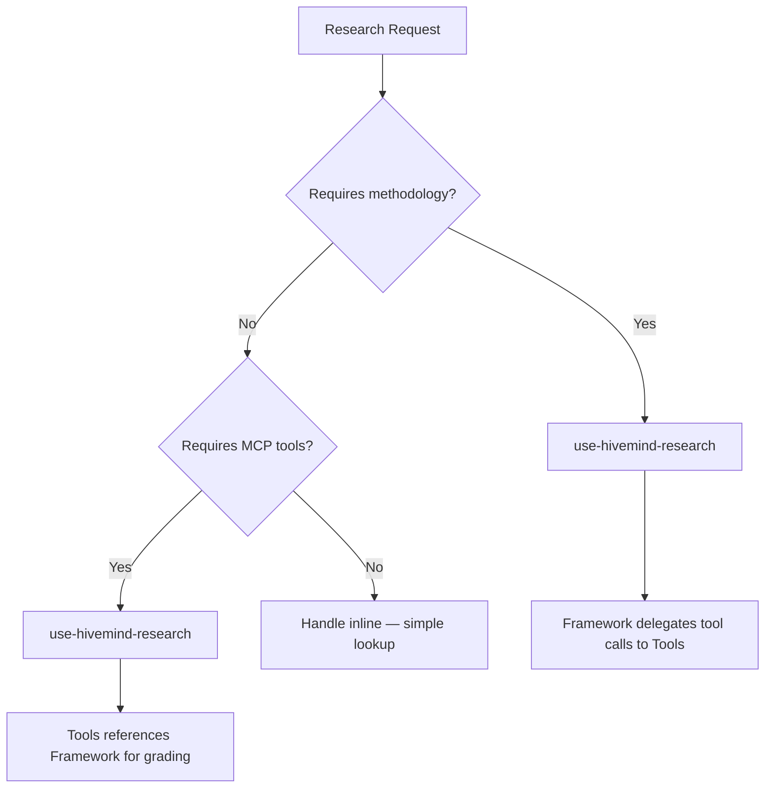

# ses_2bb5

**Session ID:** ses_2bb5
**Created:** 3/31/2026, 11:02:35 PM
**Updated:** 3/31/2026, 11:15:12 PM

---

## Table of Contents

| # | Timestamp | Actor | Tools | Summary |
|---|-----------|-------|-------|---------|

---
## User


---
**Tool:** skill

**Input:**
```json
{"name":"use-hivemind"}
```

**Output:**
```
<skill_content name="use-hivemind">
# Skill: use-hivemind

# use-hivemind

## Purpose

Resolve one question before any action: "Am I the orchestrator or an executor?" Then gate project validity. Then route.

## GATE 0: Role Lineage Detection

Check ONE signal: does this agent receive instructions from a human, or from a delegation packet?

| Signal | Orchestrator | Executor |
|--------|-------------|----------|
| Prompt source | Human user directly | Delegation packet from another agent |
| Session type | Primary session | Sub-session (delegated) |
| context.ask() | Available (human in loop) | Not available (autonomous within bounds) |

Resolution rules:
1. Human prompt + context.ask() available → ORCHESTRATOR
2. Pre-defined scope + return contract → EXECUTOR
3. Ambiguous signal → assume ORCHESTRATOR (safer default)
4. Executor signal but no packet → BLOCK, escalate

Load exactly ONE reference after resolution:

| Role | Load |
|------|------|
| Orchestrator | `references/orchestrator-entry.md` |
| Executor | `references/executor-entry.md` |

## GATE 1: Project Validity

Run: `node scripts/hm-entry-gate.cjs --cwd <project-root>`

Exit code 0, PASS → proceed.
Exit code 0, DEGRADED → proceed with caution. Log soft warnings.
Exit code 1, FAIL → STOP. Report failures. Do not proceed.

Run GATE 1 once per session start (or when context feels uncertain). Not every turn.

## Post-Gate Routing

After GATE 0 + GATE 1 resolve, load routing and intelligence references:

### Protocol References (loaded by both branches)

| File | Contains |
|------|----------|
| `references/agent-roles.md` | Per-agent capability matrix for routing resolution |
| `references/role-boundaries.md` | Session positioning, lineage detection, delegation thresholds |
| `references/domain-coupling-map.md` | Intent → specialist → depth reference routing table |

### Intelligence References (loaded after routing)

| File | Contains |
|------|----------|
| `references/project-state-awareness.md` | Phase detection, blockage signals, doc trustworthiness, distrust levels |
| `references/task-classification.md` | Request type classification matrix with routing targets |
| `references/session-state.md` | Session continuity: fresh, resume, post-compaction tracking |

### Templates

| File | Contains |
|------|----------|
| `templates/load-template.md` | Dynamic batch loading templates for common workflows |

### Scripts

| File | Contains |
|------|----------|
| `scripts/hm-entry-gate.cjs` | Universal project validity gate (6 gates, zero deps) |

## Turn Loop

Re-enter GATE 0 every turn. Do not carry state between turns except what the orchestrator persists via git memory.

```
Turn start → GATE 0 → Load role reference → Follow role protocol → Turn end
                                                                      │
                                                Next turn → GATE 0 ──┘
```

## Hard Blocks

- Skip GATE 0 → BLOCK
- Load BOTH branch references → BLOCK
- Act before role resolved → BLOCK
- Executor loading governance content → BLOCK
- Proceed past GATE 1 when script fails → BLOCK

## Platform

Framework-agnostic. Works in OpenCode, Claude Code, Cursor, Gemini CLI, and any agent system that supports skill loading. Platform-specific behaviors handled by the platform layer, not by this skill.

## Independence Rules

- No implementation — routes only
- No deep reads — context assessment is shallow
- No mutation — never writes files, modifies state, or commits
- No how-to-implement — delegates process guidance only

Base directory for this skill: file:///Users/apple/hivemind-plugin/.worktrees/product-detox/.opencode/skills/use-hivemind
Relative paths in this skill (e.g., scripts/, reference/) are relative to this base directory.
Note: file list is sampled.

<skill_files>
<file>/Users/apple/hivemind-plugin/.worktrees/product-detox/.opencode/skills/use-hivemind/templates/load-template.md</file>
<file>/Users/apple/hivemind-plugin/.worktrees/product-detox/.opencode/skills/use-hivemind/scripts/hm-entry-gate.cjs</file>
<file>/Users/apple/hivemind-plugin/.worktrees/product-detox/.opencode/skills/use-hivemind/references/context-rot-defense.md</file>
<file>/Users/apple/hivemind-plugin/.worktrees/product-detox/.opencode/skills/use-hivemind/references/orchestrator-self-assessment.md</file>
<file>/Users/apple/hivemind-plugin/.worktrees/product-detox/.opencode/skills/use-hivemind/references/verification-before-completion.md</file>
<file>/Users/apple/hivemind-plugin/.worktrees/product-detox/.opencode/skills/use-hivemind/references/orchestrator-entry.md</file>
<file>/Users/apple/hivemind-plugin/.worktrees/product-detox/.opencode/skills/use-hivemind/references/task-classification.md</file>
<file>/Users/apple/hivemind-plugin/.worktrees/product-detox/.opencode/skills/use-hivemind/references/intent-classification.md</file>
<file>/Users/apple/hivemind-plugin/.worktrees/product-detox/.opencode/skills/use-hivemind/references/context-health-protocol.md</file>
<file>/Users/apple/hivemind-plugin/.worktrees/product-detox/.opencode/skills/use-hivemind/references/agent-roles.md</file>
</skill_files>
</skill_content>
```

---
**Tool:** skill

**Input:**
```json
{"name":"use-hivemind-delegation"}
```

**Output:**
```
<skill_content name="use-hivemind-delegation">
# Skill: use-hivemind-delegation

# use-hivemind-delegation


**Path Parameters** (adapt to your framework):
- `{runtime_state_dir}` — Root runtime state directory (e.g., `.hivemind/` for Hivemind, `.claude/` for Claude Code, `.cursor/` for Cursor)
- `{activity_dir}` — Activity artifacts directory (e.g., `{runtime_state_dir}/activity/`)
- `{session_state_file}` — Session continuity state file (e.g., `{activity_dir}/sessions/continuity.json`)
- `{delegation_dir}` — Delegation artifacts directory (e.g., `{activity_dir}/delegation/`)
- `{pathing_config}` — Pathing configuration file (e.g., `{runtime_state_dir}/pathing/active-paths.json`)
- `{delegation_registry}` — Delegation registry file (e.g., `{delegation_dir}/registry.json`)

Local delegation family for the refactored pack. Governs when, how, and with what constraints a front-facing agent dispatches work to subagents.

## Purpose

- Decide whether delegation is actually needed — delegation is mandatory when criteria are met
- Bound scope before any handoff
- Choose sequential vs parallel mode deterministically
- Emit reusable delegation packets and handoff briefs
- Recover from failures, partial returns, and blocked routes

## Use This For

- User explicitly asks to delegate or split work
- Router stages produce multiple bounded slices
- Role or authority boundaries must be explicit before handoff
- Verification, research, planning, and execution need different packets
- Work spans >3 files or requires deep reads the orchestrator must not do
- Session context is stale or suspect and fresh subagent context is needed

## Table of Contents

- [Use This For](#use-this-for)
- [Anti-Patterns to Avoid](#anti-patterns-to-avoid)
- [Sibling Skills](#sibling-skills)
- [Delegation Decision Rules](#decision-rules)
- [Topology Decision Rules](#topology-decision-rules)
- [Task Decomposition Rules](#task-decomposition-rules)
- [Agent Selection](#agent-selection)
- [Task Extraction from Plan](#task-extraction-from-plan)
- [Orchestrator Protection](#orchestrator-protection)
- [How-To-Process vs How-To-Implement in Packets](#how-to-process-vs-how-to-implement)
- [Core Protocol](#core-protocol)
- [Shared Return Contract](#shared-return-contract)
- [Post-Return Protocol](#post-return-protocol)
- [Delegation Modes](#delegation-modes)
- [Role Boundaries](#role-boundaries)
- [Failure and Recovery](#failure-and-recovery)
- [Codescan Delegation](#codescan-delegation)
- [Investigation Swarm Delegation](#investigation-swarm-delegation) *(detailed: references/investigation-swarm.md)*
- [Hierarchical Consumption](#hierarchical-consumption) *(detailed: references/hierarchical-consumption.md)*
- [Multi-Wave Dispatch Protocol](#multi-wave-dispatch-protocol)
- [Granularity Enforcement](#granularity-enforcement)
- [Context Window Management](#context-window-management)
- [Iterative Loop Control](#iterative-loop-control)
- [Session Resume in Delegation](#session-resume)
- [Workflow Example](#workflow-example)
- [Bundled Resources](#bundled-resources)
- [Independence Rules](#independence-rules)

## Anti-Patterns to Avoid

**NEVER dispatch without checking the active delegation registry.** Before creating a new delegation packet, read `{delegation_registry}`. If a prior delegation covers the same scope and is still active or pending, do not create a duplicate. Re-use or resume the existing one.

**NEVER create packets without verifying parent workflow state.** If dispatched by an orchestrator, check the parent's planning documents, governance files, and workflow phase before emitting sub-delegations. A child that doesn't know the parent's goals will fragment the workflow.

**NEVER delegate recursively without consuming carry-forward.** If the delegation packet includes carry-forward from a parent wave, read and integrate that carry-forward (≤5 findings, blocked routes, next action) before dispatching children. Skipping parent context is a context integrity failure.

**NEVER assume the user's next prompt resets the delegation chain.** The next agent in the sequence may receive a user message that appears disconnected from prior work. That agent must check the delegation registry, workflow state, and the session continuity file before acting — not assume the user's message means "start fresh."

## Sibling Skills

| Skill | Relationship |
|-------|-------------|
| `use-hivemind` | Router that triggers this skill — delegates slices here |
| `hivemind-codemap` | Codescan mode — this skill owns handoff discipline; codemap owns scan mechanics |
| `hivemind-system-debug` | Debug mode — debug delegation dispatches through this protocol |
| `hivemind-spec-driven` | Planning mode — distillation outputs feed into planning delegation |
| `use-hivemind-context` | Stale session probe — delegate this when orchestrator context is suspect |
| `use-hivemind-git-memory` | Git-aware continuity — commit SHAs and branch state recorded in packets |
| `hivemind-gatekeeping` | Iterative loops, synthesis gates, cascading failure — extracted from this skill |
| `hivemind-synthesis` | Investigation swarm orchestration — coordinates parallel hivexplorer waves through this protocol |

`activity_type` and `phase_type` enum values are defined in the pack-level AGENTS.md under Typed Activity Contract.

## Delegation Decision Rules

Delegate when **any** of:
1. Work touches >3 files
2. Work requires deep reads the orchestrator must not do (session freshness rule)
3. Work has independent verification needs (separate verification agent)
4. Session context is stale or suspect
5. Multiple concerns (read + write + verify) must be handled by different authority levels
6. The user explicitly requests delegation or splitting

Do NOT delegate when:
1. Single-file edit with clear scope and fresh context
2. Task completable in <3 inline actions
3. Scope is unclear — clarify first, then decide

**Delegation has overhead**: packet creation, subagent dispatch, return synthesis. For small tasks, overhead may exceed inline execution cost. But session freshness always wins — if context is suspect, delegate regardless of task size.

**Delegation is mandatory, not optional.** If criteria are met, the orchestrator MUST emit a packet. Failure to delegate when required is a session discipline violation.

### Granularity Enforcement (MANDATORY)

| Rule | Threshold | Action |
|------|-----------|--------|
| File count | >3 files | MUST decompose into sub-tasks |
| LOC written | >500 LOC | NEVER in one task — split by concern or file cluster |
| Parallel writes | Same domain | FORBIDDEN — sequential only |
| Parallel dispatch | Independent READ-only | RECOMMENDED for deep investigation or token-heavy research |

If a slice exceeds 500 LOC, reject the packet and re-plan decomposition. No exceptions.

## Topology Decision Rules

Choose the dispatch topology before emitting packets:

| Topology | When | Independence |
|----------|------|-------------|
| **Single agent** | Simple, isolated task | N/A |
| **Parallel** | Independent slices, no shared state | Must prove independence |
| **Sequential** | Output of agent A feeds agent B | Ordered dependency |
| **Wave** | Sequential batches of parallel agents | See Multi-Wave Dispatch Protocol |

**Decision:** If slices share files or mutable state → sequential. If isolated → parallel. If multi-phase → wave.

## Task Decomposition Rules

Decompose large tasks before delegating. Use this priority order:

1. **Authority surface boundaries first** — separate tools from hooks from core from shared
2. **Concern type second** — split read-only from write-capable from verification
3. **File cluster third** — group files that share imports or interfaces

Each slice should be:
- Completable in one subagent pass (≤5 files per slice)
- Self-contained (does not depend on another slice's output unless sequential is chosen)
- Bounded by explicit out-of-scope (what the slice must NOT touch)

If a slice needs >5 files, split further. If a slice mixes read and write, split by concern.

## Agent Selection

Match task type to agent. Fallbacks exist when the primary agent is unavailable:

| Task | Agent | Fallback |
|------|-------|----------|
| Implementation | hivemaker | build |
| Testing | hitea | build |
| Verification | hiveq | explore |
| Debugging | hivehealer | general |
| Planning | hiveplanner | plan |
| Architecture | architect | plan |
| Code review | code-skeptic | general |
| Research | hiverd | explore |
| Scanning/Investigation | hivexplorer | explore |
| Complex coordination | handoff | general |

## Task Extraction from Plan

When consuming a plan for delegation:

- Each plan phase → delegation packet
- Each slice → one subagent task
- Each gate → verification before next phase
- Plan phases feed waves: investigation → research → planning → implementation → verification

## Orchestrator Protection

When delegation is triggered from the detox router or any polluted-context session:

1. **The orchestrator emits the packet; the subagent does the work.** The orchestrator must not perform deep reads, scans, or audits itself.
2. **Return contracts must include a compressed carry-forward** (≤5 findings + blocked routes + next action + output paths). The orchestrator does NOT read full output files — only summary fields and output paths.
3. **If the orchestrator catches itself doing multi-file reads after dispatching a delegation,** STOP immediately and wait for the subagent return. This is a session discipline violation — not a minor one.
4. **Stale context is always a delegation trigger** regardless of task size. If the orchestrator's accumulated context becomes unreliable, delegate a fresh `use-hivemind-context` probe instead of continuing with suspect information.
5. **Delegation is mandatory when criteria are met.** The orchestrator may not choose to do deep work itself when the decision rules above indicate delegation is required.

<HARD-GATE>
The orchestrator must never do deep work when delegation criteria are met. Reading more than 2 code files sequentially after dispatching violates the mandate. STOP. Wait for the subagent. The orchestrator that investigates is the orchestrator that stops orchestrating.
</HARD-GATE>

## How-To-Process vs How-To-Implement in Packets

Delegation packets tell the subagent **what process to follow**, never **how to write the code**. This is the single most common delegation mistake.

**HOW-TO-PROCESS (correct):**
- What skills to load (e.g., "load `hivemind-codemap` before scanning")
- Coordination with other agents (e.g., "wait for research return before implementing")
- Expected output format (e.g., "return findings as JSON with file:line refs")
- Success metrics (e.g., "all tests pass, no type errors")
- Pre/post workflows (e.g., "run type checking before returning" — e.g., `npx tsc --noEmit` for TypeScript)
- Self-verification requests (e.g., "verify build succeeds before claiming complete")
- Evidence output paths to correct domain-specific activity paths

**NOT HOW-TO-IMPLEMENT (never do this):**
- Never specify the actual code to write
- Never prescribe the specific algorithm
- Never dictate the exact function signature
- Never write pseudocode the child must follow

**Correct packet excerpt:**
```json
{
  "scope": "Investigate test failures in src/tools/trajectory/",
  "constraints": ["read-only", "no file mutations"],
  "skills_to_load": ["hivemind-codemap"],
  "success_metrics": "All failing tests identified with file:line references",
  "output_path": "{activity_dir}/codescan/pass-01/",
  "return_format": "JSON with findings array, each item has file, line, reason"
}
```

**Incorrect packet excerpt:**
```json
{
  "scope": "Fix the tests",
  "instructions": "Open trajectory.test.ts, change line 42 to use mockSession instead of realSession, then add a beforeEach that calls setupMocks()"
}
```

The orchestrator says **what** (process). The subagent figures out **how** (implementation).

<HARD-GATE>
If a delegation packet contains specific code to write, algorithms to use, or exact function signatures to implement — the packet is INVALID. The orchestrator says WHAT process to follow. The subagent figures out HOW to implement. Re-write the packet before dispatching.
</HARD-GATE>

## Core Protocol

1. **Confirm delegation is needed** — delegation costs context-switching overhead; use the decision rules above. (See `references/delegation-decision.md` for extended criteria.)
2. **Write the slice boundary** — scope, out-of-scope, constraints, success metrics. Decompose by authority surface, then concern type, then file cluster. (See Task Decomposition Rules above.)
3. **Choose the mode** — `research`, `execution`, `verification`, or `planning`. Each mode has different success tests and return expectations.
4. **Choose execution mode** — `sequential` by default; allow `parallel` only for isolated slices. (See `references/delegation-modes.md` for the parallel gate.)
5. **Tag the work** with `activity_type` and `phase_type` before dispatch. These tags link delegation to the development storyline and enable cross-skill continuity.
6. **Emit a delegation packet and handoff brief** before dispatch. The packet is the contract. The brief is the human-readable summary. (See `templates/delegation-packet.md` and `templates/handoff-brief.md`.)
7. **Require a structured return** with findings, evidence, blocked routes, and next action. (See Shared Return Contract below and `references/failure-recovery.md`.)
8. **Include parent governance** — Always attach references to ongoing planning documents, governance files, and parent workflow state. The subagent must know it was delegated, what the parent's goals are, and how this slice fits the larger picture.
9. **Include stop_conditions** — Every delegation packet MUST include a `stop_conditions` array (see below). A packet without stop_conditions is invalid.

### Stop Conditions (Required in Every Packet)

Every delegation packet MUST include a `stop_conditions` array:

```json
{
  "stop_conditions": [
    "max_iterations_reached: 3",
    "same_failure_twice: escalate to orchestrator",
    "scope_violation: return partial with blocked_routes",
    "token_exhaustion_imminent: return compressed summary",
    "contradiction_with_prior_findings: pause and report"
  ]
}
```

Stop conditions are non-negotiable. Each condition must specify a trigger and the action to take. See `references/hard-stop-conditions.md` for extended stop trigger definitions.

## Shared Return Contract

Every meaningful delegation return must include:

| Category | Fields | Purpose |
|----------|--------|---------|
| **Routing** | `activity_type`, `phase_type`, `mode`, `execution_mode` | Links return to storyline |
| **Identity** | `packet_id`, `task_id`, `pass_id`, `batch_id`, `slice_id` | Enables resume and deduplication |
| **Scope tracking** | `files_checked`, `clean_files`, `blocked_files`, `coverage_gaps` | Proves coverage |
| **Evidence** | `confirmed`, `inferred`, `unverified`, `confidence`, `artifacts_written` | Evidence before assertions |
| **Output** | `output_paths` | Where detailed output lives (orchestrator reads summary only) |
| **Control** | `blocked_routes`, `recommended_next_action`, `open_loop_ids`, `open_packet_ids` | Enables orchestrator routing |

If a child cannot produce this shape, return a bounded partial result rather than pretending the slice is complete. A partial return with `status: "partial"` and populated `blocked_routes` is always better than a fabricated `status: "complete"`.

## Post-Return Protocol

After agents return, follow this 5-step protocol before advancing:

1. **Read evidence bundle** — not just claims. Inspect the actual output files, test results, and artifacts the agent produced.
2. **Check return contract compliance** — does the evidence match the expected return shape (fields, output paths, status)?
3. **Run verification gate** — if code changed → run type checking and tests (e.g., `npx tsc --noEmit` + `npm test` for TypeScript, or equivalent for your language). Do not skip this even if the agent claims tests pass.
4. **Synthesize into compressed carry-forward** — ≤5 findings, blocked routes, recommended next action, output paths. The orchestrator does NOT retain full agent output.
5. **Decide next action** — advance wave, re-dispatch with tighter scope, or gate-fail and escalate.

**No evidence = not done. Period.**

## Delegation Modes

| Mode | Use When | Primary Output | Success Test |
| --- | --- | --- | --- |
| `research` | Evidence or discovery is still missing | handoff brief + findings | All required evidence collected |
| `execution` | The slice is bounded and implementation-ready | handoff brief + slice result | Code compiles, tests pass, scope respected |
| `verification` | The output must be hard proof, not a fix | handoff brief + verification result | All verification checks pass with evidence |
| `planning` | The child should return stages, not edits | handoff brief + bounded plan | Plan covers all known requirements |

Read `references/delegation-modes.md` for sequential-first rules and parallel gate conditions.

## Role Boundaries

**Front-facing agent (orchestrator):**
- Chooses the slice, sets constraints, decides whether child may mutate files
- Emits the delegation packet before dispatch
- Synthesizes returns — does NOT read full output files
- Decides sequential vs parallel
- Handles failures and escalation

**Delegated agent (child):**
- Stays inside scope — never exceeds `authority_surfaces` or `out_of_scope`
- Reports blocked routes instead of improvising new authority
- Returns evidence before conclusions
- Stops when the packet says stop
- Does NOT recursively self-delegate unless the packet explicitly permits it

**Enforcement:** If a child exceeds scope or mutates files outside `authority_surfaces`:
1. Mark the return as `scope_violation`
2. Do NOT merge the child's output
3. Re-delegate with tighter constraints or escalate to user

Read `references/role-boundaries.md` for invalid delegation examples.

## Failure and Recovery

When a delegation fails, returns partial results, or is blocked:

### Partial Return Handling
- Read `status` field: `complete` | `partial` | `blocked`
- If `partial`: check `blocked_routes` and `recommended_next_action` — resume from the action, not from scratch
- If `blocked`: check if the blocker is resolvable; if not, decompose the slice further

### Timeout Protocol
- Set an expected completion window per slice complexity
- If the subagent does not return within 2x the expected window, emit a status probe or abort and re-delegate
- Log timeout events for pattern detection

### Escalation Ladder
1. **Re-delegate** with tighter constraints and more specific guidance
2. **Decompose** the slice if blocked twice — the slice was too large
3. **Escalate to user** with evidence if decomposition still fails
4. **Abort** only if the slice is no longer needed

### Parallel-Slice Failure Isolation
- One failure does NOT abort other parallel slices unless a dependency exists
- Collect all returns before deciding on integration
- If a parallel slice fails and others succeed, integrate successes and re-delegate only the failed slice

For cascading failure and parallel-slice isolation at scale, see `hivemind-gatekeeping`.

Read `references/failure-recovery.md` for detailed recovery procedures, timeout heuristics, and blocked-route resolution patterns.

## Codescan Delegation

For code scanning work, use structured delegation with specific agent selection:
- **`explore` first** for all read-only scans (structure, exports, imports, seams, hotspots).
- **`general` only when** cross-file synthesis or deeper reasoning is needed.
- Track each scan pass through JSON checkpoints at `{activity}/codescan/{pass_id}/`.
- Support multi-pass chaining: `high-level-map` → `pipeline-map` → `journey-map` → `low-level-proof` → `cross-pass-synthesis`, each with its own `pass_id`.

Each deeper scan phase must read the previous phase synthesis artifact first. Do not skip straight to low-level proof while the high-level or pipeline model is still unresolved.

Read `references/codescan-delegation.md` for agent selection table, scan pass structure, resumable scan protocol, and bash helper integration.

## Investigation Swarm Delegation

Use `references/investigation-swarm.md` for full swarm dispatch rules, packet shape, orchestrator discipline, synthesis protocol, and wave-to-wave handoff format.

**Summary:** Launch parallel investigation agents (e.g., `hivexplorer` in Hivemind, or the equivalent subagent in your framework) with one concern per agent. Each returns ≤5 findings with `file:line` refs. The orchestrator reads ONLY compressed synthesis. Parallel within a wave; sequential between waves.

## Hierarchical Consumption

Use `references/hierarchical-consumption.md` for full wave sequencing, between-wave escalation rules, and merge-vs-split decision table.

**Summary:** Wave outputs feed forward. Never skip to implementation without consuming investigation + research synthesis. Carry-forward ≤5 items between waves. Orchestrator reads summary fields and output path only.

## Iterative Loop Control

For iterative loop control, carry-forward compression, synthesis gates, and integration verification, see `hivemind-gatekeeping`.

## Session Resume in Delegation

When delegating across turns or resuming prior delegations:
- Use `task_id` to resume a subagent that has prior context. Without it, the subagent starts fresh.
- Record `task_id` and `pass_id` in the delegation output for future resume.
- Record `branch`, `worktree`, `worktree_role`, `activity_type`, and `phase_type` so resume stays linked to current control context.

### Checking Prior Completion

To determine if a prior delegation completed before re-delegating:
1. Read `{activity}/delegation/{packet_id}-return.json`
2. Check `status` field: `complete` | `partial` | `blocked`
3. If `complete`: compare `scope` to current needs — re-delegate only if scope changed
4. If `partial`: resume from `recommended_next_action` — do not restart from scratch
5. If `blocked`: check `blocked_routes` — if resolvable, re-delegate with the blocker addressed; if not, decompose further
6. If file does not exist: the prior delegation never returned — treat as timeout and re-delegate

### Git-Aware Continuity

When the child must commit:
- Use a worktree — record `worktree` and `worktree_role` in the packet
- Name branches per project convention
- Return artifacts must include commit SHAs if the child committed
- If the child only reads, `worktree` field may be empty

At runtime, delegation packets and handoff briefs may be persisted via the `hivemind_handoff` tool. See the tool's documentation for persistence mechanics.

### Delegation Audit Trail

Append delegation events to `{activity}/delegation/registry.json` with:
- `packet_id`, `concern`, `dispatched_at`, `returned_at`, `status`
- This enables the orchestrator to query active/completed delegations

## Workflow Example

**Scenario:** 3 independent test failures → decompose into 3 slices (each ≤3 files) → dispatch parallel `verification` packets → 2 complete, 1 partial (`blocked: shared/types.ts`) → integrate successes, re-delegate blocked slice with expanded authority.

## Multi-Wave Dispatch Protocol

Complex tasks require multi-wave dispatch, not single-shot delegation.

### Standard Investigation → Research → Planning Flow

**Initial Checkpoint:**
- Packet 1: 3 parallel investigation agent dispatches (e.g., `hivexplorer`) to investigate codebase, dependencies, test coverage → SYNTHESIZE → ≤5 findings output
- Packet 2 (sequential to Packet 1): Combine user prompt + synthesis → dispatch 2 parallel waves (investigation + research agents) for internal cross-validation + external research → SYNTHESIZE → ≤5 findings output
- From Packet 1 + 2 output → decision checkpoint to build master planning

**Checkpoint 2 (Planning):**
- The planning agent (e.g., `hiveplanner`) decomposes into phases with dependency DAG
- architect validates architecture decisions → SYNTHESIZE → plan with gates

### Wave Sequencing

Wave 1 (investigation) → synthesis → Wave 2 (research/planning) → synthesis → Wave 3 (implementation) → synthesis → Wave 4 (verification)

Skip a wave only if the previous wave's synthesis explicitly confirms no gaps remain.

### When to Merge Waves vs Keep Separate

| Scenario | Action |
|----------|--------|
| Waves cover independent domains | Keep separate — parallel dispatch |
| Wave 2 depends on Wave 1's specific findings | Sequential — merge only after synthesis |
| Both waves ask the same agent type | Merge into one wave with combined scope |

Full protocol: `references/multi-wave-dispatch.md`

## Context Window Management

Each subagent session has ~200k context window. Plan dispatches accordingly.

**Token-heavy operations** (plan for parallel to divide load):
- Deep research: tavily, webfetch, context7, repomix, deepwiki
- Deep investigation: "depth" and "variants" analysis
- Multi-source comparison: cross-referencing multiple documentation sets

**Token-efficient operations** (can run inline or in single dispatch):
- Targeted file reads with grep
- Single-file verification
- Quick status checks

**Budget rule**: If estimated token usage exceeds 100k for a single dispatch, split into parallel independent slices.

## Bundled Resources

| Resource | Purpose |
|----------|---------|
| `references/delegation-modes.md` | Sequential-first rules, parallel gate, mode fit |
| `references/delegation-decision.md` | Extended decision criteria, cost/benefit, when-not-to-delegate |
| `references/role-boundaries.md` | Parent/child responsibilities, invalid delegation examples |
| `references/codescan-delegation.md` | Agent selection, scan pass structure, resumable protocol |
| `references/failure-recovery.md` | Partial return, timeout, escalation |
| `references/multi-wave-dispatch.md` | Multi-wave dispatch flow, investigation swarms, hierarchical consumption |
| `references/architecture-audit-delegation.md` | Architecture audit delegation packet pattern |
| `references/debug-delegation.md` | Debug workflow delegation patterns |
| `references/domain-escalation.md` | Domain escalation rules and triggers |
| `references/evidence-collection.md` | Evidence collection methodology for delegation |
| `references/parallel-dispatch.md` | Parallel dispatch coordination and safety |
| `references/rb-role-platform-mapping.md` | Role-based role-to-platform mapping |
| `references/refactor-delegation.md` | Refactor workflow delegation patterns |
| `references/research-thread-management.md` | Research thread lifecycle management |
| `references/role-platform-mapping.md` | Role-to-platform agent mapping |
| `references/source-validation.md` | Source validation for delegated work |
| `references/subagent-driven-development.md` | Subagent-driven development workflow |
| `references/multi-reviewer-protocol.md` | Multi-agent review dispatch, dimension ownership, synthesis |
| `references/hard-stop-conditions.md` | Immediate delegation stop triggers and recovery protocol |
| `templates/delegation-packet.md` | Full packet JSON template |
| `templates/handoff-brief.md` | Human-readable brief template |
| `templates/codescan-delegation-packet.md` | Codescan-specific packet template |
| `templates/audit-delegation-packet.md` | Architecture audit packet template |
| `templates/debug-delegation-packet.md` | Debug workflow packet template |
| `templates/evidence-table.md` | Evidence table template for returns |
| `templates/implementer-prompt.md` | Implementer agent prompt template |
| `templates/rb-role-declaration.md` | Role-based role declaration template |
| `templates/refactor-delegation-packet.md` | Refactor workflow packet template |
| `templates/research-delegation-packet.md` | Research delegation packet template |
| `templates/role-declaration.md` | Role declaration template |
| `templates/spec-reviewer-prompt.md` | Spec reviewer prompt template |
| `tests/direct-invocation.md` | Basic delegation scenario with validation |
| `tests/parallel-delegation.md` | Parallel dispatch scenario with validation |
| `tests/failure-recovery.md` | Blocked-route recovery scenario with validation |
| `tests/course-correction.md` | Course correction scenario with validation |
| `tests/research-delegation.md` | Research delegation scenario with validation |

## Independence Rules

- This package is self-contained for normal delegation flow.
- It does not require old router-to-router chains.
- It may be selected directly or from `use-hivemind`.
- Delegation artifacts are stored in `{delegation_dir}` at runtime.

## Activity Output

All artifacts produced by this skill follow the Activity Folder Protocol.

**Pathing:** See `{pathing_config}` for resolved output paths.
**Naming:** `{category}-{semantic-id}-{YYYY-MM-DD}.{ext}`
**Meta:** All JSON includes `_meta.created_at`, `_meta.updated_at`, `_meta.producer`.
**Validation:** Run the artifact validation script (e.g., `bash scripts/hm-artifact-validate.sh {path}` or equivalent) to confirm compliance.

## OpenCode Tool Matrix

| Need | Tool | Why |
|------|------|-----|
| delegate bounded work | `task` | launches clean subagent session |
| persist handoff state | `hivemind_handoff` | stores resumable packet metadata |
| track workflow linkage | `hivemind_task` | ties packets to workflow/task IDs |
| record trajectory checkpoints | `hivemind_trajectory` | preserves phase transitions |
| inspect delegation docs | `hivemind_doc` | read-only doc access |
| verify current runtime | `hivemind_runtime_status` | confirm attached workflow state |

Base directory for this skill: file:///Users/apple/hivemind-plugin/.worktrees/product-detox/.opencode/skills/use-hivemind-delegation
Relative paths in this skill (e.g., scripts/, reference/) are relative to this base directory.
Note: file list is sampled.

<skill_files>
<file>/Users/apple/hivemind-plugin/.worktrees/product-detox/.opencode/skills/use-hivemind-delegation/DEBT.md</file>
<file>/Users/apple/hivemind-plugin/.worktrees/product-detox/.opencode/skills/use-hivemind-delegation/scripts/hm-artifact-create.sh</file>
<file>/Users/apple/hivemind-plugin/.worktrees/product-detox/.opencode/skills/use-hivemind-delegation/scripts/hm-artifact-validate.sh</file>
<file>/Users/apple/hivemind-plugin/.worktrees/product-detox/.opencode/skills/use-hivemind-delegation/scripts/hm-packet-validate.sh</file>
<file>/Users/apple/hivemind-plugin/.worktrees/product-detox/.opencode/skills/use-hivemind-delegation/tests/failure-recovery.md</file>
<file>/Users/apple/hivemind-plugin/.worktrees/product-detox/.opencode/skills/use-hivemind-delegation/tests/research-delegation.md</file>
<file>/Users/apple/hivemind-plugin/.worktrees/product-detox/.opencode/skills/use-hivemind-delegation/tests/parallel-delegation.md</file>
<file>/Users/apple/hivemind-plugin/.worktrees/product-detox/.opencode/skills/use-hivemind-delegation/tests/direct-invocation.md</file>
<file>/Users/apple/hivemind-plugin/.worktrees/product-detox/.opencode/skills/use-hivemind-delegation/tests/course-correction.md</file>
<file>/Users/apple/hivemind-plugin/.worktrees/product-detox/.opencode/skills/use-hivemind-delegation/references/domain-escalation.md</file>
</skill_files>
</skill_content>
```

---
**Tool:** skill

**Input:**
```json
{"name":"use-hivemind-context"}
```

**Output:**
```
<skill_content name="use-hivemind-context">
# Skill: use-hivemind-context

# use-hivemind-context


**Path Parameters** (adapt to your framework):
- `{runtime_state_dir}` — Root runtime state directory (e.g., `.hivemind/` for Hivemind, `.claude/` for Claude Code, `.cursor/` for Cursor)
- `{activity_dir}` — Activity artifacts directory (e.g., `{runtime_state_dir}/activity/`)
- `{session_state_file}` — Session continuity state file (e.g., `{activity_dir}/sessions/continuity.json`)
- `{delegation_dir}` — Delegation artifacts directory (e.g., `{activity_dir}/delegation/`)
- `{pathing_config}` — Pathing configuration file (e.g., `{runtime_state_dir}/pathing/active-paths.json`)
- `{delegation_registry}` — Delegation registry file (e.g., `{delegation_dir}/registry.json`)

Before trusting a doc, a memory, a prior session's claim, or a test result — stop. This domain router puts a checkpoint between "I remember" and "I trust." It doesn't do the checking itself. It dispatches to the right specialist based on what kind of doubt exists: session health uncertainty, or project-structural verification.

**Parent:** `use-hivemind` (entry router)

## Table of Contents

- [Load Position](#load-position)
- [When Needed](#when-needed)
- [Anti-Patterns to Avoid](#anti-patterns-to-avoid)
- [The 3-Step Trust Check](#the-3-step-trust-check)
- [Distrust Levels](#distrust-levels)
- [Session Position Detection](#session-position-detection)
- [Routing Logic](#routing-logic)
- [Verification Gates](#verification-gates-project-reality)
- [Freshness Probe](#freshness-probe)
- [Cross-Team Context Awareness](#cross-team-context-awareness)
- [Multi-Source Comparison](#multi-source-comparison)
- [Context Preservation Across Long Sessions](#context-preservation-across-long-sessions)
- [Multi-Wave Context Protocol](#multi-wave-context-protocol)
- [Token Budget Awareness](#token-budget-awareness)
- [Distrust Protocol](#distrust-protocol)
- [Orchestrator Integration](#orchestrator-integration)
- [Handoff Paths](#handoff-paths)
- [Carry-Forward](#carry-forward)
- [Sibling Skills](#sibling-skills)
- [Anti-Patterns](#anti-patterns)
- [Bundled Resources](#bundled-resources)

## When Needed

| Signal | Route To |
|--------|----------|
| Session just resumed after interruption, compaction, or `/clear` | `use-hivemind-context` (quick mode) |
| Something feels off — docs don't match code, memory seems stale | `use-hivemind-context` (rot mode) |
| Need a full trust breakdown before a major decision | `use-hivemind-context` (full mode) |
| Before starting work — baseline project health | `use-hivemind-context` (gate-chain or landscape) |
| Between implementation phases — gate checkpoint | `use-hivemind-context` (individual gates) |
| Validating a completion claim with hard evidence | `use-hivemind-context` (gate-chain) |
| After merges, dependency changes, or long gaps | `use-hivemind-context` (landscape) |

## Anti-Patterns to Avoid

**NEVER skip context check when resuming after a user prompt.** The user's message arrives into an existing workflow state — an active plan, pending delegations, partial completions. Verify that state before acting. Assuming the user's prompt means "start fresh" breaks the mandate of roles.

**NEVER trust session continuity without verifying artifacts.** The session continuity file claims a task is complete? Verify the output file exists and matches expectations. It claims context is CLEAN? Run the freshness probe. Continuity state is a convenience layer, not a ground truth.

**NEVER assume CLEAN context after compaction/disconnect without a probe.** Session compaction rewrites context. Disconnections lose state. After either event, run at minimum the quick mode freshness probe before trusting accumulated context. CLEAN requires proof, not assumption.

**NEVER act on the user's next prompt without verifying workflow, orchestration, and artifact state.** Agents in the next N turns always assume they can execute after the user's next-in-turn prompt. This assumption is WRONG. Check: Is there an active workflow? Pending delegations? Unresolved returns? Documents that contradict current intent? The user's prompt exists inside a system state — verify that system state first.

## The 3-Step Trust Check

Before routing, run this mental model. It takes five seconds and catches most problems.

1. **Freshness** — Was anything relevant written in the last 48 hours?
   - Docs, commits, session state files. If nothing is recent, context is suspect.
2. **Code vs Docs** — Does the code match what the docs claim?
   - Open the file. Don't trust the doc's word. The code is the authority.
3. **Prior Sessions** — Is memory corroborated by git or build output?
   - If "remembering" something but git doesn't show it, the memory is wrong.

If step 1 fails → go straight to rot check. If step 2 or 3 fails → go full analysis.

## Distrust Levels

Declare the level explicitly. Don't mumble "it might be stale." Say what it is.

| Level | Meaning | What To Do |
|-------|---------|------------|
| **CLEAN** | Docs, code, and git agree. Recent commits exist. Session state is readable. | Proceed normally. |
| **SUSPECT** | One source disagrees with others, or documents are >48 hours old. | Cross-check the disagreeing source before trusting. |
| **DEGRADED** | Multiple contradictions. Session state is stale or unreadable. | Run rot check. Quarantine unverified claims. |
| **POLLUTED** | Active misinformation — docs claim things the code doesn't do, or AGENTS.md references non-existent files. | Trust-nothing mode. Verify everything from code and git. |
| **POISONED** | Session context is actively contradictory. Prior session memory conflicts with git history. | Full analysis. Emit checkpoint. Do not proceed until trust is rebuilt. |

When DEGRADED or worse, say it out loud: "Context is DEGRADED. Distrusting [specific sources] until verified."

## Session Position Detection

Before routing context checks, determine session position:

| Signal | Position | Context Action |
|--------|----------|---------------|
| First message in session | Main, Fresh | Quick mode baseline |
| Mid-conversation, no interruptions | Main, Accumulated | Trust accumulated unless signals indicate rot |
| After `/clear` or compaction | Main, Recovering | Load session continuity file, run rot check |
| After user cancel + resume | Main, Suspect | Full mode — verify everything |
| Received delegation packet | Sub-agent | Trust packet's validated context, skip self-check |

## Routing Logic

```
Input: what's doubted?
  ├── Session health, freshness, prior memory
  │     → use-hivemind-context
  │       ├── --quick  (fast continuity probe)
  │       ├── --rot    (deterministic PASS/FAIL gate)
  │       └── --full   (deep trust breakdown)
  │
  └── Project state, build, tests, git structure
        → use-hivemind-context
          ├── gate-chain  (fail-fast sequential)
          ├── landscape   (full report, never blocks)
          └── individual  (targeted gate checks)
```

## Verification Gates (Project Reality)

When `use-hivemind-context` is dispatched for project verification, these four layers run:

| Layer | What It Checks | Gate Type |
|-------|---------------|-----------|
| 1. Project Reality | Build, tests, contracts, dependencies, SDK surface | Hard — blocks |
| 2. Planning Integrity | Plan files exist, reference real files, no contradictions | Hard — requires `.planning/` convention |
| 3. Git Evidence | Branch state, last commit, diff stats, merge-conflict-free | Hard — blocks |
| 4. Architecture | Domain boundaries, dead exports, circular dependencies | Soft — warnings only |

Layer 2 assumes a `.planning/` directory with `STATE.md`, `ROADMAP.md`, `REQUIREMENTS.md`. If the project doesn't use that convention, use `landscape` instead of `gate-chain` to skip meaningless failures.

## Freshness Probe

Quick checks to run before dispatching:

- **Document age**: Discover recently modified documents (e.g., `find . -name "*.md" -mtime -2` or equivalent file discovery) — anything older than 2 days is suspect
- **Git recency**: Query recent commit history (e.g., `git log --oneline -5` or `hg log -5`) — if the latest commit is days old, session memory is stale
- **Session state**: Check `{session_state_file}` exists and has a recent `updated_at`
- **Test signal**: Run type checking and tests (e.g., `npx tsc --noEmit && npm test` for TypeScript, `pytest` for Python, `cargo test` for Rust) — if tests pass but code looks wrong, the test is lying

## Cross-Team Context Awareness

Context rot from other agents is invisible without git probing. Before dispatching, check for cross-team contamination.

<HARD-GATE>
The orchestrator MUST run these probes before trusting context that touches shared files. Skipping this step risks inheriting invisible breakage from other agents.
</HARD-GATE>

| Probe | Command | Trigger |
|-------|---------|---------|
| Uncommitted changes from other agents | Check working tree status (e.g., `git status` or equivalent) | Before any dispatch to shared files |
| Recent commits on shared interfaces | Query recent commits on a path (e.g., `git log --oneline --since="48 hours ago" -- <path>` or equivalent) | Before dispatching to files others may have touched |
| Branch divergence | Check remote sync state (e.g., `git fetch --dry-run` or equivalent) | Before starting work on a feature branch |
| Worktree isolation check | List active worktrees (e.g., `git worktree list` or equivalent) | When multiple agents are active |

**Cross-team drift rules:**

1. **Another agent modified a dependency file** → context is at least **SUSPECT**. Cross-check that file's current state before proceeding.
2. **Shared interfaces changed in the last 48 hours** → read the diff. If types, schemas, or exported APIs changed, the implementation context is **DEGRADED**.
3. **Multiple worktrees active** → assume concurrent work is happening. Never trust that a file read 10 minutes ago is still accurate without re-checking.
4. **Uncommitted changes on files about to be edited** → stop. Another agent has a lock on that state. Coordinate or rebase before touching.

When cross-team changes are detected, declare it: "Cross-team drift detected on [files]. Reclassifying context to [level]."

## Multi-Source Comparison

When sources disagree, a systematic way to resolve conflicts. Never guess — compare and decide.

<HARD-GATE>
When docs contradict code → code wins. Always. No exceptions. This is the single most important rule in the context health domain.
</HARD-GATE>

**Resolution hierarchy:**

| Source A | Source B | Winner | Why |
|----------|----------|--------|-----|
| Documentation | Code | **Code** | Docs are advisory. Code is truth. |
| Git history | Session memory | **Git history** | Memory is reconstructed. Git is recorded. |
| Test output | Implementation | **Read the assertion** | Test may be trivially true (`assert(true)`). Inspect what it actually checks before trusting the pass. |
| Doc X (recent) | Doc Y (old) | **Doc X** | Prefer the fresher source, but verify both against code. |
| AGENTS.md instruction | Filesystem | **Filesystem** | If the file doesn't exist, the instruction is stale regardless of what AGENTS.md says. |
| Build output | README claims | **Build output** | Build output is deterministic. README claims are aspirational. |

**When multiple docs give different answers:**

1. List every source that addresses the claim.
2. For each source, check if it matches the current code. Discard any that don't.
3. If remaining sources still disagree, check git history for which one was written after the other.
4. Quarantine the stale one — mark it as `<!-- STALE: superseded by [source] on [date] -->` if write access is available, or flag it explicitly in the output if not.
5. Never leave contradictions unresolved. If the correct source cannot be determined, escalate to the orchestrator with both options and the evidence.

**Test-signal cross-check protocol:**

| Test Signal | Interpretation |
|-------------|----------------|
| Passes, code matches intent | Trust the pass |
| Passes, code looks wrong | **False positive** — read the assertion. The test may encode the wrong behavior. |
| Fails with setup error | **Noise** — isolate the environment issue from the logic issue |
| Fails, only on certain runs | **Flaky** — do not use as architectural evidence |
| Passes but is trivially true | **Nonsensical** — quarantine the test |

## Context Preservation Across Long Sessions

Long sessions rot faster than short ones. Context decays with every compaction, every delegation, every phase transition. Manage it explicitly.

<HARD-GATE>
Emits continuity checkpoints at EVERY phase transition. No exceptions. A phase transition without a checkpoint is a context loss event.
</HARD-GATE>

**Continuity checkpoint protocol:**

1. **At phase transition** → emit checkpoint to `{session_state_file}`
2. **Carry-forward compression** → ≤5 items:
   - Key findings (what was learned)
   - Blocked routes (what didn't work and why)
   - Recommended next action (what to do next)
   - Output paths (where artifacts live)
   - Active distrust (what's still SUSPECT or worse)
3. **After compaction** → reload the session continuity file and verify state matches expectations
4. **After delegation** → include distrust context in delegation packet so child agents don't repeat false trust

**Staleness guard:**

- If context grows stale during a long session → **delegate a fresh probe** instead of trusting accumulated context
- The orchestrator must NOT accumulate implementation detail — that pollutes routing context
- If work has continued for >30 minutes without a checkpoint, emit one now

**Compaction awareness:**

- After `session.compacting` fires, session context has been rewritten
- The compaction prompt may have lost nuance — re-verify critical claims after compaction
- Continuity checkpoints survive compaction because they're written to disk, not session memory

## Multi-Wave Context Protocol

When the orchestrator needs context verification before dispatching multi-wave work:

1. **Quick mode** on current session — is session fresh?
2. If fresh → proceed to dispatch
3. If SUSPECT or worse → run rot check BEFORE any dispatch
4. Include distrust context in ALL delegation packets for the wave
5. After wave returns → re-run quick mode to verify context didn't rot during dispatch

**Between waves**: Run freshness probe on shared files touched by prior wave.

## Token Budget Awareness

Context health includes token budget estimation:

| Operation Type | Estimated Tokens | Risk |
|---------------|-----------------|------|
| Single file read | 1-5k | Low |
| Codebase scan (grep/glob) | 5-15k | Low |
| Deep investigation (multi-file) | 20-50k | Medium |
| Research (tavily/webfetch) | 30-80k | High |
| Repomix/deepwiki scan | 50-150k | Critical |

When accumulated context + estimated dispatch tokens > 150k:
→ Emit continuity checkpoint BEFORE dispatch
→ Consider splitting into parallel independent slices
→ Compress carry-forward to ≤3 items instead of 5

## Distrust Protocol

When rot is detected or after session interruption:

1. **Trust-Nothing Mode**: Treat all prior context as stale until verified from code, git, or build output. Not "mostly trustworthy." Stale.
2. **AGENTS.md Quarantine**: Verify every instruction in AGENTS.md against actual code before following it. If it references a file that doesn't exist, quarantine the instruction — don't follow it and don't delete it.
3. **False Signal Awareness**: Test output, linter results, and doc-claimed behavior must be cross-checked against implementation reality. A passing test that asserts `true === true` proves nothing.

## Orchestrator Integration

When the orchestrator's session is already heavy:

- **Quick mode** can run inline — it's lightweight enough
- **Rot and full modes** should be **delegated** to a subagent — their output can be large
- The orchestrator reads only: `rot_level`, `trust`, `can_proceed`, `recommendations`
- If rot result is DEGRADED or worse, declare distrust before routing to any other domain

## Handoff Paths

```
{activity_dir}/context/check-cache.json    ← runtime cache (not official boundary)
{activity_dir}/codescan/                   ← scan outputs per pass
{session_state_file}                       ← session continuity state
```

Paths are relative to project root. Resolve via `{pathing_config}`.

## Carry-Forward

After any context check completes:

- If issues were found, emit a continuity checkpoint noting what was verified and what remains uncertain
- Store it in `{activity_dir}/context/` or `{activity_dir}/sessions/`
- If delegation follows, include the distrust context in the delegation packet so child agents don't repeat false trust
- Compress to ≤5 key findings, blocked routes, recommended next action, output paths

## OpenCode Tool Matrix

| Context Check | Preferred Tool | Why |
| --- | --- | --- |
| locate candidate files or session artifacts | `glob` | fast discovery |
| inspect exact session state | `read` | source of truth |
| scan contradictory claims | `grep` | cross-file mismatch hunting |
| validate git freshness | `bash` | real branch and history evidence |

## Concrete Bash Examples

```bash
# Discover recently modified docs (e.g., find . -name "*.md" -mtime -2 | head -10)
# Query recent commits on current directory (e.g., git log --oneline --since="48 hours ago" -- . | head -10)
# Check working tree status (e.g., git status --short --branch)
```

## Freshness Probe Decision Tree

1. **IF** docs are older than 48 hours and code changed recently, **THEN** distrust docs first.
2. **IF** shared files changed on the current branch, **THEN** reclassify context to at least `SUSPECT`.
3. **IF** continuity state is missing or stale, **THEN** rebuild context before routing execution work.
4. **IF** multiple sources disagree after probing, **THEN** escalate to a deeper context pass instead of guessing.

## Freshness Reference

Use `references/freshness-probe-reference.md` for the minimal command set and session-state checks.

Use `templates/context-freshness-report.json` when a router needs a small machine-readable freshness verdict.

## Sibling Skills

| Parent | This Skill | Depth Partners |
|--------|-----------|----------------|
| `use-hivemind` | `use-hivemind-context` | `hivemind-gatekeeping` |

This router consolidates the former `context-intelligence-entry` (session health, rot detection, trust scoring) and `context-entry-verify` (project verification gates, build/test/git checks) into unified `use-hivemind-context` routing, alongside `hivemind-gatekeeping` (iterative verification loops, checkpoint gates, carry-forward compression). Domain-specific scripts and references remain in their respective `scripts/` and `references/` directories.

## Anti-Patterns

**Assume remembered context is trustworthy.** It's not. Run a quick probe. Takes seconds, saves hours of debugging based on stale assumptions.

**Treat quick mode as sufficient for major decisions.** Quick mode reveals whether the session is alive. It doesn't reveal whether the project is healthy. Use rot or full when it matters.

**Trust a test pass without reading the assertion.** A test that asserts `expect(result).toBeDefined()` on a function that returns garbage is lying. Read what it actually checks.

**Follow AGENTS.md instructions that reference files without confirming they exist.** If AGENTS.md says "load the skill at `skills/foo/SKILL.md`" and that path doesn't exist, the instruction is stale. Quarantine it.

**Skip the distrust declaration and just keep working.** If context is DEGRADED and isn't declared, the next agent inherits false confidence. Declare the level. Every time.

**Run full analysis when quick mode would answer the question.** Full analysis is expensive. If the question is simply "is this session fresh?", quick mode is the right tool. Don't bring a spectrometer to check if the light is on.

**Trusting cross-team state without checking git.** Other agents are working. Shared files may have changed since last read. Run `git status` before dispatching to shared paths.

**Single-source verification.** Trusting one document without cross-checking against code or git is asking for stale context. Compare at least two sources before committing to a decision.

**Accumulating implementation context.** The orchestrator reads code files, pollutes routing context. Implementation detail belongs in subagent sessions, not the orchestrator's mental model.

**Skipping continuity checkpoint.** Phase transition without writing state to disk means the next agent starts blind. Emit the checkpoint. Every time.

## Bundled Resources

| Resource | Path | Purpose |
|----------|------|---------|
| Context Distrust Protocol | `references/context-distrust-protocol.md` | When and how to distrust context sources |
| Context Rot Taxonomy | `references/context-rot-taxonomy.md` | Classification of context degradation types |
| Delegation Scope | `references/delegation-scope.md` | Scope boundaries for context delegation |
| Entry State Matrix | `references/entry-state-matrix.md` | Session state detection and handling matrix |
| False Signal Detection | `references/false-signal-detection.md` | Identifying false positives in context assessment |
| Gate Chain Order | `references/gate-chain-order.md` | Order of context verification gates |
| Gate Definitions | `references/gate-definitions.md` | Formal definitions of each verification gate |
| Context Freshness Report | `templates/context-freshness-report.json` | Minimal machine-readable freshness verdict |
| Platform Surface | `references/platform-surface.md` | Platform-specific context surfaces |
| Trust Matrix | `references/trust-matrix.md` | Trust levels for different context sources |
| Output Schema | `schemas/output.schema.ts` | TypeScript schema for context assessment output |
| Context Harness Init | `scripts/context-harness-init.cjs` | Context harness initialization script |
| HM Verify | `scripts/hm-verify.cjs` | Context verification execution script |
| Direct Invocation | `tests/direct-invocation.md` | Test scenario for direct skill invocation |

## Activity Output

All artifacts produced by this skill follow the Activity Folder Protocol.

**Pathing:** See `{pathing_config}` for resolved output paths.
**Naming:** `{category}-{semantic-id}-{YYYY-MM-DD}.{ext}`
**Meta:** All JSON includes `_meta.created_at`, `_meta.updated_at`, `_meta.producer`.
**Validation:** Run the artifact validation script (e.g., `bash scripts/hm-artifact-validate.sh {path}` or equivalent) to confirm compliance.

Base directory for this skill: file:///Users/apple/hivemind-plugin/.worktrees/product-detox/.opencode/skills/use-hivemind-context
Relative paths in this skill (e.g., scripts/, reference/) are relative to this base directory.
Note: file list is sampled.

<skill_files>
<file>/Users/apple/hivemind-plugin/.worktrees/product-detox/.opencode/skills/use-hivemind-context/templates/context-freshness-report.json</file>
<file>/Users/apple/hivemind-plugin/.worktrees/product-detox/.opencode/skills/use-hivemind-context/scripts/hm-verify.cjs</file>
<file>/Users/apple/hivemind-plugin/.worktrees/product-detox/.opencode/skills/use-hivemind-context/schemas/output.schema.ts</file>
<file>/Users/apple/hivemind-plugin/.worktrees/product-detox/.opencode/skills/use-hivemind-context/scripts/context-harness-init.cjs</file>
<file>/Users/apple/hivemind-plugin/.worktrees/product-detox/.opencode/skills/use-hivemind-context/references/freshness-probe-reference.md</file>
<file>/Users/apple/hivemind-plugin/.worktrees/product-detox/.opencode/skills/use-hivemind-context/references/trust-matrix.md</file>
<file>/Users/apple/hivemind-plugin/.worktrees/product-detox/.opencode/skills/use-hivemind-context/references/gate-definitions.md</file>
<file>/Users/apple/hivemind-plugin/.worktrees/product-detox/.opencode/skills/use-hivemind-context/references/context-distrust-protocol.md</file>
<file>/Users/apple/hivemind-plugin/.worktrees/product-detox/.opencode/skills/use-hivemind-context/references/platform-surface.md</file>
<file>/Users/apple/hivemind-plugin/.worktrees/product-detox/.opencode/skills/use-hivemind-context/references/context-rot-taxonomy.md</file>
</skill_files>
</skill_content>
```

---
**Tool:** bash

**Input:**
```json
{"command":"node scripts/hm-entry-gate.cjs --cwd \"/Users/apple/hivemind-plugin/.worktrees/product-detox\"","workdir":"/Users/apple/hivemind-plugin/.worktrees/product-detox","description":"Runs HiveMind entry gate","timeout":120000}
```

**Output:**
```
node:internal/modules/cjs/loader:1478
  throw err;
  ^

Error: Cannot find module '/Users/apple/hivemind-plugin/.worktrees/product-detox/scripts/hm-entry-gate.cjs'
    at Module._resolveFilename (node:internal/modules/cjs/loader:1475:15)
    at wrapResolveFilename (node:internal/modules/cjs/loader:1048:27)
    at defaultResolveImplForCJSLoading (node:internal/modules/cjs/loader:1072:10)
    at resolveForCJSWithHooks (node:internal/modules/cjs/loader:1093:12)
    at Module._load (node:internal/modules/cjs/loader:1261:25)
    at wrapModuleLoad (node:internal/modules/cjs/loader:255:19)
    at Module.executeUserEntryPoint [as runMain] (node:internal/modules/run_main:154:5)
    at node:internal/main/run_main_module:33:47 {
  code: 'MODULE_NOT_FOUND',
  requireStack: []
}

Node.js v25.8.2

```

---
## User


---
**Tool:** skill

**Input:**
```json
{"name":"use-hivemind"}
```

**Output:**
```
<skill_content name="use-hivemind">
# Skill: use-hivemind

# use-hivemind

## Purpose

Resolve one question before any action: "Am I the orchestrator or an executor?" Then gate project validity. Then route.

## GATE 0: Role Lineage Detection

Check ONE signal: does this agent receive instructions from a human, or from a delegation packet?

| Signal | Orchestrator | Executor |
|--------|-------------|----------|
| Prompt source | Human user directly | Delegation packet from another agent |
| Session type | Primary session | Sub-session (delegated) |
| context.ask() | Available (human in loop) | Not available (autonomous within bounds) |

Resolution rules:
1. Human prompt + context.ask() available → ORCHESTRATOR
2. Pre-defined scope + return contract → EXECUTOR
3. Ambiguous signal → assume ORCHESTRATOR (safer default)
4. Executor signal but no packet → BLOCK, escalate

Load exactly ONE reference after resolution:

| Role | Load |
|------|------|
| Orchestrator | `references/orchestrator-entry.md` |
| Executor | `references/executor-entry.md` |

## GATE 1: Project Validity

Run: `node scripts/hm-entry-gate.cjs --cwd <project-root>`

Exit code 0, PASS → proceed.
Exit code 0, DEGRADED → proceed with caution. Log soft warnings.
Exit code 1, FAIL → STOP. Report failures. Do not proceed.

Run GATE 1 once per session start (or when context feels uncertain). Not every turn.

## Post-Gate Routing

After GATE 0 + GATE 1 resolve, load routing and intelligence references:

### Protocol References (loaded by both branches)

| File | Contains |
|------|----------|
| `references/agent-roles.md` | Per-agent capability matrix for routing resolution |
| `references/role-boundaries.md` | Session positioning, lineage detection, delegation thresholds |
| `references/domain-coupling-map.md` | Intent → specialist → depth reference routing table |

### Intelligence References (loaded after routing)

| File | Contains |
|------|----------|
| `references/project-state-awareness.md` | Phase detection, blockage signals, doc trustworthiness, distrust levels |
| `references/task-classification.md` | Request type classification matrix with routing targets |
| `references/session-state.md` | Session continuity: fresh, resume, post-compaction tracking |

### Templates

| File | Contains |
|------|----------|
| `templates/load-template.md` | Dynamic batch loading templates for common workflows |

### Scripts

| File | Contains |
|------|----------|
| `scripts/hm-entry-gate.cjs` | Universal project validity gate (6 gates, zero deps) |

## Turn Loop

Re-enter GATE 0 every turn. Do not carry state between turns except what the orchestrator persists via git memory.

```
Turn start → GATE 0 → Load role reference → Follow role protocol → Turn end
                                                                      │
                                                Next turn → GATE 0 ──┘
```

## Hard Blocks

- Skip GATE 0 → BLOCK
- Load BOTH branch references → BLOCK
- Act before role resolved → BLOCK
- Executor loading governance content → BLOCK
- Proceed past GATE 1 when script fails → BLOCK

## Platform

Framework-agnostic. Works in OpenCode, Claude Code, Cursor, Gemini CLI, and any agent system that supports skill loading. Platform-specific behaviors handled by the platform layer, not by this skill.

## Independence Rules

- No implementation — routes only
- No deep reads — context assessment is shallow
- No mutation — never writes files, modifies state, or commits
- No how-to-implement — delegates process guidance only

Base directory for this skill: file:///Users/apple/hivemind-plugin/.worktrees/product-detox/.opencode/skills/use-hivemind
Relative paths in this skill (e.g., scripts/, reference/) are relative to this base directory.
Note: file list is sampled.

<skill_files>
<file>/Users/apple/hivemind-plugin/.worktrees/product-detox/.opencode/skills/use-hivemind/templates/load-template.md</file>
<file>/Users/apple/hivemind-plugin/.worktrees/product-detox/.opencode/skills/use-hivemind/scripts/hm-entry-gate.cjs</file>
<file>/Users/apple/hivemind-plugin/.worktrees/product-detox/.opencode/skills/use-hivemind/references/context-rot-defense.md</file>
<file>/Users/apple/hivemind-plugin/.worktrees/product-detox/.opencode/skills/use-hivemind/references/orchestrator-self-assessment.md</file>
<file>/Users/apple/hivemind-plugin/.worktrees/product-detox/.opencode/skills/use-hivemind/references/verification-before-completion.md</file>
<file>/Users/apple/hivemind-plugin/.worktrees/product-detox/.opencode/skills/use-hivemind/references/orchestrator-entry.md</file>
<file>/Users/apple/hivemind-plugin/.worktrees/product-detox/.opencode/skills/use-hivemind/references/task-classification.md</file>
<file>/Users/apple/hivemind-plugin/.worktrees/product-detox/.opencode/skills/use-hivemind/references/intent-classification.md</file>
<file>/Users/apple/hivemind-plugin/.worktrees/product-detox/.opencode/skills/use-hivemind/references/context-health-protocol.md</file>
<file>/Users/apple/hivemind-plugin/.worktrees/product-detox/.opencode/skills/use-hivemind/references/agent-roles.md</file>
</skill_files>
</skill_content>
```

---
**Tool:** skill

**Input:**
```json
{"name":"hivemind-codemap"}
```

**Output:**
```
<skill_content name="hivemind-codemap">
# Skill: hivemind-codemap

# hivemind-codemap

This is the deep codemap branch family for `use-hivemind`.

## Table of Contents

- [Purpose](#purpose)
- [Use This For](#use-this-for)
- [Preconditions](#preconditions)
- [Do Not Use This For](#do-not-use-this-for)
- [Scan Levels](#scan-levels)
- [Tool Modes](#tool-modes)
- [Core Process](#core-process)
- [Delegation Loop](#delegation-loop)
- [Reusable Codemap Techniques](#reusable-codemap-techniques)
- [Bash Scan Helper](#bash-scan-helper)
- [Iterative Output Storage](#iterative-output-storage)
- [Delegation Integration](#delegation-integration)
- [Orchestrator Integration](#orchestrator-integration)
- [Outputs](#outputs)
- [Bundled Resources](#bundled-resources)


**Path Parameters** (adapt to your framework):
- `{runtime_state_dir}` — Root runtime state directory (e.g., `.hivemind/`, `.claude/`, `.cursor/`)
- `{runtime_activity_dir}` — Activity artifacts directory (e.g., `.hivemind/activity/`, `.claude/activity/`)
- `{pathing_config}` — Pathing configuration file (e.g., `.hivemind/pathing/active-paths.json`)

## Purpose
- map the codebase before refactor strategy
- produce high-level, pipeline, journey, then low-level scan outputs
- identify seams, hotspots, overlaps, and concern ownership
- generate synthesis artifacts that later debug and refactor stages can trust

## Use This For
- repo-wide structural investigation
- concern-based or seam-based partitioning
- locating hidden overlap between routing, memory, governance, and execution surfaces
- producing bounded slices for later delegation or debugging

## Preconditions
- authority and scan goal are explicit before starting
- no code changes are made during the codemap pass itself
- `deep` and `exhaustive` scans must use state tracking and write-as-you-go outputs
- Repomix is optional acceleration, not a mandatory dependency

## Do Not Use This For
- direct debugging of a reproduced failure with already-known scope
- generic file listing without structural synthesis
- making code changes from the codemap stage alone

## Scan Levels

| Level | Use When | Read Strategy | Output Expectation |
| --- | --- | --- | --- |
| `quick` | scope is still broad and a high-level map is needed fast | pattern-based only; configs, manifests, structure | scan plan + early seam hypotheses |
| `deep` | structure is unclear but only critical areas matter | read bounded critical directories or router-selected slices | seam inventory + codemap synthesis |
| `exhaustive` | migration, severe rot, or full restoration requires whole-repo certainty | read all relevant source slices excluding ignored build/vendor paths | full seam inventory + hotspot ledger + synthesis |

Read `references/scan-levels.md`.

## Tool Modes

| Mode | Role | When To Prefer |
| --- | --- | --- |
| `native` | `glob` + `grep` + `read` for direct evidence | small or medium slices, file verification, low tooling risk |
| `repomix` | pack repository or scoped slices into AI-friendly output | high-level structure extraction, metadata-only maps, compressed scans |
| `hybrid` | repomix for overview, native reads for verification | large repos where pack-first then verify is safer |

Read `references/repomix-mode.md`.

## Core Process
1. Establish the scan goal, authority surfaces, and required outputs.
2. Choose `quick`, `deep`, or `exhaustive`.
3. Choose `native`, `repomix`, or `hybrid` mode.
4. Initialize scan state from `templates/codemap-scan-state.json.md` for `deep` or `exhaustive` work.
5. Run the phase ladder:
   - `high-level-map`: authorities, entry surfaces, and seam hypotheses
   - `pipeline-map`: execution paths, state transitions, downstream consumers
   - `journey-map`: user-visible flows, degraded paths, resume paths, and edge cases
   - `low-level-proof`: bounded file review for the still-open slices
   - `cross-pass-synthesis`: reconcile findings, risks, and delegation-ready slices
6. Build batches only after the active phase is explicit:
   - `deep`: critical directories, key pipelines, or router-selected seams
   - `exhaustive`: all recursive subfolders except ignored paths, grouped by authority or pipeline where possible
   - file-audit loops: roughly 20 files per parallel batch after slice isolation
7. For each batch:
    - read or pack the batch
    - extract seams, interfaces, hotspots, pipeline notes, journey impact, and edge cases
    - immediately write findings to disk
    - validate the written artifact
    - update scan state
    - purge detailed batch findings from working context
8. If using parallel audit-style subagents, reconcile total `FILES CHECKED` before final synthesis.
9. Emit seam inventory, codemap synthesis, and optional Repomix extraction report.
10. Hand off bounded slices back to the detox router for delegation, debugging, or refactor.

## Delegation Loop
- Use sequential passes until the high-level map identifies clean seams.
- Parallel codemap swarms are allowed only after slices are isolated.
- Audit-like file review loops must use file accounting and rerun missing slices before reporting complete.
- Each deeper pass must read the previous phase synthesis artifact first.
- If the current pass cannot explain behavior through a pipeline or journey model, the codemap remains incomplete and must recurse before delegation.

Read `references/batching-loop.md` and `references/delegation-contract.md`.

## Reusable Codemap Techniques
1. `layered scan lattice`
2. `critical-directory deep pass`
3. `pack-then-verify`
4. `write-validate-purge loop`

Read `references/codemap-techniques.md`.

## Bash Scan Helper

The package includes `scripts/hm-codescan.sh` — a zero-dependency Bash script that produces structured JSON output for code scanning workflows.

```bash
# Repository structure extraction
bash scripts/hm-codescan.sh structure --scope src --cwd /path/to/project

# Find exported symbols
bash scripts/hm-codescan.sh exports --scope src/tools

# Map import relationships
bash scripts/hm-codescan.sh imports --scope src

# Detect seam/barrel files (index.ts)
bash scripts/hm-codescan.sh seams --scope src

# Find large/complex files (>200 lines)
bash scripts/hm-codescan.sh hotspots --scope src

# Generate a batch plan for deep/exhaustive scans
bash scripts/hm-codescan.sh batch-plan --scope src --batch-size 20 --pass-id pass_1
```

All commands return JSON to stdout. The helper currently supports `structure`, `exports`, `imports`, `seams`, `hotspots`, and `batch-plan`. Batch execution and output persistence are workflow conventions performed by the surrounding delegation process, not by a dedicated `scan-batch` or `--output` flag in this script.

## Iterative Output Storage

Scan outputs are stored in `{project}/{runtime_activity_dir}/codescan/` with this structure:

```
codescan/
├── {pass_id}/
│   ├── plan.json            # Batch plan (from batch-plan command)
│   ├── {batch_id}.json      # Per-batch results
│   ├── loop-checkpoint.json # Iteration state (if multi-iteration)
│   └── synthesis.json       # Final synthesis after all batches
└── cross-pass-synthesis.json  # Synthesis across multiple passes
```

This structure supports:
- **Resumable scans:** read `plan.json` + completed batch files to determine where to resume.
- **Multi-pass chaining:** each pass gets its own `pass_id` folder.
- **Comparison:** side-by-side batch results from different passes.
- **Export:** each folder is self-contained and can be shared.
- **Phase-first recovery:** each pass should declare which phase of the ladder it belongs to.

## Delegation Integration

When delegating scan work through `use-hivemind-delegation`:
- Use `codescan-delegation.md` from the delegation protocol for agent selection and packet structure.
- The codemap skill owns the scan mechanics; the delegation skill owns the handoff discipline.
- Use `iterative-loop-control.md` from the delegation protocol for multi-iteration checkpoint management.

## Orchestrator Integration

Codemap work is **never** run inline in the orchestrator's session. The orchestrator:
1. Selects the scan level (`quick`, `deep`, `exhaustive`) and tool mode (`native`, `repomix`, `hybrid`).
2. Emits a delegation packet via `use-hivemind-delegation`.
3. Receives only: seam count, critical seam list, hotspot count, blocked routes, and output paths.
4. Does NOT read full scan output or seam inventories into its own session.
5. Refers subagents to the detailed output files when further work on a specific slice is needed.

If the orchestrator catches itself doing multi-file reads or pattern matching, it is violating session freshness discipline — stop and delegate.

## Outputs
- scan plan
- codemap scan state
- seam inventory
- codemap synthesis report
- optional repomix extraction report
- bash scan helper JSON outputs (per command)

## OpenCode Tool Matrix

| Mapping Need | Preferred Tool | Why | Fallback |
| --- | --- | --- | --- |
| discover candidate files | `glob` | fast file discovery | `list` |
| scan names or call sites | `grep` | cheap cross-file search | `repomix_grep_repomix_output` |
| inspect specific seams | `read` | exact local context | `repomix_read_repomix_output` |
| trace symbol ownership | `lsp.goToDefinition` / `lsp.findReferences` | semantic proof | `grep` |
| inspect a remote public repo | `repomix_pack_remote_repository` | whole-repo packing | `deepwiki_read_wiki_structure` |

## Concrete Bash Examples

```bash
# Show recent changes summary (e.g., git diff --stat HEAD~1..HEAD)
# Run type checking (e.g., npx tsc --noEmit for TypeScript, mypy for Python)
# Run the test suite (e.g., npm test, pytest, cargo test)
```

## LSP and Remote Repo Decision Tree

1. **IF** the project has a working language server, **THEN** use `lsp.documentSymbol` and `lsp.findReferences` before regex search.
2. **IF** LSP is unavailable, **THEN** fall back to `glob` + `grep` + targeted `read`.
3. **IF** the repo is remote-only or too large for local scanning, **THEN** use `repomix_pack_remote_repository` or `deepwiki_read_wiki_structure`.
4. **IF** the scan must show call hierarchy evidence, **THEN** load `references/lsp-code-mapping.md` before summarizing results.

## Sibling Skills

| Skill | Relationship |
|-------|-------------|
| `use-hivemind-delegation` | Delegation protocol for scan dispatch |
| `hivemind-synthesis` | Codebase investigation — extends scan mechanics with Repomix + MCP tool chain |
| `hivemind-gatekeeping` | Scan results pass through gate checks |

## Bundled Resources

| Resource | Path | Purpose |
|----------|------|---------|
| Scan Layers | `references/scan-layers.md` | High-level to low-level scan pass definitions |
| Scan Levels | `references/scan-levels.md` | Depth granularity for each scan pass |
| Batching Loop | `references/batching-loop.md` | Batch processing loop for large codebases |
| Repomix Mode | `references/repomix-mode.md` | Repomix integration for codebase packing |
| Codemap Techniques | `references/codemap-techniques.md` | Specific scanning techniques and patterns |
| Delegation Contract | `references/delegation-contract.md` | Contract format for codemap delegation packets |
| Codescan Script | `scripts/hm-codescan.sh` | Bash helper for automated code scanning |
| Scan Plan | `templates/scan-plan.md` | Template for scan pass planning |
| Scan State | `templates/codemap-scan-state.json.md` | JSON template for scan state tracking |
| Seam Inventory | `templates/seam-inventory.md` | Template for recording discovered seams |
| Synthesis Report | `templates/codemap-synthesis-report.md` | Template for scan result synthesis |
| Repomix Report | `templates/repomix-extraction-report.md` | Template for repomix extraction results |
| Direct Invocation | `tests/direct-invocation.md` | Test scenario for direct skill invocation |

## Activity Output

All artifacts produced by this skill follow the Activity Folder Protocol.

**Pathing:** See `{pathing_config}` for resolved output paths.
**Naming:** `{category}-{semantic-id}-{YYYY-MM-DD}.{ext}`
**Meta:** All JSON includes `_meta.created_at`, `_meta.updated_at`, `_meta.producer`.
**Validation:** Run `bash use-hivemind-delegation/scripts/hm-artifact-validate.sh {path}` to confirm compliance.

Base directory for this skill: file:///Users/apple/hivemind-plugin/.worktrees/product-detox/.opencode/skills/hivemind-codemap
Relative paths in this skill (e.g., scripts/, reference/) are relative to this base directory.
Note: file list is sampled.

<skill_files>
<file>/Users/apple/hivemind-plugin/.worktrees/product-detox/.opencode/skills/hivemind-codemap/templates/scan-plan.json</file>
<file>/Users/apple/hivemind-plugin/.worktrees/product-detox/.opencode/skills/hivemind-codemap/templates/codemap-synthesis-report.md</file>
<file>/Users/apple/hivemind-plugin/.worktrees/product-detox/.opencode/skills/hivemind-codemap/templates/codemap-scan-state.json.md</file>
<file>/Users/apple/hivemind-plugin/.worktrees/product-detox/.opencode/skills/hivemind-codemap/templates/scan-plan.md</file>
<file>/Users/apple/hivemind-plugin/.worktrees/product-detox/.opencode/skills/hivemind-codemap/templates/repomix-extraction-report.md</file>
<file>/Users/apple/hivemind-plugin/.worktrees/product-detox/.opencode/skills/hivemind-codemap/templates/seam-inventory.md</file>
<file>/Users/apple/hivemind-plugin/.worktrees/product-detox/.opencode/skills/hivemind-codemap/scripts/hm-codescan.sh</file>
<file>/Users/apple/hivemind-plugin/.worktrees/product-detox/.opencode/skills/hivemind-codemap/tests/direct-invocation.md</file>
<file>/Users/apple/hivemind-plugin/.worktrees/product-detox/.opencode/skills/hivemind-codemap/references/batching-loop.md</file>
<file>/Users/apple/hivemind-plugin/.worktrees/product-detox/.opencode/skills/hivemind-codemap/references/repomix-mode.md</file>
</skill_files>
</skill_content>
```

---
**Tool:** skill

**Input:**
```json
{"name":"use-hivemind-research"}
```

**Output:**
```
<skill_content name="use-hivemind-research">
# Skill: use-hivemind-research

## Parameters

| Parameter | Meaning |
|-----------|---------|
| `{runtime_state_dir}` | Runtime state directory (e.g., `.hivemind/`) |
| `{runtime_activity_dir}` | Activity subdirectory (e.g., `.hivemind/activity/`) |
| `{pathing_config}` | Pathing config file (e.g., `.hivemind/pathing/active-paths.json`) |
| `{validation_script}` | Artifact validation script path |

# use-hivemind-research — Research Router

## Table of Contents

- [Load Position](#load-position)
- [Use This For](#use-this-for)
- [Routing Logic](#routing-logic)
  - [Step 1 — Classify the Request](#step-1--classify-the-request)
  - [Step 2 — Load the Correct Package](#step-2--load-the-correct-package)
  - [Step 3 — Delegate with Context](#step-3--delegate-with-context)
- [Sibling Skill Integration](#sibling-skill-integration)
- [Anti-Patterns at Router Level](#anti-patterns-at-router-level)
- [Experiment Safety Protocol](#experiment-safety-protocol)
- [Results Formatting](#results-formatting)
- [Conditional Loading](#conditional-loading)
- [Bundled Resources](#bundled-resources)

## Load Position

Layer: Domain. Requires `use-hivemind` (entry router) loaded first.

Thin entry point that classifies the research request and delegates to the correct specialist skill.

## Use This For

- User asks "research", "investigate", "compare", "evaluate", "what is the best", "how does X work"
- Any question requiring 3+ sources to answer reliably
- Technology decisions, architecture evaluation, library comparison
- API behavior investigation, pattern discovery
- User wants evidence-backed recommendations, not opinions

## Routing Logic



### Step 1 — Classify the Request

Determine the **research type** by matching signal words:

| Signal Words | Research Type | Route To |
|---|---|---|
| compare, versus, alternative, which is better | Comparison | Framework + Tools |
| how does X work, API behavior, library semantics | Tech/API | Framework + Tools |
| pattern, architecture, design approach | Pattern | Framework |
| requirements, scope, what do we need | Requirements | Framework |
| landscape, ecosystem, who does what | Landscape | Tools |
| dependency, coupling, impact, break | Cross-Dependency | Framework + Tools |
| quick lookup, simple fact, what version | Inline | Self (skip delegation) |

### Step 2 — Load the Correct Package

**Framework (methodology)** loads when:
- Question needs multi-source evidence grading
- Confidence scoring required
- Delegation to subagents needed
- Contradiction resolution anticipated

**Tools (protocols)** loads when:
- MCP providers are available
- Codebase analysis needed (Repomix)
- Official docs retrieval needed (Context7)
- Web search with extraction needed (Tavily/Exa)
- Repository deep analysis needed (DeepWiki)

**Both** load when the request is complex enough to need methodology AND tool execution.

### Step 3 — Delegate with Context

Hand off using the research delegation packet:

```markdown
## Delegation Packet
- **Research type**: <type from classification>
- **Sub-questions**: <3-5 decomposed questions>
- **Evidence sources**: <which MCP providers to use>
- **Confidence target**: full | partial | low
- **Constraints**: <scope boundaries, time limits>
```

## Sibling Skill Integration

| Skill | Integration Point |
|---|---|
| use-hivemind-delegation | Subagent spawning for parallel research threads |
| hivemind-spec-driven | Refining vague research requests into answerable questions |
| use-hivemind-context | Session health check before long research runs |
| `hivemind-synthesis` | Research + investigation → synthesis pipeline — this skill provides MCP tool routing |

## Anti-Patterns at Router Level

1. **Skipping classification** — routes to wrong package, wastes MCP calls
2. **Loading both when one suffices** — unnecessary context overhead
3. **Inline research for complex questions** — no evidence grading, no confidence scoring
4. **Recursive routing** — router must not call itself

## Experiment Safety Protocol

Research investigations are experiments. Every experiment needs safety rails.

| Rule | Implementation |
|------|----------------|
| Isolate research threads | Each investigation runs on its own branch or in a separate artifact folder |
| Checkpoint before deep dive | Commit state before entering a research rabbit hole |
| Rollback on dead end | If investigation yields nothing, discard artifacts and revert to checkpoint |
| Preserve evidence | Findings captured before rollback — never lose confirmed data |
| Abort conditions | Stop when: source is unreliable, 3 parallel threads converge on same gap, cost exceeds value |

For full protocol details, see `references/experiment-safety.md`.

## Results Formatting

All research outputs must follow a structured format for downstream consumption.

| Field | Type | Required | Description |
|-------|------|----------|-------------|
| `source` | string | Yes | Origin of the finding (repo name, doc URL, commit SHA) |
| `finding` | string | Yes | The discovered fact or conclusion |
| `confidence` | enum | Yes | `confirmed` / `inferred` / `unverified` |
| `evidence_path` | string | Yes | Relative path to supporting artifact |
| `timestamp` | ISO 8601 | Yes | When the finding was captured |

For TSV/JSON templates and aggregation rules, see `references/results-format.md`.

## Conditional Loading

| Condition | Load Reference |
|-----------|---------------|
| Technology evaluation needed | `evidence-contract.md` |
| Documentation research | `mcp-setup-guide.md` |
| Multi-source investigation | `research-classification.md` |
| Repomix codebase analysis | `repomix-ingestion.md` |
| Source credibility assessment | `evidence-contract.md` + `anti-patterns.md` |

## OpenCode Tool Matrix

| Tool | Use For | Avoid When | Research Note |
|---|---|---|---|
| `glob` | Find manifests, lockfiles, README, config targets | Content search | Brownfield packets start here |
| `grep` | Trace imports, errors, keywords, version strings | File discovery | Use before expensive MCP calls |
| `read` | Validate exact versions, README claims, package metadata | Cross-file discovery | Read only the slices needed |
| `bash` | List dependencies, git metadata, local verification | Replacing read/grep/glob | Use for dependency truth and final validation |
| `webfetch` | Known URL fetch after discovery | URL discovery | Good for official docs or release notes |
| `google_search` | Fresh public-web discovery | Version-specific docs | Use when no MCP-specific provider fits |
| `repomix_pack_codebase` | Whole-codebase truth | Tiny file questions | Best for wide brownfield analysis |

## MCP Priority Table

| Priority | Tool Chain | Best Use | Rate Limit / Budget |
|---|---|---|---|
| 1 | `context7_resolve-library-id` → `context7_query-docs` | Version-specific dependency docs | 60 req/hour free-tier budget |
| 2 | `deepwiki_ask_question` | Public repo understanding | Free, effectively unbounded |
| 3 | `tavily_tavily_search` → `tavily_tavily_extract` | Extractable web evidence | Credit budgeted: 1,000/mo free |
| 4 | `exa_web_search_exa` → `exa_crawling_exa` | Semantic discovery | 10 QPS on search |
| 5 | `brave-search_brave_web_search` | Fresh web confirmation | 50 QPS search plan |
| 6 | `repomix_pack_codebase` → `repomix_grep_repomix_output` | Local code truth | No external provider limit |

## 4-Mode Depth Workflow

| Mode | Budget | Min Sources | Credibility Floor | Default Use |
|---|---:|---:|---:|---|
| Quick | 3 min | 5 | 50 | Reversible lookup or orientation |
| Standard | 8 min | 10 | 60 | Default engineering research |
| Deep | 15 min | 15 | 70 | Architectural or migration work |
| UltraDeep | 30 min | 25 | 75 | Hard-to-reverse or externally visible decisions |

### Workflow Steps

1. Classify stakes and set mode before searching.
2. Run Phase 0.5 vocabulary discovery.
3. Choose primary research type: `technology-eval`, `codebase-investigation`, `cross-stack-analysis`, `greenfield-spec`, or `brownfield-trace`.
4. Run broad discovery only until the mode's minimum source target is reachable.
5. Validate major claims with official docs, repo evidence, or local code truth.
6. Run counter-perspective queries for Standard, Deep, and UltraDeep work.
7. Stop only when claims coverage and credibility floor match the chosen mode.

### Escalation Rules

- Escalate Quick to Standard if the first five sources disagree.
- Escalate Standard to Deep if major claims lack two independent sources.
- Escalate Deep to UltraDeep if the decision is hard to reverse.

## Vocabulary Discovery Phase

Run **Phase 0.5** before deep search.

1. Extract raw user terms, domain nouns, and action verbs.
2. Map outsider language to expert vocabulary.
3. Add adjacent terms and one exclusion term per noisy concept.
4. Store the result in `vocabulary_map` inside `templates/research-packet.json`.
5. Read `references/vocabulary-discovery.md` when the first search results feel shallow or repetitive.

Minimum output:

- 3 expert terms
- 2 adjacent terms
- 1 exclusion term

## Counter-Perspective Protocol

Treat adversarial search as mandatory for non-trivial work.

1. Write one query that assumes the preferred answer is wrong.
2. Add terms such as `failure mode`, `limitations`, `migration pain`, `not recommended`, or `counterexample`.
3. Prefer independent domains over many pages from one vendor.
4. Downgrade confidence when counter-evidence is stronger than the primary narrative.
5. Record contradictions instead of smoothing them away.

## Bash Examples (5)

Use bash for local truth gathering, then pair the result with the exact MCP call.

```bash
List direct dependencies (e.g., npm ls --depth=0, pip list, cargo tree --depth=1)
```

Pair with `context7_resolve-library-id` and `context7_query-docs` for each important dependency.

```bash
Extract dependency metadata (e.g., python3 -c "import json; print(json.load(open('package.json')).get('dependencies', {}))")
```

Pair with `deepwiki_ask_question` to inspect upstream repos named by the manifest.

```bash
Inspect remote configuration (e.g., git remote -v)
```

Pair with `repomix_pack_remote_repository` when the upstream public repo needs deeper code truth.

```bash
# Trace imports (e.g., rg "from ['\"]|require\(" src, or grep -rn "import" src)
```

Pair with `exa_web_search_exa` or `tavily_tavily_search` to research the imported libraries and integration paths.

```bash
Check project surface files (e.g., ls README.md package.json tsconfig.json)
```

Pair with `tavily_tavily_search`, `brave-search_brave_web_search`, or `webfetch` to validate docs freshness against the local project surface.

## Decision Tree: Research Type → Tool Chain

- IF `technology-eval` THEN `context7_resolve-library-id` → `context7_query-docs` → `deepwiki_ask_question` → `tavily_tavily_search`
- IF `codebase-investigation` THEN `glob` + `grep` + `read` → `repomix_pack_codebase` → `repomix_grep_repomix_output`
- IF `cross-stack-analysis` THEN package scan → Context7 per dependency → `deepwiki_ask_question` or Repomix → Tavily/Exa for compatibility evidence
- IF `greenfield-spec` THEN vocabulary discovery → `exa_web_search_exa` → `tavily_tavily_extract` → Context7 for shortlisted frameworks
- IF `brownfield-trace` THEN `package.json` + README validation → version trace → Context7 → Deepwiki/Repomix → targeted web search for unresolved gaps

## Cross-Skill Chaining

- Load `use-hivemind-delegation` when one packet needs multiple sub-questions or parallel evidence slices.
- Load `hivemind-synthesis` when multiple research returns must be merged into one evidence-backed recommendation.
- Load `use-hivemind-context` before long-running research if document freshness or prior-session drift is suspect.

## Metrics & Verification

- Source count must meet the chosen mode threshold.
- Average credibility must meet the chosen mode floor.
- Claims-evidence coverage must meet the chosen mode target.
- Placeholder text is a hard failure.
- Validate output with a validation script (e.g., `bash scripts/hm-research-validate.sh <output.json> <min-evidence>`).

## Template References

- Use `templates/research-packet.json` for machine-validated research setup.
- Use `templates/claims-evidence-table.md` for human-readable claim packaging.
- Read `references/mcp-tool-protocols.md` for exact MCP signatures, rate limits, and fallback chains.
- Read `references/cross-stack-workflow.md` for greenfield vs brownfield sequencing.

## Bundled Resources

| Resource | Path | Purpose |
|---|---|---|
| Evidence Contract | `references/evidence-contract.md` | Evidence grading, confidence scoring, source credibility |
| Tool Protocols | `references/tool-protocols.md` | MCP tool chaining, provider selection, fallback sequences |
| Research Classification | `references/research-classification.md` | Request type taxonomy, signal-word matching, routing rules |
| Anti-Patterns | `references/anti-patterns.md` | Common research mistakes and how the router avoids them |
| Delegation for Research | `references/delegation-for-research.md` | Subagent spawning patterns for parallel research threads |
| Fallback Hierarchy | `references/fallback-hierarchy.md` | Provider fallback order when primary MCP tools are unavailable |
| MCP Setup Guide | `references/mcp-setup-guide.md` | MCP provider configuration and capability verification |
| Repomix Ingestion | `references/repomix-ingestion.md` | Codebase analysis via Repomix for research contexts |
| Experiment Safety | `references/experiment-safety.md` | Git-backed experiment safety, rollback, isolation |
| Results Format | `references/results-format.md` | Structured results format (TSV/JSON), aggregation rules |
| Check MCP Readiness | `scripts/check-mcp-readiness.mjs` | MCP provider readiness verification script |
| Score Confidence | `scripts/score-confidence.sh` | Confidence scoring helper script |
| Evidence Table | `templates/evidence-table.md` | Template for evidence table format |
| MCP Config | `templates/mcp-config-template.json` | JSON template for MCP configuration |
| Research Packet | `templates/research-packet.md` | Template for research delegation packets |

## Activity Output

All artifacts produced by this skill follow the Activity Folder Protocol.

**Pathing:** See `{pathing_config}` for resolved output paths.
**Naming:** `{category}-{semantic-id}-{YYYY-MM-DD}.{ext}`
**Meta:** All JSON includes `_meta.created_at`, `_meta.updated_at`, `_meta.producer`.
**Validation:** Run `{validation_script} {path}` to confirm compliance.

Base directory for this skill: file:///Users/apple/hivemind-plugin/.worktrees/product-detox/.opencode/skills/use-hivemind-research
Relative paths in this skill (e.g., scripts/, reference/) are relative to this base directory.
Note: file list is sampled.

<skill_files>
<file>/Users/apple/hivemind-plugin/.worktrees/product-detox/.opencode/skills/use-hivemind-research/templates/evidence-table.md</file>
<file>/Users/apple/hivemind-plugin/.worktrees/product-detox/.opencode/skills/use-hivemind-research/templates/mcp-config-template.json</file>
<file>/Users/apple/hivemind-plugin/.worktrees/product-detox/.opencode/skills/use-hivemind-research/templates/claims-evidence-table.md</file>
<file>/Users/apple/hivemind-plugin/.worktrees/product-detox/.opencode/skills/use-hivemind-research/templates/research-packet.json</file>
<file>/Users/apple/hivemind-plugin/.worktrees/product-detox/.opencode/skills/use-hivemind-research/templates/research-packet.md</file>
<file>/Users/apple/hivemind-plugin/.worktrees/product-detox/.opencode/skills/use-hivemind-research/scripts/check-mcp-readiness.mjs</file>
<file>/Users/apple/hivemind-plugin/.worktrees/product-detox/.opencode/skills/use-hivemind-research/scripts/score-confidence.sh</file>
<file>/Users/apple/hivemind-plugin/.worktrees/product-detox/.opencode/skills/use-hivemind-research/scripts/hm-research-validate.sh</file>
<file>/Users/apple/hivemind-plugin/.worktrees/product-detox/.opencode/skills/use-hivemind-research/references/fallback-hierarchy.md</file>
<file>/Users/apple/hivemind-plugin/.worktrees/product-detox/.opencode/skills/use-hivemind-research/references/mcp-tool-protocols.md</file>
</skill_files>
</skill_content>
```

---
**Tool:** bash

**Input:**
```json
{"command":"node scripts/hm-entry-gate.cjs --cwd \"/Users/apple/hivemind-plugin/.worktrees/product-detox\"","workdir":"/Users/apple/hivemind-plugin/.worktrees/product-detox","description":"Runs HiveMind entry gate"}
```

**Output:**
```
node:internal/modules/cjs/loader:1478
  throw err;
  ^

Error: Cannot find module '/Users/apple/hivemind-plugin/.worktrees/product-detox/scripts/hm-entry-gate.cjs'
    at Module._resolveFilename (node:internal/modules/cjs/loader:1475:15)
    at wrapResolveFilename (node:internal/modules/cjs/loader:1048:27)
    at defaultResolveImplForCJSLoading (node:internal/modules/cjs/loader:1072:10)
    at resolveForCJSWithHooks (node:internal/modules/cjs/loader:1093:12)
    at Module._load (node:internal/modules/cjs/loader:1261:25)
    at wrapModuleLoad (node:internal/modules/cjs/loader:255:19)
    at Module.executeUserEntryPoint [as runMain] (node:internal/modules/run_main:154:5)
    at node:internal/main/run_main_module:33:47 {
  code: 'MODULE_NOT_FOUND',
  requireStack: []
}

Node.js v25.8.2

```

---
**Tool:** glob

**Input:**
```json
{"pattern":"{OVERVIEW.md,AGENTS.md,src/**/*.ts,agents/**/*.md,commands/**/*.md,skills/**/SKILL.md}","path":"/Users/apple/hivemind-plugin/.worktrees/product-detox"}
```

**Output:**
```
/Users/apple/hivemind-plugin/.worktrees/product-detox/OVERVIEW.md
/Users/apple/hivemind-plugin/.worktrees/product-detox/src/tools/hivefiver-setting/index.ts
/Users/apple/hivemind-plugin/.worktrees/product-detox/src/tools/hivefiver-setting/spec-builder.ts
/Users/apple/hivemind-plugin/.worktrees/product-detox/src/tools/hivefiver-setting/render.ts
/Users/apple/hivemind-plugin/.worktrees/product-detox/src/tools/hivefiver-setting/types.ts
/Users/apple/hivemind-plugin/.worktrees/product-detox/src/tools/hivefiver-setting/dashboard.ts
/Users/apple/hivemind-plugin/.worktrees/product-detox/agents/hivexplorer.md
/Users/apple/hivemind-plugin/.worktrees/product-detox/agents/hiveq.md
/Users/apple/hivemind-plugin/.worktrees/product-detox/agents/hiveplanner.md
/Users/apple/hivemind-plugin/.worktrees/product-detox/agents/hiveminder.md
/Users/apple/hivemind-plugin/.worktrees/product-detox/agents/hivemaker.md
/Users/apple/hivemind-plugin/.worktrees/product-detox/agents/hivefiver.md
/Users/apple/hivemind-plugin/.worktrees/product-detox/agents/hitea.md
/Users/apple/hivemind-plugin/.worktrees/product-detox/agents/general.md
/Users/apple/hivemind-plugin/.worktrees/product-detox/agents/code-skeptic.md
/Users/apple/hivemind-plugin/.worktrees/product-detox/src/hooks/text-complete-handler.ts
/Users/apple/hivemind-plugin/.worktrees/product-detox/src/hooks/compaction-handler.ts
/Users/apple/hivemind-plugin/.worktrees/product-detox/src/hooks/tool-execution-handler.ts
/Users/apple/hivemind-plugin/.worktrees/product-detox/src/hooks/event-handler.ts
/Users/apple/hivemind-plugin/.worktrees/product-detox/src/hooks/event-handler.test.ts
/Users/apple/hivemind-plugin/.worktrees/product-detox/src/tools/hivefiver-setting/tools.ts
/Users/apple/hivemind-plugin/.worktrees/product-detox/src/hooks/chat-message-handler.ts
/Users/apple/hivemind-plugin/.worktrees/product-detox/src/tools/hivemind-journal.ts
/Users/apple/hivemind-plugin/.worktrees/product-detox/src/tools/hivemind-journal.test.ts
/Users/apple/hivemind-plugin/.worktrees/product-detox/src/tools/hivefiver-setting/i18n/index.ts
/Users/apple/hivemind-plugin/.worktrees/product-detox/src/schema-kernel/config-records.ts
/Users/apple/hivemind-plugin/.worktrees/product-detox/src/sdk-supervisor/session-inspection.ts
/Users/apple/hivemind-plugin/.worktrees/product-detox/src/sdk-supervisor/diagnostic-log.ts
/Users/apple/hivemind-plugin/.worktrees/product-detox/src/sdk-supervisor/index.ts
/Users/apple/hivemind-plugin/.worktrees/product-detox/src/tools/trajectory/index.ts
/Users/apple/hivemind-plugin/.worktrees/product-detox/src/tools/trajectory/tools.ts
/Users/apple/hivemind-plugin/.worktrees/product-detox/src/tools/trajectory/types.ts
/Users/apple/hivemind-plugin/.worktrees/product-detox/src/tools/task/index.ts
/Users/apple/hivemind-plugin/.worktrees/product-detox/src/tools/task/tools.ts
/Users/apple/hivemind-plugin/.worktrees/product-detox/src/tools/task/types.ts
/Users/apple/hivemind-plugin/.worktrees/product-detox/src/tools/runtime/types.ts
/Users/apple/hivemind-plugin/.worktrees/product-detox/src/tools/runtime/index.ts
/Users/apple/hivemind-plugin/.worktrees/product-detox/src/tools/runtime/tools.ts
/Users/apple/hivemind-plugin/.worktrees/product-detox/src/tools/index.ts
/Users/apple/hivemind-plugin/.worktrees/product-detox/src/tools/hivefiver-tools.test.ts
/Users/apple/hivemind-plugin/.worktrees/product-detox/src/tools/hivefiver-init/types.ts
/Users/apple/hivemind-plugin/.worktrees/product-detox/src/tools/hivefiver-init/index.ts
/Users/apple/hivemind-plugin/.worktrees/product-detox/src/tools/hivefiver-init/tools.ts
/Users/apple/hivemind-plugin/.worktrees/product-detox/src/tools/doc/types.ts
/Users/apple/hivemind-plugin/.worktrees/product-detox/src/tools/handoff/index.ts
/Users/apple/hivemind-plugin/.worktrees/product-detox/src/tools/handoff/tools.ts
/Users/apple/hivemind-plugin/.worktrees/product-detox/src/tools/handoff/types.ts
/Users/apple/hivemind-plugin/.worktrees/product-detox/src/tools/doc/index.ts
/Users/apple/hivemind-plugin/.worktrees/product-detox/src/tools/doc/tools.ts
/Users/apple/hivemind-plugin/.worktrees/product-detox/src/sdk-supervisor/session-inspection.test.ts
/Users/apple/hivemind-plugin/.worktrees/product-detox/src/sdk-supervisor/runtime-status.ts
/Users/apple/hivemind-plugin/.worktrees/product-detox/src/sdk-supervisor/health.ts
/Users/apple/hivemind-plugin/.worktrees/product-detox/src/sdk-supervisor/instance-registry.ts
/Users/apple/hivemind-plugin/.worktrees/product-detox/src/schema-kernel/index.ts
/Users/apple/hivemind-plugin/.worktrees/product-detox/src/schema-kernel/schema-records.test.ts
/Users/apple/hivemind-plugin/.worktrees/product-detox/src/schema-kernel/skill-injection-records.ts
/Users/apple/hivemind-plugin/.worktrees/product-detox/src/schema-kernel/agent-records.ts
/Users/apple/hivemind-plugin/.worktrees/product-detox/src/schema-kernel/default-agent-templates.test.ts
/Users/apple/hivemind-plugin/.worktrees/product-detox/src/schema-kernel/default-agent-templates.ts
/Users/apple/hivemind-plugin/.worktrees/product-detox/src/recovery/recovery-types.ts
/Users/apple/hivemind-plugin/.worktrees/product-detox/src/recovery/index.ts
/Users/apple/hivemind-plugin/.worktrees/product-detox/src/recovery/recovery-engine.ts
/Users/apple/hivemind-plugin/.worktrees/product-detox/src/intelligence/index.ts
/Users/apple/hivemind-plugin/.worktrees/product-detox/src/intelligence/doc/types.ts
/Users/apple/hivemind-plugin/.worktrees/product-detox/src/intelligence/doc/read-ops.ts
/Users/apple/hivemind-plugin/.worktrees/product-detox/src/intelligence/doc/safety.ts
/Users/apple/hivemind-plugin/.worktrees/product-detox/src/intelligence/doc/doc-surface-router.ts
/Users/apple/hivemind-plugin/.worktrees/product-detox/src/intelligence/doc/index.ts
/Users/apple/hivemind-plugin/.worktrees/product-detox/src/intelligence/doc/formats/md.ts
/Users/apple/hivemind-plugin/.worktrees/product-detox/src/index.ts
/Users/apple/hivemind-plugin/.worktrees/product-detox/src/hooks/workflow-integration/index.ts
/Users/apple/hivemind-plugin/.worktrees/product-detox/src/hooks/workflow-integration/workflow-continuity.ts
/Users/apple/hivemind-plugin/.worktrees/product-detox/src/hooks/transform-handler.ts
/Users/apple/hivemind-plugin/.worktrees/product-detox/src/hooks/start-work/start-work-router.test.ts
/Users/apple/hivemind-plugin/.worktrees/product-detox/src/hooks/start-work/start-work-router.ts
/Users/apple/hivemind-plugin/.worktrees/product-detox/src/hooks/start-work/index.ts
/Users/apple/hivemind-plugin/.worktrees/product-detox/src/hooks/start-work/start-work-router-helpers.ts
/Users/apple/hivemind-plugin/.worktrees/product-detox/src/hooks/runtime-loader/tool-governance.ts
/Users/apple/hivemind-plugin/.worktrees/product-detox/src/hooks/runtime-loader/runtime-stage.ts
/Users/apple/hivemind-plugin/.worktrees/product-detox/src/hooks/sdk-context.ts
/Users/apple/hivemind-plugin/.worktrees/product-detox/src/hooks/soft-governance.ts
/Users/apple/hivemind-plugin/.worktrees/product-detox/src/hooks/index.ts
/Users/apple/hivemind-plugin/.worktrees/product-detox/src/hooks/runtime-loader/index.ts
/Users/apple/hivemind-plugin/.worktrees/product-detox/src/hooks/auto-slash-command/index.ts
/Users/apple/hivemind-plugin/.worktrees/product-detox/src/hooks/auto-slash-command/auto-slash-command-types.ts
/Users/apple/hivemind-plugin/.worktrees/product-detox/src/hooks/auto-slash-command/auto-slash-command.ts
/Users/apple/hivemind-plugin/.worktrees/product-detox/src/governance/index.ts
/Users/apple/hivemind-plugin/.worktrees/product-detox/src/governance/planning-projection.ts
/Users/apple/hivemind-plugin/.worktrees/product-detox/src/control-plane/sdk-runtime.ts
/Users/apple/hivemind-plugin/.worktrees/product-detox/src/control-plane/control-plane-types.ts
/Users/apple/hivemind-plugin/.worktrees/product-detox/src/control-plane/index.ts
/Users/apple/hivemind-plugin/.worktrees/product-detox/src/control-plane/control-plane-registry.ts
/Users/apple/hivemind-plugin/.worktrees/product-detox/src/control-plane/control-plane-handler.ts
/Users/apple/hivemind-plugin/.worktrees/product-detox/src/control-plane/control-plane-intake.ts
/Users/apple/hivemind-plugin/.worktrees/product-detox/src/commands/slash-command/command-types.ts
/Users/apple/hivemind-plugin/.worktrees/product-detox/src/commands/slash-command/index.ts
/Users/apple/hivemind-plugin/.worktrees/product-detox/src/commands/slash-command/command-runner.ts
/Users/apple/hivemind-plugin/.worktrees/product-detox/src/commands/index.ts
/Users/apple/hivemind-plugin/.worktrees/product-detox/src/commands/slash-command/command-bundles.ts
/Users/apple/hivemind-plugin/.worktrees/product-detox/src/commands/slash-command/command-discovery.ts

(Results are truncated: showing first 100 results. Consider using a more specific path or pattern.)
```

---
**Tool:** grep

**Input:**
```json
{"pattern":"hivemind_[a-z_]+","path":"/Users/apple/hivemind-plugin/.worktrees/product-detox","include":"*.{ts,md,json}"}
```

**Output:**
```
Found 2481 matches (showing first 100)
/Users/apple/hivemind-plugin/.worktrees/product-detox/.developing-skills/refactoring-skills/.hivemind/sessions/journey-events/ses_2bb5.md:
  Line 565: At runtime, delegation packets and handoff briefs may be persisted via the `hivemind_handoff` tool. See the tool's documentation for persistence mechanics.
  Line 686: | persist handoff state | `hivemind_handoff` | stores resumable packet metadata |
  Line 687: | track workflow linkage | `hivemind_task` | ties packets to workflow/task IDs |
  Line 688: | record trajectory checkpoints | `hivemind_trajectory` | preserves phase transitions |
  Line 689: | inspect delegation docs | `hivemind_doc` | read-only doc access |
  Line 690: | verify current runtime | `hivemind_runtime_status` | confirm attached workflow state |

/Users/apple/hivemind-plugin/.worktrees/product-detox/.developing-skills/refactoring-skills/.hivemind/sessions/journey-events/ses_2bb6.md:
  Line 856: At runtime, delegation packets and handoff briefs may be persisted via the `hivemind_handoff` tool. See the tool's documentation for persistence mechanics.
  Line 977: | persist handoff state | `hivemind_handoff` | stores resumable packet metadata |
  Line 978: | track workflow linkage | `hivemind_task` | ties packets to workflow/task IDs |
  Line 979: | record trajectory checkpoints | `hivemind_trajectory` | preserves phase transitions |
  Line 980: | inspect delegation docs | `hivemind_doc` | read-only doc access |
  Line 981: | verify current runtime | `hivemind_runtime_status` | confirm attached workflow state |
  Line 1085: 17: **Finding:** The `hivemind_journal` tool is properly registered in both the agent tool catalog and the OpenCode plugin.
  Line 1116: 48: - The existing `ses_2bca.md` files are written by `markdown-writer.ts` NOT by `hivemind_journal` tool
  Line 1151: 83: | Hook | Status | Uses hivemind_journal? | Evidence |
  Line 1158: 90: **Finding:** The `hivemind_journal` tool is listed in `HIVEMIND_MANAGED_TOOLS` but **never actually called** by any hook! The session journal is written directly by `markdown-writer.ts` functions.
  Line 1171: 103: 1. `hivemind_journal` tool (truncates session IDs, different format)
  Line 1176: 108: - NOT: `## assistant_output\n\n- **Timestamp**...` (hivemind_journal)
  Line 1179: 111: The `hivemind_journal` tool is registered but never invoked by any hook. The hooks write directly using `markdown-writer.ts`.
  Line 1208: 140: | `.hivemind/sessions/journey-events/ses_2bca.md` | Example of actual output (NOT from hivemind_journal) |
  Line 1215: 147: 2. **Decide which system is authoritative:** Either use `hivemind_journal` tool OR `markdown-writer.ts` directly — not both with different formats
  Line 1216: 148: 3. **Wire the tool if it's authoritative:** If `hivemind_journal` is the CQRS write-side, hooks should call it instead of `markdown-writer` directly
  Line 1670: At runtime, delegation packets and handoff briefs may be persisted via the `hivemind_handoff` tool. See the tool's documentation for persistence mechanics.
  Line 1791: | persist handoff state | `hivemind_handoff` | stores resumable packet metadata |
  Line 1792: | track workflow linkage | `hivemind_task` | ties packets to workflow/task IDs |
  Line 1793: | record trajectory checkpoints | `hivemind_trajectory` | preserves phase transitions |
  Line 1794: | inspect delegation docs | `hivemind_doc` | read-only doc access |
  Line 1795: | verify current runtime | `hivemind_runtime_status` | confirm attached workflow state |
  Line 3776: At runtime, delegation packets and handoff briefs may be persisted via the `hivemind_handoff` tool. See the tool's documentation for persistence mechanics.
  Line 3897: | persist handoff state | `hivemind_handoff` | stores resumable packet metadata |
  Line 3898: | track workflow linkage | `hivemind_task` | ties packets to workflow/task IDs |
  Line 3899: | record trajectory checkpoints | `hivemind_trajectory` | preserves phase transitions |
  Line 3900: | inspect delegation docs | `hivemind_doc` | read-only doc access |
  Line 3901: | verify current runtime | `hivemind_runtime_status` | confirm attached workflow state |
  Line 4294: 30:     id: 'hivemind_doc',
  Line 4303: 39:     id: 'hivemind_task',
  Line 4312: 48:     id: 'hivemind_trajectory',
  Line 4321: 57:     id: 'hivemind_handoff',
  Line 4330: 66:     id: 'hivemind_runtime_status',
  Line 4339: 75:     id: 'hivemind_runtime_command',
  Line 4348: 84:     id: 'hivemind_agent_work_create_contract',
  Line 4357: 93:     id: 'hivemind_agent_work_export_contract',
  Line 4366: 102:     id: 'hivemind_journal',
  Line 4375: 111:     id: 'hivemind_hm_init',
  Line 4384: 120:     id: 'hivemind_hm_doctor',
  Line 4393: 129:     id: 'hivemind_hm_setting',
  Line 5305: 126:         source: args.source ?? 'tool:hivemind_trajectory',
  Line 7047: 165: 6. **Never** hand-write `.hivemind/` files — use `hivemind_runtime_command`
  Line 7077: 195: | `hivemind_runtime_status` | `src/tools/runtime/` | Inspect runtime state |
  Line 7078: 196: | `hivemind_runtime_command` | `src/tools/runtime/` | Execute runtime commands |
  Line 7079: 197: | `hivemind_doc` | `src/tools/doc/` | Document intelligence |
  Line 7080: 198: | `hivemind_task` | `src/tools/task/` | Task management |
  Line 7081: 199: | `hivemind_trajectory` | `src/tools/trajectory/` | Trajectory control |
  Line 7082: 200: | `hivemind_handoff` | `src/tools/handoff/` | Handoff management |
  Line 7083: 201: | `hivemind_journal` | `src/tools/journal/` | Session journaling |
  Line 10457: 4: **Verification Scope:** `hivemind_task` tool — orchestrator's task management utility  
  Line 10466: 13: | Plugin registration | ✅ CONFIRMED | `src/plugin/opencode-plugin.ts:128` registers `hivemind_task: createTaskTool(directory)` |
  Line 10467: 14: | Tool catalog entry | ✅ CONFIRMED | `src/tools/index.ts:39-46` — `hivemind_task` entry with `stateAuthority: 'workflow'` |
  Line 10540: 87: **Gap:** No integration test exists that directly exercises `hivemind_task` tool's execute function end-to-end (tool → feature → lifecycle → filesystem).
  Line 10549: 96: | workflow-management uses task tool | ❌ NOT FOUND | No imports of `hivemind_task` or `executeHivemindTaskAction` in `src/core/workflow-management/` |
  Line 10552: 99: **Architecture:** The `src/core/workflow-management/` module is a standalone domain module (task lifecycle state). The `hivemind_task` tool is a CQRS write-side that orchestrates the workflow-management APIs. This is the correct pattern — tools sit in front of domain logic.
  Line 10584: 131: The `hivemind_task` tool is **fully implemented and operational**:
  Line 10594: 141: No integration test directly exercises the full `hivemind_task` tool execute path (tool args → execute → filesystem). The existing tests cover the underlying `task-lifecycle.ts` domain module, which is the right place for unit tests, but a tool-level integration test would complete coverage.
  Line 10598: 145: - **Write side:** `hivemind_task` tool (`src/tools/task/`)
  Line 10622: 4: **Investigation Scope:** `hivemind_trajectory` tool end-to-end verification
  Line 10630: 12: | Tool registered in `src/tools/index.ts` | ✅ YES | Line 48-55: `id: 'hivemind_trajectory'` catalog entry |
  Line 10632: 14: | Tool wired in `src/plugin/opencode-plugin.ts` | ✅ YES | Line 32: imports `createHivemindTrajectoryTool`, Line 129: registers `hivemind_trajectory` |
  Line 10633: 15: | Tool recognized in `src/hooks/runtime-loader/tool-governance.ts` | ✅ YES | Line 11: `'hivemind_trajectory'` in HIVEMIND_MANAGED_TOOLS |
  Line 10674: 56: | `tests/runtime-tools.test.ts` | ❌ NO | Only tests `hivemind_runtime_status` and `hivemind_runtime_command` execute functions |
  Line 10678: 60: **Existing tests pass:** 5/5 tests pass, but NONE actually exercise `hivemind_trajectory.execute()` with real filesystem operations.
  Line 10755: 17: **Finding:** The `hivemind_journal` tool is properly registered in both the agent tool catalog and the OpenCode plugin.
  Line 10786: 48: - The existing `ses_2bca.md` files are written by `markdown-writer.ts` NOT by `hivemind_journal` tool
  Line 10821: 83: | Hook | Status | Uses hivemind_journal? | Evidence |
  Line 10828: 90: **Finding:** The `hivemind_journal` tool is listed in `HIVEMIND_MANAGED_TOOLS` but **never actually called** by any hook! The session journal is written directly by `markdown-writer.ts` functions.
  Line 10841: 103: 1. `hivemind_journal` tool (truncates session IDs, different format)
  Line 10846: 108: - NOT: `## assistant_output\n\n- **Timestamp**...` (hivemind_journal)
  Line 10849: 111: The `hivemind_journal` tool is registered but never invoked by any hook. The hooks write directly using `markdown-writer.ts`.
  Line 10878: 140: | `.hivemind/sessions/journey-events/ses_2bca.md` | Example of actual output (NOT from hivemind_journal) |
  Line 10885: 147: 2. **Decide which system is authoritative:** Either use `hivemind_journal` tool OR `markdown-writer.ts` directly — not both with different formats
  Line 10886: 148: 3. **Wire the tool if it's authoritative:** If `hivemind_journal` is the CQRS write-side, hooks should call it instead of `markdown-writer` directly
  Line 10907: 4: **Verification Scope:** `hivemind_handoff` tool — registration, implementation, filesystem writes, tests, and delegation integration  
  Line 10916: 13: | Tool registered in `src/tools/index.ts` | ✅ WORKING | Lines 57-64: `hivemind_handoff` entry in `agentToolCatalog` with `contractFile: 'src/tools/handoff/tools.ts'`, `stateAuthority: 'delegation'` |
  Line 10917: 14: | Tool registered in `src/plugin/opencode-plugin.ts` | ✅ WORKING | Line 26: `import { createHivemindHandoffTool } from '../tools/handoff/index.js'`<br>Line 130: `hivemind_handoff: createHivemindHandoffTool(directory),` |
  Line 11047: 5: **Scope:** `hivemind_agent_work_create_contract`, `hivemind_agent_work_export_contract`, `hivemind_agent_work_classify_intent`
  Line 11055: 13: | `hivemind_agent_work_create_contract` | ✅ Line 84 | ✅ Line 125 | ✅ Line 8 | **REGISTERED** |
  Line 11056: 14: | `hivemind_agent_work_export_contract` | ✅ Line 93 | ✅ Line 126 | ✅ Line 9 | **REGISTERED** |
  Line 11057: 15: | `hivemind_agent_work_classify_intent` | ❌ NOT in catalog | ❌ NOT in plugin | ❌ NOT in managed | **INTENTIONALLY FEATURE-LOCAL** |
  Line 11061: 19: - `src/tools/index.ts:84-91` — `hivemind_agent_work_create_contract` in `agentToolCatalog` with `stateAuthority: 'workflow'`
  Line 11062: 20: - `src/tools/index.ts:93-100` — `hivemind_agent_work_export_contract` in `agentToolCatalog`
  Line 11063: 21: - `src/plugin/opencode-plugin.ts:125` — `hivemind_agent_work_create_contract: createAgentWorkCreateContractTool(directory)`
  Line 11064: 22: - `src/plugin/opencode-plugin.ts:126` — `hivemind_agent_work_export_contract: createAgentWorkExportContractTool(directory)`
  Line 11179: 137: | `hivemind_agent_work_create_contract` | ✅ FULLY FUNCTIONAL |
  Line 11180: 138: | `hivemind_agent_work_export_contract` | ✅ FULLY FUNCTIONAL |
  Line 11181: 139: | `hivemind_agent_work_classify_intent` | ✅ WORKS (internally, intentionally feature-local) |
  Line 13147:   Line 234:       metadata: { tool: 'hivemind_task', action: 'create' },
  Line 13148:   Line 239:     assert.ok(content.includes('**Tool:** hivemind_task'),
  Line 13149:   Line 527:       toolName: 'hivemind_task',
  Line 13150:   Line 536:     assert.ok(content.includes('**Tool:** hivemind_task'),
  Line 13153:   Line 185:     data: { toolName: 'hivemind_task', action: 'create' },
  Line 13156:   Line 125:       hivemind_agent_work_create_contract: createAgentWorkCreateContractTool(directory),

(Results truncated: showing 100 of 2481 matches (2381 hidden). Consider using a more specific path or pattern.)
```

---
**Tool:** bash

**Input:**
```json
{"command":"git status --short && git rev-parse HEAD","workdir":"/Users/apple/hivemind-plugin/.worktrees/product-detox","description":"Shows git status and HEAD"}
```

**Output:**
```
 D .archive/legacy-src-20260314-140720/AGENTS.md
 M .codexdisabled/agents/gsd-codebase-mapper.md
 M .codexdisabled/agents/gsd-debugger.md
 M .codexdisabled/agents/gsd-executor.md
 M .codexdisabled/agents/gsd-nyquist-auditor.md
 M .codexdisabled/agents/gsd-phase-researcher.md
 M .codexdisabled/agents/gsd-planner.md
 M .codexdisabled/agents/gsd-project-researcher.md
 M .codexdisabled/agents/gsd-research-synthesizer.md
 M .codexdisabled/agents/gsd-roadmapper.md
 M .codexdisabled/agents/gsd-ui-auditor.md
 M .codexdisabled/agents/gsd-verifier.md
 D .developing-skills/HIVEMIND-AGENT-ECOSYSTEM-MASTER.md
 M .developing-skills/guidelines/anthropic-skils-dev-ref.md
 M .developing-skills/missions.md
 D .developing-skills/refactored-skills/depth-skills.json
 D .developing-skills/refactored-skills/hivemind-architecture/SKILL.md
 D .developing-skills/refactored-skills/hivemind-architecture/references/adr-tool-reference.md
 D .developing-skills/refactored-skills/hivemind-architecture/references/architecture-decision-record.md
 D .developing-skills/refactored-skills/hivemind-architecture/references/clean-architecture-rules.md
 D .developing-skills/refactored-skills/hivemind-architecture/references/database-selection-matrix.md
 D .developing-skills/refactored-skills/hivemind-architecture/references/dependency-categories.md
 D .developing-skills/refactored-skills/hivemind-architecture/references/nfr-checklist.md
 D .developing-skills/refactored-skills/hivemind-architecture/references/pattern-selection-decision-tree.md
 D .developing-skills/refactored-skills/hivemind-architecture/references/pattern-selection-matrix.md
 D .developing-skills/refactored-skills/hivemind-architecture/templates/adr-template-advanced.md
 D .developing-skills/refactored-skills/hivemind-architecture/templates/architecture-decision.md
 D .developing-skills/refactored-skills/hivemind-architecture/templates/blueprint-template.md
 D .developing-skills/refactored-skills/hivemind-atomic-commit/SKILL.md
 D .developing-skills/refactored-skills/hivemind-atomic-commit/references/activity-classifier.md
 D .developing-skills/refactored-skills/hivemind-atomic-commit/references/activity-mapper.md
 D .developing-skills/refactored-skills/hivemind-atomic-commit/references/git-gate-reference.md
 D .developing-skills/refactored-skills/hivemind-atomic-commit/references/git-gate.md
 D .developing-skills/refactored-skills/hivemind-atomic-commit/references/rollback-protocol.md
 D .developing-skills/refactored-skills/hivemind-atomic-commit/references/surface-ownership.md
 D .developing-skills/refactored-skills/hivemind-atomic-commit/references/verification-before-completion.md
 D .developing-skills/refactored-skills/hivemind-atomic-commit/scripts/hm-activity-classify.sh
 D .developing-skills/refactored-skills/hivemind-atomic-commit/scripts/hm-atomic-commit.sh
 D .developing-skills/refactored-skills/hivemind-atomic-commit/scripts/hm-git-gate.sh
 D .developing-skills/refactored-skills/hivemind-atomic-commit/templates/activity-map.md
 D .developing-skills/refactored-skills/hivemind-atomic-commit/templates/activity-record.md
 D .developing-skills/refactored-skills/hivemind-atomic-commit/templates/commit-gate-result.md
 D .developing-skills/refactored-skills/hivemind-atomic-commit/templates/commit-gate.json
 D .developing-skills/refactored-skills/hivemind-atomic-commit/templates/rollback-plan.md
 D .developing-skills/refactored-skills/hivemind-atomic-commit/tests/direct-invocation.md
 D .developing-skills/refactored-skills/hivemind-codemap/SKILL.md
 D .developing-skills/refactored-skills/hivemind-codemap/references/batching-loop.md
 D .developing-skills/refactored-skills/hivemind-codemap/references/codemap-techniques.md
 D .developing-skills/refactored-skills/hivemind-codemap/references/delegation-contract.md
 D .developing-skills/refactored-skills/hivemind-codemap/references/lsp-code-mapping.md
 D .developing-skills/refactored-skills/hivemind-codemap/references/repomix-mode.md
 D .developing-skills/refactored-skills/hivemind-codemap/references/scan-layers.md
 D .developing-skills/refactored-skills/hivemind-codemap/references/scan-levels.md
 D .developing-skills/refactored-skills/hivemind-codemap/scripts/hm-codescan.sh
 D .developing-skills/refactored-skills/hivemind-codemap/templates/codemap-scan-state.json.md
 D .developing-skills/refactored-skills/hivemind-codemap/templates/codemap-synthesis-report.md
 D .developing-skills/refactored-skills/hivemind-codemap/templates/repomix-extraction-report.md
 D .developing-skills/refactored-skills/hivemind-codemap/templates/scan-plan.json
 D .developing-skills/refactored-skills/hivemind-codemap/templates/scan-plan.md
 D .developing-skills/refactored-skills/hivemind-codemap/templates/seam-inventory.md
 D .developing-skills/refactored-skills/hivemind-codemap/tests/direct-invocation.md
 D .developing-skills/refactored-skills/hivemind-execution/SKILL.md
 D .developing-skills/refactored-skills/hivemind-execution/references/code-quality-metrics.md
 D .developing-skills/refactored-skills/hivemind-execution/references/dependency-audit-workflow.md
 D .developing-skills/refactored-skills/hivemind-execution/references/refactor-roi.md
 D .developing-skills/refactored-skills/hivemind-execution/references/solid-principles.md
 D .developing-skills/refactored-skills/hivemind-execution/templates/execution-packet.md
 D .developing-skills/refactored-skills/hivemind-execution/templates/quality-gate-advanced.json
 D .developing-skills/refactored-skills/hivemind-execution/templates/quality-gate.md
 D .developing-skills/refactored-skills/hivemind-gatekeeping/SKILL.md
 D .developing-skills/refactored-skills/hivemind-gatekeeping/references/cascading-failure.md
 D .developing-skills/refactored-skills/hivemind-gatekeeping/references/evidence-based-gatekeeping.md
 D .developing-skills/refactored-skills/hivemind-gatekeeping/references/integration-checkpoint.md
 D .developing-skills/refactored-skills/hivemind-gatekeeping/references/integration-verification.md
 D .developing-skills/refactored-skills/hivemind-gatekeeping/references/iterative-loop-control.md
 D .developing-skills/refactored-skills/hivemind-gatekeeping/references/loop-control.md
 D .developing-skills/refactored-skills/hivemind-gatekeeping/references/review-gate.md
 D .developing-skills/refactored-skills/hivemind-gatekeeping/references/synthesis-gates.md
 D .developing-skills/refactored-skills/hivemind-gatekeeping/templates/loop-checkpoint.md
 D .developing-skills/refactored-skills/hivemind-gatekeeping/templates/synthesis-gate-result.md
 D .developing-skills/refactored-skills/hivemind-gatekeeping/tests/cascading-failure.md
 D .developing-skills/refactored-skills/hivemind-gatekeeping/tests/iterative-loop.md
 D .developing-skills/refactored-skills/hivemind-patterns/SKILL.md
 D .developing-skills/refactored-skills/hivemind-patterns/references/anti-pattern-catalog.md
 D .developing-skills/refactored-skills/hivemind-patterns/references/architecture-patterns.md
 D .developing-skills/refactored-skills/hivemind-patterns/references/pattern-catalog-with-code.md
 D .developing-skills/refactored-skills/hivemind-patterns/references/pattern-catalog.md
 D .developing-skills/refactored-skills/hivemind-patterns/templates/pattern-application.json
 D .developing-skills/refactored-skills/hivemind-patterns/templates/pattern-decision.md
 D .developing-skills/refactored-skills/hivemind-refactor/SKILL.md
 D .developing-skills/refactored-skills/hivemind-refactor/references/code-review-checklist.md
 D .developing-skills/refactored-skills/hivemind-refactor/references/code-review-reception.md
 D .developing-skills/refactored-skills/hivemind-refactor/references/code-review-request.md
 D .developing-skills/refactored-skills/hivemind-refactor/references/code-smell-taxonomy.md
 D .developing-skills/refactored-skills/hivemind-refactor/references/lsp-refactor-workflows.md
 D .developing-skills/refactored-skills/hivemind-refactor/references/refactor-techniques-catalog.md
 D .developing-skills/refactored-skills/hivemind-refactor/references/refactor-techniques.md
 D .developing-skills/refactored-skills/hivemind-refactor/references/review-comment-template.md
 D .developing-skills/refactored-skills/hivemind-refactor/references/reviewer-dimensions.md
 D .developing-skills/refactored-skills/hivemind-refactor/references/severity-calibration.md
 D .developing-skills/refactored-skills/hivemind-refactor/references/verification-before-completion.md
 D .developing-skills/refactored-skills/hivemind-refactor/scripts/hm-refactor-verify.sh
 D .developing-skills/refactored-skills/hivemind-refactor/templates/code-reviewer-prompt.md
 D .developing-skills/refactored-skills/hivemind-refactor/templates/refactor-checklist.json
 D .developing-skills/refactored-skills/hivemind-refactor/templates/refactor-checklist.md
 D .developing-skills/refactored-skills/hivemind-refactor/templates/refactor-session.json
 D .developing-skills/refactored-skills/hivemind-refactor/tests/refactor-scenario.md
 D .developing-skills/refactored-skills/hivemind-spec-driven/SKILL.md
 D .developing-skills/refactored-skills/hivemind-spec-driven/references/acceptance-criteria-patterns.md
 D .developing-skills/refactored-skills/hivemind-spec-driven/references/acceptance-criteria.md
 D .developing-skills/refactored-skills/hivemind-spec-driven/references/problem-solution-impact.md
 D .developing-skills/refactored-skills/hivemind-spec-driven/references/traceability-matrix.md
 D .developing-skills/refactored-skills/hivemind-spec-driven/references/verification-before-completion.md
 D .developing-skills/refactored-skills/hivemind-spec-driven/templates/spec-candidate-advanced.json
 D .developing-skills/refactored-skills/hivemind-spec-driven/templates/spec-template.md
 D .developing-skills/refactored-skills/hivemind-spec-driven/tests/spec-scenario.md
 D .developing-skills/refactored-skills/hivemind-synthesis/SKILL.md
 D .developing-skills/refactored-skills/hivemind-synthesis/references/activity-investigation.md
 D .developing-skills/refactored-skills/hivemind-synthesis/references/claims-evidence-framework.md
 D .developing-skills/refactored-skills/hivemind-synthesis/references/codebase-investigation.md
 D .developing-skills/refactored-skills/hivemind-synthesis/references/cross-dependency-analysis.md
 D .developing-skills/refactored-skills/hivemind-synthesis/references/mcp-tool-catalog.md
 D .developing-skills/refactored-skills/hivemind-synthesis/references/pre-gatekeeping.md
 D .developing-skills/refactored-skills/hivemind-synthesis/references/progressive-assembly.md
 D .developing-skills/refactored-skills/hivemind-synthesis/references/repomix-workflows.md
 D .developing-skills/refactored-skills/hivemind-synthesis/references/session-investigation.md
 D .developing-skills/refactored-skills/hivemind-synthesis/references/source-credibility-scoring.md
 D .developing-skills/refactored-skills/hivemind-synthesis/references/synthesis-protocols.md
 D .developing-skills/refactored-skills/hivemind-synthesis/references/synthesis-validation.md
 D .developing-skills/refactored-skills/hivemind-synthesis/scripts/hm-synthesis-validate.sh
 D .developing-skills/refactored-skills/hivemind-synthesis/templates/claims-evidence-table.json
 D .developing-skills/refactored-skills/hivemind-synthesis/templates/synthesis-report.md
 D .developing-skills/refactored-skills/hivemind-system-debug/SKILL.md
 D .developing-skills/refactored-skills/hivemind-system-debug/references/debug-loop.md
 D .developing-skills/refactored-skills/hivemind-system-debug/references/debug-workflow-reference.md
 D .developing-skills/refactored-skills/hivemind-system-debug/references/diagnosis-template.md
 D .developing-skills/refactored-skills/hivemind-system-debug/references/verification-before-completion.md
 D .developing-skills/refactored-skills/hivemind-system-debug/templates/diagnosis-report.json
 D .developing-skills/refactored-skills/hivemind-system-debug/tests/direct-invocation.md
 D .developing-skills/refactored-skills/hiveminder-operation-guidelines.md
 D .developing-skills/refactored-skills/use-hivemind-context/SKILL.md
 D .developing-skills/refactored-skills/use-hivemind-context/references/context-distrust-protocol.md
 D .developing-skills/refactored-skills/use-hivemind-context/references/context-rot-taxonomy.md
 D .developing-skills/refactored-skills/use-hivemind-context/references/delegation-scope.md
 D .developing-skills/refactored-skills/use-hivemind-context/references/entry-state-matrix.md
 D .developing-skills/refactored-skills/use-hivemind-context/references/false-signal-detection.md
 D .developing-skills/refactored-skills/use-hivemind-context/references/freshness-probe-reference.md
 D .developing-skills/refactored-skills/use-hivemind-context/references/gate-chain-order.md
 D .developing-skills/refactored-skills/use-hivemind-context/references/gate-definitions.md
 D .developing-skills/refactored-skills/use-hivemind-context/references/platform-surface.md
 D .developing-skills/refactored-skills/use-hivemind-context/references/trust-matrix.md
 D .developing-skills/refactored-skills/use-hivemind-context/schemas/output.schema.ts
 D .developing-skills/refactored-skills/use-hivemind-context/scripts/context-harness-init.cjs
 D .developing-skills/refactored-skills/use-hivemind-context/scripts/hm-verify.cjs
 D .developing-skills/refactored-skills/use-hivemind-context/templates/context-freshness-report.json
 D .developing-skills/refactored-skills/use-hivemind-context/tests/direct-invocation.md
 D .developing-skills/refactored-skills/use-hivemind-delegation/SKILL.md
 D .developing-skills/refactored-skills/use-hivemind-delegation/_artifacts/01-synthesis-2026-03-22.md
 D .developing-skills/refactored-skills/use-hivemind-delegation/_artifacts/02-audit-2026-03-22.md
 D .developing-skills/refactored-skills/use-hivemind-delegation/_artifacts/03-change-summary-2026-03-22.md
 D .developing-skills/refactored-skills/use-hivemind-delegation/references/activity-pathing-protocol.md
 D .developing-skills/refactored-skills/use-hivemind-delegation/references/architecture-audit-delegation.md
 D .developing-skills/refactored-skills/use-hivemind-delegation/references/codescan-delegation.md
 D .developing-skills/refactored-skills/use-hivemind-delegation/references/cross-domain-coordination.md
 D .developing-skills/refactored-skills/use-hivemind-delegation/references/debug-delegation.md
 D .developing-skills/refactored-skills/use-hivemind-delegation/references/delegation-decision.md
 D .developing-skills/refactored-skills/use-hivemind-delegation/references/delegation-modes.md
 D .developing-skills/refactored-skills/use-hivemind-delegation/references/domain-escalation.md
 D .developing-skills/refactored-skills/use-hivemind-delegation/references/evidence-collection.md
 D .developing-skills/refactored-skills/use-hivemind-delegation/references/evidence-return-schema.md
 D .developing-skills/refactored-skills/use-hivemind-delegation/references/failure-recovery.md
 D .developing-skills/refactored-skills/use-hivemind-delegation/references/hard-stop-conditions.md
 D .developing-skills/refactored-skills/use-hivemind-delegation/references/hierarchical-consumption.md
 D .developing-skills/refactored-skills/use-hivemind-delegation/references/investigation-swarm.md
 D .developing-skills/refactored-skills/use-hivemind-delegation/references/multi-packet-protocol.md
 D .developing-skills/refactored-skills/use-hivemind-delegation/references/multi-reviewer-protocol.md
 D .developing-skills/refactored-skills/use-hivemind-delegation/references/multi-wave-dispatch.md
 D .developing-skills/refactored-skills/use-hivemind-delegation/references/parallel-dispatch.md
 D .developing-skills/refactored-skills/use-hivemind-delegation/references/rb-role-platform-mapping.md
 D .developing-skills/refactored-skills/use-hivemind-delegation/references/refactor-delegation.md
 D .developing-skills/refactored-skills/use-hivemind-delegation/references/research-thread-management.md
 D .developing-skills/refactored-skills/use-hivemind-delegation/references/role-boundaries.md
 D .developing-skills/refactored-skills/use-hivemind-delegation/references/role-platform-mapping.md
 D .developing-skills/refactored-skills/use-hivemind-delegation/references/source-validation.md
 D .developing-skills/refactored-skills/use-hivemind-delegation/references/subagent-driven-development.md
 D .developing-skills/refactored-skills/use-hivemind-delegation/scripts/hm-artifact-create.sh
 D .developing-skills/refactored-skills/use-hivemind-delegation/scripts/hm-artifact-validate.sh
 D .developing-skills/refactored-skills/use-hivemind-delegation/scripts/hm-packet-validate.sh
 D .developing-skills/refactored-skills/use-hivemind-delegation/templates/artifact-meta.json
 D .developing-skills/refactored-skills/use-hivemind-delegation/templates/audit-delegation-packet.md
 D .developing-skills/refactored-skills/use-hivemind-delegation/templates/codescan-delegation-packet.md
 D .developing-skills/refactored-skills/use-hivemind-delegation/templates/debug-delegation-packet.md
 D .developing-skills/refactored-skills/use-hivemind-delegation/templates/delegation-packet.json
 D .developing-skills/refactored-skills/use-hivemind-delegation/templates/delegation-packet.md
 D .developing-skills/refactored-skills/use-hivemind-delegation/templates/evidence-return.json
 D .developing-skills/refactored-skills/use-hivemind-delegation/templates/evidence-table.md
 D .developing-skills/refactored-skills/use-hivemind-delegation/templates/handoff-brief.md
 D .developing-skills/refactored-skills/use-hivemind-delegation/templates/implementer-prompt.md
 D .developing-skills/refactored-skills/use-hivemind-delegation/templates/multi-domain-investigation.json
 D .developing-skills/refactored-skills/use-hivemind-delegation/templates/rb-role-declaration.md
 D .developing-skills/refactored-skills/use-hivemind-delegation/templates/refactor-delegation-packet.md
 D .developing-skills/refactored-skills/use-hivemind-delegation/templates/research-delegation-packet.md
 D .developing-skills/refactored-skills/use-hivemind-delegation/templates/role-declaration.md
 D .developing-skills/refactored-skills/use-hivemind-delegation/templates/spec-reviewer-prompt.md
 D .developing-skills/refactored-skills/use-hivemind-delegation/tests/course-correction.md
 D .developing-skills/refactored-skills/use-hivemind-delegation/tests/direct-invocation.md
 D .developing-skills/refactored-skills/use-hivemind-delegation/tests/failure-recovery.md
 D .developing-skills/refactored-skills/use-hivemind-delegation/tests/parallel-delegation.md
 D .developing-skills/refactored-skills/use-hivemind-delegation/tests/research-delegation.md
 D .developing-skills/refactored-skills/use-hivemind-git-memory/SKILL.md
 D .developing-skills/refactored-skills/use-hivemind-git-memory/references/activity-pathing.md
 D .developing-skills/refactored-skills/use-hivemind-git-memory/references/anchor-format.md
 D .developing-skills/refactored-skills/use-hivemind-git-memory/references/commit-memory-schema.md
 D .developing-skills/refactored-skills/use-hivemind-git-memory/references/context-capture.md
 D .developing-skills/refactored-skills/use-hivemind-git-memory/references/git-command-reference.md
 D .developing-skills/refactored-skills/use-hivemind-git-memory/references/index-registration.md
 D .developing-skills/refactored-skills/use-hivemind-git-memory/references/knowledge-network.md
 D .developing-skills/refactored-skills/use-hivemind-git-memory/references/memory-fields.md
 D .developing-skills/refactored-skills/use-hivemind-git-memory/references/memory-message-format.md
 D .developing-skills/refactored-skills/use-hivemind-git-memory/references/packet-linkage.md
 D .developing-skills/refactored-skills/use-hivemind-git-memory/references/retrieval-methodology.md
 D .developing-skills/refactored-skills/use-hivemind-git-memory/references/retrieval-playbook.md
 D .developing-skills/refactored-skills/use-hivemind-git-memory/references/session-continuity.md
 D .developing-skills/refactored-skills/use-hivemind-git-memory/templates/commit-memory-record.md
 D .developing-skills/refactored-skills/use-hivemind-git-memory/templates/continuity-result.md
 D .developing-skills/refactored-skills/use-hivemind-git-memory/templates/longhaul-task-state.md
 D .developing-skills/refactored-skills/use-hivemind-git-memory/templates/memory-gate-result.md
 D .developing-skills/refactored-skills/use-hivemind-git-memory/templates/memory-index-entry.md
 D .developing-skills/refactored-skills/use-hivemind-git-memory/templates/session-continuity-state.md
 D .developing-skills/refactored-skills/use-hivemind-git-memory/tests/direct-invocation.md
 D .developing-skills/refactored-skills/use-hivemind-git-memory/tests/git-memory-enforce-direct-invocation.md
 D .developing-skills/refactored-skills/use-hivemind-ideating/SKILL.md
 D .developing-skills/refactored-skills/use-hivemind-ideating/references/brainstorming-pipeline.md
 D .developing-skills/refactored-skills/use-hivemind-ideating/references/cross-stack-research-integration.md
 D .developing-skills/refactored-skills/use-hivemind-ideating/references/feature-quality-gates.md
 D .developing-skills/refactored-skills/use-hivemind-ideating/references/handoff-to-planning.md
 D .developing-skills/refactored-skills/use-hivemind-ideating/references/intent-gate-protocol.md
 D .developing-skills/refactored-skills/use-hivemind-ideating/references/mcp-tool-selection-matrix.md
 D .developing-skills/refactored-skills/use-hivemind-ideating/references/multi-agent-review.md
 D .developing-skills/refactored-skills/use-hivemind-ideating/references/swarm-orchestration.md
 D .developing-skills/refactored-skills/use-hivemind-ideating/scripts/check-research-readiness.mjs
 D .developing-skills/refactored-skills/use-hivemind-ideating/scripts/hm-ideating-validate.sh
 D .developing-skills/refactored-skills/use-hivemind-ideating/scripts/score-idea-viability.sh
 D .developing-skills/refactored-skills/use-hivemind-ideating/templates/decision-log.md
 D .developing-skills/refactored-skills/use-hivemind-ideating/templates/ideation-session.md
 D .developing-skills/refactored-skills/use-hivemind-ideating/templates/requirements-document.md
 D .developing-skills/refactored-skills/use-hivemind-ideating/templates/ten-x-analysis.md
 D .developing-skills/refactored-skills/use-hivemind-ideating/templates/vocabulary-map.md
 D .developing-skills/refactored-skills/use-hivemind-ideating/tests/deep-ideation.md
 D .developing-skills/refactored-skills/use-hivemind-ideating/tests/intent-gate-classification.md
 D .developing-skills/refactored-skills/use-hivemind-ideating/tests/lightweight-ideation.md
 D .developing-skills/refactored-skills/use-hivemind-ideating/tests/standard-ideation.md
 D .developing-skills/refactored-skills/use-hivemind-planning/SKILL.md
 D .developing-skills/refactored-skills/use-hivemind-planning/references/ambiguity-taxonomy.md
 D .developing-skills/refactored-skills/use-hivemind-planning/references/decomposition-steps.md
 D .developing-skills/refactored-skills/use-hivemind-planning/references/dependency-analysis-reference.md
 D .developing-skills/refactored-skills/use-hivemind-planning/references/dependency-ordering.md
 D .developing-skills/refactored-skills/use-hivemind-planning/references/dependency-types.md
 D .developing-skills/refactored-skills/use-hivemind-planning/references/estimation-techniques.md
 D .developing-skills/refactored-skills/use-hivemind-planning/references/invest-criteria.md
 D .developing-skills/refactored-skills/use-hivemind-planning/references/phase-numbering.md
 D .developing-skills/refactored-skills/use-hivemind-planning/references/plan-execution.md
 D .developing-skills/refactored-skills/use-hivemind-planning/references/plan-lifecycle.md
 D .developing-skills/refactored-skills/use-hivemind-planning/references/plan-to-delegation.md
 D .developing-skills/refactored-skills/use-hivemind-planning/references/planning-lifecycle.md
 D .developing-skills/refactored-skills/use-hivemind-planning/references/priority-value-matrix.md
 D .developing-skills/refactored-skills/use-hivemind-planning/references/re-decomposition-protocol.md
 D .developing-skills/refactored-skills/use-hivemind-planning/references/slice-splitting-heuristics.md
 D .developing-skills/refactored-skills/use-hivemind-planning/references/verification-before-completion.md
 D .developing-skills/refactored-skills/use-hivemind-planning/scripts/extract-requirements.sh
 D .developing-skills/refactored-skills/use-hivemind-planning/templates/decomposition-plan.json
 D .developing-skills/refactored-skills/use-hivemind-planning/templates/plan-record.md
 D .developing-skills/refactored-skills/use-hivemind-planning/templates/slice-template.json
 D .developing-skills/refactored-skills/use-hivemind-planning/templates/spec-candidate.md
 D .developing-skills/refactored-skills/use-hivemind-planning/tests/basic-decomposition.md
 D .developing-skills/refactored-skills/use-hivemind-planning/tests/direct-invocation.md
 D .developing-skills/refactored-skills/use-hivemind-planning/tests/parallel-candidates.md
 D .developing-skills/refactored-skills/use-hivemind-planning/tests/plan-scenario.md
 D .developing-skills/refactored-skills/use-hivemind-planning/tests/re-decomposition.md
 D .developing-skills/refactored-skills/use-hivemind-research/SKILL.md
 D .developing-skills/refactored-skills/use-hivemind-research/references/anti-patterns.md
 D .developing-skills/refactored-skills/use-hivemind-research/references/cross-stack-workflow.md
 D .developing-skills/refactored-skills/use-hivemind-research/references/delegation-for-research.md
 D .developing-skills/refactored-skills/use-hivemind-research/references/evidence-contract.md
 D .developing-skills/refactored-skills/use-hivemind-research/references/experiment-safety.md
 D .developing-skills/refactored-skills/use-hivemind-research/references/fallback-hierarchy.md
 D .developing-skills/refactored-skills/use-hivemind-research/references/mcp-setup-guide.md
 D .developing-skills/refactored-skills/use-hivemind-research/references/mcp-tool-protocols.md
 D .developing-skills/refactored-skills/use-hivemind-research/references/repomix-ingestion.md
 D .developing-skills/refactored-skills/use-hivemind-research/references/research-classification.md
 D .developing-skills/refactored-skills/use-hivemind-research/references/results-format.md
 D .developing-skills/refactored-skills/use-hivemind-research/references/tool-protocols.md
 D .developing-skills/refactored-skills/use-hivemind-research/references/vocabulary-discovery.md
 D .developing-skills/refactored-skills/use-hivemind-research/scripts/check-mcp-readiness.mjs
 D .developing-skills/refactored-skills/use-hivemind-research/scripts/hm-research-validate.sh
 D .developing-skills/refactored-skills/use-hivemind-research/scripts/score-confidence.sh
 D .developing-skills/refactored-skills/use-hivemind-research/templates/claims-evidence-table.md
 D .developing-skills/refactored-skills/use-hivemind-research/templates/evidence-table.md
 D .developing-skills/refactored-skills/use-hivemind-research/templates/mcp-config-template.json
 D .developing-skills/refactored-skills/use-hivemind-research/templates/research-packet.json
 D .developing-skills/refactored-skills/use-hivemind-research/templates/research-packet.md
 D .developing-skills/refactored-skills/use-hivemind-skill-authoring/SKILL.md
 D .developing-skills/refactored-skills/use-hivemind-skill-authoring/references/01-skill-anatomy.md
 D .developing-skills/refactored-skills/use-hivemind-skill-authoring/references/02-frontmatter-standard.md
 D .developing-skills/refactored-skills/use-hivemind-skill-authoring/references/03-three-patterns.md
 D .developing-skills/refactored-skills/use-hivemind-skill-authoring/references/04-tdd-workflow.md
 D .developing-skills/refactored-skills/use-hivemind-skill-authoring/references/05-skill-quality-matrix.md
 D .developing-skills/refactored-skills/use-hivemind-skill-authoring/references/07-iterative-refinement.md
 D .developing-skills/refactored-skills/use-hivemind-skill-authoring/references/08-conflict-detection.md
 D .developing-skills/refactored-skills/use-hivemind-skill-authoring/references/audit-checklist.md
 D .developing-skills/refactored-skills/use-hivemind-skill-authoring/references/sw-04-tdd-workflow.md
 D .developing-skills/refactored-skills/use-hivemind-skill-authoring/templates/skill-audit.json
 D .developing-skills/refactored-skills/use-hivemind-tdd/SKILL.md
 D .developing-skills/refactored-skills/use-hivemind-tdd/references/interface-design.md
 D .developing-skills/refactored-skills/use-hivemind-tdd/references/mocking-guide.md
 D .developing-skills/refactored-skills/use-hivemind-tdd/references/phase-tdd-strategy.md
 D .developing-skills/refactored-skills/use-hivemind-tdd/references/quality-gates.md
 D .developing-skills/refactored-skills/use-hivemind-tdd/references/quality-model.md
 D .developing-skills/refactored-skills/use-hivemind-tdd/references/risk-based-testing.md
 D .developing-skills/refactored-skills/use-hivemind-tdd/references/tdd-loop-delegation.md
 D .developing-skills/refactored-skills/use-hivemind-tdd/references/tdd-loop.md
 D .developing-skills/refactored-skills/use-hivemind-tdd/references/test-design-techniques.md
 D .developing-skills/refactored-skills/use-hivemind-tdd/references/test-first-packet.md
 D .developing-skills/refactored-skills/use-hivemind-tdd/references/test-gate-enforcement.md
 D .developing-skills/refactored-skills/use-hivemind-tdd/references/test-quality.md
 D .developing-skills/refactored-skills/use-hivemind-tdd/references/verification-before-completion.md
 D .developing-skills/refactored-skills/use-hivemind-tdd/references/vertical-slicing.md
 D .developing-skills/refactored-skills/use-hivemind-tdd/templates/build-verify-checkpoint.md
 D .developing-skills/refactored-skills/use-hivemind-tdd/templates/tdd-checkpoint.md
 D .developing-skills/refactored-skills/use-hivemind-tdd/templates/tdd-delegation-packet.md
 D .developing-skills/refactored-skills/use-hivemind-tdd/tests/tdd-delegation.md
 D .developing-skills/refactored-skills/use-hivemind-tdd/tests/tdd-scenario.md
 D .developing-skills/refactored-skills/use-hivemind/SKILL.md
 D .developing-skills/refactored-skills/use-hivemind/references/agent-roles.md
 D .developing-skills/refactored-skills/use-hivemind/references/anti-patterns-compendium.md
 D .developing-skills/refactored-skills/use-hivemind/references/context-health-protocol.md
 D .developing-skills/refactored-skills/use-hivemind/references/context-rot-defense.md
 D .developing-skills/refactored-skills/use-hivemind/references/intent-classification.md
 D .developing-skills/refactored-skills/use-hivemind/references/orchestrator-mandate.md
 D .developing-skills/refactored-skills/use-hivemind/references/orchestrator-self-assessment.md
 D .developing-skills/refactored-skills/use-hivemind/references/role-boundaries.md
 D .developing-skills/refactored-skills/use-hivemind/references/verification-before-completion.md
 D .developing-skills/refactored-skills/use-hivemind/templates/load-template.md
 D .developing-skills/skills-essential-knowledge.md
 D .developing-skills/use-hivemind-skills-patterns.md
 M .gemini/agents/gsd-codebase-mapper.md
 M .gemini/agents/gsd-debugger.md
 M .gemini/agents/gsd-executor.md
 M .gemini/agents/gsd-nyquist-auditor.md
 M .gemini/agents/gsd-phase-researcher.md
 M .gemini/agents/gsd-planner.md
 M .gemini/agents/gsd-project-researcher.md
 M .gemini/agents/gsd-research-synthesizer.md
 M .gemini/agents/gsd-roadmapper.md
 M .gemini/agents/gsd-ui-auditor.md
 M .gemini/agents/gsd-ui-researcher.md
 M .gemini/agents/gsd-verifier.md
 M .github/agents/gsd-codebase-mapper.agent.md
 M .github/agents/gsd-debugger.agent.md
 M .github/agents/gsd-executor.agent.md
 M .github/agents/gsd-nyquist-auditor.agent.md
 M .github/agents/gsd-phase-researcher.agent.md
 M .github/agents/gsd-planner.agent.md
 M .github/agents/gsd-project-researcher.agent.md
 M .github/agents/gsd-research-synthesizer.agent.md
 M .github/agents/gsd-roadmapper.agent.md
 M .github/agents/gsd-ui-auditor.agent.md
 M .github/agents/gsd-verifier.agent.md
 M .hivemind/activity/sessions/continuity.json
 M .hivemind/activity/state/dashboard-spec.json
 M .opencode/agents/architect.md
 M .opencode/agents/code-skeptic.md
 M .opencode/agents/explore.md
 M .opencode/agents/general.md
 M .opencode/agents/hitea.md
 M .opencode/agents/hivefiver.md
 M .opencode/agents/hivehealer.md
 M .opencode/agents/hivemaker.md
 M .opencode/agents/hiveminder.md
 M .opencode/agents/hiveplanner.md
 M .opencode/agents/hiveq.md
 M .opencode/agents/hiverd.md
 M .opencode/agents/hivexplorer.md
 M .opencode/skills/hivemind-architecture/SKILL.md
 M .opencode/skills/hivemind-atomic-commit/SKILL.md
 M .opencode/skills/hivemind-codemap/SKILL.md
 M .opencode/skills/hivemind-execution/SKILL.md
 M .opencode/skills/hivemind-gatekeeping/SKILL.md
 M .opencode/skills/hivemind-patterns/SKILL.md
 M .opencode/skills/hivemind-refactor/SKILL.md
 M .opencode/skills/hivemind-spec-driven/SKILL.md
 M .opencode/skills/hivemind-synthesis/SKILL.md
 M .opencode/skills/hivemind-system-debug/SKILL.md
 M .opencode/skills/use-hivemind-context/SKILL.md
 M .opencode/skills/use-hivemind-delegation/SKILL.md
 D .opencode/skills/use-hivemind-delegation/_artifacts/01-synthesis-2026-03-22.md
 D .opencode/skills/use-hivemind-delegation/_artifacts/02-audit-2026-03-22.md
 D .opencode/skills/use-hivemind-delegation/_artifacts/03-change-summary-2026-03-22.md
 M .opencode/skills/use-hivemind-git-memory/SKILL.md
 M .opencode/skills/use-hivemind-ideating/SKILL.md
 M .opencode/skills/use-hivemind-planning/SKILL.md
 M .opencode/skills/use-hivemind-research/SKILL.md
 M .opencode/skills/use-hivemind-skill-authoring/SKILL.md
 M .opencode/skills/use-hivemind-tdd/SKILL.md
 M .opencode/skills/use-hivemind/SKILL.md
 D .planning/AGENT-WORK-CONTRACT-ARCHITECTURE.md
 D .planning/GAP-CLOSURE-PLAN.md
 D .planning/PROJECT-2026-03-20.md
 D .planning/PROJECT.md
 D .planning/REQUIREMENTS.md
 D .planning/ROADMAP.md
 D .planning/STATE-2026-03-20.md
 D .planning/STATE.md
 D .planning/codebase/ARCHITECTURE.md
 D .planning/codebase/CONCERNS.md
 D .planning/codebase/CONVENTIONS.md
 D .planning/codebase/INTEGRATIONS.md
 D .planning/codebase/STACK.md
 D .planning/codebase/STRUCTURE.md
 D .planning/codebase/TESTING.md
 D .planning/config.json
 D .planning/phases/01-dual-plane-runtime-backbone/01-01-OWNER-MAP.md
 D .planning/phases/01-dual-plane-runtime-backbone/01-01-PROOF-GATE.md
 D .planning/phases/01-dual-plane-runtime-backbone/01-01-SHADOW-INVENTORY.md
 D .planning/phases/01-dual-plane-runtime-backbone/01-01-SUMMARY.md
 D .planning/phases/01-dual-plane-runtime-backbone/VERIFICATION.md
 D .planning/phases/01-runtime-authority-baseline/01-01-PLAN.md
 D .planning/phases/01-runtime-authority-baseline/01-01-SUMMARY.md
 D .planning/phases/01-runtime-authority-baseline/01-02-PLAN.md
 D .planning/phases/01-runtime-authority-baseline/01-02-SUMMARY.md
 D .planning/phases/01-runtime-authority-baseline/01-CONTEXT.md
 D .planning/phases/01-runtime-authority-baseline/01-RESEARCH.md
 D .planning/phases/01-runtime-authority-baseline/01-VALIDATION.md
 D .planning/phases/01-runtime-authority-baseline/deferred-items.md
 D .planning/phases/02-unified-runtime-operations/02-00-PLAN.md
 D .planning/phases/02-unified-runtime-operations/02-00-SUMMARY.md
 D .planning/phases/02-unified-runtime-operations/02-01-PLAN.md
 D .planning/phases/02-unified-runtime-operations/02-01-SUMMARY.md
 D .planning/phases/02-unified-runtime-operations/02-02-PLAN.md
 D .planning/phases/02-unified-runtime-operations/02-02-SUMMARY.md
 D .planning/phases/02-unified-runtime-operations/02-03-PLAN.md
 D .planning/phases/02-unified-runtime-operations/02-03-SUMMARY.md
 D .planning/phases/02-unified-runtime-operations/02-CONTEXT.md
 D .planning/phases/02-unified-runtime-operations/02-RESEARCH.md
 D .planning/phases/02-unified-runtime-operations/02-VALIDATION.md
 D .planning/phases/02-unified-runtime-operations/02-VERIFICATION.md
 D .planning/phases/03-tui-e2e-server-connection/03-01-PLAN.md
 D .planning/phases/03-tui-e2e-server-connection/03-01-SUMMARY.md
 D .planning/phases/03-tui-e2e-server-connection/03-01-tui-server-connection.md
 D .planning/phases/03-tui-e2e-server-connection/03-02-PLAN.md
 D .planning/phases/03-tui-e2e-server-connection/03-02-SUMMARY.md
 D .planning/phases/03-tui-e2e-server-connection/03-03-PLAN.md
 D .planning/phases/03-tui-e2e-server-connection/03-03-SUMMARY.md
 D .planning/phases/03-tui-e2e-server-connection/03-CONTEXT.md
 D .planning/phases/03-tui-e2e-server-connection/BOUNDED-SLICE-TEMPLATE.md
 D .planning/phases/03-tui-e2e-server-connection/METHODOLOGY-VALIDATION.md
 D .planning/phases/03-tui-e2e-server-connection/MODULE-INVENTORY.md
 D .planning/phases/03-tui-e2e-server-connection/VERIFICATION.md
 D .planning/phases/04-tool-governed-mutation-foundation/04-04-PLAN.md
 D .planning/phases/04-tool-governed-mutation-foundation/04-CONTEXT.md
 D .planning/phases/04-tool-governed-mutation-foundation/04-REVIEWS.md
 D .planning/phases/09-context-intelligence/09-CONTEXT.md
 D .planning/phases/09-context-intelligence/09-RESEARCH.md
 D .planning/phases/10-deep-skill-writer-pack-ecosystem-integrate-meta-concepts-booster-harness-research-framework-iterative-refinement-and-qa-to-enable-skilled-user-brainstorming-with-no-conflicts-or-overlaps/.gitkeep
 D .planning/phases/10-deep-skill-writer-pack-ecosystem-integrate-meta-concepts-booster-harness-research-framework-iterative-refinement-and-qa-to-enable-skilled-user-brainstorming-with-no-conflicts-or-overlaps/10-01-PLAN.md
 D .planning/phases/10-deep-skill-writer-pack-ecosystem-integrate-meta-concepts-booster-harness-research-framework-iterative-refinement-and-qa-to-enable-skilled-user-brainstorming-with-no-conflicts-or-overlaps/10-01-SUMMARY.md
 D .planning/phases/10-deep-skill-writer-pack-ecosystem-integrate-meta-concepts-booster-harness-research-framework-iterative-refinement-and-qa-to-enable-skilled-user-brainstorming-with-no-conflicts-or-overlaps/10-02-PLAN.md
 D .planning/phases/10-deep-skill-writer-pack-ecosystem-integrate-meta-concepts-booster-harness-research-framework-iterative-refinement-and-qa-to-enable-skilled-user-brainstorming-with-no-conflicts-or-overlaps/10-02-SUMMARY.md
 D .planning/phases/10-deep-skill-writer-pack-ecosystem-integrate-meta-concepts-booster-harness-research-framework-iterative-refinement-and-qa-to-enable-skilled-user-brainstorming-with-no-conflicts-or-overlaps/10-03-PLAN.md
 D .planning/phases/10-deep-skill-writer-pack-ecosystem-integrate-meta-concepts-booster-harness-research-framework-iterative-refinement-and-qa-to-enable-skilled-user-brainstorming-with-no-conflicts-or-overlaps/10-03-SUMMARY.md
 D .planning/phases/10-deep-skill-writer-pack-ecosystem-integrate-meta-concepts-booster-harness-research-framework-iterative-refinement-and-qa-to-enable-skilled-user-brainstorming-with-no-conflicts-or-overlaps/10-04-PLAN.md
 D .planning/phases/10-deep-skill-writer-pack-ecosystem-integrate-meta-concepts-booster-harness-research-framework-iterative-refinement-and-qa-to-enable-skilled-user-brainstorming-with-no-conflicts-or-overlaps/10-04-SUMMARY.md
 D .planning/phases/10-deep-skill-writer-pack-ecosystem-integrate-meta-concepts-booster-harness-research-framework-iterative-refinement-and-qa-to-enable-skilled-user-brainstorming-with-no-conflicts-or-overlaps/10-05-PLAN.md
 D .planning/phases/10-deep-skill-writer-pack-ecosystem-integrate-meta-concepts-booster-harness-research-framework-iterative-refinement-and-qa-to-enable-skilled-user-brainstorming-with-no-conflicts-or-overlaps/10-05-SUMMARY.md
 D .planning/phases/10-deep-skill-writer-pack-ecosystem-integrate-meta-concepts-booster-harness-research-framework-iterative-refinement-and-qa-to-enable-skilled-user-brainstorming-with-no-conflicts-or-overlaps/10-06-PLAN.md
 D .planning/phases/10-deep-skill-writer-pack-ecosystem-integrate-meta-concepts-booster-harness-research-framework-iterative-refinement-and-qa-to-enable-skilled-user-brainstorming-with-no-conflicts-or-overlaps/10-07-PLAN.md
 D .planning/phases/10-deep-skill-writer-pack-ecosystem-integrate-meta-concepts-booster-harness-research-framework-iterative-refinement-and-qa-to-enable-skilled-user-brainstorming-with-no-conflicts-or-overlaps/10-08-PLAN.md
 D .planning/phases/10-deep-skill-writer-pack-ecosystem-integrate-meta-concepts-booster-harness-research-framework-iterative-refinement-and-qa-to-enable-skilled-user-brainstorming-with-no-conflicts-or-overlaps/10-09-PLAN.md
 D .planning/phases/10-deep-skill-writer-pack-ecosystem-integrate-meta-concepts-booster-harness-research-framework-iterative-refinement-and-qa-to-enable-skilled-user-brainstorming-with-no-conflicts-or-overlaps/10-PLAN.md
 D .planning/phases/10-deep-skill-writer-pack-ecosystem-integrate-meta-concepts-booster-harness-research-framework-iterative-refinement-and-qa-to-enable-skilled-user-brainstorming-with-no-conflicts-or-overlaps/10-RESEARCH.md
 D .planning/phases/10-deep-skill-writer-pack-ecosystem-integrate-meta-concepts-booster-harness-research-framework-iterative-refinement-and-qa-to-enable-skilled-user-brainstorming-with-no-conflicts-or-overlaps/10-VERIFICATION.md
 D .planning/phases/11-runtime-context-detox-and-plugin-flattening/.continue-here.md
 D .planning/phases/11-runtime-context-detox-and-plugin-flattening/.gitkeep
 D .planning/phases/11-runtime-context-detox-and-plugin-flattening/11-01-PLAN.md
 D .planning/phases/11-runtime-context-detox-and-plugin-flattening/11-01-SUMMARY.md
 D .planning/phases/11-runtime-context-detox-and-plugin-flattening/11-02-PLAN.md
 D .planning/phases/11-runtime-context-detox-and-plugin-flattening/11-02-SUMMARY.md
 D .planning/phases/11-runtime-context-detox-and-plugin-flattening/11-03-PLAN.md
 D .planning/phases/11-runtime-context-detox-and-plugin-flattening/11-03-SUMMARY.md
 D .planning/phases/11-runtime-context-detox-and-plugin-flattening/11-04-PLAN.md
 D .planning/phases/11-runtime-context-detox-and-plugin-flattening/11-04-SUMMARY.md
 D .planning/phases/11-runtime-context-detox-and-plugin-flattening/11-05-PLAN.md
 D .planning/phases/11-runtime-context-detox-and-plugin-flattening/11-05-SUMMARY.md
 D .planning/phases/11-runtime-context-detox-and-plugin-flattening/11-06-PLAN.md
 D .planning/phases/11-runtime-context-detox-and-plugin-flattening/11-06-SUMMARY.md
 D .planning/phases/11-runtime-context-detox-and-plugin-flattening/11-07-PLAN.md
 D .planning/phases/11-runtime-context-detox-and-plugin-flattening/11-07-SUMMARY.md
 D .planning/phases/11-runtime-context-detox-and-plugin-flattening/11-08-PLAN.md
 D .planning/phases/11-runtime-context-detox-and-plugin-flattening/11-08-SUMMARY.md
 D .planning/phases/11-runtime-context-detox-and-plugin-flattening/11-09-PLAN.md
 D .planning/phases/11-runtime-context-detox-and-plugin-flattening/11-09-SUMMARY.md
 D .planning/phases/11-runtime-context-detox-and-plugin-flattening/11-10-PLAN.md
 D .planning/phases/11-runtime-context-detox-and-plugin-flattening/11-10-SUMMARY.md
 D .planning/phases/11-runtime-context-detox-and-plugin-flattening/11-11-PLAN.md
 D .planning/phases/11-runtime-context-detox-and-plugin-flattening/11-11-SUMMARY.md
 D .planning/phases/11-runtime-context-detox-and-plugin-flattening/11-CONSUMER-PROOF.md
 D .planning/phases/11-runtime-context-detox-and-plugin-flattening/11-CONTEXT.md
 D .planning/phases/11-runtime-context-detox-and-plugin-flattening/11-RESEARCH.md
 D .planning/phases/11-runtime-context-detox-and-plugin-flattening/11-VALIDATION.md
 D .planning/phases/11-runtime-context-detox-and-plugin-flattening/11-VERIFICATION.md
 D .planning/phases/11-runtime-context-detox-and-plugin-flattening/deferred-items.md
 D .planning/phases/2.1-feature-architecture-migration/2.1-01-PLAN.md
 D .planning/phases/2.1-feature-architecture-migration/2.1-01-SUMMARY.md
 D .planning/phases/2.1-feature-architecture-migration/2.1-02-PLAN.md
 D .planning/phases/2.1-feature-architecture-migration/2.1-02-SUMMARY.md
 D .planning/phases/2.1-feature-architecture-migration/2.1-03-PLAN.md
 D .planning/phases/2.1-feature-architecture-migration/2.1-03-SUMMARY.md
 D .planning/phases/2.1-feature-architecture-migration/2.1-04-PLAN.md
 D .planning/phases/2.1-feature-architecture-migration/2.1-04-SUMMARY.md
 D .planning/phases/2.1-feature-architecture-migration/2.1-05-PLAN.md
 D .planning/phases/2.1-feature-architecture-migration/2.1-05-SUMMARY.md
 D .planning/phases/2.1-feature-architecture-migration/2.1-06-PLAN.md
 D .planning/phases/2.1-feature-architecture-migration/2.1-06-SUMMARY.md
 D .planning/phases/2.1-feature-architecture-migration/2.1-06-VERIFICATION.md
 D .planning/phases/2.1-feature-architecture-migration/2.1-07-PLAN.md
 D .planning/phases/2.1-feature-architecture-migration/2.1-07-SUMMARY.md
 D .planning/phases/2.1-feature-architecture-migration/2.1-07-VERIFICATION.md
 D .planning/phases/2.1-feature-architecture-migration/2.1-CONTEXT.md
 D .planning/phases/2.1-feature-architecture-migration/2.1-RESEARCH.md
 D .planning/phases/2.1-feature-architecture-migration/2.1-VALIDATION.md
 D .planning/phases/2.1-feature-architecture-migration/deferred-items.md
 D .planning/phases/2.2-tui-e2e-server-connection/2.2-CONTEXT.md
 D .planning/phases/2.2-tui-e2e-server-connection/2.2-RESEARCH.md
 D .planning/phases/agent-work-contract/agent-work-contract-01-PLAN.md
 D .planning/phases/agent-work-contract/agent-work-contract-02-PLAN.md
 D .planning/phases/agent-work-contract/agent-work-contract-03-PLAN.md
 D .planning/quick/260319-bd4-create-customized-hivemind-skill-writer-/260319-bd4-PLAN.md
 D .planning/quick/260319-bd4-create-customized-hivemind-skill-writer-/260319-bd4-SUMMARY.md
 D .planning/research/ARCHITECTURE.md
 D .planning/research/FEATURES.md
 D .planning/research/PITFALLS.md
 D .planning/research/STACK.md
 D .planning/research/SUMMARY.md
 D .planning/saved-sessions.md
 D .planning/skill-module/architecture.md
 D .planning/skill-module/eval-tracking.md
 D .planning/skill-module/index.md
 D .planning/skill-module/planning/index.md
 D .planning/skill-module/planning/skill-pack-naming/hivemind-skill-packages-innovations-planning-2026-03-19.md
 D .planning/skill-module/planning/skill-pack-naming/index.md
 D .planning/skill-module/progress.md
 D .planning/v1.0-MILESTONE-AUDIT.md
 M AGENTS.md
 M OVERVIEW.md
 D agents/AGENTS.md
 M agents/architect.md
 M agents/code-skeptic.md
 M agents/explore.md
 M agents/general.md
 M agents/hitea.md
 M agents/hivefiver.md
 M agents/hivehealer.md
 M agents/hivemaker.md
 M agents/hiveminder.md
 M agents/hiveplanner.md
 M agents/hiveq.md
 M agents/hiverd.md
 M agents/hivexplorer.md
 M apps/side-car/app/api/events/route.ts
 M apps/side-car/app/page.tsx
 D commands/AGENTS.md
 D conductor/archive/runtime-command-validator.ts
 D conductor/archive/runtime-status-validator.ts
 D conductor/code_styleguides/typescript.md
 D conductor/index.md
 D conductor/product-guidelines.md
 D conductor/product.md
 D conductor/tech-stack.md
 D conductor/tracks.md
 D conductor/tracks/opentui_integration_20260317/index.md
 D conductor/tracks/opentui_integration_20260317/metadata.json
 D conductor/tracks/opentui_integration_20260317/plan.md
 D conductor/tracks/opentui_integration_20260317/spec.md
 D conductor/workflow.md
 D docs/plans/archive/legacy-2026-03-14/AGENTS.md
 M package-lock.json
 M package.json
 M prompts/hiveminder-mandate.txt
 D src/commands/slash-command/AGENTS.md
 D src/context/prompt-packet/AGENTS.md
 D src/control-plane/AGENTS.md
 D src/core/AGENTS.md
 D src/core/trajectory/AGENTS.md
 D src/delegation/AGENTS.md
 M src/features/event-tracker/paths.test.ts
 D src/governance/AGENTS.md
 D src/hooks/AGENTS.md
 M src/hooks/compaction-handler.ts
 M src/hooks/event-handler.ts
 D src/hooks/start-work/AGENTS.md
 M src/hooks/text-complete-handler.ts
 M src/hooks/tool-execution-handler.ts
 D src/intelligence/doc/AGENTS.md
 D src/plugin/AGENTS.md
 D src/recovery/AGENTS.md
 D src/schema-kernel/AGENTS.md
 D src/shared/AGENTS.md
 D src/tools/AGENTS.md
 M src/tools/hivefiver-setting/dashboard.ts
 M src/tools/hivefiver-setting/index.ts
 M src/tools/hivefiver-setting/render.ts
 M src/tools/hivefiver-setting/spec-builder.ts
 M src/tools/hivefiver-setting/types.ts
 M tests/tools/hivefiver-setting/hm-setting-spec-builder.test.ts
 M tsconfig.tsbuildinfo
 D workflows/AGENTS.md
 D workflows/bug-remediation.yaml
 D workflows/composed-workflow.yaml
 D workflows/feature-sprint.yaml
 D workflows/hivefiver-enterprise-architect.yaml
 D workflows/hivefiver-enterprise.yaml
 D workflows/hivefiver-floppy-engineer.yaml
 D workflows/hivefiver-mcp-fallback.yaml
 D workflows/hivefiver-vibecoder.yaml
 D workflows/hivemind-brownfield-bootstrap.yaml
 D workflows/hiveq-audit-workflow.yaml
 D workflows/hiveq-gate-enforcement.yaml
 D workflows/hiveq-regression-suite.yaml
 D workflows/hiveq-verification-pipeline.yaml
 D workflows/hiverd-brainstorm-session.yaml
 D workflows/hiverd-comparative-analysis.yaml
 D workflows/hiverd-deep-research.yaml
 D workflows/hiverd-synthesis-pipeline.yaml
 D workflows/research-synthesis.yaml
 D workflows/sequential-delegation-workflow.yaml
 D workflows/spec-generation.yaml
 D workflows/verification-gate.yaml
?? .developing-skills/refactoring-skills/
?? .hivemind/activity/agents/hiveq/tool-inventory-verification-2026-03-31.md
?? .hivemind/activity/agents/hiverd/parameterized-skill-patterns-design-2026-03-31.md
?? .hivemind/activity/agents/hivexploker/
?? .hivemind/activity/agents/hivexplorer/agent-mapping-2026-03-31/
?? .hivemind/activity/agents/hivexplorer/investigation-report-legacy-code-intel-2026-03-31.md
?? .hivemind/activity/agents/hivexplorer/investigation-report-tier-architecture-2026-03-31.md
?? .hivemind/activity/agents/hivexplorer/managing-layer-tools-audit-2026-03-31.md
?? .hivemind/activity/agents/hivexplorer/node1-doc-tool-chain-2026-03-31.md
?? .hivemind/activity/agents/hivexplorer/node2-trajectory-pattern-2026-03-31.md
?? .hivemind/activity/agents/hivexplorer/node4-handoff-overengineering-2026-03-31.md
?? .hivemind/activity/agents/hivexplorer/node5a-runtime-tools-2026-03-31.md
?? .hivemind/activity/agents/hivexplorer/node5b-journal-contract-2026-03-31.md
?? .hivemind/activity/agents/hivexplorer/orchestration-tools-audit-2026-03-31.md
?? .hivemind/activity/agents/hivexplorer/plugin-tool-architecture-verification-2026-03-31.md
?? .hivemind/activity/agents/hivexplorer/plugins-vs-tools-architecture-audit-2026-03-31.md
?? .hivemind/activity/agents/hivexplorer/runtime-concepts-verification-2026-03-31.md
?? .hivemind/activity/agents/hivexplorer/runtime-event-wiring-investigation-2026-03-31.md
?? .hivemind/activity/agents/hivexplorer/sdk-capability-gap-2026-03-31.md
?? .hivemind/activity/agents/hivexplorer/tool-functionality-verification-2026-03-31.md
?? .hivemind/activity/agents/hivexplorer/tool-source-inventory-2026-03-31.md
?? .hivemind/activity/codescan/skill-audit-refactoring-skills-2026-03-30.json
?? .hivemind/activity/orchestration/
?? .hivemind/activity/planning/decomposition-plan-2026-03-30.json
?? .hivemind/activity/planning/decomposition-plan-2026-03-30.md

...1544 bytes truncated...

The tool call succeeded but the output was truncated. Full output saved to: /Users/apple/.local/share/opencode/tool-output/tool_d44a2f4f6001LBDewoQwL33CAf
Use Grep to search the full content or Read with offset/limit to view specific sections.
```

---
**Tool:** grep

**Input:**
```json
{"pattern":"agentToolCatalog|id:\\s*'hivemind_|createHivemind|createAgentWork|hivemind_agent_work_classify_intent","path":"/Users/apple/hivemind-plugin/.worktrees/product-detox/src","include":"*.ts"}
```

**Output:**
```
Found 153 matches (showing first 100)
/Users/apple/hivemind-plugin/.worktrees/product-detox/src/tools/hivefiver-setting/index.ts:
  Line 1: export { createHivemindHmSettingTool } from './tools.js'

/Users/apple/hivemind-plugin/.worktrees/product-detox/src/tools/hivefiver-setting/tools.ts:
  Line 67: export function createHivemindHmSettingTool(_projectRoot: string): ReturnType<typeof tool> {

/Users/apple/hivemind-plugin/.worktrees/product-detox/src/tools/hivemind-journal.ts:
  Line 140: export function createHivemindJournalTool(projectRoot: string): ToolDefinition {

/Users/apple/hivemind-plugin/.worktrees/product-detox/src/tools/hivemind-journal.test.ts:
  Line 13: import { createHivemindJournalTool } from './hivemind-journal.js'
  Line 53: test('hivemind-journal exports createHivemindJournalTool function', async () => {
  Line 55:     typeof createHivemindJournalTool === 'function',
  Line 56:     'Should export createHivemindJournalTool function'
  Line 64:     const tool = createHivemindJournalTool(projectRoot)
  Line 87:     const tool = createHivemindJournalTool(projectRoot)
  Line 117:     const tool = createHivemindJournalTool(projectRoot)
  Line 144:     const tool = createHivemindJournalTool(projectRoot)
  Line 171:     const tool = createHivemindJournalTool(projectRoot)
  Line 198:     const tool = createHivemindJournalTool(projectRoot)
  Line 225:     const tool = createHivemindJournalTool(projectRoot)
  Line 255:     const tool = createHivemindJournalTool(projectRoot)
  Line 282:     const tool = createHivemindJournalTool(projectRoot)

/Users/apple/hivemind-plugin/.worktrees/product-detox/src/plugin/opencode-plugin.ts:
  Line 21:   createAgentWorkCreateContractTool,
  Line 22:   createAgentWorkExportContractTool,
  Line 25: import { createHivemindDocTool } from '../tools/doc/index.js'
  Line 26: import { createHivemindHandoffTool } from '../tools/handoff/index.js'
  Line 28:   createHivemindRuntimeStatusTool,
  Line 29:   createHivemindRuntimeCommandTool,
  Line 31: import { createHivemindTaskTool as createTaskTool } from '../tools/task/index.js'
  Line 32: import { createHivemindTrajectoryTool as createTrajectoryTool } from '../tools/trajectory/index.js'
  Line 33: import { createHivemindJournalTool } from '../tools/hivemind-journal.js'
  Line 34: import { createHivemindHmInitTool } from '../tools/hivefiver-init/index.js'
  Line 35: import { createHivemindHmDoctorTool } from '../tools/hivefiver-doctor/index.js'
  Line 36: import { createHivemindHmSettingTool } from '../tools/hivefiver-setting/index.js'
  Line 123:       hivemind_runtime_status: createHivemindRuntimeStatusTool(directory),
  Line 124:       hivemind_runtime_command: createHivemindRuntimeCommandTool(directory),
  Line 125:       hivemind_agent_work_create_contract: createAgentWorkCreateContractTool(directory),
  Line 126:       hivemind_agent_work_export_contract: createAgentWorkExportContractTool(directory),
  Line 127:       hivemind_doc: createHivemindDocTool(directory),
  Line 130:       hivemind_handoff: createHivemindHandoffTool(directory),
  Line 131:       hivemind_journal: createHivemindJournalTool(directory),
  Line 132:       hivemind_hm_init: createHivemindHmInitTool(directory),
  Line 133:       hivemind_hm_doctor: createHivemindHmDoctorTool(directory),
  Line 134:       hivemind_hm_setting: createHivemindHmSettingTool(directory),

/Users/apple/hivemind-plugin/.worktrees/product-detox/src/tools/trajectory/tools.ts:
  Line 10: export function createHivemindTrajectoryTool(projectRoot: string): ReturnType<typeof tool> {

/Users/apple/hivemind-plugin/.worktrees/product-detox/src/tools/task/tools.ts:
  Line 10: export function createHivemindTaskTool(projectRoot: string): ReturnType<typeof tool> {

/Users/apple/hivemind-plugin/.worktrees/product-detox/src/tools/runtime/index.ts:
  Line 5: export { createHivemindRuntimeStatusTool, createHivemindRuntimeCommandTool } from './tools.js'

/Users/apple/hivemind-plugin/.worktrees/product-detox/src/tools/runtime/tools.ts:
  Line 21: export function createHivemindRuntimeStatusTool(projectRoot: string): ReturnType<typeof tool> {
  Line 41: export function createHivemindRuntimeCommandTool(projectRoot: string): ReturnType<typeof tool> {

/Users/apple/hivemind-plugin/.worktrees/product-detox/src/tools/index.ts:
  Line 28: export const agentToolCatalog: AgentToolCatalogEntry[] = [
  Line 30:     id: 'hivemind_doc',
  Line 39:     id: 'hivemind_task',
  Line 48:     id: 'hivemind_trajectory',
  Line 57:     id: 'hivemind_handoff',
  Line 66:     id: 'hivemind_runtime_status',
  Line 75:     id: 'hivemind_runtime_command',
  Line 84:     id: 'hivemind_agent_work_create_contract',
  Line 93:     id: 'hivemind_agent_work_export_contract',
  Line 102:     id: 'hivemind_journal',
  Line 111:     id: 'hivemind_hm_init',
  Line 120:     id: 'hivemind_hm_doctor',
  Line 129:     id: 'hivemind_hm_setting',

/Users/apple/hivemind-plugin/.worktrees/product-detox/src/tools/hivefiver-tools.test.ts:
  Line 42: test('hivefiver-init: createHivemindHmInitTool factory function exists', async () => {
  Line 43:   const { createHivemindHmInitTool } = await import('./hivefiver-init/index.js')
  Line 44:   assert.equal(typeof createHivemindHmInitTool, 'function', 'Should export createHivemindHmInitTool')
  Line 48:   const { createHivemindHmInitTool } = await import('./hivefiver-init/index.js')
  Line 51:     const t = createHivemindHmInitTool(projectRoot)
  Line 60:   const { createHivemindHmInitTool } = await import('./hivefiver-init/index.js')
  Line 63:     const t = createHivemindHmInitTool(projectRoot)
  Line 73:   const { createHivemindHmInitTool } = await import('./hivefiver-init/index.js')
  Line 76:     const t = createHivemindHmInitTool(projectRoot)
  Line 88:   const { createHivemindHmInitTool } = await import('./hivefiver-init/index.js')
  Line 91:     const t = createHivemindHmInitTool(projectRoot)
  Line 105:   const { createHivemindHmInitTool } = await import('./hivefiver-init/index.js')
  Line 108:     const t = createHivemindHmInitTool(projectRoot)
  Line 123: test('hivefiver-doctor: createHivemindHmDoctorTool factory function exists', async () => {
  Line 124:   const { createHivemindHmDoctorTool } = await import('./hivefiver-doctor/index.js')
  Line 125:   assert.equal(typeof createHivemindHmDoctorTool, 'function', 'Should export createHivemindHmDoctorTool')
  Line 129:   const { createHivemindHmDoctorTool } = await import('./hivefiver-doctor/index.js')
  Line 132:     const t = createHivemindHmDoctorTool(projectRoot)
  Line 141:   const { createHivemindHmDoctorTool } = await import('./hivefiver-doctor/index.js')
  Line 144:     const t = createHivemindHmDoctorTool(projectRoot)
  Line 154:   const { createHivemindHmDoctorTool } = await import('./hivefiver-doctor/index.js')
  Line 157:     const t = createHivemindHmDoctorTool(projectRoot)
  Line 169:   const { createHivemindHmDoctorTool } = await import('./hivefiver-doctor/index.js')
  Line 172:     const t = createHivemindHmDoctorTool(projectRoot)
  Line 186:   const { createHivemindHmDoctorTool } = await import('./hivefiver-doctor/index.js')
  Line 189:     const t = createHivemindHmDoctorTool(projectRoot)
  Line 201:   const { createHivemindHmDoctorTool } = await import('./hivefiver-doctor/index.js')
  Line 204:     const t = createHivemindHmDoctorTool(projectRoot)
  Line 221: test('hivefiver-setting: createHivemindHmSettingTool factory function exists', async () => {
  Line 222:   const { createHivemindHmSettingTool } = await import('./hivefiver-setting/index.js')
  Line 223:   assert.equal(typeof createHivemindHmSettingTool, 'function', 'Should export createHivemindHmSettingTool')
  Line 227:   const { createHivemindHmSettingTool } = await import('./hivefiver-setting/index.js')
  Line 230:     const t = createHivemindHmSettingTool(projectRoot)
  Line 239:   const { createHivemindHmSettingTool } = await import('./hivefiver-setting/index.js')
  Line 242:     const t = createHivemindHmSettingTool(projectRoot)
  Line 253:   const { createHivemindHmSettingTool } = await import('./hivefiver-setting/index.js')
  Line 256:     const t = createHivemindHmSettingTool(projectRoot)
  Line 268:   const { createHivemindHmSettingTool } = await import('./hivefiver-setting/index.js')
  Line 271:     const t = createHivemindHmSettingTool(projectRoot)
  Line 285:   const { createHivemindHmSettingTool } = await import('./hivefiver-setting/index.js')
  Line 288:     const t = createHivemindHmSettingTool(projectRoot)
  Line 303:   const { createHivemindHmSettingTool } = await import('./hivefiver-setting/index.js')
  Line 306:     const t = createHivemindHmSettingTool(projectRoot)

/Users/apple/hivemind-plugin/.worktrees/product-detox/src/tools/hivefiver-doctor/tools.ts:
  Line 17: export function createHivemindHmDoctorTool(projectRoot: string): ReturnType<typeof tool> {

(Results truncated: showing 100 of 153 matches (53 hidden). Consider using a more specific path or pattern.)
```

---
**Tool:** grep

**Input:**
```json
{"pattern":"tool\\(|hooks:|event:|chat\\.message|chat\\.params|chat\\.headers|permission\\.ask|command\\.execute\\.before|tool\\.execute\\.(before|after)|tool\\.definition|shell\\.env|system\\.transform|messages\\.transform|session\\.compacting|config:|auth:|text\\.complete","path":"/Users/apple/hivemind-plugin/.worktrees/product-detox/src/plugin","include":"*.ts"}
```

**Output:**
```
Found 18 matches
/Users/apple/hivemind-plugin/.worktrees/product-detox/src/plugin/opencode-plugin.ts:
  Line 116:     event: async (eventInput) => {
  Line 119:     'experimental.chat.system.transform': async (input, output) => {
  Line 136:     'chat.message': async (messageInput, output) => {
  Line 154:     'permission.ask': async (permissionInput, output) => {
  Line 172:     'tool.execute.before': async (toolInput, _output) => {
  Line 178:     'shell.env': async (_input, output) => {
  Line 185:     'command.execute.before': async (commandInput, output) => {
  Line 226:     'tool.execute.after': async (toolInput, output) => {
  Line 232:     'experimental.text.complete': async (input, output) => {
  Line 245:     'experimental.chat.messages.transform': messagesTransform,
  Line 246:     'experimental.session.compacting': async (input: { sessionID: string }, output: { context: string[]; prompt?: string }) => {

/Users/apple/hivemind-plugin/.worktrees/product-detox/src/plugin/messages-transform-adapter.ts:
  Line 4:  * Isolated hook adapter for `experimental.chat.messages.transform`.
  Line 39:  * @returns Async hook handler for messages.transform
  Line 154:     // Store injection payload for diagnostic log (read by text.complete hook)

/Users/apple/hivemind-plugin/.worktrees/product-detox/src/plugin/injection-store.ts:
  Line 5:  * text.complete reads it to include in the diagnostic log.
  Line 7:  * The store is keyed by sessionId and cleared after text.complete reads it.

/Users/apple/hivemind-plugin/.worktrees/product-detox/src/plugin/compaction-adapter.ts:
  Line 4:  * Isolated hook adapter for `experimental.session.compacting`.
  Line 21:  * @returns Async hook handler for session.compacting
```

---
**Tool:** grep

**Input:**
```json
{"pattern":"Custom Tools|Plugin Hooks|Layer Architecture|Shipped Product Surfaces|Source Code Structure|17 plugin hooks available|7\\)|count|Tools \\|","path":"/Users/apple/hivemind-plugin/.worktrees/product-detox/AGENTS.md","include":"AGENTS.md"}
```

**Output:**
```
Found 7 matches
/Users/apple/hivemind-plugin/.worktrees/product-detox/AGENTS.md:
  Line 131: - 17 plugin hooks available (see `src/plugin/` for active wiring)
  Line 133: ### Plugin Hooks (17 Available)
  Line 191: ## Custom Tools (7)
  Line 203: ## Layer Architecture (Verified from Code 2026-03-30)
  Line 207: | Tools | `src/tools/` | Write-side (CQRS). LLM-facing. Zod schemas. ≤300 LOC. |
  Line 223: ## Source Code Structure (Verified 2026-03-30)
  Line 259: ## Shipped Product Surfaces
```

---
**Tool:** grep

**Input:**
```json
{"pattern":"Tool.?→.?Feature|Feature|Intelligence|doc-intelligence|event-tracker|session-journal|workflow-management|trajectory|handoff","path":"/Users/apple/hivemind-plugin/.worktrees/product-detox/OVERVIEW.md","include":"OVERVIEW.md"}
```

**Output:**
```
Found 3 matches
/Users/apple/hivemind-plugin/.worktrees/product-detox/OVERVIEW.md:
  Line 56:   + Engines (event-tracker, agent-work-contract, session-journal)
  Line 102: | Trajectory Ledger | src/core/trajectory/ | Execution state |
  Line 103: | Workflow Authority | src/core/workflow-management/ | Task lifecycle |
```

---
**Tool:** read

**Input:**
```json
{"filePath":"/Users/apple/hivemind-plugin/.worktrees/product-detox/src/tools/index.ts","offset":1,"limit":180}
```

**Output:**
```
<path>/Users/apple/hivemind-plugin/.worktrees/product-detox/src/tools/index.ts</path>
<type>file</type>
<content>1: /**
2:  * Agent-callable tool barrel export.
3:  *
4:  * Runtime hooks and slash-command orchestration no longer live here.
5:  * `src/tools` is reserved for actual execution limbs used by agents in-session.
6:  */
7: 
8: export * from './task/index.js'
9: export * from './trajectory/index.js'
10: export * from './handoff/index.js'
11: export * from './runtime/index.js'
12: export * from './doc/index.js'
13: export * from './hivefiver-init/index.js'
14: export * from './hivefiver-doctor/index.js'
15: export * from './hivefiver-setting/index.js'
16: import { getRuntimePressureContract, type RuntimePressureContract } from '../shared/pressure-contract.js'
17: 
18: export interface AgentToolCatalogEntry {
19:   id: string
20:   contractFile: string
21:   hostEvent: string
22:   workflowPhase: string
23:   purposeClasses: string[]
24:   stateAuthority: 'workflow' | 'trajectory' | 'delegation' | 'plugin-control-plane'
25:   pressureContract: RuntimePressureContract
26: }
27: 
28: export const agentToolCatalog: AgentToolCatalogEntry[] = [
29:   {
30:     id: 'hivemind_doc',
31:     contractFile: 'src/tools/doc/tools.ts',
32:     hostEvent: 'tool.call',
33:     workflowPhase: 'doc-intelligence',
34:     purposeClasses: ['discovery', 'research', 'planning', 'gatekeeping'],
35:     stateAuthority: 'plugin-control-plane',
36:     pressureContract: getRuntimePressureContract('steady-state'),
37:   },
38:   {
39:     id: 'hivemind_task',
40:     contractFile: 'src/tools/task/tools.ts',
41:     hostEvent: 'tool.call',
42:     workflowPhase: 'tool-execution',
43:     purposeClasses: ['implementation', 'gatekeeping', 'tdd', 'course-correction'],
44:     stateAuthority: 'workflow',
45:     pressureContract: getRuntimePressureContract('task-mutation'),
46:   },
47:   {
48:     id: 'hivemind_trajectory',
49:     contractFile: 'src/tools/trajectory/tools.ts',
50:     hostEvent: 'tool.call',
51:     workflowPhase: 'trajectory-attachment',
52:     purposeClasses: ['planning', 'implementation', 'gatekeeping', 'course-correction'],
53:     stateAuthority: 'trajectory',
54:     pressureContract: getRuntimePressureContract('trajectory-control'),
55:   },
56:   {
57:     id: 'hivemind_handoff',
58:     contractFile: 'src/tools/handoff/tools.ts',
59:     hostEvent: 'tool.call',
60:     workflowPhase: 'recovery-checkpoint',
61:     purposeClasses: ['research', 'implementation', 'gatekeeping', 'course-correction'],
62:     stateAuthority: 'delegation',
63:     pressureContract: getRuntimePressureContract('handoff-validation'),
64:   },
65:   {
66:     id: 'hivemind_runtime_status',
67:     contractFile: 'src/tools/runtime/tools.ts',
68:     hostEvent: 'tool.call',
69:     workflowPhase: 'runtime-inspection',
70:     purposeClasses: ['discovery', 'gatekeeping'],
71:     stateAuthority: 'plugin-control-plane',
72:     pressureContract: getRuntimePressureContract('steady-state'),
73:   },
74:   {
75:     id: 'hivemind_runtime_command',
76:     contractFile: 'src/tools/runtime/tools.ts',
77:     hostEvent: 'tool.call',
78:     workflowPhase: 'runtime-command',
79:     purposeClasses: ['implementation', 'course-correction'],
80:     stateAuthority: 'plugin-control-plane',
81:     pressureContract: getRuntimePressureContract('control-plane-repair'),
82:   },
83:   {
84:     id: 'hivemind_agent_work_create_contract',
85:     contractFile: 'src/features/agent-work-contract/tools/create-contract-tool.ts',
86:     hostEvent: 'tool.call',
87:     workflowPhase: 'agent-work-contract',
88:     purposeClasses: ['planning', 'implementation', 'gatekeeping'],
89:     stateAuthority: 'workflow',
90:     pressureContract: getRuntimePressureContract('task-mutation'),
91:   },
92:   {
93:     id: 'hivemind_agent_work_export_contract',
94:     contractFile: 'src/features/agent-work-contract/tools/export-contract-tool.ts',
95:     hostEvent: 'tool.call',
96:     workflowPhase: 'agent-work-contract',
97:     purposeClasses: ['planning', 'implementation', 'gatekeeping', 'course-correction'],
98:     stateAuthority: 'workflow',
99:     pressureContract: getRuntimePressureContract('steady-state'),
100:   },
101:   {
102:     id: 'hivemind_journal',
103:     contractFile: 'src/tools/hivemind-journal.ts',
104:     hostEvent: 'tool.call',
105:     workflowPhase: 'session-journal',
106:     purposeClasses: ['discovery', 'brainstorming', 'research', 'planning', 'implementation', 'gatekeeping', 'tdd', 'course-correction'],
107:     stateAuthority: 'plugin-control-plane',
108:     pressureContract: getRuntimePressureContract('steady-state'),
109:   },
110:   {
111:     id: 'hivemind_hm_init',
112:     contractFile: 'src/tools/hivefiver-init/tools.ts',
113:     hostEvent: 'tool.call',
114:     workflowPhase: 'bootstrap',
115:     purposeClasses: ['discovery', 'implementation'],
116:     stateAuthority: 'plugin-control-plane',
117:     pressureContract: getRuntimePressureContract('steady-state'),
118:   },
119:   {
120:     id: 'hivemind_hm_doctor',
121:     contractFile: 'src/tools/hivefiver-doctor/tools.ts',
122:     hostEvent: 'tool.call',
123:     workflowPhase: 'diagnostics',
124:     purposeClasses: ['discovery', 'gatekeeping'],
125:     stateAuthority: 'plugin-control-plane',
126:     pressureContract: getRuntimePressureContract('steady-state'),
127:   },
128:   {
129:     id: 'hivemind_hm_setting',
130:     contractFile: 'src/tools/hivefiver-setting/tools.ts',
131:     hostEvent: 'tool.call',
132:     workflowPhase: 'configuration',
133:     purposeClasses: ['discovery', 'implementation'],
134:     stateAuthority: 'plugin-control-plane',
135:     pressureContract: getRuntimePressureContract('steady-state'),
136:   },
137: ]

(End of file - total 137 lines)
</content>
```

---
**Tool:** read

**Input:**
```json
{"filePath":"/Users/apple/hivemind-plugin/.worktrees/product-detox/src/plugin/opencode-plugin.ts","offset":1,"limit":320}
```

**Output:**
```
<path>/Users/apple/hivemind-plugin/.worktrees/product-detox/src/plugin/opencode-plugin.ts</path>
<type>file</type>
<content>1: /**
2:  * Real OpenCode plugin entry for the revamp lane.
3:  *
4:  * Assembly-only: imports hooks and tools, registers them, exports Plugin.
5:  * No business logic. No tool definitions. No event processing beyond delegation.
6:  */
7: 
8: import { type Plugin } from '@opencode-ai/plugin'
9: import { existsSync, mkdirSync, readFileSync, writeFileSync } from 'node:fs'
10: import { dirname, join } from 'node:path'
11: import { fileURLToPath } from 'node:url'
12: 
13: import { findSlashCommandBundle } from '../commands/slash-command/index.js'
14: import { handleChatMessage } from '../hooks/chat-message-handler.js'
15: import { initSdkContext, resetSdkContext } from '../hooks/sdk-context.js'
16: import { createEventHandler } from '../hooks/event-handler.js'
17: import { showGovernanceToast } from '../hooks/soft-governance.js'
18: import { handleToolExecution } from '../hooks/tool-execution-handler.js'
19: 
20: import {
21:   createAgentWorkCreateContractTool,
22:   createAgentWorkExportContractTool,
23: } from '../features/agent-work-contract/tools/index.js'
24: import { isHivemindManagedTool, recordToolEvent } from '../hooks/runtime-loader/index.js'
25: import { createHivemindDocTool } from '../tools/doc/index.js'
26: import { createHivemindHandoffTool } from '../tools/handoff/index.js'
27: import {
28:   createHivemindRuntimeStatusTool,
29:   createHivemindRuntimeCommandTool,
30: } from '../tools/runtime/index.js'
31: import { createHivemindTaskTool as createTaskTool } from '../tools/task/index.js'
32: import { createHivemindTrajectoryTool as createTrajectoryTool } from '../tools/trajectory/index.js'
33: import { createHivemindJournalTool } from '../tools/hivemind-journal.js'
34: import { createHivemindHmInitTool } from '../tools/hivefiver-init/index.js'
35: import { createHivemindHmDoctorTool } from '../tools/hivefiver-doctor/index.js'
36: import { createHivemindHmSettingTool } from '../tools/hivefiver-setting/index.js'
37: import { renderToolPrecedence } from './context-renderer.js'
38: import { initSkillInjection } from './skill-exposure-map.js'
39: import { createTurnSnapshotLoader } from './runtime-snapshot.js'
40: import { createSyntheticPart } from './synthetic-parts.js'
41: import { createMessagesTransformHandler } from './messages-transform-adapter.js'
42: import { createCompactionHandler } from './compaction-adapter.js'
43: import {
44:   createTransformHandler,
45:   createTextCompleteHandler,
46:   createCompactionJournalHandler,
47: } from '../hooks/index.js'
48: 
49: /**
50:  * Resolve the package root from the current module location.
51:  *
52:  * At runtime the compiled plugin lives at `dist/plugin/opencode-plugin.js`.
53:  * The canonical agent sources sit at `agents/*.deprecated.md` relative to package root.
54:  */
55: const __dirname = dirname(fileURLToPath(import.meta.url))
56: const packageRoot = join(__dirname, '..', '..')
57: 
58: /**
59:  * Ensure `.opencode/agents/hivefiver.md` exists on first run.
60:  *
61:  * When HiveMind is installed fresh, the projected agent file is missing.
62:  * `hm-init` requires `hivefiver`, so we auto-create it from the bundled
63:  * canonical source before any tool can fail on the missing file.
64:  *
65:  * - Never overwrites an existing projection (user may have customized it).
66:  * - Silently skips if the bundled source is unavailable (e.g. unusual install layout).
67:  *
68:  * @param projectRoot - The consumer project root (typically `input.directory`)
69:  */
70: function ensureAgentProjection(projectRoot: string): void {
71:   const agentDir = join(projectRoot, '.opencode', 'agents')
72:   const targetPath = join(agentDir, 'hivefiver.md')
73: 
74:   if (existsSync(targetPath)) return // user has it already — don't touch
75: 
76:   const sourcePath = join(packageRoot, 'agents', 'hivefiver.deprecated.md')
77:   if (!existsSync(sourcePath)) return // bundled source missing — skip gracefully
78: 
79:   mkdirSync(agentDir, { recursive: true })
80:   const content = readFileSync(sourcePath, 'utf-8')
81:   writeFileSync(targetPath, content, 'utf-8')
82: }
83: 
84: /**
85:  * Real OpenCode plugin entry for the revamp lane.
86:  *
87:  * Assembly-only: imports hooks and tools, registers them, exports Plugin.
88:  * No business logic. No tool definitions. No event processing beyond delegation.
89:  */
90: export const HiveMindPlugin: Plugin = async (input) => {
91:   const directory = input.directory
92:   ensureAgentProjection(directory)
93:   initSkillInjection(directory)
94:   initSdkContext(input)
95:   const eventHandler = createEventHandler(directory)
96:   const turnSnapshot = createTurnSnapshotLoader(directory)
97:   const nlFirstDispatchKeys = new Set<string>()
98: 
99:   // Create isolated hook adapters
100:   const messagesTransform = createMessagesTransformHandler({
101:     directory,
102:     turnSnapshot,
103:     nlFirstDispatchKeys,
104:   })
105: 
106:   const compactionHandler = createCompactionHandler({
107:     directory,
108:     turnSnapshot,
109:   })
110: 
111:   // Session journal handlers (Plan #10) — wired alongside legacy
112:   const transformHandler = createTransformHandler({ directory })
113:   const compactionJournalHandler = createCompactionJournalHandler({ directory })
114: 
115:   return {
116:     event: async (eventInput) => {
117:       await eventHandler(eventInput)
118:     },
119:     'experimental.chat.system.transform': async (input, output) => {
120:       await transformHandler(input, output)
121:     },
122:     tool: {
123:       hivemind_runtime_status: createHivemindRuntimeStatusTool(directory),
124:       hivemind_runtime_command: createHivemindRuntimeCommandTool(directory),
125:       hivemind_agent_work_create_contract: createAgentWorkCreateContractTool(directory),
126:       hivemind_agent_work_export_contract: createAgentWorkExportContractTool(directory),
127:       hivemind_doc: createHivemindDocTool(directory),
128:       hivemind_task: createTaskTool(directory),
129:       hivemind_trajectory: createTrajectoryTool(directory),
130:       hivemind_handoff: createHivemindHandoffTool(directory),
131:       hivemind_journal: createHivemindJournalTool(directory),
132:       hivemind_hm_init: createHivemindHmInitTool(directory),
133:       hivemind_hm_doctor: createHivemindHmDoctorTool(directory),
134:       hivemind_hm_setting: createHivemindHmSettingTool(directory),
135:     },
136:     'chat.message': async (messageInput, output) => {
137:       await handleChatMessage(
138:         messageInput,
139:         output as unknown as { message: { role: string; content: string }; parts: unknown[] },
140:         directory,
141:       ).catch(() => undefined)
142:       turnSnapshot.resetTurnSnapshot()
143:       const snapshot = await turnSnapshot.getSnapshot()
144: 
145:       // Show degraded mode warning if HiveMind exists but isn't healthy
146:       if (snapshot.hasHivemind && !snapshot.hivemindHealthy) {
147:         await showGovernanceToast(
148:           'degraded-mode',
149:           'Running in degraded mode. HiveMind initialized with minimal state. Run `hm-init` for full capabilities and expert-level configuration.',
150:           'warning'
151:         )
152:       }
153:     },
154:     'permission.ask': async (permissionInput, output) => {
155:       // Auto-allow HiveMind managed tool calls (they have their own governance)
156:       if (permissionInput.metadata) {
157:         const toolName = (permissionInput.metadata as Record<string, unknown>).tool as string | undefined
158:         if (isHivemindManagedTool(toolName)) {
159:           output.status = 'allow'
160:           return
161:         }
162:       }
163: 
164:       // For state mutations, surface a governance toast
165:       if (permissionInput.type === 'write') {
166:         await showGovernanceToast(
167:           'mutation-gate',
168:           `HiveMind: Permission requested for ${permissionInput.type} operation`,
169:         )
170:       }
171:     },
172:     'tool.execute.before': async (toolInput, _output) => {
173:       // Record tool execution intent for trajectory tracking
174:       if (isHivemindManagedTool(toolInput.tool)) {
175:         await recordToolEvent(directory, toolInput.sessionID, `${toolInput.tool}:pre`)
176:       }
177:     },
178:     'shell.env': async (_input, output) => {
179:       const snapshot = await turnSnapshot.getSnapshot()
180:       output.env.HIVEMIND_RUNTIME_ATTACHED = '1'
181:       output.env.HIVEMIND_ATTACHMENT_MODE = snapshot.attachmentMode
182:       if (snapshot.trajectoryId) output.env.HIVEMIND_ACTIVE_TRAJECTORY = snapshot.trajectoryId
183:       if (snapshot.workflowId) output.env.HIVEMIND_ACTIVE_WORKFLOW = snapshot.workflowId
184:     },
185:     'command.execute.before': async (commandInput, output) => {
186:       const bundle = findSlashCommandBundle(commandInput.command)
187:       if (!bundle) {
188:         return
189:       }
190: 
191:       const snapshot = await turnSnapshot.getSnapshot()
192: 
193:       // Build tool precedence chain for bundle execution
194:       const toolPrecedenceChain = {
195:         chain: [
196:           {
197:             tool: 'hivemind_runtime_command',
198:             action: 'execute',
199:             args: { bundleId: bundle.id },
200:           },
201:         ],
202:         mandatory_reads: [
203:           { path: '.hivemind/session.json', reason: 'active_session_state' },
204:           ...(snapshot.trajectoryId ? [{ path: `.hivemind/trajectory/${snapshot.trajectoryId}.json`, reason: 'trajectory_state' }] : []),
205:           ...(snapshot.workflowId ? [{ path: `.hivemind/workflow/${snapshot.workflowId}.json`, reason: 'workflow_state' }] : []),
206:         ],
207:       }
208: 
209:       const toolPrecedenceJson = renderToolPrecedence(toolPrecedenceChain)
210: 
211:       output.parts.unshift(createSyntheticPart(
212:         commandInput.sessionID,
213:         commandInput.sessionID,
214:         [
215:           '<hivemind-command-context>',
216:           `command=${bundle.id}`,
217:           `trajectory=${snapshot.trajectoryId ?? 'none'}`,
218:           `workflow=${snapshot.workflowId ?? 'none'}`,
219:           `task_ids=${snapshot.taskIds.join(',')}`,
220:           `tool_precedence=${toolPrecedenceJson}`,
221:           'mutation_rule=do-not-hand-write-hivemind-state-files',
222:           '</hivemind-command-context>',
223:         ].join('\n'),
224:       ))
225:     },
226:     'tool.execute.after': async (toolInput, output) => {
227:       await handleToolExecution(toolInput, output, directory).catch(() => undefined)
228:       if (isHivemindManagedTool(toolInput.tool)) {
229:         await recordToolEvent(directory, toolInput.sessionID, toolInput.tool)
230:       }
231:     },
232:     'experimental.text.complete': async (input, output) => {
233:       const sessionId = input.sessionID
234:       const assistantText = typeof output.text === 'string' ? output.text : ''
235: 
236:       if (!sessionId || assistantText.length === 0) {
237:         return
238:       }
239: 
240:       await createTextCompleteHandler({ directory })(
241:         { sessionID: sessionId, messageID: '', partID: '' },
242:         { text: assistantText },
243:       ).catch(err => console.error('[session-journal] text-complete handler failed:', err))
244:     },
245:     'experimental.chat.messages.transform': messagesTransform,
246:     'experimental.session.compacting': async (input: { sessionID: string }, output: { context: string[]; prompt?: string }) => {
247:       await compactionHandler(input, output)
248:       await compactionJournalHandler(input, output).catch(err => console.error('[session-journal] compaction failed:', err))
249:     },
250:   }
251: }
252: 
253: export default HiveMindPlugin
254: 
255: process.on('exit', () => {
256:   resetSdkContext()
257: })

(End of file - total 257 lines)
</content>
```

---
**Tool:** read

**Input:**
```json
{"filePath":"/Users/apple/hivemind-plugin/.worktrees/product-detox/src/hooks/index.ts","offset":1,"limit":220}
```

**Output:**
```
<path>/Users/apple/hivemind-plugin/.worktrees/product-detox/src/hooks/index.ts</path>
<type>file</type>
<content>1: /**
2:  * Hook layer barrel export
3:  */
4: 
5: export * from './runtime-loader/index.js'
6: export * from './workflow-integration/index.js'
7: export * from './start-work/index.js'
8: export * from './auto-slash-command/index.js'
9: export * from './sdk-context.js'
10: export * from './event-handler.js'
11: export * from './soft-governance.js'
12: export * from './transform-handler.js'
13: export * from './text-complete-handler.js'
14: export * from './compaction-handler.js'

(End of file - total 14 lines)
</content>
```

---
**Tool:** read

**Input:**
```json
{"filePath":"/Users/apple/hivemind-plugin/.worktrees/product-detox/AGENTS.md","offset":125,"limit":160}
```

**Output:**
```
<path>/Users/apple/hivemind-plugin/.worktrees/product-detox/AGENTS.md</path>
<type>file</type>
<content>125: ```
126: 
127: ### Key SDK Surfaces
128: 
129: - `tool.schema` — Zod re-export for type-safe arg definitions
130: - `context` in execute: `{ sessionID, agent, directory, worktree, abort, metadata(), ask() }`
131: - 17 plugin hooks available (see `src/plugin/` for active wiring)
132: 
133: ### Plugin Hooks (17 Available)
134: 
135: | Hook | Status | Purpose |
136: |------|--------|---------|
137: | `event` | Active | All OpenCode lifecycle events |
138: | `chat.message` | Available | Track messages per-session |
139: | `chat.params` | Available | Control temperature/topP per-agent |
140: | `chat.headers` | Available | Custom auth headers per request |
141: | `permission.ask` | Active | Gate file/state mutations |
142: | `command.execute.before` | Active | Pre-command context injection |
143: | `tool.execute.before` | Active | Pre-validate tool args |
144: | `tool.execute.after` | Active | Post-tool observation |
145: | `tool.definition` | Available | Dynamic tool description modification |
146: | `shell.env` | Active | Inject environment variables |
147: | `system.transform` | Active | Modify system prompt per-session |
148: | `messages.transform` | Active | Transform message history |
149: | `session.compacting` | Active | Customize compaction prompt |
150: | `config` | Available | React to config changes |
151: | `auth` | Available | OAuth and API key auth |
152: | `text.complete` | Available | Streaming text injection |
153: 
154: ### Client API (`client.*`)
155: 
156: `client.session`, `client.command`, `client.tui`, `client.vcs`, `client.mcp`, `client.pty`, `client.file`, `client.find`, `client.tool`, `client.config`, `client.app`, `client.provider`, `client.lsp`, `client.formatter`, `client.auth`, `client.event`, `client.global`, `client.path`
157: 
158: ## Anti-Patterns — Never Do These
159: 
160: 1. **Never** import from `shared/event-bus.ts` — use `event` hook + `client.tui.publish()`
161: 2. **Never** import from `core/session/kernel.ts` — dead code, removed
162: 3. **Never** define tool args as raw TypeScript interfaces — use `tool.schema` (Zod)
163: 4. **Never** define tools inline in `opencode-plugin.ts` — extract to `src/tools/`
164: 5. **Never** duplicate helpers across tool files — use `shared/tool-helpers.ts`
165: 6. **Never** hand-write `.hivemind/` files — use `hivemind_runtime_command`
166: 7. **Never** run commands expecting interactive prompts — shell has no TTY
167: 8. **Never** glob `**/*.md` — use targeted file reads
168: 9. **Never** create nested AGENTS.md files — this is the ONLY one
169: 
170: ## Required Patterns
171: 
172: 1. **Must** use `tool.schema` (Zod) for all tool arg definitions
173: 2. **Must** use `context.sessionID`/`context.agent`/`context.directory` from `ToolContext`
174: 3. **Must** run `npx tsc --noEmit` after any code changes
175: 4. **Must** preserve JSDoc: `@param`, `@returns`, `@example`
176: 5. **Must** use CQRS: tools own writes, hooks are read-only context injection
177: 6. **Shall** use `client.app.log()` for structured logging
178: 7. **Shall** use `permission.ask` hook or `context.ask()` for state mutations
179: 8. **Shall** resolve paths via `getEffectivePaths()` — never hardcode `.hivemind/`
180: 9. **Shall** classify new interfaces as `internal-only` or `official-boundary-facing`
181: 
182: ## Operations
183: 
184: ```bash
185: npm run build             # Compile to dist/
186: npx tsc --noEmit          # Type check (gate before commit)
187: npm test                  # Full test suite
188: npx tsx --test tests/<file>.test.ts  # Single test
189: ```
190: 
191: ## Custom Tools (7)
192: 
193: | Tool | Location | Purpose |
194: |------|----------|---------|
195: | `hivemind_runtime_status` | `src/tools/runtime/` | Inspect runtime state |
196: | `hivemind_runtime_command` | `src/tools/runtime/` | Execute runtime commands |
197: | `hivemind_doc` | `src/tools/doc/` | Document intelligence |
198: | `hivemind_task` | `src/tools/task/` | Task management |
199: | `hivemind_trajectory` | `src/tools/trajectory/` | Trajectory control |
200: | `hivemind_handoff` | `src/tools/handoff/` | Handoff management |
201: | `hivemind_journal` | `src/tools/journal/` | Session journaling |
202: 
203: ## Layer Architecture (Verified from Code 2026-03-30)
204: 
205: | Layer | Location | Rule |
206: |-------|----------|------|
207: | Tools | `src/tools/` | Write-side (CQRS). LLM-facing. Zod schemas. ≤300 LOC. |
208: | Hooks | `src/hooks/` | Read-side and in-band interception. No durable writes. |
209: | Plugin | `src/plugin/` | Assembly and enforcement wiring only. No business logic. |
210: | Supervisor | `src/sdk-supervisor/` | Runtime orchestration control, health, session inspection. |
211: | Schema Kernel | `src/schema-kernel/` | Contract authority for persisted records. |
212: | Core | `src/core/` | State: `trajectory/` + `workflow-management/`. |
213: | Shared | `src/shared/` | Cross-cutting utilities: paths, contracts, injection, registry. |
214: | Features | `src/features/` | Feature modules: agent-work-contract, event-tracker, session-entry, runtime-entry, session-journal, doc-intelligence, handoff, trajectory, workflow, runtime-observability. |
215: | CLI | `src/cli/` | Command routing for hm-* commands. |
216: | Control Plane | `src/control-plane/` | CLI primitive registry and gate/intake. |
217: | Governance | `src/governance/` | Planning projection read-side. |
218: | Delegation | `src/delegation/` | Handoff context packaging. |
219: | Commands | `src/commands/slash-command/` | Slash command bundle registry. |
220: | Intelligence | `src/intelligence/doc/` | Read-only document intelligence. |
221: | Recovery | `src/recovery/` | State assessment and repair. |
222: 
223: ## Source Code Structure (Verified 2026-03-30)
224: 
225: ```
226: src/
227: ├── archive/                  # Re-exported legacy schemas (schema-kernel)
228: ├── cli/                      # CLI command routing (4 files)
229: ├── commands/slash-command/   # Slash command bundle registry (6 files)
230: ├── context/prompt-packet/    # Session prompt compilation (5 files)
231: ├── control-plane/            # CLI primitive registry (6 files)
232: ├── core/
233: │   ├── trajectory/           # Trajectory state ledger (7 files)
234: │   └── workflow-management/  # Workflow authority, task lifecycle (5 files)
235: ├── dashboard-v2/             # DEAD STUB — empty, remove
236: ├── delegation/               # Handoff packaging (4 files)
237: ├── features/
238: │   ├── agent-work-contract/  # Contract types + engine (22 files)
239: │   ├── doc-intelligence/     # Doc adapter (2 files)
240: │   ├── event-tracker/        # Session journal writer (20 files)
241: │   ├── handoff/              # Handoff feature
242: │   ├── runtime-entry/        # Init/doctor/harness handlers (24 files)
243: │   ├── runtime-observability/# Runtime observation
244: │   ├── session-entry/        # Intake/resolution (12 files)
245: │   ├── session-journal/      # Hierarchy writer (5 files)
246: │   ├── trajectory/           # Trajectory feature
247: │   └── workflow/             # Workflow feature
248: ├── governance/               # Planning projection (2 files)
249: ├── hooks/                    # OpenCode hooks (13 files + start-work/)
250: ├── intelligence/doc/         # Document intelligence (5 files)
251: ├── plugin/                   # Plugin assembly (22 files)
252: ├── recovery/                 # State repair (3 files)
253: ├── schema-kernel/            # Contract schemas (7 files)
254: ├── sdk-supervisor/           # Runtime status (7 files)
255: ├── shared/                   # Utilities (28 files)
256: └── tools/                    # Agent tools — task, trajectory, handoff, doc, runtime, journal, settings
257: ```
258: 
259: ## Shipped Product Surfaces
260: 
261: | Surface | Location | Count | Status |
262: |---------|----------|-------|--------|
263: | Agents | `agents/` | 14 files | Active — projected via registry |
264: | Commands | `commands/` | 10 active, 33 noise | Only `hm-*` commands registered in `command-bundles.ts` |
265: | Skills | `skills/` | 20 packages | Active — SKILL.md standard |
266: | Workflows | `workflows/` | 22 files | **ALL LEGACY/NOISE** — disconnected from build |
267: | GSD Framework | `get-shit-done/` | v1.25.1 | Active |
268: | Scripts | `scripts/` | 15 files | Validation scripts (1 deprecated) |
269: | Templates | `templates/` | 11 files | General templates |
270: | References | `references/` | 9 files | Reference docs |
271: | Prompts | `prompts/` | 12 files | Prompt templates |
272: | Modules | `modules/` | 9 files | Module registry |
273: | Side-car App | `apps/side-car/` | Next.js app | Active |
274: 
275: ## Git Discipline
276: 
277: ### Atomic Commit Rules
278: 
279: 1. One logical change per commit
280: 2. Conventional commit format: `feat:`, `fix:`, `refactor:`, `docs:`, `test:`, `chore:`
281: 3. Batch related changes; separate unrelated changes
282: 4. Commit early, commit often — small focused commits
283: 5. Never commit broken code — build and tests must pass
284: 6. Use worktrees for isolation

(Showing lines 125-284 of 299. Use offset=285 to continue.)
</content>
```

---
**Tool:** read

**Input:**
```json
{"filePath":"/Users/apple/hivemind-plugin/.worktrees/product-detox/OVERVIEW.md","offset":1,"limit":220}
```

**Output:**
```
<path>/Users/apple/hivemind-plugin/.worktrees/product-detox/OVERVIEW.md</path>
<type>file</type>
<content>1: The Hivemind framework is designed to integrate everything necessary for agentic coding and the harness of context, tools, Opencode plugins and SDK, deterministic approaches, and specialist factors through the engines and libraries of other dependencies, enabling agents to use features that are not built into any single platform. At the MVP stage we implement the concepts in Opencode, then identify footprints for other platforms such as Claude Code, Codex of OpenAI, Cursor, Kilocode, Antigravity, Gemini, etc. To avoid simplistic classifications we split the approach into three tiers and map the concepts to each group.
2: 
3: 
4: ## 3.0 Core Concepts
5: 
6: ### 3.1 Concept A: Granularity Atoms
7: 
8: All task types are mapped to atomic units with enforced constraints:
9: 
10: | Rule | Limit |
11: |------|-------|
12: | Code LOC per file | ≤300 |
13: | Interface fields | ≤10 |
14: | Function complexity | Chain-breaking |
15: 
16: **Principles:**
17: - No god components, no god functions, no dead code, no zombies
18: - Minimal regression surface through chain-breaking design
19: - CRUD operations map to atomic create/read/update/delete units
20: 
21: ### 3.2 Concept B: 2-End-Extreme Metrics
22: 
23: Gate criteria for Granularity Atoms — two extremes that bound acceptable behavior:
24: 
25: **Programmatic/E2E Testable:**
26: - Every metric has an automated verification mechanism
27: - No metric relies solely on human judgment
28: 
29: **Scale-Measurable:**
30: - Metrics can be quantified numerically
31: - Progression is trackable over time
32: 
33: **Scope-Aware:**
34: - Metrics respect bounded context
35: - Cross-boundary metrics require explicit mapping
36: 
37: **Responsibility-Centric:**
38: - Each agent owns specific metrics
39: - Metrics map to agent hierarchy roles
40: 
41: **Integration-Aware:**
42: - Metrics account for dependency chains
43: - Sequential blocking is measured
44: 
45: **Anti-Pattern Excluded:**
46: - Baseline passing of unrelated unit tests does NOT satisfy any metric
47: 
48: ### 3.3 Concept C: Ecosystem
49: 
50: The complete HiveMind runtime environment:
51: 
52: ```
53: Graph (dependency tracking)
54:   + Trajectory (execution ledger)
55:   + Tools (7 hivemind_* tools)
56:   + Engines (event-tracker, agent-work-contract, session-journal)
57:   + .hivemind/*.*/ (runtime state)
58: ```
59: 
60: ### 3.4 Concept D: Strategic Lens
61: 
62: **Conceptual framework for viewing A+B+C at scale.**
63: 
64: - NOT buildable — this is an abstract overlay for human review
65: - Provides strategic view of the entire ecosystem
66: - Human verification only — cannot be automated
67: 
68: ### 3.5 Concept E: Harness
69: 
70: Agents + Tools + Workflows resolving ALL entry points:
71: 
72: **Entry Kernel:**
73: - `runtime-attachment.json` — active runtime configuration
74: - `entry-kernel-state.json` — kernel state at session start
75: 
76: **Agents:** 13+ specialist agents with defined roles
77: **Tools:** 7 hivemind_* tools + SDK tools
78: **Workflows:** Executable patterns resolving entry to exit
79: 
80: ### 3.6 Cross-Concept Dependencies
81: 
82: ```
83: A → B (Granularity enables Metrics)
84: B → A (Metrics gate Granularity)
85: A + B → C (Atomic units with metrics form Ecosystem)
86: A + B + C → D (Ecosystem viewed through Strategic Lens)
87: A + B + C + D → E (Complete system wrapped in Harness)
88: ```
89: 
90: ---
91: 
92: ## 4.0 Tier Architecture
93: 
94: ### 4.1 Tier 1: Hard Harness (Non-Negotiable)
95: 
96: Core SDK dependencies that cannot be replaced:
97: 
98: | Component | Version/Location | Purpose |
99: |-----------|------------------|---------|
100: | @opencode-ai/plugin | >=1.1.0 | Plugin SDK |
101: | @opencode-ai/sdk | Current | Client/server interfaces |
102: | Trajectory Ledger | src/core/trajectory/ | Execution state |
103: | Workflow Authority | src/core/workflow-management/ | Task lifecycle |
104: | Schema Kernel | src/schema-kernel/ | Contract authority |
105: 
106: ### 4.2 Tier 2: OpenCode-Dependable
107: 
108: Built on OpenCode SDK patterns:
109: 
110: | Component | Count | Status |
111: |-----------|-------|--------|
112: | HiveMindPlugin | 1 | Active |
113: | Plugin Hooks | 16 | Active |
114: | Command Bundles | 10 | Active |
115: | Tools | 9+ | Active |
116: | Agents | 13+ | Active |
117: 
118: ### 4.3 Tier 3: Skills
119: 
120: Extensible capability packages:
121: 
122: | Component | Count | Status |
123: |-----------|-------|--------|
124: | Skill Packages | 19+ | Active |
125: | Registry | registry-internal.yaml | Active |
126: 
127: **[GAP]:** `npx skills add` NOT implemented — skill installation requires manual configuration
128: 
129: ### 4.4 Tier Boundaries
130: 
131: Dependency direction enforced:
132: - Tier 1 cannot depend on Tier 2 or Tier 3
133: - Tier 2 can depend on Tier 1 only
134: - Tier 3 can depend on Tier 1 and Tier 2
135: 
136: ---
137: 
138: ## 5.0 Agent Hierarchy
139: 
140: ### 5.1 Orchestrator Layer
141: 
142: **hiveminder:**
143: - Coordinates all work
144: - Delegates to specialists
145: - Never implements directly
146: - Owns workflow authority
147: 
148: ### 5.2 Governance Layer
149: 
150: **hiveq:**
151: - Verification specialist
152: - PASS/FAIL verdicts
153: - Validates implementations against specs
154: 
155: **code-skeptic:**
156: - Challenge assumptions
157: - Detect anti-patterns
158: - Question claims without evidence
159: 
160: ### 5.3 Specialist Layer
161: 
162: | Agent | Role |
163: |-------|------|
164: | architect | System design and architecture decisions |
165: | hiveplanner | Planning and requirement distillation |
166: | hivemaker | Implementation execution |
167: | hivehealer | Debug and repair |
168: | hivexplorer | Codebase investigation |
169: | explore | General exploration |
170: | explore-small | Targeted investigation |
171: | hiverd | Research synthesis |
172: | hitea | Tea-time闲聊 agent |
173: | hivefiver | Vibe coding specialist |
174: | general | General purpose |
175: 
176: ### 5.4 Delegation Rules & Interface Contracts
177: 
178: Every delegation carries:
179: - Explicit scope
180: - Constraints
181: - Return contract
182: - Return gate
183: 
184: Sequential by default. Parallel only when slices are isolated and merge-safe.
185: 
186: # SKILLS and The Hivemind 3-Tier Set Up
187: ---
188: 
189: ## Tier 1
190: 
191: The “Hard Harness”, requires a setup that matches the full complexity of Hivemind‑only. It involves installing additional npm packages, employing deterministic and programmatic methods, and meeting the requirements of the OpenCode SDK. 
192: 
193: ## Tier 2
194: 
195: The “Opencode‑Dependable” setup, includes tools, plugins, hooks, commands, agents, sub‑agents, rules, prompts, workflows, permissions, shell commands, and other elements that work only under Opencode. Although they share naming conventions with other agentic coding platforms, they are configured and chained in a way that optimizes autonomous, multi‑role agent workflows.
196: 
197: ## Tier 3 
198: 
199: The “SKILLS” tier, is a flexible, fail‑safe harness that enhances but does not disrupt or pollute the system; it provides depth, breadth, and coverage for diverse use cases and projects across multiple development industries in any context.
200: 
201: In developing skills, each must satisfy a set of absolute criteria that must pass a 100 % vertical and horizontal assessment and survive all stress‑tests and real‑life failure patterns. These characteristics are:
202: 
203: Framework and platform agnostic: terminology must be usable with Hivemind, strictly regulated to the entities, workflows, agents, sub‑agents, and task orientations; it must provide fallbacks and reference paths to other frameworks such as GSD, Spec‑kit, BMAD, Superpower, Oh‑my‑openagents, Open‑spec, and to platforms like Claude Code, Codex, Cursor, Kilocode, Antigravity, Gemini, etc.  
204: Hierarchy, domain‑specificity, intelligence, gatekeeping, delegation, and context integrity must be governed by strict rules: a parent must exist for a child to act, a chain cannot proceed until all dependencies are satisfied, and deterministic smart‑workflow routing is enforced. Front‑facing agents must know they are human‑facing, blind, the brain, and the highest hierarchy, and they must maintain an overview of progress, dependencies, contracts, and skill declarations. They must govern context, retrieve git commit information, understand git worktree and branch structures, and delegate sub‑agents to commit work in atomic batches with classification formats for retrieval. They must coordinate sequential, parallel, or batched tasks, set clear constraints and success metrics, and avoid hallucination or chain‑breaking behaviors.  
205: 
206: Skills must respect the unity and consistency of the framework: assets and references must be meticulously written, templates must provide detailed guidance without confusion, and the writing style must be human‑like with progressive disclosure.  

(End of file - total 206 lines)
</content>
```

---
**Tool:** grep

**Input:**
```json
{"pattern":"from '../../features|from '../features|from '../../intelligence|from '../intelligence|from '../../core|from '../core|from '../../shared|from '../shared","path":"/Users/apple/hivemind-plugin/.worktrees/product-detox/src/tools","include":"*.ts"}
```

**Output:**
```
Found 40 matches
/Users/apple/hivemind-plugin/.worktrees/product-detox/src/tools/hivefiver-setting/render.ts:
  Line 8: import type { ToolResponse } from '../../shared/tool-response.js'

/Users/apple/hivemind-plugin/.worktrees/product-detox/src/tools/hivefiver-setting/dashboard.ts:
  Line 5: import type { RuntimeBindingsSnapshot } from '../../shared/runtime-attachment.js'

/Users/apple/hivemind-plugin/.worktrees/product-detox/src/tools/hivefiver-setting/tools.ts:
  Line 10: import { success, error as toolError } from '../../shared/tool-response.js'
  Line 11: import { renderToolResult as render } from '../../shared/tool-helpers.js'
  Line 16: } from '../../shared/config-groups.js'
  Line 17: import type { ConfigGroupName } from '../../shared/config-groups.js'
  Line 25: import { loadRuntimeBindingsSnapshot } from '../../features/runtime-entry/snapshot-loader.js'
  Line 28: import { resolveControlPlaneIntakeGate } from '../../features/session-entry/intake.gates.js'

/Users/apple/hivemind-plugin/.worktrees/product-detox/src/tools/hivemind-journal.ts:
  Line 19: import { appendDiagnosticToMarkdown } from '../features/event-tracker/markdown-writer.js'
  Line 20: import { getJourneyEventsMarkdownPath } from '../features/event-tracker/paths.js'
  Line 21: import { renderToolResult } from '../shared/tool-helpers.js'

/Users/apple/hivemind-plugin/.worktrees/product-detox/src/tools/trajectory/tools.ts:
  Line 3: import { executeHivemindTrajectoryAction } from '../../features/trajectory/trajectory.js'
  Line 4: import { error, success } from '../../shared/tool-response.js'
  Line 5: import { renderToolResult as render } from '../../shared/tool-helpers.js'

/Users/apple/hivemind-plugin/.worktrees/product-detox/src/tools/trajectory/types.ts:
  Line 1: import type { RuntimePressureContract } from '../../shared/pressure-contract.js'
  Line 2: import { getRuntimePressureContract } from '../../shared/pressure-contract.js'

/Users/apple/hivemind-plugin/.worktrees/product-detox/src/tools/runtime/types.ts:
  Line 15: import type { RuntimeStatus } from '../../shared/contracts/runtime-status.js'
  Line 20: } from '../../shared/contracts/runtime-status.js'

/Users/apple/hivemind-plugin/.worktrees/product-detox/src/tools/task/types.ts:
  Line 1: import type { RuntimePressureContract } from '../../shared/pressure-contract.js'
  Line 2: import { getRuntimePressureContract } from '../../shared/pressure-contract.js'

/Users/apple/hivemind-plugin/.worktrees/product-detox/src/tools/task/tools.ts:
  Line 3: import { executeHivemindTaskAction } from '../../features/workflow/task.js'
  Line 4: import { error, success } from '../../shared/tool-response.js'
  Line 5: import { renderToolResult as render } from '../../shared/tool-helpers.js'

/Users/apple/hivemind-plugin/.worktrees/product-detox/src/tools/runtime/tools.ts:
  Line 13: } from '../../features/runtime-observability/status.js'
  Line 14: import { renderToolResult } from '../../shared/tool-helpers.js'

/Users/apple/hivemind-plugin/.worktrees/product-detox/src/tools/index.ts:
  Line 16: import { getRuntimePressureContract, type RuntimePressureContract } from '../shared/pressure-contract.js'

/Users/apple/hivemind-plugin/.worktrees/product-detox/src/tools/hivefiver-doctor/tools.ts:
  Line 11: import { success } from '../../shared/tool-response.js'
  Line 12: import { renderToolResult as render } from '../../shared/tool-helpers.js'

/Users/apple/hivemind-plugin/.worktrees/product-detox/src/tools/hivefiver-init/tools.ts:
  Line 11: import { success } from '../../shared/tool-response.js'
  Line 12: import { renderToolResult as render } from '../../shared/tool-helpers.js'

/Users/apple/hivemind-plugin/.worktrees/product-detox/src/tools/handoff/types.ts:
  Line 1: import type { RuntimePressureContract } from '../../shared/pressure-contract.js'
  Line 2: import { getRuntimePressureContract } from '../../shared/pressure-contract.js'

/Users/apple/hivemind-plugin/.worktrees/product-detox/src/tools/doc/types.ts:
  Line 1: import type { RuntimePressureContract } from '../../shared/pressure-contract.js'
  Line 2: import { getRuntimePressureContract } from '../../shared/pressure-contract.js'

/Users/apple/hivemind-plugin/.worktrees/product-detox/src/tools/handoff/tools.ts:
  Line 3: import { executeHivemindHandoffAction } from '../../features/handoff/index.js'
  Line 4: import { error, success } from '../../shared/tool-response.js'
  Line 5: import { renderToolResult as render } from '../../shared/tool-helpers.js'

/Users/apple/hivemind-plugin/.worktrees/product-detox/src/tools/doc/tools.ts:
  Line 3: import { executeHivemindDocAction } from '../../features/doc-intelligence/doc.js'
  Line 4: import { error, success } from '../../shared/tool-response.js'
  Line 5: import { renderToolResult } from '../../shared/tool-helpers.js'
```

---
**Tool:** grep

**Input:**
```json
{"pattern":"classifyIntent|createIntentClassification|classify-intent|agent-work","path":"/Users/apple/hivemind-plugin/.worktrees/product-detox/src/features/agent-work-contract","include":"*.ts"}
```

**Output:**
```
Found 153 matches (showing first 100)
/Users/apple/hivemind-plugin/.worktrees/product-detox/src/features/agent-work-contract/tools/export-contract-tool.ts:
  Line 33:       'Export a validated agent-work contract or compaction-safe summary payload without duplicating trajectory or handoff tool behavior.',
  Line 54:         return renderToolResult(success('Exported agent-work contract payload', {

/Users/apple/hivemind-plugin/.worktrees/product-detox/src/features/agent-work-contract/types.ts:
  Line 7:  * @module agent-work-contract/types

/Users/apple/hivemind-plugin/.worktrees/product-detox/src/features/agent-work-contract/tools/export-contract-tool.test.ts:
  Line 178:     await mkdir(join(projectRoot, '.hivemind', 'agent-work-contract'), { recursive: true })
  Line 180:       join(projectRoot, '.hivemind', 'agent-work-contract', 'contract-bad-123.json'),

/Users/apple/hivemind-plugin/.worktrees/product-detox/src/features/agent-work-contract/tools/index.ts:
  Line 15: } from './classify-intent-tool.js'

/Users/apple/hivemind-plugin/.worktrees/product-detox/src/features/agent-work-contract/tools/create-contract-tool.test.ts:
  Line 100:     assert.equal(parsed.message, 'Created agent-work contract')
  Line 109:       patterns: ['.hivemind/agent-work-contract/contract-create-123.json'],
  Line 131:     await access(join(contextRoot, '.hivemind', 'agent-work-contract', 'contract-create-123.json'))
  Line 132:     await assert.rejects(access(join(projectRoot, '.hivemind', 'agent-work-contract', 'contract-create-123.json')))
  Line 160:       patterns: [`.hivemind/agent-work-contract/${contractId}.json`],
  Line 174:       await readFile(join(projectRoot, '.hivemind', 'agent-work-contract', `${contractId}.json`), 'utf-8'),
  Line 178:     await assert.rejects(access(join(contextRoot, '.hivemind', 'agent-work-contract', `${contractId}.json`)))
  Line 235:     assert.equal(parsed.message, 'Updated agent-work contract')

/Users/apple/hivemind-plugin/.worktrees/product-detox/src/features/agent-work-contract/tools/create-contract-tool.ts:
  Line 6:  * This module provides the factory function for creating the agent-work
  Line 76:  * Creates the agent-work create/update contract tool.
  Line 84:       'Create or update agent-work contract state using the feature contract store, schema validation, and intent engine.',
  Line 112:           return renderToolResult(success('Created agent-work contract', { contract }))
  Line 143:         return renderToolResult(success('Updated agent-work contract', { contract }))

/Users/apple/hivemind-plugin/.worktrees/product-detox/src/features/agent-work-contract/tools/create-contract-tool.operations.ts:
  Line 10: import { classifyIntent } from '../engine/intent-classifier.js'
  Line 52:  * Creates a new agent-work contract.
  Line 68:   const classification = await classifyIntent(args.rawIntent)
  Line 96:  * Updates an existing agent-work contract.
  Line 114:     const classification = await classifyIntent(args.rawIntent)

/Users/apple/hivemind-plugin/.worktrees/product-detox/src/features/agent-work-contract/tools/classify-intent-tool.ts:
  Line 3: import { classifyIntent } from '../engine/intent-classifier.js'
  Line 28:       'Classify raw user intent through the agent-work contract intent engine and return validated classification output.',
  Line 34:         const classification = IntentClassificationSchema.parse(await classifyIntent(args.rawIntent))
  Line 43:         return renderToolResult(success('Classified agent-work intent', { classification }))
  Line 45:         const message = caughtError instanceof Error ? caughtError.message : 'Unknown classify-intent tool failure'

/Users/apple/hivemind-plugin/.worktrees/product-detox/src/features/agent-work-contract/tools/create-contract-tool.helpers.ts:
  Line 67:     patterns: [`.hivemind/agent-work-contract/${contractId}.json`],

/Users/apple/hivemind-plugin/.worktrees/product-detox/src/features/agent-work-contract/schema/intent.ts:
  Line 7:  * @module agent-work-contract/schema/intent

/Users/apple/hivemind-plugin/.worktrees/product-detox/src/features/agent-work-contract/tools/classify-intent-tool.test.ts:
  Line 9: } from './classify-intent-tool.js'
  Line 24:       throw new Error('classify-intent tool should not request edit permission')
  Line 49:   assert.equal(parsed.message, 'Classified agent-work intent')

/Users/apple/hivemind-plugin/.worktrees/product-detox/src/features/agent-work-contract/schema/index.ts:
  Line 7:  * @module agent-work-contract/schema

/Users/apple/hivemind-plugin/.worktrees/product-detox/src/features/agent-work-contract/schema/delegation.ts:
  Line 7:  * @module agent-work-contract/schema/delegation

/Users/apple/hivemind-plugin/.worktrees/product-detox/src/features/agent-work-contract/schema/contract.ts:
  Line 8:  * @module agent-work-contract/schema/contract
  Line 139:  * This is the complete contract structure that governs agent-work
  Line 197:  * agent-work contract.

/Users/apple/hivemind-plugin/.worktrees/product-detox/src/features/agent-work-contract/index.ts:
  Line 7:  * @module agent-work-contract

/Users/apple/hivemind-plugin/.worktrees/product-detox/src/features/agent-work-contract/hooks/compaction-preservation.test.ts:
  Line 12:  * @module agent-work-contract/hooks/compaction-preservation.test
  Line 204:       '<agent-work-contract-compaction version="v1">',
  Line 217:       '</agent-work-contract-compaction>',
  Line 241:       '<agent-work-contract-compaction version="v1">',
  Line 254:       '</agent-work-contract-compaction>',
  Line 296:       '<agent-work-contract-compaction version="v1">',
  Line 309:       '</agent-work-contract-compaction>',

/Users/apple/hivemind-plugin/.worktrees/product-detox/src/features/agent-work-contract/hooks/compaction-preservation.ts:
  Line 7:  * @module agent-work-contract/hooks/compaction-preservation
  Line 40:  * Create a compaction-safe preservation packet from an agent-work contract.
  Line 76:  * @returns Serialized agent-work contract compaction context block.
  Line 86:     '<agent-work-contract-compaction version="v1">',
  Line 99:     '</agent-work-contract-compaction>',

/Users/apple/hivemind-plugin/.worktrees/product-detox/src/features/agent-work-contract/hooks/index.ts:
  Line 7:  * @module agent-work-contract/hooks
  Line 14: } from './agent-work-event-handler.js'

/Users/apple/hivemind-plugin/.worktrees/product-detox/src/features/agent-work-contract/hooks/agent-work-event-handler.test.ts:
  Line 4:  * Validates schema-first extraction for agent-work event packets.
  Line 6:  * @module agent-work-contract/hooks/agent-work-event-handler.test
  Line 12: import * as agentWorkEventHandler from './agent-work-event-handler.js'

/Users/apple/hivemind-plugin/.worktrees/product-detox/src/features/agent-work-contract/hooks/agent-work-event-handler.ts:
  Line 7:  * @module agent-work-contract/hooks/agent-work-event-handler
  Line 48:  * Extract a validated agent-work event packet from an OpenCode event payload.

/Users/apple/hivemind-plugin/.worktrees/product-detox/src/features/agent-work-contract/engine/response-mode-resolver.ts:
  Line 7:  * @module agent-work-contract/engine/response-mode-resolver

/Users/apple/hivemind-plugin/.worktrees/product-detox/src/features/agent-work-contract/engine/response-mode-resolver.test.ts:
  Line 7:  * @module agent-work-contract/engine/response-mode-resolver.test

/Users/apple/hivemind-plugin/.worktrees/product-detox/src/features/agent-work-contract/engine/intent-classifier.ts:
  Line 7:  * @module agent-work-contract/engine/intent-classifier
  Line 84:  * const result = await classifyIntent('implement the authentication feature')
  Line 99: export async function classifyIntent(rawIntent: string): Promise<IntentClassification> {

/Users/apple/hivemind-plugin/.worktrees/product-detox/src/features/agent-work-contract/engine/contract-store.types.ts:
  Line 6:  * @module agent-work-contract/engine/contract-store.types
  Line 14: export const CONTRACT_DIR = 'agent-work-contract'

/Users/apple/hivemind-plugin/.worktrees/product-detox/src/features/agent-work-contract/engine/index.ts:
  Line 7:  * @module agent-work-contract/engine
  Line 14: export { classifyIntent } from './intent-classifier.js'

/Users/apple/hivemind-plugin/.worktrees/product-detox/src/features/agent-work-contract/engine/contract-store.ts:
  Line 6:  * Persists to .hivemind/agent-work-contract/ directory.
  Line 8:  * @module agent-work-contract/engine/contract-store

/Users/apple/hivemind-plugin/.worktrees/product-detox/src/features/agent-work-contract/engine/intent-classifier.test.ts:
  Line 7:  * @module agent-work-contract/engine/intent-classifier.test
  Line 12: import { classifyIntent } from './intent-classifier.js'
  Line 14: test('IntentClassifier - classifyIntent - quick-action classification', async () => {
  Line 15:   const result = await classifyIntent('fix the bug in the login module')
  Line 22: test('IntentClassifier - classifyIntent - quick-action refactor function', async () => {
  Line 23:   const result = await classifyIntent('refactor the authentication function')
  Line 29: test('IntentClassifier - classifyIntent - quick-action small edits', async () => {
  Line 30:   const result = await classifyIntent('update the variable name')
  Line 35: test('IntentClassifier - classifyIntent - quick-action single file changes', async () => {
  Line 36:   const result = await classifyIntent('add comment to this file')
  Line 41: test('IntentClassifier - classifyIntent - research-brainstorm research', async () => {
  Line 42:   const result = await classifyIntent('research the best approach for authentication')
  Line 48: test('IntentClassifier - classifyIntent - research-brainstorm brainstorm', async () => {
  Line 49:   const result = await classifyIntent('brainstorm ideas for the UI design')
  Line 54: test('IntentClassifier - classifyIntent - research-brainstorm explore options', async () => {
  Line 55:   const result = await classifyIntent('explore options for database migration')
  Line 60: test('IntentClassifier - classifyIntent - research-brainstorm compare', async () => {
  Line 61:   const result = await classifyIntent('compare React and Vue for this project')
  Line 66: test('IntentClassifier - classifyIntent - research-brainstorm investigate', async () => {
  Line 67:   const result = await classifyIntent('investigate why tests are failing')
  Line 72: test('IntentClassifier - classifyIntent - project-driven implement feature', async () => {
  Line 73:   const result = await classifyIntent('implement the user authentication feature')
  Line 80: test('IntentClassifier - classifyIntent - project-driven create module', async () => {
  Line 81:   const result = await classifyIntent('create a new payment module')
  Line 87: test('IntentClassifier - classifyIntent - project-driven build system', async () => {
  Line 88:   const result = await classifyIntent('build the notification system')
  Line 93: test('IntentClassifier - classifyIntent - project-driven develop application', async () => {
  Line 94:   const result = await classifyIntent('develop a REST API for user management')
  Line 99: test('IntentClassifier - classifyIntent - project-driven architect', async () => {
  Line 100:   const result = await classifyIntent('architect the microservices architecture')

(Results truncated: showing 100 of 153 matches (53 hidden). Consider using a more specific path or pattern.)
```

---
**Tool:** grep

**Input:**
```json
{"pattern":"writeJourney|markdown-writer|appendJournal|journal","path":"/Users/apple/hivemind-plugin/.worktrees/product-detox/src","include":"*.ts"}
```

**Output:**
```
Found 90 matches
/Users/apple/hivemind-plugin/.worktrees/product-detox/src/hooks/text-complete-handler.ts:
  Line 4:  * Primary per-turn journal writer via `text.complete` hook.
  Line 26: } from '../features/event-tracker/markdown-writer.js'
  Line 27: import { createSessionResolver } from '../features/session-journal/session-resolver.js'
  Line 42:  * @param deps Dependencies (directory path for session journal root).

/Users/apple/hivemind-plugin/.worktrees/product-detox/src/hooks/compaction-handler.ts:
  Line 19: } from '../features/event-tracker/markdown-writer.js'
  Line 20: import { createSessionResolver } from '../features/session-journal/session-resolver.js'
  Line 23: /** Dependencies injected into the compaction journal handler factory. */
  Line 31:  * @param deps Dependencies (directory path for session journal root).

/Users/apple/hivemind-plugin/.worktrees/product-detox/src/hooks/tool-execution-handler.ts:
  Line 19: } from '../features/event-tracker/markdown-writer.js'
  Line 20: import { createSessionResolver } from '../features/session-journal/session-resolver.js'

/Users/apple/hivemind-plugin/.worktrees/product-detox/src/hooks/event-handler.ts:
  Line 20: import { appendError } from '../features/session-journal/error-log-writer.js'
  Line 21: import { createSessionResolver } from '../features/session-journal/session-resolver.js'

/Users/apple/hivemind-plugin/.worktrees/product-detox/src/hooks/event-handler.test.ts:
  Line 9: import { createSessionResolver } from '../../src/features/session-journal/session-resolver.js'
  Line 195: describe('event-handler session.idle integration with journal', () => {
  Line 200:   it('should write session.idle event to journal via appendSessionEvent', async () => {
  Line 201:     // This test would verify that session.idle events are written to the session journal
  Line 204:       id: 'journal-test-session',
  Line 214:           info: { id: 'msg-1', role: 'user' as const, sessionID: 'journal-test-session' },
  Line 233:     const eventHandler = createEventHandler('/tmp/hivemind-test-journal')
  Line 238:         sessionID: 'journal-test-session',
  Line 250:       'client.session.get() must be called to fetch session data for journal',
  Line 255:       'client.session.messages() must be called to capture conversation for journal',

/Users/apple/hivemind-plugin/.worktrees/product-detox/src/hooks/chat-message-handler.ts:
  Line 4:  * Captures user messages in the session journal via the `chat.message` hook.
  Line 18: } from '../features/event-tracker/markdown-writer.js'
  Line 19: import { createSessionResolver } from '../features/session-journal/session-resolver.js'
  Line 23:  * Handle `chat.message` hook — captures user messages in session journal.

/Users/apple/hivemind-plugin/.worktrees/product-detox/src/features/event-tracker/markdown-writer.ts:
  Line 8:  * @module event-tracker/markdown-writer
  Line 391:  * This should be called whenever new content is appended to the session journal.

/Users/apple/hivemind-plugin/.worktrees/product-detox/src/features/event-tracker/markdown-writer.test.ts:
  Line 4:  * Tests for the markdown-writer module that generates human-readable
  Line 7:  * @module event-tracker/markdown-writer.test
  Line 23:   return import('./markdown-writer.js')

/Users/apple/hivemind-plugin/.worktrees/product-detox/src/tools/hivemind-journal.ts:
  Line 4:  * CQRS write-side bridge for session journaling.
  Line 5:  * This is the ONLY write-side entry point for session journaling.
  Line 11:  * @module hivemind-journal
  Line 19: import { appendDiagnosticToMarkdown } from '../features/event-tracker/markdown-writer.js'
  Line 24:  * Event types supported by the journal tool.
  Line 55:  * Tool args for the hivemind-journal tool.
  Line 67: const journalToolArgs = {
  Line 76:   ]).describe('Type of journal event'),
  Line 134:  * Creates the hivemind-journal tool.
  Line 135:  * This is the ONLY write-side entry point for session journaling.
  Line 142:     description: 'Session journal writer — the sole write-side entry point for session journaling. ' +
  Line 145:     args: journalToolArgs,

/Users/apple/hivemind-plugin/.worktrees/product-detox/src/tools/hivemind-journal.test.ts:
  Line 2:  * Unit tests for hivemind-journal tool
  Line 3:  * Tests the CQRS write-side bridge for session journaling
  Line 13: import { createHivemindJournalTool } from './hivemind-journal.js'
  Line 16: const TEST_SESSION_ID = 'test-session-journal-123'
  Line 47: test('hivemind-journal tool file exists at correct path', async () => {
  Line 49:   const toolPath = join(process.cwd(), 'src/tools/hivemind-journal.ts')
  Line 50:   assert.ok(existsSync(toolPath), 'Tool file should exist at src/tools/hivemind-journal.ts')
  Line 53: test('hivemind-journal exports createHivemindJournalTool function', async () => {
  Line 60: test('hivemind-journal tool has correct args schema with all required fields', async () => {
  Line 61:   const projectRoot = await mkdtemp(join(tmpdir(), 'hm-journal-test-'))
  Line 68:     assert.ok(tool.description.includes('journal'), 'Description should mention journal')
  Line 83: test('journal tool writes assistant_output event to journey-events markdown', async () => {
  Line 84:   const projectRoot = await mkdtemp(join(tmpdir(), 'hm-journal-test-'))
  Line 113: test('journal tool writes user_message event to journey-events markdown', async () => {
  Line 114:   const projectRoot = await mkdtemp(join(tmpdir(), 'hm-journal-test-'))
  Line 140: test('journal tool writes tool_call event to journey-events markdown', async () => {
  Line 141:   const projectRoot = await mkdtemp(join(tmpdir(), 'hm-journal-test-'))
  Line 167: test('journal tool writes compaction event to journey-events markdown', async () => {
  Line 168:   const projectRoot = await mkdtemp(join(tmpdir(), 'hm-journal-test-'))
  Line 194: test('journal tool writes trajectory event to journey-events markdown', async () => {
  Line 195:   const projectRoot = await mkdtemp(join(tmpdir(), 'hm-journal-test-'))
  Line 221: test('journal tool writes diagnostic event to journey-events markdown Diagnostics section', async () => {
  Line 222:   const projectRoot = await mkdtemp(join(tmpdir(), 'hm-journal-test-'))
  Line 251: test('journal tool returns success: true and path on successful write', async () => {
  Line 252:   const projectRoot = await mkdtemp(join(tmpdir(), 'hm-journal-test-'))
  Line 278: test('journal tool uses context.directory for path resolution', async () => {
  Line 279:   const projectRoot = await mkdtemp(join(tmpdir(), 'hm-journal-test-'))
  Line 285:     const differentDir = await mkdtemp(join(tmpdir(), 'hm-journal-different-'))

/Users/apple/hivemind-plugin/.worktrees/product-detox/src/features/event-tracker/types.ts:
  Line 4:  * Type definitions for the session journal / event tracking system.
  Line 14: /** Kinds of events recorded in the session journal. */
  Line 131: /** Metadata for an entire session journal. */
  Line 156: /** A single event recorded in the journal. */

/Users/apple/hivemind-plugin/.worktrees/product-detox/src/features/event-tracker/consolidated-writer.ts:
  Line 14: import { appendHierarchyLink } from '../session-journal/hierarchy-writer.js'

/Users/apple/hivemind-plugin/.worktrees/product-detox/src/sdk-supervisor/session-inspection.ts:
  Line 1: /** @deprecated — use session journal handlers instead */

/Users/apple/hivemind-plugin/.worktrees/product-detox/src/sdk-supervisor/diagnostic-log.ts:
  Line 5:  * @deprecated Use session journal handlers (text-complete-handler, compaction-handler) instead.

/Users/apple/hivemind-plugin/.worktrees/product-detox/src/plugin/opencode-plugin.ts:
  Line 33: import { createHivemindJournalTool } from '../tools/hivemind-journal.js'
  Line 111:   // Session journal handlers (Plan #10) — wired alongside legacy
  Line 131:       hivemind_journal: createHivemindJournalTool(directory),
  Line 243:       ).catch(err => console.error('[session-journal] text-complete handler failed:', err))
  Line 248:       await compactionJournalHandler(input, output).catch(err => console.error('[session-journal] compaction failed:', err))

/Users/apple/hivemind-plugin/.worktrees/product-detox/src/tools/index.ts:
  Line 102:     id: 'hivemind_journal',
  Line 103:     contractFile: 'src/tools/hivemind-journal.ts',
  Line 105:     workflowPhase: 'session-journal',

/Users/apple/hivemind-plugin/.worktrees/product-detox/src/hooks/transform-handler.ts:
  Line 4:  * Captures the injection payload on `system.transform` hook for session journal.
  Line 20:  * @param deps Dependencies (directory path for session journal root).

/Users/apple/hivemind-plugin/.worktrees/product-detox/src/hooks/runtime-loader/tool-governance.ts:
  Line 13:   'hivemind_journal',

/Users/apple/hivemind-plugin/.worktrees/product-detox/src/features/event-tracker/types.test.ts:
  Line 4:  * RED-phase tests for the session journal type definitions.
```

---
**Tool:** grep

**Input:**
```json
{"pattern":"register.*hm-|bundle|hm-","path":"/Users/apple/hivemind-plugin/.worktrees/product-detox/src/commands/slash-command","include":"*.ts"}
```

**Output:**
```
Found 34 matches
/Users/apple/hivemind-plugin/.worktrees/product-detox/src/commands/slash-command/command-types.ts:
  Line 45: /** Full slash command bundle — composed via intersection for backward compatibility */

/Users/apple/hivemind-plugin/.worktrees/product-detox/src/commands/slash-command/index.ts:
  Line 2: export * from './command-bundles.js'

/Users/apple/hivemind-plugin/.worktrees/product-detox/src/commands/slash-command/command-runner.ts:
  Line 15:   bundle: SlashCommandBundle,
  Line 17:   return previewRuntimeEntryCommandBundle(bundle)
  Line 21:   bundle: SlashCommandBundle,
  Line 24:   return executeRuntimeEntryCommandBundle(bundle, input, { executeRecoveryHandler })
  Line 28:   bundle: SlashCommandBundle,
  Line 32:   return executeControlPlaneHandler(bundle, asset, input)

/Users/apple/hivemind-plugin/.worktrees/product-detox/src/commands/slash-command/command-bundles.ts:
  Line 6:     id: 'hm-init',
  Line 8:     controlPlanePrimitiveId: 'hm-init',
  Line 12:     commandFile: 'hm-init.md',
  Line 24:     id: 'hm-doctor',
  Line 26:     controlPlanePrimitiveId: 'hm-doctor',
  Line 30:     commandFile: 'hm-doctor.md',
  Line 42:     id: 'hm-harness',
  Line 44:     controlPlanePrimitiveId: 'hm-harness',
  Line 48:     commandFile: 'hm-harness.md',
  Line 60:     id: 'hm-settings',
  Line 62:     controlPlanePrimitiveId: 'hm-settings',
  Line 66:     commandFile: 'hm-settings.md',
  Line 78:     id: 'hm-research',
  Line 83:     commandFile: 'hm-research.md',
  Line 95:     id: 'hm-plan',
  Line 100:     commandFile: 'hm-plan.md',
  Line 112:     id: 'hm-implement',
  Line 117:     commandFile: 'hm-implement.md',
  Line 129:     id: 'hm-verify',
  Line 134:     commandFile: 'hm-verify.md',
  Line 146:     id: 'hm-tdd',
  Line 151:     commandFile: 'hm-tdd.md',
  Line 163:     id: 'hm-course-correct',
  Line 168:     commandFile: 'hm-course-correct.md',

/Users/apple/hivemind-plugin/.worktrees/product-detox/src/commands/slash-command/command-discovery.ts:
  Line 2: import { slashCommandBundles } from './command-bundles.js'
  Line 9:   return slashCommandBundles.find((bundle) => bundle.id === id)
```

---
**Tool:** read

**Input:**
```json
{"filePath":"/Users/apple/hivemind-plugin/.worktrees/product-detox/src/features/agent-work-contract/tools/create-contract-tool.operations.ts","offset":1,"limit":180}
```

**Output:**
```
<path>/Users/apple/hivemind-plugin/.worktrees/product-detox/src/features/agent-work-contract/tools/create-contract-tool.operations.ts</path>
<type>file</type>
<content>1: /**
2:  * Contract operation functions for the create-contract tool.
3:  *
4:  * @module create-contract-tool/operations
5:  */
6: 
7: import type { ToolContext } from '@opencode-ai/plugin/tool'
8: 
9: import { AgentWorkContractSchema, ChainActionsSchema, WorkflowFrameSchema, type AgentWorkContract } from '../schema/index.js'
10: import { classifyIntent } from '../engine/intent-classifier.js'
11: import { ContractStore } from '../engine/contract-store.js'
12: 
13: import {
14:   DEFAULT_CHAIN_ACTIONS,
15: } from './create-contract-tool.schema.js'
16: import {
17:   askToEditContract,
18:   buildCreateContractId,
19:   resolveProjectRoot,
20: } from './create-contract-tool.helpers.js'
21: 
22: /**
23:  * Create contract operation arguments.
24:  */
25: interface CreateContractArgs {
26:   contractId?: string
27:   sessionId?: string
28:   rawIntent: string
29:   delegationExportSessionId?: string
30:   responseMode?: AgentWorkContract['responseMode']
31:   workflow?: AgentWorkContract['workflow']
32:   chainActions?: AgentWorkContract['chainActions']
33:   briefing?: AgentWorkContract['briefing']
34:   anchors?: AgentWorkContract['anchors']
35: }
36: 
37: /**
38:  * Update contract operation arguments.
39:  */
40: interface UpdateContractArgs {
41:   contractId: string
42:   rawIntent?: string
43:   delegationExportSessionId?: string
44:   responseMode?: AgentWorkContract['responseMode']
45:   workflow?: AgentWorkContract['workflow']
46:   chainActions?: AgentWorkContract['chainActions']
47:   briefing?: AgentWorkContract['briefing']
48:   anchors?: AgentWorkContract['anchors']
49: }
50: 
51: /**
52:  * Creates a new agent-work contract.
53:  *
54:  * @param projectRoot - The project root directory
55:  * @param args - Create operation arguments
56:  * @param context - The tool execution context
57:  * @returns The created and persisted contract
58:  * @throws Error if contract is not persisted successfully
59:  */
60: export async function createContract(
61:   projectRoot: string,
62:   args: CreateContractArgs,
63:   context: ToolContext,
64: ): Promise<AgentWorkContract> {
65:   const resolvedProjectRoot = resolveProjectRoot(projectRoot, context)
66:   const store = new ContractStore(resolvedProjectRoot)
67:   const contractId = args.contractId ?? buildCreateContractId(context.sessionID)
68:   const classification = await classifyIntent(args.rawIntent)
69:   const now = new Date().toISOString()
70:   const contract = AgentWorkContractSchema.parse({
71:     contractId,
72:     sessionId: args.sessionId ?? context.sessionID,
73:     delegationExportSessionId: args.delegationExportSessionId,
74:     createdAt: now,
75:     updatedAt: now,
76:     userIntent: classification.intent,
77:     responseMode: args.responseMode ?? classification.suggestedResponseMode,
78:     workflow: args.workflow ?? WorkflowFrameSchema.parse({ tasks: [] }),
79:     chainActions: args.chainActions ?? ChainActionsSchema.parse(DEFAULT_CHAIN_ACTIONS),
80:     briefing: args.briefing,
81:     anchors: args.anchors,
82:   })
83: 
84:   await askToEditContract(context, 'create', contractId)
85:   await store.create(contract)
86: 
87:   const persisted = await store.get(contractId)
88:   if (!persisted) {
89:     throw new Error(`Contract ${contractId} was not persisted`)
90:   }
91: 
92:   return AgentWorkContractSchema.parse(persisted)
93: }
94: 
95: /**
96:  * Updates an existing agent-work contract.
97:  *
98:  * @param projectRoot - The project root directory
99:  * @param args - Update operation arguments
100:  * @param context - The tool execution context
101:  * @returns The updated and persisted contract
102:  * @throws Error if contract is not found after update
103:  */
104: export async function updateContract(
105:   projectRoot: string,
106:   args: UpdateContractArgs,
107:   context: ToolContext,
108: ): Promise<AgentWorkContract> {
109:   const resolvedProjectRoot = resolveProjectRoot(projectRoot, context)
110:   const store = new ContractStore(resolvedProjectRoot)
111:   const updates: Partial<AgentWorkContract> = {}
112: 
113:   if (args.rawIntent) {
114:     const classification = await classifyIntent(args.rawIntent)
115:     updates.userIntent = classification.intent
116:     updates.responseMode = args.responseMode ?? classification.suggestedResponseMode
117:   } else if (args.responseMode) {
118:     updates.responseMode = args.responseMode
119:   }
120: 
121:   if (args.delegationExportSessionId !== undefined) {
122:     updates.delegationExportSessionId = args.delegationExportSessionId
123:   }
124: 
125:   if (args.workflow) {
126:     updates.workflow = args.workflow
127:   }
128: 
129:   if (args.chainActions) {
130:     updates.chainActions = args.chainActions
131:   }
132: 
133:   if (args.briefing) {
134:     updates.briefing = args.briefing
135:   }
136: 
137:   if (args.anchors) {
138:     updates.anchors = args.anchors
139:   }
140: 
141:   await askToEditContract(context, 'update', args.contractId)
142:   await store.update(args.contractId, updates)
143: 
144:   const persisted = await store.get(args.contractId)
145:   if (!persisted) {
146:     throw new Error(`Contract ${args.contractId} was not found after update`)
147:   }
148: 
149:   return AgentWorkContractSchema.parse(persisted)
150: }

(End of file - total 150 lines)
</content>
```

---
**Tool:** read

**Input:**
```json
{"filePath":"/Users/apple/hivemind-plugin/.worktrees/product-detox/src/features/agent-work-contract/tools/classify-intent-tool.ts","offset":1,"limit":120}
```

**Output:**
```
<path>/Users/apple/hivemind-plugin/.worktrees/product-detox/src/features/agent-work-contract/tools/classify-intent-tool.ts</path>
<type>file</type>
<content>1: import { tool, type ToolContext } from '@opencode-ai/plugin/tool'
2: 
3: import { classifyIntent } from '../engine/intent-classifier.js'
4: import { IntentClassificationSchema } from '../schema/index.js'
5: import { error, success } from '../../../shared/tool-response.js'
6: import { renderToolResult } from '../../../shared/tool-helpers.js'
7: 
8: export const HIVEMIND_AGENT_WORK_CLASSIFY_INTENT_TOOL_ID = 'hivemind_agent_work_classify_intent'
9: 
10: function createMetadata(title: string, context: ToolContext, purposeClass: string, responseMode: string) {
11:   return {
12:     title,
13:     metadata: {
14:       toolId: HIVEMIND_AGENT_WORK_CLASSIFY_INTENT_TOOL_ID,
15:       sessionID: context.sessionID,
16:       agent: context.agent,
17:       directory: context.directory,
18:       worktree: context.worktree,
19:       purposeClass,
20:       responseMode,
21:     },
22:   }
23: }
24: 
25: export function createAgentWorkClassifyIntentTool(_projectRoot: string): ReturnType<typeof tool> {
26:   return tool({
27:     description:
28:       'Classify raw user intent through the agent-work contract intent engine and return validated classification output.',
29:     args: {
30:       rawIntent: tool.schema.string().min(1).describe('Raw user intent text to classify.'),
31:     },
32:     async execute(args, context) {
33:       try {
34:         const classification = IntentClassificationSchema.parse(await classifyIntent(args.rawIntent))
35:         context.metadata(
36:           createMetadata(
37:             'Agent-work intent classified',
38:             context,
39:             classification.intent.purposeClass,
40:             classification.suggestedResponseMode,
41:           ),
42:         )
43:         return renderToolResult(success('Classified agent-work intent', { classification }))
44:       } catch (caughtError) {
45:         const message = caughtError instanceof Error ? caughtError.message : 'Unknown classify-intent tool failure'
46:         return renderToolResult(error(message))
47:       }
48:     },
49:   })
50: }

(End of file - total 50 lines)
</content>
```

---
**Tool:** read

**Input:**
```json
{"filePath":"/Users/apple/hivemind-plugin/.worktrees/product-detox/src/hooks/runtime-loader/tool-governance.ts","offset":1,"limit":160}
```

**Output:**
```
<path>/Users/apple/hivemind-plugin/.worktrees/product-detox/src/hooks/runtime-loader/tool-governance.ts</path>
<type>file</type>
<content>1: import { recordTrajectoryEvent } from '../../core/trajectory/index.js'
2: import { loadRuntimeBindingsSnapshot } from '../../shared/runtime-attachment.js'
3: 
4: export const HIVEMIND_MANAGED_TOOLS = new Set([
5:   'hivemind_doc',
6:   'hivemind_runtime_status',
7:   'hivemind_runtime_command',
8:   'hivemind_agent_work_create_contract',
9:   'hivemind_agent_work_export_contract',
10:   'hivemind_task',
11:   'hivemind_trajectory',
12:   'hivemind_handoff',
13:   'hivemind_journal',
14:   'hivemind_hm_init',
15:   'hivemind_hm_doctor',
16:   'hivemind_hm_setting',
17: ])
18: 
19: export function isHivemindManagedTool(toolName: string | undefined): boolean {
20:   return toolName !== undefined && HIVEMIND_MANAGED_TOOLS.has(toolName)
21: }
22: 
23: export async function recordToolEvent(
24:   directory: string,
25:   sessionID: string,
26:   toolName: string,
27: ): Promise<void> {
28:   const snapshot = await loadRuntimeBindingsSnapshot(directory)
29:   if (!snapshot.trajectoryId) {
30:     return
31:   }
32: 
33:   await recordTrajectoryEvent(directory, snapshot.trajectoryId, {
34:     kind: 'transition',
35:     summary: `tool:${toolName}:${sessionID}`,
36:     evidenceRefs: snapshot.taskIds,
37:   })
38: }

(End of file - total 38 lines)
</content>
```

---
**Tool:** read

**Input:**
```json
{"filePath":"/Users/apple/hivemind-plugin/.worktrees/product-detox/src/features/agent-work-contract/tools/index.ts","offset":1,"limit":120}
```

**Output:**
```
<path>/Users/apple/hivemind-plugin/.worktrees/product-detox/src/features/agent-work-contract/tools/index.ts</path>
<type>file</type>
<content>1: /**
2:  * Agent-Work Contract tool factories.
3:  *
4:  * Feature-local export surface only. Runtime promotion requires synchronized
5:  * registration and governance updates in the authoritative plugin/tool owners.
6:  */
7: 
8: export {
9:   createAgentWorkCreateContractTool,
10:   HIVEMIND_AGENT_WORK_CREATE_CONTRACT_TOOL_ID,
11: } from './create-contract-tool.js'
12: export {
13:   createAgentWorkClassifyIntentTool,
14:   HIVEMIND_AGENT_WORK_CLASSIFY_INTENT_TOOL_ID,
15: } from './classify-intent-tool.js'
16: export {
17:   createAgentWorkExportContractTool,
18:   HIVEMIND_AGENT_WORK_EXPORT_CONTRACT_TOOL_ID,
19: } from './export-contract-tool.js'

(End of file - total 19 lines)
</content>
```

---
**Tool:** grep

**Input:**
```json
{"pattern":"chat\\.params|chat\\.headers|tool\\.definition|config[':]|auth[':]","path":"/Users/apple/hivemind-plugin/.worktrees/product-detox/src","include":"*.ts"}
```

**Output:**
```
Found 20 matches
/Users/apple/hivemind-plugin/.worktrees/product-detox/src/shared/paths.test.ts:
  Line 59:   assert.equal(effective.configDir, path.join(root, 'config'))
  Line 65:   assert.equal(effective.runtimeAttachmentSettings, path.join(root, 'config', 'runtime-attachment.json'))
  Line 94:   assert.equal(paths.CONFIG_DIR, 'config')

/Users/apple/hivemind-plugin/.worktrees/product-detox/src/shared/paths.ts:
  Line 13: export const CONFIG_DIR = 'config'

/Users/apple/hivemind-plugin/.worktrees/product-detox/src/tools/hivefiver-doctor/types.ts:
  Line 6: export type HmDoctorScope = 'all' | 'skills' | 'agents' | 'config' | 'paths'

/Users/apple/hivemind-plugin/.worktrees/product-detox/src/tools/hivefiver-doctor/tools.ts:
  Line 24:       scope: s.enum(['all', 'skills', 'agents', 'config', 'paths']).default('all')
  Line 48:       if (args.scope === 'all' || args.scope === 'config') {
  Line 52:             category: 'config',

/Users/apple/hivemind-plugin/.worktrees/product-detox/src/shared/tiered-injection.ts:
  Line 163:   config: SkillInjectionConfig,

/Users/apple/hivemind-plugin/.worktrees/product-detox/src/shared/tiered-injection.test.ts:
  Line 316:   assert.ok(Array.isArray(result), 'should return array even with empty config')

/Users/apple/hivemind-plugin/.worktrees/product-detox/src/shared/skill-injection-loader.ts:
  Line 140:   const configPath = join(packageRoot, 'config', 'skill-injection.json')
  Line 180:   config: SkillInjectionConfig,

/Users/apple/hivemind-plugin/.worktrees/product-detox/src/shared/skill-injection-loader.test.ts:
  Line 22:   mkdirSync(join(testDir, 'config'), { recursive: true })
  Line 97:   writeFileSync(join(testDir, 'config', 'skill-injection.json'), JSON.stringify(configJson))
  Line 130:   const config: SkillInjectionConfig = {
  Line 180:   const config: SkillInjectionConfig = {
  Line 278:   writeFileSync(join(testDir, 'config', 'skill-injection.json'), JSON.stringify(configJson))

/Users/apple/hivemind-plugin/.worktrees/product-detox/src/shared/opencode-skill-registry.ts:
  Line 143:     join(homedir(), '.config', 'opencode', 'skills'),

/Users/apple/hivemind-plugin/.worktrees/product-detox/src/schema-kernel/schema-records.test.ts:
  Line 245: test('SkillInjectionConfig parses valid full config', () => {

/Users/apple/hivemind-plugin/.worktrees/product-detox/src/features/runtime-observability/sync.ts:
  Line 64:   let config: OpenCodeConfig = {}
```

---
**Tool:** read

**Input:**
```json
{"filePath":"/Users/apple/hivemind-plugin/.worktrees/product-detox/src/tools/task/tools.ts","offset":1,"limit":120}
```

**Output:**
```
<path>/Users/apple/hivemind-plugin/.worktrees/product-detox/src/tools/task/tools.ts</path>
<type>file</type>
<content>1: import { tool } from '@opencode-ai/plugin/tool'
2: 
3: import { executeHivemindTaskAction } from '../../features/workflow/task.js'
4: import { error, success } from '../../shared/tool-response.js'
5: import { renderToolResult as render } from '../../shared/tool-helpers.js'
6: import type { HivemindTaskToolArgs } from './types.js'
7: 
8: 
9: 
10: export function createHivemindTaskTool(projectRoot: string): ReturnType<typeof tool> {
11:   return tool({
12:     description:
13:       'Canonical task and subtask authority for HiveMind workflows. ' +
14:       'Use this to create, inspect, activate, rotate, verify, and complete workflow-bound execution nodes.',
15:     args: {
16:       action: tool.schema.enum(['create', 'list', 'get', 'activate', 'rotate', 'verify', 'complete']).describe('Task authority action to perform'),
17:       workflowId: tool.schema.string().optional().describe('Workflow identifier that owns the task'),
18:       taskId: tool.schema.string().optional().describe('Task identifier to inspect or mutate'),
19:       title: tool.schema.string().optional().describe('Human-readable task title override'),
20:       kind: tool.schema.enum(['task', 'subtask']).optional().describe('Whether the node is a task or subtask'),
21:       parentTaskId: tool.schema.string().optional().describe('Parent task identifier for subtask creation or activation'),
22:       dependencyIds: tool.schema.string().optional().describe('Comma-separated task dependency identifiers'),
23:       verificationContractId: tool.schema.string().optional().describe('Verification contract identifier required for verify'),
24:       evidenceRefs: tool.schema.string().optional().describe('Comma-separated evidence references for completion'),
25:     },
26:     async execute(args: HivemindTaskToolArgs, context) {
27:       const result = executeHivemindTaskAction(projectRoot, args, {
28:         sessionID: context.sessionID,
29:       })
30: 
31:       if (result.kind === 'error') {
32:         return render(error(result.message, result.details))
33:       }
34: 
35:       if (result.metadata) {
36:         context.metadata(result.metadata)
37:       }
38: 
39:       return render(success(result.message, result.data))
40:     },
41:   })
42: }

(End of file - total 42 lines)
</content>
```

---
**Tool:** read

**Input:**
```json
{"filePath":"/Users/apple/hivemind-plugin/.worktrees/product-detox/src/tools/trajectory/tools.ts","offset":1,"limit":140}
```

**Output:**
```
<path>/Users/apple/hivemind-plugin/.worktrees/product-detox/src/tools/trajectory/tools.ts</path>
<type>file</type>
<content>1: import { tool } from '@opencode-ai/plugin/tool'
2: 
3: import { executeHivemindTrajectoryAction } from '../../features/trajectory/trajectory.js'
4: import { error, success } from '../../shared/tool-response.js'
5: import { renderToolResult as render } from '../../shared/tool-helpers.js'
6: import type { HivemindTrajectoryToolArgs } from './types.js'
7: 
8: 
9: 
10: export function createHivemindTrajectoryTool(projectRoot: string): ReturnType<typeof tool> {
11:   return tool({
12:     description:
13:       'Canonical trajectory control surface for attach, traverse, checkpoint, event recording, and closeout. ' +
14:       'Use this when a session or agent must manipulate the runtime story across workflow and task state.',
15:     args: {
16:       action: tool.schema.enum(['inspect', 'traverse', 'attach', 'checkpoint', 'event', 'close']).describe('Trajectory control action to perform'),
17:       trajectoryId: tool.schema.string().optional().describe('Trajectory identifier to inspect or mutate'),
18:       workflowId: tool.schema.string().optional().describe('Workflow identifier associated with the trajectory operation'),
19:       sessionId: tool.schema.string().optional().describe('Session identifier to bind when attaching a trajectory'),
20:       lineage: tool.schema.enum(['hivefiver', 'hiveminder']).optional().describe('Lineage to bind during attach operations'),
21:       purposeClass: tool.schema
22:         .enum(['discovery', 'brainstorming', 'research', 'planning', 'implementation', 'gatekeeping', 'tdd', 'course-correction'])
23:         .optional()
24:         .describe('Purpose class to bind during attach operations'),
25:       taskIds: tool.schema.string().optional().describe('Comma-separated task identifiers attached to the trajectory'),
26:       subtaskIds: tool.schema.string().optional().describe('Comma-separated subtask identifiers attached to the trajectory'),
27:       summary: tool.schema.string().optional().describe('Summary text for event or close actions'),
28:       source: tool.schema.string().optional().describe('Checkpoint source label'),
29:       resumeTarget: tool.schema.string().optional().describe('Suggested command or target for resume flow'),
30:       kind: tool.schema.enum(['summary', 'handoff', 'evidence', 'transition', 'note']).optional().describe('Event kind to record on the trajectory'),
31:       evidenceRefs: tool.schema.string().optional().describe('Comma-separated evidence references for trajectory events'),
32:     },
33:     async execute(args: HivemindTrajectoryToolArgs, context) {
34:       const result = await executeHivemindTrajectoryAction(projectRoot, args, {
35:         sessionID: context.sessionID,
36:       })
37: 
38:       if (result.kind === 'error') {
39:         return render(error(result.message))
40:       }
41: 
42:       if (result.metadata) {
43:         context.metadata(result.metadata)
44:       }
45: 
46:       return render(success(result.message, result.data))
47:     },
48:   })
49: }

(End of file - total 49 lines)
</content>
```

---
**Tool:** read

**Input:**
```json
{"filePath":"/Users/apple/hivemind-plugin/.worktrees/product-detox/src/tools/handoff/tools.ts","offset":1,"limit":140}
```

**Output:**
```
<path>/Users/apple/hivemind-plugin/.worktrees/product-detox/src/tools/handoff/tools.ts</path>
<type>file</type>
<content>1: import { tool } from '@opencode-ai/plugin/tool'
2: 
3: import { executeHivemindHandoffAction } from '../../features/handoff/index.js'
4: import { error, success } from '../../shared/tool-response.js'
5: import { renderToolResult as render } from '../../shared/tool-helpers.js'
6: import type { HivemindHandoffToolArgs } from './types.js'
7: 
8: export function createHivemindHandoffTool(projectRoot: string): ReturnType<typeof tool> {
9:   return tool({
10:     description:
11:       'Delegation and handoff artifact surface for bounded sub-session work. ' +
12:       'Use this to create, inspect, validate, and close resumable handoffs with evidence requirements.',
13:     args: {
14:       action: tool.schema.enum(['create', 'read', 'list', 'update', 'validate', 'close']).describe('Delegation handoff action to perform'),
15:       id: tool.schema.string().optional().describe('Handoff identifier to read, update, validate, or close'),
16:       sourceSessionId: tool.schema.string().optional().describe('Source session identifier for the handoff packet'),
17:       targetSessionId: tool.schema.string().optional().describe('Target delegated session identifier'),
18:       sourceAgent: tool.schema.string().optional().describe('Agent creating or owning the source side of the handoff'),
19:       targetAgent: tool.schema.string().optional().describe('Agent expected to execute the delegated work'),
20:       trajectoryId: tool.schema.string().optional().describe('Trajectory identifier bound to the handoff'),
21:       workflowId: tool.schema.string().optional().describe('Workflow identifier bound to the handoff'),
22:       taskIds: tool.schema.string().optional().describe('Comma-separated task identifiers carried by the handoff'),
23:       subtaskIds: tool.schema.string().optional().describe('Comma-separated subtask identifiers carried by the handoff'),
24:       scope: tool.schema.string().optional().describe('Delegated work scope summary'),
25:       constraints: tool.schema.string().optional().describe('Comma-separated hard constraints for the delegate'),
26:       memoryScope: tool.schema.string().optional().describe('Comma-separated memory or context scopes to preserve'),
27:       successMetrics: tool.schema.string().optional().describe('Comma-separated success metrics for completion'),
28:       requiredEvidence: tool.schema.string().optional().describe('JSON array of required evidence records'),
29:       summary: tool.schema.string().optional().describe('Human-readable handoff summary or closeout summary'),
30:       nextSteps: tool.schema.string().optional().describe('Comma-separated next steps for the delegated session'),
31:       evidence: tool.schema.string().optional().describe('JSON array of evidence records to attach'),
32:       returnContract: tool.schema.string().optional().describe('Expected return contract for the delegated agent'),
33:       evidenceContractId: tool.schema.string().optional().describe('Evidence contract identifier tied to the handoff'),
34:       returnGate: tool.schema.string().optional().describe('Return gate that must be satisfied before closure'),
35:       resumeTarget: tool.schema.string().optional().describe('Suggested command or surface to resume from'),
36:     },
37:     async execute(args: HivemindHandoffToolArgs, context) {
38:       const result = await executeHivemindHandoffAction(projectRoot, args, {
39:         sessionID: context.sessionID,
40:         agent: context.agent,
41:       })
42: 
43:       if (result.kind === 'error') {
44:         return render(error(result.message))
45:       }
46: 
47:       if (result.metadata) {
48:         context.metadata(result.metadata)
49:       }
50: 
51:       return render(success(result.message, result.data))
52:     },
53:   })
54: }

(End of file - total 54 lines)
</content>
```

---
**Tool:** read

**Input:**
```json
{"filePath":"/Users/apple/hivemind-plugin/.worktrees/product-detox/src/tools/doc/tools.ts","offset":1,"limit":120}
```

**Output:**
```
<path>/Users/apple/hivemind-plugin/.worktrees/product-detox/src/tools/doc/tools.ts</path>
<type>file</type>
<content>1: import { tool } from '@opencode-ai/plugin/tool'
2: 
3: import { executeHivemindDocAction } from '../../features/doc-intelligence/doc.js'
4: import { error, success } from '../../shared/tool-response.js'
5: import { renderToolResult } from '../../shared/tool-helpers.js'
6: import type { HivemindDocToolArgs } from './types.js'
7: 
8: const s = tool.schema
9: 
10: export function createHivemindDocTool(projectRoot: string): ReturnType<typeof tool> {
11:   return tool({
12:     description:
13:       'Read-only document intelligence for markdown project artifacts. ' +
14:       'Use this to skim outlines, read sections, chunk large documents, and search docs without mutating files.',
15:     args: {
16:       action: s.enum(['skim', 'skim_directory', 'read', 'chunk', 'search']).describe('Read-only document action to execute.'),
17:       filePath: s.string().optional().describe('Workspace-relative markdown file path for skim/read/chunk actions.'),
18:       dirPath: s.string().optional().describe('Workspace-relative directory path for skim_directory or search actions.'),
19:       heading: s.string().optional().describe('Exact markdown heading text for targeted section reads.'),
20:       maxTokens: s.number().int().positive().optional().describe('Maximum tokens per chunk for chunk reads.'),
21:       query: s.string().optional().describe('Plain-text search query for search actions.'),
22:       globFilter: s.string().optional().describe('Optional extension filter such as .md or .markdown.'),
23:     },
24:     async execute(args: HivemindDocToolArgs, context) {
25:       const result = await executeHivemindDocAction(projectRoot, args)
26:       if (result.kind === 'error') {
27:         return renderToolResult(error(result.message))
28:       }
29:       if (result.metadata) {
30:         context.metadata(result.metadata)
31:       }
32:       return renderToolResult(success(result.message, result.data))
33:     },
34:   })
35: }

(End of file - total 35 lines)
</content>
```

---
**Tool:** read

**Input:**
```json
{"filePath":"/Users/apple/hivemind-plugin/.worktrees/product-detox/src/features/workflow/task.ts","offset":1,"limit":220}
```

**Output:**
```
<path>/Users/apple/hivemind-plugin/.worktrees/product-detox/src/features/workflow/task.ts</path>
<type>file</type>
<content>1: import {
2:   activateWorkflowTask,
3:   bootstrapWorkflowAuthority,
4:   completeWorkflowTask,
5:   createWorkflowTask,
6:   inspectWorkflowAuthority,
7:   listWorkflowTasks,
8:   readWorkflowTask,
9:   verifyWorkflowTask,
10: } from '../../core/workflow-management/index.js'
11: import { parseList } from '../../shared/tool-helpers.js'
12: import { taskActionPressureContracts, type HivemindTaskToolArgs } from '../../tools/task/types.js'
13: 
14: export interface TaskFeatureContext {
15:   sessionID: string
16: }
17: 
18: export type TaskFeatureResult =
19:   | { kind: 'error'; message: string; details?: Record<string, unknown> }
20:   | {
21:       kind: 'success'
22:       message: string
23:       data: Record<string, unknown>
24:       metadata?: {
25:         title: string
26:         metadata: Record<string, unknown>
27:       }
28:     }
29: 
30: export function executeHivemindTaskAction(
31:   projectRoot: string,
32:   args: HivemindTaskToolArgs,
33:   _context: TaskFeatureContext,
34: ): TaskFeatureResult {
35:   const pressureContract = taskActionPressureContracts[args.action]
36: 
37:   if (args.action === 'list') {
38:     return {
39:       kind: 'success',
40:       message: 'Listed canonical workflow tasks',
41:       data: {
42:         workflowId: args.workflowId,
43:         tasks: listWorkflowTasks(projectRoot, args.workflowId),
44:         pressureContract,
45:       },
46:     }
47:   }
48: 
49:   if (args.action === 'get') {
50:     if (!args.taskId) {
51:       return { kind: 'error', message: 'taskId is required for get' }
52:     }
53: 
54:     const task = readWorkflowTask(projectRoot, args.taskId)
55:     if (!task) {
56:       return { kind: 'error', message: `Task ${args.taskId} was not found` }
57:     }
58: 
59:     return {
60:       kind: 'success',
61:       message: 'Loaded canonical workflow task',
62:       data: {
63:         task,
64:         pressureContract,
65:       },
66:     }
67:   }
68: 
69:   if (!args.workflowId) {
70:     return { kind: 'error', message: 'workflowId is required for task mutation actions' }
71:   }
72: 
73:   if (!args.taskId) {
74:     return { kind: 'error', message: 'taskId is required for task mutation actions' }
75:   }
76: 
77:   const authority = inspectWorkflowAuthority(projectRoot, {
78:     workflowId: args.workflowId,
79:     taskIds: [args.taskId],
80:   })
81: 
82:   if (!authority.healthy && args.action !== 'create') {
83:     return {
84:       kind: 'error',
85:       message: 'Workflow authority is not healthy enough for task mutation',
86:       details: authority as unknown as Record<string, unknown>,
87:     }
88:   }
89: 
90:   const title = args.title ?? args.taskId
91:   const dependencyIds = parseList(args.dependencyIds)
92:   const evidenceRefs = parseList(args.evidenceRefs)
93: 
94:   switch (args.action) {
95:     case 'create': {
96:       if (!authority.healthy) {
97:         bootstrapWorkflowAuthority(projectRoot, {
98:           workflowId: args.workflowId,
99:           taskIds: [args.taskId],
100:           sessionScope: 'main',
101:         })
102:       }
103:       const result = createWorkflowTask(projectRoot, {
104:         workflowId: args.workflowId,
105:         taskId: args.taskId,
106:         title,
107:         kind: args.kind,
108:         parentTaskId: args.parentTaskId,
109:         dependencyIds,
110:         verificationContractId: args.verificationContractId,
111:       })
112:       return {
113:         kind: 'success',
114:         message: 'Created canonical workflow task',
115:         data: {
116:           result,
117:           task: readWorkflowTask(projectRoot, args.taskId),
118:           pressureContract,
119:         },
120:         metadata: {
121:           title: `HiveMind task ${args.taskId}`,
122:           metadata: {
123:             action: 'create',
124:             workflowId: args.workflowId,
125:             safetyLevel: pressureContract.safety.level,
126:           },
127:         },
128:       }
129:     }
130:     case 'activate':
131:     case 'rotate': {
132:       const result = activateWorkflowTask(projectRoot, {
133:         workflowId: args.workflowId,
134:         taskId: args.taskId,
135:         title,
136:         kind: args.kind,
137:         parentTaskId: args.parentTaskId,
138:         dependencyIds,
139:         forceNewActive: args.action === 'rotate',
140:       })
141:       return {
142:         kind: 'success',
143:         message: 'Activated canonical workflow task',
144:         data: {
145:           result,
146:           task: readWorkflowTask(projectRoot, args.taskId),
147:           pressureContract,
148:         },
149:       }
150:     }
151:     case 'verify': {
152:       if (!args.verificationContractId) {
153:         return { kind: 'error', message: 'verificationContractId is required for verify' }
154:       }
155: 
156:       const result = verifyWorkflowTask(projectRoot, {
157:         workflowId: args.workflowId,
158:         taskId: args.taskId,
159:         verificationContractId: args.verificationContractId,
160:       })
161:       return {
162:         kind: 'success',
163:         message: 'Marked workflow task as verifying',
164:         data: {
165:           result,
166:           task: readWorkflowTask(projectRoot, args.taskId),
167:           pressureContract,
168:         },
169:       }
170:     }
171:     case 'complete': {
172:       const result = completeWorkflowTask(projectRoot, {
173:         workflowId: args.workflowId,
174:         taskId: args.taskId,
175:         evidenceRefs,
176:       })
177:       return {
178:         kind: 'success',
179:         message: 'Completed canonical workflow task',
180:         data: {
181:           result,
182:           task: readWorkflowTask(projectRoot, args.taskId),
183:           pressureContract,
184:         },
185:       }
186:     }
187:     default:
188:       return { kind: 'error', message: `Unsupported task action: ${args.action}` }
189:   }
190: }

(End of file - total 190 lines)
</content>
```

---
**Tool:** read

**Input:**
```json
{"filePath":"/Users/apple/hivemind-plugin/.worktrees/product-detox/src/features/doc-intelligence/doc.ts","offset":1,"limit":180}
```

**Output:**
```
<path>/Users/apple/hivemind-plugin/.worktrees/product-detox/src/features/doc-intelligence/doc.ts</path>
<type>file</type>
<content>1: import {
2:   readChunked,
3:   readSection,
4:   searchDocuments,
5:   skimDirectory,
6:   skimDocument,
7: } from '../../intelligence/doc/index.js'
8: import { docActionPressureContracts, type HivemindDocToolArgs } from '../../tools/doc/types.js'
9: 
10: export type DocFeatureResult =
11:   | { kind: 'error'; message: string }
12:   | {
13:       kind: 'success'
14:       message: string
15:       data: Record<string, unknown>
16:       metadata?: {
17:         title: string
18:         metadata: Record<string, unknown>
19:       }
20:     }
21: 
22: export async function executeHivemindDocAction(
23:   projectRoot: string,
24:   args: HivemindDocToolArgs,
25: ): Promise<DocFeatureResult> {
26:   const pressureContract = docActionPressureContracts[args.action]
27: 
28:   if (args.action === 'skim') {
29:     if (!args.filePath) {
30:       return { kind: 'error', message: 'filePath is required for skim' }
31:     }
32: 
33:     const result = await skimDocument(projectRoot, args.filePath)
34:     return {
35:       kind: 'success',
36:       message: 'Skimmed markdown document',
37:       data: { result, pressureContract },
38:       metadata: {
39:         title: `HiveMind doc skim ${result.path}`,
40:         metadata: { action: args.action },
41:       },
42:     }
43:   }
44: 
45:   if (args.action === 'skim_directory') {
46:     if (!args.dirPath) {
47:       return { kind: 'error', message: 'dirPath is required for skim_directory' }
48:     }
49: 
50:     const result = await skimDirectory(projectRoot, args.dirPath, args.globFilter)
51:     return {
52:       kind: 'success',
53:       message: 'Skimmed markdown directory',
54:       data: { result, pressureContract },
55:     }
56:   }
57: 
58:   if (args.action === 'read') {
59:     if (!args.filePath) {
60:       return { kind: 'error', message: 'filePath is required for read' }
61:     }
62: 
63:     if (!args.heading) {
64:       return { kind: 'error', message: 'heading is required for read' }
65:     }
66: 
67:     const result = await readSection(projectRoot, args.filePath, args.heading)
68:     return {
69:       kind: 'success',
70:       message: 'Read markdown section',
71:       data: { result, pressureContract },
72:     }
73:   }
74: 
75:   if (args.action === 'chunk') {
76:     if (!args.filePath) {
77:       return { kind: 'error', message: 'filePath is required for chunk' }
78:     }
79: 
80:     const result = await readChunked(projectRoot, args.filePath, args.heading, args.maxTokens)
81:     return {
82:       kind: 'success',
83:       message: 'Chunked markdown document',
84:       data: { result, pressureContract },
85:     }
86:   }
87: 
88:   if (!args.dirPath) {
89:     return { kind: 'error', message: 'dirPath is required for search' }
90:   }
91: 
92:   if (!args.query) {
93:     return { kind: 'error', message: 'query is required for search' }
94:   }
95: 
96:   const result = await searchDocuments(projectRoot, args.dirPath, args.query, args.globFilter)
97:   return {
98:     kind: 'success',
99:     message: 'Searched markdown documents',
100:     data: { result, pressureContract },
101:   }
102: }

(End of file - total 102 lines)
</content>
```

---
**Tool:** read

**Input:**
```json
{"filePath":"/Users/apple/hivemind-plugin/.worktrees/product-detox/src/features/handoff/index.ts","offset":1,"limit":220}
```

**Output:**
```
<path>/Users/apple/hivemind-plugin/.worktrees/product-detox/src/features/handoff/index.ts</path>
<type>file</type>
<content>1: export * from './handoff.js'

(End of file - total 1 lines)
</content>
```

---
**Tool:** read

**Input:**
```json
{"filePath":"/Users/apple/hivemind-plugin/.worktrees/product-detox/src/features/runtime-observability/status.ts","offset":1,"limit":220}
```

**Output:**
```
<path>/Users/apple/hivemind-plugin/.worktrees/product-detox/src/features/runtime-observability/status.ts</path>
<type>file</type>
<content>1: import {
2:   executeSlashCommandBundle,
3:   findSlashCommandBundle,
4:   discoverSlashCommandBundles,
5: } from '../../commands/slash-command/index.js'
6: import { ContractStore } from '../agent-work-contract/engine/contract-store.js'
7: import { createCompactionPreservationPacket } from '../agent-work-contract/hooks/index.js'
8: import { loadWorkflowContinuityTransactionForExecution } from '../runtime-entry/workflow-continuity.js'
9: import { buildRuntimeStatusSnapshot } from '../../sdk-supervisor/index.js'
10: import {
11:   attachRuntimeIdentityAndReadiness,
12:   buildRuntimeEntryDecision,
13:   DECLARED_CHAIN_ACTIONS,
14:   resolveRuntimeChainActionSupportMode,
15:   resolveRuntimeCommandCapabilityMode,
16: } from '../../shared/contracts/runtime-status.js'
17: import { loadRuntimeBindingsSnapshot } from '../../shared/runtime-attachment.js'
18: import { RUNTIME_HANDLER_COMMAND_IDS } from '../runtime-entry/runtime-command-handlers.js'
19: import type {
20:   HivemindRuntimeCommandArgs,
21:   HivemindRuntimeLatestSessionContractSummary,
22:   HivemindRuntimeStatusPayload,
23: } from '../../tools/runtime/types.js'
24: 
25: const runtimeEntryCommands = new Set(['hm-init', 'hm-doctor', 'hm-harness'])
26: 
27: function buildCapabilityMatrix() {
28:   const commands = Object.fromEntries(
29:     discoverSlashCommandBundles().map((bundle) => [
30:       bundle.id,
31:       {
32:         executionMode: resolveRuntimeCommandCapabilityMode({
33:           commandId: bundle.id,
34:           handlerCommandIds: RUNTIME_HANDLER_COMMAND_IDS,
35:           controlPlanePrimitiveId: bundle.controlPlanePrimitiveId,
36:         }),
37:         agent: bundle.agent,
38:         commandFile: bundle.commandFile,
39:         stateAuthority: bundle.stateAuthority,
40:       },
41:     ]),
42:   )
43:   const declared = Object.fromEntries(
44:     Object.entries(DECLARED_CHAIN_ACTIONS).map(([trigger, actions]) => [trigger, [...actions]]),
45:   )
46:   const support = Object.fromEntries(
47:     Object.values(DECLARED_CHAIN_ACTIONS)
48:       .flatMap((actions) => actions)
49:       .map((action) => [action, resolveRuntimeChainActionSupportMode(action)]),
50:   )
51: 
52:   return {
53:     commands,
54:     chainActions: {
55:       declared,
56:       support,
57:     },
58:   }
59: }
60: 
61: function withRuntimeEntryDecision<T extends { closeoutStatus?: 'open' | 'ready' | 'blocked' | 'qa-pending'; report: Record<string, unknown> }>(
62:   result: T,
63:   serverHealthy?: boolean,
64: ): T & {
65:   closeoutStatus: 'open' | 'ready' | 'blocked' | 'qa-pending'
66:   nextCommand?: string
67:   recommendedCommands: string[]
68:   runtime_identity: import('../../shared/contracts/runtime-status.js').RuntimeIdentity
69:   readiness_signal: import('../../shared/contracts/runtime-status.js').ReadinessSignal
70: } {
71:   const entryDecision = buildRuntimeEntryDecision({
72:     closeoutStatus: result.closeoutStatus,
73:     report: result.report,
74:     serverHealthy,
75:   })
76:   const report = attachRuntimeIdentityAndReadiness({
77:     closeoutStatus: entryDecision.closeoutStatus,
78:     report: result.report,
79:     serverHealthy,
80:   })
81: 
82:   return {
83:     ...result,
84:     report,
85:     closeoutStatus: entryDecision.closeoutStatus,
86:     nextCommand: entryDecision.nextCommand,
87:     recommendedCommands: entryDecision.recommendedCommands,
88:     runtime_identity: report.runtime_identity,
89:     readiness_signal: report.readiness_signal,
90:   }
91: }
92: 
93: export interface RuntimeToolContext {
94:   sessionID: string
95:   agent: string
96: }
97: 
98: async function buildLatestSessionContractSummary(
99:   projectRoot: string,
100:   input: {
101:     sessionId: string
102:     workflowId?: string
103:     trajectoryId?: string
104:   },
105: ): Promise<HivemindRuntimeLatestSessionContractSummary | null> {
106:   const store = new ContractStore(projectRoot)
107:   const continuity = await loadWorkflowContinuityTransactionForExecution(projectRoot, input)
108:   const continuityContract = continuity?.linkedContractId
109:     ? await store.get(continuity.linkedContractId)
110:     : null
111:   const latestContract = continuityContract ?? (await store.list(input.sessionId))
112:     .sort((left, right) => right.updatedAt.localeCompare(left.updatedAt))[0]
113: 
114:   if (!latestContract) {
115:     return null
116:   }
117: 
118:   const summary = createCompactionPreservationPacket(latestContract)
119: 
120:   return {
121:     contractId: latestContract.contractId,
122:     sessionId: latestContract.sessionId,
123:     updatedAt: latestContract.updatedAt,
124:     delegationExportSessionId: latestContract.delegationExportSessionId,
125:     continuityId: continuity?.continuityId,
126:     continuityKey: continuity?.continuityKey,
127:     continuityPhase: continuity?.phase,
128:     continuityCurrentSessionId: continuity?.currentSessionId,
129:     continuityPriorSessionId: continuity?.priorSessionId,
130:     continuityTurnOutputRefs: continuity?.turnOutputRefs,
131:     planningPath: latestContract.workflow.planningPath,
132:     responseMode: latestContract.responseMode,
133:     workflowPhase: summary.workflowPhase,
134:     activeTaskIds: summary.activeTaskIds,
135:     pendingTaskIds: summary.pendingTaskIds,
136:     briefingSummary: summary.briefingSummary,
137:     followUp: summary.followUp,
138:     recentAnchorDescriptions: summary.recentAnchorDescriptions,
139:     compactionAction: summary.compactionAction,
140:     delegationId: continuity?.delegationId,
141:     handoffRef: continuity?.handoffRef,
142:     continuityTargetSessionId: continuity?.targetSessionId,
143:     continuityResumeTarget: continuity?.resumeTarget,
144:     continuityDelegationStatus: continuity?.delegationStatus,
145:   } as HivemindRuntimeLatestSessionContractSummary
146: }
147: 
148: export async function buildHivemindRuntimeStatus(
149:   projectRoot: string,
150:   context: RuntimeToolContext,
151: ): Promise<{
152:   payload: HivemindRuntimeStatusPayload
153:   metadata: {
154:     title: string
155:     metadata: Record<string, unknown>
156:   }
157: }> {
158:   const snapshot = await loadRuntimeBindingsSnapshot(projectRoot)
159:   const statusSnapshot = await buildRuntimeStatusSnapshot({
160:     projectRoot,
161:     sessionId: context.sessionID,
162:     agentId: context.agent,
163:     snapshot,
164:   })
165:   const latestSessionContract = await buildLatestSessionContractSummary(
166:     projectRoot,
167:     {
168:       sessionId: context.sessionID,
169:       workflowId: snapshot.workflowId,
170:       trajectoryId: snapshot.trajectoryId,
171:     },
172:   )
173:   const capabilityMatrix = buildCapabilityMatrix()
174:   const availableCommands = discoverSlashCommandBundles().map((bundle) => bundle.id)
175:   const payload: HivemindRuntimeStatusPayload = {
176:     ...statusSnapshot,
177:     workflowSummary: statusSnapshot.workflowSummary,
178:     recentEvents: statusSnapshot.recentEvents,
179:     capabilityMatrix,
180:     latestSessionContract,
181:     workflowGateState: {
182:       availableCommands,
183:       commandCapabilities: Object.fromEntries(
184:         Object.entries(capabilityMatrix.commands).map(([commandId, capability]) => [commandId, capability.executionMode]),
185:       ),
186:     },
187:   }
188: 
189:   return {
190:     payload,
191:     metadata: {
192:       title: 'HiveMind runtime status',
193:       metadata: {
194:         runtimeAuthority: snapshot.runtimeAuthority,
195:         runtimeInstanceId: snapshot.runtimeInstanceId,
196:         trajectoryId: snapshot.trajectoryId,
197:         workflowId: snapshot.workflowId,
198:         supervisorStatus: statusSnapshot.supervisor.health.overallStatus,
199:       },
200:     },
201:   }
202: }
203: 
204: export async function executeHivemindRuntimeCommand(
205:   projectRoot: string,
206:   args: HivemindRuntimeCommandArgs,
207:   context: RuntimeToolContext,
208: ): Promise<{
209:   payload: Record<string, unknown>
210:   metadata: {
211:     title: string
212:     metadata: Record<string, unknown>
213:   }
214: }> {
215:   const snapshot = await loadRuntimeBindingsSnapshot(projectRoot)
216:   if (
217:     args.command === 'hm-init'
218:     && snapshot.runtimeAuthority === 'attached-sdk'
219:     && !!snapshot.serverBaseUrl
220:     && snapshot.hivemindHealthy

(Showing lines 1-220 of 298. Use offset=221 to continue.)
</content>
```

---
**Tool:** read

**Input:**
```json
{"filePath":"/Users/apple/hivemind-plugin/.worktrees/product-detox/src/features/trajectory/trajectory.ts","offset":1,"limit":240}
```

**Output:**
```
<path>/Users/apple/hivemind-plugin/.worktrees/product-detox/src/features/trajectory/trajectory.ts</path>
<type>file</type>
<content>1: import {
2:   bootstrapTrajectoryLedger,
3:   closeTrajectory,
4:   createTrajectoryCheckpoint,
5:   inspectTrajectoryLedger,
6:   loadTrajectoryLedger,
7:   recordTrajectoryEvent,
8: } from '../../core/trajectory/index.js'
9: import { readWorkflowTaskState } from '../../core/workflow-management/index.js'
10: import { parseList } from '../../shared/tool-helpers.js'
11: import { trajectoryActionPressureContracts, type HivemindTrajectoryToolArgs } from '../../tools/trajectory/types.js'
12: 
13: export interface TrajectoryFeatureContext {
14:   sessionID: string
15: }
16: 
17: export type TrajectoryFeatureResult =
18:   | { kind: 'error'; message: string }
19:   | {
20:       kind: 'success'
21:       message: string
22:       data: Record<string, unknown>
23:       metadata?: {
24:         title: string
25:         metadata: Record<string, unknown>
26:       }
27:     }
28: 
29: export async function executeHivemindTrajectoryAction(
30:   projectRoot: string,
31:   args: HivemindTrajectoryToolArgs,
32:   context: TrajectoryFeatureContext,
33: ): Promise<TrajectoryFeatureResult> {
34:   const pressureContract = trajectoryActionPressureContracts[args.action]
35:   const ledger = await loadTrajectoryLedger(projectRoot)
36:   const selectedTrajectoryId = args.trajectoryId ?? ledger.activeTrajectoryId ?? ledger.lastClosedTrajectoryId ?? undefined
37: 
38:   switch (args.action) {
39:     case 'inspect':
40:       return {
41:         kind: 'success',
42:         message: 'Inspected trajectory ledger',
43:         data: {
44:           inspection: inspectTrajectoryLedger(projectRoot),
45:           activeTrajectoryId: ledger.activeTrajectoryId,
46:           lastClosedTrajectoryId: ledger.lastClosedTrajectoryId,
47:           selectedTrajectory: ledger.trajectories.find((item) => item.id === selectedTrajectoryId),
48:           pressureContract,
49:         },
50:       }
51:     case 'traverse': {
52:       if (!selectedTrajectoryId) {
53:         return { kind: 'error', message: 'No trajectory is available to traverse' }
54:       }
55: 
56:       const trajectory = ledger.trajectories.find((item) => item.id === selectedTrajectoryId)
57:       if (!trajectory) {
58:         return { kind: 'error', message: `Trajectory ${selectedTrajectoryId} was not found` }
59:       }
60: 
61:       const taskResult = readWorkflowTaskState(projectRoot)
62:       if (!taskResult.ok) {
63:         return { kind: 'error', message: `Failed to load task state: ${taskResult.error.message}` }
64:       }
65: 
66:       const taskState = taskResult.value
67:       const tasks = taskState.tasks.filter((task: { id: string }) => trajectory.taskIds.includes(task.id))
68:       const subtasks = taskState.tasks.filter((task: { id: string }) => trajectory.subtaskIds.includes(task.id))
69: 
70:       return {
71:         kind: 'success',
72:         message: 'Traversed trajectory relations',
73:         data: {
74:           trajectory,
75:           workflows: trajectory.workflowIds,
76:           tasks,
77:           subtasks,
78:           checkpoints: ledger.checkpoints.filter((checkpoint) => checkpoint.trajectoryId === trajectory.id),
79:           pressureContract,
80:         },
81:       }
82:     }
83:     case 'attach': {
84:       if (!args.trajectoryId || !args.workflowId) {
85:         return { kind: 'error', message: 'trajectoryId and workflowId are required for attach' }
86:       }
87: 
88:       const nextLedger = await bootstrapTrajectoryLedger(projectRoot, {
89:         trajectoryId: args.trajectoryId,
90:         workflowId: args.workflowId,
91:         sessionId: args.sessionId ?? context.sessionID,
92:         lineage: args.lineage ?? 'hivefiver',
93:         purposeClass: args.purposeClass ?? 'implementation',
94:         taskIds: parseList(args.taskIds),
95:         subtaskIds: parseList(args.subtaskIds),
96:       })
97: 
98:       return {
99:         kind: 'success',
100:         message: 'Attached session to trajectory authority',
101:         data: {
102:           activeTrajectoryId: nextLedger.activeTrajectoryId,
103:           trajectory: nextLedger.trajectories.find((item) => item.id === args.trajectoryId),
104:           pressureContract,
105:         },
106:         metadata: {
107:           title: `HiveMind trajectory ${args.trajectoryId}`,
108:           metadata: {
109:             action: 'attach',
110:             workflowId: args.workflowId,
111:             safetyLevel: pressureContract.safety.level,
112:           },
113:         },
114:       }
115:     }
116:     case 'checkpoint': {
117:       if (!selectedTrajectoryId || !args.workflowId) {
118:         return { kind: 'error', message: 'trajectoryId and workflowId are required for checkpoint' }
119:       }
120: 
121:       const checkpoint = await createTrajectoryCheckpoint(projectRoot, {
122:         trajectoryId: selectedTrajectoryId,
123:         workflowId: args.workflowId,
124:         taskIds: parseList(args.taskIds),
125:         subtaskIds: parseList(args.subtaskIds),
126:         source: args.source ?? 'tool:hivemind_trajectory',
127:         resumeTarget: args.resumeTarget ?? 'command:hm-harness',
128:       })
129:       return {
130:         kind: 'success',
131:         message: 'Created trajectory checkpoint',
132:         data: {
133:           checkpoint,
134:           pressureContract,
135:         },
136:       }
137:     }
138:     case 'event': {
139:       if (!selectedTrajectoryId || !args.summary) {
140:         return { kind: 'error', message: 'trajectoryId and summary are required for event' }
141:       }
142: 
143:       const nextLedger = await recordTrajectoryEvent(projectRoot, selectedTrajectoryId, {
144:         kind: args.kind ?? 'note',
145:         summary: args.summary,
146:         evidenceRefs: parseList(args.evidenceRefs),
147:       })
148:       return {
149:         kind: 'success',
150:         message: 'Recorded trajectory event',
151:         data: {
152:           trajectory: nextLedger.trajectories.find((item) => item.id === selectedTrajectoryId),
153:           pressureContract,
154:         },
155:       }
156:     }
157:     case 'close': {
158:       if (!selectedTrajectoryId || !args.summary) {
159:         return { kind: 'error', message: 'trajectoryId and summary are required for close' }
160:       }
161: 
162:       const nextLedger = await closeTrajectory(projectRoot, selectedTrajectoryId, {
163:         closingSummary: args.summary,
164:       })
165:       return {
166:         kind: 'success',
167:         message: 'Closed trajectory',
168:         data: {
169:           trajectory: nextLedger.trajectories.find((item) => item.id === selectedTrajectoryId),
170:           lastClosedTrajectoryId: nextLedger.lastClosedTrajectoryId,
171:           pressureContract,
172:         },
173:       }
174:     }
175:     default:
176:       return { kind: 'error', message: `Unsupported trajectory action: ${args.action}` }
177:   }
178: }

(End of file - total 178 lines)
</content>
```

---
**Tool:** glob

**Input:**
```json
{"pattern":"src/core/workflow-management/**/*.ts","path":"/Users/apple/hivemind-plugin/.worktrees/product-detox"}
```

**Output:**
```
/Users/apple/hivemind-plugin/.worktrees/product-detox/src/core/workflow-management/workflow-types.ts
/Users/apple/hivemind-plugin/.worktrees/product-detox/src/core/workflow-management/workflow-authority.ts
/Users/apple/hivemind-plugin/.worktrees/product-detox/src/core/workflow-management/workflow-router.ts
/Users/apple/hivemind-plugin/.worktrees/product-detox/src/core/workflow-management/task-lifecycle.ts
/Users/apple/hivemind-plugin/.worktrees/product-detox/src/core/workflow-management/index.ts
/Users/apple/hivemind-plugin/.worktrees/product-detox/src/core/workflow-management/continuity.ts
```

---
**Tool:** glob

**Input:**
```json
{"pattern":"src/features/handoff/**/*.ts","path":"/Users/apple/hivemind-plugin/.worktrees/product-detox"}
```

**Output:**
```
/Users/apple/hivemind-plugin/.worktrees/product-detox/src/features/handoff/index.ts
/Users/apple/hivemind-plugin/.worktrees/product-detox/src/features/handoff/handoff.ts
```

---
**Tool:** glob

**Input:**
```json
{"pattern":"src/core/trajectory/**/*.ts","path":"/Users/apple/hivemind-plugin/.worktrees/product-detox"}
```

**Output:**
```
/Users/apple/hivemind-plugin/.worktrees/product-detox/src/core/trajectory/trajectory-store.ts
/Users/apple/hivemind-plugin/.worktrees/product-detox/src/core/trajectory/trajectory-store.types.ts
/Users/apple/hivemind-plugin/.worktrees/product-detox/src/core/trajectory/trajectory-types.ts
/Users/apple/hivemind-plugin/.worktrees/product-detox/src/core/trajectory/index.ts
/Users/apple/hivemind-plugin/.worktrees/product-detox/src/core/trajectory/trajectory-assessment.ts
/Users/apple/hivemind-plugin/.worktrees/product-detox/src/core/trajectory/trajectory-store.operations.ts
/Users/apple/hivemind-plugin/.worktrees/product-detox/src/core/trajectory/trajectory-store.ledger.ts
```

---
**Tool:** glob

**Input:**
```json
{"pattern":"src/features/event-tracker/**/*.ts","path":"/Users/apple/hivemind-plugin/.worktrees/product-detox"}
```

**Output:**
```
/Users/apple/hivemind-plugin/.worktrees/product-detox/src/features/event-tracker/paths.test.ts
/Users/apple/hivemind-plugin/.worktrees/product-detox/src/features/event-tracker/paths.ts
/Users/apple/hivemind-plugin/.worktrees/product-detox/src/features/event-tracker/markdown-writer.ts
/Users/apple/hivemind-plugin/.worktrees/product-detox/src/features/event-tracker/markdown-writer.test.ts
/Users/apple/hivemind-plugin/.worktrees/product-detox/src/features/event-tracker/types.ts
/Users/apple/hivemind-plugin/.worktrees/product-detox/src/features/event-tracker/consolidated-writer.ts
/Users/apple/hivemind-plugin/.worktrees/product-detox/src/features/event-tracker/consolidated-writer.test.ts
/Users/apple/hivemind-plugin/.worktrees/product-detox/src/features/event-tracker/consolidated-writer-v3.test.ts
/Users/apple/hivemind-plugin/.worktrees/product-detox/src/features/event-tracker/classifier/writer-adapter.ts
/Users/apple/hivemind-plugin/.worktrees/product-detox/src/features/event-tracker/classifier/writer-adapter.test.ts
/Users/apple/hivemind-plugin/.worktrees/product-detox/src/features/event-tracker/writers/synthesizer.test.ts
/Users/apple/hivemind-plugin/.worktrees/product-detox/src/features/event-tracker/writers/synthesizer.ts
/Users/apple/hivemind-plugin/.worktrees/product-detox/src/features/event-tracker/writers/index-writer.test.ts
/Users/apple/hivemind-plugin/.worktrees/product-detox/src/features/event-tracker/writers/index-writer.ts
/Users/apple/hivemind-plugin/.worktrees/product-detox/src/features/event-tracker/writers/formatter.ts
/Users/apple/hivemind-plugin/.worktrees/product-detox/src/features/event-tracker/writers/formatter.test.ts
/Users/apple/hivemind-plugin/.worktrees/product-detox/src/features/event-tracker/types.test.ts
/Users/apple/hivemind-plugin/.worktrees/product-detox/src/features/event-tracker/session-structure.test.ts
/Users/apple/hivemind-plugin/.worktrees/product-detox/src/features/event-tracker/session-v3-types.test.ts
/Users/apple/hivemind-plugin/.worktrees/product-detox/src/features/event-tracker/session-structure.ts
/Users/apple/hivemind-plugin/.worktrees/product-detox/src/features/event-tracker/parser/types.ts
/Users/apple/hivemind-plugin/.worktrees/product-detox/src/features/event-tracker/parser/turn-parser.ts
/Users/apple/hivemind-plugin/.worktrees/product-detox/src/features/event-tracker/parser/types.test.ts
/Users/apple/hivemind-plugin/.worktrees/product-detox/src/features/event-tracker/parser/turn-parser.test.ts
/Users/apple/hivemind-plugin/.worktrees/product-detox/src/features/event-tracker/parser/splitter.ts
/Users/apple/hivemind-plugin/.worktrees/product-detox/src/features/event-tracker/parser/meta-parser.ts
/Users/apple/hivemind-plugin/.worktrees/product-detox/src/features/event-tracker/parser/splitter.test.ts
/Users/apple/hivemind-plugin/.worktrees/product-detox/src/features/event-tracker/parser/meta-parser.test.ts
/Users/apple/hivemind-plugin/.worktrees/product-detox/src/features/event-tracker/parser/header-parser.ts
/Users/apple/hivemind-plugin/.worktrees/product-detox/src/features/event-tracker/parser/delegation-extractor.test.ts
/Users/apple/hivemind-plugin/.worktrees/product-detox/src/features/event-tracker/parser/header-parser.test.ts
/Users/apple/hivemind-plugin/.worktrees/product-detox/src/features/event-tracker/parser/delegation-extractor.ts
/Users/apple/hivemind-plugin/.worktrees/product-detox/src/features/event-tracker/parser/counter.test.ts
/Users/apple/hivemind-plugin/.worktrees/product-detox/src/features/event-tracker/parser/counter.ts
/Users/apple/hivemind-plugin/.worktrees/product-detox/src/features/event-tracker/classifier/event-id.ts
/Users/apple/hivemind-plugin/.worktrees/product-detox/src/features/event-tracker/classifier/event-id.test.ts
/Users/apple/hivemind-plugin/.worktrees/product-detox/src/features/event-tracker/classifier/event-classifier.ts
/Users/apple/hivemind-plugin/.worktrees/product-detox/src/features/event-tracker/classifier/event-classifier.test.ts
/Users/apple/hivemind-plugin/.worktrees/product-detox/src/features/event-tracker/classifier/delegation-returned-evidence.test.ts
/Users/apple/hivemind-plugin/.worktrees/product-detox/src/features/event-tracker/classifier/classifier-integration.test.ts
/Users/apple/hivemind-plugin/.worktrees/product-detox/src/features/event-tracker/classifier/delegation-returned-evidence.ts
```

---
**Tool:** glob

**Input:**
```json
{"pattern":"src/features/session-journal/**/*.ts","path":"/Users/apple/hivemind-plugin/.worktrees/product-detox"}
```

**Output:**
```
/Users/apple/hivemind-plugin/.worktrees/product-detox/src/features/session-journal/session-resolver.ts
/Users/apple/hivemind-plugin/.worktrees/product-detox/src/features/session-journal/hierarchy-writer.ts
/Users/apple/hivemind-plugin/.worktrees/product-detox/src/features/session-journal/error-log-writer.ts
/Users/apple/hivemind-plugin/.worktrees/product-detox/src/features/session-journal/error-log-writer.test.ts
```

---
**Tool:** bash

**Input:**
```json
{"command":"python3 - <<'PY'\nfrom pathlib import Path\nroot = Path('/Users/apple/hivemind-plugin/.worktrees/product-detox')\nitems = {\n 'agents': list((root/'agents').glob('*.md')),\n 'commands_root': list((root/'commands').glob('*.md')),\n 'skills_root': [p for p in (root/'skills').iterdir() if p.is_dir()] if (root/'skills').exists() else [],\n 'workflows': list((root/'workflows').glob('*')) if (root/'workflows').exists() else [],\n 'scripts': [p for p in (root/'scripts').iterdir() if p.is_file()] if (root/'scripts').exists() else [],\n 'templates': [p for p in (root/'templates').iterdir() if p.is_file()] if (root/'templates').exists() else [],\n 'references': [p for p in (root/'references').iterdir() if p.is_file()] if (root/'references').exists() else [],\n 'prompts': [p for p in (root/'prompts').iterdir() if p.is_file()] if (root/'prompts').exists() else [],\n 'modules': [p for p in (root/'modules').iterdir() if p.is_file()] if (root/'modules').exists() else [],\n}\nfor k,v in items.items():\n    print(f'{k}:{len(v)}')\nPY","workdir":"/Users/apple/hivemind-plugin/.worktrees/product-detox","description":"Counts top-level surface files"}
```

**Output:**
```
agents:13
commands_root:45
skills_root:19
workflows:0
scripts:13
templates:9
references:5
prompts:10
modules:1

```

---
**Tool:** bash

**Input:**
```json
{"command":"python3 - <<'PY'\nfrom pathlib import Path\nroot = Path('/Users/apple/hivemind-plugin/.worktrees/product-detox/src')\nfor rel in ['cli','commands/slash-command','context/prompt-packet','control-plane','core/trajectory','core/workflow-management','delegation','hooks','plugin','recovery','schema-kernel','sdk-supervisor','shared']:\n    p=root/rel\n    count=sum(1 for f in p.glob('*.ts')) if p.exists() else -1\n    print(f'{rel}:{count}')\nPY","workdir":"/Users/apple/hivemind-plugin/.worktrees/product-detox","description":"Counts TypeScript files in src slices"}
```

**Output:**
```
cli:5
commands/slash-command:5
context/prompt-packet:5
control-plane:6
core/trajectory:7
core/workflow-management:6
delegation:4
hooks:10
plugin:23
recovery:3
schema-kernel:7
sdk-supervisor:7
shared:29

```

---
**Tool:** bash

**Input:**
```json
{"command":"python3 - <<'PY'\nfrom pathlib import Path\nroot = Path('/Users/apple/hivemind-plugin/.worktrees/product-detox/src/features')\nfor name in sorted([p.name for p in root.iterdir() if p.is_dir()]):\n    count=sum(1 for f in root.joinpath(name).rglob('*.ts'))\n    print(f'{name}:{count}')\nPY","workdir":"/Users/apple/hivemind-plugin/.worktrees/product-detox","description":"Counts TypeScript files in feature modules"}
```

**Output:**
```
agent-work-contract:38
doc-intelligence:2
event-tracker:41
handoff:2
runtime-entry:25
runtime-observability:3
session-entry:13
session-journal:4
trajectory:2
workflow:2

```

---
**Tool:** read

**Input:**
```json
{"filePath":"/Users/apple/hivemind-plugin/.worktrees/product-detox/src/features/event-tracker/markdown-writer.ts","offset":1,"limit":120}
```

**Output:**
```
<path>/Users/apple/hivemind-plugin/.worktrees/product-detox/src/features/event-tracker/markdown-writer.ts</path>
<type>file</type>
<content>1: /**
2:  * Markdown Writer — Human-readable events.md generation (ADR-017)
3:  *
4:  * Generates and maintains session events.md files in the ADR-specified format.
5:  * Event additions are append-only via `fs.promises.appendFile`, except
6:  * `generateTOC` and existing diagnostic rewrites which replace in-place.
7:  *
8:  * @module event-tracker/markdown-writer
9:  */
10: 
11: import { existsSync } from 'node:fs'
12: import { appendFile, mkdir, readFile, writeFile } from 'node:fs/promises'
13: import { dirname, join } from 'node:path'
14: 
15: import type { SessionV3 } from './types.js'
16: 
17: // ---------------------------------------------------------------------------
18: // Turn type label mapping
19: // ---------------------------------------------------------------------------
20: 
21: /** Maps internal turn types to human-readable section labels. */
22: const TURN_LABELS: Record<string, string> = {
23:   user_message: 'User Message',
24:   assistant_output: 'Assistant Output',
25:   tool_call: 'Tool Invocation',
26:   delegation: 'Delegation',
27:   compaction: 'Compaction',
28: }
29: 
30: /**
31:  * Resolves the display label for a turn type.
32:  * Falls back to title-cased version of the raw type string.
33:  */
34: function resolveTurnLabel(type: string): string {
35:   return TURN_LABELS[type] ?? type.charAt(0).toUpperCase() + type.slice(1)
36: }
37: 
38: function escapeTableCell(value: string): string {
39:   return value.replace(/\|/g, '\\|').replace(/\n/g, '<br>')
40: }
41: 
42: /**
43:  * Resolves the actor display name for a TOC row based on event type.
44:  * User messages → "User", assistant → agent name, others → type label.
45:  */
46: function resolveActorFromType(type: string): string {
47:   if (type === 'user_message') return 'User'
48:   if (type === 'assistant_output') return 'Assistant'
49:   return resolveTurnLabel(type)
50: }
51: 
52: /**
53:  * Extracts tool names mentioned in a summary string for the TOC Tools column.
54:  * Returns the comma-separated tool references, or "—" if none found.
55:  */
56: function resolveToolsFromSummary(summary: string): string {
57:   // Match known tool patterns: tool names containing underscores or tool_ prefixed words
58:   const toolMatches = summary.match(/\b\w+_\w+\b/g)
59:   if (toolMatches && toolMatches.length > 0) {
60:     return [...new Set(toolMatches)].join(', ')
61:   }
62:   return '—'
63: }
64: 
65: export function getJourneyMarkdownPath(sessionsDir: string, sessionId: string): string {
66:   return join(sessionsDir, 'journey-events', `${sessionId}.md`)
67: }
68: 
69: export async function ensureEventsMarkdown(
70:   sessionsDir: string,
71:   session: SessionV3,
72: ): Promise<string> {
73:   const filePath = getJourneyMarkdownPath(
74:     sessionsDir,
75:     session.sessionId,
76:   )
77: 
78:   if (!existsSync(filePath)) {
79:     await initEventsMarkdown(sessionsDir, session)
80:   }
81: 
82:   return filePath
83: }
84: 
85: /** A single tool batch entry rendered into the journey-events markdown. */
86: export interface ToolBatchEntry {
87:   turnNumber: number
88:   toolName: string
89:   invocations: Array<{ action: string; result: string }>
90: }
91: 
92: /** A delegation record rendered into the journey-events markdown. */
93: export interface DelegationRecord {
94:   parentSessionId: string
95:   childSessionId: string
96:   actor: string
97:   summary: string
98: }
99: 
100: // ---------------------------------------------------------------------------
101: // File I/O helpers
102: // ---------------------------------------------------------------------------
103: 
104: /**
105:  * Ensures the markdown parent directory exists, then appends content.
106:  */
107: async function appendToEvents(filePath: string, content: string): Promise<void> {
108:   await mkdir(dirname(filePath), { recursive: true })
109:   await appendFile(filePath, content, 'utf8')
110: }
111: 
112: /**
113:  * Reads the full content of the markdown file. Returns empty string if missing.
114:  */
115: async function readEvents(filePath: string): Promise<string> {
116:   try {
117:     return await readFile(filePath, 'utf8')
118:   } catch {
119:     return ''
120:   }

(Showing lines 1-120 of 434. Use offset=121 to continue.)
</content>
```

---
**Tool:** read

**Input:**
```json
{"filePath":"/Users/apple/hivemind-plugin/.worktrees/product-detox/src/features/handoff/handoff.ts","offset":1,"limit":260}
```

**Output:**
```
<path>/Users/apple/hivemind-plugin/.worktrees/product-detox/src/features/handoff/handoff.ts</path>
<type>file</type>
<content>1: import {
2:   closeDelegationHandoff,
3:   createDelegationHandoff,
4:   getDelegationHandoffPath,
5:   listDelegationHandoffs,
6:   readDelegationHandoff,
7:   updateDelegationHandoff,
8:   validateDelegationHandoff,
9:   type DelegationHandoffRecord,
10:   type DelegationEvidenceRecord,
11: } from '../../delegation/index.js'
12: import { recordTrajectoryEvent } from '../../core/trajectory/index.js'
13: import { dispatchDelegationHandoffPacketAction } from '../agent-work-contract/engine/chain-executor.js'
14: import { upsertWorkflowDelegationContinuityLinkage } from '../runtime-entry/workflow-continuity.js'
15: import { parseList, parseJsonArray } from '../../shared/tool-helpers.js'
16: import { handoffActionPressureContracts, type HivemindHandoffToolArgs } from '../../tools/handoff/types.js'
17: 
18: export interface HandoffFeatureContext {
19:   sessionID: string
20:   agent: string
21: }
22: 
23: export type HandoffFeatureResult =
24:   | { kind: 'error'; message: string }
25:   | {
26:       kind: 'success'
27:       message: string
28:       data: Record<string, unknown>
29:       metadata?: {
30:         title: string
31:         metadata: Record<string, unknown>
32:       }
33:     }
34: 
35: async function recordHandoffEvent(projectRoot: string, trajectoryId: string | undefined, summary: string): Promise<void> {
36:   if (!trajectoryId) {
37:     return
38:   }
39: 
40:   await recordTrajectoryEvent(projectRoot, trajectoryId, {
41:     kind: 'handoff',
42:     summary,
43:   })
44: }
45: 
46: async function syncDelegationContinuity(input: {
47:   projectRoot: string
48:   record: DelegationHandoffRecord
49:   actingSessionId: string
50: }): Promise<{
51:   continuity: Awaited<ReturnType<typeof upsertWorkflowDelegationContinuityLinkage>>
52:   chainAction: Awaited<ReturnType<typeof dispatchDelegationHandoffPacketAction>> | null
53: }> {
54:   const handoffRef = getDelegationHandoffPath(input.projectRoot, input.record.id)
55:   const continuity = await upsertWorkflowDelegationContinuityLinkage({
56:     projectRoot: input.projectRoot,
57:     identity: {
58:       workflowId: input.record.packet.workflowId,
59:       trajectoryId: input.record.packet.trajectoryId,
60:       sessionId: input.record.packet.sourceSessionId,
61:     },
62:     actingSessionId: input.actingSessionId,
63:     linkedContractId: input.record.packet.evidenceContractId,
64:     delegation: {
65:       delegationId: input.record.id,
66:       handoffRef,
67:       targetSessionId: input.record.packet.targetSessionId,
68:       resumeTarget: input.record.packet.resumeTarget,
69:       status: input.record.status,
70:     },
71:   })
72:   const linkedContractId = continuity?.transaction.linkedContractId ?? input.record.packet.evidenceContractId
73:   const chainAction = linkedContractId
74:     ? await dispatchDelegationHandoffPacketAction({
75:         projectRoot: input.projectRoot,
76:         contractId: linkedContractId,
77:         handoff: input.record,
78:         handoffRef,
79:         continuity,
80:       })
81:     : null
82: 
83:   return {
84:     continuity,
85:     chainAction,
86:   }
87: }
88: 
89: export async function executeHivemindHandoffAction(
90:   projectRoot: string,
91:   args: HivemindHandoffToolArgs,
92:   context: HandoffFeatureContext,
93: ): Promise<HandoffFeatureResult> {
94:   const pressureContract = handoffActionPressureContracts[args.action]
95: 
96:   switch (args.action) {
97:     case 'list':
98:       return {
99:         kind: 'success',
100:         message: 'Listed delegation handoffs',
101:         data: {
102:           handoffs: await listDelegationHandoffs(projectRoot),
103:           pressureContract,
104:         },
105:       }
106:     case 'read':
107:       if (!args.id) {
108:         return { kind: 'error', message: 'id is required for read' }
109:       }
110:       return {
111:         kind: 'success',
112:         message: 'Loaded delegation handoff',
113:         data: {
114:           record: await readDelegationHandoff(projectRoot, args.id),
115:           pressureContract,
116:         },
117:       }
118:     case 'validate':
119:       if (!args.id) {
120:         return { kind: 'error', message: 'id is required for validate' }
121:       }
122:       {
123:         const handoffId = args.id
124:         const result = await validateDelegationHandoff(projectRoot, handoffId)
125:         const linkage = result.record
126:           ? await syncDelegationContinuity({
127:               projectRoot,
128:               record: result.record,
129:               actingSessionId: context.sessionID,
130:             })
131:           : { continuity: null, chainAction: null }
132: 
133:         if (result.record && linkage.chainAction?.executed) {
134:           await recordHandoffEvent(projectRoot, result.record.packet.trajectoryId, `handoff:${handoffId}:delegation-dispatched`)
135:         }
136: 
137:         return {
138:           kind: 'success',
139:           message: 'Validated delegation handoff',
140:           data: {
141:             ...result,
142:             continuity: linkage.continuity?.transaction,
143:             chainAction: linkage.chainAction,
144:             pressureContract,
145:           },
146:         }
147:       }
148:     case 'close':
149:       if (!args.id || !args.summary) {
150:         return { kind: 'error', message: 'id and summary are required for close' }
151:       }
152:       {
153:         const result = await closeDelegationHandoff(projectRoot, args.id, args.summary)
154:         await recordHandoffEvent(projectRoot, result.record?.packet.trajectoryId, `handoff:${args.id}:closed`)
155:         const linkage = result.record
156:           ? await syncDelegationContinuity({
157:               projectRoot,
158:               record: result.record,
159:               actingSessionId: context.sessionID,
160:             })
161:           : { continuity: null, chainAction: null }
162:         if (result.record && linkage.chainAction?.executed) {
163:           await recordHandoffEvent(projectRoot, result.record.packet.trajectoryId, `handoff:${args.id}:delegation-dispatched`)
164:         }
165:         return {
166:           kind: 'success',
167:           message: 'Closed delegation handoff',
168:           data: {
169:             ...result,
170:             continuity: linkage.continuity?.transaction,
171:             chainAction: linkage.chainAction,
172:             pressureContract,
173:           },
174:         }
175:       }
176:     case 'update':
177:       if (!args.id) {
178:         return { kind: 'error', message: 'id is required for update' }
179:       }
180:       {
181:         const result = await updateDelegationHandoff(projectRoot, {
182:           id: args.id,
183:           summary: args.summary,
184:           nextSteps: parseList(args.nextSteps),
185:           evidence: parseJsonArray<DelegationEvidenceRecord>(args.evidence),
186:         })
187:         if (!result) {
188:           return { kind: 'error', message: `Handoff ${args.id} was not found` }
189:         }
190:         await recordHandoffEvent(projectRoot, result.packet.trajectoryId, `handoff:${args.id}:updated`)
191:         const linkage = await syncDelegationContinuity({
192:           projectRoot,
193:           record: result,
194:           actingSessionId: context.sessionID,
195:         })
196:         if (linkage.chainAction?.executed) {
197:           await recordHandoffEvent(projectRoot, result.packet.trajectoryId, `handoff:${args.id}:delegation-dispatched`)
198:         }
199:         return {
200:           kind: 'success',
201:           message: 'Updated delegation handoff',
202:           data: {
203:             record: result,
204:             continuity: linkage.continuity?.transaction,
205:             chainAction: linkage.chainAction,
206:             pressureContract,
207:           },
208:         }
209:       }
210:     case 'create':
211:       if (!args.targetAgent || !args.workflowId || !args.scope || !args.summary) {
212:         return { kind: 'error', message: 'targetAgent, workflowId, scope, and summary are required for create' }
213:       }
214:       {
215:         const record = await createDelegationHandoff(projectRoot, {
216:           packet: {
217:             delegationId: args.id,
218:             sourceSessionId: args.sourceSessionId ?? context.sessionID,
219:             targetSessionId: args.targetSessionId ?? `${context.sessionID}:delegated`,
220:             sourceAgent: args.sourceAgent ?? context.agent,
221:             targetAgent: args.targetAgent,
222:             trajectoryId: args.trajectoryId,
223:             workflowId: args.workflowId,
224:             taskIds: parseList(args.taskIds),
225:             subtaskIds: parseList(args.subtaskIds),
226:             scope: args.scope,
227:             constraints: parseList(args.constraints),
228:             memoryScope: parseList(args.memoryScope),
229:             successMetrics: parseList(args.successMetrics),
230:             requiredEvidence: parseJsonArray(args.requiredEvidence),
231:             returnContract: args.returnContract,
232:             evidenceContractId: args.evidenceContractId,
233:             returnGate: args.returnGate,
234:             resumeTarget: args.resumeTarget,
235:           },
236:           summary: args.summary,
237:           nextSteps: parseList(args.nextSteps),
238:           evidence: parseJsonArray<DelegationEvidenceRecord>(args.evidence),
239:         })
240:         await recordHandoffEvent(projectRoot, record.packet.trajectoryId, `handoff:${record.id}:created`)
241:         const linkage = await syncDelegationContinuity({
242:           projectRoot,
243:           record,
244:           actingSessionId: context.sessionID,
245:         })
246:         if (linkage.chainAction?.executed) {
247:           await recordHandoffEvent(projectRoot, record.packet.trajectoryId, `handoff:${record.id}:delegation-dispatched`)
248:         }
249:         return {
250:           kind: 'success',
251:           message: 'Created delegation handoff',
252:           data: {
253:             record,
254:             continuity: linkage.continuity?.transaction,
255:             chainAction: linkage.chainAction,
256:             pressureContract,
257:           },
258:           metadata: {
259:             title: `HiveMind handoff ${record.id}`,
260:             metadata: {

(Showing lines 1-260 of 271. Use offset=261 to continue.)
</content>
```

---
**Tool:** read

**Input:**
```json
{"filePath":"/Users/apple/hivemind-plugin/.worktrees/product-detox/src/features/session-journal/session-resolver.ts","offset":1,"limit":200}
```

**Output:**
```
<path>/Users/apple/hivemind-plugin/.worktrees/product-detox/src/features/session-journal/session-resolver.ts</path>
<type>file</type>
<content>1: import { existsSync } from 'node:fs'
2: import { mkdir } from 'node:fs/promises'
3: 
4: import { getJourneyEventsPath, getSessionsDir, truncateSessionId } from '../event-tracker/paths.js'
5: import type { PurposeClass } from '../event-tracker/types.js'
6: import {
7:   findSessionBySdkId,
8:   getSessionPath,
9:   initSession,
10:   loadSession,
11: } from '../event-tracker/consolidated-writer.js'
12: 
13: export interface SessionDefaults {
14:   lineage: 'hivefiver' | 'hiveminder'
15:   purposeClass: PurposeClass
16:   agent: string
17:   parentSessionId?: string | null
18: }
19: 
20: export interface SessionResolver {
21:   resolve(sdkSessionId: string): Promise<string | null>
22:   resolveOrCreate(sdkSessionId: string, defaults: SessionDefaults): Promise<string>
23:   getSessionsDir(): string
24: }
25: 
26: export function createSessionResolver(projectRoot: string): SessionResolver {
27:   const sessionsDir = getSessionsDir(projectRoot)
28:   const journeyEventsDir = getJourneyEventsPath(projectRoot)
29: 
30:   return {
31:     async resolve(sdkSessionId: string): Promise<string | null> {
32:       const truncatedId = truncateSessionId(sdkSessionId)
33:       const existing = await findSessionBySdkId(sessionsDir, truncatedId)
34:       if (existing) {
35:         return existing
36:       }
37: 
38:       const directPath = getSessionPath(sessionsDir, truncatedId)
39:       if (!existsSync(directPath)) {
40:         return null
41:       }
42: 
43:       try {
44:         const session = await loadSession(sessionsDir, truncatedId)
45:         return session.sessionId
46:       } catch {
47:         return null
48:       }
49:     },
50: 
51:     async resolveOrCreate(sdkSessionId: string, defaults: SessionDefaults): Promise<string> {
52:       await mkdir(journeyEventsDir, { recursive: true })
53: 
54:       const existing = await this.resolve(sdkSessionId)
55:       if (existing) {
56:         return existing
57:       }
58: 
59:       return initSession(sessionsDir, {
60:         sessionId: truncateSessionId(sdkSessionId),
61:         lineage: defaults.lineage,
62:         purposeClass: defaults.purposeClass,
63:         agent: defaults.agent,
64:         parentSessionId: defaults.parentSessionId,
65:       })
66:     },
67: 
68:     getSessionsDir(): string {
69:       return sessionsDir
70:     },
71:   }
72: }

(End of file - total 72 lines)
</content>
```

---
**Tool:** read

**Input:**
```json
{"filePath":"/Users/apple/hivemind-plugin/.worktrees/product-detox/src/features/agent-work-contract/hooks/agent-work-event-handler.ts","offset":1,"limit":200}
```

**Output:**
```
<path>/Users/apple/hivemind-plugin/.worktrees/product-detox/src/features/agent-work-contract/hooks/agent-work-event-handler.ts</path>
<type>file</type>
<content>1: /**
2:  * Agent-Work event helper.
3:  *
4:  * Extracts schema-validated event packets for future composition into the
5:  * authoritative root event hook.
6:  *
7:  * @module agent-work-contract/hooks/agent-work-event-handler
8:  */
9: 
10: import { z } from 'zod'
11: 
12: import { ChainActionTriggerSchema } from '../schema/contract.js'
13: 
14: const AgentWorkEventInputSchema = z.object({
15:   event: z.object({
16:     type: z.string().min(1),
17:     properties: z.record(z.string(), z.unknown()),
18:   }),
19: })
20: 
21: const SessionCompactedEventSchema = z.object({
22:   type: z.literal('session.compacted'),
23:   properties: z.object({
24:     sessionID: z.string().min(1),
25:   }),
26: })
27: 
28: const CommandExecutedEventSchema = z.object({
29:   type: z.literal('command.executed'),
30:   properties: z.object({
31:     name: z.string().min(1),
32:     sessionID: z.string().min(1),
33:     arguments: z.string(),
34:     messageID: z.string().min(1),
35:   }),
36: })
37: 
38: export const AgentWorkEventPacketSchema = z.object({
39:   eventType: z.enum(['session.compacted', 'command.executed']),
40:   sessionId: z.string().min(1),
41:   summary: z.string().min(1),
42:   trigger: ChainActionTriggerSchema.optional(),
43: })
44: 
45: export type AgentWorkEventPacket = z.infer<typeof AgentWorkEventPacketSchema>
46: 
47: /**
48:  * Extract a validated agent-work event packet from an OpenCode event payload.
49:  *
50:  * Unsupported event types return `null` so root hook composition can remain the
51:  * single authority for event registration.
52:  *
53:  * @param input - Raw event hook input.
54:  * @returns Parsed packet for supported event types, otherwise `null`.
55:  * @example
56:  * ```typescript
57:  * const packet = extractAgentWorkEventPacket({
58:  *   event: { type: 'session.compacted', properties: { sessionID: 's-1' } },
59:  * })
60:  * ```
61:  */
62: export function extractAgentWorkEventPacket(input: unknown): AgentWorkEventPacket | null {
63:   const parsedInput = AgentWorkEventInputSchema.safeParse(input)
64:   if (!parsedInput.success) {
65:     return null
66:   }
67: 
68:   if (parsedInput.data.event.type === 'session.compacted') {
69:     const event = SessionCompactedEventSchema.parse(parsedInput.data.event)
70:     return AgentWorkEventPacketSchema.parse({
71:       eventType: event.type,
72:       sessionId: event.properties.sessionID,
73:       summary: `event:${event.type}`,
74:       trigger: 'onCompaction80',
75:     })
76:   }
77: 
78:   if (parsedInput.data.event.type === 'command.executed') {
79:     const event = CommandExecutedEventSchema.parse(parsedInput.data.event)
80:     return AgentWorkEventPacketSchema.parse({
81:       eventType: event.type,
82:       sessionId: event.properties.sessionID,
83:       summary: `event:${event.type}`,
84:     })
85:   }
86: 
87:   return null
88: }

(End of file - total 88 lines)
</content>
```

---
**Tool:** read

**Input:**
```json
{"filePath":"/Users/apple/hivemind-plugin/.worktrees/product-detox/src/commands/slash-command/command-bundles.ts","offset":1,"limit":220}
```

**Output:**
```
<path>/Users/apple/hivemind-plugin/.worktrees/product-detox/src/commands/slash-command/command-bundles.ts</path>
<type>file</type>
<content>1: import type { SlashCommandBundle } from './command-types.js'
2: import { getRuntimePressureContract } from '../../shared/pressure-contract.js'
3: 
4: export const slashCommandBundles: SlashCommandBundle[] = [
5:   {
6:     id: 'hm-init',
7:     title: 'Initialize control plane',
8:     controlPlanePrimitiveId: 'hm-init',
9:     agent: 'hivefiver',
10:     lineages: ['hivefiver', 'hiveminder'],
11:     purposeClasses: ['planning', 'implementation'],
12:     commandFile: 'hm-init.md',
13:     workflowChain: ['bootstrap.profile', 'bootstrap.governance', 'bootstrap.readiness'],
14:     toolGrantIds: ['prompt-transformation', 'context-injection'],
15:     structuredOutput: 'bootstrap-report',
16:     continuationMode: 'resume',
17:     autoRouteAllowed: true,
18:     workflowPhase: 'recovery-checkpoint',
19:     hostEvent: 'slash-command.requested',
20:     stateAuthority: 'workflow',
21:     pressureContract: getRuntimePressureContract('fresh-bootstrap'),
22:   },
23:   {
24:     id: 'hm-doctor',
25:     title: 'Repair broken control plane',
26:     controlPlanePrimitiveId: 'hm-doctor',
27:     agent: 'hivefiver',
28:     lineages: ['hivefiver', 'hiveminder'],
29:     purposeClasses: ['course-correction', 'gatekeeping'],
30:     commandFile: 'hm-doctor.md',
31:     workflowChain: ['doctor.audit', 'doctor.repair', 'doctor.confirm'],
32:     toolGrantIds: ['runtime-loader', 'workflow-integration'],
33:     structuredOutput: 'doctor-report',
34:     continuationMode: 'handoff',
35:     autoRouteAllowed: true,
36:     workflowPhase: 'recovery-checkpoint',
37:     hostEvent: 'slash-command.requested',
38:     stateAuthority: 'recovery',
39:     pressureContract: getRuntimePressureContract('control-plane-repair'),
40:   },
41:   {
42:     id: 'hm-harness',
43:     title: 'Validate workflow readiness',
44:     controlPlanePrimitiveId: 'hm-harness',
45:     agent: 'hivefiver',
46:     lineages: ['hivefiver', 'hiveminder'],
47:     purposeClasses: ['planning', 'implementation', 'gatekeeping', 'tdd'],
48:     commandFile: 'hm-harness.md',
49:     workflowChain: ['harness.readiness', 'harness.integration', 'harness.validation'],
50:     toolGrantIds: ['runtime-loader', 'workflow-integration'],
51:     structuredOutput: 'harness-report',
52:     continuationMode: 'iterative',
53:     autoRouteAllowed: true,
54:     workflowPhase: 'workflow-readiness',
55:     hostEvent: 'slash-command.requested',
56:     stateAuthority: 'workflow',
57:     pressureContract: getRuntimePressureContract('workflow-readiness'),
58:   },
59:   {
60:     id: 'hm-settings',
61:     title: 'Reconfigure control plane settings',
62:     controlPlanePrimitiveId: 'hm-settings',
63:     agent: 'hivefiver',
64:     lineages: ['hivefiver', 'hiveminder'],
65:     purposeClasses: ['planning'],
66:     commandFile: 'hm-settings.md',
67:     workflowChain: ['settings.profile', 'settings.governance', 'settings.guardrails'],
68:     toolGrantIds: ['prompt-transformation'],
69:     structuredOutput: 'settings-report',
70:     continuationMode: 'resume',
71:     autoRouteAllowed: false,
72:     workflowPhase: 'governance-projection',
73:     hostEvent: 'slash-command.requested',
74:     stateAuthority: 'plugin-control-plane',
75:     pressureContract: getRuntimePressureContract('steady-state'),
76:   },
77:   {
78:     id: 'hm-research',
79:     title: 'Run research and synthesis workflow',
80:     agent: 'hiverd',
81:     lineages: ['hivefiver', 'hiveminder'],
82:     purposeClasses: ['research'],
83:     commandFile: 'hm-research.md',
84:     workflowChain: ['research.intake', 'research.synthesis', 'research.handoff'],
85:     toolGrantIds: ['prompt-transformation', 'workflow-integration'],
86:     structuredOutput: 'research-report',
87:     continuationMode: 'handoff',
88:     autoRouteAllowed: true,
89:     workflowPhase: 'command-transition',
90:     hostEvent: 'slash-command.requested',
91:     stateAuthority: 'delegation',
92:     pressureContract: getRuntimePressureContract('delegated-handoff'),
93:   },
94:   {
95:     id: 'hm-plan',
96:     title: 'Build structured implementation plan',
97:     agent: 'hiveplanner',
98:     lineages: ['hivefiver', 'hiveminder'],
99:     purposeClasses: ['planning'],
100:     commandFile: 'hm-plan.md',
101:     workflowChain: ['planning.distill', 'planning.route', 'planning.gate'],
102:     toolGrantIds: ['prompt-transformation', 'workflow-integration'],
103:     structuredOutput: 'plan-report',
104:     continuationMode: 'resume',
105:     autoRouteAllowed: true,
106:     workflowPhase: 'command-transition',
107:     hostEvent: 'slash-command.requested',
108:     stateAuthority: 'workflow',
109:     pressureContract: getRuntimePressureContract('workflow-readiness'),
110:   },
111:   {
112:     id: 'hm-implement',
113:     title: 'Execute implementation workflow',
114:     agent: 'hivemaker',
115:     lineages: ['hivefiver', 'hiveminder'],
116:     purposeClasses: ['implementation'],
117:     commandFile: 'hm-implement.md',
118:     workflowChain: ['implementation.context', 'implementation.execute', 'implementation.verify'],
119:     toolGrantIds: ['context-injection', 'workflow-integration'],
120:     structuredOutput: 'implementation-report',
121:     continuationMode: 'iterative',
122:     autoRouteAllowed: true,
123:     workflowPhase: 'command-transition',
124:     hostEvent: 'slash-command.requested',
125:     stateAuthority: 'workflow',
126:     pressureContract: getRuntimePressureContract('task-mutation'),
127:   },
128:   {
129:     id: 'hm-verify',
130:     title: 'Run verification and review workflow',
131:     agent: 'hiveq',
132:     lineages: ['hivefiver', 'hiveminder'],
133:     purposeClasses: ['gatekeeping'],
134:     commandFile: 'hm-verify.md',
135:     workflowChain: ['verification.review', 'verification.trace', 'verification.verdict'],
136:     toolGrantIds: ['runtime-loader', 'workflow-integration'],
137:     structuredOutput: 'verification-report',
138:     continuationMode: 'handoff',
139:     autoRouteAllowed: true,
140:     workflowPhase: 'command-transition',
141:     hostEvent: 'slash-command.requested',
142:     stateAuthority: 'workflow',
143:     pressureContract: getRuntimePressureContract('handoff-validation'),
144:   },
145:   {
146:     id: 'hm-tdd',
147:     title: 'Enforce test-driven development flow',
148:     agent: 'verifier',
149:     lineages: ['hivefiver', 'hiveminder'],
150:     purposeClasses: ['tdd'],
151:     commandFile: 'hm-tdd.md',
152:     workflowChain: ['tdd.red', 'tdd.green', 'tdd.refactor'],
153:     toolGrantIds: ['runtime-loader', 'workflow-integration'],
154:     structuredOutput: 'tdd-report',
155:     continuationMode: 'iterative',
156:     autoRouteAllowed: true,
157:     workflowPhase: 'command-transition',
158:     hostEvent: 'slash-command.requested',
159:     stateAuthority: 'workflow',
160:     pressureContract: getRuntimePressureContract('task-mutation'),
161:   },
162:   {
163:     id: 'hm-course-correct',
164:     title: 'Recover or realign an active workflow',
165:     agent: 'hivefiver',
166:     lineages: ['hivefiver', 'hiveminder'],
167:     purposeClasses: ['course-correction'],
168:     commandFile: 'hm-course-correct.md',
169:     workflowChain: ['recovery.diagnose', 'recovery.realign', 'recovery.resume'],
170:     toolGrantIds: ['runtime-loader', 'workflow-integration'],
171:     structuredOutput: 'recovery-report',
172:     continuationMode: 'handoff',
173:     autoRouteAllowed: true,
174:     workflowPhase: 'recovery-checkpoint',
175:     hostEvent: 'slash-command.requested',
176:     stateAuthority: 'recovery',
177:     pressureContract: getRuntimePressureContract('control-plane-repair'),
178:   },
179: ]

(End of file - total 179 lines)
</content>
```

---
**Tool:** read

**Input:**
```json
{"filePath":"/Users/apple/hivemind-plugin/.worktrees/product-detox/src/commands/index.ts","offset":1,"limit":80}
```

**Output:**
```
<path>/Users/apple/hivemind-plugin/.worktrees/product-detox/src/commands/index.ts</path>
<type>file</type>
<content>1: export * from './slash-command/index.js'

(End of file - total 1 lines)
</content>
```

---
**Tool:** read

**Input:**
```json
{"filePath":"/Users/apple/hivemind-plugin/.worktrees/product-detox/src/hooks/text-complete-handler.ts","offset":1,"limit":140}
```

**Output:**
```
<path>/Users/apple/hivemind-plugin/.worktrees/product-detox/src/hooks/text-complete-handler.ts</path>
<type>file</type>
<content>1: /**
2:  * Text complete hook handler.
3:  *
4:  * Primary per-turn journal writer via `text.complete` hook.
5:  * Captures assistant output, updates session metadata, writes diagnostics.
6:  * Uses consolidated writer for atomic writes to single JSON file per session.
7:  *
8:  * @module hooks/text-complete-handler
9:  */
10: 
11: import { PURPOSE_CLASS_VALUES } from '../features/event-tracker/types.js'
12: import type { PurposeClass } from '../features/event-tracker/types.js'
13: import { getAndClearInjectionPayload } from '../plugin/injection-store.js'
14: import {
15:   addTurn,
16:   addEvent,
17:   addDiagnostic,
18:   incrementCounter,
19:   updateStatus,
20:   loadSession,
21: } from '../features/event-tracker/consolidated-writer.js'
22: import {
23:   appendTurnToMarkdown,
24:   ensureEventsMarkdown,
25:   updateSessionTimestamp,
26: } from '../features/event-tracker/markdown-writer.js'
27: import { createSessionResolver } from '../features/session-journal/session-resolver.js'
28: 
29: /** Narrow a string to PurposeClass via sentinel array lookup. */
30: function isPurposeClass(value: string): value is PurposeClass {
31:   return (PURPOSE_CLASS_VALUES as readonly string[]).includes(value)
32: }
33: 
34: /** Dependencies injected into the text-complete handler factory. */
35: export interface TextCompleteHandlerDeps {
36:   directory: string
37: }
38: 
39: /**
40:  * Creates a handler for the `text.complete` hook.
41:  *
42:  * @param deps Dependencies (directory path for session journal root).
43:  * @returns Async handler function matching the SDK hook signature.
44:  */
45: export function createTextCompleteHandler(deps: TextCompleteHandlerDeps) {
46:   const { directory } = deps
47:   const sessionResolver = createSessionResolver(directory)
48:   const sessionsDir = sessionResolver.getSessionsDir()
49: 
50:   /** In-memory cache mapping SDK sessionId to consolidated sessionId. */
51:   const sessionCache = new Map<string, string>()
52: 
53:   /** Turn counter per SDK sessionId. */
54:   const turnCounter = new Map<string, number>()
55: 
56:   return async (
57:     input: { sessionID?: string; messageID: string; partID: string },
58:     output: { text: string },
59:   ): Promise<void> => {
60:     const sdkSessionId = input.sessionID
61:     const assistantText = typeof output.text === 'string' ? output.text : ''
62: 
63:     if (!sdkSessionId || assistantText.length === 0) {
64:       return
65:     }
66: 
67:     const timestamp = new Date().toISOString()
68:     const injection = getAndClearInjectionPayload(sdkSessionId)
69: 
70:     const purposeClass: PurposeClass =
71:       injection?.purposeClass && isPurposeClass(injection.purposeClass)
72:         ? injection.purposeClass
73:         : 'implementation'
74: 
75:     const agent = injection?.agent ?? 'unknown'
76:     const model = (injection as any)?.model ?? 'unknown'
77:     const lineage: 'hivefiver' | 'hiveminder' = 'hiveminder'
78: 
79:     try {
80:       // Resolve or create consolidated session
81:       let consolidatedSessionId = sessionCache.get(sdkSessionId)
82: 
83:       if (!consolidatedSessionId) {
84:         consolidatedSessionId = await sessionResolver.resolveOrCreate(sdkSessionId, {
85:           lineage,
86:           purposeClass,
87:           agent,
88:         })
89:         sessionCache.set(sdkSessionId, consolidatedSessionId)
90:       }
91: 
92:       // Get current turn number
93:       const currentTurnNumber = (turnCounter.get(sdkSessionId) ?? 0) + 1
94:       turnCounter.set(sdkSessionId, currentTurnNumber)
95: 
96:       // 1. Add turn to session
97:       await addTurn(sessionsDir, {
98:         sessionId: consolidatedSessionId,
99:         turn: {
100:           turnNumber: currentTurnNumber,
101:           timestamp,
102:           agent,
103:           model,
104:           duration: null,
105:           userMessage: '',
106:           assistantContent: assistantText,
107:         },
108:       })
109: 
110:       const markdownSession = await loadSession(sessionsDir, consolidatedSessionId)
111:       const markdownFilePath = await ensureEventsMarkdown(sessionsDir, markdownSession).catch(() => '')
112: 
113:       if (markdownFilePath) {
114:         await appendTurnToMarkdown(markdownFilePath, {
115:           turnNumber: currentTurnNumber,
116:           timestamp,
117:           type: 'assistant_output',
118:           content: assistantText,
119:           metadata: {
120:             model,
121:           },
122:         }).catch(() => undefined)
123:         await updateSessionTimestamp(markdownFilePath).catch(() => undefined)
124:       }
125: 
126:       // 2. Write assistant_output event
127:       await addEvent(sessionsDir, {
128:         sessionId: consolidatedSessionId,
129:         event: {
130:           turnNumber: currentTurnNumber,
131:           type: 'assistant_output',
132:           importance: 'medium',
133:           timestamp,
134:           data: {
135:             text: assistantText.slice(0, 500),
136:             actor: agent,
137:           },
138:         },
139:       })
140: 

(Showing lines 1-140 of 219. Use offset=141 to continue.)
</content>
```

---
**Tool:** read

**Input:**
```json
{"filePath":"/Users/apple/hivemind-plugin/.worktrees/product-detox/src/intelligence/doc/index.ts","offset":1,"limit":120}
```

**Output:**
```
<path>/Users/apple/hivemind-plugin/.worktrees/product-detox/src/intelligence/doc/index.ts</path>
<type>file</type>
<content>1: export * from './doc-surface-router.js'
2: export * from './types.js'
3: export * from './read-ops.js'

(End of file - total 3 lines)
</content>
```

---
**Tool:** grep

**Input:**
```json
{"pattern":"chat\\.params|chat\\.headers|tool\\.definition|['\"]config['\"]\\s*:|['\"]auth['\"]\\s*:","path":"/Users/apple/hivemind-plugin/.worktrees/product-detox/src/plugin","include":"*.ts"}
```

**Output:**
```
No files found
```

---
**Tool:** grep

**Input:**
```json
{"pattern":"HIVEMIND_AGENT_WORK_CLASSIFY_INTENT_TOOL_ID|createAgentWorkClassifyIntentTool","path":"/Users/apple/hivemind-plugin/.worktrees/product-detox/src/plugin","include":"*.ts"}
```

**Output:**
```
No files found
```

---
**Tool:** grep

**Input:**
```json
{"pattern":"hivemind_agent_work_classify_intent","path":"/Users/apple/hivemind-plugin/.worktrees/product-detox/src/tools","include":"*.ts"}
```

**Output:**
```
No files found
```

---
**Tool:** grep

**Input:**
```json
{"pattern":"hivemind_agent_work_classify_intent","path":"/Users/apple/hivemind-plugin/.worktrees/product-detox/src/hooks","include":"*.ts"}
```

**Output:**
```
No files found
```

---
**Tool:** grep

**Input:**
```json
{"pattern":"hivemind_agent_work_classify_intent|createAgentWorkClassifyIntentTool|HIVEMIND_AGENT_WORK_CLASSIFY_INTENT_TOOL_ID","path":"/Users/apple/hivemind-plugin/.worktrees/product-detox/src","include":"*.ts"}
```

**Output:**
```
Found 13 matches
/Users/apple/hivemind-plugin/.worktrees/product-detox/src/features/agent-work-contract/tools/index.ts:
  Line 13:   createAgentWorkClassifyIntentTool,
  Line 14:   HIVEMIND_AGENT_WORK_CLASSIFY_INTENT_TOOL_ID,

/Users/apple/hivemind-plugin/.worktrees/product-detox/src/features/agent-work-contract/tools/create-contract-tool.test.ts:
  Line 14:   HIVEMIND_AGENT_WORK_CLASSIFY_INTENT_TOOL_ID,
  Line 55:   assert.equal(HIVEMIND_MANAGED_TOOLS.has(HIVEMIND_AGENT_WORK_CLASSIFY_INTENT_TOOL_ID), false)
  Line 57:     agentToolCatalog.some((entry) => entry.id === HIVEMIND_AGENT_WORK_CLASSIFY_INTENT_TOOL_ID),

/Users/apple/hivemind-plugin/.worktrees/product-detox/src/features/agent-work-contract/tools/classify-intent-tool.ts:
  Line 8: export const HIVEMIND_AGENT_WORK_CLASSIFY_INTENT_TOOL_ID = 'hivemind_agent_work_classify_intent'
  Line 14:       toolId: HIVEMIND_AGENT_WORK_CLASSIFY_INTENT_TOOL_ID,
  Line 25: export function createAgentWorkClassifyIntentTool(_projectRoot: string): ReturnType<typeof tool> {

/Users/apple/hivemind-plugin/.worktrees/product-detox/src/features/agent-work-contract/tools/classify-intent-tool.test.ts:
  Line 7:   createAgentWorkClassifyIntentTool,
  Line 8:   HIVEMIND_AGENT_WORK_CLASSIFY_INTENT_TOOL_ID,
  Line 32:   const tool = createAgentWorkClassifyIntentTool('/unused')
  Line 39:   const tool = createAgentWorkClassifyIntentTool('/unused')
  Line 56:       toolId: HIVEMIND_AGENT_WORK_CLASSIFY_INTENT_TOOL_ID,
```

---
**Tool:** grep

**Input:**
```json
{"pattern":"chat\\.params|chat\\.headers|tool\\.definition|['\"]config['\"]\\s*:|['\"]auth['\"]\\s*:","path":"/Users/apple/hivemind-plugin/.worktrees/product-detox/src","include":"*.ts"}
```

**Output:**
```
No files found
```

---
**Tool:** read

**Input:**
```json
{"filePath":"/Users/apple/hivemind-plugin/.worktrees/product-detox/src/features/agent-work-contract/tools/create-contract-tool.test.ts","offset":45,"limit":20}
```

**Output:**
```
<path>/Users/apple/hivemind-plugin/.worktrees/product-detox/src/features/agent-work-contract/tools/create-contract-tool.test.ts</path>
<type>file</type>
<content>45:   }
46: 
47:   return {
48:     context,
49:     askCalls: base.askCalls,
50:     metadataCalls: base.metadataCalls,
51:   }
52: }
53: 
54: test('CreateContractTool - ids - do not collide with managed or catalogued tool ids', () => {
55:   assert.equal(HIVEMIND_MANAGED_TOOLS.has(HIVEMIND_AGENT_WORK_CLASSIFY_INTENT_TOOL_ID), false)
56:   assert.equal(
57:     agentToolCatalog.some((entry) => entry.id === HIVEMIND_AGENT_WORK_CLASSIFY_INTENT_TOOL_ID),
58:     false,
59:   )
60:   assert.equal(HIVEMIND_MANAGED_TOOLS.has(HIVEMIND_AGENT_WORK_CREATE_CONTRACT_TOOL_ID), true)
61:   assert.equal(
62:     agentToolCatalog.some((entry) => entry.id === HIVEMIND_AGENT_WORK_CREATE_CONTRACT_TOOL_ID),
63:     true,
64:   )

(Showing lines 45-64 of 290. Use offset=65 to continue.)
</content>
```

---
**Tool:** read

**Input:**
```json
{"filePath":"/Users/apple/hivemind-plugin/.worktrees/product-detox/scripts","offset":1,"limit":50}
```

**Output:**
```
<path>/Users/apple/hivemind-plugin/.worktrees/product-detox/scripts</path>
<type>directory</type>
<entries>
check-agent-registry-parity.ts.deprecated
check-agents-presence.sh
check-asset-refs.sh
check-docs-ownership-boundary.sh
check-hooks-readonly.sh
check-no-core-session.sh
check-no-event-bus.sh
check-plugin-assembly.sh
check-sdk-boundary.sh
check-state-write-boundary.sh
check-tool-schema.sh
guard-public-branch.sh
validate-framework.sh

(13 entries)
</entries>
```

---
**Tool:** read

**Input:**
```json
{"filePath":"/Users/apple/hivemind-plugin/.worktrees/product-detox/agents","offset":1,"limit":50}
```

**Output:**
```
<path>/Users/apple/hivemind-plugin/.worktrees/product-detox/agents</path>
<type>directory</type>
<entries>
architect.md
code-skeptic.md
explore.md
general.md
hitea.md
hivefiver.md
hivehealer.md
hivemaker.md
hiveminder.md
hiveplanner.md
hiveq.md
hiverd.md
hivexplorer.md

(13 entries)
</entries>
```

---
**Tool:** read

**Input:**
```json
{"filePath":"/Users/apple/hivemind-plugin/.worktrees/product-detox/commands","offset":1,"limit":80}
```

**Output:**
```
<path>/Users/apple/hivemind-plugin/.worktrees/product-detox/commands</path>
<type>directory</type>
<entries>
hivefiver-architect.md
hivefiver-audit.md
hivefiver-build.md
hivefiver-continue.md
hivefiver-discovery.md
hivefiver-doctor.md
hivefiver-intake.md
hivefiver-plan-spawn.md
hivefiver-spec.md
hivefiver-start.md
hivefiver.md
hivemind-clarify.md
hivemind-compact.md
hivemind-context.md
hivemind-dashboard.md
hivemind-debug-trigger.md
hivemind-debug-verify.md
hivemind-delegate.md
hivemind-lint.md
hivemind-pre-stop.md
hivemind-scan.md
hivemind-status.md
hiveminder-orchestrate.md
hiveq-audit.md
hiveq-compliance.md
hiveq-gate-check.md
hiveq-lint.md
hiveq-regression.md
hiveq-verify.md
hiverd-analyze.md
hiverd-brainstorm.md
hiverd-compare.md
hiverd-document.md
hiverd-research.md
hiverd-synthesize.md
hm-course-correct.md
hm-doctor.md
hm-harness.md
hm-implement.md
hm-init.md
hm-plan.md
hm-research.md
hm-settings.md
hm-tdd.md
hm-verify.md

(45 entries)
</entries>
```

---
**Tool:** read

**Input:**
```json
{"filePath":"/Users/apple/hivemind-plugin/.worktrees/product-detox/skills","offset":1,"limit":50}
```

**Output:**
```
<path>/Users/apple/hivemind-plugin/.worktrees/product-detox/skills</path>
<type>directory</type>
<entries>
hivemind-architecture/
hivemind-atomic-commit/
hivemind-codemap/
hivemind-execution/
hivemind-gatekeeping/
hivemind-patterns/
hivemind-refactor/
hivemind-spec-driven/
hivemind-synthesis/
hivemind-system-debug/
registry-internal.yaml
use-hivemind-context/
use-hivemind-delegation/
use-hivemind-git-memory/
use-hivemind-ideating/
use-hivemind-planning/
use-hivemind-research/
use-hivemind-skill-authoring/
use-hivemind-tdd/
use-hivemind/

(20 entries)
</entries>
```

---
**Tool:** read

**Input:**
```json
{"filePath":"/Users/apple/hivemind-plugin/.worktrees/product-detox/templates","offset":1,"limit":50}
```

**Output:**
```
<path>/Users/apple/hivemind-plugin/.worktrees/product-detox/templates</path>
<type>directory</type>
<entries>
analysis-matrix-template.md
audit-report-template.md
brainstorm-session-template.md
gate-checklist-template.md
hivemind-brownfield-session.md
opencode-config-template.json
opencode-profiles.md
research-report-template.md
verification-report-template.md

(9 entries)
</entries>
```

---
**Tool:** read

**Input:**
```json
{"filePath":"/Users/apple/hivemind-plugin/.worktrees/product-detox/references","offset":1,"limit":50}
```

**Output:**
```
<path>/Users/apple/hivemind-plugin/.worktrees/product-detox/references</path>
<type>directory</type>
<entries>
domain-boundaries.md
hivemind-brownfield-checklist.md
quality-gate-definitions.md
research-quality-criteria.md
workflow-briefing.md

(5 entries)
</entries>
```

---
**Tool:** read

**Input:**
```json
{"filePath":"/Users/apple/hivemind-plugin/.worktrees/product-detox/modules","offset":1,"limit":50}
```

**Output:**
```
<path>/Users/apple/hivemind-plugin/.worktrees/product-detox/modules</path>
<type>directory</type>
<entries>
hivefiver-meta/
hivemind-core/
hiveq-quality/
hiverd-research/
profiles/
registry.yaml

(6 entries)
</entries>
```

---
**Tool:** read

**Input:**
```json
{"filePath":"/Users/apple/hivemind-plugin/.worktrees/product-detox/prompts","offset":1,"limit":50}
```

**Output:**
```
<path>/Users/apple/hivemind-plugin/.worktrees/product-detox/prompts</path>
<type>directory</type>
<entries>
analysis-methodology.md
brainstorm-framing.md
comparison-criteria.md
compliance-rules.md
hivemind-brownfield-remediation.md
hiveminder-mandate.txt
research-question-framing.md
synthesis-instruction.md
verification-before-completion-of-any-tasks.txt
verification-criteria.md

(10 entries)
</entries>
```

---
**Tool:** bash

**Input:**
```json
{"command":"git rev-parse HEAD && git status --short -- AGENTS.md OVERVIEW.md src/plugin/opencode-plugin.ts src/tools/index.ts src/hooks src/features src/commands agents commands skills scripts templates references prompts modules","workdir":"/Users/apple/hivemind-plugin/.worktrees/product-detox","description":"Shows HEAD and scoped git status"}
```

**Output:**
```
d48dd1b65b28f13bbe604d09b462e2bde547291b
 M AGENTS.md
 M OVERVIEW.md
 D agents/AGENTS.md
 M agents/architect.md
 M agents/code-skeptic.md
 M agents/explore.md
 M agents/general.md
 M agents/hitea.md
 M agents/hivefiver.md
 M agents/hivehealer.md
 M agents/hivemaker.md
 M agents/hiveminder.md
 M agents/hiveplanner.md
 M agents/hiveq.md
 M agents/hiverd.md
 M agents/hivexplorer.md
 D commands/AGENTS.md
 M prompts/hiveminder-mandate.txt
 D src/commands/slash-command/AGENTS.md
 M src/features/event-tracker/paths.test.ts
 D src/hooks/AGENTS.md
 M src/hooks/compaction-handler.ts
 M src/hooks/event-handler.ts
 D src/hooks/start-work/AGENTS.md
 M src/hooks/text-complete-handler.ts
 M src/hooks/tool-execution-handler.ts

```

---
## Assistant (Assistant · unknown)

_Thinking:_

## Evidence report
Investigated at `d48dd1b65b28f13bbe604d09b462e2bde547291b` with local edits present in `AGENTS.md`, `OVERVIEW.md`, and several hook files.

1. **Registered `hivemind_*` tools are 12, not 7.**  
   Catalogued in `src/tools/index.ts:28-137`:  
   `hivemind_doc` `:30`, `hivemind_task` `:39`, `hivemind_trajectory` `:48`, `hivemind_handoff` `:57`, `hivemind_runtime_status` `:66`, `hivemind_runtime_command` `:75`, `hivemind_agent_work_create_contract` `:84`, `hivemind_agent_work_export_contract` `:93`, `hivemind_journal` `:102`, `hivemind_hm_init` `:111`, `hivemind_hm_doctor` `:120`, `hivemind_hm_setting` `:129`.  
   Wired in plugin at `src/plugin/opencode-plugin.ts:122-135`.  
   **Reverse/soften:** `OVERVIEW.md:55`, `OVERVIEW.md:77`, and `AGENTS.md:191-201` undercount badly. `AGENTS.md:201` also gives the wrong journal path; actual file is `src/tools/hivemind-journal.ts:140`.

2. **Actual hook registrations in the plugin are 11 hook keys (+ the tool map), not the “16/17 available” phrasing.**  
   Registered keys in `src/plugin/opencode-plugin.ts`:  
   `event` `:116`, `experimental.chat.system.transform` `:119`, `chat.message` `:136`, `permission.ask` `:154`, `tool.execute.before` `:172`, `shell.env` `:178`, `command.execute.before` `:185`, `tool.execute.after` `:226`, `experimental.text.complete` `:232`, `experimental.chat.messages.transform` `:245`, `experimental.session.compacting` `:246`.  
   `AGENTS.md` says “17 plugin hooks” at `:131` but its own table only lists 16 rows at `:137-152`; `OVERVIEW.md` says 16 at `:113`.  
   **Reverse/soften:** docs should distinguish **SDK-available** hooks from **actually wired** hooks, and note the live code uses several `experimental.*` names rather than plain `system.transform` / `messages.transform` / `text.complete` / `session.compacting`.

3. **“Tool → Feature → Intelligence” only clearly holds for doc tooling; as a general architectural claim it is overstated.**  
   - Doc path: `src/tools/doc/tools.ts:3` → `src/features/doc-intelligence/doc.ts:1-7` → `src/intelligence/doc/index.ts:1-3`.  
   - Task path is tool → feature → core: `src/tools/task/tools.ts:3`, `src/features/workflow/task.ts:1-12`.  
   - Trajectory path is tool → feature → core (+ workflow read): `src/tools/trajectory/tools.ts:3`, `src/features/trajectory/trajectory.ts:1-11`.  
   - Handoff path fans out across delegation/core/runtime-entry/agent-work: `src/tools/handoff/tools.ts:3-5`, `src/features/handoff/handoff.ts:1-16`.  
   - Runtime status also fans across commands, agent-work, runtime-entry, supervisor, shared: `src/features/runtime-observability/status.ts:1-23`.  
   **Soften:** “Tool → Feature → Intelligence” is accurate for docs, but not as the repo-wide rule.

4. **Task / trajectory / handoff / journal layering is more intertwined than the docs imply.**  
   - Task is a thin feature over workflow core: `src/features/workflow/task.ts:30-190`.  
   - Trajectory crosses into workflow task state on traverse: `src/features/trajectory/trajectory.ts:61-79`.  
   - Handoff is not just “delegation storage”; it also records trajectory events and syncs runtime continuity / chain actions: `src/features/handoff/handoff.ts:35-87`, `:124-145`, `:153-172`, `:241-255`.  
   - Journal is dual-pathed: the tool claims it is the “ONLY write-side entry point” at `src/tools/hivemind-journal.ts:4-5`, `:134-145`, but hooks still write directly via consolidated/event writers:  
     `src/hooks/chat-message-handler.ts:10-20`, `:63-88`;  
     `src/hooks/text-complete-handler.ts:14-27`, `:96-140`;  
     plugin comment explicitly says handlers are “wired alongside legacy” at `src/plugin/opencode-plugin.ts:111-113`.  
   **Reverse:** `AGENTS.md:208` (“Hooks … No durable writes.”) is contradicted by the live hook code above.

5. **Agent-work create/export tools are wired; classify-intent is intentionally not promoted to runtime.**  
   - Create/export are wired in catalog and plugin: `src/tools/index.ts:84-100`, `src/plugin/opencode-plugin.ts:125-126`, managed set `src/hooks/runtime-loader/tool-governance.ts:8-9`.  
   - `classify-intent` exists as a feature-local tool export: `src/features/agent-work-contract/tools/index.ts:12-19`, implementation at `src/features/agent-work-contract/tools/classify-intent-tool.ts:8-49`.  
   - It is deliberately excluded from managed/catalogued runtime surfaces; test asserts that at `src/features/agent-work-contract/tools/create-contract-tool.test.ts:54-59`.  
   - The create/update path still uses the internal classifier engine directly at `src/features/agent-work-contract/tools/create-contract-tool.operations.ts:10`, `:68`, `:114`.  
   **Soften:** “unwired” is too strong for classify-intent; it is **present and used internally**, just **not runtime-registered**.

6. **Several surface/count claims in `OVERVIEW.md` / `AGENTS.md` are stale.**  
   - Agents: docs say 14 / 13+ (`AGENTS.md:263`, `OVERVIEW.md:76`, `:116`); root `agents/` currently has 13 entries.  
   - Skills: docs say 20 / 19+ (`AGENTS.md:265`, `OVERVIEW.md:124`); root `skills/` currently has 19 skill directories plus `registry-internal.yaml`.  
   - Commands: 10 active is confirmed by `src/commands/slash-command/command-bundles.ts:4-179`, but root `commands/` currently has 45 markdown files, so `AGENTS.md:264` (“10 active, 33 noise”) is stale.  
   - Workflows: `AGENTS.md:266` says 22 files, but `workflows/` is currently absent.  
   - Scripts/templates/references/prompts/modules counts in `AGENTS.md:268-272` are also stale versus current root directories.

### Net
- **Confirm:** create/export agent-work tools are live; command bundles are 10 active; doc tool does follow tool→feature→intelligence.  
- **Reverse:** “7 tools”, “16/17 active hooks”, “hooks do no durable writes”, “journal tool is sole write entry point”, and several surface counts/paths.  
- **Soften:** classify-intent is not “unwired” in the broken sense; it is **deliberately feature-local**.

---
**Tool:** task

**Input:**
```json
{"subagent_type":"hivexplorer","description":"Audit live surface claims","prompt":"Investigate the live codebase at /Users/apple/hivemind-plugin/.worktrees/product-detox to challenge or confirm these preliminary findings about OVERVIEW.md and AGENTS.md. Read-only only. Focus on: (1) actual registered hivemind_* tools and where they are wired, (2) actual hook registrations/available hook keys, (3) whether Tool→Feature→Intelligence generally holds or is overstated, (4) task/trajectory/handoff/journal layering nuances, (5) whether agent-work tools and classify-intent are truly unwired, (6) whether surface/path/count claims in OVERVIEW.md and AGENTS.md are stale. Return only a concise evidence report with file:line references and explicit notes on any finding that should be softened or reversed. Do not modify files."}
```

**Output:**
```
task_id: ses_2bb5d957effeHrsWGstfCgcqjG (for resuming to continue this task if needed)

<task_result>
## Evidence report
Investigated at `d48dd1b65b28f13bbe604d09b462e2bde547291b` with local edits present in `AGENTS.md`, `OVERVIEW.md`, and several hook files.

1. **Registered `hivemind_*` tools are 12, not 7.**  
   Catalogued in `src/tools/index.ts:28-137`:  
   `hivemind_doc` `:30`, `hivemind_task` `:39`, `hivemind_trajectory` `:48`, `hivemind_handoff` `:57`, `hivemind_runtime_status` `:66`, `hivemind_runtime_command` `:75`, `hivemind_agent_work_create_contract` `:84`, `hivemind_agent_work_export_contract` `:93`, `hivemind_journal` `:102`, `hivemind_hm_init` `:111`, `hivemind_hm_doctor` `:120`, `hivemind_hm_setting` `:129`.  
   Wired in plugin at `src/plugin/opencode-plugin.ts:122-135`.  
   **Reverse/soften:** `OVERVIEW.md:55`, `OVERVIEW.md:77`, and `AGENTS.md:191-201` undercount badly. `AGENTS.md:201` also gives the wrong journal path; actual file is `src/tools/hivemind-journal.ts:140`.

2. **Actual hook registrations in the plugin are 11 hook keys (+ the tool map), not the “16/17 available” phrasing.**  
   Registered keys in `src/plugin/opencode-plugin.ts`:  
   `event` `:116`, `experimental.chat.system.transform` `:119`, `chat.message` `:136`, `permission.ask` `:154`, `tool.execute.before` `:172`, `shell.env` `:178`, `command.execute.before` `:185`, `tool.execute.after` `:226`, `experimental.text.complete` `:232`, `experimental.chat.messages.transform` `:245`, `experimental.session.compacting` `:246`.  
   `AGENTS.md` says “17 plugin hooks” at `:131` but its own table only lists 16 rows at `:137-152`; `OVERVIEW.md` says 16 at `:113`.  
   **Reverse/soften:** docs should distinguish **SDK-available** hooks from **actually wired** hooks, and note the live code uses several `experimental.*` names rather than plain `system.transform` / `messages.transform` / `text.complete` / `session.compacting`.

3. **“Tool → Feature → Intelligence” only clearly holds for doc tooling; as a general architectural claim it is overstated.**  
   - Doc path: `src/tools/doc/tools.ts:3` → `src/features/doc-intelligence/doc.ts:1-7` → `src/intelligence/doc/index.ts:1-3`.  
   - Task path is tool → feature → core: `src/tools/task/tools.ts:3`, `src/features/workflow/task.ts:1-12`.  
   - Trajectory path is tool → feature → core (+ workflow read): `src/tools/trajectory/tools.ts:3`, `src/features/trajectory/trajectory.ts:1-11`.  
   - Handoff path fans out across delegation/core/runtime-entry/agent-work: `src/tools/handoff/tools.ts:3-5`, `src/features/handoff/handoff.ts:1-16`.  
   - Runtime status also fans across commands, agent-work, runtime-entry, supervisor, shared: `src/features/runtime-observability/status.ts:1-23`.  
   **Soften:** “Tool → Feature → Intelligence” is accurate for docs, but not as the repo-wide rule.

4. **Task / trajectory / handoff / journal layering is more intertwined than the docs imply.**  
   - Task is a thin feature over workflow core: `src/features/workflow/task.ts:30-190`.  
   - Trajectory crosses into workflow task state on traverse: `src/features/trajectory/trajectory.ts:61-79`.  
   - Handoff is not just “delegation storage”; it also records trajectory events and syncs runtime continuity / chain actions: `src/features/handoff/handoff.ts:35-87`, `:124-145`, `:153-172`, `:241-255`.  
   - Journal is dual-pathed: the tool claims it is the “ONLY write-side entry point” at `src/tools/hivemind-journal.ts:4-5`, `:134-145`, but hooks still write directly via consolidated/event writers:  
     `src/hooks/chat-message-handler.ts:10-20`, `:63-88`;  
     `src/hooks/text-complete-handler.ts:14-27`, `:96-140`;  
     plugin comment explicitly says handlers are “wired alongside legacy” at `src/plugin/opencode-plugin.ts:111-113`.  
   **Reverse:** `AGENTS.md:208` (“Hooks … No durable writes.”) is contradicted by the live hook code above.

5. **Agent-work create/export tools are wired; classify-intent is intentionally not promoted to runtime.**  
   - Create/export are wired in catalog and plugin: `src/tools/index.ts:84-100`, `src/plugin/opencode-plugin.ts:125-126`, managed set `src/hooks/runtime-loader/tool-governance.ts:8-9`.  
   - `classify-intent` exists as a feature-local tool export: `src/features/agent-work-contract/tools/index.ts:12-19`, implementation at `src/features/agent-work-contract/tools/classify-intent-tool.ts:8-49`.  
   - It is deliberately excluded from managed/catalogued runtime surfaces; test asserts that at `src/features/agent-work-contract/tools/create-contract-tool.test.ts:54-59`.  
   - The create/update path still uses the internal classifier engine directly at `src/features/agent-work-contract/tools/create-contract-tool.operations.ts:10`, `:68`, `:114`.  
   **Soften:** “unwired” is too strong for classify-intent; it is **present and used internally**, just **not runtime-registered**.

6. **Several surface/count claims in `OVERVIEW.md` / `AGENTS.md` are stale.**  
   - Agents: docs say 14 / 13+ (`AGENTS.md:263`, `OVERVIEW.md:76`, `:116`); root `agents/` currently has 13 entries.  
   - Skills: docs say 20 / 19+ (`AGENTS.md:265`, `OVERVIEW.md:124`); root `skills/` currently has 19 skill directories plus `registry-internal.yaml`.  
   - Commands: 10 active is confirmed by `src/commands/slash-command/command-bundles.ts:4-179`, but root `commands/` currently has 45 markdown files, so `AGENTS.md:264` (“10 active, 33 noise”) is stale.  
   - Workflows: `AGENTS.md:266` says 22 files, but `workflows/` is currently absent.  
   - Scripts/templates/references/prompts/modules counts in `AGENTS.md:268-272` are also stale versus current root directories.

### Net
- **Confirm:** create/export agent-work tools are live; command bundles are 10 active; doc tool does follow tool→feature→intelligence.  
- **Reverse:** “7 tools”, “16/17 active hooks”, “hooks do no durable writes”, “journal tool is sole write entry point”, and several surface counts/paths.  
- **Soften:** classify-intent is not “unwired” in the broken sense; it is **deliberately feature-local**.
</task_result>
```

---
**Tool:** read

**Input:**
```json
{"filePath":"/Users/apple/hivemind-plugin/.worktrees/product-detox/OVERVIEW.md","offset":45,"limit":95}
```

**Output:**
```
<path>/Users/apple/hivemind-plugin/.worktrees/product-detox/OVERVIEW.md</path>
<type>file</type>
<content>45: **Anti-Pattern Excluded:**
46: - Baseline passing of unrelated unit tests does NOT satisfy any metric
47: 
48: ### 3.3 Concept C: Ecosystem
49: 
50: The complete HiveMind runtime environment:
51: 
52: ```
53: Graph (dependency tracking)
54:   + Trajectory (execution ledger)
55:   + Tools (7 hivemind_* tools)
56:   + Engines (event-tracker, agent-work-contract, session-journal)
57:   + .hivemind/*.*/ (runtime state)
58: ```
59: 
60: ### 3.4 Concept D: Strategic Lens
61: 
62: **Conceptual framework for viewing A+B+C at scale.**
63: 
64: - NOT buildable — this is an abstract overlay for human review
65: - Provides strategic view of the entire ecosystem
66: - Human verification only — cannot be automated
67: 
68: ### 3.5 Concept E: Harness
69: 
70: Agents + Tools + Workflows resolving ALL entry points:
71: 
72: **Entry Kernel:**
73: - `runtime-attachment.json` — active runtime configuration
74: - `entry-kernel-state.json` — kernel state at session start
75: 
76: **Agents:** 13+ specialist agents with defined roles
77: **Tools:** 7 hivemind_* tools + SDK tools
78: **Workflows:** Executable patterns resolving entry to exit
79: 
80: ### 3.6 Cross-Concept Dependencies
81: 
82: ```
83: A → B (Granularity enables Metrics)
84: B → A (Metrics gate Granularity)
85: A + B → C (Atomic units with metrics form Ecosystem)
86: A + B + C → D (Ecosystem viewed through Strategic Lens)
87: A + B + C + D → E (Complete system wrapped in Harness)
88: ```
89: 
90: ---
91: 
92: ## 4.0 Tier Architecture
93: 
94: ### 4.1 Tier 1: Hard Harness (Non-Negotiable)
95: 
96: Core SDK dependencies that cannot be replaced:
97: 
98: | Component | Version/Location | Purpose |
99: |-----------|------------------|---------|
100: | @opencode-ai/plugin | >=1.1.0 | Plugin SDK |
101: | @opencode-ai/sdk | Current | Client/server interfaces |
102: | Trajectory Ledger | src/core/trajectory/ | Execution state |
103: | Workflow Authority | src/core/workflow-management/ | Task lifecycle |
104: | Schema Kernel | src/schema-kernel/ | Contract authority |
105: 
106: ### 4.2 Tier 2: OpenCode-Dependable
107: 
108: Built on OpenCode SDK patterns:
109: 
110: | Component | Count | Status |
111: |-----------|-------|--------|
112: | HiveMindPlugin | 1 | Active |
113: | Plugin Hooks | 16 | Active |
114: | Command Bundles | 10 | Active |
115: | Tools | 9+ | Active |
116: | Agents | 13+ | Active |
117: 
118: ### 4.3 Tier 3: Skills
119: 
120: Extensible capability packages:
121: 
122: | Component | Count | Status |
123: |-----------|-------|--------|
124: | Skill Packages | 19+ | Active |
125: | Registry | registry-internal.yaml | Active |
126: 
127: **[GAP]:** `npx skills add` NOT implemented — skill installation requires manual configuration
128: 
129: ### 4.4 Tier Boundaries
130: 
131: Dependency direction enforced:
132: - Tier 1 cannot depend on Tier 2 or Tier 3
133: - Tier 2 can depend on Tier 1 only
134: - Tier 3 can depend on Tier 1 and Tier 2
135: 
136: ---
137: 
138: ## 5.0 Agent Hierarchy
139: 

(Showing lines 45-139 of 206. Use offset=140 to continue.)
</content>
```

---
**Tool:** read

**Input:**
```json
{"filePath":"/Users/apple/hivemind-plugin/.worktrees/product-detox/AGENTS.md","offset":120,"limit":170}
```

**Output:**
```
<path>/Users/apple/hivemind-plugin/.worktrees/product-detox/AGENTS.md</path>
<type>file</type>
<content>120:   async execute(args, context) {
121:     // context.sessionID, context.agent, context.directory, context.worktree, context.abort
122:     return JSON.stringify({ ... })
123:   }
124: })
125: ```
126: 
127: ### Key SDK Surfaces
128: 
129: - `tool.schema` — Zod re-export for type-safe arg definitions
130: - `context` in execute: `{ sessionID, agent, directory, worktree, abort, metadata(), ask() }`
131: - 17 plugin hooks available (see `src/plugin/` for active wiring)
132: 
133: ### Plugin Hooks (17 Available)
134: 
135: | Hook | Status | Purpose |
136: |------|--------|---------|
137: | `event` | Active | All OpenCode lifecycle events |
138: | `chat.message` | Available | Track messages per-session |
139: | `chat.params` | Available | Control temperature/topP per-agent |
140: | `chat.headers` | Available | Custom auth headers per request |
141: | `permission.ask` | Active | Gate file/state mutations |
142: | `command.execute.before` | Active | Pre-command context injection |
143: | `tool.execute.before` | Active | Pre-validate tool args |
144: | `tool.execute.after` | Active | Post-tool observation |
145: | `tool.definition` | Available | Dynamic tool description modification |
146: | `shell.env` | Active | Inject environment variables |
147: | `system.transform` | Active | Modify system prompt per-session |
148: | `messages.transform` | Active | Transform message history |
149: | `session.compacting` | Active | Customize compaction prompt |
150: | `config` | Available | React to config changes |
151: | `auth` | Available | OAuth and API key auth |
152: | `text.complete` | Available | Streaming text injection |
153: 
154: ### Client API (`client.*`)
155: 
156: `client.session`, `client.command`, `client.tui`, `client.vcs`, `client.mcp`, `client.pty`, `client.file`, `client.find`, `client.tool`, `client.config`, `client.app`, `client.provider`, `client.lsp`, `client.formatter`, `client.auth`, `client.event`, `client.global`, `client.path`
157: 
158: ## Anti-Patterns — Never Do These
159: 
160: 1. **Never** import from `shared/event-bus.ts` — use `event` hook + `client.tui.publish()`
161: 2. **Never** import from `core/session/kernel.ts` — dead code, removed
162: 3. **Never** define tool args as raw TypeScript interfaces — use `tool.schema` (Zod)
163: 4. **Never** define tools inline in `opencode-plugin.ts` — extract to `src/tools/`
164: 5. **Never** duplicate helpers across tool files — use `shared/tool-helpers.ts`
165: 6. **Never** hand-write `.hivemind/` files — use `hivemind_runtime_command`
166: 7. **Never** run commands expecting interactive prompts — shell has no TTY
167: 8. **Never** glob `**/*.md` — use targeted file reads
168: 9. **Never** create nested AGENTS.md files — this is the ONLY one
169: 
170: ## Required Patterns
171: 
172: 1. **Must** use `tool.schema` (Zod) for all tool arg definitions
173: 2. **Must** use `context.sessionID`/`context.agent`/`context.directory` from `ToolContext`
174: 3. **Must** run `npx tsc --noEmit` after any code changes
175: 4. **Must** preserve JSDoc: `@param`, `@returns`, `@example`
176: 5. **Must** use CQRS: tools own writes, hooks are read-only context injection
177: 6. **Shall** use `client.app.log()` for structured logging
178: 7. **Shall** use `permission.ask` hook or `context.ask()` for state mutations
179: 8. **Shall** resolve paths via `getEffectivePaths()` — never hardcode `.hivemind/`
180: 9. **Shall** classify new interfaces as `internal-only` or `official-boundary-facing`
181: 
182: ## Operations
183: 
184: ```bash
185: npm run build             # Compile to dist/
186: npx tsc --noEmit          # Type check (gate before commit)
187: npm test                  # Full test suite
188: npx tsx --test tests/<file>.test.ts  # Single test
189: ```
190: 
191: ## Custom Tools (7)
192: 
193: | Tool | Location | Purpose |
194: |------|----------|---------|
195: | `hivemind_runtime_status` | `src/tools/runtime/` | Inspect runtime state |
196: | `hivemind_runtime_command` | `src/tools/runtime/` | Execute runtime commands |
197: | `hivemind_doc` | `src/tools/doc/` | Document intelligence |
198: | `hivemind_task` | `src/tools/task/` | Task management |
199: | `hivemind_trajectory` | `src/tools/trajectory/` | Trajectory control |
200: | `hivemind_handoff` | `src/tools/handoff/` | Handoff management |
201: | `hivemind_journal` | `src/tools/journal/` | Session journaling |
202: 
203: ## Layer Architecture (Verified from Code 2026-03-30)
204: 
205: | Layer | Location | Rule |
206: |-------|----------|------|
207: | Tools | `src/tools/` | Write-side (CQRS). LLM-facing. Zod schemas. ≤300 LOC. |
208: | Hooks | `src/hooks/` | Read-side and in-band interception. No durable writes. |
209: | Plugin | `src/plugin/` | Assembly and enforcement wiring only. No business logic. |
210: | Supervisor | `src/sdk-supervisor/` | Runtime orchestration control, health, session inspection. |
211: | Schema Kernel | `src/schema-kernel/` | Contract authority for persisted records. |
212: | Core | `src/core/` | State: `trajectory/` + `workflow-management/`. |
213: | Shared | `src/shared/` | Cross-cutting utilities: paths, contracts, injection, registry. |
214: | Features | `src/features/` | Feature modules: agent-work-contract, event-tracker, session-entry, runtime-entry, session-journal, doc-intelligence, handoff, trajectory, workflow, runtime-observability. |
215: | CLI | `src/cli/` | Command routing for hm-* commands. |
216: | Control Plane | `src/control-plane/` | CLI primitive registry and gate/intake. |
217: | Governance | `src/governance/` | Planning projection read-side. |
218: | Delegation | `src/delegation/` | Handoff context packaging. |
219: | Commands | `src/commands/slash-command/` | Slash command bundle registry. |
220: | Intelligence | `src/intelligence/doc/` | Read-only document intelligence. |
221: | Recovery | `src/recovery/` | State assessment and repair. |
222: 
223: ## Source Code Structure (Verified 2026-03-30)
224: 
225: ```
226: src/
227: ├── archive/                  # Re-exported legacy schemas (schema-kernel)
228: ├── cli/                      # CLI command routing (4 files)
229: ├── commands/slash-command/   # Slash command bundle registry (6 files)
230: ├── context/prompt-packet/    # Session prompt compilation (5 files)
231: ├── control-plane/            # CLI primitive registry (6 files)
232: ├── core/
233: │   ├── trajectory/           # Trajectory state ledger (7 files)
234: │   └── workflow-management/  # Workflow authority, task lifecycle (5 files)
235: ├── dashboard-v2/             # DEAD STUB — empty, remove
236: ├── delegation/               # Handoff packaging (4 files)
237: ├── features/
238: │   ├── agent-work-contract/  # Contract types + engine (22 files)
239: │   ├── doc-intelligence/     # Doc adapter (2 files)
240: │   ├── event-tracker/        # Session journal writer (20 files)
241: │   ├── handoff/              # Handoff feature
242: │   ├── runtime-entry/        # Init/doctor/harness handlers (24 files)
243: │   ├── runtime-observability/# Runtime observation
244: │   ├── session-entry/        # Intake/resolution (12 files)
245: │   ├── session-journal/      # Hierarchy writer (5 files)
246: │   ├── trajectory/           # Trajectory feature
247: │   └── workflow/             # Workflow feature
248: ├── governance/               # Planning projection (2 files)
249: ├── hooks/                    # OpenCode hooks (13 files + start-work/)
250: ├── intelligence/doc/         # Document intelligence (5 files)
251: ├── plugin/                   # Plugin assembly (22 files)
252: ├── recovery/                 # State repair (3 files)
253: ├── schema-kernel/            # Contract schemas (7 files)
254: ├── sdk-supervisor/           # Runtime status (7 files)
255: ├── shared/                   # Utilities (28 files)
256: └── tools/                    # Agent tools — task, trajectory, handoff, doc, runtime, journal, settings
257: ```
258: 
259: ## Shipped Product Surfaces
260: 
261: | Surface | Location | Count | Status |
262: |---------|----------|-------|--------|
263: | Agents | `agents/` | 14 files | Active — projected via registry |
264: | Commands | `commands/` | 10 active, 33 noise | Only `hm-*` commands registered in `command-bundles.ts` |
265: | Skills | `skills/` | 20 packages | Active — SKILL.md standard |
266: | Workflows | `workflows/` | 22 files | **ALL LEGACY/NOISE** — disconnected from build |
267: | GSD Framework | `get-shit-done/` | v1.25.1 | Active |
268: | Scripts | `scripts/` | 15 files | Validation scripts (1 deprecated) |
269: | Templates | `templates/` | 11 files | General templates |
270: | References | `references/` | 9 files | Reference docs |
271: | Prompts | `prompts/` | 12 files | Prompt templates |
272: | Modules | `modules/` | 9 files | Module registry |
273: | Side-car App | `apps/side-car/` | Next.js app | Active |
274: 
275: ## Git Discipline
276: 
277: ### Atomic Commit Rules
278: 
279: 1. One logical change per commit
280: 2. Conventional commit format: `feat:`, `fix:`, `refactor:`, `docs:`, `test:`, `chore:`
281: 3. Batch related changes; separate unrelated changes
282: 4. Commit early, commit often — small focused commits
283: 5. Never commit broken code — build and tests must pass
284: 6. Use worktrees for isolation
285: 
286: ---
287: 
288: ## Reference
289: 

(Showing lines 120-289 of 299. Use offset=290 to continue.)
</content>
```

---
**Tool:** read

**Input:**
```json
{"filePath":"/Users/apple/hivemind-plugin/.worktrees/product-detox/src/tools/index.ts","offset":1,"limit":170}
```

**Output:**
```
<path>/Users/apple/hivemind-plugin/.worktrees/product-detox/src/tools/index.ts</path>
<type>file</type>
<content>1: /**
2:  * Agent-callable tool barrel export.
3:  *
4:  * Runtime hooks and slash-command orchestration no longer live here.
5:  * `src/tools` is reserved for actual execution limbs used by agents in-session.
6:  */
7: 
8: export * from './task/index.js'
9: export * from './trajectory/index.js'
10: export * from './handoff/index.js'
11: export * from './runtime/index.js'
12: export * from './doc/index.js'
13: export * from './hivefiver-init/index.js'
14: export * from './hivefiver-doctor/index.js'
15: export * from './hivefiver-setting/index.js'
16: import { getRuntimePressureContract, type RuntimePressureContract } from '../shared/pressure-contract.js'
17: 
18: export interface AgentToolCatalogEntry {
19:   id: string
20:   contractFile: string
21:   hostEvent: string
22:   workflowPhase: string
23:   purposeClasses: string[]
24:   stateAuthority: 'workflow' | 'trajectory' | 'delegation' | 'plugin-control-plane'
25:   pressureContract: RuntimePressureContract
26: }
27: 
28: export const agentToolCatalog: AgentToolCatalogEntry[] = [
29:   {
30:     id: 'hivemind_doc',
31:     contractFile: 'src/tools/doc/tools.ts',
32:     hostEvent: 'tool.call',
33:     workflowPhase: 'doc-intelligence',
34:     purposeClasses: ['discovery', 'research', 'planning', 'gatekeeping'],
35:     stateAuthority: 'plugin-control-plane',
36:     pressureContract: getRuntimePressureContract('steady-state'),
37:   },
38:   {
39:     id: 'hivemind_task',
40:     contractFile: 'src/tools/task/tools.ts',
41:     hostEvent: 'tool.call',
42:     workflowPhase: 'tool-execution',
43:     purposeClasses: ['implementation', 'gatekeeping', 'tdd', 'course-correction'],
44:     stateAuthority: 'workflow',
45:     pressureContract: getRuntimePressureContract('task-mutation'),
46:   },
47:   {
48:     id: 'hivemind_trajectory',
49:     contractFile: 'src/tools/trajectory/tools.ts',
50:     hostEvent: 'tool.call',
51:     workflowPhase: 'trajectory-attachment',
52:     purposeClasses: ['planning', 'implementation', 'gatekeeping', 'course-correction'],
53:     stateAuthority: 'trajectory',
54:     pressureContract: getRuntimePressureContract('trajectory-control'),
55:   },
56:   {
57:     id: 'hivemind_handoff',
58:     contractFile: 'src/tools/handoff/tools.ts',
59:     hostEvent: 'tool.call',
60:     workflowPhase: 'recovery-checkpoint',
61:     purposeClasses: ['research', 'implementation', 'gatekeeping', 'course-correction'],
62:     stateAuthority: 'delegation',
63:     pressureContract: getRuntimePressureContract('handoff-validation'),
64:   },
65:   {
66:     id: 'hivemind_runtime_status',
67:     contractFile: 'src/tools/runtime/tools.ts',
68:     hostEvent: 'tool.call',
69:     workflowPhase: 'runtime-inspection',
70:     purposeClasses: ['discovery', 'gatekeeping'],
71:     stateAuthority: 'plugin-control-plane',
72:     pressureContract: getRuntimePressureContract('steady-state'),
73:   },
74:   {
75:     id: 'hivemind_runtime_command',
76:     contractFile: 'src/tools/runtime/tools.ts',
77:     hostEvent: 'tool.call',
78:     workflowPhase: 'runtime-command',
79:     purposeClasses: ['implementation', 'course-correction'],
80:     stateAuthority: 'plugin-control-plane',
81:     pressureContract: getRuntimePressureContract('control-plane-repair'),
82:   },
83:   {
84:     id: 'hivemind_agent_work_create_contract',
85:     contractFile: 'src/features/agent-work-contract/tools/create-contract-tool.ts',
86:     hostEvent: 'tool.call',
87:     workflowPhase: 'agent-work-contract',
88:     purposeClasses: ['planning', 'implementation', 'gatekeeping'],
89:     stateAuthority: 'workflow',
90:     pressureContract: getRuntimePressureContract('task-mutation'),
91:   },
92:   {
93:     id: 'hivemind_agent_work_export_contract',
94:     contractFile: 'src/features/agent-work-contract/tools/export-contract-tool.ts',
95:     hostEvent: 'tool.call',
96:     workflowPhase: 'agent-work-contract',
97:     purposeClasses: ['planning', 'implementation', 'gatekeeping', 'course-correction'],
98:     stateAuthority: 'workflow',
99:     pressureContract: getRuntimePressureContract('steady-state'),
100:   },
101:   {
102:     id: 'hivemind_journal',
103:     contractFile: 'src/tools/hivemind-journal.ts',
104:     hostEvent: 'tool.call',
105:     workflowPhase: 'session-journal',
106:     purposeClasses: ['discovery', 'brainstorming', 'research', 'planning', 'implementation', 'gatekeeping', 'tdd', 'course-correction'],
107:     stateAuthority: 'plugin-control-plane',
108:     pressureContract: getRuntimePressureContract('steady-state'),
109:   },
110:   {
111:     id: 'hivemind_hm_init',
112:     contractFile: 'src/tools/hivefiver-init/tools.ts',
113:     hostEvent: 'tool.call',
114:     workflowPhase: 'bootstrap',
115:     purposeClasses: ['discovery', 'implementation'],
116:     stateAuthority: 'plugin-control-plane',
117:     pressureContract: getRuntimePressureContract('steady-state'),
118:   },
119:   {
120:     id: 'hivemind_hm_doctor',
121:     contractFile: 'src/tools/hivefiver-doctor/tools.ts',
122:     hostEvent: 'tool.call',
123:     workflowPhase: 'diagnostics',
124:     purposeClasses: ['discovery', 'gatekeeping'],
125:     stateAuthority: 'plugin-control-plane',
126:     pressureContract: getRuntimePressureContract('steady-state'),
127:   },
128:   {
129:     id: 'hivemind_hm_setting',
130:     contractFile: 'src/tools/hivefiver-setting/tools.ts',
131:     hostEvent: 'tool.call',
132:     workflowPhase: 'configuration',
133:     purposeClasses: ['discovery', 'implementation'],
134:     stateAuthority: 'plugin-control-plane',
135:     pressureContract: getRuntimePressureContract('steady-state'),
136:   },
137: ]

(End of file - total 137 lines)
</content>
```

---
**Tool:** read

**Input:**
```json
{"filePath":"/Users/apple/hivemind-plugin/.worktrees/product-detox/src/plugin/opencode-plugin.ts","offset":108,"limit":150}
```

**Output:**
```
<path>/Users/apple/hivemind-plugin/.worktrees/product-detox/src/plugin/opencode-plugin.ts</path>
<type>file</type>
<content>108:     turnSnapshot,
109:   })
110: 
111:   // Session journal handlers (Plan #10) — wired alongside legacy
112:   const transformHandler = createTransformHandler({ directory })
113:   const compactionJournalHandler = createCompactionJournalHandler({ directory })
114: 
115:   return {
116:     event: async (eventInput) => {
117:       await eventHandler(eventInput)
118:     },
119:     'experimental.chat.system.transform': async (input, output) => {
120:       await transformHandler(input, output)
121:     },
122:     tool: {
123:       hivemind_runtime_status: createHivemindRuntimeStatusTool(directory),
124:       hivemind_runtime_command: createHivemindRuntimeCommandTool(directory),
125:       hivemind_agent_work_create_contract: createAgentWorkCreateContractTool(directory),
126:       hivemind_agent_work_export_contract: createAgentWorkExportContractTool(directory),
127:       hivemind_doc: createHivemindDocTool(directory),
128:       hivemind_task: createTaskTool(directory),
129:       hivemind_trajectory: createTrajectoryTool(directory),
130:       hivemind_handoff: createHivemindHandoffTool(directory),
131:       hivemind_journal: createHivemindJournalTool(directory),
132:       hivemind_hm_init: createHivemindHmInitTool(directory),
133:       hivemind_hm_doctor: createHivemindHmDoctorTool(directory),
134:       hivemind_hm_setting: createHivemindHmSettingTool(directory),
135:     },
136:     'chat.message': async (messageInput, output) => {
137:       await handleChatMessage(
138:         messageInput,
139:         output as unknown as { message: { role: string; content: string }; parts: unknown[] },
140:         directory,
141:       ).catch(() => undefined)
142:       turnSnapshot.resetTurnSnapshot()
143:       const snapshot = await turnSnapshot.getSnapshot()
144: 
145:       // Show degraded mode warning if HiveMind exists but isn't healthy
146:       if (snapshot.hasHivemind && !snapshot.hivemindHealthy) {
147:         await showGovernanceToast(
148:           'degraded-mode',
149:           'Running in degraded mode. HiveMind initialized with minimal state. Run `hm-init` for full capabilities and expert-level configuration.',
150:           'warning'
151:         )
152:       }
153:     },
154:     'permission.ask': async (permissionInput, output) => {
155:       // Auto-allow HiveMind managed tool calls (they have their own governance)
156:       if (permissionInput.metadata) {
157:         const toolName = (permissionInput.metadata as Record<string, unknown>).tool as string | undefined
158:         if (isHivemindManagedTool(toolName)) {
159:           output.status = 'allow'
160:           return
161:         }
162:       }
163: 
164:       // For state mutations, surface a governance toast
165:       if (permissionInput.type === 'write') {
166:         await showGovernanceToast(
167:           'mutation-gate',
168:           `HiveMind: Permission requested for ${permissionInput.type} operation`,
169:         )
170:       }
171:     },
172:     'tool.execute.before': async (toolInput, _output) => {
173:       // Record tool execution intent for trajectory tracking
174:       if (isHivemindManagedTool(toolInput.tool)) {
175:         await recordToolEvent(directory, toolInput.sessionID, `${toolInput.tool}:pre`)
176:       }
177:     },
178:     'shell.env': async (_input, output) => {
179:       const snapshot = await turnSnapshot.getSnapshot()
180:       output.env.HIVEMIND_RUNTIME_ATTACHED = '1'
181:       output.env.HIVEMIND_ATTACHMENT_MODE = snapshot.attachmentMode
182:       if (snapshot.trajectoryId) output.env.HIVEMIND_ACTIVE_TRAJECTORY = snapshot.trajectoryId
183:       if (snapshot.workflowId) output.env.HIVEMIND_ACTIVE_WORKFLOW = snapshot.workflowId
184:     },
185:     'command.execute.before': async (commandInput, output) => {
186:       const bundle = findSlashCommandBundle(commandInput.command)
187:       if (!bundle) {
188:         return
189:       }
190: 
191:       const snapshot = await turnSnapshot.getSnapshot()
192: 
193:       // Build tool precedence chain for bundle execution
194:       const toolPrecedenceChain = {
195:         chain: [
196:           {
197:             tool: 'hivemind_runtime_command',
198:             action: 'execute',
199:             args: { bundleId: bundle.id },
200:           },
201:         ],
202:         mandatory_reads: [
203:           { path: '.hivemind/session.json', reason: 'active_session_state' },
204:           ...(snapshot.trajectoryId ? [{ path: `.hivemind/trajectory/${snapshot.trajectoryId}.json`, reason: 'trajectory_state' }] : []),
205:           ...(snapshot.workflowId ? [{ path: `.hivemind/workflow/${snapshot.workflowId}.json`, reason: 'workflow_state' }] : []),
206:         ],
207:       }
208: 
209:       const toolPrecedenceJson = renderToolPrecedence(toolPrecedenceChain)
210: 
211:       output.parts.unshift(createSyntheticPart(
212:         commandInput.sessionID,
213:         commandInput.sessionID,
214:         [
215:           '<hivemind-command-context>',
216:           `command=${bundle.id}`,
217:           `trajectory=${snapshot.trajectoryId ?? 'none'}`,
218:           `workflow=${snapshot.workflowId ?? 'none'}`,
219:           `task_ids=${snapshot.taskIds.join(',')}`,
220:           `tool_precedence=${toolPrecedenceJson}`,
221:           'mutation_rule=do-not-hand-write-hivemind-state-files',
222:           '</hivemind-command-context>',
223:         ].join('\n'),
224:       ))
225:     },
226:     'tool.execute.after': async (toolInput, output) => {
227:       await handleToolExecution(toolInput, output, directory).catch(() => undefined)
228:       if (isHivemindManagedTool(toolInput.tool)) {
229:         await recordToolEvent(directory, toolInput.sessionID, toolInput.tool)
230:       }
231:     },
232:     'experimental.text.complete': async (input, output) => {
233:       const sessionId = input.sessionID
234:       const assistantText = typeof output.text === 'string' ? output.text : ''
235: 
236:       if (!sessionId || assistantText.length === 0) {
237:         return
238:       }
239: 
240:       await createTextCompleteHandler({ directory })(
241:         { sessionID: sessionId, messageID: '', partID: '' },
242:         { text: assistantText },
243:       ).catch(err => console.error('[session-journal] text-complete handler failed:', err))
244:     },
245:     'experimental.chat.messages.transform': messagesTransform,
246:     'experimental.session.compacting': async (input: { sessionID: string }, output: { context: string[]; prompt?: string }) => {
247:       await compactionHandler(input, output)
248:       await compactionJournalHandler(input, output).catch(err => console.error('[session-journal] compaction failed:', err))
249:     },
250:   }
251: }
252: 
253: export default HiveMindPlugin
254: 
255: process.on('exit', () => {
256:   resetSdkContext()
257: })

(End of file - total 257 lines)
</content>
```

---
**Tool:** bash

**Input:**
```json
{"command":"git status --short --branch","workdir":"/Users/apple/hivemind-plugin/.worktrees/product-detox","description":"Shows branch and working tree status","timeout":120000}
```

**Output:**
```
## v2.9.5-detox-dev...origin/v2.9.5-detox-dev [ahead 9]
 D .archive/legacy-src-20260314-140720/AGENTS.md
 M .codexdisabled/agents/gsd-codebase-mapper.md
 M .codexdisabled/agents/gsd-debugger.md
 M .codexdisabled/agents/gsd-executor.md
 M .codexdisabled/agents/gsd-nyquist-auditor.md
 M .codexdisabled/agents/gsd-phase-researcher.md
 M .codexdisabled/agents/gsd-planner.md
 M .codexdisabled/agents/gsd-project-researcher.md
 M .codexdisabled/agents/gsd-research-synthesizer.md
 M .codexdisabled/agents/gsd-roadmapper.md
 M .codexdisabled/agents/gsd-ui-auditor.md
 M .codexdisabled/agents/gsd-verifier.md
 D .developing-skills/HIVEMIND-AGENT-ECOSYSTEM-MASTER.md
 M .developing-skills/guidelines/anthropic-skils-dev-ref.md
 M .developing-skills/missions.md
 D .developing-skills/refactored-skills/depth-skills.json
 D .developing-skills/refactored-skills/hivemind-architecture/SKILL.md
 D .developing-skills/refactored-skills/hivemind-architecture/references/adr-tool-reference.md
 D .developing-skills/refactored-skills/hivemind-architecture/references/architecture-decision-record.md
 D .developing-skills/refactored-skills/hivemind-architecture/references/clean-architecture-rules.md
 D .developing-skills/refactored-skills/hivemind-architecture/references/database-selection-matrix.md
 D .developing-skills/refactored-skills/hivemind-architecture/references/dependency-categories.md
 D .developing-skills/refactored-skills/hivemind-architecture/references/nfr-checklist.md
 D .developing-skills/refactored-skills/hivemind-architecture/references/pattern-selection-decision-tree.md
 D .developing-skills/refactored-skills/hivemind-architecture/references/pattern-selection-matrix.md
 D .developing-skills/refactored-skills/hivemind-architecture/templates/adr-template-advanced.md
 D .developing-skills/refactored-skills/hivemind-architecture/templates/architecture-decision.md
 D .developing-skills/refactored-skills/hivemind-architecture/templates/blueprint-template.md
 D .developing-skills/refactored-skills/hivemind-atomic-commit/SKILL.md
 D .developing-skills/refactored-skills/hivemind-atomic-commit/references/activity-classifier.md
 D .developing-skills/refactored-skills/hivemind-atomic-commit/references/activity-mapper.md
 D .developing-skills/refactored-skills/hivemind-atomic-commit/references/git-gate-reference.md
 D .developing-skills/refactored-skills/hivemind-atomic-commit/references/git-gate.md
 D .developing-skills/refactored-skills/hivemind-atomic-commit/references/rollback-protocol.md
 D .developing-skills/refactored-skills/hivemind-atomic-commit/references/surface-ownership.md
 D .developing-skills/refactored-skills/hivemind-atomic-commit/references/verification-before-completion.md
 D .developing-skills/refactored-skills/hivemind-atomic-commit/scripts/hm-activity-classify.sh
 D .developing-skills/refactored-skills/hivemind-atomic-commit/scripts/hm-atomic-commit.sh
 D .developing-skills/refactored-skills/hivemind-atomic-commit/scripts/hm-git-gate.sh
 D .developing-skills/refactored-skills/hivemind-atomic-commit/templates/activity-map.md
 D .developing-skills/refactored-skills/hivemind-atomic-commit/templates/activity-record.md
 D .developing-skills/refactored-skills/hivemind-atomic-commit/templates/commit-gate-result.md
 D .developing-skills/refactored-skills/hivemind-atomic-commit/templates/commit-gate.json
 D .developing-skills/refactored-skills/hivemind-atomic-commit/templates/rollback-plan.md
 D .developing-skills/refactored-skills/hivemind-atomic-commit/tests/direct-invocation.md
 D .developing-skills/refactored-skills/hivemind-codemap/SKILL.md
 D .developing-skills/refactored-skills/hivemind-codemap/references/batching-loop.md
 D .developing-skills/refactored-skills/hivemind-codemap/references/codemap-techniques.md
 D .developing-skills/refactored-skills/hivemind-codemap/references/delegation-contract.md
 D .developing-skills/refactored-skills/hivemind-codemap/references/lsp-code-mapping.md
 D .developing-skills/refactored-skills/hivemind-codemap/references/repomix-mode.md
 D .developing-skills/refactored-skills/hivemind-codemap/references/scan-layers.md
 D .developing-skills/refactored-skills/hivemind-codemap/references/scan-levels.md
 D .developing-skills/refactored-skills/hivemind-codemap/scripts/hm-codescan.sh
 D .developing-skills/refactored-skills/hivemind-codemap/templates/codemap-scan-state.json.md
 D .developing-skills/refactored-skills/hivemind-codemap/templates/codemap-synthesis-report.md
 D .developing-skills/refactored-skills/hivemind-codemap/templates/repomix-extraction-report.md
 D .developing-skills/refactored-skills/hivemind-codemap/templates/scan-plan.json
 D .developing-skills/refactored-skills/hivemind-codemap/templates/scan-plan.md
 D .developing-skills/refactored-skills/hivemind-codemap/templates/seam-inventory.md
 D .developing-skills/refactored-skills/hivemind-codemap/tests/direct-invocation.md
 D .developing-skills/refactored-skills/hivemind-execution/SKILL.md
 D .developing-skills/refactored-skills/hivemind-execution/references/code-quality-metrics.md
 D .developing-skills/refactored-skills/hivemind-execution/references/dependency-audit-workflow.md
 D .developing-skills/refactored-skills/hivemind-execution/references/refactor-roi.md
 D .developing-skills/refactored-skills/hivemind-execution/references/solid-principles.md
 D .developing-skills/refactored-skills/hivemind-execution/templates/execution-packet.md
 D .developing-skills/refactored-skills/hivemind-execution/templates/quality-gate-advanced.json
 D .developing-skills/refactored-skills/hivemind-execution/templates/quality-gate.md
 D .developing-skills/refactored-skills/hivemind-gatekeeping/SKILL.md
 D .developing-skills/refactored-skills/hivemind-gatekeeping/references/cascading-failure.md
 D .developing-skills/refactored-skills/hivemind-gatekeeping/references/evidence-based-gatekeeping.md
 D .developing-skills/refactored-skills/hivemind-gatekeeping/references/integration-checkpoint.md
 D .developing-skills/refactored-skills/hivemind-gatekeeping/references/integration-verification.md
 D .developing-skills/refactored-skills/hivemind-gatekeeping/references/iterative-loop-control.md
 D .developing-skills/refactored-skills/hivemind-gatekeeping/references/loop-control.md
 D .developing-skills/refactored-skills/hivemind-gatekeeping/references/review-gate.md
 D .developing-skills/refactored-skills/hivemind-gatekeeping/references/synthesis-gates.md
 D .developing-skills/refactored-skills/hivemind-gatekeeping/templates/loop-checkpoint.md
 D .developing-skills/refactored-skills/hivemind-gatekeeping/templates/synthesis-gate-result.md
 D .developing-skills/refactored-skills/hivemind-gatekeeping/tests/cascading-failure.md
 D .developing-skills/refactored-skills/hivemind-gatekeeping/tests/iterative-loop.md
 D .developing-skills/refactored-skills/hivemind-patterns/SKILL.md
 D .developing-skills/refactored-skills/hivemind-patterns/references/anti-pattern-catalog.md
 D .developing-skills/refactored-skills/hivemind-patterns/references/architecture-patterns.md
 D .developing-skills/refactored-skills/hivemind-patterns/references/pattern-catalog-with-code.md
 D .developing-skills/refactored-skills/hivemind-patterns/references/pattern-catalog.md
 D .developing-skills/refactored-skills/hivemind-patterns/templates/pattern-application.json
 D .developing-skills/refactored-skills/hivemind-patterns/templates/pattern-decision.md
 D .developing-skills/refactored-skills/hivemind-refactor/SKILL.md
 D .developing-skills/refactored-skills/hivemind-refactor/references/code-review-checklist.md
 D .developing-skills/refactored-skills/hivemind-refactor/references/code-review-reception.md
 D .developing-skills/refactored-skills/hivemind-refactor/references/code-review-request.md
 D .developing-skills/refactored-skills/hivemind-refactor/references/code-smell-taxonomy.md
 D .developing-skills/refactored-skills/hivemind-refactor/references/lsp-refactor-workflows.md
 D .developing-skills/refactored-skills/hivemind-refactor/references/refactor-techniques-catalog.md
 D .developing-skills/refactored-skills/hivemind-refactor/references/refactor-techniques.md
 D .developing-skills/refactored-skills/hivemind-refactor/references/review-comment-template.md
 D .developing-skills/refactored-skills/hivemind-refactor/references/reviewer-dimensions.md
 D .developing-skills/refactored-skills/hivemind-refactor/references/severity-calibration.md
 D .developing-skills/refactored-skills/hivemind-refactor/references/verification-before-completion.md
 D .developing-skills/refactored-skills/hivemind-refactor/scripts/hm-refactor-verify.sh
 D .developing-skills/refactored-skills/hivemind-refactor/templates/code-reviewer-prompt.md
 D .developing-skills/refactored-skills/hivemind-refactor/templates/refactor-checklist.json
 D .developing-skills/refactored-skills/hivemind-refactor/templates/refactor-checklist.md
 D .developing-skills/refactored-skills/hivemind-refactor/templates/refactor-session.json
 D .developing-skills/refactored-skills/hivemind-refactor/tests/refactor-scenario.md
 D .developing-skills/refactored-skills/hivemind-spec-driven/SKILL.md
 D .developing-skills/refactored-skills/hivemind-spec-driven/references/acceptance-criteria-patterns.md
 D .developing-skills/refactored-skills/hivemind-spec-driven/references/acceptance-criteria.md
 D .developing-skills/refactored-skills/hivemind-spec-driven/references/problem-solution-impact.md
 D .developing-skills/refactored-skills/hivemind-spec-driven/references/traceability-matrix.md
 D .developing-skills/refactored-skills/hivemind-spec-driven/references/verification-before-completion.md
 D .developing-skills/refactored-skills/hivemind-spec-driven/templates/spec-candidate-advanced.json
 D .developing-skills/refactored-skills/hivemind-spec-driven/templates/spec-template.md
 D .developing-skills/refactored-skills/hivemind-spec-driven/tests/spec-scenario.md
 D .developing-skills/refactored-skills/hivemind-synthesis/SKILL.md
 D .developing-skills/refactored-skills/hivemind-synthesis/references/activity-investigation.md
 D .developing-skills/refactored-skills/hivemind-synthesis/references/claims-evidence-framework.md
 D .developing-skills/refactored-skills/hivemind-synthesis/references/codebase-investigation.md
 D .developing-skills/refactored-skills/hivemind-synthesis/references/cross-dependency-analysis.md
 D .developing-skills/refactored-skills/hivemind-synthesis/references/mcp-tool-catalog.md
 D .developing-skills/refactored-skills/hivemind-synthesis/references/pre-gatekeeping.md
 D .developing-skills/refactored-skills/hivemind-synthesis/references/progressive-assembly.md
 D .developing-skills/refactored-skills/hivemind-synthesis/references/repomix-workflows.md
 D .developing-skills/refactored-skills/hivemind-synthesis/references/session-investigation.md
 D .developing-skills/refactored-skills/hivemind-synthesis/references/source-credibility-scoring.md
 D .developing-skills/refactored-skills/hivemind-synthesis/references/synthesis-protocols.md
 D .developing-skills/refactored-skills/hivemind-synthesis/references/synthesis-validation.md
 D .developing-skills/refactored-skills/hivemind-synthesis/scripts/hm-synthesis-validate.sh
 D .developing-skills/refactored-skills/hivemind-synthesis/templates/claims-evidence-table.json
 D .developing-skills/refactored-skills/hivemind-synthesis/templates/synthesis-report.md
 D .developing-skills/refactored-skills/hivemind-system-debug/SKILL.md
 D .developing-skills/refactored-skills/hivemind-system-debug/references/debug-loop.md
 D .developing-skills/refactored-skills/hivemind-system-debug/references/debug-workflow-reference.md
 D .developing-skills/refactored-skills/hivemind-system-debug/references/diagnosis-template.md
 D .developing-skills/refactored-skills/hivemind-system-debug/references/verification-before-completion.md
 D .developing-skills/refactored-skills/hivemind-system-debug/templates/diagnosis-report.json
 D .developing-skills/refactored-skills/hivemind-system-debug/tests/direct-invocation.md
 D .developing-skills/refactored-skills/hiveminder-operation-guidelines.md
 D .developing-skills/refactored-skills/use-hivemind-context/SKILL.md
 D .developing-skills/refactored-skills/use-hivemind-context/references/context-distrust-protocol.md
 D .developing-skills/refactored-skills/use-hivemind-context/references/context-rot-taxonomy.md
 D .developing-skills/refactored-skills/use-hivemind-context/references/delegation-scope.md
 D .developing-skills/refactored-skills/use-hivemind-context/references/entry-state-matrix.md
 D .developing-skills/refactored-skills/use-hivemind-context/references/false-signal-detection.md
 D .developing-skills/refactored-skills/use-hivemind-context/references/freshness-probe-reference.md
 D .developing-skills/refactored-skills/use-hivemind-context/references/gate-chain-order.md
 D .developing-skills/refactored-skills/use-hivemind-context/references/gate-definitions.md
 D .developing-skills/refactored-skills/use-hivemind-context/references/platform-surface.md
 D .developing-skills/refactored-skills/use-hivemind-context/references/trust-matrix.md
 D .developing-skills/refactored-skills/use-hivemind-context/schemas/output.schema.ts
 D .developing-skills/refactored-skills/use-hivemind-context/scripts/context-harness-init.cjs
 D .developing-skills/refactored-skills/use-hivemind-context/scripts/hm-verify.cjs
 D .developing-skills/refactored-skills/use-hivemind-context/templates/context-freshness-report.json
 D .developing-skills/refactored-skills/use-hivemind-context/tests/direct-invocation.md
 D .developing-skills/refactored-skills/use-hivemind-delegation/SKILL.md
 D .developing-skills/refactored-skills/use-hivemind-delegation/_artifacts/01-synthesis-2026-03-22.md
 D .developing-skills/refactored-skills/use-hivemind-delegation/_artifacts/02-audit-2026-03-22.md
 D .developing-skills/refactored-skills/use-hivemind-delegation/_artifacts/03-change-summary-2026-03-22.md
 D .developing-skills/refactored-skills/use-hivemind-delegation/references/activity-pathing-protocol.md
 D .developing-skills/refactored-skills/use-hivemind-delegation/references/architecture-audit-delegation.md
 D .developing-skills/refactored-skills/use-hivemind-delegation/references/codescan-delegation.md
 D .developing-skills/refactored-skills/use-hivemind-delegation/references/cross-domain-coordination.md
 D .developing-skills/refactored-skills/use-hivemind-delegation/references/debug-delegation.md
 D .developing-skills/refactored-skills/use-hivemind-delegation/references/delegation-decision.md
 D .developing-skills/refactored-skills/use-hivemind-delegation/references/delegation-modes.md
 D .developing-skills/refactored-skills/use-hivemind-delegation/references/domain-escalation.md
 D .developing-skills/refactored-skills/use-hivemind-delegation/references/evidence-collection.md
 D .developing-skills/refactored-skills/use-hivemind-delegation/references/evidence-return-schema.md
 D .developing-skills/refactored-skills/use-hivemind-delegation/references/failure-recovery.md
 D .developing-skills/refactored-skills/use-hivemind-delegation/references/hard-stop-conditions.md
 D .developing-skills/refactored-skills/use-hivemind-delegation/references/hierarchical-consumption.md
 D .developing-skills/refactored-skills/use-hivemind-delegation/references/investigation-swarm.md
 D .developing-skills/refactored-skills/use-hivemind-delegation/references/multi-packet-protocol.md
 D .developing-skills/refactored-skills/use-hivemind-delegation/references/multi-reviewer-protocol.md
 D .developing-skills/refactored-skills/use-hivemind-delegation/references/multi-wave-dispatch.md
 D .developing-skills/refactored-skills/use-hivemind-delegation/references/parallel-dispatch.md
 D .developing-skills/refactored-skills/use-hivemind-delegation/references/rb-role-platform-mapping.md
 D .developing-skills/refactored-skills/use-hivemind-delegation/references/refactor-delegation.md
 D .developing-skills/refactored-skills/use-hivemind-delegation/references/research-thread-management.md
 D .developing-skills/refactored-skills/use-hivemind-delegation/references/role-boundaries.md
 D .developing-skills/refactored-skills/use-hivemind-delegation/references/role-platform-mapping.md
 D .developing-skills/refactored-skills/use-hivemind-delegation/references/source-validation.md
 D .developing-skills/refactored-skills/use-hivemind-delegation/references/subagent-driven-development.md
 D .developing-skills/refactored-skills/use-hivemind-delegation/scripts/hm-artifact-create.sh
 D .developing-skills/refactored-skills/use-hivemind-delegation/scripts/hm-artifact-validate.sh
 D .developing-skills/refactored-skills/use-hivemind-delegation/scripts/hm-packet-validate.sh
 D .developing-skills/refactored-skills/use-hivemind-delegation/templates/artifact-meta.json
 D .developing-skills/refactored-skills/use-hivemind-delegation/templates/audit-delegation-packet.md
 D .developing-skills/refactored-skills/use-hivemind-delegation/templates/codescan-delegation-packet.md
 D .developing-skills/refactored-skills/use-hivemind-delegation/templates/debug-delegation-packet.md
 D .developing-skills/refactored-skills/use-hivemind-delegation/templates/delegation-packet.json
 D .developing-skills/refactored-skills/use-hivemind-delegation/templates/delegation-packet.md
 D .developing-skills/refactored-skills/use-hivemind-delegation/templates/evidence-return.json
 D .developing-skills/refactored-skills/use-hivemind-delegation/templates/evidence-table.md
 D .developing-skills/refactored-skills/use-hivemind-delegation/templates/handoff-brief.md
 D .developing-skills/refactored-skills/use-hivemind-delegation/templates/implementer-prompt.md
 D .developing-skills/refactored-skills/use-hivemind-delegation/templates/multi-domain-investigation.json
 D .developing-skills/refactored-skills/use-hivemind-delegation/templates/rb-role-declaration.md
 D .developing-skills/refactored-skills/use-hivemind-delegation/templates/refactor-delegation-packet.md
 D .developing-skills/refactored-skills/use-hivemind-delegation/templates/research-delegation-packet.md
 D .developing-skills/refactored-skills/use-hivemind-delegation/templates/role-declaration.md
 D .developing-skills/refactored-skills/use-hivemind-delegation/templates/spec-reviewer-prompt.md
 D .developing-skills/refactored-skills/use-hivemind-delegation/tests/course-correction.md
 D .developing-skills/refactored-skills/use-hivemind-delegation/tests/direct-invocation.md
 D .developing-skills/refactored-skills/use-hivemind-delegation/tests/failure-recovery.md
 D .developing-skills/refactored-skills/use-hivemind-delegation/tests/parallel-delegation.md
 D .developing-skills/refactored-skills/use-hivemind-delegation/tests/research-delegation.md
 D .developing-skills/refactored-skills/use-hivemind-git-memory/SKILL.md
 D .developing-skills/refactored-skills/use-hivemind-git-memory/references/activity-pathing.md
 D .developing-skills/refactored-skills/use-hivemind-git-memory/references/anchor-format.md
 D .developing-skills/refactored-skills/use-hivemind-git-memory/references/commit-memory-schema.md
 D .developing-skills/refactored-skills/use-hivemind-git-memory/references/context-capture.md
 D .developing-skills/refactored-skills/use-hivemind-git-memory/references/git-command-reference.md
 D .developing-skills/refactored-skills/use-hivemind-git-memory/references/index-registration.md
 D .developing-skills/refactored-skills/use-hivemind-git-memory/references/knowledge-network.md
 D .developing-skills/refactored-skills/use-hivemind-git-memory/references/memory-fields.md
 D .developing-skills/refactored-skills/use-hivemind-git-memory/references/memory-message-format.md
 D .developing-skills/refactored-skills/use-hivemind-git-memory/references/packet-linkage.md
 D .developing-skills/refactored-skills/use-hivemind-git-memory/references/retrieval-methodology.md
 D .developing-skills/refactored-skills/use-hivemind-git-memory/references/retrieval-playbook.md
 D .developing-skills/refactored-skills/use-hivemind-git-memory/references/session-continuity.md
 D .developing-skills/refactored-skills/use-hivemind-git-memory/templates/commit-memory-record.md
 D .developing-skills/refactored-skills/use-hivemind-git-memory/templates/continuity-result.md
 D .developing-skills/refactored-skills/use-hivemind-git-memory/templates/longhaul-task-state.md
 D .developing-skills/refactored-skills/use-hivemind-git-memory/templates/memory-gate-result.md
 D .developing-skills/refactored-skills/use-hivemind-git-memory/templates/memory-index-entry.md
 D .developing-skills/refactored-skills/use-hivemind-git-memory/templates/session-continuity-state.md
 D .developing-skills/refactored-skills/use-hivemind-git-memory/tests/direct-invocation.md
 D .developing-skills/refactored-skills/use-hivemind-git-memory/tests/git-memory-enforce-direct-invocation.md
 D .developing-skills/refactored-skills/use-hivemind-ideating/SKILL.md
 D .developing-skills/refactored-skills/use-hivemind-ideating/references/brainstorming-pipeline.md
 D .developing-skills/refactored-skills/use-hivemind-ideating/references/cross-stack-research-integration.md
 D .developing-skills/refactored-skills/use-hivemind-ideating/references/feature-quality-gates.md
 D .developing-skills/refactored-skills/use-hivemind-ideating/references/handoff-to-planning.md
 D .developing-skills/refactored-skills/use-hivemind-ideating/references/intent-gate-protocol.md
 D .developing-skills/refactored-skills/use-hivemind-ideating/references/mcp-tool-selection-matrix.md
 D .developing-skills/refactored-skills/use-hivemind-ideating/references/multi-agent-review.md
 D .developing-skills/refactored-skills/use-hivemind-ideating/references/swarm-orchestration.md
 D .developing-skills/refactored-skills/use-hivemind-ideating/scripts/check-research-readiness.mjs
 D .developing-skills/refactored-skills/use-hivemind-ideating/scripts/hm-ideating-validate.sh
 D .developing-skills/refactored-skills/use-hivemind-ideating/scripts/score-idea-viability.sh
 D .developing-skills/refactored-skills/use-hivemind-ideating/templates/decision-log.md
 D .developing-skills/refactored-skills/use-hivemind-ideating/templates/ideation-session.md
 D .developing-skills/refactored-skills/use-hivemind-ideating/templates/requirements-document.md
 D .developing-skills/refactored-skills/use-hivemind-ideating/templates/ten-x-analysis.md
 D .developing-skills/refactored-skills/use-hivemind-ideating/templates/vocabulary-map.md
 D .developing-skills/refactored-skills/use-hivemind-ideating/tests/deep-ideation.md
 D .developing-skills/refactored-skills/use-hivemind-ideating/tests/intent-gate-classification.md
 D .developing-skills/refactored-skills/use-hivemind-ideating/tests/lightweight-ideation.md
 D .developing-skills/refactored-skills/use-hivemind-ideating/tests/standard-ideation.md
 D .developing-skills/refactored-skills/use-hivemind-planning/SKILL.md
 D .developing-skills/refactored-skills/use-hivemind-planning/references/ambiguity-taxonomy.md
 D .developing-skills/refactored-skills/use-hivemind-planning/references/decomposition-steps.md
 D .developing-skills/refactored-skills/use-hivemind-planning/references/dependency-analysis-reference.md
 D .developing-skills/refactored-skills/use-hivemind-planning/references/dependency-ordering.md
 D .developing-skills/refactored-skills/use-hivemind-planning/references/dependency-types.md
 D .developing-skills/refactored-skills/use-hivemind-planning/references/estimation-techniques.md
 D .developing-skills/refactored-skills/use-hivemind-planning/references/invest-criteria.md
 D .developing-skills/refactored-skills/use-hivemind-planning/references/phase-numbering.md
 D .developing-skills/refactored-skills/use-hivemind-planning/references/plan-execution.md
 D .developing-skills/refactored-skills/use-hivemind-planning/references/plan-lifecycle.md
 D .developing-skills/refactored-skills/use-hivemind-planning/references/plan-to-delegation.md
 D .developing-skills/refactored-skills/use-hivemind-planning/references/planning-lifecycle.md
 D .developing-skills/refactored-skills/use-hivemind-planning/references/priority-value-matrix.md
 D .developing-skills/refactored-skills/use-hivemind-planning/references/re-decomposition-protocol.md
 D .developing-skills/refactored-skills/use-hivemind-planning/references/slice-splitting-heuristics.md
 D .developing-skills/refactored-skills/use-hivemind-planning/references/verification-before-completion.md
 D .developing-skills/refactored-skills/use-hivemind-planning/scripts/extract-requirements.sh
 D .developing-skills/refactored-skills/use-hivemind-planning/templates/decomposition-plan.json
 D .developing-skills/refactored-skills/use-hivemind-planning/templates/plan-record.md
 D .developing-skills/refactored-skills/use-hivemind-planning/templates/slice-template.json
 D .developing-skills/refactored-skills/use-hivemind-planning/templates/spec-candidate.md
 D .developing-skills/refactored-skills/use-hivemind-planning/tests/basic-decomposition.md
 D .developing-skills/refactored-skills/use-hivemind-planning/tests/direct-invocation.md
 D .developing-skills/refactored-skills/use-hivemind-planning/tests/parallel-candidates.md
 D .developing-skills/refactored-skills/use-hivemind-planning/tests/plan-scenario.md
 D .developing-skills/refactored-skills/use-hivemind-planning/tests/re-decomposition.md
 D .developing-skills/refactored-skills/use-hivemind-research/SKILL.md
 D .developing-skills/refactored-skills/use-hivemind-research/references/anti-patterns.md
 D .developing-skills/refactored-skills/use-hivemind-research/references/cross-stack-workflow.md
 D .developing-skills/refactored-skills/use-hivemind-research/references/delegation-for-research.md
 D .developing-skills/refactored-skills/use-hivemind-research/references/evidence-contract.md
 D .developing-skills/refactored-skills/use-hivemind-research/references/experiment-safety.md
 D .developing-skills/refactored-skills/use-hivemind-research/references/fallback-hierarchy.md
 D .developing-skills/refactored-skills/use-hivemind-research/references/mcp-setup-guide.md
 D .developing-skills/refactored-skills/use-hivemind-research/references/mcp-tool-protocols.md
 D .developing-skills/refactored-skills/use-hivemind-research/references/repomix-ingestion.md
 D .developing-skills/refactored-skills/use-hivemind-research/references/research-classification.md
 D .developing-skills/refactored-skills/use-hivemind-research/references/results-format.md
 D .developing-skills/refactored-skills/use-hivemind-research/references/tool-protocols.md
 D .developing-skills/refactored-skills/use-hivemind-research/references/vocabulary-discovery.md
 D .developing-skills/refactored-skills/use-hivemind-research/scripts/check-mcp-readiness.mjs
 D .developing-skills/refactored-skills/use-hivemind-research/scripts/hm-research-validate.sh
 D .developing-skills/refactored-skills/use-hivemind-research/scripts/score-confidence.sh
 D .developing-skills/refactored-skills/use-hivemind-research/templates/claims-evidence-table.md
 D .developing-skills/refactored-skills/use-hivemind-research/templates/evidence-table.md
 D .developing-skills/refactored-skills/use-hivemind-research/templates/mcp-config-template.json
 D .developing-skills/refactored-skills/use-hivemind-research/templates/research-packet.json
 D .developing-skills/refactored-skills/use-hivemind-research/templates/research-packet.md
 D .developing-skills/refactored-skills/use-hivemind-skill-authoring/SKILL.md
 D .developing-skills/refactored-skills/use-hivemind-skill-authoring/references/01-skill-anatomy.md
 D .developing-skills/refactored-skills/use-hivemind-skill-authoring/references/02-frontmatter-standard.md
 D .developing-skills/refactored-skills/use-hivemind-skill-authoring/references/03-three-patterns.md
 D .developing-skills/refactored-skills/use-hivemind-skill-authoring/references/04-tdd-workflow.md
 D .developing-skills/refactored-skills/use-hivemind-skill-authoring/references/05-skill-quality-matrix.md
 D .developing-skills/refactored-skills/use-hivemind-skill-authoring/references/07-iterative-refinement.md
 D .developing-skills/refactored-skills/use-hivemind-skill-authoring/references/08-conflict-detection.md
 D .developing-skills/refactored-skills/use-hivemind-skill-authoring/references/audit-checklist.md
 D .developing-skills/refactored-skills/use-hivemind-skill-authoring/references/sw-04-tdd-workflow.md
 D .developing-skills/refactored-skills/use-hivemind-skill-authoring/templates/skill-audit.json
 D .developing-skills/refactored-skills/use-hivemind-tdd/SKILL.md
 D .developing-skills/refactored-skills/use-hivemind-tdd/references/interface-design.md
 D .developing-skills/refactored-skills/use-hivemind-tdd/references/mocking-guide.md
 D .developing-skills/refactored-skills/use-hivemind-tdd/references/phase-tdd-strategy.md
 D .developing-skills/refactored-skills/use-hivemind-tdd/references/quality-gates.md
 D .developing-skills/refactored-skills/use-hivemind-tdd/references/quality-model.md
 D .developing-skills/refactored-skills/use-hivemind-tdd/references/risk-based-testing.md
 D .developing-skills/refactored-skills/use-hivemind-tdd/references/tdd-loop-delegation.md
 D .developing-skills/refactored-skills/use-hivemind-tdd/references/tdd-loop.md
 D .developing-skills/refactored-skills/use-hivemind-tdd/references/test-design-techniques.md
 D .developing-skills/refactored-skills/use-hivemind-tdd/references/test-first-packet.md
 D .developing-skills/refactored-skills/use-hivemind-tdd/references/test-gate-enforcement.md
 D .developing-skills/refactored-skills/use-hivemind-tdd/references/test-quality.md
 D .developing-skills/refactored-skills/use-hivemind-tdd/references/verification-before-completion.md
 D .developing-skills/refactored-skills/use-hivemind-tdd/references/vertical-slicing.md
 D .developing-skills/refactored-skills/use-hivemind-tdd/templates/build-verify-checkpoint.md
 D .developing-skills/refactored-skills/use-hivemind-tdd/templates/tdd-checkpoint.md
 D .developing-skills/refactored-skills/use-hivemind-tdd/templates/tdd-delegation-packet.md
 D .developing-skills/refactored-skills/use-hivemind-tdd/tests/tdd-delegation.md
 D .developing-skills/refactored-skills/use-hivemind-tdd/tests/tdd-scenario.md
 D .developing-skills/refactored-skills/use-hivemind/SKILL.md
 D .developing-skills/refactored-skills/use-hivemind/references/agent-roles.md
 D .developing-skills/refactored-skills/use-hivemind/references/anti-patterns-compendium.md
 D .developing-skills/refactored-skills/use-hivemind/references/context-health-protocol.md
 D .developing-skills/refactored-skills/use-hivemind/references/context-rot-defense.md
 D .developing-skills/refactored-skills/use-hivemind/references/intent-classification.md
 D .developing-skills/refactored-skills/use-hivemind/references/orchestrator-mandate.md
 D .developing-skills/refactored-skills/use-hivemind/references/orchestrator-self-assessment.md
 D .developing-skills/refactored-skills/use-hivemind/references/role-boundaries.md
 D .developing-skills/refactored-skills/use-hivemind/references/verification-before-completion.md
 D .developing-skills/refactored-skills/use-hivemind/templates/load-template.md
 D .developing-skills/skills-essential-knowledge.md
 D .developing-skills/use-hivemind-skills-patterns.md
 M .gemini/agents/gsd-codebase-mapper.md
 M .gemini/agents/gsd-debugger.md
 M .gemini/agents/gsd-executor.md
 M .gemini/agents/gsd-nyquist-auditor.md
 M .gemini/agents/gsd-phase-researcher.md
 M .gemini/agents/gsd-planner.md
 M .gemini/agents/gsd-project-researcher.md
 M .gemini/agents/gsd-research-synthesizer.md
 M .gemini/agents/gsd-roadmapper.md
 M .gemini/agents/gsd-ui-auditor.md
 M .gemini/agents/gsd-ui-researcher.md
 M .gemini/agents/gsd-verifier.md
 M .github/agents/gsd-codebase-mapper.agent.md
 M .github/agents/gsd-debugger.agent.md
 M .github/agents/gsd-executor.agent.md
 M .github/agents/gsd-nyquist-auditor.agent.md
 M .github/agents/gsd-phase-researcher.agent.md
 M .github/agents/gsd-planner.agent.md
 M .github/agents/gsd-project-researcher.agent.md
 M .github/agents/gsd-research-synthesizer.agent.md
 M .github/agents/gsd-roadmapper.agent.md
 M .github/agents/gsd-ui-auditor.agent.md
 M .github/agents/gsd-verifier.agent.md
 M .hivemind/activity/sessions/continuity.json
 M .hivemind/activity/state/dashboard-spec.json
 M .opencode/agents/architect.md
 M .opencode/agents/code-skeptic.md
 M .opencode/agents/explore.md
 M .opencode/agents/general.md
 M .opencode/agents/hitea.md
 M .opencode/agents/hivefiver.md
 M .opencode/agents/hivehealer.md
 M .opencode/agents/hivemaker.md
 M .opencode/agents/hiveminder.md
 M .opencode/agents/hiveplanner.md
 M .opencode/agents/hiveq.md
 M .opencode/agents/hiverd.md
 M .opencode/agents/hivexplorer.md
 M .opencode/skills/hivemind-architecture/SKILL.md
 M .opencode/skills/hivemind-atomic-commit/SKILL.md
 M .opencode/skills/hivemind-codemap/SKILL.md
 M .opencode/skills/hivemind-execution/SKILL.md
 M .opencode/skills/hivemind-gatekeeping/SKILL.md
 M .opencode/skills/hivemind-patterns/SKILL.md
 M .opencode/skills/hivemind-refactor/SKILL.md
 M .opencode/skills/hivemind-spec-driven/SKILL.md
 M .opencode/skills/hivemind-synthesis/SKILL.md
 M .opencode/skills/hivemind-system-debug/SKILL.md
 M .opencode/skills/use-hivemind-context/SKILL.md
 M .opencode/skills/use-hivemind-delegation/SKILL.md
 D .opencode/skills/use-hivemind-delegation/_artifacts/01-synthesis-2026-03-22.md
 D .opencode/skills/use-hivemind-delegation/_artifacts/02-audit-2026-03-22.md
 D .opencode/skills/use-hivemind-delegation/_artifacts/03-change-summary-2026-03-22.md
 M .opencode/skills/use-hivemind-git-memory/SKILL.md
 M .opencode/skills/use-hivemind-ideating/SKILL.md
 M .opencode/skills/use-hivemind-planning/SKILL.md
 M .opencode/skills/use-hivemind-research/SKILL.md
 M .opencode/skills/use-hivemind-skill-authoring/SKILL.md
 M .opencode/skills/use-hivemind-tdd/SKILL.md
 M .opencode/skills/use-hivemind/SKILL.md
 D .planning/AGENT-WORK-CONTRACT-ARCHITECTURE.md
 D .planning/GAP-CLOSURE-PLAN.md
 D .planning/PROJECT-2026-03-20.md
 D .planning/PROJECT.md
 D .planning/REQUIREMENTS.md
 D .planning/ROADMAP.md
 D .planning/STATE-2026-03-20.md
 D .planning/STATE.md
 D .planning/codebase/ARCHITECTURE.md
 D .planning/codebase/CONCERNS.md
 D .planning/codebase/CONVENTIONS.md
 D .planning/codebase/INTEGRATIONS.md
 D .planning/codebase/STACK.md
 D .planning/codebase/STRUCTURE.md
 D .planning/codebase/TESTING.md
 D .planning/config.json
 D .planning/phases/01-dual-plane-runtime-backbone/01-01-OWNER-MAP.md
 D .planning/phases/01-dual-plane-runtime-backbone/01-01-PROOF-GATE.md
 D .planning/phases/01-dual-plane-runtime-backbone/01-01-SHADOW-INVENTORY.md
 D .planning/phases/01-dual-plane-runtime-backbone/01-01-SUMMARY.md
 D .planning/phases/01-dual-plane-runtime-backbone/VERIFICATION.md
 D .planning/phases/01-runtime-authority-baseline/01-01-PLAN.md
 D .planning/phases/01-runtime-authority-baseline/01-01-SUMMARY.md
 D .planning/phases/01-runtime-authority-baseline/01-02-PLAN.md
 D .planning/phases/01-runtime-authority-baseline/01-02-SUMMARY.md
 D .planning/phases/01-runtime-authority-baseline/01-CONTEXT.md
 D .planning/phases/01-runtime-authority-baseline/01-RESEARCH.md
 D .planning/phases/01-runtime-authority-baseline/01-VALIDATION.md
 D .planning/phases/01-runtime-authority-baseline/deferred-items.md
 D .planning/phases/02-unified-runtime-operations/02-00-PLAN.md
 D .planning/phases/02-unified-runtime-operations/02-00-SUMMARY.md
 D .planning/phases/02-unified-runtime-operations/02-01-PLAN.md
 D .planning/phases/02-unified-runtime-operations/02-01-SUMMARY.md
 D .planning/phases/02-unified-runtime-operations/02-02-PLAN.md
 D .planning/phases/02-unified-runtime-operations/02-02-SUMMARY.md
 D .planning/phases/02-unified-runtime-operations/02-03-PLAN.md
 D .planning/phases/02-unified-runtime-operations/02-03-SUMMARY.md
 D .planning/phases/02-unified-runtime-operations/02-CONTEXT.md
 D .planning/phases/02-unified-runtime-operations/02-RESEARCH.md
 D .planning/phases/02-unified-runtime-operations/02-VALIDATION.md
 D .planning/phases/02-unified-runtime-operations/02-VERIFICATION.md
 D .planning/phases/03-tui-e2e-server-connection/03-01-PLAN.md
 D .planning/phases/03-tui-e2e-server-connection/03-01-SUMMARY.md
 D .planning/phases/03-tui-e2e-server-connection/03-01-tui-server-connection.md
 D .planning/phases/03-tui-e2e-server-connection/03-02-PLAN.md
 D .planning/phases/03-tui-e2e-server-connection/03-02-SUMMARY.md
 D .planning/phases/03-tui-e2e-server-connection/03-03-PLAN.md
 D .planning/phases/03-tui-e2e-server-connection/03-03-SUMMARY.md
 D .planning/phases/03-tui-e2e-server-connection/03-CONTEXT.md
 D .planning/phases/03-tui-e2e-server-connection/BOUNDED-SLICE-TEMPLATE.md
 D .planning/phases/03-tui-e2e-server-connection/METHODOLOGY-VALIDATION.md
 D .planning/phases/03-tui-e2e-server-connection/MODULE-INVENTORY.md
 D .planning/phases/03-tui-e2e-server-connection/VERIFICATION.md
 D .planning/phases/04-tool-governed-mutation-foundation/04-04-PLAN.md
 D .planning/phases/04-tool-governed-mutation-foundation/04-CONTEXT.md
 D .planning/phases/04-tool-governed-mutation-foundation/04-REVIEWS.md
 D .planning/phases/09-context-intelligence/09-CONTEXT.md
 D .planning/phases/09-context-intelligence/09-RESEARCH.md
 D .planning/phases/10-deep-skill-writer-pack-ecosystem-integrate-meta-concepts-booster-harness-research-framework-iterative-refinement-and-qa-to-enable-skilled-user-brainstorming-with-no-conflicts-or-overlaps/.gitkeep
 D .planning/phases/10-deep-skill-writer-pack-ecosystem-integrate-meta-concepts-booster-harness-research-framework-iterative-refinement-and-qa-to-enable-skilled-user-brainstorming-with-no-conflicts-or-overlaps/10-01-PLAN.md
 D .planning/phases/10-deep-skill-writer-pack-ecosystem-integrate-meta-concepts-booster-harness-research-framework-iterative-refinement-and-qa-to-enable-skilled-user-brainstorming-with-no-conflicts-or-overlaps/10-01-SUMMARY.md
 D .planning/phases/10-deep-skill-writer-pack-ecosystem-integrate-meta-concepts-booster-harness-research-framework-iterative-refinement-and-qa-to-enable-skilled-user-brainstorming-with-no-conflicts-or-overlaps/10-02-PLAN.md
 D .planning/phases/10-deep-skill-writer-pack-ecosystem-integrate-meta-concepts-booster-harness-research-framework-iterative-refinement-and-qa-to-enable-skilled-user-brainstorming-with-no-conflicts-or-overlaps/10-02-SUMMARY.md
 D .planning/phases/10-deep-skill-writer-pack-ecosystem-integrate-meta-concepts-booster-harness-research-framework-iterative-refinement-and-qa-to-enable-skilled-user-brainstorming-with-no-conflicts-or-overlaps/10-03-PLAN.md
 D .planning/phases/10-deep-skill-writer-pack-ecosystem-integrate-meta-concepts-booster-harness-research-framework-iterative-refinement-and-qa-to-enable-skilled-user-brainstorming-with-no-conflicts-or-overlaps/10-03-SUMMARY.md
 D .planning/phases/10-deep-skill-writer-pack-ecosystem-integrate-meta-concepts-booster-harness-research-framework-iterative-refinement-and-qa-to-enable-skilled-user-brainstorming-with-no-conflicts-or-overlaps/10-04-PLAN.md
 D .planning/phases/10-deep-skill-writer-pack-ecosystem-integrate-meta-concepts-booster-harness-research-framework-iterative-refinement-and-qa-to-enable-skilled-user-brainstorming-with-no-conflicts-or-overlaps/10-04-SUMMARY.md
 D .planning/phases/10-deep-skill-writer-pack-ecosystem-integrate-meta-concepts-booster-harness-research-framework-iterative-refinement-and-qa-to-enable-skilled-user-brainstorming-with-no-conflicts-or-overlaps/10-05-PLAN.md
 D .planning/phases/10-deep-skill-writer-pack-ecosystem-integrate-meta-concepts-booster-harness-research-framework-iterative-refinement-and-qa-to-enable-skilled-user-brainstorming-with-no-conflicts-or-overlaps/10-05-SUMMARY.md
 D .planning/phases/10-deep-skill-writer-pack-ecosystem-integrate-meta-concepts-booster-harness-research-framework-iterative-refinement-and-qa-to-enable-skilled-user-brainstorming-with-no-conflicts-or-overlaps/10-06-PLAN.md
 D .planning/phases/10-deep-skill-writer-pack-ecosystem-integrate-meta-concepts-booster-harness-research-framework-iterative-refinement-and-qa-to-enable-skilled-user-brainstorming-with-no-conflicts-or-overlaps/10-07-PLAN.md
 D .planning/phases/10-deep-skill-writer-pack-ecosystem-integrate-meta-concepts-booster-harness-research-framework-iterative-refinement-and-qa-to-enable-skilled-user-brainstorming-with-no-conflicts-or-overlaps/10-08-PLAN.md
 D .planning/phases/10-deep-skill-writer-pack-ecosystem-integrate-meta-concepts-booster-harness-research-framework-iterative-refinement-and-qa-to-enable-skilled-user-brainstorming-with-no-conflicts-or-overlaps/10-09-PLAN.md
 D .planning/phases/10-deep-skill-writer-pack-ecosystem-integrate-meta-concepts-booster-harness-research-framework-iterative-refinement-and-qa-to-enable-skilled-user-brainstorming-with-no-conflicts-or-overlaps/10-PLAN.md
 D .planning/phases/10-deep-skill-writer-pack-ecosystem-integrate-meta-concepts-booster-harness-research-framework-iterative-refinement-and-qa-to-enable-skilled-user-brainstorming-with-no-conflicts-or-overlaps/10-RESEARCH.md
 D .planning/phases/10-deep-skill-writer-pack-ecosystem-integrate-meta-concepts-booster-harness-research-framework-iterative-refinement-and-qa-to-enable-skilled-user-brainstorming-with-no-conflicts-or-overlaps/10-VERIFICATION.md
 D .planning/phases/11-runtime-context-detox-and-plugin-flattening/.continue-here.md
 D .planning/phases/11-runtime-context-detox-and-plugin-flattening/.gitkeep
 D .planning/phases/11-runtime-context-detox-and-plugin-flattening/11-01-PLAN.md
 D .planning/phases/11-runtime-context-detox-and-plugin-flattening/11-01-SUMMARY.md
 D .planning/phases/11-runtime-context-detox-and-plugin-flattening/11-02-PLAN.md
 D .planning/phases/11-runtime-context-detox-and-plugin-flattening/11-02-SUMMARY.md
 D .planning/phases/11-runtime-context-detox-and-plugin-flattening/11-03-PLAN.md
 D .planning/phases/11-runtime-context-detox-and-plugin-flattening/11-03-SUMMARY.md
 D .planning/phases/11-runtime-context-detox-and-plugin-flattening/11-04-PLAN.md
 D .planning/phases/11-runtime-context-detox-and-plugin-flattening/11-04-SUMMARY.md
 D .planning/phases/11-runtime-context-detox-and-plugin-flattening/11-05-PLAN.md
 D .planning/phases/11-runtime-context-detox-and-plugin-flattening/11-05-SUMMARY.md
 D .planning/phases/11-runtime-context-detox-and-plugin-flattening/11-06-PLAN.md
 D .planning/phases/11-runtime-context-detox-and-plugin-flattening/11-06-SUMMARY.md
 D .planning/phases/11-runtime-context-detox-and-plugin-flattening/11-07-PLAN.md
 D .planning/phases/11-runtime-context-detox-and-plugin-flattening/11-07-SUMMARY.md
 D .planning/phases/11-runtime-context-detox-and-plugin-flattening/11-08-PLAN.md
 D .planning/phases/11-runtime-context-detox-and-plugin-flattening/11-08-SUMMARY.md
 D .planning/phases/11-runtime-context-detox-and-plugin-flattening/11-09-PLAN.md
 D .planning/phases/11-runtime-context-detox-and-plugin-flattening/11-09-SUMMARY.md
 D .planning/phases/11-runtime-context-detox-and-plugin-flattening/11-10-PLAN.md
 D .planning/phases/11-runtime-context-detox-and-plugin-flattening/11-10-SUMMARY.md
 D .planning/phases/11-runtime-context-detox-and-plugin-flattening/11-11-PLAN.md
 D .planning/phases/11-runtime-context-detox-and-plugin-flattening/11-11-SUMMARY.md
 D .planning/phases/11-runtime-context-detox-and-plugin-flattening/11-CONSUMER-PROOF.md
 D .planning/phases/11-runtime-context-detox-and-plugin-flattening/11-CONTEXT.md
 D .planning/phases/11-runtime-context-detox-and-plugin-flattening/11-RESEARCH.md
 D .planning/phases/11-runtime-context-detox-and-plugin-flattening/11-VALIDATION.md
 D .planning/phases/11-runtime-context-detox-and-plugin-flattening/11-VERIFICATION.md
 D .planning/phases/11-runtime-context-detox-and-plugin-flattening/deferred-items.md
 D .planning/phases/2.1-feature-architecture-migration/2.1-01-PLAN.md
 D .planning/phases/2.1-feature-architecture-migration/2.1-01-SUMMARY.md
 D .planning/phases/2.1-feature-architecture-migration/2.1-02-PLAN.md
 D .planning/phases/2.1-feature-architecture-migration/2.1-02-SUMMARY.md
 D .planning/phases/2.1-feature-architecture-migration/2.1-03-PLAN.md
 D .planning/phases/2.1-feature-architecture-migration/2.1-03-SUMMARY.md
 D .planning/phases/2.1-feature-architecture-migration/2.1-04-PLAN.md
 D .planning/phases/2.1-feature-architecture-migration/2.1-04-SUMMARY.md
 D .planning/phases/2.1-feature-architecture-migration/2.1-05-PLAN.md
 D .planning/phases/2.1-feature-architecture-migration/2.1-05-SUMMARY.md
 D .planning/phases/2.1-feature-architecture-migration/2.1-06-PLAN.md
 D .planning/phases/2.1-feature-architecture-migration/2.1-06-SUMMARY.md
 D .planning/phases/2.1-feature-architecture-migration/2.1-06-VERIFICATION.md
 D .planning/phases/2.1-feature-architecture-migration/2.1-07-PLAN.md
 D .planning/phases/2.1-feature-architecture-migration/2.1-07-SUMMARY.md
 D .planning/phases/2.1-feature-architecture-migration/2.1-07-VERIFICATION.md
 D .planning/phases/2.1-feature-architecture-migration/2.1-CONTEXT.md
 D .planning/phases/2.1-feature-architecture-migration/2.1-RESEARCH.md
 D .planning/phases/2.1-feature-architecture-migration/2.1-VALIDATION.md
 D .planning/phases/2.1-feature-architecture-migration/deferred-items.md
 D .planning/phases/2.2-tui-e2e-server-connection/2.2-CONTEXT.md
 D .planning/phases/2.2-tui-e2e-server-connection/2.2-RESEARCH.md
 D .planning/phases/agent-work-contract/agent-work-contract-01-PLAN.md
 D .planning/phases/agent-work-contract/agent-work-contract-02-PLAN.md
 D .planning/phases/agent-work-contract/agent-work-contract-03-PLAN.md
 D .planning/quick/260319-bd4-create-customized-hivemind-skill-writer-/260319-bd4-PLAN.md
 D .planning/quick/260319-bd4-create-customized-hivemind-skill-writer-/260319-bd4-SUMMARY.md
 D .planning/research/ARCHITECTURE.md
 D .planning/research/FEATURES.md
 D .planning/research/PITFALLS.md
 D .planning/research/STACK.md
 D .planning/research/SUMMARY.md
 D .planning/saved-sessions.md
 D .planning/skill-module/architecture.md
 D .planning/skill-module/eval-tracking.md
 D .planning/skill-module/index.md
 D .planning/skill-module/planning/index.md
 D .planning/skill-module/planning/skill-pack-naming/hivemind-skill-packages-innovations-planning-2026-03-19.md
 D .planning/skill-module/planning/skill-pack-naming/index.md
 D .planning/skill-module/progress.md
 D .planning/v1.0-MILESTONE-AUDIT.md
 M AGENTS.md
 M OVERVIEW.md
 D agents/AGENTS.md
 M agents/architect.md
 M agents/code-skeptic.md
 M agents/explore.md
 M agents/general.md
 M agents/hitea.md
 M agents/hivefiver.md
 M agents/hivehealer.md
 M agents/hivemaker.md
 M agents/hiveminder.md
 M agents/hiveplanner.md
 M agents/hiveq.md
 M agents/hiverd.md
 M agents/hivexplorer.md
 M apps/side-car/app/api/events/route.ts
 M apps/side-car/app/page.tsx
 D commands/AGENTS.md
 D conductor/archive/runtime-command-validator.ts
 D conductor/archive/runtime-status-validator.ts
 D conductor/code_styleguides/typescript.md
 D conductor/index.md
 D conductor/product-guidelines.md
 D conductor/product.md
 D conductor/tech-stack.md
 D conductor/tracks.md
 D conductor/tracks/opentui_integration_20260317/index.md
 D conductor/tracks/opentui_integration_20260317/metadata.json
 D conductor/tracks/opentui_integration_20260317/plan.md
 D conductor/tracks/opentui_integration_20260317/spec.md
 D conductor/workflow.md
 D docs/plans/archive/legacy-2026-03-14/AGENTS.md
 M package-lock.json
 M package.json
 M prompts/hiveminder-mandate.txt
 D src/commands/slash-command/AGENTS.md
 D src/context/prompt-packet/AGENTS.md
 D src/control-plane/AGENTS.md
 D src/core/AGENTS.md
 D src/core/trajectory/AGENTS.md
 D src/delegation/AGENTS.md
 M src/features/event-tracker/paths.test.ts
 D src/governance/AGENTS.md
 D src/hooks/AGENTS.md
 M src/hooks/compaction-handler.ts
 M src/hooks/event-handler.ts
 D src/hooks/start-work/AGENTS.md
 M src/hooks/text-complete-handler.ts
 M src/hooks/tool-execution-handler.ts
 D src/intelligence/doc/AGENTS.md
 D src/plugin/AGENTS.md
 D src/recovery/AGENTS.md
 D src/schema-kernel/AGENTS.md
 D src/shared/AGENTS.md
 D src/tools/AGENTS.md
 M src/tools/hivefiver-setting/dashboard.ts
 M src/tools/hivefiver-setting/index.ts
 M src/tools/hivefiver-setting/render.ts
 M src/tools/hivefiver-setting/spec-builder.ts
 M src/tools/hivefiver-setting/types.ts
 M tests/tools/hivefiver-setting/hm-setting-spec-builder.test.ts
 M tsconfig.tsbuildinfo
 D workflows/AGENTS.md
 D workflows/bug-remediation.yaml
 D workflows/composed-workflow.yaml
 D workflows/feature-sprint.yaml
 D workflows/hivefiver-enterprise-architect.yaml
 D workflows/hivefiver-enterprise.yaml
 D workflows/hivefiver-floppy-engineer.yaml
 D workflows/hivefiver-mcp-fallback.yaml
 D workflows/hivefiver-vibecoder.yaml
 D workflows/hivemind-brownfield-bootstrap.yaml
 D workflows/hiveq-audit-workflow.yaml
 D workflows/hiveq-gate-enforcement.yaml
 D workflows/hiveq-regression-suite.yaml
 D workflows/hiveq-verification-pipeline.yaml
 D workflows/hiverd-brainstorm-session.yaml
 D workflows/hiverd-comparative-analysis.yaml
 D workflows/hiverd-deep-research.yaml
 D workflows/hiverd-synthesis-pipeline.yaml
 D workflows/research-synthesis.yaml
 D workflows/sequential-delegation-workflow.yaml
 D workflows/spec-generation.yaml
 D workflows/verification-gate.yaml
?? .developing-skills/refactoring-skills/
?? .hivemind/activity/agents/hiveq/tool-inventory-verification-2026-03-31.md
?? .hivemind/activity/agents/hiverd/parameterized-skill-patterns-design-2026-03-31.md
?? .hivemind/activity/agents/hivexploker/
?? .hivemind/activity/agents/hivexplorer/agent-mapping-2026-03-31/
?? .hivemind/activity/agents/hivexplorer/investigation-report-legacy-code-intel-2026-03-31.md
?? .hivemind/activity/agents/hivexplorer/investigation-report-tier-architecture-2026-03-31.md
?? .hivemind/activity/agents/hivexplorer/managing-layer-tools-audit-2026-03-31.md
?? .hivemind/activity/agents/hivexplorer/node1-doc-tool-chain-2026-03-31.md
?? .hivemind/activity/agents/hivexplorer/node2-trajectory-pattern-2026-03-31.md
?? .hivemind/activity/agents/hivexplorer/node4-handoff-overengineering-2026-03-31.md
?? .hivemind/activity/agents/hivexplorer/node5a-runtime-tools-2026-03-31.md
?? .hivemind/activity/agents/hivexplorer/node5b-journal-contract-2026-03-31.md
?? .hivemind/activity/agents/hivexplorer/orchestration-tools-audit-2026-03-31.md
?? .hivemind/activity/agents/hivexplorer/plugin-tool-architecture-verification-2026-03-31.md
?? .hivemind/activity/agents/hivexplorer/plugins-vs-tools-architecture-audit-2026-03-31.md
?? .hivemind/activity/agents/hivexplorer/runtime-concepts-verification-2026-03-31.md
?? .hivemind/activity/agents/hivexplorer/runtime-event-wiring-investigation-2026-03-31.md
?? .hivemind/activity/agents/hivexplorer/sdk-capability-gap-2026-03-31.md
?? .hivemind/activity/agents/hivexplorer/tool-functionality-verification-2026-03-31.md
?? .hivemind/activity/agents/hivexplorer/tool-source-inventory-2026-03-31.md
?? .hivemind/activity/codescan/skill-audit-refactoring-skills-2026-03-30.json
?? .hivemind/activity/orchestration/
?? .hivemind/activity/planning/decomposition-plan-2026-03-30.json
?? .hivemind/activity/planning/decomposition-plan-2026-03-30.md

...1558 bytes truncated...

The tool call succeeded but the output was truncated. Full output saved to: /Users/apple/.local/share/opencode/tool-output/tool_d44a72a6b001ZI7RIToQoa3oDF
Use Grep to search the full content or Read with offset/limit to view specific sections.
```

---
**Tool:** bash

**Input:**
```json
{"command":"git diff --stat","workdir":"/Users/apple/hivemind-plugin/.worktrees/product-detox","description":"Shows changed files summary","timeout":120000}
```

**Output:**
```
 .archive/legacy-src-20260314-140720/AGENTS.md      |    1 -
 .codexdisabled/agents/gsd-codebase-mapper.md       |   16 +-
 .codexdisabled/agents/gsd-debugger.md              |   68 +-
 .codexdisabled/agents/gsd-executor.md              |   26 +-
 .codexdisabled/agents/gsd-nyquist-auditor.md       |   24 +-
 .codexdisabled/agents/gsd-phase-researcher.md      |    4 +-
 .codexdisabled/agents/gsd-planner.md               |   94 +-
 .codexdisabled/agents/gsd-project-researcher.md    |    4 +-
 .codexdisabled/agents/gsd-research-synthesizer.md  |    2 +-
 .codexdisabled/agents/gsd-roadmapper.md            |    2 +-
 .codexdisabled/agents/gsd-ui-auditor.md            |    2 +-
 .codexdisabled/agents/gsd-verifier.md              |   12 +-
 .../HIVEMIND-AGENT-ECOSYSTEM-MASTER.md             |  419 --
 .../guidelines/anthropic-skils-dev-ref.md          |  209 +
 .developing-skills/missions.md                     |  802 +---
 .../refactored-skills/depth-skills.json            |  161 -
 .../hivemind-architecture/SKILL.md                 |  319 --
 .../references/adr-tool-reference.md               |   42 -
 .../references/architecture-decision-record.md     |  132 -
 .../references/clean-architecture-rules.md         |  373 --
 .../references/database-selection-matrix.md        |  132 -
 .../references/dependency-categories.md            |  189 -
 .../references/nfr-checklist.md                    |  167 -
 .../references/pattern-selection-decision-tree.md  |   80 -
 .../references/pattern-selection-matrix.md         |  156 -
 .../templates/adr-template-advanced.md             |   44 -
 .../templates/architecture-decision.md             |   76 -
 .../templates/blueprint-template.md                |  114 -
 .../hivemind-atomic-commit/SKILL.md                |  240 --
 .../references/activity-classifier.md              |   82 -
 .../references/activity-mapper.md                  |   88 -
 .../references/git-gate-reference.md               |   23 -
 .../hivemind-atomic-commit/references/git-gate.md  |  130 -
 .../references/rollback-protocol.md                |   98 -
 .../references/surface-ownership.md                |   85 -
 .../references/verification-before-completion.md   |   43 -
 .../scripts/hm-activity-classify.sh                |   81 -
 .../scripts/hm-atomic-commit.sh                    |   71 -
 .../hivemind-atomic-commit/scripts/hm-git-gate.sh  |   90 -
 .../templates/activity-map.md                      |   32 -
 .../templates/activity-record.md                   |   30 -
 .../templates/commit-gate-result.md                |   47 -
 .../templates/commit-gate.json                     |   13 -
 .../templates/rollback-plan.md                     |   24 -
 .../tests/direct-invocation.md                     |   47 -
 .../refactored-skills/hivemind-codemap/SKILL.md    |  246 --
 .../hivemind-codemap/references/batching-loop.md   |   42 -
 .../references/codemap-techniques.md               |   25 -
 .../references/delegation-contract.md              |   53 -
 .../references/lsp-code-mapping.md                 |   34 -
 .../hivemind-codemap/references/repomix-mode.md    |   42 -
 .../hivemind-codemap/references/scan-layers.md     |   38 -
 .../hivemind-codemap/references/scan-levels.md     |   39 -
 .../hivemind-codemap/scripts/hm-codescan.sh        |  193 -
 .../templates/codemap-scan-state.json.md           |   27 -
 .../templates/codemap-synthesis-report.md          |   38 -
 .../templates/repomix-extraction-report.md         |   18 -
 .../hivemind-codemap/templates/scan-plan.json      |   24 -
 .../hivemind-codemap/templates/scan-plan.md        |   54 -
 .../hivemind-codemap/templates/seam-inventory.md   |   13 -
 .../hivemind-codemap/tests/direct-invocation.md    |   28 -
 .../refactored-skills/hivemind-execution/SKILL.md  |  281 --
 .../references/code-quality-metrics.md             |  284 --
 .../references/dependency-audit-workflow.md        |  223 -
 .../hivemind-execution/references/refactor-roi.md  |  165 -
 .../references/solid-principles.md                 |  325 --
 .../templates/execution-packet.md                  |   81 -
 .../templates/quality-gate-advanced.json           |   57 -
 .../hivemind-execution/templates/quality-gate.md   |   49 -
 .../hivemind-gatekeeping/SKILL.md                  |  385 --
 .../references/cascading-failure.md                |   64 -
 .../references/evidence-based-gatekeeping.md       |  116 -
 .../references/integration-checkpoint.md           |  158 -
 .../references/integration-verification.md         |   68 -
 .../references/iterative-loop-control.md           |  131 -
 .../references/loop-control.md                     |   15 -
 .../hivemind-gatekeeping/references/review-gate.md |  155 -
 .../references/synthesis-gates.md                  |   60 -
 .../templates/loop-checkpoint.md                   |   59 -
 .../templates/synthesis-gate-result.md             |   32 -
 .../tests/cascading-failure.md                     |   33 -
 .../hivemind-gatekeeping/tests/iterative-loop.md   |   31 -
 .../refactored-skills/hivemind-patterns/SKILL.md   |  307 --
 .../references/anti-pattern-catalog.md             |  260 --
 .../references/architecture-patterns.md            |  231 -
 .../references/pattern-catalog-with-code.md        |   68 -
 .../references/pattern-catalog.md                  |  265 --
 .../templates/pattern-application.json             |   24 -
 .../templates/pattern-decision.md                  |   53 -
 .../refactored-skills/hivemind-refactor/SKILL.md   |  460 --
 .../references/code-review-checklist.md            |  181 -
 .../references/code-review-reception.md            |   26 -
 .../references/code-review-request.md              |   16 -
 .../references/code-smell-taxonomy.md              |  188 -
 .../references/lsp-refactor-workflows.md           |  174 -
 .../references/refactor-techniques-catalog.md      |  417 --
 .../references/refactor-techniques.md              |  309 --
 .../references/review-comment-template.md          |  115 -
 .../references/reviewer-dimensions.md              |  146 -
 .../references/severity-calibration.md             |  136 -
 .../references/verification-before-completion.md   |   43 -
 .../scripts/hm-refactor-verify.sh                  |   85 -
 .../templates/code-reviewer-prompt.md              |   28 -
 .../templates/refactor-checklist.json              |   33 -
 .../templates/refactor-checklist.md                |   39 -
 .../templates/refactor-session.json                |   39 -
 .../hivemind-refactor/tests/refactor-scenario.md   |  150 -
 .../hivemind-spec-driven/SKILL.md                  |  274 --
 .../references/acceptance-criteria-patterns.md     |  176 -
 .../references/acceptance-criteria.md              |  164 -
 .../references/problem-solution-impact.md          |  159 -
 .../references/traceability-matrix.md              |  130 -
 .../references/verification-before-completion.md   |   43 -
 .../templates/spec-candidate-advanced.json         |   24 -
 .../templates/spec-template.md                     |  119 -
 .../hivemind-spec-driven/tests/spec-scenario.md    |  160 -
 .../refactored-skills/hivemind-synthesis/SKILL.md  |  486 ---
 .../references/activity-investigation.md           |  116 -
 .../references/claims-evidence-framework.md        |  192 -
 .../references/codebase-investigation.md           |   77 -
 .../references/cross-dependency-analysis.md        |   96 -
 .../references/mcp-tool-catalog.md                 |   66 -
 .../references/pre-gatekeeping.md                  |  117 -
 .../references/progressive-assembly.md             |  118 -
 .../references/repomix-workflows.md                |   92 -
 .../references/session-investigation.md            |  108 -
 .../references/source-credibility-scoring.md       |  179 -
 .../references/synthesis-protocols.md              |  134 -
 .../references/synthesis-validation.md             |   81 -
 .../scripts/hm-synthesis-validate.sh               |  149 -
 .../templates/claims-evidence-table.json           |  110 -
 .../templates/synthesis-report.md                  |  175 -
 .../hivemind-system-debug/SKILL.md                 |  147 -
 .../hivemind-system-debug/references/debug-loop.md |   14 -
 .../references/debug-workflow-reference.md         |   38 -
 .../references/diagnosis-template.md               |   38 -
 .../references/verification-before-completion.md   |   43 -
 .../templates/diagnosis-report.json                |   28 -
 .../tests/direct-invocation.md                     |   10 -
 .../hiveminder-operation-guidelines.md             |  232 -
 .../use-hivemind-context/SKILL.md                  |  397 --
 .../references/context-distrust-protocol.md        |   54 -
 .../references/context-rot-taxonomy.md             |  247 --
 .../references/delegation-scope.md                 |  220 -
 .../references/entry-state-matrix.md               |  206 -
 .../references/false-signal-detection.md           |   63 -
 .../references/freshness-probe-reference.md        |   21 -
 .../references/gate-chain-order.md                 |   46 -
 .../references/gate-definitions.md                 |   44 -
 .../references/platform-surface.md                 |  229 -
 .../references/trust-matrix.md                     |  172 -
 .../use-hivemind-context/schemas/output.schema.ts  |  191 -
 .../scripts/context-harness-init.cjs               |  514 ---
 .../use-hivemind-context/scripts/hm-verify.cjs     | 1014 -----
 .../templates/context-freshness-report.json        |   11 -
 .../tests/direct-invocation.md                     |   43 -
 .../use-hivemind-delegation/SKILL.md               |  524 ---
 .../_artifacts/01-synthesis-2026-03-22.md          |  562 ---
 .../_artifacts/02-audit-2026-03-22.md              |  168 -
 .../_artifacts/03-change-summary-2026-03-22.md     |   89 -
 .../references/activity-pathing-protocol.md        |  265 --
 .../references/architecture-audit-delegation.md    |   49 -
 .../references/codescan-delegation.md              |  126 -
 .../references/cross-domain-coordination.md        |  177 -
 .../references/debug-delegation.md                 |   61 -
 .../references/delegation-decision.md              |   55 -
 .../references/delegation-modes.md                 |   52 -
 .../references/domain-escalation.md                |   62 -
 .../references/evidence-collection.md              |   53 -
 .../references/evidence-return-schema.md           |  258 --
 .../references/failure-recovery.md                 |   76 -
 .../references/hard-stop-conditions.md             |  136 -
 .../references/hierarchical-consumption.md         |   34 -
 .../references/investigation-swarm.md              |   55 -
 .../references/multi-packet-protocol.md            |  272 --
 .../references/multi-reviewer-protocol.md          |  104 -
 .../references/multi-wave-dispatch.md              |  154 -
 .../references/parallel-dispatch.md                |   28 -
 .../references/rb-role-platform-mapping.md         |   39 -
 .../references/refactor-delegation.md              |   61 -
 .../references/research-thread-management.md       |   57 -
 .../references/role-boundaries.md                  |   52 -
 .../references/role-platform-mapping.md            |   39 -
 .../references/source-validation.md                |   47 -
 .../references/subagent-driven-development.md      |   33 -
 .../scripts/hm-artifact-create.sh                  |   47 -
 .../scripts/hm-artifact-validate.sh                |   56 -
 .../scripts/hm-packet-validate.sh                  |   86 -
 .../templates/artifact-meta.json                   |    9 -
 .../templates/audit-delegation-packet.md           |   39 -
 .../templates/codescan-delegation-packet.md        |   57 -
 .../templates/debug-delegation-packet.md           |   42 -
 .../templates/delegation-packet.json               |   72 -
 .../templates/delegation-packet.md                 |   51 -
 .../templates/evidence-return.json                 |   22 -
 .../templates/evidence-table.md                    |   38 -
 .../templates/handoff-brief.md                     |   47 -
 .../templates/implementer-prompt.md                |   29 -
 .../templates/multi-domain-investigation.json      |   77 -
 .../templates/rb-role-declaration.md               |   30 -
 .../templates/refactor-delegation-packet.md        |   41 -
 .../templates/research-delegation-packet.md        |   44 -
 .../templates/role-declaration.md                  |   30 -
 .../templates/spec-reviewer-prompt.md              |   19 -
 .../tests/course-correction.md                     |   40 -
 .../tests/direct-invocation.md                     |   21 -
 .../tests/failure-recovery.md                      |   23 -
 .../tests/parallel-delegation.md                   |   24 -
 .../tests/research-delegation.md                   |   44 -
 .../use-hivemind-git-memory/SKILL.md               |  230 -
 .../references/activity-pathing.md                 |   96 -
 .../references/anchor-format.md                    |   15 -
 .../references/commit-memory-schema.md             |  122 -
 .../references/context-capture.md                  |   45 -
 .../references/git-command-reference.md            |   23 -
 .../references/index-registration.md               |  142 -
 .../references/knowledge-network.md                |  156 -
 .../references/memory-fields.md                    |   17 -
 .../references/memory-message-format.md            |   79 -
 .../references/packet-linkage.md                   |   73 -
 .../references/retrieval-methodology.md            |  104 -
 .../references/retrieval-playbook.md               |   21 -
 .../references/session-continuity.md               |  162 -
 .../templates/commit-memory-record.md              |   47 -
 .../templates/continuity-result.md                 |   28 -
 .../templates/longhaul-task-state.md               |   37 -
 .../templates/memory-gate-result.md                |   32 -
 .../templates/memory-index-entry.md                |   22 -
 .../templates/session-continuity-state.md          |   65 -
 .../tests/direct-invocation.md                     |   10 -
 .../tests/git-memory-enforce-direct-invocation.md  |  126 -
 .../use-hivemind-ideating/SKILL.md                 |  500 ---
 .../references/brainstorming-pipeline.md           |  138 -
 .../references/cross-stack-research-integration.md |  178 -
 .../references/feature-quality-gates.md            |  156 -
 .../references/handoff-to-planning.md              |  119 -
 .../references/intent-gate-protocol.md             |  134 -
 .../references/mcp-tool-selection-matrix.md        |  171 -
 .../references/multi-agent-review.md               |  167 -
 .../references/swarm-orchestration.md              |  176 -
 .../scripts/check-research-readiness.mjs           |  164 -
 .../scripts/hm-ideating-validate.sh                |  145 -
 .../scripts/score-idea-viability.sh                |  187 -
 .../templates/decision-log.md                      |   14 -
 .../templates/ideation-session.md                  |   59 -
 .../templates/requirements-document.md             |   72 -
 .../templates/ten-x-analysis.md                    |  102 -
 .../templates/vocabulary-map.md                    |   24 -
 .../use-hivemind-ideating/tests/deep-ideation.md   |   67 -
 .../tests/intent-gate-classification.md            |  124 -
 .../tests/lightweight-ideation.md                  |   47 -
 .../tests/standard-ideation.md                     |   53 -
 .../use-hivemind-planning/SKILL.md                 |  377 --
 .../references/ambiguity-taxonomy.md               |   21 -
 .../references/decomposition-steps.md              |   95 -
 .../references/dependency-analysis-reference.md    |   24 -
 .../references/dependency-ordering.md              |   95 -
 .../references/dependency-types.md                 |  158 -
 .../references/estimation-techniques.md            |   93 -
 .../references/invest-criteria.md                  |  164 -
 .../references/phase-numbering.md                  |   22 -
 .../references/plan-execution.md                   |   36 -
 .../references/plan-lifecycle.md                   |   30 -
 .../references/plan-to-delegation.md               |   40 -
 .../references/planning-lifecycle.md               |   31 -
 .../references/priority-value-matrix.md            |   89 -
 .../references/re-decomposition-protocol.md        |  108 -
 .../references/slice-splitting-heuristics.md       |   80 -
 .../references/verification-before-completion.md   |   43 -
 .../scripts/extract-requirements.sh                |   48 -
 .../templates/decomposition-plan.json              |   57 -
 .../use-hivemind-planning/templates/plan-record.md |   25 -
 .../templates/slice-template.json                  |   29 -
 .../templates/spec-candidate.md                    |   23 -
 .../tests/basic-decomposition.md                   |   68 -
 .../tests/direct-invocation.md                     |   26 -
 .../tests/parallel-candidates.md                   |   71 -
 .../use-hivemind-planning/tests/plan-scenario.md   |   14 -
 .../tests/re-decomposition.md                      |  107 -
 .../use-hivemind-research/SKILL.md                 |  316 --
 .../references/anti-patterns.md                    |  167 -
 .../references/cross-stack-workflow.md             |  135 -
 .../references/delegation-for-research.md          |  199 -
 .../references/evidence-contract.md                |  134 -
 .../references/experiment-safety.md                |  133 -
 .../references/fallback-hierarchy.md               |  146 -
 .../references/mcp-setup-guide.md                  |  215 -
 .../references/mcp-tool-protocols.md               |  331 --
 .../references/repomix-ingestion.md                |  362 --
 .../references/research-classification.md          |  136 -
 .../references/results-format.md                   |   88 -
 .../references/tool-protocols.md                   |  208 -
 .../references/vocabulary-discovery.md             |   75 -
 .../scripts/check-mcp-readiness.mjs                |   94 -
 .../scripts/hm-research-validate.sh                |  107 -
 .../scripts/score-confidence.sh                    |   42 -
 .../templates/claims-evidence-table.md             |   16 -
 .../templates/evidence-table.md                    |   89 -
 .../templates/mcp-config-template.json             |   46 -
 .../templates/research-packet.json                 |   94 -
 .../templates/research-packet.md                   |  101 -
 .../use-hivemind-skill-authoring/SKILL.md          |  274 --
 .../references/01-skill-anatomy.md                 |  259 --
 .../references/02-frontmatter-standard.md          |  321 --
 .../references/03-three-patterns.md                |  323 --
 .../references/04-tdd-workflow.md                  |  392 --
 .../references/05-skill-quality-matrix.md          |  339 --
 .../references/07-iterative-refinement.md          |  196 -
 .../references/08-conflict-detection.md            |  215 -
 .../references/audit-checklist.md                  |   32 -
 .../references/sw-04-tdd-workflow.md               |  392 --
 .../templates/skill-audit.json                     |   15 -
 .../refactored-skills/use-hivemind-tdd/SKILL.md    |  417 --
 .../references/interface-design.md                 |   96 -
 .../use-hivemind-tdd/references/mocking-guide.md   |   45 -
 .../references/phase-tdd-strategy.md               |   15 -
 .../use-hivemind-tdd/references/quality-gates.md   |  174 -
 .../use-hivemind-tdd/references/quality-model.md   |  118 -
 .../references/risk-based-testing.md               |  139 -
 .../references/tdd-loop-delegation.md              |   98 -
 .../use-hivemind-tdd/references/tdd-loop.md        |   26 -
 .../references/test-design-techniques.md           |  128 -
 .../references/test-first-packet.md                |   64 -
 .../references/test-gate-enforcement.md            |   76 -
 .../use-hivemind-tdd/references/test-quality.md    |   57 -
 .../references/verification-before-completion.md   |   43 -
 .../references/vertical-slicing.md                 |   43 -
 .../templates/build-verify-checkpoint.md           |   47 -
 .../use-hivemind-tdd/templates/tdd-checkpoint.md   |   13 -
 .../templates/tdd-delegation-packet.md             |   45 -
 .../use-hivemind-tdd/tests/tdd-delegation.md       |   41 -
 .../use-hivemind-tdd/tests/tdd-scenario.md         |   31 -
 .../refactored-skills/use-hivemind/SKILL.md        |  194 -
 .../use-hivemind/references/agent-roles.md         |  150 -
 .../references/anti-patterns-compendium.md         |  132 -
 .../references/context-health-protocol.md          |  127 -
 .../use-hivemind/references/context-rot-defense.md |  181 -
 .../references/intent-classification.md            |  158 -
 .../references/orchestrator-mandate.md             |  210 -
 .../references/orchestrator-self-assessment.md     |   93 -
 .../use-hivemind/references/role-boundaries.md     |  111 -
 .../references/verification-before-completion.md   |   47 -
 .../use-hivemind/templates/load-template.md        |  188 -
 .developing-skills/skills-essential-knowledge.md   | 1347 ------
 .developing-skills/use-hivemind-skills-patterns.md |  163 -
 .gemini/agents/gsd-codebase-mapper.md              |   18 +-
 .gemini/agents/gsd-debugger.md                     |   70 +-
 .gemini/agents/gsd-executor.md                     |   28 +-
 .gemini/agents/gsd-nyquist-auditor.md              |   24 +-
 .gemini/agents/gsd-phase-researcher.md             |    6 +-
 .gemini/agents/gsd-planner.md                      |   96 +-
 .gemini/agents/gsd-project-researcher.md           |    6 +-
 .gemini/agents/gsd-research-synthesizer.md         |    4 +-
 .gemini/agents/gsd-roadmapper.md                   |    4 +-
 .gemini/agents/gsd-ui-auditor.md                   |    4 +-
 .gemini/agents/gsd-ui-researcher.md                |    2 +-
 .gemini/agents/gsd-verifier.md                     |   14 +-
 .github/agents/gsd-codebase-mapper.agent.md        |   16 +-
 .github/agents/gsd-debugger.agent.md               |   68 +-
 .github/agents/gsd-executor.agent.md               |   26 +-
 .github/agents/gsd-nyquist-auditor.agent.md        |   24 +-
 .github/agents/gsd-phase-researcher.agent.md       |    4 +-
 .github/agents/gsd-planner.agent.md                |   94 +-
 .github/agents/gsd-project-researcher.agent.md     |    4 +-
 .github/agents/gsd-research-synthesizer.agent.md   |    2 +-
 .github/agents/gsd-roadmapper.agent.md             |    2 +-
 .github/agents/gsd-ui-auditor.agent.md             |    2 +-
 .github/agents/gsd-verifier.agent.md               |   12 +-
 .hivemind/activity/sessions/continuity.json        |   88 +-
 .hivemind/activity/state/dashboard-spec.json       |  104 +-
 .opencode/agents/architect.md                      |    6 +-
 .opencode/agents/code-skeptic.md                   |   10 +-
 .opencode/agents/explore.md                        |   17 +-
 .opencode/agents/general.md                        |    1 +
 .opencode/agents/hitea.md                          |    5 +-
 .opencode/agents/hivefiver.md                      |    1 +
 .opencode/agents/hivehealer.md                     |    1 +
 .opencode/agents/hivemaker.md                      |    5 +-
 .opencode/agents/hiveminder.md                     |   76 +-
 .opencode/agents/hiveplanner.md                    |   48 +-
 .opencode/agents/hiveq.md                          |    9 +-
 .opencode/agents/hiverd.md                         |    5 +-
 .opencode/agents/hivexplorer.md                    |    9 +-
 .opencode/skills/hivemind-architecture/SKILL.md    |   39 +-
 .opencode/skills/hivemind-atomic-commit/SKILL.md   |   21 +-
 .opencode/skills/hivemind-codemap/SKILL.md         |   19 +-
 .opencode/skills/hivemind-execution/SKILL.md       |   55 +-
 .opencode/skills/hivemind-gatekeeping/SKILL.md     |   90 +-
 .opencode/skills/hivemind-patterns/SKILL.md        |   68 +-
 .opencode/skills/hivemind-refactor/SKILL.md        |  139 +-
 .opencode/skills/hivemind-spec-driven/SKILL.md     |   73 +-
 .opencode/skills/hivemind-synthesis/SKILL.md       |   79 +-
 .opencode/skills/hivemind-system-debug/SKILL.md    |   21 +-
 .opencode/skills/use-hivemind-context/SKILL.md     |  118 +-
 .opencode/skills/use-hivemind-delegation/SKILL.md  |   40 +-
 .../_artifacts/01-synthesis-2026-03-22.md          |  562 ---
 .../_artifacts/02-audit-2026-03-22.md              |  168 -
 .../_artifacts/03-change-summary-2026-03-22.md     |   89 -
 .opencode/skills/use-hivemind-git-memory/SKILL.md  |   54 +-
 .opencode/skills/use-hivemind-ideating/SKILL.md    |   35 +-
 .opencode/skills/use-hivemind-planning/SKILL.md    |   68 +-
 .opencode/skills/use-hivemind-research/SKILL.md    |   31 +-
 .../skills/use-hivemind-skill-authoring/SKILL.md   |   46 +-
 .opencode/skills/use-hivemind-tdd/SKILL.md         |   88 +-
 .opencode/skills/use-hivemind/SKILL.md             |  226 +-
 .planning/AGENT-WORK-CONTRACT-ARCHITECTURE.md      |  226 -
 .planning/GAP-CLOSURE-PLAN.md                      |   27 -
 .planning/PROJECT-2026-03-20.md                    |  221 -
 .planning/PROJECT.md                               |   58 -
 .planning/REQUIREMENTS.md                          |  133 -
 .planning/ROADMAP.md                               |  106 -
 .planning/STATE-2026-03-20.md                      |   71 -
 .planning/STATE.md                                 |   85 -
 .planning/codebase/ARCHITECTURE.md                 |  251 --
 .planning/codebase/CONCERNS.md                     |  228 -
 .planning/codebase/CONVENTIONS.md                  |  198 -
 .planning/codebase/INTEGRATIONS.md                 |  178 -
 .planning/codebase/STACK.md                        |  136 -
 .planning/codebase/STRUCTURE.md                    |  272 --
 .planning/codebase/TESTING.md                      |  358 --
 .planning/config.json                              |   14 -
 .../01-01-OWNER-MAP.md                             |  106 -
 .../01-01-PROOF-GATE.md                            |  145 -
 .../01-01-SHADOW-INVENTORY.md                      |  131 -
 .../01-01-SUMMARY.md                               |  129 -
 .../01-dual-plane-runtime-backbone/VERIFICATION.md |   84 -
 .../01-runtime-authority-baseline/01-01-PLAN.md    |  141 -
 .../01-runtime-authority-baseline/01-01-SUMMARY.md |  128 -
 .../01-runtime-authority-baseline/01-02-PLAN.md    |  157 -
 .../01-runtime-authority-baseline/01-02-SUMMARY.md |  134 -
 .../01-runtime-authority-baseline/01-CONTEXT.md    |  135 -
 .../01-runtime-authority-baseline/01-RESEARCH.md   |  138 -
 .../01-runtime-authority-baseline/01-VALIDATION.md |   83 -
 .../deferred-items.md                              |    7 -
 .../02-unified-runtime-operations/02-00-PLAN.md    |  210 -
 .../02-unified-runtime-operations/02-00-SUMMARY.md |  134 -
 .../02-unified-runtime-operations/02-01-PLAN.md    |  145 -
 .../02-unified-runtime-operations/02-01-SUMMARY.md |  111 -
 .../02-unified-runtime-operations/02-02-PLAN.md    |  161 -
 .../02-unified-runtime-operations/02-02-SUMMARY.md |  104 -
 .../02-unified-runtime-operations/02-03-PLAN.md    |  164 -
 .../02-unified-runtime-operations/02-03-SUMMARY.md |  100 -
 .../02-unified-runtime-operations/02-CONTEXT.md    |   90 -
 .../02-unified-runtime-operations/02-RESEARCH.md   |  350 --
 .../02-unified-runtime-operations/02-VALIDATION.md |  236 --
 .../02-VERIFICATION.md                             |   96 -
 .../03-tui-e2e-server-connection/03-01-PLAN.md     |  109 -
 .../03-tui-e2e-server-connection/03-01-SUMMARY.md  |   65 -
 .../03-01-tui-server-connection.md                 |  192 -
 .../03-tui-e2e-server-connection/03-02-PLAN.md     |  134 -
 .../03-tui-e2e-server-connection/03-02-SUMMARY.md  |   94 -
 .../03-tui-e2e-server-connection/03-03-PLAN.md     |  115 -
 .../03-tui-e2e-server-connection/03-03-SUMMARY.md  |   91 -
 .../03-tui-e2e-server-connection/03-CONTEXT.md     |   82 -
 .../BOUNDED-SLICE-TEMPLATE.md                      |  225 -
 .../METHODOLOGY-VALIDATION.md                      |  140 -
 .../MODULE-INVENTORY.md                            |  305 --
 .../03-tui-e2e-server-connection/VERIFICATION.md   |  122 -
 .../04-04-PLAN.md                                  |  258 --
 .../04-CONTEXT.md                                  |   73 -
 .../04-REVIEWS.md                                  |   95 -
 .../phases/09-context-intelligence/09-CONTEXT.md   |  264 --
 .../phases/09-context-intelligence/09-RESEARCH.md  |  463 --
 .../.gitkeep                                       |    0
 .../10-01-PLAN.md                                  |  294 --
 .../10-01-SUMMARY.md                               |  148 -
 .../10-02-PLAN.md                                  |  309 --
 .../10-02-SUMMARY.md                               |  137 -
 .../10-03-PLAN.md                                  |  316 --
 .../10-03-SUMMARY.md                               |  102 -
 .../10-04-PLAN.md                                  |  464 --
 .../10-04-SUMMARY.md                               |  114 -
 .../10-05-PLAN.md                                  |  504 ---
 .../10-05-SUMMARY.md                               |  100 -
 .../10-06-PLAN.md                                  |  192 -
 .../10-07-PLAN.md                                  |  134 -
 .../10-08-PLAN.md                                  |  135 -
 .../10-09-PLAN.md                                  |  129 -
 .../10-PLAN.md                                     |  135 -
 .../10-RESEARCH.md                                 |  738 ----
 .../10-VERIFICATION.md                             |  150 -
 .../.continue-here.md                              |   60 -
 .../.gitkeep                                       |    0
 .../11-01-PLAN.md                                  |  196 -
 .../11-01-SUMMARY.md                               |  130 -
 .../11-02-PLAN.md                                  |  196 -
 .../11-02-SUMMARY.md                               |  114 -
 .../11-03-PLAN.md                                  |  128 -
 .../11-03-SUMMARY.md                               |  100 -
 .../11-04-PLAN.md                                  |  129 -
 .../11-04-SUMMARY.md                               |   84 -
 .../11-05-PLAN.md                                  |  122 -
 .../11-05-SUMMARY.md                               |  104 -
 .../11-06-PLAN.md                                  |  147 -
 .../11-06-SUMMARY.md                               |   87 -
 .../11-07-PLAN.md                                  |  124 -
 .../11-07-SUMMARY.md                               |  103 -
 .../11-08-PLAN.md                                  |  119 -
 .../11-08-SUMMARY.md                               |   93 -
 .../11-09-PLAN.md                                  |  117 -
 .../11-09-SUMMARY.md                               |  105 -
 .../11-10-PLAN.md                                  |  107 -
 .../11-10-SUMMARY.md                               |  111 -
 .../11-11-PLAN.md                                  |  147 -
 .../11-11-SUMMARY.md                               |  112 -
 .../11-CONSUMER-PROOF.md                           |   74 -
 .../11-CONTEXT.md                                  |   85 -
 .../11-RESEARCH.md                                 |  442 --
 .../11-VALIDATION.md                               |   95 -
 .../11-VERIFICATION.md                             |  114 -
 .../deferred-items.md                              |    5 -
 .../2.1-01-PLAN.md                                 |  120 -
 .../2.1-01-SUMMARY.md                              |  112 -
 .../2.1-02-PLAN.md                                 |  163 -
 .../2.1-02-SUMMARY.md                              |  114 -
 .../2.1-03-PLAN.md                                 |  113 -
 .../2.1-03-SUMMARY.md                              |  104 -
 .../2.1-04-PLAN.md                                 |  138 -
 .../2.1-04-SUMMARY.md                              |  105 -
 .../2.1-05-PLAN.md                                 |  165 -
 .../2.1-05-SUMMARY.md                              |  113 -
 .../2.1-06-PLAN.md                                 |  164 -
 .../2.1-06-SUMMARY.md                              |  114 -
 .../2.1-06-VERIFICATION.md                         |   81 -
 .../2.1-07-PLAN.md                                 |  160 -
 .../2.1-07-SUMMARY.md                              |  118 -
 .../2.1-07-VERIFICATION.md                         |   85 -
 .../2.1-CONTEXT.md                                 |   54 -
 .../2.1-RESEARCH.md                                |   60 -
 .../2.1-VALIDATION.md                              |   72 -
 .../deferred-items.md                              |    4 -
 .../2.2-tui-e2e-server-connection/2.2-CONTEXT.md   |   52 -
 .../2.2-tui-e2e-server-connection/2.2-RESEARCH.md  |   42 -
 .../agent-work-contract-01-PLAN.md                 |  387 --
 .../agent-work-contract-02-PLAN.md                 |  631 ---
 .../agent-work-contract-03-PLAN.md                 |  711 ----
 .../260319-bd4-PLAN.md                             |  264 --
 .../260319-bd4-SUMMARY.md                          |  127 -
 .planning/research/ARCHITECTURE.md                 |  132 -
 .planning/research/FEATURES.md                     |   77 -
 .planning/research/PITFALLS.md                     |   82 -
 .planning/research/STACK.md                        |   70 -
 .planning/research/SUMMARY.md                      |   72 -
 .planning/saved-sessions.md                        |    1 -
 .planning/skill-module/architecture.md             |  202 -
 .planning/skill-module/eval-tracking.md            |  109 -
 .planning/skill-module/index.md                    |   74 -
 .planning/skill-module/planning/index.md           |   18 -
 ...ill-packages-innovations-planning-2026-03-19.md |  105 -
 .../planning/skill-pack-naming/index.md            |   22 -
 .planning/skill-module/progress.md                 |   84 -
 .planning/v1.0-MILESTONE-AUDIT.md                  |  108 -
 AGENTS.md                                          |  530 +--
 OVERVIEW.md                                        |  214 +-
 agents/AGENTS.md                                   |   34 -
 agents/architect.md                                |    9 +-
 agents/code-skeptic.md                             |   13 +-
 agents/explore.md                                  |    1 +
 agents/general.md                                  |    8 +-
 agents/hitea.md                                    |    7 +-
 agents/hivefiver.md                                |    4 +
 agents/hivehealer.md                               |    3 +
 agents/hivemaker.md                                |    4 +
 agents/hiveminder.md                               |    7 +-
 agents/hiveplanner.md                              |    8 +-
 agents/hiveq.md                                    |   16 +-
 agents/hiverd.md                                   |    3 +
 agents/hivexplorer.md                              |    1 +
 apps/side-car/app/api/events/route.ts              |   80 +-
 apps/side-car/app/page.tsx                         |  125 +-
 commands/AGENTS.md                                 |  117 -
 conductor/archive/runtime-command-validator.ts     |  209 -
 conductor/archive/runtime-status-validator.ts      |  198 -
 conductor/code_styleguides/typescript.md           |   43 -
 conductor/index.md                                 |   14 -
 conductor/product-guidelines.md                    |   22 -
 conductor/product.md                               |   22 -
 conductor/tech-stack.md                            |   18 -
 conductor/tracks.md                                |    8 -
 .../tracks/opentui_integration_20260317/index.md   |    5 -
 .../opentui_integration_20260317/metadata.json     |    8 -
 .../tracks/opentui_integration_20260317/plan.md    |   35 -
 .../tracks/opentui_integration_20260317/spec.md    |   19 -
 conductor/workflow.md                              |  333 --
 docs/plans/archive/legacy-2026-03-14/AGENTS.md     |    1 -
 package-lock.json                                  | 4456 ++++++++++++++++++--
 package.json                                       |    1 +
 prompts/hiveminder-mandate.txt                     |  199 +-
 src/commands/slash-command/AGENTS.md               |   30 -
 src/context/prompt-packet/AGENTS.md                |   17 -
 src/control-plane/AGENTS.md                        |   30 -
 src/core/AGENTS.md                                 |   28 -
 src/core/trajectory/AGENTS.md                      |   25 -
 src/delegation/AGENTS.md                           |   18 -
 src/features/event-tracker/paths.test.ts           |    7 +-
 src/governance/AGENTS.md                           |   15 -
 src/hooks/AGENTS.md                                |   26 -
 src/hooks/compaction-handler.ts                    |    4 +-
 src/hooks/event-handler.ts                         |   13 +-
 src/hooks/start-work/AGENTS.md                     |   28 -
 src/hooks/text-complete-handler.ts                 |    4 +-
 src/hooks/tool-execution-handler.ts                |    1 -
 src/intelligence/doc/AGENTS.md                     |   28 -
 src/plugin/AGENTS.md                               |   29 -
 src/recovery/AGENTS.md                             |   20 -
 src/schema-kernel/AGENTS.md                        |   27 -
 src/shared/AGENTS.md                               |   24 -
 src/tools/AGENTS.md                                |   74 -
 src/tools/hivefiver-setting/dashboard.ts           |   11 +
 src/tools/hivefiver-setting/index.ts               |    5 +
 src/tools/hivefiver-setting/render.ts              |   10 +-
 src/tools/hivefiver-setting/spec-builder.ts        |  194 +-
 src/tools/hivefiver-setting/types.ts               |  111 +-
 .../hm-setting-spec-builder.test.ts                |    7 +-
 tsconfig.tsbuildinfo                               |    2 +-
 workflows/AGENTS.md                                |   59 -
 workflows/bug-remediation.yaml                     |   40 -
 workflows/composed-workflow.yaml                   |   15 -
 workflows/feature-sprint.yaml                      |   41 -
 workflows/hivefiver-enterprise-architect.yaml      |  122 -
 workflows/hivefiver-enterprise.yaml                |  116 -
 workflows/hivefiver-floppy-engineer.yaml           |   77 -
 workflows/hivefiver-mcp-fallback.yaml              |   54 -
 workflows/hivefiver-vibecoder.yaml                 |   81 -
 workflows/hivemind-brownfield-bootstrap.yaml       |   50 -
 workflows/hiveq-audit-workflow.yaml                |   80 -
 workflows/hiveq-gate-enforcement.yaml              |   58 -
 workflows/hiveq-regression-suite.yaml              |   64 -
 workflows/hiveq-verification-pipeline.yaml         |   64 -
 workflows/hiverd-brainstorm-session.yaml           |   63 -
 workflows/hiverd-comparative-analysis.yaml         |   65 -
 workflows/hiverd-deep-research.yaml                |   75 -
 workflows/hiverd-synthesis-pipeline.yaml           |   58 -
 workflows/research-synthesis.yaml                  |   40 -
 workflows/sequential-delegation-workflow.yaml      |  276 --
 workflows/spec-generation.yaml                     |   41 -
 workflows/verification-gate.yaml                   |   41 -
 637 files changed, 6738 insertions(+), 69285 deletions(-)

```

---
**Tool:** read

**Input:**
```json
{"filePath":"/Users/apple/hivemind-plugin/.worktrees/product-detox/src/tools/doc/tools.ts","offset":1,"limit":80}
```

**Output:**
```
<path>/Users/apple/hivemind-plugin/.worktrees/product-detox/src/tools/doc/tools.ts</path>
<type>file</type>
<content>1: import { tool } from '@opencode-ai/plugin/tool'
2: 
3: import { executeHivemindDocAction } from '../../features/doc-intelligence/doc.js'
4: import { error, success } from '../../shared/tool-response.js'
5: import { renderToolResult } from '../../shared/tool-helpers.js'
6: import type { HivemindDocToolArgs } from './types.js'
7: 
8: const s = tool.schema
9: 
10: export function createHivemindDocTool(projectRoot: string): ReturnType<typeof tool> {
11:   return tool({
12:     description:
13:       'Read-only document intelligence for markdown project artifacts. ' +
14:       'Use this to skim outlines, read sections, chunk large documents, and search docs without mutating files.',
15:     args: {
16:       action: s.enum(['skim', 'skim_directory', 'read', 'chunk', 'search']).describe('Read-only document action to execute.'),
17:       filePath: s.string().optional().describe('Workspace-relative markdown file path for skim/read/chunk actions.'),
18:       dirPath: s.string().optional().describe('Workspace-relative directory path for skim_directory or search actions.'),
19:       heading: s.string().optional().describe('Exact markdown heading text for targeted section reads.'),
20:       maxTokens: s.number().int().positive().optional().describe('Maximum tokens per chunk for chunk reads.'),
21:       query: s.string().optional().describe('Plain-text search query for search actions.'),
22:       globFilter: s.string().optional().describe('Optional extension filter such as .md or .markdown.'),
23:     },
24:     async execute(args: HivemindDocToolArgs, context) {
25:       const result = await executeHivemindDocAction(projectRoot, args)
26:       if (result.kind === 'error') {
27:         return renderToolResult(error(result.message))
28:       }
29:       if (result.metadata) {
30:         context.metadata(result.metadata)
31:       }
32:       return renderToolResult(success(result.message, result.data))
33:     },
34:   })
35: }

(End of file - total 35 lines)
</content>
```

---
**Tool:** read

**Input:**
```json
{"filePath":"/Users/apple/hivemind-plugin/.worktrees/product-detox/src/features/doc-intelligence/doc.ts","offset":1,"limit":80}
```

**Output:**
```
<path>/Users/apple/hivemind-plugin/.worktrees/product-detox/src/features/doc-intelligence/doc.ts</path>
<type>file</type>
<content>1: import {
2:   readChunked,
3:   readSection,
4:   searchDocuments,
5:   skimDirectory,
6:   skimDocument,
7: } from '../../intelligence/doc/index.js'
8: import { docActionPressureContracts, type HivemindDocToolArgs } from '../../tools/doc/types.js'
9: 
10: export type DocFeatureResult =
11:   | { kind: 'error'; message: string }
12:   | {
13:       kind: 'success'
14:       message: string
15:       data: Record<string, unknown>
16:       metadata?: {
17:         title: string
18:         metadata: Record<string, unknown>
19:       }
20:     }
21: 
22: export async function executeHivemindDocAction(
23:   projectRoot: string,
24:   args: HivemindDocToolArgs,
25: ): Promise<DocFeatureResult> {
26:   const pressureContract = docActionPressureContracts[args.action]
27: 
28:   if (args.action === 'skim') {
29:     if (!args.filePath) {
30:       return { kind: 'error', message: 'filePath is required for skim' }
31:     }
32: 
33:     const result = await skimDocument(projectRoot, args.filePath)
34:     return {
35:       kind: 'success',
36:       message: 'Skimmed markdown document',
37:       data: { result, pressureContract },
38:       metadata: {
39:         title: `HiveMind doc skim ${result.path}`,
40:         metadata: { action: args.action },
41:       },
42:     }
43:   }
44: 
45:   if (args.action === 'skim_directory') {
46:     if (!args.dirPath) {
47:       return { kind: 'error', message: 'dirPath is required for skim_directory' }
48:     }
49: 
50:     const result = await skimDirectory(projectRoot, args.dirPath, args.globFilter)
51:     return {
52:       kind: 'success',
53:       message: 'Skimmed markdown directory',
54:       data: { result, pressureContract },
55:     }
56:   }
57: 
58:   if (args.action === 'read') {
59:     if (!args.filePath) {
60:       return { kind: 'error', message: 'filePath is required for read' }
61:     }
62: 
63:     if (!args.heading) {
64:       return { kind: 'error', message: 'heading is required for read' }
65:     }
66: 
67:     const result = await readSection(projectRoot, args.filePath, args.heading)
68:     return {
69:       kind: 'success',
70:       message: 'Read markdown section',
71:       data: { result, pressureContract },
72:     }
73:   }
74: 
75:   if (args.action === 'chunk') {
76:     if (!args.filePath) {
77:       return { kind: 'error', message: 'filePath is required for chunk' }
78:     }
79: 
80:     const result = await readChunked(projectRoot, args.filePath, args.heading, args.maxTokens)

(Showing lines 1-80 of 102. Use offset=81 to continue.)
</content>
```

---
**Tool:** read

**Input:**
```json
{"filePath":"/Users/apple/hivemind-plugin/.worktrees/product-detox/src/tools/task/tools.ts","offset":1,"limit":80}
```

**Output:**
```
<path>/Users/apple/hivemind-plugin/.worktrees/product-detox/src/tools/task/tools.ts</path>
<type>file</type>
<content>1: import { tool } from '@opencode-ai/plugin/tool'
2: 
3: import { executeHivemindTaskAction } from '../../features/workflow/task.js'
4: import { error, success } from '../../shared/tool-response.js'
5: import { renderToolResult as render } from '../../shared/tool-helpers.js'
6: import type { HivemindTaskToolArgs } from './types.js'
7: 
8: 
9: 
10: export function createHivemindTaskTool(projectRoot: string): ReturnType<typeof tool> {
11:   return tool({
12:     description:
13:       'Canonical task and subtask authority for HiveMind workflows. ' +
14:       'Use this to create, inspect, activate, rotate, verify, and complete workflow-bound execution nodes.',
15:     args: {
16:       action: tool.schema.enum(['create', 'list', 'get', 'activate', 'rotate', 'verify', 'complete']).describe('Task authority action to perform'),
17:       workflowId: tool.schema.string().optional().describe('Workflow identifier that owns the task'),
18:       taskId: tool.schema.string().optional().describe('Task identifier to inspect or mutate'),
19:       title: tool.schema.string().optional().describe('Human-readable task title override'),
20:       kind: tool.schema.enum(['task', 'subtask']).optional().describe('Whether the node is a task or subtask'),
21:       parentTaskId: tool.schema.string().optional().describe('Parent task identifier for subtask creation or activation'),
22:       dependencyIds: tool.schema.string().optional().describe('Comma-separated task dependency identifiers'),
23:       verificationContractId: tool.schema.string().optional().describe('Verification contract identifier required for verify'),
24:       evidenceRefs: tool.schema.string().optional().describe('Comma-separated evidence references for completion'),
25:     },
26:     async execute(args: HivemindTaskToolArgs, context) {
27:       const result = executeHivemindTaskAction(projectRoot, args, {
28:         sessionID: context.sessionID,
29:       })
30: 
31:       if (result.kind === 'error') {
32:         return render(error(result.message, result.details))
33:       }
34: 
35:       if (result.metadata) {
36:         context.metadata(result.metadata)
37:       }
38: 
39:       return render(success(result.message, result.data))
40:     },
41:   })
42: }

(End of file - total 42 lines)
</content>
```

---
**Tool:** read

**Input:**
```json
{"filePath":"/Users/apple/hivemind-plugin/.worktrees/product-detox/src/features/workflow/task.ts","offset":1,"limit":220}
```

**Output:**
```
<path>/Users/apple/hivemind-plugin/.worktrees/product-detox/src/features/workflow/task.ts</path>
<type>file</type>
<content>1: import {
2:   activateWorkflowTask,
3:   bootstrapWorkflowAuthority,
4:   completeWorkflowTask,
5:   createWorkflowTask,
6:   inspectWorkflowAuthority,
7:   listWorkflowTasks,
8:   readWorkflowTask,
9:   verifyWorkflowTask,
10: } from '../../core/workflow-management/index.js'
11: import { parseList } from '../../shared/tool-helpers.js'
12: import { taskActionPressureContracts, type HivemindTaskToolArgs } from '../../tools/task/types.js'
13: 
14: export interface TaskFeatureContext {
15:   sessionID: string
16: }
17: 
18: export type TaskFeatureResult =
19:   | { kind: 'error'; message: string; details?: Record<string, unknown> }
20:   | {
21:       kind: 'success'
22:       message: string
23:       data: Record<string, unknown>
24:       metadata?: {
25:         title: string
26:         metadata: Record<string, unknown>
27:       }
28:     }
29: 
30: export function executeHivemindTaskAction(
31:   projectRoot: string,
32:   args: HivemindTaskToolArgs,
33:   _context: TaskFeatureContext,
34: ): TaskFeatureResult {
35:   const pressureContract = taskActionPressureContracts[args.action]
36: 
37:   if (args.action === 'list') {
38:     return {
39:       kind: 'success',
40:       message: 'Listed canonical workflow tasks',
41:       data: {
42:         workflowId: args.workflowId,
43:         tasks: listWorkflowTasks(projectRoot, args.workflowId),
44:         pressureContract,
45:       },
46:     }
47:   }
48: 
49:   if (args.action === 'get') {
50:     if (!args.taskId) {
51:       return { kind: 'error', message: 'taskId is required for get' }
52:     }
53: 
54:     const task = readWorkflowTask(projectRoot, args.taskId)
55:     if (!task) {
56:       return { kind: 'error', message: `Task ${args.taskId} was not found` }
57:     }
58: 
59:     return {
60:       kind: 'success',
61:       message: 'Loaded canonical workflow task',
62:       data: {
63:         task,
64:         pressureContract,
65:       },
66:     }
67:   }
68: 
69:   if (!args.workflowId) {
70:     return { kind: 'error', message: 'workflowId is required for task mutation actions' }
71:   }
72: 
73:   if (!args.taskId) {
74:     return { kind: 'error', message: 'taskId is required for task mutation actions' }
75:   }
76: 
77:   const authority = inspectWorkflowAuthority(projectRoot, {
78:     workflowId: args.workflowId,
79:     taskIds: [args.taskId],
80:   })
81: 
82:   if (!authority.healthy && args.action !== 'create') {
83:     return {
84:       kind: 'error',
85:       message: 'Workflow authority is not healthy enough for task mutation',
86:       details: authority as unknown as Record<string, unknown>,
87:     }
88:   }
89: 
90:   const title = args.title ?? args.taskId
91:   const dependencyIds = parseList(args.dependencyIds)
92:   const evidenceRefs = parseList(args.evidenceRefs)
93: 
94:   switch (args.action) {
95:     case 'create': {
96:       if (!authority.healthy) {
97:         bootstrapWorkflowAuthority(projectRoot, {
98:           workflowId: args.workflowId,
99:           taskIds: [args.taskId],
100:           sessionScope: 'main',
101:         })
102:       }
103:       const result = createWorkflowTask(projectRoot, {
104:         workflowId: args.workflowId,
105:         taskId: args.taskId,
106:         title,
107:         kind: args.kind,
108:         parentTaskId: args.parentTaskId,
109:         dependencyIds,
110:         verificationContractId: args.verificationContractId,
111:       })
112:       return {
113:         kind: 'success',
114:         message: 'Created canonical workflow task',
115:         data: {
116:           result,
117:           task: readWorkflowTask(projectRoot, args.taskId),
118:           pressureContract,
119:         },
120:         metadata: {
121:           title: `HiveMind task ${args.taskId}`,
122:           metadata: {
123:             action: 'create',
124:             workflowId: args.workflowId,
125:             safetyLevel: pressureContract.safety.level,
126:           },
127:         },
128:       }
129:     }
130:     case 'activate':
131:     case 'rotate': {
132:       const result = activateWorkflowTask(projectRoot, {
133:         workflowId: args.workflowId,
134:         taskId: args.taskId,
135:         title,
136:         kind: args.kind,
137:         parentTaskId: args.parentTaskId,
138:         dependencyIds,
139:         forceNewActive: args.action === 'rotate',
140:       })
141:       return {
142:         kind: 'success',
143:         message: 'Activated canonical workflow task',
144:         data: {
145:           result,
146:           task: readWorkflowTask(projectRoot, args.taskId),
147:           pressureContract,
148:         },
149:       }
150:     }
151:     case 'verify': {
152:       if (!args.verificationContractId) {
153:         return { kind: 'error', message: 'verificationContractId is required for verify' }
154:       }
155: 
156:       const result = verifyWorkflowTask(projectRoot, {
157:         workflowId: args.workflowId,
158:         taskId: args.taskId,
159:         verificationContractId: args.verificationContractId,
160:       })
161:       return {
162:         kind: 'success',
163:         message: 'Marked workflow task as verifying',
164:         data: {
165:           result,
166:           task: readWorkflowTask(projectRoot, args.taskId),
167:           pressureContract,
168:         },
169:       }
170:     }
171:     case 'complete': {
172:       const result = completeWorkflowTask(projectRoot, {
173:         workflowId: args.workflowId,
174:         taskId: args.taskId,
175:         evidenceRefs,
176:       })
177:       return {
178:         kind: 'success',
179:         message: 'Completed canonical workflow task',
180:         data: {
181:           result,
182:           task: readWorkflowTask(projectRoot, args.taskId),
183:           pressureContract,
184:         },
185:       }
186:     }
187:     default:
188:       return { kind: 'error', message: `Unsupported task action: ${args.action}` }
189:   }
190: }

(End of file - total 190 lines)
</content>
```

---
**Tool:** read

**Input:**
```json
{"filePath":"/Users/apple/hivemind-plugin/.worktrees/product-detox/src/tools/hivemind-journal.ts","offset":1,"limit":220}
```

**Output:**
```
<path>/Users/apple/hivemind-plugin/.worktrees/product-detox/src/tools/hivemind-journal.ts</path>
<type>file</type>
<content>1: /**
2:  * HIVEMIND-JOURNAL Tool
3:  *
4:  * CQRS write-side bridge for session journaling.
5:  * This is the ONLY write-side entry point for session journaling.
6:  *
7:  * Writes to the flat journey-events markdown file:
8:  * - Events (assistant_output, user_message, tool_call, compaction, trajectory) → journey-events/{sessionId}.md
9:  * - Diagnostic events → journey-events/{sessionId}.md (Diagnostics section)
10:  *
11:  * @module hivemind-journal
12:  */
13: 
14: import { appendFile, mkdir } from 'node:fs/promises'
15: import { dirname } from 'node:path'
16: 
17: import { tool, type ToolDefinition } from '@opencode-ai/plugin'
18: 
19: import { appendDiagnosticToMarkdown } from '../features/event-tracker/markdown-writer.js'
20: import { getJourneyEventsMarkdownPath } from '../features/event-tracker/paths.js'
21: import { renderToolResult } from '../shared/tool-helpers.js'
22: 
23: /**
24:  * Event types supported by the journal tool.
25:  */
26: type JournalEventType =
27:   | 'assistant_output'
28:   | 'user_message'
29:   | 'tool_call'
30:   | 'compaction'
31:   | 'trajectory'
32:   | 'diagnostic'
33: 
34: /**
35:  * Payload shape for assistant_output, user_message, tool_call, compaction, trajectory events.
36:  */
37: type SessionEventPayload = {
38:   actor?: string
39:   title?: string
40:   summary?: string
41:   details?: string
42: }
43: 
44: /**
45:  * Payload shape for diagnostic events.
46:  */
47: type DiagnosticPayload = {
48:   level?: string
49:   source?: string
50:   message?: string
51:   details?: string
52: }
53: 
54: /**
55:  * Tool args for the hivemind-journal tool.
56:  */
57: interface HivemindJournalArgs {
58:   sessionId: string
59:   eventType: JournalEventType
60:   payload: SessionEventPayload | DiagnosticPayload
61:   timestamp: string
62: }
63: 
64: /**
65:  * Define args schema separately to help TypeScript resolution
66:  */
67: const journalToolArgs = {
68:   sessionId: tool.schema.string().describe('Session identifier'),
69:   eventType: tool.schema.enum([
70:     'assistant_output',
71:     'user_message',
72:     'tool_call',
73:     'compaction',
74:     'trajectory',
75:     'diagnostic'
76:   ]).describe('Type of journal event'),
77:   payload: tool.schema.object({
78:     actor: tool.schema.string().optional().describe('Actor who generated the event'),
79:     title: tool.schema.string().optional().describe('Event title'),
80:     summary: tool.schema.string().optional().describe('Brief summary of the event'),
81:     details: tool.schema.string().optional().describe('Detailed information about the event'),
82:     level: tool.schema.string().optional().describe('Log level (for diagnostic events)'),
83:     source: tool.schema.string().optional().describe('Source of the diagnostic'),
84:     message: tool.schema.string().optional().describe('Diagnostic message'),
85:   }).describe('Event-specific payload data'),
86:   timestamp: tool.schema.string().describe('ISO timestamp of the event'),
87: } as const
88: 
89: function asDisplayValue(value?: string): string {
90:   return value?.trim() ? value : 'N/A'
91: }
92: 
93: /**
94:  * Renders a session event as a markdown block for appending to journey-events.
95:  * @param entry - Event data with type, timestamp, and optional fields.
96:  * @returns Markdown block string ready to append.
97:  */
98: function renderEventBlock(entry: {
99:   type: string
100:   timestamp: string
101:   actor?: string
102:   title?: string
103:   summary?: string
104:   details?: string
105: }): string {
106:   const details = entry.details?.trim() ? entry.details : ''
107: 
108:   return [
109:     `## ${entry.type}`,
110:     '',
111:     `- **Timestamp**: ${entry.timestamp}`,
112:     `- **Actor**: ${asDisplayValue(entry.actor)}`,
113:     `- **Title**: ${asDisplayValue(entry.title)}`,
114:     `- **Summary**: ${asDisplayValue(entry.summary)}`,
115:     '',
116:     '### Details',
117:     '',
118:     details,
119:     '',
120:   ].join('\n')
121: }
122: 
123: /**
124:  * Appends content to a file, creating parent directories if needed.
125:  * @param filePath - Target file path.
126:  * @param content - Content to append.
127:  */
128: async function appendToFile(filePath: string, content: string): Promise<void> {
129:   await mkdir(dirname(filePath), { recursive: true })
130:   await appendFile(filePath, content, 'utf8')
131: }
132: 
133: /**
134:  * Creates the hivemind-journal tool.
135:  * This is the ONLY write-side entry point for session journaling.
136:  *
137:  * @param projectRoot - The project root directory (passed from plugin)
138:  * @returns OpenCode tool definition
139:  */
140: export function createHivemindJournalTool(projectRoot: string): ToolDefinition {
141:   return tool({
142:     description: 'Session journal writer — the sole write-side entry point for session journaling. ' +
143:       'Writes assistant_output, user_message, tool_call, compaction, and trajectory events to journey-events markdown. ' +
144:       'Writes diagnostic events to the Diagnostics section of the same file.',
145:     args: journalToolArgs,
146:     async execute(args: HivemindJournalArgs, context) {
147:       const effectiveRoot = context.directory ?? projectRoot
148:       const { sessionId, eventType, payload, timestamp } = args
149:       const filePath = getJourneyEventsMarkdownPath(effectiveRoot, sessionId)
150: 
151:       try {
152:         switch (eventType) {
153:           case 'assistant_output':
154:           case 'user_message':
155:           case 'tool_call':
156:           case 'compaction':
157:           case 'trajectory': {
158:             const eventPayload = payload as SessionEventPayload
159:             const block = renderEventBlock({
160:               type: eventType,
161:               timestamp,
162:               actor: eventPayload.actor,
163:               title: eventPayload.title,
164:               summary: eventPayload.summary,
165:               details: eventPayload.details,
166:             })
167:             await appendToFile(filePath, block)
168:             return renderToolResult({ success: true, path: filePath })
169:           }
170: 
171:           case 'diagnostic': {
172:             const diagPayload = payload as DiagnosticPayload
173:             await appendDiagnosticToMarkdown(filePath, {
174:               timestamp,
175:               level: diagPayload.level ?? 'info',
176:               message: diagPayload.message ?? '',
177:             })
178:             return renderToolResult({ success: true, path: filePath })
179:           }
180: 
181:           default: {
182:             const exhaustiveCheck: never = eventType
183:             throw new Error(`Unknown event type: ${exhaustiveCheck}`)
184:           }
185:         }
186:       } catch (error) {
187:         const errorMessage = error instanceof Error ? error.message : String(error)
188:         return renderToolResult({
189:           success: false,
190:           error: errorMessage,
191:           path: null
192:         })
193:       }
194:     },
195:   })
196: }

(End of file - total 196 lines)
</content>
```

---
**Tool:** read

**Input:**
```json
{"filePath":"/Users/apple/hivemind-plugin/.worktrees/product-detox/src/features/handoff/handoff.ts","offset":1,"limit":280}
```

**Output:**
```
<path>/Users/apple/hivemind-plugin/.worktrees/product-detox/src/features/handoff/handoff.ts</path>
<type>file</type>
<content>1: import {
2:   closeDelegationHandoff,
3:   createDelegationHandoff,
4:   getDelegationHandoffPath,
5:   listDelegationHandoffs,
6:   readDelegationHandoff,
7:   updateDelegationHandoff,
8:   validateDelegationHandoff,
9:   type DelegationHandoffRecord,
10:   type DelegationEvidenceRecord,
11: } from '../../delegation/index.js'
12: import { recordTrajectoryEvent } from '../../core/trajectory/index.js'
13: import { dispatchDelegationHandoffPacketAction } from '../agent-work-contract/engine/chain-executor.js'
14: import { upsertWorkflowDelegationContinuityLinkage } from '../runtime-entry/workflow-continuity.js'
15: import { parseList, parseJsonArray } from '../../shared/tool-helpers.js'
16: import { handoffActionPressureContracts, type HivemindHandoffToolArgs } from '../../tools/handoff/types.js'
17: 
18: export interface HandoffFeatureContext {
19:   sessionID: string
20:   agent: string
21: }
22: 
23: export type HandoffFeatureResult =
24:   | { kind: 'error'; message: string }
25:   | {
26:       kind: 'success'
27:       message: string
28:       data: Record<string, unknown>
29:       metadata?: {
30:         title: string
31:         metadata: Record<string, unknown>
32:       }
33:     }
34: 
35: async function recordHandoffEvent(projectRoot: string, trajectoryId: string | undefined, summary: string): Promise<void> {
36:   if (!trajectoryId) {
37:     return
38:   }
39: 
40:   await recordTrajectoryEvent(projectRoot, trajectoryId, {
41:     kind: 'handoff',
42:     summary,
43:   })
44: }
45: 
46: async function syncDelegationContinuity(input: {
47:   projectRoot: string
48:   record: DelegationHandoffRecord
49:   actingSessionId: string
50: }): Promise<{
51:   continuity: Awaited<ReturnType<typeof upsertWorkflowDelegationContinuityLinkage>>
52:   chainAction: Awaited<ReturnType<typeof dispatchDelegationHandoffPacketAction>> | null
53: }> {
54:   const handoffRef = getDelegationHandoffPath(input.projectRoot, input.record.id)
55:   const continuity = await upsertWorkflowDelegationContinuityLinkage({
56:     projectRoot: input.projectRoot,
57:     identity: {
58:       workflowId: input.record.packet.workflowId,
59:       trajectoryId: input.record.packet.trajectoryId,
60:       sessionId: input.record.packet.sourceSessionId,
61:     },
62:     actingSessionId: input.actingSessionId,
63:     linkedContractId: input.record.packet.evidenceContractId,
64:     delegation: {
65:       delegationId: input.record.id,
66:       handoffRef,
67:       targetSessionId: input.record.packet.targetSessionId,
68:       resumeTarget: input.record.packet.resumeTarget,
69:       status: input.record.status,
70:     },
71:   })
72:   const linkedContractId = continuity?.transaction.linkedContractId ?? input.record.packet.evidenceContractId
73:   const chainAction = linkedContractId
74:     ? await dispatchDelegationHandoffPacketAction({
75:         projectRoot: input.projectRoot,
76:         contractId: linkedContractId,
77:         handoff: input.record,
78:         handoffRef,
79:         continuity,
80:       })
81:     : null
82: 
83:   return {
84:     continuity,
85:     chainAction,
86:   }
87: }
88: 
89: export async function executeHivemindHandoffAction(
90:   projectRoot: string,
91:   args: HivemindHandoffToolArgs,
92:   context: HandoffFeatureContext,
93: ): Promise<HandoffFeatureResult> {
94:   const pressureContract = handoffActionPressureContracts[args.action]
95: 
96:   switch (args.action) {
97:     case 'list':
98:       return {
99:         kind: 'success',
100:         message: 'Listed delegation handoffs',
101:         data: {
102:           handoffs: await listDelegationHandoffs(projectRoot),
103:           pressureContract,
104:         },
105:       }
106:     case 'read':
107:       if (!args.id) {
108:         return { kind: 'error', message: 'id is required for read' }
109:       }
110:       return {
111:         kind: 'success',
112:         message: 'Loaded delegation handoff',
113:         data: {
114:           record: await readDelegationHandoff(projectRoot, args.id),
115:           pressureContract,
116:         },
117:       }
118:     case 'validate':
119:       if (!args.id) {
120:         return { kind: 'error', message: 'id is required for validate' }
121:       }
122:       {
123:         const handoffId = args.id
124:         const result = await validateDelegationHandoff(projectRoot, handoffId)
125:         const linkage = result.record
126:           ? await syncDelegationContinuity({
127:               projectRoot,
128:               record: result.record,
129:               actingSessionId: context.sessionID,
130:             })
131:           : { continuity: null, chainAction: null }
132: 
133:         if (result.record && linkage.chainAction?.executed) {
134:           await recordHandoffEvent(projectRoot, result.record.packet.trajectoryId, `handoff:${handoffId}:delegation-dispatched`)
135:         }
136: 
137:         return {
138:           kind: 'success',
139:           message: 'Validated delegation handoff',
140:           data: {
141:             ...result,
142:             continuity: linkage.continuity?.transaction,
143:             chainAction: linkage.chainAction,
144:             pressureContract,
145:           },
146:         }
147:       }
148:     case 'close':
149:       if (!args.id || !args.summary) {
150:         return { kind: 'error', message: 'id and summary are required for close' }
151:       }
152:       {
153:         const result = await closeDelegationHandoff(projectRoot, args.id, args.summary)
154:         await recordHandoffEvent(projectRoot, result.record?.packet.trajectoryId, `handoff:${args.id}:closed`)
155:         const linkage = result.record
156:           ? await syncDelegationContinuity({
157:               projectRoot,
158:               record: result.record,
159:               actingSessionId: context.sessionID,
160:             })
161:           : { continuity: null, chainAction: null }
162:         if (result.record && linkage.chainAction?.executed) {
163:           await recordHandoffEvent(projectRoot, result.record.packet.trajectoryId, `handoff:${args.id}:delegation-dispatched`)
164:         }
165:         return {
166:           kind: 'success',
167:           message: 'Closed delegation handoff',
168:           data: {
169:             ...result,
170:             continuity: linkage.continuity?.transaction,
171:             chainAction: linkage.chainAction,
172:             pressureContract,
173:           },
174:         }
175:       }
176:     case 'update':
177:       if (!args.id) {
178:         return { kind: 'error', message: 'id is required for update' }
179:       }
180:       {
181:         const result = await updateDelegationHandoff(projectRoot, {
182:           id: args.id,
183:           summary: args.summary,
184:           nextSteps: parseList(args.nextSteps),
185:           evidence: parseJsonArray<DelegationEvidenceRecord>(args.evidence),
186:         })
187:         if (!result) {
188:           return { kind: 'error', message: `Handoff ${args.id} was not found` }
189:         }
190:         await recordHandoffEvent(projectRoot, result.packet.trajectoryId, `handoff:${args.id}:updated`)
191:         const linkage = await syncDelegationContinuity({
192:           projectRoot,
193:           record: result,
194:           actingSessionId: context.sessionID,
195:         })
196:         if (linkage.chainAction?.executed) {
197:           await recordHandoffEvent(projectRoot, result.packet.trajectoryId, `handoff:${args.id}:delegation-dispatched`)
198:         }
199:         return {
200:           kind: 'success',
201:           message: 'Updated delegation handoff',
202:           data: {
203:             record: result,
204:             continuity: linkage.continuity?.transaction,
205:             chainAction: linkage.chainAction,
206:             pressureContract,
207:           },
208:         }
209:       }
210:     case 'create':
211:       if (!args.targetAgent || !args.workflowId || !args.scope || !args.summary) {
212:         return { kind: 'error', message: 'targetAgent, workflowId, scope, and summary are required for create' }
213:       }
214:       {
215:         const record = await createDelegationHandoff(projectRoot, {
216:           packet: {
217:             delegationId: args.id,
218:             sourceSessionId: args.sourceSessionId ?? context.sessionID,
219:             targetSessionId: args.targetSessionId ?? `${context.sessionID}:delegated`,
220:             sourceAgent: args.sourceAgent ?? context.agent,
221:             targetAgent: args.targetAgent,
222:             trajectoryId: args.trajectoryId,
223:             workflowId: args.workflowId,
224:             taskIds: parseList(args.taskIds),
225:             subtaskIds: parseList(args.subtaskIds),
226:             scope: args.scope,
227:             constraints: parseList(args.constraints),
228:             memoryScope: parseList(args.memoryScope),
229:             successMetrics: parseList(args.successMetrics),
230:             requiredEvidence: parseJsonArray(args.requiredEvidence),
231:             returnContract: args.returnContract,
232:             evidenceContractId: args.evidenceContractId,
233:             returnGate: args.returnGate,
234:             resumeTarget: args.resumeTarget,
235:           },
236:           summary: args.summary,
237:           nextSteps: parseList(args.nextSteps),
238:           evidence: parseJsonArray<DelegationEvidenceRecord>(args.evidence),
239:         })
240:         await recordHandoffEvent(projectRoot, record.packet.trajectoryId, `handoff:${record.id}:created`)
241:         const linkage = await syncDelegationContinuity({
242:           projectRoot,
243:           record,
244:           actingSessionId: context.sessionID,
245:         })
246:         if (linkage.chainAction?.executed) {
247:           await recordHandoffEvent(projectRoot, record.packet.trajectoryId, `handoff:${record.id}:delegation-dispatched`)
248:         }
249:         return {
250:           kind: 'success',
251:           message: 'Created delegation handoff',
252:           data: {
253:             record,
254:             continuity: linkage.continuity?.transaction,
255:             chainAction: linkage.chainAction,
256:             pressureContract,
257:           },
258:           metadata: {
259:             title: `HiveMind handoff ${record.id}`,
260:             metadata: {
261:               workflowId: record.packet.workflowId,
262:               targetAgent: record.packet.targetAgent,
263:               safetyLevel: pressureContract.safety.level,
264:             },
265:           },
266:         }
267:       }
268:     default:
269:       return { kind: 'error', message: `Unsupported handoff action: ${args.action}` }
270:   }
271: }

(End of file - total 271 lines)
</content>
```

---
**Tool:** read

**Input:**
```json
{"filePath":"/Users/apple/hivemind-plugin/.worktrees/product-detox/src/features/trajectory/trajectory.ts","offset":1,"limit":220}
```

**Output:**
```
<path>/Users/apple/hivemind-plugin/.worktrees/product-detox/src/features/trajectory/trajectory.ts</path>
<type>file</type>
<content>1: import {
2:   bootstrapTrajectoryLedger,
3:   closeTrajectory,
4:   createTrajectoryCheckpoint,
5:   inspectTrajectoryLedger,
6:   loadTrajectoryLedger,
7:   recordTrajectoryEvent,
8: } from '../../core/trajectory/index.js'
9: import { readWorkflowTaskState } from '../../core/workflow-management/index.js'
10: import { parseList } from '../../shared/tool-helpers.js'
11: import { trajectoryActionPressureContracts, type HivemindTrajectoryToolArgs } from '../../tools/trajectory/types.js'
12: 
13: export interface TrajectoryFeatureContext {
14:   sessionID: string
15: }
16: 
17: export type TrajectoryFeatureResult =
18:   | { kind: 'error'; message: string }
19:   | {
20:       kind: 'success'
21:       message: string
22:       data: Record<string, unknown>
23:       metadata?: {
24:         title: string
25:         metadata: Record<string, unknown>
26:       }
27:     }
28: 
29: export async function executeHivemindTrajectoryAction(
30:   projectRoot: string,
31:   args: HivemindTrajectoryToolArgs,
32:   context: TrajectoryFeatureContext,
33: ): Promise<TrajectoryFeatureResult> {
34:   const pressureContract = trajectoryActionPressureContracts[args.action]
35:   const ledger = await loadTrajectoryLedger(projectRoot)
36:   const selectedTrajectoryId = args.trajectoryId ?? ledger.activeTrajectoryId ?? ledger.lastClosedTrajectoryId ?? undefined
37: 
38:   switch (args.action) {
39:     case 'inspect':
40:       return {
41:         kind: 'success',
42:         message: 'Inspected trajectory ledger',
43:         data: {
44:           inspection: inspectTrajectoryLedger(projectRoot),
45:           activeTrajectoryId: ledger.activeTrajectoryId,
46:           lastClosedTrajectoryId: ledger.lastClosedTrajectoryId,
47:           selectedTrajectory: ledger.trajectories.find((item) => item.id === selectedTrajectoryId),
48:           pressureContract,
49:         },
50:       }
51:     case 'traverse': {
52:       if (!selectedTrajectoryId) {
53:         return { kind: 'error', message: 'No trajectory is available to traverse' }
54:       }
55: 
56:       const trajectory = ledger.trajectories.find((item) => item.id === selectedTrajectoryId)
57:       if (!trajectory) {
58:         return { kind: 'error', message: `Trajectory ${selectedTrajectoryId} was not found` }
59:       }
60: 
61:       const taskResult = readWorkflowTaskState(projectRoot)
62:       if (!taskResult.ok) {
63:         return { kind: 'error', message: `Failed to load task state: ${taskResult.error.message}` }
64:       }
65: 
66:       const taskState = taskResult.value
67:       const tasks = taskState.tasks.filter((task: { id: string }) => trajectory.taskIds.includes(task.id))
68:       const subtasks = taskState.tasks.filter((task: { id: string }) => trajectory.subtaskIds.includes(task.id))
69: 
70:       return {
71:         kind: 'success',
72:         message: 'Traversed trajectory relations',
73:         data: {
74:           trajectory,
75:           workflows: trajectory.workflowIds,
76:           tasks,
77:           subtasks,
78:           checkpoints: ledger.checkpoints.filter((checkpoint) => checkpoint.trajectoryId === trajectory.id),
79:           pressureContract,
80:         },
81:       }
82:     }
83:     case 'attach': {
84:       if (!args.trajectoryId || !args.workflowId) {
85:         return { kind: 'error', message: 'trajectoryId and workflowId are required for attach' }
86:       }
87: 
88:       const nextLedger = await bootstrapTrajectoryLedger(projectRoot, {
89:         trajectoryId: args.trajectoryId,
90:         workflowId: args.workflowId,
91:         sessionId: args.sessionId ?? context.sessionID,
92:         lineage: args.lineage ?? 'hivefiver',
93:         purposeClass: args.purposeClass ?? 'implementation',
94:         taskIds: parseList(args.taskIds),
95:         subtaskIds: parseList(args.subtaskIds),
96:       })
97: 
98:       return {
99:         kind: 'success',
100:         message: 'Attached session to trajectory authority',
101:         data: {
102:           activeTrajectoryId: nextLedger.activeTrajectoryId,
103:           trajectory: nextLedger.trajectories.find((item) => item.id === args.trajectoryId),
104:           pressureContract,
105:         },
106:         metadata: {
107:           title: `HiveMind trajectory ${args.trajectoryId}`,
108:           metadata: {
109:             action: 'attach',
110:             workflowId: args.workflowId,
111:             safetyLevel: pressureContract.safety.level,
112:           },
113:         },
114:       }
115:     }
116:     case 'checkpoint': {
117:       if (!selectedTrajectoryId || !args.workflowId) {
118:         return { kind: 'error', message: 'trajectoryId and workflowId are required for checkpoint' }
119:       }
120: 
121:       const checkpoint = await createTrajectoryCheckpoint(projectRoot, {
122:         trajectoryId: selectedTrajectoryId,
123:         workflowId: args.workflowId,
124:         taskIds: parseList(args.taskIds),
125:         subtaskIds: parseList(args.subtaskIds),
126:         source: args.source ?? 'tool:hivemind_trajectory',
127:         resumeTarget: args.resumeTarget ?? 'command:hm-harness',
128:       })
129:       return {
130:         kind: 'success',
131:         message: 'Created trajectory checkpoint',
132:         data: {
133:           checkpoint,
134:           pressureContract,
135:         },
136:       }
137:     }
138:     case 'event': {
139:       if (!selectedTrajectoryId || !args.summary) {
140:         return { kind: 'error', message: 'trajectoryId and summary are required for event' }
141:       }
142: 
143:       const nextLedger = await recordTrajectoryEvent(projectRoot, selectedTrajectoryId, {
144:         kind: args.kind ?? 'note',
145:         summary: args.summary,
146:         evidenceRefs: parseList(args.evidenceRefs),
147:       })
148:       return {
149:         kind: 'success',
150:         message: 'Recorded trajectory event',
151:         data: {
152:           trajectory: nextLedger.trajectories.find((item) => item.id === selectedTrajectoryId),
153:           pressureContract,
154:         },
155:       }
156:     }
157:     case 'close': {
158:       if (!selectedTrajectoryId || !args.summary) {
159:         return { kind: 'error', message: 'trajectoryId and summary are required for close' }
160:       }
161: 
162:       const nextLedger = await closeTrajectory(projectRoot, selectedTrajectoryId, {
163:         closingSummary: args.summary,
164:       })
165:       return {
166:         kind: 'success',
167:         message: 'Closed trajectory',
168:         data: {
169:           trajectory: nextLedger.trajectories.find((item) => item.id === selectedTrajectoryId),
170:           lastClosedTrajectoryId: nextLedger.lastClosedTrajectoryId,
171:           pressureContract,
172:         },
173:       }
174:     }
175:     default:
176:       return { kind: 'error', message: `Unsupported trajectory action: ${args.action}` }
177:   }
178: }

(End of file - total 178 lines)
</content>
```

---
**Tool:** read

**Input:**
```json
{"filePath":"/Users/apple/hivemind-plugin/.worktrees/product-detox/src/features/agent-work-contract/tools/create-contract-tool.test.ts","offset":1,"limit":100}
```

**Output:**
```
<path>/Users/apple/hivemind-plugin/.worktrees/product-detox/src/features/agent-work-contract/tools/create-contract-tool.test.ts</path>
<type>file</type>
<content>1: import assert from 'node:assert/strict'
2: import { access, readFile, rm } from 'node:fs/promises'
3: import { mkdtemp } from 'node:fs/promises'
4: import { tmpdir } from 'node:os'
5: import { join } from 'node:path'
6: import test from 'node:test'
7: import { tool as toolSchema, type ToolContext } from '@opencode-ai/plugin/tool'
8: 
9: import { ContractStore } from '../engine/contract-store.js'
10: import { agentToolCatalog } from '../../../tools/index.js'
11: import { HIVEMIND_MANAGED_TOOLS } from '../../../hooks/runtime-loader/tool-governance.js'
12: import {
13:   createAgentWorkCreateContractTool,
14:   HIVEMIND_AGENT_WORK_CLASSIFY_INTENT_TOOL_ID,
15:   HIVEMIND_AGENT_WORK_CREATE_CONTRACT_TOOL_ID,
16:   HIVEMIND_AGENT_WORK_EXPORT_CONTRACT_TOOL_ID,
17: } from './index.js'
18: 
19: function createContext(root: string) {
20:   const askCalls: Array<Record<string, unknown>> = []
21:   const metadataCalls: Array<Record<string, unknown>> = []
22:   const context: ToolContext = {
23:     sessionID: 'session-tool-123',
24:     messageID: 'message-tool-123',
25:     agent: 'hiveminder-primary-orchestrator',
26:     directory: join(root, 'nested-directory'),
27:     worktree: root,
28:     abort: new AbortController().signal,
29:     metadata(input) {
30:       metadataCalls.push(input)
31:     },
32:     async ask(input) {
33:       askCalls.push(input as Record<string, unknown>)
34:     },
35:   }
36: 
37:   return { context, askCalls, metadataCalls }
38: }
39: 
40: function createContextWithoutWorktree(root: string) {
41:   const base = createContext(root)
42:   const context: ToolContext = {
43:     ...base.context,
44:     worktree: '',
45:   }
46: 
47:   return {
48:     context,
49:     askCalls: base.askCalls,
50:     metadataCalls: base.metadataCalls,
51:   }
52: }
53: 
54: test('CreateContractTool - ids - do not collide with managed or catalogued tool ids', () => {
55:   assert.equal(HIVEMIND_MANAGED_TOOLS.has(HIVEMIND_AGENT_WORK_CLASSIFY_INTENT_TOOL_ID), false)
56:   assert.equal(
57:     agentToolCatalog.some((entry) => entry.id === HIVEMIND_AGENT_WORK_CLASSIFY_INTENT_TOOL_ID),
58:     false,
59:   )
60:   assert.equal(HIVEMIND_MANAGED_TOOLS.has(HIVEMIND_AGENT_WORK_CREATE_CONTRACT_TOOL_ID), true)
61:   assert.equal(
62:     agentToolCatalog.some((entry) => entry.id === HIVEMIND_AGENT_WORK_CREATE_CONTRACT_TOOL_ID),
63:     true,
64:   )
65:   assert.equal(HIVEMIND_MANAGED_TOOLS.has(HIVEMIND_AGENT_WORK_EXPORT_CONTRACT_TOOL_ID), true)
66:   assert.equal(
67:     agentToolCatalog.some((entry) => entry.id === HIVEMIND_AGENT_WORK_EXPORT_CONTRACT_TOOL_ID),
68:     true,
69:   )
70: })
71: 
72: test('CreateContractTool - create - validates args, asks permission, and persists via context worktree', async () => {
73:   const projectRoot = await mkdtemp(join(tmpdir(), 'hm-contract-project-root-'))
74:   const contextRoot = await mkdtemp(join(tmpdir(), 'hm-contract-context-root-'))
75: 
76:   try {
77:     const tool = createAgentWorkCreateContractTool(projectRoot)
78:     const parsedArgs = toolSchema.schema.object(tool.args).parse({
79:       action: 'create',
80:       contractId: 'contract-create-123',
81:       rawIntent: 'implement the export summary feature',
82:       workflow: {
83:         planningPath: '.hivemind/project/planning/export-summary.md',
84:         phase: 'implementation',
85:         tasks: [],
86:       },
87:       briefing: {
88:         summary: 'Implement the validated tool path.',
89:         workflowState: 'implementation',
90:         followUp: ['run targeted tests'],
91:       },
92:     })
93:     const { context, askCalls, metadataCalls } = createContext(contextRoot)
94: 
95:     const output = await tool.execute(parsedArgs, context)
96:     const parsed = JSON.parse(output)
97:     const persisted = await new ContractStore(contextRoot).get('contract-create-123')
98: 
99:     assert.equal(parsed.status, 'success')
100:     assert.equal(parsed.message, 'Created agent-work contract')

(Showing lines 1-100 of 290. Use offset=101 to continue.)
</content>
```

---
**Tool:** read

**Input:**
```json
{"filePath":"/Users/apple/hivemind-plugin/.worktrees/product-detox/src/features/agent-work-contract/tools/index.ts","offset":1,"limit":80}
```

**Output:**
```
<path>/Users/apple/hivemind-plugin/.worktrees/product-detox/src/features/agent-work-contract/tools/index.ts</path>
<type>file</type>
<content>1: /**
2:  * Agent-Work Contract tool factories.
3:  *
4:  * Feature-local export surface only. Runtime promotion requires synchronized
5:  * registration and governance updates in the authoritative plugin/tool owners.
6:  */
7: 
8: export {
9:   createAgentWorkCreateContractTool,
10:   HIVEMIND_AGENT_WORK_CREATE_CONTRACT_TOOL_ID,
11: } from './create-contract-tool.js'
12: export {
13:   createAgentWorkClassifyIntentTool,
14:   HIVEMIND_AGENT_WORK_CLASSIFY_INTENT_TOOL_ID,
15: } from './classify-intent-tool.js'
16: export {
17:   createAgentWorkExportContractTool,
18:   HIVEMIND_AGENT_WORK_EXPORT_CONTRACT_TOOL_ID,
19: } from './export-contract-tool.js'

(End of file - total 19 lines)
</content>
```

---
**Tool:** read

**Input:**
```json
{"filePath":"/Users/apple/hivemind-plugin/.worktrees/product-detox/src/features/agent-work-contract/tools/create-contract-tool.operations.ts","offset":1,"limit":170}
```

**Output:**
```
<path>/Users/apple/hivemind-plugin/.worktrees/product-detox/src/features/agent-work-contract/tools/create-contract-tool.operations.ts</path>
<type>file</type>
<content>1: /**
2:  * Contract operation functions for the create-contract tool.
3:  *
4:  * @module create-contract-tool/operations
5:  */
6: 
7: import type { ToolContext } from '@opencode-ai/plugin/tool'
8: 
9: import { AgentWorkContractSchema, ChainActionsSchema, WorkflowFrameSchema, type AgentWorkContract } from '../schema/index.js'
10: import { classifyIntent } from '../engine/intent-classifier.js'
11: import { ContractStore } from '../engine/contract-store.js'
12: 
13: import {
14:   DEFAULT_CHAIN_ACTIONS,
15: } from './create-contract-tool.schema.js'
16: import {
17:   askToEditContract,
18:   buildCreateContractId,
19:   resolveProjectRoot,
20: } from './create-contract-tool.helpers.js'
21: 
22: /**
23:  * Create contract operation arguments.
24:  */
25: interface CreateContractArgs {
26:   contractId?: string
27:   sessionId?: string
28:   rawIntent: string
29:   delegationExportSessionId?: string
30:   responseMode?: AgentWorkContract['responseMode']
31:   workflow?: AgentWorkContract['workflow']
32:   chainActions?: AgentWorkContract['chainActions']
33:   briefing?: AgentWorkContract['briefing']
34:   anchors?: AgentWorkContract['anchors']
35: }
36: 
37: /**
38:  * Update contract operation arguments.
39:  */
40: interface UpdateContractArgs {
41:   contractId: string
42:   rawIntent?: string
43:   delegationExportSessionId?: string
44:   responseMode?: AgentWorkContract['responseMode']
45:   workflow?: AgentWorkContract['workflow']
46:   chainActions?: AgentWorkContract['chainActions']
47:   briefing?: AgentWorkContract['briefing']
48:   anchors?: AgentWorkContract['anchors']
49: }
50: 
51: /**
52:  * Creates a new agent-work contract.
53:  *
54:  * @param projectRoot - The project root directory
55:  * @param args - Create operation arguments
56:  * @param context - The tool execution context
57:  * @returns The created and persisted contract
58:  * @throws Error if contract is not persisted successfully
59:  */
60: export async function createContract(
61:   projectRoot: string,
62:   args: CreateContractArgs,
63:   context: ToolContext,
64: ): Promise<AgentWorkContract> {
65:   const resolvedProjectRoot = resolveProjectRoot(projectRoot, context)
66:   const store = new ContractStore(resolvedProjectRoot)
67:   const contractId = args.contractId ?? buildCreateContractId(context.sessionID)
68:   const classification = await classifyIntent(args.rawIntent)
69:   const now = new Date().toISOString()
70:   const contract = AgentWorkContractSchema.parse({
71:     contractId,
72:     sessionId: args.sessionId ?? context.sessionID,
73:     delegationExportSessionId: args.delegationExportSessionId,
74:     createdAt: now,
75:     updatedAt: now,
76:     userIntent: classification.intent,
77:     responseMode: args.responseMode ?? classification.suggestedResponseMode,
78:     workflow: args.workflow ?? WorkflowFrameSchema.parse({ tasks: [] }),
79:     chainActions: args.chainActions ?? ChainActionsSchema.parse(DEFAULT_CHAIN_ACTIONS),
80:     briefing: args.briefing,
81:     anchors: args.anchors,
82:   })
83: 
84:   await askToEditContract(context, 'create', contractId)
85:   await store.create(contract)
86: 
87:   const persisted = await store.get(contractId)
88:   if (!persisted) {
89:     throw new Error(`Contract ${contractId} was not persisted`)
90:   }
91: 
92:   return AgentWorkContractSchema.parse(persisted)
93: }
94: 
95: /**
96:  * Updates an existing agent-work contract.
97:  *
98:  * @param projectRoot - The project root directory
99:  * @param args - Update operation arguments
100:  * @param context - The tool execution context
101:  * @returns The updated and persisted contract
102:  * @throws Error if contract is not found after update
103:  */
104: export async function updateContract(
105:   projectRoot: string,
106:   args: UpdateContractArgs,
107:   context: ToolContext,
108: ): Promise<AgentWorkContract> {
109:   const resolvedProjectRoot = resolveProjectRoot(projectRoot, context)
110:   const store = new ContractStore(resolvedProjectRoot)
111:   const updates: Partial<AgentWorkContract> = {}
112: 
113:   if (args.rawIntent) {
114:     const classification = await classifyIntent(args.rawIntent)
115:     updates.userIntent = classification.intent
116:     updates.responseMode = args.responseMode ?? classification.suggestedResponseMode
117:   } else if (args.responseMode) {
118:     updates.responseMode = args.responseMode
119:   }
120: 
121:   if (args.delegationExportSessionId !== undefined) {
122:     updates.delegationExportSessionId = args.delegationExportSessionId
123:   }
124: 
125:   if (args.workflow) {
126:     updates.workflow = args.workflow
127:   }
128: 
129:   if (args.chainActions) {
130:     updates.chainActions = args.chainActions
131:   }
132: 
133:   if (args.briefing) {
134:     updates.briefing = args.briefing
135:   }
136: 
137:   if (args.anchors) {
138:     updates.anchors = args.anchors
139:   }
140: 
141:   await askToEditContract(context, 'update', args.contractId)
142:   await store.update(args.contractId, updates)
143: 
144:   const persisted = await store.get(args.contractId)
145:   if (!persisted) {
146:     throw new Error(`Contract ${args.contractId} was not found after update`)
147:   }
148: 
149:   return AgentWorkContractSchema.parse(persisted)
150: }

(End of file - total 150 lines)
</content>
```

---
**Tool:** read

**Input:**
```json
{"filePath":"/Users/apple/hivemind-plugin/.worktrees/product-detox/src/hooks/text-complete-handler.ts","offset":1,"limit":170}
```

**Output:**
```
<path>/Users/apple/hivemind-plugin/.worktrees/product-detox/src/hooks/text-complete-handler.ts</path>
<type>file</type>
<content>1: /**
2:  * Text complete hook handler.
3:  *
4:  * Primary per-turn journal writer via `text.complete` hook.
5:  * Captures assistant output, updates session metadata, writes diagnostics.
6:  * Uses consolidated writer for atomic writes to single JSON file per session.
7:  *
8:  * @module hooks/text-complete-handler
9:  */
10: 
11: import { PURPOSE_CLASS_VALUES } from '../features/event-tracker/types.js'
12: import type { PurposeClass } from '../features/event-tracker/types.js'
13: import { getAndClearInjectionPayload } from '../plugin/injection-store.js'
14: import {
15:   addTurn,
16:   addEvent,
17:   addDiagnostic,
18:   incrementCounter,
19:   updateStatus,
20:   loadSession,
21: } from '../features/event-tracker/consolidated-writer.js'
22: import {
23:   appendTurnToMarkdown,
24:   ensureEventsMarkdown,
25:   updateSessionTimestamp,
26: } from '../features/event-tracker/markdown-writer.js'
27: import { createSessionResolver } from '../features/session-journal/session-resolver.js'
28: 
29: /** Narrow a string to PurposeClass via sentinel array lookup. */
30: function isPurposeClass(value: string): value is PurposeClass {
31:   return (PURPOSE_CLASS_VALUES as readonly string[]).includes(value)
32: }
33: 
34: /** Dependencies injected into the text-complete handler factory. */
35: export interface TextCompleteHandlerDeps {
36:   directory: string
37: }
38: 
39: /**
40:  * Creates a handler for the `text.complete` hook.
41:  *
42:  * @param deps Dependencies (directory path for session journal root).
43:  * @returns Async handler function matching the SDK hook signature.
44:  */
45: export function createTextCompleteHandler(deps: TextCompleteHandlerDeps) {
46:   const { directory } = deps
47:   const sessionResolver = createSessionResolver(directory)
48:   const sessionsDir = sessionResolver.getSessionsDir()
49: 
50:   /** In-memory cache mapping SDK sessionId to consolidated sessionId. */
51:   const sessionCache = new Map<string, string>()
52: 
53:   /** Turn counter per SDK sessionId. */
54:   const turnCounter = new Map<string, number>()
55: 
56:   return async (
57:     input: { sessionID?: string; messageID: string; partID: string },
58:     output: { text: string },
59:   ): Promise<void> => {
60:     const sdkSessionId = input.sessionID
61:     const assistantText = typeof output.text === 'string' ? output.text : ''
62: 
63:     if (!sdkSessionId || assistantText.length === 0) {
64:       return
65:     }
66: 
67:     const timestamp = new Date().toISOString()
68:     const injection = getAndClearInjectionPayload(sdkSessionId)
69: 
70:     const purposeClass: PurposeClass =
71:       injection?.purposeClass && isPurposeClass(injection.purposeClass)
72:         ? injection.purposeClass
73:         : 'implementation'
74: 
75:     const agent = injection?.agent ?? 'unknown'
76:     const model = (injection as any)?.model ?? 'unknown'
77:     const lineage: 'hivefiver' | 'hiveminder' = 'hiveminder'
78: 
79:     try {
80:       // Resolve or create consolidated session
81:       let consolidatedSessionId = sessionCache.get(sdkSessionId)
82: 
83:       if (!consolidatedSessionId) {
84:         consolidatedSessionId = await sessionResolver.resolveOrCreate(sdkSessionId, {
85:           lineage,
86:           purposeClass,
87:           agent,
88:         })
89:         sessionCache.set(sdkSessionId, consolidatedSessionId)
90:       }
91: 
92:       // Get current turn number
93:       const currentTurnNumber = (turnCounter.get(sdkSessionId) ?? 0) + 1
94:       turnCounter.set(sdkSessionId, currentTurnNumber)
95: 
96:       // 1. Add turn to session
97:       await addTurn(sessionsDir, {
98:         sessionId: consolidatedSessionId,
99:         turn: {
100:           turnNumber: currentTurnNumber,
101:           timestamp,
102:           agent,
103:           model,
104:           duration: null,
105:           userMessage: '',
106:           assistantContent: assistantText,
107:         },
108:       })
109: 
110:       const markdownSession = await loadSession(sessionsDir, consolidatedSessionId)
111:       const markdownFilePath = await ensureEventsMarkdown(sessionsDir, markdownSession).catch(() => '')
112: 
113:       if (markdownFilePath) {
114:         await appendTurnToMarkdown(markdownFilePath, {
115:           turnNumber: currentTurnNumber,
116:           timestamp,
117:           type: 'assistant_output',
118:           content: assistantText,
119:           metadata: {
120:             model,
121:           },
122:         }).catch(() => undefined)
123:         await updateSessionTimestamp(markdownFilePath).catch(() => undefined)
124:       }
125: 
126:       // 2. Write assistant_output event
127:       await addEvent(sessionsDir, {
128:         sessionId: consolidatedSessionId,
129:         event: {
130:           turnNumber: currentTurnNumber,
131:           type: 'assistant_output',
132:           importance: 'medium',
133:           timestamp,
134:           data: {
135:             text: assistantText.slice(0, 500),
136:             actor: agent,
137:           },
138:         },
139:       })
140: 
141:       // 3. Increment assistant output counter
142:       await incrementCounter(sessionsDir, consolidatedSessionId, 'assistantOutputCount', 1)
143: 
144:       // 4. Write diagnostic entry
145:       await addDiagnostic(sessionsDir, {
146:         sessionId: consolidatedSessionId,
147:         diagnostic: {
148:           timestamp,
149:           level: 'info',
150:           message: `turn_complete agent=${agent} text_len=${assistantText.length}`,
151:         },
152:       })
153: 
154:       // 5. Update session status
155:       await updateStatus(sessionsDir, consolidatedSessionId, 'active')
156:     } catch {
157:       // non-critical
158:     }
159:   }
160: }
161: 
162: /**
163:  * Standalone handler for the `text.complete` hook.
164:  * Creates a consolidated session file at `.hivemind/sessions/{semanticId}.json`
165:  * with the SDK session ID stored in metadata for cross-referencing.
166:  *
167:  * @param input - SDK hook input with sessionID, messageID, partID
168:  * @param output - SDK hook output with text
169:  * @param projectRoot - Project root directory
170:  */

(Showing lines 1-170 of 219. Use offset=171 to continue.)
</content>
```

---
**Tool:** read

**Input:**
```json
{"filePath":"/Users/apple/hivemind-plugin/.worktrees/product-detox/src/hooks/runtime-loader/tool-governance.ts","offset":1,"limit":80}
```

**Output:**
```
<path>/Users/apple/hivemind-plugin/.worktrees/product-detox/src/hooks/runtime-loader/tool-governance.ts</path>
<type>file</type>
<content>1: import { recordTrajectoryEvent } from '../../core/trajectory/index.js'
2: import { loadRuntimeBindingsSnapshot } from '../../shared/runtime-attachment.js'
3: 
4: export const HIVEMIND_MANAGED_TOOLS = new Set([
5:   'hivemind_doc',
6:   'hivemind_runtime_status',
7:   'hivemind_runtime_command',
8:   'hivemind_agent_work_create_contract',
9:   'hivemind_agent_work_export_contract',
10:   'hivemind_task',
11:   'hivemind_trajectory',
12:   'hivemind_handoff',
13:   'hivemind_journal',
14:   'hivemind_hm_init',
15:   'hivemind_hm_doctor',
16:   'hivemind_hm_setting',
17: ])
18: 
19: export function isHivemindManagedTool(toolName: string | undefined): boolean {
20:   return toolName !== undefined && HIVEMIND_MANAGED_TOOLS.has(toolName)
21: }
22: 
23: export async function recordToolEvent(
24:   directory: string,
25:   sessionID: string,
26:   toolName: string,
27: ): Promise<void> {
28:   const snapshot = await loadRuntimeBindingsSnapshot(directory)
29:   if (!snapshot.trajectoryId) {
30:     return
31:   }
32: 
33:   await recordTrajectoryEvent(directory, snapshot.trajectoryId, {
34:     kind: 'transition',
35:     summary: `tool:${toolName}:${sessionID}`,
36:     evidenceRefs: snapshot.taskIds,
37:   })
38: }

(End of file - total 38 lines)
</content>
```

---
**Tool:** read

**Input:**
```json
{"filePath":"/Users/apple/hivemind-plugin/.worktrees/product-detox/src/hooks/chat-message-handler.ts","offset":1,"limit":140}
```

**Output:**
```
<path>/Users/apple/hivemind-plugin/.worktrees/product-detox/src/hooks/chat-message-handler.ts</path>
<type>file</type>
<content>1: /**
2:  * Chat message hook handler.
3:  *
4:  * Captures user messages in the session journal via the `chat.message` hook.
5:  * Uses the consolidated writer for atomic writes to a single JSON file per session.
6:  *
7:  * @module hooks/chat-message-handler
8:  */
9: 
10: import {
11:   addTurn,
12:   loadSession,
13: } from '../features/event-tracker/consolidated-writer.js'
14: import {
15:   appendTurnToMarkdown,
16:   ensureEventsMarkdown,
17:   updateSessionTimestamp,
18: } from '../features/event-tracker/markdown-writer.js'
19: import { createSessionResolver } from '../features/session-journal/session-resolver.js'
20: import { getAndClearInjectionPayload } from '../plugin/injection-store.js'
21: 
22: /**
23:  * Handle `chat.message` hook — captures user messages in session journal.
24:  *
25:  * Creates or updates a consolidated session file at
26:  * `.hivemind/sessions/{semanticId}.json` with the user message as a turn entry.
27:  * SDK session ID is stored in metadata for cross-referencing.
28:  *
29:  * @param input  - SDK hook input with sessionID and agent
30:  * @param output - SDK hook output with message (role + content) and parts
31:  * @param projectRoot - Project root directory
32:  *
33:  * @example
34:  * await handleChatMessage(
35:  *   { sessionID: 'ses_001', agent: 'hiveminder' },
36:  *   { message: { role: 'user', content: 'Hello' }, parts: [] },
37:  *   '/path/to/project'
38:  * )
39:  */
40: export async function handleChatMessage(
41:   input: { sessionID: string; agent?: string },
42:   output: { message: { role: string; content: string }; parts: unknown[] },
43:   projectRoot: string
44: ): Promise<void> {
45:   const resolver = createSessionResolver(projectRoot)
46:   const sessionsDir = resolver.getSessionsDir()
47:   const sdkSessionId = input.sessionID
48:   const semanticSessionId = await resolver.resolveOrCreate(sdkSessionId, {
49:     lineage: 'hiveminder',
50:     purposeClass: 'implementation',
51:     agent: input.agent || 'unknown',
52:   })
53: 
54:   // Load existing session to calculate correct turn number
55:   const existing = await loadSession(sessionsDir, semanticSessionId)
56:   const turnNumber = existing.turnCount + 1
57: 
58:   // Extract model from injection payload (set by system.transform hook)
59:   const injection = getAndClearInjectionPayload(sdkSessionId)
60:   const model = (injection as any)?.model ?? 'unknown'
61:   const agent = input.agent || injection?.agent || 'unknown'
62: 
63:   // Add turn with user message
64:   await addTurn(sessionsDir, {
65:     sessionId: semanticSessionId,
66:     turn: {
67:       turnNumber,
68:       timestamp: new Date().toISOString(),
69:       agent,
70:       model,
71:       duration: null,
72:       userMessage: output.message.content,
73:       assistantContent: '',
74:     },
75:   })
76: 
77:   const markdownSession = await loadSession(sessionsDir, semanticSessionId)
78:   const markdownFilePath = await ensureEventsMarkdown(sessionsDir, markdownSession).catch(() => '')
79: 
80:   if (markdownFilePath) {
81:     await appendTurnToMarkdown(markdownFilePath, {
82:       turnNumber,
83:       timestamp: new Date().toISOString(),
84:       type: 'user_message',
85:       content: output.message.content,
86:     }).catch(() => undefined)
87:     await updateSessionTimestamp(markdownFilePath).catch(() => undefined)
88:   }
89: }

(End of file - total 89 lines)
</content>
```

---
**Tool:** read

**Input:**
```json
{"filePath":"/Users/apple/hivemind-plugin/.worktrees/product-detox/scripts","offset":1,"limit":120}
```

**Output:**
```
<path>/Users/apple/hivemind-plugin/.worktrees/product-detox/scripts</path>
<type>directory</type>
<entries>
check-agent-registry-parity.ts.deprecated
check-agents-presence.sh
check-asset-refs.sh
check-docs-ownership-boundary.sh
check-hooks-readonly.sh
check-no-core-session.sh
check-no-event-bus.sh
check-plugin-assembly.sh
check-sdk-boundary.sh
check-state-write-boundary.sh
check-tool-schema.sh
guard-public-branch.sh
validate-framework.sh

(13 entries)
</entries>
```

---
**Tool:** read

**Input:**
```json
{"filePath":"/Users/apple/hivemind-plugin/.worktrees/product-detox/modules","offset":1,"limit":120}
```

**Output:**
```
<path>/Users/apple/hivemind-plugin/.worktrees/product-detox/modules</path>
<type>directory</type>
<entries>
hivefiver-meta/
hivemind-core/
hiveq-quality/
hiverd-research/
profiles/
registry.yaml

(6 entries)
</entries>
```

---
**Tool:** read

**Input:**
```json
{"filePath":"/Users/apple/hivemind-plugin/.worktrees/product-detox/templates","offset":1,"limit":120}
```

**Output:**
```
<path>/Users/apple/hivemind-plugin/.worktrees/product-detox/templates</path>
<type>directory</type>
<entries>
analysis-matrix-template.md
audit-report-template.md
brainstorm-session-template.md
gate-checklist-template.md
hivemind-brownfield-session.md
opencode-config-template.json
opencode-profiles.md
research-report-template.md
verification-report-template.md

(9 entries)
</entries>
```

---
**Tool:** read

**Input:**
```json
{"filePath":"/Users/apple/hivemind-plugin/.worktrees/product-detox/agents","offset":1,"limit":120}
```

**Output:**
```
<path>/Users/apple/hivemind-plugin/.worktrees/product-detox/agents</path>
<type>directory</type>
<entries>
architect.md
code-skeptic.md
explore.md
general.md
hitea.md
hivefiver.md
hivehealer.md
hivemaker.md
hiveminder.md
hiveplanner.md
hiveq.md
hiverd.md
hivexplorer.md

(13 entries)
</entries>
```

---
**Tool:** read

**Input:**
```json
{"filePath":"/Users/apple/hivemind-plugin/.worktrees/product-detox/references","offset":1,"limit":120}
```

**Output:**
```
<path>/Users/apple/hivemind-plugin/.worktrees/product-detox/references</path>
<type>directory</type>
<entries>
domain-boundaries.md
hivemind-brownfield-checklist.md
quality-gate-definitions.md
research-quality-criteria.md
workflow-briefing.md

(5 entries)
</entries>
```

---
**Tool:** read

**Input:**
```json
{"filePath":"/Users/apple/hivemind-plugin/.worktrees/product-detox/commands","offset":1,"limit":120}
```

**Output:**
```
<path>/Users/apple/hivemind-plugin/.worktrees/product-detox/commands</path>
<type>directory</type>
<entries>
hivefiver-architect.md
hivefiver-audit.md
hivefiver-build.md
hivefiver-continue.md
hivefiver-discovery.md
hivefiver-doctor.md
hivefiver-intake.md
hivefiver-plan-spawn.md
hivefiver-spec.md
hivefiver-start.md
hivefiver.md
hivemind-clarify.md
hivemind-compact.md
hivemind-context.md
hivemind-dashboard.md
hivemind-debug-trigger.md
hivemind-debug-verify.md
hivemind-delegate.md
hivemind-lint.md
hivemind-pre-stop.md
hivemind-scan.md
hivemind-status.md
hiveminder-orchestrate.md
hiveq-audit.md
hiveq-compliance.md
hiveq-gate-check.md
hiveq-lint.md
hiveq-regression.md
hiveq-verify.md
hiverd-analyze.md
hiverd-brainstorm.md
hiverd-compare.md
hiverd-document.md
hiverd-research.md
hiverd-synthesize.md
hm-course-correct.md
hm-doctor.md
hm-harness.md
hm-implement.md
hm-init.md
hm-plan.md
hm-research.md
hm-settings.md
hm-tdd.md
hm-verify.md

(45 entries)
</entries>
```

---
**Tool:** read

**Input:**
```json
{"filePath":"/Users/apple/hivemind-plugin/.worktrees/product-detox/skills","offset":1,"limit":120}
```

**Output:**
```
<path>/Users/apple/hivemind-plugin/.worktrees/product-detox/skills</path>
<type>directory</type>
<entries>
hivemind-architecture/
hivemind-atomic-commit/
hivemind-codemap/
hivemind-execution/
hivemind-gatekeeping/
hivemind-patterns/
hivemind-refactor/
hivemind-spec-driven/
hivemind-synthesis/
hivemind-system-debug/
registry-internal.yaml
use-hivemind-context/
use-hivemind-delegation/
use-hivemind-git-memory/
use-hivemind-ideating/
use-hivemind-planning/
use-hivemind-research/
use-hivemind-skill-authoring/
use-hivemind-tdd/
use-hivemind/

(20 entries)
</entries>
```

---
**Tool:** read

**Input:**
```json
{"filePath":"/Users/apple/hivemind-plugin/.worktrees/product-detox/prompts","offset":1,"limit":120}
```

**Output:**
```
<path>/Users/apple/hivemind-plugin/.worktrees/product-detox/prompts</path>
<type>directory</type>
<entries>
analysis-methodology.md
brainstorm-framing.md
comparison-criteria.md
compliance-rules.md
hivemind-brownfield-remediation.md
hiveminder-mandate.txt
research-question-framing.md
synthesis-instruction.md
verification-before-completion-of-any-tasks.txt
verification-criteria.md

(10 entries)
</entries>
```

---
**Tool:** read

**Input:**
```json
{"filePath":"/Users/apple/hivemind-plugin/.worktrees/product-detox/src/commands/slash-command/command-bundles.ts","offset":1,"limit":240}
```

**Output:**
```
<path>/Users/apple/hivemind-plugin/.worktrees/product-detox/src/commands/slash-command/command-bundles.ts</path>
<type>file</type>
<content>1: import type { SlashCommandBundle } from './command-types.js'
2: import { getRuntimePressureContract } from '../../shared/pressure-contract.js'
3: 
4: export const slashCommandBundles: SlashCommandBundle[] = [
5:   {
6:     id: 'hm-init',
7:     title: 'Initialize control plane',
8:     controlPlanePrimitiveId: 'hm-init',
9:     agent: 'hivefiver',
10:     lineages: ['hivefiver', 'hiveminder'],
11:     purposeClasses: ['planning', 'implementation'],
12:     commandFile: 'hm-init.md',
13:     workflowChain: ['bootstrap.profile', 'bootstrap.governance', 'bootstrap.readiness'],
14:     toolGrantIds: ['prompt-transformation', 'context-injection'],
15:     structuredOutput: 'bootstrap-report',
16:     continuationMode: 'resume',
17:     autoRouteAllowed: true,
18:     workflowPhase: 'recovery-checkpoint',
19:     hostEvent: 'slash-command.requested',
20:     stateAuthority: 'workflow',
21:     pressureContract: getRuntimePressureContract('fresh-bootstrap'),
22:   },
23:   {
24:     id: 'hm-doctor',
25:     title: 'Repair broken control plane',
26:     controlPlanePrimitiveId: 'hm-doctor',
27:     agent: 'hivefiver',
28:     lineages: ['hivefiver', 'hiveminder'],
29:     purposeClasses: ['course-correction', 'gatekeeping'],
30:     commandFile: 'hm-doctor.md',
31:     workflowChain: ['doctor.audit', 'doctor.repair', 'doctor.confirm'],
32:     toolGrantIds: ['runtime-loader', 'workflow-integration'],
33:     structuredOutput: 'doctor-report',
34:     continuationMode: 'handoff',
35:     autoRouteAllowed: true,
36:     workflowPhase: 'recovery-checkpoint',
37:     hostEvent: 'slash-command.requested',
38:     stateAuthority: 'recovery',
39:     pressureContract: getRuntimePressureContract('control-plane-repair'),
40:   },
41:   {
42:     id: 'hm-harness',
43:     title: 'Validate workflow readiness',
44:     controlPlanePrimitiveId: 'hm-harness',
45:     agent: 'hivefiver',
46:     lineages: ['hivefiver', 'hiveminder'],
47:     purposeClasses: ['planning', 'implementation', 'gatekeeping', 'tdd'],
48:     commandFile: 'hm-harness.md',
49:     workflowChain: ['harness.readiness', 'harness.integration', 'harness.validation'],
50:     toolGrantIds: ['runtime-loader', 'workflow-integration'],
51:     structuredOutput: 'harness-report',
52:     continuationMode: 'iterative',
53:     autoRouteAllowed: true,
54:     workflowPhase: 'workflow-readiness',
55:     hostEvent: 'slash-command.requested',
56:     stateAuthority: 'workflow',
57:     pressureContract: getRuntimePressureContract('workflow-readiness'),
58:   },
59:   {
60:     id: 'hm-settings',
61:     title: 'Reconfigure control plane settings',
62:     controlPlanePrimitiveId: 'hm-settings',
63:     agent: 'hivefiver',
64:     lineages: ['hivefiver', 'hiveminder'],
65:     purposeClasses: ['planning'],
66:     commandFile: 'hm-settings.md',
67:     workflowChain: ['settings.profile', 'settings.governance', 'settings.guardrails'],
68:     toolGrantIds: ['prompt-transformation'],
69:     structuredOutput: 'settings-report',
70:     continuationMode: 'resume',
71:     autoRouteAllowed: false,
72:     workflowPhase: 'governance-projection',
73:     hostEvent: 'slash-command.requested',
74:     stateAuthority: 'plugin-control-plane',
75:     pressureContract: getRuntimePressureContract('steady-state'),
76:   },
77:   {
78:     id: 'hm-research',
79:     title: 'Run research and synthesis workflow',
80:     agent: 'hiverd',
81:     lineages: ['hivefiver', 'hiveminder'],
82:     purposeClasses: ['research'],
83:     commandFile: 'hm-research.md',
84:     workflowChain: ['research.intake', 'research.synthesis', 'research.handoff'],
85:     toolGrantIds: ['prompt-transformation', 'workflow-integration'],
86:     structuredOutput: 'research-report',
87:     continuationMode: 'handoff',
88:     autoRouteAllowed: true,
89:     workflowPhase: 'command-transition',
90:     hostEvent: 'slash-command.requested',
91:     stateAuthority: 'delegation',
92:     pressureContract: getRuntimePressureContract('delegated-handoff'),
93:   },
94:   {
95:     id: 'hm-plan',
96:     title: 'Build structured implementation plan',
97:     agent: 'hiveplanner',
98:     lineages: ['hivefiver', 'hiveminder'],
99:     purposeClasses: ['planning'],
100:     commandFile: 'hm-plan.md',
101:     workflowChain: ['planning.distill', 'planning.route', 'planning.gate'],
102:     toolGrantIds: ['prompt-transformation', 'workflow-integration'],
103:     structuredOutput: 'plan-report',
104:     continuationMode: 'resume',
105:     autoRouteAllowed: true,
106:     workflowPhase: 'command-transition',
107:     hostEvent: 'slash-command.requested',
108:     stateAuthority: 'workflow',
109:     pressureContract: getRuntimePressureContract('workflow-readiness'),
110:   },
111:   {
112:     id: 'hm-implement',
113:     title: 'Execute implementation workflow',
114:     agent: 'hivemaker',
115:     lineages: ['hivefiver', 'hiveminder'],
116:     purposeClasses: ['implementation'],
117:     commandFile: 'hm-implement.md',
118:     workflowChain: ['implementation.context', 'implementation.execute', 'implementation.verify'],
119:     toolGrantIds: ['context-injection', 'workflow-integration'],
120:     structuredOutput: 'implementation-report',
121:     continuationMode: 'iterative',
122:     autoRouteAllowed: true,
123:     workflowPhase: 'command-transition',
124:     hostEvent: 'slash-command.requested',
125:     stateAuthority: 'workflow',
126:     pressureContract: getRuntimePressureContract('task-mutation'),
127:   },
128:   {
129:     id: 'hm-verify',
130:     title: 'Run verification and review workflow',
131:     agent: 'hiveq',
132:     lineages: ['hivefiver', 'hiveminder'],
133:     purposeClasses: ['gatekeeping'],
134:     commandFile: 'hm-verify.md',
135:     workflowChain: ['verification.review', 'verification.trace', 'verification.verdict'],
136:     toolGrantIds: ['runtime-loader', 'workflow-integration'],
137:     structuredOutput: 'verification-report',
138:     continuationMode: 'handoff',
139:     autoRouteAllowed: true,
140:     workflowPhase: 'command-transition',
141:     hostEvent: 'slash-command.requested',
142:     stateAuthority: 'workflow',
143:     pressureContract: getRuntimePressureContract('handoff-validation'),
144:   },
145:   {
146:     id: 'hm-tdd',
147:     title: 'Enforce test-driven development flow',
148:     agent: 'verifier',
149:     lineages: ['hivefiver', 'hiveminder'],
150:     purposeClasses: ['tdd'],
151:     commandFile: 'hm-tdd.md',
152:     workflowChain: ['tdd.red', 'tdd.green', 'tdd.refactor'],
153:     toolGrantIds: ['runtime-loader', 'workflow-integration'],
154:     structuredOutput: 'tdd-report',
155:     continuationMode: 'iterative',
156:     autoRouteAllowed: true,
157:     workflowPhase: 'command-transition',
158:     hostEvent: 'slash-command.requested',
159:     stateAuthority: 'workflow',
160:     pressureContract: getRuntimePressureContract('task-mutation'),
161:   },
162:   {
163:     id: 'hm-course-correct',
164:     title: 'Recover or realign an active workflow',
165:     agent: 'hivefiver',
166:     lineages: ['hivefiver', 'hiveminder'],
167:     purposeClasses: ['course-correction'],
168:     commandFile: 'hm-course-correct.md',
169:     workflowChain: ['recovery.diagnose', 'recovery.realign', 'recovery.resume'],
170:     toolGrantIds: ['runtime-loader', 'workflow-integration'],
171:     structuredOutput: 'recovery-report',
172:     continuationMode: 'handoff',
173:     autoRouteAllowed: true,
174:     workflowPhase: 'recovery-checkpoint',
175:     hostEvent: 'slash-command.requested',
176:     stateAuthority: 'recovery',
177:     pressureContract: getRuntimePressureContract('control-plane-repair'),
178:   },
179: ]

(End of file - total 179 lines)
</content>
```

---
## Assistant (Assistant · unknown)

_Thinking:_

Status: completed

## (1) Confirmed strong claims

1. **The “7 hivemind_* tools” claim is not defensible.**  
   Live catalog lists **12** tools in `src/tools/index.ts:28-137`, and the plugin wires the same 12 in `src/plugin/opencode-plugin.ts:122-135`.  
   This directly contradicts `OVERVIEW.md:55`, `OVERVIEW.md:77`, and `AGENTS.md:191-201`.

2. **The “hooks are read-only / no durable writes” claim is false.**  
   `AGENTS.md:176` and `AGENTS.md:208` say tools own writes and hooks are read-only, but hooks write session/journal artifacts directly:
   - `src/hooks/chat-message-handler.ts:63-88`
   - `src/hooks/text-complete-handler.ts:96-155`
   - plugin explicitly says these are “wired alongside legacy” at `src/plugin/opencode-plugin.ts:111-113`

3. **The journal tool’s “sole write-side entry point” claim is contradicted by the implementation.**  
   The tool says it is the only write-side entry point at `src/tools/hivemind-journal.ts:4-5` and `src/tools/hivemind-journal.ts:134-145`, but hook handlers also write journal/session data at:
   - `src/hooks/chat-message-handler.ts:63-88`
   - `src/hooks/text-complete-handler.ts:96-155`

4. **“Tool → Feature → Intelligence” does not hold as a general repo-wide rule.**  
   It clearly holds for docs:
   - `src/tools/doc/tools.ts:3`
   - `src/features/doc-intelligence/doc.ts:1-8`
   - `src/intelligence/doc/index.ts:1-3`
   
   But task/trajectory/handoff do not follow that pattern:
   - Task: `src/tools/task/tools.ts:3` → `src/features/workflow/task.ts:1-12` → core calls at `src/features/workflow/task.ts:1-10`
   - Trajectory: `src/features/trajectory/trajectory.ts:1-11`
   - Handoff: `src/features/handoff/handoff.ts:1-16`

5. **Surface/path/count claims in AGENTS/OVERVIEW are stale in multiple places.**
   - `workflows/` missing now, despite `AGENTS.md:266`
   - `.planning/` missing now
   - `conductor/` missing now
   - `agents/` currently 13 entries, not 14: directory listing
   - `commands/` currently 45 entries, not “10 active, 33 noise”: directory listing + active bundle file `src/commands/slash-command/command-bundles.ts:4-179`
   - `scripts/` currently 13 entries, not 15
   - `templates/` currently 9 entries, not 11
   - `references/` currently 5 entries, not 9
   - `prompts/` currently 10 entries, not 12
   - `modules/` currently 6 entries, not 9

## (2) Weak / overstated claims

1. **“AGENTS claims 17 hooks; live plugin registers 11 hook keys” should be softened.**  
   `AGENTS.md:131-152` mixes **available SDK hook surfaces** with **active wiring**.  
   The live plugin return object exposes 11 hook keys:
   - `src/plugin/opencode-plugin.ts:116`
   - `:119`
   - `:136`
   - `:154`
   - `:172`
   - `:178`
   - `:185`
   - `:226`
   - `:232`
   - `:245`
   - `:246`
   
   So the strong claim is not “AGENTS is simply wrong,” but “AGENTS conflates availability with active registration, and its count is internally inconsistent.”

2. **“OVERVIEW claims 7 tools” is true only in some sections, not uniformly.**  
   Yes, `OVERVIEW.md:55` and `OVERVIEW.md:77` say 7.  
   But `OVERVIEW.md:115` says `Tools | 9+ | Active`.  
   So the better criticism is: **OVERVIEW is internally inconsistent on tool counts**, not uniformly “7 everywhere.”

3. **“agent-work tools are feature-local, not in src/tools, and classify-intent appears unwired” is partly overstated.**  
   `classify-intent` is **not runtime-registered**, but it is not dead:
   - exported feature-locally at `src/features/agent-work-contract/tools/index.ts:8-19`
   - implemented at `src/features/agent-work-contract/tools/classify-intent-tool.ts:8-49`
   - classifier used directly by create/update flow at `src/features/agent-work-contract/tools/create-contract-tool.operations.ts:10`, `:68`, `:114`
   - exclusion from managed/catalogued runtime surfaces is tested intentionally at `src/features/agent-work-contract/tools/create-contract-tool.test.ts:54-69`
   
   So “unwired” should be softened to **“intentionally not runtime-promoted.”**

4. **“task and trajectory are mostly Tool → Feature → Core” is broadly right, but incomplete.**  
   Task is cleanly feature→core (`src/features/workflow/task.ts:1-10`).  
   Trajectory also reads workflow task state during traverse (`src/features/trajectory/trajectory.ts:61-79`).  
   So the claim is directionally right, but too simple.

## (3) Important missing nuance

1. **Handoff is not just cross-tier orchestration; it is already coupling multiple authorities by design.**  
   It spans:
   - delegation storage `src/features/handoff/handoff.ts:1-11`
   - trajectory event recording `:12`, `:35-44`
   - agent-work chain execution `:13`, `:73-80`
   - runtime continuity linking `:14`, `:46-87`
   
   That makes it a good refactor candidate, but the evidence supports “intentionally central orchestration seam,” not merely “overengineered.”

2. **The plugin uses experimental hook names, which matters for doc accuracy.**  
   Live keys are:
   - `experimental.chat.system.transform` at `src/plugin/opencode-plugin.ts:119-121`
   - `experimental.text.complete` at `:232-244`
   - `experimental.chat.messages.transform` at `:245`
   - `experimental.session.compacting` at `:246-249`
   
   So docs using plain names like `system.transform`, `messages.transform`, `text.complete`, `session.compacting` need qualification.

3. **The codebase is in heavy local flux, so some doc mismatches may reflect in-progress edits rather than settled truth.**  
   `git status --short --branch` shows local edits to `AGENTS.md`, `OVERVIEW.md`, hooks, and many repo surfaces; `git diff --stat` shows large deletions including `.planning/`, `conductor/`, and `workflows/`.  
   That means some “stale” counts may really be **mid-refactor drift** rather than purely neglected documentation.

4. **The entry-gate path is itself stale.**  
   The mandated gate script from the skill could not be run because `scripts/hm-entry-gate.cjs` does not exist in the repo root. That is additional evidence of doc/governance drift, not a rebuttal to the preliminary findings.

## Should anything be softened or reversed?

- **Soften**
  - “AGENTS claims 17 hooks; live plugin has 11” → **AGENTS conflates available SDK hook surfaces with actual wired hook keys.**
  - “classify-intent appears unwired” → **classify-intent is intentionally feature-local and internally used, but not runtime-registered.**
  - “OVERVIEW claims 7 tools” → **OVERVIEW is internally inconsistent; two sections say 7, another says 9+.**

- **Reverse**
  - None of the major findings about tool undercount, hook-write behavior, journal exclusivity, or stale surface claims should be reversed.

## Evidence collected

- `git status --short --branch`  
  Result: branch ahead 9; local edits present in `AGENTS.md`, `OVERVIEW.md`, hooks, and many surfaces.
- `git diff --stat`  
  Result: major deletions across `.planning/`, `conductor/`, `workflows/`, plus doc edits.
- File reads:
  - `OVERVIEW.md:55-57`, `:76-78`, `:113-115`
  - `AGENTS.md:131-152`, `:176`, `:191-201`, `:208`, `:263-272`
  - `src/plugin/opencode-plugin.ts:111-249`
  - `src/tools/index.ts:28-137`
  - `src/tools/hivemind-journal.ts:4-5`, `:134-145`
  - `src/hooks/chat-message-handler.ts:63-88`
  - `src/hooks/text-complete-handler.ts:96-155`
  - `src/features/agent-work-contract/tools/*`
  - root directory listings for `agents/`, `skills/`, `commands/`, `scripts/`, `templates/`, `references/`, `prompts/`, `modules/`

Bottom line: the preliminary validation is mostly strong. The parts that need tightening are the hook-count framing, the classify-intent conclusion, and the fact that OVERVIEW is internally inconsistent rather than uniformly wrong.

---
## User


---
**Tool:** skill

**Input:**
```json
{"name":"verification-before-completion"}
```

**Output:**
```
<skill_content name="verification-before-completion">
# Skill: verification-before-completion

# Verification Before Completion

## Overview

Claiming work is complete without verification is dishonesty, not efficiency.

**Core principle:** Evidence before claims, always.

**Violating the letter of this rule is violating the spirit of this rule.**

## The Iron Law

```
NO COMPLETION CLAIMS WITHOUT FRESH VERIFICATION EVIDENCE
```

If you haven't run the verification command in this message, you cannot claim it passes.

## The Gate Function

```
BEFORE claiming any status or expressing satisfaction:

1. IDENTIFY: What command proves this claim?
2. RUN: Execute the FULL command (fresh, complete)
3. READ: Full output, check exit code, count failures
4. VERIFY: Does output confirm the claim?
   - If NO: State actual status with evidence
   - If YES: State claim WITH evidence
5. ONLY THEN: Make the claim

Skip any step = lying, not verifying
```

## Common Failures

| Claim | Requires | Not Sufficient |
|-------|----------|----------------|
| Tests pass | Test command output: 0 failures | Previous run, "should pass" |
| Linter clean | Linter output: 0 errors | Partial check, extrapolation |
| Build succeeds | Build command: exit 0 | Linter passing, logs look good |
| Bug fixed | Test original symptom: passes | Code changed, assumed fixed |
| Regression test works | Red-green cycle verified | Test passes once |
| Agent completed | VCS diff shows changes | Agent reports "success" |
| Requirements met | Line-by-line checklist | Tests passing |

## Red Flags - STOP

- Using "should", "probably", "seems to"
- Expressing satisfaction before verification ("Great!", "Perfect!", "Done!", etc.)
- About to commit/push/PR without verification
- Trusting agent success reports
- Relying on partial verification
- Thinking "just this once"
- Tired and wanting work over
- **ANY wording implying success without having run verification**

## Rationalization Prevention

| Excuse | Reality |
|--------|---------|
| "Should work now" | RUN the verification |
| "I'm confident" | Confidence ≠ evidence |
| "Just this once" | No exceptions |
| "Linter passed" | Linter ≠ compiler |
| "Agent said success" | Verify independently |
| "I'm tired" | Exhaustion ≠ excuse |
| "Partial check is enough" | Partial proves nothing |
| "Different words so rule doesn't apply" | Spirit over letter |

## Key Patterns

**Tests:**
```
✅ [Run test command] [See: 34/34 pass] "All tests pass"
❌ "Should pass now" / "Looks correct"
```

**Regression tests (TDD Red-Green):**
```
✅ Write → Run (pass) → Revert fix → Run (MUST FAIL) → Restore → Run (pass)
❌ "I've written a regression test" (without red-green verification)
```

**Build:**
```
✅ [Run build] [See: exit 0] "Build passes"
❌ "Linter passed" (linter doesn't check compilation)
```

**Requirements:**
```
✅ Re-read plan → Create checklist → Verify each → Report gaps or completion
❌ "Tests pass, phase complete"
```

**Agent delegation:**
```
✅ Agent reports success → Check VCS diff → Verify changes → Report actual state
❌ Trust agent report
```

## Why This Matters

From 24 failure memories:
- your human partner said "I don't believe you" - trust broken
- Undefined functions shipped - would crash
- Missing requirements shipped - incomplete features
- Time wasted on false completion → redirect → rework
- Violates: "Honesty is a core value. If you lie, you'll be replaced."

## When To Apply

**ALWAYS before:**
- ANY variation of success/completion claims
- ANY expression of satisfaction
- ANY positive statement about work state
- Committing, PR creation, task completion
- Moving to next task
- Delegating to agents

**Rule applies to:**
- Exact phrases
- Paraphrases and synonyms
- Implications of success
- ANY communication suggesting completion/correctness

## The Bottom Line

**No shortcuts for verification.**

Run the command. Read the output. THEN claim the result.

This is non-negotiable.

Base directory for this skill: file:///Users/apple/.config/opencode/skills/superpowers/verification-before-completion
Relative paths in this skill (e.g., scripts/, reference/) are relative to this base directory.
Note: file list is sampled.

<skill_files>

</skill_files>
</skill_content>
```

---
**Tool:** skill

**Input:**
```json
{"name":"use-hivemind"}
```

**Output:**
```
<skill_content name="use-hivemind">
# Skill: use-hivemind

# use-hivemind

## Purpose

Resolve one question before any action: "Am I the orchestrator or an executor?" Then gate project validity. Then route.

## GATE 0: Role Lineage Detection

Check ONE signal: does this agent receive instructions from a human, or from a delegation packet?

| Signal | Orchestrator | Executor |
|--------|-------------|----------|
| Prompt source | Human user directly | Delegation packet from another agent |
| Session type | Primary session | Sub-session (delegated) |
| context.ask() | Available (human in loop) | Not available (autonomous within bounds) |

Resolution rules:
1. Human prompt + context.ask() available → ORCHESTRATOR
2. Pre-defined scope + return contract → EXECUTOR
3. Ambiguous signal → assume ORCHESTRATOR (safer default)
4. Executor signal but no packet → BLOCK, escalate

Load exactly ONE reference after resolution:

| Role | Load |
|------|------|
| Orchestrator | `references/orchestrator-entry.md` |
| Executor | `references/executor-entry.md` |

## GATE 1: Project Validity

Run: `node scripts/hm-entry-gate.cjs --cwd <project-root>`

Exit code 0, PASS → proceed.
Exit code 0, DEGRADED → proceed with caution. Log soft warnings.
Exit code 1, FAIL → STOP. Report failures. Do not proceed.

Run GATE 1 once per session start (or when context feels uncertain). Not every turn.

## Post-Gate Routing

After GATE 0 + GATE 1 resolve, load routing and intelligence references:

### Protocol References (loaded by both branches)

| File | Contains |
|------|----------|
| `references/agent-roles.md` | Per-agent capability matrix for routing resolution |
| `references/role-boundaries.md` | Session positioning, lineage detection, delegation thresholds |
| `references/domain-coupling-map.md` | Intent → specialist → depth reference routing table |

### Intelligence References (loaded after routing)

| File | Contains |
|------|----------|
| `references/project-state-awareness.md` | Phase detection, blockage signals, doc trustworthiness, distrust levels |
| `references/task-classification.md` | Request type classification matrix with routing targets |
| `references/session-state.md` | Session continuity: fresh, resume, post-compaction tracking |

### Templates

| File | Contains |
|------|----------|
| `templates/load-template.md` | Dynamic batch loading templates for common workflows |

### Scripts

| File | Contains |
|------|----------|
| `scripts/hm-entry-gate.cjs` | Universal project validity gate (6 gates, zero deps) |

## Turn Loop

Re-enter GATE 0 every turn. Do not carry state between turns except what the orchestrator persists via git memory.

```
Turn start → GATE 0 → Load role reference → Follow role protocol → Turn end
                                                                      │
                                                Next turn → GATE 0 ──┘
```

## Hard Blocks

- Skip GATE 0 → BLOCK
- Load BOTH branch references → BLOCK
- Act before role resolved → BLOCK
- Executor loading governance content → BLOCK
- Proceed past GATE 1 when script fails → BLOCK

## Platform

Framework-agnostic. Works in OpenCode, Claude Code, Cursor, Gemini CLI, and any agent system that supports skill loading. Platform-specific behaviors handled by the platform layer, not by this skill.

## Independence Rules

- No implementation — routes only
- No deep reads — context assessment is shallow
- No mutation — never writes files, modifies state, or commits
- No how-to-implement — delegates process guidance only

Base directory for this skill: file:///Users/apple/hivemind-plugin/.worktrees/product-detox/.opencode/skills/use-hivemind
Relative paths in this skill (e.g., scripts/, reference/) are relative to this base directory.
Note: file list is sampled.

<skill_files>
<file>/Users/apple/hivemind-plugin/.worktrees/product-detox/.opencode/skills/use-hivemind/templates/load-template.md</file>
<file>/Users/apple/hivemind-plugin/.worktrees/product-detox/.opencode/skills/use-hivemind/scripts/hm-entry-gate.cjs</file>
<file>/Users/apple/hivemind-plugin/.worktrees/product-detox/.opencode/skills/use-hivemind/references/executor-entry.md</file>
<file>/Users/apple/hivemind-plugin/.worktrees/product-detox/.opencode/skills/use-hivemind/references/session-state.md</file>
<file>/Users/apple/hivemind-plugin/.worktrees/product-detox/.opencode/skills/use-hivemind/references/orchestrator-mandate.md</file>
<file>/Users/apple/hivemind-plugin/.worktrees/product-detox/.opencode/skills/use-hivemind/references/context-rot-defense.md</file>
<file>/Users/apple/hivemind-plugin/.worktrees/product-detox/.opencode/skills/use-hivemind/references/orchestrator-self-assessment.md</file>
<file>/Users/apple/hivemind-plugin/.worktrees/product-detox/.opencode/skills/use-hivemind/references/verification-before-completion.md</file>
<file>/Users/apple/hivemind-plugin/.worktrees/product-detox/.opencode/skills/use-hivemind/references/orchestrator-entry.md</file>
<file>/Users/apple/hivemind-plugin/.worktrees/product-detox/.opencode/skills/use-hivemind/references/task-classification.md</file>
</skill_files>
</skill_content>
```

---
## Assistant (Assistant · unknown)

_Thinking:_

**GATE 0 Resolution:** I receive instructions from the human user directly → **ORCHESTRATOR** role. But the task is purely **read-only verification** of a report structure. No delegation needed — this is direct validation work.

Let me now gather the evidence required to validate this report structure against the actual codebase.

---
**Tool:** bash

**Input:**
```json
{"command":"git log --oneline -10 2>&1","description":"Recent commits for context","workdir":"/Users/apple/hivemind-plugin/.worktrees/product-detox"}
```

**Output:**
```
d48dd1b6 chore(hivexplorer): add agent-work-tool verification report
85f8cbe7 chore(hivexplorer): add task tool execute signature investigation findings
d351aecf External research: AI agent tool design best practices (2026-03-30)
f275d767 docs: add permission denial hook audit report
93c5a0b5 docs: add dashboard/sidecar plans, verification prompt, session artifacts, and activity outputs
11ddbaae chore(.developing-skills): sync refactored skills to development staging area
f708b22b feat(skills): add hivemind skill packages for architecture, execution, synthesis, ideating, refactor and expand existing skills
a2234fb5 docs(sdk-lib): add OpenCode server and skills reference documentation
196f3b40 refactor(skills): remove deprecated _deprecated_hive skill archive
8e7b5330 feat(side-car): complete Phase 1 shell + Phase 2 Settings/Contracts tabs

```

---
**Tool:** bash

**Input:**
```json
{"command":"git status --short 2>&1 | head -30","description":"Check current git state","workdir":"/Users/apple/hivemind-plugin/.worktrees/product-detox"}
```

**Output:**
```
 D .archive/legacy-src-20260314-140720/AGENTS.md
 M .codexdisabled/agents/gsd-codebase-mapper.md
 M .codexdisabled/agents/gsd-debugger.md
 M .codexdisabled/agents/gsd-executor.md
 M .codexdisabled/agents/gsd-nyquist-auditor.md
 M .codexdisabled/agents/gsd-phase-researcher.md
 M .codexdisabled/agents/gsd-planner.md
 M .codexdisabled/agents/gsd-project-researcher.md
 M .codexdisabled/agents/gsd-research-synthesizer.md
 M .codexdisabled/agents/gsd-roadmapper.md
 M .codexdisabled/agents/gsd-ui-auditor.md
 M .codexdisabled/agents/gsd-verifier.md
 D .developing-skills/HIVEMIND-AGENT-ECOSYSTEM-MASTER.md
 M .developing-skills/guidelines/anthropic-skils-dev-ref.md
 M .developing-skills/missions.md
 D .developing-skills/refactored-skills/depth-skills.json
 D .developing-skills/refactored-skills/hivemind-architecture/SKILL.md
 D .developing-skills/refactored-skills/hivemind-architecture/references/adr-tool-reference.md
 D .developing-skills/refactored-skills/hivemind-architecture/references/architecture-decision-record.md
 D .developing-skills/refactored-skills/hivemind-architecture/references/clean-architecture-rules.md
 D .developing-skills/refactored-skills/hivemind-architecture/references/database-selection-matrix.md
 D .developing-skills/refactored-skills/hivemind-architecture/references/dependency-categories.md
 D .developing-skills/refactored-skills/hivemind-architecture/references/nfr-checklist.md
 D .developing-skills/refactored-skills/hivemind-architecture/references/pattern-selection-decision-tree.md
 D .developing-skills/refactored-skills/hivemind-architecture/references/pattern-selection-matrix.md
 D .developing-skills/refactored-skills/hivemind-architecture/templates/adr-template-advanced.md
 D .developing-skills/refactored-skills/hivemind-architecture/templates/architecture-decision.md
 D .developing-skills/refactored-skills/hivemind-architecture/templates/blueprint-template.md
 D .developing-skills/refactored-skills/hivemind-atomic-commit/SKILL.md
 D .developing-skills/refactored-skills/hivemind-atomic-commit/references/activity-classifier.md

```

---
**Tool:** bash

**Input:**
```json
{"command":"node scripts/hm-entry-gate.cjs --cwd /Users/apple/hivemind-plugin/.worktrees/product-detox 2>&1 | tail -20","description":"Run entry gate for project validity","workdir":"/Users/apple/hivemind-plugin/.worktrees/product-detox"}
```

**Output:**
```
node:internal/modules/cjs/loader:1478
  throw err;
  ^

Error: Cannot find module '/Users/apple/hivemind-plugin/.worktrees/product-detox/scripts/hm-entry-gate.cjs'
    at Module._resolveFilename (node:internal/modules/cjs/loader:1475:15)
    at wrapResolveFilename (node:internal/modules/cjs/loader:1048:27)
    at defaultResolveImplForCJSLoading (node:internal/modules/cjs/loader:1072:10)
    at resolveForCJSWithHooks (node:internal/modules/cjs/loader:1093:12)
    at Module._load (node:internal/modules/cjs/loader:1261:25)
    at wrapModuleLoad (node:internal/modules/cjs/loader:255:19)
    at Module.executeUserEntryPoint [as runMain] (node:internal/modules/run_main:154:5)
    at node:internal/main/run_main_module:33:47 {
  code: 'MODULE_NOT_FOUND',
  requireStack: []
}

Node.js v25.8.2

```

---
**Tool:** read

**Input:**
```json
{"filePath":"/Users/apple/hivemind-plugin/.worktrees/product-detox/src/tools"}
```

**Output:**
```
<path>/Users/apple/hivemind-plugin/.worktrees/product-detox/src/tools</path>
<type>directory</type>
<entries>
doc/
handoff/
hivefiver-doctor/
hivefiver-init/
hivefiver-setting/
hivefiver-tools.test.ts
hivemind-journal.test.ts
hivemind-journal.ts
index.ts
runtime/
task/
trajectory/

(12 entries)
</entries>
```

---
**Tool:** read

**Input:**
```json
{"filePath":"/Users/apple/hivemind-plugin/.worktrees/product-detox/src"}
```

**Output:**
```
<path>/Users/apple/hivemind-plugin/.worktrees/product-detox/src</path>
<type>directory</type>
<entries>
archive/
cli.ts
cli/
commands/
context/
control-plane/
core/
dashboard-v2/
delegation/
features/
governance/
hooks/
index.ts
intelligence/
plugin/
recovery/
schema-kernel/
sdk-supervisor/
shared/
tools/

(20 entries)
</entries>
```

---
**Tool:** read

**Input:**
```json
{"filePath":"/Users/apple/hivemind-plugin/.worktrees/product-detox"}
```

**Output:**
```
<path>/Users/apple/hivemind-plugin/.worktrees/product-detox</path>
<type>directory</type>
<entries>
.agent/
.archive/
.beads/
.codexdisabled/
.cursor/
.developing-skills/
.DS_Store
.env
.experimental-planning/
.factory/
.gemini/
.git
.github/
.gitignore
.hivemind/
.iflow/
.kilocode/
.kilocodemodes
.opencode/
.qwen/
.roo/
.ruff_cache/
.sdk-lib/
.sisyphus/
.trae/
.vscode/
ADVANCED-SDK.md
AGENTS.md
agents/
ANALYSIS-ASYNC-IO.md
apps/
ARCHITECTURE-REFACTORED.md
bin/
CHANGELOG.md
CLAUDE.md
CLEANED-ARCHITECTURE.md
commands/
DETERMINISTIC-VERIFY.md
dist/
docs/
event-tracker-design-2026-03-23.md
findings.md
GEMINI.md
get-shit-done/
HANDOFF-Phase9-Context.md
harness-agents-engineering.md
hivemind-context-governance-2.9.5.tgz
HIVEMIND-FRAMEWORK-OVERVIEW.md
hivemind-injection-features-plan-2026-03-21.md
HIVEMIND-POLLUTION-AUDIT.md
INIT-TRACE-INDEX-2026-03-24.md
INJECTION-PATHWAY-AUDIT-2026-03-23.md
keyword_classification_audit.md
knowledge-of-skill-for-HIVEMIND-meta-builder.md
LICENSE
MASTER.active.md
modules/
node_modules/
opencode.json
OVERVIEW.md
package-lock.json
package.json
packed-hivemind-codebase.zip.xml
plan.active.md
presentation-sua-ong-tho-tet-2026-02-19.html
previous-session-2.md
previousession-1.md
progress.active.md
progress.disabled.md
progress.md
prompts/
README.md
references/
scripts/
sdk-validation-and-architecture-audit.md
session-ses_2c5a.md
session-ses_2c7b.md
session-ses_2c91.md
session-ses_2c9e.md
session-ses_2cb9.md
session-ses_2ccb.md
session-ses_2da9.md
session-ses_2dad.md
session-ses_2e0b.md
session-ses_2e54.md
skills-lock.json
skills/
src/
task_plan.active.md
task_plan.disabled.md
task_plan.md
tasks/
templates/
tests/
time-machine-desing-2026-03-23.md
tsconfig.json
tsconfig.json.bak
tsconfig.tsbuildinfo
update_mcp.cjs

(99 entries)
</entries>
```

---
**Tool:** glob

**Input:**
```json
{"pattern":"**/OVERVIEW.md","path":"/Users/apple/hivemind-plugin/.worktrees/product-detox"}
```

**Output:**
```
/Users/apple/hivemind-plugin/.worktrees/product-detox/OVERVIEW.md
```

---
**Tool:** read

**Input:**
```json
{"filePath":"/Users/apple/hivemind-plugin/.worktrees/product-detox/src/tools/task"}
```

**Output:**
```
<path>/Users/apple/hivemind-plugin/.worktrees/product-detox/src/tools/task</path>
<type>directory</type>
<entries>
index.ts
tools.ts
types.ts

(3 entries)
</entries>
```

---
**Tool:** read

**Input:**
```json
{"filePath":"/Users/apple/hivemind-plugin/.worktrees/product-detox/src/tools/runtime"}
```

**Output:**
```
<path>/Users/apple/hivemind-plugin/.worktrees/product-detox/src/tools/runtime</path>
<type>directory</type>
<entries>
index.ts
tools.ts
types.ts

(3 entries)
</entries>
```

---
**Tool:** read

**Input:**
```json
{"filePath":"/Users/apple/hivemind-plugin/.worktrees/product-detox/src/tools/trajectory"}
```

**Output:**
```
<path>/Users/apple/hivemind-plugin/.worktrees/product-detox/src/tools/trajectory</path>
<type>directory</type>
<entries>
index.ts
tools.ts
types.ts

(3 entries)
</entries>
```

---
**Tool:** read

**Input:**
```json
{"filePath":"/Users/apple/hivemind-plugin/.worktrees/product-detox/OVERVIEW.md"}
```

**Output:**
```
<path>/Users/apple/hivemind-plugin/.worktrees/product-detox/OVERVIEW.md</path>
<type>file</type>
<content>1: The Hivemind framework is designed to integrate everything necessary for agentic coding and the harness of context, tools, Opencode plugins and SDK, deterministic approaches, and specialist factors through the engines and libraries of other dependencies, enabling agents to use features that are not built into any single platform. At the MVP stage we implement the concepts in Opencode, then identify footprints for other platforms such as Claude Code, Codex of OpenAI, Cursor, Kilocode, Antigravity, Gemini, etc. To avoid simplistic classifications we split the approach into three tiers and map the concepts to each group.
2: 
3: 
4: ## 3.0 Core Concepts
5: 
6: ### 3.1 Concept A: Granularity Atoms
7: 
8: All task types are mapped to atomic units with enforced constraints:
9: 
10: | Rule | Limit |
11: |------|-------|
12: | Code LOC per file | ≤300 |
13: | Interface fields | ≤10 |
14: | Function complexity | Chain-breaking |
15: 
16: **Principles:**
17: - No god components, no god functions, no dead code, no zombies
18: - Minimal regression surface through chain-breaking design
19: - CRUD operations map to atomic create/read/update/delete units
20: 
21: ### 3.2 Concept B: 2-End-Extreme Metrics
22: 
23: Gate criteria for Granularity Atoms — two extremes that bound acceptable behavior:
24: 
25: **Programmatic/E2E Testable:**
26: - Every metric has an automated verification mechanism
27: - No metric relies solely on human judgment
28: 
29: **Scale-Measurable:**
30: - Metrics can be quantified numerically
31: - Progression is trackable over time
32: 
33: **Scope-Aware:**
34: - Metrics respect bounded context
35: - Cross-boundary metrics require explicit mapping
36: 
37: **Responsibility-Centric:**
38: - Each agent owns specific metrics
39: - Metrics map to agent hierarchy roles
40: 
41: **Integration-Aware:**
42: - Metrics account for dependency chains
43: - Sequential blocking is measured
44: 
45: **Anti-Pattern Excluded:**
46: - Baseline passing of unrelated unit tests does NOT satisfy any metric
47: 
48: ### 3.3 Concept C: Ecosystem
49: 
50: The complete HiveMind runtime environment:
51: 
52: ```
53: Graph (dependency tracking)
54:   + Trajectory (execution ledger)
55:   + Tools (7 hivemind_* tools)
56:   + Engines (event-tracker, agent-work-contract, session-journal)
57:   + .hivemind/*.*/ (runtime state)
58: ```
59: 
60: ### 3.4 Concept D: Strategic Lens
61: 
62: **Conceptual framework for viewing A+B+C at scale.**
63: 
64: - NOT buildable — this is an abstract overlay for human review
65: - Provides strategic view of the entire ecosystem
66: - Human verification only — cannot be automated
67: 
68: ### 3.5 Concept E: Harness
69: 
70: Agents + Tools + Workflows resolving ALL entry points:
71: 
72: **Entry Kernel:**
73: - `runtime-attachment.json` — active runtime configuration
74: - `entry-kernel-state.json` — kernel state at session start
75: 
76: **Agents:** 13+ specialist agents with defined roles
77: **Tools:** 7 hivemind_* tools + SDK tools
78: **Workflows:** Executable patterns resolving entry to exit
79: 
80: ### 3.6 Cross-Concept Dependencies
81: 
82: ```
83: A → B (Granularity enables Metrics)
84: B → A (Metrics gate Granularity)
85: A + B → C (Atomic units with metrics form Ecosystem)
86: A + B + C → D (Ecosystem viewed through Strategic Lens)
87: A + B + C + D → E (Complete system wrapped in Harness)
88: ```
89: 
90: ---
91: 
92: ## 4.0 Tier Architecture
93: 
94: ### 4.1 Tier 1: Hard Harness (Non-Negotiable)
95: 
96: Core SDK dependencies that cannot be replaced:
97: 
98: | Component | Version/Location | Purpose |
99: |-----------|------------------|---------|
100: | @opencode-ai/plugin | >=1.1.0 | Plugin SDK |
101: | @opencode-ai/sdk | Current | Client/server interfaces |
102: | Trajectory Ledger | src/core/trajectory/ | Execution state |
103: | Workflow Authority | src/core/workflow-management/ | Task lifecycle |
104: | Schema Kernel | src/schema-kernel/ | Contract authority |
105: 
106: ### 4.2 Tier 2: OpenCode-Dependable
107: 
108: Built on OpenCode SDK patterns:
109: 
110: | Component | Count | Status |
111: |-----------|-------|--------|
112: | HiveMindPlugin | 1 | Active |
113: | Plugin Hooks | 16 | Active |
114: | Command Bundles | 10 | Active |
115: | Tools | 9+ | Active |
116: | Agents | 13+ | Active |
117: 
118: ### 4.3 Tier 3: Skills
119: 
120: Extensible capability packages:
121: 
122: | Component | Count | Status |
123: |-----------|-------|--------|
124: | Skill Packages | 19+ | Active |
125: | Registry | registry-internal.yaml | Active |
126: 
127: **[GAP]:** `npx skills add` NOT implemented — skill installation requires manual configuration
128: 
129: ### 4.4 Tier Boundaries
130: 
131: Dependency direction enforced:
132: - Tier 1 cannot depend on Tier 2 or Tier 3
133: - Tier 2 can depend on Tier 1 only
134: - Tier 3 can depend on Tier 1 and Tier 2
135: 
136: ---
137: 
138: ## 5.0 Agent Hierarchy
139: 
140: ### 5.1 Orchestrator Layer
141: 
142: **hiveminder:**
143: - Coordinates all work
144: - Delegates to specialists
145: - Never implements directly
146: - Owns workflow authority
147: 
148: ### 5.2 Governance Layer
149: 
150: **hiveq:**
151: - Verification specialist
152: - PASS/FAIL verdicts
153: - Validates implementations against specs
154: 
155: **code-skeptic:**
156: - Challenge assumptions
157: - Detect anti-patterns
158: - Question claims without evidence
159: 
160: ### 5.3 Specialist Layer
161: 
162: | Agent | Role |
163: |-------|------|
164: | architect | System design and architecture decisions |
165: | hiveplanner | Planning and requirement distillation |
166: | hivemaker | Implementation execution |
167: | hivehealer | Debug and repair |
168: | hivexplorer | Codebase investigation |
169: | explore | General exploration |
170: | explore-small | Targeted investigation |
171: | hiverd | Research synthesis |
172: | hitea | Tea-time闲聊 agent |
173: | hivefiver | Vibe coding specialist |
174: | general | General purpose |
175: 
176: ### 5.4 Delegation Rules & Interface Contracts
177: 
178: Every delegation carries:
179: - Explicit scope
180: - Constraints
181: - Return contract
182: - Return gate
183: 
184: Sequential by default. Parallel only when slices are isolated and merge-safe.
185: 
186: # SKILLS and The Hivemind 3-Tier Set Up
187: ---
188: 
189: ## Tier 1
190: 
191: The “Hard Harness”, requires a setup that matches the full complexity of Hivemind‑only. It involves installing additional npm packages, employing deterministic and programmatic methods, and meeting the requirements of the OpenCode SDK. 
192: 
193: ## Tier 2
194: 
195: The “Opencode‑Dependable” setup, includes tools, plugins, hooks, commands, agents, sub‑agents, rules, prompts, workflows, permissions, shell commands, and other elements that work only under Opencode. Although they share naming conventions with other agentic coding platforms, they are configured and chained in a way that optimizes autonomous, multi‑role agent workflows.
196: 
197: ## Tier 3 
198: 
199: The “SKILLS” tier, is a flexible, fail‑safe harness that enhances but does not disrupt or pollute the system; it provides depth, breadth, and coverage for diverse use cases and projects across multiple development industries in any context.
200: 
201: In developing skills, each must satisfy a set of absolute criteria that must pass a 100 % vertical and horizontal assessment and survive all stress‑tests and real‑life failure patterns. These characteristics are:
202: 
203: Framework and platform agnostic: terminology must be usable with Hivemind, strictly regulated to the entities, workflows, agents, sub‑agents, and task orientations; it must provide fallbacks and reference paths to other frameworks such as GSD, Spec‑kit, BMAD, Superpower, Oh‑my‑openagents, Open‑spec, and to platforms like Claude Code, Codex, Cursor, Kilocode, Antigravity, Gemini, etc.  
204: Hierarchy, domain‑specificity, intelligence, gatekeeping, delegation, and context integrity must be governed by strict rules: a parent must exist for a child to act, a chain cannot proceed until all dependencies are satisfied, and deterministic smart‑workflow routing is enforced. Front‑facing agents must know they are human‑facing, blind, the brain, and the highest hierarchy, and they must maintain an overview of progress, dependencies, contracts, and skill declarations. They must govern context, retrieve git commit information, understand git worktree and branch structures, and delegate sub‑agents to commit work in atomic batches with classification formats for retrieval. They must coordinate sequential, parallel, or batched tasks, set clear constraints and success metrics, and avoid hallucination or chain‑breaking behaviors.  
205: 
206: Skills must respect the unity and consistency of the framework: assets and references must be meticulously written, templates must provide detailed guidance without confusion, and the writing style must be human‑like with progressive disclosure.  

(End of file - total 206 lines)
</content>
```

---
**Tool:** read

**Input:**
```json
{"filePath":"/Users/apple/hivemind-plugin/.worktrees/product-detox/src/plugin"}
```

**Output:**
```
<path>/Users/apple/hivemind-plugin/.worktrees/product-detox/src/plugin</path>
<type>directory</type>
<entries>
compaction-adapter.ts
context-renderer.builder.ts
context-renderer.compaction-renderers.ts
context-renderer.constants.ts
context-renderer.renderers.ts
context-renderer.test.ts
context-renderer.ts
context-renderer.types.ts
evidence-reporter.ts
index.ts
injection-store.ts
input-helpers.ts
messages-transform-adapter.ts
messages-transform.ts
opencode-plugin.ts
route-hint.ts
runtime-prompt.ts
runtime-snapshot.ts
skill-exposure-map.ts
skill-focus-renderer.ts
skill-injection-init.test.ts
synthetic-parts.ts
system-transform.ts

(23 entries)
</entries>
```

---
**Tool:** read

**Input:**
```json
{"filePath":"/Users/apple/hivemind-plugin/.worktrees/product-detox/src/features/agent-work-contract"}
```

**Output:**
```
<path>/Users/apple/hivemind-plugin/.worktrees/product-detox/src/features/agent-work-contract</path>
<type>directory</type>
<entries>
engine/
hooks/
index.ts
schema/
tools/
types.ts

(6 entries)
</entries>
```

---
**Tool:** read

**Input:**
```json
{"filePath":"/Users/apple/hivemind-plugin/.worktrees/product-detox/src/hooks"}
```

**Output:**
```
<path>/Users/apple/hivemind-plugin/.worktrees/product-detox/src/hooks</path>
<type>directory</type>
<entries>
auto-slash-command/
chat-message-handler.ts
compaction-handler.ts
event-handler.test.ts
event-handler.ts
index.ts
runtime-loader/
sdk-context.ts
soft-governance.ts
start-work/
text-complete-handler.ts
tool-execution-handler.ts
transform-handler.ts
workflow-integration/

(14 entries)
</entries>
```

---
**Tool:** read

**Input:**
```json
{"filePath":"/Users/apple/hivemind-plugin/.worktrees/product-detox/src/tools/handoff"}
```

**Output:**
```
<path>/Users/apple/hivemind-plugin/.worktrees/product-detox/src/tools/handoff</path>
<type>directory</type>
<entries>
index.ts
tools.ts
types.ts

(3 entries)
</entries>
```

---
**Tool:** read

**Input:**
```json
{"filePath":"/Users/apple/hivemind-plugin/.worktrees/product-detox/src/tools/doc"}
```

**Output:**
```
<path>/Users/apple/hivemind-plugin/.worktrees/product-detox/src/tools/doc</path>
<type>directory</type>
<entries>
index.ts
tools.ts
types.ts

(3 entries)
</entries>
```

---
**Tool:** read

**Input:**
```json
{"filePath":"/Users/apple/hivemind-plugin/.worktrees/product-detox/skills"}
```

**Output:**
```
<path>/Users/apple/hivemind-plugin/.worktrees/product-detox/skills</path>
<type>directory</type>
<entries>
hivemind-architecture/
hivemind-atomic-commit/
hivemind-codemap/
hivemind-execution/
hivemind-gatekeeping/
hivemind-patterns/
hivemind-refactor/
hivemind-spec-driven/
hivemind-synthesis/
hivemind-system-debug/
registry-internal.yaml
use-hivemind-context/
use-hivemind-delegation/
use-hivemind-git-memory/
use-hivemind-ideating/
use-hivemind-planning/
use-hivemind-research/
use-hivemind-skill-authoring/
use-hivemind-tdd/
use-hivemind/

(20 entries)
</entries>
```

---
**Tool:** read

**Input:**
```json
{"filePath":"/Users/apple/hivemind-plugin/.worktrees/product-detox/src/features"}
```

**Output:**
```
<path>/Users/apple/hivemind-plugin/.worktrees/product-detox/src/features</path>
<type>directory</type>
<entries>
agent-work-contract/
doc-intelligence/
event-tracker/
handoff/
runtime-entry/
runtime-observability/
session-entry/
session-journal/
trajectory/
workflow/

(10 entries)
</entries>
```

---
**Tool:** read

**Input:**
```json
{"filePath":"/Users/apple/hivemind-plugin/.worktrees/product-detox/commands"}
```

**Output:**
```
<path>/Users/apple/hivemind-plugin/.worktrees/product-detox/commands</path>
<type>directory</type>
<entries>
hivefiver-architect.md
hivefiver-audit.md
hivefiver-build.md
hivefiver-continue.md
hivefiver-discovery.md
hivefiver-doctor.md
hivefiver-intake.md
hivefiver-plan-spawn.md
hivefiver-spec.md
hivefiver-start.md
hivefiver.md
hivemind-clarify.md
hivemind-compact.md
hivemind-context.md
hivemind-dashboard.md
hivemind-debug-trigger.md
hivemind-debug-verify.md
hivemind-delegate.md
hivemind-lint.md
hivemind-pre-stop.md
hivemind-scan.md
hivemind-status.md
hiveminder-orchestrate.md
hiveq-audit.md
hiveq-compliance.md
hiveq-gate-check.md
hiveq-lint.md
hiveq-regression.md
hiveq-verify.md
hiverd-analyze.md
hiverd-brainstorm.md
hiverd-compare.md
hiverd-document.md
hiverd-research.md
hiverd-synthesize.md
hm-course-correct.md
hm-doctor.md
hm-harness.md
hm-implement.md
hm-init.md
hm-plan.md
hm-research.md
hm-settings.md
hm-tdd.md
hm-verify.md

(45 entries)
</entries>
```

---
**Tool:** read

**Input:**
```json
{"filePath":"/Users/apple/hivemind-plugin/.worktrees/product-detox/agents"}
```

**Output:**
```
<path>/Users/apple/hivemind-plugin/.worktrees/product-detox/agents</path>
<type>directory</type>
<entries>
architect.md
code-skeptic.md
explore.md
general.md
hitea.md
hivefiver.md
hivehealer.md
hivemaker.md
hiveminder.md
hiveplanner.md
hiveq.md
hiverd.md
hivexplorer.md

(13 entries)
</entries>
```

---
**Tool:** read

**Input:**
```json
{"filePath":"/Users/apple/hivemind-plugin/.worktrees/product-detox/src/core"}
```

**Output:**
```
<path>/Users/apple/hivemind-plugin/.worktrees/product-detox/src/core</path>
<type>directory</type>
<entries>
index.ts
trajectory/
workflow-management/

(3 entries)
</entries>
```

---
**Tool:** grep

**Input:**
```json
{"pattern":"dashboard-v2","path":"/Users/apple/hivemind-plugin/.worktrees/product-detox/src","include":"*.ts"}
```

**Output:**
```
No files found
```

---
**Tool:** grep

**Input:**
```json
{"pattern":"return Response\\.json\\(\\[\\]\\)|return Response\\.json\\(\\{.*Not implemented","path":"/Users/apple/hivemind-plugin/.worktrees/product-detox/src","include":"*.ts"}
```

**Output:**
```
No files found
```

---
**Tool:** grep

**Input:**
```json
{"pattern":"TODO|FIXME|HACK|STUB|PLACEHOLDER|DEAD|dead|stub","path":"/Users/apple/hivemind-plugin/.worktrees/product-detox/src","include":"*.ts"}
```

**Output:**
```
Found 5 matches
/Users/apple/hivemind-plugin/.worktrees/product-detox/src/shared/paths.test.ts:
  Line 5:  * do NOT contain dead fields that reference non-existent directories/files.
  Line 26: // --- STATE_FILES should not contain dead file entries ---

/Users/apple/hivemind-plugin/.worktrees/product-detox/src/features/runtime-observability/sync.ts:
  Line 81:   // Compute relative path from project root to plugin stub

/Users/apple/hivemind-plugin/.worktrees/product-detox/src/archive/schema-kernel/evidence-records.ts:
  Line 15: export const deadlockCheckpointSchema = z.object({
  Line 57: export type DeadlockCheckpointRecord = z.infer<typeof deadlockCheckpointSchema>
```

---
**Tool:** read

**Input:**
```json
{"filePath":"/Users/apple/hivemind-plugin/.worktrees/product-detox/src/dashboard-v2"}
```

**Output:**
```
<path>/Users/apple/hivemind-plugin/.worktrees/product-detox/src/dashboard-v2</path>
<type>directory</type>
<entries>
package-lock.json

(1 entries)
</entries>
```

---
**Tool:** bash

**Input:**
```json
{"command":"find /Users/apple/hivemind-plugin/.worktrees/product-detox/src -name \"*.ts\" | wc -l","description":"Count total TypeScript files in src"}
```

**Output:**
```
     315

```

---
**Tool:** bash

**Input:**
```json
{"command":"find /Users/apple/hivemind-plugin/.worktrees/product-detox/src -name \"*.ts\" -exec wc -l {} + 2>/dev/null | tail -1","description":"Total LOC in src/"}
```

**Output:**
```
   37254 total

```

---
**Tool:** read

**Input:**
```json
{"filePath":"/Users/apple/hivemind-plugin/.worktrees/product-detox/src/commands"}
```

**Output:**
```
<path>/Users/apple/hivemind-plugin/.worktrees/product-detox/src/commands</path>
<type>directory</type>
<entries>
index.ts
slash-command/

(2 entries)
</entries>
```

---
**Tool:** grep

**Input:**
```json
{"include":"*.ts","path":"/Users/apple/hivemind-plugin/.worktrees/product-detox/src/commands","pattern":"command-bundles|hm-"}
```

**Output:**
```
Found 26 matches
/Users/apple/hivemind-plugin/.worktrees/product-detox/src/commands/slash-command/index.ts:
  Line 2: export * from './command-bundles.js'

/Users/apple/hivemind-plugin/.worktrees/product-detox/src/commands/slash-command/command-discovery.ts:
  Line 2: import { slashCommandBundles } from './command-bundles.js'

/Users/apple/hivemind-plugin/.worktrees/product-detox/src/commands/slash-command/command-bundles.ts:
  Line 6:     id: 'hm-init',
  Line 8:     controlPlanePrimitiveId: 'hm-init',
  Line 12:     commandFile: 'hm-init.md',
  Line 24:     id: 'hm-doctor',
  Line 26:     controlPlanePrimitiveId: 'hm-doctor',
  Line 30:     commandFile: 'hm-doctor.md',
  Line 42:     id: 'hm-harness',
  Line 44:     controlPlanePrimitiveId: 'hm-harness',
  Line 48:     commandFile: 'hm-harness.md',
  Line 60:     id: 'hm-settings',
  Line 62:     controlPlanePrimitiveId: 'hm-settings',
  Line 66:     commandFile: 'hm-settings.md',
  Line 78:     id: 'hm-research',
  Line 83:     commandFile: 'hm-research.md',
  Line 95:     id: 'hm-plan',
  Line 100:     commandFile: 'hm-plan.md',
  Line 112:     id: 'hm-implement',
  Line 117:     commandFile: 'hm-implement.md',
  Line 129:     id: 'hm-verify',
  Line 134:     commandFile: 'hm-verify.md',
  Line 146:     id: 'hm-tdd',
  Line 151:     commandFile: 'hm-tdd.md',
  Line 163:     id: 'hm-course-correct',
  Line 168:     commandFile: 'hm-course-correct.md',
```

---
**Tool:** grep

**Input:**
```json
{"include":"*.ts","path":"/Users/apple/hivemind-plugin/.worktrees/product-detox/src","pattern":"command-bundle"}
```

**Output:**
```
Found 2 matches
/Users/apple/hivemind-plugin/.worktrees/product-detox/src/commands/slash-command/index.ts:
  Line 2: export * from './command-bundles.js'

/Users/apple/hivemind-plugin/.worktrees/product-detox/src/commands/slash-command/command-discovery.ts:
  Line 2: import { slashCommandBundles } from './command-bundles.js'
```

---
**Tool:** read

**Input:**
```json
{"filePath":"/Users/apple/hivemind-plugin/.worktrees/product-detox/src/commands/slash-command/command-bundles.ts"}
```

**Output:**
```
<path>/Users/apple/hivemind-plugin/.worktrees/product-detox/src/commands/slash-command/command-bundles.ts</path>
<type>file</type>
<content>1: import type { SlashCommandBundle } from './command-types.js'
2: import { getRuntimePressureContract } from '../../shared/pressure-contract.js'
3: 
4: export const slashCommandBundles: SlashCommandBundle[] = [
5:   {
6:     id: 'hm-init',
7:     title: 'Initialize control plane',
8:     controlPlanePrimitiveId: 'hm-init',
9:     agent: 'hivefiver',
10:     lineages: ['hivefiver', 'hiveminder'],
11:     purposeClasses: ['planning', 'implementation'],
12:     commandFile: 'hm-init.md',
13:     workflowChain: ['bootstrap.profile', 'bootstrap.governance', 'bootstrap.readiness'],
14:     toolGrantIds: ['prompt-transformation', 'context-injection'],
15:     structuredOutput: 'bootstrap-report',
16:     continuationMode: 'resume',
17:     autoRouteAllowed: true,
18:     workflowPhase: 'recovery-checkpoint',
19:     hostEvent: 'slash-command.requested',
20:     stateAuthority: 'workflow',
21:     pressureContract: getRuntimePressureContract('fresh-bootstrap'),
22:   },
23:   {
24:     id: 'hm-doctor',
25:     title: 'Repair broken control plane',
26:     controlPlanePrimitiveId: 'hm-doctor',
27:     agent: 'hivefiver',
28:     lineages: ['hivefiver', 'hiveminder'],
29:     purposeClasses: ['course-correction', 'gatekeeping'],
30:     commandFile: 'hm-doctor.md',
31:     workflowChain: ['doctor.audit', 'doctor.repair', 'doctor.confirm'],
32:     toolGrantIds: ['runtime-loader', 'workflow-integration'],
33:     structuredOutput: 'doctor-report',
34:     continuationMode: 'handoff',
35:     autoRouteAllowed: true,
36:     workflowPhase: 'recovery-checkpoint',
37:     hostEvent: 'slash-command.requested',
38:     stateAuthority: 'recovery',
39:     pressureContract: getRuntimePressureContract('control-plane-repair'),
40:   },
41:   {
42:     id: 'hm-harness',
43:     title: 'Validate workflow readiness',
44:     controlPlanePrimitiveId: 'hm-harness',
45:     agent: 'hivefiver',
46:     lineages: ['hivefiver', 'hiveminder'],
47:     purposeClasses: ['planning', 'implementation', 'gatekeeping', 'tdd'],
48:     commandFile: 'hm-harness.md',
49:     workflowChain: ['harness.readiness', 'harness.integration', 'harness.validation'],
50:     toolGrantIds: ['runtime-loader', 'workflow-integration'],
51:     structuredOutput: 'harness-report',
52:     continuationMode: 'iterative',
53:     autoRouteAllowed: true,
54:     workflowPhase: 'workflow-readiness',
55:     hostEvent: 'slash-command.requested',
56:     stateAuthority: 'workflow',
57:     pressureContract: getRuntimePressureContract('workflow-readiness'),
58:   },
59:   {
60:     id: 'hm-settings',
61:     title: 'Reconfigure control plane settings',
62:     controlPlanePrimitiveId: 'hm-settings',
63:     agent: 'hivefiver',
64:     lineages: ['hivefiver', 'hiveminder'],
65:     purposeClasses: ['planning'],
66:     commandFile: 'hm-settings.md',
67:     workflowChain: ['settings.profile', 'settings.governance', 'settings.guardrails'],
68:     toolGrantIds: ['prompt-transformation'],
69:     structuredOutput: 'settings-report',
70:     continuationMode: 'resume',
71:     autoRouteAllowed: false,
72:     workflowPhase: 'governance-projection',
73:     hostEvent: 'slash-command.requested',
74:     stateAuthority: 'plugin-control-plane',
75:     pressureContract: getRuntimePressureContract('steady-state'),
76:   },
77:   {
78:     id: 'hm-research',
79:     title: 'Run research and synthesis workflow',
80:     agent: 'hiverd',
81:     lineages: ['hivefiver', 'hiveminder'],
82:     purposeClasses: ['research'],
83:     commandFile: 'hm-research.md',
84:     workflowChain: ['research.intake', 'research.synthesis', 'research.handoff'],
85:     toolGrantIds: ['prompt-transformation', 'workflow-integration'],
86:     structuredOutput: 'research-report',
87:     continuationMode: 'handoff',
88:     autoRouteAllowed: true,
89:     workflowPhase: 'command-transition',
90:     hostEvent: 'slash-command.requested',
91:     stateAuthority: 'delegation',
92:     pressureContract: getRuntimePressureContract('delegated-handoff'),
93:   },
94:   {
95:     id: 'hm-plan',
96:     title: 'Build structured implementation plan',
97:     agent: 'hiveplanner',
98:     lineages: ['hivefiver', 'hiveminder'],
99:     purposeClasses: ['planning'],
100:     commandFile: 'hm-plan.md',
101:     workflowChain: ['planning.distill', 'planning.route', 'planning.gate'],
102:     toolGrantIds: ['prompt-transformation', 'workflow-integration'],
103:     structuredOutput: 'plan-report',
104:     continuationMode: 'resume',
105:     autoRouteAllowed: true,
106:     workflowPhase: 'command-transition',
107:     hostEvent: 'slash-command.requested',
108:     stateAuthority: 'workflow',
109:     pressureContract: getRuntimePressureContract('workflow-readiness'),
110:   },
111:   {
112:     id: 'hm-implement',
113:     title: 'Execute implementation workflow',
114:     agent: 'hivemaker',
115:     lineages: ['hivefiver', 'hiveminder'],
116:     purposeClasses: ['implementation'],
117:     commandFile: 'hm-implement.md',
118:     workflowChain: ['implementation.context', 'implementation.execute', 'implementation.verify'],
119:     toolGrantIds: ['context-injection', 'workflow-integration'],
120:     structuredOutput: 'implementation-report',
121:     continuationMode: 'iterative',
122:     autoRouteAllowed: true,
123:     workflowPhase: 'command-transition',
124:     hostEvent: 'slash-command.requested',
125:     stateAuthority: 'workflow',
126:     pressureContract: getRuntimePressureContract('task-mutation'),
127:   },
128:   {
129:     id: 'hm-verify',
130:     title: 'Run verification and review workflow',
131:     agent: 'hiveq',
132:     lineages: ['hivefiver', 'hiveminder'],
133:     purposeClasses: ['gatekeeping'],
134:     commandFile: 'hm-verify.md',
135:     workflowChain: ['verification.review', 'verification.trace', 'verification.verdict'],
136:     toolGrantIds: ['runtime-loader', 'workflow-integration'],
137:     structuredOutput: 'verification-report',
138:     continuationMode: 'handoff',
139:     autoRouteAllowed: true,
140:     workflowPhase: 'command-transition',
141:     hostEvent: 'slash-command.requested',
142:     stateAuthority: 'workflow',
143:     pressureContract: getRuntimePressureContract('handoff-validation'),
144:   },
145:   {
146:     id: 'hm-tdd',
147:     title: 'Enforce test-driven development flow',
148:     agent: 'verifier',
149:     lineages: ['hivefiver', 'hiveminder'],
150:     purposeClasses: ['tdd'],
151:     commandFile: 'hm-tdd.md',
152:     workflowChain: ['tdd.red', 'tdd.green', 'tdd.refactor'],
153:     toolGrantIds: ['runtime-loader', 'workflow-integration'],
154:     structuredOutput: 'tdd-report',
155:     continuationMode: 'iterative',
156:     autoRouteAllowed: true,
157:     workflowPhase: 'command-transition',
158:     hostEvent: 'slash-command.requested',
159:     stateAuthority: 'workflow',
160:     pressureContract: getRuntimePressureContract('task-mutation'),
161:   },
162:   {
163:     id: 'hm-course-correct',
164:     title: 'Recover or realign an active workflow',
165:     agent: 'hivefiver',
166:     lineages: ['hivefiver', 'hiveminder'],
167:     purposeClasses: ['course-correction'],
168:     commandFile: 'hm-course-correct.md',
169:     workflowChain: ['recovery.diagnose', 'recovery.realign', 'recovery.resume'],
170:     toolGrantIds: ['runtime-loader', 'workflow-integration'],
171:     structuredOutput: 'recovery-report',
172:     continuationMode: 'handoff',
173:     autoRouteAllowed: true,
174:     workflowPhase: 'recovery-checkpoint',
175:     hostEvent: 'slash-command.requested',
176:     stateAuthority: 'recovery',
177:     pressureContract: getRuntimePressureContract('control-plane-repair'),
178:   },
179: ]

(End of file - total 179 lines)
</content>
```

---
**Tool:** grep

**Input:**
```json
{"include":"*.ts","path":"/Users/apple/hivemind-plugin/.worktrees/product-detox/src","pattern":"HookType|hook\\.|registerHook|plugin\\.hook"}
```

**Output:**
```
Found 11 matches
/Users/apple/hivemind-plugin/.worktrees/product-detox/src/hooks/text-complete-handler.ts:
  Line 4:  * Primary per-turn journal writer via `text.complete` hook.
  Line 40:  * Creates a handler for the `text.complete` hook.
  Line 163:  * Standalone handler for the `text.complete` hook.

/Users/apple/hivemind-plugin/.worktrees/product-detox/src/hooks/compaction-handler.ts:
  Line 4:  * Writes a compaction event to the consolidated session file on `session.compacting` hook.
  Line 29:  * Creates a handler for the `session.compacting` hook.

/Users/apple/hivemind-plugin/.worktrees/product-detox/src/hooks/tool-execution-handler.ts:
  Line 4:  * Writes a tool_invocation event to the consolidated session file on `tool.execute.after` hook.

/Users/apple/hivemind-plugin/.worktrees/product-detox/src/hooks/event-handler.ts:
  Line 170:  * @returns OpenCode `event` hook.

/Users/apple/hivemind-plugin/.worktrees/product-detox/src/hooks/chat-message-handler.ts:
  Line 4:  * Captures user messages in the session journal via the `chat.message` hook.

/Users/apple/hivemind-plugin/.worktrees/product-detox/src/hooks/transform-handler.ts:
  Line 18:  * Creates a handler for the `system.transform` hook.

/Users/apple/hivemind-plugin/.worktrees/product-detox/src/features/agent-work-contract/hooks/compaction-preservation.ts:
  Line 5:  * authoritative inline compaction hook.

/Users/apple/hivemind-plugin/.worktrees/product-detox/src/features/agent-work-contract/hooks/agent-work-event-handler.ts:
  Line 5:  * authoritative root event hook.
```

---
**Tool:** read

**Input:**
```json
{"filePath":"/Users/apple/hivemind-plugin/.worktrees/product-detox/src/plugin/opencode-plugin.ts"}
```

**Output:**
```
<path>/Users/apple/hivemind-plugin/.worktrees/product-detox/src/plugin/opencode-plugin.ts</path>
<type>file</type>
<content>1: /**
2:  * Real OpenCode plugin entry for the revamp lane.
3:  *
4:  * Assembly-only: imports hooks and tools, registers them, exports Plugin.
5:  * No business logic. No tool definitions. No event processing beyond delegation.
6:  */
7: 
8: import { type Plugin } from '@opencode-ai/plugin'
9: import { existsSync, mkdirSync, readFileSync, writeFileSync } from 'node:fs'
10: import { dirname, join } from 'node:path'
11: import { fileURLToPath } from 'node:url'
12: 
13: import { findSlashCommandBundle } from '../commands/slash-command/index.js'
14: import { handleChatMessage } from '../hooks/chat-message-handler.js'
15: import { initSdkContext, resetSdkContext } from '../hooks/sdk-context.js'
16: import { createEventHandler } from '../hooks/event-handler.js'
17: import { showGovernanceToast } from '../hooks/soft-governance.js'
18: import { handleToolExecution } from '../hooks/tool-execution-handler.js'
19: 
20: import {
21:   createAgentWorkCreateContractTool,
22:   createAgentWorkExportContractTool,
23: } from '../features/agent-work-contract/tools/index.js'
24: import { isHivemindManagedTool, recordToolEvent } from '../hooks/runtime-loader/index.js'
25: import { createHivemindDocTool } from '../tools/doc/index.js'
26: import { createHivemindHandoffTool } from '../tools/handoff/index.js'
27: import {
28:   createHivemindRuntimeStatusTool,
29:   createHivemindRuntimeCommandTool,
30: } from '../tools/runtime/index.js'
31: import { createHivemindTaskTool as createTaskTool } from '../tools/task/index.js'
32: import { createHivemindTrajectoryTool as createTrajectoryTool } from '../tools/trajectory/index.js'
33: import { createHivemindJournalTool } from '../tools/hivemind-journal.js'
34: import { createHivemindHmInitTool } from '../tools/hivefiver-init/index.js'
35: import { createHivemindHmDoctorTool } from '../tools/hivefiver-doctor/index.js'
36: import { createHivemindHmSettingTool } from '../tools/hivefiver-setting/index.js'
37: import { renderToolPrecedence } from './context-renderer.js'
38: import { initSkillInjection } from './skill-exposure-map.js'
39: import { createTurnSnapshotLoader } from './runtime-snapshot.js'
40: import { createSyntheticPart } from './synthetic-parts.js'
41: import { createMessagesTransformHandler } from './messages-transform-adapter.js'
42: import { createCompactionHandler } from './compaction-adapter.js'
43: import {
44:   createTransformHandler,
45:   createTextCompleteHandler,
46:   createCompactionJournalHandler,
47: } from '../hooks/index.js'
48: 
49: /**
50:  * Resolve the package root from the current module location.
51:  *
52:  * At runtime the compiled plugin lives at `dist/plugin/opencode-plugin.js`.
53:  * The canonical agent sources sit at `agents/*.deprecated.md` relative to package root.
54:  */
55: const __dirname = dirname(fileURLToPath(import.meta.url))
56: const packageRoot = join(__dirname, '..', '..')
57: 
58: /**
59:  * Ensure `.opencode/agents/hivefiver.md` exists on first run.
60:  *
61:  * When HiveMind is installed fresh, the projected agent file is missing.
62:  * `hm-init` requires `hivefiver`, so we auto-create it from the bundled
63:  * canonical source before any tool can fail on the missing file.
64:  *
65:  * - Never overwrites an existing projection (user may have customized it).
66:  * - Silently skips if the bundled source is unavailable (e.g. unusual install layout).
67:  *
68:  * @param projectRoot - The consumer project root (typically `input.directory`)
69:  */
70: function ensureAgentProjection(projectRoot: string): void {
71:   const agentDir = join(projectRoot, '.opencode', 'agents')
72:   const targetPath = join(agentDir, 'hivefiver.md')
73: 
74:   if (existsSync(targetPath)) return // user has it already — don't touch
75: 
76:   const sourcePath = join(packageRoot, 'agents', 'hivefiver.deprecated.md')
77:   if (!existsSync(sourcePath)) return // bundled source missing — skip gracefully
78: 
79:   mkdirSync(agentDir, { recursive: true })
80:   const content = readFileSync(sourcePath, 'utf-8')
81:   writeFileSync(targetPath, content, 'utf-8')
82: }
83: 
84: /**
85:  * Real OpenCode plugin entry for the revamp lane.
86:  *
87:  * Assembly-only: imports hooks and tools, registers them, exports Plugin.
88:  * No business logic. No tool definitions. No event processing beyond delegation.
89:  */
90: export const HiveMindPlugin: Plugin = async (input) => {
91:   const directory = input.directory
92:   ensureAgentProjection(directory)
93:   initSkillInjection(directory)
94:   initSdkContext(input)
95:   const eventHandler = createEventHandler(directory)
96:   const turnSnapshot = createTurnSnapshotLoader(directory)
97:   const nlFirstDispatchKeys = new Set<string>()
98: 
99:   // Create isolated hook adapters
100:   const messagesTransform = createMessagesTransformHandler({
101:     directory,
102:     turnSnapshot,
103:     nlFirstDispatchKeys,
104:   })
105: 
106:   const compactionHandler = createCompactionHandler({
107:     directory,
108:     turnSnapshot,
109:   })
110: 
111:   // Session journal handlers (Plan #10) — wired alongside legacy
112:   const transformHandler = createTransformHandler({ directory })
113:   const compactionJournalHandler = createCompactionJournalHandler({ directory })
114: 
115:   return {
116:     event: async (eventInput) => {
117:       await eventHandler(eventInput)
118:     },
119:     'experimental.chat.system.transform': async (input, output) => {
120:       await transformHandler(input, output)
121:     },
122:     tool: {
123:       hivemind_runtime_status: createHivemindRuntimeStatusTool(directory),
124:       hivemind_runtime_command: createHivemindRuntimeCommandTool(directory),
125:       hivemind_agent_work_create_contract: createAgentWorkCreateContractTool(directory),
126:       hivemind_agent_work_export_contract: createAgentWorkExportContractTool(directory),
127:       hivemind_doc: createHivemindDocTool(directory),
128:       hivemind_task: createTaskTool(directory),
129:       hivemind_trajectory: createTrajectoryTool(directory),
130:       hivemind_handoff: createHivemindHandoffTool(directory),
131:       hivemind_journal: createHivemindJournalTool(directory),
132:       hivemind_hm_init: createHivemindHmInitTool(directory),
133:       hivemind_hm_doctor: createHivemindHmDoctorTool(directory),
134:       hivemind_hm_setting: createHivemindHmSettingTool(directory),
135:     },
136:     'chat.message': async (messageInput, output) => {
137:       await handleChatMessage(
138:         messageInput,
139:         output as unknown as { message: { role: string; content: string }; parts: unknown[] },
140:         directory,
141:       ).catch(() => undefined)
142:       turnSnapshot.resetTurnSnapshot()
143:       const snapshot = await turnSnapshot.getSnapshot()
144: 
145:       // Show degraded mode warning if HiveMind exists but isn't healthy
146:       if (snapshot.hasHivemind && !snapshot.hivemindHealthy) {
147:         await showGovernanceToast(
148:           'degraded-mode',
149:           'Running in degraded mode. HiveMind initialized with minimal state. Run `hm-init` for full capabilities and expert-level configuration.',
150:           'warning'
151:         )
152:       }
153:     },
154:     'permission.ask': async (permissionInput, output) => {
155:       // Auto-allow HiveMind managed tool calls (they have their own governance)
156:       if (permissionInput.metadata) {
157:         const toolName = (permissionInput.metadata as Record<string, unknown>).tool as string | undefined
158:         if (isHivemindManagedTool(toolName)) {
159:           output.status = 'allow'
160:           return
161:         }
162:       }
163: 
164:       // For state mutations, surface a governance toast
165:       if (permissionInput.type === 'write') {
166:         await showGovernanceToast(
167:           'mutation-gate',
168:           `HiveMind: Permission requested for ${permissionInput.type} operation`,
169:         )
170:       }
171:     },
172:     'tool.execute.before': async (toolInput, _output) => {
173:       // Record tool execution intent for trajectory tracking
174:       if (isHivemindManagedTool(toolInput.tool)) {
175:         await recordToolEvent(directory, toolInput.sessionID, `${toolInput.tool}:pre`)
176:       }
177:     },
178:     'shell.env': async (_input, output) => {
179:       const snapshot = await turnSnapshot.getSnapshot()
180:       output.env.HIVEMIND_RUNTIME_ATTACHED = '1'
181:       output.env.HIVEMIND_ATTACHMENT_MODE = snapshot.attachmentMode
182:       if (snapshot.trajectoryId) output.env.HIVEMIND_ACTIVE_TRAJECTORY = snapshot.trajectoryId
183:       if (snapshot.workflowId) output.env.HIVEMIND_ACTIVE_WORKFLOW = snapshot.workflowId
184:     },
185:     'command.execute.before': async (commandInput, output) => {
186:       const bundle = findSlashCommandBundle(commandInput.command)
187:       if (!bundle) {
188:         return
189:       }
190: 
191:       const snapshot = await turnSnapshot.getSnapshot()
192: 
193:       // Build tool precedence chain for bundle execution
194:       const toolPrecedenceChain = {
195:         chain: [
196:           {
197:             tool: 'hivemind_runtime_command',
198:             action: 'execute',
199:             args: { bundleId: bundle.id },
200:           },
201:         ],
202:         mandatory_reads: [
203:           { path: '.hivemind/session.json', reason: 'active_session_state' },
204:           ...(snapshot.trajectoryId ? [{ path: `.hivemind/trajectory/${snapshot.trajectoryId}.json`, reason: 'trajectory_state' }] : []),
205:           ...(snapshot.workflowId ? [{ path: `.hivemind/workflow/${snapshot.workflowId}.json`, reason: 'workflow_state' }] : []),
206:         ],
207:       }
208: 
209:       const toolPrecedenceJson = renderToolPrecedence(toolPrecedenceChain)
210: 
211:       output.parts.unshift(createSyntheticPart(
212:         commandInput.sessionID,
213:         commandInput.sessionID,
214:         [
215:           '<hivemind-command-context>',
216:           `command=${bundle.id}`,
217:           `trajectory=${snapshot.trajectoryId ?? 'none'}`,
218:           `workflow=${snapshot.workflowId ?? 'none'}`,
219:           `task_ids=${snapshot.taskIds.join(',')}`,
220:           `tool_precedence=${toolPrecedenceJson}`,
221:           'mutation_rule=do-not-hand-write-hivemind-state-files',
222:           '</hivemind-command-context>',
223:         ].join('\n'),
224:       ))
225:     },
226:     'tool.execute.after': async (toolInput, output) => {
227:       await handleToolExecution(toolInput, output, directory).catch(() => undefined)
228:       if (isHivemindManagedTool(toolInput.tool)) {
229:         await recordToolEvent(directory, toolInput.sessionID, toolInput.tool)
230:       }
231:     },
232:     'experimental.text.complete': async (input, output) => {
233:       const sessionId = input.sessionID
234:       const assistantText = typeof output.text === 'string' ? output.text : ''
235: 
236:       if (!sessionId || assistantText.length === 0) {
237:         return
238:       }
239: 
240:       await createTextCompleteHandler({ directory })(
241:         { sessionID: sessionId, messageID: '', partID: '' },
242:         { text: assistantText },
243:       ).catch(err => console.error('[session-journal] text-complete handler failed:', err))
244:     },
245:     'experimental.chat.messages.transform': messagesTransform,
246:     'experimental.session.compacting': async (input: { sessionID: string }, output: { context: string[]; prompt?: string }) => {
247:       await compactionHandler(input, output)
248:       await compactionJournalHandler(input, output).catch(err => console.error('[session-journal] compaction failed:', err))
249:     },
250:   }
251: }
252: 
253: export default HiveMindPlugin
254: 
255: process.on('exit', () => {
256:   resetSdkContext()
257: })

(End of file - total 257 lines)
</content>
```

---
**Tool:** grep

**Input:**
```json
{"include":"*.ts","path":"/Users/apple/hivemind-plugin/.worktrees/product-detox/src/plugin","pattern":"\\.hook\\(|hooks\\.|registerHook"}
```

**Output:**
```
No files found
```

---
## Assistant (Assistant · unknown)

_Thinking:_

Now I have comprehensive evidence from the actual codebase. Let me compile the verification verdict.

---

## Verification Report: Planned Report Structure vs Actual Codebase Needs

**Goal:** Validate that the proposed 6-section report structure fully covers the user's product-detox mission for `/Users/apple/hivemind-plugin/.worktrees/product-detox`

**Status:** **FAIL — gaps_found**

**Score:** 4/6 planned sections adequate, **8 critical gaps identified**, **3 sections need expansion**

---

### Section-by-Section Assessment

| # | Planned Section | Verdict | Details |
|---|-----------------|---------|---------|
| 1 | OVERVIEW.md claims vs reality matrix | **ADEQUATE** | Covers tool count (claimed 7, actual 11), hook count (claimed 16, actual ~10 wired), agent count (claimed 13+, actual 13), command bundles (claimed 10, actual 10 — matches), skill count (claimed 19+, actual 20). |
| 2 | AGENTS.md claims vs reality matrix | **ADEQUATE** | AGENTS.md lists 7 tools but actual is 11. Lists "17 plugin hooks available" but only ~10 are wired. Claims "10 active, 33 noise" commands — verifiable against 45 files vs 10 registered bundles. |
| 3 | Managing-layer tool assessment table (trajectory/task/journal/handoff/agent_work) | **PARTIAL** — incomplete scope | Only covers 5 of 11 actual tool groups. Missing: `doc/`, `runtime/` (2 tools: status + command), `hivefiver-init/`, `hivefiver-doctor/`, `hivefiver-setting/`. These 6 missing tools represent the control-plane surface — the most architecturally critical layer. |
| 4 | 3-layer architecture answers | **ADEQUATE** | Tier 1/2/3 claims are verifiable. Tier boundary enforcement can be checked against actual imports. |
| 5 | Top 5 architectural violations | **ADEQUATE** | Based on evidence: dashboard-v2 dead stub, 35 unregistered commands, agent-work-contract straddling features/ AND tools/, tool count mismatch in both governance docs, and root-level file pollution are all findable. |
| 6 | Recommended scope: keep / cut / fix first | **ADEQUATE** | Can be derived from findings above. |

---

### Critical Gaps (What the Plan Misses)

#### GAP 1: Missing 6 Tool Directories from Assessment Table

**Evidence:** `src/tools/` contains 12 entries (3 of which are tests/index), yielding 9 tool groups:
- `runtime/` (2 tools: `hivemind_runtime_status` + `hivemind_runtime_command`)
- `hivefiver-init/`, `hivefiver-doctor/`, `hivefiver-setting/` (3 control-plane tools)
- `doc/` (document intelligence)

The plan's "managing-layer tool assessment" lists only 5 (trajectory, task, journal, handoff, agent_work). **6 tool surfaces are invisible to the report.**

**Impact:** HIGH — these are the control-plane interface. A detox report that doesn't assess hm-init, hm-doctor, and hm-setting is missing the primary entry points.

#### GAP 2: No Hook Wiring Verification Section

**Evidence:** `opencode-plugin.ts` (257 LOC) wires exactly these hooks:
```
event, system.transform, chat.message, permission.ask,
tool.execute.before, tool.execute.after, shell.env,
command.execute.before, text.complete, messages.transform,
session.compacting, [tool block with 11 tools]
```

That's ~10 hook registrations. OVERVIEW.md claims "16 Active" hooks. AGENTS.md lists 17 available hooks in a table with "Active/Available" status column.

**Missing section:** A hook-by-hook wiring matrix showing claimed status vs actual registration in `opencode-plugin.ts`. Without this, the "Plugin Hooks: 16 Active" claim goes unchallenged.

#### GAP 3: No Command Noise Audit

**Evidence:** `commands/` has **45 files**. `command-bundles.ts` registers exactly **10** (`hm-*` prefix only). That's **35 orphaned command files** (78% noise ratio) including:
- `hivefiver-*.md` (11 files)
- `hivemind-*.md` (11 files)
- `hiveq-*.md` (6 files)
- `hiverd-*.md` (6 files)
- `hm-*.md` (10 files — all registered)

**Missing:** A section explicitly calling out this 78% noise ratio and recommending which non-`hm-*` commands to cut, consolidate, or re-register.

#### GAP 4: No Dead/Stale Artifact Sweep

**Evidence from root directory scan:**
- `src/dashboard-v2/` contains only `package-lock.json` — dead stub confirmed
- `session-ses_*.md` — 10 session dump files at project root
- `previousession-*.md`, `previous-session-*.md` — stale session artifacts
- `task_plan*.md` — 3 variants (active, disabled, base)
- `progress*.md` — 3 variants
- `plan.active.md`, `MASTER.active.md` — planning artifacts
- `*.audit.md`, `*.analysis.md` — various one-off analysis files
- `HIVEMIND-POLLUTION-AUDIT.md`, `CLEANED-ARCHITECTURE.md`, `ARCHITECTURE-REFACTORED.md` — stale governance docs
- AGENTS.md explicitly states: `"workflows/ — ALL LEGACY/NOISE — disconnected from build"`

**Missing:** A section that enumerates ALL dead/stale/orphaned files and directories with cut recommendations.

#### GAP 5: No Build/Health Verification Step

**Missing:** The plan doesn't include running:
```bash
npx tsc --noEmit   # type safety
npm test           # test health
npm run build      # build health
```

A detox report without knowing whether the codebase even compiles is incomplete. The current health state determines whether "fix first" is even possible.

#### GAP 6: No LOC-Per-File Violation Scan

**Evidence:** OVERVIEW.md and AGENTS.md both mandate "Code LOC ≤ 300 per file." The codebase has 315 TS files totaling 37,254 LOC. `opencode-plugin.ts` alone is 257 LOC (close to limit). Several feature files likely exceed 300.

**Missing:** A scan for files violating the 300 LOC constraint. Without this, the report can't assess adherence to the project's own constitution.

#### GAP 7: No Feature Layer Assessment

**Evidence:** `src/features/` has 10 directories. `agent-work-contract/` alone has 22 files with `engine/`, `hooks/`, `schema/`, `tools/` subdirectories. Other features: `event-tracker/` (20 files), `runtime-entry/` (24 files), `session-entry/` (12 files).

The planned report focuses on `tools/` but doesn't assess the `features/` layer — where significant logic actually lives. The feature-to-tool boundary is blurry (agent-work-contract has BOTH a `features/` AND a `tools/` surface), and this architectural concern is not covered.

#### GAP 8: No Agent File Quality Assessment

**Evidence:** 13 agent files exist in `agents/`. The plugin auto-projects `hivefiver.deprecated.md` (note the `.deprecated` suffix) to `.opencode/agents/hivefiver.md`. This naming suggests deprecation status.

**Missing:** A section assessing whether agent files are substantive (real instructions) or stubs, whether deprecated naming is intentional, and whether all 13 agents are actually referenced in the command bundles.

---

### Severity Classification

| Gap | Severity | Impact on Report Quality |
|-----|----------|--------------------------|
| GAP 1: Missing 6 tools | **CRITICAL** | Control-plane surface entirely invisible |
| GAP 2: No hook wiring | **HIGH** | "16 Active hooks" claim goes unchallenged |
| GAP 3: No command noise | **HIGH** | 78% noise ratio undocumented |
| GAP 4: No dead artifact sweep | **MEDIUM** | Stale files pollute the workspace |
| GAP 5: No build verification | **HIGH** | Can't assess if "fix first" is viable |
| GAP 6: No LOC violation scan | **MEDIUM** | Constitutional compliance unchecked |
| GAP 7: No feature layer | **MEDIUM** | 10 feature directories unassessed |
| GAP 8: No agent quality | **LOW** | Agent files likely OK but unverified |

---

### Verdict

**FAIL.** The 6-section plan covers the high-level comparison well (OVERVIEW.md vs reality, AGENTS.md vs reality) but has **8 documented gaps** that would make the final report incomplete for its stated purpose. Specifically:

1. **The tool assessment table is 45% incomplete** — 6 of 11 tool groups are missing from the assessment scope
2. **Hook wiring goes unverified** — the most critical claim-reality gap (16 claimed vs ~10 wired)
3. **Command noise is invisible** — 78% of command files are orphaned but not called out
4. **No health baseline** — the report won't know if the codebase even compiles

**Recommendation:** Expand the plan from 6 to 9 sections by adding:
1. Hook wiring verification matrix (claimed status vs actual registration)
2. Command noise audit (45 files, 10 registered, 35 orphaned with recommendations)
3. Dead/stale artifact sweep (root files + dead directories + build health)

And expand the tool assessment table from 5 to 11 entries to cover the full `src/tools/` surface.

---
