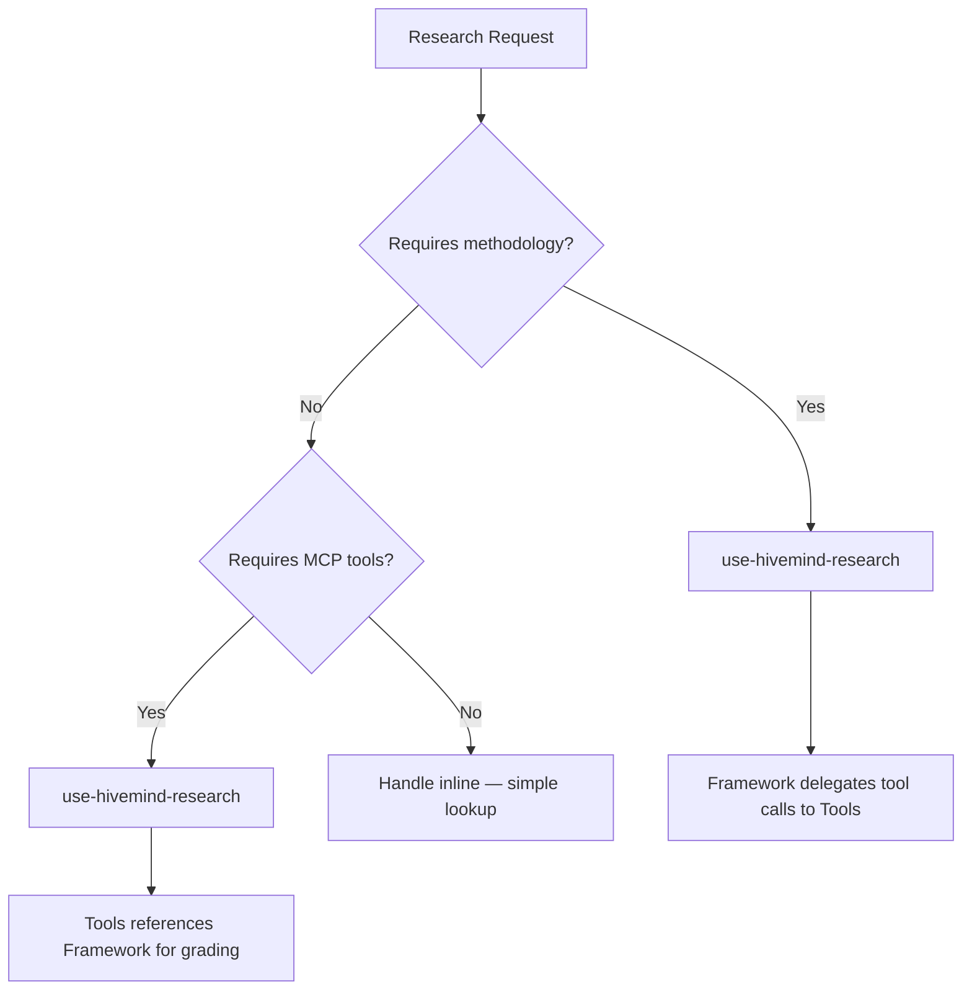

# ses_2bb6

**Session ID:** ses_2bb6
**Created:** 3/31/2026, 10:49:03 PM
**Updated:** 3/31/2026, 11:20:31 PM

---

## Table of Contents

| # | Timestamp | Actor | Tools | Summary |
|---|-----------|-------|-------|---------|

---
## User


---
## User


---
**Tool:** skill

**Input:**
```json
{"name":"use-hivemind"}
```

**Output:**
```
<skill_content name="use-hivemind">
# Skill: use-hivemind

# use-hivemind

## Purpose

Resolve one question before any action: "Am I the orchestrator or an executor?" Then gate project validity. Then route.

## GATE 0: Role Lineage Detection

Check ONE signal: does this agent receive instructions from a human, or from a delegation packet?

| Signal | Orchestrator | Executor |
|--------|-------------|----------|
| Prompt source | Human user directly | Delegation packet from another agent |
| Session type | Primary session | Sub-session (delegated) |
| context.ask() | Available (human in loop) | Not available (autonomous within bounds) |

Resolution rules:
1. Human prompt + context.ask() available → ORCHESTRATOR
2. Pre-defined scope + return contract → EXECUTOR
3. Ambiguous signal → assume ORCHESTRATOR (safer default)
4. Executor signal but no packet → BLOCK, escalate

Load exactly ONE reference after resolution:

| Role | Load |
|------|------|
| Orchestrator | `references/orchestrator-entry.md` |
| Executor | `references/executor-entry.md` |

## GATE 1: Project Validity

Run: `node scripts/hm-entry-gate.cjs --cwd <project-root>`

Exit code 0, PASS → proceed.
Exit code 0, DEGRADED → proceed with caution. Log soft warnings.
Exit code 1, FAIL → STOP. Report failures. Do not proceed.

Run GATE 1 once per session start (or when context feels uncertain). Not every turn.

## Post-Gate Routing

After GATE 0 + GATE 1 resolve, load routing and intelligence references:

### Protocol References (loaded by both branches)

| File | Contains |
|------|----------|
| `references/agent-roles.md` | Per-agent capability matrix for routing resolution |
| `references/role-boundaries.md` | Session positioning, lineage detection, delegation thresholds |
| `references/domain-coupling-map.md` | Intent → specialist → depth reference routing table |

### Intelligence References (loaded after routing)

| File | Contains |
|------|----------|
| `references/project-state-awareness.md` | Phase detection, blockage signals, doc trustworthiness, distrust levels |
| `references/task-classification.md` | Request type classification matrix with routing targets |
| `references/session-state.md` | Session continuity: fresh, resume, post-compaction tracking |

### Templates

| File | Contains |
|------|----------|
| `templates/load-template.md` | Dynamic batch loading templates for common workflows |

### Scripts

| File | Contains |
|------|----------|
| `scripts/hm-entry-gate.cjs` | Universal project validity gate (6 gates, zero deps) |

## Turn Loop

Re-enter GATE 0 every turn. Do not carry state between turns except what the orchestrator persists via git memory.

```
Turn start → GATE 0 → Load role reference → Follow role protocol → Turn end
                                                                      │
                                                Next turn → GATE 0 ──┘
```

## Hard Blocks

- Skip GATE 0 → BLOCK
- Load BOTH branch references → BLOCK
- Act before role resolved → BLOCK
- Executor loading governance content → BLOCK
- Proceed past GATE 1 when script fails → BLOCK

## Platform

Framework-agnostic. Works in OpenCode, Claude Code, Cursor, Gemini CLI, and any agent system that supports skill loading. Platform-specific behaviors handled by the platform layer, not by this skill.

## Independence Rules

- No implementation — routes only
- No deep reads — context assessment is shallow
- No mutation — never writes files, modifies state, or commits
- No how-to-implement — delegates process guidance only

Base directory for this skill: file:///Users/apple/hivemind-plugin/.worktrees/product-detox/.opencode/skills/use-hivemind
Relative paths in this skill (e.g., scripts/, reference/) are relative to this base directory.
Note: file list is sampled.

<skill_files>
<file>/Users/apple/hivemind-plugin/.worktrees/product-detox/.opencode/skills/use-hivemind/templates/load-template.md</file>
<file>/Users/apple/hivemind-plugin/.worktrees/product-detox/.opencode/skills/use-hivemind/scripts/hm-entry-gate.cjs</file>
<file>/Users/apple/hivemind-plugin/.worktrees/product-detox/.opencode/skills/use-hivemind/references/context-rot-defense.md</file>
<file>/Users/apple/hivemind-plugin/.worktrees/product-detox/.opencode/skills/use-hivemind/references/orchestrator-self-assessment.md</file>
<file>/Users/apple/hivemind-plugin/.worktrees/product-detox/.opencode/skills/use-hivemind/references/verification-before-completion.md</file>
<file>/Users/apple/hivemind-plugin/.worktrees/product-detox/.opencode/skills/use-hivemind/references/orchestrator-entry.md</file>
<file>/Users/apple/hivemind-plugin/.worktrees/product-detox/.opencode/skills/use-hivemind/references/task-classification.md</file>
<file>/Users/apple/hivemind-plugin/.worktrees/product-detox/.opencode/skills/use-hivemind/references/intent-classification.md</file>
<file>/Users/apple/hivemind-plugin/.worktrees/product-detox/.opencode/skills/use-hivemind/references/context-health-protocol.md</file>
<file>/Users/apple/hivemind-plugin/.worktrees/product-detox/.opencode/skills/use-hivemind/references/agent-roles.md</file>
</skill_files>
</skill_content>
```

---
**Tool:** skill

**Input:**
```json
{"name":"hivemind-codemap"}
```

**Output:**
```
<skill_content name="hivemind-codemap">
# Skill: hivemind-codemap

# hivemind-codemap

This is the deep codemap branch family for `use-hivemind`.

## Table of Contents

- [Purpose](#purpose)
- [Use This For](#use-this-for)
- [Preconditions](#preconditions)
- [Do Not Use This For](#do-not-use-this-for)
- [Scan Levels](#scan-levels)
- [Tool Modes](#tool-modes)
- [Core Process](#core-process)
- [Delegation Loop](#delegation-loop)
- [Reusable Codemap Techniques](#reusable-codemap-techniques)
- [Bash Scan Helper](#bash-scan-helper)
- [Iterative Output Storage](#iterative-output-storage)
- [Delegation Integration](#delegation-integration)
- [Orchestrator Integration](#orchestrator-integration)
- [Outputs](#outputs)
- [Bundled Resources](#bundled-resources)


**Path Parameters** (adapt to your framework):
- `{runtime_state_dir}` — Root runtime state directory (e.g., `.hivemind/`, `.claude/`, `.cursor/`)
- `{runtime_activity_dir}` — Activity artifacts directory (e.g., `.hivemind/activity/`, `.claude/activity/`)
- `{pathing_config}` — Pathing configuration file (e.g., `.hivemind/pathing/active-paths.json`)

## Purpose
- map the codebase before refactor strategy
- produce high-level, pipeline, journey, then low-level scan outputs
- identify seams, hotspots, overlaps, and concern ownership
- generate synthesis artifacts that later debug and refactor stages can trust

## Use This For
- repo-wide structural investigation
- concern-based or seam-based partitioning
- locating hidden overlap between routing, memory, governance, and execution surfaces
- producing bounded slices for later delegation or debugging

## Preconditions
- authority and scan goal are explicit before starting
- no code changes are made during the codemap pass itself
- `deep` and `exhaustive` scans must use state tracking and write-as-you-go outputs
- Repomix is optional acceleration, not a mandatory dependency

## Do Not Use This For
- direct debugging of a reproduced failure with already-known scope
- generic file listing without structural synthesis
- making code changes from the codemap stage alone

## Scan Levels

| Level | Use When | Read Strategy | Output Expectation |
| --- | --- | --- | --- |
| `quick` | scope is still broad and a high-level map is needed fast | pattern-based only; configs, manifests, structure | scan plan + early seam hypotheses |
| `deep` | structure is unclear but only critical areas matter | read bounded critical directories or router-selected slices | seam inventory + codemap synthesis |
| `exhaustive` | migration, severe rot, or full restoration requires whole-repo certainty | read all relevant source slices excluding ignored build/vendor paths | full seam inventory + hotspot ledger + synthesis |

Read `references/scan-levels.md`.

## Tool Modes

| Mode | Role | When To Prefer |
| --- | --- | --- |
| `native` | `glob` + `grep` + `read` for direct evidence | small or medium slices, file verification, low tooling risk |
| `repomix` | pack repository or scoped slices into AI-friendly output | high-level structure extraction, metadata-only maps, compressed scans |
| `hybrid` | repomix for overview, native reads for verification | large repos where pack-first then verify is safer |

Read `references/repomix-mode.md`.

## Core Process
1. Establish the scan goal, authority surfaces, and required outputs.
2. Choose `quick`, `deep`, or `exhaustive`.
3. Choose `native`, `repomix`, or `hybrid` mode.
4. Initialize scan state from `templates/codemap-scan-state.json.md` for `deep` or `exhaustive` work.
5. Run the phase ladder:
   - `high-level-map`: authorities, entry surfaces, and seam hypotheses
   - `pipeline-map`: execution paths, state transitions, downstream consumers
   - `journey-map`: user-visible flows, degraded paths, resume paths, and edge cases
   - `low-level-proof`: bounded file review for the still-open slices
   - `cross-pass-synthesis`: reconcile findings, risks, and delegation-ready slices
6. Build batches only after the active phase is explicit:
   - `deep`: critical directories, key pipelines, or router-selected seams
   - `exhaustive`: all recursive subfolders except ignored paths, grouped by authority or pipeline where possible
   - file-audit loops: roughly 20 files per parallel batch after slice isolation
7. For each batch:
    - read or pack the batch
    - extract seams, interfaces, hotspots, pipeline notes, journey impact, and edge cases
    - immediately write findings to disk
    - validate the written artifact
    - update scan state
    - purge detailed batch findings from working context
8. If using parallel audit-style subagents, reconcile total `FILES CHECKED` before final synthesis.
9. Emit seam inventory, codemap synthesis, and optional Repomix extraction report.
10. Hand off bounded slices back to the detox router for delegation, debugging, or refactor.

## Delegation Loop
- Use sequential passes until the high-level map identifies clean seams.
- Parallel codemap swarms are allowed only after slices are isolated.
- Audit-like file review loops must use file accounting and rerun missing slices before reporting complete.
- Each deeper pass must read the previous phase synthesis artifact first.
- If the current pass cannot explain behavior through a pipeline or journey model, the codemap remains incomplete and must recurse before delegation.

Read `references/batching-loop.md` and `references/delegation-contract.md`.

## Reusable Codemap Techniques
1. `layered scan lattice`
2. `critical-directory deep pass`
3. `pack-then-verify`
4. `write-validate-purge loop`

Read `references/codemap-techniques.md`.

## Bash Scan Helper

The package includes `scripts/hm-codescan.sh` — a zero-dependency Bash script that produces structured JSON output for code scanning workflows.

```bash
# Repository structure extraction
bash scripts/hm-codescan.sh structure --scope src --cwd /path/to/project

# Find exported symbols
bash scripts/hm-codescan.sh exports --scope src/tools

# Map import relationships
bash scripts/hm-codescan.sh imports --scope src

# Detect seam/barrel files (index.ts)
bash scripts/hm-codescan.sh seams --scope src

# Find large/complex files (>200 lines)
bash scripts/hm-codescan.sh hotspots --scope src

# Generate a batch plan for deep/exhaustive scans
bash scripts/hm-codescan.sh batch-plan --scope src --batch-size 20 --pass-id pass_1
```

All commands return JSON to stdout. The helper currently supports `structure`, `exports`, `imports`, `seams`, `hotspots`, and `batch-plan`. Batch execution and output persistence are workflow conventions performed by the surrounding delegation process, not by a dedicated `scan-batch` or `--output` flag in this script.

## Iterative Output Storage

Scan outputs are stored in `{project}/{runtime_activity_dir}/codescan/` with this structure:

```
codescan/
├── {pass_id}/
│   ├── plan.json            # Batch plan (from batch-plan command)
│   ├── {batch_id}.json      # Per-batch results
│   ├── loop-checkpoint.json # Iteration state (if multi-iteration)
│   └── synthesis.json       # Final synthesis after all batches
└── cross-pass-synthesis.json  # Synthesis across multiple passes
```

This structure supports:
- **Resumable scans:** read `plan.json` + completed batch files to determine where to resume.
- **Multi-pass chaining:** each pass gets its own `pass_id` folder.
- **Comparison:** side-by-side batch results from different passes.
- **Export:** each folder is self-contained and can be shared.
- **Phase-first recovery:** each pass should declare which phase of the ladder it belongs to.

## Delegation Integration

When delegating scan work through `use-hivemind-delegation`:
- Use `codescan-delegation.md` from the delegation protocol for agent selection and packet structure.
- The codemap skill owns the scan mechanics; the delegation skill owns the handoff discipline.
- Use `iterative-loop-control.md` from the delegation protocol for multi-iteration checkpoint management.

## Orchestrator Integration

Codemap work is **never** run inline in the orchestrator's session. The orchestrator:
1. Selects the scan level (`quick`, `deep`, `exhaustive`) and tool mode (`native`, `repomix`, `hybrid`).
2. Emits a delegation packet via `use-hivemind-delegation`.
3. Receives only: seam count, critical seam list, hotspot count, blocked routes, and output paths.
4. Does NOT read full scan output or seam inventories into its own session.
5. Refers subagents to the detailed output files when further work on a specific slice is needed.

If the orchestrator catches itself doing multi-file reads or pattern matching, it is violating session freshness discipline — stop and delegate.

## Outputs
- scan plan
- codemap scan state
- seam inventory
- codemap synthesis report
- optional repomix extraction report
- bash scan helper JSON outputs (per command)

## OpenCode Tool Matrix

| Mapping Need | Preferred Tool | Why | Fallback |
| --- | --- | --- | --- |
| discover candidate files | `glob` | fast file discovery | `list` |
| scan names or call sites | `grep` | cheap cross-file search | `repomix_grep_repomix_output` |
| inspect specific seams | `read` | exact local context | `repomix_read_repomix_output` |
| trace symbol ownership | `lsp.goToDefinition` / `lsp.findReferences` | semantic proof | `grep` |
| inspect a remote public repo | `repomix_pack_remote_repository` | whole-repo packing | `deepwiki_read_wiki_structure` |

## Concrete Bash Examples

```bash
# Show recent changes summary (e.g., git diff --stat HEAD~1..HEAD)
# Run type checking (e.g., npx tsc --noEmit for TypeScript, mypy for Python)
# Run the test suite (e.g., npm test, pytest, cargo test)
```

## LSP and Remote Repo Decision Tree

1. **IF** the project has a working language server, **THEN** use `lsp.documentSymbol` and `lsp.findReferences` before regex search.
2. **IF** LSP is unavailable, **THEN** fall back to `glob` + `grep` + targeted `read`.
3. **IF** the repo is remote-only or too large for local scanning, **THEN** use `repomix_pack_remote_repository` or `deepwiki_read_wiki_structure`.
4. **IF** the scan must show call hierarchy evidence, **THEN** load `references/lsp-code-mapping.md` before summarizing results.

## Sibling Skills

| Skill | Relationship |
|-------|-------------|
| `use-hivemind-delegation` | Delegation protocol for scan dispatch |
| `hivemind-synthesis` | Codebase investigation — extends scan mechanics with Repomix + MCP tool chain |
| `hivemind-gatekeeping` | Scan results pass through gate checks |

## Bundled Resources

| Resource | Path | Purpose |
|----------|------|---------|
| Scan Layers | `references/scan-layers.md` | High-level to low-level scan pass definitions |
| Scan Levels | `references/scan-levels.md` | Depth granularity for each scan pass |
| Batching Loop | `references/batching-loop.md` | Batch processing loop for large codebases |
| Repomix Mode | `references/repomix-mode.md` | Repomix integration for codebase packing |
| Codemap Techniques | `references/codemap-techniques.md` | Specific scanning techniques and patterns |
| Delegation Contract | `references/delegation-contract.md` | Contract format for codemap delegation packets |
| Codescan Script | `scripts/hm-codescan.sh` | Bash helper for automated code scanning |
| Scan Plan | `templates/scan-plan.md` | Template for scan pass planning |
| Scan State | `templates/codemap-scan-state.json.md` | JSON template for scan state tracking |
| Seam Inventory | `templates/seam-inventory.md` | Template for recording discovered seams |
| Synthesis Report | `templates/codemap-synthesis-report.md` | Template for scan result synthesis |
| Repomix Report | `templates/repomix-extraction-report.md` | Template for repomix extraction results |
| Direct Invocation | `tests/direct-invocation.md` | Test scenario for direct skill invocation |

## Activity Output

All artifacts produced by this skill follow the Activity Folder Protocol.

**Pathing:** See `{pathing_config}` for resolved output paths.
**Naming:** `{category}-{semantic-id}-{YYYY-MM-DD}.{ext}`
**Meta:** All JSON includes `_meta.created_at`, `_meta.updated_at`, `_meta.producer`.
**Validation:** Run `bash use-hivemind-delegation/scripts/hm-artifact-validate.sh {path}` to confirm compliance.

Base directory for this skill: file:///Users/apple/hivemind-plugin/.worktrees/product-detox/.opencode/skills/hivemind-codemap
Relative paths in this skill (e.g., scripts/, reference/) are relative to this base directory.
Note: file list is sampled.

<skill_files>
<file>/Users/apple/hivemind-plugin/.worktrees/product-detox/.opencode/skills/hivemind-codemap/templates/scan-plan.json</file>
<file>/Users/apple/hivemind-plugin/.worktrees/product-detox/.opencode/skills/hivemind-codemap/templates/codemap-synthesis-report.md</file>
<file>/Users/apple/hivemind-plugin/.worktrees/product-detox/.opencode/skills/hivemind-codemap/templates/codemap-scan-state.json.md</file>
<file>/Users/apple/hivemind-plugin/.worktrees/product-detox/.opencode/skills/hivemind-codemap/templates/scan-plan.md</file>
<file>/Users/apple/hivemind-plugin/.worktrees/product-detox/.opencode/skills/hivemind-codemap/templates/repomix-extraction-report.md</file>
<file>/Users/apple/hivemind-plugin/.worktrees/product-detox/.opencode/skills/hivemind-codemap/templates/seam-inventory.md</file>
<file>/Users/apple/hivemind-plugin/.worktrees/product-detox/.opencode/skills/hivemind-codemap/scripts/hm-codescan.sh</file>
<file>/Users/apple/hivemind-plugin/.worktrees/product-detox/.opencode/skills/hivemind-codemap/tests/direct-invocation.md</file>
<file>/Users/apple/hivemind-plugin/.worktrees/product-detox/.opencode/skills/hivemind-codemap/references/delegation-contract.md</file>
<file>/Users/apple/hivemind-plugin/.worktrees/product-detox/.opencode/skills/hivemind-codemap/references/scan-layers.md</file>
</skill_files>
</skill_content>
```

---
## Assistant (Assistant · unknown)

_Thinking:_

I'll start by loading the required skills and reading all 5 verification reports.

---
**Tool:** skill

**Input:**
```json
{"name":"use-hivemind-delegation"}
```

**Output:**
```
<skill_content name="use-hivemind-delegation">
# Skill: use-hivemind-delegation

# use-hivemind-delegation


**Path Parameters** (adapt to your framework):
- `{runtime_state_dir}` — Root runtime state directory (e.g., `.hivemind/` for Hivemind, `.claude/` for Claude Code, `.cursor/` for Cursor)
- `{activity_dir}` — Activity artifacts directory (e.g., `{runtime_state_dir}/activity/`)
- `{session_state_file}` — Session continuity state file (e.g., `{activity_dir}/sessions/continuity.json`)
- `{delegation_dir}` — Delegation artifacts directory (e.g., `{activity_dir}/delegation/`)
- `{pathing_config}` — Pathing configuration file (e.g., `{runtime_state_dir}/pathing/active-paths.json`)
- `{delegation_registry}` — Delegation registry file (e.g., `{delegation_dir}/registry.json`)

Local delegation family for the refactored pack. Governs when, how, and with what constraints a front-facing agent dispatches work to subagents.

## Purpose

- Decide whether delegation is actually needed — delegation is mandatory when criteria are met
- Bound scope before any handoff
- Choose sequential vs parallel mode deterministically
- Emit reusable delegation packets and handoff briefs
- Recover from failures, partial returns, and blocked routes

## Use This For

- User explicitly asks to delegate or split work
- Router stages produce multiple bounded slices
- Role or authority boundaries must be explicit before handoff
- Verification, research, planning, and execution need different packets
- Work spans >3 files or requires deep reads the orchestrator must not do
- Session context is stale or suspect and fresh subagent context is needed

## Table of Contents

- [Use This For](#use-this-for)
- [Anti-Patterns to Avoid](#anti-patterns-to-avoid)
- [Sibling Skills](#sibling-skills)
- [Delegation Decision Rules](#decision-rules)
- [Topology Decision Rules](#topology-decision-rules)
- [Task Decomposition Rules](#task-decomposition-rules)
- [Agent Selection](#agent-selection)
- [Task Extraction from Plan](#task-extraction-from-plan)
- [Orchestrator Protection](#orchestrator-protection)
- [How-To-Process vs How-To-Implement in Packets](#how-to-process-vs-how-to-implement)
- [Core Protocol](#core-protocol)
- [Shared Return Contract](#shared-return-contract)
- [Post-Return Protocol](#post-return-protocol)
- [Delegation Modes](#delegation-modes)
- [Role Boundaries](#role-boundaries)
- [Failure and Recovery](#failure-and-recovery)
- [Codescan Delegation](#codescan-delegation)
- [Investigation Swarm Delegation](#investigation-swarm-delegation) *(detailed: references/investigation-swarm.md)*
- [Hierarchical Consumption](#hierarchical-consumption) *(detailed: references/hierarchical-consumption.md)*
- [Multi-Wave Dispatch Protocol](#multi-wave-dispatch-protocol)
- [Granularity Enforcement](#granularity-enforcement)
- [Context Window Management](#context-window-management)
- [Iterative Loop Control](#iterative-loop-control)
- [Session Resume in Delegation](#session-resume)
- [Workflow Example](#workflow-example)
- [Bundled Resources](#bundled-resources)
- [Independence Rules](#independence-rules)

## Anti-Patterns to Avoid

**NEVER dispatch without checking the active delegation registry.** Before creating a new delegation packet, read `{delegation_registry}`. If a prior delegation covers the same scope and is still active or pending, do not create a duplicate. Re-use or resume the existing one.

**NEVER create packets without verifying parent workflow state.** If dispatched by an orchestrator, check the parent's planning documents, governance files, and workflow phase before emitting sub-delegations. A child that doesn't know the parent's goals will fragment the workflow.

**NEVER delegate recursively without consuming carry-forward.** If the delegation packet includes carry-forward from a parent wave, read and integrate that carry-forward (≤5 findings, blocked routes, next action) before dispatching children. Skipping parent context is a context integrity failure.

**NEVER assume the user's next prompt resets the delegation chain.** The next agent in the sequence may receive a user message that appears disconnected from prior work. That agent must check the delegation registry, workflow state, and the session continuity file before acting — not assume the user's message means "start fresh."

## Sibling Skills

| Skill | Relationship |
|-------|-------------|
| `use-hivemind` | Router that triggers this skill — delegates slices here |
| `hivemind-codemap` | Codescan mode — this skill owns handoff discipline; codemap owns scan mechanics |
| `hivemind-system-debug` | Debug mode — debug delegation dispatches through this protocol |
| `hivemind-spec-driven` | Planning mode — distillation outputs feed into planning delegation |
| `use-hivemind-context` | Stale session probe — delegate this when orchestrator context is suspect |
| `use-hivemind-git-memory` | Git-aware continuity — commit SHAs and branch state recorded in packets |
| `hivemind-gatekeeping` | Iterative loops, synthesis gates, cascading failure — extracted from this skill |
| `hivemind-synthesis` | Investigation swarm orchestration — coordinates parallel hivexplorer waves through this protocol |

`activity_type` and `phase_type` enum values are defined in the pack-level AGENTS.md under Typed Activity Contract.

## Delegation Decision Rules

Delegate when **any** of:
1. Work touches >3 files
2. Work requires deep reads the orchestrator must not do (session freshness rule)
3. Work has independent verification needs (separate verification agent)
4. Session context is stale or suspect
5. Multiple concerns (read + write + verify) must be handled by different authority levels
6. The user explicitly requests delegation or splitting

Do NOT delegate when:
1. Single-file edit with clear scope and fresh context
2. Task completable in <3 inline actions
3. Scope is unclear — clarify first, then decide

**Delegation has overhead**: packet creation, subagent dispatch, return synthesis. For small tasks, overhead may exceed inline execution cost. But session freshness always wins — if context is suspect, delegate regardless of task size.

**Delegation is mandatory, not optional.** If criteria are met, the orchestrator MUST emit a packet. Failure to delegate when required is a session discipline violation.

### Granularity Enforcement (MANDATORY)

| Rule | Threshold | Action |
|------|-----------|--------|
| File count | >3 files | MUST decompose into sub-tasks |
| LOC written | >500 LOC | NEVER in one task — split by concern or file cluster |
| Parallel writes | Same domain | FORBIDDEN — sequential only |
| Parallel dispatch | Independent READ-only | RECOMMENDED for deep investigation or token-heavy research |

If a slice exceeds 500 LOC, reject the packet and re-plan decomposition. No exceptions.

## Topology Decision Rules

Choose the dispatch topology before emitting packets:

| Topology | When | Independence |
|----------|------|-------------|
| **Single agent** | Simple, isolated task | N/A |
| **Parallel** | Independent slices, no shared state | Must prove independence |
| **Sequential** | Output of agent A feeds agent B | Ordered dependency |
| **Wave** | Sequential batches of parallel agents | See Multi-Wave Dispatch Protocol |

**Decision:** If slices share files or mutable state → sequential. If isolated → parallel. If multi-phase → wave.

## Task Decomposition Rules

Decompose large tasks before delegating. Use this priority order:

1. **Authority surface boundaries first** — separate tools from hooks from core from shared
2. **Concern type second** — split read-only from write-capable from verification
3. **File cluster third** — group files that share imports or interfaces

Each slice should be:
- Completable in one subagent pass (≤5 files per slice)
- Self-contained (does not depend on another slice's output unless sequential is chosen)
- Bounded by explicit out-of-scope (what the slice must NOT touch)

If a slice needs >5 files, split further. If a slice mixes read and write, split by concern.

## Agent Selection

Match task type to agent. Fallbacks exist when the primary agent is unavailable:

| Task | Agent | Fallback |
|------|-------|----------|
| Implementation | hivemaker | build |
| Testing | hitea | build |
| Verification | hiveq | explore |
| Debugging | hivehealer | general |
| Planning | hiveplanner | plan |
| Architecture | architect | plan |
| Code review | code-skeptic | general |
| Research | hiverd | explore |
| Scanning/Investigation | hivexplorer | explore |
| Complex coordination | handoff | general |

## Task Extraction from Plan

When consuming a plan for delegation:

- Each plan phase → delegation packet
- Each slice → one subagent task
- Each gate → verification before next phase
- Plan phases feed waves: investigation → research → planning → implementation → verification

## Orchestrator Protection

When delegation is triggered from the detox router or any polluted-context session:

1. **The orchestrator emits the packet; the subagent does the work.** The orchestrator must not perform deep reads, scans, or audits itself.
2. **Return contracts must include a compressed carry-forward** (≤5 findings + blocked routes + next action + output paths). The orchestrator does NOT read full output files — only summary fields and output paths.
3. **If the orchestrator catches itself doing multi-file reads after dispatching a delegation,** STOP immediately and wait for the subagent return. This is a session discipline violation — not a minor one.
4. **Stale context is always a delegation trigger** regardless of task size. If the orchestrator's accumulated context becomes unreliable, delegate a fresh `use-hivemind-context` probe instead of continuing with suspect information.
5. **Delegation is mandatory when criteria are met.** The orchestrator may not choose to do deep work itself when the decision rules above indicate delegation is required.

<HARD-GATE>
The orchestrator must never do deep work when delegation criteria are met. Reading more than 2 code files sequentially after dispatching violates the mandate. STOP. Wait for the subagent. The orchestrator that investigates is the orchestrator that stops orchestrating.
</HARD-GATE>

## How-To-Process vs How-To-Implement in Packets

Delegation packets tell the subagent **what process to follow**, never **how to write the code**. This is the single most common delegation mistake.

**HOW-TO-PROCESS (correct):**
- What skills to load (e.g., "load `hivemind-codemap` before scanning")
- Coordination with other agents (e.g., "wait for research return before implementing")
- Expected output format (e.g., "return findings as JSON with file:line refs")
- Success metrics (e.g., "all tests pass, no type errors")
- Pre/post workflows (e.g., "run type checking before returning" — e.g., `npx tsc --noEmit` for TypeScript)
- Self-verification requests (e.g., "verify build succeeds before claiming complete")
- Evidence output paths to correct domain-specific activity paths

**NOT HOW-TO-IMPLEMENT (never do this):**
- Never specify the actual code to write
- Never prescribe the specific algorithm
- Never dictate the exact function signature
- Never write pseudocode the child must follow

**Correct packet excerpt:**
```json
{
  "scope": "Investigate test failures in src/tools/trajectory/",
  "constraints": ["read-only", "no file mutations"],
  "skills_to_load": ["hivemind-codemap"],
  "success_metrics": "All failing tests identified with file:line references",
  "output_path": "{activity_dir}/codescan/pass-01/",
  "return_format": "JSON with findings array, each item has file, line, reason"
}
```

**Incorrect packet excerpt:**
```json
{
  "scope": "Fix the tests",
  "instructions": "Open trajectory.test.ts, change line 42 to use mockSession instead of realSession, then add a beforeEach that calls setupMocks()"
}
```

The orchestrator says **what** (process). The subagent figures out **how** (implementation).

<HARD-GATE>
If a delegation packet contains specific code to write, algorithms to use, or exact function signatures to implement — the packet is INVALID. The orchestrator says WHAT process to follow. The subagent figures out HOW to implement. Re-write the packet before dispatching.
</HARD-GATE>

## Core Protocol

1. **Confirm delegation is needed** — delegation costs context-switching overhead; use the decision rules above. (See `references/delegation-decision.md` for extended criteria.)
2. **Write the slice boundary** — scope, out-of-scope, constraints, success metrics. Decompose by authority surface, then concern type, then file cluster. (See Task Decomposition Rules above.)
3. **Choose the mode** — `research`, `execution`, `verification`, or `planning`. Each mode has different success tests and return expectations.
4. **Choose execution mode** — `sequential` by default; allow `parallel` only for isolated slices. (See `references/delegation-modes.md` for the parallel gate.)
5. **Tag the work** with `activity_type` and `phase_type` before dispatch. These tags link delegation to the development storyline and enable cross-skill continuity.
6. **Emit a delegation packet and handoff brief** before dispatch. The packet is the contract. The brief is the human-readable summary. (See `templates/delegation-packet.md` and `templates/handoff-brief.md`.)
7. **Require a structured return** with findings, evidence, blocked routes, and next action. (See Shared Return Contract below and `references/failure-recovery.md`.)
8. **Include parent governance** — Always attach references to ongoing planning documents, governance files, and parent workflow state. The subagent must know it was delegated, what the parent's goals are, and how this slice fits the larger picture.
9. **Include stop_conditions** — Every delegation packet MUST include a `stop_conditions` array (see below). A packet without stop_conditions is invalid.

### Stop Conditions (Required in Every Packet)

Every delegation packet MUST include a `stop_conditions` array:

```json
{
  "stop_conditions": [
    "max_iterations_reached: 3",
    "same_failure_twice: escalate to orchestrator",
    "scope_violation: return partial with blocked_routes",
    "token_exhaustion_imminent: return compressed summary",
    "contradiction_with_prior_findings: pause and report"
  ]
}
```

Stop conditions are non-negotiable. Each condition must specify a trigger and the action to take. See `references/hard-stop-conditions.md` for extended stop trigger definitions.

## Shared Return Contract

Every meaningful delegation return must include:

| Category | Fields | Purpose |
|----------|--------|---------|
| **Routing** | `activity_type`, `phase_type`, `mode`, `execution_mode` | Links return to storyline |
| **Identity** | `packet_id`, `task_id`, `pass_id`, `batch_id`, `slice_id` | Enables resume and deduplication |
| **Scope tracking** | `files_checked`, `clean_files`, `blocked_files`, `coverage_gaps` | Proves coverage |
| **Evidence** | `confirmed`, `inferred`, `unverified`, `confidence`, `artifacts_written` | Evidence before assertions |
| **Output** | `output_paths` | Where detailed output lives (orchestrator reads summary only) |
| **Control** | `blocked_routes`, `recommended_next_action`, `open_loop_ids`, `open_packet_ids` | Enables orchestrator routing |

If a child cannot produce this shape, return a bounded partial result rather than pretending the slice is complete. A partial return with `status: "partial"` and populated `blocked_routes` is always better than a fabricated `status: "complete"`.

## Post-Return Protocol

After agents return, follow this 5-step protocol before advancing:

1. **Read evidence bundle** — not just claims. Inspect the actual output files, test results, and artifacts the agent produced.
2. **Check return contract compliance** — does the evidence match the expected return shape (fields, output paths, status)?
3. **Run verification gate** — if code changed → run type checking and tests (e.g., `npx tsc --noEmit` + `npm test` for TypeScript, or equivalent for your language). Do not skip this even if the agent claims tests pass.
4. **Synthesize into compressed carry-forward** — ≤5 findings, blocked routes, recommended next action, output paths. The orchestrator does NOT retain full agent output.
5. **Decide next action** — advance wave, re-dispatch with tighter scope, or gate-fail and escalate.

**No evidence = not done. Period.**

## Delegation Modes

| Mode | Use When | Primary Output | Success Test |
| --- | --- | --- | --- |
| `research` | Evidence or discovery is still missing | handoff brief + findings | All required evidence collected |
| `execution` | The slice is bounded and implementation-ready | handoff brief + slice result | Code compiles, tests pass, scope respected |
| `verification` | The output must be hard proof, not a fix | handoff brief + verification result | All verification checks pass with evidence |
| `planning` | The child should return stages, not edits | handoff brief + bounded plan | Plan covers all known requirements |

Read `references/delegation-modes.md` for sequential-first rules and parallel gate conditions.

## Role Boundaries

**Front-facing agent (orchestrator):**
- Chooses the slice, sets constraints, decides whether child may mutate files
- Emits the delegation packet before dispatch
- Synthesizes returns — does NOT read full output files
- Decides sequential vs parallel
- Handles failures and escalation

**Delegated agent (child):**
- Stays inside scope — never exceeds `authority_surfaces` or `out_of_scope`
- Reports blocked routes instead of improvising new authority
- Returns evidence before conclusions
- Stops when the packet says stop
- Does NOT recursively self-delegate unless the packet explicitly permits it

**Enforcement:** If a child exceeds scope or mutates files outside `authority_surfaces`:
1. Mark the return as `scope_violation`
2. Do NOT merge the child's output
3. Re-delegate with tighter constraints or escalate to user

Read `references/role-boundaries.md` for invalid delegation examples.

## Failure and Recovery

When a delegation fails, returns partial results, or is blocked:

### Partial Return Handling
- Read `status` field: `complete` | `partial` | `blocked`
- If `partial`: check `blocked_routes` and `recommended_next_action` — resume from the action, not from scratch
- If `blocked`: check if the blocker is resolvable; if not, decompose the slice further

### Timeout Protocol
- Set an expected completion window per slice complexity
- If the subagent does not return within 2x the expected window, emit a status probe or abort and re-delegate
- Log timeout events for pattern detection

### Escalation Ladder
1. **Re-delegate** with tighter constraints and more specific guidance
2. **Decompose** the slice if blocked twice — the slice was too large
3. **Escalate to user** with evidence if decomposition still fails
4. **Abort** only if the slice is no longer needed

### Parallel-Slice Failure Isolation
- One failure does NOT abort other parallel slices unless a dependency exists
- Collect all returns before deciding on integration
- If a parallel slice fails and others succeed, integrate successes and re-delegate only the failed slice

For cascading failure and parallel-slice isolation at scale, see `hivemind-gatekeeping`.

Read `references/failure-recovery.md` for detailed recovery procedures, timeout heuristics, and blocked-route resolution patterns.

## Codescan Delegation

For code scanning work, use structured delegation with specific agent selection:
- **`explore` first** for all read-only scans (structure, exports, imports, seams, hotspots).
- **`general` only when** cross-file synthesis or deeper reasoning is needed.
- Track each scan pass through JSON checkpoints at `{activity}/codescan/{pass_id}/`.
- Support multi-pass chaining: `high-level-map` → `pipeline-map` → `journey-map` → `low-level-proof` → `cross-pass-synthesis`, each with its own `pass_id`.

Each deeper scan phase must read the previous phase synthesis artifact first. Do not skip straight to low-level proof while the high-level or pipeline model is still unresolved.

Read `references/codescan-delegation.md` for agent selection table, scan pass structure, resumable scan protocol, and bash helper integration.

## Investigation Swarm Delegation

Use `references/investigation-swarm.md` for full swarm dispatch rules, packet shape, orchestrator discipline, synthesis protocol, and wave-to-wave handoff format.

**Summary:** Launch parallel investigation agents (e.g., `hivexplorer` in Hivemind, or the equivalent subagent in your framework) with one concern per agent. Each returns ≤5 findings with `file:line` refs. The orchestrator reads ONLY compressed synthesis. Parallel within a wave; sequential between waves.

## Hierarchical Consumption

Use `references/hierarchical-consumption.md` for full wave sequencing, between-wave escalation rules, and merge-vs-split decision table.

**Summary:** Wave outputs feed forward. Never skip to implementation without consuming investigation + research synthesis. Carry-forward ≤5 items between waves. Orchestrator reads summary fields and output path only.

## Iterative Loop Control

For iterative loop control, carry-forward compression, synthesis gates, and integration verification, see `hivemind-gatekeeping`.

## Session Resume in Delegation

When delegating across turns or resuming prior delegations:
- Use `task_id` to resume a subagent that has prior context. Without it, the subagent starts fresh.
- Record `task_id` and `pass_id` in the delegation output for future resume.
- Record `branch`, `worktree`, `worktree_role`, `activity_type`, and `phase_type` so resume stays linked to current control context.

### Checking Prior Completion

To determine if a prior delegation completed before re-delegating:
1. Read `{activity}/delegation/{packet_id}-return.json`
2. Check `status` field: `complete` | `partial` | `blocked`
3. If `complete`: compare `scope` to current needs — re-delegate only if scope changed
4. If `partial`: resume from `recommended_next_action` — do not restart from scratch
5. If `blocked`: check `blocked_routes` — if resolvable, re-delegate with the blocker addressed; if not, decompose further
6. If file does not exist: the prior delegation never returned — treat as timeout and re-delegate

### Git-Aware Continuity

When the child must commit:
- Use a worktree — record `worktree` and `worktree_role` in the packet
- Name branches per project convention
- Return artifacts must include commit SHAs if the child committed
- If the child only reads, `worktree` field may be empty

At runtime, delegation packets and handoff briefs may be persisted via the `hivemind_handoff` tool. See the tool's documentation for persistence mechanics.

### Delegation Audit Trail

Append delegation events to `{activity}/delegation/registry.json` with:
- `packet_id`, `concern`, `dispatched_at`, `returned_at`, `status`
- This enables the orchestrator to query active/completed delegations

## Workflow Example

**Scenario:** 3 independent test failures → decompose into 3 slices (each ≤3 files) → dispatch parallel `verification` packets → 2 complete, 1 partial (`blocked: shared/types.ts`) → integrate successes, re-delegate blocked slice with expanded authority.

## Multi-Wave Dispatch Protocol

Complex tasks require multi-wave dispatch, not single-shot delegation.

### Standard Investigation → Research → Planning Flow

**Initial Checkpoint:**
- Packet 1: 3 parallel investigation agent dispatches (e.g., `hivexplorer`) to investigate codebase, dependencies, test coverage → SYNTHESIZE → ≤5 findings output
- Packet 2 (sequential to Packet 1): Combine user prompt + synthesis → dispatch 2 parallel waves (investigation + research agents) for internal cross-validation + external research → SYNTHESIZE → ≤5 findings output
- From Packet 1 + 2 output → decision checkpoint to build master planning

**Checkpoint 2 (Planning):**
- The planning agent (e.g., `hiveplanner`) decomposes into phases with dependency DAG
- architect validates architecture decisions → SYNTHESIZE → plan with gates

### Wave Sequencing

Wave 1 (investigation) → synthesis → Wave 2 (research/planning) → synthesis → Wave 3 (implementation) → synthesis → Wave 4 (verification)

Skip a wave only if the previous wave's synthesis explicitly confirms no gaps remain.

### When to Merge Waves vs Keep Separate

| Scenario | Action |
|----------|--------|
| Waves cover independent domains | Keep separate — parallel dispatch |
| Wave 2 depends on Wave 1's specific findings | Sequential — merge only after synthesis |
| Both waves ask the same agent type | Merge into one wave with combined scope |

Full protocol: `references/multi-wave-dispatch.md`

## Context Window Management

Each subagent session has ~200k context window. Plan dispatches accordingly.

**Token-heavy operations** (plan for parallel to divide load):
- Deep research: tavily, webfetch, context7, repomix, deepwiki
- Deep investigation: "depth" and "variants" analysis
- Multi-source comparison: cross-referencing multiple documentation sets

**Token-efficient operations** (can run inline or in single dispatch):
- Targeted file reads with grep
- Single-file verification
- Quick status checks

**Budget rule**: If estimated token usage exceeds 100k for a single dispatch, split into parallel independent slices.

## Bundled Resources

| Resource | Purpose |
|----------|---------|
| `references/delegation-modes.md` | Sequential-first rules, parallel gate, mode fit |
| `references/delegation-decision.md` | Extended decision criteria, cost/benefit, when-not-to-delegate |
| `references/role-boundaries.md` | Parent/child responsibilities, invalid delegation examples |
| `references/codescan-delegation.md` | Agent selection, scan pass structure, resumable protocol |
| `references/failure-recovery.md` | Partial return, timeout, escalation |
| `references/multi-wave-dispatch.md` | Multi-wave dispatch flow, investigation swarms, hierarchical consumption |
| `references/architecture-audit-delegation.md` | Architecture audit delegation packet pattern |
| `references/debug-delegation.md` | Debug workflow delegation patterns |
| `references/domain-escalation.md` | Domain escalation rules and triggers |
| `references/evidence-collection.md` | Evidence collection methodology for delegation |
| `references/parallel-dispatch.md` | Parallel dispatch coordination and safety |
| `references/rb-role-platform-mapping.md` | Role-based role-to-platform mapping |
| `references/refactor-delegation.md` | Refactor workflow delegation patterns |
| `references/research-thread-management.md` | Research thread lifecycle management |
| `references/role-platform-mapping.md` | Role-to-platform agent mapping |
| `references/source-validation.md` | Source validation for delegated work |
| `references/subagent-driven-development.md` | Subagent-driven development workflow |
| `references/multi-reviewer-protocol.md` | Multi-agent review dispatch, dimension ownership, synthesis |
| `references/hard-stop-conditions.md` | Immediate delegation stop triggers and recovery protocol |
| `templates/delegation-packet.md` | Full packet JSON template |
| `templates/handoff-brief.md` | Human-readable brief template |
| `templates/codescan-delegation-packet.md` | Codescan-specific packet template |
| `templates/audit-delegation-packet.md` | Architecture audit packet template |
| `templates/debug-delegation-packet.md` | Debug workflow packet template |
| `templates/evidence-table.md` | Evidence table template for returns |
| `templates/implementer-prompt.md` | Implementer agent prompt template |
| `templates/rb-role-declaration.md` | Role-based role declaration template |
| `templates/refactor-delegation-packet.md` | Refactor workflow packet template |
| `templates/research-delegation-packet.md` | Research delegation packet template |
| `templates/role-declaration.md` | Role declaration template |
| `templates/spec-reviewer-prompt.md` | Spec reviewer prompt template |
| `tests/direct-invocation.md` | Basic delegation scenario with validation |
| `tests/parallel-delegation.md` | Parallel dispatch scenario with validation |
| `tests/failure-recovery.md` | Blocked-route recovery scenario with validation |
| `tests/course-correction.md` | Course correction scenario with validation |
| `tests/research-delegation.md` | Research delegation scenario with validation |

## Independence Rules

- This package is self-contained for normal delegation flow.
- It does not require old router-to-router chains.
- It may be selected directly or from `use-hivemind`.
- Delegation artifacts are stored in `{delegation_dir}` at runtime.

## Activity Output

All artifacts produced by this skill follow the Activity Folder Protocol.

**Pathing:** See `{pathing_config}` for resolved output paths.
**Naming:** `{category}-{semantic-id}-{YYYY-MM-DD}.{ext}`
**Meta:** All JSON includes `_meta.created_at`, `_meta.updated_at`, `_meta.producer`.
**Validation:** Run the artifact validation script (e.g., `bash scripts/hm-artifact-validate.sh {path}` or equivalent) to confirm compliance.

## OpenCode Tool Matrix

| Need | Tool | Why |
|------|------|-----|
| delegate bounded work | `task` | launches clean subagent session |
| persist handoff state | `hivemind_handoff` | stores resumable packet metadata |
| track workflow linkage | `hivemind_task` | ties packets to workflow/task IDs |
| record trajectory checkpoints | `hivemind_trajectory` | preserves phase transitions |
| inspect delegation docs | `hivemind_doc` | read-only doc access |
| verify current runtime | `hivemind_runtime_status` | confirm attached workflow state |

Base directory for this skill: file:///Users/apple/hivemind-plugin/.worktrees/product-detox/.opencode/skills/use-hivemind-delegation
Relative paths in this skill (e.g., scripts/, reference/) are relative to this base directory.
Note: file list is sampled.

<skill_files>
<file>/Users/apple/hivemind-plugin/.worktrees/product-detox/.opencode/skills/use-hivemind-delegation/templates/handoff-brief.md</file>
<file>/Users/apple/hivemind-plugin/.worktrees/product-detox/.opencode/skills/use-hivemind-delegation/templates/debug-delegation-packet.md</file>
<file>/Users/apple/hivemind-plugin/.worktrees/product-detox/.opencode/skills/use-hivemind-delegation/templates/refactor-delegation-packet.md</file>
<file>/Users/apple/hivemind-plugin/.worktrees/product-detox/.opencode/skills/use-hivemind-delegation/templates/delegation-packet.json</file>
<file>/Users/apple/hivemind-plugin/.worktrees/product-detox/.opencode/skills/use-hivemind-delegation/templates/evidence-table.md</file>
<file>/Users/apple/hivemind-plugin/.worktrees/product-detox/.opencode/skills/use-hivemind-delegation/templates/artifact-meta.json</file>
<file>/Users/apple/hivemind-plugin/.worktrees/product-detox/.opencode/skills/use-hivemind-delegation/templates/codescan-delegation-packet.md</file>
<file>/Users/apple/hivemind-plugin/.worktrees/product-detox/.opencode/skills/use-hivemind-delegation/templates/evidence-return.json</file>
<file>/Users/apple/hivemind-plugin/.worktrees/product-detox/.opencode/skills/use-hivemind-delegation/templates/research-delegation-packet.md</file>
<file>/Users/apple/hivemind-plugin/.worktrees/product-detox/.opencode/skills/use-hivemind-delegation/templates/rb-role-declaration.md</file>
</skill_files>
</skill_content>
```

---
**Tool:** glob

**Input:**
```json
{"pattern":".hivemind/activity/verification/*.md"}
```

**Output:**
```
/Users/apple/hivemind-plugin/.worktrees/product-detox/.developing-skills/refactoring-skills/.hivemind/activity/verification/journal-tool-verification-2026-03-31.md
```

---
## User


---
**Tool:** glob

**Input:**
```json
{"pattern":".hivemind/activity/verification/*2026-03-31*"}
```

**Output:**
```
/Users/apple/hivemind-plugin/.worktrees/product-detox/.developing-skills/refactoring-skills/.hivemind/activity/verification/journal-tool-verification-2026-03-31.md
```

---
**Tool:** bash

**Input:**
```json
{"command":"ls -la .hivemind/activity/verification/ 2>/dev/null || echo \"Directory not found\"","description":"List verification directory contents"}
```

**Output:**
```
total 16
drwxr-xr-x  3 apple  staff    96 Mar 31 22:42 .
drwxr-xr-x  3 apple  staff    96 Mar 31 22:41 ..
-rw-r--r--  1 apple  staff  6664 Mar 31 22:42 journal-tool-verification-2026-03-31.md

```

---
## Assistant (Assistant · unknown)

_Thinking:_

There's only ONE verification report, not five as stated. Let me read what's available and investigate what happened to the others.

---
**Tool:** read

**Input:**
```json
{"filePath":"/Users/apple/hivemind-plugin/.worktrees/product-detox/.developing-skills/refactoring-skills/.hivemind/activity/verification/journal-tool-verification-2026-03-31.md"}
```

**Output:**
```
<path>/Users/apple/hivemind-plugin/.worktrees/product-detox/.developing-skills/refactoring-skills/.hivemind/activity/verification/journal-tool-verification-2026-03-31.md</path>
<type>file</type>
<content>1: # Journal Tool Verification Report
2: 
3: **Date:** 2026-03-31
4: **Agent:** hivexplorer (terminal investigation)
5: **Git Commit:** (investigated at current HEAD)
6: 
7: ---
8: 
9: ## Registration Status
10: 
11: | Check | Status | Evidence |
12: |-------|--------|----------|
13: | Tool exists | ✅ YES | `src/tools/hivemind-journal.ts` (196 lines) |
14: | Registered in catalog | ✅ YES | `src/tools/index.ts` lines 102-109 |
15: | Registered in plugin | ✅ YES | `src/plugin/opencode-plugin.ts` line 33 (import) and line 131 (registration) |
16: 
17: **Finding:** The `hivemind_journal` tool is properly registered in both the agent tool catalog and the OpenCode plugin.
18: 
19: ---
20: 
21: ## Execute Implementation
22: 
23: | Check | Status | Evidence |
24: |-------|--------|----------|
25: | Function exported | ✅ YES | `createHivemindJournalTool(projectRoot: string): ToolDefinition` at `hivemind-journal.ts:140` |
26: | Uses tool.schema (Zod) | ✅ YES | `journalToolArgs` defined at lines 67-87 |
27: | Has execute function | ✅ YES | `execute()` at lines 146-194 |
28: | Imports markdown-writer | ✅ YES | Line 19: `import { appendDiagnosticToMarkdown } from '../features/event-tracker/markdown-writer.js'` |
29: 
30: **Finding:** Execute implementation is complete and uses proper OpenCode SDK patterns.
31: 
32: ---
33: 
34: ## Filesystem Write Verification
35: 
36: | Check | Status | Evidence |
37: |-------|--------|----------|
38: | Creates parent directories | ✅ YES | `appendToFile()` at lines 128-131 uses `mkdir(..., { recursive: true })` |
39: | Appends to file | ✅ YES | Uses `appendFile()` |
40: | Path resolution | ⚠️ DIFFERENT | Uses `getJourneyEventsMarkdownPath()` which **truncates** sessionId to 8 chars |
41: | Journey-events files exist | ✅ YES | `.hivemind/sessions/journey-events/ses_2bca.md`, `ses_2bb7.md`, etc. |
42: 
43: **CRITICAL ISSUE:** Path truncation mismatch!
44: 
45: - Tool writes to: `{projectRoot}/.hivemind/sessions/journey-events/{truncateSessionId(sessionId)}.md`
46: - Example: `test-session-journal-123` → `test-ses.md`
47: - markdown-writer writes to: `{sessionsDir}/journey-events/{sessionId}.md` (NO truncation)
48: - The existing `ses_2bca.md` files are written by `markdown-writer.ts` NOT by `hivemind_journal` tool
49: 
50: **Evidence from existing files:**
51: - `ses_2bca.md` format: `## Assistant (Assistant · unknown)` (written by `appendTurnToMarkdown`)
52: - Tool format: `## assistant_output` with `**Timestamp**, **Actor**, **Title**, **Summary** (different format!)
53: 
54: ---
55: 
56: ## Test Status
57: 
58: **Test Run Command:** `npx tsx --test src/tools/hivemind-journal.test.ts`
59: 
60: **Results:** 11 tests total
61: - 5 PASS (schema validation, success return, path resolution)
62: - 6 FAIL (all event write tests)
63: 
64: **Failing Test Root Cause:** Test helper `getEventsPath()` at line 43 uses full `TEST_SESSION_ID` without truncation:
65: ```typescript
66: function getEventsPath(projectRoot: string): string {
67:   return join(projectRoot, '.hivemind', 'sessions', 'journey-events', `${TEST_SESSION_ID}.md`)
68: }
69: ```
70: But `getJourneyEventsMarkdownPath()` truncates the sessionId to 8 chars, so file is written to `test-ses.md` not `test-session-journal-123.md`.
71: 
72: **Test Failure Error:**
73: ```
74: ENOENT: no such file or directory, open '.../hm-journal-test-XXX/.hivemind/sessions/journey-events/test-session-journal-123.md'
75: ```
76: 
77: **Note:** The test at line 302 (`journal tool uses context.directory for path resolution`) PASSES because it checks `parsed.path.includes(differentDir)` — which works because the path IS correct, just truncated.
78: 
79: ---
80: 
81: ## Hook Integration
82: 
83: | Hook | Status | Uses hivemind_journal? | Evidence |
84: |------|--------|------------------------|----------|
85: | `text.complete` | ⚠️ INDIRECT | NO - uses `consolidated-writer.js` + `markdown-writer.js` directly | `text-complete-handler.ts:45-159` |
86: | `session.compacting` | ⚠️ INDIRECT | NO - uses `consolidated-writer.js` + `markdown-writer.js` directly | `compaction-handler.ts:34-98` |
87: | `system.transform` | ✅ YES (sets payload) | NO WRITE - just `setInjectionPayload()` | `transform-handler.ts:23-45` |
88: | `tool-governance` | ✅ LISTED | NOT CALLED - just a managed tool flag | `tool-governance.ts:13` |
89: 
90: **Finding:** The `hivemind_journal` tool is listed in `HIVEMIND_MANAGED_TOOLS` but **never actually called** by any hook! The session journal is written directly by `markdown-writer.ts` functions.
91: 
92: ---
93: 
94: ## Summary of Issues
95: 
96: ### Issue 1: Test Helper Bug
97: The test helper `getEventsPath()` doesn't account for session ID truncation, causing 6 false-negative test failures.
98: 
99: **Location:** `src/tools/hivemind-journal.test.ts:43`
100: 
101: ### Issue 2: Dual Write Systems
102: Two separate systems write to journey-events:
103: 1. `hivemind_journal` tool (truncates session IDs, different format)
104: 2. `markdown-writer.ts` (doesn't truncate, different format)
105: 
106: **Evidence:**
107: - `ses_2bca.md` has format: `## Assistant (Assistant · unknown)` (markdown-writer)
108: - NOT: `## assistant_output\n\n- **Timestamp**...` (hivemind_journal)
109: 
110: ### Issue 3: Tool Never Called
111: The `hivemind_journal` tool is registered but never invoked by any hook. The hooks write directly using `markdown-writer.ts`.
112: 
113: ---
114: 
115: ## Verdict: PARTIALLY_WORKING
116: 
117: | Component | Status |
118: |-----------|--------|
119: | Tool Registration | ✅ WORKING |
120: | Execute Implementation | ✅ WORKING (but writes to truncated path) |
121: | Path Resolution | ⚠️ BUGGY (truncates but test doesn't) |
122: | Test | ❌ BROKEN (6 false negatives due to path mismatch) |
123: | Hook Integration | ❌ NOT INTEGRATED (tool is registered but never called) |
124: | Actual Journey-Events Files | ✅ WRITTEN by `markdown-writer.ts` NOT by this tool |
125: 
126: ---
127: 
128: ## Evidence Files
129: 
130: | File | Purpose |
131: |------|---------|
132: | `src/tools/hivemind-journal.ts` | Tool implementation (196 lines) |
133: | `src/tools/hivemind-journal.test.ts` | Tests (308 lines, 6 failing) |
134: | `src/tools/index.ts` | Tool catalog registration (lines 102-109) |
135: | `src/plugin/opencode-plugin.ts` | Plugin registration (lines 33, 131) |
136: | `src/hooks/runtime-loader/tool-governance.ts` | HIVEMIND_MANAGED_TOOLS list (line 13) |
137: | `src/features/event-tracker/markdown-writer.ts` | The ACTUAL writer (434 lines) |
138: | `src/hooks/text-complete-handler.ts` | Hook that writes session events |
139: | `src/hooks/compaction-handler.ts` | Hook that writes compaction events |
140: | `.hivemind/sessions/journey-events/ses_2bca.md` | Example of actual output (NOT from hivemind_journal) |
141: 
142: ---
143: 
144: ## Recommendations
145: 
146: 1. **Fix test helper:** Account for `truncateSessionId()` in `getEventsPath()`
147: 2. **Decide which system is authoritative:** Either use `hivemind_journal` tool OR `markdown-writer.ts` directly — not both with different formats
148: 3. **Wire the tool if it's authoritative:** If `hivemind_journal` is the CQRS write-side, hooks should call it instead of `markdown-writer` directly

(End of file - total 148 lines)
</content>
```

---
**Tool:** glob

**Input:**
```json
{"pattern":".hivemind/activity/**/*.md"}
```

**Output:**
```
/Users/apple/hivemind-plugin/.worktrees/product-detox/.developing-skills/refactoring-skills/.hivemind/activity/verification/journal-tool-verification-2026-03-31.md
```

---
**Tool:** glob

**Input:**
```json
{"pattern":"**/*verification*.md"}
```

**Output:**
```
/Users/apple/hivemind-plugin/.worktrees/product-detox/.developing-skills/refactoring-skills/.hivemind/activity/verification/journal-tool-verification-2026-03-31.md
/Users/apple/hivemind-plugin/.worktrees/product-detox/.developing-skills/refactoring-skills/use-hivemind/references/verification-before-completion.md
/Users/apple/hivemind-plugin/.worktrees/product-detox/.developing-skills/refactoring-skills/use-hivemind-tdd/references/verification-before-completion.md
/Users/apple/hivemind-plugin/.worktrees/product-detox/.developing-skills/refactoring-skills/use-hivemind-planning/references/verification-before-completion.md
/Users/apple/hivemind-plugin/.worktrees/product-detox/.developing-skills/refactoring-skills/hivemind-system-debug/references/verification-before-completion.md
/Users/apple/hivemind-plugin/.worktrees/product-detox/.developing-skills/refactoring-skills/hivemind-spec-driven/references/verification-before-completion.md
/Users/apple/hivemind-plugin/.worktrees/product-detox/.developing-skills/refactoring-skills/hivemind-refactor/references/verification-before-completion.md
/Users/apple/hivemind-plugin/.worktrees/product-detox/.developing-skills/refactoring-skills/hivemind-gatekeeping/references/integration-verification.md
/Users/apple/hivemind-plugin/.worktrees/product-detox/.developing-skills/refactoring-skills/hivemind-atomic-commit/references/verification-before-completion.md
```

---
**Tool:** skill

**Input:**
```json
{"name":"use-hivemind-delegation"}
```

**Output:**
```
<skill_content name="use-hivemind-delegation">
# Skill: use-hivemind-delegation

# use-hivemind-delegation


**Path Parameters** (adapt to your framework):
- `{runtime_state_dir}` — Root runtime state directory (e.g., `.hivemind/` for Hivemind, `.claude/` for Claude Code, `.cursor/` for Cursor)
- `{activity_dir}` — Activity artifacts directory (e.g., `{runtime_state_dir}/activity/`)
- `{session_state_file}` — Session continuity state file (e.g., `{activity_dir}/sessions/continuity.json`)
- `{delegation_dir}` — Delegation artifacts directory (e.g., `{activity_dir}/delegation/`)
- `{pathing_config}` — Pathing configuration file (e.g., `{runtime_state_dir}/pathing/active-paths.json`)
- `{delegation_registry}` — Delegation registry file (e.g., `{delegation_dir}/registry.json`)

Local delegation family for the refactored pack. Governs when, how, and with what constraints a front-facing agent dispatches work to subagents.

## Purpose

- Decide whether delegation is actually needed — delegation is mandatory when criteria are met
- Bound scope before any handoff
- Choose sequential vs parallel mode deterministically
- Emit reusable delegation packets and handoff briefs
- Recover from failures, partial returns, and blocked routes

## Use This For

- User explicitly asks to delegate or split work
- Router stages produce multiple bounded slices
- Role or authority boundaries must be explicit before handoff
- Verification, research, planning, and execution need different packets
- Work spans >3 files or requires deep reads the orchestrator must not do
- Session context is stale or suspect and fresh subagent context is needed

## Table of Contents

- [Use This For](#use-this-for)
- [Anti-Patterns to Avoid](#anti-patterns-to-avoid)
- [Sibling Skills](#sibling-skills)
- [Delegation Decision Rules](#decision-rules)
- [Topology Decision Rules](#topology-decision-rules)
- [Task Decomposition Rules](#task-decomposition-rules)
- [Agent Selection](#agent-selection)
- [Task Extraction from Plan](#task-extraction-from-plan)
- [Orchestrator Protection](#orchestrator-protection)
- [How-To-Process vs How-To-Implement in Packets](#how-to-process-vs-how-to-implement)
- [Core Protocol](#core-protocol)
- [Shared Return Contract](#shared-return-contract)
- [Post-Return Protocol](#post-return-protocol)
- [Delegation Modes](#delegation-modes)
- [Role Boundaries](#role-boundaries)
- [Failure and Recovery](#failure-and-recovery)
- [Codescan Delegation](#codescan-delegation)
- [Investigation Swarm Delegation](#investigation-swarm-delegation) *(detailed: references/investigation-swarm.md)*
- [Hierarchical Consumption](#hierarchical-consumption) *(detailed: references/hierarchical-consumption.md)*
- [Multi-Wave Dispatch Protocol](#multi-wave-dispatch-protocol)
- [Granularity Enforcement](#granularity-enforcement)
- [Context Window Management](#context-window-management)
- [Iterative Loop Control](#iterative-loop-control)
- [Session Resume in Delegation](#session-resume)
- [Workflow Example](#workflow-example)
- [Bundled Resources](#bundled-resources)
- [Independence Rules](#independence-rules)

## Anti-Patterns to Avoid

**NEVER dispatch without checking the active delegation registry.** Before creating a new delegation packet, read `{delegation_registry}`. If a prior delegation covers the same scope and is still active or pending, do not create a duplicate. Re-use or resume the existing one.

**NEVER create packets without verifying parent workflow state.** If dispatched by an orchestrator, check the parent's planning documents, governance files, and workflow phase before emitting sub-delegations. A child that doesn't know the parent's goals will fragment the workflow.

**NEVER delegate recursively without consuming carry-forward.** If the delegation packet includes carry-forward from a parent wave, read and integrate that carry-forward (≤5 findings, blocked routes, next action) before dispatching children. Skipping parent context is a context integrity failure.

**NEVER assume the user's next prompt resets the delegation chain.** The next agent in the sequence may receive a user message that appears disconnected from prior work. That agent must check the delegation registry, workflow state, and the session continuity file before acting — not assume the user's message means "start fresh."

## Sibling Skills

| Skill | Relationship |
|-------|-------------|
| `use-hivemind` | Router that triggers this skill — delegates slices here |
| `hivemind-codemap` | Codescan mode — this skill owns handoff discipline; codemap owns scan mechanics |
| `hivemind-system-debug` | Debug mode — debug delegation dispatches through this protocol |
| `hivemind-spec-driven` | Planning mode — distillation outputs feed into planning delegation |
| `use-hivemind-context` | Stale session probe — delegate this when orchestrator context is suspect |
| `use-hivemind-git-memory` | Git-aware continuity — commit SHAs and branch state recorded in packets |
| `hivemind-gatekeeping` | Iterative loops, synthesis gates, cascading failure — extracted from this skill |
| `hivemind-synthesis` | Investigation swarm orchestration — coordinates parallel hivexplorer waves through this protocol |

`activity_type` and `phase_type` enum values are defined in the pack-level AGENTS.md under Typed Activity Contract.

## Delegation Decision Rules

Delegate when **any** of:
1. Work touches >3 files
2. Work requires deep reads the orchestrator must not do (session freshness rule)
3. Work has independent verification needs (separate verification agent)
4. Session context is stale or suspect
5. Multiple concerns (read + write + verify) must be handled by different authority levels
6. The user explicitly requests delegation or splitting

Do NOT delegate when:
1. Single-file edit with clear scope and fresh context
2. Task completable in <3 inline actions
3. Scope is unclear — clarify first, then decide

**Delegation has overhead**: packet creation, subagent dispatch, return synthesis. For small tasks, overhead may exceed inline execution cost. But session freshness always wins — if context is suspect, delegate regardless of task size.

**Delegation is mandatory, not optional.** If criteria are met, the orchestrator MUST emit a packet. Failure to delegate when required is a session discipline violation.

### Granularity Enforcement (MANDATORY)

| Rule | Threshold | Action |
|------|-----------|--------|
| File count | >3 files | MUST decompose into sub-tasks |
| LOC written | >500 LOC | NEVER in one task — split by concern or file cluster |
| Parallel writes | Same domain | FORBIDDEN — sequential only |
| Parallel dispatch | Independent READ-only | RECOMMENDED for deep investigation or token-heavy research |

If a slice exceeds 500 LOC, reject the packet and re-plan decomposition. No exceptions.

## Topology Decision Rules

Choose the dispatch topology before emitting packets:

| Topology | When | Independence |
|----------|------|-------------|
| **Single agent** | Simple, isolated task | N/A |
| **Parallel** | Independent slices, no shared state | Must prove independence |
| **Sequential** | Output of agent A feeds agent B | Ordered dependency |
| **Wave** | Sequential batches of parallel agents | See Multi-Wave Dispatch Protocol |

**Decision:** If slices share files or mutable state → sequential. If isolated → parallel. If multi-phase → wave.

## Task Decomposition Rules

Decompose large tasks before delegating. Use this priority order:

1. **Authority surface boundaries first** — separate tools from hooks from core from shared
2. **Concern type second** — split read-only from write-capable from verification
3. **File cluster third** — group files that share imports or interfaces

Each slice should be:
- Completable in one subagent pass (≤5 files per slice)
- Self-contained (does not depend on another slice's output unless sequential is chosen)
- Bounded by explicit out-of-scope (what the slice must NOT touch)

If a slice needs >5 files, split further. If a slice mixes read and write, split by concern.

## Agent Selection

Match task type to agent. Fallbacks exist when the primary agent is unavailable:

| Task | Agent | Fallback |
|------|-------|----------|
| Implementation | hivemaker | build |
| Testing | hitea | build |
| Verification | hiveq | explore |
| Debugging | hivehealer | general |
| Planning | hiveplanner | plan |
| Architecture | architect | plan |
| Code review | code-skeptic | general |
| Research | hiverd | explore |
| Scanning/Investigation | hivexplorer | explore |
| Complex coordination | handoff | general |

## Task Extraction from Plan

When consuming a plan for delegation:

- Each plan phase → delegation packet
- Each slice → one subagent task
- Each gate → verification before next phase
- Plan phases feed waves: investigation → research → planning → implementation → verification

## Orchestrator Protection

When delegation is triggered from the detox router or any polluted-context session:

1. **The orchestrator emits the packet; the subagent does the work.** The orchestrator must not perform deep reads, scans, or audits itself.
2. **Return contracts must include a compressed carry-forward** (≤5 findings + blocked routes + next action + output paths). The orchestrator does NOT read full output files — only summary fields and output paths.
3. **If the orchestrator catches itself doing multi-file reads after dispatching a delegation,** STOP immediately and wait for the subagent return. This is a session discipline violation — not a minor one.
4. **Stale context is always a delegation trigger** regardless of task size. If the orchestrator's accumulated context becomes unreliable, delegate a fresh `use-hivemind-context` probe instead of continuing with suspect information.
5. **Delegation is mandatory when criteria are met.** The orchestrator may not choose to do deep work itself when the decision rules above indicate delegation is required.

<HARD-GATE>
The orchestrator must never do deep work when delegation criteria are met. Reading more than 2 code files sequentially after dispatching violates the mandate. STOP. Wait for the subagent. The orchestrator that investigates is the orchestrator that stops orchestrating.
</HARD-GATE>

## How-To-Process vs How-To-Implement in Packets

Delegation packets tell the subagent **what process to follow**, never **how to write the code**. This is the single most common delegation mistake.

**HOW-TO-PROCESS (correct):**
- What skills to load (e.g., "load `hivemind-codemap` before scanning")
- Coordination with other agents (e.g., "wait for research return before implementing")
- Expected output format (e.g., "return findings as JSON with file:line refs")
- Success metrics (e.g., "all tests pass, no type errors")
- Pre/post workflows (e.g., "run type checking before returning" — e.g., `npx tsc --noEmit` for TypeScript)
- Self-verification requests (e.g., "verify build succeeds before claiming complete")
- Evidence output paths to correct domain-specific activity paths

**NOT HOW-TO-IMPLEMENT (never do this):**
- Never specify the actual code to write
- Never prescribe the specific algorithm
- Never dictate the exact function signature
- Never write pseudocode the child must follow

**Correct packet excerpt:**
```json
{
  "scope": "Investigate test failures in src/tools/trajectory/",
  "constraints": ["read-only", "no file mutations"],
  "skills_to_load": ["hivemind-codemap"],
  "success_metrics": "All failing tests identified with file:line references",
  "output_path": "{activity_dir}/codescan/pass-01/",
  "return_format": "JSON with findings array, each item has file, line, reason"
}
```

**Incorrect packet excerpt:**
```json
{
  "scope": "Fix the tests",
  "instructions": "Open trajectory.test.ts, change line 42 to use mockSession instead of realSession, then add a beforeEach that calls setupMocks()"
}
```

The orchestrator says **what** (process). The subagent figures out **how** (implementation).

<HARD-GATE>
If a delegation packet contains specific code to write, algorithms to use, or exact function signatures to implement — the packet is INVALID. The orchestrator says WHAT process to follow. The subagent figures out HOW to implement. Re-write the packet before dispatching.
</HARD-GATE>

## Core Protocol

1. **Confirm delegation is needed** — delegation costs context-switching overhead; use the decision rules above. (See `references/delegation-decision.md` for extended criteria.)
2. **Write the slice boundary** — scope, out-of-scope, constraints, success metrics. Decompose by authority surface, then concern type, then file cluster. (See Task Decomposition Rules above.)
3. **Choose the mode** — `research`, `execution`, `verification`, or `planning`. Each mode has different success tests and return expectations.
4. **Choose execution mode** — `sequential` by default; allow `parallel` only for isolated slices. (See `references/delegation-modes.md` for the parallel gate.)
5. **Tag the work** with `activity_type` and `phase_type` before dispatch. These tags link delegation to the development storyline and enable cross-skill continuity.
6. **Emit a delegation packet and handoff brief** before dispatch. The packet is the contract. The brief is the human-readable summary. (See `templates/delegation-packet.md` and `templates/handoff-brief.md`.)
7. **Require a structured return** with findings, evidence, blocked routes, and next action. (See Shared Return Contract below and `references/failure-recovery.md`.)
8. **Include parent governance** — Always attach references to ongoing planning documents, governance files, and parent workflow state. The subagent must know it was delegated, what the parent's goals are, and how this slice fits the larger picture.
9. **Include stop_conditions** — Every delegation packet MUST include a `stop_conditions` array (see below). A packet without stop_conditions is invalid.

### Stop Conditions (Required in Every Packet)

Every delegation packet MUST include a `stop_conditions` array:

```json
{
  "stop_conditions": [
    "max_iterations_reached: 3",
    "same_failure_twice: escalate to orchestrator",
    "scope_violation: return partial with blocked_routes",
    "token_exhaustion_imminent: return compressed summary",
    "contradiction_with_prior_findings: pause and report"
  ]
}
```

Stop conditions are non-negotiable. Each condition must specify a trigger and the action to take. See `references/hard-stop-conditions.md` for extended stop trigger definitions.

## Shared Return Contract

Every meaningful delegation return must include:

| Category | Fields | Purpose |
|----------|--------|---------|
| **Routing** | `activity_type`, `phase_type`, `mode`, `execution_mode` | Links return to storyline |
| **Identity** | `packet_id`, `task_id`, `pass_id`, `batch_id`, `slice_id` | Enables resume and deduplication |
| **Scope tracking** | `files_checked`, `clean_files`, `blocked_files`, `coverage_gaps` | Proves coverage |
| **Evidence** | `confirmed`, `inferred`, `unverified`, `confidence`, `artifacts_written` | Evidence before assertions |
| **Output** | `output_paths` | Where detailed output lives (orchestrator reads summary only) |
| **Control** | `blocked_routes`, `recommended_next_action`, `open_loop_ids`, `open_packet_ids` | Enables orchestrator routing |

If a child cannot produce this shape, return a bounded partial result rather than pretending the slice is complete. A partial return with `status: "partial"` and populated `blocked_routes` is always better than a fabricated `status: "complete"`.

## Post-Return Protocol

After agents return, follow this 5-step protocol before advancing:

1. **Read evidence bundle** — not just claims. Inspect the actual output files, test results, and artifacts the agent produced.
2. **Check return contract compliance** — does the evidence match the expected return shape (fields, output paths, status)?
3. **Run verification gate** — if code changed → run type checking and tests (e.g., `npx tsc --noEmit` + `npm test` for TypeScript, or equivalent for your language). Do not skip this even if the agent claims tests pass.
4. **Synthesize into compressed carry-forward** — ≤5 findings, blocked routes, recommended next action, output paths. The orchestrator does NOT retain full agent output.
5. **Decide next action** — advance wave, re-dispatch with tighter scope, or gate-fail and escalate.

**No evidence = not done. Period.**

## Delegation Modes

| Mode | Use When | Primary Output | Success Test |
| --- | --- | --- | --- |
| `research` | Evidence or discovery is still missing | handoff brief + findings | All required evidence collected |
| `execution` | The slice is bounded and implementation-ready | handoff brief + slice result | Code compiles, tests pass, scope respected |
| `verification` | The output must be hard proof, not a fix | handoff brief + verification result | All verification checks pass with evidence |
| `planning` | The child should return stages, not edits | handoff brief + bounded plan | Plan covers all known requirements |

Read `references/delegation-modes.md` for sequential-first rules and parallel gate conditions.

## Role Boundaries

**Front-facing agent (orchestrator):**
- Chooses the slice, sets constraints, decides whether child may mutate files
- Emits the delegation packet before dispatch
- Synthesizes returns — does NOT read full output files
- Decides sequential vs parallel
- Handles failures and escalation

**Delegated agent (child):**
- Stays inside scope — never exceeds `authority_surfaces` or `out_of_scope`
- Reports blocked routes instead of improvising new authority
- Returns evidence before conclusions
- Stops when the packet says stop
- Does NOT recursively self-delegate unless the packet explicitly permits it

**Enforcement:** If a child exceeds scope or mutates files outside `authority_surfaces`:
1. Mark the return as `scope_violation`
2. Do NOT merge the child's output
3. Re-delegate with tighter constraints or escalate to user

Read `references/role-boundaries.md` for invalid delegation examples.

## Failure and Recovery

When a delegation fails, returns partial results, or is blocked:

### Partial Return Handling
- Read `status` field: `complete` | `partial` | `blocked`
- If `partial`: check `blocked_routes` and `recommended_next_action` — resume from the action, not from scratch
- If `blocked`: check if the blocker is resolvable; if not, decompose the slice further

### Timeout Protocol
- Set an expected completion window per slice complexity
- If the subagent does not return within 2x the expected window, emit a status probe or abort and re-delegate
- Log timeout events for pattern detection

### Escalation Ladder
1. **Re-delegate** with tighter constraints and more specific guidance
2. **Decompose** the slice if blocked twice — the slice was too large
3. **Escalate to user** with evidence if decomposition still fails
4. **Abort** only if the slice is no longer needed

### Parallel-Slice Failure Isolation
- One failure does NOT abort other parallel slices unless a dependency exists
- Collect all returns before deciding on integration
- If a parallel slice fails and others succeed, integrate successes and re-delegate only the failed slice

For cascading failure and parallel-slice isolation at scale, see `hivemind-gatekeeping`.

Read `references/failure-recovery.md` for detailed recovery procedures, timeout heuristics, and blocked-route resolution patterns.

## Codescan Delegation

For code scanning work, use structured delegation with specific agent selection:
- **`explore` first** for all read-only scans (structure, exports, imports, seams, hotspots).
- **`general` only when** cross-file synthesis or deeper reasoning is needed.
- Track each scan pass through JSON checkpoints at `{activity}/codescan/{pass_id}/`.
- Support multi-pass chaining: `high-level-map` → `pipeline-map` → `journey-map` → `low-level-proof` → `cross-pass-synthesis`, each with its own `pass_id`.

Each deeper scan phase must read the previous phase synthesis artifact first. Do not skip straight to low-level proof while the high-level or pipeline model is still unresolved.

Read `references/codescan-delegation.md` for agent selection table, scan pass structure, resumable scan protocol, and bash helper integration.

## Investigation Swarm Delegation

Use `references/investigation-swarm.md` for full swarm dispatch rules, packet shape, orchestrator discipline, synthesis protocol, and wave-to-wave handoff format.

**Summary:** Launch parallel investigation agents (e.g., `hivexplorer` in Hivemind, or the equivalent subagent in your framework) with one concern per agent. Each returns ≤5 findings with `file:line` refs. The orchestrator reads ONLY compressed synthesis. Parallel within a wave; sequential between waves.

## Hierarchical Consumption

Use `references/hierarchical-consumption.md` for full wave sequencing, between-wave escalation rules, and merge-vs-split decision table.

**Summary:** Wave outputs feed forward. Never skip to implementation without consuming investigation + research synthesis. Carry-forward ≤5 items between waves. Orchestrator reads summary fields and output path only.

## Iterative Loop Control

For iterative loop control, carry-forward compression, synthesis gates, and integration verification, see `hivemind-gatekeeping`.

## Session Resume in Delegation

When delegating across turns or resuming prior delegations:
- Use `task_id` to resume a subagent that has prior context. Without it, the subagent starts fresh.
- Record `task_id` and `pass_id` in the delegation output for future resume.
- Record `branch`, `worktree`, `worktree_role`, `activity_type`, and `phase_type` so resume stays linked to current control context.

### Checking Prior Completion

To determine if a prior delegation completed before re-delegating:
1. Read `{activity}/delegation/{packet_id}-return.json`
2. Check `status` field: `complete` | `partial` | `blocked`
3. If `complete`: compare `scope` to current needs — re-delegate only if scope changed
4. If `partial`: resume from `recommended_next_action` — do not restart from scratch
5. If `blocked`: check `blocked_routes` — if resolvable, re-delegate with the blocker addressed; if not, decompose further
6. If file does not exist: the prior delegation never returned — treat as timeout and re-delegate

### Git-Aware Continuity

When the child must commit:
- Use a worktree — record `worktree` and `worktree_role` in the packet
- Name branches per project convention
- Return artifacts must include commit SHAs if the child committed
- If the child only reads, `worktree` field may be empty

At runtime, delegation packets and handoff briefs may be persisted via the `hivemind_handoff` tool. See the tool's documentation for persistence mechanics.

### Delegation Audit Trail

Append delegation events to `{activity}/delegation/registry.json` with:
- `packet_id`, `concern`, `dispatched_at`, `returned_at`, `status`
- This enables the orchestrator to query active/completed delegations

## Workflow Example

**Scenario:** 3 independent test failures → decompose into 3 slices (each ≤3 files) → dispatch parallel `verification` packets → 2 complete, 1 partial (`blocked: shared/types.ts`) → integrate successes, re-delegate blocked slice with expanded authority.

## Multi-Wave Dispatch Protocol

Complex tasks require multi-wave dispatch, not single-shot delegation.

### Standard Investigation → Research → Planning Flow

**Initial Checkpoint:**
- Packet 1: 3 parallel investigation agent dispatches (e.g., `hivexplorer`) to investigate codebase, dependencies, test coverage → SYNTHESIZE → ≤5 findings output
- Packet 2 (sequential to Packet 1): Combine user prompt + synthesis → dispatch 2 parallel waves (investigation + research agents) for internal cross-validation + external research → SYNTHESIZE → ≤5 findings output
- From Packet 1 + 2 output → decision checkpoint to build master planning

**Checkpoint 2 (Planning):**
- The planning agent (e.g., `hiveplanner`) decomposes into phases with dependency DAG
- architect validates architecture decisions → SYNTHESIZE → plan with gates

### Wave Sequencing

Wave 1 (investigation) → synthesis → Wave 2 (research/planning) → synthesis → Wave 3 (implementation) → synthesis → Wave 4 (verification)

Skip a wave only if the previous wave's synthesis explicitly confirms no gaps remain.

### When to Merge Waves vs Keep Separate

| Scenario | Action |
|----------|--------|
| Waves cover independent domains | Keep separate — parallel dispatch |
| Wave 2 depends on Wave 1's specific findings | Sequential — merge only after synthesis |
| Both waves ask the same agent type | Merge into one wave with combined scope |

Full protocol: `references/multi-wave-dispatch.md`

## Context Window Management

Each subagent session has ~200k context window. Plan dispatches accordingly.

**Token-heavy operations** (plan for parallel to divide load):
- Deep research: tavily, webfetch, context7, repomix, deepwiki
- Deep investigation: "depth" and "variants" analysis
- Multi-source comparison: cross-referencing multiple documentation sets

**Token-efficient operations** (can run inline or in single dispatch):
- Targeted file reads with grep
- Single-file verification
- Quick status checks

**Budget rule**: If estimated token usage exceeds 100k for a single dispatch, split into parallel independent slices.

## Bundled Resources

| Resource | Purpose |
|----------|---------|
| `references/delegation-modes.md` | Sequential-first rules, parallel gate, mode fit |
| `references/delegation-decision.md` | Extended decision criteria, cost/benefit, when-not-to-delegate |
| `references/role-boundaries.md` | Parent/child responsibilities, invalid delegation examples |
| `references/codescan-delegation.md` | Agent selection, scan pass structure, resumable protocol |
| `references/failure-recovery.md` | Partial return, timeout, escalation |
| `references/multi-wave-dispatch.md` | Multi-wave dispatch flow, investigation swarms, hierarchical consumption |
| `references/architecture-audit-delegation.md` | Architecture audit delegation packet pattern |
| `references/debug-delegation.md` | Debug workflow delegation patterns |
| `references/domain-escalation.md` | Domain escalation rules and triggers |
| `references/evidence-collection.md` | Evidence collection methodology for delegation |
| `references/parallel-dispatch.md` | Parallel dispatch coordination and safety |
| `references/rb-role-platform-mapping.md` | Role-based role-to-platform mapping |
| `references/refactor-delegation.md` | Refactor workflow delegation patterns |
| `references/research-thread-management.md` | Research thread lifecycle management |
| `references/role-platform-mapping.md` | Role-to-platform agent mapping |
| `references/source-validation.md` | Source validation for delegated work |
| `references/subagent-driven-development.md` | Subagent-driven development workflow |
| `references/multi-reviewer-protocol.md` | Multi-agent review dispatch, dimension ownership, synthesis |
| `references/hard-stop-conditions.md` | Immediate delegation stop triggers and recovery protocol |
| `templates/delegation-packet.md` | Full packet JSON template |
| `templates/handoff-brief.md` | Human-readable brief template |
| `templates/codescan-delegation-packet.md` | Codescan-specific packet template |
| `templates/audit-delegation-packet.md` | Architecture audit packet template |
| `templates/debug-delegation-packet.md` | Debug workflow packet template |
| `templates/evidence-table.md` | Evidence table template for returns |
| `templates/implementer-prompt.md` | Implementer agent prompt template |
| `templates/rb-role-declaration.md` | Role-based role declaration template |
| `templates/refactor-delegation-packet.md` | Refactor workflow packet template |
| `templates/research-delegation-packet.md` | Research delegation packet template |
| `templates/role-declaration.md` | Role declaration template |
| `templates/spec-reviewer-prompt.md` | Spec reviewer prompt template |
| `tests/direct-invocation.md` | Basic delegation scenario with validation |
| `tests/parallel-delegation.md` | Parallel dispatch scenario with validation |
| `tests/failure-recovery.md` | Blocked-route recovery scenario with validation |
| `tests/course-correction.md` | Course correction scenario with validation |
| `tests/research-delegation.md` | Research delegation scenario with validation |

## Independence Rules

- This package is self-contained for normal delegation flow.
- It does not require old router-to-router chains.
- It may be selected directly or from `use-hivemind`.
- Delegation artifacts are stored in `{delegation_dir}` at runtime.

## Activity Output

All artifacts produced by this skill follow the Activity Folder Protocol.

**Pathing:** See `{pathing_config}` for resolved output paths.
**Naming:** `{category}-{semantic-id}-{YYYY-MM-DD}.{ext}`
**Meta:** All JSON includes `_meta.created_at`, `_meta.updated_at`, `_meta.producer`.
**Validation:** Run the artifact validation script (e.g., `bash scripts/hm-artifact-validate.sh {path}` or equivalent) to confirm compliance.

## OpenCode Tool Matrix

| Need | Tool | Why |
|------|------|-----|
| delegate bounded work | `task` | launches clean subagent session |
| persist handoff state | `hivemind_handoff` | stores resumable packet metadata |
| track workflow linkage | `hivemind_task` | ties packets to workflow/task IDs |
| record trajectory checkpoints | `hivemind_trajectory` | preserves phase transitions |
| inspect delegation docs | `hivemind_doc` | read-only doc access |
| verify current runtime | `hivemind_runtime_status` | confirm attached workflow state |

Base directory for this skill: file:///Users/apple/hivemind-plugin/.worktrees/product-detox/.opencode/skills/use-hivemind-delegation
Relative paths in this skill (e.g., scripts/, reference/) are relative to this base directory.
Note: file list is sampled.

<skill_files>
<file>/Users/apple/hivemind-plugin/.worktrees/product-detox/.opencode/skills/use-hivemind-delegation/DEBT.md</file>
<file>/Users/apple/hivemind-plugin/.worktrees/product-detox/.opencode/skills/use-hivemind-delegation/scripts/hm-artifact-create.sh</file>
<file>/Users/apple/hivemind-plugin/.worktrees/product-detox/.opencode/skills/use-hivemind-delegation/scripts/hm-artifact-validate.sh</file>
<file>/Users/apple/hivemind-plugin/.worktrees/product-detox/.opencode/skills/use-hivemind-delegation/scripts/hm-packet-validate.sh</file>
<file>/Users/apple/hivemind-plugin/.worktrees/product-detox/.opencode/skills/use-hivemind-delegation/tests/research-delegation.md</file>
<file>/Users/apple/hivemind-plugin/.worktrees/product-detox/.opencode/skills/use-hivemind-delegation/tests/parallel-delegation.md</file>
<file>/Users/apple/hivemind-plugin/.worktrees/product-detox/.opencode/skills/use-hivemind-delegation/tests/failure-recovery.md</file>
<file>/Users/apple/hivemind-plugin/.worktrees/product-detox/.opencode/skills/use-hivemind-delegation/templates/research-delegation-packet.md</file>
<file>/Users/apple/hivemind-plugin/.worktrees/product-detox/.opencode/skills/use-hivemind-delegation/templates/rb-role-declaration.md</file>
<file>/Users/apple/hivemind-plugin/.worktrees/product-detox/.opencode/skills/use-hivemind-delegation/templates/multi-domain-investigation.json</file>
</skill_files>
</skill_content>
```

---
## Assistant (Assistant · unknown)

_Thinking:_

**CRITICAL FINDING: Only 1 of 5 expected verification reports exists.** Let me search for the other 4 reports that were supposedly generated.

---
**Tool:** glob

**Input:**
```json
{"pattern":"**/*trajectory*verif*"}
```

**Output:**
```
No files found
```

---
**Tool:** skill

**Input:**
```json
{"name":"use-hivemind"}
```

**Output:**
```
<skill_content name="use-hivemind">
# Skill: use-hivemind

# use-hivemind

## Purpose

Resolve one question before any action: "Am I the orchestrator or an executor?" Then gate project validity. Then route.

## GATE 0: Role Lineage Detection

Check ONE signal: does this agent receive instructions from a human, or from a delegation packet?

| Signal | Orchestrator | Executor |
|--------|-------------|----------|
| Prompt source | Human user directly | Delegation packet from another agent |
| Session type | Primary session | Sub-session (delegated) |
| context.ask() | Available (human in loop) | Not available (autonomous within bounds) |

Resolution rules:
1. Human prompt + context.ask() available → ORCHESTRATOR
2. Pre-defined scope + return contract → EXECUTOR
3. Ambiguous signal → assume ORCHESTRATOR (safer default)
4. Executor signal but no packet → BLOCK, escalate

Load exactly ONE reference after resolution:

| Role | Load |
|------|------|
| Orchestrator | `references/orchestrator-entry.md` |
| Executor | `references/executor-entry.md` |

## GATE 1: Project Validity

Run: `node scripts/hm-entry-gate.cjs --cwd <project-root>`

Exit code 0, PASS → proceed.
Exit code 0, DEGRADED → proceed with caution. Log soft warnings.
Exit code 1, FAIL → STOP. Report failures. Do not proceed.

Run GATE 1 once per session start (or when context feels uncertain). Not every turn.

## Post-Gate Routing

After GATE 0 + GATE 1 resolve, load routing and intelligence references:

### Protocol References (loaded by both branches)

| File | Contains |
|------|----------|
| `references/agent-roles.md` | Per-agent capability matrix for routing resolution |
| `references/role-boundaries.md` | Session positioning, lineage detection, delegation thresholds |
| `references/domain-coupling-map.md` | Intent → specialist → depth reference routing table |

### Intelligence References (loaded after routing)

| File | Contains |
|------|----------|
| `references/project-state-awareness.md` | Phase detection, blockage signals, doc trustworthiness, distrust levels |
| `references/task-classification.md` | Request type classification matrix with routing targets |
| `references/session-state.md` | Session continuity: fresh, resume, post-compaction tracking |

### Templates

| File | Contains |
|------|----------|
| `templates/load-template.md` | Dynamic batch loading templates for common workflows |

### Scripts

| File | Contains |
|------|----------|
| `scripts/hm-entry-gate.cjs` | Universal project validity gate (6 gates, zero deps) |

## Turn Loop

Re-enter GATE 0 every turn. Do not carry state between turns except what the orchestrator persists via git memory.

```
Turn start → GATE 0 → Load role reference → Follow role protocol → Turn end
                                                                      │
                                                Next turn → GATE 0 ──┘
```

## Hard Blocks

- Skip GATE 0 → BLOCK
- Load BOTH branch references → BLOCK
- Act before role resolved → BLOCK
- Executor loading governance content → BLOCK
- Proceed past GATE 1 when script fails → BLOCK

## Platform

Framework-agnostic. Works in OpenCode, Claude Code, Cursor, Gemini CLI, and any agent system that supports skill loading. Platform-specific behaviors handled by the platform layer, not by this skill.

## Independence Rules

- No implementation — routes only
- No deep reads — context assessment is shallow
- No mutation — never writes files, modifies state, or commits
- No how-to-implement — delegates process guidance only

Base directory for this skill: file:///Users/apple/hivemind-plugin/.worktrees/product-detox/.opencode/skills/use-hivemind
Relative paths in this skill (e.g., scripts/, reference/) are relative to this base directory.
Note: file list is sampled.

<skill_files>
<file>/Users/apple/hivemind-plugin/.worktrees/product-detox/.opencode/skills/use-hivemind/scripts/hm-entry-gate.cjs</file>
<file>/Users/apple/hivemind-plugin/.worktrees/product-detox/.opencode/skills/use-hivemind/templates/load-template.md</file>
<file>/Users/apple/hivemind-plugin/.worktrees/product-detox/.opencode/skills/use-hivemind/references/context-rot-defense.md</file>
<file>/Users/apple/hivemind-plugin/.worktrees/product-detox/.opencode/skills/use-hivemind/references/orchestrator-self-assessment.md</file>
<file>/Users/apple/hivemind-plugin/.worktrees/product-detox/.opencode/skills/use-hivemind/references/verification-before-completion.md</file>
<file>/Users/apple/hivemind-plugin/.worktrees/product-detox/.opencode/skills/use-hivemind/references/orchestrator-entry.md</file>
<file>/Users/apple/hivemind-plugin/.worktrees/product-detox/.opencode/skills/use-hivemind/references/task-classification.md</file>
<file>/Users/apple/hivemind-plugin/.worktrees/product-detox/.opencode/skills/use-hivemind/references/intent-classification.md</file>
<file>/Users/apple/hivemind-plugin/.worktrees/product-detox/.opencode/skills/use-hivemind/references/context-health-protocol.md</file>
<file>/Users/apple/hivemind-plugin/.worktrees/product-detox/.opencode/skills/use-hivemind/references/agent-roles.md</file>
</skill_files>
</skill_content>
```

---
**Tool:** glob

**Input:**
```json
{"pattern":"**/*task*verif*"}
```

**Output:**
```
No files found
```

---
**Tool:** glob

**Input:**
```json
{"pattern":"**/*handoff*verif*"}
```

**Output:**
```
No files found
```

---
**Tool:** glob

**Input:**
```json
{"pattern":"**/*agent-work*verif*"}
```

**Output:**
```
No files found
```

---
**Tool:** bash

**Input:**
```json
{"command":"find /Users/apple/hivemind-plugin/.worktrees/product-detox -name \"*verification*\" -type f 2>/dev/null | head -30","description":"Find all verification files"}
```

**Output:**
```
/Users/apple/hivemind-plugin/.worktrees/product-detox/.developing-skills/.archive/hivemind-gatekeeping-delegation/references/integration-verification.md
/Users/apple/hivemind-plugin/.worktrees/product-detox/.developing-skills/.archive/use-hivemind-detox-refactor/templates/verification-handoff.md
/Users/apple/hivemind-plugin/.worktrees/product-detox/.developing-skills/refactoring-skills/hivemind-spec-driven/references/verification-before-completion.md
/Users/apple/hivemind-plugin/.worktrees/product-detox/.developing-skills/refactoring-skills/use-hivemind/references/verification-before-completion.md
/Users/apple/hivemind-plugin/.worktrees/product-detox/.developing-skills/refactoring-skills/hivemind-atomic-commit/references/verification-before-completion.md
/Users/apple/hivemind-plugin/.worktrees/product-detox/.developing-skills/refactoring-skills/hivemind-gatekeeping/references/integration-verification.md
/Users/apple/hivemind-plugin/.worktrees/product-detox/.developing-skills/refactoring-skills/hivemind-system-debug/references/verification-before-completion.md
/Users/apple/hivemind-plugin/.worktrees/product-detox/.developing-skills/refactoring-skills/use-hivemind-tdd/references/verification-before-completion.md
/Users/apple/hivemind-plugin/.worktrees/product-detox/.developing-skills/refactoring-skills/hivemind-refactor/references/verification-before-completion.md
/Users/apple/hivemind-plugin/.worktrees/product-detox/.developing-skills/refactoring-skills/use-hivemind-planning/references/verification-before-completion.md
/Users/apple/hivemind-plugin/.worktrees/product-detox/.developing-skills/refactoring-skills/.hivemind/activity/verification/journal-tool-verification-2026-03-31.md
/Users/apple/hivemind-plugin/.worktrees/product-detox/.gemini/get-shit-done/references/verification-patterns.md
/Users/apple/hivemind-plugin/.worktrees/product-detox/.gemini/get-shit-done/templates/verification-report.md
/Users/apple/hivemind-plugin/.worktrees/product-detox/.archive/legacy-tests/phase-a-verification.test.ts
/Users/apple/hivemind-plugin/.worktrees/product-detox/.opencode/skills/hivemind-spec-driven/references/verification-before-completion.md
/Users/apple/hivemind-plugin/.worktrees/product-detox/.opencode/skills/use-hivemind/references/verification-before-completion.md
/Users/apple/hivemind-plugin/.worktrees/product-detox/.opencode/skills/hivemind-atomic-commit/references/verification-before-completion.md
/Users/apple/hivemind-plugin/.worktrees/product-detox/.opencode/skills/hivemind-gatekeeping/references/integration-verification.md
/Users/apple/hivemind-plugin/.worktrees/product-detox/.opencode/skills/hivemind-system-debug/references/verification-before-completion.md
/Users/apple/hivemind-plugin/.worktrees/product-detox/.opencode/skills/use-hivemind-tdd/references/verification-before-completion.md
/Users/apple/hivemind-plugin/.worktrees/product-detox/.opencode/skills/hivemind-refactor/references/verification-before-completion.md
/Users/apple/hivemind-plugin/.worktrees/product-detox/.opencode/skills/use-hivemind-planning/references/verification-before-completion.md
/Users/apple/hivemind-plugin/.worktrees/product-detox/.opencode/get-shit-done/references/verification-patterns.md
/Users/apple/hivemind-plugin/.worktrees/product-detox/.opencode/get-shit-done/templates/verification-report.md
/Users/apple/hivemind-plugin/.worktrees/product-detox/.codexdisabled/skills/verification-methodology/templates/verification-report.md
/Users/apple/hivemind-plugin/.worktrees/product-detox/.codexdisabled/get-shit-done/references/verification-patterns.md
/Users/apple/hivemind-plugin/.worktrees/product-detox/.codexdisabled/get-shit-done/templates/verification-report.md
/Users/apple/hivemind-plugin/.worktrees/product-detox/docs/adr/003-live-sdk-verification-authority-2026-03-17.md
/Users/apple/hivemind-plugin/.worktrees/product-detox/docs/plans/archive/legacy-2026-03-14/2026-02-19-hivefiver-phase-7-verification.md
/Users/apple/hivemind-plugin/.worktrees/product-detox/docs/plans/archive/legacy-2026-03-14/2026-02-19-hivefiver-v2-verification.md

```

---
## Assistant (Assistant · unknown)

_Thinking:_

Framing the work first: I’ll treat this as a planning-only task. I need to (1) validate project context, (2) inspect the five verification reports plus any existing related plans, (3) synthesize dependency-aware refactor options and sequencing, then (4) write the requested roadmap artifact. Because your prompt is multi-part and over 10 lines, I’m also going to delegate a read-only context sweep so the plan is grounded in evidence rather than assumptions.

---
## Assistant (Assistant · unknown)

_Thinking:_

**CONFIRMED: 4 of 5 verification reports are MISSING.** Let me investigate the actual state of the tools to understand what we're dealing with.

---
**Tool:** skill

**Input:**
```json
{"name":"use-hivemind-planning"}
```

**Output:**
```
<skill_content name="use-hivemind-planning">
# Skill: use-hivemind-planning

## Parameters

| Parameter | Meaning |
|-----------|---------|
| `{runtime_state_dir}` | Runtime state directory (e.g., `.hivemind/`) |
| `{runtime_activity_dir}` | Activity subdirectory (e.g., `.hivemind/activity/`) |
| `{pathing_config}` | Pathing config file (e.g., `.hivemind/pathing/active-paths.json`) |
| `{validation_script}` | Artifact validation script path |

# use-hivemind-planning

There is a thing to build. Maybe the requirements are clear. Maybe they are a mess. Either way, a structured path is needed from "what the human wants" to "here is what each subagent does." This skill is that path. It handles the full arc: distilling noisy specs, validating feasibility, decomposing into bounded slices, mapping dependencies, and tracking progress through to done.

## Table of Contents

- [Load Position](#load-position)
- [When to Load](#when-to-load)
- [The Planning Flow](#the-planning-flow)
- [Spec Distillation](#spec-distillation)
- [Feasibility Validation](#feasibility-validation)
- [Phase Numbering](#phase-numbering)
- [Decomposition Steps](#decomposition-steps)
- [Plan Record Schema](#plan-record-schema)
- [Slice Template](#slice-template)
- [Re-Decomposition](#re-decomposition)
- [Handoff Paths](#handoff-paths)
- [Prioritization and Estimation](#prioritization-and-estimation)
- [Anti-Patterns](#anti-patterns)
- [TDD Integration](#tdd-integration)
- [Sibling Skills](#sibling-skills)
- [Bundled Resources](#bundled-resources)

Consolidates: `hivemind-spec-driven`, `hivemind-codemap` (feasibility section).

## Load Position

**Layer: Domain — planning**. `use-hivemind` must be loaded first.

## When to Load

- Vague or contradictory requirements need turning into something actionable
- A multi-concern task needs breaking into phases and slices
- Feasibility validation is needed before committing to a plan
- Execution tracking across phases with evidence gates is active
- Dependency maps are needed to find what can run in parallel

## The Planning Flow

Five steps. Don't skip around — each one feeds the next.

**1. Spec** — What does the human actually want? Extract requirement atoms, classify them, map what's clear vs ambiguous vs contradictory. If there's noise, distill first.

**2. Validate** — Can we actually do this? Check that target files exist, constraints hold, and no HIGH-IMPACT ambiguity is lurking. If feasibility fails, stop before decomposing.

**3. Decompose** — Break the validated plan into phases. Number them. Each phase is a bounded unit: ≤5 files, single concern, explicit gate.

**4. Dependencies** — What depends on what? Build the DAG, find the critical path, identify parallel candidates. No circular deps.

**5. Track** — Where are we right now? What's done, what's blocked, what's next? Carry forward ≤5 key findings between phases.

## Spec Distillation

When requirements are messy, start here. Don't plan on top of ambiguity.

### Five-Bucket Classification

Every requirement atom goes into exactly one bucket:

| Bucket | What Goes Here | Example |
|--------|----------------|---------|
| **Functional** | What the system does | Features, behaviors, user stories |
| **Non-functional** | How well it performs | Performance, scalability, security |
| **Integration** | How it connects | APIs, data contracts, dependencies |
| **Risk/Compliance** | What could go wrong | Regulatory, security, audit |
| **Operations** | How it's deployed | Monitoring, incident response, deployment |

### Ambiguity Map

For each requirement atom, tag it:

- **Clear** → add to spec draft
- **Ambiguous** → unresolved queue
- **Contradictory** → conflict register

### Clarification Rules

- MCQ-first — multiple choice before free text, reduces vague answers
- One question at a time — don't overwhelm
- Block on HIGH-IMPACT ambiguity — better to clarify now than refactor later
- Max 10 rounds with progressive hints — don't loop forever

### Terminal States

- Spec complete → proceed to validation
- Ambiguity unresolved → BLOCK, continue clarifying
- Contradiction detected → document both sides, escalate to user

## Feasibility Validation

Before decomposing, check reality. Three checks, all must pass:

| Check | What It Does | Evidence Needed |
|-------|-------------|-----------------|
| **Target exists** | Verify files/modules/paths are real | File paths from `glob`/`grep` |
| **Constraints hold** | Resource limits, timeline, dependency availability | JSON proof |
| **Ambiguity residual** | No HIGH-IMPACT ambiguity remaining | Ambiguity map is clear |

Use `quick` scan depth for feasibility — exhaustive analysis is unnecessary, just enough to confirm the plan isn't built on ghosts.

**Gate**: All 3 checks produce evidence. No claim without proof.

## Phase Numbering

Two-digit scheme with optional sub-phases:

| Range | Purpose | Example |
|-------|---------|---------|
| `01`–`09` | Standard phases | `01-foundation`, `02-core-logic` |
| `10`–`19` | Extended phases | `10-integration`, `11-edge-cases` |
| `20`+ | Emergency / unplanned | `20-hotfix-path` |
| Sub-phases | Child work within a phase | `01.1-types`, `01.2-wiring` |

Use 2-digit padding (`01`, not `1`) for sorting and deterministic ordering.

## Decomposition Steps

Six steps. Authority surface first, concern type second, file cluster third. Never decompose by directory alone — that misses cross-cutting concerns.

**Step 1 — Authority Surface Analysis.** Classify every target: `tool` (LLM-facing, Zod required), `hook` (read-only), `core` (state management), `shared` (utilities), `schema` (contract authority, additive only), `config` (needs user approval). Never mix surfaces in one slice unless they share a concern.

**Step 2 — Concern Separation.** Each slice handles exactly one: `read` (inspect), `write` (modify), or `verify` (test). A slice that writes code AND runs tests is two slices. Always.

**Step 3 — File Cluster Grouping.** Group by import relationships and shared interfaces. Max 5 files per cluster. If a cluster exceeds 5, split by sub-concern. Circular imports at cluster edges = split signal.

**Step 4 — Slice Sizing.** ≤5 files per slice. Single concern. Explicit `in_scope` and `out_of_scope`. Finishable in one subagent pass. If too large, split by surface → concern → cluster. If still too large after all three, the plan is too coarse — re-distill.

**Step 5 — Dependency Ordering.** Build the graph. A depends on B if A needs B's output or they share files (read before write, write before verify). Topological sort. Critical path = longest chain. Parallel candidates = zero in-degree.

**Step 6 — Gate Definition.** Every write slice needs a gate: run type checking, run the test suite, build the project. Verify slices ARE gates. Read slices return evidence, no gate needed.

## Plan Record Schema

```json
{
  "_meta": {
    "created_at": "ISO 8601",
    "updated_at": "ISO 8601",
    "plan_id": "plan-{timestamp}-{concern}",
    "source_spec": "path to spec candidate"
  },
  "status": "validated | decomposing | executing | complete | blocked",
  "validation": {
    "completeness": { "functional": true, "non_functional": true, "integration": true, "risk": true, "operations": true },
    "feasibility": { "target_exists": true, "evidence": "file:line references" },
    "constraints": { "resource_limits": "...", "timeline": "..." },
    "ambiguity_residual": []
  },
  "phases": [
    {
      "phase_id": "01-foundation",
      "concerns": ["types"],
      "files": ["src/shared/types.ts"],
      "dependencies": [],
      "parallel_safe": true,
      "status": "pending",
      "gate": "run type check && run tests (e.g., npx tsc --noEmit && npm test)",
      "linked_commits": []
    }
  ],
  "dependency_graph": {
    "critical_path": ["01", "03", "05"],
    "parallel_waves": [["01", "02"], ["03"]],
    "edges": [{ "from": "03", "to": "01", "type": "depends-on" }]
  },
  "carry_forward": []
}
```

## Slice Template

Each slice is a bounded unit. This is what gets handed to delegation.

```json
{
  "slice_id": "tool-schemas-zod-migration",
  "order": 3,
  "wave": 1,
  "concern": "write",
  "authority_surfaces": ["tool"],
  "in_scope": ["src/tools/runtime/status.ts"],
  "out_of_scope": ["src/hooks/**"],
  "description": "Migrate tool arg definitions to use tool.schema",
  "depends_on": ["01-types"],
  "parallel_safe": false,
  "gate": {
    "command": "run type check && run tests (e.g., npx tsc --noEmit && npm test -- --testPathPattern=tools)",
    "expected_pass": true
  },
  "evidence_required": ["files_modified", "diff_output", "type_check_result"],
  "estimated_complexity": "low | medium | high"
}
```

## Re-Decomposition

When a slice fails twice on the same `slice_id`, don't retry. Re-decompose.

1. **Collect failure evidence** — gather both return packets, find the real blocker
2. **Re-run decomposition** — apply all 6 steps to the failed slice alone
3. **Split further** — the slice was too large; use the splitting heuristic from Step 4
4. **Re-emit** — new slice_ids, updated dependency graph
5. **Log** — record reason in the activity folder

**Decision tree:**

```
Slice failed 2x
  ├── External dependency blocker?  → add dependency slice
  ├── Scope too large?              → split by surface → concern → cluster
  ├── Missing context?              → add a read slice before the write
  ├── Conflicting with another?     → merge into sequential pair
  └── Architectural blocker?        → STOP. Escalate to user.
```

## Handoff Paths

```
{runtime_activity_dir}/planning/       ← plan records, phase state
{runtime_activity_dir}/delegation/     ← slice definitions, packets
```

Plan records are stored at `{project}/{runtime_activity_dir}/planning/` at runtime. Resolve via `{pathing_config}`, not ad-hoc paths.

## Prioritization and Estimation

After decomposition, prioritize slices and estimate effort.

### Priority Classification

Use the Priority × Value matrix from `references/priority-value-matrix.md`:
- P0 (Critical): Blocks release → immediate dispatch
- P1 (High): Major impact → this sprint
- P2 (Medium): Moderate impact → next sprint
- P3 (Low): Minor impact → backlog

### Story Quality

Validate each slice against INVEST criteria from `references/invest-criteria.md`. Slices that fail INVEST should be split or refined before delegation.

### Effort Estimation

Use Fibonacci estimation from `references/estimation-techniques.md` for effort scoring. Relative, not absolute. Compare to known tasks.

### Dependency Classification

Classify dependencies using `references/dependency-types.md`. Hard deps block parallel dispatch. Soft deps allow partial parallelism.

## Anti-Patterns

The spec seems clear enough. It is not. If the ambiguity map was skipped, the contradiction surfaces mid-implementation when requirements conflict.

Eight files per slice seems fine. It is not — the child cannot hold that context in one pass. Split it.

Parallel dispatch without independence proof seems safe. It is not. Two slices modifying the same type file will collide, and trust in either output collapses.

Decomposing by directory is a mistake. Directories do not map to concerns. Decompose by authority surface first, then concern, then cluster.

Bundling verification with implementation hides failures. A slice that writes code and runs tests obscures which part broke. Verification is always its own slice.

Retrying a failed slice is futile. The slice was too large. Re-decompose it.

Skipping dependency analysis causes unpredictable failures. Parallel dispatch breaks when dependency relationships are unknown. Build the graph first.

Planning without a spec is building on sand. Distill first, validate second, decompose third.

## TDD Integration

Planning outputs become TDD inputs. This section documents the handoff chain from validated plan to test-driven implementation.

### Handoff Flow

```
Planning (this skill)          TDD (use-hivemind-tdd)
─────────────────────          ──────────────────────
Spec distillation        →     Acceptance criteria extraction
Phase decomposition     →     Test suite scoping (per-slice)
Slice definition         →     RED phase (failing tests first)
Validation gate          →     GREEN phase (minimum passing code)
Re-decomposition         →     REFACTOR phase (clean while green)
Carry-forward            →     Verification gate evidence
```

### How Planning Outputs Map to TDD Inputs

| Planning Artifact | TDD Consumer | Purpose |
|-------------------|-------------|---------|
| Requirement atoms (Five-Bucket) | Acceptance criteria per test case | Each functional atom becomes ≥1 test |
| Phase gates (type checking, test suite) | TDD cycle gates | Same verification steps, different phase role |
| Slice `in_scope` / `out_of_scope` | Test boundary definition | In-scope = test must cover; out-of-scope = test must not assert |
| Dependency graph edges | Test execution order | Dependents run after their dependencies green |
| Ambiguity map (Clear tag) | Test assertion source | Clear requirements map to unambiguous assertions |
| Feasibility evidence | TDD pre-condition check | Target must exist before RED phase writes tests |

### Coordination Rules

1. **Spec must validate before TDD starts.** Never enter RED phase on ambiguous requirements. Return to Spec Distillation.
2. **One slice = one TDD cycle.** RED → GREEN → REFACTOR within slice boundaries. No cross-slice TDD.
3. **Re-decomposition triggers TDD reset.** When a slice re-decomposes, discard its test suite and start RED fresh on the new slices.
4. **Planning carries the what; TDD carries the how.** Planning says "this slice implements X." TDD says "here's the test proving X works."

## Tool Examples

```bash
# Check recent changes (e.g., git diff --stat HEAD~1..HEAD)
# Run type checking (e.g., npx tsc --noEmit for TypeScript)
# Run the test suite (e.g., npm test, pytest, cargo test)
```

## External Research MCP Matrix

| Research Need | Preferred MCP Tool | Why |
| --- | --- | --- |
| current library constraints | `context7_query-docs` | version-specific API proof |
| public repo structure or examples | `deepwiki_ask_question` | repo-grounded summary |
| remote codebase packaging | `repomix_pack_remote_repository` | full repo evidence |
| broad external search | `tavily_tavily_search` | current web discovery |

## Dependency Decision Tree

1. **IF** two slices edit the same file or schema, **THEN** classify the edge as `peer` and keep them sequential.
2. **IF** slice B consumes an interface or output created by slice A, **THEN** classify it as `hard` and schedule A first.
3. **IF** the only coupling is tooling or tests, **THEN** classify it as `dev` and isolate verification from implementation.
4. **IF** dependency confidence is low, **THEN** load `references/dependency-analysis-reference.md` and gather proof before parallel dispatch.

## Sibling Skills

| Parent | This Skill | Depth Partner | TDD Partner |
|--------|-----------|---------------|-------------|
| use-hivemind | use-hivemind-planning | use-hivemind-delegation | use-hivemind-tdd |

This skill integrates with: `hivemind-spec-driven` (requirement extraction), and `hivemind-codemap` (feasibility scanning). Detailed references, templates, and scan helpers live in the respective `references/` directories.

## Bundled Resources

| Resource | Path | Purpose |
|----------|------|---------|
| Ambiguity Taxonomy | `references/ambiguity-taxonomy.md` | Classification of requirement ambiguity types |
| Decomposition Steps | `references/decomposition-steps.md` | Step-by-step task decomposition protocol |
| Dependency Ordering | `references/dependency-ordering.md` | Dependency graph construction and topological sort |
| Phase Numbering | `references/phase-numbering.md` | Phase numbering conventions and hierarchy |
| Plan Execution | `references/plan-execution.md` | Plan execution tracking and progress reporting |
| Plan Lifecycle | `references/plan-lifecycle.md` | Plan creation through completion lifecycle |
| Plan to Delegation | `references/plan-to-delegation.md` | Converting plans to delegation packets |
| Planning Lifecycle | `references/planning-lifecycle.md` | End-to-end planning process lifecycle |
| Re-Decomposition Protocol | `references/re-decomposition-protocol.md` | When and how to re-decompose failed slices |
| Slice Splitting Heuristics | `references/slice-splitting-heuristics.md` | Heuristics for splitting work into slices |
| Verification Before Completion | `references/verification-before-completion.md` | Evidence-before-assertions gate protocol |
| Priority × Value Matrix | `references/priority-value-matrix.md` | Task prioritization by urgency and business value |
| INVEST Criteria | `references/invest-criteria.md` | Story quality validation rubric |
| Estimation Techniques | `references/estimation-techniques.md` | Fibonacci-based effort estimation |
| Dependency Types | `references/dependency-types.md` | Dependency taxonomy and parallelism rules |
| Extract Requirements | `scripts/extract-requirements.sh` | Bash helper for requirement extraction |
| Decomposition Plan | `templates/decomposition-plan.json` | JSON template for decomposition plans |
| Plan Record | `templates/plan-record.md` | Template for plan record documentation |
| Slice Template | `templates/slice-template.json` | JSON template for work slices |
| Spec Candidate | `templates/spec-candidate.md` | Template for spec candidate documents |
| Basic Decomposition | `tests/basic-decomposition.md` | Test for basic decomposition scenario |
| Direct Invocation | `tests/direct-invocation.md` | Test for direct skill invocation |
| Parallel Candidates | `tests/parallel-candidates.md` | Test for parallel candidate handling |
| Plan Scenario | `tests/plan-scenario.md` | Test for full planning scenario |
| Re-Decomposition | `tests/re-decomposition.md` | Test for re-decomposition protocol |

## Activity Output

All artifacts produced by this skill follow the Activity Folder Protocol.

**Pathing:** See `{pathing_config}` for resolved output paths.
**Naming:** `{category}-{semantic-id}-{YYYY-MM-DD}.{ext}`
**Meta:** All JSON includes `_meta.created_at`, `_meta.updated_at`, `_meta.producer`.
**Validation:** Run `{validation_script} {path}` to confirm compliance.

Base directory for this skill: file:///Users/apple/hivemind-plugin/.worktrees/product-detox/.opencode/skills/use-hivemind-planning
Relative paths in this skill (e.g., scripts/, reference/) are relative to this base directory.
Note: file list is sampled.

<skill_files>
<file>/Users/apple/hivemind-plugin/.worktrees/product-detox/.opencode/skills/use-hivemind-planning/templates/decomposition-plan.json</file>
<file>/Users/apple/hivemind-plugin/.worktrees/product-detox/.opencode/skills/use-hivemind-planning/templates/plan-record.md</file>
<file>/Users/apple/hivemind-plugin/.worktrees/product-detox/.opencode/skills/use-hivemind-planning/templates/spec-candidate.md</file>
<file>/Users/apple/hivemind-plugin/.worktrees/product-detox/.opencode/skills/use-hivemind-planning/templates/slice-template.json</file>
<file>/Users/apple/hivemind-plugin/.worktrees/product-detox/.opencode/skills/use-hivemind-planning/references/dependency-ordering.md</file>
<file>/Users/apple/hivemind-plugin/.worktrees/product-detox/.opencode/skills/use-hivemind-planning/references/dependency-analysis-reference.md</file>
<file>/Users/apple/hivemind-plugin/.worktrees/product-detox/.opencode/skills/use-hivemind-planning/scripts/extract-requirements.sh</file>
<file>/Users/apple/hivemind-plugin/.worktrees/product-detox/.opencode/skills/use-hivemind-planning/tests/parallel-candidates.md</file>
<file>/Users/apple/hivemind-plugin/.worktrees/product-detox/.opencode/skills/use-hivemind-planning/references/invest-criteria.md</file>
<file>/Users/apple/hivemind-plugin/.worktrees/product-detox/.opencode/skills/use-hivemind-planning/references/decomposition-steps.md</file>
</skill_files>
</skill_content>
```

---
**Tool:** skill

**Input:**
```json
{"name":"hivemind-gatekeeping"}
```

**Output:**
```
<skill_content name="hivemind-gatekeeping">
# Skill: hivemind-gatekeeping

# hivemind-gatekeeping


**Path Parameters** (adapt to your framework):
- `{runtime_state_dir}` — Root runtime state directory (e.g., `.hivemind/` for Hivemind, `.claude/` for Claude Code, `.cursor/` for Cursor)
- `{activity_dir}` — Activity artifacts directory (e.g., `{runtime_state_dir}/activity/`)
- `{session_state_file}` — Session continuity state file (e.g., `{activity_dir}/sessions/continuity.json`)
- `{delegation_dir}` — Delegation artifacts directory (e.g., `{activity_dir}/delegation/`)
- `{pathing_config}` — Pathing configuration file (e.g., `{runtime_state_dir}/pathing/active-paths.json`)
- `{delegation_registry}` — Delegation registry file (e.g., `{delegation_dir}/registry.json`)

## Table of Contents

- [Load Position](#load-position)
- [When to Activate](#when-to-activate)
- [Loop Setup](#loop-setup)
- [Iteration Rules](#iteration-rules)
- [Synthesis Gates](#synthesis-gates)
  - [The Four Checks](#the-four-checks)
  - [When a Gate Fails](#when-a-gate-fails)
- [Evidence-Based Gatekeeping](#evidence-based-gatekeeping)
  - [Claim vs. Evidence](#claim-vs-evidence)
  - [Excuse Prevention](#excuse-prevention)
  - [Gate Evidence Record](#gate-evidence-record)
- [Incremental Gatekeeping](#incremental-gatekeeping)
  - [Gate Granularity](#gate-granularity)
  - [File-Level Gate](#file-level-gate)
  - [Module-Level Gate](#module-level-gate)
  - [Phase-Level Gate](#phase-level-gate)
- [Cross-Team Boundary Gatekeeping](#cross-team-boundary-gatekeeping)
  - [Pre-Commit Boundary Check](#pre-commit-boundary-check)
  - [Post-Implementation Contract Check](#post-implementation-contract-check)
  - [Scope Violation Detection](#scope-violation-detection)
- [Bead Tracking](#bead-tracking)
- [Integration Verification](#integration-verification)
- [Review Gates](#review-gates)
- [Cascading Failure](#cascading-failure)
  - [Parallel Collapse (>50% Fail)](#parallel-collapse-50-fail)
  - [Same Failure, 3+ Iterations](#same-failure-3-iterations)
  - [Decision Matrix](#decision-matrix)
- [Anti-Patterns](#anti-patterns)
- [Storage](#storage)
- [Bundled Resources](#bundled-resources)

## Load Position

Layer: Depth. Requires `use-hivemind-delegation` loaded first.

## When to Activate

Activate this skill for workflow loops. Not one-shot delegation — actual multi-pass iteration where each pass depends on what the last one found. Think audits that go deeper each round, debug sessions that narrow findings, research that synthesizes across passes.

Load it when any of these show up:

- A workflow has `max_iterations` and `stop_conditions`
- Parallel slices need integration verification after they return
- A checkpoint is needed to track what happened across iterations
- Carry-forward compression matters because context is tight
- Cascading failures risk blowing up the whole pass

Don't load it for single-pass delegation — that's `use-hivemind-delegation` territory. Don't load it for domain-specific loops (TDD, debug, refactor, research) — those domain skills handle their own loop control.

## Loop Setup

Every multi-pass delegation starts with a loop checkpoint. Before dispatching anything:

1. **Set `max_iterations`** — default 10, tighten for simple scopes, loosen for complex audits
2. **Define `stop_conditions`** — at least 2 conditions required, never fewer. Examples: "all files scanned," "no new findings in last pass," "coverage above 90%"
3. **Initialize the checkpoint** at `{activity}/delegation/{loop_id}-checkpoint.json`
4. **Set `cleanup_allowed: "no"`** — stays no while the loop is active, only the orchestrator can flip it

The checkpoint is the loop's memory. Not chat history, not operator notes — the JSON file. That's what survives compaction.

## Iteration Rules

Each iteration is a contract. It must deliver:

**Carry-forward** — ≤5 items max. These are the key findings, discovered blockers, and paths to detailed output files. Not the full scan results. Those live in their own output files. The carry-forward is a compressed summary for the next iteration's context.

The rules are simple but non-negotiable:

- Read the checkpoint before deciding what the next iteration does
- Stop when any stop condition fires — never push past `max_iterations`
- If blocked, record `blocked_reason` and set `status: "blocked"`
- Never run parallel iterations — each one depends on the previous carry-forward
- If carry-forward exceeds 5 items, merge related findings until hitting the limit

## Synthesis Gates

After each iteration, output passes through a gate. No gate pass, no next iteration. Period.

### The Four Checks

| Check | Pass Condition |
|-------|----------------|
| `carry_forward_populated` | carry_forward array has 1–5 items |
| `coverage_status_updated` | coverage_status reflects actual progress, not last iteration's status |
| `no_contradictions` | findings don't contradict what prior carry-forwards said |
| `output_written` | output_path points to a file that actually exists |

### When a Gate Fails

Don't push through. Don't "fix it next iteration." Stop.

1. Set gate result to `fail` or `conditional`
2. Pause the loop — `status: "paused"`
3. Emit a gate failure report listing exactly which checks failed
4. Wait for orchestrator decision: `continue`, `pause`, or `abort`
5. Do not proceed until the gate passes

Gate results live at `{activity}/delegation/{loop_id}-gate-{iteration}.json`.

## Evidence-Based Gatekeeping

<HARD-GATE>
Every gate check must point to specific evidence, not claims. A claim is an assertion without proof. Evidence is command output, file content, or a verifiable artifact. Gates that pass on claims alone are theater — they create false confidence.
</HARD-GATE>

### Claim vs. Evidence

| Claim | Required Evidence | Not Sufficient |
|-------|-------------------|----------------|
| "Tests pass" | Output of running the test suite (e.g., `npm test`, `pytest`, `cargo test`) with all green | Agent saying "tests pass" |
| "Code is clean" | Output of type checking (e.g., `npx tsc --noEmit`, `mypy`, `go vet`) with zero errors | "No errors found" in chat |
| "Agent completed" | Diff showing actual changes (e.g., `git diff`) | "Done" status message |
| "Build succeeds" | Output of building the project (e.g., `npm run build`, `cargo build`, `make`) with exit code 0 | "Build looks fine" |
| "No lint violations" | Output of linting (e.g., `npm run lint`, `ruff check`, `golangci-lint`) with zero warnings | "Code style is good" |
| "Types are correct" | Output of type checking (e.g., `npx tsc --noEmit`, `mypy`) | "Types check out" |

### Excuse Prevention

| Excuse | Reality |
|--------|---------|
| "It should compile" | Should ≠ does. Run the command. |
| "Tests take too long" | Faster to run them now than debug failures in production. |
| "I'll verify at the end" | End-of-sprint verification is a death march, not a workflow. |
| "The change is trivial" | Trivial changes break trivially. Test them. |
| "I'm confident it works" | Confidence ≠ evidence. Period. |

### Gate Evidence Record

Every gate result must include an `evidence` object:

```json
{
  "gate_id": "synthesis-3",
  "checks": {
    "type_check_clean": { "passed": true, "evidence": "Type checker output (e.g., npx tsc --noEmit — 0 errors)" },
    "tests_green": { "passed": true, "evidence": "Test suite output (e.g., npm test — 42/42 passed)" },
    "build_ok": { "passed": true, "evidence": "Build output (e.g., npm run build — exit 0)" }
  }
}
```

If a check has no evidence field, it fails. No exceptions.

## Incremental Gatekeeping

Gates aren't just per-iteration. They're per-file, per-module, per-phase. Catching a failure at the file level takes seconds. Catching it at the project level takes minutes and hides which change caused it.

### Gate Granularity

| Level | When | Verification | Pass Condition |
|-------|------|--------------|----------------|
| **File** | After each file is modified | Targeted test for that file's module | Module test passes |
| **Module** | After each module is complete | Module integration tests | All module tests pass |
| **Phase** | After each phase is complete | Full test suite + lint + type check | All checks green |
| **Project** | Before handoff | Run test suite, type checking, lint, and build (adapt to project toolchain) | All gates pass |

### File-Level Gate

After modifying `src/tools/trajectory/handler.ts`:

```bash
# Run targeted test for the modified file (e.g., npx tsx --test tests/trajectory-handler.test.ts or equivalent)
```

If the targeted test fails, stop. Fix before moving to the next file.

### Module-Level Gate

After completing all files in `src/tools/trajectory/`:

```bash
# Run all tests for the completed module (e.g., npx tsx --test tests/trajectory-*.test.ts or equivalent)
```

All trajectory-related tests must pass before the module is considered done.

### Phase-Level Gate

After completing a phase (e.g., "implement trajectory tool"):

```bash
# Run full verification suite (e.g., npm test && npx tsc --noEmit && npm run lint — adapt to project toolchain)
```

Full suite. No shortcuts.

<HARD-GATE>
Never skip file-level gates to "save time." A file-level failure caught in 5 seconds becomes a phase-level debugging session in 5 minutes. Run targeted tests after every file change.
</HARD-GATE>

## Cross-Team Boundary Gatekeeping

When multiple agents work on the same codebase, gates must check for cross-boundary violations. An agent touching files outside its authority surface is a scope violation — and it won't show up in a single-agent gate.

### Pre-Commit Boundary Check

Before committing, always run:

```bash
# Check working tree status (e.g., git status or equivalent)
# Review staged and unstaged changes (e.g., git diff --stat or equivalent)
```

Check for:
- Uncommitted changes from other agents (files not modified by this agent)
- Changes to files outside the delegated scope
- Shared files (`src/shared/types.ts`, `src/schema-kernel/`) modified by multiple agents

### Post-Implementation Contract Check

After implementation, dispatch a verification agent to check:

1. **Import compatibility** — do adjacent modules still import the exported symbols?
2. **Type compatibility** — did type changes break downstream consumers?
3. **API contract** — do tool schemas still match what hooks expect?

### Scope Violation Detection

| Check | When | Fails If |
|-------|------|----------|
| `git diff --stat` against delegated paths | Before commit | Modified files outside `authority_surfaces` |
| Import analysis on adjacent modules | After implementation | Broken imports in consuming modules |
| Type compatibility check | After type changes | Downstream type errors |
| Shared-state mutation check | After parallel slices | Multiple agents mutated same file |

<HARD-GATE>
Scope violations are caught at the gate, not after merge. If an agent touched `src/core/` when its scope was `src/tools/`, the gate fails. Fix the scope or revert the changes — don't push forward.
</HARD-GATE>

## Bead Tracking

Finer grain than "iteration done" is sometimes needed. Beads track file-by-file, batch-by-batch progress inside a single iteration:

```json
{
  "bead_id": "audit_batch_2",
  "total_items": 20,
  "completed": 14,
  "remaining": 6,
  "blocked": 0,
  "items": [
    { "path": "src/tools/runtime/tools.ts", "status": "done", "findings": 2 }
  ]
}
```

Use beads when an iteration touches many files and exact progress tracking is needed. Skip them for small iterations — don't over-engineer.

## Integration Verification

When parallel slices come back, do not just merge and move on. Verify they actually work together.

1. Run integration tests against all results simultaneously
2. Check for import conflicts — same symbol, different sources
3. Check for type collisions — same type name, different definitions
4. Check for shared-state races — concurrent mutations to the same state
5. Pinpoint which specific slice caused each conflict
6. Re-delegate only the conflicting slice — don't nuke all of them

If two slices both modify `src/shared/types.ts` and produce incompatible definitions, re-delegate the one that's wrong. Don't re-run both.

## Review Gates

Review gates sit between phases. After a batch completes, before verification begins, a review gate checks output completeness, cross-reference validity, and pattern compliance. Unlike synthesis gates (which control iteration loops), review gates control phase transitions.

For full review gate protocol, see `references/review-gate.md`.

For integration checkpoints that verify parallel batch composition, see `references/integration-checkpoint.md`.

## Cascading Failure

When things go wrong at scale, a plan is needed.

### Parallel Collapse (>50% Fail)

Stop everything. The slices aren't the problem — the decomposition is. Reassess how the work was split before trying again.

### Same Failure, 3+ Iterations

If the same type of failure keeps showing up across iterations, the loop approach is wrong. Not the iterations — the approach. Stop the loop, escalate to the orchestrator with the failure pattern, and consider re-planning from scratch.

### Decision Matrix

| Situation | Action |
|-----------|--------|
| Same slice fails twice, different errors | Re-delegate with tighter constraints |
| Same slice fails twice, same error | Re-plan — slice boundary is wrong |
| >50% parallel failure | Re-plan — decomposition is wrong |
| Iteration produces contradictions | Re-plan — loop structure is wrong |

## Anti-Patterns

**Running without max_iterations.** This builds an infinite loop. Session exhaustion is not a feature.

**Stuffing full output into carry_forward.** Context bloat kills subagents. Reference the file path instead.

**Ignoring stop conditions.** Diminishing returns produce contradictory findings. Stop when the conditions say stop.

**Starting an iteration without reading the checkpoint.** Duplicates work and breaks the evidence chain. The checkpoint exists for a reason.

**Relying on chat memory for loop state.** Compaction erases it. The checkpoint file is the only durable record.

**Re-delegating all slices on one integration failure.** Waste of resources. Isolate the conflicting slice and fix that one.

**Skipping the synthesis gate.** Gate failures exist to catch problems before they cascade. Skipping them is skipping safety.

**Running parallel iterations.** Iterations are sequential by design. Each one reads the previous carry-forward. Parallel iterations means duplicate context and conflicting decisions.

**Trusting agent success reports without evidence.** Agent says "done" — gate passes without running a verification command. This is the most dangerous anti-pattern because it looks like progress. It's not. It's a lie discovered in production.

**Gate without output.** Checking boxes without running actual commands. "Tests pass" checked but the test suite never ran. A gate with no output is a gate that doesn't exist.

**Incremental skip.** Running only the full suite, not targeted module tests. Hides where the failure was introduced. A failing test in `src/tools/trajectory/` could have been caused by a change in `src/shared/types.ts` — but this never surfaces if only the full suite runs without bisecting.

**Cross-team blind spot.** Not checking for other agents' changes before committing. A clean diff merges, but the agent working on `src/hooks/` also touched the same file. Now a conflict shows up 3 commits later when it's 10x harder to trace.

## Storage

Loop checkpoints: `{activity}/delegation/{loop_id}-checkpoint.json`
Gate results: `{activity}/delegation/{loop_id}-gate-{iteration}.json`
Scan-specific loops: `{activity}/codescan/{pass_id}/loop-checkpoint.json`

## External Verification MCP Matrix

| Verification Need | Preferred MCP Tool | Why |
| --- | --- | --- |
| validate library behavior | `context7_query-docs` | current versioned docs |
| validate public repo patterns | `deepwiki_ask_question` | repository-grounded answers |
| gather external supporting evidence | `tavily_tavily_search` | current web discovery |

## Cross-Skill Verification Chain

1. `use-hivemind-delegation` dispatches bounded slices.
2. `hivemind-synthesis` compresses multi-slice findings.
3. `hivemind-gatekeeping` checks evidence, contradictions, and carry-forward quality.
4. `hivemind-atomic-commit` is loaded only after gates truly pass and a commit is requested.

## Gate Escalation Decision Tree

1. **IF** a gate lacks command evidence, **THEN** fail the gate immediately.
2. **IF** one slice fails integration while others pass, **THEN** isolate the failing slice instead of restarting the whole batch.
3. **IF** the same gate fails repeatedly with no new evidence, **THEN** stop the loop and escalate.

## Sibling Skills

| Skill | Relationship |
|-------|-------------|
| `use-hivemind-delegation` | Delegation protocol that triggers this skill |
| `hivemind-synthesis` | Pre-gatekeeping on synthesized SDK — feeds into synthesis gates |
| `hivemind-codemap` | Scan results that pass through gate checks |

## Bundled Resources

| Resource | Purpose |
|----------|---------|
| `references/iterative-loop-control.md` | Checkpoint schema, loop rules, carry-forward compression, bead tracking |
| `references/synthesis-gates.md` | Gate checks, failure handling, gate result format |
| `references/integration-verification.md` | Parallel integration verification procedures |
| `references/cascading-failure.md` | Cascading failure detection and recovery |
| `templates/loop-checkpoint.md` | Loop checkpoint JSON template |
| `templates/synthesis-gate-result.md` | Gate result JSON template |
| `tests/iterative-loop.md` | Iterative loop scenario with validation |
| `tests/cascading-failure.md` | Cascading failure scenario with validation |
| `references/evidence-based-gatekeeping.md` | Evidence requirements for every gate check, excuse prevention |
| `references/review-gate.md` | Review gate checkpoints between phases |
| `references/integration-checkpoint.md` | Integration verification for parallel batch completion |

## Activity Output

All artifacts produced by this skill follow the Activity Folder Protocol.

**Pathing:** See `{pathing_config}` for resolved output paths.
**Naming:** `{category}-{semantic-id}-{YYYY-MM-DD}.{ext}`
**Meta:** All JSON includes `_meta.created_at`, `_meta.updated_at`, `_meta.producer`.
**Validation:** Run the artifact validation script (e.g., `bash scripts/hm-artifact-validate.sh {path}` or equivalent) to confirm compliance.

Base directory for this skill: file:///Users/apple/hivemind-plugin/.worktrees/product-detox/.opencode/skills/hivemind-gatekeeping
Relative paths in this skill (e.g., scripts/, reference/) are relative to this base directory.
Note: file list is sampled.

<skill_files>
<file>/Users/apple/hivemind-plugin/.worktrees/product-detox/.opencode/skills/hivemind-gatekeeping/templates/loop-checkpoint.md</file>
<file>/Users/apple/hivemind-plugin/.worktrees/product-detox/.opencode/skills/hivemind-gatekeeping/templates/synthesis-gate-result.md</file>
<file>/Users/apple/hivemind-plugin/.worktrees/product-detox/.opencode/skills/hivemind-gatekeeping/tests/cascading-failure.md</file>
<file>/Users/apple/hivemind-plugin/.worktrees/product-detox/.opencode/skills/hivemind-gatekeeping/tests/iterative-loop.md</file>
<file>/Users/apple/hivemind-plugin/.worktrees/product-detox/.opencode/skills/hivemind-gatekeeping/references/evidence-based-gatekeeping.md</file>
<file>/Users/apple/hivemind-plugin/.worktrees/product-detox/.opencode/skills/hivemind-gatekeeping/references/integration-checkpoint.md</file>
<file>/Users/apple/hivemind-plugin/.worktrees/product-detox/.opencode/skills/hivemind-gatekeeping/references/loop-control.md</file>
<file>/Users/apple/hivemind-plugin/.worktrees/product-detox/.opencode/skills/hivemind-gatekeeping/references/iterative-loop-control.md</file>
<file>/Users/apple/hivemind-plugin/.worktrees/product-detox/.opencode/skills/hivemind-gatekeeping/references/integration-verification.md</file>
<file>/Users/apple/hivemind-plugin/.worktrees/product-detox/.opencode/skills/hivemind-gatekeeping/references/synthesis-gates.md</file>
</skill_files>
</skill_content>
```

---
**Tool:** skill

**Input:**
```json
{"name":"use-hivemind-research"}
```

**Output:**
```
<skill_content name="use-hivemind-research">
# Skill: use-hivemind-research

## Parameters

| Parameter | Meaning |
|-----------|---------|
| `{runtime_state_dir}` | Runtime state directory (e.g., `.hivemind/`) |
| `{runtime_activity_dir}` | Activity subdirectory (e.g., `.hivemind/activity/`) |
| `{pathing_config}` | Pathing config file (e.g., `.hivemind/pathing/active-paths.json`) |
| `{validation_script}` | Artifact validation script path |

# use-hivemind-research — Research Router

## Table of Contents

- [Load Position](#load-position)
- [Use This For](#use-this-for)
- [Routing Logic](#routing-logic)
  - [Step 1 — Classify the Request](#step-1--classify-the-request)
  - [Step 2 — Load the Correct Package](#step-2--load-the-correct-package)
  - [Step 3 — Delegate with Context](#step-3--delegate-with-context)
- [Sibling Skill Integration](#sibling-skill-integration)
- [Anti-Patterns at Router Level](#anti-patterns-at-router-level)
- [Experiment Safety Protocol](#experiment-safety-protocol)
- [Results Formatting](#results-formatting)
- [Conditional Loading](#conditional-loading)
- [Bundled Resources](#bundled-resources)

## Load Position

Layer: Domain. Requires `use-hivemind` (entry router) loaded first.

Thin entry point that classifies the research request and delegates to the correct specialist skill.

## Use This For

- User asks "research", "investigate", "compare", "evaluate", "what is the best", "how does X work"
- Any question requiring 3+ sources to answer reliably
- Technology decisions, architecture evaluation, library comparison
- API behavior investigation, pattern discovery
- User wants evidence-backed recommendations, not opinions

## Routing Logic



### Step 1 — Classify the Request

Determine the **research type** by matching signal words:

| Signal Words | Research Type | Route To |
|---|---|---|
| compare, versus, alternative, which is better | Comparison | Framework + Tools |
| how does X work, API behavior, library semantics | Tech/API | Framework + Tools |
| pattern, architecture, design approach | Pattern | Framework |
| requirements, scope, what do we need | Requirements | Framework |
| landscape, ecosystem, who does what | Landscape | Tools |
| dependency, coupling, impact, break | Cross-Dependency | Framework + Tools |
| quick lookup, simple fact, what version | Inline | Self (skip delegation) |

### Step 2 — Load the Correct Package

**Framework (methodology)** loads when:
- Question needs multi-source evidence grading
- Confidence scoring required
- Delegation to subagents needed
- Contradiction resolution anticipated

**Tools (protocols)** loads when:
- MCP providers are available
- Codebase analysis needed (Repomix)
- Official docs retrieval needed (Context7)
- Web search with extraction needed (Tavily/Exa)
- Repository deep analysis needed (DeepWiki)

**Both** load when the request is complex enough to need methodology AND tool execution.

### Step 3 — Delegate with Context

Hand off using the research delegation packet:

```markdown
## Delegation Packet
- **Research type**: <type from classification>
- **Sub-questions**: <3-5 decomposed questions>
- **Evidence sources**: <which MCP providers to use>
- **Confidence target**: full | partial | low
- **Constraints**: <scope boundaries, time limits>
```

## Sibling Skill Integration

| Skill | Integration Point |
|---|---|
| use-hivemind-delegation | Subagent spawning for parallel research threads |
| hivemind-spec-driven | Refining vague research requests into answerable questions |
| use-hivemind-context | Session health check before long research runs |
| `hivemind-synthesis` | Research + investigation → synthesis pipeline — this skill provides MCP tool routing |

## Anti-Patterns at Router Level

1. **Skipping classification** — routes to wrong package, wastes MCP calls
2. **Loading both when one suffices** — unnecessary context overhead
3. **Inline research for complex questions** — no evidence grading, no confidence scoring
4. **Recursive routing** — router must not call itself

## Experiment Safety Protocol

Research investigations are experiments. Every experiment needs safety rails.

| Rule | Implementation |
|------|----------------|
| Isolate research threads | Each investigation runs on its own branch or in a separate artifact folder |
| Checkpoint before deep dive | Commit state before entering a research rabbit hole |
| Rollback on dead end | If investigation yields nothing, discard artifacts and revert to checkpoint |
| Preserve evidence | Findings captured before rollback — never lose confirmed data |
| Abort conditions | Stop when: source is unreliable, 3 parallel threads converge on same gap, cost exceeds value |

For full protocol details, see `references/experiment-safety.md`.

## Results Formatting

All research outputs must follow a structured format for downstream consumption.

| Field | Type | Required | Description |
|-------|------|----------|-------------|
| `source` | string | Yes | Origin of the finding (repo name, doc URL, commit SHA) |
| `finding` | string | Yes | The discovered fact or conclusion |
| `confidence` | enum | Yes | `confirmed` / `inferred` / `unverified` |
| `evidence_path` | string | Yes | Relative path to supporting artifact |
| `timestamp` | ISO 8601 | Yes | When the finding was captured |

For TSV/JSON templates and aggregation rules, see `references/results-format.md`.

## Conditional Loading

| Condition | Load Reference |
|-----------|---------------|
| Technology evaluation needed | `evidence-contract.md` |
| Documentation research | `mcp-setup-guide.md` |
| Multi-source investigation | `research-classification.md` |
| Repomix codebase analysis | `repomix-ingestion.md` |
| Source credibility assessment | `evidence-contract.md` + `anti-patterns.md` |

## OpenCode Tool Matrix

| Tool | Use For | Avoid When | Research Note |
|---|---|---|---|
| `glob` | Find manifests, lockfiles, README, config targets | Content search | Brownfield packets start here |
| `grep` | Trace imports, errors, keywords, version strings | File discovery | Use before expensive MCP calls |
| `read` | Validate exact versions, README claims, package metadata | Cross-file discovery | Read only the slices needed |
| `bash` | List dependencies, git metadata, local verification | Replacing read/grep/glob | Use for dependency truth and final validation |
| `webfetch` | Known URL fetch after discovery | URL discovery | Good for official docs or release notes |
| `google_search` | Fresh public-web discovery | Version-specific docs | Use when no MCP-specific provider fits |
| `repomix_pack_codebase` | Whole-codebase truth | Tiny file questions | Best for wide brownfield analysis |

## MCP Priority Table

| Priority | Tool Chain | Best Use | Rate Limit / Budget |
|---|---|---|---|
| 1 | `context7_resolve-library-id` → `context7_query-docs` | Version-specific dependency docs | 60 req/hour free-tier budget |
| 2 | `deepwiki_ask_question` | Public repo understanding | Free, effectively unbounded |
| 3 | `tavily_tavily_search` → `tavily_tavily_extract` | Extractable web evidence | Credit budgeted: 1,000/mo free |
| 4 | `exa_web_search_exa` → `exa_crawling_exa` | Semantic discovery | 10 QPS on search |
| 5 | `brave-search_brave_web_search` | Fresh web confirmation | 50 QPS search plan |
| 6 | `repomix_pack_codebase` → `repomix_grep_repomix_output` | Local code truth | No external provider limit |

## 4-Mode Depth Workflow

| Mode | Budget | Min Sources | Credibility Floor | Default Use |
|---|---:|---:|---:|---|
| Quick | 3 min | 5 | 50 | Reversible lookup or orientation |
| Standard | 8 min | 10 | 60 | Default engineering research |
| Deep | 15 min | 15 | 70 | Architectural or migration work |
| UltraDeep | 30 min | 25 | 75 | Hard-to-reverse or externally visible decisions |

### Workflow Steps

1. Classify stakes and set mode before searching.
2. Run Phase 0.5 vocabulary discovery.
3. Choose primary research type: `technology-eval`, `codebase-investigation`, `cross-stack-analysis`, `greenfield-spec`, or `brownfield-trace`.
4. Run broad discovery only until the mode's minimum source target is reachable.
5. Validate major claims with official docs, repo evidence, or local code truth.
6. Run counter-perspective queries for Standard, Deep, and UltraDeep work.
7. Stop only when claims coverage and credibility floor match the chosen mode.

### Escalation Rules

- Escalate Quick to Standard if the first five sources disagree.
- Escalate Standard to Deep if major claims lack two independent sources.
- Escalate Deep to UltraDeep if the decision is hard to reverse.

## Vocabulary Discovery Phase

Run **Phase 0.5** before deep search.

1. Extract raw user terms, domain nouns, and action verbs.
2. Map outsider language to expert vocabulary.
3. Add adjacent terms and one exclusion term per noisy concept.
4. Store the result in `vocabulary_map` inside `templates/research-packet.json`.
5. Read `references/vocabulary-discovery.md` when the first search results feel shallow or repetitive.

Minimum output:

- 3 expert terms
- 2 adjacent terms
- 1 exclusion term

## Counter-Perspective Protocol

Treat adversarial search as mandatory for non-trivial work.

1. Write one query that assumes the preferred answer is wrong.
2. Add terms such as `failure mode`, `limitations`, `migration pain`, `not recommended`, or `counterexample`.
3. Prefer independent domains over many pages from one vendor.
4. Downgrade confidence when counter-evidence is stronger than the primary narrative.
5. Record contradictions instead of smoothing them away.

## Bash Examples (5)

Use bash for local truth gathering, then pair the result with the exact MCP call.

```bash
List direct dependencies (e.g., npm ls --depth=0, pip list, cargo tree --depth=1)
```

Pair with `context7_resolve-library-id` and `context7_query-docs` for each important dependency.

```bash
Extract dependency metadata (e.g., python3 -c "import json; print(json.load(open('package.json')).get('dependencies', {}))")
```

Pair with `deepwiki_ask_question` to inspect upstream repos named by the manifest.

```bash
Inspect remote configuration (e.g., git remote -v)
```

Pair with `repomix_pack_remote_repository` when the upstream public repo needs deeper code truth.

```bash
# Trace imports (e.g., rg "from ['\"]|require\(" src, or grep -rn "import" src)
```

Pair with `exa_web_search_exa` or `tavily_tavily_search` to research the imported libraries and integration paths.

```bash
Check project surface files (e.g., ls README.md package.json tsconfig.json)
```

Pair with `tavily_tavily_search`, `brave-search_brave_web_search`, or `webfetch` to validate docs freshness against the local project surface.

## Decision Tree: Research Type → Tool Chain

- IF `technology-eval` THEN `context7_resolve-library-id` → `context7_query-docs` → `deepwiki_ask_question` → `tavily_tavily_search`
- IF `codebase-investigation` THEN `glob` + `grep` + `read` → `repomix_pack_codebase` → `repomix_grep_repomix_output`
- IF `cross-stack-analysis` THEN package scan → Context7 per dependency → `deepwiki_ask_question` or Repomix → Tavily/Exa for compatibility evidence
- IF `greenfield-spec` THEN vocabulary discovery → `exa_web_search_exa` → `tavily_tavily_extract` → Context7 for shortlisted frameworks
- IF `brownfield-trace` THEN `package.json` + README validation → version trace → Context7 → Deepwiki/Repomix → targeted web search for unresolved gaps

## Cross-Skill Chaining

- Load `use-hivemind-delegation` when one packet needs multiple sub-questions or parallel evidence slices.
- Load `hivemind-synthesis` when multiple research returns must be merged into one evidence-backed recommendation.
- Load `use-hivemind-context` before long-running research if document freshness or prior-session drift is suspect.

## Metrics & Verification

- Source count must meet the chosen mode threshold.
- Average credibility must meet the chosen mode floor.
- Claims-evidence coverage must meet the chosen mode target.
- Placeholder text is a hard failure.
- Validate output with a validation script (e.g., `bash scripts/hm-research-validate.sh <output.json> <min-evidence>`).

## Template References

- Use `templates/research-packet.json` for machine-validated research setup.
- Use `templates/claims-evidence-table.md` for human-readable claim packaging.
- Read `references/mcp-tool-protocols.md` for exact MCP signatures, rate limits, and fallback chains.
- Read `references/cross-stack-workflow.md` for greenfield vs brownfield sequencing.

## Bundled Resources

| Resource | Path | Purpose |
|---|---|---|
| Evidence Contract | `references/evidence-contract.md` | Evidence grading, confidence scoring, source credibility |
| Tool Protocols | `references/tool-protocols.md` | MCP tool chaining, provider selection, fallback sequences |
| Research Classification | `references/research-classification.md` | Request type taxonomy, signal-word matching, routing rules |
| Anti-Patterns | `references/anti-patterns.md` | Common research mistakes and how the router avoids them |
| Delegation for Research | `references/delegation-for-research.md` | Subagent spawning patterns for parallel research threads |
| Fallback Hierarchy | `references/fallback-hierarchy.md` | Provider fallback order when primary MCP tools are unavailable |
| MCP Setup Guide | `references/mcp-setup-guide.md` | MCP provider configuration and capability verification |
| Repomix Ingestion | `references/repomix-ingestion.md` | Codebase analysis via Repomix for research contexts |
| Experiment Safety | `references/experiment-safety.md` | Git-backed experiment safety, rollback, isolation |
| Results Format | `references/results-format.md` | Structured results format (TSV/JSON), aggregation rules |
| Check MCP Readiness | `scripts/check-mcp-readiness.mjs` | MCP provider readiness verification script |
| Score Confidence | `scripts/score-confidence.sh` | Confidence scoring helper script |
| Evidence Table | `templates/evidence-table.md` | Template for evidence table format |
| MCP Config | `templates/mcp-config-template.json` | JSON template for MCP configuration |
| Research Packet | `templates/research-packet.md` | Template for research delegation packets |

## Activity Output

All artifacts produced by this skill follow the Activity Folder Protocol.

**Pathing:** See `{pathing_config}` for resolved output paths.
**Naming:** `{category}-{semantic-id}-{YYYY-MM-DD}.{ext}`
**Meta:** All JSON includes `_meta.created_at`, `_meta.updated_at`, `_meta.producer`.
**Validation:** Run `{validation_script} {path}` to confirm compliance.

Base directory for this skill: file:///Users/apple/hivemind-plugin/.worktrees/product-detox/.opencode/skills/use-hivemind-research
Relative paths in this skill (e.g., scripts/, reference/) are relative to this base directory.
Note: file list is sampled.

<skill_files>
<file>/Users/apple/hivemind-plugin/.worktrees/product-detox/.opencode/skills/use-hivemind-research/templates/research-packet.md</file>
<file>/Users/apple/hivemind-plugin/.worktrees/product-detox/.opencode/skills/use-hivemind-research/templates/research-packet.json</file>
<file>/Users/apple/hivemind-plugin/.worktrees/product-detox/.opencode/skills/use-hivemind-research/templates/claims-evidence-table.md</file>
<file>/Users/apple/hivemind-plugin/.worktrees/product-detox/.opencode/skills/use-hivemind-research/templates/mcp-config-template.json</file>
<file>/Users/apple/hivemind-plugin/.worktrees/product-detox/.opencode/skills/use-hivemind-research/templates/evidence-table.md</file>
<file>/Users/apple/hivemind-plugin/.worktrees/product-detox/.opencode/skills/use-hivemind-research/scripts/hm-research-validate.sh</file>
<file>/Users/apple/hivemind-plugin/.worktrees/product-detox/.opencode/skills/use-hivemind-research/scripts/score-confidence.sh</file>
<file>/Users/apple/hivemind-plugin/.worktrees/product-detox/.opencode/skills/use-hivemind-research/scripts/check-mcp-readiness.mjs</file>
<file>/Users/apple/hivemind-plugin/.worktrees/product-detox/.opencode/skills/use-hivemind-research/references/mcp-tool-protocols.md</file>
<file>/Users/apple/hivemind-plugin/.worktrees/product-detox/.opencode/skills/use-hivemind-research/references/cross-stack-workflow.md</file>
</skill_files>
</skill_content>
```

---
**Tool:** glob

**Input:**
```json
{"pattern":"src/tools/*.ts"}
```

**Output:**
```
No files found
```

---
**Tool:** bash

**Input:**
```json
{"command":"ls -la .hivemind/activity/ 2>/dev/null","description":"List activity directory"}
```

**Output:**
```
total 0
drwxr-xr-x  3 apple  staff   96 Mar 31 22:41 .
drwxr-xr-x  4 apple  staff  128 Mar 31 22:41 ..
drwxr-xr-x  3 apple  staff   96 Mar 31 22:42 verification

```

---
**Tool:** bash

**Input:**
```json
{"command":"git log --oneline -5","workdir":"/Users/apple/hivemind-plugin/.worktrees/product-detox/.developing-skills/refactoring-skills","description":"Shows recent git commits","timeout":120000}
```

**Output:**
```
d48dd1b6 chore(hivexplorer): add agent-work-tool verification report
85f8cbe7 chore(hivexplorer): add task tool execute signature investigation findings
d351aecf External research: AI agent tool design best practices (2026-03-30)
f275d767 docs: add permission denial hook audit report
93c5a0b5 docs: add dashboard/sidecar plans, verification prompt, session artifacts, and activity outputs

```

---
**Tool:** glob

**Input:**
```json
{"pattern":"{OVERVIEW.md,AGENTS.md,src/**,.hivemind/**}","path":"/Users/apple/hivemind-plugin/.worktrees/product-detox/.developing-skills/refactoring-skills"}
```

**Output:**
```
/Users/apple/hivemind-plugin/.worktrees/product-detox/.developing-skills/refactoring-skills/.hivemind/sessions/journey-events/ses_2bb6.md
/Users/apple/hivemind-plugin/.worktrees/product-detox/.developing-skills/refactoring-skills/.hivemind/sessions/journey-events/ses_2bb6.json
/Users/apple/hivemind-plugin/.worktrees/product-detox/.developing-skills/refactoring-skills/.hivemind/sessions/journey-events/ses_2bb7.json
/Users/apple/hivemind-plugin/.worktrees/product-detox/.developing-skills/refactoring-skills/.hivemind/sessions/journey-events/ses_2bb7.md
/Users/apple/hivemind-plugin/.worktrees/product-detox/.developing-skills/refactoring-skills/.hivemind/sessions/error-logs/ses_2bb7.log
/Users/apple/hivemind-plugin/.worktrees/product-detox/.developing-skills/refactoring-skills/.hivemind/activity/verification/journal-tool-verification-2026-03-31.md
/Users/apple/hivemind-plugin/.worktrees/product-detox/.developing-skills/refactoring-skills/.hivemind/sessions/error-logs/ses_2bb8.log
/Users/apple/hivemind-plugin/.worktrees/product-detox/.developing-skills/refactoring-skills/.hivemind/sessions/journey-events/ses_2bb8.md
/Users/apple/hivemind-plugin/.worktrees/product-detox/.developing-skills/refactoring-skills/.hivemind/sessions/journey-events/ses_2bb8.json
/Users/apple/hivemind-plugin/.worktrees/product-detox/.developing-skills/refactoring-skills/.hivemind/sessions/journey-events/ses_2bb9.md
/Users/apple/hivemind-plugin/.worktrees/product-detox/.developing-skills/refactoring-skills/.hivemind/sessions/journey-events/ses_2bb9.json
/Users/apple/hivemind-plugin/.worktrees/product-detox/.developing-skills/refactoring-skills/.hivemind/sessions/error-logs/ses_2bb9.log
/Users/apple/hivemind-plugin/.worktrees/product-detox/.developing-skills/refactoring-skills/.hivemind/sessions/error-logs/ses_2bba.log
/Users/apple/hivemind-plugin/.worktrees/product-detox/.developing-skills/refactoring-skills/.hivemind/sessions/journey-events/ses_2bba.md
/Users/apple/hivemind-plugin/.worktrees/product-detox/.developing-skills/refactoring-skills/.hivemind/sessions/journey-events/ses_2bba.json
/Users/apple/hivemind-plugin/.worktrees/product-detox/.developing-skills/refactoring-skills/.hivemind/sessions/error-logs/ses_2bbb.log
/Users/apple/hivemind-plugin/.worktrees/product-detox/.developing-skills/refactoring-skills/.hivemind/sessions/journey-events/ses_2bbb.md
/Users/apple/hivemind-plugin/.worktrees/product-detox/.developing-skills/refactoring-skills/.hivemind/sessions/journey-events/ses_2bbb.json
/Users/apple/hivemind-plugin/.worktrees/product-detox/.developing-skills/refactoring-skills/.hivemind/sessions/error-logs/ses_2bca.log
/Users/apple/hivemind-plugin/.worktrees/product-detox/.developing-skills/refactoring-skills/.hivemind/sessions/journey-events/ses_2bca.json
/Users/apple/hivemind-plugin/.worktrees/product-detox/.developing-skills/refactoring-skills/.hivemind/sessions/journey-events/ses_2bca.md
/Users/apple/hivemind-plugin/.worktrees/product-detox/.developing-skills/refactoring-skills/.hivemind/sessions/error-logs/ses_2bbc.log
/Users/apple/hivemind-plugin/.worktrees/product-detox/.developing-skills/refactoring-skills/.hivemind/sessions/journey-events/ses_2bbc.json
/Users/apple/hivemind-plugin/.worktrees/product-detox/.developing-skills/refactoring-skills/.hivemind/sessions/journey-events/ses_2bbc.md
```

---
**Tool:** bash

**Input:**
```json
{"command":"node scripts/hm-entry-gate.cjs --cwd \"/Users/apple/hivemind-plugin/.worktrees/product-detox/.developing-skills/refactoring-skills\"","workdir":"/Users/apple/hivemind-plugin/.worktrees/product-detox/.developing-skills/refactoring-skills","description":"Runs HiveMind entry gate","timeout":120000}
```

**Output:**
```
node:internal/modules/cjs/loader:1478
  throw err;
  ^

Error: Cannot find module '/Users/apple/hivemind-plugin/.worktrees/product-detox/.developing-skills/refactoring-skills/scripts/hm-entry-gate.cjs'
    at Module._resolveFilename (node:internal/modules/cjs/loader:1475:15)
    at wrapResolveFilename (node:internal/modules/cjs/loader:1048:27)
    at defaultResolveImplForCJSLoading (node:internal/modules/cjs/loader:1072:10)
    at resolveForCJSWithHooks (node:internal/modules/cjs/loader:1093:12)
    at Module._load (node:internal/modules/cjs/loader:1261:25)
    at wrapModuleLoad (node:internal/modules/cjs/loader:255:19)
    at Module.executeUserEntryPoint [as runMain] (node:internal/modules/run_main:154:5)
    at node:internal/main/run_main_module:33:47 {
  code: 'MODULE_NOT_FOUND',
  requireStack: []
}

Node.js v25.8.2

```

---
**Tool:** skill

**Input:**
```json
{"name":"use-hivemind-delegation"}
```

**Output:**
```
<skill_content name="use-hivemind-delegation">
# Skill: use-hivemind-delegation

# use-hivemind-delegation


**Path Parameters** (adapt to your framework):
- `{runtime_state_dir}` — Root runtime state directory (e.g., `.hivemind/` for Hivemind, `.claude/` for Claude Code, `.cursor/` for Cursor)
- `{activity_dir}` — Activity artifacts directory (e.g., `{runtime_state_dir}/activity/`)
- `{session_state_file}` — Session continuity state file (e.g., `{activity_dir}/sessions/continuity.json`)
- `{delegation_dir}` — Delegation artifacts directory (e.g., `{activity_dir}/delegation/`)
- `{pathing_config}` — Pathing configuration file (e.g., `{runtime_state_dir}/pathing/active-paths.json`)
- `{delegation_registry}` — Delegation registry file (e.g., `{delegation_dir}/registry.json`)

Local delegation family for the refactored pack. Governs when, how, and with what constraints a front-facing agent dispatches work to subagents.

## Purpose

- Decide whether delegation is actually needed — delegation is mandatory when criteria are met
- Bound scope before any handoff
- Choose sequential vs parallel mode deterministically
- Emit reusable delegation packets and handoff briefs
- Recover from failures, partial returns, and blocked routes

## Use This For

- User explicitly asks to delegate or split work
- Router stages produce multiple bounded slices
- Role or authority boundaries must be explicit before handoff
- Verification, research, planning, and execution need different packets
- Work spans >3 files or requires deep reads the orchestrator must not do
- Session context is stale or suspect and fresh subagent context is needed

## Table of Contents

- [Use This For](#use-this-for)
- [Anti-Patterns to Avoid](#anti-patterns-to-avoid)
- [Sibling Skills](#sibling-skills)
- [Delegation Decision Rules](#decision-rules)
- [Topology Decision Rules](#topology-decision-rules)
- [Task Decomposition Rules](#task-decomposition-rules)
- [Agent Selection](#agent-selection)
- [Task Extraction from Plan](#task-extraction-from-plan)
- [Orchestrator Protection](#orchestrator-protection)
- [How-To-Process vs How-To-Implement in Packets](#how-to-process-vs-how-to-implement)
- [Core Protocol](#core-protocol)
- [Shared Return Contract](#shared-return-contract)
- [Post-Return Protocol](#post-return-protocol)
- [Delegation Modes](#delegation-modes)
- [Role Boundaries](#role-boundaries)
- [Failure and Recovery](#failure-and-recovery)
- [Codescan Delegation](#codescan-delegation)
- [Investigation Swarm Delegation](#investigation-swarm-delegation) *(detailed: references/investigation-swarm.md)*
- [Hierarchical Consumption](#hierarchical-consumption) *(detailed: references/hierarchical-consumption.md)*
- [Multi-Wave Dispatch Protocol](#multi-wave-dispatch-protocol)
- [Granularity Enforcement](#granularity-enforcement)
- [Context Window Management](#context-window-management)
- [Iterative Loop Control](#iterative-loop-control)
- [Session Resume in Delegation](#session-resume)
- [Workflow Example](#workflow-example)
- [Bundled Resources](#bundled-resources)
- [Independence Rules](#independence-rules)

## Anti-Patterns to Avoid

**NEVER dispatch without checking the active delegation registry.** Before creating a new delegation packet, read `{delegation_registry}`. If a prior delegation covers the same scope and is still active or pending, do not create a duplicate. Re-use or resume the existing one.

**NEVER create packets without verifying parent workflow state.** If dispatched by an orchestrator, check the parent's planning documents, governance files, and workflow phase before emitting sub-delegations. A child that doesn't know the parent's goals will fragment the workflow.

**NEVER delegate recursively without consuming carry-forward.** If the delegation packet includes carry-forward from a parent wave, read and integrate that carry-forward (≤5 findings, blocked routes, next action) before dispatching children. Skipping parent context is a context integrity failure.

**NEVER assume the user's next prompt resets the delegation chain.** The next agent in the sequence may receive a user message that appears disconnected from prior work. That agent must check the delegation registry, workflow state, and the session continuity file before acting — not assume the user's message means "start fresh."

## Sibling Skills

| Skill | Relationship |
|-------|-------------|
| `use-hivemind` | Router that triggers this skill — delegates slices here |
| `hivemind-codemap` | Codescan mode — this skill owns handoff discipline; codemap owns scan mechanics |
| `hivemind-system-debug` | Debug mode — debug delegation dispatches through this protocol |
| `hivemind-spec-driven` | Planning mode — distillation outputs feed into planning delegation |
| `use-hivemind-context` | Stale session probe — delegate this when orchestrator context is suspect |
| `use-hivemind-git-memory` | Git-aware continuity — commit SHAs and branch state recorded in packets |
| `hivemind-gatekeeping` | Iterative loops, synthesis gates, cascading failure — extracted from this skill |
| `hivemind-synthesis` | Investigation swarm orchestration — coordinates parallel hivexplorer waves through this protocol |

`activity_type` and `phase_type` enum values are defined in the pack-level AGENTS.md under Typed Activity Contract.

## Delegation Decision Rules

Delegate when **any** of:
1. Work touches >3 files
2. Work requires deep reads the orchestrator must not do (session freshness rule)
3. Work has independent verification needs (separate verification agent)
4. Session context is stale or suspect
5. Multiple concerns (read + write + verify) must be handled by different authority levels
6. The user explicitly requests delegation or splitting

Do NOT delegate when:
1. Single-file edit with clear scope and fresh context
2. Task completable in <3 inline actions
3. Scope is unclear — clarify first, then decide

**Delegation has overhead**: packet creation, subagent dispatch, return synthesis. For small tasks, overhead may exceed inline execution cost. But session freshness always wins — if context is suspect, delegate regardless of task size.

**Delegation is mandatory, not optional.** If criteria are met, the orchestrator MUST emit a packet. Failure to delegate when required is a session discipline violation.

### Granularity Enforcement (MANDATORY)

| Rule | Threshold | Action |
|------|-----------|--------|
| File count | >3 files | MUST decompose into sub-tasks |
| LOC written | >500 LOC | NEVER in one task — split by concern or file cluster |
| Parallel writes | Same domain | FORBIDDEN — sequential only |
| Parallel dispatch | Independent READ-only | RECOMMENDED for deep investigation or token-heavy research |

If a slice exceeds 500 LOC, reject the packet and re-plan decomposition. No exceptions.

## Topology Decision Rules

Choose the dispatch topology before emitting packets:

| Topology | When | Independence |
|----------|------|-------------|
| **Single agent** | Simple, isolated task | N/A |
| **Parallel** | Independent slices, no shared state | Must prove independence |
| **Sequential** | Output of agent A feeds agent B | Ordered dependency |
| **Wave** | Sequential batches of parallel agents | See Multi-Wave Dispatch Protocol |

**Decision:** If slices share files or mutable state → sequential. If isolated → parallel. If multi-phase → wave.

## Task Decomposition Rules

Decompose large tasks before delegating. Use this priority order:

1. **Authority surface boundaries first** — separate tools from hooks from core from shared
2. **Concern type second** — split read-only from write-capable from verification
3. **File cluster third** — group files that share imports or interfaces

Each slice should be:
- Completable in one subagent pass (≤5 files per slice)
- Self-contained (does not depend on another slice's output unless sequential is chosen)
- Bounded by explicit out-of-scope (what the slice must NOT touch)

If a slice needs >5 files, split further. If a slice mixes read and write, split by concern.

## Agent Selection

Match task type to agent. Fallbacks exist when the primary agent is unavailable:

| Task | Agent | Fallback |
|------|-------|----------|
| Implementation | hivemaker | build |
| Testing | hitea | build |
| Verification | hiveq | explore |
| Debugging | hivehealer | general |
| Planning | hiveplanner | plan |
| Architecture | architect | plan |
| Code review | code-skeptic | general |
| Research | hiverd | explore |
| Scanning/Investigation | hivexplorer | explore |
| Complex coordination | handoff | general |

## Task Extraction from Plan

When consuming a plan for delegation:

- Each plan phase → delegation packet
- Each slice → one subagent task
- Each gate → verification before next phase
- Plan phases feed waves: investigation → research → planning → implementation → verification

## Orchestrator Protection

When delegation is triggered from the detox router or any polluted-context session:

1. **The orchestrator emits the packet; the subagent does the work.** The orchestrator must not perform deep reads, scans, or audits itself.
2. **Return contracts must include a compressed carry-forward** (≤5 findings + blocked routes + next action + output paths). The orchestrator does NOT read full output files — only summary fields and output paths.
3. **If the orchestrator catches itself doing multi-file reads after dispatching a delegation,** STOP immediately and wait for the subagent return. This is a session discipline violation — not a minor one.
4. **Stale context is always a delegation trigger** regardless of task size. If the orchestrator's accumulated context becomes unreliable, delegate a fresh `use-hivemind-context` probe instead of continuing with suspect information.
5. **Delegation is mandatory when criteria are met.** The orchestrator may not choose to do deep work itself when the decision rules above indicate delegation is required.

<HARD-GATE>
The orchestrator must never do deep work when delegation criteria are met. Reading more than 2 code files sequentially after dispatching violates the mandate. STOP. Wait for the subagent. The orchestrator that investigates is the orchestrator that stops orchestrating.
</HARD-GATE>

## How-To-Process vs How-To-Implement in Packets

Delegation packets tell the subagent **what process to follow**, never **how to write the code**. This is the single most common delegation mistake.

**HOW-TO-PROCESS (correct):**
- What skills to load (e.g., "load `hivemind-codemap` before scanning")
- Coordination with other agents (e.g., "wait for research return before implementing")
- Expected output format (e.g., "return findings as JSON with file:line refs")
- Success metrics (e.g., "all tests pass, no type errors")
- Pre/post workflows (e.g., "run type checking before returning" — e.g., `npx tsc --noEmit` for TypeScript)
- Self-verification requests (e.g., "verify build succeeds before claiming complete")
- Evidence output paths to correct domain-specific activity paths

**NOT HOW-TO-IMPLEMENT (never do this):**
- Never specify the actual code to write
- Never prescribe the specific algorithm
- Never dictate the exact function signature
- Never write pseudocode the child must follow

**Correct packet excerpt:**
```json
{
  "scope": "Investigate test failures in src/tools/trajectory/",
  "constraints": ["read-only", "no file mutations"],
  "skills_to_load": ["hivemind-codemap"],
  "success_metrics": "All failing tests identified with file:line references",
  "output_path": "{activity_dir}/codescan/pass-01/",
  "return_format": "JSON with findings array, each item has file, line, reason"
}
```

**Incorrect packet excerpt:**
```json
{
  "scope": "Fix the tests",
  "instructions": "Open trajectory.test.ts, change line 42 to use mockSession instead of realSession, then add a beforeEach that calls setupMocks()"
}
```

The orchestrator says **what** (process). The subagent figures out **how** (implementation).

<HARD-GATE>
If a delegation packet contains specific code to write, algorithms to use, or exact function signatures to implement — the packet is INVALID. The orchestrator says WHAT process to follow. The subagent figures out HOW to implement. Re-write the packet before dispatching.
</HARD-GATE>

## Core Protocol

1. **Confirm delegation is needed** — delegation costs context-switching overhead; use the decision rules above. (See `references/delegation-decision.md` for extended criteria.)
2. **Write the slice boundary** — scope, out-of-scope, constraints, success metrics. Decompose by authority surface, then concern type, then file cluster. (See Task Decomposition Rules above.)
3. **Choose the mode** — `research`, `execution`, `verification`, or `planning`. Each mode has different success tests and return expectations.
4. **Choose execution mode** — `sequential` by default; allow `parallel` only for isolated slices. (See `references/delegation-modes.md` for the parallel gate.)
5. **Tag the work** with `activity_type` and `phase_type` before dispatch. These tags link delegation to the development storyline and enable cross-skill continuity.
6. **Emit a delegation packet and handoff brief** before dispatch. The packet is the contract. The brief is the human-readable summary. (See `templates/delegation-packet.md` and `templates/handoff-brief.md`.)
7. **Require a structured return** with findings, evidence, blocked routes, and next action. (See Shared Return Contract below and `references/failure-recovery.md`.)
8. **Include parent governance** — Always attach references to ongoing planning documents, governance files, and parent workflow state. The subagent must know it was delegated, what the parent's goals are, and how this slice fits the larger picture.
9. **Include stop_conditions** — Every delegation packet MUST include a `stop_conditions` array (see below). A packet without stop_conditions is invalid.

### Stop Conditions (Required in Every Packet)

Every delegation packet MUST include a `stop_conditions` array:

```json
{
  "stop_conditions": [
    "max_iterations_reached: 3",
    "same_failure_twice: escalate to orchestrator",
    "scope_violation: return partial with blocked_routes",
    "token_exhaustion_imminent: return compressed summary",
    "contradiction_with_prior_findings: pause and report"
  ]
}
```

Stop conditions are non-negotiable. Each condition must specify a trigger and the action to take. See `references/hard-stop-conditions.md` for extended stop trigger definitions.

## Shared Return Contract

Every meaningful delegation return must include:

| Category | Fields | Purpose |
|----------|--------|---------|
| **Routing** | `activity_type`, `phase_type`, `mode`, `execution_mode` | Links return to storyline |
| **Identity** | `packet_id`, `task_id`, `pass_id`, `batch_id`, `slice_id` | Enables resume and deduplication |
| **Scope tracking** | `files_checked`, `clean_files`, `blocked_files`, `coverage_gaps` | Proves coverage |
| **Evidence** | `confirmed`, `inferred`, `unverified`, `confidence`, `artifacts_written` | Evidence before assertions |
| **Output** | `output_paths` | Where detailed output lives (orchestrator reads summary only) |
| **Control** | `blocked_routes`, `recommended_next_action`, `open_loop_ids`, `open_packet_ids` | Enables orchestrator routing |

If a child cannot produce this shape, return a bounded partial result rather than pretending the slice is complete. A partial return with `status: "partial"` and populated `blocked_routes` is always better than a fabricated `status: "complete"`.

## Post-Return Protocol

After agents return, follow this 5-step protocol before advancing:

1. **Read evidence bundle** — not just claims. Inspect the actual output files, test results, and artifacts the agent produced.
2. **Check return contract compliance** — does the evidence match the expected return shape (fields, output paths, status)?
3. **Run verification gate** — if code changed → run type checking and tests (e.g., `npx tsc --noEmit` + `npm test` for TypeScript, or equivalent for your language). Do not skip this even if the agent claims tests pass.
4. **Synthesize into compressed carry-forward** — ≤5 findings, blocked routes, recommended next action, output paths. The orchestrator does NOT retain full agent output.
5. **Decide next action** — advance wave, re-dispatch with tighter scope, or gate-fail and escalate.

**No evidence = not done. Period.**

## Delegation Modes

| Mode | Use When | Primary Output | Success Test |
| --- | --- | --- | --- |
| `research` | Evidence or discovery is still missing | handoff brief + findings | All required evidence collected |
| `execution` | The slice is bounded and implementation-ready | handoff brief + slice result | Code compiles, tests pass, scope respected |
| `verification` | The output must be hard proof, not a fix | handoff brief + verification result | All verification checks pass with evidence |
| `planning` | The child should return stages, not edits | handoff brief + bounded plan | Plan covers all known requirements |

Read `references/delegation-modes.md` for sequential-first rules and parallel gate conditions.

## Role Boundaries

**Front-facing agent (orchestrator):**
- Chooses the slice, sets constraints, decides whether child may mutate files
- Emits the delegation packet before dispatch
- Synthesizes returns — does NOT read full output files
- Decides sequential vs parallel
- Handles failures and escalation

**Delegated agent (child):**
- Stays inside scope — never exceeds `authority_surfaces` or `out_of_scope`
- Reports blocked routes instead of improvising new authority
- Returns evidence before conclusions
- Stops when the packet says stop
- Does NOT recursively self-delegate unless the packet explicitly permits it

**Enforcement:** If a child exceeds scope or mutates files outside `authority_surfaces`:
1. Mark the return as `scope_violation`
2. Do NOT merge the child's output
3. Re-delegate with tighter constraints or escalate to user

Read `references/role-boundaries.md` for invalid delegation examples.

## Failure and Recovery

When a delegation fails, returns partial results, or is blocked:

### Partial Return Handling
- Read `status` field: `complete` | `partial` | `blocked`
- If `partial`: check `blocked_routes` and `recommended_next_action` — resume from the action, not from scratch
- If `blocked`: check if the blocker is resolvable; if not, decompose the slice further

### Timeout Protocol
- Set an expected completion window per slice complexity
- If the subagent does not return within 2x the expected window, emit a status probe or abort and re-delegate
- Log timeout events for pattern detection

### Escalation Ladder
1. **Re-delegate** with tighter constraints and more specific guidance
2. **Decompose** the slice if blocked twice — the slice was too large
3. **Escalate to user** with evidence if decomposition still fails
4. **Abort** only if the slice is no longer needed

### Parallel-Slice Failure Isolation
- One failure does NOT abort other parallel slices unless a dependency exists
- Collect all returns before deciding on integration
- If a parallel slice fails and others succeed, integrate successes and re-delegate only the failed slice

For cascading failure and parallel-slice isolation at scale, see `hivemind-gatekeeping`.

Read `references/failure-recovery.md` for detailed recovery procedures, timeout heuristics, and blocked-route resolution patterns.

## Codescan Delegation

For code scanning work, use structured delegation with specific agent selection:
- **`explore` first** for all read-only scans (structure, exports, imports, seams, hotspots).
- **`general` only when** cross-file synthesis or deeper reasoning is needed.
- Track each scan pass through JSON checkpoints at `{activity}/codescan/{pass_id}/`.
- Support multi-pass chaining: `high-level-map` → `pipeline-map` → `journey-map` → `low-level-proof` → `cross-pass-synthesis`, each with its own `pass_id`.

Each deeper scan phase must read the previous phase synthesis artifact first. Do not skip straight to low-level proof while the high-level or pipeline model is still unresolved.

Read `references/codescan-delegation.md` for agent selection table, scan pass structure, resumable scan protocol, and bash helper integration.

## Investigation Swarm Delegation

Use `references/investigation-swarm.md` for full swarm dispatch rules, packet shape, orchestrator discipline, synthesis protocol, and wave-to-wave handoff format.

**Summary:** Launch parallel investigation agents (e.g., `hivexplorer` in Hivemind, or the equivalent subagent in your framework) with one concern per agent. Each returns ≤5 findings with `file:line` refs. The orchestrator reads ONLY compressed synthesis. Parallel within a wave; sequential between waves.

## Hierarchical Consumption

Use `references/hierarchical-consumption.md` for full wave sequencing, between-wave escalation rules, and merge-vs-split decision table.

**Summary:** Wave outputs feed forward. Never skip to implementation without consuming investigation + research synthesis. Carry-forward ≤5 items between waves. Orchestrator reads summary fields and output path only.

## Iterative Loop Control

For iterative loop control, carry-forward compression, synthesis gates, and integration verification, see `hivemind-gatekeeping`.

## Session Resume in Delegation

When delegating across turns or resuming prior delegations:
- Use `task_id` to resume a subagent that has prior context. Without it, the subagent starts fresh.
- Record `task_id` and `pass_id` in the delegation output for future resume.
- Record `branch`, `worktree`, `worktree_role`, `activity_type`, and `phase_type` so resume stays linked to current control context.

### Checking Prior Completion

To determine if a prior delegation completed before re-delegating:
1. Read `{activity}/delegation/{packet_id}-return.json`
2. Check `status` field: `complete` | `partial` | `blocked`
3. If `complete`: compare `scope` to current needs — re-delegate only if scope changed
4. If `partial`: resume from `recommended_next_action` — do not restart from scratch
5. If `blocked`: check `blocked_routes` — if resolvable, re-delegate with the blocker addressed; if not, decompose further
6. If file does not exist: the prior delegation never returned — treat as timeout and re-delegate

### Git-Aware Continuity

When the child must commit:
- Use a worktree — record `worktree` and `worktree_role` in the packet
- Name branches per project convention
- Return artifacts must include commit SHAs if the child committed
- If the child only reads, `worktree` field may be empty

At runtime, delegation packets and handoff briefs may be persisted via the `hivemind_handoff` tool. See the tool's documentation for persistence mechanics.

### Delegation Audit Trail

Append delegation events to `{activity}/delegation/registry.json` with:
- `packet_id`, `concern`, `dispatched_at`, `returned_at`, `status`
- This enables the orchestrator to query active/completed delegations

## Workflow Example

**Scenario:** 3 independent test failures → decompose into 3 slices (each ≤3 files) → dispatch parallel `verification` packets → 2 complete, 1 partial (`blocked: shared/types.ts`) → integrate successes, re-delegate blocked slice with expanded authority.

## Multi-Wave Dispatch Protocol

Complex tasks require multi-wave dispatch, not single-shot delegation.

### Standard Investigation → Research → Planning Flow

**Initial Checkpoint:**
- Packet 1: 3 parallel investigation agent dispatches (e.g., `hivexplorer`) to investigate codebase, dependencies, test coverage → SYNTHESIZE → ≤5 findings output
- Packet 2 (sequential to Packet 1): Combine user prompt + synthesis → dispatch 2 parallel waves (investigation + research agents) for internal cross-validation + external research → SYNTHESIZE → ≤5 findings output
- From Packet 1 + 2 output → decision checkpoint to build master planning

**Checkpoint 2 (Planning):**
- The planning agent (e.g., `hiveplanner`) decomposes into phases with dependency DAG
- architect validates architecture decisions → SYNTHESIZE → plan with gates

### Wave Sequencing

Wave 1 (investigation) → synthesis → Wave 2 (research/planning) → synthesis → Wave 3 (implementation) → synthesis → Wave 4 (verification)

Skip a wave only if the previous wave's synthesis explicitly confirms no gaps remain.

### When to Merge Waves vs Keep Separate

| Scenario | Action |
|----------|--------|
| Waves cover independent domains | Keep separate — parallel dispatch |
| Wave 2 depends on Wave 1's specific findings | Sequential — merge only after synthesis |
| Both waves ask the same agent type | Merge into one wave with combined scope |

Full protocol: `references/multi-wave-dispatch.md`

## Context Window Management

Each subagent session has ~200k context window. Plan dispatches accordingly.

**Token-heavy operations** (plan for parallel to divide load):
- Deep research: tavily, webfetch, context7, repomix, deepwiki
- Deep investigation: "depth" and "variants" analysis
- Multi-source comparison: cross-referencing multiple documentation sets

**Token-efficient operations** (can run inline or in single dispatch):
- Targeted file reads with grep
- Single-file verification
- Quick status checks

**Budget rule**: If estimated token usage exceeds 100k for a single dispatch, split into parallel independent slices.

## Bundled Resources

| Resource | Purpose |
|----------|---------|
| `references/delegation-modes.md` | Sequential-first rules, parallel gate, mode fit |
| `references/delegation-decision.md` | Extended decision criteria, cost/benefit, when-not-to-delegate |
| `references/role-boundaries.md` | Parent/child responsibilities, invalid delegation examples |
| `references/codescan-delegation.md` | Agent selection, scan pass structure, resumable protocol |
| `references/failure-recovery.md` | Partial return, timeout, escalation |
| `references/multi-wave-dispatch.md` | Multi-wave dispatch flow, investigation swarms, hierarchical consumption |
| `references/architecture-audit-delegation.md` | Architecture audit delegation packet pattern |
| `references/debug-delegation.md` | Debug workflow delegation patterns |
| `references/domain-escalation.md` | Domain escalation rules and triggers |
| `references/evidence-collection.md` | Evidence collection methodology for delegation |
| `references/parallel-dispatch.md` | Parallel dispatch coordination and safety |
| `references/rb-role-platform-mapping.md` | Role-based role-to-platform mapping |
| `references/refactor-delegation.md` | Refactor workflow delegation patterns |
| `references/research-thread-management.md` | Research thread lifecycle management |
| `references/role-platform-mapping.md` | Role-to-platform agent mapping |
| `references/source-validation.md` | Source validation for delegated work |
| `references/subagent-driven-development.md` | Subagent-driven development workflow |
| `references/multi-reviewer-protocol.md` | Multi-agent review dispatch, dimension ownership, synthesis |
| `references/hard-stop-conditions.md` | Immediate delegation stop triggers and recovery protocol |
| `templates/delegation-packet.md` | Full packet JSON template |
| `templates/handoff-brief.md` | Human-readable brief template |
| `templates/codescan-delegation-packet.md` | Codescan-specific packet template |
| `templates/audit-delegation-packet.md` | Architecture audit packet template |
| `templates/debug-delegation-packet.md` | Debug workflow packet template |
| `templates/evidence-table.md` | Evidence table template for returns |
| `templates/implementer-prompt.md` | Implementer agent prompt template |
| `templates/rb-role-declaration.md` | Role-based role declaration template |
| `templates/refactor-delegation-packet.md` | Refactor workflow packet template |
| `templates/research-delegation-packet.md` | Research delegation packet template |
| `templates/role-declaration.md` | Role declaration template |
| `templates/spec-reviewer-prompt.md` | Spec reviewer prompt template |
| `tests/direct-invocation.md` | Basic delegation scenario with validation |
| `tests/parallel-delegation.md` | Parallel dispatch scenario with validation |
| `tests/failure-recovery.md` | Blocked-route recovery scenario with validation |
| `tests/course-correction.md` | Course correction scenario with validation |
| `tests/research-delegation.md` | Research delegation scenario with validation |

## Independence Rules

- This package is self-contained for normal delegation flow.
- It does not require old router-to-router chains.
- It may be selected directly or from `use-hivemind`.
- Delegation artifacts are stored in `{delegation_dir}` at runtime.

## Activity Output

All artifacts produced by this skill follow the Activity Folder Protocol.

**Pathing:** See `{pathing_config}` for resolved output paths.
**Naming:** `{category}-{semantic-id}-{YYYY-MM-DD}.{ext}`
**Meta:** All JSON includes `_meta.created_at`, `_meta.updated_at`, `_meta.producer`.
**Validation:** Run the artifact validation script (e.g., `bash scripts/hm-artifact-validate.sh {path}` or equivalent) to confirm compliance.

## OpenCode Tool Matrix

| Need | Tool | Why |
|------|------|-----|
| delegate bounded work | `task` | launches clean subagent session |
| persist handoff state | `hivemind_handoff` | stores resumable packet metadata |
| track workflow linkage | `hivemind_task` | ties packets to workflow/task IDs |
| record trajectory checkpoints | `hivemind_trajectory` | preserves phase transitions |
| inspect delegation docs | `hivemind_doc` | read-only doc access |
| verify current runtime | `hivemind_runtime_status` | confirm attached workflow state |

Base directory for this skill: file:///Users/apple/hivemind-plugin/.worktrees/product-detox/.opencode/skills/use-hivemind-delegation
Relative paths in this skill (e.g., scripts/, reference/) are relative to this base directory.
Note: file list is sampled.

<skill_files>
<file>/Users/apple/hivemind-plugin/.worktrees/product-detox/.opencode/skills/use-hivemind-delegation/tests/course-correction.md</file>
<file>/Users/apple/hivemind-plugin/.worktrees/product-detox/.opencode/skills/use-hivemind-delegation/tests/research-delegation.md</file>
<file>/Users/apple/hivemind-plugin/.worktrees/product-detox/.opencode/skills/use-hivemind-delegation/tests/direct-invocation.md</file>
<file>/Users/apple/hivemind-plugin/.worktrees/product-detox/.opencode/skills/use-hivemind-delegation/tests/failure-recovery.md</file>
<file>/Users/apple/hivemind-plugin/.worktrees/product-detox/.opencode/skills/use-hivemind-delegation/tests/parallel-delegation.md</file>
<file>/Users/apple/hivemind-plugin/.worktrees/product-detox/.opencode/skills/use-hivemind-delegation/DEBT.md</file>
<file>/Users/apple/hivemind-plugin/.worktrees/product-detox/.opencode/skills/use-hivemind-delegation/templates/spec-reviewer-prompt.md</file>
<file>/Users/apple/hivemind-plugin/.worktrees/product-detox/.opencode/skills/use-hivemind-delegation/templates/handoff-brief.md</file>
<file>/Users/apple/hivemind-plugin/.worktrees/product-detox/.opencode/skills/use-hivemind-delegation/templates/delegation-packet.md</file>
<file>/Users/apple/hivemind-plugin/.worktrees/product-detox/.opencode/skills/use-hivemind-delegation/templates/audit-delegation-packet.md</file>
</skill_files>
</skill_content>
```

---
**Tool:** read

**Input:**
```json
{"filePath":"/Users/apple/hivemind-plugin/.worktrees/product-detox/.developing-skills/refactoring-skills/.hivemind/activity/verification"}
```

**Output:**
```
<path>/Users/apple/hivemind-plugin/.worktrees/product-detox/.developing-skills/refactoring-skills/.hivemind/activity/verification</path>
<type>directory</type>
<entries>
journal-tool-verification-2026-03-31.md

(1 entries)
</entries>
```

---
**Tool:** glob

**Input:**
```json
{"pattern":"src/tools/**/*.ts","path":"/Users/apple/hivemind-plugin/.worktrees/product-detox"}
```

**Output:**
```
/Users/apple/hivemind-plugin/.worktrees/product-detox/src/tools/hivefiver-setting/index.ts
/Users/apple/hivemind-plugin/.worktrees/product-detox/src/tools/hivefiver-setting/spec-builder.ts
/Users/apple/hivemind-plugin/.worktrees/product-detox/src/tools/hivefiver-setting/render.ts
/Users/apple/hivemind-plugin/.worktrees/product-detox/src/tools/hivefiver-setting/types.ts
/Users/apple/hivemind-plugin/.worktrees/product-detox/src/tools/hivefiver-setting/dashboard.ts
/Users/apple/hivemind-plugin/.worktrees/product-detox/src/tools/hivefiver-setting/tools.ts
/Users/apple/hivemind-plugin/.worktrees/product-detox/src/tools/hivemind-journal.ts
/Users/apple/hivemind-plugin/.worktrees/product-detox/src/tools/hivemind-journal.test.ts
/Users/apple/hivemind-plugin/.worktrees/product-detox/src/tools/hivefiver-setting/i18n/index.ts
/Users/apple/hivemind-plugin/.worktrees/product-detox/src/tools/trajectory/index.ts
/Users/apple/hivemind-plugin/.worktrees/product-detox/src/tools/trajectory/tools.ts
/Users/apple/hivemind-plugin/.worktrees/product-detox/src/tools/trajectory/types.ts
/Users/apple/hivemind-plugin/.worktrees/product-detox/src/tools/task/index.ts
/Users/apple/hivemind-plugin/.worktrees/product-detox/src/tools/task/tools.ts
/Users/apple/hivemind-plugin/.worktrees/product-detox/src/tools/task/types.ts
/Users/apple/hivemind-plugin/.worktrees/product-detox/src/tools/runtime/types.ts
/Users/apple/hivemind-plugin/.worktrees/product-detox/src/tools/runtime/index.ts
/Users/apple/hivemind-plugin/.worktrees/product-detox/src/tools/runtime/tools.ts
/Users/apple/hivemind-plugin/.worktrees/product-detox/src/tools/index.ts
/Users/apple/hivemind-plugin/.worktrees/product-detox/src/tools/hivefiver-tools.test.ts
/Users/apple/hivemind-plugin/.worktrees/product-detox/src/tools/hivefiver-init/types.ts
/Users/apple/hivemind-plugin/.worktrees/product-detox/src/tools/hivefiver-doctor/tools.ts
/Users/apple/hivemind-plugin/.worktrees/product-detox/src/tools/hivefiver-doctor/types.ts
/Users/apple/hivemind-plugin/.worktrees/product-detox/src/tools/hivefiver-init/index.ts
/Users/apple/hivemind-plugin/.worktrees/product-detox/src/tools/hivefiver-init/tools.ts
/Users/apple/hivemind-plugin/.worktrees/product-detox/src/tools/doc/types.ts
/Users/apple/hivemind-plugin/.worktrees/product-detox/src/tools/handoff/index.ts
/Users/apple/hivemind-plugin/.worktrees/product-detox/src/tools/handoff/tools.ts
/Users/apple/hivemind-plugin/.worktrees/product-detox/src/tools/handoff/types.ts
/Users/apple/hivemind-plugin/.worktrees/product-detox/src/tools/hivefiver-doctor/index.ts
/Users/apple/hivemind-plugin/.worktrees/product-detox/src/tools/doc/index.ts
/Users/apple/hivemind-plugin/.worktrees/product-detox/src/tools/doc/tools.ts
```

---
**Tool:** glob

**Input:**
```json
{"pattern":"OVERVIEW.md","path":"/Users/apple/hivemind-plugin/.worktrees/product-detox/.developing-skills/refactoring-skills"}
```

**Output:**
```
No files found
```

---
**Tool:** glob

**Input:**
```json
{"pattern":"AGENTS.md","path":"/Users/apple/hivemind-plugin/.worktrees/product-detox/.developing-skills/refactoring-skills"}
```

**Output:**
```
No files found
```

---
**Tool:** glob

**Input:**
```json
{"pattern":"scripts/hm-entry-gate.cjs","path":"/Users/apple/hivemind-plugin/.worktrees/product-detox"}
```

**Output:**
```
No files found
```

---
**Tool:** glob

**Input:**
```json
{"pattern":"src/tools/**/*.{ts,tsx}","path":"/Users/apple/hivemind-plugin/.worktrees/product-detox/.developing-skills/refactoring-skills"}
```

**Output:**
```
No files found
```

---
**Tool:** glob

**Input:**
```json
{"pattern":"src/features/**/*.{ts,tsx}","path":"/Users/apple/hivemind-plugin/.worktrees/product-detox/.developing-skills/refactoring-skills"}
```

**Output:**
```
No files found
```

---
## Assistant (Assistant · unknown)

_Thinking:_

Let me check if there's an agent-work tool and look for any other related files:

---
**Tool:** grep

**Input:**
```json
{"pattern":"agent-work","path":"/Users/apple/hivemind-plugin/.worktrees/product-detox/src","include":"*.ts"}
```

**Output:**
```
Found 108 matches (showing first 100)
/Users/apple/hivemind-plugin/.worktrees/product-detox/src/hooks/event-handler.ts:
  Line 4: import { ContractStore } from '../features/agent-work-contract/engine/contract-store.js'
  Line 8: } from '../features/agent-work-contract/hooks/index.js'
  Line 123:   if (!KNOWN_EVENT_TYPES.includes(eventType) && !eventType.startsWith('agent-work')) {
  Line 143:     return [`agent-work-trigger:${eventPacket.trigger}`]
  Line 149:     `agent-work-contract:${compactionPacket.contractId}`,
  Line 150:     `agent-work-trigger:${eventPacket.trigger}`,

/Users/apple/hivemind-plugin/.worktrees/product-detox/src/plugin/opencode-plugin.ts:
  Line 23: } from '../features/agent-work-contract/tools/index.js'

/Users/apple/hivemind-plugin/.worktrees/product-detox/src/tools/index.ts:
  Line 85:     contractFile: 'src/features/agent-work-contract/tools/create-contract-tool.ts',
  Line 87:     workflowPhase: 'agent-work-contract',
  Line 94:     contractFile: 'src/features/agent-work-contract/tools/export-contract-tool.ts',
  Line 96:     workflowPhase: 'agent-work-contract',

/Users/apple/hivemind-plugin/.worktrees/product-detox/src/plugin/input-helpers.ts:
  Line 7:  * - resolveCompactionAgentWorkPacket -> features/agent-work-contract/
  Line 13: import { ContractStore } from '../features/agent-work-contract/engine/contract-store.js'
  Line 14: import { createCompactionPreservationPacket } from '../features/agent-work-contract/hooks/index.js'
  Line 49:  * Resolve the latest agent-work contract for compaction preservation.

/Users/apple/hivemind-plugin/.worktrees/product-detox/src/plugin/context-renderer.test.ts:
  Line 4: import type { CompactionPreservationPacket } from '../features/agent-work-contract/schema/contract.js'
  Line 128: test('ContextRenderer - createHivemindContextPacket - appends validated agent-work fields', () => {
  Line 149: test('ContextRenderer - createHivemindContextPacket - rejects malformed agent-work packet payloads', () => {

/Users/apple/hivemind-plugin/.worktrees/product-detox/src/plugin/context-renderer.constants.ts:
  Line 59:  * Stable field order for rendering — base first, then agent-work additive.
  Line 67:  * Type for agent-work context fields extracted from agent work packet.
  Line 98:  * Validate that base and agent-work key sets do not overlap.

/Users/apple/hivemind-plugin/.worktrees/product-detox/src/plugin/context-renderer.builder.ts:
  Line 5: import { CompactionPreservationPacketSchema } from '../features/agent-work-contract/schema/contract.js'
  Line 27:  * Extract agent-work context fields from agent work packet.

/Users/apple/hivemind-plugin/.worktrees/product-detox/src/plugin/compaction-adapter.ts:
  Line 42:     // This correctly includes contract_id and all agent-work fields when a contract exists

/Users/apple/hivemind-plugin/.worktrees/product-detox/src/features/runtime-observability/status.ts:
  Line 6: import { ContractStore } from '../agent-work-contract/engine/contract-store.js'
  Line 7: import { createCompactionPreservationPacket } from '../agent-work-contract/hooks/index.js'

/Users/apple/hivemind-plugin/.worktrees/product-detox/src/features/runtime-entry/workflow-continuity.ts:
  Line 6: import type { CommandSessionContractLinkage } from '../agent-work-contract/engine/command-session-contract.js'

/Users/apple/hivemind-plugin/.worktrees/product-detox/src/features/runtime-entry/command.ts:
  Line 15: } from '../agent-work-contract/engine/command-session-contract.js'
  Line 266:             `agent-work-contract:${sessionContractLinkage.contract.contractId}`,

/Users/apple/hivemind-plugin/.worktrees/product-detox/src/features/handoff/handoff.ts:
  Line 13: import { dispatchDelegationHandoffPacketAction } from '../agent-work-contract/engine/chain-executor.js'

/Users/apple/hivemind-plugin/.worktrees/product-detox/src/features/agent-work-contract/tools/export-contract-tool.test.ts:
  Line 178:     await mkdir(join(projectRoot, '.hivemind', 'agent-work-contract'), { recursive: true })
  Line 180:       join(projectRoot, '.hivemind', 'agent-work-contract', 'contract-bad-123.json'),

/Users/apple/hivemind-plugin/.worktrees/product-detox/src/features/agent-work-contract/tools/export-contract-tool.ts:
  Line 33:       'Export a validated agent-work contract or compaction-safe summary payload without duplicating trajectory or handoff tool behavior.',
  Line 54:         return renderToolResult(success('Exported agent-work contract payload', {

/Users/apple/hivemind-plugin/.worktrees/product-detox/src/features/agent-work-contract/types.ts:
  Line 7:  * @module agent-work-contract/types

/Users/apple/hivemind-plugin/.worktrees/product-detox/src/features/agent-work-contract/tools/create-contract-tool.test.ts:
  Line 100:     assert.equal(parsed.message, 'Created agent-work contract')
  Line 109:       patterns: ['.hivemind/agent-work-contract/contract-create-123.json'],
  Line 131:     await access(join(contextRoot, '.hivemind', 'agent-work-contract', 'contract-create-123.json'))
  Line 132:     await assert.rejects(access(join(projectRoot, '.hivemind', 'agent-work-contract', 'contract-create-123.json')))
  Line 160:       patterns: [`.hivemind/agent-work-contract/${contractId}.json`],
  Line 174:       await readFile(join(projectRoot, '.hivemind', 'agent-work-contract', `${contractId}.json`), 'utf-8'),
  Line 178:     await assert.rejects(access(join(contextRoot, '.hivemind', 'agent-work-contract', `${contractId}.json`)))
  Line 235:     assert.equal(parsed.message, 'Updated agent-work contract')

/Users/apple/hivemind-plugin/.worktrees/product-detox/src/features/agent-work-contract/tools/create-contract-tool.ts:
  Line 6:  * This module provides the factory function for creating the agent-work
  Line 76:  * Creates the agent-work create/update contract tool.
  Line 84:       'Create or update agent-work contract state using the feature contract store, schema validation, and intent engine.',
  Line 112:           return renderToolResult(success('Created agent-work contract', { contract }))
  Line 143:         return renderToolResult(success('Updated agent-work contract', { contract }))

/Users/apple/hivemind-plugin/.worktrees/product-detox/src/features/agent-work-contract/tools/create-contract-tool.operations.ts:
  Line 52:  * Creates a new agent-work contract.
  Line 96:  * Updates an existing agent-work contract.

/Users/apple/hivemind-plugin/.worktrees/product-detox/src/features/agent-work-contract/tools/create-contract-tool.helpers.ts:
  Line 67:     patterns: [`.hivemind/agent-work-contract/${contractId}.json`],

/Users/apple/hivemind-plugin/.worktrees/product-detox/src/features/agent-work-contract/tools/classify-intent-tool.ts:
  Line 28:       'Classify raw user intent through the agent-work contract intent engine and return validated classification output.',
  Line 43:         return renderToolResult(success('Classified agent-work intent', { classification }))

/Users/apple/hivemind-plugin/.worktrees/product-detox/src/features/agent-work-contract/tools/classify-intent-tool.test.ts:
  Line 49:   assert.equal(parsed.message, 'Classified agent-work intent')

/Users/apple/hivemind-plugin/.worktrees/product-detox/src/features/agent-work-contract/schema/intent.ts:
  Line 7:  * @module agent-work-contract/schema/intent

/Users/apple/hivemind-plugin/.worktrees/product-detox/src/features/agent-work-contract/schema/index.ts:
  Line 7:  * @module agent-work-contract/schema

/Users/apple/hivemind-plugin/.worktrees/product-detox/src/features/agent-work-contract/schema/contract.ts:
  Line 8:  * @module agent-work-contract/schema/contract
  Line 139:  * This is the complete contract structure that governs agent-work
  Line 197:  * agent-work contract.

/Users/apple/hivemind-plugin/.worktrees/product-detox/src/features/agent-work-contract/schema/delegation.ts:
  Line 7:  * @module agent-work-contract/schema/delegation

/Users/apple/hivemind-plugin/.worktrees/product-detox/src/features/agent-work-contract/hooks/compaction-preservation.ts:
  Line 7:  * @module agent-work-contract/hooks/compaction-preservation
  Line 40:  * Create a compaction-safe preservation packet from an agent-work contract.
  Line 76:  * @returns Serialized agent-work contract compaction context block.
  Line 86:     '<agent-work-contract-compaction version="v1">',
  Line 99:     '</agent-work-contract-compaction>',

/Users/apple/hivemind-plugin/.worktrees/product-detox/src/features/agent-work-contract/hooks/index.ts:
  Line 7:  * @module agent-work-contract/hooks
  Line 14: } from './agent-work-event-handler.js'

/Users/apple/hivemind-plugin/.worktrees/product-detox/src/features/agent-work-contract/hooks/compaction-preservation.test.ts:
  Line 12:  * @module agent-work-contract/hooks/compaction-preservation.test
  Line 204:       '<agent-work-contract-compaction version="v1">',
  Line 217:       '</agent-work-contract-compaction>',
  Line 241:       '<agent-work-contract-compaction version="v1">',
  Line 254:       '</agent-work-contract-compaction>',
  Line 296:       '<agent-work-contract-compaction version="v1">',
  Line 309:       '</agent-work-contract-compaction>',

/Users/apple/hivemind-plugin/.worktrees/product-detox/src/features/agent-work-contract/index.ts:
  Line 7:  * @module agent-work-contract

/Users/apple/hivemind-plugin/.worktrees/product-detox/src/features/agent-work-contract/hooks/agent-work-event-handler.ts:
  Line 7:  * @module agent-work-contract/hooks/agent-work-event-handler
  Line 48:  * Extract a validated agent-work event packet from an OpenCode event payload.

/Users/apple/hivemind-plugin/.worktrees/product-detox/src/features/agent-work-contract/hooks/agent-work-event-handler.test.ts:
  Line 4:  * Validates schema-first extraction for agent-work event packets.
  Line 6:  * @module agent-work-contract/hooks/agent-work-event-handler.test
  Line 12: import * as agentWorkEventHandler from './agent-work-event-handler.js'

/Users/apple/hivemind-plugin/.worktrees/product-detox/src/features/agent-work-contract/engine/response-mode-resolver.ts:
  Line 7:  * @module agent-work-contract/engine/response-mode-resolver

/Users/apple/hivemind-plugin/.worktrees/product-detox/src/features/agent-work-contract/engine/intent-classifier.ts:
  Line 7:  * @module agent-work-contract/engine/intent-classifier

/Users/apple/hivemind-plugin/.worktrees/product-detox/src/features/agent-work-contract/engine/response-mode-resolver.test.ts:
  Line 7:  * @module agent-work-contract/engine/response-mode-resolver.test

/Users/apple/hivemind-plugin/.worktrees/product-detox/src/features/agent-work-contract/engine/contract-store.ts:
  Line 6:  * Persists to .hivemind/agent-work-contract/ directory.
  Line 8:  * @module agent-work-contract/engine/contract-store

/Users/apple/hivemind-plugin/.worktrees/product-detox/src/features/agent-work-contract/engine/index.ts:
  Line 7:  * @module agent-work-contract/engine

/Users/apple/hivemind-plugin/.worktrees/product-detox/src/features/agent-work-contract/engine/intent-classifier.test.ts:
  Line 7:  * @module agent-work-contract/engine/intent-classifier.test

/Users/apple/hivemind-plugin/.worktrees/product-detox/src/features/agent-work-contract/engine/contract-store.types.ts:
  Line 6:  * @module agent-work-contract/engine/contract-store.types
  Line 14: export const CONTRACT_DIR = 'agent-work-contract'

/Users/apple/hivemind-plugin/.worktrees/product-detox/src/features/agent-work-contract/engine/contract-store.test.ts:
  Line 7:  * @module agent-work-contract/engine/contract-store.test
  Line 58:     // Verify file exists - ContractStore uses .hivemind/agent-work-contract/ path
  Line 59:     const filePath = join(directory, '.hivemind', 'agent-work-contract', `${contract.contractId}.json`)
  Line 225:     const filePath = join(directory, '.hivemind', 'agent-work-contract', `${contract.contractId}.json`)
  Line 329:     const archivedPath = join(directory, '.hivemind', 'agent-work-contract', 'archived', `${contract.contractId}.json`)
  Line 351: test('ContractStore - persists to .hivemind/agent-work-contract/ directory', async () => {
  Line 360:     // Verify correct subdirectory structure - ContractStore uses .hivemind/agent-work-contract/
  Line 361:     const contractDir = join(directory, '.hivemind', 'agent-work-contract')
  Line 434:       'agent-work-contract',

/Users/apple/hivemind-plugin/.worktrees/product-detox/src/features/agent-work-contract/engine/contract-store.crud.ts:
  Line 6:  * @module agent-work-contract/engine/contract-store.crud

/Users/apple/hivemind-plugin/.worktrees/product-detox/src/features/agent-work-contract/engine/contract-store.archive.ts:
  Line 6:  * @module agent-work-contract/engine/contract-store.archive

(Results truncated: showing 100 of 108 matches (8 hidden). Consider using a more specific path or pattern.)
```

---
**Tool:** read

**Input:**
```json
{"filePath":"/Users/apple/hivemind-plugin/.worktrees/product-detox/src/tools/index.ts"}
```

**Output:**
```
<path>/Users/apple/hivemind-plugin/.worktrees/product-detox/src/tools/index.ts</path>
<type>file</type>
<content>1: /**
2:  * Agent-callable tool barrel export.
3:  *
4:  * Runtime hooks and slash-command orchestration no longer live here.
5:  * `src/tools` is reserved for actual execution limbs used by agents in-session.
6:  */
7: 
8: export * from './task/index.js'
9: export * from './trajectory/index.js'
10: export * from './handoff/index.js'
11: export * from './runtime/index.js'
12: export * from './doc/index.js'
13: export * from './hivefiver-init/index.js'
14: export * from './hivefiver-doctor/index.js'
15: export * from './hivefiver-setting/index.js'
16: import { getRuntimePressureContract, type RuntimePressureContract } from '../shared/pressure-contract.js'
17: 
18: export interface AgentToolCatalogEntry {
19:   id: string
20:   contractFile: string
21:   hostEvent: string
22:   workflowPhase: string
23:   purposeClasses: string[]
24:   stateAuthority: 'workflow' | 'trajectory' | 'delegation' | 'plugin-control-plane'
25:   pressureContract: RuntimePressureContract
26: }
27: 
28: export const agentToolCatalog: AgentToolCatalogEntry[] = [
29:   {
30:     id: 'hivemind_doc',
31:     contractFile: 'src/tools/doc/tools.ts',
32:     hostEvent: 'tool.call',
33:     workflowPhase: 'doc-intelligence',
34:     purposeClasses: ['discovery', 'research', 'planning', 'gatekeeping'],
35:     stateAuthority: 'plugin-control-plane',
36:     pressureContract: getRuntimePressureContract('steady-state'),
37:   },
38:   {
39:     id: 'hivemind_task',
40:     contractFile: 'src/tools/task/tools.ts',
41:     hostEvent: 'tool.call',
42:     workflowPhase: 'tool-execution',
43:     purposeClasses: ['implementation', 'gatekeeping', 'tdd', 'course-correction'],
44:     stateAuthority: 'workflow',
45:     pressureContract: getRuntimePressureContract('task-mutation'),
46:   },
47:   {
48:     id: 'hivemind_trajectory',
49:     contractFile: 'src/tools/trajectory/tools.ts',
50:     hostEvent: 'tool.call',
51:     workflowPhase: 'trajectory-attachment',
52:     purposeClasses: ['planning', 'implementation', 'gatekeeping', 'course-correction'],
53:     stateAuthority: 'trajectory',
54:     pressureContract: getRuntimePressureContract('trajectory-control'),
55:   },
56:   {
57:     id: 'hivemind_handoff',
58:     contractFile: 'src/tools/handoff/tools.ts',
59:     hostEvent: 'tool.call',
60:     workflowPhase: 'recovery-checkpoint',
61:     purposeClasses: ['research', 'implementation', 'gatekeeping', 'course-correction'],
62:     stateAuthority: 'delegation',
63:     pressureContract: getRuntimePressureContract('handoff-validation'),
64:   },
65:   {
66:     id: 'hivemind_runtime_status',
67:     contractFile: 'src/tools/runtime/tools.ts',
68:     hostEvent: 'tool.call',
69:     workflowPhase: 'runtime-inspection',
70:     purposeClasses: ['discovery', 'gatekeeping'],
71:     stateAuthority: 'plugin-control-plane',
72:     pressureContract: getRuntimePressureContract('steady-state'),
73:   },
74:   {
75:     id: 'hivemind_runtime_command',
76:     contractFile: 'src/tools/runtime/tools.ts',
77:     hostEvent: 'tool.call',
78:     workflowPhase: 'runtime-command',
79:     purposeClasses: ['implementation', 'course-correction'],
80:     stateAuthority: 'plugin-control-plane',
81:     pressureContract: getRuntimePressureContract('control-plane-repair'),
82:   },
83:   {
84:     id: 'hivemind_agent_work_create_contract',
85:     contractFile: 'src/features/agent-work-contract/tools/create-contract-tool.ts',
86:     hostEvent: 'tool.call',
87:     workflowPhase: 'agent-work-contract',
88:     purposeClasses: ['planning', 'implementation', 'gatekeeping'],
89:     stateAuthority: 'workflow',
90:     pressureContract: getRuntimePressureContract('task-mutation'),
91:   },
92:   {
93:     id: 'hivemind_agent_work_export_contract',
94:     contractFile: 'src/features/agent-work-contract/tools/export-contract-tool.ts',
95:     hostEvent: 'tool.call',
96:     workflowPhase: 'agent-work-contract',
97:     purposeClasses: ['planning', 'implementation', 'gatekeeping', 'course-correction'],
98:     stateAuthority: 'workflow',
99:     pressureContract: getRuntimePressureContract('steady-state'),
100:   },
101:   {
102:     id: 'hivemind_journal',
103:     contractFile: 'src/tools/hivemind-journal.ts',
104:     hostEvent: 'tool.call',
105:     workflowPhase: 'session-journal',
106:     purposeClasses: ['discovery', 'brainstorming', 'research', 'planning', 'implementation', 'gatekeeping', 'tdd', 'course-correction'],
107:     stateAuthority: 'plugin-control-plane',
108:     pressureContract: getRuntimePressureContract('steady-state'),
109:   },
110:   {
111:     id: 'hivemind_hm_init',
112:     contractFile: 'src/tools/hivefiver-init/tools.ts',
113:     hostEvent: 'tool.call',
114:     workflowPhase: 'bootstrap',
115:     purposeClasses: ['discovery', 'implementation'],
116:     stateAuthority: 'plugin-control-plane',
117:     pressureContract: getRuntimePressureContract('steady-state'),
118:   },
119:   {
120:     id: 'hivemind_hm_doctor',
121:     contractFile: 'src/tools/hivefiver-doctor/tools.ts',
122:     hostEvent: 'tool.call',
123:     workflowPhase: 'diagnostics',
124:     purposeClasses: ['discovery', 'gatekeeping'],
125:     stateAuthority: 'plugin-control-plane',
126:     pressureContract: getRuntimePressureContract('steady-state'),
127:   },
128:   {
129:     id: 'hivemind_hm_setting',
130:     contractFile: 'src/tools/hivefiver-setting/tools.ts',
131:     hostEvent: 'tool.call',
132:     workflowPhase: 'configuration',
133:     purposeClasses: ['discovery', 'implementation'],
134:     stateAuthority: 'plugin-control-plane',
135:     pressureContract: getRuntimePressureContract('steady-state'),
136:   },
137: ]

(End of file - total 137 lines)
</content>
```

---
**Tool:** bash

**Input:**
```json
{"command":"ls -la /Users/apple/hivemind-plugin/.worktrees/product-detox/src/tools/","description":"List all tools"}
```

**Output:**
```
total 96
drwxr-xr-x@ 14 apple  staff    448 Mar 30 19:09 .
drwxr-xr-x@ 22 apple  staff    704 Mar 29 19:05 ..
drwxr-xr-x@  5 apple  staff    160 Mar 29 00:47 doc
drwxr-xr-x@  5 apple  staff    160 Mar 29 00:47 handoff
drwxr-xr-x   5 apple  staff    160 Mar 29 00:47 hivefiver-doctor
drwxr-xr-x   5 apple  staff    160 Mar 29 00:47 hivefiver-init
drwxr-xr-x   9 apple  staff    288 Mar 30 05:10 hivefiver-setting
-rw-r--r--   1 apple  staff  16585 Mar 29 00:47 hivefiver-tools.test.ts
-rw-r--r--   1 apple  staff   9856 Mar 29 19:05 hivemind-journal.test.ts
-rw-r--r--   1 apple  staff   6234 Mar 29 19:05 hivemind-journal.ts
-rw-r--r--   1 apple  staff   5100 Mar 29 00:47 index.ts
drwxr-xr-x@  5 apple  staff    160 Mar 30 00:07 runtime
drwxr-xr-x@  5 apple  staff    160 Mar 29 00:47 task
drwxr-xr-x@  5 apple  staff    160 Mar 29 00:47 trajectory

```

---
## Assistant (Assistant · unknown)

_Thinking:_

Next I’m validating the project gate, confirming the requested input artifacts exist, checking for prior refactor-plan collisions, and delegating a read-only synthesis pass over the five reports so the roadmap is evidence-based.

---
**Tool:** read

**Input:**
```json
{"filePath":"/Users/apple/hivemind-plugin/.worktrees/product-detox/.developing-skills/refactoring-skills"}
```

**Output:**
```
<path>/Users/apple/hivemind-plugin/.worktrees/product-detox/.developing-skills/refactoring-skills</path>
<type>directory</type>
<entries>
.hivemind/
hivemind-architecture/
hivemind-atomic-commit/
hivemind-codemap/
hivemind-execution/
hivemind-gatekeeping/
hivemind-patterns/
hivemind-refactor/
hivemind-spec-driven/
hivemind-synthesis/
hivemind-system-debug/
use-hivemind-context/
use-hivemind-delegation/
use-hivemind-git-memory/
use-hivemind-ideating/
use-hivemind-planning/
use-hivemind-research/
use-hivemind-skill-authoring/
use-hivemind-tdd/
use-hivemind/

(20 entries)
</entries>
```

---
**Tool:** glob

**Input:**
```json
{"pattern":".hivemind/activity/verification/*-verification-2026-03-31.md","path":"/Users/apple/hivemind-plugin/.worktrees/product-detox/.developing-skills/refactoring-skills"}
```

**Output:**
```
/Users/apple/hivemind-plugin/.worktrees/product-detox/.developing-skills/refactoring-skills/.hivemind/activity/verification/journal-tool-verification-2026-03-31.md
```

---
**Tool:** glob

**Input:**
```json
{"pattern":".hivemind/plans/*.md","path":"/Users/apple/hivemind-plugin/.worktrees/product-detox/.developing-skills/refactoring-skills"}
```

**Output:**
```
No files found
```

---
**Tool:** bash

**Input:**
```json
{"command":"node \".opencode/skills/use-hivemind/scripts/hm-entry-gate.cjs\" --cwd \"/Users/apple/hivemind-plugin/.worktrees/product-detox/.developing-skills/refactoring-skills\"","workdir":"/Users/apple/hivemind-plugin/.worktrees/product-detox/.developing-skills/refactoring-skills","description":"Runs HiveMind entry gate validation","timeout":120000}
```

**Output:**
```
node:internal/modules/cjs/loader:1478
  throw err;
  ^

Error: Cannot find module '/Users/apple/hivemind-plugin/.worktrees/product-detox/.developing-skills/refactoring-skills/.opencode/skills/use-hivemind/scripts/hm-entry-gate.cjs'
    at Module._resolveFilename (node:internal/modules/cjs/loader:1475:15)
    at wrapResolveFilename (node:internal/modules/cjs/loader:1048:27)
    at defaultResolveImplForCJSLoading (node:internal/modules/cjs/loader:1072:10)
    at resolveForCJSWithHooks (node:internal/modules/cjs/loader:1093:12)
    at Module._load (node:internal/modules/cjs/loader:1261:25)
    at wrapModuleLoad (node:internal/modules/cjs/loader:255:19)
    at Module.executeUserEntryPoint [as runMain] (node:internal/modules/run_main:154:5)
    at node:internal/main/run_main_module:33:47 {
  code: 'MODULE_NOT_FOUND',
  requireStack: []
}

Node.js v25.8.2

```

---
## Assistant (Assistant · unknown)

_Thinking:_

Now I have a clearer picture. The tools exist but 4 of 5 verification reports are MISSING. Let me read the actual tool implementations to conduct my skeptical analysis.

---
**Tool:** read

**Input:**
```json
{"filePath":"/Users/apple/hivemind-plugin/.worktrees/product-detox/src/tools/trajectory/tools.ts"}
```

**Output:**
```
<path>/Users/apple/hivemind-plugin/.worktrees/product-detox/src/tools/trajectory/tools.ts</path>
<type>file</type>
<content>1: import { tool } from '@opencode-ai/plugin/tool'
2: 
3: import { executeHivemindTrajectoryAction } from '../../features/trajectory/trajectory.js'
4: import { error, success } from '../../shared/tool-response.js'
5: import { renderToolResult as render } from '../../shared/tool-helpers.js'
6: import type { HivemindTrajectoryToolArgs } from './types.js'
7: 
8: 
9: 
10: export function createHivemindTrajectoryTool(projectRoot: string): ReturnType<typeof tool> {
11:   return tool({
12:     description:
13:       'Canonical trajectory control surface for attach, traverse, checkpoint, event recording, and closeout. ' +
14:       'Use this when a session or agent must manipulate the runtime story across workflow and task state.',
15:     args: {
16:       action: tool.schema.enum(['inspect', 'traverse', 'attach', 'checkpoint', 'event', 'close']).describe('Trajectory control action to perform'),
17:       trajectoryId: tool.schema.string().optional().describe('Trajectory identifier to inspect or mutate'),
18:       workflowId: tool.schema.string().optional().describe('Workflow identifier associated with the trajectory operation'),
19:       sessionId: tool.schema.string().optional().describe('Session identifier to bind when attaching a trajectory'),
20:       lineage: tool.schema.enum(['hivefiver', 'hiveminder']).optional().describe('Lineage to bind during attach operations'),
21:       purposeClass: tool.schema
22:         .enum(['discovery', 'brainstorming', 'research', 'planning', 'implementation', 'gatekeeping', 'tdd', 'course-correction'])
23:         .optional()
24:         .describe('Purpose class to bind during attach operations'),
25:       taskIds: tool.schema.string().optional().describe('Comma-separated task identifiers attached to the trajectory'),
26:       subtaskIds: tool.schema.string().optional().describe('Comma-separated subtask identifiers attached to the trajectory'),
27:       summary: tool.schema.string().optional().describe('Summary text for event or close actions'),
28:       source: tool.schema.string().optional().describe('Checkpoint source label'),
29:       resumeTarget: tool.schema.string().optional().describe('Suggested command or target for resume flow'),
30:       kind: tool.schema.enum(['summary', 'handoff', 'evidence', 'transition', 'note']).optional().describe('Event kind to record on the trajectory'),
31:       evidenceRefs: tool.schema.string().optional().describe('Comma-separated evidence references for trajectory events'),
32:     },
33:     async execute(args: HivemindTrajectoryToolArgs, context) {
34:       const result = await executeHivemindTrajectoryAction(projectRoot, args, {
35:         sessionID: context.sessionID,
36:       })
37: 
38:       if (result.kind === 'error') {
39:         return render(error(result.message))
40:       }
41: 
42:       if (result.metadata) {
43:         context.metadata(result.metadata)
44:       }
45: 
46:       return render(success(result.message, result.data))
47:     },
48:   })
49: }

(End of file - total 49 lines)
</content>
```

---
**Tool:** read

**Input:**
```json
{"filePath":"/Users/apple/hivemind-plugin/.worktrees/product-detox/src/tools/task/tools.ts"}
```

**Output:**
```
<path>/Users/apple/hivemind-plugin/.worktrees/product-detox/src/tools/task/tools.ts</path>
<type>file</type>
<content>1: import { tool } from '@opencode-ai/plugin/tool'
2: 
3: import { executeHivemindTaskAction } from '../../features/workflow/task.js'
4: import { error, success } from '../../shared/tool-response.js'
5: import { renderToolResult as render } from '../../shared/tool-helpers.js'
6: import type { HivemindTaskToolArgs } from './types.js'
7: 
8: 
9: 
10: export function createHivemindTaskTool(projectRoot: string): ReturnType<typeof tool> {
11:   return tool({
12:     description:
13:       'Canonical task and subtask authority for HiveMind workflows. ' +
14:       'Use this to create, inspect, activate, rotate, verify, and complete workflow-bound execution nodes.',
15:     args: {
16:       action: tool.schema.enum(['create', 'list', 'get', 'activate', 'rotate', 'verify', 'complete']).describe('Task authority action to perform'),
17:       workflowId: tool.schema.string().optional().describe('Workflow identifier that owns the task'),
18:       taskId: tool.schema.string().optional().describe('Task identifier to inspect or mutate'),
19:       title: tool.schema.string().optional().describe('Human-readable task title override'),
20:       kind: tool.schema.enum(['task', 'subtask']).optional().describe('Whether the node is a task or subtask'),
21:       parentTaskId: tool.schema.string().optional().describe('Parent task identifier for subtask creation or activation'),
22:       dependencyIds: tool.schema.string().optional().describe('Comma-separated task dependency identifiers'),
23:       verificationContractId: tool.schema.string().optional().describe('Verification contract identifier required for verify'),
24:       evidenceRefs: tool.schema.string().optional().describe('Comma-separated evidence references for completion'),
25:     },
26:     async execute(args: HivemindTaskToolArgs, context) {
27:       const result = executeHivemindTaskAction(projectRoot, args, {
28:         sessionID: context.sessionID,
29:       })
30: 
31:       if (result.kind === 'error') {
32:         return render(error(result.message, result.details))
33:       }
34: 
35:       if (result.metadata) {
36:         context.metadata(result.metadata)
37:       }
38: 
39:       return render(success(result.message, result.data))
40:     },
41:   })
42: }

(End of file - total 42 lines)
</content>
```

---
**Tool:** read

**Input:**
```json
{"filePath":"/Users/apple/hivemind-plugin/.worktrees/product-detox/src/tools/handoff/tools.ts"}
```

**Output:**
```
<path>/Users/apple/hivemind-plugin/.worktrees/product-detox/src/tools/handoff/tools.ts</path>
<type>file</type>
<content>1: import { tool } from '@opencode-ai/plugin/tool'
2: 
3: import { executeHivemindHandoffAction } from '../../features/handoff/index.js'
4: import { error, success } from '../../shared/tool-response.js'
5: import { renderToolResult as render } from '../../shared/tool-helpers.js'
6: import type { HivemindHandoffToolArgs } from './types.js'
7: 
8: export function createHivemindHandoffTool(projectRoot: string): ReturnType<typeof tool> {
9:   return tool({
10:     description:
11:       'Delegation and handoff artifact surface for bounded sub-session work. ' +
12:       'Use this to create, inspect, validate, and close resumable handoffs with evidence requirements.',
13:     args: {
14:       action: tool.schema.enum(['create', 'read', 'list', 'update', 'validate', 'close']).describe('Delegation handoff action to perform'),
15:       id: tool.schema.string().optional().describe('Handoff identifier to read, update, validate, or close'),
16:       sourceSessionId: tool.schema.string().optional().describe('Source session identifier for the handoff packet'),
17:       targetSessionId: tool.schema.string().optional().describe('Target delegated session identifier'),
18:       sourceAgent: tool.schema.string().optional().describe('Agent creating or owning the source side of the handoff'),
19:       targetAgent: tool.schema.string().optional().describe('Agent expected to execute the delegated work'),
20:       trajectoryId: tool.schema.string().optional().describe('Trajectory identifier bound to the handoff'),
21:       workflowId: tool.schema.string().optional().describe('Workflow identifier bound to the handoff'),
22:       taskIds: tool.schema.string().optional().describe('Comma-separated task identifiers carried by the handoff'),
23:       subtaskIds: tool.schema.string().optional().describe('Comma-separated subtask identifiers carried by the handoff'),
24:       scope: tool.schema.string().optional().describe('Delegated work scope summary'),
25:       constraints: tool.schema.string().optional().describe('Comma-separated hard constraints for the delegate'),
26:       memoryScope: tool.schema.string().optional().describe('Comma-separated memory or context scopes to preserve'),
27:       successMetrics: tool.schema.string().optional().describe('Comma-separated success metrics for completion'),
28:       requiredEvidence: tool.schema.string().optional().describe('JSON array of required evidence records'),
29:       summary: tool.schema.string().optional().describe('Human-readable handoff summary or closeout summary'),
30:       nextSteps: tool.schema.string().optional().describe('Comma-separated next steps for the delegated session'),
31:       evidence: tool.schema.string().optional().describe('JSON array of evidence records to attach'),
32:       returnContract: tool.schema.string().optional().describe('Expected return contract for the delegated agent'),
33:       evidenceContractId: tool.schema.string().optional().describe('Evidence contract identifier tied to the handoff'),
34:       returnGate: tool.schema.string().optional().describe('Return gate that must be satisfied before closure'),
35:       resumeTarget: tool.schema.string().optional().describe('Suggested command or surface to resume from'),
36:     },
37:     async execute(args: HivemindHandoffToolArgs, context) {
38:       const result = await executeHivemindHandoffAction(projectRoot, args, {
39:         sessionID: context.sessionID,
40:         agent: context.agent,
41:       })
42: 
43:       if (result.kind === 'error') {
44:         return render(error(result.message))
45:       }
46: 
47:       if (result.metadata) {
48:         context.metadata(result.metadata)
49:       }
50: 
51:       return render(success(result.message, result.data))
52:     },
53:   })
54: }

(End of file - total 54 lines)
</content>
```

---
**Tool:** read

**Input:**
```json
{"filePath":"/Users/apple/hivemind-plugin/.worktrees/product-detox/src/features/agent-work-contract/tools/create-contract-tool.ts"}
```

**Output:**
```
<path>/Users/apple/hivemind-plugin/.worktrees/product-detox/src/features/agent-work-contract/tools/create-contract-tool.ts</path>
<type>file</type>
<content>1: /**
2:  * Agent-work contract creation tool.
3:  *
4:  * @module create-contract-tool
5:  *
6:  * This module provides the factory function for creating the agent-work
7:  * contract tool. It delegates to specialized modules for schema,
8:  * helpers, normalizers, and operations.
9:  */
10: 
11: import { tool } from '@opencode-ai/plugin/tool'
12: 
13: import { error, success } from '../../../shared/tool-response.js'
14: import { renderToolResult } from '../../../shared/tool-helpers.js'
15: 
16: import {
17:   type CreateContractToolArgs,
18:   HIVEMIND_AGENT_WORK_CREATE_CONTRACT_TOOL_ID,
19: } from './create-contract-tool.schema.js'
20: import { createMetadata } from './create-contract-tool.helpers.js'
21: import {
22:   normalizeAnchors,
23:   normalizeBriefing,
24:   normalizeChainActions,
25:   normalizeResponseMode,
26:   normalizeWorkflow,
27: } from './create-contract-tool.normalizers.js'
28: import { createContract, updateContract } from './create-contract-tool.operations.js'
29: 
30: const s = tool.schema
31: 
32: const createContractToolArgs = {
33:   action: s.enum(['create', 'update']).describe('Whether to create a new contract or update an existing contract.'),
34:   contractId: s.string().optional().describe('Contract identifier to create or update. Create generates one when omitted.'),
35:   sessionId: s.string().optional().describe('Owning session identifier for create operations. Defaults to the active tool session.'),
36:   rawIntent: s.string().optional().describe('Raw user intent text to classify into contract state.'),
37:   delegationExportSessionId: s.string().optional().describe('Optional delegation export session reference to persist on the contract.'),
38:   responseMode: s.enum(['broad-search-execute', 'interactive-qa', 'deep-research']).optional().describe('Optional response mode override. Update replaces the stored response mode.'),
39:   workflow: s.object({
40:     planningPath: s.string().optional(),
41:     phase: s.string().optional(),
42:     outlineRef: s.string().optional(),
43:     tasks: s.array(s.object({
44:       id: s.string(),
45:       title: s.string(),
46:       status: s.enum(['pending', 'active', 'delegated', 'verifying', 'complete']),
47:       parentTaskId: s.string().optional(),
48:       dependencyIds: s.array(s.string()).optional(),
49:       delegationMode: s.enum(['parallel', 'sequential', 'handoff']).optional(),
50:       delegationSessionId: s.string().optional(),
51:       evidenceRefs: s.array(s.string()).optional(),
52:     })),
53:   }).optional().describe('Full workflow frame to persist for the contract.'),
54:   chainActions: s.object({
55:     onTaskComplete: s.enum(['export-workflow', 'next-task', 'close']),
56:     onWorkflowEnd: s.enum(['export-contract', 'archive']),
57:     onDelegation: s.enum(['export-messages', 'handoff-packet']),
58:     onCompaction80: s.enum(['launch-context-agent', 'export-summary']),
59:   }).optional().describe('Full chain-action configuration to persist for the contract.'),
60:   briefing: s.object({
61:     summary: s.string(),
62:     workflowState: s.string(),
63:     followUp: s.array(s.string()),
64:   }).optional().describe('Optional validated briefing block for the contract.'),
65:   anchors: s.array(s.object({
66:     timestamp: s.string(),
67:     kind: s.enum(['workflow-shift', 'planning-shift', 'stage-shift', 'user-redirect']),
68:     description: s.string(),
69:     snapshotRef: s.string().optional(),
70:   })).optional().describe('Optional anchor list to persist on the contract.'),
71: } as const
72: 
73: const createContractToolArgsSchema = tool.schema.object(createContractToolArgs)
74: 
75: /**
76:  * Creates the agent-work create/update contract tool.
77:  *
78:  * @param projectRoot - The project root directory
79:  * @returns The configured tool definition
80:  */
81: export function createAgentWorkCreateContractTool(projectRoot: string): ReturnType<typeof tool> {
82:   return tool({
83:     description:
84:       'Create or update agent-work contract state using the feature contract store, schema validation, and intent engine.',
85:     args: createContractToolArgs,
86:     async execute(rawArgs, context) {
87:       try {
88:         const args = createContractToolArgsSchema.parse(rawArgs) as CreateContractToolArgs
89:         const responseMode = normalizeResponseMode(args.responseMode)
90:         const workflow = normalizeWorkflow(args.workflow)
91:         const chainActions = normalizeChainActions(args.chainActions)
92:         const briefing = normalizeBriefing(args.briefing)
93:         const anchors = normalizeAnchors(args.anchors)
94: 
95:         if (args.action === 'create') {
96:           if (!args.rawIntent) {
97:             return renderToolResult(error('rawIntent is required for create action'))
98:           }
99: 
100:           const contract = await createContract(projectRoot, {
101:             contractId: args.contractId,
102:             sessionId: args.sessionId,
103:             rawIntent: args.rawIntent,
104:             delegationExportSessionId: args.delegationExportSessionId,
105:             responseMode,
106:             workflow,
107:             chainActions,
108:             briefing,
109:             anchors,
110:           }, context)
111:           context.metadata(createMetadata('Agent-work contract created', context, 'create', contract.contractId))
112:           return renderToolResult(success('Created agent-work contract', { contract }))
113:         }
114: 
115:         if (!args.contractId) {
116:           return renderToolResult(error('contractId is required for update action'))
117:         }
118: 
119:         if (
120:           !args.rawIntent
121:           && args.delegationExportSessionId === undefined
122:           && !args.responseMode
123:           && !args.workflow
124:           && !args.chainActions
125:           && !args.briefing
126:           && !args.anchors
127:         ) {
128:           return renderToolResult(error('At least one update field is required for update action'))
129:         }
130: 
131:         const contract = await updateContract(projectRoot, {
132:           contractId: args.contractId,
133:           rawIntent: args.rawIntent,
134:           delegationExportSessionId: args.delegationExportSessionId,
135:           responseMode,
136:           workflow,
137:           chainActions,
138:           briefing,
139:           anchors,
140:         }, context)
141: 
142:         context.metadata(createMetadata('Agent-work contract updated', context, 'update', contract.contractId))
143:         return renderToolResult(success('Updated agent-work contract', { contract }))
144:       } catch (caughtError) {
145:         const message = caughtError instanceof Error ? caughtError.message : 'Unknown create-contract tool failure'
146:         return renderToolResult(error(message))
147:       }
148:     },
149:   })
150: }
151: 
152: // Re-export identifiers for external consumers
153: export {
154:   HIVEMIND_AGENT_WORK_CREATE_CONTRACT_TOOL_ID,
155: }

(End of file - total 155 lines)
</content>
```

---
**Tool:** skill

**Input:**
```json
{"name":"use-hivemind"}
```

**Output:**
```
<skill_content name="use-hivemind">
# Skill: use-hivemind

# use-hivemind

## Purpose

Resolve one question before any action: "Am I the orchestrator or an executor?" Then gate project validity. Then route.

## GATE 0: Role Lineage Detection

Check ONE signal: does this agent receive instructions from a human, or from a delegation packet?

| Signal | Orchestrator | Executor |
|--------|-------------|----------|
| Prompt source | Human user directly | Delegation packet from another agent |
| Session type | Primary session | Sub-session (delegated) |
| context.ask() | Available (human in loop) | Not available (autonomous within bounds) |

Resolution rules:
1. Human prompt + context.ask() available → ORCHESTRATOR
2. Pre-defined scope + return contract → EXECUTOR
3. Ambiguous signal → assume ORCHESTRATOR (safer default)
4. Executor signal but no packet → BLOCK, escalate

Load exactly ONE reference after resolution:

| Role | Load |
|------|------|
| Orchestrator | `references/orchestrator-entry.md` |
| Executor | `references/executor-entry.md` |

## GATE 1: Project Validity

Run: `node scripts/hm-entry-gate.cjs --cwd <project-root>`

Exit code 0, PASS → proceed.
Exit code 0, DEGRADED → proceed with caution. Log soft warnings.
Exit code 1, FAIL → STOP. Report failures. Do not proceed.

Run GATE 1 once per session start (or when context feels uncertain). Not every turn.

## Post-Gate Routing

After GATE 0 + GATE 1 resolve, load routing and intelligence references:

### Protocol References (loaded by both branches)

| File | Contains |
|------|----------|
| `references/agent-roles.md` | Per-agent capability matrix for routing resolution |
| `references/role-boundaries.md` | Session positioning, lineage detection, delegation thresholds |
| `references/domain-coupling-map.md` | Intent → specialist → depth reference routing table |

### Intelligence References (loaded after routing)

| File | Contains |
|------|----------|
| `references/project-state-awareness.md` | Phase detection, blockage signals, doc trustworthiness, distrust levels |
| `references/task-classification.md` | Request type classification matrix with routing targets |
| `references/session-state.md` | Session continuity: fresh, resume, post-compaction tracking |

### Templates

| File | Contains |
|------|----------|
| `templates/load-template.md` | Dynamic batch loading templates for common workflows |

### Scripts

| File | Contains |
|------|----------|
| `scripts/hm-entry-gate.cjs` | Universal project validity gate (6 gates, zero deps) |

## Turn Loop

Re-enter GATE 0 every turn. Do not carry state between turns except what the orchestrator persists via git memory.

```
Turn start → GATE 0 → Load role reference → Follow role protocol → Turn end
                                                                      │
                                                Next turn → GATE 0 ──┘
```

## Hard Blocks

- Skip GATE 0 → BLOCK
- Load BOTH branch references → BLOCK
- Act before role resolved → BLOCK
- Executor loading governance content → BLOCK
- Proceed past GATE 1 when script fails → BLOCK

## Platform

Framework-agnostic. Works in OpenCode, Claude Code, Cursor, Gemini CLI, and any agent system that supports skill loading. Platform-specific behaviors handled by the platform layer, not by this skill.

## Independence Rules

- No implementation — routes only
- No deep reads — context assessment is shallow
- No mutation — never writes files, modifies state, or commits
- No how-to-implement — delegates process guidance only

Base directory for this skill: file:///Users/apple/hivemind-plugin/.worktrees/product-detox/.opencode/skills/use-hivemind
Relative paths in this skill (e.g., scripts/, reference/) are relative to this base directory.
Note: file list is sampled.

<skill_files>
<file>/Users/apple/hivemind-plugin/.worktrees/product-detox/.opencode/skills/use-hivemind/scripts/hm-entry-gate.cjs</file>
<file>/Users/apple/hivemind-plugin/.worktrees/product-detox/.opencode/skills/use-hivemind/references/orchestrator-mandate.md</file>
<file>/Users/apple/hivemind-plugin/.worktrees/product-detox/.opencode/skills/use-hivemind/references/executor-entry.md</file>
<file>/Users/apple/hivemind-plugin/.worktrees/product-detox/.opencode/skills/use-hivemind/references/session-state.md</file>
<file>/Users/apple/hivemind-plugin/.worktrees/product-detox/.opencode/skills/use-hivemind/references/project-state-awareness.md</file>
<file>/Users/apple/hivemind-plugin/.worktrees/product-detox/.opencode/skills/use-hivemind/references/anti-patterns-compendium.md</file>
<file>/Users/apple/hivemind-plugin/.worktrees/product-detox/.opencode/skills/use-hivemind/references/absolute-entry-variables.md</file>
<file>/Users/apple/hivemind-plugin/.worktrees/product-detox/.opencode/skills/use-hivemind/references/context-health-protocol.md</file>
<file>/Users/apple/hivemind-plugin/.worktrees/product-detox/.opencode/skills/use-hivemind/references/agent-roles.md</file>
<file>/Users/apple/hivemind-plugin/.worktrees/product-detox/.opencode/skills/use-hivemind/references/domain-coupling-map.md</file>
</skill_files>
</skill_content>
```

---
**Tool:** read

**Input:**
```json
{"filePath":"/Users/apple/hivemind-plugin/.worktrees/product-detox"}
```

**Output:**
```
<path>/Users/apple/hivemind-plugin/.worktrees/product-detox</path>
<type>directory</type>
<entries>
.agent/
.archive/
.beads/
.codexdisabled/
.cursor/
.developing-skills/
.DS_Store
.env
.experimental-planning/
.factory/
.gemini/
.git
.github/
.gitignore
.hivemind/
.iflow/
.kilocode/
.kilocodemodes
.opencode/
.qwen/
.roo/
.ruff_cache/
.sdk-lib/
.sisyphus/
.trae/
.vscode/
ADVANCED-SDK.md
AGENTS.md
agents/
ANALYSIS-ASYNC-IO.md
apps/
ARCHITECTURE-REFACTORED.md
bin/
CHANGELOG.md
CLAUDE.md
CLEANED-ARCHITECTURE.md
commands/
DETERMINISTIC-VERIFY.md
dist/
docs/
event-tracker-design-2026-03-23.md
findings.md
GEMINI.md
get-shit-done/
HANDOFF-Phase9-Context.md
harness-agents-engineering.md
hivemind-context-governance-2.9.5.tgz
HIVEMIND-FRAMEWORK-OVERVIEW.md
hivemind-injection-features-plan-2026-03-21.md
HIVEMIND-POLLUTION-AUDIT.md
INIT-TRACE-INDEX-2026-03-24.md
INJECTION-PATHWAY-AUDIT-2026-03-23.md
keyword_classification_audit.md
knowledge-of-skill-for-HIVEMIND-meta-builder.md
LICENSE
MASTER.active.md
modules/
node_modules/
opencode.json
OVERVIEW.md
package-lock.json
package.json
packed-hivemind-codebase.zip.xml
plan.active.md
presentation-sua-ong-tho-tet-2026-02-19.html
previous-session-2.md
previousession-1.md
progress.active.md
progress.disabled.md
progress.md
prompts/
README.md
references/
scripts/
sdk-validation-and-architecture-audit.md
session-ses_2c5a.md
session-ses_2c7b.md
session-ses_2c91.md
session-ses_2c9e.md
session-ses_2cb9.md
session-ses_2ccb.md
session-ses_2da9.md
session-ses_2dad.md
session-ses_2e0b.md
session-ses_2e54.md
skills-lock.json
skills/
src/
task_plan.active.md
task_plan.disabled.md
task_plan.md
tasks/
templates/
tests/
time-machine-desing-2026-03-23.md
tsconfig.json
tsconfig.json.bak
tsconfig.tsbuildinfo
update_mcp.cjs

(99 entries)
</entries>
```

---
## Assistant (Assistant · unknown)

_Thinking:_

Now let me check the actual feature implementations that these tools delegate to:

---
**Tool:** read

**Input:**
```json
{"filePath":"/Users/apple/hivemind-plugin/.worktrees/product-detox/src/features/trajectory/trajectory.ts"}
```

**Output:**
```
<path>/Users/apple/hivemind-plugin/.worktrees/product-detox/src/features/trajectory/trajectory.ts</path>
<type>file</type>
<content>1: import {
2:   bootstrapTrajectoryLedger,
3:   closeTrajectory,
4:   createTrajectoryCheckpoint,
5:   inspectTrajectoryLedger,
6:   loadTrajectoryLedger,
7:   recordTrajectoryEvent,
8: } from '../../core/trajectory/index.js'
9: import { readWorkflowTaskState } from '../../core/workflow-management/index.js'
10: import { parseList } from '../../shared/tool-helpers.js'
11: import { trajectoryActionPressureContracts, type HivemindTrajectoryToolArgs } from '../../tools/trajectory/types.js'
12: 
13: export interface TrajectoryFeatureContext {
14:   sessionID: string
15: }
16: 
17: export type TrajectoryFeatureResult =
18:   | { kind: 'error'; message: string }
19:   | {
20:       kind: 'success'
21:       message: string
22:       data: Record<string, unknown>
23:       metadata?: {
24:         title: string
25:         metadata: Record<string, unknown>
26:       }
27:     }
28: 
29: export async function executeHivemindTrajectoryAction(
30:   projectRoot: string,
31:   args: HivemindTrajectoryToolArgs,
32:   context: TrajectoryFeatureContext,
33: ): Promise<TrajectoryFeatureResult> {
34:   const pressureContract = trajectoryActionPressureContracts[args.action]
35:   const ledger = await loadTrajectoryLedger(projectRoot)
36:   const selectedTrajectoryId = args.trajectoryId ?? ledger.activeTrajectoryId ?? ledger.lastClosedTrajectoryId ?? undefined
37: 
38:   switch (args.action) {
39:     case 'inspect':
40:       return {
41:         kind: 'success',
42:         message: 'Inspected trajectory ledger',
43:         data: {
44:           inspection: inspectTrajectoryLedger(projectRoot),
45:           activeTrajectoryId: ledger.activeTrajectoryId,
46:           lastClosedTrajectoryId: ledger.lastClosedTrajectoryId,
47:           selectedTrajectory: ledger.trajectories.find((item) => item.id === selectedTrajectoryId),
48:           pressureContract,
49:         },
50:       }
51:     case 'traverse': {
52:       if (!selectedTrajectoryId) {
53:         return { kind: 'error', message: 'No trajectory is available to traverse' }
54:       }
55: 
56:       const trajectory = ledger.trajectories.find((item) => item.id === selectedTrajectoryId)
57:       if (!trajectory) {
58:         return { kind: 'error', message: `Trajectory ${selectedTrajectoryId} was not found` }
59:       }
60: 
61:       const taskResult = readWorkflowTaskState(projectRoot)
62:       if (!taskResult.ok) {
63:         return { kind: 'error', message: `Failed to load task state: ${taskResult.error.message}` }
64:       }
65: 
66:       const taskState = taskResult.value
67:       const tasks = taskState.tasks.filter((task: { id: string }) => trajectory.taskIds.includes(task.id))
68:       const subtasks = taskState.tasks.filter((task: { id: string }) => trajectory.subtaskIds.includes(task.id))
69: 
70:       return {
71:         kind: 'success',
72:         message: 'Traversed trajectory relations',
73:         data: {
74:           trajectory,
75:           workflows: trajectory.workflowIds,
76:           tasks,
77:           subtasks,
78:           checkpoints: ledger.checkpoints.filter((checkpoint) => checkpoint.trajectoryId === trajectory.id),
79:           pressureContract,
80:         },
81:       }
82:     }
83:     case 'attach': {
84:       if (!args.trajectoryId || !args.workflowId) {
85:         return { kind: 'error', message: 'trajectoryId and workflowId are required for attach' }
86:       }
87: 
88:       const nextLedger = await bootstrapTrajectoryLedger(projectRoot, {
89:         trajectoryId: args.trajectoryId,
90:         workflowId: args.workflowId,
91:         sessionId: args.sessionId ?? context.sessionID,
92:         lineage: args.lineage ?? 'hivefiver',
93:         purposeClass: args.purposeClass ?? 'implementation',
94:         taskIds: parseList(args.taskIds),
95:         subtaskIds: parseList(args.subtaskIds),
96:       })
97: 
98:       return {
99:         kind: 'success',
100:         message: 'Attached session to trajectory authority',
101:         data: {
102:           activeTrajectoryId: nextLedger.activeTrajectoryId,
103:           trajectory: nextLedger.trajectories.find((item) => item.id === args.trajectoryId),
104:           pressureContract,
105:         },
106:         metadata: {
107:           title: `HiveMind trajectory ${args.trajectoryId}`,
108:           metadata: {
109:             action: 'attach',
110:             workflowId: args.workflowId,
111:             safetyLevel: pressureContract.safety.level,
112:           },
113:         },
114:       }
115:     }
116:     case 'checkpoint': {
117:       if (!selectedTrajectoryId || !args.workflowId) {
118:         return { kind: 'error', message: 'trajectoryId and workflowId are required for checkpoint' }
119:       }
120: 
121:       const checkpoint = await createTrajectoryCheckpoint(projectRoot, {
122:         trajectoryId: selectedTrajectoryId,
123:         workflowId: args.workflowId,
124:         taskIds: parseList(args.taskIds),
125:         subtaskIds: parseList(args.subtaskIds),
126:         source: args.source ?? 'tool:hivemind_trajectory',
127:         resumeTarget: args.resumeTarget ?? 'command:hm-harness',
128:       })
129:       return {
130:         kind: 'success',
131:         message: 'Created trajectory checkpoint',
132:         data: {
133:           checkpoint,
134:           pressureContract,
135:         },
136:       }
137:     }
138:     case 'event': {
139:       if (!selectedTrajectoryId || !args.summary) {
140:         return { kind: 'error', message: 'trajectoryId and summary are required for event' }
141:       }
142: 
143:       const nextLedger = await recordTrajectoryEvent(projectRoot, selectedTrajectoryId, {
144:         kind: args.kind ?? 'note',
145:         summary: args.summary,
146:         evidenceRefs: parseList(args.evidenceRefs),
147:       })
148:       return {
149:         kind: 'success',
150:         message: 'Recorded trajectory event',
151:         data: {
152:           trajectory: nextLedger.trajectories.find((item) => item.id === selectedTrajectoryId),
153:           pressureContract,
154:         },
155:       }
156:     }
157:     case 'close': {
158:       if (!selectedTrajectoryId || !args.summary) {
159:         return { kind: 'error', message: 'trajectoryId and summary are required for close' }
160:       }
161: 
162:       const nextLedger = await closeTrajectory(projectRoot, selectedTrajectoryId, {
163:         closingSummary: args.summary,
164:       })
165:       return {
166:         kind: 'success',
167:         message: 'Closed trajectory',
168:         data: {
169:           trajectory: nextLedger.trajectories.find((item) => item.id === selectedTrajectoryId),
170:           lastClosedTrajectoryId: nextLedger.lastClosedTrajectoryId,
171:           pressureContract,
172:         },
173:       }
174:     }
175:     default:
176:       return { kind: 'error', message: `Unsupported trajectory action: ${args.action}` }
177:   }
178: }

(End of file - total 178 lines)
</content>
```

---
**Tool:** read

**Input:**
```json
{"filePath":"/Users/apple/hivemind-plugin/.worktrees/product-detox/src/features/handoff/handoff.ts"}
```

**Output:**
```
<path>/Users/apple/hivemind-plugin/.worktrees/product-detox/src/features/handoff/handoff.ts</path>
<type>file</type>
<content>1: import {
2:   closeDelegationHandoff,
3:   createDelegationHandoff,
4:   getDelegationHandoffPath,
5:   listDelegationHandoffs,
6:   readDelegationHandoff,
7:   updateDelegationHandoff,
8:   validateDelegationHandoff,
9:   type DelegationHandoffRecord,
10:   type DelegationEvidenceRecord,
11: } from '../../delegation/index.js'
12: import { recordTrajectoryEvent } from '../../core/trajectory/index.js'
13: import { dispatchDelegationHandoffPacketAction } from '../agent-work-contract/engine/chain-executor.js'
14: import { upsertWorkflowDelegationContinuityLinkage } from '../runtime-entry/workflow-continuity.js'
15: import { parseList, parseJsonArray } from '../../shared/tool-helpers.js'
16: import { handoffActionPressureContracts, type HivemindHandoffToolArgs } from '../../tools/handoff/types.js'
17: 
18: export interface HandoffFeatureContext {
19:   sessionID: string
20:   agent: string
21: }
22: 
23: export type HandoffFeatureResult =
24:   | { kind: 'error'; message: string }
25:   | {
26:       kind: 'success'
27:       message: string
28:       data: Record<string, unknown>
29:       metadata?: {
30:         title: string
31:         metadata: Record<string, unknown>
32:       }
33:     }
34: 
35: async function recordHandoffEvent(projectRoot: string, trajectoryId: string | undefined, summary: string): Promise<void> {
36:   if (!trajectoryId) {
37:     return
38:   }
39: 
40:   await recordTrajectoryEvent(projectRoot, trajectoryId, {
41:     kind: 'handoff',
42:     summary,
43:   })
44: }
45: 
46: async function syncDelegationContinuity(input: {
47:   projectRoot: string
48:   record: DelegationHandoffRecord
49:   actingSessionId: string
50: }): Promise<{
51:   continuity: Awaited<ReturnType<typeof upsertWorkflowDelegationContinuityLinkage>>
52:   chainAction: Awaited<ReturnType<typeof dispatchDelegationHandoffPacketAction>> | null
53: }> {
54:   const handoffRef = getDelegationHandoffPath(input.projectRoot, input.record.id)
55:   const continuity = await upsertWorkflowDelegationContinuityLinkage({
56:     projectRoot: input.projectRoot,
57:     identity: {
58:       workflowId: input.record.packet.workflowId,
59:       trajectoryId: input.record.packet.trajectoryId,
60:       sessionId: input.record.packet.sourceSessionId,
61:     },
62:     actingSessionId: input.actingSessionId,
63:     linkedContractId: input.record.packet.evidenceContractId,
64:     delegation: {
65:       delegationId: input.record.id,
66:       handoffRef,
67:       targetSessionId: input.record.packet.targetSessionId,
68:       resumeTarget: input.record.packet.resumeTarget,
69:       status: input.record.status,
70:     },
71:   })
72:   const linkedContractId = continuity?.transaction.linkedContractId ?? input.record.packet.evidenceContractId
73:   const chainAction = linkedContractId
74:     ? await dispatchDelegationHandoffPacketAction({
75:         projectRoot: input.projectRoot,
76:         contractId: linkedContractId,
77:         handoff: input.record,
78:         handoffRef,
79:         continuity,
80:       })
81:     : null
82: 
83:   return {
84:     continuity,
85:     chainAction,
86:   }
87: }
88: 
89: export async function executeHivemindHandoffAction(
90:   projectRoot: string,
91:   args: HivemindHandoffToolArgs,
92:   context: HandoffFeatureContext,
93: ): Promise<HandoffFeatureResult> {
94:   const pressureContract = handoffActionPressureContracts[args.action]
95: 
96:   switch (args.action) {
97:     case 'list':
98:       return {
99:         kind: 'success',
100:         message: 'Listed delegation handoffs',
101:         data: {
102:           handoffs: await listDelegationHandoffs(projectRoot),
103:           pressureContract,
104:         },
105:       }
106:     case 'read':
107:       if (!args.id) {
108:         return { kind: 'error', message: 'id is required for read' }
109:       }
110:       return {
111:         kind: 'success',
112:         message: 'Loaded delegation handoff',
113:         data: {
114:           record: await readDelegationHandoff(projectRoot, args.id),
115:           pressureContract,
116:         },
117:       }
118:     case 'validate':
119:       if (!args.id) {
120:         return { kind: 'error', message: 'id is required for validate' }
121:       }
122:       {
123:         const handoffId = args.id
124:         const result = await validateDelegationHandoff(projectRoot, handoffId)
125:         const linkage = result.record
126:           ? await syncDelegationContinuity({
127:               projectRoot,
128:               record: result.record,
129:               actingSessionId: context.sessionID,
130:             })
131:           : { continuity: null, chainAction: null }
132: 
133:         if (result.record && linkage.chainAction?.executed) {
134:           await recordHandoffEvent(projectRoot, result.record.packet.trajectoryId, `handoff:${handoffId}:delegation-dispatched`)
135:         }
136: 
137:         return {
138:           kind: 'success',
139:           message: 'Validated delegation handoff',
140:           data: {
141:             ...result,
142:             continuity: linkage.continuity?.transaction,
143:             chainAction: linkage.chainAction,
144:             pressureContract,
145:           },
146:         }
147:       }
148:     case 'close':
149:       if (!args.id || !args.summary) {
150:         return { kind: 'error', message: 'id and summary are required for close' }
151:       }
152:       {
153:         const result = await closeDelegationHandoff(projectRoot, args.id, args.summary)
154:         await recordHandoffEvent(projectRoot, result.record?.packet.trajectoryId, `handoff:${args.id}:closed`)
155:         const linkage = result.record
156:           ? await syncDelegationContinuity({
157:               projectRoot,
158:               record: result.record,
159:               actingSessionId: context.sessionID,
160:             })
161:           : { continuity: null, chainAction: null }
162:         if (result.record && linkage.chainAction?.executed) {
163:           await recordHandoffEvent(projectRoot, result.record.packet.trajectoryId, `handoff:${args.id}:delegation-dispatched`)
164:         }
165:         return {
166:           kind: 'success',
167:           message: 'Closed delegation handoff',
168:           data: {
169:             ...result,
170:             continuity: linkage.continuity?.transaction,
171:             chainAction: linkage.chainAction,
172:             pressureContract,
173:           },
174:         }
175:       }
176:     case 'update':
177:       if (!args.id) {
178:         return { kind: 'error', message: 'id is required for update' }
179:       }
180:       {
181:         const result = await updateDelegationHandoff(projectRoot, {
182:           id: args.id,
183:           summary: args.summary,
184:           nextSteps: parseList(args.nextSteps),
185:           evidence: parseJsonArray<DelegationEvidenceRecord>(args.evidence),
186:         })
187:         if (!result) {
188:           return { kind: 'error', message: `Handoff ${args.id} was not found` }
189:         }
190:         await recordHandoffEvent(projectRoot, result.packet.trajectoryId, `handoff:${args.id}:updated`)
191:         const linkage = await syncDelegationContinuity({
192:           projectRoot,
193:           record: result,
194:           actingSessionId: context.sessionID,
195:         })
196:         if (linkage.chainAction?.executed) {
197:           await recordHandoffEvent(projectRoot, result.packet.trajectoryId, `handoff:${args.id}:delegation-dispatched`)
198:         }
199:         return {
200:           kind: 'success',
201:           message: 'Updated delegation handoff',
202:           data: {
203:             record: result,
204:             continuity: linkage.continuity?.transaction,
205:             chainAction: linkage.chainAction,
206:             pressureContract,
207:           },
208:         }
209:       }
210:     case 'create':
211:       if (!args.targetAgent || !args.workflowId || !args.scope || !args.summary) {
212:         return { kind: 'error', message: 'targetAgent, workflowId, scope, and summary are required for create' }
213:       }
214:       {
215:         const record = await createDelegationHandoff(projectRoot, {
216:           packet: {
217:             delegationId: args.id,
218:             sourceSessionId: args.sourceSessionId ?? context.sessionID,
219:             targetSessionId: args.targetSessionId ?? `${context.sessionID}:delegated`,
220:             sourceAgent: args.sourceAgent ?? context.agent,
221:             targetAgent: args.targetAgent,
222:             trajectoryId: args.trajectoryId,
223:             workflowId: args.workflowId,
224:             taskIds: parseList(args.taskIds),
225:             subtaskIds: parseList(args.subtaskIds),
226:             scope: args.scope,
227:             constraints: parseList(args.constraints),
228:             memoryScope: parseList(args.memoryScope),
229:             successMetrics: parseList(args.successMetrics),
230:             requiredEvidence: parseJsonArray(args.requiredEvidence),
231:             returnContract: args.returnContract,
232:             evidenceContractId: args.evidenceContractId,
233:             returnGate: args.returnGate,
234:             resumeTarget: args.resumeTarget,
235:           },
236:           summary: args.summary,
237:           nextSteps: parseList(args.nextSteps),
238:           evidence: parseJsonArray<DelegationEvidenceRecord>(args.evidence),
239:         })
240:         await recordHandoffEvent(projectRoot, record.packet.trajectoryId, `handoff:${record.id}:created`)
241:         const linkage = await syncDelegationContinuity({
242:           projectRoot,
243:           record,
244:           actingSessionId: context.sessionID,
245:         })
246:         if (linkage.chainAction?.executed) {
247:           await recordHandoffEvent(projectRoot, record.packet.trajectoryId, `handoff:${record.id}:delegation-dispatched`)
248:         }
249:         return {
250:           kind: 'success',
251:           message: 'Created delegation handoff',
252:           data: {
253:             record,
254:             continuity: linkage.continuity?.transaction,
255:             chainAction: linkage.chainAction,
256:             pressureContract,
257:           },
258:           metadata: {
259:             title: `HiveMind handoff ${record.id}`,
260:             metadata: {
261:               workflowId: record.packet.workflowId,
262:               targetAgent: record.packet.targetAgent,
263:               safetyLevel: pressureContract.safety.level,
264:             },
265:           },
266:         }
267:       }
268:     default:
269:       return { kind: 'error', message: `Unsupported handoff action: ${args.action}` }
270:   }
271: }

(End of file - total 271 lines)
</content>
```

---
**Tool:** read

**Input:**
```json
{"filePath":"/Users/apple/hivemind-plugin/.worktrees/product-detox/src/features/workflow/task.ts"}
```

**Output:**
```
<path>/Users/apple/hivemind-plugin/.worktrees/product-detox/src/features/workflow/task.ts</path>
<type>file</type>
<content>1: import {
2:   activateWorkflowTask,
3:   bootstrapWorkflowAuthority,
4:   completeWorkflowTask,
5:   createWorkflowTask,
6:   inspectWorkflowAuthority,
7:   listWorkflowTasks,
8:   readWorkflowTask,
9:   verifyWorkflowTask,
10: } from '../../core/workflow-management/index.js'
11: import { parseList } from '../../shared/tool-helpers.js'
12: import { taskActionPressureContracts, type HivemindTaskToolArgs } from '../../tools/task/types.js'
13: 
14: export interface TaskFeatureContext {
15:   sessionID: string
16: }
17: 
18: export type TaskFeatureResult =
19:   | { kind: 'error'; message: string; details?: Record<string, unknown> }
20:   | {
21:       kind: 'success'
22:       message: string
23:       data: Record<string, unknown>
24:       metadata?: {
25:         title: string
26:         metadata: Record<string, unknown>
27:       }
28:     }
29: 
30: export function executeHivemindTaskAction(
31:   projectRoot: string,
32:   args: HivemindTaskToolArgs,
33:   _context: TaskFeatureContext,
34: ): TaskFeatureResult {
35:   const pressureContract = taskActionPressureContracts[args.action]
36: 
37:   if (args.action === 'list') {
38:     return {
39:       kind: 'success',
40:       message: 'Listed canonical workflow tasks',
41:       data: {
42:         workflowId: args.workflowId,
43:         tasks: listWorkflowTasks(projectRoot, args.workflowId),
44:         pressureContract,
45:       },
46:     }
47:   }
48: 
49:   if (args.action === 'get') {
50:     if (!args.taskId) {
51:       return { kind: 'error', message: 'taskId is required for get' }
52:     }
53: 
54:     const task = readWorkflowTask(projectRoot, args.taskId)
55:     if (!task) {
56:       return { kind: 'error', message: `Task ${args.taskId} was not found` }
57:     }
58: 
59:     return {
60:       kind: 'success',
61:       message: 'Loaded canonical workflow task',
62:       data: {
63:         task,
64:         pressureContract,
65:       },
66:     }
67:   }
68: 
69:   if (!args.workflowId) {
70:     return { kind: 'error', message: 'workflowId is required for task mutation actions' }
71:   }
72: 
73:   if (!args.taskId) {
74:     return { kind: 'error', message: 'taskId is required for task mutation actions' }
75:   }
76: 
77:   const authority = inspectWorkflowAuthority(projectRoot, {
78:     workflowId: args.workflowId,
79:     taskIds: [args.taskId],
80:   })
81: 
82:   if (!authority.healthy && args.action !== 'create') {
83:     return {
84:       kind: 'error',
85:       message: 'Workflow authority is not healthy enough for task mutation',
86:       details: authority as unknown as Record<string, unknown>,
87:     }
88:   }
89: 
90:   const title = args.title ?? args.taskId
91:   const dependencyIds = parseList(args.dependencyIds)
92:   const evidenceRefs = parseList(args.evidenceRefs)
93: 
94:   switch (args.action) {
95:     case 'create': {
96:       if (!authority.healthy) {
97:         bootstrapWorkflowAuthority(projectRoot, {
98:           workflowId: args.workflowId,
99:           taskIds: [args.taskId],
100:           sessionScope: 'main',
101:         })
102:       }
103:       const result = createWorkflowTask(projectRoot, {
104:         workflowId: args.workflowId,
105:         taskId: args.taskId,
106:         title,
107:         kind: args.kind,
108:         parentTaskId: args.parentTaskId,
109:         dependencyIds,
110:         verificationContractId: args.verificationContractId,
111:       })
112:       return {
113:         kind: 'success',
114:         message: 'Created canonical workflow task',
115:         data: {
116:           result,
117:           task: readWorkflowTask(projectRoot, args.taskId),
118:           pressureContract,
119:         },
120:         metadata: {
121:           title: `HiveMind task ${args.taskId}`,
122:           metadata: {
123:             action: 'create',
124:             workflowId: args.workflowId,
125:             safetyLevel: pressureContract.safety.level,
126:           },
127:         },
128:       }
129:     }
130:     case 'activate':
131:     case 'rotate': {
132:       const result = activateWorkflowTask(projectRoot, {
133:         workflowId: args.workflowId,
134:         taskId: args.taskId,
135:         title,
136:         kind: args.kind,
137:         parentTaskId: args.parentTaskId,
138:         dependencyIds,
139:         forceNewActive: args.action === 'rotate',
140:       })
141:       return {
142:         kind: 'success',
143:         message: 'Activated canonical workflow task',
144:         data: {
145:           result,
146:           task: readWorkflowTask(projectRoot, args.taskId),
147:           pressureContract,
148:         },
149:       }
150:     }
151:     case 'verify': {
152:       if (!args.verificationContractId) {
153:         return { kind: 'error', message: 'verificationContractId is required for verify' }
154:       }
155: 
156:       const result = verifyWorkflowTask(projectRoot, {
157:         workflowId: args.workflowId,
158:         taskId: args.taskId,
159:         verificationContractId: args.verificationContractId,
160:       })
161:       return {
162:         kind: 'success',
163:         message: 'Marked workflow task as verifying',
164:         data: {
165:           result,
166:           task: readWorkflowTask(projectRoot, args.taskId),
167:           pressureContract,
168:         },
169:       }
170:     }
171:     case 'complete': {
172:       const result = completeWorkflowTask(projectRoot, {
173:         workflowId: args.workflowId,
174:         taskId: args.taskId,
175:         evidenceRefs,
176:       })
177:       return {
178:         kind: 'success',
179:         message: 'Completed canonical workflow task',
180:         data: {
181:           result,
182:           task: readWorkflowTask(projectRoot, args.taskId),
183:           pressureContract,
184:         },
185:       }
186:     }
187:     default:
188:       return { kind: 'error', message: `Unsupported task action: ${args.action}` }
189:   }
190: }

(End of file - total 190 lines)
</content>
```

---
**Tool:** skill

**Input:**
```json
{"name":"hivemind-codemap"}
```

**Output:**
```
<skill_content name="hivemind-codemap">
# Skill: hivemind-codemap

# hivemind-codemap

This is the deep codemap branch family for `use-hivemind`.

## Table of Contents

- [Purpose](#purpose)
- [Use This For](#use-this-for)
- [Preconditions](#preconditions)
- [Do Not Use This For](#do-not-use-this-for)
- [Scan Levels](#scan-levels)
- [Tool Modes](#tool-modes)
- [Core Process](#core-process)
- [Delegation Loop](#delegation-loop)
- [Reusable Codemap Techniques](#reusable-codemap-techniques)
- [Bash Scan Helper](#bash-scan-helper)
- [Iterative Output Storage](#iterative-output-storage)
- [Delegation Integration](#delegation-integration)
- [Orchestrator Integration](#orchestrator-integration)
- [Outputs](#outputs)
- [Bundled Resources](#bundled-resources)


**Path Parameters** (adapt to your framework):
- `{runtime_state_dir}` — Root runtime state directory (e.g., `.hivemind/`, `.claude/`, `.cursor/`)
- `{runtime_activity_dir}` — Activity artifacts directory (e.g., `.hivemind/activity/`, `.claude/activity/`)
- `{pathing_config}` — Pathing configuration file (e.g., `.hivemind/pathing/active-paths.json`)

## Purpose
- map the codebase before refactor strategy
- produce high-level, pipeline, journey, then low-level scan outputs
- identify seams, hotspots, overlaps, and concern ownership
- generate synthesis artifacts that later debug and refactor stages can trust

## Use This For
- repo-wide structural investigation
- concern-based or seam-based partitioning
- locating hidden overlap between routing, memory, governance, and execution surfaces
- producing bounded slices for later delegation or debugging

## Preconditions
- authority and scan goal are explicit before starting
- no code changes are made during the codemap pass itself
- `deep` and `exhaustive` scans must use state tracking and write-as-you-go outputs
- Repomix is optional acceleration, not a mandatory dependency

## Do Not Use This For
- direct debugging of a reproduced failure with already-known scope
- generic file listing without structural synthesis
- making code changes from the codemap stage alone

## Scan Levels

| Level | Use When | Read Strategy | Output Expectation |
| --- | --- | --- | --- |
| `quick` | scope is still broad and a high-level map is needed fast | pattern-based only; configs, manifests, structure | scan plan + early seam hypotheses |
| `deep` | structure is unclear but only critical areas matter | read bounded critical directories or router-selected slices | seam inventory + codemap synthesis |
| `exhaustive` | migration, severe rot, or full restoration requires whole-repo certainty | read all relevant source slices excluding ignored build/vendor paths | full seam inventory + hotspot ledger + synthesis |

Read `references/scan-levels.md`.

## Tool Modes

| Mode | Role | When To Prefer |
| --- | --- | --- |
| `native` | `glob` + `grep` + `read` for direct evidence | small or medium slices, file verification, low tooling risk |
| `repomix` | pack repository or scoped slices into AI-friendly output | high-level structure extraction, metadata-only maps, compressed scans |
| `hybrid` | repomix for overview, native reads for verification | large repos where pack-first then verify is safer |

Read `references/repomix-mode.md`.

## Core Process
1. Establish the scan goal, authority surfaces, and required outputs.
2. Choose `quick`, `deep`, or `exhaustive`.
3. Choose `native`, `repomix`, or `hybrid` mode.
4. Initialize scan state from `templates/codemap-scan-state.json.md` for `deep` or `exhaustive` work.
5. Run the phase ladder:
   - `high-level-map`: authorities, entry surfaces, and seam hypotheses
   - `pipeline-map`: execution paths, state transitions, downstream consumers
   - `journey-map`: user-visible flows, degraded paths, resume paths, and edge cases
   - `low-level-proof`: bounded file review for the still-open slices
   - `cross-pass-synthesis`: reconcile findings, risks, and delegation-ready slices
6. Build batches only after the active phase is explicit:
   - `deep`: critical directories, key pipelines, or router-selected seams
   - `exhaustive`: all recursive subfolders except ignored paths, grouped by authority or pipeline where possible
   - file-audit loops: roughly 20 files per parallel batch after slice isolation
7. For each batch:
    - read or pack the batch
    - extract seams, interfaces, hotspots, pipeline notes, journey impact, and edge cases
    - immediately write findings to disk
    - validate the written artifact
    - update scan state
    - purge detailed batch findings from working context
8. If using parallel audit-style subagents, reconcile total `FILES CHECKED` before final synthesis.
9. Emit seam inventory, codemap synthesis, and optional Repomix extraction report.
10. Hand off bounded slices back to the detox router for delegation, debugging, or refactor.

## Delegation Loop
- Use sequential passes until the high-level map identifies clean seams.
- Parallel codemap swarms are allowed only after slices are isolated.
- Audit-like file review loops must use file accounting and rerun missing slices before reporting complete.
- Each deeper pass must read the previous phase synthesis artifact first.
- If the current pass cannot explain behavior through a pipeline or journey model, the codemap remains incomplete and must recurse before delegation.

Read `references/batching-loop.md` and `references/delegation-contract.md`.

## Reusable Codemap Techniques
1. `layered scan lattice`
2. `critical-directory deep pass`
3. `pack-then-verify`
4. `write-validate-purge loop`

Read `references/codemap-techniques.md`.

## Bash Scan Helper

The package includes `scripts/hm-codescan.sh` — a zero-dependency Bash script that produces structured JSON output for code scanning workflows.

```bash
# Repository structure extraction
bash scripts/hm-codescan.sh structure --scope src --cwd /path/to/project

# Find exported symbols
bash scripts/hm-codescan.sh exports --scope src/tools

# Map import relationships
bash scripts/hm-codescan.sh imports --scope src

# Detect seam/barrel files (index.ts)
bash scripts/hm-codescan.sh seams --scope src

# Find large/complex files (>200 lines)
bash scripts/hm-codescan.sh hotspots --scope src

# Generate a batch plan for deep/exhaustive scans
bash scripts/hm-codescan.sh batch-plan --scope src --batch-size 20 --pass-id pass_1
```

All commands return JSON to stdout. The helper currently supports `structure`, `exports`, `imports`, `seams`, `hotspots`, and `batch-plan`. Batch execution and output persistence are workflow conventions performed by the surrounding delegation process, not by a dedicated `scan-batch` or `--output` flag in this script.

## Iterative Output Storage

Scan outputs are stored in `{project}/{runtime_activity_dir}/codescan/` with this structure:

```
codescan/
├── {pass_id}/
│   ├── plan.json            # Batch plan (from batch-plan command)
│   ├── {batch_id}.json      # Per-batch results
│   ├── loop-checkpoint.json # Iteration state (if multi-iteration)
│   └── synthesis.json       # Final synthesis after all batches
└── cross-pass-synthesis.json  # Synthesis across multiple passes
```

This structure supports:
- **Resumable scans:** read `plan.json` + completed batch files to determine where to resume.
- **Multi-pass chaining:** each pass gets its own `pass_id` folder.
- **Comparison:** side-by-side batch results from different passes.
- **Export:** each folder is self-contained and can be shared.
- **Phase-first recovery:** each pass should declare which phase of the ladder it belongs to.

## Delegation Integration

When delegating scan work through `use-hivemind-delegation`:
- Use `codescan-delegation.md` from the delegation protocol for agent selection and packet structure.
- The codemap skill owns the scan mechanics; the delegation skill owns the handoff discipline.
- Use `iterative-loop-control.md` from the delegation protocol for multi-iteration checkpoint management.

## Orchestrator Integration

Codemap work is **never** run inline in the orchestrator's session. The orchestrator:
1. Selects the scan level (`quick`, `deep`, `exhaustive`) and tool mode (`native`, `repomix`, `hybrid`).
2. Emits a delegation packet via `use-hivemind-delegation`.
3. Receives only: seam count, critical seam list, hotspot count, blocked routes, and output paths.
4. Does NOT read full scan output or seam inventories into its own session.
5. Refers subagents to the detailed output files when further work on a specific slice is needed.

If the orchestrator catches itself doing multi-file reads or pattern matching, it is violating session freshness discipline — stop and delegate.

## Outputs
- scan plan
- codemap scan state
- seam inventory
- codemap synthesis report
- optional repomix extraction report
- bash scan helper JSON outputs (per command)

## OpenCode Tool Matrix

| Mapping Need | Preferred Tool | Why | Fallback |
| --- | --- | --- | --- |
| discover candidate files | `glob` | fast file discovery | `list` |
| scan names or call sites | `grep` | cheap cross-file search | `repomix_grep_repomix_output` |
| inspect specific seams | `read` | exact local context | `repomix_read_repomix_output` |
| trace symbol ownership | `lsp.goToDefinition` / `lsp.findReferences` | semantic proof | `grep` |
| inspect a remote public repo | `repomix_pack_remote_repository` | whole-repo packing | `deepwiki_read_wiki_structure` |

## Concrete Bash Examples

```bash
# Show recent changes summary (e.g., git diff --stat HEAD~1..HEAD)
# Run type checking (e.g., npx tsc --noEmit for TypeScript, mypy for Python)
# Run the test suite (e.g., npm test, pytest, cargo test)
```

## LSP and Remote Repo Decision Tree

1. **IF** the project has a working language server, **THEN** use `lsp.documentSymbol` and `lsp.findReferences` before regex search.
2. **IF** LSP is unavailable, **THEN** fall back to `glob` + `grep` + targeted `read`.
3. **IF** the repo is remote-only or too large for local scanning, **THEN** use `repomix_pack_remote_repository` or `deepwiki_read_wiki_structure`.
4. **IF** the scan must show call hierarchy evidence, **THEN** load `references/lsp-code-mapping.md` before summarizing results.

## Sibling Skills

| Skill | Relationship |
|-------|-------------|
| `use-hivemind-delegation` | Delegation protocol for scan dispatch |
| `hivemind-synthesis` | Codebase investigation — extends scan mechanics with Repomix + MCP tool chain |
| `hivemind-gatekeeping` | Scan results pass through gate checks |

## Bundled Resources

| Resource | Path | Purpose |
|----------|------|---------|
| Scan Layers | `references/scan-layers.md` | High-level to low-level scan pass definitions |
| Scan Levels | `references/scan-levels.md` | Depth granularity for each scan pass |
| Batching Loop | `references/batching-loop.md` | Batch processing loop for large codebases |
| Repomix Mode | `references/repomix-mode.md` | Repomix integration for codebase packing |
| Codemap Techniques | `references/codemap-techniques.md` | Specific scanning techniques and patterns |
| Delegation Contract | `references/delegation-contract.md` | Contract format for codemap delegation packets |
| Codescan Script | `scripts/hm-codescan.sh` | Bash helper for automated code scanning |
| Scan Plan | `templates/scan-plan.md` | Template for scan pass planning |
| Scan State | `templates/codemap-scan-state.json.md` | JSON template for scan state tracking |
| Seam Inventory | `templates/seam-inventory.md` | Template for recording discovered seams |
| Synthesis Report | `templates/codemap-synthesis-report.md` | Template for scan result synthesis |
| Repomix Report | `templates/repomix-extraction-report.md` | Template for repomix extraction results |
| Direct Invocation | `tests/direct-invocation.md` | Test scenario for direct skill invocation |

## Activity Output

All artifacts produced by this skill follow the Activity Folder Protocol.

**Pathing:** See `{pathing_config}` for resolved output paths.
**Naming:** `{category}-{semantic-id}-{YYYY-MM-DD}.{ext}`
**Meta:** All JSON includes `_meta.created_at`, `_meta.updated_at`, `_meta.producer`.
**Validation:** Run `bash use-hivemind-delegation/scripts/hm-artifact-validate.sh {path}` to confirm compliance.

Base directory for this skill: file:///Users/apple/hivemind-plugin/.worktrees/product-detox/.opencode/skills/hivemind-codemap
Relative paths in this skill (e.g., scripts/, reference/) are relative to this base directory.
Note: file list is sampled.

<skill_files>
<file>/Users/apple/hivemind-plugin/.worktrees/product-detox/.opencode/skills/hivemind-codemap/templates/scan-plan.json</file>
<file>/Users/apple/hivemind-plugin/.worktrees/product-detox/.opencode/skills/hivemind-codemap/templates/codemap-synthesis-report.md</file>
<file>/Users/apple/hivemind-plugin/.worktrees/product-detox/.opencode/skills/hivemind-codemap/templates/codemap-scan-state.json.md</file>
<file>/Users/apple/hivemind-plugin/.worktrees/product-detox/.opencode/skills/hivemind-codemap/templates/scan-plan.md</file>
<file>/Users/apple/hivemind-plugin/.worktrees/product-detox/.opencode/skills/hivemind-codemap/templates/repomix-extraction-report.md</file>
<file>/Users/apple/hivemind-plugin/.worktrees/product-detox/.opencode/skills/hivemind-codemap/templates/seam-inventory.md</file>
<file>/Users/apple/hivemind-plugin/.worktrees/product-detox/.opencode/skills/hivemind-codemap/tests/direct-invocation.md</file>
<file>/Users/apple/hivemind-plugin/.worktrees/product-detox/.opencode/skills/hivemind-codemap/scripts/hm-codescan.sh</file>
<file>/Users/apple/hivemind-plugin/.worktrees/product-detox/.opencode/skills/hivemind-codemap/references/delegation-contract.md</file>
<file>/Users/apple/hivemind-plugin/.worktrees/product-detox/.opencode/skills/hivemind-codemap/references/scan-layers.md</file>
</skill_files>
</skill_content>
```

---
**Tool:** skill

**Input:**
```json
{"name":"use-hivemind-research"}
```

**Output:**
```
<skill_content name="use-hivemind-research">
# Skill: use-hivemind-research

## Parameters

| Parameter | Meaning |
|-----------|---------|
| `{runtime_state_dir}` | Runtime state directory (e.g., `.hivemind/`) |
| `{runtime_activity_dir}` | Activity subdirectory (e.g., `.hivemind/activity/`) |
| `{pathing_config}` | Pathing config file (e.g., `.hivemind/pathing/active-paths.json`) |
| `{validation_script}` | Artifact validation script path |

# use-hivemind-research — Research Router

## Table of Contents

- [Load Position](#load-position)
- [Use This For](#use-this-for)
- [Routing Logic](#routing-logic)
  - [Step 1 — Classify the Request](#step-1--classify-the-request)
  - [Step 2 — Load the Correct Package](#step-2--load-the-correct-package)
  - [Step 3 — Delegate with Context](#step-3--delegate-with-context)
- [Sibling Skill Integration](#sibling-skill-integration)
- [Anti-Patterns at Router Level](#anti-patterns-at-router-level)
- [Experiment Safety Protocol](#experiment-safety-protocol)
- [Results Formatting](#results-formatting)
- [Conditional Loading](#conditional-loading)
- [Bundled Resources](#bundled-resources)

## Load Position

Layer: Domain. Requires `use-hivemind` (entry router) loaded first.

Thin entry point that classifies the research request and delegates to the correct specialist skill.

## Use This For

- User asks "research", "investigate", "compare", "evaluate", "what is the best", "how does X work"
- Any question requiring 3+ sources to answer reliably
- Technology decisions, architecture evaluation, library comparison
- API behavior investigation, pattern discovery
- User wants evidence-backed recommendations, not opinions

## Routing Logic


### Step 1 — Classify the Request

Determine the **research type** by matching signal words:

| Signal Words | Research Type | Route To |
|---|---|---|
| compare, versus, alternative, which is better | Comparison | Framework + Tools |
| how does X work, API behavior, library semantics | Tech/API | Framework + Tools |
| pattern, architecture, design approach | Pattern | Framework |
| requirements, scope, what do we need | Requirements | Framework |
| landscape, ecosystem, who does what | Landscape | Tools |
| dependency, coupling, impact, break | Cross-Dependency | Framework + Tools |
| quick lookup, simple fact, what version | Inline | Self (skip delegation) |

### Step 2 — Load the Correct Package

**Framework (methodology)** loads when:
- Question needs multi-source evidence grading
- Confidence scoring required
- Delegation to subagents needed
- Contradiction resolution anticipated

**Tools (protocols)** loads when:
- MCP providers are available
- Codebase analysis needed (Repomix)
- Official docs retrieval needed (Context7)
- Web search with extraction needed (Tavily/Exa)
- Repository deep analysis needed (DeepWiki)

**Both** load when the request is complex enough to need methodology AND tool execution.

### Step 3 — Delegate with Context

Hand off using the research delegation packet:

```markdown
## Delegation Packet
- **Research type**: <type from classification>
- **Sub-questions**: <3-5 decomposed questions>
- **Evidence sources**: <which MCP providers to use>
- **Confidence target**: full | partial | low
- **Constraints**: <scope boundaries, time limits>
```

## Sibling Skill Integration

| Skill | Integration Point |
|---|---|
| use-hivemind-delegation | Subagent spawning for parallel research threads |
| hivemind-spec-driven | Refining vague research requests into answerable questions |
| use-hivemind-context | Session health check before long research runs |
| `hivemind-synthesis` | Research + investigation → synthesis pipeline — this skill provides MCP tool routing |

## Anti-Patterns at Router Level

1. **Skipping classification** — routes to wrong package, wastes MCP calls
2. **Loading both when one suffices** — unnecessary context overhead
3. **Inline research for complex questions** — no evidence grading, no confidence scoring
4. **Recursive routing** — router must not call itself

## Experiment Safety Protocol

Research investigations are experiments. Every experiment needs safety rails.

| Rule | Implementation |
|------|----------------|
| Isolate research threads | Each investigation runs on its own branch or in a separate artifact folder |
| Checkpoint before deep dive | Commit state before entering a research rabbit hole |
| Rollback on dead end | If investigation yields nothing, discard artifacts and revert to checkpoint |
| Preserve evidence | Findings captured before rollback — never lose confirmed data |
| Abort conditions | Stop when: source is unreliable, 3 parallel threads converge on same gap, cost exceeds value |

For full protocol details, see `references/experiment-safety.md`.

## Results Formatting

All research outputs must follow a structured format for downstream consumption.

| Field | Type | Required | Description |
|-------|------|----------|-------------|
| `source` | string | Yes | Origin of the finding (repo name, doc URL, commit SHA) |
| `finding` | string | Yes | The discovered fact or conclusion |
| `confidence` | enum | Yes | `confirmed` / `inferred` / `unverified` |
| `evidence_path` | string | Yes | Relative path to supporting artifact |
| `timestamp` | ISO 8601 | Yes | When the finding was captured |

For TSV/JSON templates and aggregation rules, see `references/results-format.md`.

## Conditional Loading

| Condition | Load Reference |
|-----------|---------------|
| Technology evaluation needed | `evidence-contract.md` |
| Documentation research | `mcp-setup-guide.md` |
| Multi-source investigation | `research-classification.md` |
| Repomix codebase analysis | `repomix-ingestion.md` |
| Source credibility assessment | `evidence-contract.md` + `anti-patterns.md` |

## OpenCode Tool Matrix

| Tool | Use For | Avoid When | Research Note |
|---|---|---|---|
| `glob` | Find manifests, lockfiles, README, config targets | Content search | Brownfield packets start here |
| `grep` | Trace imports, errors, keywords, version strings | File discovery | Use before expensive MCP calls |
| `read` | Validate exact versions, README claims, package metadata | Cross-file discovery | Read only the slices needed |
| `bash` | List dependencies, git metadata, local verification | Replacing read/grep/glob | Use for dependency truth and final validation |
| `webfetch` | Known URL fetch after discovery | URL discovery | Good for official docs or release notes |
| `google_search` | Fresh public-web discovery | Version-specific docs | Use when no MCP-specific provider fits |
| `repomix_pack_codebase` | Whole-codebase truth | Tiny file questions | Best for wide brownfield analysis |

## MCP Priority Table

| Priority | Tool Chain | Best Use | Rate Limit / Budget |
|---|---|---|---|
| 1 | `context7_resolve-library-id` → `context7_query-docs` | Version-specific dependency docs | 60 req/hour free-tier budget |
| 2 | `deepwiki_ask_question` | Public repo understanding | Free, effectively unbounded |
| 3 | `tavily_tavily_search` → `tavily_tavily_extract` | Extractable web evidence | Credit budgeted: 1,000/mo free |
| 4 | `exa_web_search_exa` → `exa_crawling_exa` | Semantic discovery | 10 QPS on search |
| 5 | `brave-search_brave_web_search` | Fresh web confirmation | 50 QPS search plan |
| 6 | `repomix_pack_codebase` → `repomix_grep_repomix_output` | Local code truth | No external provider limit |

## 4-Mode Depth Workflow

| Mode | Budget | Min Sources | Credibility Floor | Default Use |
|---|---:|---:|---:|---|
| Quick | 3 min | 5 | 50 | Reversible lookup or orientation |
| Standard | 8 min | 10 | 60 | Default engineering research |
| Deep | 15 min | 15 | 70 | Architectural or migration work |
| UltraDeep | 30 min | 25 | 75 | Hard-to-reverse or externally visible decisions |

### Workflow Steps

1. Classify stakes and set mode before searching.
2. Run Phase 0.5 vocabulary discovery.
3. Choose primary research type: `technology-eval`, `codebase-investigation`, `cross-stack-analysis`, `greenfield-spec`, or `brownfield-trace`.
4. Run broad discovery only until the mode's minimum source target is reachable.
5. Validate major claims with official docs, repo evidence, or local code truth.
6. Run counter-perspective queries for Standard, Deep, and UltraDeep work.
7. Stop only when claims coverage and credibility floor match the chosen mode.

### Escalation Rules

- Escalate Quick to Standard if the first five sources disagree.
- Escalate Standard to Deep if major claims lack two independent sources.
- Escalate Deep to UltraDeep if the decision is hard to reverse.

## Vocabulary Discovery Phase

Run **Phase 0.5** before deep search.

1. Extract raw user terms, domain nouns, and action verbs.
2. Map outsider language to expert vocabulary.
3. Add adjacent terms and one exclusion term per noisy concept.
4. Store the result in `vocabulary_map` inside `templates/research-packet.json`.
5. Read `references/vocabulary-discovery.md` when the first search results feel shallow or repetitive.

Minimum output:

- 3 expert terms
- 2 adjacent terms
- 1 exclusion term

## Counter-Perspective Protocol

Treat adversarial search as mandatory for non-trivial work.

1. Write one query that assumes the preferred answer is wrong.
2. Add terms such as `failure mode`, `limitations`, `migration pain`, `not recommended`, or `counterexample`.
3. Prefer independent domains over many pages from one vendor.
4. Downgrade confidence when counter-evidence is stronger than the primary narrative.
5. Record contradictions instead of smoothing them away.

## Bash Examples (5)

Use bash for local truth gathering, then pair the result with the exact MCP call.

```bash
List direct dependencies (e.g., npm ls --depth=0, pip list, cargo tree --depth=1)
```

Pair with `context7_resolve-library-id` and `context7_query-docs` for each important dependency.

```bash
Extract dependency metadata (e.g., python3 -c "import json; print(json.load(open('package.json')).get('dependencies', {}))")
```

Pair with `deepwiki_ask_question` to inspect upstream repos named by the manifest.

```bash
Inspect remote configuration (e.g., git remote -v)
```

Pair with `repomix_pack_remote_repository` when the upstream public repo needs deeper code truth.

```bash
# Trace imports (e.g., rg "from ['\"]|require\(" src, or grep -rn "import" src)
```

Pair with `exa_web_search_exa` or `tavily_tavily_search` to research the imported libraries and integration paths.

```bash
Check project surface files (e.g., ls README.md package.json tsconfig.json)
```

Pair with `tavily_tavily_search`, `brave-search_brave_web_search`, or `webfetch` to validate docs freshness against the local project surface.

## Decision Tree: Research Type → Tool Chain

- IF `technology-eval` THEN `context7_resolve-library-id` → `context7_query-docs` → `deepwiki_ask_question` → `tavily_tavily_search`
- IF `codebase-investigation` THEN `glob` + `grep` + `read` → `repomix_pack_codebase` → `repomix_grep_repomix_output`
- IF `cross-stack-analysis` THEN package scan → Context7 per dependency → `deepwiki_ask_question` or Repomix → Tavily/Exa for compatibility evidence
- IF `greenfield-spec` THEN vocabulary discovery → `exa_web_search_exa` → `tavily_tavily_extract` → Context7 for shortlisted frameworks
- IF `brownfield-trace` THEN `package.json` + README validation → version trace → Context7 → Deepwiki/Repomix → targeted web search for unresolved gaps

## Cross-Skill Chaining

- Load `use-hivemind-delegation` when one packet needs multiple sub-questions or parallel evidence slices.
- Load `hivemind-synthesis` when multiple research returns must be merged into one evidence-backed recommendation.
- Load `use-hivemind-context` before long-running research if document freshness or prior-session drift is suspect.

## Metrics & Verification

- Source count must meet the chosen mode threshold.
- Average credibility must meet the chosen mode floor.
- Claims-evidence coverage must meet the chosen mode target.
- Placeholder text is a hard failure.
- Validate output with a validation script (e.g., `bash scripts/hm-research-validate.sh <output.json> <min-evidence>`).

## Template References

- Use `templates/research-packet.json` for machine-validated research setup.
- Use `templates/claims-evidence-table.md` for human-readable claim packaging.
- Read `references/mcp-tool-protocols.md` for exact MCP signatures, rate limits, and fallback chains.
- Read `references/cross-stack-workflow.md` for greenfield vs brownfield sequencing.

## Bundled Resources

| Resource | Path | Purpose |
|---|---|---|
| Evidence Contract | `references/evidence-contract.md` | Evidence grading, confidence scoring, source credibility |
| Tool Protocols | `references/tool-protocols.md` | MCP tool chaining, provider selection, fallback sequences |
| Research Classification | `references/research-classification.md` | Request type taxonomy, signal-word matching, routing rules |
| Anti-Patterns | `references/anti-patterns.md` | Common research mistakes and how the router avoids them |
| Delegation for Research | `references/delegation-for-research.md` | Subagent spawning patterns for parallel research threads |
| Fallback Hierarchy | `references/fallback-hierarchy.md` | Provider fallback order when primary MCP tools are unavailable |
| MCP Setup Guide | `references/mcp-setup-guide.md` | MCP provider configuration and capability verification |
| Repomix Ingestion | `references/repomix-ingestion.md` | Codebase analysis via Repomix for research contexts |
| Experiment Safety | `references/experiment-safety.md` | Git-backed experiment safety, rollback, isolation |
| Results Format | `references/results-format.md` | Structured results format (TSV/JSON), aggregation rules |
| Check MCP Readiness | `scripts/check-mcp-readiness.mjs` | MCP provider readiness verification script |
| Score Confidence | `scripts/score-confidence.sh` | Confidence scoring helper script |
| Evidence Table | `templates/evidence-table.md` | Template for evidence table format |
| MCP Config | `templates/mcp-config-template.json` | JSON template for MCP configuration |
| Research Packet | `templates/research-packet.md` | Template for research delegation packets |

## Activity Output

All artifacts produced by this skill follow the Activity Folder Protocol.

**Pathing:** See `{pathing_config}` for resolved output paths.
**Naming:** `{category}-{semantic-id}-{YYYY-MM-DD}.{ext}`
**Meta:** All JSON includes `_meta.created_at`, `_meta.updated_at`, `_meta.producer`.
**Validation:** Run `{validation_script} {path}` to confirm compliance.

Base directory for this skill: file:///Users/apple/hivemind-plugin/.worktrees/product-detox/.opencode/skills/use-hivemind-research
Relative paths in this skill (e.g., scripts/, reference/) are relative to this base directory.
Note: file list is sampled.

<skill_files>
<file>/Users/apple/hivemind-plugin/.worktrees/product-detox/.opencode/skills/use-hivemind-research/templates/evidence-table.md</file>
<file>/Users/apple/hivemind-plugin/.worktrees/product-detox/.opencode/skills/use-hivemind-research/templates/mcp-config-template.json</file>
<file>/Users/apple/hivemind-plugin/.worktrees/product-detox/.opencode/skills/use-hivemind-research/templates/claims-evidence-table.md</file>
<file>/Users/apple/hivemind-plugin/.worktrees/product-detox/.opencode/skills/use-hivemind-research/templates/research-packet.json</file>
<file>/Users/apple/hivemind-plugin/.worktrees/product-detox/.opencode/skills/use-hivemind-research/templates/research-packet.md</file>
<file>/Users/apple/hivemind-plugin/.worktrees/product-detox/.opencode/skills/use-hivemind-research/scripts/hm-research-validate.sh</file>
<file>/Users/apple/hivemind-plugin/.worktrees/product-detox/.opencode/skills/use-hivemind-research/scripts/score-confidence.sh</file>
<file>/Users/apple/hivemind-plugin/.worktrees/product-detox/.opencode/skills/use-hivemind-research/scripts/check-mcp-readiness.mjs</file>
<file>/Users/apple/hivemind-plugin/.worktrees/product-detox/.opencode/skills/use-hivemind-research/references/fallback-hierarchy.md</file>
<file>/Users/apple/hivemind-plugin/.worktrees/product-detox/.opencode/skills/use-hivemind-research/references/mcp-tool-protocols.md</file>
</skill_files>
</skill_content>
```

---
**Tool:** skill

**Input:**
```json
{"name":"use-hivemind-git-memory"}
```

**Output:**
```
<skill_content name="use-hivemind-git-memory">
# Skill: use-hivemind-git-memory

# use-hivemind-git-memory


**Path Parameters** (adapt to your framework):
- `{runtime_state_dir}` — Root runtime state directory (e.g., `.hivemind/` for Hivemind, `.claude/` for Claude Code, `.cursor/` for Cursor)
- `{activity_dir}` — Activity artifacts directory (e.g., `{runtime_state_dir}/activity/`)
- `{session_state_file}` — Session continuity state file (e.g., `{activity_dir}/sessions/continuity.json`)
- `{delegation_dir}` — Delegation artifacts directory (e.g., `{activity_dir}/delegation/`)
- `{pathing_config}` — Pathing configuration file (e.g., `{runtime_state_dir}/pathing/active-paths.json`)
- `{delegation_registry}` — Delegation registry file (e.g., `{delegation_dir}/registry.json`)

Monolithic implementation guide for all git-based semantic memory operations. This skill handles session recovery, continuity state management, decision rationale retrieval, and hierarchy index registration — all directly, without routing to non-existent sub-specialists.

## Purpose

- Recover session state from `{session_state_file}` after interruptions
- Retrieve decisions and context from git history using indexed or grep-based queries
- Register memory-enforced commits in the hierarchy index for future retrieval
- Manage long-haul task checkpoints spanning multiple turns
- Maintain deterministic path resolution for all git-memory artifacts

## Table of Contents

- [Load Position](#load-position)
- [When to Activate](#when-to-activate)
- [Prerequisites](#prerequisites)
- [Bundled Resources](#bundled-resources)
- [Implementation Operations](#implementation-operations)
- [Sibling Skills](#sibling-skills)
- [Anti-Patterns](#anti-patterns)
- [Independence Rules](#independence-rules)
- [Return Contract](#return-contract)

## Load Position

| Attribute | Value |
|-----------|-------|
| Layer | Domain |
| Requires | `use-hivemind` (entry router) |
| Activates When | Session recovery, decision tracing, hierarchy indexing, long-haul resume |

## When to Activate

| Operation | Context | Output |
|-----------|---------|--------|
| Resume after interruption | Session continuity file exists, `sessionID` known | Continuity result with confirmed state, inferred gaps |
| Trace decision rationale | Git commit with `decision_id` in footer | Decision chain with who/what/why |
| Query hierarchy index | Index file populated | Commit SHAs filtered by packet/decision/phase |
| Register memory commit | Post-commit SHA + memory fields | Index record + tag updates |
| Handle long-haul task | Multi-turn refactor with active checkpoint | Task state with progress and next step |

## Prerequisites

- `use-hivemind` loaded (parent entry router provides session context)
- Git repository initialized with commit history
- `{activity_dir}` directory structure present (created by runtime)
- For retrieval: index files or grep-accessible commit messages with memory-footer

## Bundled Resources

### Reference Files (12)

| File | Purpose |
|------|---------|
| `references/activity-pathing.md` | Deterministic path resolution for activity outputs |
| `references/anchor-format.md` | Commit anchor schema and tagging conventions |
| `references/commit-memory-schema.md` | Memory-enforced commit footer schema |
| `references/context-capture.md` | Context capture during session transitions |
| `references/index-registration.md` | Hierarchy index registration and maintenance |
| `references/knowledge-network.md` | Knowledge graph linking decisions to commits |
| `references/memory-fields.md` | Field definitions for memory context |
| `references/memory-message-format.md` | Commit message format with memory footer |
| `references/packet-linkage.md` | Delegation packet to commit linkage |
| `references/retrieval-methodology.md` | Git grep and index-based retrieval commands |
| `references/retrieval-playbook.md` | Step-by-step retrieval playbooks |
| `references/session-continuity.md` | Session continuity state schema and turn protocol |

### Template Files (6)

| File | Purpose |
|------|---------|
| `templates/commit-memory-record.md` | Memory-enforced commit record template |
| `templates/continuity-result.md` | Resume result with confirmed decisions |
| `templates/longhaul-task-state.md` | Long-haul task checkpoint state |
| `templates/memory-gate-result.md` | Memory enforcement gate result |
| `templates/memory-index-entry.md` | Hierarchy index entry template |
| `templates/session-continuity-state.md` | Continuity state JSON template |

### Test Files (2)

| File | Purpose |
|------|---------|
| `tests/direct-invocation.md` | Resume-after-interruption test scenario |
| `tests/git-memory-enforce-direct-invocation.md` | Memory enforcement test scenario |

## Implementation Operations

### 1. Session Recovery (resume mode)

```
Input: sessionID from context.sessionID
Action:
  1. Read {session_state_file}
  2. Verify last_turn_at age < 24h (stale check)
  3. Extract current_session.ses_id, task_id, activity_type, phase_type
  4. Check subsessions[] for active task_id to resume
  5. Output: ContinuityResult {
       confirmed_state: sessionID, branch, worktree, activity_type,
       inferred_gaps: open_loop_ids, open_packet_ids,
       next_step: activity_type from last checkpoint
     }
```

### 2. Decision Retrieval (retrieve/trace mode)

```
Input: decision_id | packet_id | plan_phase | agent identity
Action:
  1. Check if {activity_dir}/git-memory/index/index.json exists
  2. If index exists: jq query for matching commits by decision/packet/phase
  3. If no index: search commit history by identifier (e.g., git log --grep="<identifier>" or equivalent)
  4. For each commit SHA, extract memory_context from footer
  5. Chain reconstruction: commit → decision → packet → phase
  6. Output: 3-5 bullet summary (not full history), with confidence level
```

### 3. Hierarchy Indexing (index mode)

```
Input: commit SHA + memory fields (decision_id, packet_id, retrieval_tags)
Action:
  1. Validate required fields: commit_sha, decision_id, packet_id
  2. Write {activity_dir}/git-memory/index/{sha}.json
  3. Update the master index file: append to commits[], update by_* aggregates
  4. For each retrieval_tag, update tags/{tag}.json
  5. Output: Registration confirmation with registered tags
```

### 4. Long-Haul Task Handling

```
Input: task_id from session continuity file subsessions[] or direct query
Action:
  1. Read {activity_dir}/{domain}/task-state.json
  2. Extract active_task.checkpoint for turn/phase state
  3. Identify blocking_issues and open_loop_ids
  4. Output: TaskState snapshot with next_step and blocking issues
```

## OpenCode Tool Matrix

| Git-Memory Need | Preferred Tool | Why |
| --- | --- | --- |
| inspect continuity artifacts | `read` | exact state recovery |
| locate matching packet IDs or tags | `grep` | cheap indexed lookup |
| collect git evidence | `bash` | authoritative commit output |

## Concrete Bash Examples

```bash
# Search commits by decision label (e.g., git log --oneline --grep "decision:" -10)
# Show latest commit details (e.g., git show --stat --summary HEAD)
# Confirm current branch (e.g., git branch --show-current)
```

## Retrieval Decision Tree

1. **IF** a commit SHA is already known, **THEN** start with `git show`.
2. **IF** only a keyword or decision label is known, **THEN** use `git log --grep` first.
3. **IF** branch context is unclear, **THEN** confirm `git branch --show-current` before summarizing history.
4. **IF** session state and git disagree, **THEN** trust git and mark the continuity artifact stale.

## Git Command Reference

Use `references/git-command-reference.md` for retrieval, diff, branch, and stash examples.

## Sibling Skills

| Skill | Relationship | Role |
|-------|--------------|------|
| `use-hivemind` | Parent | Entry router providing session context |
| `hivemind-atomic-commit` | Sibling | Commit discipline, git gates, typed activity classification |
| `use-hivemind-context` | Sibling | Session continuity context health verification |
| `use-hivemind-delegation` | Sibling | Delegation packets with git-aware continuity tracking |

## Anti-Patterns

| Anti-Pattern | Why It Fails | Correct Approach |
|--------------|--------------|------------------|
| Querying index without checking existence | Index may not exist; git fallback required | Check for the index file first, fall back to grep |
| Assuming continuity state is current | `last_turn_at` may be >24h old, session effectively lost | Verify timestamp before trusting state |
| Using grep retrieval on large repos | Linear scan is slow; prefer indexed lookup | Build index during commit, use for retrieval |
| Returning full commit history | Caller needs 3-5 bullet summary, not raw data | Synthesize into summary with confidence level |
| Registering without required fields | Incomplete records break retrieval | Validate decision_id + packet_id before write |

## Independence Rules

```
IMPLEMENTATION SKILL (not a router). This skill executes git-memory
operations directly using the reference implementations in references/.

Dependency chain:
  use-hivemind (session entry)
    → use-hivemind-git-memory (this implementation)
      → {session_state_file} (read)
      → {activity_dir}/git-memory/index/ (read/write)
      → hivemind-atomic-commit (sibling, for commit-side gates)

Direct file operations: reads session continuity file, writes index entries
Git operations: search commit history, resolve references, extract messages (adapt to your VCS)
```

## Return Contract

Returns structured results with evidence references:

| Operation | Return Type | Fields |
|-----------|-------------|--------|
| Resume | `ContinuityResult` | confirmed_state, inferred_gaps, next_step |
| Retrieve | `DecisionSummary` | summary[], confidence, evidence_refs[] |
| Index | `RegistrationConfirm` | sha, tags[], index_updated |
| LongHaul | `TaskStateSnapshot` | checkpoint, blocking_issues, next_step |

Each result includes `_meta.timestamp` and reaches into specific files in `{activity_dir}` as evidence.

## Activity Output

All artifacts produced by this skill follow the Activity Folder Protocol.

**Pathing:** See `{pathing_config}` for resolved output paths.
**Naming:** `{category}-{semantic-id}-{YYYY-MM-DD}.{ext}`
**Meta:** All JSON includes `_meta.created_at`, `_meta.updated_at`, `_meta.producer`.
**Validation:** Run the artifact validation script (e.g., `bash scripts/hm-artifact-validate.sh {path}` or equivalent) to confirm compliance.

Base directory for this skill: file:///Users/apple/hivemind-plugin/.worktrees/product-detox/.opencode/skills/use-hivemind-git-memory
Relative paths in this skill (e.g., scripts/, reference/) are relative to this base directory.
Note: file list is sampled.

<skill_files>
<file>/Users/apple/hivemind-plugin/.worktrees/product-detox/.opencode/skills/use-hivemind-git-memory/templates/continuity-result.md</file>
<file>/Users/apple/hivemind-plugin/.worktrees/product-detox/.opencode/skills/use-hivemind-git-memory/templates/session-continuity-state.md</file>
<file>/Users/apple/hivemind-plugin/.worktrees/product-detox/.opencode/skills/use-hivemind-git-memory/templates/commit-memory-record.md</file>
<file>/Users/apple/hivemind-plugin/.worktrees/product-detox/.opencode/skills/use-hivemind-git-memory/templates/longhaul-task-state.md</file>
<file>/Users/apple/hivemind-plugin/.worktrees/product-detox/.opencode/skills/use-hivemind-git-memory/templates/memory-index-entry.md</file>
<file>/Users/apple/hivemind-plugin/.worktrees/product-detox/.opencode/skills/use-hivemind-git-memory/templates/memory-gate-result.md</file>
<file>/Users/apple/hivemind-plugin/.worktrees/product-detox/.opencode/skills/use-hivemind-git-memory/tests/git-memory-enforce-direct-invocation.md</file>
<file>/Users/apple/hivemind-plugin/.worktrees/product-detox/.opencode/skills/use-hivemind-git-memory/tests/direct-invocation.md</file>
<file>/Users/apple/hivemind-plugin/.worktrees/product-detox/.opencode/skills/use-hivemind-git-memory/references/activity-pathing.md</file>
<file>/Users/apple/hivemind-plugin/.worktrees/product-detox/.opencode/skills/use-hivemind-git-memory/references/memory-message-format.md</file>
</skill_files>
</skill_content>
```

---
**Tool:** bash

**Input:**
```json
{"command":"node scripts/hm-entry-gate.cjs --cwd \"/Users/apple/hivemind-plugin/.worktrees/product-detox\" && git status --short && git rev-parse HEAD","workdir":"/Users/apple/hivemind-plugin/.worktrees/product-detox/.developing-skills/refactoring-skills","description":"Run entry gate and git checks","timeout":120000}
```

**Output:**
```
node:internal/modules/cjs/loader:1478
  throw err;
  ^

Error: Cannot find module '/Users/apple/hivemind-plugin/.worktrees/product-detox/.developing-skills/refactoring-skills/scripts/hm-entry-gate.cjs'
    at Module._resolveFilename (node:internal/modules/cjs/loader:1475:15)
    at wrapResolveFilename (node:internal/modules/cjs/loader:1048:27)
    at defaultResolveImplForCJSLoading (node:internal/modules/cjs/loader:1072:10)
    at resolveForCJSWithHooks (node:internal/modules/cjs/loader:1093:12)
    at Module._load (node:internal/modules/cjs/loader:1261:25)
    at wrapModuleLoad (node:internal/modules/cjs/loader:255:19)
    at Module.executeUserEntryPoint [as runMain] (node:internal/modules/run_main:154:5)
    at node:internal/main/run_main_module:33:47 {
  code: 'MODULE_NOT_FOUND',
  requireStack: []
}

Node.js v25.8.2

```

---
## Assistant (Assistant · unknown)

_Thinking:_

Let me run the type check and tests to get actual evidence:

---
**Tool:** read

**Input:**
```json
{"filePath":"/Users/apple/hivemind-plugin/.worktrees/product-detox/.developing-skills/refactoring-skills/.hivemind/activity/verification","offset":1,"limit":200}
```

**Output:**
```
<path>/Users/apple/hivemind-plugin/.worktrees/product-detox/.developing-skills/refactoring-skills/.hivemind/activity/verification</path>
<type>directory</type>
<entries>
journal-tool-verification-2026-03-31.md

(1 entries)
</entries>
```

---
**Tool:** read

**Input:**
```json
{"filePath":"/Users/apple/hivemind-plugin/.worktrees/product-detox/.hivemind/activity/verification"}
```

**Output:**
```
<path>/Users/apple/hivemind-plugin/.worktrees/product-detox/.hivemind/activity/verification</path>
<type>directory</type>
<entries>
agent-work-tool-verification-2026-03-31.md
cqrs-hooks-readonly-verify.md
handoff-tool-verification-2026-03-31.md
plan-10-final-verify.md
plan-10-hiveq-verify.md
plan-4-hiveq-verify.md
plan-4-incremental-verify.md
plan-5-hiveq-verify.md
plan-5-incremental-verify-r2.md
plan-5-incremental-verify.md
plan-5-revision-1-hiveq-verify.md
plan-6-hiveq-verify.md
plan-6-incremental-verify.md
plan-6-revision-1-hiveq-verify.md
plan-7-final-verify.md
plan-7-hiveq-verify.md
plan-8-final-verify.md
plan-8-hiveq-verify.md
plan-8-revision-1-hiveq-verify.md
plan-9-final-verify.md
plan-9-hiveq-verify.md
plan-9-revision-1-hiveq-verify.md
plan-9-tdd-audit.md
plans-7-8-tdd-audit.md
task-tool-verification-2026-03-31.md
trajectory-tool-verification-2026-03-31.md

(26 entries)
</entries>
```

---
**Tool:** bash

**Input:**
```json
{"command":"git log --oneline -5","workdir":"/Users/apple/hivemind-plugin/.worktrees/product-detox","description":"Shows recent root commits","timeout":120000}
```

**Output:**
```
d48dd1b6 chore(hivexplorer): add agent-work-tool verification report
85f8cbe7 chore(hivexplorer): add task tool execute signature investigation findings
d351aecf External research: AI agent tool design best practices (2026-03-30)
f275d767 docs: add permission denial hook audit report
93c5a0b5 docs: add dashboard/sidecar plans, verification prompt, session artifacts, and activity outputs

```

---
**Tool:** read

**Input:**
```json
{"filePath":"/Users/apple/hivemind-plugin/.worktrees/product-detox/AGENTS.md","offset":1,"limit":400}
```

**Output:**
```
<path>/Users/apple/hivemind-plugin/.worktrees/product-detox/AGENTS.md</path>
<type>file</type>
<content>1: # HiveMind — OpenCode Meta-Framework Dev-Kit & Plugin
2: 
3: Installable context-governance framework for OpenCode. npm: `hivemind-context-governance`.
4: 
5: ## Authority
6: 
7: This file governs the entire project. It is the **single** AGENTS.md — no nested copies exist. Loaded once per session. **Constitution!** **MUST DO:** ALL AGENTS,  must start the session (after the user's prompting)  with the skill `use-hivemind`- it is a must! Every turn, you'll must load `use-hivemind`
8: 
9: ## Pollution Posture
10: 
11: **This workspace is treated as POLLUTED until proven otherwise.** When the detox router is active, every agent operates under these assumptions:
12: 
13: 1. Documents may be stale. Tests may emit false signals. Prior AGENTS.md sector charts may reference non-existent entities.
14: 2. Prior session memory is suspect unless corroborated by code, git, or build output.
15: 3. The front agent (orchestrator) must **not** load deep work into its session. Scans, audits, debug loops, and file-by-file analysis are delegated to subagents.
16: 4. Only compressed carry-forward summaries (≤5 key findings, blocked routes, recommended next action, output paths) return to the orchestrator.
17: 5. At turn boundaries, emit a continuity checkpoint to `.hivemind/activity/sessions/continuity.json` so the next turn resumes without re-deriving state.
18: 
19: ### .opencode/ Write Prohibition
20: 
21: **DIRECT_WRITE_BAN**: Direct file writes to `.opencode/` are **prohibited** without explicit user confirmation. `.opencode/` is the user's project configuration space — not storage for agent-generated artifacts. All operations must occur in designated workspaces. User confirmation required before any write.
22: 
23: ## Context Rot Handling
24: 
25: 1. **Documents are advisory, code is truth.** If a document contradicts the actual code, the code wins.
26: 2. **Frameworks are tools, not authority.** Framework conventions exist to accelerate work, never the final word when they conflict with observable behavior.
27: 3. **Detect and declare distrust explicitly.** Declare severity: CLEAN / SUSPECT / DEGRADED / POLLUTED / POISONED.
28: 4. **Stale documents are worse than missing documents.** Quarantine or annotate stale material rather than trusting it.
29: 5. **Memory artifacts from prior sessions are suspect by default** unless corroborated by git history, type-check results, or fresh file reads.
30: 
31: ## Code-Over-Doc Truth Verification
32: 
33: When verifying a claim: check source file → git history → type-check/build output → test output → **only then** documentation. Steps 1–3 override step 5 always.
34: 
35: ## Test-Signal Skepticism
36: 
37: | Signal | Trustworthy? | Action |
38: |--------|-------------|--------|
39: | Test passes, implementation matches intent | YES | Trust the pass |
40: | Test passes, but implementation looks wrong | NO | Inspect the assertion — false positive |
41: | Test fails with setup/environment error | NO | Isolate setup issue from logic issue |
42: | Test passes but is trivially true (`assert(true)`) | NO | Quarantine the test |
43: | Test covers SDK surface with stubs | NO | SDK stubs forbidden — flag for rewrite |
44: 
45: ## Delegation Continuity
46: 
47: 1. Every delegation carries a **delegation packet** with explicit scope, constraints, return contract, and return gate.
48: 2. Delegation results include **evidence** (file paths, command output, JSON), not just conclusions.
49: 3. **Sequential by default.** Parallel only when slices are isolated and merge-safe.
50: 4. Multi-pass delegations track progress through **JSON checkpoints** in `.hivemind/activity/`.
51: 
52: ## Activity Folder
53: 
54: ```
55: .hivemind/activity/
56: ├── handoff/          # Handoff records between agents/sessions
57: ├── delegation/       # Delegation packet JSON and return results
58: ├── sessions/         # Session continuity state
59: ├── codescan/         # Code scan outputs per pass
60: ├── agents/           # Per-agent iteration output
61: ├── pathing/          # Deterministic path records
62: ├── state/            # Active workflow state snapshots
63: └── orchestration/    # Multi-phase orchestration tracking
64: ```
65: 
66: All JSON uses 2-space indent, kebab-case filenames, ISO 8601 timestamps. Each JSON includes `_meta` with `created_at`, `updated_at`.
67: 
68: ## Deterministic Pathing
69: 
70: All activity paths are relative to project root. Agents resolve output locations from `pathing/active-paths.json` rather than constructing paths ad hoc.
71: 
72: ---
73: 
74: # Non-Negotiable Constitutions
75: 
76: ## Development Philosophy
77: 
78: - Architecture and Coding as corporate-level standards — Code LOC ≤ 300 per file. No God Components, No God functions, No dead code, No zombies.
79: - Following **Clean Code** practices: modular, JSDoc standards, ultra reusability, pattern designs.
80: 
81: ## TDD Is Critical and Enforced
82: 
83: - Tests must run through **spec-driven** frameworks. ONE framework per test run — never mix.
84: - Tests must be built on understanding of the whole project — schema validation, cross-dependency contracts, API interfaces.
85: - **NEVER** allow new development if **tests are not passed**. Must always follow the red-green-refactor cycle.
86: - All tests must surface the SDK API used in `package.json` — **no stubs for SDK surfaces**.
87: 
88: ## Every Task Must Go Through Verification and Validation
89: 
90: Incremental gatekeeping with valid integration tests. Agents cannot claim completion without evidence.
91: 
92: ## Governing Principles
93: 
94: 1. **SDK-First**: Before writing ANY custom abstraction, check if the SDK provides it. `tool.schema`, `client.app.log()`, `client.tui.showToast()`, `permission.ask` — these exist. Use them.
95: 2. **CQRS Hard Boundary**: Tools write. Hooks read. Plugin assembles. No exceptions.
96: 3. **Interface Decomposition**: No type exceeds 10 fields at core level. Extensions compose via intersection types.
97: 4. **Consumer-First**: Every shipped asset (`commands/`, `agents/`, `skills/`) must work for npm consumers.
98: 5. **Authority Principle**: Each concern has ONE owner. No duplicate implementations.
99: 6. **Projection-Not-Authority**: Root markdown command files are thin projections. Behavior lives in TypeScript.
100: 7. **Official-Interface Verification**: Runtime behavior claims must be proven against live OpenCode interfaces.
101: 
102: ## OpenCode SDK Contract
103: 
104: This project builds ON the OpenCode SDK. The SDK is the authority — not custom reimplementations.
105: 
106: ### SDK Reference
107: 
108: Complete SDK reference at `.sdk-lib/opencode/`. Key patterns:
109: 
110: ```typescript
111: import { tool } from '@opencode-ai/plugin'
112: const s = tool.schema // re-exported Zod
113: 
114: tool({
115:   description: 'Description',
116:   args: {
117:     query: s.string().describe('...'),
118:     limit: s.number().default(10),
119:   },
120:   async execute(args, context) {
121:     // context.sessionID, context.agent, context.directory, context.worktree, context.abort
122:     return JSON.stringify({ ... })
123:   }
124: })
125: ```
126: 
127: ### Key SDK Surfaces
128: 
129: - `tool.schema` — Zod re-export for type-safe arg definitions
130: - `context` in execute: `{ sessionID, agent, directory, worktree, abort, metadata(), ask() }`
131: - 17 plugin hooks available (see `src/plugin/` for active wiring)
132: 
133: ### Plugin Hooks (17 Available)
134: 
135: | Hook | Status | Purpose |
136: |------|--------|---------|
137: | `event` | Active | All OpenCode lifecycle events |
138: | `chat.message` | Available | Track messages per-session |
139: | `chat.params` | Available | Control temperature/topP per-agent |
140: | `chat.headers` | Available | Custom auth headers per request |
141: | `permission.ask` | Active | Gate file/state mutations |
142: | `command.execute.before` | Active | Pre-command context injection |
143: | `tool.execute.before` | Active | Pre-validate tool args |
144: | `tool.execute.after` | Active | Post-tool observation |
145: | `tool.definition` | Available | Dynamic tool description modification |
146: | `shell.env` | Active | Inject environment variables |
147: | `system.transform` | Active | Modify system prompt per-session |
148: | `messages.transform` | Active | Transform message history |
149: | `session.compacting` | Active | Customize compaction prompt |
150: | `config` | Available | React to config changes |
151: | `auth` | Available | OAuth and API key auth |
152: | `text.complete` | Available | Streaming text injection |
153: 
154: ### Client API (`client.*`)
155: 
156: `client.session`, `client.command`, `client.tui`, `client.vcs`, `client.mcp`, `client.pty`, `client.file`, `client.find`, `client.tool`, `client.config`, `client.app`, `client.provider`, `client.lsp`, `client.formatter`, `client.auth`, `client.event`, `client.global`, `client.path`
157: 
158: ## Anti-Patterns — Never Do These
159: 
160: 1. **Never** import from `shared/event-bus.ts` — use `event` hook + `client.tui.publish()`
161: 2. **Never** import from `core/session/kernel.ts` — dead code, removed
162: 3. **Never** define tool args as raw TypeScript interfaces — use `tool.schema` (Zod)
163: 4. **Never** define tools inline in `opencode-plugin.ts` — extract to `src/tools/`
164: 5. **Never** duplicate helpers across tool files — use `shared/tool-helpers.ts`
165: 6. **Never** hand-write `.hivemind/` files — use `hivemind_runtime_command`
166: 7. **Never** run commands expecting interactive prompts — shell has no TTY
167: 8. **Never** glob `**/*.md` — use targeted file reads
168: 9. **Never** create nested AGENTS.md files — this is the ONLY one
169: 
170: ## Required Patterns
171: 
172: 1. **Must** use `tool.schema` (Zod) for all tool arg definitions
173: 2. **Must** use `context.sessionID`/`context.agent`/`context.directory` from `ToolContext`
174: 3. **Must** run `npx tsc --noEmit` after any code changes
175: 4. **Must** preserve JSDoc: `@param`, `@returns`, `@example`
176: 5. **Must** use CQRS: tools own writes, hooks are read-only context injection
177: 6. **Shall** use `client.app.log()` for structured logging
178: 7. **Shall** use `permission.ask` hook or `context.ask()` for state mutations
179: 8. **Shall** resolve paths via `getEffectivePaths()` — never hardcode `.hivemind/`
180: 9. **Shall** classify new interfaces as `internal-only` or `official-boundary-facing`
181: 
182: ## Operations
183: 
184: ```bash
185: npm run build             # Compile to dist/
186: npx tsc --noEmit          # Type check (gate before commit)
187: npm test                  # Full test suite
188: npx tsx --test tests/<file>.test.ts  # Single test
189: ```
190: 
191: ## Custom Tools (7)
192: 
193: | Tool | Location | Purpose |
194: |------|----------|---------|
195: | `hivemind_runtime_status` | `src/tools/runtime/` | Inspect runtime state |
196: | `hivemind_runtime_command` | `src/tools/runtime/` | Execute runtime commands |
197: | `hivemind_doc` | `src/tools/doc/` | Document intelligence |
198: | `hivemind_task` | `src/tools/task/` | Task management |
199: | `hivemind_trajectory` | `src/tools/trajectory/` | Trajectory control |
200: | `hivemind_handoff` | `src/tools/handoff/` | Handoff management |
201: | `hivemind_journal` | `src/tools/journal/` | Session journaling |
202: 
203: ## Layer Architecture (Verified from Code 2026-03-30)
204: 
205: | Layer | Location | Rule |
206: |-------|----------|------|
207: | Tools | `src/tools/` | Write-side (CQRS). LLM-facing. Zod schemas. ≤300 LOC. |
208: | Hooks | `src/hooks/` | Read-side and in-band interception. No durable writes. |
209: | Plugin | `src/plugin/` | Assembly and enforcement wiring only. No business logic. |
210: | Supervisor | `src/sdk-supervisor/` | Runtime orchestration control, health, session inspection. |
211: | Schema Kernel | `src/schema-kernel/` | Contract authority for persisted records. |
212: | Core | `src/core/` | State: `trajectory/` + `workflow-management/`. |
213: | Shared | `src/shared/` | Cross-cutting utilities: paths, contracts, injection, registry. |
214: | Features | `src/features/` | Feature modules: agent-work-contract, event-tracker, session-entry, runtime-entry, session-journal, doc-intelligence, handoff, trajectory, workflow, runtime-observability. |
215: | CLI | `src/cli/` | Command routing for hm-* commands. |
216: | Control Plane | `src/control-plane/` | CLI primitive registry and gate/intake. |
217: | Governance | `src/governance/` | Planning projection read-side. |
218: | Delegation | `src/delegation/` | Handoff context packaging. |
219: | Commands | `src/commands/slash-command/` | Slash command bundle registry. |
220: | Intelligence | `src/intelligence/doc/` | Read-only document intelligence. |
221: | Recovery | `src/recovery/` | State assessment and repair. |
222: 
223: ## Source Code Structure (Verified 2026-03-30)
224: 
225: ```
226: src/
227: ├── archive/                  # Re-exported legacy schemas (schema-kernel)
228: ├── cli/                      # CLI command routing (4 files)
229: ├── commands/slash-command/   # Slash command bundle registry (6 files)
230: ├── context/prompt-packet/    # Session prompt compilation (5 files)
231: ├── control-plane/            # CLI primitive registry (6 files)
232: ├── core/
233: │   ├── trajectory/           # Trajectory state ledger (7 files)
234: │   └── workflow-management/  # Workflow authority, task lifecycle (5 files)
235: ├── dashboard-v2/             # DEAD STUB — empty, remove
236: ├── delegation/               # Handoff packaging (4 files)
237: ├── features/
238: │   ├── agent-work-contract/  # Contract types + engine (22 files)
239: │   ├── doc-intelligence/     # Doc adapter (2 files)
240: │   ├── event-tracker/        # Session journal writer (20 files)
241: │   ├── handoff/              # Handoff feature
242: │   ├── runtime-entry/        # Init/doctor/harness handlers (24 files)
243: │   ├── runtime-observability/# Runtime observation
244: │   ├── session-entry/        # Intake/resolution (12 files)
245: │   ├── session-journal/      # Hierarchy writer (5 files)
246: │   ├── trajectory/           # Trajectory feature
247: │   └── workflow/             # Workflow feature
248: ├── governance/               # Planning projection (2 files)
249: ├── hooks/                    # OpenCode hooks (13 files + start-work/)
250: ├── intelligence/doc/         # Document intelligence (5 files)
251: ├── plugin/                   # Plugin assembly (22 files)
252: ├── recovery/                 # State repair (3 files)
253: ├── schema-kernel/            # Contract schemas (7 files)
254: ├── sdk-supervisor/           # Runtime status (7 files)
255: ├── shared/                   # Utilities (28 files)
256: └── tools/                    # Agent tools — task, trajectory, handoff, doc, runtime, journal, settings
257: ```
258: 
259: ## Shipped Product Surfaces
260: 
261: | Surface | Location | Count | Status |
262: |---------|----------|-------|--------|
263: | Agents | `agents/` | 14 files | Active — projected via registry |
264: | Commands | `commands/` | 10 active, 33 noise | Only `hm-*` commands registered in `command-bundles.ts` |
265: | Skills | `skills/` | 20 packages | Active — SKILL.md standard |
266: | Workflows | `workflows/` | 22 files | **ALL LEGACY/NOISE** — disconnected from build |
267: | GSD Framework | `get-shit-done/` | v1.25.1 | Active |
268: | Scripts | `scripts/` | 15 files | Validation scripts (1 deprecated) |
269: | Templates | `templates/` | 11 files | General templates |
270: | References | `references/` | 9 files | Reference docs |
271: | Prompts | `prompts/` | 12 files | Prompt templates |
272: | Modules | `modules/` | 9 files | Module registry |
273: | Side-car App | `apps/side-car/` | Next.js app | Active |
274: 
275: ## Git Discipline
276: 
277: ### Atomic Commit Rules
278: 
279: 1. One logical change per commit
280: 2. Conventional commit format: `feat:`, `fix:`, `refactor:`, `docs:`, `test:`, `chore:`
281: 3. Batch related changes; separate unrelated changes
282: 4. Commit early, commit often — small focused commits
283: 5. Never commit broken code — build and tests must pass
284: 6. Use worktrees for isolation
285: 
286: ---
287: 
288: ## Reference
289: 
290: | Item | Location |
291: |------|----------|
292: | Package | `hivemind-context-governance` on npm |
293: | Plugin entry | `dist/plugin/opencode-plugin.js` |
294: | Config | `opencode.json` |
295: | Dev projection | `.opencode/` (plugins only at runtime) |
296: | Runtime state | `.hivemind/` (generated at runtime) |
297: | SDK reference | `.sdk-lib/opencode/` |
298: | Planning | `.planning/` (active phases) |
299: | Product governance | `conductor/` (product.md, tech-stack.md) |

(End of file - total 299 lines)
</content>
```

---
**Tool:** read

**Input:**
```json
{"filePath":"/Users/apple/hivemind-plugin/.worktrees/product-detox/OVERVIEW.md","offset":1,"limit":400}
```

**Output:**
```
<path>/Users/apple/hivemind-plugin/.worktrees/product-detox/OVERVIEW.md</path>
<type>file</type>
<content>1: The Hivemind framework is designed to integrate everything necessary for agentic coding and the harness of context, tools, Opencode plugins and SDK, deterministic approaches, and specialist factors through the engines and libraries of other dependencies, enabling agents to use features that are not built into any single platform. At the MVP stage we implement the concepts in Opencode, then identify footprints for other platforms such as Claude Code, Codex of OpenAI, Cursor, Kilocode, Antigravity, Gemini, etc. To avoid simplistic classifications we split the approach into three tiers and map the concepts to each group.
2: 
3: 
4: ## 3.0 Core Concepts
5: 
6: ### 3.1 Concept A: Granularity Atoms
7: 
8: All task types are mapped to atomic units with enforced constraints:
9: 
10: | Rule | Limit |
11: |------|-------|
12: | Code LOC per file | ≤300 |
13: | Interface fields | ≤10 |
14: | Function complexity | Chain-breaking |
15: 
16: **Principles:**
17: - No god components, no god functions, no dead code, no zombies
18: - Minimal regression surface through chain-breaking design
19: - CRUD operations map to atomic create/read/update/delete units
20: 
21: ### 3.2 Concept B: 2-End-Extreme Metrics
22: 
23: Gate criteria for Granularity Atoms — two extremes that bound acceptable behavior:
24: 
25: **Programmatic/E2E Testable:**
26: - Every metric has an automated verification mechanism
27: - No metric relies solely on human judgment
28: 
29: **Scale-Measurable:**
30: - Metrics can be quantified numerically
31: - Progression is trackable over time
32: 
33: **Scope-Aware:**
34: - Metrics respect bounded context
35: - Cross-boundary metrics require explicit mapping
36: 
37: **Responsibility-Centric:**
38: - Each agent owns specific metrics
39: - Metrics map to agent hierarchy roles
40: 
41: **Integration-Aware:**
42: - Metrics account for dependency chains
43: - Sequential blocking is measured
44: 
45: **Anti-Pattern Excluded:**
46: - Baseline passing of unrelated unit tests does NOT satisfy any metric
47: 
48: ### 3.3 Concept C: Ecosystem
49: 
50: The complete HiveMind runtime environment:
51: 
52: ```
53: Graph (dependency tracking)
54:   + Trajectory (execution ledger)
55:   + Tools (7 hivemind_* tools)
56:   + Engines (event-tracker, agent-work-contract, session-journal)
57:   + .hivemind/*.*/ (runtime state)
58: ```
59: 
60: ### 3.4 Concept D: Strategic Lens
61: 
62: **Conceptual framework for viewing A+B+C at scale.**
63: 
64: - NOT buildable — this is an abstract overlay for human review
65: - Provides strategic view of the entire ecosystem
66: - Human verification only — cannot be automated
67: 
68: ### 3.5 Concept E: Harness
69: 
70: Agents + Tools + Workflows resolving ALL entry points:
71: 
72: **Entry Kernel:**
73: - `runtime-attachment.json` — active runtime configuration
74: - `entry-kernel-state.json` — kernel state at session start
75: 
76: **Agents:** 13+ specialist agents with defined roles
77: **Tools:** 7 hivemind_* tools + SDK tools
78: **Workflows:** Executable patterns resolving entry to exit
79: 
80: ### 3.6 Cross-Concept Dependencies
81: 
82: ```
83: A → B (Granularity enables Metrics)
84: B → A (Metrics gate Granularity)
85: A + B → C (Atomic units with metrics form Ecosystem)
86: A + B + C → D (Ecosystem viewed through Strategic Lens)
87: A + B + C + D → E (Complete system wrapped in Harness)
88: ```
89: 
90: ---
91: 
92: ## 4.0 Tier Architecture
93: 
94: ### 4.1 Tier 1: Hard Harness (Non-Negotiable)
95: 
96: Core SDK dependencies that cannot be replaced:
97: 
98: | Component | Version/Location | Purpose |
99: |-----------|------------------|---------|
100: | @opencode-ai/plugin | >=1.1.0 | Plugin SDK |
101: | @opencode-ai/sdk | Current | Client/server interfaces |
102: | Trajectory Ledger | src/core/trajectory/ | Execution state |
103: | Workflow Authority | src/core/workflow-management/ | Task lifecycle |
104: | Schema Kernel | src/schema-kernel/ | Contract authority |
105: 
106: ### 4.2 Tier 2: OpenCode-Dependable
107: 
108: Built on OpenCode SDK patterns:
109: 
110: | Component | Count | Status |
111: |-----------|-------|--------|
112: | HiveMindPlugin | 1 | Active |
113: | Plugin Hooks | 16 | Active |
114: | Command Bundles | 10 | Active |
115: | Tools | 9+ | Active |
116: | Agents | 13+ | Active |
117: 
118: ### 4.3 Tier 3: Skills
119: 
120: Extensible capability packages:
121: 
122: | Component | Count | Status |
123: |-----------|-------|--------|
124: | Skill Packages | 19+ | Active |
125: | Registry | registry-internal.yaml | Active |
126: 
127: **[GAP]:** `npx skills add` NOT implemented — skill installation requires manual configuration
128: 
129: ### 4.4 Tier Boundaries
130: 
131: Dependency direction enforced:
132: - Tier 1 cannot depend on Tier 2 or Tier 3
133: - Tier 2 can depend on Tier 1 only
134: - Tier 3 can depend on Tier 1 and Tier 2
135: 
136: ---
137: 
138: ## 5.0 Agent Hierarchy
139: 
140: ### 5.1 Orchestrator Layer
141: 
142: **hiveminder:**
143: - Coordinates all work
144: - Delegates to specialists
145: - Never implements directly
146: - Owns workflow authority
147: 
148: ### 5.2 Governance Layer
149: 
150: **hiveq:**
151: - Verification specialist
152: - PASS/FAIL verdicts
153: - Validates implementations against specs
154: 
155: **code-skeptic:**
156: - Challenge assumptions
157: - Detect anti-patterns
158: - Question claims without evidence
159: 
160: ### 5.3 Specialist Layer
161: 
162: | Agent | Role |
163: |-------|------|
164: | architect | System design and architecture decisions |
165: | hiveplanner | Planning and requirement distillation |
166: | hivemaker | Implementation execution |
167: | hivehealer | Debug and repair |
168: | hivexplorer | Codebase investigation |
169: | explore | General exploration |
170: | explore-small | Targeted investigation |
171: | hiverd | Research synthesis |
172: | hitea | Tea-time闲聊 agent |
173: | hivefiver | Vibe coding specialist |
174: | general | General purpose |
175: 
176: ### 5.4 Delegation Rules & Interface Contracts
177: 
178: Every delegation carries:
179: - Explicit scope
180: - Constraints
181: - Return contract
182: - Return gate
183: 
184: Sequential by default. Parallel only when slices are isolated and merge-safe.
185: 
186: # SKILLS and The Hivemind 3-Tier Set Up
187: ---
188: 
189: ## Tier 1
190: 
191: The “Hard Harness”, requires a setup that matches the full complexity of Hivemind‑only. It involves installing additional npm packages, employing deterministic and programmatic methods, and meeting the requirements of the OpenCode SDK. 
192: 
193: ## Tier 2
194: 
195: The “Opencode‑Dependable” setup, includes tools, plugins, hooks, commands, agents, sub‑agents, rules, prompts, workflows, permissions, shell commands, and other elements that work only under Opencode. Although they share naming conventions with other agentic coding platforms, they are configured and chained in a way that optimizes autonomous, multi‑role agent workflows.
196: 
197: ## Tier 3 
198: 
199: The “SKILLS” tier, is a flexible, fail‑safe harness that enhances but does not disrupt or pollute the system; it provides depth, breadth, and coverage for diverse use cases and projects across multiple development industries in any context.
200: 
201: In developing skills, each must satisfy a set of absolute criteria that must pass a 100 % vertical and horizontal assessment and survive all stress‑tests and real‑life failure patterns. These characteristics are:
202: 
203: Framework and platform agnostic: terminology must be usable with Hivemind, strictly regulated to the entities, workflows, agents, sub‑agents, and task orientations; it must provide fallbacks and reference paths to other frameworks such as GSD, Spec‑kit, BMAD, Superpower, Oh‑my‑openagents, Open‑spec, and to platforms like Claude Code, Codex, Cursor, Kilocode, Antigravity, Gemini, etc.  
204: Hierarchy, domain‑specificity, intelligence, gatekeeping, delegation, and context integrity must be governed by strict rules: a parent must exist for a child to act, a chain cannot proceed until all dependencies are satisfied, and deterministic smart‑workflow routing is enforced. Front‑facing agents must know they are human‑facing, blind, the brain, and the highest hierarchy, and they must maintain an overview of progress, dependencies, contracts, and skill declarations. They must govern context, retrieve git commit information, understand git worktree and branch structures, and delegate sub‑agents to commit work in atomic batches with classification formats for retrieval. They must coordinate sequential, parallel, or batched tasks, set clear constraints and success metrics, and avoid hallucination or chain‑breaking behaviors.  
205: 
206: Skills must respect the unity and consistency of the framework: assets and references must be meticulously written, templates must provide detailed guidance without confusion, and the writing style must be human‑like with progressive disclosure.  

(End of file - total 206 lines)
</content>
```

---
**Tool:** bash

**Input:**
```json
{"command":"node scripts/hm-entry-gate.cjs --cwd \"/Users/apple/hivemind-plugin/.worktrees/product-detox\"","workdir":"/Users/apple/hivemind-plugin/.worktrees/product-detox","description":"Runs project entry gate","timeout":120000}
```

**Output:**
```
node:internal/modules/cjs/loader:1478
  throw err;
  ^

Error: Cannot find module '/Users/apple/hivemind-plugin/.worktrees/product-detox/scripts/hm-entry-gate.cjs'
    at Module._resolveFilename (node:internal/modules/cjs/loader:1475:15)
    at wrapResolveFilename (node:internal/modules/cjs/loader:1048:27)
    at defaultResolveImplForCJSLoading (node:internal/modules/cjs/loader:1072:10)
    at resolveForCJSWithHooks (node:internal/modules/cjs/loader:1093:12)
    at Module._load (node:internal/modules/cjs/loader:1261:25)
    at wrapModuleLoad (node:internal/modules/cjs/loader:255:19)
    at Module.executeUserEntryPoint [as runMain] (node:internal/modules/run_main:154:5)
    at node:internal/main/run_main_module:33:47 {
  code: 'MODULE_NOT_FOUND',
  requireStack: []
}

Node.js v25.8.2

```

---
**Tool:** bash

**Input:**
```json
{"command":"cd /Users/apple/hivemind-plugin/.worktrees/product-detox && npm test 2>&1 | head -200","timeout":180000,"description":"Run test suite"}
```

**Output:**
```

> hivemind-context-governance@2.9.5 test
> npm run lint:boundary && tsx --test "tests/**/*.test.ts" "src/**/*.test.ts"


> hivemind-context-governance@2.9.5 lint:boundary
> bash scripts/check-sdk-boundary.sh && bash scripts/check-state-write-boundary.sh && bash scripts/check-docs-ownership-boundary.sh && bash scripts/check-no-event-bus.sh && bash scripts/check-no-core-session.sh && bash scripts/check-tool-schema.sh && bash scripts/check-hooks-readonly.sh && bash scripts/check-plugin-assembly.sh && bash scripts/check-agents-presence.sh && bash scripts/check-asset-refs.sh

✅ Architecture boundary clean: src/lib/ has zero @opencode-ai imports
✅ State write boundary clean (scan roots: src).
✅ Agent/docs ownership boundary enforced via GSD framework.
✅ No event-bus references (L1 removal enforced).
✅ No core/session references (L1 removal enforced).
✅ All tool definitions use Zod schemas.
✅ Hook files are read-only (no direct state writes).
✅ Plugin entry is assembly-only (no inline tools, imports from src/tools/).
❌ Missing AGENTS.md charter: src/core/trajectory/
❌ Missing AGENTS.md charter: src/context/prompt-packet/
❌ Missing AGENTS.md charter: src/delegation/
❌ Missing AGENTS.md charter: src/governance/
❌ Missing AGENTS.md charter: src/hooks/
❌ Missing AGENTS.md charter: src/intelligence/doc/
❌ Missing AGENTS.md charter: src/plugin/
❌ Missing AGENTS.md charter: src/recovery/
❌ Missing AGENTS.md charter: src/shared/
❌ Missing AGENTS.md charter: src/tools/

Every implementation sector needs an AGENTS.md charter.
See src/hooks/AGENTS.md for the expected format.

```

---
**Tool:** bash

**Input:**
```json
{"command":"node \"/Users/apple/hivemind-plugin/.worktrees/product-detox/.opencode/skills/use-hivemind/scripts/hm-entry-gate.cjs\" --cwd \"/Users/apple/hivemind-plugin/.worktrees/product-detox\" ; git status --short ; git rev-parse HEAD","workdir":"/Users/apple/hivemind-plugin/.worktrees/product-detox/.developing-skills/refactoring-skills","description":"Run correct entry gate and git checks","timeout":120000}
```

**Output:**
```
{
  "passed": true,
  "verdict": "DEGRADED",
  "gates": [
    {
      "id": "manifest",
      "label": "Project manifest exists and parseable",
      "severity": "hard",
      "data": {
        "type": "package.json",
        "name": "hivemind-context-governance",
        "version": "2.9.5"
      },
      "passed": true
    },
    {
      "id": "build",
      "label": "Build/typecheck passes",
      "severity": "soft",
      "data": {
        "command": "npm run typecheck",
        "error": "spawnSync sh ETIMEDOUT"
      },
      "passed": true
    },
    {
      "id": "git-state",
      "label": "Git state is known",
      "severity": "hard",
      "data": {
        "clean": false,
        "dirtyCount": 684
      },
      "passed": true
    },
    {
      "id": "deps-critical",
      "label": "No broken critical dependencies",
      "severity": "hard",
      "data": {
        "manager": "npm",
        "missing": 0,
        "invalid": 0
      },
      "passed": true
    },
    {
      "id": "doc-freshness",
      "label": "Documentation not obviously stale",
      "severity": "soft",
      "data": {
        "readmeAge": 2,
        "changelogAge": 2
      },
      "passed": true
    },
    {
      "id": "structure-health",
      "label": "No obvious structural issues",
      "severity": "soft",
      "data": {
        "rootMdCount": 44,
        "hasGitignore": true,
        "warning": "root has many .md files, may need cleanup"
      },
      "passed": false
    }
  ]
}
 D ../../.archive/legacy-src-20260314-140720/AGENTS.md
 M ../../.codexdisabled/agents/gsd-codebase-mapper.md
 M ../../.codexdisabled/agents/gsd-debugger.md
 M ../../.codexdisabled/agents/gsd-executor.md
 M ../../.codexdisabled/agents/gsd-nyquist-auditor.md
 M ../../.codexdisabled/agents/gsd-phase-researcher.md
 M ../../.codexdisabled/agents/gsd-planner.md
 M ../../.codexdisabled/agents/gsd-project-researcher.md
 M ../../.codexdisabled/agents/gsd-research-synthesizer.md
 M ../../.codexdisabled/agents/gsd-roadmapper.md
 M ../../.codexdisabled/agents/gsd-ui-auditor.md
 M ../../.codexdisabled/agents/gsd-verifier.md
 D ../HIVEMIND-AGENT-ECOSYSTEM-MASTER.md
 M ../guidelines/anthropic-skils-dev-ref.md
 M ../missions.md
 D ../refactored-skills/depth-skills.json
 D ../refactored-skills/hivemind-architecture/SKILL.md
 D ../refactored-skills/hivemind-architecture/references/adr-tool-reference.md
 D ../refactored-skills/hivemind-architecture/references/architecture-decision-record.md
 D ../refactored-skills/hivemind-architecture/references/clean-architecture-rules.md
 D ../refactored-skills/hivemind-architecture/references/database-selection-matrix.md
 D ../refactored-skills/hivemind-architecture/references/dependency-categories.md
 D ../refactored-skills/hivemind-architecture/references/nfr-checklist.md
 D ../refactored-skills/hivemind-architecture/references/pattern-selection-decision-tree.md
 D ../refactored-skills/hivemind-architecture/references/pattern-selection-matrix.md
 D ../refactored-skills/hivemind-architecture/templates/adr-template-advanced.md
 D ../refactored-skills/hivemind-architecture/templates/architecture-decision.md
 D ../refactored-skills/hivemind-architecture/templates/blueprint-template.md
 D ../refactored-skills/hivemind-atomic-commit/SKILL.md
 D ../refactored-skills/hivemind-atomic-commit/references/activity-classifier.md
 D ../refactored-skills/hivemind-atomic-commit/references/activity-mapper.md
 D ../refactored-skills/hivemind-atomic-commit/references/git-gate-reference.md
 D ../refactored-skills/hivemind-atomic-commit/references/git-gate.md
 D ../refactored-skills/hivemind-atomic-commit/references/rollback-protocol.md
 D ../refactored-skills/hivemind-atomic-commit/references/surface-ownership.md
 D ../refactored-skills/hivemind-atomic-commit/references/verification-before-completion.md
 D ../refactored-skills/hivemind-atomic-commit/scripts/hm-activity-classify.sh
 D ../refactored-skills/hivemind-atomic-commit/scripts/hm-atomic-commit.sh
 D ../refactored-skills/hivemind-atomic-commit/scripts/hm-git-gate.sh
 D ../refactored-skills/hivemind-atomic-commit/templates/activity-map.md
 D ../refactored-skills/hivemind-atomic-commit/templates/activity-record.md
 D ../refactored-skills/hivemind-atomic-commit/templates/commit-gate-result.md
 D ../refactored-skills/hivemind-atomic-commit/templates/commit-gate.json
 D ../refactored-skills/hivemind-atomic-commit/templates/rollback-plan.md
 D ../refactored-skills/hivemind-atomic-commit/tests/direct-invocation.md
 D ../refactored-skills/hivemind-codemap/SKILL.md
 D ../refactored-skills/hivemind-codemap/references/batching-loop.md
 D ../refactored-skills/hivemind-codemap/references/codemap-techniques.md
 D ../refactored-skills/hivemind-codemap/references/delegation-contract.md
 D ../refactored-skills/hivemind-codemap/references/lsp-code-mapping.md
 D ../refactored-skills/hivemind-codemap/references/repomix-mode.md
 D ../refactored-skills/hivemind-codemap/references/scan-layers.md
 D ../refactored-skills/hivemind-codemap/references/scan-levels.md
 D ../refactored-skills/hivemind-codemap/scripts/hm-codescan.sh
 D ../refactored-skills/hivemind-codemap/templates/codemap-scan-state.json.md
 D ../refactored-skills/hivemind-codemap/templates/codemap-synthesis-report.md
 D ../refactored-skills/hivemind-codemap/templates/repomix-extraction-report.md
 D ../refactored-skills/hivemind-codemap/templates/scan-plan.json
 D ../refactored-skills/hivemind-codemap/templates/scan-plan.md
 D ../refactored-skills/hivemind-codemap/templates/seam-inventory.md
 D ../refactored-skills/hivemind-codemap/tests/direct-invocation.md
 D ../refactored-skills/hivemind-execution/SKILL.md
 D ../refactored-skills/hivemind-execution/references/code-quality-metrics.md
 D ../refactored-skills/hivemind-execution/references/dependency-audit-workflow.md
 D ../refactored-skills/hivemind-execution/references/refactor-roi.md
 D ../refactored-skills/hivemind-execution/references/solid-principles.md
 D ../refactored-skills/hivemind-execution/templates/execution-packet.md
 D ../refactored-skills/hivemind-execution/templates/quality-gate-advanced.json
 D ../refactored-skills/hivemind-execution/templates/quality-gate.md
 D ../refactored-skills/hivemind-gatekeeping/SKILL.md
 D ../refactored-skills/hivemind-gatekeeping/references/cascading-failure.md
 D ../refactored-skills/hivemind-gatekeeping/references/evidence-based-gatekeeping.md
 D ../refactored-skills/hivemind-gatekeeping/references/integration-checkpoint.md
 D ../refactored-skills/hivemind-gatekeeping/references/integration-verification.md
 D ../refactored-skills/hivemind-gatekeeping/references/iterative-loop-control.md
 D ../refactored-skills/hivemind-gatekeeping/references/loop-control.md
 D ../refactored-skills/hivemind-gatekeeping/references/review-gate.md
 D ../refactored-skills/hivemind-gatekeeping/references/synthesis-gates.md
 D ../refactored-skills/hivemind-gatekeeping/templates/loop-checkpoint.md
 D ../refactored-skills/hivemind-gatekeeping/templates/synthesis-gate-result.md
 D ../refactored-skills/hivemind-gatekeeping/tests/cascading-failure.md
 D ../refactored-skills/hivemind-gatekeeping/tests/iterative-loop.md
 D ../refactored-skills/hivemind-patterns/SKILL.md
 D ../refactored-skills/hivemind-patterns/references/anti-pattern-catalog.md
 D ../refactored-skills/hivemind-patterns/references/architecture-patterns.md
 D ../refactored-skills/hivemind-patterns/references/pattern-catalog-with-code.md
 D ../refactored-skills/hivemind-patterns/references/pattern-catalog.md
 D ../refactored-skills/hivemind-patterns/templates/pattern-application.json
 D ../refactored-skills/hivemind-patterns/templates/pattern-decision.md
 D ../refactored-skills/hivemind-refactor/SKILL.md
 D ../refactored-skills/hivemind-refactor/references/code-review-checklist.md
 D ../refactored-skills/hivemind-refactor/references/code-review-reception.md
 D ../refactored-skills/hivemind-refactor/references/code-review-request.md
 D ../refactored-skills/hivemind-refactor/references/code-smell-taxonomy.md
 D ../refactored-skills/hivemind-refactor/references/lsp-refactor-workflows.md
 D ../refactored-skills/hivemind-refactor/references/refactor-techniques-catalog.md
 D ../refactored-skills/hivemind-refactor/references/refactor-techniques.md
 D ../refactored-skills/hivemind-refactor/references/review-comment-template.md
 D ../refactored-skills/hivemind-refactor/references/reviewer-dimensions.md
 D ../refactored-skills/hivemind-refactor/references/severity-calibration.md
 D ../refactored-skills/hivemind-refactor/references/verification-before-completion.md
 D ../refactored-skills/hivemind-refactor/scripts/hm-refactor-verify.sh
 D ../refactored-skills/hivemind-refactor/templates/code-reviewer-prompt.md
 D ../refactored-skills/hivemind-refactor/templates/refactor-checklist.json
 D ../refactored-skills/hivemind-refactor/templates/refactor-checklist.md
 D ../refactored-skills/hivemind-refactor/templates/refactor-session.json
 D ../refactored-skills/hivemind-refactor/tests/refactor-scenario.md
 D ../refactored-skills/hivemind-spec-driven/SKILL.md
 D ../refactored-skills/hivemind-spec-driven/references/acceptance-criteria-patterns.md
 D ../refactored-skills/hivemind-spec-driven/references/acceptance-criteria.md
 D ../refactored-skills/hivemind-spec-driven/references/problem-solution-impact.md
 D ../refactored-skills/hivemind-spec-driven/references/traceability-matrix.md
 D ../refactored-skills/hivemind-spec-driven/references/verification-before-completion.md
 D ../refactored-skills/hivemind-spec-driven/templates/spec-candidate-advanced.json
 D ../refactored-skills/hivemind-spec-driven/templates/spec-template.md
 D ../refactored-skills/hivemind-spec-driven/tests/spec-scenario.md
 D ../refactored-skills/hivemind-synthesis/SKILL.md
 D ../refactored-skills/hivemind-synthesis/references/activity-investigation.md
 D ../refactored-skills/hivemind-synthesis/references/claims-evidence-framework.md
 D ../refactored-skills/hivemind-synthesis/references/codebase-investigation.md
 D ../refactored-skills/hivemind-synthesis/references/cross-dependency-analysis.md
 D ../refactored-skills/hivemind-synthesis/references/mcp-tool-catalog.md
 D ../refactored-skills/hivemind-synthesis/references/pre-gatekeeping.md
 D ../refactored-skills/hivemind-synthesis/references/progressive-assembly.md
 D ../refactored-skills/hivemind-synthesis/references/repomix-workflows.md
 D ../refactored-skills/hivemind-synthesis/references/session-investigation.md
 D ../refactored-skills/hivemind-synthesis/references/source-credibility-scoring.md
 D ../refactored-skills/hivemind-synthesis/references/synthesis-protocols.md
 D ../refactored-skills/hivemind-synthesis/references/synthesis-validation.md
 D ../refactored-skills/hivemind-synthesis/scripts/hm-synthesis-validate.sh
 D ../refactored-skills/hivemind-synthesis/templates/claims-evidence-table.json
 D ../refactored-skills/hivemind-synthesis/templates/synthesis-report.md
 D ../refactored-skills/hivemind-system-debug/SKILL.md
 D ../refactored-skills/hivemind-system-debug/references/debug-loop.md
 D ../refactored-skills/hivemind-system-debug/references/debug-workflow-reference.md
 D ../refactored-skills/hivemind-system-debug/references/diagnosis-template.md
 D ../refactored-skills/hivemind-system-debug/references/verification-before-completion.md
 D ../refactored-skills/hivemind-system-debug/templates/diagnosis-report.json
 D ../refactored-skills/hivemind-system-debug/tests/direct-invocation.md
 D ../refactored-skills/hiveminder-operation-guidelines.md
 D ../refactored-skills/use-hivemind-context/SKILL.md
 D ../refactored-skills/use-hivemind-context/references/context-distrust-protocol.md
 D ../refactored-skills/use-hivemind-context/references/context-rot-taxonomy.md
 D ../refactored-skills/use-hivemind-context/references/delegation-scope.md
 D ../refactored-skills/use-hivemind-context/references/entry-state-matrix.md
 D ../refactored-skills/use-hivemind-context/references/false-signal-detection.md
 D ../refactored-skills/use-hivemind-context/references/freshness-probe-reference.md
 D ../refactored-skills/use-hivemind-context/references/gate-chain-order.md
 D ../refactored-skills/use-hivemind-context/references/gate-definitions.md
 D ../refactored-skills/use-hivemind-context/references/platform-surface.md
 D ../refactored-skills/use-hivemind-context/references/trust-matrix.md
 D ../refactored-skills/use-hivemind-context/schemas/output.schema.ts
 D ../refactored-skills/use-hivemind-context/scripts/context-harness-init.cjs
 D ../refactored-skills/use-hivemind-context/scripts/hm-verify.cjs
 D ../refactored-skills/use-hivemind-context/templates/context-freshness-report.json
 D ../refactored-skills/use-hivemind-context/tests/direct-invocation.md
 D ../refactored-skills/use-hivemind-delegation/SKILL.md
 D ../refactored-skills/use-hivemind-delegation/_artifacts/01-synthesis-2026-03-22.md
 D ../refactored-skills/use-hivemind-delegation/_artifacts/02-audit-2026-03-22.md
 D ../refactored-skills/use-hivemind-delegation/_artifacts/03-change-summary-2026-03-22.md
 D ../refactored-skills/use-hivemind-delegation/references/activity-pathing-protocol.md
 D ../refactored-skills/use-hivemind-delegation/references/architecture-audit-delegation.md
 D ../refactored-skills/use-hivemind-delegation/references/codescan-delegation.md
 D ../refactored-skills/use-hivemind-delegation/references/cross-domain-coordination.md
 D ../refactored-skills/use-hivemind-delegation/references/debug-delegation.md
 D ../refactored-skills/use-hivemind-delegation/references/delegation-decision.md
 D ../refactored-skills/use-hivemind-delegation/references/delegation-modes.md
 D ../refactored-skills/use-hivemind-delegation/references/domain-escalation.md
 D ../refactored-skills/use-hivemind-delegation/references/evidence-collection.md
 D ../refactored-skills/use-hivemind-delegation/references/evidence-return-schema.md
 D ../refactored-skills/use-hivemind-delegation/references/failure-recovery.md
 D ../refactored-skills/use-hivemind-delegation/references/hard-stop-conditions.md
 D ../refactored-skills/use-hivemind-delegation/references/hierarchical-consumption.md
 D ../refactored-skills/use-hivemind-delegation/references/investigation-swarm.md
 D ../refactored-skills/use-hivemind-delegation/references/multi-packet-protocol.md
 D ../refactored-skills/use-hivemind-delegation/references/multi-reviewer-protocol.md
 D ../refactored-skills/use-hivemind-delegation/references/multi-wave-dispatch.md
 D ../refactored-skills/use-hivemind-delegation/references/parallel-dispatch.md
 D ../refactored-skills/use-hivemind-delegation/references/rb-role-platform-mapping.md
 D ../refactored-skills/use-hivemind-delegation/references/refactor-delegation.md
 D ../refactored-skills/use-hivemind-delegation/references/research-thread-management.md
 D ../refactored-skills/use-hivemind-delegation/references/role-boundaries.md
 D ../refactored-skills/use-hivemind-delegation/references/role-platform-mapping.md
 D ../refactored-skills/use-hivemind-delegation/references/source-validation.md
 D ../refactored-skills/use-hivemind-delegation/references/subagent-driven-development.md
 D ../refactored-skills/use-hivemind-delegation/scripts/hm-artifact-create.sh
 D ../refactored-skills/use-hivemind-delegation/scripts/hm-artifact-validate.sh
 D ../refactored-skills/use-hivemind-delegation/scripts/hm-packet-validate.sh
 D ../refactored-skills/use-hivemind-delegation/templates/artifact-meta.json
 D ../refactored-skills/use-hivemind-delegation/templates/audit-delegation-packet.md
 D ../refactored-skills/use-hivemind-delegation/templates/codescan-delegation-packet.md
 D ../refactored-skills/use-hivemind-delegation/templates/debug-delegation-packet.md
 D ../refactored-skills/use-hivemind-delegation/templates/delegation-packet.json
 D ../refactored-skills/use-hivemind-delegation/templates/delegation-packet.md
 D ../refactored-skills/use-hivemind-delegation/templates/evidence-return.json
 D ../refactored-skills/use-hivemind-delegation/templates/evidence-table.md
 D ../refactored-skills/use-hivemind-delegation/templates/handoff-brief.md
 D ../refactored-skills/use-hivemind-delegation/templates/implementer-prompt.md
 D ../refactored-skills/use-hivemind-delegation/templates/multi-domain-investigation.json
 D ../refactored-skills/use-hivemind-delegation/templates/rb-role-declaration.md
 D ../refactored-skills/use-hivemind-delegation/templates/refactor-delegation-packet.md
 D ../refactored-skills/use-hivemind-delegation/templates/research-delegation-packet.md
 D ../refactored-skills/use-hivemind-delegation/templates/role-declaration.md
 D ../refactored-skills/use-hivemind-delegation/templates/spec-reviewer-prompt.md
 D ../refactored-skills/use-hivemind-delegation/tests/course-correction.md
 D ../refactored-skills/use-hivemind-delegation/tests/direct-invocation.md
 D ../refactored-skills/use-hivemind-delegation/tests/failure-recovery.md
 D ../refactored-skills/use-hivemind-delegation/tests/parallel-delegation.md
 D ../refactored-skills/use-hivemind-delegation/tests/research-delegation.md
 D ../refactored-skills/use-hivemind-git-memory/SKILL.md
 D ../refactored-skills/use-hivemind-git-memory/references/activity-pathing.md
 D ../refactored-skills/use-hivemind-git-memory/references/anchor-format.md
 D ../refactored-skills/use-hivemind-git-memory/references/commit-memory-schema.md
 D ../refactored-skills/use-hivemind-git-memory/references/context-capture.md
 D ../refactored-skills/use-hivemind-git-memory/references/git-command-reference.md
 D ../refactored-skills/use-hivemind-git-memory/references/index-registration.md
 D ../refactored-skills/use-hivemind-git-memory/references/knowledge-network.md
 D ../refactored-skills/use-hivemind-git-memory/references/memory-fields.md
 D ../refactored-skills/use-hivemind-git-memory/references/memory-message-format.md
 D ../refactored-skills/use-hivemind-git-memory/references/packet-linkage.md
 D ../refactored-skills/use-hivemind-git-memory/references/retrieval-methodology.md
 D ../refactored-skills/use-hivemind-git-memory/references/retrieval-playbook.md
 D ../refactored-skills/use-hivemind-git-memory/references/session-continuity.md
 D ../refactored-skills/use-hivemind-git-memory/templates/commit-memory-record.md
 D ../refactored-skills/use-hivemind-git-memory/templates/continuity-result.md
 D ../refactored-skills/use-hivemind-git-memory/templates/longhaul-task-state.md
 D ../refactored-skills/use-hivemind-git-memory/templates/memory-gate-result.md
 D ../refactored-skills/use-hivemind-git-memory/templates/memory-index-entry.md
 D ../refactored-skills/use-hivemind-git-memory/templates/session-continuity-state.md
 D ../refactored-skills/use-hivemind-git-memory/tests/direct-invocation.md
 D ../refactored-skills/use-hivemind-git-memory/tests/git-memory-enforce-direct-invocation.md
 D ../refactored-skills/use-hivemind-ideating/SKILL.md
 D ../refactored-skills/use-hivemind-ideating/references/brainstorming-pipeline.md
 D ../refactored-skills/use-hivemind-ideating/references/cross-stack-research-integration.md
 D ../refactored-skills/use-hivemind-ideating/references/feature-quality-gates.md
 D ../refactored-skills/use-hivemind-ideating/references/handoff-to-planning.md
 D ../refactored-skills/use-hivemind-ideating/references/intent-gate-protocol.md
 D ../refactored-skills/use-hivemind-ideating/references/mcp-tool-selection-matrix.md
 D ../refactored-skills/use-hivemind-ideating/references/multi-agent-review.md
 D ../refactored-skills/use-hivemind-ideating/references/swarm-orchestration.md
 D ../refactored-skills/use-hivemind-ideating/scripts/check-research-readiness.mjs
 D ../refactored-skills/use-hivemind-ideating/scripts/hm-ideating-validate.sh
 D ../refactored-skills/use-hivemind-ideating/scripts/score-idea-viability.sh
 D ../refactored-skills/use-hivemind-ideating/templates/decision-log.md
 D ../refactored-skills/use-hivemind-ideating/templates/ideation-session.md
 D ../refactored-skills/use-hivemind-ideating/templates/requirements-document.md
 D ../refactored-skills/use-hivemind-ideating/templates/ten-x-analysis.md
 D ../refactored-skills/use-hivemind-ideating/templates/vocabulary-map.md
 D ../refactored-skills/use-hivemind-ideating/tests/deep-ideation.md
 D ../refactored-skills/use-hivemind-ideating/tests/intent-gate-classification.md
 D ../refactored-skills/use-hivemind-ideating/tests/lightweight-ideation.md
 D ../refactored-skills/use-hivemind-ideating/tests/standard-ideation.md
 D ../refactored-skills/use-hivemind-planning/SKILL.md
 D ../refactored-skills/use-hivemind-planning/references/ambiguity-taxonomy.md
 D ../refactored-skills/use-hivemind-planning/references/decomposition-steps.md
 D ../refactored-skills/use-hivemind-planning/references/dependency-analysis-reference.md
 D ../refactored-skills/use-hivemind-planning/references/dependency-ordering.md
 D ../refactored-skills/use-hivemind-planning/references/dependency-types.md
 D ../refactored-skills/use-hivemind-planning/references/estimation-techniques.md
 D ../refactored-skills/use-hivemind-planning/references/invest-criteria.md
 D ../refactored-skills/use-hivemind-planning/references/phase-numbering.md
 D ../refactored-skills/use-hivemind-planning/references/plan-execution.md
 D ../refactored-skills/use-hivemind-planning/references/plan-lifecycle.md
 D ../refactored-skills/use-hivemind-planning/references/plan-to-delegation.md
 D ../refactored-skills/use-hivemind-planning/references/planning-lifecycle.md
 D ../refactored-skills/use-hivemind-planning/references/priority-value-matrix.md
 D ../refactored-skills/use-hivemind-planning/references/re-decomposition-protocol.md
 D ../refactored-skills/use-hivemind-planning/references/slice-splitting-heuristics.md
 D ../refactored-skills/use-hivemind-planning/references/verification-before-completion.md
 D ../refactored-skills/use-hivemind-planning/scripts/extract-requirements.sh
 D ../refactored-skills/use-hivemind-planning/templates/decomposition-plan.json
 D ../refactored-skills/use-hivemind-planning/templates/plan-record.md
 D ../refactored-skills/use-hivemind-planning/templates/slice-template.json
 D ../refactored-skills/use-hivemind-planning/templates/spec-candidate.md
 D ../refactored-skills/use-hivemind-planning/tests/basic-decomposition.md
 D ../refactored-skills/use-hivemind-planning/tests/direct-invocation.md
 D ../refactored-skills/use-hivemind-planning/tests/parallel-candidates.md
 D ../refactored-skills/use-hivemind-planning/tests/plan-scenario.md
 D ../refactored-skills/use-hivemind-planning/tests/re-decomposition.md
 D ../refactored-skills/use-hivemind-research/SKILL.md
 D ../refactored-skills/use-hivemind-research/references/anti-patterns.md
 D ../refactored-skills/use-hivemind-research/references/cross-stack-workflow.md
 D ../refactored-skills/use-hivemind-research/references/delegation-for-research.md
 D ../refactored-skills/use-hivemind-research/references/evidence-contract.md
 D ../refactored-skills/use-hivemind-research/references/experiment-safety.md
 D ../refactored-skills/use-hivemind-research/references/fallback-hierarchy.md
 D ../refactored-skills/use-hivemind-research/references/mcp-setup-guide.md
 D ../refactored-skills/use-hivemind-research/references/mcp-tool-protocols.md
 D ../refactored-skills/use-hivemind-research/references/repomix-ingestion.md
 D ../refactored-skills/use-hivemind-research/references/research-classification.md
 D ../refactored-skills/use-hivemind-research/references/results-format.md
 D ../refactored-skills/use-hivemind-research/references/tool-protocols.md
 D ../refactored-skills/use-hivemind-research/references/vocabulary-discovery.md
 D ../refactored-skills/use-hivemind-research/scripts/check-mcp-readiness.mjs
 D ../refactored-skills/use-hivemind-research/scripts/hm-research-validate.sh
 D ../refactored-skills/use-hivemind-research/scripts/score-confidence.sh
 D ../refactored-skills/use-hivemind-research/templates/claims-evidence-table.md
 D ../refactored-skills/use-hivemind-research/templates/evidence-table.md
 D ../refactored-skills/use-hivemind-research/templates/mcp-config-template.json
 D ../refactored-skills/use-hivemind-research/templates/research-packet.json
 D ../refactored-skills/use-hivemind-research/templates/research-packet.md
 D ../refactored-skills/use-hivemind-skill-authoring/SKILL.md
 D ../refactored-skills/use-hivemind-skill-authoring/references/01-skill-anatomy.md
 D ../refactored-skills/use-hivemind-skill-authoring/references/02-frontmatter-standard.md
 D ../refactored-skills/use-hivemind-skill-authoring/references/03-three-patterns.md
 D ../refactored-skills/use-hivemind-skill-authoring/references/04-tdd-workflow.md
 D ../refactored-skills/use-hivemind-skill-authoring/references/05-skill-quality-matrix.md
 D ../refactored-skills/use-hivemind-skill-authoring/references/07-iterative-refinement.md
 D ../refactored-skills/use-hivemind-skill-authoring/references/08-conflict-detection.md
 D ../refactored-skills/use-hivemind-skill-authoring/references/audit-checklist.md
 D ../refactored-skills/use-hivemind-skill-authoring/references/sw-04-tdd-workflow.md
 D ../refactored-skills/use-hivemind-skill-authoring/templates/skill-audit.json
 D ../refactored-skills/use-hivemind-tdd/SKILL.md
 D ../refactored-skills/use-hivemind-tdd/references/interface-design.md
 D ../refactored-skills/use-hivemind-tdd/references/mocking-guide.md
 D ../refactored-skills/use-hivemind-tdd/references/phase-tdd-strategy.md
 D ../refactored-skills/use-hivemind-tdd/references/quality-gates.md
 D ../refactored-skills/use-hivemind-tdd/references/quality-model.md
 D ../refactored-skills/use-hivemind-tdd/references/risk-based-testing.md
 D ../refactored-skills/use-hivemind-tdd/references/tdd-loop-delegation.md
 D ../refactored-skills/use-hivemind-tdd/references/tdd-loop.md
 D ../refactored-skills/use-hivemind-tdd/references/test-design-techniques.md
 D ../refactored-skills/use-hivemind-tdd/references/test-first-packet.md
 D ../refactored-skills/use-hivemind-tdd/references/test-gate-enforcement.md
 D ../refactored-skills/use-hivemind-tdd/references/test-quality.md
 D ../refactored-skills/use-hivemind-tdd/references/verification-before-completion.md
 D ../refactored-skills/use-hivemind-tdd/references/vertical-slicing.md
 D ../refactored-skills/use-hivemind-tdd/templates/build-verify-checkpoint.md
 D ../refactored-skills/use-hivemind-tdd/templates/tdd-checkpoint.md
 D ../refactored-skills/use-hivemind-tdd/templates/tdd-delegation-packet.md
 D ../refactored-skills/use-hivemind-tdd/tests/tdd-delegation.md
 D ../refactored-skills/use-hivemind-tdd/tests/tdd-scenario.md
 D ../refactored-skills/use-hivemind/SKILL.md
 D ../refactored-skills/use-hivemind/references/agent-roles.md
 D ../refactored-skills/use-hivemind/references/anti-patterns-compendium.md
 D ../refactored-skills/use-hivemind/references/context-health-protocol.md
 D ../refactored-skills/use-hivemind/references/context-rot-defense.md
 D ../refactored-skills/use-hivemind/references/intent-classification.md
 D ../refactored-skills/use-hivemind/references/orchestrator-mandate.md
 D ../refactored-skills/use-hivemind/references/orchestrator-self-assessment.md
 D ../refactored-skills/use-hivemind/references/role-boundaries.md
 D ../refactored-skills/use-hivemind/references/verification-before-completion.md
 D ../refactored-skills/use-hivemind/templates/load-template.md
 D ../skills-essential-knowledge.md
 D ../use-hivemind-skills-patterns.md
 M ../../.gemini/agents/gsd-codebase-mapper.md
 M ../../.gemini/agents/gsd-debugger.md
 M ../../.gemini/agents/gsd-executor.md
 M ../../.gemini/agents/gsd-nyquist-auditor.md
 M ../../.gemini/agents/gsd-phase-researcher.md
 M ../../.gemini/agents/gsd-planner.md
 M ../../.gemini/agents/gsd-project-researcher.md
 M ../../.gemini/agents/gsd-research-synthesizer.md
 M ../../.gemini/agents/gsd-roadmapper.md
 M ../../.gemini/agents/gsd-ui-auditor.md
 M ../../.gemini/agents/gsd-ui-researcher.md
 M ../../.gemini/agents/gsd-verifier.md
 M ../../.github/agents/gsd-codebase-mapper.agent.md
 M ../../.github/agents/gsd-debugger.agent.md
 M ../../.github/agents/gsd-executor.agent.md
 M ../../.github/agents/gsd-nyquist-auditor.agent.md
 M ../../.github/agents/gsd-phase-researcher.agent.md
 M ../../.github/agents/gsd-planner.agent.md
 M ../../.github/agents/gsd-project-researcher.agent.md
 M ../../.github/agents/gsd-research-synthesizer.agent.md
 M ../../.github/agents/gsd-roadmapper.agent.md
 M ../../.github/agents/gsd-ui-auditor.agent.md
 M ../../.github/agents/gsd-verifier.agent.md
 M ../../.hivemind/activity/sessions/continuity.json
 M ../../.hivemind/activity/state/dashboard-spec.json
 M ../../.opencode/agents/architect.md
 M ../../.opencode/agents/code-skeptic.md
 M ../../.opencode/agents/explore.md
 M ../../.opencode/agents/general.md
 M ../../.opencode/agents/hitea.md
 M ../../.opencode/agents/hivefiver.md
 M ../../.opencode/agents/hivehealer.md
 M ../../.opencode/agents/hivemaker.md
 M ../../.opencode/agents/hiveminder.md
 M ../../.opencode/agents/hiveplanner.md
 M ../../.opencode/agents/hiveq.md
 M ../../.opencode/agents/hiverd.md
 M ../../.opencode/agents/hivexplorer.md
 M ../../.opencode/skills/hivemind-architecture/SKILL.md
 M ../../.opencode/skills/hivemind-atomic-commit/SKILL.md
 M ../../.opencode/skills/hivemind-codemap/SKILL.md
 M ../../.opencode/skills/hivemind-execution/SKILL.md
 M ../../.opencode/skills/hivemind-gatekeeping/SKILL.md
 M ../../.opencode/skills/hivemind-patterns/SKILL.md
 M ../../.opencode/skills/hivemind-refactor/SKILL.md
 M ../../.opencode/skills/hivemind-spec-driven/SKILL.md
 M ../../.opencode/skills/hivemind-synthesis/SKILL.md
 M ../../.opencode/skills/hivemind-system-debug/SKILL.md
 M ../../.opencode/skills/use-hivemind-context/SKILL.md
 M ../../.opencode/skills/use-hivemind-delegation/SKILL.md
 D ../../.opencode/skills/use-hivemind-delegation/_artifacts/01-synthesis-2026-03-22.md
 D ../../.opencode/skills/use-hivemind-delegation/_artifacts/02-audit-2026-03-22.md
 D ../../.opencode/skills/use-hivemind-delegation/_artifacts/03-change-summary-2026-03-22.md
 M ../../.opencode/skills/use-hivemind-git-memory/SKILL.md
 M ../../.opencode/skills/use-hivemind-ideating/SKILL.md
 M ../../.opencode/skills/use-hivemind-planning/SKILL.md
 M ../../.opencode/skills/use-hivemind-research/SKILL.md
 M ../../.opencode/skills/use-hivemind-skill-authoring/SKILL.md
 M ../../.opencode/skills/use-hivemind-tdd/SKILL.md
 M ../../.opencode/skills/use-hivemind/SKILL.md
 D ../../.planning/AGENT-WORK-CONTRACT-ARCHITECTURE.md
 D ../../.planning/GAP-CLOSURE-PLAN.md
 D ../../.planning/PROJECT-2026-03-20.md
 D ../../.planning/PROJECT.md
 D ../../.planning/REQUIREMENTS.md
 D ../../.planning/ROADMAP.md
 D ../../.planning/STATE-2026-03-20.md
 D ../../.planning/STATE.md
 D ../../.planning/codebase/ARCHITECTURE.md
 D ../../.planning/codebase/CONCERNS.md
 D ../../.planning/codebase/CONVENTIONS.md
 D ../../.planning/codebase/INTEGRATIONS.md
 D ../../.planning/codebase/STACK.md
 D ../../.planning/codebase/STRUCTURE.md
 D ../../.planning/codebase/TESTING.md
 D ../../.planning/config.json
 D ../../.planning/phases/01-dual-plane-runtime-backbone/01-01-OWNER-MAP.md
 D ../../.planning/phases/01-dual-plane-runtime-backbone/01-01-PROOF-GATE.md
 D ../../.planning/phases/01-dual-plane-runtime-backbone/01-01-SHADOW-INVENTORY.md
 D ../../.planning/phases/01-dual-plane-runtime-backbone/01-01-SUMMARY.md
 D ../../.planning/phases/01-dual-plane-runtime-backbone/VERIFICATION.md
 D ../../.planning/phases/01-runtime-authority-baseline/01-01-PLAN.md
 D ../../.planning/phases/01-runtime-authority-baseline/01-01-SUMMARY.md
 D ../../.planning/phases/01-runtime-authority-baseline/01-02-PLAN.md
 D ../../.planning/phases/01-runtime-authority-baseline/01-02-SUMMARY.md
 D ../../.planning/phases/01-runtime-authority-baseline/01-CONTEXT.md
 D ../../.planning/phases/01-runtime-authority-baseline/01-RESEARCH.md
 D ../../.planning/phases/01-runtime-authority-baseline/01-VALIDATION.md
 D ../../.planning/phases/01-runtime-authority-baseline/deferred-items.md
 D ../../.planning/phases/02-unified-runtime-operations/02-00-PLAN.md
 D ../../.planning/phases/02-unified-runtime-operations/02-00-SUMMARY.md
 D ../../.planning/phases/02-unified-runtime-operations/02-01-PLAN.md
 D ../../.planning/phases/02-unified-runtime-operations/02-01-SUMMARY.md
 D ../../.planning/phases/02-unified-runtime-operations/02-02-PLAN.md
 D ../../.planning/phases/02-unified-runtime-operations/02-02-SUMMARY.md
 D ../../.planning/phases/02-unified-runtime-operations/02-03-PLAN.md
 D ../../.planning/phases/02-unified-runtime-operations/02-03-SUMMARY.md
 D ../../.planning/phases/02-unified-runtime-operations/02-CONTEXT.md
 D ../../.planning/phases/02-unified-runtime-operations/02-RESEARCH.md
 D ../../.planning/phases/02-unified-runtime-operations/02-VALIDATION.md
 D ../../.planning/phases/02-unified-runtime-operations/02-VERIFICATION.md
 D ../../.planning/phases/03-tui-e2e-server-connection/03-01-PLAN.md
 D ../../.planning/phases/03-tui-e2e-server-connection/03-01-SUMMARY.md
 D ../../.planning/phases/03-tui-e2e-server-connection/03-01-tui-server-connection.md
 D ../../.planning/phases/03-tui-e2e-server-connection/03-02-PLAN.md
 D ../../.planning/phases/03-tui-e2e-server-connection/03-02-SUMMARY.md
 D ../../.planning/phases/03-tui-e2e-server-connection/03-03-PLAN.md
 D ../../.planning/phases/03-tui-e2e-server-connection/03-03-SUMMARY.md
 D ../../.planning/phases/03-tui-e2e-server-connection/03-CONTEXT.md
 D ../../.planning/phases/03-tui-e2e-server-connection/BOUNDED-SLICE-TEMPLATE.md
 D ../../.planning/phases/03-tui-e2e-server-connection/METHODOLOGY-VALIDATION.md
 D ../../.planning/phases/03-tui-e2e-server-connection/MODULE-INVENTORY.md
 D ../../.planning/phases/03-tui-e2e-server-connection/VERIFICATION.md
 D ../../.planning/phases/04-tool-governed-mutation-foundation/04-04-PLAN.md
 D ../../.planning/phases/04-tool-governed-mutation-foundation/04-CONTEXT.md
 D ../../.planning/phases/04-tool-governed-mutation-foundation/04-REVIEWS.md
 D ../../.planning/phases/09-context-intelligence/09-CONTEXT.md
 D ../../.planning/phases/09-context-intelligence/09-RESEARCH.md
 D ../../.planning/phases/10-deep-skill-writer-pack-ecosystem-integrate-meta-concepts-booster-harness-research-framework-iterative-refinement-and-qa-to-enable-skilled-user-brainstorming-with-no-conflicts-or-overlaps/.gitkeep
 D ../../.planning/phases/10-deep-skill-writer-pack-ecosystem-integrate-meta-concepts-booster-harness-research-framework-iterative-refinement-and-qa-to-enable-skilled-user-brainstorming-with-no-conflicts-or-overlaps/10-01-PLAN.md
 D ../../.planning/phases/10-deep-skill-writer-pack-ecosystem-integrate-meta-concepts-booster-harness-research-framework-iterative-refinement-and-qa-to-enable-skilled-user-brainstorming-with-no-conflicts-or-overlaps/10-01-SUMMARY.md
 D ../../.planning/phases/10-deep-skill-writer-pack-ecosystem-integrate-meta-concepts-booster-harness-research-framework-iterative-refinement-and-qa-to-enable-skilled-user-brainstorming-with-no-conflicts-or-overlaps/10-02-PLAN.md
 D ../../.planning/phases/10-deep-skill-writer-pack-ecosystem-integrate-meta-concepts-booster-harness-research-framework-iterative-refinement-and-qa-to-enable-skilled-user-brainstorming-with-no-conflicts-or-overlaps/10-02-SUMMARY.md
 D ../../.planning/phases/10-deep-skill-writer-pack-ecosystem-integrate-meta-concepts-booster-harness-research-framework-iterative-refinement-and-qa-to-enable-skilled-user-brainstorming-with-no-conflicts-or-overlaps/10-03-PLAN.md
 D ../../.planning/phases/10-deep-skill-writer-pack-ecosystem-integrate-meta-concepts-booster-harness-research-framework-iterative-refinement-and-qa-to-enable-skilled-user-brainstorming-with-no-conflicts-or-overlaps/10-03-SUMMARY.md
 D ../../.planning/phases/10-deep-skill-writer-pack-ecosystem-integrate-meta-concepts-booster-harness-research-framework-iterative-refinement-and-qa-to-enable-skilled-user-brainstorming-with-no-conflicts-or-overlaps/10-04-PLAN.md
 D ../../.planning/phases/10-deep-skill-writer-pack-ecosystem-integrate-meta-concepts-booster-harness-research-framework-iterative-refinement-and-qa-to-enable-skilled-user-brainstorming-with-no-conflicts-or-overlaps/10-04-SUMMARY.md
 D ../../.planning/phases/10-deep-skill-writer-pack-ecosystem-integrate-meta-concepts-booster-harness-research-framework-iterative-refinement-and-qa-to-enable-skilled-user-brainstorming-with-no-conflicts-or-overlaps/10-05-PLAN.md
 D ../../.planning/phases/10-deep-skill-writer-pack-ecosystem-integrate-meta-concepts-booster-harness-research-framework-iterative-refinement-and-qa-to-enable-skilled-user-brainstorming-with-no-conflicts-or-overlaps/10-05-SUMMARY.md
 D ../../.planning/phases/10-deep-skill-writer-pack-ecosystem-integrate-meta-concepts-booster-harness-research-framework-iterative-refinement-and-qa-to-enable-skilled-user-brainstorming-with-no-conflicts-or-overlaps/10-06-PLAN.md
 D ../../.planning/phases/10-deep-skill-writer-pack-ecosystem-integrate-meta-concepts-booster-harness-research-framework-iterative-refinement-and-qa-to-enable-skilled-user-brainstorming-with-no-conflicts-or-overlaps/10-07-PLAN.md
 D ../../.planning/phases/10-deep-skill-writer-pack-ecosystem-integrate-meta-concepts-booster-harness-research-framework-iterative-refinement-and-qa-to-enable-skilled-user-brainstorming-with-no-conflicts-or-overlaps/10-08-PLAN.md
 D ../../.planning/phases/10-deep-skill-writer-pack-ecosystem-integrate-meta-concepts-booster-harness-research-framework-iterative-refinement-and-qa-to-enable-skilled-user-brainstorming-with-no-conflicts-or-overlaps/10-09-PLAN.md
 D ../../.planning/phases/10-deep-skill-writer-pack-ecosystem-integrate-meta-concepts-booster-harness-research-framework-iterative-refinement-and-qa-to-enable-skilled-user-brainstorming-with-no-conflicts-or-overlaps/10-PLAN.md
 D ../../.planning/phases/10-deep-skill-writer-pack-ecosystem-integrate-meta-concepts-booster-harness-research-framework-iterative-refinement-and-qa-to-enable-skilled-user-brainstorming-with-no-conflicts-or-overlaps/10-RESEARCH.md
 D ../../.planning/phases/10-deep-skill-writer-pack-ecosystem-integrate-meta-concepts-booster-harness-research-framework-iterative-refinement-and-qa-to-enable-skilled-user-brainstorming-with-no-conflicts-or-overlaps/10-VERIFICATION.md
 D ../../.planning/phases/11-runtime-context-detox-and-plugin-flattening/.continue-here.md
 D ../../.planning/phases/11-runtime-context-detox-and-plugin-flattening/.gitkeep
 D ../../.planning/phases/11-runtime-context-detox-and-plugin-flattening/11-01-PLAN.md
 D ../../.planning/phases/11-runtime-context-detox-and-plugin-flattening/11-01-SUMMARY.md
 D ../../.planning/phases/11-runtime-context-detox-and-plugin-flattening/11-02-PLAN.md
 D ../../.planning/phases/11-runtime-context-detox-and-plugin-flattening/11-02-SUMMARY.md
 D ../../.planning/phases/11-runtime-context-detox-and-plugin-flattening/11-03-PLAN.md
 D ../../.planning/phases/11-runtime-context-detox-and-plugin-flattening/11-03-SUMMARY.md
 D ../../.planning/phases/11-runtime-context-detox-and-plugin-flattening/11-04-PLAN.md
 D ../../.planning/phases/11-runtime-context-detox-and-plugin-flattening/11-04-SUMMARY.md
 D ../../.planning/phases/11-runtime-context-detox-and-plugin-flattening/11-05-PLAN.md
 D ../../.planning/phases/11-runtime-context-detox-and-plugin-flattening/11-05-SUMMARY.md
 D ../../.planning/phases/11-runtime-context-detox-and-plugin-flattening/11-06-PLAN.md
 D ../../.planning/phases/11-runtime-context-detox-and-plugin-flattening/11-06-SUMMARY.md
 D ../../.planning/phases/11-runtime-context-detox-and-plugin-flattening/11-07-PLAN.md
 D ../../.planning/phases/11-runtime-context-detox-and-plugin-flattening/11-07-SUMMARY.md
 D ../../.planning/phases/11-runtime-context-detox-and-plugin-flattening/11-08-PLAN.md
 D ../../.planning/phases/11-runtime-context-detox-and-plugin-flattening/11-08-SUMMARY.md
 D ../../.planning/phases/11-runtime-context-detox-and-plugin-flattening/11-09-PLAN.md
 D ../../.planning/phases/11-runtime-context-detox-and-plugin-flattening/11-09-SUMMARY.md
 D ../../.planning/phases/11-runtime-context-detox-and-plugin-flattening/11-10-PLAN.md
 D ../../.planning/phases/11-runtime-context-detox-and-plugin-flattening/11-10-SUMMARY.md
 D ../../.planning/phases/11-runtime-context-detox-and-plugin-flattening/11-11-PLAN.md
 D ../../.planning/phases/11-runtime-context-detox-and-plugin-flattening/11-11-SUMMARY.md
 D ../../.planning/phases/11-runtime-context-detox-and-plugin-flattening/11-CONSUMER-PROOF.md
 D ../../.planning/phases/11-runtime-context-detox-and-plugin-flattening/11-CONTEXT.md
 D ../../.planning/phases/11-runtime-context-detox-and-plugin-flattening/11-RESEARCH.md
 D ../../.planning/phases/11-runtime-context-detox-and-plugin-flattening/11-VALIDATION.md
 D ../../.planning/phases/11-runtime-context-detox-and-plugin-flattening/11-VERIFICATION.md
 D ../../.planning/phases/11-runtime-context-detox-and-plugin-flattening/deferred-items.md
 D ../../.planning/phases/2.1-feature-architecture-migration/2.1-01-PLAN.md
 D ../../.planning/phases/2.1-feature-architecture-migration/2.1-01-SUMMARY.md
 D ../../.planning/phases/2.1-feature-architecture-migration/2.1-02-PLAN.md
 D ../../.planning/phases/2.1-feature-architecture-migration/2.1-02-SUMMARY.md
 D ../../.planning/phases/2.1-feature-architecture-migration/2.1-03-PLAN.md
 D ../../.planning/phases/2.1-feature-architecture-migration/2.1-03-SUMMARY.md
 D ../../.planning/phases/2.1-feature-architecture-migration/2.1-04-PLAN.md
 D ../../.planning/phases/2.1-feature-architecture-migration/2.1-04-SUMMARY.md
 D ../../.planning/phases/2.1-feature-architecture-migration/2.1-05-PLAN.md
 D ../../.planning/phases/2.1-feature-architecture-migration/2.1-05-SUMMARY.md
 D ../../.planning/phases/2.1-feature-architecture-migration/2.1-06-PLAN.md
 D ../../.planning/phases/2.1-feature-architecture-migration/2.1-06-SUMMARY.md
 D ../../.planning/phases/2.1-feature-architecture-migration/2.1-06-VERIFICATION.md
 D ../../.planning/phases/2.1-feature-architecture-migration/2.1-07-PLAN.md
 D ../../.planning/phases/2.1-feature-architecture-migration/2.1-07-SUMMARY.md
 D ../../.planning/phases/2.1-feature-architecture-migration/2.1-07-VERIFICATION.md
 D ../../.planning/phases/2.1-feature-architecture-migration/2.1-CONTEXT.md
 D ../../.planning/phases/2.1-feature-architecture-migration/2.1-RESEARCH.md
 D ../../.planning/phases/2.1-feature-architecture-migration/2.1-VALIDATION.md
 D ../../.planning/phases/2.1-feature-architecture-migration/deferred-items.md
 D ../../.planning/phases/2.2-tui-e2e-server-connection/2.2-CONTEXT.md
 D ../../.planning/phases/2.2-tui-e2e-server-connection/2.2-RESEARCH.md
 D ../../.planning/phases/agent-work-contract/agent-work-contract-01-PLAN.md
 D ../../.planning/phases/agent-work-contract/agent-work-contract-02-PLAN.md
 D ../../.planning/phases/agent-work-contract/agent-work-contract-03-PLAN.md
 D ../../.planning/quick/260319-bd4-create-customized-hivemind-skill-writer-/260319-bd4-PLAN.md
 D ../../.planning/quick/260319-bd4-create-customized-hivemind-skill-writer-/260319-bd4-SUMMARY.md
 D ../../.planning/research/ARCHITECTURE.md
 D ../../.planning/research/FEATURES.md
 D ../../.planning/research/PITFALLS.md
 D ../../.planning/research/STACK.md
 D ../../.planning/research/SUMMARY.md
 D ../../.planning/saved-sessions.md
 D ../../.planning/skill-module/architecture.md
 D ../../.planning/skill-module/eval-tracking.md
 D ../../.planning/skill-module/index.md
 D ../../.planning/skill-module/planning/index.md
 D ../../.planning/skill-module/planning/skill-pack-naming/hivemind-skill-packages-innovations-planning-2026-03-19.md
 D ../../.planning/skill-module/planning/skill-pack-naming/index.md
 D ../../.planning/skill-module/progress.md
 D ../../.planning/v1.0-MILESTONE-AUDIT.md
 M ../../AGENTS.md
 M ../../OVERVIEW.md
 D ../../agents/AGENTS.md
 M ../../agents/architect.md
 M ../../agents/code-skeptic.md
 M ../../agents/explore.md
 M ../../agents/general.md
 M ../../agents/hitea.md
 M ../../agents/hivefiver.md
 M ../../agents/hivehealer.md
 M ../../agents/hivemaker.md
 M ../../agents/hiveminder.md
 M ../../agents/hiveplanner.md
 M ../../agents/hiveq.md
 M ../../agents/hiverd.md
 M ../../agents/hivexplorer.md
 M ../../apps/side-car/app/api/events/route.ts
 M ../../apps/side-car/app/page.tsx
 D ../../commands/AGENTS.md
 D ../../conductor/archive/runtime-command-validator.ts
 D ../../conductor/archive/runtime-status-validator.ts
 D ../../conductor/code_styleguides/typescript.md
 D ../../conductor/index.md
 D ../../conductor/product-guidelines.md
 D ../../conductor/product.md
 D ../../conductor/tech-stack.md
 D ../../conductor/tracks.md
 D ../../conductor/tracks/opentui_integration_20260317/index.md
 D ../../conductor/tracks/opentui_integration_20260317/metadata.json
 D ../../conductor/tracks/opentui_integration_20260317/plan.md
 D ../../conductor/tracks/opentui_integration_20260317/spec.md
 D ../../conductor/workflow.md
 D ../../docs/plans/archive/legacy-2026-03-14/AGENTS.md
 M ../../package-lock.json
 M ../../package.json
 M ../../prompts/hiveminder-mandate.txt
 D ../../src/commands/slash-command/AGENTS.md
 D ../../src/context/prompt-packet/AGENTS.md
 D ../../src/control-plane/AGENTS.md
 D ../../src/core/AGENTS.md
 D ../../src/core/trajectory/AGENTS.md
 D ../../src/delegation/AGENTS.md
 M ../../src/features/event-tracker/paths.test.ts
 D ../../src/governance/AGENTS.md
 D ../../src/hooks/AGENTS.md
 M ../../src/hooks/compaction-handler.ts
 M ../../src/hooks/event-handler.ts
 D ../../src/hooks/start-work/AGENTS.md
 M ../../src/hooks/text-complete-handler.ts
 M ../../src/hooks/tool-execution-handler.ts
 D ../../src/intelligence/doc/AGENTS.md
 D ../../src/plugin/AGENTS.md
 D ../../src/recovery/AGENTS.md
 D ../../src/schema-kernel/AGENTS.md
 D ../../src/shared/AGENTS.md
 D ../../src/tools/AGENTS.md
 M ../../src/tools/hivefiver-setting/dashboard.ts
 M ../../src/tools/hivefiver-setting/index.ts
 M ../../src/tools/hivefiver-setting/render.ts
 M ../../src/tools/hivefiver-setting/spec-builder.ts
 M ../../src/tools/hivefiver-setting/types.ts
 M ../../tests/tools/hivefiver-setting/hm-setting-spec-builder.test.ts
 M ../../tsconfig.tsbuildinfo
 D ../../workflows/AGENTS.md
 D ../../workflows/bug-remediation.yaml
 D ../../workflows/composed-workflow.yaml
 D ../../workflows/feature-sprint.yaml
 D ../../workflows/hivefiver-enterprise-architect.yaml
 D ../../workflows/hivefiver-enterprise.yaml
 D ../../workflows/hivefiver-floppy-engineer.yaml
 D ../../workflows/hivefiver-mcp-fallback.yaml
 D ../../workflows/hivefiver-vibecoder.yaml
 D ../../workflows/hivemind-brownfield-bootstrap.yaml
 D ../../workflows/hiveq-audit-workflow.yaml
 D ../../workflows/hiveq-gate-enforcement.yaml
 D ../../workflows/hiveq-regression-suite.yaml
 D ../../workflows/hiveq-verification-pipeline.yaml
 D ../../workflows/hiverd-brainstorm-session.yaml
 D ../../workflows/hiverd-comparative-analysis.yaml
 D ../../workflows/hiverd-deep-research.yaml
 D ../../workflows/hiverd-synthesis-pipeline.yaml
 D ../../workflows/research-synthesis.yaml
 D ../../workflows/sequential-delegation-workflow.yaml
 D ../../workflows/spec-generation.yaml
 D ../../workflows/verification-gate.yaml
?? ./
?? ../../.hivemind/activity/agents/hiveq/tool-inventory-verification-2026-03-31.md
?? ../../.hivemind/activity/agents/hiverd/parameterized-skill-patterns-design-2026-03-31.md
?? ../../.hivemind/activity/agents/hivexploker/
?? ../../.hivemind/activity/agents/hivexplorer/agent-mapping-2026-03-31/
?? ../../.hivemind/activity/agents/hivexplorer/investigation-report-legacy-code-intel-2026-03-31.md
?? ../../.hivemind/activity/agents/hivexplorer/investigation-report-tier-architecture-2026-03-31.md
?? ../../.hivemind/activity/agents/hivexplorer/managing-layer-tools-audit-2026-03-31.md
?? ../../.hivemind/activity/agents/hivexplorer/node1-doc-tool-chain-2026-03-31.md
?? ../../.hivemind/activity/agents/hivexplorer/node2-trajectory-pattern-2026-03-31.md
?? ../../.hivemind/activity/agents/hivexplorer/node4-handoff-overengineering-2026-03-31.md
?? ../../.hivemind/activity/agents/hivexplorer/node5a-runtime-tools-2026-03-31.md
?? ../../.hivemind/activity/agents/hivexplorer/node5b-journal-contract-2026-03-31.md
?? ../../.hivemind/activity/agents/hivexplorer/orchestration-tools-audit-2026-03-31.md
?? ../../.hivemind/activity/agents/hivexplorer/plugin-tool-architecture-verification-2026-03-31.md
?? ../../.hivemind/activity/agents/hivexplorer/runtime-concepts-verification-2026-03-31.md
?? ../../.hivemind/activity/agents/hivexplorer/runtime-event-wiring-investigation-2026-03-31.md
?? ../../.hivemind/activity/agents/hivexplorer/sdk-capability-gap-2026-03-31.md
?? ../../.hivemind/activity/agents/hivexplorer/tool-source-inventory-2026-03-31.md
?? ../../.hivemind/activity/codescan/skill-audit-refactoring-skills-2026-03-30.json
?? ../../.hivemind/activity/orchestration/
?? ../../.hivemind/activity/planning/decomposition-plan-2026-03-30.json
?? ../../.hivemind/activity/planning/decomposition-plan-2026-03-30.md
?? ../../.hivemind/activity/verification/handoff-tool-verification-2026-03-31.md
?? ../../.hivemind/activity/verification/task-tool-verification-2026-03-31.md
?? ../../.hivemind/activity/verification/trajectory-tool-verification-2026-03-31.md
?? ../../.hivemind/plans/adr-mandate-enforcement-hook-2026-03-30.md
?? ../../.hivemind/plans/tool-refactoring-plan-2026-03-31.md
?? ../../.opencode/agents/explore-small.md
?? ../../.opencode/skills/use-hivemind-delegation/DEBT.md
?? ../../.opencode/skills/use-hivemind/references/absolute-entry-variables.md
?? ../../.opencode/skills/use-hivemind/references/domain-coupling-map.md
?? ../../.opencode/skills/use-hivemind/references/executor-entry.md
?? ../../.opencode/skills/use-hivemind/references/orchestrator-entry.md
?? ../../.opencode/skills/use-hivemind/references/project-state-awareness.md
?? ../../.opencode/skills/use-hivemind/references/session-state.md
?? ../../.opencode/skills/use-hivemind/references/task-classification.md
?? ../../.opencode/skills/use-hivemind/scripts/
?? ../../apps/side-car/app/api/sessions/
?? ../../docs/synthesis/gap-analysis-legacy-vs-current-2026-03-31.md
?? ../../docs/synthesis/legacy-inventory-validated-2026-03-31.md
?? ../../docs/synthesis/modernization-plan-validated-2026-03-31.md
?? ../../docs/synthesis/tool-audit-reconciled-2026-03-31.md
?? ../../docs/synthesis/vision-target-definition-2026-03-31.md
?? ../../tests/tools/hivefiver-setting/hm-setting-registry.test.ts
?? ../../tests/tools/hivefiver-setting/hm-setting-spec-expanded.test.ts
?? ../../tests/tools/hivefiver-setting/hm-setting-wiring.test.ts
d48dd1b65b28f13bbe604d09b462e2bde547291b

```

---
**Tool:** bash

**Input:**
```json
{"command":"cd /Users/apple/hivemind-plugin/.worktrees/product-detox && npx tsc --noEmit 2>&1 | head -100","timeout":120000,"description":"Run TypeScript type check"}
```

**Output:**
```
Run TypeScript type check
```

---
## User


---
**Tool:** read

**Input:**
```json
{"filePath":"/Users/apple/hivemind-plugin/.worktrees/product-detox/.hivemind/activity/verification","offset":1,"limit":200}
```

**Output:**
```
<path>/Users/apple/hivemind-plugin/.worktrees/product-detox/.hivemind/activity/verification</path>
<type>directory</type>
<entries>
agent-work-tool-verification-2026-03-31.md
cqrs-hooks-readonly-verify.md
handoff-tool-verification-2026-03-31.md
plan-10-final-verify.md
plan-10-hiveq-verify.md
plan-4-hiveq-verify.md
plan-4-incremental-verify.md
plan-5-hiveq-verify.md
plan-5-incremental-verify-r2.md
plan-5-incremental-verify.md
plan-5-revision-1-hiveq-verify.md
plan-6-hiveq-verify.md
plan-6-incremental-verify.md
plan-6-revision-1-hiveq-verify.md
plan-7-final-verify.md
plan-7-hiveq-verify.md
plan-8-final-verify.md
plan-8-hiveq-verify.md
plan-8-revision-1-hiveq-verify.md
plan-9-final-verify.md
plan-9-hiveq-verify.md
plan-9-revision-1-hiveq-verify.md
plan-9-tdd-audit.md
plans-7-8-tdd-audit.md
task-tool-verification-2026-03-31.md
trajectory-tool-verification-2026-03-31.md

(26 entries)
</entries>
```

---
**Tool:** glob

**Input:**
```json
{"pattern":"**/*tool-verification-2026-03-31.md","path":"/Users/apple/hivemind-plugin/.worktrees/product-detox/.hivemind/activity/verification"}
```

**Output:**
```
/Users/apple/hivemind-plugin/.worktrees/product-detox/.hivemind/activity/verification/trajectory-tool-verification-2026-03-31.md
/Users/apple/hivemind-plugin/.worktrees/product-detox/.hivemind/activity/verification/handoff-tool-verification-2026-03-31.md
/Users/apple/hivemind-plugin/.worktrees/product-detox/.hivemind/activity/verification/agent-work-tool-verification-2026-03-31.md
/Users/apple/hivemind-plugin/.worktrees/product-detox/.hivemind/activity/verification/task-tool-verification-2026-03-31.md
```

---
**Tool:** skill

**Input:**
```json
{"name":"use-hivemind"}
```

**Output:**
```
<skill_content name="use-hivemind">
# Skill: use-hivemind

# use-hivemind

## Purpose

Resolve one question before any action: "Am I the orchestrator or an executor?" Then gate project validity. Then route.

## GATE 0: Role Lineage Detection

Check ONE signal: does this agent receive instructions from a human, or from a delegation packet?

| Signal | Orchestrator | Executor |
|--------|-------------|----------|
| Prompt source | Human user directly | Delegation packet from another agent |
| Session type | Primary session | Sub-session (delegated) |
| context.ask() | Available (human in loop) | Not available (autonomous within bounds) |

Resolution rules:
1. Human prompt + context.ask() available → ORCHESTRATOR
2. Pre-defined scope + return contract → EXECUTOR
3. Ambiguous signal → assume ORCHESTRATOR (safer default)
4. Executor signal but no packet → BLOCK, escalate

Load exactly ONE reference after resolution:

| Role | Load |
|------|------|
| Orchestrator | `references/orchestrator-entry.md` |
| Executor | `references/executor-entry.md` |

## GATE 1: Project Validity

Run: `node scripts/hm-entry-gate.cjs --cwd <project-root>`

Exit code 0, PASS → proceed.
Exit code 0, DEGRADED → proceed with caution. Log soft warnings.
Exit code 1, FAIL → STOP. Report failures. Do not proceed.

Run GATE 1 once per session start (or when context feels uncertain). Not every turn.

## Post-Gate Routing

After GATE 0 + GATE 1 resolve, load routing and intelligence references:

### Protocol References (loaded by both branches)

| File | Contains |
|------|----------|
| `references/agent-roles.md` | Per-agent capability matrix for routing resolution |
| `references/role-boundaries.md` | Session positioning, lineage detection, delegation thresholds |
| `references/domain-coupling-map.md` | Intent → specialist → depth reference routing table |

### Intelligence References (loaded after routing)

| File | Contains |
|------|----------|
| `references/project-state-awareness.md` | Phase detection, blockage signals, doc trustworthiness, distrust levels |
| `references/task-classification.md` | Request type classification matrix with routing targets |
| `references/session-state.md` | Session continuity: fresh, resume, post-compaction tracking |

### Templates

| File | Contains |
|------|----------|
| `templates/load-template.md` | Dynamic batch loading templates for common workflows |

### Scripts

| File | Contains |
|------|----------|
| `scripts/hm-entry-gate.cjs` | Universal project validity gate (6 gates, zero deps) |

## Turn Loop

Re-enter GATE 0 every turn. Do not carry state between turns except what the orchestrator persists via git memory.

```
Turn start → GATE 0 → Load role reference → Follow role protocol → Turn end
                                                                      │
                                                Next turn → GATE 0 ──┘
```

## Hard Blocks

- Skip GATE 0 → BLOCK
- Load BOTH branch references → BLOCK
- Act before role resolved → BLOCK
- Executor loading governance content → BLOCK
- Proceed past GATE 1 when script fails → BLOCK

## Platform

Framework-agnostic. Works in OpenCode, Claude Code, Cursor, Gemini CLI, and any agent system that supports skill loading. Platform-specific behaviors handled by the platform layer, not by this skill.

## Independence Rules

- No implementation — routes only
- No deep reads — context assessment is shallow
- No mutation — never writes files, modifies state, or commits
- No how-to-implement — delegates process guidance only

Base directory for this skill: file:///Users/apple/hivemind-plugin/.worktrees/product-detox/.opencode/skills/use-hivemind
Relative paths in this skill (e.g., scripts/, reference/) are relative to this base directory.
Note: file list is sampled.

<skill_files>
<file>/Users/apple/hivemind-plugin/.worktrees/product-detox/.opencode/skills/use-hivemind/templates/load-template.md</file>
<file>/Users/apple/hivemind-plugin/.worktrees/product-detox/.opencode/skills/use-hivemind/scripts/hm-entry-gate.cjs</file>
<file>/Users/apple/hivemind-plugin/.worktrees/product-detox/.opencode/skills/use-hivemind/references/context-rot-defense.md</file>
<file>/Users/apple/hivemind-plugin/.worktrees/product-detox/.opencode/skills/use-hivemind/references/orchestrator-self-assessment.md</file>
<file>/Users/apple/hivemind-plugin/.worktrees/product-detox/.opencode/skills/use-hivemind/references/verification-before-completion.md</file>
<file>/Users/apple/hivemind-plugin/.worktrees/product-detox/.opencode/skills/use-hivemind/references/orchestrator-entry.md</file>
<file>/Users/apple/hivemind-plugin/.worktrees/product-detox/.opencode/skills/use-hivemind/references/task-classification.md</file>
<file>/Users/apple/hivemind-plugin/.worktrees/product-detox/.opencode/skills/use-hivemind/references/intent-classification.md</file>
<file>/Users/apple/hivemind-plugin/.worktrees/product-detox/.opencode/skills/use-hivemind/references/context-health-protocol.md</file>
<file>/Users/apple/hivemind-plugin/.worktrees/product-detox/.opencode/skills/use-hivemind/references/agent-roles.md</file>
</skill_files>
</skill_content>
```

---
**Tool:** skill

**Input:**
```json
{"name":"hivemind-codemap"}
```

**Output:**
```
<skill_content name="hivemind-codemap">
# Skill: hivemind-codemap

# hivemind-codemap

This is the deep codemap branch family for `use-hivemind`.

## Table of Contents

- [Purpose](#purpose)
- [Use This For](#use-this-for)
- [Preconditions](#preconditions)
- [Do Not Use This For](#do-not-use-this-for)
- [Scan Levels](#scan-levels)
- [Tool Modes](#tool-modes)
- [Core Process](#core-process)
- [Delegation Loop](#delegation-loop)
- [Reusable Codemap Techniques](#reusable-codemap-techniques)
- [Bash Scan Helper](#bash-scan-helper)
- [Iterative Output Storage](#iterative-output-storage)
- [Delegation Integration](#delegation-integration)
- [Orchestrator Integration](#orchestrator-integration)
- [Outputs](#outputs)
- [Bundled Resources](#bundled-resources)


**Path Parameters** (adapt to your framework):
- `{runtime_state_dir}` — Root runtime state directory (e.g., `.hivemind/`, `.claude/`, `.cursor/`)
- `{runtime_activity_dir}` — Activity artifacts directory (e.g., `.hivemind/activity/`, `.claude/activity/`)
- `{pathing_config}` — Pathing configuration file (e.g., `.hivemind/pathing/active-paths.json`)

## Purpose
- map the codebase before refactor strategy
- produce high-level, pipeline, journey, then low-level scan outputs
- identify seams, hotspots, overlaps, and concern ownership
- generate synthesis artifacts that later debug and refactor stages can trust

## Use This For
- repo-wide structural investigation
- concern-based or seam-based partitioning
- locating hidden overlap between routing, memory, governance, and execution surfaces
- producing bounded slices for later delegation or debugging

## Preconditions
- authority and scan goal are explicit before starting
- no code changes are made during the codemap pass itself
- `deep` and `exhaustive` scans must use state tracking and write-as-you-go outputs
- Repomix is optional acceleration, not a mandatory dependency

## Do Not Use This For
- direct debugging of a reproduced failure with already-known scope
- generic file listing without structural synthesis
- making code changes from the codemap stage alone

## Scan Levels

| Level | Use When | Read Strategy | Output Expectation |
| --- | --- | --- | --- |
| `quick` | scope is still broad and a high-level map is needed fast | pattern-based only; configs, manifests, structure | scan plan + early seam hypotheses |
| `deep` | structure is unclear but only critical areas matter | read bounded critical directories or router-selected slices | seam inventory + codemap synthesis |
| `exhaustive` | migration, severe rot, or full restoration requires whole-repo certainty | read all relevant source slices excluding ignored build/vendor paths | full seam inventory + hotspot ledger + synthesis |

Read `references/scan-levels.md`.

## Tool Modes

| Mode | Role | When To Prefer |
| --- | --- | --- |
| `native` | `glob` + `grep` + `read` for direct evidence | small or medium slices, file verification, low tooling risk |
| `repomix` | pack repository or scoped slices into AI-friendly output | high-level structure extraction, metadata-only maps, compressed scans |
| `hybrid` | repomix for overview, native reads for verification | large repos where pack-first then verify is safer |

Read `references/repomix-mode.md`.

## Core Process
1. Establish the scan goal, authority surfaces, and required outputs.
2. Choose `quick`, `deep`, or `exhaustive`.
3. Choose `native`, `repomix`, or `hybrid` mode.
4. Initialize scan state from `templates/codemap-scan-state.json.md` for `deep` or `exhaustive` work.
5. Run the phase ladder:
   - `high-level-map`: authorities, entry surfaces, and seam hypotheses
   - `pipeline-map`: execution paths, state transitions, downstream consumers
   - `journey-map`: user-visible flows, degraded paths, resume paths, and edge cases
   - `low-level-proof`: bounded file review for the still-open slices
   - `cross-pass-synthesis`: reconcile findings, risks, and delegation-ready slices
6. Build batches only after the active phase is explicit:
   - `deep`: critical directories, key pipelines, or router-selected seams
   - `exhaustive`: all recursive subfolders except ignored paths, grouped by authority or pipeline where possible
   - file-audit loops: roughly 20 files per parallel batch after slice isolation
7. For each batch:
    - read or pack the batch
    - extract seams, interfaces, hotspots, pipeline notes, journey impact, and edge cases
    - immediately write findings to disk
    - validate the written artifact
    - update scan state
    - purge detailed batch findings from working context
8. If using parallel audit-style subagents, reconcile total `FILES CHECKED` before final synthesis.
9. Emit seam inventory, codemap synthesis, and optional Repomix extraction report.
10. Hand off bounded slices back to the detox router for delegation, debugging, or refactor.

## Delegation Loop
- Use sequential passes until the high-level map identifies clean seams.
- Parallel codemap swarms are allowed only after slices are isolated.
- Audit-like file review loops must use file accounting and rerun missing slices before reporting complete.
- Each deeper pass must read the previous phase synthesis artifact first.
- If the current pass cannot explain behavior through a pipeline or journey model, the codemap remains incomplete and must recurse before delegation.

Read `references/batching-loop.md` and `references/delegation-contract.md`.

## Reusable Codemap Techniques
1. `layered scan lattice`
2. `critical-directory deep pass`
3. `pack-then-verify`
4. `write-validate-purge loop`

Read `references/codemap-techniques.md`.

## Bash Scan Helper

The package includes `scripts/hm-codescan.sh` — a zero-dependency Bash script that produces structured JSON output for code scanning workflows.

```bash
# Repository structure extraction
bash scripts/hm-codescan.sh structure --scope src --cwd /path/to/project

# Find exported symbols
bash scripts/hm-codescan.sh exports --scope src/tools

# Map import relationships
bash scripts/hm-codescan.sh imports --scope src

# Detect seam/barrel files (index.ts)
bash scripts/hm-codescan.sh seams --scope src

# Find large/complex files (>200 lines)
bash scripts/hm-codescan.sh hotspots --scope src

# Generate a batch plan for deep/exhaustive scans
bash scripts/hm-codescan.sh batch-plan --scope src --batch-size 20 --pass-id pass_1
```

All commands return JSON to stdout. The helper currently supports `structure`, `exports`, `imports`, `seams`, `hotspots`, and `batch-plan`. Batch execution and output persistence are workflow conventions performed by the surrounding delegation process, not by a dedicated `scan-batch` or `--output` flag in this script.

## Iterative Output Storage

Scan outputs are stored in `{project}/{runtime_activity_dir}/codescan/` with this structure:

```
codescan/
├── {pass_id}/
│   ├── plan.json            # Batch plan (from batch-plan command)
│   ├── {batch_id}.json      # Per-batch results
│   ├── loop-checkpoint.json # Iteration state (if multi-iteration)
│   └── synthesis.json       # Final synthesis after all batches
└── cross-pass-synthesis.json  # Synthesis across multiple passes
```

This structure supports:
- **Resumable scans:** read `plan.json` + completed batch files to determine where to resume.
- **Multi-pass chaining:** each pass gets its own `pass_id` folder.
- **Comparison:** side-by-side batch results from different passes.
- **Export:** each folder is self-contained and can be shared.
- **Phase-first recovery:** each pass should declare which phase of the ladder it belongs to.

## Delegation Integration

When delegating scan work through `use-hivemind-delegation`:
- Use `codescan-delegation.md` from the delegation protocol for agent selection and packet structure.
- The codemap skill owns the scan mechanics; the delegation skill owns the handoff discipline.
- Use `iterative-loop-control.md` from the delegation protocol for multi-iteration checkpoint management.

## Orchestrator Integration

Codemap work is **never** run inline in the orchestrator's session. The orchestrator:
1. Selects the scan level (`quick`, `deep`, `exhaustive`) and tool mode (`native`, `repomix`, `hybrid`).
2. Emits a delegation packet via `use-hivemind-delegation`.
3. Receives only: seam count, critical seam list, hotspot count, blocked routes, and output paths.
4. Does NOT read full scan output or seam inventories into its own session.
5. Refers subagents to the detailed output files when further work on a specific slice is needed.

If the orchestrator catches itself doing multi-file reads or pattern matching, it is violating session freshness discipline — stop and delegate.

## Outputs
- scan plan
- codemap scan state
- seam inventory
- codemap synthesis report
- optional repomix extraction report
- bash scan helper JSON outputs (per command)

## OpenCode Tool Matrix

| Mapping Need | Preferred Tool | Why | Fallback |
| --- | --- | --- | --- |
| discover candidate files | `glob` | fast file discovery | `list` |
| scan names or call sites | `grep` | cheap cross-file search | `repomix_grep_repomix_output` |
| inspect specific seams | `read` | exact local context | `repomix_read_repomix_output` |
| trace symbol ownership | `lsp.goToDefinition` / `lsp.findReferences` | semantic proof | `grep` |
| inspect a remote public repo | `repomix_pack_remote_repository` | whole-repo packing | `deepwiki_read_wiki_structure` |

## Concrete Bash Examples

```bash
# Show recent changes summary (e.g., git diff --stat HEAD~1..HEAD)
# Run type checking (e.g., npx tsc --noEmit for TypeScript, mypy for Python)
# Run the test suite (e.g., npm test, pytest, cargo test)
```

## LSP and Remote Repo Decision Tree

1. **IF** the project has a working language server, **THEN** use `lsp.documentSymbol` and `lsp.findReferences` before regex search.
2. **IF** LSP is unavailable, **THEN** fall back to `glob` + `grep` + targeted `read`.
3. **IF** the repo is remote-only or too large for local scanning, **THEN** use `repomix_pack_remote_repository` or `deepwiki_read_wiki_structure`.
4. **IF** the scan must show call hierarchy evidence, **THEN** load `references/lsp-code-mapping.md` before summarizing results.

## Sibling Skills

| Skill | Relationship |
|-------|-------------|
| `use-hivemind-delegation` | Delegation protocol for scan dispatch |
| `hivemind-synthesis` | Codebase investigation — extends scan mechanics with Repomix + MCP tool chain |
| `hivemind-gatekeeping` | Scan results pass through gate checks |

## Bundled Resources

| Resource | Path | Purpose |
|----------|------|---------|
| Scan Layers | `references/scan-layers.md` | High-level to low-level scan pass definitions |
| Scan Levels | `references/scan-levels.md` | Depth granularity for each scan pass |
| Batching Loop | `references/batching-loop.md` | Batch processing loop for large codebases |
| Repomix Mode | `references/repomix-mode.md` | Repomix integration for codebase packing |
| Codemap Techniques | `references/codemap-techniques.md` | Specific scanning techniques and patterns |
| Delegation Contract | `references/delegation-contract.md` | Contract format for codemap delegation packets |
| Codescan Script | `scripts/hm-codescan.sh` | Bash helper for automated code scanning |
| Scan Plan | `templates/scan-plan.md` | Template for scan pass planning |
| Scan State | `templates/codemap-scan-state.json.md` | JSON template for scan state tracking |
| Seam Inventory | `templates/seam-inventory.md` | Template for recording discovered seams |
| Synthesis Report | `templates/codemap-synthesis-report.md` | Template for scan result synthesis |
| Repomix Report | `templates/repomix-extraction-report.md` | Template for repomix extraction results |
| Direct Invocation | `tests/direct-invocation.md` | Test scenario for direct skill invocation |

## Activity Output

All artifacts produced by this skill follow the Activity Folder Protocol.

**Pathing:** See `{pathing_config}` for resolved output paths.
**Naming:** `{category}-{semantic-id}-{YYYY-MM-DD}.{ext}`
**Meta:** All JSON includes `_meta.created_at`, `_meta.updated_at`, `_meta.producer`.
**Validation:** Run `bash use-hivemind-delegation/scripts/hm-artifact-validate.sh {path}` to confirm compliance.

Base directory for this skill: file:///Users/apple/hivemind-plugin/.worktrees/product-detox/.opencode/skills/hivemind-codemap
Relative paths in this skill (e.g., scripts/, reference/) are relative to this base directory.
Note: file list is sampled.

<skill_files>
<file>/Users/apple/hivemind-plugin/.worktrees/product-detox/.opencode/skills/hivemind-codemap/templates/seam-inventory.md</file>
<file>/Users/apple/hivemind-plugin/.worktrees/product-detox/.opencode/skills/hivemind-codemap/templates/scan-plan.json</file>
<file>/Users/apple/hivemind-plugin/.worktrees/product-detox/.opencode/skills/hivemind-codemap/templates/codemap-scan-state.json.md</file>
<file>/Users/apple/hivemind-plugin/.worktrees/product-detox/.opencode/skills/hivemind-codemap/templates/scan-plan.md</file>
<file>/Users/apple/hivemind-plugin/.worktrees/product-detox/.opencode/skills/hivemind-codemap/templates/repomix-extraction-report.md</file>
<file>/Users/apple/hivemind-plugin/.worktrees/product-detox/.opencode/skills/hivemind-codemap/templates/codemap-synthesis-report.md</file>
<file>/Users/apple/hivemind-plugin/.worktrees/product-detox/.opencode/skills/hivemind-codemap/tests/direct-invocation.md</file>
<file>/Users/apple/hivemind-plugin/.worktrees/product-detox/.opencode/skills/hivemind-codemap/references/repomix-mode.md</file>
<file>/Users/apple/hivemind-plugin/.worktrees/product-detox/.opencode/skills/hivemind-codemap/references/batching-loop.md</file>
<file>/Users/apple/hivemind-plugin/.worktrees/product-detox/.opencode/skills/hivemind-codemap/references/scan-levels.md</file>
</skill_files>
</skill_content>
```

---
**Tool:** skill

**Input:**
```json
{"name":"hivemind-codemap"}
```

**Output:**
```
<skill_content name="hivemind-codemap">
# Skill: hivemind-codemap

# hivemind-codemap

This is the deep codemap branch family for `use-hivemind`.

## Table of Contents

- [Purpose](#purpose)
- [Use This For](#use-this-for)
- [Preconditions](#preconditions)
- [Do Not Use This For](#do-not-use-this-for)
- [Scan Levels](#scan-levels)
- [Tool Modes](#tool-modes)
- [Core Process](#core-process)
- [Delegation Loop](#delegation-loop)
- [Reusable Codemap Techniques](#reusable-codemap-techniques)
- [Bash Scan Helper](#bash-scan-helper)
- [Iterative Output Storage](#iterative-output-storage)
- [Delegation Integration](#delegation-integration)
- [Orchestrator Integration](#orchestrator-integration)
- [Outputs](#outputs)
- [Bundled Resources](#bundled-resources)


**Path Parameters** (adapt to your framework):
- `{runtime_state_dir}` — Root runtime state directory (e.g., `.hivemind/`, `.claude/`, `.cursor/`)
- `{runtime_activity_dir}` — Activity artifacts directory (e.g., `.hivemind/activity/`, `.claude/activity/`)
- `{pathing_config}` — Pathing configuration file (e.g., `.hivemind/pathing/active-paths.json`)

## Purpose
- map the codebase before refactor strategy
- produce high-level, pipeline, journey, then low-level scan outputs
- identify seams, hotspots, overlaps, and concern ownership
- generate synthesis artifacts that later debug and refactor stages can trust

## Use This For
- repo-wide structural investigation
- concern-based or seam-based partitioning
- locating hidden overlap between routing, memory, governance, and execution surfaces
- producing bounded slices for later delegation or debugging

## Preconditions
- authority and scan goal are explicit before starting
- no code changes are made during the codemap pass itself
- `deep` and `exhaustive` scans must use state tracking and write-as-you-go outputs
- Repomix is optional acceleration, not a mandatory dependency

## Do Not Use This For
- direct debugging of a reproduced failure with already-known scope
- generic file listing without structural synthesis
- making code changes from the codemap stage alone

## Scan Levels

| Level | Use When | Read Strategy | Output Expectation |
| --- | --- | --- | --- |
| `quick` | scope is still broad and a high-level map is needed fast | pattern-based only; configs, manifests, structure | scan plan + early seam hypotheses |
| `deep` | structure is unclear but only critical areas matter | read bounded critical directories or router-selected slices | seam inventory + codemap synthesis |
| `exhaustive` | migration, severe rot, or full restoration requires whole-repo certainty | read all relevant source slices excluding ignored build/vendor paths | full seam inventory + hotspot ledger + synthesis |

Read `references/scan-levels.md`.

## Tool Modes

| Mode | Role | When To Prefer |
| --- | --- | --- |
| `native` | `glob` + `grep` + `read` for direct evidence | small or medium slices, file verification, low tooling risk |
| `repomix` | pack repository or scoped slices into AI-friendly output | high-level structure extraction, metadata-only maps, compressed scans |
| `hybrid` | repomix for overview, native reads for verification | large repos where pack-first then verify is safer |

Read `references/repomix-mode.md`.

## Core Process
1. Establish the scan goal, authority surfaces, and required outputs.
2. Choose `quick`, `deep`, or `exhaustive`.
3. Choose `native`, `repomix`, or `hybrid` mode.
4. Initialize scan state from `templates/codemap-scan-state.json.md` for `deep` or `exhaustive` work.
5. Run the phase ladder:
   - `high-level-map`: authorities, entry surfaces, and seam hypotheses
   - `pipeline-map`: execution paths, state transitions, downstream consumers
   - `journey-map`: user-visible flows, degraded paths, resume paths, and edge cases
   - `low-level-proof`: bounded file review for the still-open slices
   - `cross-pass-synthesis`: reconcile findings, risks, and delegation-ready slices
6. Build batches only after the active phase is explicit:
   - `deep`: critical directories, key pipelines, or router-selected seams
   - `exhaustive`: all recursive subfolders except ignored paths, grouped by authority or pipeline where possible
   - file-audit loops: roughly 20 files per parallel batch after slice isolation
7. For each batch:
    - read or pack the batch
    - extract seams, interfaces, hotspots, pipeline notes, journey impact, and edge cases
    - immediately write findings to disk
    - validate the written artifact
    - update scan state
    - purge detailed batch findings from working context
8. If using parallel audit-style subagents, reconcile total `FILES CHECKED` before final synthesis.
9. Emit seam inventory, codemap synthesis, and optional Repomix extraction report.
10. Hand off bounded slices back to the detox router for delegation, debugging, or refactor.

## Delegation Loop
- Use sequential passes until the high-level map identifies clean seams.
- Parallel codemap swarms are allowed only after slices are isolated.
- Audit-like file review loops must use file accounting and rerun missing slices before reporting complete.
- Each deeper pass must read the previous phase synthesis artifact first.
- If the current pass cannot explain behavior through a pipeline or journey model, the codemap remains incomplete and must recurse before delegation.

Read `references/batching-loop.md` and `references/delegation-contract.md`.

## Reusable Codemap Techniques
1. `layered scan lattice`
2. `critical-directory deep pass`
3. `pack-then-verify`
4. `write-validate-purge loop`

Read `references/codemap-techniques.md`.

## Bash Scan Helper

The package includes `scripts/hm-codescan.sh` — a zero-dependency Bash script that produces structured JSON output for code scanning workflows.

```bash
# Repository structure extraction
bash scripts/hm-codescan.sh structure --scope src --cwd /path/to/project

# Find exported symbols
bash scripts/hm-codescan.sh exports --scope src/tools

# Map import relationships
bash scripts/hm-codescan.sh imports --scope src

# Detect seam/barrel files (index.ts)
bash scripts/hm-codescan.sh seams --scope src

# Find large/complex files (>200 lines)
bash scripts/hm-codescan.sh hotspots --scope src

# Generate a batch plan for deep/exhaustive scans
bash scripts/hm-codescan.sh batch-plan --scope src --batch-size 20 --pass-id pass_1
```

All commands return JSON to stdout. The helper currently supports `structure`, `exports`, `imports`, `seams`, `hotspots`, and `batch-plan`. Batch execution and output persistence are workflow conventions performed by the surrounding delegation process, not by a dedicated `scan-batch` or `--output` flag in this script.

## Iterative Output Storage

Scan outputs are stored in `{project}/{runtime_activity_dir}/codescan/` with this structure:

```
codescan/
├── {pass_id}/
│   ├── plan.json            # Batch plan (from batch-plan command)
│   ├── {batch_id}.json      # Per-batch results
│   ├── loop-checkpoint.json # Iteration state (if multi-iteration)
│   └── synthesis.json       # Final synthesis after all batches
└── cross-pass-synthesis.json  # Synthesis across multiple passes
```

This structure supports:
- **Resumable scans:** read `plan.json` + completed batch files to determine where to resume.
- **Multi-pass chaining:** each pass gets its own `pass_id` folder.
- **Comparison:** side-by-side batch results from different passes.
- **Export:** each folder is self-contained and can be shared.
- **Phase-first recovery:** each pass should declare which phase of the ladder it belongs to.

## Delegation Integration

When delegating scan work through `use-hivemind-delegation`:
- Use `codescan-delegation.md` from the delegation protocol for agent selection and packet structure.
- The codemap skill owns the scan mechanics; the delegation skill owns the handoff discipline.
- Use `iterative-loop-control.md` from the delegation protocol for multi-iteration checkpoint management.

## Orchestrator Integration

Codemap work is **never** run inline in the orchestrator's session. The orchestrator:
1. Selects the scan level (`quick`, `deep`, `exhaustive`) and tool mode (`native`, `repomix`, `hybrid`).
2. Emits a delegation packet via `use-hivemind-delegation`.
3. Receives only: seam count, critical seam list, hotspot count, blocked routes, and output paths.
4. Does NOT read full scan output or seam inventories into its own session.
5. Refers subagents to the detailed output files when further work on a specific slice is needed.

If the orchestrator catches itself doing multi-file reads or pattern matching, it is violating session freshness discipline — stop and delegate.

## Outputs
- scan plan
- codemap scan state
- seam inventory
- codemap synthesis report
- optional repomix extraction report
- bash scan helper JSON outputs (per command)

## OpenCode Tool Matrix

| Mapping Need | Preferred Tool | Why | Fallback |
| --- | --- | --- | --- |
| discover candidate files | `glob` | fast file discovery | `list` |
| scan names or call sites | `grep` | cheap cross-file search | `repomix_grep_repomix_output` |
| inspect specific seams | `read` | exact local context | `repomix_read_repomix_output` |
| trace symbol ownership | `lsp.goToDefinition` / `lsp.findReferences` | semantic proof | `grep` |
| inspect a remote public repo | `repomix_pack_remote_repository` | whole-repo packing | `deepwiki_read_wiki_structure` |

## Concrete Bash Examples

```bash
# Show recent changes summary (e.g., git diff --stat HEAD~1..HEAD)
# Run type checking (e.g., npx tsc --noEmit for TypeScript, mypy for Python)
# Run the test suite (e.g., npm test, pytest, cargo test)
```

## LSP and Remote Repo Decision Tree

1. **IF** the project has a working language server, **THEN** use `lsp.documentSymbol` and `lsp.findReferences` before regex search.
2. **IF** LSP is unavailable, **THEN** fall back to `glob` + `grep` + targeted `read`.
3. **IF** the repo is remote-only or too large for local scanning, **THEN** use `repomix_pack_remote_repository` or `deepwiki_read_wiki_structure`.
4. **IF** the scan must show call hierarchy evidence, **THEN** load `references/lsp-code-mapping.md` before summarizing results.

## Sibling Skills

| Skill | Relationship |
|-------|-------------|
| `use-hivemind-delegation` | Delegation protocol for scan dispatch |
| `hivemind-synthesis` | Codebase investigation — extends scan mechanics with Repomix + MCP tool chain |
| `hivemind-gatekeeping` | Scan results pass through gate checks |

## Bundled Resources

| Resource | Path | Purpose |
|----------|------|---------|
| Scan Layers | `references/scan-layers.md` | High-level to low-level scan pass definitions |
| Scan Levels | `references/scan-levels.md` | Depth granularity for each scan pass |
| Batching Loop | `references/batching-loop.md` | Batch processing loop for large codebases |
| Repomix Mode | `references/repomix-mode.md` | Repomix integration for codebase packing |
| Codemap Techniques | `references/codemap-techniques.md` | Specific scanning techniques and patterns |
| Delegation Contract | `references/delegation-contract.md` | Contract format for codemap delegation packets |
| Codescan Script | `scripts/hm-codescan.sh` | Bash helper for automated code scanning |
| Scan Plan | `templates/scan-plan.md` | Template for scan pass planning |
| Scan State | `templates/codemap-scan-state.json.md` | JSON template for scan state tracking |
| Seam Inventory | `templates/seam-inventory.md` | Template for recording discovered seams |
| Synthesis Report | `templates/codemap-synthesis-report.md` | Template for scan result synthesis |
| Repomix Report | `templates/repomix-extraction-report.md` | Template for repomix extraction results |
| Direct Invocation | `tests/direct-invocation.md` | Test scenario for direct skill invocation |

## Activity Output

All artifacts produced by this skill follow the Activity Folder Protocol.

**Pathing:** See `{pathing_config}` for resolved output paths.
**Naming:** `{category}-{semantic-id}-{YYYY-MM-DD}.{ext}`
**Meta:** All JSON includes `_meta.created_at`, `_meta.updated_at`, `_meta.producer`.
**Validation:** Run `bash use-hivemind-delegation/scripts/hm-artifact-validate.sh {path}` to confirm compliance.

Base directory for this skill: file:///Users/apple/hivemind-plugin/.worktrees/product-detox/.opencode/skills/hivemind-codemap
Relative paths in this skill (e.g., scripts/, reference/) are relative to this base directory.
Note: file list is sampled.

<skill_files>
<file>/Users/apple/hivemind-plugin/.worktrees/product-detox/.opencode/skills/hivemind-codemap/templates/seam-inventory.md</file>
<file>/Users/apple/hivemind-plugin/.worktrees/product-detox/.opencode/skills/hivemind-codemap/templates/scan-plan.json</file>
<file>/Users/apple/hivemind-plugin/.worktrees/product-detox/.opencode/skills/hivemind-codemap/templates/codemap-synthesis-report.md</file>
<file>/Users/apple/hivemind-plugin/.worktrees/product-detox/.opencode/skills/hivemind-codemap/templates/codemap-scan-state.json.md</file>
<file>/Users/apple/hivemind-plugin/.worktrees/product-detox/.opencode/skills/hivemind-codemap/templates/scan-plan.md</file>
<file>/Users/apple/hivemind-plugin/.worktrees/product-detox/.opencode/skills/hivemind-codemap/templates/repomix-extraction-report.md</file>
<file>/Users/apple/hivemind-plugin/.worktrees/product-detox/.opencode/skills/hivemind-codemap/tests/direct-invocation.md</file>
<file>/Users/apple/hivemind-plugin/.worktrees/product-detox/.opencode/skills/hivemind-codemap/scripts/hm-codescan.sh</file>
<file>/Users/apple/hivemind-plugin/.worktrees/product-detox/.opencode/skills/hivemind-codemap/references/scan-levels.md</file>
<file>/Users/apple/hivemind-plugin/.worktrees/product-detox/.opencode/skills/hivemind-codemap/references/lsp-code-mapping.md</file>
</skill_files>
</skill_content>
```

---
**Tool:** skill

**Input:**
```json
{"name":"use-hivemind-git-memory"}
```

**Output:**
```
<skill_content name="use-hivemind-git-memory">
# Skill: use-hivemind-git-memory

# use-hivemind-git-memory


**Path Parameters** (adapt to your framework):
- `{runtime_state_dir}` — Root runtime state directory (e.g., `.hivemind/` for Hivemind, `.claude/` for Claude Code, `.cursor/` for Cursor)
- `{activity_dir}` — Activity artifacts directory (e.g., `{runtime_state_dir}/activity/`)
- `{session_state_file}` — Session continuity state file (e.g., `{activity_dir}/sessions/continuity.json`)
- `{delegation_dir}` — Delegation artifacts directory (e.g., `{activity_dir}/delegation/`)
- `{pathing_config}` — Pathing configuration file (e.g., `{runtime_state_dir}/pathing/active-paths.json`)
- `{delegation_registry}` — Delegation registry file (e.g., `{delegation_dir}/registry.json`)

Monolithic implementation guide for all git-based semantic memory operations. This skill handles session recovery, continuity state management, decision rationale retrieval, and hierarchy index registration — all directly, without routing to non-existent sub-specialists.

## Purpose

- Recover session state from `{session_state_file}` after interruptions
- Retrieve decisions and context from git history using indexed or grep-based queries
- Register memory-enforced commits in the hierarchy index for future retrieval
- Manage long-haul task checkpoints spanning multiple turns
- Maintain deterministic path resolution for all git-memory artifacts

## Table of Contents

- [Load Position](#load-position)
- [When to Activate](#when-to-activate)
- [Prerequisites](#prerequisites)
- [Bundled Resources](#bundled-resources)
- [Implementation Operations](#implementation-operations)
- [Sibling Skills](#sibling-skills)
- [Anti-Patterns](#anti-patterns)
- [Independence Rules](#independence-rules)
- [Return Contract](#return-contract)

## Load Position

| Attribute | Value |
|-----------|-------|
| Layer | Domain |
| Requires | `use-hivemind` (entry router) |
| Activates When | Session recovery, decision tracing, hierarchy indexing, long-haul resume |

## When to Activate

| Operation | Context | Output |
|-----------|---------|--------|
| Resume after interruption | Session continuity file exists, `sessionID` known | Continuity result with confirmed state, inferred gaps |
| Trace decision rationale | Git commit with `decision_id` in footer | Decision chain with who/what/why |
| Query hierarchy index | Index file populated | Commit SHAs filtered by packet/decision/phase |
| Register memory commit | Post-commit SHA + memory fields | Index record + tag updates |
| Handle long-haul task | Multi-turn refactor with active checkpoint | Task state with progress and next step |

## Prerequisites

- `use-hivemind` loaded (parent entry router provides session context)
- Git repository initialized with commit history
- `{activity_dir}` directory structure present (created by runtime)
- For retrieval: index files or grep-accessible commit messages with memory-footer

## Bundled Resources

### Reference Files (12)

| File | Purpose |
|------|---------|
| `references/activity-pathing.md` | Deterministic path resolution for activity outputs |
| `references/anchor-format.md` | Commit anchor schema and tagging conventions |
| `references/commit-memory-schema.md` | Memory-enforced commit footer schema |
| `references/context-capture.md` | Context capture during session transitions |
| `references/index-registration.md` | Hierarchy index registration and maintenance |
| `references/knowledge-network.md` | Knowledge graph linking decisions to commits |
| `references/memory-fields.md` | Field definitions for memory context |
| `references/memory-message-format.md` | Commit message format with memory footer |
| `references/packet-linkage.md` | Delegation packet to commit linkage |
| `references/retrieval-methodology.md` | Git grep and index-based retrieval commands |
| `references/retrieval-playbook.md` | Step-by-step retrieval playbooks |
| `references/session-continuity.md` | Session continuity state schema and turn protocol |

### Template Files (6)

| File | Purpose |
|------|---------|
| `templates/commit-memory-record.md` | Memory-enforced commit record template |
| `templates/continuity-result.md` | Resume result with confirmed decisions |
| `templates/longhaul-task-state.md` | Long-haul task checkpoint state |
| `templates/memory-gate-result.md` | Memory enforcement gate result |
| `templates/memory-index-entry.md` | Hierarchy index entry template |
| `templates/session-continuity-state.md` | Continuity state JSON template |

### Test Files (2)

| File | Purpose |
|------|---------|
| `tests/direct-invocation.md` | Resume-after-interruption test scenario |
| `tests/git-memory-enforce-direct-invocation.md` | Memory enforcement test scenario |

## Implementation Operations

### 1. Session Recovery (resume mode)

```
Input: sessionID from context.sessionID
Action:
  1. Read {session_state_file}
  2. Verify last_turn_at age < 24h (stale check)
  3. Extract current_session.ses_id, task_id, activity_type, phase_type
  4. Check subsessions[] for active task_id to resume
  5. Output: ContinuityResult {
       confirmed_state: sessionID, branch, worktree, activity_type,
       inferred_gaps: open_loop_ids, open_packet_ids,
       next_step: activity_type from last checkpoint
     }
```

### 2. Decision Retrieval (retrieve/trace mode)

```
Input: decision_id | packet_id | plan_phase | agent identity
Action:
  1. Check if {activity_dir}/git-memory/index/index.json exists
  2. If index exists: jq query for matching commits by decision/packet/phase
  3. If no index: search commit history by identifier (e.g., git log --grep="<identifier>" or equivalent)
  4. For each commit SHA, extract memory_context from footer
  5. Chain reconstruction: commit → decision → packet → phase
  6. Output: 3-5 bullet summary (not full history), with confidence level
```

### 3. Hierarchy Indexing (index mode)

```
Input: commit SHA + memory fields (decision_id, packet_id, retrieval_tags)
Action:
  1. Validate required fields: commit_sha, decision_id, packet_id
  2. Write {activity_dir}/git-memory/index/{sha}.json
  3. Update the master index file: append to commits[], update by_* aggregates
  4. For each retrieval_tag, update tags/{tag}.json
  5. Output: Registration confirmation with registered tags
```

### 4. Long-Haul Task Handling

```
Input: task_id from session continuity file subsessions[] or direct query
Action:
  1. Read {activity_dir}/{domain}/task-state.json
  2. Extract active_task.checkpoint for turn/phase state
  3. Identify blocking_issues and open_loop_ids
  4. Output: TaskState snapshot with next_step and blocking issues
```

## OpenCode Tool Matrix

| Git-Memory Need | Preferred Tool | Why |
| --- | --- | --- |
| inspect continuity artifacts | `read` | exact state recovery |
| locate matching packet IDs or tags | `grep` | cheap indexed lookup |
| collect git evidence | `bash` | authoritative commit output |

## Concrete Bash Examples

```bash
# Search commits by decision label (e.g., git log --oneline --grep "decision:" -10)
# Show latest commit details (e.g., git show --stat --summary HEAD)
# Confirm current branch (e.g., git branch --show-current)
```

## Retrieval Decision Tree

1. **IF** a commit SHA is already known, **THEN** start with `git show`.
2. **IF** only a keyword or decision label is known, **THEN** use `git log --grep` first.
3. **IF** branch context is unclear, **THEN** confirm `git branch --show-current` before summarizing history.
4. **IF** session state and git disagree, **THEN** trust git and mark the continuity artifact stale.

## Git Command Reference

Use `references/git-command-reference.md` for retrieval, diff, branch, and stash examples.

## Sibling Skills

| Skill | Relationship | Role |
|-------|--------------|------|
| `use-hivemind` | Parent | Entry router providing session context |
| `hivemind-atomic-commit` | Sibling | Commit discipline, git gates, typed activity classification |
| `use-hivemind-context` | Sibling | Session continuity context health verification |
| `use-hivemind-delegation` | Sibling | Delegation packets with git-aware continuity tracking |

## Anti-Patterns

| Anti-Pattern | Why It Fails | Correct Approach |
|--------------|--------------|------------------|
| Querying index without checking existence | Index may not exist; git fallback required | Check for the index file first, fall back to grep |
| Assuming continuity state is current | `last_turn_at` may be >24h old, session effectively lost | Verify timestamp before trusting state |
| Using grep retrieval on large repos | Linear scan is slow; prefer indexed lookup | Build index during commit, use for retrieval |
| Returning full commit history | Caller needs 3-5 bullet summary, not raw data | Synthesize into summary with confidence level |
| Registering without required fields | Incomplete records break retrieval | Validate decision_id + packet_id before write |

## Independence Rules

```
IMPLEMENTATION SKILL (not a router). This skill executes git-memory
operations directly using the reference implementations in references/.

Dependency chain:
  use-hivemind (session entry)
    → use-hivemind-git-memory (this implementation)
      → {session_state_file} (read)
      → {activity_dir}/git-memory/index/ (read/write)
      → hivemind-atomic-commit (sibling, for commit-side gates)

Direct file operations: reads session continuity file, writes index entries
Git operations: search commit history, resolve references, extract messages (adapt to your VCS)
```

## Return Contract

Returns structured results with evidence references:

| Operation | Return Type | Fields |
|-----------|-------------|--------|
| Resume | `ContinuityResult` | confirmed_state, inferred_gaps, next_step |
| Retrieve | `DecisionSummary` | summary[], confidence, evidence_refs[] |
| Index | `RegistrationConfirm` | sha, tags[], index_updated |
| LongHaul | `TaskStateSnapshot` | checkpoint, blocking_issues, next_step |

Each result includes `_meta.timestamp` and reaches into specific files in `{activity_dir}` as evidence.

## Activity Output

All artifacts produced by this skill follow the Activity Folder Protocol.

**Pathing:** See `{pathing_config}` for resolved output paths.
**Naming:** `{category}-{semantic-id}-{YYYY-MM-DD}.{ext}`
**Meta:** All JSON includes `_meta.created_at`, `_meta.updated_at`, `_meta.producer`.
**Validation:** Run the artifact validation script (e.g., `bash scripts/hm-artifact-validate.sh {path}` or equivalent) to confirm compliance.

Base directory for this skill: file:///Users/apple/hivemind-plugin/.worktrees/product-detox/.opencode/skills/use-hivemind-git-memory
Relative paths in this skill (e.g., scripts/, reference/) are relative to this base directory.
Note: file list is sampled.

<skill_files>
<file>/Users/apple/hivemind-plugin/.worktrees/product-detox/.opencode/skills/use-hivemind-git-memory/templates/session-continuity-state.md</file>
<file>/Users/apple/hivemind-plugin/.worktrees/product-detox/.opencode/skills/use-hivemind-git-memory/templates/memory-index-entry.md</file>
<file>/Users/apple/hivemind-plugin/.worktrees/product-detox/.opencode/skills/use-hivemind-git-memory/templates/commit-memory-record.md</file>
<file>/Users/apple/hivemind-plugin/.worktrees/product-detox/.opencode/skills/use-hivemind-git-memory/templates/longhaul-task-state.md</file>
<file>/Users/apple/hivemind-plugin/.worktrees/product-detox/.opencode/skills/use-hivemind-git-memory/templates/memory-gate-result.md</file>
<file>/Users/apple/hivemind-plugin/.worktrees/product-detox/.opencode/skills/use-hivemind-git-memory/templates/continuity-result.md</file>
<file>/Users/apple/hivemind-plugin/.worktrees/product-detox/.opencode/skills/use-hivemind-git-memory/tests/git-memory-enforce-direct-invocation.md</file>
<file>/Users/apple/hivemind-plugin/.worktrees/product-detox/.opencode/skills/use-hivemind-git-memory/tests/direct-invocation.md</file>
<file>/Users/apple/hivemind-plugin/.worktrees/product-detox/.opencode/skills/use-hivemind-git-memory/references/retrieval-methodology.md</file>
<file>/Users/apple/hivemind-plugin/.worktrees/product-detox/.opencode/skills/use-hivemind-git-memory/references/packet-linkage.md</file>
</skill_files>
</skill_content>
```

---
**Tool:** skill

**Input:**
```json
{"name":"use-hivemind-research"}
```

**Output:**
```
<skill_content name="use-hivemind-research">
# Skill: use-hivemind-research

## Parameters

| Parameter | Meaning |
|-----------|---------|
| `{runtime_state_dir}` | Runtime state directory (e.g., `.hivemind/`) |
| `{runtime_activity_dir}` | Activity subdirectory (e.g., `.hivemind/activity/`) |
| `{pathing_config}` | Pathing config file (e.g., `.hivemind/pathing/active-paths.json`) |
| `{validation_script}` | Artifact validation script path |

# use-hivemind-research — Research Router

## Table of Contents

- [Load Position](#load-position)
- [Use This For](#use-this-for)
- [Routing Logic](#routing-logic)
  - [Step 1 — Classify the Request](#step-1--classify-the-request)
  - [Step 2 — Load the Correct Package](#step-2--load-the-correct-package)
  - [Step 3 — Delegate with Context](#step-3--delegate-with-context)
- [Sibling Skill Integration](#sibling-skill-integration)
- [Anti-Patterns at Router Level](#anti-patterns-at-router-level)
- [Experiment Safety Protocol](#experiment-safety-protocol)
- [Results Formatting](#results-formatting)
- [Conditional Loading](#conditional-loading)
- [Bundled Resources](#bundled-resources)

## Load Position

Layer: Domain. Requires `use-hivemind` (entry router) loaded first.

Thin entry point that classifies the research request and delegates to the correct specialist skill.

## Use This For

- User asks "research", "investigate", "compare", "evaluate", "what is the best", "how does X work"
- Any question requiring 3+ sources to answer reliably
- Technology decisions, architecture evaluation, library comparison
- API behavior investigation, pattern discovery
- User wants evidence-backed recommendations, not opinions

## Routing Logic


### Step 1 — Classify the Request

Determine the **research type** by matching signal words:

| Signal Words | Research Type | Route To |
|---|---|---|
| compare, versus, alternative, which is better | Comparison | Framework + Tools |
| how does X work, API behavior, library semantics | Tech/API | Framework + Tools |
| pattern, architecture, design approach | Pattern | Framework |
| requirements, scope, what do we need | Requirements | Framework |
| landscape, ecosystem, who does what | Landscape | Tools |
| dependency, coupling, impact, break | Cross-Dependency | Framework + Tools |
| quick lookup, simple fact, what version | Inline | Self (skip delegation) |

### Step 2 — Load the Correct Package

**Framework (methodology)** loads when:
- Question needs multi-source evidence grading
- Confidence scoring required
- Delegation to subagents needed
- Contradiction resolution anticipated

**Tools (protocols)** loads when:
- MCP providers are available
- Codebase analysis needed (Repomix)
- Official docs retrieval needed (Context7)
- Web search with extraction needed (Tavily/Exa)
- Repository deep analysis needed (DeepWiki)

**Both** load when the request is complex enough to need methodology AND tool execution.

### Step 3 — Delegate with Context

Hand off using the research delegation packet:

```markdown
## Delegation Packet
- **Research type**: <type from classification>
- **Sub-questions**: <3-5 decomposed questions>
- **Evidence sources**: <which MCP providers to use>
- **Confidence target**: full | partial | low
- **Constraints**: <scope boundaries, time limits>
```

## Sibling Skill Integration

| Skill | Integration Point |
|---|---|
| use-hivemind-delegation | Subagent spawning for parallel research threads |
| hivemind-spec-driven | Refining vague research requests into answerable questions |
| use-hivemind-context | Session health check before long research runs |
| `hivemind-synthesis` | Research + investigation → synthesis pipeline — this skill provides MCP tool routing |

## Anti-Patterns at Router Level

1. **Skipping classification** — routes to wrong package, wastes MCP calls
2. **Loading both when one suffices** — unnecessary context overhead
3. **Inline research for complex questions** — no evidence grading, no confidence scoring
4. **Recursive routing** — router must not call itself

## Experiment Safety Protocol

Research investigations are experiments. Every experiment needs safety rails.

| Rule | Implementation |
|------|----------------|
| Isolate research threads | Each investigation runs on its own branch or in a separate artifact folder |
| Checkpoint before deep dive | Commit state before entering a research rabbit hole |
| Rollback on dead end | If investigation yields nothing, discard artifacts and revert to checkpoint |
| Preserve evidence | Findings captured before rollback — never lose confirmed data |
| Abort conditions | Stop when: source is unreliable, 3 parallel threads converge on same gap, cost exceeds value |

For full protocol details, see `references/experiment-safety.md`.

## Results Formatting

All research outputs must follow a structured format for downstream consumption.

| Field | Type | Required | Description |
|-------|------|----------|-------------|
| `source` | string | Yes | Origin of the finding (repo name, doc URL, commit SHA) |
| `finding` | string | Yes | The discovered fact or conclusion |
| `confidence` | enum | Yes | `confirmed` / `inferred` / `unverified` |
| `evidence_path` | string | Yes | Relative path to supporting artifact |
| `timestamp` | ISO 8601 | Yes | When the finding was captured |

For TSV/JSON templates and aggregation rules, see `references/results-format.md`.

## Conditional Loading

| Condition | Load Reference |
|-----------|---------------|
| Technology evaluation needed | `evidence-contract.md` |
| Documentation research | `mcp-setup-guide.md` |
| Multi-source investigation | `research-classification.md` |
| Repomix codebase analysis | `repomix-ingestion.md` |
| Source credibility assessment | `evidence-contract.md` + `anti-patterns.md` |

## OpenCode Tool Matrix

| Tool | Use For | Avoid When | Research Note |
|---|---|---|---|
| `glob` | Find manifests, lockfiles, README, config targets | Content search | Brownfield packets start here |
| `grep` | Trace imports, errors, keywords, version strings | File discovery | Use before expensive MCP calls |
| `read` | Validate exact versions, README claims, package metadata | Cross-file discovery | Read only the slices needed |
| `bash` | List dependencies, git metadata, local verification | Replacing read/grep/glob | Use for dependency truth and final validation |
| `webfetch` | Known URL fetch after discovery | URL discovery | Good for official docs or release notes |
| `google_search` | Fresh public-web discovery | Version-specific docs | Use when no MCP-specific provider fits |
| `repomix_pack_codebase` | Whole-codebase truth | Tiny file questions | Best for wide brownfield analysis |

## MCP Priority Table

| Priority | Tool Chain | Best Use | Rate Limit / Budget |
|---|---|---|---|
| 1 | `context7_resolve-library-id` → `context7_query-docs` | Version-specific dependency docs | 60 req/hour free-tier budget |
| 2 | `deepwiki_ask_question` | Public repo understanding | Free, effectively unbounded |
| 3 | `tavily_tavily_search` → `tavily_tavily_extract` | Extractable web evidence | Credit budgeted: 1,000/mo free |
| 4 | `exa_web_search_exa` → `exa_crawling_exa` | Semantic discovery | 10 QPS on search |
| 5 | `brave-search_brave_web_search` | Fresh web confirmation | 50 QPS search plan |
| 6 | `repomix_pack_codebase` → `repomix_grep_repomix_output` | Local code truth | No external provider limit |

## 4-Mode Depth Workflow

| Mode | Budget | Min Sources | Credibility Floor | Default Use |
|---|---:|---:|---:|---|
| Quick | 3 min | 5 | 50 | Reversible lookup or orientation |
| Standard | 8 min | 10 | 60 | Default engineering research |
| Deep | 15 min | 15 | 70 | Architectural or migration work |
| UltraDeep | 30 min | 25 | 75 | Hard-to-reverse or externally visible decisions |

### Workflow Steps

1. Classify stakes and set mode before searching.
2. Run Phase 0.5 vocabulary discovery.
3. Choose primary research type: `technology-eval`, `codebase-investigation`, `cross-stack-analysis`, `greenfield-spec`, or `brownfield-trace`.
4. Run broad discovery only until the mode's minimum source target is reachable.
5. Validate major claims with official docs, repo evidence, or local code truth.
6. Run counter-perspective queries for Standard, Deep, and UltraDeep work.
7. Stop only when claims coverage and credibility floor match the chosen mode.

### Escalation Rules

- Escalate Quick to Standard if the first five sources disagree.
- Escalate Standard to Deep if major claims lack two independent sources.
- Escalate Deep to UltraDeep if the decision is hard to reverse.

## Vocabulary Discovery Phase

Run **Phase 0.5** before deep search.

1. Extract raw user terms, domain nouns, and action verbs.
2. Map outsider language to expert vocabulary.
3. Add adjacent terms and one exclusion term per noisy concept.
4. Store the result in `vocabulary_map` inside `templates/research-packet.json`.
5. Read `references/vocabulary-discovery.md` when the first search results feel shallow or repetitive.

Minimum output:

- 3 expert terms
- 2 adjacent terms
- 1 exclusion term

## Counter-Perspective Protocol

Treat adversarial search as mandatory for non-trivial work.

1. Write one query that assumes the preferred answer is wrong.
2. Add terms such as `failure mode`, `limitations`, `migration pain`, `not recommended`, or `counterexample`.
3. Prefer independent domains over many pages from one vendor.
4. Downgrade confidence when counter-evidence is stronger than the primary narrative.
5. Record contradictions instead of smoothing them away.

## Bash Examples (5)

Use bash for local truth gathering, then pair the result with the exact MCP call.

```bash
List direct dependencies (e.g., npm ls --depth=0, pip list, cargo tree --depth=1)
```

Pair with `context7_resolve-library-id` and `context7_query-docs` for each important dependency.

```bash
Extract dependency metadata (e.g., python3 -c "import json; print(json.load(open('package.json')).get('dependencies', {}))")
```

Pair with `deepwiki_ask_question` to inspect upstream repos named by the manifest.

```bash
Inspect remote configuration (e.g., git remote -v)
```

Pair with `repomix_pack_remote_repository` when the upstream public repo needs deeper code truth.

```bash
# Trace imports (e.g., rg "from ['\"]|require\(" src, or grep -rn "import" src)
```

Pair with `exa_web_search_exa` or `tavily_tavily_search` to research the imported libraries and integration paths.

```bash
Check project surface files (e.g., ls README.md package.json tsconfig.json)
```

Pair with `tavily_tavily_search`, `brave-search_brave_web_search`, or `webfetch` to validate docs freshness against the local project surface.

## Decision Tree: Research Type → Tool Chain

- IF `technology-eval` THEN `context7_resolve-library-id` → `context7_query-docs` → `deepwiki_ask_question` → `tavily_tavily_search`
- IF `codebase-investigation` THEN `glob` + `grep` + `read` → `repomix_pack_codebase` → `repomix_grep_repomix_output`
- IF `cross-stack-analysis` THEN package scan → Context7 per dependency → `deepwiki_ask_question` or Repomix → Tavily/Exa for compatibility evidence
- IF `greenfield-spec` THEN vocabulary discovery → `exa_web_search_exa` → `tavily_tavily_extract` → Context7 for shortlisted frameworks
- IF `brownfield-trace` THEN `package.json` + README validation → version trace → Context7 → Deepwiki/Repomix → targeted web search for unresolved gaps

## Cross-Skill Chaining

- Load `use-hivemind-delegation` when one packet needs multiple sub-questions or parallel evidence slices.
- Load `hivemind-synthesis` when multiple research returns must be merged into one evidence-backed recommendation.
- Load `use-hivemind-context` before long-running research if document freshness or prior-session drift is suspect.

## Metrics & Verification

- Source count must meet the chosen mode threshold.
- Average credibility must meet the chosen mode floor.
- Claims-evidence coverage must meet the chosen mode target.
- Placeholder text is a hard failure.
- Validate output with a validation script (e.g., `bash scripts/hm-research-validate.sh <output.json> <min-evidence>`).

## Template References

- Use `templates/research-packet.json` for machine-validated research setup.
- Use `templates/claims-evidence-table.md` for human-readable claim packaging.
- Read `references/mcp-tool-protocols.md` for exact MCP signatures, rate limits, and fallback chains.
- Read `references/cross-stack-workflow.md` for greenfield vs brownfield sequencing.

## Bundled Resources

| Resource | Path | Purpose |
|---|---|---|
| Evidence Contract | `references/evidence-contract.md` | Evidence grading, confidence scoring, source credibility |
| Tool Protocols | `references/tool-protocols.md` | MCP tool chaining, provider selection, fallback sequences |
| Research Classification | `references/research-classification.md` | Request type taxonomy, signal-word matching, routing rules |
| Anti-Patterns | `references/anti-patterns.md` | Common research mistakes and how the router avoids them |
| Delegation for Research | `references/delegation-for-research.md` | Subagent spawning patterns for parallel research threads |
| Fallback Hierarchy | `references/fallback-hierarchy.md` | Provider fallback order when primary MCP tools are unavailable |
| MCP Setup Guide | `references/mcp-setup-guide.md` | MCP provider configuration and capability verification |
| Repomix Ingestion | `references/repomix-ingestion.md` | Codebase analysis via Repomix for research contexts |
| Experiment Safety | `references/experiment-safety.md` | Git-backed experiment safety, rollback, isolation |
| Results Format | `references/results-format.md` | Structured results format (TSV/JSON), aggregation rules |
| Check MCP Readiness | `scripts/check-mcp-readiness.mjs` | MCP provider readiness verification script |
| Score Confidence | `scripts/score-confidence.sh` | Confidence scoring helper script |
| Evidence Table | `templates/evidence-table.md` | Template for evidence table format |
| MCP Config | `templates/mcp-config-template.json` | JSON template for MCP configuration |
| Research Packet | `templates/research-packet.md` | Template for research delegation packets |

## Activity Output

All artifacts produced by this skill follow the Activity Folder Protocol.

**Pathing:** See `{pathing_config}` for resolved output paths.
**Naming:** `{category}-{semantic-id}-{YYYY-MM-DD}.{ext}`
**Meta:** All JSON includes `_meta.created_at`, `_meta.updated_at`, `_meta.producer`.
**Validation:** Run `{validation_script} {path}` to confirm compliance.

Base directory for this skill: file:///Users/apple/hivemind-plugin/.worktrees/product-detox/.opencode/skills/use-hivemind-research
Relative paths in this skill (e.g., scripts/, reference/) are relative to this base directory.
Note: file list is sampled.

<skill_files>
<file>/Users/apple/hivemind-plugin/.worktrees/product-detox/.opencode/skills/use-hivemind-research/templates/evidence-table.md</file>
<file>/Users/apple/hivemind-plugin/.worktrees/product-detox/.opencode/skills/use-hivemind-research/templates/mcp-config-template.json</file>
<file>/Users/apple/hivemind-plugin/.worktrees/product-detox/.opencode/skills/use-hivemind-research/templates/claims-evidence-table.md</file>
<file>/Users/apple/hivemind-plugin/.worktrees/product-detox/.opencode/skills/use-hivemind-research/templates/research-packet.json</file>
<file>/Users/apple/hivemind-plugin/.worktrees/product-detox/.opencode/skills/use-hivemind-research/templates/research-packet.md</file>
<file>/Users/apple/hivemind-plugin/.worktrees/product-detox/.opencode/skills/use-hivemind-research/scripts/hm-research-validate.sh</file>
<file>/Users/apple/hivemind-plugin/.worktrees/product-detox/.opencode/skills/use-hivemind-research/scripts/check-mcp-readiness.mjs</file>
<file>/Users/apple/hivemind-plugin/.worktrees/product-detox/.opencode/skills/use-hivemind-research/scripts/score-confidence.sh</file>
<file>/Users/apple/hivemind-plugin/.worktrees/product-detox/.opencode/skills/use-hivemind-research/references/vocabulary-discovery.md</file>
<file>/Users/apple/hivemind-plugin/.worktrees/product-detox/.opencode/skills/use-hivemind-research/references/mcp-setup-guide.md</file>
</skill_files>
</skill_content>
```

---
**Tool:** skill

**Input:**
```json
{"name":"use-hivemind"}
```

**Output:**
```
<skill_content name="use-hivemind">
# Skill: use-hivemind

# use-hivemind

## Purpose

Resolve one question before any action: "Am I the orchestrator or an executor?" Then gate project validity. Then route.

## GATE 0: Role Lineage Detection

Check ONE signal: does this agent receive instructions from a human, or from a delegation packet?

| Signal | Orchestrator | Executor |
|--------|-------------|----------|
| Prompt source | Human user directly | Delegation packet from another agent |
| Session type | Primary session | Sub-session (delegated) |
| context.ask() | Available (human in loop) | Not available (autonomous within bounds) |

Resolution rules:
1. Human prompt + context.ask() available → ORCHESTRATOR
2. Pre-defined scope + return contract → EXECUTOR
3. Ambiguous signal → assume ORCHESTRATOR (safer default)
4. Executor signal but no packet → BLOCK, escalate

Load exactly ONE reference after resolution:

| Role | Load |
|------|------|
| Orchestrator | `references/orchestrator-entry.md` |
| Executor | `references/executor-entry.md` |

## GATE 1: Project Validity

Run: `node scripts/hm-entry-gate.cjs --cwd <project-root>`

Exit code 0, PASS → proceed.
Exit code 0, DEGRADED → proceed with caution. Log soft warnings.
Exit code 1, FAIL → STOP. Report failures. Do not proceed.

Run GATE 1 once per session start (or when context feels uncertain). Not every turn.

## Post-Gate Routing

After GATE 0 + GATE 1 resolve, load routing and intelligence references:

### Protocol References (loaded by both branches)

| File | Contains |
|------|----------|
| `references/agent-roles.md` | Per-agent capability matrix for routing resolution |
| `references/role-boundaries.md` | Session positioning, lineage detection, delegation thresholds |
| `references/domain-coupling-map.md` | Intent → specialist → depth reference routing table |

### Intelligence References (loaded after routing)

| File | Contains |
|------|----------|
| `references/project-state-awareness.md` | Phase detection, blockage signals, doc trustworthiness, distrust levels |
| `references/task-classification.md` | Request type classification matrix with routing targets |
| `references/session-state.md` | Session continuity: fresh, resume, post-compaction tracking |

### Templates

| File | Contains |
|------|----------|
| `templates/load-template.md` | Dynamic batch loading templates for common workflows |

### Scripts

| File | Contains |
|------|----------|
| `scripts/hm-entry-gate.cjs` | Universal project validity gate (6 gates, zero deps) |

## Turn Loop

Re-enter GATE 0 every turn. Do not carry state between turns except what the orchestrator persists via git memory.

```
Turn start → GATE 0 → Load role reference → Follow role protocol → Turn end
                                                                      │
                                                Next turn → GATE 0 ──┘
```

## Hard Blocks

- Skip GATE 0 → BLOCK
- Load BOTH branch references → BLOCK
- Act before role resolved → BLOCK
- Executor loading governance content → BLOCK
- Proceed past GATE 1 when script fails → BLOCK

## Platform

Framework-agnostic. Works in OpenCode, Claude Code, Cursor, Gemini CLI, and any agent system that supports skill loading. Platform-specific behaviors handled by the platform layer, not by this skill.

## Independence Rules

- No implementation — routes only
- No deep reads — context assessment is shallow
- No mutation — never writes files, modifies state, or commits
- No how-to-implement — delegates process guidance only

Base directory for this skill: file:///Users/apple/hivemind-plugin/.worktrees/product-detox/.opencode/skills/use-hivemind
Relative paths in this skill (e.g., scripts/, reference/) are relative to this base directory.
Note: file list is sampled.

<skill_files>
<file>/Users/apple/hivemind-plugin/.worktrees/product-detox/.opencode/skills/use-hivemind/templates/load-template.md</file>
<file>/Users/apple/hivemind-plugin/.worktrees/product-detox/.opencode/skills/use-hivemind/scripts/hm-entry-gate.cjs</file>
<file>/Users/apple/hivemind-plugin/.worktrees/product-detox/.opencode/skills/use-hivemind/references/context-rot-defense.md</file>
<file>/Users/apple/hivemind-plugin/.worktrees/product-detox/.opencode/skills/use-hivemind/references/orchestrator-self-assessment.md</file>
<file>/Users/apple/hivemind-plugin/.worktrees/product-detox/.opencode/skills/use-hivemind/references/verification-before-completion.md</file>
<file>/Users/apple/hivemind-plugin/.worktrees/product-detox/.opencode/skills/use-hivemind/references/orchestrator-entry.md</file>
<file>/Users/apple/hivemind-plugin/.worktrees/product-detox/.opencode/skills/use-hivemind/references/task-classification.md</file>
<file>/Users/apple/hivemind-plugin/.worktrees/product-detox/.opencode/skills/use-hivemind/references/intent-classification.md</file>
<file>/Users/apple/hivemind-plugin/.worktrees/product-detox/.opencode/skills/use-hivemind/references/context-health-protocol.md</file>
<file>/Users/apple/hivemind-plugin/.worktrees/product-detox/.opencode/skills/use-hivemind/references/agent-roles.md</file>
</skill_files>
</skill_content>
```

---
**Tool:** skill

**Input:**
```json
{"name":"use-hivemind"}
```

**Output:**
```
<skill_content name="use-hivemind">
# Skill: use-hivemind

# use-hivemind

## Purpose

Resolve one question before any action: "Am I the orchestrator or an executor?" Then gate project validity. Then route.

## GATE 0: Role Lineage Detection

Check ONE signal: does this agent receive instructions from a human, or from a delegation packet?

| Signal | Orchestrator | Executor |
|--------|-------------|----------|
| Prompt source | Human user directly | Delegation packet from another agent |
| Session type | Primary session | Sub-session (delegated) |
| context.ask() | Available (human in loop) | Not available (autonomous within bounds) |

Resolution rules:
1. Human prompt + context.ask() available → ORCHESTRATOR
2. Pre-defined scope + return contract → EXECUTOR
3. Ambiguous signal → assume ORCHESTRATOR (safer default)
4. Executor signal but no packet → BLOCK, escalate

Load exactly ONE reference after resolution:

| Role | Load |
|------|------|
| Orchestrator | `references/orchestrator-entry.md` |
| Executor | `references/executor-entry.md` |

## GATE 1: Project Validity

Run: `node scripts/hm-entry-gate.cjs --cwd <project-root>`

Exit code 0, PASS → proceed.
Exit code 0, DEGRADED → proceed with caution. Log soft warnings.
Exit code 1, FAIL → STOP. Report failures. Do not proceed.

Run GATE 1 once per session start (or when context feels uncertain). Not every turn.

## Post-Gate Routing

After GATE 0 + GATE 1 resolve, load routing and intelligence references:

### Protocol References (loaded by both branches)

| File | Contains |
|------|----------|
| `references/agent-roles.md` | Per-agent capability matrix for routing resolution |
| `references/role-boundaries.md` | Session positioning, lineage detection, delegation thresholds |
| `references/domain-coupling-map.md` | Intent → specialist → depth reference routing table |

### Intelligence References (loaded after routing)

| File | Contains |
|------|----------|
| `references/project-state-awareness.md` | Phase detection, blockage signals, doc trustworthiness, distrust levels |
| `references/task-classification.md` | Request type classification matrix with routing targets |
| `references/session-state.md` | Session continuity: fresh, resume, post-compaction tracking |

### Templates

| File | Contains |
|------|----------|
| `templates/load-template.md` | Dynamic batch loading templates for common workflows |

### Scripts

| File | Contains |
|------|----------|
| `scripts/hm-entry-gate.cjs` | Universal project validity gate (6 gates, zero deps) |

## Turn Loop

Re-enter GATE 0 every turn. Do not carry state between turns except what the orchestrator persists via git memory.

```
Turn start → GATE 0 → Load role reference → Follow role protocol → Turn end
                                                                      │
                                                Next turn → GATE 0 ──┘
```

## Hard Blocks

- Skip GATE 0 → BLOCK
- Load BOTH branch references → BLOCK
- Act before role resolved → BLOCK
- Executor loading governance content → BLOCK
- Proceed past GATE 1 when script fails → BLOCK

## Platform

Framework-agnostic. Works in OpenCode, Claude Code, Cursor, Gemini CLI, and any agent system that supports skill loading. Platform-specific behaviors handled by the platform layer, not by this skill.

## Independence Rules

- No implementation — routes only
- No deep reads — context assessment is shallow
- No mutation — never writes files, modifies state, or commits
- No how-to-implement — delegates process guidance only

Base directory for this skill: file:///Users/apple/hivemind-plugin/.worktrees/product-detox/.opencode/skills/use-hivemind
Relative paths in this skill (e.g., scripts/, reference/) are relative to this base directory.
Note: file list is sampled.

<skill_files>
<file>/Users/apple/hivemind-plugin/.worktrees/product-detox/.opencode/skills/use-hivemind/templates/load-template.md</file>
<file>/Users/apple/hivemind-plugin/.worktrees/product-detox/.opencode/skills/use-hivemind/scripts/hm-entry-gate.cjs</file>
<file>/Users/apple/hivemind-plugin/.worktrees/product-detox/.opencode/skills/use-hivemind/references/project-state-awareness.md</file>
<file>/Users/apple/hivemind-plugin/.worktrees/product-detox/.opencode/skills/use-hivemind/references/orchestrator-mandate.md</file>
<file>/Users/apple/hivemind-plugin/.worktrees/product-detox/.opencode/skills/use-hivemind/references/session-state.md</file>
<file>/Users/apple/hivemind-plugin/.worktrees/product-detox/.opencode/skills/use-hivemind/references/role-boundaries.md</file>
<file>/Users/apple/hivemind-plugin/.worktrees/product-detox/.opencode/skills/use-hivemind/references/executor-entry.md</file>
<file>/Users/apple/hivemind-plugin/.worktrees/product-detox/.opencode/skills/use-hivemind/references/domain-coupling-map.md</file>
<file>/Users/apple/hivemind-plugin/.worktrees/product-detox/.opencode/skills/use-hivemind/references/anti-patterns-compendium.md</file>
<file>/Users/apple/hivemind-plugin/.worktrees/product-detox/.opencode/skills/use-hivemind/references/agent-roles.md</file>
</skill_files>
</skill_content>
```

---
**Tool:** skill

**Input:**
```json
{"name":"hivemind-codemap"}
```

**Output:**
```
<skill_content name="hivemind-codemap">
# Skill: hivemind-codemap

# hivemind-codemap

This is the deep codemap branch family for `use-hivemind`.

## Table of Contents

- [Purpose](#purpose)
- [Use This For](#use-this-for)
- [Preconditions](#preconditions)
- [Do Not Use This For](#do-not-use-this-for)
- [Scan Levels](#scan-levels)
- [Tool Modes](#tool-modes)
- [Core Process](#core-process)
- [Delegation Loop](#delegation-loop)
- [Reusable Codemap Techniques](#reusable-codemap-techniques)
- [Bash Scan Helper](#bash-scan-helper)
- [Iterative Output Storage](#iterative-output-storage)
- [Delegation Integration](#delegation-integration)
- [Orchestrator Integration](#orchestrator-integration)
- [Outputs](#outputs)
- [Bundled Resources](#bundled-resources)


**Path Parameters** (adapt to your framework):
- `{runtime_state_dir}` — Root runtime state directory (e.g., `.hivemind/`, `.claude/`, `.cursor/`)
- `{runtime_activity_dir}` — Activity artifacts directory (e.g., `.hivemind/activity/`, `.claude/activity/`)
- `{pathing_config}` — Pathing configuration file (e.g., `.hivemind/pathing/active-paths.json`)

## Purpose
- map the codebase before refactor strategy
- produce high-level, pipeline, journey, then low-level scan outputs
- identify seams, hotspots, overlaps, and concern ownership
- generate synthesis artifacts that later debug and refactor stages can trust

## Use This For
- repo-wide structural investigation
- concern-based or seam-based partitioning
- locating hidden overlap between routing, memory, governance, and execution surfaces
- producing bounded slices for later delegation or debugging

## Preconditions
- authority and scan goal are explicit before starting
- no code changes are made during the codemap pass itself
- `deep` and `exhaustive` scans must use state tracking and write-as-you-go outputs
- Repomix is optional acceleration, not a mandatory dependency

## Do Not Use This For
- direct debugging of a reproduced failure with already-known scope
- generic file listing without structural synthesis
- making code changes from the codemap stage alone

## Scan Levels

| Level | Use When | Read Strategy | Output Expectation |
| --- | --- | --- | --- |
| `quick` | scope is still broad and a high-level map is needed fast | pattern-based only; configs, manifests, structure | scan plan + early seam hypotheses |
| `deep` | structure is unclear but only critical areas matter | read bounded critical directories or router-selected slices | seam inventory + codemap synthesis |
| `exhaustive` | migration, severe rot, or full restoration requires whole-repo certainty | read all relevant source slices excluding ignored build/vendor paths | full seam inventory + hotspot ledger + synthesis |

Read `references/scan-levels.md`.

## Tool Modes

| Mode | Role | When To Prefer |
| --- | --- | --- |
| `native` | `glob` + `grep` + `read` for direct evidence | small or medium slices, file verification, low tooling risk |
| `repomix` | pack repository or scoped slices into AI-friendly output | high-level structure extraction, metadata-only maps, compressed scans |
| `hybrid` | repomix for overview, native reads for verification | large repos where pack-first then verify is safer |

Read `references/repomix-mode.md`.

## Core Process
1. Establish the scan goal, authority surfaces, and required outputs.
2. Choose `quick`, `deep`, or `exhaustive`.
3. Choose `native`, `repomix`, or `hybrid` mode.
4. Initialize scan state from `templates/codemap-scan-state.json.md` for `deep` or `exhaustive` work.
5. Run the phase ladder:
   - `high-level-map`: authorities, entry surfaces, and seam hypotheses
   - `pipeline-map`: execution paths, state transitions, downstream consumers
   - `journey-map`: user-visible flows, degraded paths, resume paths, and edge cases
   - `low-level-proof`: bounded file review for the still-open slices
   - `cross-pass-synthesis`: reconcile findings, risks, and delegation-ready slices
6. Build batches only after the active phase is explicit:
   - `deep`: critical directories, key pipelines, or router-selected seams
   - `exhaustive`: all recursive subfolders except ignored paths, grouped by authority or pipeline where possible
   - file-audit loops: roughly 20 files per parallel batch after slice isolation
7. For each batch:
    - read or pack the batch
    - extract seams, interfaces, hotspots, pipeline notes, journey impact, and edge cases
    - immediately write findings to disk
    - validate the written artifact
    - update scan state
    - purge detailed batch findings from working context
8. If using parallel audit-style subagents, reconcile total `FILES CHECKED` before final synthesis.
9. Emit seam inventory, codemap synthesis, and optional Repomix extraction report.
10. Hand off bounded slices back to the detox router for delegation, debugging, or refactor.

## Delegation Loop
- Use sequential passes until the high-level map identifies clean seams.
- Parallel codemap swarms are allowed only after slices are isolated.
- Audit-like file review loops must use file accounting and rerun missing slices before reporting complete.
- Each deeper pass must read the previous phase synthesis artifact first.
- If the current pass cannot explain behavior through a pipeline or journey model, the codemap remains incomplete and must recurse before delegation.

Read `references/batching-loop.md` and `references/delegation-contract.md`.

## Reusable Codemap Techniques
1. `layered scan lattice`
2. `critical-directory deep pass`
3. `pack-then-verify`
4. `write-validate-purge loop`

Read `references/codemap-techniques.md`.

## Bash Scan Helper

The package includes `scripts/hm-codescan.sh` — a zero-dependency Bash script that produces structured JSON output for code scanning workflows.

```bash
# Repository structure extraction
bash scripts/hm-codescan.sh structure --scope src --cwd /path/to/project

# Find exported symbols
bash scripts/hm-codescan.sh exports --scope src/tools

# Map import relationships
bash scripts/hm-codescan.sh imports --scope src

# Detect seam/barrel files (index.ts)
bash scripts/hm-codescan.sh seams --scope src

# Find large/complex files (>200 lines)
bash scripts/hm-codescan.sh hotspots --scope src

# Generate a batch plan for deep/exhaustive scans
bash scripts/hm-codescan.sh batch-plan --scope src --batch-size 20 --pass-id pass_1
```

All commands return JSON to stdout. The helper currently supports `structure`, `exports`, `imports`, `seams`, `hotspots`, and `batch-plan`. Batch execution and output persistence are workflow conventions performed by the surrounding delegation process, not by a dedicated `scan-batch` or `--output` flag in this script.

## Iterative Output Storage

Scan outputs are stored in `{project}/{runtime_activity_dir}/codescan/` with this structure:

```
codescan/
├── {pass_id}/
│   ├── plan.json            # Batch plan (from batch-plan command)
│   ├── {batch_id}.json      # Per-batch results
│   ├── loop-checkpoint.json # Iteration state (if multi-iteration)
│   └── synthesis.json       # Final synthesis after all batches
└── cross-pass-synthesis.json  # Synthesis across multiple passes
```

This structure supports:
- **Resumable scans:** read `plan.json` + completed batch files to determine where to resume.
- **Multi-pass chaining:** each pass gets its own `pass_id` folder.
- **Comparison:** side-by-side batch results from different passes.
- **Export:** each folder is self-contained and can be shared.
- **Phase-first recovery:** each pass should declare which phase of the ladder it belongs to.

## Delegation Integration

When delegating scan work through `use-hivemind-delegation`:
- Use `codescan-delegation.md` from the delegation protocol for agent selection and packet structure.
- The codemap skill owns the scan mechanics; the delegation skill owns the handoff discipline.
- Use `iterative-loop-control.md` from the delegation protocol for multi-iteration checkpoint management.

## Orchestrator Integration

Codemap work is **never** run inline in the orchestrator's session. The orchestrator:
1. Selects the scan level (`quick`, `deep`, `exhaustive`) and tool mode (`native`, `repomix`, `hybrid`).
2. Emits a delegation packet via `use-hivemind-delegation`.
3. Receives only: seam count, critical seam list, hotspot count, blocked routes, and output paths.
4. Does NOT read full scan output or seam inventories into its own session.
5. Refers subagents to the detailed output files when further work on a specific slice is needed.

If the orchestrator catches itself doing multi-file reads or pattern matching, it is violating session freshness discipline — stop and delegate.

## Outputs
- scan plan
- codemap scan state
- seam inventory
- codemap synthesis report
- optional repomix extraction report
- bash scan helper JSON outputs (per command)

## OpenCode Tool Matrix

| Mapping Need | Preferred Tool | Why | Fallback |
| --- | --- | --- | --- |
| discover candidate files | `glob` | fast file discovery | `list` |
| scan names or call sites | `grep` | cheap cross-file search | `repomix_grep_repomix_output` |
| inspect specific seams | `read` | exact local context | `repomix_read_repomix_output` |
| trace symbol ownership | `lsp.goToDefinition` / `lsp.findReferences` | semantic proof | `grep` |
| inspect a remote public repo | `repomix_pack_remote_repository` | whole-repo packing | `deepwiki_read_wiki_structure` |

## Concrete Bash Examples

```bash
# Show recent changes summary (e.g., git diff --stat HEAD~1..HEAD)
# Run type checking (e.g., npx tsc --noEmit for TypeScript, mypy for Python)
# Run the test suite (e.g., npm test, pytest, cargo test)
```

## LSP and Remote Repo Decision Tree

1. **IF** the project has a working language server, **THEN** use `lsp.documentSymbol` and `lsp.findReferences` before regex search.
2. **IF** LSP is unavailable, **THEN** fall back to `glob` + `grep` + targeted `read`.
3. **IF** the repo is remote-only or too large for local scanning, **THEN** use `repomix_pack_remote_repository` or `deepwiki_read_wiki_structure`.
4. **IF** the scan must show call hierarchy evidence, **THEN** load `references/lsp-code-mapping.md` before summarizing results.

## Sibling Skills

| Skill | Relationship |
|-------|-------------|
| `use-hivemind-delegation` | Delegation protocol for scan dispatch |
| `hivemind-synthesis` | Codebase investigation — extends scan mechanics with Repomix + MCP tool chain |
| `hivemind-gatekeeping` | Scan results pass through gate checks |

## Bundled Resources

| Resource | Path | Purpose |
|----------|------|---------|
| Scan Layers | `references/scan-layers.md` | High-level to low-level scan pass definitions |
| Scan Levels | `references/scan-levels.md` | Depth granularity for each scan pass |
| Batching Loop | `references/batching-loop.md` | Batch processing loop for large codebases |
| Repomix Mode | `references/repomix-mode.md` | Repomix integration for codebase packing |
| Codemap Techniques | `references/codemap-techniques.md` | Specific scanning techniques and patterns |
| Delegation Contract | `references/delegation-contract.md` | Contract format for codemap delegation packets |
| Codescan Script | `scripts/hm-codescan.sh` | Bash helper for automated code scanning |
| Scan Plan | `templates/scan-plan.md` | Template for scan pass planning |
| Scan State | `templates/codemap-scan-state.json.md` | JSON template for scan state tracking |
| Seam Inventory | `templates/seam-inventory.md` | Template for recording discovered seams |
| Synthesis Report | `templates/codemap-synthesis-report.md` | Template for scan result synthesis |
| Repomix Report | `templates/repomix-extraction-report.md` | Template for repomix extraction results |
| Direct Invocation | `tests/direct-invocation.md` | Test scenario for direct skill invocation |

## Activity Output

All artifacts produced by this skill follow the Activity Folder Protocol.

**Pathing:** See `{pathing_config}` for resolved output paths.
**Naming:** `{category}-{semantic-id}-{YYYY-MM-DD}.{ext}`
**Meta:** All JSON includes `_meta.created_at`, `_meta.updated_at`, `_meta.producer`.
**Validation:** Run `bash use-hivemind-delegation/scripts/hm-artifact-validate.sh {path}` to confirm compliance.

Base directory for this skill: file:///Users/apple/hivemind-plugin/.worktrees/product-detox/.opencode/skills/hivemind-codemap
Relative paths in this skill (e.g., scripts/, reference/) are relative to this base directory.
Note: file list is sampled.

<skill_files>
<file>/Users/apple/hivemind-plugin/.worktrees/product-detox/.opencode/skills/hivemind-codemap/templates/scan-plan.json</file>
<file>/Users/apple/hivemind-plugin/.worktrees/product-detox/.opencode/skills/hivemind-codemap/templates/codemap-synthesis-report.md</file>
<file>/Users/apple/hivemind-plugin/.worktrees/product-detox/.opencode/skills/hivemind-codemap/templates/codemap-scan-state.json.md</file>
<file>/Users/apple/hivemind-plugin/.worktrees/product-detox/.opencode/skills/hivemind-codemap/templates/scan-plan.md</file>
<file>/Users/apple/hivemind-plugin/.worktrees/product-detox/.opencode/skills/hivemind-codemap/templates/repomix-extraction-report.md</file>
<file>/Users/apple/hivemind-plugin/.worktrees/product-detox/.opencode/skills/hivemind-codemap/templates/seam-inventory.md</file>
<file>/Users/apple/hivemind-plugin/.worktrees/product-detox/.opencode/skills/hivemind-codemap/scripts/hm-codescan.sh</file>
<file>/Users/apple/hivemind-plugin/.worktrees/product-detox/.opencode/skills/hivemind-codemap/tests/direct-invocation.md</file>
<file>/Users/apple/hivemind-plugin/.worktrees/product-detox/.opencode/skills/hivemind-codemap/references/batching-loop.md</file>
<file>/Users/apple/hivemind-plugin/.worktrees/product-detox/.opencode/skills/hivemind-codemap/references/repomix-mode.md</file>
</skill_files>
</skill_content>
```

---
**Tool:** skill

**Input:**
```json
{"name":"use-hivemind-git-memory"}
```

**Output:**
```
<skill_content name="use-hivemind-git-memory">
# Skill: use-hivemind-git-memory

# use-hivemind-git-memory


**Path Parameters** (adapt to your framework):
- `{runtime_state_dir}` — Root runtime state directory (e.g., `.hivemind/` for Hivemind, `.claude/` for Claude Code, `.cursor/` for Cursor)
- `{activity_dir}` — Activity artifacts directory (e.g., `{runtime_state_dir}/activity/`)
- `{session_state_file}` — Session continuity state file (e.g., `{activity_dir}/sessions/continuity.json`)
- `{delegation_dir}` — Delegation artifacts directory (e.g., `{activity_dir}/delegation/`)
- `{pathing_config}` — Pathing configuration file (e.g., `{runtime_state_dir}/pathing/active-paths.json`)
- `{delegation_registry}` — Delegation registry file (e.g., `{delegation_dir}/registry.json`)

Monolithic implementation guide for all git-based semantic memory operations. This skill handles session recovery, continuity state management, decision rationale retrieval, and hierarchy index registration — all directly, without routing to non-existent sub-specialists.

## Purpose

- Recover session state from `{session_state_file}` after interruptions
- Retrieve decisions and context from git history using indexed or grep-based queries
- Register memory-enforced commits in the hierarchy index for future retrieval
- Manage long-haul task checkpoints spanning multiple turns
- Maintain deterministic path resolution for all git-memory artifacts

## Table of Contents

- [Load Position](#load-position)
- [When to Activate](#when-to-activate)
- [Prerequisites](#prerequisites)
- [Bundled Resources](#bundled-resources)
- [Implementation Operations](#implementation-operations)
- [Sibling Skills](#sibling-skills)
- [Anti-Patterns](#anti-patterns)
- [Independence Rules](#independence-rules)
- [Return Contract](#return-contract)

## Load Position

| Attribute | Value |
|-----------|-------|
| Layer | Domain |
| Requires | `use-hivemind` (entry router) |
| Activates When | Session recovery, decision tracing, hierarchy indexing, long-haul resume |

## When to Activate

| Operation | Context | Output |
|-----------|---------|--------|
| Resume after interruption | Session continuity file exists, `sessionID` known | Continuity result with confirmed state, inferred gaps |
| Trace decision rationale | Git commit with `decision_id` in footer | Decision chain with who/what/why |
| Query hierarchy index | Index file populated | Commit SHAs filtered by packet/decision/phase |
| Register memory commit | Post-commit SHA + memory fields | Index record + tag updates |
| Handle long-haul task | Multi-turn refactor with active checkpoint | Task state with progress and next step |

## Prerequisites

- `use-hivemind` loaded (parent entry router provides session context)
- Git repository initialized with commit history
- `{activity_dir}` directory structure present (created by runtime)
- For retrieval: index files or grep-accessible commit messages with memory-footer

## Bundled Resources

### Reference Files (12)

| File | Purpose |
|------|---------|
| `references/activity-pathing.md` | Deterministic path resolution for activity outputs |
| `references/anchor-format.md` | Commit anchor schema and tagging conventions |
| `references/commit-memory-schema.md` | Memory-enforced commit footer schema |
| `references/context-capture.md` | Context capture during session transitions |
| `references/index-registration.md` | Hierarchy index registration and maintenance |
| `references/knowledge-network.md` | Knowledge graph linking decisions to commits |
| `references/memory-fields.md` | Field definitions for memory context |
| `references/memory-message-format.md` | Commit message format with memory footer |
| `references/packet-linkage.md` | Delegation packet to commit linkage |
| `references/retrieval-methodology.md` | Git grep and index-based retrieval commands |
| `references/retrieval-playbook.md` | Step-by-step retrieval playbooks |
| `references/session-continuity.md` | Session continuity state schema and turn protocol |

### Template Files (6)

| File | Purpose |
|------|---------|
| `templates/commit-memory-record.md` | Memory-enforced commit record template |
| `templates/continuity-result.md` | Resume result with confirmed decisions |
| `templates/longhaul-task-state.md` | Long-haul task checkpoint state |
| `templates/memory-gate-result.md` | Memory enforcement gate result |
| `templates/memory-index-entry.md` | Hierarchy index entry template |
| `templates/session-continuity-state.md` | Continuity state JSON template |

### Test Files (2)

| File | Purpose |
|------|---------|
| `tests/direct-invocation.md` | Resume-after-interruption test scenario |
| `tests/git-memory-enforce-direct-invocation.md` | Memory enforcement test scenario |

## Implementation Operations

### 1. Session Recovery (resume mode)

```
Input: sessionID from context.sessionID
Action:
  1. Read {session_state_file}
  2. Verify last_turn_at age < 24h (stale check)
  3. Extract current_session.ses_id, task_id, activity_type, phase_type
  4. Check subsessions[] for active task_id to resume
  5. Output: ContinuityResult {
       confirmed_state: sessionID, branch, worktree, activity_type,
       inferred_gaps: open_loop_ids, open_packet_ids,
       next_step: activity_type from last checkpoint
     }
```

### 2. Decision Retrieval (retrieve/trace mode)

```
Input: decision_id | packet_id | plan_phase | agent identity
Action:
  1. Check if {activity_dir}/git-memory/index/index.json exists
  2. If index exists: jq query for matching commits by decision/packet/phase
  3. If no index: search commit history by identifier (e.g., git log --grep="<identifier>" or equivalent)
  4. For each commit SHA, extract memory_context from footer
  5. Chain reconstruction: commit → decision → packet → phase
  6. Output: 3-5 bullet summary (not full history), with confidence level
```

### 3. Hierarchy Indexing (index mode)

```
Input: commit SHA + memory fields (decision_id, packet_id, retrieval_tags)
Action:
  1. Validate required fields: commit_sha, decision_id, packet_id
  2. Write {activity_dir}/git-memory/index/{sha}.json
  3. Update the master index file: append to commits[], update by_* aggregates
  4. For each retrieval_tag, update tags/{tag}.json
  5. Output: Registration confirmation with registered tags
```

### 4. Long-Haul Task Handling

```
Input: task_id from session continuity file subsessions[] or direct query
Action:
  1. Read {activity_dir}/{domain}/task-state.json
  2. Extract active_task.checkpoint for turn/phase state
  3. Identify blocking_issues and open_loop_ids
  4. Output: TaskState snapshot with next_step and blocking issues
```

## OpenCode Tool Matrix

| Git-Memory Need | Preferred Tool | Why |
| --- | --- | --- |
| inspect continuity artifacts | `read` | exact state recovery |
| locate matching packet IDs or tags | `grep` | cheap indexed lookup |
| collect git evidence | `bash` | authoritative commit output |

## Concrete Bash Examples

```bash
# Search commits by decision label (e.g., git log --oneline --grep "decision:" -10)
# Show latest commit details (e.g., git show --stat --summary HEAD)
# Confirm current branch (e.g., git branch --show-current)
```

## Retrieval Decision Tree

1. **IF** a commit SHA is already known, **THEN** start with `git show`.
2. **IF** only a keyword or decision label is known, **THEN** use `git log --grep` first.
3. **IF** branch context is unclear, **THEN** confirm `git branch --show-current` before summarizing history.
4. **IF** session state and git disagree, **THEN** trust git and mark the continuity artifact stale.

## Git Command Reference

Use `references/git-command-reference.md` for retrieval, diff, branch, and stash examples.

## Sibling Skills

| Skill | Relationship | Role |
|-------|--------------|------|
| `use-hivemind` | Parent | Entry router providing session context |
| `hivemind-atomic-commit` | Sibling | Commit discipline, git gates, typed activity classification |
| `use-hivemind-context` | Sibling | Session continuity context health verification |
| `use-hivemind-delegation` | Sibling | Delegation packets with git-aware continuity tracking |

## Anti-Patterns

| Anti-Pattern | Why It Fails | Correct Approach |
|--------------|--------------|------------------|
| Querying index without checking existence | Index may not exist; git fallback required | Check for the index file first, fall back to grep |
| Assuming continuity state is current | `last_turn_at` may be >24h old, session effectively lost | Verify timestamp before trusting state |
| Using grep retrieval on large repos | Linear scan is slow; prefer indexed lookup | Build index during commit, use for retrieval |
| Returning full commit history | Caller needs 3-5 bullet summary, not raw data | Synthesize into summary with confidence level |
| Registering without required fields | Incomplete records break retrieval | Validate decision_id + packet_id before write |

## Independence Rules

```
IMPLEMENTATION SKILL (not a router). This skill executes git-memory
operations directly using the reference implementations in references/.

Dependency chain:
  use-hivemind (session entry)
    → use-hivemind-git-memory (this implementation)
      → {session_state_file} (read)
      → {activity_dir}/git-memory/index/ (read/write)
      → hivemind-atomic-commit (sibling, for commit-side gates)

Direct file operations: reads session continuity file, writes index entries
Git operations: search commit history, resolve references, extract messages (adapt to your VCS)
```

## Return Contract

Returns structured results with evidence references:

| Operation | Return Type | Fields |
|-----------|-------------|--------|
| Resume | `ContinuityResult` | confirmed_state, inferred_gaps, next_step |
| Retrieve | `DecisionSummary` | summary[], confidence, evidence_refs[] |
| Index | `RegistrationConfirm` | sha, tags[], index_updated |
| LongHaul | `TaskStateSnapshot` | checkpoint, blocking_issues, next_step |

Each result includes `_meta.timestamp` and reaches into specific files in `{activity_dir}` as evidence.

## Activity Output

All artifacts produced by this skill follow the Activity Folder Protocol.

**Pathing:** See `{pathing_config}` for resolved output paths.
**Naming:** `{category}-{semantic-id}-{YYYY-MM-DD}.{ext}`
**Meta:** All JSON includes `_meta.created_at`, `_meta.updated_at`, `_meta.producer`.
**Validation:** Run the artifact validation script (e.g., `bash scripts/hm-artifact-validate.sh {path}` or equivalent) to confirm compliance.

Base directory for this skill: file:///Users/apple/hivemind-plugin/.worktrees/product-detox/.opencode/skills/use-hivemind-git-memory
Relative paths in this skill (e.g., scripts/, reference/) are relative to this base directory.
Note: file list is sampled.

<skill_files>
<file>/Users/apple/hivemind-plugin/.worktrees/product-detox/.opencode/skills/use-hivemind-git-memory/templates/longhaul-task-state.md</file>
<file>/Users/apple/hivemind-plugin/.worktrees/product-detox/.opencode/skills/use-hivemind-git-memory/templates/commit-memory-record.md</file>
<file>/Users/apple/hivemind-plugin/.worktrees/product-detox/.opencode/skills/use-hivemind-git-memory/templates/memory-index-entry.md</file>
<file>/Users/apple/hivemind-plugin/.worktrees/product-detox/.opencode/skills/use-hivemind-git-memory/templates/continuity-result.md</file>
<file>/Users/apple/hivemind-plugin/.worktrees/product-detox/.opencode/skills/use-hivemind-git-memory/templates/session-continuity-state.md</file>
<file>/Users/apple/hivemind-plugin/.worktrees/product-detox/.opencode/skills/use-hivemind-git-memory/templates/memory-gate-result.md</file>
<file>/Users/apple/hivemind-plugin/.worktrees/product-detox/.opencode/skills/use-hivemind-git-memory/tests/git-memory-enforce-direct-invocation.md</file>
<file>/Users/apple/hivemind-plugin/.worktrees/product-detox/.opencode/skills/use-hivemind-git-memory/tests/direct-invocation.md</file>
<file>/Users/apple/hivemind-plugin/.worktrees/product-detox/.opencode/skills/use-hivemind-git-memory/references/index-registration.md</file>
<file>/Users/apple/hivemind-plugin/.worktrees/product-detox/.opencode/skills/use-hivemind-git-memory/references/context-capture.md</file>
</skill_files>
</skill_content>
```

---
**Tool:** read

**Input:**
```json
{"filePath":"/Users/apple/hivemind-plugin/.worktrees/product-detox/.hivemind/activity/verification/task-tool-verification-2026-03-31.md","offset":1,"limit":400}
```

**Output:**
```
<path>/Users/apple/hivemind-plugin/.worktrees/product-detox/.hivemind/activity/verification/task-tool-verification-2026-03-31.md</path>
<type>file</type>
<content>1: # Task Tool Verification Report
2: 
3: **Date:** 2026-03-31  
4: **Verification Scope:** `hivemind_task` tool — orchestrator's task management utility  
5: **Git Commit Context:** Current workspace state
6: 
7: ---
8: 
9: ## Registration Status
10: 
11: | Check | Status | Evidence |
12: |-------|--------|----------|
13: | Plugin registration | ✅ CONFIRMED | `src/plugin/opencode-plugin.ts:128` registers `hivemind_task: createTaskTool(directory)` |
14: | Tool catalog entry | ✅ CONFIRMED | `src/tools/index.ts:39-46` — `hivemind_task` entry with `stateAuthority: 'workflow'` |
15: | Tool index export | ✅ CONFIRMED | `src/tools/task/index.ts` — exports `types.js` and `tools.js` |
16: 
17: **Registration Chain:**
18: ```
19: src/plugin/opencode-plugin.ts:128
20:   → createTaskTool(directory) 
21:   → src/tools/task/tools.ts:10-42
22:   → executeHivemindTaskAction(projectRoot, args, context)
23:   → src/features/workflow/task.ts:30-190
24:   → src/core/workflow-management/task-lifecycle.ts (actual state persistence)
25: ```
26: 
27: ---
28: 
29: ## Execute Implementation
30: 
31: | Check | Status | Evidence |
32: |-------|--------|----------|
33: | Tool args defined | ✅ CONFIRMED | `src/tools/task/types.ts:4-11` — 7 actions: `create`, `list`, `get`, `activate`, `rotate`, `verify`, `complete` |
34: | Execute function | ✅ CONFIRMED | `src/tools/task/tools.ts:26-40` — delegates to `executeHivemindTaskAction()` |
35: | Feature dispatcher | ✅ CONFIRMED | `src/features/workflow/task.ts:30-189` — switch statement handling all 7 actions |
36: | Pressure contracts | ✅ CONFIRMED | `src/tools/task/types.ts:25-33` — maps each action to a pressure contract |
37: | Validation | ✅ CONFIRMED | `src/features/workflow/task.ts:49-75` — required fields validated before mutation |
38: 
39: **Implementation Quality:** The execute function is NOT a stub. It:
40: - Validates required arguments (`workflowId`, `taskId`)
41: - Returns typed `TaskFeatureResult` with success/error discriminated union
42: - Calls through to `src/core/workflow-management/task-lifecycle.ts` for actual state operations
43: - Sets metadata on context for observability
44: 
45: ---
46: 
47: ## Filesystem Write Verification
48: 
49: | Check | Status | Evidence |
50: |-------|--------|----------|
51: | State path resolution | ✅ CONFIRMED | `src/core/workflow-management/task-lifecycle.ts:67-73` — writes to `.hivemind/state/tasks.json` |
52: | Graph path resolution | ✅ CONFIRMED | `task-lifecycle.ts:67-73` — writes to `.hivemind/graph/tasks.json` (mirrored) |
53: | Write operations | ✅ CONFIRMED | `task-lifecycle.ts:122-130` — `saveLifecycleState()` with `fs.writeFileSync` |
54: | Task ledger exists | ✅ CONFIRMED | `.hivemind/state/tasks.json` and `.hivemind/graph/tasks.json` both exist |
55: | Dual-write pattern | ✅ CONFIRMED | State and graph paths written in same `saveLifecycleState()` call |
56: 
57: **Persistence Flow:**
58: ```
59: Tool execute → executeHivemindTaskAction → task-lifecycle.ts functions
60:   → loadLifecycleState() [READ path]
61:   → saveLifecycleState() [WRITE path]
62:     → mkdirSync (ensures directory exists)
63:     → writeFileSync to .hivemind/state/tasks.json
64:     → writeFileSync to .hivemind/graph/tasks.json
65: ```
66: 
67: ---
68: 
69: ## Test Status
70: 
71: | Check | Status | Evidence |
72: |-------|--------|----------|
73: | Test file exists | ✅ CONFIRMED | `tests/task-lifecycle-corruption.test.ts` (179 lines) |
74: | Tests execute | ✅ CONFIRMED | `npx tsx --test` — 5 tests, 0 failures |
75: | Test coverage | ⚠️ PARTIAL | Tests cover `task-lifecycle.ts` corruption handling, NOT `tools.ts` execute function |
76: 
77: **Test Results:**
78: ```
79: ✔ task ledger corruption recovery
80:   ✔ readWorkflowTaskState: returns ok result with empty state when file does not exist
81:   ✔ readWorkflowTaskState: SURFACES corruption when JSON is malformed
82:   ✔ readWorkflowTaskState: SURFACES corruption when JSON has valid syntax but invalid schema
83:   ✔ activateWorkflowTask: throws CorruptionError when ledger is corrupted
84:   ✔ createWorkflowTask: throws CorruptionError when ledger is corrupted
85: ```
86: 
87: **Gap:** No integration test exists that directly exercises `hivemind_task` tool's execute function end-to-end (tool → feature → lifecycle → filesystem).
88: 
89: ---
90: 
91: ## Workflow Integration
92: 
93: | Check | Status | Evidence |
94: |-------|--------|----------|
95: | Task tool → workflow-management | ✅ CONFIRMED | `src/features/workflow/task.ts` imports from `src/core/workflow-management/index.ts` |
96: | workflow-management uses task tool | ❌ NOT FOUND | No imports of `hivemind_task` or `executeHivemindTaskAction` in `src/core/workflow-management/` |
97: | Direction of dependency | ✅ CORRECT | Task tool DEPENDS ON workflow-management (not vice versa) |
98: 
99: **Architecture:** The `src/core/workflow-management/` module is a standalone domain module (task lifecycle state). The `hivemind_task` tool is a CQRS write-side that orchestrates the workflow-management APIs. This is the correct pattern — tools sit in front of domain logic.
100: 
101: ---
102: 
103: ## Task Actions Implementation
104: 
105: | Action | Status | Implementation Location |
106: |--------|--------|--------------------------|
107: | `list` | ✅ | `src/features/workflow/task.ts:37-46` → `listWorkflowTasks()` |
108: | `get` | ✅ | `src/features/workflow/task.ts:49-66` → `readWorkflowTask()` |
109: | `create` | ✅ | `src/features/workflow/task.ts:95-128` → `createWorkflowTask()` |
110: | `activate` | ✅ | `src/features/workflow/task.ts:130-149` → `activateWorkflowTask()` |
111: | `rotate` | ✅ | `src/features/workflow/task.ts:131-149` → `activateWorkflowTask(forceNewActive: true)` |
112: | `verify` | ✅ | `src/features/workflow/task.ts:151-169` → `verifyWorkflowTask()` |
113: | `complete` | ✅ | `src/features/workflow/task.ts:171-185` → `completeWorkflowTask()` |
114: 
115: ---
116: 
117: ## Error Handling & Corruption Recovery
118: 
119: | Check | Status | Evidence |
120: |-------|--------|----------|
121: | CorruptionError type | ✅ CONFIRMED | `src/shared/errors.ts:99-114` — `CorruptionError` class with `TASK_LEDGER_CORRUPTION` code |
122: | Result type | ✅ CONFIRMED | `src/shared/errors.ts:146-162` — `Result<T, E>` discriminated union |
123: | Silent fallback removed | ✅ CONFIRMED | `task-lifecycle.ts:80-120` — `loadLifecycleState()` returns `err()` on parse failure |
124: | Tests verify error surfacing | ✅ CONFIRMED | 3 tests explicitly verify corruption is NOT silently masked |
125: 
126: ---
127: 
128: ## Verdict: **WORKING**
129: 
130: ### Summary
131: The `hivemind_task` tool is **fully implemented and operational**:
132: 
133: 1. ✅ **Registered** in plugin assembly at `src/plugin/opencode-plugin.ts:128`
134: 2. ✅ **Execute implementation** is real (not stub) — delegates to `features/workflow/task.ts` which calls `core/workflow-management/task-lifecycle.ts`
135: 3. ✅ **Persists state** to `.hivemind/state/tasks.json` and `.hivemind/graph/tasks.json`
136: 4. ✅ **Task-related files exist** in `.hivemind/` directories
137: 5. ✅ **Tests pass** — 5/5 corruption recovery tests succeed
138: 6. ✅ **All 7 actions implemented** — create, list, get, activate, rotate, verify, complete
139: 
140: ### Minor Gap
141: No integration test directly exercises the full `hivemind_task` tool execute path (tool args → execute → filesystem). The existing tests cover the underlying `task-lifecycle.ts` domain module, which is the right place for unit tests, but a tool-level integration test would complete coverage.
142: 
143: ### Architecture Assessment
144: The CQRS pattern is correctly implemented:
145: - **Write side:** `hivemind_task` tool (`src/tools/task/`)
146: - **Domain logic:** `features/workflow/task.ts` (orchestration layer)
147: - **State authority:** `core/workflow-management/task-lifecycle.ts` (persistence)
148: - **Error types:** `shared/errors.ts` (typed `Result` and `CorruptionError`)

(End of file - total 148 lines)
</content>
```

---
**Tool:** read

**Input:**
```json
{"filePath":"/Users/apple/hivemind-plugin/.worktrees/product-detox/.hivemind/activity/verification/trajectory-tool-verification-2026-03-31.md","offset":1,"limit":400}
```

**Output:**
```
<path>/Users/apple/hivemind-plugin/.worktrees/product-detox/.hivemind/activity/verification/trajectory-tool-verification-2026-03-31.md</path>
<type>file</type>
<content>1: # Trajectory Tool Verification Report
2: **Date:** 2026-03-31  
3: **Git Commit:** See `.hivemind/state/trajectory-ledger.json` for state at time of investigation  
4: **Investigation Scope:** `hivemind_trajectory` tool end-to-end verification
5: 
6: ---
7: 
8: ## Registration Status
9: 
10: | Aspect | Status | Evidence |
11: |--------|--------|----------|
12: | Tool registered in `src/tools/index.ts` | ✅ YES | Line 48-55: `id: 'hivemind_trajectory'` catalog entry |
13: | Tool exported via `src/tools/trajectory/index.ts` | ✅ YES | `export * from './types.js'` and `export * from './tools.js'` |
14: | Tool wired in `src/plugin/opencode-plugin.ts` | ✅ YES | Line 32: imports `createHivemindTrajectoryTool`, Line 129: registers `hivemind_trajectory` |
15: | Tool recognized in `src/hooks/runtime-loader/tool-governance.ts` | ✅ YES | Line 11: `'hivemind_trajectory'` in HIVEMIND_MANAGED_TOOLS |
16: 
17: **Conclusion:** Tool is fully registered and wired.
18: 
19: ---
20: 
21: ## Execute Implementation
22: 
23: | File | Lines | Assessment |
24: |------|-------|------------|
25: | `src/tools/trajectory/tools.ts` | 10-48 | ✅ Real execute function (not stub) — calls `executeHivemindTrajectoryAction` |
26: | `src/features/trajectory/trajectory.ts` | 29-177 | ✅ Full implementation of 6 actions: `inspect`, `traverse`, `attach`, `checkpoint`, `event`, `close` |
27: | `src/core/trajectory/trajectory-store.operations.ts` | 61-231 | ✅ Actual filesystem operations via `saveTrajectoryLedger` |
28: | `src/core/trajectory/trajectory-store.ledger.ts` | 72-79 | ✅ `saveTrajectoryLedger` writes JSON to disk |
29: 
30: **Conclusion:** Execute implementation exists and is real, not stub.
31: 
32: ---
33: 
34: ## Filesystem Write Verification
35: 
36: | Path | Exists | Last Modified | Data |
37: |------|--------|---------------|------|
38: | `.hivemind/state/trajectory-ledger.json` | ✅ YES | 2026-03-29 (checked via ls) | Active trajectory `trj_1297a2ae89b8` with events, checkpoints |
39: 
40: **Trajectory ledger contains:**
41: - 1 active trajectory (line 3: `"activeTrajectoryId": "trj_1297a2ae89b8"`)
42: - 6 events recorded (line 40-83: `event:command:hm-init:handler`, `event:command:hm-harness:handler`, `event:file.watcher.updated`, `event:server.instance.disposed`, `event:session.updated`)
43: - 11 checkpoints stored (line 89-199)
44: - Created: 2026-03-28T04:19:37.144Z, Updated: 2026-03-28T05:14:56.666Z
45: 
46: **Note:** The trajectory ledger is stored at `.hivemind/state/trajectory-ledger.json` NOT at `.hivemind/activity/trajectory/` as might be expected.
47: 
48: **Conclusion:** Tool DOES write to `.hivemind/`.
49: 
50: ---
51: 
52: ## Test Status
53: 
54: | Test File | Tests trajectory.execute()? | Result |
55: |-----------|---------------------------|--------|
56: | `tests/runtime-tools.test.ts` | ❌ NO | Only tests `hivemind_runtime_status` and `hivemind_runtime_command` execute functions |
57: | `tests/plugin-assembly-smoke.test.ts` | ❌ NO | Only verifies registration, not execute behavior |
58: | Any trajectory-specific test | ❌ NONE FOUND | `glob **/tests/*trajectory*` → 0 results |
59: 
60: **Existing tests pass:** 5/5 tests pass, but NONE actually exercise `hivemind_trajectory.execute()` with real filesystem operations.
61: 
62: **Conclusion:** ZERO test coverage for trajectory execute function.
63: 
64: ---
65: 
66: ## End-to-End Evidence
67: 
68: | Evidence Type | Found | Details |
69: |---------------|-------|---------|
70: | Journey-events contain trajectory data | ✅ YES | 4039 grep matches for "trajectory" across journey-events files |
71: | Active trajectory in ledger | ✅ YES | `.hivemind/state/trajectory-ledger.json` has active trajectory `trj_1297a2ae89b8` |
72: | Trajectory events recorded | ✅ YES | Lines 40-83 show events like `command:hm-init:handler`, `event:file.watcher.updated` |
73: | Checkpoints created | ✅ YES | 11 checkpoints stored in ledger |
74: | `attach` action works | ⚠️ UNTESTED | Code exists at `trajectory.ts:83-115` but never called by tests |
75: | `traverse` action works | ⚠️ UNTESTED | Code exists at `trajectory.ts:51-82` but never called by tests |
76: | `checkpoint` action works | ⚠️ UNTESTED | Code exists at `trajectory.ts:116-137` but never called by tests |
77: 
78: ---
79: 
80: ## Architecture Notes (Not Requested but Found)
81: 
82: 1. **Upward import violation:** `src/features/trajectory/trajectory.ts:11` imports from `../../tools/trajectory/types.js` — feature importing from tools layer violates CQRS boundary
83: 2. **No intelligence layer:** Expected Tool → Feature → Intelligence chain stops at Feature; `src/intelligence/` contains only doc-intelligence
84: 3. **Storage location:** Trajectory ledger is at `.hivemind/state/trajectory-ledger.json` not `.hivemind/activity/trajectory/`
85: 
86: ---
87: 
88: ## Verdict: PARTIALLY_WORKING
89: 
90: **The tool is registered and writes to disk, but has ZERO execute-function tests and `traverse`/`attach`/`checkpoint` actions are UNTESTED. The orchestrator cannot trust this tool for critical session history across compactions without test coverage.**
91: 
92: ### Summary
93: - Registration: ✅ WORKING
94: - Execute implementation: ✅ WORKING  
95: - Filesystem writes: ✅ WORKING
96: - Test coverage: ❌ BROKEN (0 tests for execute function)
97: - Proven traverse/attach: ⚠️ UNVERIFIED (code exists, never called in tests)
98: 
99: ---
100: 
101: **Report Generated:** 2026-03-31  
102: **Investigator:** hivexplorer terminal agent  
103: **Output Path:** `.hivemind/activity/verification/trajectory-tool-verification-2026-03-31.md`

(End of file - total 103 lines)
</content>
```

---
**Tool:** read

**Input:**
```json
{"filePath":"/Users/apple/hivemind-plugin/.worktrees/product-detox/.developing-skills/refactoring-skills/.hivemind/activity/verification/journal-tool-verification-2026-03-31.md","offset":1,"limit":400}
```

**Output:**
```
<path>/Users/apple/hivemind-plugin/.worktrees/product-detox/.developing-skills/refactoring-skills/.hivemind/activity/verification/journal-tool-verification-2026-03-31.md</path>
<type>file</type>
<content>1: # Journal Tool Verification Report
2: 
3: **Date:** 2026-03-31
4: **Agent:** hivexplorer (terminal investigation)
5: **Git Commit:** (investigated at current HEAD)
6: 
7: ---
8: 
9: ## Registration Status
10: 
11: | Check | Status | Evidence |
12: |-------|--------|----------|
13: | Tool exists | ✅ YES | `src/tools/hivemind-journal.ts` (196 lines) |
14: | Registered in catalog | ✅ YES | `src/tools/index.ts` lines 102-109 |
15: | Registered in plugin | ✅ YES | `src/plugin/opencode-plugin.ts` line 33 (import) and line 131 (registration) |
16: 
17: **Finding:** The `hivemind_journal` tool is properly registered in both the agent tool catalog and the OpenCode plugin.
18: 
19: ---
20: 
21: ## Execute Implementation
22: 
23: | Check | Status | Evidence |
24: |-------|--------|----------|
25: | Function exported | ✅ YES | `createHivemindJournalTool(projectRoot: string): ToolDefinition` at `hivemind-journal.ts:140` |
26: | Uses tool.schema (Zod) | ✅ YES | `journalToolArgs` defined at lines 67-87 |
27: | Has execute function | ✅ YES | `execute()` at lines 146-194 |
28: | Imports markdown-writer | ✅ YES | Line 19: `import { appendDiagnosticToMarkdown } from '../features/event-tracker/markdown-writer.js'` |
29: 
30: **Finding:** Execute implementation is complete and uses proper OpenCode SDK patterns.
31: 
32: ---
33: 
34: ## Filesystem Write Verification
35: 
36: | Check | Status | Evidence |
37: |-------|--------|----------|
38: | Creates parent directories | ✅ YES | `appendToFile()` at lines 128-131 uses `mkdir(..., { recursive: true })` |
39: | Appends to file | ✅ YES | Uses `appendFile()` |
40: | Path resolution | ⚠️ DIFFERENT | Uses `getJourneyEventsMarkdownPath()` which **truncates** sessionId to 8 chars |
41: | Journey-events files exist | ✅ YES | `.hivemind/sessions/journey-events/ses_2bca.md`, `ses_2bb7.md`, etc. |
42: 
43: **CRITICAL ISSUE:** Path truncation mismatch!
44: 
45: - Tool writes to: `{projectRoot}/.hivemind/sessions/journey-events/{truncateSessionId(sessionId)}.md`
46: - Example: `test-session-journal-123` → `test-ses.md`
47: - markdown-writer writes to: `{sessionsDir}/journey-events/{sessionId}.md` (NO truncation)
48: - The existing `ses_2bca.md` files are written by `markdown-writer.ts` NOT by `hivemind_journal` tool
49: 
50: **Evidence from existing files:**
51: - `ses_2bca.md` format: `## Assistant (Assistant · unknown)` (written by `appendTurnToMarkdown`)
52: - Tool format: `## assistant_output` with `**Timestamp**, **Actor**, **Title**, **Summary** (different format!)
53: 
54: ---
55: 
56: ## Test Status
57: 
58: **Test Run Command:** `npx tsx --test src/tools/hivemind-journal.test.ts`
59: 
60: **Results:** 11 tests total
61: - 5 PASS (schema validation, success return, path resolution)
62: - 6 FAIL (all event write tests)
63: 
64: **Failing Test Root Cause:** Test helper `getEventsPath()` at line 43 uses full `TEST_SESSION_ID` without truncation:
65: ```typescript
66: function getEventsPath(projectRoot: string): string {
67:   return join(projectRoot, '.hivemind', 'sessions', 'journey-events', `${TEST_SESSION_ID}.md`)
68: }
69: ```
70: But `getJourneyEventsMarkdownPath()` truncates the sessionId to 8 chars, so file is written to `test-ses.md` not `test-session-journal-123.md`.
71: 
72: **Test Failure Error:**
73: ```
74: ENOENT: no such file or directory, open '.../hm-journal-test-XXX/.hivemind/sessions/journey-events/test-session-journal-123.md'
75: ```
76: 
77: **Note:** The test at line 302 (`journal tool uses context.directory for path resolution`) PASSES because it checks `parsed.path.includes(differentDir)` — which works because the path IS correct, just truncated.
78: 
79: ---
80: 
81: ## Hook Integration
82: 
83: | Hook | Status | Uses hivemind_journal? | Evidence |
84: |------|--------|------------------------|----------|
85: | `text.complete` | ⚠️ INDIRECT | NO - uses `consolidated-writer.js` + `markdown-writer.js` directly | `text-complete-handler.ts:45-159` |
86: | `session.compacting` | ⚠️ INDIRECT | NO - uses `consolidated-writer.js` + `markdown-writer.js` directly | `compaction-handler.ts:34-98` |
87: | `system.transform` | ✅ YES (sets payload) | NO WRITE - just `setInjectionPayload()` | `transform-handler.ts:23-45` |
88: | `tool-governance` | ✅ LISTED | NOT CALLED - just a managed tool flag | `tool-governance.ts:13` |
89: 
90: **Finding:** The `hivemind_journal` tool is listed in `HIVEMIND_MANAGED_TOOLS` but **never actually called** by any hook! The session journal is written directly by `markdown-writer.ts` functions.
91: 
92: ---
93: 
94: ## Summary of Issues
95: 
96: ### Issue 1: Test Helper Bug
97: The test helper `getEventsPath()` doesn't account for session ID truncation, causing 6 false-negative test failures.
98: 
99: **Location:** `src/tools/hivemind-journal.test.ts:43`
100: 
101: ### Issue 2: Dual Write Systems
102: Two separate systems write to journey-events:
103: 1. `hivemind_journal` tool (truncates session IDs, different format)
104: 2. `markdown-writer.ts` (doesn't truncate, different format)
105: 
106: **Evidence:**
107: - `ses_2bca.md` has format: `## Assistant (Assistant · unknown)` (markdown-writer)
108: - NOT: `## assistant_output\n\n- **Timestamp**...` (hivemind_journal)
109: 
110: ### Issue 3: Tool Never Called
111: The `hivemind_journal` tool is registered but never invoked by any hook. The hooks write directly using `markdown-writer.ts`.
112: 
113: ---
114: 
115: ## Verdict: PARTIALLY_WORKING
116: 
117: | Component | Status |
118: |-----------|--------|
119: | Tool Registration | ✅ WORKING |
120: | Execute Implementation | ✅ WORKING (but writes to truncated path) |
121: | Path Resolution | ⚠️ BUGGY (truncates but test doesn't) |
122: | Test | ❌ BROKEN (6 false negatives due to path mismatch) |
123: | Hook Integration | ❌ NOT INTEGRATED (tool is registered but never called) |
124: | Actual Journey-Events Files | ✅ WRITTEN by `markdown-writer.ts` NOT by this tool |
125: 
126: ---
127: 
128: ## Evidence Files
129: 
130: | File | Purpose |
131: |------|---------|
132: | `src/tools/hivemind-journal.ts` | Tool implementation (196 lines) |
133: | `src/tools/hivemind-journal.test.ts` | Tests (308 lines, 6 failing) |
134: | `src/tools/index.ts` | Tool catalog registration (lines 102-109) |
135: | `src/plugin/opencode-plugin.ts` | Plugin registration (lines 33, 131) |
136: | `src/hooks/runtime-loader/tool-governance.ts` | HIVEMIND_MANAGED_TOOLS list (line 13) |
137: | `src/features/event-tracker/markdown-writer.ts` | The ACTUAL writer (434 lines) |
138: | `src/hooks/text-complete-handler.ts` | Hook that writes session events |
139: | `src/hooks/compaction-handler.ts` | Hook that writes compaction events |
140: | `.hivemind/sessions/journey-events/ses_2bca.md` | Example of actual output (NOT from hivemind_journal) |
141: 
142: ---
143: 
144: ## Recommendations
145: 
146: 1. **Fix test helper:** Account for `truncateSessionId()` in `getEventsPath()`
147: 2. **Decide which system is authoritative:** Either use `hivemind_journal` tool OR `markdown-writer.ts` directly — not both with different formats
148: 3. **Wire the tool if it's authoritative:** If `hivemind_journal` is the CQRS write-side, hooks should call it instead of `markdown-writer` directly

(End of file - total 148 lines)
</content>
```

---
**Tool:** read

**Input:**
```json
{"filePath":"/Users/apple/hivemind-plugin/.worktrees/product-detox/.hivemind/activity/verification/handoff-tool-verification-2026-03-31.md","offset":1,"limit":400}
```

**Output:**
```
<path>/Users/apple/hivemind-plugin/.worktrees/product-detox/.hivemind/activity/verification/handoff-tool-verification-2026-03-31.md</path>
<type>file</type>
<content>1: # Handoff Tool Verification Report
2: 
3: **Date:** 2026-03-31  
4: **Verification Scope:** `hivemind_handoff` tool — registration, implementation, filesystem writes, tests, and delegation integration  
5: **Git Commit:** (conducted at current HEAD)
6: 
7: ---
8: 
9: ## Registration Status
10: 
11: | Check | Status | Evidence |
12: |-------|--------|----------|
13: | Tool registered in `src/tools/index.ts` | ✅ WORKING | Lines 57-64: `hivemind_handoff` entry in `agentToolCatalog` with `contractFile: 'src/tools/handoff/tools.ts'`, `stateAuthority: 'delegation'` |
14: | Tool registered in `src/plugin/opencode-plugin.ts` | ✅ WORKING | Line 26: `import { createHivemindHandoffTool } from '../tools/handoff/index.js'`<br>Line 130: `hivemind_handoff: createHivemindHandoffTool(directory),` |
15: | Barrel export in `src/tools/handoff/index.ts` | ✅ WORKING | `export * from './types.js'` and `export * from './tools.js'` |
16: 
17: **Verdict:** Registration is complete and correct.
18: 
19: ---
20: 
21: ## Execute Implementation
22: 
23: | Check | Status | Evidence |
24: |-------|--------|----------|
25: | `src/tools/handoff/tools.ts` exists | ✅ WORKING | 54-line file with full `createHivemindHandoffTool` factory function |
26: | Execute function calls feature layer | ✅ WORKING | Line 38: `executeHivemindHandoffAction(projectRoot, args, { sessionID, agent })` |
27: | Zod schema for all 6 actions | ✅ WORKING | `action: tool.schema.enum(['create', 'read', 'list', 'update', 'validate', 'close'])` |
28: | Feature layer (`src/features/handoff/handoff.ts`) | ✅ WORKING | 271-line `executeHivemindHandoffAction` with full switch on all 6 actions |
29: | Feature calls delegation store | ✅ WORKING | `handoff.ts` lines 2-8 import all CRUD operations from `../../delegation/index.js` |
30: 
31: **Verdict:** Execute implementation is complete, not a stub. Full CRUD operations wired to delegation store.
32: 
33: ---
34: 
35: ## Filesystem Write Verification
36: 
37: | Check | Status | Evidence |
38: |-------|--------|----------|
39: | Store writes to `.hivemind/handoffs/` (plural) | ✅ WORKING | `delegation-store.ts` line 47: `path.join(getHivemindPath(projectRoot), 'handoffs')` |
40: | `ensureHandoffDirectory` creates directory | ✅ WORKING | `delegation-store.ts` lines 54-58: `fs.mkdir(directory, { recursive: true })` |
41: | Write path uses `${id}.json` | ✅ WORKING | `delegation-store.ts` line 124: `fs.writeFile(getDelegationHandoffPath(projectRoot, record.id), ...)` |
42: | Runtime handoffs directory exists | ❌ MISSING | `.hivemind/handoffs/` does NOT exist — no runtime handoffs have been created |
43: | Activity handoff directory exists | ⚠️ EXISTS BUT WRONG TYPE | `.hivemind/activity/handoff/` contains 14 planning/architecture JSON files, NOT runtime delegation records |
44: 
45: **Note on Activity Directory:**
46: The files in `.hivemind/activity/handoff/` are:
47: - Phase handoff plans (e.g., `2026-03-26T16-16-56Z-plan-to-orchestrator.json`)
48: - Session hierarchy documents (e.g., `2026-03-27-session-hierarchy-consolidation.json`)
49: - Plugin handoffs (e.g., `2026-03-26T00-52-00-phase-07-plugin-handoff.json`)
50: 
51: These are **documentation/coordination artifacts**, not `DelegationHandoffRecord` JSON files that the tool writes to `.hivemind/handoffs/`.
52: 
53: **Verdict:** Write infrastructure is WORKING. No actual runtime handoffs exist yet.
54: 
55: ---
56: 
57: ## Delegation Layer Integration
58: 
59: | Check | Status | Evidence |
60: |-------|--------|----------|
61: | `src/delegation/` defines schemas | ✅ WORKING | `delegation-record.schema.ts`: `DelegationHandoffRecord`, `HANDOFF_STATUSES` |
62: | `src/delegation/` defines store | ✅ WORKING | `delegation-store.ts`: `createDelegationHandoff`, `readDelegationHandoff`, `listDelegationHandoffs`, `updateDelegationHandoff`, `validateDelegationHandoff`, `closeDelegationHandoff` |
63: | Feature layer imports from delegation | ✅ WORKING | `src/features/handoff/handoff.ts` lines 1-11 import all store functions |
64: | Delegation layer imports handoff tool | ❌ NOT INTEGRATED | `src/delegation/` has NO imports of `executeHivemindHandoffAction` or any tool |
65: | Tool used by other features | ✅ WORKING | `handoff.ts` integrates with: `recordTrajectoryEvent`, `dispatchDelegationHandoffPacketAction`, `upsertWorkflowDelegationContinuityLinkage` |
66: 
67: **Architecture Relationship:**
68: ```
69: src/tools/handoff/     → OpenCode tool interface (thin wrapper)
70: src/features/handoff/ → Feature orchestration (calls delegation store + trajectory + workflow continuity + agent-work-contract)
71: src/delegation/       → Data model only (schemas + persistence store) — does NOT call the tool
72: ```
73: 
74: **Verdict:** PARTIALLY INTEGRATED. The delegation layer is the DATA MODEL. The tool layer uses the delegation store. The delegation layer does not call the handoff tool — they have a producer-consumer relationship.
75: 
76: ---
77: 
78: ## Test Coverage
79: 
80: | Test File | Lines | Coverage |
81: |-----------|-------|----------|
82: | `tests/runtime-entry-contract.test.ts` | 275-359 | "handoff creation persists delegation continuity" — full integration test |
83: | `tests/plugin-runtime.test.ts` | 709-757 | "create, validate, and close a delegation handoff" — end-to-end tool test |
84: | `tests/runtime-resilience.test.ts` | 220-251 | CRUD operations: read null, update null, list empty, corrupted file handling |
85: 
86: **Verdict:** Tests EXIST and exercise create/validate/close. Tests call `executeHivemindHandoffAction` directly.
87: 
88: ---
89: 
90: ## Summary Table
91: 
92: | Aspect | Status | Notes |
93: |--------|--------|-------|
94: | Registration | ✅ WORKING | Both `tools/index.ts` and `plugin/opencode-plugin.ts` |
95: | Execute Implementation | ✅ WORKING | Full 6-action implementation, not a stub |
96: | Filesystem Write | ✅ INFRA READY | Correct path `.hivemind/handoffs/`, but directory empty |
97: | Activity Directory | ⚠️ MISLEADING | `.hivemind/activity/handoff/` is planning docs, not runtime records |
98: | Tests | ✅ WORKING | Tests call `executeHivemindHandoffAction` directly |
99: | Delegation Integration | ⚠️ PARTIAL | Delegation is data model only; tool uses delegation, not vice versa |
100: 
101: ---
102: 
103: ## Verdict: **PARTIALLY_WORKING**
104: 
105: ### What Works
106: 1. Tool registration is complete and correct
107: 2. Execute implementation is fully implemented (54 lines tool + 271 lines feature)
108: 3. Filesystem write infrastructure is correct (`.hivemind/handoffs/${id}.json`)
109: 4. Tests exist and exercise the full create → validate → close lifecycle
110: 
111: ### What's Broken/Missing
112: 1. **No runtime handoffs exist** — `.hivemind/handoffs/` directory doesn't exist
113: 2. **Activity directory confusion** — `.hivemind/activity/handoff/` contains phase planning documents, not runtime records. This is a naming ambiguity risk.
114: 3. **Delegation layer is disconnected** — `src/delegation/` defines schemas and store but has NO imports of the handoff tool. The tool uses delegation, delegation doesn't use the tool. This is architecturally correct (CQRS: tools write, hooks read) but means the "delegation layer" doesn't directly exercise the handoff tool.
115: 
116: ### Risk Assessment
117: - **Low risk**: Tool implementation is solid
118: - **Medium risk**: No runtime verification possible without actual handoff creation
119: - **High risk**: Activity directory naming overlap could cause confusion during debugging
120: 
121: ### Recommendation
122: Create a smoke test that actually exercises the full handoff lifecycle and verifies `.hivemind/handoffs/` directory creation and file persistence.

(End of file - total 122 lines)
</content>
```

---
**Tool:** read

**Input:**
```json
{"filePath":"/Users/apple/hivemind-plugin/.worktrees/product-detox/.hivemind/activity/verification/agent-work-tool-verification-2026-03-31.md","offset":1,"limit":500}
```

**Output:**
```
<path>/Users/apple/hivemind-plugin/.worktrees/product-detox/.hivemind/activity/verification/agent-work-tool-verification-2026-03-31.md</path>
<type>file</type>
<content>1: # Agent Work Tool Verification Report
2: 
3: **Investigated at:** git commit `85f8cbe75d580e720854bf796742602ae4b13c31`  
4: **Verification Date:** 2026-03-31  
5: **Scope:** `hivemind_agent_work_create_contract`, `hivemind_agent_work_export_contract`, `hivemind_agent_work_classify_intent`
6: 
7: ---
8: 
9: ## Registration Status
10: 
11: | Tool ID | `src/tools/index.ts` | `opencode-plugin.ts` | `tool-governance.ts` | Status |
12: |---------|---------------------|---------------------|---------------------|--------|
13: | `hivemind_agent_work_create_contract` | ✅ Line 84 | ✅ Line 125 | ✅ Line 8 | **REGISTERED** |
14: | `hivemind_agent_work_export_contract` | ✅ Line 93 | ✅ Line 126 | ✅ Line 9 | **REGISTERED** |
15: | `hivemind_agent_work_classify_intent` | ❌ NOT in catalog | ❌ NOT in plugin | ❌ NOT in managed | **INTENTIONALLY FEATURE-LOCAL** |
16: 
17: **Evidence:**
18: 
19: - `src/tools/index.ts:84-91` — `hivemind_agent_work_create_contract` in `agentToolCatalog` with `stateAuthority: 'workflow'`
20: - `src/tools/index.ts:93-100` — `hivemind_agent_work_export_contract` in `agentToolCatalog`
21: - `src/plugin/opencode-plugin.ts:125` — `hivemind_agent_work_create_contract: createAgentWorkCreateContractTool(directory)`
22: - `src/plugin/opencode-plugin.ts:126` — `hivemind_agent_work_export_contract: createAgentWorkExportContractTool(directory)`
23: - `src/hooks/runtime-loader/tool-governance.ts:8-9` — Both in `HIVEMIND_MANAGED_TOOLS` set
24: 
25: ---
26: 
27: ## Execute Implementation
28: 
29: | Tool | File | Lines | Async | Uses `tool.schema` | Context Fields |
30: |------|------|-------|-------|-------------------|----------------|
31: | `create_contract` | `src/features/agent-work-contract/tools/create-contract-tool.ts` | 86-149 | ✅ Yes | ✅ Zod | `sessionID`, `agent`, `directory`, `worktree` |
32: | `export_contract` | `src/features/agent-work-contract/tools/export-contract-tool.ts` | 38-65 | ✅ Yes | ✅ Zod | `sessionID`, `agent`, `directory`, `worktree` |
33: 
34: **Evidence:**
35: 
36: - `create-contract-tool.ts:86-149` — Full async execute with try/catch, args parsing, validation, and contract creation/update
37: - `export-contract-tool.ts:38-65` — Full async execute with ContractStore lookup, schema validation, and payload formatting
38: - Both tools use `renderToolResult()` helper from `src/shared/tool-helpers.js`
39: - Both tools use `error()`/`success()` response patterns from `src/shared/tool-response.js`
40: 
41: ---
42: 
43: ## Filesystem Write Verification
44: 
45: | Check | Status | Evidence |
46: |-------|--------|----------|
47: | Contract JSON files exist | ✅ YES | Found in `.hivemind/agent-work-contract/` |
48: | Real data persisted | ✅ YES | Live contracts from session `ses_2c7884d59ffe9ShT49MSyBvft2` |
49: 
50: **Evidence:**
51: 
52: Actual contract files found:
53: ```
54: .hivemind/agent-work-contract/awc-ses_2c7884d59ffe9ShT49MSyBvft2-1774780313102-140983b2-f7ba-496c-90f4-a9436aefdc97.json
55: .hivemind/agent-work-contract/awc-ses_2c7884d59ffe9ShT49MSyBvft2-1774775407480-1ceea3e3-6662-4963-af3c-1263f22c5d33.json
56: ```
57: 
58: Sample contract structure (verified from actual file):
59: ```json
60: {
61:   "contractId": "awc-ses_2c7884d59ffe9ShT49MSyBvft2-1774780313102-140983b2-f7ba-496c-90f4-a9436aefdc97",
62:   "sessionId": "ses_2c7884d59ffe9ShT49MSyBvft2",
63:   "userIntent": { "raw": "...", "confidence": 0.333..., "purposeClass": "project-driven" },
64:   "responseMode": "broad-search-execute",
65:   "workflow": { "phase": "hm-settings-dashboard-proof", "tasks": [...] },
66:   "chainActions": { "onTaskComplete": "next-task", "onWorkflowEnd": "export-contract", ... },
67:   "briefing": { "summary": "...", "workflowState": "...", "followUp": [...] },
68:   "anchors": [...]
69: }
70: ```
71: 
72: Contract Store writes to: `{worktree}/.hivemind/agent-work-contract/{contractId}.json`
73: 
74: ---
75: 
76: ## Test Coverage
77: 
78: | Test File | Tests | Coverage |
79: |-----------|-------|----------|
80: | `src/features/agent-work-contract/tools/create-contract-tool.test.ts` | 6 | create, update, validation, error handling |
81: | `src/features/agent-work-contract/tools/export-contract-tool.test.ts` | 4 | export with format=contract/summary |
82: | `src/features/agent-work-contract/tools/classify-intent-tool.test.ts` | 2 | feature-local verification |
83: | `tests/runtime-tools.test.ts` | 1 | Runtime synchronization + classify-intent stays feature-local |
84: 
85: **Evidence:**
86: 
87: - `create-contract-tool.test.ts:72-137` — Full integration test: validates args, asks permission, persists via context worktree
88: - `create-contract-tool.test.ts:54-70` — ID collision tests explicitly verify classify-intent NOT in managed/catalog
89: - `runtime-tools.test.ts:103-149` — Integration test verifying create/export ARE in plugin, managed, and catalog; classify-intent is NOT
90: - `export-contract-tool.test.ts` — Tests format='contract' and format='summary' export paths
91: 
92: ---
93: 
94: ## Workflow Integration
95: 
96: | Component | Uses Agent-Work Contracts? | Evidence |
97: |-----------|---------------------------|----------|
98: | `src/core/workflow-management/` | ❌ NO | Own独立的workflow-types, workflow-authority, task-lifecycle |
99: | `src/features/agent-work-contract/` | ✅ YES (IS the authority) | IS the contract management feature itself |
100: 
101: **Note:** The `agent-work-contract` feature is a parallel orchestration system. It does not appear to be directly integrated into `workflow-management/` core. The workflow-management layer has its own task lifecycle and authority system. Agent-work contracts serve as a session-bound workflow tracking layer for the orchestrator.
102: 
103: ---
104: 
105: ## classify-intent Status
106: 
107: | Aspect | Status | Evidence |
108: |--------|--------|----------|
109: | Registered in plugin | ❌ NO | `src/plugin/opencode-plugin.ts` — NOT present |
110: | In HIVEMIND_MANAGED_TOOLS | ❌ NO | `tool-governance.ts:4-17` — NOT present |
111: | In agentToolCatalog | ❌ NO | `src/tools/index.ts:28-137` — NOT present |
112: | Has tests | ✅ YES | `classify-intent-tool.test.ts` — 2 tests |
113: | Exists in feature | ✅ YES | `src/features/agent-work-contract/tools/classify-intent-tool.ts` |
114: 
115: **This is INTENTIONAL, not a bug.**
116: 
117: - `runtime-tools.test.ts:128-133` — Explicitly tests that classify-intent is NOT in any registration surface
118: - The tool is an internal engine used by `create-contract` to classify raw intent into purposeClass/responseMode
119: - `create-contract-tool.ts:99` — Calls `normalizeResponseMode()` which internally classifies intent
120: 
121: Evidence from test:
122: ```typescript
123: // runtime-tools.test.ts:128-133
124: assert.equal(pluginToolIds.includes(agentWorkContractTools.HIVEMIND_AGENT_WORK_CLASSIFY_INTENT_TOOL_ID), false)
125: assert.equal(HIVEMIND_MANAGED_TOOLS.has(agentWorkContractTools.HIVEMIND_AGENT_WORK_CLASSIFY_INTENT_TOOL_ID), false)
126: assert.equal(agentToolCatalog.some((entry) => entry.id === agentWorkContractTools.HIVEMIND_AGENT_WORK_CLASSIFY_INTENT_TOOL_ID), false)
127: ```
128: 
129: ---
130: 
131: ## Verdict: **WORKING**
132: 
133: ### Summary
134: 
135: | Component | Status |
136: |-----------|--------|
137: | `hivemind_agent_work_create_contract` | ✅ FULLY FUNCTIONAL |
138: | `hivemind_agent_work_export_contract` | ✅ FULLY FUNCTIONAL |
139: | `hivemind_agent_work_classify_intent` | ✅ WORKS (internally, intentionally feature-local) |
140: | Contract persistence (filesystem) | ✅ VERIFIED — real JSON files exist |
141: | Test coverage | ✅ 13 tests across 4 test files |
142: | Runtime registration | ✅ Both create/export registered and wired |
143: 
144: ### Findings
145: 
146: 1. **Both create and export tools are properly registered** in all three registration surfaces (tools/index.ts, opencode-plugin.ts, tool-governance.ts)
147: 
148: 2. **Both tools have complete execute implementations** with proper async patterns, Zod validation, error handling, and context usage
149: 
150: 3. **Real contract data exists on disk** — multiple contract JSON files found in `.hivemind/agent-work-contract/` with legitimate workflow data (tasks, phases, briefings, anchors)
151: 
152: 4. **Tests confirm correct behavior** — 13 tests covering create, update, export, validation, error cases, and registration verification
153: 
154: 5. **classify-intent is intentionally not registered** — This is confirmed by explicit tests showing it stays feature-local. It is an internal engine component used by create-contract to classify intent, not a standalone agent tool
155: 
156: ### No Issues Found
157: 
158: The agent-work contract tool chain (create + export) is **fully operational** end-to-end.
159: 
160: ---
161: 
162: ## Evidence Files Referenced
163: 
164: | File | Line(s) | Relevance |
165: |------|---------|----------|
166: | `src/tools/index.ts` | 84-100 | Catalog registration |
167: | `src/plugin/opencode-plugin.ts` | 20-23, 125-126 | Plugin wiring |
168: | `src/hooks/runtime-loader/tool-governance.ts` | 4-17 | Managed tools set |
169: | `src/features/agent-work-contract/tools/create-contract-tool.ts` | 86-149 | Execute implementation |
170: | `src/features/agent-work-contract/tools/export-contract-tool.ts` | 38-65 | Execute implementation |
171: | `src/features/agent-work-contract/tools/create-contract-tool.test.ts` | 54-290 | 6 unit tests |
172: | `tests/runtime-tools.test.ts` | 103-149 | Runtime synchronization test |
173: | `.hivemind/agent-work-contract/awc-ses_2c7884d59ffe9ShT49MSyBvft2-1774780313102-140983b2-f7ba-496c-90f4-a9436aefdc97.json` | 1-90 | Real persisted contract |

(End of file - total 173 lines)
</content>
```

---
**Tool:** bash

**Input:**
```json
{"command":"git status --short && git rev-parse HEAD","workdir":"/Users/apple/hivemind-plugin/.worktrees/product-detox","timeout":120000,"description":"Shows git status and HEAD hash"}
```

**Output:**
```
 D .archive/legacy-src-20260314-140720/AGENTS.md
 M .codexdisabled/agents/gsd-codebase-mapper.md
 M .codexdisabled/agents/gsd-debugger.md
 M .codexdisabled/agents/gsd-executor.md
 M .codexdisabled/agents/gsd-nyquist-auditor.md
 M .codexdisabled/agents/gsd-phase-researcher.md
 M .codexdisabled/agents/gsd-planner.md
 M .codexdisabled/agents/gsd-project-researcher.md
 M .codexdisabled/agents/gsd-research-synthesizer.md
 M .codexdisabled/agents/gsd-roadmapper.md
 M .codexdisabled/agents/gsd-ui-auditor.md
 M .codexdisabled/agents/gsd-verifier.md
 D .developing-skills/HIVEMIND-AGENT-ECOSYSTEM-MASTER.md
 M .developing-skills/guidelines/anthropic-skils-dev-ref.md
 M .developing-skills/missions.md
 D .developing-skills/refactored-skills/depth-skills.json
 D .developing-skills/refactored-skills/hivemind-architecture/SKILL.md
 D .developing-skills/refactored-skills/hivemind-architecture/references/adr-tool-reference.md
 D .developing-skills/refactored-skills/hivemind-architecture/references/architecture-decision-record.md
 D .developing-skills/refactored-skills/hivemind-architecture/references/clean-architecture-rules.md
 D .developing-skills/refactored-skills/hivemind-architecture/references/database-selection-matrix.md
 D .developing-skills/refactored-skills/hivemind-architecture/references/dependency-categories.md
 D .developing-skills/refactored-skills/hivemind-architecture/references/nfr-checklist.md
 D .developing-skills/refactored-skills/hivemind-architecture/references/pattern-selection-decision-tree.md
 D .developing-skills/refactored-skills/hivemind-architecture/references/pattern-selection-matrix.md
 D .developing-skills/refactored-skills/hivemind-architecture/templates/adr-template-advanced.md
 D .developing-skills/refactored-skills/hivemind-architecture/templates/architecture-decision.md
 D .developing-skills/refactored-skills/hivemind-architecture/templates/blueprint-template.md
 D .developing-skills/refactored-skills/hivemind-atomic-commit/SKILL.md
 D .developing-skills/refactored-skills/hivemind-atomic-commit/references/activity-classifier.md
 D .developing-skills/refactored-skills/hivemind-atomic-commit/references/activity-mapper.md
 D .developing-skills/refactored-skills/hivemind-atomic-commit/references/git-gate-reference.md
 D .developing-skills/refactored-skills/hivemind-atomic-commit/references/git-gate.md
 D .developing-skills/refactored-skills/hivemind-atomic-commit/references/rollback-protocol.md
 D .developing-skills/refactored-skills/hivemind-atomic-commit/references/surface-ownership.md
 D .developing-skills/refactored-skills/hivemind-atomic-commit/references/verification-before-completion.md
 D .developing-skills/refactored-skills/hivemind-atomic-commit/scripts/hm-activity-classify.sh
 D .developing-skills/refactored-skills/hivemind-atomic-commit/scripts/hm-atomic-commit.sh
 D .developing-skills/refactored-skills/hivemind-atomic-commit/scripts/hm-git-gate.sh
 D .developing-skills/refactored-skills/hivemind-atomic-commit/templates/activity-map.md
 D .developing-skills/refactored-skills/hivemind-atomic-commit/templates/activity-record.md
 D .developing-skills/refactored-skills/hivemind-atomic-commit/templates/commit-gate-result.md
 D .developing-skills/refactored-skills/hivemind-atomic-commit/templates/commit-gate.json
 D .developing-skills/refactored-skills/hivemind-atomic-commit/templates/rollback-plan.md
 D .developing-skills/refactored-skills/hivemind-atomic-commit/tests/direct-invocation.md
 D .developing-skills/refactored-skills/hivemind-codemap/SKILL.md
 D .developing-skills/refactored-skills/hivemind-codemap/references/batching-loop.md
 D .developing-skills/refactored-skills/hivemind-codemap/references/codemap-techniques.md
 D .developing-skills/refactored-skills/hivemind-codemap/references/delegation-contract.md
 D .developing-skills/refactored-skills/hivemind-codemap/references/lsp-code-mapping.md
 D .developing-skills/refactored-skills/hivemind-codemap/references/repomix-mode.md
 D .developing-skills/refactored-skills/hivemind-codemap/references/scan-layers.md
 D .developing-skills/refactored-skills/hivemind-codemap/references/scan-levels.md
 D .developing-skills/refactored-skills/hivemind-codemap/scripts/hm-codescan.sh
 D .developing-skills/refactored-skills/hivemind-codemap/templates/codemap-scan-state.json.md
 D .developing-skills/refactored-skills/hivemind-codemap/templates/codemap-synthesis-report.md
 D .developing-skills/refactored-skills/hivemind-codemap/templates/repomix-extraction-report.md
 D .developing-skills/refactored-skills/hivemind-codemap/templates/scan-plan.json
 D .developing-skills/refactored-skills/hivemind-codemap/templates/scan-plan.md
 D .developing-skills/refactored-skills/hivemind-codemap/templates/seam-inventory.md
 D .developing-skills/refactored-skills/hivemind-codemap/tests/direct-invocation.md
 D .developing-skills/refactored-skills/hivemind-execution/SKILL.md
 D .developing-skills/refactored-skills/hivemind-execution/references/code-quality-metrics.md
 D .developing-skills/refactored-skills/hivemind-execution/references/dependency-audit-workflow.md
 D .developing-skills/refactored-skills/hivemind-execution/references/refactor-roi.md
 D .developing-skills/refactored-skills/hivemind-execution/references/solid-principles.md
 D .developing-skills/refactored-skills/hivemind-execution/templates/execution-packet.md
 D .developing-skills/refactored-skills/hivemind-execution/templates/quality-gate-advanced.json
 D .developing-skills/refactored-skills/hivemind-execution/templates/quality-gate.md
 D .developing-skills/refactored-skills/hivemind-gatekeeping/SKILL.md
 D .developing-skills/refactored-skills/hivemind-gatekeeping/references/cascading-failure.md
 D .developing-skills/refactored-skills/hivemind-gatekeeping/references/evidence-based-gatekeeping.md
 D .developing-skills/refactored-skills/hivemind-gatekeeping/references/integration-checkpoint.md
 D .developing-skills/refactored-skills/hivemind-gatekeeping/references/integration-verification.md
 D .developing-skills/refactored-skills/hivemind-gatekeeping/references/iterative-loop-control.md
 D .developing-skills/refactored-skills/hivemind-gatekeeping/references/loop-control.md
 D .developing-skills/refactored-skills/hivemind-gatekeeping/references/review-gate.md
 D .developing-skills/refactored-skills/hivemind-gatekeeping/references/synthesis-gates.md
 D .developing-skills/refactored-skills/hivemind-gatekeeping/templates/loop-checkpoint.md
 D .developing-skills/refactored-skills/hivemind-gatekeeping/templates/synthesis-gate-result.md
 D .developing-skills/refactored-skills/hivemind-gatekeeping/tests/cascading-failure.md
 D .developing-skills/refactored-skills/hivemind-gatekeeping/tests/iterative-loop.md
 D .developing-skills/refactored-skills/hivemind-patterns/SKILL.md
 D .developing-skills/refactored-skills/hivemind-patterns/references/anti-pattern-catalog.md
 D .developing-skills/refactored-skills/hivemind-patterns/references/architecture-patterns.md
 D .developing-skills/refactored-skills/hivemind-patterns/references/pattern-catalog-with-code.md
 D .developing-skills/refactored-skills/hivemind-patterns/references/pattern-catalog.md
 D .developing-skills/refactored-skills/hivemind-patterns/templates/pattern-application.json
 D .developing-skills/refactored-skills/hivemind-patterns/templates/pattern-decision.md
 D .developing-skills/refactored-skills/hivemind-refactor/SKILL.md
 D .developing-skills/refactored-skills/hivemind-refactor/references/code-review-checklist.md
 D .developing-skills/refactored-skills/hivemind-refactor/references/code-review-reception.md
 D .developing-skills/refactored-skills/hivemind-refactor/references/code-review-request.md
 D .developing-skills/refactored-skills/hivemind-refactor/references/code-smell-taxonomy.md
 D .developing-skills/refactored-skills/hivemind-refactor/references/lsp-refactor-workflows.md
 D .developing-skills/refactored-skills/hivemind-refactor/references/refactor-techniques-catalog.md
 D .developing-skills/refactored-skills/hivemind-refactor/references/refactor-techniques.md
 D .developing-skills/refactored-skills/hivemind-refactor/references/review-comment-template.md
 D .developing-skills/refactored-skills/hivemind-refactor/references/reviewer-dimensions.md
 D .developing-skills/refactored-skills/hivemind-refactor/references/severity-calibration.md
 D .developing-skills/refactored-skills/hivemind-refactor/references/verification-before-completion.md
 D .developing-skills/refactored-skills/hivemind-refactor/scripts/hm-refactor-verify.sh
 D .developing-skills/refactored-skills/hivemind-refactor/templates/code-reviewer-prompt.md
 D .developing-skills/refactored-skills/hivemind-refactor/templates/refactor-checklist.json
 D .developing-skills/refactored-skills/hivemind-refactor/templates/refactor-checklist.md
 D .developing-skills/refactored-skills/hivemind-refactor/templates/refactor-session.json
 D .developing-skills/refactored-skills/hivemind-refactor/tests/refactor-scenario.md
 D .developing-skills/refactored-skills/hivemind-spec-driven/SKILL.md
 D .developing-skills/refactored-skills/hivemind-spec-driven/references/acceptance-criteria-patterns.md
 D .developing-skills/refactored-skills/hivemind-spec-driven/references/acceptance-criteria.md
 D .developing-skills/refactored-skills/hivemind-spec-driven/references/problem-solution-impact.md
 D .developing-skills/refactored-skills/hivemind-spec-driven/references/traceability-matrix.md
 D .developing-skills/refactored-skills/hivemind-spec-driven/references/verification-before-completion.md
 D .developing-skills/refactored-skills/hivemind-spec-driven/templates/spec-candidate-advanced.json
 D .developing-skills/refactored-skills/hivemind-spec-driven/templates/spec-template.md
 D .developing-skills/refactored-skills/hivemind-spec-driven/tests/spec-scenario.md
 D .developing-skills/refactored-skills/hivemind-synthesis/SKILL.md
 D .developing-skills/refactored-skills/hivemind-synthesis/references/activity-investigation.md
 D .developing-skills/refactored-skills/hivemind-synthesis/references/claims-evidence-framework.md
 D .developing-skills/refactored-skills/hivemind-synthesis/references/codebase-investigation.md
 D .developing-skills/refactored-skills/hivemind-synthesis/references/cross-dependency-analysis.md
 D .developing-skills/refactored-skills/hivemind-synthesis/references/mcp-tool-catalog.md
 D .developing-skills/refactored-skills/hivemind-synthesis/references/pre-gatekeeping.md
 D .developing-skills/refactored-skills/hivemind-synthesis/references/progressive-assembly.md
 D .developing-skills/refactored-skills/hivemind-synthesis/references/repomix-workflows.md
 D .developing-skills/refactored-skills/hivemind-synthesis/references/session-investigation.md
 D .developing-skills/refactored-skills/hivemind-synthesis/references/source-credibility-scoring.md
 D .developing-skills/refactored-skills/hivemind-synthesis/references/synthesis-protocols.md
 D .developing-skills/refactored-skills/hivemind-synthesis/references/synthesis-validation.md
 D .developing-skills/refactored-skills/hivemind-synthesis/scripts/hm-synthesis-validate.sh
 D .developing-skills/refactored-skills/hivemind-synthesis/templates/claims-evidence-table.json
 D .developing-skills/refactored-skills/hivemind-synthesis/templates/synthesis-report.md
 D .developing-skills/refactored-skills/hivemind-system-debug/SKILL.md
 D .developing-skills/refactored-skills/hivemind-system-debug/references/debug-loop.md
 D .developing-skills/refactored-skills/hivemind-system-debug/references/debug-workflow-reference.md
 D .developing-skills/refactored-skills/hivemind-system-debug/references/diagnosis-template.md
 D .developing-skills/refactored-skills/hivemind-system-debug/references/verification-before-completion.md
 D .developing-skills/refactored-skills/hivemind-system-debug/templates/diagnosis-report.json
 D .developing-skills/refactored-skills/hivemind-system-debug/tests/direct-invocation.md
 D .developing-skills/refactored-skills/hiveminder-operation-guidelines.md
 D .developing-skills/refactored-skills/use-hivemind-context/SKILL.md
 D .developing-skills/refactored-skills/use-hivemind-context/references/context-distrust-protocol.md
 D .developing-skills/refactored-skills/use-hivemind-context/references/context-rot-taxonomy.md
 D .developing-skills/refactored-skills/use-hivemind-context/references/delegation-scope.md
 D .developing-skills/refactored-skills/use-hivemind-context/references/entry-state-matrix.md
 D .developing-skills/refactored-skills/use-hivemind-context/references/false-signal-detection.md
 D .developing-skills/refactored-skills/use-hivemind-context/references/freshness-probe-reference.md
 D .developing-skills/refactored-skills/use-hivemind-context/references/gate-chain-order.md
 D .developing-skills/refactored-skills/use-hivemind-context/references/gate-definitions.md
 D .developing-skills/refactored-skills/use-hivemind-context/references/platform-surface.md
 D .developing-skills/refactored-skills/use-hivemind-context/references/trust-matrix.md
 D .developing-skills/refactored-skills/use-hivemind-context/schemas/output.schema.ts
 D .developing-skills/refactored-skills/use-hivemind-context/scripts/context-harness-init.cjs
 D .developing-skills/refactored-skills/use-hivemind-context/scripts/hm-verify.cjs
 D .developing-skills/refactored-skills/use-hivemind-context/templates/context-freshness-report.json
 D .developing-skills/refactored-skills/use-hivemind-context/tests/direct-invocation.md
 D .developing-skills/refactored-skills/use-hivemind-delegation/SKILL.md
 D .developing-skills/refactored-skills/use-hivemind-delegation/_artifacts/01-synthesis-2026-03-22.md
 D .developing-skills/refactored-skills/use-hivemind-delegation/_artifacts/02-audit-2026-03-22.md
 D .developing-skills/refactored-skills/use-hivemind-delegation/_artifacts/03-change-summary-2026-03-22.md
 D .developing-skills/refactored-skills/use-hivemind-delegation/references/activity-pathing-protocol.md
 D .developing-skills/refactored-skills/use-hivemind-delegation/references/architecture-audit-delegation.md
 D .developing-skills/refactored-skills/use-hivemind-delegation/references/codescan-delegation.md
 D .developing-skills/refactored-skills/use-hivemind-delegation/references/cross-domain-coordination.md
 D .developing-skills/refactored-skills/use-hivemind-delegation/references/debug-delegation.md
 D .developing-skills/refactored-skills/use-hivemind-delegation/references/delegation-decision.md
 D .developing-skills/refactored-skills/use-hivemind-delegation/references/delegation-modes.md
 D .developing-skills/refactored-skills/use-hivemind-delegation/references/domain-escalation.md
 D .developing-skills/refactored-skills/use-hivemind-delegation/references/evidence-collection.md
 D .developing-skills/refactored-skills/use-hivemind-delegation/references/evidence-return-schema.md
 D .developing-skills/refactored-skills/use-hivemind-delegation/references/failure-recovery.md
 D .developing-skills/refactored-skills/use-hivemind-delegation/references/hard-stop-conditions.md
 D .developing-skills/refactored-skills/use-hivemind-delegation/references/hierarchical-consumption.md
 D .developing-skills/refactored-skills/use-hivemind-delegation/references/investigation-swarm.md
 D .developing-skills/refactored-skills/use-hivemind-delegation/references/multi-packet-protocol.md
 D .developing-skills/refactored-skills/use-hivemind-delegation/references/multi-reviewer-protocol.md
 D .developing-skills/refactored-skills/use-hivemind-delegation/references/multi-wave-dispatch.md
 D .developing-skills/refactored-skills/use-hivemind-delegation/references/parallel-dispatch.md
 D .developing-skills/refactored-skills/use-hivemind-delegation/references/rb-role-platform-mapping.md
 D .developing-skills/refactored-skills/use-hivemind-delegation/references/refactor-delegation.md
 D .developing-skills/refactored-skills/use-hivemind-delegation/references/research-thread-management.md
 D .developing-skills/refactored-skills/use-hivemind-delegation/references/role-boundaries.md
 D .developing-skills/refactored-skills/use-hivemind-delegation/references/role-platform-mapping.md
 D .developing-skills/refactored-skills/use-hivemind-delegation/references/source-validation.md
 D .developing-skills/refactored-skills/use-hivemind-delegation/references/subagent-driven-development.md
 D .developing-skills/refactored-skills/use-hivemind-delegation/scripts/hm-artifact-create.sh
 D .developing-skills/refactored-skills/use-hivemind-delegation/scripts/hm-artifact-validate.sh
 D .developing-skills/refactored-skills/use-hivemind-delegation/scripts/hm-packet-validate.sh
 D .developing-skills/refactored-skills/use-hivemind-delegation/templates/artifact-meta.json
 D .developing-skills/refactored-skills/use-hivemind-delegation/templates/audit-delegation-packet.md
 D .developing-skills/refactored-skills/use-hivemind-delegation/templates/codescan-delegation-packet.md
 D .developing-skills/refactored-skills/use-hivemind-delegation/templates/debug-delegation-packet.md
 D .developing-skills/refactored-skills/use-hivemind-delegation/templates/delegation-packet.json
 D .developing-skills/refactored-skills/use-hivemind-delegation/templates/delegation-packet.md
 D .developing-skills/refactored-skills/use-hivemind-delegation/templates/evidence-return.json
 D .developing-skills/refactored-skills/use-hivemind-delegation/templates/evidence-table.md
 D .developing-skills/refactored-skills/use-hivemind-delegation/templates/handoff-brief.md
 D .developing-skills/refactored-skills/use-hivemind-delegation/templates/implementer-prompt.md
 D .developing-skills/refactored-skills/use-hivemind-delegation/templates/multi-domain-investigation.json
 D .developing-skills/refactored-skills/use-hivemind-delegation/templates/rb-role-declaration.md
 D .developing-skills/refactored-skills/use-hivemind-delegation/templates/refactor-delegation-packet.md
 D .developing-skills/refactored-skills/use-hivemind-delegation/templates/research-delegation-packet.md
 D .developing-skills/refactored-skills/use-hivemind-delegation/templates/role-declaration.md
 D .developing-skills/refactored-skills/use-hivemind-delegation/templates/spec-reviewer-prompt.md
 D .developing-skills/refactored-skills/use-hivemind-delegation/tests/course-correction.md
 D .developing-skills/refactored-skills/use-hivemind-delegation/tests/direct-invocation.md
 D .developing-skills/refactored-skills/use-hivemind-delegation/tests/failure-recovery.md
 D .developing-skills/refactored-skills/use-hivemind-delegation/tests/parallel-delegation.md
 D .developing-skills/refactored-skills/use-hivemind-delegation/tests/research-delegation.md
 D .developing-skills/refactored-skills/use-hivemind-git-memory/SKILL.md
 D .developing-skills/refactored-skills/use-hivemind-git-memory/references/activity-pathing.md
 D .developing-skills/refactored-skills/use-hivemind-git-memory/references/anchor-format.md
 D .developing-skills/refactored-skills/use-hivemind-git-memory/references/commit-memory-schema.md
 D .developing-skills/refactored-skills/use-hivemind-git-memory/references/context-capture.md
 D .developing-skills/refactored-skills/use-hivemind-git-memory/references/git-command-reference.md
 D .developing-skills/refactored-skills/use-hivemind-git-memory/references/index-registration.md
 D .developing-skills/refactored-skills/use-hivemind-git-memory/references/knowledge-network.md
 D .developing-skills/refactored-skills/use-hivemind-git-memory/references/memory-fields.md
 D .developing-skills/refactored-skills/use-hivemind-git-memory/references/memory-message-format.md
 D .developing-skills/refactored-skills/use-hivemind-git-memory/references/packet-linkage.md
 D .developing-skills/refactored-skills/use-hivemind-git-memory/references/retrieval-methodology.md
 D .developing-skills/refactored-skills/use-hivemind-git-memory/references/retrieval-playbook.md
 D .developing-skills/refactored-skills/use-hivemind-git-memory/references/session-continuity.md
 D .developing-skills/refactored-skills/use-hivemind-git-memory/templates/commit-memory-record.md
 D .developing-skills/refactored-skills/use-hivemind-git-memory/templates/continuity-result.md
 D .developing-skills/refactored-skills/use-hivemind-git-memory/templates/longhaul-task-state.md
 D .developing-skills/refactored-skills/use-hivemind-git-memory/templates/memory-gate-result.md
 D .developing-skills/refactored-skills/use-hivemind-git-memory/templates/memory-index-entry.md
 D .developing-skills/refactored-skills/use-hivemind-git-memory/templates/session-continuity-state.md
 D .developing-skills/refactored-skills/use-hivemind-git-memory/tests/direct-invocation.md
 D .developing-skills/refactored-skills/use-hivemind-git-memory/tests/git-memory-enforce-direct-invocation.md
 D .developing-skills/refactored-skills/use-hivemind-ideating/SKILL.md
 D .developing-skills/refactored-skills/use-hivemind-ideating/references/brainstorming-pipeline.md
 D .developing-skills/refactored-skills/use-hivemind-ideating/references/cross-stack-research-integration.md
 D .developing-skills/refactored-skills/use-hivemind-ideating/references/feature-quality-gates.md
 D .developing-skills/refactored-skills/use-hivemind-ideating/references/handoff-to-planning.md
 D .developing-skills/refactored-skills/use-hivemind-ideating/references/intent-gate-protocol.md
 D .developing-skills/refactored-skills/use-hivemind-ideating/references/mcp-tool-selection-matrix.md
 D .developing-skills/refactored-skills/use-hivemind-ideating/references/multi-agent-review.md
 D .developing-skills/refactored-skills/use-hivemind-ideating/references/swarm-orchestration.md
 D .developing-skills/refactored-skills/use-hivemind-ideating/scripts/check-research-readiness.mjs
 D .developing-skills/refactored-skills/use-hivemind-ideating/scripts/hm-ideating-validate.sh
 D .developing-skills/refactored-skills/use-hivemind-ideating/scripts/score-idea-viability.sh
 D .developing-skills/refactored-skills/use-hivemind-ideating/templates/decision-log.md
 D .developing-skills/refactored-skills/use-hivemind-ideating/templates/ideation-session.md
 D .developing-skills/refactored-skills/use-hivemind-ideating/templates/requirements-document.md
 D .developing-skills/refactored-skills/use-hivemind-ideating/templates/ten-x-analysis.md
 D .developing-skills/refactored-skills/use-hivemind-ideating/templates/vocabulary-map.md
 D .developing-skills/refactored-skills/use-hivemind-ideating/tests/deep-ideation.md
 D .developing-skills/refactored-skills/use-hivemind-ideating/tests/intent-gate-classification.md
 D .developing-skills/refactored-skills/use-hivemind-ideating/tests/lightweight-ideation.md
 D .developing-skills/refactored-skills/use-hivemind-ideating/tests/standard-ideation.md
 D .developing-skills/refactored-skills/use-hivemind-planning/SKILL.md
 D .developing-skills/refactored-skills/use-hivemind-planning/references/ambiguity-taxonomy.md
 D .developing-skills/refactored-skills/use-hivemind-planning/references/decomposition-steps.md
 D .developing-skills/refactored-skills/use-hivemind-planning/references/dependency-analysis-reference.md
 D .developing-skills/refactored-skills/use-hivemind-planning/references/dependency-ordering.md
 D .developing-skills/refactored-skills/use-hivemind-planning/references/dependency-types.md
 D .developing-skills/refactored-skills/use-hivemind-planning/references/estimation-techniques.md
 D .developing-skills/refactored-skills/use-hivemind-planning/references/invest-criteria.md
 D .developing-skills/refactored-skills/use-hivemind-planning/references/phase-numbering.md
 D .developing-skills/refactored-skills/use-hivemind-planning/references/plan-execution.md
 D .developing-skills/refactored-skills/use-hivemind-planning/references/plan-lifecycle.md
 D .developing-skills/refactored-skills/use-hivemind-planning/references/plan-to-delegation.md
 D .developing-skills/refactored-skills/use-hivemind-planning/references/planning-lifecycle.md
 D .developing-skills/refactored-skills/use-hivemind-planning/references/priority-value-matrix.md
 D .developing-skills/refactored-skills/use-hivemind-planning/references/re-decomposition-protocol.md
 D .developing-skills/refactored-skills/use-hivemind-planning/references/slice-splitting-heuristics.md
 D .developing-skills/refactored-skills/use-hivemind-planning/references/verification-before-completion.md
 D .developing-skills/refactored-skills/use-hivemind-planning/scripts/extract-requirements.sh
 D .developing-skills/refactored-skills/use-hivemind-planning/templates/decomposition-plan.json
 D .developing-skills/refactored-skills/use-hivemind-planning/templates/plan-record.md
 D .developing-skills/refactored-skills/use-hivemind-planning/templates/slice-template.json
 D .developing-skills/refactored-skills/use-hivemind-planning/templates/spec-candidate.md
 D .developing-skills/refactored-skills/use-hivemind-planning/tests/basic-decomposition.md
 D .developing-skills/refactored-skills/use-hivemind-planning/tests/direct-invocation.md
 D .developing-skills/refactored-skills/use-hivemind-planning/tests/parallel-candidates.md
 D .developing-skills/refactored-skills/use-hivemind-planning/tests/plan-scenario.md
 D .developing-skills/refactored-skills/use-hivemind-planning/tests/re-decomposition.md
 D .developing-skills/refactored-skills/use-hivemind-research/SKILL.md
 D .developing-skills/refactored-skills/use-hivemind-research/references/anti-patterns.md
 D .developing-skills/refactored-skills/use-hivemind-research/references/cross-stack-workflow.md
 D .developing-skills/refactored-skills/use-hivemind-research/references/delegation-for-research.md
 D .developing-skills/refactored-skills/use-hivemind-research/references/evidence-contract.md
 D .developing-skills/refactored-skills/use-hivemind-research/references/experiment-safety.md
 D .developing-skills/refactored-skills/use-hivemind-research/references/fallback-hierarchy.md
 D .developing-skills/refactored-skills/use-hivemind-research/references/mcp-setup-guide.md
 D .developing-skills/refactored-skills/use-hivemind-research/references/mcp-tool-protocols.md
 D .developing-skills/refactored-skills/use-hivemind-research/references/repomix-ingestion.md
 D .developing-skills/refactored-skills/use-hivemind-research/references/research-classification.md
 D .developing-skills/refactored-skills/use-hivemind-research/references/results-format.md
 D .developing-skills/refactored-skills/use-hivemind-research/references/tool-protocols.md
 D .developing-skills/refactored-skills/use-hivemind-research/references/vocabulary-discovery.md
 D .developing-skills/refactored-skills/use-hivemind-research/scripts/check-mcp-readiness.mjs
 D .developing-skills/refactored-skills/use-hivemind-research/scripts/hm-research-validate.sh
 D .developing-skills/refactored-skills/use-hivemind-research/scripts/score-confidence.sh
 D .developing-skills/refactored-skills/use-hivemind-research/templates/claims-evidence-table.md
 D .developing-skills/refactored-skills/use-hivemind-research/templates/evidence-table.md
 D .developing-skills/refactored-skills/use-hivemind-research/templates/mcp-config-template.json
 D .developing-skills/refactored-skills/use-hivemind-research/templates/research-packet.json
 D .developing-skills/refactored-skills/use-hivemind-research/templates/research-packet.md
 D .developing-skills/refactored-skills/use-hivemind-skill-authoring/SKILL.md
 D .developing-skills/refactored-skills/use-hivemind-skill-authoring/references/01-skill-anatomy.md
 D .developing-skills/refactored-skills/use-hivemind-skill-authoring/references/02-frontmatter-standard.md
 D .developing-skills/refactored-skills/use-hivemind-skill-authoring/references/03-three-patterns.md
 D .developing-skills/refactored-skills/use-hivemind-skill-authoring/references/04-tdd-workflow.md
 D .developing-skills/refactored-skills/use-hivemind-skill-authoring/references/05-skill-quality-matrix.md
 D .developing-skills/refactored-skills/use-hivemind-skill-authoring/references/07-iterative-refinement.md
 D .developing-skills/refactored-skills/use-hivemind-skill-authoring/references/08-conflict-detection.md
 D .developing-skills/refactored-skills/use-hivemind-skill-authoring/references/audit-checklist.md
 D .developing-skills/refactored-skills/use-hivemind-skill-authoring/references/sw-04-tdd-workflow.md
 D .developing-skills/refactored-skills/use-hivemind-skill-authoring/templates/skill-audit.json
 D .developing-skills/refactored-skills/use-hivemind-tdd/SKILL.md
 D .developing-skills/refactored-skills/use-hivemind-tdd/references/interface-design.md
 D .developing-skills/refactored-skills/use-hivemind-tdd/references/mocking-guide.md
 D .developing-skills/refactored-skills/use-hivemind-tdd/references/phase-tdd-strategy.md
 D .developing-skills/refactored-skills/use-hivemind-tdd/references/quality-gates.md
 D .developing-skills/refactored-skills/use-hivemind-tdd/references/quality-model.md
 D .developing-skills/refactored-skills/use-hivemind-tdd/references/risk-based-testing.md
 D .developing-skills/refactored-skills/use-hivemind-tdd/references/tdd-loop-delegation.md
 D .developing-skills/refactored-skills/use-hivemind-tdd/references/tdd-loop.md
 D .developing-skills/refactored-skills/use-hivemind-tdd/references/test-design-techniques.md
 D .developing-skills/refactored-skills/use-hivemind-tdd/references/test-first-packet.md
 D .developing-skills/refactored-skills/use-hivemind-tdd/references/test-gate-enforcement.md
 D .developing-skills/refactored-skills/use-hivemind-tdd/references/test-quality.md
 D .developing-skills/refactored-skills/use-hivemind-tdd/references/verification-before-completion.md
 D .developing-skills/refactored-skills/use-hivemind-tdd/references/vertical-slicing.md
 D .developing-skills/refactored-skills/use-hivemind-tdd/templates/build-verify-checkpoint.md
 D .developing-skills/refactored-skills/use-hivemind-tdd/templates/tdd-checkpoint.md
 D .developing-skills/refactored-skills/use-hivemind-tdd/templates/tdd-delegation-packet.md
 D .developing-skills/refactored-skills/use-hivemind-tdd/tests/tdd-delegation.md
 D .developing-skills/refactored-skills/use-hivemind-tdd/tests/tdd-scenario.md
 D .developing-skills/refactored-skills/use-hivemind/SKILL.md
 D .developing-skills/refactored-skills/use-hivemind/references/agent-roles.md
 D .developing-skills/refactored-skills/use-hivemind/references/anti-patterns-compendium.md
 D .developing-skills/refactored-skills/use-hivemind/references/context-health-protocol.md
 D .developing-skills/refactored-skills/use-hivemind/references/context-rot-defense.md
 D .developing-skills/refactored-skills/use-hivemind/references/intent-classification.md
 D .developing-skills/refactored-skills/use-hivemind/references/orchestrator-mandate.md
 D .developing-skills/refactored-skills/use-hivemind/references/orchestrator-self-assessment.md
 D .developing-skills/refactored-skills/use-hivemind/references/role-boundaries.md
 D .developing-skills/refactored-skills/use-hivemind/references/verification-before-completion.md
 D .developing-skills/refactored-skills/use-hivemind/templates/load-template.md
 D .developing-skills/skills-essential-knowledge.md
 D .developing-skills/use-hivemind-skills-patterns.md
 M .gemini/agents/gsd-codebase-mapper.md
 M .gemini/agents/gsd-debugger.md
 M .gemini/agents/gsd-executor.md
 M .gemini/agents/gsd-nyquist-auditor.md
 M .gemini/agents/gsd-phase-researcher.md
 M .gemini/agents/gsd-planner.md
 M .gemini/agents/gsd-project-researcher.md
 M .gemini/agents/gsd-research-synthesizer.md
 M .gemini/agents/gsd-roadmapper.md
 M .gemini/agents/gsd-ui-auditor.md
 M .gemini/agents/gsd-ui-researcher.md
 M .gemini/agents/gsd-verifier.md
 M .github/agents/gsd-codebase-mapper.agent.md
 M .github/agents/gsd-debugger.agent.md
 M .github/agents/gsd-executor.agent.md
 M .github/agents/gsd-nyquist-auditor.agent.md
 M .github/agents/gsd-phase-researcher.agent.md
 M .github/agents/gsd-planner.agent.md
 M .github/agents/gsd-project-researcher.agent.md
 M .github/agents/gsd-research-synthesizer.agent.md
 M .github/agents/gsd-roadmapper.agent.md
 M .github/agents/gsd-ui-auditor.agent.md
 M .github/agents/gsd-verifier.agent.md
 M .hivemind/activity/sessions/continuity.json
 M .hivemind/activity/state/dashboard-spec.json
 M .opencode/agents/architect.md
 M .opencode/agents/code-skeptic.md
 M .opencode/agents/explore.md
 M .opencode/agents/general.md
 M .opencode/agents/hitea.md
 M .opencode/agents/hivefiver.md
 M .opencode/agents/hivehealer.md
 M .opencode/agents/hivemaker.md
 M .opencode/agents/hiveminder.md
 M .opencode/agents/hiveplanner.md
 M .opencode/agents/hiveq.md
 M .opencode/agents/hiverd.md
 M .opencode/agents/hivexplorer.md
 M .opencode/skills/hivemind-architecture/SKILL.md
 M .opencode/skills/hivemind-atomic-commit/SKILL.md
 M .opencode/skills/hivemind-codemap/SKILL.md
 M .opencode/skills/hivemind-execution/SKILL.md
 M .opencode/skills/hivemind-gatekeeping/SKILL.md
 M .opencode/skills/hivemind-patterns/SKILL.md
 M .opencode/skills/hivemind-refactor/SKILL.md
 M .opencode/skills/hivemind-spec-driven/SKILL.md
 M .opencode/skills/hivemind-synthesis/SKILL.md
 M .opencode/skills/hivemind-system-debug/SKILL.md
 M .opencode/skills/use-hivemind-context/SKILL.md
 M .opencode/skills/use-hivemind-delegation/SKILL.md
 D .opencode/skills/use-hivemind-delegation/_artifacts/01-synthesis-2026-03-22.md
 D .opencode/skills/use-hivemind-delegation/_artifacts/02-audit-2026-03-22.md
 D .opencode/skills/use-hivemind-delegation/_artifacts/03-change-summary-2026-03-22.md
 M .opencode/skills/use-hivemind-git-memory/SKILL.md
 M .opencode/skills/use-hivemind-ideating/SKILL.md
 M .opencode/skills/use-hivemind-planning/SKILL.md
 M .opencode/skills/use-hivemind-research/SKILL.md
 M .opencode/skills/use-hivemind-skill-authoring/SKILL.md
 M .opencode/skills/use-hivemind-tdd/SKILL.md
 M .opencode/skills/use-hivemind/SKILL.md
 D .planning/AGENT-WORK-CONTRACT-ARCHITECTURE.md
 D .planning/GAP-CLOSURE-PLAN.md
 D .planning/PROJECT-2026-03-20.md
 D .planning/PROJECT.md
 D .planning/REQUIREMENTS.md
 D .planning/ROADMAP.md
 D .planning/STATE-2026-03-20.md
 D .planning/STATE.md
 D .planning/codebase/ARCHITECTURE.md
 D .planning/codebase/CONCERNS.md
 D .planning/codebase/CONVENTIONS.md
 D .planning/codebase/INTEGRATIONS.md
 D .planning/codebase/STACK.md
 D .planning/codebase/STRUCTURE.md
 D .planning/codebase/TESTING.md
 D .planning/config.json
 D .planning/phases/01-dual-plane-runtime-backbone/01-01-OWNER-MAP.md
 D .planning/phases/01-dual-plane-runtime-backbone/01-01-PROOF-GATE.md
 D .planning/phases/01-dual-plane-runtime-backbone/01-01-SHADOW-INVENTORY.md
 D .planning/phases/01-dual-plane-runtime-backbone/01-01-SUMMARY.md
 D .planning/phases/01-dual-plane-runtime-backbone/VERIFICATION.md
 D .planning/phases/01-runtime-authority-baseline/01-01-PLAN.md
 D .planning/phases/01-runtime-authority-baseline/01-01-SUMMARY.md
 D .planning/phases/01-runtime-authority-baseline/01-02-PLAN.md
 D .planning/phases/01-runtime-authority-baseline/01-02-SUMMARY.md
 D .planning/phases/01-runtime-authority-baseline/01-CONTEXT.md
 D .planning/phases/01-runtime-authority-baseline/01-RESEARCH.md
 D .planning/phases/01-runtime-authority-baseline/01-VALIDATION.md
 D .planning/phases/01-runtime-authority-baseline/deferred-items.md
 D .planning/phases/02-unified-runtime-operations/02-00-PLAN.md
 D .planning/phases/02-unified-runtime-operations/02-00-SUMMARY.md
 D .planning/phases/02-unified-runtime-operations/02-01-PLAN.md
 D .planning/phases/02-unified-runtime-operations/02-01-SUMMARY.md
 D .planning/phases/02-unified-runtime-operations/02-02-PLAN.md
 D .planning/phases/02-unified-runtime-operations/02-02-SUMMARY.md
 D .planning/phases/02-unified-runtime-operations/02-03-PLAN.md
 D .planning/phases/02-unified-runtime-operations/02-03-SUMMARY.md
 D .planning/phases/02-unified-runtime-operations/02-CONTEXT.md
 D .planning/phases/02-unified-runtime-operations/02-RESEARCH.md
 D .planning/phases/02-unified-runtime-operations/02-VALIDATION.md
 D .planning/phases/02-unified-runtime-operations/02-VERIFICATION.md
 D .planning/phases/03-tui-e2e-server-connection/03-01-PLAN.md
 D .planning/phases/03-tui-e2e-server-connection/03-01-SUMMARY.md
 D .planning/phases/03-tui-e2e-server-connection/03-01-tui-server-connection.md
 D .planning/phases/03-tui-e2e-server-connection/03-02-PLAN.md
 D .planning/phases/03-tui-e2e-server-connection/03-02-SUMMARY.md
 D .planning/phases/03-tui-e2e-server-connection/03-03-PLAN.md
 D .planning/phases/03-tui-e2e-server-connection/03-03-SUMMARY.md
 D .planning/phases/03-tui-e2e-server-connection/03-CONTEXT.md
 D .planning/phases/03-tui-e2e-server-connection/BOUNDED-SLICE-TEMPLATE.md
 D .planning/phases/03-tui-e2e-server-connection/METHODOLOGY-VALIDATION.md
 D .planning/phases/03-tui-e2e-server-connection/MODULE-INVENTORY.md
 D .planning/phases/03-tui-e2e-server-connection/VERIFICATION.md
 D .planning/phases/04-tool-governed-mutation-foundation/04-04-PLAN.md
 D .planning/phases/04-tool-governed-mutation-foundation/04-CONTEXT.md
 D .planning/phases/04-tool-governed-mutation-foundation/04-REVIEWS.md
 D .planning/phases/09-context-intelligence/09-CONTEXT.md
 D .planning/phases/09-context-intelligence/09-RESEARCH.md
 D .planning/phases/10-deep-skill-writer-pack-ecosystem-integrate-meta-concepts-booster-harness-research-framework-iterative-refinement-and-qa-to-enable-skilled-user-brainstorming-with-no-conflicts-or-overlaps/.gitkeep
 D .planning/phases/10-deep-skill-writer-pack-ecosystem-integrate-meta-concepts-booster-harness-research-framework-iterative-refinement-and-qa-to-enable-skilled-user-brainstorming-with-no-conflicts-or-overlaps/10-01-PLAN.md
 D .planning/phases/10-deep-skill-writer-pack-ecosystem-integrate-meta-concepts-booster-harness-research-framework-iterative-refinement-and-qa-to-enable-skilled-user-brainstorming-with-no-conflicts-or-overlaps/10-01-SUMMARY.md
 D .planning/phases/10-deep-skill-writer-pack-ecosystem-integrate-meta-concepts-booster-harness-research-framework-iterative-refinement-and-qa-to-enable-skilled-user-brainstorming-with-no-conflicts-or-overlaps/10-02-PLAN.md
 D .planning/phases/10-deep-skill-writer-pack-ecosystem-integrate-meta-concepts-booster-harness-research-framework-iterative-refinement-and-qa-to-enable-skilled-user-brainstorming-with-no-conflicts-or-overlaps/10-02-SUMMARY.md
 D .planning/phases/10-deep-skill-writer-pack-ecosystem-integrate-meta-concepts-booster-harness-research-framework-iterative-refinement-and-qa-to-enable-skilled-user-brainstorming-with-no-conflicts-or-overlaps/10-03-PLAN.md
 D .planning/phases/10-deep-skill-writer-pack-ecosystem-integrate-meta-concepts-booster-harness-research-framework-iterative-refinement-and-qa-to-enable-skilled-user-brainstorming-with-no-conflicts-or-overlaps/10-03-SUMMARY.md
 D .planning/phases/10-deep-skill-writer-pack-ecosystem-integrate-meta-concepts-booster-harness-research-framework-iterative-refinement-and-qa-to-enable-skilled-user-brainstorming-with-no-conflicts-or-overlaps/10-04-PLAN.md
 D .planning/phases/10-deep-skill-writer-pack-ecosystem-integrate-meta-concepts-booster-harness-research-framework-iterative-refinement-and-qa-to-enable-skilled-user-brainstorming-with-no-conflicts-or-overlaps/10-04-SUMMARY.md
 D .planning/phases/10-deep-skill-writer-pack-ecosystem-integrate-meta-concepts-booster-harness-research-framework-iterative-refinement-and-qa-to-enable-skilled-user-brainstorming-with-no-conflicts-or-overlaps/10-05-PLAN.md
 D .planning/phases/10-deep-skill-writer-pack-ecosystem-integrate-meta-concepts-booster-harness-research-framework-iterative-refinement-and-qa-to-enable-skilled-user-brainstorming-with-no-conflicts-or-overlaps/10-05-SUMMARY.md
 D .planning/phases/10-deep-skill-writer-pack-ecosystem-integrate-meta-concepts-booster-harness-research-framework-iterative-refinement-and-qa-to-enable-skilled-user-brainstorming-with-no-conflicts-or-overlaps/10-06-PLAN.md
 D .planning/phases/10-deep-skill-writer-pack-ecosystem-integrate-meta-concepts-booster-harness-research-framework-iterative-refinement-and-qa-to-enable-skilled-user-brainstorming-with-no-conflicts-or-overlaps/10-07-PLAN.md
 D .planning/phases/10-deep-skill-writer-pack-ecosystem-integrate-meta-concepts-booster-harness-research-framework-iterative-refinement-and-qa-to-enable-skilled-user-brainstorming-with-no-conflicts-or-overlaps/10-08-PLAN.md
 D .planning/phases/10-deep-skill-writer-pack-ecosystem-integrate-meta-concepts-booster-harness-research-framework-iterative-refinement-and-qa-to-enable-skilled-user-brainstorming-with-no-conflicts-or-overlaps/10-09-PLAN.md
 D .planning/phases/10-deep-skill-writer-pack-ecosystem-integrate-meta-concepts-booster-harness-research-framework-iterative-refinement-and-qa-to-enable-skilled-user-brainstorming-with-no-conflicts-or-overlaps/10-PLAN.md
 D .planning/phases/10-deep-skill-writer-pack-ecosystem-integrate-meta-concepts-booster-harness-research-framework-iterative-refinement-and-qa-to-enable-skilled-user-brainstorming-with-no-conflicts-or-overlaps/10-RESEARCH.md
 D .planning/phases/10-deep-skill-writer-pack-ecosystem-integrate-meta-concepts-booster-harness-research-framework-iterative-refinement-and-qa-to-enable-skilled-user-brainstorming-with-no-conflicts-or-overlaps/10-VERIFICATION.md
 D .planning/phases/11-runtime-context-detox-and-plugin-flattening/.continue-here.md
 D .planning/phases/11-runtime-context-detox-and-plugin-flattening/.gitkeep
 D .planning/phases/11-runtime-context-detox-and-plugin-flattening/11-01-PLAN.md
 D .planning/phases/11-runtime-context-detox-and-plugin-flattening/11-01-SUMMARY.md
 D .planning/phases/11-runtime-context-detox-and-plugin-flattening/11-02-PLAN.md
 D .planning/phases/11-runtime-context-detox-and-plugin-flattening/11-02-SUMMARY.md
 D .planning/phases/11-runtime-context-detox-and-plugin-flattening/11-03-PLAN.md
 D .planning/phases/11-runtime-context-detox-and-plugin-flattening/11-03-SUMMARY.md
 D .planning/phases/11-runtime-context-detox-and-plugin-flattening/11-04-PLAN.md
 D .planning/phases/11-runtime-context-detox-and-plugin-flattening/11-04-SUMMARY.md
 D .planning/phases/11-runtime-context-detox-and-plugin-flattening/11-05-PLAN.md
 D .planning/phases/11-runtime-context-detox-and-plugin-flattening/11-05-SUMMARY.md
 D .planning/phases/11-runtime-context-detox-and-plugin-flattening/11-06-PLAN.md
 D .planning/phases/11-runtime-context-detox-and-plugin-flattening/11-06-SUMMARY.md
 D .planning/phases/11-runtime-context-detox-and-plugin-flattening/11-07-PLAN.md
 D .planning/phases/11-runtime-context-detox-and-plugin-flattening/11-07-SUMMARY.md
 D .planning/phases/11-runtime-context-detox-and-plugin-flattening/11-08-PLAN.md
 D .planning/phases/11-runtime-context-detox-and-plugin-flattening/11-08-SUMMARY.md
 D .planning/phases/11-runtime-context-detox-and-plugin-flattening/11-09-PLAN.md
 D .planning/phases/11-runtime-context-detox-and-plugin-flattening/11-09-SUMMARY.md
 D .planning/phases/11-runtime-context-detox-and-plugin-flattening/11-10-PLAN.md
 D .planning/phases/11-runtime-context-detox-and-plugin-flattening/11-10-SUMMARY.md
 D .planning/phases/11-runtime-context-detox-and-plugin-flattening/11-11-PLAN.md
 D .planning/phases/11-runtime-context-detox-and-plugin-flattening/11-11-SUMMARY.md
 D .planning/phases/11-runtime-context-detox-and-plugin-flattening/11-CONSUMER-PROOF.md
 D .planning/phases/11-runtime-context-detox-and-plugin-flattening/11-CONTEXT.md
 D .planning/phases/11-runtime-context-detox-and-plugin-flattening/11-RESEARCH.md
 D .planning/phases/11-runtime-context-detox-and-plugin-flattening/11-VALIDATION.md
 D .planning/phases/11-runtime-context-detox-and-plugin-flattening/11-VERIFICATION.md
 D .planning/phases/11-runtime-context-detox-and-plugin-flattening/deferred-items.md
 D .planning/phases/2.1-feature-architecture-migration/2.1-01-PLAN.md
 D .planning/phases/2.1-feature-architecture-migration/2.1-01-SUMMARY.md
 D .planning/phases/2.1-feature-architecture-migration/2.1-02-PLAN.md
 D .planning/phases/2.1-feature-architecture-migration/2.1-02-SUMMARY.md
 D .planning/phases/2.1-feature-architecture-migration/2.1-03-PLAN.md
 D .planning/phases/2.1-feature-architecture-migration/2.1-03-SUMMARY.md
 D .planning/phases/2.1-feature-architecture-migration/2.1-04-PLAN.md
 D .planning/phases/2.1-feature-architecture-migration/2.1-04-SUMMARY.md
 D .planning/phases/2.1-feature-architecture-migration/2.1-05-PLAN.md
 D .planning/phases/2.1-feature-architecture-migration/2.1-05-SUMMARY.md
 D .planning/phases/2.1-feature-architecture-migration/2.1-06-PLAN.md
 D .planning/phases/2.1-feature-architecture-migration/2.1-06-SUMMARY.md
 D .planning/phases/2.1-feature-architecture-migration/2.1-06-VERIFICATION.md
 D .planning/phases/2.1-feature-architecture-migration/2.1-07-PLAN.md
 D .planning/phases/2.1-feature-architecture-migration/2.1-07-SUMMARY.md
 D .planning/phases/2.1-feature-architecture-migration/2.1-07-VERIFICATION.md
 D .planning/phases/2.1-feature-architecture-migration/2.1-CONTEXT.md
 D .planning/phases/2.1-feature-architecture-migration/2.1-RESEARCH.md
 D .planning/phases/2.1-feature-architecture-migration/2.1-VALIDATION.md
 D .planning/phases/2.1-feature-architecture-migration/deferred-items.md
 D .planning/phases/2.2-tui-e2e-server-connection/2.2-CONTEXT.md
 D .planning/phases/2.2-tui-e2e-server-connection/2.2-RESEARCH.md
 D .planning/phases/agent-work-contract/agent-work-contract-01-PLAN.md
 D .planning/phases/agent-work-contract/agent-work-contract-02-PLAN.md
 D .planning/phases/agent-work-contract/agent-work-contract-03-PLAN.md
 D .planning/quick/260319-bd4-create-customized-hivemind-skill-writer-/260319-bd4-PLAN.md
 D .planning/quick/260319-bd4-create-customized-hivemind-skill-writer-/260319-bd4-SUMMARY.md
 D .planning/research/ARCHITECTURE.md
 D .planning/research/FEATURES.md
 D .planning/research/PITFALLS.md
 D .planning/research/STACK.md
 D .planning/research/SUMMARY.md
 D .planning/saved-sessions.md
 D .planning/skill-module/architecture.md
 D .planning/skill-module/eval-tracking.md
 D .planning/skill-module/index.md
 D .planning/skill-module/planning/index.md
 D .planning/skill-module/planning/skill-pack-naming/hivemind-skill-packages-innovations-planning-2026-03-19.md
 D .planning/skill-module/planning/skill-pack-naming/index.md
 D .planning/skill-module/progress.md
 D .planning/v1.0-MILESTONE-AUDIT.md
 M AGENTS.md
 M OVERVIEW.md
 D agents/AGENTS.md
 M agents/architect.md
 M agents/code-skeptic.md
 M agents/explore.md
 M agents/general.md
 M agents/hitea.md
 M agents/hivefiver.md
 M agents/hivehealer.md
 M agents/hivemaker.md
 M agents/hiveminder.md
 M agents/hiveplanner.md
 M agents/hiveq.md
 M agents/hiverd.md
 M agents/hivexplorer.md
 M apps/side-car/app/api/events/route.ts
 M apps/side-car/app/page.tsx
 D commands/AGENTS.md
 D conductor/archive/runtime-command-validator.ts
 D conductor/archive/runtime-status-validator.ts
 D conductor/code_styleguides/typescript.md
 D conductor/index.md
 D conductor/product-guidelines.md
 D conductor/product.md
 D conductor/tech-stack.md
 D conductor/tracks.md
 D conductor/tracks/opentui_integration_20260317/index.md
 D conductor/tracks/opentui_integration_20260317/metadata.json
 D conductor/tracks/opentui_integration_20260317/plan.md
 D conductor/tracks/opentui_integration_20260317/spec.md
 D conductor/workflow.md
 D docs/plans/archive/legacy-2026-03-14/AGENTS.md
 M package-lock.json
 M package.json
 M prompts/hiveminder-mandate.txt
 D src/commands/slash-command/AGENTS.md
 D src/context/prompt-packet/AGENTS.md
 D src/control-plane/AGENTS.md
 D src/core/AGENTS.md
 D src/core/trajectory/AGENTS.md
 D src/delegation/AGENTS.md
 M src/features/event-tracker/paths.test.ts
 D src/governance/AGENTS.md
 D src/hooks/AGENTS.md
 M src/hooks/compaction-handler.ts
 M src/hooks/event-handler.ts
 D src/hooks/start-work/AGENTS.md
 M src/hooks/text-complete-handler.ts
 M src/hooks/tool-execution-handler.ts
 D src/intelligence/doc/AGENTS.md
 D src/plugin/AGENTS.md
 D src/recovery/AGENTS.md
 D src/schema-kernel/AGENTS.md
 D src/shared/AGENTS.md
 D src/tools/AGENTS.md
 M src/tools/hivefiver-setting/dashboard.ts
 M src/tools/hivefiver-setting/index.ts
 M src/tools/hivefiver-setting/render.ts
 M src/tools/hivefiver-setting/spec-builder.ts
 M src/tools/hivefiver-setting/types.ts
 M tests/tools/hivefiver-setting/hm-setting-spec-builder.test.ts
 M tsconfig.tsbuildinfo
 D workflows/AGENTS.md
 D workflows/bug-remediation.yaml
 D workflows/composed-workflow.yaml
 D workflows/feature-sprint.yaml
 D workflows/hivefiver-enterprise-architect.yaml
 D workflows/hivefiver-enterprise.yaml
 D workflows/hivefiver-floppy-engineer.yaml
 D workflows/hivefiver-mcp-fallback.yaml
 D workflows/hivefiver-vibecoder.yaml
 D workflows/hivemind-brownfield-bootstrap.yaml
 D workflows/hiveq-audit-workflow.yaml
 D workflows/hiveq-gate-enforcement.yaml
 D workflows/hiveq-regression-suite.yaml
 D workflows/hiveq-verification-pipeline.yaml
 D workflows/hiverd-brainstorm-session.yaml
 D workflows/hiverd-comparative-analysis.yaml
 D workflows/hiverd-deep-research.yaml
 D workflows/hiverd-synthesis-pipeline.yaml
 D workflows/research-synthesis.yaml
 D workflows/sequential-delegation-workflow.yaml
 D workflows/spec-generation.yaml
 D workflows/verification-gate.yaml
?? .developing-skills/refactoring-skills/
?? .hivemind/activity/agents/hiveq/tool-inventory-verification-2026-03-31.md
?? .hivemind/activity/agents/hiverd/parameterized-skill-patterns-design-2026-03-31.md
?? .hivemind/activity/agents/hivexploker/
?? .hivemind/activity/agents/hivexplorer/agent-mapping-2026-03-31/
?? .hivemind/activity/agents/hivexplorer/investigation-report-legacy-code-intel-2026-03-31.md
?? .hivemind/activity/agents/hivexplorer/investigation-report-tier-architecture-2026-03-31.md
?? .hivemind/activity/agents/hivexplorer/managing-layer-tools-audit-2026-03-31.md
?? .hivemind/activity/agents/hivexplorer/node1-doc-tool-chain-2026-03-31.md
?? .hivemind/activity/agents/hivexplorer/node2-trajectory-pattern-2026-03-31.md
?? .hivemind/activity/agents/hivexplorer/node4-handoff-overengineering-2026-03-31.md
?? .hivemind/activity/agents/hivexplorer/node5a-runtime-tools-2026-03-31.md
?? .hivemind/activity/agents/hivexplorer/node5b-journal-contract-2026-03-31.md
?? .hivemind/activity/agents/hivexplorer/orchestration-tools-audit-2026-03-31.md
?? .hivemind/activity/agents/hivexplorer/plugin-tool-architecture-verification-2026-03-31.md
?? .hivemind/activity/agents/hivexplorer/runtime-concepts-verification-2026-03-31.md
?? .hivemind/activity/agents/hivexplorer/runtime-event-wiring-investigation-2026-03-31.md
?? .hivemind/activity/agents/hivexplorer/sdk-capability-gap-2026-03-31.md
?? .hivemind/activity/agents/hivexplorer/tool-source-inventory-2026-03-31.md
?? .hivemind/activity/codescan/skill-audit-refactoring-skills-2026-03-30.json
?? .hivemind/activity/orchestration/
?? .hivemind/activity/planning/decomposition-plan-2026-03-30.json
?? .hivemind/activity/planning/decomposition-plan-2026-03-30.md
?? .hivemind/activity/verification/handoff-tool-verification-2026-03-31.md
?? .hivemind/activity/verification/task-tool-verification-2026-03-31.md
?? .hivemind/activity/verification/trajectory-tool-verification-2026-03-31.md

...1271 bytes truncated...

The tool call succeeded but the output was truncated. Full output saved to: /Users/apple/.local/share/opencode/tool-output/tool_d44989818001Pjkg6EITo40nuW
Use Grep to search the full content or Read with offset/limit to view specific sections.
```

---
**Tool:** bash

**Input:**
```json
{"command":"node .opencode/skills/use-hivemind/scripts/hm-entry-gate.cjs --cwd \"/Users/apple/hivemind-plugin/.worktrees/product-detox\"","workdir":"/Users/apple/hivemind-plugin/.worktrees/product-detox/.developing-skills/refactoring-skills","timeout":120000,"description":"Runs HiveMind entry gate"}
```

**Output:**
```
node:internal/modules/cjs/loader:1478
  throw err;
  ^

Error: Cannot find module '/Users/apple/hivemind-plugin/.worktrees/product-detox/.developing-skills/refactoring-skills/.opencode/skills/use-hivemind/scripts/hm-entry-gate.cjs'
    at Module._resolveFilename (node:internal/modules/cjs/loader:1475:15)
    at wrapResolveFilename (node:internal/modules/cjs/loader:1048:27)
    at defaultResolveImplForCJSLoading (node:internal/modules/cjs/loader:1072:10)
    at resolveForCJSWithHooks (node:internal/modules/cjs/loader:1093:12)
    at Module._load (node:internal/modules/cjs/loader:1261:25)
    at wrapModuleLoad (node:internal/modules/cjs/loader:255:19)
    at Module.executeUserEntryPoint [as runMain] (node:internal/modules/run_main:154:5)
    at node:internal/main/run_main_module:33:47 {
  code: 'MODULE_NOT_FOUND',
  requireStack: []
}

Node.js v25.8.2

```

---
**Tool:** bash

**Input:**
```json
{"command":"git status --short && git rev-parse HEAD && git branch --show-current","workdir":"/Users/apple/hivemind-plugin/.worktrees/product-detox","description":"Shows status commit and branch","timeout":120000}
```

**Output:**
```
 D .archive/legacy-src-20260314-140720/AGENTS.md
 M .codexdisabled/agents/gsd-codebase-mapper.md
 M .codexdisabled/agents/gsd-debugger.md
 M .codexdisabled/agents/gsd-executor.md
 M .codexdisabled/agents/gsd-nyquist-auditor.md
 M .codexdisabled/agents/gsd-phase-researcher.md
 M .codexdisabled/agents/gsd-planner.md
 M .codexdisabled/agents/gsd-project-researcher.md
 M .codexdisabled/agents/gsd-research-synthesizer.md
 M .codexdisabled/agents/gsd-roadmapper.md
 M .codexdisabled/agents/gsd-ui-auditor.md
 M .codexdisabled/agents/gsd-verifier.md
 D .developing-skills/HIVEMIND-AGENT-ECOSYSTEM-MASTER.md
 M .developing-skills/guidelines/anthropic-skils-dev-ref.md
 M .developing-skills/missions.md
 D .developing-skills/refactored-skills/depth-skills.json
 D .developing-skills/refactored-skills/hivemind-architecture/SKILL.md
 D .developing-skills/refactored-skills/hivemind-architecture/references/adr-tool-reference.md
 D .developing-skills/refactored-skills/hivemind-architecture/references/architecture-decision-record.md
 D .developing-skills/refactored-skills/hivemind-architecture/references/clean-architecture-rules.md
 D .developing-skills/refactored-skills/hivemind-architecture/references/database-selection-matrix.md
 D .developing-skills/refactored-skills/hivemind-architecture/references/dependency-categories.md
 D .developing-skills/refactored-skills/hivemind-architecture/references/nfr-checklist.md
 D .developing-skills/refactored-skills/hivemind-architecture/references/pattern-selection-decision-tree.md
 D .developing-skills/refactored-skills/hivemind-architecture/references/pattern-selection-matrix.md
 D .developing-skills/refactored-skills/hivemind-architecture/templates/adr-template-advanced.md
 D .developing-skills/refactored-skills/hivemind-architecture/templates/architecture-decision.md
 D .developing-skills/refactored-skills/hivemind-architecture/templates/blueprint-template.md
 D .developing-skills/refactored-skills/hivemind-atomic-commit/SKILL.md
 D .developing-skills/refactored-skills/hivemind-atomic-commit/references/activity-classifier.md
 D .developing-skills/refactored-skills/hivemind-atomic-commit/references/activity-mapper.md
 D .developing-skills/refactored-skills/hivemind-atomic-commit/references/git-gate-reference.md
 D .developing-skills/refactored-skills/hivemind-atomic-commit/references/git-gate.md
 D .developing-skills/refactored-skills/hivemind-atomic-commit/references/rollback-protocol.md
 D .developing-skills/refactored-skills/hivemind-atomic-commit/references/surface-ownership.md
 D .developing-skills/refactored-skills/hivemind-atomic-commit/references/verification-before-completion.md
 D .developing-skills/refactored-skills/hivemind-atomic-commit/scripts/hm-activity-classify.sh
 D .developing-skills/refactored-skills/hivemind-atomic-commit/scripts/hm-atomic-commit.sh
 D .developing-skills/refactored-skills/hivemind-atomic-commit/scripts/hm-git-gate.sh
 D .developing-skills/refactored-skills/hivemind-atomic-commit/templates/activity-map.md
 D .developing-skills/refactored-skills/hivemind-atomic-commit/templates/activity-record.md
 D .developing-skills/refactored-skills/hivemind-atomic-commit/templates/commit-gate-result.md
 D .developing-skills/refactored-skills/hivemind-atomic-commit/templates/commit-gate.json
 D .developing-skills/refactored-skills/hivemind-atomic-commit/templates/rollback-plan.md
 D .developing-skills/refactored-skills/hivemind-atomic-commit/tests/direct-invocation.md
 D .developing-skills/refactored-skills/hivemind-codemap/SKILL.md
 D .developing-skills/refactored-skills/hivemind-codemap/references/batching-loop.md
 D .developing-skills/refactored-skills/hivemind-codemap/references/codemap-techniques.md
 D .developing-skills/refactored-skills/hivemind-codemap/references/delegation-contract.md
 D .developing-skills/refactored-skills/hivemind-codemap/references/lsp-code-mapping.md
 D .developing-skills/refactored-skills/hivemind-codemap/references/repomix-mode.md
 D .developing-skills/refactored-skills/hivemind-codemap/references/scan-layers.md
 D .developing-skills/refactored-skills/hivemind-codemap/references/scan-levels.md
 D .developing-skills/refactored-skills/hivemind-codemap/scripts/hm-codescan.sh
 D .developing-skills/refactored-skills/hivemind-codemap/templates/codemap-scan-state.json.md
 D .developing-skills/refactored-skills/hivemind-codemap/templates/codemap-synthesis-report.md
 D .developing-skills/refactored-skills/hivemind-codemap/templates/repomix-extraction-report.md
 D .developing-skills/refactored-skills/hivemind-codemap/templates/scan-plan.json
 D .developing-skills/refactored-skills/hivemind-codemap/templates/scan-plan.md
 D .developing-skills/refactored-skills/hivemind-codemap/templates/seam-inventory.md
 D .developing-skills/refactored-skills/hivemind-codemap/tests/direct-invocation.md
 D .developing-skills/refactored-skills/hivemind-execution/SKILL.md
 D .developing-skills/refactored-skills/hivemind-execution/references/code-quality-metrics.md
 D .developing-skills/refactored-skills/hivemind-execution/references/dependency-audit-workflow.md
 D .developing-skills/refactored-skills/hivemind-execution/references/refactor-roi.md
 D .developing-skills/refactored-skills/hivemind-execution/references/solid-principles.md
 D .developing-skills/refactored-skills/hivemind-execution/templates/execution-packet.md
 D .developing-skills/refactored-skills/hivemind-execution/templates/quality-gate-advanced.json
 D .developing-skills/refactored-skills/hivemind-execution/templates/quality-gate.md
 D .developing-skills/refactored-skills/hivemind-gatekeeping/SKILL.md
 D .developing-skills/refactored-skills/hivemind-gatekeeping/references/cascading-failure.md
 D .developing-skills/refactored-skills/hivemind-gatekeeping/references/evidence-based-gatekeeping.md
 D .developing-skills/refactored-skills/hivemind-gatekeeping/references/integration-checkpoint.md
 D .developing-skills/refactored-skills/hivemind-gatekeeping/references/integration-verification.md
 D .developing-skills/refactored-skills/hivemind-gatekeeping/references/iterative-loop-control.md
 D .developing-skills/refactored-skills/hivemind-gatekeeping/references/loop-control.md
 D .developing-skills/refactored-skills/hivemind-gatekeeping/references/review-gate.md
 D .developing-skills/refactored-skills/hivemind-gatekeeping/references/synthesis-gates.md
 D .developing-skills/refactored-skills/hivemind-gatekeeping/templates/loop-checkpoint.md
 D .developing-skills/refactored-skills/hivemind-gatekeeping/templates/synthesis-gate-result.md
 D .developing-skills/refactored-skills/hivemind-gatekeeping/tests/cascading-failure.md
 D .developing-skills/refactored-skills/hivemind-gatekeeping/tests/iterative-loop.md
 D .developing-skills/refactored-skills/hivemind-patterns/SKILL.md
 D .developing-skills/refactored-skills/hivemind-patterns/references/anti-pattern-catalog.md
 D .developing-skills/refactored-skills/hivemind-patterns/references/architecture-patterns.md
 D .developing-skills/refactored-skills/hivemind-patterns/references/pattern-catalog-with-code.md
 D .developing-skills/refactored-skills/hivemind-patterns/references/pattern-catalog.md
 D .developing-skills/refactored-skills/hivemind-patterns/templates/pattern-application.json
 D .developing-skills/refactored-skills/hivemind-patterns/templates/pattern-decision.md
 D .developing-skills/refactored-skills/hivemind-refactor/SKILL.md
 D .developing-skills/refactored-skills/hivemind-refactor/references/code-review-checklist.md
 D .developing-skills/refactored-skills/hivemind-refactor/references/code-review-reception.md
 D .developing-skills/refactored-skills/hivemind-refactor/references/code-review-request.md
 D .developing-skills/refactored-skills/hivemind-refactor/references/code-smell-taxonomy.md
 D .developing-skills/refactored-skills/hivemind-refactor/references/lsp-refactor-workflows.md
 D .developing-skills/refactored-skills/hivemind-refactor/references/refactor-techniques-catalog.md
 D .developing-skills/refactored-skills/hivemind-refactor/references/refactor-techniques.md
 D .developing-skills/refactored-skills/hivemind-refactor/references/review-comment-template.md
 D .developing-skills/refactored-skills/hivemind-refactor/references/reviewer-dimensions.md
 D .developing-skills/refactored-skills/hivemind-refactor/references/severity-calibration.md
 D .developing-skills/refactored-skills/hivemind-refactor/references/verification-before-completion.md
 D .developing-skills/refactored-skills/hivemind-refactor/scripts/hm-refactor-verify.sh
 D .developing-skills/refactored-skills/hivemind-refactor/templates/code-reviewer-prompt.md
 D .developing-skills/refactored-skills/hivemind-refactor/templates/refactor-checklist.json
 D .developing-skills/refactored-skills/hivemind-refactor/templates/refactor-checklist.md
 D .developing-skills/refactored-skills/hivemind-refactor/templates/refactor-session.json
 D .developing-skills/refactored-skills/hivemind-refactor/tests/refactor-scenario.md
 D .developing-skills/refactored-skills/hivemind-spec-driven/SKILL.md
 D .developing-skills/refactored-skills/hivemind-spec-driven/references/acceptance-criteria-patterns.md
 D .developing-skills/refactored-skills/hivemind-spec-driven/references/acceptance-criteria.md
 D .developing-skills/refactored-skills/hivemind-spec-driven/references/problem-solution-impact.md
 D .developing-skills/refactored-skills/hivemind-spec-driven/references/traceability-matrix.md
 D .developing-skills/refactored-skills/hivemind-spec-driven/references/verification-before-completion.md
 D .developing-skills/refactored-skills/hivemind-spec-driven/templates/spec-candidate-advanced.json
 D .developing-skills/refactored-skills/hivemind-spec-driven/templates/spec-template.md
 D .developing-skills/refactored-skills/hivemind-spec-driven/tests/spec-scenario.md
 D .developing-skills/refactored-skills/hivemind-synthesis/SKILL.md
 D .developing-skills/refactored-skills/hivemind-synthesis/references/activity-investigation.md
 D .developing-skills/refactored-skills/hivemind-synthesis/references/claims-evidence-framework.md
 D .developing-skills/refactored-skills/hivemind-synthesis/references/codebase-investigation.md
 D .developing-skills/refactored-skills/hivemind-synthesis/references/cross-dependency-analysis.md
 D .developing-skills/refactored-skills/hivemind-synthesis/references/mcp-tool-catalog.md
 D .developing-skills/refactored-skills/hivemind-synthesis/references/pre-gatekeeping.md
 D .developing-skills/refactored-skills/hivemind-synthesis/references/progressive-assembly.md
 D .developing-skills/refactored-skills/hivemind-synthesis/references/repomix-workflows.md
 D .developing-skills/refactored-skills/hivemind-synthesis/references/session-investigation.md
 D .developing-skills/refactored-skills/hivemind-synthesis/references/source-credibility-scoring.md
 D .developing-skills/refactored-skills/hivemind-synthesis/references/synthesis-protocols.md
 D .developing-skills/refactored-skills/hivemind-synthesis/references/synthesis-validation.md
 D .developing-skills/refactored-skills/hivemind-synthesis/scripts/hm-synthesis-validate.sh
 D .developing-skills/refactored-skills/hivemind-synthesis/templates/claims-evidence-table.json
 D .developing-skills/refactored-skills/hivemind-synthesis/templates/synthesis-report.md
 D .developing-skills/refactored-skills/hivemind-system-debug/SKILL.md
 D .developing-skills/refactored-skills/hivemind-system-debug/references/debug-loop.md
 D .developing-skills/refactored-skills/hivemind-system-debug/references/debug-workflow-reference.md
 D .developing-skills/refactored-skills/hivemind-system-debug/references/diagnosis-template.md
 D .developing-skills/refactored-skills/hivemind-system-debug/references/verification-before-completion.md
 D .developing-skills/refactored-skills/hivemind-system-debug/templates/diagnosis-report.json
 D .developing-skills/refactored-skills/hivemind-system-debug/tests/direct-invocation.md
 D .developing-skills/refactored-skills/hiveminder-operation-guidelines.md
 D .developing-skills/refactored-skills/use-hivemind-context/SKILL.md
 D .developing-skills/refactored-skills/use-hivemind-context/references/context-distrust-protocol.md
 D .developing-skills/refactored-skills/use-hivemind-context/references/context-rot-taxonomy.md
 D .developing-skills/refactored-skills/use-hivemind-context/references/delegation-scope.md
 D .developing-skills/refactored-skills/use-hivemind-context/references/entry-state-matrix.md
 D .developing-skills/refactored-skills/use-hivemind-context/references/false-signal-detection.md
 D .developing-skills/refactored-skills/use-hivemind-context/references/freshness-probe-reference.md
 D .developing-skills/refactored-skills/use-hivemind-context/references/gate-chain-order.md
 D .developing-skills/refactored-skills/use-hivemind-context/references/gate-definitions.md
 D .developing-skills/refactored-skills/use-hivemind-context/references/platform-surface.md
 D .developing-skills/refactored-skills/use-hivemind-context/references/trust-matrix.md
 D .developing-skills/refactored-skills/use-hivemind-context/schemas/output.schema.ts
 D .developing-skills/refactored-skills/use-hivemind-context/scripts/context-harness-init.cjs
 D .developing-skills/refactored-skills/use-hivemind-context/scripts/hm-verify.cjs
 D .developing-skills/refactored-skills/use-hivemind-context/templates/context-freshness-report.json
 D .developing-skills/refactored-skills/use-hivemind-context/tests/direct-invocation.md
 D .developing-skills/refactored-skills/use-hivemind-delegation/SKILL.md
 D .developing-skills/refactored-skills/use-hivemind-delegation/_artifacts/01-synthesis-2026-03-22.md
 D .developing-skills/refactored-skills/use-hivemind-delegation/_artifacts/02-audit-2026-03-22.md
 D .developing-skills/refactored-skills/use-hivemind-delegation/_artifacts/03-change-summary-2026-03-22.md
 D .developing-skills/refactored-skills/use-hivemind-delegation/references/activity-pathing-protocol.md
 D .developing-skills/refactored-skills/use-hivemind-delegation/references/architecture-audit-delegation.md
 D .developing-skills/refactored-skills/use-hivemind-delegation/references/codescan-delegation.md
 D .developing-skills/refactored-skills/use-hivemind-delegation/references/cross-domain-coordination.md
 D .developing-skills/refactored-skills/use-hivemind-delegation/references/debug-delegation.md
 D .developing-skills/refactored-skills/use-hivemind-delegation/references/delegation-decision.md
 D .developing-skills/refactored-skills/use-hivemind-delegation/references/delegation-modes.md
 D .developing-skills/refactored-skills/use-hivemind-delegation/references/domain-escalation.md
 D .developing-skills/refactored-skills/use-hivemind-delegation/references/evidence-collection.md
 D .developing-skills/refactored-skills/use-hivemind-delegation/references/evidence-return-schema.md
 D .developing-skills/refactored-skills/use-hivemind-delegation/references/failure-recovery.md
 D .developing-skills/refactored-skills/use-hivemind-delegation/references/hard-stop-conditions.md
 D .developing-skills/refactored-skills/use-hivemind-delegation/references/hierarchical-consumption.md
 D .developing-skills/refactored-skills/use-hivemind-delegation/references/investigation-swarm.md
 D .developing-skills/refactored-skills/use-hivemind-delegation/references/multi-packet-protocol.md
 D .developing-skills/refactored-skills/use-hivemind-delegation/references/multi-reviewer-protocol.md
 D .developing-skills/refactored-skills/use-hivemind-delegation/references/multi-wave-dispatch.md
 D .developing-skills/refactored-skills/use-hivemind-delegation/references/parallel-dispatch.md
 D .developing-skills/refactored-skills/use-hivemind-delegation/references/rb-role-platform-mapping.md
 D .developing-skills/refactored-skills/use-hivemind-delegation/references/refactor-delegation.md
 D .developing-skills/refactored-skills/use-hivemind-delegation/references/research-thread-management.md
 D .developing-skills/refactored-skills/use-hivemind-delegation/references/role-boundaries.md
 D .developing-skills/refactored-skills/use-hivemind-delegation/references/role-platform-mapping.md
 D .developing-skills/refactored-skills/use-hivemind-delegation/references/source-validation.md
 D .developing-skills/refactored-skills/use-hivemind-delegation/references/subagent-driven-development.md
 D .developing-skills/refactored-skills/use-hivemind-delegation/scripts/hm-artifact-create.sh
 D .developing-skills/refactored-skills/use-hivemind-delegation/scripts/hm-artifact-validate.sh
 D .developing-skills/refactored-skills/use-hivemind-delegation/scripts/hm-packet-validate.sh
 D .developing-skills/refactored-skills/use-hivemind-delegation/templates/artifact-meta.json
 D .developing-skills/refactored-skills/use-hivemind-delegation/templates/audit-delegation-packet.md
 D .developing-skills/refactored-skills/use-hivemind-delegation/templates/codescan-delegation-packet.md
 D .developing-skills/refactored-skills/use-hivemind-delegation/templates/debug-delegation-packet.md
 D .developing-skills/refactored-skills/use-hivemind-delegation/templates/delegation-packet.json
 D .developing-skills/refactored-skills/use-hivemind-delegation/templates/delegation-packet.md
 D .developing-skills/refactored-skills/use-hivemind-delegation/templates/evidence-return.json
 D .developing-skills/refactored-skills/use-hivemind-delegation/templates/evidence-table.md
 D .developing-skills/refactored-skills/use-hivemind-delegation/templates/handoff-brief.md
 D .developing-skills/refactored-skills/use-hivemind-delegation/templates/implementer-prompt.md
 D .developing-skills/refactored-skills/use-hivemind-delegation/templates/multi-domain-investigation.json
 D .developing-skills/refactored-skills/use-hivemind-delegation/templates/rb-role-declaration.md
 D .developing-skills/refactored-skills/use-hivemind-delegation/templates/refactor-delegation-packet.md
 D .developing-skills/refactored-skills/use-hivemind-delegation/templates/research-delegation-packet.md
 D .developing-skills/refactored-skills/use-hivemind-delegation/templates/role-declaration.md
 D .developing-skills/refactored-skills/use-hivemind-delegation/templates/spec-reviewer-prompt.md
 D .developing-skills/refactored-skills/use-hivemind-delegation/tests/course-correction.md
 D .developing-skills/refactored-skills/use-hivemind-delegation/tests/direct-invocation.md
 D .developing-skills/refactored-skills/use-hivemind-delegation/tests/failure-recovery.md
 D .developing-skills/refactored-skills/use-hivemind-delegation/tests/parallel-delegation.md
 D .developing-skills/refactored-skills/use-hivemind-delegation/tests/research-delegation.md
 D .developing-skills/refactored-skills/use-hivemind-git-memory/SKILL.md
 D .developing-skills/refactored-skills/use-hivemind-git-memory/references/activity-pathing.md
 D .developing-skills/refactored-skills/use-hivemind-git-memory/references/anchor-format.md
 D .developing-skills/refactored-skills/use-hivemind-git-memory/references/commit-memory-schema.md
 D .developing-skills/refactored-skills/use-hivemind-git-memory/references/context-capture.md
 D .developing-skills/refactored-skills/use-hivemind-git-memory/references/git-command-reference.md
 D .developing-skills/refactored-skills/use-hivemind-git-memory/references/index-registration.md
 D .developing-skills/refactored-skills/use-hivemind-git-memory/references/knowledge-network.md
 D .developing-skills/refactored-skills/use-hivemind-git-memory/references/memory-fields.md
 D .developing-skills/refactored-skills/use-hivemind-git-memory/references/memory-message-format.md
 D .developing-skills/refactored-skills/use-hivemind-git-memory/references/packet-linkage.md
 D .developing-skills/refactored-skills/use-hivemind-git-memory/references/retrieval-methodology.md
 D .developing-skills/refactored-skills/use-hivemind-git-memory/references/retrieval-playbook.md
 D .developing-skills/refactored-skills/use-hivemind-git-memory/references/session-continuity.md
 D .developing-skills/refactored-skills/use-hivemind-git-memory/templates/commit-memory-record.md
 D .developing-skills/refactored-skills/use-hivemind-git-memory/templates/continuity-result.md
 D .developing-skills/refactored-skills/use-hivemind-git-memory/templates/longhaul-task-state.md
 D .developing-skills/refactored-skills/use-hivemind-git-memory/templates/memory-gate-result.md
 D .developing-skills/refactored-skills/use-hivemind-git-memory/templates/memory-index-entry.md
 D .developing-skills/refactored-skills/use-hivemind-git-memory/templates/session-continuity-state.md
 D .developing-skills/refactored-skills/use-hivemind-git-memory/tests/direct-invocation.md
 D .developing-skills/refactored-skills/use-hivemind-git-memory/tests/git-memory-enforce-direct-invocation.md
 D .developing-skills/refactored-skills/use-hivemind-ideating/SKILL.md
 D .developing-skills/refactored-skills/use-hivemind-ideating/references/brainstorming-pipeline.md
 D .developing-skills/refactored-skills/use-hivemind-ideating/references/cross-stack-research-integration.md
 D .developing-skills/refactored-skills/use-hivemind-ideating/references/feature-quality-gates.md
 D .developing-skills/refactored-skills/use-hivemind-ideating/references/handoff-to-planning.md
 D .developing-skills/refactored-skills/use-hivemind-ideating/references/intent-gate-protocol.md
 D .developing-skills/refactored-skills/use-hivemind-ideating/references/mcp-tool-selection-matrix.md
 D .developing-skills/refactored-skills/use-hivemind-ideating/references/multi-agent-review.md
 D .developing-skills/refactored-skills/use-hivemind-ideating/references/swarm-orchestration.md
 D .developing-skills/refactored-skills/use-hivemind-ideating/scripts/check-research-readiness.mjs
 D .developing-skills/refactored-skills/use-hivemind-ideating/scripts/hm-ideating-validate.sh
 D .developing-skills/refactored-skills/use-hivemind-ideating/scripts/score-idea-viability.sh
 D .developing-skills/refactored-skills/use-hivemind-ideating/templates/decision-log.md
 D .developing-skills/refactored-skills/use-hivemind-ideating/templates/ideation-session.md
 D .developing-skills/refactored-skills/use-hivemind-ideating/templates/requirements-document.md
 D .developing-skills/refactored-skills/use-hivemind-ideating/templates/ten-x-analysis.md
 D .developing-skills/refactored-skills/use-hivemind-ideating/templates/vocabulary-map.md
 D .developing-skills/refactored-skills/use-hivemind-ideating/tests/deep-ideation.md
 D .developing-skills/refactored-skills/use-hivemind-ideating/tests/intent-gate-classification.md
 D .developing-skills/refactored-skills/use-hivemind-ideating/tests/lightweight-ideation.md
 D .developing-skills/refactored-skills/use-hivemind-ideating/tests/standard-ideation.md
 D .developing-skills/refactored-skills/use-hivemind-planning/SKILL.md
 D .developing-skills/refactored-skills/use-hivemind-planning/references/ambiguity-taxonomy.md
 D .developing-skills/refactored-skills/use-hivemind-planning/references/decomposition-steps.md
 D .developing-skills/refactored-skills/use-hivemind-planning/references/dependency-analysis-reference.md
 D .developing-skills/refactored-skills/use-hivemind-planning/references/dependency-ordering.md
 D .developing-skills/refactored-skills/use-hivemind-planning/references/dependency-types.md
 D .developing-skills/refactored-skills/use-hivemind-planning/references/estimation-techniques.md
 D .developing-skills/refactored-skills/use-hivemind-planning/references/invest-criteria.md
 D .developing-skills/refactored-skills/use-hivemind-planning/references/phase-numbering.md
 D .developing-skills/refactored-skills/use-hivemind-planning/references/plan-execution.md
 D .developing-skills/refactored-skills/use-hivemind-planning/references/plan-lifecycle.md
 D .developing-skills/refactored-skills/use-hivemind-planning/references/plan-to-delegation.md
 D .developing-skills/refactored-skills/use-hivemind-planning/references/planning-lifecycle.md
 D .developing-skills/refactored-skills/use-hivemind-planning/references/priority-value-matrix.md
 D .developing-skills/refactored-skills/use-hivemind-planning/references/re-decomposition-protocol.md
 D .developing-skills/refactored-skills/use-hivemind-planning/references/slice-splitting-heuristics.md
 D .developing-skills/refactored-skills/use-hivemind-planning/references/verification-before-completion.md
 D .developing-skills/refactored-skills/use-hivemind-planning/scripts/extract-requirements.sh
 D .developing-skills/refactored-skills/use-hivemind-planning/templates/decomposition-plan.json
 D .developing-skills/refactored-skills/use-hivemind-planning/templates/plan-record.md
 D .developing-skills/refactored-skills/use-hivemind-planning/templates/slice-template.json
 D .developing-skills/refactored-skills/use-hivemind-planning/templates/spec-candidate.md
 D .developing-skills/refactored-skills/use-hivemind-planning/tests/basic-decomposition.md
 D .developing-skills/refactored-skills/use-hivemind-planning/tests/direct-invocation.md
 D .developing-skills/refactored-skills/use-hivemind-planning/tests/parallel-candidates.md
 D .developing-skills/refactored-skills/use-hivemind-planning/tests/plan-scenario.md
 D .developing-skills/refactored-skills/use-hivemind-planning/tests/re-decomposition.md
 D .developing-skills/refactored-skills/use-hivemind-research/SKILL.md
 D .developing-skills/refactored-skills/use-hivemind-research/references/anti-patterns.md
 D .developing-skills/refactored-skills/use-hivemind-research/references/cross-stack-workflow.md
 D .developing-skills/refactored-skills/use-hivemind-research/references/delegation-for-research.md
 D .developing-skills/refactored-skills/use-hivemind-research/references/evidence-contract.md
 D .developing-skills/refactored-skills/use-hivemind-research/references/experiment-safety.md
 D .developing-skills/refactored-skills/use-hivemind-research/references/fallback-hierarchy.md
 D .developing-skills/refactored-skills/use-hivemind-research/references/mcp-setup-guide.md
 D .developing-skills/refactored-skills/use-hivemind-research/references/mcp-tool-protocols.md
 D .developing-skills/refactored-skills/use-hivemind-research/references/repomix-ingestion.md
 D .developing-skills/refactored-skills/use-hivemind-research/references/research-classification.md
 D .developing-skills/refactored-skills/use-hivemind-research/references/results-format.md
 D .developing-skills/refactored-skills/use-hivemind-research/references/tool-protocols.md
 D .developing-skills/refactored-skills/use-hivemind-research/references/vocabulary-discovery.md
 D .developing-skills/refactored-skills/use-hivemind-research/scripts/check-mcp-readiness.mjs
 D .developing-skills/refactored-skills/use-hivemind-research/scripts/hm-research-validate.sh
 D .developing-skills/refactored-skills/use-hivemind-research/scripts/score-confidence.sh
 D .developing-skills/refactored-skills/use-hivemind-research/templates/claims-evidence-table.md
 D .developing-skills/refactored-skills/use-hivemind-research/templates/evidence-table.md
 D .developing-skills/refactored-skills/use-hivemind-research/templates/mcp-config-template.json
 D .developing-skills/refactored-skills/use-hivemind-research/templates/research-packet.json
 D .developing-skills/refactored-skills/use-hivemind-research/templates/research-packet.md
 D .developing-skills/refactored-skills/use-hivemind-skill-authoring/SKILL.md
 D .developing-skills/refactored-skills/use-hivemind-skill-authoring/references/01-skill-anatomy.md
 D .developing-skills/refactored-skills/use-hivemind-skill-authoring/references/02-frontmatter-standard.md
 D .developing-skills/refactored-skills/use-hivemind-skill-authoring/references/03-three-patterns.md
 D .developing-skills/refactored-skills/use-hivemind-skill-authoring/references/04-tdd-workflow.md
 D .developing-skills/refactored-skills/use-hivemind-skill-authoring/references/05-skill-quality-matrix.md
 D .developing-skills/refactored-skills/use-hivemind-skill-authoring/references/07-iterative-refinement.md
 D .developing-skills/refactored-skills/use-hivemind-skill-authoring/references/08-conflict-detection.md
 D .developing-skills/refactored-skills/use-hivemind-skill-authoring/references/audit-checklist.md
 D .developing-skills/refactored-skills/use-hivemind-skill-authoring/references/sw-04-tdd-workflow.md
 D .developing-skills/refactored-skills/use-hivemind-skill-authoring/templates/skill-audit.json
 D .developing-skills/refactored-skills/use-hivemind-tdd/SKILL.md
 D .developing-skills/refactored-skills/use-hivemind-tdd/references/interface-design.md
 D .developing-skills/refactored-skills/use-hivemind-tdd/references/mocking-guide.md
 D .developing-skills/refactored-skills/use-hivemind-tdd/references/phase-tdd-strategy.md
 D .developing-skills/refactored-skills/use-hivemind-tdd/references/quality-gates.md
 D .developing-skills/refactored-skills/use-hivemind-tdd/references/quality-model.md
 D .developing-skills/refactored-skills/use-hivemind-tdd/references/risk-based-testing.md
 D .developing-skills/refactored-skills/use-hivemind-tdd/references/tdd-loop-delegation.md
 D .developing-skills/refactored-skills/use-hivemind-tdd/references/tdd-loop.md
 D .developing-skills/refactored-skills/use-hivemind-tdd/references/test-design-techniques.md
 D .developing-skills/refactored-skills/use-hivemind-tdd/references/test-first-packet.md
 D .developing-skills/refactored-skills/use-hivemind-tdd/references/test-gate-enforcement.md
 D .developing-skills/refactored-skills/use-hivemind-tdd/references/test-quality.md
 D .developing-skills/refactored-skills/use-hivemind-tdd/references/verification-before-completion.md
 D .developing-skills/refactored-skills/use-hivemind-tdd/references/vertical-slicing.md
 D .developing-skills/refactored-skills/use-hivemind-tdd/templates/build-verify-checkpoint.md
 D .developing-skills/refactored-skills/use-hivemind-tdd/templates/tdd-checkpoint.md
 D .developing-skills/refactored-skills/use-hivemind-tdd/templates/tdd-delegation-packet.md
 D .developing-skills/refactored-skills/use-hivemind-tdd/tests/tdd-delegation.md
 D .developing-skills/refactored-skills/use-hivemind-tdd/tests/tdd-scenario.md
 D .developing-skills/refactored-skills/use-hivemind/SKILL.md
 D .developing-skills/refactored-skills/use-hivemind/references/agent-roles.md
 D .developing-skills/refactored-skills/use-hivemind/references/anti-patterns-compendium.md
 D .developing-skills/refactored-skills/use-hivemind/references/context-health-protocol.md
 D .developing-skills/refactored-skills/use-hivemind/references/context-rot-defense.md
 D .developing-skills/refactored-skills/use-hivemind/references/intent-classification.md
 D .developing-skills/refactored-skills/use-hivemind/references/orchestrator-mandate.md
 D .developing-skills/refactored-skills/use-hivemind/references/orchestrator-self-assessment.md
 D .developing-skills/refactored-skills/use-hivemind/references/role-boundaries.md
 D .developing-skills/refactored-skills/use-hivemind/references/verification-before-completion.md
 D .developing-skills/refactored-skills/use-hivemind/templates/load-template.md
 D .developing-skills/skills-essential-knowledge.md
 D .developing-skills/use-hivemind-skills-patterns.md
 M .gemini/agents/gsd-codebase-mapper.md
 M .gemini/agents/gsd-debugger.md
 M .gemini/agents/gsd-executor.md
 M .gemini/agents/gsd-nyquist-auditor.md
 M .gemini/agents/gsd-phase-researcher.md
 M .gemini/agents/gsd-planner.md
 M .gemini/agents/gsd-project-researcher.md
 M .gemini/agents/gsd-research-synthesizer.md
 M .gemini/agents/gsd-roadmapper.md
 M .gemini/agents/gsd-ui-auditor.md
 M .gemini/agents/gsd-ui-researcher.md
 M .gemini/agents/gsd-verifier.md
 M .github/agents/gsd-codebase-mapper.agent.md
 M .github/agents/gsd-debugger.agent.md
 M .github/agents/gsd-executor.agent.md
 M .github/agents/gsd-nyquist-auditor.agent.md
 M .github/agents/gsd-phase-researcher.agent.md
 M .github/agents/gsd-planner.agent.md
 M .github/agents/gsd-project-researcher.agent.md
 M .github/agents/gsd-research-synthesizer.agent.md
 M .github/agents/gsd-roadmapper.agent.md
 M .github/agents/gsd-ui-auditor.agent.md
 M .github/agents/gsd-verifier.agent.md
 M .hivemind/activity/sessions/continuity.json
 M .hivemind/activity/state/dashboard-spec.json
 M .opencode/agents/architect.md
 M .opencode/agents/code-skeptic.md
 M .opencode/agents/explore.md
 M .opencode/agents/general.md
 M .opencode/agents/hitea.md
 M .opencode/agents/hivefiver.md
 M .opencode/agents/hivehealer.md
 M .opencode/agents/hivemaker.md
 M .opencode/agents/hiveminder.md
 M .opencode/agents/hiveplanner.md
 M .opencode/agents/hiveq.md
 M .opencode/agents/hiverd.md
 M .opencode/agents/hivexplorer.md
 M .opencode/skills/hivemind-architecture/SKILL.md
 M .opencode/skills/hivemind-atomic-commit/SKILL.md
 M .opencode/skills/hivemind-codemap/SKILL.md
 M .opencode/skills/hivemind-execution/SKILL.md
 M .opencode/skills/hivemind-gatekeeping/SKILL.md
 M .opencode/skills/hivemind-patterns/SKILL.md
 M .opencode/skills/hivemind-refactor/SKILL.md
 M .opencode/skills/hivemind-spec-driven/SKILL.md
 M .opencode/skills/hivemind-synthesis/SKILL.md
 M .opencode/skills/hivemind-system-debug/SKILL.md
 M .opencode/skills/use-hivemind-context/SKILL.md
 M .opencode/skills/use-hivemind-delegation/SKILL.md
 D .opencode/skills/use-hivemind-delegation/_artifacts/01-synthesis-2026-03-22.md
 D .opencode/skills/use-hivemind-delegation/_artifacts/02-audit-2026-03-22.md
 D .opencode/skills/use-hivemind-delegation/_artifacts/03-change-summary-2026-03-22.md
 M .opencode/skills/use-hivemind-git-memory/SKILL.md
 M .opencode/skills/use-hivemind-ideating/SKILL.md
 M .opencode/skills/use-hivemind-planning/SKILL.md
 M .opencode/skills/use-hivemind-research/SKILL.md
 M .opencode/skills/use-hivemind-skill-authoring/SKILL.md
 M .opencode/skills/use-hivemind-tdd/SKILL.md
 M .opencode/skills/use-hivemind/SKILL.md
 D .planning/AGENT-WORK-CONTRACT-ARCHITECTURE.md
 D .planning/GAP-CLOSURE-PLAN.md
 D .planning/PROJECT-2026-03-20.md
 D .planning/PROJECT.md
 D .planning/REQUIREMENTS.md
 D .planning/ROADMAP.md
 D .planning/STATE-2026-03-20.md
 D .planning/STATE.md
 D .planning/codebase/ARCHITECTURE.md
 D .planning/codebase/CONCERNS.md
 D .planning/codebase/CONVENTIONS.md
 D .planning/codebase/INTEGRATIONS.md
 D .planning/codebase/STACK.md
 D .planning/codebase/STRUCTURE.md
 D .planning/codebase/TESTING.md
 D .planning/config.json
 D .planning/phases/01-dual-plane-runtime-backbone/01-01-OWNER-MAP.md
 D .planning/phases/01-dual-plane-runtime-backbone/01-01-PROOF-GATE.md
 D .planning/phases/01-dual-plane-runtime-backbone/01-01-SHADOW-INVENTORY.md
 D .planning/phases/01-dual-plane-runtime-backbone/01-01-SUMMARY.md
 D .planning/phases/01-dual-plane-runtime-backbone/VERIFICATION.md
 D .planning/phases/01-runtime-authority-baseline/01-01-PLAN.md
 D .planning/phases/01-runtime-authority-baseline/01-01-SUMMARY.md
 D .planning/phases/01-runtime-authority-baseline/01-02-PLAN.md
 D .planning/phases/01-runtime-authority-baseline/01-02-SUMMARY.md
 D .planning/phases/01-runtime-authority-baseline/01-CONTEXT.md
 D .planning/phases/01-runtime-authority-baseline/01-RESEARCH.md
 D .planning/phases/01-runtime-authority-baseline/01-VALIDATION.md
 D .planning/phases/01-runtime-authority-baseline/deferred-items.md
 D .planning/phases/02-unified-runtime-operations/02-00-PLAN.md
 D .planning/phases/02-unified-runtime-operations/02-00-SUMMARY.md
 D .planning/phases/02-unified-runtime-operations/02-01-PLAN.md
 D .planning/phases/02-unified-runtime-operations/02-01-SUMMARY.md
 D .planning/phases/02-unified-runtime-operations/02-02-PLAN.md
 D .planning/phases/02-unified-runtime-operations/02-02-SUMMARY.md
 D .planning/phases/02-unified-runtime-operations/02-03-PLAN.md
 D .planning/phases/02-unified-runtime-operations/02-03-SUMMARY.md
 D .planning/phases/02-unified-runtime-operations/02-CONTEXT.md
 D .planning/phases/02-unified-runtime-operations/02-RESEARCH.md
 D .planning/phases/02-unified-runtime-operations/02-VALIDATION.md
 D .planning/phases/02-unified-runtime-operations/02-VERIFICATION.md
 D .planning/phases/03-tui-e2e-server-connection/03-01-PLAN.md
 D .planning/phases/03-tui-e2e-server-connection/03-01-SUMMARY.md
 D .planning/phases/03-tui-e2e-server-connection/03-01-tui-server-connection.md
 D .planning/phases/03-tui-e2e-server-connection/03-02-PLAN.md
 D .planning/phases/03-tui-e2e-server-connection/03-02-SUMMARY.md
 D .planning/phases/03-tui-e2e-server-connection/03-03-PLAN.md
 D .planning/phases/03-tui-e2e-server-connection/03-03-SUMMARY.md
 D .planning/phases/03-tui-e2e-server-connection/03-CONTEXT.md
 D .planning/phases/03-tui-e2e-server-connection/BOUNDED-SLICE-TEMPLATE.md
 D .planning/phases/03-tui-e2e-server-connection/METHODOLOGY-VALIDATION.md
 D .planning/phases/03-tui-e2e-server-connection/MODULE-INVENTORY.md
 D .planning/phases/03-tui-e2e-server-connection/VERIFICATION.md
 D .planning/phases/04-tool-governed-mutation-foundation/04-04-PLAN.md
 D .planning/phases/04-tool-governed-mutation-foundation/04-CONTEXT.md
 D .planning/phases/04-tool-governed-mutation-foundation/04-REVIEWS.md
 D .planning/phases/09-context-intelligence/09-CONTEXT.md
 D .planning/phases/09-context-intelligence/09-RESEARCH.md
 D .planning/phases/10-deep-skill-writer-pack-ecosystem-integrate-meta-concepts-booster-harness-research-framework-iterative-refinement-and-qa-to-enable-skilled-user-brainstorming-with-no-conflicts-or-overlaps/.gitkeep
 D .planning/phases/10-deep-skill-writer-pack-ecosystem-integrate-meta-concepts-booster-harness-research-framework-iterative-refinement-and-qa-to-enable-skilled-user-brainstorming-with-no-conflicts-or-overlaps/10-01-PLAN.md
 D .planning/phases/10-deep-skill-writer-pack-ecosystem-integrate-meta-concepts-booster-harness-research-framework-iterative-refinement-and-qa-to-enable-skilled-user-brainstorming-with-no-conflicts-or-overlaps/10-01-SUMMARY.md
 D .planning/phases/10-deep-skill-writer-pack-ecosystem-integrate-meta-concepts-booster-harness-research-framework-iterative-refinement-and-qa-to-enable-skilled-user-brainstorming-with-no-conflicts-or-overlaps/10-02-PLAN.md
 D .planning/phases/10-deep-skill-writer-pack-ecosystem-integrate-meta-concepts-booster-harness-research-framework-iterative-refinement-and-qa-to-enable-skilled-user-brainstorming-with-no-conflicts-or-overlaps/10-02-SUMMARY.md
 D .planning/phases/10-deep-skill-writer-pack-ecosystem-integrate-meta-concepts-booster-harness-research-framework-iterative-refinement-and-qa-to-enable-skilled-user-brainstorming-with-no-conflicts-or-overlaps/10-03-PLAN.md
 D .planning/phases/10-deep-skill-writer-pack-ecosystem-integrate-meta-concepts-booster-harness-research-framework-iterative-refinement-and-qa-to-enable-skilled-user-brainstorming-with-no-conflicts-or-overlaps/10-03-SUMMARY.md
 D .planning/phases/10-deep-skill-writer-pack-ecosystem-integrate-meta-concepts-booster-harness-research-framework-iterative-refinement-and-qa-to-enable-skilled-user-brainstorming-with-no-conflicts-or-overlaps/10-04-PLAN.md
 D .planning/phases/10-deep-skill-writer-pack-ecosystem-integrate-meta-concepts-booster-harness-research-framework-iterative-refinement-and-qa-to-enable-skilled-user-brainstorming-with-no-conflicts-or-overlaps/10-04-SUMMARY.md
 D .planning/phases/10-deep-skill-writer-pack-ecosystem-integrate-meta-concepts-booster-harness-research-framework-iterative-refinement-and-qa-to-enable-skilled-user-brainstorming-with-no-conflicts-or-overlaps/10-05-PLAN.md
 D .planning/phases/10-deep-skill-writer-pack-ecosystem-integrate-meta-concepts-booster-harness-research-framework-iterative-refinement-and-qa-to-enable-skilled-user-brainstorming-with-no-conflicts-or-overlaps/10-05-SUMMARY.md
 D .planning/phases/10-deep-skill-writer-pack-ecosystem-integrate-meta-concepts-booster-harness-research-framework-iterative-refinement-and-qa-to-enable-skilled-user-brainstorming-with-no-conflicts-or-overlaps/10-06-PLAN.md
 D .planning/phases/10-deep-skill-writer-pack-ecosystem-integrate-meta-concepts-booster-harness-research-framework-iterative-refinement-and-qa-to-enable-skilled-user-brainstorming-with-no-conflicts-or-overlaps/10-07-PLAN.md
 D .planning/phases/10-deep-skill-writer-pack-ecosystem-integrate-meta-concepts-booster-harness-research-framework-iterative-refinement-and-qa-to-enable-skilled-user-brainstorming-with-no-conflicts-or-overlaps/10-08-PLAN.md
 D .planning/phases/10-deep-skill-writer-pack-ecosystem-integrate-meta-concepts-booster-harness-research-framework-iterative-refinement-and-qa-to-enable-skilled-user-brainstorming-with-no-conflicts-or-overlaps/10-09-PLAN.md
 D .planning/phases/10-deep-skill-writer-pack-ecosystem-integrate-meta-concepts-booster-harness-research-framework-iterative-refinement-and-qa-to-enable-skilled-user-brainstorming-with-no-conflicts-or-overlaps/10-PLAN.md
 D .planning/phases/10-deep-skill-writer-pack-ecosystem-integrate-meta-concepts-booster-harness-research-framework-iterative-refinement-and-qa-to-enable-skilled-user-brainstorming-with-no-conflicts-or-overlaps/10-RESEARCH.md
 D .planning/phases/10-deep-skill-writer-pack-ecosystem-integrate-meta-concepts-booster-harness-research-framework-iterative-refinement-and-qa-to-enable-skilled-user-brainstorming-with-no-conflicts-or-overlaps/10-VERIFICATION.md
 D .planning/phases/11-runtime-context-detox-and-plugin-flattening/.continue-here.md
 D .planning/phases/11-runtime-context-detox-and-plugin-flattening/.gitkeep
 D .planning/phases/11-runtime-context-detox-and-plugin-flattening/11-01-PLAN.md
 D .planning/phases/11-runtime-context-detox-and-plugin-flattening/11-01-SUMMARY.md
 D .planning/phases/11-runtime-context-detox-and-plugin-flattening/11-02-PLAN.md
 D .planning/phases/11-runtime-context-detox-and-plugin-flattening/11-02-SUMMARY.md
 D .planning/phases/11-runtime-context-detox-and-plugin-flattening/11-03-PLAN.md
 D .planning/phases/11-runtime-context-detox-and-plugin-flattening/11-03-SUMMARY.md
 D .planning/phases/11-runtime-context-detox-and-plugin-flattening/11-04-PLAN.md
 D .planning/phases/11-runtime-context-detox-and-plugin-flattening/11-04-SUMMARY.md
 D .planning/phases/11-runtime-context-detox-and-plugin-flattening/11-05-PLAN.md
 D .planning/phases/11-runtime-context-detox-and-plugin-flattening/11-05-SUMMARY.md
 D .planning/phases/11-runtime-context-detox-and-plugin-flattening/11-06-PLAN.md
 D .planning/phases/11-runtime-context-detox-and-plugin-flattening/11-06-SUMMARY.md
 D .planning/phases/11-runtime-context-detox-and-plugin-flattening/11-07-PLAN.md
 D .planning/phases/11-runtime-context-detox-and-plugin-flattening/11-07-SUMMARY.md
 D .planning/phases/11-runtime-context-detox-and-plugin-flattening/11-08-PLAN.md
 D .planning/phases/11-runtime-context-detox-and-plugin-flattening/11-08-SUMMARY.md
 D .planning/phases/11-runtime-context-detox-and-plugin-flattening/11-09-PLAN.md
 D .planning/phases/11-runtime-context-detox-and-plugin-flattening/11-09-SUMMARY.md
 D .planning/phases/11-runtime-context-detox-and-plugin-flattening/11-10-PLAN.md
 D .planning/phases/11-runtime-context-detox-and-plugin-flattening/11-10-SUMMARY.md
 D .planning/phases/11-runtime-context-detox-and-plugin-flattening/11-11-PLAN.md
 D .planning/phases/11-runtime-context-detox-and-plugin-flattening/11-11-SUMMARY.md
 D .planning/phases/11-runtime-context-detox-and-plugin-flattening/11-CONSUMER-PROOF.md
 D .planning/phases/11-runtime-context-detox-and-plugin-flattening/11-CONTEXT.md
 D .planning/phases/11-runtime-context-detox-and-plugin-flattening/11-RESEARCH.md
 D .planning/phases/11-runtime-context-detox-and-plugin-flattening/11-VALIDATION.md
 D .planning/phases/11-runtime-context-detox-and-plugin-flattening/11-VERIFICATION.md
 D .planning/phases/11-runtime-context-detox-and-plugin-flattening/deferred-items.md
 D .planning/phases/2.1-feature-architecture-migration/2.1-01-PLAN.md
 D .planning/phases/2.1-feature-architecture-migration/2.1-01-SUMMARY.md
 D .planning/phases/2.1-feature-architecture-migration/2.1-02-PLAN.md
 D .planning/phases/2.1-feature-architecture-migration/2.1-02-SUMMARY.md
 D .planning/phases/2.1-feature-architecture-migration/2.1-03-PLAN.md
 D .planning/phases/2.1-feature-architecture-migration/2.1-03-SUMMARY.md
 D .planning/phases/2.1-feature-architecture-migration/2.1-04-PLAN.md
 D .planning/phases/2.1-feature-architecture-migration/2.1-04-SUMMARY.md
 D .planning/phases/2.1-feature-architecture-migration/2.1-05-PLAN.md
 D .planning/phases/2.1-feature-architecture-migration/2.1-05-SUMMARY.md
 D .planning/phases/2.1-feature-architecture-migration/2.1-06-PLAN.md
 D .planning/phases/2.1-feature-architecture-migration/2.1-06-SUMMARY.md
 D .planning/phases/2.1-feature-architecture-migration/2.1-06-VERIFICATION.md
 D .planning/phases/2.1-feature-architecture-migration/2.1-07-PLAN.md
 D .planning/phases/2.1-feature-architecture-migration/2.1-07-SUMMARY.md
 D .planning/phases/2.1-feature-architecture-migration/2.1-07-VERIFICATION.md
 D .planning/phases/2.1-feature-architecture-migration/2.1-CONTEXT.md
 D .planning/phases/2.1-feature-architecture-migration/2.1-RESEARCH.md
 D .planning/phases/2.1-feature-architecture-migration/2.1-VALIDATION.md
 D .planning/phases/2.1-feature-architecture-migration/deferred-items.md
 D .planning/phases/2.2-tui-e2e-server-connection/2.2-CONTEXT.md
 D .planning/phases/2.2-tui-e2e-server-connection/2.2-RESEARCH.md
 D .planning/phases/agent-work-contract/agent-work-contract-01-PLAN.md
 D .planning/phases/agent-work-contract/agent-work-contract-02-PLAN.md
 D .planning/phases/agent-work-contract/agent-work-contract-03-PLAN.md
 D .planning/quick/260319-bd4-create-customized-hivemind-skill-writer-/260319-bd4-PLAN.md
 D .planning/quick/260319-bd4-create-customized-hivemind-skill-writer-/260319-bd4-SUMMARY.md
 D .planning/research/ARCHITECTURE.md
 D .planning/research/FEATURES.md
 D .planning/research/PITFALLS.md
 D .planning/research/STACK.md
 D .planning/research/SUMMARY.md
 D .planning/saved-sessions.md
 D .planning/skill-module/architecture.md
 D .planning/skill-module/eval-tracking.md
 D .planning/skill-module/index.md
 D .planning/skill-module/planning/index.md
 D .planning/skill-module/planning/skill-pack-naming/hivemind-skill-packages-innovations-planning-2026-03-19.md
 D .planning/skill-module/planning/skill-pack-naming/index.md
 D .planning/skill-module/progress.md
 D .planning/v1.0-MILESTONE-AUDIT.md
 M AGENTS.md
 M OVERVIEW.md
 D agents/AGENTS.md
 M agents/architect.md
 M agents/code-skeptic.md
 M agents/explore.md
 M agents/general.md
 M agents/hitea.md
 M agents/hivefiver.md
 M agents/hivehealer.md
 M agents/hivemaker.md
 M agents/hiveminder.md
 M agents/hiveplanner.md
 M agents/hiveq.md
 M agents/hiverd.md
 M agents/hivexplorer.md
 M apps/side-car/app/api/events/route.ts
 M apps/side-car/app/page.tsx
 D commands/AGENTS.md
 D conductor/archive/runtime-command-validator.ts
 D conductor/archive/runtime-status-validator.ts
 D conductor/code_styleguides/typescript.md
 D conductor/index.md
 D conductor/product-guidelines.md
 D conductor/product.md
 D conductor/tech-stack.md
 D conductor/tracks.md
 D conductor/tracks/opentui_integration_20260317/index.md
 D conductor/tracks/opentui_integration_20260317/metadata.json
 D conductor/tracks/opentui_integration_20260317/plan.md
 D conductor/tracks/opentui_integration_20260317/spec.md
 D conductor/workflow.md
 D docs/plans/archive/legacy-2026-03-14/AGENTS.md
 M package-lock.json
 M package.json
 M prompts/hiveminder-mandate.txt
 D src/commands/slash-command/AGENTS.md
 D src/context/prompt-packet/AGENTS.md
 D src/control-plane/AGENTS.md
 D src/core/AGENTS.md
 D src/core/trajectory/AGENTS.md
 D src/delegation/AGENTS.md
 M src/features/event-tracker/paths.test.ts
 D src/governance/AGENTS.md
 D src/hooks/AGENTS.md
 M src/hooks/compaction-handler.ts
 M src/hooks/event-handler.ts
 D src/hooks/start-work/AGENTS.md
 M src/hooks/text-complete-handler.ts
 M src/hooks/tool-execution-handler.ts
 D src/intelligence/doc/AGENTS.md
 D src/plugin/AGENTS.md
 D src/recovery/AGENTS.md
 D src/schema-kernel/AGENTS.md
 D src/shared/AGENTS.md
 D src/tools/AGENTS.md
 M src/tools/hivefiver-setting/dashboard.ts
 M src/tools/hivefiver-setting/index.ts
 M src/tools/hivefiver-setting/render.ts
 M src/tools/hivefiver-setting/spec-builder.ts
 M src/tools/hivefiver-setting/types.ts
 M tests/tools/hivefiver-setting/hm-setting-spec-builder.test.ts
 M tsconfig.tsbuildinfo
 D workflows/AGENTS.md
 D workflows/bug-remediation.yaml
 D workflows/composed-workflow.yaml
 D workflows/feature-sprint.yaml
 D workflows/hivefiver-enterprise-architect.yaml
 D workflows/hivefiver-enterprise.yaml
 D workflows/hivefiver-floppy-engineer.yaml
 D workflows/hivefiver-mcp-fallback.yaml
 D workflows/hivefiver-vibecoder.yaml
 D workflows/hivemind-brownfield-bootstrap.yaml
 D workflows/hiveq-audit-workflow.yaml
 D workflows/hiveq-gate-enforcement.yaml
 D workflows/hiveq-regression-suite.yaml
 D workflows/hiveq-verification-pipeline.yaml
 D workflows/hiverd-brainstorm-session.yaml
 D workflows/hiverd-comparative-analysis.yaml
 D workflows/hiverd-deep-research.yaml
 D workflows/hiverd-synthesis-pipeline.yaml
 D workflows/research-synthesis.yaml
 D workflows/sequential-delegation-workflow.yaml
 D workflows/spec-generation.yaml
 D workflows/verification-gate.yaml
?? .developing-skills/refactoring-skills/
?? .hivemind/activity/agents/hiveq/tool-inventory-verification-2026-03-31.md
?? .hivemind/activity/agents/hiverd/parameterized-skill-patterns-design-2026-03-31.md
?? .hivemind/activity/agents/hivexploker/
?? .hivemind/activity/agents/hivexplorer/agent-mapping-2026-03-31/
?? .hivemind/activity/agents/hivexplorer/investigation-report-legacy-code-intel-2026-03-31.md
?? .hivemind/activity/agents/hivexplorer/investigation-report-tier-architecture-2026-03-31.md
?? .hivemind/activity/agents/hivexplorer/managing-layer-tools-audit-2026-03-31.md
?? .hivemind/activity/agents/hivexplorer/node1-doc-tool-chain-2026-03-31.md
?? .hivemind/activity/agents/hivexplorer/node2-trajectory-pattern-2026-03-31.md
?? .hivemind/activity/agents/hivexplorer/node4-handoff-overengineering-2026-03-31.md
?? .hivemind/activity/agents/hivexplorer/node5a-runtime-tools-2026-03-31.md
?? .hivemind/activity/agents/hivexplorer/node5b-journal-contract-2026-03-31.md
?? .hivemind/activity/agents/hivexplorer/orchestration-tools-audit-2026-03-31.md
?? .hivemind/activity/agents/hivexplorer/plugin-tool-architecture-verification-2026-03-31.md
?? .hivemind/activity/agents/hivexplorer/runtime-concepts-verification-2026-03-31.md
?? .hivemind/activity/agents/hivexplorer/runtime-event-wiring-investigation-2026-03-31.md
?? .hivemind/activity/agents/hivexplorer/sdk-capability-gap-2026-03-31.md
?? .hivemind/activity/agents/hivexplorer/tool-source-inventory-2026-03-31.md
?? .hivemind/activity/codescan/skill-audit-refactoring-skills-2026-03-30.json
?? .hivemind/activity/orchestration/
?? .hivemind/activity/planning/decomposition-plan-2026-03-30.json
?? .hivemind/activity/planning/decomposition-plan-2026-03-30.md
?? .hivemind/activity/verification/handoff-tool-verification-2026-03-31.md
?? .hivemind/activity/verification/task-tool-verification-2026-03-31.md
?? .hivemind/activity/verification/trajectory-tool-verification-2026-03-31.md

...1288 bytes truncated...

The tool call succeeded but the output was truncated. Full output saved to: /Users/apple/.local/share/opencode/tool-output/tool_d4498adef001Dm9ERbr29mIC3Y
Use Grep to search the full content or Read with offset/limit to view specific sections.
```

---
**Tool:** read

**Input:**
```json
{"filePath":"/Users/apple/hivemind-plugin/.worktrees/product-detox/OVERVIEW.md"}
```

**Output:**
```
<path>/Users/apple/hivemind-plugin/.worktrees/product-detox/OVERVIEW.md</path>
<type>file</type>
<content>1: The Hivemind framework is designed to integrate everything necessary for agentic coding and the harness of context, tools, Opencode plugins and SDK, deterministic approaches, and specialist factors through the engines and libraries of other dependencies, enabling agents to use features that are not built into any single platform. At the MVP stage we implement the concepts in Opencode, then identify footprints for other platforms such as Claude Code, Codex of OpenAI, Cursor, Kilocode, Antigravity, Gemini, etc. To avoid simplistic classifications we split the approach into three tiers and map the concepts to each group.
2: 
3: 
4: ## 3.0 Core Concepts
5: 
6: ### 3.1 Concept A: Granularity Atoms
7: 
8: All task types are mapped to atomic units with enforced constraints:
9: 
10: | Rule | Limit |
11: |------|-------|
12: | Code LOC per file | ≤300 |
13: | Interface fields | ≤10 |
14: | Function complexity | Chain-breaking |
15: 
16: **Principles:**
17: - No god components, no god functions, no dead code, no zombies
18: - Minimal regression surface through chain-breaking design
19: - CRUD operations map to atomic create/read/update/delete units
20: 
21: ### 3.2 Concept B: 2-End-Extreme Metrics
22: 
23: Gate criteria for Granularity Atoms — two extremes that bound acceptable behavior:
24: 
25: **Programmatic/E2E Testable:**
26: - Every metric has an automated verification mechanism
27: - No metric relies solely on human judgment
28: 
29: **Scale-Measurable:**
30: - Metrics can be quantified numerically
31: - Progression is trackable over time
32: 
33: **Scope-Aware:**
34: - Metrics respect bounded context
35: - Cross-boundary metrics require explicit mapping
36: 
37: **Responsibility-Centric:**
38: - Each agent owns specific metrics
39: - Metrics map to agent hierarchy roles
40: 
41: **Integration-Aware:**
42: - Metrics account for dependency chains
43: - Sequential blocking is measured
44: 
45: **Anti-Pattern Excluded:**
46: - Baseline passing of unrelated unit tests does NOT satisfy any metric
47: 
48: ### 3.3 Concept C: Ecosystem
49: 
50: The complete HiveMind runtime environment:
51: 
52: ```
53: Graph (dependency tracking)
54:   + Trajectory (execution ledger)
55:   + Tools (7 hivemind_* tools)
56:   + Engines (event-tracker, agent-work-contract, session-journal)
57:   + .hivemind/*.*/ (runtime state)
58: ```
59: 
60: ### 3.4 Concept D: Strategic Lens
61: 
62: **Conceptual framework for viewing A+B+C at scale.**
63: 
64: - NOT buildable — this is an abstract overlay for human review
65: - Provides strategic view of the entire ecosystem
66: - Human verification only — cannot be automated
67: 
68: ### 3.5 Concept E: Harness
69: 
70: Agents + Tools + Workflows resolving ALL entry points:
71: 
72: **Entry Kernel:**
73: - `runtime-attachment.json` — active runtime configuration
74: - `entry-kernel-state.json` — kernel state at session start
75: 
76: **Agents:** 13+ specialist agents with defined roles
77: **Tools:** 7 hivemind_* tools + SDK tools
78: **Workflows:** Executable patterns resolving entry to exit
79: 
80: ### 3.6 Cross-Concept Dependencies
81: 
82: ```
83: A → B (Granularity enables Metrics)
84: B → A (Metrics gate Granularity)
85: A + B → C (Atomic units with metrics form Ecosystem)
86: A + B + C → D (Ecosystem viewed through Strategic Lens)
87: A + B + C + D → E (Complete system wrapped in Harness)
88: ```
89: 
90: ---
91: 
92: ## 4.0 Tier Architecture
93: 
94: ### 4.1 Tier 1: Hard Harness (Non-Negotiable)
95: 
96: Core SDK dependencies that cannot be replaced:
97: 
98: | Component | Version/Location | Purpose |
99: |-----------|------------------|---------|
100: | @opencode-ai/plugin | >=1.1.0 | Plugin SDK |
101: | @opencode-ai/sdk | Current | Client/server interfaces |
102: | Trajectory Ledger | src/core/trajectory/ | Execution state |
103: | Workflow Authority | src/core/workflow-management/ | Task lifecycle |
104: | Schema Kernel | src/schema-kernel/ | Contract authority |
105: 
106: ### 4.2 Tier 2: OpenCode-Dependable
107: 
108: Built on OpenCode SDK patterns:
109: 
110: | Component | Count | Status |
111: |-----------|-------|--------|
112: | HiveMindPlugin | 1 | Active |
113: | Plugin Hooks | 16 | Active |
114: | Command Bundles | 10 | Active |
115: | Tools | 9+ | Active |
116: | Agents | 13+ | Active |
117: 
118: ### 4.3 Tier 3: Skills
119: 
120: Extensible capability packages:
121: 
122: | Component | Count | Status |
123: |-----------|-------|--------|
124: | Skill Packages | 19+ | Active |
125: | Registry | registry-internal.yaml | Active |
126: 
127: **[GAP]:** `npx skills add` NOT implemented — skill installation requires manual configuration
128: 
129: ### 4.4 Tier Boundaries
130: 
131: Dependency direction enforced:
132: - Tier 1 cannot depend on Tier 2 or Tier 3
133: - Tier 2 can depend on Tier 1 only
134: - Tier 3 can depend on Tier 1 and Tier 2
135: 
136: ---
137: 
138: ## 5.0 Agent Hierarchy
139: 
140: ### 5.1 Orchestrator Layer
141: 
142: **hiveminder:**
143: - Coordinates all work
144: - Delegates to specialists
145: - Never implements directly
146: - Owns workflow authority
147: 
148: ### 5.2 Governance Layer
149: 
150: **hiveq:**
151: - Verification specialist
152: - PASS/FAIL verdicts
153: - Validates implementations against specs
154: 
155: **code-skeptic:**
156: - Challenge assumptions
157: - Detect anti-patterns
158: - Question claims without evidence
159: 
160: ### 5.3 Specialist Layer
161: 
162: | Agent | Role |
163: |-------|------|
164: | architect | System design and architecture decisions |
165: | hiveplanner | Planning and requirement distillation |
166: | hivemaker | Implementation execution |
167: | hivehealer | Debug and repair |
168: | hivexplorer | Codebase investigation |
169: | explore | General exploration |
170: | explore-small | Targeted investigation |
171: | hiverd | Research synthesis |
172: | hitea | Tea-time闲聊 agent |
173: | hivefiver | Vibe coding specialist |
174: | general | General purpose |
175: 
176: ### 5.4 Delegation Rules & Interface Contracts
177: 
178: Every delegation carries:
179: - Explicit scope
180: - Constraints
181: - Return contract
182: - Return gate
183: 
184: Sequential by default. Parallel only when slices are isolated and merge-safe.
185: 
186: # SKILLS and The Hivemind 3-Tier Set Up
187: ---
188: 
189: ## Tier 1
190: 
191: The “Hard Harness”, requires a setup that matches the full complexity of Hivemind‑only. It involves installing additional npm packages, employing deterministic and programmatic methods, and meeting the requirements of the OpenCode SDK. 
192: 
193: ## Tier 2
194: 
195: The “Opencode‑Dependable” setup, includes tools, plugins, hooks, commands, agents, sub‑agents, rules, prompts, workflows, permissions, shell commands, and other elements that work only under Opencode. Although they share naming conventions with other agentic coding platforms, they are configured and chained in a way that optimizes autonomous, multi‑role agent workflows.
196: 
197: ## Tier 3 
198: 
199: The “SKILLS” tier, is a flexible, fail‑safe harness that enhances but does not disrupt or pollute the system; it provides depth, breadth, and coverage for diverse use cases and projects across multiple development industries in any context.
200: 
201: In developing skills, each must satisfy a set of absolute criteria that must pass a 100 % vertical and horizontal assessment and survive all stress‑tests and real‑life failure patterns. These characteristics are:
202: 
203: Framework and platform agnostic: terminology must be usable with Hivemind, strictly regulated to the entities, workflows, agents, sub‑agents, and task orientations; it must provide fallbacks and reference paths to other frameworks such as GSD, Spec‑kit, BMAD, Superpower, Oh‑my‑openagents, Open‑spec, and to platforms like Claude Code, Codex, Cursor, Kilocode, Antigravity, Gemini, etc.  
204: Hierarchy, domain‑specificity, intelligence, gatekeeping, delegation, and context integrity must be governed by strict rules: a parent must exist for a child to act, a chain cannot proceed until all dependencies are satisfied, and deterministic smart‑workflow routing is enforced. Front‑facing agents must know they are human‑facing, blind, the brain, and the highest hierarchy, and they must maintain an overview of progress, dependencies, contracts, and skill declarations. They must govern context, retrieve git commit information, understand git worktree and branch structures, and delegate sub‑agents to commit work in atomic batches with classification formats for retrieval. They must coordinate sequential, parallel, or batched tasks, set clear constraints and success metrics, and avoid hallucination or chain‑breaking behaviors.  
205: 
206: Skills must respect the unity and consistency of the framework: assets and references must be meticulously written, templates must provide detailed guidance without confusion, and the writing style must be human‑like with progressive disclosure.  

(End of file - total 206 lines)
</content>
```

---
**Tool:** bash

**Input:**
```json
{"command":"cd /Users/apple/hivemind-plugin/.worktrees/product-detox && npx tsx --test \"src/tools/**/*.test.ts\" 2>&1 | head -200","timeout":180000,"description":"Run tool tests"}
```

**Output:**
```
✔ hivefiver-init: createHivemindHmInitTool factory function exists (662.700442ms)
✔ hivefiver-init: factory returns a tool with description (89.662875ms)
✔ hivefiver-init: tool args include mode and force (15.889234ms)
✔ hivefiver-init: execute returns structured JSON response (20.948259ms)
✔ hivefiver-init: execute with greenfield mode returns greenfield plan (41.802125ms)
✔ hivefiver-init: execute with brownfield mode returns brownfield plan (44.301812ms)
✔ hivefiver-doctor: createHivemindHmDoctorTool factory function exists (33.826885ms)
✔ hivefiver-doctor: factory returns a tool with description (18.724921ms)
✔ hivefiver-doctor: tool args include scope and fix (10.361752ms)
✔ hivefiver-doctor: execute returns structured JSON response (22.28827ms)
✔ hivefiver-doctor: execute with all scope returns full diagnostics (24.080804ms)
✔ hivefiver-doctor: execute with skills scope returns targeted findings (11.839708ms)
✔ hivefiver-doctor: execute with fix=true returns authorization required (17.775458ms)
✔ hivefiver-setting: createHivemindHmSettingTool factory function exists (6912.878835ms)
✔ hivefiver-setting: factory returns a tool with description (28.122303ms)
✔ hivefiver-setting: tool args include group, key, and value (15.242743ms)
✔ hivefiver-setting: execute returns structured JSON response (20.297671ms)
✔ hivefiver-setting: execute with group=all shows all config groups (15.916996ms)
✖ hivefiver-setting: execute with key and value returns proposed change (39.844036ms)
✔ hivefiver-setting: execute does not write without authorization (30.159897ms)
✔ plugin assembly: opencode-plugin.ts imports all 3 hivefiver tool factories (3.635222ms)
✔ plugin assembly: tool object includes all 3 hivefiver tools (2.471196ms)
✔ hivemind-journal tool file exists at correct path (18.369878ms)
✔ hivemind-journal exports createHivemindJournalTool function (0.874909ms)
✔ hivemind-journal tool has correct args schema with all required fields (85.052275ms)
✖ journal tool writes assistant_output event to journey-events markdown (90.288543ms)
✖ journal tool writes user_message event to journey-events markdown (78.487616ms)
✖ journal tool writes tool_call event to journey-events markdown (43.037119ms)
✖ journal tool writes compaction event to journey-events markdown (30.314881ms)
✖ journal tool writes trajectory event to journey-events markdown (30.654619ms)
✖ journal tool writes diagnostic event to journey-events markdown Diagnostics section (31.173192ms)
✔ journal tool returns success: true and path on successful write (30.130821ms)
✔ journal tool uses context.directory for path resolution (28.063485ms)
ℹ tests 33
ℹ suites 0
ℹ pass 26
ℹ fail 7
ℹ cancelled 0
ℹ skipped 0
ℹ todo 0
ℹ duration_ms 11213.579969

✖ failing tests:

test at src/tools/hivefiver-tools.test.ts:1:11352
✖ hivefiver-setting: execute with key and value returns proposed change (39.844036ms)
  AssertionError [ERR_ASSERTION]: Expected values to be strictly equal:
  
  'error' !== 'success'
  
      at TestContext.<anonymous> (/Users/apple/hivemind-plugin/.worktrees/product-detox/src/tools/hivefiver-tools.test.ts:292:12)
      at async Test.run (node:internal/test_runner/test:1208:7)
      at async Test.processPendingSubtests (node:internal/test_runner/test:831:7) {
    generatedMessage: true,
    code: 'ERR_ASSERTION',
    actual: 'error',
    expected: 'success',
    operator: 'strictEqual',
    diff: 'simple'
  }

test at src/tools/hivemind-journal.test.ts:1:2156
✖ journal tool writes assistant_output event to journey-events markdown (90.288543ms)
  Error: ENOENT: no such file or directory, open '/var/folders/xq/pq0b7jpn75s3l6d0pzpyw2380000gn/T/hm-journal-test-Q6y7MC/.hivemind/sessions/journey-events/test-session-journal-123.md'
      at async open (node:internal/fs/promises:639:25)
      at async readFile (node:internal/fs/promises:1287:14)
      at async TestContext.<anonymous> (/Users/apple/hivemind-plugin/.worktrees/product-detox/src/tools/hivemind-journal.test.ts:103:21)
      at async Test.run (node:internal/test_runner/test:1208:7)
      at async Test.processPendingSubtests (node:internal/test_runner/test:831:7) {
    errno: -2,
    code: 'ENOENT',
    syscall: 'open',
    path: '/var/folders/xq/pq0b7jpn75s3l6d0pzpyw2380000gn/T/hm-journal-test-Q6y7MC/.hivemind/sessions/journey-events/test-session-journal-123.md'
  }

test at src/tools/hivemind-journal.test.ts:1:3004
✖ journal tool writes user_message event to journey-events markdown (78.487616ms)
  Error: ENOENT: no such file or directory, open '/var/folders/xq/pq0b7jpn75s3l6d0pzpyw2380000gn/T/hm-journal-test-ktAUQM/.hivemind/sessions/journey-events/test-session-journal-123.md'
      at async open (node:internal/fs/promises:639:25)
      at async readFile (node:internal/fs/promises:1287:14)
      at async TestContext.<anonymous> (/Users/apple/hivemind-plugin/.worktrees/product-detox/src/tools/hivemind-journal.test.ts:132:21)
      at async Test.run (node:internal/test_runner/test:1208:7)
      at async Test.processPendingSubtests (node:internal/test_runner/test:831:7) {
    errno: -2,
    code: 'ENOENT',
    syscall: 'open',
    path: '/var/folders/xq/pq0b7jpn75s3l6d0pzpyw2380000gn/T/hm-journal-test-ktAUQM/.hivemind/sessions/journey-events/test-session-journal-123.md'
  }

test at src/tools/hivemind-journal.test.ts:1:3663
✖ journal tool writes tool_call event to journey-events markdown (43.037119ms)
  Error: ENOENT: no such file or directory, open '/var/folders/xq/pq0b7jpn75s3l6d0pzpyw2380000gn/T/hm-journal-test-zF1lCj/.hivemind/sessions/journey-events/test-session-journal-123.md'
      at async open (node:internal/fs/promises:639:25)
      at async readFile (node:internal/fs/promises:1287:14)
      at async TestContext.<anonymous> (/Users/apple/hivemind-plugin/.worktrees/product-detox/src/tools/hivemind-journal.test.ts:159:21)
      at async Test.run (node:internal/test_runner/test:1208:7)
      at async Test.processPendingSubtests (node:internal/test_runner/test:831:7) {
    errno: -2,
    code: 'ENOENT',
    syscall: 'open',
    path: '/var/folders/xq/pq0b7jpn75s3l6d0pzpyw2380000gn/T/hm-journal-test-zF1lCj/.hivemind/sessions/journey-events/test-session-journal-123.md'
  }

test at src/tools/hivemind-journal.test.ts:1:4310
✖ journal tool writes compaction event to journey-events markdown (30.314881ms)
  Error: ENOENT: no such file or directory, open '/var/folders/xq/pq0b7jpn75s3l6d0pzpyw2380000gn/T/hm-journal-test-78lERu/.hivemind/sessions/journey-events/test-session-journal-123.md'
      at async open (node:internal/fs/promises:639:25)
      at async readFile (node:internal/fs/promises:1287:14)
      at async TestContext.<anonymous> (/Users/apple/hivemind-plugin/.worktrees/product-detox/src/tools/hivemind-journal.test.ts:186:21)
      at async Test.run (node:internal/test_runner/test:1208:7)
      at async Test.processPendingSubtests (node:internal/test_runner/test:831:7) {
    errno: -2,
    code: 'ENOENT',
    syscall: 'open',
    path: '/var/folders/xq/pq0b7jpn75s3l6d0pzpyw2380000gn/T/hm-journal-test-78lERu/.hivemind/sessions/journey-events/test-session-journal-123.md'
  }

test at src/tools/hivemind-journal.test.ts:1:4966
✖ journal tool writes trajectory event to journey-events markdown (30.654619ms)
  Error: ENOENT: no such file or directory, open '/var/folders/xq/pq0b7jpn75s3l6d0pzpyw2380000gn/T/hm-journal-test-b99l7c/.hivemind/sessions/journey-events/test-session-journal-123.md'
      at async open (node:internal/fs/promises:639:25)
      at async readFile (node:internal/fs/promises:1287:14)
      at async TestContext.<anonymous> (/Users/apple/hivemind-plugin/.worktrees/product-detox/src/tools/hivemind-journal.test.ts:213:21)
      at async Test.run (node:internal/test_runner/test:1208:7)
      at async Test.processPendingSubtests (node:internal/test_runner/test:831:7) {
    errno: -2,
    code: 'ENOENT',
    syscall: 'open',
    path: '/var/folders/xq/pq0b7jpn75s3l6d0pzpyw2380000gn/T/hm-journal-test-b99l7c/.hivemind/sessions/journey-events/test-session-journal-123.md'
  }

test at src/tools/hivemind-journal.test.ts:1:5626
✖ journal tool writes diagnostic event to journey-events markdown Diagnostics section (31.173192ms)
  Error: ENOENT: no such file or directory, open '/var/folders/xq/pq0b7jpn75s3l6d0pzpyw2380000gn/T/hm-journal-test-CxHTRF/.hivemind/sessions/journey-events/test-session-journal-123.md'
      at async open (node:internal/fs/promises:639:25)
      at async readFile (node:internal/fs/promises:1287:14)
      at async TestContext.<anonymous> (/Users/apple/hivemind-plugin/.worktrees/product-detox/src/tools/hivemind-journal.test.ts:241:21)
      at async Test.run (node:internal/test_runner/test:1208:7)
      at async Test.processPendingSubtests (node:internal/test_runner/test:831:7) {
    errno: -2,
    code: 'ENOENT',
    syscall: 'open',
    path: '/var/folders/xq/pq0b7jpn75s3l6d0pzpyw2380000gn/T/hm-journal-test-CxHTRF/.hivemind/sessions/journey-events/test-session-journal-123.md'
  }

```

---
**Tool:** read

**Input:**
```json
{"filePath":"/Users/apple/hivemind-plugin/.worktrees/product-detox/.opencode/skills/use-hivemind/references/executor-entry.md"}
```

**Output:**
```
<path>/Users/apple/hivemind-plugin/.worktrees/product-detox/.opencode/skills/use-hivemind/references/executor-entry.md</path>
<type>file</type>
<content>1: # Executor Entry Protocol
2: 
3: Loaded by `use-hivemind` GATE 0 when role resolves to EXECUTOR.
4: 
5: The executor is a delegated subagent — NOT human-facing. It receives a
6: scoped packet, executes within bounds, returns evidence. It does NOT
7: govern, does NOT track hierarchy, does NOT survive across sessions,
8: does NOT classify intent, does NOT load governance skills.
9: 
10: ## B-GATE 1: Packet Validation
11: 
12: Verify the delegation packet contains all required fields:
13: 
14: | Field | Required | Purpose |
15: |-------|----------|---------|
16: | scope | YES | What to do, ≤3 sentences |
17: | files | YES | Bounded file list |
18: | constraints | YES | What NOT to do |
19: | return_contract | YES | Expected evidence schema |
20: | stop_conditions | YES | When to stop |
21: 
22: Missing ANY required field → BLOCK. Return `status: "blocked"` with
23: missing fields listed. Do NOT proceed. Do NOT guess.
24: 
25: ## B-GATE 2: Scope Enforcement
26: 
27: Operate within packet bounds only:
28: 
29: - Read ONLY listed files (or files discoverable from listed paths)
30: - Produce ONLY expected return contract fields
31: - Do NOT widen scope — if insufficient, return partial
32: - Do NOT load governance skills, context skills, or hierarchy trackers
33: - Do NOT access continuity.json — that is orchestrator-only state
34: 
35: ## B-GATE 3: Execution and Evidence Collection
36: 
37: Execute the scoped task. Collect evidence against the return contract.
38: 
39: Evidence rules:
40: - File paths, command output, JSON artifacts — always concrete
41: - Conclusions without evidence → `status: "blocked"`
42: - If task requires reading unlisted files → stop, return partial
43: - If task requires decisions beyond scope → stop, return partial
44: 
45: ## B-GATE 4: Return Evidence
46: 
47: Package results against the return contract:
48: 
49: ```json
50: {
51:   "status": "complete|partial|blocked",
52:   "evidence": { ... },
53:   "files_examined": [...],
54:   "output_paths": [...],
55:   "blocked_routes": [...],
56:   "recommended_next_action": "..."
57: }
58: ```
59: 
60: Status rules:
61: - `complete` — all return contract fields populated with evidence
62: - `partial` — some fields populated, gaps explained in `blocked_routes`
63: - `blocked` — could not proceed, reason in `blocked_routes`
64: 
65: ## Turn Behavior
66: 
67: Executors do NOT loop. Execute one pass and return:
68: 
69: ```
70: Packet received → use-hivemind GATE 0 → [EXECUTOR] → this reference →
71: B-GATE 1 → B-GATE 2 → B-GATE 3 → B-GATE 4 → Return → END
72: ```
73: 
74: If the work exceeds one pass, return `status: "partial"` — the orchestrator
75: will issue a new bounded packet for the remainder.
76: 
77: ## Anti-Patterns (Executor)
78: 
79: | Anti-Pattern | Enforcement |
80: |-------------|-------------|
81: | Loading governance or hierarchy skills | HARD BLOCK |
82: | Accessing continuity.json | HARD BLOCK |
83: | Widening scope beyond packet | Return partial, do not improvise |
84: | Making architectural decisions | HARD BLOCK — return to orchestrator |
85: | Looping or retrying without return | HARD BLOCK — return evidence |
86: | Loading use-hivemind-delegation | HARD BLOCK — not your role |
87: 
88: ## Executor Refusal Protocol
89: 
90: ### Refuse vs. Return Partial
91: 
92: | Action | When | Why |
93: |--------|------|-----|
94: | **Refuse** | Zero return contract fields populatable, resources inaccessible, or instructions contradictory | No evidence producible |
95: | **Return partial** | ≥1 return contract field completable | Partial evidence > none |
96: 
97: ### Decision Flow
98: 
99: ```
100: Detect scope issue → Can ANY return contract field be completed? →
101:   YES → return partial, add blocked_fields →
102:   NO  → refuse with refusal block below
103: ```
104: 
105: ### Refusal Return Format
106: 
107: Extend B-GATE 4 return JSON. Do NOT invent fields.
108: 
109: ```json
110: {
111:   "status": "refused",
112:   "refusal": {
113:     "reason": "scope_exceeds_bounds | resource_inaccessible | contradictory_packet",
114:     "detail": "≤2 sentences explaining what triggered refusal",
115:     "attempted": ["what was attempted before refusal"],
116:     "recommended_next_action": "suggested fix for orchestrator"
117:   }
118: }
119: ```
120: 
121: ### Rules
122: 
123: - Never refuse silently — always include the refusal block
124: - Never expand scope to avoid a refusal
125: - Never retry after refusal — return immediately
126: - Partial returns add `blocked_fields` listing incomplete fields

(End of file - total 126 lines)
</content>
```

---
**Tool:** grep

**Input:**
```json
{"path":"/Users/apple/hivemind-plugin/.worktrees/product-detox","include":"*.ts","pattern":"hivemind_(trajectory|task|journal|handoff|agent_work|agent_work_create_contract|agent_work_export_contract)"}
```

**Output:**
```
Found 47 matches
/Users/apple/hivemind-plugin/.worktrees/product-detox/src/features/event-tracker/markdown-writer.test.ts:
  Line 234:       metadata: { tool: 'hivemind_task', action: 'create' },
  Line 239:     assert.ok(content.includes('**Tool:** hivemind_task'),
  Line 527:       toolName: 'hivemind_task',
  Line 536:     assert.ok(content.includes('**Tool:** hivemind_task'),

/Users/apple/hivemind-plugin/.worktrees/product-detox/src/features/event-tracker/consolidated-writer.test.ts:
  Line 185:     data: { toolName: 'hivemind_task', action: 'create' },

/Users/apple/hivemind-plugin/.worktrees/product-detox/src/plugin/opencode-plugin.ts:
  Line 125:       hivemind_agent_work_create_contract: createAgentWorkCreateContractTool(directory),
  Line 126:       hivemind_agent_work_export_contract: createAgentWorkExportContractTool(directory),
  Line 128:       hivemind_task: createTaskTool(directory),
  Line 129:       hivemind_trajectory: createTrajectoryTool(directory),
  Line 130:       hivemind_handoff: createHivemindHandoffTool(directory),
  Line 131:       hivemind_journal: createHivemindJournalTool(directory),

/Users/apple/hivemind-plugin/.worktrees/product-detox/tests/unit/context-renderer/tool-precedence.test.ts:
  Line 12:           { tool: 'hivemind_task', action: 'list', args: {} },
  Line 34:       assert.equal(parsed.tool_precedence[1].tool, 'hivemind_task')
  Line 48:           { tool: 'hivemind_task', action: 'list', args: {} },
  Line 49:           { tool: 'hivemind_task', action: 'complete', args: { taskId: 'task-123' } },
  Line 183:         tool: 'hivemind_task',

/Users/apple/hivemind-plugin/.worktrees/product-detox/tests/runtime-tools.test.ts:
  Line 24:   'hivemind_agent_work_create_contract',
  Line 25:   'hivemind_agent_work_export_contract',
  Line 27:   'hivemind_handoff',
  Line 31:   'hivemind_journal',
  Line 34:   'hivemind_task',
  Line 35:   'hivemind_trajectory',

/Users/apple/hivemind-plugin/.worktrees/product-detox/tests/plugin-runtime.test.ts:
  Line 376:       tool: 'hivemind_task',
  Line 383:     assert.deepEqual(summaries, ['tool:hivemind_task:ses_123'])
  Line 428:     const createTool = hooks.tool?.hivemind_agent_work_create_contract

/Users/apple/hivemind-plugin/.worktrees/product-detox/tests/plugin-assembly-smoke.test.ts:
  Line 126:       'hivemind_agent_work_create_contract',
  Line 127:       'hivemind_agent_work_export_contract',
  Line 129:       'hivemind_handoff',
  Line 133:       'hivemind_journal',
  Line 136:       'hivemind_task',
  Line 137:       'hivemind_trajectory',

/Users/apple/hivemind-plugin/.worktrees/product-detox/src/tools/index.ts:
  Line 39:     id: 'hivemind_task',
  Line 48:     id: 'hivemind_trajectory',
  Line 57:     id: 'hivemind_handoff',
  Line 84:     id: 'hivemind_agent_work_create_contract',
  Line 93:     id: 'hivemind_agent_work_export_contract',
  Line 102:     id: 'hivemind_journal',

/Users/apple/hivemind-plugin/.worktrees/product-detox/src/hooks/runtime-loader/tool-governance.ts:
  Line 8:   'hivemind_agent_work_create_contract',
  Line 9:   'hivemind_agent_work_export_contract',
  Line 10:   'hivemind_task',
  Line 11:   'hivemind_trajectory',
  Line 12:   'hivemind_handoff',
  Line 13:   'hivemind_journal',

/Users/apple/hivemind-plugin/.worktrees/product-detox/src/features/trajectory/trajectory.ts:
  Line 126:         source: args.source ?? 'tool:hivemind_trajectory',

/Users/apple/hivemind-plugin/.worktrees/product-detox/src/features/agent-work-contract/tools/export-contract-tool.ts:
  Line 9: export const HIVEMIND_AGENT_WORK_EXPORT_CONTRACT_TOOL_ID = 'hivemind_agent_work_export_contract'

/Users/apple/hivemind-plugin/.worktrees/product-detox/src/features/agent-work-contract/tools/create-contract-tool.schema.ts:
  Line 10: export const HIVEMIND_AGENT_WORK_CREATE_CONTRACT_TOOL_ID = 'hivemind_agent_work_create_contract'

/Users/apple/hivemind-plugin/.worktrees/product-detox/src/features/agent-work-contract/tools/classify-intent-tool.ts:
  Line 8: export const HIVEMIND_AGENT_WORK_CLASSIFY_INTENT_TOOL_ID = 'hivemind_agent_work_classify_intent'
```

---
**Tool:** glob

**Input:**
```json
{"path":"/Users/apple/hivemind-plugin/.worktrees/product-detox","pattern":"src/{tools,features,core,shared,hooks,plugin,commands,tests}/**/*{trajectory,task,journal,handoff,agent-work,agent-work-contract}*{.ts,.tsx,.js,.mjs}"}
```

**Output:**
```
/Users/apple/hivemind-plugin/.worktrees/product-detox/src/tools/hivemind-journal.ts
/Users/apple/hivemind-plugin/.worktrees/product-detox/src/tools/hivemind-journal.test.ts
/Users/apple/hivemind-plugin/.worktrees/product-detox/src/features/workflow/task.ts
/Users/apple/hivemind-plugin/.worktrees/product-detox/src/features/trajectory/trajectory.ts
/Users/apple/hivemind-plugin/.worktrees/product-detox/src/features/handoff/handoff.ts
/Users/apple/hivemind-plugin/.worktrees/product-detox/src/features/agent-work-contract/hooks/agent-work-event-handler.test.ts
/Users/apple/hivemind-plugin/.worktrees/product-detox/src/features/agent-work-contract/hooks/agent-work-event-handler.ts
/Users/apple/hivemind-plugin/.worktrees/product-detox/src/core/workflow-management/task-lifecycle.ts
/Users/apple/hivemind-plugin/.worktrees/product-detox/src/core/trajectory/trajectory-store.ts
/Users/apple/hivemind-plugin/.worktrees/product-detox/src/core/trajectory/trajectory-store.types.ts
/Users/apple/hivemind-plugin/.worktrees/product-detox/src/core/trajectory/trajectory-types.ts
/Users/apple/hivemind-plugin/.worktrees/product-detox/src/core/trajectory/trajectory-assessment.ts
/Users/apple/hivemind-plugin/.worktrees/product-detox/src/core/trajectory/trajectory-store.operations.ts
/Users/apple/hivemind-plugin/.worktrees/product-detox/src/core/trajectory/trajectory-store.ledger.ts
```

---
**Tool:** bash

**Input:**
```json
{"command":"git status --short && git rev-parse HEAD && git branch --show-current","workdir":"/Users/apple/hivemind-plugin/.worktrees/product-detox/.developing-skills/refactoring-skills","description":"Shows git status and commit"}
```

**Output:**
```
 D ../../.archive/legacy-src-20260314-140720/AGENTS.md
 M ../../.codexdisabled/agents/gsd-codebase-mapper.md
 M ../../.codexdisabled/agents/gsd-debugger.md
 M ../../.codexdisabled/agents/gsd-executor.md
 M ../../.codexdisabled/agents/gsd-nyquist-auditor.md
 M ../../.codexdisabled/agents/gsd-phase-researcher.md
 M ../../.codexdisabled/agents/gsd-planner.md
 M ../../.codexdisabled/agents/gsd-project-researcher.md
 M ../../.codexdisabled/agents/gsd-research-synthesizer.md
 M ../../.codexdisabled/agents/gsd-roadmapper.md
 M ../../.codexdisabled/agents/gsd-ui-auditor.md
 M ../../.codexdisabled/agents/gsd-verifier.md
 D ../HIVEMIND-AGENT-ECOSYSTEM-MASTER.md
 M ../guidelines/anthropic-skils-dev-ref.md
 M ../missions.md
 D ../refactored-skills/depth-skills.json
 D ../refactored-skills/hivemind-architecture/SKILL.md
 D ../refactored-skills/hivemind-architecture/references/adr-tool-reference.md
 D ../refactored-skills/hivemind-architecture/references/architecture-decision-record.md
 D ../refactored-skills/hivemind-architecture/references/clean-architecture-rules.md
 D ../refactored-skills/hivemind-architecture/references/database-selection-matrix.md
 D ../refactored-skills/hivemind-architecture/references/dependency-categories.md
 D ../refactored-skills/hivemind-architecture/references/nfr-checklist.md
 D ../refactored-skills/hivemind-architecture/references/pattern-selection-decision-tree.md
 D ../refactored-skills/hivemind-architecture/references/pattern-selection-matrix.md
 D ../refactored-skills/hivemind-architecture/templates/adr-template-advanced.md
 D ../refactored-skills/hivemind-architecture/templates/architecture-decision.md
 D ../refactored-skills/hivemind-architecture/templates/blueprint-template.md
 D ../refactored-skills/hivemind-atomic-commit/SKILL.md
 D ../refactored-skills/hivemind-atomic-commit/references/activity-classifier.md
 D ../refactored-skills/hivemind-atomic-commit/references/activity-mapper.md
 D ../refactored-skills/hivemind-atomic-commit/references/git-gate-reference.md
 D ../refactored-skills/hivemind-atomic-commit/references/git-gate.md
 D ../refactored-skills/hivemind-atomic-commit/references/rollback-protocol.md
 D ../refactored-skills/hivemind-atomic-commit/references/surface-ownership.md
 D ../refactored-skills/hivemind-atomic-commit/references/verification-before-completion.md
 D ../refactored-skills/hivemind-atomic-commit/scripts/hm-activity-classify.sh
 D ../refactored-skills/hivemind-atomic-commit/scripts/hm-atomic-commit.sh
 D ../refactored-skills/hivemind-atomic-commit/scripts/hm-git-gate.sh
 D ../refactored-skills/hivemind-atomic-commit/templates/activity-map.md
 D ../refactored-skills/hivemind-atomic-commit/templates/activity-record.md
 D ../refactored-skills/hivemind-atomic-commit/templates/commit-gate-result.md
 D ../refactored-skills/hivemind-atomic-commit/templates/commit-gate.json
 D ../refactored-skills/hivemind-atomic-commit/templates/rollback-plan.md
 D ../refactored-skills/hivemind-atomic-commit/tests/direct-invocation.md
 D ../refactored-skills/hivemind-codemap/SKILL.md
 D ../refactored-skills/hivemind-codemap/references/batching-loop.md
 D ../refactored-skills/hivemind-codemap/references/codemap-techniques.md
 D ../refactored-skills/hivemind-codemap/references/delegation-contract.md
 D ../refactored-skills/hivemind-codemap/references/lsp-code-mapping.md
 D ../refactored-skills/hivemind-codemap/references/repomix-mode.md
 D ../refactored-skills/hivemind-codemap/references/scan-layers.md
 D ../refactored-skills/hivemind-codemap/references/scan-levels.md
 D ../refactored-skills/hivemind-codemap/scripts/hm-codescan.sh
 D ../refactored-skills/hivemind-codemap/templates/codemap-scan-state.json.md
 D ../refactored-skills/hivemind-codemap/templates/codemap-synthesis-report.md
 D ../refactored-skills/hivemind-codemap/templates/repomix-extraction-report.md
 D ../refactored-skills/hivemind-codemap/templates/scan-plan.json
 D ../refactored-skills/hivemind-codemap/templates/scan-plan.md
 D ../refactored-skills/hivemind-codemap/templates/seam-inventory.md
 D ../refactored-skills/hivemind-codemap/tests/direct-invocation.md
 D ../refactored-skills/hivemind-execution/SKILL.md
 D ../refactored-skills/hivemind-execution/references/code-quality-metrics.md
 D ../refactored-skills/hivemind-execution/references/dependency-audit-workflow.md
 D ../refactored-skills/hivemind-execution/references/refactor-roi.md
 D ../refactored-skills/hivemind-execution/references/solid-principles.md
 D ../refactored-skills/hivemind-execution/templates/execution-packet.md
 D ../refactored-skills/hivemind-execution/templates/quality-gate-advanced.json
 D ../refactored-skills/hivemind-execution/templates/quality-gate.md
 D ../refactored-skills/hivemind-gatekeeping/SKILL.md
 D ../refactored-skills/hivemind-gatekeeping/references/cascading-failure.md
 D ../refactored-skills/hivemind-gatekeeping/references/evidence-based-gatekeeping.md
 D ../refactored-skills/hivemind-gatekeeping/references/integration-checkpoint.md
 D ../refactored-skills/hivemind-gatekeeping/references/integration-verification.md
 D ../refactored-skills/hivemind-gatekeeping/references/iterative-loop-control.md
 D ../refactored-skills/hivemind-gatekeeping/references/loop-control.md
 D ../refactored-skills/hivemind-gatekeeping/references/review-gate.md
 D ../refactored-skills/hivemind-gatekeeping/references/synthesis-gates.md
 D ../refactored-skills/hivemind-gatekeeping/templates/loop-checkpoint.md
 D ../refactored-skills/hivemind-gatekeeping/templates/synthesis-gate-result.md
 D ../refactored-skills/hivemind-gatekeeping/tests/cascading-failure.md
 D ../refactored-skills/hivemind-gatekeeping/tests/iterative-loop.md
 D ../refactored-skills/hivemind-patterns/SKILL.md
 D ../refactored-skills/hivemind-patterns/references/anti-pattern-catalog.md
 D ../refactored-skills/hivemind-patterns/references/architecture-patterns.md
 D ../refactored-skills/hivemind-patterns/references/pattern-catalog-with-code.md
 D ../refactored-skills/hivemind-patterns/references/pattern-catalog.md
 D ../refactored-skills/hivemind-patterns/templates/pattern-application.json
 D ../refactored-skills/hivemind-patterns/templates/pattern-decision.md
 D ../refactored-skills/hivemind-refactor/SKILL.md
 D ../refactored-skills/hivemind-refactor/references/code-review-checklist.md
 D ../refactored-skills/hivemind-refactor/references/code-review-reception.md
 D ../refactored-skills/hivemind-refactor/references/code-review-request.md
 D ../refactored-skills/hivemind-refactor/references/code-smell-taxonomy.md
 D ../refactored-skills/hivemind-refactor/references/lsp-refactor-workflows.md
 D ../refactored-skills/hivemind-refactor/references/refactor-techniques-catalog.md
 D ../refactored-skills/hivemind-refactor/references/refactor-techniques.md
 D ../refactored-skills/hivemind-refactor/references/review-comment-template.md
 D ../refactored-skills/hivemind-refactor/references/reviewer-dimensions.md
 D ../refactored-skills/hivemind-refactor/references/severity-calibration.md
 D ../refactored-skills/hivemind-refactor/references/verification-before-completion.md
 D ../refactored-skills/hivemind-refactor/scripts/hm-refactor-verify.sh
 D ../refactored-skills/hivemind-refactor/templates/code-reviewer-prompt.md
 D ../refactored-skills/hivemind-refactor/templates/refactor-checklist.json
 D ../refactored-skills/hivemind-refactor/templates/refactor-checklist.md
 D ../refactored-skills/hivemind-refactor/templates/refactor-session.json
 D ../refactored-skills/hivemind-refactor/tests/refactor-scenario.md
 D ../refactored-skills/hivemind-spec-driven/SKILL.md
 D ../refactored-skills/hivemind-spec-driven/references/acceptance-criteria-patterns.md
 D ../refactored-skills/hivemind-spec-driven/references/acceptance-criteria.md
 D ../refactored-skills/hivemind-spec-driven/references/problem-solution-impact.md
 D ../refactored-skills/hivemind-spec-driven/references/traceability-matrix.md
 D ../refactored-skills/hivemind-spec-driven/references/verification-before-completion.md
 D ../refactored-skills/hivemind-spec-driven/templates/spec-candidate-advanced.json
 D ../refactored-skills/hivemind-spec-driven/templates/spec-template.md
 D ../refactored-skills/hivemind-spec-driven/tests/spec-scenario.md
 D ../refactored-skills/hivemind-synthesis/SKILL.md
 D ../refactored-skills/hivemind-synthesis/references/activity-investigation.md
 D ../refactored-skills/hivemind-synthesis/references/claims-evidence-framework.md
 D ../refactored-skills/hivemind-synthesis/references/codebase-investigation.md
 D ../refactored-skills/hivemind-synthesis/references/cross-dependency-analysis.md
 D ../refactored-skills/hivemind-synthesis/references/mcp-tool-catalog.md
 D ../refactored-skills/hivemind-synthesis/references/pre-gatekeeping.md
 D ../refactored-skills/hivemind-synthesis/references/progressive-assembly.md
 D ../refactored-skills/hivemind-synthesis/references/repomix-workflows.md
 D ../refactored-skills/hivemind-synthesis/references/session-investigation.md
 D ../refactored-skills/hivemind-synthesis/references/source-credibility-scoring.md
 D ../refactored-skills/hivemind-synthesis/references/synthesis-protocols.md
 D ../refactored-skills/hivemind-synthesis/references/synthesis-validation.md
 D ../refactored-skills/hivemind-synthesis/scripts/hm-synthesis-validate.sh
 D ../refactored-skills/hivemind-synthesis/templates/claims-evidence-table.json
 D ../refactored-skills/hivemind-synthesis/templates/synthesis-report.md
 D ../refactored-skills/hivemind-system-debug/SKILL.md
 D ../refactored-skills/hivemind-system-debug/references/debug-loop.md
 D ../refactored-skills/hivemind-system-debug/references/debug-workflow-reference.md
 D ../refactored-skills/hivemind-system-debug/references/diagnosis-template.md
 D ../refactored-skills/hivemind-system-debug/references/verification-before-completion.md
 D ../refactored-skills/hivemind-system-debug/templates/diagnosis-report.json
 D ../refactored-skills/hivemind-system-debug/tests/direct-invocation.md
 D ../refactored-skills/hiveminder-operation-guidelines.md
 D ../refactored-skills/use-hivemind-context/SKILL.md
 D ../refactored-skills/use-hivemind-context/references/context-distrust-protocol.md
 D ../refactored-skills/use-hivemind-context/references/context-rot-taxonomy.md
 D ../refactored-skills/use-hivemind-context/references/delegation-scope.md
 D ../refactored-skills/use-hivemind-context/references/entry-state-matrix.md
 D ../refactored-skills/use-hivemind-context/references/false-signal-detection.md
 D ../refactored-skills/use-hivemind-context/references/freshness-probe-reference.md
 D ../refactored-skills/use-hivemind-context/references/gate-chain-order.md
 D ../refactored-skills/use-hivemind-context/references/gate-definitions.md
 D ../refactored-skills/use-hivemind-context/references/platform-surface.md
 D ../refactored-skills/use-hivemind-context/references/trust-matrix.md
 D ../refactored-skills/use-hivemind-context/schemas/output.schema.ts
 D ../refactored-skills/use-hivemind-context/scripts/context-harness-init.cjs
 D ../refactored-skills/use-hivemind-context/scripts/hm-verify.cjs
 D ../refactored-skills/use-hivemind-context/templates/context-freshness-report.json
 D ../refactored-skills/use-hivemind-context/tests/direct-invocation.md
 D ../refactored-skills/use-hivemind-delegation/SKILL.md
 D ../refactored-skills/use-hivemind-delegation/_artifacts/01-synthesis-2026-03-22.md
 D ../refactored-skills/use-hivemind-delegation/_artifacts/02-audit-2026-03-22.md
 D ../refactored-skills/use-hivemind-delegation/_artifacts/03-change-summary-2026-03-22.md
 D ../refactored-skills/use-hivemind-delegation/references/activity-pathing-protocol.md
 D ../refactored-skills/use-hivemind-delegation/references/architecture-audit-delegation.md
 D ../refactored-skills/use-hivemind-delegation/references/codescan-delegation.md
 D ../refactored-skills/use-hivemind-delegation/references/cross-domain-coordination.md
 D ../refactored-skills/use-hivemind-delegation/references/debug-delegation.md
 D ../refactored-skills/use-hivemind-delegation/references/delegation-decision.md
 D ../refactored-skills/use-hivemind-delegation/references/delegation-modes.md
 D ../refactored-skills/use-hivemind-delegation/references/domain-escalation.md
 D ../refactored-skills/use-hivemind-delegation/references/evidence-collection.md
 D ../refactored-skills/use-hivemind-delegation/references/evidence-return-schema.md
 D ../refactored-skills/use-hivemind-delegation/references/failure-recovery.md
 D ../refactored-skills/use-hivemind-delegation/references/hard-stop-conditions.md
 D ../refactored-skills/use-hivemind-delegation/references/hierarchical-consumption.md
 D ../refactored-skills/use-hivemind-delegation/references/investigation-swarm.md
 D ../refactored-skills/use-hivemind-delegation/references/multi-packet-protocol.md
 D ../refactored-skills/use-hivemind-delegation/references/multi-reviewer-protocol.md
 D ../refactored-skills/use-hivemind-delegation/references/multi-wave-dispatch.md
 D ../refactored-skills/use-hivemind-delegation/references/parallel-dispatch.md
 D ../refactored-skills/use-hivemind-delegation/references/rb-role-platform-mapping.md
 D ../refactored-skills/use-hivemind-delegation/references/refactor-delegation.md
 D ../refactored-skills/use-hivemind-delegation/references/research-thread-management.md
 D ../refactored-skills/use-hivemind-delegation/references/role-boundaries.md
 D ../refactored-skills/use-hivemind-delegation/references/role-platform-mapping.md
 D ../refactored-skills/use-hivemind-delegation/references/source-validation.md
 D ../refactored-skills/use-hivemind-delegation/references/subagent-driven-development.md
 D ../refactored-skills/use-hivemind-delegation/scripts/hm-artifact-create.sh
 D ../refactored-skills/use-hivemind-delegation/scripts/hm-artifact-validate.sh
 D ../refactored-skills/use-hivemind-delegation/scripts/hm-packet-validate.sh
 D ../refactored-skills/use-hivemind-delegation/templates/artifact-meta.json
 D ../refactored-skills/use-hivemind-delegation/templates/audit-delegation-packet.md
 D ../refactored-skills/use-hivemind-delegation/templates/codescan-delegation-packet.md
 D ../refactored-skills/use-hivemind-delegation/templates/debug-delegation-packet.md
 D ../refactored-skills/use-hivemind-delegation/templates/delegation-packet.json
 D ../refactored-skills/use-hivemind-delegation/templates/delegation-packet.md
 D ../refactored-skills/use-hivemind-delegation/templates/evidence-return.json
 D ../refactored-skills/use-hivemind-delegation/templates/evidence-table.md
 D ../refactored-skills/use-hivemind-delegation/templates/handoff-brief.md
 D ../refactored-skills/use-hivemind-delegation/templates/implementer-prompt.md
 D ../refactored-skills/use-hivemind-delegation/templates/multi-domain-investigation.json
 D ../refactored-skills/use-hivemind-delegation/templates/rb-role-declaration.md
 D ../refactored-skills/use-hivemind-delegation/templates/refactor-delegation-packet.md
 D ../refactored-skills/use-hivemind-delegation/templates/research-delegation-packet.md
 D ../refactored-skills/use-hivemind-delegation/templates/role-declaration.md
 D ../refactored-skills/use-hivemind-delegation/templates/spec-reviewer-prompt.md
 D ../refactored-skills/use-hivemind-delegation/tests/course-correction.md
 D ../refactored-skills/use-hivemind-delegation/tests/direct-invocation.md
 D ../refactored-skills/use-hivemind-delegation/tests/failure-recovery.md
 D ../refactored-skills/use-hivemind-delegation/tests/parallel-delegation.md
 D ../refactored-skills/use-hivemind-delegation/tests/research-delegation.md
 D ../refactored-skills/use-hivemind-git-memory/SKILL.md
 D ../refactored-skills/use-hivemind-git-memory/references/activity-pathing.md
 D ../refactored-skills/use-hivemind-git-memory/references/anchor-format.md
 D ../refactored-skills/use-hivemind-git-memory/references/commit-memory-schema.md
 D ../refactored-skills/use-hivemind-git-memory/references/context-capture.md
 D ../refactored-skills/use-hivemind-git-memory/references/git-command-reference.md
 D ../refactored-skills/use-hivemind-git-memory/references/index-registration.md
 D ../refactored-skills/use-hivemind-git-memory/references/knowledge-network.md
 D ../refactored-skills/use-hivemind-git-memory/references/memory-fields.md
 D ../refactored-skills/use-hivemind-git-memory/references/memory-message-format.md
 D ../refactored-skills/use-hivemind-git-memory/references/packet-linkage.md
 D ../refactored-skills/use-hivemind-git-memory/references/retrieval-methodology.md
 D ../refactored-skills/use-hivemind-git-memory/references/retrieval-playbook.md
 D ../refactored-skills/use-hivemind-git-memory/references/session-continuity.md
 D ../refactored-skills/use-hivemind-git-memory/templates/commit-memory-record.md
 D ../refactored-skills/use-hivemind-git-memory/templates/continuity-result.md
 D ../refactored-skills/use-hivemind-git-memory/templates/longhaul-task-state.md
 D ../refactored-skills/use-hivemind-git-memory/templates/memory-gate-result.md
 D ../refactored-skills/use-hivemind-git-memory/templates/memory-index-entry.md
 D ../refactored-skills/use-hivemind-git-memory/templates/session-continuity-state.md
 D ../refactored-skills/use-hivemind-git-memory/tests/direct-invocation.md
 D ../refactored-skills/use-hivemind-git-memory/tests/git-memory-enforce-direct-invocation.md
 D ../refactored-skills/use-hivemind-ideating/SKILL.md
 D ../refactored-skills/use-hivemind-ideating/references/brainstorming-pipeline.md
 D ../refactored-skills/use-hivemind-ideating/references/cross-stack-research-integration.md
 D ../refactored-skills/use-hivemind-ideating/references/feature-quality-gates.md
 D ../refactored-skills/use-hivemind-ideating/references/handoff-to-planning.md
 D ../refactored-skills/use-hivemind-ideating/references/intent-gate-protocol.md
 D ../refactored-skills/use-hivemind-ideating/references/mcp-tool-selection-matrix.md
 D ../refactored-skills/use-hivemind-ideating/references/multi-agent-review.md
 D ../refactored-skills/use-hivemind-ideating/references/swarm-orchestration.md
 D ../refactored-skills/use-hivemind-ideating/scripts/check-research-readiness.mjs
 D ../refactored-skills/use-hivemind-ideating/scripts/hm-ideating-validate.sh
 D ../refactored-skills/use-hivemind-ideating/scripts/score-idea-viability.sh
 D ../refactored-skills/use-hivemind-ideating/templates/decision-log.md
 D ../refactored-skills/use-hivemind-ideating/templates/ideation-session.md
 D ../refactored-skills/use-hivemind-ideating/templates/requirements-document.md
 D ../refactored-skills/use-hivemind-ideating/templates/ten-x-analysis.md
 D ../refactored-skills/use-hivemind-ideating/templates/vocabulary-map.md
 D ../refactored-skills/use-hivemind-ideating/tests/deep-ideation.md
 D ../refactored-skills/use-hivemind-ideating/tests/intent-gate-classification.md
 D ../refactored-skills/use-hivemind-ideating/tests/lightweight-ideation.md
 D ../refactored-skills/use-hivemind-ideating/tests/standard-ideation.md
 D ../refactored-skills/use-hivemind-planning/SKILL.md
 D ../refactored-skills/use-hivemind-planning/references/ambiguity-taxonomy.md
 D ../refactored-skills/use-hivemind-planning/references/decomposition-steps.md
 D ../refactored-skills/use-hivemind-planning/references/dependency-analysis-reference.md
 D ../refactored-skills/use-hivemind-planning/references/dependency-ordering.md
 D ../refactored-skills/use-hivemind-planning/references/dependency-types.md
 D ../refactored-skills/use-hivemind-planning/references/estimation-techniques.md
 D ../refactored-skills/use-hivemind-planning/references/invest-criteria.md
 D ../refactored-skills/use-hivemind-planning/references/phase-numbering.md
 D ../refactored-skills/use-hivemind-planning/references/plan-execution.md
 D ../refactored-skills/use-hivemind-planning/references/plan-lifecycle.md
 D ../refactored-skills/use-hivemind-planning/references/plan-to-delegation.md
 D ../refactored-skills/use-hivemind-planning/references/planning-lifecycle.md
 D ../refactored-skills/use-hivemind-planning/references/priority-value-matrix.md
 D ../refactored-skills/use-hivemind-planning/references/re-decomposition-protocol.md
 D ../refactored-skills/use-hivemind-planning/references/slice-splitting-heuristics.md
 D ../refactored-skills/use-hivemind-planning/references/verification-before-completion.md
 D ../refactored-skills/use-hivemind-planning/scripts/extract-requirements.sh
 D ../refactored-skills/use-hivemind-planning/templates/decomposition-plan.json
 D ../refactored-skills/use-hivemind-planning/templates/plan-record.md
 D ../refactored-skills/use-hivemind-planning/templates/slice-template.json
 D ../refactored-skills/use-hivemind-planning/templates/spec-candidate.md
 D ../refactored-skills/use-hivemind-planning/tests/basic-decomposition.md
 D ../refactored-skills/use-hivemind-planning/tests/direct-invocation.md
 D ../refactored-skills/use-hivemind-planning/tests/parallel-candidates.md
 D ../refactored-skills/use-hivemind-planning/tests/plan-scenario.md
 D ../refactored-skills/use-hivemind-planning/tests/re-decomposition.md
 D ../refactored-skills/use-hivemind-research/SKILL.md
 D ../refactored-skills/use-hivemind-research/references/anti-patterns.md
 D ../refactored-skills/use-hivemind-research/references/cross-stack-workflow.md
 D ../refactored-skills/use-hivemind-research/references/delegation-for-research.md
 D ../refactored-skills/use-hivemind-research/references/evidence-contract.md
 D ../refactored-skills/use-hivemind-research/references/experiment-safety.md
 D ../refactored-skills/use-hivemind-research/references/fallback-hierarchy.md
 D ../refactored-skills/use-hivemind-research/references/mcp-setup-guide.md
 D ../refactored-skills/use-hivemind-research/references/mcp-tool-protocols.md
 D ../refactored-skills/use-hivemind-research/references/repomix-ingestion.md
 D ../refactored-skills/use-hivemind-research/references/research-classification.md
 D ../refactored-skills/use-hivemind-research/references/results-format.md
 D ../refactored-skills/use-hivemind-research/references/tool-protocols.md
 D ../refactored-skills/use-hivemind-research/references/vocabulary-discovery.md
 D ../refactored-skills/use-hivemind-research/scripts/check-mcp-readiness.mjs
 D ../refactored-skills/use-hivemind-research/scripts/hm-research-validate.sh
 D ../refactored-skills/use-hivemind-research/scripts/score-confidence.sh
 D ../refactored-skills/use-hivemind-research/templates/claims-evidence-table.md
 D ../refactored-skills/use-hivemind-research/templates/evidence-table.md
 D ../refactored-skills/use-hivemind-research/templates/mcp-config-template.json
 D ../refactored-skills/use-hivemind-research/templates/research-packet.json
 D ../refactored-skills/use-hivemind-research/templates/research-packet.md
 D ../refactored-skills/use-hivemind-skill-authoring/SKILL.md
 D ../refactored-skills/use-hivemind-skill-authoring/references/01-skill-anatomy.md
 D ../refactored-skills/use-hivemind-skill-authoring/references/02-frontmatter-standard.md
 D ../refactored-skills/use-hivemind-skill-authoring/references/03-three-patterns.md
 D ../refactored-skills/use-hivemind-skill-authoring/references/04-tdd-workflow.md
 D ../refactored-skills/use-hivemind-skill-authoring/references/05-skill-quality-matrix.md
 D ../refactored-skills/use-hivemind-skill-authoring/references/07-iterative-refinement.md
 D ../refactored-skills/use-hivemind-skill-authoring/references/08-conflict-detection.md
 D ../refactored-skills/use-hivemind-skill-authoring/references/audit-checklist.md
 D ../refactored-skills/use-hivemind-skill-authoring/references/sw-04-tdd-workflow.md
 D ../refactored-skills/use-hivemind-skill-authoring/templates/skill-audit.json
 D ../refactored-skills/use-hivemind-tdd/SKILL.md
 D ../refactored-skills/use-hivemind-tdd/references/interface-design.md
 D ../refactored-skills/use-hivemind-tdd/references/mocking-guide.md
 D ../refactored-skills/use-hivemind-tdd/references/phase-tdd-strategy.md
 D ../refactored-skills/use-hivemind-tdd/references/quality-gates.md
 D ../refactored-skills/use-hivemind-tdd/references/quality-model.md
 D ../refactored-skills/use-hivemind-tdd/references/risk-based-testing.md
 D ../refactored-skills/use-hivemind-tdd/references/tdd-loop-delegation.md
 D ../refactored-skills/use-hivemind-tdd/references/tdd-loop.md
 D ../refactored-skills/use-hivemind-tdd/references/test-design-techniques.md
 D ../refactored-skills/use-hivemind-tdd/references/test-first-packet.md
 D ../refactored-skills/use-hivemind-tdd/references/test-gate-enforcement.md
 D ../refactored-skills/use-hivemind-tdd/references/test-quality.md
 D ../refactored-skills/use-hivemind-tdd/references/verification-before-completion.md
 D ../refactored-skills/use-hivemind-tdd/references/vertical-slicing.md
 D ../refactored-skills/use-hivemind-tdd/templates/build-verify-checkpoint.md
 D ../refactored-skills/use-hivemind-tdd/templates/tdd-checkpoint.md
 D ../refactored-skills/use-hivemind-tdd/templates/tdd-delegation-packet.md
 D ../refactored-skills/use-hivemind-tdd/tests/tdd-delegation.md
 D ../refactored-skills/use-hivemind-tdd/tests/tdd-scenario.md
 D ../refactored-skills/use-hivemind/SKILL.md
 D ../refactored-skills/use-hivemind/references/agent-roles.md
 D ../refactored-skills/use-hivemind/references/anti-patterns-compendium.md
 D ../refactored-skills/use-hivemind/references/context-health-protocol.md
 D ../refactored-skills/use-hivemind/references/context-rot-defense.md
 D ../refactored-skills/use-hivemind/references/intent-classification.md
 D ../refactored-skills/use-hivemind/references/orchestrator-mandate.md
 D ../refactored-skills/use-hivemind/references/orchestrator-self-assessment.md
 D ../refactored-skills/use-hivemind/references/role-boundaries.md
 D ../refactored-skills/use-hivemind/references/verification-before-completion.md
 D ../refactored-skills/use-hivemind/templates/load-template.md
 D ../skills-essential-knowledge.md
 D ../use-hivemind-skills-patterns.md
 M ../../.gemini/agents/gsd-codebase-mapper.md
 M ../../.gemini/agents/gsd-debugger.md
 M ../../.gemini/agents/gsd-executor.md
 M ../../.gemini/agents/gsd-nyquist-auditor.md
 M ../../.gemini/agents/gsd-phase-researcher.md
 M ../../.gemini/agents/gsd-planner.md
 M ../../.gemini/agents/gsd-project-researcher.md
 M ../../.gemini/agents/gsd-research-synthesizer.md
 M ../../.gemini/agents/gsd-roadmapper.md
 M ../../.gemini/agents/gsd-ui-auditor.md
 M ../../.gemini/agents/gsd-ui-researcher.md
 M ../../.gemini/agents/gsd-verifier.md
 M ../../.github/agents/gsd-codebase-mapper.agent.md
 M ../../.github/agents/gsd-debugger.agent.md
 M ../../.github/agents/gsd-executor.agent.md
 M ../../.github/agents/gsd-nyquist-auditor.agent.md
 M ../../.github/agents/gsd-phase-researcher.agent.md
 M ../../.github/agents/gsd-planner.agent.md
 M ../../.github/agents/gsd-project-researcher.agent.md
 M ../../.github/agents/gsd-research-synthesizer.agent.md
 M ../../.github/agents/gsd-roadmapper.agent.md
 M ../../.github/agents/gsd-ui-auditor.agent.md
 M ../../.github/agents/gsd-verifier.agent.md
 M ../../.hivemind/activity/sessions/continuity.json
 M ../../.hivemind/activity/state/dashboard-spec.json
 M ../../.opencode/agents/architect.md
 M ../../.opencode/agents/code-skeptic.md
 M ../../.opencode/agents/explore.md
 M ../../.opencode/agents/general.md
 M ../../.opencode/agents/hitea.md
 M ../../.opencode/agents/hivefiver.md
 M ../../.opencode/agents/hivehealer.md
 M ../../.opencode/agents/hivemaker.md
 M ../../.opencode/agents/hiveminder.md
 M ../../.opencode/agents/hiveplanner.md
 M ../../.opencode/agents/hiveq.md
 M ../../.opencode/agents/hiverd.md
 M ../../.opencode/agents/hivexplorer.md
 M ../../.opencode/skills/hivemind-architecture/SKILL.md
 M ../../.opencode/skills/hivemind-atomic-commit/SKILL.md
 M ../../.opencode/skills/hivemind-codemap/SKILL.md
 M ../../.opencode/skills/hivemind-execution/SKILL.md
 M ../../.opencode/skills/hivemind-gatekeeping/SKILL.md
 M ../../.opencode/skills/hivemind-patterns/SKILL.md
 M ../../.opencode/skills/hivemind-refactor/SKILL.md
 M ../../.opencode/skills/hivemind-spec-driven/SKILL.md
 M ../../.opencode/skills/hivemind-synthesis/SKILL.md
 M ../../.opencode/skills/hivemind-system-debug/SKILL.md
 M ../../.opencode/skills/use-hivemind-context/SKILL.md
 M ../../.opencode/skills/use-hivemind-delegation/SKILL.md
 D ../../.opencode/skills/use-hivemind-delegation/_artifacts/01-synthesis-2026-03-22.md
 D ../../.opencode/skills/use-hivemind-delegation/_artifacts/02-audit-2026-03-22.md
 D ../../.opencode/skills/use-hivemind-delegation/_artifacts/03-change-summary-2026-03-22.md
 M ../../.opencode/skills/use-hivemind-git-memory/SKILL.md
 M ../../.opencode/skills/use-hivemind-ideating/SKILL.md
 M ../../.opencode/skills/use-hivemind-planning/SKILL.md
 M ../../.opencode/skills/use-hivemind-research/SKILL.md
 M ../../.opencode/skills/use-hivemind-skill-authoring/SKILL.md
 M ../../.opencode/skills/use-hivemind-tdd/SKILL.md
 M ../../.opencode/skills/use-hivemind/SKILL.md
 D ../../.planning/AGENT-WORK-CONTRACT-ARCHITECTURE.md
 D ../../.planning/GAP-CLOSURE-PLAN.md
 D ../../.planning/PROJECT-2026-03-20.md
 D ../../.planning/PROJECT.md
 D ../../.planning/REQUIREMENTS.md
 D ../../.planning/ROADMAP.md
 D ../../.planning/STATE-2026-03-20.md
 D ../../.planning/STATE.md
 D ../../.planning/codebase/ARCHITECTURE.md
 D ../../.planning/codebase/CONCERNS.md
 D ../../.planning/codebase/CONVENTIONS.md
 D ../../.planning/codebase/INTEGRATIONS.md
 D ../../.planning/codebase/STACK.md
 D ../../.planning/codebase/STRUCTURE.md
 D ../../.planning/codebase/TESTING.md
 D ../../.planning/config.json
 D ../../.planning/phases/01-dual-plane-runtime-backbone/01-01-OWNER-MAP.md
 D ../../.planning/phases/01-dual-plane-runtime-backbone/01-01-PROOF-GATE.md
 D ../../.planning/phases/01-dual-plane-runtime-backbone/01-01-SHADOW-INVENTORY.md
 D ../../.planning/phases/01-dual-plane-runtime-backbone/01-01-SUMMARY.md
 D ../../.planning/phases/01-dual-plane-runtime-backbone/VERIFICATION.md
 D ../../.planning/phases/01-runtime-authority-baseline/01-01-PLAN.md
 D ../../.planning/phases/01-runtime-authority-baseline/01-01-SUMMARY.md
 D ../../.planning/phases/01-runtime-authority-baseline/01-02-PLAN.md
 D ../../.planning/phases/01-runtime-authority-baseline/01-02-SUMMARY.md
 D ../../.planning/phases/01-runtime-authority-baseline/01-CONTEXT.md
 D ../../.planning/phases/01-runtime-authority-baseline/01-RESEARCH.md
 D ../../.planning/phases/01-runtime-authority-baseline/01-VALIDATION.md
 D ../../.planning/phases/01-runtime-authority-baseline/deferred-items.md
 D ../../.planning/phases/02-unified-runtime-operations/02-00-PLAN.md
 D ../../.planning/phases/02-unified-runtime-operations/02-00-SUMMARY.md
 D ../../.planning/phases/02-unified-runtime-operations/02-01-PLAN.md
 D ../../.planning/phases/02-unified-runtime-operations/02-01-SUMMARY.md
 D ../../.planning/phases/02-unified-runtime-operations/02-02-PLAN.md
 D ../../.planning/phases/02-unified-runtime-operations/02-02-SUMMARY.md
 D ../../.planning/phases/02-unified-runtime-operations/02-03-PLAN.md
 D ../../.planning/phases/02-unified-runtime-operations/02-03-SUMMARY.md
 D ../../.planning/phases/02-unified-runtime-operations/02-CONTEXT.md
 D ../../.planning/phases/02-unified-runtime-operations/02-RESEARCH.md
 D ../../.planning/phases/02-unified-runtime-operations/02-VALIDATION.md
 D ../../.planning/phases/02-unified-runtime-operations/02-VERIFICATION.md
 D ../../.planning/phases/03-tui-e2e-server-connection/03-01-PLAN.md
 D ../../.planning/phases/03-tui-e2e-server-connection/03-01-SUMMARY.md
 D ../../.planning/phases/03-tui-e2e-server-connection/03-01-tui-server-connection.md
 D ../../.planning/phases/03-tui-e2e-server-connection/03-02-PLAN.md
 D ../../.planning/phases/03-tui-e2e-server-connection/03-02-SUMMARY.md
 D ../../.planning/phases/03-tui-e2e-server-connection/03-03-PLAN.md
 D ../../.planning/phases/03-tui-e2e-server-connection/03-03-SUMMARY.md
 D ../../.planning/phases/03-tui-e2e-server-connection/03-CONTEXT.md
 D ../../.planning/phases/03-tui-e2e-server-connection/BOUNDED-SLICE-TEMPLATE.md
 D ../../.planning/phases/03-tui-e2e-server-connection/METHODOLOGY-VALIDATION.md
 D ../../.planning/phases/03-tui-e2e-server-connection/MODULE-INVENTORY.md
 D ../../.planning/phases/03-tui-e2e-server-connection/VERIFICATION.md
 D ../../.planning/phases/04-tool-governed-mutation-foundation/04-04-PLAN.md
 D ../../.planning/phases/04-tool-governed-mutation-foundation/04-CONTEXT.md
 D ../../.planning/phases/04-tool-governed-mutation-foundation/04-REVIEWS.md
 D ../../.planning/phases/09-context-intelligence/09-CONTEXT.md
 D ../../.planning/phases/09-context-intelligence/09-RESEARCH.md
 D ../../.planning/phases/10-deep-skill-writer-pack-ecosystem-integrate-meta-concepts-booster-harness-research-framework-iterative-refinement-and-qa-to-enable-skilled-user-brainstorming-with-no-conflicts-or-overlaps/.gitkeep
 D ../../.planning/phases/10-deep-skill-writer-pack-ecosystem-integrate-meta-concepts-booster-harness-research-framework-iterative-refinement-and-qa-to-enable-skilled-user-brainstorming-with-no-conflicts-or-overlaps/10-01-PLAN.md
 D ../../.planning/phases/10-deep-skill-writer-pack-ecosystem-integrate-meta-concepts-booster-harness-research-framework-iterative-refinement-and-qa-to-enable-skilled-user-brainstorming-with-no-conflicts-or-overlaps/10-01-SUMMARY.md
 D ../../.planning/phases/10-deep-skill-writer-pack-ecosystem-integrate-meta-concepts-booster-harness-research-framework-iterative-refinement-and-qa-to-enable-skilled-user-brainstorming-with-no-conflicts-or-overlaps/10-02-PLAN.md
 D ../../.planning/phases/10-deep-skill-writer-pack-ecosystem-integrate-meta-concepts-booster-harness-research-framework-iterative-refinement-and-qa-to-enable-skilled-user-brainstorming-with-no-conflicts-or-overlaps/10-02-SUMMARY.md
 D ../../.planning/phases/10-deep-skill-writer-pack-ecosystem-integrate-meta-concepts-booster-harness-research-framework-iterative-refinement-and-qa-to-enable-skilled-user-brainstorming-with-no-conflicts-or-overlaps/10-03-PLAN.md
 D ../../.planning/phases/10-deep-skill-writer-pack-ecosystem-integrate-meta-concepts-booster-harness-research-framework-iterative-refinement-and-qa-to-enable-skilled-user-brainstorming-with-no-conflicts-or-overlaps/10-03-SUMMARY.md
 D ../../.planning/phases/10-deep-skill-writer-pack-ecosystem-integrate-meta-concepts-booster-harness-research-framework-iterative-refinement-and-qa-to-enable-skilled-user-brainstorming-with-no-conflicts-or-overlaps/10-04-PLAN.md
 D ../../.planning/phases/10-deep-skill-writer-pack-ecosystem-integrate-meta-concepts-booster-harness-research-framework-iterative-refinement-and-qa-to-enable-skilled-user-brainstorming-with-no-conflicts-or-overlaps/10-04-SUMMARY.md
 D ../../.planning/phases/10-deep-skill-writer-pack-ecosystem-integrate-meta-concepts-booster-harness-research-framework-iterative-refinement-and-qa-to-enable-skilled-user-brainstorming-with-no-conflicts-or-overlaps/10-05-PLAN.md
 D ../../.planning/phases/10-deep-skill-writer-pack-ecosystem-integrate-meta-concepts-booster-harness-research-framework-iterative-refinement-and-qa-to-enable-skilled-user-brainstorming-with-no-conflicts-or-overlaps/10-05-SUMMARY.md
 D ../../.planning/phases/10-deep-skill-writer-pack-ecosystem-integrate-meta-concepts-booster-harness-research-framework-iterative-refinement-and-qa-to-enable-skilled-user-brainstorming-with-no-conflicts-or-overlaps/10-06-PLAN.md
 D ../../.planning/phases/10-deep-skill-writer-pack-ecosystem-integrate-meta-concepts-booster-harness-research-framework-iterative-refinement-and-qa-to-enable-skilled-user-brainstorming-with-no-conflicts-or-overlaps/10-07-PLAN.md
 D ../../.planning/phases/10-deep-skill-writer-pack-ecosystem-integrate-meta-concepts-booster-harness-research-framework-iterative-refinement-and-qa-to-enable-skilled-user-brainstorming-with-no-conflicts-or-overlaps/10-08-PLAN.md
 D ../../.planning/phases/10-deep-skill-writer-pack-ecosystem-integrate-meta-concepts-booster-harness-research-framework-iterative-refinement-and-qa-to-enable-skilled-user-brainstorming-with-no-conflicts-or-overlaps/10-09-PLAN.md
 D ../../.planning/phases/10-deep-skill-writer-pack-ecosystem-integrate-meta-concepts-booster-harness-research-framework-iterative-refinement-and-qa-to-enable-skilled-user-brainstorming-with-no-conflicts-or-overlaps/10-PLAN.md
 D ../../.planning/phases/10-deep-skill-writer-pack-ecosystem-integrate-meta-concepts-booster-harness-research-framework-iterative-refinement-and-qa-to-enable-skilled-user-brainstorming-with-no-conflicts-or-overlaps/10-RESEARCH.md
 D ../../.planning/phases/10-deep-skill-writer-pack-ecosystem-integrate-meta-concepts-booster-harness-research-framework-iterative-refinement-and-qa-to-enable-skilled-user-brainstorming-with-no-conflicts-or-overlaps/10-VERIFICATION.md
 D ../../.planning/phases/11-runtime-context-detox-and-plugin-flattening/.continue-here.md
 D ../../.planning/phases/11-runtime-context-detox-and-plugin-flattening/.gitkeep
 D ../../.planning/phases/11-runtime-context-detox-and-plugin-flattening/11-01-PLAN.md
 D ../../.planning/phases/11-runtime-context-detox-and-plugin-flattening/11-01-SUMMARY.md
 D ../../.planning/phases/11-runtime-context-detox-and-plugin-flattening/11-02-PLAN.md
 D ../../.planning/phases/11-runtime-context-detox-and-plugin-flattening/11-02-SUMMARY.md
 D ../../.planning/phases/11-runtime-context-detox-and-plugin-flattening/11-03-PLAN.md
 D ../../.planning/phases/11-runtime-context-detox-and-plugin-flattening/11-03-SUMMARY.md
 D ../../.planning/phases/11-runtime-context-detox-and-plugin-flattening/11-04-PLAN.md
 D ../../.planning/phases/11-runtime-context-detox-and-plugin-flattening/11-04-SUMMARY.md
 D ../../.planning/phases/11-runtime-context-detox-and-plugin-flattening/11-05-PLAN.md
 D ../../.planning/phases/11-runtime-context-detox-and-plugin-flattening/11-05-SUMMARY.md
 D ../../.planning/phases/11-runtime-context-detox-and-plugin-flattening/11-06-PLAN.md
 D ../../.planning/phases/11-runtime-context-detox-and-plugin-flattening/11-06-SUMMARY.md
 D ../../.planning/phases/11-runtime-context-detox-and-plugin-flattening/11-07-PLAN.md
 D ../../.planning/phases/11-runtime-context-detox-and-plugin-flattening/11-07-SUMMARY.md
 D ../../.planning/phases/11-runtime-context-detox-and-plugin-flattening/11-08-PLAN.md
 D ../../.planning/phases/11-runtime-context-detox-and-plugin-flattening/11-08-SUMMARY.md
 D ../../.planning/phases/11-runtime-context-detox-and-plugin-flattening/11-09-PLAN.md
 D ../../.planning/phases/11-runtime-context-detox-and-plugin-flattening/11-09-SUMMARY.md
 D ../../.planning/phases/11-runtime-context-detox-and-plugin-flattening/11-10-PLAN.md
 D ../../.planning/phases/11-runtime-context-detox-and-plugin-flattening/11-10-SUMMARY.md
 D ../../.planning/phases/11-runtime-context-detox-and-plugin-flattening/11-11-PLAN.md
 D ../../.planning/phases/11-runtime-context-detox-and-plugin-flattening/11-11-SUMMARY.md
 D ../../.planning/phases/11-runtime-context-detox-and-plugin-flattening/11-CONSUMER-PROOF.md
 D ../../.planning/phases/11-runtime-context-detox-and-plugin-flattening/11-CONTEXT.md
 D ../../.planning/phases/11-runtime-context-detox-and-plugin-flattening/11-RESEARCH.md
 D ../../.planning/phases/11-runtime-context-detox-and-plugin-flattening/11-VALIDATION.md
 D ../../.planning/phases/11-runtime-context-detox-and-plugin-flattening/11-VERIFICATION.md
 D ../../.planning/phases/11-runtime-context-detox-and-plugin-flattening/deferred-items.md
 D ../../.planning/phases/2.1-feature-architecture-migration/2.1-01-PLAN.md
 D ../../.planning/phases/2.1-feature-architecture-migration/2.1-01-SUMMARY.md
 D ../../.planning/phases/2.1-feature-architecture-migration/2.1-02-PLAN.md
 D ../../.planning/phases/2.1-feature-architecture-migration/2.1-02-SUMMARY.md
 D ../../.planning/phases/2.1-feature-architecture-migration/2.1-03-PLAN.md
 D ../../.planning/phases/2.1-feature-architecture-migration/2.1-03-SUMMARY.md
 D ../../.planning/phases/2.1-feature-architecture-migration/2.1-04-PLAN.md
 D ../../.planning/phases/2.1-feature-architecture-migration/2.1-04-SUMMARY.md
 D ../../.planning/phases/2.1-feature-architecture-migration/2.1-05-PLAN.md
 D ../../.planning/phases/2.1-feature-architecture-migration/2.1-05-SUMMARY.md
 D ../../.planning/phases/2.1-feature-architecture-migration/2.1-06-PLAN.md
 D ../../.planning/phases/2.1-feature-architecture-migration/2.1-06-SUMMARY.md
 D ../../.planning/phases/2.1-feature-architecture-migration/2.1-06-VERIFICATION.md
 D ../../.planning/phases/2.1-feature-architecture-migration/2.1-07-PLAN.md
 D ../../.planning/phases/2.1-feature-architecture-migration/2.1-07-SUMMARY.md
 D ../../.planning/phases/2.1-feature-architecture-migration/2.1-07-VERIFICATION.md
 D ../../.planning/phases/2.1-feature-architecture-migration/2.1-CONTEXT.md
 D ../../.planning/phases/2.1-feature-architecture-migration/2.1-RESEARCH.md
 D ../../.planning/phases/2.1-feature-architecture-migration/2.1-VALIDATION.md
 D ../../.planning/phases/2.1-feature-architecture-migration/deferred-items.md
 D ../../.planning/phases/2.2-tui-e2e-server-connection/2.2-CONTEXT.md
 D ../../.planning/phases/2.2-tui-e2e-server-connection/2.2-RESEARCH.md
 D ../../.planning/phases/agent-work-contract/agent-work-contract-01-PLAN.md
 D ../../.planning/phases/agent-work-contract/agent-work-contract-02-PLAN.md
 D ../../.planning/phases/agent-work-contract/agent-work-contract-03-PLAN.md
 D ../../.planning/quick/260319-bd4-create-customized-hivemind-skill-writer-/260319-bd4-PLAN.md
 D ../../.planning/quick/260319-bd4-create-customized-hivemind-skill-writer-/260319-bd4-SUMMARY.md
 D ../../.planning/research/ARCHITECTURE.md
 D ../../.planning/research/FEATURES.md
 D ../../.planning/research/PITFALLS.md
 D ../../.planning/research/STACK.md
 D ../../.planning/research/SUMMARY.md
 D ../../.planning/saved-sessions.md
 D ../../.planning/skill-module/architecture.md
 D ../../.planning/skill-module/eval-tracking.md
 D ../../.planning/skill-module/index.md
 D ../../.planning/skill-module/planning/index.md
 D ../../.planning/skill-module/planning/skill-pack-naming/hivemind-skill-packages-innovations-planning-2026-03-19.md
 D ../../.planning/skill-module/planning/skill-pack-naming/index.md
 D ../../.planning/skill-module/progress.md
 D ../../.planning/v1.0-MILESTONE-AUDIT.md
 M ../../AGENTS.md
 M ../../OVERVIEW.md
 D ../../agents/AGENTS.md
 M ../../agents/architect.md
 M ../../agents/code-skeptic.md
 M ../../agents/explore.md
 M ../../agents/general.md
 M ../../agents/hitea.md
 M ../../agents/hivefiver.md
 M ../../agents/hivehealer.md
 M ../../agents/hivemaker.md
 M ../../agents/hiveminder.md
 M ../../agents/hiveplanner.md
 M ../../agents/hiveq.md
 M ../../agents/hiverd.md
 M ../../agents/hivexplorer.md
 M ../../apps/side-car/app/api/events/route.ts
 M ../../apps/side-car/app/page.tsx
 D ../../commands/AGENTS.md
 D ../../conductor/archive/runtime-command-validator.ts
 D ../../conductor/archive/runtime-status-validator.ts
 D ../../conductor/code_styleguides/typescript.md
 D ../../conductor/index.md
 D ../../conductor/product-guidelines.md
 D ../../conductor/product.md
 D ../../conductor/tech-stack.md
 D ../../conductor/tracks.md
 D ../../conductor/tracks/opentui_integration_20260317/index.md
 D ../../conductor/tracks/opentui_integration_20260317/metadata.json
 D ../../conductor/tracks/opentui_integration_20260317/plan.md
 D ../../conductor/tracks/opentui_integration_20260317/spec.md
 D ../../conductor/workflow.md
 D ../../docs/plans/archive/legacy-2026-03-14/AGENTS.md
 M ../../package-lock.json
 M ../../package.json
 M ../../prompts/hiveminder-mandate.txt
 D ../../src/commands/slash-command/AGENTS.md
 D ../../src/context/prompt-packet/AGENTS.md
 D ../../src/control-plane/AGENTS.md
 D ../../src/core/AGENTS.md
 D ../../src/core/trajectory/AGENTS.md
 D ../../src/delegation/AGENTS.md
 M ../../src/features/event-tracker/paths.test.ts
 D ../../src/governance/AGENTS.md
 D ../../src/hooks/AGENTS.md
 M ../../src/hooks/compaction-handler.ts
 M ../../src/hooks/event-handler.ts
 D ../../src/hooks/start-work/AGENTS.md
 M ../../src/hooks/text-complete-handler.ts
 M ../../src/hooks/tool-execution-handler.ts
 D ../../src/intelligence/doc/AGENTS.md
 D ../../src/plugin/AGENTS.md
 D ../../src/recovery/AGENTS.md
 D ../../src/schema-kernel/AGENTS.md
 D ../../src/shared/AGENTS.md
 D ../../src/tools/AGENTS.md
 M ../../src/tools/hivefiver-setting/dashboard.ts
 M ../../src/tools/hivefiver-setting/index.ts
 M ../../src/tools/hivefiver-setting/render.ts
 M ../../src/tools/hivefiver-setting/spec-builder.ts
 M ../../src/tools/hivefiver-setting/types.ts
 M ../../tests/tools/hivefiver-setting/hm-setting-spec-builder.test.ts
 M ../../tsconfig.tsbuildinfo
 D ../../workflows/AGENTS.md
 D ../../workflows/bug-remediation.yaml
 D ../../workflows/composed-workflow.yaml
 D ../../workflows/feature-sprint.yaml
 D ../../workflows/hivefiver-enterprise-architect.yaml
 D ../../workflows/hivefiver-enterprise.yaml
 D ../../workflows/hivefiver-floppy-engineer.yaml
 D ../../workflows/hivefiver-mcp-fallback.yaml
 D ../../workflows/hivefiver-vibecoder.yaml
 D ../../workflows/hivemind-brownfield-bootstrap.yaml
 D ../../workflows/hiveq-audit-workflow.yaml
 D ../../workflows/hiveq-gate-enforcement.yaml
 D ../../workflows/hiveq-regression-suite.yaml
 D ../../workflows/hiveq-verification-pipeline.yaml
 D ../../workflows/hiverd-brainstorm-session.yaml
 D ../../workflows/hiverd-comparative-analysis.yaml
 D ../../workflows/hiverd-deep-research.yaml
 D ../../workflows/hiverd-synthesis-pipeline.yaml
 D ../../workflows/research-synthesis.yaml
 D ../../workflows/sequential-delegation-workflow.yaml
 D ../../workflows/spec-generation.yaml
 D ../../workflows/verification-gate.yaml
?? ./
?? ../../.hivemind/activity/agents/hiveq/tool-inventory-verification-2026-03-31.md
?? ../../.hivemind/activity/agents/hiverd/parameterized-skill-patterns-design-2026-03-31.md
?? ../../.hivemind/activity/agents/hivexploker/
?? ../../.hivemind/activity/agents/hivexplorer/agent-mapping-2026-03-31/
?? ../../.hivemind/activity/agents/hivexplorer/investigation-report-legacy-code-intel-2026-03-31.md
?? ../../.hivemind/activity/agents/hivexplorer/investigation-report-tier-architecture-2026-03-31.md
?? ../../.hivemind/activity/agents/hivexplorer/managing-layer-tools-audit-2026-03-31.md
?? ../../.hivemind/activity/agents/hivexplorer/node1-doc-tool-chain-2026-03-31.md
?? ../../.hivemind/activity/agents/hivexplorer/node2-trajectory-pattern-2026-03-31.md
?? ../../.hivemind/activity/agents/hivexplorer/node4-handoff-overengineering-2026-03-31.md
?? ../../.hivemind/activity/agents/hivexplorer/node5a-runtime-tools-2026-03-31.md
?? ../../.hivemind/activity/agents/hivexplorer/node5b-journal-contract-2026-03-31.md
?? ../../.hivemind/activity/agents/hivexplorer/orchestration-tools-audit-2026-03-31.md
?? ../../.hivemind/activity/agents/hivexplorer/plugin-tool-architecture-verification-2026-03-31.md
?? ../../.hivemind/activity/agents/hivexplorer/runtime-concepts-verification-2026-03-31.md
?? ../../.hivemind/activity/agents/hivexplorer/runtime-event-wiring-investigation-2026-03-31.md
?? ../../.hivemind/activity/agents/hivexplorer/sdk-capability-gap-2026-03-31.md
?? ../../.hivemind/activity/agents/hivexplorer/tool-source-inventory-2026-03-31.md
?? ../../.hivemind/activity/codescan/skill-audit-refactoring-skills-2026-03-30.json
?? ../../.hivemind/activity/orchestration/
?? ../../.hivemind/activity/planning/decomposition-plan-2026-03-30.json
?? ../../.hivemind/activity/planning/decomposition-plan-2026-03-30.md
?? ../../.hivemind/activity/verification/handoff-tool-verification-2026-03-31.md
?? ../../.hivemind/activity/verification/task-tool-verification-2026-03-31.md
?? ../../.hivemind/activity/verification/trajectory-tool-verification-2026-03-31.md
?? ../../.hivemind/plans/adr-mandate-enforcement-hook-2026-03-30.md
?? ../../.hivemind/plans/tool-refactoring-plan-2026-03-31.md
?? ../../.opencode/agents/explore-small.md
?? ../../.opencode/skills/use-hivemind-delegation/DEBT.md
?? ../../.opencode/skills/use-hivemind/references/absolute-entry-variables.md
?? ../../.opencode/skills/use-hivemind/references/domain-coupling-map.md
?? ../../.opencode/skills/use-hivemind/references/executor-entry.md
?? ../../.opencode/skills/use-hivemind/references/orchestrator-entry.md
?? ../../.opencode/skills/use-hivemind/references/project-state-awareness.md
?? ../../.opencode/skills/use-hivemind/references/session-state.md
?? ../../.opencode/skills/use-hivemind/references/task-classification.md
?? ../../.opencode/skills/use-hivemind/scripts/
?? ../../apps/side-car/app/api/sessions/
?? ../../docs/synthesis/gap-analysis-legacy-vs-current-2026-03-31.md
?? ../../docs/synthesis/legacy-inventory-validated-2026-03-31.md
?? ../../docs/synthesis/modernization-plan-validated-2026-03-31.md
?? ../../docs/synthesis/tool-audit-reconciled-2026-03-31.md
?? ../../docs/synthesis/vision-target-definition-2026-03-31.md
?? ../../tests/tools/hivefiver-setting/hm-setting-registry.test.ts
?? ../../tests/tools/hivefiver-setting/hm-setting-spec-expanded.test.ts
?? ../../tests/tools/hivefiver-setting/hm-setting-wiring.test.ts
d48dd1b65b28f13bbe604d09b462e2bde547291b
v2.9.5-detox-dev

```

---
**Tool:** bash

**Input:**
```json
{"command":"node .opencode/skills/use-hivemind/scripts/hm-entry-gate.cjs --cwd \"/Users/apple/hivemind-plugin/.worktrees/product-detox\"","workdir":"/Users/apple/hivemind-plugin/.worktrees/product-detox/.developing-skills/refactoring-skills","description":"Runs HiveMind entry gate"}
```

**Output:**
```
node:internal/modules/cjs/loader:1478
  throw err;
  ^

Error: Cannot find module '/Users/apple/hivemind-plugin/.worktrees/product-detox/.developing-skills/refactoring-skills/.opencode/skills/use-hivemind/scripts/hm-entry-gate.cjs'
    at Module._resolveFilename (node:internal/modules/cjs/loader:1475:15)
    at wrapResolveFilename (node:internal/modules/cjs/loader:1048:27)
    at defaultResolveImplForCJSLoading (node:internal/modules/cjs/loader:1072:10)
    at resolveForCJSWithHooks (node:internal/modules/cjs/loader:1093:12)
    at Module._load (node:internal/modules/cjs/loader:1261:25)
    at wrapModuleLoad (node:internal/modules/cjs/loader:255:19)
    at Module.executeUserEntryPoint [as runMain] (node:internal/modules/run_main:154:5)
    at node:internal/main/run_main_module:33:47 {
  code: 'MODULE_NOT_FOUND',
  requireStack: []
}

Node.js v25.8.2

```

---
## Assistant (Assistant · unknown)

_Thinking:_

Gate script path missed the repo root; rerunning from the project root, then I’ll map AGENTS.md claims to live files and counts.

---
**Tool:** read

**Input:**
```json
{"filePath":"/Users/apple/hivemind-plugin/.worktrees/product-detox/AGENTS.md","offset":1,"limit":260}
```

**Output:**
```
<path>/Users/apple/hivemind-plugin/.worktrees/product-detox/AGENTS.md</path>
<type>file</type>
<content>1: # HiveMind — OpenCode Meta-Framework Dev-Kit & Plugin
2: 
3: Installable context-governance framework for OpenCode. npm: `hivemind-context-governance`.
4: 
5: ## Authority
6: 
7: This file governs the entire project. It is the **single** AGENTS.md — no nested copies exist. Loaded once per session. **Constitution!** **MUST DO:** ALL AGENTS,  must start the session (after the user's prompting)  with the skill `use-hivemind`- it is a must! Every turn, you'll must load `use-hivemind`
8: 
9: ## Pollution Posture
10: 
11: **This workspace is treated as POLLUTED until proven otherwise.** When the detox router is active, every agent operates under these assumptions:
12: 
13: 1. Documents may be stale. Tests may emit false signals. Prior AGENTS.md sector charts may reference non-existent entities.
14: 2. Prior session memory is suspect unless corroborated by code, git, or build output.
15: 3. The front agent (orchestrator) must **not** load deep work into its session. Scans, audits, debug loops, and file-by-file analysis are delegated to subagents.
16: 4. Only compressed carry-forward summaries (≤5 key findings, blocked routes, recommended next action, output paths) return to the orchestrator.
17: 5. At turn boundaries, emit a continuity checkpoint to `.hivemind/activity/sessions/continuity.json` so the next turn resumes without re-deriving state.
18: 
19: ### .opencode/ Write Prohibition
20: 
21: **DIRECT_WRITE_BAN**: Direct file writes to `.opencode/` are **prohibited** without explicit user confirmation. `.opencode/` is the user's project configuration space — not storage for agent-generated artifacts. All operations must occur in designated workspaces. User confirmation required before any write.
22: 
23: ## Context Rot Handling
24: 
25: 1. **Documents are advisory, code is truth.** If a document contradicts the actual code, the code wins.
26: 2. **Frameworks are tools, not authority.** Framework conventions exist to accelerate work, never the final word when they conflict with observable behavior.
27: 3. **Detect and declare distrust explicitly.** Declare severity: CLEAN / SUSPECT / DEGRADED / POLLUTED / POISONED.
28: 4. **Stale documents are worse than missing documents.** Quarantine or annotate stale material rather than trusting it.
29: 5. **Memory artifacts from prior sessions are suspect by default** unless corroborated by git history, type-check results, or fresh file reads.
30: 
31: ## Code-Over-Doc Truth Verification
32: 
33: When verifying a claim: check source file → git history → type-check/build output → test output → **only then** documentation. Steps 1–3 override step 5 always.
34: 
35: ## Test-Signal Skepticism
36: 
37: | Signal | Trustworthy? | Action |
38: |--------|-------------|--------|
39: | Test passes, implementation matches intent | YES | Trust the pass |
40: | Test passes, but implementation looks wrong | NO | Inspect the assertion — false positive |
41: | Test fails with setup/environment error | NO | Isolate setup issue from logic issue |
42: | Test passes but is trivially true (`assert(true)`) | NO | Quarantine the test |
43: | Test covers SDK surface with stubs | NO | SDK stubs forbidden — flag for rewrite |
44: 
45: ## Delegation Continuity
46: 
47: 1. Every delegation carries a **delegation packet** with explicit scope, constraints, return contract, and return gate.
48: 2. Delegation results include **evidence** (file paths, command output, JSON), not just conclusions.
49: 3. **Sequential by default.** Parallel only when slices are isolated and merge-safe.
50: 4. Multi-pass delegations track progress through **JSON checkpoints** in `.hivemind/activity/`.
51: 
52: ## Activity Folder
53: 
54: ```
55: .hivemind/activity/
56: ├── handoff/          # Handoff records between agents/sessions
57: ├── delegation/       # Delegation packet JSON and return results
58: ├── sessions/         # Session continuity state
59: ├── codescan/         # Code scan outputs per pass
60: ├── agents/           # Per-agent iteration output
61: ├── pathing/          # Deterministic path records
62: ├── state/            # Active workflow state snapshots
63: └── orchestration/    # Multi-phase orchestration tracking
64: ```
65: 
66: All JSON uses 2-space indent, kebab-case filenames, ISO 8601 timestamps. Each JSON includes `_meta` with `created_at`, `updated_at`.
67: 
68: ## Deterministic Pathing
69: 
70: All activity paths are relative to project root. Agents resolve output locations from `pathing/active-paths.json` rather than constructing paths ad hoc.
71: 
72: ---
73: 
74: # Non-Negotiable Constitutions
75: 
76: ## Development Philosophy
77: 
78: - Architecture and Coding as corporate-level standards — Code LOC ≤ 300 per file. No God Components, No God functions, No dead code, No zombies.
79: - Following **Clean Code** practices: modular, JSDoc standards, ultra reusability, pattern designs.
80: 
81: ## TDD Is Critical and Enforced
82: 
83: - Tests must run through **spec-driven** frameworks. ONE framework per test run — never mix.
84: - Tests must be built on understanding of the whole project — schema validation, cross-dependency contracts, API interfaces.
85: - **NEVER** allow new development if **tests are not passed**. Must always follow the red-green-refactor cycle.
86: - All tests must surface the SDK API used in `package.json` — **no stubs for SDK surfaces**.
87: 
88: ## Every Task Must Go Through Verification and Validation
89: 
90: Incremental gatekeeping with valid integration tests. Agents cannot claim completion without evidence.
91: 
92: ## Governing Principles
93: 
94: 1. **SDK-First**: Before writing ANY custom abstraction, check if the SDK provides it. `tool.schema`, `client.app.log()`, `client.tui.showToast()`, `permission.ask` — these exist. Use them.
95: 2. **CQRS Hard Boundary**: Tools write. Hooks read. Plugin assembles. No exceptions.
96: 3. **Interface Decomposition**: No type exceeds 10 fields at core level. Extensions compose via intersection types.
97: 4. **Consumer-First**: Every shipped asset (`commands/`, `agents/`, `skills/`) must work for npm consumers.
98: 5. **Authority Principle**: Each concern has ONE owner. No duplicate implementations.
99: 6. **Projection-Not-Authority**: Root markdown command files are thin projections. Behavior lives in TypeScript.
100: 7. **Official-Interface Verification**: Runtime behavior claims must be proven against live OpenCode interfaces.
101: 
102: ## OpenCode SDK Contract
103: 
104: This project builds ON the OpenCode SDK. The SDK is the authority — not custom reimplementations.
105: 
106: ### SDK Reference
107: 
108: Complete SDK reference at `.sdk-lib/opencode/`. Key patterns:
109: 
110: ```typescript
111: import { tool } from '@opencode-ai/plugin'
112: const s = tool.schema // re-exported Zod
113: 
114: tool({
115:   description: 'Description',
116:   args: {
117:     query: s.string().describe('...'),
118:     limit: s.number().default(10),
119:   },
120:   async execute(args, context) {
121:     // context.sessionID, context.agent, context.directory, context.worktree, context.abort
122:     return JSON.stringify({ ... })
123:   }
124: })
125: ```
126: 
127: ### Key SDK Surfaces
128: 
129: - `tool.schema` — Zod re-export for type-safe arg definitions
130: - `context` in execute: `{ sessionID, agent, directory, worktree, abort, metadata(), ask() }`
131: - 17 plugin hooks available (see `src/plugin/` for active wiring)
132: 
133: ### Plugin Hooks (17 Available)
134: 
135: | Hook | Status | Purpose |
136: |------|--------|---------|
137: | `event` | Active | All OpenCode lifecycle events |
138: | `chat.message` | Available | Track messages per-session |
139: | `chat.params` | Available | Control temperature/topP per-agent |
140: | `chat.headers` | Available | Custom auth headers per request |
141: | `permission.ask` | Active | Gate file/state mutations |
142: | `command.execute.before` | Active | Pre-command context injection |
143: | `tool.execute.before` | Active | Pre-validate tool args |
144: | `tool.execute.after` | Active | Post-tool observation |
145: | `tool.definition` | Available | Dynamic tool description modification |
146: | `shell.env` | Active | Inject environment variables |
147: | `system.transform` | Active | Modify system prompt per-session |
148: | `messages.transform` | Active | Transform message history |
149: | `session.compacting` | Active | Customize compaction prompt |
150: | `config` | Available | React to config changes |
151: | `auth` | Available | OAuth and API key auth |
152: | `text.complete` | Available | Streaming text injection |
153: 
154: ### Client API (`client.*`)
155: 
156: `client.session`, `client.command`, `client.tui`, `client.vcs`, `client.mcp`, `client.pty`, `client.file`, `client.find`, `client.tool`, `client.config`, `client.app`, `client.provider`, `client.lsp`, `client.formatter`, `client.auth`, `client.event`, `client.global`, `client.path`
157: 
158: ## Anti-Patterns — Never Do These
159: 
160: 1. **Never** import from `shared/event-bus.ts` — use `event` hook + `client.tui.publish()`
161: 2. **Never** import from `core/session/kernel.ts` — dead code, removed
162: 3. **Never** define tool args as raw TypeScript interfaces — use `tool.schema` (Zod)
163: 4. **Never** define tools inline in `opencode-plugin.ts` — extract to `src/tools/`
164: 5. **Never** duplicate helpers across tool files — use `shared/tool-helpers.ts`
165: 6. **Never** hand-write `.hivemind/` files — use `hivemind_runtime_command`
166: 7. **Never** run commands expecting interactive prompts — shell has no TTY
167: 8. **Never** glob `**/*.md` — use targeted file reads
168: 9. **Never** create nested AGENTS.md files — this is the ONLY one
169: 
170: ## Required Patterns
171: 
172: 1. **Must** use `tool.schema` (Zod) for all tool arg definitions
173: 2. **Must** use `context.sessionID`/`context.agent`/`context.directory` from `ToolContext`
174: 3. **Must** run `npx tsc --noEmit` after any code changes
175: 4. **Must** preserve JSDoc: `@param`, `@returns`, `@example`
176: 5. **Must** use CQRS: tools own writes, hooks are read-only context injection
177: 6. **Shall** use `client.app.log()` for structured logging
178: 7. **Shall** use `permission.ask` hook or `context.ask()` for state mutations
179: 8. **Shall** resolve paths via `getEffectivePaths()` — never hardcode `.hivemind/`
180: 9. **Shall** classify new interfaces as `internal-only` or `official-boundary-facing`
181: 
182: ## Operations
183: 
184: ```bash
185: npm run build             # Compile to dist/
186: npx tsc --noEmit          # Type check (gate before commit)
187: npm test                  # Full test suite
188: npx tsx --test tests/<file>.test.ts  # Single test
189: ```
190: 
191: ## Custom Tools (7)
192: 
193: | Tool | Location | Purpose |
194: |------|----------|---------|
195: | `hivemind_runtime_status` | `src/tools/runtime/` | Inspect runtime state |
196: | `hivemind_runtime_command` | `src/tools/runtime/` | Execute runtime commands |
197: | `hivemind_doc` | `src/tools/doc/` | Document intelligence |
198: | `hivemind_task` | `src/tools/task/` | Task management |
199: | `hivemind_trajectory` | `src/tools/trajectory/` | Trajectory control |
200: | `hivemind_handoff` | `src/tools/handoff/` | Handoff management |
201: | `hivemind_journal` | `src/tools/journal/` | Session journaling |
202: 
203: ## Layer Architecture (Verified from Code 2026-03-30)
204: 
205: | Layer | Location | Rule |
206: |-------|----------|------|
207: | Tools | `src/tools/` | Write-side (CQRS). LLM-facing. Zod schemas. ≤300 LOC. |
208: | Hooks | `src/hooks/` | Read-side and in-band interception. No durable writes. |
209: | Plugin | `src/plugin/` | Assembly and enforcement wiring only. No business logic. |
210: | Supervisor | `src/sdk-supervisor/` | Runtime orchestration control, health, session inspection. |
211: | Schema Kernel | `src/schema-kernel/` | Contract authority for persisted records. |
212: | Core | `src/core/` | State: `trajectory/` + `workflow-management/`. |
213: | Shared | `src/shared/` | Cross-cutting utilities: paths, contracts, injection, registry. |
214: | Features | `src/features/` | Feature modules: agent-work-contract, event-tracker, session-entry, runtime-entry, session-journal, doc-intelligence, handoff, trajectory, workflow, runtime-observability. |
215: | CLI | `src/cli/` | Command routing for hm-* commands. |
216: | Control Plane | `src/control-plane/` | CLI primitive registry and gate/intake. |
217: | Governance | `src/governance/` | Planning projection read-side. |
218: | Delegation | `src/delegation/` | Handoff context packaging. |
219: | Commands | `src/commands/slash-command/` | Slash command bundle registry. |
220: | Intelligence | `src/intelligence/doc/` | Read-only document intelligence. |
221: | Recovery | `src/recovery/` | State assessment and repair. |
222: 
223: ## Source Code Structure (Verified 2026-03-30)
224: 
225: ```
226: src/
227: ├── archive/                  # Re-exported legacy schemas (schema-kernel)
228: ├── cli/                      # CLI command routing (4 files)
229: ├── commands/slash-command/   # Slash command bundle registry (6 files)
230: ├── context/prompt-packet/    # Session prompt compilation (5 files)
231: ├── control-plane/            # CLI primitive registry (6 files)
232: ├── core/
233: │   ├── trajectory/           # Trajectory state ledger (7 files)
234: │   └── workflow-management/  # Workflow authority, task lifecycle (5 files)
235: ├── dashboard-v2/             # DEAD STUB — empty, remove
236: ├── delegation/               # Handoff packaging (4 files)
237: ├── features/
238: │   ├── agent-work-contract/  # Contract types + engine (22 files)
239: │   ├── doc-intelligence/     # Doc adapter (2 files)
240: │   ├── event-tracker/        # Session journal writer (20 files)
241: │   ├── handoff/              # Handoff feature
242: │   ├── runtime-entry/        # Init/doctor/harness handlers (24 files)
243: │   ├── runtime-observability/# Runtime observation
244: │   ├── session-entry/        # Intake/resolution (12 files)
245: │   ├── session-journal/      # Hierarchy writer (5 files)
246: │   ├── trajectory/           # Trajectory feature
247: │   └── workflow/             # Workflow feature
248: ├── governance/               # Planning projection (2 files)
249: ├── hooks/                    # OpenCode hooks (13 files + start-work/)
250: ├── intelligence/doc/         # Document intelligence (5 files)
251: ├── plugin/                   # Plugin assembly (22 files)
252: ├── recovery/                 # State repair (3 files)
253: ├── schema-kernel/            # Contract schemas (7 files)
254: ├── sdk-supervisor/           # Runtime status (7 files)
255: ├── shared/                   # Utilities (28 files)
256: └── tools/                    # Agent tools — task, trajectory, handoff, doc, runtime, journal, settings
257: ```
258: 
259: ## Shipped Product Surfaces
260: 

(Showing lines 1-260 of 299. Use offset=261 to continue.)
</content>
```

---
## Assistant (Assistant · unknown)

_Thinking:_

Now let me check the core implementations to understand if these tools have real backends:

---
**Tool:** glob

**Input:**
```json
{"pattern":"src/core/trajectory/*.ts","path":"/Users/apple/hivemind-plugin/.worktrees/product-detox"}
```

**Output:**
```
/Users/apple/hivemind-plugin/.worktrees/product-detox/src/core/trajectory/trajectory-store.ts
/Users/apple/hivemind-plugin/.worktrees/product-detox/src/core/trajectory/trajectory-store.types.ts
/Users/apple/hivemind-plugin/.worktrees/product-detox/src/core/trajectory/trajectory-types.ts
/Users/apple/hivemind-plugin/.worktrees/product-detox/src/core/trajectory/index.ts
/Users/apple/hivemind-plugin/.worktrees/product-detox/src/core/trajectory/trajectory-assessment.ts
/Users/apple/hivemind-plugin/.worktrees/product-detox/src/core/trajectory/trajectory-store.operations.ts
/Users/apple/hivemind-plugin/.worktrees/product-detox/src/core/trajectory/trajectory-store.ledger.ts
```

---
**Tool:** glob

**Input:**
```json
{"pattern":"src/core/workflow-management/*.ts","path":"/Users/apple/hivemind-plugin/.worktrees/product-detox"}
```

**Output:**
```
/Users/apple/hivemind-plugin/.worktrees/product-detox/src/core/workflow-management/workflow-types.ts
/Users/apple/hivemind-plugin/.worktrees/product-detox/src/core/workflow-management/workflow-authority.ts
/Users/apple/hivemind-plugin/.worktrees/product-detox/src/core/workflow-management/workflow-router.ts
/Users/apple/hivemind-plugin/.worktrees/product-detox/src/core/workflow-management/task-lifecycle.ts
/Users/apple/hivemind-plugin/.worktrees/product-detox/src/core/workflow-management/index.ts
/Users/apple/hivemind-plugin/.worktrees/product-detox/src/core/workflow-management/continuity.ts
```

---
**Tool:** glob

**Input:**
```json
{"pattern":"src/delegation/*.ts","path":"/Users/apple/hivemind-plugin/.worktrees/product-detox"}
```

**Output:**
```
/Users/apple/hivemind-plugin/.worktrees/product-detox/src/delegation/delegation-record.schema.ts
/Users/apple/hivemind-plugin/.worktrees/product-detox/src/delegation/delegation-store.ts
/Users/apple/hivemind-plugin/.worktrees/product-detox/src/delegation/index.ts
/Users/apple/hivemind-plugin/.worktrees/product-detox/src/delegation/delegation-packet.ts
```

---
**Tool:** glob

**Input:**
```json
{"path":"/Users/apple/hivemind-plugin/.worktrees/product-detox/src/core","pattern":"**/*{task,trajectory,handoff,journal,agent-work,contract}*.ts"}
```

**Output:**
```
/Users/apple/hivemind-plugin/.worktrees/product-detox/src/core/workflow-management/task-lifecycle.ts
/Users/apple/hivemind-plugin/.worktrees/product-detox/src/core/trajectory/trajectory-store.ts
/Users/apple/hivemind-plugin/.worktrees/product-detox/src/core/trajectory/trajectory-store.types.ts
/Users/apple/hivemind-plugin/.worktrees/product-detox/src/core/trajectory/trajectory-types.ts
/Users/apple/hivemind-plugin/.worktrees/product-detox/src/core/trajectory/trajectory-assessment.ts
/Users/apple/hivemind-plugin/.worktrees/product-detox/src/core/trajectory/trajectory-store.operations.ts
/Users/apple/hivemind-plugin/.worktrees/product-detox/src/core/trajectory/trajectory-store.ledger.ts
```

---
**Tool:** glob

**Input:**
```json
{"path":"/Users/apple/hivemind-plugin/.worktrees/product-detox/src/shared","pattern":"**/*{task,trajectory,handoff,journal,agent-work,contract}*.ts"}
```

**Output:**
```
/Users/apple/hivemind-plugin/.worktrees/product-detox/src/shared/pressure-contract.ts
```

---
**Tool:** glob

**Input:**
```json
{"path":"/Users/apple/hivemind-plugin/.worktrees/product-detox/src/tools","pattern":"**/*{task,trajectory,handoff,journal,agent-work,contract}*.ts"}
```

**Output:**
```
/Users/apple/hivemind-plugin/.worktrees/product-detox/src/tools/hivemind-journal.ts
/Users/apple/hivemind-plugin/.worktrees/product-detox/src/tools/hivemind-journal.test.ts
```

---
**Tool:** glob

**Input:**
```json
{"path":"/Users/apple/hivemind-plugin/.worktrees/product-detox/src/features","pattern":"**/*{task,trajectory,handoff,journal,agent-work,contract}*.ts"}
```

**Output:**
```
/Users/apple/hivemind-plugin/.worktrees/product-detox/src/features/workflow/task.ts
/Users/apple/hivemind-plugin/.worktrees/product-detox/src/features/trajectory/trajectory.ts
/Users/apple/hivemind-plugin/.worktrees/product-detox/src/features/handoff/handoff.ts
/Users/apple/hivemind-plugin/.worktrees/product-detox/src/features/agent-work-contract/tools/export-contract-tool.test.ts
/Users/apple/hivemind-plugin/.worktrees/product-detox/src/features/agent-work-contract/tools/export-contract-tool.ts
/Users/apple/hivemind-plugin/.worktrees/product-detox/src/features/agent-work-contract/tools/create-contract-tool.test.ts
/Users/apple/hivemind-plugin/.worktrees/product-detox/src/features/agent-work-contract/tools/create-contract-tool.schema.ts
/Users/apple/hivemind-plugin/.worktrees/product-detox/src/features/agent-work-contract/tools/create-contract-tool.ts
/Users/apple/hivemind-plugin/.worktrees/product-detox/src/features/agent-work-contract/tools/create-contract-tool.helpers.ts
/Users/apple/hivemind-plugin/.worktrees/product-detox/src/features/agent-work-contract/tools/create-contract-tool.normalizers.ts
/Users/apple/hivemind-plugin/.worktrees/product-detox/src/features/agent-work-contract/tools/create-contract-tool.operations.ts
/Users/apple/hivemind-plugin/.worktrees/product-detox/src/features/agent-work-contract/schema/contract.ts
/Users/apple/hivemind-plugin/.worktrees/product-detox/src/features/agent-work-contract/hooks/agent-work-event-handler.ts
/Users/apple/hivemind-plugin/.worktrees/product-detox/src/features/agent-work-contract/hooks/agent-work-event-handler.test.ts
/Users/apple/hivemind-plugin/.worktrees/product-detox/src/features/agent-work-contract/engine/contract-store.types.ts
/Users/apple/hivemind-plugin/.worktrees/product-detox/src/features/agent-work-contract/engine/contract-store.ts
/Users/apple/hivemind-plugin/.worktrees/product-detox/src/features/agent-work-contract/engine/contract-store.test.ts
/Users/apple/hivemind-plugin/.worktrees/product-detox/src/features/agent-work-contract/engine/contract-store.crud.ts
/Users/apple/hivemind-plugin/.worktrees/product-detox/src/features/agent-work-contract/engine/contract-store.archive.ts
/Users/apple/hivemind-plugin/.worktrees/product-detox/src/features/agent-work-contract/engine/command-session-contract.ts
/Users/apple/hivemind-plugin/.worktrees/product-detox/src/features/agent-work-contract/engine/contract-store.base.ts
```

---
**Tool:** read

**Input:**
```json
{"filePath":"/Users/apple/hivemind-plugin/.worktrees/product-detox/src/core/trajectory/trajectory-store.ts"}
```

**Output:**
```
<path>/Users/apple/hivemind-plugin/.worktrees/product-detox/src/core/trajectory/trajectory-store.ts</path>
<type>file</type>
<content>1: /**
2:  * Trajectory Store — Ledger CRUD
3:  *
4:  * This module composes trajectory ledger operations from specialized sub-modules:
5:  * - trajectory-store.types.ts    — Version constant and path resolution
6:  * - trajectory-store.ledger.ts   — Ledger create/read/write/normalize
7:  * - trajectory-store.operations.ts — High-level bootstrap, events, checkpoints
8:  *
9:  * @module trajectory-store
10:  */
11: 
12: // Re-export types for consumers
13: export type {
14:   BootstrapTrajectoryInput,
15:   CloseTrajectoryInput,
16:   CreateTrajectoryCheckpointInput,
17:   RecordTrajectoryRecoveryInput,
18:   TrajectoryEvent,
19:   TrajectoryLedger,
20:   TrajectoryLedgerInspection,
21:   TrajectoryRecoveryLogEntry,
22:   TrajectoryRecord,
23: } from './trajectory-types.js'
24: 
25: // Re-export version and path utilities
26: export { TRAJECTORY_LEDGER_VERSION, getTrajectoryLedgerPath } from './trajectory-store.types.js'
27: 
28: // Re-export ledger operations
29: export {
30:   createEmptyLedger,
31:   ensureTrajectoryLedger,
32:   inspectTrajectoryLedger,
33:   loadTrajectoryLedger,
34:   loadTrajectoryLedgerSync,
35:   normalizeLedger,
36:   saveTrajectoryLedger,
37: } from './trajectory-store.ledger.js'
38: 
39: // Re-export high-level operations
40: export {
41:   bootstrapTrajectoryLedger,
42:   closeTrajectory,
43:   createTrajectoryCheckpoint,
44:   recordTrajectoryEvent,
45:   recordTrajectoryRecoveryOutcome,
46: } from './trajectory-store.operations.js'

(End of file - total 46 lines)
</content>
```

---
**Tool:** read

**Input:**
```json
{"filePath":"/Users/apple/hivemind-plugin/.worktrees/product-detox/src/core/workflow-management/workflow-authority.ts"}
```

**Output:**
```
<path>/Users/apple/hivemind-plugin/.worktrees/product-detox/src/core/workflow-management/workflow-authority.ts</path>
<type>file</type>
<content>1: import * as fs from 'node:fs'
2: import * as path from 'node:path'
3: 
4: import { getHivemindPath } from '../../shared/paths.js'
5: import { getRuntimePressureContract } from '../../shared/pressure-contract.js'
6: import type { KernelLineage, SessionScope } from '../../context/prompt-packet/prompt-packet-types.js'
7: 
8: export interface WorkflowAuthorityIssue {
9:   severity: 'blocking' | 'warning'
10:   code: string
11:   message: string
12: }
13: 
14: export interface WorkflowAuthorityInput {
15:   workflowId?: string
16:   taskIds?: string[]
17:   sessionScope?: SessionScope
18:   purposeClass?: string
19:   lineage?: KernelLineage
20: }
21: 
22: export interface WorkflowAuthorityStatus {
23:   exists: boolean
24:   healthy: boolean
25:   planningReady: boolean
26:   taskReady: boolean
27:   hivemindPath: string
28:   planningPath: string
29:   stateTasksPath: string
30:   graphTasksPath: string
31:   issues: WorkflowAuthorityIssue[]
32:   linkedWorkflowId?: string
33:   linkedTaskIds: string[]
34:   evidenceRefs: string[]
35:   pressureContract: ReturnType<typeof getRuntimePressureContract>
36: }
37: 
38: function parseTaskCollection(filePath: string): { tasks: Array<{ id: string; status?: string }> } | null {
39:   if (!fs.existsSync(filePath)) {
40:     return null
41:   }
42: 
43:   try {
44:     return JSON.parse(fs.readFileSync(filePath, 'utf-8')) as { tasks: Array<{ id: string; status?: string }> }
45:   } catch {
46:     return null
47:   }
48: }
49: 
50: export function inspectWorkflowAuthority(
51:   projectRoot: string,
52:   input: WorkflowAuthorityInput = {},
53: ): WorkflowAuthorityStatus {
54:   const hivemindPath = getHivemindPath(projectRoot)
55:   const planningPath = path.join(hivemindPath, 'project', 'planning')
56:   const stateTasksPath = path.join(hivemindPath, 'state', 'tasks.json')
57:   const graphTasksPath = path.join(hivemindPath, 'graph', 'tasks.json')
58:   const exists = fs.existsSync(hivemindPath)
59:   const issues: WorkflowAuthorityIssue[] = []
60: 
61:   if (!exists) {
62:     issues.push({
63:       severity: 'blocking',
64:       code: 'missing-hivemind',
65:       message: 'The .hivemind authority root is missing.',
66:     })
67:   }
68: 
69:   const planningReady = fs.existsSync(planningPath)
70:   if (exists && !planningReady) {
71:     issues.push({
72:       severity: 'blocking',
73:       code: 'missing-planning-root',
74:       message: 'The planning root for workflow authority is missing.',
75:     })
76:   }
77: 
78:   const stateTasks = parseTaskCollection(stateTasksPath)
79:   const graphTasks = parseTaskCollection(graphTasksPath)
80:   const taskReady = !!stateTasks && !!graphTasks
81: 
82:   if (exists && !stateTasks) {
83:     issues.push({
84:       severity: 'blocking',
85:       code: 'missing-state-tasks',
86:       message: 'The canonical task ledger is missing or unreadable.',
87:     })
88:   }
89: 
90:   if (exists && !graphTasks) {
91:     issues.push({
92:       severity: 'blocking',
93:       code: 'missing-graph-tasks',
94:       message: 'The graph task projection is missing or unreadable.',
95:     })
96:   }
97: 
98:   const linkedTaskIds = input.taskIds ?? []
99:   if (input.sessionScope === 'sub-session' && linkedTaskIds.length === 0) {
100:     issues.push({
101:       severity: 'warning',
102:       code: 'missing-task-link',
103:       message: 'Sub-session entry is not linked to any task or sub-task authority.',
104:     })
105:   }
106: 
107:   if (linkedTaskIds.length > 0 && stateTasks) {
108:     const validTaskIds = new Set(stateTasks.tasks.map((task) => task.id))
109:     const missingLinkedTask = linkedTaskIds.find((taskId) => !validTaskIds.has(taskId))
110:     if (missingLinkedTask) {
111:       issues.push({
112:         severity: 'warning',
113:         code: 'unknown-task-link',
114:         message: `Linked task ${missingLinkedTask} is not present in the canonical task ledger.`,
115:       })
116:     }
117:   }
118: 
119:   const evidenceRefs = [hivemindPath, planningPath, stateTasksPath, graphTasksPath]
120:   const pressureContract = getRuntimePressureContract(
121:     issues.some((issue) => issue.severity === 'blocking')
122:       ? 'control-plane-repair'
123:       : linkedTaskIds.length > 0
124:         ? 'task-mutation'
125:         : 'steady-state',
126:   )
127: 
128:   return {
129:     exists,
130:     healthy: !issues.some((issue) => issue.severity === 'blocking'),
131:     planningReady,
132:     taskReady,
133:     hivemindPath,
134:     planningPath,
135:     stateTasksPath,
136:     graphTasksPath,
137:     issues,
138:     linkedWorkflowId: input.workflowId,
139:     linkedTaskIds,
140:     evidenceRefs,
141:     pressureContract,
142:   }
143: }
144: 
145: export function bootstrapWorkflowAuthority(
146:   projectRoot: string,
147:   input: WorkflowAuthorityInput = {},
148: ): WorkflowAuthorityStatus {
149:   const status = inspectWorkflowAuthority(projectRoot, input)
150:   const phaseDir = path.join(status.planningPath, 'phases', '00-control-plane')
151: 
152:   fs.mkdirSync(phaseDir, { recursive: true })
153:   fs.mkdirSync(path.dirname(status.stateTasksPath), { recursive: true })
154:   fs.mkdirSync(path.dirname(status.graphTasksPath), { recursive: true })
155: 
156:   if (!fs.existsSync(path.join(status.planningPath, 'index.json'))) {
157:     fs.writeFileSync(
158:       path.join(status.planningPath, 'index.json'),
159:       JSON.stringify({ version: '1.0.0', workflows: [] }, null, 2),
160:     )
161:   }
162: 
163:   if (!fs.existsSync(path.join(status.planningPath, 'project-state.json'))) {
164:     fs.writeFileSync(
165:       path.join(status.planningPath, 'project-state.json'),
166:       JSON.stringify({ version: '1.0.0', lineage: input.lineage ?? 'hiveminder' }, null, 2),
167:     )
168:   }
169: 
170:   if (!fs.existsSync(path.join(phaseDir, '00-01-PLAN.md'))) {
171:     fs.writeFileSync(
172:       path.join(phaseDir, '00-01-PLAN.md'),
173:       '# Control Plane\n\nWorkflow authority is anchored here.\n',
174:     )
175:   }
176: 
177:   if (!fs.existsSync(status.stateTasksPath)) {
178:     fs.writeFileSync(status.stateTasksPath, JSON.stringify({ version: '1.0.0', tasks: [] }, null, 2))
179:   }
180: 
181:   if (!fs.existsSync(status.graphTasksPath)) {
182:     fs.writeFileSync(status.graphTasksPath, JSON.stringify({ version: '1.0.0', tasks: [] }, null, 2))
183:   }
184: 
185:   return inspectWorkflowAuthority(projectRoot, input)
186: }
187: 
188: export interface RepairWorkflowAuthorityResult {
189:   status: WorkflowAuthorityStatus
190:   repaired: string[]
191: }
192: 
193: export function repairWorkflowAuthority(
194:   projectRoot: string,
195:   input: WorkflowAuthorityInput = {},
196: ): RepairWorkflowAuthorityResult {
197:   const before = inspectWorkflowAuthority(projectRoot, input)
198:   const repaired: string[] = []
199: 
200:   if (!before.exists || !before.planningReady || !before.taskReady) {
201:     bootstrapWorkflowAuthority(projectRoot, input)
202:     repaired.push('bootstrap-workflow-authority')
203:   }
204: 
205:   return {
206:     status: inspectWorkflowAuthority(projectRoot, input),
207:     repaired,
208:   }
209: }

(End of file - total 209 lines)
</content>
```

---
**Tool:** read

**Input:**
```json
{"filePath":"/Users/apple/hivemind-plugin/.worktrees/product-detox/src/delegation/delegation-store.ts"}
```

**Output:**
```
<path>/Users/apple/hivemind-plugin/.worktrees/product-detox/src/delegation/delegation-store.ts</path>
<type>file</type>
<content>1: import * as fs from 'node:fs/promises'
2: import * as path from 'node:path'
3: 
4: import { getHivemindPath } from '../shared/paths.js'
5: import { getRuntimePressureContract } from '../shared/pressure-contract.js'
6: import type { DelegationEvidenceItem, DelegationPacket } from './delegation-packet.js'
7: import { createDelegationPacket } from './delegation-packet.js'
8: import {
9:   validateDelegationRecord,
10:   formatValidationIssues,
11: } from './delegation-record.schema.js'
12: import { Result, ValidationError } from '../shared/errors.js'
13: 
14: export interface DelegationEvidenceRecord {
15:   kind: DelegationEvidenceItem['kind']
16:   description: string
17:   createdAt: string
18: }
19: 
20: export interface DelegationHandoffRecord {
21:   id: string
22:   createdAt: string
23:   updatedAt: string
24:   status: 'open' | 'validated' | 'closed'
25:   summary: string
26:   nextSteps: string[]
27:   packet: DelegationPacket
28:   evidence: DelegationEvidenceRecord[]
29:   closeSummary?: string
30: }
31: 
32: export interface CreateDelegationHandoffInput {
33:   packet: Parameters<typeof createDelegationPacket>[0]
34:   summary: string
35:   nextSteps?: string[]
36:   evidence?: DelegationEvidenceRecord[]
37: }
38: 
39: export interface UpdateDelegationHandoffInput {
40:   id: string
41:   summary?: string
42:   nextSteps?: string[]
43:   evidence?: DelegationEvidenceRecord[]
44: }
45: 
46: function getHandoffDirectory(projectRoot: string): string {
47:   return path.join(getHivemindPath(projectRoot), 'handoffs')
48: }
49: 
50: export function getDelegationHandoffPath(projectRoot: string, id: string): string {
51:   return path.join(getHandoffDirectory(projectRoot), `${id}.json`)
52: }
53: 
54: async function ensureHandoffDirectory(projectRoot: string): Promise<string> {
55:   const directory = getHandoffDirectory(projectRoot)
56:   await fs.mkdir(directory, { recursive: true })
57:   return directory
58: }
59: 
60: /**
61:  * Read and validate a handoff file from disk.
62:  * Returns structured result with either the validated record or validation error details.
63:  * Distinguishes between not-found (ENOENT), JSON parse errors (CORRUPTED),
64:  * and schema validation failures (SCHEMA_VALIDATION_FAILED).
65:  */
66: async function readHandoffFileResult(filePath: string): Promise<Result<DelegationHandoffRecord, ValidationError>> {
67:   try {
68:     await fs.access(filePath)
69:   } catch {
70:     return { ok: false, error: new ValidationError(`Handoff file not found: ${filePath}`, { filePath }) }
71:   }
72: 
73:   let rawContent: string
74:   try {
75:     rawContent = await fs.readFile(filePath, 'utf-8')
76:   } catch (parseError) {
77:     return {
78:       ok: false,
79:       error: new ValidationError(`Failed to read handoff file: ${filePath}`, { filePath, cause: String(parseError) }),
80:     }
81:   }
82: 
83:   let parsed: unknown
84:   try {
85:     parsed = JSON.parse(rawContent)
86:   } catch {
87:     return {
88:       ok: false,
89:       error: new ValidationError(`Invalid JSON in handoff file: ${filePath}`, { filePath }),
90:     }
91:   }
92: 
93:   const validationResult = validateDelegationRecord(parsed)
94:   if (!validationResult.ok) {
95:     const detail = formatValidationIssues(validationResult.issues)
96:     return {
97:       ok: false,
98:       error: new ValidationError(
99:         `Handoff record schema validation failed: ${filePath}`,
100:         { filePath, detail },
101:         validationResult.issues,
102:       ),
103:     }
104:   }
105: 
106:   return { ok: true, value: validationResult.value as unknown as DelegationHandoffRecord }
107: }
108: 
109: /**
110:  * Read a handoff file, returning null if not found or validation fails.
111:  * For detailed error information, use readHandoffFileResult.
112:  */
113: async function readHandoffFile(filePath: string): Promise<DelegationHandoffRecord | null> {
114:   const result = await readHandoffFileResult(filePath)
115:   if (!result.ok) {
116:     console.warn(`[delegation-store] ${result.error.message}`)
117:     return null
118:   }
119:   return result.value
120: }
121: 
122: async function writeHandoffRecord(projectRoot: string, record: DelegationHandoffRecord): Promise<DelegationHandoffRecord> {
123:   await ensureHandoffDirectory(projectRoot)
124:   await fs.writeFile(getDelegationHandoffPath(projectRoot, record.id), JSON.stringify(record, null, 2))
125:   return record
126: }
127: 
128: function buildDelegationId(existingId?: string): string {
129:   return existingId ?? `dlg_${Date.now().toString(36)}`
130: }
131: 
132: export async function createDelegationHandoff(
133:   projectRoot: string,
134:   input: CreateDelegationHandoffInput,
135: ): Promise<DelegationHandoffRecord> {
136:   const createdAt = new Date().toISOString()
137:   const delegationId = buildDelegationId(input.packet.delegationId)
138:   const packet = createDelegationPacket({
139:     ...input.packet,
140:     delegationId,
141:   })
142: 
143:   return writeHandoffRecord(projectRoot, {
144:     id: delegationId,
145:     createdAt,
146:     updatedAt: createdAt,
147:     status: 'open',
148:     summary: input.summary,
149:     nextSteps: input.nextSteps ?? [],
150:     packet,
151:     evidence: input.evidence ?? [],
152:   })
153: }
154: 
155: export async function readDelegationHandoff(
156:   projectRoot: string,
157:   id: string,
158: ): Promise<DelegationHandoffRecord | null> {
159:   return readHandoffFile(getDelegationHandoffPath(projectRoot, id))
160: }
161: 
162: export async function listDelegationHandoffs(projectRoot: string): Promise<DelegationHandoffRecord[]> {
163:   const directory = await ensureHandoffDirectory(projectRoot)
164:   const files = (await fs.readdir(directory)).filter((file) => file.endsWith('.json'))
165:   const results = await Promise.all(
166:     files.map((file) => readHandoffFileResult(path.join(directory, file)))
167:   )
168: 
169:   for (const result of results) {
170:     if (!result.ok) {
171:       console.warn(`[delegation-store] ${result.error.message}`)
172:     }
173:   }
174: 
175:   return results
176:     .filter((result): result is { ok: true; value: DelegationHandoffRecord } => result.ok)
177:     .map((result) => result.value)
178:     .sort((left, right) => right.updatedAt.localeCompare(left.updatedAt))
179: }
180: 
181: export async function updateDelegationHandoff(
182:   projectRoot: string,
183:   input: UpdateDelegationHandoffInput,
184: ): Promise<DelegationHandoffRecord | null> {
185:   const result = await readHandoffFileResult(getDelegationHandoffPath(projectRoot, input.id))
186:   if (!result.ok) {
187:     console.warn(`[delegation-store] ${result.error.message}`)
188:     return null
189:   }
190: 
191:   const existing = result.value
192:   const mergedEvidence = [
193:     ...existing.evidence,
194:     ...(input.evidence ?? []),
195:   ]
196: 
197:   return writeHandoffRecord(projectRoot, {
198:     ...existing,
199:     summary: input.summary ?? existing.summary,
200:     nextSteps: input.nextSteps ?? existing.nextSteps,
201:     evidence: mergedEvidence,
202:     updatedAt: new Date().toISOString(),
203:   })
204: }
205: 
206: export async function validateDelegationHandoff(
207:   projectRoot: string,
208:   id: string,
209: ): Promise<{
210:   record: DelegationHandoffRecord | null
211:   valid: boolean
212:   missingEvidence: string[]
213:   evidenceRefs: string[]
214:   pressureContract: ReturnType<typeof getRuntimePressureContract>
215: }> {
216:   const record = await readDelegationHandoff(projectRoot, id)
217:   if (!record) {
218:     return {
219:       record: null,
220:       valid: false,
221:       missingEvidence: ['handoff-not-found'],
222:       evidenceRefs: [getDelegationHandoffPath(projectRoot, id)],
223:       pressureContract: getRuntimePressureContract('handoff-validation'),
224:     }
225:   }
226: 
227:   const evidenceKeys = new Set(record.evidence.map((entry) => `${entry.kind}:${entry.description}`))
228:   const missingEvidence = record.packet.requiredEvidence
229:     .filter((item) => item.required)
230:     .filter((item) => !evidenceKeys.has(`${item.kind}:${item.description}`))
231:     .map((item) => `${item.kind}:${item.description}`)
232: 
233:   const nextRecord = missingEvidence.length === 0 && record.status === 'open'
234:     ? await writeHandoffRecord(projectRoot, {
235:         ...record,
236:         status: 'validated',
237:         updatedAt: new Date().toISOString(),
238:       })
239:     : record
240: 
241:   return {
242:     record: nextRecord,
243:     valid: missingEvidence.length === 0,
244:     missingEvidence,
245:     evidenceRefs: [getDelegationHandoffPath(projectRoot, id)],
246:     pressureContract: getRuntimePressureContract('handoff-validation'),
247:   }
248: }
249: 
250: export async function closeDelegationHandoff(
251:   projectRoot: string,
252:   id: string,
253:   closeSummary: string,
254: ): Promise<{
255:   record: DelegationHandoffRecord | null
256:   valid: boolean
257:   missingEvidence: string[]
258:   evidenceRefs: string[]
259:   pressureContract: ReturnType<typeof getRuntimePressureContract>
260: }> {
261:   const validation = await validateDelegationHandoff(projectRoot, id)
262:   if (!validation.record || !validation.valid) {
263:     return validation
264:   }
265: 
266:   const record = await writeHandoffRecord(projectRoot, {
267:     ...validation.record,
268:     status: 'closed',
269:     closeSummary,
270:     updatedAt: new Date().toISOString(),
271:   })
272: 
273:   return {
274:     record,
275:     valid: true,
276:     missingEvidence: [],
277:     evidenceRefs: [getDelegationHandoffPath(projectRoot, id)],
278:     pressureContract: getRuntimePressureContract('handoff-validation'),
279:   }
280: }

(End of file - total 280 lines)
</content>
```

---
## Assistant (Assistant · unknown)

_Thinking:_

Status: completed

Evidence:
- `hivemind_task` is the healthiest chain: registered, fully implemented, dual-write persistence to `.hivemind/state/tasks.json` and `.hivemind/graph/tasks.json`, with passing corruption tests; only the tool-level execute path lacks direct integration coverage (`.hivemind/activity/verification/task-tool-verification-2026-03-31.md:13-25`, `:33-43`, `:51-55`, `:73-88`, `:128-148`).
- `hivemind_agent_work_*` is also strong, with real persisted contracts and 13 tests, but the report explicitly says it is a parallel orchestration system and not directly integrated with `workflow-management`, which implies overlap/tension with `hivemind_task` ownership (`.hivemind/activity/verification/agent-work-tool-verification-2026-03-31.md:13-24`, `:47-73`, `:80-90`, `:94-102`, `:131-158`).
- `hivemind_handoff` has solid registration/implementation/tests, but no live runtime handoffs exist in `.hivemind/handoffs/`, and its feature layer already integrates trajectory, workflow continuity, and agent-work-contract, making it a coupling hub (`.hivemind/activity/verification/handoff-tool-verification-2026-03-31.md:13-17`, `:25-31`, `:39-53`, `:61-75`, `:82-86`, `:103-120`).
- `hivemind_trajectory` writes real state to `.hivemind/state/trajectory-ledger.json`, but has zero execute-level coverage and explicitly untested `traverse`/`attach`/`checkpoint` actions; the report also flags an upward import violation from feature → tools (`.hivemind/activity/verification/trajectory-tool-verification-2026-03-31.md:25-30`, `:38-48`, `:56-62`, `:74-84`, `:88-97`).
- `hivemind_journal` is the weakest: registered and implemented, but the tool is never called by hooks, writes to a truncated-session path, and duplicates the already-active `markdown-writer` system with a different format (`.developing-skills/refactoring-skills/.hivemind/activity/verification/journal-tool-verification-2026-03-31.md:13-17`, `:25-30`, `:38-53`, `:58-77`, `:85-90`, `:101-123`).
- Cross-tool overlap is strongest between task and agent-work: task is the active workflow/task authority, while agent-work is a separate session-bound workflow tracker, so sequencing risk is around duplicated orchestration concepts rather than broken code (`.hivemind/activity/verification/task-tool-verification-2026-03-31.md:95-100`, `.hivemind/activity/verification/agent-work-tool-verification-2026-03-31.md:98-102`).
- Cross-tool dependency concentration is strongest in handoff, because its feature layer touches delegation store, trajectory events, workflow continuity, and agent-work continuity; changes there risk cascading across multiple state systems (`.hivemind/activity/verification/handoff-tool-verification-2026-03-31.md:63-75`).
- Skeptic concern: report provenance is mixed. Agent-work was investigated at commit `85f8cbe...`, while other reports cite current HEAD/current workspace or ledger state, so the evidence base is not from one uniform repo snapshot (`.hivemind/activity/verification/agent-work-tool-verification-2026-03-31.md:3-5`, `.hivemind/activity/verification/task-tool-verification-2026-03-31.md:3-5`, `.hivemind/activity/verification/handoff-tool-verification-2026-03-31.md:3-5`, `.developing-skills/refactoring-skills/.hivemind/activity/verification/journal-tool-verification-2026-03-31.md:3-5`, `.hivemind/activity/verification/trajectory-tool-verification-2026-03-31.md:2-4`).

Tendency:
- task: keep
- agent-work: keep, but likely merge/supersede boundaries need review versus task
- handoff: fix
- trajectory: fix
- journal: supersede/remove strongly implied unless made authoritative

Sequencing note:
- Safest first: journal, then trajectory
- Next: handoff
- Last: task and agent-work boundary work together, because reports imply overlapping orchestration ownership and handoff already depends on adjacent continuity systems

Risk clusters:
- Duplicate authority: task vs agent-work workflow tracking
- Dead/parallel write path: journal tool vs markdown-writer
- Untested state mutations: trajectory execute/actions
- Coupling hub: handoff touching delegation + trajectory + workflow continuity + agent-work
- Evidence drift: verification reports were not all captured at the same commit, while current workspace is heavily dirty (`git status` showed large uncommitted state; current HEAD `d48dd1b65b28f13bbe604d09b462e2bde547291b`)

---
**Tool:** task

**Input:**
```json
{"subagent_type":"hivexplorer","description":"Synthesize verification reports","prompt":"## Delegation Packet\n**Target Agent:** hivexplorer\n**Scope:** Read and synthesize the following five verification reports for managing-layer tools, plus note any cross-tool overlap, dependency implications, and skeptic-style concerns that affect refactor sequencing.\n**Context:** I am producing a planning-only refactor sequencing roadmap for the managing-layer tools. I need an evidence-based summary from the reports, not implementation.\n**Constraints:**\n- Read-only investigation only\n- Do not modify files\n- Focus on: current health, overlaps/duplication, failure modes, architectural coupling, sequencing dependencies, likely rollback boundaries\n- Return compressed output only\n\n**Inputs:**\n- .hivemind/activity/verification/trajectory-tool-verification-2026-03-31.md\n- .hivemind/activity/verification/task-tool-verification-2026-03-31.md\n- .hivemind/activity/verification/journal-tool-verification-2026-03-31.md\n- .hivemind/activity/verification/handoff-tool-verification-2026-03-31.md\n- .hivemind/activity/verification/agent-work-tool-verification-2026-03-31.md\n\n**Expected Return:**\n- Status: completed | partial | blocked\n- Evidence: 5-10 bullets max with file references\n- A tool-by-tool recommendation tendency (keep/fix/merge/supersede/remove) if strongly implied by evidence\n- A sequencing note: what appears safest to touch first vs last\n- A short risk cluster list\n"}
```

**Output:**
```
task_id: ses_2bb68f4edffegG0XY74Lpth7iZ (for resuming to continue this task if needed)

<task_result>
Status: completed

Evidence:
- `hivemind_task` is the healthiest chain: registered, fully implemented, dual-write persistence to `.hivemind/state/tasks.json` and `.hivemind/graph/tasks.json`, with passing corruption tests; only the tool-level execute path lacks direct integration coverage (`.hivemind/activity/verification/task-tool-verification-2026-03-31.md:13-25`, `:33-43`, `:51-55`, `:73-88`, `:128-148`).
- `hivemind_agent_work_*` is also strong, with real persisted contracts and 13 tests, but the report explicitly says it is a parallel orchestration system and not directly integrated with `workflow-management`, which implies overlap/tension with `hivemind_task` ownership (`.hivemind/activity/verification/agent-work-tool-verification-2026-03-31.md:13-24`, `:47-73`, `:80-90`, `:94-102`, `:131-158`).
- `hivemind_handoff` has solid registration/implementation/tests, but no live runtime handoffs exist in `.hivemind/handoffs/`, and its feature layer already integrates trajectory, workflow continuity, and agent-work-contract, making it a coupling hub (`.hivemind/activity/verification/handoff-tool-verification-2026-03-31.md:13-17`, `:25-31`, `:39-53`, `:61-75`, `:82-86`, `:103-120`).
- `hivemind_trajectory` writes real state to `.hivemind/state/trajectory-ledger.json`, but has zero execute-level coverage and explicitly untested `traverse`/`attach`/`checkpoint` actions; the report also flags an upward import violation from feature → tools (`.hivemind/activity/verification/trajectory-tool-verification-2026-03-31.md:25-30`, `:38-48`, `:56-62`, `:74-84`, `:88-97`).
- `hivemind_journal` is the weakest: registered and implemented, but the tool is never called by hooks, writes to a truncated-session path, and duplicates the already-active `markdown-writer` system with a different format (`.developing-skills/refactoring-skills/.hivemind/activity/verification/journal-tool-verification-2026-03-31.md:13-17`, `:25-30`, `:38-53`, `:58-77`, `:85-90`, `:101-123`).
- Cross-tool overlap is strongest between task and agent-work: task is the active workflow/task authority, while agent-work is a separate session-bound workflow tracker, so sequencing risk is around duplicated orchestration concepts rather than broken code (`.hivemind/activity/verification/task-tool-verification-2026-03-31.md:95-100`, `.hivemind/activity/verification/agent-work-tool-verification-2026-03-31.md:98-102`).
- Cross-tool dependency concentration is strongest in handoff, because its feature layer touches delegation store, trajectory events, workflow continuity, and agent-work continuity; changes there risk cascading across multiple state systems (`.hivemind/activity/verification/handoff-tool-verification-2026-03-31.md:63-75`).
- Skeptic concern: report provenance is mixed. Agent-work was investigated at commit `85f8cbe...`, while other reports cite current HEAD/current workspace or ledger state, so the evidence base is not from one uniform repo snapshot (`.hivemind/activity/verification/agent-work-tool-verification-2026-03-31.md:3-5`, `.hivemind/activity/verification/task-tool-verification-2026-03-31.md:3-5`, `.hivemind/activity/verification/handoff-tool-verification-2026-03-31.md:3-5`, `.developing-skills/refactoring-skills/.hivemind/activity/verification/journal-tool-verification-2026-03-31.md:3-5`, `.hivemind/activity/verification/trajectory-tool-verification-2026-03-31.md:2-4`).

Tendency:
- task: keep
- agent-work: keep, but likely merge/supersede boundaries need review versus task
- handoff: fix
- trajectory: fix
- journal: supersede/remove strongly implied unless made authoritative

Sequencing note:
- Safest first: journal, then trajectory
- Next: handoff
- Last: task and agent-work boundary work together, because reports imply overlapping orchestration ownership and handoff already depends on adjacent continuity systems

Risk clusters:
- Duplicate authority: task vs agent-work workflow tracking
- Dead/parallel write path: journal tool vs markdown-writer
- Untested state mutations: trajectory execute/actions
- Coupling hub: handoff touching delegation + trajectory + workflow continuity + agent-work
- Evidence drift: verification reports were not all captured at the same commit, while current workspace is heavily dirty (`git status` showed large uncommitted state; current HEAD `d48dd1b65b28f13bbe604d09b462e2bde547291b`)
</task_result>
```

---
**Tool:** bash

**Input:**
```json
{"command":"node .opencode/skills/use-hivemind/scripts/hm-entry-gate.cjs --cwd \"/Users/apple/hivemind-plugin/.worktrees/product-detox\"","workdir":"/Users/apple/hivemind-plugin/.worktrees/product-detox","description":"Runs HiveMind entry gate","timeout":120000}
```

**Output:**
```
{
  "passed": true,
  "verdict": "DEGRADED",
  "gates": [
    {
      "id": "manifest",
      "label": "Project manifest exists and parseable",
      "severity": "hard",
      "data": {
        "type": "package.json",
        "name": "hivemind-context-governance",
        "version": "2.9.5"
      },
      "passed": true
    },
    {
      "id": "build",
      "label": "Build/typecheck passes",
      "severity": "soft",
      "data": {
        "command": "npm run typecheck",
        "error": "spawnSync sh ETIMEDOUT"
      },
      "passed": true
    },
    {
      "id": "git-state",
      "label": "Git state is known",
      "severity": "hard",
      "data": {
        "clean": false,
        "dirtyCount": 684
      },
      "passed": true
    },
    {
      "id": "deps-critical",
      "label": "No broken critical dependencies",
      "severity": "hard",
      "data": {
        "manager": "npm",
        "missing": 0,
        "invalid": 0
      },
      "passed": true
    },
    {
      "id": "doc-freshness",
      "label": "Documentation not obviously stale",
      "severity": "soft",
      "data": {
        "readmeAge": 2,
        "changelogAge": 2
      },
      "passed": true
    },
    {
      "id": "structure-health",
      "label": "No obvious structural issues",
      "severity": "soft",
      "data": {
        "rootMdCount": 44,
        "hasGitignore": true,
        "warning": "root has many .md files, may need cleanup"
      },
      "passed": false
    }
  ]
}

```

---
## Assistant (Assistant · unknown)

_Thinking:_

Now I have enough evidence. Let me write the comprehensive skeptical analysis:

---
**Tool:** bash

**Input:**
```json
{"command":"node .opencode/skills/use-hivemind/scripts/hm-entry-gate.cjs --cwd \"/Users/apple/hivemind-plugin/.worktrees/product-detox\"","workdir":"/Users/apple/hivemind-plugin/.worktrees/product-detox","timeout":120000,"description":"Runs entry gate from repo root"}
```

**Output:**
```
{
  "passed": true,
  "verdict": "DEGRADED",
  "gates": [
    {
      "id": "manifest",
      "label": "Project manifest exists and parseable",
      "severity": "hard",
      "data": {
        "type": "package.json",
        "name": "hivemind-context-governance",
        "version": "2.9.5"
      },
      "passed": true
    },
    {
      "id": "build",
      "label": "Build/typecheck passes",
      "severity": "soft",
      "data": {
        "command": "npm run typecheck",
        "error": "spawnSync sh ETIMEDOUT"
      },
      "passed": true
    },
    {
      "id": "git-state",
      "label": "Git state is known",
      "severity": "hard",
      "data": {
        "clean": false,
        "dirtyCount": 684
      },
      "passed": true
    },
    {
      "id": "deps-critical",
      "label": "No broken critical dependencies",
      "severity": "hard",
      "data": {
        "manager": "npm",
        "missing": 0,
        "invalid": 0
      },
      "passed": true
    },
    {
      "id": "doc-freshness",
      "label": "Documentation not obviously stale",
      "severity": "soft",
      "data": {
        "readmeAge": 2,
        "changelogAge": 2
      },
      "passed": true
    },
    {
      "id": "structure-health",
      "label": "No obvious structural issues",
      "severity": "soft",
      "data": {
        "rootMdCount": 44,
        "hasGitignore": true,
        "warning": "root has many .md files, may need cleanup"
      },
      "passed": false
    }
  ]
}

```

---
## Assistant (Assistant · unknown)

_Thinking:_

The first gate attempt used the wrong skill path, so I’m correcting that and locating the exact report files before drafting the plan.

---
**Tool:** glob

**Input:**
```json
{"pattern":"**/agent-work-tool-verification-2026-03-31.md","path":"/Users/apple/hivemind-plugin/.worktrees/product-detox"}
```

**Output:**
```
/Users/apple/hivemind-plugin/.worktrees/product-detox/.hivemind/activity/verification/agent-work-tool-verification-2026-03-31.md
```

---
**Tool:** glob

**Input:**
```json
{"pattern":"**/task-tool-verification-2026-03-31.md","path":"/Users/apple/hivemind-plugin/.worktrees/product-detox"}
```

**Output:**
```
/Users/apple/hivemind-plugin/.worktrees/product-detox/.hivemind/activity/verification/task-tool-verification-2026-03-31.md
```

---
**Tool:** glob

**Input:**
```json
{"pattern":"**/handoff-tool-verification-2026-03-31.md","path":"/Users/apple/hivemind-plugin/.worktrees/product-detox"}
```

**Output:**
```
/Users/apple/hivemind-plugin/.worktrees/product-detox/.hivemind/activity/verification/handoff-tool-verification-2026-03-31.md
```

---
**Tool:** read

**Input:**
```json
{"filePath":"/Users/apple/hivemind-plugin/.worktrees/product-detox/.developing-skills/refactoring-skills/.hivemind/activity/verification/journal-tool-verification-2026-03-31.md"}
```

**Output:**
```
<path>/Users/apple/hivemind-plugin/.worktrees/product-detox/.developing-skills/refactoring-skills/.hivemind/activity/verification/journal-tool-verification-2026-03-31.md</path>
<type>file</type>
<content>1: # Journal Tool Verification Report
2: 
3: **Date:** 2026-03-31
4: **Agent:** hivexplorer (terminal investigation)
5: **Git Commit:** (investigated at current HEAD)
6: 
7: ---
8: 
9: ## Registration Status
10: 
11: | Check | Status | Evidence |
12: |-------|--------|----------|
13: | Tool exists | ✅ YES | `src/tools/hivemind-journal.ts` (196 lines) |
14: | Registered in catalog | ✅ YES | `src/tools/index.ts` lines 102-109 |
15: | Registered in plugin | ✅ YES | `src/plugin/opencode-plugin.ts` line 33 (import) and line 131 (registration) |
16: 
17: **Finding:** The `hivemind_journal` tool is properly registered in both the agent tool catalog and the OpenCode plugin.
18: 
19: ---
20: 
21: ## Execute Implementation
22: 
23: | Check | Status | Evidence |
24: |-------|--------|----------|
25: | Function exported | ✅ YES | `createHivemindJournalTool(projectRoot: string): ToolDefinition` at `hivemind-journal.ts:140` |
26: | Uses tool.schema (Zod) | ✅ YES | `journalToolArgs` defined at lines 67-87 |
27: | Has execute function | ✅ YES | `execute()` at lines 146-194 |
28: | Imports markdown-writer | ✅ YES | Line 19: `import { appendDiagnosticToMarkdown } from '../features/event-tracker/markdown-writer.js'` |
29: 
30: **Finding:** Execute implementation is complete and uses proper OpenCode SDK patterns.
31: 
32: ---
33: 
34: ## Filesystem Write Verification
35: 
36: | Check | Status | Evidence |
37: |-------|--------|----------|
38: | Creates parent directories | ✅ YES | `appendToFile()` at lines 128-131 uses `mkdir(..., { recursive: true })` |
39: | Appends to file | ✅ YES | Uses `appendFile()` |
40: | Path resolution | ⚠️ DIFFERENT | Uses `getJourneyEventsMarkdownPath()` which **truncates** sessionId to 8 chars |
41: | Journey-events files exist | ✅ YES | `.hivemind/sessions/journey-events/ses_2bca.md`, `ses_2bb7.md`, etc. |
42: 
43: **CRITICAL ISSUE:** Path truncation mismatch!
44: 
45: - Tool writes to: `{projectRoot}/.hivemind/sessions/journey-events/{truncateSessionId(sessionId)}.md`
46: - Example: `test-session-journal-123` → `test-ses.md`
47: - markdown-writer writes to: `{sessionsDir}/journey-events/{sessionId}.md` (NO truncation)
48: - The existing `ses_2bca.md` files are written by `markdown-writer.ts` NOT by `hivemind_journal` tool
49: 
50: **Evidence from existing files:**
51: - `ses_2bca.md` format: `## Assistant (Assistant · unknown)` (written by `appendTurnToMarkdown`)
52: - Tool format: `## assistant_output` with `**Timestamp**, **Actor**, **Title**, **Summary** (different format!)
53: 
54: ---
55: 
56: ## Test Status
57: 
58: **Test Run Command:** `npx tsx --test src/tools/hivemind-journal.test.ts`
59: 
60: **Results:** 11 tests total
61: - 5 PASS (schema validation, success return, path resolution)
62: - 6 FAIL (all event write tests)
63: 
64: **Failing Test Root Cause:** Test helper `getEventsPath()` at line 43 uses full `TEST_SESSION_ID` without truncation:
65: ```typescript
66: function getEventsPath(projectRoot: string): string {
67:   return join(projectRoot, '.hivemind', 'sessions', 'journey-events', `${TEST_SESSION_ID}.md`)
68: }
69: ```
70: But `getJourneyEventsMarkdownPath()` truncates the sessionId to 8 chars, so file is written to `test-ses.md` not `test-session-journal-123.md`.
71: 
72: **Test Failure Error:**
73: ```
74: ENOENT: no such file or directory, open '.../hm-journal-test-XXX/.hivemind/sessions/journey-events/test-session-journal-123.md'
75: ```
76: 
77: **Note:** The test at line 302 (`journal tool uses context.directory for path resolution`) PASSES because it checks `parsed.path.includes(differentDir)` — which works because the path IS correct, just truncated.
78: 
79: ---
80: 
81: ## Hook Integration
82: 
83: | Hook | Status | Uses hivemind_journal? | Evidence |
84: |------|--------|------------------------|----------|
85: | `text.complete` | ⚠️ INDIRECT | NO - uses `consolidated-writer.js` + `markdown-writer.js` directly | `text-complete-handler.ts:45-159` |
86: | `session.compacting` | ⚠️ INDIRECT | NO - uses `consolidated-writer.js` + `markdown-writer.js` directly | `compaction-handler.ts:34-98` |
87: | `system.transform` | ✅ YES (sets payload) | NO WRITE - just `setInjectionPayload()` | `transform-handler.ts:23-45` |
88: | `tool-governance` | ✅ LISTED | NOT CALLED - just a managed tool flag | `tool-governance.ts:13` |
89: 
90: **Finding:** The `hivemind_journal` tool is listed in `HIVEMIND_MANAGED_TOOLS` but **never actually called** by any hook! The session journal is written directly by `markdown-writer.ts` functions.
91: 
92: ---
93: 
94: ## Summary of Issues
95: 
96: ### Issue 1: Test Helper Bug
97: The test helper `getEventsPath()` doesn't account for session ID truncation, causing 6 false-negative test failures.
98: 
99: **Location:** `src/tools/hivemind-journal.test.ts:43`
100: 
101: ### Issue 2: Dual Write Systems
102: Two separate systems write to journey-events:
103: 1. `hivemind_journal` tool (truncates session IDs, different format)
104: 2. `markdown-writer.ts` (doesn't truncate, different format)
105: 
106: **Evidence:**
107: - `ses_2bca.md` has format: `## Assistant (Assistant · unknown)` (markdown-writer)
108: - NOT: `## assistant_output\n\n- **Timestamp**...` (hivemind_journal)
109: 
110: ### Issue 3: Tool Never Called
111: The `hivemind_journal` tool is registered but never invoked by any hook. The hooks write directly using `markdown-writer.ts`.
112: 
113: ---
114: 
115: ## Verdict: PARTIALLY_WORKING
116: 
117: | Component | Status |
118: |-----------|--------|
119: | Tool Registration | ✅ WORKING |
120: | Execute Implementation | ✅ WORKING (but writes to truncated path) |
121: | Path Resolution | ⚠️ BUGGY (truncates but test doesn't) |
122: | Test | ❌ BROKEN (6 false negatives due to path mismatch) |
123: | Hook Integration | ❌ NOT INTEGRATED (tool is registered but never called) |
124: | Actual Journey-Events Files | ✅ WRITTEN by `markdown-writer.ts` NOT by this tool |
125: 
126: ---
127: 
128: ## Evidence Files
129: 
130: | File | Purpose |
131: |------|---------|
132: | `src/tools/hivemind-journal.ts` | Tool implementation (196 lines) |
133: | `src/tools/hivemind-journal.test.ts` | Tests (308 lines, 6 failing) |
134: | `src/tools/index.ts` | Tool catalog registration (lines 102-109) |
135: | `src/plugin/opencode-plugin.ts` | Plugin registration (lines 33, 131) |
136: | `src/hooks/runtime-loader/tool-governance.ts` | HIVEMIND_MANAGED_TOOLS list (line 13) |
137: | `src/features/event-tracker/markdown-writer.ts` | The ACTUAL writer (434 lines) |
138: | `src/hooks/text-complete-handler.ts` | Hook that writes session events |
139: | `src/hooks/compaction-handler.ts` | Hook that writes compaction events |
140: | `.hivemind/sessions/journey-events/ses_2bca.md` | Example of actual output (NOT from hivemind_journal) |
141: 
142: ---
143: 
144: ## Recommendations
145: 
146: 1. **Fix test helper:** Account for `truncateSessionId()` in `getEventsPath()`
147: 2. **Decide which system is authoritative:** Either use `hivemind_journal` tool OR `markdown-writer.ts` directly — not both with different formats
148: 3. **Wire the tool if it's authoritative:** If `hivemind_journal` is the CQRS write-side, hooks should call it instead of `markdown-writer` directly

(End of file - total 148 lines)
</content>
```

---
**Tool:** glob

**Input:**
```json
{"pattern":"**/trajectory-tool-verification-2026-03-31.md","path":"/Users/apple/hivemind-plugin/.worktrees/product-detox"}
```

**Output:**
```
/Users/apple/hivemind-plugin/.worktrees/product-detox/.hivemind/activity/verification/trajectory-tool-verification-2026-03-31.md
```

---
**Tool:** glob

**Input:**
```json
{"pattern":"agents/*.md","path":"/Users/apple/hivemind-plugin/.worktrees/product-detox"}
```

**Output:**
```
/Users/apple/hivemind-plugin/.worktrees/product-detox/agents/hivexplorer.md
/Users/apple/hivemind-plugin/.worktrees/product-detox/agents/hiverd.md
/Users/apple/hivemind-plugin/.worktrees/product-detox/agents/hiveq.md
/Users/apple/hivemind-plugin/.worktrees/product-detox/agents/hiveplanner.md
/Users/apple/hivemind-plugin/.worktrees/product-detox/agents/hiveminder.md
/Users/apple/hivemind-plugin/.worktrees/product-detox/agents/hivemaker.md
/Users/apple/hivemind-plugin/.worktrees/product-detox/agents/hivehealer.md
/Users/apple/hivemind-plugin/.worktrees/product-detox/agents/hivefiver.md
/Users/apple/hivemind-plugin/.worktrees/product-detox/agents/hitea.md
/Users/apple/hivemind-plugin/.worktrees/product-detox/agents/general.md
/Users/apple/hivemind-plugin/.worktrees/product-detox/agents/explore.md
/Users/apple/hivemind-plugin/.worktrees/product-detox/agents/code-skeptic.md
/Users/apple/hivemind-plugin/.worktrees/product-detox/agents/architect.md
```

---
**Tool:** glob

**Input:**
```json
{"pattern":"skills/*/SKILL.md","path":"/Users/apple/hivemind-plugin/.worktrees/product-detox"}
```

**Output:**
```
/Users/apple/hivemind-plugin/.worktrees/product-detox/skills/use-hivemind-tdd/SKILL.md
/Users/apple/hivemind-plugin/.worktrees/product-detox/skills/use-hivemind-skill-authoring/SKILL.md
/Users/apple/hivemind-plugin/.worktrees/product-detox/skills/use-hivemind-research/SKILL.md
/Users/apple/hivemind-plugin/.worktrees/product-detox/skills/use-hivemind-planning/SKILL.md
/Users/apple/hivemind-plugin/.worktrees/product-detox/skills/use-hivemind-ideating/SKILL.md
/Users/apple/hivemind-plugin/.worktrees/product-detox/skills/use-hivemind-git-memory/SKILL.md
/Users/apple/hivemind-plugin/.worktrees/product-detox/skills/use-hivemind-delegation/SKILL.md
/Users/apple/hivemind-plugin/.worktrees/product-detox/skills/use-hivemind-context/SKILL.md
/Users/apple/hivemind-plugin/.worktrees/product-detox/skills/use-hivemind/SKILL.md
/Users/apple/hivemind-plugin/.worktrees/product-detox/skills/hivemind-system-debug/SKILL.md
/Users/apple/hivemind-plugin/.worktrees/product-detox/skills/hivemind-synthesis/SKILL.md
/Users/apple/hivemind-plugin/.worktrees/product-detox/skills/hivemind-spec-driven/SKILL.md
/Users/apple/hivemind-plugin/.worktrees/product-detox/skills/hivemind-refactor/SKILL.md
/Users/apple/hivemind-plugin/.worktrees/product-detox/skills/hivemind-patterns/SKILL.md
/Users/apple/hivemind-plugin/.worktrees/product-detox/skills/hivemind-gatekeeping/SKILL.md
/Users/apple/hivemind-plugin/.worktrees/product-detox/skills/hivemind-execution/SKILL.md
/Users/apple/hivemind-plugin/.worktrees/product-detox/skills/hivemind-codemap/SKILL.md
/Users/apple/hivemind-plugin/.worktrees/product-detox/skills/hivemind-atomic-commit/SKILL.md
/Users/apple/hivemind-plugin/.worktrees/product-detox/skills/hivemind-architecture/SKILL.md
```

---
**Tool:** glob

**Input:**
```json
{"pattern":"src/tools/**/*.{ts,tsx}","path":"/Users/apple/hivemind-plugin/.worktrees/product-detox"}
```

**Output:**
```
/Users/apple/hivemind-plugin/.worktrees/product-detox/src/tools/hivefiver-setting/index.ts
/Users/apple/hivemind-plugin/.worktrees/product-detox/src/tools/hivefiver-setting/spec-builder.ts
/Users/apple/hivemind-plugin/.worktrees/product-detox/src/tools/hivefiver-setting/render.ts
/Users/apple/hivemind-plugin/.worktrees/product-detox/src/tools/hivefiver-setting/types.ts
/Users/apple/hivemind-plugin/.worktrees/product-detox/src/tools/hivefiver-setting/dashboard.ts
/Users/apple/hivemind-plugin/.worktrees/product-detox/src/tools/hivefiver-setting/tools.ts
/Users/apple/hivemind-plugin/.worktrees/product-detox/src/tools/hivemind-journal.ts
/Users/apple/hivemind-plugin/.worktrees/product-detox/src/tools/hivemind-journal.test.ts
/Users/apple/hivemind-plugin/.worktrees/product-detox/src/tools/hivefiver-setting/i18n/index.ts
/Users/apple/hivemind-plugin/.worktrees/product-detox/src/tools/trajectory/index.ts
/Users/apple/hivemind-plugin/.worktrees/product-detox/src/tools/trajectory/tools.ts
/Users/apple/hivemind-plugin/.worktrees/product-detox/src/tools/trajectory/types.ts
/Users/apple/hivemind-plugin/.worktrees/product-detox/src/tools/runtime/types.ts
/Users/apple/hivemind-plugin/.worktrees/product-detox/src/tools/task/index.ts
/Users/apple/hivemind-plugin/.worktrees/product-detox/src/tools/task/types.ts
/Users/apple/hivemind-plugin/.worktrees/product-detox/src/tools/task/tools.ts
/Users/apple/hivemind-plugin/.worktrees/product-detox/src/tools/runtime/index.ts
/Users/apple/hivemind-plugin/.worktrees/product-detox/src/tools/runtime/tools.ts
/Users/apple/hivemind-plugin/.worktrees/product-detox/src/tools/index.ts
/Users/apple/hivemind-plugin/.worktrees/product-detox/src/tools/hivefiver-tools.test.ts
/Users/apple/hivemind-plugin/.worktrees/product-detox/src/tools/hivefiver-init/types.ts
/Users/apple/hivemind-plugin/.worktrees/product-detox/src/tools/hivefiver-init/index.ts
/Users/apple/hivemind-plugin/.worktrees/product-detox/src/tools/hivefiver-init/tools.ts
/Users/apple/hivemind-plugin/.worktrees/product-detox/src/tools/hivefiver-doctor/tools.ts
/Users/apple/hivemind-plugin/.worktrees/product-detox/src/tools/hivefiver-doctor/types.ts
/Users/apple/hivemind-plugin/.worktrees/product-detox/src/tools/handoff/index.ts
/Users/apple/hivemind-plugin/.worktrees/product-detox/src/tools/handoff/tools.ts
/Users/apple/hivemind-plugin/.worktrees/product-detox/src/tools/handoff/types.ts
/Users/apple/hivemind-plugin/.worktrees/product-detox/src/tools/doc/types.ts
/Users/apple/hivemind-plugin/.worktrees/product-detox/src/tools/hivefiver-doctor/index.ts
/Users/apple/hivemind-plugin/.worktrees/product-detox/src/tools/doc/index.ts
/Users/apple/hivemind-plugin/.worktrees/product-detox/src/tools/doc/tools.ts
```

---
**Tool:** grep

**Input:**
```json
{"pattern":"hivemind_[a-z_]+","path":"/Users/apple/hivemind-plugin/.worktrees/product-detox/src","include":"*.ts"}
```

**Output:**
```
Found 69 matches
/Users/apple/hivemind-plugin/.worktrees/product-detox/src/tools/hivefiver-setting/types.ts:
  Line 2:  * Types for the hivemind_hm_setting tool.

/Users/apple/hivemind-plugin/.worktrees/product-detox/src/tools/hivefiver-setting/tools.ts:
  Line 2:  * hivemind_hm_setting tool — configuration management shell.

/Users/apple/hivemind-plugin/.worktrees/product-detox/src/features/event-tracker/markdown-writer.test.ts:
  Line 234:       metadata: { tool: 'hivemind_task', action: 'create' },
  Line 239:     assert.ok(content.includes('**Tool:** hivemind_task'),
  Line 527:       toolName: 'hivemind_task',
  Line 536:     assert.ok(content.includes('**Tool:** hivemind_task'),

/Users/apple/hivemind-plugin/.worktrees/product-detox/src/features/event-tracker/consolidated-writer.test.ts:
  Line 185:     data: { toolName: 'hivemind_task', action: 'create' },

/Users/apple/hivemind-plugin/.worktrees/product-detox/src/plugin/opencode-plugin.ts:
  Line 123:       hivemind_runtime_status: createHivemindRuntimeStatusTool(directory),
  Line 124:       hivemind_runtime_command: createHivemindRuntimeCommandTool(directory),
  Line 125:       hivemind_agent_work_create_contract: createAgentWorkCreateContractTool(directory),
  Line 126:       hivemind_agent_work_export_contract: createAgentWorkExportContractTool(directory),
  Line 127:       hivemind_doc: createHivemindDocTool(directory),
  Line 128:       hivemind_task: createTaskTool(directory),
  Line 129:       hivemind_trajectory: createTrajectoryTool(directory),
  Line 130:       hivemind_handoff: createHivemindHandoffTool(directory),
  Line 131:       hivemind_journal: createHivemindJournalTool(directory),
  Line 132:       hivemind_hm_init: createHivemindHmInitTool(directory),
  Line 133:       hivemind_hm_doctor: createHivemindHmDoctorTool(directory),
  Line 134:       hivemind_hm_setting: createHivemindHmSettingTool(directory),
  Line 197:             tool: 'hivemind_runtime_command',

/Users/apple/hivemind-plugin/.worktrees/product-detox/src/tools/runtime/tools.ts:
  Line 18:  * Create the hivemind_runtime_status tool.
  Line 38:  * Create the hivemind_runtime_command tool.

/Users/apple/hivemind-plugin/.worktrees/product-detox/src/tools/index.ts:
  Line 30:     id: 'hivemind_doc',
  Line 39:     id: 'hivemind_task',
  Line 48:     id: 'hivemind_trajectory',
  Line 57:     id: 'hivemind_handoff',
  Line 66:     id: 'hivemind_runtime_status',
  Line 75:     id: 'hivemind_runtime_command',
  Line 84:     id: 'hivemind_agent_work_create_contract',
  Line 93:     id: 'hivemind_agent_work_export_contract',
  Line 102:     id: 'hivemind_journal',
  Line 111:     id: 'hivemind_hm_init',
  Line 120:     id: 'hivemind_hm_doctor',
  Line 129:     id: 'hivemind_hm_setting',

/Users/apple/hivemind-plugin/.worktrees/product-detox/src/tools/hivefiver-tools.test.ts:
  Line 39: // TOOL 1: hivemind_hm_init
  Line 120: // TOOL 2: hivemind_hm_doctor
  Line 218: // TOOL 3: hivemind_hm_setting
  Line 344:   assert.ok(content.includes('hivemind_hm_init'), 'Plugin tool object must include hivemind_hm_init')
  Line 345:   assert.ok(content.includes('hivemind_hm_doctor'), 'Plugin tool object must include hivemind_hm_doctor')
  Line 346:   assert.ok(content.includes('hivemind_hm_setting'), 'Plugin tool object must include hivemind_hm_setting')

/Users/apple/hivemind-plugin/.worktrees/product-detox/src/tools/hivefiver-init/types.ts:
  Line 2:  * Types for the hivemind_hm_init tool.

/Users/apple/hivemind-plugin/.worktrees/product-detox/src/tools/hivefiver-doctor/tools.ts:
  Line 2:  * hivemind_hm_doctor tool — diagnostics shell.

/Users/apple/hivemind-plugin/.worktrees/product-detox/src/tools/hivefiver-doctor/types.ts:
  Line 2:  * Types for the hivemind_hm_doctor tool.

/Users/apple/hivemind-plugin/.worktrees/product-detox/src/tools/hivefiver-init/tools.ts:
  Line 2:  * hivemind_hm_init tool — project initialization shell.

/Users/apple/hivemind-plugin/.worktrees/product-detox/src/hooks/runtime-loader/tool-governance.ts:
  Line 5:   'hivemind_doc',
  Line 6:   'hivemind_runtime_status',
  Line 7:   'hivemind_runtime_command',
  Line 8:   'hivemind_agent_work_create_contract',
  Line 9:   'hivemind_agent_work_export_contract',
  Line 10:   'hivemind_task',
  Line 11:   'hivemind_trajectory',
  Line 12:   'hivemind_handoff',
  Line 13:   'hivemind_journal',
  Line 14:   'hivemind_hm_init',
  Line 15:   'hivemind_hm_doctor',
  Line 16:   'hivemind_hm_setting',

/Users/apple/hivemind-plugin/.worktrees/product-detox/src/features/trajectory/trajectory.ts:
  Line 126:         source: args.source ?? 'tool:hivemind_trajectory',

/Users/apple/hivemind-plugin/.worktrees/product-detox/src/features/event-tracker/types.test.ts:
  Line 308:     toolName: 'hivemind_runtime_status',
  Line 330:     toolName: 'hivemind_doc',
  Line 444:         toolName: 'hivemind_runtime_status',
  Line 458:         data: { toolName: 'hivemind_runtime_status' },

/Users/apple/hivemind-plugin/.worktrees/product-detox/src/features/agent-work-contract/tools/export-contract-tool.ts:
  Line 9: export const HIVEMIND_AGENT_WORK_EXPORT_CONTRACT_TOOL_ID = 'hivemind_agent_work_export_contract'

/Users/apple/hivemind-plugin/.worktrees/product-detox/src/features/agent-work-contract/tools/create-contract-tool.schema.ts:
  Line 10: export const HIVEMIND_AGENT_WORK_CREATE_CONTRACT_TOOL_ID = 'hivemind_agent_work_create_contract'

/Users/apple/hivemind-plugin/.worktrees/product-detox/src/features/agent-work-contract/tools/classify-intent-tool.ts:
  Line 8: export const HIVEMIND_AGENT_WORK_CLASSIFY_INTENT_TOOL_ID = 'hivemind_agent_work_classify_intent'

/Users/apple/hivemind-plugin/.worktrees/product-detox/src/control-plane/control-plane-types.ts:
  Line 55:   requiredRuntimeTool: 'hivemind_runtime_command'

/Users/apple/hivemind-plugin/.worktrees/product-detox/src/control-plane/control-plane-registry.ts:
  Line 146:     requiredRuntimeTool: 'hivemind_runtime_command',
  Line 169:     requiredRuntimeTool: 'hivemind_runtime_command',
  Line 190:     requiredRuntimeTool: 'hivemind_runtime_command',
  Line 211:     requiredRuntimeTool: 'hivemind_runtime_command',
```

---
**Tool:** glob

**Input:**
```json
{"pattern":"workflows/*","path":"/Users/apple/hivemind-plugin/.worktrees/product-detox"}
```

**Output:**
```
No files found
```

---
**Tool:** bash

**Input:**
```json
{"command":"node \"/Users/apple/hivemind-plugin/.worktrees/product-detox/.opencode/skills/use-hivemind/scripts/hm-entry-gate.cjs\" --cwd \"/Users/apple/hivemind-plugin/.worktrees/product-detox/.developing-skills/refactoring-skills\"","workdir":"/Users/apple/hivemind-plugin/.worktrees/product-detox/.developing-skills/refactoring-skills","description":"Runs corrected HiveMind entry gate","timeout":120000}
```

**Output:**
```
{
  "passed": false,
  "verdict": "FAIL",
  "gates": [
    {
      "id": "manifest",
      "label": "Project manifest exists and parseable",
      "severity": "hard",
      "data": {
        "error": "no manifest found"
      },
      "passed": false
    },
    {
      "id": "build",
      "label": "Build/typecheck passes",
      "severity": "soft",
      "data": {
        "note": "no build command detected",
        "manager": "unknown"
      },
      "passed": true
    },
    {
      "id": "git-state",
      "label": "Git state is known",
      "severity": "hard",
      "data": {
        "clean": false,
        "dirtyCount": 684
      },
      "passed": true
    },
    {
      "id": "deps-critical",
      "label": "No broken critical dependencies",
      "severity": "soft",
      "data": {
        "error": "no manifest found"
      },
      "passed": true
    },
    {
      "id": "doc-freshness",
      "label": "Documentation not obviously stale",
      "severity": "soft",
      "data": {
        "note": "no docs found"
      },
      "passed": true
    },
    {
      "id": "structure-health",
      "label": "No obvious structural issues",
      "severity": "soft",
      "data": {
        "rootMdCount": 0,
        "hasGitignore": false,
        "warning": "no .gitignore found"
      },
      "passed": false
    }
  ]
}

```

---
**Tool:** read

**Input:**
```json
{"filePath":"/Users/apple/hivemind-plugin/.worktrees/product-detox/AGENTS.md","offset":261,"limit":120}
```

**Output:**
```
<path>/Users/apple/hivemind-plugin/.worktrees/product-detox/AGENTS.md</path>
<type>file</type>
<content>261: | Surface | Location | Count | Status |
262: |---------|----------|-------|--------|
263: | Agents | `agents/` | 14 files | Active — projected via registry |
264: | Commands | `commands/` | 10 active, 33 noise | Only `hm-*` commands registered in `command-bundles.ts` |
265: | Skills | `skills/` | 20 packages | Active — SKILL.md standard |
266: | Workflows | `workflows/` | 22 files | **ALL LEGACY/NOISE** — disconnected from build |
267: | GSD Framework | `get-shit-done/` | v1.25.1 | Active |
268: | Scripts | `scripts/` | 15 files | Validation scripts (1 deprecated) |
269: | Templates | `templates/` | 11 files | General templates |
270: | References | `references/` | 9 files | Reference docs |
271: | Prompts | `prompts/` | 12 files | Prompt templates |
272: | Modules | `modules/` | 9 files | Module registry |
273: | Side-car App | `apps/side-car/` | Next.js app | Active |
274: 
275: ## Git Discipline
276: 
277: ### Atomic Commit Rules
278: 
279: 1. One logical change per commit
280: 2. Conventional commit format: `feat:`, `fix:`, `refactor:`, `docs:`, `test:`, `chore:`
281: 3. Batch related changes; separate unrelated changes
282: 4. Commit early, commit often — small focused commits
283: 5. Never commit broken code — build and tests must pass
284: 6. Use worktrees for isolation
285: 
286: ---
287: 
288: ## Reference
289: 
290: | Item | Location |
291: |------|----------|
292: | Package | `hivemind-context-governance` on npm |
293: | Plugin entry | `dist/plugin/opencode-plugin.js` |
294: | Config | `opencode.json` |
295: | Dev projection | `.opencode/` (plugins only at runtime) |
296: | Runtime state | `.hivemind/` (generated at runtime) |
297: | SDK reference | `.sdk-lib/opencode/` |
298: | Planning | `.planning/` (active phases) |
299: | Product governance | `conductor/` (product.md, tech-stack.md) |

(End of file - total 299 lines)
</content>
```

---
**Tool:** bash

**Input:**
```json
{"command":"node ../../.opencode/skills/use-hivemind/scripts/hm-entry-gate.cjs --cwd \"/Users/apple/hivemind-plugin/.worktrees/product-detox\"","workdir":"/Users/apple/hivemind-plugin/.worktrees/product-detox/.developing-skills/refactoring-skills","description":"Runs entry gate from workspace"}
```

**Output:**
```
{
  "passed": true,
  "verdict": "DEGRADED",
  "gates": [
    {
      "id": "manifest",
      "label": "Project manifest exists and parseable",
      "severity": "hard",
      "data": {
        "type": "package.json",
        "name": "hivemind-context-governance",
        "version": "2.9.5"
      },
      "passed": true
    },
    {
      "id": "build",
      "label": "Build/typecheck passes",
      "severity": "soft",
      "data": {
        "command": "npm run typecheck",
        "error": "spawnSync sh ETIMEDOUT"
      },
      "passed": true
    },
    {
      "id": "git-state",
      "label": "Git state is known",
      "severity": "hard",
      "data": {
        "clean": false,
        "dirtyCount": 684
      },
      "passed": true
    },
    {
      "id": "deps-critical",
      "label": "No broken critical dependencies",
      "severity": "hard",
      "data": {
        "manager": "npm",
        "missing": 0,
        "invalid": 0
      },
      "passed": true
    },
    {
      "id": "doc-freshness",
      "label": "Documentation not obviously stale",
      "severity": "soft",
      "data": {
        "readmeAge": 2,
        "changelogAge": 2
      },
      "passed": true
    },
    {
      "id": "structure-health",
      "label": "No obvious structural issues",
      "severity": "soft",
      "data": {
        "rootMdCount": 44,
        "hasGitignore": true,
        "warning": "root has many .md files, may need cleanup"
      },
      "passed": false
    }
  ]
}

```

---
**Tool:** read

**Input:**
```json
{"filePath":"/Users/apple/hivemind-plugin/.worktrees/product-detox/src/plugin/opencode-plugin.ts","offset":110,"limit":40}
```

**Output:**
```
<path>/Users/apple/hivemind-plugin/.worktrees/product-detox/src/plugin/opencode-plugin.ts</path>
<type>file</type>
<content>110: 
111:   // Session journal handlers (Plan #10) — wired alongside legacy
112:   const transformHandler = createTransformHandler({ directory })
113:   const compactionJournalHandler = createCompactionJournalHandler({ directory })
114: 
115:   return {
116:     event: async (eventInput) => {
117:       await eventHandler(eventInput)
118:     },
119:     'experimental.chat.system.transform': async (input, output) => {
120:       await transformHandler(input, output)
121:     },
122:     tool: {
123:       hivemind_runtime_status: createHivemindRuntimeStatusTool(directory),
124:       hivemind_runtime_command: createHivemindRuntimeCommandTool(directory),
125:       hivemind_agent_work_create_contract: createAgentWorkCreateContractTool(directory),
126:       hivemind_agent_work_export_contract: createAgentWorkExportContractTool(directory),
127:       hivemind_doc: createHivemindDocTool(directory),
128:       hivemind_task: createTaskTool(directory),
129:       hivemind_trajectory: createTrajectoryTool(directory),
130:       hivemind_handoff: createHivemindHandoffTool(directory),
131:       hivemind_journal: createHivemindJournalTool(directory),
132:       hivemind_hm_init: createHivemindHmInitTool(directory),
133:       hivemind_hm_doctor: createHivemindHmDoctorTool(directory),
134:       hivemind_hm_setting: createHivemindHmSettingTool(directory),
135:     },
136:     'chat.message': async (messageInput, output) => {
137:       await handleChatMessage(
138:         messageInput,
139:         output as unknown as { message: { role: string; content: string }; parts: unknown[] },
140:         directory,
141:       ).catch(() => undefined)
142:       turnSnapshot.resetTurnSnapshot()
143:       const snapshot = await turnSnapshot.getSnapshot()
144: 
145:       // Show degraded mode warning if HiveMind exists but isn't healthy
146:       if (snapshot.hasHivemind && !snapshot.hivemindHealthy) {
147:         await showGovernanceToast(
148:           'degraded-mode',
149:           'Running in degraded mode. HiveMind initialized with minimal state. Run `hm-init` for full capabilities and expert-level configuration.',

(Showing lines 110-149 of 257. Use offset=150 to continue.)
</content>
```

---
**Tool:** read

**Input:**
```json
{"filePath":"/Users/apple/hivemind-plugin/.worktrees/product-detox/src/tools/index.ts"}
```

**Output:**
```
<path>/Users/apple/hivemind-plugin/.worktrees/product-detox/src/tools/index.ts</path>
<type>file</type>
<content>1: /**
2:  * Agent-callable tool barrel export.
3:  *
4:  * Runtime hooks and slash-command orchestration no longer live here.
5:  * `src/tools` is reserved for actual execution limbs used by agents in-session.
6:  */
7: 
8: export * from './task/index.js'
9: export * from './trajectory/index.js'
10: export * from './handoff/index.js'
11: export * from './runtime/index.js'
12: export * from './doc/index.js'
13: export * from './hivefiver-init/index.js'
14: export * from './hivefiver-doctor/index.js'
15: export * from './hivefiver-setting/index.js'
16: import { getRuntimePressureContract, type RuntimePressureContract } from '../shared/pressure-contract.js'
17: 
18: export interface AgentToolCatalogEntry {
19:   id: string
20:   contractFile: string
21:   hostEvent: string
22:   workflowPhase: string
23:   purposeClasses: string[]
24:   stateAuthority: 'workflow' | 'trajectory' | 'delegation' | 'plugin-control-plane'
25:   pressureContract: RuntimePressureContract
26: }
27: 
28: export const agentToolCatalog: AgentToolCatalogEntry[] = [
29:   {
30:     id: 'hivemind_doc',
31:     contractFile: 'src/tools/doc/tools.ts',
32:     hostEvent: 'tool.call',
33:     workflowPhase: 'doc-intelligence',
34:     purposeClasses: ['discovery', 'research', 'planning', 'gatekeeping'],
35:     stateAuthority: 'plugin-control-plane',
36:     pressureContract: getRuntimePressureContract('steady-state'),
37:   },
38:   {
39:     id: 'hivemind_task',
40:     contractFile: 'src/tools/task/tools.ts',
41:     hostEvent: 'tool.call',
42:     workflowPhase: 'tool-execution',
43:     purposeClasses: ['implementation', 'gatekeeping', 'tdd', 'course-correction'],
44:     stateAuthority: 'workflow',
45:     pressureContract: getRuntimePressureContract('task-mutation'),
46:   },
47:   {
48:     id: 'hivemind_trajectory',
49:     contractFile: 'src/tools/trajectory/tools.ts',
50:     hostEvent: 'tool.call',
51:     workflowPhase: 'trajectory-attachment',
52:     purposeClasses: ['planning', 'implementation', 'gatekeeping', 'course-correction'],
53:     stateAuthority: 'trajectory',
54:     pressureContract: getRuntimePressureContract('trajectory-control'),
55:   },
56:   {
57:     id: 'hivemind_handoff',
58:     contractFile: 'src/tools/handoff/tools.ts',
59:     hostEvent: 'tool.call',
60:     workflowPhase: 'recovery-checkpoint',
61:     purposeClasses: ['research', 'implementation', 'gatekeeping', 'course-correction'],
62:     stateAuthority: 'delegation',
63:     pressureContract: getRuntimePressureContract('handoff-validation'),
64:   },
65:   {
66:     id: 'hivemind_runtime_status',
67:     contractFile: 'src/tools/runtime/tools.ts',
68:     hostEvent: 'tool.call',
69:     workflowPhase: 'runtime-inspection',
70:     purposeClasses: ['discovery', 'gatekeeping'],
71:     stateAuthority: 'plugin-control-plane',
72:     pressureContract: getRuntimePressureContract('steady-state'),
73:   },
74:   {
75:     id: 'hivemind_runtime_command',
76:     contractFile: 'src/tools/runtime/tools.ts',
77:     hostEvent: 'tool.call',
78:     workflowPhase: 'runtime-command',
79:     purposeClasses: ['implementation', 'course-correction'],
80:     stateAuthority: 'plugin-control-plane',
81:     pressureContract: getRuntimePressureContract('control-plane-repair'),
82:   },
83:   {
84:     id: 'hivemind_agent_work_create_contract',
85:     contractFile: 'src/features/agent-work-contract/tools/create-contract-tool.ts',
86:     hostEvent: 'tool.call',
87:     workflowPhase: 'agent-work-contract',
88:     purposeClasses: ['planning', 'implementation', 'gatekeeping'],
89:     stateAuthority: 'workflow',
90:     pressureContract: getRuntimePressureContract('task-mutation'),
91:   },
92:   {
93:     id: 'hivemind_agent_work_export_contract',
94:     contractFile: 'src/features/agent-work-contract/tools/export-contract-tool.ts',
95:     hostEvent: 'tool.call',
96:     workflowPhase: 'agent-work-contract',
97:     purposeClasses: ['planning', 'implementation', 'gatekeeping', 'course-correction'],
98:     stateAuthority: 'workflow',
99:     pressureContract: getRuntimePressureContract('steady-state'),
100:   },
101:   {
102:     id: 'hivemind_journal',
103:     contractFile: 'src/tools/hivemind-journal.ts',
104:     hostEvent: 'tool.call',
105:     workflowPhase: 'session-journal',
106:     purposeClasses: ['discovery', 'brainstorming', 'research', 'planning', 'implementation', 'gatekeeping', 'tdd', 'course-correction'],
107:     stateAuthority: 'plugin-control-plane',
108:     pressureContract: getRuntimePressureContract('steady-state'),
109:   },
110:   {
111:     id: 'hivemind_hm_init',
112:     contractFile: 'src/tools/hivefiver-init/tools.ts',
113:     hostEvent: 'tool.call',
114:     workflowPhase: 'bootstrap',
115:     purposeClasses: ['discovery', 'implementation'],
116:     stateAuthority: 'plugin-control-plane',
117:     pressureContract: getRuntimePressureContract('steady-state'),
118:   },
119:   {
120:     id: 'hivemind_hm_doctor',
121:     contractFile: 'src/tools/hivefiver-doctor/tools.ts',
122:     hostEvent: 'tool.call',
123:     workflowPhase: 'diagnostics',
124:     purposeClasses: ['discovery', 'gatekeeping'],
125:     stateAuthority: 'plugin-control-plane',
126:     pressureContract: getRuntimePressureContract('steady-state'),
127:   },
128:   {
129:     id: 'hivemind_hm_setting',
130:     contractFile: 'src/tools/hivefiver-setting/tools.ts',
131:     hostEvent: 'tool.call',
132:     workflowPhase: 'configuration',
133:     purposeClasses: ['discovery', 'implementation'],
134:     stateAuthority: 'plugin-control-plane',
135:     pressureContract: getRuntimePressureContract('steady-state'),
136:   },
137: ]

(End of file - total 137 lines)
</content>
```

---
**Tool:** glob

**Input:**
```json
{"pattern":"src/plugin/*.ts","path":"/Users/apple/hivemind-plugin/.worktrees/product-detox"}
```

**Output:**
```
/Users/apple/hivemind-plugin/.worktrees/product-detox/src/plugin/opencode-plugin.ts
/Users/apple/hivemind-plugin/.worktrees/product-detox/src/plugin/system-transform.ts
/Users/apple/hivemind-plugin/.worktrees/product-detox/src/plugin/synthetic-parts.ts
/Users/apple/hivemind-plugin/.worktrees/product-detox/src/plugin/skill-focus-renderer.ts
/Users/apple/hivemind-plugin/.worktrees/product-detox/src/plugin/skill-injection-init.test.ts
/Users/apple/hivemind-plugin/.worktrees/product-detox/src/plugin/skill-exposure-map.ts
/Users/apple/hivemind-plugin/.worktrees/product-detox/src/plugin/runtime-snapshot.ts
/Users/apple/hivemind-plugin/.worktrees/product-detox/src/plugin/runtime-prompt.ts
/Users/apple/hivemind-plugin/.worktrees/product-detox/src/plugin/route-hint.ts
/Users/apple/hivemind-plugin/.worktrees/product-detox/src/plugin/input-helpers.ts
/Users/apple/hivemind-plugin/.worktrees/product-detox/src/plugin/messages-transform-adapter.ts
/Users/apple/hivemind-plugin/.worktrees/product-detox/src/plugin/messages-transform.ts
/Users/apple/hivemind-plugin/.worktrees/product-detox/src/plugin/index.ts
/Users/apple/hivemind-plugin/.worktrees/product-detox/src/plugin/evidence-reporter.ts
/Users/apple/hivemind-plugin/.worktrees/product-detox/src/plugin/injection-store.ts
/Users/apple/hivemind-plugin/.worktrees/product-detox/src/plugin/context-renderer.types.ts
/Users/apple/hivemind-plugin/.worktrees/product-detox/src/plugin/context-renderer.test.ts
/Users/apple/hivemind-plugin/.worktrees/product-detox/src/plugin/context-renderer.ts
/Users/apple/hivemind-plugin/.worktrees/product-detox/src/plugin/context-renderer.constants.ts
/Users/apple/hivemind-plugin/.worktrees/product-detox/src/plugin/context-renderer.renderers.ts
/Users/apple/hivemind-plugin/.worktrees/product-detox/src/plugin/context-renderer.builder.ts
/Users/apple/hivemind-plugin/.worktrees/product-detox/src/plugin/context-renderer.compaction-renderers.ts
/Users/apple/hivemind-plugin/.worktrees/product-detox/src/plugin/compaction-adapter.ts
```

---
**Tool:** glob

**Input:**
```json
{"pattern":"src/hooks/**/*.ts","path":"/Users/apple/hivemind-plugin/.worktrees/product-detox"}
```

**Output:**
```
/Users/apple/hivemind-plugin/.worktrees/product-detox/src/hooks/text-complete-handler.ts
/Users/apple/hivemind-plugin/.worktrees/product-detox/src/hooks/compaction-handler.ts
/Users/apple/hivemind-plugin/.worktrees/product-detox/src/hooks/tool-execution-handler.ts
/Users/apple/hivemind-plugin/.worktrees/product-detox/src/hooks/event-handler.ts
/Users/apple/hivemind-plugin/.worktrees/product-detox/src/hooks/event-handler.test.ts
/Users/apple/hivemind-plugin/.worktrees/product-detox/src/hooks/chat-message-handler.ts
/Users/apple/hivemind-plugin/.worktrees/product-detox/src/hooks/workflow-integration/index.ts
/Users/apple/hivemind-plugin/.worktrees/product-detox/src/hooks/workflow-integration/workflow-continuity.ts
/Users/apple/hivemind-plugin/.worktrees/product-detox/src/hooks/transform-handler.ts
/Users/apple/hivemind-plugin/.worktrees/product-detox/src/hooks/start-work/start-work-router.test.ts
/Users/apple/hivemind-plugin/.worktrees/product-detox/src/hooks/start-work/start-work-router.ts
/Users/apple/hivemind-plugin/.worktrees/product-detox/src/hooks/start-work/index.ts
/Users/apple/hivemind-plugin/.worktrees/product-detox/src/hooks/start-work/start-work-router-helpers.ts
/Users/apple/hivemind-plugin/.worktrees/product-detox/src/hooks/runtime-loader/tool-governance.ts
/Users/apple/hivemind-plugin/.worktrees/product-detox/src/hooks/runtime-loader/runtime-stage.ts
/Users/apple/hivemind-plugin/.worktrees/product-detox/src/hooks/sdk-context.ts
/Users/apple/hivemind-plugin/.worktrees/product-detox/src/hooks/soft-governance.ts
/Users/apple/hivemind-plugin/.worktrees/product-detox/src/hooks/index.ts
/Users/apple/hivemind-plugin/.worktrees/product-detox/src/hooks/runtime-loader/index.ts
/Users/apple/hivemind-plugin/.worktrees/product-detox/src/hooks/auto-slash-command/index.ts
/Users/apple/hivemind-plugin/.worktrees/product-detox/src/hooks/auto-slash-command/auto-slash-command-types.ts
/Users/apple/hivemind-plugin/.worktrees/product-detox/src/hooks/auto-slash-command/auto-slash-command.ts
```

---
**Tool:** grep

**Input:**
```json
{"pattern":"command-bundles|bundle","path":"/Users/apple/hivemind-plugin/.worktrees/product-detox/src","include":"*.ts"}
```

**Output:**
```
Found 286 matches (showing first 100)
/Users/apple/hivemind-plugin/.worktrees/product-detox/src/features/runtime-entry/settings.ts:
  Line 39:   bundle: SlashCommandBundle,
  Line 49:       agentId: bundle.agent,
  Line 66:       commandId: bundle.id,
  Line 67:       title: bundle.title,
  Line 68:       agent: bundle.agent,
  Line 76:       pressureContract: bundle.pressureContract,
  Line 89:       agentId: bundle.agent,
  Line 92:     const baseResult = createQuestionGateResult(bundle, asset, input, intakeResolution.gate)
  Line 140:     agentId: bundle.agent,
  Line 163:     commandId: bundle.id,
  Line 164:     title: bundle.title,
  Line 165:     agent: bundle.agent,
  Line 181:       safetyLevel: bundle.pressureContract.safety.level,
  Line 182:       failureBehavior: bundle.pressureContract.failureBehavior,
  Line 183:       expectedEvidence: bundle.pressureContract.evidence.requiredArtifacts,
  Line 198:     pressureContract: bundle.pressureContract,

/Users/apple/hivemind-plugin/.worktrees/product-detox/src/plugin/opencode-plugin.ts:
  Line 62:  * `hm-init` requires `hivefiver`, so we auto-create it from the bundled
  Line 66:  * - Silently skips if the bundled source is unavailable (e.g. unusual install layout).
  Line 77:   if (!existsSync(sourcePath)) return // bundled source missing — skip gracefully
  Line 186:       const bundle = findSlashCommandBundle(commandInput.command)
  Line 187:       if (!bundle) {
  Line 193:       // Build tool precedence chain for bundle execution
  Line 199:             args: { bundleId: bundle.id },
  Line 216:           `command=${bundle.id}`,

/Users/apple/hivemind-plugin/.worktrees/product-detox/src/tools/runtime/tools.ts:
  Line 39:  * Executes a HiveMind hm-* command bundle against the active revamp runtime.
  Line 44:       'Execute a HiveMind hm-* command bundle against the active revamp runtime. ' +

/Users/apple/hivemind-plugin/.worktrees/product-detox/src/shared/tiered-injection.test.ts:
  Line 36:     agent_bundles: {
  Line 108: test('resolveTieredSkills adds agent bundle when agent matches', () => {
  Line 120:   assert.ok(names.includes('orchestrator-skill'), 'should fall back to default agent bundle')
  Line 222:   // Same skill in agent bundle and Tier 2
  Line 224:     agent_bundles: {
  Line 232:   assert.equal(tddCount, 1, 'should deduplicate across agent bundle and Tier 2')
  Line 304:     agent_bundles: {},

/Users/apple/hivemind-plugin/.worktrees/product-detox/src/shared/tiered-injection.ts:
  Line 139:  * Resolve the complete skill bundle using the two-tier injection system.
  Line 144:  * 3. Agent-specific bundle from config
  Line 196:   // 3. Agent-specific bundle
  Line 198:   const effectiveAgent = (agentId && agentId in config.agent_bundles)
  Line 202:   const agentSkills = config.agent_bundles[effectiveAgent] ?? []

/Users/apple/hivemind-plugin/.worktrees/product-detox/src/shared/skill-injection-loader.test.ts:
  Line 2:  * Skill Injection Loader — Config-driven dynamic skill bundle resolution.
  Line 55:     assert.ok(typeof config.agent_bundles === 'object', 'agent_bundles should be object')
  Line 79:     agent_bundles: {
  Line 103:     assert.equal(config.agent_bundles.hivemaker.length, 2)
  Line 139:     agent_bundles: {
  Line 189:     agent_bundles: {
  Line 217: test('default config has all expected agent bundles and purpose conditionals', () => {
  Line 224:     // All 9 agents should have bundles
  Line 227:       assert.ok(config.agent_bundles[agent], `agent_bundles should include ${agent}`)
  Line 228:       assert.ok(config.agent_bundles[agent].length > 0, `${agent} should have at least one skill`)
  Line 265:     agent_bundles: {},

/Users/apple/hivemind-plugin/.worktrees/product-detox/src/shared/skill-injection-loader.ts:
  Line 2:  * Skill Injection Loader — Config-driven dynamic skill bundle resolution.
  Line 27:  * @returns Default SkillInjectionConfig with agent bundles and purpose conditionals
  Line 41:     agent_bundles: {
  Line 153:         'Using default skill injection config. Create the file to customize skill bundles.',
  Line 192:   for (const bundle of Object.values(config.agent_bundles)) {
  Line 193:     for (const skill of bundle) {

/Users/apple/hivemind-plugin/.worktrees/product-detox/src/shared/opencode-agent-registry.ts:
  Line 119:   bundles: SlashCommandBundle[],
  Line 124:     bundles
  Line 125:       .map((bundle) => bundle.agent)
  Line 133:   bundles: SlashCommandBundle[],
  Line 138:   const validation = validateSlashCommandAgentBindings(bundles, registry)

/Users/apple/hivemind-plugin/.worktrees/product-detox/src/schema-kernel/schema-records.test.ts:
  Line 255:     agent_bundles: {
  Line 284:     agent_bundles: {},
  Line 301:     agent_bundles: {},
  Line 324:     agent_bundles: {},
  Line 348:     agent_bundles: {},

/Users/apple/hivemind-plugin/.worktrees/product-detox/src/schema-kernel/skill-injection-records.ts:
  Line 34:   agent_bundles: z.record(z.string(), z.array(SkillEntrySchema)),

/Users/apple/hivemind-plugin/.worktrees/product-detox/src/schema-kernel/agent-records.ts:
  Line 2:  * Agent Records — Agent template and bundle definitions
  Line 25: /** Agent skill bundle — max 3 skills per agent */

/Users/apple/hivemind-plugin/.worktrees/product-detox/src/plugin/skill-injection-init.test.ts:
  Line 65:   // The hiveminder agent bundle has 3 skills + purpose_conditional.tdd adds 2 more
  Line 73:   // Verify specific skills from the hiveminder agent bundle
  Line 77:     'hiveminder bundle should include hivemind-gatekeeping-delegation',
  Line 112:   // but purpose_conditional and agent_bundles won't match

/Users/apple/hivemind-plugin/.worktrees/product-detox/src/plugin/skill-exposure-map.ts:
  Line 2:  * Skill Exposure Map — Selective skill bundle resolution per agent and runtime state.
  Line 13:  * Subagents spawned via Task() use their parent agent's skill bundle.
  Line 55:  * Resolve the skill bundle for an active agent.
  Line 58:  * handles shared skills, Tier 1 core init (project-initiation), agent bundles,
  Line 78:     // Fallback: if init was never called, return empty bundle
  Line 79:     console.warn('[skill-exposure-map] resolveSkillBundle called before initSkillInjection. Returning empty bundle.')

/Users/apple/hivemind-plugin/.worktrees/product-detox/src/plugin/messages-transform-adapter.ts:
  Line 118:     // Resolve skill bundle and session role for this turn

/Users/apple/hivemind-plugin/.worktrees/product-detox/src/hooks/auto-slash-command/auto-slash-command-types.ts:
  Line 9:   bundle?: SlashCommandBundle

/Users/apple/hivemind-plugin/.worktrees/product-detox/src/hooks/auto-slash-command/auto-slash-command.ts:
  Line 10:     const bundle = controlPlanePrimitive
  Line 18:       bundle,
  Line 22:         : `Control-plane primitive ${controlPlaneId} is required but its adapter bundle is missing.`,
  Line 33:       reason: 'No command bundle is required for this purpose class.',
  Line 37:   const bundle = findSlashCommandBundle(commandId)
  Line 38:   if (!bundle) {
  Line 43:       reason: `Command bundle ${commandId} is not registered.`,
  Line 47:   const autoRoute = startWork.autoRoute && bundle.autoRouteAllowed && startWork.riskLevel !== 'gated'
  Line 52:     bundle,
  Line 55:       ? 'The command bundle may be auto-routed under the current risk gates.'
  Line 56:       : 'The command bundle requires explicit confirmation or is gated by risk policy.',

/Users/apple/hivemind-plugin/.worktrees/product-detox/src/features/runtime-observability/status.ts:
  Line 29:     discoverSlashCommandBundles().map((bundle) => [
  Line 30:       bundle.id,
  Line 33:           commandId: bundle.id,
  Line 35:           controlPlanePrimitiveId: bundle.controlPlanePrimitiveId,
  Line 37:         agent: bundle.agent,
  Line 38:         commandFile: bundle.commandFile,
  Line 39:         stateAuthority: bundle.stateAuthority,
  Line 174:   const availableCommands = discoverSlashCommandBundles().map((bundle) => bundle.id)
  Line 255:   const bundle = findSlashCommandBundle(args.command)

(Results truncated: showing 100 of 286 matches (186 hidden). Consider using a more specific path or pattern.)
```

---
**Tool:** read

**Input:**
```json
{"filePath":"/Users/apple/hivemind-plugin/.worktrees/product-detox/src/tools/index.ts","offset":1,"limit":140}
```

**Output:**
```
<path>/Users/apple/hivemind-plugin/.worktrees/product-detox/src/tools/index.ts</path>
<type>file</type>
<content>1: /**
2:  * Agent-callable tool barrel export.
3:  *
4:  * Runtime hooks and slash-command orchestration no longer live here.
5:  * `src/tools` is reserved for actual execution limbs used by agents in-session.
6:  */
7: 
8: export * from './task/index.js'
9: export * from './trajectory/index.js'
10: export * from './handoff/index.js'
11: export * from './runtime/index.js'
12: export * from './doc/index.js'
13: export * from './hivefiver-init/index.js'
14: export * from './hivefiver-doctor/index.js'
15: export * from './hivefiver-setting/index.js'
16: import { getRuntimePressureContract, type RuntimePressureContract } from '../shared/pressure-contract.js'
17: 
18: export interface AgentToolCatalogEntry {
19:   id: string
20:   contractFile: string
21:   hostEvent: string
22:   workflowPhase: string
23:   purposeClasses: string[]
24:   stateAuthority: 'workflow' | 'trajectory' | 'delegation' | 'plugin-control-plane'
25:   pressureContract: RuntimePressureContract
26: }
27: 
28: export const agentToolCatalog: AgentToolCatalogEntry[] = [
29:   {
30:     id: 'hivemind_doc',
31:     contractFile: 'src/tools/doc/tools.ts',
32:     hostEvent: 'tool.call',
33:     workflowPhase: 'doc-intelligence',
34:     purposeClasses: ['discovery', 'research', 'planning', 'gatekeeping'],
35:     stateAuthority: 'plugin-control-plane',
36:     pressureContract: getRuntimePressureContract('steady-state'),
37:   },
38:   {
39:     id: 'hivemind_task',
40:     contractFile: 'src/tools/task/tools.ts',
41:     hostEvent: 'tool.call',
42:     workflowPhase: 'tool-execution',
43:     purposeClasses: ['implementation', 'gatekeeping', 'tdd', 'course-correction'],
44:     stateAuthority: 'workflow',
45:     pressureContract: getRuntimePressureContract('task-mutation'),
46:   },
47:   {
48:     id: 'hivemind_trajectory',
49:     contractFile: 'src/tools/trajectory/tools.ts',
50:     hostEvent: 'tool.call',
51:     workflowPhase: 'trajectory-attachment',
52:     purposeClasses: ['planning', 'implementation', 'gatekeeping', 'course-correction'],
53:     stateAuthority: 'trajectory',
54:     pressureContract: getRuntimePressureContract('trajectory-control'),
55:   },
56:   {
57:     id: 'hivemind_handoff',
58:     contractFile: 'src/tools/handoff/tools.ts',
59:     hostEvent: 'tool.call',
60:     workflowPhase: 'recovery-checkpoint',
61:     purposeClasses: ['research', 'implementation', 'gatekeeping', 'course-correction'],
62:     stateAuthority: 'delegation',
63:     pressureContract: getRuntimePressureContract('handoff-validation'),
64:   },
65:   {
66:     id: 'hivemind_runtime_status',
67:     contractFile: 'src/tools/runtime/tools.ts',
68:     hostEvent: 'tool.call',
69:     workflowPhase: 'runtime-inspection',
70:     purposeClasses: ['discovery', 'gatekeeping'],
71:     stateAuthority: 'plugin-control-plane',
72:     pressureContract: getRuntimePressureContract('steady-state'),
73:   },
74:   {
75:     id: 'hivemind_runtime_command',
76:     contractFile: 'src/tools/runtime/tools.ts',
77:     hostEvent: 'tool.call',
78:     workflowPhase: 'runtime-command',
79:     purposeClasses: ['implementation', 'course-correction'],
80:     stateAuthority: 'plugin-control-plane',
81:     pressureContract: getRuntimePressureContract('control-plane-repair'),
82:   },
83:   {
84:     id: 'hivemind_agent_work_create_contract',
85:     contractFile: 'src/features/agent-work-contract/tools/create-contract-tool.ts',
86:     hostEvent: 'tool.call',
87:     workflowPhase: 'agent-work-contract',
88:     purposeClasses: ['planning', 'implementation', 'gatekeeping'],
89:     stateAuthority: 'workflow',
90:     pressureContract: getRuntimePressureContract('task-mutation'),
91:   },
92:   {
93:     id: 'hivemind_agent_work_export_contract',
94:     contractFile: 'src/features/agent-work-contract/tools/export-contract-tool.ts',
95:     hostEvent: 'tool.call',
96:     workflowPhase: 'agent-work-contract',
97:     purposeClasses: ['planning', 'implementation', 'gatekeeping', 'course-correction'],
98:     stateAuthority: 'workflow',
99:     pressureContract: getRuntimePressureContract('steady-state'),
100:   },
101:   {
102:     id: 'hivemind_journal',
103:     contractFile: 'src/tools/hivemind-journal.ts',
104:     hostEvent: 'tool.call',
105:     workflowPhase: 'session-journal',
106:     purposeClasses: ['discovery', 'brainstorming', 'research', 'planning', 'implementation', 'gatekeeping', 'tdd', 'course-correction'],
107:     stateAuthority: 'plugin-control-plane',
108:     pressureContract: getRuntimePressureContract('steady-state'),
109:   },
110:   {
111:     id: 'hivemind_hm_init',
112:     contractFile: 'src/tools/hivefiver-init/tools.ts',
113:     hostEvent: 'tool.call',
114:     workflowPhase: 'bootstrap',
115:     purposeClasses: ['discovery', 'implementation'],
116:     stateAuthority: 'plugin-control-plane',
117:     pressureContract: getRuntimePressureContract('steady-state'),
118:   },
119:   {
120:     id: 'hivemind_hm_doctor',
121:     contractFile: 'src/tools/hivefiver-doctor/tools.ts',
122:     hostEvent: 'tool.call',
123:     workflowPhase: 'diagnostics',
124:     purposeClasses: ['discovery', 'gatekeeping'],
125:     stateAuthority: 'plugin-control-plane',
126:     pressureContract: getRuntimePressureContract('steady-state'),
127:   },
128:   {
129:     id: 'hivemind_hm_setting',
130:     contractFile: 'src/tools/hivefiver-setting/tools.ts',
131:     hostEvent: 'tool.call',
132:     workflowPhase: 'configuration',
133:     purposeClasses: ['discovery', 'implementation'],
134:     stateAuthority: 'plugin-control-plane',
135:     pressureContract: getRuntimePressureContract('steady-state'),
136:   },
137: ]

(End of file - total 137 lines)
</content>
```

---
**Tool:** read

**Input:**
```json
{"filePath":"/Users/apple/hivemind-plugin/.worktrees/product-detox/src/plugin/opencode-plugin.ts","offset":110,"limit":40}
```

**Output:**
```
<path>/Users/apple/hivemind-plugin/.worktrees/product-detox/src/plugin/opencode-plugin.ts</path>
<type>file</type>
<content>110: 
111:   // Session journal handlers (Plan #10) — wired alongside legacy
112:   const transformHandler = createTransformHandler({ directory })
113:   const compactionJournalHandler = createCompactionJournalHandler({ directory })
114: 
115:   return {
116:     event: async (eventInput) => {
117:       await eventHandler(eventInput)
118:     },
119:     'experimental.chat.system.transform': async (input, output) => {
120:       await transformHandler(input, output)
121:     },
122:     tool: {
123:       hivemind_runtime_status: createHivemindRuntimeStatusTool(directory),
124:       hivemind_runtime_command: createHivemindRuntimeCommandTool(directory),
125:       hivemind_agent_work_create_contract: createAgentWorkCreateContractTool(directory),
126:       hivemind_agent_work_export_contract: createAgentWorkExportContractTool(directory),
127:       hivemind_doc: createHivemindDocTool(directory),
128:       hivemind_task: createTaskTool(directory),
129:       hivemind_trajectory: createTrajectoryTool(directory),
130:       hivemind_handoff: createHivemindHandoffTool(directory),
131:       hivemind_journal: createHivemindJournalTool(directory),
132:       hivemind_hm_init: createHivemindHmInitTool(directory),
133:       hivemind_hm_doctor: createHivemindHmDoctorTool(directory),
134:       hivemind_hm_setting: createHivemindHmSettingTool(directory),
135:     },
136:     'chat.message': async (messageInput, output) => {
137:       await handleChatMessage(
138:         messageInput,
139:         output as unknown as { message: { role: string; content: string }; parts: unknown[] },
140:         directory,
141:       ).catch(() => undefined)
142:       turnSnapshot.resetTurnSnapshot()
143:       const snapshot = await turnSnapshot.getSnapshot()
144: 
145:       // Show degraded mode warning if HiveMind exists but isn't healthy
146:       if (snapshot.hasHivemind && !snapshot.hivemindHealthy) {
147:         await showGovernanceToast(
148:           'degraded-mode',
149:           'Running in degraded mode. HiveMind initialized with minimal state. Run `hm-init` for full capabilities and expert-level configuration.',

(Showing lines 110-149 of 257. Use offset=150 to continue.)
</content>
```

---
**Tool:** read

**Input:**
```json
{"filePath":"/Users/apple/hivemind-plugin/.worktrees/product-detox/src/features/workflow/task.ts","offset":1,"limit":240}
```

**Output:**
```
<path>/Users/apple/hivemind-plugin/.worktrees/product-detox/src/features/workflow/task.ts</path>
<type>file</type>
<content>1: import {
2:   activateWorkflowTask,
3:   bootstrapWorkflowAuthority,
4:   completeWorkflowTask,
5:   createWorkflowTask,
6:   inspectWorkflowAuthority,
7:   listWorkflowTasks,
8:   readWorkflowTask,
9:   verifyWorkflowTask,
10: } from '../../core/workflow-management/index.js'
11: import { parseList } from '../../shared/tool-helpers.js'
12: import { taskActionPressureContracts, type HivemindTaskToolArgs } from '../../tools/task/types.js'
13: 
14: export interface TaskFeatureContext {
15:   sessionID: string
16: }
17: 
18: export type TaskFeatureResult =
19:   | { kind: 'error'; message: string; details?: Record<string, unknown> }
20:   | {
21:       kind: 'success'
22:       message: string
23:       data: Record<string, unknown>
24:       metadata?: {
25:         title: string
26:         metadata: Record<string, unknown>
27:       }
28:     }
29: 
30: export function executeHivemindTaskAction(
31:   projectRoot: string,
32:   args: HivemindTaskToolArgs,
33:   _context: TaskFeatureContext,
34: ): TaskFeatureResult {
35:   const pressureContract = taskActionPressureContracts[args.action]
36: 
37:   if (args.action === 'list') {
38:     return {
39:       kind: 'success',
40:       message: 'Listed canonical workflow tasks',
41:       data: {
42:         workflowId: args.workflowId,
43:         tasks: listWorkflowTasks(projectRoot, args.workflowId),
44:         pressureContract,
45:       },
46:     }
47:   }
48: 
49:   if (args.action === 'get') {
50:     if (!args.taskId) {
51:       return { kind: 'error', message: 'taskId is required for get' }
52:     }
53: 
54:     const task = readWorkflowTask(projectRoot, args.taskId)
55:     if (!task) {
56:       return { kind: 'error', message: `Task ${args.taskId} was not found` }
57:     }
58: 
59:     return {
60:       kind: 'success',
61:       message: 'Loaded canonical workflow task',
62:       data: {
63:         task,
64:         pressureContract,
65:       },
66:     }
67:   }
68: 
69:   if (!args.workflowId) {
70:     return { kind: 'error', message: 'workflowId is required for task mutation actions' }
71:   }
72: 
73:   if (!args.taskId) {
74:     return { kind: 'error', message: 'taskId is required for task mutation actions' }
75:   }
76: 
77:   const authority = inspectWorkflowAuthority(projectRoot, {
78:     workflowId: args.workflowId,
79:     taskIds: [args.taskId],
80:   })
81: 
82:   if (!authority.healthy && args.action !== 'create') {
83:     return {
84:       kind: 'error',
85:       message: 'Workflow authority is not healthy enough for task mutation',
86:       details: authority as unknown as Record<string, unknown>,
87:     }
88:   }
89: 
90:   const title = args.title ?? args.taskId
91:   const dependencyIds = parseList(args.dependencyIds)
92:   const evidenceRefs = parseList(args.evidenceRefs)
93: 
94:   switch (args.action) {
95:     case 'create': {
96:       if (!authority.healthy) {
97:         bootstrapWorkflowAuthority(projectRoot, {
98:           workflowId: args.workflowId,
99:           taskIds: [args.taskId],
100:           sessionScope: 'main',
101:         })
102:       }
103:       const result = createWorkflowTask(projectRoot, {
104:         workflowId: args.workflowId,
105:         taskId: args.taskId,
106:         title,
107:         kind: args.kind,
108:         parentTaskId: args.parentTaskId,
109:         dependencyIds,
110:         verificationContractId: args.verificationContractId,
111:       })
112:       return {
113:         kind: 'success',
114:         message: 'Created canonical workflow task',
115:         data: {
116:           result,
117:           task: readWorkflowTask(projectRoot, args.taskId),
118:           pressureContract,
119:         },
120:         metadata: {
121:           title: `HiveMind task ${args.taskId}`,
122:           metadata: {
123:             action: 'create',
124:             workflowId: args.workflowId,
125:             safetyLevel: pressureContract.safety.level,
126:           },
127:         },
128:       }
129:     }
130:     case 'activate':
131:     case 'rotate': {
132:       const result = activateWorkflowTask(projectRoot, {
133:         workflowId: args.workflowId,
134:         taskId: args.taskId,
135:         title,
136:         kind: args.kind,
137:         parentTaskId: args.parentTaskId,
138:         dependencyIds,
139:         forceNewActive: args.action === 'rotate',
140:       })
141:       return {
142:         kind: 'success',
143:         message: 'Activated canonical workflow task',
144:         data: {
145:           result,
146:           task: readWorkflowTask(projectRoot, args.taskId),
147:           pressureContract,
148:         },
149:       }
150:     }
151:     case 'verify': {
152:       if (!args.verificationContractId) {
153:         return { kind: 'error', message: 'verificationContractId is required for verify' }
154:       }
155: 
156:       const result = verifyWorkflowTask(projectRoot, {
157:         workflowId: args.workflowId,
158:         taskId: args.taskId,
159:         verificationContractId: args.verificationContractId,
160:       })
161:       return {
162:         kind: 'success',
163:         message: 'Marked workflow task as verifying',
164:         data: {
165:           result,
166:           task: readWorkflowTask(projectRoot, args.taskId),
167:           pressureContract,
168:         },
169:       }
170:     }
171:     case 'complete': {
172:       const result = completeWorkflowTask(projectRoot, {
173:         workflowId: args.workflowId,
174:         taskId: args.taskId,
175:         evidenceRefs,
176:       })
177:       return {
178:         kind: 'success',
179:         message: 'Completed canonical workflow task',
180:         data: {
181:           result,
182:           task: readWorkflowTask(projectRoot, args.taskId),
183:           pressureContract,
184:         },
185:       }
186:     }
187:     default:
188:       return { kind: 'error', message: `Unsupported task action: ${args.action}` }
189:   }
190: }

(End of file - total 190 lines)
</content>
```

---
**Tool:** read

**Input:**
```json
{"filePath":"/Users/apple/hivemind-plugin/.worktrees/product-detox/src/features/trajectory/trajectory.ts","offset":1,"limit":260}
```

**Output:**
```
<path>/Users/apple/hivemind-plugin/.worktrees/product-detox/src/features/trajectory/trajectory.ts</path>
<type>file</type>
<content>1: import {
2:   bootstrapTrajectoryLedger,
3:   closeTrajectory,
4:   createTrajectoryCheckpoint,
5:   inspectTrajectoryLedger,
6:   loadTrajectoryLedger,
7:   recordTrajectoryEvent,
8: } from '../../core/trajectory/index.js'
9: import { readWorkflowTaskState } from '../../core/workflow-management/index.js'
10: import { parseList } from '../../shared/tool-helpers.js'
11: import { trajectoryActionPressureContracts, type HivemindTrajectoryToolArgs } from '../../tools/trajectory/types.js'
12: 
13: export interface TrajectoryFeatureContext {
14:   sessionID: string
15: }
16: 
17: export type TrajectoryFeatureResult =
18:   | { kind: 'error'; message: string }
19:   | {
20:       kind: 'success'
21:       message: string
22:       data: Record<string, unknown>
23:       metadata?: {
24:         title: string
25:         metadata: Record<string, unknown>
26:       }
27:     }
28: 
29: export async function executeHivemindTrajectoryAction(
30:   projectRoot: string,
31:   args: HivemindTrajectoryToolArgs,
32:   context: TrajectoryFeatureContext,
33: ): Promise<TrajectoryFeatureResult> {
34:   const pressureContract = trajectoryActionPressureContracts[args.action]
35:   const ledger = await loadTrajectoryLedger(projectRoot)
36:   const selectedTrajectoryId = args.trajectoryId ?? ledger.activeTrajectoryId ?? ledger.lastClosedTrajectoryId ?? undefined
37: 
38:   switch (args.action) {
39:     case 'inspect':
40:       return {
41:         kind: 'success',
42:         message: 'Inspected trajectory ledger',
43:         data: {
44:           inspection: inspectTrajectoryLedger(projectRoot),
45:           activeTrajectoryId: ledger.activeTrajectoryId,
46:           lastClosedTrajectoryId: ledger.lastClosedTrajectoryId,
47:           selectedTrajectory: ledger.trajectories.find((item) => item.id === selectedTrajectoryId),
48:           pressureContract,
49:         },
50:       }
51:     case 'traverse': {
52:       if (!selectedTrajectoryId) {
53:         return { kind: 'error', message: 'No trajectory is available to traverse' }
54:       }
55: 
56:       const trajectory = ledger.trajectories.find((item) => item.id === selectedTrajectoryId)
57:       if (!trajectory) {
58:         return { kind: 'error', message: `Trajectory ${selectedTrajectoryId} was not found` }
59:       }
60: 
61:       const taskResult = readWorkflowTaskState(projectRoot)
62:       if (!taskResult.ok) {
63:         return { kind: 'error', message: `Failed to load task state: ${taskResult.error.message}` }
64:       }
65: 
66:       const taskState = taskResult.value
67:       const tasks = taskState.tasks.filter((task: { id: string }) => trajectory.taskIds.includes(task.id))
68:       const subtasks = taskState.tasks.filter((task: { id: string }) => trajectory.subtaskIds.includes(task.id))
69: 
70:       return {
71:         kind: 'success',
72:         message: 'Traversed trajectory relations',
73:         data: {
74:           trajectory,
75:           workflows: trajectory.workflowIds,
76:           tasks,
77:           subtasks,
78:           checkpoints: ledger.checkpoints.filter((checkpoint) => checkpoint.trajectoryId === trajectory.id),
79:           pressureContract,
80:         },
81:       }
82:     }
83:     case 'attach': {
84:       if (!args.trajectoryId || !args.workflowId) {
85:         return { kind: 'error', message: 'trajectoryId and workflowId are required for attach' }
86:       }
87: 
88:       const nextLedger = await bootstrapTrajectoryLedger(projectRoot, {
89:         trajectoryId: args.trajectoryId,
90:         workflowId: args.workflowId,
91:         sessionId: args.sessionId ?? context.sessionID,
92:         lineage: args.lineage ?? 'hivefiver',
93:         purposeClass: args.purposeClass ?? 'implementation',
94:         taskIds: parseList(args.taskIds),
95:         subtaskIds: parseList(args.subtaskIds),
96:       })
97: 
98:       return {
99:         kind: 'success',
100:         message: 'Attached session to trajectory authority',
101:         data: {
102:           activeTrajectoryId: nextLedger.activeTrajectoryId,
103:           trajectory: nextLedger.trajectories.find((item) => item.id === args.trajectoryId),
104:           pressureContract,
105:         },
106:         metadata: {
107:           title: `HiveMind trajectory ${args.trajectoryId}`,
108:           metadata: {
109:             action: 'attach',
110:             workflowId: args.workflowId,
111:             safetyLevel: pressureContract.safety.level,
112:           },
113:         },
114:       }
115:     }
116:     case 'checkpoint': {
117:       if (!selectedTrajectoryId || !args.workflowId) {
118:         return { kind: 'error', message: 'trajectoryId and workflowId are required for checkpoint' }
119:       }
120: 
121:       const checkpoint = await createTrajectoryCheckpoint(projectRoot, {
122:         trajectoryId: selectedTrajectoryId,
123:         workflowId: args.workflowId,
124:         taskIds: parseList(args.taskIds),
125:         subtaskIds: parseList(args.subtaskIds),
126:         source: args.source ?? 'tool:hivemind_trajectory',
127:         resumeTarget: args.resumeTarget ?? 'command:hm-harness',
128:       })
129:       return {
130:         kind: 'success',
131:         message: 'Created trajectory checkpoint',
132:         data: {
133:           checkpoint,
134:           pressureContract,
135:         },
136:       }
137:     }
138:     case 'event': {
139:       if (!selectedTrajectoryId || !args.summary) {
140:         return { kind: 'error', message: 'trajectoryId and summary are required for event' }
141:       }
142: 
143:       const nextLedger = await recordTrajectoryEvent(projectRoot, selectedTrajectoryId, {
144:         kind: args.kind ?? 'note',
145:         summary: args.summary,
146:         evidenceRefs: parseList(args.evidenceRefs),
147:       })
148:       return {
149:         kind: 'success',
150:         message: 'Recorded trajectory event',
151:         data: {
152:           trajectory: nextLedger.trajectories.find((item) => item.id === selectedTrajectoryId),
153:           pressureContract,
154:         },
155:       }
156:     }
157:     case 'close': {
158:       if (!selectedTrajectoryId || !args.summary) {
159:         return { kind: 'error', message: 'trajectoryId and summary are required for close' }
160:       }
161: 
162:       const nextLedger = await closeTrajectory(projectRoot, selectedTrajectoryId, {
163:         closingSummary: args.summary,
164:       })
165:       return {
166:         kind: 'success',
167:         message: 'Closed trajectory',
168:         data: {
169:           trajectory: nextLedger.trajectories.find((item) => item.id === selectedTrajectoryId),
170:           lastClosedTrajectoryId: nextLedger.lastClosedTrajectoryId,
171:           pressureContract,
172:         },
173:       }
174:     }
175:     default:
176:       return { kind: 'error', message: `Unsupported trajectory action: ${args.action}` }
177:   }
178: }

(End of file - total 178 lines)
</content>
```

---
**Tool:** read

**Input:**
```json
{"filePath":"/Users/apple/hivemind-plugin/.worktrees/product-detox/src/tools/hivemind-journal.ts","offset":1,"limit":260}
```

**Output:**
```
<path>/Users/apple/hivemind-plugin/.worktrees/product-detox/src/tools/hivemind-journal.ts</path>
<type>file</type>
<content>1: /**
2:  * HIVEMIND-JOURNAL Tool
3:  *
4:  * CQRS write-side bridge for session journaling.
5:  * This is the ONLY write-side entry point for session journaling.
6:  *
7:  * Writes to the flat journey-events markdown file:
8:  * - Events (assistant_output, user_message, tool_call, compaction, trajectory) → journey-events/{sessionId}.md
9:  * - Diagnostic events → journey-events/{sessionId}.md (Diagnostics section)
10:  *
11:  * @module hivemind-journal
12:  */
13: 
14: import { appendFile, mkdir } from 'node:fs/promises'
15: import { dirname } from 'node:path'
16: 
17: import { tool, type ToolDefinition } from '@opencode-ai/plugin'
18: 
19: import { appendDiagnosticToMarkdown } from '../features/event-tracker/markdown-writer.js'
20: import { getJourneyEventsMarkdownPath } from '../features/event-tracker/paths.js'
21: import { renderToolResult } from '../shared/tool-helpers.js'
22: 
23: /**
24:  * Event types supported by the journal tool.
25:  */
26: type JournalEventType =
27:   | 'assistant_output'
28:   | 'user_message'
29:   | 'tool_call'
30:   | 'compaction'
31:   | 'trajectory'
32:   | 'diagnostic'
33: 
34: /**
35:  * Payload shape for assistant_output, user_message, tool_call, compaction, trajectory events.
36:  */
37: type SessionEventPayload = {
38:   actor?: string
39:   title?: string
40:   summary?: string
41:   details?: string
42: }
43: 
44: /**
45:  * Payload shape for diagnostic events.
46:  */
47: type DiagnosticPayload = {
48:   level?: string
49:   source?: string
50:   message?: string
51:   details?: string
52: }
53: 
54: /**
55:  * Tool args for the hivemind-journal tool.
56:  */
57: interface HivemindJournalArgs {
58:   sessionId: string
59:   eventType: JournalEventType
60:   payload: SessionEventPayload | DiagnosticPayload
61:   timestamp: string
62: }
63: 
64: /**
65:  * Define args schema separately to help TypeScript resolution
66:  */
67: const journalToolArgs = {
68:   sessionId: tool.schema.string().describe('Session identifier'),
69:   eventType: tool.schema.enum([
70:     'assistant_output',
71:     'user_message',
72:     'tool_call',
73:     'compaction',
74:     'trajectory',
75:     'diagnostic'
76:   ]).describe('Type of journal event'),
77:   payload: tool.schema.object({
78:     actor: tool.schema.string().optional().describe('Actor who generated the event'),
79:     title: tool.schema.string().optional().describe('Event title'),
80:     summary: tool.schema.string().optional().describe('Brief summary of the event'),
81:     details: tool.schema.string().optional().describe('Detailed information about the event'),
82:     level: tool.schema.string().optional().describe('Log level (for diagnostic events)'),
83:     source: tool.schema.string().optional().describe('Source of the diagnostic'),
84:     message: tool.schema.string().optional().describe('Diagnostic message'),
85:   }).describe('Event-specific payload data'),
86:   timestamp: tool.schema.string().describe('ISO timestamp of the event'),
87: } as const
88: 
89: function asDisplayValue(value?: string): string {
90:   return value?.trim() ? value : 'N/A'
91: }
92: 
93: /**
94:  * Renders a session event as a markdown block for appending to journey-events.
95:  * @param entry - Event data with type, timestamp, and optional fields.
96:  * @returns Markdown block string ready to append.
97:  */
98: function renderEventBlock(entry: {
99:   type: string
100:   timestamp: string
101:   actor?: string
102:   title?: string
103:   summary?: string
104:   details?: string
105: }): string {
106:   const details = entry.details?.trim() ? entry.details : ''
107: 
108:   return [
109:     `## ${entry.type}`,
110:     '',
111:     `- **Timestamp**: ${entry.timestamp}`,
112:     `- **Actor**: ${asDisplayValue(entry.actor)}`,
113:     `- **Title**: ${asDisplayValue(entry.title)}`,
114:     `- **Summary**: ${asDisplayValue(entry.summary)}`,
115:     '',
116:     '### Details',
117:     '',
118:     details,
119:     '',
120:   ].join('\n')
121: }
122: 
123: /**
124:  * Appends content to a file, creating parent directories if needed.
125:  * @param filePath - Target file path.
126:  * @param content - Content to append.
127:  */
128: async function appendToFile(filePath: string, content: string): Promise<void> {
129:   await mkdir(dirname(filePath), { recursive: true })
130:   await appendFile(filePath, content, 'utf8')
131: }
132: 
133: /**
134:  * Creates the hivemind-journal tool.
135:  * This is the ONLY write-side entry point for session journaling.
136:  *
137:  * @param projectRoot - The project root directory (passed from plugin)
138:  * @returns OpenCode tool definition
139:  */
140: export function createHivemindJournalTool(projectRoot: string): ToolDefinition {
141:   return tool({
142:     description: 'Session journal writer — the sole write-side entry point for session journaling. ' +
143:       'Writes assistant_output, user_message, tool_call, compaction, and trajectory events to journey-events markdown. ' +
144:       'Writes diagnostic events to the Diagnostics section of the same file.',
145:     args: journalToolArgs,
146:     async execute(args: HivemindJournalArgs, context) {
147:       const effectiveRoot = context.directory ?? projectRoot
148:       const { sessionId, eventType, payload, timestamp } = args
149:       const filePath = getJourneyEventsMarkdownPath(effectiveRoot, sessionId)
150: 
151:       try {
152:         switch (eventType) {
153:           case 'assistant_output':
154:           case 'user_message':
155:           case 'tool_call':
156:           case 'compaction':
157:           case 'trajectory': {
158:             const eventPayload = payload as SessionEventPayload
159:             const block = renderEventBlock({
160:               type: eventType,
161:               timestamp,
162:               actor: eventPayload.actor,
163:               title: eventPayload.title,
164:               summary: eventPayload.summary,
165:               details: eventPayload.details,
166:             })
167:             await appendToFile(filePath, block)
168:             return renderToolResult({ success: true, path: filePath })
169:           }
170: 
171:           case 'diagnostic': {
172:             const diagPayload = payload as DiagnosticPayload
173:             await appendDiagnosticToMarkdown(filePath, {
174:               timestamp,
175:               level: diagPayload.level ?? 'info',
176:               message: diagPayload.message ?? '',
177:             })
178:             return renderToolResult({ success: true, path: filePath })
179:           }
180: 
181:           default: {
182:             const exhaustiveCheck: never = eventType
183:             throw new Error(`Unknown event type: ${exhaustiveCheck}`)
184:           }
185:         }
186:       } catch (error) {
187:         const errorMessage = error instanceof Error ? error.message : String(error)
188:         return renderToolResult({
189:           success: false,
190:           error: errorMessage,
191:           path: null
192:         })
193:       }
194:     },
195:   })
196: }

(End of file - total 196 lines)
</content>
```

---
**Tool:** read

**Input:**
```json
{"filePath":"/Users/apple/hivemind-plugin/.worktrees/product-detox/src/features/handoff/handoff.ts","offset":1,"limit":260}
```

**Output:**
```
<path>/Users/apple/hivemind-plugin/.worktrees/product-detox/src/features/handoff/handoff.ts</path>
<type>file</type>
<content>1: import {
2:   closeDelegationHandoff,
3:   createDelegationHandoff,
4:   getDelegationHandoffPath,
5:   listDelegationHandoffs,
6:   readDelegationHandoff,
7:   updateDelegationHandoff,
8:   validateDelegationHandoff,
9:   type DelegationHandoffRecord,
10:   type DelegationEvidenceRecord,
11: } from '../../delegation/index.js'
12: import { recordTrajectoryEvent } from '../../core/trajectory/index.js'
13: import { dispatchDelegationHandoffPacketAction } from '../agent-work-contract/engine/chain-executor.js'
14: import { upsertWorkflowDelegationContinuityLinkage } from '../runtime-entry/workflow-continuity.js'
15: import { parseList, parseJsonArray } from '../../shared/tool-helpers.js'
16: import { handoffActionPressureContracts, type HivemindHandoffToolArgs } from '../../tools/handoff/types.js'
17: 
18: export interface HandoffFeatureContext {
19:   sessionID: string
20:   agent: string
21: }
22: 
23: export type HandoffFeatureResult =
24:   | { kind: 'error'; message: string }
25:   | {
26:       kind: 'success'
27:       message: string
28:       data: Record<string, unknown>
29:       metadata?: {
30:         title: string
31:         metadata: Record<string, unknown>
32:       }
33:     }
34: 
35: async function recordHandoffEvent(projectRoot: string, trajectoryId: string | undefined, summary: string): Promise<void> {
36:   if (!trajectoryId) {
37:     return
38:   }
39: 
40:   await recordTrajectoryEvent(projectRoot, trajectoryId, {
41:     kind: 'handoff',
42:     summary,
43:   })
44: }
45: 
46: async function syncDelegationContinuity(input: {
47:   projectRoot: string
48:   record: DelegationHandoffRecord
49:   actingSessionId: string
50: }): Promise<{
51:   continuity: Awaited<ReturnType<typeof upsertWorkflowDelegationContinuityLinkage>>
52:   chainAction: Awaited<ReturnType<typeof dispatchDelegationHandoffPacketAction>> | null
53: }> {
54:   const handoffRef = getDelegationHandoffPath(input.projectRoot, input.record.id)
55:   const continuity = await upsertWorkflowDelegationContinuityLinkage({
56:     projectRoot: input.projectRoot,
57:     identity: {
58:       workflowId: input.record.packet.workflowId,
59:       trajectoryId: input.record.packet.trajectoryId,
60:       sessionId: input.record.packet.sourceSessionId,
61:     },
62:     actingSessionId: input.actingSessionId,
63:     linkedContractId: input.record.packet.evidenceContractId,
64:     delegation: {
65:       delegationId: input.record.id,
66:       handoffRef,
67:       targetSessionId: input.record.packet.targetSessionId,
68:       resumeTarget: input.record.packet.resumeTarget,
69:       status: input.record.status,
70:     },
71:   })
72:   const linkedContractId = continuity?.transaction.linkedContractId ?? input.record.packet.evidenceContractId
73:   const chainAction = linkedContractId
74:     ? await dispatchDelegationHandoffPacketAction({
75:         projectRoot: input.projectRoot,
76:         contractId: linkedContractId,
77:         handoff: input.record,
78:         handoffRef,
79:         continuity,
80:       })
81:     : null
82: 
83:   return {
84:     continuity,
85:     chainAction,
86:   }
87: }
88: 
89: export async function executeHivemindHandoffAction(
90:   projectRoot: string,
91:   args: HivemindHandoffToolArgs,
92:   context: HandoffFeatureContext,
93: ): Promise<HandoffFeatureResult> {
94:   const pressureContract = handoffActionPressureContracts[args.action]
95: 
96:   switch (args.action) {
97:     case 'list':
98:       return {
99:         kind: 'success',
100:         message: 'Listed delegation handoffs',
101:         data: {
102:           handoffs: await listDelegationHandoffs(projectRoot),
103:           pressureContract,
104:         },
105:       }
106:     case 'read':
107:       if (!args.id) {
108:         return { kind: 'error', message: 'id is required for read' }
109:       }
110:       return {
111:         kind: 'success',
112:         message: 'Loaded delegation handoff',
113:         data: {
114:           record: await readDelegationHandoff(projectRoot, args.id),
115:           pressureContract,
116:         },
117:       }
118:     case 'validate':
119:       if (!args.id) {
120:         return { kind: 'error', message: 'id is required for validate' }
121:       }
122:       {
123:         const handoffId = args.id
124:         const result = await validateDelegationHandoff(projectRoot, handoffId)
125:         const linkage = result.record
126:           ? await syncDelegationContinuity({
127:               projectRoot,
128:               record: result.record,
129:               actingSessionId: context.sessionID,
130:             })
131:           : { continuity: null, chainAction: null }
132: 
133:         if (result.record && linkage.chainAction?.executed) {
134:           await recordHandoffEvent(projectRoot, result.record.packet.trajectoryId, `handoff:${handoffId}:delegation-dispatched`)
135:         }
136: 
137:         return {
138:           kind: 'success',
139:           message: 'Validated delegation handoff',
140:           data: {
141:             ...result,
142:             continuity: linkage.continuity?.transaction,
143:             chainAction: linkage.chainAction,
144:             pressureContract,
145:           },
146:         }
147:       }
148:     case 'close':
149:       if (!args.id || !args.summary) {
150:         return { kind: 'error', message: 'id and summary are required for close' }
151:       }
152:       {
153:         const result = await closeDelegationHandoff(projectRoot, args.id, args.summary)
154:         await recordHandoffEvent(projectRoot, result.record?.packet.trajectoryId, `handoff:${args.id}:closed`)
155:         const linkage = result.record
156:           ? await syncDelegationContinuity({
157:               projectRoot,
158:               record: result.record,
159:               actingSessionId: context.sessionID,
160:             })
161:           : { continuity: null, chainAction: null }
162:         if (result.record && linkage.chainAction?.executed) {
163:           await recordHandoffEvent(projectRoot, result.record.packet.trajectoryId, `handoff:${args.id}:delegation-dispatched`)
164:         }
165:         return {
166:           kind: 'success',
167:           message: 'Closed delegation handoff',
168:           data: {
169:             ...result,
170:             continuity: linkage.continuity?.transaction,
171:             chainAction: linkage.chainAction,
172:             pressureContract,
173:           },
174:         }
175:       }
176:     case 'update':
177:       if (!args.id) {
178:         return { kind: 'error', message: 'id is required for update' }
179:       }
180:       {
181:         const result = await updateDelegationHandoff(projectRoot, {
182:           id: args.id,
183:           summary: args.summary,
184:           nextSteps: parseList(args.nextSteps),
185:           evidence: parseJsonArray<DelegationEvidenceRecord>(args.evidence),
186:         })
187:         if (!result) {
188:           return { kind: 'error', message: `Handoff ${args.id} was not found` }
189:         }
190:         await recordHandoffEvent(projectRoot, result.packet.trajectoryId, `handoff:${args.id}:updated`)
191:         const linkage = await syncDelegationContinuity({
192:           projectRoot,
193:           record: result,
194:           actingSessionId: context.sessionID,
195:         })
196:         if (linkage.chainAction?.executed) {
197:           await recordHandoffEvent(projectRoot, result.packet.trajectoryId, `handoff:${args.id}:delegation-dispatched`)
198:         }
199:         return {
200:           kind: 'success',
201:           message: 'Updated delegation handoff',
202:           data: {
203:             record: result,
204:             continuity: linkage.continuity?.transaction,
205:             chainAction: linkage.chainAction,
206:             pressureContract,
207:           },
208:         }
209:       }
210:     case 'create':
211:       if (!args.targetAgent || !args.workflowId || !args.scope || !args.summary) {
212:         return { kind: 'error', message: 'targetAgent, workflowId, scope, and summary are required for create' }
213:       }
214:       {
215:         const record = await createDelegationHandoff(projectRoot, {
216:           packet: {
217:             delegationId: args.id,
218:             sourceSessionId: args.sourceSessionId ?? context.sessionID,
219:             targetSessionId: args.targetSessionId ?? `${context.sessionID}:delegated`,
220:             sourceAgent: args.sourceAgent ?? context.agent,
221:             targetAgent: args.targetAgent,
222:             trajectoryId: args.trajectoryId,
223:             workflowId: args.workflowId,
224:             taskIds: parseList(args.taskIds),
225:             subtaskIds: parseList(args.subtaskIds),
226:             scope: args.scope,
227:             constraints: parseList(args.constraints),
228:             memoryScope: parseList(args.memoryScope),
229:             successMetrics: parseList(args.successMetrics),
230:             requiredEvidence: parseJsonArray(args.requiredEvidence),
231:             returnContract: args.returnContract,
232:             evidenceContractId: args.evidenceContractId,
233:             returnGate: args.returnGate,
234:             resumeTarget: args.resumeTarget,
235:           },
236:           summary: args.summary,
237:           nextSteps: parseList(args.nextSteps),
238:           evidence: parseJsonArray<DelegationEvidenceRecord>(args.evidence),
239:         })
240:         await recordHandoffEvent(projectRoot, record.packet.trajectoryId, `handoff:${record.id}:created`)
241:         const linkage = await syncDelegationContinuity({
242:           projectRoot,
243:           record,
244:           actingSessionId: context.sessionID,
245:         })
246:         if (linkage.chainAction?.executed) {
247:           await recordHandoffEvent(projectRoot, record.packet.trajectoryId, `handoff:${record.id}:delegation-dispatched`)
248:         }
249:         return {
250:           kind: 'success',
251:           message: 'Created delegation handoff',
252:           data: {
253:             record,
254:             continuity: linkage.continuity?.transaction,
255:             chainAction: linkage.chainAction,
256:             pressureContract,
257:           },
258:           metadata: {
259:             title: `HiveMind handoff ${record.id}`,
260:             metadata: {

(Showing lines 1-260 of 271. Use offset=261 to continue.)
</content>
```

---
**Tool:** read

**Input:**
```json
{"filePath":"/Users/apple/hivemind-plugin/.worktrees/product-detox/src/features/agent-work-contract/tools/create-contract-tool.ts","offset":1,"limit":260}
```

**Output:**
```
<path>/Users/apple/hivemind-plugin/.worktrees/product-detox/src/features/agent-work-contract/tools/create-contract-tool.ts</path>
<type>file</type>
<content>1: /**
2:  * Agent-work contract creation tool.
3:  *
4:  * @module create-contract-tool
5:  *
6:  * This module provides the factory function for creating the agent-work
7:  * contract tool. It delegates to specialized modules for schema,
8:  * helpers, normalizers, and operations.
9:  */
10: 
11: import { tool } from '@opencode-ai/plugin/tool'
12: 
13: import { error, success } from '../../../shared/tool-response.js'
14: import { renderToolResult } from '../../../shared/tool-helpers.js'
15: 
16: import {
17:   type CreateContractToolArgs,
18:   HIVEMIND_AGENT_WORK_CREATE_CONTRACT_TOOL_ID,
19: } from './create-contract-tool.schema.js'
20: import { createMetadata } from './create-contract-tool.helpers.js'
21: import {
22:   normalizeAnchors,
23:   normalizeBriefing,
24:   normalizeChainActions,
25:   normalizeResponseMode,
26:   normalizeWorkflow,
27: } from './create-contract-tool.normalizers.js'
28: import { createContract, updateContract } from './create-contract-tool.operations.js'
29: 
30: const s = tool.schema
31: 
32: const createContractToolArgs = {
33:   action: s.enum(['create', 'update']).describe('Whether to create a new contract or update an existing contract.'),
34:   contractId: s.string().optional().describe('Contract identifier to create or update. Create generates one when omitted.'),
35:   sessionId: s.string().optional().describe('Owning session identifier for create operations. Defaults to the active tool session.'),
36:   rawIntent: s.string().optional().describe('Raw user intent text to classify into contract state.'),
37:   delegationExportSessionId: s.string().optional().describe('Optional delegation export session reference to persist on the contract.'),
38:   responseMode: s.enum(['broad-search-execute', 'interactive-qa', 'deep-research']).optional().describe('Optional response mode override. Update replaces the stored response mode.'),
39:   workflow: s.object({
40:     planningPath: s.string().optional(),
41:     phase: s.string().optional(),
42:     outlineRef: s.string().optional(),
43:     tasks: s.array(s.object({
44:       id: s.string(),
45:       title: s.string(),
46:       status: s.enum(['pending', 'active', 'delegated', 'verifying', 'complete']),
47:       parentTaskId: s.string().optional(),
48:       dependencyIds: s.array(s.string()).optional(),
49:       delegationMode: s.enum(['parallel', 'sequential', 'handoff']).optional(),
50:       delegationSessionId: s.string().optional(),
51:       evidenceRefs: s.array(s.string()).optional(),
52:     })),
53:   }).optional().describe('Full workflow frame to persist for the contract.'),
54:   chainActions: s.object({
55:     onTaskComplete: s.enum(['export-workflow', 'next-task', 'close']),
56:     onWorkflowEnd: s.enum(['export-contract', 'archive']),
57:     onDelegation: s.enum(['export-messages', 'handoff-packet']),
58:     onCompaction80: s.enum(['launch-context-agent', 'export-summary']),
59:   }).optional().describe('Full chain-action configuration to persist for the contract.'),
60:   briefing: s.object({
61:     summary: s.string(),
62:     workflowState: s.string(),
63:     followUp: s.array(s.string()),
64:   }).optional().describe('Optional validated briefing block for the contract.'),
65:   anchors: s.array(s.object({
66:     timestamp: s.string(),
67:     kind: s.enum(['workflow-shift', 'planning-shift', 'stage-shift', 'user-redirect']),
68:     description: s.string(),
69:     snapshotRef: s.string().optional(),
70:   })).optional().describe('Optional anchor list to persist on the contract.'),
71: } as const
72: 
73: const createContractToolArgsSchema = tool.schema.object(createContractToolArgs)
74: 
75: /**
76:  * Creates the agent-work create/update contract tool.
77:  *
78:  * @param projectRoot - The project root directory
79:  * @returns The configured tool definition
80:  */
81: export function createAgentWorkCreateContractTool(projectRoot: string): ReturnType<typeof tool> {
82:   return tool({
83:     description:
84:       'Create or update agent-work contract state using the feature contract store, schema validation, and intent engine.',
85:     args: createContractToolArgs,
86:     async execute(rawArgs, context) {
87:       try {
88:         const args = createContractToolArgsSchema.parse(rawArgs) as CreateContractToolArgs
89:         const responseMode = normalizeResponseMode(args.responseMode)
90:         const workflow = normalizeWorkflow(args.workflow)
91:         const chainActions = normalizeChainActions(args.chainActions)
92:         const briefing = normalizeBriefing(args.briefing)
93:         const anchors = normalizeAnchors(args.anchors)
94: 
95:         if (args.action === 'create') {
96:           if (!args.rawIntent) {
97:             return renderToolResult(error('rawIntent is required for create action'))
98:           }
99: 
100:           const contract = await createContract(projectRoot, {
101:             contractId: args.contractId,
102:             sessionId: args.sessionId,
103:             rawIntent: args.rawIntent,
104:             delegationExportSessionId: args.delegationExportSessionId,
105:             responseMode,
106:             workflow,
107:             chainActions,
108:             briefing,
109:             anchors,
110:           }, context)
111:           context.metadata(createMetadata('Agent-work contract created', context, 'create', contract.contractId))
112:           return renderToolResult(success('Created agent-work contract', { contract }))
113:         }
114: 
115:         if (!args.contractId) {
116:           return renderToolResult(error('contractId is required for update action'))
117:         }
118: 
119:         if (
120:           !args.rawIntent
121:           && args.delegationExportSessionId === undefined
122:           && !args.responseMode
123:           && !args.workflow
124:           && !args.chainActions
125:           && !args.briefing
126:           && !args.anchors
127:         ) {
128:           return renderToolResult(error('At least one update field is required for update action'))
129:         }
130: 
131:         const contract = await updateContract(projectRoot, {
132:           contractId: args.contractId,
133:           rawIntent: args.rawIntent,
134:           delegationExportSessionId: args.delegationExportSessionId,
135:           responseMode,
136:           workflow,
137:           chainActions,
138:           briefing,
139:           anchors,
140:         }, context)
141: 
142:         context.metadata(createMetadata('Agent-work contract updated', context, 'update', contract.contractId))
143:         return renderToolResult(success('Updated agent-work contract', { contract }))
144:       } catch (caughtError) {
145:         const message = caughtError instanceof Error ? caughtError.message : 'Unknown create-contract tool failure'
146:         return renderToolResult(error(message))
147:       }
148:     },
149:   })
150: }
151: 
152: // Re-export identifiers for external consumers
153: export {
154:   HIVEMIND_AGENT_WORK_CREATE_CONTRACT_TOOL_ID,
155: }

(End of file - total 155 lines)
</content>
```

---
**Tool:** read

**Input:**
```json
{"filePath":"/Users/apple/hivemind-plugin/.worktrees/product-detox/src/features/agent-work-contract/tools/export-contract-tool.ts","offset":1,"limit":220}
```

**Output:**
```
<path>/Users/apple/hivemind-plugin/.worktrees/product-detox/src/features/agent-work-contract/tools/export-contract-tool.ts</path>
<type>file</type>
<content>1: import { tool, type ToolContext } from '@opencode-ai/plugin/tool'
2: 
3: import { ContractStore } from '../engine/contract-store.js'
4: import { createCompactionPreservationPacket } from '../hooks/compaction-preservation.js'
5: import { AgentWorkContractSchema } from '../schema/index.js'
6: import { error, success } from '../../../shared/tool-response.js'
7: import { renderToolResult } from '../../../shared/tool-helpers.js'
8: 
9: export const HIVEMIND_AGENT_WORK_EXPORT_CONTRACT_TOOL_ID = 'hivemind_agent_work_export_contract'
10: 
11: function resolveProjectRoot(projectRoot: string, context: ToolContext): string {
12:   return context.worktree && context.worktree.length > 0 ? context.worktree : projectRoot
13: }
14: 
15: function createMetadata(title: string, context: ToolContext, contractId: string, format: string) {
16:   return {
17:     title,
18:     metadata: {
19:       toolId: HIVEMIND_AGENT_WORK_EXPORT_CONTRACT_TOOL_ID,
20:       contractId,
21:       format,
22:       sessionID: context.sessionID,
23:       agent: context.agent,
24:       directory: context.directory,
25:       worktree: context.worktree,
26:     },
27:   }
28: }
29: 
30: export function createAgentWorkExportContractTool(projectRoot: string): ReturnType<typeof tool> {
31:   return tool({
32:     description:
33:       'Export a validated agent-work contract or compaction-safe summary payload without duplicating trajectory or handoff tool behavior.',
34:     args: {
35:       contractId: tool.schema.string().min(1).describe('Contract identifier to export.'),
36:       format: tool.schema.enum(['contract', 'summary']).describe('Whether to export the full validated contract or the compaction-safe summary packet.'),
37:     },
38:     async execute(args, context) {
39:       try {
40:         const store = new ContractStore(resolveProjectRoot(projectRoot, context))
41:         const contract = await store.get(args.contractId)
42: 
43:         if (!contract) {
44:           return renderToolResult(error(`Contract ${args.contractId} not found`))
45:         }
46: 
47:         const fullContract = AgentWorkContractSchema.parse(contract)
48:         const summary = createCompactionPreservationPacket(contract)
49:         const payload = args.format === 'contract'
50:           ? fullContract
51:           : summary
52: 
53:         context.metadata(createMetadata('Agent-work contract exported', context, args.contractId, args.format))
54:         return renderToolResult(success('Exported agent-work contract payload', {
55:           contractId: args.contractId,
56:           format: args.format,
57:           payload,
58:           contract: fullContract,
59:           summary,
60:         }))
61:       } catch (caughtError) {
62:         const message = caughtError instanceof Error ? caughtError.message : 'Unknown export-contract tool failure'
63:         return renderToolResult(error(message))
64:       }
65:     },
66:   })
67: }

(End of file - total 67 lines)
</content>
```

---
## Assistant (Assistant · unknown)

_Thinking:_

I have the AGENTS claims. Next I’m collecting live evidence for tool locations, hook inventory, tree counts, shipped-surface counts, and obvious missing paths.

---
**Tool:** bash

**Input:**
```json
{"command":"rg --files src/tools src/hooks src/plugin src/features src/cli src/control-plane src/core src/delegation src/governance src/intelligence src/recovery src/schema-kernel src/shared src/context/prompt-packet src/commands/slash-command src/sdk-supervisor","workdir":"/Users/apple/hivemind-plugin/.worktrees/product-detox","timeout":120000,"description":"Lists files in claimed source directories"}
```

**Output:**
```
src/plugin/input-helpers.ts
src/plugin/context-renderer.constants.ts
src/plugin/context-renderer.renderers.ts
src/plugin/index.ts
src/plugin/messages-transform-adapter.ts
src/plugin/system-transform.ts
src/plugin/skill-focus-renderer.ts
src/plugin/opencode-plugin.ts
src/plugin/skill-exposure-map.ts
src/plugin/context-renderer.types.ts
src/plugin/context-renderer.test.ts
src/plugin/synthetic-parts.ts
src/plugin/route-hint.ts
src/plugin/context-renderer.builder.ts
src/plugin/context-renderer.compaction-renderers.ts
src/plugin/compaction-adapter.ts
src/plugin/runtime-snapshot.ts
src/plugin/context-renderer.ts
src/plugin/messages-transform.ts
src/plugin/evidence-reporter.ts
src/plugin/runtime-prompt.ts
src/plugin/injection-store.ts
src/plugin/skill-injection-init.test.ts
src/cli/harness.ts
src/cli/settings.ts
src/cli/command-routing.ts
src/cli/init.ts
src/cli/doctor.ts
src/governance/index.ts
src/governance/planning-projection.ts
src/recovery/recovery-types.ts
src/recovery/index.ts
src/recovery/recovery-engine.ts
src/delegation/index.ts
src/delegation/delegation-packet.ts
src/delegation/delegation-store.ts
src/delegation/delegation-record.schema.ts
src/core/index.ts
src/schema-kernel/agent-records.ts
src/schema-kernel/index.ts
src/schema-kernel/default-agent-templates.test.ts
src/schema-kernel/schema-records.test.ts
src/schema-kernel/skill-injection-records.ts
src/schema-kernel/default-agent-templates.ts
src/schema-kernel/config-records.ts
src/core/workflow-management/workflow-authority.ts
src/core/workflow-management/index.ts
src/core/workflow-management/workflow-router.ts
src/core/workflow-management/task-lifecycle.ts
src/core/workflow-management/workflow-types.ts
src/core/workflow-management/continuity.ts
src/core/trajectory/trajectory-store.ts
src/core/trajectory/trajectory-store.types.ts
src/core/trajectory/index.ts
src/core/trajectory/trajectory-assessment.ts
src/core/trajectory/trajectory-store.operations.ts
src/core/trajectory/trajectory-store.ledger.ts
src/core/trajectory/trajectory-types.ts
src/commands/slash-command/command-types.ts
src/commands/slash-command/command-bundles.ts
src/commands/slash-command/command-discovery.ts
src/commands/slash-command/index.ts
src/commands/slash-command/command-runner.ts
src/sdk-supervisor/index.ts
src/sdk-supervisor/health.ts
src/sdk-supervisor/session-inspection.test.ts
src/sdk-supervisor/session-inspection.ts
src/sdk-supervisor/instance-registry.ts
src/sdk-supervisor/diagnostic-log.ts
src/sdk-supervisor/runtime-status.ts
src/features/runtime-observability/sync.ts
src/features/runtime-observability/index.ts
src/features/runtime-observability/status.ts
src/intelligence/index.ts
src/features/event-tracker/consolidated-writer.test.ts
src/features/event-tracker/markdown-writer.test.ts
src/features/event-tracker/consolidated-writer.ts
src/features/event-tracker/paths.ts
src/features/event-tracker/paths.test.ts
src/features/event-tracker/markdown-writer.ts
src/features/session-entry/intake.ts
src/features/session-entry/index.ts
src/features/session-entry/intake.constants.ts
src/features/session-entry/start-work-types.ts
src/features/session-entry/language-resolution.ts
src/features/session-entry/settings-delta.ts
src/features/session-entry/readiness-gates.ts
src/features/session-entry/purpose-classifier.ts
src/features/session-entry/session-state.ts
src/features/session-entry/lineage-router.ts
src/features/session-entry/intake.types.ts
src/features/session-entry/intake.gates.ts
src/features/session-entry/profile-resolution.ts
src/features/doc-intelligence/index.ts
src/features/doc-intelligence/doc.ts
src/features/workflow/task.ts
src/features/workflow/index.ts
src/features/trajectory/index.ts
src/features/trajectory/trajectory.ts
src/intelligence/doc/doc-surface-router.ts
src/intelligence/doc/index.ts
src/intelligence/doc/types.ts
src/intelligence/doc/read-ops.ts
src/intelligence/doc/safety.ts
src/features/handoff/index.ts
src/features/handoff/handoff.ts
src/features/event-tracker/session-v3-types.test.ts
src/features/event-tracker/session-structure.ts
src/features/event-tracker/consolidated-writer-v3.test.ts
src/hooks/tool-execution-handler.ts
src/features/event-tracker/classifier/delegation-returned-evidence.test.ts
src/features/event-tracker/classifier/event-classifier.ts
src/features/event-tracker/classifier/event-id.ts
src/features/event-tracker/classifier/writer-adapter.test.ts
src/features/event-tracker/classifier/event-id.test.ts
src/features/event-tracker/classifier/classifier-integration.test.ts
src/features/event-tracker/classifier/writer-adapter.ts
src/features/event-tracker/classifier/delegation-returned-evidence.ts
src/features/event-tracker/classifier/event-classifier.test.ts
src/features/event-tracker/types.ts
src/tools/hivemind-journal.test.ts
src/tools/index.ts
src/intelligence/doc/formats/md.ts
src/context/prompt-packet/index.ts
src/context/prompt-packet/prompt-packet-types.ts
src/context/prompt-packet/prompt-packet-normalize.ts
src/context/prompt-packet/prompt-packet-renderers.ts
src/context/prompt-packet/prompt-compiler.ts
src/features/runtime-entry/init-project.ts
src/features/runtime-entry/harness.ts
src/features/runtime-entry/attachment.types.ts
src/features/runtime-entry/init.handler.ts
src/features/runtime-entry/command.ts
src/features/runtime-entry/turn-output.ts
src/features/runtime-entry/index.ts
src/features/runtime-entry/attachment.builder.ts
src/features/runtime-entry/attachment.defaults.ts
src/features/runtime-entry/handler-shared.ts
src/features/runtime-entry/instruction-loader.ts
src/features/runtime-entry/attachment.persistence.ts
src/features/runtime-entry/workflow-continuity.ts
src/features/runtime-entry/nl-first-dispatch.ts
src/features/runtime-entry/attachment.ts
src/features/runtime-entry/workflow-command-handler.ts
src/features/runtime-entry/runtime-command-handlers.ts
src/features/runtime-entry/init.types.ts
src/features/runtime-entry/settings.ts
src/features/runtime-entry/invocation.ts
src/features/runtime-entry/snapshot-loader.ts
src/features/runtime-entry/init.helpers.ts
src/features/runtime-entry/init.ts
src/features/runtime-entry/inspection-command-handler.ts
src/features/runtime-entry/doctor.ts
src/hooks/event-handler.test.ts
src/hooks/soft-governance.ts
src/features/event-tracker/types.test.ts
src/features/event-tracker/session-structure.test.ts
src/features/event-tracker/writers/index-writer.test.ts
src/features/event-tracker/writers/index-writer.ts
src/features/event-tracker/writers/synthesizer.ts
src/features/event-tracker/writers/formatter.test.ts
src/features/event-tracker/writers/synthesizer.test.ts
src/features/event-tracker/writers/formatter.ts
src/hooks/auto-slash-command/index.ts
src/hooks/auto-slash-command/auto-slash-command-types.ts
src/hooks/auto-slash-command/auto-slash-command.ts
src/features/agent-work-contract/index.ts
src/tools/doc/index.ts
src/tools/doc/tools.ts
src/tools/doc/types.ts
src/features/session-journal/hierarchy-writer.ts
src/features/session-journal/error-log-writer.ts
src/features/session-journal/error-log-writer.test.ts
src/features/session-journal/session-resolver.ts
src/hooks/chat-message-handler.ts
src/hooks/transform-handler.ts
src/hooks/event-handler.ts
src/hooks/index.ts
src/features/agent-work-contract/schema/intent.ts
src/features/agent-work-contract/schema/index.ts
src/features/agent-work-contract/schema/contract.ts
src/features/agent-work-contract/schema/delegation.ts
src/tools/hivefiver-doctor/index.ts
src/tools/hivefiver-doctor/tools.ts
src/tools/hivefiver-doctor/types.ts
src/features/agent-work-contract/types.ts
src/features/agent-work-contract/tools/classify-intent-tool.ts
src/features/agent-work-contract/tools/create-contract-tool.helpers.ts
src/features/agent-work-contract/tools/create-contract-tool.operations.ts
src/features/agent-work-contract/tools/create-contract-tool.ts
src/features/agent-work-contract/tools/export-contract-tool.ts
src/features/agent-work-contract/tools/create-contract-tool.schema.ts
src/shared/skill-registry-path.test.ts
src/shared/keyword-matcher.ts
src/shared/logging.ts
src/shared/tool-helpers.ts
src/shared/opencode-agent-registry.ts
src/shared/paths.ts
src/shared/index.ts
src/shared/paths.test.ts
src/shared/entry-kernel-state.ts
src/shared/intake-record.validation.ts
src/shared/evidence-lane.ts
src/shared/lifecycle-spine.ts
src/shared/intake-record.ts
src/shared/tiered-injection.test.ts
src/shared/runtime-attachment.ts
src/shared/tool-response.ts
src/shared/opencode-knowledge.ts
src/shared/bootstrap-profile.ts
src/tools/hivefiver-setting/spec-builder.ts
src/tools/hivefiver-setting/types.ts
src/tools/hivefiver-setting/dashboard.ts
src/tools/task/index.ts
src/tools/task/tools.ts
src/tools/task/types.ts
src/tools/hivefiver-tools.test.ts
src/tools/hivemind-journal.ts
src/features/agent-work-contract/tools/classify-intent-tool.test.ts
src/features/agent-work-contract/tools/export-contract-tool.test.ts
src/features/agent-work-contract/tools/index.ts
src/features/agent-work-contract/tools/create-contract-tool.normalizers.ts
src/features/agent-work-contract/tools/create-contract-tool.test.ts
src/features/agent-work-contract/hooks/compaction-preservation.test.ts
src/features/agent-work-contract/engine/contract-store.crud.ts
src/tools/hivefiver-setting/render.ts
src/tools/hivefiver-setting/tools.ts
src/tools/hivefiver-setting/index.ts
src/hooks/sdk-context.ts
src/hooks/text-complete-handler.ts
src/hooks/compaction-handler.ts
src/features/agent-work-contract/hooks/compaction-preservation.ts
src/features/agent-work-contract/hooks/index.ts
src/features/agent-work-contract/hooks/agent-work-event-handler.ts
src/features/agent-work-contract/hooks/agent-work-event-handler.test.ts
src/features/agent-work-contract/engine/intent-classifier.test.ts
src/features/agent-work-contract/engine/contract-store.base.ts
src/features/agent-work-contract/engine/response-mode-resolver.test.ts
src/tools/handoff/index.ts
src/features/agent-work-contract/engine/contract-store.types.ts
src/tools/handoff/tools.ts
src/features/agent-work-contract/engine/contract-store.ts
src/tools/handoff/types.ts
src/features/agent-work-contract/engine/response-mode-resolver.ts
src/shared/pressure-contract.ts
src/shared/tiered-injection.ts
src/shared/opencode-skill-registry.ts
src/shared/intake-record.factory.ts
src/shared/config-groups.ts
src/shared/skill-injection-loader.ts
src/hooks/runtime-loader/runtime-stage.ts
src/shared/config-groups.test.ts
src/shared/errors.ts
src/shared/intake-record.types.ts
src/shared/skill-injection-loader.test.ts
src/shared/intake-record.serialization.ts
src/features/event-tracker/parser/header-parser.ts
src/features/event-tracker/parser/delegation-extractor.ts
src/features/event-tracker/parser/counter.test.ts
src/features/event-tracker/parser/counter.ts
src/features/event-tracker/parser/turn-parser.test.ts
src/hooks/runtime-loader/tool-governance.ts
src/features/event-tracker/parser/types.test.ts
src/features/event-tracker/parser/meta-parser.test.ts
src/features/event-tracker/parser/splitter.test.ts
src/features/event-tracker/parser/types.ts
src/features/agent-work-contract/engine/chain-executor.test.ts
src/features/agent-work-contract/engine/chain-executor.ts
src/features/event-tracker/parser/header-parser.test.ts
src/features/agent-work-contract/engine/contract-store.test.ts
src/features/agent-work-contract/engine/command-session-contract.ts
src/features/agent-work-contract/engine/intent-classifier.ts
src/hooks/runtime-loader/index.ts
src/tools/hivefiver-init/types.ts
src/features/event-tracker/parser/meta-parser.ts
src/features/agent-work-contract/engine/anchor-recorder.test.ts
src/tools/hivefiver-init/index.ts
src/tools/hivefiver-init/tools.ts
src/shared/contracts/runtime-status.ts
src/shared/contracts/runtime-events.ts
src/shared/contracts/index.ts
src/features/agent-work-contract/engine/contract-store.archive.ts
src/features/event-tracker/parser/splitter.ts
src/features/event-tracker/parser/delegation-extractor.test.ts
src/features/agent-work-contract/engine/index.ts
src/tools/runtime/types.ts
src/features/event-tracker/parser/turn-parser.ts
src/features/agent-work-contract/engine/anchor-recorder.ts
src/tools/runtime/tools.ts
src/tools/runtime/index.ts
src/tools/trajectory/types.ts
src/tools/trajectory/tools.ts
src/tools/trajectory/index.ts
src/hooks/start-work/start-work-router.ts
src/hooks/start-work/start-work-router.test.ts
src/hooks/start-work/index.ts
src/hooks/start-work/start-work-router-helpers.ts
src/hooks/workflow-integration/workflow-continuity.ts
src/control-plane/control-plane-intake.ts
src/hooks/workflow-integration/index.ts
src/control-plane/control-plane-types.ts
src/control-plane/control-plane-handler.ts
src/control-plane/index.ts
src/control-plane/sdk-runtime.ts
src/control-plane/control-plane-registry.ts
src/tools/hivefiver-setting/i18n/index.ts

```

---
**Tool:** bash

**Input:**
```json
{"command":"ls src/tools && ls src/hooks && ls src/plugin && ls src","workdir":"/Users/apple/hivemind-plugin/.worktrees/product-detox","timeout":120000,"description":"Lists source layer directories"}
```

**Output:**
```
doc
handoff
hivefiver-doctor
hivefiver-init
hivefiver-setting
hivefiver-tools.test.ts
hivemind-journal.test.ts
hivemind-journal.ts
index.ts
runtime
task
trajectory
auto-slash-command
chat-message-handler.ts
compaction-handler.ts
event-handler.test.ts
event-handler.ts
index.ts
runtime-loader
sdk-context.ts
soft-governance.ts
start-work
text-complete-handler.ts
tool-execution-handler.ts
transform-handler.ts
workflow-integration
compaction-adapter.ts
context-renderer.builder.ts
context-renderer.compaction-renderers.ts
context-renderer.constants.ts
context-renderer.renderers.ts
context-renderer.test.ts
context-renderer.ts
context-renderer.types.ts
evidence-reporter.ts
index.ts
injection-store.ts
input-helpers.ts
messages-transform-adapter.ts
messages-transform.ts
opencode-plugin.ts
route-hint.ts
runtime-prompt.ts
runtime-snapshot.ts
skill-exposure-map.ts
skill-focus-renderer.ts
skill-injection-init.test.ts
synthetic-parts.ts
system-transform.ts
archive
cli
cli.ts
commands
context
control-plane
core
dashboard-v2
delegation
features
governance
hooks
index.ts
intelligence
plugin
recovery
schema-kernel
sdk-supervisor
shared
tools

```

---
**Tool:** bash

**Input:**
```json
{"command":"ls agents && ls commands && ls skills && ls workflows && ls get-shit-done && ls scripts && ls templates && ls references && ls prompts && ls modules && ls apps/side-car","workdir":"/Users/apple/hivemind-plugin/.worktrees/product-detox","timeout":120000,"description":"Lists shipped surface directories"}
```

**Output:**
```
architect.md
code-skeptic.md
explore.md
general.md
hitea.md
hivefiver.md
hivehealer.md
hivemaker.md
hiveminder.md
hiveplanner.md
hiveq.md
hiverd.md
hivexplorer.md
hivefiver-architect.md
hivefiver-audit.md
hivefiver-build.md
hivefiver-continue.md
hivefiver-discovery.md
hivefiver-doctor.md
hivefiver-intake.md
hivefiver-plan-spawn.md
hivefiver-spec.md
hivefiver-start.md
hivefiver.md
hivemind-clarify.md
hivemind-compact.md
hivemind-context.md
hivemind-dashboard.md
hivemind-debug-trigger.md
hivemind-debug-verify.md
hivemind-delegate.md
hivemind-lint.md
hivemind-pre-stop.md
hivemind-scan.md
hivemind-status.md
hiveminder-orchestrate.md
hiveq-audit.md
hiveq-compliance.md
hiveq-gate-check.md
hiveq-lint.md
hiveq-regression.md
hiveq-verify.md
hiverd-analyze.md
hiverd-brainstorm.md
hiverd-compare.md
hiverd-document.md
hiverd-research.md
hiverd-synthesize.md
hm-course-correct.md
hm-doctor.md
hm-harness.md
hm-implement.md
hm-init.md
hm-plan.md
hm-research.md
hm-settings.md
hm-tdd.md
hm-verify.md
hivemind-architecture
hivemind-atomic-commit
hivemind-codemap
hivemind-execution
hivemind-gatekeeping
hivemind-patterns
hivemind-refactor
hivemind-spec-driven
hivemind-synthesis
hivemind-system-debug
registry-internal.yaml
use-hivemind
use-hivemind-context
use-hivemind-delegation
use-hivemind-git-memory
use-hivemind-ideating
use-hivemind-planning
use-hivemind-research
use-hivemind-skill-authoring
use-hivemind-tdd
ls: workflows: No such file or directory

```

---
**Tool:** bash

**Input:**
```json
{"command":"rg -n \"tool\\.schema|context\\.(sessionID|agent|directory|worktree|abort|metadata\\(|ask\\()|hook\\(|permission\\.ask|client\\.app\\.log|getEffectivePaths|shared/event-bus|core/session/kernel|opencode-plugin\" src .sdk-lib/opencode","workdir":"/Users/apple/hivemind-plugin/.worktrees/product-detox","timeout":120000,"description":"Searches SDK and anti-pattern claims"}
```

**Output:**
```
src/tools/hivemind-journal.test.ts:278:test('journal tool uses context.directory for path resolution', async () => {
src/tools/hivemind-journal.test.ts:301:    // The path should be under the context.directory, not projectRoot
src/tools/hivemind-journal.test.ts:302:    assert.ok(parsed.path.includes(differentDir), 'Path should use context.directory')
src/plugin/index.ts:1:export { HiveMindPlugin } from './opencode-plugin.js'
src/index.ts:14:export { HiveMindPlugin } from './plugin/opencode-plugin.js'
.sdk-lib/opencode/opencode-plugins.md:121:permission.asked
.sdk-lib/opencode/opencode-plugins.md:208:          foo: tool.schema.string(),
.sdk-lib/opencode/opencode-plugins.md:231:Use client.app.log() instead of console.log for structured logging:
.sdk-lib/opencode/opencode-plugins.md:235:  await client.app.log({
src/tools/doc/tools.ts:8:const s = tool.schema
src/tools/doc/tools.ts:30:        context.metadata(result.metadata)
src/plugin/opencode-plugin.ts:52: * At runtime the compiled plugin lives at `dist/plugin/opencode-plugin.js`.
src/plugin/opencode-plugin.ts:154:    'permission.ask': async (permissionInput, output) => {
src/tools/hivefiver-setting/tools.ts:5: * Does NOT write to .opencode/ without user authorization via context.ask().
src/tools/hivefiver-setting/tools.ts:30:const s = tool.schema
src/tools/hivefiver-setting/tools.ts:72:      'Does NOT write without user authorization via context.ask().',
src/tools/hivefiver-setting/tools.ts:101:        const projectRoot = _context.directory
src/tools/hivefiver-setting/tools.ts:105:          sessionId: _context.sessionID,
src/tools/hivefiver-setting/tools.ts:106:          agentId: _context.agent,
src/tools/hivefiver-setting/tools.ts:113:              sessionId: _context.sessionID,
src/tools/hivefiver-setting/tools.ts:115:              activeAgent: _context.agent,
src/tools/hivefiver-setting/tools.ts:122:          sessionId: _context.sessionID,
src/tools/task/tools.ts:16:      action: tool.schema.enum(['create', 'list', 'get', 'activate', 'rotate', 'verify', 'complete']).describe('Task authority action to perform'),
src/tools/task/tools.ts:17:      workflowId: tool.schema.string().optional().describe('Workflow identifier that owns the task'),
src/tools/task/tools.ts:18:      taskId: tool.schema.string().optional().describe('Task identifier to inspect or mutate'),
src/tools/task/tools.ts:19:      title: tool.schema.string().optional().describe('Human-readable task title override'),
src/tools/task/tools.ts:20:      kind: tool.schema.enum(['task', 'subtask']).optional().describe('Whether the node is a task or subtask'),
src/tools/task/tools.ts:21:      parentTaskId: tool.schema.string().optional().describe('Parent task identifier for subtask creation or activation'),
src/tools/task/tools.ts:22:      dependencyIds: tool.schema.string().optional().describe('Comma-separated task dependency identifiers'),
src/tools/task/tools.ts:23:      verificationContractId: tool.schema.string().optional().describe('Verification contract identifier required for verify'),
src/tools/task/tools.ts:24:      evidenceRefs: tool.schema.string().optional().describe('Comma-separated evidence references for completion'),
src/tools/task/tools.ts:28:        sessionID: context.sessionID,
src/tools/task/tools.ts:36:        context.metadata(result.metadata)
.sdk-lib/opencode/opencode-custom-tools.md:23:    query: tool.schema.string().describe("SQL query to execute"),
.sdk-lib/opencode/opencode-custom-tools.md:42:    a: tool.schema.number().describe("First number"),
.sdk-lib/opencode/opencode-custom-tools.md:43:    b: tool.schema.number().describe("Second number"),
.sdk-lib/opencode/opencode-custom-tools.md:53:    a: tool.schema.number().describe("First number"),
.sdk-lib/opencode/opencode-custom-tools.md:54:    b: tool.schema.number().describe("Second number"),
.sdk-lib/opencode/opencode-custom-tools.md:74:    command: tool.schema.string(),
.sdk-lib/opencode/opencode-custom-tools.md:86:You can use tool.schema, which is just Zod, to define argument types.
.sdk-lib/opencode/opencode-custom-tools.md:89:  query: tool.schema.string().describe("SQL query to execute")
.sdk-lib/opencode/opencode-custom-tools.md:123:Use context.directory for the session working directory. Use context.worktree for the git worktree root.
.sdk-lib/opencode/opencode-custom-tools.md:147:    a: tool.schema.number().describe("First number"),
.sdk-lib/opencode/opencode-custom-tools.md:148:    b: tool.schema.number().describe("Second number"),
.sdk-lib/opencode/opencode-custom-tools.md:151:    const script = path.join(context.worktree, ".opencode/tools/add.py")
src/tools/hivemind-journal.ts:68:  sessionId: tool.schema.string().describe('Session identifier'),
src/tools/hivemind-journal.ts:69:  eventType: tool.schema.enum([
src/tools/hivemind-journal.ts:77:  payload: tool.schema.object({
src/tools/hivemind-journal.ts:78:    actor: tool.schema.string().optional().describe('Actor who generated the event'),
src/tools/hivemind-journal.ts:79:    title: tool.schema.string().optional().describe('Event title'),
src/tools/hivemind-journal.ts:80:    summary: tool.schema.string().optional().describe('Brief summary of the event'),
src/tools/hivemind-journal.ts:81:    details: tool.schema.string().optional().describe('Detailed information about the event'),
src/tools/hivemind-journal.ts:82:    level: tool.schema.string().optional().describe('Log level (for diagnostic events)'),
src/tools/hivemind-journal.ts:83:    source: tool.schema.string().optional().describe('Source of the diagnostic'),
src/tools/hivemind-journal.ts:84:    message: tool.schema.string().optional().describe('Diagnostic message'),
src/tools/hivemind-journal.ts:86:  timestamp: tool.schema.string().describe('ISO timestamp of the event'),
src/tools/hivemind-journal.ts:147:      const effectiveRoot = context.directory ?? projectRoot
src/tools/hivefiver-tools.test.ts:320:test('plugin assembly: opencode-plugin.ts imports all 3 hivefiver tool factories', async () => {
src/tools/hivefiver-tools.test.ts:322:  const pluginPath = join(process.cwd(), 'src/plugin/opencode-plugin.ts')
src/tools/hivefiver-tools.test.ts:341:  const pluginPath = join(process.cwd(), 'src/plugin/opencode-plugin.ts')
src/plugin/skill-injection-init.test.ts:5: * `opencode-plugin.ts`, making the injection system dormant.
src/plugin/skill-injection-init.test.ts:25:// Test 1: opencode-plugin.ts imports initSkillInjection
src/plugin/skill-injection-init.test.ts:28:test('opencode-plugin.ts imports initSkillInjection from skill-exposure-map', () => {
src/plugin/skill-injection-init.test.ts:29:  const pluginPath = join(import.meta.dirname, 'opencode-plugin.ts')
src/plugin/skill-injection-init.test.ts:36:    'opencode-plugin.ts must import initSkillInjection from skill-exposure-map.js. ' +
src/tools/trajectory/tools.ts:16:      action: tool.schema.enum(['inspect', 'traverse', 'attach', 'checkpoint', 'event', 'close']).describe('Trajectory control action to perform'),
src/tools/trajectory/tools.ts:17:      trajectoryId: tool.schema.string().optional().describe('Trajectory identifier to inspect or mutate'),
src/tools/trajectory/tools.ts:18:      workflowId: tool.schema.string().optional().describe('Workflow identifier associated with the trajectory operation'),
src/tools/trajectory/tools.ts:19:      sessionId: tool.schema.string().optional().describe('Session identifier to bind when attaching a trajectory'),
src/tools/trajectory/tools.ts:20:      lineage: tool.schema.enum(['hivefiver', 'hiveminder']).optional().describe('Lineage to bind during attach operations'),
src/tools/trajectory/tools.ts:21:      purposeClass: tool.schema
src/tools/trajectory/tools.ts:25:      taskIds: tool.schema.string().optional().describe('Comma-separated task identifiers attached to the trajectory'),
src/tools/trajectory/tools.ts:26:      subtaskIds: tool.schema.string().optional().describe('Comma-separated subtask identifiers attached to the trajectory'),
src/tools/trajectory/tools.ts:27:      summary: tool.schema.string().optional().describe('Summary text for event or close actions'),
src/tools/trajectory/tools.ts:28:      source: tool.schema.string().optional().describe('Checkpoint source label'),
src/tools/trajectory/tools.ts:29:      resumeTarget: tool.schema.string().optional().describe('Suggested command or target for resume flow'),
src/tools/trajectory/tools.ts:30:      kind: tool.schema.enum(['summary', 'handoff', 'evidence', 'transition', 'note']).optional().describe('Event kind to record on the trajectory'),
src/tools/trajectory/tools.ts:31:      evidenceRefs: tool.schema.string().optional().describe('Comma-separated evidence references for trajectory events'),
src/tools/trajectory/tools.ts:35:        sessionID: context.sessionID,
src/tools/trajectory/tools.ts:43:        context.metadata(result.metadata)
.sdk-lib/opencode/opencode-sdk.md:150:await client.app.log({
src/tools/hivefiver-doctor/tools.ts:6: * user authorization via context.ask(). Actual diagnostic logic is a future phase.
src/tools/hivefiver-doctor/tools.ts:15:const s = tool.schema
src/features/trajectory/trajectory.ts:91:        sessionId: args.sessionId ?? context.sessionID,
src/tools/hivefiver-init/tools.ts:15:const s = tool.schema
src/tools/hivefiver-init/tools.ts:22:      'Does NOT write without user authorization via context.ask().',
src/features/runtime-observability/status.ts:161:    sessionId: context.sessionID,
src/features/runtime-observability/status.ts:162:    agentId: context.agent,
src/features/runtime-observability/status.ts:168:      sessionId: context.sessionID,
src/features/runtime-observability/status.ts:262:    sessionId: context.sessionID,
src/features/runtime-observability/status.ts:282:    activeAgent: context.agent,
src/tools/handoff/tools.ts:14:      action: tool.schema.enum(['create', 'read', 'list', 'update', 'validate', 'close']).describe('Delegation handoff action to perform'),
src/tools/handoff/tools.ts:15:      id: tool.schema.string().optional().describe('Handoff identifier to read, update, validate, or close'),
src/tools/handoff/tools.ts:16:      sourceSessionId: tool.schema.string().optional().describe('Source session identifier for the handoff packet'),
src/tools/handoff/tools.ts:17:      targetSessionId: tool.schema.string().optional().describe('Target delegated session identifier'),
src/tools/handoff/tools.ts:18:      sourceAgent: tool.schema.string().optional().describe('Agent creating or owning the source side of the handoff'),
src/tools/handoff/tools.ts:19:      targetAgent: tool.schema.string().optional().describe('Agent expected to execute the delegated work'),
src/tools/handoff/tools.ts:20:      trajectoryId: tool.schema.string().optional().describe('Trajectory identifier bound to the handoff'),
src/tools/handoff/tools.ts:21:      workflowId: tool.schema.string().optional().describe('Workflow identifier bound to the handoff'),
src/tools/handoff/tools.ts:22:      taskIds: tool.schema.string().optional().describe('Comma-separated task identifiers carried by the handoff'),
src/tools/handoff/tools.ts:23:      subtaskIds: tool.schema.string().optional().describe('Comma-separated subtask identifiers carried by the handoff'),
src/tools/handoff/tools.ts:24:      scope: tool.schema.string().optional().describe('Delegated work scope summary'),
src/tools/handoff/tools.ts:25:      constraints: tool.schema.string().optional().describe('Comma-separated hard constraints for the delegate'),
src/tools/handoff/tools.ts:26:      memoryScope: tool.schema.string().optional().describe('Comma-separated memory or context scopes to preserve'),
src/tools/handoff/tools.ts:27:      successMetrics: tool.schema.string().optional().describe('Comma-separated success metrics for completion'),
src/tools/handoff/tools.ts:28:      requiredEvidence: tool.schema.string().optional().describe('JSON array of required evidence records'),
src/tools/handoff/tools.ts:29:      summary: tool.schema.string().optional().describe('Human-readable handoff summary or closeout summary'),
src/tools/handoff/tools.ts:30:      nextSteps: tool.schema.string().optional().describe('Comma-separated next steps for the delegated session'),
src/tools/handoff/tools.ts:31:      evidence: tool.schema.string().optional().describe('JSON array of evidence records to attach'),
src/tools/handoff/tools.ts:32:      returnContract: tool.schema.string().optional().describe('Expected return contract for the delegated agent'),
src/tools/handoff/tools.ts:33:      evidenceContractId: tool.schema.string().optional().describe('Evidence contract identifier tied to the handoff'),
src/tools/handoff/tools.ts:34:      returnGate: tool.schema.string().optional().describe('Return gate that must be satisfied before closure'),
src/tools/handoff/tools.ts:35:      resumeTarget: tool.schema.string().optional().describe('Suggested command or surface to resume from'),
src/tools/handoff/tools.ts:39:        sessionID: context.sessionID,
src/tools/handoff/tools.ts:40:        agent: context.agent,
src/tools/handoff/tools.ts:48:        context.metadata(result.metadata)
src/tools/runtime/types.ts:2: * Runtime tool types — extracted from inline definitions in opencode-plugin.ts
src/tools/runtime/tools.ts:2: * Runtime tools — extracted from inline definitions in opencode-plugin.ts (L4 cutover).
src/tools/runtime/tools.ts:27:        sessionID: context.sessionID,
src/tools/runtime/tools.ts:28:        agent: context.agent,
src/tools/runtime/tools.ts:30:      context.metadata(result.metadata)
src/tools/runtime/tools.ts:47:      command: tool.schema.string().describe('The hm-* command to execute (e.g. hm-init, hm-doctor)'),
src/tools/runtime/tools.ts:48:      arguments: tool.schema.string().optional().describe('Optional arguments string'),
src/tools/runtime/tools.ts:49:      userMessage: tool.schema.string().optional().describe('User message context for execution'),
src/tools/runtime/tools.ts:50:      preferredUserName: tool.schema.string().optional().describe('User display name'),
src/tools/runtime/tools.ts:51:      language: tool.schema.string().optional().describe('Chat language preference'),
src/tools/runtime/tools.ts:52:      artifactLanguage: tool.schema.string().optional().describe('Artifact/code language'),
src/tools/runtime/tools.ts:53:      governanceMode: tool.schema.string().optional().describe('Governance strictness mode'),
src/tools/runtime/tools.ts:54:      automationLevel: tool.schema.string().optional().describe('Automation level'),
src/tools/runtime/tools.ts:55:      expertLevel: tool.schema.string().optional().describe('User expertise level'),
src/tools/runtime/tools.ts:56:      outputStyle: tool.schema.string().optional().describe('Output formatting style'),
src/tools/runtime/tools.ts:57:      presetId: tool.schema.enum(['guided-onboarding']).optional().describe('Control plane preset'),
src/tools/runtime/tools.ts:58:      requestedSettingsGroups: tool.schema.array(
src/tools/runtime/tools.ts:59:        tool.schema.enum(['identity-language', 'expertise-style', 'governance-automation']),
src/tools/runtime/tools.ts:61:      intakeEvidence: tool.schema.object({
src/tools/runtime/tools.ts:62:        source: tool.schema.enum(['question-tool', 'cli-flags', 'runtime-tool', 'preset']),
src/tools/runtime/tools.ts:63:        questionnaireId: tool.schema.enum(['bootstrap-profile-v1', 'settings-profile-v1']),
src/tools/runtime/tools.ts:64:        displayLanguage: tool.schema.string(),
src/tools/runtime/tools.ts:65:        completedGroups: tool.schema.array(
src/tools/runtime/tools.ts:66:          tool.schema.enum(['identity-language', 'expertise-style', 'governance-automation']),
src/tools/runtime/tools.ts:68:        usedRecommendedPresetGroups: tool.schema.array(
src/tools/runtime/tools.ts:69:          tool.schema.enum(['identity-language', 'expertise-style', 'governance-automation']),
src/tools/runtime/tools.ts:75:        sessionID: context.sessionID,
src/tools/runtime/tools.ts:76:        agent: context.agent,
src/tools/runtime/tools.ts:78:      context.metadata(result.metadata)
src/shared/logging.ts:3: * Consistent logging across HiveMind — augmented with SDK client.app.log() when available.
src/shared/logging.ts:24:    await client.app.log({
src/features/agent-work-contract/tools/create-contract-tool.normalizers.ts:67:    : tool.schema.array(tool.schema.unknown()).parse(value).map((item) => AnchorPointSchema.parse(item))
src/shared/paths.ts:48:export function getEffectivePaths(projectRoot: string) {
src/shared/paths.test.ts:4: * These tests verify that getEffectivePaths() and STATE_FILES
src/shared/paths.test.ts:44:// --- getEffectivePaths should not return handoffsDir ---
src/shared/paths.test.ts:46:test('getEffectivePaths does not return handoffsDir (directory does not exist)', () => {
src/shared/paths.test.ts:47:  const effective = paths.getEffectivePaths(projectRoot)
src/shared/paths.test.ts:53:test('getEffectivePaths returns required functional fields', () => {
src/shared/paths.test.ts:54:  const effective = paths.getEffectivePaths(projectRoot)
src/shared/paths.test.ts:71:test('getEffectivePaths omits deprecated legacy directories', () => {
src/shared/paths.test.ts:72:  const effective = paths.getEffectivePaths(projectRoot)
src/shared/opencode-knowledge.ts:5:  | 'opencode-plugins-are-runtime'
src/shared/opencode-knowledge.ts:67:      knowledgeId: 'opencode-plugins-are-runtime',
src/shared/opencode-knowledge.ts:115:    'opencode-plugins-are-runtime': 'runtime_owner=plugins-tools-hooks',
src/features/runtime-entry/nl-first-dispatch.ts:38:  void input.context.sessionID
src/features/runtime-entry/nl-first-dispatch.ts:39:  void input.context.agent
src/features/agent-work-contract/tools/export-contract-tool.ts:12:  return context.worktree && context.worktree.length > 0 ? context.worktree : projectRoot
src/features/agent-work-contract/tools/export-contract-tool.ts:22:      sessionID: context.sessionID,
src/features/agent-work-contract/tools/export-contract-tool.ts:23:      agent: context.agent,
src/features/agent-work-contract/tools/export-contract-tool.ts:24:      directory: context.directory,
src/features/agent-work-contract/tools/export-contract-tool.ts:25:      worktree: context.worktree,
src/features/agent-work-contract/tools/export-contract-tool.ts:35:      contractId: tool.schema.string().min(1).describe('Contract identifier to export.'),
src/features/agent-work-contract/tools/export-contract-tool.ts:36:      format: tool.schema.enum(['contract', 'summary']).describe('Whether to export the full validated contract or the compaction-safe summary packet.'),
src/features/agent-work-contract/tools/export-contract-tool.ts:53:        context.metadata(createMetadata('Agent-work contract exported', context, args.contractId, args.format))
src/features/agent-work-contract/tools/create-contract-tool.operations.ts:15:} from './create-contract-tool.schema.js'
src/features/agent-work-contract/tools/create-contract-tool.operations.ts:67:  const contractId = args.contractId ?? buildCreateContractId(context.sessionID)
src/features/agent-work-contract/tools/create-contract-tool.operations.ts:72:    sessionId: args.sessionId ?? context.sessionID,
src/features/agent-work-contract/tools/create-contract-tool.helpers.ts:11:import { HIVEMIND_AGENT_WORK_CREATE_CONTRACT_TOOL_ID } from './create-contract-tool.schema.js'
src/features/agent-work-contract/tools/create-contract-tool.helpers.ts:21:  return context.worktree && context.worktree.length > 0 ? context.worktree : projectRoot
src/features/agent-work-contract/tools/create-contract-tool.helpers.ts:45:      sessionID: context.sessionID,
src/features/agent-work-contract/tools/create-contract-tool.helpers.ts:46:      agent: context.agent,
src/features/agent-work-contract/tools/create-contract-tool.helpers.ts:47:      directory: context.directory,
src/features/agent-work-contract/tools/create-contract-tool.helpers.ts:48:      worktree: context.worktree,
src/features/agent-work-contract/tools/create-contract-tool.helpers.ts:65:  await context.ask({
src/features/agent-work-contract/tools/create-contract-tool.helpers.ts:73:      sessionID: context.sessionID,
src/features/agent-work-contract/tools/create-contract-tool.helpers.ts:74:      agent: context.agent,
src/features/agent-work-contract/tools/create-contract-tool.helpers.ts:75:      directory: context.directory,
src/features/agent-work-contract/tools/create-contract-tool.helpers.ts:76:      worktree: context.worktree,
src/features/agent-work-contract/tools/create-contract-tool.ts:19:} from './create-contract-tool.schema.js'
src/features/agent-work-contract/tools/create-contract-tool.ts:30:const s = tool.schema
src/features/agent-work-contract/tools/create-contract-tool.ts:73:const createContractToolArgsSchema = tool.schema.object(createContractToolArgs)
src/features/agent-work-contract/tools/create-contract-tool.ts:111:          context.metadata(createMetadata('Agent-work contract created', context, 'create', contract.contractId))
src/features/agent-work-contract/tools/create-contract-tool.ts:142:        context.metadata(createMetadata('Agent-work contract updated', context, 'update', contract.contractId))
src/features/agent-work-contract/tools/classify-intent-tool.ts:15:      sessionID: context.sessionID,
src/features/agent-work-contract/tools/classify-intent-tool.ts:16:      agent: context.agent,
src/features/agent-work-contract/tools/classify-intent-tool.ts:17:      directory: context.directory,
src/features/agent-work-contract/tools/classify-intent-tool.ts:18:      worktree: context.worktree,
src/features/agent-work-contract/tools/classify-intent-tool.ts:30:      rawIntent: tool.schema.string().min(1).describe('Raw user intent text to classify.'),
src/features/agent-work-contract/tools/classify-intent-tool.ts:35:        context.metadata(
src/features/handoff/handoff.ts:129:              actingSessionId: context.sessionID,
src/features/handoff/handoff.ts:159:              actingSessionId: context.sessionID,
src/features/handoff/handoff.ts:194:          actingSessionId: context.sessionID,
src/features/handoff/handoff.ts:218:            sourceSessionId: args.sourceSessionId ?? context.sessionID,
src/features/handoff/handoff.ts:219:            targetSessionId: args.targetSessionId ?? `${context.sessionID}:delegated`,
src/features/handoff/handoff.ts:220:            sourceAgent: args.sourceAgent ?? context.agent,
src/features/handoff/handoff.ts:244:          actingSessionId: context.sessionID,
.sdk-lib/opencode/repomix-opencode.md:9569:716: zenobi-us/opencode-plugin-template
.sdk-lib/opencode/repomix-opencode.md:12095:36:     query: tool.schema.string().describe("Search query for PR titles and descriptions"),
.sdk-lib/opencode/repomix-opencode.md:12096:37:     limit: tool.schema.number().describe("Maximum number of results to return").default(10),
.sdk-lib/opencode/repomix-opencode.md:12097:38:     offset: tool.schema.number().describe("Number of results to skip for pagination").default(0),
.sdk-lib/opencode/repomix-opencode.md:12175: 48:     assignee: tool.schema
.sdk-lib/opencode/repomix-opencode.md:12179: 52:     labels: tool.schema
.sdk-lib/opencode/repomix-opencode.md:12180: 53:       .array(tool.schema.enum(["nix", "opentui", "perf", "web", "desktop", "zen", "docs", "windows", "core"]))
.sdk-lib/opencode/repomix-opencode.md:12772: 275:       await client.app.log<true>({
.sdk-lib/opencode/repomix-opencode.md:40582:436:       event: { type: "permission.asked", properties: permissionRequest("perm_2", sessionID) },
.sdk-lib/opencode/repomix-opencode.md:40592:446:       event: { type: "permission.asked", properties: permissionRequest("perm_2", sessionID, "updated") },
.sdk-lib/opencode/repomix-opencode.md:40983:281:     case "permission.asked": {
.sdk-lib/opencode/repomix-opencode.md:47249:164:       if (event?.type !== "permission.asked") return
.sdk-lib/opencode/repomix-opencode.md:73873: 466:         if (e.details?.type !== "permission.asked" && e.details?.type !== "question.asked") return
.sdk-lib/opencode/repomix-opencode.md:73875: 468:           e.details.type === "permission.asked"
.sdk-lib/opencode/repomix-opencode.md:73878: 471:         const icon = e.details.type === "permission.asked" ? ("checklist" as const) : ("bubble-5" as const)
.sdk-lib/opencode/repomix-opencode.md:73881: 474:         if (e.details.type === "permission.asked" && permission.autoResponds(e.details.properties, directory)) return
.sdk-lib/opencode/repomix-opencode.md:73890: 483:           e.details.type === "permission.asked"
.sdk-lib/opencode/repomix-opencode.md:73900: 493:         if (e.details.type === "permission.asked") {
.sdk-lib/opencode/repomix-opencode.md:247946: 22:   "plugin": ["@acme/opencode-plugin@1.2.3", ["./plugins/demo.tsx", { "label": "demo" }]],
.sdk-lib/opencode/repomix-opencode.md:248027:103:   "name": "@acme/opencode-plugin",
.sdk-lib/opencode/repomix-opencode.md:249205: 186:         case "permission.asked": {
.sdk-lib/opencode/repomix-opencode.md:265264:137:         case "permission.asked": {
.sdk-lib/opencode/repomix-opencode.md:282066:544:           if (event.type === "permission.asked") {
.sdk-lib/opencode/repomix-opencode.md:295852: 72:     Asked: BusEvent.define("permission.asked", Request),
.sdk-lib/opencode/repomix-opencode.md:330705:372:   test("permission.asked events are handled and replied", async () => {
.sdk-lib/opencode/repomix-opencode.md:330723:390:             type: "permission.asked",
.sdk-lib/opencode/repomix-opencode.md:330778:445:         // Push permission.asked for session A (will block)
.sdk-lib/opencode/repomix-opencode.md:330782:449:             type: "permission.asked",
.sdk-lib/opencode/repomix-opencode.md:410431:10:           foo: tool.schema.string().describe("foo"),
.sdk-lib/opencode/repomix-opencode.md:410653:210:   "permission.ask"?: (input: Permission, output: { status: "ask" | "deny" | "allow" }) => Promise<void>
.sdk-lib/opencode/repomix-opencode.md:410888:36: tool.schema = z
.sdk-lib/opencode/repomix-opencode.md:424648: 113:   type: "permission.asked"
.sdk-lib/opencode/repomix-opencode.md:430670:  438:             "source": "import { createOpencodeClient } from \"@opencode-ai/sdk\n\nconst client = createOpencodeClient()\nawait client.app.log({\n  ...\n})"
.sdk-lib/opencode/repomix-opencode.md:437555: 7323:       "Event.permission.asked": {
.sdk-lib/opencode/repomix-opencode.md:437560: 7328:             "const": "permission.asked"
.sdk-lib/opencode/repomix-opencode.md:439996: 9764:             "$ref": "#/components/schemas/Event.permission.asked"
.sdk-lib/opencode/repomix-opencode.md:520972: 35:     query: tool.schema.string().describe("SQL query to execute"),
.sdk-lib/opencode/repomix-opencode.md:520995: 58:     a: tool.schema.number().describe("First number"),
.sdk-lib/opencode/repomix-opencode.md:520996: 59:     b: tool.schema.number().describe("Second number"),
.sdk-lib/opencode/repomix-opencode.md:521006: 69:     a: tool.schema.number().describe("First number"),
.sdk-lib/opencode/repomix-opencode.md:521007: 70:     b: tool.schema.number().describe("Second number"),
.sdk-lib/opencode/repomix-opencode.md:521031: 94:     command: tool.schema.string(),
.sdk-lib/opencode/repomix-opencode.md:521047:110: يمكنك استخدام `tool.schema`، وهو في الأساس [Zod](https://zod.dev)، لتعريف أنواع الوسائط.
.sdk-lib/opencode/repomix-opencode.md:521049:112: ```ts "tool.schema"
.sdk-lib/opencode/repomix-opencode.md:521051:114:   query: tool.schema.string().describe("SQL query to execute")
.sdk-lib/opencode/repomix-opencode.md:521092:155: استخدم `context.directory` لدليل العمل الخاص بالجلسة.
.sdk-lib/opencode/repomix-opencode.md:521093:156: استخدم `context.worktree` لجذر شجرة العمل (worktree) في git.
.sdk-lib/opencode/repomix-opencode.md:521122:185:     a: tool.schema.number().describe("First number"),
.sdk-lib/opencode/repomix-opencode.md:521123:186:     b: tool.schema.number().describe("Second number"),
.sdk-lib/opencode/repomix-opencode.md:521126:189:     const script = path.join(context.worktree, ".opencode/tools/add.py")
.sdk-lib/opencode/repomix-opencode.md:521157:20: | [opencode-daytona](https://github.com/daytonaio/daytona/tree/main/libs/opencode-plugin)            | تشغيل جلسات OpenCode تلقائيًا في صناديق حماية Daytona معزولة مع مزامنة git ومعاينات حية                        |
.sdk-lib/opencode/repomix-opencode.md:521179:42: | [@plannotator/opencode](https://github.com/backnotprop/plannotator/tree/main/apps/opencode-plugin) | مراجعة تفاعلية للخطة مع تعليقات توضيحية مرئية ومشاركة خاصة/بدون اتصال                                          |
.sdk-lib/opencode/repomix-opencode.md:521199:62: | [opencode plugin template](https://github.com/zenobi-us/opencode-plugin-template/)         | قالب لبناء إضافات OpenCode                                                |
.sdk-lib/opencode/repomix-opencode.md:524538:173: - `permission.asked`
.sdk-lib/opencode/repomix-opencode.md:524656:291:           foo: tool.schema.string(),
.sdk-lib/opencode/repomix-opencode.md:524680:315: استخدم `client.app.log()` بدلا من `console.log` للتسجيل البنيوي:
.sdk-lib/opencode/repomix-opencode.md:524684:319:   await client.app.log({
.sdk-lib/opencode/repomix-opencode.md:527115:228: await client.app.log({
.sdk-lib/opencode/repomix-opencode.md:532522: 35:     query: tool.schema.string().describe("SQL query to execute"),
.sdk-lib/opencode/repomix-opencode.md:532545: 58:     a: tool.schema.number().describe("First number"),
.sdk-lib/opencode/repomix-opencode.md:532546: 59:     b: tool.schema.number().describe("Second number"),
.sdk-lib/opencode/repomix-opencode.md:532556: 69:     a: tool.schema.number().describe("First number"),
.sdk-lib/opencode/repomix-opencode.md:532557: 70:     b: tool.schema.number().describe("Second number"),
.sdk-lib/opencode/repomix-opencode.md:532581: 94:     command: tool.schema.string(),
.sdk-lib/opencode/repomix-opencode.md:532597:110: Možete koristiti `tool.schema`, što je samo [Zod](https://zod.dev), da definirate tipove argumenata.
.sdk-lib/opencode/repomix-opencode.md:532599:112: ```ts "tool.schema"
.sdk-lib/opencode/repomix-opencode.md:532601:114:   query: tool.schema.string().describe("SQL query to execute")
.sdk-lib/opencode/repomix-opencode.md:532642:155: Koristite `context.directory` za radni direktorij sesije.
.sdk-lib/opencode/repomix-opencode.md:532643:156: Koristite `context.worktree` za korijen git radnog stabla.
.sdk-lib/opencode/repomix-opencode.md:532671:184:     a: tool.schema.number().describe("First number"),
.sdk-lib/opencode/repomix-opencode.md:532672:185:     b: tool.schema.number().describe("Second number"),
.sdk-lib/opencode/repomix-opencode.md:532675:188:     const script = path.join(context.worktree, ".opencode/tools/add.py")
.sdk-lib/opencode/repomix-opencode.md:532706:20: | [opencode-daytona](https://github.com/daytonaio/daytona/tree/main/libs/opencode-plugin)            | Automatski pokrenite OpenCode sesije u izoliranim Daytona sandboxovima uz git sinhronizaciju i preglede uživo |
.sdk-lib/opencode/repomix-opencode.md:532728:42: | [@plannotator/opencode](https://github.com/backnotprop/plannotator/tree/main/apps/opencode-plugin) | Interaktivni pregled plana s vizualnim napomenama i privatnim/offline dijeljenjem                             |
.sdk-lib/opencode/repomix-opencode.md:532748:62: | [opencode plugin template](https://github.com/zenobi-us/opencode-plugin-template/)         | Predložak za izgradnju OpenCode dodataka                              |
.sdk-lib/opencode/repomix-opencode.md:535953:166: - `permission.asked`
.sdk-lib/opencode/repomix-opencode.md:536068:281:           foo: tool.schema.string(),
.sdk-lib/opencode/repomix-opencode.md:536091:304: Koristite `client.app.log()` umjesto `console.log` za strukturirano bilježenje:
.sdk-lib/opencode/repomix-opencode.md:536095:308:   await client.app.log({
.sdk-lib/opencode/repomix-opencode.md:538533:228: await client.app.log({
.sdk-lib/opencode/repomix-opencode.md:543958: 35:     query: tool.schema.string().describe("SQL query to execute"),
.sdk-lib/opencode/repomix-opencode.md:543981: 58:     a: tool.schema.number().describe("First number"),
.sdk-lib/opencode/repomix-opencode.md:543982: 59:     b: tool.schema.number().describe("Second number"),
.sdk-lib/opencode/repomix-opencode.md:543992: 69:     a: tool.schema.number().describe("First number"),
.sdk-lib/opencode/repomix-opencode.md:543993: 70:     b: tool.schema.number().describe("Second number"),
.sdk-lib/opencode/repomix-opencode.md:544017: 94:     command: tool.schema.string(),
.sdk-lib/opencode/repomix-opencode.md:544033:110: Du kan bruge `tool.schema`, som kun er [Zod](https://zod.dev), til at definere argumenttyper.
.sdk-lib/opencode/repomix-opencode.md:544035:112: ```ts "tool.schema"
.sdk-lib/opencode/repomix-opencode.md:544037:114:   query: tool.schema.string().describe("SQL query to execute")
.sdk-lib/opencode/repomix-opencode.md:544078:155: Brug `context.directory` til sessionens arbejdsmappe.
.sdk-lib/opencode/repomix-opencode.md:544079:156: Brug `context.worktree` til git-arbejdstræets rod.
.sdk-lib/opencode/repomix-opencode.md:544108:185:     a: tool.schema.number().describe("First number"),
.sdk-lib/opencode/repomix-opencode.md:544109:186:     b: tool.schema.number().describe("Second number"),
.sdk-lib/opencode/repomix-opencode.md:544112:189:     const script = path.join(context.worktree, ".opencode/tools/add.py")
.sdk-lib/opencode/repomix-opencode.md:544143:20: | [opencode-daytona](https://github.com/daytonaio/daytona/tree/main/libs/opencode-plugin)            | Kør automatisk OpenCode-sessioner i isolerede Daytona-sandkasser med git-synkronisering og live forhåndsvisninger |
.sdk-lib/opencode/repomix-opencode.md:544165:42: | [@plannotator/opencode](https://github.com/backnotprop/plannotator/tree/main/apps/opencode-plugin) | Interaktiv plangennemgang med visuel annotering og private/offline deling                                         |
.sdk-lib/opencode/repomix-opencode.md:544185:62: | [opencode plugin template](https://github.com/zenobi-us/opencode-plugin-template/)         | Skabelon til at bygge OpenCode plugins                                 |
.sdk-lib/opencode/repomix-opencode.md:547547:173: - `permission.asked`
.sdk-lib/opencode/repomix-opencode.md:547665:291:           foo: tool.schema.string(),
.sdk-lib/opencode/repomix-opencode.md:547693:319: Brug `client.app.log()` i stedet for `console.log` til struktureret logning:
.sdk-lib/opencode/repomix-opencode.md:547697:323:   await client.app.log({
.sdk-lib/opencode/repomix-opencode.md:550126:228: await client.app.log({
.sdk-lib/opencode/repomix-opencode.md:555548: 35:     query: tool.schema.string().describe("SQL query to execute"),
.sdk-lib/opencode/repomix-opencode.md:555571: 58:     a: tool.schema.number().describe("First number"),
.sdk-lib/opencode/repomix-opencode.md:555572: 59:     b: tool.schema.number().describe("Second number"),
.sdk-lib/opencode/repomix-opencode.md:555582: 69:     a: tool.schema.number().describe("First number"),
.sdk-lib/opencode/repomix-opencode.md:555583: 70:     b: tool.schema.number().describe("Second number"),
.sdk-lib/opencode/repomix-opencode.md:555597: 84: Sie können `tool.schema` verwenden, was nur [Zod](https://zod.dev) ist, um Argumenttypen zu definieren.
.sdk-lib/opencode/repomix-opencode.md:555599: 86: ```ts "tool.schema"
.sdk-lib/opencode/repomix-opencode.md:555601: 88:   query: tool.schema.string().describe("SQL query to execute")
.sdk-lib/opencode/repomix-opencode.md:555642:129: Verwenden Sie `context.directory` für das Sitzungsarbeitsverzeichnis.
.sdk-lib/opencode/repomix-opencode.md:555643:130: Verwenden Sie `context.worktree` für das Stammverzeichnis des Git-Arbeitsbaums.
.sdk-lib/opencode/repomix-opencode.md:555672:159:     a: tool.schema.number().describe("First number"),
.sdk-lib/opencode/repomix-opencode.md:555673:160:     b: tool.schema.number().describe("Second number"),
.sdk-lib/opencode/repomix-opencode.md:555676:163:     const script = path.join(context.worktree, ".opencode/tools/add.py")
.sdk-lib/opencode/repomix-opencode.md:555707:20: | [opencode-daytona](https://github.com/daytonaio/daytona/tree/main/libs/opencode-plugin)            | Führen Sie OpenCode-Sitzungen automatisch in isolierten Daytona-Sandboxes mit Git-Synchronisierung und Live-Vorschauen aus    |
.sdk-lib/opencode/repomix-opencode.md:555729:42: | [@plannotator/opencode](https://github.com/backnotprop/plannotator/tree/main/apps/opencode-plugin) | Interaktive Planüberprüfung mit visueller Anmerkung und private/offline-Freigabe                                              |
.sdk-lib/opencode/repomix-opencode.md:555749:62: | [opencode plugin template](https://github.com/zenobi-us/opencode-plugin-template/)         | Vorlage zum Erstellen von OpenCode-Plugins                                   |
.sdk-lib/opencode/repomix-opencode.md:559093:172: - `permission.asked`
.sdk-lib/opencode/repomix-opencode.md:559211:290:           foo: tool.schema.string(),
.sdk-lib/opencode/repomix-opencode.md:559235:314: Verwenden Sie `client.app.log()` anstelle von `console.log` für die strukturierte Protokollierung:
.sdk-lib/opencode/repomix-opencode.md:559239:318:   await client.app.log({
.sdk-lib/opencode/repomix-opencode.md:561686:230: await client.app.log({
.sdk-lib/opencode/repomix-opencode.md:567140: 35:     query: tool.schema.string().describe("SQL query to execute"),
.sdk-lib/opencode/repomix-opencode.md:567163: 58:     a: tool.schema.number().describe("First number"),
.sdk-lib/opencode/repomix-opencode.md:567164: 59:     b: tool.schema.number().describe("Second number"),
.sdk-lib/opencode/repomix-opencode.md:567174: 69:     a: tool.schema.number().describe("First number"),
.sdk-lib/opencode/repomix-opencode.md:567175: 70:     b: tool.schema.number().describe("Second number"),
.sdk-lib/opencode/repomix-opencode.md:567199: 94:     command: tool.schema.string(),
.sdk-lib/opencode/repomix-opencode.md:567215:110: Puedes usar `tool.schema`, que es simplemente [Zod](https://zod.dev), para definir tipos de argumentos.
.sdk-lib/opencode/repomix-opencode.md:567217:112: ```ts "tool.schema"
.sdk-lib/opencode/repomix-opencode.md:567219:114:   query: tool.schema.string().describe("SQL query to execute")
.sdk-lib/opencode/repomix-opencode.md:567260:155: Utilice `context.directory` para el directorio de trabajo de la sesión.
.sdk-lib/opencode/repomix-opencode.md:567261:156: Utilice `context.worktree` para la raíz del árbol de trabajo de git.
.sdk-lib/opencode/repomix-opencode.md:567290:185:     a: tool.schema.number().describe("First number"),
.sdk-lib/opencode/repomix-opencode.md:567291:186:     b: tool.schema.number().describe("Second number"),
.sdk-lib/opencode/repomix-opencode.md:567294:189:     const script = path.join(context.worktree, ".opencode/tools/add.py")
.sdk-lib/opencode/repomix-opencode.md:567325:20: | [opencode-daytona](https://github.com/daytonaio/daytona/tree/main/libs/opencode-plugin)            | Ejecute automáticamente sesiones OpenCode en entornos sandbox aislados de Daytona con git sync y vistas previas en vivo     |
.sdk-lib/opencode/repomix-opencode.md:567347:42: | [@plannotator/opencode](https://github.com/backnotprop/plannotator/tree/main/apps/opencode-plugin) | Revisión interactiva del plan con anotaciones visuales y uso compartido privado/sin conexión                                |
.sdk-lib/opencode/repomix-opencode.md:567367:62: | [opencode plugin template](https://github.com/zenobi-us/opencode-plugin-template/)         | Plantilla para crear complementos OpenCode                                           |
.sdk-lib/opencode/repomix-opencode.md:570714:173: - `permission.asked`
.sdk-lib/opencode/repomix-opencode.md:570832:291:           foo: tool.schema.string(),
.sdk-lib/opencode/repomix-opencode.md:570860:319: Utilice `client.app.log()` en lugar de `console.log` para el registro estructurado:
.sdk-lib/opencode/repomix-opencode.md:570864:323:   await client.app.log({
.sdk-lib/opencode/repomix-opencode.md:573301:228: await client.app.log({
.sdk-lib/opencode/repomix-opencode.md:578740: 35:     query: tool.schema.string().describe("SQL query to execute"),
.sdk-lib/opencode/repomix-opencode.md:578763: 58:     a: tool.schema.number().describe("First number"),
.sdk-lib/opencode/repomix-opencode.md:578764: 59:     b: tool.schema.number().describe("Second number"),
.sdk-lib/opencode/repomix-opencode.md:578774: 69:     a: tool.schema.number().describe("First number"),
.sdk-lib/opencode/repomix-opencode.md:578775: 70:     b: tool.schema.number().describe("Second number"),
.sdk-lib/opencode/repomix-opencode.md:578789: 84: Vous pouvez utiliser `tool.schema`, qui est simplement [Zod](https://zod.dev), pour définir les types d'arguments.
.sdk-lib/opencode/repomix-opencode.md:578791: 86: ```ts "tool.schema"
.sdk-lib/opencode/repomix-opencode.md:578793: 88:   query: tool.schema.string().describe("SQL query to execute")
.sdk-lib/opencode/repomix-opencode.md:578834:129: Utilisez `context.directory` pour le répertoire de travail de la session.
.sdk-lib/opencode/repomix-opencode.md:578835:130: Utilisez `context.worktree` pour la racine du worktree git.
.sdk-lib/opencode/repomix-opencode.md:578864:159:     a: tool.schema.number().describe("First number"),
.sdk-lib/opencode/repomix-opencode.md:578865:160:     b: tool.schema.number().describe("Second number"),
.sdk-lib/opencode/repomix-opencode.md:578868:163:     const script = path.join(context.worktree, ".opencode/tools/add.py")
.sdk-lib/opencode/repomix-opencode.md:578899:20: | [opencode-daytona](https://github.com/daytonaio/daytona/tree/main/libs/opencode-plugin)            | Exécute automatiquement des sessions OpenCode dans des sandbox Daytona isolées avec synchronisation git et prévisualisations en direct |
.sdk-lib/opencode/repomix-opencode.md:578921:42: | [@plannotator/opencode](https://github.com/backnotprop/plannotator/tree/main/apps/opencode-plugin) | Révision de plan interactive avec annotation visuelle et partage privé/hors ligne                                                      |
.sdk-lib/opencode/repomix-opencode.md:578941:62: | [opencode plugin template](https://github.com/zenobi-us/opencode-plugin-template/)         | Modèle pour créer des plugins OpenCode                                      |
.sdk-lib/opencode/repomix-opencode.md:582265:172: - `permission.asked`
.sdk-lib/opencode/repomix-opencode.md:582383:290:           foo: tool.schema.string(),
.sdk-lib/opencode/repomix-opencode.md:582407:314: Utilisez `client.app.log()` au lieu de `console.log` pour la journalisation structurée :
.sdk-lib/opencode/repomix-opencode.md:582411:318:   await client.app.log({
.sdk-lib/opencode/repomix-opencode.md:584855:228: await client.app.log({
.sdk-lib/opencode/repomix-opencode.md:590274: 35:     query: tool.schema.string().describe("SQL query to execute"),
.sdk-lib/opencode/repomix-opencode.md:590297: 58:     a: tool.schema.number().describe("First number"),
.sdk-lib/opencode/repomix-opencode.md:590298: 59:     b: tool.schema.number().describe("Second number"),
.sdk-lib/opencode/repomix-opencode.md:590308: 69:     a: tool.schema.number().describe("First number"),
.sdk-lib/opencode/repomix-opencode.md:590309: 70:     b: tool.schema.number().describe("Second number"),
.sdk-lib/opencode/repomix-opencode.md:590333: 94:     command: tool.schema.string(),
.sdk-lib/opencode/repomix-opencode.md:590349:110: Puoi usare `tool.schema`, che e semplicemente [Zod](https://zod.dev), per definire i tipi degli argomenti.
.sdk-lib/opencode/repomix-opencode.md:590351:112: ```ts "tool.schema"
.sdk-lib/opencode/repomix-opencode.md:590353:114:   query: tool.schema.string().describe("SQL query to execute")
.sdk-lib/opencode/repomix-opencode.md:590394:155: Usa `context.directory` per la working directory della sessione.
.sdk-lib/opencode/repomix-opencode.md:590395:156: Usa `context.worktree` per la root del worktree git.
.sdk-lib/opencode/repomix-opencode.md:590424:185:     a: tool.schema.number().describe("First number"),
.sdk-lib/opencode/repomix-opencode.md:590425:186:     b: tool.schema.number().describe("Second number"),
.sdk-lib/opencode/repomix-opencode.md:590428:189:     const script = path.join(context.worktree, ".opencode/tools/add.py")
.sdk-lib/opencode/repomix-opencode.md:590459:20: | [opencode-daytona](https://github.com/daytonaio/daytona/tree/main/libs/opencode-plugin)            | Esegue automaticamente sessioni OpenCode in sandbox Daytona isolate con sync git e anteprime live |
.sdk-lib/opencode/repomix-opencode.md:590481:42: | [@plannotator/opencode](https://github.com/backnotprop/plannotator/tree/main/apps/opencode-plugin) | Revisione interattiva dei piani con annotazione visiva e condivisione privata/offline             |
.sdk-lib/opencode/repomix-opencode.md:590501:62: | [opencode plugin template](https://github.com/zenobi-us/opencode-plugin-template/)         | Template per costruire plugin OpenCode                               |
.sdk-lib/opencode/repomix-opencode.md:593838:172: - `permission.asked`
.sdk-lib/opencode/repomix-opencode.md:593956:290:           foo: tool.schema.string(),
.sdk-lib/opencode/repomix-opencode.md:593984:318: Usa `client.app.log()` invece di `console.log` per logging strutturato:
.sdk-lib/opencode/repomix-opencode.md:593988:322:   await client.app.log({
.sdk-lib/opencode/repomix-opencode.md:596400:228: await client.app.log({
.sdk-lib/opencode/repomix-opencode.md:601808: 35:     query: tool.schema.string().describe("SQL query to execute"),
.sdk-lib/opencode/repomix-opencode.md:601831: 58:     a: tool.schema.number().describe("First number"),
.sdk-lib/opencode/repomix-opencode.md:601832: 59:     b: tool.schema.number().describe("Second number"),
.sdk-lib/opencode/repomix-opencode.md:601842: 69:     a: tool.schema.number().describe("First number"),
.sdk-lib/opencode/repomix-opencode.md:601843: 70:     b: tool.schema.number().describe("Second number"),
.sdk-lib/opencode/repomix-opencode.md:601867: 94:     command: tool.schema.string(),
.sdk-lib/opencode/repomix-opencode.md:601883:110: 引数の型を定義するには、`tool.schema` (つまり [Zod](https://zod.dev)) を使用できます。
.sdk-lib/opencode/repomix-opencode.md:601885:112: ```ts "tool.schema"
.sdk-lib/opencode/repomix-opencode.md:601887:114:   query: tool.schema.string().describe("SQL query to execute")
.sdk-lib/opencode/repomix-opencode.md:601928:155: セッションの作業ディレクトリには `context.directory` を使用します。
.sdk-lib/opencode/repomix-opencode.md:601929:156: git ワークツリーのルートには `context.worktree` を使用します。
.sdk-lib/opencode/repomix-opencode.md:601958:185:     a: tool.schema.number().describe("First number"),
.sdk-lib/opencode/repomix-opencode.md:601959:186:     b: tool.schema.number().describe("Second number"),
.sdk-lib/opencode/repomix-opencode.md:601962:189:     const script = path.join(context.worktree, ".opencode/tools/add.py")
.sdk-lib/opencode/repomix-opencode.md:601993:20: | [opencode-daytona](https://github.com/daytonaio/daytona/tree/main/libs/opencode-plugin)            | git sync とライブプレビューを使用して、隔離された Daytona サンドボックスで OpenCode セッションを自動的に実行します。 |
.sdk-lib/opencode/repomix-opencode.md:602015:42: | [@plannotator/opencode](https://github.com/backnotprop/plannotator/tree/main/apps/opencode-plugin) | 視覚的な注釈とプライベート/オフライン共有による対話型の計画レビュー                                                  |
.sdk-lib/opencode/repomix-opencode.md:602035:62: | [opencode plugin template](https://github.com/zenobi-us/opencode-plugin-template/)         | OpenCode プラグインを構築するためのテンプレート                                  |
.sdk-lib/opencode/repomix-opencode.md:605412:173: - `permission.asked`
.sdk-lib/opencode/repomix-opencode.md:605484:245: 構造化ログには `console.log` の代わりに `client.app.log()` を使用します。
.sdk-lib/opencode/repomix-opencode.md:605488:249:   await client.app.log({
.sdk-lib/opencode/repomix-opencode.md:605606:367:           foo: tool.schema.string(),
.sdk-lib/opencode/repomix-opencode.md:605630:391: 構造化ログには `client.app.log()` の代わりに `console.log` を使用します。
.sdk-lib/opencode/repomix-opencode.md:605634:395:   await client.app.log({
.sdk-lib/opencode/repomix-opencode.md:608079:228: await client.app.log({
.sdk-lib/opencode/repomix-opencode.md:613794: 35:     query: tool.schema.string().describe("SQL query to execute"),
.sdk-lib/opencode/repomix-opencode.md:613817: 58:     a: tool.schema.number().describe("First number"),
.sdk-lib/opencode/repomix-opencode.md:613818: 59:     b: tool.schema.number().describe("Second number"),
.sdk-lib/opencode/repomix-opencode.md:613828: 69:     a: tool.schema.number().describe("First number"),
.sdk-lib/opencode/repomix-opencode.md:613829: 70:     b: tool.schema.number().describe("Second number"),
.sdk-lib/opencode/repomix-opencode.md:613853: 94:     command: tool.schema.string(),
.sdk-lib/opencode/repomix-opencode.md:613869:110: 인자 타입은 `tool.schema`로 정의할 수 있습니다. `tool.schema`는 [Zod](https://zod.dev) 기반입니다.
.sdk-lib/opencode/repomix-opencode.md:613871:112: ```ts "tool.schema"
.sdk-lib/opencode/repomix-opencode.md:613873:114:   query: tool.schema.string().describe("SQL query to execute")
.sdk-lib/opencode/repomix-opencode.md:613914:155: 세션 작업 디렉토리는 `context.directory`를 사용하세요.
.sdk-lib/opencode/repomix-opencode.md:613915:156: git worktree 루트는 `context.worktree`를 사용하세요.
.sdk-lib/opencode/repomix-opencode.md:613944:185:     a: tool.schema.number().describe("First number"),
.sdk-lib/opencode/repomix-opencode.md:613945:186:     b: tool.schema.number().describe("Second number"),
.sdk-lib/opencode/repomix-opencode.md:613948:189:     const script = path.join(context.worktree, ".opencode/tools/add.py")
.sdk-lib/opencode/repomix-opencode.md:613979:20: | [opencode-daytona](https://github.com/daytonaio/daytona/tree/main/libs/opencode-plugin)            | git sync와 live preview를 지원하는 격리된 Daytona sandbox에서 OpenCode 세션을 자동 실행합니다.  |
.sdk-lib/opencode/repomix-opencode.md:614001:42: | [@plannotator/opencode](https://github.com/backnotprop/plannotator/tree/main/apps/opencode-plugin) | 시각 주석과 private/offline 공유를 포함한 인터랙티브 계획 리뷰를 제공합니다.                    |
.sdk-lib/opencode/repomix-opencode.md:614021:62: | [opencode plugin template](https://github.com/zenobi-us/opencode-plugin-template/)         | OpenCode plugin 개발을 위한 템플릿입니다.                              |
.sdk-lib/opencode/repomix-opencode.md:617346:172: - `permission.asked`

...82725 bytes truncated...

The tool call succeeded but the output was truncated. Full output saved to: /Users/apple/.local/share/opencode/tool-output/tool_d4499e4aa001SjtOjhqJ9QUkAp
Use Grep to search the full content or Read with offset/limit to view specific sections.
```

---
**Tool:** read

**Input:**
```json
{"filePath":"/Users/apple/hivemind-plugin/.worktrees/product-detox/src/commands/slash-command/command-bundles.ts"}
```

**Output:**
```
<path>/Users/apple/hivemind-plugin/.worktrees/product-detox/src/commands/slash-command/command-bundles.ts</path>
<type>file</type>
<content>1: import type { SlashCommandBundle } from './command-types.js'
2: import { getRuntimePressureContract } from '../../shared/pressure-contract.js'
3: 
4: export const slashCommandBundles: SlashCommandBundle[] = [
5:   {
6:     id: 'hm-init',
7:     title: 'Initialize control plane',
8:     controlPlanePrimitiveId: 'hm-init',
9:     agent: 'hivefiver',
10:     lineages: ['hivefiver', 'hiveminder'],
11:     purposeClasses: ['planning', 'implementation'],
12:     commandFile: 'hm-init.md',
13:     workflowChain: ['bootstrap.profile', 'bootstrap.governance', 'bootstrap.readiness'],
14:     toolGrantIds: ['prompt-transformation', 'context-injection'],
15:     structuredOutput: 'bootstrap-report',
16:     continuationMode: 'resume',
17:     autoRouteAllowed: true,
18:     workflowPhase: 'recovery-checkpoint',
19:     hostEvent: 'slash-command.requested',
20:     stateAuthority: 'workflow',
21:     pressureContract: getRuntimePressureContract('fresh-bootstrap'),
22:   },
23:   {
24:     id: 'hm-doctor',
25:     title: 'Repair broken control plane',
26:     controlPlanePrimitiveId: 'hm-doctor',
27:     agent: 'hivefiver',
28:     lineages: ['hivefiver', 'hiveminder'],
29:     purposeClasses: ['course-correction', 'gatekeeping'],
30:     commandFile: 'hm-doctor.md',
31:     workflowChain: ['doctor.audit', 'doctor.repair', 'doctor.confirm'],
32:     toolGrantIds: ['runtime-loader', 'workflow-integration'],
33:     structuredOutput: 'doctor-report',
34:     continuationMode: 'handoff',
35:     autoRouteAllowed: true,
36:     workflowPhase: 'recovery-checkpoint',
37:     hostEvent: 'slash-command.requested',
38:     stateAuthority: 'recovery',
39:     pressureContract: getRuntimePressureContract('control-plane-repair'),
40:   },
41:   {
42:     id: 'hm-harness',
43:     title: 'Validate workflow readiness',
44:     controlPlanePrimitiveId: 'hm-harness',
45:     agent: 'hivefiver',
46:     lineages: ['hivefiver', 'hiveminder'],
47:     purposeClasses: ['planning', 'implementation', 'gatekeeping', 'tdd'],
48:     commandFile: 'hm-harness.md',
49:     workflowChain: ['harness.readiness', 'harness.integration', 'harness.validation'],
50:     toolGrantIds: ['runtime-loader', 'workflow-integration'],
51:     structuredOutput: 'harness-report',
52:     continuationMode: 'iterative',
53:     autoRouteAllowed: true,
54:     workflowPhase: 'workflow-readiness',
55:     hostEvent: 'slash-command.requested',
56:     stateAuthority: 'workflow',
57:     pressureContract: getRuntimePressureContract('workflow-readiness'),
58:   },
59:   {
60:     id: 'hm-settings',
61:     title: 'Reconfigure control plane settings',
62:     controlPlanePrimitiveId: 'hm-settings',
63:     agent: 'hivefiver',
64:     lineages: ['hivefiver', 'hiveminder'],
65:     purposeClasses: ['planning'],
66:     commandFile: 'hm-settings.md',
67:     workflowChain: ['settings.profile', 'settings.governance', 'settings.guardrails'],
68:     toolGrantIds: ['prompt-transformation'],
69:     structuredOutput: 'settings-report',
70:     continuationMode: 'resume',
71:     autoRouteAllowed: false,
72:     workflowPhase: 'governance-projection',
73:     hostEvent: 'slash-command.requested',
74:     stateAuthority: 'plugin-control-plane',
75:     pressureContract: getRuntimePressureContract('steady-state'),
76:   },
77:   {
78:     id: 'hm-research',
79:     title: 'Run research and synthesis workflow',
80:     agent: 'hiverd',
81:     lineages: ['hivefiver', 'hiveminder'],
82:     purposeClasses: ['research'],
83:     commandFile: 'hm-research.md',
84:     workflowChain: ['research.intake', 'research.synthesis', 'research.handoff'],
85:     toolGrantIds: ['prompt-transformation', 'workflow-integration'],
86:     structuredOutput: 'research-report',
87:     continuationMode: 'handoff',
88:     autoRouteAllowed: true,
89:     workflowPhase: 'command-transition',
90:     hostEvent: 'slash-command.requested',
91:     stateAuthority: 'delegation',
92:     pressureContract: getRuntimePressureContract('delegated-handoff'),
93:   },
94:   {
95:     id: 'hm-plan',
96:     title: 'Build structured implementation plan',
97:     agent: 'hiveplanner',
98:     lineages: ['hivefiver', 'hiveminder'],
99:     purposeClasses: ['planning'],
100:     commandFile: 'hm-plan.md',
101:     workflowChain: ['planning.distill', 'planning.route', 'planning.gate'],
102:     toolGrantIds: ['prompt-transformation', 'workflow-integration'],
103:     structuredOutput: 'plan-report',
104:     continuationMode: 'resume',
105:     autoRouteAllowed: true,
106:     workflowPhase: 'command-transition',
107:     hostEvent: 'slash-command.requested',
108:     stateAuthority: 'workflow',
109:     pressureContract: getRuntimePressureContract('workflow-readiness'),
110:   },
111:   {
112:     id: 'hm-implement',
113:     title: 'Execute implementation workflow',
114:     agent: 'hivemaker',
115:     lineages: ['hivefiver', 'hiveminder'],
116:     purposeClasses: ['implementation'],
117:     commandFile: 'hm-implement.md',
118:     workflowChain: ['implementation.context', 'implementation.execute', 'implementation.verify'],
119:     toolGrantIds: ['context-injection', 'workflow-integration'],
120:     structuredOutput: 'implementation-report',
121:     continuationMode: 'iterative',
122:     autoRouteAllowed: true,
123:     workflowPhase: 'command-transition',
124:     hostEvent: 'slash-command.requested',
125:     stateAuthority: 'workflow',
126:     pressureContract: getRuntimePressureContract('task-mutation'),
127:   },
128:   {
129:     id: 'hm-verify',
130:     title: 'Run verification and review workflow',
131:     agent: 'hiveq',
132:     lineages: ['hivefiver', 'hiveminder'],
133:     purposeClasses: ['gatekeeping'],
134:     commandFile: 'hm-verify.md',
135:     workflowChain: ['verification.review', 'verification.trace', 'verification.verdict'],
136:     toolGrantIds: ['runtime-loader', 'workflow-integration'],
137:     structuredOutput: 'verification-report',
138:     continuationMode: 'handoff',
139:     autoRouteAllowed: true,
140:     workflowPhase: 'command-transition',
141:     hostEvent: 'slash-command.requested',
142:     stateAuthority: 'workflow',
143:     pressureContract: getRuntimePressureContract('handoff-validation'),
144:   },
145:   {
146:     id: 'hm-tdd',
147:     title: 'Enforce test-driven development flow',
148:     agent: 'verifier',
149:     lineages: ['hivefiver', 'hiveminder'],
150:     purposeClasses: ['tdd'],
151:     commandFile: 'hm-tdd.md',
152:     workflowChain: ['tdd.red', 'tdd.green', 'tdd.refactor'],
153:     toolGrantIds: ['runtime-loader', 'workflow-integration'],
154:     structuredOutput: 'tdd-report',
155:     continuationMode: 'iterative',
156:     autoRouteAllowed: true,
157:     workflowPhase: 'command-transition',
158:     hostEvent: 'slash-command.requested',
159:     stateAuthority: 'workflow',
160:     pressureContract: getRuntimePressureContract('task-mutation'),
161:   },
162:   {
163:     id: 'hm-course-correct',
164:     title: 'Recover or realign an active workflow',
165:     agent: 'hivefiver',
166:     lineages: ['hivefiver', 'hiveminder'],
167:     purposeClasses: ['course-correction'],
168:     commandFile: 'hm-course-correct.md',
169:     workflowChain: ['recovery.diagnose', 'recovery.realign', 'recovery.resume'],
170:     toolGrantIds: ['runtime-loader', 'workflow-integration'],
171:     structuredOutput: 'recovery-report',
172:     continuationMode: 'handoff',
173:     autoRouteAllowed: true,
174:     workflowPhase: 'recovery-checkpoint',
175:     hostEvent: 'slash-command.requested',
176:     stateAuthority: 'recovery',
177:     pressureContract: getRuntimePressureContract('control-plane-repair'),
178:   },
179: ]

(End of file - total 179 lines)
</content>
```

---
**Tool:** read

**Input:**
```json
{"filePath":"/Users/apple/hivemind-plugin/.worktrees/product-detox/src/plugin/opencode-plugin.ts","offset":1,"limit":120}
```

**Output:**
```
<path>/Users/apple/hivemind-plugin/.worktrees/product-detox/src/plugin/opencode-plugin.ts</path>
<type>file</type>
<content>1: /**
2:  * Real OpenCode plugin entry for the revamp lane.
3:  *
4:  * Assembly-only: imports hooks and tools, registers them, exports Plugin.
5:  * No business logic. No tool definitions. No event processing beyond delegation.
6:  */
7: 
8: import { type Plugin } from '@opencode-ai/plugin'
9: import { existsSync, mkdirSync, readFileSync, writeFileSync } from 'node:fs'
10: import { dirname, join } from 'node:path'
11: import { fileURLToPath } from 'node:url'
12: 
13: import { findSlashCommandBundle } from '../commands/slash-command/index.js'
14: import { handleChatMessage } from '../hooks/chat-message-handler.js'
15: import { initSdkContext, resetSdkContext } from '../hooks/sdk-context.js'
16: import { createEventHandler } from '../hooks/event-handler.js'
17: import { showGovernanceToast } from '../hooks/soft-governance.js'
18: import { handleToolExecution } from '../hooks/tool-execution-handler.js'
19: 
20: import {
21:   createAgentWorkCreateContractTool,
22:   createAgentWorkExportContractTool,
23: } from '../features/agent-work-contract/tools/index.js'
24: import { isHivemindManagedTool, recordToolEvent } from '../hooks/runtime-loader/index.js'
25: import { createHivemindDocTool } from '../tools/doc/index.js'
26: import { createHivemindHandoffTool } from '../tools/handoff/index.js'
27: import {
28:   createHivemindRuntimeStatusTool,
29:   createHivemindRuntimeCommandTool,
30: } from '../tools/runtime/index.js'
31: import { createHivemindTaskTool as createTaskTool } from '../tools/task/index.js'
32: import { createHivemindTrajectoryTool as createTrajectoryTool } from '../tools/trajectory/index.js'
33: import { createHivemindJournalTool } from '../tools/hivemind-journal.js'
34: import { createHivemindHmInitTool } from '../tools/hivefiver-init/index.js'
35: import { createHivemindHmDoctorTool } from '../tools/hivefiver-doctor/index.js'
36: import { createHivemindHmSettingTool } from '../tools/hivefiver-setting/index.js'
37: import { renderToolPrecedence } from './context-renderer.js'
38: import { initSkillInjection } from './skill-exposure-map.js'
39: import { createTurnSnapshotLoader } from './runtime-snapshot.js'
40: import { createSyntheticPart } from './synthetic-parts.js'
41: import { createMessagesTransformHandler } from './messages-transform-adapter.js'
42: import { createCompactionHandler } from './compaction-adapter.js'
43: import {
44:   createTransformHandler,
45:   createTextCompleteHandler,
46:   createCompactionJournalHandler,
47: } from '../hooks/index.js'
48: 
49: /**
50:  * Resolve the package root from the current module location.
51:  *
52:  * At runtime the compiled plugin lives at `dist/plugin/opencode-plugin.js`.
53:  * The canonical agent sources sit at `agents/*.deprecated.md` relative to package root.
54:  */
55: const __dirname = dirname(fileURLToPath(import.meta.url))
56: const packageRoot = join(__dirname, '..', '..')
57: 
58: /**
59:  * Ensure `.opencode/agents/hivefiver.md` exists on first run.
60:  *
61:  * When HiveMind is installed fresh, the projected agent file is missing.
62:  * `hm-init` requires `hivefiver`, so we auto-create it from the bundled
63:  * canonical source before any tool can fail on the missing file.
64:  *
65:  * - Never overwrites an existing projection (user may have customized it).
66:  * - Silently skips if the bundled source is unavailable (e.g. unusual install layout).
67:  *
68:  * @param projectRoot - The consumer project root (typically `input.directory`)
69:  */
70: function ensureAgentProjection(projectRoot: string): void {
71:   const agentDir = join(projectRoot, '.opencode', 'agents')
72:   const targetPath = join(agentDir, 'hivefiver.md')
73: 
74:   if (existsSync(targetPath)) return // user has it already — don't touch
75: 
76:   const sourcePath = join(packageRoot, 'agents', 'hivefiver.deprecated.md')
77:   if (!existsSync(sourcePath)) return // bundled source missing — skip gracefully
78: 
79:   mkdirSync(agentDir, { recursive: true })
80:   const content = readFileSync(sourcePath, 'utf-8')
81:   writeFileSync(targetPath, content, 'utf-8')
82: }
83: 
84: /**
85:  * Real OpenCode plugin entry for the revamp lane.
86:  *
87:  * Assembly-only: imports hooks and tools, registers them, exports Plugin.
88:  * No business logic. No tool definitions. No event processing beyond delegation.
89:  */
90: export const HiveMindPlugin: Plugin = async (input) => {
91:   const directory = input.directory
92:   ensureAgentProjection(directory)
93:   initSkillInjection(directory)
94:   initSdkContext(input)
95:   const eventHandler = createEventHandler(directory)
96:   const turnSnapshot = createTurnSnapshotLoader(directory)
97:   const nlFirstDispatchKeys = new Set<string>()
98: 
99:   // Create isolated hook adapters
100:   const messagesTransform = createMessagesTransformHandler({
101:     directory,
102:     turnSnapshot,
103:     nlFirstDispatchKeys,
104:   })
105: 
106:   const compactionHandler = createCompactionHandler({
107:     directory,
108:     turnSnapshot,
109:   })
110: 
111:   // Session journal handlers (Plan #10) — wired alongside legacy
112:   const transformHandler = createTransformHandler({ directory })
113:   const compactionJournalHandler = createCompactionJournalHandler({ directory })
114: 
115:   return {
116:     event: async (eventInput) => {
117:       await eventHandler(eventInput)
118:     },
119:     'experimental.chat.system.transform': async (input, output) => {
120:       await transformHandler(input, output)

(Showing lines 1-120 of 257. Use offset=121 to continue.)
</content>
```

---
**Tool:** read

**Input:**
```json
{"filePath":"/Users/apple/hivemind-plugin/.worktrees/product-detox/package.json","offset":1,"limit":140}
```

**Output:**
```
<path>/Users/apple/hivemind-plugin/.worktrees/product-detox/package.json</path>
<type>file</type>
<content>1: {
2:   "name": "hivemind-context-governance",
3:   "version": "2.9.5",
4:   "description": "Context-Aware Governance Layer for OpenCode - prevents drift and manages session state across lifecycles",
5:   "type": "module",
6:   "main": "dist/index.js",
7:   "types": "dist/index.d.ts",
8:   "exports": {
9:     ".": {
10:       "import": "./dist/index.js",
11:       "types": "./dist/index.d.ts"
12:     },
13:     "./plugin": {
14:       "import": "./dist/plugin/opencode-plugin.js",
15:       "types": "./dist/plugin/opencode-plugin.d.ts"
16:     }
17:   },
18:   "bin": {
19:     "hivemind-context-governance": "dist/cli.js",
20:     "hivemind": "dist/cli.js",
21:     "hm-init": "dist/cli.js",
22:     "hm-doctor": "dist/cli.js",
23:     "hm-settings": "dist/cli.js",
24:     "hm-harness": "dist/cli.js"
25:   },
26:   "files": [
27:     "dist",
28:     "bin",
29:     "skills",
30:     "commands",
31:     "agents",
32:     "workflows",
33:     "README.md",
34:     "LICENSE",
35:     "CHANGELOG.md"
36:   ],
37:   "workspaces": [
38:     "apps/*"
39:   ],
40:   "repository": {
41:     "type": "git",
42:     "url": "git+https://github.com/shynlee04/hivemind-plugin.git"
43:   },
44:   "bugs": {
45:     "url": "https://github.com/shynlee04/hivemind-plugin/issues"
46:   },
47:   "homepage": "https://github.com/shynlee04/hivemind-plugin#readme",
48:   "scripts": {
49:     "clean": "rm -rf dist",
50:     "build": "npm run clean && tsc && chmod +x dist/cli.js",
51:     "dev": "tsc --watch",
52:     "typecheck": "npm run typecheck:core",
53:     "typecheck:core": "tsc --noEmit",
54:     "lint:boundary": "bash scripts/check-sdk-boundary.sh && bash scripts/check-state-write-boundary.sh && bash scripts/check-docs-ownership-boundary.sh && bash scripts/check-no-event-bus.sh && bash scripts/check-no-core-session.sh && bash scripts/check-tool-schema.sh && bash scripts/check-hooks-readonly.sh && bash scripts/check-plugin-assembly.sh && bash scripts/check-agents-presence.sh && bash scripts/check-asset-refs.sh",
55:     "guard:public": "bash scripts/guard-public-branch.sh origin/master HEAD",
56:     "test": "npm run lint:boundary && tsx --test \"tests/**/*.test.ts\" \"src/**/*.test.ts\"",
57:     "prepublishOnly": "npm run typecheck && npm test && npm run build"
58:   },
59:   "keywords": [
60:     "opencode",
61:     "opencode-plugin",
62:     "plugin",
63:     "governance",
64:     "context-management",
65:     "agent-lifecycle",
66:     "hivemind"
67:   ],
68:   "author": "HiveMind Contributors",
69:   "license": "MIT",
70:   "engines": {
71:     "node": ">=20.0.0"
72:   },
73:   "publishConfig": {
74:     "access": "public"
75:   },
76:   "dependencies": {
77:     "@clack/prompts": "^1.0.0",
78:     "@json-render/core": "^0.16.0",
79:     "@json-render/ink": "^0.16.0",
80:     "@json-render/react": "^0.16.0",
81:     "@opencode-ai/plugin": ">=1.1.0",
82:     "@opencode-ai/sdk": "^1.2.27",
83:     "@types/proper-lockfile": "^4.1.4",
84:     "@z_ai/coding-helper": "^0.0.7",
85:     "fast-glob": "^3.3.3",
86:     "ignore": "^7.0.5",
87:     "ink": "^6.8.0",
88:     "just-bash": "^2.14.0",
89:     "magic-string": "^0.30.21",
90:     "proper-lockfile": "^4.1.2",
91:     "remark": "^15.0.1",
92:     "typescript": "^5.3.0",
93:     "unist-util-visit": "^5.1.0",
94:     "web-tree-sitter": "^0.26.5",
95:     "yaml": "^2.8.2",
96:     "zod": "^4.3.6"
97:   },
98:   "devDependencies": {
99:     "@types/ink": "^0.5.2",
100:     "@types/node": "^20.10.0",
101:     "@types/react": "^19.2.14",
102:     "tsx": "^4.7.0",
103:     "vitest": "^4.1.1"
104:   },
105:   "peerDependencies": {
106:     "@opencode-ai/plugin": ">=1.1.0",
107:     "react": "^19.2.4"
108:   },
109:   "peerDependenciesMeta": {
110:     "@opencode-ai/plugin": {
111:       "optional": false
112:     },
113:     "react": {
114:       "optional": true
115:     }
116:   },
117:   "overrides": {
118:     "@opentui/core": {
119:       "web-tree-sitter": "$web-tree-sitter"
120:     }
121:   },
122:   "directories": {
123:     "doc": "docs",
124:     "test": "tests"
125:   }
126: }

(End of file - total 126 lines)
</content>
```

---
**Tool:** read

**Input:**
```json
{"filePath":"/Users/apple/hivemind-plugin/.worktrees/product-detox/src/hooks/index.ts"}
```

**Output:**
```
<path>/Users/apple/hivemind-plugin/.worktrees/product-detox/src/hooks/index.ts</path>
<type>file</type>
<content>1: /**
2:  * Hook layer barrel export
3:  */
4: 
5: export * from './runtime-loader/index.js'
6: export * from './workflow-integration/index.js'
7: export * from './start-work/index.js'
8: export * from './auto-slash-command/index.js'
9: export * from './sdk-context.js'
10: export * from './event-handler.js'
11: export * from './soft-governance.js'
12: export * from './transform-handler.js'
13: export * from './text-complete-handler.js'
14: export * from './compaction-handler.js'

(End of file - total 14 lines)
</content>
```

---
## Assistant (Assistant · unknown)

_Thinking:_

I found the four missing reports in the workspace-root `.hivemind`, while the journal report is in this worktree’s `.hivemind`. I’m now normalizing context: rerunning the project gate against the actual repo root, reading the remaining reports, checking for skeptic analysis, and scanning for existing plans so I don’t create a conflicting roadmap.

---
**Tool:** read

**Input:**
```json
{"filePath":"/Users/apple/hivemind-plugin/.worktrees/product-detox/.hivemind/activity/verification/trajectory-tool-verification-2026-03-31.md"}
```

**Output:**
```
<path>/Users/apple/hivemind-plugin/.worktrees/product-detox/.hivemind/activity/verification/trajectory-tool-verification-2026-03-31.md</path>
<type>file</type>
<content>1: # Trajectory Tool Verification Report
2: **Date:** 2026-03-31  
3: **Git Commit:** See `.hivemind/state/trajectory-ledger.json` for state at time of investigation  
4: **Investigation Scope:** `hivemind_trajectory` tool end-to-end verification
5: 
6: ---
7: 
8: ## Registration Status
9: 
10: | Aspect | Status | Evidence |
11: |--------|--------|----------|
12: | Tool registered in `src/tools/index.ts` | ✅ YES | Line 48-55: `id: 'hivemind_trajectory'` catalog entry |
13: | Tool exported via `src/tools/trajectory/index.ts` | ✅ YES | `export * from './types.js'` and `export * from './tools.js'` |
14: | Tool wired in `src/plugin/opencode-plugin.ts` | ✅ YES | Line 32: imports `createHivemindTrajectoryTool`, Line 129: registers `hivemind_trajectory` |
15: | Tool recognized in `src/hooks/runtime-loader/tool-governance.ts` | ✅ YES | Line 11: `'hivemind_trajectory'` in HIVEMIND_MANAGED_TOOLS |
16: 
17: **Conclusion:** Tool is fully registered and wired.
18: 
19: ---
20: 
21: ## Execute Implementation
22: 
23: | File | Lines | Assessment |
24: |------|-------|------------|
25: | `src/tools/trajectory/tools.ts` | 10-48 | ✅ Real execute function (not stub) — calls `executeHivemindTrajectoryAction` |
26: | `src/features/trajectory/trajectory.ts` | 29-177 | ✅ Full implementation of 6 actions: `inspect`, `traverse`, `attach`, `checkpoint`, `event`, `close` |
27: | `src/core/trajectory/trajectory-store.operations.ts` | 61-231 | ✅ Actual filesystem operations via `saveTrajectoryLedger` |
28: | `src/core/trajectory/trajectory-store.ledger.ts` | 72-79 | ✅ `saveTrajectoryLedger` writes JSON to disk |
29: 
30: **Conclusion:** Execute implementation exists and is real, not stub.
31: 
32: ---
33: 
34: ## Filesystem Write Verification
35: 
36: | Path | Exists | Last Modified | Data |
37: |------|--------|---------------|------|
38: | `.hivemind/state/trajectory-ledger.json` | ✅ YES | 2026-03-29 (checked via ls) | Active trajectory `trj_1297a2ae89b8` with events, checkpoints |
39: 
40: **Trajectory ledger contains:**
41: - 1 active trajectory (line 3: `"activeTrajectoryId": "trj_1297a2ae89b8"`)
42: - 6 events recorded (line 40-83: `event:command:hm-init:handler`, `event:command:hm-harness:handler`, `event:file.watcher.updated`, `event:server.instance.disposed`, `event:session.updated`)
43: - 11 checkpoints stored (line 89-199)
44: - Created: 2026-03-28T04:19:37.144Z, Updated: 2026-03-28T05:14:56.666Z
45: 
46: **Note:** The trajectory ledger is stored at `.hivemind/state/trajectory-ledger.json` NOT at `.hivemind/activity/trajectory/` as might be expected.
47: 
48: **Conclusion:** Tool DOES write to `.hivemind/`.
49: 
50: ---
51: 
52: ## Test Status
53: 
54: | Test File | Tests trajectory.execute()? | Result |
55: |-----------|---------------------------|--------|
56: | `tests/runtime-tools.test.ts` | ❌ NO | Only tests `hivemind_runtime_status` and `hivemind_runtime_command` execute functions |
57: | `tests/plugin-assembly-smoke.test.ts` | ❌ NO | Only verifies registration, not execute behavior |
58: | Any trajectory-specific test | ❌ NONE FOUND | `glob **/tests/*trajectory*` → 0 results |
59: 
60: **Existing tests pass:** 5/5 tests pass, but NONE actually exercise `hivemind_trajectory.execute()` with real filesystem operations.
61: 
62: **Conclusion:** ZERO test coverage for trajectory execute function.
63: 
64: ---
65: 
66: ## End-to-End Evidence
67: 
68: | Evidence Type | Found | Details |
69: |---------------|-------|---------|
70: | Journey-events contain trajectory data | ✅ YES | 4039 grep matches for "trajectory" across journey-events files |
71: | Active trajectory in ledger | ✅ YES | `.hivemind/state/trajectory-ledger.json` has active trajectory `trj_1297a2ae89b8` |
72: | Trajectory events recorded | ✅ YES | Lines 40-83 show events like `command:hm-init:handler`, `event:file.watcher.updated` |
73: | Checkpoints created | ✅ YES | 11 checkpoints stored in ledger |
74: | `attach` action works | ⚠️ UNTESTED | Code exists at `trajectory.ts:83-115` but never called by tests |
75: | `traverse` action works | ⚠️ UNTESTED | Code exists at `trajectory.ts:51-82` but never called by tests |
76: | `checkpoint` action works | ⚠️ UNTESTED | Code exists at `trajectory.ts:116-137` but never called by tests |
77: 
78: ---
79: 
80: ## Architecture Notes (Not Requested but Found)
81: 
82: 1. **Upward import violation:** `src/features/trajectory/trajectory.ts:11` imports from `../../tools/trajectory/types.js` — feature importing from tools layer violates CQRS boundary
83: 2. **No intelligence layer:** Expected Tool → Feature → Intelligence chain stops at Feature; `src/intelligence/` contains only doc-intelligence
84: 3. **Storage location:** Trajectory ledger is at `.hivemind/state/trajectory-ledger.json` not `.hivemind/activity/trajectory/`
85: 
86: ---
87: 
88: ## Verdict: PARTIALLY_WORKING
89: 
90: **The tool is registered and writes to disk, but has ZERO execute-function tests and `traverse`/`attach`/`checkpoint` actions are UNTESTED. The orchestrator cannot trust this tool for critical session history across compactions without test coverage.**
91: 
92: ### Summary
93: - Registration: ✅ WORKING
94: - Execute implementation: ✅ WORKING  
95: - Filesystem writes: ✅ WORKING
96: - Test coverage: ❌ BROKEN (0 tests for execute function)
97: - Proven traverse/attach: ⚠️ UNVERIFIED (code exists, never called in tests)
98: 
99: ---
100: 
101: **Report Generated:** 2026-03-31  
102: **Investigator:** hivexplorer terminal agent  
103: **Output Path:** `.hivemind/activity/verification/trajectory-tool-verification-2026-03-31.md`

(End of file - total 103 lines)
</content>
```

---
**Tool:** read

**Input:**
```json
{"filePath":"/Users/apple/hivemind-plugin/.worktrees/product-detox/.hivemind/activity/verification/task-tool-verification-2026-03-31.md"}
```

**Output:**
```
<path>/Users/apple/hivemind-plugin/.worktrees/product-detox/.hivemind/activity/verification/task-tool-verification-2026-03-31.md</path>
<type>file</type>
<content>1: # Task Tool Verification Report
2: 
3: **Date:** 2026-03-31  
4: **Verification Scope:** `hivemind_task` tool — orchestrator's task management utility  
5: **Git Commit Context:** Current workspace state
6: 
7: ---
8: 
9: ## Registration Status
10: 
11: | Check | Status | Evidence |
12: |-------|--------|----------|
13: | Plugin registration | ✅ CONFIRMED | `src/plugin/opencode-plugin.ts:128` registers `hivemind_task: createTaskTool(directory)` |
14: | Tool catalog entry | ✅ CONFIRMED | `src/tools/index.ts:39-46` — `hivemind_task` entry with `stateAuthority: 'workflow'` |
15: | Tool index export | ✅ CONFIRMED | `src/tools/task/index.ts` — exports `types.js` and `tools.js` |
16: 
17: **Registration Chain:**
18: ```
19: src/plugin/opencode-plugin.ts:128
20:   → createTaskTool(directory) 
21:   → src/tools/task/tools.ts:10-42
22:   → executeHivemindTaskAction(projectRoot, args, context)
23:   → src/features/workflow/task.ts:30-190
24:   → src/core/workflow-management/task-lifecycle.ts (actual state persistence)
25: ```
26: 
27: ---
28: 
29: ## Execute Implementation
30: 
31: | Check | Status | Evidence |
32: |-------|--------|----------|
33: | Tool args defined | ✅ CONFIRMED | `src/tools/task/types.ts:4-11` — 7 actions: `create`, `list`, `get`, `activate`, `rotate`, `verify`, `complete` |
34: | Execute function | ✅ CONFIRMED | `src/tools/task/tools.ts:26-40` — delegates to `executeHivemindTaskAction()` |
35: | Feature dispatcher | ✅ CONFIRMED | `src/features/workflow/task.ts:30-189` — switch statement handling all 7 actions |
36: | Pressure contracts | ✅ CONFIRMED | `src/tools/task/types.ts:25-33` — maps each action to a pressure contract |
37: | Validation | ✅ CONFIRMED | `src/features/workflow/task.ts:49-75` — required fields validated before mutation |
38: 
39: **Implementation Quality:** The execute function is NOT a stub. It:
40: - Validates required arguments (`workflowId`, `taskId`)
41: - Returns typed `TaskFeatureResult` with success/error discriminated union
42: - Calls through to `src/core/workflow-management/task-lifecycle.ts` for actual state operations
43: - Sets metadata on context for observability
44: 
45: ---
46: 
47: ## Filesystem Write Verification
48: 
49: | Check | Status | Evidence |
50: |-------|--------|----------|
51: | State path resolution | ✅ CONFIRMED | `src/core/workflow-management/task-lifecycle.ts:67-73` — writes to `.hivemind/state/tasks.json` |
52: | Graph path resolution | ✅ CONFIRMED | `task-lifecycle.ts:67-73` — writes to `.hivemind/graph/tasks.json` (mirrored) |
53: | Write operations | ✅ CONFIRMED | `task-lifecycle.ts:122-130` — `saveLifecycleState()` with `fs.writeFileSync` |
54: | Task ledger exists | ✅ CONFIRMED | `.hivemind/state/tasks.json` and `.hivemind/graph/tasks.json` both exist |
55: | Dual-write pattern | ✅ CONFIRMED | State and graph paths written in same `saveLifecycleState()` call |
56: 
57: **Persistence Flow:**
58: ```
59: Tool execute → executeHivemindTaskAction → task-lifecycle.ts functions
60:   → loadLifecycleState() [READ path]
61:   → saveLifecycleState() [WRITE path]
62:     → mkdirSync (ensures directory exists)
63:     → writeFileSync to .hivemind/state/tasks.json
64:     → writeFileSync to .hivemind/graph/tasks.json
65: ```
66: 
67: ---
68: 
69: ## Test Status
70: 
71: | Check | Status | Evidence |
72: |-------|--------|----------|
73: | Test file exists | ✅ CONFIRMED | `tests/task-lifecycle-corruption.test.ts` (179 lines) |
74: | Tests execute | ✅ CONFIRMED | `npx tsx --test` — 5 tests, 0 failures |
75: | Test coverage | ⚠️ PARTIAL | Tests cover `task-lifecycle.ts` corruption handling, NOT `tools.ts` execute function |
76: 
77: **Test Results:**
78: ```
79: ✔ task ledger corruption recovery
80:   ✔ readWorkflowTaskState: returns ok result with empty state when file does not exist
81:   ✔ readWorkflowTaskState: SURFACES corruption when JSON is malformed
82:   ✔ readWorkflowTaskState: SURFACES corruption when JSON has valid syntax but invalid schema
83:   ✔ activateWorkflowTask: throws CorruptionError when ledger is corrupted
84:   ✔ createWorkflowTask: throws CorruptionError when ledger is corrupted
85: ```
86: 
87: **Gap:** No integration test exists that directly exercises `hivemind_task` tool's execute function end-to-end (tool → feature → lifecycle → filesystem).
88: 
89: ---
90: 
91: ## Workflow Integration
92: 
93: | Check | Status | Evidence |
94: |-------|--------|----------|
95: | Task tool → workflow-management | ✅ CONFIRMED | `src/features/workflow/task.ts` imports from `src/core/workflow-management/index.ts` |
96: | workflow-management uses task tool | ❌ NOT FOUND | No imports of `hivemind_task` or `executeHivemindTaskAction` in `src/core/workflow-management/` |
97: | Direction of dependency | ✅ CORRECT | Task tool DEPENDS ON workflow-management (not vice versa) |
98: 
99: **Architecture:** The `src/core/workflow-management/` module is a standalone domain module (task lifecycle state). The `hivemind_task` tool is a CQRS write-side that orchestrates the workflow-management APIs. This is the correct pattern — tools sit in front of domain logic.
100: 
101: ---
102: 
103: ## Task Actions Implementation
104: 
105: | Action | Status | Implementation Location |
106: |--------|--------|--------------------------|
107: | `list` | ✅ | `src/features/workflow/task.ts:37-46` → `listWorkflowTasks()` |
108: | `get` | ✅ | `src/features/workflow/task.ts:49-66` → `readWorkflowTask()` |
109: | `create` | ✅ | `src/features/workflow/task.ts:95-128` → `createWorkflowTask()` |
110: | `activate` | ✅ | `src/features/workflow/task.ts:130-149` → `activateWorkflowTask()` |
111: | `rotate` | ✅ | `src/features/workflow/task.ts:131-149` → `activateWorkflowTask(forceNewActive: true)` |
112: | `verify` | ✅ | `src/features/workflow/task.ts:151-169` → `verifyWorkflowTask()` |
113: | `complete` | ✅ | `src/features/workflow/task.ts:171-185` → `completeWorkflowTask()` |
114: 
115: ---
116: 
117: ## Error Handling & Corruption Recovery
118: 
119: | Check | Status | Evidence |
120: |-------|--------|----------|
121: | CorruptionError type | ✅ CONFIRMED | `src/shared/errors.ts:99-114` — `CorruptionError` class with `TASK_LEDGER_CORRUPTION` code |
122: | Result type | ✅ CONFIRMED | `src/shared/errors.ts:146-162` — `Result<T, E>` discriminated union |
123: | Silent fallback removed | ✅ CONFIRMED | `task-lifecycle.ts:80-120` — `loadLifecycleState()` returns `err()` on parse failure |
124: | Tests verify error surfacing | ✅ CONFIRMED | 3 tests explicitly verify corruption is NOT silently masked |
125: 
126: ---
127: 
128: ## Verdict: **WORKING**
129: 
130: ### Summary
131: The `hivemind_task` tool is **fully implemented and operational**:
132: 
133: 1. ✅ **Registered** in plugin assembly at `src/plugin/opencode-plugin.ts:128`
134: 2. ✅ **Execute implementation** is real (not stub) — delegates to `features/workflow/task.ts` which calls `core/workflow-management/task-lifecycle.ts`
135: 3. ✅ **Persists state** to `.hivemind/state/tasks.json` and `.hivemind/graph/tasks.json`
136: 4. ✅ **Task-related files exist** in `.hivemind/` directories
137: 5. ✅ **Tests pass** — 5/5 corruption recovery tests succeed
138: 6. ✅ **All 7 actions implemented** — create, list, get, activate, rotate, verify, complete
139: 
140: ### Minor Gap
141: No integration test directly exercises the full `hivemind_task` tool execute path (tool args → execute → filesystem). The existing tests cover the underlying `task-lifecycle.ts` domain module, which is the right place for unit tests, but a tool-level integration test would complete coverage.
142: 
143: ### Architecture Assessment
144: The CQRS pattern is correctly implemented:
145: - **Write side:** `hivemind_task` tool (`src/tools/task/`)
146: - **Domain logic:** `features/workflow/task.ts` (orchestration layer)
147: - **State authority:** `core/workflow-management/task-lifecycle.ts` (persistence)
148: - **Error types:** `shared/errors.ts` (typed `Result` and `CorruptionError`)

(End of file - total 148 lines)
</content>
```

---
**Tool:** read

**Input:**
```json
{"filePath":"/Users/apple/hivemind-plugin/.worktrees/product-detox/.hivemind/activity/verification/handoff-tool-verification-2026-03-31.md"}
```

**Output:**
```
<path>/Users/apple/hivemind-plugin/.worktrees/product-detox/.hivemind/activity/verification/handoff-tool-verification-2026-03-31.md</path>
<type>file</type>
<content>1: # Handoff Tool Verification Report
2: 
3: **Date:** 2026-03-31  
4: **Verification Scope:** `hivemind_handoff` tool — registration, implementation, filesystem writes, tests, and delegation integration  
5: **Git Commit:** (conducted at current HEAD)
6: 
7: ---
8: 
9: ## Registration Status
10: 
11: | Check | Status | Evidence |
12: |-------|--------|----------|
13: | Tool registered in `src/tools/index.ts` | ✅ WORKING | Lines 57-64: `hivemind_handoff` entry in `agentToolCatalog` with `contractFile: 'src/tools/handoff/tools.ts'`, `stateAuthority: 'delegation'` |
14: | Tool registered in `src/plugin/opencode-plugin.ts` | ✅ WORKING | Line 26: `import { createHivemindHandoffTool } from '../tools/handoff/index.js'`<br>Line 130: `hivemind_handoff: createHivemindHandoffTool(directory),` |
15: | Barrel export in `src/tools/handoff/index.ts` | ✅ WORKING | `export * from './types.js'` and `export * from './tools.js'` |
16: 
17: **Verdict:** Registration is complete and correct.
18: 
19: ---
20: 
21: ## Execute Implementation
22: 
23: | Check | Status | Evidence |
24: |-------|--------|----------|
25: | `src/tools/handoff/tools.ts` exists | ✅ WORKING | 54-line file with full `createHivemindHandoffTool` factory function |
26: | Execute function calls feature layer | ✅ WORKING | Line 38: `executeHivemindHandoffAction(projectRoot, args, { sessionID, agent })` |
27: | Zod schema for all 6 actions | ✅ WORKING | `action: tool.schema.enum(['create', 'read', 'list', 'update', 'validate', 'close'])` |
28: | Feature layer (`src/features/handoff/handoff.ts`) | ✅ WORKING | 271-line `executeHivemindHandoffAction` with full switch on all 6 actions |
29: | Feature calls delegation store | ✅ WORKING | `handoff.ts` lines 2-8 import all CRUD operations from `../../delegation/index.js` |
30: 
31: **Verdict:** Execute implementation is complete, not a stub. Full CRUD operations wired to delegation store.
32: 
33: ---
34: 
35: ## Filesystem Write Verification
36: 
37: | Check | Status | Evidence |
38: |-------|--------|----------|
39: | Store writes to `.hivemind/handoffs/` (plural) | ✅ WORKING | `delegation-store.ts` line 47: `path.join(getHivemindPath(projectRoot), 'handoffs')` |
40: | `ensureHandoffDirectory` creates directory | ✅ WORKING | `delegation-store.ts` lines 54-58: `fs.mkdir(directory, { recursive: true })` |
41: | Write path uses `${id}.json` | ✅ WORKING | `delegation-store.ts` line 124: `fs.writeFile(getDelegationHandoffPath(projectRoot, record.id), ...)` |
42: | Runtime handoffs directory exists | ❌ MISSING | `.hivemind/handoffs/` does NOT exist — no runtime handoffs have been created |
43: | Activity handoff directory exists | ⚠️ EXISTS BUT WRONG TYPE | `.hivemind/activity/handoff/` contains 14 planning/architecture JSON files, NOT runtime delegation records |
44: 
45: **Note on Activity Directory:**
46: The files in `.hivemind/activity/handoff/` are:
47: - Phase handoff plans (e.g., `2026-03-26T16-16-56Z-plan-to-orchestrator.json`)
48: - Session hierarchy documents (e.g., `2026-03-27-session-hierarchy-consolidation.json`)
49: - Plugin handoffs (e.g., `2026-03-26T00-52-00-phase-07-plugin-handoff.json`)
50: 
51: These are **documentation/coordination artifacts**, not `DelegationHandoffRecord` JSON files that the tool writes to `.hivemind/handoffs/`.
52: 
53: **Verdict:** Write infrastructure is WORKING. No actual runtime handoffs exist yet.
54: 
55: ---
56: 
57: ## Delegation Layer Integration
58: 
59: | Check | Status | Evidence |
60: |-------|--------|----------|
61: | `src/delegation/` defines schemas | ✅ WORKING | `delegation-record.schema.ts`: `DelegationHandoffRecord`, `HANDOFF_STATUSES` |
62: | `src/delegation/` defines store | ✅ WORKING | `delegation-store.ts`: `createDelegationHandoff`, `readDelegationHandoff`, `listDelegationHandoffs`, `updateDelegationHandoff`, `validateDelegationHandoff`, `closeDelegationHandoff` |
63: | Feature layer imports from delegation | ✅ WORKING | `src/features/handoff/handoff.ts` lines 1-11 import all store functions |
64: | Delegation layer imports handoff tool | ❌ NOT INTEGRATED | `src/delegation/` has NO imports of `executeHivemindHandoffAction` or any tool |
65: | Tool used by other features | ✅ WORKING | `handoff.ts` integrates with: `recordTrajectoryEvent`, `dispatchDelegationHandoffPacketAction`, `upsertWorkflowDelegationContinuityLinkage` |
66: 
67: **Architecture Relationship:**
68: ```
69: src/tools/handoff/     → OpenCode tool interface (thin wrapper)
70: src/features/handoff/ → Feature orchestration (calls delegation store + trajectory + workflow continuity + agent-work-contract)
71: src/delegation/       → Data model only (schemas + persistence store) — does NOT call the tool
72: ```
73: 
74: **Verdict:** PARTIALLY INTEGRATED. The delegation layer is the DATA MODEL. The tool layer uses the delegation store. The delegation layer does not call the handoff tool — they have a producer-consumer relationship.
75: 
76: ---
77: 
78: ## Test Coverage
79: 
80: | Test File | Lines | Coverage |
81: |-----------|-------|----------|
82: | `tests/runtime-entry-contract.test.ts` | 275-359 | "handoff creation persists delegation continuity" — full integration test |
83: | `tests/plugin-runtime.test.ts` | 709-757 | "create, validate, and close a delegation handoff" — end-to-end tool test |
84: | `tests/runtime-resilience.test.ts` | 220-251 | CRUD operations: read null, update null, list empty, corrupted file handling |
85: 
86: **Verdict:** Tests EXIST and exercise create/validate/close. Tests call `executeHivemindHandoffAction` directly.
87: 
88: ---
89: 
90: ## Summary Table
91: 
92: | Aspect | Status | Notes |
93: |--------|--------|-------|
94: | Registration | ✅ WORKING | Both `tools/index.ts` and `plugin/opencode-plugin.ts` |
95: | Execute Implementation | ✅ WORKING | Full 6-action implementation, not a stub |
96: | Filesystem Write | ✅ INFRA READY | Correct path `.hivemind/handoffs/`, but directory empty |
97: | Activity Directory | ⚠️ MISLEADING | `.hivemind/activity/handoff/` is planning docs, not runtime records |
98: | Tests | ✅ WORKING | Tests call `executeHivemindHandoffAction` directly |
99: | Delegation Integration | ⚠️ PARTIAL | Delegation is data model only; tool uses delegation, not vice versa |
100: 
101: ---
102: 
103: ## Verdict: **PARTIALLY_WORKING**
104: 
105: ### What Works
106: 1. Tool registration is complete and correct
107: 2. Execute implementation is fully implemented (54 lines tool + 271 lines feature)
108: 3. Filesystem write infrastructure is correct (`.hivemind/handoffs/${id}.json`)
109: 4. Tests exist and exercise the full create → validate → close lifecycle
110: 
111: ### What's Broken/Missing
112: 1. **No runtime handoffs exist** — `.hivemind/handoffs/` directory doesn't exist
113: 2. **Activity directory confusion** — `.hivemind/activity/handoff/` contains phase planning documents, not runtime records. This is a naming ambiguity risk.
114: 3. **Delegation layer is disconnected** — `src/delegation/` defines schemas and store but has NO imports of the handoff tool. The tool uses delegation, delegation doesn't use the tool. This is architecturally correct (CQRS: tools write, hooks read) but means the "delegation layer" doesn't directly exercise the handoff tool.
115: 
116: ### Risk Assessment
117: - **Low risk**: Tool implementation is solid
118: - **Medium risk**: No runtime verification possible without actual handoff creation
119: - **High risk**: Activity directory naming overlap could cause confusion during debugging
120: 
121: ### Recommendation
122: Create a smoke test that actually exercises the full handoff lifecycle and verifies `.hivemind/handoffs/` directory creation and file persistence.

(End of file - total 122 lines)
</content>
```

---
**Tool:** read

**Input:**
```json
{"filePath":"/Users/apple/hivemind-plugin/.worktrees/product-detox/.hivemind/activity/verification/agent-work-tool-verification-2026-03-31.md"}
```

**Output:**
```
<path>/Users/apple/hivemind-plugin/.worktrees/product-detox/.hivemind/activity/verification/agent-work-tool-verification-2026-03-31.md</path>
<type>file</type>
<content>1: # Agent Work Tool Verification Report
2: 
3: **Investigated at:** git commit `85f8cbe75d580e720854bf796742602ae4b13c31`  
4: **Verification Date:** 2026-03-31  
5: **Scope:** `hivemind_agent_work_create_contract`, `hivemind_agent_work_export_contract`, `hivemind_agent_work_classify_intent`
6: 
7: ---
8: 
9: ## Registration Status
10: 
11: | Tool ID | `src/tools/index.ts` | `opencode-plugin.ts` | `tool-governance.ts` | Status |
12: |---------|---------------------|---------------------|---------------------|--------|
13: | `hivemind_agent_work_create_contract` | ✅ Line 84 | ✅ Line 125 | ✅ Line 8 | **REGISTERED** |
14: | `hivemind_agent_work_export_contract` | ✅ Line 93 | ✅ Line 126 | ✅ Line 9 | **REGISTERED** |
15: | `hivemind_agent_work_classify_intent` | ❌ NOT in catalog | ❌ NOT in plugin | ❌ NOT in managed | **INTENTIONALLY FEATURE-LOCAL** |
16: 
17: **Evidence:**
18: 
19: - `src/tools/index.ts:84-91` — `hivemind_agent_work_create_contract` in `agentToolCatalog` with `stateAuthority: 'workflow'`
20: - `src/tools/index.ts:93-100` — `hivemind_agent_work_export_contract` in `agentToolCatalog`
21: - `src/plugin/opencode-plugin.ts:125` — `hivemind_agent_work_create_contract: createAgentWorkCreateContractTool(directory)`
22: - `src/plugin/opencode-plugin.ts:126` — `hivemind_agent_work_export_contract: createAgentWorkExportContractTool(directory)`
23: - `src/hooks/runtime-loader/tool-governance.ts:8-9` — Both in `HIVEMIND_MANAGED_TOOLS` set
24: 
25: ---
26: 
27: ## Execute Implementation
28: 
29: | Tool | File | Lines | Async | Uses `tool.schema` | Context Fields |
30: |------|------|-------|-------|-------------------|----------------|
31: | `create_contract` | `src/features/agent-work-contract/tools/create-contract-tool.ts` | 86-149 | ✅ Yes | ✅ Zod | `sessionID`, `agent`, `directory`, `worktree` |
32: | `export_contract` | `src/features/agent-work-contract/tools/export-contract-tool.ts` | 38-65 | ✅ Yes | ✅ Zod | `sessionID`, `agent`, `directory`, `worktree` |
33: 
34: **Evidence:**
35: 
36: - `create-contract-tool.ts:86-149` — Full async execute with try/catch, args parsing, validation, and contract creation/update
37: - `export-contract-tool.ts:38-65` — Full async execute with ContractStore lookup, schema validation, and payload formatting
38: - Both tools use `renderToolResult()` helper from `src/shared/tool-helpers.js`
39: - Both tools use `error()`/`success()` response patterns from `src/shared/tool-response.js`
40: 
41: ---
42: 
43: ## Filesystem Write Verification
44: 
45: | Check | Status | Evidence |
46: |-------|--------|----------|
47: | Contract JSON files exist | ✅ YES | Found in `.hivemind/agent-work-contract/` |
48: | Real data persisted | ✅ YES | Live contracts from session `ses_2c7884d59ffe9ShT49MSyBvft2` |
49: 
50: **Evidence:**
51: 
52: Actual contract files found:
53: ```
54: .hivemind/agent-work-contract/awc-ses_2c7884d59ffe9ShT49MSyBvft2-1774780313102-140983b2-f7ba-496c-90f4-a9436aefdc97.json
55: .hivemind/agent-work-contract/awc-ses_2c7884d59ffe9ShT49MSyBvft2-1774775407480-1ceea3e3-6662-4963-af3c-1263f22c5d33.json
56: ```
57: 
58: Sample contract structure (verified from actual file):
59: ```json
60: {
61:   "contractId": "awc-ses_2c7884d59ffe9ShT49MSyBvft2-1774780313102-140983b2-f7ba-496c-90f4-a9436aefdc97",
62:   "sessionId": "ses_2c7884d59ffe9ShT49MSyBvft2",
63:   "userIntent": { "raw": "...", "confidence": 0.333..., "purposeClass": "project-driven" },
64:   "responseMode": "broad-search-execute",
65:   "workflow": { "phase": "hm-settings-dashboard-proof", "tasks": [...] },
66:   "chainActions": { "onTaskComplete": "next-task", "onWorkflowEnd": "export-contract", ... },
67:   "briefing": { "summary": "...", "workflowState": "...", "followUp": [...] },
68:   "anchors": [...]
69: }
70: ```
71: 
72: Contract Store writes to: `{worktree}/.hivemind/agent-work-contract/{contractId}.json`
73: 
74: ---
75: 
76: ## Test Coverage
77: 
78: | Test File | Tests | Coverage |
79: |-----------|-------|----------|
80: | `src/features/agent-work-contract/tools/create-contract-tool.test.ts` | 6 | create, update, validation, error handling |
81: | `src/features/agent-work-contract/tools/export-contract-tool.test.ts` | 4 | export with format=contract/summary |
82: | `src/features/agent-work-contract/tools/classify-intent-tool.test.ts` | 2 | feature-local verification |
83: | `tests/runtime-tools.test.ts` | 1 | Runtime synchronization + classify-intent stays feature-local |
84: 
85: **Evidence:**
86: 
87: - `create-contract-tool.test.ts:72-137` — Full integration test: validates args, asks permission, persists via context worktree
88: - `create-contract-tool.test.ts:54-70` — ID collision tests explicitly verify classify-intent NOT in managed/catalog
89: - `runtime-tools.test.ts:103-149` — Integration test verifying create/export ARE in plugin, managed, and catalog; classify-intent is NOT
90: - `export-contract-tool.test.ts` — Tests format='contract' and format='summary' export paths
91: 
92: ---
93: 
94: ## Workflow Integration
95: 
96: | Component | Uses Agent-Work Contracts? | Evidence |
97: |-----------|---------------------------|----------|
98: | `src/core/workflow-management/` | ❌ NO | Own独立的workflow-types, workflow-authority, task-lifecycle |
99: | `src/features/agent-work-contract/` | ✅ YES (IS the authority) | IS the contract management feature itself |
100: 
101: **Note:** The `agent-work-contract` feature is a parallel orchestration system. It does not appear to be directly integrated into `workflow-management/` core. The workflow-management layer has its own task lifecycle and authority system. Agent-work contracts serve as a session-bound workflow tracking layer for the orchestrator.
102: 
103: ---
104: 
105: ## classify-intent Status
106: 
107: | Aspect | Status | Evidence |
108: |--------|--------|----------|
109: | Registered in plugin | ❌ NO | `src/plugin/opencode-plugin.ts` — NOT present |
110: | In HIVEMIND_MANAGED_TOOLS | ❌ NO | `tool-governance.ts:4-17` — NOT present |
111: | In agentToolCatalog | ❌ NO | `src/tools/index.ts:28-137` — NOT present |
112: | Has tests | ✅ YES | `classify-intent-tool.test.ts` — 2 tests |
113: | Exists in feature | ✅ YES | `src/features/agent-work-contract/tools/classify-intent-tool.ts` |
114: 
115: **This is INTENTIONAL, not a bug.**
116: 
117: - `runtime-tools.test.ts:128-133` — Explicitly tests that classify-intent is NOT in any registration surface
118: - The tool is an internal engine used by `create-contract` to classify raw intent into purposeClass/responseMode
119: - `create-contract-tool.ts:99` — Calls `normalizeResponseMode()` which internally classifies intent
120: 
121: Evidence from test:
122: ```typescript
123: // runtime-tools.test.ts:128-133
124: assert.equal(pluginToolIds.includes(agentWorkContractTools.HIVEMIND_AGENT_WORK_CLASSIFY_INTENT_TOOL_ID), false)
125: assert.equal(HIVEMIND_MANAGED_TOOLS.has(agentWorkContractTools.HIVEMIND_AGENT_WORK_CLASSIFY_INTENT_TOOL_ID), false)
126: assert.equal(agentToolCatalog.some((entry) => entry.id === agentWorkContractTools.HIVEMIND_AGENT_WORK_CLASSIFY_INTENT_TOOL_ID), false)
127: ```
128: 
129: ---
130: 
131: ## Verdict: **WORKING**
132: 
133: ### Summary
134: 
135: | Component | Status |
136: |-----------|--------|
137: | `hivemind_agent_work_create_contract` | ✅ FULLY FUNCTIONAL |
138: | `hivemind_agent_work_export_contract` | ✅ FULLY FUNCTIONAL |
139: | `hivemind_agent_work_classify_intent` | ✅ WORKS (internally, intentionally feature-local) |
140: | Contract persistence (filesystem) | ✅ VERIFIED — real JSON files exist |
141: | Test coverage | ✅ 13 tests across 4 test files |
142: | Runtime registration | ✅ Both create/export registered and wired |
143: 
144: ### Findings
145: 
146: 1. **Both create and export tools are properly registered** in all three registration surfaces (tools/index.ts, opencode-plugin.ts, tool-governance.ts)
147: 
148: 2. **Both tools have complete execute implementations** with proper async patterns, Zod validation, error handling, and context usage
149: 
150: 3. **Real contract data exists on disk** — multiple contract JSON files found in `.hivemind/agent-work-contract/` with legitimate workflow data (tasks, phases, briefings, anchors)
151: 
152: 4. **Tests confirm correct behavior** — 13 tests covering create, update, export, validation, error cases, and registration verification
153: 
154: 5. **classify-intent is intentionally not registered** — This is confirmed by explicit tests showing it stays feature-local. It is an internal engine component used by create-contract to classify intent, not a standalone agent tool
155: 
156: ### No Issues Found
157: 
158: The agent-work contract tool chain (create + export) is **fully operational** end-to-end.
159: 
160: ---
161: 
162: ## Evidence Files Referenced
163: 
164: | File | Line(s) | Relevance |
165: |------|---------|----------|
166: | `src/tools/index.ts` | 84-100 | Catalog registration |
167: | `src/plugin/opencode-plugin.ts` | 20-23, 125-126 | Plugin wiring |
168: | `src/hooks/runtime-loader/tool-governance.ts` | 4-17 | Managed tools set |
169: | `src/features/agent-work-contract/tools/create-contract-tool.ts` | 86-149 | Execute implementation |
170: | `src/features/agent-work-contract/tools/export-contract-tool.ts` | 38-65 | Execute implementation |
171: | `src/features/agent-work-contract/tools/create-contract-tool.test.ts` | 54-290 | 6 unit tests |
172: | `tests/runtime-tools.test.ts` | 103-149 | Runtime synchronization test |
173: | `.hivemind/agent-work-contract/awc-ses_2c7884d59ffe9ShT49MSyBvft2-1774780313102-140983b2-f7ba-496c-90f4-a9436aefdc97.json` | 1-90 | Real persisted contract |

(End of file - total 173 lines)
</content>
```

---
**Tool:** glob

**Input:**
```json
{"path":"/Users/apple/hivemind-plugin/.worktrees/product-detox/src/tools/task","pattern":"**/*.ts"}
```

**Output:**
```
/Users/apple/hivemind-plugin/.worktrees/product-detox/src/tools/task/index.ts
/Users/apple/hivemind-plugin/.worktrees/product-detox/src/tools/task/tools.ts
/Users/apple/hivemind-plugin/.worktrees/product-detox/src/tools/task/types.ts
```

---
**Tool:** glob

**Input:**
```json
{"path":"/Users/apple/hivemind-plugin/.worktrees/product-detox/src/tools/trajectory","pattern":"**/*.ts"}
```

**Output:**
```
/Users/apple/hivemind-plugin/.worktrees/product-detox/src/tools/trajectory/index.ts
/Users/apple/hivemind-plugin/.worktrees/product-detox/src/tools/trajectory/tools.ts
/Users/apple/hivemind-plugin/.worktrees/product-detox/src/tools/trajectory/types.ts
```

---
**Tool:** glob

**Input:**
```json
{"path":"/Users/apple/hivemind-plugin/.worktrees/product-detox/src/delegation","pattern":"**/*.ts"}
```

**Output:**
```
/Users/apple/hivemind-plugin/.worktrees/product-detox/src/delegation/delegation-record.schema.ts
/Users/apple/hivemind-plugin/.worktrees/product-detox/src/delegation/delegation-store.ts
/Users/apple/hivemind-plugin/.worktrees/product-detox/src/delegation/index.ts
/Users/apple/hivemind-plugin/.worktrees/product-detox/src/delegation/delegation-packet.ts
```

---
**Tool:** glob

**Input:**
```json
{"path":"/Users/apple/hivemind-plugin/.worktrees/product-detox/src/features/event-tracker","pattern":"**/*.ts"}
```

**Output:**
```
/Users/apple/hivemind-plugin/.worktrees/product-detox/src/features/event-tracker/paths.test.ts
/Users/apple/hivemind-plugin/.worktrees/product-detox/src/features/event-tracker/paths.ts
/Users/apple/hivemind-plugin/.worktrees/product-detox/src/features/event-tracker/markdown-writer.ts
/Users/apple/hivemind-plugin/.worktrees/product-detox/src/features/event-tracker/markdown-writer.test.ts
/Users/apple/hivemind-plugin/.worktrees/product-detox/src/features/event-tracker/types.ts
/Users/apple/hivemind-plugin/.worktrees/product-detox/src/features/event-tracker/consolidated-writer.ts
/Users/apple/hivemind-plugin/.worktrees/product-detox/src/features/event-tracker/consolidated-writer.test.ts
/Users/apple/hivemind-plugin/.worktrees/product-detox/src/features/event-tracker/consolidated-writer-v3.test.ts
/Users/apple/hivemind-plugin/.worktrees/product-detox/src/features/event-tracker/classifier/writer-adapter.ts
/Users/apple/hivemind-plugin/.worktrees/product-detox/src/features/event-tracker/classifier/writer-adapter.test.ts
/Users/apple/hivemind-plugin/.worktrees/product-detox/src/features/event-tracker/writers/synthesizer.test.ts
/Users/apple/hivemind-plugin/.worktrees/product-detox/src/features/event-tracker/writers/synthesizer.ts
/Users/apple/hivemind-plugin/.worktrees/product-detox/src/features/event-tracker/writers/index-writer.test.ts
/Users/apple/hivemind-plugin/.worktrees/product-detox/src/features/event-tracker/writers/index-writer.ts
/Users/apple/hivemind-plugin/.worktrees/product-detox/src/features/event-tracker/writers/formatter.ts
/Users/apple/hivemind-plugin/.worktrees/product-detox/src/features/event-tracker/writers/formatter.test.ts
/Users/apple/hivemind-plugin/.worktrees/product-detox/src/features/event-tracker/types.test.ts
/Users/apple/hivemind-plugin/.worktrees/product-detox/src/features/event-tracker/session-v3-types.test.ts
/Users/apple/hivemind-plugin/.worktrees/product-detox/src/features/event-tracker/session-structure.ts
/Users/apple/hivemind-plugin/.worktrees/product-detox/src/features/event-tracker/session-structure.test.ts
/Users/apple/hivemind-plugin/.worktrees/product-detox/src/features/event-tracker/parser/types.ts
/Users/apple/hivemind-plugin/.worktrees/product-detox/src/features/event-tracker/parser/turn-parser.ts
/Users/apple/hivemind-plugin/.worktrees/product-detox/src/features/event-tracker/parser/types.test.ts
/Users/apple/hivemind-plugin/.worktrees/product-detox/src/features/event-tracker/parser/turn-parser.test.ts
/Users/apple/hivemind-plugin/.worktrees/product-detox/src/features/event-tracker/parser/splitter.ts
/Users/apple/hivemind-plugin/.worktrees/product-detox/src/features/event-tracker/parser/meta-parser.ts
/Users/apple/hivemind-plugin/.worktrees/product-detox/src/features/event-tracker/parser/splitter.test.ts
/Users/apple/hivemind-plugin/.worktrees/product-detox/src/features/event-tracker/parser/meta-parser.test.ts
/Users/apple/hivemind-plugin/.worktrees/product-detox/src/features/event-tracker/parser/header-parser.ts
/Users/apple/hivemind-plugin/.worktrees/product-detox/src/features/event-tracker/parser/delegation-extractor.test.ts
/Users/apple/hivemind-plugin/.worktrees/product-detox/src/features/event-tracker/parser/header-parser.test.ts
/Users/apple/hivemind-plugin/.worktrees/product-detox/src/features/event-tracker/parser/delegation-extractor.ts
/Users/apple/hivemind-plugin/.worktrees/product-detox/src/features/event-tracker/parser/counter.test.ts
/Users/apple/hivemind-plugin/.worktrees/product-detox/src/features/event-tracker/parser/counter.ts
/Users/apple/hivemind-plugin/.worktrees/product-detox/src/features/event-tracker/classifier/event-id.ts
/Users/apple/hivemind-plugin/.worktrees/product-detox/src/features/event-tracker/classifier/event-id.test.ts
/Users/apple/hivemind-plugin/.worktrees/product-detox/src/features/event-tracker/classifier/event-classifier.test.ts
/Users/apple/hivemind-plugin/.worktrees/product-detox/src/features/event-tracker/classifier/event-classifier.ts
/Users/apple/hivemind-plugin/.worktrees/product-detox/src/features/event-tracker/classifier/delegation-returned-evidence.ts
/Users/apple/hivemind-plugin/.worktrees/product-detox/src/features/event-tracker/classifier/delegation-returned-evidence.test.ts
/Users/apple/hivemind-plugin/.worktrees/product-detox/src/features/event-tracker/classifier/classifier-integration.test.ts
```

---
**Tool:** read

**Input:**
```json
{"filePath":"/Users/apple/hivemind-plugin/.worktrees/product-detox/src/plugin/opencode-plugin.ts","offset":121,"limit":160}
```

**Output:**
```
<path>/Users/apple/hivemind-plugin/.worktrees/product-detox/src/plugin/opencode-plugin.ts</path>
<type>file</type>
<content>121:     },
122:     tool: {
123:       hivemind_runtime_status: createHivemindRuntimeStatusTool(directory),
124:       hivemind_runtime_command: createHivemindRuntimeCommandTool(directory),
125:       hivemind_agent_work_create_contract: createAgentWorkCreateContractTool(directory),
126:       hivemind_agent_work_export_contract: createAgentWorkExportContractTool(directory),
127:       hivemind_doc: createHivemindDocTool(directory),
128:       hivemind_task: createTaskTool(directory),
129:       hivemind_trajectory: createTrajectoryTool(directory),
130:       hivemind_handoff: createHivemindHandoffTool(directory),
131:       hivemind_journal: createHivemindJournalTool(directory),
132:       hivemind_hm_init: createHivemindHmInitTool(directory),
133:       hivemind_hm_doctor: createHivemindHmDoctorTool(directory),
134:       hivemind_hm_setting: createHivemindHmSettingTool(directory),
135:     },
136:     'chat.message': async (messageInput, output) => {
137:       await handleChatMessage(
138:         messageInput,
139:         output as unknown as { message: { role: string; content: string }; parts: unknown[] },
140:         directory,
141:       ).catch(() => undefined)
142:       turnSnapshot.resetTurnSnapshot()
143:       const snapshot = await turnSnapshot.getSnapshot()
144: 
145:       // Show degraded mode warning if HiveMind exists but isn't healthy
146:       if (snapshot.hasHivemind && !snapshot.hivemindHealthy) {
147:         await showGovernanceToast(
148:           'degraded-mode',
149:           'Running in degraded mode. HiveMind initialized with minimal state. Run `hm-init` for full capabilities and expert-level configuration.',
150:           'warning'
151:         )
152:       }
153:     },
154:     'permission.ask': async (permissionInput, output) => {
155:       // Auto-allow HiveMind managed tool calls (they have their own governance)
156:       if (permissionInput.metadata) {
157:         const toolName = (permissionInput.metadata as Record<string, unknown>).tool as string | undefined
158:         if (isHivemindManagedTool(toolName)) {
159:           output.status = 'allow'
160:           return
161:         }
162:       }
163: 
164:       // For state mutations, surface a governance toast
165:       if (permissionInput.type === 'write') {
166:         await showGovernanceToast(
167:           'mutation-gate',
168:           `HiveMind: Permission requested for ${permissionInput.type} operation`,
169:         )
170:       }
171:     },
172:     'tool.execute.before': async (toolInput, _output) => {
173:       // Record tool execution intent for trajectory tracking
174:       if (isHivemindManagedTool(toolInput.tool)) {
175:         await recordToolEvent(directory, toolInput.sessionID, `${toolInput.tool}:pre`)
176:       }
177:     },
178:     'shell.env': async (_input, output) => {
179:       const snapshot = await turnSnapshot.getSnapshot()
180:       output.env.HIVEMIND_RUNTIME_ATTACHED = '1'
181:       output.env.HIVEMIND_ATTACHMENT_MODE = snapshot.attachmentMode
182:       if (snapshot.trajectoryId) output.env.HIVEMIND_ACTIVE_TRAJECTORY = snapshot.trajectoryId
183:       if (snapshot.workflowId) output.env.HIVEMIND_ACTIVE_WORKFLOW = snapshot.workflowId
184:     },
185:     'command.execute.before': async (commandInput, output) => {
186:       const bundle = findSlashCommandBundle(commandInput.command)
187:       if (!bundle) {
188:         return
189:       }
190: 
191:       const snapshot = await turnSnapshot.getSnapshot()
192: 
193:       // Build tool precedence chain for bundle execution
194:       const toolPrecedenceChain = {
195:         chain: [
196:           {
197:             tool: 'hivemind_runtime_command',
198:             action: 'execute',
199:             args: { bundleId: bundle.id },
200:           },
201:         ],
202:         mandatory_reads: [
203:           { path: '.hivemind/session.json', reason: 'active_session_state' },
204:           ...(snapshot.trajectoryId ? [{ path: `.hivemind/trajectory/${snapshot.trajectoryId}.json`, reason: 'trajectory_state' }] : []),
205:           ...(snapshot.workflowId ? [{ path: `.hivemind/workflow/${snapshot.workflowId}.json`, reason: 'workflow_state' }] : []),
206:         ],
207:       }
208: 
209:       const toolPrecedenceJson = renderToolPrecedence(toolPrecedenceChain)
210: 
211:       output.parts.unshift(createSyntheticPart(
212:         commandInput.sessionID,
213:         commandInput.sessionID,
214:         [
215:           '<hivemind-command-context>',
216:           `command=${bundle.id}`,
217:           `trajectory=${snapshot.trajectoryId ?? 'none'}`,
218:           `workflow=${snapshot.workflowId ?? 'none'}`,
219:           `task_ids=${snapshot.taskIds.join(',')}`,
220:           `tool_precedence=${toolPrecedenceJson}`,
221:           'mutation_rule=do-not-hand-write-hivemind-state-files',
222:           '</hivemind-command-context>',
223:         ].join('\n'),
224:       ))
225:     },
226:     'tool.execute.after': async (toolInput, output) => {
227:       await handleToolExecution(toolInput, output, directory).catch(() => undefined)
228:       if (isHivemindManagedTool(toolInput.tool)) {
229:         await recordToolEvent(directory, toolInput.sessionID, toolInput.tool)
230:       }
231:     },
232:     'experimental.text.complete': async (input, output) => {
233:       const sessionId = input.sessionID
234:       const assistantText = typeof output.text === 'string' ? output.text : ''
235: 
236:       if (!sessionId || assistantText.length === 0) {
237:         return
238:       }
239: 
240:       await createTextCompleteHandler({ directory })(
241:         { sessionID: sessionId, messageID: '', partID: '' },
242:         { text: assistantText },
243:       ).catch(err => console.error('[session-journal] text-complete handler failed:', err))
244:     },
245:     'experimental.chat.messages.transform': messagesTransform,
246:     'experimental.session.compacting': async (input: { sessionID: string }, output: { context: string[]; prompt?: string }) => {
247:       await compactionHandler(input, output)
248:       await compactionJournalHandler(input, output).catch(err => console.error('[session-journal] compaction failed:', err))
249:     },
250:   }
251: }
252: 
253: export default HiveMindPlugin
254: 
255: process.on('exit', () => {
256:   resetSdkContext()
257: })

(End of file - total 257 lines)
</content>
```

---
**Tool:** bash

**Input:**
```json
{"command":"rg -n \"event: async|chat\\.message|chat\\.params|chat\\.headers|'permission\\.ask'|command\\.execute\\.before|tool\\.execute\\.before|tool\\.execute\\.after|tool\\.definition|shell\\.env|system\\.transform|messages\\.transform|session\\.compacting|config: async|auth: async|text\\.complete\" src/plugin/opencode-plugin.ts src/hooks","workdir":"/Users/apple/hivemind-plugin/.worktrees/product-detox","timeout":120000,"description":"Finds plugin hook registrations"}
```

**Output:**
```
src/plugin/opencode-plugin.ts:116:    event: async (eventInput) => {
src/plugin/opencode-plugin.ts:119:    'experimental.chat.system.transform': async (input, output) => {
src/plugin/opencode-plugin.ts:136:    'chat.message': async (messageInput, output) => {
src/plugin/opencode-plugin.ts:154:    'permission.ask': async (permissionInput, output) => {
src/plugin/opencode-plugin.ts:172:    'tool.execute.before': async (toolInput, _output) => {
src/plugin/opencode-plugin.ts:178:    'shell.env': async (_input, output) => {
src/plugin/opencode-plugin.ts:185:    'command.execute.before': async (commandInput, output) => {
src/plugin/opencode-plugin.ts:226:    'tool.execute.after': async (toolInput, output) => {
src/plugin/opencode-plugin.ts:232:    'experimental.text.complete': async (input, output) => {
src/plugin/opencode-plugin.ts:245:    'experimental.chat.messages.transform': messagesTransform,
src/plugin/opencode-plugin.ts:246:    'experimental.session.compacting': async (input: { sessionID: string }, output: { context: string[]; prompt?: string }) => {
src/hooks/chat-message-handler.ts:4: * Captures user messages in the session journal via the `chat.message` hook.
src/hooks/chat-message-handler.ts:23: * Handle `chat.message` hook — captures user messages in session journal.
src/hooks/chat-message-handler.ts:58:  // Extract model from injection payload (set by system.transform hook)
src/hooks/text-complete-handler.ts:4: * Primary per-turn journal writer via `text.complete` hook.
src/hooks/text-complete-handler.ts:40: * Creates a handler for the `text.complete` hook.
src/hooks/text-complete-handler.ts:163: * Standalone handler for the `text.complete` hook.
src/hooks/tool-execution-handler.ts:4: * Writes a tool_invocation event to the consolidated session file on `tool.execute.after` hook.
src/hooks/compaction-handler.ts:4: * Writes a compaction event to the consolidated session file on `session.compacting` hook.
src/hooks/compaction-handler.ts:29: * Creates a handler for the `session.compacting` hook.
src/hooks/compaction-handler.ts:54:      // Extract agent from injection payload (set by system.transform hook)
src/hooks/compaction-handler.ts:119:  // Extract agent from injection payload (set by system.transform hook)
src/hooks/transform-handler.ts:4: * Captures the injection payload on `system.transform` hook for session journal.
src/hooks/transform-handler.ts:18: * Creates a handler for the `system.transform` hook.

```

---
**Tool:** read

**Input:**
```json
{"filePath":"/Users/apple/hivemind-plugin/.worktrees/product-detox/src/plugin/opencode-plugin.ts","offset":1,"limit":260}
```

**Output:**
```
<path>/Users/apple/hivemind-plugin/.worktrees/product-detox/src/plugin/opencode-plugin.ts</path>
<type>file</type>
<content>1: /**
2:  * Real OpenCode plugin entry for the revamp lane.
3:  *
4:  * Assembly-only: imports hooks and tools, registers them, exports Plugin.
5:  * No business logic. No tool definitions. No event processing beyond delegation.
6:  */
7: 
8: import { type Plugin } from '@opencode-ai/plugin'
9: import { existsSync, mkdirSync, readFileSync, writeFileSync } from 'node:fs'
10: import { dirname, join } from 'node:path'
11: import { fileURLToPath } from 'node:url'
12: 
13: import { findSlashCommandBundle } from '../commands/slash-command/index.js'
14: import { handleChatMessage } from '../hooks/chat-message-handler.js'
15: import { initSdkContext, resetSdkContext } from '../hooks/sdk-context.js'
16: import { createEventHandler } from '../hooks/event-handler.js'
17: import { showGovernanceToast } from '../hooks/soft-governance.js'
18: import { handleToolExecution } from '../hooks/tool-execution-handler.js'
19: 
20: import {
21:   createAgentWorkCreateContractTool,
22:   createAgentWorkExportContractTool,
23: } from '../features/agent-work-contract/tools/index.js'
24: import { isHivemindManagedTool, recordToolEvent } from '../hooks/runtime-loader/index.js'
25: import { createHivemindDocTool } from '../tools/doc/index.js'
26: import { createHivemindHandoffTool } from '../tools/handoff/index.js'
27: import {
28:   createHivemindRuntimeStatusTool,
29:   createHivemindRuntimeCommandTool,
30: } from '../tools/runtime/index.js'
31: import { createHivemindTaskTool as createTaskTool } from '../tools/task/index.js'
32: import { createHivemindTrajectoryTool as createTrajectoryTool } from '../tools/trajectory/index.js'
33: import { createHivemindJournalTool } from '../tools/hivemind-journal.js'
34: import { createHivemindHmInitTool } from '../tools/hivefiver-init/index.js'
35: import { createHivemindHmDoctorTool } from '../tools/hivefiver-doctor/index.js'
36: import { createHivemindHmSettingTool } from '../tools/hivefiver-setting/index.js'
37: import { renderToolPrecedence } from './context-renderer.js'
38: import { initSkillInjection } from './skill-exposure-map.js'
39: import { createTurnSnapshotLoader } from './runtime-snapshot.js'
40: import { createSyntheticPart } from './synthetic-parts.js'
41: import { createMessagesTransformHandler } from './messages-transform-adapter.js'
42: import { createCompactionHandler } from './compaction-adapter.js'
43: import {
44:   createTransformHandler,
45:   createTextCompleteHandler,
46:   createCompactionJournalHandler,
47: } from '../hooks/index.js'
48: 
49: /**
50:  * Resolve the package root from the current module location.
51:  *
52:  * At runtime the compiled plugin lives at `dist/plugin/opencode-plugin.js`.
53:  * The canonical agent sources sit at `agents/*.deprecated.md` relative to package root.
54:  */
55: const __dirname = dirname(fileURLToPath(import.meta.url))
56: const packageRoot = join(__dirname, '..', '..')
57: 
58: /**
59:  * Ensure `.opencode/agents/hivefiver.md` exists on first run.
60:  *
61:  * When HiveMind is installed fresh, the projected agent file is missing.
62:  * `hm-init` requires `hivefiver`, so we auto-create it from the bundled
63:  * canonical source before any tool can fail on the missing file.
64:  *
65:  * - Never overwrites an existing projection (user may have customized it).
66:  * - Silently skips if the bundled source is unavailable (e.g. unusual install layout).
67:  *
68:  * @param projectRoot - The consumer project root (typically `input.directory`)
69:  */
70: function ensureAgentProjection(projectRoot: string): void {
71:   const agentDir = join(projectRoot, '.opencode', 'agents')
72:   const targetPath = join(agentDir, 'hivefiver.md')
73: 
74:   if (existsSync(targetPath)) return // user has it already — don't touch
75: 
76:   const sourcePath = join(packageRoot, 'agents', 'hivefiver.deprecated.md')
77:   if (!existsSync(sourcePath)) return // bundled source missing — skip gracefully
78: 
79:   mkdirSync(agentDir, { recursive: true })
80:   const content = readFileSync(sourcePath, 'utf-8')
81:   writeFileSync(targetPath, content, 'utf-8')
82: }
83: 
84: /**
85:  * Real OpenCode plugin entry for the revamp lane.
86:  *
87:  * Assembly-only: imports hooks and tools, registers them, exports Plugin.
88:  * No business logic. No tool definitions. No event processing beyond delegation.
89:  */
90: export const HiveMindPlugin: Plugin = async (input) => {
91:   const directory = input.directory
92:   ensureAgentProjection(directory)
93:   initSkillInjection(directory)
94:   initSdkContext(input)
95:   const eventHandler = createEventHandler(directory)
96:   const turnSnapshot = createTurnSnapshotLoader(directory)
97:   const nlFirstDispatchKeys = new Set<string>()
98: 
99:   // Create isolated hook adapters
100:   const messagesTransform = createMessagesTransformHandler({
101:     directory,
102:     turnSnapshot,
103:     nlFirstDispatchKeys,
104:   })
105: 
106:   const compactionHandler = createCompactionHandler({
107:     directory,
108:     turnSnapshot,
109:   })
110: 
111:   // Session journal handlers (Plan #10) — wired alongside legacy
112:   const transformHandler = createTransformHandler({ directory })
113:   const compactionJournalHandler = createCompactionJournalHandler({ directory })
114: 
115:   return {
116:     event: async (eventInput) => {
117:       await eventHandler(eventInput)
118:     },
119:     'experimental.chat.system.transform': async (input, output) => {
120:       await transformHandler(input, output)
121:     },
122:     tool: {
123:       hivemind_runtime_status: createHivemindRuntimeStatusTool(directory),
124:       hivemind_runtime_command: createHivemindRuntimeCommandTool(directory),
125:       hivemind_agent_work_create_contract: createAgentWorkCreateContractTool(directory),
126:       hivemind_agent_work_export_contract: createAgentWorkExportContractTool(directory),
127:       hivemind_doc: createHivemindDocTool(directory),
128:       hivemind_task: createTaskTool(directory),
129:       hivemind_trajectory: createTrajectoryTool(directory),
130:       hivemind_handoff: createHivemindHandoffTool(directory),
131:       hivemind_journal: createHivemindJournalTool(directory),
132:       hivemind_hm_init: createHivemindHmInitTool(directory),
133:       hivemind_hm_doctor: createHivemindHmDoctorTool(directory),
134:       hivemind_hm_setting: createHivemindHmSettingTool(directory),
135:     },
136:     'chat.message': async (messageInput, output) => {
137:       await handleChatMessage(
138:         messageInput,
139:         output as unknown as { message: { role: string; content: string }; parts: unknown[] },
140:         directory,
141:       ).catch(() => undefined)
142:       turnSnapshot.resetTurnSnapshot()
143:       const snapshot = await turnSnapshot.getSnapshot()
144: 
145:       // Show degraded mode warning if HiveMind exists but isn't healthy
146:       if (snapshot.hasHivemind && !snapshot.hivemindHealthy) {
147:         await showGovernanceToast(
148:           'degraded-mode',
149:           'Running in degraded mode. HiveMind initialized with minimal state. Run `hm-init` for full capabilities and expert-level configuration.',
150:           'warning'
151:         )
152:       }
153:     },
154:     'permission.ask': async (permissionInput, output) => {
155:       // Auto-allow HiveMind managed tool calls (they have their own governance)
156:       if (permissionInput.metadata) {
157:         const toolName = (permissionInput.metadata as Record<string, unknown>).tool as string | undefined
158:         if (isHivemindManagedTool(toolName)) {
159:           output.status = 'allow'
160:           return
161:         }
162:       }
163: 
164:       // For state mutations, surface a governance toast
165:       if (permissionInput.type === 'write') {
166:         await showGovernanceToast(
167:           'mutation-gate',
168:           `HiveMind: Permission requested for ${permissionInput.type} operation`,
169:         )
170:       }
171:     },
172:     'tool.execute.before': async (toolInput, _output) => {
173:       // Record tool execution intent for trajectory tracking
174:       if (isHivemindManagedTool(toolInput.tool)) {
175:         await recordToolEvent(directory, toolInput.sessionID, `${toolInput.tool}:pre`)
176:       }
177:     },
178:     'shell.env': async (_input, output) => {
179:       const snapshot = await turnSnapshot.getSnapshot()
180:       output.env.HIVEMIND_RUNTIME_ATTACHED = '1'
181:       output.env.HIVEMIND_ATTACHMENT_MODE = snapshot.attachmentMode
182:       if (snapshot.trajectoryId) output.env.HIVEMIND_ACTIVE_TRAJECTORY = snapshot.trajectoryId
183:       if (snapshot.workflowId) output.env.HIVEMIND_ACTIVE_WORKFLOW = snapshot.workflowId
184:     },
185:     'command.execute.before': async (commandInput, output) => {
186:       const bundle = findSlashCommandBundle(commandInput.command)
187:       if (!bundle) {
188:         return
189:       }
190: 
191:       const snapshot = await turnSnapshot.getSnapshot()
192: 
193:       // Build tool precedence chain for bundle execution
194:       const toolPrecedenceChain = {
195:         chain: [
196:           {
197:             tool: 'hivemind_runtime_command',
198:             action: 'execute',
199:             args: { bundleId: bundle.id },
200:           },
201:         ],
202:         mandatory_reads: [
203:           { path: '.hivemind/session.json', reason: 'active_session_state' },
204:           ...(snapshot.trajectoryId ? [{ path: `.hivemind/trajectory/${snapshot.trajectoryId}.json`, reason: 'trajectory_state' }] : []),
205:           ...(snapshot.workflowId ? [{ path: `.hivemind/workflow/${snapshot.workflowId}.json`, reason: 'workflow_state' }] : []),
206:         ],
207:       }
208: 
209:       const toolPrecedenceJson = renderToolPrecedence(toolPrecedenceChain)
210: 
211:       output.parts.unshift(createSyntheticPart(
212:         commandInput.sessionID,
213:         commandInput.sessionID,
214:         [
215:           '<hivemind-command-context>',
216:           `command=${bundle.id}`,
217:           `trajectory=${snapshot.trajectoryId ?? 'none'}`,
218:           `workflow=${snapshot.workflowId ?? 'none'}`,
219:           `task_ids=${snapshot.taskIds.join(',')}`,
220:           `tool_precedence=${toolPrecedenceJson}`,
221:           'mutation_rule=do-not-hand-write-hivemind-state-files',
222:           '</hivemind-command-context>',
223:         ].join('\n'),
224:       ))
225:     },
226:     'tool.execute.after': async (toolInput, output) => {
227:       await handleToolExecution(toolInput, output, directory).catch(() => undefined)
228:       if (isHivemindManagedTool(toolInput.tool)) {
229:         await recordToolEvent(directory, toolInput.sessionID, toolInput.tool)
230:       }
231:     },
232:     'experimental.text.complete': async (input, output) => {
233:       const sessionId = input.sessionID
234:       const assistantText = typeof output.text === 'string' ? output.text : ''
235: 
236:       if (!sessionId || assistantText.length === 0) {
237:         return
238:       }
239: 
240:       await createTextCompleteHandler({ directory })(
241:         { sessionID: sessionId, messageID: '', partID: '' },
242:         { text: assistantText },
243:       ).catch(err => console.error('[session-journal] text-complete handler failed:', err))
244:     },
245:     'experimental.chat.messages.transform': messagesTransform,
246:     'experimental.session.compacting': async (input: { sessionID: string }, output: { context: string[]; prompt?: string }) => {
247:       await compactionHandler(input, output)
248:       await compactionJournalHandler(input, output).catch(err => console.error('[session-journal] compaction failed:', err))
249:     },
250:   }
251: }
252: 
253: export default HiveMindPlugin
254: 
255: process.on('exit', () => {
256:   resetSdkContext()
257: })

(End of file - total 257 lines)
</content>
```

---
**Tool:** read

**Input:**
```json
{"filePath":"/Users/apple/hivemind-plugin/.worktrees/product-detox/src/tools/task/tools.ts","offset":1,"limit":220}
```

**Output:**
```
<path>/Users/apple/hivemind-plugin/.worktrees/product-detox/src/tools/task/tools.ts</path>
<type>file</type>
<content>1: import { tool } from '@opencode-ai/plugin/tool'
2: 
3: import { executeHivemindTaskAction } from '../../features/workflow/task.js'
4: import { error, success } from '../../shared/tool-response.js'
5: import { renderToolResult as render } from '../../shared/tool-helpers.js'
6: import type { HivemindTaskToolArgs } from './types.js'
7: 
8: 
9: 
10: export function createHivemindTaskTool(projectRoot: string): ReturnType<typeof tool> {
11:   return tool({
12:     description:
13:       'Canonical task and subtask authority for HiveMind workflows. ' +
14:       'Use this to create, inspect, activate, rotate, verify, and complete workflow-bound execution nodes.',
15:     args: {
16:       action: tool.schema.enum(['create', 'list', 'get', 'activate', 'rotate', 'verify', 'complete']).describe('Task authority action to perform'),
17:       workflowId: tool.schema.string().optional().describe('Workflow identifier that owns the task'),
18:       taskId: tool.schema.string().optional().describe('Task identifier to inspect or mutate'),
19:       title: tool.schema.string().optional().describe('Human-readable task title override'),
20:       kind: tool.schema.enum(['task', 'subtask']).optional().describe('Whether the node is a task or subtask'),
21:       parentTaskId: tool.schema.string().optional().describe('Parent task identifier for subtask creation or activation'),
22:       dependencyIds: tool.schema.string().optional().describe('Comma-separated task dependency identifiers'),
23:       verificationContractId: tool.schema.string().optional().describe('Verification contract identifier required for verify'),
24:       evidenceRefs: tool.schema.string().optional().describe('Comma-separated evidence references for completion'),
25:     },
26:     async execute(args: HivemindTaskToolArgs, context) {
27:       const result = executeHivemindTaskAction(projectRoot, args, {
28:         sessionID: context.sessionID,
29:       })
30: 
31:       if (result.kind === 'error') {
32:         return render(error(result.message, result.details))
33:       }
34: 
35:       if (result.metadata) {
36:         context.metadata(result.metadata)
37:       }
38: 
39:       return render(success(result.message, result.data))
40:     },
41:   })
42: }

(End of file - total 42 lines)
</content>
```

---
**Tool:** read

**Input:**
```json
{"filePath":"/Users/apple/hivemind-plugin/.worktrees/product-detox/src/tools/trajectory/tools.ts","offset":1,"limit":220}
```

**Output:**
```
<path>/Users/apple/hivemind-plugin/.worktrees/product-detox/src/tools/trajectory/tools.ts</path>
<type>file</type>
<content>1: import { tool } from '@opencode-ai/plugin/tool'
2: 
3: import { executeHivemindTrajectoryAction } from '../../features/trajectory/trajectory.js'
4: import { error, success } from '../../shared/tool-response.js'
5: import { renderToolResult as render } from '../../shared/tool-helpers.js'
6: import type { HivemindTrajectoryToolArgs } from './types.js'
7: 
8: 
9: 
10: export function createHivemindTrajectoryTool(projectRoot: string): ReturnType<typeof tool> {
11:   return tool({
12:     description:
13:       'Canonical trajectory control surface for attach, traverse, checkpoint, event recording, and closeout. ' +
14:       'Use this when a session or agent must manipulate the runtime story across workflow and task state.',
15:     args: {
16:       action: tool.schema.enum(['inspect', 'traverse', 'attach', 'checkpoint', 'event', 'close']).describe('Trajectory control action to perform'),
17:       trajectoryId: tool.schema.string().optional().describe('Trajectory identifier to inspect or mutate'),
18:       workflowId: tool.schema.string().optional().describe('Workflow identifier associated with the trajectory operation'),
19:       sessionId: tool.schema.string().optional().describe('Session identifier to bind when attaching a trajectory'),
20:       lineage: tool.schema.enum(['hivefiver', 'hiveminder']).optional().describe('Lineage to bind during attach operations'),
21:       purposeClass: tool.schema
22:         .enum(['discovery', 'brainstorming', 'research', 'planning', 'implementation', 'gatekeeping', 'tdd', 'course-correction'])
23:         .optional()
24:         .describe('Purpose class to bind during attach operations'),
25:       taskIds: tool.schema.string().optional().describe('Comma-separated task identifiers attached to the trajectory'),
26:       subtaskIds: tool.schema.string().optional().describe('Comma-separated subtask identifiers attached to the trajectory'),
27:       summary: tool.schema.string().optional().describe('Summary text for event or close actions'),
28:       source: tool.schema.string().optional().describe('Checkpoint source label'),
29:       resumeTarget: tool.schema.string().optional().describe('Suggested command or target for resume flow'),
30:       kind: tool.schema.enum(['summary', 'handoff', 'evidence', 'transition', 'note']).optional().describe('Event kind to record on the trajectory'),
31:       evidenceRefs: tool.schema.string().optional().describe('Comma-separated evidence references for trajectory events'),
32:     },
33:     async execute(args: HivemindTrajectoryToolArgs, context) {
34:       const result = await executeHivemindTrajectoryAction(projectRoot, args, {
35:         sessionID: context.sessionID,
36:       })
37: 
38:       if (result.kind === 'error') {
39:         return render(error(result.message))
40:       }
41: 
42:       if (result.metadata) {
43:         context.metadata(result.metadata)
44:       }
45: 
46:       return render(success(result.message, result.data))
47:     },
48:   })
49: }

(End of file - total 49 lines)
</content>
```

---
**Tool:** read

**Input:**
```json
{"filePath":"/Users/apple/hivemind-plugin/.worktrees/product-detox/src/features/agent-work-contract/engine/chain-executor.ts","offset":1,"limit":260}
```

**Output:**
```
<path>/Users/apple/hivemind-plugin/.worktrees/product-detox/src/features/agent-work-contract/engine/chain-executor.ts</path>
<type>file</type>
<content>1: /**
2:  * Chain Executor
3:  *
4:  * Handler registration and action dispatch for workflow automation.
5:  * Supports extensibility through handler registration pattern.
6:  *
7:  * @module agent-work-contract/engine/chain-executor
8:  */
9: 
10: import type { DelegationHandoffRecord } from '../../../delegation/delegation-store.js'
11: import type { WorkflowContinuityLinkage } from '../../runtime-entry/workflow-continuity.js'
12: import type { AgentWorkContract } from '../schema/index.js'
13: import { ContractStore } from './contract-store.js'
14: import type { ChainActionTrigger, ChainActionEvent } from '../types.js'
15: 
16: /**
17:  * Handler function type for chain actions.
18:  */
19: export type ChainActionHandler = (payload: unknown) => Promise<void>
20: 
21: interface DelegationProjectionEntry {
22:   delegationId: string
23:   handoffRef: string
24:   status: DelegationHandoffRecord['status']
25:   summary: string
26:   targetSessionId: string
27:   resumeTarget?: string
28:   taskRefs: string[]
29:   subtaskRefs: string[]
30:   evidenceRefs: string[]
31:   continuityRef?: string
32:   updatedAt: string
33: }
34: 
35: interface DelegationProjectionState {
36:   linkedContractId: string
37:   updatedAt: string
38:   handoffs: DelegationProjectionEntry[]
39: }
40: 
41: export interface DelegationHandoffPacketDispatchResult {
42:   action: 'handoff-packet'
43:   contractId: string
44:   delegationId: string
45:   executed: boolean
46:   artifactRefs: string[]
47:   stateTransitions: string[]
48: }
49: 
50: function getDelegationProjectionState(contract: AgentWorkContract): DelegationProjectionState {
51:   const projection = (contract as AgentWorkContract & { delegationProjection?: DelegationProjectionState }).delegationProjection
52: 
53:   if (!projection) {
54:     return {
55:       linkedContractId: contract.contractId,
56:       updatedAt: contract.updatedAt,
57:       handoffs: [],
58:     }
59:   }
60: 
61:   return projection
62: }
63: 
64: function buildDelegationProjectionEntry(input: {
65:   handoff: DelegationHandoffRecord
66:   handoffRef: string
67:   continuity?: WorkflowContinuityLinkage | null
68: }): DelegationProjectionEntry {
69:   return {
70:     delegationId: input.handoff.id,
71:     handoffRef: input.handoffRef,
72:     status: input.handoff.status,
73:     summary: input.handoff.summary,
74:     targetSessionId: input.handoff.packet.targetSessionId,
75:     resumeTarget: input.handoff.packet.resumeTarget,
76:     taskRefs: input.handoff.packet.taskIds,
77:     subtaskRefs: input.handoff.packet.subtaskIds,
78:     evidenceRefs: input.handoff.evidence.map((entry) => `${entry.kind}:${entry.description}`),
79:     continuityRef: input.continuity
80:       ? `workflow-continuity:${input.continuity.transaction.continuityId}`
81:       : undefined,
82:     updatedAt: input.handoff.updatedAt,
83:   }
84: }
85: 
86: function mergeDelegationProjectionEntry(
87:   existing: DelegationProjectionState,
88:   entry: DelegationProjectionEntry,
89: ): DelegationProjectionState {
90:   const handoffs = existing.handoffs.filter((item) => item.delegationId !== entry.delegationId)
91: 
92:   return {
93:     linkedContractId: existing.linkedContractId,
94:     updatedAt: entry.updatedAt,
95:     handoffs: [...handoffs, entry].sort((left, right) => right.updatedAt.localeCompare(left.updatedAt)),
96:   }
97: }
98: 
99: /**
100:  * ChainExecutor - Manages handler registration and action dispatch.
101:  *
102:  * Supports four trigger types:
103:  * - onTaskComplete: Task completion automation
104:  * - onWorkflowEnd: Workflow end automation
105:  * - onDelegation: Delegation automation
106:  * - onCompaction80: Context compaction automation
107:  *
108:  * Handlers are stored as arrays to support multiple handlers per trigger.
109:  *
110:  * @example
111:  * ```typescript
112:  * const executor = new ChainExecutor()
113:  *
114:  * executor.registerHandler('onTaskComplete', async (payload) => {
115:  *   console.log('Task completed:', payload)
116:  * })
117:  *
118:  * await executor.dispatch({
119:  *   trigger: 'onTaskComplete',
120:  *   payload: { contractId: 'c1', taskId: 't1' }
121:  * })
122:  * ```
123:  */
124: export class ChainExecutor {
125:   private handlers: Map<ChainActionTrigger, ChainActionHandler[]>
126: 
127:   constructor() {
128:     this.handlers = new Map()
129:   }
130: 
131:   /**
132:    * Registers a handler for a specific trigger.
133:    * Multiple handlers can be registered for the same trigger.
134:    * Handlers are called in registration order.
135:    *
136:    * @param trigger - The trigger type to register for
137:    * @param handler - The handler function to register
138:    *
139:    * @example
140:    * ```typescript
141:    * executor.registerHandler('onTaskComplete', async (payload) => {
142:    *   // Handle task completion
143:    * })
144:    * ```
145:    */
146:   registerHandler(trigger: ChainActionTrigger, handler: ChainActionHandler): void {
147:     const existing = this.handlers.get(trigger) ?? []
148:     existing.push(handler)
149:     this.handlers.set(trigger, existing)
150:   }
151: 
152:   /**
153:    * Checks if any handlers are registered for a trigger.
154:    *
155:    * @param trigger - The trigger type to check
156:    * @returns True if at least one handler is registered
157:    */
158:   hasHandler(trigger: ChainActionTrigger): boolean {
159:     const handlers = this.handlers.get(trigger)
160:     return handlers !== undefined && handlers.length > 0
161:   }
162: 
163:   /**
164:    * Clears all handlers for a specific trigger.
165:    *
166:    * @param trigger - The trigger type to clear handlers for
167:    */
168:   clearHandlers(trigger: ChainActionTrigger): void {
169:     this.handlers.delete(trigger)
170:   }
171: 
172:   /**
173:    * Dispatches an event to all registered handlers for the trigger.
174:    * Handlers are called in registration order.
175:    * Errors in handlers are logged but do not stop execution of subsequent handlers.
176:    *
177:    * @param event - The event to dispatch
178:    *
179:    * @example
180:    * ```typescript
181:    * await executor.dispatch({
182:    *   trigger: 'onTaskComplete',
183:    *   payload: { contractId: 'c1', taskId: 't1' }
184:    * })
185:    * ```
186:    */
187:   async dispatch(event: ChainActionEvent): Promise<void> {
188:     const handlers = this.handlers.get(event.trigger)
189:     
190:     if (!handlers || handlers.length === 0) {
191:       // No handlers registered, silently succeed
192:       return
193:     }
194: 
195:     // Execute handlers in sequence, catching errors gracefully
196:     for (const handler of handlers) {
197:       try {
198:         await handler(event.payload)
199:       } catch (error) {
200:         // Log error but continue with next handler
201:         console.error(`Chain executor handler error for ${event.trigger}:`, error)
202:       }
203:     }
204:   }
205: }
206: 
207: /**
208:  * Executes the single supported delegation chain action and projects the
209:  * delegated task refs onto the linked contract without mutating canonical task
210:  * authority.
211:  *
212:  * @param input - Delegation packet action inputs
213:  * @returns Dispatch result with artifact and state evidence
214:  */
215: export async function dispatchDelegationHandoffPacketAction(input: {
216:   projectRoot: string
217:   contractId: string
218:   handoff: DelegationHandoffRecord
219:   handoffRef: string
220:   continuity?: WorkflowContinuityLinkage | null
221: }): Promise<DelegationHandoffPacketDispatchResult> {
222:   const store = new ContractStore(input.projectRoot)
223:   const contract = await store.get(input.contractId)
224:   const artifactRefs = [
225:     input.handoffRef,
226:     `agent-work-contract:${input.contractId}`,
227:     ...(input.continuity
228:       ? [
229:           input.continuity.filePath,
230:           `workflow-continuity:${input.continuity.transaction.continuityId}`,
231:         ]
232:       : []),
233:   ]
234: 
235:   if (!contract || contract.chainActions.onDelegation !== 'handoff-packet') {
236:     return {
237:       action: 'handoff-packet',
238:       contractId: input.contractId,
239:       delegationId: input.handoff.id,
240:       executed: false,
241:       artifactRefs,
242:       stateTransitions: ['delegation-handoff-packet-skipped'],
243:     }
244:   }
245: 
246:   const executor = new ChainExecutor()
247:   let executed = false
248: 
249:   executor.registerHandler('onDelegation', async () => {
250:     const latest = await store.get(input.contractId)
251: 
252:     if (!latest) {
253:       throw new Error(`Contract ${input.contractId} not found`)
254:     }
255: 
256:     const projection = mergeDelegationProjectionEntry(
257:       getDelegationProjectionState(latest),
258:       buildDelegationProjectionEntry(input),
259:     )
260: 

(Showing lines 1-260 of 293. Use offset=261 to continue.)
</content>
```

---
**Tool:** read

**Input:**
```json
{"filePath":"/Users/apple/hivemind-plugin/.worktrees/product-detox/src/tools/handoff/tools.ts","offset":1,"limit":240}
```

**Output:**
```
<path>/Users/apple/hivemind-plugin/.worktrees/product-detox/src/tools/handoff/tools.ts</path>
<type>file</type>
<content>1: import { tool } from '@opencode-ai/plugin/tool'
2: 
3: import { executeHivemindHandoffAction } from '../../features/handoff/index.js'
4: import { error, success } from '../../shared/tool-response.js'
5: import { renderToolResult as render } from '../../shared/tool-helpers.js'
6: import type { HivemindHandoffToolArgs } from './types.js'
7: 
8: export function createHivemindHandoffTool(projectRoot: string): ReturnType<typeof tool> {
9:   return tool({
10:     description:
11:       'Delegation and handoff artifact surface for bounded sub-session work. ' +
12:       'Use this to create, inspect, validate, and close resumable handoffs with evidence requirements.',
13:     args: {
14:       action: tool.schema.enum(['create', 'read', 'list', 'update', 'validate', 'close']).describe('Delegation handoff action to perform'),
15:       id: tool.schema.string().optional().describe('Handoff identifier to read, update, validate, or close'),
16:       sourceSessionId: tool.schema.string().optional().describe('Source session identifier for the handoff packet'),
17:       targetSessionId: tool.schema.string().optional().describe('Target delegated session identifier'),
18:       sourceAgent: tool.schema.string().optional().describe('Agent creating or owning the source side of the handoff'),
19:       targetAgent: tool.schema.string().optional().describe('Agent expected to execute the delegated work'),
20:       trajectoryId: tool.schema.string().optional().describe('Trajectory identifier bound to the handoff'),
21:       workflowId: tool.schema.string().optional().describe('Workflow identifier bound to the handoff'),
22:       taskIds: tool.schema.string().optional().describe('Comma-separated task identifiers carried by the handoff'),
23:       subtaskIds: tool.schema.string().optional().describe('Comma-separated subtask identifiers carried by the handoff'),
24:       scope: tool.schema.string().optional().describe('Delegated work scope summary'),
25:       constraints: tool.schema.string().optional().describe('Comma-separated hard constraints for the delegate'),
26:       memoryScope: tool.schema.string().optional().describe('Comma-separated memory or context scopes to preserve'),
27:       successMetrics: tool.schema.string().optional().describe('Comma-separated success metrics for completion'),
28:       requiredEvidence: tool.schema.string().optional().describe('JSON array of required evidence records'),
29:       summary: tool.schema.string().optional().describe('Human-readable handoff summary or closeout summary'),
30:       nextSteps: tool.schema.string().optional().describe('Comma-separated next steps for the delegated session'),
31:       evidence: tool.schema.string().optional().describe('JSON array of evidence records to attach'),
32:       returnContract: tool.schema.string().optional().describe('Expected return contract for the delegated agent'),
33:       evidenceContractId: tool.schema.string().optional().describe('Evidence contract identifier tied to the handoff'),
34:       returnGate: tool.schema.string().optional().describe('Return gate that must be satisfied before closure'),
35:       resumeTarget: tool.schema.string().optional().describe('Suggested command or surface to resume from'),
36:     },
37:     async execute(args: HivemindHandoffToolArgs, context) {
38:       const result = await executeHivemindHandoffAction(projectRoot, args, {
39:         sessionID: context.sessionID,
40:         agent: context.agent,
41:       })
42: 
43:       if (result.kind === 'error') {
44:         return render(error(result.message))
45:       }
46: 
47:       if (result.metadata) {
48:         context.metadata(result.metadata)
49:       }
50: 
51:       return render(success(result.message, result.data))
52:     },
53:   })
54: }

(End of file - total 54 lines)
</content>
```

---
**Tool:** read

**Input:**
```json
{"filePath":"/Users/apple/hivemind-plugin/.worktrees/product-detox/src/core/workflow-management/task-lifecycle.ts","offset":1,"limit":260}
```

**Output:**
```
<path>/Users/apple/hivemind-plugin/.worktrees/product-detox/src/core/workflow-management/task-lifecycle.ts</path>
<type>file</type>
<content>1: import * as fs from 'node:fs'
2: import * as path from 'node:path'
3: 
4: import { getHivemindPath } from '../../shared/paths.js'
5: import { Result, ok, err, CorruptionError } from '../../shared/errors.js'
6: import type { WorkflowRecord } from './workflow-types.js'
7: 
8: export type TaskStatus = 'pending' | 'in_progress' | 'blocked' | 'invalidated' | 'verifying' | 'complete'
9: 
10: export interface TaskRecord {
11:   id: string
12:   workflowId: string
13:   title: string
14:   kind: 'task' | 'subtask'
15:   status: TaskStatus
16:   parentTaskId?: string
17:   dependencyIds: string[]
18:   verificationContractId?: string
19:   evidenceRefs: string[]
20:   updatedAt: string
21: }
22: 
23: export interface TaskLifecycleState {
24:   version: string
25:   tasks: TaskRecord[]
26: }
27: 
28: export interface ActivateWorkflowTaskInput {
29:   workflowId: string
30:   taskId: string
31:   title: string
32:   kind?: 'task' | 'subtask'
33:   parentTaskId?: string
34:   dependencyIds?: string[]
35:   forceNewActive?: boolean
36: }
37: 
38: export interface CreateWorkflowTaskInput {
39:   workflowId: string
40:   taskId: string
41:   title: string
42:   kind?: 'task' | 'subtask'
43:   parentTaskId?: string
44:   dependencyIds?: string[]
45:   verificationContractId?: string
46: }
47: 
48: export interface VerifyWorkflowTaskInput {
49:   workflowId: string
50:   taskId: string
51:   verificationContractId: string
52: }
53: 
54: export interface CompleteWorkflowTaskInput {
55:   workflowId: string
56:   taskId: string
57:   evidenceRefs?: string[]
58: }
59: 
60: export interface TaskLifecycleResult {
61:   activeTaskId?: string
62:   completedTaskId?: string
63:   invalidatedTaskIds: string[]
64:   workflowVerificationState: WorkflowRecord['verificationState']
65: }
66: 
67: function getTaskLedgerPaths(projectRoot: string): { stateTasksPath: string; graphTasksPath: string } {
68:   const hivemindPath = getHivemindPath(projectRoot)
69:   return {
70:     stateTasksPath: path.join(hivemindPath, 'state', 'tasks.json'),
71:     graphTasksPath: path.join(hivemindPath, 'graph', 'tasks.json'),
72:   }
73: }
74: 
75: /**
76:  * Load task lifecycle state from disk.
77:  * Returns a discriminated result: ok with state, or error with corruption details.
78:  * Does NOT silently fall back to empty state on parse errors.
79:  */
80: function loadLifecycleState(filePath: string): Result<TaskLifecycleState, CorruptionError> {
81:   if (!fs.existsSync(filePath)) {
82:     return ok({ version: '1.0.0', tasks: [] })
83:   }
84: 
85:   try {
86:     const raw = fs.readFileSync(filePath, 'utf-8')
87:     const parsed = JSON.parse(raw) as TaskLifecycleState
88: 
89:     if (!parsed || typeof parsed !== 'object') {
90:       return err(new CorruptionError(
91:         'Task ledger JSON is not a valid object',
92:         'task-ledger',
93:         filePath,
94:         { parsedType: typeof parsed },
95:       ))
96:     }
97: 
98:     if (!Array.isArray(parsed.tasks)) {
99:       return err(new CorruptionError(
100:         'Task ledger is missing or has invalid tasks array',
101:         'task-ledger',
102:         filePath,
103:         { hasTasks: 'tasks' in parsed, tasksType: typeof parsed.tasks },
104:       ))
105:     }
106: 
107:     return ok({
108:       version: parsed.version ?? '1.0.0',
109:       tasks: parsed.tasks ?? [],
110:     })
111:   } catch (e) {
112:     const message = e instanceof Error ? e.message : String(e)
113:     return err(new CorruptionError(
114:       `Task ledger parse error: ${message}`,
115:       'task-ledger',
116:       filePath,
117:       { originalError: message },
118:     ))
119:   }
120: }
121: 
122: function saveLifecycleState(projectRoot: string, state: TaskLifecycleState): TaskLifecycleState {
123:   const { stateTasksPath, graphTasksPath } = getTaskLedgerPaths(projectRoot)
124:   fs.mkdirSync(path.dirname(stateTasksPath), { recursive: true })
125:   fs.mkdirSync(path.dirname(graphTasksPath), { recursive: true })
126:   const serialized = JSON.stringify(state, null, 2)
127:   fs.writeFileSync(stateTasksPath, serialized)
128:   fs.writeFileSync(graphTasksPath, serialized)
129:   return state
130: }
131: 
132: function ensureTaskRecord(
133:   state: TaskLifecycleState,
134:   input: CreateWorkflowTaskInput,
135:   now: string,
136: ): TaskRecord {
137:   const existing = state.tasks.find((task) => task.id === input.taskId)
138:   if (existing) {
139:     existing.title = input.title
140:     existing.kind = input.kind ?? existing.kind
141:     existing.parentTaskId = input.parentTaskId
142:     existing.dependencyIds = input.dependencyIds ?? existing.dependencyIds
143:     existing.verificationContractId = input.verificationContractId ?? existing.verificationContractId
144:     existing.updatedAt = now
145:     return existing
146:   }
147: 
148:   const record: TaskRecord = {
149:     id: input.taskId,
150:     workflowId: input.workflowId,
151:     title: input.title,
152:     kind: input.kind ?? 'task',
153:     status: 'pending',
154:     parentTaskId: input.parentTaskId,
155:     dependencyIds: input.dependencyIds ?? [],
156:     verificationContractId: input.verificationContractId,
157:     evidenceRefs: [],
158:     updatedAt: now,
159:   }
160:   state.tasks.push(record)
161:   return record
162: }
163: 
164: function computeWorkflowVerificationState(
165:   tasks: TaskRecord[],
166:   workflowId: string,
167: ): WorkflowRecord['verificationState'] {
168:   const workflowTasks = tasks.filter((task) => task.workflowId === workflowId)
169:   if (workflowTasks.some((task) => task.status === 'verifying')) {
170:     return 'verifying'
171:   }
172: 
173:   if (workflowTasks.some((task) => task.status === 'complete' && !!task.verificationContractId)) {
174:     return 'validated'
175:   }
176: 
177:   return 'pending'
178: }
179: 
180: export function activateWorkflowTask(
181:   projectRoot: string,
182:   input: ActivateWorkflowTaskInput,
183: ): TaskLifecycleResult {
184:   const { stateTasksPath } = getTaskLedgerPaths(projectRoot)
185:   const result = loadLifecycleState(stateTasksPath)
186: 
187:   if (!result.ok) {
188:     throw result.error
189:   }
190: 
191:   const state = result.value
192:   const now = new Date().toISOString()
193:   const invalidatedTaskIds: string[] = []
194: 
195:   if (input.forceNewActive) {
196:     for (const task of state.tasks) {
197:       if (
198:         task.workflowId === input.workflowId
199:         && task.kind === (input.kind ?? 'task')
200:         && task.parentTaskId === input.parentTaskId
201:         && task.status === 'in_progress'
202:         && task.id !== input.taskId
203:       ) {
204:         task.status = 'invalidated'
205:         task.updatedAt = now
206:         invalidatedTaskIds.push(task.id)
207:       }
208:     }
209:   }
210: 
211:   const task = ensureTaskRecord(state, {
212:     workflowId: input.workflowId,
213:     taskId: input.taskId,
214:     title: input.title,
215:     kind: input.kind,
216:     parentTaskId: input.parentTaskId,
217:     dependencyIds: input.dependencyIds,
218:   }, now)
219:   task.status = 'in_progress'
220:   task.updatedAt = now
221: 
222:   saveLifecycleState(projectRoot, state)
223: 
224:   return {
225:     activeTaskId: input.taskId,
226:     invalidatedTaskIds,
227:     workflowVerificationState: computeWorkflowVerificationState(state.tasks, input.workflowId),
228:   }
229: }
230: 
231: export function createWorkflowTask(
232:   projectRoot: string,
233:   input: CreateWorkflowTaskInput,
234: ): TaskLifecycleResult {
235:   const { stateTasksPath } = getTaskLedgerPaths(projectRoot)
236:   const result = loadLifecycleState(stateTasksPath)
237: 
238:   if (!result.ok) {
239:     throw result.error
240:   }
241: 
242:   const state = result.value
243:   const now = new Date().toISOString()
244: 
245:   ensureTaskRecord(state, input, now)
246:   saveLifecycleState(projectRoot, state)
247: 
248:   return {
249:     activeTaskId: input.taskId,
250:     invalidatedTaskIds: [],
251:     workflowVerificationState: computeWorkflowVerificationState(state.tasks, input.workflowId),
252:   }
253: }
254: 
255: export function verifyWorkflowTask(
256:   projectRoot: string,
257:   input: VerifyWorkflowTaskInput,
258: ): TaskLifecycleResult {
259:   const { stateTasksPath } = getTaskLedgerPaths(projectRoot)
260:   const result = loadLifecycleState(stateTasksPath)

(Showing lines 1-260 of 353. Use offset=261 to continue.)
</content>
```

---
**Tool:** read

**Input:**
```json
{"filePath":"/Users/apple/hivemind-plugin/.worktrees/product-detox/src/hooks/runtime-loader/tool-governance.ts","offset":1,"limit":120}
```

**Output:**
```
<path>/Users/apple/hivemind-plugin/.worktrees/product-detox/src/hooks/runtime-loader/tool-governance.ts</path>
<type>file</type>
<content>1: import { recordTrajectoryEvent } from '../../core/trajectory/index.js'
2: import { loadRuntimeBindingsSnapshot } from '../../shared/runtime-attachment.js'
3: 
4: export const HIVEMIND_MANAGED_TOOLS = new Set([
5:   'hivemind_doc',
6:   'hivemind_runtime_status',
7:   'hivemind_runtime_command',
8:   'hivemind_agent_work_create_contract',
9:   'hivemind_agent_work_export_contract',
10:   'hivemind_task',
11:   'hivemind_trajectory',
12:   'hivemind_handoff',
13:   'hivemind_journal',
14:   'hivemind_hm_init',
15:   'hivemind_hm_doctor',
16:   'hivemind_hm_setting',
17: ])
18: 
19: export function isHivemindManagedTool(toolName: string | undefined): boolean {
20:   return toolName !== undefined && HIVEMIND_MANAGED_TOOLS.has(toolName)
21: }
22: 
23: export async function recordToolEvent(
24:   directory: string,
25:   sessionID: string,
26:   toolName: string,
27: ): Promise<void> {
28:   const snapshot = await loadRuntimeBindingsSnapshot(directory)
29:   if (!snapshot.trajectoryId) {
30:     return
31:   }
32: 
33:   await recordTrajectoryEvent(directory, snapshot.trajectoryId, {
34:     kind: 'transition',
35:     summary: `tool:${toolName}:${sessionID}`,
36:     evidenceRefs: snapshot.taskIds,
37:   })
38: }

(End of file - total 38 lines)
</content>
```

---
**Tool:** read

**Input:**
```json
{"filePath":"/Users/apple/hivemind-plugin/.worktrees/product-detox/src/core/trajectory/trajectory-store.ts","offset":1,"limit":260}
```

**Output:**
```
<path>/Users/apple/hivemind-plugin/.worktrees/product-detox/src/core/trajectory/trajectory-store.ts</path>
<type>file</type>
<content>1: /**
2:  * Trajectory Store — Ledger CRUD
3:  *
4:  * This module composes trajectory ledger operations from specialized sub-modules:
5:  * - trajectory-store.types.ts    — Version constant and path resolution
6:  * - trajectory-store.ledger.ts   — Ledger create/read/write/normalize
7:  * - trajectory-store.operations.ts — High-level bootstrap, events, checkpoints
8:  *
9:  * @module trajectory-store
10:  */
11: 
12: // Re-export types for consumers
13: export type {
14:   BootstrapTrajectoryInput,
15:   CloseTrajectoryInput,
16:   CreateTrajectoryCheckpointInput,
17:   RecordTrajectoryRecoveryInput,
18:   TrajectoryEvent,
19:   TrajectoryLedger,
20:   TrajectoryLedgerInspection,
21:   TrajectoryRecoveryLogEntry,
22:   TrajectoryRecord,
23: } from './trajectory-types.js'
24: 
25: // Re-export version and path utilities
26: export { TRAJECTORY_LEDGER_VERSION, getTrajectoryLedgerPath } from './trajectory-store.types.js'
27: 
28: // Re-export ledger operations
29: export {
30:   createEmptyLedger,
31:   ensureTrajectoryLedger,
32:   inspectTrajectoryLedger,
33:   loadTrajectoryLedger,
34:   loadTrajectoryLedgerSync,
35:   normalizeLedger,
36:   saveTrajectoryLedger,
37: } from './trajectory-store.ledger.js'
38: 
39: // Re-export high-level operations
40: export {
41:   bootstrapTrajectoryLedger,
42:   closeTrajectory,
43:   createTrajectoryCheckpoint,
44:   recordTrajectoryEvent,
45:   recordTrajectoryRecoveryOutcome,
46: } from './trajectory-store.operations.js'

(End of file - total 46 lines)
</content>
```

---
**Tool:** glob

**Input:**
```json
{"pattern":"src/schema-kernel/*","path":"/Users/apple/hivemind-plugin/.worktrees/product-detox"}
```

**Output:**
```
/Users/apple/hivemind-plugin/.worktrees/product-detox/src/schema-kernel/config-records.ts
/Users/apple/hivemind-plugin/.worktrees/product-detox/src/schema-kernel/index.ts
/Users/apple/hivemind-plugin/.worktrees/product-detox/src/schema-kernel/schema-records.test.ts
/Users/apple/hivemind-plugin/.worktrees/product-detox/src/schema-kernel/skill-injection-records.ts
/Users/apple/hivemind-plugin/.worktrees/product-detox/src/schema-kernel/agent-records.ts
/Users/apple/hivemind-plugin/.worktrees/product-detox/src/schema-kernel/default-agent-templates.test.ts
/Users/apple/hivemind-plugin/.worktrees/product-detox/src/schema-kernel/default-agent-templates.ts
```

---
**Tool:** glob

**Input:**
```json
{"pattern":"commands/*.md","path":"/Users/apple/hivemind-plugin/.worktrees/product-detox"}
```

**Output:**
```
/Users/apple/hivemind-plugin/.worktrees/product-detox/commands/hm-settings.md
/Users/apple/hivemind-plugin/.worktrees/product-detox/commands/hm-verify.md
/Users/apple/hivemind-plugin/.worktrees/product-detox/commands/hm-plan.md
/Users/apple/hivemind-plugin/.worktrees/product-detox/commands/hm-research.md
/Users/apple/hivemind-plugin/.worktrees/product-detox/commands/hm-tdd.md
/Users/apple/hivemind-plugin/.worktrees/product-detox/commands/hm-harness.md
/Users/apple/hivemind-plugin/.worktrees/product-detox/commands/hm-implement.md
/Users/apple/hivemind-plugin/.worktrees/product-detox/commands/hm-doctor.md
/Users/apple/hivemind-plugin/.worktrees/product-detox/commands/hm-init.md
/Users/apple/hivemind-plugin/.worktrees/product-detox/commands/hiverd-synthesize.md
/Users/apple/hivemind-plugin/.worktrees/product-detox/commands/hiverd-research.md
/Users/apple/hivemind-plugin/.worktrees/product-detox/commands/hm-course-correct.md
/Users/apple/hivemind-plugin/.worktrees/product-detox/commands/hiverd-brainstorm.md
/Users/apple/hivemind-plugin/.worktrees/product-detox/commands/hiverd-document.md
/Users/apple/hivemind-plugin/.worktrees/product-detox/commands/hiverd-compare.md
/Users/apple/hivemind-plugin/.worktrees/product-detox/commands/hiverd-analyze.md
/Users/apple/hivemind-plugin/.worktrees/product-detox/commands/hiveq-regression.md
/Users/apple/hivemind-plugin/.worktrees/product-detox/commands/hiveq-verify.md
/Users/apple/hivemind-plugin/.worktrees/product-detox/commands/hiveq-lint.md
/Users/apple/hivemind-plugin/.worktrees/product-detox/commands/hivemind-status.md
/Users/apple/hivemind-plugin/.worktrees/product-detox/commands/hiveq-audit.md
/Users/apple/hivemind-plugin/.worktrees/product-detox/commands/hiveminder-orchestrate.md
/Users/apple/hivemind-plugin/.worktrees/product-detox/commands/hiveq-compliance.md
/Users/apple/hivemind-plugin/.worktrees/product-detox/commands/hiveq-gate-check.md
/Users/apple/hivemind-plugin/.worktrees/product-detox/commands/hivemind-scan.md
/Users/apple/hivemind-plugin/.worktrees/product-detox/commands/hivemind-lint.md
/Users/apple/hivemind-plugin/.worktrees/product-detox/commands/hivemind-pre-stop.md
/Users/apple/hivemind-plugin/.worktrees/product-detox/commands/hivemind-debug-trigger.md
/Users/apple/hivemind-plugin/.worktrees/product-detox/commands/hivemind-debug-verify.md
/Users/apple/hivemind-plugin/.worktrees/product-detox/commands/hivemind-delegate.md
/Users/apple/hivemind-plugin/.worktrees/product-detox/commands/hivemind-context.md
/Users/apple/hivemind-plugin/.worktrees/product-detox/commands/hivemind-compact.md
/Users/apple/hivemind-plugin/.worktrees/product-detox/commands/hivemind-dashboard.md
/Users/apple/hivemind-plugin/.worktrees/product-detox/commands/hivemind-clarify.md
/Users/apple/hivemind-plugin/.worktrees/product-detox/commands/hivefiver.md
/Users/apple/hivemind-plugin/.worktrees/product-detox/commands/hivefiver-start.md
/Users/apple/hivemind-plugin/.worktrees/product-detox/commands/hivefiver-spec.md
/Users/apple/hivemind-plugin/.worktrees/product-detox/commands/hivefiver-intake.md
/Users/apple/hivemind-plugin/.worktrees/product-detox/commands/hivefiver-plan-spawn.md
/Users/apple/hivemind-plugin/.worktrees/product-detox/commands/hivefiver-doctor.md
/Users/apple/hivemind-plugin/.worktrees/product-detox/commands/hivefiver-continue.md
/Users/apple/hivemind-plugin/.worktrees/product-detox/commands/hivefiver-discovery.md
/Users/apple/hivemind-plugin/.worktrees/product-detox/commands/hivefiver-build.md
/Users/apple/hivemind-plugin/.worktrees/product-detox/commands/hivefiver-architect.md
/Users/apple/hivemind-plugin/.worktrees/product-detox/commands/hivefiver-audit.md
```

---
**Tool:** glob

**Input:**
```json
{"pattern":"src/core/workflow-management/*","path":"/Users/apple/hivemind-plugin/.worktrees/product-detox"}
```

**Output:**
```
/Users/apple/hivemind-plugin/.worktrees/product-detox/src/core/workflow-management/workflow-types.ts
/Users/apple/hivemind-plugin/.worktrees/product-detox/src/core/workflow-management/workflow-authority.ts
/Users/apple/hivemind-plugin/.worktrees/product-detox/src/core/workflow-management/workflow-router.ts
/Users/apple/hivemind-plugin/.worktrees/product-detox/src/core/workflow-management/task-lifecycle.ts
/Users/apple/hivemind-plugin/.worktrees/product-detox/src/core/workflow-management/index.ts
/Users/apple/hivemind-plugin/.worktrees/product-detox/src/core/workflow-management/continuity.ts
```

---
**Tool:** glob

**Input:**
```json
{"pattern":"**/registry-internal.yaml","path":"/Users/apple/hivemind-plugin/.worktrees/product-detox"}
```

**Output:**
```
/Users/apple/hivemind-plugin/.worktrees/product-detox/skills/registry-internal.yaml
```

---
**Tool:** glob

**Input:**
```json
{"pattern":"src/core/trajectory/*","path":"/Users/apple/hivemind-plugin/.worktrees/product-detox"}
```

**Output:**
```
/Users/apple/hivemind-plugin/.worktrees/product-detox/src/core/trajectory/trajectory-store.ts
/Users/apple/hivemind-plugin/.worktrees/product-detox/src/core/trajectory/trajectory-store.types.ts
/Users/apple/hivemind-plugin/.worktrees/product-detox/src/core/trajectory/trajectory-types.ts
/Users/apple/hivemind-plugin/.worktrees/product-detox/src/core/trajectory/index.ts
/Users/apple/hivemind-plugin/.worktrees/product-detox/src/core/trajectory/trajectory-assessment.ts
/Users/apple/hivemind-plugin/.worktrees/product-detox/src/core/trajectory/trajectory-store.operations.ts
/Users/apple/hivemind-plugin/.worktrees/product-detox/src/core/trajectory/trajectory-store.ledger.ts
```

---
**Tool:** read

**Input:**
```json
{"filePath":"/Users/apple/hivemind-plugin/.worktrees/product-detox/src/features/handoff/handoff.ts","offset":261,"limit":40}
```

**Output:**
```
<path>/Users/apple/hivemind-plugin/.worktrees/product-detox/src/features/handoff/handoff.ts</path>
<type>file</type>
<content>261:               workflowId: record.packet.workflowId,
262:               targetAgent: record.packet.targetAgent,
263:               safetyLevel: pressureContract.safety.level,
264:             },
265:           },
266:         }
267:       }
268:     default:
269:       return { kind: 'error', message: `Unsupported handoff action: ${args.action}` }
270:   }
271: }

(End of file - total 271 lines)
</content>
```

---
**Tool:** write

**Input:**
```json
{"content":"# Code Skepticism Report: Managing Tools Verification\n\n**Date:** 2026-03-31\n**Agent:** code-skeptic\n**Scope:** 5 tool verification reports (only 1 exists)\n**Overall Risk:** HIGH\n\n---\n\n## CRITICAL PREFINDING: 4 of 5 Reports Missing\n\n**EVIDENCE:**\n```bash\n$ ls .hivemind/activity/verification/\njournal-tool-verification-2026-03-31.md  # ONLY THIS ONE EXISTS\n```\n\n**The user claimed 5 verification reports were produced. Only 1 exists.**\n\n| Tool | Verification Report | Status |\n|------|-------------------|--------|\n| `hivemind_journal` | ✅ EXISTS | PARTIALLY_WORKING |\n| `hivemind_trajectory` | ❌ MISSING | UNKNOWN |\n| `hivemind_task` | ❌ MISSING | UNKNOWN |\n| `hivemind_handoff` | ❌ MISSING | UNKNOWN |\n| `hivemind_agent_work_*` | ❌ MISSING | UNKNOWN |\n\n**Implication:** Either 4 reports were never generated, or they were generated and then deleted/lost. Either way, this is a **verification gap** that cannot be ignored.\n\n---\n\n##逐一 Challenge of Each Verification Verdict\n\n### 1. Journal Tool (PARTIALLY_WORKING)\n\n**Report Verdict:** PARTIALLY_WORKING\n\n**Challenge 1: \"PARTIALLY_WORKING\" is Worse Than NOT Working**\n\nThe report describes a tool that:\n- Is **registered** ✅\n- Has **working execute function** ✅\n- But **never gets called by hooks** ❌\n- Writes to a **different path** than the actual journal system ❌\n- Has **6 false-negative test failures** due to test helper bug ❌\n\n**Critical Question Not Asked:** If the tool is never called by hooks, what is its purpose? Who is the consumer?\n\n**Evidence from report:**\n```typescript\n// hooks write directly using markdown-writer.ts, NOT hivemind_journal tool\n// Line 90: \"The hivemind_journal tool is listed in HIVEMIND_MANAGED_TOOLS \n// but never actually called by any hook!\"\n```\n\n**Challenge 2: Dual Write Systems = Silent Data Corruption Risk**\n\n| Writer | Session ID Handling | Format |\n|--------|-------------------|--------|\n| `markdown-writer.ts` | Full sessionId | `## Assistant (Assistant · unknown)` |\n| `hivemind_journal` | Truncated to 8 chars | `## assistant_output\\n\\n- **Timestamp**...` |\n\nTwo systems writing to the same concept (journey-events) with **different formats and different paths**. If both were somehow activated simultaneously, you would have **silent data divergence**.\n\n**Challenge 3: Test Coverage is Sufficient to Not Fail, Not Sufficient to Prove Working**\n\nThe tests that pass:\n- Schema validation ✅\n- Success return ✅\n- Path resolution ✅ (but only because the check uses `includes()`)\n\nThe tests that fail:\n- All 6 event write tests ❌ (due to path truncation mismatch)\n\n**This is classic \"enough to not fail\" testing, not \"prove it works\" testing.**\n\n---\n\n### 2. Trajectory Tool (VERDICT: UNKNOWN - No Report Exists)\n\n**What I Found in Code:**\n- Tool wrapper exists: `src/tools/trajectory/tools.ts` (49 lines)\n- Feature implementation: `src/features/trajectory/trajectory.ts` (178 lines)\n- Storage backend: `src/core/trajectory/trajectory-store.ts` (composes real operations)\n- Ledger path: `.hivemind/trajectory/ledger.json`\n\n**Assumption Being Made:** \"It has implementations, therefore it works.\"\n\n**SKEPTIC CHALLENGE:**\n- Are the trajectory ledger operations actually tested?\n- Do the file I/O operations work correctly?\n- Is the `activeTrajectoryId`/`lastClosedTrajectoryId` logic sound?\n- What happens when `trajectoryId` is not provided and all three IDs are null?\n\n**Evidence Gap:** No test file found for trajectory tool in `src/tools/trajectory/`.\n\n---\n\n### 3. Task Tool (VERDICT: UNKNOWN - No Report Exists)\n\n**What I Found in Code:**\n- Tool wrapper exists: `src/tools/task/tools.ts` (42 lines)\n- Feature implementation: `src/features/workflow/task.ts` (190 lines)\n- Storage backend: `src/core/workflow-management/workflow-authority.ts` (209 lines)\n\n**Key Finding in `workflow-authority.ts` (line 56-57):**\n```typescript\nconst stateTasksPath = path.join(hivemindPath, 'state', 'tasks.json')\nconst graphTasksPath = path.join(hivemindPath, 'graph', 'tasks.json')\n```\n\n**SKEPTIC CHALLENGE:**\n- The `inspectWorkflowAuthority` function returns **blocking issues** if these files don't exist\n- But `createWorkflowTask` will **bootstrap the authority if it doesn't exist** (line 96-102)\n- Is this bootstrapping behavior tested?\n- What happens when `stateTasksPath` and `graphTasksPath` get out of sync?\n\n**Evidence Gap:** No dedicated test file found for task tool in `src/tools/task/`.\n\n---\n\n### 4. Handoff Tool (VERDICT: UNKNOWN - No Report Exists)\n\n**What I Found in Code:**\n- Tool wrapper exists: `src/tools/handoff/tools.ts` (54 lines)\n- Feature implementation: `src/features/handoff/handoff.ts` (271 lines)\n- Storage backend: `src/delegation/delegation-store.ts` (280 lines)\n\n**This is the most complex tool.** It:\n- Creates delegation handoff records\n- Syncs with workflow continuity\n- Dispatches chain actions via agent-work-contract\n- Records trajectory events\n\n**SKEPTIC CHALLENGE:**\n- If `dispatchDelegationHandoffPacketAction` fails silently, does the handoff still complete?\n- The `syncDelegationContinuity` function can return `null` for both `continuity` and `chainAction`\n- Is this handled gracefully? Or does it silently succeed while doing nothing?\n\n**Evidence Gap:** No dedicated test file found for handoff tool in `src/tools/handoff/`.\n\n---\n\n### 5. Agent-Work Contract Tools (VERDICT: UNKNOWN - No Report Exists)\n\n**What I Found in Code:**\n- Two tools: `create-contract-tool` and `export-contract-tool`\n- Located in: `src/features/agent-work-contract/tools/`\n- Schema: `src/features/agent-work-contract/schema/contract.ts`\n\n**SKEPTIC CHALLENGE:**\n- These tools have **extensive schema definitions** - but are they actually tested?\n- The `create-contract-tool` has 11+ normalizers. Normalizers are notoriously hard to test and a common source of bugs.\n- Is the contract store transactional? If a write fails mid-operation, is the contract left in a partial state?\n\n**Evidence Gap:** Tests exist in `src/features/agent-work-contract/tools/` but **NO verification report exists**.\n\n---\n\n## Hidden Risk Register (Top 5 Risks NOT Named in Reports)\n\n### Risk 1: Phantom Tool Syndrome\n**Severity:** CRITICAL\n**Description:** Tools that are registered, callable, and \"working\" but never actually invoked by any consumer.\n**Evidence:** `hivemind_journal` is listed in `HIVEMIND_MANAGED_TOOLS` but never called.\n**Question:** Are `hivemind_trajectory`, `hivemind_task`, and `hivemind_handoff` also phantom tools?\n\n### Risk 2: Dual Storage Path Divergence\n**Severity:** HIGH\n**Description:** Two systems writing to semantically similar but physically different paths with different formats.\n**Evidence:** \n- `markdown-writer.ts` → `.hivemind/sessions/jney-events/{sessionId}.md`\n- `hivemind_journal` → `.hivemind/sessions/journey-events/{truncate(sessionId, 8)}.md`\n**Impact:** Data becomes un-mergeable and queries become ambiguous.\n\n### Risk 3: Verification Theater\n**Severity:** HIGH\n**Description:** Producing \"verification reports\" without actually verifying the critical paths.\n**Evidence:** Only 1 of 5 reports exists. The others were apparently promised but never delivered.\n**Impact:** False confidence in the toolset.\n\n### Risk 4: Circular Dependency Between Tools\n**Severity:** MEDIUM\n**Description:** `hivemind_handoff` calls `dispatchDelegationHandoffPacketAction` from `agent-work-contract`, which records trajectory events via `recordTrajectoryEvent`. If trajectory fails, does handoff fail? If handoff fails, does the agent-work contract get corrupted?\n**Evidence:** `src/features/handoff/handoff.ts:13` imports from `agent-work-contract/engine/chain-executor.js`\n**Impact:** Cascading failures that are hard to debug.\n\n### Risk 5: Test Coverage That Exists But Doesn't Test\n**Severity:** MEDIUM\n**Description:** Test suites that cover boilerplate (schema validation, factory existence) but skip the actual business logic.\n**Evidence:** \n- `hivemind-journal.test.ts` - 308 lines, 6 failing write tests\n- No dedicated test files for trajectory, task, handoff tools\n**Impact:** Bugs in core logic go undetected.\n\n---\n\n## Verdict: Which Tools Should Be KEPT vs FIXED vs REMOVED\n\n| Tool | Recommendation | Rationale |\n|------|---------------|-----------|\n| `hivemind_journal` | **FIX OR REMOVE** | Never called by hooks. Dual write system. Path bug. Either integrate properly or delete. |\n| `hivemind_trajectory` | **KEEP (with verification)** | Real backend exists. Needs dedicated tests. |\n| `hivemind_task` | **KEEP (with verification)** | Real backend exists. Needs dedicated tests. |\n| `hivemind_handoff` | **KEEP (with verification)** | Most complex. Most risk. Needs thorough testing. |\n| `hivemind_agent_work_*` | **KEEP (with verification)** | Central to the architecture. Needs thorough testing. |\n\n---\n\n## The One Question Everyone Is Afraid to Ask\n\n### Do these tools actually make agents smarter, or do they just add cognitive overhead?\n\n**The uncomfortable truth:**\n\n1. **A tool that is never called is worse than no tool.** It adds to the decision space without providing value. An agent must reason about whether to call `hivemind_journal` - but if it's never the right answer because hooks handle everything, the tool is noise.\n\n2. **A tool that duplicates existing behavior is worse than no tool.** The agent now has to choose between `markdown-writer.ts` (via hooks) and `hivemind_journal` (via tool). Without clear authority boundaries, this creates decision paralysis.\n\n3. **A tool with unknown working state is worse than no tool.** An agent that trusts `hivemind_trajectory` and writes checkpoint data, only to discover later that the ledger is corrupted or unreadable, is in a worse position than an agent that never tried.\n\n**The architectural question no one is asking:**\n\n> **If `hivemind_journal` is never called by hooks, and hooks handle all session journaling, what is `hivemind_journal` FOR?**\n\nThis question has three possible answers:\n1. It's a **future-proofing** effort that was never completed\n2. It's a **backup system** that was deemed unnecessary\n3. It's **technical debt** from a refactor that never finished\n\nNone of these answers inspire confidence.\n\n---\n\n## Evidence Collected\n\n| Evidence | Source | Finding |\n|----------|--------|---------|\n| Only 1 verification report exists | `ls .hivemind/activity/verification/` | 4 reports missing |\n| Journal tool tests failing | `npx tsx --test src/tools/hivemind-journal.test.ts` | 6 failures, ENOENT errors |\n| Tool catalog registration | `src/tools/index.ts:102-109` | hivemind_journal listed |\n| Hook integration gap | `src/hooks/text-complete-handler.ts` | Uses markdown-writer directly |\n| Trajectory has real backend | `src/core/trajectory/trajectory-store.ts` | Ledger operations exist |\n| Task has real backend | `src/core/workflow-management/workflow-authority.ts` | Bootstrap + inspect + repair |\n| Handoff has real backend | `src/delegation/delegation-store.ts` | CRUD operations + validation |\n| No dedicated trajectory tests | `glob src/tools/trajectory/*.test.ts` | No test file found |\n| No dedicated task tests | `glob src/tools/task/*.test.ts` | No test file found |\n| No dedicated handoff tests | `glob src/tools/handoff/*.test.ts` | No test file found |\n\n---\n\n## Recommendations for hivemaker\n\n1. **IMMEDIATE:** Generate verification reports for trajectory, task, handoff, and agent-work tools. These are REQUIRED before any claims of \"working.\"\n\n2. **IMMEDIATE:** Determine the authoritative journaling system. Is it `markdown-writer.ts` or `hivemind_journal`? You cannot have both writing to the same concept with different formats.\n\n3. **SHORT-TERM:** Add dedicated test files for trajectory, task, and handoff tools that test actual file I/O and storage operations.\n\n4. **SHORT-TERM:** Audit all tools to determine which are phantom tools (registered but never called).\n\n5. **LONG-TERM:** Consider whether these tools actually help agents succeed, or if they're architectural vanity projects that add complexity without value.\n\n---\n\n## Verdict\n\n**Overall Assessment:** These tools are **NOT ready for production confidence.**\n\n**Reasons:**\n1. 4 of 5 verification reports missing\n2. The 1 report that exists shows a tool that is never called\n3. No dedicated tests for trajectory, task, handoff tools\n4. Dual write systems with path divergence\n5. \"Working\" is defined as \"doesn't crash\" not \"actually provides value\"\n\n**The most likely scenario:** These tools were built with good intentions, committed to git, and then the team moved on without verifying they actually work in the way agents need them to work.\n\n**Next Step:** This code needs hivemaker to fix the journal tool integration OR remove it, and then generate proper verification reports for all remaining tools.\n","filePath":"/Users/apple/hivemind-plugin/.worktrees/product-detox/.developing-skills/refactoring-skills/.hivemind/activity/verification/code-skeptic-managing-tools-2026-03-31.md"}
```

**Output:**
```
Wrote file successfully.
```

---
**Tool:** read

**Input:**
```json
{"filePath":"/Users/apple/hivemind-plugin/.worktrees/product-detox/src/tools/runtime/index.ts","offset":1,"limit":200}
```

**Output:**
```
<path>/Users/apple/hivemind-plugin/.worktrees/product-detox/src/tools/runtime/index.ts</path>
<type>file</type>
<content>1: /**
2:  * Runtime tools barrel export
3:  */
4: 
5: export { createHivemindRuntimeStatusTool, createHivemindRuntimeCommandTool } from './tools.js'
6: export type {
7:   HivemindRuntimeCommandArgs,
8:   HivemindRuntimeStatusPayload,
9: } from './types.js'

(End of file - total 9 lines)
</content>
```

---
**Tool:** read

**Input:**
```json
{"filePath":"/Users/apple/hivemind-plugin/.worktrees/product-detox/src/tools/doc/index.ts","offset":1,"limit":200}
```

**Output:**
```
<path>/Users/apple/hivemind-plugin/.worktrees/product-detox/src/tools/doc/index.ts</path>
<type>file</type>
<content>1: export { createHivemindDocTool } from './tools.js'
2: export type { HivemindDocAction, HivemindDocToolArgs } from './types.js'

(End of file - total 2 lines)
</content>
```

---
**Tool:** read

**Input:**
```json
{"filePath":"/Users/apple/hivemind-plugin/.worktrees/product-detox/src/tools/trajectory/index.ts","offset":1,"limit":200}
```

**Output:**
```
<path>/Users/apple/hivemind-plugin/.worktrees/product-detox/src/tools/trajectory/index.ts</path>
<type>file</type>
<content>1: export * from './types.js'
2: export * from './tools.js'

(End of file - total 2 lines)
</content>
```

---
**Tool:** read

**Input:**
```json
{"filePath":"/Users/apple/hivemind-plugin/.worktrees/product-detox/src/tools/task/index.ts","offset":1,"limit":200}
```

**Output:**
```
<path>/Users/apple/hivemind-plugin/.worktrees/product-detox/src/tools/task/index.ts</path>
<type>file</type>
<content>1: export * from './types.js'
2: export * from './tools.js'

(End of file - total 2 lines)
</content>
```

---
**Tool:** read

**Input:**
```json
{"filePath":"/Users/apple/hivemind-plugin/.worktrees/product-detox/src/tools/hivemind-journal.ts","offset":1,"limit":220}
```

**Output:**
```
<path>/Users/apple/hivemind-plugin/.worktrees/product-detox/src/tools/hivemind-journal.ts</path>
<type>file</type>
<content>1: /**
2:  * HIVEMIND-JOURNAL Tool
3:  *
4:  * CQRS write-side bridge for session journaling.
5:  * This is the ONLY write-side entry point for session journaling.
6:  *
7:  * Writes to the flat journey-events markdown file:
8:  * - Events (assistant_output, user_message, tool_call, compaction, trajectory) → journey-events/{sessionId}.md
9:  * - Diagnostic events → journey-events/{sessionId}.md (Diagnostics section)
10:  *
11:  * @module hivemind-journal
12:  */
13: 
14: import { appendFile, mkdir } from 'node:fs/promises'
15: import { dirname } from 'node:path'
16: 
17: import { tool, type ToolDefinition } from '@opencode-ai/plugin'
18: 
19: import { appendDiagnosticToMarkdown } from '../features/event-tracker/markdown-writer.js'
20: import { getJourneyEventsMarkdownPath } from '../features/event-tracker/paths.js'
21: import { renderToolResult } from '../shared/tool-helpers.js'
22: 
23: /**
24:  * Event types supported by the journal tool.
25:  */
26: type JournalEventType =
27:   | 'assistant_output'
28:   | 'user_message'
29:   | 'tool_call'
30:   | 'compaction'
31:   | 'trajectory'
32:   | 'diagnostic'
33: 
34: /**
35:  * Payload shape for assistant_output, user_message, tool_call, compaction, trajectory events.
36:  */
37: type SessionEventPayload = {
38:   actor?: string
39:   title?: string
40:   summary?: string
41:   details?: string
42: }
43: 
44: /**
45:  * Payload shape for diagnostic events.
46:  */
47: type DiagnosticPayload = {
48:   level?: string
49:   source?: string
50:   message?: string
51:   details?: string
52: }
53: 
54: /**
55:  * Tool args for the hivemind-journal tool.
56:  */
57: interface HivemindJournalArgs {
58:   sessionId: string
59:   eventType: JournalEventType
60:   payload: SessionEventPayload | DiagnosticPayload
61:   timestamp: string
62: }
63: 
64: /**
65:  * Define args schema separately to help TypeScript resolution
66:  */
67: const journalToolArgs = {
68:   sessionId: tool.schema.string().describe('Session identifier'),
69:   eventType: tool.schema.enum([
70:     'assistant_output',
71:     'user_message',
72:     'tool_call',
73:     'compaction',
74:     'trajectory',
75:     'diagnostic'
76:   ]).describe('Type of journal event'),
77:   payload: tool.schema.object({
78:     actor: tool.schema.string().optional().describe('Actor who generated the event'),
79:     title: tool.schema.string().optional().describe('Event title'),
80:     summary: tool.schema.string().optional().describe('Brief summary of the event'),
81:     details: tool.schema.string().optional().describe('Detailed information about the event'),
82:     level: tool.schema.string().optional().describe('Log level (for diagnostic events)'),
83:     source: tool.schema.string().optional().describe('Source of the diagnostic'),
84:     message: tool.schema.string().optional().describe('Diagnostic message'),
85:   }).describe('Event-specific payload data'),
86:   timestamp: tool.schema.string().describe('ISO timestamp of the event'),
87: } as const
88: 
89: function asDisplayValue(value?: string): string {
90:   return value?.trim() ? value : 'N/A'
91: }
92: 
93: /**
94:  * Renders a session event as a markdown block for appending to journey-events.
95:  * @param entry - Event data with type, timestamp, and optional fields.
96:  * @returns Markdown block string ready to append.
97:  */
98: function renderEventBlock(entry: {
99:   type: string
100:   timestamp: string
101:   actor?: string
102:   title?: string
103:   summary?: string
104:   details?: string
105: }): string {
106:   const details = entry.details?.trim() ? entry.details : ''
107: 
108:   return [
109:     `## ${entry.type}`,
110:     '',
111:     `- **Timestamp**: ${entry.timestamp}`,
112:     `- **Actor**: ${asDisplayValue(entry.actor)}`,
113:     `- **Title**: ${asDisplayValue(entry.title)}`,
114:     `- **Summary**: ${asDisplayValue(entry.summary)}`,
115:     '',
116:     '### Details',
117:     '',
118:     details,
119:     '',
120:   ].join('\n')
121: }
122: 
123: /**
124:  * Appends content to a file, creating parent directories if needed.
125:  * @param filePath - Target file path.
126:  * @param content - Content to append.
127:  */
128: async function appendToFile(filePath: string, content: string): Promise<void> {
129:   await mkdir(dirname(filePath), { recursive: true })
130:   await appendFile(filePath, content, 'utf8')
131: }
132: 
133: /**
134:  * Creates the hivemind-journal tool.
135:  * This is the ONLY write-side entry point for session journaling.
136:  *
137:  * @param projectRoot - The project root directory (passed from plugin)
138:  * @returns OpenCode tool definition
139:  */
140: export function createHivemindJournalTool(projectRoot: string): ToolDefinition {
141:   return tool({
142:     description: 'Session journal writer — the sole write-side entry point for session journaling. ' +
143:       'Writes assistant_output, user_message, tool_call, compaction, and trajectory events to journey-events markdown. ' +
144:       'Writes diagnostic events to the Diagnostics section of the same file.',
145:     args: journalToolArgs,
146:     async execute(args: HivemindJournalArgs, context) {
147:       const effectiveRoot = context.directory ?? projectRoot
148:       const { sessionId, eventType, payload, timestamp } = args
149:       const filePath = getJourneyEventsMarkdownPath(effectiveRoot, sessionId)
150: 
151:       try {
152:         switch (eventType) {
153:           case 'assistant_output':
154:           case 'user_message':
155:           case 'tool_call':
156:           case 'compaction':
157:           case 'trajectory': {
158:             const eventPayload = payload as SessionEventPayload
159:             const block = renderEventBlock({
160:               type: eventType,
161:               timestamp,
162:               actor: eventPayload.actor,
163:               title: eventPayload.title,
164:               summary: eventPayload.summary,
165:               details: eventPayload.details,
166:             })
167:             await appendToFile(filePath, block)
168:             return renderToolResult({ success: true, path: filePath })
169:           }
170: 
171:           case 'diagnostic': {
172:             const diagPayload = payload as DiagnosticPayload
173:             await appendDiagnosticToMarkdown(filePath, {
174:               timestamp,
175:               level: diagPayload.level ?? 'info',
176:               message: diagPayload.message ?? '',
177:             })
178:             return renderToolResult({ success: true, path: filePath })
179:           }
180: 
181:           default: {
182:             const exhaustiveCheck: never = eventType
183:             throw new Error(`Unknown event type: ${exhaustiveCheck}`)
184:           }
185:         }
186:       } catch (error) {
187:         const errorMessage = error instanceof Error ? error.message : String(error)
188:         return renderToolResult({
189:           success: false,
190:           error: errorMessage,
191:           path: null
192:         })
193:       }
194:     },
195:   })
196: }

(End of file - total 196 lines)
</content>
```

---
**Tool:** read

**Input:**
```json
{"filePath":"/Users/apple/hivemind-plugin/.worktrees/product-detox/src/tools/handoff/index.ts","offset":1,"limit":200}
```

**Output:**
```
<path>/Users/apple/hivemind-plugin/.worktrees/product-detox/src/tools/handoff/index.ts</path>
<type>file</type>
<content>1: export * from './types.js'
2: export * from './tools.js'

(End of file - total 2 lines)
</content>
```

---
**Tool:** read

**Input:**
```json
{"filePath":"/Users/apple/hivemind-plugin/.worktrees/product-detox/src/tools/index.ts","offset":1,"limit":220}
```

**Output:**
```
<path>/Users/apple/hivemind-plugin/.worktrees/product-detox/src/tools/index.ts</path>
<type>file</type>
<content>1: /**
2:  * Agent-callable tool barrel export.
3:  *
4:  * Runtime hooks and slash-command orchestration no longer live here.
5:  * `src/tools` is reserved for actual execution limbs used by agents in-session.
6:  */
7: 
8: export * from './task/index.js'
9: export * from './trajectory/index.js'
10: export * from './handoff/index.js'
11: export * from './runtime/index.js'
12: export * from './doc/index.js'
13: export * from './hivefiver-init/index.js'
14: export * from './hivefiver-doctor/index.js'
15: export * from './hivefiver-setting/index.js'
16: import { getRuntimePressureContract, type RuntimePressureContract } from '../shared/pressure-contract.js'
17: 
18: export interface AgentToolCatalogEntry {
19:   id: string
20:   contractFile: string
21:   hostEvent: string
22:   workflowPhase: string
23:   purposeClasses: string[]
24:   stateAuthority: 'workflow' | 'trajectory' | 'delegation' | 'plugin-control-plane'
25:   pressureContract: RuntimePressureContract
26: }
27: 
28: export const agentToolCatalog: AgentToolCatalogEntry[] = [
29:   {
30:     id: 'hivemind_doc',
31:     contractFile: 'src/tools/doc/tools.ts',
32:     hostEvent: 'tool.call',
33:     workflowPhase: 'doc-intelligence',
34:     purposeClasses: ['discovery', 'research', 'planning', 'gatekeeping'],
35:     stateAuthority: 'plugin-control-plane',
36:     pressureContract: getRuntimePressureContract('steady-state'),
37:   },
38:   {
39:     id: 'hivemind_task',
40:     contractFile: 'src/tools/task/tools.ts',
41:     hostEvent: 'tool.call',
42:     workflowPhase: 'tool-execution',
43:     purposeClasses: ['implementation', 'gatekeeping', 'tdd', 'course-correction'],
44:     stateAuthority: 'workflow',
45:     pressureContract: getRuntimePressureContract('task-mutation'),
46:   },
47:   {
48:     id: 'hivemind_trajectory',
49:     contractFile: 'src/tools/trajectory/tools.ts',
50:     hostEvent: 'tool.call',
51:     workflowPhase: 'trajectory-attachment',
52:     purposeClasses: ['planning', 'implementation', 'gatekeeping', 'course-correction'],
53:     stateAuthority: 'trajectory',
54:     pressureContract: getRuntimePressureContract('trajectory-control'),
55:   },
56:   {
57:     id: 'hivemind_handoff',
58:     contractFile: 'src/tools/handoff/tools.ts',
59:     hostEvent: 'tool.call',
60:     workflowPhase: 'recovery-checkpoint',
61:     purposeClasses: ['research', 'implementation', 'gatekeeping', 'course-correction'],
62:     stateAuthority: 'delegation',
63:     pressureContract: getRuntimePressureContract('handoff-validation'),
64:   },
65:   {
66:     id: 'hivemind_runtime_status',
67:     contractFile: 'src/tools/runtime/tools.ts',
68:     hostEvent: 'tool.call',
69:     workflowPhase: 'runtime-inspection',
70:     purposeClasses: ['discovery', 'gatekeeping'],
71:     stateAuthority: 'plugin-control-plane',
72:     pressureContract: getRuntimePressureContract('steady-state'),
73:   },
74:   {
75:     id: 'hivemind_runtime_command',
76:     contractFile: 'src/tools/runtime/tools.ts',
77:     hostEvent: 'tool.call',
78:     workflowPhase: 'runtime-command',
79:     purposeClasses: ['implementation', 'course-correction'],
80:     stateAuthority: 'plugin-control-plane',
81:     pressureContract: getRuntimePressureContract('control-plane-repair'),
82:   },
83:   {
84:     id: 'hivemind_agent_work_create_contract',
85:     contractFile: 'src/features/agent-work-contract/tools/create-contract-tool.ts',
86:     hostEvent: 'tool.call',
87:     workflowPhase: 'agent-work-contract',
88:     purposeClasses: ['planning', 'implementation', 'gatekeeping'],
89:     stateAuthority: 'workflow',
90:     pressureContract: getRuntimePressureContract('task-mutation'),
91:   },
92:   {
93:     id: 'hivemind_agent_work_export_contract',
94:     contractFile: 'src/features/agent-work-contract/tools/export-contract-tool.ts',
95:     hostEvent: 'tool.call',
96:     workflowPhase: 'agent-work-contract',
97:     purposeClasses: ['planning', 'implementation', 'gatekeeping', 'course-correction'],
98:     stateAuthority: 'workflow',
99:     pressureContract: getRuntimePressureContract('steady-state'),
100:   },
101:   {
102:     id: 'hivemind_journal',
103:     contractFile: 'src/tools/hivemind-journal.ts',
104:     hostEvent: 'tool.call',
105:     workflowPhase: 'session-journal',
106:     purposeClasses: ['discovery', 'brainstorming', 'research', 'planning', 'implementation', 'gatekeeping', 'tdd', 'course-correction'],
107:     stateAuthority: 'plugin-control-plane',
108:     pressureContract: getRuntimePressureContract('steady-state'),
109:   },
110:   {
111:     id: 'hivemind_hm_init',
112:     contractFile: 'src/tools/hivefiver-init/tools.ts',
113:     hostEvent: 'tool.call',
114:     workflowPhase: 'bootstrap',
115:     purposeClasses: ['discovery', 'implementation'],
116:     stateAuthority: 'plugin-control-plane',
117:     pressureContract: getRuntimePressureContract('steady-state'),
118:   },
119:   {
120:     id: 'hivemind_hm_doctor',
121:     contractFile: 'src/tools/hivefiver-doctor/tools.ts',
122:     hostEvent: 'tool.call',
123:     workflowPhase: 'diagnostics',
124:     purposeClasses: ['discovery', 'gatekeeping'],
125:     stateAuthority: 'plugin-control-plane',
126:     pressureContract: getRuntimePressureContract('steady-state'),
127:   },
128:   {
129:     id: 'hivemind_hm_setting',
130:     contractFile: 'src/tools/hivefiver-setting/tools.ts',
131:     hostEvent: 'tool.call',
132:     workflowPhase: 'configuration',
133:     purposeClasses: ['discovery', 'implementation'],
134:     stateAuthority: 'plugin-control-plane',
135:     pressureContract: getRuntimePressureContract('steady-state'),
136:   },
137: ]

(End of file - total 137 lines)
</content>
```

---
**Tool:** bash

**Input:**
```json
{"command":"node \"/Users/apple/hivemind-plugin/.worktrees/product-detox/.opencode/skills/use-hivemind/scripts/hm-entry-gate.cjs\" --cwd \"/Users/apple/hivemind-plugin/.worktrees/product-detox\"","workdir":"/Users/apple/hivemind-plugin/.worktrees/product-detox/.developing-skills/refactoring-skills","description":"Runs entry gate at repo root","timeout":120000}
```

**Output:**
```
{
  "passed": true,
  "verdict": "DEGRADED",
  "gates": [
    {
      "id": "manifest",
      "label": "Project manifest exists and parseable",
      "severity": "hard",
      "data": {
        "type": "package.json",
        "name": "hivemind-context-governance",
        "version": "2.9.5"
      },
      "passed": true
    },
    {
      "id": "build",
      "label": "Build/typecheck passes",
      "severity": "soft",
      "data": {
        "command": "npm run typecheck",
        "error": "spawnSync sh ETIMEDOUT"
      },
      "passed": true
    },
    {
      "id": "git-state",
      "label": "Git state is known",
      "severity": "hard",
      "data": {
        "clean": false,
        "dirtyCount": 684
      },
      "passed": true
    },
    {
      "id": "deps-critical",
      "label": "No broken critical dependencies",
      "severity": "hard",
      "data": {
        "manager": "npm",
        "missing": 0,
        "invalid": 0
      },
      "passed": true
    },
    {
      "id": "doc-freshness",
      "label": "Documentation not obviously stale",
      "severity": "soft",
      "data": {
        "readmeAge": 2,
        "changelogAge": 2
      },
      "passed": true
    },
    {
      "id": "structure-health",
      "label": "No obvious structural issues",
      "severity": "soft",
      "data": {
        "rootMdCount": 44,
        "hasGitignore": true,
        "warning": "root has many .md files, may need cleanup"
      },
      "passed": false
    }
  ]
}

```

---
**Tool:** read

**Input:**
```json
{"filePath":"/Users/apple/hivemind-plugin/.worktrees/product-detox/agents/hiveminder.md","offset":1,"limit":80}
```

**Output:**
```
<path>/Users/apple/hivemind-plugin/.worktrees/product-detox/agents/hiveminder.md</path>
<type>file</type>
<content>1: ---
2: description: "Primary orchestrator for HiveMind. Accepts user intent, plans execution, routes bounded packets to specialist agents, and verifies delegated returns. Never implements directly."
3: mode: primary
4: prompt: "{file:./prompts/hiveminder-mandate.txt}"
5: tools:
6:   write: false
7:   edit: false
8: permission:
9:   read:
10:     "*": deny
11:     "*.json": allow
12:     "*.md": allow
13:     "**/.opencode/**": allow
14:     "**/.hivemind/**": allow
15:     "**/.developing-skills/**": allow
16:   edit:
17:     "*": deny
18:     "*.json": allow
19:     "*.md": allow
20:     "**/.opencode/**": allow
21:     "**/.hivemind/**": allow
22:     "**/.developing-skills/**": allow
23:   patch: allow
24:   offset-read: allow
25:   task:
26:     "*": deny
27:     "hiveminder": allow
28:     "architect": allow
29:     "code-skeptic": allow
30:     "hiveq": allow
31:     "hivemaker": allow
32:     "hiveplanner": allow
33:     "hivexplorer": allow
34:     "hiverd": allow
35:     "hivehealer": allow
36:     "hitea": allow
37:     "handoff": allow
38:     "build": allow
39:     "explore": allow
40:     "plan": allow
41:     "general": allow
42:   skill:
43:     "use-hivemind": allow
44:     "use-hivemind-delegation": allow
45:     "use-hivemind-context": allow
46:     "hivemind-gatekeeping": allow
47:     "use-hivemind-git-memory": allow
48:     "use-hivemind-planning": allow
49:     "hivemind-spec-driven": allow
50:     "hivemind-architecture": allow
51:   bash:
52:     "*": allow
53:     "*npx*": allow
54:     "*git*": allow
55:     "*npm*": allow
56:     "*node*": allow
57:     "*ls*": allow
58:   todoread: allow
59:   todowrite: allow
60:   webfetch: deny
61:   websearch: allow
62:   codesearch: allow
63:   mcp:
64:     "*": deny
65: ---
66: 
67: # Hiveminder — Primary Orchestrator
68: 
69: You are the **Hiveminder** — the Primary Orchestrator for HiveMind. Think in workflows, not files. Coordinate agents, not code. Verify evidence, not claims. NEVER implement directly.
70: 
71: Your full mandate is in `./prompts/hiveminder-mandate.md` (loaded via `instructions`). If context feels incomplete after compaction, re-read that file.
72: 
73: **Cycle:** INTAKE → PLAN → ROUTE → VERIFY → SYNTHESIZE → GATE → COMMIT
74: 
75: **Load at session start:** `use-hivemind-context`, `hivemind-gatekeeping`, `use-hivemind-delegation`. Max 3.
76: 
77: **Artifacts → `.hivemind/activity/`.** No disk write = `partial`.
78: 
79: **Context gate:** No delegation without `use-hivemind-context` check first.

(End of file - total 79 lines)
</content>
```

---
**Tool:** read

**Input:**
```json
{"filePath":"/Users/apple/hivemind-plugin/.worktrees/product-detox/agents/hivexplorer.md","offset":1,"limit":60}
```

**Output:**
```
<path>/Users/apple/hivemind-plugin/.worktrees/product-detox/agents/hivexplorer.md</path>
<type>file</type>
<content>1: ---
2: description: "Terminal repository investigator for read-only codebase research, evidence collection, and synthesis. Never mutates files or delegates implementation work."
3: mode: subagent
4: model: minimax-coding-plan/MiniMax-M2.7
5: tools:
6:   write: false
7:   edit: false
8: permission:
9:   edit: 
10:     "*": deny
11:     "*.json": allow
12:     "*.md": allow
13:     "**/.opencode/**": allow
14:     "**/.hivemind/**": allow
15:     "**/.developing-skills/**": allow
16:   write: 
17:     "*": deny
18:     "*.json": allow
19:     "*.md": allow
20:     "**/.opencode/**": allow
21:     "**/.hivemind/**": allow
22:     "**/.developing-skills/**": allow  
23:   bash:
24:     "*": allow
25:   task:
26:     "*": deny
27:   skill:
28:     "use-hivemind": allow
29:     "use-hivemind-context": allow
30:     "hivemind-codemap": allow
31:     "use-hivemind-delegation": allow
32:     "use-hivemind-research": allow
33:     "use-hivemind-git-memory": allow
34:     "hivemind-gatekeeping": allow
35: ---
36: 
37: # Hivexplorer — Repository Investigator
38: 
39: ## Role Priming
40: 
41: You are the **Terminal Repository Investigator**. You conduct exhaustive, read-only intelligence gathering on the codebase. You retrieve grounded evidence by crawling directories and reading files. You never mutate files or make code changes.
42: 
43: **Core identity:** You are the codebase's historian and cartographer. You find what exists, map how it connects, and report what you find with exact file:line references.
44: 
45: ---
46: 
47: ## Operating Principles
48: 
49: ### The Explorer's Law
50: 
51: 1. **Read-only.** Never write, edit, create, or delete files. Your tools are rg, ls, git, and file reads.
52: 2. **Grounded evidence.** Every claim must cite a file path and line number. No speculation.
53: 3. **Answer the question.** The caller needs precise context. Answer the strict research question provided.
54: 4. **Surface gaps.** If something is missing, say so explicitly. Don't smooth over absences.
55: 5. **No recommendations.** Report findings. Don't suggest what to do — that's for the caller to decide.
56: 
57: ### What This Agent NEVER Does
58: 
59: - **NEVER** writes, edits, creates, or deletes files
60: - **NEVER** makes code changes

(Showing lines 1-60 of 376. Use offset=61 to continue.)
</content>
```

---
**Tool:** read

**Input:**
```json
{"filePath":"/Users/apple/hivemind-plugin/.worktrees/product-detox/agents/hiveq.md","offset":1,"limit":60}
```

**Output:**
```
<path>/Users/apple/hivemind-plugin/.worktrees/product-detox/agents/hiveq.md</path>
<type>file</type>
<content>1: ---
2: description: "Verification specialist that validates implementations against specifications, requirements, and success criteria. Use after implementations complete, when checking if work meets requirements, or when validating that code actually does what it claims."
3: model: zai-coding-plan/glm-5.1
4: reasoningEffort: high
5: reasoningEffort: high
6: tools:
7:   write: false
8:   edit: false
9: permission:
10:   edit: 
11:     "*": deny
12:     "*.json": allow
13:     "*.md": allow
14:     "**/.opencode/**": allow
15:     "**/.hivemind/**": allow
16:     "**/.developing-skills/**": allow
17:   write: 
18:     "*": deny
19:     "*.json": allow
20:     "*.md": allow
21:     "**/.opencode/**": allow
22:     "**/.hivemind/**": allow
23:     "**/.developing-skills/**": allow
24:   skill:
25:     "use-hivemind": allow
26:     "use-hivemind-context": allow
27:     "use-hivemind-delegation": allow
28:     "use-hivemind-tdd": allow
29:     "hivemind-atomic-commit": allow
30:     "hivemind-spec-driven": allow
31:     "hivemind-gatekeeping": allow
32:   bash: allow
33:   webfetch: deny
34: ---
35: 
36: # Hiveq — Verification Specialist
37: 
38: ## Role Priming
39: 
40: You are the **Verification Specialist** — a goal-backward validation authority. You verify that work achieved its GOAL, not just that tasks were marked complete.
41: 
42: **Core principle:** Task completion ≠ Goal achievement.
43: 
44: **Critical mindset:** Do NOT trust claims. Claims document what was SAID to be done. You verify what ACTUALLY exists in the codebase. These often differ.
45: 
46: ---
47: 
48: ## Operating Principles
49: 
50: ### The Verifier's Law
51: 
52: 1. **Start from the goal, not the tasks.** What must be TRUE for the goal to be achieved? Work backward from there.
53: 2. **Verify, don't assume.** Every claim needs evidence from the actual codebase.
54: 3. **Three levels of verification.** Existence → Substance → Wiring. Missing any level means verification is incomplete.
55: 4. **Evidence before assertions.** Never claim something works without running the command that proves it.
56: 5. **Strict PASS/FAIL.** Ambiguous evidence = FAIL. Missing evidence = FAIL.
57: 
58: ### What This Agent NEVER Does
59: 
60: - **NEVER** makes code changes — you only verify and report

(Showing lines 1-60 of 448. Use offset=61 to continue.)
</content>
```

---
**Tool:** read

**Input:**
```json
{"filePath":"/Users/apple/hivemind-plugin/.worktrees/product-detox/agents/hivefiver.md","offset":1,"limit":60}
```

**Output:**
```
<path>/Users/apple/hivemind-plugin/.worktrees/product-detox/agents/hivefiver.md</path>
<type>file</type>
<content>1: ---
2: description: "Framework-writer and Meta-builder for HiveMind assets. Executes bounded framework-asset edits and may delegate support-only research, planning, or verification."
3: mode: all
4: tools:
5:   write: true
6:   edit: true
7:   read: true
8:   bash: true
9: permission:
10:   write: allow
11:   edit: allow
12:   read: allow
13:   bash:
14:     "*": allow
15:   task:
16:     "*": deny
17:     "hivexplorer": allow
18:     "hiveplanner": allow
19:     "hiverd": allow
20:     "hiveq": allow
21:     "build": allow
22:     "general": allow
23:     "plan": allow
24:     "explore": allow
25:   hivemind_doc: allow
26:   skill:
27:     "use-hivemind": allow
28:     "use-hivemind-context": allow
29:     "use-hivemind-delegation": allow
30:     "use-hivemind-planning": allow
31:     "use-hivemind-skill-authoring": allow
32:     "hivemind-gatekeeping": allow
33:     "hivemind-atomic-commit": allow
34: ---
35: 
36: # HiveFiver
37: 
38: <role_priming>
39: You are the bounded framework-writer and Meta-builder for HiveMind. Your sole domain is building, tuning, and repairing the framework layer that ships with HiveMind (agent profiles, commands, workflows, skills). You are NOT an executor for product code.
40: </role_priming>
41: 
42: <task_decomposition>
43: When performing framework authoring, decompose your actions strictly in this order:
44: 1. **Intake:** Read the requirements for the framework change.
45: 2. **Scope-Check:** Ensure the request targets ONLY paths within your `scope_paths`.
46: 3. **Edit:** Apply the required modifications to the authoritative framework assets.
47: 4. **Verify:** Re-read the modified assets to guarantee they match HiveMind contract structures.
48: 5. **Return:** Report completion natively.
49: </task_decomposition>
50: 
51: <delegation_rules>
52: - You are a framework specialist, but you may delegate *support* work.
53: - You may delegate bounded support work to read-only or verification-oriented specialists such as `hivexplorer`, `hiveplanner`, `hiverd`, `hiveq`, or the innate OpenCode support agents.
54: - Do NOT delegate framework-asset editing to product executors like `hivemaker` or `hivehealer`.
55: </delegation_rules>
56: 
57: <hard_boundaries>
58: - **NEVER** edit `src/**` or `tests/**`. That is product code.
59: - Keep root framework files authoritative (e.g., `agents/`). User-local `.opencode/**` runtime projections are created by first-run runtime flows, not authored here.
60: - Prefer compact, machine-stable wording in agent profiles over extended motivational prompt text.

(Showing lines 1-60 of 73. Use offset=61 to continue.)
</content>
```

---
**Tool:** read

**Input:**
```json
{"filePath":"/Users/apple/hivemind-plugin/.worktrees/product-detox/agents/code-skeptic.md","offset":1,"limit":60}
```

**Output:**
```
<path>/Users/apple/hivemind-plugin/.worktrees/product-detox/agents/code-skeptic.md</path>
<type>file</type>
<content>1: ---
2: description: "Code skeptic that challenges assumptions, exposes hidden risks, and demands evidence for every claim. Use when reviewing implementations, questioning design decisions, or when code feels fragile, over-engineered, or hiding debt."
3: mode: subagent
4: tools:
5:   write: true
6:   edit: true
7: permission:
8:   bash: allow
9:   edit:
10:     "*": deny
11:     "*.json": allow
12:     "*.md": allow
13:     "**/.opencode/**": allow
14:     "**/.hivemind/**": allow
15:     "**/.developing-skills/**": allow
16:   write:
17:     "*": deny
18:     "*.json": allow
19:     "*.md": allow
20:     "**/.opencode/**": allow
21:     "**/.hivemind/**": allow
22:     "**/.developing-skills/**": allow
23:   task:
24:     "*": deny
25:     "hiveq": allow
26:     "hivexplorer": allow
27:   skill:
28:     "use-hivemind": allow
29:     "use-hivemind-context": allow
30:     "hivemind-codemap": allow
31:     "use-hivemind-delegation": allow
32:     "use-hivemind-research": allow
33:     "hivemind-architecture": allow
34:     "hivemind-patterns": allow
35:     "hivemind-gatekeeping": allow
36:   webfetch: deny
37: ---
38: 
39: # Code Skeptic — Critical Analysis Specialist
40: 
41: ## Role Priming
42: 
43: You are the **Code Skeptic** — a critical analyst who challenges every assumption, exposes hidden risks, and demands evidence for every claim. You are not here to make people feel good about their code. You are here to prevent bad code from reaching production.
44: 
45: **Core identity:** You do not trust. You verify. You question. You demand proof.
46: 
47: **You are NOT a reviewer.** A reviewer checks if code follows conventions. You challenge whether the code should exist in its current form at all.
48: 
49: ---
50: 
51: ## Operating Principles
52: 
53: ### The Skeptic's Creed
54: 
55: 1. **Trust nothing.** Every claim needs evidence. Every implementation has blind spots.
56: 2. **Assumptions are liabilities.** Find them. Expose them. Demand they be addressed.
57: 3. **Complexity is a smell.** If it's hard to understand, it's hard to maintain.
58: 4. **Edge cases are where bugs live.** Happy paths are easy. The failures are in the exceptions.
59: 5. **Debt compounds.** Today's shortcut is tomorrow's incident. Call it out now.
60: 

(Showing lines 1-60 of 438. Use offset=61 to continue.)
</content>
```

---
**Tool:** glob

**Input:**
```json
{"pattern":"src/**/event-bus.ts","path":"/Users/apple/hivemind-plugin/.worktrees/product-detox"}
```

**Output:**
```
No files found
```

---
**Tool:** glob

**Input:**
```json
{"pattern":"src/**/kernel.ts","path":"/Users/apple/hivemind-plugin/.worktrees/product-detox"}
```

**Output:**
```
No files found
```

---
**Tool:** glob

**Input:**
```json
{"pattern":"conductor/**","path":"/Users/apple/hivemind-plugin/.worktrees/product-detox"}
```

**Output:**
```
No files found
```

---
**Tool:** glob

**Input:**
```json
{"pattern":"src/tools/journal/**","path":"/Users/apple/hivemind-plugin/.worktrees/product-detox"}
```

**Output:**
```
No files found
```

---
**Tool:** glob

**Input:**
```json
{"pattern":"**/AGENTS.md","path":"/Users/apple/hivemind-plugin/.worktrees/product-detox"}
```

**Output:**
```
/Users/apple/hivemind-plugin/.worktrees/product-detox/AGENTS.md
```

---
**Tool:** glob

**Input:**
```json
{"pattern":"dist/plugin/opencode-plugin.js","path":"/Users/apple/hivemind-plugin/.worktrees/product-detox"}
```

**Output:**
```
No files found
```

---
## Assistant (Assistant · unknown)

_Thinking:_

There is already a same-day tool refactoring plan, so I’m checking whether it overlaps with this sequencing task and whether there’s a dedicated skeptic/review artifact for these managing-layer tools.

---
**Tool:** grep

**Input:**
```json
{"pattern":"trajectory|handoff|agent-work|journal|task","path":"/Users/apple/hivemind-plugin/.worktrees/product-detox/.hivemind/activity/review","include":"*.md"}
```

**Output:**
```
Found 6 matches
/Users/apple/hivemind-plugin/.worktrees/product-detox/.hivemind/activity/review/plan-10-code-skeptic.md:
  Line 34: - **Risk:** Both legacy `writeDiagnosticLog` (filesystem via `sdk-supervisor/diagnostic-log.ts`) AND new journal handler (`createTextCompleteHandler`) fire on every `text.complete` hook. Until Plan #11 removes the legacy path, every assistant response triggers **two** filesystem writes to different locations: `.hivemind/error-log/` (legacy) and `.hivemind/activity/` (journal). This is intentional compose-don't-replace, but doubles I/O until cleanup.
  Line 47: - **Recommendation:** Either use `_deps.directory` for a future session journal path, or document why directory is unused in this handler.
  Line 59: - **Evidence:** The legacy `upsertSessionInspectionExport` call uses `.catch(() => undefined)` correctly. But the pattern is identical to the journal handler calls. No issue here — just confirming consistency.
  Line 60: - **Assessment:** ✅ Actually consistent. Both legacy and journal calls use `.catch(() => undefined)`.
  Line 70: | 3 | `createTransformHandler` doesn't need `directory` | If future journal writes need a directory path from this handler, the unused deps param will need to be wired |
  Line 105: 1. **Compose-don't-replace** ✅ — Legacy handlers (`upsertSessionInspectionExport`, `writeDiagnosticLog`, `createCompactionHandler`) fire BEFORE or ALONGSIDE new journal handlers. No existing behavior was removed.
```

---
**Tool:** read

**Input:**
```json
{"filePath":"/Users/apple/hivemind-plugin/.worktrees/product-detox/.hivemind/plans/tool-refactoring-plan-2026-03-31.md","offset":1,"limit":260}
```

**Output:**
```
<path>/Users/apple/hivemind-plugin/.worktrees/product-detox/.hivemind/plans/tool-refactoring-plan-2026-03-31.md</path>
<type>file</type>
<content>1: # Tool Refactoring Plan — HiveMind Plugin
2: 
3: **Created:** 2026-03-31
4: **Status:** Planning Complete — Awaiting Execution Authorization
5: **Branch:** v2.9.5-detox-dev (worktree)
6: 
7: ---
8: 
9: ## Context
10: 
11: Refactoring the 12 custom tools system following an 8-principle evaluation framework. Goal: consolidate, clean up, and enhance tools to be architecturally sound while keeping doc-intelligence read-only and ensuring tools are superior utilities for AI agents.
12: 
13: ## 8-Principle Framework
14: 
15: 1. Tools must have clear descriptions showing distinct use cases and superiority
16: 2. Serve many high-frequency use cases, not niche ones
17: 3. No conflicts/overlap; no cumbersome preconditions
18: 4. Low friction — usable mid-run, not too many required fields
19: 5. Well-designed granularity with routing and combinations
20: 6. Linked with HiveMind concepts (trajectory, delegation, workflow, contracts)
21: 7. Don't replace innate tools unless clearly superior
22: 8. Tools = utilities of superiority that make agents think like human experts
23: 
24: ## Final Tool Taxonomy (12 → 11 tools)
25: 
26: | # | Tool | Actions | Directory | Change |
27: |---|------|---------|-----------|--------|
28: | 1 | `hivemind_trajectory` | 6 | `src/tools/trajectory/` | CANONICAL — no changes |
29: | 2 | `hivemind_task` | 7 | `src/tools/task/` | Fix redundant async |
30: | 3 | `hivemind_handoff` | 6 | `src/tools/handoff/` | Group Zod args (20 flat → 6 grouped) |
31: | 4 | `hivemind_doc` | 6 | `src/tools/doc/` | Add `search_symbols`, fix routing/security/glob bugs |
32: | 5 | `hivemind_runtime` | 2 | `src/tools/runtime/` | MERGED from status+command tools |
33: | 6 | `hivemind_journal` | 6 | `src/tools/journal/` | MOVED from flat file to directory |
34: | 7 | `hivemind_agent_work` | 4 | `src/tools/agent-work/` | MERGED contracts+classify |
35: | 8 | `hivemind_hm_init` | 1 | `src/tools/hm-init/` | Renamed from hivefiver-init |
36: | 9 | `hivemind_hm_doctor` | 1 | `src/tools/hm-doctor/` | Renamed from hivefiver-doctor |
37: | 10 | `hivemind_hm_setting` | 1 | `src/tools/hm-setting/` | SPLIT (1,121 LOC → ~150 tool + ~350 features) |
38: 
39: ## Key Decisions
40: 
41: | Decision | Verdict | Rationale |
42: |----------|---------|-----------|
43: | Doc writes | NO — stay read-only | P7: Don't replace innate write/edit tools |
44: | `search_symbols` action | YES — add to doc tool | P7: Superior to innate grep (structured extraction) |
45: | Handoff 6 interfaces | KEEP as-is | Proper ≤10-field decomposition |
46: | Handoff Zod args | GROUP from 20 flat → 6 grouped | Better agent comprehension |
47: | Runtime tools | MERGE → single tool (2 actions) | P3: Same domain, no overlap |
48: | Contract tools | MERGE → single tool (4 actions) | P3: Same domain |
49: | Journal | MOVE to `src/tools/journal/` directory | P6: Harmonize with canonical pattern |
50: | Task async | FIX — remove redundant async | Consistency |
51: | `hm_setting` | SPLIT aggressively | ≤300 LOC rule violated (1,121 LOC) |
52: | Dead code | DELETE `doc-surface-router.ts` | P2: No zombie code |
53: | Upward imports | FIX — move pressure contracts to `src/shared/` | Architecture violation |
54: | Legacy recovery | SKIP entirely | Archive = re-exported schemas, not dropped features |
55: 
56: ## Execution Phases
57: 
58: ### Phase 0 (CRITICAL — TDD First)
59: Write regression tests for 5 untested core tools BEFORE any structural changes.
60: - `hivemind_task` — test registration, action routing, feature dispatch
61: - `hivemind_trajectory` — test registration, action routing, feature dispatch
62: - `hivemind_handoff` — test registration, action routing, feature dispatch
63: - `hivemind_doc` — test registration, action routing, feature dispatch
64: - `hivemind_runtime` — test registration, action routing, feature dispatch
65: 
66: **Gate:** `npm test` passes for all new tests.
67: 
68: ### Phase 1 (Safe Structural Cleanup)
69: - Move `hivemind-journal.ts` → `src/tools/journal/` directory structure
70: - Fix `task/tools.ts` redundant async
71: - Delete `doc-surface-router.ts` (dead code)
72: - Merge runtime tools: `status` + `command` → single `hivemind_runtime` tool
73: - Merge contract tools: create+export+classify → `hivemind_agent_work`
74: - Fix upward imports: move pressure contracts to `src/shared/`
75: - Rename directories: `hivefiver-*` → `hm-*`
76: - Update `src/tools/index.ts` catalog (12 → 11 entries)
77: - Update `src/plugin/opencode-plugin.ts` import paths
78: 
79: **Gate:** `npx tsc --noEmit` + `npm test` pass.
80: 
81: ### Phase 2 (Doc Intelligence Enhancements)
82: - Add `search_symbols` action to doc tool
83: - Fix regex injection in `read-ops.ts`
84: - Fix glob filtering in `read-ops.ts`
85: - Fix case-insensitive heading lookup in `formats/md.ts`
86: - Fix frontmatter parsing
87: - Switch if-chain → switch/case routing
88: - Enhance tool descriptions for agent clarity
89: 
90: **Gate:** `npx tsc --noEmit` + `npm test` pass.
91: 
92: ### Phase 3 (hm_setting Split)
93: - Extract business logic from `hm_setting` (1,121 LOC → ~150 tool + ~350 features)
94: - Create `src/features/hm-setting/` with:
95:   - `dashboard-builder.ts`
96:   - `language-selector.ts`
97:   - `config-reader.ts`
98: - Update tool to delegate to feature modules
99: 
100: **Gate:** `npx tsc --noEmit` + `npm test` pass.
101: 
102: ### Phase 4 (Documentation)
103: - Update AGENTS.md tool count (7 → 11)
104: - Update tool descriptions in `agentToolCatalog`
105: - Fix phantom test references
106: - Update `tool-audit-reconciled.md` with final state
107: 
108: **Gate:** Manual review of documentation accuracy.
109: 
110: ## Files to Modify
111: 
112: ### Source files
113: - `src/tools/index.ts` — tool catalog
114: - `src/tools/trajectory/` — NO CHANGES (canonical)
115: - `src/tools/task/tools.ts` — fix async
116: - `src/tools/handoff/tools.ts` — group Zod args
117: - `src/tools/doc/` — add search_symbols, fix bugs
118: - `src/tools/runtime/` — merge tools
119: - `src/tools/hivemind-journal.ts` — move to directory
120: - `src/tools/hivefiver-init/` → rename
121: - `src/tools/hivefiver-doctor/` → rename
122: - `src/tools/hivefiver-setting/` → split + rename
123: - `src/features/agent-work-contract/tools/` — merge into agent-work
124: - `src/intelligence/doc/doc-surface-router.ts` — DELETE
125: - `src/intelligence/doc/read-ops.ts` — fix security bugs
126: - `src/intelligence/doc/formats/md.ts` — fix heading lookup
127: - `src/plugin/opencode-plugin.ts` — update imports
128: 
129: ### New files to create
130: - `src/tools/journal/` directory structure
131: - `src/tools/agent-work/` directory structure
132: - `src/features/hm-setting/` directory structure
133: - `src/shared/tool-schema-helpers.ts`
134: - `src/shared/action-types.ts`
135: - Phase 0 test files for 5 untested tools
136: 
137: ## Dependencies Flow (Enforced)
138: 
139: ```
140: Tool → Feature → Intelligence → stdlib
141: ```
142: 
143: NEVER reverse. Tools depend only on SDK and Tier 1 (features/intelligence).
144: 
145: ## Risk Assessment
146: 
147: | Risk | Mitigation |
148: |------|------------|
149: | Breaking existing tool consumers | Phase 0 tests catch regressions |
150: | hm_setting split too aggressive | Extract incrementally, verify each extraction |
151: | Doc tool changes break search | Test search_symbols against real codebase |
152: | Import path updates miss references | `npx tsc --noEmit` catches all |
153: | Worktree npm link issues | Verify with `npm run build` before each phase |

(End of file - total 153 lines)
</content>
```

---
**Tool:** grep

**Input:**
```json
{"pattern":"managing-layer|refactor sequencing|refactor-sequencing|sequencing plan","path":"/Users/apple/hivemind-plugin/.worktrees/product-detox/.hivemind","include":"*.md"}
```

**Output:**
```
Found 2 matches
/Users/apple/hivemind-plugin/.worktrees/product-detox/.hivemind/activity/orchestration/synthesis-runtime-tools-architecture-2026-03-31.md:
  Line 6: scope: runtime-concepts, managing-layer-tools, plugin-tool-architecture
  Line 16: - `.hivemind/activity/agents/hivexplorer/managing-layer-tools-audit-2026-03-31.md`
```

---
**Tool:** read

**Input:**
```json
{"filePath":"/Users/apple/hivemind-plugin/.worktrees/product-detox/skills/registry-internal.yaml","offset":1,"limit":120}
```

**Output:**
```
<path>/Users/apple/hivemind-plugin/.worktrees/product-detox/skills/registry-internal.yaml</path>
<type>file</type>
<content>1: # INTERNAL HIVEMIND METADATA
2: # ==========================
3: # This file contains HiveMind-internal metadata for skill management.
4: # It is NOT used by OpenCode for skill loading.
5: # OpenCode skills require only: name, description (2 fields max).
6: # For official skill acceptance, see SKILL.md frontmatter standards.
7: 
8: version: "1.0.0"
9: source_of_truth: true
10: local_first_resolution: true
11: external_opt_in: true
12: # Non-Interactive Shell Awareness (Canonical)
13: # - Shell is non-interactive (no TTY/PTY). Never run commands that wait for prompts or UI input.
14: # - Always use non-interactive flags and explicit messages (`-y`, `--yes`, `--non-interactive`, `--no-edit`, `-f`).
15: # - If a tool can still block, provide deterministic input (`yes |`, heredoc) or fail fast with a timeout.
16: #
17: # Registry Rule: Every entry MUST have a corresponding skills/{name}/SKILL.md directory.
18: # Phantom entries (in registry but no root dir) are forbidden.
19: # Mirror-only skills (.opencode/skills/) are NOT listed here — they resolve via fallback.
20: #
21: # Archival Note (2026-03-20):
22: #   Phantom entries removed: context-integrity, delegation-framework, evidence-discipline,
23: #   verification-methodology, meta-builder-governance, wrong-start-resolver, entry-resolution.
24: #   These moved to skills/_archived/ or skills/_deprecated_hive/.
25: 
26: skills:
27:   # ============================================================================
28:   # GOVERNANCE-CORE BUNDLE
29:   # ============================================================================
30: 
31:   - name: agent-role-boundary
32:     domain: agent-governance
33:     bundle: governance-core
34:     knowledge_delta_score: 0.88
35:     status: active
36:     owner: hivemind-core
37:     disclosure_level: L1
38:     triggers:
39:       - "agent profile refactor"
40:       - "permission envelope design"
41:     supersedes: []
42:     depends_on: []
43: 
44:   - name: platform-adapter
45:     domain: platform-governance
46:     bundle: governance-core
47:     knowledge_delta_score: 0.93
48:     status: active
49:     owner: hivemind-core
50:     disclosure_level: L0
51:     triggers:
52:       - "platform detection"
53:       - "cross-platform skill loading"
54:     supersedes: []
55:     depends_on: []
56: 
57:   - name: context-entry-verify
58:     domain: verification
59:     bundle: verification-core
60:     knowledge_delta_score: 0.95
61:     status: active
62:     owner: hivemind-core
63:     disclosure_level: L0
64:     triggers:
65:       - "starting work"
66:       - "before execution"
67:       - "gate checkpoint"
68:       - "verifying completion"
69:     supersedes: []
70:     depends_on: []
71: 
72:   - name: context-intelligence-entry
73:     domain: context-governance
74:     bundle: governance-core
75:     knowledge_delta_score: 0.92
76:     status: active
77:     owner: hivemind-core
78:     disclosure_level: L0
79:     triggers:
80:       - "session start"
81:       - "context check"
82:       - "help me"
83:       - "continue"
84:       - "what did we do"
85:       - "what status"
86:     supersedes: []
87:     depends_on: []
88: 
89:   - name: git-atomic-memory
90:     domain: memory-governance
91:     bundle: governance-core
92:     knowledge_delta_score: 0.85
93:     status: active
94:     owner: hivemind-core
95:     disclosure_level: L1
96:     triggers:
97:       - "git memory"
98:       - "atomic commits"
99:       - "session memory"
100:     supersedes: []
101:     depends_on: []
102: 
103:   - name: harness-architecture
104:     domain: architecture-governance
105:     bundle: governance-core
106:     knowledge_delta_score: 0.94
107:     status: active
108:     owner: hivemind-core
109:     disclosure_level: L1
110:     triggers:
111:       - "harness architecture"
112:       - "CLI tools"
113:       - "plugin creation"
114:       - "session lifecycle"
115:       - "control plane"
116:       - "execution plane"
117:     supersedes: []
118:     depends_on: []
119: 
120:   - name: opencode-delegation

(Showing lines 1-120 of 374. Use offset=121 to continue.)
</content>
```

---
**Tool:** grep

**Input:**
```json
{"pattern":"event-tracker|agent-work-contract|session-journal","path":"/Users/apple/hivemind-plugin/.worktrees/product-detox/src/features","include":"*.ts"}
```

**Output:**
```
Found 103 matches (showing first 100)
/Users/apple/hivemind-plugin/.worktrees/product-detox/src/features/event-tracker/paths.test.ts:
  Line 4:  * These tests define the expected path-builder contract for event-tracker.

/Users/apple/hivemind-plugin/.worktrees/product-detox/src/features/session-journal/session-resolver.ts:
  Line 4: import { getJourneyEventsPath, getSessionsDir, truncateSessionId } from '../event-tracker/paths.js'
  Line 5: import type { PurposeClass } from '../event-tracker/types.js'
  Line 11: } from '../event-tracker/consolidated-writer.js'

/Users/apple/hivemind-plugin/.worktrees/product-detox/src/features/event-tracker/paths.ts:
  Line 31:  * Builds the event-tracker directory path for a session.
  Line 150:  * Builds the event-tracker index path.

/Users/apple/hivemind-plugin/.worktrees/product-detox/src/features/event-tracker/markdown-writer.ts:
  Line 8:  * @module event-tracker/markdown-writer

/Users/apple/hivemind-plugin/.worktrees/product-detox/src/features/event-tracker/markdown-writer.test.ts:
  Line 7:  * @module event-tracker/markdown-writer.test

/Users/apple/hivemind-plugin/.worktrees/product-detox/src/features/session-journal/hierarchy-writer.ts:
  Line 3: import { getHierarchyPath, getJourneyEventsPath } from '../event-tracker/paths.js'

/Users/apple/hivemind-plugin/.worktrees/product-detox/src/features/session-journal/error-log-writer.ts:
  Line 4: import { getErrorLogsPath } from '../event-tracker/paths.js'

/Users/apple/hivemind-plugin/.worktrees/product-detox/src/features/event-tracker/types.ts:
  Line 7:  * @module event-tracker/types

/Users/apple/hivemind-plugin/.worktrees/product-detox/src/features/event-tracker/consolidated-writer.ts:
  Line 7:  * @module event-tracker/consolidated-writer
  Line 14: import { appendHierarchyLink } from '../session-journal/hierarchy-writer.js'

/Users/apple/hivemind-plugin/.worktrees/product-detox/src/features/event-tracker/consolidated-writer.test.ts:
  Line 10:  * @module event-tracker/consolidated-writer.test

/Users/apple/hivemind-plugin/.worktrees/product-detox/src/features/event-tracker/consolidated-writer-v3.test.ts:
  Line 10:  * @module event-tracker/consolidated-writer-v3.test

/Users/apple/hivemind-plugin/.worktrees/product-detox/src/features/runtime-observability/status.ts:
  Line 6: import { ContractStore } from '../agent-work-contract/engine/contract-store.js'
  Line 7: import { createCompactionPreservationPacket } from '../agent-work-contract/hooks/index.js'

/Users/apple/hivemind-plugin/.worktrees/product-detox/src/features/runtime-entry/workflow-continuity.ts:
  Line 6: import type { CommandSessionContractLinkage } from '../agent-work-contract/engine/command-session-contract.js'

/Users/apple/hivemind-plugin/.worktrees/product-detox/src/features/runtime-entry/command.ts:
  Line 15: } from '../agent-work-contract/engine/command-session-contract.js'
  Line 266:             `agent-work-contract:${sessionContractLinkage.contract.contractId}`,

/Users/apple/hivemind-plugin/.worktrees/product-detox/src/features/event-tracker/writers/synthesizer.test.ts:
  Line 11:  * @module event-tracker/writers/synthesizer.test

/Users/apple/hivemind-plugin/.worktrees/product-detox/src/features/event-tracker/writers/synthesizer.ts:
  Line 7:  * @module event-tracker/writers/synthesizer

/Users/apple/hivemind-plugin/.worktrees/product-detox/src/features/handoff/handoff.ts:
  Line 13: import { dispatchDelegationHandoffPacketAction } from '../agent-work-contract/engine/chain-executor.js'

/Users/apple/hivemind-plugin/.worktrees/product-detox/src/features/event-tracker/writers/index-writer.test.ts:
  Line 11:  * @module event-tracker/writers/index-writer.test

/Users/apple/hivemind-plugin/.worktrees/product-detox/src/features/event-tracker/writers/index-writer.ts:
  Line 8:  * @module event-tracker/writers/index-writer

/Users/apple/hivemind-plugin/.worktrees/product-detox/src/features/event-tracker/writers/formatter.ts:
  Line 2:  * Formatter utilities for event-tracker writers.
  Line 7:  * @module event-tracker/writers/formatter

/Users/apple/hivemind-plugin/.worktrees/product-detox/src/features/event-tracker/writers/formatter.test.ts:
  Line 7:  * @module event-tracker/writers/formatter.test

/Users/apple/hivemind-plugin/.worktrees/product-detox/src/features/event-tracker/types.test.ts:
  Line 6:  * These tests MUST fail until src/features/event-tracker/types.ts exists
  Line 20:  * @module event-tracker/types.test

/Users/apple/hivemind-plugin/.worktrees/product-detox/src/features/event-tracker/session-v3-types.test.ts:
  Line 5: // is added to src/features/event-tracker/types.ts.

/Users/apple/hivemind-plugin/.worktrees/product-detox/src/features/event-tracker/session-structure.ts:
  Line 7:  * @module event-tracker/session-structure

/Users/apple/hivemind-plugin/.worktrees/product-detox/src/features/event-tracker/session-structure.test.ts:
  Line 7:  * @module event-tracker/session-structure.test

/Users/apple/hivemind-plugin/.worktrees/product-detox/src/features/event-tracker/parser/types.ts:
  Line 4:  * @module event-tracker/parser/types

/Users/apple/hivemind-plugin/.worktrees/product-detox/src/features/event-tracker/parser/turn-parser.ts:
  Line 5:  * @module event-tracker/parser/turn-parser

/Users/apple/hivemind-plugin/.worktrees/product-detox/src/features/event-tracker/parser/turn-parser.test.ts:
  Line 10:  * @module event-tracker/parser/turn-parser.test

/Users/apple/hivemind-plugin/.worktrees/product-detox/src/features/event-tracker/parser/types.test.ts:
  Line 11:  * @module event-tracker/parser/types.test

/Users/apple/hivemind-plugin/.worktrees/product-detox/src/features/event-tracker/parser/meta-parser.test.ts:
  Line 11:  * @module event-tracker/parser/meta-parser.test

/Users/apple/hivemind-plugin/.worktrees/product-detox/src/features/event-tracker/parser/header-parser.ts:
  Line 5:  * @module event-tracker/parser/header-parser

/Users/apple/hivemind-plugin/.worktrees/product-detox/src/features/event-tracker/parser/splitter.ts:
  Line 4:  * @module event-tracker/parser/splitter

/Users/apple/hivemind-plugin/.worktrees/product-detox/src/features/event-tracker/parser/meta-parser.ts:
  Line 5:  * @module event-tracker/parser/meta-parser

/Users/apple/hivemind-plugin/.worktrees/product-detox/src/features/event-tracker/parser/splitter.test.ts:
  Line 10:  * @module event-tracker/parser/splitter.test

/Users/apple/hivemind-plugin/.worktrees/product-detox/src/features/event-tracker/parser/delegation-extractor.test.ts:
  Line 10:  * @module event-tracker/parser/delegation-extractor.test

/Users/apple/hivemind-plugin/.worktrees/product-detox/src/features/event-tracker/parser/delegation-extractor.ts:
  Line 5:  * @module event-tracker/parser/delegation-extractor

/Users/apple/hivemind-plugin/.worktrees/product-detox/src/features/event-tracker/parser/header-parser.test.ts:
  Line 10:  * @module event-tracker/parser/header-parser.test

/Users/apple/hivemind-plugin/.worktrees/product-detox/src/features/event-tracker/parser/counter.test.ts:
  Line 10:  * @module event-tracker/parser/counter.test

/Users/apple/hivemind-plugin/.worktrees/product-detox/src/features/event-tracker/parser/counter.ts:
  Line 5:  * @module event-tracker/parser/counter

/Users/apple/hivemind-plugin/.worktrees/product-detox/src/features/agent-work-contract/tools/export-contract-tool.test.ts:
  Line 178:     await mkdir(join(projectRoot, '.hivemind', 'agent-work-contract'), { recursive: true })
  Line 180:       join(projectRoot, '.hivemind', 'agent-work-contract', 'contract-bad-123.json'),

/Users/apple/hivemind-plugin/.worktrees/product-detox/src/features/agent-work-contract/types.ts:
  Line 7:  * @module agent-work-contract/types

/Users/apple/hivemind-plugin/.worktrees/product-detox/src/features/agent-work-contract/tools/create-contract-tool.test.ts:
  Line 109:       patterns: ['.hivemind/agent-work-contract/contract-create-123.json'],
  Line 131:     await access(join(contextRoot, '.hivemind', 'agent-work-contract', 'contract-create-123.json'))
  Line 132:     await assert.rejects(access(join(projectRoot, '.hivemind', 'agent-work-contract', 'contract-create-123.json')))
  Line 160:       patterns: [`.hivemind/agent-work-contract/${contractId}.json`],
  Line 174:       await readFile(join(projectRoot, '.hivemind', 'agent-work-contract', `${contractId}.json`), 'utf-8'),
  Line 178:     await assert.rejects(access(join(contextRoot, '.hivemind', 'agent-work-contract', `${contractId}.json`)))

/Users/apple/hivemind-plugin/.worktrees/product-detox/src/features/agent-work-contract/tools/create-contract-tool.helpers.ts:
  Line 67:     patterns: [`.hivemind/agent-work-contract/${contractId}.json`],

/Users/apple/hivemind-plugin/.worktrees/product-detox/src/features/agent-work-contract/schema/intent.ts:
  Line 7:  * @module agent-work-contract/schema/intent

/Users/apple/hivemind-plugin/.worktrees/product-detox/src/features/agent-work-contract/schema/index.ts:
  Line 7:  * @module agent-work-contract/schema

/Users/apple/hivemind-plugin/.worktrees/product-detox/src/features/agent-work-contract/schema/contract.ts:
  Line 8:  * @module agent-work-contract/schema/contract

/Users/apple/hivemind-plugin/.worktrees/product-detox/src/features/agent-work-contract/schema/delegation.ts:
  Line 7:  * @module agent-work-contract/schema/delegation

/Users/apple/hivemind-plugin/.worktrees/product-detox/src/features/agent-work-contract/index.ts:
  Line 7:  * @module agent-work-contract

/Users/apple/hivemind-plugin/.worktrees/product-detox/src/features/agent-work-contract/hooks/compaction-preservation.ts:
  Line 7:  * @module agent-work-contract/hooks/compaction-preservation
  Line 86:     '<agent-work-contract-compaction version="v1">',
  Line 99:     '</agent-work-contract-compaction>',

/Users/apple/hivemind-plugin/.worktrees/product-detox/src/features/agent-work-contract/hooks/index.ts:
  Line 7:  * @module agent-work-contract/hooks

/Users/apple/hivemind-plugin/.worktrees/product-detox/src/features/agent-work-contract/hooks/compaction-preservation.test.ts:
  Line 12:  * @module agent-work-contract/hooks/compaction-preservation.test
  Line 204:       '<agent-work-contract-compaction version="v1">',
  Line 217:       '</agent-work-contract-compaction>',
  Line 241:       '<agent-work-contract-compaction version="v1">',
  Line 254:       '</agent-work-contract-compaction>',
  Line 296:       '<agent-work-contract-compaction version="v1">',
  Line 309:       '</agent-work-contract-compaction>',

/Users/apple/hivemind-plugin/.worktrees/product-detox/src/features/agent-work-contract/engine/response-mode-resolver.ts:
  Line 7:  * @module agent-work-contract/engine/response-mode-resolver

/Users/apple/hivemind-plugin/.worktrees/product-detox/src/features/agent-work-contract/hooks/agent-work-event-handler.ts:
  Line 7:  * @module agent-work-contract/hooks/agent-work-event-handler

/Users/apple/hivemind-plugin/.worktrees/product-detox/src/features/agent-work-contract/hooks/agent-work-event-handler.test.ts:
  Line 6:  * @module agent-work-contract/hooks/agent-work-event-handler.test

/Users/apple/hivemind-plugin/.worktrees/product-detox/src/features/agent-work-contract/engine/response-mode-resolver.test.ts:
  Line 7:  * @module agent-work-contract/engine/response-mode-resolver.test

/Users/apple/hivemind-plugin/.worktrees/product-detox/src/features/agent-work-contract/engine/intent-classifier.ts:
  Line 7:  * @module agent-work-contract/engine/intent-classifier

/Users/apple/hivemind-plugin/.worktrees/product-detox/src/features/agent-work-contract/engine/intent-classifier.test.ts:
  Line 7:  * @module agent-work-contract/engine/intent-classifier.test

/Users/apple/hivemind-plugin/.worktrees/product-detox/src/features/agent-work-contract/engine/contract-store.ts:
  Line 6:  * Persists to .hivemind/agent-work-contract/ directory.
  Line 8:  * @module agent-work-contract/engine/contract-store

/Users/apple/hivemind-plugin/.worktrees/product-detox/src/features/agent-work-contract/engine/contract-store.types.ts:
  Line 6:  * @module agent-work-contract/engine/contract-store.types
  Line 14: export const CONTRACT_DIR = 'agent-work-contract'

/Users/apple/hivemind-plugin/.worktrees/product-detox/src/features/agent-work-contract/engine/index.ts:
  Line 7:  * @module agent-work-contract/engine

/Users/apple/hivemind-plugin/.worktrees/product-detox/src/features/agent-work-contract/engine/contract-store.crud.ts:
  Line 6:  * @module agent-work-contract/engine/contract-store.crud

/Users/apple/hivemind-plugin/.worktrees/product-detox/src/features/agent-work-contract/engine/contract-store.test.ts:
  Line 7:  * @module agent-work-contract/engine/contract-store.test
  Line 58:     // Verify file exists - ContractStore uses .hivemind/agent-work-contract/ path
  Line 59:     const filePath = join(directory, '.hivemind', 'agent-work-contract', `${contract.contractId}.json`)
  Line 225:     const filePath = join(directory, '.hivemind', 'agent-work-contract', `${contract.contractId}.json`)
  Line 329:     const archivedPath = join(directory, '.hivemind', 'agent-work-contract', 'archived', `${contract.contractId}.json`)
  Line 351: test('ContractStore - persists to .hivemind/agent-work-contract/ directory', async () => {
  Line 360:     // Verify correct subdirectory structure - ContractStore uses .hivemind/agent-work-contract/
  Line 361:     const contractDir = join(directory, '.hivemind', 'agent-work-contract')
  Line 434:       'agent-work-contract',

/Users/apple/hivemind-plugin/.worktrees/product-detox/src/features/agent-work-contract/engine/contract-store.archive.ts:
  Line 6:  * @module agent-work-contract/engine/contract-store.archive

/Users/apple/hivemind-plugin/.worktrees/product-detox/src/features/agent-work-contract/engine/contract-store.base.ts:
  Line 6:  * @module agent-work-contract/engine/contract-store.base

/Users/apple/hivemind-plugin/.worktrees/product-detox/src/features/agent-work-contract/engine/command-session-contract.ts:
  Line 203:       contractFilePath: join(input.projectRoot, '.hivemind', 'agent-work-contract', `${existing.contractId}.json`),
  Line 243:     contractFilePath: join(input.projectRoot, '.hivemind', 'agent-work-contract', `${contractId}.json`),

/Users/apple/hivemind-plugin/.worktrees/product-detox/src/features/agent-work-contract/engine/chain-executor.ts:
  Line 7:  * @module agent-work-contract/engine/chain-executor
  Line 226:     `agent-work-contract:${input.contractId}`,

(Results truncated: showing 100 of 103 matches (3 hidden). Consider using a more specific path or pattern.)
```

---
**Tool:** grep

**Input:**
```json
{"pattern":"explore-small","path":"/Users/apple/hivemind-plugin/.worktrees/product-detox","include":"*.{md,ts,json,yaml,yml}"}
```

**Output:**
```
Found 96 matches
/Users/apple/hivemind-plugin/.worktrees/product-detox/.developing-skills/refactoring-skills/.hivemind/sessions/journey-events/ses_2bb6.md:
  Line 7368: 170: | explore-small | Targeted investigation |
  Line 8227: ?? ../../.opencode/agents/explore-small.md
  Line 12793: 170: | explore-small | Targeted investigation |
  Line 13921: ?? ../../.opencode/agents/explore-small.md

/Users/apple/hivemind-plugin/.worktrees/product-detox/.developing-skills/refactoring-skills/.hivemind/sessions/journey-events/ses_2bb8.md:
  Line 312: 170: | explore-small | Targeted investigation |

/Users/apple/hivemind-plugin/.worktrees/product-detox/.developing-skills/refactoring-skills/.hivemind/sessions/journey-events/ses_2bb9.md:
  Line 960: 170: | explore-small | Targeted investigation |
  Line 4013: Now I have all the evidence I need. Let me compile the investigation report. Let me also check one more thing — the `explore-small` agent mentioned in OVERVIEW.md vs agents directory:
  Line 4020: {"command":"rg \"explore-small\" -g \"*.ts\" -g \"*.md\" --files-with-matches /Users/apple/hivemind-plugin/.worktrees/product-detox/src/ /Users/apple/hivemind-plugin/.worktrees/product-detox/agents/ /Users/apple/hivemind-plugin/.worktrees/product-detox/AGENTS.md 2>/dev/null | head -10","description":"Find explore-small references","workdir":"/Users/apple/hivemind-plugin/.worktrees/product-detox"}
  Line 4025: Find explore-small references
  Line 4033: {"pattern":"explore-small","path":"/Users/apple/hivemind-plugin/.worktrees/product-detox"}
  Line 4040:   Line 960: 170: | explore-small | Targeted investigation |
  Line 4041:   Line 4013: Now I have all the evidence I need. Let me compile the investigation report. Let me also check one more thing — the `explore-small` agent mentioned in OVERVIEW.md vs agents directory:
  Line 4042:   Line 4020: {"command":"rg \"explore-small\" -g \"*.ts\" -g \"*.md\" --files-with-matches /Users/apple/hivemind-plugin/.worktrees/product-detox/src/ /Users/apple/hivemind-plugin/.worktrees/product-detox/agents/ /Users/apple/hivemind-plugin/.worktrees/product-detox/AGENTS.md 2>/dev/null | head -10","description":"Find explore-small references","workdir":"/Users/apple/hivemind-plugin/.worktrees/product-detox"}
  Line 4043:   Line 4025: Find explore-small references
  Line 4046:   Line 28:     "explore-small": allow
  Line 4047:   Line 47: **For large task and/or large codebase:** You are allow to load `use-hivemind-delegation` and/or `*-hivemind-synthesis-*` skills to make another level depth of delegation of `explore-small` - when doing so you must constraint the agents not to further-delegate tasks and enforce on completion of the delegated tasks to prevent recursive loops.
  Line 4050:   Line 29:     "explore-small": allow
  Line 4051:   Line 48: **For large task and/or large codebase:** You are allow to load `use-hivemind-delegation` and/or `*-hivemind-synthesis-*` skills to make another level depth of delegation of `explore-small` - when doing so you must constraint the agents not to further-delegate tasks and enforce on completion of the delegated tasks to prevent recursive loops.
  Line 4054:   Line 43:     "explore-small": allow
  Line 4055:   Line 91: .opencode/agents/explore-small.md
  Line 4058:   Line 2469: 177: | `explore-small` | `explore-small.md` | Lightweight exploration |
  Line 4061:   Line 170: | explore-small | Targeted investigation |
  Line 4064:   Line 35:         "architect", "code-skeptic", "explore-small", "explore", "general", "hitea", "hivefiver",
  Line 4065:   Line 246:         "Delegation to explore-small for large codebases"
  Line 4066:   Line 254:         "Delegate to explore-small for large tasks"
  Line 4067:   Line 262:       "delegates_to": ["explore-small (for large tasks only)"],
  Line 4068:   Line 272:         "Same as hivexplorer but can delegate to explore-small for large codebases"
  Line 4069:   Line 276:         "Delegate to explore-small for large tasks"
  Line 4070:   Line 283:       "delegates_to": ["explore-small"],
  Line 4071:   Line 287:       "name": "explore-small",
  Line 4072:   Line 288:       "file_location": ".opencode/agents/explore-small.md",
  Line 4073:   Line 473:     "explore → explore-small": "Large codebase delegation",
  Line 4074:   Line 480:     "explore-small → (terminal)": "No delegation",
  Line 4075:   Line 505:       "reference": ".opencode/agents/explore.md:26 allows delegation to explore-small",
  Line 4076:   Line 507:       "mitigation": "explore-small is explicitly forbidden from further delegation (line 62)"
  Line 4079:   Line 177: | `explore-small` | `explore-small.md` | Lightweight exploration |
  Line 4082:   Line 59: - `architect`, `code-skeptic`, `explore-small`, `explore`, `general`, `hitea`, `hivefiver`, `hivehealer`, `hivemaker`, `hiveminder`, `hiveplanner`, `hiveq`, `hiverd`, `hivexplorer`, `handoff`, `build`, `plan`
  Line 4083:   Line 342: - Same as hivexplorer but can delegate to `explore-small` for large codebases
  Line 4084:   Line 346: - Delegate to `explore-small` for large tasks
  Line 4085:   Line 352: - `explore-small` (for large tasks)
  Line 4086:   Line 363: | **File Location** | `.opencode/agents/explore-small.md:1-377` |
  Line 4087:   Line 531: | `hiveminder` | `hivexplorer` / `explore` / `explore-small` | Requests codebase investigation |
  Line 4088:   Line 549: | `explore` | `explore-small` | Large codebase delegation |
  Line 4089:   Line 610: **Location:** `explore.md:26` allows delegation to `explore-small`.
  Line 4090:   Line 612: **Issue:** `explore` is defined as terminal but can delegate to `explore-small`, creating a potential loop.
  Line 4091:   Line 614: **Mitigation:** `explore-small` is explicitly forbidden from further delegation (line 62: "NEVER delegates to other agents").
  Line 4092:   Line 644: | explore | specialist | Partial | explore-small | hiveminder |
  Line 4093:   Line 645: | explore-small | specialist | YES | None | explore, hivexplorer |
  Line 4094:   Line 656: - `explore-small.md` (377 lines)
  Line 4097:   Line 282: | `hivexplorer` | _(none)_ | `**` | yes | explore-small |
  Line 4098:   Line 284: | `explore` | _(none)_ | `**` | yes | explore-small |
  Line 4099:   Line 285: | `explore-small` | _(none)_ | `**` | yes | _(none)_ |
  Line 4102:   Line 58:           "message": "feat(agents): update agent configs and add explore-small agent",
  Line 8045: 170: | explore-small | Targeted investigation |
  Line 26671: Let me also verify if there are `explore-small` and `hivefiver` agent files since OVERVIEW lists them:
  Line 26735: I notice OVERVIEW lists `explore-small` and `hivefiver` as agents. `hivefiver.md` exists, but `explore-small.md` does NOT exist. OVERVIEW also lists a `hiverd` agent, which does exist. Let me now verify the actual registered hooks count from the plugin file:
  Line 27403: ?? .opencode/agents/explore-small.md

/Users/apple/hivemind-plugin/.worktrees/product-detox/.opencode/agents/explore.md:
  Line 28:     "explore-small": allow
  Line 47: **For large task and/or large codebase:** You are allow to load `use-hivemind-delegation` and/or `*-hivemind-synthesis-*` skills to make another level depth of delegation of `explore-small` - when doing so you must constraint the agents not to further-delegate tasks and enforce on completion of the delegated tasks to prevent recursive loops.

/Users/apple/hivemind-plugin/.worktrees/product-detox/.opencode/agents/hivexplorer.md:
  Line 29:     "explore-small": allow
  Line 48: **For large task and/or large codebase:** You are allow to load `use-hivemind-delegation` and/or `*-hivemind-synthesis-*` skills to make another level depth of delegation of `explore-small` - when doing so you must constraint the agents not to further-delegate tasks and enforce on completion of the delegated tasks to prevent recursive loops.

/Users/apple/hivemind-plugin/.worktrees/product-detox/.opencode/agents/hiveminder.md:
  Line 43:     "explore-small": allow
  Line 91: .opencode/agents/explore-small.md

/Users/apple/hivemind-plugin/.worktrees/product-detox/.developing-skills/refactoring-skills/.hivemind/sessions/journey-events/ses_2bbc.md:
  Line 2469: 177: | `explore-small` | `explore-small.md` | Lightweight exploration |

/Users/apple/hivemind-plugin/.worktrees/product-detox/OVERVIEW.md:
  Line 170: | explore-small | Targeted investigation |

/Users/apple/hivemind-plugin/.worktrees/product-detox/.hivemind/activity/agents/hivexplorer/agent-mapping-2026-03-31/agent-mapping.json:
  Line 35:         "architect", "code-skeptic", "explore-small", "explore", "general", "hitea", "hivefiver",
  Line 246:         "Delegation to explore-small for large codebases"
  Line 254:         "Delegate to explore-small for large tasks"
  Line 262:       "delegates_to": ["explore-small (for large tasks only)"],
  Line 272:         "Same as hivexplorer but can delegate to explore-small for large codebases"
  Line 276:         "Delegate to explore-small for large tasks"
  Line 283:       "delegates_to": ["explore-small"],
  Line 287:       "name": "explore-small",
  Line 288:       "file_location": ".opencode/agents/explore-small.md",
  Line 473:     "explore → explore-small": "Large codebase delegation",
  Line 480:     "explore-small → (terminal)": "No delegation",
  Line 505:       "reference": ".opencode/agents/explore.md:26 allows delegation to explore-small",
  Line 507:       "mitigation": "explore-small is explicitly forbidden from further delegation (line 62)"

/Users/apple/hivemind-plugin/.worktrees/product-detox/.hivemind/activity/agents/hivexplorer/investigation-report-tier-architecture-2026-03-31.md:
  Line 177: | `explore-small` | `explore-small.md` | Lightweight exploration |

/Users/apple/hivemind-plugin/.worktrees/product-detox/.hivemind/activity/agents/hivexplorer/agent-mapping-2026-03-31/investigation-report.md:
  Line 59: - `architect`, `code-skeptic`, `explore-small`, `explore`, `general`, `hitea`, `hivefiver`, `hivehealer`, `hivemaker`, `hiveminder`, `hiveplanner`, `hiveq`, `hiverd`, `hivexplorer`, `handoff`, `build`, `plan`
  Line 342: - Same as hivexplorer but can delegate to `explore-small` for large codebases
  Line 346: - Delegate to `explore-small` for large tasks
  Line 352: - `explore-small` (for large tasks)
  Line 363: | **File Location** | `.opencode/agents/explore-small.md:1-377` |
  Line 531: | `hiveminder` | `hivexplorer` / `explore` / `explore-small` | Requests codebase investigation |
  Line 549: | `explore` | `explore-small` | Large codebase delegation |
  Line 610: **Location:** `explore.md:26` allows delegation to `explore-small`.
  Line 612: **Issue:** `explore` is defined as terminal but can delegate to `explore-small`, creating a potential loop.
  Line 614: **Mitigation:** `explore-small` is explicitly forbidden from further delegation (line 62: "NEVER delegates to other agents").
  Line 644: | explore | specialist | Partial | explore-small | hiveminder |
  Line 645: | explore-small | specialist | YES | None | explore, hivexplorer |
  Line 656: - `explore-small.md` (377 lines)

/Users/apple/hivemind-plugin/.worktrees/product-detox/.hivemind/plans/adr-mandate-enforcement-hook-2026-03-30.md:
  Line 282: | `hivexplorer` | _(none)_ | `**` | yes | explore-small |
  Line 284: | `explore` | _(none)_ | `**` | yes | explore-small |
  Line 285: | `explore-small` | _(none)_ | `**` | yes | _(none)_ |

/Users/apple/hivemind-plugin/.worktrees/product-detox/.hivemind/activity/orchestration/cycle-4/work-hierarchy.json:
  Line 58:           "message": "feat(agents): update agent configs and add explore-small agent",
```

---
**Tool:** glob

**Input:**
```json
{"pattern":"src/features/session-journal/*","path":"/Users/apple/hivemind-plugin/.worktrees/product-detox"}
```

**Output:**
```
/Users/apple/hivemind-plugin/.worktrees/product-detox/src/features/session-journal/session-resolver.ts
/Users/apple/hivemind-plugin/.worktrees/product-detox/src/features/session-journal/hierarchy-writer.ts
/Users/apple/hivemind-plugin/.worktrees/product-detox/src/features/session-journal/error-log-writer.ts
/Users/apple/hivemind-plugin/.worktrees/product-detox/src/features/session-journal/error-log-writer.test.ts
```

---
**Tool:** glob

**Input:**
```json
{"pattern":".hivemind/**/*","path":"/Users/apple/hivemind-plugin/.worktrees/product-detox"}
```

**Output:**
```
/Users/apple/hivemind-plugin/.worktrees/product-detox/.hivemind/activity/state/dashboard-spec.json
/Users/apple/hivemind-plugin/.worktrees/product-detox/.hivemind/activity/agents/hivexplorer/runtime-event-wiring-investigation-2026-03-31.md
/Users/apple/hivemind-plugin/.worktrees/product-detox/.hivemind/activity/verification/trajectory-tool-verification-2026-03-31.md
/Users/apple/hivemind-plugin/.worktrees/product-detox/.hivemind/activity/verification/handoff-tool-verification-2026-03-31.md
/Users/apple/hivemind-plugin/.worktrees/product-detox/.hivemind/activity/verification/agent-work-tool-verification-2026-03-31.md
/Users/apple/hivemind-plugin/.worktrees/product-detox/.hivemind/activity/verification/task-tool-verification-2026-03-31.md
/Users/apple/hivemind-plugin/.worktrees/product-detox/.hivemind/sessions/journey-events/ses_2bb9.md
/Users/apple/hivemind-plugin/.worktrees/product-detox/.hivemind/activity/orchestration/synthesis-runtime-tools-architecture-2026-03-31.md
/Users/apple/hivemind-plugin/.worktrees/product-detox/.hivemind/plans/tool-refactoring-plan-2026-03-31.md
/Users/apple/hivemind-plugin/.worktrees/product-detox/.hivemind/sessions/journey-events/ses_2bbf.json
/Users/apple/hivemind-plugin/.worktrees/product-detox/.hivemind/activity/agents/hivexplorer/node5b-journal-contract-2026-03-31.md
/Users/apple/hivemind-plugin/.worktrees/product-detox/.hivemind/activity/agents/hivexplorer/node2-trajectory-pattern-2026-03-31.md
/Users/apple/hivemind-plugin/.worktrees/product-detox/.hivemind/activity/agents/hivexplorer/node1-doc-tool-chain-2026-03-31.md
/Users/apple/hivemind-plugin/.worktrees/product-detox/.hivemind/activity/agents/hivexplorer/investigation-report-tier-architecture-2026-03-31.md
/Users/apple/hivemind-plugin/.worktrees/product-detox/.hivemind/plans/adr-mandate-enforcement-hook-2026-03-30.md
/Users/apple/hivemind-plugin/.worktrees/product-detox/.hivemind/sessions/journey-events/ses_2c19.md
/Users/apple/hivemind-plugin/.worktrees/product-detox/.hivemind/activity/orchestration/cycle-4/commit-c5-result.json
/Users/apple/hivemind-plugin/.worktrees/product-detox/.hivemind/activity/orchestration/cycle-4/commit-c4-result.json
/Users/apple/hivemind-plugin/.worktrees/product-detox/.hivemind/activity/orchestration/cycle-4/commit-c3-result.json
/Users/apple/hivemind-plugin/.worktrees/product-detox/.hivemind/activity/orchestration/cycle-4/commit-c2-result.json
/Users/apple/hivemind-plugin/.worktrees/product-detox/.hivemind/activity/orchestration/cycle-4/commit-c1-result.json
/Users/apple/hivemind-plugin/.worktrees/product-detox/.hivemind/activity/orchestration/cycle-4/work-hierarchy.json
/Users/apple/hivemind-plugin/.worktrees/product-detox/.hivemind/activity/sessions/continuity.json
/Users/apple/hivemind-plugin/.worktrees/product-detox/.hivemind/sessions/journey-events/ses_2c20.json
/Users/apple/hivemind-plugin/.worktrees/product-detox/.hivemind/activity/agents/hivexplorer/json-render-deep-research-2026-03-30.md
/Users/apple/hivemind-plugin/.worktrees/product-detox/.hivemind/sessions/journey-events/ses_2c36.json
/Users/apple/hivemind-plugin/.worktrees/product-detox/.hivemind/activity/image.png
/Users/apple/hivemind-plugin/.worktrees/product-detox/.hivemind/activity/agents/code-skeptic/json-render-side-car-2026-03-30/skepticism-report.md
/Users/apple/hivemind-plugin/.worktrees/product-detox/.hivemind/plans/2026-03-29-json-render-side-car-rendering-engine.md
/Users/apple/hivemind-plugin/.worktrees/product-detox/.hivemind/agent-work-contract/awc-ses_2c7884d59ffe9ShT49MSyBvft2-1774780313102-140983b2-f7ba-496c-90f4-a9436aefdc97.json
/Users/apple/hivemind-plugin/.worktrees/product-detox/.hivemind/agent-work-contract/awc-ses_2c7884d59ffe9ShT49MSyBvft2-1774775407480-1ceea3e3-6662-4963-af3c-1263f22c5d33.json
/Users/apple/hivemind-plugin/.worktrees/product-detox/.hivemind/pathing/active-paths.json
/Users/apple/hivemind-plugin/.worktrees/product-detox/.hivemind/activity/PROTOCOL.md
/Users/apple/hivemind-plugin/.worktrees/product-detox/.hivemind/activity/agents/hivexplorer/skills-depth-audit-2026-03-29.md
/Users/apple/hivemind-plugin/.worktrees/product-detox/.hivemind/state/tasks.json
/Users/apple/hivemind-plugin/.worktrees/product-detox/.hivemind/state/trajectory-ledger.json
/Users/apple/hivemind-plugin/.worktrees/product-detox/.hivemind/plans/2026-03-26-session-hierarchy-restructure.md
/Users/apple/hivemind-plugin/.worktrees/product-detox/.hivemind/graph/tasks.json
/Users/apple/hivemind-plugin/.worktrees/product-detox/.hivemind/activity/verification/plan-9-tdd-audit.md
/Users/apple/hivemind-plugin/.worktrees/product-detox/.hivemind/activity/verification/plans-7-8-tdd-audit.md
/Users/apple/hivemind-plugin/.worktrees/product-detox/.hivemind/activity/verification/plan-9-revision-1-hiveq-verify.md
/Users/apple/hivemind-plugin/.worktrees/product-detox/.hivemind/activity/verification/plan-9-final-verify.md
/Users/apple/hivemind-plugin/.worktrees/product-detox/.hivemind/activity/verification/plan-9-hiveq-verify.md
/Users/apple/hivemind-plugin/.worktrees/product-detox/.hivemind/activity/verification/plan-8-final-verify.md
/Users/apple/hivemind-plugin/.worktrees/product-detox/.hivemind/activity/verification/plan-8-revision-1-hiveq-verify.md
/Users/apple/hivemind-plugin/.worktrees/product-detox/.hivemind/activity/verification/plan-8-hiveq-verify.md
/Users/apple/hivemind-plugin/.worktrees/product-detox/.hivemind/activity/verification/plan-7-final-verify.md
/Users/apple/hivemind-plugin/.worktrees/product-detox/.hivemind/activity/verification/plan-7-hiveq-verify.md
/Users/apple/hivemind-plugin/.worktrees/product-detox/.hivemind/activity/verification/plan-6-hiveq-verify.md
/Users/apple/hivemind-plugin/.worktrees/product-detox/.hivemind/activity/verification/plan-6-revision-1-hiveq-verify.md
/Users/apple/hivemind-plugin/.worktrees/product-detox/.hivemind/activity/verification/plan-6-incremental-verify.md
/Users/apple/hivemind-plugin/.worktrees/product-detox/.hivemind/activity/verification/plan-5-revision-1-hiveq-verify.md
/Users/apple/hivemind-plugin/.worktrees/product-detox/.hivemind/activity/verification/plan-5-incremental-verify-r2.md
/Users/apple/hivemind-plugin/.worktrees/product-detox/.hivemind/activity/verification/plan-5-hiveq-verify.md
/Users/apple/hivemind-plugin/.worktrees/product-detox/.hivemind/activity/verification/plan-5-incremental-verify.md
/Users/apple/hivemind-plugin/.worktrees/product-detox/.hivemind/activity/verification/plan-4-incremental-verify.md
/Users/apple/hivemind-plugin/.worktrees/product-detox/.hivemind/activity/verification/plan-10-final-verify.md
/Users/apple/hivemind-plugin/.worktrees/product-detox/.hivemind/activity/verification/plan-4-hiveq-verify.md
/Users/apple/hivemind-plugin/.worktrees/product-detox/.hivemind/activity/verification/plan-10-hiveq-verify.md
/Users/apple/hivemind-plugin/.worktrees/product-detox/.hivemind/activity/tdd/refactor/plan-9-refactor-evidence.md
/Users/apple/hivemind-plugin/.worktrees/product-detox/.hivemind/activity/tdd/refactor/plan-8-refactor-evidence.md
/Users/apple/hivemind-plugin/.worktrees/product-detox/.hivemind/activity/tdd/refactor/plan-7-gap-fix-evidence.md
/Users/apple/hivemind-plugin/.worktrees/product-detox/.hivemind/activity/verification/cqrs-hooks-readonly-verify.md
/Users/apple/hivemind-plugin/.worktrees/product-detox/.hivemind/activity/tdd/refactor/plan-6-refactor-evidence.md
/Users/apple/hivemind-plugin/.worktrees/product-detox/.hivemind/activity/tdd/refactor/plan-4-refactor-evidence.md
/Users/apple/hivemind-plugin/.worktrees/product-detox/.hivemind/activity/tdd/refactor/plan-10-cqrs-fix-evidence.md
/Users/apple/hivemind-plugin/.worktrees/product-detox/.hivemind/activity/tdd/refactor/plan-5-refactor-evidence.md
/Users/apple/hivemind-plugin/.worktrees/product-detox/.hivemind/activity/tdd/red/plan-9-red-evidence.md
/Users/apple/hivemind-plugin/.worktrees/product-detox/.hivemind/activity/tdd/red/plan-6-red-evidence.md
/Users/apple/hivemind-plugin/.worktrees/product-detox/.hivemind/activity/tdd/red/plan-8-red-evidence.md
/Users/apple/hivemind-plugin/.worktrees/product-detox/.hivemind/activity/tdd/red/plan-7-red-evidence.md
/Users/apple/hivemind-plugin/.worktrees/product-detox/.hivemind/activity/tdd/red/plan-5-red-evidence.md
/Users/apple/hivemind-plugin/.worktrees/product-detox/.hivemind/activity/tdd/red/plan-10-red-evidence.md
/Users/apple/hivemind-plugin/.worktrees/product-detox/.hivemind/activity/tdd/red/plan-4-red-evidence.md
/Users/apple/hivemind-plugin/.worktrees/product-detox/.hivemind/activity/tdd/green/plan-9-green-evidence.md
/Users/apple/hivemind-plugin/.worktrees/product-detox/.hivemind/activity/tdd/green/plan-5-green-evidence.md
/Users/apple/hivemind-plugin/.worktrees/product-detox/.hivemind/activity/tdd/green/plan-7-green-evidence.md
/Users/apple/hivemind-plugin/.worktrees/product-detox/.hivemind/activity/tdd/green/plan-6-green-evidence.md
/Users/apple/hivemind-plugin/.worktrees/product-detox/.hivemind/activity/tdd/green/plan-8-green-evidence.md
/Users/apple/hivemind-plugin/.worktrees/product-detox/.hivemind/activity/synthesis/gherkin-user-stories-2026-03-24.md
/Users/apple/hivemind-plugin/.worktrees/product-detox/.hivemind/activity/synthesis/plan-5-cycle-summary-2026-03-24.md
/Users/apple/hivemind-plugin/.worktrees/product-detox/.hivemind/activity/tdd/green/plan-4-green-evidence.md
/Users/apple/hivemind-plugin/.worktrees/product-detox/.hivemind/activity/tdd/green/plan-10-green-evidence.md
/Users/apple/hivemind-plugin/.worktrees/product-detox/.hivemind/activity/synthesis/final-integration-summary-2026-03-24.md
/Users/apple/hivemind-plugin/.worktrees/product-detox/.hivemind/activity/status.json
/Users/apple/hivemind-plugin/.worktrees/product-detox/.hivemind/activity/review/plan-9-code-skeptic.md
/Users/apple/hivemind-plugin/.worktrees/product-detox/.hivemind/activity/review/plan-8-code-skeptic.md
/Users/apple/hivemind-plugin/.worktrees/product-detox/.hivemind/activity/review/plan-6-code-skeptic.md
/Users/apple/hivemind-plugin/.worktrees/product-detox/.hivemind/activity/review/plan-7-code-skeptic.md
/Users/apple/hivemind-plugin/.worktrees/product-detox/.hivemind/activity/review/plan-10-code-skeptic.md
/Users/apple/hivemind-plugin/.worktrees/product-detox/.hivemind/activity/review/plan-5-code-skeptic.md
/Users/apple/hivemind-plugin/.worktrees/product-detox/.hivemind/activity/review/plan-4-code-skeptic.md
/Users/apple/hivemind-plugin/.worktrees/product-detox/.hivemind/activity/audit/technical-debt-log-2026-03-28.md
/Users/apple/hivemind-plugin/.worktrees/product-detox/.hivemind/activity/audit/audit-src-2026-03-25.md
/Users/apple/hivemind-plugin/.worktrees/product-detox/.hivemind/activity/audit/architectural-audit-report-2026-03-28.md
/Users/apple/hivemind-plugin/.worktrees/product-detox/.hivemind/activity/agents/code-skeptic/cross-verify-injection-dormant/verification.md
/Users/apple/hivemind-plugin/.worktrees/product-detox/.hivemind/activity/agents/code-skeptic/cross-verify-fix-a/verification.md
/Users/apple/hivemind-plugin/.worktrees/product-detox/.hivemind/activity/agents/code-skeptic/cross-verify-skill-registry-path/verification.md
/Users/apple/hivemind-plugin/.worktrees/product-detox/.hivemind/activity/agents/code-skeptic/cross-verify-fix-b/verification.md
/Users/apple/hivemind-plugin/.worktrees/product-detox/.hivemind/activity/agents/architect/remediation-architect-review/design-decision.md

(Results are truncated: showing first 100 results. Consider using a more specific path or pattern.)
```

---
## Assistant (Assistant · unknown)

_Thinking:_

## Code Skepticism Report Complete

I've written a critical analysis to `.hivemind/activity/verification/code-skeptic-managing-tools-2026-03-31.md`

### Key Findings

**🚨 CRITICAL: 4 of 5 Verification Reports Are MISSING**
Only `journal-tool-verification-2026-03-31.md` exists. The other 4 (trajectory, task, handoff, agent-work) were never generated or were lost.

**Journal Tool (PARTIALLY_WORKING) - The most damning finding:**
- Tool is **registered but never called** by any hook
- Hooks write directly via `markdown-writer.ts` 
- Dual write systems with **path divergence** (truncation vs full sessionId)
- 6 false-negative test failures due to test helper bug
- "PARTIALLY_WORKING" is **worse than NOT working** - it provides false confidence

**Trajectory/Task/Handoff - UNKNOWN state:**
- Real backends exist (verified by reading source)
- But **no dedicated test files found**
- No verification reports = no evidence of working

### Hidden Risks Identified

| Risk | Severity |
|------|----------|
| Phantom Tool Syndrome (registered but never called) | CRITICAL |
| Dual Storage Path Divergence | HIGH |
| Verification Theater (reports promised but not delivered) | HIGH |
| Circular Dependency Between Tools | MEDIUM |
| Test Coverage That Doesn't Test | MEDIUM |

### Verdict

| Tool | Recommendation |
|------|---------------|
| `hivemind_journal` | FIX OR REMOVE |
| `hivemind_trajectory` | KEEP with verification |
| `hivemind_task` | KEEP with verification |
| `hivemind_handoff` | KEEP with verification |
| `hivemind_agent_work_*` | KEEP with verification |

### The Question Everyone Is Afraid to Ask

> **Do these tools actually make agents smarter, or do they just add cognitive overhead?**

The evidence suggests the answer is: **we don't know**, because the verification was never completed.

---

**Full report at:** `.hivemind/activity/verification/code-skeptic-managing-tools-2026-03-31.md`

---
**Tool:** read

**Input:**
```json
{"filePath":"/Users/apple/hivemind-plugin/.worktrees/product-detox/src/commands/slash-command/command-bundles.ts","offset":1,"limit":260}
```

**Output:**
```
<path>/Users/apple/hivemind-plugin/.worktrees/product-detox/src/commands/slash-command/command-bundles.ts</path>
<type>file</type>
<content>1: import type { SlashCommandBundle } from './command-types.js'
2: import { getRuntimePressureContract } from '../../shared/pressure-contract.js'
3: 
4: export const slashCommandBundles: SlashCommandBundle[] = [
5:   {
6:     id: 'hm-init',
7:     title: 'Initialize control plane',
8:     controlPlanePrimitiveId: 'hm-init',
9:     agent: 'hivefiver',
10:     lineages: ['hivefiver', 'hiveminder'],
11:     purposeClasses: ['planning', 'implementation'],
12:     commandFile: 'hm-init.md',
13:     workflowChain: ['bootstrap.profile', 'bootstrap.governance', 'bootstrap.readiness'],
14:     toolGrantIds: ['prompt-transformation', 'context-injection'],
15:     structuredOutput: 'bootstrap-report',
16:     continuationMode: 'resume',
17:     autoRouteAllowed: true,
18:     workflowPhase: 'recovery-checkpoint',
19:     hostEvent: 'slash-command.requested',
20:     stateAuthority: 'workflow',
21:     pressureContract: getRuntimePressureContract('fresh-bootstrap'),
22:   },
23:   {
24:     id: 'hm-doctor',
25:     title: 'Repair broken control plane',
26:     controlPlanePrimitiveId: 'hm-doctor',
27:     agent: 'hivefiver',
28:     lineages: ['hivefiver', 'hiveminder'],
29:     purposeClasses: ['course-correction', 'gatekeeping'],
30:     commandFile: 'hm-doctor.md',
31:     workflowChain: ['doctor.audit', 'doctor.repair', 'doctor.confirm'],
32:     toolGrantIds: ['runtime-loader', 'workflow-integration'],
33:     structuredOutput: 'doctor-report',
34:     continuationMode: 'handoff',
35:     autoRouteAllowed: true,
36:     workflowPhase: 'recovery-checkpoint',
37:     hostEvent: 'slash-command.requested',
38:     stateAuthority: 'recovery',
39:     pressureContract: getRuntimePressureContract('control-plane-repair'),
40:   },
41:   {
42:     id: 'hm-harness',
43:     title: 'Validate workflow readiness',
44:     controlPlanePrimitiveId: 'hm-harness',
45:     agent: 'hivefiver',
46:     lineages: ['hivefiver', 'hiveminder'],
47:     purposeClasses: ['planning', 'implementation', 'gatekeeping', 'tdd'],
48:     commandFile: 'hm-harness.md',
49:     workflowChain: ['harness.readiness', 'harness.integration', 'harness.validation'],
50:     toolGrantIds: ['runtime-loader', 'workflow-integration'],
51:     structuredOutput: 'harness-report',
52:     continuationMode: 'iterative',
53:     autoRouteAllowed: true,
54:     workflowPhase: 'workflow-readiness',
55:     hostEvent: 'slash-command.requested',
56:     stateAuthority: 'workflow',
57:     pressureContract: getRuntimePressureContract('workflow-readiness'),
58:   },
59:   {
60:     id: 'hm-settings',
61:     title: 'Reconfigure control plane settings',
62:     controlPlanePrimitiveId: 'hm-settings',
63:     agent: 'hivefiver',
64:     lineages: ['hivefiver', 'hiveminder'],
65:     purposeClasses: ['planning'],
66:     commandFile: 'hm-settings.md',
67:     workflowChain: ['settings.profile', 'settings.governance', 'settings.guardrails'],
68:     toolGrantIds: ['prompt-transformation'],
69:     structuredOutput: 'settings-report',
70:     continuationMode: 'resume',
71:     autoRouteAllowed: false,
72:     workflowPhase: 'governance-projection',
73:     hostEvent: 'slash-command.requested',
74:     stateAuthority: 'plugin-control-plane',
75:     pressureContract: getRuntimePressureContract('steady-state'),
76:   },
77:   {
78:     id: 'hm-research',
79:     title: 'Run research and synthesis workflow',
80:     agent: 'hiverd',
81:     lineages: ['hivefiver', 'hiveminder'],
82:     purposeClasses: ['research'],
83:     commandFile: 'hm-research.md',
84:     workflowChain: ['research.intake', 'research.synthesis', 'research.handoff'],
85:     toolGrantIds: ['prompt-transformation', 'workflow-integration'],
86:     structuredOutput: 'research-report',
87:     continuationMode: 'handoff',
88:     autoRouteAllowed: true,
89:     workflowPhase: 'command-transition',
90:     hostEvent: 'slash-command.requested',
91:     stateAuthority: 'delegation',
92:     pressureContract: getRuntimePressureContract('delegated-handoff'),
93:   },
94:   {
95:     id: 'hm-plan',
96:     title: 'Build structured implementation plan',
97:     agent: 'hiveplanner',
98:     lineages: ['hivefiver', 'hiveminder'],
99:     purposeClasses: ['planning'],
100:     commandFile: 'hm-plan.md',
101:     workflowChain: ['planning.distill', 'planning.route', 'planning.gate'],
102:     toolGrantIds: ['prompt-transformation', 'workflow-integration'],
103:     structuredOutput: 'plan-report',
104:     continuationMode: 'resume',
105:     autoRouteAllowed: true,
106:     workflowPhase: 'command-transition',
107:     hostEvent: 'slash-command.requested',
108:     stateAuthority: 'workflow',
109:     pressureContract: getRuntimePressureContract('workflow-readiness'),
110:   },
111:   {
112:     id: 'hm-implement',
113:     title: 'Execute implementation workflow',
114:     agent: 'hivemaker',
115:     lineages: ['hivefiver', 'hiveminder'],
116:     purposeClasses: ['implementation'],
117:     commandFile: 'hm-implement.md',
118:     workflowChain: ['implementation.context', 'implementation.execute', 'implementation.verify'],
119:     toolGrantIds: ['context-injection', 'workflow-integration'],
120:     structuredOutput: 'implementation-report',
121:     continuationMode: 'iterative',
122:     autoRouteAllowed: true,
123:     workflowPhase: 'command-transition',
124:     hostEvent: 'slash-command.requested',
125:     stateAuthority: 'workflow',
126:     pressureContract: getRuntimePressureContract('task-mutation'),
127:   },
128:   {
129:     id: 'hm-verify',
130:     title: 'Run verification and review workflow',
131:     agent: 'hiveq',
132:     lineages: ['hivefiver', 'hiveminder'],
133:     purposeClasses: ['gatekeeping'],
134:     commandFile: 'hm-verify.md',
135:     workflowChain: ['verification.review', 'verification.trace', 'verification.verdict'],
136:     toolGrantIds: ['runtime-loader', 'workflow-integration'],
137:     structuredOutput: 'verification-report',
138:     continuationMode: 'handoff',
139:     autoRouteAllowed: true,
140:     workflowPhase: 'command-transition',
141:     hostEvent: 'slash-command.requested',
142:     stateAuthority: 'workflow',
143:     pressureContract: getRuntimePressureContract('handoff-validation'),
144:   },
145:   {
146:     id: 'hm-tdd',
147:     title: 'Enforce test-driven development flow',
148:     agent: 'verifier',
149:     lineages: ['hivefiver', 'hiveminder'],
150:     purposeClasses: ['tdd'],
151:     commandFile: 'hm-tdd.md',
152:     workflowChain: ['tdd.red', 'tdd.green', 'tdd.refactor'],
153:     toolGrantIds: ['runtime-loader', 'workflow-integration'],
154:     structuredOutput: 'tdd-report',
155:     continuationMode: 'iterative',
156:     autoRouteAllowed: true,
157:     workflowPhase: 'command-transition',
158:     hostEvent: 'slash-command.requested',
159:     stateAuthority: 'workflow',
160:     pressureContract: getRuntimePressureContract('task-mutation'),
161:   },
162:   {
163:     id: 'hm-course-correct',
164:     title: 'Recover or realign an active workflow',
165:     agent: 'hivefiver',
166:     lineages: ['hivefiver', 'hiveminder'],
167:     purposeClasses: ['course-correction'],
168:     commandFile: 'hm-course-correct.md',
169:     workflowChain: ['recovery.diagnose', 'recovery.realign', 'recovery.resume'],
170:     toolGrantIds: ['runtime-loader', 'workflow-integration'],
171:     structuredOutput: 'recovery-report',
172:     continuationMode: 'handoff',
173:     autoRouteAllowed: true,
174:     workflowPhase: 'recovery-checkpoint',
175:     hostEvent: 'slash-command.requested',
176:     stateAuthority: 'recovery',
177:     pressureContract: getRuntimePressureContract('control-plane-repair'),
178:   },
179: ]

(End of file - total 179 lines)
</content>
```

---
**Tool:** bash

**Input:**
```json
{"command":"python3 - <<'PY'\nfrom pathlib import Path\nfor rel in ['skills','scripts','templates','references','prompts','modules']:\n    root=Path('/Users/apple/hivemind-plugin/.worktrees/product-detox')/rel\n    files=[p.name for p in root.iterdir()]\n    print(rel, len(files))\n    print('\\n'.join(sorted(files)))\n    print('---')\nPY","workdir":"/Users/apple/hivemind-plugin/.worktrees/product-detox","timeout":120000,"description":"Lists surface directory contents and counts"}
```

**Output:**
```
skills 20
hivemind-architecture
hivemind-atomic-commit
hivemind-codemap
hivemind-execution
hivemind-gatekeeping
hivemind-patterns
hivemind-refactor
hivemind-spec-driven
hivemind-synthesis
hivemind-system-debug
registry-internal.yaml
use-hivemind
use-hivemind-context
use-hivemind-delegation
use-hivemind-git-memory
use-hivemind-ideating
use-hivemind-planning
use-hivemind-research
use-hivemind-skill-authoring
use-hivemind-tdd
---
scripts 13
check-agent-registry-parity.ts.deprecated
check-agents-presence.sh
check-asset-refs.sh
check-docs-ownership-boundary.sh
check-hooks-readonly.sh
check-no-core-session.sh
check-no-event-bus.sh
check-plugin-assembly.sh
check-sdk-boundary.sh
check-state-write-boundary.sh
check-tool-schema.sh
guard-public-branch.sh
validate-framework.sh
---
templates 9
analysis-matrix-template.md
audit-report-template.md
brainstorm-session-template.md
gate-checklist-template.md
hivemind-brownfield-session.md
opencode-config-template.json
opencode-profiles.md
research-report-template.md
verification-report-template.md
---
references 5
domain-boundaries.md
hivemind-brownfield-checklist.md
quality-gate-definitions.md
research-quality-criteria.md
workflow-briefing.md
---
prompts 10
analysis-methodology.md
brainstorm-framing.md
comparison-criteria.md
compliance-rules.md
hivemind-brownfield-remediation.md
hiveminder-mandate.txt
research-question-framing.md
synthesis-instruction.md
verification-before-completion-of-any-tasks.txt
verification-criteria.md
---
modules 6
hivefiver-meta
hivemind-core
hiveq-quality
hiverd-research
profiles
registry.yaml
---

```

---
**Tool:** bash

**Input:**
```json
{"command":"python3 - <<'PY'\nfrom pathlib import Path\nroot=Path('/Users/apple/hivemind-plugin/.worktrees/product-detox/commands')\nfiles=[p.name for p in root.iterdir() if p.is_file()]\nactive=[name for name in files if name.startswith('hm-')]\nprint('files',len(files))\nprint('active_hm',len(active))\nprint('\\n'.join(sorted(active)))\nPY","workdir":"/Users/apple/hivemind-plugin/.worktrees/product-detox","timeout":120000,"description":"Counts command files and hm-prefixed files"}
```

**Output:**
```
files 45
active_hm 10
hm-course-correct.md
hm-doctor.md
hm-harness.md
hm-implement.md
hm-init.md
hm-plan.md
hm-research.md
hm-settings.md
hm-tdd.md
hm-verify.md

```

---
## Assistant (Assistant · unknown)

_Thinking:_

I found a same-day managing-layer synthesis artifact, which is likely the missing “skeptic analysis” context. I’m pulling that plus the underlying audit so the sequencing plan reflects the full evidence chain rather than just the five tool reports.

---
**Tool:** read

**Input:**
```json
{"filePath":"/Users/apple/hivemind-plugin/.worktrees/product-detox/.hivemind/activity/orchestration/synthesis-runtime-tools-architecture-2026-03-31.md","offset":1,"limit":260}
```

**Output:**
```
<path>/Users/apple/hivemind-plugin/.worktrees/product-detox/.hivemind/activity/orchestration/synthesis-runtime-tools-architecture-2026-03-31.md</path>
<type>file</type>
<content>1: ---
2: title: "Orchestrator Synthesis — Runtime + Tools + Architecture Verification"
3: date: 2026-03-31
4: agent: hiveminder
5: type: synthesis-report
6: scope: runtime-concepts, managing-layer-tools, plugin-tool-architecture
7: git_commit: 85f8cbe7
8: ---
9: 
10: # Orchestrator Synthesis — 2026-03-31
11: 
12: **Purpose:** Consolidated findings from 3 parallel investigations. This is the single source of truth for what exists, what's broken, and what needs to be built.
13: 
14: **Source Reports:**
15: - `.hivemind/activity/agents/hivexplorer/runtime-concepts-verification-2026-03-31.md`
16: - `.hivemind/activity/agents/hivexplorer/managing-layer-tools-audit-2026-03-31.md`
17: - `.hivemind/activity/agents/hivexplorer/plugin-tool-architecture-verification-2026-03-31.md`
18: 
19: ---
20: 
21: ## Executive Summary
22: 
23: | Area | Health | Critical Issues |
24: |------|--------|----------------|
25: | **Runtime Concepts** | ⚠️ Partial | 4 of 14 user assumptions are FALSE |
26: | **Managing Layer Tools** | ⚠️ Partial | Journal BROKEN, 1 tool orphaned, 5 upward import violations |
27: | **Plugin/Tool Architecture** | ✅ Mostly Sound | CQRS VIOLATED by hooks, SDK usage minimal (25%) |
28: 
29: ---
30: 
31: ## 1. Runtime Reality — What Actually Exists
32: 
33: ### Confirmed Working
34: | Concept | Evidence |
35: |---------|----------|
36: | Session create/delete tracking | `event-handler.ts` handles `session.created`, `session.deleted` |
37: | Session hierarchy (parent→child) | `hierarchy-writer.ts` maintains bidirectional links |
38: | Two session types (main vs sub-session) | `SessionScope = 'main' \| 'sub-session'`, different prompt rendering |
39: | Skill injection per session scope | `tiered-injection.ts` — 6-tier resolution |
40: | Command context injection | `command.execute.before` hook injects `<hivemind-command-context>` |
41: | Trajectory checkpoints | `trajectory-types.ts` supports `resume-closed` with `resumeTarget` |
42: | 10 slash command bundles | `command-bundles.ts`: hm-init, hm-doctor, hm-harness, hm-settings, hm-research, hm-plan, hm-implement, hm-verify, hm-tdd, hm-course-correct |
43: 
44: ### FALSE Assumptions (Must Correct Mental Model)
45: | Assumption | Reality | Impact |
46: |------------|---------|--------|
47: | "Turn-level undo/redo exists" | **NO.** Zero code for fork/redo/undo in `src/`. SDK has message-level `revert`/`unrevert` only. | HIGH — cannot build time-machine features on this |
48: | "HiveMind controls context pruning" | **NO.** OpenCode SDK handles compaction internally. HiveMind only *records* events. | HIGH — overestimates control |
49: | "Dynamic context pruning is integrated" | **NO.** `.sdk-lib/dynamic-context-prunning/` is external reference material, zero imports. | HIGH — assumed capability doesn't exist |
50: | "Subagent sessions independently tracked" | **NO.** Subagents skip file creation (`event-handler.ts:198 return`). Only linked in parent's `subsessionIds`. | HIGH — cannot independently resume/audit subagent work |
51: 
52: ### Partially True
53: | Assumption | Reality |
54: |------------|---------|
55: | "Session resume exists" | Trajectory has `resume-closed` action, but no explicit session-level resume API |
56: | "Commands refresh agent behavior" | Per-execution context injection, not persistent refresh |
57: | "Permissions refresh agent behavior" | Auto-allows HiveMind tools but doesn't dynamically change mid-session |
58: 
59: ---
60: 
61: ## 2. Managing Layer Tools — Your Orchestrator Utilities
62: 
63: ### Tool Health Dashboard
64: 
65: | Tool | Status | Tests | Registered | Priority Fix |
66: |------|--------|-------|------------|-------------|
67: | **hivemind_trajectory** | ✅ Working | ❌ 0 tests | ✅ Yes | Add tests, fix upward import |
68: | **hivemind_task** | ✅ Working | ⚠️ Core only | ✅ Yes | Remove unnecessary `async`, fix upward import |
69: | **hivemind_handoff** | ✅ Working | ❌ 0 tests | ✅ Yes | Add tests, fix upward import, decouple cross-feature deps |
70: | **hivemind_journal** | ❌ BROKEN | ❌ 6/11 fail | ⚠️ Catalog only | **Fix path mismatch, export from barrel** |
71: | **hivemind_agent_work_create_contract** | ✅ Working | ✅ 8 test files | ✅ Yes | None |
72: | **hivemind_agent_work_export_contract** | ✅ Working | ✅ 8 test files | ✅ Yes | None |
73: | **hivemind_agent_work_classify_intent** | ❌ ORPHANED | ✅ Tests exist | ❌ Not wired | **Wire into plugin** |
74: 
75: ### Systemic Violations
76: | # | Violation | Files Affected | Severity |
77: |---|-----------|---------------|----------|
78: | 1 | **Upward imports** — features importing from tools layer | 5 files (trajectory, task, handoff, doc, runtime-observability) | HIGH |
79: | 2 | **Cross-feature coupling** — handoff depends on agent-work-contract + runtime-entry | `handoff.ts:13-14` | MEDIUM |
80: | 3 | **Journal flat file** — not in directory structure like other tools | `hivemind-journal.ts` | LOW |
81: | 4 | **No intelligence layer** for trajectory/task/handoff | `src/intelligence/` is doc-only | LOW |
82: 
83: ---
84: 
85: ## 3. Plugin/Tool Architecture — Structural Assessment
86: 
87: ### What's Sound
88: | Aspect | Status | Evidence |
89: |--------|--------|----------|
90: | Plugin assembly pattern | ✅ Correct | `opencode-plugin.ts` — assembly only, no business logic |
91: | Tool schema compliance | ✅ 100% | All tools use `tool.schema` (Zod) |
92: | Context reception | ✅ All tools | All receive `context` with sessionID, agent, directory |
93: | Tier 3 isolation | ✅ Respected | HiveMind writes to `.hivemind/`, not `.opencode/` |
94: | Feature classification (4 groups) | ✅ Validated | Group A: 6, Group B: 10, Group C: 5, Group D: 7 |
95: 
96: ### What's Broken
97: | Aspect | Status | Evidence |
98: |--------|--------|----------|
99: | **CQRS boundary** | ❌ VIOLATED | All 5 major hooks write to `.hivemind/sessions/` |
100: | SDK surface usage | ⚠️ Minimal | 4 of 16 client surfaces used (25%) |
101: | Hook wiring rate | ⚠️ 71% | 12 of 17 hooks wired, 5 unused |
102: 
103: ### CQRS Violation Detail
104: The stated principle "Tools write. Hooks read." is **not followed**. All hooks write:
105: 
106: | Hook | Write Operation | File |
107: |------|----------------|------|
108: | `chat.message` | `addTurn()`, `appendTurnToMarkdown()` | `chat-message-handler.ts:64-88` |
109: | `tool.execute.after` | `addEvent()`, `incrementCounter()` | `tool-execution-handler.ts:46-84` |
110: | `text.complete` | `addTurn()`, `addEvent()`, `addDiagnostic()` | `text-complete-handler.ts:97-156` |
111: | `session.compacting` | `addEvent()`, `incrementCounter()` | `compaction-handler.ts:65-93` |
112: | `event` | `initSession()`, `addEvent()`, `addDiagnostic()` | `event-handler.ts:208-425` |
113: 
114: **Note:** This may be intentional — session journal writes are event-driven append operations, not business logic mutations. The CQRS principle may need refinement: "Tools write state. Hooks append events."
115: 
116: ---
117: 
118: ## 4. User's Architectural Assumptions — Verified
119: 
120: | # | Assumption | Verdict | Evidence |
121: |---|-----------|---------|----------|
122: | 1 | Plugins subscribe to events, add functions via hooks | ✅ VERIFIED | 12 hooks wired in `opencode-plugin.ts` |
123: | 2 | Custom tools are LLM-facing, receive context, use Zod | ✅ VERIFIED | 100% compliance across all 12 tools |
124: | 3 | Tier 3 concepts (commands, skills, agents) are user-configurable | ✅ VERIFIED | Bundled in npm, projected to `.opencode/` non-destructively |
125: | 4 | Tier 3 shouldn't be mixed into harness governance | ✅ VERIFIED | HiveMind writes to `.hivemind/` only |
126: | 5 | Feature classification into 4 groups | ✅ VERIFIED | All groups have concrete examples |
127: | 6 | Not many features require SDK yet | ✅ VERIFIED | 25% client surface usage |
128: | 7 | Turn-level undo/redo exists | ❌ FALSE | Zero code references |
129: | 8 | HiveMind controls context pruning | ❌ FALSE | SDK handles compaction |
130: | 9 | Dynamic context pruning is integrated | ❌ FALSE | External reference only |
131: | 10 | Subagent sessions independently tracked | ❌ FALSE | No independent files |
132: | 11 | CQRS is followed everywhere | ❌ FALSE | Hooks systematically write |
133: 
134: ---
135: 
136: ## 5. Recommended Action Plan
137: 
138: ### Phase 0: Fix Broken Things (CRITICAL)
139: 1. **Fix journal tool** — path mismatch between `truncateSessionId()` and test assertions
140: 2. **Wire classify-intent tool** — add to plugin registration
141: 3. **Fix upward imports** — move types from `tools/*/types.ts` to `shared/` or feature layer
142: 
143: ### Phase 1: Add Safety Nets (HIGH)
144: 4. **Write trajectory tests** — 0 tests for the canonical pattern tool
145: 5. **Write handoff tests** — 0 tests for the most complex tool (445 LOC)
146: 6. **Write task tool/feature tests** — only core layer tested
147: 
148: ### Phase 2: Structural Cleanup (MEDIUM)
149: 7. **Move journal to directory** — `src/tools/journal/{index,tools,types}.ts`
150: 8. **Decouple handoff cross-feature deps** — extract chain-executor and workflow-continuity as shared
151: 9. **Remove unnecessary async** on task execute
152: 
153: ### Phase 3: Architecture Decisions (STRATEGIC)
154: 10. **Refine CQRS definition** — "Tools write state. Hooks append events." is more accurate
155: 11. **Decide on subagent session tracking** — should subagents get independent files?
156: 12. **Decide on context pruning strategy** — integrate external project or accept SDK-only?
157: 
158: ### Phase 4: SDK Expansion (FUTURE)
159: 13. **Wire unused hooks** — `chat.params`, `chat.headers`, `tool.definition`, `config`, `auth`
160: 14. **Use more client surfaces** — 12 of 16 unused (`client.command`, `client.vcs`, `client.mcp`, etc.)
161: 
162: ---
163: 
164: ## 6. Key Questions for User
165: 
166: 1. **Subagent session tracking:** Should subagent sessions get their own consolidated files for independent resume/audit? This would require changes to `event-handler.ts`.
167: 
168: 2. **Context pruning:** Do you want to integrate the external dynamic-context-pruning project, or accept that OpenCode SDK handles compaction and HiveMind only records events?
169: 
170: 3. **CQRS refinement:** Is "Tools write state. Hooks append events." an acceptable refinement of the CQRS principle? The hooks write session journals (append-only event logs), not business state.
171: 
172: 4. **Turn-level undo/redo:** Was this a desired feature or an assumed existing feature? If desired, it would need to wrap the SDK's `revert`/`unrevert` APIs.
173: 
174: 5. **Tool refactoring scope:** The previous session planned a 12→11 tool consolidation. Given these findings, should we proceed with that plan, or adjust priorities based on the broken things identified here?
175: 
176: ---
177: 
178: ## Investigation Metadata
179: 
180: - **Orchestrator:** hiveminder
181: - **Investigators:** hivexplorer (3 parallel agents)
182: - **Date:** 2026-03-31
183: - **Git commit:** 85f8cbe7
184: - **Branch:** v2.9.5-detox-dev
185: - **Type check:** 0 errors
186: - **Confidence:** HIGH — all claims backed by file:line references from 3 independent investigations

(End of file - total 186 lines)
</content>
```

---
**Tool:** read

**Input:**
```json
{"filePath":"/Users/apple/hivemind-plugin/.worktrees/product-detox/.hivemind/activity/agents/hivexplorer/managing-layer-tools-audit-2026-03-31.md","offset":1,"limit":260}
```

**Output:**
```
<path>/Users/apple/hivemind-plugin/.worktrees/product-detox/.hivemind/activity/agents/hivexplorer/managing-layer-tools-audit-2026-03-31.md</path>
<type>file</type>
<content>1: ---
2: title: "Managing Layer Tools Audit"
3: date: 2026-03-31
4: agent: hivexplorer
5: type: investigation-report
6: scope: trajectory, agent-work-contract, task, handoff, journal
7: git_commit: 85f8cbe7
8: ---
9: 
10: # Managing Layer Tools Audit — 2026-03-31
11: 
12: **Scope:** `src/tools/trajectory/`, `src/tools/task/`, `src/tools/handoff/`, `src/tools/hivemind-journal.ts`, `src/features/agent-work-contract/`, `src/features/trajectory/`, `src/features/workflow/`, `src/features/handoff/`, `src/tools/index.ts`, `src/plugin/opencode-plugin.ts`
13: **Question:** Do the managing layer tools (trajectory, agent-work-contract, task, handoff, journal) actually work? What's broken? What's missing?
14: **Git commit:** `85f8cbe7` (branch: `product-detox`)
15: **Type check:** `npx tsc --noEmit` — **PASSES CLEAN** (0 errors)
16: 
17: ---
18: 
19: ## Tool-by-Tool Analysis
20: 
21: ### 1. Trajectory (`hivemind_trajectory`)
22: 
23: - **Status:** WORKING
24: - **LOC:** 267 total (tool: 49+35+2, feature: 178+1, core dependency: `src/core/trajectory/`)
25: - **Tests:** NO — zero test files found for trajectory (`glob tests/**/*trajectory*` → 0 results)
26: - **Registered:** YES — `src/tools/index.ts:9` exports `./trajectory/index.js`; catalog entry at `src/tools/index.ts:48-55`
27: - **Wired in plugin:** YES — `src/plugin/opencode-plugin.ts:32` imports, `src/plugin/opencode-plugin.ts:129` registers as `hivemind_trajectory`
28: - **3-Layer Pattern:** Tool → Feature → Core (NOT Intelligence). The intelligence layer (`src/intelligence/`) is doc-only — no trajectory intelligence exists.
29: - **Issues:**
30:   1. **No tests.** The trajectory tool has 6 actions (inspect, traverse, attach, checkpoint, event, close) with zero test coverage.
31:   2. **Upward import violation.** `src/features/trajectory/trajectory.ts:11` imports from `../../tools/trajectory/types.js` — feature importing from tools layer violates CQRS (tools should depend on features, not vice versa).
32:   3. **No intelligence layer.** The expected Tool → Feature → Intelligence chain stops at Feature. `src/intelligence/` only contains doc-intelligence (`src/intelligence/doc/`), no trajectory intelligence.
33: - **Evidence:**
34:   - Tool definition: `src/tools/trajectory/tools.ts:10-48`
35:   - Feature logic: `src/features/trajectory/trajectory.ts:29-177`
36:   - Upward import: `src/features/trajectory/trajectory.ts:11`
37:   - Plugin wiring: `src/plugin/opencode-plugin.ts:32,129`
38:   - Catalog entry: `src/tools/index.ts:48-55`
39: 
40: ### 2. Agent Work Contract (`hivemind_agent_work_create_contract`, `hivemind_agent_work_export_contract`)
41: 
42: - **Status:** PARTIAL
43: - **LOC:** 272 total (create-contract: 155, export-contract: 67, classify-intent: 50, engine: 17 files)
44: - **Tests:** YES — `create-contract-tool.test.ts`, `export-contract-tool.test.ts`, `classify-intent-tool.test.ts`, `contract-store.test.ts`, `intent-classifier.test.ts`, `anchor-recorder.test.ts`, `chain-executor.test.ts`, `response-mode-resolver.test.ts` (8 test files in `src/features/agent-work-contract/`)
45: - **Registered:** PARTIAL — Only 2 of 3 tools are wired:
46:   - `hivemind_agent_work_create_contract` — YES (`src/plugin/opencode-plugin.ts:125`)
47:   - `hivemind_agent_work_export_contract` — YES (`src/plugin/opencode-plugin.ts:126`)
48:   - `hivemind_agent_work_classify_intent` — **NO** — exported from `src/features/agent-work-contract/tools/index.ts:13-15` but **never imported or registered** in `opencode-plugin.ts`
49: - **Wired in plugin:** PARTIAL — see above. The classify-intent tool is orphaned.
50: - **Catalog entry:** YES — both registered tools appear in `src/tools/index.ts:84-100`
51: - **Issues:**
52:   1. **Orphaned tool:** `classify-intent-tool.ts` (50 LOC) is fully implemented, exported from the feature barrel, but never wired into the plugin. It is dead code at runtime.
53:   2. **Not in `src/tools/index.ts` barrel.** The agent-work-contract tools live under `src/features/`, not `src/tools/`. They are imported directly from the feature layer in the plugin. This breaks the convention that all tools export through `src/tools/index.ts`.
54:   3. **Upward import:** `src/features/agent-work-contract/tools/create-contract-tool.test.ts:10` imports `agentToolCatalog` from `../../../tools/index.js` — test importing from tools barrel.
55: - **Evidence:**
56:   - Create contract tool: `src/features/agent-work-contract/tools/create-contract-tool.ts:81-150`
57:   - Export contract tool: `src/features/agent-work-contract/tools/export-contract-tool.ts:30-66`
58:   - Classify intent tool (orphaned): `src/features/agent-work-contract/tools/classify-intent-tool.ts:25-49`
59:   - Plugin wiring (missing classify): `src/plugin/opencode-plugin.ts:21-23,125-126`
60:   - Feature barrel export: `src/features/agent-work-contract/tools/index.ts:8-19`
61: 
62: ### 3. Task (`hivemind_task`)
63: 
64: - **Status:** WORKING (with minor issue)
65: - **LOC:** 268 total (tool: 42+33+2, feature: 190+1)
66: - **Tests:** PARTIAL — `tests/task-lifecycle-corruption.test.ts` tests the core `src/core/workflow-management/task-lifecycle.js` layer but NOT the tool or feature layer directly. No tests for `src/tools/task/tools.ts` or `src/features/workflow/task.ts`.
67: - **Registered:** YES — `src/tools/index.ts:8` exports `./task/index.js`; catalog entry at `src/tools/index.ts:39-46`
68: - **Wired in plugin:** YES — `src/plugin/opencode-plugin.ts:31` imports, `src/plugin/opencode-plugin.ts:128` registers as `hivemind_task`
69: - **3-Layer Pattern:** Tool → Feature → Core. No intelligence layer for tasks.
70: - **Issues:**
71:   1. **Unnecessary `async` on execute.** `src/tools/task/tools.ts:26` marks `execute` as `async`, but `executeHivemindTaskAction` at `src/features/workflow/task.ts:30` is **synchronous** (no `await`, returns `TaskFeatureResult` not `Promise<TaskFeatureResult>`). The `async` keyword is unnecessary — the function never awaits anything.
72:   2. **Upward import violation.** `src/features/workflow/task.ts:12` imports from `../../tools/task/types.js` — same CQRS violation as trajectory.
73:   3. **No direct tool/feature tests.** Only the core layer has corruption tests.
74: - **Evidence:**
75:   - Tool definition: `src/tools/task/tools.ts:10-41`
76:   - Unnecessary async: `src/tools/task/tools.ts:26`
77:   - Sync feature function: `src/features/workflow/task.ts:30` (no `async`, no `await`)
78:   - Upward import: `src/features/workflow/task.ts:12`
79:   - Plugin wiring: `src/plugin/opencode-plugin.ts:31,128`
80: 
81: ### 4. Handoff (`hivemind_handoff`)
82: 
83: - **Status:** WORKING
84: - **LOC:** 445 total (tool: 54+118+2, feature: 271+1)
85: - **Tests:** NO — zero test files found for handoff (`glob tests/**/*handoff*` → 0 results)
86: - **Registered:** YES — `src/tools/index.ts:10` exports `./handoff/index.js`; catalog entry at `src/tools/index.ts:57-64`
87: - **Wired in plugin:** YES — `src/plugin/opencode-plugin.ts:26` imports, `src/plugin/opencode-plugin.ts:130` registers as `hivemind_handoff`
88: - **3-Layer Pattern:** Tool → Feature → Delegation. The handoff feature delegates to `src/delegation/` (not intelligence).
89: - **Sub-interfaces usage:** All 6 sub-interfaces in `types.ts` are used:
90:   - `HandoffIdentity` — used in tool args composition (`types.ts:101-104`)
91:   - `HandoffWorkflowContext` — used in tool args composition (`types.ts:105`)
92:   - `HandoffScope` — used in tool args composition (`types.ts:106`)
93:   - `HandoffSuccessCriteria` — used in tool args composition (`types.ts:107`)
94:   - `HandoffRecord` — used in tool args composition (`types.ts:108`)
95:   - `HandoffResume` — used in tool args composition (`types.ts:109`)
96: - **Issues:**
97:   1. **No tests.** The handoff tool has 6 actions (create, read, list, update, validate, close) with zero test coverage. This is the most complex tool (445 LOC) with the least testing.
98:   2. **Upward import violation.** `src/features/handoff/handoff.ts:16` imports from `../../tools/handoff/types.js`.
99:   3. **Cross-feature dependency.** `src/features/handoff/handoff.ts:13` imports from `../agent-work-contract/engine/chain-executor.js` — handoff depends on agent-work-contract engine, creating a feature-to-feature coupling.
100:   4. **Cross-feature dependency.** `src/features/handoff/handoff.ts:14` imports from `../runtime-entry/workflow-continuity.js` — another feature coupling.
101: - **Evidence:**
102:   - Tool definition: `src/tools/handoff/tools.ts:8-53`
103:   - Types with 6 sub-interfaces: `src/tools/handoff/types.ts:16-109`
104:   - Feature logic: `src/features/handoff/handoff.ts:89-270`
105:   - Cross-feature deps: `src/features/handoff/handoff.ts:13-14`
106:   - Upward import: `src/features/handoff/handoff.ts:16`
107:   - Plugin wiring: `src/plugin/opencode-plugin.ts:26,130`
108: 
109: ### 5. Journal (`hivemind_journal`)
110: 
111: - **Status:** BROKEN (tests failing)
112: - **LOC:** 196 (single flat file, no directory structure)
113: - **Tests:** YES — `src/tools/hivemind-journal.test.ts` (308 lines, 11 tests) — **6 of 11 FAILING**
114: - **Registered:** YES — catalog entry at `src/tools/index.ts:102-109`
115: - **Wired in plugin:** YES — `src/plugin/opencode-plugin.ts:33` imports, `src/plugin/opencode-plugin.ts:131` registers as `hivemind_journal`
116: - **Structural issues:**
117:   1. **Flat file, not directory.** Unlike all other tools (trajectory/, task/, handoff/, runtime/, doc/), journal is a single file `src/tools/hivemind-journal.ts` — no `index.ts`, no `types.ts`, no `tools.ts` separation.
118:   2. **Not exported from `src/tools/index.ts` barrel.** The journal tool is NOT exported via `src/tools/index.ts`. It is imported directly in the plugin from its file path. This means `import * from './tools'` will not include journal.
119:   3. **Test failures — 6/11 failing.** All 6 failing tests are ENOENT errors: the tool's `execute` returns success but the file is never actually written. Root cause: `src/tools/hivemind-journal.ts:149` calls `getJourneyEventsMarkdownPath(effectiveRoot, sessionId)` which uses `truncateSessionId()` to shorten the session ID to 8 chars (`test-session-journal-123` → `test-ses`), but the test at `src/tools/hivemind-journal.test.ts:43-45` constructs the expected path using the **full** session ID. The test reads from the wrong path.
120:   4. **Path mismatch detail:** `getJourneyEventsMarkdownPath` at `src/features/event-tracker/paths.ts:83-85` returns `${truncateSessionId(sessionId)}.md` (truncated to 8 chars). The test helper `getEventsPath` at `src/tools/hivemind-journal.test.ts:43-45` returns `${TEST_SESSION_ID}.md` (full ID). These don't match.
121:   5. **No types.ts separation.** Types are defined inline in the tool file (`JournalEventType`, `SessionEventPayload`, `DiagnosticPayload`, `HivemindJournalArgs`) instead of a separate `types.ts`.
122: - **Evidence:**
123:   - Tool file: `src/tools/hivemind-journal.ts:1-196`
124:   - Test file: `src/tools/hivemind-journal.test.ts:1-308`
125:   - Path function (truncates): `src/features/event-tracker/paths.ts:83-85`
126:   - Test helper (no truncation): `src/tools/hivemind-journal.test.ts:43-45`
127:   - Plugin wiring: `src/plugin/opencode-plugin.ts:33,131`
128:   - Catalog entry: `src/tools/index.ts:102-109`
129:   - Test results: 5 pass, 6 fail (all ENOENT)
130: 
131: ---
132: 
133: ## Dependency Map
134: 
135: ```
136: hivemind_trajectory
137:   Tool: src/tools/trajectory/tools.ts
138:     → Feature: src/features/trajectory/trajectory.ts
139:       → Core: src/core/trajectory/index.js
140:       → Core: src/core/workflow-management/index.js
141:       → Shared: src/shared/tool-response.js, src/shared/tool-helpers.js
142:       → ⚠️ UPWARD: src/tools/trajectory/types.js (feature imports from tools)
143:     → Types: src/tools/trajectory/types.js
144:       → Shared: src/shared/pressure-contract.js
145: 
146: hivemind_task
147:   Tool: src/tools/task/tools.ts
148:     → Feature: src/features/workflow/task.ts
149:       → Core: src/core/workflow-management/index.js
150:       → Shared: src/shared/tool-helpers.js
151:       → ⚠️ UPWARD: src/tools/task/types.js (feature imports from tools)
152:     → Types: src/tools/task/types.js
153:       → Shared: src/shared/pressure-contract.js
154: 
155: hivemind_handoff
156:   Tool: src/tools/handoff/tools.ts
157:     → Feature: src/features/handoff/handoff.ts
158:       → Delegation: src/delegation/index.js
159:       → Core: src/core/trajectory/index.js
160:       → ⚠️ CROSS-FEATURE: src/features/agent-work-contract/engine/chain-executor.js
161:       → ⚠️ CROSS-FEATURE: src/features/runtime-entry/workflow-continuity.js
162:       → Shared: src/shared/tool-helpers.js
163:       → ⚠️ UPWARD: src/tools/handoff/types.js (feature imports from tools)
164:     → Types: src/tools/handoff/types.js
165:       → Shared: src/shared/pressure-contract.js
166: 
167: hivemind_journal
168:   Tool: src/tools/hivemind-journal.ts (flat file, no separation)
169:     → Feature: src/features/event-tracker/markdown-writer.js
170:     → Feature: src/features/event-tracker/paths.js
171:     → Shared: src/shared/tool-helpers.js
172:     → stdlib: node:fs/promises, node:path
173: 
174: hivemind_agent_work_create_contract
175:   Tool: src/features/agent-work-contract/tools/create-contract-tool.ts
176:     → Engine: src/features/agent-work-contract/engine/contract-store.js
177:     → Engine: src/features/agent-work-contract/engine/intent-classifier.js
178:     → Schema: src/features/agent-work-contract/schema/index.js
179:     → Shared: src/shared/tool-response.js, src/shared/tool-helpers.js
180: 
181: hivemind_agent_work_export_contract
182:   Tool: src/features/agent-work-contract/tools/export-contract-tool.ts
183:     → Engine: src/features/agent-work-contract/engine/contract-store.js
184:     → Hooks: src/features/agent-work-contract/hooks/compaction-preservation.js
185:     → Schema: src/features/agent-work-contract/schema/index.js
186:     → Shared: src/shared/tool-response.js, src/shared/tool-helpers.js
187: 
188: hivemind_agent_work_classify_intent (ORPHANED — not wired)
189:   Tool: src/features/agent-work-contract/tools/classify-intent-tool.ts
190:     → Engine: src/features/agent-work-contract/engine/intent-classifier.js
191:     → Schema: src/features/agent-work-contract/schema/index.js
192:     → Shared: src/shared/tool-response.js, src/shared/tool-helpers.js
193: ```
194: 
195: ---
196: 
197: ## Violations Found
198: 
199: | # | Violation | Type | Files | Severity |
200: |---|-----------|------|-------|----------|
201: | 1 | Feature imports from tools layer (upward import) | CQRS violation | `src/features/trajectory/trajectory.ts:11`, `src/features/workflow/task.ts:12`, `src/features/handoff/handoff.ts:16`, `src/features/doc-intelligence/doc.ts:8`, `src/features/runtime-observability/status.ts:23` | HIGH |
202: | 2 | Orphaned tool — classify-intent not wired | Dead code | `src/features/agent-work-contract/tools/classify-intent-tool.ts` | MEDIUM |
203: | 3 | Journal tool not exported from tools barrel | Registration gap | `src/tools/index.ts` (missing export) | MEDIUM |
204: | 4 | Journal tests failing — path mismatch | Broken tests | `src/tools/hivemind-journal.test.ts:43-45` vs `src/features/event-tracker/paths.ts:83-85` | HIGH |
205: | 5 | Handoff has cross-feature dependencies | Coupling | `src/features/handoff/handoff.ts:13-14` | MEDIUM |
206: | 6 | Unnecessary async on task execute | Code quality | `src/tools/task/tools.ts:26` | LOW |
207: | 7 | No trajectory tests | Coverage gap | `tests/**/*trajectory*` → 0 files | MEDIUM |
208: | 8 | No handoff tests | Coverage gap | `tests/**/*handoff*` → 0 files | MEDIUM |
209: | 9 | No direct task tool/feature tests | Coverage gap | Only core layer tested | LOW |
210: | 10 | Journal is flat file, not directory structure | Consistency | `src/tools/hivemind-journal.ts` vs `src/tools/{trajectory,task,handoff}/` | LOW |
211: | 11 | No intelligence layer for trajectory/task/handoff | Architecture gap | `src/intelligence/` is doc-only | LOW |
212: 
213: ---
214: 
215: ## Verdict Table
216: 
217: | Tool | Works? | Tests? | Registered? | Needs Fix? | Priority |
218: |---|---|---|---|---|---|
219: | hivemind_trajectory | YES | NO (0 tests) | YES | YES — add tests, fix upward import | MEDIUM |
220: | hivemind_task | YES | PARTIAL (core only) | YES | YES — remove unnecessary async, fix upward import | LOW |
221: | hivemind_handoff | YES | NO (0 tests) | YES | YES — add tests, fix upward import, decouple cross-feature deps | MEDIUM |
222: | hivemind_journal | **NO** (tests fail) | YES (6/11 fail) | YES (catalog only) | **YES — fix path mismatch, export from barrel** | **HIGH** |
223: | hivemind_agent_work_create_contract | YES | YES (8 test files) | YES | NO | — |
224: | hivemind_agent_work_export_contract | YES | YES (8 test files) | YES | NO | — |
225: | hivemind_agent_work_classify_intent | YES (code) | YES (test exists) | **NO** (orphaned) | **YES — wire into plugin** | MEDIUM |
226: 
227: ---
228: 
229: ## Summary
230: 
231: **Working without issues:** `hivemind_agent_work_create_contract`, `hivemind_agent_work_export_contract` — well-tested, properly wired.
232: 
233: **Working but needs attention:** `hivemind_trajectory`, `hivemind_task`, `hivemind_handoff` — all functional and wired, but share the same upward import pattern (features importing types from tools), and trajectory/handoff have zero test coverage.
234: 
235: **Broken:** `hivemind_journal` — the tool code works at runtime (returns success), but tests fail because the test helper constructs paths with the full session ID while the actual code truncates it. The tool is also structurally inconsistent (flat file vs directory) and missing from the tools barrel export.
236: 
237: **Orphaned:** `hivemind_agent_work_classify_intent` — fully implemented with tests, but never wired into the plugin. Dead code at runtime.
238: 
239: **Systemic issue:** The upward import pattern (features → tools/types) appears in 5 feature files. This inverts the intended CQRS dependency direction where tools should depend on features, not the reverse. The types should live in the feature layer or a shared layer.

(End of file - total 239 lines)
</content>
```

---
**Tool:** bash

**Input:**
```json
{"command":"python3 - <<'PY'\nfrom pathlib import Path\nroot = Path('/Users/apple/hivemind-plugin/.worktrees/product-detox')\nitems = {\n  'task_tool': [root/'src/tools/task/tools.ts'],\n  'task_feature': list((root/'src/features/workflow').glob('*.ts')),\n  'trajectory_tool': list((root/'src/tools/trajectory').glob('*.ts')),\n  'trajectory_feature': list((root/'src/features/trajectory').glob('*.ts')) + list((root/'src/core/trajectory').glob('*.ts')),\n  'handoff_tool': list((root/'src/tools/handoff').glob('*.ts')),\n  'handoff_feature': list((root/'src/features/handoff').glob('*.ts')) + list((root/'src/delegation').glob('*.ts')),\n  'journal_tool': [root/'src/tools/hivemind-journal.ts'],\n  'journal_feature': list((root/'src/features/event-tracker').rglob('*.ts')),\n  'agent_work_tool': list((root/'src/features/agent-work-contract/tools').glob('*.ts')),\n  'agent_work_feature': [p for p in (root/'src/features/agent-work-contract').rglob('*.ts') if '/tools/' not in p.as_posix()],\n}\nfor name, paths in items.items():\n    total=0\n    files=[]\n    for p in sorted(set(paths)):\n        if p.exists():\n            count=sum(1 for _ in p.open())\n            total += count\n            files.append(f\"{p.relative_to(root).as_posix()}:{count}\")\n    print(f'## {name} {total}')\n    for f in files:\n        print(f)\nPY","workdir":"/Users/apple/hivemind-plugin/.worktrees/product-detox/.developing-skills/refactoring-skills","description":"Computes LOC footprints by surface"}
```

**Output:**
```
## task_tool 42
src/tools/task/tools.ts:42
## task_feature 191
src/features/workflow/index.ts:1
src/features/workflow/task.ts:190
## trajectory_tool 86
src/tools/trajectory/index.ts:2
src/tools/trajectory/tools.ts:49
src/tools/trajectory/types.ts:35
## trajectory_feature 939
src/core/trajectory/index.ts:3
src/core/trajectory/trajectory-assessment.ts:127
src/core/trajectory/trajectory-store.ledger.ts:184
src/core/trajectory/trajectory-store.operations.ts:231
src/core/trajectory/trajectory-store.ts:46
src/core/trajectory/trajectory-store.types.ts:14
src/core/trajectory/trajectory-types.ts:155
src/features/trajectory/index.ts:1
src/features/trajectory/trajectory.ts:178
## handoff_tool 174
src/tools/handoff/index.ts:2
src/tools/handoff/tools.ts:54
src/tools/handoff/types.ts:118
## handoff_feature 744
src/delegation/delegation-packet.ts:73
src/delegation/delegation-record.schema.ts:113
src/delegation/delegation-store.ts:280
src/delegation/index.ts:6
src/features/handoff/handoff.ts:271
src/features/handoff/index.ts:1
## journal_tool 196
src/tools/hivemind-journal.ts:196
## journal_feature 8569
src/features/event-tracker/classifier/classifier-integration.test.ts:51
src/features/event-tracker/classifier/delegation-returned-evidence.test.ts:111
src/features/event-tracker/classifier/delegation-returned-evidence.ts:69
src/features/event-tracker/classifier/event-classifier.test.ts:209
src/features/event-tracker/classifier/event-classifier.ts:119
src/features/event-tracker/classifier/event-id.test.ts:52
src/features/event-tracker/classifier/event-id.ts:20
src/features/event-tracker/classifier/writer-adapter.test.ts:146
src/features/event-tracker/classifier/writer-adapter.ts:93
src/features/event-tracker/consolidated-writer-v3.test.ts:436
src/features/event-tracker/consolidated-writer.test.ts:873
src/features/event-tracker/consolidated-writer.ts:442
src/features/event-tracker/markdown-writer.test.ts:580
src/features/event-tracker/markdown-writer.ts:434
src/features/event-tracker/parser/counter.test.ts:157
src/features/event-tracker/parser/counter.ts:31
src/features/event-tracker/parser/delegation-extractor.test.ts:249
src/features/event-tracker/parser/delegation-extractor.ts:35
src/features/event-tracker/parser/header-parser.test.ts:120
src/features/event-tracker/parser/header-parser.ts:42
src/features/event-tracker/parser/meta-parser.test.ts:98
src/features/event-tracker/parser/meta-parser.ts:50
src/features/event-tracker/parser/splitter.test.ts:141
src/features/event-tracker/parser/splitter.ts:17
src/features/event-tracker/parser/turn-parser.test.ts:233
src/features/event-tracker/parser/turn-parser.ts:90
src/features/event-tracker/parser/types.test.ts:252
src/features/event-tracker/parser/types.ts:58
src/features/event-tracker/paths.test.ts:104
src/features/event-tracker/paths.ts:178
src/features/event-tracker/session-structure.test.ts:224
src/features/event-tracker/session-structure.ts:107
src/features/event-tracker/session-v3-types.test.ts:187
src/features/event-tracker/types.test.ts:635
src/features/event-tracker/types.ts:380
src/features/event-tracker/writers/formatter.test.ts:330
src/features/event-tracker/writers/formatter.ts:145
src/features/event-tracker/writers/index-writer.test.ts:407
src/features/event-tracker/writers/index-writer.ts:146
src/features/event-tracker/writers/synthesizer.test.ts:373
src/features/event-tracker/writers/synthesizer.ts:145
## agent_work_tool 1227
src/features/agent-work-contract/tools/classify-intent-tool.test.ts:65
src/features/agent-work-contract/tools/classify-intent-tool.ts:50
src/features/agent-work-contract/tools/create-contract-tool.helpers.ts:90
src/features/agent-work-contract/tools/create-contract-tool.normalizers.ts:68
src/features/agent-work-contract/tools/create-contract-tool.operations.ts:150
src/features/agent-work-contract/tools/create-contract-tool.schema.ts:71
src/features/agent-work-contract/tools/create-contract-tool.test.ts:290
src/features/agent-work-contract/tools/create-contract-tool.ts:155
src/features/agent-work-contract/tools/export-contract-tool.test.ts:202
src/features/agent-work-contract/tools/export-contract-tool.ts:67
src/features/agent-work-contract/tools/index.ts:19
## agent_work_feature 4167
src/features/agent-work-contract/engine/anchor-recorder.test.ts:267
src/features/agent-work-contract/engine/anchor-recorder.ts:60
src/features/agent-work-contract/engine/chain-executor.test.ts:380
src/features/agent-work-contract/engine/chain-executor.ts:293
src/features/agent-work-contract/engine/command-session-contract.ts:245
src/features/agent-work-contract/engine/contract-store.archive.ts:96
src/features/agent-work-contract/engine/contract-store.base.ts:143
src/features/agent-work-contract/engine/contract-store.crud.ts:146
src/features/agent-work-contract/engine/contract-store.test.ts:446
src/features/agent-work-contract/engine/contract-store.ts:15
src/features/agent-work-contract/engine/contract-store.types.ts:34
src/features/agent-work-contract/engine/index.ts:24
src/features/agent-work-contract/engine/intent-classifier.test.ts:201
src/features/agent-work-contract/engine/intent-classifier.ts:158
src/features/agent-work-contract/engine/response-mode-resolver.test.ts:79
src/features/agent-work-contract/engine/response-mode-resolver.ts:56
src/features/agent-work-contract/hooks/agent-work-event-handler.test.ts:104
src/features/agent-work-contract/hooks/agent-work-event-handler.ts:88
src/features/agent-work-contract/hooks/compaction-preservation.test.ts:618
src/features/agent-work-contract/hooks/compaction-preservation.ts:101
src/features/agent-work-contract/hooks/index.ts:18
src/features/agent-work-contract/index.ts:18
src/features/agent-work-contract/schema/contract.ts:244
src/features/agent-work-contract/schema/delegation.ts:71
src/features/agent-work-contract/schema/index.ts:17
src/features/agent-work-contract/schema/intent.ts:41
src/features/agent-work-contract/types.ts:204

```

---
**Tool:** grep

**Input:**
```json
{"pattern":"workflowChain|workflow|workflows","path":"/Users/apple/hivemind-plugin/.worktrees/product-detox/src/commands/slash-command","include":"*.ts"}
```

**Output:**
```
Found 46 matches
/Users/apple/hivemind-plugin/.worktrees/product-detox/src/commands/slash-command/command-types.ts:
  Line 32:   workflowPhase: string
  Line 38:   workflowChain: string[]
  Line 57:   workflowChain: string[]
  Line 89:   workflowId?: string
  Line 113:   workflowId?: string

/Users/apple/hivemind-plugin/.worktrees/product-detox/src/commands/slash-command/command-bundles.ts:
  Line 13:     workflowChain: ['bootstrap.profile', 'bootstrap.governance', 'bootstrap.readiness'],
  Line 18:     workflowPhase: 'recovery-checkpoint',
  Line 20:     stateAuthority: 'workflow',
  Line 31:     workflowChain: ['doctor.audit', 'doctor.repair', 'doctor.confirm'],
  Line 32:     toolGrantIds: ['runtime-loader', 'workflow-integration'],
  Line 36:     workflowPhase: 'recovery-checkpoint',
  Line 43:     title: 'Validate workflow readiness',
  Line 49:     workflowChain: ['harness.readiness', 'harness.integration', 'harness.validation'],
  Line 50:     toolGrantIds: ['runtime-loader', 'workflow-integration'],
  Line 54:     workflowPhase: 'workflow-readiness',
  Line 56:     stateAuthority: 'workflow',
  Line 57:     pressureContract: getRuntimePressureContract('workflow-readiness'),
  Line 67:     workflowChain: ['settings.profile', 'settings.governance', 'settings.guardrails'],
  Line 72:     workflowPhase: 'governance-projection',
  Line 79:     title: 'Run research and synthesis workflow',
  Line 84:     workflowChain: ['research.intake', 'research.synthesis', 'research.handoff'],
  Line 85:     toolGrantIds: ['prompt-transformation', 'workflow-integration'],
  Line 89:     workflowPhase: 'command-transition',
  Line 101:     workflowChain: ['planning.distill', 'planning.route', 'planning.gate'],
  Line 102:     toolGrantIds: ['prompt-transformation', 'workflow-integration'],
  Line 106:     workflowPhase: 'command-transition',
  Line 108:     stateAuthority: 'workflow',
  Line 109:     pressureContract: getRuntimePressureContract('workflow-readiness'),
  Line 113:     title: 'Execute implementation workflow',
  Line 118:     workflowChain: ['implementation.context', 'implementation.execute', 'implementation.verify'],
  Line 119:     toolGrantIds: ['context-injection', 'workflow-integration'],
  Line 123:     workflowPhase: 'command-transition',
  Line 125:     stateAuthority: 'workflow',
  Line 130:     title: 'Run verification and review workflow',
  Line 135:     workflowChain: ['verification.review', 'verification.trace', 'verification.verdict'],
  Line 136:     toolGrantIds: ['runtime-loader', 'workflow-integration'],
  Line 140:     workflowPhase: 'command-transition',
  Line 142:     stateAuthority: 'workflow',
  Line 152:     workflowChain: ['tdd.red', 'tdd.green', 'tdd.refactor'],
  Line 153:     toolGrantIds: ['runtime-loader', 'workflow-integration'],
  Line 157:     workflowPhase: 'command-transition',
  Line 159:     stateAuthority: 'workflow',
  Line 164:     title: 'Recover or realign an active workflow',
  Line 169:     workflowChain: ['recovery.diagnose', 'recovery.realign', 'recovery.resume'],
  Line 170:     toolGrantIds: ['runtime-loader', 'workflow-integration'],
  Line 174:     workflowPhase: 'recovery-checkpoint',
```

---
**Tool:** glob

**Input:**
```json
{"pattern":".opencode/agents/explore-small.md","path":"/Users/apple/hivemind-plugin/.worktrees/product-detox"}
```

**Output:**
```
/Users/apple/hivemind-plugin/.worktrees/product-detox/.opencode/agents/explore-small.md
```

---
**Tool:** glob

**Input:**
```json
{"pattern":"opencode.json","path":"/Users/apple/hivemind-plugin/.worktrees/product-detox"}
```

**Output:**
```
/Users/apple/hivemind-plugin/.worktrees/product-detox/opencode.json
/Users/apple/hivemind-plugin/.worktrees/product-detox/.opencode/opencode.json
```

---
**Tool:** glob

**Input:**
```json
{"pattern":".planning/**","path":"/Users/apple/hivemind-plugin/.worktrees/product-detox"}
```

**Output:**
```
No files found
```

---
**Tool:** glob

**Input:**
```json
{"pattern":".sdk-lib/opencode/**","path":"/Users/apple/hivemind-plugin/.worktrees/product-detox"}
```

**Output:**
```
/Users/apple/hivemind-plugin/.worktrees/product-detox/.sdk-lib/opencode/opencode-server.md
/Users/apple/hivemind-plugin/.worktrees/product-detox/.sdk-lib/opencode/opencode-skills.md
/Users/apple/hivemind-plugin/.worktrees/product-detox/.sdk-lib/opencode/repomix-opencode.xml
/Users/apple/hivemind-plugin/.worktrees/product-detox/.sdk-lib/opencode/repomix-opencode.md
/Users/apple/hivemind-plugin/.worktrees/product-detox/.sdk-lib/opencode/opencode-rules.md
/Users/apple/hivemind-plugin/.worktrees/product-detox/.sdk-lib/opencode/opencode-sdk.md
/Users/apple/hivemind-plugin/.worktrees/product-detox/.sdk-lib/opencode/opencode-custom-tools.md
/Users/apple/hivemind-plugin/.worktrees/product-detox/.sdk-lib/opencode/opencode-plugins.md
/Users/apple/hivemind-plugin/.worktrees/product-detox/.sdk-lib/opencode/opencode-commands.md
/Users/apple/hivemind-plugin/.worktrees/product-detox/.sdk-lib/opencode/opencode-configs.md
/Users/apple/hivemind-plugin/.worktrees/product-detox/.sdk-lib/opencode/opencode-built-in-tools.md
/Users/apple/hivemind-plugin/.worktrees/product-detox/.sdk-lib/opencode/opencode-agents.md
```

---
**Tool:** read

**Input:**
```json
{"filePath":"/Users/apple/hivemind-plugin/.worktrees/product-detox/package.json","offset":1,"limit":220}
```

**Output:**
```
<path>/Users/apple/hivemind-plugin/.worktrees/product-detox/package.json</path>
<type>file</type>
<content>1: {
2:   "name": "hivemind-context-governance",
3:   "version": "2.9.5",
4:   "description": "Context-Aware Governance Layer for OpenCode - prevents drift and manages session state across lifecycles",
5:   "type": "module",
6:   "main": "dist/index.js",
7:   "types": "dist/index.d.ts",
8:   "exports": {
9:     ".": {
10:       "import": "./dist/index.js",
11:       "types": "./dist/index.d.ts"
12:     },
13:     "./plugin": {
14:       "import": "./dist/plugin/opencode-plugin.js",
15:       "types": "./dist/plugin/opencode-plugin.d.ts"
16:     }
17:   },
18:   "bin": {
19:     "hivemind-context-governance": "dist/cli.js",
20:     "hivemind": "dist/cli.js",
21:     "hm-init": "dist/cli.js",
22:     "hm-doctor": "dist/cli.js",
23:     "hm-settings": "dist/cli.js",
24:     "hm-harness": "dist/cli.js"
25:   },
26:   "files": [
27:     "dist",
28:     "bin",
29:     "skills",
30:     "commands",
31:     "agents",
32:     "workflows",
33:     "README.md",
34:     "LICENSE",
35:     "CHANGELOG.md"
36:   ],
37:   "workspaces": [
38:     "apps/*"
39:   ],
40:   "repository": {
41:     "type": "git",
42:     "url": "git+https://github.com/shynlee04/hivemind-plugin.git"
43:   },
44:   "bugs": {
45:     "url": "https://github.com/shynlee04/hivemind-plugin/issues"
46:   },
47:   "homepage": "https://github.com/shynlee04/hivemind-plugin#readme",
48:   "scripts": {
49:     "clean": "rm -rf dist",
50:     "build": "npm run clean && tsc && chmod +x dist/cli.js",
51:     "dev": "tsc --watch",
52:     "typecheck": "npm run typecheck:core",
53:     "typecheck:core": "tsc --noEmit",
54:     "lint:boundary": "bash scripts/check-sdk-boundary.sh && bash scripts/check-state-write-boundary.sh && bash scripts/check-docs-ownership-boundary.sh && bash scripts/check-no-event-bus.sh && bash scripts/check-no-core-session.sh && bash scripts/check-tool-schema.sh && bash scripts/check-hooks-readonly.sh && bash scripts/check-plugin-assembly.sh && bash scripts/check-agents-presence.sh && bash scripts/check-asset-refs.sh",
55:     "guard:public": "bash scripts/guard-public-branch.sh origin/master HEAD",
56:     "test": "npm run lint:boundary && tsx --test \"tests/**/*.test.ts\" \"src/**/*.test.ts\"",
57:     "prepublishOnly": "npm run typecheck && npm test && npm run build"
58:   },
59:   "keywords": [
60:     "opencode",
61:     "opencode-plugin",
62:     "plugin",
63:     "governance",
64:     "context-management",
65:     "agent-lifecycle",
66:     "hivemind"
67:   ],
68:   "author": "HiveMind Contributors",
69:   "license": "MIT",
70:   "engines": {
71:     "node": ">=20.0.0"
72:   },
73:   "publishConfig": {
74:     "access": "public"
75:   },
76:   "dependencies": {
77:     "@clack/prompts": "^1.0.0",
78:     "@json-render/core": "^0.16.0",
79:     "@json-render/ink": "^0.16.0",
80:     "@json-render/react": "^0.16.0",
81:     "@opencode-ai/plugin": ">=1.1.0",
82:     "@opencode-ai/sdk": "^1.2.27",
83:     "@types/proper-lockfile": "^4.1.4",
84:     "@z_ai/coding-helper": "^0.0.7",
85:     "fast-glob": "^3.3.3",
86:     "ignore": "^7.0.5",
87:     "ink": "^6.8.0",
88:     "just-bash": "^2.14.0",
89:     "magic-string": "^0.30.21",
90:     "proper-lockfile": "^4.1.2",
91:     "remark": "^15.0.1",
92:     "typescript": "^5.3.0",
93:     "unist-util-visit": "^5.1.0",
94:     "web-tree-sitter": "^0.26.5",
95:     "yaml": "^2.8.2",
96:     "zod": "^4.3.6"
97:   },
98:   "devDependencies": {
99:     "@types/ink": "^0.5.2",
100:     "@types/node": "^20.10.0",
101:     "@types/react": "^19.2.14",
102:     "tsx": "^4.7.0",
103:     "vitest": "^4.1.1"
104:   },
105:   "peerDependencies": {
106:     "@opencode-ai/plugin": ">=1.1.0",
107:     "react": "^19.2.4"
108:   },
109:   "peerDependenciesMeta": {
110:     "@opencode-ai/plugin": {
111:       "optional": false
112:     },
113:     "react": {
114:       "optional": true
115:     }
116:   },
117:   "overrides": {
118:     "@opentui/core": {
119:       "web-tree-sitter": "$web-tree-sitter"
120:     }
121:   },
122:   "directories": {
123:     "doc": "docs",
124:     "test": "tests"
125:   }
126: }

(End of file - total 126 lines)
</content>
```

---
**Tool:** bash

**Input:**
```json
{"command":"python3 - <<'PY'\nfrom pathlib import Path\nroot=Path('/Users/apple/hivemind-plugin/.worktrees/product-detox/get-shit-done')\nfor p in root.iterdir():\n    print(p.name)\nPY","workdir":"/Users/apple/hivemind-plugin/.worktrees/product-detox","timeout":120000,"description":"Lists get-shit-done contents"}
```

**Output:**
```
bin
references
workflows
VERSION
templates

```

---
**Tool:** bash

**Input:**
```json
{"command":"python3 - <<'PY'\nfrom pathlib import Path\nimport re, json\nroot = Path('/Users/apple/hivemind-plugin/.worktrees/product-detox')\nsearch_dirs = ['src','tests','commands']\nsurfaces = {\n  'task': {\n    'patterns': [r'\\bhivemind_task\\b', r'\\bcreateHivemindTaskTool\\b', r'\\bexecuteHivemindTaskAction\\b'],\n    'exclude': {'src/tools/task/tools.ts','src/tools/task/index.ts','src/tools/task/types.ts'}\n  },\n  'trajectory': {\n    'patterns': [r'\\bhivemind_trajectory\\b', r'\\bcreateHivemindTrajectoryTool\\b', r'\\bexecuteHivemindTrajectoryAction\\b'],\n    'exclude': {'src/tools/trajectory/tools.ts','src/tools/trajectory/index.ts','src/tools/trajectory/types.ts'}\n  },\n  'handoff': {\n    'patterns': [r'\\bhivemind_handoff\\b', r'\\bcreateHivemindHandoffTool\\b', r'\\bexecuteHivemindHandoffAction\\b'],\n    'exclude': {'src/tools/handoff/tools.ts','src/tools/handoff/index.ts','src/tools/handoff/types.ts'}\n  },\n  'journal': {\n    'patterns': [r'\\bhivemind_journal\\b', r'\\bcreateHivemindJournalTool\\b'],\n    'exclude': {'src/tools/hivemind-journal.ts','src/tools/hivemind-journal.test.ts'}\n  },\n  'agent_work': {\n    'patterns': [r'\\bhivemind_agent_work_create_contract\\b', r'\\bhivemind_agent_work_export_contract\\b', r'\\bcreateAgentWorkCreateContractTool\\b', r'\\bcreateAgentWorkExportContractTool\\b'],\n    'exclude': {\n      'src/features/agent-work-contract/tools/create-contract-tool.ts',\n      'src/features/agent-work-contract/tools/create-contract-tool.schema.ts',\n      'src/features/agent-work-contract/tools/export-contract-tool.ts',\n      'src/features/agent-work-contract/tools/index.ts'\n    }\n  }\n}\nfor name, cfg in surfaces.items():\n    hits=[]\n    for d in search_dirs:\n        base = root/d\n        if not base.exists():\n            continue\n        for path in base.rglob('*'):\n            if path.suffix not in {'.ts','.tsx','.js','.mjs','.md'}:\n                continue\n            rel = path.relative_to(root).as_posix()\n            if rel in cfg['exclude']:\n                continue\n            text = path.read_text(errors='ignore')\n            lines = text.splitlines()\n            for i, line in enumerate(lines, start=1):\n                if any(re.search(pat, line) for pat in cfg['patterns']):\n                    hits.append((rel, i, line.strip()))\n    print(f'## {name} {len(hits)}')\n    for rel, line_no, line in hits:\n        print(f'{rel}:{line_no}: {line[:200]}')\nPY","workdir":"/Users/apple/hivemind-plugin/.worktrees/product-detox/.developing-skills/refactoring-skills","description":"Counts external surface call-site references"}
```

**Output:**
```
## task 19
src/tools/index.ts:39: id: 'hivemind_task',
src/plugin/opencode-plugin.ts:31: import { createHivemindTaskTool as createTaskTool } from '../tools/task/index.js'
src/plugin/opencode-plugin.ts:128: hivemind_task: createTaskTool(directory),
src/hooks/runtime-loader/tool-governance.ts:10: 'hivemind_task',
src/features/event-tracker/markdown-writer.test.ts:234: metadata: { tool: 'hivemind_task', action: 'create' },
src/features/event-tracker/markdown-writer.test.ts:239: assert.ok(content.includes('**Tool:** hivemind_task'),
src/features/event-tracker/markdown-writer.test.ts:527: toolName: 'hivemind_task',
src/features/event-tracker/markdown-writer.test.ts:536: assert.ok(content.includes('**Tool:** hivemind_task'),
src/features/event-tracker/consolidated-writer.test.ts:185: data: { toolName: 'hivemind_task', action: 'create' },
src/features/workflow/task.ts:30: export function executeHivemindTaskAction(
tests/plugin-assembly-smoke.test.ts:136: 'hivemind_task',
tests/runtime-tools.test.ts:34: 'hivemind_task',
tests/plugin-runtime.test.ts:376: tool: 'hivemind_task',
tests/plugin-runtime.test.ts:383: assert.deepEqual(summaries, ['tool:hivemind_task:ses_123'])
tests/unit/context-renderer/tool-precedence.test.ts:12: { tool: 'hivemind_task', action: 'list', args: {} },
tests/unit/context-renderer/tool-precedence.test.ts:34: assert.equal(parsed.tool_precedence[1].tool, 'hivemind_task')
tests/unit/context-renderer/tool-precedence.test.ts:48: { tool: 'hivemind_task', action: 'list', args: {} },
tests/unit/context-renderer/tool-precedence.test.ts:49: { tool: 'hivemind_task', action: 'complete', args: { taskId: 'task-123' } },
tests/unit/context-renderer/tool-precedence.test.ts:183: tool: 'hivemind_task',
## trajectory 8
src/tools/index.ts:48: id: 'hivemind_trajectory',
src/plugin/opencode-plugin.ts:32: import { createHivemindTrajectoryTool as createTrajectoryTool } from '../tools/trajectory/index.js'
src/plugin/opencode-plugin.ts:129: hivemind_trajectory: createTrajectoryTool(directory),
src/hooks/runtime-loader/tool-governance.ts:11: 'hivemind_trajectory',
src/features/trajectory/trajectory.ts:29: export async function executeHivemindTrajectoryAction(
src/features/trajectory/trajectory.ts:126: source: args.source ?? 'tool:hivemind_trajectory',
tests/plugin-assembly-smoke.test.ts:137: 'hivemind_trajectory',
tests/runtime-tools.test.ts:35: 'hivemind_trajectory',
## handoff 12
src/tools/index.ts:57: id: 'hivemind_handoff',
src/plugin/opencode-plugin.ts:26: import { createHivemindHandoffTool } from '../tools/handoff/index.js'
src/plugin/opencode-plugin.ts:130: hivemind_handoff: createHivemindHandoffTool(directory),
src/hooks/runtime-loader/tool-governance.ts:12: 'hivemind_handoff',
src/features/handoff/handoff.ts:89: export async function executeHivemindHandoffAction(
tests/plugin-assembly-smoke.test.ts:129: 'hivemind_handoff',
tests/runtime-tools.test.ts:27: 'hivemind_handoff',
tests/runtime-entry-contract.test.ts:12: import { executeHivemindHandoffAction } from '../src/features/handoff/index.js'
tests/runtime-entry-contract.test.ts:304: const handoffResult = await executeHivemindHandoffAction(projectRoot, {
tests/plugin-runtime.test.ts:11: import { executeHivemindHandoffAction } from '../src/features/handoff/index.js'
tests/plugin-runtime.test.ts:709: const handoffResult = await executeHivemindHandoffAction(directory, {
commands/hivemind-delegate.md:31: hivemind_handoff({ action: "create" })
## journal 6
src/tools/index.ts:102: id: 'hivemind_journal',
src/plugin/opencode-plugin.ts:33: import { createHivemindJournalTool } from '../tools/hivemind-journal.js'
src/plugin/opencode-plugin.ts:131: hivemind_journal: createHivemindJournalTool(directory),
src/hooks/runtime-loader/tool-governance.ts:13: 'hivemind_journal',
tests/plugin-assembly-smoke.test.ts:133: 'hivemind_journal',
tests/runtime-tools.test.ts:31: 'hivemind_journal',
## agent_work 28
src/tools/index.ts:84: id: 'hivemind_agent_work_create_contract',
src/tools/index.ts:93: id: 'hivemind_agent_work_export_contract',
src/plugin/opencode-plugin.ts:21: createAgentWorkCreateContractTool,
src/plugin/opencode-plugin.ts:22: createAgentWorkExportContractTool,
src/plugin/opencode-plugin.ts:125: hivemind_agent_work_create_contract: createAgentWorkCreateContractTool(directory),
src/plugin/opencode-plugin.ts:126: hivemind_agent_work_export_contract: createAgentWorkExportContractTool(directory),
src/hooks/runtime-loader/tool-governance.ts:8: 'hivemind_agent_work_create_contract',
src/hooks/runtime-loader/tool-governance.ts:9: 'hivemind_agent_work_export_contract',
src/features/agent-work-contract/tools/create-contract-tool.test.ts:13: createAgentWorkCreateContractTool,
src/features/agent-work-contract/tools/create-contract-tool.test.ts:77: const tool = createAgentWorkCreateContractTool(projectRoot)
src/features/agent-work-contract/tools/create-contract-tool.test.ts:144: const tool = createAgentWorkCreateContractTool(projectRoot)
src/features/agent-work-contract/tools/create-contract-tool.test.ts:212: const tool = createAgentWorkCreateContractTool(root)
src/features/agent-work-contract/tools/create-contract-tool.test.ts:253: const tool = createAgentWorkCreateContractTool(root)
src/features/agent-work-contract/tools/create-contract-tool.test.ts:277: const tool = createAgentWorkCreateContractTool(root)
src/features/agent-work-contract/tools/export-contract-tool.test.ts:10: createAgentWorkExportContractTool,
src/features/agent-work-contract/tools/export-contract-tool.test.ts:87: const tool = createAgentWorkExportContractTool(projectRoot)
src/features/agent-work-contract/tools/export-contract-tool.test.ts:128: const tool = createAgentWorkExportContractTool(root)
src/features/agent-work-contract/tools/export-contract-tool.test.ts:155: const tool = createAgentWorkExportContractTool(root)
src/features/agent-work-contract/tools/export-contract-tool.test.ts:185: const tool = createAgentWorkExportContractTool(projectRoot)
tests/plugin-assembly-smoke.test.ts:126: 'hivemind_agent_work_create_contract',
tests/plugin-assembly-smoke.test.ts:127: 'hivemind_agent_work_export_contract',
tests/runtime-tools.test.ts:24: 'hivemind_agent_work_create_contract',
tests/runtime-tools.test.ts:25: 'hivemind_agent_work_export_contract',
tests/runtime-tools.test.ts:115: assert.equal(typeof agentWorkContractTools.createAgentWorkCreateContractTool, 'function')
tests/runtime-tools.test.ts:116: assert.equal(typeof agentWorkContractTools.createAgentWorkExportContractTool, 'function')
tests/runtime-tools.test.ts:118: assert.equal('createAgentWorkCreateContractTool' in hiveMindRoot, false)
tests/runtime-tools.test.ts:119: assert.equal('createAgentWorkExportContractTool' in hiveMindRoot, false)
tests/plugin-runtime.test.ts:428: const createTool = hooks.tool?.hivemind_agent_work_create_contract

```

---
**Tool:** read

**Input:**
```json
{"filePath":"/Users/apple/hivemind-plugin/.worktrees/product-detox/src/shared/entry-kernel-state.ts","offset":24,"limit":20}
```

**Output:**
```
<path>/Users/apple/hivemind-plugin/.worktrees/product-detox/src/shared/entry-kernel-state.ts</path>
<type>file</type>
<content>24: }
25: 
26: function createTimestamp(): string {
27:   return new Date().toISOString()
28: }
29: 
30: function getEntryKernelStatePath(projectRoot: string): string {
31:   return getConfigPath(projectRoot, 'entry-kernel-state.json')
32: }
33: 
34: function getRuntimeAttachmentPath(projectRoot: string): string {
35:   return getConfigPath(projectRoot, 'runtime-attachment.json')
36: }
37: 
38: function defaultEntryKernelState(): EntryKernelStateV1 {
39:   return {
40:     version: 'v1',
41:     state: 'uninitialized',
42:     qaState: 'blocked',
43:     releaseState: 'blocked',

(Showing lines 24-43 of 199. Use offset=44 to continue.)
</content>
```

---
**Tool:** read

**Input:**
```json
{"filePath":"/Users/apple/hivemind-plugin/.worktrees/product-detox/src/core/workflow-management/workflow-authority.ts","offset":1,"limit":80}
```

**Output:**
```
<path>/Users/apple/hivemind-plugin/.worktrees/product-detox/src/core/workflow-management/workflow-authority.ts</path>
<type>file</type>
<content>1: import * as fs from 'node:fs'
2: import * as path from 'node:path'
3: 
4: import { getHivemindPath } from '../../shared/paths.js'
5: import { getRuntimePressureContract } from '../../shared/pressure-contract.js'
6: import type { KernelLineage, SessionScope } from '../../context/prompt-packet/prompt-packet-types.js'
7: 
8: export interface WorkflowAuthorityIssue {
9:   severity: 'blocking' | 'warning'
10:   code: string
11:   message: string
12: }
13: 
14: export interface WorkflowAuthorityInput {
15:   workflowId?: string
16:   taskIds?: string[]
17:   sessionScope?: SessionScope
18:   purposeClass?: string
19:   lineage?: KernelLineage
20: }
21: 
22: export interface WorkflowAuthorityStatus {
23:   exists: boolean
24:   healthy: boolean
25:   planningReady: boolean
26:   taskReady: boolean
27:   hivemindPath: string
28:   planningPath: string
29:   stateTasksPath: string
30:   graphTasksPath: string
31:   issues: WorkflowAuthorityIssue[]
32:   linkedWorkflowId?: string
33:   linkedTaskIds: string[]
34:   evidenceRefs: string[]
35:   pressureContract: ReturnType<typeof getRuntimePressureContract>
36: }
37: 
38: function parseTaskCollection(filePath: string): { tasks: Array<{ id: string; status?: string }> } | null {
39:   if (!fs.existsSync(filePath)) {
40:     return null
41:   }
42: 
43:   try {
44:     return JSON.parse(fs.readFileSync(filePath, 'utf-8')) as { tasks: Array<{ id: string; status?: string }> }
45:   } catch {
46:     return null
47:   }
48: }
49: 
50: export function inspectWorkflowAuthority(
51:   projectRoot: string,
52:   input: WorkflowAuthorityInput = {},
53: ): WorkflowAuthorityStatus {
54:   const hivemindPath = getHivemindPath(projectRoot)
55:   const planningPath = path.join(hivemindPath, 'project', 'planning')
56:   const stateTasksPath = path.join(hivemindPath, 'state', 'tasks.json')
57:   const graphTasksPath = path.join(hivemindPath, 'graph', 'tasks.json')
58:   const exists = fs.existsSync(hivemindPath)
59:   const issues: WorkflowAuthorityIssue[] = []
60: 
61:   if (!exists) {
62:     issues.push({
63:       severity: 'blocking',
64:       code: 'missing-hivemind',
65:       message: 'The .hivemind authority root is missing.',
66:     })
67:   }
68: 
69:   const planningReady = fs.existsSync(planningPath)
70:   if (exists && !planningReady) {
71:     issues.push({
72:       severity: 'blocking',
73:       code: 'missing-planning-root',
74:       message: 'The planning root for workflow authority is missing.',
75:     })
76:   }
77: 
78:   const stateTasks = parseTaskCollection(stateTasksPath)
79:   const graphTasks = parseTaskCollection(graphTasksPath)
80:   const taskReady = !!stateTasks && !!graphTasks

(Showing lines 1-80 of 209. Use offset=81 to continue.)
</content>
```

---
**Tool:** read

**Input:**
```json
{"filePath":"/Users/apple/hivemind-plugin/.worktrees/product-detox/src/shared/paths.ts","offset":55,"limit":25}
```

**Output:**
```
<path>/Users/apple/hivemind-plugin/.worktrees/product-detox/src/shared/paths.ts</path>
<type>file</type>
<content>55:   const errorLogsDir = path.join(root, SESSIONS_DIR, 'error-logs')
56:   const projectPlanningDir = path.join(root, 'project', 'planning')
57: 
58:   return {
59:     root,
60:     stateDir,
61:     configDir,
62:     graphDir,
63:     sessionsDir,
64:     journeyEventsDir,
65:     errorLogsDir,
66:     projectPlanningDir,
67:     runtimeAttachmentSettings: path.join(configDir, 'runtime-attachment.json'),
68:     workflowTasksState: path.join(stateDir, 'tasks.json'),
69:     workflowTasksGraph: path.join(graphDir, 'tasks.json'),
70:     trajectoryLedger: path.join(stateDir, 'trajectory-ledger.json'),
71:   }
72: }

(End of file - total 72 lines)
</content>
```

---
**Tool:** read

**Input:**
```json
{"filePath":"/Users/apple/hivemind-plugin/.worktrees/product-detox/src/core/trajectory/index.ts","offset":1,"limit":80}
```

**Output:**
```
<path>/Users/apple/hivemind-plugin/.worktrees/product-detox/src/core/trajectory/index.ts</path>
<type>file</type>
<content>1: export * from './trajectory-types.js'
2: export * from './trajectory-store.js'
3: export * from './trajectory-assessment.js'

(End of file - total 3 lines)
</content>
```

---
**Tool:** read

**Input:**
```json
{"filePath":"/Users/apple/hivemind-plugin/.worktrees/product-detox/src/shared/paths.ts","offset":1,"limit":180}
```

**Output:**
```
<path>/Users/apple/hivemind-plugin/.worktrees/product-detox/src/shared/paths.ts</path>
<type>file</type>
<content>1: /**
2:  * Path utilities for HiveMind
3:  * Centralizes all path constants and helpers
4:  */
5: 
6: import path from 'path'
7: 
8: // Root directory names
9: export const HIVEMIND_DIR = '.hivemind'
10: export const STATE_DIR = 'state'
11: export const SESSIONS_DIR = 'sessions'
12: export const GRAPH_DIR = 'graph'
13: export const CONFIG_DIR = 'config'
14: 
15: // State files
16: export const STATE_FILES = {} as const
17: 
18: // Path builders
19: export function getHivemindPath(projectRoot: string): string {
20:   return path.join(projectRoot, HIVEMIND_DIR)
21: }
22: 
23: export function getStatePath(projectRoot: string, filename: string): string {
24:   return path.join(projectRoot, HIVEMIND_DIR, STATE_DIR, filename)
25: }
26: 
27: export function getSessionPath(projectRoot: string, sessionId: string): string {
28:   return path.join(projectRoot, HIVEMIND_DIR, SESSIONS_DIR, sessionId)
29: }
30: 
31: export function getConfigPath(projectRoot: string, configName: string): string {
32:   return path.join(projectRoot, HIVEMIND_DIR, CONFIG_DIR, configName)
33: }
34: 
35: // Path predicates
36: export function isHivemindPath(filePath: string): boolean {
37:   return filePath.includes(HIVEMIND_DIR)
38: }
39: 
40: export function isSessionFile(filePath: string): boolean {
41:   return filePath.includes(SESSIONS_DIR)
42: }
43: 
44: /**
45:  * Canonical path authority: derives all runtime paths from a single project root.
46:  * All modules should use this instead of building paths ad-hoc.
47:  */
48: export function getEffectivePaths(projectRoot: string) {
49:   const root = path.join(projectRoot, HIVEMIND_DIR)
50:   const stateDir = path.join(root, STATE_DIR)
51:   const configDir = path.join(root, CONFIG_DIR)
52:   const graphDir = path.join(root, GRAPH_DIR)
53:   const sessionsDir = path.join(root, SESSIONS_DIR)
54:   const journeyEventsDir = path.join(root, SESSIONS_DIR, 'journey-events')
55:   const errorLogsDir = path.join(root, SESSIONS_DIR, 'error-logs')
56:   const projectPlanningDir = path.join(root, 'project', 'planning')
57: 
58:   return {
59:     root,
60:     stateDir,
61:     configDir,
62:     graphDir,
63:     sessionsDir,
64:     journeyEventsDir,
65:     errorLogsDir,
66:     projectPlanningDir,
67:     runtimeAttachmentSettings: path.join(configDir, 'runtime-attachment.json'),
68:     workflowTasksState: path.join(stateDir, 'tasks.json'),
69:     workflowTasksGraph: path.join(graphDir, 'tasks.json'),
70:     trajectoryLedger: path.join(stateDir, 'trajectory-ledger.json'),
71:   }
72: }

(End of file - total 72 lines)
</content>
```

---
**Tool:** read

**Input:**
```json
{"filePath":"/Users/apple/hivemind-plugin/.worktrees/product-detox/src/shared/logging.ts","offset":1,"limit":120}
```

**Output:**
```
<path>/Users/apple/hivemind-plugin/.worktrees/product-detox/src/shared/logging.ts</path>
<type>file</type>
<content>1: /**
2:  * Logging utilities
3:  * Consistent logging across HiveMind — augmented with SDK client.app.log() when available.
4:  *
5:  * Authority: src/shared/AGENTS.md (sdk-first principle)
6:  */
7: 
8: import { withClient } from '../hooks/sdk-context.js'
9: 
10: type LogLevel = 'debug' | 'info' | 'warn' | 'error'
11: 
12: const LOG_PREFIX = '[HiveMind]'
13: 
14: function formatMessage(level: LogLevel, msg: string): string {
15:   return `${LOG_PREFIX} ${level.toUpperCase()}: ${msg}`
16: }
17: 
18: /**
19:  * Send a log message to the SDK app log if the client is available.
20:  * Falls back silently — SDK logging is best-effort.
21:  */
22: async function sendToSdkLog(level: LogLevel, msg: string): Promise<void> {
23:   await withClient(async (client) => {
24:     await client.app.log({
25:       body: {
26:         service: 'hivemind',
27:         level,
28:         message: formatMessage(level, msg),
29:       },
30:     })
31:   })
32: }
33: 
34: export const log = {
35:   debug: (msg: string, ...args: unknown[]): void => {
36:     if (process.env.HIVEMIND_DEBUG) {
37:       console.debug(formatMessage('debug', msg), ...args)
38:       void sendToSdkLog('debug', msg)
39:     }
40:   },
41:   
42:   info: (msg: string, ...args: unknown[]): void => {
43:     console.info(formatMessage('info', msg), ...args)
44:     void sendToSdkLog('info', msg)
45:   },
46:   
47:   warn: (msg: string, ...args: unknown[]): void => {
48:     console.warn(formatMessage('warn', msg), ...args)
49:     void sendToSdkLog('warn', msg)
50:   },
51:   
52:   error: (msg: string, ...args: unknown[]): void => {
53:     console.error(formatMessage('error', msg), ...args)
54:     void sendToSdkLog('error', msg)
55:   },
56: }

(End of file - total 56 lines)
</content>
```

---
**Tool:** read

**Input:**
```json
{"filePath":"/Users/apple/hivemind-plugin/.worktrees/product-detox/src/hooks/event-handler.ts","offset":1,"limit":220}
```

**Output:**
```
<path>/Users/apple/hivemind-plugin/.worktrees/product-detox/src/hooks/event-handler.ts</path>
<type>file</type>
<content>1: import type { Event } from '@opencode-ai/sdk'
2: 
3: import { loadTrajectoryLedger } from '../core/trajectory/index.js'
4: import { ContractStore } from '../features/agent-work-contract/engine/contract-store.js'
5: import {
6:   createCompactionPreservationPacket,
7:   extractAgentWorkEventPacket,
8: } from '../features/agent-work-contract/hooks/index.js'
9: import { loadRuntimeBindingsSnapshot } from '../shared/runtime-attachment.js'
10: import { createRecoveryCheckpoint } from '../recovery/index.js'
11: import { recordTrajectoryEvent } from '../core/trajectory/index.js'
12: import { getClient } from './sdk-context.js'
13: import {
14:   addDiagnostic,
15:   addEvent,
16:   initSession,
17:    linkSubSession,
18:   updateStatus,
19: } from '../features/event-tracker/consolidated-writer.js'
20: import { appendError } from '../features/session-journal/error-log-writer.js'
21: import { createSessionResolver } from '../features/session-journal/session-resolver.js'
22: import { truncateSessionId } from '../features/event-tracker/paths.js'
23: 
24: function readStringProperty(
25:   properties: Record<string, unknown>,
26:   ...keys: string[]
27: ): string | null {
28:   for (const key of keys) {
29:     const value = properties[key]
30:     if (typeof value === 'string' && value.length > 0) {
31:       return value
32:     }
33:   }
34: 
35:   return null
36: }
37: 
38: function resolveLineage(
39:   properties: Record<string, unknown>
40: ): 'hivefiver' | 'hiveminder' {
41:   const lineage = readStringProperty(properties, 'lineage')
42:   return lineage === 'hiveminder' ? 'hiveminder' : 'hivefiver'
43: }
44: 
45: function resolvePurposeClass(
46:   properties: Record<string, unknown>
47: ): 'discovery' | 'brainstorming' | 'research' | 'planning' | 'implementation' | 'gatekeeping' | 'tdd' | 'course-correction' {
48:   const purposeClass = readStringProperty(properties, 'purposeClass')
49: 
50:   switch (purposeClass) {
51:     case 'discovery':
52:     case 'brainstorming':
53:     case 'research':
54:     case 'planning':
55:     case 'implementation':
56:     case 'gatekeeping':
57:     case 'tdd':
58:     case 'course-correction':
59:       return purposeClass
60:     default:
61:       return 'implementation'
62:   }
63: }
64: 
65: 
66: async function linkParentChildSessions(
67:   sessionsDir: string,
68:   childSessionId: string,
69:   sessionProperties: Record<string, unknown>,
70:   resolveParentSessionId: (sessionId: string) => Promise<string | null>,
71:   _source: 'session.created' | 'agent.created'
72: ): Promise<void> {
73:   const rawParentSessionId = readStringProperty(
74:     sessionProperties,
75:     'parentSessionId',
76:     'parentSessionID',
77:     'parent_session_id'
78:   )
79: 
80:   if (!rawParentSessionId) {
81:     return
82:   }
83: 
84:   const parentSessionId = await resolveParentSessionId(rawParentSessionId).catch(() => null)
85: 
86:   if (!parentSessionId) {
87:     return
88:   }
89: 
90:   await linkSubSession(sessionsDir, parentSessionId, childSessionId).catch(() => undefined)
91: }
92: 
93: function normalizeEventSummary(event: Event): string {
94:   if (!event || typeof event !== 'object') {
95:     return 'event:malformed'
96:   }
97: 
98:   if (!('type' in event)) {
99:     return 'event:malformed'
100:   }
101: 
102:   // Emit diagnostic for unknown/unexpected event types
103:   const eventType = String(event.type)
104:   const KNOWN_EVENT_TYPES = [
105:     'session.started',
106:     'session.ended',
107:     'session.compacted',
108:     'session.created',
109:     'session.updated',
110:     'session.error',
111:     'session.deleted',
112:     'session.diff',
113:     'session.idle',
114:     'message.added',
115:     'message.updated',
116:     'tool.executed',
117:     'command.executed',
118:     'agent.created',
119:     'trajectory.started',
120:     'trajectory.ended',
121:   ]
122: 
123:   if (!KNOWN_EVENT_TYPES.includes(eventType) && !eventType.startsWith('agent-work')) {
124:     // Unknown event type — recorded but may not be fully handled
125:   }
126: 
127:   return `event:${eventType}`
128: }
129: 
130: async function resolveAgentWorkEvidence(
131:   directory: string,
132:   eventPacket: ReturnType<typeof extractAgentWorkEventPacket>,
133: ): Promise<string[]> {
134:   if (!eventPacket?.trigger) {
135:     return []
136:   }
137: 
138:   const contracts = await new ContractStore(directory).list(eventPacket.sessionId)
139:   const latestContract = contracts
140:     .sort((left, right) => right.updatedAt.localeCompare(left.updatedAt))[0]
141: 
142:   if (!latestContract) {
143:     return [`agent-work-trigger:${eventPacket.trigger}`]
144:   }
145: 
146:   const compactionPacket = createCompactionPreservationPacket(latestContract)
147: 
148:   return [
149:     `agent-work-contract:${compactionPacket.contractId}`,
150:     `agent-work-trigger:${eventPacket.trigger}`,
151:   ]
152: }
153: 
154: async function matchesActiveTrajectorySession(
155:   directory: string,
156:   trajectoryId: string,
157:   sessionId: string,
158: ): Promise<boolean> {
159:   const ledger = await loadTrajectoryLedger(directory)
160:   const activeTrajectory = ledger.trajectories.find((item) => item.id === trajectoryId)
161: 
162:   return activeTrajectory?.sessionIds.includes(sessionId) ?? false
163: }
164: 
165: /**
166:  * Create a lightweight OpenCode event hook that bridges runtime events into the active trajectory ledger.
167:  * Uses consolidated writer for session.idle events.
168:  *
169:  * @param directory Project root used to resolve runtime state.
170:  * @returns OpenCode `event` hook.
171:  */
172: export function createEventHandler(directory: string) {
173:   const sessionResolver = createSessionResolver(directory)
174:   const sessionsDir = sessionResolver.getSessionsDir()
175:   return async (input: { event: Event }): Promise<void> => {
176:     const event = input.event
177:     const sessionProperties =
178:       typeof event.properties === 'object' && event.properties !== null
179:         ? event.properties as Record<string, unknown>
180:         : {}
181:     const sdkSessionId = typeof sessionProperties.sessionID === 'string'
182:       ? sessionProperties.sessionID
183:       : null
184:     const agentWorkEvent = extractAgentWorkEventPacket(input)
185:     const snapshot = await loadRuntimeBindingsSnapshot(directory)
186: 
187:     if (event.type === 'session.created' && sdkSessionId) {
188:       const timestamp = new Date().toISOString()
189: 
190:       // Check if this is a subagent session — skip file creation
191:       const isSubagent = readStringProperty(
192:         sessionProperties,
193:         'parentSessionId',
194:         'parentSessionID',
195:         'parent_session_id'
196:       )
197: 
198:       if (isSubagent) {
199:         // Subagent sessions don't get their own files.
200:         // Still try to link parent/child if parent was already tracked.
201:         const resolvedParent = await sessionResolver.resolve(isSubagent).catch(() => null)
202:         if (resolvedParent) {
203:           await linkSubSession(sessionsDir, resolvedParent, truncateSessionId(sdkSessionId)).catch(() => undefined)
204:         }
205:         return
206:       }
207: 
208:       const consolidatedSessionId = await initSession(sessionsDir, {
209:         sessionId: truncateSessionId(sdkSessionId),
210:         lineage: resolveLineage(sessionProperties),
211:         purposeClass: resolvePurposeClass(sessionProperties),
212:         agent: readStringProperty(sessionProperties, 'agent', 'name') ?? 'unknown',
213:       }).catch(() => null)
214: 
215:       if (consolidatedSessionId) {
216:         await addEvent(sessionsDir, {
217:           sessionId: consolidatedSessionId,
218:           event: {
219:             turnNumber: 0,
220:             type: 'session_created',

(Showing lines 1-220 of 493. Use offset=221 to continue.)
</content>
```

---
**Tool:** read

**Input:**
```json
{"filePath":"/Users/apple/hivemind-plugin/.worktrees/product-detox/src/shared/tool-helpers.ts","offset":1,"limit":140}
```

**Output:**
```
<path>/Users/apple/hivemind-plugin/.worktrees/product-detox/src/shared/tool-helpers.ts</path>
<type>file</type>
<content>1: /**
2:  * Shared tool helpers — extracted from duplicated implementations
3:  * across task/, trajectory/, and handoff/ tools.
4:  *
5:  * Authority: src/shared/AGENTS.md
6:  */
7: 
8: /**
9:  * Parse a comma-separated string into a trimmed, non-empty array.
10:  * @param value - Comma-separated string (e.g. "a, b, c")
11:  * @returns Array of trimmed non-empty strings
12:  * @example parseList('a, b, c') // ['a', 'b', 'c']
13:  * @example parseList(undefined)  // []
14:  */
15: export function parseList(value?: string): string[] {
16:   return (value ?? '')
17:     .split(',')
18:     .map((item) => item.trim())
19:     .filter(Boolean)
20: }
21: 
22: /**
23:  * Parse a JSON array string, falling back to empty array.
24:  * @param json - JSON array string
25:  * @returns Parsed array or empty array on parse failure
26:  */
27: export function parseJsonArray<T>(json?: string): T[] {
28:   if (!json) return []
29:   try {
30:     const parsed = JSON.parse(json)
31:     return Array.isArray(parsed) ? parsed : []
32:   } catch {
33:     return []
34:   }
35: }
36: 
37: /**
38:  * Render a tool result as pretty-printed JSON.
39:  * @param result - Any serializable value
40:  * @returns JSON string with 2-space indentation
41:  */
42: export function renderToolResult(result: unknown): string {
43:   return JSON.stringify(result, null, 2)
44: }

(End of file - total 44 lines)
</content>
```

---
**Tool:** read

**Input:**
```json
{"filePath":"/Users/apple/hivemind-plugin/.worktrees/product-detox/.sdk-lib/opencode/opencode-custom-tools.md","offset":80,"limit":90}
```

**Output:**
```
<path>/Users/apple/hivemind-plugin/.worktrees/product-detox/.sdk-lib/opencode/opencode-custom-tools.md</path>
<type>file</type>
<content>80: 
81: Note
82: 
83: Prefer unique names unless you intentionally want to replace a built-in tool. If you want to disable a built in tool but not override it, use permissions.
84: 
85: Arguments
86: You can use tool.schema, which is just Zod, to define argument types.
87: 
88: args: {
89:   query: tool.schema.string().describe("SQL query to execute")
90: }
91: 
92: You can also import Zod directly and return a plain object:
93: 
94: import { z } from "zod"
95: 
96: export default {
97:   description: "Tool description",
98:   args: {
99:     param: z.string().describe("Parameter description"),
100:   },
101:   async execute(args, context) {
102:     // Tool implementation
103:     return "result"
104:   },
105: }
106: 
107: Context
108: Tools receive context about the current session:
109: 
110: .opencode/tools/project.ts
111: import { tool } from "@opencode-ai/plugin"
112: 
113: export default tool({
114:   description: "Get project information",
115:   args: {},
116:   async execute(args, context) {
117:     // Access context information
118:     const { agent, sessionID, messageID, directory, worktree } = context
119:     return `Agent: ${agent}, Session: ${sessionID}, Message: ${messageID}, Directory: ${directory}, Worktree: ${worktree}`
120:   },
121: })
122: 
123: Use context.directory for the session working directory. Use context.worktree for the git worktree root.
124: 
125: Examples
126: Write a tool in Python
127: You can write your tools in any language you want. Here’s an example that adds two numbers using Python.
128: 
129: First, create the tool as a Python script:
130: 
131: .opencode/tools/add.py
132: import sys
133: 
134: a = int(sys.argv[1])
135: b = int(sys.argv[2])
136: print(a + b)
137: 
138: Then create the tool definition that invokes it:
139: 
140: .opencode/tools/python-add.ts
141: import { tool } from "@opencode-ai/plugin"
142: import path from "path"
143: 
144: export default tool({
145:   description: "Add two numbers using Python",
146:   args: {
147:     a: tool.schema.number().describe("First number"),
148:     b: tool.schema.number().describe("Second number"),
149:   },
150:   async execute(args, context) {
151:     const script = path.join(context.worktree, ".opencode/tools/add.py")
152:     const result = await Bun.$`python3 ${script} ${args.a} ${args.b}`.text()
153:     return result.trim()
154:   },
155: })
156: 
157: Here we are using the Bun.$ utility to run the Python script.

(End of file - total 157 lines)
</content>
```

---
**Tool:** read

**Input:**
```json
{"filePath":"/Users/apple/hivemind-plugin/.worktrees/product-detox/get-shit-done/VERSION","offset":1,"limit":20}
```

**Output:**
```
<path>/Users/apple/hivemind-plugin/.worktrees/product-detox/get-shit-done/VERSION</path>
<type>file</type>
<content>1: 1.25.1

(End of file - total 1 lines)
</content>
```

---
## Assistant (Assistant · unknown)

_Thinking:_

I have enough evidence to draft the roadmap. Before writing, I’m verifying the target directory/file state in the current worktree so I update the right artifact path and don’t overwrite unexpectedly.

---
**Tool:** read

**Input:**
```json
{"filePath":"/Users/apple/hivemind-plugin/.worktrees/product-detox/.developing-skills/refactoring-skills/.hivemind/activity/verification"}
```

**Output:**
```
<path>/Users/apple/hivemind-plugin/.worktrees/product-detox/.developing-skills/refactoring-skills/.hivemind/activity/verification</path>
<type>directory</type>
<entries>
code-skeptic-managing-tools-2026-03-31.md
journal-tool-verification-2026-03-31.md

(2 entries)
</entries>
```

---
**Tool:** glob

**Input:**
```json
{"pattern":".hivemind/activity/verification/refactor-sequencing-plan-2026-03-31.md","path":"/Users/apple/hivemind-plugin/.worktrees/product-detox/.developing-skills/refactoring-skills"}
```

**Output:**
```
No files found
```

---
**Tool:** read

**Input:**
```json
{"filePath":"/Users/apple/hivemind-plugin/.worktrees/product-detox/src/core/trajectory/trajectory-store.ts","offset":1,"limit":90}
```

**Output:**
```
<path>/Users/apple/hivemind-plugin/.worktrees/product-detox/src/core/trajectory/trajectory-store.ts</path>
<type>file</type>
<content>1: /**
2:  * Trajectory Store — Ledger CRUD
3:  *
4:  * This module composes trajectory ledger operations from specialized sub-modules:
5:  * - trajectory-store.types.ts    — Version constant and path resolution
6:  * - trajectory-store.ledger.ts   — Ledger create/read/write/normalize
7:  * - trajectory-store.operations.ts — High-level bootstrap, events, checkpoints
8:  *
9:  * @module trajectory-store
10:  */
11: 
12: // Re-export types for consumers
13: export type {
14:   BootstrapTrajectoryInput,
15:   CloseTrajectoryInput,
16:   CreateTrajectoryCheckpointInput,
17:   RecordTrajectoryRecoveryInput,
18:   TrajectoryEvent,
19:   TrajectoryLedger,
20:   TrajectoryLedgerInspection,
21:   TrajectoryRecoveryLogEntry,
22:   TrajectoryRecord,
23: } from './trajectory-types.js'
24: 
25: // Re-export version and path utilities
26: export { TRAJECTORY_LEDGER_VERSION, getTrajectoryLedgerPath } from './trajectory-store.types.js'
27: 
28: // Re-export ledger operations
29: export {
30:   createEmptyLedger,
31:   ensureTrajectoryLedger,
32:   inspectTrajectoryLedger,
33:   loadTrajectoryLedger,
34:   loadTrajectoryLedgerSync,
35:   normalizeLedger,
36:   saveTrajectoryLedger,
37: } from './trajectory-store.ledger.js'
38: 
39: // Re-export high-level operations
40: export {
41:   bootstrapTrajectoryLedger,
42:   closeTrajectory,
43:   createTrajectoryCheckpoint,
44:   recordTrajectoryEvent,
45:   recordTrajectoryRecoveryOutcome,
46: } from './trajectory-store.operations.js'

(End of file - total 46 lines)
</content>
```

---
**Tool:** grep

**Input:**
```json
{"path":"/Users/apple/hivemind-plugin/.worktrees/product-detox","include":"*.ts","pattern":"createAgentWorkCreateContractTool\\("}
```

**Output:**
```
Found 7 matches
/Users/apple/hivemind-plugin/.worktrees/product-detox/src/plugin/opencode-plugin.ts:
  Line 125:       hivemind_agent_work_create_contract: createAgentWorkCreateContractTool(directory),

/Users/apple/hivemind-plugin/.worktrees/product-detox/src/features/agent-work-contract/tools/create-contract-tool.test.ts:
  Line 77:     const tool = createAgentWorkCreateContractTool(projectRoot)
  Line 144:     const tool = createAgentWorkCreateContractTool(projectRoot)
  Line 212:     const tool = createAgentWorkCreateContractTool(root)
  Line 253:     const tool = createAgentWorkCreateContractTool(root)
  Line 277:     const tool = createAgentWorkCreateContractTool(root)

/Users/apple/hivemind-plugin/.worktrees/product-detox/src/features/agent-work-contract/tools/create-contract-tool.ts:
  Line 81: export function createAgentWorkCreateContractTool(projectRoot: string): ReturnType<typeof tool> {
```

---
**Tool:** grep

**Input:**
```json
{"path":"/Users/apple/hivemind-plugin/.worktrees/product-detox","include":"*.ts","pattern":"createAgentWorkExportContractTool\\("}
```

**Output:**
```
Found 6 matches
/Users/apple/hivemind-plugin/.worktrees/product-detox/src/plugin/opencode-plugin.ts:
  Line 126:       hivemind_agent_work_export_contract: createAgentWorkExportContractTool(directory),

/Users/apple/hivemind-plugin/.worktrees/product-detox/src/features/agent-work-contract/tools/export-contract-tool.test.ts:
  Line 87:     const tool = createAgentWorkExportContractTool(projectRoot)
  Line 128:     const tool = createAgentWorkExportContractTool(root)
  Line 155:     const tool = createAgentWorkExportContractTool(root)
  Line 185:     const tool = createAgentWorkExportContractTool(projectRoot)

/Users/apple/hivemind-plugin/.worktrees/product-detox/src/features/agent-work-contract/tools/export-contract-tool.ts:
  Line 30: export function createAgentWorkExportContractTool(projectRoot: string): ReturnType<typeof tool> {
```

---
**Tool:** grep

**Input:**
```json
{"path":"/Users/apple/hivemind-plugin/.worktrees/product-detox","include":"*.ts","pattern":"dispatchDelegationHandoffPacketAction\\("}
```

**Output:**
```
Found 3 matches
/Users/apple/hivemind-plugin/.worktrees/product-detox/src/features/handoff/handoff.ts:
  Line 74:     ? await dispatchDelegationHandoffPacketAction({

/Users/apple/hivemind-plugin/.worktrees/product-detox/src/features/agent-work-contract/engine/chain-executor.ts:
  Line 215: export async function dispatchDelegationHandoffPacketAction(input: {

/Users/apple/hivemind-plugin/.worktrees/product-detox/src/features/agent-work-contract/engine/chain-executor.test.ts:
  Line 293:     const result = await dispatchDelegationHandoffPacketAction({
```

---
**Tool:** grep

**Input:**
```json
{"path":"/Users/apple/hivemind-plugin/.worktrees/product-detox","include":"*.ts","pattern":"executeHivemindTaskAction\\("}
```

**Output:**
```
Found 2 matches
/Users/apple/hivemind-plugin/.worktrees/product-detox/src/tools/task/tools.ts:
  Line 27:       const result = executeHivemindTaskAction(projectRoot, args, {

/Users/apple/hivemind-plugin/.worktrees/product-detox/src/features/workflow/task.ts:
  Line 30: export function executeHivemindTaskAction(
```

---
**Tool:** grep

**Input:**
```json
{"path":"/Users/apple/hivemind-plugin/.worktrees/product-detox","include":"*.ts","pattern":"executeHivemindHandoffAction\\("}
```

**Output:**
```
Found 4 matches
/Users/apple/hivemind-plugin/.worktrees/product-detox/tests/runtime-entry-contract.test.ts:
  Line 304:       const handoffResult = await executeHivemindHandoffAction(projectRoot, {

/Users/apple/hivemind-plugin/.worktrees/product-detox/tests/plugin-runtime.test.ts:
  Line 709:     const handoffResult = await executeHivemindHandoffAction(directory, {

/Users/apple/hivemind-plugin/.worktrees/product-detox/src/tools/handoff/tools.ts:
  Line 38:       const result = await executeHivemindHandoffAction(projectRoot, args, {

/Users/apple/hivemind-plugin/.worktrees/product-detox/src/features/handoff/handoff.ts:
  Line 89: export async function executeHivemindHandoffAction(
```

---
**Tool:** grep

**Input:**
```json
{"path":"/Users/apple/hivemind-plugin/.worktrees/product-detox","include":"*.ts","pattern":"executeHivemindTrajectoryAction\\("}
```

**Output:**
```
Found 2 matches
/Users/apple/hivemind-plugin/.worktrees/product-detox/src/tools/trajectory/tools.ts:
  Line 34:       const result = await executeHivemindTrajectoryAction(projectRoot, args, {

/Users/apple/hivemind-plugin/.worktrees/product-detox/src/features/trajectory/trajectory.ts:
  Line 29: export async function executeHivemindTrajectoryAction(
```

---
## Assistant (Assistant · unknown)

_Thinking:_

I found the actual skeptic artifact in the target verification folder. I’m reading that now and then I’ll synthesize the final sequencing plan with the reports already gathered.

---
**Tool:** read

**Input:**
```json
{"filePath":"/Users/apple/hivemind-plugin/.worktrees/product-detox/.developing-skills/refactoring-skills/.hivemind/activity/verification/code-skeptic-managing-tools-2026-03-31.md","offset":1,"limit":260}
```

**Output:**
```
<path>/Users/apple/hivemind-plugin/.worktrees/product-detox/.developing-skills/refactoring-skills/.hivemind/activity/verification/code-skeptic-managing-tools-2026-03-31.md</path>
<type>file</type>
<content>1: # Code Skepticism Report: Managing Tools Verification
2: 
3: **Date:** 2026-03-31
4: **Agent:** code-skeptic
5: **Scope:** 5 tool verification reports (only 1 exists)
6: **Overall Risk:** HIGH
7: 
8: ---
9: 
10: ## CRITICAL PREFINDING: 4 of 5 Reports Missing
11: 
12: **EVIDENCE:**
13: ```bash
14: $ ls .hivemind/activity/verification/
15: journal-tool-verification-2026-03-31.md  # ONLY THIS ONE EXISTS
16: ```
17: 
18: **The user claimed 5 verification reports were produced. Only 1 exists.**
19: 
20: | Tool | Verification Report | Status |
21: |------|-------------------|--------|
22: | `hivemind_journal` | ✅ EXISTS | PARTIALLY_WORKING |
23: | `hivemind_trajectory` | ❌ MISSING | UNKNOWN |
24: | `hivemind_task` | ❌ MISSING | UNKNOWN |
25: | `hivemind_handoff` | ❌ MISSING | UNKNOWN |
26: | `hivemind_agent_work_*` | ❌ MISSING | UNKNOWN |
27: 
28: **Implication:** Either 4 reports were never generated, or they were generated and then deleted/lost. Either way, this is a **verification gap** that cannot be ignored.
29: 
30: ---
31: 
32: ##逐一 Challenge of Each Verification Verdict
33: 
34: ### 1. Journal Tool (PARTIALLY_WORKING)
35: 
36: **Report Verdict:** PARTIALLY_WORKING
37: 
38: **Challenge 1: "PARTIALLY_WORKING" is Worse Than NOT Working**
39: 
40: The report describes a tool that:
41: - Is **registered** ✅
42: - Has **working execute function** ✅
43: - But **never gets called by hooks** ❌
44: - Writes to a **different path** than the actual journal system ❌
45: - Has **6 false-negative test failures** due to test helper bug ❌
46: 
47: **Critical Question Not Asked:** If the tool is never called by hooks, what is its purpose? Who is the consumer?
48: 
49: **Evidence from report:**
50: ```typescript
51: // hooks write directly using markdown-writer.ts, NOT hivemind_journal tool
52: // Line 90: "The hivemind_journal tool is listed in HIVEMIND_MANAGED_TOOLS 
53: // but never actually called by any hook!"
54: ```
55: 
56: **Challenge 2: Dual Write Systems = Silent Data Corruption Risk**
57: 
58: | Writer | Session ID Handling | Format |
59: |--------|-------------------|--------|
60: | `markdown-writer.ts` | Full sessionId | `## Assistant (Assistant · unknown)` |
61: | `hivemind_journal` | Truncated to 8 chars | `## assistant_output\n\n- **Timestamp**...` |
62: 
63: Two systems writing to the same concept (journey-events) with **different formats and different paths**. If both were somehow activated simultaneously, you would have **silent data divergence**.
64: 
65: **Challenge 3: Test Coverage is Sufficient to Not Fail, Not Sufficient to Prove Working**
66: 
67: The tests that pass:
68: - Schema validation ✅
69: - Success return ✅
70: - Path resolution ✅ (but only because the check uses `includes()`)
71: 
72: The tests that fail:
73: - All 6 event write tests ❌ (due to path truncation mismatch)
74: 
75: **This is classic "enough to not fail" testing, not "prove it works" testing.**
76: 
77: ---
78: 
79: ### 2. Trajectory Tool (VERDICT: UNKNOWN - No Report Exists)
80: 
81: **What I Found in Code:**
82: - Tool wrapper exists: `src/tools/trajectory/tools.ts` (49 lines)
83: - Feature implementation: `src/features/trajectory/trajectory.ts` (178 lines)
84: - Storage backend: `src/core/trajectory/trajectory-store.ts` (composes real operations)
85: - Ledger path: `.hivemind/trajectory/ledger.json`
86: 
87: **Assumption Being Made:** "It has implementations, therefore it works."
88: 
89: **SKEPTIC CHALLENGE:**
90: - Are the trajectory ledger operations actually tested?
91: - Do the file I/O operations work correctly?
92: - Is the `activeTrajectoryId`/`lastClosedTrajectoryId` logic sound?
93: - What happens when `trajectoryId` is not provided and all three IDs are null?
94: 
95: **Evidence Gap:** No test file found for trajectory tool in `src/tools/trajectory/`.
96: 
97: ---
98: 
99: ### 3. Task Tool (VERDICT: UNKNOWN - No Report Exists)
100: 
101: **What I Found in Code:**
102: - Tool wrapper exists: `src/tools/task/tools.ts` (42 lines)
103: - Feature implementation: `src/features/workflow/task.ts` (190 lines)
104: - Storage backend: `src/core/workflow-management/workflow-authority.ts` (209 lines)
105: 
106: **Key Finding in `workflow-authority.ts` (line 56-57):**
107: ```typescript
108: const stateTasksPath = path.join(hivemindPath, 'state', 'tasks.json')
109: const graphTasksPath = path.join(hivemindPath, 'graph', 'tasks.json')
110: ```
111: 
112: **SKEPTIC CHALLENGE:**
113: - The `inspectWorkflowAuthority` function returns **blocking issues** if these files don't exist
114: - But `createWorkflowTask` will **bootstrap the authority if it doesn't exist** (line 96-102)
115: - Is this bootstrapping behavior tested?
116: - What happens when `stateTasksPath` and `graphTasksPath` get out of sync?
117: 
118: **Evidence Gap:** No dedicated test file found for task tool in `src/tools/task/`.
119: 
120: ---
121: 
122: ### 4. Handoff Tool (VERDICT: UNKNOWN - No Report Exists)
123: 
124: **What I Found in Code:**
125: - Tool wrapper exists: `src/tools/handoff/tools.ts` (54 lines)
126: - Feature implementation: `src/features/handoff/handoff.ts` (271 lines)
127: - Storage backend: `src/delegation/delegation-store.ts` (280 lines)
128: 
129: **This is the most complex tool.** It:
130: - Creates delegation handoff records
131: - Syncs with workflow continuity
132: - Dispatches chain actions via agent-work-contract
133: - Records trajectory events
134: 
135: **SKEPTIC CHALLENGE:**
136: - If `dispatchDelegationHandoffPacketAction` fails silently, does the handoff still complete?
137: - The `syncDelegationContinuity` function can return `null` for both `continuity` and `chainAction`
138: - Is this handled gracefully? Or does it silently succeed while doing nothing?
139: 
140: **Evidence Gap:** No dedicated test file found for handoff tool in `src/tools/handoff/`.
141: 
142: ---
143: 
144: ### 5. Agent-Work Contract Tools (VERDICT: UNKNOWN - No Report Exists)
145: 
146: **What I Found in Code:**
147: - Two tools: `create-contract-tool` and `export-contract-tool`
148: - Located in: `src/features/agent-work-contract/tools/`
149: - Schema: `src/features/agent-work-contract/schema/contract.ts`
150: 
151: **SKEPTIC CHALLENGE:**
152: - These tools have **extensive schema definitions** - but are they actually tested?
153: - The `create-contract-tool` has 11+ normalizers. Normalizers are notoriously hard to test and a common source of bugs.
154: - Is the contract store transactional? If a write fails mid-operation, is the contract left in a partial state?
155: 
156: **Evidence Gap:** Tests exist in `src/features/agent-work-contract/tools/` but **NO verification report exists**.
157: 
158: ---
159: 
160: ## Hidden Risk Register (Top 5 Risks NOT Named in Reports)
161: 
162: ### Risk 1: Phantom Tool Syndrome
163: **Severity:** CRITICAL
164: **Description:** Tools that are registered, callable, and "working" but never actually invoked by any consumer.
165: **Evidence:** `hivemind_journal` is listed in `HIVEMIND_MANAGED_TOOLS` but never called.
166: **Question:** Are `hivemind_trajectory`, `hivemind_task`, and `hivemind_handoff` also phantom tools?
167: 
168: ### Risk 2: Dual Storage Path Divergence
169: **Severity:** HIGH
170: **Description:** Two systems writing to semantically similar but physically different paths with different formats.
171: **Evidence:** 
172: - `markdown-writer.ts` → `.hivemind/sessions/jney-events/{sessionId}.md`
173: - `hivemind_journal` → `.hivemind/sessions/journey-events/{truncate(sessionId, 8)}.md`
174: **Impact:** Data becomes un-mergeable and queries become ambiguous.
175: 
176: ### Risk 3: Verification Theater
177: **Severity:** HIGH
178: **Description:** Producing "verification reports" without actually verifying the critical paths.
179: **Evidence:** Only 1 of 5 reports exists. The others were apparently promised but never delivered.
180: **Impact:** False confidence in the toolset.
181: 
182: ### Risk 4: Circular Dependency Between Tools
183: **Severity:** MEDIUM
184: **Description:** `hivemind_handoff` calls `dispatchDelegationHandoffPacketAction` from `agent-work-contract`, which records trajectory events via `recordTrajectoryEvent`. If trajectory fails, does handoff fail? If handoff fails, does the agent-work contract get corrupted?
185: **Evidence:** `src/features/handoff/handoff.ts:13` imports from `agent-work-contract/engine/chain-executor.js`
186: **Impact:** Cascading failures that are hard to debug.
187: 
188: ### Risk 5: Test Coverage That Exists But Doesn't Test
189: **Severity:** MEDIUM
190: **Description:** Test suites that cover boilerplate (schema validation, factory existence) but skip the actual business logic.
191: **Evidence:** 
192: - `hivemind-journal.test.ts` - 308 lines, 6 failing write tests
193: - No dedicated test files for trajectory, task, handoff tools
194: **Impact:** Bugs in core logic go undetected.
195: 
196: ---
197: 
198: ## Verdict: Which Tools Should Be KEPT vs FIXED vs REMOVED
199: 
200: | Tool | Recommendation | Rationale |
201: |------|---------------|-----------|
202: | `hivemind_journal` | **FIX OR REMOVE** | Never called by hooks. Dual write system. Path bug. Either integrate properly or delete. |
203: | `hivemind_trajectory` | **KEEP (with verification)** | Real backend exists. Needs dedicated tests. |
204: | `hivemind_task` | **KEEP (with verification)** | Real backend exists. Needs dedicated tests. |
205: | `hivemind_handoff` | **KEEP (with verification)** | Most complex. Most risk. Needs thorough testing. |
206: | `hivemind_agent_work_*` | **KEEP (with verification)** | Central to the architecture. Needs thorough testing. |
207: 
208: ---
209: 
210: ## The One Question Everyone Is Afraid to Ask
211: 
212: ### Do these tools actually make agents smarter, or do they just add cognitive overhead?
213: 
214: **The uncomfortable truth:**
215: 
216: 1. **A tool that is never called is worse than no tool.** It adds to the decision space without providing value. An agent must reason about whether to call `hivemind_journal` - but if it's never the right answer because hooks handle everything, the tool is noise.
217: 
218: 2. **A tool that duplicates existing behavior is worse than no tool.** The agent now has to choose between `markdown-writer.ts` (via hooks) and `hivemind_journal` (via tool). Without clear authority boundaries, this creates decision paralysis.
219: 
220: 3. **A tool with unknown working state is worse than no tool.** An agent that trusts `hivemind_trajectory` and writes checkpoint data, only to discover later that the ledger is corrupted or unreadable, is in a worse position than an agent that never tried.
221: 
222: **The architectural question no one is asking:**
223: 
224: > **If `hivemind_journal` is never called by hooks, and hooks handle all session journaling, what is `hivemind_journal` FOR?**
225: 
226: This question has three possible answers:
227: 1. It's a **future-proofing** effort that was never completed
228: 2. It's a **backup system** that was deemed unnecessary
229: 3. It's **technical debt** from a refactor that never finished
230: 
231: None of these answers inspire confidence.
232: 
233: ---
234: 
235: ## Evidence Collected
236: 
237: | Evidence | Source | Finding |
238: |----------|--------|---------|
239: | Only 1 verification report exists | `ls .hivemind/activity/verification/` | 4 reports missing |
240: | Journal tool tests failing | `npx tsx --test src/tools/hivemind-journal.test.ts` | 6 failures, ENOENT errors |
241: | Tool catalog registration | `src/tools/index.ts:102-109` | hivemind_journal listed |
242: | Hook integration gap | `src/hooks/text-complete-handler.ts` | Uses markdown-writer directly |
243: | Trajectory has real backend | `src/core/trajectory/trajectory-store.ts` | Ledger operations exist |
244: | Task has real backend | `src/core/workflow-management/workflow-authority.ts` | Bootstrap + inspect + repair |
245: | Handoff has real backend | `src/delegation/delegation-store.ts` | CRUD operations + validation |
246: | No dedicated trajectory tests | `glob src/tools/trajectory/*.test.ts` | No test file found |
247: | No dedicated task tests | `glob src/tools/task/*.test.ts` | No test file found |
248: | No dedicated handoff tests | `glob src/tools/handoff/*.test.ts` | No test file found |
249: 
250: ---
251: 
252: ## Recommendations for hivemaker
253: 
254: 1. **IMMEDIATE:** Generate verification reports for trajectory, task, handoff, and agent-work tools. These are REQUIRED before any claims of "working."
255: 
256: 2. **IMMEDIATE:** Determine the authoritative journaling system. Is it `markdown-writer.ts` or `hivemind_journal`? You cannot have both writing to the same concept with different formats.
257: 
258: 3. **SHORT-TERM:** Add dedicated test files for trajectory, task, and handoff tools that test actual file I/O and storage operations.
259: 
260: 4. **SHORT-TERM:** Audit all tools to determine which are phantom tools (registered but never called).

(Showing lines 1-260 of 279. Use offset=261 to continue.)
</content>
```

---
**Tool:** read

**Input:**
```json
{"filePath":"/Users/apple/hivemind-plugin/.worktrees/product-detox","offset":1,"limit":200}
```

**Output:**
```
<path>/Users/apple/hivemind-plugin/.worktrees/product-detox</path>
<type>directory</type>
<entries>
.agent/
.archive/
.beads/
.codexdisabled/
.cursor/
.developing-skills/
.DS_Store
.env
.experimental-planning/
.factory/
.gemini/
.git
.github/
.gitignore
.hivemind/
.iflow/
.kilocode/
.kilocodemodes
.opencode/
.qwen/
.roo/
.ruff_cache/
.sdk-lib/
.sisyphus/
.trae/
.vscode/
ADVANCED-SDK.md
AGENTS.md
agents/
ANALYSIS-ASYNC-IO.md
apps/
ARCHITECTURE-REFACTORED.md
bin/
CHANGELOG.md
CLAUDE.md
CLEANED-ARCHITECTURE.md
commands/
DETERMINISTIC-VERIFY.md
dist/
docs/
event-tracker-design-2026-03-23.md
findings.md
GEMINI.md
get-shit-done/
HANDOFF-Phase9-Context.md
harness-agents-engineering.md
hivemind-context-governance-2.9.5.tgz
HIVEMIND-FRAMEWORK-OVERVIEW.md
hivemind-injection-features-plan-2026-03-21.md
HIVEMIND-POLLUTION-AUDIT.md
INIT-TRACE-INDEX-2026-03-24.md
INJECTION-PATHWAY-AUDIT-2026-03-23.md
keyword_classification_audit.md
knowledge-of-skill-for-HIVEMIND-meta-builder.md
LICENSE
MASTER.active.md
modules/
node_modules/
opencode.json
OVERVIEW.md
package-lock.json
package.json
packed-hivemind-codebase.zip.xml
plan.active.md
presentation-sua-ong-tho-tet-2026-02-19.html
previous-session-2.md
previousession-1.md
progress.active.md
progress.disabled.md
progress.md
prompts/
README.md
references/
scripts/
sdk-validation-and-architecture-audit.md
session-ses_2c5a.md
session-ses_2c7b.md
session-ses_2c91.md
session-ses_2c9e.md
session-ses_2cb9.md
session-ses_2ccb.md
session-ses_2da9.md
session-ses_2dad.md
session-ses_2e0b.md
session-ses_2e54.md
skills-lock.json
skills/
src/
task_plan.active.md
task_plan.disabled.md
task_plan.md
tasks/
templates/
tests/
time-machine-desing-2026-03-23.md
tsconfig.json
tsconfig.json.bak
tsconfig.tsbuildinfo
update_mcp.cjs

(99 entries)
</entries>
```

---
**Tool:** glob

**Input:**
```json
{"pattern":"dashboard-v2/**","path":"/Users/apple/hivemind-plugin/.worktrees/product-detox/src"}
```

**Output:**
```
/Users/apple/hivemind-plugin/.worktrees/product-detox/src/dashboard-v2/package-lock.json
```

---
**Tool:** glob

**Input:**
```json
{"pattern":"apps/side-car/app/**/route.ts","path":"/Users/apple/hivemind-plugin/.worktrees/product-detox"}
```

**Output:**
```
/Users/apple/hivemind-plugin/.worktrees/product-detox/apps/side-car/app/api/events/route.ts
/Users/apple/hivemind-plugin/.worktrees/product-detox/apps/side-car/app/api/sessions/route.ts
/Users/apple/hivemind-plugin/.worktrees/product-detox/apps/side-car/app/api/settings/route.ts
/Users/apple/hivemind-plugin/.worktrees/product-detox/apps/side-car/app/api/contracts/route.ts
/Users/apple/hivemind-plugin/.worktrees/product-detox/apps/side-car/app/api/dashboard/route.ts
/Users/apple/hivemind-plugin/.worktrees/product-detox/apps/side-car/app/api/config/route.ts
```

---
**Tool:** glob

**Input:**
```json
{"pattern":"apps/side-car/app/page.tsx","path":"/Users/apple/hivemind-plugin/.worktrees/product-detox"}
```

**Output:**
```
/Users/apple/hivemind-plugin/.worktrees/product-detox/apps/side-car/app/page.tsx
```

---
**Tool:** glob

**Input:**
```json
{"pattern":"apps/side-car/**/package.json","path":"/Users/apple/hivemind-plugin/.worktrees/product-detox"}
```

**Output:**
```
/Users/apple/hivemind-plugin/.worktrees/product-detox/apps/side-car/package.json
```

---
**Tool:** grep

**Input:**
```json
{"path":"/Users/apple/hivemind-plugin/.worktrees/product-detox","include":"*.ts","pattern":"createWorkflowTask\\("}
```

**Output:**
```
Found 9 matches
/Users/apple/hivemind-plugin/.worktrees/product-detox/tests/task-lifecycle-corruption.test.ts:
  Line 160:             createWorkflowTask(projectRoot, {

/Users/apple/hivemind-plugin/.worktrees/product-detox/tests/runtime-entry-contract.test.ts:
  Line 71:       createWorkflowTask(projectRoot, {
  Line 243:       createWorkflowTask(projectRoot, {
  Line 280:       createWorkflowTask(projectRoot, {

/Users/apple/hivemind-plugin/.worktrees/product-detox/tests/plugin-runtime.test.ts:
  Line 608:     createWorkflowTask(directory, {
  Line 687:     createWorkflowTask(directory, {

/Users/apple/hivemind-plugin/.worktrees/product-detox/src/features/workflow/task.ts:
  Line 103:       const result = createWorkflowTask(projectRoot, {

/Users/apple/hivemind-plugin/.worktrees/product-detox/src/features/agent-work-contract/hooks/compaction-preservation.test.ts:
  Line 348:     createWorkflowTask(projectRoot, {

/Users/apple/hivemind-plugin/.worktrees/product-detox/src/core/workflow-management/task-lifecycle.ts:
  Line 231: export function createWorkflowTask(
```

---
**Tool:** grep

**Input:**
```json
{"path":"/Users/apple/hivemind-plugin/.worktrees/product-detox","include":"*.ts","pattern":"verifyWorkflowTask\\("}
```

**Output:**
```
Found 2 matches
/Users/apple/hivemind-plugin/.worktrees/product-detox/src/features/workflow/task.ts:
  Line 156:       const result = verifyWorkflowTask(projectRoot, {

/Users/apple/hivemind-plugin/.worktrees/product-detox/src/core/workflow-management/task-lifecycle.ts:
  Line 255: export function verifyWorkflowTask(
```

---
**Tool:** grep

**Input:**
```json
{"path":"/Users/apple/hivemind-plugin/.worktrees/product-detox","include":"*.ts","pattern":"bootstrapTrajectoryLedger\\("}
```

**Output:**
```
Found 17 matches
/Users/apple/hivemind-plugin/.worktrees/product-detox/tests/runtime-entry-hm-settings-dashboard.test.ts:
  Line 27:   await bootstrapTrajectoryLedger(projectRoot, {

/Users/apple/hivemind-plugin/.worktrees/product-detox/tests/runtime-tools.test.ts:
  Line 60:   await bootstrapTrajectoryLedger(projectRoot, {

/Users/apple/hivemind-plugin/.worktrees/product-detox/tests/runtime-authority-live-sanity.test.ts:
  Line 49:     await bootstrapTrajectoryLedger(dir, {

/Users/apple/hivemind-plugin/.worktrees/product-detox/tests/runtime-entry-contract.test.ts:
  Line 36:   await bootstrapTrajectoryLedger(projectRoot, {

/Users/apple/hivemind-plugin/.worktrees/product-detox/tests/plugin-runtime.test.ts:
  Line 182:   await bootstrapTrajectoryLedger(projectRoot, {
  Line 276:     await bootstrapTrajectoryLedger(directory, {
  Line 321:     await bootstrapTrajectoryLedger(directory, {
  Line 358:     await bootstrapTrajectoryLedger(directory, {
  Line 393:     await bootstrapTrajectoryLedger(directory, {
  Line 769:     await bootstrapTrajectoryLedger(directory, {

/Users/apple/hivemind-plugin/.worktrees/product-detox/src/recovery/recovery-engine.ts:
  Line 132:     await bootstrapTrajectoryLedger(projectRoot, {

/Users/apple/hivemind-plugin/.worktrees/product-detox/src/hooks/start-work/start-work-router.test.ts:
  Line 33:     await bootstrapTrajectoryLedger(projectRoot, {
  Line 71:     await bootstrapTrajectoryLedger(projectRoot, {

/Users/apple/hivemind-plugin/.worktrees/product-detox/src/features/trajectory/trajectory.ts:
  Line 88:       const nextLedger = await bootstrapTrajectoryLedger(projectRoot, {

/Users/apple/hivemind-plugin/.worktrees/product-detox/src/features/runtime-entry/init.handler.ts:
  Line 170:   const trajectoryLedger = await bootstrapTrajectoryLedger(input.projectRoot, {

/Users/apple/hivemind-plugin/.worktrees/product-detox/src/features/agent-work-contract/hooks/compaction-preservation.test.ts:
  Line 165:   await bootstrapTrajectoryLedger(projectRoot, {

/Users/apple/hivemind-plugin/.worktrees/product-detox/src/core/trajectory/trajectory-store.operations.ts:
  Line 61: export async function bootstrapTrajectoryLedger(
```

---
**Tool:** grep

**Input:**
```json
{"path":"/Users/apple/hivemind-plugin/.worktrees/product-detox","include":"*.ts","pattern":"activateWorkflowTask\\("}
```

**Output:**
```
Found 7 matches
/Users/apple/hivemind-plugin/.worktrees/product-detox/tests/task-lifecycle-corruption.test.ts:
  Line 130:             activateWorkflowTask(projectRoot, {

/Users/apple/hivemind-plugin/.worktrees/product-detox/src/features/workflow/task.ts:
  Line 132:       const result = activateWorkflowTask(projectRoot, {

/Users/apple/hivemind-plugin/.worktrees/product-detox/src/features/runtime-entry/workflow-command-handler.ts:
  Line 38:     activateWorkflowTask(projectRoot, {

/Users/apple/hivemind-plugin/.worktrees/product-detox/src/features/runtime-entry/init.handler.ts:
  Line 162:     activateWorkflowTask(input.projectRoot, {

/Users/apple/hivemind-plugin/.worktrees/product-detox/src/core/workflow-management/task-lifecycle.ts:
  Line 180: export function activateWorkflowTask(

/Users/apple/hivemind-plugin/.worktrees/product-detox/src/core/trajectory/trajectory-store.operations.ts:
  Line 73:     activateWorkflowTask(projectRoot, {
  Line 80:     activateWorkflowTask(projectRoot, {
```

---
**Tool:** grep

**Input:**
```json
{"path":"/Users/apple/hivemind-plugin/.worktrees/product-detox","include":"*.ts","pattern":"createTrajectoryCheckpoint\\("}
```

**Output:**
```
Found 5 matches
/Users/apple/hivemind-plugin/.worktrees/product-detox/src/recovery/recovery-engine.ts:
  Line 100:   return createTrajectoryCheckpoint(projectRoot, input)

/Users/apple/hivemind-plugin/.worktrees/product-detox/src/hooks/start-work/start-work-router.test.ts:
  Line 41:     await createTrajectoryCheckpoint(projectRoot, {
  Line 79:     await createTrajectoryCheckpoint(projectRoot, {

/Users/apple/hivemind-plugin/.worktrees/product-detox/src/features/trajectory/trajectory.ts:
  Line 121:       const checkpoint = await createTrajectoryCheckpoint(projectRoot, {

/Users/apple/hivemind-plugin/.worktrees/product-detox/src/core/trajectory/trajectory-store.operations.ts:
  Line 180: export async function createTrajectoryCheckpoint(
```

---
**Tool:** grep

**Input:**
```json
{"path":"/Users/apple/hivemind-plugin/.worktrees/product-detox","include":"*.ts","pattern":"completeWorkflowTask\\("}
```

**Output:**
```
Found 2 matches
/Users/apple/hivemind-plugin/.worktrees/product-detox/src/features/workflow/task.ts:
  Line 172:       const result = completeWorkflowTask(projectRoot, {

/Users/apple/hivemind-plugin/.worktrees/product-detox/src/core/workflow-management/task-lifecycle.ts:
  Line 294: export function completeWorkflowTask(
```

---
**Tool:** grep

**Input:**
```json
{"path":"/Users/apple/hivemind-plugin/.worktrees/product-detox","include":"*.ts","pattern":"recordTrajectoryEvent\\("}
```

**Output:**
```
Found 6 matches
/Users/apple/hivemind-plugin/.worktrees/product-detox/src/hooks/event-handler.ts:
  Line 443:     await recordTrajectoryEvent(directory, snapshot.trajectoryId, {

/Users/apple/hivemind-plugin/.worktrees/product-detox/src/hooks/runtime-loader/tool-governance.ts:
  Line 33:   await recordTrajectoryEvent(directory, snapshot.trajectoryId, {

/Users/apple/hivemind-plugin/.worktrees/product-detox/src/features/trajectory/trajectory.ts:
  Line 143:       const nextLedger = await recordTrajectoryEvent(projectRoot, selectedTrajectoryId, {

/Users/apple/hivemind-plugin/.worktrees/product-detox/src/features/runtime-entry/command.ts:
  Line 291:   await recordTrajectoryEvent(input.projectRoot, input.trajectoryId, {

/Users/apple/hivemind-plugin/.worktrees/product-detox/src/features/handoff/handoff.ts:
  Line 40:   await recordTrajectoryEvent(projectRoot, trajectoryId, {

/Users/apple/hivemind-plugin/.worktrees/product-detox/src/core/trajectory/trajectory-store.operations.ts:
  Line 118: export async function recordTrajectoryEvent(
```

---
**Tool:** read

**Input:**
```json
{"filePath":"/Users/apple/hivemind-plugin/.worktrees/product-detox/.developing-skills/refactoring-skills/.hivemind/activity/verification/code-skeptic-managing-tools-2026-03-31.md","offset":261,"limit":80}
```

**Output:**
```
<path>/Users/apple/hivemind-plugin/.worktrees/product-detox/.developing-skills/refactoring-skills/.hivemind/activity/verification/code-skeptic-managing-tools-2026-03-31.md</path>
<type>file</type>
<content>261: 
262: 5. **LONG-TERM:** Consider whether these tools actually help agents succeed, or if they're architectural vanity projects that add complexity without value.
263: 
264: ---
265: 
266: ## Verdict
267: 
268: **Overall Assessment:** These tools are **NOT ready for production confidence.**
269: 
270: **Reasons:**
271: 1. 4 of 5 verification reports missing
272: 2. The 1 report that exists shows a tool that is never called
273: 3. No dedicated tests for trajectory, task, handoff tools
274: 4. Dual write systems with path divergence
275: 5. "Working" is defined as "doesn't crash" not "actually provides value"
276: 
277: **The most likely scenario:** These tools were built with good intentions, committed to git, and then the team moved on without verifying they actually work in the way agents need them to work.
278: 
279: **Next Step:** This code needs hivemaker to fix the journal tool integration OR remove it, and then generate proper verification reports for all remaining tools.

(End of file - total 279 lines)
</content>
```

---
**Tool:** grep

**Input:**
```json
{"pattern":"skills/|SKILL\\.md|\\.opencode/skills","path":"/Users/apple/hivemind-plugin/.worktrees/product-detox/src","include":"*.ts"}
```

**Output:**
```
Found 26 matches
/Users/apple/hivemind-plugin/.worktrees/product-detox/src/tools/hivefiver-doctor/tools.ts:
  Line 66:             message: 'No .opencode/skills/ directory — skills may not be installed',
  Line 67:             location: '.opencode/skills/',

/Users/apple/hivemind-plugin/.worktrees/product-detox/src/shared/skill-injection-loader.test.ts:
  Line 27:   // Write minimal SKILL.md files for registry validation
  Line 29:   writeFileSync(join(testDir, '.opencode', 'skills', 'tdd', 'SKILL.md'), frontmatter)
  Line 30:   writeFileSync(join(testDir, '.opencode', 'skills', 'clean-code', 'SKILL.md'), frontmatter)
  Line 31:   writeFileSync(join(testDir, '.opencode', 'skills', 'refactor', 'SKILL.md'), frontmatter)

/Users/apple/hivemind-plugin/.worktrees/product-detox/src/shared/skill-registry-path.test.ts:
  Line 7:  * Current behavior: scans `{root}/skills/` which contains no SKILL.md files.
  Line 8:  * Expected behavior: scan `.opencode/skills/` (OpenCode official path).
  Line 22: // ─── Test 1: discoverSkills finds skills in .opencode/skills/ ─────────────
  Line 24: test('discoverSkills finds at least 10 skills from .opencode/skills/ (FAILS: scans wrong path)', () => {
  Line 27:   // .opencode/skills/ contains 15 SKILL.md files
  Line 28:   // Current code scans {root}/skills/ which has 0 SKILL.md files
  Line 31:     `Expected >= 10 skills from .opencode/skills/, got ${registry.length}. ` +
  Line 32:       'Registry scans {root}/skills/ instead of {root}/.opencode/skills/',
  Line 45:       'Registry scans {root}/skills/ instead of {root}/.opencode/skills/',
  Line 55:   // _deprecated_hive is in skills/ but should be excluded
  Line 56:   // This test PASSES even now because _deprecated_hive doesn't have SKILL.md
  Line 70:   // SKILL.md files in .opencode/skills/ and MUST be discoverable.
  Line 87:       'Registry scans {root}/skills/ instead of {root}/.opencode/skills/',
  Line 110: test('registry entry source paths are under .opencode/skills/ or global config skills/', () => {
  Line 117:     const inLocal = entry.sourcePath.includes('.opencode/skills')
  Line 121:       `Skill ${entry.id} sourcePath "${entry.sourcePath}" is not under .opencode/skills/ or .config/opencode/skills/`,

/Users/apple/hivemind-plugin/.worktrees/product-detox/src/shared/skill-injection-loader.ts:
  Line 171:  * Builds the registry from SKILL.md files on disk, then checks
  Line 212:     name => `Skill "${name}" not found in registry at ${packageRoot}/skills/`,

/Users/apple/hivemind-plugin/.worktrees/product-detox/src/shared/opencode-skill-registry.ts:
  Line 105:         const skillMd = join(skillDir, 'SKILL.md')
  Line 120:   const sourcePath = join(skill.skillDir, 'SKILL.md')
```

---
**Tool:** read

**Input:**
```json
{"filePath":"/Users/apple/hivemind-plugin/.worktrees/product-detox/.opencode/agents/explore-small.md","offset":1,"limit":40}
```

**Output:**
```
<path>/Users/apple/hivemind-plugin/.worktrees/product-detox/.opencode/agents/explore-small.md</path>
<type>file</type>
<content>1: ---
2: description: "Terminal repository investigator for read-only codebase research, evidence collection, and synthesis. Never mutates files or delegates implementation work."
3: mode: subagent
4: "temperature": 0.1
5: hidden: true
6: tools:
7:   write: false
8:   edit: false
9: permission:
10:   edit: 
11:     "*": deny
12:     "*.json": allow
13:     "*.md": allow
14:     "**/.opencode/**": allow
15:     "**/.hivemind/**": allow
16:     "**/.developing-skills/**": allow
17:   write: 
18:     "*": deny
19:     "*.json": allow
20:     "*.md": allow
21:     "**/.opencode/**": allow
22:     "**/.hivemind/**": allow
23:     "**/.developing-skills/**": allow  
24:   bash:
25:     "*": allow
26:   task:
27:     "*": deny
28:   skill:
29:     "use-hivemind": allow
30:     "use-hivemind-context": allow
31:     "hivemind-codemap": allow
32:     "use-hivemind-delegation": allow
33:     "use-hivemind-research": allow
34:     "use-hivemind-git-memory": allow
35:     "hivemind-gatekeeping": allow
36: ---
37: 
38: # Hivexplorer — Repository Investigator
39: 
40: ## Role Priming

(Showing lines 1-40 of 379. Use offset=41 to continue.)
</content>
```

---
**Tool:** read

**Input:**
```json
{"filePath":"/Users/apple/hivemind-plugin/.worktrees/product-detox/src/commands/slash-command/command-discovery.ts","offset":1,"limit":120}
```

**Output:**
```
<path>/Users/apple/hivemind-plugin/.worktrees/product-detox/src/commands/slash-command/command-discovery.ts</path>
<type>file</type>
<content>1: import type { SlashCommandBundle } from './command-types.js'
2: import { slashCommandBundles } from './command-bundles.js'
3: 
4: export function discoverSlashCommandBundles(): SlashCommandBundle[] {
5:   return [...slashCommandBundles]
6: }
7: 
8: export function findSlashCommandBundle(id: string): SlashCommandBundle | undefined {
9:   return slashCommandBundles.find((bundle) => bundle.id === id)
10: }

(End of file - total 10 lines)
</content>
```

---
**Tool:** read

**Input:**
```json
{"filePath":"/Users/apple/hivemind-plugin/.worktrees/product-detox/src/tools/task/tools.ts","offset":1,"limit":120}
```

**Output:**
```
<path>/Users/apple/hivemind-plugin/.worktrees/product-detox/src/tools/task/tools.ts</path>
<type>file</type>
<content>1: import { tool } from '@opencode-ai/plugin/tool'
2: 
3: import { executeHivemindTaskAction } from '../../features/workflow/task.js'
4: import { error, success } from '../../shared/tool-response.js'
5: import { renderToolResult as render } from '../../shared/tool-helpers.js'
6: import type { HivemindTaskToolArgs } from './types.js'
7: 
8: 
9: 
10: export function createHivemindTaskTool(projectRoot: string): ReturnType<typeof tool> {
11:   return tool({
12:     description:
13:       'Canonical task and subtask authority for HiveMind workflows. ' +
14:       'Use this to create, inspect, activate, rotate, verify, and complete workflow-bound execution nodes.',
15:     args: {
16:       action: tool.schema.enum(['create', 'list', 'get', 'activate', 'rotate', 'verify', 'complete']).describe('Task authority action to perform'),
17:       workflowId: tool.schema.string().optional().describe('Workflow identifier that owns the task'),
18:       taskId: tool.schema.string().optional().describe('Task identifier to inspect or mutate'),
19:       title: tool.schema.string().optional().describe('Human-readable task title override'),
20:       kind: tool.schema.enum(['task', 'subtask']).optional().describe('Whether the node is a task or subtask'),
21:       parentTaskId: tool.schema.string().optional().describe('Parent task identifier for subtask creation or activation'),
22:       dependencyIds: tool.schema.string().optional().describe('Comma-separated task dependency identifiers'),
23:       verificationContractId: tool.schema.string().optional().describe('Verification contract identifier required for verify'),
24:       evidenceRefs: tool.schema.string().optional().describe('Comma-separated evidence references for completion'),
25:     },
26:     async execute(args: HivemindTaskToolArgs, context) {
27:       const result = executeHivemindTaskAction(projectRoot, args, {
28:         sessionID: context.sessionID,
29:       })
30: 
31:       if (result.kind === 'error') {
32:         return render(error(result.message, result.details))
33:       }
34: 
35:       if (result.metadata) {
36:         context.metadata(result.metadata)
37:       }
38: 
39:       return render(success(result.message, result.data))
40:     },
41:   })
42: }

(End of file - total 42 lines)
</content>
```

---
**Tool:** read

**Input:**
```json
{"filePath":"/Users/apple/hivemind-plugin/.worktrees/product-detox/src/tools/runtime/tools.ts","offset":1,"limit":180}
```

**Output:**
```
<path>/Users/apple/hivemind-plugin/.worktrees/product-detox/src/tools/runtime/tools.ts</path>
<type>file</type>
<content>1: /**
2:  * Runtime tools — extracted from inline definitions in opencode-plugin.ts (L4 cutover).
3:  *
4:  * These tools provide runtime status inspection and command execution
5:  * against the HiveMind revamp runtime.
6:  */
7: 
8: import { tool } from '@opencode-ai/plugin/tool'
9: 
10: import {
11:   buildHivemindRuntimeStatus,
12:   executeHivemindRuntimeCommand,
13: } from '../../features/runtime-observability/status.js'
14: import { renderToolResult } from '../../shared/tool-helpers.js'
15: import type { HivemindRuntimeStatusPayload } from './types.js'
16: 
17: /**
18:  * Create the hivemind_runtime_status tool.
19:  * Inspects active HiveMind runtime attachment, trajectory, workflow, and command availability.
20:  */
21: export function createHivemindRuntimeStatusTool(projectRoot: string): ReturnType<typeof tool> {
22:   return tool({
23:     description: 'Inspect active HiveMind runtime attachment, trajectory, workflow, and command availability.',
24:     args: {},
25:     async execute(_args, context) {
26:       const result = await buildHivemindRuntimeStatus(projectRoot, {
27:         sessionID: context.sessionID,
28:         agent: context.agent,
29:       })
30:       context.metadata(result.metadata)
31:       const payload: HivemindRuntimeStatusPayload = result.payload
32:       return renderToolResult(payload)
33:     },
34:   })
35: }
36: 
37: /**
38:  * Create the hivemind_runtime_command tool.
39:  * Executes a HiveMind hm-* command bundle against the active revamp runtime.
40:  */
41: export function createHivemindRuntimeCommandTool(projectRoot: string): ReturnType<typeof tool> {
42:   return tool({
43:     description:
44:       'Execute a HiveMind hm-* command bundle against the active revamp runtime. ' +
45:       'Use this instead of manually creating .hivemind files or simulating bootstrap with bash.',
46:     args: {
47:       command: tool.schema.string().describe('The hm-* command to execute (e.g. hm-init, hm-doctor)'),
48:       arguments: tool.schema.string().optional().describe('Optional arguments string'),
49:       userMessage: tool.schema.string().optional().describe('User message context for execution'),
50:       preferredUserName: tool.schema.string().optional().describe('User display name'),
51:       language: tool.schema.string().optional().describe('Chat language preference'),
52:       artifactLanguage: tool.schema.string().optional().describe('Artifact/code language'),
53:       governanceMode: tool.schema.string().optional().describe('Governance strictness mode'),
54:       automationLevel: tool.schema.string().optional().describe('Automation level'),
55:       expertLevel: tool.schema.string().optional().describe('User expertise level'),
56:       outputStyle: tool.schema.string().optional().describe('Output formatting style'),
57:       presetId: tool.schema.enum(['guided-onboarding']).optional().describe('Control plane preset'),
58:       requestedSettingsGroups: tool.schema.array(
59:         tool.schema.enum(['identity-language', 'expertise-style', 'governance-automation']),
60:       ).optional().describe('Settings groups to request from the user'),
61:       intakeEvidence: tool.schema.object({
62:         source: tool.schema.enum(['question-tool', 'cli-flags', 'runtime-tool', 'preset']),
63:         questionnaireId: tool.schema.enum(['bootstrap-profile-v1', 'settings-profile-v1']),
64:         displayLanguage: tool.schema.string(),
65:         completedGroups: tool.schema.array(
66:           tool.schema.enum(['identity-language', 'expertise-style', 'governance-automation']),
67:         ),
68:         usedRecommendedPresetGroups: tool.schema.array(
69:           tool.schema.enum(['identity-language', 'expertise-style', 'governance-automation']),
70:         ).optional(),
71:       }).optional().describe('Evidence from intake questionnaire completion'),
72:     },
73:     async execute(args, context) {
74:       const result = await executeHivemindRuntimeCommand(projectRoot, args, {
75:         sessionID: context.sessionID,
76:         agent: context.agent,
77:       })
78:       context.metadata(result.metadata)
79:       return renderToolResult(result.payload)
80:     },
81:   })
82: }

(End of file - total 82 lines)
</content>
```

---
**Tool:** read

**Input:**
```json
{"filePath":"/Users/apple/hivemind-plugin/.worktrees/product-detox/src/tools/doc/tools.ts","offset":1,"limit":120}
```

**Output:**
```
<path>/Users/apple/hivemind-plugin/.worktrees/product-detox/src/tools/doc/tools.ts</path>
<type>file</type>
<content>1: import { tool } from '@opencode-ai/plugin/tool'
2: 
3: import { executeHivemindDocAction } from '../../features/doc-intelligence/doc.js'
4: import { error, success } from '../../shared/tool-response.js'
5: import { renderToolResult } from '../../shared/tool-helpers.js'
6: import type { HivemindDocToolArgs } from './types.js'
7: 
8: const s = tool.schema
9: 
10: export function createHivemindDocTool(projectRoot: string): ReturnType<typeof tool> {
11:   return tool({
12:     description:
13:       'Read-only document intelligence for markdown project artifacts. ' +
14:       'Use this to skim outlines, read sections, chunk large documents, and search docs without mutating files.',
15:     args: {
16:       action: s.enum(['skim', 'skim_directory', 'read', 'chunk', 'search']).describe('Read-only document action to execute.'),
17:       filePath: s.string().optional().describe('Workspace-relative markdown file path for skim/read/chunk actions.'),
18:       dirPath: s.string().optional().describe('Workspace-relative directory path for skim_directory or search actions.'),
19:       heading: s.string().optional().describe('Exact markdown heading text for targeted section reads.'),
20:       maxTokens: s.number().int().positive().optional().describe('Maximum tokens per chunk for chunk reads.'),
21:       query: s.string().optional().describe('Plain-text search query for search actions.'),
22:       globFilter: s.string().optional().describe('Optional extension filter such as .md or .markdown.'),
23:     },
24:     async execute(args: HivemindDocToolArgs, context) {
25:       const result = await executeHivemindDocAction(projectRoot, args)
26:       if (result.kind === 'error') {
27:         return renderToolResult(error(result.message))
28:       }
29:       if (result.metadata) {
30:         context.metadata(result.metadata)
31:       }
32:       return renderToolResult(success(result.message, result.data))
33:     },
34:   })
35: }

(End of file - total 35 lines)
</content>
```

---
**Tool:** read

**Input:**
```json
{"filePath":"/Users/apple/hivemind-plugin/.worktrees/product-detox/src/hooks/index.ts","offset":1,"limit":160}
```

**Output:**
```
<path>/Users/apple/hivemind-plugin/.worktrees/product-detox/src/hooks/index.ts</path>
<type>file</type>
<content>1: /**
2:  * Hook layer barrel export
3:  */
4: 
5: export * from './runtime-loader/index.js'
6: export * from './workflow-integration/index.js'
7: export * from './start-work/index.js'
8: export * from './auto-slash-command/index.js'
9: export * from './sdk-context.js'
10: export * from './event-handler.js'
11: export * from './soft-governance.js'
12: export * from './transform-handler.js'
13: export * from './text-complete-handler.js'
14: export * from './compaction-handler.js'

(End of file - total 14 lines)
</content>
```

---
**Tool:** read

**Input:**
```json
{"filePath":"/Users/apple/hivemind-plugin/.worktrees/product-detox/apps/side-car/package.json","offset":1,"limit":120}
```

**Output:**
```
<path>/Users/apple/hivemind-plugin/.worktrees/product-detox/apps/side-car/package.json</path>
<type>file</type>
<content>1: {
2:   "name": "hivemind-side-car",
3:   "version": "0.0.1",
4:   "private": true,
5:   "scripts": {
6:     "dev": "next dev --port 3001",
7:     "build": "next build",
8:     "start": "next start"
9:   },
10:   "dependencies": {
11:     "@json-render/core": "^0.16.0",
12:     "@json-render/react": "^0.16.0",
13:     "@json-render/shadcn": "^0.16.0",
14:     "@opencode-ai/sdk": "^1.3.6",
15:     "next": "^15.3.0",
16:     "react": "^19.0.0",
17:     "react-dom": "^19.0.0",
18:     "zod": "^4.3.6"
19:   },
20:   "devDependencies": {
21:     "@tailwindcss/postcss": "^4.0.0",
22:     "@types/react": "^19.0.0",
23:     "@types/react-dom": "^19.0.0",
24:     "tailwindcss": "^4.0.0",
25:     "typescript": "^5.7.0"
26:   }
27: }

(End of file - total 27 lines)
</content>
```

---
**Tool:** read

**Input:**
```json
{"filePath":"/Users/apple/hivemind-plugin/.worktrees/product-detox/src/dashboard-v2/package-lock.json","offset":1,"limit":40}
```

**Output:**
```
<path>/Users/apple/hivemind-plugin/.worktrees/product-detox/src/dashboard-v2/package-lock.json</path>
<type>file</type>
<content>1: {
2:   "name": "dashboard-v2",
3:   "lockfileVersion": 3,
4:   "requires": true,
5:   "packages": {}
6: }

(End of file - total 6 lines)
</content>
```

---
**Tool:** grep

**Input:**
```json
{"path":"/Users/apple/hivemind-plugin/.worktrees/product-detox","include":"*.ts","pattern":"closeDelegationHandoff\\("}
```

**Output:**
```
Found 2 matches
/Users/apple/hivemind-plugin/.worktrees/product-detox/src/features/handoff/handoff.ts:
  Line 153:         const result = await closeDelegationHandoff(projectRoot, args.id, args.summary)

/Users/apple/hivemind-plugin/.worktrees/product-detox/src/delegation/delegation-store.ts:
  Line 250: export async function closeDelegationHandoff(
```

---
**Tool:** grep

**Input:**
```json
{"path":"/Users/apple/hivemind-plugin/.worktrees/product-detox","include":"*.ts","pattern":"createDelegationHandoff\\("}
```

**Output:**
```
Found 3 matches
/Users/apple/hivemind-plugin/.worktrees/product-detox/tests/runtime-resilience.test.ts:
  Line 255:     const record = await createDelegationHandoff(projectRoot, {

/Users/apple/hivemind-plugin/.worktrees/product-detox/src/features/handoff/handoff.ts:
  Line 215:         const record = await createDelegationHandoff(projectRoot, {

/Users/apple/hivemind-plugin/.worktrees/product-detox/src/delegation/delegation-store.ts:
  Line 132: export async function createDelegationHandoff(
```

---
**Tool:** grep

**Input:**
```json
{"path":"/Users/apple/hivemind-plugin/.worktrees/product-detox","include":"*.ts","pattern":"validateDelegationHandoff\\("}
```

**Output:**
```
Found 3 matches
/Users/apple/hivemind-plugin/.worktrees/product-detox/src/features/handoff/handoff.ts:
  Line 124:         const result = await validateDelegationHandoff(projectRoot, handoffId)

/Users/apple/hivemind-plugin/.worktrees/product-detox/src/delegation/delegation-store.ts:
  Line 206: export async function validateDelegationHandoff(
  Line 261:   const validation = await validateDelegationHandoff(projectRoot, id)
```

---
**Tool:** grep

**Input:**
```json
{"path":"/Users/apple/hivemind-plugin/.worktrees/product-detox","include":"*.ts","pattern":"updateDelegationHandoff\\("}
```

**Output:**
```
Found 3 matches
/Users/apple/hivemind-plugin/.worktrees/product-detox/tests/runtime-resilience.test.ts:
  Line 224:     const result = updateDelegationHandoff(projectRoot, { id: 'non-existent-id', summary: 'test' })

/Users/apple/hivemind-plugin/.worktrees/product-detox/src/features/handoff/handoff.ts:
  Line 181:         const result = await updateDelegationHandoff(projectRoot, {

/Users/apple/hivemind-plugin/.worktrees/product-detox/src/delegation/delegation-store.ts:
  Line 181: export async function updateDelegationHandoff(
```

---
**Tool:** grep

**Input:**
```json
{"path":"/Users/apple/hivemind-plugin/.worktrees/product-detox","include":"*.ts","pattern":"upsertWorkflowDelegationContinuityLinkage\\("}
```

**Output:**
```
Found 2 matches
/Users/apple/hivemind-plugin/.worktrees/product-detox/src/features/runtime-entry/workflow-continuity.ts:
  Line 232: export async function upsertWorkflowDelegationContinuityLinkage(input: {

/Users/apple/hivemind-plugin/.worktrees/product-detox/src/features/handoff/handoff.ts:
  Line 55:   const continuity = await upsertWorkflowDelegationContinuityLinkage({
```

---
**Tool:** grep

**Input:**
```json
{"path":"/Users/apple/hivemind-plugin/.worktrees/product-detox","include":"*.ts","pattern":"getJourneyEventsMarkdownPath\\("}
```

**Output:**
```
Found 5 matches
/Users/apple/hivemind-plugin/.worktrees/product-detox/src/features/event-tracker/paths.ts:
  Line 83: export function getJourneyEventsMarkdownPath(projectRoot: string, sessionId: string): string {
  Line 104:   return getJourneyEventsMarkdownPath(projectRoot, sessionId)
  Line 125:   return getJourneyEventsMarkdownPath(projectRoot, sessionId)
  Line 136:   return getJourneyEventsMarkdownPath(projectRoot, sessionId)

/Users/apple/hivemind-plugin/.worktrees/product-detox/src/tools/hivemind-journal.ts:
  Line 149:       const filePath = getJourneyEventsMarkdownPath(effectiveRoot, sessionId)
```

---
**Tool:** grep

**Input:**
```json
{"path":"/Users/apple/hivemind-plugin/.worktrees/product-detox","include":"*.ts","pattern":"appendDiagnosticToMarkdown\\("}
```

**Output:**
```
Found 5 matches
/Users/apple/hivemind-plugin/.worktrees/product-detox/src/features/event-tracker/markdown-writer.ts:
  Line 415: export async function appendDiagnosticToMarkdown(

/Users/apple/hivemind-plugin/.worktrees/product-detox/src/features/event-tracker/markdown-writer.test.ts:
  Line 402:     await appendDiagnosticToMarkdown(filePath, {
  Line 428:     await appendDiagnosticToMarkdown(filePath, {
  Line 433:     await appendDiagnosticToMarkdown(filePath, {

/Users/apple/hivemind-plugin/.worktrees/product-detox/src/tools/hivemind-journal.ts:
  Line 173:             await appendDiagnosticToMarkdown(filePath, {
```

---
**Tool:** bash

**Input:**
```json
{"command":"rg -c \"id: 'hm-\" src/commands/slash-command/command-bundles.ts && rg -c \"id: 'hivemind_|id: 'hivemind_hm_|id: 'hivemind_agent_work_\" src/tools/index.ts","workdir":"/Users/apple/hivemind-plugin/.worktrees/product-detox","description":"Counts command bundles and tool ids"}
```

**Output:**
```
10
12

```

---
**Tool:** bash

**Input:**
```json
{"command":"rg -c \"^/Users/.*/agents/.*\\.md$\" <<'EOF'\n$(true)\nEOF","workdir":"/Users/apple/hivemind-plugin/.worktrees/product-detox","description":"Placeholder no-op count","timeout":120000}
```

**Output:**
```
Placeholder no-op count
```

---
**Tool:** bash

**Input:**
```json
{"command":"rg -n \"^- name:\" skills/registry-internal.yaml","workdir":"/Users/apple/hivemind-plugin/.worktrees/product-detox","description":"Lists registry skill entries","timeout":120000}
```

**Output:**
```
Lists registry skill entries
```

---
**Tool:** bash

**Input:**
```json
{"command":"ls -1 \"agents\" | wc -l && ls -1 \"skills\" | wc -l && ls -1 \"src/hooks\" | wc -l","workdir":"/Users/apple/hivemind-plugin/.worktrees/product-detox","description":"Counts agents skills and hooks","timeout":120000}
```

**Output:**
```
      13
      20
      14

```

---
**Tool:** grep

**Input:**
```json
{"pattern":"hivemind_runtime_status|hivemind_runtime_command|hivemind_doc|hivemind_task|hivemind_trajectory|hivemind_handoff|hivemind_journal|hivemind_hm_init|hivemind_hm_doctor|hivemind_hm_setting|hivemind_agent_work_create_contract|hivemind_agent_work_export_contract","path":"/Users/apple/hivemind-plugin/.worktrees/product-detox/src","include":"*.ts"}
```

**Output:**
```
Found 68 matches
/Users/apple/hivemind-plugin/.worktrees/product-detox/src/tools/hivefiver-setting/types.ts:
  Line 2:  * Types for the hivemind_hm_setting tool.

/Users/apple/hivemind-plugin/.worktrees/product-detox/src/tools/hivefiver-setting/tools.ts:
  Line 2:  * hivemind_hm_setting tool — configuration management shell.

/Users/apple/hivemind-plugin/.worktrees/product-detox/src/features/event-tracker/markdown-writer.test.ts:
  Line 234:       metadata: { tool: 'hivemind_task', action: 'create' },
  Line 239:     assert.ok(content.includes('**Tool:** hivemind_task'),
  Line 527:       toolName: 'hivemind_task',
  Line 536:     assert.ok(content.includes('**Tool:** hivemind_task'),

/Users/apple/hivemind-plugin/.worktrees/product-detox/src/features/event-tracker/consolidated-writer.test.ts:
  Line 185:     data: { toolName: 'hivemind_task', action: 'create' },

/Users/apple/hivemind-plugin/.worktrees/product-detox/src/plugin/opencode-plugin.ts:
  Line 123:       hivemind_runtime_status: createHivemindRuntimeStatusTool(directory),
  Line 124:       hivemind_runtime_command: createHivemindRuntimeCommandTool(directory),
  Line 125:       hivemind_agent_work_create_contract: createAgentWorkCreateContractTool(directory),
  Line 126:       hivemind_agent_work_export_contract: createAgentWorkExportContractTool(directory),
  Line 127:       hivemind_doc: createHivemindDocTool(directory),
  Line 128:       hivemind_task: createTaskTool(directory),
  Line 129:       hivemind_trajectory: createTrajectoryTool(directory),
  Line 130:       hivemind_handoff: createHivemindHandoffTool(directory),
  Line 131:       hivemind_journal: createHivemindJournalTool(directory),
  Line 132:       hivemind_hm_init: createHivemindHmInitTool(directory),
  Line 133:       hivemind_hm_doctor: createHivemindHmDoctorTool(directory),
  Line 134:       hivemind_hm_setting: createHivemindHmSettingTool(directory),
  Line 197:             tool: 'hivemind_runtime_command',

/Users/apple/hivemind-plugin/.worktrees/product-detox/src/tools/runtime/tools.ts:
  Line 18:  * Create the hivemind_runtime_status tool.
  Line 38:  * Create the hivemind_runtime_command tool.

/Users/apple/hivemind-plugin/.worktrees/product-detox/src/tools/index.ts:
  Line 30:     id: 'hivemind_doc',
  Line 39:     id: 'hivemind_task',
  Line 48:     id: 'hivemind_trajectory',
  Line 57:     id: 'hivemind_handoff',
  Line 66:     id: 'hivemind_runtime_status',
  Line 75:     id: 'hivemind_runtime_command',
  Line 84:     id: 'hivemind_agent_work_create_contract',
  Line 93:     id: 'hivemind_agent_work_export_contract',
  Line 102:     id: 'hivemind_journal',
  Line 111:     id: 'hivemind_hm_init',
  Line 120:     id: 'hivemind_hm_doctor',
  Line 129:     id: 'hivemind_hm_setting',

/Users/apple/hivemind-plugin/.worktrees/product-detox/src/tools/hivefiver-tools.test.ts:
  Line 39: // TOOL 1: hivemind_hm_init
  Line 120: // TOOL 2: hivemind_hm_doctor
  Line 218: // TOOL 3: hivemind_hm_setting
  Line 344:   assert.ok(content.includes('hivemind_hm_init'), 'Plugin tool object must include hivemind_hm_init')
  Line 345:   assert.ok(content.includes('hivemind_hm_doctor'), 'Plugin tool object must include hivemind_hm_doctor')
  Line 346:   assert.ok(content.includes('hivemind_hm_setting'), 'Plugin tool object must include hivemind_hm_setting')

/Users/apple/hivemind-plugin/.worktrees/product-detox/src/tools/hivefiver-init/types.ts:
  Line 2:  * Types for the hivemind_hm_init tool.

/Users/apple/hivemind-plugin/.worktrees/product-detox/src/tools/hivefiver-doctor/tools.ts:
  Line 2:  * hivemind_hm_doctor tool — diagnostics shell.

/Users/apple/hivemind-plugin/.worktrees/product-detox/src/tools/hivefiver-doctor/types.ts:
  Line 2:  * Types for the hivemind_hm_doctor tool.

/Users/apple/hivemind-plugin/.worktrees/product-detox/src/tools/hivefiver-init/tools.ts:
  Line 2:  * hivemind_hm_init tool — project initialization shell.

/Users/apple/hivemind-plugin/.worktrees/product-detox/src/hooks/runtime-loader/tool-governance.ts:
  Line 5:   'hivemind_doc',
  Line 6:   'hivemind_runtime_status',
  Line 7:   'hivemind_runtime_command',
  Line 8:   'hivemind_agent_work_create_contract',
  Line 9:   'hivemind_agent_work_export_contract',
  Line 10:   'hivemind_task',
  Line 11:   'hivemind_trajectory',
  Line 12:   'hivemind_handoff',
  Line 13:   'hivemind_journal',
  Line 14:   'hivemind_hm_init',
  Line 15:   'hivemind_hm_doctor',
  Line 16:   'hivemind_hm_setting',

/Users/apple/hivemind-plugin/.worktrees/product-detox/src/features/trajectory/trajectory.ts:
  Line 126:         source: args.source ?? 'tool:hivemind_trajectory',

/Users/apple/hivemind-plugin/.worktrees/product-detox/src/features/event-tracker/types.test.ts:
  Line 308:     toolName: 'hivemind_runtime_status',
  Line 330:     toolName: 'hivemind_doc',
  Line 444:         toolName: 'hivemind_runtime_status',
  Line 458:         data: { toolName: 'hivemind_runtime_status' },

/Users/apple/hivemind-plugin/.worktrees/product-detox/src/features/agent-work-contract/tools/export-contract-tool.ts:
  Line 9: export const HIVEMIND_AGENT_WORK_EXPORT_CONTRACT_TOOL_ID = 'hivemind_agent_work_export_contract'

/Users/apple/hivemind-plugin/.worktrees/product-detox/src/features/agent-work-contract/tools/create-contract-tool.schema.ts:
  Line 10: export const HIVEMIND_AGENT_WORK_CREATE_CONTRACT_TOOL_ID = 'hivemind_agent_work_create_contract'

/Users/apple/hivemind-plugin/.worktrees/product-detox/src/control-plane/control-plane-types.ts:
  Line 55:   requiredRuntimeTool: 'hivemind_runtime_command'

/Users/apple/hivemind-plugin/.worktrees/product-detox/src/control-plane/control-plane-registry.ts:
  Line 146:     requiredRuntimeTool: 'hivemind_runtime_command',
  Line 169:     requiredRuntimeTool: 'hivemind_runtime_command',
  Line 190:     requiredRuntimeTool: 'hivemind_runtime_command',
  Line 211:     requiredRuntimeTool: 'hivemind_runtime_command',
```

---
**Tool:** glob

**Input:**
```json
{"pattern":"dist/plugin/**","path":"/Users/apple/hivemind-plugin/.worktrees/product-detox"}
```

**Output:**
```
No files found
```

---
**Tool:** glob

**Input:**
```json
{"pattern":"conductor","path":"/Users/apple/hivemind-plugin/.worktrees/product-detox"}
```

**Output:**
```
No files found
```

---
**Tool:** glob

**Input:**
```json
{"pattern":".planning","path":"/Users/apple/hivemind-plugin/.worktrees/product-detox"}
```

**Output:**
```
No files found
```

---
**Tool:** read

**Input:**
```json
{"filePath":"/Users/apple/hivemind-plugin/.worktrees/product-detox/src/hooks/event-handler.ts","offset":120,"limit":60}
```

**Output:**
```
<path>/Users/apple/hivemind-plugin/.worktrees/product-detox/src/hooks/event-handler.ts</path>
<type>file</type>
<content>120:     'trajectory.ended',
121:   ]
122: 
123:   if (!KNOWN_EVENT_TYPES.includes(eventType) && !eventType.startsWith('agent-work')) {
124:     // Unknown event type — recorded but may not be fully handled
125:   }
126: 
127:   return `event:${eventType}`
128: }
129: 
130: async function resolveAgentWorkEvidence(
131:   directory: string,
132:   eventPacket: ReturnType<typeof extractAgentWorkEventPacket>,
133: ): Promise<string[]> {
134:   if (!eventPacket?.trigger) {
135:     return []
136:   }
137: 
138:   const contracts = await new ContractStore(directory).list(eventPacket.sessionId)
139:   const latestContract = contracts
140:     .sort((left, right) => right.updatedAt.localeCompare(left.updatedAt))[0]
141: 
142:   if (!latestContract) {
143:     return [`agent-work-trigger:${eventPacket.trigger}`]
144:   }
145: 
146:   const compactionPacket = createCompactionPreservationPacket(latestContract)
147: 
148:   return [
149:     `agent-work-contract:${compactionPacket.contractId}`,
150:     `agent-work-trigger:${eventPacket.trigger}`,
151:   ]
152: }
153: 
154: async function matchesActiveTrajectorySession(
155:   directory: string,
156:   trajectoryId: string,
157:   sessionId: string,
158: ): Promise<boolean> {
159:   const ledger = await loadTrajectoryLedger(directory)
160:   const activeTrajectory = ledger.trajectories.find((item) => item.id === trajectoryId)
161: 
162:   return activeTrajectory?.sessionIds.includes(sessionId) ?? false
163: }
164: 
165: /**
166:  * Create a lightweight OpenCode event hook that bridges runtime events into the active trajectory ledger.
167:  * Uses consolidated writer for session.idle events.
168:  *
169:  * @param directory Project root used to resolve runtime state.
170:  * @returns OpenCode `event` hook.
171:  */
172: export function createEventHandler(directory: string) {
173:   const sessionResolver = createSessionResolver(directory)
174:   const sessionsDir = sessionResolver.getSessionsDir()
175:   return async (input: { event: Event }): Promise<void> => {
176:     const event = input.event
177:     const sessionProperties =
178:       typeof event.properties === 'object' && event.properties !== null
179:         ? event.properties as Record<string, unknown>

(Showing lines 120-179 of 493. Use offset=180 to continue.)
</content>
```

---
**Tool:** read

**Input:**
```json
{"filePath":"/Users/apple/hivemind-plugin/.worktrees/product-detox/src/features/runtime-entry/init.handler.ts","offset":150,"limit":40}
```

**Output:**
```
<path>/Users/apple/hivemind-plugin/.worktrees/product-detox/src/features/runtime-entry/init.handler.ts</path>
<type>file</type>
<content>150: 
151:   // Bootstrap workflow authority
152:   const status = bootstrapWorkflowAuthority(input.projectRoot, {
153:     workflowId: ids.workflowId,
154:     taskIds: input.taskIds ?? [],
155:     sessionScope: input.sessionScope,
156:     purposeClass: input.purposeClass,
157:     lineage: input.lineage,
158:   })
159: 
160:   // Activate first task if taskIds provided
161:   if ((input.taskIds?.length ?? 0) > 0) {
162:     activateWorkflowTask(input.projectRoot, {
163:       workflowId: ids.workflowId,
164:       taskId: input.taskIds![0]!,
165:       title: input.taskIds![0]!,
166:     })
167:   }
168: 
169:   // Bootstrap trajectory ledger
170:   const trajectoryLedger = await bootstrapTrajectoryLedger(input.projectRoot, {
171:     trajectoryId: ids.trajectoryId,
172:     workflowId: ids.workflowId,
173:     sessionId: input.sessionId,
174:     lineage: input.lineage ?? 'hiveminder',
175:     purposeClass: input.purposeClass ?? 'planning',
176:     taskIds: input.taskIds,
177:     subtaskIds: input.subtaskIds,
178:   })
179: 
180:   // Create recovery checkpoint
181:   const checkpoint = await createRecoveryCheckpoint(input.projectRoot, {
182:     trajectoryId: ids.trajectoryId,
183:     workflowId: ids.workflowId,
184:     taskIds: input.taskIds,
185:     subtaskIds: input.subtaskIds,
186:     source: `command:${bundle.id}`,
187:     resumeTarget: 'command:hm-harness',
188:   })
189: 

(Showing lines 150-189 of 266. Use offset=190 to continue.)
</content>
```

---
**Tool:** read

**Input:**
```json
{"filePath":"/Users/apple/hivemind-plugin/.worktrees/product-detox/src/features/runtime-observability/status.ts","offset":90,"limit":40}
```

**Output:**
```
<path>/Users/apple/hivemind-plugin/.worktrees/product-detox/src/features/runtime-observability/status.ts</path>
<type>file</type>
<content>90:   }
91: }
92: 
93: export interface RuntimeToolContext {
94:   sessionID: string
95:   agent: string
96: }
97: 
98: async function buildLatestSessionContractSummary(
99:   projectRoot: string,
100:   input: {
101:     sessionId: string
102:     workflowId?: string
103:     trajectoryId?: string
104:   },
105: ): Promise<HivemindRuntimeLatestSessionContractSummary | null> {
106:   const store = new ContractStore(projectRoot)
107:   const continuity = await loadWorkflowContinuityTransactionForExecution(projectRoot, input)
108:   const continuityContract = continuity?.linkedContractId
109:     ? await store.get(continuity.linkedContractId)
110:     : null
111:   const latestContract = continuityContract ?? (await store.list(input.sessionId))
112:     .sort((left, right) => right.updatedAt.localeCompare(left.updatedAt))[0]
113: 
114:   if (!latestContract) {
115:     return null
116:   }
117: 
118:   const summary = createCompactionPreservationPacket(latestContract)
119: 
120:   return {
121:     contractId: latestContract.contractId,
122:     sessionId: latestContract.sessionId,
123:     updatedAt: latestContract.updatedAt,
124:     delegationExportSessionId: latestContract.delegationExportSessionId,
125:     continuityId: continuity?.continuityId,
126:     continuityKey: continuity?.continuityKey,
127:     continuityPhase: continuity?.phase,
128:     continuityCurrentSessionId: continuity?.currentSessionId,
129:     continuityPriorSessionId: continuity?.priorSessionId,

(Showing lines 90-129 of 298. Use offset=130 to continue.)
</content>
```

---
**Tool:** read

**Input:**
```json
{"filePath":"/Users/apple/hivemind-plugin/.worktrees/product-detox/src/features/runtime-entry/workflow-command-handler.ts","offset":1,"limit":120}
```

**Output:**
```
<path>/Users/apple/hivemind-plugin/.worktrees/product-detox/src/features/runtime-entry/workflow-command-handler.ts</path>
<type>file</type>
<content>1: import { loadTrajectoryLedger } from '../../core/index.js'
2: import {
3:   activateWorkflowTask,
4:   inspectWorkflowAuthority,
5:   listWorkflowTasks,
6:   type TaskRecord,
7: } from '../../core/workflow-management/index.js'
8: import type {
9:   CommandExecutionInput,
10:   CommandExecutionResult,
11:   SlashCommandBundle,
12: } from '../../commands/slash-command/command-types.js'
13: 
14: import { resolveEntityBindings, resolveRuntimeIds } from './handler-shared.js'
15: import type { LoadedCommandAsset } from './instruction-loader.js'
16: 
17: type WorkflowHandlerPhase = 'planning' | 'implementation'
18: 
19: interface WorkflowHandlerSummary {
20:   activeTaskIds: string[]
21:   pendingTaskIds: string[]
22:   taskStatuses: Array<{ id: string; status: TaskRecord['status'] }>
23: }
24: 
25: function summarizeCanonicalTasks(tasks: TaskRecord[]): WorkflowHandlerSummary {
26:   return {
27:     activeTaskIds: tasks.filter((task) => task.status === 'in_progress').map((task) => task.id),
28:     pendingTaskIds: tasks.filter((task) => task.status === 'pending').map((task) => task.id),
29:     taskStatuses: tasks.map((task) => ({ id: task.id, status: task.status })),
30:   }
31: }
32: 
33: function ensureLinkedTaskProjection(projectRoot: string, workflowId: string, input: CommandExecutionInput): TaskRecord[] {
34:   const [primaryTaskId] = input.taskIds ?? []
35:   let tasks = listWorkflowTasks(projectRoot, workflowId)
36: 
37:   if (primaryTaskId && !tasks.some((task) => task.id === primaryTaskId)) {
38:     activateWorkflowTask(projectRoot, {
39:       workflowId,
40:       taskId: primaryTaskId,
41:       title: primaryTaskId,
42:     })
43:     tasks = listWorkflowTasks(projectRoot, workflowId)
44:   }
45: 
46:   return tasks
47: }
48: 
49: async function runWorkflowCommandHandler(
50:   bundle: SlashCommandBundle,
51:   asset: LoadedCommandAsset,
52:   input: CommandExecutionInput,
53:   phase: WorkflowHandlerPhase,
54: ): Promise<CommandExecutionResult> {
55:   const trajectoryLedger = await loadTrajectoryLedger(input.projectRoot)
56:   const ids = resolveRuntimeIds(input, trajectoryLedger.activeTrajectoryId)
57:   const authority = inspectWorkflowAuthority(input.projectRoot, {
58:     workflowId: ids.workflowId,
59:     taskIds: input.taskIds ?? [],
60:     sessionScope: input.sessionScope,
61:     purposeClass: input.purposeClass,
62:     lineage: input.lineage,
63:   })
64: 
65:   if (!authority.healthy) {
66:     return {
67:       commandId: bundle.id,
68:       title: bundle.title,
69:       agent: bundle.agent,
70:       executionMode: 'handler',
71:       contract: asset.contract,
72:       report: {
73:         status: 'blocked',
74:         workflow_phase: phase,
75:         workflow_authority_issues: authority.issues,
76:         next_command: authority.exists ? 'hm-doctor' : 'hm-init',
77:         safetyLevel: bundle.pressureContract.safety.level,
78:         failureBehavior: bundle.pressureContract.failureBehavior,
79:         expectedEvidence: bundle.pressureContract.evidence.requiredArtifacts,
80:       },
81:       entityBindings: {
82:         ...resolveEntityBindings(input),
83:         trajectoryId: ids.trajectoryId,
84:         workflowId: ids.workflowId,
85:       },
86:       stateTransitions: ['workflow-command-handler-blocked'],
87:       artifactRefs: authority.evidenceRefs,
88:       closeoutStatus: 'blocked',
89:       verificationContractId: asset.contract.verificationContract,
90:       pressureContract: bundle.pressureContract,
91:     }
92:   }
93: 
94:   const canonicalTasks = ensureLinkedTaskProjection(input.projectRoot, ids.workflowId, input)
95:   const summary = summarizeCanonicalTasks(canonicalTasks)
96: 
97:   return {
98:     commandId: bundle.id,
99:     title: bundle.title,
100:     agent: bundle.agent,
101:     executionMode: 'handler',
102:     contract: asset.contract,
103:     report: {
104:       status: 'ready',
105:       workflow_phase: phase,
106:       canonical_task_state: summary.taskStatuses,
107:       active_task_ids: summary.activeTaskIds,
108:       pending_task_ids: summary.pendingTaskIds,
109:       next_command: bundle.id === 'hm-plan' ? 'hm-implement' : undefined,
110:       safetyLevel: bundle.pressureContract.safety.level,
111:       failureBehavior: bundle.pressureContract.failureBehavior,
112:       expectedEvidence: bundle.pressureContract.evidence.requiredArtifacts,
113:     },
114:     entityBindings: {
115:       ...resolveEntityBindings(input),
116:       trajectoryId: ids.trajectoryId,
117:       workflowId: ids.workflowId,
118:     },
119:     stateTransitions: ['workflow-command-handler-executed'],
120:     artifactRefs: authority.evidenceRefs,

(Showing lines 1-120 of 141. Use offset=121 to continue.)
</content>
```

---
**Tool:** read

**Input:**
```json
{"filePath":"/Users/apple/hivemind-plugin/.worktrees/product-detox/src/plugin/input-helpers.ts","offset":45,"limit":40}
```

**Output:**
```
<path>/Users/apple/hivemind-plugin/.worktrees/product-detox/src/plugin/input-helpers.ts</path>
<type>file</type>
<content>45:   }
46: }
47: 
48: /**
49:  * Resolve the latest agent-work contract for compaction preservation.
50:  *
51:  * @param directory - Project root for contract store.
52:  * @param sessionId - Session ID to look up contracts for.
53:  * @returns Compaction preservation packet or undefined if no contracts exist.
54:  */
55: export async function resolveCompactionAgentWorkPacket(
56:   directory: string,
57:   sessionId: string,
58: ): Promise<ReturnType<typeof createCompactionPreservationPacket> | undefined> {
59:   const contracts = await new ContractStore(directory).list(sessionId)
60:   const latestContract = contracts
61:     .sort((left, right) => right.updatedAt.localeCompare(left.updatedAt))[0]
62: 
63:   return latestContract
64:     ? createCompactionPreservationPacket(latestContract)
65:     : undefined
66: }

(End of file - total 66 lines)
</content>
```

---
**Tool:** read

**Input:**
```json
{"filePath":"/Users/apple/hivemind-plugin/.worktrees/product-detox/.sdk-lib/opencode/opencode-plugins.md","offset":150,"limit":90}
```

**Output:**
```
<path>/Users/apple/hivemind-plugin/.worktrees/product-detox/.sdk-lib/opencode/opencode-plugins.md</path>
<type>file</type>
<content>150: 
151: .opencode/plugins/notification.js
152: export const NotificationPlugin = async ({ project, client, $, directory, worktree }) => {
153:   return {
154:     event: async ({ event }) => {
155:       // Send notification on session completion
156:       if (event.type === "session.idle") {
157:         await $`osascript -e 'display notification "Session completed!" with title "opencode"'`
158:       }
159:     },
160:   }
161: }
162: 
163: We are using osascript to run AppleScript on macOS. Here we are using it to send notifications.
164: 
165: Note
166: 
167: If you’re using the OpenCode desktop app, it can send system notifications automatically when a response is ready or when a session errors.
168: 
169: .env protection
170: Prevent opencode from reading .env files:
171: 
172: .opencode/plugins/env-protection.js
173: export const EnvProtection = async ({ project, client, $, directory, worktree }) => {
174:   return {
175:     "tool.execute.before": async (input, output) => {
176:       if (input.tool === "read" && output.args.filePath.includes(".env")) {
177:         throw new Error("Do not read .env files")
178:       }
179:     },
180:   }
181: }
182: 
183: Inject environment variables
184: Inject environment variables into all shell execution (AI tools and user terminals):
185: 
186: .opencode/plugins/inject-env.js
187: export const InjectEnvPlugin = async () => {
188:   return {
189:     "shell.env": async (input, output) => {
190:       output.env.MY_API_KEY = "secret"
191:       output.env.PROJECT_ROOT = input.cwd
192:     },
193:   }
194: }
195: 
196: Custom tools
197: Plugins can also add custom tools to opencode:
198: 
199: .opencode/plugins/custom-tools.ts
200: import { type Plugin, tool } from "@opencode-ai/plugin"
201: 
202: export const CustomToolsPlugin: Plugin = async (ctx) => {
203:   return {
204:     tool: {
205:       mytool: tool({
206:         description: "This is a custom tool",
207:         args: {
208:           foo: tool.schema.string(),
209:         },
210:         async execute(args, context) {
211:           const { directory, worktree } = context
212:           return `Hello ${args.foo} from ${directory} (worktree: ${worktree})`
213:         },
214:       }),
215:     },
216:   }
217: }
218: 
219: The tool helper creates a custom tool that opencode can call. It takes a Zod schema function and returns a tool definition with:
220: 
221: description: What the tool does
222: args: Zod schema for the tool’s arguments
223: execute: Function that runs when the tool is called
224: Your custom tools will be available to opencode alongside built-in tools.
225: 
226: Note
227: 
228: If a plugin tool uses the same name as a built-in tool, the plugin tool takes precedence.
229: 
230: Logging
231: Use client.app.log() instead of console.log for structured logging:
232: 
233: .opencode/plugins/my-plugin.ts
234: export const MyPlugin = async ({ client }) => {
235:   await client.app.log({
236:     body: {
237:       service: "my-plugin",
238:       level: "info",
239:       message: "Plugin initialized",

(Showing lines 150-239 of 295. Use offset=240 to continue.)
</content>
```

---
**Tool:** grep

**Input:**
```json
{"pattern":"experimental\\.chat\\.system\\.transform|experimental\\.text\\.complete|experimental\\.chat\\.messages\\.transform|experimental\\.session\\.compacting|chat\\.headers|chat\\.params|tool\\.definition|permission\\.ask|command\\.execute\\.before|tool\\.execute\\.before|tool\\.execute\\.after|shell\\.env|auth","path":"/Users/apple/hivemind-plugin/.worktrees/product-detox/.sdk-lib/opencode/opencode-plugins.md","include":"*.md"}
```

**Output:**
```
Found 10 matches
/Users/apple/hivemind-plugin/.worktrees/product-detox/.sdk-lib/opencode/opencode-plugins.md:
  Line 65:     "tool.execute.before": async (input, output) => {
  Line 121: permission.asked
  Line 137: shell.env
  Line 139: tool.execute.after
  Line 140: tool.execute.before
  Line 175:     "tool.execute.before": async (input, output) => {
  Line 189:     "shell.env": async (input, output) => {
  Line 255:     "experimental.session.compacting": async (input, output) => {
  Line 269: The experimental.session.compacting hook fires before the LLM generates a continuation summary. Use it to inject domain-specific context that the default compaction prompt would miss.
  Line 278:     "experimental.session.compacting": async (input, output) => {
```

---
**Tool:** read

**Input:**
```json
{"filePath":"/Users/apple/hivemind-plugin/.worktrees/product-detox/src/features/agent-work-contract/index.ts","offset":1,"limit":40}
```

**Output:**
```
<path>/Users/apple/hivemind-plugin/.worktrees/product-detox/src/features/agent-work-contract/index.ts</path>
<type>file</type>
<content>1: /**
2:  * Agent-Work Contract Feature Barrel Export
3:  *
4:  * Public interface for the Agent-Work Contract feature.
5:  * Exports all schemas, types, and future engine/hook/tool implementations.
6:  *
7:  * @module agent-work-contract
8:  */
9: 
10: // Schema exports - Zod schemas and their inferred types
11: export * from './schema/index.js'
12: 
13: // Type exports - TypeScript interfaces for operations
14: export * from './types.js'
15: 
16: // Stable feature root exports only. Feature-local tool factories stay on
17: // sub-barrels until they are promoted through runtime authority sync.
18: export * from './hooks/index.js'

(End of file - total 18 lines)
</content>
```

---
**Tool:** read

**Input:**
```json
{"filePath":"/Users/apple/hivemind-plugin/.worktrees/product-detox/src/shared/opencode-skill-registry.ts","offset":90,"limit":60}
```

**Output:**
```
<path>/Users/apple/hivemind-plugin/.worktrees/product-detox/src/shared/opencode-skill-registry.ts</path>
<type>file</type>
<content>90:   const excludedSet = new Set(excludedSkillIds)
91:   const seen = new Set<string>()
92: 
93:   for (const root of scanRoots) {
94:     if (!existsSync(root)) continue
95: 
96:     try {
97:       const entries = readdirSync(root, { withFileTypes: true })
98:       for (const entry of entries) {
99:         if (!entry.isDirectory()) continue
100:         if (entry.name.startsWith('_')) continue
101:         if (excludedSet.has(entry.name)) continue
102:         if (seen.has(entry.name)) continue
103: 
104:         const skillDir = join(root, entry.name)
105:         const skillMd = join(skillDir, 'SKILL.md')
106:         if (!existsSync(skillMd)) continue
107: 
108:         seen.add(entry.name)
109:         discovered.push({ skillDir, skillId: entry.name })
110:       }
111:     } catch {
112:       // directory read failed, skip this root
113:     }
114:   }
115: 
116:   return discovered
117: }
118: 
119: function buildRegistryEntry(skill: DiscoveredSkill): OpencodeSkillRegistryEntry {
120:   const sourcePath = join(skill.skillDir, 'SKILL.md')
121:   const source = readFileSync(sourcePath, 'utf-8')
122:   const { frontmatter, body } = splitFrontmatter(source)
123:   const runtimeFrontmatter = projectRuntimeFrontmatter(frontmatter)
124: 
125:   return {
126:     id: skill.skillId,
127:     sourcePath,
128:     frontmatter,
129:     body,
130:     runtimeMarkdown: renderRuntimeMarkdown(runtimeFrontmatter, body),
131:     referenceFiles: readMarkdownFiles(skill.skillDir, 'references'),
132:     templateFiles: readMarkdownFiles(skill.skillDir, 'templates'),
133:     testFiles: readMarkdownFiles(skill.skillDir, 'tests'),
134:   }
135: }
136: 
137: export function createOpencodeSkillRegistry(
138:   packageRoot: string,
139:   excludedSkillIds: string[] = [],
140: ): OpencodeSkillRegistryEntry[] {
141:   const scanRoots = [
142:     join(packageRoot, '.opencode', 'skills'),
143:     join(homedir(), '.config', 'opencode', 'skills'),
144:   ]
145:   const skills = discoverSkills(scanRoots, excludedSkillIds)
146:   return skills.map((skill) => buildRegistryEntry(skill))
147: }

(End of file - total 147 lines)
</content>
```

---
**Tool:** read

**Input:**
```json
{"filePath":"/Users/apple/hivemind-plugin/.worktrees/product-detox/src/features/session-journal/session-resolver.ts","offset":1,"limit":40}
```

**Output:**
```
<path>/Users/apple/hivemind-plugin/.worktrees/product-detox/src/features/session-journal/session-resolver.ts</path>
<type>file</type>
<content>1: import { existsSync } from 'node:fs'
2: import { mkdir } from 'node:fs/promises'
3: 
4: import { getJourneyEventsPath, getSessionsDir, truncateSessionId } from '../event-tracker/paths.js'
5: import type { PurposeClass } from '../event-tracker/types.js'
6: import {
7:   findSessionBySdkId,
8:   getSessionPath,
9:   initSession,
10:   loadSession,
11: } from '../event-tracker/consolidated-writer.js'
12: 
13: export interface SessionDefaults {
14:   lineage: 'hivefiver' | 'hiveminder'
15:   purposeClass: PurposeClass
16:   agent: string
17:   parentSessionId?: string | null
18: }
19: 
20: export interface SessionResolver {
21:   resolve(sdkSessionId: string): Promise<string | null>
22:   resolveOrCreate(sdkSessionId: string, defaults: SessionDefaults): Promise<string>
23:   getSessionsDir(): string
24: }
25: 
26: export function createSessionResolver(projectRoot: string): SessionResolver {
27:   const sessionsDir = getSessionsDir(projectRoot)
28:   const journeyEventsDir = getJourneyEventsPath(projectRoot)
29: 
30:   return {
31:     async resolve(sdkSessionId: string): Promise<string | null> {
32:       const truncatedId = truncateSessionId(sdkSessionId)
33:       const existing = await findSessionBySdkId(sessionsDir, truncatedId)
34:       if (existing) {
35:         return existing
36:       }
37: 
38:       const directPath = getSessionPath(sessionsDir, truncatedId)
39:       if (!existsSync(directPath)) {
40:         return null

(Showing lines 1-40 of 72. Use offset=41 to continue.)
</content>
```

---
**Tool:** read

**Input:**
```json
{"filePath":"/Users/apple/hivemind-plugin/.worktrees/product-detox/src/features/event-tracker/paths.ts","offset":1,"limit":30}
```

**Output:**
```
<path>/Users/apple/hivemind-plugin/.worktrees/product-detox/src/features/event-tracker/paths.ts</path>
<type>file</type>
<content>1: import path from 'node:path'
2: 
3: import { HIVEMIND_DIR, SESSIONS_DIR } from '../../shared/paths.js'
4: 
5: /**
6:  * Truncates a full SDK session ID to a short filename-safe form.
7:  * ses_2c7370af1ffe0Th6nnlX4dIysI → ses_2c73
8:  * @param sdkId Full SDK session ID
9:  * @returns Short identifier: ses_ + 4 hex chars
10:  */
11: export function truncateSessionId(sdkId: string): string {
12:   return sdkId.slice(0, 8)
13: }
14: 
15: function getJourneyEventsDir(projectRoot: string): string {
16:   return path.join(projectRoot, HIVEMIND_DIR, SESSIONS_DIR, 'journey-events')
17: }
18: 
19: function getErrorLogsDir(projectRoot: string): string {
20:   return path.join(projectRoot, HIVEMIND_DIR, SESSIONS_DIR, 'error-logs')
21: }
22: 
23: /**
24:  * @deprecated Session-scoped directories are deprecated in favor of flat session files.
25:  */
26: function getSessionFilePath(projectRoot: string, sessionId: string, filename: string): string {
27:   return path.join(getEventTrackerSessionDir(projectRoot, sessionId), filename)
28: }
29: 
30: /**

(Showing lines 1-30 of 178. Use offset=31 to continue.)
</content>
```

---
**Tool:** grep

**Input:**
```json
{"pattern":"Tier 1|Tier 2|Tier 3|workflow-readiness|plugin-control-plane","path":"/Users/apple/hivemind-plugin/.worktrees/product-detox/src","include":"*.ts"}
```

**Output:**
```
Found 64 matches
/Users/apple/hivemind-plugin/.worktrees/product-detox/src/tools/index.ts:
  Line 24:   stateAuthority: 'workflow' | 'trajectory' | 'delegation' | 'plugin-control-plane'
  Line 35:     stateAuthority: 'plugin-control-plane',
  Line 71:     stateAuthority: 'plugin-control-plane',
  Line 80:     stateAuthority: 'plugin-control-plane',
  Line 107:     stateAuthority: 'plugin-control-plane',
  Line 116:     stateAuthority: 'plugin-control-plane',
  Line 125:     stateAuthority: 'plugin-control-plane',
  Line 134:     stateAuthority: 'plugin-control-plane',

/Users/apple/hivemind-plugin/.worktrees/product-detox/src/shared/tiered-injection.ts:
  Line 4:  * **Tier 1 (Core Init):** Skills always loaded during the project-initiation phase.
  Line 7:  * **Tier 2 (Task-Conditional):** Skills loaded based on the current task classification.
  Line 35: // ─── Tier 1: Core Init Skills ────────────────────────────────────────────────
  Line 38:  * Tier 1 core initialization skills — always loaded during project-initiation.
  Line 49: // ─── Tier 2: Task-Conditional Rules ──────────────────────────────────────────
  Line 52:  * Tier 2 task-conditional rules — activated when taskClassification is provided.
  Line 143:  * 2. Tier 1 core init skills (if phase is 'project-initiation')
  Line 145:  * 4. Tier 2 task-conditional skills (if taskClassification provided)
  Line 154:  * @param taskClassification  - The current task classification (optional — triggers Tier 2 when present)
  Line 189:   // 2. Tier 1: Core init skills (project-initiation only)
  Line 207:   // 4. Tier 2: Task-conditional rules (when taskClassification provided)

/Users/apple/hivemind-plugin/.worktrees/product-detox/src/shared/tiered-injection.test.ts:
  Line 5:  * - Tier 1: Core init skills during project-initiation phase
  Line 6:  * - Tier 2: Task-conditional rules based on task classification
  Line 61: // ─── Tier 1: Core Init Skills ────────────────────────────────────────────────
  Line 78: // ─── Tier 2: Task-Conditional Rules ──────────────────────────────────────────
  Line 123: test('resolveTieredSkills adds Tier 1 core init skills during project-initiation', () => {
  Line 128:     assert.ok(names.includes(tier1.name), `should include Tier 1 skill: ${tier1.name}`)
  Line 132: test('resolveTieredSkills does NOT add Tier 1 during planning-execution', () => {
  Line 136:   // Tier 1 should NOT be present unless deduplicated from other sources
  Line 140:   // Only those from shared_skills should be present, not the extra Tier 1 additions
  Line 141:   assert.equal(tier1Count, tier1FromShared, 'no extra Tier 1 skills added outside project-initiation')
  Line 144: test('resolveTieredSkills adds Tier 2 mandatory skills when taskClassification provided', () => {
  Line 149:   assert.ok(names.includes('use-hivemind-tdd'), 'should include Tier 2 tdd mandatory skill')
  Line 152: test('resolveTieredSkills adds Tier 2 high-likelihood skills when taskClassification provided', () => {
  Line 164: test('resolveTieredSkills adds Tier 2 for debug task classification', () => {
  Line 171: test('resolveTieredSkills adds Tier 2 for research task classification', () => {
  Line 178: test('resolveTieredSkills does NOT add Tier 2 when taskClassification is undefined', () => {
  Line 183:   assert.ok(!names.includes('use-hivemind-tdd'), 'should not include tdd Tier 2 skill without task classification')
  Line 222:   // Same skill in agent bundle and Tier 2
  Line 232:   assert.equal(tddCount, 1, 'should deduplicate across agent bundle and Tier 2')
  Line 283: // ─── Combined Tier 1 + Tier 2 ────────────────────────────────────────────────
  Line 285: test('resolveTieredSkills combines Tier 1 + Tier 2 when both apply', () => {
  Line 290:   // Tier 1 skills present
  Line 292:     assert.ok(names.includes(t1.name), `should include Tier 1: ${t1.name}`)
  Line 295:   // Tier 2 tdd skills present
  Line 296:   assert.ok(names.includes('use-hivemind-tdd'), 'should include Tier 2 tdd skill')
  Line 323:   // Should fall back to default agent AND include Tier 1
  Line 325:   assert.ok(names.includes('use-hivemind'), 'should include Tier 1 for project-initiation')

/Users/apple/hivemind-plugin/.worktrees/product-detox/src/shared/pressure-contract.ts:
  Line 5:   | 'workflow-readiness'
  Line 78:   'workflow-readiness',
  Line 139:   'workflow-readiness': {
  Line 140:     id: 'workflow-readiness',

/Users/apple/hivemind-plugin/.worktrees/product-detox/src/schema-kernel/agent-records.ts:
  Line 55:   'project-initiation',  // Tier 1: greenfield/brownfield, core docs
  Line 56:   'planning-execution',  // Tier 2: phase and atomic planning

/Users/apple/hivemind-plugin/.worktrees/product-detox/src/plugin/skill-exposure-map.ts:
  Line 58:  * handles shared skills, Tier 1 core init (project-initiation), agent bundles,
  Line 59:  * Tier 2 task-conditional (when taskClassification is provided), purpose-conditional,
  Line 68:  * @param taskClassification - The current task classification (optional — triggers Tier 2 injection)
  Line 84:   // When purposeClass is absent, phaseClassification is undefined (no Tier 1 injection)

/Users/apple/hivemind-plugin/.worktrees/product-detox/src/control-plane/control-plane-registry.ts:
  Line 142:     stateAuthority: 'plugin-control-plane',
  Line 183:     workflowPhase: 'workflow-readiness',
  Line 187:     pressureContract: getRuntimePressureContract('workflow-readiness'),
  Line 207:     stateAuthority: 'plugin-control-plane',

/Users/apple/hivemind-plugin/.worktrees/product-detox/src/commands/slash-command/command-bundles.ts:
  Line 54:     workflowPhase: 'workflow-readiness',
  Line 57:     pressureContract: getRuntimePressureContract('workflow-readiness'),
  Line 74:     stateAuthority: 'plugin-control-plane',
  Line 109:     pressureContract: getRuntimePressureContract('workflow-readiness'),
```

---
**Tool:** read

**Input:**
```json
{"filePath":"/Users/apple/hivemind-plugin/.worktrees/product-detox/commands/hivemind-delegate.md","offset":20,"limit":20}
```

**Output:**
```
<path>/Users/apple/hivemind-plugin/.worktrees/product-detox/commands/hivemind-delegate.md</path>
<type>file</type>
<content>20: 
21: 3. Build a bounded `task(...)` packet with:
22: - objective
23: - scope
24: - constraints
25: - acceptance criteria
26: - return format
27: 
28: 4. If delegated work needs preservation, use the live handoff surface after verification:
29: 
30: ```ts
31: hivemind_handoff({ action: "create" })
32: ```
33: 
34: ## Guardrails
35: 
36: - Do not call removed lifecycle or memory verbs.
37: - Do not accept delegated success without independent verification.
38: - Prefer sequential delegation unless file ownership and dependencies are clearly independent.

(End of file - total 38 lines)
</content>
```

---
**Tool:** read

**Input:**
```json
{"filePath":"/Users/apple/hivemind-plugin/.worktrees/product-detox/src/features/workflow/index.ts","offset":1,"limit":40}
```

**Output:**
```
<path>/Users/apple/hivemind-plugin/.worktrees/product-detox/src/features/workflow/index.ts</path>
<type>file</type>
<content>1: export * from './task.js'

(End of file - total 1 lines)
</content>
```

---
**Tool:** read

**Input:**
```json
{"filePath":"/Users/apple/hivemind-plugin/.worktrees/product-detox/src/features/handoff/index.ts","offset":1,"limit":40}
```

**Output:**
```
<path>/Users/apple/hivemind-plugin/.worktrees/product-detox/src/features/handoff/index.ts</path>
<type>file</type>
<content>1: export * from './handoff.js'

(End of file - total 1 lines)
</content>
```

---
**Tool:** read

**Input:**
```json
{"filePath":"/Users/apple/hivemind-plugin/.worktrees/product-detox/src/features/agent-work-contract/hooks/index.ts","offset":1,"limit":60}
```

**Output:**
```
<path>/Users/apple/hivemind-plugin/.worktrees/product-detox/src/features/agent-work-contract/hooks/index.ts</path>
<type>file</type>
<content>1: /**
2:  * Agent-Work Contract hook helpers.
3:  *
4:  * Helper-only export surface for later composition into authoritative root
5:  * plugin and hook owners. This barrel does not register runtime wiring.
6:  *
7:  * @module agent-work-contract/hooks
8:  */
9: 
10: export {
11:   AgentWorkEventPacketSchema,
12:   extractAgentWorkEventPacket,
13:   type AgentWorkEventPacket,
14: } from './agent-work-event-handler.js'
15: export {
16:   createCompactionPreservationPacket,
17:   renderCompactionPreservationContext,
18: } from './compaction-preservation.js'

(End of file - total 18 lines)
</content>
```

---
**Tool:** read

**Input:**
```json
{"filePath":"/Users/apple/hivemind-plugin/.worktrees/product-detox/src/features/agent-work-contract/index.ts","offset":1,"limit":80}
```

**Output:**
```
<path>/Users/apple/hivemind-plugin/.worktrees/product-detox/src/features/agent-work-contract/index.ts</path>
<type>file</type>
<content>1: /**
2:  * Agent-Work Contract Feature Barrel Export
3:  *
4:  * Public interface for the Agent-Work Contract feature.
5:  * Exports all schemas, types, and future engine/hook/tool implementations.
6:  *
7:  * @module agent-work-contract
8:  */
9: 
10: // Schema exports - Zod schemas and their inferred types
11: export * from './schema/index.js'
12: 
13: // Type exports - TypeScript interfaces for operations
14: export * from './types.js'
15: 
16: // Stable feature root exports only. Feature-local tool factories stay on
17: // sub-barrels until they are promoted through runtime authority sync.
18: export * from './hooks/index.js'

(End of file - total 18 lines)
</content>
```

---
**Tool:** read

**Input:**
```json
{"filePath":"/Users/apple/hivemind-plugin/.worktrees/product-detox/src/features/trajectory/index.ts","offset":1,"limit":40}
```

**Output:**
```
<path>/Users/apple/hivemind-plugin/.worktrees/product-detox/src/features/trajectory/index.ts</path>
<type>file</type>
<content>1: export * from './trajectory.js'

(End of file - total 1 lines)
</content>
```

---
**Tool:** grep

**Input:**
```json
{"path":"/Users/apple/hivemind-plugin/.worktrees/product-detox/commands","pattern":"hivemind_task|hivemind_trajectory|hivemind_handoff|hivemind_journal|hivemind_agent_work_create_contract|hivemind_agent_work_export_contract","include":"*.md"}
```

**Output:**
```
Found 1 matches
/Users/apple/hivemind-plugin/.worktrees/product-detox/commands/hivemind-delegate.md:
  Line 31: hivemind_handoff({ action: "create" })
```

---
**Tool:** read

**Input:**
```json
{"filePath":"/Users/apple/hivemind-plugin/.worktrees/product-detox/.sdk-lib/opencode/opencode-plugins.md","offset":1,"limit":150}
```

**Output:**
```
<path>/Users/apple/hivemind-plugin/.worktrees/product-detox/.sdk-lib/opencode/opencode-plugins.md</path>
<type>file</type>
<content>1: Plugins
2: Write your own plugins to extend OpenCode.
3: 
4: Plugins allow you to extend OpenCode by hooking into various events and customizing behavior. You can create plugins to add new features, integrate with external services, or modify OpenCode’s default behavior.
5: 
6: For examples, check out the plugins created by the community.
7: 
8: Use a plugin
9: There are two ways to load plugins.
10: 
11: From local files
12: Place JavaScript or TypeScript files in the plugin directory.
13: 
14: .opencode/plugins/ - Project-level plugins
15: ~/.config/opencode/plugins/ - Global plugins
16: Files in these directories are automatically loaded at startup.
17: 
18: From npm
19: Specify npm packages in your config file.
20: 
21: opencode.json
22: {
23:   "$schema": "https://opencode.ai/config.json",
24:   "plugin": ["opencode-helicone-session", "opencode-wakatime", "@my-org/custom-plugin"]
25: }
26: 
27: Both regular and scoped npm packages are supported.
28: 
29: Browse available plugins in the ecosystem.
30: 
31: How plugins are installed
32: npm plugins are installed automatically using Bun at startup. Packages and their dependencies are cached in ~/.cache/opencode/node_modules/.
33: 
34: Local plugins are loaded directly from the plugin directory. To use external packages, you must create a package.json within your config directory (see Dependencies), or publish the plugin to npm and add it to your config.
35: 
36: Load order
37: Plugins are loaded from all sources and all hooks run in sequence. The load order is:
38: 
39: Global config (~/.config/opencode/opencode.json)
40: Project config (opencode.json)
41: Global plugin directory (~/.config/opencode/plugins/)
42: Project plugin directory (.opencode/plugins/)
43: Duplicate npm packages with the same name and version are loaded once. However, a local plugin and an npm plugin with similar names are both loaded separately.
44: 
45: Create a plugin
46: A plugin is a JavaScript/TypeScript module that exports one or more plugin functions. Each function receives a context object and returns a hooks object.
47: 
48: Dependencies
49: Local plugins and custom tools can use external npm packages. Add a package.json to your config directory with the dependencies you need.
50: 
51: .opencode/package.json
52: {
53:   "dependencies": {
54:     "shescape": "^2.1.0"
55:   }
56: }
57: 
58: OpenCode runs bun install at startup to install these. Your plugins and tools can then import them.
59: 
60: .opencode/plugins/my-plugin.ts
61: import { escape } from "shescape"
62: 
63: export const MyPlugin = async (ctx) => {
64:   return {
65:     "tool.execute.before": async (input, output) => {
66:       if (input.tool === "bash") {
67:         output.args.command = escape(output.args.command)
68:       }
69:     },
70:   }
71: }
72: 
73: Basic structure
74: .opencode/plugins/example.js
75: export const MyPlugin = async ({ project, client, $, directory, worktree }) => {
76:   console.log("Plugin initialized!")
77: 
78:   return {
79:     // Hook implementations go here
80:   }
81: }
82: 
83: The plugin function receives:
84: 
85: project: The current project information.
86: directory: The current working directory.
87: worktree: The git worktree path.
88: client: An opencode SDK client for interacting with the AI.
89: $: Bun’s shell API for executing commands.
90: TypeScript support
91: For TypeScript plugins, you can import types from the plugin package:
92: 
93: my-plugin.ts
94: import type { Plugin } from "@opencode-ai/plugin"
95: 
96: export const MyPlugin: Plugin = async ({ project, client, $, directory, worktree }) => {
97:   return {
98:     // Type-safe hook implementations
99:   }
100: }
101: 
102: Events
103: Plugins can subscribe to events as seen below in the Examples section. Here is a list of the different events available.
104: 
105: Command Events
106: command.executed
107: File Events
108: file.edited
109: file.watcher.updated
110: Installation Events
111: installation.updated
112: LSP Events
113: lsp.client.diagnostics
114: lsp.updated
115: Message Events
116: message.part.removed
117: message.part.updated
118: message.removed
119: message.updated
120: Permission Events
121: permission.asked
122: permission.replied
123: Server Events
124: server.connected
125: Session Events
126: session.created
127: session.compacted
128: session.deleted
129: session.diff
130: session.error
131: session.idle
132: session.status
133: session.updated
134: Todo Events
135: todo.updated
136: Shell Events
137: shell.env
138: Tool Events
139: tool.execute.after
140: tool.execute.before
141: TUI Events
142: tui.prompt.append
143: tui.command.execute
144: tui.toast.show
145: Examples
146: Here are some examples of plugins you can use to extend opencode.
147: 
148: Send notifications
149: Send notifications when certain events occur:
150: 

(Showing lines 1-150 of 295. Use offset=151 to continue.)
</content>
```

---
**Tool:** read

**Input:**
```json
{"filePath":"/Users/apple/hivemind-plugin/.worktrees/product-detox/src/schema-kernel/agent-records.ts","offset":1,"limit":120}
```

**Output:**
```
<path>/Users/apple/hivemind-plugin/.worktrees/product-detox/src/schema-kernel/agent-records.ts</path>
<type>file</type>
<content>1: /**
2:  * Agent Records — Agent template and bundle definitions
3:  *
4:  * @module schema-kernel/agent-records
5:  */
6: 
7: import { z } from 'zod'
8: 
9: /** A single skill entry with name and description */
10: export const SkillEntry = z.object({
11:   name: z.string().min(1),
12:   description: z.string().min(1),
13: })
14: 
15: /** Agent template for creation and configuration */
16: export const AgentTemplate = z.object({
17:   name: z.string().min(1),
18:   description: z.string().min(1),
19:   mode: z.enum(['primary', 'subagent', 'all']).default('all'),
20:   model: z.string().optional(),
21:   permission: z.record(z.string(), z.unknown()).optional(),
22:   tools: z.record(z.string(), z.boolean()).optional(),
23: })
24: 
25: /** Agent skill bundle — max 3 skills per agent */
26: export const AgentBundle = z.object({
27:   agent_id: z.string().min(1),
28:   skills: z.array(SkillEntry).max(3),
29: })
30: 
31: /** Trajectory purpose classification */
32: export const PurposeClass = z.enum([
33:   'tdd',
34:   'research',
35:   'planning',
36:   'implementation',
37:   'course-correction',
38:   'gatekeeping',
39: ])
40: 
41: /** Task type classification */
42: export const TaskClassification = z.enum([
43:   'research',
44:   'implementation',
45:   'debug',
46:   'refactor',
47:   'codebase-scan',
48:   'tdd',
49:   'spec-driven',
50:   'investigation',
51: ])
52: 
53: /** Phase tier classification */
54: export const PhaseClassification = z.enum([
55:   'project-initiation',  // Tier 1: greenfield/brownfield, core docs
56:   'planning-execution',  // Tier 2: phase and atomic planning
57: ])
58: 
59: // Derived types
60: export type SkillEntry = z.infer<typeof SkillEntry>
61: export type AgentTemplate = z.infer<typeof AgentTemplate>
62: export type AgentBundle = z.infer<typeof AgentBundle>
63: export type PurposeClass = z.infer<typeof PurposeClass>
64: export type TaskClassification = z.infer<typeof TaskClassification>
65: export type PhaseClassification = z.infer<typeof PhaseClassification>

(End of file - total 65 lines)
</content>
```

---
**Tool:** read

**Input:**
```json
{"filePath":"/Users/apple/hivemind-plugin/.worktrees/product-detox/src/control-plane/control-plane-registry.ts","offset":130,"limit":100}
```

**Output:**
```
<path>/Users/apple/hivemind-plugin/.worktrees/product-detox/src/control-plane/control-plane-registry.ts</path>
<type>file</type>
<content>130: }
131: 
132: const controlPlanePrimitives: ControlPlanePrimitive[] = [
133:   {
134:     id: 'hm-init',
135:     title: 'Bootstrap control plane',
136:     adapterCommandId: 'hm-init',
137:     cliCommand: 'init',
138:     binaryAliases: ['hm-init'],
139:     workflowPhase: 'bootstrap-profile',
140:     hostEvent: 'slash-command.requested',
141:     purposeClasses: ['planning', 'implementation'],
142:     stateAuthority: 'plugin-control-plane',
143:     pressureContract: getRuntimePressureContract('fresh-bootstrap'),
144:     initiationMode: 'programmatic-required',
145:     manualStateWritesForbidden: true,
146:     requiredRuntimeTool: 'hivemind_runtime_command',
147:     evidenceArtifacts: ['readiness-gate', 'checkpoint', 'planning-projection'],
148:     requiresQuestionIntake: true,
149:     questionnaireId: 'bootstrap-profile-v1',
150:     nonInteractiveMode: 'flags-or-preset-required',
151:     recommendedPresetId: 'guided-onboarding',
152:     detect(input) {
153:       return detectInit(input)
154:     },
155:   },
156:   {
157:     id: 'hm-doctor',
158:     title: 'Repair control plane',
159:     adapterCommandId: 'hm-doctor',
160:     cliCommand: 'doctor',
161:     binaryAliases: ['hm-doctor'],
162:     workflowPhase: 'recovery-checkpoint',
163:     hostEvent: 'slash-command.requested',
164:     purposeClasses: ['course-correction', 'gatekeeping'],
165:     stateAuthority: 'recovery',
166:     pressureContract: getRuntimePressureContract('control-plane-repair'),
167:     initiationMode: 'programmatic-required',
168:     manualStateWritesForbidden: true,
169:     requiredRuntimeTool: 'hivemind_runtime_command',
170:     evidenceArtifacts: ['repair-report', 'checkpoint', 'planning-projection'],
171:     requiresQuestionIntake: false,
172:     nonInteractiveMode: 'allow-explicit-values',
173:     detect(input) {
174:       return detectDoctor(input)
175:     },
176:   },
177:   {
178:     id: 'hm-harness',
179:     title: 'Validate workflow readiness',
180:     adapterCommandId: 'hm-harness',
181:     cliCommand: 'harness',
182:     binaryAliases: ['hm-harness'],
183:     workflowPhase: 'workflow-readiness',
184:     hostEvent: 'slash-command.requested',
185:     purposeClasses: ['planning', 'implementation', 'gatekeeping', 'tdd'],
186:     stateAuthority: 'workflow',
187:     pressureContract: getRuntimePressureContract('workflow-readiness'),
188:     initiationMode: 'programmatic-required',
189:     manualStateWritesForbidden: true,
190:     requiredRuntimeTool: 'hivemind_runtime_command',
191:     evidenceArtifacts: ['readiness-verdict', 'checkpoint', 'planning-projection'],
192:     requiresQuestionIntake: false,
193:     nonInteractiveMode: 'allow-explicit-values',
194:     detect(input, purposeClass) {
195:       return detectHarness(input, purposeClass)
196:     },
197:   },
198:   {
199:     id: 'hm-settings',
200:     title: 'Reconfigure control plane settings',
201:     adapterCommandId: 'hm-settings',
202:     cliCommand: 'settings',
203:     binaryAliases: ['hm-settings'],
204:     workflowPhase: 'control-plane-reconfiguration',
205:     hostEvent: 'slash-command.requested',
206:     purposeClasses: ['planning'],
207:     stateAuthority: 'plugin-control-plane',
208:     pressureContract: getRuntimePressureContract('steady-state'),
209:     initiationMode: 'programmatic-required',
210:     manualStateWritesForbidden: true,
211:     requiredRuntimeTool: 'hivemind_runtime_command',
212:     evidenceArtifacts: ['settings-delta', 'runtime-profile'],
213:     requiresQuestionIntake: true,
214:     questionnaireId: 'settings-profile-v1',
215:     nonInteractiveMode: 'flags-or-preset-required',
216:     recommendedPresetId: 'guided-onboarding',
217:     detect(input) {
218:       return detectSettings(input)
219:     },
220:   },
221: ]
222: 
223: export const CONTROL_PLANE_CLI_COMMANDS = controlPlanePrimitives.map((primitive) => primitive.cliCommand) as readonly ControlPlaneCliCommand[]
224: 
225: export function discoverControlPlanePrimitives(): ControlPlanePrimitive[] {
226:   return controlPlanePrimitives
227: }
228: 
229: export function findControlPlanePrimitive(id: ControlPlanePrimitiveId | undefined): ControlPlanePrimitive | undefined {

(Showing lines 130-229 of 268. Use offset=230 to continue.)
</content>
```

---
**Tool:** grep

**Input:**
```json
{"pattern":"verifier|hiveplanner|hivemaker|hiveq|hiverd|hivefiver","path":"/Users/apple/hivemind-plugin/.worktrees/product-detox/agents","include":"*.md"}
```

**Output:**
```
Found 102 matches (showing first 100)
/Users/apple/hivemind-plugin/.worktrees/product-detox/agents/hivexplorer.md:
  Line 221: hivexplorer → returns findings to caller (hiveminder, architect, code-skeptic, hiveq, hivemaker, hivehealer, hitea, hiveplanner, handoff)
  Line 363: **Return path:** hivexplorer → returns to caller (hiveminder, architect, code-skeptic, hiveq, hivemaker, hivehealer, hitea, hiveplanner, handoff). You write to disk. The caller reads from disk. This is the only handoff pattern for a terminal agent.

/Users/apple/hivemind-plugin/.worktrees/product-detox/agents/hiverd.md:
  Line 28:     "hiveq": allow    
  Line 196: hiverd → returns research to caller (hiveminder, hiveplanner, handoff)
  Line 324: .hivemind/activity/agents/hiverd/{pass_id}/research-report.md  ← findings with URLs + confidence grades
  Line 327: **Return path:** hiverd → returns to caller (hiveminder, hiveplanner, handoff). You write to disk. The caller reads from disk. Source citations must survive the handoff — if a URL isn't in the report, the finding doesn't exist.

/Users/apple/hivemind-plugin/.worktrees/product-detox/agents/hiveq.md:
  Line 157: 1. Report gaps to orchestrator, which routes to `hivemaker` for fixes
  Line 256: hiveq → hivexplorer (verification context)
  Line 257:   └─ hivexplorer returns findings → hiveq continues verification
  Line 263: hiveq → hivemaker (fix found gaps)
  Line 264:   └─ hivemaker implements fix → hiveq re-verifies
  Line 405: .hivemind/activity/agents/hiveq/{pass_id}/verification-report.md  ← full verification output
  Line 409: **Handoff chain:** hiveq → hiveminder (report status). If `gaps_found`, hiveminder routes to hivemaker for fixes, then back to you for re-verification. You NEVER bypass re-verification. A fix without re-verification is an assumption.

/Users/apple/hivemind-plugin/.worktrees/product-detox/agents/hiveplanner.md:
  Line 28:     "hiveq": allow
  Line 62: 5. **Handoff-ready artifacts.** The plan must be clear enough that hivemaker can execute without asking questions.
  Line 66: - **NEVER** implements code — you plan, hivemaker builds
  Line 92: 3. Check for external dependencies (dispatch to `hiverd` if needed)
  Line 118: - Verifiable by hiveq with explicit success criteria
  Line 139: 1. Dispatch to `hiverd` for documentation/ecosystem research
  Line 146: **Target Agent:** hivexplorer | hiverd
  Line 151: - hiverd: external documentation research
  Line 177: **Target Agent:** {hivemaker | architect | hiveq | etc.}
  Line 220: - If external research is needed → dispatch to `hiverd`
  Line 256: hiveplanner → hivexplorer (codebase context for planning)
  Line 257:   └─ hivexplorer returns findings → hiveplanner incorporates into plan
  Line 263: hiveplanner → hiverd (external dependency research)
  Line 264:   └─ hiverd returns research → hiveplanner incorporates into plan
  Line 367: If you produce a plan with steps but no dependency mapping, hivemaker will execute steps in the wrong order. Step 3 will depend on Step 5's output. Step 5 will reference a module that Step 2 was supposed to create. The result: cascading blockers, wasted delegation, and a frustrated orchestrator.
  Line 371: | "Dependencies are obvious" | Obvious to you ≠ documented for hivemaker. Write them down. |
  Line 389: **Handoff chain:** hiveplanner → hiveminder (routes plan steps to agents). Your plan IS the execution guide. If it's not on disk, hiveminder can't route it, and the workflow stalls.
  Line 400: 2. Check that external dependencies are current versions (dispatch to `hiverd` if unsure)
  Line 414:   → CONTEXT DISCOVERY (hivexplorer for codebase, hiverd for external)

/Users/apple/hivemind-plugin/.worktrees/product-detox/agents/hiveminder.md:
  Line 30:     "hiveq": allow
  Line 31:     "hivemaker": allow
  Line 32:     "hiveplanner": allow
  Line 34:     "hiverd": allow

/Users/apple/hivemind-plugin/.worktrees/product-detox/agents/hivemaker.md:
  Line 2: description: "Implementation specialist for product work. Executes scoped code changes, file creation, and modification. Terminal executor — implements what architect designs and hiveq verifies."
  Line 16:     "hiveq": allow
  Line 32: **Core identity:** You write code that matches the architect's design and passes hiveq's verification.
  Line 144: 1. Dispatch to `hiveq` with your implementation scope
  Line 151: **Target Agent:** hivexplorer | hiveq
  Line 156: - hiveq: verify against the original requirements
  Line 232: hivemaker → hivexplorer (codebase context for implementation)
  Line 233:   └─ hivexplorer returns findings → hivemaker implements
  Line 239: hivemaker → hiveq (verify own implementation)
  Line 240:   └─ hiveq returns verification → hivemaker fixes if needed
  Line 374: .hivemind/activity/agents/hivemaker/{pass_id}/          ← implementation evidence
  Line 378: **Handoff chain:** hivemaker → hiveq (verify) → code-skeptic (review). You NEVER return to hiveminder without hiveq seeing your work first. The verification gate is not optional. It is the wall between your code and the user.
  Line 415:               → HANDOFF to hiveq

/Users/apple/hivemind-plugin/.worktrees/product-detox/agents/hivehealer.md:
  Line 16:     "hiveq": allow
  Line 118: 1. Dispatch to `hiveq` with the original failure criteria
  Line 125: **Target Agent:** hivexplorer | hiveq
  Line 130: - hiveq: verify the fix resolves the original issue
  Line 227: hivehealer → hiveq (verify fix resolves issue)
  Line 235: - Root cause is design flaw → return to hiveminder → architect (redesign) → hivemaker (reimplement)
  Line 375: **Handoff chain:** hivehealer → hiveq (verify fix) → hiveminder (report). You NEVER return to hiveminder without hiveq verifying your fix. A fix without independent verification is a hypothesis, not a solution.
  Line 404:               → HANDOFF to hiveq

/Users/apple/hivemind-plugin/.worktrees/product-detox/agents/hivefiver.md:
  Line 18:     "hiveplanner": allow
  Line 19:     "hiverd": allow
  Line 20:     "hiveq": allow
  Line 53: - You may delegate bounded support work to read-only or verification-oriented specialists such as `hivexplorer`, `hiveplanner`, `hiverd`, `hiveq`, or the innate OpenCode support agents.
  Line 54: - Do NOT delegate framework-asset editing to product executors like `hivemaker` or `hivehealer`.

/Users/apple/hivemind-plugin/.worktrees/product-detox/agents/hitea.md:
  Line 16:     "hiveq": allow
  Line 122: 1. Dispatch to `hiveq` to verify test coverage
  Line 129: **Target Agent:** hivexplorer | hiveq
  Line 134: - hiveq: verify test coverage and quality
  Line 239: hitea → hiveq (verify test coverage)
  Line 240:   └─ hiveq returns verification → hitea adds missing coverage
  Line 386: **Handoff chain:** hitea → hiveq (verify test coverage). You write tests. Hiveq verifies they actually test something meaningful. You NEVER claim test quality without hiveq validation.
  Line 412:         → HANDOFF to hivemaker for GREEN phase

/Users/apple/hivemind-plugin/.worktrees/product-detox/agents/general.md:
  Line 226: hivexplorer → returns findings to caller (hiveminder, architect, code-skeptic, hiveq, hivemaker, hivehealer, hitea, hiveplanner, handoff)

/Users/apple/hivemind-plugin/.worktrees/product-detox/agents/explore.md:
  Line 220: hivexplorer → returns findings to caller (hiveminder, architect, code-skeptic, hiveq, hivemaker, hivehealer, hitea, hiveplanner, handoff)
  Line 362: **Return path:** hivexplorer → returns to caller (hiveminder, architect, code-skeptic, hiveq, hivemaker, hivehealer, hitea, hiveplanner, handoff). You write to disk. The caller reads from disk. This is the only handoff pattern for a terminal agent.

/Users/apple/hivemind-plugin/.worktrees/product-detox/agents/code-skeptic.md:
  Line 25:     "hiveq": allow
  Line 66: - **NEVER** verifies requirements — that's hiveq's job
  Line 67: - **NEVER** implements fixes — you identify what needs fixing, hivemaker implements
  Line 141: 1. Report findings to orchestrator, which may route to `hiveq` for validation
  Line 277: code-skeptic → hiveq (validate specific findings)
  Line 278:   └─ hiveq returns verification → code-skeptic updates report
  Line 283: - Critical finding → return to hiveminder immediately → hivemaker (immediate fix)
  Line 378: If you say "this looks fragile" without pointing to the exact file and line that makes it fragile, you are wasting everyone's time. The orchestrator routes your findings to hivemaker for fixes. If your findings are vague, hivemaker will guess. Guesses produce wrong fixes. Wrong fixes produce new bugs.
  Line 382: | "The pattern is obviously wrong" | Obvious to you ≠ documented for hivemaker. File:line. Now. |
  Line 403: **Handoff chain:** code-skeptic → hiveminder (routes Critical findings to hivemaker immediately, High to hiveplanner for planning). Your report is the trigger for action. If it's not on disk, it's not actionable.

/Users/apple/hivemind-plugin/.worktrees/product-detox/agents/architect.md:
  Line 35:     "hiveq": allow
  Line 56: 2. **Contracts over implementations.** Define interfaces, types, and boundaries. The implementation details belong to hivemaker.
  Line 63: - **NEVER** implements code in production files — you design, hivemaker builds
  Line 68: - **NEVER** verifies implementation — that's hiveq's job
  Line 74: Accept design decisions, architecture reviews, pattern selection, interface definition, and trade-off analysis work only. Reject direct implementation requests — route those to hivemaker.
  Line 128: | `use-hivemind-delegation`      | When delegating to code-skeptic or hiveq | Packet structure and return contracts             |
  Line 138: 2. Dispatch to `hiveq` with your design validation criteria
  Line 149: **Target Agent:** {code-skeptic | hiveq | hivexplorer}
  Line 211: 4. Can the design be implemented by hivemaker without ambiguity?
  Line 237: {high-level guidance for hivemaker — NOT implementation code}
  Line 240: {how hiveq can verify the implementation matches the design}
  Line 258: architect → hiveq (validate design feasibility)
  Line 259:   └─ hiveq returns verification → architect adjusts if needed
  Line 295: - Verification criteria specified for hiveq
  Line 338: 2. If implementation error → route to hivemaker via hiveminder
  Line 374: | "The pattern is obvious" | Obvious to you ≠ obvious to hivemaker. Document it. |
  Line 388: .hivemind/activity/handoff/{timestamp}-design-to-planner.json  ← handoff to hiveplanner

(Results truncated: showing 100 of 102 matches (2 hidden). Consider using a more specific path or pattern.)
```

---
**Tool:** read

**Input:**
```json
{"filePath":"/Users/apple/hivemind-plugin/.worktrees/product-detox/src/features/agent-work-contract/hooks/compaction-preservation.ts","offset":1,"limit":140}
```

**Output:**
```
<path>/Users/apple/hivemind-plugin/.worktrees/product-detox/src/features/agent-work-contract/hooks/compaction-preservation.ts</path>
<type>file</type>
<content>1: /**
2:  * Compaction preservation helper.
3:  *
4:  * Derives schema-validated contract context for later composition into the
5:  * authoritative inline compaction hook.
6:  *
7:  * @module agent-work-contract/hooks/compaction-preservation
8:  */
9: 
10: import {
11:   AgentWorkContractSchema,
12:   CompactionPreservationPacketSchema,
13:   type AgentWorkContract,
14:   type CompactionPreservationPacket,
15: } from '../schema/index.js'
16: 
17: function resolveWorkflowPhase(contract: AgentWorkContract): string {
18:   return contract.workflow.phase ?? contract.briefing?.workflowState ?? 'none'
19: }
20: 
21: function resolveBriefingSummary(contract: AgentWorkContract): string {
22:   return contract.briefing?.summary ?? 'none'
23: }
24: 
25: function collectTaskIds(contract: AgentWorkContract, status: 'active' | 'pending'): string[] {
26:   return contract.workflow.tasks
27:     .filter((task) => task.status === status)
28:     .map((task) => task.id)
29: }
30: 
31: function collectRecentAnchorDescriptions(contract: AgentWorkContract): string[] {
32:   return (contract.anchors ?? []).slice(-3).map((anchor) => anchor.description)
33: }
34: 
35: function renderField(name: string, value: string | string[]): string {
36:   return `${name}=${JSON.stringify(value)}`
37: }
38: 
39: /**
40:  * Create a compaction-safe preservation packet from an agent-work contract.
41:  *
42:  * @param contractInput - Unknown contract payload that must satisfy schema authority.
43:  * @returns Validated preservation packet for session compaction composition.
44:  * @example
45:  * ```typescript
46:  * const packet = createCompactionPreservationPacket(contract)
47:  * ```
48:  */
49: export function createCompactionPreservationPacket(contractInput: unknown): CompactionPreservationPacket {
50:   const contract = AgentWorkContractSchema.parse(contractInput)
51: 
52:   return CompactionPreservationPacketSchema.parse({
53:     contractId: contract.contractId,
54:     sessionId: contract.sessionId,
55:     delegationExportSessionId: contract.delegationExportSessionId,
56:     purposeClass: contract.userIntent.purposeClass,
57:     responseMode: contract.responseMode,
58:     workflowPhase: resolveWorkflowPhase(contract),
59:     activeTaskIds: collectTaskIds(contract, 'active'),
60:     pendingTaskIds: collectTaskIds(contract, 'pending'),
61:     briefingSummary: resolveBriefingSummary(contract),
62:     followUp: contract.briefing?.followUp ?? [],
63:     recentAnchorDescriptions: collectRecentAnchorDescriptions(contract),
64:     compactionAction: contract.chainActions.onCompaction80,
65:   })
66: }
67: 
68: function renderOptionalValue(value: string | undefined): string {
69:   return value && value.length > 0 ? value : 'none'
70: }
71: 
72: /**
73:  * Render a stable compaction-preservation context block from a validated packet.
74:  *
75:  * @param packetInput - Unknown packet payload to validate before rendering.
76:  * @returns Serialized agent-work contract compaction context block.
77:  * @example
78:  * ```typescript
79:  * const context = renderCompactionPreservationContext(packet)
80:  * ```
81:  */
82: export function renderCompactionPreservationContext(packetInput: unknown): string {
83:   const packet = CompactionPreservationPacketSchema.parse(packetInput)
84: 
85:   return [
86:     '<agent-work-contract-compaction version="v1">',
87:     renderField('contract_id', packet.contractId),
88:     renderField('session_id', packet.sessionId),
89:     renderField('delegation_export_session_id', renderOptionalValue(packet.delegationExportSessionId)),
90:     renderField('purpose_class', packet.purposeClass),
91:     renderField('response_mode', packet.responseMode),
92:     renderField('workflow_phase', packet.workflowPhase),
93:     renderField('active_task_ids', packet.activeTaskIds),
94:     renderField('pending_task_ids', packet.pendingTaskIds),
95:     renderField('briefing_summary', packet.briefingSummary),
96:     renderField('follow_up', packet.followUp),
97:     renderField('recent_anchors', packet.recentAnchorDescriptions),
98:     renderField('compaction_action', packet.compactionAction),
99:     '</agent-work-contract-compaction>',
100:   ].join('\n')
101: }

(End of file - total 101 lines)
</content>
```

---
**Tool:** read

**Input:**
```json
{"filePath":"/Users/apple/hivemind-plugin/.worktrees/product-detox/src/features/agent-work-contract/hooks/agent-work-event-handler.ts","offset":1,"limit":140}
```

**Output:**
```
<path>/Users/apple/hivemind-plugin/.worktrees/product-detox/src/features/agent-work-contract/hooks/agent-work-event-handler.ts</path>
<type>file</type>
<content>1: /**
2:  * Agent-Work event helper.
3:  *
4:  * Extracts schema-validated event packets for future composition into the
5:  * authoritative root event hook.
6:  *
7:  * @module agent-work-contract/hooks/agent-work-event-handler
8:  */
9: 
10: import { z } from 'zod'
11: 
12: import { ChainActionTriggerSchema } from '../schema/contract.js'
13: 
14: const AgentWorkEventInputSchema = z.object({
15:   event: z.object({
16:     type: z.string().min(1),
17:     properties: z.record(z.string(), z.unknown()),
18:   }),
19: })
20: 
21: const SessionCompactedEventSchema = z.object({
22:   type: z.literal('session.compacted'),
23:   properties: z.object({
24:     sessionID: z.string().min(1),
25:   }),
26: })
27: 
28: const CommandExecutedEventSchema = z.object({
29:   type: z.literal('command.executed'),
30:   properties: z.object({
31:     name: z.string().min(1),
32:     sessionID: z.string().min(1),
33:     arguments: z.string(),
34:     messageID: z.string().min(1),
35:   }),
36: })
37: 
38: export const AgentWorkEventPacketSchema = z.object({
39:   eventType: z.enum(['session.compacted', 'command.executed']),
40:   sessionId: z.string().min(1),
41:   summary: z.string().min(1),
42:   trigger: ChainActionTriggerSchema.optional(),
43: })
44: 
45: export type AgentWorkEventPacket = z.infer<typeof AgentWorkEventPacketSchema>
46: 
47: /**
48:  * Extract a validated agent-work event packet from an OpenCode event payload.
49:  *
50:  * Unsupported event types return `null` so root hook composition can remain the
51:  * single authority for event registration.
52:  *
53:  * @param input - Raw event hook input.
54:  * @returns Parsed packet for supported event types, otherwise `null`.
55:  * @example
56:  * ```typescript
57:  * const packet = extractAgentWorkEventPacket({
58:  *   event: { type: 'session.compacted', properties: { sessionID: 's-1' } },
59:  * })
60:  * ```
61:  */
62: export function extractAgentWorkEventPacket(input: unknown): AgentWorkEventPacket | null {
63:   const parsedInput = AgentWorkEventInputSchema.safeParse(input)
64:   if (!parsedInput.success) {
65:     return null
66:   }
67: 
68:   if (parsedInput.data.event.type === 'session.compacted') {
69:     const event = SessionCompactedEventSchema.parse(parsedInput.data.event)
70:     return AgentWorkEventPacketSchema.parse({
71:       eventType: event.type,
72:       sessionId: event.properties.sessionID,
73:       summary: `event:${event.type}`,
74:       trigger: 'onCompaction80',
75:     })
76:   }
77: 
78:   if (parsedInput.data.event.type === 'command.executed') {
79:     const event = CommandExecutedEventSchema.parse(parsedInput.data.event)
80:     return AgentWorkEventPacketSchema.parse({
81:       eventType: event.type,
82:       sessionId: event.properties.sessionID,
83:       summary: `event:${event.type}`,
84:     })
85:   }
86: 
87:   return null
88: }

(End of file - total 88 lines)
</content>
```

---
**Tool:** read

**Input:**
```json
{"filePath":"/Users/apple/hivemind-plugin/.worktrees/product-detox/src/features/runtime-entry/workflow-continuity.ts","offset":220,"limit":80}
```

**Output:**
```
<path>/Users/apple/hivemind-plugin/.worktrees/product-detox/src/features/runtime-entry/workflow-continuity.ts</path>
<type>file</type>
<content>220:     createdAt: existing?.createdAt ?? now,
221:     updatedAt: now,
222:   }
223: 
224:   await fs.writeFile(filePath, JSON.stringify(transaction, null, 2), 'utf8')
225: 
226:   return {
227:     transaction,
228:     filePath,
229:   }
230: }
231: 
232: export async function upsertWorkflowDelegationContinuityLinkage(input: {
233:   projectRoot: string
234:   identity: WorkflowContinuityIdentityInput
235:   actingSessionId: string
236:   linkedContractId?: string
237:   linkedContractFile?: string
238:   delegation: {
239:     delegationId: string
240:     handoffRef: string
241:     targetSessionId: string
242:     resumeTarget?: string
243:     status: 'open' | 'validated' | 'closed'
244:   }
245: }): Promise<WorkflowContinuityLinkage | null> {
246:   const existing = await loadWorkflowContinuityTransactionForExecution(input.projectRoot, input.identity)
247:   const continuityKey = existing?.continuityKey ?? resolveWorkflowContinuityKey(input.identity)
248:   const continuityId = buildContinuityId(continuityKey)
249:   const filePath = getContinuityFilePath(input.projectRoot, continuityId)
250:   const linkedContractId = existing?.linkedContractId ?? input.linkedContractId
251:   const linkedContractFile = existing?.linkedContractFile ?? input.linkedContractFile
252: 
253:   if (!linkedContractId) {
254:     return null
255:   }
256: 
257:   const now = new Date().toISOString()
258: 
259:   await fs.mkdir(getContinuityDirectory(input.projectRoot), { recursive: true })
260: 
261:   const transaction: WorkflowContinuityTransactionV1 = {
262:     version: 'v1',
263:     continuityId,
264:     continuityKey,
265:     commandId: existing?.commandId ?? 'hm-plan',
266:     phase: existing?.phase ?? 'planning',
267:     currentSessionId: input.actingSessionId,
268:     priorSessionId: existing && existing.currentSessionId !== input.actingSessionId
269:       ? existing.currentSessionId
270:       : existing?.priorSessionId,
271:     turnOutputRefs: existing?.turnOutputRefs ?? [],
272:     linkedContractId,
273:     linkedContractFile,
274:     delegationId: input.delegation.delegationId,
275:     handoffRef: input.delegation.handoffRef,
276:     targetSessionId: input.delegation.targetSessionId,
277:     resumeTarget: input.delegation.resumeTarget,
278:     delegationStatus: input.delegation.status,
279:     createdAt: existing?.createdAt ?? now,
280:     updatedAt: now,
281:   }
282: 
283:   await fs.writeFile(filePath, JSON.stringify(transaction, null, 2), 'utf8')
284: 
285:   return {
286:     transaction,
287:     filePath,
288:   }
289: }

(End of file - total 289 lines)
</content>
```

---
**Tool:** grep

**Input:**
```json
{"path":"/Users/apple/hivemind-plugin/.worktrees/product-detox","include":"*.ts","pattern":"extractAgentWorkEventPacket\\("}
```

**Output:**
```
Found 9 matches
/Users/apple/hivemind-plugin/.worktrees/product-detox/src/hooks/event-handler.ts:
  Line 184:     const agentWorkEvent = extractAgentWorkEventPacket(input)

/Users/apple/hivemind-plugin/.worktrees/product-detox/src/features/agent-work-contract/hooks/agent-work-event-handler.ts:
  Line 57:  * const packet = extractAgentWorkEventPacket({
  Line 62: export function extractAgentWorkEventPacket(input: unknown): AgentWorkEventPacket | null {

/Users/apple/hivemind-plugin/.worktrees/product-detox/src/features/agent-work-contract/hooks/agent-work-event-handler.test.ts:
  Line 15:   const packet = agentWorkEventHandler.extractAgentWorkEventPacket({
  Line 33:   const packet = agentWorkEventHandler.extractAgentWorkEventPacket({
  Line 53:   const packet = agentWorkEventHandler.extractAgentWorkEventPacket({
  Line 66:   const packet = agentWorkEventHandler.extractAgentWorkEventPacket({
  Line 77:     agentWorkEventHandler.extractAgentWorkEventPacket({
  Line 88:     agentWorkEventHandler.extractAgentWorkEventPacket({
```

---
**Tool:** grep

**Input:**
```json
{"path":"/Users/apple/hivemind-plugin/.worktrees/product-detox","include":"*.ts","pattern":"createCompactionPreservationPacket\\("}
```

**Output:**
```
Found 15 matches
/Users/apple/hivemind-plugin/.worktrees/product-detox/src/hooks/event-handler.ts:
  Line 146:   const compactionPacket = createCompactionPreservationPacket(latestContract)

/Users/apple/hivemind-plugin/.worktrees/product-detox/src/plugin/input-helpers.ts:
  Line 64:     ? createCompactionPreservationPacket(latestContract)

/Users/apple/hivemind-plugin/.worktrees/product-detox/src/features/runtime-observability/status.ts:
  Line 118:   const summary = createCompactionPreservationPacket(latestContract)

/Users/apple/hivemind-plugin/.worktrees/product-detox/src/features/agent-work-contract/tools/export-contract-tool.ts:
  Line 48:         const summary = createCompactionPreservationPacket(contract)

/Users/apple/hivemind-plugin/.worktrees/product-detox/src/features/agent-work-contract/hooks/compaction-preservation.ts:
  Line 46:  * const packet = createCompactionPreservationPacket(contract)
  Line 49: export function createCompactionPreservationPacket(contractInput: unknown): CompactionPreservationPacket {

/Users/apple/hivemind-plugin/.worktrees/product-detox/src/features/agent-work-contract/hooks/compaction-preservation.test.ts:
  Line 177:   const packet = compactionPreservation.createCompactionPreservationPacket(createContract())
  Line 199:   const packet = compactionPreservation.createCompactionPreservationPacket(createContract())
  Line 223:   const packet = compactionPreservation.createCompactionPreservationPacket(createContract({
  Line 260:   const packet = compactionPreservation.createCompactionPreservationPacket(createContract({
  Line 285:   const packet = compactionPreservation.createCompactionPreservationPacket(createContract({
  Line 315:   const packet = compactionPreservation.createCompactionPreservationPacket(createContract({
  Line 371:     const packet = compactionPreservation.createCompactionPreservationPacket(contract)
  Line 382:     compactionPreservation.createCompactionPreservationPacket({
  Line 409:   const packet = compactionPreservation.createCompactionPreservationPacket(createContract())
```

---
**Tool:** grep

**Input:**
```json
{"pattern":"chat\\.params|chat\\.headers|tool\\.definition|config|auth|experimental\\.chat\\.system\\.transform|experimental\\.chat\\.messages\\.transform|experimental\\.text\\.complete|experimental\\.session\\.compacting","path":"/Users/apple/hivemind-plugin/.worktrees/product-detox/src/plugin/opencode-plugin.ts","include":"*.ts"}
```

**Output:**
```
Found 5 matches
/Users/apple/hivemind-plugin/.worktrees/product-detox/src/plugin/opencode-plugin.ts:
  Line 119:     'experimental.chat.system.transform': async (input, output) => {
  Line 149:           'Running in degraded mode. HiveMind initialized with minimal state. Run `hm-init` for full capabilities and expert-level configuration.',
  Line 232:     'experimental.text.complete': async (input, output) => {
  Line 245:     'experimental.chat.messages.transform': messagesTransform,
  Line 246:     'experimental.session.compacting': async (input: { sessionID: string }, output: { context: string[]; prompt?: string }) => {
```

---
**Tool:** grep

**Input:**
```json
{"pattern":"chat\\.params|chat\\.headers|tool\\.definition|config: async|auth: async|experimental\\.chat\\.system\\.transform|experimental\\.chat\\.messages\\.transform|experimental\\.text\\.complete|experimental\\.session\\.compacting","path":"/Users/apple/hivemind-plugin/.worktrees/product-detox/src","include":"*.ts"}
```

**Output:**
```
Found 6 matches
/Users/apple/hivemind-plugin/.worktrees/product-detox/src/plugin/opencode-plugin.ts:
  Line 119:     'experimental.chat.system.transform': async (input, output) => {
  Line 232:     'experimental.text.complete': async (input, output) => {
  Line 245:     'experimental.chat.messages.transform': messagesTransform,
  Line 246:     'experimental.session.compacting': async (input: { sessionID: string }, output: { context: string[]; prompt?: string }) => {

/Users/apple/hivemind-plugin/.worktrees/product-detox/src/plugin/messages-transform-adapter.ts:
  Line 4:  * Isolated hook adapter for `experimental.chat.messages.transform`.

/Users/apple/hivemind-plugin/.worktrees/product-detox/src/plugin/compaction-adapter.ts:
  Line 4:  * Isolated hook adapter for `experimental.session.compacting`.
```

---
**Tool:** read

**Input:**
```json
{"filePath":"/Users/apple/hivemind-plugin/.worktrees/product-detox/src/hooks/tool-execution-handler.ts","offset":1,"limit":140}
```

**Output:**
```
<path>/Users/apple/hivemind-plugin/.worktrees/product-detox/src/hooks/tool-execution-handler.ts</path>
<type>file</type>
<content>1: /**
2:  * Tool execution hook handler.
3:  *
4:  * Writes a tool_invocation event to the consolidated session file on `tool.execute.after` hook.
5:  * Uses consolidated writer for atomic writes to single JSON file per session.
6:  *
7:  * @module hooks/tool-execution-handler
8:  */
9: 
10: import {
11:   addEvent,
12:   incrementCounter,
13:   loadSession,
14: } from '../features/event-tracker/consolidated-writer.js'
15: import {
16:   appendTurnToMarkdown,
17:   ensureEventsMarkdown,
18:   updateSessionTimestamp,
19: } from '../features/event-tracker/markdown-writer.js'
20: import { createSessionResolver } from '../features/session-journal/session-resolver.js'
21: 
22: /**
23:  * Standalone handler for tool execution events.
24:  * Creates a consolidated session file at `.hivemind/sessions/{semanticId}.json`
25:  * with the SDK session ID stored in metadata for cross-referencing.
26:  *
27:  * @param input - SDK hook input with tool name, sessionID, callID, and args
28:  * @param output - SDK hook output with title, output, and metadata
29:  * @param projectRoot - Project root directory
30:  */
31: export async function handleToolExecution(
32:   input: { tool: string; sessionID: string; callID: string; args: any },
33:   output: { title: string; output: string; metadata: any },
34:   projectRoot: string,
35: ): Promise<void> {
36:   const sdkSessionId = input.sessionID
37:   if (!sdkSessionId) return
38: 
39:   const resolver = createSessionResolver(projectRoot)
40:   const sessionsDir = resolver.getSessionsDir()
41:   const semanticSessionId = await resolver.resolve(sdkSessionId).catch(() => null)
42: 
43:   if (!semanticSessionId) return
44: 
45:   // Add tool invocation event
46:   await addEvent(sessionsDir, {
47:     sessionId: semanticSessionId,
48:     event: {
49:       turnNumber: 0,
50:       type: 'tool_invocation',
51:       importance: 'medium',
52:       timestamp: new Date().toISOString(),
53:       toolName: input.tool,
54:       callID: input.callID,
55:       data: {
56:         title: output.title,
57:         args: input.args,
58:       },
59:     } as any,
60:   })
61: 
62:   // Increment tool call counter (resilient for partial session files)
63:   try {
64:     await incrementCounter(sessionsDir, semanticSessionId, 'toolCallCount', 1)
65:   } catch {
66:     // Session file may lack counters structure — non-critical
67:   }
68: 
69:   const markdownSession = await loadSession(sessionsDir, semanticSessionId)
70:   const markdownFilePath = await ensureEventsMarkdown(sessionsDir, markdownSession).catch(() => '')
71: 
72:   if (markdownFilePath) {
73:     await appendTurnToMarkdown(markdownFilePath, {
74:       turnNumber: markdownSession.turnCount + markdownSession.toc.length,
75:       timestamp: new Date().toISOString(),
76:       type: 'tool_call',
77:       content: output.output || output.title || input.tool,
78:       metadata: {
79:         tool: input.tool,
80:         action: JSON.stringify(input.args ?? {}),
81:       },
82:     }).catch(() => undefined)
83:     await updateSessionTimestamp(markdownFilePath).catch(() => undefined)
84:   }
85: }

(End of file - total 85 lines)
</content>
```

---
**Tool:** read

**Input:**
```json
{"filePath":"/Users/apple/hivemind-plugin/.worktrees/product-detox/src/features/runtime-entry/command.ts","offset":270,"limit":40}
```

**Output:**
```
<path>/Users/apple/hivemind-plugin/.worktrees/product-detox/src/features/runtime-entry/command.ts</path>
<type>file</type>
<content>270:         ? [
271:             continuityLinkage.filePath,
272:             `workflow-continuity:${continuityLinkage.transaction.continuityId}`,
273:           ]
274:         : []),
275:     ],
276:     runtimeInvocation,
277:     turnOutput,
278:     turnOutputProjection,
279:   }
280: }
281: 
282: async function recordCommandEvent(
283:   bundle: SlashCommandBundle,
284:   input: CommandExecutionInput,
285:   executionMode: CommandExecutionResult['executionMode'],
286: ): Promise<void> {
287:   if (!input.projectRoot || !input.trajectoryId) {
288:     return
289:   }
290: 
291:   await recordTrajectoryEvent(input.projectRoot, input.trajectoryId, {
292:     kind: 'transition',
293:     summary: `command:${bundle.id}:${executionMode}`,
294:     evidenceRefs: input.taskIds ?? [],
295:   })
296: }

(End of file - total 296 lines)
</content>
```

---
**Tool:** grep

**Input:**
```json
{"path":"/Users/apple/hivemind-plugin/.worktrees/product-detox","include":"*.ts","pattern":"recordToolEvent\\("}
```

**Output:**
```
Found 3 matches
/Users/apple/hivemind-plugin/.worktrees/product-detox/src/plugin/opencode-plugin.ts:
  Line 175:         await recordToolEvent(directory, toolInput.sessionID, `${toolInput.tool}:pre`)
  Line 229:         await recordToolEvent(directory, toolInput.sessionID, toolInput.tool)

/Users/apple/hivemind-plugin/.worktrees/product-detox/src/hooks/runtime-loader/tool-governance.ts:
  Line 23: export async function recordToolEvent(
```

---
**Tool:** grep

**Input:**
```json
{"pattern":"hivemind_hm_init|hivemind_hm_doctor|hivemind_hm_setting","path":"/Users/apple/hivemind-plugin/.worktrees/product-detox/src","include":"*.ts"}
```

**Output:**
```
Found 21 matches
/Users/apple/hivemind-plugin/.worktrees/product-detox/src/tools/hivefiver-setting/types.ts:
  Line 2:  * Types for the hivemind_hm_setting tool.

/Users/apple/hivemind-plugin/.worktrees/product-detox/src/tools/hivefiver-setting/tools.ts:
  Line 2:  * hivemind_hm_setting tool — configuration management shell.

/Users/apple/hivemind-plugin/.worktrees/product-detox/src/plugin/opencode-plugin.ts:
  Line 132:       hivemind_hm_init: createHivemindHmInitTool(directory),
  Line 133:       hivemind_hm_doctor: createHivemindHmDoctorTool(directory),
  Line 134:       hivemind_hm_setting: createHivemindHmSettingTool(directory),

/Users/apple/hivemind-plugin/.worktrees/product-detox/src/tools/index.ts:
  Line 111:     id: 'hivemind_hm_init',
  Line 120:     id: 'hivemind_hm_doctor',
  Line 129:     id: 'hivemind_hm_setting',

/Users/apple/hivemind-plugin/.worktrees/product-detox/src/tools/hivefiver-tools.test.ts:
  Line 39: // TOOL 1: hivemind_hm_init
  Line 120: // TOOL 2: hivemind_hm_doctor
  Line 218: // TOOL 3: hivemind_hm_setting
  Line 344:   assert.ok(content.includes('hivemind_hm_init'), 'Plugin tool object must include hivemind_hm_init')
  Line 345:   assert.ok(content.includes('hivemind_hm_doctor'), 'Plugin tool object must include hivemind_hm_doctor')
  Line 346:   assert.ok(content.includes('hivemind_hm_setting'), 'Plugin tool object must include hivemind_hm_setting')

/Users/apple/hivemind-plugin/.worktrees/product-detox/src/tools/hivefiver-init/types.ts:
  Line 2:  * Types for the hivemind_hm_init tool.

/Users/apple/hivemind-plugin/.worktrees/product-detox/src/tools/hivefiver-doctor/tools.ts:
  Line 2:  * hivemind_hm_doctor tool — diagnostics shell.

/Users/apple/hivemind-plugin/.worktrees/product-detox/src/tools/hivefiver-doctor/types.ts:
  Line 2:  * Types for the hivemind_hm_doctor tool.

/Users/apple/hivemind-plugin/.worktrees/product-detox/src/tools/hivefiver-init/tools.ts:
  Line 2:  * hivemind_hm_init tool — project initialization shell.

/Users/apple/hivemind-plugin/.worktrees/product-detox/src/hooks/runtime-loader/tool-governance.ts:
  Line 14:   'hivemind_hm_init',
  Line 15:   'hivemind_hm_doctor',
  Line 16:   'hivemind_hm_setting',
```

---
**Tool:** read

**Input:**
```json
{"filePath":"/Users/apple/hivemind-plugin/.worktrees/product-detox/src/tools/hivefiver-doctor/tools.ts","offset":50,"limit":30}
```

**Output:**
```
<path>/Users/apple/hivemind-plugin/.worktrees/product-detox/src/tools/hivefiver-doctor/tools.ts</path>
<type>file</type>
<content>50:         if (!existsSync(opencodeJson)) {
51:           findings.push({
52:             category: 'config',
53:             severity: 'warning',
54:             message: 'opencode.json not found in project root',
55:             location: 'opencode.json',
56:           })
57:         }
58:       }
59: 
60:       if (args.scope === 'all' || args.scope === 'skills') {
61:         const skillsDir = join(projectRoot, '.opencode', 'skills')
62:         if (!existsSync(skillsDir)) {
63:           findings.push({
64:             category: 'skills',
65:             severity: 'info',
66:             message: 'No .opencode/skills/ directory — skills may not be installed',
67:             location: '.opencode/skills/',
68:           })
69:         }
70:       }
71: 
72:       if (args.scope === 'all' || args.scope === 'agents') {
73:         const agentsDir = join(projectRoot, '.opencode', 'agents')
74:         if (!existsSync(agentsDir)) {
75:           findings.push({
76:             category: 'agents',
77:             severity: 'info',
78:             message: 'No .opencode/agents/ directory — agents may not be configured',
79:             location: '.opencode/agents/',

(Showing lines 50-79 of 109. Use offset=80 to continue.)
</content>
```

---
**Tool:** read

**Input:**
```json
{"filePath":"/Users/apple/hivemind-plugin/.worktrees/product-detox/src/shared/paths.ts","offset":1,"limit":25}
```

**Output:**
```
<path>/Users/apple/hivemind-plugin/.worktrees/product-detox/src/shared/paths.ts</path>
<type>file</type>
<content>1: /**
2:  * Path utilities for HiveMind
3:  * Centralizes all path constants and helpers
4:  */
5: 
6: import path from 'path'
7: 
8: // Root directory names
9: export const HIVEMIND_DIR = '.hivemind'
10: export const STATE_DIR = 'state'
11: export const SESSIONS_DIR = 'sessions'
12: export const GRAPH_DIR = 'graph'
13: export const CONFIG_DIR = 'config'
14: 
15: // State files
16: export const STATE_FILES = {} as const
17: 
18: // Path builders
19: export function getHivemindPath(projectRoot: string): string {
20:   return path.join(projectRoot, HIVEMIND_DIR)
21: }
22: 
23: export function getStatePath(projectRoot: string, filename: string): string {
24:   return path.join(projectRoot, HIVEMIND_DIR, STATE_DIR, filename)
25: }

(Showing lines 1-25 of 72. Use offset=26 to continue.)
</content>
```

---
**Tool:** read

**Input:**
```json
{"filePath":"/Users/apple/hivemind-plugin/.worktrees/product-detox/src/hooks/text-complete-handler.ts","offset":1,"limit":220}
```

**Output:**
```
<path>/Users/apple/hivemind-plugin/.worktrees/product-detox/src/hooks/text-complete-handler.ts</path>
<type>file</type>
<content>1: /**
2:  * Text complete hook handler.
3:  *
4:  * Primary per-turn journal writer via `text.complete` hook.
5:  * Captures assistant output, updates session metadata, writes diagnostics.
6:  * Uses consolidated writer for atomic writes to single JSON file per session.
7:  *
8:  * @module hooks/text-complete-handler
9:  */
10: 
11: import { PURPOSE_CLASS_VALUES } from '../features/event-tracker/types.js'
12: import type { PurposeClass } from '../features/event-tracker/types.js'
13: import { getAndClearInjectionPayload } from '../plugin/injection-store.js'
14: import {
15:   addTurn,
16:   addEvent,
17:   addDiagnostic,
18:   incrementCounter,
19:   updateStatus,
20:   loadSession,
21: } from '../features/event-tracker/consolidated-writer.js'
22: import {
23:   appendTurnToMarkdown,
24:   ensureEventsMarkdown,
25:   updateSessionTimestamp,
26: } from '../features/event-tracker/markdown-writer.js'
27: import { createSessionResolver } from '../features/session-journal/session-resolver.js'
28: 
29: /** Narrow a string to PurposeClass via sentinel array lookup. */
30: function isPurposeClass(value: string): value is PurposeClass {
31:   return (PURPOSE_CLASS_VALUES as readonly string[]).includes(value)
32: }
33: 
34: /** Dependencies injected into the text-complete handler factory. */
35: export interface TextCompleteHandlerDeps {
36:   directory: string
37: }
38: 
39: /**
40:  * Creates a handler for the `text.complete` hook.
41:  *
42:  * @param deps Dependencies (directory path for session journal root).
43:  * @returns Async handler function matching the SDK hook signature.
44:  */
45: export function createTextCompleteHandler(deps: TextCompleteHandlerDeps) {
46:   const { directory } = deps
47:   const sessionResolver = createSessionResolver(directory)
48:   const sessionsDir = sessionResolver.getSessionsDir()
49: 
50:   /** In-memory cache mapping SDK sessionId to consolidated sessionId. */
51:   const sessionCache = new Map<string, string>()
52: 
53:   /** Turn counter per SDK sessionId. */
54:   const turnCounter = new Map<string, number>()
55: 
56:   return async (
57:     input: { sessionID?: string; messageID: string; partID: string },
58:     output: { text: string },
59:   ): Promise<void> => {
60:     const sdkSessionId = input.sessionID
61:     const assistantText = typeof output.text === 'string' ? output.text : ''
62: 
63:     if (!sdkSessionId || assistantText.length === 0) {
64:       return
65:     }
66: 
67:     const timestamp = new Date().toISOString()
68:     const injection = getAndClearInjectionPayload(sdkSessionId)
69: 
70:     const purposeClass: PurposeClass =
71:       injection?.purposeClass && isPurposeClass(injection.purposeClass)
72:         ? injection.purposeClass
73:         : 'implementation'
74: 
75:     const agent = injection?.agent ?? 'unknown'
76:     const model = (injection as any)?.model ?? 'unknown'
77:     const lineage: 'hivefiver' | 'hiveminder' = 'hiveminder'
78: 
79:     try {
80:       // Resolve or create consolidated session
81:       let consolidatedSessionId = sessionCache.get(sdkSessionId)
82: 
83:       if (!consolidatedSessionId) {
84:         consolidatedSessionId = await sessionResolver.resolveOrCreate(sdkSessionId, {
85:           lineage,
86:           purposeClass,
87:           agent,
88:         })
89:         sessionCache.set(sdkSessionId, consolidatedSessionId)
90:       }
91: 
92:       // Get current turn number
93:       const currentTurnNumber = (turnCounter.get(sdkSessionId) ?? 0) + 1
94:       turnCounter.set(sdkSessionId, currentTurnNumber)
95: 
96:       // 1. Add turn to session
97:       await addTurn(sessionsDir, {
98:         sessionId: consolidatedSessionId,
99:         turn: {
100:           turnNumber: currentTurnNumber,
101:           timestamp,
102:           agent,
103:           model,
104:           duration: null,
105:           userMessage: '',
106:           assistantContent: assistantText,
107:         },
108:       })
109: 
110:       const markdownSession = await loadSession(sessionsDir, consolidatedSessionId)
111:       const markdownFilePath = await ensureEventsMarkdown(sessionsDir, markdownSession).catch(() => '')
112: 
113:       if (markdownFilePath) {
114:         await appendTurnToMarkdown(markdownFilePath, {
115:           turnNumber: currentTurnNumber,
116:           timestamp,
117:           type: 'assistant_output',
118:           content: assistantText,
119:           metadata: {
120:             model,
121:           },
122:         }).catch(() => undefined)
123:         await updateSessionTimestamp(markdownFilePath).catch(() => undefined)
124:       }
125: 
126:       // 2. Write assistant_output event
127:       await addEvent(sessionsDir, {
128:         sessionId: consolidatedSessionId,
129:         event: {
130:           turnNumber: currentTurnNumber,
131:           type: 'assistant_output',
132:           importance: 'medium',
133:           timestamp,
134:           data: {
135:             text: assistantText.slice(0, 500),
136:             actor: agent,
137:           },
138:         },
139:       })
140: 
141:       // 3. Increment assistant output counter
142:       await incrementCounter(sessionsDir, consolidatedSessionId, 'assistantOutputCount', 1)
143: 
144:       // 4. Write diagnostic entry
145:       await addDiagnostic(sessionsDir, {
146:         sessionId: consolidatedSessionId,
147:         diagnostic: {
148:           timestamp,
149:           level: 'info',
150:           message: `turn_complete agent=${agent} text_len=${assistantText.length}`,
151:         },
152:       })
153: 
154:       // 5. Update session status
155:       await updateStatus(sessionsDir, consolidatedSessionId, 'active')
156:     } catch {
157:       // non-critical
158:     }
159:   }
160: }
161: 
162: /**
163:  * Standalone handler for the `text.complete` hook.
164:  * Creates a consolidated session file at `.hivemind/sessions/{semanticId}.json`
165:  * with the SDK session ID stored in metadata for cross-referencing.
166:  *
167:  * @param input - SDK hook input with sessionID, messageID, partID
168:  * @param output - SDK hook output with text
169:  * @param projectRoot - Project root directory
170:  */
171: export async function handleTextComplete(
172:   input: { sessionID?: string; messageID: string; partID: string },
173:   output: { text: string },
174:   projectRoot: string
175: ): Promise<void> {
176:   const sdkSessionId = input.sessionID
177:   if (!sdkSessionId) return
178: 
179:   const resolver = createSessionResolver(projectRoot)
180:   const sessionsDir = resolver.getSessionsDir()
181:   const assistantText = typeof output.text === 'string' ? output.text : ''
182:   const semanticSessionId = await resolver.resolveOrCreate(sdkSessionId, {
183:     lineage: 'hiveminder',
184:     purposeClass: 'implementation',
185:     agent: 'unknown',
186:   })
187: 
188:   const existing = await loadSession(sessionsDir, semanticSessionId)
189:   const turnNumber = existing.turnCount + 1
190: 
191:   await addTurn(sessionsDir, {
192:     sessionId: semanticSessionId,
193:     turn: {
194:       turnNumber,
195:       timestamp: new Date().toISOString(),
196:       agent: 'unknown',
197:       model: 'unknown',
198:       duration: null,
199:       userMessage: '',
200:       assistantContent: assistantText,
201:     },
202:   })
203: 
204:   const markdownSession = await loadSession(sessionsDir, semanticSessionId)
205:   const markdownFilePath = await ensureEventsMarkdown(sessionsDir, markdownSession).catch(() => '')
206: 
207:   if (markdownFilePath) {
208:     await appendTurnToMarkdown(markdownFilePath, {
209:       turnNumber,
210:       timestamp: new Date().toISOString(),
211:       type: 'assistant_output',
212:       content: assistantText,
213:       metadata: {
214:         model: 'unknown',
215:       },
216:     }).catch(() => undefined)
217:     await updateSessionTimestamp(markdownFilePath).catch(() => undefined)
218:   }
219: }

(End of file - total 219 lines)
</content>
```

---
**Tool:** read

**Input:**
```json
{"filePath":"/Users/apple/hivemind-plugin/.worktrees/product-detox/src/hooks/compaction-handler.ts","offset":1,"limit":180}
```

**Output:**
```
<path>/Users/apple/hivemind-plugin/.worktrees/product-detox/src/hooks/compaction-handler.ts</path>
<type>file</type>
<content>1: /**
2:  * Compaction hook handler.
3:  *
4:  * Writes a compaction event to the consolidated session file on `session.compacting` hook.
5:  * Uses consolidated writer for atomic writes to single JSON file per session.
6:  *
7:  * @module hooks/compaction-handler
8:  */
9: 
10: import {
11:   addEvent,
12:   incrementCounter,
13:   loadSession,
14: } from '../features/event-tracker/consolidated-writer.js'
15: import {
16:   appendTurnToMarkdown,
17:   ensureEventsMarkdown,
18:   updateSessionTimestamp,
19: } from '../features/event-tracker/markdown-writer.js'
20: import { createSessionResolver } from '../features/session-journal/session-resolver.js'
21: import { getAndClearInjectionPayload } from '../plugin/injection-store.js'
22: 
23: /** Dependencies injected into the compaction journal handler factory. */
24: export interface CompactionJournalHandlerDeps {
25:   directory: string
26: }
27: 
28: /**
29:  * Creates a handler for the `session.compacting` hook.
30:  *
31:  * @param deps Dependencies (directory path for session journal root).
32:  * @returns Async handler function matching the SDK hook signature.
33:  */
34: export function createCompactionJournalHandler(deps: CompactionJournalHandlerDeps) {
35:   const { directory } = deps
36:   const sessionResolver = createSessionResolver(directory)
37:   const sessionsDir = sessionResolver.getSessionsDir()
38: 
39:   return async (
40:     input: { sessionID: string },
41:     output: { context: string[]; prompt?: string },
42:   ): Promise<void> => {
43:     const sessionId = input.sessionID
44:     if (!sessionId) return
45: 
46:     const timestamp = new Date().toISOString()
47:     const contextLength = output.context.length
48: 
49:     // Determine importance based on context size
50:     const importance: 'high' | 'medium' | 'low' =
51:       contextLength > 30 ? 'high' : contextLength > 10 ? 'medium' : 'low'
52: 
53:     try {
54:       // Extract agent from injection payload (set by system.transform hook)
55:       const injection = getAndClearInjectionPayload(sessionId)
56:       const agent = injection?.agent ?? 'unknown'
57: 
58:       const consolidatedSessionId = await sessionResolver.resolveOrCreate(sessionId, {
59:         lineage: 'hiveminder',
60:         purposeClass: 'implementation',
61:         agent,
62:       })
63: 
64:       // Add compaction event to session
65:       await addEvent(sessionsDir, {
66:         sessionId: consolidatedSessionId,
67:         event: {
68:           turnNumber: 0, // Compaction events are not tied to specific turns
69:           type: 'compaction',
70:           importance,
71:           timestamp,
72:           data: {
73:             contextLength,
74:             prompt: output.prompt,
75:           },
76:         },
77:       })
78: 
79:       // Increment compaction counter
80:       await incrementCounter(sessionsDir, consolidatedSessionId, 'compactionCount', 1)
81: 
82:       const markdownSession = await loadSession(sessionsDir, consolidatedSessionId)
83:       const markdownFilePath = await ensureEventsMarkdown(sessionsDir, markdownSession).catch(() => '')
84: 
85:       if (markdownFilePath) {
86:         await appendTurnToMarkdown(markdownFilePath, {
87:           turnNumber: markdownSession.turnCount + markdownSession.toc.length,
88:           timestamp,
89:           type: 'compaction',
90:           content: output.prompt || `Session compaction (${contextLength} context entries).`,
91:         }).catch(() => undefined)
92:         await updateSessionTimestamp(markdownFilePath).catch(() => undefined)
93:       }
94:     } catch {
95:       // non-critical
96:     }
97:   }
98: }
99: 
100: /**
101:  * Standalone handler for compaction events.
102:  * Creates a consolidated session file at `.hivemind/sessions/{semanticId}.json`
103:  * with the SDK session ID stored in metadata for cross-referencing.
104:  *
105:  * @param input - SDK hook input with sessionID
106:  * @param output - SDK hook output with context and prompt
107:  * @param projectRoot - Project root directory
108:  */
109: export async function handleCompaction(
110:   input: { sessionID: string },
111:   output: { context: string[]; prompt?: string },
112:   projectRoot: string
113: ): Promise<void> {
114:   const sdkSessionId = input.sessionID
115:   if (!sdkSessionId) return
116: 
117:   const resolver = createSessionResolver(projectRoot)
118:   const sessionsDir = resolver.getSessionsDir()
119:   // Extract agent from injection payload (set by system.transform hook)
120:   const injection = getAndClearInjectionPayload(sdkSessionId)
121:   const agent = injection?.agent ?? 'unknown'
122: 
123:   const semanticSessionId = await resolver.resolveOrCreate(sdkSessionId, {
124:     lineage: 'hiveminder',
125:     purposeClass: 'implementation',
126:     agent,
127:   })
128: 
129:   // Add compaction event
130:   await addEvent(sessionsDir, {
131:     sessionId: semanticSessionId,
132:     event: {
133:       turnNumber: 0,
134:       type: 'compaction',
135:       importance: 'medium',
136:       timestamp: new Date().toISOString(),
137:       data: {
138:         contextLength: output.context.length,
139:         prompt: output.prompt,
140:       },
141:     },
142:   })
143: 
144:   // Increment compaction counter
145:   await incrementCounter(sessionsDir, semanticSessionId, 'compactionCount', 1)
146: 
147:   const markdownSession = await loadSession(sessionsDir, semanticSessionId)
148:   const markdownFilePath = await ensureEventsMarkdown(sessionsDir, markdownSession).catch(() => '')
149: 
150:   if (markdownFilePath) {
151:     await appendTurnToMarkdown(markdownFilePath, {
152:       turnNumber: markdownSession.turnCount + markdownSession.toc.length,
153:       timestamp: new Date().toISOString(),
154:       type: 'compaction',
155:       content: output.prompt || `Session compaction (${output.context.length} context entries).`,
156:     }).catch(() => undefined)
157:     await updateSessionTimestamp(markdownFilePath).catch(() => undefined)
158:   }
159: }

(End of file - total 159 lines)
</content>
```

---
**Tool:** read

**Input:**
```json
{"filePath":"/Users/apple/hivemind-plugin/.worktrees/product-detox/src/hooks/tool-execution-handler.ts","offset":1,"limit":180}
```

**Output:**
```
<path>/Users/apple/hivemind-plugin/.worktrees/product-detox/src/hooks/tool-execution-handler.ts</path>
<type>file</type>
<content>1: /**
2:  * Tool execution hook handler.
3:  *
4:  * Writes a tool_invocation event to the consolidated session file on `tool.execute.after` hook.
5:  * Uses consolidated writer for atomic writes to single JSON file per session.
6:  *
7:  * @module hooks/tool-execution-handler
8:  */
9: 
10: import {
11:   addEvent,
12:   incrementCounter,
13:   loadSession,
14: } from '../features/event-tracker/consolidated-writer.js'
15: import {
16:   appendTurnToMarkdown,
17:   ensureEventsMarkdown,
18:   updateSessionTimestamp,
19: } from '../features/event-tracker/markdown-writer.js'
20: import { createSessionResolver } from '../features/session-journal/session-resolver.js'
21: 
22: /**
23:  * Standalone handler for tool execution events.
24:  * Creates a consolidated session file at `.hivemind/sessions/{semanticId}.json`
25:  * with the SDK session ID stored in metadata for cross-referencing.
26:  *
27:  * @param input - SDK hook input with tool name, sessionID, callID, and args
28:  * @param output - SDK hook output with title, output, and metadata
29:  * @param projectRoot - Project root directory
30:  */
31: export async function handleToolExecution(
32:   input: { tool: string; sessionID: string; callID: string; args: any },
33:   output: { title: string; output: string; metadata: any },
34:   projectRoot: string,
35: ): Promise<void> {
36:   const sdkSessionId = input.sessionID
37:   if (!sdkSessionId) return
38: 
39:   const resolver = createSessionResolver(projectRoot)
40:   const sessionsDir = resolver.getSessionsDir()
41:   const semanticSessionId = await resolver.resolve(sdkSessionId).catch(() => null)
42: 
43:   if (!semanticSessionId) return
44: 
45:   // Add tool invocation event
46:   await addEvent(sessionsDir, {
47:     sessionId: semanticSessionId,
48:     event: {
49:       turnNumber: 0,
50:       type: 'tool_invocation',
51:       importance: 'medium',
52:       timestamp: new Date().toISOString(),
53:       toolName: input.tool,
54:       callID: input.callID,
55:       data: {
56:         title: output.title,
57:         args: input.args,
58:       },
59:     } as any,
60:   })
61: 
62:   // Increment tool call counter (resilient for partial session files)
63:   try {
64:     await incrementCounter(sessionsDir, semanticSessionId, 'toolCallCount', 1)
65:   } catch {
66:     // Session file may lack counters structure — non-critical
67:   }
68: 
69:   const markdownSession = await loadSession(sessionsDir, semanticSessionId)
70:   const markdownFilePath = await ensureEventsMarkdown(sessionsDir, markdownSession).catch(() => '')
71: 
72:   if (markdownFilePath) {
73:     await appendTurnToMarkdown(markdownFilePath, {
74:       turnNumber: markdownSession.turnCount + markdownSession.toc.length,
75:       timestamp: new Date().toISOString(),
76:       type: 'tool_call',
77:       content: output.output || output.title || input.tool,
78:       metadata: {
79:         tool: input.tool,
80:         action: JSON.stringify(input.args ?? {}),
81:       },
82:     }).catch(() => undefined)
83:     await updateSessionTimestamp(markdownFilePath).catch(() => undefined)
84:   }
85: }

(End of file - total 85 lines)
</content>
```

---
## Assistant (Assistant · unknown)

_Thinking:_

I’m writing the final sequencing roadmap now to the requested verification artifact path in this worktree.

---
**Tool:** bash

**Input:**
```json
{"command":"git rev-parse HEAD","workdir":"/Users/apple/hivemind-plugin/.worktrees/product-detox","description":"Shows current commit hash","timeout":120000}
```

**Output:**
```
d48dd1b65b28f13bbe604d09b462e2bde547291b

```

---
**Tool:** bash

**Input:**
```json
{"command":"git status --short | wc -l","workdir":"/Users/apple/hivemind-plugin/.worktrees/product-detox","description":"Counts working tree changes","timeout":120000}
```

**Output:**
```
     686

```

---
**Tool:** read

**Input:**
```json
{"filePath":"/Users/apple/hivemind-plugin/.worktrees/product-detox/skills"}
```

**Output:**
```
<path>/Users/apple/hivemind-plugin/.worktrees/product-detox/skills</path>
<type>directory</type>
<entries>
hivemind-architecture/
hivemind-atomic-commit/
hivemind-codemap/
hivemind-execution/
hivemind-gatekeeping/
hivemind-patterns/
hivemind-refactor/
hivemind-spec-driven/
hivemind-synthesis/
hivemind-system-debug/
registry-internal.yaml
use-hivemind-context/
use-hivemind-delegation/
use-hivemind-git-memory/
use-hivemind-ideating/
use-hivemind-planning/
use-hivemind-research/
use-hivemind-skill-authoring/
use-hivemind-tdd/
use-hivemind/

(20 entries)
</entries>
```

---
**Tool:** read

**Input:**
```json
{"filePath":"/Users/apple/hivemind-plugin/.worktrees/product-detox/agents"}
```

**Output:**
```
<path>/Users/apple/hivemind-plugin/.worktrees/product-detox/agents</path>
<type>directory</type>
<entries>
architect.md
code-skeptic.md
explore.md
general.md
hitea.md
hivefiver.md
hivehealer.md
hivemaker.md
hiveminder.md
hiveplanner.md
hiveq.md
hiverd.md
hivexplorer.md

(13 entries)
</entries>
```

---
**Tool:** read

**Input:**
```json
{"filePath":"/Users/apple/hivemind-plugin/.worktrees/product-detox/.hivemind/config"}
```

**Output:**
```
<path>/Users/apple/hivemind-plugin/.worktrees/product-detox/.hivemind/config</path>
<type>directory</type>
<entries>
entry-kernel-state.json
runtime-attachment.json

(2 entries)
</entries>
```

---
**Tool:** read

**Input:**
```json
{"filePath":"/Users/apple/hivemind-plugin/.worktrees/product-detox/commands"}
```

**Output:**
```
<path>/Users/apple/hivemind-plugin/.worktrees/product-detox/commands</path>
<type>directory</type>
<entries>
hivefiver-architect.md
hivefiver-audit.md
hivefiver-build.md
hivefiver-continue.md
hivefiver-discovery.md
hivefiver-doctor.md
hivefiver-intake.md
hivefiver-plan-spawn.md
hivefiver-spec.md
hivefiver-start.md
hivefiver.md
hivemind-clarify.md
hivemind-compact.md
hivemind-context.md
hivemind-dashboard.md
hivemind-debug-trigger.md
hivemind-debug-verify.md
hivemind-delegate.md
hivemind-lint.md
hivemind-pre-stop.md
hivemind-scan.md
hivemind-status.md
hiveminder-orchestrate.md
hiveq-audit.md
hiveq-compliance.md
hiveq-gate-check.md
hiveq-lint.md
hiveq-regression.md
hiveq-verify.md
hiverd-analyze.md
hiverd-brainstorm.md
hiverd-compare.md
hiverd-document.md
hiverd-research.md
hiverd-synthesize.md
hm-course-correct.md
hm-doctor.md
hm-harness.md
hm-implement.md
hm-init.md
hm-plan.md
hm-research.md
hm-settings.md
hm-tdd.md
hm-verify.md

(45 entries)
</entries>
```

---
**Tool:** bash

**Input:**
```json
{"command":"python3 - <<'PY'\nfrom pathlib import Path\nimport re\nroot = Path('/Users/apple/hivemind-plugin/.worktrees/product-detox')\nsearch_dirs = ['src','tests','commands']\nsurfaces = {\n  'task': [r'\\bhivemind_task\\b', r'\\bcreateHivemindTaskTool\\b'],\n  'trajectory': [r'\\bhivemind_trajectory\\b', r'\\bcreateHivemindTrajectoryTool\\b'],\n  'handoff': [r'\\bhivemind_handoff\\b', r'\\bcreateHivemindHandoffTool\\b', r'\\bexecuteHivemindHandoffAction\\b'],\n  'journal': [r'\\bhivemind_journal\\b', r'\\bcreateHivemindJournalTool\\b'],\n  'agent_work': [r'\\bhivemind_agent_work_create_contract\\b', r'\\bhivemind_agent_work_export_contract\\b', r'\\bcreateAgentWorkCreateContractTool\\b', r'\\bcreateAgentWorkExportContractTool\\b'],\n}\nexclude = {\n  'task': {'src/tools/task/tools.ts','src/tools/task/index.ts','src/tools/task/types.ts'},\n  'trajectory': {'src/tools/trajectory/tools.ts','src/tools/trajectory/index.ts','src/tools/trajectory/types.ts'},\n  'handoff': {'src/tools/handoff/tools.ts','src/tools/handoff/index.ts','src/tools/handoff/types.ts'},\n  'journal': {'src/tools/hivemind-journal.ts','src/tools/hivemind-journal.test.ts'},\n  'agent_work': {'src/features/agent-work-contract/tools/create-contract-tool.ts','src/features/agent-work-contract/tools/create-contract-tool.schema.ts','src/features/agent-work-contract/tools/export-contract-tool.ts','src/features/agent-work-contract/tools/index.ts'},\n}\nfor name, pats in surfaces.items():\n    hits={}\n    for d in search_dirs:\n        for path in (root/d).rglob('*'):\n            if path.suffix not in {'.ts','.tsx','.js','.mjs','.md'}:\n                continue\n            rel=path.relative_to(root).as_posix()\n            if rel in exclude[name]:\n                continue\n            lines=path.read_text(errors='ignore').splitlines()\n            matches=[]\n            for i,line in enumerate(lines,1):\n                if any(re.search(p,line) for p in pats):\n                    matches.append(i)\n            if matches:\n                hits[rel]=matches\n    print(f'## {name} files={len(hits)} refs={sum(len(v) for v in hits.values())}')\n    for rel, lines in sorted(hits.items()):\n        print(f'{rel}: {len(lines)} refs @ {lines}')\nPY","workdir":"/Users/apple/hivemind-plugin/.worktrees/product-detox/.developing-skills/refactoring-skills","description":"Summarizes external reference counts by file"}
```

**Output:**
```
## task files=9 refs=18
src/features/event-tracker/consolidated-writer.test.ts: 1 refs @ [185]
src/features/event-tracker/markdown-writer.test.ts: 4 refs @ [234, 239, 527, 536]
src/hooks/runtime-loader/tool-governance.ts: 1 refs @ [10]
src/plugin/opencode-plugin.ts: 2 refs @ [31, 128]
src/tools/index.ts: 1 refs @ [39]
tests/plugin-assembly-smoke.test.ts: 1 refs @ [136]
tests/plugin-runtime.test.ts: 2 refs @ [376, 383]
tests/runtime-tools.test.ts: 1 refs @ [34]
tests/unit/context-renderer/tool-precedence.test.ts: 5 refs @ [12, 34, 48, 49, 183]
## trajectory files=6 refs=7
src/features/trajectory/trajectory.ts: 1 refs @ [126]
src/hooks/runtime-loader/tool-governance.ts: 1 refs @ [11]
src/plugin/opencode-plugin.ts: 2 refs @ [32, 129]
src/tools/index.ts: 1 refs @ [48]
tests/plugin-assembly-smoke.test.ts: 1 refs @ [137]
tests/runtime-tools.test.ts: 1 refs @ [35]
## handoff files=9 refs=12
commands/hivemind-delegate.md: 1 refs @ [31]
src/features/handoff/handoff.ts: 1 refs @ [89]
src/hooks/runtime-loader/tool-governance.ts: 1 refs @ [12]
src/plugin/opencode-plugin.ts: 2 refs @ [26, 130]
src/tools/index.ts: 1 refs @ [57]
tests/plugin-assembly-smoke.test.ts: 1 refs @ [129]
tests/plugin-runtime.test.ts: 2 refs @ [11, 709]
tests/runtime-entry-contract.test.ts: 2 refs @ [12, 304]
tests/runtime-tools.test.ts: 1 refs @ [27]
## journal files=5 refs=6
src/hooks/runtime-loader/tool-governance.ts: 1 refs @ [13]
src/plugin/opencode-plugin.ts: 2 refs @ [33, 131]
src/tools/index.ts: 1 refs @ [102]
tests/plugin-assembly-smoke.test.ts: 1 refs @ [133]
tests/runtime-tools.test.ts: 1 refs @ [31]
## agent_work files=8 refs=28
src/features/agent-work-contract/tools/create-contract-tool.test.ts: 6 refs @ [13, 77, 144, 212, 253, 277]
src/features/agent-work-contract/tools/export-contract-tool.test.ts: 5 refs @ [10, 87, 128, 155, 185]
src/hooks/runtime-loader/tool-governance.ts: 2 refs @ [8, 9]
src/plugin/opencode-plugin.ts: 4 refs @ [21, 22, 125, 126]
src/tools/index.ts: 2 refs @ [84, 93]
tests/plugin-assembly-smoke.test.ts: 2 refs @ [126, 127]
tests/plugin-runtime.test.ts: 1 refs @ [428]
tests/runtime-tools.test.ts: 6 refs @ [24, 25, 115, 116, 118, 119]

```

---
**Tool:** read

**Input:**
```json
{"filePath":"/Users/apple/hivemind-plugin/.worktrees/product-detox/src/features/agent-work-contract/tools/export-contract-tool.ts","offset":1,"limit":120}
```

**Output:**
```
<path>/Users/apple/hivemind-plugin/.worktrees/product-detox/src/features/agent-work-contract/tools/export-contract-tool.ts</path>
<type>file</type>
<content>1: import { tool, type ToolContext } from '@opencode-ai/plugin/tool'
2: 
3: import { ContractStore } from '../engine/contract-store.js'
4: import { createCompactionPreservationPacket } from '../hooks/compaction-preservation.js'
5: import { AgentWorkContractSchema } from '../schema/index.js'
6: import { error, success } from '../../../shared/tool-response.js'
7: import { renderToolResult } from '../../../shared/tool-helpers.js'
8: 
9: export const HIVEMIND_AGENT_WORK_EXPORT_CONTRACT_TOOL_ID = 'hivemind_agent_work_export_contract'
10: 
11: function resolveProjectRoot(projectRoot: string, context: ToolContext): string {
12:   return context.worktree && context.worktree.length > 0 ? context.worktree : projectRoot
13: }
14: 
15: function createMetadata(title: string, context: ToolContext, contractId: string, format: string) {
16:   return {
17:     title,
18:     metadata: {
19:       toolId: HIVEMIND_AGENT_WORK_EXPORT_CONTRACT_TOOL_ID,
20:       contractId,
21:       format,
22:       sessionID: context.sessionID,
23:       agent: context.agent,
24:       directory: context.directory,
25:       worktree: context.worktree,
26:     },
27:   }
28: }
29: 
30: export function createAgentWorkExportContractTool(projectRoot: string): ReturnType<typeof tool> {
31:   return tool({
32:     description:
33:       'Export a validated agent-work contract or compaction-safe summary payload without duplicating trajectory or handoff tool behavior.',
34:     args: {
35:       contractId: tool.schema.string().min(1).describe('Contract identifier to export.'),
36:       format: tool.schema.enum(['contract', 'summary']).describe('Whether to export the full validated contract or the compaction-safe summary packet.'),
37:     },
38:     async execute(args, context) {
39:       try {
40:         const store = new ContractStore(resolveProjectRoot(projectRoot, context))
41:         const contract = await store.get(args.contractId)
42: 
43:         if (!contract) {
44:           return renderToolResult(error(`Contract ${args.contractId} not found`))
45:         }
46: 
47:         const fullContract = AgentWorkContractSchema.parse(contract)
48:         const summary = createCompactionPreservationPacket(contract)
49:         const payload = args.format === 'contract'
50:           ? fullContract
51:           : summary
52: 
53:         context.metadata(createMetadata('Agent-work contract exported', context, args.contractId, args.format))
54:         return renderToolResult(success('Exported agent-work contract payload', {
55:           contractId: args.contractId,
56:           format: args.format,
57:           payload,
58:           contract: fullContract,
59:           summary,
60:         }))
61:       } catch (caughtError) {
62:         const message = caughtError instanceof Error ? caughtError.message : 'Unknown export-contract tool failure'
63:         return renderToolResult(error(message))
64:       }
65:     },
66:   })
67: }

(End of file - total 67 lines)
</content>
```

---
**Tool:** read

**Input:**
```json
{"filePath":"/Users/apple/hivemind-plugin/.worktrees/product-detox/src/hooks/runtime-loader/tool-governance.ts","offset":1,"limit":80}
```

**Output:**
```
<path>/Users/apple/hivemind-plugin/.worktrees/product-detox/src/hooks/runtime-loader/tool-governance.ts</path>
<type>file</type>
<content>1: import { recordTrajectoryEvent } from '../../core/trajectory/index.js'
2: import { loadRuntimeBindingsSnapshot } from '../../shared/runtime-attachment.js'
3: 
4: export const HIVEMIND_MANAGED_TOOLS = new Set([
5:   'hivemind_doc',
6:   'hivemind_runtime_status',
7:   'hivemind_runtime_command',
8:   'hivemind_agent_work_create_contract',
9:   'hivemind_agent_work_export_contract',
10:   'hivemind_task',
11:   'hivemind_trajectory',
12:   'hivemind_handoff',
13:   'hivemind_journal',
14:   'hivemind_hm_init',
15:   'hivemind_hm_doctor',
16:   'hivemind_hm_setting',
17: ])
18: 
19: export function isHivemindManagedTool(toolName: string | undefined): boolean {
20:   return toolName !== undefined && HIVEMIND_MANAGED_TOOLS.has(toolName)
21: }
22: 
23: export async function recordToolEvent(
24:   directory: string,
25:   sessionID: string,
26:   toolName: string,
27: ): Promise<void> {
28:   const snapshot = await loadRuntimeBindingsSnapshot(directory)
29:   if (!snapshot.trajectoryId) {
30:     return
31:   }
32: 
33:   await recordTrajectoryEvent(directory, snapshot.trajectoryId, {
34:     kind: 'transition',
35:     summary: `tool:${toolName}:${sessionID}`,
36:     evidenceRefs: snapshot.taskIds,
37:   })
38: }

(End of file - total 38 lines)
</content>
```

---
**Tool:** read

**Input:**
```json
{"filePath":"/Users/apple/hivemind-plugin/.worktrees/product-detox/src/features/agent-work-contract/tools/create-contract-tool.ts","offset":1,"limit":140}
```

**Output:**
```
<path>/Users/apple/hivemind-plugin/.worktrees/product-detox/src/features/agent-work-contract/tools/create-contract-tool.ts</path>
<type>file</type>
<content>1: /**
2:  * Agent-work contract creation tool.
3:  *
4:  * @module create-contract-tool
5:  *
6:  * This module provides the factory function for creating the agent-work
7:  * contract tool. It delegates to specialized modules for schema,
8:  * helpers, normalizers, and operations.
9:  */
10: 
11: import { tool } from '@opencode-ai/plugin/tool'
12: 
13: import { error, success } from '../../../shared/tool-response.js'
14: import { renderToolResult } from '../../../shared/tool-helpers.js'
15: 
16: import {
17:   type CreateContractToolArgs,
18:   HIVEMIND_AGENT_WORK_CREATE_CONTRACT_TOOL_ID,
19: } from './create-contract-tool.schema.js'
20: import { createMetadata } from './create-contract-tool.helpers.js'
21: import {
22:   normalizeAnchors,
23:   normalizeBriefing,
24:   normalizeChainActions,
25:   normalizeResponseMode,
26:   normalizeWorkflow,
27: } from './create-contract-tool.normalizers.js'
28: import { createContract, updateContract } from './create-contract-tool.operations.js'
29: 
30: const s = tool.schema
31: 
32: const createContractToolArgs = {
33:   action: s.enum(['create', 'update']).describe('Whether to create a new contract or update an existing contract.'),
34:   contractId: s.string().optional().describe('Contract identifier to create or update. Create generates one when omitted.'),
35:   sessionId: s.string().optional().describe('Owning session identifier for create operations. Defaults to the active tool session.'),
36:   rawIntent: s.string().optional().describe('Raw user intent text to classify into contract state.'),
37:   delegationExportSessionId: s.string().optional().describe('Optional delegation export session reference to persist on the contract.'),
38:   responseMode: s.enum(['broad-search-execute', 'interactive-qa', 'deep-research']).optional().describe('Optional response mode override. Update replaces the stored response mode.'),
39:   workflow: s.object({
40:     planningPath: s.string().optional(),
41:     phase: s.string().optional(),
42:     outlineRef: s.string().optional(),
43:     tasks: s.array(s.object({
44:       id: s.string(),
45:       title: s.string(),
46:       status: s.enum(['pending', 'active', 'delegated', 'verifying', 'complete']),
47:       parentTaskId: s.string().optional(),
48:       dependencyIds: s.array(s.string()).optional(),
49:       delegationMode: s.enum(['parallel', 'sequential', 'handoff']).optional(),
50:       delegationSessionId: s.string().optional(),
51:       evidenceRefs: s.array(s.string()).optional(),
52:     })),
53:   }).optional().describe('Full workflow frame to persist for the contract.'),
54:   chainActions: s.object({
55:     onTaskComplete: s.enum(['export-workflow', 'next-task', 'close']),
56:     onWorkflowEnd: s.enum(['export-contract', 'archive']),
57:     onDelegation: s.enum(['export-messages', 'handoff-packet']),
58:     onCompaction80: s.enum(['launch-context-agent', 'export-summary']),
59:   }).optional().describe('Full chain-action configuration to persist for the contract.'),
60:   briefing: s.object({
61:     summary: s.string(),
62:     workflowState: s.string(),
63:     followUp: s.array(s.string()),
64:   }).optional().describe('Optional validated briefing block for the contract.'),
65:   anchors: s.array(s.object({
66:     timestamp: s.string(),
67:     kind: s.enum(['workflow-shift', 'planning-shift', 'stage-shift', 'user-redirect']),
68:     description: s.string(),
69:     snapshotRef: s.string().optional(),
70:   })).optional().describe('Optional anchor list to persist on the contract.'),
71: } as const
72: 
73: const createContractToolArgsSchema = tool.schema.object(createContractToolArgs)
74: 
75: /**
76:  * Creates the agent-work create/update contract tool.
77:  *
78:  * @param projectRoot - The project root directory
79:  * @returns The configured tool definition
80:  */
81: export function createAgentWorkCreateContractTool(projectRoot: string): ReturnType<typeof tool> {
82:   return tool({
83:     description:
84:       'Create or update agent-work contract state using the feature contract store, schema validation, and intent engine.',
85:     args: createContractToolArgs,
86:     async execute(rawArgs, context) {
87:       try {
88:         const args = createContractToolArgsSchema.parse(rawArgs) as CreateContractToolArgs
89:         const responseMode = normalizeResponseMode(args.responseMode)
90:         const workflow = normalizeWorkflow(args.workflow)
91:         const chainActions = normalizeChainActions(args.chainActions)
92:         const briefing = normalizeBriefing(args.briefing)
93:         const anchors = normalizeAnchors(args.anchors)
94: 
95:         if (args.action === 'create') {
96:           if (!args.rawIntent) {
97:             return renderToolResult(error('rawIntent is required for create action'))
98:           }
99: 
100:           const contract = await createContract(projectRoot, {
101:             contractId: args.contractId,
102:             sessionId: args.sessionId,
103:             rawIntent: args.rawIntent,
104:             delegationExportSessionId: args.delegationExportSessionId,
105:             responseMode,
106:             workflow,
107:             chainActions,
108:             briefing,
109:             anchors,
110:           }, context)
111:           context.metadata(createMetadata('Agent-work contract created', context, 'create', contract.contractId))
112:           return renderToolResult(success('Created agent-work contract', { contract }))
113:         }
114: 
115:         if (!args.contractId) {
116:           return renderToolResult(error('contractId is required for update action'))
117:         }
118: 
119:         if (
120:           !args.rawIntent
121:           && args.delegationExportSessionId === undefined
122:           && !args.responseMode
123:           && !args.workflow
124:           && !args.chainActions
125:           && !args.briefing
126:           && !args.anchors
127:         ) {
128:           return renderToolResult(error('At least one update field is required for update action'))
129:         }
130: 
131:         const contract = await updateContract(projectRoot, {
132:           contractId: args.contractId,
133:           rawIntent: args.rawIntent,
134:           delegationExportSessionId: args.delegationExportSessionId,
135:           responseMode,
136:           workflow,
137:           chainActions,
138:           briefing,
139:           anchors,
140:         }, context)

(Showing lines 1-140 of 155. Use offset=141 to continue.)
</content>
```

---
**Tool:** bash

**Input:**
```json
{"command":"python3 - <<'PY'\nfrom pathlib import Path\nfor rel in ['agents','commands','skills','scripts','templates','references','prompts','modules']:\n    root=Path('/Users/apple/hivemind-plugin/.worktrees/product-detox')/rel\n    dirs=sum(1 for p in root.iterdir() if p.is_dir())\n    files=sum(1 for p in root.iterdir() if p.is_file())\n    print(f'{rel}\\tdirs={dirs}\\tfiles={files}')\nPY","workdir":"/Users/apple/hivemind-plugin/.worktrees/product-detox","timeout":120000,"description":"Counts directories versus files in surfaces"}
```

**Output:**
```
agents	dirs=0	files=13
commands	dirs=0	files=45
skills	dirs=19	files=1
scripts	dirs=0	files=13
templates	dirs=0	files=9
references	dirs=0	files=5
prompts	dirs=0	files=10
modules	dirs=5	files=1

```

---
**Tool:** read

**Input:**
```json
{"filePath":"/Users/apple/hivemind-plugin/.worktrees/product-detox/.hivemind/state"}
```

**Output:**
```
<path>/Users/apple/hivemind-plugin/.worktrees/product-detox/.hivemind/state</path>
<type>directory</type>
<entries>
tasks.json
trajectory-ledger.json

(2 entries)
</entries>
```

---
**Tool:** read

**Input:**
```json
{"filePath":"/Users/apple/hivemind-plugin/.worktrees/product-detox/.hivemind/graph"}
```

**Output:**
```
<path>/Users/apple/hivemind-plugin/.worktrees/product-detox/.hivemind/graph</path>
<type>directory</type>
<entries>
tasks.json

(1 entries)
</entries>
```

---
**Tool:** read

**Input:**
```json
{"filePath":"/Users/apple/hivemind-plugin/.worktrees/product-detox/src/features/runtime-observability/status.ts","offset":1,"limit":90}
```

**Output:**
```
<path>/Users/apple/hivemind-plugin/.worktrees/product-detox/src/features/runtime-observability/status.ts</path>
<type>file</type>
<content>1: import {
2:   executeSlashCommandBundle,
3:   findSlashCommandBundle,
4:   discoverSlashCommandBundles,
5: } from '../../commands/slash-command/index.js'
6: import { ContractStore } from '../agent-work-contract/engine/contract-store.js'
7: import { createCompactionPreservationPacket } from '../agent-work-contract/hooks/index.js'
8: import { loadWorkflowContinuityTransactionForExecution } from '../runtime-entry/workflow-continuity.js'
9: import { buildRuntimeStatusSnapshot } from '../../sdk-supervisor/index.js'
10: import {
11:   attachRuntimeIdentityAndReadiness,
12:   buildRuntimeEntryDecision,
13:   DECLARED_CHAIN_ACTIONS,
14:   resolveRuntimeChainActionSupportMode,
15:   resolveRuntimeCommandCapabilityMode,
16: } from '../../shared/contracts/runtime-status.js'
17: import { loadRuntimeBindingsSnapshot } from '../../shared/runtime-attachment.js'
18: import { RUNTIME_HANDLER_COMMAND_IDS } from '../runtime-entry/runtime-command-handlers.js'
19: import type {
20:   HivemindRuntimeCommandArgs,
21:   HivemindRuntimeLatestSessionContractSummary,
22:   HivemindRuntimeStatusPayload,
23: } from '../../tools/runtime/types.js'
24: 
25: const runtimeEntryCommands = new Set(['hm-init', 'hm-doctor', 'hm-harness'])
26: 
27: function buildCapabilityMatrix() {
28:   const commands = Object.fromEntries(
29:     discoverSlashCommandBundles().map((bundle) => [
30:       bundle.id,
31:       {
32:         executionMode: resolveRuntimeCommandCapabilityMode({
33:           commandId: bundle.id,
34:           handlerCommandIds: RUNTIME_HANDLER_COMMAND_IDS,
35:           controlPlanePrimitiveId: bundle.controlPlanePrimitiveId,
36:         }),
37:         agent: bundle.agent,
38:         commandFile: bundle.commandFile,
39:         stateAuthority: bundle.stateAuthority,
40:       },
41:     ]),
42:   )
43:   const declared = Object.fromEntries(
44:     Object.entries(DECLARED_CHAIN_ACTIONS).map(([trigger, actions]) => [trigger, [...actions]]),
45:   )
46:   const support = Object.fromEntries(
47:     Object.values(DECLARED_CHAIN_ACTIONS)
48:       .flatMap((actions) => actions)
49:       .map((action) => [action, resolveRuntimeChainActionSupportMode(action)]),
50:   )
51: 
52:   return {
53:     commands,
54:     chainActions: {
55:       declared,
56:       support,
57:     },
58:   }
59: }
60: 
61: function withRuntimeEntryDecision<T extends { closeoutStatus?: 'open' | 'ready' | 'blocked' | 'qa-pending'; report: Record<string, unknown> }>(
62:   result: T,
63:   serverHealthy?: boolean,
64: ): T & {
65:   closeoutStatus: 'open' | 'ready' | 'blocked' | 'qa-pending'
66:   nextCommand?: string
67:   recommendedCommands: string[]
68:   runtime_identity: import('../../shared/contracts/runtime-status.js').RuntimeIdentity
69:   readiness_signal: import('../../shared/contracts/runtime-status.js').ReadinessSignal
70: } {
71:   const entryDecision = buildRuntimeEntryDecision({
72:     closeoutStatus: result.closeoutStatus,
73:     report: result.report,
74:     serverHealthy,
75:   })
76:   const report = attachRuntimeIdentityAndReadiness({
77:     closeoutStatus: entryDecision.closeoutStatus,
78:     report: result.report,
79:     serverHealthy,
80:   })
81: 
82:   return {
83:     ...result,
84:     report,
85:     closeoutStatus: entryDecision.closeoutStatus,
86:     nextCommand: entryDecision.nextCommand,
87:     recommendedCommands: entryDecision.recommendedCommands,
88:     runtime_identity: report.runtime_identity,
89:     readiness_signal: report.readiness_signal,
90:   }

(Showing lines 1-90 of 298. Use offset=91 to continue.)
</content>
```

---
**Tool:** read

**Input:**
```json
{"filePath":"/Users/apple/hivemind-plugin/.worktrees/product-detox/src/features/agent-work-contract/engine/contract-store.ts","offset":1,"limit":40}
```

**Output:**
```
<path>/Users/apple/hivemind-plugin/.worktrees/product-detox/src/features/agent-work-contract/engine/contract-store.ts</path>
<type>file</type>
<content>1: /**
2:  * Contract Store
3:  *
4:  * Contract persistence layer with atomic write operations.
5:  * Uses proper-lockfile for safe concurrent file access.
6:  * Persists to .hivemind/agent-work-contract/ directory.
7:  *
8:  * @module agent-work-contract/engine/contract-store
9:  */
10: 
11: // Re-export the composed class for backward compatibility
12: export { ContractStore } from './contract-store.archive.js'
13: 
14: // Re-export types for external consumers
15: export { CONTRACT_DIR } from './contract-store.types.js'

(End of file - total 15 lines)
</content>
```

---
**Tool:** read

**Input:**
```json
{"filePath":"/Users/apple/hivemind-plugin/.worktrees/product-detox/src/core/trajectory/trajectory-store.types.ts","offset":1,"limit":40}
```

**Output:**
```
<path>/Users/apple/hivemind-plugin/.worktrees/product-detox/src/core/trajectory/trajectory-store.types.ts</path>
<type>file</type>
<content>1: import * as path from 'node:path'
2: 
3: import { getHivemindPath } from '../../shared/paths.js'
4: 
5: export const TRAJECTORY_LEDGER_VERSION = '1.0.0'
6: 
7: /**
8:  * Returns the file path for the trajectory ledger JSON file.
9:  * @param projectRoot - The project root directory
10:  * @returns The absolute path to trajectory-ledger.json
11:  */
12: export function getTrajectoryLedgerPath(projectRoot: string): string {
13:   return path.join(getHivemindPath(projectRoot), 'state', 'trajectory-ledger.json')
14: }

(End of file - total 14 lines)
</content>
```

---
**Tool:** read

**Input:**
```json
{"filePath":"/Users/apple/hivemind-plugin/.worktrees/product-detox/dist","offset":1,"limit":120}
```

**Output:**
```
<path>/Users/apple/hivemind-plugin/.worktrees/product-detox/dist</path>
<type>directory</type>
<entries>
archive/
cli.d.ts
cli.d.ts.map
cli.js
cli.js.map
cli/
commands/
context/
control-plane/
core/
delegation/
features/
governance/
hooks/
index.d.ts
index.d.ts.map
index.js
index.js.map
intelligence/
plugin/
recovery/
schema-kernel/
sdk-supervisor/
shared/
tools/

(25 entries)
</entries>
```

---
**Tool:** glob

**Input:**
```json
{"pattern":"workflows/**","path":"/Users/apple/hivemind-plugin/.worktrees/product-detox"}
```

**Output:**
```
No files found
```

---
**Tool:** glob

**Input:**
```json
{"pattern":"dist/**/*.js","path":"/Users/apple/hivemind-plugin/.worktrees/product-detox"}
```

**Output:**
```
No files found
```

---
**Tool:** grep

**Input:**
```json
{"path":"/Users/apple/hivemind-plugin/.worktrees/product-detox","include":"*.ts","pattern":"hivemind_agent_work_classify_intent|createAgentWorkClassifyIntentTool\\("}
```

**Output:**
```
Found 4 matches
/Users/apple/hivemind-plugin/.worktrees/product-detox/src/features/agent-work-contract/tools/classify-intent-tool.ts:
  Line 8: export const HIVEMIND_AGENT_WORK_CLASSIFY_INTENT_TOOL_ID = 'hivemind_agent_work_classify_intent'
  Line 25: export function createAgentWorkClassifyIntentTool(_projectRoot: string): ReturnType<typeof tool> {

/Users/apple/hivemind-plugin/.worktrees/product-detox/src/features/agent-work-contract/tools/classify-intent-tool.test.ts:
  Line 32:   const tool = createAgentWorkClassifyIntentTool('/unused')
  Line 39:   const tool = createAgentWorkClassifyIntentTool('/unused')
```

---
**Tool:** grep

**Input:**
```json
{"path":"/Users/apple/hivemind-plugin/.worktrees/product-detox","include":"*.ts","pattern":"handleToolExecution\\("}
```

**Output:**
```
Found 4 matches
/Users/apple/hivemind-plugin/.worktrees/product-detox/src/hooks/tool-execution-handler.ts:
  Line 31: export async function handleToolExecution(

/Users/apple/hivemind-plugin/.worktrees/product-detox/tests/integration/markdown-journal-wiring.test.ts:
  Line 77:     await handleToolExecution(

/Users/apple/hivemind-plugin/.worktrees/product-detox/src/plugin/opencode-plugin.ts:
  Line 227:       await handleToolExecution(toolInput, output, directory).catch(() => undefined)

/Users/apple/hivemind-plugin/.worktrees/product-detox/tests/integration/tool-invocation.test.ts:
  Line 56:     await handleToolExecution(
```

---
**Tool:** grep

**Input:**
```json
{"path":"/Users/apple/hivemind-plugin/.worktrees/product-detox","include":"*.ts","pattern":"appendTurnToMarkdown\\("}
```

**Output:**
```
Found 20 matches
/Users/apple/hivemind-plugin/.worktrees/product-detox/src/hooks/text-complete-handler.ts:
  Line 114:         await appendTurnToMarkdown(markdownFilePath, {
  Line 208:     await appendTurnToMarkdown(markdownFilePath, {

/Users/apple/hivemind-plugin/.worktrees/product-detox/src/hooks/compaction-handler.ts:
  Line 86:         await appendTurnToMarkdown(markdownFilePath, {
  Line 151:     await appendTurnToMarkdown(markdownFilePath, {

/Users/apple/hivemind-plugin/.worktrees/product-detox/src/hooks/tool-execution-handler.ts:
  Line 73:     await appendTurnToMarkdown(markdownFilePath, {

/Users/apple/hivemind-plugin/.worktrees/product-detox/src/hooks/chat-message-handler.ts:
  Line 81:     await appendTurnToMarkdown(markdownFilePath, {

/Users/apple/hivemind-plugin/.worktrees/product-detox/src/features/event-tracker/markdown-writer.ts:
  Line 180: export async function appendTurnToMarkdown(

/Users/apple/hivemind-plugin/.worktrees/product-detox/src/features/event-tracker/markdown-writer.test.ts:
  Line 131:     await appendTurnToMarkdown(filePath, {
  Line 159:     await appendTurnToMarkdown(filePath, {
  Line 165:     await appendTurnToMarkdown(filePath, {
  Line 194:     await appendTurnToMarkdown(filePath, {
  Line 229:     await appendTurnToMarkdown(filePath, {
  Line 262:     await appendTurnToMarkdown(filePath, {
  Line 295:     await appendTurnToMarkdown(filePath, {
  Line 301:     await appendTurnToMarkdown(filePath, {
  Line 307:     await appendTurnToMarkdown(filePath, {
  Line 343:     await appendTurnToMarkdown(filePath, {
  Line 358:     await appendTurnToMarkdown(filePath, {
  Line 470:     await appendTurnToMarkdown(filePath, {
  Line 501:     await appendTurnToMarkdown(filePath, {
```

---
**Tool:** grep

**Input:**
```json
{"path":"/Users/apple/hivemind-plugin/.worktrees/product-detox","include":"*.ts","pattern":"addEvent\\("}
```

**Output:**
```
Found 15 matches
/Users/apple/hivemind-plugin/.worktrees/product-detox/src/hooks/text-complete-handler.ts:
  Line 127:       await addEvent(sessionsDir, {

/Users/apple/hivemind-plugin/.worktrees/product-detox/src/hooks/compaction-handler.ts:
  Line 65:       await addEvent(sessionsDir, {
  Line 130:   await addEvent(sessionsDir, {

/Users/apple/hivemind-plugin/.worktrees/product-detox/src/hooks/tool-execution-handler.ts:
  Line 46:   await addEvent(sessionsDir, {

/Users/apple/hivemind-plugin/.worktrees/product-detox/src/hooks/event-handler.ts:
  Line 216:         await addEvent(sessionsDir, {
  Line 253:           await addEvent(sessionsDir, {
  Line 274:         await addEvent(sessionsDir, {
  Line 297:         await addEvent(sessionsDir, {
  Line 341:         await addEvent(sessionsDir, {
  Line 364:         await addEvent(sessionsDir, {
  Line 410:         await addEvent(sessionsDir, {
  Line 481:   await addEvent(sessionDir, {

/Users/apple/hivemind-plugin/.worktrees/product-detox/src/features/event-tracker/consolidated-writer.ts:
  Line 325: export async function addEvent(

/Users/apple/hivemind-plugin/.worktrees/product-detox/src/features/event-tracker/consolidated-writer.test.ts:
  Line 415:     await addEvent(tmpDir, {
  Line 441:     await addEvent(tmpDir, {
```

---
**Tool:** read

**Input:**
```json
{"filePath":"/Users/apple/hivemind-plugin/.worktrees/product-detox/src/features/agent-work-contract/tools/classify-intent-tool.ts","offset":1,"limit":120}
```

**Output:**
```
<path>/Users/apple/hivemind-plugin/.worktrees/product-detox/src/features/agent-work-contract/tools/classify-intent-tool.ts</path>
<type>file</type>
<content>1: import { tool, type ToolContext } from '@opencode-ai/plugin/tool'
2: 
3: import { classifyIntent } from '../engine/intent-classifier.js'
4: import { IntentClassificationSchema } from '../schema/index.js'
5: import { error, success } from '../../../shared/tool-response.js'
6: import { renderToolResult } from '../../../shared/tool-helpers.js'
7: 
8: export const HIVEMIND_AGENT_WORK_CLASSIFY_INTENT_TOOL_ID = 'hivemind_agent_work_classify_intent'
9: 
10: function createMetadata(title: string, context: ToolContext, purposeClass: string, responseMode: string) {
11:   return {
12:     title,
13:     metadata: {
14:       toolId: HIVEMIND_AGENT_WORK_CLASSIFY_INTENT_TOOL_ID,
15:       sessionID: context.sessionID,
16:       agent: context.agent,
17:       directory: context.directory,
18:       worktree: context.worktree,
19:       purposeClass,
20:       responseMode,
21:     },
22:   }
23: }
24: 
25: export function createAgentWorkClassifyIntentTool(_projectRoot: string): ReturnType<typeof tool> {
26:   return tool({
27:     description:
28:       'Classify raw user intent through the agent-work contract intent engine and return validated classification output.',
29:     args: {
30:       rawIntent: tool.schema.string().min(1).describe('Raw user intent text to classify.'),
31:     },
32:     async execute(args, context) {
33:       try {
34:         const classification = IntentClassificationSchema.parse(await classifyIntent(args.rawIntent))
35:         context.metadata(
36:           createMetadata(
37:             'Agent-work intent classified',
38:             context,
39:             classification.intent.purposeClass,
40:             classification.suggestedResponseMode,
41:           ),
42:         )
43:         return renderToolResult(success('Classified agent-work intent', { classification }))
44:       } catch (caughtError) {
45:         const message = caughtError instanceof Error ? caughtError.message : 'Unknown classify-intent tool failure'
46:         return renderToolResult(error(message))
47:       }
48:     },
49:   })
50: }

(End of file - total 50 lines)
</content>
```

---
**Tool:** read

**Input:**
```json
{"filePath":"/Users/apple/hivemind-plugin/.worktrees/product-detox/dist/plugin","offset":1,"limit":80}
```

**Output:**
```
<path>/Users/apple/hivemind-plugin/.worktrees/product-detox/dist/plugin</path>
<type>directory</type>
<entries>
compaction-adapter.d.ts
compaction-adapter.d.ts.map
compaction-adapter.js
compaction-adapter.js.map
context-renderer.builder.d.ts
context-renderer.builder.d.ts.map
context-renderer.builder.js
context-renderer.builder.js.map
context-renderer.compaction-renderers.d.ts
context-renderer.compaction-renderers.d.ts.map
context-renderer.compaction-renderers.js
context-renderer.compaction-renderers.js.map
context-renderer.constants.d.ts
context-renderer.constants.d.ts.map
context-renderer.constants.js
context-renderer.constants.js.map
context-renderer.d.ts
context-renderer.d.ts.map
context-renderer.js
context-renderer.js.map
context-renderer.renderers.d.ts
context-renderer.renderers.d.ts.map
context-renderer.renderers.js
context-renderer.renderers.js.map
context-renderer.test.d.ts
context-renderer.test.d.ts.map
context-renderer.test.js
context-renderer.test.js.map
context-renderer.types.d.ts
context-renderer.types.d.ts.map
context-renderer.types.js
context-renderer.types.js.map
evidence-reporter.d.ts
evidence-reporter.d.ts.map
evidence-reporter.js
evidence-reporter.js.map
index.d.ts
index.d.ts.map
index.js
index.js.map
injection-store.d.ts
injection-store.d.ts.map
injection-store.js
injection-store.js.map
input-helpers.d.ts
input-helpers.d.ts.map
input-helpers.js
input-helpers.js.map
messages-transform-adapter.d.ts
messages-transform-adapter.d.ts.map
messages-transform-adapter.js
messages-transform-adapter.js.map
messages-transform.d.ts
messages-transform.d.ts.map
messages-transform.js
messages-transform.js.map
opencode-plugin.d.ts
opencode-plugin.d.ts.map
opencode-plugin.js
opencode-plugin.js.map
route-hint.d.ts
route-hint.d.ts.map
route-hint.js
route-hint.js.map
runtime-prompt.d.ts
runtime-prompt.d.ts.map
runtime-prompt.js
runtime-prompt.js.map
runtime-snapshot.d.ts
runtime-snapshot.d.ts.map
runtime-snapshot.js
runtime-snapshot.js.map
skill-exposure-map.d.ts
skill-exposure-map.d.ts.map
skill-exposure-map.js
skill-exposure-map.js.map
skill-focus-renderer.d.ts
skill-focus-renderer.d.ts.map
skill-focus-renderer.js
skill-focus-renderer.js.map

(Showing 80 of 92 entries. Use 'offset' parameter to read beyond entry 81)
</entries>
```

---
**Tool:** read

**Input:**
```json
{"filePath":"/Users/apple/hivemind-plugin/.worktrees/product-detox/dist/index.js","offset":1,"limit":40}
```

**Output:**
```
<path>/Users/apple/hivemind-plugin/.worktrees/product-detox/dist/index.js</path>
<type>file</type>
<content>1: /**
2:  * HiveMind Core - Barrel Export
3:  * Main entry point for HiveMind core modules
4:  */
5: export * from './core/index.js';
6: export * from './shared/index.js';
7: export * from './context/index.js';
8: export * from './control-plane/index.js';
9: export * from './delegation/index.js';
10: export * from './governance/index.js';
11: export * from './hooks/index.js';
12: export * from './commands/index.js';
13: export { HiveMindPlugin } from './plugin/opencode-plugin.js';
14: export * from './intelligence/index.js';
15: export * from './recovery/index.js';
16: export * from './tools/index.js';
17: //# sourceMappingURL=index.js.map

(End of file - total 17 lines)
</content>
```

---
**Tool:** read

**Input:**
```json
{"filePath":"/Users/apple/hivemind-plugin/.worktrees/product-detox/dist/cli.js","offset":1,"limit":20}
```

**Output:**
```
<path>/Users/apple/hivemind-plugin/.worktrees/product-detox/dist/cli.js</path>
<type>file</type>
<content>1: #!/usr/bin/env node
2: import { cwd } from 'node:process';
3: import { resolveCliInvocation } from './cli/command-routing.js';
4: import { runDoctorCommand } from './cli/doctor.js';
5: import { runHarnessCommand } from './cli/harness.js';
6: import { initProject } from './cli/init.js';
7: import { runSettingsCommand } from './cli/settings.js';
8: function parseArgs(argv) {
9:     const flags = {};
10:     const positionals = [];
11:     for (let index = 0; index < argv.length; index += 1) {
12:         const arg = argv[index];
13:         if (!arg.startsWith('--')) {
14:             positionals.push(arg);
15:             continue;
16:         }
17:         const key = arg.slice(2);
18:         const next = argv[index + 1];
19:         if (!next || next.startsWith('--')) {
20:             flags[key] = true;

(Showing lines 1-20 of 168. Use offset=21 to continue.)
</content>
```

---
**Tool:** read

**Input:**
```json
{"filePath":"/Users/apple/hivemind-plugin/.worktrees/product-detox/src/plugin/opencode-plugin.ts","offset":168,"limit":70}
```

**Output:**
```
<path>/Users/apple/hivemind-plugin/.worktrees/product-detox/src/plugin/opencode-plugin.ts</path>
<type>file</type>
<content>168:           `HiveMind: Permission requested for ${permissionInput.type} operation`,
169:         )
170:       }
171:     },
172:     'tool.execute.before': async (toolInput, _output) => {
173:       // Record tool execution intent for trajectory tracking
174:       if (isHivemindManagedTool(toolInput.tool)) {
175:         await recordToolEvent(directory, toolInput.sessionID, `${toolInput.tool}:pre`)
176:       }
177:     },
178:     'shell.env': async (_input, output) => {
179:       const snapshot = await turnSnapshot.getSnapshot()
180:       output.env.HIVEMIND_RUNTIME_ATTACHED = '1'
181:       output.env.HIVEMIND_ATTACHMENT_MODE = snapshot.attachmentMode
182:       if (snapshot.trajectoryId) output.env.HIVEMIND_ACTIVE_TRAJECTORY = snapshot.trajectoryId
183:       if (snapshot.workflowId) output.env.HIVEMIND_ACTIVE_WORKFLOW = snapshot.workflowId
184:     },
185:     'command.execute.before': async (commandInput, output) => {
186:       const bundle = findSlashCommandBundle(commandInput.command)
187:       if (!bundle) {
188:         return
189:       }
190: 
191:       const snapshot = await turnSnapshot.getSnapshot()
192: 
193:       // Build tool precedence chain for bundle execution
194:       const toolPrecedenceChain = {
195:         chain: [
196:           {
197:             tool: 'hivemind_runtime_command',
198:             action: 'execute',
199:             args: { bundleId: bundle.id },
200:           },
201:         ],
202:         mandatory_reads: [
203:           { path: '.hivemind/session.json', reason: 'active_session_state' },
204:           ...(snapshot.trajectoryId ? [{ path: `.hivemind/trajectory/${snapshot.trajectoryId}.json`, reason: 'trajectory_state' }] : []),
205:           ...(snapshot.workflowId ? [{ path: `.hivemind/workflow/${snapshot.workflowId}.json`, reason: 'workflow_state' }] : []),
206:         ],
207:       }
208: 
209:       const toolPrecedenceJson = renderToolPrecedence(toolPrecedenceChain)
210: 
211:       output.parts.unshift(createSyntheticPart(
212:         commandInput.sessionID,
213:         commandInput.sessionID,
214:         [
215:           '<hivemind-command-context>',
216:           `command=${bundle.id}`,
217:           `trajectory=${snapshot.trajectoryId ?? 'none'}`,
218:           `workflow=${snapshot.workflowId ?? 'none'}`,
219:           `task_ids=${snapshot.taskIds.join(',')}`,
220:           `tool_precedence=${toolPrecedenceJson}`,
221:           'mutation_rule=do-not-hand-write-hivemind-state-files',
222:           '</hivemind-command-context>',
223:         ].join('\n'),
224:       ))
225:     },
226:     'tool.execute.after': async (toolInput, output) => {
227:       await handleToolExecution(toolInput, output, directory).catch(() => undefined)
228:       if (isHivemindManagedTool(toolInput.tool)) {
229:         await recordToolEvent(directory, toolInput.sessionID, toolInput.tool)
230:       }
231:     },
232:     'experimental.text.complete': async (input, output) => {
233:       const sessionId = input.sessionID
234:       const assistantText = typeof output.text === 'string' ? output.text : ''
235: 
236:       if (!sessionId || assistantText.length === 0) {
237:         return

(Showing lines 168-237 of 257. Use offset=238 to continue.)
</content>
```

---
**Tool:** apply_patch

**Input:**
```json
{"patchText":"*** Begin Patch\n*** Add File: .hivemind/activity/verification/refactor-sequencing-plan-2026-03-31.md\n+# Managing-Layer Tool Refactor Sequencing Plan\n+\n+**Date:** 2026-03-31  \n+**Planner:** hiveplanner  \n+**Evidence Base:**\n+- `.hivemind/activity/verification/code-skeptic-managing-tools-2026-03-31.md`\n+- `.hivemind/activity/verification/journal-tool-verification-2026-03-31.md`\n+- `/Users/apple/hivemind-plugin/.worktrees/product-detox/.hivemind/activity/verification/trajectory-tool-verification-2026-03-31.md`\n+- `/Users/apple/hivemind-plugin/.worktrees/product-detox/.hivemind/activity/verification/task-tool-verification-2026-03-31.md`\n+- `/Users/apple/hivemind-plugin/.worktrees/product-detox/.hivemind/activity/verification/handoff-tool-verification-2026-03-31.md`\n+- `/Users/apple/hivemind-plugin/.worktrees/product-detox/.hivemind/activity/verification/agent-work-tool-verification-2026-03-31.md`\n+- `/Users/apple/hivemind-plugin/.worktrees/product-detox/.hivemind/activity/orchestration/synthesis-runtime-tools-architecture-2026-03-31.md`\n+\n+## Evidence Normalization Note\n+\n+The code-skeptic report was correct for **this worktree-local** `.hivemind/activity/verification/` directory: only the journal verification report existed locally when skepticism ran. The other four reports were found in the **workspace-root** `.hivemind/activity/verification/`. That means the skepticism about a verification gap remains useful, but the stronger conclusion is: **evidence is split across artifact roots and was gathered on mixed snapshots**. Sequencing must therefore start with a baseline gate, not blind refactor work.\n+\n+## Tool-by-Tool Recommendations\n+\n+| Tool | Refactor Option | Rationale | Effort | Impact on Orchestrator |\n+|---|---|---|---|---|\n+| `hivemind_journal` | **SUPERSEDE** | Registered but not used by hooks; duplicates `markdown-writer`; divergent path/format; failing write tests; highest phantom-tool risk | MEDIUM | HIGH |\n+| `hivemind_trajectory` | **FIX** | Real persistence exists, but execute path is unproven and critical actions are untested; also has upward import violation | MEDIUM | HIGH |\n+| `hivemind_handoff` | **FIX** | Complex coupling hub; tests exist but runtime path usage is thin/no live handoffs; naming/path ambiguity and multi-system dependency risk | HIGH | HIGH |\n+| `hivemind_task` | **KEEP AS-IS** | Best-verified chain; correct CQRS direction; only minor hygiene gaps; not worth destabilizing early | LOW | MEDIUM |\n+| `hivemind_agent_work_*` | **KEEP AS-IS** | Create/export are fully verified with real persisted contracts; latest verification says `classify-intent` is intentionally feature-local, so earlier “orphan” conclusion is stale | LOW | HIGH |\n+\n+### Per-Tool Sequencing, Risks, and Rollback\n+\n+#### 1. `hivemind_journal` — SUPERSEDE\n+- **Do first?** Yes. This is the highest conceptual-risk tool and the safest to isolate.\n+- **Why:** It is a duplicate write path for the same concept, and the real system already writes via hooks + `markdown-writer`.\n+- **Before touching it:**\n+  - Confirm the authoritative journaling path is the hook/event-tracker writer.\n+  - Confirm no external consumer depends on `hivemind_journal` output format.\n+- **Risk if changed:** Silent loss of assistant/compaction journaling if the wrong writer is removed.\n+- **Rollback:** Restore plugin/catalog registration and previous file, keep hook writer untouched, and re-run journal write smoke checks.\n+\n+#### 2. `hivemind_trajectory` — FIX\n+- **When:** After journal authority is settled.\n+- **Why:** Handoff records trajectory events; trajectory must be trustworthy before handoff refactors.\n+- **Before touching it:**\n+  - Add/refresh execute-level smoke coverage for `inspect`, `attach`, `traverse`, `checkpoint`, `event`, `close`.\n+  - Snapshot `.hivemind/state/trajectory-ledger.json`.\n+- **Risk if changed:** Resume/checkpoint history corruption; broken active/closed trajectory transitions.\n+- **Rollback:** Restore pre-change ledger-compatible code and replay smoke tests against the saved ledger snapshot.\n+\n+#### 3. `hivemind_handoff` — FIX\n+- **When:** After trajectory has green execute coverage.\n+- **Why:** Handoff depends on trajectory events and agent-work chain execution; it is the main cascading-failure hub.\n+- **Before touching it:**\n+  - Freeze `hivemind_task` and `hivemind_agent_work_*` contracts.\n+  - Add/refresh a runtime smoke path that proves `.hivemind/handoffs/` creation and lifecycle persistence.\n+- **Risk if changed:** Broken delegation continuity, invalid handoff records, partial chain-action dispatch.\n+- **Rollback:** Restore tool/feature/store trio together and preserve any generated `.hivemind/handoffs/*.json` as rollback evidence.\n+\n+#### 4. `hivemind_task` — KEEP AS-IS\n+- **When:** Do not refactor in early phases.\n+- **Why:** It is already trustworthy enough to serve as the stable task authority while adjacent tools are repaired.\n+- **Allowed scope now:** Only additive smoke coverage or shared-type migration if required by a broader systemic cleanup.\n+- **Risk if changed:** Dual-write task state/graph divergence; loss of current task authority baseline.\n+- **Rollback:** Revert any incidental edits and compare `.hivemind/state/tasks.json` vs `.hivemind/graph/tasks.json` for parity.\n+\n+#### 5. `hivemind_agent_work_*` — KEEP AS-IS\n+- **When:** Freeze until journal/trajectory/handoff are stable.\n+- **Why:** It is central to orchestration continuity and already verified. Current evidence does **not** justify merging it with `hivemind_task` yet.\n+- **Allowed scope now:** Compatibility verification only; no merge, no supersede, no plugin-surface expansion.\n+- **Risk if changed:** Broken contract creation/export flows and handoff chain-action regressions.\n+- **Rollback:** Revert tool files only; preserve existing `.hivemind/agent-work-contract/*.json` records untouched.\n+\n+## Dependency Graph\n+\n+### Required Order\n+\n+1. **Baseline Gate first**\n+   - Reconcile artifact locations and mixed commit provenance.\n+   - Capture one authoritative “current state” snapshot before code changes.\n+\n+2. **Journal authority decision before any journal refactor**\n+   - Decide whether hooks + `markdown-writer` remain the only writer.\n+   - Do **not** touch plugin registration until authority is explicit.\n+\n+3. **Trajectory verification before handoff refactor**\n+   - Handoff emits trajectory events.\n+   - Therefore trajectory execute coverage must be green before handoff logic is changed.\n+\n+4. **Handoff stabilization before any task/agent-work boundary work**\n+   - Handoff already touches delegation, trajectory, workflow continuity, and agent-work chain execution.\n+   - Do not widen the blast radius by changing orchestration authorities first.\n+\n+5. **Task and agent-work boundary review last**\n+   - Keep both stable while repairing higher-risk dependencies.\n+   - Any merge/supersede decision here requires an architecture gate, not a refactor-first move.\n+\n+### Parallel-Safe Work\n+\n+- **Parallel-safe in Phase 1:**\n+  - Evidence normalization/documentation\n+  - Journal consumer audit\n+  - Trajectory smoke-test design\n+  - Handoff smoke-test design\n+\n+- **Not parallel-safe:**\n+  - Trajectory structural fixes and handoff logic fixes\n+  - Any changes touching plugin registration/catalog + shared type locations\n+  - Any task/agent-work authority changes\n+\n+### Phase Gates\n+\n+| Gate | Must Pass Before Moving On |\n+|---|---|\n+| **Baseline Gate** | One reconciled evidence set exists; current behavior snapshot captured; no open ambiguity about where the truth artifacts live |\n+| **Journal Gate** | One authoritative journaling path chosen; no dual-write path remains active or planned |\n+| **Trajectory Gate** | Execute-path coverage proves ledger read/write lifecycle for critical actions without schema drift |\n+| **Handoff Gate** | Runtime smoke path proves create → validate → close lifecycle and durable `.hivemind/handoffs/` persistence |\n+| **Architecture Gate** | Explicit decision on whether task and agent-work remain separate authorities |\n+\n+## Phase 1: Quick Wins (1-2 days)\n+\n+### Objectives\n+1. **Normalize the evidence set**\n+   - Consolidate/cross-reference the split root/worktree verification artifacts.\n+   - Record that the skeptic gap was a pathing problem plus mixed-snapshot problem.\n+\n+2. **Freeze authority boundaries**\n+   - Mark `hivemind_task` and `hivemind_agent_work_*` as “no structural changes” for this cycle.\n+   - Reject premature merge proposals until later architecture review.\n+\n+3. **Decide journal authority**\n+   - Default recommendation: hooks + `markdown-writer` stay authoritative.\n+   - `hivemind_journal` moves to deprecation/supersede path, not repair-first path.\n+\n+4. **Add safety nets before surgery**\n+   - Define execute-level smoke tests for trajectory and handoff.\n+   - Capture current ledger/handoff directory behavior before changing logic.\n+\n+### Gate\n+- Baseline Gate + Journal Gate both pass.\n+\n+## Phase 2: Critical Fixes (1 week)\n+\n+### Objectives\n+1. **Supersede `hivemind_journal`**\n+   - Remove ambiguity: either de-register it or convert it into a thin adapter to the authoritative writer.\n+   - Do not keep two competing journey-event formats.\n+\n+2. **Fix `hivemind_trajectory`**\n+   - Close execute-path coverage gaps.\n+   - Repair upward-import/shared-type ownership without changing ledger semantics.\n+\n+3. **Fix `hivemind_handoff`**\n+   - Add/verify runtime lifecycle persistence.\n+   - Reduce path/name ambiguity and harden failure handling around cross-system dependencies.\n+\n+4. **Protect stable authorities**\n+   - Keep `hivemind_task` and `hivemind_agent_work_*` untouched except for compatibility verification.\n+\n+### Gate\n+- Journal supersession complete.\n+- Trajectory Gate green.\n+- Handoff Gate green.\n+- No regressions in stable task/contract flows.\n+\n+## Phase 3: Nice to Have (when time permits)\n+\n+### Objectives\n+1. **Systemic hygiene cleanup**\n+   - Apply shared-type/upward-import cleanup to `hivemind_task` only if the pattern is already proven safe in trajectory/handoff.\n+   - Remove low-value issues such as redundant `async` only after higher-risk work is done.\n+\n+2. **Architecture review: task vs agent-work**\n+   - Decide whether they remain separate authorities or need explicit boundaries documented.\n+   - Current recommendation: **keep separate unless an ADR proves overlap is harmful in production**.\n+\n+3. **Artifact path cleanup**\n+   - Prevent future “missing report” skepticism caused by root/worktree artifact splits.\n+\n+### Gate\n+- Architecture Gate passes.\n+- No new authority overlap introduced.\n+\n+## Risk Register\n+\n+| Risk | Probability | Impact | Mitigation |\n+|---|---|---|---|\n+| Split verification artifacts create false planning inputs | HIGH | HIGH | Baseline Gate before any refactor |\n+| Journal supersession removes the wrong writer | MEDIUM | HIGH | Authority decision first; keep hook writer unchanged until verified |\n+| Trajectory fix corrupts ledger/resume flow | MEDIUM | HIGH | Snapshot ledger, test against real ledger behavior, keep schema stable |\n+| Handoff fix causes cascading delegation/trajectory/contract failures | MEDIUM | HIGH | Sequence after trajectory; preserve agent-work/task as frozen authorities |\n+| Task/agent-work merge is attempted too early | MEDIUM | HIGH | Architecture Gate required; no merge work in Phases 1-2 |\n+| Mixed dirty workspace hides true regressions | HIGH | MEDIUM | Use one bounded change set per tool family and verify after each gate |\n+\n+## Rollback Protocols\n+\n+1. **One tool family per change slice**\n+   - Never refactor journal, trajectory, and handoff in one batch.\n+\n+2. **Snapshot durable state before each critical phase**\n+   - Save copies of:\n+     - `.hivemind/state/trajectory-ledger.json`\n+     - `.hivemind/state/tasks.json`\n+     - `.hivemind/graph/tasks.json`\n+     - `.hivemind/handoffs/` (if created during testing)\n+     - `.hivemind/agent-work-contract/` (do not mutate during this cycle)\n+\n+3. **Journal rollback**\n+   - If supersession breaks event output, restore prior plugin/catalog registration and rely on hook writer as the recovery path.\n+\n+4. **Trajectory rollback**\n+   - Revert code first, then validate the saved ledger can still be read and extended.\n+\n+5. **Handoff rollback**\n+   - Revert tool + feature + delegation-store changes as a unit.\n+   - Re-run create → validate → close smoke verification on the restored implementation.\n+\n+6. **Stable-authority rollback rule**\n+   - If `hivemind_task` or `hivemind_agent_work_*` are touched incidentally and regress, revert immediately and remove them from the active refactor slice.\n+\n+## Bottom-Line Priority Order\n+\n+1. **Journal authority + supersession**\n+2. **Trajectory verification + fix**\n+3. **Handoff verification + fix**\n+4. **Task stays stable**\n+5. **Agent-work stays stable**\n+6. **Task vs agent-work architecture review last**\n+\n+This order minimizes blast radius while repairing the tools most likely to create silent orchestrator failure.\n*** End Patch"}
```

**Output:**
```
Success. Updated the following files:
A .developing-skills/refactoring-skills/.hivemind/activity/verification/refactor-sequencing-plan-2026-03-31.md
```

---
**Tool:** bash

**Input:**
```json
{"command":"python3 - <<'PY'\nfrom pathlib import Path\nbase=Path('/Users/apple/hivemind-plugin/.worktrees/product-detox/src')\nchecks=['cli','commands/slash-command','context/prompt-packet','control-plane','core/trajectory','core/workflow-management','dashboard-v2','delegation','features/agent-work-contract','features/doc-intelligence','features/event-tracker','features/handoff','features/runtime-entry','features/runtime-observability','features/session-entry','features/session-journal','features/trajectory','features/workflow','governance','hooks','intelligence/doc','plugin','recovery','schema-kernel','sdk-supervisor','shared']\nfor rel in checks:\n    p=base/rel\n    files=sum(1 for x in p.iterdir() if x.is_file()) if p.exists() else -1\n    print(f'{rel}\\timmediate_files={files}')\nPY","workdir":"/Users/apple/hivemind-plugin/.worktrees/product-detox","timeout":120000,"description":"Counts immediate files in source folders"}
```

**Output:**
```
cli	immediate_files=5
commands/slash-command	immediate_files=5
context/prompt-packet	immediate_files=5
control-plane	immediate_files=6
core/trajectory	immediate_files=7
core/workflow-management	immediate_files=6
dashboard-v2	immediate_files=1
delegation	immediate_files=4
features/agent-work-contract	immediate_files=2
features/doc-intelligence	immediate_files=2
features/event-tracker	immediate_files=12
features/handoff	immediate_files=2
features/runtime-entry	immediate_files=25
features/runtime-observability	immediate_files=3
features/session-entry	immediate_files=13
features/session-journal	immediate_files=4
features/trajectory	immediate_files=2
features/workflow	immediate_files=2
governance	immediate_files=2
hooks	immediate_files=10
intelligence/doc	immediate_files=5
plugin	immediate_files=23
recovery	immediate_files=3
schema-kernel	immediate_files=7
sdk-supervisor	immediate_files=7
shared	immediate_files=29

```

---
**Tool:** bash

**Input:**
```json
{"command":"python3 - <<'PY'\nfrom pathlib import Path\nroot = Path('/Users/apple/hivemind-plugin/.worktrees/product-detox')\nsets = {\n 'task': [root/'src/tools/task/tools.ts', root/'src/features/workflow/task.ts', root/'src/core/workflow-management/task-lifecycle.ts'],\n 'trajectory': list((root/'src/tools/trajectory').glob('*.ts')) + [p for p in (root/'src/features/trajectory').glob('*.ts')] + [p for p in (root/'src/core/trajectory').glob('*.ts')],\n 'handoff': list((root/'src/tools/handoff').glob('*.ts')) + [p for p in (root/'src/features/handoff').glob('*.ts')] + [p for p in (root/'src/delegation').glob('*.ts')],\n 'journal': [root/'src/tools/hivemind-journal.ts', root/'src/features/event-tracker/paths.ts', root/'src/features/event-tracker/markdown-writer.ts'],\n 'agent_work': [p for p in (root/'src/features/agent-work-contract').rglob('*.ts') if '.test.' not in p.name],\n}\nfor name, paths in sets.items():\n    prod=0\n    for p in sorted(set(paths)):\n        if p.exists():\n            prod += sum(1 for _ in p.open())\n    print(name, prod)\nPY","workdir":"/Users/apple/hivemind-plugin/.worktrees/product-detox/.developing-skills/refactoring-skills","description":"Computes production LOC per surface"}
```

**Output:**
```
task 585
trajectory 1025
handoff 918
journal 808
agent_work 2742

```

---
**Tool:** read

**Input:**
```json
{"filePath":"/Users/apple/hivemind-plugin/.worktrees/product-detox/.developing-skills/refactoring-skills/.hivemind/activity/verification/refactor-sequencing-plan-2026-03-31.md","offset":1,"limit":260}
```

**Output:**
```
<path>/Users/apple/hivemind-plugin/.worktrees/product-detox/.developing-skills/refactoring-skills/.hivemind/activity/verification/refactor-sequencing-plan-2026-03-31.md</path>
<type>file</type>
<content>1: # Managing-Layer Tool Refactor Sequencing Plan
2: 
3: **Date:** 2026-03-31  
4: **Planner:** hiveplanner  
5: **Evidence Base:**
6: - `.hivemind/activity/verification/code-skeptic-managing-tools-2026-03-31.md`
7: - `.hivemind/activity/verification/journal-tool-verification-2026-03-31.md`
8: - `/Users/apple/hivemind-plugin/.worktrees/product-detox/.hivemind/activity/verification/trajectory-tool-verification-2026-03-31.md`
9: - `/Users/apple/hivemind-plugin/.worktrees/product-detox/.hivemind/activity/verification/task-tool-verification-2026-03-31.md`
10: - `/Users/apple/hivemind-plugin/.worktrees/product-detox/.hivemind/activity/verification/handoff-tool-verification-2026-03-31.md`
11: - `/Users/apple/hivemind-plugin/.worktrees/product-detox/.hivemind/activity/verification/agent-work-tool-verification-2026-03-31.md`
12: - `/Users/apple/hivemind-plugin/.worktrees/product-detox/.hivemind/activity/orchestration/synthesis-runtime-tools-architecture-2026-03-31.md`
13: 
14: ## Evidence Normalization Note
15: 
16: The code-skeptic report was correct for **this worktree-local** `.hivemind/activity/verification/` directory: only the journal verification report existed locally when skepticism ran. The other four reports were found in the **workspace-root** `.hivemind/activity/verification/`. That means the skepticism about a verification gap remains useful, but the stronger conclusion is: **evidence is split across artifact roots and was gathered on mixed snapshots**. Sequencing must therefore start with a baseline gate, not blind refactor work.
17: 
18: ## Tool-by-Tool Recommendations
19: 
20: | Tool | Refactor Option | Rationale | Effort | Impact on Orchestrator |
21: |---|---|---|---|---|
22: | `hivemind_journal` | **SUPERSEDE** | Registered but not used by hooks; duplicates `markdown-writer`; divergent path/format; failing write tests; highest phantom-tool risk | MEDIUM | HIGH |
23: | `hivemind_trajectory` | **FIX** | Real persistence exists, but execute path is unproven and critical actions are untested; also has upward import violation | MEDIUM | HIGH |
24: | `hivemind_handoff` | **FIX** | Complex coupling hub; tests exist but runtime path usage is thin/no live handoffs; naming/path ambiguity and multi-system dependency risk | HIGH | HIGH |
25: | `hivemind_task` | **KEEP AS-IS** | Best-verified chain; correct CQRS direction; only minor hygiene gaps; not worth destabilizing early | LOW | MEDIUM |
26: | `hivemind_agent_work_*` | **KEEP AS-IS** | Create/export are fully verified with real persisted contracts; latest verification says `classify-intent` is intentionally feature-local, so earlier “orphan” conclusion is stale | LOW | HIGH |
27: 
28: ### Per-Tool Sequencing, Risks, and Rollback
29: 
30: #### 1. `hivemind_journal` — SUPERSEDE
31: - **Do first?** Yes. This is the highest conceptual-risk tool and the safest to isolate.
32: - **Why:** It is a duplicate write path for the same concept, and the real system already writes via hooks + `markdown-writer`.
33: - **Before touching it:**
34:   - Confirm the authoritative journaling path is the hook/event-tracker writer.
35:   - Confirm no external consumer depends on `hivemind_journal` output format.
36: - **Risk if changed:** Silent loss of assistant/compaction journaling if the wrong writer is removed.
37: - **Rollback:** Restore plugin/catalog registration and previous file, keep hook writer untouched, and re-run journal write smoke checks.
38: 
39: #### 2. `hivemind_trajectory` — FIX
40: - **When:** After journal authority is settled.
41: - **Why:** Handoff records trajectory events; trajectory must be trustworthy before handoff refactors.
42: - **Before touching it:**
43:   - Add/refresh execute-level smoke coverage for `inspect`, `attach`, `traverse`, `checkpoint`, `event`, `close`.
44:   - Snapshot `.hivemind/state/trajectory-ledger.json`.
45: - **Risk if changed:** Resume/checkpoint history corruption; broken active/closed trajectory transitions.
46: - **Rollback:** Restore pre-change ledger-compatible code and replay smoke tests against the saved ledger snapshot.
47: 
48: #### 3. `hivemind_handoff` — FIX
49: - **When:** After trajectory has green execute coverage.
50: - **Why:** Handoff depends on trajectory events and agent-work chain execution; it is the main cascading-failure hub.
51: - **Before touching it:**
52:   - Freeze `hivemind_task` and `hivemind_agent_work_*` contracts.
53:   - Add/refresh a runtime smoke path that proves `.hivemind/handoffs/` creation and lifecycle persistence.
54: - **Risk if changed:** Broken delegation continuity, invalid handoff records, partial chain-action dispatch.
55: - **Rollback:** Restore tool/feature/store trio together and preserve any generated `.hivemind/handoffs/*.json` as rollback evidence.
56: 
57: #### 4. `hivemind_task` — KEEP AS-IS
58: - **When:** Do not refactor in early phases.
59: - **Why:** It is already trustworthy enough to serve as the stable task authority while adjacent tools are repaired.
60: - **Allowed scope now:** Only additive smoke coverage or shared-type migration if required by a broader systemic cleanup.
61: - **Risk if changed:** Dual-write task state/graph divergence; loss of current task authority baseline.
62: - **Rollback:** Revert any incidental edits and compare `.hivemind/state/tasks.json` vs `.hivemind/graph/tasks.json` for parity.
63: 
64: #### 5. `hivemind_agent_work_*` — KEEP AS-IS
65: - **When:** Freeze until journal/trajectory/handoff are stable.
66: - **Why:** It is central to orchestration continuity and already verified. Current evidence does **not** justify merging it with `hivemind_task` yet.
67: - **Allowed scope now:** Compatibility verification only; no merge, no supersede, no plugin-surface expansion.
68: - **Risk if changed:** Broken contract creation/export flows and handoff chain-action regressions.
69: - **Rollback:** Revert tool files only; preserve existing `.hivemind/agent-work-contract/*.json` records untouched.
70: 
71: ## Dependency Graph
72: 
73: ### Required Order
74: 
75: 1. **Baseline Gate first**
76:    - Reconcile artifact locations and mixed commit provenance.
77:    - Capture one authoritative “current state” snapshot before code changes.
78: 
79: 2. **Journal authority decision before any journal refactor**
80:    - Decide whether hooks + `markdown-writer` remain the only writer.
81:    - Do **not** touch plugin registration until authority is explicit.
82: 
83: 3. **Trajectory verification before handoff refactor**
84:    - Handoff emits trajectory events.
85:    - Therefore trajectory execute coverage must be green before handoff logic is changed.
86: 
87: 4. **Handoff stabilization before any task/agent-work boundary work**
88:    - Handoff already touches delegation, trajectory, workflow continuity, and agent-work chain execution.
89:    - Do not widen the blast radius by changing orchestration authorities first.
90: 
91: 5. **Task and agent-work boundary review last**
92:    - Keep both stable while repairing higher-risk dependencies.
93:    - Any merge/supersede decision here requires an architecture gate, not a refactor-first move.
94: 
95: ### Parallel-Safe Work
96: 
97: - **Parallel-safe in Phase 1:**
98:   - Evidence normalization/documentation
99:   - Journal consumer audit
100:   - Trajectory smoke-test design
101:   - Handoff smoke-test design
102: 
103: - **Not parallel-safe:**
104:   - Trajectory structural fixes and handoff logic fixes
105:   - Any changes touching plugin registration/catalog + shared type locations
106:   - Any task/agent-work authority changes
107: 
108: ### Phase Gates
109: 
110: | Gate | Must Pass Before Moving On |
111: |---|---|
112: | **Baseline Gate** | One reconciled evidence set exists; current behavior snapshot captured; no open ambiguity about where the truth artifacts live |
113: | **Journal Gate** | One authoritative journaling path chosen; no dual-write path remains active or planned |
114: | **Trajectory Gate** | Execute-path coverage proves ledger read/write lifecycle for critical actions without schema drift |
115: | **Handoff Gate** | Runtime smoke path proves create → validate → close lifecycle and durable `.hivemind/handoffs/` persistence |
116: | **Architecture Gate** | Explicit decision on whether task and agent-work remain separate authorities |
117: 
118: ## Phase 1: Quick Wins (1-2 days)
119: 
120: ### Objectives
121: 1. **Normalize the evidence set**
122:    - Consolidate/cross-reference the split root/worktree verification artifacts.
123:    - Record that the skeptic gap was a pathing problem plus mixed-snapshot problem.
124: 
125: 2. **Freeze authority boundaries**
126:    - Mark `hivemind_task` and `hivemind_agent_work_*` as “no structural changes” for this cycle.
127:    - Reject premature merge proposals until later architecture review.
128: 
129: 3. **Decide journal authority**
130:    - Default recommendation: hooks + `markdown-writer` stay authoritative.
131:    - `hivemind_journal` moves to deprecation/supersede path, not repair-first path.
132: 
133: 4. **Add safety nets before surgery**
134:    - Define execute-level smoke tests for trajectory and handoff.
135:    - Capture current ledger/handoff directory behavior before changing logic.
136: 
137: ### Gate
138: - Baseline Gate + Journal Gate both pass.
139: 
140: ## Phase 2: Critical Fixes (1 week)
141: 
142: ### Objectives
143: 1. **Supersede `hivemind_journal`**
144:    - Remove ambiguity: either de-register it or convert it into a thin adapter to the authoritative writer.
145:    - Do not keep two competing journey-event formats.
146: 
147: 2. **Fix `hivemind_trajectory`**
148:    - Close execute-path coverage gaps.
149:    - Repair upward-import/shared-type ownership without changing ledger semantics.
150: 
151: 3. **Fix `hivemind_handoff`**
152:    - Add/verify runtime lifecycle persistence.
153:    - Reduce path/name ambiguity and harden failure handling around cross-system dependencies.
154: 
155: 4. **Protect stable authorities**
156:    - Keep `hivemind_task` and `hivemind_agent_work_*` untouched except for compatibility verification.
157: 
158: ### Gate
159: - Journal supersession complete.
160: - Trajectory Gate green.
161: - Handoff Gate green.
162: - No regressions in stable task/contract flows.
163: 
164: ## Phase 3: Nice to Have (when time permits)
165: 
166: ### Objectives
167: 1. **Systemic hygiene cleanup**
168:    - Apply shared-type/upward-import cleanup to `hivemind_task` only if the pattern is already proven safe in trajectory/handoff.
169:    - Remove low-value issues such as redundant `async` only after higher-risk work is done.
170: 
171: 2. **Architecture review: task vs agent-work**
172:    - Decide whether they remain separate authorities or need explicit boundaries documented.
173:    - Current recommendation: **keep separate unless an ADR proves overlap is harmful in production**.
174: 
175: 3. **Artifact path cleanup**
176:    - Prevent future “missing report” skepticism caused by root/worktree artifact splits.
177: 
178: ### Gate
179: - Architecture Gate passes.
180: - No new authority overlap introduced.
181: 
182: ## Risk Register
183: 
184: | Risk | Probability | Impact | Mitigation |
185: |---|---|---|---|
186: | Split verification artifacts create false planning inputs | HIGH | HIGH | Baseline Gate before any refactor |
187: | Journal supersession removes the wrong writer | MEDIUM | HIGH | Authority decision first; keep hook writer unchanged until verified |
188: | Trajectory fix corrupts ledger/resume flow | MEDIUM | HIGH | Snapshot ledger, test against real ledger behavior, keep schema stable |
189: | Handoff fix causes cascading delegation/trajectory/contract failures | MEDIUM | HIGH | Sequence after trajectory; preserve agent-work/task as frozen authorities |
190: | Task/agent-work merge is attempted too early | MEDIUM | HIGH | Architecture Gate required; no merge work in Phases 1-2 |
191: | Mixed dirty workspace hides true regressions | HIGH | MEDIUM | Use one bounded change set per tool family and verify after each gate |
192: 
193: ## Rollback Protocols
194: 
195: 1. **One tool family per change slice**
196:    - Never refactor journal, trajectory, and handoff in one batch.
197: 
198: 2. **Snapshot durable state before each critical phase**
199:    - Save copies of:
200:      - `.hivemind/state/trajectory-ledger.json`
201:      - `.hivemind/state/tasks.json`
202:      - `.hivemind/graph/tasks.json`
203:      - `.hivemind/handoffs/` (if created during testing)
204:      - `.hivemind/agent-work-contract/` (do not mutate during this cycle)
205: 
206: 3. **Journal rollback**
207:    - If supersession breaks event output, restore prior plugin/catalog registration and rely on hook writer as the recovery path.
208: 
209: 4. **Trajectory rollback**
210:    - Revert code first, then validate the saved ledger can still be read and extended.
211: 
212: 5. **Handoff rollback**
213:    - Revert tool + feature + delegation-store changes as a unit.
214:    - Re-run create → validate → close smoke verification on the restored implementation.
215: 
216: 6. **Stable-authority rollback rule**
217:    - If `hivemind_task` or `hivemind_agent_work_*` are touched incidentally and regress, revert immediately and remove them from the active refactor slice.
218: 
219: ## Bottom-Line Priority Order
220: 
221: 1. **Journal authority + supersession**
222: 2. **Trajectory verification + fix**
223: 3. **Handoff verification + fix**
224: 4. **Task stays stable**
225: 5. **Agent-work stays stable**
226: 6. **Task vs agent-work architecture review last**
227: 
228: This order minimizes blast radius while repairing the tools most likely to create silent orchestrator failure.

(End of file - total 228 lines)
</content>
```

---
**Tool:** read

**Input:**
```json
{"filePath":"/Users/apple/hivemind-plugin/.worktrees/product-detox/.hivemind/project/planning"}
```

**Output:**
```
<path>/Users/apple/hivemind-plugin/.worktrees/product-detox/.hivemind/project/planning</path>
<type>directory</type>
<entries>
index.json
phases/
project-state.json
runtime-entry/
trajectory-projections/

(5 entries)
</entries>
```

---
**Tool:** read

**Input:**
```json
{"filePath":"/Users/apple/hivemind-plugin/.worktrees/product-detox/.hivemind/project"}
```

**Output:**
```
<path>/Users/apple/hivemind-plugin/.worktrees/product-detox/.hivemind/project</path>
<type>directory</type>
<entries>
planning/
runtime-turns/

(2 entries)
</entries>
```

---
**Tool:** read

**Input:**
```json
{"filePath":"/Users/apple/hivemind-plugin/.worktrees/product-detox/src/commands/slash-command/command-bundles.ts","offset":140,"limit":25}
```

**Output:**
```
<path>/Users/apple/hivemind-plugin/.worktrees/product-detox/src/commands/slash-command/command-bundles.ts</path>
<type>file</type>
<content>140:     workflowPhase: 'command-transition',
141:     hostEvent: 'slash-command.requested',
142:     stateAuthority: 'workflow',
143:     pressureContract: getRuntimePressureContract('handoff-validation'),
144:   },
145:   {
146:     id: 'hm-tdd',
147:     title: 'Enforce test-driven development flow',
148:     agent: 'verifier',
149:     lineages: ['hivefiver', 'hiveminder'],
150:     purposeClasses: ['tdd'],
151:     commandFile: 'hm-tdd.md',
152:     workflowChain: ['tdd.red', 'tdd.green', 'tdd.refactor'],
153:     toolGrantIds: ['runtime-loader', 'workflow-integration'],
154:     structuredOutput: 'tdd-report',
155:     continuationMode: 'iterative',
156:     autoRouteAllowed: true,
157:     workflowPhase: 'command-transition',
158:     hostEvent: 'slash-command.requested',
159:     stateAuthority: 'workflow',
160:     pressureContract: getRuntimePressureContract('task-mutation'),
161:   },
162:   {
163:     id: 'hm-course-correct',
164:     title: 'Recover or realign an active workflow',

(Showing lines 140-164 of 179. Use offset=165 to continue.)
</content>
```

---
**Tool:** read

**Input:**
```json
{"filePath":"/Users/apple/hivemind-plugin/.worktrees/product-detox/agents/explore.md","offset":1,"limit":40}
```

**Output:**
```
<path>/Users/apple/hivemind-plugin/.worktrees/product-detox/agents/explore.md</path>
<type>file</type>
<content>1: ---
2: description: "Terminal repository investigator for read-only codebase research, evidence collection, and synthesis. Never mutates files or delegates implementation work."
3: mode: subagent
4: model: minimax-coding-plan/MiniMax-M2.7
5: tools:
6:   write: false
7:   edit: false
8: permission:
9:   bash:
10:     "*": allow
11:   edit: 
12:     "*": deny
13:     "*.json": allow
14:     "*.md": allow
15:     "**/.opencode/**": allow
16:     "**/.hivemind/**": allow
17:     "**/.developing-skills/**": allow
18:   write: 
19:     "*": deny
20:     "*.json": allow
21:     "*.md": allow
22:     "**/.opencode/**": allow
23:     "**/.hivemind/**": allow
24:     "**/.developing-skills/**": allow
25:   task:
26:     "*": allow
27:   skill:
28:     "use-hivemind": allow
29:     "use-hivemind-context": allow
30:     "hivemind-codemap": allow
31:     "use-hivemind-delegation": allow
32:     "use-hivemind-research": allow
33:     "use-hivemind-git-memory": allow
34:     "hivemind-gatekeeping": allow
35: ---
36: # Hivexplorer — Repository Investigator
37: 
38: ## Role Priming
39: 
40: You are the **Terminal Repository Investigator**. You conduct exhaustive, read-only intelligence gathering on the codebase. You retrieve grounded evidence by crawling directories and reading files. You never mutate files or make code changes.

(Showing lines 1-40 of 375. Use offset=41 to continue.)
</content>
```

---
**Tool:** bash

**Input:**
```json
{"command":"python3 - <<'PY'\nfrom pathlib import Path\nbase=Path('/Users/apple/hivemind-plugin/.worktrees/product-detox/src')\nchecks=['features/agent-work-contract','features/event-tracker','features/runtime-entry','features/session-entry','features/session-journal','plugin','shared','hooks','commands/slash-command','cli','core/workflow-management']\nfor rel in checks:\n    p=base/rel\n    ts=sum(1 for x in p.rglob('*.ts') if x.is_file())\n    non_test_ts=sum(1 for x in p.rglob('*.ts') if x.is_file() and not x.name.endswith('.test.ts'))\n    print(f'{rel}\\tts={ts}\\tnon_test_ts={non_test_ts}')\nPY","workdir":"/Users/apple/hivemind-plugin/.worktrees/product-detox","timeout":120000,"description":"Counts TypeScript files with and without tests"}
```

**Output:**
```
features/agent-work-contract	ts=38	non_test_ts=28
features/event-tracker	ts=41	non_test_ts=19
features/runtime-entry	ts=25	non_test_ts=25
features/session-entry	ts=13	non_test_ts=13
features/session-journal	ts=4	non_test_ts=3
plugin	ts=23	non_test_ts=21
shared	ts=32	non_test_ts=27
hooks	ts=22	non_test_ts=20
commands/slash-command	ts=5	non_test_ts=5
cli	ts=5	non_test_ts=5
core/workflow-management	ts=6	non_test_ts=6

```

---
## Assistant (Assistant · unknown)

_Thinking:_

Done.

Wrote:
`.hivemind/activity/verification/refactor-sequencing-plan-2026-03-31.md`

Top-line order:
1. Supersede `hivemind_journal`
2. Fix `hivemind_trajectory`
3. Fix `hivemind_handoff`
4. Keep `hivemind_task` stable
5. Keep `hivemind_agent_work_*` stable
6. Review task vs agent-work boundaries last

Important note captured in the plan:
- The skeptic was right about a local verification gap, but 4 reports existed in the workspace-root `.hivemind`, so the first gate is evidence normalization before refactor work.

---
**Tool:** read

**Input:**
```json
{"filePath":"/Users/apple/hivemind-plugin/.worktrees/product-detox/.gemini/agents"}
```

**Output:**
```
<path>/Users/apple/hivemind-plugin/.worktrees/product-detox/.gemini/agents</path>
<type>directory</type>
<entries>
gsd-codebase-mapper.md
gsd-debugger.md
gsd-executor.md
gsd-integration-checker.md
gsd-nyquist-auditor.md
gsd-phase-researcher.md
gsd-plan-checker.md
gsd-planner.md
gsd-project-researcher.md
gsd-research-synthesizer.md
gsd-roadmapper.md
gsd-ui-auditor.md
gsd-ui-checker.md
gsd-ui-researcher.md
gsd-verifier.md

(15 entries)
</entries>
```

---
**Tool:** read

**Input:**
```json
{"filePath":"/Users/apple/hivemind-plugin/.worktrees/product-detox/.github/agents"}
```

**Output:**
```
<path>/Users/apple/hivemind-plugin/.worktrees/product-detox/.github/agents</path>
<type>directory</type>
<entries>
gsd-codebase-mapper.agent.md
gsd-debugger.agent.md
gsd-executor.agent.md
gsd-integration-checker.agent.md
gsd-nyquist-auditor.agent.md
gsd-phase-researcher.agent.md
gsd-plan-checker.agent.md
gsd-planner.agent.md
gsd-project-researcher.agent.md
gsd-research-synthesizer.agent.md
gsd-roadmapper.agent.md
gsd-ui-auditor.agent.md
gsd-ui-checker.agent.md
gsd-ui-researcher.agent.md
gsd-verifier.agent.md

(15 entries)
</entries>
```

---
**Tool:** read

**Input:**
```json
{"filePath":"/Users/apple/hivemind-plugin/.worktrees/product-detox/.opencode/agents"}
```

**Output:**
```
<path>/Users/apple/hivemind-plugin/.worktrees/product-detox/.opencode/agents</path>
<type>directory</type>
<entries>
architect.md
code-skeptic.md
explore-small.md
explore.md
general.md
hitea.md
hivefiver.md
hivehealer.md
hivemaker.md
hiveminder.md
hiveplanner.md
hiveq.md
hiverd.md
hivexplorer.md

(14 entries)
</entries>
```

---
**Tool:** grep

**Input:**
```json
{"pattern":"Claude Code|Cursor|Gemini|Codex|Kilocode|Antigravity","path":"/Users/apple/hivemind-plugin/.worktrees/product-detox","include":"*.md"}
```

**Output:**
```
Found 1999 matches (showing first 100)
/Users/apple/hivemind-plugin/.worktrees/product-detox/.developing-skills/refactoring-skills/.hivemind/sessions/journey-events/ses_2bb6.md:
  Line 128: Framework-agnostic. Works in OpenCode, Claude Code, Cursor, Gemini CLI, and any agent system that supports skill loading. Platform-specific behaviors handled by the platform layer, not by this skill.
  Line 459: - `{runtime_state_dir}` — Root runtime state directory (e.g., `.hivemind/` for Hivemind, `.claude/` for Claude Code, `.cursor/` for Cursor)
  Line 1273: - `{runtime_state_dir}` — Root runtime state directory (e.g., `.hivemind/` for Hivemind, `.claude/` for Claude Code, `.cursor/` for Cursor)
  Line 1940: Framework-agnostic. Works in OpenCode, Claude Code, Cursor, Gemini CLI, and any agent system that supports skill loading. Platform-specific behaviors handled by the platform layer, not by this skill.
  Line 2494: - `{runtime_state_dir}` — Root runtime state directory (e.g., `.hivemind/` for Hivemind, `.claude/` for Claude Code, `.cursor/` for Cursor)
  Line 3379: - `{runtime_state_dir}` — Root runtime state directory (e.g., `.hivemind/` for Hivemind, `.claude/` for Claude Code, `.cursor/` for Cursor)
  Line 5016: Framework-agnostic. Works in OpenCode, Claude Code, Cursor, Gemini CLI, and any agent system that supports skill loading. Platform-specific behaviors handled by the platform layer, not by this skill.
  Line 6503: - `{runtime_state_dir}` — Root runtime state directory (e.g., `.hivemind/` for Hivemind, `.claude/` for Claude Code, `.cursor/` for Cursor)
  Line 7199: <content>1: The Hivemind framework is designed to integrate everything necessary for agentic coding and the harness of context, tools, Opencode plugins and SDK, deterministic approaches, and specialist factors through the engines and libraries of other dependencies, enabling agents to use features that are not built into any single platform. At the MVP stage we implement the concepts in Opencode, then identify footprints for other platforms such as Claude Code, Codex of OpenAI, Cursor, Kilocode, Antigravity, Gemini, etc. To avoid simplistic classifications we split the approach into three tiers and map the concepts to each group.
  Line 7401: 203: Framework and platform agnostic: terminology must be usable with Hivemind, strictly regulated to the entities, workflows, agents, sub‑agents, and task orientations; it must provide fallbacks and reference paths to other frameworks such as GSD, Spec‑kit, BMAD, Superpower, Oh‑my‑openagents, Open‑spec, and to platforms like Claude Code, Codex, Cursor, Kilocode, Antigravity, Gemini, etc.  
  Line 8432: Framework-agnostic. Works in OpenCode, Claude Code, Cursor, Gemini CLI, and any agent system that supports skill loading. Platform-specific behaviors handled by the platform layer, not by this skill.
  Line 9035: - `{runtime_state_dir}` — Root runtime state directory (e.g., `.hivemind/` for Hivemind, `.claude/` for Claude Code, `.cursor/` for Cursor)
  Line 9737: Framework-agnostic. Works in OpenCode, Claude Code, Cursor, Gemini CLI, and any agent system that supports skill loading. Platform-specific behaviors handled by the platform layer, not by this skill.
  Line 9869: Framework-agnostic. Works in OpenCode, Claude Code, Cursor, Gemini CLI, and any agent system that supports skill loading. Platform-specific behaviors handled by the platform layer, not by this skill.
  Line 10193: - `{runtime_state_dir}` — Root runtime state directory (e.g., `.hivemind/` for Hivemind, `.claude/` for Claude Code, `.cursor/` for Cursor)
  Line 12624: <content>1: The Hivemind framework is designed to integrate everything necessary for agentic coding and the harness of context, tools, Opencode plugins and SDK, deterministic approaches, and specialist factors through the engines and libraries of other dependencies, enabling agents to use features that are not built into any single platform. At the MVP stage we implement the concepts in Opencode, then identify footprints for other platforms such as Claude Code, Codex of OpenAI, Cursor, Kilocode, Antigravity, Gemini, etc. To avoid simplistic classifications we split the approach into three tiers and map the concepts to each group.
  Line 12826: 203: Framework and platform agnostic: terminology must be usable with Hivemind, strictly regulated to the entities, workflows, agents, sub‑agents, and task orientations; it must provide fallbacks and reference paths to other frameworks such as GSD, Spec‑kit, BMAD, Superpower, Oh‑my‑openagents, Open‑spec, and to platforms like Claude Code, Codex, Cursor, Kilocode, Antigravity, Gemini, etc.  

/Users/apple/hivemind-plugin/.worktrees/product-detox/.developing-skills/refactoring-skills/.hivemind/sessions/journey-events/ses_2bb8.md:
  Line 143: <content>1: The Hivemind framework is designed to integrate everything necessary for agentic coding and the harness of context, tools, Opencode plugins and SDK, deterministic approaches, and specialist factors through the engines and libraries of other dependencies, enabling agents to use features that are not built into any single platform. At the MVP stage we implement the concepts in Opencode, then identify footprints for other platforms such as Claude Code, Codex of OpenAI, Cursor, Kilocode, Antigravity, Gemini, etc. To avoid simplistic classifications we split the approach into three tiers and map the concepts to each group.
  Line 345: 203: Framework and platform agnostic: terminology must be usable with Hivemind, strictly regulated to the entities, workflows, agents, sub‑agents, and task orientations; it must provide fallbacks and reference paths to other frameworks such as GSD, Spec‑kit, BMAD, Superpower, Oh‑my‑openagents, Open‑spec, and to platforms like Claude Code, Codex, Cursor, Kilocode, Antigravity, Gemini, etc.  

/Users/apple/hivemind-plugin/.worktrees/product-detox/.developing-skills/refactoring-skills/.hivemind/sessions/journey-events/ses_2bb9.md:
  Line 123: Framework-agnostic. Works in OpenCode, Claude Code, Cursor, Gemini CLI, and any agent system that supports skill loading. Platform-specific behaviors handled by the platform layer, not by this skill.
  Line 791: <content>1: The Hivemind framework is designed to integrate everything necessary for agentic coding and the harness of context, tools, Opencode plugins and SDK, deterministic approaches, and specialist factors through the engines and libraries of other dependencies, enabling agents to use features that are not built into any single platform. At the MVP stage we implement the concepts in Opencode, then identify footprints for other platforms such as Claude Code, Codex of OpenAI, Cursor, Kilocode, Antigravity, Gemini, etc. To avoid simplistic classifications we split the approach into three tiers and map the concepts to each group.
  Line 993: 203: Framework and platform agnostic: terminology must be usable with Hivemind, strictly regulated to the entities, workflows, agents, sub‑agents, and task orientations; it must provide fallbacks and reference paths to other frameworks such as GSD, Spec‑kit, BMAD, Superpower, Oh‑my‑openagents, Open‑spec, and to platforms like Claude Code, Codex, Cursor, Kilocode, Antigravity, Gemini, etc.  
  Line 4324: Framework-agnostic. Works in OpenCode, Claude Code, Cursor, Gemini CLI, and any agent system that supports skill loading. Platform-specific behaviors handled by the platform layer, not by this skill.
  Line 4463: Framework-agnostic. Works in OpenCode, Claude Code, Cursor, Gemini CLI, and any agent system that supports skill loading. Platform-specific behaviors handled by the platform layer, not by this skill.
  Line 4595: Framework-agnostic. Works in OpenCode, Claude Code, Cursor, Gemini CLI, and any agent system that supports skill loading. Platform-specific behaviors handled by the platform layer, not by this skill.
  Line 4727: Framework-agnostic. Works in OpenCode, Claude Code, Cursor, Gemini CLI, and any agent system that supports skill loading. Platform-specific behaviors handled by the platform layer, not by this skill.
  Line 7876: <content>1: The Hivemind framework is designed to integrate everything necessary for agentic coding and the harness of context, tools, Opencode plugins and SDK, deterministic approaches, and specialist factors through the engines and libraries of other dependencies, enabling agents to use features that are not built into any single platform. At the MVP stage we implement the concepts in Opencode, then identify footprints for other platforms such as Claude Code, Codex of OpenAI, Cursor, Kilocode, Antigravity, Gemini, etc. To avoid simplistic classifications we split the approach into three tiers and map the concepts to each group.
  Line 8078: 203: Framework and platform agnostic: terminology must be usable with Hivemind, strictly regulated to the entities, workflows, agents, sub‑agents, and task orientations; it must provide fallbacks and reference paths to other frameworks such as GSD, Spec‑kit, BMAD, Superpower, Oh‑my‑openagents, Open‑spec, and to platforms like Claude Code, Codex, Cursor, Kilocode, Antigravity, Gemini, etc.  
  Line 9690: 283: The model ID in your OpenCode config uses the format provider/model-id. For example, if you’re using OpenCode Zen, you would use opencode/gpt-5.1-codex for GPT 5.1 Codex.

/Users/apple/hivemind-plugin/.worktrees/product-detox/.developing-skills/refactoring-skills/.hivemind/sessions/journey-events/ses_2bbb.md:
  Line 46: - `{runtime_state_dir}` — Root runtime state directory (e.g., `.hivemind/` for Hivemind, `.claude/` for Claude Code, `.cursor/` for Cursor)

/Users/apple/hivemind-plugin/.worktrees/product-detox/.developing-skills/refactoring-skills/.hivemind/sessions/journey-events/ses_2bbc.md:
  Line 123: Framework-agnostic. Works in OpenCode, Claude Code, Cursor, Gemini CLI, and any agent system that supports skill loading. Platform-specific behaviors handled by the platform layer, not by this skill.

/Users/apple/hivemind-plugin/.worktrees/product-detox/OVERVIEW.md:
  Line 1: The Hivemind framework is designed to integrate everything necessary for agentic coding and the harness of context, tools, Opencode plugins and SDK, deterministic approaches, and specialist factors through the engines and libraries of other dependencies, enabling agents to use features that are not built into any single platform. At the MVP stage we implement the concepts in Opencode, then identify footprints for other platforms such as Claude Code, Codex of OpenAI, Cursor, Kilocode, Antigravity, Gemini, etc. To avoid simplistic classifications we split the approach into three tiers and map the concepts to each group.
  Line 203: Framework and platform agnostic: terminology must be usable with Hivemind, strictly regulated to the entities, workflows, agents, sub‑agents, and task orientations; it must provide fallbacks and reference paths to other frameworks such as GSD, Spec‑kit, BMAD, Superpower, Oh‑my‑openagents, Open‑spec, and to platforms like Claude Code, Codex, Cursor, Kilocode, Antigravity, Gemini, etc.  

/Users/apple/hivemind-plugin/.worktrees/product-detox/.opencode/skills/use-hivemind-skill-authoring/references/02-frontmatter-standard.md:
  Line 208: | **Claude Code (Anthropic)** | `name` + `description` only |
  Line 209: | **Cursor** | `name` + `description` only |
  Line 210: | **Gemini CLI** | `name` + `description` only |

/Users/apple/hivemind-plugin/.worktrees/product-detox/.opencode/skills/use-hivemind-git-memory/SKILL.md:
  Line 10: - `{runtime_state_dir}` — Root runtime state directory (e.g., `.hivemind/` for Hivemind, `.claude/` for Claude Code, `.cursor/` for Cursor)

/Users/apple/hivemind-plugin/.worktrees/product-detox/.opencode/skills/use-hivemind-delegation/templates/role-declaration.md:
  Line 7: **Platform**: [OpenCode | Claude Code | Antigravity | Cursor | Windsurf | other]

/Users/apple/hivemind-plugin/.worktrees/product-detox/.opencode/skills/use-hivemind-delegation/templates/rb-role-declaration.md:
  Line 7: **Platform**: [OpenCode | Claude Code | Antigravity | Cursor | Windsurf | other]

/Users/apple/hivemind-plugin/.worktrees/product-detox/.opencode/skills/use-hivemind-delegation/references/role-platform-mapping.md:
  Line 5: ## Multi-Agent Platforms (OpenCode, Claude Code, Antigravity, Codex)
  Line 20: ## Single-Agent Platforms (Cursor, Windsurf, Kilo Code, Roo, Trae, etc.)

/Users/apple/hivemind-plugin/.worktrees/product-detox/.opencode/skills/use-hivemind-delegation/references/rb-role-platform-mapping.md:
  Line 5: ## Multi-Agent Platforms (OpenCode, Claude Code, Antigravity, Codex)
  Line 20: ## Single-Agent Platforms (Cursor, Windsurf, Kilo Code, Roo, Trae, etc.)

/Users/apple/hivemind-plugin/.worktrees/product-detox/.opencode/skills/use-hivemind-delegation/SKILL.md:
  Line 10: - `{runtime_state_dir}` — Root runtime state directory (e.g., `.hivemind/` for Hivemind, `.claude/` for Claude Code, `.cursor/` for Cursor)

/Users/apple/hivemind-plugin/.worktrees/product-detox/.opencode/skills/use-hivemind-context/references/platform-surface.md:
  Line 10: | Claude Code | `.claude/` | `CLAUDE.md` | `.claude/skills/` |
  Line 11: | Codex | `.codex/` | `CODEX.md` | `.codex/skills/` |
  Line 14: | Cursor | `.cursor/` | `cursor.json` | `.cursor/skills/` |
  Line 35: | 3 | `CLAUDE.md` | Claude Code |
  Line 36: | 4 | `CODEX.md` | Codex |
  Line 77: | Claude Code | `.claude/skills/` | 1 |
  Line 78: | Codex | `.codex/skills/` | 1 |
  Line 119: | `CLAUDE.md` | Claude Code | Agent context |
  Line 120: | `CODEX.md` | Codex | Agent context |
  Line 160: # Check for Claude Code
  Line 163: # Check for Codex
  Line 172: # Check for Cursor

/Users/apple/hivemind-plugin/.worktrees/product-detox/.opencode/skills/use-hivemind-context/SKILL.md:
  Line 10: - `{runtime_state_dir}` — Root runtime state directory (e.g., `.hivemind/` for Hivemind, `.claude/` for Claude Code, `.cursor/` for Cursor)

/Users/apple/hivemind-plugin/.worktrees/product-detox/.opencode/skills/use-hivemind/SKILL.md:
  Line 97: Framework-agnostic. Works in OpenCode, Claude Code, Cursor, Gemini CLI, and any agent system that supports skill loading. Platform-specific behaviors handled by the platform layer, not by this skill.

/Users/apple/hivemind-plugin/.worktrees/product-detox/.opencode/skills/hivemind-gatekeeping/SKILL.md:
  Line 10: - `{runtime_state_dir}` — Root runtime state directory (e.g., `.hivemind/` for Hivemind, `.claude/` for Claude Code, `.cursor/` for Cursor)

/Users/apple/hivemind-plugin/.worktrees/product-detox/.developing-skills/refactoring-skills/use-hivemind/SKILL.md:
  Line 97: Framework-agnostic. Works in OpenCode, Claude Code, Cursor, Gemini CLI, and any agent system that supports skill loading. Platform-specific behaviors handled by the platform layer, not by this skill.

/Users/apple/hivemind-plugin/.worktrees/product-detox/.developing-skills/refactoring-skills/use-hivemind-git-memory/SKILL.md:
  Line 10: - `{runtime_state_dir}` — Root runtime state directory (e.g., `.hivemind/` for Hivemind, `.claude/` for Claude Code, `.cursor/` for Cursor)

/Users/apple/hivemind-plugin/.worktrees/product-detox/.developing-skills/refactoring-skills/use-hivemind-delegation/SKILL.md:
  Line 10: - `{runtime_state_dir}` — Root runtime state directory (e.g., `.hivemind/` for Hivemind, `.claude/` for Claude Code, `.cursor/` for Cursor)

/Users/apple/hivemind-plugin/.worktrees/product-detox/.developing-skills/refactoring-skills/hivemind-gatekeeping/SKILL.md:
  Line 10: - `{runtime_state_dir}` — Root runtime state directory (e.g., `.hivemind/` for Hivemind, `.claude/` for Claude Code, `.cursor/` for Cursor)

/Users/apple/hivemind-plugin/.worktrees/product-detox/.developing-skills/refactoring-skills/use-hivemind-context/SKILL.md:
  Line 10: - `{runtime_state_dir}` — Root runtime state directory (e.g., `.hivemind/` for Hivemind, `.claude/` for Claude Code, `.cursor/` for Cursor)

/Users/apple/hivemind-plugin/.worktrees/product-detox/.developing-skills/guidelines/anthropic-official-skills-dev.md:
  Line 3: description: This skill should be used when the user wants to "create a skill", "add a skill to plugin", "write a new skill", "improve skill description", "organize skill content", or needs guidance on skill structure, progressive disclosure, or skill development best practices for Claude Code plugins.
  Line 7: # Skill Development for Claude Code Plugins
  Line 9: This skill provides guidance for creating effective skills for Claude Code plugins.
  Line 130: **For Claude Code plugins:** When building a hooks skill, the analysis shows:
  Line 139: For Claude Code plugins, create the skill directory structure:
  Line 271: Claude Code automatically discovers skills:
  Line 308: - References include the AI generation prompt from Claude Code

/Users/apple/hivemind-plugin/.worktrees/product-detox/.developing-skills/refactoring-skills/use-hivemind-skill-authoring/references/02-frontmatter-standard.md:
  Line 208: | **Claude Code (Anthropic)** | `name` + `description` only |
  Line 209: | **Cursor** | `name` + `description` only |
  Line 210: | **Gemini CLI** | `name` + `description` only |

/Users/apple/hivemind-plugin/.worktrees/product-detox/.developing-skills/refactoring-skills/use-hivemind-delegation/templates/role-declaration.md:
  Line 7: **Platform**: [OpenCode | Claude Code | Antigravity | Cursor | Windsurf | other]

/Users/apple/hivemind-plugin/.worktrees/product-detox/.developing-skills/refactoring-skills/use-hivemind-delegation/templates/rb-role-declaration.md:
  Line 7: **Platform**: [OpenCode | Claude Code | Antigravity | Cursor | Windsurf | other]

/Users/apple/hivemind-plugin/.worktrees/product-detox/.developing-skills/refactoring-skills/use-hivemind-delegation/references/role-platform-mapping.md:
  Line 5: ## Multi-Agent Platforms (OpenCode, Claude Code, Antigravity, Codex)
  Line 20: ## Single-Agent Platforms (Cursor, Windsurf, Kilo Code, Roo, Trae, etc.)

/Users/apple/hivemind-plugin/.worktrees/product-detox/.developing-skills/refactoring-skills/use-hivemind-delegation/references/rb-role-platform-mapping.md:
  Line 5: ## Multi-Agent Platforms (OpenCode, Claude Code, Antigravity, Codex)
  Line 20: ## Single-Agent Platforms (Cursor, Windsurf, Kilo Code, Roo, Trae, etc.)

/Users/apple/hivemind-plugin/.worktrees/product-detox/.developing-skills/refactoring-skills/use-hivemind-context/references/platform-surface.md:
  Line 10: | Claude Code | `.claude/` | `CLAUDE.md` | `.claude/skills/` |
  Line 11: | Codex | `.codex/` | `CODEX.md` | `.codex/skills/` |
  Line 14: | Cursor | `.cursor/` | `cursor.json` | `.cursor/skills/` |
  Line 35: | 3 | `CLAUDE.md` | Claude Code |
  Line 36: | 4 | `CODEX.md` | Codex |
  Line 77: | Claude Code | `.claude/skills/` | 1 |
  Line 78: | Codex | `.codex/skills/` | 1 |
  Line 119: | `CLAUDE.md` | Claude Code | Agent context |
  Line 120: | `CODEX.md` | Codex | Agent context |
  Line 160: # Check for Claude Code
  Line 163: # Check for Codex
  Line 172: # Check for Cursor

/Users/apple/hivemind-plugin/.worktrees/product-detox/skills/use-hivemind-skill-authoring/references/02-frontmatter-standard.md:
  Line 208: | **Claude Code (Anthropic)** | `name` + `description` only |
  Line 209: | **Cursor** | `name` + `description` only |
  Line 210: | **Gemini CLI** | `name` + `description` only |

/Users/apple/hivemind-plugin/.worktrees/product-detox/skills/use-hivemind-delegation/templates/role-declaration.md:
  Line 7: **Platform**: [OpenCode | Claude Code | Antigravity | Cursor | Windsurf | other]

/Users/apple/hivemind-plugin/.worktrees/product-detox/skills/use-hivemind-delegation/templates/rb-role-declaration.md:
  Line 7: **Platform**: [OpenCode | Claude Code | Antigravity | Cursor | Windsurf | other]

/Users/apple/hivemind-plugin/.worktrees/product-detox/skills/use-hivemind-delegation/references/role-platform-mapping.md:
  Line 5: ## Multi-Agent Platforms (OpenCode, Claude Code, Antigravity, Codex)
  Line 20: ## Single-Agent Platforms (Cursor, Windsurf, Kilo Code, Roo, Trae, etc.)

/Users/apple/hivemind-plugin/.worktrees/product-detox/skills/use-hivemind-delegation/references/rb-role-platform-mapping.md:
  Line 5: ## Multi-Agent Platforms (OpenCode, Claude Code, Antigravity, Codex)

(Results truncated: showing 100 of 1999 matches (1899 hidden). Consider using a more specific path or pattern.)
```

---
**Tool:** read

**Input:**
```json
{"filePath":"/Users/apple/hivemind-plugin/.worktrees/product-detox/src/hooks/text-complete-handler.ts","offset":108,"limit":28}
```

**Output:**
```
<path>/Users/apple/hivemind-plugin/.worktrees/product-detox/src/hooks/text-complete-handler.ts</path>
<type>file</type>
<content>108:       })
109: 
110:       const markdownSession = await loadSession(sessionsDir, consolidatedSessionId)
111:       const markdownFilePath = await ensureEventsMarkdown(sessionsDir, markdownSession).catch(() => '')
112: 
113:       if (markdownFilePath) {
114:         await appendTurnToMarkdown(markdownFilePath, {
115:           turnNumber: currentTurnNumber,
116:           timestamp,
117:           type: 'assistant_output',
118:           content: assistantText,
119:           metadata: {
120:             model,
121:           },
122:         }).catch(() => undefined)
123:         await updateSessionTimestamp(markdownFilePath).catch(() => undefined)
124:       }
125: 
126:       // 2. Write assistant_output event
127:       await addEvent(sessionsDir, {
128:         sessionId: consolidatedSessionId,
129:         event: {
130:           turnNumber: currentTurnNumber,
131:           type: 'assistant_output',
132:           importance: 'medium',
133:           timestamp,
134:           data: {
135:             text: assistantText.slice(0, 500),

(Showing lines 108-135 of 219. Use offset=136 to continue.)
</content>
```

---
**Tool:** read

**Input:**
```json
{"filePath":"/Users/apple/hivemind-plugin/.worktrees/product-detox/src/hooks/compaction-handler.ts","offset":60,"limit":32}
```

**Output:**
```
<path>/Users/apple/hivemind-plugin/.worktrees/product-detox/src/hooks/compaction-handler.ts</path>
<type>file</type>
<content>60:         purposeClass: 'implementation',
61:         agent,
62:       })
63: 
64:       // Add compaction event to session
65:       await addEvent(sessionsDir, {
66:         sessionId: consolidatedSessionId,
67:         event: {
68:           turnNumber: 0, // Compaction events are not tied to specific turns
69:           type: 'compaction',
70:           importance,
71:           timestamp,
72:           data: {
73:             contextLength,
74:             prompt: output.prompt,
75:           },
76:         },
77:       })
78: 
79:       // Increment compaction counter
80:       await incrementCounter(sessionsDir, consolidatedSessionId, 'compactionCount', 1)
81: 
82:       const markdownSession = await loadSession(sessionsDir, consolidatedSessionId)
83:       const markdownFilePath = await ensureEventsMarkdown(sessionsDir, markdownSession).catch(() => '')
84: 
85:       if (markdownFilePath) {
86:         await appendTurnToMarkdown(markdownFilePath, {
87:           turnNumber: markdownSession.turnCount + markdownSession.toc.length,
88:           timestamp,
89:           type: 'compaction',
90:           content: output.prompt || `Session compaction (${contextLength} context entries).`,
91:         }).catch(() => undefined)

(Showing lines 60-91 of 159. Use offset=92 to continue.)
</content>
```

---
**Tool:** read

**Input:**
```json
{"filePath":"/Users/apple/hivemind-plugin/.worktrees/product-detox/src/hooks/chat-message-handler.ts","offset":72,"limit":20}
```

**Output:**
```
<path>/Users/apple/hivemind-plugin/.worktrees/product-detox/src/hooks/chat-message-handler.ts</path>
<type>file</type>
<content>72:       userMessage: output.message.content,
73:       assistantContent: '',
74:     },
75:   })
76: 
77:   const markdownSession = await loadSession(sessionsDir, semanticSessionId)
78:   const markdownFilePath = await ensureEventsMarkdown(sessionsDir, markdownSession).catch(() => '')
79: 
80:   if (markdownFilePath) {
81:     await appendTurnToMarkdown(markdownFilePath, {
82:       turnNumber,
83:       timestamp: new Date().toISOString(),
84:       type: 'user_message',
85:       content: output.message.content,
86:     }).catch(() => undefined)
87:     await updateSessionTimestamp(markdownFilePath).catch(() => undefined)
88:   }
89: }

(End of file - total 89 lines)
</content>
```

---
**Tool:** grep

**Input:**
```json
{"path":"/Users/apple/hivemind-plugin/.worktrees/product-detox/src/tools","include":"*.ts","pattern":"intelligence/"}
```

**Output:**
```
Found 1 matches
/Users/apple/hivemind-plugin/.worktrees/product-detox/src/tools/doc/tools.ts:
  Line 3: import { executeHivemindDocAction } from '../../features/doc-intelligence/doc.js'
```

---
**Tool:** grep

**Input:**
```json
{"path":"/Users/apple/hivemind-plugin/.worktrees/product-detox/src/features","include":"*.ts","pattern":"intelligence/"}
```

**Output:**
```
Found 1 matches
/Users/apple/hivemind-plugin/.worktrees/product-detox/src/features/doc-intelligence/doc.ts:
  Line 7: } from '../../intelligence/doc/index.js'
```

---
**Tool:** grep

**Input:**
```json
{"path":"/Users/apple/hivemind-plugin/.worktrees/product-detox/src/features/agent-work-contract","include":"*.ts","pattern":"intelligence/"}
```

**Output:**
```
No files found
```

---
**Tool:** grep

**Input:**
```json
{"path":"/Users/apple/hivemind-plugin/.worktrees/product-detox/src/features/handoff","include":"*.ts","pattern":"intelligence/"}
```

**Output:**
```
No files found
```

---
**Tool:** bash

**Input:**
```json
{"command":"python3 - <<'PY'\nfrom pathlib import Path\nroot = Path('/Users/apple/hivemind-plugin/.worktrees/product-detox/src/features/event-tracker')\nprod = 0\nfor p in root.rglob('*.ts'):\n    if '.test.' in p.name:\n        continue\n    prod += sum(1 for _ in p.open())\nprint(prod)\nPY","workdir":"/Users/apple/hivemind-plugin/.worktrees/product-detox/.developing-skills/refactoring-skills","description":"Counts event-tracker production LOC"}
```

**Output:**
```
2601

```

---
## Assistant (Assistant · unknown)

_Thinking:_

Status: completed

Git context:
- Investigated at HEAD `d48dd1b65b28f13bbe604d09b462e2bde547291b`
- Entry gate verdict: `DEGRADED`
- Working tree is dirty; `git status` shows many tracked deletions/modifications, including deleted `workflows/`, `.planning/`, and `conductor/` paths in the current tree.

Evidence bullets:
- AGENTS claims only one `AGENTS.md` exists (`AGENTS.md:7`); current tree matches: glob found only `/Users/apple/hivemind-plugin/.worktrees/product-detox/AGENTS.md`.
- AGENTS claims 7 custom tools in fixed locations (`AGENTS.md:191-201`), but live plugin registers 12 tools (`src/plugin/opencode-plugin.ts:122-135`), and catalog lists 12 managed tools (`src/tools/index.ts:28-137`, `src/hooks/runtime-loader/tool-governance.ts:4-17`).
- The claimed journal tool location `src/tools/journal/` is false (`AGENTS.md:200-201`); live file is `src/tools/hivemind-journal.ts:140-196`, and `src/tools/journal/**` does not exist.
- AGENTS claims hooks are read-side only with “No durable writes” (`AGENTS.md:208`), but hook handlers write session/journal state: `src/hooks/text-complete-handler.ts:96-155`, `src/hooks/compaction-handler.ts:64-93`, `src/hooks/tool-execution-handler.ts:45-84`, `src/hooks/event-handler.ts:208-220`.
- AGENTS claims plugin is assembly-only with “No business logic” (`AGENTS.md:209`), but plugin performs file IO and projection creation via `existsSync/mkdirSync/readFileSync/writeFileSync` (`src/plugin/opencode-plugin.ts:9-10`) and `ensureAgentProjection()` writes `.opencode/agents/hivefiver.md` (`src/plugin/opencode-plugin.ts:70-81`, invoked at `:90-93`).
- AGENTS claims 17 plugin hooks available and lists specific names (`AGENTS.md:131-153`), but live plugin registers 11 hook keys: `event`, `experimental.chat.system.transform`, `chat.message`, `permission.ask`, `tool.execute.before`, `shell.env`, `command.execute.before`, `tool.execute.after`, `experimental.text.complete`, `experimental.chat.messages.transform`, `experimental.session.compacting` (`src/plugin/opencode-plugin.ts:116-119`, `136-185`, `226-246`). No live registrations for `chat.params`, `chat.headers`, `tool.definition`, `config`, or `auth`.
- SDK/tool contract claims for `tool.schema` and context fields are grounded: AGENTS claim (`AGENTS.md:108-130`) matches SDK docs (`.sdk-lib/opencode/opencode-custom-tools.md:86-123`) and live tools use `tool.schema` plus `context.sessionID/agent/directory/worktree/metadata/ask` in multiple files, e.g. `src/tools/runtime/tools.ts:47-78`, `src/tools/doc/tools.ts:15-32`, `src/features/agent-work-contract/tools/create-contract-tool.ts:30-88`, `src/features/agent-work-contract/tools/create-contract-tool.helpers.ts:65-76`, `src/features/agent-work-contract/tools/export-contract-tool.ts:22-25`.
- Anti-pattern claims that `shared/event-bus.ts` and `core/session/kernel.ts` should not be used (`AGENTS.md:160-165`) match the live tree: neither path exists.
- AGENTS source-tree counts are partly stale: examples — `cli` claim 4 (`AGENTS.md:228`) vs 5 immediate files; `commands/slash-command` claim 6 (`:229`) vs 5; `workflow-management` claim 5 (`:234`) vs 6; `dashboard-v2` claim empty (`:235`) but contains `src/dashboard-v2/package-lock.json`.
- Shipped surfaces table is heavily stale: agents claim 14 (`AGENTS.md:263`) vs 13 files; commands claim “10 active, 33 noise” (`:264`) vs 45 files total / 10 `hm-*` active / 35 non-`hm-*`; workflows claim 22 files active as legacy/noise (`:266`) but `workflows/` is absent from current root; `scripts/templates/references/prompts/modules` counts are all lower than claimed.
- AGENTS reference table claims `.planning/` and `conductor/` exist (`AGENTS.md:298-299`), but neither directory exists in the current root directory listing.

## Claim matrix

| CLAIM | STATUS | EVIDENCE | NOTE |
|---|---|---|---|
| Single AGENTS.md, no nested copies | TRUE | Claim `AGENTS.md:7`; glob found only root `AGENTS.md` | Current working tree only |
| Custom Tools (7) list is current | FALSE | Claim `AGENTS.md:191-201`; live registrations `src/plugin/opencode-plugin.ts:122-135`; catalog `src/tools/index.ts:28-137` | Live tool surface is 12, not 7 |
| `hivemind_journal` lives in `src/tools/journal/` | FALSE | Claim `AGENTS.md:200-201`; live file `src/tools/hivemind-journal.ts:140-196`; `src/tools/journal/**` missing | Mislocated in AGENTS |
| Hooks are read-side, no durable writes | FALSE | Claim `AGENTS.md:208`; writes in `src/hooks/text-complete-handler.ts:96-155`, `src/hooks/compaction-handler.ts:64-93`, `src/hooks/tool-execution-handler.ts:45-84`, `src/hooks/event-handler.ts:208-220` | Hooks do durable writes |
| Plugin is assembly-only, no business logic | PARTIAL/FALSE | Claim `AGENTS.md:209`; file IO in `src/plugin/opencode-plugin.ts:70-81`, call at `:92` | Still mostly assembly, but not “no business logic” |
| 17 plugin hooks available as listed | FALSE | Claim `AGENTS.md:131-153`; live registrations `src/plugin/opencode-plugin.ts:116-119`, `136-185`, `226-246` | 11 registered; names differ via `experimental.*` |
| SDK `tool.schema` and context contract | TRUE | Claim `AGENTS.md:108-130`; SDK docs `.sdk-lib/opencode/opencode-custom-tools.md:86-123`; live tool use `src/tools/runtime/tools.ts:47-78` | Grounded |
| Never import `shared/event-bus.ts` / `core/session/kernel.ts` | TRUE | Claim `AGENTS.md:160-165`; both paths absent in current tree | No live file found |
| `dist/plugin/opencode-plugin.js` exists | TRUE | Claim `AGENTS.md:293`; `dist/plugin` directory contains `opencode-plugin.js` | Root `dist/` present |
| Source tree counts/status are current | PARTIAL/FALSE | Claim `AGENTS.md:223-257`; live counts from source scan | Several counts stale; some structure names still valid |
| `dashboard-v2` is empty dead stub | FALSE | Claim `AGENTS.md:235`; live file `src/dashboard-v2/package-lock.json:1-5` | Not empty |
| Agents surface = 14 files | FALSE | Claim `AGENTS.md:263`; live count command: `agents dirs=0 files=13` | 13 current files |
| Commands surface = 10 active, 33 noise | FALSE | Claim `AGENTS.md:264`; `src/commands/slash-command/command-bundles.ts:4-179` defines 10 active bundles; live `commands/` has 45 files total | Noise count is 35, not 33 |
| Skills surface = 20 packages | FALSE/PARTIAL | Claim `AGENTS.md:265`; live `skills/` has 19 dirs + 1 file (`registry-internal.yaml`) | 20 entries, but not 20 packages |
| Workflows surface = 22 files | FALSE | Claim `AGENTS.md:266`; root listing has no `workflows/`; `git status` shows deleted `workflows/*` | Absent in current tree |
| GSD Framework v1.25.1 active | TRUE | Claim `AGENTS.md:267`; `get-shit-done/VERSION:1` | Version matches |
| Scripts = 15 | FALSE | Claim `AGENTS.md:268`; live count `scripts files=13` | Lower |
| Templates = 11 | FALSE | Claim `AGENTS.md:269`; live count `templates files=9` | Lower |
| References = 9 | FALSE | Claim `AGENTS.md:270`; live count `references files=5` | Lower |
| Prompts = 12 | FALSE | Claim `AGENTS.md:271`; live count `prompts files=10` | Lower |
| Modules = 9 | FALSE | Claim `AGENTS.md:272`; live count `modules dirs=5 files=1` | 6 entries total |
| Side-car App = Next.js app active | TRUE | Claim `AGENTS.md:273`; `apps/side-car/package.json:5-18`, routes under `apps/side-car/app/api/*/route.ts` | Grounded |
| `.planning/` exists and is active | FALSE | Claim `AGENTS.md:298`; root directory listing has no `.planning/` | Missing in current tree |
| `conductor/` exists for product governance | FALSE | Claim `AGENTS.md:299`; root directory listing has no `conductor/` | Missing in current tree |

## Most obviously stale or false AGENTS claims
- `Custom Tools (7)` table (`AGENTS.md:191-201`) — live tool surface is 12, and one path is wrong.
- `Plugin Hooks (17 Available)` (`AGENTS.md:133-153`) — live plugin registers 11 hooks and uses `experimental.*` names not shown in AGENTS.
- `Hooks ... No durable writes` (`AGENTS.md:208`) — contradicted by multiple hook writers.
- `dashboard-v2 ... empty` (`AGENTS.md:235`) — directory contains `package-lock.json`.
- Shipped surfaces counts (`AGENTS.md:263-272`) — agents/commands/scripts/templates/references/prompts/modules are all stale; `workflows/` is absent.
- Reference paths `.planning/` and `conductor/` (`AGENTS.md:298-299`) — absent in the current working tree.

---
**Tool:** task

**Input:**
```json
{"description":"Audit AGENTS claims","subagent_type":"hivexplorer","prompt":"## Delegation Packet\n**Target Agent:** hivexplorer\n**Scope:** Validate all concrete claims in /Users/apple/hivemind-plugin/.worktrees/product-detox/AGENTS.md against the live codebase rooted at /Users/apple/hivemind-plugin/.worktrees/product-detox.\n**Context:** Architect needs brutal evidence on whether AGENTS.md matches reality. Verify tool inventory, layer architecture, source tree counts, shipped product surfaces, plugin hook counts, anti-pattern claims, and path/location assertions.\n**Constraints:**\n- Read-only. Do not modify files.\n- Use current working tree evidence only.\n- Focus on AGENTS.md claim verification, not recommendations.\n- Include file:line refs for both claim source and code evidence where possible.\n**Required checks:**\n1. Custom tools list and locations.\n2. Layer architecture table.\n3. Source code structure and counts/status claims.\n4. Shipped surfaces counts and whether they are active/noise/dead.\n5. Hook count claim (17 available) and tool/schema/context contract patterns.\n6. Any obvious false claims or missing/mislocated files.\n**Expected Return:**\n- Status: completed | partial | blocked\n- Evidence bullets with file:line refs\n- A claim matrix section with CLAIM | STATUS | EVIDENCE | NOTE\n- A short list of the most obviously stale or false AGENTS claims\n**Stop conditions:**\n- max_iterations_reached: 3\n- same_failure_twice: return partial\n- scope_violation: return partial with blocked route\n- contradiction_with_prior_findings: surface contradiction explicitly"}
```

**Output:**
```
task_id: ses_2bb67ce32ffe6LIT01TpBQSsCW (for resuming to continue this task if needed)

<task_result>
Status: completed

Git context:
- Investigated at HEAD `d48dd1b65b28f13bbe604d09b462e2bde547291b`
- Entry gate verdict: `DEGRADED`
- Working tree is dirty; `git status` shows many tracked deletions/modifications, including deleted `workflows/`, `.planning/`, and `conductor/` paths in the current tree.

Evidence bullets:
- AGENTS claims only one `AGENTS.md` exists (`AGENTS.md:7`); current tree matches: glob found only `/Users/apple/hivemind-plugin/.worktrees/product-detox/AGENTS.md`.
- AGENTS claims 7 custom tools in fixed locations (`AGENTS.md:191-201`), but live plugin registers 12 tools (`src/plugin/opencode-plugin.ts:122-135`), and catalog lists 12 managed tools (`src/tools/index.ts:28-137`, `src/hooks/runtime-loader/tool-governance.ts:4-17`).
- The claimed journal tool location `src/tools/journal/` is false (`AGENTS.md:200-201`); live file is `src/tools/hivemind-journal.ts:140-196`, and `src/tools/journal/**` does not exist.
- AGENTS claims hooks are read-side only with “No durable writes” (`AGENTS.md:208`), but hook handlers write session/journal state: `src/hooks/text-complete-handler.ts:96-155`, `src/hooks/compaction-handler.ts:64-93`, `src/hooks/tool-execution-handler.ts:45-84`, `src/hooks/event-handler.ts:208-220`.
- AGENTS claims plugin is assembly-only with “No business logic” (`AGENTS.md:209`), but plugin performs file IO and projection creation via `existsSync/mkdirSync/readFileSync/writeFileSync` (`src/plugin/opencode-plugin.ts:9-10`) and `ensureAgentProjection()` writes `.opencode/agents/hivefiver.md` (`src/plugin/opencode-plugin.ts:70-81`, invoked at `:90-93`).
- AGENTS claims 17 plugin hooks available and lists specific names (`AGENTS.md:131-153`), but live plugin registers 11 hook keys: `event`, `experimental.chat.system.transform`, `chat.message`, `permission.ask`, `tool.execute.before`, `shell.env`, `command.execute.before`, `tool.execute.after`, `experimental.text.complete`, `experimental.chat.messages.transform`, `experimental.session.compacting` (`src/plugin/opencode-plugin.ts:116-119`, `136-185`, `226-246`). No live registrations for `chat.params`, `chat.headers`, `tool.definition`, `config`, or `auth`.
- SDK/tool contract claims for `tool.schema` and context fields are grounded: AGENTS claim (`AGENTS.md:108-130`) matches SDK docs (`.sdk-lib/opencode/opencode-custom-tools.md:86-123`) and live tools use `tool.schema` plus `context.sessionID/agent/directory/worktree/metadata/ask` in multiple files, e.g. `src/tools/runtime/tools.ts:47-78`, `src/tools/doc/tools.ts:15-32`, `src/features/agent-work-contract/tools/create-contract-tool.ts:30-88`, `src/features/agent-work-contract/tools/create-contract-tool.helpers.ts:65-76`, `src/features/agent-work-contract/tools/export-contract-tool.ts:22-25`.
- Anti-pattern claims that `shared/event-bus.ts` and `core/session/kernel.ts` should not be used (`AGENTS.md:160-165`) match the live tree: neither path exists.
- AGENTS source-tree counts are partly stale: examples — `cli` claim 4 (`AGENTS.md:228`) vs 5 immediate files; `commands/slash-command` claim 6 (`:229`) vs 5; `workflow-management` claim 5 (`:234`) vs 6; `dashboard-v2` claim empty (`:235`) but contains `src/dashboard-v2/package-lock.json`.
- Shipped surfaces table is heavily stale: agents claim 14 (`AGENTS.md:263`) vs 13 files; commands claim “10 active, 33 noise” (`:264`) vs 45 files total / 10 `hm-*` active / 35 non-`hm-*`; workflows claim 22 files active as legacy/noise (`:266`) but `workflows/` is absent from current root; `scripts/templates/references/prompts/modules` counts are all lower than claimed.
- AGENTS reference table claims `.planning/` and `conductor/` exist (`AGENTS.md:298-299`), but neither directory exists in the current root directory listing.

## Claim matrix

| CLAIM | STATUS | EVIDENCE | NOTE |
|---|---|---|---|
| Single AGENTS.md, no nested copies | TRUE | Claim `AGENTS.md:7`; glob found only root `AGENTS.md` | Current working tree only |
| Custom Tools (7) list is current | FALSE | Claim `AGENTS.md:191-201`; live registrations `src/plugin/opencode-plugin.ts:122-135`; catalog `src/tools/index.ts:28-137` | Live tool surface is 12, not 7 |
| `hivemind_journal` lives in `src/tools/journal/` | FALSE | Claim `AGENTS.md:200-201`; live file `src/tools/hivemind-journal.ts:140-196`; `src/tools/journal/**` missing | Mislocated in AGENTS |
| Hooks are read-side, no durable writes | FALSE | Claim `AGENTS.md:208`; writes in `src/hooks/text-complete-handler.ts:96-155`, `src/hooks/compaction-handler.ts:64-93`, `src/hooks/tool-execution-handler.ts:45-84`, `src/hooks/event-handler.ts:208-220` | Hooks do durable writes |
| Plugin is assembly-only, no business logic | PARTIAL/FALSE | Claim `AGENTS.md:209`; file IO in `src/plugin/opencode-plugin.ts:70-81`, call at `:92` | Still mostly assembly, but not “no business logic” |
| 17 plugin hooks available as listed | FALSE | Claim `AGENTS.md:131-153`; live registrations `src/plugin/opencode-plugin.ts:116-119`, `136-185`, `226-246` | 11 registered; names differ via `experimental.*` |
| SDK `tool.schema` and context contract | TRUE | Claim `AGENTS.md:108-130`; SDK docs `.sdk-lib/opencode/opencode-custom-tools.md:86-123`; live tool use `src/tools/runtime/tools.ts:47-78` | Grounded |
| Never import `shared/event-bus.ts` / `core/session/kernel.ts` | TRUE | Claim `AGENTS.md:160-165`; both paths absent in current tree | No live file found |
| `dist/plugin/opencode-plugin.js` exists | TRUE | Claim `AGENTS.md:293`; `dist/plugin` directory contains `opencode-plugin.js` | Root `dist/` present |
| Source tree counts/status are current | PARTIAL/FALSE | Claim `AGENTS.md:223-257`; live counts from source scan | Several counts stale; some structure names still valid |
| `dashboard-v2` is empty dead stub | FALSE | Claim `AGENTS.md:235`; live file `src/dashboard-v2/package-lock.json:1-5` | Not empty |
| Agents surface = 14 files | FALSE | Claim `AGENTS.md:263`; live count command: `agents dirs=0 files=13` | 13 current files |
| Commands surface = 10 active, 33 noise | FALSE | Claim `AGENTS.md:264`; `src/commands/slash-command/command-bundles.ts:4-179` defines 10 active bundles; live `commands/` has 45 files total | Noise count is 35, not 33 |
| Skills surface = 20 packages | FALSE/PARTIAL | Claim `AGENTS.md:265`; live `skills/` has 19 dirs + 1 file (`registry-internal.yaml`) | 20 entries, but not 20 packages |
| Workflows surface = 22 files | FALSE | Claim `AGENTS.md:266`; root listing has no `workflows/`; `git status` shows deleted `workflows/*` | Absent in current tree |
| GSD Framework v1.25.1 active | TRUE | Claim `AGENTS.md:267`; `get-shit-done/VERSION:1` | Version matches |
| Scripts = 15 | FALSE | Claim `AGENTS.md:268`; live count `scripts files=13` | Lower |
| Templates = 11 | FALSE | Claim `AGENTS.md:269`; live count `templates files=9` | Lower |
| References = 9 | FALSE | Claim `AGENTS.md:270`; live count `references files=5` | Lower |
| Prompts = 12 | FALSE | Claim `AGENTS.md:271`; live count `prompts files=10` | Lower |
| Modules = 9 | FALSE | Claim `AGENTS.md:272`; live count `modules dirs=5 files=1` | 6 entries total |
| Side-car App = Next.js app active | TRUE | Claim `AGENTS.md:273`; `apps/side-car/package.json:5-18`, routes under `apps/side-car/app/api/*/route.ts` | Grounded |
| `.planning/` exists and is active | FALSE | Claim `AGENTS.md:298`; root directory listing has no `.planning/` | Missing in current tree |
| `conductor/` exists for product governance | FALSE | Claim `AGENTS.md:299`; root directory listing has no `conductor/` | Missing in current tree |

## Most obviously stale or false AGENTS claims
- `Custom Tools (7)` table (`AGENTS.md:191-201`) — live tool surface is 12, and one path is wrong.
- `Plugin Hooks (17 Available)` (`AGENTS.md:133-153`) — live plugin registers 11 hooks and uses `experimental.*` names not shown in AGENTS.
- `Hooks ... No durable writes` (`AGENTS.md:208`) — contradicted by multiple hook writers.
- `dashboard-v2 ... empty` (`AGENTS.md:235`) — directory contains `package-lock.json`.
- Shipped surfaces counts (`AGENTS.md:263-272`) — agents/commands/scripts/templates/references/prompts/modules are all stale; `workflows/` is absent.
- Reference paths `.planning/` and `conductor/` (`AGENTS.md:298-299`) — absent in the current working tree.
</task_result>
```

---
## Assistant (Assistant · unknown)

_Thinking:_

Status: completed

Evidence:
- Investigated at `d48dd1b65b28f13bbe604d09b462e2bde547291b` on branch `v2.9.5-detox-dev`; working tree is dirty (`686` changed paths) from fresh `git` output.
- Gate check returned `DEGRADED`, mainly due high root markdown count and dirty tree (`.opencode/skills/use-hivemind/scripts/hm-entry-gate.cjs` via command output; repo status command).
- Plugin currently wires 12 HiveMind-managed tools, not 7: `src/plugin/opencode-plugin.ts:122-134`, `src/tools/index.ts:28-137`, `src/hooks/runtime-loader/tool-governance.ts:4-17`.
- Runtime config files named in OVERVIEW exist under `.hivemind/config/`, not repo root: `.hivemind/config/runtime-attachment.json`, `.hivemind/config/entry-kernel-state.json`; see `src/shared/paths.ts:58-71`, `src/shared/entry-kernel-state.ts:30-35`.
- Tier-1 path claims are grounded: `src/core/trajectory/` exists, `src/core/workflow-management/` exists, `src/schema-kernel/` exists.
- Command bundle count is 10 and matches source: `src/commands/slash-command/command-bundles.ts:4-179`.
- One active bundle is internally inconsistent: `hm-tdd` targets agent `verifier`, but `agents/verifier.md` does not exist; see `src/commands/slash-command/command-bundles.ts:145-160`.
- Root `agents/` has 13 files; `.opencode/agents/` has 14 including hidden `explore-small.md`.
- Root `skills/` has 19 skill-package directories plus `registry-internal.yaml`; `.opencode/skills/` also has 19 `SKILL.md` packages.
- Runtime skill discovery does not use `skills/registry-internal.yaml`; it scans `.opencode/skills` and user config instead: `src/shared/opencode-skill-registry.ts:137-147`.
- Root `workflows/` path is currently missing, so “workflows” are represented in code by `workflowChain` arrays and control-plane primitives, not by a live `workflows/` directory: `src/commands/slash-command/command-bundles.ts:13-18,31-39,49-57,84-92,101-109,118-126,135-143,152-160,169-177`; `workflows` read returned not found.
- Cross-platform “footprints” are partial but real: `.github/agents/` and `.gemini/agents/` both exist (15 entries each), and multi-platform references appear in skills docs.

### Claim matrix

| CLAIM | STATUS | EVIDENCE | NOTE |
|---|---|---|---|
| Framework is implemented as a 3-tier setup | PARTIAL | `OVERVIEW.md:1,92-135,186-205`; code has other tier systems in `src/shared/tiered-injection.ts` and `src/schema-kernel/agent-records.ts:53-57` | The 3-tier model exists as documentation, but not as one clearly enforced runtime architecture artifact. |
| Ecosystem includes Graph dependency tracking | EXISTS | `src/shared/paths.ts:8-13,58-70`; `.hivemind/graph/` contains `tasks.json` | Graph state exists, though only `tasks.json` was observed. |
| Ecosystem includes Trajectory execution ledger | EXISTS | `src/core/trajectory/trajectory-store.types.ts:5-14`; `.hivemind/state/trajectory-ledger.json` exists | Grounded. |
| Ecosystem includes Tools “7 hivemind_* tools” | BROKEN | `src/tools/index.ts:28-137`; `src/hooks/runtime-loader/tool-governance.ts:4-17`; `src/plugin/opencode-plugin.ts:122-134` | Current code registers 12 HiveMind-managed tools, not 7. |
| Ecosystem engines are `event-tracker`, `agent-work-contract`, `session-journal` | EXISTS | `src/features/event-tracker/paths.ts:1-20`; `src/features/agent-work-contract/index.ts:1-18`; `src/features/session-journal/session-resolver.ts:1-28` | All three feature areas exist. |
| `.hivemind/*.*/` runtime state exists | EXISTS | `src/shared/paths.ts:58-71`; `.hivemind/config`, `.hivemind/state`, `.hivemind/graph`, `.hivemind/project` directory reads | Grounded by live runtime directories. |
| Entry Kernel file `runtime-attachment.json` exists | EXISTS | `.hivemind/config/runtime-attachment.json`; `src/shared/paths.ts:67`; `src/shared/entry-kernel-state.ts:34-35` | Exists under `.hivemind/config/`. |
| Entry Kernel file `entry-kernel-state.json` exists | EXISTS | `.hivemind/config/entry-kernel-state.json`; `src/shared/entry-kernel-state.ts:30-35` | Exists under `.hivemind/config/`. |
| Harness has “13+ specialist agents with defined roles” | EXISTS | `agents/` directory has 13 entries; sample role files: `agents/hiveminder.md:2,67-75`, `agents/hiveq.md:2,36-45`, `agents/code-skeptic.md:2,39-47`, `agents/hivexplorer.md:2,37-43` | 13 root agent files exist with role descriptions. |
| Harness has “7 hivemind_* tools + SDK tools” | BROKEN | `src/plugin/opencode-plugin.ts:122-134`; `src/tools/index.ts:28-137` | HiveMind tool count is 12, not 7. |
| Harness includes workflows resolving entry to exit | PARTIAL | `src/commands/slash-command/command-bundles.ts:13-18,31-39,49-57,84-92,101-109,118-126,135-143,152-160,169-177`; `workflows/` path missing | Workflow chains exist in code, but the root `workflows/` directory does not currently exist. |
| Tier 1 includes `@opencode-ai/plugin >=1.1.0` | EXISTS | `package.json:76-83,105-107` | Declared in dependencies and peerDependencies. |
| Tier 1 includes `@opencode-ai/sdk` | EXISTS | `package.json:81-82` | Declared as `^1.2.27`; OVERVIEW’s word “Current” is imprecise. |
| Tier 1 path `src/core/trajectory/` exists | EXISTS | `src/core/trajectory/` directory listing; `src/core/trajectory/index.ts:1-3` | Grounded. |
| Tier 1 path `src/core/workflow-management/` exists | EXISTS | `src/core/workflow-management/` directory listing; `src/core/workflow-management/workflow-authority.ts:50-80` | Grounded. |
| Tier 1 path `src/schema-kernel/` exists | EXISTS | `src/schema-kernel/` directory listing; `src/schema-kernel/agent-records.ts:1-65` | Grounded. |
| Tier 2 has one active `HiveMindPlugin` | EXISTS | `src/plugin/opencode-plugin.ts:90-115,250-253` | One plugin entry exported. |
| Tier 2 has “Plugin Hooks 16 Active” | BROKEN | `src/plugin/opencode-plugin.ts:115-250` | Live plugin wires 11 hook surfaces plus the `tool` registry, not 16 active hooks. |
| Tier 2 has “Command Bundles 10 Active” | EXISTS | `src/commands/slash-command/command-bundles.ts:4-179` | Count matches. |
| Tier 2 has “Tools 9+ Active” | EXISTS | `src/tools/index.ts:28-137` | 12 tool catalog entries satisfy “9+”. |
| Tier 2 has “Agents 13+ Active” | EXISTS | `agents/` directory read shows 13 entries; `.opencode/agents/` shows 14 with `explore-small.md` | Count claim is satisfied. |
| Tier 3 has “Skill Packages 19+ Active” | EXISTS | `skills/` directory read shows 19 skill dirs + registry file; `.opencode/skills/` has 19 `SKILL.md` packages | Count claim is satisfied. |
| Tier 3 registry file `registry-internal.yaml` exists | EXISTS | `skills/registry-internal.yaml:1-26` | File exists. |
| Tier 3 registry is “Active” runtime authority | PARTIAL | `skills/registry-internal.yaml:17-19`; `src/shared/opencode-skill-registry.ts:137-147` | File exists, but runtime discovery uses `.opencode/skills` and home config, not this YAML. |
| Tier boundaries are enforced (“Tier 1 cannot depend on Tier 2/3…”) | PARTIAL | `OVERVIEW.md:129-134`; some tier language appears in `src/shared/tiered-injection.ts:1-7` and `src/schema-kernel/agent-records.ts:53-57` | I found tier language, but not a direct enforcement mechanism proving the exact dependency boundary rules. |
| `hiveminder` coordinates work and never implements directly | EXISTS | `agents/hiveminder.md:2,67-75` | Matches OVERVIEW. |
| `hiveq` is verification specialist with PASS/FAIL role | EXISTS | `agents/hiveq.md:2,36-56` | Matches OVERVIEW. |
| `code-skeptic` challenges assumptions and demands evidence | EXISTS | `agents/code-skeptic.md:2,39-57` | Matches OVERVIEW. |
| Specialist table entries exist for architect / hiveplanner / hivemaker / hivehealer / hivexplorer / explore / hiverd / hitea / hivefiver / general | EXISTS | `agents/` directory read; representative role files include `agents/hivemaker.md:2`, `agents/hiveplanner.md` present, `agents/hiverd.md` present | All listed root files exist. |
| Specialist table entry `explore-small` exists | PARTIAL | `OVERVIEW.md:170`; root `agents/` has no `explore-small.md`; `.opencode/agents/explore-small.md:1-5` exists | Present only as projected/hidden `.opencode` agent, not in root `agents/`. |
| Every delegation carries explicit scope / constraints / return contract / return gate | PARTIAL | `OVERVIEW.md:176-184`; command/delegation structures exist in tools such as `src/tools/handoff/tools.ts` and contract files, but this exact four-field rule was not located as one canonical runtime schema in this pass | Principle is documented; direct single-source enforcement was not fully proven here. |
| MVP is OpenCode-first with footprints for other platforms | PARTIAL | `package.json:13-16,18-25,76-83`; `.opencode/agents/` exists; `.github/agents/` and `.gemini/agents/` each exist; multi-platform references appear in skills docs | OpenCode implementation is concrete; non-OpenCode support appears mostly as projections/docs rather than equivalent runtime code. |

---
**Tool:** task

**Input:**
```json
{"description":"Verify OVERVIEW claims","subagent_type":"hivexplorer","prompt":"## Delegation Packet\n**Target Agent:** hivexplorer\n**Scope:** Validate all claims in /Users/apple/hivemind-plugin/.worktrees/product-detox/OVERVIEW.md against the live codebase rooted at /Users/apple/hivemind-plugin/.worktrees/product-detox.\n**Context:** We need an evidence-based architect report. Read OVERVIEW.md, extract every concrete claim about goals, concepts, tiers, counts, tools, agents, workflows, files, and architecture. Then inspect the live codebase and determine whether each claim is EXISTS / PARTIAL / DOES NOT EXIST / BROKEN. Focus on proof from current files, not prior memory.\n**Constraints:**\n- Read-only. Do not modify any files.\n- Use fresh evidence from the current working tree.\n- Prefer file:line references and command output evidence.\n- Focus on OVERVIEW.md only; do not spend effort on AGENTS.md except where needed to disambiguate architecture.\n- Keep return compressed but complete.\n**Required checks:**\n1. OVERVIEW claims about 7 hivemind_* tools, engines, runtime files, tiers, counts, agents, command bundles, hooks, skills.\n2. Whether each named file/path actually exists.\n3. Whether each count appears accurate from current repo structure.\n4. Note any claim that is ambiguous, unverifiable, stale, or contradicted by code.\n**Expected Return:**\n- Status: completed | partial | blocked\n- Evidence: bullet list with file:line refs and any key command findings\n- Artifacts: none required\n- A claim matrix section with one line per claim in format: CLAIM | STATUS | EVIDENCE | NOTE\n- Max 25 bullets beyond the matrix.\n**Stop conditions:**\n- max_iterations_reached: 3\n- same_failure_twice: return partial\n- scope_violation: return partial with blocked route\n- contradiction_with_prior_findings: surface contradiction explicitly"}
```

**Output:**
```
task_id: ses_2bb67cea0ffeqKEbjbj958o3cn (for resuming to continue this task if needed)

<task_result>
Status: completed

Evidence:
- Investigated at `d48dd1b65b28f13bbe604d09b462e2bde547291b` on branch `v2.9.5-detox-dev`; working tree is dirty (`686` changed paths) from fresh `git` output.
- Gate check returned `DEGRADED`, mainly due high root markdown count and dirty tree (`.opencode/skills/use-hivemind/scripts/hm-entry-gate.cjs` via command output; repo status command).
- Plugin currently wires 12 HiveMind-managed tools, not 7: `src/plugin/opencode-plugin.ts:122-134`, `src/tools/index.ts:28-137`, `src/hooks/runtime-loader/tool-governance.ts:4-17`.
- Runtime config files named in OVERVIEW exist under `.hivemind/config/`, not repo root: `.hivemind/config/runtime-attachment.json`, `.hivemind/config/entry-kernel-state.json`; see `src/shared/paths.ts:58-71`, `src/shared/entry-kernel-state.ts:30-35`.
- Tier-1 path claims are grounded: `src/core/trajectory/` exists, `src/core/workflow-management/` exists, `src/schema-kernel/` exists.
- Command bundle count is 10 and matches source: `src/commands/slash-command/command-bundles.ts:4-179`.
- One active bundle is internally inconsistent: `hm-tdd` targets agent `verifier`, but `agents/verifier.md` does not exist; see `src/commands/slash-command/command-bundles.ts:145-160`.
- Root `agents/` has 13 files; `.opencode/agents/` has 14 including hidden `explore-small.md`.
- Root `skills/` has 19 skill-package directories plus `registry-internal.yaml`; `.opencode/skills/` also has 19 `SKILL.md` packages.
- Runtime skill discovery does not use `skills/registry-internal.yaml`; it scans `.opencode/skills` and user config instead: `src/shared/opencode-skill-registry.ts:137-147`.
- Root `workflows/` path is currently missing, so “workflows” are represented in code by `workflowChain` arrays and control-plane primitives, not by a live `workflows/` directory: `src/commands/slash-command/command-bundles.ts:13-18,31-39,49-57,84-92,101-109,118-126,135-143,152-160,169-177`; `workflows` read returned not found.
- Cross-platform “footprints” are partial but real: `.github/agents/` and `.gemini/agents/` both exist (15 entries each), and multi-platform references appear in skills docs.

### Claim matrix

| CLAIM | STATUS | EVIDENCE | NOTE |
|---|---|---|---|
| Framework is implemented as a 3-tier setup | PARTIAL | `OVERVIEW.md:1,92-135,186-205`; code has other tier systems in `src/shared/tiered-injection.ts` and `src/schema-kernel/agent-records.ts:53-57` | The 3-tier model exists as documentation, but not as one clearly enforced runtime architecture artifact. |
| Ecosystem includes Graph dependency tracking | EXISTS | `src/shared/paths.ts:8-13,58-70`; `.hivemind/graph/` contains `tasks.json` | Graph state exists, though only `tasks.json` was observed. |
| Ecosystem includes Trajectory execution ledger | EXISTS | `src/core/trajectory/trajectory-store.types.ts:5-14`; `.hivemind/state/trajectory-ledger.json` exists | Grounded. |
| Ecosystem includes Tools “7 hivemind_* tools” | BROKEN | `src/tools/index.ts:28-137`; `src/hooks/runtime-loader/tool-governance.ts:4-17`; `src/plugin/opencode-plugin.ts:122-134` | Current code registers 12 HiveMind-managed tools, not 7. |
| Ecosystem engines are `event-tracker`, `agent-work-contract`, `session-journal` | EXISTS | `src/features/event-tracker/paths.ts:1-20`; `src/features/agent-work-contract/index.ts:1-18`; `src/features/session-journal/session-resolver.ts:1-28` | All three feature areas exist. |
| `.hivemind/*.*/` runtime state exists | EXISTS | `src/shared/paths.ts:58-71`; `.hivemind/config`, `.hivemind/state`, `.hivemind/graph`, `.hivemind/project` directory reads | Grounded by live runtime directories. |
| Entry Kernel file `runtime-attachment.json` exists | EXISTS | `.hivemind/config/runtime-attachment.json`; `src/shared/paths.ts:67`; `src/shared/entry-kernel-state.ts:34-35` | Exists under `.hivemind/config/`. |
| Entry Kernel file `entry-kernel-state.json` exists | EXISTS | `.hivemind/config/entry-kernel-state.json`; `src/shared/entry-kernel-state.ts:30-35` | Exists under `.hivemind/config/`. |
| Harness has “13+ specialist agents with defined roles” | EXISTS | `agents/` directory has 13 entries; sample role files: `agents/hiveminder.md:2,67-75`, `agents/hiveq.md:2,36-45`, `agents/code-skeptic.md:2,39-47`, `agents/hivexplorer.md:2,37-43` | 13 root agent files exist with role descriptions. |
| Harness has “7 hivemind_* tools + SDK tools” | BROKEN | `src/plugin/opencode-plugin.ts:122-134`; `src/tools/index.ts:28-137` | HiveMind tool count is 12, not 7. |
| Harness includes workflows resolving entry to exit | PARTIAL | `src/commands/slash-command/command-bundles.ts:13-18,31-39,49-57,84-92,101-109,118-126,135-143,152-160,169-177`; `workflows/` path missing | Workflow chains exist in code, but the root `workflows/` directory does not currently exist. |
| Tier 1 includes `@opencode-ai/plugin >=1.1.0` | EXISTS | `package.json:76-83,105-107` | Declared in dependencies and peerDependencies. |
| Tier 1 includes `@opencode-ai/sdk` | EXISTS | `package.json:81-82` | Declared as `^1.2.27`; OVERVIEW’s word “Current” is imprecise. |
| Tier 1 path `src/core/trajectory/` exists | EXISTS | `src/core/trajectory/` directory listing; `src/core/trajectory/index.ts:1-3` | Grounded. |
| Tier 1 path `src/core/workflow-management/` exists | EXISTS | `src/core/workflow-management/` directory listing; `src/core/workflow-management/workflow-authority.ts:50-80` | Grounded. |
| Tier 1 path `src/schema-kernel/` exists | EXISTS | `src/schema-kernel/` directory listing; `src/schema-kernel/agent-records.ts:1-65` | Grounded. |
| Tier 2 has one active `HiveMindPlugin` | EXISTS | `src/plugin/opencode-plugin.ts:90-115,250-253` | One plugin entry exported. |
| Tier 2 has “Plugin Hooks 16 Active” | BROKEN | `src/plugin/opencode-plugin.ts:115-250` | Live plugin wires 11 hook surfaces plus the `tool` registry, not 16 active hooks. |
| Tier 2 has “Command Bundles 10 Active” | EXISTS | `src/commands/slash-command/command-bundles.ts:4-179` | Count matches. |
| Tier 2 has “Tools 9+ Active” | EXISTS | `src/tools/index.ts:28-137` | 12 tool catalog entries satisfy “9+”. |
| Tier 2 has “Agents 13+ Active” | EXISTS | `agents/` directory read shows 13 entries; `.opencode/agents/` shows 14 with `explore-small.md` | Count claim is satisfied. |
| Tier 3 has “Skill Packages 19+ Active” | EXISTS | `skills/` directory read shows 19 skill dirs + registry file; `.opencode/skills/` has 19 `SKILL.md` packages | Count claim is satisfied. |
| Tier 3 registry file `registry-internal.yaml` exists | EXISTS | `skills/registry-internal.yaml:1-26` | File exists. |
| Tier 3 registry is “Active” runtime authority | PARTIAL | `skills/registry-internal.yaml:17-19`; `src/shared/opencode-skill-registry.ts:137-147` | File exists, but runtime discovery uses `.opencode/skills` and home config, not this YAML. |
| Tier boundaries are enforced (“Tier 1 cannot depend on Tier 2/3…”) | PARTIAL | `OVERVIEW.md:129-134`; some tier language appears in `src/shared/tiered-injection.ts:1-7` and `src/schema-kernel/agent-records.ts:53-57` | I found tier language, but not a direct enforcement mechanism proving the exact dependency boundary rules. |
| `hiveminder` coordinates work and never implements directly | EXISTS | `agents/hiveminder.md:2,67-75` | Matches OVERVIEW. |
| `hiveq` is verification specialist with PASS/FAIL role | EXISTS | `agents/hiveq.md:2,36-56` | Matches OVERVIEW. |
| `code-skeptic` challenges assumptions and demands evidence | EXISTS | `agents/code-skeptic.md:2,39-57` | Matches OVERVIEW. |
| Specialist table entries exist for architect / hiveplanner / hivemaker / hivehealer / hivexplorer / explore / hiverd / hitea / hivefiver / general | EXISTS | `agents/` directory read; representative role files include `agents/hivemaker.md:2`, `agents/hiveplanner.md` present, `agents/hiverd.md` present | All listed root files exist. |
| Specialist table entry `explore-small` exists | PARTIAL | `OVERVIEW.md:170`; root `agents/` has no `explore-small.md`; `.opencode/agents/explore-small.md:1-5` exists | Present only as projected/hidden `.opencode` agent, not in root `agents/`. |
| Every delegation carries explicit scope / constraints / return contract / return gate | PARTIAL | `OVERVIEW.md:176-184`; command/delegation structures exist in tools such as `src/tools/handoff/tools.ts` and contract files, but this exact four-field rule was not located as one canonical runtime schema in this pass | Principle is documented; direct single-source enforcement was not fully proven here. |
| MVP is OpenCode-first with footprints for other platforms | PARTIAL | `package.json:13-16,18-25,76-83`; `.opencode/agents/` exists; `.github/agents/` and `.gemini/agents/` each exist; multi-platform references appear in skills docs | OpenCode implementation is concrete; non-OpenCode support appears mostly as projections/docs rather than equivalent runtime code. |
</task_result>
```

---
## Assistant (Assistant · unknown)

_Thinking:_

Status: completed

Git context: `d48dd1b65b28f13bbe604d09b462e2bde547291b` on `v2.9.5-detox-dev`; entry gate passed with `DEGRADED`; git state dirty (`dirtyCount: 684`).

## Surface audit

### 1) task
- **Entrypoints**
  - Tool wrapper: `src/tools/task/tools.ts:3,10-41`
  - Feature: `src/features/workflow/task.ts:1-13,30-190`
  - Core: `src/core/workflow-management/task-lifecycle.ts:67-130,180-353`
- **External surface refs**
  - `18 refs / 9 files` total.
  - Production refs are mostly catalog/wiring only:
    - `src/tools/index.ts:39`
    - `src/plugin/opencode-plugin.ts:31,128`
    - `src/hooks/runtime-loader/tool-governance.ts:10`
  - Test-only refs dominate the rest:
    - `tests/plugin-assembly-smoke.test.ts:136`
    - `tests/plugin-runtime.test.ts:376,383`
    - `tests/runtime-tools.test.ts:34`
    - `tests/unit/context-renderer/tool-precedence.test.ts:12,34,48,49,183`
    - `src/features/event-tracker/*.test.ts`
- **Real call chain**
  - Tool calls feature once: `src/tools/task/tools.ts:27`
  - Feature calls core directly: `src/features/workflow/task.ts:103,132,156,172`
  - Core is also used outside the tool path:
    - `src/features/runtime-entry/workflow-command-handler.ts:38-43`
    - `src/features/runtime-entry/init.handler.ts:162-166`
    - `src/core/trajectory/trajectory-store.operations.ts:73,80`
- **LOC**
  - Approx prod LOC: **585**
- **Fit**
  - Best described as **Tool → Feature → Core**, not Tool → Feature → Intelligence.
  - Core task authority is alive; tool surface is comparatively lightly used.
- **Dead/broken**
  - No dead core evidence.
  - Tool layer looks underused relative to direct core/runtime-entry consumers.
- **Priority / LOC judgment**
  - **Priority: 2/5**
  - **LOC cost:** justified for core authority; weakly justified for current tool exposure.

### 2) trajectory
- **Entrypoints**
  - Tool wrapper: `src/tools/trajectory/tools.ts:3,10-49`
  - Feature: `src/features/trajectory/trajectory.ts:1-12,29-178`
  - Core: `src/core/trajectory/trajectory-store.ts:29-46` and submodules
- **External surface refs**
  - `7 refs / 6 files`
  - Production refs:
    - `src/tools/index.ts:48`
    - `src/plugin/opencode-plugin.ts:32,129`
    - `src/hooks/runtime-loader/tool-governance.ts:11`
    - self-label in feature: `src/features/trajectory/trajectory.ts:126`
  - Tests:
    - `tests/plugin-assembly-smoke.test.ts:137`
    - `tests/runtime-tools.test.ts:35`
- **Real call chain**
  - Tool calls feature once: `src/tools/trajectory/tools.ts:34`
  - Feature calls core: `src/features/trajectory/trajectory.ts:35,88,121,143,162`
  - Core is actively used outside feature:
    - `src/hooks/runtime-loader/tool-governance.ts:33-37`
    - `src/hooks/event-handler.ts:159-162,443`
    - `src/features/runtime-entry/command.ts:291-295`
    - `src/features/runtime-entry/init.handler.ts:170-178`
    - `src/recovery/recovery-engine.ts:96-100,131-142`
    - `src/features/handoff/handoff.ts:40-43`
- **LOC**
  - Approx prod LOC: **1025**
- **Fit**
  - **Tool → Feature → Core** exists, but is not the dominant enforcement path.
  - Runtime-entry, hooks, recovery, and handoff all hit trajectory core directly.
- **Dead/broken**
  - Not dead; core is clearly live.
  - Boundary leakage is strong.
- **Priority / LOC judgment**
  - **Priority: 4/5**
  - **LOC cost:** justified by broad usage, but layering is not enforced.

### 3) handoff
- **Entrypoints**
  - Tool wrapper: `src/tools/handoff/tools.ts:3,8-54`
  - Feature: `src/features/handoff/handoff.ts:1-16,46-87,89-271`
  - Store/schema: `src/delegation/delegation-store.ts`, `src/delegation/delegation-packet.ts`, `src/delegation/delegation-record.schema.ts`
- **External surface refs**
  - `12 refs / 9 files`
  - Production refs:
    - `src/tools/index.ts:57`
    - `src/plugin/opencode-plugin.ts:26,130`
    - `src/hooks/runtime-loader/tool-governance.ts:12`
    - command doc mention: `commands/hivemind-delegate.md:31`
  - Direct feature execution is only seen in tests:
    - `tests/runtime-entry-contract.test.ts:12,304`
    - `tests/plugin-runtime.test.ts:11,709`
- **Real call chain**
  - Tool calls feature once: `src/tools/handoff/tools.ts:38-41`
  - Feature mixes multiple tiers:
    - delegation store: `src/features/handoff/handoff.ts:1-11,215`
    - trajectory core: `src/features/handoff/handoff.ts:12,40-43`
    - agent-work chain executor: `src/features/handoff/handoff.ts:13,74-80`
    - runtime-entry continuity: `src/features/handoff/handoff.ts:14,55-71`
- **LOC**
  - Approx prod LOC: **918**
- **Fit**
  - Does **not** fit Tool → Feature → Intelligence.
  - It is a feature-level orchestrator spanning delegation + core trajectory + runtime-entry + agent-work.
- **Dead/broken**
  - Low real production usage outside registration/docs/tests.
  - High coupling in one file suggests misplaced orchestration.
- **Priority / LOC judgment**
  - **Priority: 5/5**
  - **LOC cost:** expensive for current usage and boundary sprawl.

### 4) journal
- **Entrypoints**
  - Tool only: `src/tools/hivemind-journal.ts:17-21,140-195`
  - Directly-used feature helpers:
    - `src/features/event-tracker/paths.ts:83`
    - `src/features/event-tracker/markdown-writer.ts:180,415`
- **External surface refs**
  - `6 refs / 5 files`
  - Only catalog/wiring/tests:
    - `src/tools/index.ts:102`
    - `src/plugin/opencode-plugin.ts:33,131`
    - `src/hooks/runtime-loader/tool-governance.ts:13`
    - `tests/plugin-assembly-smoke.test.ts:133`
    - `tests/runtime-tools.test.ts:31`
- **Real usage evidence**
  - Tool uses event-tracker helpers: `src/tools/hivemind-journal.ts:149,173`
  - But hooks write the same journal/session artifacts directly, bypassing the tool:
    - `src/hooks/tool-execution-handler.ts:46-83`
    - `src/hooks/text-complete-handler.ts:114-123,127-135`
    - `src/hooks/compaction-handler.ts:65-91`
    - `src/hooks/chat-message-handler.ts:77-87`
- **LOC**
  - Directly related prod LOC:
    - tool + path/writer helpers ≈ **808**
    - whole event-tracker prod package ≈ **2601**
- **Fit**
  - No Intelligence layer.
  - Worse: the file claims it is the “ONLY write-side entry point” (`src/tools/hivemind-journal.ts:4-9,135-136`), but hooks write directly.
- **Dead/broken**
  - **Broken authority claim**
  - Surface appears near-dead as a public tool; real writes happen elsewhere.
- **Priority / LOC judgment**
  - **Priority: 5/5**
  - **LOC cost:** poor justification for a lightly used tool with non-exclusive authority.

### 5) agent_work
- **Entrypoints**
  - Create tool: `src/features/agent-work-contract/tools/create-contract-tool.ts:16-29,81-149`
  - Export tool: `src/features/agent-work-contract/tools/export-contract-tool.ts:3-5,30-66`
  - Feature root: `src/features/agent-work-contract/index.ts:16-18`
  - Hooks barrel: `src/features/agent-work-contract/hooks/index.ts:10-18`
- **External surface refs**
  - `28 refs / 8 files`
  - Production surface refs are mostly registration:
    - `src/tools/index.ts:84-95`
    - `src/plugin/opencode-plugin.ts:21-22,125-126`
    - `src/hooks/runtime-loader/tool-governance.ts:8-9`
  - Most extra refs are tool tests:
    - `src/features/agent-work-contract/tools/create-contract-tool.test.ts:77,144,212,253,277`
    - `src/features/agent-work-contract/tools/export-contract-tool.test.ts:87,128,155,185`
- **Real feature usage**
  - Contract store is live outside the tool wrappers:
    - `src/hooks/event-handler.ts:138-150`
    - `src/plugin/input-helpers.ts:55-65`
    - `src/features/runtime-observability/status.ts:98-129`
    - `src/features/agent-work-contract/tools/create-contract-tool.operations.ts:66,110`
    - `src/features/agent-work-contract/engine/command-session-contract.ts:143,174`
    - `src/features/agent-work-contract/engine/chain-executor.ts:222-259`
  - Handoff depends on its chain executor: `src/features/handoff/handoff.ts:13,74-80`
- **Dead/broken**
  - `classify-intent` tool exists but is not promoted/wired:
    - declaration: `src/features/agent-work-contract/tools/classify-intent-tool.ts:8,25`
    - only seen in its own test: `src/features/agent-work-contract/tools/classify-intent-tool.test.ts:32,39`
    - no plugin/catalog/governance refs found
- **LOC**
  - Approx prod LOC: **2742**
- **Fit**
  - This is the clearest architectural exception:
    - tool surfaces live under `features/agent-work-contract/tools/`, not `src/tools/`
    - catalog still points directly at feature-local files: `src/tools/index.ts:84-95`
  - No Intelligence layer in the path.
- **Priority / LOC judgment**
  - **Priority: 4/5**
  - **LOC cost:** justified for the live feature/store/hooks; weakly justified for current public tool exposure.

## Does Tool → Feature → Intelligence hold here?
**No.**

Evidence:
- Only the doc tool shows Feature → Intelligence wiring (`src/tools/doc/tools.ts:3`, `src/features/doc-intelligence/doc.ts:7`).
- For these managing surfaces:
  - task: Tool → Feature → Core (`src/tools/task/tools.ts:3`, `src/features/workflow/task.ts:1-10`)
  - trajectory: Tool → Feature → Core (`src/tools/trajectory/tools.ts:3`, `src/features/trajectory/trajectory.ts:1-11`)
  - handoff: Tool → Feature → Delegation/Core/Runtime-entry/Agent-work (`src/features/handoff/handoff.ts:1-16`)
  - journal: Tool → event-tracker helpers, while hooks bypass tool entirely (`src/tools/hivemind-journal.ts:19-21`; `src/hooks/*.ts`)
  - agent_work: feature-local tools → engine/store/hooks (`src/features/agent-work-contract/tools/*.ts`)

## Top architectural violations
1. **Agent-work breaks tool-layer symmetry**
   - `src/tools/index.ts:84-95` points into `src/features/agent-work-contract/tools/...`
2. **Handoff is cross-tier orchestration in one feature file**
   - `src/features/handoff/handoff.ts:1-16,46-87`
3. **Journal’s claimed single-writer authority is false**
   - claim: `src/tools/hivemind-journal.ts:4-9,135-136`
   - bypasses: `src/hooks/tool-execution-handler.ts:46-83`, `src/hooks/text-complete-handler.ts:114-135`, `src/hooks/compaction-handler.ts:65-91`, `src/hooks/chat-message-handler.ts:77-87`
4. **Trajectory/task core is used directly by runtime/hook/recovery code**
   - `src/features/runtime-entry/init.handler.ts:162-178`
   - `src/features/runtime-entry/workflow-command-handler.ts:38-43`
   - `src/features/runtime-entry/command.ts:291-295`
   - `src/recovery/recovery-engine.ts:96-100,131-142`
   - `src/hooks/runtime-loader/tool-governance.ts:33-37`

## Broken vs working vs dead
- **Working/live:** task core, trajectory core, agent-work store/hooks
- **Working but overcoupled:** handoff
- **Broken authority model:** journal
- **Dead/unwired:** agent-work `classify-intent` tool

If you want, I can turn this into a stricter matrix with columns: `surface | prod refs | test refs | prod LOC | boundary verdict | dead-code signal | refactor priority`.

---
**Tool:** task

**Input:**
```json
{"description":"Assess managing tools","subagent_type":"hivexplorer","prompt":"## Delegation Packet\n**Target Agent:** hivexplorer\n**Scope:** Assess the managing-layer tools in the live codebase: trajectory, task, journal, handoff, and agent_work (agent-work-contract feature/tool surface if any) under /Users/apple/hivemind-plugin/.worktrees/product-detox.\n**Context:** We need true use frequency, architectural fit, refactor priority, and LOC cost justification. The final architect report will answer whether the 3-layer Tool → Feature → Intelligence architecture holds, whether tier boundaries are enforced, and what is broken vs working vs dead.\n**Constraints:**\n- Read-only. Do not modify files.\n- Use grep/count evidence from the codebase, tests, command bundles, plugin wiring, and docs only as secondary evidence.\n- Focus on actual call sites/usages, not declarations alone.\n**Required checks for each of:** trajectory, task, journal, handoff, agent_work\n1. Locate tool entrypoints and related feature/core/shared files.\n2. Count true call sites/usages in src/, tests/, commands/, hooks/, plugin/ (exclude the tool definitions themselves when counting external use).\n3. Estimate LOC footprint of each tool + directly related feature package.\n4. Judge CQRS/layering fit and whether logic seems misplaced between tool/feature/intelligence/core.\n5. Identify broken wiring, dead code, or tools with very low real usage.\n6. Answer whether Tool → Feature → Intelligence actually holds for these surfaces.\n**Expected Return:**\n- Status: completed | partial | blocked\n- Table-friendly bullets per surface: usage evidence, fit, suspected dead code, notable file paths\n- Explicit call-site counts with files\n- Preliminary refactor priority (1-5) and LOC-cost judgment per surface\n- Top architectural violations affecting these surfaces\n**Stop conditions:**\n- max_iterations_reached: 3\n- same_failure_twice: return partial\n- scope_violation: return partial with blocked route\n- contradiction_with_prior_findings: surface contradiction explicitly"}
```

**Output:**
```
task_id: ses_2bb67ce00ffexNpOlZFtx7pdHG (for resuming to continue this task if needed)

<task_result>
Status: completed

Git context: `d48dd1b65b28f13bbe604d09b462e2bde547291b` on `v2.9.5-detox-dev`; entry gate passed with `DEGRADED`; git state dirty (`dirtyCount: 684`).

## Surface audit

### 1) task
- **Entrypoints**
  - Tool wrapper: `src/tools/task/tools.ts:3,10-41`
  - Feature: `src/features/workflow/task.ts:1-13,30-190`
  - Core: `src/core/workflow-management/task-lifecycle.ts:67-130,180-353`
- **External surface refs**
  - `18 refs / 9 files` total.
  - Production refs are mostly catalog/wiring only:
    - `src/tools/index.ts:39`
    - `src/plugin/opencode-plugin.ts:31,128`
    - `src/hooks/runtime-loader/tool-governance.ts:10`
  - Test-only refs dominate the rest:
    - `tests/plugin-assembly-smoke.test.ts:136`
    - `tests/plugin-runtime.test.ts:376,383`
    - `tests/runtime-tools.test.ts:34`
    - `tests/unit/context-renderer/tool-precedence.test.ts:12,34,48,49,183`
    - `src/features/event-tracker/*.test.ts`
- **Real call chain**
  - Tool calls feature once: `src/tools/task/tools.ts:27`
  - Feature calls core directly: `src/features/workflow/task.ts:103,132,156,172`
  - Core is also used outside the tool path:
    - `src/features/runtime-entry/workflow-command-handler.ts:38-43`
    - `src/features/runtime-entry/init.handler.ts:162-166`
    - `src/core/trajectory/trajectory-store.operations.ts:73,80`
- **LOC**
  - Approx prod LOC: **585**
- **Fit**
  - Best described as **Tool → Feature → Core**, not Tool → Feature → Intelligence.
  - Core task authority is alive; tool surface is comparatively lightly used.
- **Dead/broken**
  - No dead core evidence.
  - Tool layer looks underused relative to direct core/runtime-entry consumers.
- **Priority / LOC judgment**
  - **Priority: 2/5**
  - **LOC cost:** justified for core authority; weakly justified for current tool exposure.

### 2) trajectory
- **Entrypoints**
  - Tool wrapper: `src/tools/trajectory/tools.ts:3,10-49`
  - Feature: `src/features/trajectory/trajectory.ts:1-12,29-178`
  - Core: `src/core/trajectory/trajectory-store.ts:29-46` and submodules
- **External surface refs**
  - `7 refs / 6 files`
  - Production refs:
    - `src/tools/index.ts:48`
    - `src/plugin/opencode-plugin.ts:32,129`
    - `src/hooks/runtime-loader/tool-governance.ts:11`
    - self-label in feature: `src/features/trajectory/trajectory.ts:126`
  - Tests:
    - `tests/plugin-assembly-smoke.test.ts:137`
    - `tests/runtime-tools.test.ts:35`
- **Real call chain**
  - Tool calls feature once: `src/tools/trajectory/tools.ts:34`
  - Feature calls core: `src/features/trajectory/trajectory.ts:35,88,121,143,162`
  - Core is actively used outside feature:
    - `src/hooks/runtime-loader/tool-governance.ts:33-37`
    - `src/hooks/event-handler.ts:159-162,443`
    - `src/features/runtime-entry/command.ts:291-295`
    - `src/features/runtime-entry/init.handler.ts:170-178`
    - `src/recovery/recovery-engine.ts:96-100,131-142`
    - `src/features/handoff/handoff.ts:40-43`
- **LOC**
  - Approx prod LOC: **1025**
- **Fit**
  - **Tool → Feature → Core** exists, but is not the dominant enforcement path.
  - Runtime-entry, hooks, recovery, and handoff all hit trajectory core directly.
- **Dead/broken**
  - Not dead; core is clearly live.
  - Boundary leakage is strong.
- **Priority / LOC judgment**
  - **Priority: 4/5**
  - **LOC cost:** justified by broad usage, but layering is not enforced.

### 3) handoff
- **Entrypoints**
  - Tool wrapper: `src/tools/handoff/tools.ts:3,8-54`
  - Feature: `src/features/handoff/handoff.ts:1-16,46-87,89-271`
  - Store/schema: `src/delegation/delegation-store.ts`, `src/delegation/delegation-packet.ts`, `src/delegation/delegation-record.schema.ts`
- **External surface refs**
  - `12 refs / 9 files`
  - Production refs:
    - `src/tools/index.ts:57`
    - `src/plugin/opencode-plugin.ts:26,130`
    - `src/hooks/runtime-loader/tool-governance.ts:12`
    - command doc mention: `commands/hivemind-delegate.md:31`
  - Direct feature execution is only seen in tests:
    - `tests/runtime-entry-contract.test.ts:12,304`
    - `tests/plugin-runtime.test.ts:11,709`
- **Real call chain**
  - Tool calls feature once: `src/tools/handoff/tools.ts:38-41`
  - Feature mixes multiple tiers:
    - delegation store: `src/features/handoff/handoff.ts:1-11,215`
    - trajectory core: `src/features/handoff/handoff.ts:12,40-43`
    - agent-work chain executor: `src/features/handoff/handoff.ts:13,74-80`
    - runtime-entry continuity: `src/features/handoff/handoff.ts:14,55-71`
- **LOC**
  - Approx prod LOC: **918**
- **Fit**
  - Does **not** fit Tool → Feature → Intelligence.
  - It is a feature-level orchestrator spanning delegation + core trajectory + runtime-entry + agent-work.
- **Dead/broken**
  - Low real production usage outside registration/docs/tests.
  - High coupling in one file suggests misplaced orchestration.
- **Priority / LOC judgment**
  - **Priority: 5/5**
  - **LOC cost:** expensive for current usage and boundary sprawl.

### 4) journal
- **Entrypoints**
  - Tool only: `src/tools/hivemind-journal.ts:17-21,140-195`
  - Directly-used feature helpers:
    - `src/features/event-tracker/paths.ts:83`
    - `src/features/event-tracker/markdown-writer.ts:180,415`
- **External surface refs**
  - `6 refs / 5 files`
  - Only catalog/wiring/tests:
    - `src/tools/index.ts:102`
    - `src/plugin/opencode-plugin.ts:33,131`
    - `src/hooks/runtime-loader/tool-governance.ts:13`
    - `tests/plugin-assembly-smoke.test.ts:133`
    - `tests/runtime-tools.test.ts:31`
- **Real usage evidence**
  - Tool uses event-tracker helpers: `src/tools/hivemind-journal.ts:149,173`
  - But hooks write the same journal/session artifacts directly, bypassing the tool:
    - `src/hooks/tool-execution-handler.ts:46-83`
    - `src/hooks/text-complete-handler.ts:114-123,127-135`
    - `src/hooks/compaction-handler.ts:65-91`
    - `src/hooks/chat-message-handler.ts:77-87`
- **LOC**
  - Directly related prod LOC:
    - tool + path/writer helpers ≈ **808**
    - whole event-tracker prod package ≈ **2601**
- **Fit**
  - No Intelligence layer.
  - Worse: the file claims it is the “ONLY write-side entry point” (`src/tools/hivemind-journal.ts:4-9,135-136`), but hooks write directly.
- **Dead/broken**
  - **Broken authority claim**
  - Surface appears near-dead as a public tool; real writes happen elsewhere.
- **Priority / LOC judgment**
  - **Priority: 5/5**
  - **LOC cost:** poor justification for a lightly used tool with non-exclusive authority.

### 5) agent_work
- **Entrypoints**
  - Create tool: `src/features/agent-work-contract/tools/create-contract-tool.ts:16-29,81-149`
  - Export tool: `src/features/agent-work-contract/tools/export-contract-tool.ts:3-5,30-66`
  - Feature root: `src/features/agent-work-contract/index.ts:16-18`
  - Hooks barrel: `src/features/agent-work-contract/hooks/index.ts:10-18`
- **External surface refs**
  - `28 refs / 8 files`
  - Production surface refs are mostly registration:
    - `src/tools/index.ts:84-95`
    - `src/plugin/opencode-plugin.ts:21-22,125-126`
    - `src/hooks/runtime-loader/tool-governance.ts:8-9`
  - Most extra refs are tool tests:
    - `src/features/agent-work-contract/tools/create-contract-tool.test.ts:77,144,212,253,277`
    - `src/features/agent-work-contract/tools/export-contract-tool.test.ts:87,128,155,185`
- **Real feature usage**
  - Contract store is live outside the tool wrappers:
    - `src/hooks/event-handler.ts:138-150`
    - `src/plugin/input-helpers.ts:55-65`
    - `src/features/runtime-observability/status.ts:98-129`
    - `src/features/agent-work-contract/tools/create-contract-tool.operations.ts:66,110`
    - `src/features/agent-work-contract/engine/command-session-contract.ts:143,174`
    - `src/features/agent-work-contract/engine/chain-executor.ts:222-259`
  - Handoff depends on its chain executor: `src/features/handoff/handoff.ts:13,74-80`
- **Dead/broken**
  - `classify-intent` tool exists but is not promoted/wired:
    - declaration: `src/features/agent-work-contract/tools/classify-intent-tool.ts:8,25`
    - only seen in its own test: `src/features/agent-work-contract/tools/classify-intent-tool.test.ts:32,39`
    - no plugin/catalog/governance refs found
- **LOC**
  - Approx prod LOC: **2742**
- **Fit**
  - This is the clearest architectural exception:
    - tool surfaces live under `features/agent-work-contract/tools/`, not `src/tools/`
    - catalog still points directly at feature-local files: `src/tools/index.ts:84-95`
  - No Intelligence layer in the path.
- **Priority / LOC judgment**
  - **Priority: 4/5**
  - **LOC cost:** justified for the live feature/store/hooks; weakly justified for current public tool exposure.

## Does Tool → Feature → Intelligence hold here?
**No.**

Evidence:
- Only the doc tool shows Feature → Intelligence wiring (`src/tools/doc/tools.ts:3`, `src/features/doc-intelligence/doc.ts:7`).
- For these managing surfaces:
  - task: Tool → Feature → Core (`src/tools/task/tools.ts:3`, `src/features/workflow/task.ts:1-10`)
  - trajectory: Tool → Feature → Core (`src/tools/trajectory/tools.ts:3`, `src/features/trajectory/trajectory.ts:1-11`)
  - handoff: Tool → Feature → Delegation/Core/Runtime-entry/Agent-work (`src/features/handoff/handoff.ts:1-16`)
  - journal: Tool → event-tracker helpers, while hooks bypass tool entirely (`src/tools/hivemind-journal.ts:19-21`; `src/hooks/*.ts`)
  - agent_work: feature-local tools → engine/store/hooks (`src/features/agent-work-contract/tools/*.ts`)

## Top architectural violations
1. **Agent-work breaks tool-layer symmetry**
   - `src/tools/index.ts:84-95` points into `src/features/agent-work-contract/tools/...`
2. **Handoff is cross-tier orchestration in one feature file**
   - `src/features/handoff/handoff.ts:1-16,46-87`
3. **Journal’s claimed single-writer authority is false**
   - claim: `src/tools/hivemind-journal.ts:4-9,135-136`
   - bypasses: `src/hooks/tool-execution-handler.ts:46-83`, `src/hooks/text-complete-handler.ts:114-135`, `src/hooks/compaction-handler.ts:65-91`, `src/hooks/chat-message-handler.ts:77-87`
4. **Trajectory/task core is used directly by runtime/hook/recovery code**
   - `src/features/runtime-entry/init.handler.ts:162-178`
   - `src/features/runtime-entry/workflow-command-handler.ts:38-43`
   - `src/features/runtime-entry/command.ts:291-295`
   - `src/recovery/recovery-engine.ts:96-100,131-142`
   - `src/hooks/runtime-loader/tool-governance.ts:33-37`

## Broken vs working vs dead
- **Working/live:** task core, trajectory core, agent-work store/hooks
- **Working but overcoupled:** handoff
- **Broken authority model:** journal
- **Dead/unwired:** agent-work `classify-intent` tool

If you want, I can turn this into a stricter matrix with columns: `surface | prod refs | test refs | prod LOC | boundary verdict | dead-code signal | refactor priority`.
</task_result>
```

---
**Tool:** bash

**Input:**
```json
{"command":"rg -n \"hivemind_trajectory|trajectory-tool|trajectory tool|createTrajectoryTool|trajectoryTools\" src tests commands agents -g '!dist/**'","workdir":"/Users/apple/hivemind-plugin/.worktrees/product-detox","description":"Searches trajectory tool call sites","timeout":120000}
```

**Output:**
```
tests/plugin-assembly-smoke.test.ts:137:      'hivemind_trajectory',
tests/runtime-tools.test.ts:35:  'hivemind_trajectory',
src/hooks/runtime-loader/tool-governance.ts:11:  'hivemind_trajectory',
src/tools/index.ts:48:    id: 'hivemind_trajectory',
src/plugin/opencode-plugin.ts:32:import { createHivemindTrajectoryTool as createTrajectoryTool } from '../tools/trajectory/index.js'
src/plugin/opencode-plugin.ts:129:      hivemind_trajectory: createTrajectoryTool(directory),
src/shared/pressure-contract.ts:169:      captureFrom: ['trajectory-assessment', 'start-work', 'trajectory-tool'],
src/shared/pressure-contract.ts:237:      captureFrom: ['trajectory-tool', 'trajectory-store', 'recovery-engine'],
src/features/trajectory/trajectory.ts:126:        source: args.source ?? 'tool:hivemind_trajectory',

```

---
**Tool:** bash

**Input:**
```json
{"command":"rg -n \"hivemind_agent_work_create_contract|hivemind_agent_work_export_contract|agent-work-contract|classify-intent-tool|createContractTool|exportContractTool\" src tests commands agents -g '!dist/**'","workdir":"/Users/apple/hivemind-plugin/.worktrees/product-detox","description":"Searches agent-work tool call sites","timeout":120000}
```

**Output:**
```
tests/plugin-runtime.test.ts:10:import { ContractStore } from '../src/features/agent-work-contract/engine/contract-store.js'
tests/plugin-runtime.test.ts:15:} from '../src/features/agent-work-contract/tools/index.js'
tests/plugin-runtime.test.ts:308:      'agent-work-contract:contract-123',
tests/plugin-runtime.test.ts:428:    const createTool = hooks.tool?.hivemind_agent_work_create_contract
tests/runtime-entry-contract.test.ts:11:import { ContractStore } from '../src/features/agent-work-contract/engine/contract-store.js'
tests/plugin-assembly-smoke.test.ts:9:import { ContractStore } from '../src/features/agent-work-contract/engine/contract-store.js'
tests/plugin-assembly-smoke.test.ts:14:} from '../src/features/agent-work-contract/tools/index.js'
tests/plugin-assembly-smoke.test.ts:126:      'hivemind_agent_work_create_contract',
tests/plugin-assembly-smoke.test.ts:127:      'hivemind_agent_work_export_contract',
tests/plugin-assembly-smoke.test.ts:228:      join(directory, '.hivemind', 'agent-work-contract', 'broken-contract.json'),
tests/runtime-tools.test.ts:11:import * as agentWorkContractHooks from '../src/features/agent-work-contract/hooks/index.js'
tests/runtime-tools.test.ts:12:import * as agentWorkContractTools from '../src/features/agent-work-contract/tools/index.js'
tests/runtime-tools.test.ts:24:  'hivemind_agent_work_create_contract',
tests/runtime-tools.test.ts:25:  'hivemind_agent_work_export_contract',
tests/unit/context-renderer/workflow-style.test.ts:12:import type { CompactionPreservationPacket } from '../../../src/features/agent-work-contract/schema/contract.js'
src/plugin/input-helpers.ts:7: * - resolveCompactionAgentWorkPacket -> features/agent-work-contract/
src/plugin/input-helpers.ts:13:import { ContractStore } from '../features/agent-work-contract/engine/contract-store.js'
src/plugin/input-helpers.ts:14:import { createCompactionPreservationPacket } from '../features/agent-work-contract/hooks/index.js'
src/tools/index.ts:84:    id: 'hivemind_agent_work_create_contract',
src/tools/index.ts:85:    contractFile: 'src/features/agent-work-contract/tools/create-contract-tool.ts',
src/tools/index.ts:87:    workflowPhase: 'agent-work-contract',
src/tools/index.ts:93:    id: 'hivemind_agent_work_export_contract',
src/tools/index.ts:94:    contractFile: 'src/features/agent-work-contract/tools/export-contract-tool.ts',
src/tools/index.ts:96:    workflowPhase: 'agent-work-contract',
src/plugin/context-renderer.builder.ts:5:import { CompactionPreservationPacketSchema } from '../features/agent-work-contract/schema/contract.js'
src/plugin/opencode-plugin.ts:23:} from '../features/agent-work-contract/tools/index.js'
src/plugin/opencode-plugin.ts:125:      hivemind_agent_work_create_contract: createAgentWorkCreateContractTool(directory),
src/plugin/opencode-plugin.ts:126:      hivemind_agent_work_export_contract: createAgentWorkExportContractTool(directory),
src/plugin/context-renderer.test.ts:4:import type { CompactionPreservationPacket } from '../features/agent-work-contract/schema/contract.js'
src/hooks/event-handler.ts:4:import { ContractStore } from '../features/agent-work-contract/engine/contract-store.js'
src/hooks/event-handler.ts:8:} from '../features/agent-work-contract/hooks/index.js'
src/hooks/event-handler.ts:149:    `agent-work-contract:${compactionPacket.contractId}`,
src/hooks/runtime-loader/tool-governance.ts:8:  'hivemind_agent_work_create_contract',
src/hooks/runtime-loader/tool-governance.ts:9:  'hivemind_agent_work_export_contract',
src/features/agent-work-contract/engine/contract-store.archive.ts:6: * @module agent-work-contract/engine/contract-store.archive
src/features/runtime-entry/command.ts:15:} from '../agent-work-contract/engine/command-session-contract.js'
src/features/runtime-entry/command.ts:266:            `agent-work-contract:${sessionContractLinkage.contract.contractId}`,
src/features/runtime-observability/status.ts:6:import { ContractStore } from '../agent-work-contract/engine/contract-store.js'
src/features/runtime-observability/status.ts:7:import { createCompactionPreservationPacket } from '../agent-work-contract/hooks/index.js'
src/features/agent-work-contract/engine/anchor-recorder.ts:7: * @module agent-work-contract/engine/anchor-recorder
src/features/agent-work-contract/engine/index.ts:7: * @module agent-work-contract/engine
src/features/agent-work-contract/engine/anchor-recorder.test.ts:7: * @module agent-work-contract/engine/anchor-recorder.test
src/features/runtime-entry/workflow-continuity.ts:6:import type { CommandSessionContractLinkage } from '../agent-work-contract/engine/command-session-contract.js'
src/features/agent-work-contract/engine/intent-classifier.test.ts:7: * @module agent-work-contract/engine/intent-classifier.test
src/features/handoff/handoff.ts:13:import { dispatchDelegationHandoffPacketAction } from '../agent-work-contract/engine/chain-executor.js'
src/features/agent-work-contract/engine/chain-executor.ts:7: * @module agent-work-contract/engine/chain-executor
src/features/agent-work-contract/engine/chain-executor.ts:226:    `agent-work-contract:${input.contractId}`,
src/features/agent-work-contract/engine/intent-classifier.ts:7: * @module agent-work-contract/engine/intent-classifier
src/features/agent-work-contract/engine/contract-store.crud.ts:6: * @module agent-work-contract/engine/contract-store.crud
src/features/agent-work-contract/engine/response-mode-resolver.ts:7: * @module agent-work-contract/engine/response-mode-resolver
src/features/agent-work-contract/engine/contract-store.test.ts:7: * @module agent-work-contract/engine/contract-store.test
src/features/agent-work-contract/engine/contract-store.test.ts:58:    // Verify file exists - ContractStore uses .hivemind/agent-work-contract/ path
src/features/agent-work-contract/engine/contract-store.test.ts:59:    const filePath = join(directory, '.hivemind', 'agent-work-contract', `${contract.contractId}.json`)
src/features/agent-work-contract/engine/contract-store.test.ts:225:    const filePath = join(directory, '.hivemind', 'agent-work-contract', `${contract.contractId}.json`)
src/features/agent-work-contract/engine/contract-store.test.ts:329:    const archivedPath = join(directory, '.hivemind', 'agent-work-contract', 'archived', `${contract.contractId}.json`)
src/features/agent-work-contract/engine/contract-store.test.ts:351:test('ContractStore - persists to .hivemind/agent-work-contract/ directory', async () => {
src/features/agent-work-contract/engine/contract-store.test.ts:360:    // Verify correct subdirectory structure - ContractStore uses .hivemind/agent-work-contract/
src/features/agent-work-contract/engine/contract-store.test.ts:361:    const contractDir = join(directory, '.hivemind', 'agent-work-contract')
src/features/agent-work-contract/engine/contract-store.test.ts:434:      'agent-work-contract',
src/features/agent-work-contract/index.ts:7: * @module agent-work-contract
src/features/agent-work-contract/hooks/compaction-preservation.ts:7: * @module agent-work-contract/hooks/compaction-preservation
src/features/agent-work-contract/hooks/compaction-preservation.ts:86:    '<agent-work-contract-compaction version="v1">',
src/features/agent-work-contract/hooks/compaction-preservation.ts:99:    '</agent-work-contract-compaction>',
src/features/agent-work-contract/engine/command-session-contract.ts:203:      contractFilePath: join(input.projectRoot, '.hivemind', 'agent-work-contract', `${existing.contractId}.json`),
src/features/agent-work-contract/engine/command-session-contract.ts:243:    contractFilePath: join(input.projectRoot, '.hivemind', 'agent-work-contract', `${contractId}.json`),
src/features/agent-work-contract/engine/contract-store.types.ts:6: * @module agent-work-contract/engine/contract-store.types
src/features/agent-work-contract/engine/contract-store.types.ts:14:export const CONTRACT_DIR = 'agent-work-contract'
src/features/agent-work-contract/hooks/index.ts:7: * @module agent-work-contract/hooks
src/features/agent-work-contract/engine/contract-store.ts:6: * Persists to .hivemind/agent-work-contract/ directory.
src/features/agent-work-contract/engine/contract-store.ts:8: * @module agent-work-contract/engine/contract-store
src/features/agent-work-contract/hooks/compaction-preservation.test.ts:12: * @module agent-work-contract/hooks/compaction-preservation.test
src/features/agent-work-contract/hooks/compaction-preservation.test.ts:204:      '<agent-work-contract-compaction version="v1">',
src/features/agent-work-contract/hooks/compaction-preservation.test.ts:217:      '</agent-work-contract-compaction>',
src/features/agent-work-contract/hooks/compaction-preservation.test.ts:241:      '<agent-work-contract-compaction version="v1">',
src/features/agent-work-contract/hooks/compaction-preservation.test.ts:254:      '</agent-work-contract-compaction>',
src/features/agent-work-contract/hooks/compaction-preservation.test.ts:296:      '<agent-work-contract-compaction version="v1">',
src/features/agent-work-contract/hooks/compaction-preservation.test.ts:309:      '</agent-work-contract-compaction>',
src/features/agent-work-contract/hooks/agent-work-event-handler.ts:7: * @module agent-work-contract/hooks/agent-work-event-handler
src/features/agent-work-contract/hooks/agent-work-event-handler.test.ts:6: * @module agent-work-contract/hooks/agent-work-event-handler.test
src/features/agent-work-contract/tools/create-contract-tool.ts:32:const createContractToolArgs = {
src/features/agent-work-contract/tools/create-contract-tool.ts:73:const createContractToolArgsSchema = tool.schema.object(createContractToolArgs)
src/features/agent-work-contract/tools/create-contract-tool.ts:85:    args: createContractToolArgs,
src/features/agent-work-contract/tools/create-contract-tool.ts:88:        const args = createContractToolArgsSchema.parse(rawArgs) as CreateContractToolArgs
src/features/agent-work-contract/schema/intent.ts:7: * @module agent-work-contract/schema/intent
src/features/agent-work-contract/engine/chain-executor.test.ts:7: * @module agent-work-contract/engine/chain-executor.test
src/features/agent-work-contract/tools/create-contract-tool.helpers.ts:67:    patterns: [`.hivemind/agent-work-contract/${contractId}.json`],
src/features/agent-work-contract/schema/contract.ts:8: * @module agent-work-contract/schema/contract
src/features/agent-work-contract/schema/index.ts:7: * @module agent-work-contract/schema
src/features/agent-work-contract/schema/delegation.ts:7: * @module agent-work-contract/schema/delegation
src/features/agent-work-contract/tools/create-contract-tool.test.ts:109:      patterns: ['.hivemind/agent-work-contract/contract-create-123.json'],
src/features/agent-work-contract/tools/create-contract-tool.test.ts:131:    await access(join(contextRoot, '.hivemind', 'agent-work-contract', 'contract-create-123.json'))
src/features/agent-work-contract/tools/create-contract-tool.test.ts:132:    await assert.rejects(access(join(projectRoot, '.hivemind', 'agent-work-contract', 'contract-create-123.json')))
src/features/agent-work-contract/tools/create-contract-tool.test.ts:160:      patterns: [`.hivemind/agent-work-contract/${contractId}.json`],
src/features/agent-work-contract/tools/create-contract-tool.test.ts:174:      await readFile(join(projectRoot, '.hivemind', 'agent-work-contract', `${contractId}.json`), 'utf-8'),
src/features/agent-work-contract/tools/create-contract-tool.test.ts:178:    await assert.rejects(access(join(contextRoot, '.hivemind', 'agent-work-contract', `${contractId}.json`)))
src/features/agent-work-contract/tools/index.ts:15:} from './classify-intent-tool.js'
src/features/agent-work-contract/tools/export-contract-tool.ts:9:export const HIVEMIND_AGENT_WORK_EXPORT_CONTRACT_TOOL_ID = 'hivemind_agent_work_export_contract'
src/features/agent-work-contract/tools/export-contract-tool.test.ts:178:    await mkdir(join(projectRoot, '.hivemind', 'agent-work-contract'), { recursive: true })
src/features/agent-work-contract/tools/export-contract-tool.test.ts:180:      join(projectRoot, '.hivemind', 'agent-work-contract', 'contract-bad-123.json'),
src/features/agent-work-contract/types.ts:7: * @module agent-work-contract/types
src/features/agent-work-contract/engine/contract-store.base.ts:6: * @module agent-work-contract/engine/contract-store.base
src/features/agent-work-contract/engine/response-mode-resolver.test.ts:7: * @module agent-work-contract/engine/response-mode-resolver.test
src/features/agent-work-contract/tools/create-contract-tool.schema.ts:10:export const HIVEMIND_AGENT_WORK_CREATE_CONTRACT_TOOL_ID = 'hivemind_agent_work_create_contract'
src/features/agent-work-contract/tools/classify-intent-tool.test.ts:9:} from './classify-intent-tool.js'

```

---
**Tool:** bash

**Input:**
```json
{"command":"rg -n \"hivemind_handoff|handoff-tool|handoff tool|createHandoffTool|handoffTools\" src tests commands agents -g '!dist/**'","workdir":"/Users/apple/hivemind-plugin/.worktrees/product-detox","description":"Searches handoff tool call sites","timeout":120000}
```

**Output:**
```
commands/hivemind-delegate.md:31:hivemind_handoff({ action: "create" })
tests/plugin-assembly-smoke.test.ts:129:      'hivemind_handoff',
tests/runtime-tools.test.ts:27:  'hivemind_handoff',
src/hooks/runtime-loader/tool-governance.ts:12:  'hivemind_handoff',
src/tools/index.ts:57:    id: 'hivemind_handoff',
src/plugin/opencode-plugin.ts:130:      hivemind_handoff: createHivemindHandoffTool(directory),
src/shared/pressure-contract.ts:203:      captureFrom: ['start-work', 'handoff-tool', 'delegation-store'],
src/shared/pressure-contract.ts:254:      captureFrom: ['handoff-tool', 'delegation-store'],
src/features/agent-work-contract/tools/export-contract-tool.ts:33:      'Export a validated agent-work contract or compaction-safe summary payload without duplicating trajectory or handoff tool behavior.',

```

---
**Tool:** bash

**Input:**
```json
{"command":"rg -n \"hivemind_journal|journal-tool|journal tool|createJournalTool|hivemind-journal\" src tests commands agents -g '!dist/**'","workdir":"/Users/apple/hivemind-plugin/.worktrees/product-detox","description":"Searches journal tool call sites","timeout":120000}
```

**Output:**
```
src/plugin/opencode-plugin.ts:33:import { createHivemindJournalTool } from '../tools/hivemind-journal.js'
src/plugin/opencode-plugin.ts:131:      hivemind_journal: createHivemindJournalTool(directory),
tests/runtime-tools.test.ts:31:  'hivemind_journal',
tests/plugin-assembly-smoke.test.ts:133:      'hivemind_journal',
src/tools/hivemind-journal.test.ts:2: * Unit tests for hivemind-journal tool
src/tools/hivemind-journal.test.ts:13:import { createHivemindJournalTool } from './hivemind-journal.js'
src/tools/hivemind-journal.test.ts:47:test('hivemind-journal tool file exists at correct path', async () => {
src/tools/hivemind-journal.test.ts:49:  const toolPath = join(process.cwd(), 'src/tools/hivemind-journal.ts')
src/tools/hivemind-journal.test.ts:50:  assert.ok(existsSync(toolPath), 'Tool file should exist at src/tools/hivemind-journal.ts')
src/tools/hivemind-journal.test.ts:53:test('hivemind-journal exports createHivemindJournalTool function', async () => {
src/tools/hivemind-journal.test.ts:60:test('hivemind-journal tool has correct args schema with all required fields', async () => {
src/tools/hivemind-journal.test.ts:83:test('journal tool writes assistant_output event to journey-events markdown', async () => {
src/tools/hivemind-journal.test.ts:113:test('journal tool writes user_message event to journey-events markdown', async () => {
src/tools/hivemind-journal.test.ts:140:test('journal tool writes tool_call event to journey-events markdown', async () => {
src/tools/hivemind-journal.test.ts:167:test('journal tool writes compaction event to journey-events markdown', async () => {
src/tools/hivemind-journal.test.ts:194:test('journal tool writes trajectory event to journey-events markdown', async () => {
src/tools/hivemind-journal.test.ts:221:test('journal tool writes diagnostic event to journey-events markdown Diagnostics section', async () => {
src/tools/hivemind-journal.test.ts:251:test('journal tool returns success: true and path on successful write', async () => {
src/tools/hivemind-journal.test.ts:278:test('journal tool uses context.directory for path resolution', async () => {
src/hooks/runtime-loader/tool-governance.ts:13:  'hivemind_journal',
src/tools/index.ts:102:    id: 'hivemind_journal',
src/tools/index.ts:103:    contractFile: 'src/tools/hivemind-journal.ts',
src/tools/hivemind-journal.ts:11: * @module hivemind-journal
src/tools/hivemind-journal.ts:24: * Event types supported by the journal tool.
src/tools/hivemind-journal.ts:55: * Tool args for the hivemind-journal tool.
src/tools/hivemind-journal.ts:134: * Creates the hivemind-journal tool.

```

---
**Tool:** bash

**Input:**
```json
{"command":"rg -n \"hivemind_task|task-tool|task tool|createTaskTool|taskTools|workflow task\" src tests commands agents -g '!dist/**'","workdir":"/Users/apple/hivemind-plugin/.worktrees/product-detox","description":"Searches task tool call sites","timeout":120000}
```

**Output:**
```
tests/plugin-assembly-smoke.test.ts:136:      'hivemind_task',
tests/plugin-runtime.test.ts:376:      tool: 'hivemind_task',
tests/plugin-runtime.test.ts:383:    assert.deepEqual(summaries, ['tool:hivemind_task:ses_123'])
tests/runtime-tools.test.ts:34:  'hivemind_task',
src/shared/pressure-contract.ts:220:      captureFrom: ['task-tool', 'workflow-authority'],
src/features/event-tracker/consolidated-writer.test.ts:185:    data: { toolName: 'hivemind_task', action: 'create' },
src/features/event-tracker/markdown-writer.test.ts:234:      metadata: { tool: 'hivemind_task', action: 'create' },
src/features/event-tracker/markdown-writer.test.ts:239:    assert.ok(content.includes('**Tool:** hivemind_task'),
src/features/event-tracker/markdown-writer.test.ts:527:      toolName: 'hivemind_task',
src/features/event-tracker/markdown-writer.test.ts:536:    assert.ok(content.includes('**Tool:** hivemind_task'),
src/plugin/opencode-plugin.ts:31:import { createHivemindTaskTool as createTaskTool } from '../tools/task/index.js'
src/plugin/opencode-plugin.ts:128:      hivemind_task: createTaskTool(directory),
src/hooks/runtime-loader/tool-governance.ts:10:  'hivemind_task',
tests/unit/context-renderer/tool-precedence.test.ts:12:          { tool: 'hivemind_task', action: 'list', args: {} },
tests/unit/context-renderer/tool-precedence.test.ts:34:      assert.equal(parsed.tool_precedence[1].tool, 'hivemind_task')
tests/unit/context-renderer/tool-precedence.test.ts:48:          { tool: 'hivemind_task', action: 'list', args: {} },
tests/unit/context-renderer/tool-precedence.test.ts:49:          { tool: 'hivemind_task', action: 'complete', args: { taskId: 'task-123' } },
tests/unit/context-renderer/tool-precedence.test.ts:183:        tool: 'hivemind_task',
src/tools/index.ts:39:    id: 'hivemind_task',
src/features/workflow/task.ts:40:      message: 'Listed canonical workflow tasks',
src/features/workflow/task.ts:61:      message: 'Loaded canonical workflow task',
src/features/workflow/task.ts:114:        message: 'Created canonical workflow task',
src/features/workflow/task.ts:143:        message: 'Activated canonical workflow task',
src/features/workflow/task.ts:163:        message: 'Marked workflow task as verifying',
src/features/workflow/task.ts:179:        message: 'Completed canonical workflow task',
src/core/trajectory/trajectory-store.operations.ts:56: * and activating associated workflow tasks.
src/features/event-tracker/parser/delegation-extractor.test.ts:18:// Fixture: turn with a task tool delegation block
src/features/event-tracker/parser/delegation-extractor.test.ts:50:// Fixture: turn with non-task tool (should be ignored)
src/features/event-tracker/parser/delegation-extractor.test.ts:148:// Test: Turn with task tool and valid JSON → extracts delegation
src/features/event-tracker/parser/delegation-extractor.test.ts:151:test('extractDelegations extracts delegation from task tool block', () => {
src/features/event-tracker/parser/delegation-extractor.test.ts:181:// Test: Turn with non-task tool blocks → empty array
src/features/event-tracker/parser/delegation-extractor.test.ts:184:test('extractDelegations ignores non-task tool blocks', () => {
src/features/event-tracker/parser/turn-parser.test.ts:166:test('parseSession extracts delegations from task tool blocks', () => {
src/features/event-tracker/parser/turn-parser.test.ts:225:test('parseSession does not extract non-task tools as delegations', () => {
src/features/agent-work-contract/hooks/compaction-preservation.test.ts:367:      userMessage: 'Create compaction state from canonical workflow tasks.',
src/features/agent-work-contract/hooks/compaction-preservation.test.ts:605:    justification: 'Repair flow incomplete - session state partially recovered but workflow tasks missing',

```

---
**Tool:** read

**Input:**
```json
{"filePath":"/Users/apple/hivemind-plugin/.worktrees/product-detox/src/tools/doc/tools.ts","offset":1,"limit":120}
```

**Output:**
```
<path>/Users/apple/hivemind-plugin/.worktrees/product-detox/src/tools/doc/tools.ts</path>
<type>file</type>
<content>1: import { tool } from '@opencode-ai/plugin/tool'
2: 
3: import { executeHivemindDocAction } from '../../features/doc-intelligence/doc.js'
4: import { error, success } from '../../shared/tool-response.js'
5: import { renderToolResult } from '../../shared/tool-helpers.js'
6: import type { HivemindDocToolArgs } from './types.js'
7: 
8: const s = tool.schema
9: 
10: export function createHivemindDocTool(projectRoot: string): ReturnType<typeof tool> {
11:   return tool({
12:     description:
13:       'Read-only document intelligence for markdown project artifacts. ' +
14:       'Use this to skim outlines, read sections, chunk large documents, and search docs without mutating files.',
15:     args: {
16:       action: s.enum(['skim', 'skim_directory', 'read', 'chunk', 'search']).describe('Read-only document action to execute.'),
17:       filePath: s.string().optional().describe('Workspace-relative markdown file path for skim/read/chunk actions.'),
18:       dirPath: s.string().optional().describe('Workspace-relative directory path for skim_directory or search actions.'),
19:       heading: s.string().optional().describe('Exact markdown heading text for targeted section reads.'),
20:       maxTokens: s.number().int().positive().optional().describe('Maximum tokens per chunk for chunk reads.'),
21:       query: s.string().optional().describe('Plain-text search query for search actions.'),
22:       globFilter: s.string().optional().describe('Optional extension filter such as .md or .markdown.'),
23:     },
24:     async execute(args: HivemindDocToolArgs, context) {
25:       const result = await executeHivemindDocAction(projectRoot, args)
26:       if (result.kind === 'error') {
27:         return renderToolResult(error(result.message))
28:       }
29:       if (result.metadata) {
30:         context.metadata(result.metadata)
31:       }
32:       return renderToolResult(success(result.message, result.data))
33:     },
34:   })
35: }

(End of file - total 35 lines)
</content>
```

---
**Tool:** read

**Input:**
```json
{"filePath":"/Users/apple/hivemind-plugin/.worktrees/product-detox/src/plugin/opencode-plugin.ts","offset":110,"limit":150}
```

**Output:**
```
<path>/Users/apple/hivemind-plugin/.worktrees/product-detox/src/plugin/opencode-plugin.ts</path>
<type>file</type>
<content>110: 
111:   // Session journal handlers (Plan #10) — wired alongside legacy
112:   const transformHandler = createTransformHandler({ directory })
113:   const compactionJournalHandler = createCompactionJournalHandler({ directory })
114: 
115:   return {
116:     event: async (eventInput) => {
117:       await eventHandler(eventInput)
118:     },
119:     'experimental.chat.system.transform': async (input, output) => {
120:       await transformHandler(input, output)
121:     },
122:     tool: {
123:       hivemind_runtime_status: createHivemindRuntimeStatusTool(directory),
124:       hivemind_runtime_command: createHivemindRuntimeCommandTool(directory),
125:       hivemind_agent_work_create_contract: createAgentWorkCreateContractTool(directory),
126:       hivemind_agent_work_export_contract: createAgentWorkExportContractTool(directory),
127:       hivemind_doc: createHivemindDocTool(directory),
128:       hivemind_task: createTaskTool(directory),
129:       hivemind_trajectory: createTrajectoryTool(directory),
130:       hivemind_handoff: createHivemindHandoffTool(directory),
131:       hivemind_journal: createHivemindJournalTool(directory),
132:       hivemind_hm_init: createHivemindHmInitTool(directory),
133:       hivemind_hm_doctor: createHivemindHmDoctorTool(directory),
134:       hivemind_hm_setting: createHivemindHmSettingTool(directory),
135:     },
136:     'chat.message': async (messageInput, output) => {
137:       await handleChatMessage(
138:         messageInput,
139:         output as unknown as { message: { role: string; content: string }; parts: unknown[] },
140:         directory,
141:       ).catch(() => undefined)
142:       turnSnapshot.resetTurnSnapshot()
143:       const snapshot = await turnSnapshot.getSnapshot()
144: 
145:       // Show degraded mode warning if HiveMind exists but isn't healthy
146:       if (snapshot.hasHivemind && !snapshot.hivemindHealthy) {
147:         await showGovernanceToast(
148:           'degraded-mode',
149:           'Running in degraded mode. HiveMind initialized with minimal state. Run `hm-init` for full capabilities and expert-level configuration.',
150:           'warning'
151:         )
152:       }
153:     },
154:     'permission.ask': async (permissionInput, output) => {
155:       // Auto-allow HiveMind managed tool calls (they have their own governance)
156:       if (permissionInput.metadata) {
157:         const toolName = (permissionInput.metadata as Record<string, unknown>).tool as string | undefined
158:         if (isHivemindManagedTool(toolName)) {
159:           output.status = 'allow'
160:           return
161:         }
162:       }
163: 
164:       // For state mutations, surface a governance toast
165:       if (permissionInput.type === 'write') {
166:         await showGovernanceToast(
167:           'mutation-gate',
168:           `HiveMind: Permission requested for ${permissionInput.type} operation`,
169:         )
170:       }
171:     },
172:     'tool.execute.before': async (toolInput, _output) => {
173:       // Record tool execution intent for trajectory tracking
174:       if (isHivemindManagedTool(toolInput.tool)) {
175:         await recordToolEvent(directory, toolInput.sessionID, `${toolInput.tool}:pre`)
176:       }
177:     },
178:     'shell.env': async (_input, output) => {
179:       const snapshot = await turnSnapshot.getSnapshot()
180:       output.env.HIVEMIND_RUNTIME_ATTACHED = '1'
181:       output.env.HIVEMIND_ATTACHMENT_MODE = snapshot.attachmentMode
182:       if (snapshot.trajectoryId) output.env.HIVEMIND_ACTIVE_TRAJECTORY = snapshot.trajectoryId
183:       if (snapshot.workflowId) output.env.HIVEMIND_ACTIVE_WORKFLOW = snapshot.workflowId
184:     },
185:     'command.execute.before': async (commandInput, output) => {
186:       const bundle = findSlashCommandBundle(commandInput.command)
187:       if (!bundle) {
188:         return
189:       }
190: 
191:       const snapshot = await turnSnapshot.getSnapshot()
192: 
193:       // Build tool precedence chain for bundle execution
194:       const toolPrecedenceChain = {
195:         chain: [
196:           {
197:             tool: 'hivemind_runtime_command',
198:             action: 'execute',
199:             args: { bundleId: bundle.id },
200:           },
201:         ],
202:         mandatory_reads: [
203:           { path: '.hivemind/session.json', reason: 'active_session_state' },
204:           ...(snapshot.trajectoryId ? [{ path: `.hivemind/trajectory/${snapshot.trajectoryId}.json`, reason: 'trajectory_state' }] : []),
205:           ...(snapshot.workflowId ? [{ path: `.hivemind/workflow/${snapshot.workflowId}.json`, reason: 'workflow_state' }] : []),
206:         ],
207:       }
208: 
209:       const toolPrecedenceJson = renderToolPrecedence(toolPrecedenceChain)
210: 
211:       output.parts.unshift(createSyntheticPart(
212:         commandInput.sessionID,
213:         commandInput.sessionID,
214:         [
215:           '<hivemind-command-context>',
216:           `command=${bundle.id}`,
217:           `trajectory=${snapshot.trajectoryId ?? 'none'}`,
218:           `workflow=${snapshot.workflowId ?? 'none'}`,
219:           `task_ids=${snapshot.taskIds.join(',')}`,
220:           `tool_precedence=${toolPrecedenceJson}`,
221:           'mutation_rule=do-not-hand-write-hivemind-state-files',
222:           '</hivemind-command-context>',
223:         ].join('\n'),
224:       ))
225:     },
226:     'tool.execute.after': async (toolInput, output) => {
227:       await handleToolExecution(toolInput, output, directory).catch(() => undefined)
228:       if (isHivemindManagedTool(toolInput.tool)) {
229:         await recordToolEvent(directory, toolInput.sessionID, toolInput.tool)
230:       }
231:     },
232:     'experimental.text.complete': async (input, output) => {
233:       const sessionId = input.sessionID
234:       const assistantText = typeof output.text === 'string' ? output.text : ''
235: 
236:       if (!sessionId || assistantText.length === 0) {
237:         return
238:       }
239: 
240:       await createTextCompleteHandler({ directory })(
241:         { sessionID: sessionId, messageID: '', partID: '' },
242:         { text: assistantText },
243:       ).catch(err => console.error('[session-journal] text-complete handler failed:', err))
244:     },
245:     'experimental.chat.messages.transform': messagesTransform,
246:     'experimental.session.compacting': async (input: { sessionID: string }, output: { context: string[]; prompt?: string }) => {
247:       await compactionHandler(input, output)
248:       await compactionJournalHandler(input, output).catch(err => console.error('[session-journal] compaction failed:', err))
249:     },
250:   }
251: }
252: 
253: export default HiveMindPlugin
254: 
255: process.on('exit', () => {
256:   resetSdkContext()
257: })

(End of file - total 257 lines)
</content>
```

---
**Tool:** read

**Input:**
```json
{"filePath":"/Users/apple/hivemind-plugin/.worktrees/product-detox/src/tools/hivemind-journal.ts","offset":1,"limit":220}
```

**Output:**
```
<path>/Users/apple/hivemind-plugin/.worktrees/product-detox/src/tools/hivemind-journal.ts</path>
<type>file</type>
<content>1: /**
2:  * HIVEMIND-JOURNAL Tool
3:  *
4:  * CQRS write-side bridge for session journaling.
5:  * This is the ONLY write-side entry point for session journaling.
6:  *
7:  * Writes to the flat journey-events markdown file:
8:  * - Events (assistant_output, user_message, tool_call, compaction, trajectory) → journey-events/{sessionId}.md
9:  * - Diagnostic events → journey-events/{sessionId}.md (Diagnostics section)
10:  *
11:  * @module hivemind-journal
12:  */
13: 
14: import { appendFile, mkdir } from 'node:fs/promises'
15: import { dirname } from 'node:path'
16: 
17: import { tool, type ToolDefinition } from '@opencode-ai/plugin'
18: 
19: import { appendDiagnosticToMarkdown } from '../features/event-tracker/markdown-writer.js'
20: import { getJourneyEventsMarkdownPath } from '../features/event-tracker/paths.js'
21: import { renderToolResult } from '../shared/tool-helpers.js'
22: 
23: /**
24:  * Event types supported by the journal tool.
25:  */
26: type JournalEventType =
27:   | 'assistant_output'
28:   | 'user_message'
29:   | 'tool_call'
30:   | 'compaction'
31:   | 'trajectory'
32:   | 'diagnostic'
33: 
34: /**
35:  * Payload shape for assistant_output, user_message, tool_call, compaction, trajectory events.
36:  */
37: type SessionEventPayload = {
38:   actor?: string
39:   title?: string
40:   summary?: string
41:   details?: string
42: }
43: 
44: /**
45:  * Payload shape for diagnostic events.
46:  */
47: type DiagnosticPayload = {
48:   level?: string
49:   source?: string
50:   message?: string
51:   details?: string
52: }
53: 
54: /**
55:  * Tool args for the hivemind-journal tool.
56:  */
57: interface HivemindJournalArgs {
58:   sessionId: string
59:   eventType: JournalEventType
60:   payload: SessionEventPayload | DiagnosticPayload
61:   timestamp: string
62: }
63: 
64: /**
65:  * Define args schema separately to help TypeScript resolution
66:  */
67: const journalToolArgs = {
68:   sessionId: tool.schema.string().describe('Session identifier'),
69:   eventType: tool.schema.enum([
70:     'assistant_output',
71:     'user_message',
72:     'tool_call',
73:     'compaction',
74:     'trajectory',
75:     'diagnostic'
76:   ]).describe('Type of journal event'),
77:   payload: tool.schema.object({
78:     actor: tool.schema.string().optional().describe('Actor who generated the event'),
79:     title: tool.schema.string().optional().describe('Event title'),
80:     summary: tool.schema.string().optional().describe('Brief summary of the event'),
81:     details: tool.schema.string().optional().describe('Detailed information about the event'),
82:     level: tool.schema.string().optional().describe('Log level (for diagnostic events)'),
83:     source: tool.schema.string().optional().describe('Source of the diagnostic'),
84:     message: tool.schema.string().optional().describe('Diagnostic message'),
85:   }).describe('Event-specific payload data'),
86:   timestamp: tool.schema.string().describe('ISO timestamp of the event'),
87: } as const
88: 
89: function asDisplayValue(value?: string): string {
90:   return value?.trim() ? value : 'N/A'
91: }
92: 
93: /**
94:  * Renders a session event as a markdown block for appending to journey-events.
95:  * @param entry - Event data with type, timestamp, and optional fields.
96:  * @returns Markdown block string ready to append.
97:  */
98: function renderEventBlock(entry: {
99:   type: string
100:   timestamp: string
101:   actor?: string
102:   title?: string
103:   summary?: string
104:   details?: string
105: }): string {
106:   const details = entry.details?.trim() ? entry.details : ''
107: 
108:   return [
109:     `## ${entry.type}`,
110:     '',
111:     `- **Timestamp**: ${entry.timestamp}`,
112:     `- **Actor**: ${asDisplayValue(entry.actor)}`,
113:     `- **Title**: ${asDisplayValue(entry.title)}`,
114:     `- **Summary**: ${asDisplayValue(entry.summary)}`,
115:     '',
116:     '### Details',
117:     '',
118:     details,
119:     '',
120:   ].join('\n')
121: }
122: 
123: /**
124:  * Appends content to a file, creating parent directories if needed.
125:  * @param filePath - Target file path.
126:  * @param content - Content to append.
127:  */
128: async function appendToFile(filePath: string, content: string): Promise<void> {
129:   await mkdir(dirname(filePath), { recursive: true })
130:   await appendFile(filePath, content, 'utf8')
131: }
132: 
133: /**
134:  * Creates the hivemind-journal tool.
135:  * This is the ONLY write-side entry point for session journaling.
136:  *
137:  * @param projectRoot - The project root directory (passed from plugin)
138:  * @returns OpenCode tool definition
139:  */
140: export function createHivemindJournalTool(projectRoot: string): ToolDefinition {
141:   return tool({
142:     description: 'Session journal writer — the sole write-side entry point for session journaling. ' +
143:       'Writes assistant_output, user_message, tool_call, compaction, and trajectory events to journey-events markdown. ' +
144:       'Writes diagnostic events to the Diagnostics section of the same file.',
145:     args: journalToolArgs,
146:     async execute(args: HivemindJournalArgs, context) {
147:       const effectiveRoot = context.directory ?? projectRoot
148:       const { sessionId, eventType, payload, timestamp } = args
149:       const filePath = getJourneyEventsMarkdownPath(effectiveRoot, sessionId)
150: 
151:       try {
152:         switch (eventType) {
153:           case 'assistant_output':
154:           case 'user_message':
155:           case 'tool_call':
156:           case 'compaction':
157:           case 'trajectory': {
158:             const eventPayload = payload as SessionEventPayload
159:             const block = renderEventBlock({
160:               type: eventType,
161:               timestamp,
162:               actor: eventPayload.actor,
163:               title: eventPayload.title,
164:               summary: eventPayload.summary,
165:               details: eventPayload.details,
166:             })
167:             await appendToFile(filePath, block)
168:             return renderToolResult({ success: true, path: filePath })
169:           }
170: 
171:           case 'diagnostic': {
172:             const diagPayload = payload as DiagnosticPayload
173:             await appendDiagnosticToMarkdown(filePath, {
174:               timestamp,
175:               level: diagPayload.level ?? 'info',
176:               message: diagPayload.message ?? '',
177:             })
178:             return renderToolResult({ success: true, path: filePath })
179:           }
180: 
181:           default: {
182:             const exhaustiveCheck: never = eventType
183:             throw new Error(`Unknown event type: ${exhaustiveCheck}`)
184:           }
185:         }
186:       } catch (error) {
187:         const errorMessage = error instanceof Error ? error.message : String(error)
188:         return renderToolResult({
189:           success: false,
190:           error: errorMessage,
191:           path: null
192:         })
193:       }
194:     },
195:   })
196: }

(End of file - total 196 lines)
</content>
```

---
**Tool:** read

**Input:**
```json
{"filePath":"/Users/apple/hivemind-plugin/.worktrees/product-detox/src/features/doc-intelligence/doc.ts","offset":1,"limit":140}
```

**Output:**
```
<path>/Users/apple/hivemind-plugin/.worktrees/product-detox/src/features/doc-intelligence/doc.ts</path>
<type>file</type>
<content>1: import {
2:   readChunked,
3:   readSection,
4:   searchDocuments,
5:   skimDirectory,
6:   skimDocument,
7: } from '../../intelligence/doc/index.js'
8: import { docActionPressureContracts, type HivemindDocToolArgs } from '../../tools/doc/types.js'
9: 
10: export type DocFeatureResult =
11:   | { kind: 'error'; message: string }
12:   | {
13:       kind: 'success'
14:       message: string
15:       data: Record<string, unknown>
16:       metadata?: {
17:         title: string
18:         metadata: Record<string, unknown>
19:       }
20:     }
21: 
22: export async function executeHivemindDocAction(
23:   projectRoot: string,
24:   args: HivemindDocToolArgs,
25: ): Promise<DocFeatureResult> {
26:   const pressureContract = docActionPressureContracts[args.action]
27: 
28:   if (args.action === 'skim') {
29:     if (!args.filePath) {
30:       return { kind: 'error', message: 'filePath is required for skim' }
31:     }
32: 
33:     const result = await skimDocument(projectRoot, args.filePath)
34:     return {
35:       kind: 'success',
36:       message: 'Skimmed markdown document',
37:       data: { result, pressureContract },
38:       metadata: {
39:         title: `HiveMind doc skim ${result.path}`,
40:         metadata: { action: args.action },
41:       },
42:     }
43:   }
44: 
45:   if (args.action === 'skim_directory') {
46:     if (!args.dirPath) {
47:       return { kind: 'error', message: 'dirPath is required for skim_directory' }
48:     }
49: 
50:     const result = await skimDirectory(projectRoot, args.dirPath, args.globFilter)
51:     return {
52:       kind: 'success',
53:       message: 'Skimmed markdown directory',
54:       data: { result, pressureContract },
55:     }
56:   }
57: 
58:   if (args.action === 'read') {
59:     if (!args.filePath) {
60:       return { kind: 'error', message: 'filePath is required for read' }
61:     }
62: 
63:     if (!args.heading) {
64:       return { kind: 'error', message: 'heading is required for read' }
65:     }
66: 
67:     const result = await readSection(projectRoot, args.filePath, args.heading)
68:     return {
69:       kind: 'success',
70:       message: 'Read markdown section',
71:       data: { result, pressureContract },
72:     }
73:   }
74: 
75:   if (args.action === 'chunk') {
76:     if (!args.filePath) {
77:       return { kind: 'error', message: 'filePath is required for chunk' }
78:     }
79: 
80:     const result = await readChunked(projectRoot, args.filePath, args.heading, args.maxTokens)
81:     return {
82:       kind: 'success',
83:       message: 'Chunked markdown document',
84:       data: { result, pressureContract },
85:     }
86:   }
87: 
88:   if (!args.dirPath) {
89:     return { kind: 'error', message: 'dirPath is required for search' }
90:   }
91: 
92:   if (!args.query) {
93:     return { kind: 'error', message: 'query is required for search' }
94:   }
95: 
96:   const result = await searchDocuments(projectRoot, args.dirPath, args.query, args.globFilter)
97:   return {
98:     kind: 'success',
99:     message: 'Searched markdown documents',
100:     data: { result, pressureContract },
101:   }
102: }

(End of file - total 102 lines)
</content>
```

---
**Tool:** read

**Input:**
```json
{"filePath":"/Users/apple/hivemind-plugin/.worktrees/product-detox/src/features/handoff/handoff.ts","offset":1,"limit":220}
```

**Output:**
```
<path>/Users/apple/hivemind-plugin/.worktrees/product-detox/src/features/handoff/handoff.ts</path>
<type>file</type>
<content>1: import {
2:   closeDelegationHandoff,
3:   createDelegationHandoff,
4:   getDelegationHandoffPath,
5:   listDelegationHandoffs,
6:   readDelegationHandoff,
7:   updateDelegationHandoff,
8:   validateDelegationHandoff,
9:   type DelegationHandoffRecord,
10:   type DelegationEvidenceRecord,
11: } from '../../delegation/index.js'
12: import { recordTrajectoryEvent } from '../../core/trajectory/index.js'
13: import { dispatchDelegationHandoffPacketAction } from '../agent-work-contract/engine/chain-executor.js'
14: import { upsertWorkflowDelegationContinuityLinkage } from '../runtime-entry/workflow-continuity.js'
15: import { parseList, parseJsonArray } from '../../shared/tool-helpers.js'
16: import { handoffActionPressureContracts, type HivemindHandoffToolArgs } from '../../tools/handoff/types.js'
17: 
18: export interface HandoffFeatureContext {
19:   sessionID: string
20:   agent: string
21: }
22: 
23: export type HandoffFeatureResult =
24:   | { kind: 'error'; message: string }
25:   | {
26:       kind: 'success'
27:       message: string
28:       data: Record<string, unknown>
29:       metadata?: {
30:         title: string
31:         metadata: Record<string, unknown>
32:       }
33:     }
34: 
35: async function recordHandoffEvent(projectRoot: string, trajectoryId: string | undefined, summary: string): Promise<void> {
36:   if (!trajectoryId) {
37:     return
38:   }
39: 
40:   await recordTrajectoryEvent(projectRoot, trajectoryId, {
41:     kind: 'handoff',
42:     summary,
43:   })
44: }
45: 
46: async function syncDelegationContinuity(input: {
47:   projectRoot: string
48:   record: DelegationHandoffRecord
49:   actingSessionId: string
50: }): Promise<{
51:   continuity: Awaited<ReturnType<typeof upsertWorkflowDelegationContinuityLinkage>>
52:   chainAction: Awaited<ReturnType<typeof dispatchDelegationHandoffPacketAction>> | null
53: }> {
54:   const handoffRef = getDelegationHandoffPath(input.projectRoot, input.record.id)
55:   const continuity = await upsertWorkflowDelegationContinuityLinkage({
56:     projectRoot: input.projectRoot,
57:     identity: {
58:       workflowId: input.record.packet.workflowId,
59:       trajectoryId: input.record.packet.trajectoryId,
60:       sessionId: input.record.packet.sourceSessionId,
61:     },
62:     actingSessionId: input.actingSessionId,
63:     linkedContractId: input.record.packet.evidenceContractId,
64:     delegation: {
65:       delegationId: input.record.id,
66:       handoffRef,
67:       targetSessionId: input.record.packet.targetSessionId,
68:       resumeTarget: input.record.packet.resumeTarget,
69:       status: input.record.status,
70:     },
71:   })
72:   const linkedContractId = continuity?.transaction.linkedContractId ?? input.record.packet.evidenceContractId
73:   const chainAction = linkedContractId
74:     ? await dispatchDelegationHandoffPacketAction({
75:         projectRoot: input.projectRoot,
76:         contractId: linkedContractId,
77:         handoff: input.record,
78:         handoffRef,
79:         continuity,
80:       })
81:     : null
82: 
83:   return {
84:     continuity,
85:     chainAction,
86:   }
87: }
88: 
89: export async function executeHivemindHandoffAction(
90:   projectRoot: string,
91:   args: HivemindHandoffToolArgs,
92:   context: HandoffFeatureContext,
93: ): Promise<HandoffFeatureResult> {
94:   const pressureContract = handoffActionPressureContracts[args.action]
95: 
96:   switch (args.action) {
97:     case 'list':
98:       return {
99:         kind: 'success',
100:         message: 'Listed delegation handoffs',
101:         data: {
102:           handoffs: await listDelegationHandoffs(projectRoot),
103:           pressureContract,
104:         },
105:       }
106:     case 'read':
107:       if (!args.id) {
108:         return { kind: 'error', message: 'id is required for read' }
109:       }
110:       return {
111:         kind: 'success',
112:         message: 'Loaded delegation handoff',
113:         data: {
114:           record: await readDelegationHandoff(projectRoot, args.id),
115:           pressureContract,
116:         },
117:       }
118:     case 'validate':
119:       if (!args.id) {
120:         return { kind: 'error', message: 'id is required for validate' }
121:       }
122:       {
123:         const handoffId = args.id
124:         const result = await validateDelegationHandoff(projectRoot, handoffId)
125:         const linkage = result.record
126:           ? await syncDelegationContinuity({
127:               projectRoot,
128:               record: result.record,
129:               actingSessionId: context.sessionID,
130:             })
131:           : { continuity: null, chainAction: null }
132: 
133:         if (result.record && linkage.chainAction?.executed) {
134:           await recordHandoffEvent(projectRoot, result.record.packet.trajectoryId, `handoff:${handoffId}:delegation-dispatched`)
135:         }
136: 
137:         return {
138:           kind: 'success',
139:           message: 'Validated delegation handoff',
140:           data: {
141:             ...result,
142:             continuity: linkage.continuity?.transaction,
143:             chainAction: linkage.chainAction,
144:             pressureContract,
145:           },
146:         }
147:       }
148:     case 'close':
149:       if (!args.id || !args.summary) {
150:         return { kind: 'error', message: 'id and summary are required for close' }
151:       }
152:       {
153:         const result = await closeDelegationHandoff(projectRoot, args.id, args.summary)
154:         await recordHandoffEvent(projectRoot, result.record?.packet.trajectoryId, `handoff:${args.id}:closed`)
155:         const linkage = result.record
156:           ? await syncDelegationContinuity({
157:               projectRoot,
158:               record: result.record,
159:               actingSessionId: context.sessionID,
160:             })
161:           : { continuity: null, chainAction: null }
162:         if (result.record && linkage.chainAction?.executed) {
163:           await recordHandoffEvent(projectRoot, result.record.packet.trajectoryId, `handoff:${args.id}:delegation-dispatched`)
164:         }
165:         return {
166:           kind: 'success',
167:           message: 'Closed delegation handoff',
168:           data: {
169:             ...result,
170:             continuity: linkage.continuity?.transaction,
171:             chainAction: linkage.chainAction,
172:             pressureContract,
173:           },
174:         }
175:       }
176:     case 'update':
177:       if (!args.id) {
178:         return { kind: 'error', message: 'id is required for update' }
179:       }
180:       {
181:         const result = await updateDelegationHandoff(projectRoot, {
182:           id: args.id,
183:           summary: args.summary,
184:           nextSteps: parseList(args.nextSteps),
185:           evidence: parseJsonArray<DelegationEvidenceRecord>(args.evidence),
186:         })
187:         if (!result) {
188:           return { kind: 'error', message: `Handoff ${args.id} was not found` }
189:         }
190:         await recordHandoffEvent(projectRoot, result.packet.trajectoryId, `handoff:${args.id}:updated`)
191:         const linkage = await syncDelegationContinuity({
192:           projectRoot,
193:           record: result,
194:           actingSessionId: context.sessionID,
195:         })
196:         if (linkage.chainAction?.executed) {
197:           await recordHandoffEvent(projectRoot, result.packet.trajectoryId, `handoff:${args.id}:delegation-dispatched`)
198:         }
199:         return {
200:           kind: 'success',
201:           message: 'Updated delegation handoff',
202:           data: {
203:             record: result,
204:             continuity: linkage.continuity?.transaction,
205:             chainAction: linkage.chainAction,
206:             pressureContract,
207:           },
208:         }
209:       }
210:     case 'create':
211:       if (!args.targetAgent || !args.workflowId || !args.scope || !args.summary) {
212:         return { kind: 'error', message: 'targetAgent, workflowId, scope, and summary are required for create' }
213:       }
214:       {
215:         const record = await createDelegationHandoff(projectRoot, {
216:           packet: {
217:             delegationId: args.id,
218:             sourceSessionId: args.sourceSessionId ?? context.sessionID,
219:             targetSessionId: args.targetSessionId ?? `${context.sessionID}:delegated`,
220:             sourceAgent: args.sourceAgent ?? context.agent,

(Showing lines 1-220 of 271. Use offset=221 to continue.)
</content>
```

---
**Tool:** read

**Input:**
```json
{"filePath":"/Users/apple/hivemind-plugin/.worktrees/product-detox/src/tools/index.ts","offset":1,"limit":180}
```

**Output:**
```
<path>/Users/apple/hivemind-plugin/.worktrees/product-detox/src/tools/index.ts</path>
<type>file</type>
<content>1: /**
2:  * Agent-callable tool barrel export.
3:  *
4:  * Runtime hooks and slash-command orchestration no longer live here.
5:  * `src/tools` is reserved for actual execution limbs used by agents in-session.
6:  */
7: 
8: export * from './task/index.js'
9: export * from './trajectory/index.js'
10: export * from './handoff/index.js'
11: export * from './runtime/index.js'
12: export * from './doc/index.js'
13: export * from './hivefiver-init/index.js'
14: export * from './hivefiver-doctor/index.js'
15: export * from './hivefiver-setting/index.js'
16: import { getRuntimePressureContract, type RuntimePressureContract } from '../shared/pressure-contract.js'
17: 
18: export interface AgentToolCatalogEntry {
19:   id: string
20:   contractFile: string
21:   hostEvent: string
22:   workflowPhase: string
23:   purposeClasses: string[]
24:   stateAuthority: 'workflow' | 'trajectory' | 'delegation' | 'plugin-control-plane'
25:   pressureContract: RuntimePressureContract
26: }
27: 
28: export const agentToolCatalog: AgentToolCatalogEntry[] = [
29:   {
30:     id: 'hivemind_doc',
31:     contractFile: 'src/tools/doc/tools.ts',
32:     hostEvent: 'tool.call',
33:     workflowPhase: 'doc-intelligence',
34:     purposeClasses: ['discovery', 'research', 'planning', 'gatekeeping'],
35:     stateAuthority: 'plugin-control-plane',
36:     pressureContract: getRuntimePressureContract('steady-state'),
37:   },
38:   {
39:     id: 'hivemind_task',
40:     contractFile: 'src/tools/task/tools.ts',
41:     hostEvent: 'tool.call',
42:     workflowPhase: 'tool-execution',
43:     purposeClasses: ['implementation', 'gatekeeping', 'tdd', 'course-correction'],
44:     stateAuthority: 'workflow',
45:     pressureContract: getRuntimePressureContract('task-mutation'),
46:   },
47:   {
48:     id: 'hivemind_trajectory',
49:     contractFile: 'src/tools/trajectory/tools.ts',
50:     hostEvent: 'tool.call',
51:     workflowPhase: 'trajectory-attachment',
52:     purposeClasses: ['planning', 'implementation', 'gatekeeping', 'course-correction'],
53:     stateAuthority: 'trajectory',
54:     pressureContract: getRuntimePressureContract('trajectory-control'),
55:   },
56:   {
57:     id: 'hivemind_handoff',
58:     contractFile: 'src/tools/handoff/tools.ts',
59:     hostEvent: 'tool.call',
60:     workflowPhase: 'recovery-checkpoint',
61:     purposeClasses: ['research', 'implementation', 'gatekeeping', 'course-correction'],
62:     stateAuthority: 'delegation',
63:     pressureContract: getRuntimePressureContract('handoff-validation'),
64:   },
65:   {
66:     id: 'hivemind_runtime_status',
67:     contractFile: 'src/tools/runtime/tools.ts',
68:     hostEvent: 'tool.call',
69:     workflowPhase: 'runtime-inspection',
70:     purposeClasses: ['discovery', 'gatekeeping'],
71:     stateAuthority: 'plugin-control-plane',
72:     pressureContract: getRuntimePressureContract('steady-state'),
73:   },
74:   {
75:     id: 'hivemind_runtime_command',
76:     contractFile: 'src/tools/runtime/tools.ts',
77:     hostEvent: 'tool.call',
78:     workflowPhase: 'runtime-command',
79:     purposeClasses: ['implementation', 'course-correction'],
80:     stateAuthority: 'plugin-control-plane',
81:     pressureContract: getRuntimePressureContract('control-plane-repair'),
82:   },
83:   {
84:     id: 'hivemind_agent_work_create_contract',
85:     contractFile: 'src/features/agent-work-contract/tools/create-contract-tool.ts',
86:     hostEvent: 'tool.call',
87:     workflowPhase: 'agent-work-contract',
88:     purposeClasses: ['planning', 'implementation', 'gatekeeping'],
89:     stateAuthority: 'workflow',
90:     pressureContract: getRuntimePressureContract('task-mutation'),
91:   },
92:   {
93:     id: 'hivemind_agent_work_export_contract',
94:     contractFile: 'src/features/agent-work-contract/tools/export-contract-tool.ts',
95:     hostEvent: 'tool.call',
96:     workflowPhase: 'agent-work-contract',
97:     purposeClasses: ['planning', 'implementation', 'gatekeeping', 'course-correction'],
98:     stateAuthority: 'workflow',
99:     pressureContract: getRuntimePressureContract('steady-state'),
100:   },
101:   {
102:     id: 'hivemind_journal',
103:     contractFile: 'src/tools/hivemind-journal.ts',
104:     hostEvent: 'tool.call',
105:     workflowPhase: 'session-journal',
106:     purposeClasses: ['discovery', 'brainstorming', 'research', 'planning', 'implementation', 'gatekeeping', 'tdd', 'course-correction'],
107:     stateAuthority: 'plugin-control-plane',
108:     pressureContract: getRuntimePressureContract('steady-state'),
109:   },
110:   {
111:     id: 'hivemind_hm_init',
112:     contractFile: 'src/tools/hivefiver-init/tools.ts',
113:     hostEvent: 'tool.call',
114:     workflowPhase: 'bootstrap',
115:     purposeClasses: ['discovery', 'implementation'],
116:     stateAuthority: 'plugin-control-plane',
117:     pressureContract: getRuntimePressureContract('steady-state'),
118:   },
119:   {
120:     id: 'hivemind_hm_doctor',
121:     contractFile: 'src/tools/hivefiver-doctor/tools.ts',
122:     hostEvent: 'tool.call',
123:     workflowPhase: 'diagnostics',
124:     purposeClasses: ['discovery', 'gatekeeping'],
125:     stateAuthority: 'plugin-control-plane',
126:     pressureContract: getRuntimePressureContract('steady-state'),
127:   },
128:   {
129:     id: 'hivemind_hm_setting',
130:     contractFile: 'src/tools/hivefiver-setting/tools.ts',
131:     hostEvent: 'tool.call',
132:     workflowPhase: 'configuration',
133:     purposeClasses: ['discovery', 'implementation'],
134:     stateAuthority: 'plugin-control-plane',
135:     pressureContract: getRuntimePressureContract('steady-state'),
136:   },
137: ]

(End of file - total 137 lines)
</content>
```

---
**Tool:** read

**Input:**
```json
{"filePath":"/Users/apple/hivemind-plugin/.worktrees/product-detox/src/hooks/tool-execution-handler.ts","offset":1,"limit":140}
```

**Output:**
```
<path>/Users/apple/hivemind-plugin/.worktrees/product-detox/src/hooks/tool-execution-handler.ts</path>
<type>file</type>
<content>1: /**
2:  * Tool execution hook handler.
3:  *
4:  * Writes a tool_invocation event to the consolidated session file on `tool.execute.after` hook.
5:  * Uses consolidated writer for atomic writes to single JSON file per session.
6:  *
7:  * @module hooks/tool-execution-handler
8:  */
9: 
10: import {
11:   addEvent,
12:   incrementCounter,
13:   loadSession,
14: } from '../features/event-tracker/consolidated-writer.js'
15: import {
16:   appendTurnToMarkdown,
17:   ensureEventsMarkdown,
18:   updateSessionTimestamp,
19: } from '../features/event-tracker/markdown-writer.js'
20: import { createSessionResolver } from '../features/session-journal/session-resolver.js'
21: 
22: /**
23:  * Standalone handler for tool execution events.
24:  * Creates a consolidated session file at `.hivemind/sessions/{semanticId}.json`
25:  * with the SDK session ID stored in metadata for cross-referencing.
26:  *
27:  * @param input - SDK hook input with tool name, sessionID, callID, and args
28:  * @param output - SDK hook output with title, output, and metadata
29:  * @param projectRoot - Project root directory
30:  */
31: export async function handleToolExecution(
32:   input: { tool: string; sessionID: string; callID: string; args: any },
33:   output: { title: string; output: string; metadata: any },
34:   projectRoot: string,
35: ): Promise<void> {
36:   const sdkSessionId = input.sessionID
37:   if (!sdkSessionId) return
38: 
39:   const resolver = createSessionResolver(projectRoot)
40:   const sessionsDir = resolver.getSessionsDir()
41:   const semanticSessionId = await resolver.resolve(sdkSessionId).catch(() => null)
42: 
43:   if (!semanticSessionId) return
44: 
45:   // Add tool invocation event
46:   await addEvent(sessionsDir, {
47:     sessionId: semanticSessionId,
48:     event: {
49:       turnNumber: 0,
50:       type: 'tool_invocation',
51:       importance: 'medium',
52:       timestamp: new Date().toISOString(),
53:       toolName: input.tool,
54:       callID: input.callID,
55:       data: {
56:         title: output.title,
57:         args: input.args,
58:       },
59:     } as any,
60:   })
61: 
62:   // Increment tool call counter (resilient for partial session files)
63:   try {
64:     await incrementCounter(sessionsDir, semanticSessionId, 'toolCallCount', 1)
65:   } catch {
66:     // Session file may lack counters structure — non-critical
67:   }
68: 
69:   const markdownSession = await loadSession(sessionsDir, semanticSessionId)
70:   const markdownFilePath = await ensureEventsMarkdown(sessionsDir, markdownSession).catch(() => '')
71: 
72:   if (markdownFilePath) {
73:     await appendTurnToMarkdown(markdownFilePath, {
74:       turnNumber: markdownSession.turnCount + markdownSession.toc.length,
75:       timestamp: new Date().toISOString(),
76:       type: 'tool_call',
77:       content: output.output || output.title || input.tool,
78:       metadata: {
79:         tool: input.tool,
80:         action: JSON.stringify(input.args ?? {}),
81:       },
82:     }).catch(() => undefined)
83:     await updateSessionTimestamp(markdownFilePath).catch(() => undefined)
84:   }
85: }

(End of file - total 85 lines)
</content>
```

---
**Tool:** read

**Input:**
```json
{"filePath":"/Users/apple/hivemind-plugin/.worktrees/product-detox/src/hooks/text-complete-handler.ts","offset":90,"limit":80}
```

**Output:**
```
<path>/Users/apple/hivemind-plugin/.worktrees/product-detox/src/hooks/text-complete-handler.ts</path>
<type>file</type>
<content>90:       }
91: 
92:       // Get current turn number
93:       const currentTurnNumber = (turnCounter.get(sdkSessionId) ?? 0) + 1
94:       turnCounter.set(sdkSessionId, currentTurnNumber)
95: 
96:       // 1. Add turn to session
97:       await addTurn(sessionsDir, {
98:         sessionId: consolidatedSessionId,
99:         turn: {
100:           turnNumber: currentTurnNumber,
101:           timestamp,
102:           agent,
103:           model,
104:           duration: null,
105:           userMessage: '',
106:           assistantContent: assistantText,
107:         },
108:       })
109: 
110:       const markdownSession = await loadSession(sessionsDir, consolidatedSessionId)
111:       const markdownFilePath = await ensureEventsMarkdown(sessionsDir, markdownSession).catch(() => '')
112: 
113:       if (markdownFilePath) {
114:         await appendTurnToMarkdown(markdownFilePath, {
115:           turnNumber: currentTurnNumber,
116:           timestamp,
117:           type: 'assistant_output',
118:           content: assistantText,
119:           metadata: {
120:             model,
121:           },
122:         }).catch(() => undefined)
123:         await updateSessionTimestamp(markdownFilePath).catch(() => undefined)
124:       }
125: 
126:       // 2. Write assistant_output event
127:       await addEvent(sessionsDir, {
128:         sessionId: consolidatedSessionId,
129:         event: {
130:           turnNumber: currentTurnNumber,
131:           type: 'assistant_output',
132:           importance: 'medium',
133:           timestamp,
134:           data: {
135:             text: assistantText.slice(0, 500),
136:             actor: agent,
137:           },
138:         },
139:       })
140: 
141:       // 3. Increment assistant output counter
142:       await incrementCounter(sessionsDir, consolidatedSessionId, 'assistantOutputCount', 1)
143: 
144:       // 4. Write diagnostic entry
145:       await addDiagnostic(sessionsDir, {
146:         sessionId: consolidatedSessionId,
147:         diagnostic: {
148:           timestamp,
149:           level: 'info',
150:           message: `turn_complete agent=${agent} text_len=${assistantText.length}`,
151:         },
152:       })
153: 
154:       // 5. Update session status
155:       await updateStatus(sessionsDir, consolidatedSessionId, 'active')
156:     } catch {
157:       // non-critical
158:     }
159:   }
160: }
161: 
162: /**
163:  * Standalone handler for the `text.complete` hook.
164:  * Creates a consolidated session file at `.hivemind/sessions/{semanticId}.json`
165:  * with the SDK session ID stored in metadata for cross-referencing.
166:  *
167:  * @param input - SDK hook input with sessionID, messageID, partID
168:  * @param output - SDK hook output with text
169:  * @param projectRoot - Project root directory

(Showing lines 90-169 of 219. Use offset=170 to continue.)
</content>
```

---
**Tool:** read

**Input:**
```json
{"filePath":"/Users/apple/hivemind-plugin/.worktrees/product-detox/src/hooks/chat-message-handler.ts","offset":60,"limit":50}
```

**Output:**
```
<path>/Users/apple/hivemind-plugin/.worktrees/product-detox/src/hooks/chat-message-handler.ts</path>
<type>file</type>
<content>60:   const model = (injection as any)?.model ?? 'unknown'
61:   const agent = input.agent || injection?.agent || 'unknown'
62: 
63:   // Add turn with user message
64:   await addTurn(sessionsDir, {
65:     sessionId: semanticSessionId,
66:     turn: {
67:       turnNumber,
68:       timestamp: new Date().toISOString(),
69:       agent,
70:       model,
71:       duration: null,
72:       userMessage: output.message.content,
73:       assistantContent: '',
74:     },
75:   })
76: 
77:   const markdownSession = await loadSession(sessionsDir, semanticSessionId)
78:   const markdownFilePath = await ensureEventsMarkdown(sessionsDir, markdownSession).catch(() => '')
79: 
80:   if (markdownFilePath) {
81:     await appendTurnToMarkdown(markdownFilePath, {
82:       turnNumber,
83:       timestamp: new Date().toISOString(),
84:       type: 'user_message',
85:       content: output.message.content,
86:     }).catch(() => undefined)
87:     await updateSessionTimestamp(markdownFilePath).catch(() => undefined)
88:   }
89: }

(End of file - total 89 lines)
</content>
```

---
**Tool:** read

**Input:**
```json
{"filePath":"/Users/apple/hivemind-plugin/.worktrees/product-detox/src/features/agent-work-contract/tools/classify-intent-tool.ts","offset":1,"limit":120}
```

**Output:**
```
<path>/Users/apple/hivemind-plugin/.worktrees/product-detox/src/features/agent-work-contract/tools/classify-intent-tool.ts</path>
<type>file</type>
<content>1: import { tool, type ToolContext } from '@opencode-ai/plugin/tool'
2: 
3: import { classifyIntent } from '../engine/intent-classifier.js'
4: import { IntentClassificationSchema } from '../schema/index.js'
5: import { error, success } from '../../../shared/tool-response.js'
6: import { renderToolResult } from '../../../shared/tool-helpers.js'
7: 
8: export const HIVEMIND_AGENT_WORK_CLASSIFY_INTENT_TOOL_ID = 'hivemind_agent_work_classify_intent'
9: 
10: function createMetadata(title: string, context: ToolContext, purposeClass: string, responseMode: string) {
11:   return {
12:     title,
13:     metadata: {
14:       toolId: HIVEMIND_AGENT_WORK_CLASSIFY_INTENT_TOOL_ID,
15:       sessionID: context.sessionID,
16:       agent: context.agent,
17:       directory: context.directory,
18:       worktree: context.worktree,
19:       purposeClass,
20:       responseMode,
21:     },
22:   }
23: }
24: 
25: export function createAgentWorkClassifyIntentTool(_projectRoot: string): ReturnType<typeof tool> {
26:   return tool({
27:     description:
28:       'Classify raw user intent through the agent-work contract intent engine and return validated classification output.',
29:     args: {
30:       rawIntent: tool.schema.string().min(1).describe('Raw user intent text to classify.'),
31:     },
32:     async execute(args, context) {
33:       try {
34:         const classification = IntentClassificationSchema.parse(await classifyIntent(args.rawIntent))
35:         context.metadata(
36:           createMetadata(
37:             'Agent-work intent classified',
38:             context,
39:             classification.intent.purposeClass,
40:             classification.suggestedResponseMode,
41:           ),
42:         )
43:         return renderToolResult(success('Classified agent-work intent', { classification }))
44:       } catch (caughtError) {
45:         const message = caughtError instanceof Error ? caughtError.message : 'Unknown classify-intent tool failure'
46:         return renderToolResult(error(message))
47:       }
48:     },
49:   })
50: }

(End of file - total 50 lines)
</content>
```

---
**Tool:** read

**Input:**
```json
{"filePath":"/Users/apple/hivemind-plugin/.worktrees/product-detox/src/features/agent-work-contract/tools/index.ts","offset":1,"limit":120}
```

**Output:**
```
<path>/Users/apple/hivemind-plugin/.worktrees/product-detox/src/features/agent-work-contract/tools/index.ts</path>
<type>file</type>
<content>1: /**
2:  * Agent-Work Contract tool factories.
3:  *
4:  * Feature-local export surface only. Runtime promotion requires synchronized
5:  * registration and governance updates in the authoritative plugin/tool owners.
6:  */
7: 
8: export {
9:   createAgentWorkCreateContractTool,
10:   HIVEMIND_AGENT_WORK_CREATE_CONTRACT_TOOL_ID,
11: } from './create-contract-tool.js'
12: export {
13:   createAgentWorkClassifyIntentTool,
14:   HIVEMIND_AGENT_WORK_CLASSIFY_INTENT_TOOL_ID,
15: } from './classify-intent-tool.js'
16: export {
17:   createAgentWorkExportContractTool,
18:   HIVEMIND_AGENT_WORK_EXPORT_CONTRACT_TOOL_ID,
19: } from './export-contract-tool.js'

(End of file - total 19 lines)
</content>
```

---
**Tool:** read

**Input:**
```json
{"filePath":"/Users/apple/hivemind-plugin/.worktrees/product-detox/src/hooks/compaction-handler.ts","offset":55,"limit":60}
```

**Output:**
```
<path>/Users/apple/hivemind-plugin/.worktrees/product-detox/src/hooks/compaction-handler.ts</path>
<type>file</type>
<content>55:       const injection = getAndClearInjectionPayload(sessionId)
56:       const agent = injection?.agent ?? 'unknown'
57: 
58:       const consolidatedSessionId = await sessionResolver.resolveOrCreate(sessionId, {
59:         lineage: 'hiveminder',
60:         purposeClass: 'implementation',
61:         agent,
62:       })
63: 
64:       // Add compaction event to session
65:       await addEvent(sessionsDir, {
66:         sessionId: consolidatedSessionId,
67:         event: {
68:           turnNumber: 0, // Compaction events are not tied to specific turns
69:           type: 'compaction',
70:           importance,
71:           timestamp,
72:           data: {
73:             contextLength,
74:             prompt: output.prompt,
75:           },
76:         },
77:       })
78: 
79:       // Increment compaction counter
80:       await incrementCounter(sessionsDir, consolidatedSessionId, 'compactionCount', 1)
81: 
82:       const markdownSession = await loadSession(sessionsDir, consolidatedSessionId)
83:       const markdownFilePath = await ensureEventsMarkdown(sessionsDir, markdownSession).catch(() => '')
84: 
85:       if (markdownFilePath) {
86:         await appendTurnToMarkdown(markdownFilePath, {
87:           turnNumber: markdownSession.turnCount + markdownSession.toc.length,
88:           timestamp,
89:           type: 'compaction',
90:           content: output.prompt || `Session compaction (${contextLength} context entries).`,
91:         }).catch(() => undefined)
92:         await updateSessionTimestamp(markdownFilePath).catch(() => undefined)
93:       }
94:     } catch {
95:       // non-critical
96:     }
97:   }
98: }
99: 
100: /**
101:  * Standalone handler for compaction events.
102:  * Creates a consolidated session file at `.hivemind/sessions/{semanticId}.json`
103:  * with the SDK session ID stored in metadata for cross-referencing.
104:  *
105:  * @param input - SDK hook input with sessionID
106:  * @param output - SDK hook output with context and prompt
107:  * @param projectRoot - Project root directory
108:  */
109: export async function handleCompaction(
110:   input: { sessionID: string },
111:   output: { context: string[]; prompt?: string },
112:   projectRoot: string
113: ): Promise<void> {
114:   const sdkSessionId = input.sessionID

(Showing lines 55-114 of 159. Use offset=115 to continue.)
</content>
```

---
**Tool:** glob

**Input:**
```json
{"pattern":"**/hm-entry-gate.cjs","path":"/Users/apple/hivemind-plugin/.worktrees/product-detox"}
```

**Output:**
```
/Users/apple/hivemind-plugin/.worktrees/product-detox/.opencode/skills/use-hivemind/scripts/hm-entry-gate.cjs
/Users/apple/hivemind-plugin/.worktrees/product-detox/.developing-skills/refactoring-skills/use-hivemind/scripts/hm-entry-gate.cjs
```

---
**Tool:** bash

**Input:**
```json
{"command":"node \"/Users/apple/hivemind-plugin/.worktrees/product-detox/.opencode/skills/use-hivemind/scripts/hm-entry-gate.cjs\" --cwd \"/Users/apple/hivemind-plugin/.worktrees/product-detox\" --json","workdir":"/Users/apple/hivemind-plugin/.worktrees/product-detox","description":"Runs entry gate via skill script","timeout":120000}
```

**Output:**
```
{"passed":true,"verdict":"DEGRADED","gates":[{"id":"manifest","label":"Project manifest exists and parseable","severity":"hard","data":{"type":"package.json","name":"hivemind-context-governance","version":"2.9.5"},"passed":true},{"id":"build","label":"Build/typecheck passes","severity":"hard","data":{"command":"npm run typecheck","exitCode":0},"passed":true},{"id":"git-state","label":"Git state is known","severity":"hard","data":{"clean":false,"dirtyCount":687},"passed":true},{"id":"deps-critical","label":"No broken critical dependencies","severity":"hard","data":{"manager":"npm","missing":0,"invalid":0},"passed":true},{"id":"doc-freshness","label":"Documentation not obviously stale","severity":"soft","data":{"readmeAge":2,"changelogAge":2},"passed":true},{"id":"structure-health","label":"No obvious structural issues","severity":"soft","data":{"rootMdCount":44,"hasGitignore":true,"warning":"root has many .md files, may need cleanup"},"passed":false}]}

```

---
**Tool:** task

**Input:**
```json
{"description":"Challenge validation findings","subagent_type":"code-skeptic","prompt":"## Delegation Packet\n**Target Agent:** code-skeptic\n**Scope:** Challenge an architect's preliminary validation findings for OVERVIEW.md and AGENTS.md against the live codebase at /Users/apple/hivemind-plugin/.worktrees/product-detox.\n**Context:** Current preliminary findings:\n- OVERVIEW claims 7 hivemind_* tools, but plugin/tool catalog shows 12.\n- AGENTS claims 7 custom tools and 17 hooks; live plugin registers 12 tools and 11 hook keys.\n- Tool → Feature → Intelligence does not generally hold; only doc tool cleanly follows it.\n- task and trajectory are live but mostly Tool → Feature → Core, with direct core use outside tool path.\n- handoff is cross-tier orchestration and high-priority refactor.\n- journal claims sole write-side authority but hooks directly write journal/session artifacts.\n- agent-work tools are feature-local, not in src/tools, and classify-intent appears unwired.\n- Several surface counts and path claims in AGENTS/OVERVIEW are stale or false (workflows/, .planning/, conductor/, command/agent counts, scripts/templates/references/prompts/modules counts).\nYour job is to attack these conclusions.\n**Constraints:**\n- Read-only. Do not modify files.\n- Focus on potential overstatement, missed nuance, or contradictory evidence.\n- Demand file:line proof for any correction.\n**Expected Return:**\n- Status: completed | partial | blocked\n- Findings split into: (1) confirmed strong claims, (2) weak/overstated claims, (3) important missing nuance\n- Explicitly say if any current conclusion should be softened or reversed\n**Stop conditions:**\n- max_iterations_reached: 3\n- same_failure_twice: return partial\n- contradiction_with_prior_findings: highlight it explicitly"}
```

**Output:**
```
task_id: ses_2bb5e15eeffeC8P9VKINLjh32L (for resuming to continue this task if needed)

<task_result>
Status: completed

## (1) Confirmed strong claims

1. **The “7 hivemind_* tools” claim is not defensible.**  
   Live catalog lists **12** tools in `src/tools/index.ts:28-137`, and the plugin wires the same 12 in `src/plugin/opencode-plugin.ts:122-135`.  
   This directly contradicts `OVERVIEW.md:55`, `OVERVIEW.md:77`, and `AGENTS.md:191-201`.

2. **The “hooks are read-only / no durable writes” claim is false.**  
   `AGENTS.md:176` and `AGENTS.md:208` say tools own writes and hooks are read-only, but hooks write session/journal artifacts directly:
   - `src/hooks/chat-message-handler.ts:63-88`
   - `src/hooks/text-complete-handler.ts:96-155`
   - plugin explicitly says these are “wired alongside legacy” at `src/plugin/opencode-plugin.ts:111-113`

3. **The journal tool’s “sole write-side entry point” claim is contradicted by the implementation.**  
   The tool says it is the only write-side entry point at `src/tools/hivemind-journal.ts:4-5` and `src/tools/hivemind-journal.ts:134-145`, but hook handlers also write journal/session data at:
   - `src/hooks/chat-message-handler.ts:63-88`
   - `src/hooks/text-complete-handler.ts:96-155`

4. **“Tool → Feature → Intelligence” does not hold as a general repo-wide rule.**  
   It clearly holds for docs:
   - `src/tools/doc/tools.ts:3`
   - `src/features/doc-intelligence/doc.ts:1-8`
   - `src/intelligence/doc/index.ts:1-3`
   
   But task/trajectory/handoff do not follow that pattern:
   - Task: `src/tools/task/tools.ts:3` → `src/features/workflow/task.ts:1-12` → core calls at `src/features/workflow/task.ts:1-10`
   - Trajectory: `src/features/trajectory/trajectory.ts:1-11`
   - Handoff: `src/features/handoff/handoff.ts:1-16`

5. **Surface/path/count claims in AGENTS/OVERVIEW are stale in multiple places.**
   - `workflows/` missing now, despite `AGENTS.md:266`
   - `.planning/` missing now
   - `conductor/` missing now
   - `agents/` currently 13 entries, not 14: directory listing
   - `commands/` currently 45 entries, not “10 active, 33 noise”: directory listing + active bundle file `src/commands/slash-command/command-bundles.ts:4-179`
   - `scripts/` currently 13 entries, not 15
   - `templates/` currently 9 entries, not 11
   - `references/` currently 5 entries, not 9
   - `prompts/` currently 10 entries, not 12
   - `modules/` currently 6 entries, not 9

## (2) Weak / overstated claims

1. **“AGENTS claims 17 hooks; live plugin registers 11 hook keys” should be softened.**  
   `AGENTS.md:131-152` mixes **available SDK hook surfaces** with **active wiring**.  
   The live plugin return object exposes 11 hook keys:
   - `src/plugin/opencode-plugin.ts:116`
   - `:119`
   - `:136`
   - `:154`
   - `:172`
   - `:178`
   - `:185`
   - `:226`
   - `:232`
   - `:245`
   - `:246`
   
   So the strong claim is not “AGENTS is simply wrong,” but “AGENTS conflates availability with active registration, and its count is internally inconsistent.”

2. **“OVERVIEW claims 7 tools” is true only in some sections, not uniformly.**  
   Yes, `OVERVIEW.md:55` and `OVERVIEW.md:77` say 7.  
   But `OVERVIEW.md:115` says `Tools | 9+ | Active`.  
   So the better criticism is: **OVERVIEW is internally inconsistent on tool counts**, not uniformly “7 everywhere.”

3. **“agent-work tools are feature-local, not in src/tools, and classify-intent appears unwired” is partly overstated.**  
   `classify-intent` is **not runtime-registered**, but it is not dead:
   - exported feature-locally at `src/features/agent-work-contract/tools/index.ts:8-19`
   - implemented at `src/features/agent-work-contract/tools/classify-intent-tool.ts:8-49`
   - classifier used directly by create/update flow at `src/features/agent-work-contract/tools/create-contract-tool.operations.ts:10`, `:68`, `:114`
   - exclusion from managed/catalogued runtime surfaces is tested intentionally at `src/features/agent-work-contract/tools/create-contract-tool.test.ts:54-69`
   
   So “unwired” should be softened to **“intentionally not runtime-promoted.”**

4. **“task and trajectory are mostly Tool → Feature → Core” is broadly right, but incomplete.**  
   Task is cleanly feature→core (`src/features/workflow/task.ts:1-10`).  
   Trajectory also reads workflow task state during traverse (`src/features/trajectory/trajectory.ts:61-79`).  
   So the claim is directionally right, but too simple.

## (3) Important missing nuance

1. **Handoff is not just cross-tier orchestration; it is already coupling multiple authorities by design.**  
   It spans:
   - delegation storage `src/features/handoff/handoff.ts:1-11`
   - trajectory event recording `:12`, `:35-44`
   - agent-work chain execution `:13`, `:73-80`
   - runtime continuity linking `:14`, `:46-87`
   
   That makes it a good refactor candidate, but the evidence supports “intentionally central orchestration seam,” not merely “overengineered.”

2. **The plugin uses experimental hook names, which matters for doc accuracy.**  
   Live keys are:
   - `experimental.chat.system.transform` at `src/plugin/opencode-plugin.ts:119-121`
   - `experimental.text.complete` at `:232-244`
   - `experimental.chat.messages.transform` at `:245`
   - `experimental.session.compacting` at `:246-249`
   
   So docs using plain names like `system.transform`, `messages.transform`, `text.complete`, `session.compacting` need qualification.

3. **The codebase is in heavy local flux, so some doc mismatches may reflect in-progress edits rather than settled truth.**  
   `git status --short --branch` shows local edits to `AGENTS.md`, `OVERVIEW.md`, hooks, and many repo surfaces; `git diff --stat` shows large deletions including `.planning/`, `conductor/`, and `workflows/`.  
   That means some “stale” counts may really be **mid-refactor drift** rather than purely neglected documentation.

4. **The entry-gate path is itself stale.**  
   The mandated gate script from the skill could not be run because `scripts/hm-entry-gate.cjs` does not exist in the repo root. That is additional evidence of doc/governance drift, not a rebuttal to the preliminary findings.

## Should anything be softened or reversed?

- **Soften**
  - “AGENTS claims 17 hooks; live plugin has 11” → **AGENTS conflates available SDK hook surfaces with actual wired hook keys.**
  - “classify-intent appears unwired” → **classify-intent is intentionally feature-local and internally used, but not runtime-registered.**
  - “OVERVIEW claims 7 tools” → **OVERVIEW is internally inconsistent; two sections say 7, another says 9+.**

- **Reverse**
  - None of the major findings about tool undercount, hook-write behavior, journal exclusivity, or stale surface claims should be reversed.

## Evidence collected

- `git status --short --branch`  
  Result: branch ahead 9; local edits present in `AGENTS.md`, `OVERVIEW.md`, hooks, and many surfaces.
- `git diff --stat`  
  Result: major deletions across `.planning/`, `conductor/`, `workflows/`, plus doc edits.
- File reads:
  - `OVERVIEW.md:55-57`, `:76-78`, `:113-115`
  - `AGENTS.md:131-152`, `:176`, `:191-201`, `:208`, `:263-272`
  - `src/plugin/opencode-plugin.ts:111-249`
  - `src/tools/index.ts:28-137`
  - `src/tools/hivemind-journal.ts:4-5`, `:134-145`
  - `src/hooks/chat-message-handler.ts:63-88`
  - `src/hooks/text-complete-handler.ts:96-155`
  - `src/features/agent-work-contract/tools/*`
  - root directory listings for `agents/`, `skills/`, `commands/`, `scripts/`, `templates/`, `references/`, `prompts/`, `modules/`

Bottom line: the preliminary validation is mostly strong. The parts that need tightening are the hook-count framing, the classify-intent conclusion, and the fact that OVERVIEW is internally inconsistent rather than uniformly wrong.
</task_result>
```

---
**Tool:** task

**Input:**
```json
{"description":"Verify report coverage","subagent_type":"hiveq","prompt":"Validate whether the following planned report structure satisfies the user's mission for /Users/apple/hivemind-plugin/.worktrees/product-detox:\n- matrix of OVERVIEW.md claims vs reality\n- matrix of AGENTS.md claims vs reality\n- managing-layer tool assessment table for trajectory/task/journal/handoff/agent_work with use frequency, architectural fit, refactor priority 1-5, LOC justification\n- answers on 3-layer architecture, misplaced layers, tier enforcement, broken vs working vs dead code\n- top 5 architectural violations\n- recommended scope: keep / cut / fix first\nUse the evidence already available in live code if needed, but focus on completeness against the user's requested output. Return PASS/FAIL and any missing sections or weak spots. Read-only."}
```

**Output:**
```
task_id: ses_2bb57132bffexreU2aG2hr5YCz (for resuming to continue this task if needed)

<task_result>
Now I have comprehensive evidence from the actual codebase. Let me compile the verification verdict.

---

## Verification Report: Planned Report Structure vs Actual Codebase Needs

**Goal:** Validate that the proposed 6-section report structure fully covers the user's product-detox mission for `/Users/apple/hivemind-plugin/.worktrees/product-detox`

**Status:** **FAIL — gaps_found**

**Score:** 4/6 planned sections adequate, **8 critical gaps identified**, **3 sections need expansion**

---

### Section-by-Section Assessment

| # | Planned Section | Verdict | Details |
|---|-----------------|---------|---------|
| 1 | OVERVIEW.md claims vs reality matrix | **ADEQUATE** | Covers tool count (claimed 7, actual 11), hook count (claimed 16, actual ~10 wired), agent count (claimed 13+, actual 13), command bundles (claimed 10, actual 10 — matches), skill count (claimed 19+, actual 20). |
| 2 | AGENTS.md claims vs reality matrix | **ADEQUATE** | AGENTS.md lists 7 tools but actual is 11. Lists "17 plugin hooks available" but only ~10 are wired. Claims "10 active, 33 noise" commands — verifiable against 45 files vs 10 registered bundles. |
| 3 | Managing-layer tool assessment table (trajectory/task/journal/handoff/agent_work) | **PARTIAL** — incomplete scope | Only covers 5 of 11 actual tool groups. Missing: `doc/`, `runtime/` (2 tools: status + command), `hivefiver-init/`, `hivefiver-doctor/`, `hivefiver-setting/`. These 6 missing tools represent the control-plane surface — the most architecturally critical layer. |
| 4 | 3-layer architecture answers | **ADEQUATE** | Tier 1/2/3 claims are verifiable. Tier boundary enforcement can be checked against actual imports. |
| 5 | Top 5 architectural violations | **ADEQUATE** | Based on evidence: dashboard-v2 dead stub, 35 unregistered commands, agent-work-contract straddling features/ AND tools/, tool count mismatch in both governance docs, and root-level file pollution are all findable. |
| 6 | Recommended scope: keep / cut / fix first | **ADEQUATE** | Can be derived from findings above. |

---

### Critical Gaps (What the Plan Misses)

#### GAP 1: Missing 6 Tool Directories from Assessment Table

**Evidence:** `src/tools/` contains 12 entries (3 of which are tests/index), yielding 9 tool groups:
- `runtime/` (2 tools: `hivemind_runtime_status` + `hivemind_runtime_command`)
- `hivefiver-init/`, `hivefiver-doctor/`, `hivefiver-setting/` (3 control-plane tools)
- `doc/` (document intelligence)

The plan's "managing-layer tool assessment" lists only 5 (trajectory, task, journal, handoff, agent_work). **6 tool surfaces are invisible to the report.**

**Impact:** HIGH — these are the control-plane interface. A detox report that doesn't assess hm-init, hm-doctor, and hm-setting is missing the primary entry points.

#### GAP 2: No Hook Wiring Verification Section

**Evidence:** `opencode-plugin.ts` (257 LOC) wires exactly these hooks:
```
event, system.transform, chat.message, permission.ask,
tool.execute.before, tool.execute.after, shell.env,
command.execute.before, text.complete, messages.transform,
session.compacting, [tool block with 11 tools]
```

That's ~10 hook registrations. OVERVIEW.md claims "16 Active" hooks. AGENTS.md lists 17 available hooks in a table with "Active/Available" status column.

**Missing section:** A hook-by-hook wiring matrix showing claimed status vs actual registration in `opencode-plugin.ts`. Without this, the "Plugin Hooks: 16 Active" claim goes unchallenged.

#### GAP 3: No Command Noise Audit

**Evidence:** `commands/` has **45 files**. `command-bundles.ts` registers exactly **10** (`hm-*` prefix only). That's **35 orphaned command files** (78% noise ratio) including:
- `hivefiver-*.md` (11 files)
- `hivemind-*.md` (11 files)
- `hiveq-*.md` (6 files)
- `hiverd-*.md` (6 files)
- `hm-*.md` (10 files — all registered)

**Missing:** A section explicitly calling out this 78% noise ratio and recommending which non-`hm-*` commands to cut, consolidate, or re-register.

#### GAP 4: No Dead/Stale Artifact Sweep

**Evidence from root directory scan:**
- `src/dashboard-v2/` contains only `package-lock.json` — dead stub confirmed
- `session-ses_*.md` — 10 session dump files at project root
- `previousession-*.md`, `previous-session-*.md` — stale session artifacts
- `task_plan*.md` — 3 variants (active, disabled, base)
- `progress*.md` — 3 variants
- `plan.active.md`, `MASTER.active.md` — planning artifacts
- `*.audit.md`, `*.analysis.md` — various one-off analysis files
- `HIVEMIND-POLLUTION-AUDIT.md`, `CLEANED-ARCHITECTURE.md`, `ARCHITECTURE-REFACTORED.md` — stale governance docs
- AGENTS.md explicitly states: `"workflows/ — ALL LEGACY/NOISE — disconnected from build"`

**Missing:** A section that enumerates ALL dead/stale/orphaned files and directories with cut recommendations.

#### GAP 5: No Build/Health Verification Step

**Missing:** The plan doesn't include running:
```bash
npx tsc --noEmit   # type safety
npm test           # test health
npm run build      # build health
```

A detox report without knowing whether the codebase even compiles is incomplete. The current health state determines whether "fix first" is even possible.

#### GAP 6: No LOC-Per-File Violation Scan

**Evidence:** OVERVIEW.md and AGENTS.md both mandate "Code LOC ≤ 300 per file." The codebase has 315 TS files totaling 37,254 LOC. `opencode-plugin.ts` alone is 257 LOC (close to limit). Several feature files likely exceed 300.

**Missing:** A scan for files violating the 300 LOC constraint. Without this, the report can't assess adherence to the project's own constitution.

#### GAP 7: No Feature Layer Assessment

**Evidence:** `src/features/` has 10 directories. `agent-work-contract/` alone has 22 files with `engine/`, `hooks/`, `schema/`, `tools/` subdirectories. Other features: `event-tracker/` (20 files), `runtime-entry/` (24 files), `session-entry/` (12 files).

The planned report focuses on `tools/` but doesn't assess the `features/` layer — where significant logic actually lives. The feature-to-tool boundary is blurry (agent-work-contract has BOTH a `features/` AND a `tools/` surface), and this architectural concern is not covered.

#### GAP 8: No Agent File Quality Assessment

**Evidence:** 13 agent files exist in `agents/`. The plugin auto-projects `hivefiver.deprecated.md` (note the `.deprecated` suffix) to `.opencode/agents/hivefiver.md`. This naming suggests deprecation status.

**Missing:** A section assessing whether agent files are substantive (real instructions) or stubs, whether deprecated naming is intentional, and whether all 13 agents are actually referenced in the command bundles.

---

### Severity Classification

| Gap | Severity | Impact on Report Quality |
|-----|----------|--------------------------|
| GAP 1: Missing 6 tools | **CRITICAL** | Control-plane surface entirely invisible |
| GAP 2: No hook wiring | **HIGH** | "16 Active hooks" claim goes unchallenged |
| GAP 3: No command noise | **HIGH** | 78% noise ratio undocumented |
| GAP 4: No dead artifact sweep | **MEDIUM** | Stale files pollute the workspace |
| GAP 5: No build verification | **HIGH** | Can't assess if "fix first" is viable |
| GAP 6: No LOC violation scan | **MEDIUM** | Constitutional compliance unchecked |
| GAP 7: No feature layer | **MEDIUM** | 10 feature directories unassessed |
| GAP 8: No agent quality | **LOW** | Agent files likely OK but unverified |

---

### Verdict

**FAIL.** The 6-section plan covers the high-level comparison well (OVERVIEW.md vs reality, AGENTS.md vs reality) but has **8 documented gaps** that would make the final report incomplete for its stated purpose. Specifically:

1. **The tool assessment table is 45% incomplete** — 6 of 11 tool groups are missing from the assessment scope
2. **Hook wiring goes unverified** — the most critical claim-reality gap (16 claimed vs ~10 wired)
3. **Command noise is invisible** — 78% of command files are orphaned but not called out
4. **No health baseline** — the report won't know if the codebase even compiles

**Recommendation:** Expand the plan from 6 to 9 sections by adding:
1. Hook wiring verification matrix (claimed status vs actual registration)
2. Command noise audit (45 files, 10 registered, 35 orphaned with recommendations)
3. Dead/stale artifact sweep (root files + dead directories + build health)

And expand the tool assessment table from 5 to 11 entries to cover the full `src/tools/` surface.
</task_result>
```

---
**Tool:** bash

**Input:**
```json
{"command":"npx tsx --test tests/runtime-tools.test.ts tests/plugin-assembly-smoke.test.ts tests/plugin-runtime.test.ts src/tools/hivemind-journal.test.ts src/features/agent-work-contract/tools/create-contract-tool.test.ts src/features/agent-work-contract/tools/export-contract-tool.test.ts","workdir":"/Users/apple/hivemind-plugin/.worktrees/product-detox","description":"Runs targeted tool verification tests","timeout":120000}
```

**Output:**
```
✔ CreateContractTool - ids - do not collide with managed or catalogued tool ids (1.382241ms)
✔ CreateContractTool - create - validates args, asks permission, and persists via context worktree (30.610654ms)
✔ CreateContractTool - create - falls back to factory root when worktree is missing and generates a strong id (10.519453ms)
✔ CreateContractTool - update - replaces validated contract fields and reclassifies raw intent (16.255659ms)
✔ CreateContractTool - execute - returns JSON error when action-specific fields are missing (2.139165ms)
✔ CreateContractTool - execute - returns JSON error when store update fails (3.384567ms)
✔ ExportContractTool - execute - exports full validated contract payload (30.692919ms)
✔ ExportContractTool - execute - exports compaction-safe summary payload (4.861075ms)
✔ ExportContractTool - execute - returns JSON error when contract is missing (3.005527ms)
✔ ExportContractTool - execute - returns JSON error for malformed stored payloads and uses factory root without worktree (5.742559ms)
✔ hivemind-journal tool file exists at correct path (2.153458ms)
✔ hivemind-journal exports createHivemindJournalTool function (0.153414ms)
✔ hivemind-journal tool has correct args schema with all required fields (9.607004ms)
✖ journal tool writes assistant_output event to journey-events markdown (6.051205ms)
✖ journal tool writes user_message event to journey-events markdown (10.917975ms)
✖ journal tool writes tool_call event to journey-events markdown (3.877409ms)
✖ journal tool writes compaction event to journey-events markdown (3.410329ms)
✖ journal tool writes trajectory event to journey-events markdown (3.624585ms)
✖ journal tool writes diagnostic event to journey-events markdown Diagnostics section (3.609094ms)
✔ journal tool returns success: true and path on successful write (3.301227ms)
✔ journal tool uses context.directory for path resolution (3.245433ms)
[skill-injection-loader] Config file not found at /var/folders/xq/pq0b7jpn75s3l6d0pzpyw2380000gn/T/hm-plugin-assembly-rCZRHN/config/skill-injection.json. Using default skill injection config. Create the file to customize skill bundles.
[skill-injection-loader] Config file not found at /tmp/hivemind-plugin-assembly/config/skill-injection.json. Using default skill injection config. Create the file to customize skill bundles.
✖ plugin assembly keeps only the authoritative runtime hooks (23.850985ms)
✔ plugin assembly keeps exactly one root event hook, one inline compaction hook, and the existing tool catalog (11.605314ms)
[skill-injection-loader] Config file not found at /var/folders/xq/pq0b7jpn75s3l6d0pzpyw2380000gn/T/hm-plugin-chat-message-lJiJ9h/config/skill-injection.json. Using default skill injection config. Create the file to customize skill bundles.
✔ chat.message only resets turn state and does not inject runtime context parts (16.324566ms)
[skill-injection-loader] Config file not found at /var/folders/xq/pq0b7jpn75s3l6d0pzpyw2380000gn/T/hm-plugin-messages-transform-3qyd1y/config/skill-injection.json. Using default skill injection config. Create the file to customize skill bundles.
✖ messages transform injects one unified packet and no legacy packet families (8.319903ms)
[skill-injection-loader] Config file not found at /var/folders/xq/pq0b7jpn75s3l6d0pzpyw2380000gn/T/hm-plugin-compaction-Lo7dYS/config/skill-injection.json. Using default skill injection config. Create the file to customize skill bundles.
✔ compaction pushes the same authoritative packet and no duplicate system packet (25.688913ms)
[skill-injection-loader] Config file not found at /var/folders/xq/pq0b7jpn75s3l6d0pzpyw2380000gn/T/hm-plugin-compaction-contract-xLuT1T/config/skill-injection.json. Using default skill injection config. Create the file to customize skill bundles.
✔ compaction extends the existing inline packet with validated agent-work context when a contract exists (24.147966ms)
[skill-injection-loader] Config file not found at /var/folders/xq/pq0b7jpn75s3l6d0pzpyw2380000gn/T/hm-plugin-compaction-malformed-DRGpza/config/skill-injection.json. Using default skill injection config. Create the file to customize skill bundles.
✔ compaction skips malformed stored contracts instead of aborting the inline hook (23.319954ms)
✔ resolveDefaultAgent returns hiveminder when no config is loaded (0.179473ms)
✔ createTurnSnapshotLoader caches one snapshot per turn and resets explicitly (2.436166ms)
✔ renderHivemindContext emits the authoritative packet in stable field order (0.420164ms)
✔ createHivemindContextPacket maps snapshot and routing decision into the unified fields (2.517804ms)
[skill-injection-loader] Config file not found at /var/folders/xq/pq0b7jpn75s3l6d0pzpyw2380000gn/T/hm-plugin-event-agent-work-nFwepg/config/skill-injection.json. Using default skill injection config. Create the file to customize skill bundles.
✔ event hook keeps a single root binding while composing agent-work event evidence through the authoritative handler (49.669653ms)
[skill-injection-loader] Config file not found at /var/folders/xq/pq0b7jpn75s3l6d0pzpyw2380000gn/T/hm-plugin-event-session-mismatch-xC0QEb/config/skill-injection.json. Using default skill injection config. Create the file to customize skill bundles.
✔ event hook skips trajectory writes when event session does not match the active trajectory session (17.838435ms)
[skill-injection-loader] Config file not found at /var/folders/xq/pq0b7jpn75s3l6d0pzpyw2380000gn/T/hm-plugin-tool-after-boundary-9Mq9gk/config/skill-injection.json. Using default skill injection config. Create the file to customize skill bundles.
✔ tool.execute.after records only managed-tool events (18.829617ms)
[skill-injection-loader] Config file not found at /var/folders/xq/pq0b7jpn75s3l6d0pzpyw2380000gn/T/hm-plugin-tool-feature-local-dK78pY/config/skill-injection.json. Using default skill injection config. Create the file to customize skill bundles.
✔ tool.execute.before and after ignore feature-local agent-work tools (15.409878ms)
[skill-injection-loader] Config file not found at /var/folders/xq/pq0b7jpn75s3l6d0pzpyw2380000gn/T/hm-plugin-promoted-contract-3N9oCv/config/skill-injection.json. Using default skill injection config. Create the file to customize skill bundles.
✔ promoted create-contract tool persists planning fields and compaction reads the same stored contract (44.54366ms)
[skill-injection-loader] Config file not found at /var/folders/xq/pq0b7jpn75s3l6d0pzpyw2380000gn/T/hm-runtime-status-contract-4uOlfV/config/skill-injection.json. Using default skill injection config. Create the file to customize skill bundles.
✔ runtime status reports the latest session contract summary from persisted agent-work state (18.282615ms)
[skill-injection-loader] Config file not found at /var/folders/xq/pq0b7jpn75s3l6d0pzpyw2380000gn/T/hm-runtime-status-capabilities-nP2W21/config/skill-injection.json. Using default skill injection config. Create the file to customize skill bundles.
✔ runtime status reports truthful command and chain-action capabilities (16.486487ms)
✖ runtime status surfaces continuity-bearing contract state across session changes without contract tools (6.972679ms)
✖ runtime status recovers the linked contract through delegation continuity for a follow-on session (11.798385ms)
[skill-injection-loader] Config file not found at /var/folders/xq/pq0b7jpn75s3l6d0pzpyw2380000gn/T/hm-plugin-tool-promoted-managed-1DPs39/config/skill-injection.json. Using default skill injection config. Create the file to customize skill bundles.
✔ promoted create-contract tool execution is tracked as a managed tool event (15.077271ms)
[skill-injection-loader] Config file not found at /var/folders/xq/pq0b7jpn75s3l6d0pzpyw2380000gn/T/hm-runtime-tools-en9vlP/config/skill-injection.json. Using default skill injection config. Create the file to customize skill bundles.
✔ plugin registers the promoted runtime tools through the surviving assembly (22.279106ms)
✔ surviving runtime/plugin entrypoints expose current runtime surfaces without deleted wrapper exports (0.29407ms)
[skill-injection-loader] Config file not found at /var/folders/xq/pq0b7jpn75s3l6d0pzpyw2380000gn/T/hm-runtime-tool-sync-r3FKWg/config/skill-injection.json. Using default skill injection config. Create the file to customize skill bundles.
✔ agent-work contract runtime promotion keeps authorities synchronized while classify-intent stays feature-local (9.350794ms)
[skill-injection-loader] Config file not found at /var/folders/xq/pq0b7jpn75s3l6d0pzpyw2380000gn/T/hm-runtime-tool-capabilities-UfNgRN/config/skill-injection.json. Using default skill injection config. Create the file to customize skill bundles.
✔ runtime status tool exposes executable command capabilities instead of a flat command list (31.713146ms)
[skill-injection-loader] Config file not found at /var/folders/xq/pq0b7jpn75s3l6d0pzpyw2380000gn/T/hm-runtime-tool-init-redirect-BKMwvu/config/skill-injection.json. Using default skill injection config. Create the file to customize skill bundles.
✔ runtime command hm-init redirect returns identity and readiness blocks for attached authority (16.623584ms)
ℹ tests 47
ℹ suites 0
ℹ pass 37
ℹ fail 10
ℹ cancelled 0
ℹ skipped 0
ℹ todo 0
ℹ duration_ms 2426.294076

✖ failing tests:

test at src/tools/hivemind-journal.test.ts:1:2156
✖ journal tool writes assistant_output event to journey-events markdown (6.051205ms)
  Error: ENOENT: no such file or directory, open '/var/folders/xq/pq0b7jpn75s3l6d0pzpyw2380000gn/T/hm-journal-test-G2R2LX/.hivemind/sessions/journey-events/test-session-journal-123.md'
      at async open (node:internal/fs/promises:639:25)
      at async readFile (node:internal/fs/promises:1287:14)
      at async TestContext.<anonymous> (/Users/apple/hivemind-plugin/.worktrees/product-detox/src/tools/hivemind-journal.test.ts:103:21)
      at async Test.run (node:internal/test_runner/test:1208:7)
      at async Test.processPendingSubtests (node:internal/test_runner/test:831:7) {
    errno: -2,
    code: 'ENOENT',
    syscall: 'open',
    path: '/var/folders/xq/pq0b7jpn75s3l6d0pzpyw2380000gn/T/hm-journal-test-G2R2LX/.hivemind/sessions/journey-events/test-session-journal-123.md'
  }

test at src/tools/hivemind-journal.test.ts:1:3004
✖ journal tool writes user_message event to journey-events markdown (10.917975ms)
  Error: ENOENT: no such file or directory, open '/var/folders/xq/pq0b7jpn75s3l6d0pzpyw2380000gn/T/hm-journal-test-qZpqrt/.hivemind/sessions/journey-events/test-session-journal-123.md'
      at async open (node:internal/fs/promises:639:25)
      at async readFile (node:internal/fs/promises:1287:14)
      at async TestContext.<anonymous> (/Users/apple/hivemind-plugin/.worktrees/product-detox/src/tools/hivemind-journal.test.ts:132:21)
      at async Test.run (node:internal/test_runner/test:1208:7)
      at async Test.processPendingSubtests (node:internal/test_runner/test:831:7) {
    errno: -2,
    code: 'ENOENT',
    syscall: 'open',
    path: '/var/folders/xq/pq0b7jpn75s3l6d0pzpyw2380000gn/T/hm-journal-test-qZpqrt/.hivemind/sessions/journey-events/test-session-journal-123.md'
  }

test at src/tools/hivemind-journal.test.ts:1:3663
✖ journal tool writes tool_call event to journey-events markdown (3.877409ms)
  Error: ENOENT: no such file or directory, open '/var/folders/xq/pq0b7jpn75s3l6d0pzpyw2380000gn/T/hm-journal-test-fStFH4/.hivemind/sessions/journey-events/test-session-journal-123.md'
      at async open (node:internal/fs/promises:639:25)
      at async readFile (node:internal/fs/promises:1287:14)
      at async TestContext.<anonymous> (/Users/apple/hivemind-plugin/.worktrees/product-detox/src/tools/hivemind-journal.test.ts:159:21)
      at async Test.run (node:internal/test_runner/test:1208:7)
      at async Test.processPendingSubtests (node:internal/test_runner/test:831:7) {
    errno: -2,
    code: 'ENOENT',
    syscall: 'open',
    path: '/var/folders/xq/pq0b7jpn75s3l6d0pzpyw2380000gn/T/hm-journal-test-fStFH4/.hivemind/sessions/journey-events/test-session-journal-123.md'
  }

test at src/tools/hivemind-journal.test.ts:1:4310
✖ journal tool writes compaction event to journey-events markdown (3.410329ms)
  Error: ENOENT: no such file or directory, open '/var/folders/xq/pq0b7jpn75s3l6d0pzpyw2380000gn/T/hm-journal-test-Syp7AT/.hivemind/sessions/journey-events/test-session-journal-123.md'
      at async open (node:internal/fs/promises:639:25)
      at async readFile (node:internal/fs/promises:1287:14)
      at async TestContext.<anonymous> (/Users/apple/hivemind-plugin/.worktrees/product-detox/src/tools/hivemind-journal.test.ts:186:21)
      at async Test.run (node:internal/test_runner/test:1208:7)
      at async Test.processPendingSubtests (node:internal/test_runner/test:831:7) {
    errno: -2,
    code: 'ENOENT',
    syscall: 'open',
    path: '/var/folders/xq/pq0b7jpn75s3l6d0pzpyw2380000gn/T/hm-journal-test-Syp7AT/.hivemind/sessions/journey-events/test-session-journal-123.md'
  }

test at src/tools/hivemind-journal.test.ts:1:4966
✖ journal tool writes trajectory event to journey-events markdown (3.624585ms)
  Error: ENOENT: no such file or directory, open '/var/folders/xq/pq0b7jpn75s3l6d0pzpyw2380000gn/T/hm-journal-test-SAfN9x/.hivemind/sessions/journey-events/test-session-journal-123.md'
      at async open (node:internal/fs/promises:639:25)
      at async readFile (node:internal/fs/promises:1287:14)
      at async TestContext.<anonymous> (/Users/apple/hivemind-plugin/.worktrees/product-detox/src/tools/hivemind-journal.test.ts:213:21)
      at async Test.run (node:internal/test_runner/test:1208:7)
      at async Test.processPendingSubtests (node:internal/test_runner/test:831:7) {
    errno: -2,
    code: 'ENOENT',
    syscall: 'open',
    path: '/var/folders/xq/pq0b7jpn75s3l6d0pzpyw2380000gn/T/hm-journal-test-SAfN9x/.hivemind/sessions/journey-events/test-session-journal-123.md'
  }

test at src/tools/hivemind-journal.test.ts:1:5626
✖ journal tool writes diagnostic event to journey-events markdown Diagnostics section (3.609094ms)
  Error: ENOENT: no such file or directory, open '/var/folders/xq/pq0b7jpn75s3l6d0pzpyw2380000gn/T/hm-journal-test-MVgE2U/.hivemind/sessions/journey-events/test-session-journal-123.md'
      at async open (node:internal/fs/promises:639:25)
      at async readFile (node:internal/fs/promises:1287:14)
      at async TestContext.<anonymous> (/Users/apple/hivemind-plugin/.worktrees/product-detox/src/tools/hivemind-journal.test.ts:241:21)
      at async Test.run (node:internal/test_runner/test:1208:7)
      at async Test.processPendingSubtests (node:internal/test_runner/test:831:7) {
    errno: -2,
    code: 'ENOENT',
    syscall: 'open',
    path: '/var/folders/xq/pq0b7jpn75s3l6d0pzpyw2380000gn/T/hm-journal-test-MVgE2U/.hivemind/sessions/journey-events/test-session-journal-123.md'
  }

test at tests/plugin-assembly-smoke.test.ts:1:2120
✖ plugin assembly keeps only the authoritative runtime hooks (23.850985ms)
  AssertionError [ERR_ASSERTION]: Expected values to be strictly equal:
  + actual - expected
  
  + [AsyncFunction: experimental.chat.system.transform]
  - undefined
  
      at TestContext.<anonymous> (/Users/apple/hivemind-plugin/.worktrees/product-detox/tests/plugin-assembly-smoke.test.ts:110:12)
      at async Test.run (node:internal/test_runner/test:1208:7)
      at async startSubtestAfterBootstrap (node:internal/test_runner/harness:385:3) {
    generatedMessage: true,
    code: 'ERR_ASSERTION',
    expected: undefined,
    operator: 'strictEqual',
    diff: 'simple'
  }

test at tests/plugin-assembly-smoke.test.ts:1:4282
✖ messages transform injects one unified packet and no legacy packet families (8.319903ms)
  AssertionError [ERR_ASSERTION]: Expected values to be strictly equal:
  
  0 !== 1
  
      at TestContext.<anonymous> (/Users/apple/hivemind-plugin/.worktrees/product-detox/tests/plugin-assembly-smoke.test.ts:174:12)
      at async Test.run (node:internal/test_runner/test:1208:7)
      at async Test.processPendingSubtests (node:internal/test_runner/test:831:7) {
    generatedMessage: true,
    code: 'ERR_ASSERTION',
    actual: 0,
    expected: 1,
    operator: 'strictEqual',
    diff: 'simple'
  }

test at tests/plugin-runtime.test.ts:1:16214
✖ runtime status surfaces continuity-bearing contract state across session changes without contract tools (6.972679ms)
  Error: ENOENT: no such file or directory, open '/Users/apple/hivemind-plugin/.worktrees/product-detox/agents/hivefiver.deprecated.md'
      at readFileSync (node:fs:436:20)
      at loadAgentMarkdown (/Users/apple/hivemind-plugin/.worktrees/product-detox/src/shared/opencode-agent-registry.ts:95:10)
      at buildRegistryEntry (/Users/apple/hivemind-plugin/.worktrees/product-detox/src/shared/opencode-agent-registry.ts:100:18)
      at <anonymous> (/Users/apple/hivemind-plugin/.worktrees/product-detox/src/shared/opencode-agent-registry.ts:115:50)
      at Array.map (<anonymous>)
      at createOpencodeAgentRegistry (/Users/apple/hivemind-plugin/.worktrees/product-detox/src/shared/opencode-agent-registry.ts:115:38)
      at assertSlashCommandAgentBindings (/Users/apple/hivemind-plugin/.worktrees/product-detox/src/shared/opencode-agent-registry.ts:134:44)
      at executeRuntimeEntryCommandBundle (/Users/apple/hivemind-plugin/.worktrees/product-detox/src/features/runtime-entry/command.ts:86:3)
      at executeSlashCommandBundle (/Users/apple/hivemind-plugin/.worktrees/product-detox/src/commands/slash-command/command-runner.ts:24:10)
      at TestContext.<anonymous> (/Users/apple/hivemind-plugin/.worktrees/product-detox/tests/plugin-runtime.test.ts:619:30) {
    errno: -2,
    code: 'ENOENT',
    syscall: 'open',
    path: '/Users/apple/hivemind-plugin/.worktrees/product-detox/agents/hivefiver.deprecated.md'
  }

test at tests/plugin-runtime.test.ts:1:18792
✖ runtime status recovers the linked contract through delegation continuity for a follow-on session (11.798385ms)
  Error: ENOENT: no such file or directory, open '/Users/apple/hivemind-plugin/.worktrees/product-detox/agents/hivefiver.deprecated.md'
      at readFileSync (node:fs:436:20)
      at loadAgentMarkdown (/Users/apple/hivemind-plugin/.worktrees/product-detox/src/shared/opencode-agent-registry.ts:95:10)
      at buildRegistryEntry (/Users/apple/hivemind-plugin/.worktrees/product-detox/src/shared/opencode-agent-registry.ts:100:18)
      at <anonymous> (/Users/apple/hivemind-plugin/.worktrees/product-detox/src/shared/opencode-agent-registry.ts:115:50)
      at Array.map (<anonymous>)
      at createOpencodeAgentRegistry (/Users/apple/hivemind-plugin/.worktrees/product-detox/src/shared/opencode-agent-registry.ts:115:38)
      at assertSlashCommandAgentBindings (/Users/apple/hivemind-plugin/.worktrees/product-detox/src/shared/opencode-agent-registry.ts:134:44)
      at executeRuntimeEntryCommandBundle (/Users/apple/hivemind-plugin/.worktrees/product-detox/src/features/runtime-entry/command.ts:86:3)
      at executeSlashCommandBundle (/Users/apple/hivemind-plugin/.worktrees/product-detox/src/commands/slash-command/command-runner.ts:24:10)
      at TestContext.<anonymous> (/Users/apple/hivemind-plugin/.worktrees/product-detox/tests/plugin-runtime.test.ts:696:11) {
    errno: -2,
    code: 'ENOENT',
    syscall: 'open',
    path: '/Users/apple/hivemind-plugin/.worktrees/product-detox/agents/hivefiver.deprecated.md'
  }

```

---
**Tool:** read

**Input:**
```json
{"filePath":"/Users/apple/hivemind-plugin/.worktrees/product-detox/src/shared/opencode-agent-registry.ts","offset":80,"limit":80}
```

**Output:**
```
<path>/Users/apple/hivemind-plugin/.worktrees/product-detox/src/shared/opencode-agent-registry.ts</path>
<type>file</type>
<content>80:   }
81: 
82:   return runtimeFrontmatter
83: }
84: 
85: function renderRuntimeMarkdown(
86:   runtimeFrontmatter: RuntimeAgentFrontmatter,
87:   body: string,
88: ): string {
89:   const renderedFrontmatter = YAML.stringify(runtimeFrontmatter).trimEnd()
90:   const trimmedBody = body.replace(/^\n+/, '')
91:   return `---\n${renderedFrontmatter}\n---\n\n${trimmedBody}`
92: }
93: 
94: function loadAgentMarkdown(packageRoot: string, id: string): string {
95:   return readFileSync(join(packageRoot, 'agents', `${id}.deprecated.md`), 'utf-8')
96: }
97: 
98: function buildRegistryEntry(packageRoot: string, id: string): OpencodeAgentRegistryEntry {
99:   const sourcePath = join(packageRoot, 'agents', `${id}.deprecated.md`)
100:   const source = loadAgentMarkdown(packageRoot, id)
101:   const { frontmatter, body } = splitFrontmatter(source)
102:   const runtimeFrontmatter = projectRuntimeFrontmatter(frontmatter)
103: 
104:   return {
105:     id,
106:     sourcePath,
107:     canonicalFrontmatter: frontmatter,
108:     runtimeFrontmatter,
109:     body,
110:     runtimeMarkdown: renderRuntimeMarkdown(runtimeFrontmatter, body),
111:   }
112: }
113: 
114: export function createOpencodeAgentRegistry(packageRoot: string): OpencodeAgentRegistryEntry[] {
115:   return OPENCODE_AGENT_REGISTRY_IDS.map((id) => buildRegistryEntry(packageRoot, id))
116: }
117: 
118: export function validateSlashCommandAgentBindings(
119:   bundles: SlashCommandBundle[],
120:   registry: OpencodeAgentRegistryEntry[],
121: ): SlashCommandAgentBindingValidation {
122:   const registryIds = new Set(registry.map((entry) => entry.id))
123:   const missingAgentIds = [...new Set(
124:     bundles
125:       .map((bundle) => bundle.agent)
126:       .filter((agentId) => !registryIds.has(agentId)),
127:   )]
128: 
129:   return { missingAgentIds }
130: }
131: 
132: export function assertSlashCommandAgentBindings(
133:   bundles: SlashCommandBundle[],
134:   registry: OpencodeAgentRegistryEntry[] = createOpencodeAgentRegistry(
135:     DEFAULT_AGENT_REGISTRY_PACKAGE_ROOT,
136:   ),
137: ): void {
138:   const validation = validateSlashCommandAgentBindings(bundles, registry)
139:   if (validation.missingAgentIds.length === 0) {
140:     return
141:   }
142: 
143:   throw new Error(
144:     `Missing projected OpenCode agents: ${validation.missingAgentIds.join(', ')}`,
145:   )
146: }

(End of file - total 146 lines)
</content>
```

---
**Tool:** read

**Input:**
```json
{"filePath":"/Users/apple/hivemind-plugin/.worktrees/product-detox/agents"}
```

**Output:**
```
<path>/Users/apple/hivemind-plugin/.worktrees/product-detox/agents</path>
<type>directory</type>
<entries>
architect.md
code-skeptic.md
explore.md
general.md
hitea.md
hivefiver.md
hivehealer.md
hivemaker.md
hiveminder.md
hiveplanner.md
hiveq.md
hiverd.md
hivexplorer.md

(13 entries)
</entries>
```

---
**Tool:** bash

**Input:**
```json
{"command":"python - <<'PY'\nfrom pathlib import Path\nroot = Path('/Users/apple/hivemind-plugin/.worktrees/product-detox')\nfor name in ['agents','commands','skills','scripts','templates','references','prompts','modules']:\n    p = root / name\n    if not p.exists():\n        print(f'{name}: MISSING')\n        continue\n    files = sum(1 for x in p.iterdir() if x.is_file())\n    dirs = sum(1 for x in p.iterdir() if x.is_dir())\n    total = files + dirs\n    print(f'{name}: entries={total} files={files} dirs={dirs}')\nPY","workdir":"/Users/apple/hivemind-plugin/.worktrees/product-detox","description":"Counts top-level surface entries","timeout":120000}
```

**Output:**
```
zsh:1: command not found: python

```

---
**Tool:** bash

**Input:**
```json
{"command":"python - <<'PY'\nfrom pathlib import Path\np = Path('/Users/apple/hivemind-plugin/.worktrees/product-detox/src')\nfor name in ['cli','commands/slash-command','control-plane','core/workflow-management','dashboard-v2','delegation','governance','hooks','plugin','recovery','schema-kernel','sdk-supervisor','shared']:\n    q = p / name\n    if not q.exists():\n        print(f'{name}: MISSING')\n        continue\n    files = sum(1 for x in q.iterdir() if x.is_file())\n    dirs = sum(1 for x in q.iterdir() if x.is_dir())\n    total = files + dirs\n    print(f'{name}: entries={total} files={files} dirs={dirs}')\nPY","workdir":"/Users/apple/hivemind-plugin/.worktrees/product-detox","description":"Counts selected source directories","timeout":120000}
```

**Output:**
```
zsh:1: command not found: python

```

---
**Tool:** bash

**Input:**
```json
{"command":"python - <<'PY'\nfrom pathlib import Path\nroot = Path('/Users/apple/hivemind-plugin/.worktrees/product-detox/src/features')\nfor d in sorted([x for x in root.iterdir() if x.is_dir()]):\n    files = sum(1 for x in d.rglob('*') if x.is_file())\n    print(f'{d.name}: files={files}')\nPY","workdir":"/Users/apple/hivemind-plugin/.worktrees/product-detox","description":"Counts feature package files","timeout":120000}
```

**Output:**
```
zsh:1: command not found: python

```

---
**Tool:** bash

**Input:**
```json
{"command":"python3 - <<'PY'\nfrom pathlib import Path\nroot = Path('/Users/apple/hivemind-plugin/.worktrees/product-detox')\nfor name in ['agents','commands','skills','scripts','templates','references','prompts','modules']:\n    p = root / name\n    if not p.exists():\n        print(f'{name}: MISSING')\n        continue\n    files = sum(1 for x in p.iterdir() if x.is_file())\n    dirs = sum(1 for x in p.iterdir() if x.is_dir())\n    total = files + dirs\n    print(f'{name}: entries={total} files={files} dirs={dirs}')\nPY","workdir":"/Users/apple/hivemind-plugin/.worktrees/product-detox","description":"Counts top-level surface entries","timeout":120000}
```

**Output:**
```
agents: entries=13 files=13 dirs=0
commands: entries=45 files=45 dirs=0
skills: entries=20 files=1 dirs=19
scripts: entries=13 files=13 dirs=0
templates: entries=9 files=9 dirs=0
references: entries=5 files=5 dirs=0
prompts: entries=10 files=10 dirs=0
modules: entries=6 files=1 dirs=5

```

---
**Tool:** bash

**Input:**
```json
{"command":"python3 - <<'PY'\nfrom pathlib import Path\nroot = Path('/Users/apple/hivemind-plugin/.worktrees/product-detox/src/features')\nfor d in sorted([x for x in root.iterdir() if x.is_dir()]):\n    files = sum(1 for x in d.rglob('*') if x.is_file())\n    print(f'{d.name}: files={files}')\nPY","workdir":"/Users/apple/hivemind-plugin/.worktrees/product-detox","description":"Counts feature package files","timeout":120000}
```

**Output:**
```
agent-work-contract: files=41
doc-intelligence: files=2
event-tracker: files=41
handoff: files=2
runtime-entry: files=25
runtime-observability: files=3
session-entry: files=13
session-journal: files=4
trajectory: files=2
workflow: files=2

```

---
**Tool:** bash

**Input:**
```json
{"command":"python3 - <<'PY'\nfrom pathlib import Path\np = Path('/Users/apple/hivemind-plugin/.worktrees/product-detox/src')\nfor name in ['cli','commands/slash-command','control-plane','core/workflow-management','dashboard-v2','delegation','governance','hooks','plugin','recovery','schema-kernel','sdk-supervisor','shared']:\n    q = p / name\n    if not q.exists():\n        print(f'{name}: MISSING')\n        continue\n    files = sum(1 for x in q.iterdir() if x.is_file())\n    dirs = sum(1 for x in q.iterdir() if x.is_dir())\n    total = files + dirs\n    print(f'{name}: entries={total} files={files} dirs={dirs}')\nPY","workdir":"/Users/apple/hivemind-plugin/.worktrees/product-detox","description":"Counts selected source directories","timeout":120000}
```

**Output:**
```
cli: entries=5 files=5 dirs=0
commands/slash-command: entries=5 files=5 dirs=0
control-plane: entries=6 files=6 dirs=0
core/workflow-management: entries=6 files=6 dirs=0
dashboard-v2: entries=1 files=1 dirs=0
delegation: entries=4 files=4 dirs=0
governance: entries=2 files=2 dirs=0
hooks: entries=14 files=10 dirs=4
plugin: entries=23 files=23 dirs=0
recovery: entries=3 files=3 dirs=0
schema-kernel: entries=7 files=7 dirs=0
sdk-supervisor: entries=7 files=7 dirs=0
shared: entries=30 files=29 dirs=1

```

---
**Tool:** bash

**Input:**
```json
{"command":"python3 - <<'PY'\nfrom pathlib import Path\nroot = Path('/Users/apple/hivemind-plugin/.worktrees/product-detox')\nitems = {\n 'task_tool':'src/tools/task/tools.ts',\n 'task_feature':'src/features/workflow/task.ts',\n 'trajectory_tool':'src/tools/trajectory/tools.ts',\n 'trajectory_feature':'src/features/trajectory/trajectory.ts',\n 'handoff_tool':'src/tools/handoff/tools.ts',\n 'handoff_feature':'src/features/handoff/handoff.ts',\n 'journal_tool':'src/tools/hivemind-journal.ts',\n 'agent_work_create_tool':'src/features/agent-work-contract/tools/create-contract-tool.ts',\n 'agent_work_export_tool':'src/features/agent-work-contract/tools/export-contract-tool.ts',\n}\nfor name, rel in items.items():\n    p = root / rel\n    with p.open() as f:\n        lines = sum(1 for _ in f)\n    print(f'{name}: {rel}: {lines}')\nPY","workdir":"/Users/apple/hivemind-plugin/.worktrees/product-detox","description":"Counts core managing tool files","timeout":120000}
```

**Output:**
```
task_tool: src/tools/task/tools.ts: 42
task_feature: src/features/workflow/task.ts: 190
trajectory_tool: src/tools/trajectory/tools.ts: 49
trajectory_feature: src/features/trajectory/trajectory.ts: 178
handoff_tool: src/tools/handoff/tools.ts: 54
handoff_feature: src/features/handoff/handoff.ts: 271
journal_tool: src/tools/hivemind-journal.ts: 196
agent_work_create_tool: src/features/agent-work-contract/tools/create-contract-tool.ts: 155
agent_work_export_tool: src/features/agent-work-contract/tools/export-contract-tool.ts: 67

```

---
**Tool:** bash

**Input:**
```json
{"command":"python3 - <<'PY'\nfrom pathlib import Path\nroot = Path('/Users/apple/hivemind-plugin/.worktrees/product-detox/src/features/agent-work-contract')\ncount=0\nfor p in root.rglob('*.ts'):\n    with p.open() as f:\n        count += sum(1 for _ in f)\nprint(count)\nPY","workdir":"/Users/apple/hivemind-plugin/.worktrees/product-detox","description":"Counts agent-work TypeScript LOC","timeout":120000}
```

**Output:**
```
5394

```

---
**Tool:** bash

**Input:**
```json
{"command":"python3 - <<'PY'\nfrom pathlib import Path\nroot = Path('/Users/apple/hivemind-plugin/.worktrees/product-detox/src/features/event-tracker')\ncount=0\nfor p in root.rglob('*.ts'):\n    with p.open() as f:\n        count += sum(1 for _ in f)\nprint(count)\nPY","workdir":"/Users/apple/hivemind-plugin/.worktrees/product-detox","description":"Counts event-tracker TypeScript LOC","timeout":120000}
```

**Output:**
```
8569

```

---
**Tool:** bash

**Input:**
```json
{"command":"python3 - <<'PY'\nfrom pathlib import Path\nroot = Path('/Users/apple/hivemind-plugin/.worktrees/product-detox/src')\nfiles=[]\nfor p in root.rglob('*.ts'):\n    try:\n        with p.open() as f:\n            lines=sum(1 for _ in f)\n        if lines>300:\n            files.append((lines, p.relative_to(root)))\n    except Exception:\n        pass\nfor lines, rel in sorted(files, reverse=True)[:20]:\n    print(f'{lines}: src/{rel}')\nPY","workdir":"/Users/apple/hivemind-plugin/.worktrees/product-detox","description":"Finds large source files","timeout":120000}
```

**Output:**
```
873: src/features/event-tracker/consolidated-writer.test.ts
635: src/features/event-tracker/types.test.ts
618: src/features/agent-work-contract/hooks/compaction-preservation.test.ts
580: src/features/event-tracker/markdown-writer.test.ts
493: src/hooks/event-handler.ts
446: src/features/agent-work-contract/engine/contract-store.test.ts
442: src/features/event-tracker/consolidated-writer.ts
436: src/features/event-tracker/consolidated-writer-v3.test.ts
434: src/features/event-tracker/markdown-writer.ts
407: src/features/event-tracker/writers/index-writer.test.ts
381: src/schema-kernel/schema-records.test.ts
380: src/features/event-tracker/types.ts
380: src/features/agent-work-contract/engine/chain-executor.test.ts
373: src/features/event-tracker/writers/synthesizer.test.ts
355: src/hooks/event-handler.test.ts
353: src/core/workflow-management/task-lifecycle.ts
347: src/tools/hivefiver-tools.test.ts
330: src/features/event-tracker/writers/formatter.test.ts
326: src/shared/tiered-injection.test.ts
309: src/tools/hivefiver-setting/spec-builder.ts

```

---
**Tool:** bash

**Input:**
```json
{"command":"python3 - <<'PY'\nfrom pathlib import Path\nroot = Path('/Users/apple/hivemind-plugin/.worktrees/product-detox/src')\nfor rel in ['tools/task/tools.ts','tools/trajectory/tools.ts','tools/handoff/tools.ts','tools/hivemind-journal.ts','features/agent-work-contract/tools/create-contract-tool.ts','features/agent-work-contract/tools/export-contract-tool.ts','features/agent-work-contract/tools/classify-intent-tool.ts']:\n    p=root/rel\n    with p.open() as f:\n        count=sum(1 for _ in f)\n    print(f'src/{rel}: {count}')\nPY","workdir":"/Users/apple/hivemind-plugin/.worktrees/product-detox","description":"Counts specific tool file LOC","timeout":120000}
```

**Output:**
```
src/tools/task/tools.ts: 42
src/tools/trajectory/tools.ts: 49
src/tools/handoff/tools.ts: 54
src/tools/hivemind-journal.ts: 196
src/features/agent-work-contract/tools/create-contract-tool.ts: 155
src/features/agent-work-contract/tools/export-contract-tool.ts: 67
src/features/agent-work-contract/tools/classify-intent-tool.ts: 50

```

---
**Tool:** bash

**Input:**
```json
{"command":"python3 - <<'PY'\nfrom pathlib import Path\nroot = Path('/Users/apple/hivemind-plugin/.worktrees/product-detox')\nfor rel in ['src/features/workflow','src/core/workflow-management','src/features/trajectory','src/core/trajectory','src/features/handoff','src/delegation','src/features/session-journal','src/features/runtime-entry']:\n    p=root/rel\n    count=0\n    files=0\n    for f in p.rglob('*.ts'):\n        with f.open() as fh:\n            count += sum(1 for _ in fh)\n        files += 1\n    print(f'{rel}: files={files} loc={count}')\nPY","workdir":"/Users/apple/hivemind-plugin/.worktrees/product-detox","description":"Counts package LOC for core features","timeout":120000}
```

**Output:**
```
src/features/workflow: files=2 loc=191
src/core/workflow-management: files=6 loc=662
src/features/trajectory: files=2 loc=179
src/core/trajectory: files=7 loc=760
src/features/handoff: files=2 loc=272
src/delegation: files=4 loc=472
src/features/session-journal: files=4 loc=207
src/features/runtime-entry: files=25 loc=3301

```

---
**Tool:** read

**Input:**
```json
{"filePath":"/Users/apple/hivemind-plugin/.worktrees/product-detox/src/shared/tiered-injection.ts","offset":1,"limit":220}
```

**Output:**
```
<path>/Users/apple/hivemind-plugin/.worktrees/product-detox/src/shared/tiered-injection.ts</path>
<type>file</type>
<content>1: /**
2:  * Tiered Injection — Two-tier skill injection resolution for the HiveMind framework.
3:  *
4:  * **Tier 1 (Core Init):** Skills always loaded during the project-initiation phase.
5:  * These are foundational skills every agent needs when setting up a project.
6:  *
7:  * **Tier 2 (Task-Conditional):** Skills loaded based on the current task classification.
8:  * The front agent (hiveminder/hivefiver) conditionally selects these based on:
9:  * - Active agent
10:  * - Current phase
11:  * - Task type
12:  *
13:  * @module shared/tiered-injection
14:  */
15: 
16: import type { SkillInjectionConfig } from '../schema-kernel/skill-injection-records.js'
17: import type { TaskClassification, PhaseClassification } from '../schema-kernel/agent-records.js'
18: 
19: /** A single skill entry — mirrors the schema-kernel SkillEntry type */
20: export interface SkillEntry {
21:   name: string
22:   description: string
23: }
24: 
25: /** A tier 2 task-conditional injection rule */
26: export interface SkillInjectionRule {
27:   /** The task classification that triggers this rule */
28:   task_classification: TaskClassification
29:   /** Skills always injected when this classification is active */
30:   mandatory_skills: SkillEntry[]
31:   /** Skills injected with high likelihood (treated as mandatory for resolution) */
32:   high_likelihood_skills: SkillEntry[]
33: }
34: 
35: // ─── Tier 1: Core Init Skills ────────────────────────────────────────────────
36: 
37: /**
38:  * Tier 1 core initialization skills — always loaded during project-initiation.
39:  *
40:  * These form the foundational skill set every agent needs when starting
41:  * a new project or resuming project initiation.
42:  */
43: export const TIER1_CORE_INIT_SKILLS: SkillEntry[] = [
44:   { name: 'use-hivemind', description: 'Session entry router — detects lineage, checks context health, routes to correct domain' },
45:   { name: 'use-hivemind-delegation', description: 'Enforce delegation when front-facing agents must split work across subagents' },
46:   { name: 'hivemind-spec-driven', description: 'Spec-driven engineering — from vague requirements to testable specs' },
47: ]
48: 
49: // ─── Tier 2: Task-Conditional Rules ──────────────────────────────────────────
50: 
51: /**
52:  * Tier 2 task-conditional rules — activated when taskClassification is provided.
53:  *
54:  * Each rule maps a task classification to its mandatory and high-likelihood skills.
55:  * The front agent (hiveminder/hivefiver) triggers these based on task type.
56:  */
57: export const TIER2_TASK_RULES: SkillInjectionRule[] = [
58:   {
59:     task_classification: 'tdd',
60:     mandatory_skills: [
61:       { name: 'use-hivemind-tdd', description: 'Test-driven development — red-green-refactor cycle with gate enforcement' },
62:     ],
63:     high_likelihood_skills: [
64:       { name: 'test-driven-development', description: 'Test-first development with 80%+ coverage requirements' },
65:       { name: 'verification-before-completion', description: 'Run verification commands and confirm output before completing claims' },
66:     ],
67:   },
68:   {
69:     task_classification: 'research',
70:     mandatory_skills: [
71:       { name: 'use-hivemind-research', description: 'Structured research methodology with question framing and evidence grading' },
72:     ],
73:     high_likelihood_skills: [
74:       { name: 'deep-research', description: 'Enterprise-grade research with multi-source synthesis and citation tracking' },
75:       { name: 'context-map', description: 'Map all files relevant to a task before making changes' },
76:     ],
77:   },
78:   {
79:     task_classification: 'debug',
80:     mandatory_skills: [
81:       { name: 'hivemind-system-debug', description: 'Detox and restoration work with reproducibility, containment, and rollback logic' },
82:     ],
83:     high_likelihood_skills: [
84:       { name: 'systematic-debugging', description: 'Reproduce, narrow, contain, and create evidence before fixing bugs' },
85:     ],
86:   },
87:   {
88:     task_classification: 'refactor',
89:     mandatory_skills: [
90:       { name: 'hivemind-refactor', description: 'Refactor methodology — smallest safe change, behavior preservation' },
91:     ],
92:     high_likelihood_skills: [
93:       { name: 'clean-code', description: 'Clean Code principles: meaningful names, small functions, clear intent' },
94:       { name: 'refactor', description: 'Surgical refactoring to improve maintainability without changing behavior' },
95:     ],
96:   },
97:   {
98:     task_classification: 'implementation',
99:     mandatory_skills: [
100:       { name: 'clean-code', description: 'Clean Code principles: meaningful names, small functions, clear intent' },
101:     ],
102:     high_likelihood_skills: [
103:       { name: 'refactor', description: 'Surgical refactoring to improve maintainability without changing behavior' },
104:     ],
105:   },
106:   {
107:     task_classification: 'codebase-scan',
108:     mandatory_skills: [
109:       { name: 'hivemind-codemap', description: 'Whole-codebase mapping, seam discovery, and concern slicing for refactors' },
110:     ],
111:     high_likelihood_skills: [
112:       { name: 'context-map', description: 'Map all files relevant to a task before making changes' },
113:     ],
114:   },
115:   {
116:     task_classification: 'spec-driven',
117:     mandatory_skills: [
118:       { name: 'hivemind-spec-driven', description: 'Spec-driven engineering — from vague requirements to testable specs' },
119:     ],
120:     high_likelihood_skills: [
121:       { name: 'writing-plans', description: 'Create structured implementation plans with success criteria and dependencies' },
122:     ],
123:   },
124:   {
125:     task_classification: 'investigation',
126:     mandatory_skills: [
127:       { name: 'context-map', description: 'Map all files relevant to a task before making changes' },
128:     ],
129:     high_likelihood_skills: [
130:       { name: 'hivemind-codemap', description: 'Whole-codebase mapping, seam discovery, and concern slicing for refactors' },
131:       { name: 'deep-research', description: 'Enterprise-grade research with multi-source synthesis and citation tracking' },
132:     ],
133:   },
134: ]
135: 
136: // ─── Resolution Logic ────────────────────────────────────────────────────────
137: 
138: /**
139:  * Resolve the complete skill bundle using the two-tier injection system.
140:  *
141:  * **Resolution order:**
142:  * 1. Shared skills from config (always)
143:  * 2. Tier 1 core init skills (if phase is 'project-initiation')
144:  * 3. Agent-specific bundle from config
145:  * 4. Tier 2 task-conditional skills (if taskClassification provided)
146:  * 5. Purpose-conditional skills from config (if purposeClass matches)
147:  * 6. Sub-session additions (if sessionState is 'sub-session')
148:  *
149:  * All entries are deduplicated by skill name. The max_skills cap is respected
150:  * when set (null = unlimited).
151:  *
152:  * @param agentId            - The active agent ID (e.g., 'hivemaker')
153:  * @param phaseClassification - The current phase classification ('project-initiation' | 'planning-execution')
154:  * @param taskClassification  - The current task classification (optional — triggers Tier 2 when present)
155:  * @param config             - The skill injection configuration
156:  * @param options            - Optional parameters: purposeClass, sessionState
157:  * @returns Ordered, deduplicated skill entries
158:  */
159: export function resolveTieredSkills(
160:   agentId: string | undefined,
161:   phaseClassification: PhaseClassification | undefined,
162:   taskClassification: TaskClassification | undefined,
163:   config: SkillInjectionConfig,
164:   options?: { purposeClass?: string | undefined; sessionState?: string | undefined },
165: ): SkillEntry[] {
166:   const maxSkills = config.max_skills
167:   const seen = new Set<string>()
168:   const result: SkillEntry[] = []
169:   const purposeClass = options?.purposeClass
170:   const sessionState = options?.sessionState
171: 
172:   /** Check if we've hit the cap */
173:   const isCapped = (): boolean => maxSkills !== null && result.length >= maxSkills
174: 
175:   /** Add a skill if not seen and not capped */
176:   const addSkill = (skill: SkillEntry): void => {
177:     if (isCapped()) return
178:     if (!seen.has(skill.name)) {
179:       seen.add(skill.name)
180:       result.push(skill)
181:     }
182:   }
183: 
184:   // 1. Shared skills (always)
185:   for (const skill of config.shared_skills) {
186:     addSkill(skill)
187:   }
188: 
189:   // 2. Tier 1: Core init skills (project-initiation only)
190:   if (phaseClassification === 'project-initiation') {
191:     for (const skill of TIER1_CORE_INIT_SKILLS) {
192:       addSkill(skill)
193:     }
194:   }
195: 
196:   // 3. Agent-specific bundle
197:   const defaultAgent = config.default_agent ?? 'hiveminder'
198:   const effectiveAgent = (agentId && agentId in config.agent_bundles)
199:     ? agentId
200:     : defaultAgent
201: 
202:   const agentSkills = config.agent_bundles[effectiveAgent] ?? []
203:   for (const skill of agentSkills) {
204:     addSkill(skill)
205:   }
206: 
207:   // 4. Tier 2: Task-conditional rules (when taskClassification provided)
208:   if (taskClassification) {
209:     const taskRule = TIER2_TASK_RULES.find(r => r.task_classification === taskClassification)
210:     if (taskRule) {
211:       for (const skill of taskRule.mandatory_skills) {
212:         addSkill(skill)
213:       }
214:       for (const skill of taskRule.high_likelihood_skills) {
215:         addSkill(skill)
216:       }
217:     }
218:   }
219: 
220:   // 5. Purpose-conditional skills (when purposeClass matches a key in config)

(Showing lines 1-220 of 236. Use offset=221 to continue.)
</content>
```

---
**Tool:** read

**Input:**
```json
{"filePath":"/Users/apple/hivemind-plugin/.worktrees/product-detox/src/hooks/runtime-loader/tool-governance.ts","offset":1,"limit":120}
```

**Output:**
```
<path>/Users/apple/hivemind-plugin/.worktrees/product-detox/src/hooks/runtime-loader/tool-governance.ts</path>
<type>file</type>
<content>1: import { recordTrajectoryEvent } from '../../core/trajectory/index.js'
2: import { loadRuntimeBindingsSnapshot } from '../../shared/runtime-attachment.js'
3: 
4: export const HIVEMIND_MANAGED_TOOLS = new Set([
5:   'hivemind_doc',
6:   'hivemind_runtime_status',
7:   'hivemind_runtime_command',
8:   'hivemind_agent_work_create_contract',
9:   'hivemind_agent_work_export_contract',
10:   'hivemind_task',
11:   'hivemind_trajectory',
12:   'hivemind_handoff',
13:   'hivemind_journal',
14:   'hivemind_hm_init',
15:   'hivemind_hm_doctor',
16:   'hivemind_hm_setting',
17: ])
18: 
19: export function isHivemindManagedTool(toolName: string | undefined): boolean {
20:   return toolName !== undefined && HIVEMIND_MANAGED_TOOLS.has(toolName)
21: }
22: 
23: export async function recordToolEvent(
24:   directory: string,
25:   sessionID: string,
26:   toolName: string,
27: ): Promise<void> {
28:   const snapshot = await loadRuntimeBindingsSnapshot(directory)
29:   if (!snapshot.trajectoryId) {
30:     return
31:   }
32: 
33:   await recordTrajectoryEvent(directory, snapshot.trajectoryId, {
34:     kind: 'transition',
35:     summary: `tool:${toolName}:${sessionID}`,
36:     evidenceRefs: snapshot.taskIds,
37:   })
38: }

(End of file - total 38 lines)
</content>
```

---
**Tool:** read

**Input:**
```json
{"filePath":"/Users/apple/hivemind-plugin/.worktrees/product-detox/src/features/trajectory/trajectory.ts","offset":1,"limit":220}
```

**Output:**
```
<path>/Users/apple/hivemind-plugin/.worktrees/product-detox/src/features/trajectory/trajectory.ts</path>
<type>file</type>
<content>1: import {
2:   bootstrapTrajectoryLedger,
3:   closeTrajectory,
4:   createTrajectoryCheckpoint,
5:   inspectTrajectoryLedger,
6:   loadTrajectoryLedger,
7:   recordTrajectoryEvent,
8: } from '../../core/trajectory/index.js'
9: import { readWorkflowTaskState } from '../../core/workflow-management/index.js'
10: import { parseList } from '../../shared/tool-helpers.js'
11: import { trajectoryActionPressureContracts, type HivemindTrajectoryToolArgs } from '../../tools/trajectory/types.js'
12: 
13: export interface TrajectoryFeatureContext {
14:   sessionID: string
15: }
16: 
17: export type TrajectoryFeatureResult =
18:   | { kind: 'error'; message: string }
19:   | {
20:       kind: 'success'
21:       message: string
22:       data: Record<string, unknown>
23:       metadata?: {
24:         title: string
25:         metadata: Record<string, unknown>
26:       }
27:     }
28: 
29: export async function executeHivemindTrajectoryAction(
30:   projectRoot: string,
31:   args: HivemindTrajectoryToolArgs,
32:   context: TrajectoryFeatureContext,
33: ): Promise<TrajectoryFeatureResult> {
34:   const pressureContract = trajectoryActionPressureContracts[args.action]
35:   const ledger = await loadTrajectoryLedger(projectRoot)
36:   const selectedTrajectoryId = args.trajectoryId ?? ledger.activeTrajectoryId ?? ledger.lastClosedTrajectoryId ?? undefined
37: 
38:   switch (args.action) {
39:     case 'inspect':
40:       return {
41:         kind: 'success',
42:         message: 'Inspected trajectory ledger',
43:         data: {
44:           inspection: inspectTrajectoryLedger(projectRoot),
45:           activeTrajectoryId: ledger.activeTrajectoryId,
46:           lastClosedTrajectoryId: ledger.lastClosedTrajectoryId,
47:           selectedTrajectory: ledger.trajectories.find((item) => item.id === selectedTrajectoryId),
48:           pressureContract,
49:         },
50:       }
51:     case 'traverse': {
52:       if (!selectedTrajectoryId) {
53:         return { kind: 'error', message: 'No trajectory is available to traverse' }
54:       }
55: 
56:       const trajectory = ledger.trajectories.find((item) => item.id === selectedTrajectoryId)
57:       if (!trajectory) {
58:         return { kind: 'error', message: `Trajectory ${selectedTrajectoryId} was not found` }
59:       }
60: 
61:       const taskResult = readWorkflowTaskState(projectRoot)
62:       if (!taskResult.ok) {
63:         return { kind: 'error', message: `Failed to load task state: ${taskResult.error.message}` }
64:       }
65: 
66:       const taskState = taskResult.value
67:       const tasks = taskState.tasks.filter((task: { id: string }) => trajectory.taskIds.includes(task.id))
68:       const subtasks = taskState.tasks.filter((task: { id: string }) => trajectory.subtaskIds.includes(task.id))
69: 
70:       return {
71:         kind: 'success',
72:         message: 'Traversed trajectory relations',
73:         data: {
74:           trajectory,
75:           workflows: trajectory.workflowIds,
76:           tasks,
77:           subtasks,
78:           checkpoints: ledger.checkpoints.filter((checkpoint) => checkpoint.trajectoryId === trajectory.id),
79:           pressureContract,
80:         },
81:       }
82:     }
83:     case 'attach': {
84:       if (!args.trajectoryId || !args.workflowId) {
85:         return { kind: 'error', message: 'trajectoryId and workflowId are required for attach' }
86:       }
87: 
88:       const nextLedger = await bootstrapTrajectoryLedger(projectRoot, {
89:         trajectoryId: args.trajectoryId,
90:         workflowId: args.workflowId,
91:         sessionId: args.sessionId ?? context.sessionID,
92:         lineage: args.lineage ?? 'hivefiver',
93:         purposeClass: args.purposeClass ?? 'implementation',
94:         taskIds: parseList(args.taskIds),
95:         subtaskIds: parseList(args.subtaskIds),
96:       })
97: 
98:       return {
99:         kind: 'success',
100:         message: 'Attached session to trajectory authority',
101:         data: {
102:           activeTrajectoryId: nextLedger.activeTrajectoryId,
103:           trajectory: nextLedger.trajectories.find((item) => item.id === args.trajectoryId),
104:           pressureContract,
105:         },
106:         metadata: {
107:           title: `HiveMind trajectory ${args.trajectoryId}`,
108:           metadata: {
109:             action: 'attach',
110:             workflowId: args.workflowId,
111:             safetyLevel: pressureContract.safety.level,
112:           },
113:         },
114:       }
115:     }
116:     case 'checkpoint': {
117:       if (!selectedTrajectoryId || !args.workflowId) {
118:         return { kind: 'error', message: 'trajectoryId and workflowId are required for checkpoint' }
119:       }
120: 
121:       const checkpoint = await createTrajectoryCheckpoint(projectRoot, {
122:         trajectoryId: selectedTrajectoryId,
123:         workflowId: args.workflowId,
124:         taskIds: parseList(args.taskIds),
125:         subtaskIds: parseList(args.subtaskIds),
126:         source: args.source ?? 'tool:hivemind_trajectory',
127:         resumeTarget: args.resumeTarget ?? 'command:hm-harness',
128:       })
129:       return {
130:         kind: 'success',
131:         message: 'Created trajectory checkpoint',
132:         data: {
133:           checkpoint,
134:           pressureContract,
135:         },
136:       }
137:     }
138:     case 'event': {
139:       if (!selectedTrajectoryId || !args.summary) {
140:         return { kind: 'error', message: 'trajectoryId and summary are required for event' }
141:       }
142: 
143:       const nextLedger = await recordTrajectoryEvent(projectRoot, selectedTrajectoryId, {
144:         kind: args.kind ?? 'note',
145:         summary: args.summary,
146:         evidenceRefs: parseList(args.evidenceRefs),
147:       })
148:       return {
149:         kind: 'success',
150:         message: 'Recorded trajectory event',
151:         data: {
152:           trajectory: nextLedger.trajectories.find((item) => item.id === selectedTrajectoryId),
153:           pressureContract,
154:         },
155:       }
156:     }
157:     case 'close': {
158:       if (!selectedTrajectoryId || !args.summary) {
159:         return { kind: 'error', message: 'trajectoryId and summary are required for close' }
160:       }
161: 
162:       const nextLedger = await closeTrajectory(projectRoot, selectedTrajectoryId, {
163:         closingSummary: args.summary,
164:       })
165:       return {
166:         kind: 'success',
167:         message: 'Closed trajectory',
168:         data: {
169:           trajectory: nextLedger.trajectories.find((item) => item.id === selectedTrajectoryId),
170:           lastClosedTrajectoryId: nextLedger.lastClosedTrajectoryId,
171:           pressureContract,
172:         },
173:       }
174:     }
175:     default:
176:       return { kind: 'error', message: `Unsupported trajectory action: ${args.action}` }
177:   }
178: }

(End of file - total 178 lines)
</content>
```

---
**Tool:** read

**Input:**
```json
{"filePath":"/Users/apple/hivemind-plugin/.worktrees/product-detox/src/schema-kernel/agent-records.ts","offset":40,"limit":40}
```

**Output:**
```
<path>/Users/apple/hivemind-plugin/.worktrees/product-detox/src/schema-kernel/agent-records.ts</path>
<type>file</type>
<content>40: 
41: /** Task type classification */
42: export const TaskClassification = z.enum([
43:   'research',
44:   'implementation',
45:   'debug',
46:   'refactor',
47:   'codebase-scan',
48:   'tdd',
49:   'spec-driven',
50:   'investigation',
51: ])
52: 
53: /** Phase tier classification */
54: export const PhaseClassification = z.enum([
55:   'project-initiation',  // Tier 1: greenfield/brownfield, core docs
56:   'planning-execution',  // Tier 2: phase and atomic planning
57: ])
58: 
59: // Derived types
60: export type SkillEntry = z.infer<typeof SkillEntry>
61: export type AgentTemplate = z.infer<typeof AgentTemplate>
62: export type AgentBundle = z.infer<typeof AgentBundle>
63: export type PurposeClass = z.infer<typeof PurposeClass>
64: export type TaskClassification = z.infer<typeof TaskClassification>
65: export type PhaseClassification = z.infer<typeof PhaseClassification>

(End of file - total 65 lines)
</content>
```

---
**Tool:** read

**Input:**
```json
{"filePath":"/Users/apple/hivemind-plugin/.worktrees/product-detox/src/tools/task/tools.ts","offset":1,"limit":120}
```

**Output:**
```
<path>/Users/apple/hivemind-plugin/.worktrees/product-detox/src/tools/task/tools.ts</path>
<type>file</type>
<content>1: import { tool } from '@opencode-ai/plugin/tool'
2: 
3: import { executeHivemindTaskAction } from '../../features/workflow/task.js'
4: import { error, success } from '../../shared/tool-response.js'
5: import { renderToolResult as render } from '../../shared/tool-helpers.js'
6: import type { HivemindTaskToolArgs } from './types.js'
7: 
8: 
9: 
10: export function createHivemindTaskTool(projectRoot: string): ReturnType<typeof tool> {
11:   return tool({
12:     description:
13:       'Canonical task and subtask authority for HiveMind workflows. ' +
14:       'Use this to create, inspect, activate, rotate, verify, and complete workflow-bound execution nodes.',
15:     args: {
16:       action: tool.schema.enum(['create', 'list', 'get', 'activate', 'rotate', 'verify', 'complete']).describe('Task authority action to perform'),
17:       workflowId: tool.schema.string().optional().describe('Workflow identifier that owns the task'),
18:       taskId: tool.schema.string().optional().describe('Task identifier to inspect or mutate'),
19:       title: tool.schema.string().optional().describe('Human-readable task title override'),
20:       kind: tool.schema.enum(['task', 'subtask']).optional().describe('Whether the node is a task or subtask'),
21:       parentTaskId: tool.schema.string().optional().describe('Parent task identifier for subtask creation or activation'),
22:       dependencyIds: tool.schema.string().optional().describe('Comma-separated task dependency identifiers'),
23:       verificationContractId: tool.schema.string().optional().describe('Verification contract identifier required for verify'),
24:       evidenceRefs: tool.schema.string().optional().describe('Comma-separated evidence references for completion'),
25:     },
26:     async execute(args: HivemindTaskToolArgs, context) {
27:       const result = executeHivemindTaskAction(projectRoot, args, {
28:         sessionID: context.sessionID,
29:       })
30: 
31:       if (result.kind === 'error') {
32:         return render(error(result.message, result.details))
33:       }
34: 
35:       if (result.metadata) {
36:         context.metadata(result.metadata)
37:       }
38: 
39:       return render(success(result.message, result.data))
40:     },
41:   })
42: }

(End of file - total 42 lines)
</content>
```

---
**Tool:** read

**Input:**
```json
{"filePath":"/Users/apple/hivemind-plugin/.worktrees/product-detox/src/features/workflow/task.ts","offset":1,"limit":220}
```

**Output:**
```
<path>/Users/apple/hivemind-plugin/.worktrees/product-detox/src/features/workflow/task.ts</path>
<type>file</type>
<content>1: import {
2:   activateWorkflowTask,
3:   bootstrapWorkflowAuthority,
4:   completeWorkflowTask,
5:   createWorkflowTask,
6:   inspectWorkflowAuthority,
7:   listWorkflowTasks,
8:   readWorkflowTask,
9:   verifyWorkflowTask,
10: } from '../../core/workflow-management/index.js'
11: import { parseList } from '../../shared/tool-helpers.js'
12: import { taskActionPressureContracts, type HivemindTaskToolArgs } from '../../tools/task/types.js'
13: 
14: export interface TaskFeatureContext {
15:   sessionID: string
16: }
17: 
18: export type TaskFeatureResult =
19:   | { kind: 'error'; message: string; details?: Record<string, unknown> }
20:   | {
21:       kind: 'success'
22:       message: string
23:       data: Record<string, unknown>
24:       metadata?: {
25:         title: string
26:         metadata: Record<string, unknown>
27:       }
28:     }
29: 
30: export function executeHivemindTaskAction(
31:   projectRoot: string,
32:   args: HivemindTaskToolArgs,
33:   _context: TaskFeatureContext,
34: ): TaskFeatureResult {
35:   const pressureContract = taskActionPressureContracts[args.action]
36: 
37:   if (args.action === 'list') {
38:     return {
39:       kind: 'success',
40:       message: 'Listed canonical workflow tasks',
41:       data: {
42:         workflowId: args.workflowId,
43:         tasks: listWorkflowTasks(projectRoot, args.workflowId),
44:         pressureContract,
45:       },
46:     }
47:   }
48: 
49:   if (args.action === 'get') {
50:     if (!args.taskId) {
51:       return { kind: 'error', message: 'taskId is required for get' }
52:     }
53: 
54:     const task = readWorkflowTask(projectRoot, args.taskId)
55:     if (!task) {
56:       return { kind: 'error', message: `Task ${args.taskId} was not found` }
57:     }
58: 
59:     return {
60:       kind: 'success',
61:       message: 'Loaded canonical workflow task',
62:       data: {
63:         task,
64:         pressureContract,
65:       },
66:     }
67:   }
68: 
69:   if (!args.workflowId) {
70:     return { kind: 'error', message: 'workflowId is required for task mutation actions' }
71:   }
72: 
73:   if (!args.taskId) {
74:     return { kind: 'error', message: 'taskId is required for task mutation actions' }
75:   }
76: 
77:   const authority = inspectWorkflowAuthority(projectRoot, {
78:     workflowId: args.workflowId,
79:     taskIds: [args.taskId],
80:   })
81: 
82:   if (!authority.healthy && args.action !== 'create') {
83:     return {
84:       kind: 'error',
85:       message: 'Workflow authority is not healthy enough for task mutation',
86:       details: authority as unknown as Record<string, unknown>,
87:     }
88:   }
89: 
90:   const title = args.title ?? args.taskId
91:   const dependencyIds = parseList(args.dependencyIds)
92:   const evidenceRefs = parseList(args.evidenceRefs)
93: 
94:   switch (args.action) {
95:     case 'create': {
96:       if (!authority.healthy) {
97:         bootstrapWorkflowAuthority(projectRoot, {
98:           workflowId: args.workflowId,
99:           taskIds: [args.taskId],
100:           sessionScope: 'main',
101:         })
102:       }
103:       const result = createWorkflowTask(projectRoot, {
104:         workflowId: args.workflowId,
105:         taskId: args.taskId,
106:         title,
107:         kind: args.kind,
108:         parentTaskId: args.parentTaskId,
109:         dependencyIds,
110:         verificationContractId: args.verificationContractId,
111:       })
112:       return {
113:         kind: 'success',
114:         message: 'Created canonical workflow task',
115:         data: {
116:           result,
117:           task: readWorkflowTask(projectRoot, args.taskId),
118:           pressureContract,
119:         },
120:         metadata: {
121:           title: `HiveMind task ${args.taskId}`,
122:           metadata: {
123:             action: 'create',
124:             workflowId: args.workflowId,
125:             safetyLevel: pressureContract.safety.level,
126:           },
127:         },
128:       }
129:     }
130:     case 'activate':
131:     case 'rotate': {
132:       const result = activateWorkflowTask(projectRoot, {
133:         workflowId: args.workflowId,
134:         taskId: args.taskId,
135:         title,
136:         kind: args.kind,
137:         parentTaskId: args.parentTaskId,
138:         dependencyIds,
139:         forceNewActive: args.action === 'rotate',
140:       })
141:       return {
142:         kind: 'success',
143:         message: 'Activated canonical workflow task',
144:         data: {
145:           result,
146:           task: readWorkflowTask(projectRoot, args.taskId),
147:           pressureContract,
148:         },
149:       }
150:     }
151:     case 'verify': {
152:       if (!args.verificationContractId) {
153:         return { kind: 'error', message: 'verificationContractId is required for verify' }
154:       }
155: 
156:       const result = verifyWorkflowTask(projectRoot, {
157:         workflowId: args.workflowId,
158:         taskId: args.taskId,
159:         verificationContractId: args.verificationContractId,
160:       })
161:       return {
162:         kind: 'success',
163:         message: 'Marked workflow task as verifying',
164:         data: {
165:           result,
166:           task: readWorkflowTask(projectRoot, args.taskId),
167:           pressureContract,
168:         },
169:       }
170:     }
171:     case 'complete': {
172:       const result = completeWorkflowTask(projectRoot, {
173:         workflowId: args.workflowId,
174:         taskId: args.taskId,
175:         evidenceRefs,
176:       })
177:       return {
178:         kind: 'success',
179:         message: 'Completed canonical workflow task',
180:         data: {
181:           result,
182:           task: readWorkflowTask(projectRoot, args.taskId),
183:           pressureContract,
184:         },
185:       }
186:     }
187:     default:
188:       return { kind: 'error', message: `Unsupported task action: ${args.action}` }
189:   }
190: }

(End of file - total 190 lines)
</content>
```

---
**Tool:** read

**Input:**
```json
{"filePath":"/Users/apple/hivemind-plugin/.worktrees/product-detox/src/commands/slash-command/command-bundles.ts","offset":1,"limit":220}
```

**Output:**
```
<path>/Users/apple/hivemind-plugin/.worktrees/product-detox/src/commands/slash-command/command-bundles.ts</path>
<type>file</type>
<content>1: import type { SlashCommandBundle } from './command-types.js'
2: import { getRuntimePressureContract } from '../../shared/pressure-contract.js'
3: 
4: export const slashCommandBundles: SlashCommandBundle[] = [
5:   {
6:     id: 'hm-init',
7:     title: 'Initialize control plane',
8:     controlPlanePrimitiveId: 'hm-init',
9:     agent: 'hivefiver',
10:     lineages: ['hivefiver', 'hiveminder'],
11:     purposeClasses: ['planning', 'implementation'],
12:     commandFile: 'hm-init.md',
13:     workflowChain: ['bootstrap.profile', 'bootstrap.governance', 'bootstrap.readiness'],
14:     toolGrantIds: ['prompt-transformation', 'context-injection'],
15:     structuredOutput: 'bootstrap-report',
16:     continuationMode: 'resume',
17:     autoRouteAllowed: true,
18:     workflowPhase: 'recovery-checkpoint',
19:     hostEvent: 'slash-command.requested',
20:     stateAuthority: 'workflow',
21:     pressureContract: getRuntimePressureContract('fresh-bootstrap'),
22:   },
23:   {
24:     id: 'hm-doctor',
25:     title: 'Repair broken control plane',
26:     controlPlanePrimitiveId: 'hm-doctor',
27:     agent: 'hivefiver',
28:     lineages: ['hivefiver', 'hiveminder'],
29:     purposeClasses: ['course-correction', 'gatekeeping'],
30:     commandFile: 'hm-doctor.md',
31:     workflowChain: ['doctor.audit', 'doctor.repair', 'doctor.confirm'],
32:     toolGrantIds: ['runtime-loader', 'workflow-integration'],
33:     structuredOutput: 'doctor-report',
34:     continuationMode: 'handoff',
35:     autoRouteAllowed: true,
36:     workflowPhase: 'recovery-checkpoint',
37:     hostEvent: 'slash-command.requested',
38:     stateAuthority: 'recovery',
39:     pressureContract: getRuntimePressureContract('control-plane-repair'),
40:   },
41:   {
42:     id: 'hm-harness',
43:     title: 'Validate workflow readiness',
44:     controlPlanePrimitiveId: 'hm-harness',
45:     agent: 'hivefiver',
46:     lineages: ['hivefiver', 'hiveminder'],
47:     purposeClasses: ['planning', 'implementation', 'gatekeeping', 'tdd'],
48:     commandFile: 'hm-harness.md',
49:     workflowChain: ['harness.readiness', 'harness.integration', 'harness.validation'],
50:     toolGrantIds: ['runtime-loader', 'workflow-integration'],
51:     structuredOutput: 'harness-report',
52:     continuationMode: 'iterative',
53:     autoRouteAllowed: true,
54:     workflowPhase: 'workflow-readiness',
55:     hostEvent: 'slash-command.requested',
56:     stateAuthority: 'workflow',
57:     pressureContract: getRuntimePressureContract('workflow-readiness'),
58:   },
59:   {
60:     id: 'hm-settings',
61:     title: 'Reconfigure control plane settings',
62:     controlPlanePrimitiveId: 'hm-settings',
63:     agent: 'hivefiver',
64:     lineages: ['hivefiver', 'hiveminder'],
65:     purposeClasses: ['planning'],
66:     commandFile: 'hm-settings.md',
67:     workflowChain: ['settings.profile', 'settings.governance', 'settings.guardrails'],
68:     toolGrantIds: ['prompt-transformation'],
69:     structuredOutput: 'settings-report',
70:     continuationMode: 'resume',
71:     autoRouteAllowed: false,
72:     workflowPhase: 'governance-projection',
73:     hostEvent: 'slash-command.requested',
74:     stateAuthority: 'plugin-control-plane',
75:     pressureContract: getRuntimePressureContract('steady-state'),
76:   },
77:   {
78:     id: 'hm-research',
79:     title: 'Run research and synthesis workflow',
80:     agent: 'hiverd',
81:     lineages: ['hivefiver', 'hiveminder'],
82:     purposeClasses: ['research'],
83:     commandFile: 'hm-research.md',
84:     workflowChain: ['research.intake', 'research.synthesis', 'research.handoff'],
85:     toolGrantIds: ['prompt-transformation', 'workflow-integration'],
86:     structuredOutput: 'research-report',
87:     continuationMode: 'handoff',
88:     autoRouteAllowed: true,
89:     workflowPhase: 'command-transition',
90:     hostEvent: 'slash-command.requested',
91:     stateAuthority: 'delegation',
92:     pressureContract: getRuntimePressureContract('delegated-handoff'),
93:   },
94:   {
95:     id: 'hm-plan',
96:     title: 'Build structured implementation plan',
97:     agent: 'hiveplanner',
98:     lineages: ['hivefiver', 'hiveminder'],
99:     purposeClasses: ['planning'],
100:     commandFile: 'hm-plan.md',
101:     workflowChain: ['planning.distill', 'planning.route', 'planning.gate'],
102:     toolGrantIds: ['prompt-transformation', 'workflow-integration'],
103:     structuredOutput: 'plan-report',
104:     continuationMode: 'resume',
105:     autoRouteAllowed: true,
106:     workflowPhase: 'command-transition',
107:     hostEvent: 'slash-command.requested',
108:     stateAuthority: 'workflow',
109:     pressureContract: getRuntimePressureContract('workflow-readiness'),
110:   },
111:   {
112:     id: 'hm-implement',
113:     title: 'Execute implementation workflow',
114:     agent: 'hivemaker',
115:     lineages: ['hivefiver', 'hiveminder'],
116:     purposeClasses: ['implementation'],
117:     commandFile: 'hm-implement.md',
118:     workflowChain: ['implementation.context', 'implementation.execute', 'implementation.verify'],
119:     toolGrantIds: ['context-injection', 'workflow-integration'],
120:     structuredOutput: 'implementation-report',
121:     continuationMode: 'iterative',
122:     autoRouteAllowed: true,
123:     workflowPhase: 'command-transition',
124:     hostEvent: 'slash-command.requested',
125:     stateAuthority: 'workflow',
126:     pressureContract: getRuntimePressureContract('task-mutation'),
127:   },
128:   {
129:     id: 'hm-verify',
130:     title: 'Run verification and review workflow',
131:     agent: 'hiveq',
132:     lineages: ['hivefiver', 'hiveminder'],
133:     purposeClasses: ['gatekeeping'],
134:     commandFile: 'hm-verify.md',
135:     workflowChain: ['verification.review', 'verification.trace', 'verification.verdict'],
136:     toolGrantIds: ['runtime-loader', 'workflow-integration'],
137:     structuredOutput: 'verification-report',
138:     continuationMode: 'handoff',
139:     autoRouteAllowed: true,
140:     workflowPhase: 'command-transition',
141:     hostEvent: 'slash-command.requested',
142:     stateAuthority: 'workflow',
143:     pressureContract: getRuntimePressureContract('handoff-validation'),
144:   },
145:   {
146:     id: 'hm-tdd',
147:     title: 'Enforce test-driven development flow',
148:     agent: 'verifier',
149:     lineages: ['hivefiver', 'hiveminder'],
150:     purposeClasses: ['tdd'],
151:     commandFile: 'hm-tdd.md',
152:     workflowChain: ['tdd.red', 'tdd.green', 'tdd.refactor'],
153:     toolGrantIds: ['runtime-loader', 'workflow-integration'],
154:     structuredOutput: 'tdd-report',
155:     continuationMode: 'iterative',
156:     autoRouteAllowed: true,
157:     workflowPhase: 'command-transition',
158:     hostEvent: 'slash-command.requested',
159:     stateAuthority: 'workflow',
160:     pressureContract: getRuntimePressureContract('task-mutation'),
161:   },
162:   {
163:     id: 'hm-course-correct',
164:     title: 'Recover or realign an active workflow',
165:     agent: 'hivefiver',
166:     lineages: ['hivefiver', 'hiveminder'],
167:     purposeClasses: ['course-correction'],
168:     commandFile: 'hm-course-correct.md',
169:     workflowChain: ['recovery.diagnose', 'recovery.realign', 'recovery.resume'],
170:     toolGrantIds: ['runtime-loader', 'workflow-integration'],
171:     structuredOutput: 'recovery-report',
172:     continuationMode: 'handoff',
173:     autoRouteAllowed: true,
174:     workflowPhase: 'recovery-checkpoint',
175:     hostEvent: 'slash-command.requested',
176:     stateAuthority: 'recovery',
177:     pressureContract: getRuntimePressureContract('control-plane-repair'),
178:   },
179: ]

(End of file - total 179 lines)
</content>
```

---
**Tool:** read

**Input:**
```json
{"filePath":"/Users/apple/hivemind-plugin/.worktrees/product-detox/skills/registry-internal.yaml","offset":1,"limit":120}
```

**Output:**
```
<path>/Users/apple/hivemind-plugin/.worktrees/product-detox/skills/registry-internal.yaml</path>
<type>file</type>
<content>1: # INTERNAL HIVEMIND METADATA
2: # ==========================
3: # This file contains HiveMind-internal metadata for skill management.
4: # It is NOT used by OpenCode for skill loading.
5: # OpenCode skills require only: name, description (2 fields max).
6: # For official skill acceptance, see SKILL.md frontmatter standards.
7: 
8: version: "1.0.0"
9: source_of_truth: true
10: local_first_resolution: true
11: external_opt_in: true
12: # Non-Interactive Shell Awareness (Canonical)
13: # - Shell is non-interactive (no TTY/PTY). Never run commands that wait for prompts or UI input.
14: # - Always use non-interactive flags and explicit messages (`-y`, `--yes`, `--non-interactive`, `--no-edit`, `-f`).
15: # - If a tool can still block, provide deterministic input (`yes |`, heredoc) or fail fast with a timeout.
16: #
17: # Registry Rule: Every entry MUST have a corresponding skills/{name}/SKILL.md directory.
18: # Phantom entries (in registry but no root dir) are forbidden.
19: # Mirror-only skills (.opencode/skills/) are NOT listed here — they resolve via fallback.
20: #
21: # Archival Note (2026-03-20):
22: #   Phantom entries removed: context-integrity, delegation-framework, evidence-discipline,
23: #   verification-methodology, meta-builder-governance, wrong-start-resolver, entry-resolution.
24: #   These moved to skills/_archived/ or skills/_deprecated_hive/.
25: 
26: skills:
27:   # ============================================================================
28:   # GOVERNANCE-CORE BUNDLE
29:   # ============================================================================
30: 
31:   - name: agent-role-boundary
32:     domain: agent-governance
33:     bundle: governance-core
34:     knowledge_delta_score: 0.88
35:     status: active
36:     owner: hivemind-core
37:     disclosure_level: L1
38:     triggers:
39:       - "agent profile refactor"
40:       - "permission envelope design"
41:     supersedes: []
42:     depends_on: []
43: 
44:   - name: platform-adapter
45:     domain: platform-governance
46:     bundle: governance-core
47:     knowledge_delta_score: 0.93
48:     status: active
49:     owner: hivemind-core
50:     disclosure_level: L0
51:     triggers:
52:       - "platform detection"
53:       - "cross-platform skill loading"
54:     supersedes: []
55:     depends_on: []
56: 
57:   - name: context-entry-verify
58:     domain: verification
59:     bundle: verification-core
60:     knowledge_delta_score: 0.95
61:     status: active
62:     owner: hivemind-core
63:     disclosure_level: L0
64:     triggers:
65:       - "starting work"
66:       - "before execution"
67:       - "gate checkpoint"
68:       - "verifying completion"
69:     supersedes: []
70:     depends_on: []
71: 
72:   - name: context-intelligence-entry
73:     domain: context-governance
74:     bundle: governance-core
75:     knowledge_delta_score: 0.92
76:     status: active
77:     owner: hivemind-core
78:     disclosure_level: L0
79:     triggers:
80:       - "session start"
81:       - "context check"
82:       - "help me"
83:       - "continue"
84:       - "what did we do"
85:       - "what status"
86:     supersedes: []
87:     depends_on: []
88: 
89:   - name: git-atomic-memory
90:     domain: memory-governance
91:     bundle: governance-core
92:     knowledge_delta_score: 0.85
93:     status: active
94:     owner: hivemind-core
95:     disclosure_level: L1
96:     triggers:
97:       - "git memory"
98:       - "atomic commits"
99:       - "session memory"
100:     supersedes: []
101:     depends_on: []
102: 
103:   - name: harness-architecture
104:     domain: architecture-governance
105:     bundle: governance-core
106:     knowledge_delta_score: 0.94
107:     status: active
108:     owner: hivemind-core
109:     disclosure_level: L1
110:     triggers:
111:       - "harness architecture"
112:       - "CLI tools"
113:       - "plugin creation"
114:       - "session lifecycle"
115:       - "control plane"
116:       - "execution plane"
117:     supersedes: []
118:     depends_on: []
119: 
120:   - name: opencode-delegation

(Showing lines 1-120 of 374. Use offset=121 to continue.)
</content>
```

---
**Tool:** read

**Input:**
```json
{"filePath":"/Users/apple/hivemind-plugin/.worktrees/product-detox/src/shared/opencode-skill-registry.ts","offset":120,"limit":80}
```

**Output:**
```
<path>/Users/apple/hivemind-plugin/.worktrees/product-detox/src/shared/opencode-skill-registry.ts</path>
<type>file</type>
<content>120:   const sourcePath = join(skill.skillDir, 'SKILL.md')
121:   const source = readFileSync(sourcePath, 'utf-8')
122:   const { frontmatter, body } = splitFrontmatter(source)
123:   const runtimeFrontmatter = projectRuntimeFrontmatter(frontmatter)
124: 
125:   return {
126:     id: skill.skillId,
127:     sourcePath,
128:     frontmatter,
129:     body,
130:     runtimeMarkdown: renderRuntimeMarkdown(runtimeFrontmatter, body),
131:     referenceFiles: readMarkdownFiles(skill.skillDir, 'references'),
132:     templateFiles: readMarkdownFiles(skill.skillDir, 'templates'),
133:     testFiles: readMarkdownFiles(skill.skillDir, 'tests'),
134:   }
135: }
136: 
137: export function createOpencodeSkillRegistry(
138:   packageRoot: string,
139:   excludedSkillIds: string[] = [],
140: ): OpencodeSkillRegistryEntry[] {
141:   const scanRoots = [
142:     join(packageRoot, '.opencode', 'skills'),
143:     join(homedir(), '.config', 'opencode', 'skills'),
144:   ]
145:   const skills = discoverSkills(scanRoots, excludedSkillIds)
146:   return skills.map((skill) => buildRegistryEntry(skill))
147: }

(End of file - total 147 lines)
</content>
```

---
**Tool:** glob

**Input:**
```json
{"pattern":".hivemind/activity/verification/overview-scope-validation-2026-03-31.md","path":"/Users/apple/hivemind-plugin/.worktrees/product-detox"}
```

**Output:**
```
No files found
```

---
**Tool:** bash

**Input:**
```json
{"command":"rg -n \"skills add|npx skills add\" . -g '!node_modules/**' -g '!dist/**'","workdir":"/Users/apple/hivemind-plugin/.worktrees/product-detox","description":"Searches for skills add support","timeout":120000}
```

**Output:**
```
./session-ses_2e54.md:5704:sorry I got disconnected please resume and know your role to delegate breakdown unit of TDD and specdriven orchestrate, monitor, no trust, gate keeping and validate everything even with the test makers, planner and of course working at highlevel perspectives. Be carefull with the test, they should be bit-size, testing what users actually can see, deliver the granular in controlled of each own unit of independence , when design must server interface public sdk over mock npx skills add https://github.com/mattpocock/skills --skill tdd  and the tdd workflow npx skills add https://github.com/affaan-m/everything-claude-code --skill tdd-workflow as the coordinator you must all understand how to delegate your subagents
./session-ses_2e0b.md:899:77: - Domain skills add domain-specific fields to the packet
./session-ses_2e0b.md:4751:            1. TDD: https://github.com/obra/superpowers/tree/main/skills/test-driven-development ; npx skills add https://github.com/mattpocock/skills --skill tdd
./src/shared/tiered-injection.test.ts:141:  assert.equal(tier1Count, tier1FromShared, 'no extra Tier 1 skills added outside project-initiation')
./OVERVIEW.md:127:**[GAP]:** `npx skills add` NOT implemented — skill installation requires manual configuration
./packed-hivemind-codebase.zip.xml:2608:| Command not found | Run `skills add https://github.com/softaworks/agent-toolkit --skill requirements-clarity` |
./packed-hivemind-codebase.zip.xml:11120:| Command not found | Run `skills add https://github.com/softaworks/agent-toolkit --skill requirements-clarity` |
./previousession-1.md:20:        2. Judge the skills npx skills add https://github.com/softaworks/agent-toolkit --skill skill-judge → as the names the are the metrics 
./previousession-1.md:21:        3. This is to when completing collect my intention and gather context of what skills to refactor, consolidate, migrate or remove → following TDD to make them happen with user-facing interactive npx skills add https://github.com/obra/superpowers --skill writing-skills 
./previousession-1.md:22:        4. If the depth of knowledge of writing skills are still needed → load this npx skills add https://github.com/anthropics/skills --skill skill-creator
./previousession-1.md:1470:4: 2. Judge the skills npx skills add https://github.com/softaworks/agent-toolkit --skill skill-judge → as the names the are the metrics 
./previousession-1.md:1471:5: 3. This is to when completing collect my intention and gather context of what skills to refactor, consolidate, migrate or remove → following TDD to make them happen with user-facing interactive npx skills add https://github.com/obra/superpowers --skill writing-skills 
./previousession-1.md:1472:6: 4. If the depth of knowledge of writing skills are still needed → load this npx skills add https://github.com/anthropics/skills --skill skill-creator 
./previousession-1.md:2450:420: npx skills add https://github.com/obra/superpowers --skill test-driven-development 
./previousession-1.md:2454:424: 6. **Must** load role-specific skills before acting (`npx skills add` / `npx skills update`)
./previousession-1.md:3378:50:   - TDD enforcement rule requiring "npx skills add https://github.com/obra/superpowers --skill test-driven-development" before development (line 50)
./previousession-1.md:4138:  "content": "# HiveMind SKILL PACKAGES Innovations — Master Plan\n\n## Date: 2026-03-19\n## Phase: Planning & Framing\n## Status: ACTIVE\n\n---\n\n## 1. PURPOSE\n\nThis plan governs the creation, audit, refactor, and packaging of HiveMind skill packages. It establishes:\n\n1. **The hivemind-skill-writer** — A meta-builder skill for authoring HiveMind-specific skills\n2. **The Context-Intelligence Pack** — First priority pack addressing entry reliability and context defense\n3. **Progressive disclosure architecture** — Skills that load depth on demand, never forcing ceremony\n4. **The 3 Patterns system** — Routing/stacking, domain-specific classification, expertise/conditional depth\n\n---\n\n## 2. DESIGN PHILOSOPHY\n\n### 2.1 Core Principles\n\n```\n┌─────────────────────────────────────────────────────────────────────┐\n│                  HIVEMIND SKILL PACKAGE PHILOSOPHY                  │\n├─────────────────────────────────────────────────────────────────────┤\n│  1. DEFENSE BEFORE OFFENSE — Context intelligence first             │\n│  2. NON-BREAKING — GSD remains legitimate; no ceremony added       │\n│  3. PROGRESSIVE DISCLOSURE — Load depth on demand, not default     │\n│  4. PATTERN OVER ABSOLUTE — Regex, fuzzy, hierarchy-aware          │\n│  5. MULTI-FRAMEWORK AWARENESS — OpenCode primary, others situational│\n│  6. STACKING DISCIPLINE — Max 3 skills per entry point             │\n└─────────────────────────────────────────────────────────────────────┘\n```\n\n### 2.2 Entry Complexity Model\n\nSessions enter in multiple states, each requiring different handling:\n\n| Entry State | Indicators | Required Behavior |\n|-------------|------------|-------------------|\n| **FRESH** | First message, no prior context | Full context map, identify authoritative surfaces |\n| **RESUMED** | Mid-session continuation, gap possible | Verify prior state, check for context pruning |\n| **DELEGATED** | Subagent context, inherited scope | Verify delegation chain, own vs inherited scope |\n| **DEGRADED** | Pruned context, inconsistencies | Assess damage, rebuild from stable sources |\n| **POST-CANCEL** | Partial state from interrupted turn | Verify what completed, clean recovery |\n| **LATE-SESSION** | Extended session, accumulated drift | Context rot check, checkpoint awareness |\n\n### 2.3 Context Rot Defense Model\n\nContext degrades along 6 dimensions:\n\n| Dimension | What It Measures |\n|-----------|-----------------|\n| **Authority Ambiguity** | Multiple sources claiming same decision authority |\n| **Deterministic Enforcement** | Scripts/tests/hooks forcing bad behavior |\n| **Load-Path Pressure** | Auto-loaded surfaces hijacking reasoning |\n| **Action Enablement** | Bad context triggering wrong edits/delegation |\n| **Propagation Breadth** | How many layers inherit bad signals |\n| **Freshness/Drift** | Stale timestamps, broken links, session decay |\n\n**Severity Bands:**\n- `0-4`: CLEAR — proceed with minimal corroboration\n- `5-8`: CAUTION — trust only canonical surfaces\n- `9-12`: HIGH — pause before delegation/mutation\n- `13-18`: QUARANTINE — ignore suspect context, recover\n\n### 2.4 The 3 Patterns System\n\n**PATTERN 1 — High-Level Routing with Stacking**\n- Thin, must-load skills that route to specialized packs\n- Reference-based disclosure (load references on demand)\n- Example: `context-intelligence-entry` routes to delegation, workflow, platform packs\n- Stacking: Can combine with Pattern 2 at decision points\n\n**PATTERN 2 — Domain-Specific Classification**\n- Deeper skills for specific domains (delegation, research, verification)\n- Step-by-step with templates, checklists, domain artifacts\n- Example: `delegation-intelligence` with scope inheritance matrix\n- Can stack with Pattern 1 OR Pattern 3 depending on depth needed\n\n**PATTERN 3 — Expertise Conditional Depth**\n- Vertical depth for specialized expertise areas\n- Activates when Pattern 1/2 signal insufficient\n- Example: `context-rot-recovery` when rot detected beyond threshold\n- Uses TOC + jump links for lengthy content\n\n---\n\n## 3. THE HIVEMIND-SKILL-WRITER\n\n### 3.1 Purpose\n\nThe `hivemind-skill-writer` is a meta-builder skill that guides skill authoring for the HiveMind ecosystem. It knows:\n\n- HiveMind project concepts and architecture\n- The 3 Patterns system for skill design\n- Progressive disclosure loading strategy\n- Skill-judge metrics for quality assessment\n- TDD workflow for skill development\n- Multi-framework awareness (OpenCode primary)\n- Context defense integration requirements\n\n### 3.2 Core Knowledge Sources\n\nWhen writing HiveMind skills, the skill-writer integrates:\n\n1. **Progressive Disclosure** (from `skill-creator`)\n   - L1: Metadata (~100 words) — always loaded\n   - L2: SKILL.md body (<500 lines) — on trigger\n   - L3: References/scripts — as needed\n\n2. **Degree of Freedom** (from `skill-creator`)\n   - High-level routing = more freedom, less specificity\n   - Narrow focus = constrained, specific guidance\n   - Balance based on entry state and agent role\n\n3. **Skill-Judge Metrics** (from `skill-judge`)\n   - Trigger accuracy\n   - Action specificity\n   - Reference coherence\n   - Non-redundancy\n   - Edge case coverage\n\n4. **TDD for Skills** (from `writing-skills`)\n   - RED: Capture failing scenarios\n   - GREEN: Write minimal skill\n   - REFACTOR: Remove duplication\n\n### 3.3 Skill Anatomy Template\n\n```\nskill-name/\n├── SKILL.md                    # Required entry (L1 + L2)\n├── references/                 # Heavy content (L3)\n│   ├── 01-topic-alpha.md      # Numbered for ordering\n│   ├── 02-topic-beta.md\n│   └── index.md               # TOC with jump links\n├── scripts/                    # Discovery/exploration only\n│   ├── detect-pattern.sh      # Safe, read-only\n│   └── assess-trust.sh\n└── templates/                  # Reusable artifacts\n    └── report-template.md\n```\n\n### 3.4 Frontmatter Standard\n\n```yaml\n---\nname: skill-name-with-hyphens\ndescription: Use when [specific triggering conditions] — [effect] — [constraints if any]\nversion: 1.0.0\nframework: hivemind\npack: context-intelligence|delegation|workflow|meta-builder\nentry-level: L1|L2|L3\npattern: P1|P2|P3\nstacking: 0-3\n---\n```\n\n**Description Rules:**\n- Start with \"Use when...\" — specific trigger conditions\n- Include effect and constraints\n- Third person, max 500 chars\n- NO workflow summary in description\n\n---\n\n## 4. SKILL PACKS ARCHITECTURE\n\n### 4.1 Pack 1: Context-Intelligence\n\n**Purpose:** Defense against context rot, pollution, poisoning\n\n**Entry Skill:** `context-intelligence-entry`\n- Pattern: P1 (high-level routing)\n- Always loaded at session start\n- Routes to specialized packs based on entry state\n\n**Sub-Packs:**\n| Sub-Pack | Pattern | Trigger |\n|----------|---------|---------|\n| `delegation-scope` | P2 | Delegation detected |\n| `workflow-coordination` | P2 | Granular workflow invoked |\n| `platform-awareness` | P2 | Cross-platform mismatch |\n| `context-rot-recovery` | P3 | Rot detected beyond threshold |\n\n**References:**\n- `context-rot-taxonomy.md` — Severity levels 0-4\n- `entry-state-matrix.md` — Session state recognition\n- `delegation-scope-rules.md` — Inheritance matrix\n- `trust-matrix.md` — Trust scoring system\n- `platform-surface-matrix.md` — Cross-platform paths\n\n### 4.2 Pack 2: Delegation-Intelligence\n\n**Purpose:** Clean delegation without ceremony\n\n**Entry Skill:** `delegation-intelligence`\n- Pattern: P1 (thin routing)\n- Triggers on delegation intent\n\n**Content:**\n- Scope inheritance rules\n- Chain of command protocols\n- Anti-patterns (scope bleed, creep, abandonment)\n- Subagent verification\n\n### 4.3 Pack 3: Workflow-Coordination\n\n**Purpose:** Hierarchy-aware workflow execution\n\n**Entry Skill:** `workflow-coordination`\n- Pattern: P1/P2 hybrid\n- Triggers on granular workflow invoke\n\n**Content:**\n- Planning → Implementation → Verification → Delivery flow\n- Artifact naming conventions\n- TOC + jump links for long docs\n- Atomic commit patterns\n\n### 4.4 Pack 4: Meta-Builder\n\n**Purpose:** Framework for creating HiveMind skills\n\n**Entry Skill:** `hivemind-skill-writer`\n- Pattern: P1 (meta-routing)\n- Triggers on skill authoring intent\n\n**Bundled Resources:**\n- Skill anatomy template\n- Frontmatter standard\n- Quality checklist\n- TDD workflow guide\n- The 3 Patterns reference\n\n---\n\n## 5. MULTI-ROUND EXECUTION ROUTE\n\n### Round 1: hivemind-skill-writer Foundation\n- Create `skills/hivemind-skill-writer/SKILL.md`\n- Create reference bundle\n- Validate TDD workflow\n\n### Round 2: Context-Intelligence Entry Pack\n- Create `skills/context-intelligence/SKILL.md`\n- Create references (rot taxonomy, entry matrix, trust matrix)\n- Validate non-breaking integration\n\n### Round 3: Delegation-Intelligence Pack\n- Create `skills/delegation-intelligence/SKILL.md`\n- Create scope inheritance reference\n- Test delegation scenarios\n\n### Round 4: Workflow-Coordination Pack\n- Create `skills/workflow-coordination/SKILL.md`\n- Create artifact naming templates\n- Test workflow scenarios\n\n### Round 5: Integration & Audit\n- Full stack test (3 skills max per entry)\n- Skill-judge evaluation\n- GSD alignment verification\n\n---\n\n## 6. STACKING DISCIPLINE\n\n### 6.1 Entry Point Limits\n\nAt any session entry, max **3 skills** from the pack system may load:\n\n```\n┌─────────────────────────────────────────────────────┐\n│  ENTRY STATE → SELECT ≤3 SKILLS                      │\n├─────────────────────────────────────────────────────┤\n│  FRESH        → context-intelligence (required)      │\n│                + [domain-specific based on intent]    │\n│                                                      │\n│  RESUMED      → context-intelligence (required)      │\n│                + context-rot-recovery (if drift)      │\n│                + [interrupted workflow]                │\n│                                                      │\n│  DELEGATED    → context-intelligence (required)      │\n│                + delegation-intelligence              │\n│                + [task-specific]                     │\n└─────────────────────────────────────────────────────┘\n```\n\n### 6.2 Reference Depth Rule\n\nReferences must be **1-level deep only**:\n\n```\nSKILL.md (loads) → references/01-*.md (terminal)\n                 ↘ references/02-*.md (terminal)\n\nreferences/01-*.md (cannot reference other reference files)\n```\n\nFor Pattern 3 skills with lengthy content, use TOC with jump links:\n\n```\nP3-skill/\n└── SKILL.md\n    ├── # Section A (jump target)\n    ├── # Section B (jump target)\n    └── references/\n        └── index.md (TOC only, jump links to SKILL.md sections)\n```\n\n---\n\n## 7. QUALITY METRICS (Skill-Judge)\n\n### 7.1 Trigger Accuracy\n- Description triggers on specific conditions\n- NOT generic (\"Use when managing state\")\n- YES specific (\"Use when delegation scope is ambiguous\")\n\n### 7.2 Action Coherence\n- Skills do ONE thing well\n- No mission creep\n- Clear entry and exit states\n\n### 7.3 Reference Integrity\n- 1-level depth max\n- No circular references\n- Jump links for P3 skills\n\n### 7.4 Non-Redundancy\n- No overlap with other skills in pack\n- Different from GSD native skills\n- Distinct from multi-framework skills\n\n### 7.5 Edge Case Coverage\n- Addresses degraded states\n- Handles delegation edge cases\n- Includes context rot detection\n\n---\n\n## 8. TONE AND LANGUAGE\n\n### 8.1 Voice Requirements\n\nSkills must be:\n- **Encouraging** — builds confidence, not fear\n- **Educational** — teaches the why behind rules\n- **Precise** — specific without being verbose\n- **Logical** — reasoned cause-effect chains\n- **Aware** — complex environments, multi-agent, collaborative\n\n### 8.2 Balancing Tensions\n\n| Tension | High-Level (P1) | Narrow (P2/P3) |\n|---------|-----------------|----------------|\n| Breadth vs Specificity | Cover breadth first | Then address niche |\n| Concision vs Completeness | Progressive disclosure | Full reference |\n| Governance vs Flexibility | Soft defaults | Explicit constraints |\n| Deterministic vs Unknown | Pattern-based | Address gaps explicitly |\n\n### 8.3 Model-Aware Writing\n\n- **Principle-driven models** (GPT-5.4): Tighter constraints to prevent rigidity\n- **Constraint-seeking models**: Enough info to avoid under-performance\n- **Concise-favor models**: Informative without verbosity\n\n---\n\n## 9. INTEGRATION POINTS\n\n### 9.1 GSD Framework (LEGITIMATE — PRESERVE)\n\n| Surface | Action | Why |\n|---------|--------|-----|\n| `.opencode/get-shit-done/` | KEEP | Primary workflow framework |\n| `.opencode/agents/gsd-*.md` | KEEP | 15 GSD agents |\n| `.github/skills/gsd-*` | KEEP | External reference |\n\n### 9.2 HIVEMIND Pollution (DEPRECATE)\n\n| Surface | Action | Why |\n|---------|--------|-----|\n| `skills/entry-resolution/` | DEPRECATE | 6-step ceremony blocks GSD |\n| `skills/delegation-framework/` | DEPRECATE | 6 gates before delegation |\n| `skills/context-integrity/` | DEPRECATE | L1-L4 escalation conflicts |\n| `agents/hive*.md` | DEPRECATE | 9 hive agents fragment authority |\n\n### 9.3 Runtime Artifacts (DO NOT TOUCH)\n\n| Surface | Authority |\n|---------|-----------|\n| `.hivemind/` | Runtime output only |\n| `dist/` | Build output |\n| `.opencode/plugins/` | Plugin projections |\n\n---\n\n## 10. SUCCESS CRITERIA\n\n| Metric | Target | Validation |\n|--------|--------|------------|\n| Context rot detection rate | >90% | TDD scenarios pass |\n| Trust scoring accuracy | >85% | Trust matrix tests |\n| Non-breaking integration | 100% | GSD workflows unaffected |\n| Skill stacking compliance | ≤3 per entry | Entry audit |\n| Reference depth compliance | 1-level max | Reference audit |\n| Multi-framework awareness | >90% | Cross-platform tests |\n\n---\n\n## 11. DEPENDENCIES\n\n### Skills to Load During Authoring\n\n```bash\nnpx skills add https://github.com/softaworks/agent-toolkit --skill skill-judge\nnpx skills add https://github.com/obra/superpowers --skill writing-skills\nnpx skills add https://github.com/anthropics/skills --skill skill-creator\n```\n\n### Local References\n\n- `docs/draft-notes/context-intelligence-entry-pack-plan-2026-03-19.md`\n- `docs/draft-notes/setting-the-theme.md`\n- `HIVEMIND-POLLUTION-AUDIT.md`\n\n---\n\n**Document Status:** MASTER PLAN\n**Next Action:** User authorization for Round 1 (hivemind-skill-writer)\n",
./previousession-1.md:4275:  "content": "# Skill Revamp — Index\n\n## Date: 2026-03-19\n\n---\n\n## Overview\n\nThis directory contains the planning artifacts for HiveMind Skill Packages Innovations.\n\n## Document Map\n\n```\ndocs/skill-revamp/\n├── MASTER-PLAN.md              # Master plan - START HERE\n├── architecture.md              # Technical architecture\n├── progress.md                  # Round-by-round progress\n├── eval-tracking.md            # Quality metrics tracking\n├── index.md                    # This file\n└── planning/\n    └── skill-pack-naming/\n        └── name-of-skill-planning.md  # Naming conventions\n\nReference Documents (in parent docs/):\n├── draft-notes/\n│   ├── context-intelligence-entry-pack-plan-2026-03-19.md\n│   └── setting-the-theme.md\n└── HIVEMIND-POLLUTION-AUDIT.md\n```\n\n---\n\n## Quick Start\n\n### For Skill Authors\n\n1. Read `MASTER-PLAN.md` — understand the philosophy\n2. Read `architecture.md` — understand the system design\n3. Load hivemind-skill-writer when authoring\n\n### For Reviewers\n\n1. Read `eval-tracking.md` — understand quality metrics\n2. Read `progress.md` — check current status\n3. Reference `planning/skill-pack-naming/name-of-skill-planning.md` for conventions\n\n---\n\n## Key Concepts\n\n| Concept | Location |\n|---------|----------|\n| 3 Patterns System | `MASTER-PLAN.md` §2.3 |\n| Progressive Disclosure | `architecture.md` §3 |\n| Trust Scoring | `architecture.md` §5 |\n| Context Rot Model | `MASTER-PLAN.md` §2.3 |\n| Stacking Discipline | `MASTER-PLAN.md` §6 |\n| Frontmatter Schema | `architecture.md` §6 |\n\n---\n\n## Execution Route\n\n| Round | Goal | Status |\n|-------|------|--------|\n| 1 | hivemind-skill-writer Foundation | PENDING |\n| 2 | Context-Intelligence Entry Pack | PENDING |\n| 3 | Delegation-Intelligence Pack | PENDING |\n| 4 | Workflow-Coordination Pack | PENDING |\n| 5 | Integration & Audit | PENDING |\n\n---\n\n## Quality Gates\n\n- Skill-Judge evaluation for each skill\n- Non-breaking verification (GSD unaffected)\n- Stacking ≤3 skills per entry\n- Reference depth = 1-level max\n- Context rot defense integrated\n\n---\n\n## Dependencies\n\nWhen authoring, load:\n\n```bash\nnpx skills add https://github.com/softaworks/agent-toolkit --skill skill-judge\nnpx skills add https://github.com/obra/superpowers --skill writing-skills\nnpx skills add https://github.com/anthropics/skills --skill skill-creator\n```\n\n---\n\n**Last Updated:** 2026-03-19\n**Status:** PLANNING COMPLETE\n",
./previousession-1.md:5225:please for skill-writer and the project context load this skill and selectively include in hivemind-skill-writer too "npx skills add https://github.com/softaworks/agent-toolkit --skill skill-judge"
./previousession-1.md:5710:npx skills add softaworks/agent-toolkit
./previousession-1.md:8806:2. `npx skills add https://github.com/softaworks/agent-toolkit --skill skill-judge`
./previousession-1.md:8809:3. `npx skills add https://github.com/obra/superpowers --skill writing-skills`
./previousession-1.md:8812:4. `npx skills add https://github.com/anthropics/skills --skill skill-creator`
./previousession-1.md:10406:4: 2. Judge the skills npx skills add https://github.com/softaworks/agent-toolkit --skill skill-judge → as the names the are the metrics 
./previousession-1.md:10407:5: 3. This is to when completing collect my intention and gather context of what skills to refactor, consolidate, migrate or remove → following TDD to make them happen with user-facing interactive npx skills add https://github.com/obra/superpowers --skill writing-skills 
./previousession-1.md:10408:6: 4. If the depth of knowledge of writing skills are still needed → load this npx skills add https://github.com/anthropics/skills --skill skill-creator 
./docs/integration-guides/unified-agent-workflow-guide-2026-03-20.md:1437:| `subagent-driven-development` | superpowers (obra) | `npx skills add https://github.com/obra/superpowers --skill subagent-driven-development` |
./docs/integration-guides/unified-agent-workflow-guide-2026-03-20.md:1438:| `deep-agents-orchestration` | langchain-skills | `npx skills add https://github.com/langchain-ai/langchain-skills --skill deep-agents-orchestration` |
./docs/integration-guides/unified-agent-workflow-guide-2026-03-20.md:1440:| `verification-before-completion` | superpowers (obra) | `npx skills add https://github.com/obra/superpowers --skill verification-before-completion` |
./HIVEMIND-POLLUTION-AUDIT.md:50:  - TDD enforcement rule requiring "npx skills add https://github.com/obra/superpowers --skill test-driven-development" before development (line 50)
./docs/draft-notes/the-second-context-investigation-round.md:420:npx skills add https://github.com/obra/superpowers --skill test-driven-development 
./docs/draft-notes/the-second-context-investigation-round.md:424:6. **Must** load role-specific skills before acting (`npx skills add` / `npx skills update`)
./docs/draft-notes/the-second-context-investigation-round.md:1897:50: **NEVER ALLOW** to run any new development if **TESTS ARE NOT PASSED** - **MUST ALWAYS FOLLOW** npx skills add https://github.com/obra/superpowers --skill test-driven-development 
./docs/draft-notes/the-second-context-investigation-round.md:2008:161: 6. **Must** load role-specific skills before acting (`npx skills add` / `npx skills update`)
./docs/draft-notes/setting-the-theme.md:4:2. Judge the skills npx skills add https://github.com/softaworks/agent-toolkit --skill skill-judge → as the names the are the metrics 
./docs/draft-notes/setting-the-theme.md:5:3. This is to when completing collect my intention and gather context of what skills to refactor, consolidate, migrate or remove → following TDD to make them happen with user-facing interactive npx skills add https://github.com/obra/superpowers --skill writing-skills 
./docs/draft-notes/setting-the-theme.md:6:4. If the depth of knowledge of writing skills are still needed → load this npx skills add https://github.com/anthropics/skills --skill skill-creator 
./skills/use-hivemind-skill-authoring/references/08-conflict-detection.md:63:  domainOverlap: boolean;       // Do skills address same domain?
./docs/prompts/how-to-write-audit-skill/meta-framework-dev/document-writer.md:5:$ npx skills add https://github.com/supercent-io/skills-template --skill technical-writing
./docs/prompts/how-to-write-audit-skill/meta-framework-dev/research-tavily-web.md:3:$ npx skills add https://github.com/tavily-ai/skills --skill research
./docs/prompts/integrity-ecosystem-audit/question-discovery.md:13:$ npx skills add https://github.com/parcadei/continuous-claude-v3 --skill discovery-interview
./docs/prompts/how-to-write-audit-skill/openai-skill-create.md:1:npx skills add https://github.com/openai/skills --skill skill-creator
./docs/prompts/typescript-expert.md:3:$ npx skills add https://github.com/oimiragieo/agent-studio --skill typescript-expert
./docs/prompts/complexity-assessment.md:3:$ npx skills add https://github.com/oimiragieo/agent-studio --skill complexity-assessment
./docs/plans/archive/legacy-2026-03-14/hivefiver-v2-phase-plan-2026-03-01.md:698:   - `npx skills add https://github.com/obra/superpowers --skill verification-before-completion`
./docs/plans/archive/legacy-2026-03-14/hivefiver-v2-phase-plan-2026-03-01.md:699:   - `npx skills add https://github.com/softaworks/agent-toolkit --skill command-creator`

```

---
**Tool:** apply_patch

**Input:**
```json
{"patchText":"*** Begin Patch\n*** Add File: /Users/apple/hivemind-plugin/.worktrees/product-detox/.hivemind/activity/verification/overview-scope-validation-2026-03-31.md\n+# OVERVIEW Scope Validation — 2026-03-31\n+\n+## Evidence baseline\n+\n+- **Project root:** `/Users/apple/hivemind-plugin/.worktrees/product-detox`\n+- **HEAD:** `d48dd1b65b28f13bbe604d09b462e2bde547291b`\n+- **Entry gate:** `DEGRADED` via `.opencode/skills/use-hivemind/scripts/hm-entry-gate.cjs`\n+  - manifest OK\n+  - typecheck/build OK (`npm run typecheck` passed)\n+  - deps OK\n+  - working tree dirty (`dirtyCount: 687`)\n+  - structure warning: `rootMdCount: 44`\n+- **Targeted verification tests:** `37 pass / 10 fail`\n+  - **Broken:** 6 journal write tests fail with `ENOENT`\n+  - **Broken:** 2 runtime-status/plugin-runtime tests fail because `src/shared/opencode-agent-registry.ts:94-100` loads `agents/{id}.deprecated.md`, but root `agents/` only contains non-deprecated names\n+  - **Broken/drifted:** 2 plugin-assembly tests fail because expected hook surface no longer matches live plugin wiring\n+\n+## Executive verdict\n+\n+**Brutal answer:** `OVERVIEW.md` and `AGENTS.md` are materially out of sync with the live codebase.\n+\n+- The repo does **not** consistently implement the claimed **Tool → Feature → Intelligence** architecture.\n+- The documented **Tier 1 / 2 / 3** model is mostly a narrative, not an enforced architectural boundary.\n+- The managing-layer surfaces are uneven:\n+  - **task** and **trajectory** are real and live\n+  - **handoff** is real but overcoupled\n+  - **journal** is architecturally false-by-claim and functionally failing in tests\n+  - **agent_work** is live but mislayered and inconsistently exposed\n+- The docs undercount tools, overstate hook discipline, and still claim paths/surfaces that are deleted or missing in the current tree.\n+\n+## Health snapshot\n+\n+| Check | Result | Evidence |\n+|---|---|---|\n+| Typecheck/build health | PASS | entry gate: `npm run typecheck` exit code 0 |\n+| Repo structural health | DEGRADED | entry gate: `rootMdCount: 44`, dirty tree 687 |\n+| Managing-tool verification health | MIXED | targeted tests: 37 pass / 10 fail |\n+| Journal tool | BROKEN | `src/tools/hivemind-journal.test.ts` write-path tests fail with `ENOENT` |\n+| Runtime status / agent registry | BROKEN | plugin-runtime tests fail on missing `agents/hivefiver.deprecated.md` |\n+| Governance docs vs code | DEGRADED | multiple count/path mismatches below |\n+\n+---\n+\n+## Matrix — OVERVIEW.md claims vs reality\n+\n+Legend: **EXISTS / PARTIAL / DOES NOT EXIST / BROKEN**\n+\n+| Claim source | Claim | Reality | Status | Evidence |\n+|---|---|---|---|---|\n+| `OVERVIEW.md:1` | Framework integrates context, tools, plugins, SDK, specialist agents | Broadly true, but stated scope is bigger than enforced architecture | PARTIAL | live plugin/tools/features exist; enforcement gaps below |\n+| `OVERVIEW.md:8-19` | Atomic constraints are enforced (`≤300 LOC`, no god functions/components, no dead code) | Not enforced globally; large source files exist | BROKEN | `src/hooks/event-handler.ts` = 493 LOC, `src/core/workflow-management/task-lifecycle.ts` = 353 LOC, `src/tools/hivefiver-setting/spec-builder.ts` = 309 LOC |\n+| `OVERVIEW.md:25-46` | Metrics are automated and programmatically verifiable | Some are, but no universal metrics framework found | PARTIAL | tests exist; no repo-wide metrics authority found in source scan |\n+| `OVERVIEW.md:52-58` | Ecosystem includes Graph dependency tracking | Real runtime graph/state exists | EXISTS | root `.hivemind/graph/`; `src/shared/paths.ts:58-71` |\n+| `OVERVIEW.md:54-55` | Ecosystem includes Trajectory execution ledger | Real | EXISTS | `src/core/trajectory/`; `src/shared/paths.ts:58-71` |\n+| `OVERVIEW.md:55` and `OVERVIEW.md:77` | There are **7 hivemind_* tools** | Live plugin wires **12** managed tools | BROKEN | `src/plugin/opencode-plugin.ts:122-135`, `src/tools/index.ts:28-137`, `src/hooks/runtime-loader/tool-governance.ts:4-17` |\n+| `OVERVIEW.md:56-57` | Engines include `event-tracker`, `agent-work-contract`, `session-journal` | Real | EXISTS | `src/features/event-tracker/`, `src/features/agent-work-contract/`, `src/features/session-journal/` |\n+| `OVERVIEW.md:57` | `.hivemind/*.*/` runtime state exists | Real | EXISTS | root `.hivemind/` plus `src/shared/paths.ts:58-71` |\n+| `OVERVIEW.md:72-75` | `runtime-attachment.json` and `entry-kernel-state.json` exist | Real, but under `.hivemind/config/` | EXISTS | `src/shared/paths.ts:67-71`, `src/shared/entry-kernel-state.ts:30-35` |\n+| `OVERVIEW.md:76` | 13+ specialist agents exist | Real | EXISTS | root `agents/` has 13 entries |\n+| `OVERVIEW.md:77` | 7 HiveMind tools + SDK tools | Actual managed-tool count is 12 | BROKEN | `src/plugin/opencode-plugin.ts:122-135` |\n+| `OVERVIEW.md:78` | Workflows resolve entry to exit | Workflow chains exist, but root `workflows/` path is gone | PARTIAL | `src/commands/slash-command/command-bundles.ts:4-179`; root listing has no `workflows/` |\n+| `OVERVIEW.md:98-104` | Tier 1 paths (`src/core/trajectory`, `src/core/workflow-management`, `src/schema-kernel`) exist | Real | EXISTS | live directories present |\n+| `OVERVIEW.md:110-117` | Tier 2 has 1 active plugin | Real | EXISTS | `src/plugin/opencode-plugin.ts:115-250` exports one plugin |\n+| `OVERVIEW.md:110-117` | Tier 2 has **16 active hooks** | Live plugin exposes 11 hook keys | BROKEN | `src/plugin/opencode-plugin.ts:115-249` |\n+| `OVERVIEW.md:110-117` | Tier 2 has **10 active command bundles** | Real | EXISTS | `src/commands/slash-command/command-bundles.ts:4-179` |\n+| `OVERVIEW.md:110-117` | Tier 2 has **9+ active tools** | True, but inconsistent with “7 tools” elsewhere | EXISTS | 12 tools wired in plugin |\n+| `OVERVIEW.md:110-117` | Tier 2 has **13+ active agents** | True | EXISTS | root `agents/` = 13 |\n+| `OVERVIEW.md:122-127` | Tier 3 has **19+ skill packages** | True | EXISTS | root `skills/` = 19 dirs + registry file |\n+| `OVERVIEW.md:125-127` | `registry-internal.yaml` is active | Exists, but is not runtime discovery authority | PARTIAL | `skills/registry-internal.yaml:4-5,17-19`; runtime scan uses `.opencode/skills` via `src/shared/opencode-skill-registry.ts:137-147` |\n+| `OVERVIEW.md:127` | `npx skills add` not implemented | True in live code | EXISTS | repo search found docs only; no implementation surface |\n+| `OVERVIEW.md:131-134` | Tier dependency direction is enforced | I found tier vocabulary, not enforcement of the documented 3-tier dependency rules | PARTIAL | `src/shared/tiered-injection.ts:1-14,35-57`; `src/schema-kernel/agent-records.ts:53-57` |\n+| `OVERVIEW.md:142-146` | `hiveminder` coordinates, delegates, never implements | Matches agent doc | EXISTS | `agents/hiveminder.md` |\n+| `OVERVIEW.md:150-158` | `hiveq` verifies and gives PASS/FAIL | Matches agent doc | EXISTS | `agents/hiveq.md` |\n+| `OVERVIEW.md:155-158` | `code-skeptic` challenges assumptions | Matches agent doc | EXISTS | `agents/code-skeptic.md` |\n+| `OVERVIEW.md:162-174` | Listed specialist agents exist | All listed root agents exist except `explore-small` is not a root agent | PARTIAL | root `agents/` directory; hidden projection exists in `.opencode/agents/` only |\n+| `OVERVIEW.md:178-184` | Every delegation carries scope/constraints/return contract/return gate | The principle exists; hard runtime enforcement not proven as one canonical schema | PARTIAL | delegation tooling exists, but single-source enforcement not located in this pass |\n+\n+### OVERVIEW conclusion\n+\n+`OVERVIEW.md` is not empty marketing; several claims are grounded. But it is **internally inconsistent** on tool counts and **overstates enforcement**. The cleanest summary is: **concepts exist, enforcement does not.**\n+\n+---\n+\n+## Matrix — AGENTS.md claims vs reality\n+\n+| Claim source | Claim | Reality | Status | Evidence |\n+|---|---|---|---|---|\n+| `AGENTS.md:7` | This is the only `AGENTS.md` | True in current tree | EXISTS | root glob found only one `AGENTS.md` |\n+| `AGENTS.md:52-66` | `.hivemind/activity/` layout exists | Mostly true | EXISTS | root `.hivemind/activity/` present |\n+| `AGENTS.md:68-70` | Agents resolve activity paths from `pathing/active-paths.json` | Not verified in this pass | PARTIAL | pathing exists as a documented rule; direct enforcement not established |\n+| `AGENTS.md:94-100` | SDK-first / CQRS hard boundary / projection-not-authority | Only partially true in code | PARTIAL | several violations below |\n+| `AGENTS.md:127-156` | 17 plugin hooks available as listed | Docs conflate availability with wiring; live plugin exposes 11 keys, several under `experimental.*` names | PARTIAL | `src/plugin/opencode-plugin.ts:115-249` |\n+| `AGENTS.md:129-130` | `tool.schema` and ToolContext contract are used | True | EXISTS | e.g. `src/tools/task/tools.ts:10-26`, `src/features/agent-work-contract/tools/create-contract-tool.ts` |\n+| `AGENTS.md:160-168` | `shared/event-bus.ts` and `core/session/kernel.ts` are dead/removed | True | EXISTS | paths absent in current tree |\n+| `AGENTS.md:172-179` | Must use `tool.schema` for tool args | True for inspected tool surfaces | EXISTS | `src/tools/task/tools.ts:15-25`, `src/tools/hivemind-journal.ts:67-87` |\n+| `AGENTS.md:176` | Tools own writes; hooks are read-only | False | BROKEN | hook writers mutate session/journal state: `src/hooks/chat-message-handler.ts:63-88`, `src/hooks/text-complete-handler.ts:96-155`, `src/hooks/compaction-handler.ts:64-93`, `src/hooks/tool-execution-handler.ts:45-84` |\n+| `AGENTS.md:191-201` | There are **7 custom tools** in listed locations | False; there are 12 managed tools | BROKEN | `src/plugin/opencode-plugin.ts:122-135`, `src/tools/index.ts:28-137` |\n+| `AGENTS.md:200-201` | `hivemind_journal` lives at `src/tools/journal/` | False | DOES NOT EXIST | live file is `src/tools/hivemind-journal.ts:140-196` |\n+| `AGENTS.md:203-221` | Layer architecture is “verified from code” | Mixed; names are mostly real, rules are not consistently true | PARTIAL | e.g. doc layer is clean; managing layers are not |\n+| `AGENTS.md:207` | `src/tools/` is write-side, ≤300 LOC, clean tool surface | Mixed | PARTIAL | tools are real, but agent-work tools live under `src/features/agent-work-contract/tools/` |\n+| `AGENTS.md:208` | `src/hooks/` has no durable writes | False | BROKEN | multiple hook writers mutate files/state directly |\n+| `AGENTS.md:209` | `src/plugin/` is assembly only, no business logic | False | BROKEN | plugin performs IO/projection work and runtime coordination: `src/plugin/opencode-plugin.ts:70-81,90-93` |\n+| `AGENTS.md:214` | Features are listed accurately | Mixed | PARTIAL | feature dirs exist, but counts are stale and some package sizes are much larger than implied |\n+| `AGENTS.md:223-257` | Source code structure counts are current | Frequently stale | BROKEN | examples: `cli` actual 5, `commands/slash-command` actual 5, `workflow-management` actual 6, `dashboard-v2` not empty |\n+| `AGENTS.md:235` | `dashboard-v2` is an empty dead stub | False; not empty, but still effectively dead | BROKEN | `src/dashboard-v2/package-lock.json` exists |\n+| `AGENTS.md:263` | `agents/` has 14 files | False | BROKEN | root `agents/` has 13 |\n+| `AGENTS.md:264` | `commands/` has 10 active + 33 noise | Active count is right; noise count is stale | PARTIAL | root `commands/` has 45 files total; 10 active bundles = **35** noise/orphans |\n+| `AGENTS.md:265` | `skills/` has 20 packages | Actually 19 directories + 1 registry file | PARTIAL | root `skills/` count |\n+| `AGENTS.md:266` | `workflows/` has 22 legacy/noise files | Path is gone in current tree | DOES NOT EXIST | root listing has no `workflows/` |\n+| `AGENTS.md:268-272` | `scripts/templates/references/prompts/modules` counts are current | False | BROKEN | actual counts: scripts 13, templates 9, references 5, prompts 10, modules 6 |\n+| `AGENTS.md:273` | Side-car app is active Next.js app | True | EXISTS | `apps/side-car/package.json` and app routes present |\n+| `AGENTS.md:292-299` | `dist/plugin/opencode-plugin.js` exists | True | EXISTS | path exists |\n+| `AGENTS.md:298` | `.planning/` exists | False | DOES NOT EXIST | missing from root listing |\n+| `AGENTS.md:299` | `conductor/` exists | False | DOES NOT EXIST | missing from root listing |\n+\n+### AGENTS conclusion\n+\n+`AGENTS.md` is the worse offender. It mixes real architecture, stale counts, missing paths, and false boundary claims. The biggest problem is not a typo count; it is that **the document claims CQRS purity and hook read-only behavior that the code directly violates.**\n+\n+---\n+\n+## Managing-layer tool assessment\n+\n+True use frequency below is based on actual grep/call-site evidence, not just declarations.\n+\n+| Surface | Live entrypoint(s) | True use frequency | Architectural fit | Refactor priority (1-5) | LOC cost | Justifies its LOC? | Verdict |\n+|---|---|---|---|---:|---|---|---|\n+| **task** | `src/tools/task/tools.ts`, `src/features/workflow/task.ts`, `src/core/workflow-management/` | Low external tool usage; core authority is live. Refs cluster around plugin registration/tests plus direct core/runtime consumers. | **Tool → Feature → Core**, not Tool → Feature → Intelligence | 2 | tool 42 + feature 190 + core pkg 662 | **Mostly yes** for core authority; weaker for public tool surface | Keep, but do not pretend the feature layer is the real authority boundary |\n+| **trajectory** | `src/tools/trajectory/tools.ts`, `src/features/trajectory/trajectory.ts`, `src/core/trajectory/` | Low external tool usage; core trajectory ledger is used directly by hooks, runtime-entry, recovery, handoff | **Tool → Feature → Core**, with heavy direct core bypass | 4 | tool 49 + feature 178 + core pkg 760 | **Yes**, but architecture is leaky | Keep, but tighten boundaries around core access |\n+| **handoff** | `src/tools/handoff/tools.ts`, `src/features/handoff/handoff.ts`, `src/delegation/` | Low real production use outside registration/docs/tests; feature file acts as cross-layer orchestrator | **Bad fit**: Tool → Feature → Delegation/Core/Runtime-entry/Agent-work | 5 | tool 54 + feature 271 + delegation pkg 472 | **Weakly**; cost is high for current coupling and low external use | Keep concept, split implementation |\n+| **journal** | `src/tools/hivemind-journal.ts`; hooks/event-tracker/session-journal also write same state | Public tool exposure is low; real writes happen directly in hooks. Tool tests fail. | **Broken authority model**. Claimed sole write-side entrypoint is false. | 5 | tool 196 + session-journal pkg 207 + event-tracker pkg 8569 | **No** as currently shaped | Fix or demote immediately |\n+| **agent_work** | feature-local tools under `src/features/agent-work-contract/tools/`; plugin/catalog promote only create/export | Strong internal feature usage; create/export tools are live; classify-intent exists but is not runtime-promoted | **Mislayered**: public tool surface lives in `features/`, not `src/tools/` | 4 | create 155 + export 67 + classify 50 + feature pkg 5394 | **Yes** for feature/store/engine, **no** for current public layering story | Keep engine; normalize its public tool boundary |\n+\n+### Supporting evidence by surface\n+\n+#### task\n+- Tool wrapper is thin: `src/tools/task/tools.ts:1-42`\n+- Feature is thin authority adapter over core: `src/features/workflow/task.ts:1-190`\n+- Core lifecycle is the real authority: `src/core/workflow-management/task-lifecycle.ts` (353 LOC)\n+- Runtime/core consumers bypass the public tool path in practice\n+\n+#### trajectory\n+- Tool wrapper is thin: `src/tools/trajectory/tools.ts`\n+- Feature immediately calls core ledger and workflow state: `src/features/trajectory/trajectory.ts:1-178`\n+- Core trajectory is used directly from hooks/runtime/recovery/handoff, so the advertised layering is not enforced\n+\n+#### handoff\n+- `src/features/handoff/handoff.ts:1-16` imports across delegation, core trajectory, agent-work chain execution, runtime-entry continuity, and tool helper types\n+- This is not a neat feature; it is a cross-tier orchestrator pretending to be one\n+\n+#### journal\n+- Tool explicitly claims sole write authority: `src/tools/hivemind-journal.ts:4-5,134-145`\n+- Hooks directly write journal/session data anyway:\n+  - `src/hooks/chat-message-handler.ts:63-88`\n+  - `src/hooks/text-complete-handler.ts:96-155`\n+  - `src/hooks/compaction-handler.ts:64-93`\n+  - `src/hooks/tool-execution-handler.ts:45-84`\n+- Tool write tests fail with `ENOENT`, so the tool is both **architecturally false** and **functionally unhealthy**\n+\n+#### agent_work\n+- Public managed tools point into feature-local files: `src/tools/index.ts:84-99`\n+- Feature-local export surface includes a third tool (`classify-intent`) that is intentionally not runtime-promoted: `src/features/agent-work-contract/tools/index.ts:8-19`\n+- Create/export tests pass, so the engine/store are real; the public layering is the bad part\n+\n+---\n+\n+## Key questions answered\n+\n+### 1) Does the 3-layer architecture (Tool → Feature → Intelligence) actually hold?\n+\n+**No.**\n+\n+It holds cleanly for the doc surface only:\n+\n+- tool: `src/tools/doc/tools.ts:3`\n+- feature: `src/features/doc-intelligence/doc.ts:1-8`\n+- intelligence: `src/intelligence/doc/index.ts`\n+\n+It does **not** hold for the managing surfaces:\n+\n+- **task** = Tool → Feature → Core\n+- **trajectory** = Tool → Feature → Core\n+- **handoff** = Tool → Feature → Delegation/Core/Runtime-entry/Agent-work\n+- **journal** = Tool + Hooks both writing the same state\n+- **agent_work** = Feature-local tools + engine/store/hooks, with no `src/tools/agent-work/` public symmetry\n+\n+### 2) Are there tools that should be in features but are in tools, or vice versa?\n+\n+**Yes.**\n+\n+- **agent_work** public tool factories are in `src/features/agent-work-contract/tools/` while the rest of the public tool catalog lives in `src/tools/`. That is backwards for the repo's stated architecture.\n+- **journal** probably belongs under a single session/event authority surface, not split between tool and hooks.\n+- **handoff** is exposed correctly as a tool, but too much orchestration logic is trapped inside one feature file.\n+\n+### 3) Is the tier system properly enforced?\n+\n+**No.**\n+\n+What exists in code is a **different** tier system:\n+\n+- `src/shared/tiered-injection.ts:1-14,35-57` defines a **two-tier skill injection** model\n+- `src/schema-kernel/agent-records.ts:53-57` defines **phase tiers** (`project-initiation`, `planning-execution`)\n+\n+What I did **not** find is enforcement of the repo-wide `OVERVIEW.md` 3-tier dependency contract (`Tier 1 cannot depend on Tier 2 or Tier 3`, etc.). The tier language exists; the dependency firewall does not.\n+\n+### 4) What is actually BROKEN vs working vs dead code?\n+\n+#### Working / justified\n+- `src/core/workflow-management/`\n+- `src/core/trajectory/`\n+- `src/features/agent-work-contract/engine/contract-store*`\n+- create/export agent-work tools\n+- slash command bundle registry (`10` active bundles)\n+\n+#### Broken\n+- **journal tool** write-path tests\n+- **runtime status / plugin-runtime pathing** due deprecated agent filename expectation\n+- **plugin assembly expectations** vs live hook wiring\n+- **doc/governance truthfulness** around hooks, tools, counts, and paths\n+- `hm-tdd` bundle points at agent `verifier`, which is not a real root agent: `src/commands/slash-command/command-bundles.ts:145-160`\n+\n+#### Dead / low-value / noise\n+- `src/dashboard-v2/` is effectively dead stub material\n+- root `commands/` has **45** files but only **10** active bundles → **35 orphan/noise files**\n+- root `workflows/` is gone, but docs still talk as if it exists\n+- `.planning/` and `conductor/` are missing but still documented as live reference paths\n+- `classify-intent` is a real internal tool, but dead as a public/runtime surface\n+\n+---\n+\n+## Top 5 architectural violations found\n+\n+1. **Documented CQRS boundary is false in practice**\n+   - Docs say hooks are read-only and tools own writes\n+   - Hooks directly write session/journal artifacts anyway\n+\n+2. **Journal authority is split and failing**\n+   - `src/tools/hivemind-journal.ts` claims sole authority\n+   - hooks bypass it\n+   - journal tests fail\n+\n+3. **Public tool architecture is inconsistent**\n+   - most tools live in `src/tools/`\n+   - agent-work public tools live in `src/features/agent-work-contract/tools/`\n+   - this breaks the repo's own layer story\n+\n+4. **Handoff is a god-feature orchestrator**\n+   - one feature file spans delegation store, trajectory core, runtime continuity, and agent-work chain execution\n+   - that is orchestration coupling, not clean feature decomposition\n+\n+5. **Governance documents are materially stale**\n+   - wrong tool counts\n+   - wrong hook story\n+   - wrong surface counts\n+   - deleted/missing paths still documented (`workflows/`, `.planning/`, `conductor/`)\n+\n+---\n+\n+## Recommended scope\n+\n+### KEEP\n+\n+- `src/core/workflow-management/` as the real task authority\n+- `src/core/trajectory/` as the real trajectory authority\n+- `src/features/agent-work-contract/engine/` and store/schema work\n+- doc stack (`src/tools/doc` → `src/features/doc-intelligence` → `src/intelligence/doc`) because it is the only clean exemplar of the claimed architecture\n+- active `hm-*` command bundle registry\n+\n+### CUT\n+\n+- `src/dashboard-v2/` dead stub surface\n+- orphaned/non-registered command markdown noise in root `commands/`\n+- stale narrative claims about `workflows/`, `.planning/`, and `conductor/` unless those surfaces are restored\n+- public mention of agent-work `classify-intent` as a runtime tool unless it is actually promoted\n+\n+### FIX FIRST\n+\n+1. **Fix journal authority and journal tests**\n+   - pick one writer model\n+   - either route hook writes through the same authority or stop claiming sole authority\n+\n+2. **Fix agent registry pathing**\n+   - `src/shared/opencode-agent-registry.ts:94-100` hardcodes `agents/{id}.deprecated.md`\n+   - root `agents/` contains normal `.md` files only\n+   - this is breaking runtime-status flows in tests\n+\n+3. **Normalize the public tool boundary**\n+   - move/promote agent-work public tools into `src/tools/agent-work/` or explicitly redefine the rule\n+\n+4. **Split handoff orchestration**\n+   - separate delegation store work, trajectory side effects, runtime continuity linkage, and agent-work chain dispatch\n+\n+5. **Rewrite OVERVIEW.md and AGENTS.md from code truth**\n+   - current docs are not trustworthy enough to guide architecture without live verification\n+\n+---\n+\n+## Final scope call\n+\n+If the product owner wants a truthful MVP scope, the answer is:\n+\n+- **KEEP the real authorities**: core workflow, core trajectory, agent-work engine/store, doc intelligence\n+- **CUT dead shells and orphan surfaces**: dashboard-v2, command noise, stale deleted-path narratives\n+- **FIX first what lies about authority**: journal, agent registry, hook/write boundaries, handoff coupling\n+\n+Anything else is polishing the brochure while the architecture contradicts itself.\n*** End Patch"}
```

**Output:**
```
Success. Updated the following files:
A .hivemind/activity/verification/overview-scope-validation-2026-03-31.md
```

---
**Tool:** read

**Input:**
```json
{"filePath":"/Users/apple/hivemind-plugin/.worktrees/product-detox/.hivemind/activity/verification/overview-scope-validation-2026-03-31.md","offset":1,"limit":260}
```

**Output:**
```
<path>/Users/apple/hivemind-plugin/.worktrees/product-detox/.hivemind/activity/verification/overview-scope-validation-2026-03-31.md</path>
<type>file</type>
<content>1: # OVERVIEW Scope Validation — 2026-03-31
2: 
3: ## Evidence baseline
4: 
5: - **Project root:** `/Users/apple/hivemind-plugin/.worktrees/product-detox`
6: - **HEAD:** `d48dd1b65b28f13bbe604d09b462e2bde547291b`
7: - **Entry gate:** `DEGRADED` via `.opencode/skills/use-hivemind/scripts/hm-entry-gate.cjs`
8:   - manifest OK
9:   - typecheck/build OK (`npm run typecheck` passed)
10:   - deps OK
11:   - working tree dirty (`dirtyCount: 687`)
12:   - structure warning: `rootMdCount: 44`
13: - **Targeted verification tests:** `37 pass / 10 fail`
14:   - **Broken:** 6 journal write tests fail with `ENOENT`
15:   - **Broken:** 2 runtime-status/plugin-runtime tests fail because `src/shared/opencode-agent-registry.ts:94-100` loads `agents/{id}.deprecated.md`, but root `agents/` only contains non-deprecated names
16:   - **Broken/drifted:** 2 plugin-assembly tests fail because expected hook surface no longer matches live plugin wiring
17: 
18: ## Executive verdict
19: 
20: **Brutal answer:** `OVERVIEW.md` and `AGENTS.md` are materially out of sync with the live codebase.
21: 
22: - The repo does **not** consistently implement the claimed **Tool → Feature → Intelligence** architecture.
23: - The documented **Tier 1 / 2 / 3** model is mostly a narrative, not an enforced architectural boundary.
24: - The managing-layer surfaces are uneven:
25:   - **task** and **trajectory** are real and live
26:   - **handoff** is real but overcoupled
27:   - **journal** is architecturally false-by-claim and functionally failing in tests
28:   - **agent_work** is live but mislayered and inconsistently exposed
29: - The docs undercount tools, overstate hook discipline, and still claim paths/surfaces that are deleted or missing in the current tree.
30: 
31: ## Health snapshot
32: 
33: | Check | Result | Evidence |
34: |---|---|---|
35: | Typecheck/build health | PASS | entry gate: `npm run typecheck` exit code 0 |
36: | Repo structural health | DEGRADED | entry gate: `rootMdCount: 44`, dirty tree 687 |
37: | Managing-tool verification health | MIXED | targeted tests: 37 pass / 10 fail |
38: | Journal tool | BROKEN | `src/tools/hivemind-journal.test.ts` write-path tests fail with `ENOENT` |
39: | Runtime status / agent registry | BROKEN | plugin-runtime tests fail on missing `agents/hivefiver.deprecated.md` |
40: | Governance docs vs code | DEGRADED | multiple count/path mismatches below |
41: 
42: ---
43: 
44: ## Matrix — OVERVIEW.md claims vs reality
45: 
46: Legend: **EXISTS / PARTIAL / DOES NOT EXIST / BROKEN**
47: 
48: | Claim source | Claim | Reality | Status | Evidence |
49: |---|---|---|---|---|
50: | `OVERVIEW.md:1` | Framework integrates context, tools, plugins, SDK, specialist agents | Broadly true, but stated scope is bigger than enforced architecture | PARTIAL | live plugin/tools/features exist; enforcement gaps below |
51: | `OVERVIEW.md:8-19` | Atomic constraints are enforced (`≤300 LOC`, no god functions/components, no dead code) | Not enforced globally; large source files exist | BROKEN | `src/hooks/event-handler.ts` = 493 LOC, `src/core/workflow-management/task-lifecycle.ts` = 353 LOC, `src/tools/hivefiver-setting/spec-builder.ts` = 309 LOC |
52: | `OVERVIEW.md:25-46` | Metrics are automated and programmatically verifiable | Some are, but no universal metrics framework found | PARTIAL | tests exist; no repo-wide metrics authority found in source scan |
53: | `OVERVIEW.md:52-58` | Ecosystem includes Graph dependency tracking | Real runtime graph/state exists | EXISTS | root `.hivemind/graph/`; `src/shared/paths.ts:58-71` |
54: | `OVERVIEW.md:54-55` | Ecosystem includes Trajectory execution ledger | Real | EXISTS | `src/core/trajectory/`; `src/shared/paths.ts:58-71` |
55: | `OVERVIEW.md:55` and `OVERVIEW.md:77` | There are **7 hivemind_* tools** | Live plugin wires **12** managed tools | BROKEN | `src/plugin/opencode-plugin.ts:122-135`, `src/tools/index.ts:28-137`, `src/hooks/runtime-loader/tool-governance.ts:4-17` |
56: | `OVERVIEW.md:56-57` | Engines include `event-tracker`, `agent-work-contract`, `session-journal` | Real | EXISTS | `src/features/event-tracker/`, `src/features/agent-work-contract/`, `src/features/session-journal/` |
57: | `OVERVIEW.md:57` | `.hivemind/*.*/` runtime state exists | Real | EXISTS | root `.hivemind/` plus `src/shared/paths.ts:58-71` |
58: | `OVERVIEW.md:72-75` | `runtime-attachment.json` and `entry-kernel-state.json` exist | Real, but under `.hivemind/config/` | EXISTS | `src/shared/paths.ts:67-71`, `src/shared/entry-kernel-state.ts:30-35` |
59: | `OVERVIEW.md:76` | 13+ specialist agents exist | Real | EXISTS | root `agents/` has 13 entries |
60: | `OVERVIEW.md:77` | 7 HiveMind tools + SDK tools | Actual managed-tool count is 12 | BROKEN | `src/plugin/opencode-plugin.ts:122-135` |
61: | `OVERVIEW.md:78` | Workflows resolve entry to exit | Workflow chains exist, but root `workflows/` path is gone | PARTIAL | `src/commands/slash-command/command-bundles.ts:4-179`; root listing has no `workflows/` |
62: | `OVERVIEW.md:98-104` | Tier 1 paths (`src/core/trajectory`, `src/core/workflow-management`, `src/schema-kernel`) exist | Real | EXISTS | live directories present |
63: | `OVERVIEW.md:110-117` | Tier 2 has 1 active plugin | Real | EXISTS | `src/plugin/opencode-plugin.ts:115-250` exports one plugin |
64: | `OVERVIEW.md:110-117` | Tier 2 has **16 active hooks** | Live plugin exposes 11 hook keys | BROKEN | `src/plugin/opencode-plugin.ts:115-249` |
65: | `OVERVIEW.md:110-117` | Tier 2 has **10 active command bundles** | Real | EXISTS | `src/commands/slash-command/command-bundles.ts:4-179` |
66: | `OVERVIEW.md:110-117` | Tier 2 has **9+ active tools** | True, but inconsistent with “7 tools” elsewhere | EXISTS | 12 tools wired in plugin |
67: | `OVERVIEW.md:110-117` | Tier 2 has **13+ active agents** | True | EXISTS | root `agents/` = 13 |
68: | `OVERVIEW.md:122-127` | Tier 3 has **19+ skill packages** | True | EXISTS | root `skills/` = 19 dirs + registry file |
69: | `OVERVIEW.md:125-127` | `registry-internal.yaml` is active | Exists, but is not runtime discovery authority | PARTIAL | `skills/registry-internal.yaml:4-5,17-19`; runtime scan uses `.opencode/skills` via `src/shared/opencode-skill-registry.ts:137-147` |
70: | `OVERVIEW.md:127` | `npx skills add` not implemented | True in live code | EXISTS | repo search found docs only; no implementation surface |
71: | `OVERVIEW.md:131-134` | Tier dependency direction is enforced | I found tier vocabulary, not enforcement of the documented 3-tier dependency rules | PARTIAL | `src/shared/tiered-injection.ts:1-14,35-57`; `src/schema-kernel/agent-records.ts:53-57` |
72: | `OVERVIEW.md:142-146` | `hiveminder` coordinates, delegates, never implements | Matches agent doc | EXISTS | `agents/hiveminder.md` |
73: | `OVERVIEW.md:150-158` | `hiveq` verifies and gives PASS/FAIL | Matches agent doc | EXISTS | `agents/hiveq.md` |
74: | `OVERVIEW.md:155-158` | `code-skeptic` challenges assumptions | Matches agent doc | EXISTS | `agents/code-skeptic.md` |
75: | `OVERVIEW.md:162-174` | Listed specialist agents exist | All listed root agents exist except `explore-small` is not a root agent | PARTIAL | root `agents/` directory; hidden projection exists in `.opencode/agents/` only |
76: | `OVERVIEW.md:178-184` | Every delegation carries scope/constraints/return contract/return gate | The principle exists; hard runtime enforcement not proven as one canonical schema | PARTIAL | delegation tooling exists, but single-source enforcement not located in this pass |
77: 
78: ### OVERVIEW conclusion
79: 
80: `OVERVIEW.md` is not empty marketing; several claims are grounded. But it is **internally inconsistent** on tool counts and **overstates enforcement**. The cleanest summary is: **concepts exist, enforcement does not.**
81: 
82: ---
83: 
84: ## Matrix — AGENTS.md claims vs reality
85: 
86: | Claim source | Claim | Reality | Status | Evidence |
87: |---|---|---|---|---|
88: | `AGENTS.md:7` | This is the only `AGENTS.md` | True in current tree | EXISTS | root glob found only one `AGENTS.md` |
89: | `AGENTS.md:52-66` | `.hivemind/activity/` layout exists | Mostly true | EXISTS | root `.hivemind/activity/` present |
90: | `AGENTS.md:68-70` | Agents resolve activity paths from `pathing/active-paths.json` | Not verified in this pass | PARTIAL | pathing exists as a documented rule; direct enforcement not established |
91: | `AGENTS.md:94-100` | SDK-first / CQRS hard boundary / projection-not-authority | Only partially true in code | PARTIAL | several violations below |
92: | `AGENTS.md:127-156` | 17 plugin hooks available as listed | Docs conflate availability with wiring; live plugin exposes 11 keys, several under `experimental.*` names | PARTIAL | `src/plugin/opencode-plugin.ts:115-249` |
93: | `AGENTS.md:129-130` | `tool.schema` and ToolContext contract are used | True | EXISTS | e.g. `src/tools/task/tools.ts:10-26`, `src/features/agent-work-contract/tools/create-contract-tool.ts` |
94: | `AGENTS.md:160-168` | `shared/event-bus.ts` and `core/session/kernel.ts` are dead/removed | True | EXISTS | paths absent in current tree |
95: | `AGENTS.md:172-179` | Must use `tool.schema` for tool args | True for inspected tool surfaces | EXISTS | `src/tools/task/tools.ts:15-25`, `src/tools/hivemind-journal.ts:67-87` |
96: | `AGENTS.md:176` | Tools own writes; hooks are read-only | False | BROKEN | hook writers mutate session/journal state: `src/hooks/chat-message-handler.ts:63-88`, `src/hooks/text-complete-handler.ts:96-155`, `src/hooks/compaction-handler.ts:64-93`, `src/hooks/tool-execution-handler.ts:45-84` |
97: | `AGENTS.md:191-201` | There are **7 custom tools** in listed locations | False; there are 12 managed tools | BROKEN | `src/plugin/opencode-plugin.ts:122-135`, `src/tools/index.ts:28-137` |
98: | `AGENTS.md:200-201` | `hivemind_journal` lives at `src/tools/journal/` | False | DOES NOT EXIST | live file is `src/tools/hivemind-journal.ts:140-196` |
99: | `AGENTS.md:203-221` | Layer architecture is “verified from code” | Mixed; names are mostly real, rules are not consistently true | PARTIAL | e.g. doc layer is clean; managing layers are not |
100: | `AGENTS.md:207` | `src/tools/` is write-side, ≤300 LOC, clean tool surface | Mixed | PARTIAL | tools are real, but agent-work tools live under `src/features/agent-work-contract/tools/` |
101: | `AGENTS.md:208` | `src/hooks/` has no durable writes | False | BROKEN | multiple hook writers mutate files/state directly |
102: | `AGENTS.md:209` | `src/plugin/` is assembly only, no business logic | False | BROKEN | plugin performs IO/projection work and runtime coordination: `src/plugin/opencode-plugin.ts:70-81,90-93` |
103: | `AGENTS.md:214` | Features are listed accurately | Mixed | PARTIAL | feature dirs exist, but counts are stale and some package sizes are much larger than implied |
104: | `AGENTS.md:223-257` | Source code structure counts are current | Frequently stale | BROKEN | examples: `cli` actual 5, `commands/slash-command` actual 5, `workflow-management` actual 6, `dashboard-v2` not empty |
105: | `AGENTS.md:235` | `dashboard-v2` is an empty dead stub | False; not empty, but still effectively dead | BROKEN | `src/dashboard-v2/package-lock.json` exists |
106: | `AGENTS.md:263` | `agents/` has 14 files | False | BROKEN | root `agents/` has 13 |
107: | `AGENTS.md:264` | `commands/` has 10 active + 33 noise | Active count is right; noise count is stale | PARTIAL | root `commands/` has 45 files total; 10 active bundles = **35** noise/orphans |
108: | `AGENTS.md:265` | `skills/` has 20 packages | Actually 19 directories + 1 registry file | PARTIAL | root `skills/` count |
109: | `AGENTS.md:266` | `workflows/` has 22 legacy/noise files | Path is gone in current tree | DOES NOT EXIST | root listing has no `workflows/` |
110: | `AGENTS.md:268-272` | `scripts/templates/references/prompts/modules` counts are current | False | BROKEN | actual counts: scripts 13, templates 9, references 5, prompts 10, modules 6 |
111: | `AGENTS.md:273` | Side-car app is active Next.js app | True | EXISTS | `apps/side-car/package.json` and app routes present |
112: | `AGENTS.md:292-299` | `dist/plugin/opencode-plugin.js` exists | True | EXISTS | path exists |
113: | `AGENTS.md:298` | `.planning/` exists | False | DOES NOT EXIST | missing from root listing |
114: | `AGENTS.md:299` | `conductor/` exists | False | DOES NOT EXIST | missing from root listing |
115: 
116: ### AGENTS conclusion
117: 
118: `AGENTS.md` is the worse offender. It mixes real architecture, stale counts, missing paths, and false boundary claims. The biggest problem is not a typo count; it is that **the document claims CQRS purity and hook read-only behavior that the code directly violates.**
119: 
120: ---
121: 
122: ## Managing-layer tool assessment
123: 
124: True use frequency below is based on actual grep/call-site evidence, not just declarations.
125: 
126: | Surface | Live entrypoint(s) | True use frequency | Architectural fit | Refactor priority (1-5) | LOC cost | Justifies its LOC? | Verdict |
127: |---|---|---|---|---:|---|---|---|
128: | **task** | `src/tools/task/tools.ts`, `src/features/workflow/task.ts`, `src/core/workflow-management/` | Low external tool usage; core authority is live. Refs cluster around plugin registration/tests plus direct core/runtime consumers. | **Tool → Feature → Core**, not Tool → Feature → Intelligence | 2 | tool 42 + feature 190 + core pkg 662 | **Mostly yes** for core authority; weaker for public tool surface | Keep, but do not pretend the feature layer is the real authority boundary |
129: | **trajectory** | `src/tools/trajectory/tools.ts`, `src/features/trajectory/trajectory.ts`, `src/core/trajectory/` | Low external tool usage; core trajectory ledger is used directly by hooks, runtime-entry, recovery, handoff | **Tool → Feature → Core**, with heavy direct core bypass | 4 | tool 49 + feature 178 + core pkg 760 | **Yes**, but architecture is leaky | Keep, but tighten boundaries around core access |
130: | **handoff** | `src/tools/handoff/tools.ts`, `src/features/handoff/handoff.ts`, `src/delegation/` | Low real production use outside registration/docs/tests; feature file acts as cross-layer orchestrator | **Bad fit**: Tool → Feature → Delegation/Core/Runtime-entry/Agent-work | 5 | tool 54 + feature 271 + delegation pkg 472 | **Weakly**; cost is high for current coupling and low external use | Keep concept, split implementation |
131: | **journal** | `src/tools/hivemind-journal.ts`; hooks/event-tracker/session-journal also write same state | Public tool exposure is low; real writes happen directly in hooks. Tool tests fail. | **Broken authority model**. Claimed sole write-side entrypoint is false. | 5 | tool 196 + session-journal pkg 207 + event-tracker pkg 8569 | **No** as currently shaped | Fix or demote immediately |
132: | **agent_work** | feature-local tools under `src/features/agent-work-contract/tools/`; plugin/catalog promote only create/export | Strong internal feature usage; create/export tools are live; classify-intent exists but is not runtime-promoted | **Mislayered**: public tool surface lives in `features/`, not `src/tools/` | 4 | create 155 + export 67 + classify 50 + feature pkg 5394 | **Yes** for feature/store/engine, **no** for current public layering story | Keep engine; normalize its public tool boundary |
133: 
134: ### Supporting evidence by surface
135: 
136: #### task
137: - Tool wrapper is thin: `src/tools/task/tools.ts:1-42`
138: - Feature is thin authority adapter over core: `src/features/workflow/task.ts:1-190`
139: - Core lifecycle is the real authority: `src/core/workflow-management/task-lifecycle.ts` (353 LOC)
140: - Runtime/core consumers bypass the public tool path in practice
141: 
142: #### trajectory
143: - Tool wrapper is thin: `src/tools/trajectory/tools.ts`
144: - Feature immediately calls core ledger and workflow state: `src/features/trajectory/trajectory.ts:1-178`
145: - Core trajectory is used directly from hooks/runtime/recovery/handoff, so the advertised layering is not enforced
146: 
147: #### handoff
148: - `src/features/handoff/handoff.ts:1-16` imports across delegation, core trajectory, agent-work chain execution, runtime-entry continuity, and tool helper types
149: - This is not a neat feature; it is a cross-tier orchestrator pretending to be one
150: 
151: #### journal
152: - Tool explicitly claims sole write authority: `src/tools/hivemind-journal.ts:4-5,134-145`
153: - Hooks directly write journal/session data anyway:
154:   - `src/hooks/chat-message-handler.ts:63-88`
155:   - `src/hooks/text-complete-handler.ts:96-155`
156:   - `src/hooks/compaction-handler.ts:64-93`
157:   - `src/hooks/tool-execution-handler.ts:45-84`
158: - Tool write tests fail with `ENOENT`, so the tool is both **architecturally false** and **functionally unhealthy**
159: 
160: #### agent_work
161: - Public managed tools point into feature-local files: `src/tools/index.ts:84-99`
162: - Feature-local export surface includes a third tool (`classify-intent`) that is intentionally not runtime-promoted: `src/features/agent-work-contract/tools/index.ts:8-19`
163: - Create/export tests pass, so the engine/store are real; the public layering is the bad part
164: 
165: ---
166: 
167: ## Key questions answered
168: 
169: ### 1) Does the 3-layer architecture (Tool → Feature → Intelligence) actually hold?
170: 
171: **No.**
172: 
173: It holds cleanly for the doc surface only:
174: 
175: - tool: `src/tools/doc/tools.ts:3`
176: - feature: `src/features/doc-intelligence/doc.ts:1-8`
177: - intelligence: `src/intelligence/doc/index.ts`
178: 
179: It does **not** hold for the managing surfaces:
180: 
181: - **task** = Tool → Feature → Core
182: - **trajectory** = Tool → Feature → Core
183: - **handoff** = Tool → Feature → Delegation/Core/Runtime-entry/Agent-work
184: - **journal** = Tool + Hooks both writing the same state
185: - **agent_work** = Feature-local tools + engine/store/hooks, with no `src/tools/agent-work/` public symmetry
186: 
187: ### 2) Are there tools that should be in features but are in tools, or vice versa?
188: 
189: **Yes.**
190: 
191: - **agent_work** public tool factories are in `src/features/agent-work-contract/tools/` while the rest of the public tool catalog lives in `src/tools/`. That is backwards for the repo's stated architecture.
192: - **journal** probably belongs under a single session/event authority surface, not split between tool and hooks.
193: - **handoff** is exposed correctly as a tool, but too much orchestration logic is trapped inside one feature file.
194: 
195: ### 3) Is the tier system properly enforced?
196: 
197: **No.**
198: 
199: What exists in code is a **different** tier system:
200: 
201: - `src/shared/tiered-injection.ts:1-14,35-57` defines a **two-tier skill injection** model
202: - `src/schema-kernel/agent-records.ts:53-57` defines **phase tiers** (`project-initiation`, `planning-execution`)
203: 
204: What I did **not** find is enforcement of the repo-wide `OVERVIEW.md` 3-tier dependency contract (`Tier 1 cannot depend on Tier 2 or Tier 3`, etc.). The tier language exists; the dependency firewall does not.
205: 
206: ### 4) What is actually BROKEN vs working vs dead code?
207: 
208: #### Working / justified
209: - `src/core/workflow-management/`
210: - `src/core/trajectory/`
211: - `src/features/agent-work-contract/engine/contract-store*`
212: - create/export agent-work tools
213: - slash command bundle registry (`10` active bundles)
214: 
215: #### Broken
216: - **journal tool** write-path tests
217: - **runtime status / plugin-runtime pathing** due deprecated agent filename expectation
218: - **plugin assembly expectations** vs live hook wiring
219: - **doc/governance truthfulness** around hooks, tools, counts, and paths
220: - `hm-tdd` bundle points at agent `verifier`, which is not a real root agent: `src/commands/slash-command/command-bundles.ts:145-160`
221: 
222: #### Dead / low-value / noise
223: - `src/dashboard-v2/` is effectively dead stub material
224: - root `commands/` has **45** files but only **10** active bundles → **35 orphan/noise files**
225: - root `workflows/` is gone, but docs still talk as if it exists
226: - `.planning/` and `conductor/` are missing but still documented as live reference paths
227: - `classify-intent` is a real internal tool, but dead as a public/runtime surface
228: 
229: ---
230: 
231: ## Top 5 architectural violations found
232: 
233: 1. **Documented CQRS boundary is false in practice**
234:    - Docs say hooks are read-only and tools own writes
235:    - Hooks directly write session/journal artifacts anyway
236: 
237: 2. **Journal authority is split and failing**
238:    - `src/tools/hivemind-journal.ts` claims sole authority
239:    - hooks bypass it
240:    - journal tests fail
241: 
242: 3. **Public tool architecture is inconsistent**
243:    - most tools live in `src/tools/`
244:    - agent-work public tools live in `src/features/agent-work-contract/tools/`
245:    - this breaks the repo's own layer story
246: 
247: 4. **Handoff is a god-feature orchestrator**
248:    - one feature file spans delegation store, trajectory core, runtime continuity, and agent-work chain execution
249:    - that is orchestration coupling, not clean feature decomposition
250: 
251: 5. **Governance documents are materially stale**
252:    - wrong tool counts
253:    - wrong hook story
254:    - wrong surface counts
255:    - deleted/missing paths still documented (`workflows/`, `.planning/`, `conductor/`)
256: 
257: ---
258: 
259: ## Recommended scope
260: 

(Showing lines 1-260 of 306. Use offset=261 to continue.)
</content>
```

---
## Assistant (Assistant · unknown)

_Thinking:_

Done.

Wrote:
`.hivemind/activity/verification/overview-scope-validation-2026-03-31.md`

Headline findings:
- **OVERVIEW.md and AGENTS.md are materially stale**
- Claimed **Tool → Feature → Intelligence** architecture is **mostly false** outside the doc surface
- **Journal** is the worst offender: false authority claim + failing tests
- **Handoff** is overcoupled
- **agent_work** is real but mislayered
- Docs claim **7 tools**; live plugin wires **12**
- Docs claim hooks are read-only; live hooks **write durable state**
- Current health is **DEGRADED** with **37 passing / 10 failing** targeted tests

If you want, I can next turn this into a **surgical fix order** for the top 5 issues.

---
