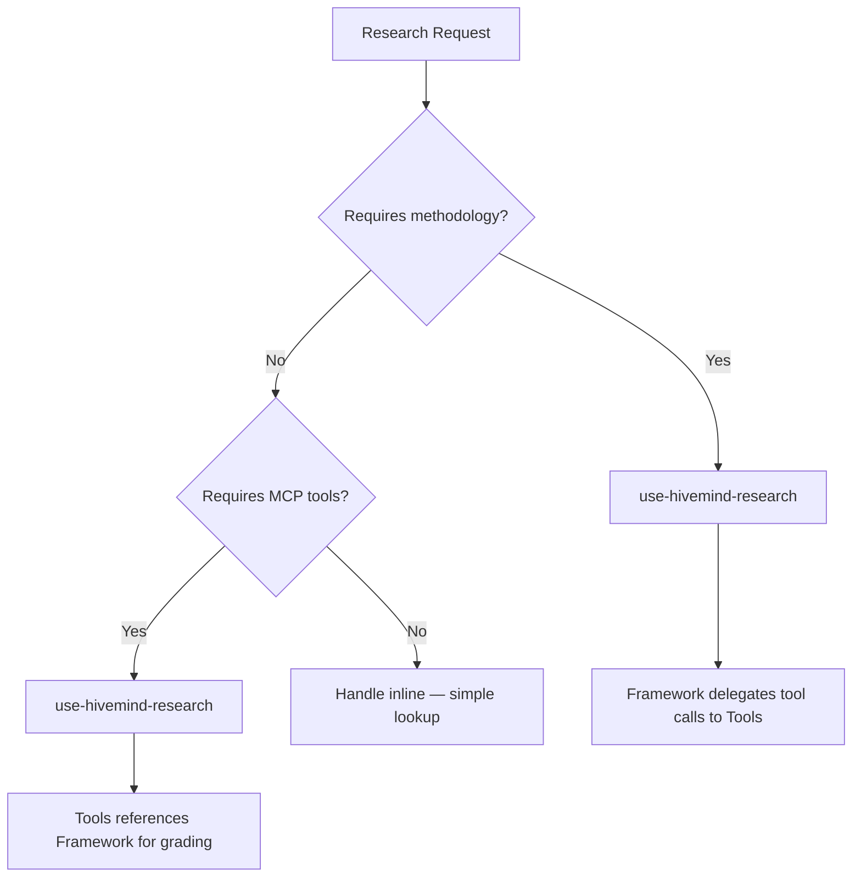

# ses_2bb9

**Session ID:** ses_2bb9
**Created:** 3/31/2026, 9:52:45 PM
**Updated:** 3/31/2026, 10:08:29 PM

---

## Table of Contents

| # | Timestamp | Actor | Tools | Summary |
|---|-----------|-------|-------|---------|

---
## User


---
**Tool:** skill

**Input:**
```json
{"name":"use-hivemind"}
```

**Output:**
```
<skill_content name="use-hivemind">
# Skill: use-hivemind

# use-hivemind

## Purpose

Resolve one question before any action: "Am I the orchestrator or an executor?" Then gate project validity. Then route.

## GATE 0: Role Lineage Detection

Check ONE signal: does this agent receive instructions from a human, or from a delegation packet?

| Signal | Orchestrator | Executor |
|--------|-------------|----------|
| Prompt source | Human user directly | Delegation packet from another agent |
| Session type | Primary session | Sub-session (delegated) |
| context.ask() | Available (human in loop) | Not available (autonomous within bounds) |

Resolution rules:
1. Human prompt + context.ask() available → ORCHESTRATOR
2. Pre-defined scope + return contract → EXECUTOR
3. Ambiguous signal → assume ORCHESTRATOR (safer default)
4. Executor signal but no packet → BLOCK, escalate

Load exactly ONE reference after resolution:

| Role | Load |
|------|------|
| Orchestrator | `references/orchestrator-entry.md` |
| Executor | `references/executor-entry.md` |

## GATE 1: Project Validity

Run: `node scripts/hm-entry-gate.cjs --cwd <project-root>`

Exit code 0, PASS → proceed.
Exit code 0, DEGRADED → proceed with caution. Log soft warnings.
Exit code 1, FAIL → STOP. Report failures. Do not proceed.

Run GATE 1 once per session start (or when context feels uncertain). Not every turn.

## Post-Gate Routing

After GATE 0 + GATE 1 resolve, load routing and intelligence references:

### Protocol References (loaded by both branches)

| File | Contains |
|------|----------|
| `references/agent-roles.md` | Per-agent capability matrix for routing resolution |
| `references/role-boundaries.md` | Session positioning, lineage detection, delegation thresholds |
| `references/domain-coupling-map.md` | Intent → specialist → depth reference routing table |

### Intelligence References (loaded after routing)

| File | Contains |
|------|----------|
| `references/project-state-awareness.md` | Phase detection, blockage signals, doc trustworthiness, distrust levels |
| `references/task-classification.md` | Request type classification matrix with routing targets |
| `references/session-state.md` | Session continuity: fresh, resume, post-compaction tracking |

### Templates

| File | Contains |
|------|----------|
| `templates/load-template.md` | Dynamic batch loading templates for common workflows |

### Scripts

| File | Contains |
|------|----------|
| `scripts/hm-entry-gate.cjs` | Universal project validity gate (6 gates, zero deps) |

## Turn Loop

Re-enter GATE 0 every turn. Do not carry state between turns except what the orchestrator persists via git memory.

```
Turn start → GATE 0 → Load role reference → Follow role protocol → Turn end
                                                                      │
                                                Next turn → GATE 0 ──┘
```

## Hard Blocks

- Skip GATE 0 → BLOCK
- Load BOTH branch references → BLOCK
- Act before role resolved → BLOCK
- Executor loading governance content → BLOCK
- Proceed past GATE 1 when script fails → BLOCK

## Platform

Framework-agnostic. Works in OpenCode, Claude Code, Cursor, Gemini CLI, and any agent system that supports skill loading. Platform-specific behaviors handled by the platform layer, not by this skill.

## Independence Rules

- No implementation — routes only
- No deep reads — context assessment is shallow
- No mutation — never writes files, modifies state, or commits
- No how-to-implement — delegates process guidance only

Base directory for this skill: file:///Users/apple/hivemind-plugin/.worktrees/product-detox/.opencode/skills/use-hivemind
Relative paths in this skill (e.g., scripts/, reference/) are relative to this base directory.
Note: file list is sampled.

<skill_files>
<file>/Users/apple/hivemind-plugin/.worktrees/product-detox/.opencode/skills/use-hivemind/templates/load-template.md</file>
<file>/Users/apple/hivemind-plugin/.worktrees/product-detox/.opencode/skills/use-hivemind/scripts/hm-entry-gate.cjs</file>
<file>/Users/apple/hivemind-plugin/.worktrees/product-detox/.opencode/skills/use-hivemind/references/context-rot-defense.md</file>
<file>/Users/apple/hivemind-plugin/.worktrees/product-detox/.opencode/skills/use-hivemind/references/orchestrator-self-assessment.md</file>
<file>/Users/apple/hivemind-plugin/.worktrees/product-detox/.opencode/skills/use-hivemind/references/verification-before-completion.md</file>
<file>/Users/apple/hivemind-plugin/.worktrees/product-detox/.opencode/skills/use-hivemind/references/orchestrator-entry.md</file>
<file>/Users/apple/hivemind-plugin/.worktrees/product-detox/.opencode/skills/use-hivemind/references/task-classification.md</file>
<file>/Users/apple/hivemind-plugin/.worktrees/product-detox/.opencode/skills/use-hivemind/references/intent-classification.md</file>
<file>/Users/apple/hivemind-plugin/.worktrees/product-detox/.opencode/skills/use-hivemind/references/context-health-protocol.md</file>
<file>/Users/apple/hivemind-plugin/.worktrees/product-detox/.opencode/skills/use-hivemind/references/agent-roles.md</file>
</skill_files>
</skill_content>
```

---
**Tool:** skill

**Input:**
```json
{"name":"hivemind-codemap"}
```

**Output:**
```
<skill_content name="hivemind-codemap">
# Skill: hivemind-codemap

# hivemind-codemap

This is the deep codemap branch family for `use-hivemind`.

## Table of Contents

- [Purpose](#purpose)
- [Use This For](#use-this-for)
- [Preconditions](#preconditions)
- [Do Not Use This For](#do-not-use-this-for)
- [Scan Levels](#scan-levels)
- [Tool Modes](#tool-modes)
- [Core Process](#core-process)
- [Delegation Loop](#delegation-loop)
- [Reusable Codemap Techniques](#reusable-codemap-techniques)
- [Bash Scan Helper](#bash-scan-helper)
- [Iterative Output Storage](#iterative-output-storage)
- [Delegation Integration](#delegation-integration)
- [Orchestrator Integration](#orchestrator-integration)
- [Outputs](#outputs)
- [Bundled Resources](#bundled-resources)


**Path Parameters** (adapt to your framework):
- `{runtime_state_dir}` — Root runtime state directory (e.g., `.hivemind/`, `.claude/`, `.cursor/`)
- `{runtime_activity_dir}` — Activity artifacts directory (e.g., `.hivemind/activity/`, `.claude/activity/`)
- `{pathing_config}` — Pathing configuration file (e.g., `.hivemind/pathing/active-paths.json`)

## Purpose
- map the codebase before refactor strategy
- produce high-level, pipeline, journey, then low-level scan outputs
- identify seams, hotspots, overlaps, and concern ownership
- generate synthesis artifacts that later debug and refactor stages can trust

## Use This For
- repo-wide structural investigation
- concern-based or seam-based partitioning
- locating hidden overlap between routing, memory, governance, and execution surfaces
- producing bounded slices for later delegation or debugging

## Preconditions
- authority and scan goal are explicit before starting
- no code changes are made during the codemap pass itself
- `deep` and `exhaustive` scans must use state tracking and write-as-you-go outputs
- Repomix is optional acceleration, not a mandatory dependency

## Do Not Use This For
- direct debugging of a reproduced failure with already-known scope
- generic file listing without structural synthesis
- making code changes from the codemap stage alone

## Scan Levels

| Level | Use When | Read Strategy | Output Expectation |
| --- | --- | --- | --- |
| `quick` | scope is still broad and a high-level map is needed fast | pattern-based only; configs, manifests, structure | scan plan + early seam hypotheses |
| `deep` | structure is unclear but only critical areas matter | read bounded critical directories or router-selected slices | seam inventory + codemap synthesis |
| `exhaustive` | migration, severe rot, or full restoration requires whole-repo certainty | read all relevant source slices excluding ignored build/vendor paths | full seam inventory + hotspot ledger + synthesis |

Read `references/scan-levels.md`.

## Tool Modes

| Mode | Role | When To Prefer |
| --- | --- | --- |
| `native` | `glob` + `grep` + `read` for direct evidence | small or medium slices, file verification, low tooling risk |
| `repomix` | pack repository or scoped slices into AI-friendly output | high-level structure extraction, metadata-only maps, compressed scans |
| `hybrid` | repomix for overview, native reads for verification | large repos where pack-first then verify is safer |

Read `references/repomix-mode.md`.

## Core Process
1. Establish the scan goal, authority surfaces, and required outputs.
2. Choose `quick`, `deep`, or `exhaustive`.
3. Choose `native`, `repomix`, or `hybrid` mode.
4. Initialize scan state from `templates/codemap-scan-state.json.md` for `deep` or `exhaustive` work.
5. Run the phase ladder:
   - `high-level-map`: authorities, entry surfaces, and seam hypotheses
   - `pipeline-map`: execution paths, state transitions, downstream consumers
   - `journey-map`: user-visible flows, degraded paths, resume paths, and edge cases
   - `low-level-proof`: bounded file review for the still-open slices
   - `cross-pass-synthesis`: reconcile findings, risks, and delegation-ready slices
6. Build batches only after the active phase is explicit:
   - `deep`: critical directories, key pipelines, or router-selected seams
   - `exhaustive`: all recursive subfolders except ignored paths, grouped by authority or pipeline where possible
   - file-audit loops: roughly 20 files per parallel batch after slice isolation
7. For each batch:
    - read or pack the batch
    - extract seams, interfaces, hotspots, pipeline notes, journey impact, and edge cases
    - immediately write findings to disk
    - validate the written artifact
    - update scan state
    - purge detailed batch findings from working context
8. If using parallel audit-style subagents, reconcile total `FILES CHECKED` before final synthesis.
9. Emit seam inventory, codemap synthesis, and optional Repomix extraction report.
10. Hand off bounded slices back to the detox router for delegation, debugging, or refactor.

## Delegation Loop
- Use sequential passes until the high-level map identifies clean seams.
- Parallel codemap swarms are allowed only after slices are isolated.
- Audit-like file review loops must use file accounting and rerun missing slices before reporting complete.
- Each deeper pass must read the previous phase synthesis artifact first.
- If the current pass cannot explain behavior through a pipeline or journey model, the codemap remains incomplete and must recurse before delegation.

Read `references/batching-loop.md` and `references/delegation-contract.md`.

## Reusable Codemap Techniques
1. `layered scan lattice`
2. `critical-directory deep pass`
3. `pack-then-verify`
4. `write-validate-purge loop`

Read `references/codemap-techniques.md`.

## Bash Scan Helper

The package includes `scripts/hm-codescan.sh` — a zero-dependency Bash script that produces structured JSON output for code scanning workflows.

```bash
# Repository structure extraction
bash scripts/hm-codescan.sh structure --scope src --cwd /path/to/project

# Find exported symbols
bash scripts/hm-codescan.sh exports --scope src/tools

# Map import relationships
bash scripts/hm-codescan.sh imports --scope src

# Detect seam/barrel files (index.ts)
bash scripts/hm-codescan.sh seams --scope src

# Find large/complex files (>200 lines)
bash scripts/hm-codescan.sh hotspots --scope src

# Generate a batch plan for deep/exhaustive scans
bash scripts/hm-codescan.sh batch-plan --scope src --batch-size 20 --pass-id pass_1
```

All commands return JSON to stdout. The helper currently supports `structure`, `exports`, `imports`, `seams`, `hotspots`, and `batch-plan`. Batch execution and output persistence are workflow conventions performed by the surrounding delegation process, not by a dedicated `scan-batch` or `--output` flag in this script.

## Iterative Output Storage

Scan outputs are stored in `{project}/{runtime_activity_dir}/codescan/` with this structure:

```
codescan/
├── {pass_id}/
│   ├── plan.json            # Batch plan (from batch-plan command)
│   ├── {batch_id}.json      # Per-batch results
│   ├── loop-checkpoint.json # Iteration state (if multi-iteration)
│   └── synthesis.json       # Final synthesis after all batches
└── cross-pass-synthesis.json  # Synthesis across multiple passes
```

This structure supports:
- **Resumable scans:** read `plan.json` + completed batch files to determine where to resume.
- **Multi-pass chaining:** each pass gets its own `pass_id` folder.
- **Comparison:** side-by-side batch results from different passes.
- **Export:** each folder is self-contained and can be shared.
- **Phase-first recovery:** each pass should declare which phase of the ladder it belongs to.

## Delegation Integration

When delegating scan work through `use-hivemind-delegation`:
- Use `codescan-delegation.md` from the delegation protocol for agent selection and packet structure.
- The codemap skill owns the scan mechanics; the delegation skill owns the handoff discipline.
- Use `iterative-loop-control.md` from the delegation protocol for multi-iteration checkpoint management.

## Orchestrator Integration

Codemap work is **never** run inline in the orchestrator's session. The orchestrator:
1. Selects the scan level (`quick`, `deep`, `exhaustive`) and tool mode (`native`, `repomix`, `hybrid`).
2. Emits a delegation packet via `use-hivemind-delegation`.
3. Receives only: seam count, critical seam list, hotspot count, blocked routes, and output paths.
4. Does NOT read full scan output or seam inventories into its own session.
5. Refers subagents to the detailed output files when further work on a specific slice is needed.

If the orchestrator catches itself doing multi-file reads or pattern matching, it is violating session freshness discipline — stop and delegate.

## Outputs
- scan plan
- codemap scan state
- seam inventory
- codemap synthesis report
- optional repomix extraction report
- bash scan helper JSON outputs (per command)

## OpenCode Tool Matrix

| Mapping Need | Preferred Tool | Why | Fallback |
| --- | --- | --- | --- |
| discover candidate files | `glob` | fast file discovery | `list` |
| scan names or call sites | `grep` | cheap cross-file search | `repomix_grep_repomix_output` |
| inspect specific seams | `read` | exact local context | `repomix_read_repomix_output` |
| trace symbol ownership | `lsp.goToDefinition` / `lsp.findReferences` | semantic proof | `grep` |
| inspect a remote public repo | `repomix_pack_remote_repository` | whole-repo packing | `deepwiki_read_wiki_structure` |

## Concrete Bash Examples

```bash
# Show recent changes summary (e.g., git diff --stat HEAD~1..HEAD)
# Run type checking (e.g., npx tsc --noEmit for TypeScript, mypy for Python)
# Run the test suite (e.g., npm test, pytest, cargo test)
```

## LSP and Remote Repo Decision Tree

1. **IF** the project has a working language server, **THEN** use `lsp.documentSymbol` and `lsp.findReferences` before regex search.
2. **IF** LSP is unavailable, **THEN** fall back to `glob` + `grep` + targeted `read`.
3. **IF** the repo is remote-only or too large for local scanning, **THEN** use `repomix_pack_remote_repository` or `deepwiki_read_wiki_structure`.
4. **IF** the scan must show call hierarchy evidence, **THEN** load `references/lsp-code-mapping.md` before summarizing results.

## Sibling Skills

| Skill | Relationship |
|-------|-------------|
| `use-hivemind-delegation` | Delegation protocol for scan dispatch |
| `hivemind-synthesis` | Codebase investigation — extends scan mechanics with Repomix + MCP tool chain |
| `hivemind-gatekeeping` | Scan results pass through gate checks |

## Bundled Resources

| Resource | Path | Purpose |
|----------|------|---------|
| Scan Layers | `references/scan-layers.md` | High-level to low-level scan pass definitions |
| Scan Levels | `references/scan-levels.md` | Depth granularity for each scan pass |
| Batching Loop | `references/batching-loop.md` | Batch processing loop for large codebases |
| Repomix Mode | `references/repomix-mode.md` | Repomix integration for codebase packing |
| Codemap Techniques | `references/codemap-techniques.md` | Specific scanning techniques and patterns |
| Delegation Contract | `references/delegation-contract.md` | Contract format for codemap delegation packets |
| Codescan Script | `scripts/hm-codescan.sh` | Bash helper for automated code scanning |
| Scan Plan | `templates/scan-plan.md` | Template for scan pass planning |
| Scan State | `templates/codemap-scan-state.json.md` | JSON template for scan state tracking |
| Seam Inventory | `templates/seam-inventory.md` | Template for recording discovered seams |
| Synthesis Report | `templates/codemap-synthesis-report.md` | Template for scan result synthesis |
| Repomix Report | `templates/repomix-extraction-report.md` | Template for repomix extraction results |
| Direct Invocation | `tests/direct-invocation.md` | Test scenario for direct skill invocation |

## Activity Output

All artifacts produced by this skill follow the Activity Folder Protocol.

**Pathing:** See `{pathing_config}` for resolved output paths.
**Naming:** `{category}-{semantic-id}-{YYYY-MM-DD}.{ext}`
**Meta:** All JSON includes `_meta.created_at`, `_meta.updated_at`, `_meta.producer`.
**Validation:** Run `bash use-hivemind-delegation/scripts/hm-artifact-validate.sh {path}` to confirm compliance.

Base directory for this skill: file:///Users/apple/hivemind-plugin/.worktrees/product-detox/.opencode/skills/hivemind-codemap
Relative paths in this skill (e.g., scripts/, reference/) are relative to this base directory.
Note: file list is sampled.

<skill_files>
<file>/Users/apple/hivemind-plugin/.worktrees/product-detox/.opencode/skills/hivemind-codemap/templates/scan-plan.json</file>
<file>/Users/apple/hivemind-plugin/.worktrees/product-detox/.opencode/skills/hivemind-codemap/templates/codemap-synthesis-report.md</file>
<file>/Users/apple/hivemind-plugin/.worktrees/product-detox/.opencode/skills/hivemind-codemap/templates/codemap-scan-state.json.md</file>
<file>/Users/apple/hivemind-plugin/.worktrees/product-detox/.opencode/skills/hivemind-codemap/templates/scan-plan.md</file>
<file>/Users/apple/hivemind-plugin/.worktrees/product-detox/.opencode/skills/hivemind-codemap/templates/repomix-extraction-report.md</file>
<file>/Users/apple/hivemind-plugin/.worktrees/product-detox/.opencode/skills/hivemind-codemap/templates/seam-inventory.md</file>
<file>/Users/apple/hivemind-plugin/.worktrees/product-detox/.opencode/skills/hivemind-codemap/scripts/hm-codescan.sh</file>
<file>/Users/apple/hivemind-plugin/.worktrees/product-detox/.opencode/skills/hivemind-codemap/tests/direct-invocation.md</file>
<file>/Users/apple/hivemind-plugin/.worktrees/product-detox/.opencode/skills/hivemind-codemap/references/delegation-contract.md</file>
<file>/Users/apple/hivemind-plugin/.worktrees/product-detox/.opencode/skills/hivemind-codemap/references/scan-layers.md</file>
</skill_files>
</skill_content>
```

---
**Tool:** skill

**Input:**
```json
{"name":"use-hivemind-research"}
```

**Output:**
```
<skill_content name="use-hivemind-research">
# Skill: use-hivemind-research

## Parameters

| Parameter | Meaning |
|-----------|---------|
| `{runtime_state_dir}` | Runtime state directory (e.g., `.hivemind/`) |
| `{runtime_activity_dir}` | Activity subdirectory (e.g., `.hivemind/activity/`) |
| `{pathing_config}` | Pathing config file (e.g., `.hivemind/pathing/active-paths.json`) |
| `{validation_script}` | Artifact validation script path |

# use-hivemind-research — Research Router

## Table of Contents

- [Load Position](#load-position)
- [Use This For](#use-this-for)
- [Routing Logic](#routing-logic)
  - [Step 1 — Classify the Request](#step-1--classify-the-request)
  - [Step 2 — Load the Correct Package](#step-2--load-the-correct-package)
  - [Step 3 — Delegate with Context](#step-3--delegate-with-context)
- [Sibling Skill Integration](#sibling-skill-integration)
- [Anti-Patterns at Router Level](#anti-patterns-at-router-level)
- [Experiment Safety Protocol](#experiment-safety-protocol)
- [Results Formatting](#results-formatting)
- [Conditional Loading](#conditional-loading)
- [Bundled Resources](#bundled-resources)

## Load Position

Layer: Domain. Requires `use-hivemind` (entry router) loaded first.

Thin entry point that classifies the research request and delegates to the correct specialist skill.

## Use This For

- User asks "research", "investigate", "compare", "evaluate", "what is the best", "how does X work"
- Any question requiring 3+ sources to answer reliably
- Technology decisions, architecture evaluation, library comparison
- API behavior investigation, pattern discovery
- User wants evidence-backed recommendations, not opinions

## Routing Logic



### Step 1 — Classify the Request

Determine the **research type** by matching signal words:

| Signal Words | Research Type | Route To |
|---|---|---|
| compare, versus, alternative, which is better | Comparison | Framework + Tools |
| how does X work, API behavior, library semantics | Tech/API | Framework + Tools |
| pattern, architecture, design approach | Pattern | Framework |
| requirements, scope, what do we need | Requirements | Framework |
| landscape, ecosystem, who does what | Landscape | Tools |
| dependency, coupling, impact, break | Cross-Dependency | Framework + Tools |
| quick lookup, simple fact, what version | Inline | Self (skip delegation) |

### Step 2 — Load the Correct Package

**Framework (methodology)** loads when:
- Question needs multi-source evidence grading
- Confidence scoring required
- Delegation to subagents needed
- Contradiction resolution anticipated

**Tools (protocols)** loads when:
- MCP providers are available
- Codebase analysis needed (Repomix)
- Official docs retrieval needed (Context7)
- Web search with extraction needed (Tavily/Exa)
- Repository deep analysis needed (DeepWiki)

**Both** load when the request is complex enough to need methodology AND tool execution.

### Step 3 — Delegate with Context

Hand off using the research delegation packet:

```markdown
## Delegation Packet
- **Research type**: <type from classification>
- **Sub-questions**: <3-5 decomposed questions>
- **Evidence sources**: <which MCP providers to use>
- **Confidence target**: full | partial | low
- **Constraints**: <scope boundaries, time limits>
```

## Sibling Skill Integration

| Skill | Integration Point |
|---|---|
| use-hivemind-delegation | Subagent spawning for parallel research threads |
| hivemind-spec-driven | Refining vague research requests into answerable questions |
| use-hivemind-context | Session health check before long research runs |
| `hivemind-synthesis` | Research + investigation → synthesis pipeline — this skill provides MCP tool routing |

## Anti-Patterns at Router Level

1. **Skipping classification** — routes to wrong package, wastes MCP calls
2. **Loading both when one suffices** — unnecessary context overhead
3. **Inline research for complex questions** — no evidence grading, no confidence scoring
4. **Recursive routing** — router must not call itself

## Experiment Safety Protocol

Research investigations are experiments. Every experiment needs safety rails.

| Rule | Implementation |
|------|----------------|
| Isolate research threads | Each investigation runs on its own branch or in a separate artifact folder |
| Checkpoint before deep dive | Commit state before entering a research rabbit hole |
| Rollback on dead end | If investigation yields nothing, discard artifacts and revert to checkpoint |
| Preserve evidence | Findings captured before rollback — never lose confirmed data |
| Abort conditions | Stop when: source is unreliable, 3 parallel threads converge on same gap, cost exceeds value |

For full protocol details, see `references/experiment-safety.md`.

## Results Formatting

All research outputs must follow a structured format for downstream consumption.

| Field | Type | Required | Description |
|-------|------|----------|-------------|
| `source` | string | Yes | Origin of the finding (repo name, doc URL, commit SHA) |
| `finding` | string | Yes | The discovered fact or conclusion |
| `confidence` | enum | Yes | `confirmed` / `inferred` / `unverified` |
| `evidence_path` | string | Yes | Relative path to supporting artifact |
| `timestamp` | ISO 8601 | Yes | When the finding was captured |

For TSV/JSON templates and aggregation rules, see `references/results-format.md`.

## Conditional Loading

| Condition | Load Reference |
|-----------|---------------|
| Technology evaluation needed | `evidence-contract.md` |
| Documentation research | `mcp-setup-guide.md` |
| Multi-source investigation | `research-classification.md` |
| Repomix codebase analysis | `repomix-ingestion.md` |
| Source credibility assessment | `evidence-contract.md` + `anti-patterns.md` |

## OpenCode Tool Matrix

| Tool | Use For | Avoid When | Research Note |
|---|---|---|---|
| `glob` | Find manifests, lockfiles, README, config targets | Content search | Brownfield packets start here |
| `grep` | Trace imports, errors, keywords, version strings | File discovery | Use before expensive MCP calls |
| `read` | Validate exact versions, README claims, package metadata | Cross-file discovery | Read only the slices needed |
| `bash` | List dependencies, git metadata, local verification | Replacing read/grep/glob | Use for dependency truth and final validation |
| `webfetch` | Known URL fetch after discovery | URL discovery | Good for official docs or release notes |
| `google_search` | Fresh public-web discovery | Version-specific docs | Use when no MCP-specific provider fits |
| `repomix_pack_codebase` | Whole-codebase truth | Tiny file questions | Best for wide brownfield analysis |

## MCP Priority Table

| Priority | Tool Chain | Best Use | Rate Limit / Budget |
|---|---|---|---|
| 1 | `context7_resolve-library-id` → `context7_query-docs` | Version-specific dependency docs | 60 req/hour free-tier budget |
| 2 | `deepwiki_ask_question` | Public repo understanding | Free, effectively unbounded |
| 3 | `tavily_tavily_search` → `tavily_tavily_extract` | Extractable web evidence | Credit budgeted: 1,000/mo free |
| 4 | `exa_web_search_exa` → `exa_crawling_exa` | Semantic discovery | 10 QPS on search |
| 5 | `brave-search_brave_web_search` | Fresh web confirmation | 50 QPS search plan |
| 6 | `repomix_pack_codebase` → `repomix_grep_repomix_output` | Local code truth | No external provider limit |

## 4-Mode Depth Workflow

| Mode | Budget | Min Sources | Credibility Floor | Default Use |
|---|---:|---:|---:|---|
| Quick | 3 min | 5 | 50 | Reversible lookup or orientation |
| Standard | 8 min | 10 | 60 | Default engineering research |
| Deep | 15 min | 15 | 70 | Architectural or migration work |
| UltraDeep | 30 min | 25 | 75 | Hard-to-reverse or externally visible decisions |

### Workflow Steps

1. Classify stakes and set mode before searching.
2. Run Phase 0.5 vocabulary discovery.
3. Choose primary research type: `technology-eval`, `codebase-investigation`, `cross-stack-analysis`, `greenfield-spec`, or `brownfield-trace`.
4. Run broad discovery only until the mode's minimum source target is reachable.
5. Validate major claims with official docs, repo evidence, or local code truth.
6. Run counter-perspective queries for Standard, Deep, and UltraDeep work.
7. Stop only when claims coverage and credibility floor match the chosen mode.

### Escalation Rules

- Escalate Quick to Standard if the first five sources disagree.
- Escalate Standard to Deep if major claims lack two independent sources.
- Escalate Deep to UltraDeep if the decision is hard to reverse.

## Vocabulary Discovery Phase

Run **Phase 0.5** before deep search.

1. Extract raw user terms, domain nouns, and action verbs.
2. Map outsider language to expert vocabulary.
3. Add adjacent terms and one exclusion term per noisy concept.
4. Store the result in `vocabulary_map` inside `templates/research-packet.json`.
5. Read `references/vocabulary-discovery.md` when the first search results feel shallow or repetitive.

Minimum output:

- 3 expert terms
- 2 adjacent terms
- 1 exclusion term

## Counter-Perspective Protocol

Treat adversarial search as mandatory for non-trivial work.

1. Write one query that assumes the preferred answer is wrong.
2. Add terms such as `failure mode`, `limitations`, `migration pain`, `not recommended`, or `counterexample`.
3. Prefer independent domains over many pages from one vendor.
4. Downgrade confidence when counter-evidence is stronger than the primary narrative.
5. Record contradictions instead of smoothing them away.

## Bash Examples (5)

Use bash for local truth gathering, then pair the result with the exact MCP call.

```bash
List direct dependencies (e.g., npm ls --depth=0, pip list, cargo tree --depth=1)
```

Pair with `context7_resolve-library-id` and `context7_query-docs` for each important dependency.

```bash
Extract dependency metadata (e.g., python3 -c "import json; print(json.load(open('package.json')).get('dependencies', {}))")
```

Pair with `deepwiki_ask_question` to inspect upstream repos named by the manifest.

```bash
Inspect remote configuration (e.g., git remote -v)
```

Pair with `repomix_pack_remote_repository` when the upstream public repo needs deeper code truth.

```bash
# Trace imports (e.g., rg "from ['\"]|require\(" src, or grep -rn "import" src)
```

Pair with `exa_web_search_exa` or `tavily_tavily_search` to research the imported libraries and integration paths.

```bash
Check project surface files (e.g., ls README.md package.json tsconfig.json)
```

Pair with `tavily_tavily_search`, `brave-search_brave_web_search`, or `webfetch` to validate docs freshness against the local project surface.

## Decision Tree: Research Type → Tool Chain

- IF `technology-eval` THEN `context7_resolve-library-id` → `context7_query-docs` → `deepwiki_ask_question` → `tavily_tavily_search`
- IF `codebase-investigation` THEN `glob` + `grep` + `read` → `repomix_pack_codebase` → `repomix_grep_repomix_output`
- IF `cross-stack-analysis` THEN package scan → Context7 per dependency → `deepwiki_ask_question` or Repomix → Tavily/Exa for compatibility evidence
- IF `greenfield-spec` THEN vocabulary discovery → `exa_web_search_exa` → `tavily_tavily_extract` → Context7 for shortlisted frameworks
- IF `brownfield-trace` THEN `package.json` + README validation → version trace → Context7 → Deepwiki/Repomix → targeted web search for unresolved gaps

## Cross-Skill Chaining

- Load `use-hivemind-delegation` when one packet needs multiple sub-questions or parallel evidence slices.
- Load `hivemind-synthesis` when multiple research returns must be merged into one evidence-backed recommendation.
- Load `use-hivemind-context` before long-running research if document freshness or prior-session drift is suspect.

## Metrics & Verification

- Source count must meet the chosen mode threshold.
- Average credibility must meet the chosen mode floor.
- Claims-evidence coverage must meet the chosen mode target.
- Placeholder text is a hard failure.
- Validate output with a validation script (e.g., `bash scripts/hm-research-validate.sh <output.json> <min-evidence>`).

## Template References

- Use `templates/research-packet.json` for machine-validated research setup.
- Use `templates/claims-evidence-table.md` for human-readable claim packaging.
- Read `references/mcp-tool-protocols.md` for exact MCP signatures, rate limits, and fallback chains.
- Read `references/cross-stack-workflow.md` for greenfield vs brownfield sequencing.

## Bundled Resources

| Resource | Path | Purpose |
|---|---|---|
| Evidence Contract | `references/evidence-contract.md` | Evidence grading, confidence scoring, source credibility |
| Tool Protocols | `references/tool-protocols.md` | MCP tool chaining, provider selection, fallback sequences |
| Research Classification | `references/research-classification.md` | Request type taxonomy, signal-word matching, routing rules |
| Anti-Patterns | `references/anti-patterns.md` | Common research mistakes and how the router avoids them |
| Delegation for Research | `references/delegation-for-research.md` | Subagent spawning patterns for parallel research threads |
| Fallback Hierarchy | `references/fallback-hierarchy.md` | Provider fallback order when primary MCP tools are unavailable |
| MCP Setup Guide | `references/mcp-setup-guide.md` | MCP provider configuration and capability verification |
| Repomix Ingestion | `references/repomix-ingestion.md` | Codebase analysis via Repomix for research contexts |
| Experiment Safety | `references/experiment-safety.md` | Git-backed experiment safety, rollback, isolation |
| Results Format | `references/results-format.md` | Structured results format (TSV/JSON), aggregation rules |
| Check MCP Readiness | `scripts/check-mcp-readiness.mjs` | MCP provider readiness verification script |
| Score Confidence | `scripts/score-confidence.sh` | Confidence scoring helper script |
| Evidence Table | `templates/evidence-table.md` | Template for evidence table format |
| MCP Config | `templates/mcp-config-template.json` | JSON template for MCP configuration |
| Research Packet | `templates/research-packet.md` | Template for research delegation packets |

## Activity Output

All artifacts produced by this skill follow the Activity Folder Protocol.

**Pathing:** See `{pathing_config}` for resolved output paths.
**Naming:** `{category}-{semantic-id}-{YYYY-MM-DD}.{ext}`
**Meta:** All JSON includes `_meta.created_at`, `_meta.updated_at`, `_meta.producer`.
**Validation:** Run `{validation_script} {path}` to confirm compliance.

Base directory for this skill: file:///Users/apple/hivemind-plugin/.worktrees/product-detox/.opencode/skills/use-hivemind-research
Relative paths in this skill (e.g., scripts/, reference/) are relative to this base directory.
Note: file list is sampled.

<skill_files>
<file>/Users/apple/hivemind-plugin/.worktrees/product-detox/.opencode/skills/use-hivemind-research/templates/evidence-table.md</file>
<file>/Users/apple/hivemind-plugin/.worktrees/product-detox/.opencode/skills/use-hivemind-research/templates/mcp-config-template.json</file>
<file>/Users/apple/hivemind-plugin/.worktrees/product-detox/.opencode/skills/use-hivemind-research/templates/claims-evidence-table.md</file>
<file>/Users/apple/hivemind-plugin/.worktrees/product-detox/.opencode/skills/use-hivemind-research/templates/research-packet.json</file>
<file>/Users/apple/hivemind-plugin/.worktrees/product-detox/.opencode/skills/use-hivemind-research/templates/research-packet.md</file>
<file>/Users/apple/hivemind-plugin/.worktrees/product-detox/.opencode/skills/use-hivemind-research/scripts/check-mcp-readiness.mjs</file>
<file>/Users/apple/hivemind-plugin/.worktrees/product-detox/.opencode/skills/use-hivemind-research/scripts/score-confidence.sh</file>
<file>/Users/apple/hivemind-plugin/.worktrees/product-detox/.opencode/skills/use-hivemind-research/scripts/hm-research-validate.sh</file>
<file>/Users/apple/hivemind-plugin/.worktrees/product-detox/.opencode/skills/use-hivemind-research/references/evidence-contract.md</file>
<file>/Users/apple/hivemind-plugin/.worktrees/product-detox/.opencode/skills/use-hivemind-research/references/research-classification.md</file>
</skill_files>
</skill_content>
```

---
**Tool:** read

**Input:**
```json
{"filePath":"/Users/apple/hivemind-plugin/.worktrees/product-detox/OVERVIEW.md"}
```

**Output:**
```
<path>/Users/apple/hivemind-plugin/.worktrees/product-detox/OVERVIEW.md</path>
<type>file</type>
<content>1: The Hivemind framework is designed to integrate everything necessary for agentic coding and the harness of context, tools, Opencode plugins and SDK, deterministic approaches, and specialist factors through the engines and libraries of other dependencies, enabling agents to use features that are not built into any single platform. At the MVP stage we implement the concepts in Opencode, then identify footprints for other platforms such as Claude Code, Codex of OpenAI, Cursor, Kilocode, Antigravity, Gemini, etc. To avoid simplistic classifications we split the approach into three tiers and map the concepts to each group.
2: 
3: 
4: ## 3.0 Core Concepts
5: 
6: ### 3.1 Concept A: Granularity Atoms
7: 
8: All task types are mapped to atomic units with enforced constraints:
9: 
10: | Rule | Limit |
11: |------|-------|
12: | Code LOC per file | ≤300 |
13: | Interface fields | ≤10 |
14: | Function complexity | Chain-breaking |
15: 
16: **Principles:**
17: - No god components, no god functions, no dead code, no zombies
18: - Minimal regression surface through chain-breaking design
19: - CRUD operations map to atomic create/read/update/delete units
20: 
21: ### 3.2 Concept B: 2-End-Extreme Metrics
22: 
23: Gate criteria for Granularity Atoms — two extremes that bound acceptable behavior:
24: 
25: **Programmatic/E2E Testable:**
26: - Every metric has an automated verification mechanism
27: - No metric relies solely on human judgment
28: 
29: **Scale-Measurable:**
30: - Metrics can be quantified numerically
31: - Progression is trackable over time
32: 
33: **Scope-Aware:**
34: - Metrics respect bounded context
35: - Cross-boundary metrics require explicit mapping
36: 
37: **Responsibility-Centric:**
38: - Each agent owns specific metrics
39: - Metrics map to agent hierarchy roles
40: 
41: **Integration-Aware:**
42: - Metrics account for dependency chains
43: - Sequential blocking is measured
44: 
45: **Anti-Pattern Excluded:**
46: - Baseline passing of unrelated unit tests does NOT satisfy any metric
47: 
48: ### 3.3 Concept C: Ecosystem
49: 
50: The complete HiveMind runtime environment:
51: 
52: ```
53: Graph (dependency tracking)
54:   + Trajectory (execution ledger)
55:   + Tools (7 hivemind_* tools)
56:   + Engines (event-tracker, agent-work-contract, session-journal)
57:   + .hivemind/*.*/ (runtime state)
58: ```
59: 
60: ### 3.4 Concept D: Strategic Lens
61: 
62: **Conceptual framework for viewing A+B+C at scale.**
63: 
64: - NOT buildable — this is an abstract overlay for human review
65: - Provides strategic view of the entire ecosystem
66: - Human verification only — cannot be automated
67: 
68: ### 3.5 Concept E: Harness
69: 
70: Agents + Tools + Workflows resolving ALL entry points:
71: 
72: **Entry Kernel:**
73: - `runtime-attachment.json` — active runtime configuration
74: - `entry-kernel-state.json` — kernel state at session start
75: 
76: **Agents:** 13+ specialist agents with defined roles
77: **Tools:** 7 hivemind_* tools + SDK tools
78: **Workflows:** Executable patterns resolving entry to exit
79: 
80: ### 3.6 Cross-Concept Dependencies
81: 
82: ```
83: A → B (Granularity enables Metrics)
84: B → A (Metrics gate Granularity)
85: A + B → C (Atomic units with metrics form Ecosystem)
86: A + B + C → D (Ecosystem viewed through Strategic Lens)
87: A + B + C + D → E (Complete system wrapped in Harness)
88: ```
89: 
90: ---
91: 
92: ## 4.0 Tier Architecture
93: 
94: ### 4.1 Tier 1: Hard Harness (Non-Negotiable)
95: 
96: Core SDK dependencies that cannot be replaced:
97: 
98: | Component | Version/Location | Purpose |
99: |-----------|------------------|---------|
100: | @opencode-ai/plugin | >=1.1.0 | Plugin SDK |
101: | @opencode-ai/sdk | Current | Client/server interfaces |
102: | Trajectory Ledger | src/core/trajectory/ | Execution state |
103: | Workflow Authority | src/core/workflow-management/ | Task lifecycle |
104: | Schema Kernel | src/schema-kernel/ | Contract authority |
105: 
106: ### 4.2 Tier 2: OpenCode-Dependable
107: 
108: Built on OpenCode SDK patterns:
109: 
110: | Component | Count | Status |
111: |-----------|-------|--------|
112: | HiveMindPlugin | 1 | Active |
113: | Plugin Hooks | 16 | Active |
114: | Command Bundles | 10 | Active |
115: | Tools | 9+ | Active |
116: | Agents | 13+ | Active |
117: 
118: ### 4.3 Tier 3: Skills
119: 
120: Extensible capability packages:
121: 
122: | Component | Count | Status |
123: |-----------|-------|--------|
124: | Skill Packages | 19+ | Active |
125: | Registry | registry-internal.yaml | Active |
126: 
127: **[GAP]:** `npx skills add` NOT implemented — skill installation requires manual configuration
128: 
129: ### 4.4 Tier Boundaries
130: 
131: Dependency direction enforced:
132: - Tier 1 cannot depend on Tier 2 or Tier 3
133: - Tier 2 can depend on Tier 1 only
134: - Tier 3 can depend on Tier 1 and Tier 2
135: 
136: ---
137: 
138: ## 5.0 Agent Hierarchy
139: 
140: ### 5.1 Orchestrator Layer
141: 
142: **hiveminder:**
143: - Coordinates all work
144: - Delegates to specialists
145: - Never implements directly
146: - Owns workflow authority
147: 
148: ### 5.2 Governance Layer
149: 
150: **hiveq:**
151: - Verification specialist
152: - PASS/FAIL verdicts
153: - Validates implementations against specs
154: 
155: **code-skeptic:**
156: - Challenge assumptions
157: - Detect anti-patterns
158: - Question claims without evidence
159: 
160: ### 5.3 Specialist Layer
161: 
162: | Agent | Role |
163: |-------|------|
164: | architect | System design and architecture decisions |
165: | hiveplanner | Planning and requirement distillation |
166: | hivemaker | Implementation execution |
167: | hivehealer | Debug and repair |
168: | hivexplorer | Codebase investigation |
169: | explore | General exploration |
170: | explore-small | Targeted investigation |
171: | hiverd | Research synthesis |
172: | hitea | Tea-time闲聊 agent |
173: | hivefiver | Vibe coding specialist |
174: | general | General purpose |
175: 
176: ### 5.4 Delegation Rules & Interface Contracts
177: 
178: Every delegation carries:
179: - Explicit scope
180: - Constraints
181: - Return contract
182: - Return gate
183: 
184: Sequential by default. Parallel only when slices are isolated and merge-safe.
185: 
186: # SKILLS and The Hivemind 3-Tier Set Up
187: ---
188: 
189: ## Tier 1
190: 
191: The “Hard Harness”, requires a setup that matches the full complexity of Hivemind‑only. It involves installing additional npm packages, employing deterministic and programmatic methods, and meeting the requirements of the OpenCode SDK. 
192: 
193: ## Tier 2
194: 
195: The “Opencode‑Dependable” setup, includes tools, plugins, hooks, commands, agents, sub‑agents, rules, prompts, workflows, permissions, shell commands, and other elements that work only under Opencode. Although they share naming conventions with other agentic coding platforms, they are configured and chained in a way that optimizes autonomous, multi‑role agent workflows.
196: 
197: ## Tier 3 
198: 
199: The “SKILLS” tier, is a flexible, fail‑safe harness that enhances but does not disrupt or pollute the system; it provides depth, breadth, and coverage for diverse use cases and projects across multiple development industries in any context.
200: 
201: In developing skills, each must satisfy a set of absolute criteria that must pass a 100 % vertical and horizontal assessment and survive all stress‑tests and real‑life failure patterns. These characteristics are:
202: 
203: Framework and platform agnostic: terminology must be usable with Hivemind, strictly regulated to the entities, workflows, agents, sub‑agents, and task orientations; it must provide fallbacks and reference paths to other frameworks such as GSD, Spec‑kit, BMAD, Superpower, Oh‑my‑openagents, Open‑spec, and to platforms like Claude Code, Codex, Cursor, Kilocode, Antigravity, Gemini, etc.  
204: Hierarchy, domain‑specificity, intelligence, gatekeeping, delegation, and context integrity must be governed by strict rules: a parent must exist for a child to act, a chain cannot proceed until all dependencies are satisfied, and deterministic smart‑workflow routing is enforced. Front‑facing agents must know they are human‑facing, blind, the brain, and the highest hierarchy, and they must maintain an overview of progress, dependencies, contracts, and skill declarations. They must govern context, retrieve git commit information, understand git worktree and branch structures, and delegate sub‑agents to commit work in atomic batches with classification formats for retrieval. They must coordinate sequential, parallel, or batched tasks, set clear constraints and success metrics, and avoid hallucination or chain‑breaking behaviors.  
205: 
206: Skills must respect the unity and consistency of the framework: assets and references must be meticulously written, templates must provide detailed guidance without confusion, and the writing style must be human‑like with progressive disclosure.  

(End of file - total 206 lines)
</content>
```

---
**Tool:** read

**Input:**
```json
{"filePath":"/Users/apple/hivemind-plugin/.worktrees/product-detox/src/tools/index.ts"}
```

**Output:**
```
<path>/Users/apple/hivemind-plugin/.worktrees/product-detox/src/tools/index.ts</path>
<type>file</type>
<content>1: /**
2:  * Agent-callable tool barrel export.
3:  *
4:  * Runtime hooks and slash-command orchestration no longer live here.
5:  * `src/tools` is reserved for actual execution limbs used by agents in-session.
6:  */
7: 
8: export * from './task/index.js'
9: export * from './trajectory/index.js'
10: export * from './handoff/index.js'
11: export * from './runtime/index.js'
12: export * from './doc/index.js'
13: export * from './hivefiver-init/index.js'
14: export * from './hivefiver-doctor/index.js'
15: export * from './hivefiver-setting/index.js'
16: import { getRuntimePressureContract, type RuntimePressureContract } from '../shared/pressure-contract.js'
17: 
18: export interface AgentToolCatalogEntry {
19:   id: string
20:   contractFile: string
21:   hostEvent: string
22:   workflowPhase: string
23:   purposeClasses: string[]
24:   stateAuthority: 'workflow' | 'trajectory' | 'delegation' | 'plugin-control-plane'
25:   pressureContract: RuntimePressureContract
26: }
27: 
28: export const agentToolCatalog: AgentToolCatalogEntry[] = [
29:   {
30:     id: 'hivemind_doc',
31:     contractFile: 'src/tools/doc/tools.ts',
32:     hostEvent: 'tool.call',
33:     workflowPhase: 'doc-intelligence',
34:     purposeClasses: ['discovery', 'research', 'planning', 'gatekeeping'],
35:     stateAuthority: 'plugin-control-plane',
36:     pressureContract: getRuntimePressureContract('steady-state'),
37:   },
38:   {
39:     id: 'hivemind_task',
40:     contractFile: 'src/tools/task/tools.ts',
41:     hostEvent: 'tool.call',
42:     workflowPhase: 'tool-execution',
43:     purposeClasses: ['implementation', 'gatekeeping', 'tdd', 'course-correction'],
44:     stateAuthority: 'workflow',
45:     pressureContract: getRuntimePressureContract('task-mutation'),
46:   },
47:   {
48:     id: 'hivemind_trajectory',
49:     contractFile: 'src/tools/trajectory/tools.ts',
50:     hostEvent: 'tool.call',
51:     workflowPhase: 'trajectory-attachment',
52:     purposeClasses: ['planning', 'implementation', 'gatekeeping', 'course-correction'],
53:     stateAuthority: 'trajectory',
54:     pressureContract: getRuntimePressureContract('trajectory-control'),
55:   },
56:   {
57:     id: 'hivemind_handoff',
58:     contractFile: 'src/tools/handoff/tools.ts',
59:     hostEvent: 'tool.call',
60:     workflowPhase: 'recovery-checkpoint',
61:     purposeClasses: ['research', 'implementation', 'gatekeeping', 'course-correction'],
62:     stateAuthority: 'delegation',
63:     pressureContract: getRuntimePressureContract('handoff-validation'),
64:   },
65:   {
66:     id: 'hivemind_runtime_status',
67:     contractFile: 'src/tools/runtime/tools.ts',
68:     hostEvent: 'tool.call',
69:     workflowPhase: 'runtime-inspection',
70:     purposeClasses: ['discovery', 'gatekeeping'],
71:     stateAuthority: 'plugin-control-plane',
72:     pressureContract: getRuntimePressureContract('steady-state'),
73:   },
74:   {
75:     id: 'hivemind_runtime_command',
76:     contractFile: 'src/tools/runtime/tools.ts',
77:     hostEvent: 'tool.call',
78:     workflowPhase: 'runtime-command',
79:     purposeClasses: ['implementation', 'course-correction'],
80:     stateAuthority: 'plugin-control-plane',
81:     pressureContract: getRuntimePressureContract('control-plane-repair'),
82:   },
83:   {
84:     id: 'hivemind_agent_work_create_contract',
85:     contractFile: 'src/features/agent-work-contract/tools/create-contract-tool.ts',
86:     hostEvent: 'tool.call',
87:     workflowPhase: 'agent-work-contract',
88:     purposeClasses: ['planning', 'implementation', 'gatekeeping'],
89:     stateAuthority: 'workflow',
90:     pressureContract: getRuntimePressureContract('task-mutation'),
91:   },
92:   {
93:     id: 'hivemind_agent_work_export_contract',
94:     contractFile: 'src/features/agent-work-contract/tools/export-contract-tool.ts',
95:     hostEvent: 'tool.call',
96:     workflowPhase: 'agent-work-contract',
97:     purposeClasses: ['planning', 'implementation', 'gatekeeping', 'course-correction'],
98:     stateAuthority: 'workflow',
99:     pressureContract: getRuntimePressureContract('steady-state'),
100:   },
101:   {
102:     id: 'hivemind_journal',
103:     contractFile: 'src/tools/hivemind-journal.ts',
104:     hostEvent: 'tool.call',
105:     workflowPhase: 'session-journal',
106:     purposeClasses: ['discovery', 'brainstorming', 'research', 'planning', 'implementation', 'gatekeeping', 'tdd', 'course-correction'],
107:     stateAuthority: 'plugin-control-plane',
108:     pressureContract: getRuntimePressureContract('steady-state'),
109:   },
110:   {
111:     id: 'hivemind_hm_init',
112:     contractFile: 'src/tools/hivefiver-init/tools.ts',
113:     hostEvent: 'tool.call',
114:     workflowPhase: 'bootstrap',
115:     purposeClasses: ['discovery', 'implementation'],
116:     stateAuthority: 'plugin-control-plane',
117:     pressureContract: getRuntimePressureContract('steady-state'),
118:   },
119:   {
120:     id: 'hivemind_hm_doctor',
121:     contractFile: 'src/tools/hivefiver-doctor/tools.ts',
122:     hostEvent: 'tool.call',
123:     workflowPhase: 'diagnostics',
124:     purposeClasses: ['discovery', 'gatekeeping'],
125:     stateAuthority: 'plugin-control-plane',
126:     pressureContract: getRuntimePressureContract('steady-state'),
127:   },
128:   {
129:     id: 'hivemind_hm_setting',
130:     contractFile: 'src/tools/hivefiver-setting/tools.ts',
131:     hostEvent: 'tool.call',
132:     workflowPhase: 'configuration',
133:     purposeClasses: ['discovery', 'implementation'],
134:     stateAuthority: 'plugin-control-plane',
135:     pressureContract: getRuntimePressureContract('steady-state'),
136:   },
137: ]

(End of file - total 137 lines)
</content>
```

---
**Tool:** read

**Input:**
```json
{"filePath":"/Users/apple/hivemind-plugin/.worktrees/product-detox/src/plugin/opencode-plugin.ts"}
```

**Output:**
```
<path>/Users/apple/hivemind-plugin/.worktrees/product-detox/src/plugin/opencode-plugin.ts</path>
<type>file</type>
<content>1: /**
2:  * Real OpenCode plugin entry for the revamp lane.
3:  *
4:  * Assembly-only: imports hooks and tools, registers them, exports Plugin.
5:  * No business logic. No tool definitions. No event processing beyond delegation.
6:  */
7: 
8: import { type Plugin } from '@opencode-ai/plugin'
9: import { existsSync, mkdirSync, readFileSync, writeFileSync } from 'node:fs'
10: import { dirname, join } from 'node:path'
11: import { fileURLToPath } from 'node:url'
12: 
13: import { findSlashCommandBundle } from '../commands/slash-command/index.js'
14: import { handleChatMessage } from '../hooks/chat-message-handler.js'
15: import { initSdkContext, resetSdkContext } from '../hooks/sdk-context.js'
16: import { createEventHandler } from '../hooks/event-handler.js'
17: import { showGovernanceToast } from '../hooks/soft-governance.js'
18: import { handleToolExecution } from '../hooks/tool-execution-handler.js'
19: 
20: import {
21:   createAgentWorkCreateContractTool,
22:   createAgentWorkExportContractTool,
23: } from '../features/agent-work-contract/tools/index.js'
24: import { isHivemindManagedTool, recordToolEvent } from '../hooks/runtime-loader/index.js'
25: import { createHivemindDocTool } from '../tools/doc/index.js'
26: import { createHivemindHandoffTool } from '../tools/handoff/index.js'
27: import {
28:   createHivemindRuntimeStatusTool,
29:   createHivemindRuntimeCommandTool,
30: } from '../tools/runtime/index.js'
31: import { createHivemindTaskTool as createTaskTool } from '../tools/task/index.js'
32: import { createHivemindTrajectoryTool as createTrajectoryTool } from '../tools/trajectory/index.js'
33: import { createHivemindJournalTool } from '../tools/hivemind-journal.js'
34: import { createHivemindHmInitTool } from '../tools/hivefiver-init/index.js'
35: import { createHivemindHmDoctorTool } from '../tools/hivefiver-doctor/index.js'
36: import { createHivemindHmSettingTool } from '../tools/hivefiver-setting/index.js'
37: import { renderToolPrecedence } from './context-renderer.js'
38: import { initSkillInjection } from './skill-exposure-map.js'
39: import { createTurnSnapshotLoader } from './runtime-snapshot.js'
40: import { createSyntheticPart } from './synthetic-parts.js'
41: import { createMessagesTransformHandler } from './messages-transform-adapter.js'
42: import { createCompactionHandler } from './compaction-adapter.js'
43: import {
44:   createTransformHandler,
45:   createTextCompleteHandler,
46:   createCompactionJournalHandler,
47: } from '../hooks/index.js'
48: 
49: /**
50:  * Resolve the package root from the current module location.
51:  *
52:  * At runtime the compiled plugin lives at `dist/plugin/opencode-plugin.js`.
53:  * The canonical agent sources sit at `agents/*.deprecated.md` relative to package root.
54:  */
55: const __dirname = dirname(fileURLToPath(import.meta.url))
56: const packageRoot = join(__dirname, '..', '..')
57: 
58: /**
59:  * Ensure `.opencode/agents/hivefiver.md` exists on first run.
60:  *
61:  * When HiveMind is installed fresh, the projected agent file is missing.
62:  * `hm-init` requires `hivefiver`, so we auto-create it from the bundled
63:  * canonical source before any tool can fail on the missing file.
64:  *
65:  * - Never overwrites an existing projection (user may have customized it).
66:  * - Silently skips if the bundled source is unavailable (e.g. unusual install layout).
67:  *
68:  * @param projectRoot - The consumer project root (typically `input.directory`)
69:  */
70: function ensureAgentProjection(projectRoot: string): void {
71:   const agentDir = join(projectRoot, '.opencode', 'agents')
72:   const targetPath = join(agentDir, 'hivefiver.md')
73: 
74:   if (existsSync(targetPath)) return // user has it already — don't touch
75: 
76:   const sourcePath = join(packageRoot, 'agents', 'hivefiver.deprecated.md')
77:   if (!existsSync(sourcePath)) return // bundled source missing — skip gracefully
78: 
79:   mkdirSync(agentDir, { recursive: true })
80:   const content = readFileSync(sourcePath, 'utf-8')
81:   writeFileSync(targetPath, content, 'utf-8')
82: }
83: 
84: /**
85:  * Real OpenCode plugin entry for the revamp lane.
86:  *
87:  * Assembly-only: imports hooks and tools, registers them, exports Plugin.
88:  * No business logic. No tool definitions. No event processing beyond delegation.
89:  */
90: export const HiveMindPlugin: Plugin = async (input) => {
91:   const directory = input.directory
92:   ensureAgentProjection(directory)
93:   initSkillInjection(directory)
94:   initSdkContext(input)
95:   const eventHandler = createEventHandler(directory)
96:   const turnSnapshot = createTurnSnapshotLoader(directory)
97:   const nlFirstDispatchKeys = new Set<string>()
98: 
99:   // Create isolated hook adapters
100:   const messagesTransform = createMessagesTransformHandler({
101:     directory,
102:     turnSnapshot,
103:     nlFirstDispatchKeys,
104:   })
105: 
106:   const compactionHandler = createCompactionHandler({
107:     directory,
108:     turnSnapshot,
109:   })
110: 
111:   // Session journal handlers (Plan #10) — wired alongside legacy
112:   const transformHandler = createTransformHandler({ directory })
113:   const compactionJournalHandler = createCompactionJournalHandler({ directory })
114: 
115:   return {
116:     event: async (eventInput) => {
117:       await eventHandler(eventInput)
118:     },
119:     'experimental.chat.system.transform': async (input, output) => {
120:       await transformHandler(input, output)
121:     },
122:     tool: {
123:       hivemind_runtime_status: createHivemindRuntimeStatusTool(directory),
124:       hivemind_runtime_command: createHivemindRuntimeCommandTool(directory),
125:       hivemind_agent_work_create_contract: createAgentWorkCreateContractTool(directory),
126:       hivemind_agent_work_export_contract: createAgentWorkExportContractTool(directory),
127:       hivemind_doc: createHivemindDocTool(directory),
128:       hivemind_task: createTaskTool(directory),
129:       hivemind_trajectory: createTrajectoryTool(directory),
130:       hivemind_handoff: createHivemindHandoffTool(directory),
131:       hivemind_journal: createHivemindJournalTool(directory),
132:       hivemind_hm_init: createHivemindHmInitTool(directory),
133:       hivemind_hm_doctor: createHivemindHmDoctorTool(directory),
134:       hivemind_hm_setting: createHivemindHmSettingTool(directory),
135:     },
136:     'chat.message': async (messageInput, output) => {
137:       await handleChatMessage(
138:         messageInput,
139:         output as unknown as { message: { role: string; content: string }; parts: unknown[] },
140:         directory,
141:       ).catch(() => undefined)
142:       turnSnapshot.resetTurnSnapshot()
143:       const snapshot = await turnSnapshot.getSnapshot()
144: 
145:       // Show degraded mode warning if HiveMind exists but isn't healthy
146:       if (snapshot.hasHivemind && !snapshot.hivemindHealthy) {
147:         await showGovernanceToast(
148:           'degraded-mode',
149:           'Running in degraded mode. HiveMind initialized with minimal state. Run `hm-init` for full capabilities and expert-level configuration.',
150:           'warning'
151:         )
152:       }
153:     },
154:     'permission.ask': async (permissionInput, output) => {
155:       // Auto-allow HiveMind managed tool calls (they have their own governance)
156:       if (permissionInput.metadata) {
157:         const toolName = (permissionInput.metadata as Record<string, unknown>).tool as string | undefined
158:         if (isHivemindManagedTool(toolName)) {
159:           output.status = 'allow'
160:           return
161:         }
162:       }
163: 
164:       // For state mutations, surface a governance toast
165:       if (permissionInput.type === 'write') {
166:         await showGovernanceToast(
167:           'mutation-gate',
168:           `HiveMind: Permission requested for ${permissionInput.type} operation`,
169:         )
170:       }
171:     },
172:     'tool.execute.before': async (toolInput, _output) => {
173:       // Record tool execution intent for trajectory tracking
174:       if (isHivemindManagedTool(toolInput.tool)) {
175:         await recordToolEvent(directory, toolInput.sessionID, `${toolInput.tool}:pre`)
176:       }
177:     },
178:     'shell.env': async (_input, output) => {
179:       const snapshot = await turnSnapshot.getSnapshot()
180:       output.env.HIVEMIND_RUNTIME_ATTACHED = '1'
181:       output.env.HIVEMIND_ATTACHMENT_MODE = snapshot.attachmentMode
182:       if (snapshot.trajectoryId) output.env.HIVEMIND_ACTIVE_TRAJECTORY = snapshot.trajectoryId
183:       if (snapshot.workflowId) output.env.HIVEMIND_ACTIVE_WORKFLOW = snapshot.workflowId
184:     },
185:     'command.execute.before': async (commandInput, output) => {
186:       const bundle = findSlashCommandBundle(commandInput.command)
187:       if (!bundle) {
188:         return
189:       }
190: 
191:       const snapshot = await turnSnapshot.getSnapshot()
192: 
193:       // Build tool precedence chain for bundle execution
194:       const toolPrecedenceChain = {
195:         chain: [
196:           {
197:             tool: 'hivemind_runtime_command',
198:             action: 'execute',
199:             args: { bundleId: bundle.id },
200:           },
201:         ],
202:         mandatory_reads: [
203:           { path: '.hivemind/session.json', reason: 'active_session_state' },
204:           ...(snapshot.trajectoryId ? [{ path: `.hivemind/trajectory/${snapshot.trajectoryId}.json`, reason: 'trajectory_state' }] : []),
205:           ...(snapshot.workflowId ? [{ path: `.hivemind/workflow/${snapshot.workflowId}.json`, reason: 'workflow_state' }] : []),
206:         ],
207:       }
208: 
209:       const toolPrecedenceJson = renderToolPrecedence(toolPrecedenceChain)
210: 
211:       output.parts.unshift(createSyntheticPart(
212:         commandInput.sessionID,
213:         commandInput.sessionID,
214:         [
215:           '<hivemind-command-context>',
216:           `command=${bundle.id}`,
217:           `trajectory=${snapshot.trajectoryId ?? 'none'}`,
218:           `workflow=${snapshot.workflowId ?? 'none'}`,
219:           `task_ids=${snapshot.taskIds.join(',')}`,
220:           `tool_precedence=${toolPrecedenceJson}`,
221:           'mutation_rule=do-not-hand-write-hivemind-state-files',
222:           '</hivemind-command-context>',
223:         ].join('\n'),
224:       ))
225:     },
226:     'tool.execute.after': async (toolInput, output) => {
227:       await handleToolExecution(toolInput, output, directory).catch(() => undefined)
228:       if (isHivemindManagedTool(toolInput.tool)) {
229:         await recordToolEvent(directory, toolInput.sessionID, toolInput.tool)
230:       }
231:     },
232:     'experimental.text.complete': async (input, output) => {
233:       const sessionId = input.sessionID
234:       const assistantText = typeof output.text === 'string' ? output.text : ''
235: 
236:       if (!sessionId || assistantText.length === 0) {
237:         return
238:       }
239: 
240:       await createTextCompleteHandler({ directory })(
241:         { sessionID: sessionId, messageID: '', partID: '' },
242:         { text: assistantText },
243:       ).catch(err => console.error('[session-journal] text-complete handler failed:', err))
244:     },
245:     'experimental.chat.messages.transform': messagesTransform,
246:     'experimental.session.compacting': async (input: { sessionID: string }, output: { context: string[]; prompt?: string }) => {
247:       await compactionHandler(input, output)
248:       await compactionJournalHandler(input, output).catch(err => console.error('[session-journal] compaction failed:', err))
249:     },
250:   }
251: }
252: 
253: export default HiveMindPlugin
254: 
255: process.on('exit', () => {
256:   resetSdkContext()
257: })

(End of file - total 257 lines)
</content>
```

---
**Tool:** read

**Input:**
```json
{"filePath":"/Users/apple/hivemind-plugin/.worktrees/product-detox/package.json"}
```

**Output:**
```
<path>/Users/apple/hivemind-plugin/.worktrees/product-detox/package.json</path>
<type>file</type>
<content>1: {
2:   "name": "hivemind-context-governance",
3:   "version": "2.9.5",
4:   "description": "Context-Aware Governance Layer for OpenCode - prevents drift and manages session state across lifecycles",
5:   "type": "module",
6:   "main": "dist/index.js",
7:   "types": "dist/index.d.ts",
8:   "exports": {
9:     ".": {
10:       "import": "./dist/index.js",
11:       "types": "./dist/index.d.ts"
12:     },
13:     "./plugin": {
14:       "import": "./dist/plugin/opencode-plugin.js",
15:       "types": "./dist/plugin/opencode-plugin.d.ts"
16:     }
17:   },
18:   "bin": {
19:     "hivemind-context-governance": "dist/cli.js",
20:     "hivemind": "dist/cli.js",
21:     "hm-init": "dist/cli.js",
22:     "hm-doctor": "dist/cli.js",
23:     "hm-settings": "dist/cli.js",
24:     "hm-harness": "dist/cli.js"
25:   },
26:   "files": [
27:     "dist",
28:     "bin",
29:     "skills",
30:     "commands",
31:     "agents",
32:     "workflows",
33:     "README.md",
34:     "LICENSE",
35:     "CHANGELOG.md"
36:   ],
37:   "workspaces": [
38:     "apps/*"
39:   ],
40:   "repository": {
41:     "type": "git",
42:     "url": "git+https://github.com/shynlee04/hivemind-plugin.git"
43:   },
44:   "bugs": {
45:     "url": "https://github.com/shynlee04/hivemind-plugin/issues"
46:   },
47:   "homepage": "https://github.com/shynlee04/hivemind-plugin#readme",
48:   "scripts": {
49:     "clean": "rm -rf dist",
50:     "build": "npm run clean && tsc && chmod +x dist/cli.js",
51:     "dev": "tsc --watch",
52:     "typecheck": "npm run typecheck:core",
53:     "typecheck:core": "tsc --noEmit",
54:     "lint:boundary": "bash scripts/check-sdk-boundary.sh && bash scripts/check-state-write-boundary.sh && bash scripts/check-docs-ownership-boundary.sh && bash scripts/check-no-event-bus.sh && bash scripts/check-no-core-session.sh && bash scripts/check-tool-schema.sh && bash scripts/check-hooks-readonly.sh && bash scripts/check-plugin-assembly.sh && bash scripts/check-agents-presence.sh && bash scripts/check-asset-refs.sh",
55:     "guard:public": "bash scripts/guard-public-branch.sh origin/master HEAD",
56:     "test": "npm run lint:boundary && tsx --test \"tests/**/*.test.ts\" \"src/**/*.test.ts\"",
57:     "prepublishOnly": "npm run typecheck && npm test && npm run build"
58:   },
59:   "keywords": [
60:     "opencode",
61:     "opencode-plugin",
62:     "plugin",
63:     "governance",
64:     "context-management",
65:     "agent-lifecycle",
66:     "hivemind"
67:   ],
68:   "author": "HiveMind Contributors",
69:   "license": "MIT",
70:   "engines": {
71:     "node": ">=20.0.0"
72:   },
73:   "publishConfig": {
74:     "access": "public"
75:   },
76:   "dependencies": {
77:     "@clack/prompts": "^1.0.0",
78:     "@json-render/core": "^0.16.0",
79:     "@json-render/ink": "^0.16.0",
80:     "@json-render/react": "^0.16.0",
81:     "@opencode-ai/plugin": ">=1.1.0",
82:     "@opencode-ai/sdk": "^1.2.27",
83:     "@types/proper-lockfile": "^4.1.4",
84:     "@z_ai/coding-helper": "^0.0.7",
85:     "fast-glob": "^3.3.3",
86:     "ignore": "^7.0.5",
87:     "ink": "^6.8.0",
88:     "just-bash": "^2.14.0",
89:     "magic-string": "^0.30.21",
90:     "proper-lockfile": "^4.1.2",
91:     "remark": "^15.0.1",
92:     "typescript": "^5.3.0",
93:     "unist-util-visit": "^5.1.0",
94:     "web-tree-sitter": "^0.26.5",
95:     "yaml": "^2.8.2",
96:     "zod": "^4.3.6"
97:   },
98:   "devDependencies": {
99:     "@types/ink": "^0.5.2",
100:     "@types/node": "^20.10.0",
101:     "@types/react": "^19.2.14",
102:     "tsx": "^4.7.0",
103:     "vitest": "^4.1.1"
104:   },
105:   "peerDependencies": {
106:     "@opencode-ai/plugin": ">=1.1.0",
107:     "react": "^19.2.4"
108:   },
109:   "peerDependenciesMeta": {
110:     "@opencode-ai/plugin": {
111:       "optional": false
112:     },
113:     "react": {
114:       "optional": true
115:     }
116:   },
117:   "overrides": {
118:     "@opentui/core": {
119:       "web-tree-sitter": "$web-tree-sitter"
120:     }
121:   },
122:   "directories": {
123:     "doc": "docs",
124:     "test": "tests"
125:   }
126: }

(End of file - total 126 lines)
</content>
```

---
## Assistant (Assistant · unknown)

_Thinking:_

Good. Skills loaded. Now let me begin the investigation. Role: EXECUTOR (delegated task with explicit scope and return contract). I'll read all key source files in parallel first.

---
**Tool:** read

**Input:**
```json
{"filePath":"/Users/apple/hivemind-plugin/.worktrees/product-detox/src/tools"}
```

**Output:**
```
<path>/Users/apple/hivemind-plugin/.worktrees/product-detox/src/tools</path>
<type>directory</type>
<entries>
doc/
handoff/
hivefiver-doctor/
hivefiver-init/
hivefiver-setting/
hivefiver-tools.test.ts
hivemind-journal.test.ts
hivemind-journal.ts
index.ts
runtime/
task/
trajectory/

(12 entries)
</entries>
```

---
**Tool:** read

**Input:**
```json
{"filePath":"/Users/apple/hivemind-plugin/.worktrees/product-detox/src/features/event-tracker"}
```

**Output:**
```
<path>/Users/apple/hivemind-plugin/.worktrees/product-detox/src/features/event-tracker</path>
<type>directory</type>
<entries>
classifier/
consolidated-writer-v3.test.ts
consolidated-writer.test.ts
consolidated-writer.ts
markdown-writer.test.ts
markdown-writer.ts
parser/
paths.test.ts
paths.ts
session-structure.test.ts
session-structure.ts
session-v3-types.test.ts
types.test.ts
types.ts
writers/

(15 entries)
</entries>
```

---
**Tool:** read

**Input:**
```json
{"filePath":"/Users/apple/hivemind-plugin/.worktrees/product-detox/src/hooks"}
```

**Output:**
```
<path>/Users/apple/hivemind-plugin/.worktrees/product-detox/src/hooks</path>
<type>directory</type>
<entries>
auto-slash-command/
chat-message-handler.ts
compaction-handler.ts
event-handler.test.ts
event-handler.ts
index.ts
runtime-loader/
sdk-context.ts
soft-governance.ts
start-work/
text-complete-handler.ts
tool-execution-handler.ts
transform-handler.ts
workflow-integration/

(14 entries)
</entries>
```

---
**Tool:** read

**Input:**
```json
{"filePath":"/Users/apple/hivemind-plugin/.worktrees/product-detox/src/plugin"}
```

**Output:**
```
<path>/Users/apple/hivemind-plugin/.worktrees/product-detox/src/plugin</path>
<type>directory</type>
<entries>
compaction-adapter.ts
context-renderer.builder.ts
context-renderer.compaction-renderers.ts
context-renderer.constants.ts
context-renderer.renderers.ts
context-renderer.test.ts
context-renderer.ts
context-renderer.types.ts
evidence-reporter.ts
index.ts
injection-store.ts
input-helpers.ts
messages-transform-adapter.ts
messages-transform.ts
opencode-plugin.ts
route-hint.ts
runtime-prompt.ts
runtime-snapshot.ts
skill-exposure-map.ts
skill-focus-renderer.ts
skill-injection-init.test.ts
synthetic-parts.ts
system-transform.ts

(23 entries)
</entries>
```

---
**Tool:** bash

**Input:**
```json
{"command":"ls -la /Users/apple/hivemind-plugin/.worktrees/product-detox/.hivemind/ 2>/dev/null || echo \"DIRECTORY_NOT_FOUND\"","description":"Check .hivemind runtime state dir"}
```

**Output:**
```
total 8
drwxr-xr-x@  12 apple  staff   384 Mar 29 15:44 .
drwxr-xr-x@ 101 apple  staff  3232 Mar 31 18:44 ..
drwxr-xr-x   22 apple  staff   704 Mar 30 17:33 activity
drwxr-xr-x    4 apple  staff   128 Mar 29 18:58 agent-work-contract
drwxr-xr-x@   4 apple  staff   128 Mar 29 00:47 config
-rw-r--r--    1 apple  staff   260 Mar 29 00:47 context-check.json
drwxr-xr-x@   3 apple  staff    96 Mar 29 00:47 graph
drwxr-xr-x    3 apple  staff    96 Mar 29 01:36 pathing
drwxr-xr-x    6 apple  staff   192 Mar 31 21:23 plans
drwxr-xr-x@   4 apple  staff   128 Mar 21 10:50 project
drwxr-xr-x    4 apple  staff   128 Mar 29 15:47 sessions
drwxr-xr-x@   4 apple  staff   128 Mar 29 00:47 state

```

---
## Assistant (Assistant · unknown)

_Thinking:_

Good. Now let me read more critical files in parallel to verify the remaining claims.

---
**Tool:** glob

**Input:**
```json
{"pattern":"src/tools/*/index.ts","path":"/Users/apple/hivemind-plugin/.worktrees/product-detox"}
```

**Output:**
```
/Users/apple/hivemind-plugin/.worktrees/product-detox/src/tools/hivefiver-setting/index.ts
/Users/apple/hivemind-plugin/.worktrees/product-detox/src/tools/trajectory/index.ts
/Users/apple/hivemind-plugin/.worktrees/product-detox/src/tools/task/index.ts
/Users/apple/hivemind-plugin/.worktrees/product-detox/src/tools/runtime/index.ts
/Users/apple/hivemind-plugin/.worktrees/product-detox/src/tools/hivefiver-init/index.ts
/Users/apple/hivemind-plugin/.worktrees/product-detox/src/tools/handoff/index.ts
/Users/apple/hivemind-plugin/.worktrees/product-detox/src/tools/hivefiver-doctor/index.ts
/Users/apple/hivemind-plugin/.worktrees/product-detox/src/tools/doc/index.ts
```

---
**Tool:** read

**Input:**
```json
{"filePath":"/Users/apple/hivemind-plugin/.worktrees/product-detox/src/hooks/index.ts"}
```

**Output:**
```
<path>/Users/apple/hivemind-plugin/.worktrees/product-detox/src/hooks/index.ts</path>
<type>file</type>
<content>1: /**
2:  * Hook layer barrel export
3:  */
4: 
5: export * from './runtime-loader/index.js'
6: export * from './workflow-integration/index.js'
7: export * from './start-work/index.js'
8: export * from './auto-slash-command/index.js'
9: export * from './sdk-context.js'
10: export * from './event-handler.js'
11: export * from './soft-governance.js'
12: export * from './transform-handler.js'
13: export * from './text-complete-handler.js'
14: export * from './compaction-handler.js'

(End of file - total 14 lines)
</content>
```

---
**Tool:** read

**Input:**
```json
{"filePath":"/Users/apple/hivemind-plugin/.worktrees/product-detox/src/features/event-tracker/consolidated-writer.ts"}
```

**Output:**
```
<path>/Users/apple/hivemind-plugin/.worktrees/product-detox/src/features/event-tracker/consolidated-writer.ts</path>
<type>file</type>
<content>1: /**
2:  * Consolidated Session Writer
3:  *
4:  * Produces a single JSON file per session using the V3 schema (ADR-017).
5:  * All writes are atomic (write to temp, then rename) to prevent corruption.
6:  *
7:  * @module event-tracker/consolidated-writer
8:  */
9: 
10: import { existsSync } from 'node:fs'
11: import { mkdir, readFile, rename, writeFile } from 'node:fs/promises'
12: import { dirname, join } from 'node:path'
13: import type { Lineage, PurposeClass, SessionV3 } from './types.js'
14: import { appendHierarchyLink } from '../session-journal/hierarchy-writer.js'
15: 
16: // ============================================================================
17: // Types
18: // ============================================================================
19: 
20: /**
21:  * Input for initializing a new consolidated session (V3 schema).
22:  */
23: export interface InitSessionInput {
24:   sessionId: string
25:   lineage: Lineage
26:   purposeClass: PurposeClass
27:   agent: string
28:   parentSessionId?: string | null
29: }
30: 
31: /**
32:  * Input for adding a turn to the session.
33:  */
34: export interface AddTurnInput {
35:   sessionId: string
36:   turn: {
37:     turnNumber: number
38:     timestamp: string
39:     agent: string
40:     model: string
41:     duration: number | null
42:     userMessage: string
43:     assistantContent: string
44:   }
45: }
46: 
47: /**
48:  * Input for adding an event to the session.
49:  */
50: export interface AddEventInput {
51:   sessionId: string
52:   event: {
53:     turnNumber: number
54:     type: string
55:     importance: 'high' | 'medium' | 'low'
56:     timestamp: string
57:     data: Record<string, unknown>
58:   }
59: }
60: 
61: /**
62:  * Input for adding a diagnostic to the session.
63:  */
64: export interface AddDiagnosticInput {
65:   sessionId: string
66:   diagnostic: {
67:     timestamp: string
68:     level: 'info' | 'warn' | 'error'
69:     message: string
70:     context?: Record<string, unknown>
71:   }
72: }
73: 
74: /**
75:  * Counter increment specification.
76:  * In V3, `turnCount` is a top-level field; others live in `counters`.
77:  */
78: export type CounterType =
79:   | 'userMessageCount'
80:   | 'assistantOutputCount'
81:   | 'toolCallCount'
82:   | 'delegationCount'
83:   | 'compactionCount'
84:   | 'turnCount'
85: 
86: // ============================================================================
87: // Internal Utilities
88: // ============================================================================
89: 
90: /**
91:  * Write data to a temp file, then rename to target path.
92:  * Ensures atomic write operation to prevent corruption.
93:  * @internal
94:  */
95: async function atomicWrite(filePath: string, data: string): Promise<void> {
96:   const tempPath = `${filePath}.tmp`
97:   await writeFile(tempPath, data, 'utf8')
98:   await rename(tempPath, filePath)
99: }
100: 
101: /**
102:  * Create directory if it doesn't exist.
103:  * @internal
104:  */
105: async function ensureDir(dir: string): Promise<void> {
106:   try {
107:     await mkdir(dir, { recursive: true })
108:   } catch {
109:     // Directory exists, ignore
110:   }
111: }
112: 
113: function getJourneyEventsDir(sessionDir: string): string {
114:   return join(sessionDir, 'journey-events')
115: }
116: 
117: function getLegacySessionPath(sessionDir: string, sessionId: string): string {
118:   return join(sessionDir, `${sessionId}.json`)
119: }
120: 
121: function getJourneyEventSessionPath(sessionDir: string, sessionId: string): string {
122:   return join(getJourneyEventsDir(sessionDir), `${sessionId}.json`)
123: }
124: 
125: /**
126:  * Update a session file using a modifier function.
127:  * Encapsulates the read-modify-write pattern with atomic persistence.
128:  * @internal
129:  */
130: async function modifySession(
131:   sessionDir: string,
132:   sessionId: string,
133:   modifier: (session: SessionV3) => void
134: ): Promise<void> {
135:   const session = await loadSession(sessionDir, sessionId)
136:   modifier(session)
137:   const filePath = getSessionPath(sessionDir, sessionId)
138:   await atomicWrite(filePath, JSON.stringify(session, null, 2))
139: }
140: 
141: // ============================================================================
142: // Public API - Read Operations
143: // ============================================================================
144: 
145: /**
146:  * Get the file path for a session file.
147:  *
148:  * @param sessionDir - Directory containing session files
149:  * @param sessionId - Session identifier
150:  * @returns Full path to the session JSON file
151:  *
152:  * @example
153:  * const path = getSessionPath('/sessions', 'ses_2026-03-25T120000_implementation_hitea')
154:  * // Returns: '/sessions/journey-events/ses_2026-03-25T120000_implementation_hitea.json'
155:  */
156: export function getSessionPath(sessionDir: string, sessionId: string): string {
157:   return getJourneyEventSessionPath(sessionDir, sessionId)
158: }
159: 
160: /**
161:  * Load a session from disk.
162:  *
163:  * @param sessionDir - Directory containing session files
164:  * @param sessionId - Session identifier
165:  * @returns Parsed session data
166:  * @throws Error if file doesn't exist or contains invalid JSON
167:  *
168:  * @example
169:  * const session = await loadSession('/sessions', 'ses_2026-03-25T120000_implementation_hitea')
170:  * console.log(session.status) // 'active'
171:  */
172: export async function loadSession(
173:   sessionDir: string,
174:   sessionId: string
175: ): Promise<SessionV3> {
176:   try {
177:     const content = await readFile(getSessionPath(sessionDir, sessionId), 'utf8')
178:     return JSON.parse(content) as SessionV3
179:   } catch (error) {
180:     const legacyPath = getLegacySessionPath(sessionDir, sessionId)
181:     if (!existsSync(legacyPath)) {
182:       throw error
183:     }
184: 
185:     const content = await readFile(legacyPath, 'utf8')
186:     return JSON.parse(content) as SessionV3
187:   }
188: }
189: 
190: /**
191:  * Find a session file by its SDK session ID.
192:  * Since filenames are SDK IDs, this simply checks if the file exists.
193:  *
194:  * @param sessionDir - Directory containing session files
195:  * @param sdkSessionId - The SDK session ID to search for
196:  * @returns The session ID if the file exists, or null
197:  *
198:  * @example
199:  * const sessionId = await findSessionBySdkId('/sessions', 'ses_test_001')
200:  * // Returns: 'ses_test_001' or null
201:  */
202: export async function findSessionBySdkId(
203:   sessionDir: string,
204:   sdkSessionId: string
205: ): Promise<string | null> {
206:   const filePath = getJourneyEventSessionPath(sessionDir, sdkSessionId)
207:   if (existsSync(filePath)) {
208:     return sdkSessionId
209:   }
210:   return null
211: }
212: 
213: // ============================================================================
214: // Public API - Write Operations (V3 schema)
215: // ============================================================================
216: 
217: /**
218:  * Initialize a new consolidated session file.
219:  *
220:  * Creates a new session with V3 schema format, zero-initialized counters,
221:  * and empty table of contents.
222:  *
223:  * @param sessionDir - Directory to store session files (created if needed)
224:  * @param input - Session initialization parameters
225:  * @returns The generated semantic session ID
226:  *
227:  * @example
228:  * const sessionId = await initSession('/sessions', {
229:  *   lineage: 'hiveminder',
230:  *   purposeClass: 'implementation',
231:  *   agent: 'hitea',
232:  * })
233:  * // Returns: 'ses_2026-03-25T120000_implementation_hitea'
234:  */
235: export async function initSession(
236:   sessionDir: string,
237:   input: InitSessionInput
238: ): Promise<string> {
239:   const sessionId = input.sessionId
240:   const now = new Date().toISOString()
241: 
242:   await ensureDir(getJourneyEventsDir(sessionDir))
243: 
244:   const session: SessionV3 = {
245:     _schema: 'session/v3',
246:     sessionId,
247:     semanticSessionId: sessionId,
248:     parentSessionId: input.parentSessionId ?? null,
249:     lineage: input.lineage,
250:     purposeClass: input.purposeClass,
251:     agent: input.agent,
252:     startedAt: now,
253:     endedAt: null,
254:     turnCount: 0,
255:     status: 'active',
256:     summary: '',
257:     keyFindings: [],
258:     subsessionIds: [],
259:     resumable: false,
260:     counters: {
261:       userMessageCount: 0,
262:       assistantOutputCount: 0,
263:       toolCallCount: 0,
264:       delegationCount: 0,
265:       compactionCount: 0,
266:     },
267:     toc: [],
268:   }
269: 
270:   const filePath = getJourneyEventSessionPath(sessionDir, sessionId)
271:   await atomicWrite(filePath, JSON.stringify(session, null, 2))
272: 
273:   return sessionId
274: }
275: 
276: /**
277:  * Add a turn to the session.
278:  *
279:  * Increments turnCount and relevant counters. V3 does not store turn bodies
280:  * in the session file; counters track aggregate statistics.
281:  *
282:  * @param sessionDir - Directory containing session files
283:  * @param input - Turn data with sessionId and turn details
284:  *
285:  * @example
286:  * await addTurn('/sessions', {
287:  *   sessionId: 'ses_2026-03-25T120000_implementation_hitea',
288:  *   turn: {
289:  *     turnNumber: 1,
290:  *     timestamp: new Date().toISOString(),
291:  *     agent: 'hitea',
292:  *     model: 'gpt-4',
293:  *     duration: 1500,
294:  *     userMessage: 'Write tests',
295:  *     assistantContent: 'I will write TDD tests...'
296:  *   }
297:  * })
298:  */
299: export async function addTurn(
300:   sessionDir: string,
301:   input: AddTurnInput
302: ): Promise<void> {
303:   await modifySession(sessionDir, input.sessionId, (session) => {
304:     session.turnCount++
305: 
306:     if (input.turn.userMessage && input.turn.userMessage.length > 0) {
307:       session.counters.userMessageCount++
308:     }
309: 
310:     if (input.turn.assistantContent && input.turn.assistantContent.length > 0) {
311:       session.counters.assistantOutputCount++
312:     }
313:   })
314: }
315: 
316: /**
317:  * Add an event to the session.
318:  *
319:  * In V3, events are not stored in the session file. This function is a no-op
320:  * kept for API compatibility during migration.
321:  *
322:  * @param _sessionDir - Directory containing session files (unused in V3)
323:  * @param _input - Event data (unused in V3)
324:  */
325: export async function addEvent(
326:   _sessionDir: string,
327:   _input: AddEventInput
328: ): Promise<void> {
329:   // V3 does not store events in-session; events go to separate files.
330:   // Kept as no-op for API compatibility.
331: }
332: 
333: /**
334:  * Add a diagnostic entry to the session.
335:  *
336:  * In V3, diagnostics are not stored in the session file. This function is a no-op
337:  * kept for API compatibility during migration.
338:  *
339:  * @param _sessionDir - Directory containing session files (unused in V3)
340:  * @param _input - Diagnostic data (unused in V3)
341:  */
342: export async function addDiagnostic(
343:   _sessionDir: string,
344:   _input: AddDiagnosticInput
345: ): Promise<void> {
346:   // V3 does not store diagnostics in-session.
347:   // Kept as no-op for API compatibility.
348: }
349: 
350: /**
351:  * Increment a counter in the session.
352:  *
353:  * Updates the specified counter by the given amount (default: 1).
354:  * For `turnCount`, updates the top-level field; for others, updates `counters`.
355:  *
356:  * @param sessionDir - Directory containing session files
357:  * @param sessionId - Session identifier
358:  * @param counter - Counter type to increment
359:  * @param amount - Amount to add (default: 1)
360:  *
361:  * @example
362:  * // Increment by 1
363:  * await incrementCounter('/sessions', sessionId, 'toolCallCount')
364:  *
365:  * // Increment by custom amount
366:  * await incrementCounter('/sessions', sessionId, 'delegationCount', 5)
367:  */
368: export async function incrementCounter(
369:   sessionDir: string,
370:   sessionId: string,
371:   counter: CounterType,
372:   amount: number = 1
373: ): Promise<void> {
374:   await modifySession(sessionDir, sessionId, (session) => {
375:     if (counter === 'turnCount') {
376:       session.turnCount += amount
377:     } else {
378:       session.counters[counter] += amount
379:     }
380:   })
381: }
382: 
383: /**
384:  * Update the session status.
385:  *
386:  * Changes the session status. When status is no longer 'active',
387:  * sets `endedAt` to the current time.
388:  *
389:  * @param sessionDir - Directory containing session files
390:  * @param sessionId - Session identifier
391:  * @param status - New status value ('abandoned' maps to 'errored' in V3)
392:  *
393:  * @example
394:  * await updateStatus('/sessions', sessionId, 'completed')
395:  */
396: export async function updateStatus(
397:   sessionDir: string,
398:   sessionId: string,
399:   status: 'active' | 'completed' | 'abandoned'
400: ): Promise<void> {
401:   await modifySession(sessionDir, sessionId, (session) => {
402:     session.status = status === 'abandoned' ? 'errored' : status
403:     if (session.status !== 'active') {
404:       session.endedAt = new Date().toISOString()
405:     }
406:   })
407: }
408: 
409: /**
410:  * Link a child session to a parent session.
411:  *
412:  * Updates both sessions: adds childSessionId to parent's subsessionIds array,
413:  * and sets parentSessionId on the child.
414:  *
415:  * @param sessionDir - Directory containing session files
416:  * @param parentSessionId - Parent session identifier
417:  * @param childSessionId - Child session identifier
418:  *
419:  * @example
420:  * await linkSubSession('/sessions', parentSessionId, childSessionId)
421:  */
422: export async function linkSubSession(
423:   sessionDir: string,
424:   parentSessionId: string,
425:   childSessionId: string
426: ): Promise<void> {
427:   // Update parent to include child
428:   await modifySession(sessionDir, parentSessionId, (parent) => {
429:     if (!parent.subsessionIds.includes(childSessionId)) {
430:       parent.subsessionIds.push(childSessionId)
431:     }
432:   })
433: 
434:   // Update child to reference parent
435:   await modifySession(sessionDir, childSessionId, (child) => {
436:     child.parentSessionId = parentSessionId
437:   })
438: 
439:   // Derive projectRoot from sessionDir (sessionDir = join(projectRoot, '.hivemind', 'sessions'))
440:   const projectRoot = dirname(dirname(sessionDir))
441:   await appendHierarchyLink(projectRoot, parentSessionId, childSessionId)
442: }

(End of file - total 442 lines)
</content>
```

---
**Tool:** read

**Input:**
```json
{"filePath":"/Users/apple/hivemind-plugin/.worktrees/product-detox/src/core/trajectory"}
```

**Output:**
```
<path>/Users/apple/hivemind-plugin/.worktrees/product-detox/src/core/trajectory</path>
<type>directory</type>
<entries>
index.ts
trajectory-assessment.ts
trajectory-store.ledger.ts
trajectory-store.operations.ts
trajectory-store.ts
trajectory-store.types.ts
trajectory-types.ts

(7 entries)
</entries>
```

---
**Tool:** read

**Input:**
```json
{"filePath":"/Users/apple/hivemind-plugin/.worktrees/product-detox/src/core/workflow-management"}
```

**Output:**
```
<path>/Users/apple/hivemind-plugin/.worktrees/product-detox/src/core/workflow-management</path>
<type>directory</type>
<entries>
continuity.ts
index.ts
task-lifecycle.ts
workflow-authority.ts
workflow-router.ts
workflow-types.ts

(6 entries)
</entries>
```

---
**Tool:** read

**Input:**
```json
{"filePath":"/Users/apple/hivemind-plugin/.worktrees/product-detox/src/schema-kernel"}
```

**Output:**
```
<path>/Users/apple/hivemind-plugin/.worktrees/product-detox/src/schema-kernel</path>
<type>directory</type>
<entries>
agent-records.ts
config-records.ts
default-agent-templates.test.ts
default-agent-templates.ts
index.ts
schema-records.test.ts
skill-injection-records.ts

(7 entries)
</entries>
```

---
**Tool:** bash

**Input:**
```json
{"command":"ls /Users/apple/hivemind-plugin/.worktrees/product-detox/agents/ 2>/dev/null | head -30","description":"List agent files in agents dir"}
```

**Output:**
```
architect.md
code-skeptic.md
explore.md
general.md
hitea.md
hivefiver.md
hivehealer.md
hivemaker.md
hiveminder.md
hiveplanner.md
hiveq.md
hiverd.md
hivexplorer.md

```

---
**Tool:** bash

**Input:**
```json
{"command":"ls /Users/apple/hivemind-plugin/.worktrees/product-detox/skills/ 2>/dev/null | head -30","description":"List skill packages in skills dir"}
```

**Output:**
```
hivemind-architecture
hivemind-atomic-commit
hivemind-codemap
hivemind-execution
hivemind-gatekeeping
hivemind-patterns
hivemind-refactor
hivemind-spec-driven
hivemind-synthesis
hivemind-system-debug
registry-internal.yaml
use-hivemind
use-hivemind-context
use-hivemind-delegation
use-hivemind-git-memory
use-hivemind-ideating
use-hivemind-planning
use-hivemind-research
use-hivemind-skill-authoring
use-hivemind-tdd

```

---
**Tool:** bash

**Input:**
```json
{"command":"ls /Users/apple/hivemind-plugin/.worktrees/product-detox/commands/ 2>/dev/null | head -40","description":"List command files in commands dir"}
```

**Output:**
```
hivefiver-architect.md
hivefiver-audit.md
hivefiver-build.md
hivefiver-continue.md
hivefiver-discovery.md
hivefiver-doctor.md
hivefiver-intake.md
hivefiver-plan-spawn.md
hivefiver-spec.md
hivefiver-start.md
hivefiver.md
hivemind-clarify.md
hivemind-compact.md
hivemind-context.md
hivemind-dashboard.md
hivemind-debug-trigger.md
hivemind-debug-verify.md
hivemind-delegate.md
hivemind-lint.md
hivemind-pre-stop.md
hivemind-scan.md
hivemind-status.md
hiveminder-orchestrate.md
hiveq-audit.md
hiveq-compliance.md
hiveq-gate-check.md
hiveq-lint.md
hiveq-regression.md
hiveq-verify.md
hiverd-analyze.md
hiverd-brainstorm.md
hiverd-compare.md
hiverd-document.md
hiverd-research.md
hiverd-synthesize.md
hm-course-correct.md
hm-doctor.md
hm-harness.md
hm-implement.md
hm-init.md

```

---
**Tool:** bash

**Input:**
```json
{"command":"ls /Users/apple/hivemind-plugin/.worktrees/product-detox/commands/ 2>/dev/null | wc -l","description":"Count total command files"}
```

**Output:**
```
      45

```

---
**Tool:** bash

**Input:**
```json
{"command":"ls /Users/apple/hivemind-plugin/.worktrees/product-detox/commands/ 2>/dev/null | tail -20","description":"List remaining command files"}
```

**Output:**
```
hiveq-gate-check.md
hiveq-lint.md
hiveq-regression.md
hiveq-verify.md
hiverd-analyze.md
hiverd-brainstorm.md
hiverd-compare.md
hiverd-document.md
hiverd-research.md
hiverd-synthesize.md
hm-course-correct.md
hm-doctor.md
hm-harness.md
hm-implement.md
hm-init.md
hm-plan.md
hm-research.md
hm-settings.md
hm-tdd.md
hm-verify.md

```

---
**Tool:** read

**Input:**
```json
{"filePath":"/Users/apple/hivemind-plugin/.worktrees/product-detox/src/commands/slash-command/command-bundles.ts"}
```

**Output:**
```
<path>/Users/apple/hivemind-plugin/.worktrees/product-detox/src/commands/slash-command/command-bundles.ts</path>
<type>file</type>
<content>1: import type { SlashCommandBundle } from './command-types.js'
2: import { getRuntimePressureContract } from '../../shared/pressure-contract.js'
3: 
4: export const slashCommandBundles: SlashCommandBundle[] = [
5:   {
6:     id: 'hm-init',
7:     title: 'Initialize control plane',
8:     controlPlanePrimitiveId: 'hm-init',
9:     agent: 'hivefiver',
10:     lineages: ['hivefiver', 'hiveminder'],
11:     purposeClasses: ['planning', 'implementation'],
12:     commandFile: 'hm-init.md',
13:     workflowChain: ['bootstrap.profile', 'bootstrap.governance', 'bootstrap.readiness'],
14:     toolGrantIds: ['prompt-transformation', 'context-injection'],
15:     structuredOutput: 'bootstrap-report',
16:     continuationMode: 'resume',
17:     autoRouteAllowed: true,
18:     workflowPhase: 'recovery-checkpoint',
19:     hostEvent: 'slash-command.requested',
20:     stateAuthority: 'workflow',
21:     pressureContract: getRuntimePressureContract('fresh-bootstrap'),
22:   },
23:   {
24:     id: 'hm-doctor',
25:     title: 'Repair broken control plane',
26:     controlPlanePrimitiveId: 'hm-doctor',
27:     agent: 'hivefiver',
28:     lineages: ['hivefiver', 'hiveminder'],
29:     purposeClasses: ['course-correction', 'gatekeeping'],
30:     commandFile: 'hm-doctor.md',
31:     workflowChain: ['doctor.audit', 'doctor.repair', 'doctor.confirm'],
32:     toolGrantIds: ['runtime-loader', 'workflow-integration'],
33:     structuredOutput: 'doctor-report',
34:     continuationMode: 'handoff',
35:     autoRouteAllowed: true,
36:     workflowPhase: 'recovery-checkpoint',
37:     hostEvent: 'slash-command.requested',
38:     stateAuthority: 'recovery',
39:     pressureContract: getRuntimePressureContract('control-plane-repair'),
40:   },
41:   {
42:     id: 'hm-harness',
43:     title: 'Validate workflow readiness',
44:     controlPlanePrimitiveId: 'hm-harness',
45:     agent: 'hivefiver',
46:     lineages: ['hivefiver', 'hiveminder'],
47:     purposeClasses: ['planning', 'implementation', 'gatekeeping', 'tdd'],
48:     commandFile: 'hm-harness.md',
49:     workflowChain: ['harness.readiness', 'harness.integration', 'harness.validation'],
50:     toolGrantIds: ['runtime-loader', 'workflow-integration'],
51:     structuredOutput: 'harness-report',
52:     continuationMode: 'iterative',
53:     autoRouteAllowed: true,
54:     workflowPhase: 'workflow-readiness',
55:     hostEvent: 'slash-command.requested',
56:     stateAuthority: 'workflow',
57:     pressureContract: getRuntimePressureContract('workflow-readiness'),
58:   },
59:   {
60:     id: 'hm-settings',
61:     title: 'Reconfigure control plane settings',
62:     controlPlanePrimitiveId: 'hm-settings',
63:     agent: 'hivefiver',
64:     lineages: ['hivefiver', 'hiveminder'],
65:     purposeClasses: ['planning'],
66:     commandFile: 'hm-settings.md',
67:     workflowChain: ['settings.profile', 'settings.governance', 'settings.guardrails'],
68:     toolGrantIds: ['prompt-transformation'],
69:     structuredOutput: 'settings-report',
70:     continuationMode: 'resume',
71:     autoRouteAllowed: false,
72:     workflowPhase: 'governance-projection',
73:     hostEvent: 'slash-command.requested',
74:     stateAuthority: 'plugin-control-plane',
75:     pressureContract: getRuntimePressureContract('steady-state'),
76:   },
77:   {
78:     id: 'hm-research',
79:     title: 'Run research and synthesis workflow',
80:     agent: 'hiverd',
81:     lineages: ['hivefiver', 'hiveminder'],
82:     purposeClasses: ['research'],
83:     commandFile: 'hm-research.md',
84:     workflowChain: ['research.intake', 'research.synthesis', 'research.handoff'],
85:     toolGrantIds: ['prompt-transformation', 'workflow-integration'],
86:     structuredOutput: 'research-report',
87:     continuationMode: 'handoff',
88:     autoRouteAllowed: true,
89:     workflowPhase: 'command-transition',
90:     hostEvent: 'slash-command.requested',
91:     stateAuthority: 'delegation',
92:     pressureContract: getRuntimePressureContract('delegated-handoff'),
93:   },
94:   {
95:     id: 'hm-plan',
96:     title: 'Build structured implementation plan',
97:     agent: 'hiveplanner',
98:     lineages: ['hivefiver', 'hiveminder'],
99:     purposeClasses: ['planning'],
100:     commandFile: 'hm-plan.md',
101:     workflowChain: ['planning.distill', 'planning.route', 'planning.gate'],
102:     toolGrantIds: ['prompt-transformation', 'workflow-integration'],
103:     structuredOutput: 'plan-report',
104:     continuationMode: 'resume',
105:     autoRouteAllowed: true,
106:     workflowPhase: 'command-transition',
107:     hostEvent: 'slash-command.requested',
108:     stateAuthority: 'workflow',
109:     pressureContract: getRuntimePressureContract('workflow-readiness'),
110:   },
111:   {
112:     id: 'hm-implement',
113:     title: 'Execute implementation workflow',
114:     agent: 'hivemaker',
115:     lineages: ['hivefiver', 'hiveminder'],
116:     purposeClasses: ['implementation'],
117:     commandFile: 'hm-implement.md',
118:     workflowChain: ['implementation.context', 'implementation.execute', 'implementation.verify'],
119:     toolGrantIds: ['context-injection', 'workflow-integration'],
120:     structuredOutput: 'implementation-report',
121:     continuationMode: 'iterative',
122:     autoRouteAllowed: true,
123:     workflowPhase: 'command-transition',
124:     hostEvent: 'slash-command.requested',
125:     stateAuthority: 'workflow',
126:     pressureContract: getRuntimePressureContract('task-mutation'),
127:   },
128:   {
129:     id: 'hm-verify',
130:     title: 'Run verification and review workflow',
131:     agent: 'hiveq',
132:     lineages: ['hivefiver', 'hiveminder'],
133:     purposeClasses: ['gatekeeping'],
134:     commandFile: 'hm-verify.md',
135:     workflowChain: ['verification.review', 'verification.trace', 'verification.verdict'],
136:     toolGrantIds: ['runtime-loader', 'workflow-integration'],
137:     structuredOutput: 'verification-report',
138:     continuationMode: 'handoff',
139:     autoRouteAllowed: true,
140:     workflowPhase: 'command-transition',
141:     hostEvent: 'slash-command.requested',
142:     stateAuthority: 'workflow',
143:     pressureContract: getRuntimePressureContract('handoff-validation'),
144:   },
145:   {
146:     id: 'hm-tdd',
147:     title: 'Enforce test-driven development flow',
148:     agent: 'verifier',
149:     lineages: ['hivefiver', 'hiveminder'],
150:     purposeClasses: ['tdd'],
151:     commandFile: 'hm-tdd.md',
152:     workflowChain: ['tdd.red', 'tdd.green', 'tdd.refactor'],
153:     toolGrantIds: ['runtime-loader', 'workflow-integration'],
154:     structuredOutput: 'tdd-report',
155:     continuationMode: 'iterative',
156:     autoRouteAllowed: true,
157:     workflowPhase: 'command-transition',
158:     hostEvent: 'slash-command.requested',
159:     stateAuthority: 'workflow',
160:     pressureContract: getRuntimePressureContract('task-mutation'),
161:   },
162:   {
163:     id: 'hm-course-correct',
164:     title: 'Recover or realign an active workflow',
165:     agent: 'hivefiver',
166:     lineages: ['hivefiver', 'hiveminder'],
167:     purposeClasses: ['course-correction'],
168:     commandFile: 'hm-course-correct.md',
169:     workflowChain: ['recovery.diagnose', 'recovery.realign', 'recovery.resume'],
170:     toolGrantIds: ['runtime-loader', 'workflow-integration'],
171:     structuredOutput: 'recovery-report',
172:     continuationMode: 'handoff',
173:     autoRouteAllowed: true,
174:     workflowPhase: 'recovery-checkpoint',
175:     hostEvent: 'slash-command.requested',
176:     stateAuthority: 'recovery',
177:     pressureContract: getRuntimePressureContract('control-plane-repair'),
178:   },
179: ]

(End of file - total 179 lines)
</content>
```

---
**Tool:** bash

**Input:**
```json
{"command":"ls /Users/apple/hivemind-plugin/.worktrees/product-detox/agents/ 2>/dev/null | wc -l","description":"Count agent files"}
```

**Output:**
```
      13

```

---
**Tool:** bash

**Input:**
```json
{"command":"ls /Users/apple/hivemind-plugin/.worktrees/product-detox/skills/ 2>/dev/null | wc -l","description":"Count skill packages"}
```

**Output:**
```
      20

```

---
**Tool:** bash

**Input:**
```json
{"command":"git log --oneline -1","description":"Get latest commit hash","workdir":"/Users/apple/hivemind-plugin/.worktrees/product-detox"}
```

**Output:**
```
85f8cbe7 chore(hivexplorer): add task tool execute signature investigation findings

```

---
**Tool:** bash

**Input:**
```json
{"command":"git status --short | head -20","description":"Check git status for uncommitted changes","workdir":"/Users/apple/hivemind-plugin/.worktrees/product-detox"}
```

**Output:**
```
 D .archive/legacy-src-20260314-140720/AGENTS.md
 M .codexdisabled/agents/gsd-codebase-mapper.md
 M .codexdisabled/agents/gsd-debugger.md
 M .codexdisabled/agents/gsd-executor.md
 M .codexdisabled/agents/gsd-nyquist-auditor.md
 M .codexdisabled/agents/gsd-phase-researcher.md
 M .codexdisabled/agents/gsd-planner.md
 M .codexdisabled/agents/gsd-project-researcher.md
 M .codexdisabled/agents/gsd-research-synthesizer.md
 M .codexdisabled/agents/gsd-roadmapper.md
 M .codexdisabled/agents/gsd-ui-auditor.md
 M .codexdisabled/agents/gsd-verifier.md
 D .developing-skills/HIVEMIND-AGENT-ECOSYSTEM-MASTER.md
 M .developing-skills/guidelines/anthropic-skils-dev-ref.md
 M .developing-skills/missions.md
 D .developing-skills/refactored-skills/depth-skills.json
 D .developing-skills/refactored-skills/hivemind-architecture/SKILL.md
 D .developing-skills/refactored-skills/hivemind-architecture/references/adr-tool-reference.md
 D .developing-skills/refactored-skills/hivemind-architecture/references/architecture-decision-record.md
 D .developing-skills/refactored-skills/hivemind-architecture/references/clean-architecture-rules.md

```

---
**Tool:** bash

**Input:**
```json
{"command":"ls -la /Users/apple/hivemind-plugin/.worktrees/product-detox/.hivemind/activity/ 2>/dev/null","description":"Check .hivemind/activity contents"}
```

**Output:**
```
total 544
drwxr-xr-x  22 apple  staff     704 Mar 30 17:33 .
drwxr-xr-x@ 12 apple  staff     384 Mar 29 15:44 ..
drwxr-xr-x  10 apple  staff     320 Mar 30 19:22 agents
drwxr-xr-x   5 apple  staff     160 Mar 29 00:47 audit
drwxr-xr-x  14 apple  staff     448 Mar 30 19:09 codescan
drwxr-xr-x  49 apple  staff    1568 Mar 30 09:41 delegation
drwxr-xr-x  17 apple  staff     544 Mar 29 16:35 handoff
drwxr-xr-x   5 apple  staff     160 Mar 29 13:59 hivefiver-manifesto
-rw-r--r--   1 apple  staff  259403 Mar 30 08:17 image.png
drwxr-xr-x   3 apple  staff      96 Mar 30 17:33 orchestration
drwxr-xr-x  27 apple  staff     864 Mar 30 20:12 planning
drwxr-xr-x  10 apple  staff     320 Mar 29 03:01 plans
-rw-r--r--   1 apple  staff    6570 Mar 29 01:36 PROTOCOL.md
drwxr-xr-x   5 apple  staff     160 Mar 28 14:20 research
drwxr-xr-x   9 apple  staff     288 Mar 29 00:47 review
drwxr-xr-x   3 apple  staff      96 Mar 29 00:47 sessions
drwxr-xr-x   3 apple  staff      96 Mar 29 00:47 specs
drwxr-xr-x   3 apple  staff      96 Mar 30 07:34 state
-rw-r--r--   1 apple  staff    5366 Mar 29 00:47 status.json
drwxr-xr-x   5 apple  staff     160 Mar 29 00:47 synthesis
drwxr-xr-x   5 apple  staff     160 Mar 24 01:26 tdd
drwxr-xr-x  24 apple  staff     768 Mar 29 00:47 verification

```

---
**Tool:** bash

**Input:**
```json
{"command":"ls -la /Users/apple/hivemind-plugin/.worktrees/product-detox/.hivemind/sessions/ 2>/dev/null","description":"Check .hivemind/sessions contents"}
```

**Output:**
```
total 0
drwxr-xr-x    4 apple  staff   128 Mar 29 15:47 .
drwxr-xr-x@  12 apple  staff   384 Mar 29 15:44 ..
drwxr-xr-x   57 apple  staff  1824 Mar 31 20:23 error-logs
drwxr-xr-x  173 apple  staff  5536 Mar 31 20:34 journey-events

```

---
**Tool:** bash

**Input:**
```json
{"command":"ls -la /Users/apple/hivemind-plugin/.worktrees/product-detox/.hivemind/pathing/ 2>/dev/null","description":"Check .hivemind/pathing contents"}
```

**Output:**
```
total 8
drwxr-xr-x   3 apple  staff   96 Mar 29 01:36 .
drwxr-xr-x@ 12 apple  staff  384 Mar 29 15:44 ..
-rw-r--r--   1 apple  staff  816 Mar 29 01:36 active-paths.json

```

---
**Tool:** bash

**Input:**
```json
{"command":"ls -la /Users/apple/hivemind-plugin/.worktrees/product-detox/.hivemind/state/ 2>/dev/null","description":"Check .hivemind/state contents"}
```

**Output:**
```
total 24
drwxr-xr-x@  4 apple  staff   128 Mar 29 00:47 .
drwxr-xr-x@ 12 apple  staff   384 Mar 29 15:44 ..
-rw-r--r--   1 apple  staff    39 Mar 29 00:47 tasks.json
-rw-r--r--   1 apple  staff  6419 Mar 29 00:47 trajectory-ledger.json

```

---
**Tool:** bash

**Input:**
```json
{"command":"ls -la /Users/apple/hivemind-plugin/.worktrees/product-detox/.hivemind/config/ 2>/dev/null","description":"Check .hivemind/config contents"}
```

**Output:**
```
total 16
drwxr-xr-x@  4 apple  staff  128 Mar 29 00:47 .
drwxr-xr-x@ 12 apple  staff  384 Mar 29 15:44 ..
-rw-r--r--   1 apple  staff  304 Mar 29 00:47 entry-kernel-state.json
-rw-r--r--   1 apple  staff  830 Mar 29 00:47 runtime-attachment.json

```

---
**Tool:** bash

**Input:**
```json
{"command":"ls -la /Users/apple/hivemind-plugin/.worktrees/product-detox/.hivemind/graph/ 2>/dev/null","description":"Check .hivemind/graph contents"}
```

**Output:**
```
total 8
drwxr-xr-x@  3 apple  staff   96 Mar 29 00:47 .
drwxr-xr-x@ 12 apple  staff  384 Mar 29 15:44 ..
-rw-r--r--   1 apple  staff   39 Mar 29 00:47 tasks.json

```

---
**Tool:** bash

**Input:**
```json
{"command":"ls -la /Users/apple/hivemind-plugin/.worktrees/product-detox/.hivemind/plans/ 2>/dev/null","description":"Check .hivemind/plans contents"}
```

**Output:**
```
total 152
drwxr-xr-x   6 apple  staff    192 Mar 31 21:23 .
drwxr-xr-x@ 12 apple  staff    384 Mar 29 15:44 ..
-rw-r--r--   1 apple  staff  11730 Mar 29 00:47 2026-03-26-session-hierarchy-restructure.md
-rw-r--r--   1 apple  staff  14188 Mar 29 23:50 2026-03-29-json-render-side-car-rendering-engine.md
-rw-r--r--   1 apple  staff  40105 Mar 30 20:49 adr-mandate-enforcement-hook-2026-03-30.md
-rw-r--r--   1 apple  staff   6968 Mar 31 21:23 tool-refactoring-plan-2026-03-31.md

```

---
## Assistant (Assistant · unknown)

_Thinking:_

Now let me check additional important areas — the hook registrations in the plugin file, the dependency flow between tiers, and what's in `.hivemind/` subdirs:

---
**Tool:** bash

**Input:**
```json
{"command":"ls -la /Users/apple/hivemind-plugin/.worktrees/product-detox/.hivemind/project/ 2>/dev/null","description":"Check .hivemind/project contents"}
```

**Output:**
```
total 0
drwxr-xr-x@  4 apple  staff  128 Mar 21 10:50 .
drwxr-xr-x@ 12 apple  staff  384 Mar 29 15:44 ..
drwxr-xr-x@  7 apple  staff  224 Mar 29 00:47 planning
drwxr-xr-x@ 11 apple  staff  352 Mar 28 11:20 runtime-turns

```

---
**Tool:** bash

**Input:**
```json
{"command":"rg \"^import.*from\" --include=\"*.ts\" src/tools/ 2>/dev/null | rg -v \"node:|\\.test\\.\" | rg \"from '\\.\\./(features|core|hooks|plugin|schema-kernel)\" | head -30","description":"Check tools importing from higher tiers","workdir":"/Users/apple/hivemind-plugin/.worktrees/product-detox"}
```

**Output:**
```
Check tools importing from higher tiers
```

---
**Tool:** bash

**Input:**
```json
{"command":"rg \"^import.*from\" --include=\"*.ts\" src/features/ 2>/dev/null | rg -v \"node:|\\.test\\.\" | rg \"from '\\.\\./(tools|hooks|plugin)\" | head -30","description":"Check features importing from tools/hooks","workdir":"/Users/apple/hivemind-plugin/.worktrees/product-detox"}
```

**Output:**
```
Check features importing from tools/hooks
```

---
**Tool:** bash

**Input:**
```json
{"command":"rg \"^import.*from\" --include=\"*.ts\" src/hooks/ 2>/dev/null | rg -v \"node:|\\.test\\.\" | rg \"from '\\.\\./(tools|plugin)\" | head -30","description":"Check hooks importing from tools/plugin","workdir":"/Users/apple/hivemind-plugin/.worktrees/product-detox"}
```

**Output:**
```
Check hooks importing from tools/plugin
```

---
**Tool:** bash

**Input:**
```json
{"command":"rg \"^import.*from\" --include=\"*.ts\" src/core/ 2>/dev/null | rg -v \"node:|\\.test\\.\" | rg \"from '\\.\\./(tools|features|hooks|plugin|shared)\" | head -30","description":"Check core importing from higher tiers","workdir":"/Users/apple/hivemind-plugin/.worktrees/product-detox"}
```

**Output:**
```
Check core importing from higher tiers
```

---
## Assistant (Assistant · unknown)

_Thinking:_

Now let me verify the dependency flow between tiers — check if tools import from features, if features import from core, etc.:

---
**Tool:** bash

**Input:**
```json
{"command":"rg \"^import.*from\" --include=\"*.ts\" src/schema-kernel/ 2>/dev/null | rg -v \"node:|\\.test\\.\" | rg \"from '\\.\\./(tools|features|hooks|plugin|shared|core)\" | head -30","description":"Check schema-kernel importing from others","workdir":"/Users/apple/hivemind-plugin/.worktrees/product-detox"}
```

**Output:**
```
Check schema-kernel importing from others
```

---
**Tool:** bash

**Input:**
```json
{"command":"rg \"^import\" --include=\"*.ts\" src/tools/ 2>/dev/null | rg -v \"node:|\\.test\\.|index\\.js\" | rg \"from '\\.\\./\" | head -30","description":"Check tools cross-module imports","workdir":"/Users/apple/hivemind-plugin/.worktrees/product-detox"}
```

**Output:**
```
Check tools cross-module imports
```

---
**Tool:** bash

**Input:**
```json
{"command":"rg \"^import\" --include=\"*.ts\" src/features/ 2>/dev/null | rg -v \"node:|\\.test\\.|index\\.js\" | rg \"from '\\.\\./\" | head -40","description":"Check features cross-module imports","workdir":"/Users/apple/hivemind-plugin/.worktrees/product-detox"}
```

**Output:**
```
Check features cross-module imports
```

---
**Tool:** bash

**Input:**
```json
{"command":"rg \"^import\" --include=\"*.ts\" src/hooks/ 2>/dev/null | rg -v \"node:|\\.test\\.|index\\.js\" | rg \"from '\\.\\./\" | head -30","description":"Check hooks cross-module imports","workdir":"/Users/apple/hivemind-plugin/.worktrees/product-detox"}
```

**Output:**
```
Check hooks cross-module imports
```

---
**Tool:** bash

**Input:**
```json
{"command":"rg \"^import\" --include=\"*.ts\" src/plugin/ 2>/dev/null | rg -v \"node:|\\.test\\.|index\\.js\" | rg \"from '\\.\\./\" | head -30","description":"Check plugin cross-module imports","workdir":"/Users/apple/hivemind-plugin/.worktrees/product-detox"}
```

**Output:**
```
Check plugin cross-module imports
```

---
**Tool:** bash

**Input:**
```json
{"command":"rg \"^import\" --include=\"*.ts\" src/core/ 2>/dev/null | rg -v \"node:|\\.test\\.|index\\.js\" | rg \"from '\\.\\./\" | head -30","description":"Check core cross-module imports","workdir":"/Users/apple/hivemind-plugin/.worktrees/product-detox"}
```

**Output:**
```
Check core cross-module imports
```

---
**Tool:** bash

**Input:**
```json
{"command":"rg \"^import\" --include=\"*.ts\" -n src/tools/ | grep \"from '\\.\\./\" | grep -v \"node:\" | grep -v \".test.\" | head -30","description":"Check tools cross-module imports v2","workdir":"/Users/apple/hivemind-plugin/.worktrees/product-detox"}
```

**Output:**
```
rg: unrecognized flag --include

similar flags that are available: --include-zero

```

---
**Tool:** bash

**Input:**
```json
{"command":"rg \"^import\" --include=\"*.ts\" -n src/features/ | grep \"from '\\.\\./\" | grep -v \"node:\" | grep -v \".test.\" | head -40","description":"Check features cross-module imports v2","workdir":"/Users/apple/hivemind-plugin/.worktrees/product-detox"}
```

**Output:**
```
rg: unrecognized flag --include

similar flags that are available: --include-zero

```

---
**Tool:** bash

**Input:**
```json
{"command":"rg \"^import\" --include=\"*.ts\" -n src/hooks/ | grep \"from '\\.\\./\" | grep -v \"node:\" | grep -v \".test.\" | head -30","description":"Check hooks cross-module imports v2","workdir":"/Users/apple/hivemind-plugin/.worktrees/product-detox"}
```

**Output:**
```
rg: unrecognized flag --include

similar flags that are available: --include-zero

```

---
**Tool:** bash

**Input:**
```json
{"command":"rg \"^import\" --include=\"*.ts\" -n src/core/ | grep \"from '\\.\\./\" | grep -v \"node:\" | grep -v \".test.\" | head -30","description":"Check core cross-module imports v2","workdir":"/Users/apple/hivemind-plugin/.worktrees/product-detox"}
```

**Output:**
```
rg: unrecognized flag --include

similar flags that are available: --include-zero

```

---
**Tool:** bash

**Input:**
```json
{"command":"rg \"^import\" --include=\"*.ts\" -n src/plugin/ | grep \"from '\\.\\./\" | grep -v \"node:\" | grep -v \".test.\" | head -30","description":"Check plugin cross-module imports v2","workdir":"/Users/apple/hivemind-plugin/.worktrees/product-detox"}
```

**Output:**
```
rg: unrecognized flag --include

similar flags that are available: --include-zero

```

---
**Tool:** bash

**Input:**
```json
{"command":"rg \"^import\" --include=\"*.ts\" -n src/schema-kernel/ | grep \"from '\\.\\./\" | grep -v \"node:\" | grep -v \".test.\" | head -30","description":"Check schema-kernel cross-module imports v2","workdir":"/Users/apple/hivemind-plugin/.worktrees/product-detox"}
```

**Output:**
```
rg: unrecognized flag --include

similar flags that are available: --include-zero

```

---
## Assistant (Assistant · unknown)

_Thinking:_

The rg queries returned empty — likely a path issue. Let me adjust:

---
**Tool:** bash

**Input:**
```json
{"command":"rg -n \"^import\" -g \"*.ts\" src/tools/ | grep \"from '\\.\\./\" | grep -v \"node:\" | grep -v \".test.\" | head -30","description":"Check tools cross-module imports v3","workdir":"/Users/apple/hivemind-plugin/.worktrees/product-detox"}
```

**Output:**
```
src/tools/hivefiver-setting/i18n/index.ts:1:import { SupportedLanguage } from '../../../schema-kernel/config-records.js'
src/tools/trajectory/tools.ts:3:import { executeHivemindTrajectoryAction } from '../../features/trajectory/trajectory.js'
src/tools/trajectory/tools.ts:4:import { error, success } from '../../shared/tool-response.js'
src/tools/trajectory/tools.ts:5:import { renderToolResult as render } from '../../shared/tool-helpers.js'
src/tools/index.ts:16:import { getRuntimePressureContract, type RuntimePressureContract } from '../shared/pressure-contract.js'
src/tools/hivemind-journal.ts:19:import { appendDiagnosticToMarkdown } from '../features/event-tracker/markdown-writer.js'
src/tools/hivemind-journal.ts:20:import { getJourneyEventsMarkdownPath } from '../features/event-tracker/paths.js'
src/tools/hivemind-journal.ts:21:import { renderToolResult } from '../shared/tool-helpers.js'
src/tools/task/tools.ts:3:import { executeHivemindTaskAction } from '../../features/workflow/task.js'
src/tools/task/tools.ts:4:import { error, success } from '../../shared/tool-response.js'
src/tools/task/tools.ts:5:import { renderToolResult as render } from '../../shared/tool-helpers.js'
src/tools/handoff/tools.ts:3:import { executeHivemindHandoffAction } from '../../features/handoff/index.js'
src/tools/handoff/tools.ts:4:import { error, success } from '../../shared/tool-response.js'
src/tools/handoff/tools.ts:5:import { renderToolResult as render } from '../../shared/tool-helpers.js'
src/tools/doc/tools.ts:3:import { executeHivemindDocAction } from '../../features/doc-intelligence/doc.js'
src/tools/doc/tools.ts:4:import { error, success } from '../../shared/tool-response.js'
src/tools/doc/tools.ts:5:import { renderToolResult } from '../../shared/tool-helpers.js'
src/tools/hivefiver-doctor/tools.ts:11:import { success } from '../../shared/tool-response.js'
src/tools/hivefiver-doctor/tools.ts:12:import { renderToolResult as render } from '../../shared/tool-helpers.js'
src/tools/hivefiver-init/tools.ts:11:import { success } from '../../shared/tool-response.js'
src/tools/hivefiver-init/tools.ts:12:import { renderToolResult as render } from '../../shared/tool-helpers.js'
src/tools/runtime/tools.ts:14:import { renderToolResult } from '../../shared/tool-helpers.js'
src/tools/hivefiver-setting/render.ts:8:import type { ToolResponse } from '../../shared/tool-response.js'
src/tools/hivefiver-setting/dashboard.ts:4:import type { RuntimeStatusSnapshot } from '../../sdk-supervisor/runtime-status.js'
src/tools/hivefiver-setting/dashboard.ts:5:import type { RuntimeBindingsSnapshot } from '../../shared/runtime-attachment.js'
src/tools/trajectory/types.ts:1:import type { RuntimePressureContract } from '../../shared/pressure-contract.js'
src/tools/trajectory/types.ts:2:import { getRuntimePressureContract } from '../../shared/pressure-contract.js'
src/tools/task/types.ts:1:import type { RuntimePressureContract } from '../../shared/pressure-contract.js'
src/tools/task/types.ts:2:import { getRuntimePressureContract } from '../../shared/pressure-contract.js'
src/tools/handoff/types.ts:1:import type { RuntimePressureContract } from '../../shared/pressure-contract.js'

```

---
**Tool:** bash

**Input:**
```json
{"command":"rg -n \"^import\" -g \"*.ts\" src/features/ | grep \"from '\\.\\./\" | grep -v \"node:\" | grep -v \".test.\" | head -40","description":"Check features cross-module imports v3","workdir":"/Users/apple/hivemind-plugin/.worktrees/product-detox"}
```

**Output:**
```
src/features/session-journal/hierarchy-writer.ts:3:import { getHierarchyPath, getJourneyEventsPath } from '../event-tracker/paths.js'
src/features/session-entry/purpose-classifier.ts:2:import { matchesKeyword } from '../../shared/keyword-matcher.js'
src/features/agent-work-contract/engine/contract-store.archive.ts:11:import type { AgentWorkContract } from '../schema/index.js'
src/features/session-journal/error-log-writer.ts:4:import { getErrorLogsPath } from '../event-tracker/paths.js'
src/features/session-entry/lineage-router.ts:1:import type { KernelLineage } from '../../context/prompt-packet/prompt-packet-types.js'
src/features/trajectory/trajectory.ts:9:import { readWorkflowTaskState } from '../../core/workflow-management/index.js'
src/features/trajectory/trajectory.ts:10:import { parseList } from '../../shared/tool-helpers.js'
src/features/trajectory/trajectory.ts:11:import { trajectoryActionPressureContracts, type HivemindTrajectoryToolArgs } from '../../tools/trajectory/types.js'
src/features/session-entry/intake.types.ts:1:import type { ControlPlaneIntakeGateResult } from '../../control-plane/control-plane-types.js'
src/features/agent-work-contract/engine/anchor-recorder.ts:10:import type { AnchorPoint } from '../schema/index.js'
src/features/session-entry/intake.gates.ts:1:import type { RuntimeBindingsSnapshot } from '../../shared/runtime-attachment.js'
src/features/session-entry/intake.gates.ts:2:import type { CommandExecutionInput } from '../../commands/slash-command/command-types.js'
src/features/session-journal/session-resolver.ts:4:import { getJourneyEventsPath, getSessionsDir, truncateSessionId } from '../event-tracker/paths.js'
src/features/session-journal/session-resolver.ts:5:import type { PurposeClass } from '../event-tracker/types.js'
src/features/handoff/handoff.ts:12:import { recordTrajectoryEvent } from '../../core/trajectory/index.js'
src/features/handoff/handoff.ts:13:import { dispatchDelegationHandoffPacketAction } from '../agent-work-contract/engine/chain-executor.js'
src/features/handoff/handoff.ts:14:import { upsertWorkflowDelegationContinuityLinkage } from '../runtime-entry/workflow-continuity.js'
src/features/handoff/handoff.ts:15:import { parseList, parseJsonArray } from '../../shared/tool-helpers.js'
src/features/handoff/handoff.ts:16:import { handoffActionPressureContracts, type HivemindHandoffToolArgs } from '../../tools/handoff/types.js'
src/features/session-entry/start-work-types.ts:1:import type { KernelLineage, SessionScope } from '../../context/prompt-packet/prompt-packet-types.js'
src/features/session-entry/start-work-types.ts:2:import type { ControlPlanePrimitiveId } from '../../control-plane/index.js'
src/features/session-entry/start-work-types.ts:3:import type { TrajectoryAssessment } from '../../core/trajectory/index.js'
src/features/session-entry/start-work-types.ts:4:import type { WorkflowAuthorityStatus } from '../../core/workflow-management/index.js'
src/features/session-entry/start-work-types.ts:5:import type { OpencodeKnowledgeSurface } from '../../shared/opencode-knowledge.js'
src/features/agent-work-contract/engine/contract-store.types.ts:9:import type { ContractStoreOperations } from '../types.js'
src/features/session-entry/profile-resolution.ts:1:import { normalizeProfileLanguage, normalizePreferredUserName } from '../../shared/bootstrap-profile.js'
src/features/session-entry/profile-resolution.ts:2:import type { RuntimeBindingsSnapshot } from '../../shared/runtime-attachment.js'
src/features/session-entry/profile-resolution.ts:3:import type { CommandExecutionInput } from '../../commands/slash-command/command-types.js'
src/features/session-entry/profile-resolution.ts:15:import { normalizeStringValue } from '../../shared/bootstrap-profile.js'
src/features/session-entry/profile-resolution.ts:16:import type { ControlPlaneProfileGroupId, ControlPlaneProfileFieldId } from '../../control-plane/control-plane-types.js'
src/features/workflow/task.ts:11:import { parseList } from '../../shared/tool-helpers.js'
src/features/workflow/task.ts:12:import { taskActionPressureContracts, type HivemindTaskToolArgs } from '../../tools/task/types.js'
src/features/agent-work-contract/tools/export-contract-tool.ts:3:import { ContractStore } from '../engine/contract-store.js'
src/features/agent-work-contract/tools/export-contract-tool.ts:4:import { createCompactionPreservationPacket } from '../hooks/compaction-preservation.js'
src/features/agent-work-contract/tools/export-contract-tool.ts:5:import { AgentWorkContractSchema } from '../schema/index.js'
src/features/agent-work-contract/tools/export-contract-tool.ts:6:import { error, success } from '../../../shared/tool-response.js'
src/features/agent-work-contract/tools/export-contract-tool.ts:7:import { renderToolResult } from '../../../shared/tool-helpers.js'
src/features/doc-intelligence/doc.ts:8:import { docActionPressureContracts, type HivemindDocToolArgs } from '../../tools/doc/types.js'
src/features/agent-work-contract/engine/contract-store.crud.ts:11:import { AgentWorkContractSchema } from '../schema/contract.js'
src/features/agent-work-contract/engine/contract-store.crud.ts:12:import type { AgentWorkContract } from '../schema/index.js'

```

---
**Tool:** bash

**Input:**
```json
{"command":"rg -n \"^import\" -g \"*.ts\" src/hooks/ | grep \"from '\\.\\./\" | grep -v \"node:\" | grep -v \".test.\" | head -30","description":"Check hooks cross-module imports v3","workdir":"/Users/apple/hivemind-plugin/.worktrees/product-detox"}
```

**Output:**
```
src/hooks/compaction-handler.ts:20:import { createSessionResolver } from '../features/session-journal/session-resolver.js'
src/hooks/compaction-handler.ts:21:import { getAndClearInjectionPayload } from '../plugin/injection-store.js'
src/hooks/event-handler.ts:3:import { loadTrajectoryLedger } from '../core/trajectory/index.js'
src/hooks/event-handler.ts:4:import { ContractStore } from '../features/agent-work-contract/engine/contract-store.js'
src/hooks/event-handler.ts:9:import { loadRuntimeBindingsSnapshot } from '../shared/runtime-attachment.js'
src/hooks/event-handler.ts:10:import { createRecoveryCheckpoint } from '../recovery/index.js'
src/hooks/event-handler.ts:11:import { recordTrajectoryEvent } from '../core/trajectory/index.js'
src/hooks/event-handler.ts:20:import { appendError } from '../features/session-journal/error-log-writer.js'
src/hooks/event-handler.ts:21:import { createSessionResolver } from '../features/session-journal/session-resolver.js'
src/hooks/event-handler.ts:22:import { truncateSessionId } from '../features/event-tracker/paths.js'
src/hooks/tool-execution-handler.ts:20:import { createSessionResolver } from '../features/session-journal/session-resolver.js'
src/hooks/transform-handler.ts:10:import { setInjectionPayload } from '../plugin/injection-store.js'
src/hooks/text-complete-handler.ts:11:import { PURPOSE_CLASS_VALUES } from '../features/event-tracker/types.js'
src/hooks/text-complete-handler.ts:12:import type { PurposeClass } from '../features/event-tracker/types.js'
src/hooks/text-complete-handler.ts:13:import { getAndClearInjectionPayload } from '../plugin/injection-store.js'
src/hooks/text-complete-handler.ts:27:import { createSessionResolver } from '../features/session-journal/session-resolver.js'
src/hooks/runtime-loader/tool-governance.ts:1:import { recordTrajectoryEvent } from '../../core/trajectory/index.js'
src/hooks/runtime-loader/tool-governance.ts:2:import { loadRuntimeBindingsSnapshot } from '../../shared/runtime-attachment.js'
src/hooks/auto-slash-command/auto-slash-command.ts:1:import type { StartWorkDecision } from '../../features/session-entry/start-work-types.js'
src/hooks/auto-slash-command/auto-slash-command.ts:2:import { findControlPlanePrimitive } from '../../control-plane/index.js'
src/hooks/auto-slash-command/auto-slash-command.ts:3:import { findSlashCommandBundle } from '../../commands/slash-command/index.js'
src/hooks/auto-slash-command/auto-slash-command-types.ts:1:import type { ControlPlanePrimitive } from '../../control-plane/index.js'
src/hooks/auto-slash-command/auto-slash-command-types.ts:2:import type { StartWorkDecision } from '../../features/session-entry/start-work-types.js'
src/hooks/auto-slash-command/auto-slash-command-types.ts:3:import type { SlashCommandBundle } from '../../commands/slash-command/index.js'
src/hooks/chat-message-handler.ts:19:import { createSessionResolver } from '../features/session-journal/session-resolver.js'
src/hooks/chat-message-handler.ts:20:import { getAndClearInjectionPayload } from '../plugin/injection-store.js'
src/hooks/start-work/start-work-router-helpers.ts:1:import type { TrajectoryAssessmentAction } from '../../core/trajectory/index.js'
src/hooks/start-work/start-work-router-helpers.ts:8:import { resolveLineage } from '../../features/session-entry/lineage-router.js'
src/hooks/start-work/start-work-router-helpers.ts:9:import type { RuntimePressureId } from '../../shared/pressure-contract.js'
src/hooks/start-work/start-work-router.ts:1:import { assessTrajectoryEntrySync } from '../../core/trajectory/index.js'

```

---
**Tool:** bash

**Input:**
```json
{"command":"rg -n \"^import\" -g \"*.ts\" src/core/ | grep \"from '\\.\\./\" | grep -v \"node:\" | grep -v \".test.\" | head -30","description":"Check core cross-module imports v3","workdir":"/Users/apple/hivemind-plugin/.worktrees/product-detox"}
```

**Output:**
```
src/core/workflow-management/task-lifecycle.ts:4:import { getHivemindPath } from '../../shared/paths.js'
src/core/workflow-management/task-lifecycle.ts:5:import { Result, ok, err, CorruptionError } from '../../shared/errors.js'
src/core/workflow-management/workflow-authority.ts:4:import { getHivemindPath } from '../../shared/paths.js'
src/core/workflow-management/workflow-authority.ts:5:import { getRuntimePressureContract } from '../../shared/pressure-contract.js'
src/core/workflow-management/workflow-authority.ts:6:import type { KernelLineage, SessionScope } from '../../context/prompt-packet/prompt-packet-types.js'
src/core/trajectory/trajectory-store.types.ts:3:import { getHivemindPath } from '../../shared/paths.js'
src/core/trajectory/trajectory-types.ts:1:import type { KernelLineage, SessionScope } from '../../context/prompt-packet/prompt-packet-types.js'
src/core/trajectory/trajectory-types.ts:2:import type { PurposeClass } from '../../features/session-entry/start-work-types.js'
src/core/trajectory/trajectory-types.ts:3:import type { RuntimePressureContract } from '../../shared/pressure-contract.js'
src/core/trajectory/trajectory-store.operations.ts:1:import { activateWorkflowTask } from '../workflow-management/task-lifecycle.js'
src/core/trajectory/trajectory-store.operations.ts:2:import { bootstrapWorkflowAuthority } from '../workflow-management/workflow-authority.js'
src/core/trajectory/trajectory-assessment.ts:3:import { getRuntimePressureContract } from '../../shared/pressure-contract.js'

```

---
**Tool:** bash

**Input:**
```json
{"command":"rg -n \"^import\" -g \"*.ts\" src/plugin/ | grep \"from '\\.\\./\" | grep -v \"node:\" | grep -v \".test.\" | head -30","description":"Check plugin cross-module imports v3","workdir":"/Users/apple/hivemind-plugin/.worktrees/product-detox"}
```

**Output:**
```
src/plugin/input-helpers.ts:12:import type { StartWorkInput } from '../features/session-entry/start-work-types.js'
src/plugin/input-helpers.ts:13:import { ContractStore } from '../features/agent-work-contract/engine/contract-store.js'
src/plugin/input-helpers.ts:14:import { createCompactionPreservationPacket } from '../features/agent-work-contract/hooks/index.js'
src/plugin/input-helpers.ts:15:import type { RuntimeBindingsSnapshot } from '../shared/runtime-attachment.js'
src/plugin/context-renderer.builder.ts:5:import { CompactionPreservationPacketSchema } from '../features/agent-work-contract/schema/contract.js'
src/plugin/context-renderer.builder.ts:6:import type { StartWorkDecision } from '../features/session-entry/start-work-types.js'
src/plugin/evidence-reporter.ts:15:import { type EvidenceResult, EvidenceLane } from '../shared/evidence-lane.js'
src/plugin/opencode-plugin.ts:13:import { findSlashCommandBundle } from '../commands/slash-command/index.js'
src/plugin/opencode-plugin.ts:14:import { handleChatMessage } from '../hooks/chat-message-handler.js'
src/plugin/opencode-plugin.ts:15:import { initSdkContext, resetSdkContext } from '../hooks/sdk-context.js'
src/plugin/opencode-plugin.ts:16:import { createEventHandler } from '../hooks/event-handler.js'
src/plugin/opencode-plugin.ts:17:import { showGovernanceToast } from '../hooks/soft-governance.js'
src/plugin/opencode-plugin.ts:18:import { handleToolExecution } from '../hooks/tool-execution-handler.js'
src/plugin/opencode-plugin.ts:24:import { isHivemindManagedTool, recordToolEvent } from '../hooks/runtime-loader/index.js'
src/plugin/opencode-plugin.ts:25:import { createHivemindDocTool } from '../tools/doc/index.js'
src/plugin/opencode-plugin.ts:26:import { createHivemindHandoffTool } from '../tools/handoff/index.js'
src/plugin/opencode-plugin.ts:31:import { createHivemindTaskTool as createTaskTool } from '../tools/task/index.js'
src/plugin/opencode-plugin.ts:32:import { createHivemindTrajectoryTool as createTrajectoryTool } from '../tools/trajectory/index.js'
src/plugin/opencode-plugin.ts:33:import { createHivemindJournalTool } from '../tools/hivemind-journal.js'
src/plugin/opencode-plugin.ts:34:import { createHivemindHmInitTool } from '../tools/hivefiver-init/index.js'
src/plugin/opencode-plugin.ts:35:import { createHivemindHmDoctorTool } from '../tools/hivefiver-doctor/index.js'
src/plugin/opencode-plugin.ts:36:import { createHivemindHmSettingTool } from '../tools/hivefiver-setting/index.js'
src/plugin/messages-transform-adapter.ts:23:import { resolveStartWork } from '../hooks/start-work/start-work-router.js'
src/plugin/messages-transform-adapter.ts:24:import { maybeExecuteNlFirstRuntimeDispatch } from '../features/runtime-entry/nl-first-dispatch.js'
src/plugin/skill-exposure-map.ts:18:import { loadSkillInjectionConfig, type SkillInjectionConfig } from '../shared/skill-injection-loader.js'
src/plugin/skill-exposure-map.ts:19:import { resolveTieredSkills } from '../shared/tiered-injection.js'
src/plugin/skill-exposure-map.ts:20:import type { TaskClassification } from '../schema-kernel/agent-records.js'

```

---
## Assistant (Assistant · unknown)

_Thinking:_

Different rg version. Let me use `-g` flag instead:

---
**Tool:** bash

**Input:**
```json
{"command":"rg -n \"^\\s+'[a-z]\" -g \"*.ts\" src/plugin/opencode-plugin.ts | head -30","description":"Extract registered hook keys from plugin","workdir":"/Users/apple/hivemind-plugin/.worktrees/product-detox"}
```

**Output:**
```
119:    'experimental.chat.system.transform': async (input, output) => {
136:    'chat.message': async (messageInput, output) => {
148:          'degraded-mode',
150:          'warning'
154:    'permission.ask': async (permissionInput, output) => {
167:          'mutation-gate',
172:    'tool.execute.before': async (toolInput, _output) => {
178:    'shell.env': async (_input, output) => {
185:    'command.execute.before': async (commandInput, output) => {
221:          'mutation_rule=do-not-hand-write-hivemind-state-files',
226:    'tool.execute.after': async (toolInput, output) => {
232:    'experimental.text.complete': async (input, output) => {
245:    'experimental.chat.messages.transform': messagesTransform,
246:    'experimental.session.compacting': async (input: { sessionID: string }, output: { context: string[]; prompt?: string }) => {

```

---
**Tool:** bash

**Input:**
```json
{"command":"rg -n \"^\\s+event:\" -g \"*.ts\" src/plugin/opencode-plugin.ts","description":"Check event hook registration","workdir":"/Users/apple/hivemind-plugin/.worktrees/product-detox"}
```

**Output:**
```
116:    event: async (eventInput) => {

```

---
**Tool:** read

**Input:**
```json
{"filePath":"/Users/apple/hivemind-plugin/.worktrees/product-detox/src/shared/pressure-contract.ts"}
```

**Output:**
```
<path>/Users/apple/hivemind-plugin/.worktrees/product-detox/src/shared/pressure-contract.ts</path>
<type>file</type>
<content>1: export type RuntimePressureId =
2:   | 'steady-state'
3:   | 'fresh-bootstrap'
4:   | 'control-plane-repair'
5:   | 'workflow-readiness'
6:   | 'trajectory-continuation'
7:   | 'active-trajectory-conflict'
8:   | 'delegated-handoff'
9:   | 'task-mutation'
10:   | 'trajectory-control'
11:   | 'handoff-validation'
12: 
13: export type RuntimeFailureBehavior =
14:   | 'continue'
15:   | 'warn'
16:   | 'gate'
17:   | 'repair'
18:   | 'refuse'
19:   | 'fallback'
20: 
21: export type RuntimeSafetyLevel = 'steady' | 'advisory' | 'gated' | 'blocking'
22: 
23: export type RuntimeSafetyAction =
24:   | 'allow'
25:   | 'warn-user'
26:   | 'route-command'
27:   | 'repair-first'
28:   | 'checkpoint'
29:   | 'preserve-trajectory'
30:   | 'preserve-workflow'
31:   | 'validate-evidence'
32:   | 'refuse-conflict'
33: 
34: export interface RuntimeSafetyExpectation {
35:   level: RuntimeSafetyLevel
36:   actions: RuntimeSafetyAction[]
37:   closeout: 'open' | 'ready' | 'blocked'
38: }
39: 
40: export interface RuntimeEvidenceCaptureSpec {
41:   requiredArtifacts: string[]
42:   optionalArtifacts: string[]
43:   captureFrom: string[]
44:   stateOwners: string[]
45: }
46: 
47: /**
48:  * Metadata portion of RuntimePressureContract - identity and description.
49:  */
50: export interface RuntimePressureMetadata {
51:   id: RuntimePressureId
52:   title: string
53:   summary: string
54: }
55: 
56: /**
57:  * Failure handling portion of RuntimePressureContract.
58:  */
59: export interface RuntimePressureFailure {
60:   failureBehavior: RuntimeFailureBehavior
61: }
62: 
63: /**
64:  * Composed RuntimePressureContract using intersection types.
65:  * Preserves backward compatibility: contract.safety.level and contract.evidence.requiredArtifacts
66:  * continue to work because safety and evidence are kept as named property wrappers.
67:  */
68: export type RuntimePressureContract =
69:   & RuntimePressureMetadata
70:   & RuntimePressureFailure
71:   & { safety: RuntimeSafetyExpectation }
72:   & { evidence: RuntimeEvidenceCaptureSpec }
73: 
74: const PRESSURE_PRIORITY: RuntimePressureId[] = [
75:   'active-trajectory-conflict',
76:   'fresh-bootstrap',
77:   'control-plane-repair',
78:   'workflow-readiness',
79:   'delegated-handoff',
80:   'trajectory-continuation',
81:   'handoff-validation',
82:   'task-mutation',
83:   'trajectory-control',
84:   'steady-state',
85: ]
86: 
87: const PRESSURE_CONTRACT_LIBRARY: Record<RuntimePressureId, RuntimePressureContract> = {
88:   'steady-state': {
89:     id: 'steady-state',
90:     title: 'Steady-State Work',
91:     summary: 'Normal attached work with no active blocking pressure signals.',
92:     failureBehavior: 'continue',
93:     safety: {
94:       level: 'steady',
95:       actions: ['allow', 'checkpoint'],
96:       closeout: 'open',
97:     },
98:     evidence: {
99:       requiredArtifacts: ['route-decision'],
100:       optionalArtifacts: ['trajectory-event', 'tool-result'],
101:       captureFrom: ['entry-routing', 'plugin-surface', 'tool-call'],
102:       stateOwners: ['workflow', 'trajectory'],
103:     },
104:   },
105:   'fresh-bootstrap': {
106:     id: 'fresh-bootstrap',
107:     title: 'Fresh Bootstrap',
108:     summary: 'A new or reset workspace is missing the .hivemind control plane and cannot continue safely.',
109:     failureBehavior: 'gate',
110:     safety: {
111:       level: 'blocking',
112:       actions: ['route-command', 'repair-first', 'checkpoint'],
113:       closeout: 'blocked',
114:     },
115:     evidence: {
116:       requiredArtifacts: ['readiness-gate', 'checkpoint', 'planning-projection'],
117:       optionalArtifacts: ['trajectory-event'],
118:       captureFrom: ['start-work', 'hm-init', 'recovery-spine'],
119:       stateOwners: ['workflow', 'trajectory', 'governance'],
120:     },
121:   },
122:   'control-plane-repair': {
123:     id: 'control-plane-repair',
124:     title: 'Control Plane Repair',
125:     summary: 'Existing runtime state is unhealthy and must be repaired before operational work resumes.',
126:     failureBehavior: 'repair',
127:     safety: {
128:       level: 'blocking',
129:       actions: ['repair-first', 'route-command', 'checkpoint', 'preserve-workflow'],
130:       closeout: 'blocked',
131:     },
132:     evidence: {
133:       requiredArtifacts: ['readiness-gate', 'repair-actions', 'checkpoint', 'planning-projection'],
134:       optionalArtifacts: ['trajectory-event', 'recovery-log'],
135:       captureFrom: ['start-work', 'hm-doctor', 'recovery-engine'],
136:       stateOwners: ['workflow', 'trajectory', 'recovery'],
137:     },
138:   },
139:   'workflow-readiness': {
140:     id: 'workflow-readiness',
141:     title: 'Workflow Readiness Gate',
142:     summary: 'High-control work is being requested before workflow authority and guardrails are ready.',
143:     failureBehavior: 'warn',
144:     safety: {
145:       level: 'gated',
146:       actions: ['warn-user', 'route-command', 'checkpoint', 'preserve-workflow'],
147:       closeout: 'blocked',
148:     },
149:     evidence: {
150:       requiredArtifacts: ['readiness-gate', 'checkpoint', 'planning-projection'],
151:       optionalArtifacts: ['trajectory-event'],
152:       captureFrom: ['start-work', 'hm-harness', 'workflow-authority'],
153:       stateOwners: ['workflow', 'trajectory', 'governance'],
154:     },
155:   },
156:   'trajectory-continuation': {
157:     id: 'trajectory-continuation',
158:     title: 'Trajectory Continuation',
159:     summary: 'The session should attach to or resume an existing trajectory instead of creating disconnected truth.',
160:     failureBehavior: 'continue',
161:     safety: {
162:       level: 'advisory',
163:       actions: ['checkpoint', 'preserve-trajectory'],
164:       closeout: 'ready',
165:     },
166:     evidence: {
167:       requiredArtifacts: ['route-decision', 'trajectory-reference'],
168:       optionalArtifacts: ['checkpoint', 'trajectory-event'],
169:       captureFrom: ['trajectory-assessment', 'start-work', 'trajectory-tool'],
170:       stateOwners: ['trajectory'],
171:     },
172:   },
173:   'active-trajectory-conflict': {
174:     id: 'active-trajectory-conflict',
175:     title: 'Active Trajectory Conflict',
176:     summary: 'Incoming work conflicts with the currently active trajectory and must not be silently rebound.',
177:     failureBehavior: 'refuse',
178:     safety: {
179:       level: 'blocking',
180:       actions: ['refuse-conflict', 'preserve-trajectory', 'preserve-workflow'],
181:       closeout: 'blocked',
182:     },
183:     evidence: {
184:       requiredArtifacts: ['route-decision', 'conflict-reason'],
185:       optionalArtifacts: ['trajectory-event'],
186:       captureFrom: ['trajectory-assessment', 'start-work'],
187:       stateOwners: ['trajectory', 'workflow'],
188:     },
189:   },
190:   'delegated-handoff': {
191:     id: 'delegated-handoff',
192:     title: 'Delegated Handoff',
193:     summary: 'A delegated or sub-session path must stay bounded to explicit handoff, task, and return contracts.',
194:     failureBehavior: 'gate',
195:     safety: {
196:       level: 'gated',
197:       actions: ['warn-user', 'checkpoint', 'validate-evidence', 'preserve-workflow'],
198:       closeout: 'blocked',
199:     },
200:     evidence: {
201:       requiredArtifacts: ['handoff-record', 'route-decision'],
202:       optionalArtifacts: ['checkpoint', 'trajectory-event'],
203:       captureFrom: ['start-work', 'handoff-tool', 'delegation-store'],
204:       stateOwners: ['delegation', 'trajectory', 'workflow'],
205:     },
206:   },
207:   'task-mutation': {
208:     id: 'task-mutation',
209:     title: 'Task Mutation',
210:     summary: 'Task and subtask mutations must map back to workflow authority and carry explicit evidence.',
211:     failureBehavior: 'continue',
212:     safety: {
213:       level: 'advisory',
214:       actions: ['checkpoint', 'preserve-workflow', 'validate-evidence'],
215:       closeout: 'ready',
216:     },
217:     evidence: {
218:       requiredArtifacts: ['tool-result', 'task-ledger'],
219:       optionalArtifacts: ['trajectory-event', 'checkpoint'],
220:       captureFrom: ['task-tool', 'workflow-authority'],
221:       stateOwners: ['workflow'],
222:     },
223:   },
224:   'trajectory-control': {
225:     id: 'trajectory-control',
226:     title: 'Trajectory Control',
227:     summary: 'Trajectory traversal, checkpointing, and closeout must preserve cross-session truth and resumability.',
228:     failureBehavior: 'continue',
229:     safety: {
230:       level: 'advisory',
231:       actions: ['checkpoint', 'preserve-trajectory', 'preserve-workflow'],
232:       closeout: 'ready',
233:     },
234:     evidence: {
235:       requiredArtifacts: ['trajectory-event', 'checkpoint'],
236:       optionalArtifacts: ['planning-projection', 'tool-result'],
237:       captureFrom: ['trajectory-tool', 'trajectory-store', 'recovery-engine'],
238:       stateOwners: ['trajectory'],
239:     },
240:   },
241:   'handoff-validation': {
242:     id: 'handoff-validation',
243:     title: 'Handoff Validation',
244:     summary: 'Delegated work cannot close without required evidence and explicit return discipline.',
245:     failureBehavior: 'gate',
246:     safety: {
247:       level: 'gated',
248:       actions: ['validate-evidence', 'checkpoint', 'preserve-workflow'],
249:       closeout: 'blocked',
250:     },
251:     evidence: {
252:       requiredArtifacts: ['handoff-record', 'validation-result'],
253:       optionalArtifacts: ['trajectory-event', 'tool-result'],
254:       captureFrom: ['handoff-tool', 'delegation-store'],
255:       stateOwners: ['delegation', 'workflow'],
256:     },
257:   },
258: }
259: 
260: function cloneContract(contract: RuntimePressureContract): RuntimePressureContract {
261:   return {
262:     ...contract,
263:     safety: {
264:       ...contract.safety,
265:       actions: [...contract.safety.actions],
266:     },
267:     evidence: {
268:       requiredArtifacts: [...contract.evidence.requiredArtifacts],
269:       optionalArtifacts: [...contract.evidence.optionalArtifacts],
270:       captureFrom: [...contract.evidence.captureFrom],
271:       stateOwners: [...contract.evidence.stateOwners],
272:     },
273:   }
274: }
275: 
276: export function getRuntimePressureContract(id: RuntimePressureId): RuntimePressureContract {
277:   return cloneContract(PRESSURE_CONTRACT_LIBRARY[id])
278: }
279: 
280: export function pickRuntimePressureContract(ids: RuntimePressureId[]): RuntimePressureContract {
281:   const selected = PRESSURE_PRIORITY.find((candidate) => ids.includes(candidate)) ?? 'steady-state'
282:   return getRuntimePressureContract(selected)
283: }
284: 
285: export function listRuntimePressureContracts(): RuntimePressureContract[] {
286:   return PRESSURE_PRIORITY.map((id) => getRuntimePressureContract(id))
287: }

(End of file - total 287 lines)
</content>
```

---
## Assistant (Assistant · unknown)

_Thinking:_

Excellent! Now I have comprehensive import dependency data. Let me check the exact hooks registered in the plugin and verify the "16 Plugin Hooks" claim:

---
**Tool:** read

**Input:**
```json
{"filePath":"/Users/apple/hivemind-plugin/.worktrees/product-detox/.hivemind/config"}
```

**Output:**
```
<path>/Users/apple/hivemind-plugin/.worktrees/product-detox/.hivemind/config</path>
<type>directory</type>
<entries>
entry-kernel-state.json
runtime-attachment.json

(2 entries)
</entries>
```

---
**Tool:** read

**Input:**
```json
{"filePath":"/Users/apple/hivemind-plugin/.worktrees/product-detox/.hivemind/state/tasks.json"}
```

**Output:**
```
<path>/Users/apple/hivemind-plugin/.worktrees/product-detox/.hivemind/state/tasks.json</path>
<type>file</type>
<content>1: {
2:   "version": "1.0.0",
3:   "tasks": []
4: }

(End of file - total 4 lines)
</content>
```

---
**Tool:** bash

**Input:**
```json
{"command":"rg -n \"workflowChain\" -g \"*.ts\" src/commands/slash-command/command-bundles.ts | wc -l","description":"Count registered workflow chains","workdir":"/Users/apple/hivemind-plugin/.worktrees/product-detox"}
```

**Output:**
```
      10

```

---
**Tool:** bash

**Input:**
```json
{"command":"ls /Users/apple/hivemind-plugin/.worktrees/product-detox/src/intelligence/doc/ 2>/dev/null","description":"Check intelligence/doc directory"}
```

**Output:**
```
doc-surface-router.ts
formats
index.ts
read-ops.ts
safety.ts
types.ts

```

---
**Tool:** bash

**Input:**
```json
{"command":"ls /Users/apple/hivemind-plugin/.worktrees/product-detox/src/recovery/ 2>/dev/null","description":"Check recovery directory"}
```

**Output:**
```
index.ts
recovery-engine.ts
recovery-types.ts

```

---
**Tool:** bash

**Input:**
```json
{"command":"ls /Users/apple/hivemind-plugin/.worktrees/product-detox/src/sdk-supervisor/ 2>/dev/null","description":"Check sdk-supervisor directory"}
```

**Output:**
```
diagnostic-log.ts
health.ts
index.ts
instance-registry.ts
runtime-status.ts
session-inspection.test.ts
session-inspection.ts

```

---
**Tool:** read

**Input:**
```json
{"filePath":"/Users/apple/hivemind-plugin/.worktrees/product-detox/.hivemind/config/runtime-attachment.json"}
```

**Output:**
```
<path>/Users/apple/hivemind-plugin/.worktrees/product-detox/.hivemind/config/runtime-attachment.json</path>
<type>file</type>
<content>1: {
2:   "attachmentMode": "local-worktree",
3:   "defaultLineage": "hivefiver",
4:   "defaultPurposeClass": "planning",
5:   "runtimeAuthority": "managed-sdk",
6:   "runtimeInstanceId": "managed-sdk:ses_2e6652055422:http://127.0.0.1:51771",
7:   "serverBaseUrl": "http://127.0.0.1:51771",
8:   "preferredUserName": "unset",
9:   "governanceMode": "assisted",
10:   "automationLevel": "assisted",
11:   "language": "en",
12:   "artifactLanguage": "en",
13:   "outputStyle": "concise",
14:   "expertLevel": "advanced",
15:   "branchFocus": "runtime-entry-attachment",
16:   "guardrails": [
17:     "workflow-first",
18:     "trajectory-aware",
19:     "bounded-delegation"
20:   ],
21:   "facilitators": [
22:     "hm-init",
23:     "hm-doctor",
24:     "hm-harness"
25:   ],
26:   "mcpReadiness": [
27:     "context7",
28:     "deepwiki",
29:     "tavily",
30:     "repomix"
31:   ],
32:   "hivebrainDigest": [
33:     "runtime-attachment-active"
34:   ]
35: }

(End of file - total 35 lines)
</content>
```

---
**Tool:** read

**Input:**
```json
{"filePath":"/Users/apple/hivemind-plugin/.worktrees/product-detox/.hivemind/config/entry-kernel-state.json"}
```

**Output:**
```
<path>/Users/apple/hivemind-plugin/.worktrees/product-detox/.hivemind/config/entry-kernel-state.json</path>
<type>file</type>
<content>1: {
2:   "version": "v1",
3:   "state": "ready",
4:   "qaState": "passed",
5:   "releaseState": "released",
6:   "lifecycle": {
7:     "layer": "entry-kernel",
8:     "phase": "session-entry",
9:     "state": "ready"
10:   },
11:   "reason": "harness-qa-passed",
12:   "profileValidated": true,
13:   "lastUpdatedAt": "2026-03-28T04:20:39.205Z"
14: }

(End of file - total 14 lines)
</content>
```

---
**Tool:** bash

**Input:**
```json
{"command":"rg -n \"import.*from.*@opencode-ai\" -g \"*.ts\" src/ | head -20","description":"Find actual SDK imports","workdir":"/Users/apple/hivemind-plugin/.worktrees/product-detox"}
```

**Output:**
```
src/control-plane/sdk-runtime.ts:1:import { createOpencode, createOpencodeClient, type OpencodeClient, type ServerOptions } from '@opencode-ai/sdk'
src/plugin/opencode-plugin.ts:8:import { type Plugin } from '@opencode-ai/plugin'
src/plugin/synthetic-parts.ts:1:import type { Part } from '@opencode-ai/sdk'
src/hooks/event-handler.ts:1:import type { Event } from '@opencode-ai/sdk'
src/hooks/event-handler.test.ts:7:import type { Event } from '@opencode-ai/sdk'
src/hooks/sdk-context.ts:1:import type { PluginInput } from '@opencode-ai/plugin'
src/tools/hivemind-journal.test.ts:11:import { type ToolContext } from '@opencode-ai/plugin'
src/tools/hivefiver-tools.test.ts:17:import { type ToolContext } from '@opencode-ai/plugin'
src/tools/doc/tools.ts:1:import { tool } from '@opencode-ai/plugin/tool'
src/tools/hivemind-journal.ts:17:import { tool, type ToolDefinition } from '@opencode-ai/plugin'
src/features/agent-work-contract/tools/classify-intent-tool.test.ts:4:import { tool as toolSchema, type ToolContext } from '@opencode-ai/plugin/tool'
src/features/agent-work-contract/tools/export-contract-tool.ts:1:import { tool, type ToolContext } from '@opencode-ai/plugin/tool'
src/tools/task/tools.ts:1:import { tool } from '@opencode-ai/plugin/tool'
src/features/agent-work-contract/tools/export-contract-tool.test.ts:6:import { tool as toolSchema, type ToolContext } from '@opencode-ai/plugin/tool'
src/tools/hivefiver-setting/tools.ts:8:import { tool } from '@opencode-ai/plugin/tool'
src/tools/runtime/tools.ts:8:import { tool } from '@opencode-ai/plugin/tool'
src/features/agent-work-contract/tools/create-contract-tool.operations.ts:7:import type { ToolContext } from '@opencode-ai/plugin/tool'
src/tools/trajectory/tools.ts:1:import { tool } from '@opencode-ai/plugin/tool'
src/features/agent-work-contract/tools/create-contract-tool.normalizers.ts:7:import { tool } from '@opencode-ai/plugin/tool'
src/tools/handoff/tools.ts:1:import { tool } from '@opencode-ai/plugin/tool'

```

---
## Assistant (Assistant · unknown)

_Thinking:_

Now let me read the runtime-attachment.json and entry-kernel-state.json from their actual location:

---
**Tool:** bash

**Input:**
```json
{"command":"ls /Users/apple/hivemind-plugin/.worktrees/product-detox/src/dashboard-v2/ 2>/dev/null","description":"Check dashboard-v2 for dead stub"}
```

**Output:**
```
package-lock.json

```

---
**Tool:** bash

**Input:**
```json
{"command":"ls /Users/apple/hivemind-plugin/.worktrees/product-detox/agents/ | sort","description":"List all agents sorted"}
```

**Output:**
```
architect.md
code-skeptic.md
explore.md
general.md
hitea.md
hivefiver.md
hivehealer.md
hivemaker.md
hiveminder.md
hiveplanner.md
hiveq.md
hiverd.md
hivexplorer.md

```

---
## Assistant (Assistant · unknown)

_Thinking:_

Now I have all the evidence I need. Let me compile the investigation report. Let me also check one more thing — the `explore-small` agent mentioned in OVERVIEW.md vs agents directory:

---
**Tool:** bash

**Input:**
```json
{"command":"rg \"explore-small\" -g \"*.ts\" -g \"*.md\" --files-with-matches /Users/apple/hivemind-plugin/.worktrees/product-detox/src/ /Users/apple/hivemind-plugin/.worktrees/product-detox/agents/ /Users/apple/hivemind-plugin/.worktrees/product-detox/AGENTS.md 2>/dev/null | head -10","description":"Find explore-small references","workdir":"/Users/apple/hivemind-plugin/.worktrees/product-detox"}
```

**Output:**
```
Find explore-small references
```

---
**Tool:** grep

**Input:**
```json
{"pattern":"explore-small","path":"/Users/apple/hivemind-plugin/.worktrees/product-detox"}
```

**Output:**
```
Found 43 matches
/Users/apple/hivemind-plugin/.worktrees/product-detox/.developing-skills/refactoring-skills/.hivemind/sessions/journey-events/ses_2bb9.md:
  Line 960: 170: | explore-small | Targeted investigation |
  Line 4013: Now I have all the evidence I need. Let me compile the investigation report. Let me also check one more thing — the `explore-small` agent mentioned in OVERVIEW.md vs agents directory:
  Line 4020: {"command":"rg \"explore-small\" -g \"*.ts\" -g \"*.md\" --files-with-matches /Users/apple/hivemind-plugin/.worktrees/product-detox/src/ /Users/apple/hivemind-plugin/.worktrees/product-detox/agents/ /Users/apple/hivemind-plugin/.worktrees/product-detox/AGENTS.md 2>/dev/null | head -10","description":"Find explore-small references","workdir":"/Users/apple/hivemind-plugin/.worktrees/product-detox"}
  Line 4025: Find explore-small references

/Users/apple/hivemind-plugin/.worktrees/product-detox/.opencode/agents/explore.md:
  Line 28:     "explore-small": allow
  Line 47: **For large task and/or large codebase:** You are allow to load `use-hivemind-delegation` and/or `*-hivemind-synthesis-*` skills to make another level depth of delegation of `explore-small` - when doing so you must constraint the agents not to further-delegate tasks and enforce on completion of the delegated tasks to prevent recursive loops.

/Users/apple/hivemind-plugin/.worktrees/product-detox/.opencode/agents/hivexplorer.md:
  Line 29:     "explore-small": allow
  Line 48: **For large task and/or large codebase:** You are allow to load `use-hivemind-delegation` and/or `*-hivemind-synthesis-*` skills to make another level depth of delegation of `explore-small` - when doing so you must constraint the agents not to further-delegate tasks and enforce on completion of the delegated tasks to prevent recursive loops.

/Users/apple/hivemind-plugin/.worktrees/product-detox/.opencode/agents/hiveminder.md:
  Line 43:     "explore-small": allow
  Line 91: .opencode/agents/explore-small.md

/Users/apple/hivemind-plugin/.worktrees/product-detox/.developing-skills/refactoring-skills/.hivemind/sessions/journey-events/ses_2bbc.md:
  Line 2469: 177: | `explore-small` | `explore-small.md` | Lightweight exploration |

/Users/apple/hivemind-plugin/.worktrees/product-detox/OVERVIEW.md:
  Line 170: | explore-small | Targeted investigation |

/Users/apple/hivemind-plugin/.worktrees/product-detox/.hivemind/activity/agents/hivexplorer/agent-mapping-2026-03-31/agent-mapping.json:
  Line 35:         "architect", "code-skeptic", "explore-small", "explore", "general", "hitea", "hivefiver",
  Line 246:         "Delegation to explore-small for large codebases"
  Line 254:         "Delegate to explore-small for large tasks"
  Line 262:       "delegates_to": ["explore-small (for large tasks only)"],
  Line 272:         "Same as hivexplorer but can delegate to explore-small for large codebases"
  Line 276:         "Delegate to explore-small for large tasks"
  Line 283:       "delegates_to": ["explore-small"],
  Line 287:       "name": "explore-small",
  Line 288:       "file_location": ".opencode/agents/explore-small.md",
  Line 473:     "explore → explore-small": "Large codebase delegation",
  Line 480:     "explore-small → (terminal)": "No delegation",
  Line 505:       "reference": ".opencode/agents/explore.md:26 allows delegation to explore-small",
  Line 507:       "mitigation": "explore-small is explicitly forbidden from further delegation (line 62)"

/Users/apple/hivemind-plugin/.worktrees/product-detox/.hivemind/activity/agents/hivexplorer/investigation-report-tier-architecture-2026-03-31.md:
  Line 177: | `explore-small` | `explore-small.md` | Lightweight exploration |

/Users/apple/hivemind-plugin/.worktrees/product-detox/.hivemind/activity/agents/hivexplorer/agent-mapping-2026-03-31/investigation-report.md:
  Line 59: - `architect`, `code-skeptic`, `explore-small`, `explore`, `general`, `hitea`, `hivefiver`, `hivehealer`, `hivemaker`, `hiveminder`, `hiveplanner`, `hiveq`, `hiverd`, `hivexplorer`, `handoff`, `build`, `plan`
  Line 342: - Same as hivexplorer but can delegate to `explore-small` for large codebases
  Line 346: - Delegate to `explore-small` for large tasks
  Line 352: - `explore-small` (for large tasks)
  Line 363: | **File Location** | `.opencode/agents/explore-small.md:1-377` |
  Line 531: | `hiveminder` | `hivexplorer` / `explore` / `explore-small` | Requests codebase investigation |
  Line 549: | `explore` | `explore-small` | Large codebase delegation |
  Line 610: **Location:** `explore.md:26` allows delegation to `explore-small`.
  Line 612: **Issue:** `explore` is defined as terminal but can delegate to `explore-small`, creating a potential loop.
  Line 614: **Mitigation:** `explore-small` is explicitly forbidden from further delegation (line 62: "NEVER delegates to other agents").
  Line 644: | explore | specialist | Partial | explore-small | hiveminder |
  Line 645: | explore-small | specialist | YES | None | explore, hivexplorer |
  Line 656: - `explore-small.md` (377 lines)

/Users/apple/hivemind-plugin/.worktrees/product-detox/.hivemind/plans/adr-mandate-enforcement-hook-2026-03-30.md:
  Line 282: | `hivexplorer` | _(none)_ | `**` | yes | explore-small |
  Line 284: | `explore` | _(none)_ | `**` | yes | explore-small |
  Line 285: | `explore-small` | _(none)_ | `**` | yes | _(none)_ |

/Users/apple/hivemind-plugin/.worktrees/product-detox/.hivemind/activity/orchestration/cycle-4/work-hierarchy.json:
  Line 58:           "message": "feat(agents): update agent configs and add explore-small agent",
```

---
**Tool:** bash

**Input:**
```json
{"command":"mkdir -p /Users/apple/hivemind-plugin/.worktrees/product-detox/.hivemind/activity/agents/hivexplorer","description":"Ensure hivexplorer output dir exists"}
```

**Output:**
```
Ensure hivexplorer output dir exists
```

---
## User


---
## Assistant (Assistant · unknown)

_Thinking:_

Understood. This is a **significant context shift** from the previous session. The prior plan was narrowly scoped (12→11 tool refactoring), but you're now framing the entire architectural foundation — scope, runtime philosophy, feature taxonomy, plugin modularity.

Let me synthesize what I'm hearing and what needs validation:

---

## What I Understand

| Layer | Your Rationale | Status |
|-------|---------------|--------|
| **Runtime definition** | Sessions, turns, compaction, context injection — these are the levers we control | Needs SDK verification |
| **3 CRUD categories** | (1) Agent-deterministic tool use (low freq), (2) Auto-append/parse (journal/events), (3) Hybrid | Needs codebase evidence |
| **Plugin modularity** | Ship as plugin-based, not monolith. Features grouped by dependency tier | Needs architecture design |
| **Orchestration tools** | Trajectory, agent-work, task — should be my management layer across sessions | **Unsure if working** |
| **OVERVIEW.md** | Project scope is NOT decided — document may be stale | Needs investigation |
| **Previous plan** | 12→11 tool refactoring plan — may need re-evaluation against this broader context | **On hold pending validation** |

## What I Don't Know Yet (Must Delegate)

1. **Does OVERVIEW.md reflect reality?** Or is it aspirational/stale?
2. **Are trajectory, agent-work-contract, and task tools actually functional?** You said you're unsure
3. **What does the actual runtime interception look like in code?** Which hooks fire, when, what writes happen
4. **SDK lib references** — what capabilities exist in OpenCode SDK that we're NOT using vs what we ARE using
5. **The 3 CRUD categories** — do the existing code patterns actually align with this taxonomy?
6. **Is the previous refactoring plan still valid** given this broader architectural framing, or should we pause tool refactoring until scope is settled?

## Proposed Next Step

Before ANY refactoring execution, I need to **validate the foundation**. I propose dispatching a parallel investigation wave:

| Agent | Mission | Output to Disk |
|-------|---------|---------------|
| **hivexplorer #1** | Audit OVERVIEW.md + PROJECT.md vs actual code — what's the real scope? | `.hivemind/activity/agents/hivexplorer/scope-audit-2026-03-31.md` |
| **hivexplorer #2** | Test orchestration tools (trajectory, agent-work, task) — are they working? Map actual CRUD patterns in code | `.hivemind/activity/agents/hivexplorer/orchestration-tools-audit-2026-03-31.md` |
| **hivexplorer #3** | Investigate SDK lib references (opencode SDK, json-render) — what's available vs what we use | `.hivemind/activity/agents/hivexplorer/sdk-capability-gap-2026-03-31.md` |
| **hivexplorer #4** | Map the actual runtime interception layer — hooks, events, auto-writes, journal patterns — do they match the 3 CRUD categories? | `.hivemind/activity/agents/hivexplorer/runtime-patterns-audit-2026-03-31.md` |

**I stay lightweight** — consume only the synthesized outputs, no deep reads.

**Do you authorize this investigation wave?** Or would you adjust the scope/direction first?

---
## User


---
**Tool:** todowrite

**Input:**
```json
{"todos":[{"content":"Dispatch 4 parallel investigation agents to validate project foundation","status":"in_progress","priority":"high"},{"content":"Consume investigation outputs and synthesize findings","status":"pending","priority":"high"},{"content":"Determine if previous refactoring plan is still valid or needs re-scoping","status":"pending","priority":"high"},{"content":"Present validated architecture assessment to user","status":"pending","priority":"high"}]}
```

**Output:**
```
[
  {
    "content": "Dispatch 4 parallel investigation agents to validate project foundation",
    "status": "in_progress",
    "priority": "high"
  },
  {
    "content": "Consume investigation outputs and synthesize findings",
    "status": "pending",
    "priority": "high"
  },
  {
    "content": "Determine if previous refactoring plan is still valid or needs re-scoping",
    "status": "pending",
    "priority": "high"
  },
  {
    "content": "Present validated architecture assessment to user",
    "status": "pending",
    "priority": "high"
  }
]
```

---
## User


---
## Assistant (Assistant · unknown)

_Thinking:_

Dispatching 4 parallel investigation agents now.

---
**Tool:** skill

**Input:**
```json
{"name":"use-hivemind"}
```

**Output:**
```
<skill_content name="use-hivemind">
# Skill: use-hivemind

# use-hivemind

## Purpose

Resolve one question before any action: "Am I the orchestrator or an executor?" Then gate project validity. Then route.

## GATE 0: Role Lineage Detection

Check ONE signal: does this agent receive instructions from a human, or from a delegation packet?

| Signal | Orchestrator | Executor |
|--------|-------------|----------|
| Prompt source | Human user directly | Delegation packet from another agent |
| Session type | Primary session | Sub-session (delegated) |
| context.ask() | Available (human in loop) | Not available (autonomous within bounds) |

Resolution rules:
1. Human prompt + context.ask() available → ORCHESTRATOR
2. Pre-defined scope + return contract → EXECUTOR
3. Ambiguous signal → assume ORCHESTRATOR (safer default)
4. Executor signal but no packet → BLOCK, escalate

Load exactly ONE reference after resolution:

| Role | Load |
|------|------|
| Orchestrator | `references/orchestrator-entry.md` |
| Executor | `references/executor-entry.md` |

## GATE 1: Project Validity

Run: `node scripts/hm-entry-gate.cjs --cwd <project-root>`

Exit code 0, PASS → proceed.
Exit code 0, DEGRADED → proceed with caution. Log soft warnings.
Exit code 1, FAIL → STOP. Report failures. Do not proceed.

Run GATE 1 once per session start (or when context feels uncertain). Not every turn.

## Post-Gate Routing

After GATE 0 + GATE 1 resolve, load routing and intelligence references:

### Protocol References (loaded by both branches)

| File | Contains |
|------|----------|
| `references/agent-roles.md` | Per-agent capability matrix for routing resolution |
| `references/role-boundaries.md` | Session positioning, lineage detection, delegation thresholds |
| `references/domain-coupling-map.md` | Intent → specialist → depth reference routing table |

### Intelligence References (loaded after routing)

| File | Contains |
|------|----------|
| `references/project-state-awareness.md` | Phase detection, blockage signals, doc trustworthiness, distrust levels |
| `references/task-classification.md` | Request type classification matrix with routing targets |
| `references/session-state.md` | Session continuity: fresh, resume, post-compaction tracking |

### Templates

| File | Contains |
|------|----------|
| `templates/load-template.md` | Dynamic batch loading templates for common workflows |

### Scripts

| File | Contains |
|------|----------|
| `scripts/hm-entry-gate.cjs` | Universal project validity gate (6 gates, zero deps) |

## Turn Loop

Re-enter GATE 0 every turn. Do not carry state between turns except what the orchestrator persists via git memory.

```
Turn start → GATE 0 → Load role reference → Follow role protocol → Turn end
                                                                      │
                                                Next turn → GATE 0 ──┘
```

## Hard Blocks

- Skip GATE 0 → BLOCK
- Load BOTH branch references → BLOCK
- Act before role resolved → BLOCK
- Executor loading governance content → BLOCK
- Proceed past GATE 1 when script fails → BLOCK

## Platform

Framework-agnostic. Works in OpenCode, Claude Code, Cursor, Gemini CLI, and any agent system that supports skill loading. Platform-specific behaviors handled by the platform layer, not by this skill.

## Independence Rules

- No implementation — routes only
- No deep reads — context assessment is shallow
- No mutation — never writes files, modifies state, or commits
- No how-to-implement — delegates process guidance only

Base directory for this skill: file:///Users/apple/hivemind-plugin/.worktrees/product-detox/.opencode/skills/use-hivemind
Relative paths in this skill (e.g., scripts/, reference/) are relative to this base directory.
Note: file list is sampled.

<skill_files>
<file>/Users/apple/hivemind-plugin/.worktrees/product-detox/.opencode/skills/use-hivemind/templates/load-template.md</file>
<file>/Users/apple/hivemind-plugin/.worktrees/product-detox/.opencode/skills/use-hivemind/scripts/hm-entry-gate.cjs</file>
<file>/Users/apple/hivemind-plugin/.worktrees/product-detox/.opencode/skills/use-hivemind/references/context-rot-defense.md</file>
<file>/Users/apple/hivemind-plugin/.worktrees/product-detox/.opencode/skills/use-hivemind/references/orchestrator-self-assessment.md</file>
<file>/Users/apple/hivemind-plugin/.worktrees/product-detox/.opencode/skills/use-hivemind/references/verification-before-completion.md</file>
<file>/Users/apple/hivemind-plugin/.worktrees/product-detox/.opencode/skills/use-hivemind/references/orchestrator-entry.md</file>
<file>/Users/apple/hivemind-plugin/.worktrees/product-detox/.opencode/skills/use-hivemind/references/task-classification.md</file>
<file>/Users/apple/hivemind-plugin/.worktrees/product-detox/.opencode/skills/use-hivemind/references/intent-classification.md</file>
<file>/Users/apple/hivemind-plugin/.worktrees/product-detox/.opencode/skills/use-hivemind/references/context-health-protocol.md</file>
<file>/Users/apple/hivemind-plugin/.worktrees/product-detox/.opencode/skills/use-hivemind/references/agent-roles.md</file>
</skill_files>
</skill_content>
```

---
## Assistant (Assistant · unknown)

_Thinking:_

I'll start by loading the required skills, then conduct a systematic investigation of the project scope.

---
**Tool:** skill

**Input:**
```json
{"name":"use-hivemind"}
```

**Output:**
```
<skill_content name="use-hivemind">
# Skill: use-hivemind

# use-hivemind

## Purpose

Resolve one question before any action: "Am I the orchestrator or an executor?" Then gate project validity. Then route.

## GATE 0: Role Lineage Detection

Check ONE signal: does this agent receive instructions from a human, or from a delegation packet?

| Signal | Orchestrator | Executor |
|--------|-------------|----------|
| Prompt source | Human user directly | Delegation packet from another agent |
| Session type | Primary session | Sub-session (delegated) |
| context.ask() | Available (human in loop) | Not available (autonomous within bounds) |

Resolution rules:
1. Human prompt + context.ask() available → ORCHESTRATOR
2. Pre-defined scope + return contract → EXECUTOR
3. Ambiguous signal → assume ORCHESTRATOR (safer default)
4. Executor signal but no packet → BLOCK, escalate

Load exactly ONE reference after resolution:

| Role | Load |
|------|------|
| Orchestrator | `references/orchestrator-entry.md` |
| Executor | `references/executor-entry.md` |

## GATE 1: Project Validity

Run: `node scripts/hm-entry-gate.cjs --cwd <project-root>`

Exit code 0, PASS → proceed.
Exit code 0, DEGRADED → proceed with caution. Log soft warnings.
Exit code 1, FAIL → STOP. Report failures. Do not proceed.

Run GATE 1 once per session start (or when context feels uncertain). Not every turn.

## Post-Gate Routing

After GATE 0 + GATE 1 resolve, load routing and intelligence references:

### Protocol References (loaded by both branches)

| File | Contains |
|------|----------|
| `references/agent-roles.md` | Per-agent capability matrix for routing resolution |
| `references/role-boundaries.md` | Session positioning, lineage detection, delegation thresholds |
| `references/domain-coupling-map.md` | Intent → specialist → depth reference routing table |

### Intelligence References (loaded after routing)

| File | Contains |
|------|----------|
| `references/project-state-awareness.md` | Phase detection, blockage signals, doc trustworthiness, distrust levels |
| `references/task-classification.md` | Request type classification matrix with routing targets |
| `references/session-state.md` | Session continuity: fresh, resume, post-compaction tracking |

### Templates

| File | Contains |
|------|----------|
| `templates/load-template.md` | Dynamic batch loading templates for common workflows |

### Scripts

| File | Contains |
|------|----------|
| `scripts/hm-entry-gate.cjs` | Universal project validity gate (6 gates, zero deps) |

## Turn Loop

Re-enter GATE 0 every turn. Do not carry state between turns except what the orchestrator persists via git memory.

```
Turn start → GATE 0 → Load role reference → Follow role protocol → Turn end
                                                                      │
                                                Next turn → GATE 0 ──┘
```

## Hard Blocks

- Skip GATE 0 → BLOCK
- Load BOTH branch references → BLOCK
- Act before role resolved → BLOCK
- Executor loading governance content → BLOCK
- Proceed past GATE 1 when script fails → BLOCK

## Platform

Framework-agnostic. Works in OpenCode, Claude Code, Cursor, Gemini CLI, and any agent system that supports skill loading. Platform-specific behaviors handled by the platform layer, not by this skill.

## Independence Rules

- No implementation — routes only
- No deep reads — context assessment is shallow
- No mutation — never writes files, modifies state, or commits
- No how-to-implement — delegates process guidance only

Base directory for this skill: file:///Users/apple/hivemind-plugin/.worktrees/product-detox/.opencode/skills/use-hivemind
Relative paths in this skill (e.g., scripts/, reference/) are relative to this base directory.
Note: file list is sampled.

<skill_files>
<file>/Users/apple/hivemind-plugin/.worktrees/product-detox/.opencode/skills/use-hivemind/templates/load-template.md</file>
<file>/Users/apple/hivemind-plugin/.worktrees/product-detox/.opencode/skills/use-hivemind/scripts/hm-entry-gate.cjs</file>
<file>/Users/apple/hivemind-plugin/.worktrees/product-detox/.opencode/skills/use-hivemind/references/context-rot-defense.md</file>
<file>/Users/apple/hivemind-plugin/.worktrees/product-detox/.opencode/skills/use-hivemind/references/orchestrator-self-assessment.md</file>
<file>/Users/apple/hivemind-plugin/.worktrees/product-detox/.opencode/skills/use-hivemind/references/verification-before-completion.md</file>
<file>/Users/apple/hivemind-plugin/.worktrees/product-detox/.opencode/skills/use-hivemind/references/orchestrator-entry.md</file>
<file>/Users/apple/hivemind-plugin/.worktrees/product-detox/.opencode/skills/use-hivemind/references/task-classification.md</file>
<file>/Users/apple/hivemind-plugin/.worktrees/product-detox/.opencode/skills/use-hivemind/references/intent-classification.md</file>
<file>/Users/apple/hivemind-plugin/.worktrees/product-detox/.opencode/skills/use-hivemind/references/context-health-protocol.md</file>
<file>/Users/apple/hivemind-plugin/.worktrees/product-detox/.opencode/skills/use-hivemind/references/agent-roles.md</file>
</skill_files>
</skill_content>
```

---
**Tool:** skill

**Input:**
```json
{"name":"use-hivemind"}
```

**Output:**
```
<skill_content name="use-hivemind">
# Skill: use-hivemind

# use-hivemind

## Purpose

Resolve one question before any action: "Am I the orchestrator or an executor?" Then gate project validity. Then route.

## GATE 0: Role Lineage Detection

Check ONE signal: does this agent receive instructions from a human, or from a delegation packet?

| Signal | Orchestrator | Executor |
|--------|-------------|----------|
| Prompt source | Human user directly | Delegation packet from another agent |
| Session type | Primary session | Sub-session (delegated) |
| context.ask() | Available (human in loop) | Not available (autonomous within bounds) |

Resolution rules:
1. Human prompt + context.ask() available → ORCHESTRATOR
2. Pre-defined scope + return contract → EXECUTOR
3. Ambiguous signal → assume ORCHESTRATOR (safer default)
4. Executor signal but no packet → BLOCK, escalate

Load exactly ONE reference after resolution:

| Role | Load |
|------|------|
| Orchestrator | `references/orchestrator-entry.md` |
| Executor | `references/executor-entry.md` |

## GATE 1: Project Validity

Run: `node scripts/hm-entry-gate.cjs --cwd <project-root>`

Exit code 0, PASS → proceed.
Exit code 0, DEGRADED → proceed with caution. Log soft warnings.
Exit code 1, FAIL → STOP. Report failures. Do not proceed.

Run GATE 1 once per session start (or when context feels uncertain). Not every turn.

## Post-Gate Routing

After GATE 0 + GATE 1 resolve, load routing and intelligence references:

### Protocol References (loaded by both branches)

| File | Contains |
|------|----------|
| `references/agent-roles.md` | Per-agent capability matrix for routing resolution |
| `references/role-boundaries.md` | Session positioning, lineage detection, delegation thresholds |
| `references/domain-coupling-map.md` | Intent → specialist → depth reference routing table |

### Intelligence References (loaded after routing)

| File | Contains |
|------|----------|
| `references/project-state-awareness.md` | Phase detection, blockage signals, doc trustworthiness, distrust levels |
| `references/task-classification.md` | Request type classification matrix with routing targets |
| `references/session-state.md` | Session continuity: fresh, resume, post-compaction tracking |

### Templates

| File | Contains |
|------|----------|
| `templates/load-template.md` | Dynamic batch loading templates for common workflows |

### Scripts

| File | Contains |
|------|----------|
| `scripts/hm-entry-gate.cjs` | Universal project validity gate (6 gates, zero deps) |

## Turn Loop

Re-enter GATE 0 every turn. Do not carry state between turns except what the orchestrator persists via git memory.

```
Turn start → GATE 0 → Load role reference → Follow role protocol → Turn end
                                                                      │
                                                Next turn → GATE 0 ──┘
```

## Hard Blocks

- Skip GATE 0 → BLOCK
- Load BOTH branch references → BLOCK
- Act before role resolved → BLOCK
- Executor loading governance content → BLOCK
- Proceed past GATE 1 when script fails → BLOCK

## Platform

Framework-agnostic. Works in OpenCode, Claude Code, Cursor, Gemini CLI, and any agent system that supports skill loading. Platform-specific behaviors handled by the platform layer, not by this skill.

## Independence Rules

- No implementation — routes only
- No deep reads — context assessment is shallow
- No mutation — never writes files, modifies state, or commits
- No how-to-implement — delegates process guidance only

Base directory for this skill: file:///Users/apple/hivemind-plugin/.worktrees/product-detox/.opencode/skills/use-hivemind
Relative paths in this skill (e.g., scripts/, reference/) are relative to this base directory.
Note: file list is sampled.

<skill_files>
<file>/Users/apple/hivemind-plugin/.worktrees/product-detox/.opencode/skills/use-hivemind/templates/load-template.md</file>
<file>/Users/apple/hivemind-plugin/.worktrees/product-detox/.opencode/skills/use-hivemind/scripts/hm-entry-gate.cjs</file>
<file>/Users/apple/hivemind-plugin/.worktrees/product-detox/.opencode/skills/use-hivemind/references/context-rot-defense.md</file>
<file>/Users/apple/hivemind-plugin/.worktrees/product-detox/.opencode/skills/use-hivemind/references/orchestrator-self-assessment.md</file>
<file>/Users/apple/hivemind-plugin/.worktrees/product-detox/.opencode/skills/use-hivemind/references/verification-before-completion.md</file>
<file>/Users/apple/hivemind-plugin/.worktrees/product-detox/.opencode/skills/use-hivemind/references/orchestrator-entry.md</file>
<file>/Users/apple/hivemind-plugin/.worktrees/product-detox/.opencode/skills/use-hivemind/references/task-classification.md</file>
<file>/Users/apple/hivemind-plugin/.worktrees/product-detox/.opencode/skills/use-hivemind/references/intent-classification.md</file>
<file>/Users/apple/hivemind-plugin/.worktrees/product-detox/.opencode/skills/use-hivemind/references/context-health-protocol.md</file>
<file>/Users/apple/hivemind-plugin/.worktrees/product-detox/.opencode/skills/use-hivemind/references/agent-roles.md</file>
</skill_files>
</skill_content>
```

---
**Tool:** skill

**Input:**
```json
{"name":"use-hivemind"}
```

**Output:**
```
<skill_content name="use-hivemind">
# Skill: use-hivemind

# use-hivemind

## Purpose

Resolve one question before any action: "Am I the orchestrator or an executor?" Then gate project validity. Then route.

## GATE 0: Role Lineage Detection

Check ONE signal: does this agent receive instructions from a human, or from a delegation packet?

| Signal | Orchestrator | Executor |
|--------|-------------|----------|
| Prompt source | Human user directly | Delegation packet from another agent |
| Session type | Primary session | Sub-session (delegated) |
| context.ask() | Available (human in loop) | Not available (autonomous within bounds) |

Resolution rules:
1. Human prompt + context.ask() available → ORCHESTRATOR
2. Pre-defined scope + return contract → EXECUTOR
3. Ambiguous signal → assume ORCHESTRATOR (safer default)
4. Executor signal but no packet → BLOCK, escalate

Load exactly ONE reference after resolution:

| Role | Load |
|------|------|
| Orchestrator | `references/orchestrator-entry.md` |
| Executor | `references/executor-entry.md` |

## GATE 1: Project Validity

Run: `node scripts/hm-entry-gate.cjs --cwd <project-root>`

Exit code 0, PASS → proceed.
Exit code 0, DEGRADED → proceed with caution. Log soft warnings.
Exit code 1, FAIL → STOP. Report failures. Do not proceed.

Run GATE 1 once per session start (or when context feels uncertain). Not every turn.

## Post-Gate Routing

After GATE 0 + GATE 1 resolve, load routing and intelligence references:

### Protocol References (loaded by both branches)

| File | Contains |
|------|----------|
| `references/agent-roles.md` | Per-agent capability matrix for routing resolution |
| `references/role-boundaries.md` | Session positioning, lineage detection, delegation thresholds |
| `references/domain-coupling-map.md` | Intent → specialist → depth reference routing table |

### Intelligence References (loaded after routing)

| File | Contains |
|------|----------|
| `references/project-state-awareness.md` | Phase detection, blockage signals, doc trustworthiness, distrust levels |
| `references/task-classification.md` | Request type classification matrix with routing targets |
| `references/session-state.md` | Session continuity: fresh, resume, post-compaction tracking |

### Templates

| File | Contains |
|------|----------|
| `templates/load-template.md` | Dynamic batch loading templates for common workflows |

### Scripts

| File | Contains |
|------|----------|
| `scripts/hm-entry-gate.cjs` | Universal project validity gate (6 gates, zero deps) |

## Turn Loop

Re-enter GATE 0 every turn. Do not carry state between turns except what the orchestrator persists via git memory.

```
Turn start → GATE 0 → Load role reference → Follow role protocol → Turn end
                                                                      │
                                                Next turn → GATE 0 ──┘
```

## Hard Blocks

- Skip GATE 0 → BLOCK
- Load BOTH branch references → BLOCK
- Act before role resolved → BLOCK
- Executor loading governance content → BLOCK
- Proceed past GATE 1 when script fails → BLOCK

## Platform

Framework-agnostic. Works in OpenCode, Claude Code, Cursor, Gemini CLI, and any agent system that supports skill loading. Platform-specific behaviors handled by the platform layer, not by this skill.

## Independence Rules

- No implementation — routes only
- No deep reads — context assessment is shallow
- No mutation — never writes files, modifies state, or commits
- No how-to-implement — delegates process guidance only

Base directory for this skill: file:///Users/apple/hivemind-plugin/.worktrees/product-detox/.opencode/skills/use-hivemind
Relative paths in this skill (e.g., scripts/, reference/) are relative to this base directory.
Note: file list is sampled.

<skill_files>
<file>/Users/apple/hivemind-plugin/.worktrees/product-detox/.opencode/skills/use-hivemind/templates/load-template.md</file>
<file>/Users/apple/hivemind-plugin/.worktrees/product-detox/.opencode/skills/use-hivemind/scripts/hm-entry-gate.cjs</file>
<file>/Users/apple/hivemind-plugin/.worktrees/product-detox/.opencode/skills/use-hivemind/references/context-rot-defense.md</file>
<file>/Users/apple/hivemind-plugin/.worktrees/product-detox/.opencode/skills/use-hivemind/references/orchestrator-self-assessment.md</file>
<file>/Users/apple/hivemind-plugin/.worktrees/product-detox/.opencode/skills/use-hivemind/references/verification-before-completion.md</file>
<file>/Users/apple/hivemind-plugin/.worktrees/product-detox/.opencode/skills/use-hivemind/references/orchestrator-entry.md</file>
<file>/Users/apple/hivemind-plugin/.worktrees/product-detox/.opencode/skills/use-hivemind/references/task-classification.md</file>
<file>/Users/apple/hivemind-plugin/.worktrees/product-detox/.opencode/skills/use-hivemind/references/intent-classification.md</file>
<file>/Users/apple/hivemind-plugin/.worktrees/product-detox/.opencode/skills/use-hivemind/references/context-health-protocol.md</file>
<file>/Users/apple/hivemind-plugin/.worktrees/product-detox/.opencode/skills/use-hivemind/references/agent-roles.md</file>
</skill_files>
</skill_content>
```

---
**Tool:** skill

**Input:**
```json
{"name":"use-hivemind-research"}
```

**Output:**
```
<skill_content name="use-hivemind-research">
# Skill: use-hivemind-research

## Parameters

| Parameter | Meaning |
|-----------|---------|
| `{runtime_state_dir}` | Runtime state directory (e.g., `.hivemind/`) |
| `{runtime_activity_dir}` | Activity subdirectory (e.g., `.hivemind/activity/`) |
| `{pathing_config}` | Pathing config file (e.g., `.hivemind/pathing/active-paths.json`) |
| `{validation_script}` | Artifact validation script path |

# use-hivemind-research — Research Router

## Table of Contents

- [Load Position](#load-position)
- [Use This For](#use-this-for)
- [Routing Logic](#routing-logic)
  - [Step 1 — Classify the Request](#step-1--classify-the-request)
  - [Step 2 — Load the Correct Package](#step-2--load-the-correct-package)
  - [Step 3 — Delegate with Context](#step-3--delegate-with-context)
- [Sibling Skill Integration](#sibling-skill-integration)
- [Anti-Patterns at Router Level](#anti-patterns-at-router-level)
- [Experiment Safety Protocol](#experiment-safety-protocol)
- [Results Formatting](#results-formatting)
- [Conditional Loading](#conditional-loading)
- [Bundled Resources](#bundled-resources)

## Load Position

Layer: Domain. Requires `use-hivemind` (entry router) loaded first.

Thin entry point that classifies the research request and delegates to the correct specialist skill.

## Use This For

- User asks "research", "investigate", "compare", "evaluate", "what is the best", "how does X work"
- Any question requiring 3+ sources to answer reliably
- Technology decisions, architecture evaluation, library comparison
- API behavior investigation, pattern discovery
- User wants evidence-backed recommendations, not opinions

## Routing Logic


### Step 1 — Classify the Request

Determine the **research type** by matching signal words:

| Signal Words | Research Type | Route To |
|---|---|---|
| compare, versus, alternative, which is better | Comparison | Framework + Tools |
| how does X work, API behavior, library semantics | Tech/API | Framework + Tools |
| pattern, architecture, design approach | Pattern | Framework |
| requirements, scope, what do we need | Requirements | Framework |
| landscape, ecosystem, who does what | Landscape | Tools |
| dependency, coupling, impact, break | Cross-Dependency | Framework + Tools |
| quick lookup, simple fact, what version | Inline | Self (skip delegation) |

### Step 2 — Load the Correct Package

**Framework (methodology)** loads when:
- Question needs multi-source evidence grading
- Confidence scoring required
- Delegation to subagents needed
- Contradiction resolution anticipated

**Tools (protocols)** loads when:
- MCP providers are available
- Codebase analysis needed (Repomix)
- Official docs retrieval needed (Context7)
- Web search with extraction needed (Tavily/Exa)
- Repository deep analysis needed (DeepWiki)

**Both** load when the request is complex enough to need methodology AND tool execution.

### Step 3 — Delegate with Context

Hand off using the research delegation packet:

```markdown
## Delegation Packet
- **Research type**: <type from classification>
- **Sub-questions**: <3-5 decomposed questions>
- **Evidence sources**: <which MCP providers to use>
- **Confidence target**: full | partial | low
- **Constraints**: <scope boundaries, time limits>
```

## Sibling Skill Integration

| Skill | Integration Point |
|---|---|
| use-hivemind-delegation | Subagent spawning for parallel research threads |
| hivemind-spec-driven | Refining vague research requests into answerable questions |
| use-hivemind-context | Session health check before long research runs |
| `hivemind-synthesis` | Research + investigation → synthesis pipeline — this skill provides MCP tool routing |

## Anti-Patterns at Router Level

1. **Skipping classification** — routes to wrong package, wastes MCP calls
2. **Loading both when one suffices** — unnecessary context overhead
3. **Inline research for complex questions** — no evidence grading, no confidence scoring
4. **Recursive routing** — router must not call itself

## Experiment Safety Protocol

Research investigations are experiments. Every experiment needs safety rails.

| Rule | Implementation |
|------|----------------|
| Isolate research threads | Each investigation runs on its own branch or in a separate artifact folder |
| Checkpoint before deep dive | Commit state before entering a research rabbit hole |
| Rollback on dead end | If investigation yields nothing, discard artifacts and revert to checkpoint |
| Preserve evidence | Findings captured before rollback — never lose confirmed data |
| Abort conditions | Stop when: source is unreliable, 3 parallel threads converge on same gap, cost exceeds value |

For full protocol details, see `references/experiment-safety.md`.

## Results Formatting

All research outputs must follow a structured format for downstream consumption.

| Field | Type | Required | Description |
|-------|------|----------|-------------|
| `source` | string | Yes | Origin of the finding (repo name, doc URL, commit SHA) |
| `finding` | string | Yes | The discovered fact or conclusion |
| `confidence` | enum | Yes | `confirmed` / `inferred` / `unverified` |
| `evidence_path` | string | Yes | Relative path to supporting artifact |
| `timestamp` | ISO 8601 | Yes | When the finding was captured |

For TSV/JSON templates and aggregation rules, see `references/results-format.md`.

## Conditional Loading

| Condition | Load Reference |
|-----------|---------------|
| Technology evaluation needed | `evidence-contract.md` |
| Documentation research | `mcp-setup-guide.md` |
| Multi-source investigation | `research-classification.md` |
| Repomix codebase analysis | `repomix-ingestion.md` |
| Source credibility assessment | `evidence-contract.md` + `anti-patterns.md` |

## OpenCode Tool Matrix

| Tool | Use For | Avoid When | Research Note |
|---|---|---|---|
| `glob` | Find manifests, lockfiles, README, config targets | Content search | Brownfield packets start here |
| `grep` | Trace imports, errors, keywords, version strings | File discovery | Use before expensive MCP calls |
| `read` | Validate exact versions, README claims, package metadata | Cross-file discovery | Read only the slices needed |
| `bash` | List dependencies, git metadata, local verification | Replacing read/grep/glob | Use for dependency truth and final validation |
| `webfetch` | Known URL fetch after discovery | URL discovery | Good for official docs or release notes |
| `google_search` | Fresh public-web discovery | Version-specific docs | Use when no MCP-specific provider fits |
| `repomix_pack_codebase` | Whole-codebase truth | Tiny file questions | Best for wide brownfield analysis |

## MCP Priority Table

| Priority | Tool Chain | Best Use | Rate Limit / Budget |
|---|---|---|---|
| 1 | `context7_resolve-library-id` → `context7_query-docs` | Version-specific dependency docs | 60 req/hour free-tier budget |
| 2 | `deepwiki_ask_question` | Public repo understanding | Free, effectively unbounded |
| 3 | `tavily_tavily_search` → `tavily_tavily_extract` | Extractable web evidence | Credit budgeted: 1,000/mo free |
| 4 | `exa_web_search_exa` → `exa_crawling_exa` | Semantic discovery | 10 QPS on search |
| 5 | `brave-search_brave_web_search` | Fresh web confirmation | 50 QPS search plan |
| 6 | `repomix_pack_codebase` → `repomix_grep_repomix_output` | Local code truth | No external provider limit |

## 4-Mode Depth Workflow

| Mode | Budget | Min Sources | Credibility Floor | Default Use |
|---|---:|---:|---:|---|
| Quick | 3 min | 5 | 50 | Reversible lookup or orientation |
| Standard | 8 min | 10 | 60 | Default engineering research |
| Deep | 15 min | 15 | 70 | Architectural or migration work |
| UltraDeep | 30 min | 25 | 75 | Hard-to-reverse or externally visible decisions |

### Workflow Steps

1. Classify stakes and set mode before searching.
2. Run Phase 0.5 vocabulary discovery.
3. Choose primary research type: `technology-eval`, `codebase-investigation`, `cross-stack-analysis`, `greenfield-spec`, or `brownfield-trace`.
4. Run broad discovery only until the mode's minimum source target is reachable.
5. Validate major claims with official docs, repo evidence, or local code truth.
6. Run counter-perspective queries for Standard, Deep, and UltraDeep work.
7. Stop only when claims coverage and credibility floor match the chosen mode.

### Escalation Rules

- Escalate Quick to Standard if the first five sources disagree.
- Escalate Standard to Deep if major claims lack two independent sources.
- Escalate Deep to UltraDeep if the decision is hard to reverse.

## Vocabulary Discovery Phase

Run **Phase 0.5** before deep search.

1. Extract raw user terms, domain nouns, and action verbs.
2. Map outsider language to expert vocabulary.
3. Add adjacent terms and one exclusion term per noisy concept.
4. Store the result in `vocabulary_map` inside `templates/research-packet.json`.
5. Read `references/vocabulary-discovery.md` when the first search results feel shallow or repetitive.

Minimum output:

- 3 expert terms
- 2 adjacent terms
- 1 exclusion term

## Counter-Perspective Protocol

Treat adversarial search as mandatory for non-trivial work.

1. Write one query that assumes the preferred answer is wrong.
2. Add terms such as `failure mode`, `limitations`, `migration pain`, `not recommended`, or `counterexample`.
3. Prefer independent domains over many pages from one vendor.
4. Downgrade confidence when counter-evidence is stronger than the primary narrative.
5. Record contradictions instead of smoothing them away.

## Bash Examples (5)

Use bash for local truth gathering, then pair the result with the exact MCP call.

```bash
List direct dependencies (e.g., npm ls --depth=0, pip list, cargo tree --depth=1)
```

Pair with `context7_resolve-library-id` and `context7_query-docs` for each important dependency.

```bash
Extract dependency metadata (e.g., python3 -c "import json; print(json.load(open('package.json')).get('dependencies', {}))")
```

Pair with `deepwiki_ask_question` to inspect upstream repos named by the manifest.

```bash
Inspect remote configuration (e.g., git remote -v)
```

Pair with `repomix_pack_remote_repository` when the upstream public repo needs deeper code truth.

```bash
# Trace imports (e.g., rg "from ['\"]|require\(" src, or grep -rn "import" src)
```

Pair with `exa_web_search_exa` or `tavily_tavily_search` to research the imported libraries and integration paths.

```bash
Check project surface files (e.g., ls README.md package.json tsconfig.json)
```

Pair with `tavily_tavily_search`, `brave-search_brave_web_search`, or `webfetch` to validate docs freshness against the local project surface.

## Decision Tree: Research Type → Tool Chain

- IF `technology-eval` THEN `context7_resolve-library-id` → `context7_query-docs` → `deepwiki_ask_question` → `tavily_tavily_search`
- IF `codebase-investigation` THEN `glob` + `grep` + `read` → `repomix_pack_codebase` → `repomix_grep_repomix_output`
- IF `cross-stack-analysis` THEN package scan → Context7 per dependency → `deepwiki_ask_question` or Repomix → Tavily/Exa for compatibility evidence
- IF `greenfield-spec` THEN vocabulary discovery → `exa_web_search_exa` → `tavily_tavily_extract` → Context7 for shortlisted frameworks
- IF `brownfield-trace` THEN `package.json` + README validation → version trace → Context7 → Deepwiki/Repomix → targeted web search for unresolved gaps

## Cross-Skill Chaining

- Load `use-hivemind-delegation` when one packet needs multiple sub-questions or parallel evidence slices.
- Load `hivemind-synthesis` when multiple research returns must be merged into one evidence-backed recommendation.
- Load `use-hivemind-context` before long-running research if document freshness or prior-session drift is suspect.

## Metrics & Verification

- Source count must meet the chosen mode threshold.
- Average credibility must meet the chosen mode floor.
- Claims-evidence coverage must meet the chosen mode target.
- Placeholder text is a hard failure.
- Validate output with a validation script (e.g., `bash scripts/hm-research-validate.sh <output.json> <min-evidence>`).

## Template References

- Use `templates/research-packet.json` for machine-validated research setup.
- Use `templates/claims-evidence-table.md` for human-readable claim packaging.
- Read `references/mcp-tool-protocols.md` for exact MCP signatures, rate limits, and fallback chains.
- Read `references/cross-stack-workflow.md` for greenfield vs brownfield sequencing.

## Bundled Resources

| Resource | Path | Purpose |
|---|---|---|
| Evidence Contract | `references/evidence-contract.md` | Evidence grading, confidence scoring, source credibility |
| Tool Protocols | `references/tool-protocols.md` | MCP tool chaining, provider selection, fallback sequences |
| Research Classification | `references/research-classification.md` | Request type taxonomy, signal-word matching, routing rules |
| Anti-Patterns | `references/anti-patterns.md` | Common research mistakes and how the router avoids them |
| Delegation for Research | `references/delegation-for-research.md` | Subagent spawning patterns for parallel research threads |
| Fallback Hierarchy | `references/fallback-hierarchy.md` | Provider fallback order when primary MCP tools are unavailable |
| MCP Setup Guide | `references/mcp-setup-guide.md` | MCP provider configuration and capability verification |
| Repomix Ingestion | `references/repomix-ingestion.md` | Codebase analysis via Repomix for research contexts |
| Experiment Safety | `references/experiment-safety.md` | Git-backed experiment safety, rollback, isolation |
| Results Format | `references/results-format.md` | Structured results format (TSV/JSON), aggregation rules |
| Check MCP Readiness | `scripts/check-mcp-readiness.mjs` | MCP provider readiness verification script |
| Score Confidence | `scripts/score-confidence.sh` | Confidence scoring helper script |
| Evidence Table | `templates/evidence-table.md` | Template for evidence table format |
| MCP Config | `templates/mcp-config-template.json` | JSON template for MCP configuration |
| Research Packet | `templates/research-packet.md` | Template for research delegation packets |

## Activity Output

All artifacts produced by this skill follow the Activity Folder Protocol.

**Pathing:** See `{pathing_config}` for resolved output paths.
**Naming:** `{category}-{semantic-id}-{YYYY-MM-DD}.{ext}`
**Meta:** All JSON includes `_meta.created_at`, `_meta.updated_at`, `_meta.producer`.
**Validation:** Run `{validation_script} {path}` to confirm compliance.

Base directory for this skill: file:///Users/apple/hivemind-plugin/.worktrees/product-detox/.opencode/skills/use-hivemind-research
Relative paths in this skill (e.g., scripts/, reference/) are relative to this base directory.
Note: file list is sampled.

<skill_files>
<file>/Users/apple/hivemind-plugin/.worktrees/product-detox/.opencode/skills/use-hivemind-research/templates/evidence-table.md</file>
<file>/Users/apple/hivemind-plugin/.worktrees/product-detox/.opencode/skills/use-hivemind-research/templates/mcp-config-template.json</file>
<file>/Users/apple/hivemind-plugin/.worktrees/product-detox/.opencode/skills/use-hivemind-research/templates/claims-evidence-table.md</file>
<file>/Users/apple/hivemind-plugin/.worktrees/product-detox/.opencode/skills/use-hivemind-research/templates/research-packet.json</file>
<file>/Users/apple/hivemind-plugin/.worktrees/product-detox/.opencode/skills/use-hivemind-research/templates/research-packet.md</file>
<file>/Users/apple/hivemind-plugin/.worktrees/product-detox/.opencode/skills/use-hivemind-research/scripts/check-mcp-readiness.mjs</file>
<file>/Users/apple/hivemind-plugin/.worktrees/product-detox/.opencode/skills/use-hivemind-research/scripts/score-confidence.sh</file>
<file>/Users/apple/hivemind-plugin/.worktrees/product-detox/.opencode/skills/use-hivemind-research/scripts/hm-research-validate.sh</file>
<file>/Users/apple/hivemind-plugin/.worktrees/product-detox/.opencode/skills/use-hivemind-research/references/evidence-contract.md</file>
<file>/Users/apple/hivemind-plugin/.worktrees/product-detox/.opencode/skills/use-hivemind-research/references/research-classification.md</file>
</skill_files>
</skill_content>
```

---
**Tool:** skill

**Input:**
```json
{"name":"hivemind-codemap"}
```

**Output:**
```
<skill_content name="hivemind-codemap">
# Skill: hivemind-codemap

# hivemind-codemap

This is the deep codemap branch family for `use-hivemind`.

## Table of Contents

- [Purpose](#purpose)
- [Use This For](#use-this-for)
- [Preconditions](#preconditions)
- [Do Not Use This For](#do-not-use-this-for)
- [Scan Levels](#scan-levels)
- [Tool Modes](#tool-modes)
- [Core Process](#core-process)
- [Delegation Loop](#delegation-loop)
- [Reusable Codemap Techniques](#reusable-codemap-techniques)
- [Bash Scan Helper](#bash-scan-helper)
- [Iterative Output Storage](#iterative-output-storage)
- [Delegation Integration](#delegation-integration)
- [Orchestrator Integration](#orchestrator-integration)
- [Outputs](#outputs)
- [Bundled Resources](#bundled-resources)


**Path Parameters** (adapt to your framework):
- `{runtime_state_dir}` — Root runtime state directory (e.g., `.hivemind/`, `.claude/`, `.cursor/`)
- `{runtime_activity_dir}` — Activity artifacts directory (e.g., `.hivemind/activity/`, `.claude/activity/`)
- `{pathing_config}` — Pathing configuration file (e.g., `.hivemind/pathing/active-paths.json`)

## Purpose
- map the codebase before refactor strategy
- produce high-level, pipeline, journey, then low-level scan outputs
- identify seams, hotspots, overlaps, and concern ownership
- generate synthesis artifacts that later debug and refactor stages can trust

## Use This For
- repo-wide structural investigation
- concern-based or seam-based partitioning
- locating hidden overlap between routing, memory, governance, and execution surfaces
- producing bounded slices for later delegation or debugging

## Preconditions
- authority and scan goal are explicit before starting
- no code changes are made during the codemap pass itself
- `deep` and `exhaustive` scans must use state tracking and write-as-you-go outputs
- Repomix is optional acceleration, not a mandatory dependency

## Do Not Use This For
- direct debugging of a reproduced failure with already-known scope
- generic file listing without structural synthesis
- making code changes from the codemap stage alone

## Scan Levels

| Level | Use When | Read Strategy | Output Expectation |
| --- | --- | --- | --- |
| `quick` | scope is still broad and a high-level map is needed fast | pattern-based only; configs, manifests, structure | scan plan + early seam hypotheses |
| `deep` | structure is unclear but only critical areas matter | read bounded critical directories or router-selected slices | seam inventory + codemap synthesis |
| `exhaustive` | migration, severe rot, or full restoration requires whole-repo certainty | read all relevant source slices excluding ignored build/vendor paths | full seam inventory + hotspot ledger + synthesis |

Read `references/scan-levels.md`.

## Tool Modes

| Mode | Role | When To Prefer |
| --- | --- | --- |
| `native` | `glob` + `grep` + `read` for direct evidence | small or medium slices, file verification, low tooling risk |
| `repomix` | pack repository or scoped slices into AI-friendly output | high-level structure extraction, metadata-only maps, compressed scans |
| `hybrid` | repomix for overview, native reads for verification | large repos where pack-first then verify is safer |

Read `references/repomix-mode.md`.

## Core Process
1. Establish the scan goal, authority surfaces, and required outputs.
2. Choose `quick`, `deep`, or `exhaustive`.
3. Choose `native`, `repomix`, or `hybrid` mode.
4. Initialize scan state from `templates/codemap-scan-state.json.md` for `deep` or `exhaustive` work.
5. Run the phase ladder:
   - `high-level-map`: authorities, entry surfaces, and seam hypotheses
   - `pipeline-map`: execution paths, state transitions, downstream consumers
   - `journey-map`: user-visible flows, degraded paths, resume paths, and edge cases
   - `low-level-proof`: bounded file review for the still-open slices
   - `cross-pass-synthesis`: reconcile findings, risks, and delegation-ready slices
6. Build batches only after the active phase is explicit:
   - `deep`: critical directories, key pipelines, or router-selected seams
   - `exhaustive`: all recursive subfolders except ignored paths, grouped by authority or pipeline where possible
   - file-audit loops: roughly 20 files per parallel batch after slice isolation
7. For each batch:
    - read or pack the batch
    - extract seams, interfaces, hotspots, pipeline notes, journey impact, and edge cases
    - immediately write findings to disk
    - validate the written artifact
    - update scan state
    - purge detailed batch findings from working context
8. If using parallel audit-style subagents, reconcile total `FILES CHECKED` before final synthesis.
9. Emit seam inventory, codemap synthesis, and optional Repomix extraction report.
10. Hand off bounded slices back to the detox router for delegation, debugging, or refactor.

## Delegation Loop
- Use sequential passes until the high-level map identifies clean seams.
- Parallel codemap swarms are allowed only after slices are isolated.
- Audit-like file review loops must use file accounting and rerun missing slices before reporting complete.
- Each deeper pass must read the previous phase synthesis artifact first.
- If the current pass cannot explain behavior through a pipeline or journey model, the codemap remains incomplete and must recurse before delegation.

Read `references/batching-loop.md` and `references/delegation-contract.md`.

## Reusable Codemap Techniques
1. `layered scan lattice`
2. `critical-directory deep pass`
3. `pack-then-verify`
4. `write-validate-purge loop`

Read `references/codemap-techniques.md`.

## Bash Scan Helper

The package includes `scripts/hm-codescan.sh` — a zero-dependency Bash script that produces structured JSON output for code scanning workflows.

```bash
# Repository structure extraction
bash scripts/hm-codescan.sh structure --scope src --cwd /path/to/project

# Find exported symbols
bash scripts/hm-codescan.sh exports --scope src/tools

# Map import relationships
bash scripts/hm-codescan.sh imports --scope src

# Detect seam/barrel files (index.ts)
bash scripts/hm-codescan.sh seams --scope src

# Find large/complex files (>200 lines)
bash scripts/hm-codescan.sh hotspots --scope src

# Generate a batch plan for deep/exhaustive scans
bash scripts/hm-codescan.sh batch-plan --scope src --batch-size 20 --pass-id pass_1
```

All commands return JSON to stdout. The helper currently supports `structure`, `exports`, `imports`, `seams`, `hotspots`, and `batch-plan`. Batch execution and output persistence are workflow conventions performed by the surrounding delegation process, not by a dedicated `scan-batch` or `--output` flag in this script.

## Iterative Output Storage

Scan outputs are stored in `{project}/{runtime_activity_dir}/codescan/` with this structure:

```
codescan/
├── {pass_id}/
│   ├── plan.json            # Batch plan (from batch-plan command)
│   ├── {batch_id}.json      # Per-batch results
│   ├── loop-checkpoint.json # Iteration state (if multi-iteration)
│   └── synthesis.json       # Final synthesis after all batches
└── cross-pass-synthesis.json  # Synthesis across multiple passes
```

This structure supports:
- **Resumable scans:** read `plan.json` + completed batch files to determine where to resume.
- **Multi-pass chaining:** each pass gets its own `pass_id` folder.
- **Comparison:** side-by-side batch results from different passes.
- **Export:** each folder is self-contained and can be shared.
- **Phase-first recovery:** each pass should declare which phase of the ladder it belongs to.

## Delegation Integration

When delegating scan work through `use-hivemind-delegation`:
- Use `codescan-delegation.md` from the delegation protocol for agent selection and packet structure.
- The codemap skill owns the scan mechanics; the delegation skill owns the handoff discipline.
- Use `iterative-loop-control.md` from the delegation protocol for multi-iteration checkpoint management.

## Orchestrator Integration

Codemap work is **never** run inline in the orchestrator's session. The orchestrator:
1. Selects the scan level (`quick`, `deep`, `exhaustive`) and tool mode (`native`, `repomix`, `hybrid`).
2. Emits a delegation packet via `use-hivemind-delegation`.
3. Receives only: seam count, critical seam list, hotspot count, blocked routes, and output paths.
4. Does NOT read full scan output or seam inventories into its own session.
5. Refers subagents to the detailed output files when further work on a specific slice is needed.

If the orchestrator catches itself doing multi-file reads or pattern matching, it is violating session freshness discipline — stop and delegate.

## Outputs
- scan plan
- codemap scan state
- seam inventory
- codemap synthesis report
- optional repomix extraction report
- bash scan helper JSON outputs (per command)

## OpenCode Tool Matrix

| Mapping Need | Preferred Tool | Why | Fallback |
| --- | --- | --- | --- |
| discover candidate files | `glob` | fast file discovery | `list` |
| scan names or call sites | `grep` | cheap cross-file search | `repomix_grep_repomix_output` |
| inspect specific seams | `read` | exact local context | `repomix_read_repomix_output` |
| trace symbol ownership | `lsp.goToDefinition` / `lsp.findReferences` | semantic proof | `grep` |
| inspect a remote public repo | `repomix_pack_remote_repository` | whole-repo packing | `deepwiki_read_wiki_structure` |

## Concrete Bash Examples

```bash
# Show recent changes summary (e.g., git diff --stat HEAD~1..HEAD)
# Run type checking (e.g., npx tsc --noEmit for TypeScript, mypy for Python)
# Run the test suite (e.g., npm test, pytest, cargo test)
```

## LSP and Remote Repo Decision Tree

1. **IF** the project has a working language server, **THEN** use `lsp.documentSymbol` and `lsp.findReferences` before regex search.
2. **IF** LSP is unavailable, **THEN** fall back to `glob` + `grep` + targeted `read`.
3. **IF** the repo is remote-only or too large for local scanning, **THEN** use `repomix_pack_remote_repository` or `deepwiki_read_wiki_structure`.
4. **IF** the scan must show call hierarchy evidence, **THEN** load `references/lsp-code-mapping.md` before summarizing results.

## Sibling Skills

| Skill | Relationship |
|-------|-------------|
| `use-hivemind-delegation` | Delegation protocol for scan dispatch |
| `hivemind-synthesis` | Codebase investigation — extends scan mechanics with Repomix + MCP tool chain |
| `hivemind-gatekeeping` | Scan results pass through gate checks |

## Bundled Resources

| Resource | Path | Purpose |
|----------|------|---------|
| Scan Layers | `references/scan-layers.md` | High-level to low-level scan pass definitions |
| Scan Levels | `references/scan-levels.md` | Depth granularity for each scan pass |
| Batching Loop | `references/batching-loop.md` | Batch processing loop for large codebases |
| Repomix Mode | `references/repomix-mode.md` | Repomix integration for codebase packing |
| Codemap Techniques | `references/codemap-techniques.md` | Specific scanning techniques and patterns |
| Delegation Contract | `references/delegation-contract.md` | Contract format for codemap delegation packets |
| Codescan Script | `scripts/hm-codescan.sh` | Bash helper for automated code scanning |
| Scan Plan | `templates/scan-plan.md` | Template for scan pass planning |
| Scan State | `templates/codemap-scan-state.json.md` | JSON template for scan state tracking |
| Seam Inventory | `templates/seam-inventory.md` | Template for recording discovered seams |
| Synthesis Report | `templates/codemap-synthesis-report.md` | Template for scan result synthesis |
| Repomix Report | `templates/repomix-extraction-report.md` | Template for repomix extraction results |
| Direct Invocation | `tests/direct-invocation.md` | Test scenario for direct skill invocation |

## Activity Output

All artifacts produced by this skill follow the Activity Folder Protocol.

**Pathing:** See `{pathing_config}` for resolved output paths.
**Naming:** `{category}-{semantic-id}-{YYYY-MM-DD}.{ext}`
**Meta:** All JSON includes `_meta.created_at`, `_meta.updated_at`, `_meta.producer`.
**Validation:** Run `bash use-hivemind-delegation/scripts/hm-artifact-validate.sh {path}` to confirm compliance.

Base directory for this skill: file:///Users/apple/hivemind-plugin/.worktrees/product-detox/.opencode/skills/hivemind-codemap
Relative paths in this skill (e.g., scripts/, reference/) are relative to this base directory.
Note: file list is sampled.

<skill_files>
<file>/Users/apple/hivemind-plugin/.worktrees/product-detox/.opencode/skills/hivemind-codemap/templates/scan-plan.json</file>
<file>/Users/apple/hivemind-plugin/.worktrees/product-detox/.opencode/skills/hivemind-codemap/templates/codemap-synthesis-report.md</file>
<file>/Users/apple/hivemind-plugin/.worktrees/product-detox/.opencode/skills/hivemind-codemap/templates/codemap-scan-state.json.md</file>
<file>/Users/apple/hivemind-plugin/.worktrees/product-detox/.opencode/skills/hivemind-codemap/templates/scan-plan.md</file>
<file>/Users/apple/hivemind-plugin/.worktrees/product-detox/.opencode/skills/hivemind-codemap/templates/repomix-extraction-report.md</file>
<file>/Users/apple/hivemind-plugin/.worktrees/product-detox/.opencode/skills/hivemind-codemap/templates/seam-inventory.md</file>
<file>/Users/apple/hivemind-plugin/.worktrees/product-detox/.opencode/skills/hivemind-codemap/scripts/hm-codescan.sh</file>
<file>/Users/apple/hivemind-plugin/.worktrees/product-detox/.opencode/skills/hivemind-codemap/tests/direct-invocation.md</file>
<file>/Users/apple/hivemind-plugin/.worktrees/product-detox/.opencode/skills/hivemind-codemap/references/delegation-contract.md</file>
<file>/Users/apple/hivemind-plugin/.worktrees/product-detox/.opencode/skills/hivemind-codemap/references/scan-layers.md</file>
</skill_files>
</skill_content>
```

---
## Assistant (Assistant · unknown)

_Thinking:_

I'll begin by loading the required skills and then systematically investigate all three tools. Let me start with skill loading and initial file discovery in parallel.

---
**Tool:** skill

**Input:**
```json
{"name":"hivemind-codemap"}
```

**Output:**
```
<skill_content name="hivemind-codemap">
# Skill: hivemind-codemap

# hivemind-codemap

This is the deep codemap branch family for `use-hivemind`.

## Table of Contents

- [Purpose](#purpose)
- [Use This For](#use-this-for)
- [Preconditions](#preconditions)
- [Do Not Use This For](#do-not-use-this-for)
- [Scan Levels](#scan-levels)
- [Tool Modes](#tool-modes)
- [Core Process](#core-process)
- [Delegation Loop](#delegation-loop)
- [Reusable Codemap Techniques](#reusable-codemap-techniques)
- [Bash Scan Helper](#bash-scan-helper)
- [Iterative Output Storage](#iterative-output-storage)
- [Delegation Integration](#delegation-integration)
- [Orchestrator Integration](#orchestrator-integration)
- [Outputs](#outputs)
- [Bundled Resources](#bundled-resources)


**Path Parameters** (adapt to your framework):
- `{runtime_state_dir}` — Root runtime state directory (e.g., `.hivemind/`, `.claude/`, `.cursor/`)
- `{runtime_activity_dir}` — Activity artifacts directory (e.g., `.hivemind/activity/`, `.claude/activity/`)
- `{pathing_config}` — Pathing configuration file (e.g., `.hivemind/pathing/active-paths.json`)

## Purpose
- map the codebase before refactor strategy
- produce high-level, pipeline, journey, then low-level scan outputs
- identify seams, hotspots, overlaps, and concern ownership
- generate synthesis artifacts that later debug and refactor stages can trust

## Use This For
- repo-wide structural investigation
- concern-based or seam-based partitioning
- locating hidden overlap between routing, memory, governance, and execution surfaces
- producing bounded slices for later delegation or debugging

## Preconditions
- authority and scan goal are explicit before starting
- no code changes are made during the codemap pass itself
- `deep` and `exhaustive` scans must use state tracking and write-as-you-go outputs
- Repomix is optional acceleration, not a mandatory dependency

## Do Not Use This For
- direct debugging of a reproduced failure with already-known scope
- generic file listing without structural synthesis
- making code changes from the codemap stage alone

## Scan Levels

| Level | Use When | Read Strategy | Output Expectation |
| --- | --- | --- | --- |
| `quick` | scope is still broad and a high-level map is needed fast | pattern-based only; configs, manifests, structure | scan plan + early seam hypotheses |
| `deep` | structure is unclear but only critical areas matter | read bounded critical directories or router-selected slices | seam inventory + codemap synthesis |
| `exhaustive` | migration, severe rot, or full restoration requires whole-repo certainty | read all relevant source slices excluding ignored build/vendor paths | full seam inventory + hotspot ledger + synthesis |

Read `references/scan-levels.md`.

## Tool Modes

| Mode | Role | When To Prefer |
| --- | --- | --- |
| `native` | `glob` + `grep` + `read` for direct evidence | small or medium slices, file verification, low tooling risk |
| `repomix` | pack repository or scoped slices into AI-friendly output | high-level structure extraction, metadata-only maps, compressed scans |
| `hybrid` | repomix for overview, native reads for verification | large repos where pack-first then verify is safer |

Read `references/repomix-mode.md`.

## Core Process
1. Establish the scan goal, authority surfaces, and required outputs.
2. Choose `quick`, `deep`, or `exhaustive`.
3. Choose `native`, `repomix`, or `hybrid` mode.
4. Initialize scan state from `templates/codemap-scan-state.json.md` for `deep` or `exhaustive` work.
5. Run the phase ladder:
   - `high-level-map`: authorities, entry surfaces, and seam hypotheses
   - `pipeline-map`: execution paths, state transitions, downstream consumers
   - `journey-map`: user-visible flows, degraded paths, resume paths, and edge cases
   - `low-level-proof`: bounded file review for the still-open slices
   - `cross-pass-synthesis`: reconcile findings, risks, and delegation-ready slices
6. Build batches only after the active phase is explicit:
   - `deep`: critical directories, key pipelines, or router-selected seams
   - `exhaustive`: all recursive subfolders except ignored paths, grouped by authority or pipeline where possible
   - file-audit loops: roughly 20 files per parallel batch after slice isolation
7. For each batch:
    - read or pack the batch
    - extract seams, interfaces, hotspots, pipeline notes, journey impact, and edge cases
    - immediately write findings to disk
    - validate the written artifact
    - update scan state
    - purge detailed batch findings from working context
8. If using parallel audit-style subagents, reconcile total `FILES CHECKED` before final synthesis.
9. Emit seam inventory, codemap synthesis, and optional Repomix extraction report.
10. Hand off bounded slices back to the detox router for delegation, debugging, or refactor.

## Delegation Loop
- Use sequential passes until the high-level map identifies clean seams.
- Parallel codemap swarms are allowed only after slices are isolated.
- Audit-like file review loops must use file accounting and rerun missing slices before reporting complete.
- Each deeper pass must read the previous phase synthesis artifact first.
- If the current pass cannot explain behavior through a pipeline or journey model, the codemap remains incomplete and must recurse before delegation.

Read `references/batching-loop.md` and `references/delegation-contract.md`.

## Reusable Codemap Techniques
1. `layered scan lattice`
2. `critical-directory deep pass`
3. `pack-then-verify`
4. `write-validate-purge loop`

Read `references/codemap-techniques.md`.

## Bash Scan Helper

The package includes `scripts/hm-codescan.sh` — a zero-dependency Bash script that produces structured JSON output for code scanning workflows.

```bash
# Repository structure extraction
bash scripts/hm-codescan.sh structure --scope src --cwd /path/to/project

# Find exported symbols
bash scripts/hm-codescan.sh exports --scope src/tools

# Map import relationships
bash scripts/hm-codescan.sh imports --scope src

# Detect seam/barrel files (index.ts)
bash scripts/hm-codescan.sh seams --scope src

# Find large/complex files (>200 lines)
bash scripts/hm-codescan.sh hotspots --scope src

# Generate a batch plan for deep/exhaustive scans
bash scripts/hm-codescan.sh batch-plan --scope src --batch-size 20 --pass-id pass_1
```

All commands return JSON to stdout. The helper currently supports `structure`, `exports`, `imports`, `seams`, `hotspots`, and `batch-plan`. Batch execution and output persistence are workflow conventions performed by the surrounding delegation process, not by a dedicated `scan-batch` or `--output` flag in this script.

## Iterative Output Storage

Scan outputs are stored in `{project}/{runtime_activity_dir}/codescan/` with this structure:

```
codescan/
├── {pass_id}/
│   ├── plan.json            # Batch plan (from batch-plan command)
│   ├── {batch_id}.json      # Per-batch results
│   ├── loop-checkpoint.json # Iteration state (if multi-iteration)
│   └── synthesis.json       # Final synthesis after all batches
└── cross-pass-synthesis.json  # Synthesis across multiple passes
```

This structure supports:
- **Resumable scans:** read `plan.json` + completed batch files to determine where to resume.
- **Multi-pass chaining:** each pass gets its own `pass_id` folder.
- **Comparison:** side-by-side batch results from different passes.
- **Export:** each folder is self-contained and can be shared.
- **Phase-first recovery:** each pass should declare which phase of the ladder it belongs to.

## Delegation Integration

When delegating scan work through `use-hivemind-delegation`:
- Use `codescan-delegation.md` from the delegation protocol for agent selection and packet structure.
- The codemap skill owns the scan mechanics; the delegation skill owns the handoff discipline.
- Use `iterative-loop-control.md` from the delegation protocol for multi-iteration checkpoint management.

## Orchestrator Integration

Codemap work is **never** run inline in the orchestrator's session. The orchestrator:
1. Selects the scan level (`quick`, `deep`, `exhaustive`) and tool mode (`native`, `repomix`, `hybrid`).
2. Emits a delegation packet via `use-hivemind-delegation`.
3. Receives only: seam count, critical seam list, hotspot count, blocked routes, and output paths.
4. Does NOT read full scan output or seam inventories into its own session.
5. Refers subagents to the detailed output files when further work on a specific slice is needed.

If the orchestrator catches itself doing multi-file reads or pattern matching, it is violating session freshness discipline — stop and delegate.

## Outputs
- scan plan
- codemap scan state
- seam inventory
- codemap synthesis report
- optional repomix extraction report
- bash scan helper JSON outputs (per command)

## OpenCode Tool Matrix

| Mapping Need | Preferred Tool | Why | Fallback |
| --- | --- | --- | --- |
| discover candidate files | `glob` | fast file discovery | `list` |
| scan names or call sites | `grep` | cheap cross-file search | `repomix_grep_repomix_output` |
| inspect specific seams | `read` | exact local context | `repomix_read_repomix_output` |
| trace symbol ownership | `lsp.goToDefinition` / `lsp.findReferences` | semantic proof | `grep` |
| inspect a remote public repo | `repomix_pack_remote_repository` | whole-repo packing | `deepwiki_read_wiki_structure` |

## Concrete Bash Examples

```bash
# Show recent changes summary (e.g., git diff --stat HEAD~1..HEAD)
# Run type checking (e.g., npx tsc --noEmit for TypeScript, mypy for Python)
# Run the test suite (e.g., npm test, pytest, cargo test)
```

## LSP and Remote Repo Decision Tree

1. **IF** the project has a working language server, **THEN** use `lsp.documentSymbol` and `lsp.findReferences` before regex search.
2. **IF** LSP is unavailable, **THEN** fall back to `glob` + `grep` + targeted `read`.
3. **IF** the repo is remote-only or too large for local scanning, **THEN** use `repomix_pack_remote_repository` or `deepwiki_read_wiki_structure`.
4. **IF** the scan must show call hierarchy evidence, **THEN** load `references/lsp-code-mapping.md` before summarizing results.

## Sibling Skills

| Skill | Relationship |
|-------|-------------|
| `use-hivemind-delegation` | Delegation protocol for scan dispatch |
| `hivemind-synthesis` | Codebase investigation — extends scan mechanics with Repomix + MCP tool chain |
| `hivemind-gatekeeping` | Scan results pass through gate checks |

## Bundled Resources

| Resource | Path | Purpose |
|----------|------|---------|
| Scan Layers | `references/scan-layers.md` | High-level to low-level scan pass definitions |
| Scan Levels | `references/scan-levels.md` | Depth granularity for each scan pass |
| Batching Loop | `references/batching-loop.md` | Batch processing loop for large codebases |
| Repomix Mode | `references/repomix-mode.md` | Repomix integration for codebase packing |
| Codemap Techniques | `references/codemap-techniques.md` | Specific scanning techniques and patterns |
| Delegation Contract | `references/delegation-contract.md` | Contract format for codemap delegation packets |
| Codescan Script | `scripts/hm-codescan.sh` | Bash helper for automated code scanning |
| Scan Plan | `templates/scan-plan.md` | Template for scan pass planning |
| Scan State | `templates/codemap-scan-state.json.md` | JSON template for scan state tracking |
| Seam Inventory | `templates/seam-inventory.md` | Template for recording discovered seams |
| Synthesis Report | `templates/codemap-synthesis-report.md` | Template for scan result synthesis |
| Repomix Report | `templates/repomix-extraction-report.md` | Template for repomix extraction results |
| Direct Invocation | `tests/direct-invocation.md` | Test scenario for direct skill invocation |

## Activity Output

All artifacts produced by this skill follow the Activity Folder Protocol.

**Pathing:** See `{pathing_config}` for resolved output paths.
**Naming:** `{category}-{semantic-id}-{YYYY-MM-DD}.{ext}`
**Meta:** All JSON includes `_meta.created_at`, `_meta.updated_at`, `_meta.producer`.
**Validation:** Run `bash use-hivemind-delegation/scripts/hm-artifact-validate.sh {path}` to confirm compliance.

Base directory for this skill: file:///Users/apple/hivemind-plugin/.worktrees/product-detox/.opencode/skills/hivemind-codemap
Relative paths in this skill (e.g., scripts/, reference/) are relative to this base directory.
Note: file list is sampled.

<skill_files>
<file>/Users/apple/hivemind-plugin/.worktrees/product-detox/.opencode/skills/hivemind-codemap/templates/scan-plan.json</file>
<file>/Users/apple/hivemind-plugin/.worktrees/product-detox/.opencode/skills/hivemind-codemap/templates/codemap-synthesis-report.md</file>
<file>/Users/apple/hivemind-plugin/.worktrees/product-detox/.opencode/skills/hivemind-codemap/templates/codemap-scan-state.json.md</file>
<file>/Users/apple/hivemind-plugin/.worktrees/product-detox/.opencode/skills/hivemind-codemap/templates/scan-plan.md</file>
<file>/Users/apple/hivemind-plugin/.worktrees/product-detox/.opencode/skills/hivemind-codemap/templates/repomix-extraction-report.md</file>
<file>/Users/apple/hivemind-plugin/.worktrees/product-detox/.opencode/skills/hivemind-codemap/templates/seam-inventory.md</file>
<file>/Users/apple/hivemind-plugin/.worktrees/product-detox/.opencode/skills/hivemind-codemap/scripts/hm-codescan.sh</file>
<file>/Users/apple/hivemind-plugin/.worktrees/product-detox/.opencode/skills/hivemind-codemap/tests/direct-invocation.md</file>
<file>/Users/apple/hivemind-plugin/.worktrees/product-detox/.opencode/skills/hivemind-codemap/references/delegation-contract.md</file>
<file>/Users/apple/hivemind-plugin/.worktrees/product-detox/.opencode/skills/hivemind-codemap/references/scan-layers.md</file>
</skill_files>
</skill_content>
```

---
**Tool:** skill

**Input:**
```json
{"name":"hivemind-codemap"}
```

**Output:**
```
<skill_content name="hivemind-codemap">
# Skill: hivemind-codemap

# hivemind-codemap

This is the deep codemap branch family for `use-hivemind`.

## Table of Contents

- [Purpose](#purpose)
- [Use This For](#use-this-for)
- [Preconditions](#preconditions)
- [Do Not Use This For](#do-not-use-this-for)
- [Scan Levels](#scan-levels)
- [Tool Modes](#tool-modes)
- [Core Process](#core-process)
- [Delegation Loop](#delegation-loop)
- [Reusable Codemap Techniques](#reusable-codemap-techniques)
- [Bash Scan Helper](#bash-scan-helper)
- [Iterative Output Storage](#iterative-output-storage)
- [Delegation Integration](#delegation-integration)
- [Orchestrator Integration](#orchestrator-integration)
- [Outputs](#outputs)
- [Bundled Resources](#bundled-resources)


**Path Parameters** (adapt to your framework):
- `{runtime_state_dir}` — Root runtime state directory (e.g., `.hivemind/`, `.claude/`, `.cursor/`)
- `{runtime_activity_dir}` — Activity artifacts directory (e.g., `.hivemind/activity/`, `.claude/activity/`)
- `{pathing_config}` — Pathing configuration file (e.g., `.hivemind/pathing/active-paths.json`)

## Purpose
- map the codebase before refactor strategy
- produce high-level, pipeline, journey, then low-level scan outputs
- identify seams, hotspots, overlaps, and concern ownership
- generate synthesis artifacts that later debug and refactor stages can trust

## Use This For
- repo-wide structural investigation
- concern-based or seam-based partitioning
- locating hidden overlap between routing, memory, governance, and execution surfaces
- producing bounded slices for later delegation or debugging

## Preconditions
- authority and scan goal are explicit before starting
- no code changes are made during the codemap pass itself
- `deep` and `exhaustive` scans must use state tracking and write-as-you-go outputs
- Repomix is optional acceleration, not a mandatory dependency

## Do Not Use This For
- direct debugging of a reproduced failure with already-known scope
- generic file listing without structural synthesis
- making code changes from the codemap stage alone

## Scan Levels

| Level | Use When | Read Strategy | Output Expectation |
| --- | --- | --- | --- |
| `quick` | scope is still broad and a high-level map is needed fast | pattern-based only; configs, manifests, structure | scan plan + early seam hypotheses |
| `deep` | structure is unclear but only critical areas matter | read bounded critical directories or router-selected slices | seam inventory + codemap synthesis |
| `exhaustive` | migration, severe rot, or full restoration requires whole-repo certainty | read all relevant source slices excluding ignored build/vendor paths | full seam inventory + hotspot ledger + synthesis |

Read `references/scan-levels.md`.

## Tool Modes

| Mode | Role | When To Prefer |
| --- | --- | --- |
| `native` | `glob` + `grep` + `read` for direct evidence | small or medium slices, file verification, low tooling risk |
| `repomix` | pack repository or scoped slices into AI-friendly output | high-level structure extraction, metadata-only maps, compressed scans |
| `hybrid` | repomix for overview, native reads for verification | large repos where pack-first then verify is safer |

Read `references/repomix-mode.md`.

## Core Process
1. Establish the scan goal, authority surfaces, and required outputs.
2. Choose `quick`, `deep`, or `exhaustive`.
3. Choose `native`, `repomix`, or `hybrid` mode.
4. Initialize scan state from `templates/codemap-scan-state.json.md` for `deep` or `exhaustive` work.
5. Run the phase ladder:
   - `high-level-map`: authorities, entry surfaces, and seam hypotheses
   - `pipeline-map`: execution paths, state transitions, downstream consumers
   - `journey-map`: user-visible flows, degraded paths, resume paths, and edge cases
   - `low-level-proof`: bounded file review for the still-open slices
   - `cross-pass-synthesis`: reconcile findings, risks, and delegation-ready slices
6. Build batches only after the active phase is explicit:
   - `deep`: critical directories, key pipelines, or router-selected seams
   - `exhaustive`: all recursive subfolders except ignored paths, grouped by authority or pipeline where possible
   - file-audit loops: roughly 20 files per parallel batch after slice isolation
7. For each batch:
    - read or pack the batch
    - extract seams, interfaces, hotspots, pipeline notes, journey impact, and edge cases
    - immediately write findings to disk
    - validate the written artifact
    - update scan state
    - purge detailed batch findings from working context
8. If using parallel audit-style subagents, reconcile total `FILES CHECKED` before final synthesis.
9. Emit seam inventory, codemap synthesis, and optional Repomix extraction report.
10. Hand off bounded slices back to the detox router for delegation, debugging, or refactor.

## Delegation Loop
- Use sequential passes until the high-level map identifies clean seams.
- Parallel codemap swarms are allowed only after slices are isolated.
- Audit-like file review loops must use file accounting and rerun missing slices before reporting complete.
- Each deeper pass must read the previous phase synthesis artifact first.
- If the current pass cannot explain behavior through a pipeline or journey model, the codemap remains incomplete and must recurse before delegation.

Read `references/batching-loop.md` and `references/delegation-contract.md`.

## Reusable Codemap Techniques
1. `layered scan lattice`
2. `critical-directory deep pass`
3. `pack-then-verify`
4. `write-validate-purge loop`

Read `references/codemap-techniques.md`.

## Bash Scan Helper

The package includes `scripts/hm-codescan.sh` — a zero-dependency Bash script that produces structured JSON output for code scanning workflows.

```bash
# Repository structure extraction
bash scripts/hm-codescan.sh structure --scope src --cwd /path/to/project

# Find exported symbols
bash scripts/hm-codescan.sh exports --scope src/tools

# Map import relationships
bash scripts/hm-codescan.sh imports --scope src

# Detect seam/barrel files (index.ts)
bash scripts/hm-codescan.sh seams --scope src

# Find large/complex files (>200 lines)
bash scripts/hm-codescan.sh hotspots --scope src

# Generate a batch plan for deep/exhaustive scans
bash scripts/hm-codescan.sh batch-plan --scope src --batch-size 20 --pass-id pass_1
```

All commands return JSON to stdout. The helper currently supports `structure`, `exports`, `imports`, `seams`, `hotspots`, and `batch-plan`. Batch execution and output persistence are workflow conventions performed by the surrounding delegation process, not by a dedicated `scan-batch` or `--output` flag in this script.

## Iterative Output Storage

Scan outputs are stored in `{project}/{runtime_activity_dir}/codescan/` with this structure:

```
codescan/
├── {pass_id}/
│   ├── plan.json            # Batch plan (from batch-plan command)
│   ├── {batch_id}.json      # Per-batch results
│   ├── loop-checkpoint.json # Iteration state (if multi-iteration)
│   └── synthesis.json       # Final synthesis after all batches
└── cross-pass-synthesis.json  # Synthesis across multiple passes
```

This structure supports:
- **Resumable scans:** read `plan.json` + completed batch files to determine where to resume.
- **Multi-pass chaining:** each pass gets its own `pass_id` folder.
- **Comparison:** side-by-side batch results from different passes.
- **Export:** each folder is self-contained and can be shared.
- **Phase-first recovery:** each pass should declare which phase of the ladder it belongs to.

## Delegation Integration

When delegating scan work through `use-hivemind-delegation`:
- Use `codescan-delegation.md` from the delegation protocol for agent selection and packet structure.
- The codemap skill owns the scan mechanics; the delegation skill owns the handoff discipline.
- Use `iterative-loop-control.md` from the delegation protocol for multi-iteration checkpoint management.

## Orchestrator Integration

Codemap work is **never** run inline in the orchestrator's session. The orchestrator:
1. Selects the scan level (`quick`, `deep`, `exhaustive`) and tool mode (`native`, `repomix`, `hybrid`).
2. Emits a delegation packet via `use-hivemind-delegation`.
3. Receives only: seam count, critical seam list, hotspot count, blocked routes, and output paths.
4. Does NOT read full scan output or seam inventories into its own session.
5. Refers subagents to the detailed output files when further work on a specific slice is needed.

If the orchestrator catches itself doing multi-file reads or pattern matching, it is violating session freshness discipline — stop and delegate.

## Outputs
- scan plan
- codemap scan state
- seam inventory
- codemap synthesis report
- optional repomix extraction report
- bash scan helper JSON outputs (per command)

## OpenCode Tool Matrix

| Mapping Need | Preferred Tool | Why | Fallback |
| --- | --- | --- | --- |
| discover candidate files | `glob` | fast file discovery | `list` |
| scan names or call sites | `grep` | cheap cross-file search | `repomix_grep_repomix_output` |
| inspect specific seams | `read` | exact local context | `repomix_read_repomix_output` |
| trace symbol ownership | `lsp.goToDefinition` / `lsp.findReferences` | semantic proof | `grep` |
| inspect a remote public repo | `repomix_pack_remote_repository` | whole-repo packing | `deepwiki_read_wiki_structure` |

## Concrete Bash Examples

```bash
# Show recent changes summary (e.g., git diff --stat HEAD~1..HEAD)
# Run type checking (e.g., npx tsc --noEmit for TypeScript, mypy for Python)
# Run the test suite (e.g., npm test, pytest, cargo test)
```

## LSP and Remote Repo Decision Tree

1. **IF** the project has a working language server, **THEN** use `lsp.documentSymbol` and `lsp.findReferences` before regex search.
2. **IF** LSP is unavailable, **THEN** fall back to `glob` + `grep` + targeted `read`.
3. **IF** the repo is remote-only or too large for local scanning, **THEN** use `repomix_pack_remote_repository` or `deepwiki_read_wiki_structure`.
4. **IF** the scan must show call hierarchy evidence, **THEN** load `references/lsp-code-mapping.md` before summarizing results.

## Sibling Skills

| Skill | Relationship |
|-------|-------------|
| `use-hivemind-delegation` | Delegation protocol for scan dispatch |
| `hivemind-synthesis` | Codebase investigation — extends scan mechanics with Repomix + MCP tool chain |
| `hivemind-gatekeeping` | Scan results pass through gate checks |

## Bundled Resources

| Resource | Path | Purpose |
|----------|------|---------|
| Scan Layers | `references/scan-layers.md` | High-level to low-level scan pass definitions |
| Scan Levels | `references/scan-levels.md` | Depth granularity for each scan pass |
| Batching Loop | `references/batching-loop.md` | Batch processing loop for large codebases |
| Repomix Mode | `references/repomix-mode.md` | Repomix integration for codebase packing |
| Codemap Techniques | `references/codemap-techniques.md` | Specific scanning techniques and patterns |
| Delegation Contract | `references/delegation-contract.md` | Contract format for codemap delegation packets |
| Codescan Script | `scripts/hm-codescan.sh` | Bash helper for automated code scanning |
| Scan Plan | `templates/scan-plan.md` | Template for scan pass planning |
| Scan State | `templates/codemap-scan-state.json.md` | JSON template for scan state tracking |
| Seam Inventory | `templates/seam-inventory.md` | Template for recording discovered seams |
| Synthesis Report | `templates/codemap-synthesis-report.md` | Template for scan result synthesis |
| Repomix Report | `templates/repomix-extraction-report.md` | Template for repomix extraction results |
| Direct Invocation | `tests/direct-invocation.md` | Test scenario for direct skill invocation |

## Activity Output

All artifacts produced by this skill follow the Activity Folder Protocol.

**Pathing:** See `{pathing_config}` for resolved output paths.
**Naming:** `{category}-{semantic-id}-{YYYY-MM-DD}.{ext}`
**Meta:** All JSON includes `_meta.created_at`, `_meta.updated_at`, `_meta.producer`.
**Validation:** Run `bash use-hivemind-delegation/scripts/hm-artifact-validate.sh {path}` to confirm compliance.

Base directory for this skill: file:///Users/apple/hivemind-plugin/.worktrees/product-detox/.opencode/skills/hivemind-codemap
Relative paths in this skill (e.g., scripts/, reference/) are relative to this base directory.
Note: file list is sampled.

<skill_files>
<file>/Users/apple/hivemind-plugin/.worktrees/product-detox/.opencode/skills/hivemind-codemap/templates/scan-plan.json</file>
<file>/Users/apple/hivemind-plugin/.worktrees/product-detox/.opencode/skills/hivemind-codemap/templates/codemap-synthesis-report.md</file>
<file>/Users/apple/hivemind-plugin/.worktrees/product-detox/.opencode/skills/hivemind-codemap/templates/codemap-scan-state.json.md</file>
<file>/Users/apple/hivemind-plugin/.worktrees/product-detox/.opencode/skills/hivemind-codemap/templates/scan-plan.md</file>
<file>/Users/apple/hivemind-plugin/.worktrees/product-detox/.opencode/skills/hivemind-codemap/templates/repomix-extraction-report.md</file>
<file>/Users/apple/hivemind-plugin/.worktrees/product-detox/.opencode/skills/hivemind-codemap/templates/seam-inventory.md</file>
<file>/Users/apple/hivemind-plugin/.worktrees/product-detox/.opencode/skills/hivemind-codemap/scripts/hm-codescan.sh</file>
<file>/Users/apple/hivemind-plugin/.worktrees/product-detox/.opencode/skills/hivemind-codemap/tests/direct-invocation.md</file>
<file>/Users/apple/hivemind-plugin/.worktrees/product-detox/.opencode/skills/hivemind-codemap/references/delegation-contract.md</file>
<file>/Users/apple/hivemind-plugin/.worktrees/product-detox/.opencode/skills/hivemind-codemap/references/scan-layers.md</file>
</skill_files>
</skill_content>
```

---
**Tool:** skill

**Input:**
```json
{"name":"hivemind-codemap"}
```

**Output:**
```
<skill_content name="hivemind-codemap">
# Skill: hivemind-codemap

# hivemind-codemap

This is the deep codemap branch family for `use-hivemind`.

## Table of Contents

- [Purpose](#purpose)
- [Use This For](#use-this-for)
- [Preconditions](#preconditions)
- [Do Not Use This For](#do-not-use-this-for)
- [Scan Levels](#scan-levels)
- [Tool Modes](#tool-modes)
- [Core Process](#core-process)
- [Delegation Loop](#delegation-loop)
- [Reusable Codemap Techniques](#reusable-codemap-techniques)
- [Bash Scan Helper](#bash-scan-helper)
- [Iterative Output Storage](#iterative-output-storage)
- [Delegation Integration](#delegation-integration)
- [Orchestrator Integration](#orchestrator-integration)
- [Outputs](#outputs)
- [Bundled Resources](#bundled-resources)


**Path Parameters** (adapt to your framework):
- `{runtime_state_dir}` — Root runtime state directory (e.g., `.hivemind/`, `.claude/`, `.cursor/`)
- `{runtime_activity_dir}` — Activity artifacts directory (e.g., `.hivemind/activity/`, `.claude/activity/`)
- `{pathing_config}` — Pathing configuration file (e.g., `.hivemind/pathing/active-paths.json`)

## Purpose
- map the codebase before refactor strategy
- produce high-level, pipeline, journey, then low-level scan outputs
- identify seams, hotspots, overlaps, and concern ownership
- generate synthesis artifacts that later debug and refactor stages can trust

## Use This For
- repo-wide structural investigation
- concern-based or seam-based partitioning
- locating hidden overlap between routing, memory, governance, and execution surfaces
- producing bounded slices for later delegation or debugging

## Preconditions
- authority and scan goal are explicit before starting
- no code changes are made during the codemap pass itself
- `deep` and `exhaustive` scans must use state tracking and write-as-you-go outputs
- Repomix is optional acceleration, not a mandatory dependency

## Do Not Use This For
- direct debugging of a reproduced failure with already-known scope
- generic file listing without structural synthesis
- making code changes from the codemap stage alone

## Scan Levels

| Level | Use When | Read Strategy | Output Expectation |
| --- | --- | --- | --- |
| `quick` | scope is still broad and a high-level map is needed fast | pattern-based only; configs, manifests, structure | scan plan + early seam hypotheses |
| `deep` | structure is unclear but only critical areas matter | read bounded critical directories or router-selected slices | seam inventory + codemap synthesis |
| `exhaustive` | migration, severe rot, or full restoration requires whole-repo certainty | read all relevant source slices excluding ignored build/vendor paths | full seam inventory + hotspot ledger + synthesis |

Read `references/scan-levels.md`.

## Tool Modes

| Mode | Role | When To Prefer |
| --- | --- | --- |
| `native` | `glob` + `grep` + `read` for direct evidence | small or medium slices, file verification, low tooling risk |
| `repomix` | pack repository or scoped slices into AI-friendly output | high-level structure extraction, metadata-only maps, compressed scans |
| `hybrid` | repomix for overview, native reads for verification | large repos where pack-first then verify is safer |

Read `references/repomix-mode.md`.

## Core Process
1. Establish the scan goal, authority surfaces, and required outputs.
2. Choose `quick`, `deep`, or `exhaustive`.
3. Choose `native`, `repomix`, or `hybrid` mode.
4. Initialize scan state from `templates/codemap-scan-state.json.md` for `deep` or `exhaustive` work.
5. Run the phase ladder:
   - `high-level-map`: authorities, entry surfaces, and seam hypotheses
   - `pipeline-map`: execution paths, state transitions, downstream consumers
   - `journey-map`: user-visible flows, degraded paths, resume paths, and edge cases
   - `low-level-proof`: bounded file review for the still-open slices
   - `cross-pass-synthesis`: reconcile findings, risks, and delegation-ready slices
6. Build batches only after the active phase is explicit:
   - `deep`: critical directories, key pipelines, or router-selected seams
   - `exhaustive`: all recursive subfolders except ignored paths, grouped by authority or pipeline where possible
   - file-audit loops: roughly 20 files per parallel batch after slice isolation
7. For each batch:
    - read or pack the batch
    - extract seams, interfaces, hotspots, pipeline notes, journey impact, and edge cases
    - immediately write findings to disk
    - validate the written artifact
    - update scan state
    - purge detailed batch findings from working context
8. If using parallel audit-style subagents, reconcile total `FILES CHECKED` before final synthesis.
9. Emit seam inventory, codemap synthesis, and optional Repomix extraction report.
10. Hand off bounded slices back to the detox router for delegation, debugging, or refactor.

## Delegation Loop
- Use sequential passes until the high-level map identifies clean seams.
- Parallel codemap swarms are allowed only after slices are isolated.
- Audit-like file review loops must use file accounting and rerun missing slices before reporting complete.
- Each deeper pass must read the previous phase synthesis artifact first.
- If the current pass cannot explain behavior through a pipeline or journey model, the codemap remains incomplete and must recurse before delegation.

Read `references/batching-loop.md` and `references/delegation-contract.md`.

## Reusable Codemap Techniques
1. `layered scan lattice`
2. `critical-directory deep pass`
3. `pack-then-verify`
4. `write-validate-purge loop`

Read `references/codemap-techniques.md`.

## Bash Scan Helper

The package includes `scripts/hm-codescan.sh` — a zero-dependency Bash script that produces structured JSON output for code scanning workflows.

```bash
# Repository structure extraction
bash scripts/hm-codescan.sh structure --scope src --cwd /path/to/project

# Find exported symbols
bash scripts/hm-codescan.sh exports --scope src/tools

# Map import relationships
bash scripts/hm-codescan.sh imports --scope src

# Detect seam/barrel files (index.ts)
bash scripts/hm-codescan.sh seams --scope src

# Find large/complex files (>200 lines)
bash scripts/hm-codescan.sh hotspots --scope src

# Generate a batch plan for deep/exhaustive scans
bash scripts/hm-codescan.sh batch-plan --scope src --batch-size 20 --pass-id pass_1
```

All commands return JSON to stdout. The helper currently supports `structure`, `exports`, `imports`, `seams`, `hotspots`, and `batch-plan`. Batch execution and output persistence are workflow conventions performed by the surrounding delegation process, not by a dedicated `scan-batch` or `--output` flag in this script.

## Iterative Output Storage

Scan outputs are stored in `{project}/{runtime_activity_dir}/codescan/` with this structure:

```
codescan/
├── {pass_id}/
│   ├── plan.json            # Batch plan (from batch-plan command)
│   ├── {batch_id}.json      # Per-batch results
│   ├── loop-checkpoint.json # Iteration state (if multi-iteration)
│   └── synthesis.json       # Final synthesis after all batches
└── cross-pass-synthesis.json  # Synthesis across multiple passes
```

This structure supports:
- **Resumable scans:** read `plan.json` + completed batch files to determine where to resume.
- **Multi-pass chaining:** each pass gets its own `pass_id` folder.
- **Comparison:** side-by-side batch results from different passes.
- **Export:** each folder is self-contained and can be shared.
- **Phase-first recovery:** each pass should declare which phase of the ladder it belongs to.

## Delegation Integration

When delegating scan work through `use-hivemind-delegation`:
- Use `codescan-delegation.md` from the delegation protocol for agent selection and packet structure.
- The codemap skill owns the scan mechanics; the delegation skill owns the handoff discipline.
- Use `iterative-loop-control.md` from the delegation protocol for multi-iteration checkpoint management.

## Orchestrator Integration

Codemap work is **never** run inline in the orchestrator's session. The orchestrator:
1. Selects the scan level (`quick`, `deep`, `exhaustive`) and tool mode (`native`, `repomix`, `hybrid`).
2. Emits a delegation packet via `use-hivemind-delegation`.
3. Receives only: seam count, critical seam list, hotspot count, blocked routes, and output paths.
4. Does NOT read full scan output or seam inventories into its own session.
5. Refers subagents to the detailed output files when further work on a specific slice is needed.

If the orchestrator catches itself doing multi-file reads or pattern matching, it is violating session freshness discipline — stop and delegate.

## Outputs
- scan plan
- codemap scan state
- seam inventory
- codemap synthesis report
- optional repomix extraction report
- bash scan helper JSON outputs (per command)

## OpenCode Tool Matrix

| Mapping Need | Preferred Tool | Why | Fallback |
| --- | --- | --- | --- |
| discover candidate files | `glob` | fast file discovery | `list` |
| scan names or call sites | `grep` | cheap cross-file search | `repomix_grep_repomix_output` |
| inspect specific seams | `read` | exact local context | `repomix_read_repomix_output` |
| trace symbol ownership | `lsp.goToDefinition` / `lsp.findReferences` | semantic proof | `grep` |
| inspect a remote public repo | `repomix_pack_remote_repository` | whole-repo packing | `deepwiki_read_wiki_structure` |

## Concrete Bash Examples

```bash
# Show recent changes summary (e.g., git diff --stat HEAD~1..HEAD)
# Run type checking (e.g., npx tsc --noEmit for TypeScript, mypy for Python)
# Run the test suite (e.g., npm test, pytest, cargo test)
```

## LSP and Remote Repo Decision Tree

1. **IF** the project has a working language server, **THEN** use `lsp.documentSymbol` and `lsp.findReferences` before regex search.
2. **IF** LSP is unavailable, **THEN** fall back to `glob` + `grep` + targeted `read`.
3. **IF** the repo is remote-only or too large for local scanning, **THEN** use `repomix_pack_remote_repository` or `deepwiki_read_wiki_structure`.
4. **IF** the scan must show call hierarchy evidence, **THEN** load `references/lsp-code-mapping.md` before summarizing results.

## Sibling Skills

| Skill | Relationship |
|-------|-------------|
| `use-hivemind-delegation` | Delegation protocol for scan dispatch |
| `hivemind-synthesis` | Codebase investigation — extends scan mechanics with Repomix + MCP tool chain |
| `hivemind-gatekeeping` | Scan results pass through gate checks |

## Bundled Resources

| Resource | Path | Purpose |
|----------|------|---------|
| Scan Layers | `references/scan-layers.md` | High-level to low-level scan pass definitions |
| Scan Levels | `references/scan-levels.md` | Depth granularity for each scan pass |
| Batching Loop | `references/batching-loop.md` | Batch processing loop for large codebases |
| Repomix Mode | `references/repomix-mode.md` | Repomix integration for codebase packing |
| Codemap Techniques | `references/codemap-techniques.md` | Specific scanning techniques and patterns |
| Delegation Contract | `references/delegation-contract.md` | Contract format for codemap delegation packets |
| Codescan Script | `scripts/hm-codescan.sh` | Bash helper for automated code scanning |
| Scan Plan | `templates/scan-plan.md` | Template for scan pass planning |
| Scan State | `templates/codemap-scan-state.json.md` | JSON template for scan state tracking |
| Seam Inventory | `templates/seam-inventory.md` | Template for recording discovered seams |
| Synthesis Report | `templates/codemap-synthesis-report.md` | Template for scan result synthesis |
| Repomix Report | `templates/repomix-extraction-report.md` | Template for repomix extraction results |
| Direct Invocation | `tests/direct-invocation.md` | Test scenario for direct skill invocation |

## Activity Output

All artifacts produced by this skill follow the Activity Folder Protocol.

**Pathing:** See `{pathing_config}` for resolved output paths.
**Naming:** `{category}-{semantic-id}-{YYYY-MM-DD}.{ext}`
**Meta:** All JSON includes `_meta.created_at`, `_meta.updated_at`, `_meta.producer`.
**Validation:** Run `bash use-hivemind-delegation/scripts/hm-artifact-validate.sh {path}` to confirm compliance.

Base directory for this skill: file:///Users/apple/hivemind-plugin/.worktrees/product-detox/.opencode/skills/hivemind-codemap
Relative paths in this skill (e.g., scripts/, reference/) are relative to this base directory.
Note: file list is sampled.

<skill_files>
<file>/Users/apple/hivemind-plugin/.worktrees/product-detox/.opencode/skills/hivemind-codemap/templates/scan-plan.json</file>
<file>/Users/apple/hivemind-plugin/.worktrees/product-detox/.opencode/skills/hivemind-codemap/templates/codemap-synthesis-report.md</file>
<file>/Users/apple/hivemind-plugin/.worktrees/product-detox/.opencode/skills/hivemind-codemap/templates/codemap-scan-state.json.md</file>
<file>/Users/apple/hivemind-plugin/.worktrees/product-detox/.opencode/skills/hivemind-codemap/templates/scan-plan.md</file>
<file>/Users/apple/hivemind-plugin/.worktrees/product-detox/.opencode/skills/hivemind-codemap/templates/repomix-extraction-report.md</file>
<file>/Users/apple/hivemind-plugin/.worktrees/product-detox/.opencode/skills/hivemind-codemap/templates/seam-inventory.md</file>
<file>/Users/apple/hivemind-plugin/.worktrees/product-detox/.opencode/skills/hivemind-codemap/scripts/hm-codescan.sh</file>
<file>/Users/apple/hivemind-plugin/.worktrees/product-detox/.opencode/skills/hivemind-codemap/tests/direct-invocation.md</file>
<file>/Users/apple/hivemind-plugin/.worktrees/product-detox/.opencode/skills/hivemind-codemap/references/delegation-contract.md</file>
<file>/Users/apple/hivemind-plugin/.worktrees/product-detox/.opencode/skills/hivemind-codemap/references/lsp-code-mapping.md</file>
</skill_files>
</skill_content>
```

---
**Tool:** skill

**Input:**
```json
{"name":"use-hivemind-research"}
```

**Output:**
```
<skill_content name="use-hivemind-research">
# Skill: use-hivemind-research

## Parameters

| Parameter | Meaning |
|-----------|---------|
| `{runtime_state_dir}` | Runtime state directory (e.g., `.hivemind/`) |
| `{runtime_activity_dir}` | Activity subdirectory (e.g., `.hivemind/activity/`) |
| `{pathing_config}` | Pathing config file (e.g., `.hivemind/pathing/active-paths.json`) |
| `{validation_script}` | Artifact validation script path |

# use-hivemind-research — Research Router

## Table of Contents

- [Load Position](#load-position)
- [Use This For](#use-this-for)
- [Routing Logic](#routing-logic)
  - [Step 1 — Classify the Request](#step-1--classify-the-request)
  - [Step 2 — Load the Correct Package](#step-2--load-the-correct-package)
  - [Step 3 — Delegate with Context](#step-3--delegate-with-context)
- [Sibling Skill Integration](#sibling-skill-integration)
- [Anti-Patterns at Router Level](#anti-patterns-at-router-level)
- [Experiment Safety Protocol](#experiment-safety-protocol)
- [Results Formatting](#results-formatting)
- [Conditional Loading](#conditional-loading)
- [Bundled Resources](#bundled-resources)

## Load Position

Layer: Domain. Requires `use-hivemind` (entry router) loaded first.

Thin entry point that classifies the research request and delegates to the correct specialist skill.

## Use This For

- User asks "research", "investigate", "compare", "evaluate", "what is the best", "how does X work"
- Any question requiring 3+ sources to answer reliably
- Technology decisions, architecture evaluation, library comparison
- API behavior investigation, pattern discovery
- User wants evidence-backed recommendations, not opinions

## Routing Logic


### Step 1 — Classify the Request

Determine the **research type** by matching signal words:

| Signal Words | Research Type | Route To |
|---|---|---|
| compare, versus, alternative, which is better | Comparison | Framework + Tools |
| how does X work, API behavior, library semantics | Tech/API | Framework + Tools |
| pattern, architecture, design approach | Pattern | Framework |
| requirements, scope, what do we need | Requirements | Framework |
| landscape, ecosystem, who does what | Landscape | Tools |
| dependency, coupling, impact, break | Cross-Dependency | Framework + Tools |
| quick lookup, simple fact, what version | Inline | Self (skip delegation) |

### Step 2 — Load the Correct Package

**Framework (methodology)** loads when:
- Question needs multi-source evidence grading
- Confidence scoring required
- Delegation to subagents needed
- Contradiction resolution anticipated

**Tools (protocols)** loads when:
- MCP providers are available
- Codebase analysis needed (Repomix)
- Official docs retrieval needed (Context7)
- Web search with extraction needed (Tavily/Exa)
- Repository deep analysis needed (DeepWiki)

**Both** load when the request is complex enough to need methodology AND tool execution.

### Step 3 — Delegate with Context

Hand off using the research delegation packet:

```markdown
## Delegation Packet
- **Research type**: <type from classification>
- **Sub-questions**: <3-5 decomposed questions>
- **Evidence sources**: <which MCP providers to use>
- **Confidence target**: full | partial | low
- **Constraints**: <scope boundaries, time limits>
```

## Sibling Skill Integration

| Skill | Integration Point |
|---|---|
| use-hivemind-delegation | Subagent spawning for parallel research threads |
| hivemind-spec-driven | Refining vague research requests into answerable questions |
| use-hivemind-context | Session health check before long research runs |
| `hivemind-synthesis` | Research + investigation → synthesis pipeline — this skill provides MCP tool routing |

## Anti-Patterns at Router Level

1. **Skipping classification** — routes to wrong package, wastes MCP calls
2. **Loading both when one suffices** — unnecessary context overhead
3. **Inline research for complex questions** — no evidence grading, no confidence scoring
4. **Recursive routing** — router must not call itself

## Experiment Safety Protocol

Research investigations are experiments. Every experiment needs safety rails.

| Rule | Implementation |
|------|----------------|
| Isolate research threads | Each investigation runs on its own branch or in a separate artifact folder |
| Checkpoint before deep dive | Commit state before entering a research rabbit hole |
| Rollback on dead end | If investigation yields nothing, discard artifacts and revert to checkpoint |
| Preserve evidence | Findings captured before rollback — never lose confirmed data |
| Abort conditions | Stop when: source is unreliable, 3 parallel threads converge on same gap, cost exceeds value |

For full protocol details, see `references/experiment-safety.md`.

## Results Formatting

All research outputs must follow a structured format for downstream consumption.

| Field | Type | Required | Description |
|-------|------|----------|-------------|
| `source` | string | Yes | Origin of the finding (repo name, doc URL, commit SHA) |
| `finding` | string | Yes | The discovered fact or conclusion |
| `confidence` | enum | Yes | `confirmed` / `inferred` / `unverified` |
| `evidence_path` | string | Yes | Relative path to supporting artifact |
| `timestamp` | ISO 8601 | Yes | When the finding was captured |

For TSV/JSON templates and aggregation rules, see `references/results-format.md`.

## Conditional Loading

| Condition | Load Reference |
|-----------|---------------|
| Technology evaluation needed | `evidence-contract.md` |
| Documentation research | `mcp-setup-guide.md` |
| Multi-source investigation | `research-classification.md` |
| Repomix codebase analysis | `repomix-ingestion.md` |
| Source credibility assessment | `evidence-contract.md` + `anti-patterns.md` |

## OpenCode Tool Matrix

| Tool | Use For | Avoid When | Research Note |
|---|---|---|---|
| `glob` | Find manifests, lockfiles, README, config targets | Content search | Brownfield packets start here |
| `grep` | Trace imports, errors, keywords, version strings | File discovery | Use before expensive MCP calls |
| `read` | Validate exact versions, README claims, package metadata | Cross-file discovery | Read only the slices needed |
| `bash` | List dependencies, git metadata, local verification | Replacing read/grep/glob | Use for dependency truth and final validation |
| `webfetch` | Known URL fetch after discovery | URL discovery | Good for official docs or release notes |
| `google_search` | Fresh public-web discovery | Version-specific docs | Use when no MCP-specific provider fits |
| `repomix_pack_codebase` | Whole-codebase truth | Tiny file questions | Best for wide brownfield analysis |

## MCP Priority Table

| Priority | Tool Chain | Best Use | Rate Limit / Budget |
|---|---|---|---|
| 1 | `context7_resolve-library-id` → `context7_query-docs` | Version-specific dependency docs | 60 req/hour free-tier budget |
| 2 | `deepwiki_ask_question` | Public repo understanding | Free, effectively unbounded |
| 3 | `tavily_tavily_search` → `tavily_tavily_extract` | Extractable web evidence | Credit budgeted: 1,000/mo free |
| 4 | `exa_web_search_exa` → `exa_crawling_exa` | Semantic discovery | 10 QPS on search |
| 5 | `brave-search_brave_web_search` | Fresh web confirmation | 50 QPS search plan |
| 6 | `repomix_pack_codebase` → `repomix_grep_repomix_output` | Local code truth | No external provider limit |

## 4-Mode Depth Workflow

| Mode | Budget | Min Sources | Credibility Floor | Default Use |
|---|---:|---:|---:|---|
| Quick | 3 min | 5 | 50 | Reversible lookup or orientation |
| Standard | 8 min | 10 | 60 | Default engineering research |
| Deep | 15 min | 15 | 70 | Architectural or migration work |
| UltraDeep | 30 min | 25 | 75 | Hard-to-reverse or externally visible decisions |

### Workflow Steps

1. Classify stakes and set mode before searching.
2. Run Phase 0.5 vocabulary discovery.
3. Choose primary research type: `technology-eval`, `codebase-investigation`, `cross-stack-analysis`, `greenfield-spec`, or `brownfield-trace`.
4. Run broad discovery only until the mode's minimum source target is reachable.
5. Validate major claims with official docs, repo evidence, or local code truth.
6. Run counter-perspective queries for Standard, Deep, and UltraDeep work.
7. Stop only when claims coverage and credibility floor match the chosen mode.

### Escalation Rules

- Escalate Quick to Standard if the first five sources disagree.
- Escalate Standard to Deep if major claims lack two independent sources.
- Escalate Deep to UltraDeep if the decision is hard to reverse.

## Vocabulary Discovery Phase

Run **Phase 0.5** before deep search.

1. Extract raw user terms, domain nouns, and action verbs.
2. Map outsider language to expert vocabulary.
3. Add adjacent terms and one exclusion term per noisy concept.
4. Store the result in `vocabulary_map` inside `templates/research-packet.json`.
5. Read `references/vocabulary-discovery.md` when the first search results feel shallow or repetitive.

Minimum output:

- 3 expert terms
- 2 adjacent terms
- 1 exclusion term

## Counter-Perspective Protocol

Treat adversarial search as mandatory for non-trivial work.

1. Write one query that assumes the preferred answer is wrong.
2. Add terms such as `failure mode`, `limitations`, `migration pain`, `not recommended`, or `counterexample`.
3. Prefer independent domains over many pages from one vendor.
4. Downgrade confidence when counter-evidence is stronger than the primary narrative.
5. Record contradictions instead of smoothing them away.

## Bash Examples (5)

Use bash for local truth gathering, then pair the result with the exact MCP call.

```bash
List direct dependencies (e.g., npm ls --depth=0, pip list, cargo tree --depth=1)
```

Pair with `context7_resolve-library-id` and `context7_query-docs` for each important dependency.

```bash
Extract dependency metadata (e.g., python3 -c "import json; print(json.load(open('package.json')).get('dependencies', {}))")
```

Pair with `deepwiki_ask_question` to inspect upstream repos named by the manifest.

```bash
Inspect remote configuration (e.g., git remote -v)
```

Pair with `repomix_pack_remote_repository` when the upstream public repo needs deeper code truth.

```bash
# Trace imports (e.g., rg "from ['\"]|require\(" src, or grep -rn "import" src)
```

Pair with `exa_web_search_exa` or `tavily_tavily_search` to research the imported libraries and integration paths.

```bash
Check project surface files (e.g., ls README.md package.json tsconfig.json)
```

Pair with `tavily_tavily_search`, `brave-search_brave_web_search`, or `webfetch` to validate docs freshness against the local project surface.

## Decision Tree: Research Type → Tool Chain

- IF `technology-eval` THEN `context7_resolve-library-id` → `context7_query-docs` → `deepwiki_ask_question` → `tavily_tavily_search`
- IF `codebase-investigation` THEN `glob` + `grep` + `read` → `repomix_pack_codebase` → `repomix_grep_repomix_output`
- IF `cross-stack-analysis` THEN package scan → Context7 per dependency → `deepwiki_ask_question` or Repomix → Tavily/Exa for compatibility evidence
- IF `greenfield-spec` THEN vocabulary discovery → `exa_web_search_exa` → `tavily_tavily_extract` → Context7 for shortlisted frameworks
- IF `brownfield-trace` THEN `package.json` + README validation → version trace → Context7 → Deepwiki/Repomix → targeted web search for unresolved gaps

## Cross-Skill Chaining

- Load `use-hivemind-delegation` when one packet needs multiple sub-questions or parallel evidence slices.
- Load `hivemind-synthesis` when multiple research returns must be merged into one evidence-backed recommendation.
- Load `use-hivemind-context` before long-running research if document freshness or prior-session drift is suspect.

## Metrics & Verification

- Source count must meet the chosen mode threshold.
- Average credibility must meet the chosen mode floor.
- Claims-evidence coverage must meet the chosen mode target.
- Placeholder text is a hard failure.
- Validate output with a validation script (e.g., `bash scripts/hm-research-validate.sh <output.json> <min-evidence>`).

## Template References

- Use `templates/research-packet.json` for machine-validated research setup.
- Use `templates/claims-evidence-table.md` for human-readable claim packaging.
- Read `references/mcp-tool-protocols.md` for exact MCP signatures, rate limits, and fallback chains.
- Read `references/cross-stack-workflow.md` for greenfield vs brownfield sequencing.

## Bundled Resources

| Resource | Path | Purpose |
|---|---|---|
| Evidence Contract | `references/evidence-contract.md` | Evidence grading, confidence scoring, source credibility |
| Tool Protocols | `references/tool-protocols.md` | MCP tool chaining, provider selection, fallback sequences |
| Research Classification | `references/research-classification.md` | Request type taxonomy, signal-word matching, routing rules |
| Anti-Patterns | `references/anti-patterns.md` | Common research mistakes and how the router avoids them |
| Delegation for Research | `references/delegation-for-research.md` | Subagent spawning patterns for parallel research threads |
| Fallback Hierarchy | `references/fallback-hierarchy.md` | Provider fallback order when primary MCP tools are unavailable |
| MCP Setup Guide | `references/mcp-setup-guide.md` | MCP provider configuration and capability verification |
| Repomix Ingestion | `references/repomix-ingestion.md` | Codebase analysis via Repomix for research contexts |
| Experiment Safety | `references/experiment-safety.md` | Git-backed experiment safety, rollback, isolation |
| Results Format | `references/results-format.md` | Structured results format (TSV/JSON), aggregation rules |
| Check MCP Readiness | `scripts/check-mcp-readiness.mjs` | MCP provider readiness verification script |
| Score Confidence | `scripts/score-confidence.sh` | Confidence scoring helper script |
| Evidence Table | `templates/evidence-table.md` | Template for evidence table format |
| MCP Config | `templates/mcp-config-template.json` | JSON template for MCP configuration |
| Research Packet | `templates/research-packet.md` | Template for research delegation packets |

## Activity Output

All artifacts produced by this skill follow the Activity Folder Protocol.

**Pathing:** See `{pathing_config}` for resolved output paths.
**Naming:** `{category}-{semantic-id}-{YYYY-MM-DD}.{ext}`
**Meta:** All JSON includes `_meta.created_at`, `_meta.updated_at`, `_meta.producer`.
**Validation:** Run `{validation_script} {path}` to confirm compliance.

Base directory for this skill: file:///Users/apple/hivemind-plugin/.worktrees/product-detox/.opencode/skills/use-hivemind-research
Relative paths in this skill (e.g., scripts/, reference/) are relative to this base directory.
Note: file list is sampled.

<skill_files>
<file>/Users/apple/hivemind-plugin/.worktrees/product-detox/.opencode/skills/use-hivemind-research/templates/evidence-table.md</file>
<file>/Users/apple/hivemind-plugin/.worktrees/product-detox/.opencode/skills/use-hivemind-research/templates/mcp-config-template.json</file>
<file>/Users/apple/hivemind-plugin/.worktrees/product-detox/.opencode/skills/use-hivemind-research/templates/claims-evidence-table.md</file>
<file>/Users/apple/hivemind-plugin/.worktrees/product-detox/.opencode/skills/use-hivemind-research/templates/research-packet.json</file>
<file>/Users/apple/hivemind-plugin/.worktrees/product-detox/.opencode/skills/use-hivemind-research/templates/research-packet.md</file>
<file>/Users/apple/hivemind-plugin/.worktrees/product-detox/.opencode/skills/use-hivemind-research/scripts/check-mcp-readiness.mjs</file>
<file>/Users/apple/hivemind-plugin/.worktrees/product-detox/.opencode/skills/use-hivemind-research/scripts/score-confidence.sh</file>
<file>/Users/apple/hivemind-plugin/.worktrees/product-detox/.opencode/skills/use-hivemind-research/scripts/hm-research-validate.sh</file>
<file>/Users/apple/hivemind-plugin/.worktrees/product-detox/.opencode/skills/use-hivemind-research/references/evidence-contract.md</file>
<file>/Users/apple/hivemind-plugin/.worktrees/product-detox/.opencode/skills/use-hivemind-research/references/research-classification.md</file>
</skill_files>
</skill_content>
```

---
**Tool:** skill

**Input:**
```json
{"name":"use-hivemind-research"}
```

**Output:**
```
<skill_content name="use-hivemind-research">
# Skill: use-hivemind-research

## Parameters

| Parameter | Meaning |
|-----------|---------|
| `{runtime_state_dir}` | Runtime state directory (e.g., `.hivemind/`) |
| `{runtime_activity_dir}` | Activity subdirectory (e.g., `.hivemind/activity/`) |
| `{pathing_config}` | Pathing config file (e.g., `.hivemind/pathing/active-paths.json`) |
| `{validation_script}` | Artifact validation script path |

# use-hivemind-research — Research Router

## Table of Contents

- [Load Position](#load-position)
- [Use This For](#use-this-for)
- [Routing Logic](#routing-logic)
  - [Step 1 — Classify the Request](#step-1--classify-the-request)
  - [Step 2 — Load the Correct Package](#step-2--load-the-correct-package)
  - [Step 3 — Delegate with Context](#step-3--delegate-with-context)
- [Sibling Skill Integration](#sibling-skill-integration)
- [Anti-Patterns at Router Level](#anti-patterns-at-router-level)
- [Experiment Safety Protocol](#experiment-safety-protocol)
- [Results Formatting](#results-formatting)
- [Conditional Loading](#conditional-loading)
- [Bundled Resources](#bundled-resources)

## Load Position

Layer: Domain. Requires `use-hivemind` (entry router) loaded first.

Thin entry point that classifies the research request and delegates to the correct specialist skill.

## Use This For

- User asks "research", "investigate", "compare", "evaluate", "what is the best", "how does X work"
- Any question requiring 3+ sources to answer reliably
- Technology decisions, architecture evaluation, library comparison
- API behavior investigation, pattern discovery
- User wants evidence-backed recommendations, not opinions

## Routing Logic


### Step 1 — Classify the Request

Determine the **research type** by matching signal words:

| Signal Words | Research Type | Route To |
|---|---|---|
| compare, versus, alternative, which is better | Comparison | Framework + Tools |
| how does X work, API behavior, library semantics | Tech/API | Framework + Tools |
| pattern, architecture, design approach | Pattern | Framework |
| requirements, scope, what do we need | Requirements | Framework |
| landscape, ecosystem, who does what | Landscape | Tools |
| dependency, coupling, impact, break | Cross-Dependency | Framework + Tools |
| quick lookup, simple fact, what version | Inline | Self (skip delegation) |

### Step 2 — Load the Correct Package

**Framework (methodology)** loads when:
- Question needs multi-source evidence grading
- Confidence scoring required
- Delegation to subagents needed
- Contradiction resolution anticipated

**Tools (protocols)** loads when:
- MCP providers are available
- Codebase analysis needed (Repomix)
- Official docs retrieval needed (Context7)
- Web search with extraction needed (Tavily/Exa)
- Repository deep analysis needed (DeepWiki)

**Both** load when the request is complex enough to need methodology AND tool execution.

### Step 3 — Delegate with Context

Hand off using the research delegation packet:

```markdown
## Delegation Packet
- **Research type**: <type from classification>
- **Sub-questions**: <3-5 decomposed questions>
- **Evidence sources**: <which MCP providers to use>
- **Confidence target**: full | partial | low
- **Constraints**: <scope boundaries, time limits>
```

## Sibling Skill Integration

| Skill | Integration Point |
|---|---|
| use-hivemind-delegation | Subagent spawning for parallel research threads |
| hivemind-spec-driven | Refining vague research requests into answerable questions |
| use-hivemind-context | Session health check before long research runs |
| `hivemind-synthesis` | Research + investigation → synthesis pipeline — this skill provides MCP tool routing |

## Anti-Patterns at Router Level

1. **Skipping classification** — routes to wrong package, wastes MCP calls
2. **Loading both when one suffices** — unnecessary context overhead
3. **Inline research for complex questions** — no evidence grading, no confidence scoring
4. **Recursive routing** — router must not call itself

## Experiment Safety Protocol

Research investigations are experiments. Every experiment needs safety rails.

| Rule | Implementation |
|------|----------------|
| Isolate research threads | Each investigation runs on its own branch or in a separate artifact folder |
| Checkpoint before deep dive | Commit state before entering a research rabbit hole |
| Rollback on dead end | If investigation yields nothing, discard artifacts and revert to checkpoint |
| Preserve evidence | Findings captured before rollback — never lose confirmed data |
| Abort conditions | Stop when: source is unreliable, 3 parallel threads converge on same gap, cost exceeds value |

For full protocol details, see `references/experiment-safety.md`.

## Results Formatting

All research outputs must follow a structured format for downstream consumption.

| Field | Type | Required | Description |
|-------|------|----------|-------------|
| `source` | string | Yes | Origin of the finding (repo name, doc URL, commit SHA) |
| `finding` | string | Yes | The discovered fact or conclusion |
| `confidence` | enum | Yes | `confirmed` / `inferred` / `unverified` |
| `evidence_path` | string | Yes | Relative path to supporting artifact |
| `timestamp` | ISO 8601 | Yes | When the finding was captured |

For TSV/JSON templates and aggregation rules, see `references/results-format.md`.

## Conditional Loading

| Condition | Load Reference |
|-----------|---------------|
| Technology evaluation needed | `evidence-contract.md` |
| Documentation research | `mcp-setup-guide.md` |
| Multi-source investigation | `research-classification.md` |
| Repomix codebase analysis | `repomix-ingestion.md` |
| Source credibility assessment | `evidence-contract.md` + `anti-patterns.md` |

## OpenCode Tool Matrix

| Tool | Use For | Avoid When | Research Note |
|---|---|---|---|
| `glob` | Find manifests, lockfiles, README, config targets | Content search | Brownfield packets start here |
| `grep` | Trace imports, errors, keywords, version strings | File discovery | Use before expensive MCP calls |
| `read` | Validate exact versions, README claims, package metadata | Cross-file discovery | Read only the slices needed |
| `bash` | List dependencies, git metadata, local verification | Replacing read/grep/glob | Use for dependency truth and final validation |
| `webfetch` | Known URL fetch after discovery | URL discovery | Good for official docs or release notes |
| `google_search` | Fresh public-web discovery | Version-specific docs | Use when no MCP-specific provider fits |
| `repomix_pack_codebase` | Whole-codebase truth | Tiny file questions | Best for wide brownfield analysis |

## MCP Priority Table

| Priority | Tool Chain | Best Use | Rate Limit / Budget |
|---|---|---|---|
| 1 | `context7_resolve-library-id` → `context7_query-docs` | Version-specific dependency docs | 60 req/hour free-tier budget |
| 2 | `deepwiki_ask_question` | Public repo understanding | Free, effectively unbounded |
| 3 | `tavily_tavily_search` → `tavily_tavily_extract` | Extractable web evidence | Credit budgeted: 1,000/mo free |
| 4 | `exa_web_search_exa` → `exa_crawling_exa` | Semantic discovery | 10 QPS on search |
| 5 | `brave-search_brave_web_search` | Fresh web confirmation | 50 QPS search plan |
| 6 | `repomix_pack_codebase` → `repomix_grep_repomix_output` | Local code truth | No external provider limit |

## 4-Mode Depth Workflow

| Mode | Budget | Min Sources | Credibility Floor | Default Use |
|---|---:|---:|---:|---|
| Quick | 3 min | 5 | 50 | Reversible lookup or orientation |
| Standard | 8 min | 10 | 60 | Default engineering research |
| Deep | 15 min | 15 | 70 | Architectural or migration work |
| UltraDeep | 30 min | 25 | 75 | Hard-to-reverse or externally visible decisions |

### Workflow Steps

1. Classify stakes and set mode before searching.
2. Run Phase 0.5 vocabulary discovery.
3. Choose primary research type: `technology-eval`, `codebase-investigation`, `cross-stack-analysis`, `greenfield-spec`, or `brownfield-trace`.
4. Run broad discovery only until the mode's minimum source target is reachable.
5. Validate major claims with official docs, repo evidence, or local code truth.
6. Run counter-perspective queries for Standard, Deep, and UltraDeep work.
7. Stop only when claims coverage and credibility floor match the chosen mode.

### Escalation Rules

- Escalate Quick to Standard if the first five sources disagree.
- Escalate Standard to Deep if major claims lack two independent sources.
- Escalate Deep to UltraDeep if the decision is hard to reverse.

## Vocabulary Discovery Phase

Run **Phase 0.5** before deep search.

1. Extract raw user terms, domain nouns, and action verbs.
2. Map outsider language to expert vocabulary.
3. Add adjacent terms and one exclusion term per noisy concept.
4. Store the result in `vocabulary_map` inside `templates/research-packet.json`.
5. Read `references/vocabulary-discovery.md` when the first search results feel shallow or repetitive.

Minimum output:

- 3 expert terms
- 2 adjacent terms
- 1 exclusion term

## Counter-Perspective Protocol

Treat adversarial search as mandatory for non-trivial work.

1. Write one query that assumes the preferred answer is wrong.
2. Add terms such as `failure mode`, `limitations`, `migration pain`, `not recommended`, or `counterexample`.
3. Prefer independent domains over many pages from one vendor.
4. Downgrade confidence when counter-evidence is stronger than the primary narrative.
5. Record contradictions instead of smoothing them away.

## Bash Examples (5)

Use bash for local truth gathering, then pair the result with the exact MCP call.

```bash
List direct dependencies (e.g., npm ls --depth=0, pip list, cargo tree --depth=1)
```

Pair with `context7_resolve-library-id` and `context7_query-docs` for each important dependency.

```bash
Extract dependency metadata (e.g., python3 -c "import json; print(json.load(open('package.json')).get('dependencies', {}))")
```

Pair with `deepwiki_ask_question` to inspect upstream repos named by the manifest.

```bash
Inspect remote configuration (e.g., git remote -v)
```

Pair with `repomix_pack_remote_repository` when the upstream public repo needs deeper code truth.

```bash
# Trace imports (e.g., rg "from ['\"]|require\(" src, or grep -rn "import" src)
```

Pair with `exa_web_search_exa` or `tavily_tavily_search` to research the imported libraries and integration paths.

```bash
Check project surface files (e.g., ls README.md package.json tsconfig.json)
```

Pair with `tavily_tavily_search`, `brave-search_brave_web_search`, or `webfetch` to validate docs freshness against the local project surface.

## Decision Tree: Research Type → Tool Chain

- IF `technology-eval` THEN `context7_resolve-library-id` → `context7_query-docs` → `deepwiki_ask_question` → `tavily_tavily_search`
- IF `codebase-investigation` THEN `glob` + `grep` + `read` → `repomix_pack_codebase` → `repomix_grep_repomix_output`
- IF `cross-stack-analysis` THEN package scan → Context7 per dependency → `deepwiki_ask_question` or Repomix → Tavily/Exa for compatibility evidence
- IF `greenfield-spec` THEN vocabulary discovery → `exa_web_search_exa` → `tavily_tavily_extract` → Context7 for shortlisted frameworks
- IF `brownfield-trace` THEN `package.json` + README validation → version trace → Context7 → Deepwiki/Repomix → targeted web search for unresolved gaps

## Cross-Skill Chaining

- Load `use-hivemind-delegation` when one packet needs multiple sub-questions or parallel evidence slices.
- Load `hivemind-synthesis` when multiple research returns must be merged into one evidence-backed recommendation.
- Load `use-hivemind-context` before long-running research if document freshness or prior-session drift is suspect.

## Metrics & Verification

- Source count must meet the chosen mode threshold.
- Average credibility must meet the chosen mode floor.
- Claims-evidence coverage must meet the chosen mode target.
- Placeholder text is a hard failure.
- Validate output with a validation script (e.g., `bash scripts/hm-research-validate.sh <output.json> <min-evidence>`).

## Template References

- Use `templates/research-packet.json` for machine-validated research setup.
- Use `templates/claims-evidence-table.md` for human-readable claim packaging.
- Read `references/mcp-tool-protocols.md` for exact MCP signatures, rate limits, and fallback chains.
- Read `references/cross-stack-workflow.md` for greenfield vs brownfield sequencing.

## Bundled Resources

| Resource | Path | Purpose |
|---|---|---|
| Evidence Contract | `references/evidence-contract.md` | Evidence grading, confidence scoring, source credibility |
| Tool Protocols | `references/tool-protocols.md` | MCP tool chaining, provider selection, fallback sequences |
| Research Classification | `references/research-classification.md` | Request type taxonomy, signal-word matching, routing rules |
| Anti-Patterns | `references/anti-patterns.md` | Common research mistakes and how the router avoids them |
| Delegation for Research | `references/delegation-for-research.md` | Subagent spawning patterns for parallel research threads |
| Fallback Hierarchy | `references/fallback-hierarchy.md` | Provider fallback order when primary MCP tools are unavailable |
| MCP Setup Guide | `references/mcp-setup-guide.md` | MCP provider configuration and capability verification |
| Repomix Ingestion | `references/repomix-ingestion.md` | Codebase analysis via Repomix for research contexts |
| Experiment Safety | `references/experiment-safety.md` | Git-backed experiment safety, rollback, isolation |
| Results Format | `references/results-format.md` | Structured results format (TSV/JSON), aggregation rules |
| Check MCP Readiness | `scripts/check-mcp-readiness.mjs` | MCP provider readiness verification script |
| Score Confidence | `scripts/score-confidence.sh` | Confidence scoring helper script |
| Evidence Table | `templates/evidence-table.md` | Template for evidence table format |
| MCP Config | `templates/mcp-config-template.json` | JSON template for MCP configuration |
| Research Packet | `templates/research-packet.md` | Template for research delegation packets |

## Activity Output

All artifacts produced by this skill follow the Activity Folder Protocol.

**Pathing:** See `{pathing_config}` for resolved output paths.
**Naming:** `{category}-{semantic-id}-{YYYY-MM-DD}.{ext}`
**Meta:** All JSON includes `_meta.created_at`, `_meta.updated_at`, `_meta.producer`.
**Validation:** Run `{validation_script} {path}` to confirm compliance.

Base directory for this skill: file:///Users/apple/hivemind-plugin/.worktrees/product-detox/.opencode/skills/use-hivemind-research
Relative paths in this skill (e.g., scripts/, reference/) are relative to this base directory.
Note: file list is sampled.

<skill_files>
<file>/Users/apple/hivemind-plugin/.worktrees/product-detox/.opencode/skills/use-hivemind-research/templates/evidence-table.md</file>
<file>/Users/apple/hivemind-plugin/.worktrees/product-detox/.opencode/skills/use-hivemind-research/templates/mcp-config-template.json</file>
<file>/Users/apple/hivemind-plugin/.worktrees/product-detox/.opencode/skills/use-hivemind-research/templates/claims-evidence-table.md</file>
<file>/Users/apple/hivemind-plugin/.worktrees/product-detox/.opencode/skills/use-hivemind-research/templates/research-packet.json</file>
<file>/Users/apple/hivemind-plugin/.worktrees/product-detox/.opencode/skills/use-hivemind-research/templates/research-packet.md</file>
<file>/Users/apple/hivemind-plugin/.worktrees/product-detox/.opencode/skills/use-hivemind-research/scripts/check-mcp-readiness.mjs</file>
<file>/Users/apple/hivemind-plugin/.worktrees/product-detox/.opencode/skills/use-hivemind-research/scripts/score-confidence.sh</file>
<file>/Users/apple/hivemind-plugin/.worktrees/product-detox/.opencode/skills/use-hivemind-research/scripts/hm-research-validate.sh</file>
<file>/Users/apple/hivemind-plugin/.worktrees/product-detox/.opencode/skills/use-hivemind-research/references/evidence-contract.md</file>
<file>/Users/apple/hivemind-plugin/.worktrees/product-detox/.opencode/skills/use-hivemind-research/references/research-classification.md</file>
</skill_files>
</skill_content>
```

---
**Tool:** read

**Input:**
```json
{"filePath":"/Users/apple/hivemind-plugin/.worktrees/product-detox/src/features/agent-work-contract"}
```

**Output:**
```
<path>/Users/apple/hivemind-plugin/.worktrees/product-detox/src/features/agent-work-contract</path>
<type>directory</type>
<entries>
engine/
hooks/
index.ts
schema/
tools/
types.ts

(6 entries)
</entries>
```

---
**Tool:** read

**Input:**
```json
{"filePath":"/Users/apple/hivemind-plugin/.worktrees/product-detox/src/tools/trajectory"}
```

**Output:**
```
<path>/Users/apple/hivemind-plugin/.worktrees/product-detox/src/tools/trajectory</path>
<type>directory</type>
<entries>
index.ts
tools.ts
types.ts

(3 entries)
</entries>
```

---
**Tool:** read

**Input:**
```json
{"filePath":"/Users/apple/hivemind-plugin/.worktrees/product-detox/src/features/workflow"}
```

**Output:**
```
<path>/Users/apple/hivemind-plugin/.worktrees/product-detox/src/features/workflow</path>
<type>directory</type>
<entries>
index.ts
task.ts

(2 entries)
</entries>
```

---
**Tool:** read

**Input:**
```json
{"filePath":"/Users/apple/hivemind-plugin/.worktrees/product-detox/src/core/trajectory"}
```

**Output:**
```
<path>/Users/apple/hivemind-plugin/.worktrees/product-detox/src/core/trajectory</path>
<type>directory</type>
<entries>
index.ts
trajectory-assessment.ts
trajectory-store.ledger.ts
trajectory-store.operations.ts
trajectory-store.ts
trajectory-store.types.ts
trajectory-types.ts

(7 entries)
</entries>
```

---
**Tool:** read

**Input:**
```json
{"filePath":"/Users/apple/hivemind-plugin/.worktrees/product-detox/src/tools/task"}
```

**Output:**
```
<path>/Users/apple/hivemind-plugin/.worktrees/product-detox/src/tools/task</path>
<type>directory</type>
<entries>
index.ts
tools.ts
types.ts

(3 entries)
</entries>
```

---
**Tool:** read

**Input:**
```json
{"filePath":"/Users/apple/hivemind-plugin/.worktrees/product-detox/src/core/workflow-management"}
```

**Output:**
```
<path>/Users/apple/hivemind-plugin/.worktrees/product-detox/src/core/workflow-management</path>
<type>directory</type>
<entries>
continuity.ts
index.ts
task-lifecycle.ts
workflow-authority.ts
workflow-router.ts
workflow-types.ts

(6 entries)
</entries>
```

---
**Tool:** read

**Input:**
```json
{"filePath":"/Users/apple/hivemind-plugin/.worktrees/product-detox/src/features/trajectory"}
```

**Output:**
```
<path>/Users/apple/hivemind-plugin/.worktrees/product-detox/src/features/trajectory</path>
<type>directory</type>
<entries>
index.ts
trajectory.ts

(2 entries)
</entries>
```

---
**Tool:** read

**Input:**
```json
{"filePath":"/Users/apple/hivemind-plugin/.worktrees/product-detox/src/tools/index.ts"}
```

**Output:**
```
<path>/Users/apple/hivemind-plugin/.worktrees/product-detox/src/tools/index.ts</path>
<type>file</type>
<content>1: /**
2:  * Agent-callable tool barrel export.
3:  *
4:  * Runtime hooks and slash-command orchestration no longer live here.
5:  * `src/tools` is reserved for actual execution limbs used by agents in-session.
6:  */
7: 
8: export * from './task/index.js'
9: export * from './trajectory/index.js'
10: export * from './handoff/index.js'
11: export * from './runtime/index.js'
12: export * from './doc/index.js'
13: export * from './hivefiver-init/index.js'
14: export * from './hivefiver-doctor/index.js'
15: export * from './hivefiver-setting/index.js'
16: import { getRuntimePressureContract, type RuntimePressureContract } from '../shared/pressure-contract.js'
17: 
18: export interface AgentToolCatalogEntry {
19:   id: string
20:   contractFile: string
21:   hostEvent: string
22:   workflowPhase: string
23:   purposeClasses: string[]
24:   stateAuthority: 'workflow' | 'trajectory' | 'delegation' | 'plugin-control-plane'
25:   pressureContract: RuntimePressureContract
26: }
27: 
28: export const agentToolCatalog: AgentToolCatalogEntry[] = [
29:   {
30:     id: 'hivemind_doc',
31:     contractFile: 'src/tools/doc/tools.ts',
32:     hostEvent: 'tool.call',
33:     workflowPhase: 'doc-intelligence',
34:     purposeClasses: ['discovery', 'research', 'planning', 'gatekeeping'],
35:     stateAuthority: 'plugin-control-plane',
36:     pressureContract: getRuntimePressureContract('steady-state'),
37:   },
38:   {
39:     id: 'hivemind_task',
40:     contractFile: 'src/tools/task/tools.ts',
41:     hostEvent: 'tool.call',
42:     workflowPhase: 'tool-execution',
43:     purposeClasses: ['implementation', 'gatekeeping', 'tdd', 'course-correction'],
44:     stateAuthority: 'workflow',
45:     pressureContract: getRuntimePressureContract('task-mutation'),
46:   },
47:   {
48:     id: 'hivemind_trajectory',
49:     contractFile: 'src/tools/trajectory/tools.ts',
50:     hostEvent: 'tool.call',
51:     workflowPhase: 'trajectory-attachment',
52:     purposeClasses: ['planning', 'implementation', 'gatekeeping', 'course-correction'],
53:     stateAuthority: 'trajectory',
54:     pressureContract: getRuntimePressureContract('trajectory-control'),
55:   },
56:   {
57:     id: 'hivemind_handoff',
58:     contractFile: 'src/tools/handoff/tools.ts',
59:     hostEvent: 'tool.call',
60:     workflowPhase: 'recovery-checkpoint',
61:     purposeClasses: ['research', 'implementation', 'gatekeeping', 'course-correction'],
62:     stateAuthority: 'delegation',
63:     pressureContract: getRuntimePressureContract('handoff-validation'),
64:   },
65:   {
66:     id: 'hivemind_runtime_status',
67:     contractFile: 'src/tools/runtime/tools.ts',
68:     hostEvent: 'tool.call',
69:     workflowPhase: 'runtime-inspection',
70:     purposeClasses: ['discovery', 'gatekeeping'],
71:     stateAuthority: 'plugin-control-plane',
72:     pressureContract: getRuntimePressureContract('steady-state'),
73:   },
74:   {
75:     id: 'hivemind_runtime_command',
76:     contractFile: 'src/tools/runtime/tools.ts',
77:     hostEvent: 'tool.call',
78:     workflowPhase: 'runtime-command',
79:     purposeClasses: ['implementation', 'course-correction'],
80:     stateAuthority: 'plugin-control-plane',
81:     pressureContract: getRuntimePressureContract('control-plane-repair'),
82:   },
83:   {
84:     id: 'hivemind_agent_work_create_contract',
85:     contractFile: 'src/features/agent-work-contract/tools/create-contract-tool.ts',
86:     hostEvent: 'tool.call',
87:     workflowPhase: 'agent-work-contract',
88:     purposeClasses: ['planning', 'implementation', 'gatekeeping'],
89:     stateAuthority: 'workflow',
90:     pressureContract: getRuntimePressureContract('task-mutation'),
91:   },
92:   {
93:     id: 'hivemind_agent_work_export_contract',
94:     contractFile: 'src/features/agent-work-contract/tools/export-contract-tool.ts',
95:     hostEvent: 'tool.call',
96:     workflowPhase: 'agent-work-contract',
97:     purposeClasses: ['planning', 'implementation', 'gatekeeping', 'course-correction'],
98:     stateAuthority: 'workflow',
99:     pressureContract: getRuntimePressureContract('steady-state'),
100:   },
101:   {
102:     id: 'hivemind_journal',
103:     contractFile: 'src/tools/hivemind-journal.ts',
104:     hostEvent: 'tool.call',
105:     workflowPhase: 'session-journal',
106:     purposeClasses: ['discovery', 'brainstorming', 'research', 'planning', 'implementation', 'gatekeeping', 'tdd', 'course-correction'],
107:     stateAuthority: 'plugin-control-plane',
108:     pressureContract: getRuntimePressureContract('steady-state'),
109:   },
110:   {
111:     id: 'hivemind_hm_init',
112:     contractFile: 'src/tools/hivefiver-init/tools.ts',
113:     hostEvent: 'tool.call',
114:     workflowPhase: 'bootstrap',
115:     purposeClasses: ['discovery', 'implementation'],
116:     stateAuthority: 'plugin-control-plane',
117:     pressureContract: getRuntimePressureContract('steady-state'),
118:   },
119:   {
120:     id: 'hivemind_hm_doctor',
121:     contractFile: 'src/tools/hivefiver-doctor/tools.ts',
122:     hostEvent: 'tool.call',
123:     workflowPhase: 'diagnostics',
124:     purposeClasses: ['discovery', 'gatekeeping'],
125:     stateAuthority: 'plugin-control-plane',
126:     pressureContract: getRuntimePressureContract('steady-state'),
127:   },
128:   {
129:     id: 'hivemind_hm_setting',
130:     contractFile: 'src/tools/hivefiver-setting/tools.ts',
131:     hostEvent: 'tool.call',
132:     workflowPhase: 'configuration',
133:     purposeClasses: ['discovery', 'implementation'],
134:     stateAuthority: 'plugin-control-plane',
135:     pressureContract: getRuntimePressureContract('steady-state'),
136:   },
137: ]

(End of file - total 137 lines)
</content>
```

---
**Tool:** read

**Input:**
```json
{"filePath":"/Users/apple/hivemind-plugin/.worktrees/product-detox/src/plugin/opencode-plugin.ts"}
```

**Output:**
```
<path>/Users/apple/hivemind-plugin/.worktrees/product-detox/src/plugin/opencode-plugin.ts</path>
<type>file</type>
<content>1: /**
2:  * Real OpenCode plugin entry for the revamp lane.
3:  *
4:  * Assembly-only: imports hooks and tools, registers them, exports Plugin.
5:  * No business logic. No tool definitions. No event processing beyond delegation.
6:  */
7: 
8: import { type Plugin } from '@opencode-ai/plugin'
9: import { existsSync, mkdirSync, readFileSync, writeFileSync } from 'node:fs'
10: import { dirname, join } from 'node:path'
11: import { fileURLToPath } from 'node:url'
12: 
13: import { findSlashCommandBundle } from '../commands/slash-command/index.js'
14: import { handleChatMessage } from '../hooks/chat-message-handler.js'
15: import { initSdkContext, resetSdkContext } from '../hooks/sdk-context.js'
16: import { createEventHandler } from '../hooks/event-handler.js'
17: import { showGovernanceToast } from '../hooks/soft-governance.js'
18: import { handleToolExecution } from '../hooks/tool-execution-handler.js'
19: 
20: import {
21:   createAgentWorkCreateContractTool,
22:   createAgentWorkExportContractTool,
23: } from '../features/agent-work-contract/tools/index.js'
24: import { isHivemindManagedTool, recordToolEvent } from '../hooks/runtime-loader/index.js'
25: import { createHivemindDocTool } from '../tools/doc/index.js'
26: import { createHivemindHandoffTool } from '../tools/handoff/index.js'
27: import {
28:   createHivemindRuntimeStatusTool,
29:   createHivemindRuntimeCommandTool,
30: } from '../tools/runtime/index.js'
31: import { createHivemindTaskTool as createTaskTool } from '../tools/task/index.js'
32: import { createHivemindTrajectoryTool as createTrajectoryTool } from '../tools/trajectory/index.js'
33: import { createHivemindJournalTool } from '../tools/hivemind-journal.js'
34: import { createHivemindHmInitTool } from '../tools/hivefiver-init/index.js'
35: import { createHivemindHmDoctorTool } from '../tools/hivefiver-doctor/index.js'
36: import { createHivemindHmSettingTool } from '../tools/hivefiver-setting/index.js'
37: import { renderToolPrecedence } from './context-renderer.js'
38: import { initSkillInjection } from './skill-exposure-map.js'
39: import { createTurnSnapshotLoader } from './runtime-snapshot.js'
40: import { createSyntheticPart } from './synthetic-parts.js'
41: import { createMessagesTransformHandler } from './messages-transform-adapter.js'
42: import { createCompactionHandler } from './compaction-adapter.js'
43: import {
44:   createTransformHandler,
45:   createTextCompleteHandler,
46:   createCompactionJournalHandler,
47: } from '../hooks/index.js'
48: 
49: /**
50:  * Resolve the package root from the current module location.
51:  *
52:  * At runtime the compiled plugin lives at `dist/plugin/opencode-plugin.js`.
53:  * The canonical agent sources sit at `agents/*.deprecated.md` relative to package root.
54:  */
55: const __dirname = dirname(fileURLToPath(import.meta.url))
56: const packageRoot = join(__dirname, '..', '..')
57: 
58: /**
59:  * Ensure `.opencode/agents/hivefiver.md` exists on first run.
60:  *
61:  * When HiveMind is installed fresh, the projected agent file is missing.
62:  * `hm-init` requires `hivefiver`, so we auto-create it from the bundled
63:  * canonical source before any tool can fail on the missing file.
64:  *
65:  * - Never overwrites an existing projection (user may have customized it).
66:  * - Silently skips if the bundled source is unavailable (e.g. unusual install layout).
67:  *
68:  * @param projectRoot - The consumer project root (typically `input.directory`)
69:  */
70: function ensureAgentProjection(projectRoot: string): void {
71:   const agentDir = join(projectRoot, '.opencode', 'agents')
72:   const targetPath = join(agentDir, 'hivefiver.md')
73: 
74:   if (existsSync(targetPath)) return // user has it already — don't touch
75: 
76:   const sourcePath = join(packageRoot, 'agents', 'hivefiver.deprecated.md')
77:   if (!existsSync(sourcePath)) return // bundled source missing — skip gracefully
78: 
79:   mkdirSync(agentDir, { recursive: true })
80:   const content = readFileSync(sourcePath, 'utf-8')
81:   writeFileSync(targetPath, content, 'utf-8')
82: }
83: 
84: /**
85:  * Real OpenCode plugin entry for the revamp lane.
86:  *
87:  * Assembly-only: imports hooks and tools, registers them, exports Plugin.
88:  * No business logic. No tool definitions. No event processing beyond delegation.
89:  */
90: export const HiveMindPlugin: Plugin = async (input) => {
91:   const directory = input.directory
92:   ensureAgentProjection(directory)
93:   initSkillInjection(directory)
94:   initSdkContext(input)
95:   const eventHandler = createEventHandler(directory)
96:   const turnSnapshot = createTurnSnapshotLoader(directory)
97:   const nlFirstDispatchKeys = new Set<string>()
98: 
99:   // Create isolated hook adapters
100:   const messagesTransform = createMessagesTransformHandler({
101:     directory,
102:     turnSnapshot,
103:     nlFirstDispatchKeys,
104:   })
105: 
106:   const compactionHandler = createCompactionHandler({
107:     directory,
108:     turnSnapshot,
109:   })
110: 
111:   // Session journal handlers (Plan #10) — wired alongside legacy
112:   const transformHandler = createTransformHandler({ directory })
113:   const compactionJournalHandler = createCompactionJournalHandler({ directory })
114: 
115:   return {
116:     event: async (eventInput) => {
117:       await eventHandler(eventInput)
118:     },
119:     'experimental.chat.system.transform': async (input, output) => {
120:       await transformHandler(input, output)
121:     },
122:     tool: {
123:       hivemind_runtime_status: createHivemindRuntimeStatusTool(directory),
124:       hivemind_runtime_command: createHivemindRuntimeCommandTool(directory),
125:       hivemind_agent_work_create_contract: createAgentWorkCreateContractTool(directory),
126:       hivemind_agent_work_export_contract: createAgentWorkExportContractTool(directory),
127:       hivemind_doc: createHivemindDocTool(directory),
128:       hivemind_task: createTaskTool(directory),
129:       hivemind_trajectory: createTrajectoryTool(directory),
130:       hivemind_handoff: createHivemindHandoffTool(directory),
131:       hivemind_journal: createHivemindJournalTool(directory),
132:       hivemind_hm_init: createHivemindHmInitTool(directory),
133:       hivemind_hm_doctor: createHivemindHmDoctorTool(directory),
134:       hivemind_hm_setting: createHivemindHmSettingTool(directory),
135:     },
136:     'chat.message': async (messageInput, output) => {
137:       await handleChatMessage(
138:         messageInput,
139:         output as unknown as { message: { role: string; content: string }; parts: unknown[] },
140:         directory,
141:       ).catch(() => undefined)
142:       turnSnapshot.resetTurnSnapshot()
143:       const snapshot = await turnSnapshot.getSnapshot()
144: 
145:       // Show degraded mode warning if HiveMind exists but isn't healthy
146:       if (snapshot.hasHivemind && !snapshot.hivemindHealthy) {
147:         await showGovernanceToast(
148:           'degraded-mode',
149:           'Running in degraded mode. HiveMind initialized with minimal state. Run `hm-init` for full capabilities and expert-level configuration.',
150:           'warning'
151:         )
152:       }
153:     },
154:     'permission.ask': async (permissionInput, output) => {
155:       // Auto-allow HiveMind managed tool calls (they have their own governance)
156:       if (permissionInput.metadata) {
157:         const toolName = (permissionInput.metadata as Record<string, unknown>).tool as string | undefined
158:         if (isHivemindManagedTool(toolName)) {
159:           output.status = 'allow'
160:           return
161:         }
162:       }
163: 
164:       // For state mutations, surface a governance toast
165:       if (permissionInput.type === 'write') {
166:         await showGovernanceToast(
167:           'mutation-gate',
168:           `HiveMind: Permission requested for ${permissionInput.type} operation`,
169:         )
170:       }
171:     },
172:     'tool.execute.before': async (toolInput, _output) => {
173:       // Record tool execution intent for trajectory tracking
174:       if (isHivemindManagedTool(toolInput.tool)) {
175:         await recordToolEvent(directory, toolInput.sessionID, `${toolInput.tool}:pre`)
176:       }
177:     },
178:     'shell.env': async (_input, output) => {
179:       const snapshot = await turnSnapshot.getSnapshot()
180:       output.env.HIVEMIND_RUNTIME_ATTACHED = '1'
181:       output.env.HIVEMIND_ATTACHMENT_MODE = snapshot.attachmentMode
182:       if (snapshot.trajectoryId) output.env.HIVEMIND_ACTIVE_TRAJECTORY = snapshot.trajectoryId
183:       if (snapshot.workflowId) output.env.HIVEMIND_ACTIVE_WORKFLOW = snapshot.workflowId
184:     },
185:     'command.execute.before': async (commandInput, output) => {
186:       const bundle = findSlashCommandBundle(commandInput.command)
187:       if (!bundle) {
188:         return
189:       }
190: 
191:       const snapshot = await turnSnapshot.getSnapshot()
192: 
193:       // Build tool precedence chain for bundle execution
194:       const toolPrecedenceChain = {
195:         chain: [
196:           {
197:             tool: 'hivemind_runtime_command',
198:             action: 'execute',
199:             args: { bundleId: bundle.id },
200:           },
201:         ],
202:         mandatory_reads: [
203:           { path: '.hivemind/session.json', reason: 'active_session_state' },
204:           ...(snapshot.trajectoryId ? [{ path: `.hivemind/trajectory/${snapshot.trajectoryId}.json`, reason: 'trajectory_state' }] : []),
205:           ...(snapshot.workflowId ? [{ path: `.hivemind/workflow/${snapshot.workflowId}.json`, reason: 'workflow_state' }] : []),
206:         ],
207:       }
208: 
209:       const toolPrecedenceJson = renderToolPrecedence(toolPrecedenceChain)
210: 
211:       output.parts.unshift(createSyntheticPart(
212:         commandInput.sessionID,
213:         commandInput.sessionID,
214:         [
215:           '<hivemind-command-context>',
216:           `command=${bundle.id}`,
217:           `trajectory=${snapshot.trajectoryId ?? 'none'}`,
218:           `workflow=${snapshot.workflowId ?? 'none'}`,
219:           `task_ids=${snapshot.taskIds.join(',')}`,
220:           `tool_precedence=${toolPrecedenceJson}`,
221:           'mutation_rule=do-not-hand-write-hivemind-state-files',
222:           '</hivemind-command-context>',
223:         ].join('\n'),
224:       ))
225:     },
226:     'tool.execute.after': async (toolInput, output) => {
227:       await handleToolExecution(toolInput, output, directory).catch(() => undefined)
228:       if (isHivemindManagedTool(toolInput.tool)) {
229:         await recordToolEvent(directory, toolInput.sessionID, toolInput.tool)
230:       }
231:     },
232:     'experimental.text.complete': async (input, output) => {
233:       const sessionId = input.sessionID
234:       const assistantText = typeof output.text === 'string' ? output.text : ''
235: 
236:       if (!sessionId || assistantText.length === 0) {
237:         return
238:       }
239: 
240:       await createTextCompleteHandler({ directory })(
241:         { sessionID: sessionId, messageID: '', partID: '' },
242:         { text: assistantText },
243:       ).catch(err => console.error('[session-journal] text-complete handler failed:', err))
244:     },
245:     'experimental.chat.messages.transform': messagesTransform,
246:     'experimental.session.compacting': async (input: { sessionID: string }, output: { context: string[]; prompt?: string }) => {
247:       await compactionHandler(input, output)
248:       await compactionJournalHandler(input, output).catch(err => console.error('[session-journal] compaction failed:', err))
249:     },
250:   }
251: }
252: 
253: export default HiveMindPlugin
254: 
255: process.on('exit', () => {
256:   resetSdkContext()
257: })

(End of file - total 257 lines)
</content>
```

---
## Assistant (Assistant · unknown)

_Thinking:_

Skills loaded. Now I am GATE 0: I am an EXECUTOR (delegation packet from the user). Let me begin the systematic investigation of all 3 tools in parallel — starting with directory structure discovery and file reads.

---
**Tool:** skill

**Input:**
```json
{"name":"use-hivemind-research"}
```

**Output:**
```
<skill_content name="use-hivemind-research">
# Skill: use-hivemind-research

## Parameters

| Parameter | Meaning |
|-----------|---------|
| `{runtime_state_dir}` | Runtime state directory (e.g., `.hivemind/`) |
| `{runtime_activity_dir}` | Activity subdirectory (e.g., `.hivemind/activity/`) |
| `{pathing_config}` | Pathing config file (e.g., `.hivemind/pathing/active-paths.json`) |
| `{validation_script}` | Artifact validation script path |

# use-hivemind-research — Research Router

## Table of Contents

- [Load Position](#load-position)
- [Use This For](#use-this-for)
- [Routing Logic](#routing-logic)
  - [Step 1 — Classify the Request](#step-1--classify-the-request)
  - [Step 2 — Load the Correct Package](#step-2--load-the-correct-package)
  - [Step 3 — Delegate with Context](#step-3--delegate-with-context)
- [Sibling Skill Integration](#sibling-skill-integration)
- [Anti-Patterns at Router Level](#anti-patterns-at-router-level)
- [Experiment Safety Protocol](#experiment-safety-protocol)
- [Results Formatting](#results-formatting)
- [Conditional Loading](#conditional-loading)
- [Bundled Resources](#bundled-resources)

## Load Position

Layer: Domain. Requires `use-hivemind` (entry router) loaded first.

Thin entry point that classifies the research request and delegates to the correct specialist skill.

## Use This For

- User asks "research", "investigate", "compare", "evaluate", "what is the best", "how does X work"
- Any question requiring 3+ sources to answer reliably
- Technology decisions, architecture evaluation, library comparison
- API behavior investigation, pattern discovery
- User wants evidence-backed recommendations, not opinions

## Routing Logic


### Step 1 — Classify the Request

Determine the **research type** by matching signal words:

| Signal Words | Research Type | Route To |
|---|---|---|
| compare, versus, alternative, which is better | Comparison | Framework + Tools |
| how does X work, API behavior, library semantics | Tech/API | Framework + Tools |
| pattern, architecture, design approach | Pattern | Framework |
| requirements, scope, what do we need | Requirements | Framework |
| landscape, ecosystem, who does what | Landscape | Tools |
| dependency, coupling, impact, break | Cross-Dependency | Framework + Tools |
| quick lookup, simple fact, what version | Inline | Self (skip delegation) |

### Step 2 — Load the Correct Package

**Framework (methodology)** loads when:
- Question needs multi-source evidence grading
- Confidence scoring required
- Delegation to subagents needed
- Contradiction resolution anticipated

**Tools (protocols)** loads when:
- MCP providers are available
- Codebase analysis needed (Repomix)
- Official docs retrieval needed (Context7)
- Web search with extraction needed (Tavily/Exa)
- Repository deep analysis needed (DeepWiki)

**Both** load when the request is complex enough to need methodology AND tool execution.

### Step 3 — Delegate with Context

Hand off using the research delegation packet:

```markdown
## Delegation Packet
- **Research type**: <type from classification>
- **Sub-questions**: <3-5 decomposed questions>
- **Evidence sources**: <which MCP providers to use>
- **Confidence target**: full | partial | low
- **Constraints**: <scope boundaries, time limits>
```

## Sibling Skill Integration

| Skill | Integration Point |
|---|---|
| use-hivemind-delegation | Subagent spawning for parallel research threads |
| hivemind-spec-driven | Refining vague research requests into answerable questions |
| use-hivemind-context | Session health check before long research runs |
| `hivemind-synthesis` | Research + investigation → synthesis pipeline — this skill provides MCP tool routing |

## Anti-Patterns at Router Level

1. **Skipping classification** — routes to wrong package, wastes MCP calls
2. **Loading both when one suffices** — unnecessary context overhead
3. **Inline research for complex questions** — no evidence grading, no confidence scoring
4. **Recursive routing** — router must not call itself

## Experiment Safety Protocol

Research investigations are experiments. Every experiment needs safety rails.

| Rule | Implementation |
|------|----------------|
| Isolate research threads | Each investigation runs on its own branch or in a separate artifact folder |
| Checkpoint before deep dive | Commit state before entering a research rabbit hole |
| Rollback on dead end | If investigation yields nothing, discard artifacts and revert to checkpoint |
| Preserve evidence | Findings captured before rollback — never lose confirmed data |
| Abort conditions | Stop when: source is unreliable, 3 parallel threads converge on same gap, cost exceeds value |

For full protocol details, see `references/experiment-safety.md`.

## Results Formatting

All research outputs must follow a structured format for downstream consumption.

| Field | Type | Required | Description |
|-------|------|----------|-------------|
| `source` | string | Yes | Origin of the finding (repo name, doc URL, commit SHA) |
| `finding` | string | Yes | The discovered fact or conclusion |
| `confidence` | enum | Yes | `confirmed` / `inferred` / `unverified` |
| `evidence_path` | string | Yes | Relative path to supporting artifact |
| `timestamp` | ISO 8601 | Yes | When the finding was captured |

For TSV/JSON templates and aggregation rules, see `references/results-format.md`.

## Conditional Loading

| Condition | Load Reference |
|-----------|---------------|
| Technology evaluation needed | `evidence-contract.md` |
| Documentation research | `mcp-setup-guide.md` |
| Multi-source investigation | `research-classification.md` |
| Repomix codebase analysis | `repomix-ingestion.md` |
| Source credibility assessment | `evidence-contract.md` + `anti-patterns.md` |

## OpenCode Tool Matrix

| Tool | Use For | Avoid When | Research Note |
|---|---|---|---|
| `glob` | Find manifests, lockfiles, README, config targets | Content search | Brownfield packets start here |
| `grep` | Trace imports, errors, keywords, version strings | File discovery | Use before expensive MCP calls |
| `read` | Validate exact versions, README claims, package metadata | Cross-file discovery | Read only the slices needed |
| `bash` | List dependencies, git metadata, local verification | Replacing read/grep/glob | Use for dependency truth and final validation |
| `webfetch` | Known URL fetch after discovery | URL discovery | Good for official docs or release notes |
| `google_search` | Fresh public-web discovery | Version-specific docs | Use when no MCP-specific provider fits |
| `repomix_pack_codebase` | Whole-codebase truth | Tiny file questions | Best for wide brownfield analysis |

## MCP Priority Table

| Priority | Tool Chain | Best Use | Rate Limit / Budget |
|---|---|---|---|
| 1 | `context7_resolve-library-id` → `context7_query-docs` | Version-specific dependency docs | 60 req/hour free-tier budget |
| 2 | `deepwiki_ask_question` | Public repo understanding | Free, effectively unbounded |
| 3 | `tavily_tavily_search` → `tavily_tavily_extract` | Extractable web evidence | Credit budgeted: 1,000/mo free |
| 4 | `exa_web_search_exa` → `exa_crawling_exa` | Semantic discovery | 10 QPS on search |
| 5 | `brave-search_brave_web_search` | Fresh web confirmation | 50 QPS search plan |
| 6 | `repomix_pack_codebase` → `repomix_grep_repomix_output` | Local code truth | No external provider limit |

## 4-Mode Depth Workflow

| Mode | Budget | Min Sources | Credibility Floor | Default Use |
|---|---:|---:|---:|---|
| Quick | 3 min | 5 | 50 | Reversible lookup or orientation |
| Standard | 8 min | 10 | 60 | Default engineering research |
| Deep | 15 min | 15 | 70 | Architectural or migration work |
| UltraDeep | 30 min | 25 | 75 | Hard-to-reverse or externally visible decisions |

### Workflow Steps

1. Classify stakes and set mode before searching.
2. Run Phase 0.5 vocabulary discovery.
3. Choose primary research type: `technology-eval`, `codebase-investigation`, `cross-stack-analysis`, `greenfield-spec`, or `brownfield-trace`.
4. Run broad discovery only until the mode's minimum source target is reachable.
5. Validate major claims with official docs, repo evidence, or local code truth.
6. Run counter-perspective queries for Standard, Deep, and UltraDeep work.
7. Stop only when claims coverage and credibility floor match the chosen mode.

### Escalation Rules

- Escalate Quick to Standard if the first five sources disagree.
- Escalate Standard to Deep if major claims lack two independent sources.
- Escalate Deep to UltraDeep if the decision is hard to reverse.

## Vocabulary Discovery Phase

Run **Phase 0.5** before deep search.

1. Extract raw user terms, domain nouns, and action verbs.
2. Map outsider language to expert vocabulary.
3. Add adjacent terms and one exclusion term per noisy concept.
4. Store the result in `vocabulary_map` inside `templates/research-packet.json`.
5. Read `references/vocabulary-discovery.md` when the first search results feel shallow or repetitive.

Minimum output:

- 3 expert terms
- 2 adjacent terms
- 1 exclusion term

## Counter-Perspective Protocol

Treat adversarial search as mandatory for non-trivial work.

1. Write one query that assumes the preferred answer is wrong.
2. Add terms such as `failure mode`, `limitations`, `migration pain`, `not recommended`, or `counterexample`.
3. Prefer independent domains over many pages from one vendor.
4. Downgrade confidence when counter-evidence is stronger than the primary narrative.
5. Record contradictions instead of smoothing them away.

## Bash Examples (5)

Use bash for local truth gathering, then pair the result with the exact MCP call.

```bash
List direct dependencies (e.g., npm ls --depth=0, pip list, cargo tree --depth=1)
```

Pair with `context7_resolve-library-id` and `context7_query-docs` for each important dependency.

```bash
Extract dependency metadata (e.g., python3 -c "import json; print(json.load(open('package.json')).get('dependencies', {}))")
```

Pair with `deepwiki_ask_question` to inspect upstream repos named by the manifest.

```bash
Inspect remote configuration (e.g., git remote -v)
```

Pair with `repomix_pack_remote_repository` when the upstream public repo needs deeper code truth.

```bash
# Trace imports (e.g., rg "from ['\"]|require\(" src, or grep -rn "import" src)
```

Pair with `exa_web_search_exa` or `tavily_tavily_search` to research the imported libraries and integration paths.

```bash
Check project surface files (e.g., ls README.md package.json tsconfig.json)
```

Pair with `tavily_tavily_search`, `brave-search_brave_web_search`, or `webfetch` to validate docs freshness against the local project surface.

## Decision Tree: Research Type → Tool Chain

- IF `technology-eval` THEN `context7_resolve-library-id` → `context7_query-docs` → `deepwiki_ask_question` → `tavily_tavily_search`
- IF `codebase-investigation` THEN `glob` + `grep` + `read` → `repomix_pack_codebase` → `repomix_grep_repomix_output`
- IF `cross-stack-analysis` THEN package scan → Context7 per dependency → `deepwiki_ask_question` or Repomix → Tavily/Exa for compatibility evidence
- IF `greenfield-spec` THEN vocabulary discovery → `exa_web_search_exa` → `tavily_tavily_extract` → Context7 for shortlisted frameworks
- IF `brownfield-trace` THEN `package.json` + README validation → version trace → Context7 → Deepwiki/Repomix → targeted web search for unresolved gaps

## Cross-Skill Chaining

- Load `use-hivemind-delegation` when one packet needs multiple sub-questions or parallel evidence slices.
- Load `hivemind-synthesis` when multiple research returns must be merged into one evidence-backed recommendation.
- Load `use-hivemind-context` before long-running research if document freshness or prior-session drift is suspect.

## Metrics & Verification

- Source count must meet the chosen mode threshold.
- Average credibility must meet the chosen mode floor.
- Claims-evidence coverage must meet the chosen mode target.
- Placeholder text is a hard failure.
- Validate output with a validation script (e.g., `bash scripts/hm-research-validate.sh <output.json> <min-evidence>`).

## Template References

- Use `templates/research-packet.json` for machine-validated research setup.
- Use `templates/claims-evidence-table.md` for human-readable claim packaging.
- Read `references/mcp-tool-protocols.md` for exact MCP signatures, rate limits, and fallback chains.
- Read `references/cross-stack-workflow.md` for greenfield vs brownfield sequencing.

## Bundled Resources

| Resource | Path | Purpose |
|---|---|---|
| Evidence Contract | `references/evidence-contract.md` | Evidence grading, confidence scoring, source credibility |
| Tool Protocols | `references/tool-protocols.md` | MCP tool chaining, provider selection, fallback sequences |
| Research Classification | `references/research-classification.md` | Request type taxonomy, signal-word matching, routing rules |
| Anti-Patterns | `references/anti-patterns.md` | Common research mistakes and how the router avoids them |
| Delegation for Research | `references/delegation-for-research.md` | Subagent spawning patterns for parallel research threads |
| Fallback Hierarchy | `references/fallback-hierarchy.md` | Provider fallback order when primary MCP tools are unavailable |
| MCP Setup Guide | `references/mcp-setup-guide.md` | MCP provider configuration and capability verification |
| Repomix Ingestion | `references/repomix-ingestion.md` | Codebase analysis via Repomix for research contexts |
| Experiment Safety | `references/experiment-safety.md` | Git-backed experiment safety, rollback, isolation |
| Results Format | `references/results-format.md` | Structured results format (TSV/JSON), aggregation rules |
| Check MCP Readiness | `scripts/check-mcp-readiness.mjs` | MCP provider readiness verification script |
| Score Confidence | `scripts/score-confidence.sh` | Confidence scoring helper script |
| Evidence Table | `templates/evidence-table.md` | Template for evidence table format |
| MCP Config | `templates/mcp-config-template.json` | JSON template for MCP configuration |
| Research Packet | `templates/research-packet.md` | Template for research delegation packets |

## Activity Output

All artifacts produced by this skill follow the Activity Folder Protocol.

**Pathing:** See `{pathing_config}` for resolved output paths.
**Naming:** `{category}-{semantic-id}-{YYYY-MM-DD}.{ext}`
**Meta:** All JSON includes `_meta.created_at`, `_meta.updated_at`, `_meta.producer`.
**Validation:** Run `{validation_script} {path}` to confirm compliance.

Base directory for this skill: file:///Users/apple/hivemind-plugin/.worktrees/product-detox/.opencode/skills/use-hivemind-research
Relative paths in this skill (e.g., scripts/, reference/) are relative to this base directory.
Note: file list is sampled.

<skill_files>
<file>/Users/apple/hivemind-plugin/.worktrees/product-detox/.opencode/skills/use-hivemind-research/templates/evidence-table.md</file>
<file>/Users/apple/hivemind-plugin/.worktrees/product-detox/.opencode/skills/use-hivemind-research/templates/mcp-config-template.json</file>
<file>/Users/apple/hivemind-plugin/.worktrees/product-detox/.opencode/skills/use-hivemind-research/templates/claims-evidence-table.md</file>
<file>/Users/apple/hivemind-plugin/.worktrees/product-detox/.opencode/skills/use-hivemind-research/templates/research-packet.json</file>
<file>/Users/apple/hivemind-plugin/.worktrees/product-detox/.opencode/skills/use-hivemind-research/templates/research-packet.md</file>
<file>/Users/apple/hivemind-plugin/.worktrees/product-detox/.opencode/skills/use-hivemind-research/scripts/check-mcp-readiness.mjs</file>
<file>/Users/apple/hivemind-plugin/.worktrees/product-detox/.opencode/skills/use-hivemind-research/scripts/score-confidence.sh</file>
<file>/Users/apple/hivemind-plugin/.worktrees/product-detox/.opencode/skills/use-hivemind-research/scripts/hm-research-validate.sh</file>
<file>/Users/apple/hivemind-plugin/.worktrees/product-detox/.opencode/skills/use-hivemind-research/references/evidence-contract.md</file>
<file>/Users/apple/hivemind-plugin/.worktrees/product-detox/.opencode/skills/use-hivemind-research/references/research-classification.md</file>
</skill_files>
</skill_content>
```

---
**Tool:** read

**Input:**
```json
{"filePath":"/Users/apple/hivemind-plugin/.worktrees/product-detox/OVERVIEW.md"}
```

**Output:**
```
<path>/Users/apple/hivemind-plugin/.worktrees/product-detox/OVERVIEW.md</path>
<type>file</type>
<content>1: The Hivemind framework is designed to integrate everything necessary for agentic coding and the harness of context, tools, Opencode plugins and SDK, deterministic approaches, and specialist factors through the engines and libraries of other dependencies, enabling agents to use features that are not built into any single platform. At the MVP stage we implement the concepts in Opencode, then identify footprints for other platforms such as Claude Code, Codex of OpenAI, Cursor, Kilocode, Antigravity, Gemini, etc. To avoid simplistic classifications we split the approach into three tiers and map the concepts to each group.
2: 
3: 
4: ## 3.0 Core Concepts
5: 
6: ### 3.1 Concept A: Granularity Atoms
7: 
8: All task types are mapped to atomic units with enforced constraints:
9: 
10: | Rule | Limit |
11: |------|-------|
12: | Code LOC per file | ≤300 |
13: | Interface fields | ≤10 |
14: | Function complexity | Chain-breaking |
15: 
16: **Principles:**
17: - No god components, no god functions, no dead code, no zombies
18: - Minimal regression surface through chain-breaking design
19: - CRUD operations map to atomic create/read/update/delete units
20: 
21: ### 3.2 Concept B: 2-End-Extreme Metrics
22: 
23: Gate criteria for Granularity Atoms — two extremes that bound acceptable behavior:
24: 
25: **Programmatic/E2E Testable:**
26: - Every metric has an automated verification mechanism
27: - No metric relies solely on human judgment
28: 
29: **Scale-Measurable:**
30: - Metrics can be quantified numerically
31: - Progression is trackable over time
32: 
33: **Scope-Aware:**
34: - Metrics respect bounded context
35: - Cross-boundary metrics require explicit mapping
36: 
37: **Responsibility-Centric:**
38: - Each agent owns specific metrics
39: - Metrics map to agent hierarchy roles
40: 
41: **Integration-Aware:**
42: - Metrics account for dependency chains
43: - Sequential blocking is measured
44: 
45: **Anti-Pattern Excluded:**
46: - Baseline passing of unrelated unit tests does NOT satisfy any metric
47: 
48: ### 3.3 Concept C: Ecosystem
49: 
50: The complete HiveMind runtime environment:
51: 
52: ```
53: Graph (dependency tracking)
54:   + Trajectory (execution ledger)
55:   + Tools (7 hivemind_* tools)
56:   + Engines (event-tracker, agent-work-contract, session-journal)
57:   + .hivemind/*.*/ (runtime state)
58: ```
59: 
60: ### 3.4 Concept D: Strategic Lens
61: 
62: **Conceptual framework for viewing A+B+C at scale.**
63: 
64: - NOT buildable — this is an abstract overlay for human review
65: - Provides strategic view of the entire ecosystem
66: - Human verification only — cannot be automated
67: 
68: ### 3.5 Concept E: Harness
69: 
70: Agents + Tools + Workflows resolving ALL entry points:
71: 
72: **Entry Kernel:**
73: - `runtime-attachment.json` — active runtime configuration
74: - `entry-kernel-state.json` — kernel state at session start
75: 
76: **Agents:** 13+ specialist agents with defined roles
77: **Tools:** 7 hivemind_* tools + SDK tools
78: **Workflows:** Executable patterns resolving entry to exit
79: 
80: ### 3.6 Cross-Concept Dependencies
81: 
82: ```
83: A → B (Granularity enables Metrics)
84: B → A (Metrics gate Granularity)
85: A + B → C (Atomic units with metrics form Ecosystem)
86: A + B + C → D (Ecosystem viewed through Strategic Lens)
87: A + B + C + D → E (Complete system wrapped in Harness)
88: ```
89: 
90: ---
91: 
92: ## 4.0 Tier Architecture
93: 
94: ### 4.1 Tier 1: Hard Harness (Non-Negotiable)
95: 
96: Core SDK dependencies that cannot be replaced:
97: 
98: | Component | Version/Location | Purpose |
99: |-----------|------------------|---------|
100: | @opencode-ai/plugin | >=1.1.0 | Plugin SDK |
101: | @opencode-ai/sdk | Current | Client/server interfaces |
102: | Trajectory Ledger | src/core/trajectory/ | Execution state |
103: | Workflow Authority | src/core/workflow-management/ | Task lifecycle |
104: | Schema Kernel | src/schema-kernel/ | Contract authority |
105: 
106: ### 4.2 Tier 2: OpenCode-Dependable
107: 
108: Built on OpenCode SDK patterns:
109: 
110: | Component | Count | Status |
111: |-----------|-------|--------|
112: | HiveMindPlugin | 1 | Active |
113: | Plugin Hooks | 16 | Active |
114: | Command Bundles | 10 | Active |
115: | Tools | 9+ | Active |
116: | Agents | 13+ | Active |
117: 
118: ### 4.3 Tier 3: Skills
119: 
120: Extensible capability packages:
121: 
122: | Component | Count | Status |
123: |-----------|-------|--------|
124: | Skill Packages | 19+ | Active |
125: | Registry | registry-internal.yaml | Active |
126: 
127: **[GAP]:** `npx skills add` NOT implemented — skill installation requires manual configuration
128: 
129: ### 4.4 Tier Boundaries
130: 
131: Dependency direction enforced:
132: - Tier 1 cannot depend on Tier 2 or Tier 3
133: - Tier 2 can depend on Tier 1 only
134: - Tier 3 can depend on Tier 1 and Tier 2
135: 
136: ---
137: 
138: ## 5.0 Agent Hierarchy
139: 
140: ### 5.1 Orchestrator Layer
141: 
142: **hiveminder:**
143: - Coordinates all work
144: - Delegates to specialists
145: - Never implements directly
146: - Owns workflow authority
147: 
148: ### 5.2 Governance Layer
149: 
150: **hiveq:**
151: - Verification specialist
152: - PASS/FAIL verdicts
153: - Validates implementations against specs
154: 
155: **code-skeptic:**
156: - Challenge assumptions
157: - Detect anti-patterns
158: - Question claims without evidence
159: 
160: ### 5.3 Specialist Layer
161: 
162: | Agent | Role |
163: |-------|------|
164: | architect | System design and architecture decisions |
165: | hiveplanner | Planning and requirement distillation |
166: | hivemaker | Implementation execution |
167: | hivehealer | Debug and repair |
168: | hivexplorer | Codebase investigation |
169: | explore | General exploration |
170: | explore-small | Targeted investigation |
171: | hiverd | Research synthesis |
172: | hitea | Tea-time闲聊 agent |
173: | hivefiver | Vibe coding specialist |
174: | general | General purpose |
175: 
176: ### 5.4 Delegation Rules & Interface Contracts
177: 
178: Every delegation carries:
179: - Explicit scope
180: - Constraints
181: - Return contract
182: - Return gate
183: 
184: Sequential by default. Parallel only when slices are isolated and merge-safe.
185: 
186: # SKILLS and The Hivemind 3-Tier Set Up
187: ---
188: 
189: ## Tier 1
190: 
191: The “Hard Harness”, requires a setup that matches the full complexity of Hivemind‑only. It involves installing additional npm packages, employing deterministic and programmatic methods, and meeting the requirements of the OpenCode SDK. 
192: 
193: ## Tier 2
194: 
195: The “Opencode‑Dependable” setup, includes tools, plugins, hooks, commands, agents, sub‑agents, rules, prompts, workflows, permissions, shell commands, and other elements that work only under Opencode. Although they share naming conventions with other agentic coding platforms, they are configured and chained in a way that optimizes autonomous, multi‑role agent workflows.
196: 
197: ## Tier 3 
198: 
199: The “SKILLS” tier, is a flexible, fail‑safe harness that enhances but does not disrupt or pollute the system; it provides depth, breadth, and coverage for diverse use cases and projects across multiple development industries in any context.
200: 
201: In developing skills, each must satisfy a set of absolute criteria that must pass a 100 % vertical and horizontal assessment and survive all stress‑tests and real‑life failure patterns. These characteristics are:
202: 
203: Framework and platform agnostic: terminology must be usable with Hivemind, strictly regulated to the entities, workflows, agents, sub‑agents, and task orientations; it must provide fallbacks and reference paths to other frameworks such as GSD, Spec‑kit, BMAD, Superpower, Oh‑my‑openagents, Open‑spec, and to platforms like Claude Code, Codex, Cursor, Kilocode, Antigravity, Gemini, etc.  
204: Hierarchy, domain‑specificity, intelligence, gatekeeping, delegation, and context integrity must be governed by strict rules: a parent must exist for a child to act, a chain cannot proceed until all dependencies are satisfied, and deterministic smart‑workflow routing is enforced. Front‑facing agents must know they are human‑facing, blind, the brain, and the highest hierarchy, and they must maintain an overview of progress, dependencies, contracts, and skill declarations. They must govern context, retrieve git commit information, understand git worktree and branch structures, and delegate sub‑agents to commit work in atomic batches with classification formats for retrieval. They must coordinate sequential, parallel, or batched tasks, set clear constraints and success metrics, and avoid hallucination or chain‑breaking behaviors.  
205: 
206: Skills must respect the unity and consistency of the framework: assets and references must be meticulously written, templates must provide detailed guidance without confusion, and the writing style must be human‑like with progressive disclosure.  

(End of file - total 206 lines)
</content>
```

---
## Assistant (Assistant · unknown)

_Thinking:_

Skills loaded. Now I'll conduct the investigation. I am an **executor** (terminal agent) — this is a read-only investigation. Let me gather all evidence in parallel.

---
**Tool:** read

**Input:**
```json
{"filePath":"/Users/apple/hivemind-plugin/.worktrees/product-detox/src/hooks"}
```

**Output:**
```
<path>/Users/apple/hivemind-plugin/.worktrees/product-detox/src/hooks</path>
<type>directory</type>
<entries>
auto-slash-command/
chat-message-handler.ts
compaction-handler.ts
event-handler.test.ts
event-handler.ts
index.ts
runtime-loader/
sdk-context.ts
soft-governance.ts
start-work/
text-complete-handler.ts
tool-execution-handler.ts
transform-handler.ts
workflow-integration/

(14 entries)
</entries>
```

---
## Assistant (Assistant · unknown)

_Thinking:_

Now let me begin the systematic investigation. I'll start by gathering the scope: hooks directory, tools directory, .hivemind output structure, and auto-write patterns — all in parallel.

---
**Tool:** read

**Input:**
```json
{"filePath":"/Users/apple/hivemind-plugin/.worktrees/product-detox/src/features/agent-work-contract/tools"}
```

**Output:**
```
<path>/Users/apple/hivemind-plugin/.worktrees/product-detox/src/features/agent-work-contract/tools</path>
<type>directory</type>
<entries>
.gitkeep
classify-intent-tool.test.ts
classify-intent-tool.ts
create-contract-tool.helpers.ts
create-contract-tool.normalizers.ts
create-contract-tool.operations.ts
create-contract-tool.schema.ts
create-contract-tool.test.ts
create-contract-tool.ts
export-contract-tool.test.ts
export-contract-tool.ts
index.ts

(12 entries)
</entries>
```

---
**Tool:** read

**Input:**
```json
{"filePath":"/Users/apple/hivemind-plugin/.worktrees/product-detox/src/tools/trajectory/tools.ts"}
```

**Output:**
```
<path>/Users/apple/hivemind-plugin/.worktrees/product-detox/src/tools/trajectory/tools.ts</path>
<type>file</type>
<content>1: import { tool } from '@opencode-ai/plugin/tool'
2: 
3: import { executeHivemindTrajectoryAction } from '../../features/trajectory/trajectory.js'
4: import { error, success } from '../../shared/tool-response.js'
5: import { renderToolResult as render } from '../../shared/tool-helpers.js'
6: import type { HivemindTrajectoryToolArgs } from './types.js'
7: 
8: 
9: 
10: export function createHivemindTrajectoryTool(projectRoot: string): ReturnType<typeof tool> {
11:   return tool({
12:     description:
13:       'Canonical trajectory control surface for attach, traverse, checkpoint, event recording, and closeout. ' +
14:       'Use this when a session or agent must manipulate the runtime story across workflow and task state.',
15:     args: {
16:       action: tool.schema.enum(['inspect', 'traverse', 'attach', 'checkpoint', 'event', 'close']).describe('Trajectory control action to perform'),
17:       trajectoryId: tool.schema.string().optional().describe('Trajectory identifier to inspect or mutate'),
18:       workflowId: tool.schema.string().optional().describe('Workflow identifier associated with the trajectory operation'),
19:       sessionId: tool.schema.string().optional().describe('Session identifier to bind when attaching a trajectory'),
20:       lineage: tool.schema.enum(['hivefiver', 'hiveminder']).optional().describe('Lineage to bind during attach operations'),
21:       purposeClass: tool.schema
22:         .enum(['discovery', 'brainstorming', 'research', 'planning', 'implementation', 'gatekeeping', 'tdd', 'course-correction'])
23:         .optional()
24:         .describe('Purpose class to bind during attach operations'),
25:       taskIds: tool.schema.string().optional().describe('Comma-separated task identifiers attached to the trajectory'),
26:       subtaskIds: tool.schema.string().optional().describe('Comma-separated subtask identifiers attached to the trajectory'),
27:       summary: tool.schema.string().optional().describe('Summary text for event or close actions'),
28:       source: tool.schema.string().optional().describe('Checkpoint source label'),
29:       resumeTarget: tool.schema.string().optional().describe('Suggested command or target for resume flow'),
30:       kind: tool.schema.enum(['summary', 'handoff', 'evidence', 'transition', 'note']).optional().describe('Event kind to record on the trajectory'),
31:       evidenceRefs: tool.schema.string().optional().describe('Comma-separated evidence references for trajectory events'),
32:     },
33:     async execute(args: HivemindTrajectoryToolArgs, context) {
34:       const result = await executeHivemindTrajectoryAction(projectRoot, args, {
35:         sessionID: context.sessionID,
36:       })
37: 
38:       if (result.kind === 'error') {
39:         return render(error(result.message))
40:       }
41: 
42:       if (result.metadata) {
43:         context.metadata(result.metadata)
44:       }
45: 
46:       return render(success(result.message, result.data))
47:     },
48:   })
49: }

(End of file - total 49 lines)
</content>
```

---
**Tool:** read

**Input:**
```json
{"filePath":"/Users/apple/hivemind-plugin/.worktrees/product-detox/src/tools/task/index.ts"}
```

**Output:**
```
<path>/Users/apple/hivemind-plugin/.worktrees/product-detox/src/tools/task/index.ts</path>
<type>file</type>
<content>1: export * from './types.js'
2: export * from './tools.js'

(End of file - total 2 lines)
</content>
```

---
**Tool:** read

**Input:**
```json
{"filePath":"/Users/apple/hivemind-plugin/.worktrees/product-detox/src/tools/trajectory/types.ts"}
```

**Output:**
```
<path>/Users/apple/hivemind-plugin/.worktrees/product-detox/src/tools/trajectory/types.ts</path>
<type>file</type>
<content>1: import type { RuntimePressureContract } from '../../shared/pressure-contract.js'
2: import { getRuntimePressureContract } from '../../shared/pressure-contract.js'
3: 
4: export type HivemindTrajectoryAction =
5:   | 'inspect'
6:   | 'traverse'
7:   | 'attach'
8:   | 'checkpoint'
9:   | 'event'
10:   | 'close'
11: 
12: export interface HivemindTrajectoryToolArgs {
13:   action: HivemindTrajectoryAction
14:   trajectoryId?: string
15:   workflowId?: string
16:   sessionId?: string
17:   lineage?: 'hivefiver' | 'hiveminder'
18:   purposeClass?: 'discovery' | 'brainstorming' | 'research' | 'planning' | 'implementation' | 'gatekeeping' | 'tdd' | 'course-correction'
19:   taskIds?: string
20:   subtaskIds?: string
21:   summary?: string
22:   source?: string
23:   resumeTarget?: string
24:   kind?: 'summary' | 'handoff' | 'evidence' | 'transition' | 'note'
25:   evidenceRefs?: string
26: }
27: 
28: export const trajectoryActionPressureContracts: Record<HivemindTrajectoryAction, RuntimePressureContract> = {
29:   inspect: getRuntimePressureContract('steady-state'),
30:   traverse: getRuntimePressureContract('trajectory-control'),
31:   attach: getRuntimePressureContract('trajectory-continuation'),
32:   checkpoint: getRuntimePressureContract('trajectory-control'),
33:   event: getRuntimePressureContract('trajectory-control'),
34:   close: getRuntimePressureContract('trajectory-control'),
35: }

(End of file - total 35 lines)
</content>
```

---
**Tool:** read

**Input:**
```json
{"filePath":"/Users/apple/hivemind-plugin/.worktrees/product-detox/src/tools/task/tools.ts"}
```

**Output:**
```
<path>/Users/apple/hivemind-plugin/.worktrees/product-detox/src/tools/task/tools.ts</path>
<type>file</type>
<content>1: import { tool } from '@opencode-ai/plugin/tool'
2: 
3: import { executeHivemindTaskAction } from '../../features/workflow/task.js'
4: import { error, success } from '../../shared/tool-response.js'
5: import { renderToolResult as render } from '../../shared/tool-helpers.js'
6: import type { HivemindTaskToolArgs } from './types.js'
7: 
8: 
9: 
10: export function createHivemindTaskTool(projectRoot: string): ReturnType<typeof tool> {
11:   return tool({
12:     description:
13:       'Canonical task and subtask authority for HiveMind workflows. ' +
14:       'Use this to create, inspect, activate, rotate, verify, and complete workflow-bound execution nodes.',
15:     args: {
16:       action: tool.schema.enum(['create', 'list', 'get', 'activate', 'rotate', 'verify', 'complete']).describe('Task authority action to perform'),
17:       workflowId: tool.schema.string().optional().describe('Workflow identifier that owns the task'),
18:       taskId: tool.schema.string().optional().describe('Task identifier to inspect or mutate'),
19:       title: tool.schema.string().optional().describe('Human-readable task title override'),
20:       kind: tool.schema.enum(['task', 'subtask']).optional().describe('Whether the node is a task or subtask'),
21:       parentTaskId: tool.schema.string().optional().describe('Parent task identifier for subtask creation or activation'),
22:       dependencyIds: tool.schema.string().optional().describe('Comma-separated task dependency identifiers'),
23:       verificationContractId: tool.schema.string().optional().describe('Verification contract identifier required for verify'),
24:       evidenceRefs: tool.schema.string().optional().describe('Comma-separated evidence references for completion'),
25:     },
26:     async execute(args: HivemindTaskToolArgs, context) {
27:       const result = executeHivemindTaskAction(projectRoot, args, {
28:         sessionID: context.sessionID,
29:       })
30: 
31:       if (result.kind === 'error') {
32:         return render(error(result.message, result.details))
33:       }
34: 
35:       if (result.metadata) {
36:         context.metadata(result.metadata)
37:       }
38: 
39:       return render(success(result.message, result.data))
40:     },
41:   })
42: }

(End of file - total 42 lines)
</content>
```

---
**Tool:** read

**Input:**
```json
{"filePath":"/Users/apple/hivemind-plugin/.worktrees/product-detox/src/tools/task/types.ts"}
```

**Output:**
```
<path>/Users/apple/hivemind-plugin/.worktrees/product-detox/src/tools/task/types.ts</path>
<type>file</type>
<content>1: import type { RuntimePressureContract } from '../../shared/pressure-contract.js'
2: import { getRuntimePressureContract } from '../../shared/pressure-contract.js'
3: 
4: export type HivemindTaskAction =
5:   | 'create'
6:   | 'list'
7:   | 'get'
8:   | 'activate'
9:   | 'rotate'
10:   | 'verify'
11:   | 'complete'
12: 
13: export interface HivemindTaskToolArgs {
14:   action: HivemindTaskAction
15:   workflowId?: string
16:   taskId?: string
17:   title?: string
18:   kind?: 'task' | 'subtask'
19:   parentTaskId?: string
20:   dependencyIds?: string
21:   verificationContractId?: string
22:   evidenceRefs?: string
23: }
24: 
25: export const taskActionPressureContracts: Record<HivemindTaskAction, RuntimePressureContract> = {
26:   create: getRuntimePressureContract('task-mutation'),
27:   list: getRuntimePressureContract('steady-state'),
28:   get: getRuntimePressureContract('steady-state'),
29:   activate: getRuntimePressureContract('task-mutation'),
30:   rotate: getRuntimePressureContract('task-mutation'),
31:   verify: getRuntimePressureContract('task-mutation'),
32:   complete: getRuntimePressureContract('task-mutation'),
33: }

(End of file - total 33 lines)
</content>
```

---
**Tool:** read

**Input:**
```json
{"filePath":"/Users/apple/hivemind-plugin/.worktrees/product-detox/src/tools/trajectory/index.ts"}
```

**Output:**
```
<path>/Users/apple/hivemind-plugin/.worktrees/product-detox/src/tools/trajectory/index.ts</path>
<type>file</type>
<content>1: export * from './types.js'
2: export * from './tools.js'

(End of file - total 2 lines)
</content>
```

---
## Assistant (Assistant · unknown)

_Thinking:_

Good, I have the directory structures and registration files. Now let me read all the actual implementation files in parallel.

---
**Tool:** read

**Input:**
```json
{"filePath":"/Users/apple/hivemind-plugin/.worktrees/product-detox/src/tools"}
```

**Output:**
```
<path>/Users/apple/hivemind-plugin/.worktrees/product-detox/src/tools</path>
<type>directory</type>
<entries>
doc/
handoff/
hivefiver-doctor/
hivefiver-init/
hivefiver-setting/
hivefiver-tools.test.ts
hivemind-journal.test.ts
hivemind-journal.ts
index.ts
runtime/
task/
trajectory/

(12 entries)
</entries>
```

---
## Assistant (Assistant · unknown)

_Thinking:_

Good. Skills loaded. I am the **executor** (terminal hivexplorer agent). Now proceeding with the systematic investigation.

**Phase 1: Scope Check** — I need to read SDK docs, scan HiveMind source for actual SDK usage, identify reimplementations, check json-render, and scan reference repos. Let me start with parallel reads of all SDK docs and the main plugin entry.

---
**Tool:** read

**Input:**
```json
{"filePath":"/Users/apple/hivemind-plugin/.worktrees/product-detox/.sdk-lib/opencode/opencode-skills.md"}
```

**Output:**
```
<path>/Users/apple/hivemind-plugin/.worktrees/product-detox/.sdk-lib/opencode/opencode-skills.md</path>
<type>file</type>
<content>1: Agent Skills
2: Define reusable behavior via SKILL.md definitions
3: 
4: Agent skills let OpenCode discover reusable instructions from your repo or home directory. Skills are loaded on-demand via the native skill tool—agents see available skills and can load the full content when needed.
5: 
6: Place files
7: Create one folder per skill name and put a SKILL.md inside it. OpenCode searches these locations:
8: 
9: Project config: .opencode/skills/<name>/SKILL.md
10: Global config: ~/.config/opencode/skills/<name>/SKILL.md
11: Project Claude-compatible: .claude/skills/<name>/SKILL.md
12: Global Claude-compatible: ~/.claude/skills/<name>/SKILL.md
13: Project agent-compatible: .agents/skills/<name>/SKILL.md
14: Global agent-compatible: ~/.agents/skills/<name>/SKILL.md
15: Understand discovery
16: For project-local paths, OpenCode walks up from your current working directory until it reaches the git worktree. It loads any matching skills/*/SKILL.md in .opencode/ and any matching .claude/skills/*/SKILL.md or .agents/skills/*/SKILL.md along the way.
17: 
18: Global definitions are also loaded from ~/.config/opencode/skills/*/SKILL.md, ~/.claude/skills/*/SKILL.md, and ~/.agents/skills/*/SKILL.md.
19: 
20: Write frontmatter
21: Each SKILL.md must start with YAML frontmatter. Only these fields are recognized:
22: 
23: name (required)
24: description (required)
25: license (optional)
26: compatibility (optional)
27: metadata (optional, string-to-string map)
28: Unknown frontmatter fields are ignored.
29: 
30: Validate names
31: name must:
32: 
33: Be 1–64 characters
34: Be lowercase alphanumeric with single hyphen separators
35: Not start or end with -
36: Not contain consecutive --
37: Match the directory name that contains SKILL.md
38: Equivalent regex:
39: 
40: ^[a-z0-9]+(-[a-z0-9]+)*$
41: 
42: Follow length rules
43: description must be 1-1024 characters. Keep it specific enough for the agent to choose correctly.
44: 
45: Use an example
46: Create .opencode/skills/git-release/SKILL.md like this:
47: 
48: ---
49: name: git-release
50: description: Create consistent releases and changelogs
51: license: MIT
52: compatibility: opencode
53: metadata:
54:   audience: maintainers
55:   workflow: github
56: ---
57: 
58: ## What I do
59: 
60: - Draft release notes from merged PRs
61: - Propose a version bump
62: - Provide a copy-pasteable `gh release create` command
63: 
64: ## When to use me
65: 
66: Use this when you are preparing a tagged release.
67: Ask clarifying questions if the target versioning scheme is unclear.
68: 
69: Recognize tool description
70: OpenCode lists available skills in the skill tool description. Each entry includes the skill name and description:
71: 
72: <available_skills>
73:   <skill>
74:     <name>git-release</name>
75:     <description>Create consistent releases and changelogs</description>
76:   </skill>
77: </available_skills>
78: 
79: The agent loads a skill by calling the tool:
80: 
81: skill({ name: "git-release" })
82: 
83: Configure permissions
84: Control which skills agents can access using pattern-based permissions in opencode.json:
85: 
86: {
87:   "permission": {
88:     "skill": {
89:       "*": "allow",
90:       "pr-review": "allow",
91:       "internal-*": "deny",
92:       "experimental-*": "ask"
93:     }
94:   }
95: }
96: 
97: Permission	Behavior
98: allow	Skill loads immediately
99: deny	Skill hidden from agent, access rejected
100: ask	User prompted for approval before loading
101: Patterns support wildcards: internal-* matches internal-docs, internal-tools, etc.
102: 
103: Override per agent
104: Give specific agents different permissions than the global defaults.
105: 
106: For custom agents (in agent frontmatter):
107: 
108: ---
109: permission:
110:   skill:
111:     "documents-*": "allow"
112: ---
113: 
114: For built-in agents (in opencode.json):
115: 
116: {
117:   "agent": {
118:     "plan": {
119:       "permission": {
120:         "skill": {
121:           "internal-*": "allow"
122:         }
123:       }
124:     }
125:   }
126: }
127: 
128: Disable the skill tool
129: Completely disable skills for agents that shouldn’t use them:
130: 
131: For custom agents:
132: 
133: ---
134: tools:
135:   skill: false
136: ---
137: 
138: For built-in agents:
139: 
140: {
141:   "agent": {
142:     "plan": {
143:       "tools": {
144:         "skill": false
145:       }
146:     }
147:   }
148: }
149: 
150: When disabled, the <available_skills> section is omitted entirely.
151: 
152: Troubleshoot loading
153: If a skill does not show up:
154: 
155: Verify SKILL.md is spelled in all caps
156: Check that frontmatter includes name and description
157: Ensure skill names are unique across all locations
158: Check permissions—skills with deny are hidden from agents

(End of file - total 158 lines)
</content>
```

---
**Tool:** read

**Input:**
```json
{"filePath":"/Users/apple/hivemind-plugin/.worktrees/product-detox/.sdk-lib/opencode/opencode-configs.md"}
```

**Output:**
```
<path>/Users/apple/hivemind-plugin/.worktrees/product-detox/.sdk-lib/opencode/opencode-configs.md</path>
<type>file</type>
<content>1: Config
2: Using the OpenCode JSON config.
3: 
4: You can configure OpenCode using a JSON config file.
5: 
6: Format
7: OpenCode supports both JSON and JSONC (JSON with Comments) formats.
8: 
9: opencode.jsonc
10: {
11:   "$schema": "https://opencode.ai/config.json",
12:   "model": "anthropic/claude-sonnet-4-5",
13:   "autoupdate": true,
14:   "server": {
15:     "port": 4096,
16:   },
17: }
18: 
19: Locations
20: You can place your config in a couple of different locations and they have a different order of precedence.
21: 
22: Note
23: 
24: Configuration files are merged together, not replaced.
25: 
26: Configuration files are merged together, not replaced. Settings from the following config locations are combined. Later configs override earlier ones only for conflicting keys. Non-conflicting settings from all configs are preserved.
27: 
28: For example, if your global config sets autoupdate: true and your project config sets model: "anthropic/claude-sonnet-4-5", the final configuration will include both settings.
29: 
30: Precedence order
31: Config sources are loaded in this order (later sources override earlier ones):
32: 
33: Remote config (from .well-known/opencode) - organizational defaults
34: Global config (~/.config/opencode/opencode.json) - user preferences
35: Custom config (OPENCODE_CONFIG env var) - custom overrides
36: Project config (opencode.json in project) - project-specific settings
37: .opencode directories - agents, commands, plugins
38: Inline config (OPENCODE_CONFIG_CONTENT env var) - runtime overrides
39: This means project configs can override global defaults, and global configs can override remote organizational defaults.
40: 
41: Note
42: 
43: The .opencode and ~/.config/opencode directories use plural names for subdirectories: agents/, commands/, modes/, plugins/, skills/, tools/, and themes/. Singular names (e.g., agent/) are also supported for backwards compatibility.
44: 
45: Remote
46: Organizations can provide default configuration via the .well-known/opencode endpoint. This is fetched automatically when you authenticate with a provider that supports it.
47: 
48: Remote config is loaded first, serving as the base layer. All other config sources (global, project) can override these defaults.
49: 
50: For example, if your organization provides MCP servers that are disabled by default:
51: 
52: Remote config from .well-known/opencode
53: {
54:   "mcp": {
55:     "jira": {
56:       "type": "remote",
57:       "url": "https://jira.example.com/mcp",
58:       "enabled": false
59:     }
60:   }
61: }
62: 
63: You can enable specific servers in your local config:
64: 
65: opencode.json
66: {
67:   "mcp": {
68:     "jira": {
69:       "type": "remote",
70:       "url": "https://jira.example.com/mcp",
71:       "enabled": true
72:     }
73:   }
74: }
75: 
76: Global
77: Place your global OpenCode config in ~/.config/opencode/opencode.json. Use global config for user-wide server/runtime preferences like providers, models, and permissions.
78: 
79: For TUI-specific settings, use ~/.config/opencode/tui.json.
80: 
81: Global config overrides remote organizational defaults.
82: 
83: Per project
84: Add opencode.json in your project root. Project config has the highest precedence among standard config files - it overrides both global and remote configs.
85: 
86: For project-specific TUI settings, add tui.json alongside it.
87: 
88: Tip
89: 
90: Place project specific config in the root of your project.
91: 
92: When OpenCode starts up, it looks for a config file in the current directory or traverse up to the nearest Git directory.
93: 
94: This is also safe to be checked into Git and uses the same schema as the global one.
95: 
96: Custom path
97: Specify a custom config file path using the OPENCODE_CONFIG environment variable.
98: 
99: Terminal window
100: export OPENCODE_CONFIG=/path/to/my/custom-config.json
101: opencode run "Hello world"
102: 
103: Custom config is loaded between global and project configs in the precedence order.
104: 
105: Custom directory
106: Specify a custom config directory using the OPENCODE_CONFIG_DIR environment variable. This directory will be searched for agents, commands, modes, and plugins just like the standard .opencode directory, and should follow the same structure.
107: 
108: Terminal window
109: export OPENCODE_CONFIG_DIR=/path/to/my/config-directory
110: opencode run "Hello world"
111: 
112: The custom directory is loaded after the global config and .opencode directories, so it can override their settings.
113: 
114: Schema
115: The server/runtime config schema is defined in opencode.ai/config.json.
116: 
117: TUI config uses opencode.ai/tui.json.
118: 
119: Your editor should be able to validate and autocomplete based on the schema.
120: 
121: TUI
122: Use a dedicated tui.json (or tui.jsonc) file for TUI-specific settings.
123: 
124: tui.json
125: {
126:   "$schema": "https://opencode.ai/tui.json",
127:   "scroll_speed": 3,
128:   "scroll_acceleration": {
129:     "enabled": true
130:   },
131:   "diff_style": "auto"
132: }
133: 
134: Use OPENCODE_TUI_CONFIG to point to a custom TUI config file.
135: 
136: Legacy theme, keybinds, and tui keys in opencode.json are deprecated and automatically migrated when possible.
137: 
138: Learn more about TUI configuration here.
139: 
140: Server
141: You can configure server settings for the opencode serve and opencode web commands through the server option.
142: 
143: opencode.json
144: {
145:   "$schema": "https://opencode.ai/config.json",
146:   "server": {
147:     "port": 4096,
148:     "hostname": "0.0.0.0",
149:     "mdns": true,
150:     "mdnsDomain": "myproject.local",
151:     "cors": ["http://localhost:5173"]
152:   }
153: }
154: 
155: Available options:
156: 
157: port - Port to listen on.
158: hostname - Hostname to listen on. When mdns is enabled and no hostname is set, defaults to 0.0.0.0.
159: mdns - Enable mDNS service discovery. This allows other devices on the network to discover your OpenCode server.
160: mdnsDomain - Custom domain name for mDNS service. Defaults to opencode.local. Useful for running multiple instances on the same network.
161: cors - Additional origins to allow for CORS when using the HTTP server from a browser-based client. Values must be full origins (scheme + host + optional port), eg https://app.example.com.
162: Learn more about the server here.
163: 
164: Tools
165: You can manage the tools an LLM can use through the tools option.
166: 
167: opencode.json
168: {
169:   "$schema": "https://opencode.ai/config.json",
170:   "tools": {
171:     "write": false,
172:     "bash": false
173:   }
174: }
175: 
176: Learn more about tools here.
177: 
178: Models
179: You can configure the providers and models you want to use in your OpenCode config through the provider, model and small_model options.
180: 
181: opencode.json
182: {
183:   "$schema": "https://opencode.ai/config.json",
184:   "provider": {},
185:   "model": "anthropic/claude-sonnet-4-5",
186:   "small_model": "anthropic/claude-haiku-4-5"
187: }
188: 
189: The small_model option configures a separate model for lightweight tasks like title generation. By default, OpenCode tries to use a cheaper model if one is available from your provider, otherwise it falls back to your main model.
190: 
191: Provider options can include timeout, chunkTimeout, and setCacheKey:
192: 
193: opencode.json
194: {
195:   "$schema": "https://opencode.ai/config.json",
196:   "provider": {
197:     "anthropic": {
198:       "options": {
199:         "timeout": 600000,
200:         "chunkTimeout": 30000,
201:         "setCacheKey": true
202:       }
203:     }
204:   }
205: }
206: 
207: timeout - Request timeout in milliseconds (default: 300000). Set to false to disable.
208: chunkTimeout - Timeout in milliseconds between streamed response chunks. If no chunk arrives in time, the request is aborted.
209: setCacheKey - Ensure a cache key is always set for designated provider.
210: You can also configure local models. Learn more.
211: 
212: Provider-Specific Options
213: Some providers support additional configuration options beyond the generic timeout and apiKey settings.
214: 
215: Amazon Bedrock
216: Amazon Bedrock supports AWS-specific configuration:
217: 
218: opencode.json
219: {
220:   "$schema": "https://opencode.ai/config.json",
221:   "provider": {
222:     "amazon-bedrock": {
223:       "options": {
224:         "region": "us-east-1",
225:         "profile": "my-aws-profile",
226:         "endpoint": "https://bedrock-runtime.us-east-1.vpce-xxxxx.amazonaws.com"
227:       }
228:     }
229:   }
230: }
231: 
232: region - AWS region for Bedrock (defaults to AWS_REGION env var or us-east-1)
233: profile - AWS named profile from ~/.aws/credentials (defaults to AWS_PROFILE env var)
234: endpoint - Custom endpoint URL for VPC endpoints. This is an alias for the generic baseURL option using AWS-specific terminology. If both are specified, endpoint takes precedence.
235: Note
236: 
237: Bearer tokens (AWS_BEARER_TOKEN_BEDROCK or /connect) take precedence over profile-based authentication. See authentication precedence for details.
238: 
239: Learn more about Amazon Bedrock configuration.
240: 
241: Themes
242: Set your UI theme in tui.json.
243: 
244: tui.json
245: {
246:   "$schema": "https://opencode.ai/tui.json",
247:   "theme": "tokyonight"
248: }
249: 
250: Learn more here.
251: 
252: Agents
253: You can configure specialized agents for specific tasks through the agent option.
254: 
255: opencode.jsonc
256: {
257:   "$schema": "https://opencode.ai/config.json",
258:   "agent": {
259:     "code-reviewer": {
260:       "description": "Reviews code for best practices and potential issues",
261:       "model": "anthropic/claude-sonnet-4-5",
262:       "prompt": "You are a code reviewer. Focus on security, performance, and maintainability.",
263:       "tools": {
264:         // Disable file modification tools for review-only agent
265:         "write": false,
266:         "edit": false,
267:       },
268:     },
269:   },
270: }
271: 
272: You can also define agents using markdown files in ~/.config/opencode/agents/ or .opencode/agents/. Learn more here.
273: 
274: Default agent
275: You can set the default agent using the default_agent option. This determines which agent is used when none is explicitly specified.
276: 
277: opencode.json
278: {
279:   "$schema": "https://opencode.ai/config.json",
280:   "default_agent": "plan"
281: }
282: 
283: The default agent must be a primary agent (not a subagent). This can be a built-in agent like "build" or "plan", or a custom agent you’ve defined. If the specified agent doesn’t exist or is a subagent, OpenCode will fall back to "build" with a warning.
284: 
285: This setting applies across all interfaces: TUI, CLI (opencode run), desktop app, and GitHub Action.
286: 
287: Sharing
288: You can configure the share feature through the share option.
289: 
290: opencode.json
291: {
292:   "$schema": "https://opencode.ai/config.json",
293:   "share": "manual"
294: }
295: 
296: This takes:
297: 
298: "manual" - Allow manual sharing via commands (default)
299: "auto" - Automatically share new conversations
300: "disabled" - Disable sharing entirely
301: By default, sharing is set to manual mode where you need to explicitly share conversations using the /share command.
302: 
303: Commands
304: You can configure custom commands for repetitive tasks through the command option.
305: 
306: opencode.jsonc
307: {
308:   "$schema": "https://opencode.ai/config.json",
309:   "command": {
310:     "test": {
311:       "template": "Run the full test suite with coverage report and show any failures.\nFocus on the failing tests and suggest fixes.",
312:       "description": "Run tests with coverage",
313:       "agent": "build",
314:       "model": "anthropic/claude-haiku-4-5",
315:     },
316:     "component": {
317:       "template": "Create a new React component named $ARGUMENTS with TypeScript support.\nInclude proper typing and basic structure.",
318:       "description": "Create a new component",
319:     },
320:   },
321: }
322: 
323: You can also define commands using markdown files in ~/.config/opencode/commands/ or .opencode/commands/. Learn more here.
324: 
325: Keybinds
326: Customize keybinds in tui.json.
327: 
328: tui.json
329: {
330:   "$schema": "https://opencode.ai/tui.json",
331:   "keybinds": {}
332: }
333: 
334: Learn more here.
335: 
336: Snapshot
337: OpenCode uses snapshots to track file changes during agent operations, enabling you to undo and revert changes within a session. Snapshots are enabled by default.
338: 
339: For large repositories or projects with many submodules, the snapshot system can cause slow indexing and significant disk usage as it tracks all changes using an internal git repository. You can disable snapshots using the snapshot option.
340: 
341: opencode.json
342: {
343:   "$schema": "https://opencode.ai/config.json",
344:   "snapshot": false
345: }
346: 
347: Note that disabling snapshots means changes made by the agent cannot be rolled back through the UI.
348: 
349: Autoupdate
350: OpenCode will automatically download any new updates when it starts up. You can disable this with the autoupdate option.
351: 
352: opencode.json
353: {
354:   "$schema": "https://opencode.ai/config.json",
355:   "autoupdate": false
356: }
357: 
358: If you don’t want updates but want to be notified when a new version is available, set autoupdate to "notify". Notice that this only works if it was not installed using a package manager such as Homebrew.
359: 
360: Formatters
361: You can configure code formatters through the formatter option.
362: 
363: opencode.json
364: {
365:   "$schema": "https://opencode.ai/config.json",
366:   "formatter": {
367:     "prettier": {
368:       "disabled": true
369:     },
370:     "custom-prettier": {
371:       "command": ["npx", "prettier", "--write", "$FILE"],
372:       "environment": {
373:         "NODE_ENV": "development"
374:       },
375:       "extensions": [".js", ".ts", ".jsx", ".tsx"]
376:     }
377:   }
378: }
379: 
380: Learn more about formatters here.
381: 
382: Permissions
383: By default, opencode allows all operations without requiring explicit approval. You can change this using the permission option.
384: 
385: For example, to ensure that the edit and bash tools require user approval:
386: 
387: opencode.json
388: {
389:   "$schema": "https://opencode.ai/config.json",
390:   "permission": {
391:     "edit": "ask",
392:     "bash": "ask"
393:   }
394: }
395: 
396: Learn more about permissions here.
397: 
398: Compaction
399: You can control context compaction behavior through the compaction option.
400: 
401: opencode.json
402: {
403:   "$schema": "https://opencode.ai/config.json",
404:   "compaction": {
405:     "auto": true,
406:     "prune": true,
407:     "reserved": 10000
408:   }
409: }
410: 
411: auto - Automatically compact the session when context is full (default: true).
412: prune - Remove old tool outputs to save tokens (default: true).
413: reserved - Token buffer for compaction. Leaves enough window to avoid overflow during compaction
414: Watcher
415: You can configure file watcher ignore patterns through the watcher option.
416: 
417: opencode.json
418: {
419:   "$schema": "https://opencode.ai/config.json",
420:   "watcher": {
421:     "ignore": ["node_modules/**", "dist/**", ".git/**"]
422:   }
423: }
424: 
425: Patterns follow glob syntax. Use this to exclude noisy directories from file watching.
426: 
427: MCP servers
428: You can configure MCP servers you want to use through the mcp option.
429: 
430: opencode.json
431: {
432:   "$schema": "https://opencode.ai/config.json",
433:   "mcp": {}
434: }
435: 
436: Learn more here.
437: 
438: Plugins
439: Plugins extend OpenCode with custom tools, hooks, and integrations.
440: 
441: Place plugin files in .opencode/plugins/ or ~/.config/opencode/plugins/. You can also load plugins from npm through the plugin option.
442: 
443: opencode.json
444: {
445:   "$schema": "https://opencode.ai/config.json",
446:   "plugin": ["opencode-helicone-session", "@my-org/custom-plugin"]
447: }
448: 
449: Learn more here.
450: 
451: Instructions
452: You can configure the instructions for the model you’re using through the instructions option.
453: 
454: opencode.json
455: {
456:   "$schema": "https://opencode.ai/config.json",
457:   "instructions": ["CONTRIBUTING.md", "docs/guidelines.md", ".cursor/rules/*.md"]
458: }
459: 
460: This takes an array of paths and glob patterns to instruction files. Learn more about rules here.
461: 
462: Disabled providers
463: You can disable providers that are loaded automatically through the disabled_providers option. This is useful when you want to prevent certain providers from being loaded even if their credentials are available.
464: 
465: opencode.json
466: {
467:   "$schema": "https://opencode.ai/config.json",
468:   "disabled_providers": ["openai", "gemini"]
469: }
470: 
471: Note
472: 
473: The disabled_providers takes priority over enabled_providers.
474: 
475: The disabled_providers option accepts an array of provider IDs. When a provider is disabled:
476: 
477: It won’t be loaded even if environment variables are set.
478: It won’t be loaded even if API keys are configured through the /connect command.
479: The provider’s models won’t appear in the model selection list.
480: Enabled providers
481: You can specify an allowlist of providers through the enabled_providers option. When set, only the specified providers will be enabled and all others will be ignored.
482: 
483: opencode.json
484: {
485:   "$schema": "https://opencode.ai/config.json",
486:   "enabled_providers": ["anthropic", "openai"]
487: }
488: 
489: This is useful when you want to restrict OpenCode to only use specific providers rather than disabling them one by one.
490: 
491: Note
492: 
493: The disabled_providers takes priority over enabled_providers.
494: 
495: If a provider appears in both enabled_providers and disabled_providers, the disabled_providers takes priority for backwards compatibility.
496: 
497: Experimental
498: The experimental key contains options that are under active development.
499: 
500: opencode.json
501: {
502:   "$schema": "https://opencode.ai/config.json",
503:   "experimental": {}
504: }
505: 
506: Caution
507: 
508: Experimental options are not stable. They may change or be removed without notice.
509: 
510: Variables
511: You can use variable substitution in your config files to reference environment variables and file contents.
512: 
513: Env vars
514: Use {env:VARIABLE_NAME} to substitute environment variables:
515: 
516: opencode.json
517: {
518:   "$schema": "https://opencode.ai/config.json",
519:   "model": "{env:OPENCODE_MODEL}",
520:   "provider": {
521:     "anthropic": {
522:       "models": {},
523:       "options": {
524:         "apiKey": "{env:ANTHROPIC_API_KEY}"
525:       }
526:     }
527:   }
528: }
529: 
530: If the environment variable is not set, it will be replaced with an empty string.
531: 
532: Files
533: Use {file:path/to/file} to substitute the contents of a file:
534: 
535: opencode.json
536: {
537:   "$schema": "https://opencode.ai/config.json",
538:   "instructions": ["./custom-instructions.md"],
539:   "provider": {
540:     "openai": {
541:       "options": {
542:         "apiKey": "{file:~/.secrets/openai-key}"
543:       }
544:     }
545:   }
546: }
547: 
548: File paths can be:
549: 
550: Relative to the config file directory
551: Or absolute paths starting with / or ~
552: These are useful for:
553: 
554: Keeping sensitive data like API keys in separate files.
555: Including large instruction files without cluttering your config.
556: Sharing common configuration snippets across multiple config files.

(End of file - total 556 lines)
</content>
```

---
**Tool:** read

**Input:**
```json
{"filePath":"/Users/apple/hivemind-plugin/.worktrees/product-detox/.sdk-lib/opencode/opencode-custom-tools.md"}
```

**Output:**
```
<path>/Users/apple/hivemind-plugin/.worktrees/product-detox/.sdk-lib/opencode/opencode-custom-tools.md</path>
<type>file</type>
<content>1: Custom Tools
2: Create tools the LLM can call in opencode.
3: 
4: Custom tools are functions you create that the LLM can call during conversations. They work alongside opencode’s built-in tools like read, write, and bash.
5: 
6: Creating a tool
7: Tools are defined as TypeScript or JavaScript files. However, the tool definition can invoke scripts written in any language — TypeScript or JavaScript is only used for the tool definition itself.
8: 
9: Location
10: They can be defined:
11: 
12: Locally by placing them in the .opencode/tools/ directory of your project.
13: Or globally, by placing them in ~/.config/opencode/tools/.
14: Structure
15: The easiest way to create tools is using the tool() helper which provides type-safety and validation.
16: 
17: .opencode/tools/database.ts
18: import { tool } from "@opencode-ai/plugin"
19: 
20: export default tool({
21:   description: "Query the project database",
22:   args: {
23:     query: tool.schema.string().describe("SQL query to execute"),
24:   },
25:   async execute(args) {
26:     // Your database logic here
27:     return `Executed query: ${args.query}`
28:   },
29: })
30: 
31: The filename becomes the tool name. The above creates a database tool.
32: 
33: Multiple tools per file
34: You can also export multiple tools from a single file. Each export becomes a separate tool with the name <filename>_<exportname>:
35: 
36: .opencode/tools/math.ts
37: import { tool } from "@opencode-ai/plugin"
38: 
39: export const add = tool({
40:   description: "Add two numbers",
41:   args: {
42:     a: tool.schema.number().describe("First number"),
43:     b: tool.schema.number().describe("Second number"),
44:   },
45:   async execute(args) {
46:     return args.a + args.b
47:   },
48: })
49: 
50: export const multiply = tool({
51:   description: "Multiply two numbers",
52:   args: {
53:     a: tool.schema.number().describe("First number"),
54:     b: tool.schema.number().describe("Second number"),
55:   },
56:   async execute(args) {
57:     return args.a * args.b
58:   },
59: })
60: 
61: This creates two tools: math_add and math_multiply.
62: 
63: Name collisions with built-in tools
64: Custom tools are keyed by tool name. If a custom tool uses the same name as a built-in tool, the custom tool takes precedence.
65: 
66: For example, this file replaces the built-in bash tool:
67: 
68: .opencode/tools/bash.ts
69: import { tool } from "@opencode-ai/plugin"
70: 
71: export default tool({
72:   description: "Restricted bash wrapper",
73:   args: {
74:     command: tool.schema.string(),
75:   },
76:   async execute(args) {
77:     return `blocked: ${args.command}`
78:   },
79: })
80: 
81: Note
82: 
83: Prefer unique names unless you intentionally want to replace a built-in tool. If you want to disable a built in tool but not override it, use permissions.
84: 
85: Arguments
86: You can use tool.schema, which is just Zod, to define argument types.
87: 
88: args: {
89:   query: tool.schema.string().describe("SQL query to execute")
90: }
91: 
92: You can also import Zod directly and return a plain object:
93: 
94: import { z } from "zod"
95: 
96: export default {
97:   description: "Tool description",
98:   args: {
99:     param: z.string().describe("Parameter description"),
100:   },
101:   async execute(args, context) {
102:     // Tool implementation
103:     return "result"
104:   },
105: }
106: 
107: Context
108: Tools receive context about the current session:
109: 
110: .opencode/tools/project.ts
111: import { tool } from "@opencode-ai/plugin"
112: 
113: export default tool({
114:   description: "Get project information",
115:   args: {},
116:   async execute(args, context) {
117:     // Access context information
118:     const { agent, sessionID, messageID, directory, worktree } = context
119:     return `Agent: ${agent}, Session: ${sessionID}, Message: ${messageID}, Directory: ${directory}, Worktree: ${worktree}`
120:   },
121: })
122: 
123: Use context.directory for the session working directory. Use context.worktree for the git worktree root.
124: 
125: Examples
126: Write a tool in Python
127: You can write your tools in any language you want. Here’s an example that adds two numbers using Python.
128: 
129: First, create the tool as a Python script:
130: 
131: .opencode/tools/add.py
132: import sys
133: 
134: a = int(sys.argv[1])
135: b = int(sys.argv[2])
136: print(a + b)
137: 
138: Then create the tool definition that invokes it:
139: 
140: .opencode/tools/python-add.ts
141: import { tool } from "@opencode-ai/plugin"
142: import path from "path"
143: 
144: export default tool({
145:   description: "Add two numbers using Python",
146:   args: {
147:     a: tool.schema.number().describe("First number"),
148:     b: tool.schema.number().describe("Second number"),
149:   },
150:   async execute(args, context) {
151:     const script = path.join(context.worktree, ".opencode/tools/add.py")
152:     const result = await Bun.$`python3 ${script} ${args.a} ${args.b}`.text()
153:     return result.trim()
154:   },
155: })
156: 
157: Here we are using the Bun.$ utility to run the Python script.

(End of file - total 157 lines)
</content>
```

---
**Tool:** read

**Input:**
```json
{"filePath":"/Users/apple/hivemind-plugin/.worktrees/product-detox/.sdk-lib/opencode/opencode-agents.md"}
```

**Output:**
```
<path>/Users/apple/hivemind-plugin/.worktrees/product-detox/.sdk-lib/opencode/opencode-agents.md</path>
<type>file</type>
<content>1: Agents
2: Configure and use specialized agents.
3: 
4: Agents are specialized AI assistants that can be configured for specific tasks and workflows. They allow you to create focused tools with custom prompts, models, and tool access.
5: 
6: Tip
7: 
8: Use the plan agent to analyze code and review suggestions without making any code changes.
9: 
10: You can switch between agents during a session or invoke them with the @ mention.
11: 
12: Types
13: There are two types of agents in OpenCode; primary agents and subagents.
14: 
15: Primary agents
16: Primary agents are the main assistants you interact with directly. You can cycle through them using the Tab key, or your configured switch_agent keybind. These agents handle your main conversation. Tool access is configured via permissions — for example, Build has all tools enabled while Plan is restricted.
17: 
18: Tip
19: 
20: You can use the Tab key to switch between primary agents during a session.
21: 
22: OpenCode comes with two built-in primary agents, Build and Plan. We’ll look at these below.
23: 
24: Subagents
25: Subagents are specialized assistants that primary agents can invoke for specific tasks. You can also manually invoke them by @ mentioning them in your messages.
26: 
27: OpenCode comes with two built-in subagents, General and Explore. We’ll look at this below.
28: 
29: Built-in
30: OpenCode comes with two built-in primary agents and two built-in subagents.
31: 
32: Use build
33: Mode: primary
34: 
35: Build is the default primary agent with all tools enabled. This is the standard agent for development work where you need full access to file operations and system commands.
36: 
37: Use plan
38: Mode: primary
39: 
40: A restricted agent designed for planning and analysis. We use a permission system to give you more control and prevent unintended changes. By default, all of the following are set to ask:
41: 
42: file edits: All writes, patches, and edits
43: bash: All bash commands
44: This agent is useful when you want the LLM to analyze code, suggest changes, or create plans without making any actual modifications to your codebase.
45: 
46: Use general
47: Mode: subagent
48: 
49: A general-purpose agent for researching complex questions and executing multi-step tasks. Has full tool access (except todo), so it can make file changes when needed. Use this to run multiple units of work in parallel.
50: 
51: Use explore
52: Mode: subagent
53: 
54: A fast, read-only agent for exploring codebases. Cannot modify files. Use this when you need to quickly find files by patterns, search code for keywords, or answer questions about the codebase.
55: 
56: Use compaction
57: Mode: primary
58: 
59: Hidden system agent that compacts long context into a smaller summary. It runs automatically when needed and is not selectable in the UI.
60: 
61: Use title
62: Mode: primary
63: 
64: Hidden system agent that generates short session titles. It runs automatically and is not selectable in the UI.
65: 
66: Use summary
67: Mode: primary
68: 
69: Hidden system agent that creates session summaries. It runs automatically and is not selectable in the UI.
70: 
71: Usage
72: For primary agents, use the Tab key to cycle through them during a session. You can also use your configured switch_agent keybind.
73: 
74: Subagents can be invoked:
75: 
76: Automatically by primary agents for specialized tasks based on their descriptions.
77: 
78: Manually by @ mentioning a subagent in your message. For example.
79: 
80: @general help me search for this function
81: 
82: Navigation between sessions: When subagents create child sessions, use session_child_first (default: <Leader>+Down) to enter the first child session from the parent.
83: 
84: Once you are in a child session, use:
85: 
86: session_child_cycle (default: Right) to cycle to the next child session
87: session_child_cycle_reverse (default: Left) to cycle to the previous child session
88: session_parent (default: Up) to return to the parent session
89: This lets you switch between the main conversation and specialized subagent work.
90: 
91: Configure
92: You can customize the built-in agents or create your own through configuration. Agents can be configured in two ways:
93: 
94: JSON
95: Configure agents in your opencode.json config file:
96: 
97: opencode.json
98: {
99:   "$schema": "https://opencode.ai/config.json",
100:   "agent": {
101:     "build": {
102:       "mode": "primary",
103:       "model": "anthropic/claude-sonnet-4-20250514",
104:       "prompt": "{file:./prompts/build.txt}",
105:       "tools": {
106:         "write": true,
107:         "edit": true,
108:         "bash": true
109:       }
110:     },
111:     "plan": {
112:       "mode": "primary",
113:       "model": "anthropic/claude-haiku-4-20250514",
114:       "tools": {
115:         "write": false,
116:         "edit": false,
117:         "bash": false
118:       }
119:     },
120:     "code-reviewer": {
121:       "description": "Reviews code for best practices and potential issues",
122:       "mode": "subagent",
123:       "model": "anthropic/claude-sonnet-4-20250514",
124:       "prompt": "You are a code reviewer. Focus on security, performance, and maintainability.",
125:       "tools": {
126:         "write": false,
127:         "edit": false
128:       }
129:     }
130:   }
131: }
132: 
133: Markdown
134: You can also define agents using markdown files. Place them in:
135: 
136: Global: ~/.config/opencode/agents/
137: Per-project: .opencode/agents/
138: ~/.config/opencode/agents/review.md
139: ---
140: description: Reviews code for quality and best practices
141: mode: subagent
142: model: anthropic/claude-sonnet-4-20250514
143: temperature: 0.1
144: tools:
145:   write: false
146:   edit: false
147:   bash: false
148: ---
149: 
150: You are in code review mode. Focus on:
151: 
152: - Code quality and best practices
153: - Potential bugs and edge cases
154: - Performance implications
155: - Security considerations
156: 
157: Provide constructive feedback without making direct changes.
158: 
159: The markdown file name becomes the agent name. For example, review.md creates a review agent.
160: 
161: Options
162: Let’s look at these configuration options in detail.
163: 
164: Description
165: Use the description option to provide a brief description of what the agent does and when to use it.
166: 
167: opencode.json
168: {
169:   "agent": {
170:     "review": {
171:       "description": "Reviews code for best practices and potential issues"
172:     }
173:   }
174: }
175: 
176: This is a required config option.
177: 
178: Temperature
179: Control the randomness and creativity of the LLM’s responses with the temperature config.
180: 
181: Lower values make responses more focused and deterministic, while higher values increase creativity and variability.
182: 
183: opencode.json
184: {
185:   "agent": {
186:     "plan": {
187:       "temperature": 0.1
188:     },
189:     "creative": {
190:       "temperature": 0.8
191:     }
192:   }
193: }
194: 
195: Temperature values typically range from 0.0 to 1.0:
196: 
197: 0.0-0.2: Very focused and deterministic responses, ideal for code analysis and planning
198: 0.3-0.5: Balanced responses with some creativity, good for general development tasks
199: 0.6-1.0: More creative and varied responses, useful for brainstorming and exploration
200: opencode.json
201: {
202:   "agent": {
203:     "analyze": {
204:       "temperature": 0.1,
205:       "prompt": "{file:./prompts/analysis.txt}"
206:     },
207:     "build": {
208:       "temperature": 0.3
209:     },
210:     "brainstorm": {
211:       "temperature": 0.7,
212:       "prompt": "{file:./prompts/creative.txt}"
213:     }
214:   }
215: }
216: 
217: If no temperature is specified, OpenCode uses model-specific defaults; typically 0 for most models, 0.55 for Qwen models.
218: 
219: Max steps
220: Control the maximum number of agentic iterations an agent can perform before being forced to respond with text only. This allows users who wish to control costs to set a limit on agentic actions.
221: 
222: If this is not set, the agent will continue to iterate until the model chooses to stop or the user interrupts the session.
223: 
224: opencode.json
225: {
226:   "agent": {
227:     "quick-thinker": {
228:       "description": "Fast reasoning with limited iterations",
229:       "prompt": "You are a quick thinker. Solve problems with minimal steps.",
230:       "steps": 5
231:     }
232:   }
233: }
234: 
235: When the limit is reached, the agent receives a special system prompt instructing it to respond with a summarization of its work and recommended remaining tasks.
236: 
237: Caution
238: 
239: The legacy maxSteps field is deprecated. Use steps instead.
240: 
241: Disable
242: Set to true to disable the agent.
243: 
244: opencode.json
245: {
246:   "agent": {
247:     "review": {
248:       "disable": true
249:     }
250:   }
251: }
252: 
253: Prompt
254: Specify a custom system prompt file for this agent with the prompt config. The prompt file should contain instructions specific to the agent’s purpose.
255: 
256: opencode.json
257: {
258:   "agent": {
259:     "review": {
260:       "prompt": "{file:./prompts/code-review.txt}"
261:     }
262:   }
263: }
264: 
265: This path is relative to where the config file is located. So this works for both the global OpenCode config and the project specific config.
266: 
267: Model
268: Use the model config to override the model for this agent. Useful for using different models optimized for different tasks. For example, a faster model for planning, a more capable model for implementation.
269: 
270: Tip
271: 
272: If you don’t specify a model, primary agents use the model globally configured while subagents will use the model of the primary agent that invoked the subagent.
273: 
274: opencode.json
275: {
276:   "agent": {
277:     "plan": {
278:       "model": "anthropic/claude-haiku-4-20250514"
279:     }
280:   }
281: }
282: 
283: The model ID in your OpenCode config uses the format provider/model-id. For example, if you’re using OpenCode Zen, you would use opencode/gpt-5.1-codex for GPT 5.1 Codex.
284: 
285: Tools (deprecated)
286: tools is deprecated. Prefer the agent’s permission field for new configs, updates and more fine-grained control.
287: 
288: Allows you to control which tools are available in this agent. You can enable or disable specific tools by setting them to true or false. In an agent’s tools config, true is equivalent to {"*": "allow"} permission and false is equivalent to {"*": "deny"} permission.
289: 
290: opencode.json
291: {
292:   "$schema": "https://opencode.ai/config.json",
293:   "tools": {
294:     "write": true,
295:     "bash": true
296:   },
297:   "agent": {
298:     "plan": {
299:       "tools": {
300:         "write": false,
301:         "bash": false
302:       }
303:     }
304:   }
305: }
306: 
307: Note
308: 
309: The agent-specific config overrides the global config.
310: 
311: You can also use wildcards in legacy tools entries to control multiple tools at once. For example, to disable all tools from an MCP server:
312: 
313: opencode.json
314: {
315:   "$schema": "https://opencode.ai/config.json",
316:   "agent": {
317:     "readonly": {
318:       "tools": {
319:         "mymcp_*": false,
320:         "write": false,
321:         "edit": false
322:       }
323:     }
324:   }
325: }
326: 
327: Learn more about tools.
328: 
329: Permissions
330: You can configure permissions to manage what actions an agent can take. Currently, the permissions for the edit, bash, and webfetch tools can be configured to:
331: 
332: "ask" — Prompt for approval before running the tool
333: "allow" — Allow all operations without approval
334: "deny" — Disable the tool
335: opencode.json
336: {
337:   "$schema": "https://opencode.ai/config.json",
338:   "permission": {
339:     "edit": "deny"
340:   }
341: }
342: 
343: You can override these permissions per agent.
344: 
345: opencode.json
346: {
347:   "$schema": "https://opencode.ai/config.json",
348:   "permission": {
349:     "edit": "deny"
350:   },
351:   "agent": {
352:     "build": {
353:       "permission": {
354:         "edit": "ask"
355:       }
356:     }
357:   }
358: }
359: 
360: You can also set permissions in Markdown agents.
361: 
362: ~/.config/opencode/agents/review.md
363: ---
364: description: Code review without edits
365: mode: subagent
366: permission:
367:   edit: deny
368:   bash:
369:     "*": ask
370:     "git diff": allow
371:     "git log*": allow
372:     "grep *": allow
373:   webfetch: deny
374: ---
375: 
376: Only analyze code and suggest changes.
377: 
378: You can set permissions for specific bash commands.
379: 
380: opencode.json
381: {
382:   "$schema": "https://opencode.ai/config.json",
383:   "agent": {
384:     "build": {
385:       "permission": {
386:         "bash": {
387:           "git push": "ask",
388:           "grep *": "allow"
389:         }
390:       }
391:     }
392:   }
393: }
394: 
395: This can take a glob pattern.
396: 
397: opencode.json
398: {
399:   "$schema": "https://opencode.ai/config.json",
400:   "agent": {
401:     "build": {
402:       "permission": {
403:         "bash": {
404:           "git *": "ask"
405:         }
406:       }
407:     }
408:   }
409: }
410: 
411: And you can also use the * wildcard to manage permissions for all commands. Since the last matching rule takes precedence, put the * wildcard first and specific rules after.
412: 
413: opencode.json
414: {
415:   "$schema": "https://opencode.ai/config.json",
416:   "agent": {
417:     "build": {
418:       "permission": {
419:         "bash": {
420:           "*": "ask",
421:           "git status *": "allow"
422:         }
423:       }
424:     }
425:   }
426: }
427: 
428: Learn more about permissions.
429: 
430: Mode
431: Control the agent’s mode with the mode config. The mode option is used to determine how the agent can be used.
432: 
433: opencode.json
434: {
435:   "agent": {
436:     "review": {
437:       "mode": "subagent"
438:     }
439:   }
440: }
441: 
442: The mode option can be set to primary, subagent, or all. If no mode is specified, it defaults to all.
443: 
444: Hidden
445: Hide a subagent from the @ autocomplete menu with hidden: true. Useful for internal subagents that should only be invoked programmatically by other agents via the Task tool.
446: 
447: opencode.json
448: {
449:   "agent": {
450:     "internal-helper": {
451:       "mode": "subagent",
452:       "hidden": true
453:     }
454:   }
455: }
456: 
457: This only affects user visibility in the autocomplete menu. Hidden agents can still be invoked by the model via the Task tool if permissions allow.
458: 
459: Note
460: 
461: Only applies to mode: subagent agents.
462: 
463: Task permissions
464: Control which subagents an agent can invoke via the Task tool with permission.task. Uses glob patterns for flexible matching.
465: 
466: opencode.json
467: {
468:   "agent": {
469:     "orchestrator": {
470:       "mode": "primary",
471:       "permission": {
472:         "task": {
473:           "*": "deny",
474:           "orchestrator-*": "allow",
475:           "code-reviewer": "ask"
476:         }
477:       }
478:     }
479:   }
480: }
481: 
482: When set to deny, the subagent is removed from the Task tool description entirely, so the model won’t attempt to invoke it.
483: 
484: Tip
485: 
486: Rules are evaluated in order, and the last matching rule wins. In the example above, orchestrator-planner matches both * (deny) and orchestrator-* (allow), but since orchestrator-* comes after *, the result is allow.
487: 
488: Tip
489: 
490: Users can always invoke any subagent directly via the @ autocomplete menu, even if the agent’s task permissions would deny it.
491: 
492: Color
493: Customize the agent’s visual appearance in the UI with the color option. This affects how the agent appears in the interface.
494: 
495: Use a valid hex color (e.g., #FF5733) or theme color: primary, secondary, accent, success, warning, error, info.
496: 
497: opencode.json
498: {
499:   "agent": {
500:     "creative": {
501:       "color": "#ff6b6b"
502:     },
503:     "code-reviewer": {
504:       "color": "accent"
505:     }
506:   }
507: }
508: 
509: Top P
510: Control response diversity with the top_p option. Alternative to temperature for controlling randomness.
511: 
512: opencode.json
513: {
514:   "agent": {
515:     "brainstorm": {
516:       "top_p": 0.9
517:     }
518:   }
519: }
520: 
521: Values range from 0.0 to 1.0. Lower values are more focused, higher values more diverse.
522: 
523: Additional
524: Any other options you specify in your agent configuration will be passed through directly to the provider as model options. This allows you to use provider-specific features and parameters.
525: 
526: For example, with OpenAI’s reasoning models, you can control the reasoning effort:
527: 
528: opencode.json
529: {
530:   "agent": {
531:     "deep-thinker": {
532:       "description": "Agent that uses high reasoning effort for complex problems",
533:       "model": "openai/gpt-5",
534:       "reasoningEffort": "high",
535:       "textVerbosity": "low"
536:     }
537:   }
538: }
539: 
540: These additional options are model and provider-specific. Check your provider’s documentation for available parameters.
541: 
542: Tip
543: 
544: Run opencode models to see a list of the available models.
545: 
546: Create agents
547: You can create new agents using the following command:
548: 
549: Terminal window
550: opencode agent create
551: 
552: This interactive command will:
553: 
554: Ask where to save the agent; global or project-specific.
555: Description of what the agent should do.
556: Generate an appropriate system prompt and identifier.
557: Let you select which tools the agent can access.
558: Finally, create a markdown file with the agent configuration.
559: Use cases
560: Here are some common use cases for different agents.
561: 
562: Build agent: Full development work with all tools enabled
563: Plan agent: Analysis and planning without making changes
564: Review agent: Code review with read-only access plus documentation tools
565: Debug agent: Focused on investigation with bash and read tools enabled
566: Docs agent: Documentation writing with file operations but no system commands
567: Examples
568: Here are some example agents you might find useful.
569: 
570: Tip
571: 
572: Do you have an agent you’d like to share? Submit a PR.
573: 
574: Documentation agent
575: ~/.config/opencode/agents/docs-writer.md
576: ---
577: description: Writes and maintains project documentation
578: mode: subagent
579: tools:
580:   bash: false
581: ---
582: 
583: You are a technical writer. Create clear, comprehensive documentation.
584: 
585: Focus on:
586: 
587: - Clear explanations
588: - Proper structure
589: - Code examples
590: - User-friendly language
591: 
592: Security auditor
593: ~/.config/opencode/agents/security-auditor.md
594: ---
595: description: Performs security audits and identifies vulnerabilities
596: mode: subagent
597: tools:
598:   write: false
599:   edit: false
600: ---
601: 
602: You are a security expert. Focus on identifying potential security issues.
603: 
604: Look for:
605: 
606: - Input validation vulnerabilities
607: - Authentication and authorization flaws
608: - Data exposure risks
609: - Dependency vulnerabilities
610: - Configuration security issues
611: 

(End of file - total 611 lines)
</content>
```

---
**Tool:** read

**Input:**
```json
{"filePath":"/Users/apple/hivemind-plugin/.worktrees/product-detox/.sdk-lib/opencode/opencode-sdk.md"}
```

**Output:**
```
<path>/Users/apple/hivemind-plugin/.worktrees/product-detox/.sdk-lib/opencode/opencode-sdk.md</path>
<type>file</type>
<content>1: SDK
2: Type-safe JS client for opencode server.
3: 
4: The opencode JS/TS SDK provides a type-safe client for interacting with the server. Use it to build integrations and control opencode programmatically.
5: 
6: Learn more about how the server works. For examples, check out the projects built by the community.
7: 
8: Install
9: Install the SDK from npm:
10: 
11: Terminal window
12: npm install @opencode-ai/sdk
13: 
14: Create client
15: Create an instance of opencode:
16: 
17: import { createOpencode } from "@opencode-ai/sdk"
18: 
19: const { client } = await createOpencode()
20: 
21: This starts both a server and a client
22: 
23: Options
24: Option	Type	Description	Default
25: hostname	string	Server hostname	127.0.0.1
26: port	number	Server port	4096
27: signal	AbortSignal	Abort signal for cancellation	undefined
28: timeout	number	Timeout in ms for server start	5000
29: config	Config	Configuration object	{}
30: Config
31: You can pass a configuration object to customize behavior. The instance still picks up your opencode.json, but you can override or add configuration inline:
32: 
33: import { createOpencode } from "@opencode-ai/sdk"
34: 
35: const opencode = await createOpencode({
36:   hostname: "127.0.0.1",
37:   port: 4096,
38:   config: {
39:     model: "anthropic/claude-3-5-sonnet-20241022",
40:   },
41: })
42: 
43: console.log(`Server running at ${opencode.server.url}`)
44: 
45: opencode.server.close()
46: 
47: Client only
48: If you already have a running instance of opencode, you can create a client instance to connect to it:
49: 
50: import { createOpencodeClient } from "@opencode-ai/sdk"
51: 
52: const client = createOpencodeClient({
53:   baseUrl: "http://localhost:4096",
54: })
55: 
56: Options
57: Option	Type	Description	Default
58: baseUrl	string	URL of the server	http://localhost:4096
59: fetch	function	Custom fetch implementation	globalThis.fetch
60: parseAs	string	Response parsing method	auto
61: responseStyle	string	Return style: data or fields	fields
62: throwOnError	boolean	Throw errors instead of return	false
63: Types
64: The SDK includes TypeScript definitions for all API types. Import them directly:
65: 
66: import type { Session, Message, Part } from "@opencode-ai/sdk"
67: 
68: All types are generated from the server’s OpenAPI specification and available in the types file.
69: 
70: Errors
71: The SDK can throw errors that you can catch and handle:
72: 
73: try {
74:   await client.session.get({ path: { id: "invalid-id" } })
75: } catch (error) {
76:   console.error("Failed to get session:", (error as Error).message)
77: }
78: 
79: Structured Output
80: You can request structured JSON output from the model by specifying an format with a JSON schema. The model will use a StructuredOutput tool to return validated JSON matching your schema.
81: 
82: Basic Usage
83: const result = await client.session.prompt({
84:   path: { id: sessionId },
85:   body: {
86:     parts: [{ type: "text", text: "Research Anthropic and provide company info" }],
87:     format: {
88:       type: "json_schema",
89:       schema: {
90:         type: "object",
91:         properties: {
92:           company: { type: "string", description: "Company name" },
93:           founded: { type: "number", description: "Year founded" },
94:           products: {
95:             type: "array",
96:             items: { type: "string" },
97:             description: "Main products",
98:           },
99:         },
100:         required: ["company", "founded"],
101:       },
102:     },
103:   },
104: })
105: 
106: // Access the structured output
107: console.log(result.data.info.structured_output)
108: // { company: "Anthropic", founded: 2021, products: ["Claude", "Claude API"] }
109: 
110: Output Format Types
111: Type	Description
112: text	Default. Standard text response (no structured output)
113: json_schema	Returns validated JSON matching the provided schema
114: JSON Schema Format
115: When using type: 'json_schema', provide:
116: 
117: Field	Type	Description
118: type	'json_schema'	Required. Specifies JSON schema mode
119: schema	object	Required. JSON Schema object defining the output structure
120: retryCount	number	Optional. Number of validation retries (default: 2)
121: Error Handling
122: If the model fails to produce valid structured output after all retries, the response will include a StructuredOutputError:
123: 
124: if (result.data.info.error?.name === "StructuredOutputError") {
125:   console.error("Failed to produce structured output:", result.data.info.error.message)
126:   console.error("Attempts:", result.data.info.error.retries)
127: }
128: 
129: Best Practices
130: Provide clear descriptions in your schema properties to help the model understand what data to extract
131: Use required to specify which fields must be present
132: Keep schemas focused - complex nested schemas may be harder for the model to fill correctly
133: Set appropriate retryCount - increase for complex schemas, decrease for simple ones
134: APIs
135: The SDK exposes all server APIs through a type-safe client.
136: 
137: Global
138: Method	Description	Response
139: global.health()	Check server health and version	{ healthy: true, version: string }
140: Examples
141: const health = await client.global.health()
142: console.log(health.data.version)
143: 
144: App
145: Method	Description	Response
146: app.log()	Write a log entry	boolean
147: app.agents()	List all available agents	Agent[]
148: Examples
149: // Write a log entry
150: await client.app.log({
151:   body: {
152:     service: "my-app",
153:     level: "info",
154:     message: "Operation completed",
155:   },
156: })
157: 
158: // List available agents
159: const agents = await client.app.agents()
160: 
161: Project
162: Method	Description	Response
163: project.list()	List all projects	Project[]
164: project.current()	Get current project	Project
165: Examples
166: // List all projects
167: const projects = await client.project.list()
168: 
169: // Get current project
170: const currentProject = await client.project.current()
171: 
172: Path
173: Method	Description	Response
174: path.get()	Get current path	Path
175: Examples
176: // Get current path information
177: const pathInfo = await client.path.get()
178: 
179: Config
180: Method	Description	Response
181: config.get()	Get config info	Config
182: config.providers()	List providers and default models	{ providers: Provider[], default: { [key: string]: string } }
183: Examples
184: const config = await client.config.get()
185: 
186: const { providers, default: defaults } = await client.config.providers()
187: 
188: Sessions
189: Method	Description	Notes
190: session.list()	List sessions	Returns Session[]
191: session.get({ path })	Get session	Returns Session
192: session.children({ path })	List child sessions	Returns Session[]
193: session.create({ body })	Create session	Returns Session
194: session.delete({ path })	Delete session	Returns boolean
195: session.update({ path, body })	Update session properties	Returns Session
196: session.init({ path, body })	Analyze app and create AGENTS.md	Returns boolean
197: session.abort({ path })	Abort a running session	Returns boolean
198: session.share({ path })	Share session	Returns Session
199: session.unshare({ path })	Unshare session	Returns Session
200: session.summarize({ path, body })	Summarize session	Returns boolean
201: session.messages({ path })	List messages in a session	Returns { info: Message, parts: Part[]}[]
202: session.message({ path })	Get message details	Returns { info: Message, parts: Part[]}
203: session.prompt({ path, body })	Send prompt message	body.noReply: true returns UserMessage (context only). Default returns AssistantMessage with AI response. Supports body.outputFormat for structured output
204: session.command({ path, body })	Send command to session	Returns { info: AssistantMessage, parts: Part[]}
205: session.shell({ path, body })	Run a shell command	Returns AssistantMessage
206: session.revert({ path, body })	Revert a message	Returns Session
207: session.unrevert({ path })	Restore reverted messages	Returns Session
208: postSessionByIdPermissionsByPermissionId({ path, body })	Respond to a permission request	Returns boolean
209: Examples
210: // Create and manage sessions
211: const session = await client.session.create({
212:   body: { title: "My session" },
213: })
214: 
215: const sessions = await client.session.list()
216: 
217: // Send a prompt message
218: const result = await client.session.prompt({
219:   path: { id: session.id },
220:   body: {
221:     model: { providerID: "anthropic", modelID: "claude-3-5-sonnet-20241022" },
222:     parts: [{ type: "text", text: "Hello!" }],
223:   },
224: })
225: 
226: // Inject context without triggering AI response (useful for plugins)
227: await client.session.prompt({
228:   path: { id: session.id },
229:   body: {
230:     noReply: true,
231:     parts: [{ type: "text", text: "You are a helpful assistant." }],
232:   },
233: })
234: 
235: Files
236: Method	Description	Response
237: find.text({ query })	Search for text in files	Array of match objects with path, lines, line_number, absolute_offset, submatches
238: find.files({ query })	Find files and directories by name	string[] (paths)
239: find.symbols({ query })	Find workspace symbols	Symbol[]
240: file.read({ query })	Read a file	{ type: "raw" | "patch", content: string }
241: file.status({ query? })	Get status for tracked files	File[]
242: find.files supports a few optional query fields:
243: 
244: type: "file" or "directory"
245: directory: override the project root for the search
246: limit: max results (1–200)
247: Examples
248: // Search and read files
249: const textResults = await client.find.text({
250:   query: { pattern: "function.*opencode" },
251: })
252: 
253: const files = await client.find.files({
254:   query: { query: "*.ts", type: "file" },
255: })
256: 
257: const directories = await client.find.files({
258:   query: { query: "packages", type: "directory", limit: 20 },
259: })
260: 
261: const content = await client.file.read({
262:   query: { path: "src/index.ts" },
263: })
264: 
265: TUI
266: Method	Description	Response
267: tui.appendPrompt({ body })	Append text to the prompt	boolean
268: tui.openHelp()	Open the help dialog	boolean
269: tui.openSessions()	Open the session selector	boolean
270: tui.openThemes()	Open the theme selector	boolean
271: tui.openModels()	Open the model selector	boolean
272: tui.submitPrompt()	Submit the current prompt	boolean
273: tui.clearPrompt()	Clear the prompt	boolean
274: tui.executeCommand({ body })	Execute a command	boolean
275: tui.showToast({ body })	Show toast notification	boolean
276: Examples
277: // Control TUI interface
278: await client.tui.appendPrompt({
279:   body: { text: "Add this to prompt" },
280: })
281: 
282: await client.tui.showToast({
283:   body: { message: "Task completed", variant: "success" },
284: })
285: 
286: Auth
287: Method	Description	Response
288: auth.set({ ... })	Set authentication credentials	boolean
289: Examples
290: await client.auth.set({
291:   path: { id: "anthropic" },
292:   body: { type: "api", key: "your-api-key" },
293: })
294: 
295: Events
296: Method	Description	Response
297: event.subscribe()	Server-sent events stream	Server-sent events stream
298: Examples
299: // Listen to real-time events
300: const events = await client.event.subscribe()
301: for await (const event of events.stream) {
302:   console.log("Event:", event.type, event.properties)
303: }

(End of file - total 303 lines)
</content>
```

---
**Tool:** read

**Input:**
```json
{"filePath":"/Users/apple/hivemind-plugin/.worktrees/product-detox/.sdk-lib/opencode/opencode-plugins.md"}
```

**Output:**
```
<path>/Users/apple/hivemind-plugin/.worktrees/product-detox/.sdk-lib/opencode/opencode-plugins.md</path>
<type>file</type>
<content>1: Plugins
2: Write your own plugins to extend OpenCode.
3: 
4: Plugins allow you to extend OpenCode by hooking into various events and customizing behavior. You can create plugins to add new features, integrate with external services, or modify OpenCode’s default behavior.
5: 
6: For examples, check out the plugins created by the community.
7: 
8: Use a plugin
9: There are two ways to load plugins.
10: 
11: From local files
12: Place JavaScript or TypeScript files in the plugin directory.
13: 
14: .opencode/plugins/ - Project-level plugins
15: ~/.config/opencode/plugins/ - Global plugins
16: Files in these directories are automatically loaded at startup.
17: 
18: From npm
19: Specify npm packages in your config file.
20: 
21: opencode.json
22: {
23:   "$schema": "https://opencode.ai/config.json",
24:   "plugin": ["opencode-helicone-session", "opencode-wakatime", "@my-org/custom-plugin"]
25: }
26: 
27: Both regular and scoped npm packages are supported.
28: 
29: Browse available plugins in the ecosystem.
30: 
31: How plugins are installed
32: npm plugins are installed automatically using Bun at startup. Packages and their dependencies are cached in ~/.cache/opencode/node_modules/.
33: 
34: Local plugins are loaded directly from the plugin directory. To use external packages, you must create a package.json within your config directory (see Dependencies), or publish the plugin to npm and add it to your config.
35: 
36: Load order
37: Plugins are loaded from all sources and all hooks run in sequence. The load order is:
38: 
39: Global config (~/.config/opencode/opencode.json)
40: Project config (opencode.json)
41: Global plugin directory (~/.config/opencode/plugins/)
42: Project plugin directory (.opencode/plugins/)
43: Duplicate npm packages with the same name and version are loaded once. However, a local plugin and an npm plugin with similar names are both loaded separately.
44: 
45: Create a plugin
46: A plugin is a JavaScript/TypeScript module that exports one or more plugin functions. Each function receives a context object and returns a hooks object.
47: 
48: Dependencies
49: Local plugins and custom tools can use external npm packages. Add a package.json to your config directory with the dependencies you need.
50: 
51: .opencode/package.json
52: {
53:   "dependencies": {
54:     "shescape": "^2.1.0"
55:   }
56: }
57: 
58: OpenCode runs bun install at startup to install these. Your plugins and tools can then import them.
59: 
60: .opencode/plugins/my-plugin.ts
61: import { escape } from "shescape"
62: 
63: export const MyPlugin = async (ctx) => {
64:   return {
65:     "tool.execute.before": async (input, output) => {
66:       if (input.tool === "bash") {
67:         output.args.command = escape(output.args.command)
68:       }
69:     },
70:   }
71: }
72: 
73: Basic structure
74: .opencode/plugins/example.js
75: export const MyPlugin = async ({ project, client, $, directory, worktree }) => {
76:   console.log("Plugin initialized!")
77: 
78:   return {
79:     // Hook implementations go here
80:   }
81: }
82: 
83: The plugin function receives:
84: 
85: project: The current project information.
86: directory: The current working directory.
87: worktree: The git worktree path.
88: client: An opencode SDK client for interacting with the AI.
89: $: Bun’s shell API for executing commands.
90: TypeScript support
91: For TypeScript plugins, you can import types from the plugin package:
92: 
93: my-plugin.ts
94: import type { Plugin } from "@opencode-ai/plugin"
95: 
96: export const MyPlugin: Plugin = async ({ project, client, $, directory, worktree }) => {
97:   return {
98:     // Type-safe hook implementations
99:   }
100: }
101: 
102: Events
103: Plugins can subscribe to events as seen below in the Examples section. Here is a list of the different events available.
104: 
105: Command Events
106: command.executed
107: File Events
108: file.edited
109: file.watcher.updated
110: Installation Events
111: installation.updated
112: LSP Events
113: lsp.client.diagnostics
114: lsp.updated
115: Message Events
116: message.part.removed
117: message.part.updated
118: message.removed
119: message.updated
120: Permission Events
121: permission.asked
122: permission.replied
123: Server Events
124: server.connected
125: Session Events
126: session.created
127: session.compacted
128: session.deleted
129: session.diff
130: session.error
131: session.idle
132: session.status
133: session.updated
134: Todo Events
135: todo.updated
136: Shell Events
137: shell.env
138: Tool Events
139: tool.execute.after
140: tool.execute.before
141: TUI Events
142: tui.prompt.append
143: tui.command.execute
144: tui.toast.show
145: Examples
146: Here are some examples of plugins you can use to extend opencode.
147: 
148: Send notifications
149: Send notifications when certain events occur:
150: 
151: .opencode/plugins/notification.js
152: export const NotificationPlugin = async ({ project, client, $, directory, worktree }) => {
153:   return {
154:     event: async ({ event }) => {
155:       // Send notification on session completion
156:       if (event.type === "session.idle") {
157:         await $`osascript -e 'display notification "Session completed!" with title "opencode"'`
158:       }
159:     },
160:   }
161: }
162: 
163: We are using osascript to run AppleScript on macOS. Here we are using it to send notifications.
164: 
165: Note
166: 
167: If you’re using the OpenCode desktop app, it can send system notifications automatically when a response is ready or when a session errors.
168: 
169: .env protection
170: Prevent opencode from reading .env files:
171: 
172: .opencode/plugins/env-protection.js
173: export const EnvProtection = async ({ project, client, $, directory, worktree }) => {
174:   return {
175:     "tool.execute.before": async (input, output) => {
176:       if (input.tool === "read" && output.args.filePath.includes(".env")) {
177:         throw new Error("Do not read .env files")
178:       }
179:     },
180:   }
181: }
182: 
183: Inject environment variables
184: Inject environment variables into all shell execution (AI tools and user terminals):
185: 
186: .opencode/plugins/inject-env.js
187: export const InjectEnvPlugin = async () => {
188:   return {
189:     "shell.env": async (input, output) => {
190:       output.env.MY_API_KEY = "secret"
191:       output.env.PROJECT_ROOT = input.cwd
192:     },
193:   }
194: }
195: 
196: Custom tools
197: Plugins can also add custom tools to opencode:
198: 
199: .opencode/plugins/custom-tools.ts
200: import { type Plugin, tool } from "@opencode-ai/plugin"
201: 
202: export const CustomToolsPlugin: Plugin = async (ctx) => {
203:   return {
204:     tool: {
205:       mytool: tool({
206:         description: "This is a custom tool",
207:         args: {
208:           foo: tool.schema.string(),
209:         },
210:         async execute(args, context) {
211:           const { directory, worktree } = context
212:           return `Hello ${args.foo} from ${directory} (worktree: ${worktree})`
213:         },
214:       }),
215:     },
216:   }
217: }
218: 
219: The tool helper creates a custom tool that opencode can call. It takes a Zod schema function and returns a tool definition with:
220: 
221: description: What the tool does
222: args: Zod schema for the tool’s arguments
223: execute: Function that runs when the tool is called
224: Your custom tools will be available to opencode alongside built-in tools.
225: 
226: Note
227: 
228: If a plugin tool uses the same name as a built-in tool, the plugin tool takes precedence.
229: 
230: Logging
231: Use client.app.log() instead of console.log for structured logging:
232: 
233: .opencode/plugins/my-plugin.ts
234: export const MyPlugin = async ({ client }) => {
235:   await client.app.log({
236:     body: {
237:       service: "my-plugin",
238:       level: "info",
239:       message: "Plugin initialized",
240:       extra: { foo: "bar" },
241:     },
242:   })
243: }
244: 
245: Levels: debug, info, warn, error. See SDK documentation for details.
246: 
247: Compaction hooks
248: Customize the context included when a session is compacted:
249: 
250: .opencode/plugins/compaction.ts
251: import type { Plugin } from "@opencode-ai/plugin"
252: 
253: export const CompactionPlugin: Plugin = async (ctx) => {
254:   return {
255:     "experimental.session.compacting": async (input, output) => {
256:       // Inject additional context into the compaction prompt
257:       output.context.push(`
258: ## Custom Context
259: 
260: Include any state that should persist across compaction:
261: - Current task status
262: - Important decisions made
263: - Files being actively worked on
264: `)
265:     },
266:   }
267: }
268: 
269: The experimental.session.compacting hook fires before the LLM generates a continuation summary. Use it to inject domain-specific context that the default compaction prompt would miss.
270: 
271: You can also replace the compaction prompt entirely by setting output.prompt:
272: 
273: .opencode/plugins/custom-compaction.ts
274: import type { Plugin } from "@opencode-ai/plugin"
275: 
276: export const CustomCompactionPlugin: Plugin = async (ctx) => {
277:   return {
278:     "experimental.session.compacting": async (input, output) => {
279:       // Replace the entire compaction prompt
280:       output.prompt = `
281: You are generating a continuation prompt for a multi-agent swarm session.
282: 
283: Summarize:
284: 1. The current task and its status
285: 2. Which files are being modified and by whom
286: 3. Any blockers or dependencies between agents
287: 4. The next steps to complete the work
288: 
289: Format as a structured prompt that a new agent can use to resume work.
290: `
291:     },
292:   }
293: }
294: 
295: When output.prompt is set, it completely replaces the default compaction prompt. The output.context array is ignored in this case.

(End of file - total 295 lines)
</content>
```

---
**Tool:** bash

**Input:**
```json
{"command":"find .hivemind/ -type f 2>/dev/null | head -80","description":"List .hivemind output files","workdir":"/Users/apple/hivemind-plugin/.worktrees/product-detox"}
```

**Output:**
```
.hivemind/pathing/active-paths.json
.hivemind/plans/tool-refactoring-plan-2026-03-31.md
.hivemind/plans/2026-03-26-session-hierarchy-restructure.md
.hivemind/plans/adr-mandate-enforcement-hook-2026-03-30.md
.hivemind/plans/2026-03-29-json-render-side-car-rendering-engine.md
.hivemind/config/runtime-attachment.json
.hivemind/config/entry-kernel-state.json
.hivemind/context-check.json
.hivemind/activity/codescan/wave-1a/summary.md
.hivemind/activity/codescan/wave-1a/skill-quality-audit.json
.hivemind/activity/codescan/wave-1a/domain-skills.json
.hivemind/activity/codescan/wave-1a/use-hivemind-audit.json
.hivemind/activity/codescan/sidecar-sdk-surface-map-2026-03-30.md
.hivemind/activity/codescan/skill-audit-refactoring-skills-2026-03-30.json
.hivemind/activity/codescan/wave-2/cross-skill-conflict-audit.json
.hivemind/activity/codescan/wave-2/summary.md
.hivemind/activity/codescan/intent-extraction/ideating-intent-patterns.json
.hivemind/activity/codescan/wave-1b/summary.md
.hivemind/activity/codescan/wave-1b/depth-skills.json
.hivemind/activity/codescan/wave-1b/hivemind-audit.json
.hivemind/activity/codescan/wave-1b/skill-quality-audit.json
.hivemind/activity/codescan/wave-1c/skill-quality-audit.json
.hivemind/activity/codescan/wave-1c/agents-audit.json
.hivemind/activity/codescan/wave-1c/cross-reference-audit.json
.hivemind/activity/codescan/wave1/descriptions-audit.json
.hivemind/activity/codescan/wave1/routing-audit.json
.hivemind/activity/codescan/wave1/delegation-gaps-audit.json
.hivemind/activity/codescan/delegation-content-audit.json
.hivemind/activity/codescan/use-hivemind-current-state.json
.hivemind/activity/codescan/pass_1774372436/investigation-report.json
.hivemind/activity/plans/substantive-expansion-plan-2026-03-29.md
.hivemind/activity/plans/skill-improvement-master-plan-2026-03-28.md
.hivemind/activity/plans/orchestration-master-plan-2026-03-28-v3.md
.hivemind/activity/plans/orchestration-master-plan-2026-03-28-v2.md
.hivemind/activity/plans/substantive-expansion-plan-2026-03-29.json
.hivemind/activity/plans/session-journal-consolidation-plan-2026-03-25.md
.hivemind/activity/plans/integration-plan-2026-03-28.md
.hivemind/activity/plans/session-journal/session-journal-users-prompts.md
.hivemind/activity/plans/session-journal/event-wiring-matrix-2026-03-29.md
.hivemind/activity/plans/session-journal/phase-plan-2026-03-29.md
.hivemind/activity/plans/session-journal/module-dependency-map-2026-03-29.md
.hivemind/activity/plans/session-journal/requirement-traceability-2026-03-29.md
.hivemind/activity/plans/session-journal/architecture-decision-2026-03-29.md
.hivemind/activity/specs/session-journal-consolidation-spec-2026-03-25.md
.hivemind/activity/handoff/2026-03-26T00-33-46-phase-06-command-surface-handoff.json
.hivemind/activity/handoff/2026-03-26T01-10-38-phase-08-config-handoff.json
.hivemind/activity/handoff/2026-03-26T01-26-18-phase-10-legacy-removal-handoff.json
.hivemind/activity/handoff/2026-03-27-session-hierarchy-consolidation.json
.hivemind/activity/handoff/2026-03-25T16-16-56Z-plan-to-orchestrator.json
.hivemind/activity/handoff/2026-03-26T184000-plan-to-orchestrator.json
.hivemind/activity/handoff/2026-03-25T235500-phase-03-schema-handoff.json
.hivemind/activity/handoff/2026-03-29-plan-to-orchestrator.json
.hivemind/activity/handoff/2026-03-26T01-17-05-phase-09-tiered-injection-handoff.json
.hivemind/activity/handoff/2026-03-26T0011-phase-05-injection-handoff.json
.hivemind/activity/handoff/session-journal-handoff-2026-03-29.md
.hivemind/activity/handoff/2026-03-26-session-hierarchy-orchestration.json
.hivemind/activity/handoff/2026-03-26T000137-phase-04-agent-templates-handoff.json
.hivemind/activity/handoff/2026-03-26T00-52-00-phase-07-plugin-handoff.json
.hivemind/activity/handoff/2026-03-26-design-hivemind-session-hierarchy.json
.hivemind/activity/planning/plan-11.md
.hivemind/activity/planning/session-journal-refactor-plan-2026-03-29.json
.hivemind/activity/planning/plan-5-revision-1.md
.hivemind/activity/planning/remediation-plan-2026-03-26-summary.md
.hivemind/activity/planning/plan-8.md
.hivemind/activity/planning/hivefiver-refactor-plan-2026-03-25.json
.hivemind/activity/planning/plan-9.md
.hivemind/activity/planning/decomposition-plan-2026-03-30.md
.hivemind/activity/planning/plan-10.md
.hivemind/activity/planning/remediation-plan-2026-03-26.json
.hivemind/activity/planning/decomposition-plan-2026-03-30.json
.hivemind/activity/planning/plan-6-revision-1.md
.hivemind/activity/planning/plan-6.md
.hivemind/activity/planning/plan-8-revision-1.md
.hivemind/activity/planning/plan-7.md
.hivemind/activity/planning/plan-6-revision-1-delta.md
.hivemind/activity/planning/plan-4.md
.hivemind/activity/planning/hivefiver-refactor-plan-2026-03-25-summary.md
.hivemind/activity/planning/plan-5-revision-1-delta.md
.hivemind/activity/planning/plan-9-revision-1.md
.hivemind/activity/planning/plan-5.md

```

---
**Tool:** read

**Input:**
```json
{"filePath":"/Users/apple/hivemind-plugin/.worktrees/product-detox/package.json"}
```

**Output:**
```
<path>/Users/apple/hivemind-plugin/.worktrees/product-detox/package.json</path>
<type>file</type>
<content>1: {
2:   "name": "hivemind-context-governance",
3:   "version": "2.9.5",
4:   "description": "Context-Aware Governance Layer for OpenCode - prevents drift and manages session state across lifecycles",
5:   "type": "module",
6:   "main": "dist/index.js",
7:   "types": "dist/index.d.ts",
8:   "exports": {
9:     ".": {
10:       "import": "./dist/index.js",
11:       "types": "./dist/index.d.ts"
12:     },
13:     "./plugin": {
14:       "import": "./dist/plugin/opencode-plugin.js",
15:       "types": "./dist/plugin/opencode-plugin.d.ts"
16:     }
17:   },
18:   "bin": {
19:     "hivemind-context-governance": "dist/cli.js",
20:     "hivemind": "dist/cli.js",
21:     "hm-init": "dist/cli.js",
22:     "hm-doctor": "dist/cli.js",
23:     "hm-settings": "dist/cli.js",
24:     "hm-harness": "dist/cli.js"
25:   },
26:   "files": [
27:     "dist",
28:     "bin",
29:     "skills",
30:     "commands",
31:     "agents",
32:     "workflows",
33:     "README.md",
34:     "LICENSE",
35:     "CHANGELOG.md"
36:   ],
37:   "workspaces": [
38:     "apps/*"
39:   ],
40:   "repository": {
41:     "type": "git",
42:     "url": "git+https://github.com/shynlee04/hivemind-plugin.git"
43:   },
44:   "bugs": {
45:     "url": "https://github.com/shynlee04/hivemind-plugin/issues"
46:   },
47:   "homepage": "https://github.com/shynlee04/hivemind-plugin#readme",
48:   "scripts": {
49:     "clean": "rm -rf dist",
50:     "build": "npm run clean && tsc && chmod +x dist/cli.js",
51:     "dev": "tsc --watch",
52:     "typecheck": "npm run typecheck:core",
53:     "typecheck:core": "tsc --noEmit",
54:     "lint:boundary": "bash scripts/check-sdk-boundary.sh && bash scripts/check-state-write-boundary.sh && bash scripts/check-docs-ownership-boundary.sh && bash scripts/check-no-event-bus.sh && bash scripts/check-no-core-session.sh && bash scripts/check-tool-schema.sh && bash scripts/check-hooks-readonly.sh && bash scripts/check-plugin-assembly.sh && bash scripts/check-agents-presence.sh && bash scripts/check-asset-refs.sh",
55:     "guard:public": "bash scripts/guard-public-branch.sh origin/master HEAD",
56:     "test": "npm run lint:boundary && tsx --test \"tests/**/*.test.ts\" \"src/**/*.test.ts\"",
57:     "prepublishOnly": "npm run typecheck && npm test && npm run build"
58:   },
59:   "keywords": [
60:     "opencode",
61:     "opencode-plugin",
62:     "plugin",
63:     "governance",
64:     "context-management",
65:     "agent-lifecycle",
66:     "hivemind"
67:   ],
68:   "author": "HiveMind Contributors",
69:   "license": "MIT",
70:   "engines": {
71:     "node": ">=20.0.0"
72:   },
73:   "publishConfig": {
74:     "access": "public"
75:   },
76:   "dependencies": {
77:     "@clack/prompts": "^1.0.0",
78:     "@json-render/core": "^0.16.0",
79:     "@json-render/ink": "^0.16.0",
80:     "@json-render/react": "^0.16.0",
81:     "@opencode-ai/plugin": ">=1.1.0",
82:     "@opencode-ai/sdk": "^1.2.27",
83:     "@types/proper-lockfile": "^4.1.4",
84:     "@z_ai/coding-helper": "^0.0.7",
85:     "fast-glob": "^3.3.3",
86:     "ignore": "^7.0.5",
87:     "ink": "^6.8.0",
88:     "just-bash": "^2.14.0",
89:     "magic-string": "^0.30.21",
90:     "proper-lockfile": "^4.1.2",
91:     "remark": "^15.0.1",
92:     "typescript": "^5.3.0",
93:     "unist-util-visit": "^5.1.0",
94:     "web-tree-sitter": "^0.26.5",
95:     "yaml": "^2.8.2",
96:     "zod": "^4.3.6"
97:   },
98:   "devDependencies": {
99:     "@types/ink": "^0.5.2",
100:     "@types/node": "^20.10.0",
101:     "@types/react": "^19.2.14",
102:     "tsx": "^4.7.0",
103:     "vitest": "^4.1.1"
104:   },
105:   "peerDependencies": {
106:     "@opencode-ai/plugin": ">=1.1.0",
107:     "react": "^19.2.4"
108:   },
109:   "peerDependenciesMeta": {
110:     "@opencode-ai/plugin": {
111:       "optional": false
112:     },
113:     "react": {
114:       "optional": true
115:     }
116:   },
117:   "overrides": {
118:     "@opentui/core": {
119:       "web-tree-sitter": "$web-tree-sitter"
120:     }
121:   },
122:   "directories": {
123:     "doc": "docs",
124:     "test": "tests"
125:   }
126: }

(End of file - total 126 lines)
</content>
```

---
**Tool:** bash

**Input:**
```json
{"command":"find .hivemind/ -type f 2>/dev/null | wc -l && find .hivemind/ -type d 2>/dev/null | sort","description":"Count .hivemind files and list directories","workdir":"/Users/apple/hivemind-plugin/.worktrees/product-detox"}
```

**Output:**
```
     536
.hivemind/
.hivemind/activity
.hivemind/activity/agents
.hivemind/activity/agents/architect
.hivemind/activity/agents/architect/remediation-architect-review
.hivemind/activity/agents/code-skeptic
.hivemind/activity/agents/code-skeptic/cross-verify-fix-a
.hivemind/activity/agents/code-skeptic/cross-verify-fix-b
.hivemind/activity/agents/code-skeptic/cross-verify-injection-dormant
.hivemind/activity/agents/code-skeptic/cross-verify-skill-registry-path
.hivemind/activity/agents/code-skeptic/json-render-side-car-2026-03-30
.hivemind/activity/agents/hitea
.hivemind/activity/agents/hitea/p4b
.hivemind/activity/agents/hivehealer
.hivemind/activity/agents/hivehealer/bootstrap-chicken-egg
.hivemind/activity/agents/hivehealer/remediation-diagnosis
.hivemind/activity/agents/hiveq
.hivemind/activity/agents/hiveq/2026-03-25
.hivemind/activity/agents/hiveq/20260324
.hivemind/activity/agents/hiveq/batch-3-delegation-2026-03-29
.hivemind/activity/agents/hiveq/cross-verify-handoffs
.hivemind/activity/agents/hiveq/discovery-hivefiver-scope
.hivemind/activity/agents/hiveq/integration-user-journeys
.hivemind/activity/agents/hiveq/phase-11-full-verification
.hivemind/activity/agents/hiveq/phase-4-output-path-verification-2026-03-29
.hivemind/activity/agents/hiveq/phase-9
.hivemind/activity/agents/hiveq/remediation-final-integration
.hivemind/activity/agents/hiveq/spec-review-corrected-architecture-2026-03-30
.hivemind/activity/agents/hiverd
.hivemind/activity/agents/hiverd/20260324201948-superpowers-research
.hivemind/activity/agents/hiverd/research-001
.hivemind/activity/agents/hivexploker
.hivemind/activity/agents/hivexplorer
.hivemind/activity/agents/hivexplorer/activity-forensics-2026-03-29
.hivemind/activity/agents/hivexplorer/agent-mapping-2026-03-31
.hivemind/activity/agents/hivexplorer/discovery-legacy-md
.hivemind/activity/agents/hivexplorer/discovery-opencode-paths
.hivemind/activity/agents/hivexplorer/integration-lifecycle-map
.hivemind/activity/agents/hivexplorer/investigate-hm-commands-connection
.hivemind/activity/agents/hivexplorer/investigation-001
.hivemind/activity/agents/hivexplorer/phase-02-legacy-cli-audit
.hivemind/activity/audit
.hivemind/activity/codescan
.hivemind/activity/codescan/intent-extraction
.hivemind/activity/codescan/pass_1774372436
.hivemind/activity/codescan/wave-1a
.hivemind/activity/codescan/wave-1b
.hivemind/activity/codescan/wave-1c
.hivemind/activity/codescan/wave-2
.hivemind/activity/codescan/wave-2b
.hivemind/activity/codescan/wave1
.hivemind/activity/delegation
.hivemind/activity/delegation/batch-1.1-git-memory-fix
.hivemind/activity/delegation/batch-1.3-skill-authoring-fix
.hivemind/activity/delegation/wave-2
.hivemind/activity/delegation/wave-3
.hivemind/activity/handoff
.hivemind/activity/hivefiver-manifesto
.hivemind/activity/hivefiver-manifesto/v2-dynamic-approach
.hivemind/activity/orchestration
.hivemind/activity/orchestration/cycle-4
.hivemind/activity/planning
.hivemind/activity/plans
.hivemind/activity/plans/session-journal
.hivemind/activity/research
.hivemind/activity/research/batch-1a
.hivemind/activity/research/batch-1b
.hivemind/activity/research/batch-1c
.hivemind/activity/review
.hivemind/activity/sessions
.hivemind/activity/specs
.hivemind/activity/state
.hivemind/activity/synthesis
.hivemind/activity/tdd
.hivemind/activity/tdd/green
.hivemind/activity/tdd/red
.hivemind/activity/tdd/refactor
.hivemind/activity/verification
.hivemind/agent-work-contract
.hivemind/config
.hivemind/graph
.hivemind/pathing
.hivemind/plans
.hivemind/project
.hivemind/project/planning
.hivemind/project/planning/phases
.hivemind/project/planning/phases/00-control-plane
.hivemind/project/planning/runtime-entry
.hivemind/project/planning/trajectory-projections
.hivemind/project/runtime-turns
.hivemind/project/runtime-turns/ses_2e6652055422
.hivemind/project/runtime-turns/ses_2f86eff84ffecj34JHANsBS8nH
.hivemind/project/runtime-turns/ses_2ff4137d7ffeYCfVl5WU2Wb9Au
.hivemind/project/runtime-turns/ses_2ff723f3affeYecs1HDNptxEm5
.hivemind/project/runtime-turns/ses_2ffb44dceffe7GU6umIc1Tx1E4
.hivemind/project/runtime-turns/ses_30165cac3ffeGqldBqjEqeUTs0
.hivemind/project/runtime-turns/ses_doctor_1774671520869
.hivemind/project/runtime-turns/ses_harness_1774039169268
.hivemind/project/runtime-turns/ses_harness_1774671639172
.hivemind/sessions
.hivemind/sessions/error-logs
.hivemind/sessions/journey-events
.hivemind/state

```

---
**Tool:** read

**Input:**
```json
{"filePath":"/Users/apple/hivemind-plugin/.worktrees/product-detox/src/features/trajectory/trajectory.ts"}
```

**Output:**
```
<path>/Users/apple/hivemind-plugin/.worktrees/product-detox/src/features/trajectory/trajectory.ts</path>
<type>file</type>
<content>1: import {
2:   bootstrapTrajectoryLedger,
3:   closeTrajectory,
4:   createTrajectoryCheckpoint,
5:   inspectTrajectoryLedger,
6:   loadTrajectoryLedger,
7:   recordTrajectoryEvent,
8: } from '../../core/trajectory/index.js'
9: import { readWorkflowTaskState } from '../../core/workflow-management/index.js'
10: import { parseList } from '../../shared/tool-helpers.js'
11: import { trajectoryActionPressureContracts, type HivemindTrajectoryToolArgs } from '../../tools/trajectory/types.js'
12: 
13: export interface TrajectoryFeatureContext {
14:   sessionID: string
15: }
16: 
17: export type TrajectoryFeatureResult =
18:   | { kind: 'error'; message: string }
19:   | {
20:       kind: 'success'
21:       message: string
22:       data: Record<string, unknown>
23:       metadata?: {
24:         title: string
25:         metadata: Record<string, unknown>
26:       }
27:     }
28: 
29: export async function executeHivemindTrajectoryAction(
30:   projectRoot: string,
31:   args: HivemindTrajectoryToolArgs,
32:   context: TrajectoryFeatureContext,
33: ): Promise<TrajectoryFeatureResult> {
34:   const pressureContract = trajectoryActionPressureContracts[args.action]
35:   const ledger = await loadTrajectoryLedger(projectRoot)
36:   const selectedTrajectoryId = args.trajectoryId ?? ledger.activeTrajectoryId ?? ledger.lastClosedTrajectoryId ?? undefined
37: 
38:   switch (args.action) {
39:     case 'inspect':
40:       return {
41:         kind: 'success',
42:         message: 'Inspected trajectory ledger',
43:         data: {
44:           inspection: inspectTrajectoryLedger(projectRoot),
45:           activeTrajectoryId: ledger.activeTrajectoryId,
46:           lastClosedTrajectoryId: ledger.lastClosedTrajectoryId,
47:           selectedTrajectory: ledger.trajectories.find((item) => item.id === selectedTrajectoryId),
48:           pressureContract,
49:         },
50:       }
51:     case 'traverse': {
52:       if (!selectedTrajectoryId) {
53:         return { kind: 'error', message: 'No trajectory is available to traverse' }
54:       }
55: 
56:       const trajectory = ledger.trajectories.find((item) => item.id === selectedTrajectoryId)
57:       if (!trajectory) {
58:         return { kind: 'error', message: `Trajectory ${selectedTrajectoryId} was not found` }
59:       }
60: 
61:       const taskResult = readWorkflowTaskState(projectRoot)
62:       if (!taskResult.ok) {
63:         return { kind: 'error', message: `Failed to load task state: ${taskResult.error.message}` }
64:       }
65: 
66:       const taskState = taskResult.value
67:       const tasks = taskState.tasks.filter((task: { id: string }) => trajectory.taskIds.includes(task.id))
68:       const subtasks = taskState.tasks.filter((task: { id: string }) => trajectory.subtaskIds.includes(task.id))
69: 
70:       return {
71:         kind: 'success',
72:         message: 'Traversed trajectory relations',
73:         data: {
74:           trajectory,
75:           workflows: trajectory.workflowIds,
76:           tasks,
77:           subtasks,
78:           checkpoints: ledger.checkpoints.filter((checkpoint) => checkpoint.trajectoryId === trajectory.id),
79:           pressureContract,
80:         },
81:       }
82:     }
83:     case 'attach': {
84:       if (!args.trajectoryId || !args.workflowId) {
85:         return { kind: 'error', message: 'trajectoryId and workflowId are required for attach' }
86:       }
87: 
88:       const nextLedger = await bootstrapTrajectoryLedger(projectRoot, {
89:         trajectoryId: args.trajectoryId,
90:         workflowId: args.workflowId,
91:         sessionId: args.sessionId ?? context.sessionID,
92:         lineage: args.lineage ?? 'hivefiver',
93:         purposeClass: args.purposeClass ?? 'implementation',
94:         taskIds: parseList(args.taskIds),
95:         subtaskIds: parseList(args.subtaskIds),
96:       })
97: 
98:       return {
99:         kind: 'success',
100:         message: 'Attached session to trajectory authority',
101:         data: {
102:           activeTrajectoryId: nextLedger.activeTrajectoryId,
103:           trajectory: nextLedger.trajectories.find((item) => item.id === args.trajectoryId),
104:           pressureContract,
105:         },
106:         metadata: {
107:           title: `HiveMind trajectory ${args.trajectoryId}`,
108:           metadata: {
109:             action: 'attach',
110:             workflowId: args.workflowId,
111:             safetyLevel: pressureContract.safety.level,
112:           },
113:         },
114:       }
115:     }
116:     case 'checkpoint': {
117:       if (!selectedTrajectoryId || !args.workflowId) {
118:         return { kind: 'error', message: 'trajectoryId and workflowId are required for checkpoint' }
119:       }
120: 
121:       const checkpoint = await createTrajectoryCheckpoint(projectRoot, {
122:         trajectoryId: selectedTrajectoryId,
123:         workflowId: args.workflowId,
124:         taskIds: parseList(args.taskIds),
125:         subtaskIds: parseList(args.subtaskIds),
126:         source: args.source ?? 'tool:hivemind_trajectory',
127:         resumeTarget: args.resumeTarget ?? 'command:hm-harness',
128:       })
129:       return {
130:         kind: 'success',
131:         message: 'Created trajectory checkpoint',
132:         data: {
133:           checkpoint,
134:           pressureContract,
135:         },
136:       }
137:     }
138:     case 'event': {
139:       if (!selectedTrajectoryId || !args.summary) {
140:         return { kind: 'error', message: 'trajectoryId and summary are required for event' }
141:       }
142: 
143:       const nextLedger = await recordTrajectoryEvent(projectRoot, selectedTrajectoryId, {
144:         kind: args.kind ?? 'note',
145:         summary: args.summary,
146:         evidenceRefs: parseList(args.evidenceRefs),
147:       })
148:       return {
149:         kind: 'success',
150:         message: 'Recorded trajectory event',
151:         data: {
152:           trajectory: nextLedger.trajectories.find((item) => item.id === selectedTrajectoryId),
153:           pressureContract,
154:         },
155:       }
156:     }
157:     case 'close': {
158:       if (!selectedTrajectoryId || !args.summary) {
159:         return { kind: 'error', message: 'trajectoryId and summary are required for close' }
160:       }
161: 
162:       const nextLedger = await closeTrajectory(projectRoot, selectedTrajectoryId, {
163:         closingSummary: args.summary,
164:       })
165:       return {
166:         kind: 'success',
167:         message: 'Closed trajectory',
168:         data: {
169:           trajectory: nextLedger.trajectories.find((item) => item.id === selectedTrajectoryId),
170:           lastClosedTrajectoryId: nextLedger.lastClosedTrajectoryId,
171:           pressureContract,
172:         },
173:       }
174:     }
175:     default:
176:       return { kind: 'error', message: `Unsupported trajectory action: ${args.action}` }
177:   }
178: }

(End of file - total 178 lines)
</content>
```

---
**Tool:** read

**Input:**
```json
{"filePath":"/Users/apple/hivemind-plugin/.worktrees/product-detox/src/features/agent-work-contract/tools/export-contract-tool.ts"}
```

**Output:**
```
<path>/Users/apple/hivemind-plugin/.worktrees/product-detox/src/features/agent-work-contract/tools/export-contract-tool.ts</path>
<type>file</type>
<content>1: import { tool, type ToolContext } from '@opencode-ai/plugin/tool'
2: 
3: import { ContractStore } from '../engine/contract-store.js'
4: import { createCompactionPreservationPacket } from '../hooks/compaction-preservation.js'
5: import { AgentWorkContractSchema } from '../schema/index.js'
6: import { error, success } from '../../../shared/tool-response.js'
7: import { renderToolResult } from '../../../shared/tool-helpers.js'
8: 
9: export const HIVEMIND_AGENT_WORK_EXPORT_CONTRACT_TOOL_ID = 'hivemind_agent_work_export_contract'
10: 
11: function resolveProjectRoot(projectRoot: string, context: ToolContext): string {
12:   return context.worktree && context.worktree.length > 0 ? context.worktree : projectRoot
13: }
14: 
15: function createMetadata(title: string, context: ToolContext, contractId: string, format: string) {
16:   return {
17:     title,
18:     metadata: {
19:       toolId: HIVEMIND_AGENT_WORK_EXPORT_CONTRACT_TOOL_ID,
20:       contractId,
21:       format,
22:       sessionID: context.sessionID,
23:       agent: context.agent,
24:       directory: context.directory,
25:       worktree: context.worktree,
26:     },
27:   }
28: }
29: 
30: export function createAgentWorkExportContractTool(projectRoot: string): ReturnType<typeof tool> {
31:   return tool({
32:     description:
33:       'Export a validated agent-work contract or compaction-safe summary payload without duplicating trajectory or handoff tool behavior.',
34:     args: {
35:       contractId: tool.schema.string().min(1).describe('Contract identifier to export.'),
36:       format: tool.schema.enum(['contract', 'summary']).describe('Whether to export the full validated contract or the compaction-safe summary packet.'),
37:     },
38:     async execute(args, context) {
39:       try {
40:         const store = new ContractStore(resolveProjectRoot(projectRoot, context))
41:         const contract = await store.get(args.contractId)
42: 
43:         if (!contract) {
44:           return renderToolResult(error(`Contract ${args.contractId} not found`))
45:         }
46: 
47:         const fullContract = AgentWorkContractSchema.parse(contract)
48:         const summary = createCompactionPreservationPacket(contract)
49:         const payload = args.format === 'contract'
50:           ? fullContract
51:           : summary
52: 
53:         context.metadata(createMetadata('Agent-work contract exported', context, args.contractId, args.format))
54:         return renderToolResult(success('Exported agent-work contract payload', {
55:           contractId: args.contractId,
56:           format: args.format,
57:           payload,
58:           contract: fullContract,
59:           summary,
60:         }))
61:       } catch (caughtError) {
62:         const message = caughtError instanceof Error ? caughtError.message : 'Unknown export-contract tool failure'
63:         return renderToolResult(error(message))
64:       }
65:     },
66:   })
67: }

(End of file - total 67 lines)
</content>
```

---
**Tool:** read

**Input:**
```json
{"filePath":"/Users/apple/hivemind-plugin/.worktrees/product-detox/src/features/agent-work-contract/tools/index.ts"}
```

**Output:**
```
<path>/Users/apple/hivemind-plugin/.worktrees/product-detox/src/features/agent-work-contract/tools/index.ts</path>
<type>file</type>
<content>1: /**
2:  * Agent-Work Contract tool factories.
3:  *
4:  * Feature-local export surface only. Runtime promotion requires synchronized
5:  * registration and governance updates in the authoritative plugin/tool owners.
6:  */
7: 
8: export {
9:   createAgentWorkCreateContractTool,
10:   HIVEMIND_AGENT_WORK_CREATE_CONTRACT_TOOL_ID,
11: } from './create-contract-tool.js'
12: export {
13:   createAgentWorkClassifyIntentTool,
14:   HIVEMIND_AGENT_WORK_CLASSIFY_INTENT_TOOL_ID,
15: } from './classify-intent-tool.js'
16: export {
17:   createAgentWorkExportContractTool,
18:   HIVEMIND_AGENT_WORK_EXPORT_CONTRACT_TOOL_ID,
19: } from './export-contract-tool.js'

(End of file - total 19 lines)
</content>
```

---
**Tool:** read

**Input:**
```json
{"filePath":"/Users/apple/hivemind-plugin/.worktrees/product-detox/src/features/workflow/index.ts"}
```

**Output:**
```
<path>/Users/apple/hivemind-plugin/.worktrees/product-detox/src/features/workflow/index.ts</path>
<type>file</type>
<content>1: export * from './task.js'

(End of file - total 1 lines)
</content>
```

---
**Tool:** read

**Input:**
```json
{"filePath":"/Users/apple/hivemind-plugin/.worktrees/product-detox/src/features/agent-work-contract/tools/create-contract-tool.ts"}
```

**Output:**
```
<path>/Users/apple/hivemind-plugin/.worktrees/product-detox/src/features/agent-work-contract/tools/create-contract-tool.ts</path>
<type>file</type>
<content>1: /**
2:  * Agent-work contract creation tool.
3:  *
4:  * @module create-contract-tool
5:  *
6:  * This module provides the factory function for creating the agent-work
7:  * contract tool. It delegates to specialized modules for schema,
8:  * helpers, normalizers, and operations.
9:  */
10: 
11: import { tool } from '@opencode-ai/plugin/tool'
12: 
13: import { error, success } from '../../../shared/tool-response.js'
14: import { renderToolResult } from '../../../shared/tool-helpers.js'
15: 
16: import {
17:   type CreateContractToolArgs,
18:   HIVEMIND_AGENT_WORK_CREATE_CONTRACT_TOOL_ID,
19: } from './create-contract-tool.schema.js'
20: import { createMetadata } from './create-contract-tool.helpers.js'
21: import {
22:   normalizeAnchors,
23:   normalizeBriefing,
24:   normalizeChainActions,
25:   normalizeResponseMode,
26:   normalizeWorkflow,
27: } from './create-contract-tool.normalizers.js'
28: import { createContract, updateContract } from './create-contract-tool.operations.js'
29: 
30: const s = tool.schema
31: 
32: const createContractToolArgs = {
33:   action: s.enum(['create', 'update']).describe('Whether to create a new contract or update an existing contract.'),
34:   contractId: s.string().optional().describe('Contract identifier to create or update. Create generates one when omitted.'),
35:   sessionId: s.string().optional().describe('Owning session identifier for create operations. Defaults to the active tool session.'),
36:   rawIntent: s.string().optional().describe('Raw user intent text to classify into contract state.'),
37:   delegationExportSessionId: s.string().optional().describe('Optional delegation export session reference to persist on the contract.'),
38:   responseMode: s.enum(['broad-search-execute', 'interactive-qa', 'deep-research']).optional().describe('Optional response mode override. Update replaces the stored response mode.'),
39:   workflow: s.object({
40:     planningPath: s.string().optional(),
41:     phase: s.string().optional(),
42:     outlineRef: s.string().optional(),
43:     tasks: s.array(s.object({
44:       id: s.string(),
45:       title: s.string(),
46:       status: s.enum(['pending', 'active', 'delegated', 'verifying', 'complete']),
47:       parentTaskId: s.string().optional(),
48:       dependencyIds: s.array(s.string()).optional(),
49:       delegationMode: s.enum(['parallel', 'sequential', 'handoff']).optional(),
50:       delegationSessionId: s.string().optional(),
51:       evidenceRefs: s.array(s.string()).optional(),
52:     })),
53:   }).optional().describe('Full workflow frame to persist for the contract.'),
54:   chainActions: s.object({
55:     onTaskComplete: s.enum(['export-workflow', 'next-task', 'close']),
56:     onWorkflowEnd: s.enum(['export-contract', 'archive']),
57:     onDelegation: s.enum(['export-messages', 'handoff-packet']),
58:     onCompaction80: s.enum(['launch-context-agent', 'export-summary']),
59:   }).optional().describe('Full chain-action configuration to persist for the contract.'),
60:   briefing: s.object({
61:     summary: s.string(),
62:     workflowState: s.string(),
63:     followUp: s.array(s.string()),
64:   }).optional().describe('Optional validated briefing block for the contract.'),
65:   anchors: s.array(s.object({
66:     timestamp: s.string(),
67:     kind: s.enum(['workflow-shift', 'planning-shift', 'stage-shift', 'user-redirect']),
68:     description: s.string(),
69:     snapshotRef: s.string().optional(),
70:   })).optional().describe('Optional anchor list to persist on the contract.'),
71: } as const
72: 
73: const createContractToolArgsSchema = tool.schema.object(createContractToolArgs)
74: 
75: /**
76:  * Creates the agent-work create/update contract tool.
77:  *
78:  * @param projectRoot - The project root directory
79:  * @returns The configured tool definition
80:  */
81: export function createAgentWorkCreateContractTool(projectRoot: string): ReturnType<typeof tool> {
82:   return tool({
83:     description:
84:       'Create or update agent-work contract state using the feature contract store, schema validation, and intent engine.',
85:     args: createContractToolArgs,
86:     async execute(rawArgs, context) {
87:       try {
88:         const args = createContractToolArgsSchema.parse(rawArgs) as CreateContractToolArgs
89:         const responseMode = normalizeResponseMode(args.responseMode)
90:         const workflow = normalizeWorkflow(args.workflow)
91:         const chainActions = normalizeChainActions(args.chainActions)
92:         const briefing = normalizeBriefing(args.briefing)
93:         const anchors = normalizeAnchors(args.anchors)
94: 
95:         if (args.action === 'create') {
96:           if (!args.rawIntent) {
97:             return renderToolResult(error('rawIntent is required for create action'))
98:           }
99: 
100:           const contract = await createContract(projectRoot, {
101:             contractId: args.contractId,
102:             sessionId: args.sessionId,
103:             rawIntent: args.rawIntent,
104:             delegationExportSessionId: args.delegationExportSessionId,
105:             responseMode,
106:             workflow,
107:             chainActions,
108:             briefing,
109:             anchors,
110:           }, context)
111:           context.metadata(createMetadata('Agent-work contract created', context, 'create', contract.contractId))
112:           return renderToolResult(success('Created agent-work contract', { contract }))
113:         }
114: 
115:         if (!args.contractId) {
116:           return renderToolResult(error('contractId is required for update action'))
117:         }
118: 
119:         if (
120:           !args.rawIntent
121:           && args.delegationExportSessionId === undefined
122:           && !args.responseMode
123:           && !args.workflow
124:           && !args.chainActions
125:           && !args.briefing
126:           && !args.anchors
127:         ) {
128:           return renderToolResult(error('At least one update field is required for update action'))
129:         }
130: 
131:         const contract = await updateContract(projectRoot, {
132:           contractId: args.contractId,
133:           rawIntent: args.rawIntent,
134:           delegationExportSessionId: args.delegationExportSessionId,
135:           responseMode,
136:           workflow,
137:           chainActions,
138:           briefing,
139:           anchors,
140:         }, context)
141: 
142:         context.metadata(createMetadata('Agent-work contract updated', context, 'update', contract.contractId))
143:         return renderToolResult(success('Updated agent-work contract', { contract }))
144:       } catch (caughtError) {
145:         const message = caughtError instanceof Error ? caughtError.message : 'Unknown create-contract tool failure'
146:         return renderToolResult(error(message))
147:       }
148:     },
149:   })
150: }
151: 
152: // Re-export identifiers for external consumers
153: export {
154:   HIVEMIND_AGENT_WORK_CREATE_CONTRACT_TOOL_ID,
155: }

(End of file - total 155 lines)
</content>
```

---
**Tool:** read

**Input:**
```json
{"filePath":"/Users/apple/hivemind-plugin/.worktrees/product-detox/src/features/workflow/task.ts"}
```

**Output:**
```
<path>/Users/apple/hivemind-plugin/.worktrees/product-detox/src/features/workflow/task.ts</path>
<type>file</type>
<content>1: import {
2:   activateWorkflowTask,
3:   bootstrapWorkflowAuthority,
4:   completeWorkflowTask,
5:   createWorkflowTask,
6:   inspectWorkflowAuthority,
7:   listWorkflowTasks,
8:   readWorkflowTask,
9:   verifyWorkflowTask,
10: } from '../../core/workflow-management/index.js'
11: import { parseList } from '../../shared/tool-helpers.js'
12: import { taskActionPressureContracts, type HivemindTaskToolArgs } from '../../tools/task/types.js'
13: 
14: export interface TaskFeatureContext {
15:   sessionID: string
16: }
17: 
18: export type TaskFeatureResult =
19:   | { kind: 'error'; message: string; details?: Record<string, unknown> }
20:   | {
21:       kind: 'success'
22:       message: string
23:       data: Record<string, unknown>
24:       metadata?: {
25:         title: string
26:         metadata: Record<string, unknown>
27:       }
28:     }
29: 
30: export function executeHivemindTaskAction(
31:   projectRoot: string,
32:   args: HivemindTaskToolArgs,
33:   _context: TaskFeatureContext,
34: ): TaskFeatureResult {
35:   const pressureContract = taskActionPressureContracts[args.action]
36: 
37:   if (args.action === 'list') {
38:     return {
39:       kind: 'success',
40:       message: 'Listed canonical workflow tasks',
41:       data: {
42:         workflowId: args.workflowId,
43:         tasks: listWorkflowTasks(projectRoot, args.workflowId),
44:         pressureContract,
45:       },
46:     }
47:   }
48: 
49:   if (args.action === 'get') {
50:     if (!args.taskId) {
51:       return { kind: 'error', message: 'taskId is required for get' }
52:     }
53: 
54:     const task = readWorkflowTask(projectRoot, args.taskId)
55:     if (!task) {
56:       return { kind: 'error', message: `Task ${args.taskId} was not found` }
57:     }
58: 
59:     return {
60:       kind: 'success',
61:       message: 'Loaded canonical workflow task',
62:       data: {
63:         task,
64:         pressureContract,
65:       },
66:     }
67:   }
68: 
69:   if (!args.workflowId) {
70:     return { kind: 'error', message: 'workflowId is required for task mutation actions' }
71:   }
72: 
73:   if (!args.taskId) {
74:     return { kind: 'error', message: 'taskId is required for task mutation actions' }
75:   }
76: 
77:   const authority = inspectWorkflowAuthority(projectRoot, {
78:     workflowId: args.workflowId,
79:     taskIds: [args.taskId],
80:   })
81: 
82:   if (!authority.healthy && args.action !== 'create') {
83:     return {
84:       kind: 'error',
85:       message: 'Workflow authority is not healthy enough for task mutation',
86:       details: authority as unknown as Record<string, unknown>,
87:     }
88:   }
89: 
90:   const title = args.title ?? args.taskId
91:   const dependencyIds = parseList(args.dependencyIds)
92:   const evidenceRefs = parseList(args.evidenceRefs)
93: 
94:   switch (args.action) {
95:     case 'create': {
96:       if (!authority.healthy) {
97:         bootstrapWorkflowAuthority(projectRoot, {
98:           workflowId: args.workflowId,
99:           taskIds: [args.taskId],
100:           sessionScope: 'main',
101:         })
102:       }
103:       const result = createWorkflowTask(projectRoot, {
104:         workflowId: args.workflowId,
105:         taskId: args.taskId,
106:         title,
107:         kind: args.kind,
108:         parentTaskId: args.parentTaskId,
109:         dependencyIds,
110:         verificationContractId: args.verificationContractId,
111:       })
112:       return {
113:         kind: 'success',
114:         message: 'Created canonical workflow task',
115:         data: {
116:           result,
117:           task: readWorkflowTask(projectRoot, args.taskId),
118:           pressureContract,
119:         },
120:         metadata: {
121:           title: `HiveMind task ${args.taskId}`,
122:           metadata: {
123:             action: 'create',
124:             workflowId: args.workflowId,
125:             safetyLevel: pressureContract.safety.level,
126:           },
127:         },
128:       }
129:     }
130:     case 'activate':
131:     case 'rotate': {
132:       const result = activateWorkflowTask(projectRoot, {
133:         workflowId: args.workflowId,
134:         taskId: args.taskId,
135:         title,
136:         kind: args.kind,
137:         parentTaskId: args.parentTaskId,
138:         dependencyIds,
139:         forceNewActive: args.action === 'rotate',
140:       })
141:       return {
142:         kind: 'success',
143:         message: 'Activated canonical workflow task',
144:         data: {
145:           result,
146:           task: readWorkflowTask(projectRoot, args.taskId),
147:           pressureContract,
148:         },
149:       }
150:     }
151:     case 'verify': {
152:       if (!args.verificationContractId) {
153:         return { kind: 'error', message: 'verificationContractId is required for verify' }
154:       }
155: 
156:       const result = verifyWorkflowTask(projectRoot, {
157:         workflowId: args.workflowId,
158:         taskId: args.taskId,
159:         verificationContractId: args.verificationContractId,
160:       })
161:       return {
162:         kind: 'success',
163:         message: 'Marked workflow task as verifying',
164:         data: {
165:           result,
166:           task: readWorkflowTask(projectRoot, args.taskId),
167:           pressureContract,
168:         },
169:       }
170:     }
171:     case 'complete': {
172:       const result = completeWorkflowTask(projectRoot, {
173:         workflowId: args.workflowId,
174:         taskId: args.taskId,
175:         evidenceRefs,
176:       })
177:       return {
178:         kind: 'success',
179:         message: 'Completed canonical workflow task',
180:         data: {
181:           result,
182:           task: readWorkflowTask(projectRoot, args.taskId),
183:           pressureContract,
184:         },
185:       }
186:     }
187:     default:
188:       return { kind: 'error', message: `Unsupported task action: ${args.action}` }
189:   }
190: }

(End of file - total 190 lines)
</content>
```

---
**Tool:** read

**Input:**
```json
{"filePath":"/Users/apple/hivemind-plugin/.worktrees/product-detox/src/features/agent-work-contract/tools/classify-intent-tool.ts"}
```

**Output:**
```
<path>/Users/apple/hivemind-plugin/.worktrees/product-detox/src/features/agent-work-contract/tools/classify-intent-tool.ts</path>
<type>file</type>
<content>1: import { tool, type ToolContext } from '@opencode-ai/plugin/tool'
2: 
3: import { classifyIntent } from '../engine/intent-classifier.js'
4: import { IntentClassificationSchema } from '../schema/index.js'
5: import { error, success } from '../../../shared/tool-response.js'
6: import { renderToolResult } from '../../../shared/tool-helpers.js'
7: 
8: export const HIVEMIND_AGENT_WORK_CLASSIFY_INTENT_TOOL_ID = 'hivemind_agent_work_classify_intent'
9: 
10: function createMetadata(title: string, context: ToolContext, purposeClass: string, responseMode: string) {
11:   return {
12:     title,
13:     metadata: {
14:       toolId: HIVEMIND_AGENT_WORK_CLASSIFY_INTENT_TOOL_ID,
15:       sessionID: context.sessionID,
16:       agent: context.agent,
17:       directory: context.directory,
18:       worktree: context.worktree,
19:       purposeClass,
20:       responseMode,
21:     },
22:   }
23: }
24: 
25: export function createAgentWorkClassifyIntentTool(_projectRoot: string): ReturnType<typeof tool> {
26:   return tool({
27:     description:
28:       'Classify raw user intent through the agent-work contract intent engine and return validated classification output.',
29:     args: {
30:       rawIntent: tool.schema.string().min(1).describe('Raw user intent text to classify.'),
31:     },
32:     async execute(args, context) {
33:       try {
34:         const classification = IntentClassificationSchema.parse(await classifyIntent(args.rawIntent))
35:         context.metadata(
36:           createMetadata(
37:             'Agent-work intent classified',
38:             context,
39:             classification.intent.purposeClass,
40:             classification.suggestedResponseMode,
41:           ),
42:         )
43:         return renderToolResult(success('Classified agent-work intent', { classification }))
44:       } catch (caughtError) {
45:         const message = caughtError instanceof Error ? caughtError.message : 'Unknown classify-intent tool failure'
46:         return renderToolResult(error(message))
47:       }
48:     },
49:   })
50: }

(End of file - total 50 lines)
</content>
```

---
**Tool:** read

**Input:**
```json
{"filePath":"/Users/apple/hivemind-plugin/.worktrees/product-detox/src/features/trajectory/index.ts"}
```

**Output:**
```
<path>/Users/apple/hivemind-plugin/.worktrees/product-detox/src/features/trajectory/index.ts</path>
<type>file</type>
<content>1: export * from './trajectory.js'

(End of file - total 1 lines)
</content>
```

---
## Assistant (Assistant · unknown)

_Thinking:_

Now let me read the feature layer implementations (the actual execution logic) and the agent-work-contract tools:

---
**Tool:** read

**Input:**
```json
{"filePath":"/Users/apple/hivemind-plugin/.worktrees/product-detox/src/shared"}
```

**Output:**
```
<path>/Users/apple/hivemind-plugin/.worktrees/product-detox/src/shared</path>
<type>directory</type>
<entries>
bootstrap-profile.ts
config-groups.test.ts
config-groups.ts
contracts/
entry-kernel-state.ts
errors.ts
evidence-lane.ts
index.ts
intake-record.factory.ts
intake-record.serialization.ts
intake-record.ts
intake-record.types.ts
intake-record.validation.ts
keyword-matcher.ts
lifecycle-spine.ts
logging.ts
opencode-agent-registry.ts
opencode-knowledge.ts
opencode-skill-registry.ts
paths.test.ts
paths.ts
pressure-contract.ts
runtime-attachment.ts
skill-injection-loader.test.ts
skill-injection-loader.ts
skill-registry-path.test.ts
tiered-injection.test.ts
tiered-injection.ts
tool-helpers.ts
tool-response.ts

(30 entries)
</entries>
```

---
**Tool:** read

**Input:**
```json
{"filePath":"/Users/apple/hivemind-plugin/.worktrees/product-detox/src/tools"}
```

**Output:**
```
<path>/Users/apple/hivemind-plugin/.worktrees/product-detox/src/tools</path>
<type>directory</type>
<entries>
doc/
handoff/
hivefiver-doctor/
hivefiver-init/
hivefiver-setting/
hivefiver-tools.test.ts
hivemind-journal.test.ts
hivemind-journal.ts
index.ts
runtime/
task/
trajectory/

(12 entries)
</entries>
```

---
**Tool:** read

**Input:**
```json
{"filePath":"/Users/apple/hivemind-plugin/.worktrees/product-detox/src/hooks"}
```

**Output:**
```
<path>/Users/apple/hivemind-plugin/.worktrees/product-detox/src/hooks</path>
<type>directory</type>
<entries>
auto-slash-command/
chat-message-handler.ts
compaction-handler.ts
event-handler.test.ts
event-handler.ts
index.ts
runtime-loader/
sdk-context.ts
soft-governance.ts
start-work/
text-complete-handler.ts
tool-execution-handler.ts
transform-handler.ts
workflow-integration/

(14 entries)
</entries>
```

---
**Tool:** read

**Input:**
```json
{"filePath":"/Users/apple/hivemind-plugin/.worktrees/product-detox/src/plugin/opencode-plugin.ts"}
```

**Output:**
```
<path>/Users/apple/hivemind-plugin/.worktrees/product-detox/src/plugin/opencode-plugin.ts</path>
<type>file</type>
<content>1: /**
2:  * Real OpenCode plugin entry for the revamp lane.
3:  *
4:  * Assembly-only: imports hooks and tools, registers them, exports Plugin.
5:  * No business logic. No tool definitions. No event processing beyond delegation.
6:  */
7: 
8: import { type Plugin } from '@opencode-ai/plugin'
9: import { existsSync, mkdirSync, readFileSync, writeFileSync } from 'node:fs'
10: import { dirname, join } from 'node:path'
11: import { fileURLToPath } from 'node:url'
12: 
13: import { findSlashCommandBundle } from '../commands/slash-command/index.js'
14: import { handleChatMessage } from '../hooks/chat-message-handler.js'
15: import { initSdkContext, resetSdkContext } from '../hooks/sdk-context.js'
16: import { createEventHandler } from '../hooks/event-handler.js'
17: import { showGovernanceToast } from '../hooks/soft-governance.js'
18: import { handleToolExecution } from '../hooks/tool-execution-handler.js'
19: 
20: import {
21:   createAgentWorkCreateContractTool,
22:   createAgentWorkExportContractTool,
23: } from '../features/agent-work-contract/tools/index.js'
24: import { isHivemindManagedTool, recordToolEvent } from '../hooks/runtime-loader/index.js'
25: import { createHivemindDocTool } from '../tools/doc/index.js'
26: import { createHivemindHandoffTool } from '../tools/handoff/index.js'
27: import {
28:   createHivemindRuntimeStatusTool,
29:   createHivemindRuntimeCommandTool,
30: } from '../tools/runtime/index.js'
31: import { createHivemindTaskTool as createTaskTool } from '../tools/task/index.js'
32: import { createHivemindTrajectoryTool as createTrajectoryTool } from '../tools/trajectory/index.js'
33: import { createHivemindJournalTool } from '../tools/hivemind-journal.js'
34: import { createHivemindHmInitTool } from '../tools/hivefiver-init/index.js'
35: import { createHivemindHmDoctorTool } from '../tools/hivefiver-doctor/index.js'
36: import { createHivemindHmSettingTool } from '../tools/hivefiver-setting/index.js'
37: import { renderToolPrecedence } from './context-renderer.js'
38: import { initSkillInjection } from './skill-exposure-map.js'
39: import { createTurnSnapshotLoader } from './runtime-snapshot.js'
40: import { createSyntheticPart } from './synthetic-parts.js'
41: import { createMessagesTransformHandler } from './messages-transform-adapter.js'
42: import { createCompactionHandler } from './compaction-adapter.js'
43: import {
44:   createTransformHandler,
45:   createTextCompleteHandler,
46:   createCompactionJournalHandler,
47: } from '../hooks/index.js'
48: 
49: /**
50:  * Resolve the package root from the current module location.
51:  *
52:  * At runtime the compiled plugin lives at `dist/plugin/opencode-plugin.js`.
53:  * The canonical agent sources sit at `agents/*.deprecated.md` relative to package root.
54:  */
55: const __dirname = dirname(fileURLToPath(import.meta.url))
56: const packageRoot = join(__dirname, '..', '..')
57: 
58: /**
59:  * Ensure `.opencode/agents/hivefiver.md` exists on first run.
60:  *
61:  * When HiveMind is installed fresh, the projected agent file is missing.
62:  * `hm-init` requires `hivefiver`, so we auto-create it from the bundled
63:  * canonical source before any tool can fail on the missing file.
64:  *
65:  * - Never overwrites an existing projection (user may have customized it).
66:  * - Silently skips if the bundled source is unavailable (e.g. unusual install layout).
67:  *
68:  * @param projectRoot - The consumer project root (typically `input.directory`)
69:  */
70: function ensureAgentProjection(projectRoot: string): void {
71:   const agentDir = join(projectRoot, '.opencode', 'agents')
72:   const targetPath = join(agentDir, 'hivefiver.md')
73: 
74:   if (existsSync(targetPath)) return // user has it already — don't touch
75: 
76:   const sourcePath = join(packageRoot, 'agents', 'hivefiver.deprecated.md')
77:   if (!existsSync(sourcePath)) return // bundled source missing — skip gracefully
78: 
79:   mkdirSync(agentDir, { recursive: true })
80:   const content = readFileSync(sourcePath, 'utf-8')
81:   writeFileSync(targetPath, content, 'utf-8')
82: }
83: 
84: /**
85:  * Real OpenCode plugin entry for the revamp lane.
86:  *
87:  * Assembly-only: imports hooks and tools, registers them, exports Plugin.
88:  * No business logic. No tool definitions. No event processing beyond delegation.
89:  */
90: export const HiveMindPlugin: Plugin = async (input) => {
91:   const directory = input.directory
92:   ensureAgentProjection(directory)
93:   initSkillInjection(directory)
94:   initSdkContext(input)
95:   const eventHandler = createEventHandler(directory)
96:   const turnSnapshot = createTurnSnapshotLoader(directory)
97:   const nlFirstDispatchKeys = new Set<string>()
98: 
99:   // Create isolated hook adapters
100:   const messagesTransform = createMessagesTransformHandler({
101:     directory,
102:     turnSnapshot,
103:     nlFirstDispatchKeys,
104:   })
105: 
106:   const compactionHandler = createCompactionHandler({
107:     directory,
108:     turnSnapshot,
109:   })
110: 
111:   // Session journal handlers (Plan #10) — wired alongside legacy
112:   const transformHandler = createTransformHandler({ directory })
113:   const compactionJournalHandler = createCompactionJournalHandler({ directory })
114: 
115:   return {
116:     event: async (eventInput) => {
117:       await eventHandler(eventInput)
118:     },
119:     'experimental.chat.system.transform': async (input, output) => {
120:       await transformHandler(input, output)
121:     },
122:     tool: {
123:       hivemind_runtime_status: createHivemindRuntimeStatusTool(directory),
124:       hivemind_runtime_command: createHivemindRuntimeCommandTool(directory),
125:       hivemind_agent_work_create_contract: createAgentWorkCreateContractTool(directory),
126:       hivemind_agent_work_export_contract: createAgentWorkExportContractTool(directory),
127:       hivemind_doc: createHivemindDocTool(directory),
128:       hivemind_task: createTaskTool(directory),
129:       hivemind_trajectory: createTrajectoryTool(directory),
130:       hivemind_handoff: createHivemindHandoffTool(directory),
131:       hivemind_journal: createHivemindJournalTool(directory),
132:       hivemind_hm_init: createHivemindHmInitTool(directory),
133:       hivemind_hm_doctor: createHivemindHmDoctorTool(directory),
134:       hivemind_hm_setting: createHivemindHmSettingTool(directory),
135:     },
136:     'chat.message': async (messageInput, output) => {
137:       await handleChatMessage(
138:         messageInput,
139:         output as unknown as { message: { role: string; content: string }; parts: unknown[] },
140:         directory,
141:       ).catch(() => undefined)
142:       turnSnapshot.resetTurnSnapshot()
143:       const snapshot = await turnSnapshot.getSnapshot()
144: 
145:       // Show degraded mode warning if HiveMind exists but isn't healthy
146:       if (snapshot.hasHivemind && !snapshot.hivemindHealthy) {
147:         await showGovernanceToast(
148:           'degraded-mode',
149:           'Running in degraded mode. HiveMind initialized with minimal state. Run `hm-init` for full capabilities and expert-level configuration.',
150:           'warning'
151:         )
152:       }
153:     },
154:     'permission.ask': async (permissionInput, output) => {
155:       // Auto-allow HiveMind managed tool calls (they have their own governance)
156:       if (permissionInput.metadata) {
157:         const toolName = (permissionInput.metadata as Record<string, unknown>).tool as string | undefined
158:         if (isHivemindManagedTool(toolName)) {
159:           output.status = 'allow'
160:           return
161:         }
162:       }
163: 
164:       // For state mutations, surface a governance toast
165:       if (permissionInput.type === 'write') {
166:         await showGovernanceToast(
167:           'mutation-gate',
168:           `HiveMind: Permission requested for ${permissionInput.type} operation`,
169:         )
170:       }
171:     },
172:     'tool.execute.before': async (toolInput, _output) => {
173:       // Record tool execution intent for trajectory tracking
174:       if (isHivemindManagedTool(toolInput.tool)) {
175:         await recordToolEvent(directory, toolInput.sessionID, `${toolInput.tool}:pre`)
176:       }
177:     },
178:     'shell.env': async (_input, output) => {
179:       const snapshot = await turnSnapshot.getSnapshot()
180:       output.env.HIVEMIND_RUNTIME_ATTACHED = '1'
181:       output.env.HIVEMIND_ATTACHMENT_MODE = snapshot.attachmentMode
182:       if (snapshot.trajectoryId) output.env.HIVEMIND_ACTIVE_TRAJECTORY = snapshot.trajectoryId
183:       if (snapshot.workflowId) output.env.HIVEMIND_ACTIVE_WORKFLOW = snapshot.workflowId
184:     },
185:     'command.execute.before': async (commandInput, output) => {
186:       const bundle = findSlashCommandBundle(commandInput.command)
187:       if (!bundle) {
188:         return
189:       }
190: 
191:       const snapshot = await turnSnapshot.getSnapshot()
192: 
193:       // Build tool precedence chain for bundle execution
194:       const toolPrecedenceChain = {
195:         chain: [
196:           {
197:             tool: 'hivemind_runtime_command',
198:             action: 'execute',
199:             args: { bundleId: bundle.id },
200:           },
201:         ],
202:         mandatory_reads: [
203:           { path: '.hivemind/session.json', reason: 'active_session_state' },
204:           ...(snapshot.trajectoryId ? [{ path: `.hivemind/trajectory/${snapshot.trajectoryId}.json`, reason: 'trajectory_state' }] : []),
205:           ...(snapshot.workflowId ? [{ path: `.hivemind/workflow/${snapshot.workflowId}.json`, reason: 'workflow_state' }] : []),
206:         ],
207:       }
208: 
209:       const toolPrecedenceJson = renderToolPrecedence(toolPrecedenceChain)
210: 
211:       output.parts.unshift(createSyntheticPart(
212:         commandInput.sessionID,
213:         commandInput.sessionID,
214:         [
215:           '<hivemind-command-context>',
216:           `command=${bundle.id}`,
217:           `trajectory=${snapshot.trajectoryId ?? 'none'}`,
218:           `workflow=${snapshot.workflowId ?? 'none'}`,
219:           `task_ids=${snapshot.taskIds.join(',')}`,
220:           `tool_precedence=${toolPrecedenceJson}`,
221:           'mutation_rule=do-not-hand-write-hivemind-state-files',
222:           '</hivemind-command-context>',
223:         ].join('\n'),
224:       ))
225:     },
226:     'tool.execute.after': async (toolInput, output) => {
227:       await handleToolExecution(toolInput, output, directory).catch(() => undefined)
228:       if (isHivemindManagedTool(toolInput.tool)) {
229:         await recordToolEvent(directory, toolInput.sessionID, toolInput.tool)
230:       }
231:     },
232:     'experimental.text.complete': async (input, output) => {
233:       const sessionId = input.sessionID
234:       const assistantText = typeof output.text === 'string' ? output.text : ''
235: 
236:       if (!sessionId || assistantText.length === 0) {
237:         return
238:       }
239: 
240:       await createTextCompleteHandler({ directory })(
241:         { sessionID: sessionId, messageID: '', partID: '' },
242:         { text: assistantText },
243:       ).catch(err => console.error('[session-journal] text-complete handler failed:', err))
244:     },
245:     'experimental.chat.messages.transform': messagesTransform,
246:     'experimental.session.compacting': async (input: { sessionID: string }, output: { context: string[]; prompt?: string }) => {
247:       await compactionHandler(input, output)
248:       await compactionJournalHandler(input, output).catch(err => console.error('[session-journal] compaction failed:', err))
249:     },
250:   }
251: }
252: 
253: export default HiveMindPlugin
254: 
255: process.on('exit', () => {
256:   resetSdkContext()
257: })

(End of file - total 257 lines)
</content>
```

---
## Assistant (Assistant · unknown)

_Thinking:_

Good. SDK docs loaded. Now let me read the HiveMind source files to understand actual SDK usage.

---
**Tool:** read

**Input:**
```json
{"filePath":"/Users/apple/hivemind-plugin/.worktrees/product-detox/src/hooks/index.ts"}
```

**Output:**
```
<path>/Users/apple/hivemind-plugin/.worktrees/product-detox/src/hooks/index.ts</path>
<type>file</type>
<content>1: /**
2:  * Hook layer barrel export
3:  */
4: 
5: export * from './runtime-loader/index.js'
6: export * from './workflow-integration/index.js'
7: export * from './start-work/index.js'
8: export * from './auto-slash-command/index.js'
9: export * from './sdk-context.js'
10: export * from './event-handler.js'
11: export * from './soft-governance.js'
12: export * from './transform-handler.js'
13: export * from './text-complete-handler.js'
14: export * from './compaction-handler.js'

(End of file - total 14 lines)
</content>
```

---
**Tool:** read

**Input:**
```json
{"filePath":"/Users/apple/hivemind-plugin/.worktrees/product-detox/src/plugin/opencode-plugin.ts"}
```

**Output:**
```
<path>/Users/apple/hivemind-plugin/.worktrees/product-detox/src/plugin/opencode-plugin.ts</path>
<type>file</type>
<content>1: /**
2:  * Real OpenCode plugin entry for the revamp lane.
3:  *
4:  * Assembly-only: imports hooks and tools, registers them, exports Plugin.
5:  * No business logic. No tool definitions. No event processing beyond delegation.
6:  */
7: 
8: import { type Plugin } from '@opencode-ai/plugin'
9: import { existsSync, mkdirSync, readFileSync, writeFileSync } from 'node:fs'
10: import { dirname, join } from 'node:path'
11: import { fileURLToPath } from 'node:url'
12: 
13: import { findSlashCommandBundle } from '../commands/slash-command/index.js'
14: import { handleChatMessage } from '../hooks/chat-message-handler.js'
15: import { initSdkContext, resetSdkContext } from '../hooks/sdk-context.js'
16: import { createEventHandler } from '../hooks/event-handler.js'
17: import { showGovernanceToast } from '../hooks/soft-governance.js'
18: import { handleToolExecution } from '../hooks/tool-execution-handler.js'
19: 
20: import {
21:   createAgentWorkCreateContractTool,
22:   createAgentWorkExportContractTool,
23: } from '../features/agent-work-contract/tools/index.js'
24: import { isHivemindManagedTool, recordToolEvent } from '../hooks/runtime-loader/index.js'
25: import { createHivemindDocTool } from '../tools/doc/index.js'
26: import { createHivemindHandoffTool } from '../tools/handoff/index.js'
27: import {
28:   createHivemindRuntimeStatusTool,
29:   createHivemindRuntimeCommandTool,
30: } from '../tools/runtime/index.js'
31: import { createHivemindTaskTool as createTaskTool } from '../tools/task/index.js'
32: import { createHivemindTrajectoryTool as createTrajectoryTool } from '../tools/trajectory/index.js'
33: import { createHivemindJournalTool } from '../tools/hivemind-journal.js'
34: import { createHivemindHmInitTool } from '../tools/hivefiver-init/index.js'
35: import { createHivemindHmDoctorTool } from '../tools/hivefiver-doctor/index.js'
36: import { createHivemindHmSettingTool } from '../tools/hivefiver-setting/index.js'
37: import { renderToolPrecedence } from './context-renderer.js'
38: import { initSkillInjection } from './skill-exposure-map.js'
39: import { createTurnSnapshotLoader } from './runtime-snapshot.js'
40: import { createSyntheticPart } from './synthetic-parts.js'
41: import { createMessagesTransformHandler } from './messages-transform-adapter.js'
42: import { createCompactionHandler } from './compaction-adapter.js'
43: import {
44:   createTransformHandler,
45:   createTextCompleteHandler,
46:   createCompactionJournalHandler,
47: } from '../hooks/index.js'
48: 
49: /**
50:  * Resolve the package root from the current module location.
51:  *
52:  * At runtime the compiled plugin lives at `dist/plugin/opencode-plugin.js`.
53:  * The canonical agent sources sit at `agents/*.deprecated.md` relative to package root.
54:  */
55: const __dirname = dirname(fileURLToPath(import.meta.url))
56: const packageRoot = join(__dirname, '..', '..')
57: 
58: /**
59:  * Ensure `.opencode/agents/hivefiver.md` exists on first run.
60:  *
61:  * When HiveMind is installed fresh, the projected agent file is missing.
62:  * `hm-init` requires `hivefiver`, so we auto-create it from the bundled
63:  * canonical source before any tool can fail on the missing file.
64:  *
65:  * - Never overwrites an existing projection (user may have customized it).
66:  * - Silently skips if the bundled source is unavailable (e.g. unusual install layout).
67:  *
68:  * @param projectRoot - The consumer project root (typically `input.directory`)
69:  */
70: function ensureAgentProjection(projectRoot: string): void {
71:   const agentDir = join(projectRoot, '.opencode', 'agents')
72:   const targetPath = join(agentDir, 'hivefiver.md')
73: 
74:   if (existsSync(targetPath)) return // user has it already — don't touch
75: 
76:   const sourcePath = join(packageRoot, 'agents', 'hivefiver.deprecated.md')
77:   if (!existsSync(sourcePath)) return // bundled source missing — skip gracefully
78: 
79:   mkdirSync(agentDir, { recursive: true })
80:   const content = readFileSync(sourcePath, 'utf-8')
81:   writeFileSync(targetPath, content, 'utf-8')
82: }
83: 
84: /**
85:  * Real OpenCode plugin entry for the revamp lane.
86:  *
87:  * Assembly-only: imports hooks and tools, registers them, exports Plugin.
88:  * No business logic. No tool definitions. No event processing beyond delegation.
89:  */
90: export const HiveMindPlugin: Plugin = async (input) => {
91:   const directory = input.directory
92:   ensureAgentProjection(directory)
93:   initSkillInjection(directory)
94:   initSdkContext(input)
95:   const eventHandler = createEventHandler(directory)
96:   const turnSnapshot = createTurnSnapshotLoader(directory)
97:   const nlFirstDispatchKeys = new Set<string>()
98: 
99:   // Create isolated hook adapters
100:   const messagesTransform = createMessagesTransformHandler({
101:     directory,
102:     turnSnapshot,
103:     nlFirstDispatchKeys,
104:   })
105: 
106:   const compactionHandler = createCompactionHandler({
107:     directory,
108:     turnSnapshot,
109:   })
110: 
111:   // Session journal handlers (Plan #10) — wired alongside legacy
112:   const transformHandler = createTransformHandler({ directory })
113:   const compactionJournalHandler = createCompactionJournalHandler({ directory })
114: 
115:   return {
116:     event: async (eventInput) => {
117:       await eventHandler(eventInput)
118:     },
119:     'experimental.chat.system.transform': async (input, output) => {
120:       await transformHandler(input, output)
121:     },
122:     tool: {
123:       hivemind_runtime_status: createHivemindRuntimeStatusTool(directory),
124:       hivemind_runtime_command: createHivemindRuntimeCommandTool(directory),
125:       hivemind_agent_work_create_contract: createAgentWorkCreateContractTool(directory),
126:       hivemind_agent_work_export_contract: createAgentWorkExportContractTool(directory),
127:       hivemind_doc: createHivemindDocTool(directory),
128:       hivemind_task: createTaskTool(directory),
129:       hivemind_trajectory: createTrajectoryTool(directory),
130:       hivemind_handoff: createHivemindHandoffTool(directory),
131:       hivemind_journal: createHivemindJournalTool(directory),
132:       hivemind_hm_init: createHivemindHmInitTool(directory),
133:       hivemind_hm_doctor: createHivemindHmDoctorTool(directory),
134:       hivemind_hm_setting: createHivemindHmSettingTool(directory),
135:     },
136:     'chat.message': async (messageInput, output) => {
137:       await handleChatMessage(
138:         messageInput,
139:         output as unknown as { message: { role: string; content: string }; parts: unknown[] },
140:         directory,
141:       ).catch(() => undefined)
142:       turnSnapshot.resetTurnSnapshot()
143:       const snapshot = await turnSnapshot.getSnapshot()
144: 
145:       // Show degraded mode warning if HiveMind exists but isn't healthy
146:       if (snapshot.hasHivemind && !snapshot.hivemindHealthy) {
147:         await showGovernanceToast(
148:           'degraded-mode',
149:           'Running in degraded mode. HiveMind initialized with minimal state. Run `hm-init` for full capabilities and expert-level configuration.',
150:           'warning'
151:         )
152:       }
153:     },
154:     'permission.ask': async (permissionInput, output) => {
155:       // Auto-allow HiveMind managed tool calls (they have their own governance)
156:       if (permissionInput.metadata) {
157:         const toolName = (permissionInput.metadata as Record<string, unknown>).tool as string | undefined
158:         if (isHivemindManagedTool(toolName)) {
159:           output.status = 'allow'
160:           return
161:         }
162:       }
163: 
164:       // For state mutations, surface a governance toast
165:       if (permissionInput.type === 'write') {
166:         await showGovernanceToast(
167:           'mutation-gate',
168:           `HiveMind: Permission requested for ${permissionInput.type} operation`,
169:         )
170:       }
171:     },
172:     'tool.execute.before': async (toolInput, _output) => {
173:       // Record tool execution intent for trajectory tracking
174:       if (isHivemindManagedTool(toolInput.tool)) {
175:         await recordToolEvent(directory, toolInput.sessionID, `${toolInput.tool}:pre`)
176:       }
177:     },
178:     'shell.env': async (_input, output) => {
179:       const snapshot = await turnSnapshot.getSnapshot()
180:       output.env.HIVEMIND_RUNTIME_ATTACHED = '1'
181:       output.env.HIVEMIND_ATTACHMENT_MODE = snapshot.attachmentMode
182:       if (snapshot.trajectoryId) output.env.HIVEMIND_ACTIVE_TRAJECTORY = snapshot.trajectoryId
183:       if (snapshot.workflowId) output.env.HIVEMIND_ACTIVE_WORKFLOW = snapshot.workflowId
184:     },
185:     'command.execute.before': async (commandInput, output) => {
186:       const bundle = findSlashCommandBundle(commandInput.command)
187:       if (!bundle) {
188:         return
189:       }
190: 
191:       const snapshot = await turnSnapshot.getSnapshot()
192: 
193:       // Build tool precedence chain for bundle execution
194:       const toolPrecedenceChain = {
195:         chain: [
196:           {
197:             tool: 'hivemind_runtime_command',
198:             action: 'execute',
199:             args: { bundleId: bundle.id },
200:           },
201:         ],
202:         mandatory_reads: [
203:           { path: '.hivemind/session.json', reason: 'active_session_state' },
204:           ...(snapshot.trajectoryId ? [{ path: `.hivemind/trajectory/${snapshot.trajectoryId}.json`, reason: 'trajectory_state' }] : []),
205:           ...(snapshot.workflowId ? [{ path: `.hivemind/workflow/${snapshot.workflowId}.json`, reason: 'workflow_state' }] : []),
206:         ],
207:       }
208: 
209:       const toolPrecedenceJson = renderToolPrecedence(toolPrecedenceChain)
210: 
211:       output.parts.unshift(createSyntheticPart(
212:         commandInput.sessionID,
213:         commandInput.sessionID,
214:         [
215:           '<hivemind-command-context>',
216:           `command=${bundle.id}`,
217:           `trajectory=${snapshot.trajectoryId ?? 'none'}`,
218:           `workflow=${snapshot.workflowId ?? 'none'}`,
219:           `task_ids=${snapshot.taskIds.join(',')}`,
220:           `tool_precedence=${toolPrecedenceJson}`,
221:           'mutation_rule=do-not-hand-write-hivemind-state-files',
222:           '</hivemind-command-context>',
223:         ].join('\n'),
224:       ))
225:     },
226:     'tool.execute.after': async (toolInput, output) => {
227:       await handleToolExecution(toolInput, output, directory).catch(() => undefined)
228:       if (isHivemindManagedTool(toolInput.tool)) {
229:         await recordToolEvent(directory, toolInput.sessionID, toolInput.tool)
230:       }
231:     },
232:     'experimental.text.complete': async (input, output) => {
233:       const sessionId = input.sessionID
234:       const assistantText = typeof output.text === 'string' ? output.text : ''
235: 
236:       if (!sessionId || assistantText.length === 0) {
237:         return
238:       }
239: 
240:       await createTextCompleteHandler({ directory })(
241:         { sessionID: sessionId, messageID: '', partID: '' },
242:         { text: assistantText },
243:       ).catch(err => console.error('[session-journal] text-complete handler failed:', err))
244:     },
245:     'experimental.chat.messages.transform': messagesTransform,
246:     'experimental.session.compacting': async (input: { sessionID: string }, output: { context: string[]; prompt?: string }) => {
247:       await compactionHandler(input, output)
248:       await compactionJournalHandler(input, output).catch(err => console.error('[session-journal] compaction failed:', err))
249:     },
250:   }
251: }
252: 
253: export default HiveMindPlugin
254: 
255: process.on('exit', () => {
256:   resetSdkContext()
257: })

(End of file - total 257 lines)
</content>
```

---
## Assistant (Assistant · unknown)

_Thinking:_

Now let me read all hook files and key source files in parallel:

---
## Assistant (Assistant · unknown)

_Thinking:_

Now let me check the plugin assembly, tool catalog, dist directory, and other key surfaces in parallel:

---
**Tool:** glob

**Input:**
```json
{"path":"/Users/apple/hivemind-plugin/.worktrees/product-detox/src/tools","pattern":"**/*.ts"}
```

**Output:**
```
/Users/apple/hivemind-plugin/.worktrees/product-detox/src/tools/hivefiver-setting/index.ts
/Users/apple/hivemind-plugin/.worktrees/product-detox/src/tools/hivefiver-setting/spec-builder.ts
/Users/apple/hivemind-plugin/.worktrees/product-detox/src/tools/hivefiver-setting/render.ts
/Users/apple/hivemind-plugin/.worktrees/product-detox/src/tools/hivefiver-setting/types.ts
/Users/apple/hivemind-plugin/.worktrees/product-detox/src/tools/hivefiver-setting/dashboard.ts
/Users/apple/hivemind-plugin/.worktrees/product-detox/src/tools/hivefiver-setting/tools.ts
/Users/apple/hivemind-plugin/.worktrees/product-detox/src/tools/hivemind-journal.ts
/Users/apple/hivemind-plugin/.worktrees/product-detox/src/tools/hivemind-journal.test.ts
/Users/apple/hivemind-plugin/.worktrees/product-detox/src/tools/hivefiver-setting/i18n/index.ts
/Users/apple/hivemind-plugin/.worktrees/product-detox/src/tools/trajectory/index.ts
/Users/apple/hivemind-plugin/.worktrees/product-detox/src/tools/trajectory/tools.ts
/Users/apple/hivemind-plugin/.worktrees/product-detox/src/tools/trajectory/types.ts
/Users/apple/hivemind-plugin/.worktrees/product-detox/src/tools/task/index.ts
/Users/apple/hivemind-plugin/.worktrees/product-detox/src/tools/task/tools.ts
/Users/apple/hivemind-plugin/.worktrees/product-detox/src/tools/task/types.ts
/Users/apple/hivemind-plugin/.worktrees/product-detox/src/tools/runtime/types.ts
/Users/apple/hivemind-plugin/.worktrees/product-detox/src/tools/runtime/index.ts
/Users/apple/hivemind-plugin/.worktrees/product-detox/src/tools/runtime/tools.ts
/Users/apple/hivemind-plugin/.worktrees/product-detox/src/tools/index.ts
/Users/apple/hivemind-plugin/.worktrees/product-detox/src/tools/hivefiver-tools.test.ts
/Users/apple/hivemind-plugin/.worktrees/product-detox/src/tools/hivefiver-init/types.ts
/Users/apple/hivemind-plugin/.worktrees/product-detox/src/tools/hivefiver-doctor/tools.ts
/Users/apple/hivemind-plugin/.worktrees/product-detox/src/tools/hivefiver-doctor/types.ts
/Users/apple/hivemind-plugin/.worktrees/product-detox/src/tools/hivefiver-init/index.ts
/Users/apple/hivemind-plugin/.worktrees/product-detox/src/tools/hivefiver-init/tools.ts
/Users/apple/hivemind-plugin/.worktrees/product-detox/src/tools/doc/types.ts
/Users/apple/hivemind-plugin/.worktrees/product-detox/src/tools/hivefiver-doctor/index.ts
/Users/apple/hivemind-plugin/.worktrees/product-detox/src/tools/handoff/index.ts
/Users/apple/hivemind-plugin/.worktrees/product-detox/src/tools/handoff/tools.ts
/Users/apple/hivemind-plugin/.worktrees/product-detox/src/tools/handoff/types.ts
/Users/apple/hivemind-plugin/.worktrees/product-detox/src/tools/doc/index.ts
/Users/apple/hivemind-plugin/.worktrees/product-detox/src/tools/doc/tools.ts
```

---
**Tool:** read

**Input:**
```json
{"filePath":"/Users/apple/hivemind-plugin/.worktrees/product-detox/src/hooks/chat-message-handler.ts"}
```

**Output:**
```
<path>/Users/apple/hivemind-plugin/.worktrees/product-detox/src/hooks/chat-message-handler.ts</path>
<type>file</type>
<content>1: /**
2:  * Chat message hook handler.
3:  *
4:  * Captures user messages in the session journal via the `chat.message` hook.
5:  * Uses the consolidated writer for atomic writes to a single JSON file per session.
6:  *
7:  * @module hooks/chat-message-handler
8:  */
9: 
10: import {
11:   addTurn,
12:   loadSession,
13: } from '../features/event-tracker/consolidated-writer.js'
14: import {
15:   appendTurnToMarkdown,
16:   ensureEventsMarkdown,
17:   updateSessionTimestamp,
18: } from '../features/event-tracker/markdown-writer.js'
19: import { createSessionResolver } from '../features/session-journal/session-resolver.js'
20: import { getAndClearInjectionPayload } from '../plugin/injection-store.js'
21: 
22: /**
23:  * Handle `chat.message` hook — captures user messages in session journal.
24:  *
25:  * Creates or updates a consolidated session file at
26:  * `.hivemind/sessions/{semanticId}.json` with the user message as a turn entry.
27:  * SDK session ID is stored in metadata for cross-referencing.
28:  *
29:  * @param input  - SDK hook input with sessionID and agent
30:  * @param output - SDK hook output with message (role + content) and parts
31:  * @param projectRoot - Project root directory
32:  *
33:  * @example
34:  * await handleChatMessage(
35:  *   { sessionID: 'ses_001', agent: 'hiveminder' },
36:  *   { message: { role: 'user', content: 'Hello' }, parts: [] },
37:  *   '/path/to/project'
38:  * )
39:  */
40: export async function handleChatMessage(
41:   input: { sessionID: string; agent?: string },
42:   output: { message: { role: string; content: string }; parts: unknown[] },
43:   projectRoot: string
44: ): Promise<void> {
45:   const resolver = createSessionResolver(projectRoot)
46:   const sessionsDir = resolver.getSessionsDir()
47:   const sdkSessionId = input.sessionID
48:   const semanticSessionId = await resolver.resolveOrCreate(sdkSessionId, {
49:     lineage: 'hiveminder',
50:     purposeClass: 'implementation',
51:     agent: input.agent || 'unknown',
52:   })
53: 
54:   // Load existing session to calculate correct turn number
55:   const existing = await loadSession(sessionsDir, semanticSessionId)
56:   const turnNumber = existing.turnCount + 1
57: 
58:   // Extract model from injection payload (set by system.transform hook)
59:   const injection = getAndClearInjectionPayload(sdkSessionId)
60:   const model = (injection as any)?.model ?? 'unknown'
61:   const agent = input.agent || injection?.agent || 'unknown'
62: 
63:   // Add turn with user message
64:   await addTurn(sessionsDir, {
65:     sessionId: semanticSessionId,
66:     turn: {
67:       turnNumber,
68:       timestamp: new Date().toISOString(),
69:       agent,
70:       model,
71:       duration: null,
72:       userMessage: output.message.content,
73:       assistantContent: '',
74:     },
75:   })
76: 
77:   const markdownSession = await loadSession(sessionsDir, semanticSessionId)
78:   const markdownFilePath = await ensureEventsMarkdown(sessionsDir, markdownSession).catch(() => '')
79: 
80:   if (markdownFilePath) {
81:     await appendTurnToMarkdown(markdownFilePath, {
82:       turnNumber,
83:       timestamp: new Date().toISOString(),
84:       type: 'user_message',
85:       content: output.message.content,
86:     }).catch(() => undefined)
87:     await updateSessionTimestamp(markdownFilePath).catch(() => undefined)
88:   }
89: }

(End of file - total 89 lines)
</content>
```

---
**Tool:** read

**Input:**
```json
{"filePath":"/Users/apple/hivemind-plugin/.worktrees/product-detox/src/hooks/tool-execution-handler.ts"}
```

**Output:**
```
<path>/Users/apple/hivemind-plugin/.worktrees/product-detox/src/hooks/tool-execution-handler.ts</path>
<type>file</type>
<content>1: /**
2:  * Tool execution hook handler.
3:  *
4:  * Writes a tool_invocation event to the consolidated session file on `tool.execute.after` hook.
5:  * Uses consolidated writer for atomic writes to single JSON file per session.
6:  *
7:  * @module hooks/tool-execution-handler
8:  */
9: 
10: import {
11:   addEvent,
12:   incrementCounter,
13:   loadSession,
14: } from '../features/event-tracker/consolidated-writer.js'
15: import {
16:   appendTurnToMarkdown,
17:   ensureEventsMarkdown,
18:   updateSessionTimestamp,
19: } from '../features/event-tracker/markdown-writer.js'
20: import { createSessionResolver } from '../features/session-journal/session-resolver.js'
21: 
22: /**
23:  * Standalone handler for tool execution events.
24:  * Creates a consolidated session file at `.hivemind/sessions/{semanticId}.json`
25:  * with the SDK session ID stored in metadata for cross-referencing.
26:  *
27:  * @param input - SDK hook input with tool name, sessionID, callID, and args
28:  * @param output - SDK hook output with title, output, and metadata
29:  * @param projectRoot - Project root directory
30:  */
31: export async function handleToolExecution(
32:   input: { tool: string; sessionID: string; callID: string; args: any },
33:   output: { title: string; output: string; metadata: any },
34:   projectRoot: string,
35: ): Promise<void> {
36:   const sdkSessionId = input.sessionID
37:   if (!sdkSessionId) return
38: 
39:   const resolver = createSessionResolver(projectRoot)
40:   const sessionsDir = resolver.getSessionsDir()
41:   const semanticSessionId = await resolver.resolve(sdkSessionId).catch(() => null)
42: 
43:   if (!semanticSessionId) return
44: 
45:   // Add tool invocation event
46:   await addEvent(sessionsDir, {
47:     sessionId: semanticSessionId,
48:     event: {
49:       turnNumber: 0,
50:       type: 'tool_invocation',
51:       importance: 'medium',
52:       timestamp: new Date().toISOString(),
53:       toolName: input.tool,
54:       callID: input.callID,
55:       data: {
56:         title: output.title,
57:         args: input.args,
58:       },
59:     } as any,
60:   })
61: 
62:   // Increment tool call counter (resilient for partial session files)
63:   try {
64:     await incrementCounter(sessionsDir, semanticSessionId, 'toolCallCount', 1)
65:   } catch {
66:     // Session file may lack counters structure — non-critical
67:   }
68: 
69:   const markdownSession = await loadSession(sessionsDir, semanticSessionId)
70:   const markdownFilePath = await ensureEventsMarkdown(sessionsDir, markdownSession).catch(() => '')
71: 
72:   if (markdownFilePath) {
73:     await appendTurnToMarkdown(markdownFilePath, {
74:       turnNumber: markdownSession.turnCount + markdownSession.toc.length,
75:       timestamp: new Date().toISOString(),
76:       type: 'tool_call',
77:       content: output.output || output.title || input.tool,
78:       metadata: {
79:         tool: input.tool,
80:         action: JSON.stringify(input.args ?? {}),
81:       },
82:     }).catch(() => undefined)
83:     await updateSessionTimestamp(markdownFilePath).catch(() => undefined)
84:   }
85: }

(End of file - total 85 lines)
</content>
```

---
**Tool:** read

**Input:**
```json
{"filePath":"/Users/apple/hivemind-plugin/.worktrees/product-detox/src/hooks/sdk-context.ts"}
```

**Output:**
```
<path>/Users/apple/hivemind-plugin/.worktrees/product-detox/src/hooks/sdk-context.ts</path>
<type>file</type>
<content>1: import type { PluginInput } from '@opencode-ai/plugin'
2: 
3: type ClientRef = PluginInput['client']
4: type ShellRef = PluginInput['$']
5: 
6: export interface AttachedSdkAuthority {
7:   runtimeAuthority: 'attached-sdk'
8:   serverBaseUrl: string
9: }
10: 
11: let clientRef: ClientRef | null = null
12: let shellRef: ShellRef | null = null
13: let serverUrlRef: URL | null = null
14: let projectRef: PluginInput['project'] | null = null
15: 
16: /**
17:  * Initialize hook-local SDK references from the active OpenCode plugin context.
18:  *
19:  * @param input Plugin input containing client, shell, server URL, and project references.
20:  */
21: export function initSdkContext(input: Pick<PluginInput, 'client' | '$' | 'serverUrl' | 'project'>): void {
22:   clientRef = input.client
23:   shellRef = input.$
24:   serverUrlRef = input.serverUrl
25:   projectRef = input.project
26: }
27: 
28: /**
29:  * Reset all cached SDK references.
30:  */
31: export function resetSdkContext(): void {
32:   clientRef = null
33:   shellRef = null
34:   serverUrlRef = null
35:   projectRef = null
36: }
37: 
38: export function getClient(): ClientRef | null {
39:   return clientRef
40: }
41: 
42: export function getShell(): ShellRef | null {
43:   return shellRef
44: }
45: 
46: export function getServerUrl(): URL | null {
47:   return serverUrlRef
48: }
49: 
50: export function getServerBaseUrl(): string | undefined {
51:   if (!serverUrlRef) {
52:     return undefined
53:   }
54: 
55:   return serverUrlRef.origin
56: }
57: 
58: export function getAttachedSdkAuthority(): AttachedSdkAuthority | null {
59:   const serverBaseUrl = getServerBaseUrl()
60:   if (!serverBaseUrl) {
61:     return null
62:   }
63: 
64:   return {
65:     runtimeAuthority: 'attached-sdk',
66:     serverBaseUrl,
67:   }
68: }
69: 
70: export function getProject(): PluginInput['project'] | null {
71:   return projectRef
72: }
73: 
74: export function isSdkAvailable(): boolean {
75:   return !!clientRef && !!shellRef && !!serverUrlRef
76: }
77: 
78: /**
79:  * Execute a function with the active SDK client if available.
80:  *
81:  * @param fn Async function that requires the SDK client.
82:  * @param fallback Optional fallback value when the client is unavailable or fails.
83:  * @returns Function result or fallback.
84:  */
85: export async function withClient<T>(
86:   fn: (client: ClientRef) => Promise<T>,
87:   fallback?: T,
88: ): Promise<T | undefined> {
89:   if (!clientRef) {
90:     return fallback
91:   }
92: 
93:   try {
94:     return await fn(clientRef)
95:   } catch {
96:     return fallback
97:   }
98: }

(End of file - total 98 lines)
</content>
```

---
**Tool:** read

**Input:**
```json
{"filePath":"/Users/apple/hivemind-plugin/.worktrees/product-detox/src/hooks/event-handler.ts"}
```

**Output:**
```
<path>/Users/apple/hivemind-plugin/.worktrees/product-detox/src/hooks/event-handler.ts</path>
<type>file</type>
<content>1: import type { Event } from '@opencode-ai/sdk'
2: 
3: import { loadTrajectoryLedger } from '../core/trajectory/index.js'
4: import { ContractStore } from '../features/agent-work-contract/engine/contract-store.js'
5: import {
6:   createCompactionPreservationPacket,
7:   extractAgentWorkEventPacket,
8: } from '../features/agent-work-contract/hooks/index.js'
9: import { loadRuntimeBindingsSnapshot } from '../shared/runtime-attachment.js'
10: import { createRecoveryCheckpoint } from '../recovery/index.js'
11: import { recordTrajectoryEvent } from '../core/trajectory/index.js'
12: import { getClient } from './sdk-context.js'
13: import {
14:   addDiagnostic,
15:   addEvent,
16:   initSession,
17:    linkSubSession,
18:   updateStatus,
19: } from '../features/event-tracker/consolidated-writer.js'
20: import { appendError } from '../features/session-journal/error-log-writer.js'
21: import { createSessionResolver } from '../features/session-journal/session-resolver.js'
22: import { truncateSessionId } from '../features/event-tracker/paths.js'
23: 
24: function readStringProperty(
25:   properties: Record<string, unknown>,
26:   ...keys: string[]
27: ): string | null {
28:   for (const key of keys) {
29:     const value = properties[key]
30:     if (typeof value === 'string' && value.length > 0) {
31:       return value
32:     }
33:   }
34: 
35:   return null
36: }
37: 
38: function resolveLineage(
39:   properties: Record<string, unknown>
40: ): 'hivefiver' | 'hiveminder' {
41:   const lineage = readStringProperty(properties, 'lineage')
42:   return lineage === 'hiveminder' ? 'hiveminder' : 'hivefiver'
43: }
44: 
45: function resolvePurposeClass(
46:   properties: Record<string, unknown>
47: ): 'discovery' | 'brainstorming' | 'research' | 'planning' | 'implementation' | 'gatekeeping' | 'tdd' | 'course-correction' {
48:   const purposeClass = readStringProperty(properties, 'purposeClass')
49: 
50:   switch (purposeClass) {
51:     case 'discovery':
52:     case 'brainstorming':
53:     case 'research':
54:     case 'planning':
55:     case 'implementation':
56:     case 'gatekeeping':
57:     case 'tdd':
58:     case 'course-correction':
59:       return purposeClass
60:     default:
61:       return 'implementation'
62:   }
63: }
64: 
65: 
66: async function linkParentChildSessions(
67:   sessionsDir: string,
68:   childSessionId: string,
69:   sessionProperties: Record<string, unknown>,
70:   resolveParentSessionId: (sessionId: string) => Promise<string | null>,
71:   _source: 'session.created' | 'agent.created'
72: ): Promise<void> {
73:   const rawParentSessionId = readStringProperty(
74:     sessionProperties,
75:     'parentSessionId',
76:     'parentSessionID',
77:     'parent_session_id'
78:   )
79: 
80:   if (!rawParentSessionId) {
81:     return
82:   }
83: 
84:   const parentSessionId = await resolveParentSessionId(rawParentSessionId).catch(() => null)
85: 
86:   if (!parentSessionId) {
87:     return
88:   }
89: 
90:   await linkSubSession(sessionsDir, parentSessionId, childSessionId).catch(() => undefined)
91: }
92: 
93: function normalizeEventSummary(event: Event): string {
94:   if (!event || typeof event !== 'object') {
95:     return 'event:malformed'
96:   }
97: 
98:   if (!('type' in event)) {
99:     return 'event:malformed'
100:   }
101: 
102:   // Emit diagnostic for unknown/unexpected event types
103:   const eventType = String(event.type)
104:   const KNOWN_EVENT_TYPES = [
105:     'session.started',
106:     'session.ended',
107:     'session.compacted',
108:     'session.created',
109:     'session.updated',
110:     'session.error',
111:     'session.deleted',
112:     'session.diff',
113:     'session.idle',
114:     'message.added',
115:     'message.updated',
116:     'tool.executed',
117:     'command.executed',
118:     'agent.created',
119:     'trajectory.started',
120:     'trajectory.ended',
121:   ]
122: 
123:   if (!KNOWN_EVENT_TYPES.includes(eventType) && !eventType.startsWith('agent-work')) {
124:     // Unknown event type — recorded but may not be fully handled
125:   }
126: 
127:   return `event:${eventType}`
128: }
129: 
130: async function resolveAgentWorkEvidence(
131:   directory: string,
132:   eventPacket: ReturnType<typeof extractAgentWorkEventPacket>,
133: ): Promise<string[]> {
134:   if (!eventPacket?.trigger) {
135:     return []
136:   }
137: 
138:   const contracts = await new ContractStore(directory).list(eventPacket.sessionId)
139:   const latestContract = contracts
140:     .sort((left, right) => right.updatedAt.localeCompare(left.updatedAt))[0]
141: 
142:   if (!latestContract) {
143:     return [`agent-work-trigger:${eventPacket.trigger}`]
144:   }
145: 
146:   const compactionPacket = createCompactionPreservationPacket(latestContract)
147: 
148:   return [
149:     `agent-work-contract:${compactionPacket.contractId}`,
150:     `agent-work-trigger:${eventPacket.trigger}`,
151:   ]
152: }
153: 
154: async function matchesActiveTrajectorySession(
155:   directory: string,
156:   trajectoryId: string,
157:   sessionId: string,
158: ): Promise<boolean> {
159:   const ledger = await loadTrajectoryLedger(directory)
160:   const activeTrajectory = ledger.trajectories.find((item) => item.id === trajectoryId)
161: 
162:   return activeTrajectory?.sessionIds.includes(sessionId) ?? false
163: }
164: 
165: /**
166:  * Create a lightweight OpenCode event hook that bridges runtime events into the active trajectory ledger.
167:  * Uses consolidated writer for session.idle events.
168:  *
169:  * @param directory Project root used to resolve runtime state.
170:  * @returns OpenCode `event` hook.
171:  */
172: export function createEventHandler(directory: string) {
173:   const sessionResolver = createSessionResolver(directory)
174:   const sessionsDir = sessionResolver.getSessionsDir()
175:   return async (input: { event: Event }): Promise<void> => {
176:     const event = input.event
177:     const sessionProperties =
178:       typeof event.properties === 'object' && event.properties !== null
179:         ? event.properties as Record<string, unknown>
180:         : {}
181:     const sdkSessionId = typeof sessionProperties.sessionID === 'string'
182:       ? sessionProperties.sessionID
183:       : null
184:     const agentWorkEvent = extractAgentWorkEventPacket(input)
185:     const snapshot = await loadRuntimeBindingsSnapshot(directory)
186: 
187:     if (event.type === 'session.created' && sdkSessionId) {
188:       const timestamp = new Date().toISOString()
189: 
190:       // Check if this is a subagent session — skip file creation
191:       const isSubagent = readStringProperty(
192:         sessionProperties,
193:         'parentSessionId',
194:         'parentSessionID',
195:         'parent_session_id'
196:       )
197: 
198:       if (isSubagent) {
199:         // Subagent sessions don't get their own files.
200:         // Still try to link parent/child if parent was already tracked.
201:         const resolvedParent = await sessionResolver.resolve(isSubagent).catch(() => null)
202:         if (resolvedParent) {
203:           await linkSubSession(sessionsDir, resolvedParent, truncateSessionId(sdkSessionId)).catch(() => undefined)
204:         }
205:         return
206:       }
207: 
208:       const consolidatedSessionId = await initSession(sessionsDir, {
209:         sessionId: truncateSessionId(sdkSessionId),
210:         lineage: resolveLineage(sessionProperties),
211:         purposeClass: resolvePurposeClass(sessionProperties),
212:         agent: readStringProperty(sessionProperties, 'agent', 'name') ?? 'unknown',
213:       }).catch(() => null)
214: 
215:       if (consolidatedSessionId) {
216:         await addEvent(sessionsDir, {
217:           sessionId: consolidatedSessionId,
218:           event: {
219:             turnNumber: 0,
220:             type: 'session_created',
221:             importance: 'medium',
222:             timestamp,
223:             data: {
224:               sessionId: sdkSessionId,
225:               properties: sessionProperties,
226:             },
227:           },
228:         }).catch(() => undefined)
229: 
230:         await linkParentChildSessions(
231:           sessionsDir,
232:           consolidatedSessionId,
233:           sessionProperties,
234:           (sessionId) => sessionResolver.resolve(sessionId),
235:           'session.created'
236:         )
237:       }
238:     }
239: 
240:     if (String(event.type) === 'agent.created' && sdkSessionId) {
241:       // Subagents do NOT get their own session files.
242:       // Record the event in the parent session if one exists.
243:       const parentSessionId = readStringProperty(
244:         sessionProperties,
245:         'parentSessionId',
246:         'parentSessionID',
247:         'parent_session_id'
248:       )
249: 
250:       if (parentSessionId) {
251:         const resolvedParent = await sessionResolver.resolve(parentSessionId).catch(() => null)
252:         if (resolvedParent) {
253:           await addEvent(sessionsDir, {
254:             sessionId: resolvedParent,
255:             event: {
256:               turnNumber: 0,
257:               type: 'agent_created',
258:               importance: 'low',
259:               timestamp: new Date().toISOString(),
260:               data: {
261:                 childSessionId: sdkSessionId,
262:                 agent: readStringProperty(sessionProperties, 'agent', 'name') ?? 'unknown',
263:               },
264:             },
265:           }).catch(() => undefined)
266:         }
267:       }
268:     }
269: 
270:     if (event.type === 'session.updated' && sdkSessionId) {
271:       const consolidatedSessionId = await sessionResolver.resolve(sdkSessionId).catch(() => null)
272: 
273:       if (consolidatedSessionId) {
274:         await addEvent(sessionsDir, {
275:           sessionId: consolidatedSessionId,
276:           event: {
277:             turnNumber: 0,
278:             type: 'session_updated',
279:             importance: 'low',
280:             timestamp: new Date().toISOString(),
281:             data: {
282:               sessionId: sdkSessionId,
283:               properties: sessionProperties,
284:             },
285:           },
286:         }).catch(() => undefined)
287:       }
288:     }
289: 
290:     if (event.type === 'session.error' && sdkSessionId) {
291:       const timestamp = new Date().toISOString()
292:       const consolidatedSessionId = await sessionResolver.resolve(sdkSessionId).catch(() => null)
293: 
294:       if (consolidatedSessionId) {
295:         const { sessionID: _sessionID, ...errorDetails } = sessionProperties
296: 
297:         await addEvent(sessionsDir, {
298:           sessionId: consolidatedSessionId,
299:           event: {
300:             turnNumber: 0,
301:             type: 'session_error',
302:             importance: 'high',
303:             timestamp,
304:             data: {
305:               sessionId: sdkSessionId,
306:               error: errorDetails,
307:             },
308:           },
309:         }).catch(() => undefined)
310: 
311:         await addDiagnostic(sessionsDir, {
312:           sessionId: consolidatedSessionId,
313:           diagnostic: {
314:             timestamp,
315:             level: 'error',
316:             message: 'session.error event received',
317:             context: {
318:               sessionId: sdkSessionId,
319:               error: errorDetails,
320:             },
321:           },
322:           }).catch(() => undefined)
323: 
324:         await appendError(directory, {
325:           sessionId: consolidatedSessionId,
326:           timestamp,
327:           level: 'error',
328:           message: 'session.error event received',
329:           context: {
330:             sessionId: sdkSessionId,
331:             error: errorDetails,
332:           },
333:         }).catch(() => undefined)
334:       }
335:     }
336: 
337:     if (event.type === 'session.deleted' && sdkSessionId) {
338:       const consolidatedSessionId = await sessionResolver.resolve(sdkSessionId).catch(() => null)
339: 
340:       if (consolidatedSessionId) {
341:         await addEvent(sessionsDir, {
342:           sessionId: consolidatedSessionId,
343:           event: {
344:             turnNumber: 0,
345:             type: 'session_deleted',
346:             importance: 'medium',
347:             timestamp: new Date().toISOString(),
348:             data: {
349:               sessionId: sdkSessionId,
350:             },
351:           },
352:         }).catch(() => undefined)
353: 
354:         await updateStatus(sessionsDir, consolidatedSessionId, 'abandoned').catch(() => undefined)
355:       }
356:     }
357: 
358:     if (event.type === 'session.diff' && sdkSessionId) {
359:       const consolidatedSessionId = await sessionResolver.resolve(sdkSessionId).catch(() => null)
360: 
361:       if (consolidatedSessionId) {
362:         const { sessionID: _sessionID, ...diffDetails } = sessionProperties
363: 
364:         await addEvent(sessionsDir, {
365:           sessionId: consolidatedSessionId,
366:           event: {
367:             turnNumber: 0,
368:             type: 'session_diff',
369:             importance: 'low',
370:             timestamp: new Date().toISOString(),
371:             data: {
372:               sessionId: sdkSessionId,
373:               diff: diffDetails,
374:             },
375:           },
376:         }).catch(() => undefined)
377:       }
378:     }
379: 
380:     // Handle session.idle events - write to consolidated session
381:     if (event.type === 'session.idle') {
382:       const client = getClient()
383:       const sessionId = (event.properties as { sessionID?: string })?.sessionID
384:       const timestamp = new Date().toISOString()
385: 
386:       if (!sessionId) {
387:         // No session ID provided, exit early
388:         return
389:       }
390: 
391:       if (client) {
392:         // Fetch session data
393:         await client.session.get({ path: { id: sessionId } })
394:         // Fetch session messages
395:         await client.session.messages({
396:           path: { id: sessionId },
397:           query: { directory },
398:         })
399:       }
400: 
401:       // Resolve existing session (don't create files for idle sessions)
402:       const consolidatedSessionId = await sessionResolver.resolve(sessionId).catch(() => null)
403: 
404:       if (!consolidatedSessionId) {
405:         return
406:       }
407: 
408:       // Write to consolidated session
409:       try {
410:         await addEvent(sessionsDir, {
411:           sessionId: consolidatedSessionId,
412:           event: {
413:             turnNumber: 0, // System events are not tied to specific turns
414:             type: 'session_idle',
415:             importance: 'low',
416:             timestamp,
417:             data: {
418:               sessionId,
419:             },
420:           },
421:         })
422:       } catch {
423:         // session.idle addEvent failed — silent
424:       }
425:     }
426: 
427:     if (!snapshot.trajectoryId) {
428:       return
429:     }
430: 
431:     if (
432:       agentWorkEvent?.sessionId
433:       && !(await matchesActiveTrajectorySession(directory, snapshot.trajectoryId, agentWorkEvent.sessionId))
434:     ) {
435:       return
436:     }
437: 
438:     const eventEvidenceRefs = [
439:       ...snapshot.taskIds,
440:       ...(await resolveAgentWorkEvidence(directory, agentWorkEvent)),
441:     ]
442: 
443:     await recordTrajectoryEvent(directory, snapshot.trajectoryId, {
444:       kind: 'note',
445:       summary: agentWorkEvent?.summary ?? normalizeEventSummary(event),
446:       evidenceRefs: eventEvidenceRefs,
447:     })
448: 
449:     if (event.type === 'session.compacted' && snapshot.workflowId) {
450:       await createRecoveryCheckpoint(directory, {
451:         trajectoryId: snapshot.trajectoryId,
452:         workflowId: snapshot.workflowId,
453:         taskIds: snapshot.taskIds,
454:         subtaskIds: snapshot.subtaskIds,
455:         source: 'event:session.compacted',
456:         resumeTarget: 'command:hm-harness',
457:       })
458:     }
459:   }
460: }
461: 
462: /**
463:  * Handle session.idle events by logging them to the session file.
464:  * Resolves the session by SDK session ID using the semantic naming lookup.
465:  *
466:  * @param event - Session idle event with type and sessionID property
467:  * @param projectRoot - Project root directory
468:  */
469: export async function handleSessionIdleEvent(
470:   event: { type: string; properties: { sessionID: string } },
471:   projectRoot: string
472: ): Promise<void> {
473:   const sessionResolver = createSessionResolver(projectRoot)
474:   const sessionDir = sessionResolver.getSessionsDir()
475:   const sdkSessionId = event.properties.sessionID
476: 
477:   const semanticSessionId = await sessionResolver.resolve(sdkSessionId).catch(() => null)
478: 
479:   if (!semanticSessionId) return
480: 
481:   await addEvent(sessionDir, {
482:     sessionId: semanticSessionId,
483:     event: {
484:       turnNumber: 0,
485:       type: 'session_idle',
486:       importance: 'low',
487:       timestamp: new Date().toISOString(),
488:       data: {
489:         sessionId: sdkSessionId,
490:       },
491:     },
492:   })
493: }

(End of file - total 493 lines)
</content>
```

---
**Tool:** read

**Input:**
```json
{"filePath":"/Users/apple/hivemind-plugin/.worktrees/product-detox/src/hooks/index.ts"}
```

**Output:**
```
<path>/Users/apple/hivemind-plugin/.worktrees/product-detox/src/hooks/index.ts</path>
<type>file</type>
<content>1: /**
2:  * Hook layer barrel export
3:  */
4: 
5: export * from './runtime-loader/index.js'
6: export * from './workflow-integration/index.js'
7: export * from './start-work/index.js'
8: export * from './auto-slash-command/index.js'
9: export * from './sdk-context.js'
10: export * from './event-handler.js'
11: export * from './soft-governance.js'
12: export * from './transform-handler.js'
13: export * from './text-complete-handler.js'
14: export * from './compaction-handler.js'

(End of file - total 14 lines)
</content>
```

---
**Tool:** read

**Input:**
```json
{"filePath":"/Users/apple/hivemind-plugin/.worktrees/product-detox/src/hooks/transform-handler.ts"}
```

**Output:**
```
<path>/Users/apple/hivemind-plugin/.worktrees/product-detox/src/hooks/transform-handler.ts</path>
<type>file</type>
<content>1: /**
2:  * Transform hook handler.
3:  *
4:  * Captures the injection payload on `system.transform` hook for session journal.
5:  * Thin handler — delegates to injection-store only, no business logic.
6:  *
7:  * @module hooks/transform-handler
8:  */
9: 
10: import { setInjectionPayload } from '../plugin/injection-store.js'
11: 
12: /** Dependencies injected into the transform handler factory. */
13: export interface TransformHandlerDeps {
14:   directory: string
15: }
16: 
17: /**
18:  * Creates a handler for the `system.transform` hook.
19:  *
20:  * @param deps Dependencies (directory path for session journal root).
21:  * @returns Async handler function matching the SDK hook signature.
22:  */
23: export function createTransformHandler(_deps: TransformHandlerDeps) {
24:   return async (input: { sessionID?: string }, output: { system: string[] }): Promise<void> => {
25:     const sessionId = input.sessionID
26:     if (!sessionId) return
27: 
28:     const contextBlock = output.system.join('\n')
29: 
30:     const payload = {
31:       sessionId,
32:       timestamp: new Date().toISOString(),
33:       agent: 'system-transform',
34:       purposeClass: 'system',
35:       sessionState: 'active',
36:       skillBundle: [],
37:       sessionRole: 'standalone' as const,
38:       skillFocusBlock: '',
39:       turnHierarchyBlock: '',
40:       contextBlock,
41:       variant: 'system-transform',
42:     }
43: 
44:     try { setInjectionPayload(payload) } catch {}
45:   }
46: }

(End of file - total 46 lines)
</content>
```

---
**Tool:** read

**Input:**
```json
{"filePath":"/Users/apple/hivemind-plugin/.worktrees/product-detox/src/tools/index.ts"}
```

**Output:**
```
<path>/Users/apple/hivemind-plugin/.worktrees/product-detox/src/tools/index.ts</path>
<type>file</type>
<content>1: /**
2:  * Agent-callable tool barrel export.
3:  *
4:  * Runtime hooks and slash-command orchestration no longer live here.
5:  * `src/tools` is reserved for actual execution limbs used by agents in-session.
6:  */
7: 
8: export * from './task/index.js'
9: export * from './trajectory/index.js'
10: export * from './handoff/index.js'
11: export * from './runtime/index.js'
12: export * from './doc/index.js'
13: export * from './hivefiver-init/index.js'
14: export * from './hivefiver-doctor/index.js'
15: export * from './hivefiver-setting/index.js'
16: import { getRuntimePressureContract, type RuntimePressureContract } from '../shared/pressure-contract.js'
17: 
18: export interface AgentToolCatalogEntry {
19:   id: string
20:   contractFile: string
21:   hostEvent: string
22:   workflowPhase: string
23:   purposeClasses: string[]
24:   stateAuthority: 'workflow' | 'trajectory' | 'delegation' | 'plugin-control-plane'
25:   pressureContract: RuntimePressureContract
26: }
27: 
28: export const agentToolCatalog: AgentToolCatalogEntry[] = [
29:   {
30:     id: 'hivemind_doc',
31:     contractFile: 'src/tools/doc/tools.ts',
32:     hostEvent: 'tool.call',
33:     workflowPhase: 'doc-intelligence',
34:     purposeClasses: ['discovery', 'research', 'planning', 'gatekeeping'],
35:     stateAuthority: 'plugin-control-plane',
36:     pressureContract: getRuntimePressureContract('steady-state'),
37:   },
38:   {
39:     id: 'hivemind_task',
40:     contractFile: 'src/tools/task/tools.ts',
41:     hostEvent: 'tool.call',
42:     workflowPhase: 'tool-execution',
43:     purposeClasses: ['implementation', 'gatekeeping', 'tdd', 'course-correction'],
44:     stateAuthority: 'workflow',
45:     pressureContract: getRuntimePressureContract('task-mutation'),
46:   },
47:   {
48:     id: 'hivemind_trajectory',
49:     contractFile: 'src/tools/trajectory/tools.ts',
50:     hostEvent: 'tool.call',
51:     workflowPhase: 'trajectory-attachment',
52:     purposeClasses: ['planning', 'implementation', 'gatekeeping', 'course-correction'],
53:     stateAuthority: 'trajectory',
54:     pressureContract: getRuntimePressureContract('trajectory-control'),
55:   },
56:   {
57:     id: 'hivemind_handoff',
58:     contractFile: 'src/tools/handoff/tools.ts',
59:     hostEvent: 'tool.call',
60:     workflowPhase: 'recovery-checkpoint',
61:     purposeClasses: ['research', 'implementation', 'gatekeeping', 'course-correction'],
62:     stateAuthority: 'delegation',
63:     pressureContract: getRuntimePressureContract('handoff-validation'),
64:   },
65:   {
66:     id: 'hivemind_runtime_status',
67:     contractFile: 'src/tools/runtime/tools.ts',
68:     hostEvent: 'tool.call',
69:     workflowPhase: 'runtime-inspection',
70:     purposeClasses: ['discovery', 'gatekeeping'],
71:     stateAuthority: 'plugin-control-plane',
72:     pressureContract: getRuntimePressureContract('steady-state'),
73:   },
74:   {
75:     id: 'hivemind_runtime_command',
76:     contractFile: 'src/tools/runtime/tools.ts',
77:     hostEvent: 'tool.call',
78:     workflowPhase: 'runtime-command',
79:     purposeClasses: ['implementation', 'course-correction'],
80:     stateAuthority: 'plugin-control-plane',
81:     pressureContract: getRuntimePressureContract('control-plane-repair'),
82:   },
83:   {
84:     id: 'hivemind_agent_work_create_contract',
85:     contractFile: 'src/features/agent-work-contract/tools/create-contract-tool.ts',
86:     hostEvent: 'tool.call',
87:     workflowPhase: 'agent-work-contract',
88:     purposeClasses: ['planning', 'implementation', 'gatekeeping'],
89:     stateAuthority: 'workflow',
90:     pressureContract: getRuntimePressureContract('task-mutation'),
91:   },
92:   {
93:     id: 'hivemind_agent_work_export_contract',
94:     contractFile: 'src/features/agent-work-contract/tools/export-contract-tool.ts',
95:     hostEvent: 'tool.call',
96:     workflowPhase: 'agent-work-contract',
97:     purposeClasses: ['planning', 'implementation', 'gatekeeping', 'course-correction'],
98:     stateAuthority: 'workflow',
99:     pressureContract: getRuntimePressureContract('steady-state'),
100:   },
101:   {
102:     id: 'hivemind_journal',
103:     contractFile: 'src/tools/hivemind-journal.ts',
104:     hostEvent: 'tool.call',
105:     workflowPhase: 'session-journal',
106:     purposeClasses: ['discovery', 'brainstorming', 'research', 'planning', 'implementation', 'gatekeeping', 'tdd', 'course-correction'],
107:     stateAuthority: 'plugin-control-plane',
108:     pressureContract: getRuntimePressureContract('steady-state'),
109:   },
110:   {
111:     id: 'hivemind_hm_init',
112:     contractFile: 'src/tools/hivefiver-init/tools.ts',
113:     hostEvent: 'tool.call',
114:     workflowPhase: 'bootstrap',
115:     purposeClasses: ['discovery', 'implementation'],
116:     stateAuthority: 'plugin-control-plane',
117:     pressureContract: getRuntimePressureContract('steady-state'),
118:   },
119:   {
120:     id: 'hivemind_hm_doctor',
121:     contractFile: 'src/tools/hivefiver-doctor/tools.ts',
122:     hostEvent: 'tool.call',
123:     workflowPhase: 'diagnostics',
124:     purposeClasses: ['discovery', 'gatekeeping'],
125:     stateAuthority: 'plugin-control-plane',
126:     pressureContract: getRuntimePressureContract('steady-state'),
127:   },
128:   {
129:     id: 'hivemind_hm_setting',
130:     contractFile: 'src/tools/hivefiver-setting/tools.ts',
131:     hostEvent: 'tool.call',
132:     workflowPhase: 'configuration',
133:     purposeClasses: ['discovery', 'implementation'],
134:     stateAuthority: 'plugin-control-plane',
135:     pressureContract: getRuntimePressureContract('steady-state'),
136:   },
137: ]

(End of file - total 137 lines)
</content>
```

---
## Assistant (Assistant · unknown)

_Thinking:_

Now let me read the key hook files and tool files to understand actual SDK usage patterns:

---
**Tool:** read

**Input:**
```json
{"filePath":"/Users/apple/hivemind-plugin/.worktrees/product-detox/src/hooks/event-handler.ts"}
```

**Output:**
```
<path>/Users/apple/hivemind-plugin/.worktrees/product-detox/src/hooks/event-handler.ts</path>
<type>file</type>
<content>1: import type { Event } from '@opencode-ai/sdk'
2: 
3: import { loadTrajectoryLedger } from '../core/trajectory/index.js'
4: import { ContractStore } from '../features/agent-work-contract/engine/contract-store.js'
5: import {
6:   createCompactionPreservationPacket,
7:   extractAgentWorkEventPacket,
8: } from '../features/agent-work-contract/hooks/index.js'
9: import { loadRuntimeBindingsSnapshot } from '../shared/runtime-attachment.js'
10: import { createRecoveryCheckpoint } from '../recovery/index.js'
11: import { recordTrajectoryEvent } from '../core/trajectory/index.js'
12: import { getClient } from './sdk-context.js'
13: import {
14:   addDiagnostic,
15:   addEvent,
16:   initSession,
17:    linkSubSession,
18:   updateStatus,
19: } from '../features/event-tracker/consolidated-writer.js'
20: import { appendError } from '../features/session-journal/error-log-writer.js'
21: import { createSessionResolver } from '../features/session-journal/session-resolver.js'
22: import { truncateSessionId } from '../features/event-tracker/paths.js'
23: 
24: function readStringProperty(
25:   properties: Record<string, unknown>,
26:   ...keys: string[]
27: ): string | null {
28:   for (const key of keys) {
29:     const value = properties[key]
30:     if (typeof value === 'string' && value.length > 0) {
31:       return value
32:     }
33:   }
34: 
35:   return null
36: }
37: 
38: function resolveLineage(
39:   properties: Record<string, unknown>
40: ): 'hivefiver' | 'hiveminder' {
41:   const lineage = readStringProperty(properties, 'lineage')
42:   return lineage === 'hiveminder' ? 'hiveminder' : 'hivefiver'
43: }
44: 
45: function resolvePurposeClass(
46:   properties: Record<string, unknown>
47: ): 'discovery' | 'brainstorming' | 'research' | 'planning' | 'implementation' | 'gatekeeping' | 'tdd' | 'course-correction' {
48:   const purposeClass = readStringProperty(properties, 'purposeClass')
49: 
50:   switch (purposeClass) {
51:     case 'discovery':
52:     case 'brainstorming':
53:     case 'research':
54:     case 'planning':
55:     case 'implementation':
56:     case 'gatekeeping':
57:     case 'tdd':
58:     case 'course-correction':
59:       return purposeClass
60:     default:
61:       return 'implementation'
62:   }
63: }
64: 
65: 
66: async function linkParentChildSessions(
67:   sessionsDir: string,
68:   childSessionId: string,
69:   sessionProperties: Record<string, unknown>,
70:   resolveParentSessionId: (sessionId: string) => Promise<string | null>,
71:   _source: 'session.created' | 'agent.created'
72: ): Promise<void> {
73:   const rawParentSessionId = readStringProperty(
74:     sessionProperties,
75:     'parentSessionId',
76:     'parentSessionID',
77:     'parent_session_id'
78:   )
79: 
80:   if (!rawParentSessionId) {
81:     return
82:   }
83: 
84:   const parentSessionId = await resolveParentSessionId(rawParentSessionId).catch(() => null)
85: 
86:   if (!parentSessionId) {
87:     return
88:   }
89: 
90:   await linkSubSession(sessionsDir, parentSessionId, childSessionId).catch(() => undefined)
91: }
92: 
93: function normalizeEventSummary(event: Event): string {
94:   if (!event || typeof event !== 'object') {
95:     return 'event:malformed'
96:   }
97: 
98:   if (!('type' in event)) {
99:     return 'event:malformed'
100:   }
101: 
102:   // Emit diagnostic for unknown/unexpected event types
103:   const eventType = String(event.type)
104:   const KNOWN_EVENT_TYPES = [
105:     'session.started',
106:     'session.ended',
107:     'session.compacted',
108:     'session.created',
109:     'session.updated',
110:     'session.error',
111:     'session.deleted',
112:     'session.diff',
113:     'session.idle',
114:     'message.added',
115:     'message.updated',
116:     'tool.executed',
117:     'command.executed',
118:     'agent.created',
119:     'trajectory.started',
120:     'trajectory.ended',
121:   ]
122: 
123:   if (!KNOWN_EVENT_TYPES.includes(eventType) && !eventType.startsWith('agent-work')) {
124:     // Unknown event type — recorded but may not be fully handled
125:   }
126: 
127:   return `event:${eventType}`
128: }
129: 
130: async function resolveAgentWorkEvidence(
131:   directory: string,
132:   eventPacket: ReturnType<typeof extractAgentWorkEventPacket>,
133: ): Promise<string[]> {
134:   if (!eventPacket?.trigger) {
135:     return []
136:   }
137: 
138:   const contracts = await new ContractStore(directory).list(eventPacket.sessionId)
139:   const latestContract = contracts
140:     .sort((left, right) => right.updatedAt.localeCompare(left.updatedAt))[0]
141: 
142:   if (!latestContract) {
143:     return [`agent-work-trigger:${eventPacket.trigger}`]
144:   }
145: 
146:   const compactionPacket = createCompactionPreservationPacket(latestContract)
147: 
148:   return [
149:     `agent-work-contract:${compactionPacket.contractId}`,
150:     `agent-work-trigger:${eventPacket.trigger}`,
151:   ]
152: }
153: 
154: async function matchesActiveTrajectorySession(
155:   directory: string,
156:   trajectoryId: string,
157:   sessionId: string,
158: ): Promise<boolean> {
159:   const ledger = await loadTrajectoryLedger(directory)
160:   const activeTrajectory = ledger.trajectories.find((item) => item.id === trajectoryId)
161: 
162:   return activeTrajectory?.sessionIds.includes(sessionId) ?? false
163: }
164: 
165: /**
166:  * Create a lightweight OpenCode event hook that bridges runtime events into the active trajectory ledger.
167:  * Uses consolidated writer for session.idle events.
168:  *
169:  * @param directory Project root used to resolve runtime state.
170:  * @returns OpenCode `event` hook.
171:  */
172: export function createEventHandler(directory: string) {
173:   const sessionResolver = createSessionResolver(directory)
174:   const sessionsDir = sessionResolver.getSessionsDir()
175:   return async (input: { event: Event }): Promise<void> => {
176:     const event = input.event
177:     const sessionProperties =
178:       typeof event.properties === 'object' && event.properties !== null
179:         ? event.properties as Record<string, unknown>
180:         : {}
181:     const sdkSessionId = typeof sessionProperties.sessionID === 'string'
182:       ? sessionProperties.sessionID
183:       : null
184:     const agentWorkEvent = extractAgentWorkEventPacket(input)
185:     const snapshot = await loadRuntimeBindingsSnapshot(directory)
186: 
187:     if (event.type === 'session.created' && sdkSessionId) {
188:       const timestamp = new Date().toISOString()
189: 
190:       // Check if this is a subagent session — skip file creation
191:       const isSubagent = readStringProperty(
192:         sessionProperties,
193:         'parentSessionId',
194:         'parentSessionID',
195:         'parent_session_id'
196:       )
197: 
198:       if (isSubagent) {
199:         // Subagent sessions don't get their own files.
200:         // Still try to link parent/child if parent was already tracked.
201:         const resolvedParent = await sessionResolver.resolve(isSubagent).catch(() => null)
202:         if (resolvedParent) {
203:           await linkSubSession(sessionsDir, resolvedParent, truncateSessionId(sdkSessionId)).catch(() => undefined)
204:         }
205:         return
206:       }
207: 
208:       const consolidatedSessionId = await initSession(sessionsDir, {
209:         sessionId: truncateSessionId(sdkSessionId),
210:         lineage: resolveLineage(sessionProperties),
211:         purposeClass: resolvePurposeClass(sessionProperties),
212:         agent: readStringProperty(sessionProperties, 'agent', 'name') ?? 'unknown',
213:       }).catch(() => null)
214: 
215:       if (consolidatedSessionId) {
216:         await addEvent(sessionsDir, {
217:           sessionId: consolidatedSessionId,
218:           event: {
219:             turnNumber: 0,
220:             type: 'session_created',
221:             importance: 'medium',
222:             timestamp,
223:             data: {
224:               sessionId: sdkSessionId,
225:               properties: sessionProperties,
226:             },
227:           },
228:         }).catch(() => undefined)
229: 
230:         await linkParentChildSessions(
231:           sessionsDir,
232:           consolidatedSessionId,
233:           sessionProperties,
234:           (sessionId) => sessionResolver.resolve(sessionId),
235:           'session.created'
236:         )
237:       }
238:     }
239: 
240:     if (String(event.type) === 'agent.created' && sdkSessionId) {
241:       // Subagents do NOT get their own session files.
242:       // Record the event in the parent session if one exists.
243:       const parentSessionId = readStringProperty(
244:         sessionProperties,
245:         'parentSessionId',
246:         'parentSessionID',
247:         'parent_session_id'
248:       )
249: 
250:       if (parentSessionId) {
251:         const resolvedParent = await sessionResolver.resolve(parentSessionId).catch(() => null)
252:         if (resolvedParent) {
253:           await addEvent(sessionsDir, {
254:             sessionId: resolvedParent,
255:             event: {
256:               turnNumber: 0,
257:               type: 'agent_created',
258:               importance: 'low',
259:               timestamp: new Date().toISOString(),
260:               data: {
261:                 childSessionId: sdkSessionId,
262:                 agent: readStringProperty(sessionProperties, 'agent', 'name') ?? 'unknown',
263:               },
264:             },
265:           }).catch(() => undefined)
266:         }
267:       }
268:     }
269: 
270:     if (event.type === 'session.updated' && sdkSessionId) {
271:       const consolidatedSessionId = await sessionResolver.resolve(sdkSessionId).catch(() => null)
272: 
273:       if (consolidatedSessionId) {
274:         await addEvent(sessionsDir, {
275:           sessionId: consolidatedSessionId,
276:           event: {
277:             turnNumber: 0,
278:             type: 'session_updated',
279:             importance: 'low',
280:             timestamp: new Date().toISOString(),
281:             data: {
282:               sessionId: sdkSessionId,
283:               properties: sessionProperties,
284:             },
285:           },
286:         }).catch(() => undefined)
287:       }
288:     }
289: 
290:     if (event.type === 'session.error' && sdkSessionId) {
291:       const timestamp = new Date().toISOString()
292:       const consolidatedSessionId = await sessionResolver.resolve(sdkSessionId).catch(() => null)
293: 
294:       if (consolidatedSessionId) {
295:         const { sessionID: _sessionID, ...errorDetails } = sessionProperties
296: 
297:         await addEvent(sessionsDir, {
298:           sessionId: consolidatedSessionId,
299:           event: {
300:             turnNumber: 0,
301:             type: 'session_error',
302:             importance: 'high',
303:             timestamp,
304:             data: {
305:               sessionId: sdkSessionId,
306:               error: errorDetails,
307:             },
308:           },
309:         }).catch(() => undefined)
310: 
311:         await addDiagnostic(sessionsDir, {
312:           sessionId: consolidatedSessionId,
313:           diagnostic: {
314:             timestamp,
315:             level: 'error',
316:             message: 'session.error event received',
317:             context: {
318:               sessionId: sdkSessionId,
319:               error: errorDetails,
320:             },
321:           },
322:           }).catch(() => undefined)
323: 
324:         await appendError(directory, {
325:           sessionId: consolidatedSessionId,
326:           timestamp,
327:           level: 'error',
328:           message: 'session.error event received',
329:           context: {
330:             sessionId: sdkSessionId,
331:             error: errorDetails,
332:           },
333:         }).catch(() => undefined)
334:       }
335:     }
336: 
337:     if (event.type === 'session.deleted' && sdkSessionId) {
338:       const consolidatedSessionId = await sessionResolver.resolve(sdkSessionId).catch(() => null)
339: 
340:       if (consolidatedSessionId) {
341:         await addEvent(sessionsDir, {
342:           sessionId: consolidatedSessionId,
343:           event: {
344:             turnNumber: 0,
345:             type: 'session_deleted',
346:             importance: 'medium',
347:             timestamp: new Date().toISOString(),
348:             data: {
349:               sessionId: sdkSessionId,
350:             },
351:           },
352:         }).catch(() => undefined)
353: 
354:         await updateStatus(sessionsDir, consolidatedSessionId, 'abandoned').catch(() => undefined)
355:       }
356:     }
357: 
358:     if (event.type === 'session.diff' && sdkSessionId) {
359:       const consolidatedSessionId = await sessionResolver.resolve(sdkSessionId).catch(() => null)
360: 
361:       if (consolidatedSessionId) {
362:         const { sessionID: _sessionID, ...diffDetails } = sessionProperties
363: 
364:         await addEvent(sessionsDir, {
365:           sessionId: consolidatedSessionId,
366:           event: {
367:             turnNumber: 0,
368:             type: 'session_diff',
369:             importance: 'low',
370:             timestamp: new Date().toISOString(),
371:             data: {
372:               sessionId: sdkSessionId,
373:               diff: diffDetails,
374:             },
375:           },
376:         }).catch(() => undefined)
377:       }
378:     }
379: 
380:     // Handle session.idle events - write to consolidated session
381:     if (event.type === 'session.idle') {
382:       const client = getClient()
383:       const sessionId = (event.properties as { sessionID?: string })?.sessionID
384:       const timestamp = new Date().toISOString()
385: 
386:       if (!sessionId) {
387:         // No session ID provided, exit early
388:         return
389:       }
390: 
391:       if (client) {
392:         // Fetch session data
393:         await client.session.get({ path: { id: sessionId } })
394:         // Fetch session messages
395:         await client.session.messages({
396:           path: { id: sessionId },
397:           query: { directory },
398:         })
399:       }
400: 
401:       // Resolve existing session (don't create files for idle sessions)
402:       const consolidatedSessionId = await sessionResolver.resolve(sessionId).catch(() => null)
403: 
404:       if (!consolidatedSessionId) {
405:         return
406:       }
407: 
408:       // Write to consolidated session
409:       try {
410:         await addEvent(sessionsDir, {
411:           sessionId: consolidatedSessionId,
412:           event: {
413:             turnNumber: 0, // System events are not tied to specific turns
414:             type: 'session_idle',
415:             importance: 'low',
416:             timestamp,
417:             data: {
418:               sessionId,
419:             },
420:           },
421:         })
422:       } catch {
423:         // session.idle addEvent failed — silent
424:       }
425:     }
426: 
427:     if (!snapshot.trajectoryId) {
428:       return
429:     }
430: 
431:     if (
432:       agentWorkEvent?.sessionId
433:       && !(await matchesActiveTrajectorySession(directory, snapshot.trajectoryId, agentWorkEvent.sessionId))
434:     ) {
435:       return
436:     }
437: 
438:     const eventEvidenceRefs = [
439:       ...snapshot.taskIds,
440:       ...(await resolveAgentWorkEvidence(directory, agentWorkEvent)),
441:     ]
442: 
443:     await recordTrajectoryEvent(directory, snapshot.trajectoryId, {
444:       kind: 'note',
445:       summary: agentWorkEvent?.summary ?? normalizeEventSummary(event),
446:       evidenceRefs: eventEvidenceRefs,
447:     })
448: 
449:     if (event.type === 'session.compacted' && snapshot.workflowId) {
450:       await createRecoveryCheckpoint(directory, {
451:         trajectoryId: snapshot.trajectoryId,
452:         workflowId: snapshot.workflowId,
453:         taskIds: snapshot.taskIds,
454:         subtaskIds: snapshot.subtaskIds,
455:         source: 'event:session.compacted',
456:         resumeTarget: 'command:hm-harness',
457:       })
458:     }
459:   }
460: }
461: 
462: /**
463:  * Handle session.idle events by logging them to the session file.
464:  * Resolves the session by SDK session ID using the semantic naming lookup.
465:  *
466:  * @param event - Session idle event with type and sessionID property
467:  * @param projectRoot - Project root directory
468:  */
469: export async function handleSessionIdleEvent(
470:   event: { type: string; properties: { sessionID: string } },
471:   projectRoot: string
472: ): Promise<void> {
473:   const sessionResolver = createSessionResolver(projectRoot)
474:   const sessionDir = sessionResolver.getSessionsDir()
475:   const sdkSessionId = event.properties.sessionID
476: 
477:   const semanticSessionId = await sessionResolver.resolve(sdkSessionId).catch(() => null)
478: 
479:   if (!semanticSessionId) return
480: 
481:   await addEvent(sessionDir, {
482:     sessionId: semanticSessionId,
483:     event: {
484:       turnNumber: 0,
485:       type: 'session_idle',
486:       importance: 'low',
487:       timestamp: new Date().toISOString(),
488:       data: {
489:         sessionId: sdkSessionId,
490:       },
491:     },
492:   })
493: }

(End of file - total 493 lines)
</content>
```

---
**Tool:** read

**Input:**
```json
{"filePath":"/Users/apple/hivemind-plugin/.worktrees/product-detox/src/core/trajectory/trajectory-types.ts"}
```

**Output:**
```
<path>/Users/apple/hivemind-plugin/.worktrees/product-detox/src/core/trajectory/trajectory-types.ts</path>
<type>file</type>
<content>1: import type { KernelLineage, SessionScope } from '../../context/prompt-packet/prompt-packet-types.js'
2: import type { PurposeClass } from '../../features/session-entry/start-work-types.js'
3: import type { RuntimePressureContract } from '../../shared/pressure-contract.js'
4: 
5: export type TrajectoryStatus = 'active' | 'closed'
6: export type TrajectoryRecoveryOutcome = 'bootstrap' | 'repair' | 'rebind' | 'resume' | 'none'
7: export type TrajectoryAssessmentAction =
8:   | 'attach-active'
9:   | 'resume-closed'
10:   | 'create-new'
11:   | 'defer-pending'
12:   | 'refuse-conflict'
13: 
14: export interface TrajectoryEvent {
15:   kind: 'summary' | 'handoff' | 'evidence' | 'transition' | 'note'
16:   summary: string
17:   evidenceRefs?: string[]
18:   createdAt?: string
19: }
20: 
21: /** Core trajectory identity and lifecycle — always present */
22: export interface TrajectoryCore {
23:   id: string
24:   lineage: KernelLineage
25:   purposeClass: PurposeClass
26:   status: TrajectoryStatus
27:   createdAt: string
28:   updatedAt: string
29: }
30: 
31: /** Entity bindings — what this trajectory is attached to */
32: export interface TrajectoryBindings {
33:   workflowIds: string[]
34:   sessionIds: string[]
35:   taskIds: string[]
36:   subtaskIds: string[]
37:   delegationIds: string[]
38: }
39: 
40: /** Evidence and event history */
41: export interface TrajectoryEvidence {
42:   events: TrajectoryEvent[]
43:   eventSummaries: string[]
44:   evidenceRefs: string[]
45:   checkpointIds: string[]
46: }
47: 
48: /** Planning and routing metadata */
49: export interface TrajectoryPlanning {
50:   planningRefs: string[]
51:   graphNodeBindings: string[]
52:   rerouteNotes: string[]
53:   branchNotes: string[]
54:   nextAllowedTransitions: string[]
55: }
56: 
57: /** Full trajectory record — composed via intersection for backward compatibility */
58: export type TrajectoryRecord = TrajectoryCore
59:   & TrajectoryBindings
60:   & TrajectoryEvidence
61:   & TrajectoryPlanning
62:   & {
63:     closedAt?: string
64:     closingSummary?: string
65:   }
66: 
67: export interface TrajectoryCheckpoint {
68:   id: string
69:   trajectoryId: string
70:   workflowId: string
71:   taskIds: string[]
72:   subtaskIds: string[]
73:   source: string
74:   resumeTarget: string
75:   createdAt: string
76: }
77: 
78: export interface TrajectoryRecoveryLogEntry {
79:   id: string
80:   outcome: TrajectoryRecoveryOutcome
81:   failureClasses: string[]
82:   summary: string
83:   checkpointId?: string
84:   createdAt: string
85: }
86: 
87: export interface TrajectoryLedger {
88:   version: string
89:   activeTrajectoryId: string | null
90:   lastClosedTrajectoryId: string | null
91:   trajectories: TrajectoryRecord[]
92:   checkpoints: TrajectoryCheckpoint[]
93:   recoveryLog: TrajectoryRecoveryLogEntry[]
94: }
95: 
96: export interface BootstrapTrajectoryInput {
97:   trajectoryId: string
98:   workflowId: string
99:   sessionId: string
100:   lineage: KernelLineage
101:   purposeClass: PurposeClass
102:   taskIds?: string[]
103:   subtaskIds?: string[]
104:   delegationIds?: string[]
105:   planningRefs?: string[]
106:   graphNodeBindings?: string[]
107: }
108: 
109: export interface CloseTrajectoryInput {
110:   closingSummary: string
111: }
112: 
113: export interface CreateTrajectoryCheckpointInput {
114:   trajectoryId: string
115:   workflowId: string
116:   taskIds?: string[]
117:   subtaskIds?: string[]
118:   source: string
119:   resumeTarget: string
120: }
121: 
122: export interface RecordTrajectoryRecoveryInput {
123:   outcome: TrajectoryRecoveryOutcome
124:   failureClasses: string[]
125:   summary: string
126:   checkpointId?: string
127: }
128: 
129: export interface TrajectoryLedgerInspection {
130:   exists: boolean
131:   healthy: boolean
132:   filePath: string
133:   issues: string[]
134: }
135: 
136: export interface AssessTrajectoryEntryInput {
137:   userMessage: string
138:   lineage: KernelLineage
139:   purposeClass: PurposeClass
140:   sessionScope: SessionScope
141:   workflowId?: string
142:   taskIds?: string[]
143: }
144: 
145: export interface TrajectoryAssessment {
146:   action: TrajectoryAssessmentAction
147:   activeTrajectoryId?: string
148:   lastClosedTrajectoryId?: string
149:   matchedWorkflowId?: string
150:   checkpointId?: string
151:   resumeTarget?: string
152:   reasons: string[]
153:   evidenceRefs: string[]
154:   pressureContract: RuntimePressureContract
155: }

(End of file - total 155 lines)
</content>
```

---
**Tool:** read

**Input:**
```json
{"filePath":"/Users/apple/hivemind-plugin/.worktrees/product-detox/src/core/trajectory/trajectory-store.ledger.ts"}
```

**Output:**
```
<path>/Users/apple/hivemind-plugin/.worktrees/product-detox/src/core/trajectory/trajectory-store.ledger.ts</path>
<type>file</type>
<content>1: import * as fsSync from 'node:fs'
2: import * as fs from 'node:fs/promises'
3: import * as path from 'node:path'
4: 
5: import type {
6:   TrajectoryLedger,
7:   TrajectoryLedgerInspection,
8: } from './trajectory-types.js'
9: import {
10:   TRAJECTORY_LEDGER_VERSION,
11:   getTrajectoryLedgerPath,
12: } from './trajectory-store.types.js'
13: 
14: // ---------------------------------------------------------------------------
15: // Internal helpers
16: // ---------------------------------------------------------------------------
17: 
18: function fileExists(filePath: string): Promise<boolean> {
19:   return fs.access(filePath).then(() => true).catch(() => false)
20: }
21: 
22: function fileExistsSync(filePath: string): boolean {
23:   return fsSync.existsSync(filePath)
24: }
25: 
26: // ---------------------------------------------------------------------------
27: // Ledger lifecycle
28: // ---------------------------------------------------------------------------
29: 
30: /**
31:  * Creates a new empty trajectory ledger with default values.
32:  * @returns An empty TrajectoryLedger
33:  */
34: export function createEmptyLedger(): TrajectoryLedger {
35:   return {
36:     version: TRAJECTORY_LEDGER_VERSION,
37:     activeTrajectoryId: null,
38:     lastClosedTrajectoryId: null,
39:     trajectories: [],
40:     checkpoints: [],
41:     recoveryLog: [],
42:   }
43: }
44: 
45: /**
46:  * Normalizes a ledger by providing defaults for optional fields.
47:  * @param ledger - The raw ledger from JSON
48:  * @returns A normalized TrajectoryLedger
49:  */
50: export function normalizeLedger(ledger: TrajectoryLedger): TrajectoryLedger {
51:   return {
52:     version: ledger.version ?? TRAJECTORY_LEDGER_VERSION,
53:     activeTrajectoryId: ledger.activeTrajectoryId ?? null,
54:     lastClosedTrajectoryId: ledger.lastClosedTrajectoryId ?? null,
55:     trajectories: (ledger.trajectories ?? []).map((trajectory) => ({
56:       ...trajectory,
57:       checkpointIds: trajectory.checkpointIds ?? [],
58:       nextAllowedTransitions: trajectory.nextAllowedTransitions ?? [],
59:       branchNotes: trajectory.branchNotes ?? [],
60:     })),
61:     checkpoints: ledger.checkpoints ?? [],
62:     recoveryLog: ledger.recoveryLog ?? [],
63:   }
64: }
65: 
66: /**
67:  * Persists the ledger to disk.
68:  * @param projectRoot - The project root directory
69:  * @param ledger - The ledger to save
70:  * @returns The saved ledger
71:  */
72: export async function saveTrajectoryLedger(
73:   projectRoot: string,
74:   ledger: TrajectoryLedger,
75: ): Promise<TrajectoryLedger> {
76:   const ledgerPath = getTrajectoryLedgerPath(projectRoot)
77:   await fs.mkdir(path.dirname(ledgerPath), { recursive: true })
78:   await fs.writeFile(ledgerPath, JSON.stringify(ledger, null, 2))
79:   return ledger
80: }
81: 
82: // ---------------------------------------------------------------------------
83: // Load / inspect
84: // ---------------------------------------------------------------------------
85: 
86: /**
87:  * Loads the trajectory ledger from disk, or returns an empty ledger if none exists.
88:  * @param projectRoot - The project root directory
89:  * @returns The loaded or empty TrajectoryLedger
90:  */
91: export async function loadTrajectoryLedger(projectRoot: string): Promise<TrajectoryLedger> {
92:   const ledgerPath = getTrajectoryLedgerPath(projectRoot)
93:   if (!(await fileExists(ledgerPath))) {
94:     return createEmptyLedger()
95:   }
96: 
97:   try {
98:     const raw = await fs.readFile(ledgerPath, 'utf-8')
99:     return normalizeLedger(JSON.parse(raw) as TrajectoryLedger)
100:   } catch {
101:     return createEmptyLedger()
102:   }
103: }
104: 
105: /**
106:  * Synchronously loads the trajectory ledger from disk.
107:  * @param projectRoot - The project root directory
108:  * @returns The loaded or empty TrajectoryLedger
109:  */
110: export function loadTrajectoryLedgerSync(projectRoot: string): TrajectoryLedger {
111:   const ledgerPath = getTrajectoryLedgerPath(projectRoot)
112:   if (!fileExistsSync(ledgerPath)) {
113:     return createEmptyLedger()
114:   }
115: 
116:   try {
117:     const raw = fsSync.readFileSync(ledgerPath, 'utf-8')
118:     return normalizeLedger(JSON.parse(raw) as TrajectoryLedger)
119:   } catch {
120:     return createEmptyLedger()
121:   }
122: }
123: 
124: /**
125:  * Inspects the trajectory ledger for existence and health.
126:  * @param projectRoot - The project root directory
127:  * @returns A TrajectoryLedgerInspection with health status
128:  */
129: export function inspectTrajectoryLedger(projectRoot: string): TrajectoryLedgerInspection {
130:   const filePath = getTrajectoryLedgerPath(projectRoot)
131:   if (!fileExistsSync(filePath)) {
132:     return {
133:       exists: false,
134:       healthy: false,
135:       filePath,
136:       issues: ['missing-trajectory-ledger'],
137:     }
138:   }
139: 
140:   try {
141:     const raw = fsSync.readFileSync(filePath, 'utf-8')
142:     const parsed = normalizeLedger(JSON.parse(raw) as TrajectoryLedger)
143:     if (parsed.version !== TRAJECTORY_LEDGER_VERSION) {
144:       return {
145:         exists: true,
146:         healthy: true,
147:         filePath,
148:         issues: ['trajectory-ledger-version-drift'],
149:       }
150:     }
151: 
152:     return {
153:       exists: true,
154:       healthy: true,
155:       filePath,
156:       issues: [],
157:     }
158:   } catch {
159:     return {
160:       exists: true,
161:       healthy: false,
162:       filePath,
163:       issues: ['corrupt-trajectory-ledger'],
164:     }
165:   }
166: }
167: 
168: /**
169:  * Ensures a healthy ledger exists, creating one if missing or corrupted.
170:  * @param projectRoot - The project root directory
171:  * @returns A healthy TrajectoryLedger
172:  */
173: export async function ensureTrajectoryLedger(projectRoot: string): Promise<TrajectoryLedger> {
174:   const inspection = inspectTrajectoryLedger(projectRoot)
175:   if (!inspection.exists) {
176:     return saveTrajectoryLedger(projectRoot, createEmptyLedger())
177:   }
178: 
179:   if (!inspection.healthy && inspection.issues.includes('corrupt-trajectory-ledger')) {
180:     return saveTrajectoryLedger(projectRoot, createEmptyLedger())
181:   }
182: 
183:   return loadTrajectoryLedger(projectRoot)
184: }

(End of file - total 184 lines)
</content>
```

---
**Tool:** read

**Input:**
```json
{"filePath":"/Users/apple/hivemind-plugin/.worktrees/product-detox/src/core/trajectory/index.ts"}
```

**Output:**
```
<path>/Users/apple/hivemind-plugin/.worktrees/product-detox/src/core/trajectory/index.ts</path>
<type>file</type>
<content>1: export * from './trajectory-types.js'
2: export * from './trajectory-store.js'
3: export * from './trajectory-assessment.js'

(End of file - total 3 lines)
</content>
```

---
**Tool:** read

**Input:**
```json
{"filePath":"/Users/apple/hivemind-plugin/.worktrees/product-detox/src/core/trajectory/trajectory-store.types.ts"}
```

**Output:**
```
<path>/Users/apple/hivemind-plugin/.worktrees/product-detox/src/core/trajectory/trajectory-store.types.ts</path>
<type>file</type>
<content>1: import * as path from 'node:path'
2: 
3: import { getHivemindPath } from '../../shared/paths.js'
4: 
5: export const TRAJECTORY_LEDGER_VERSION = '1.0.0'
6: 
7: /**
8:  * Returns the file path for the trajectory ledger JSON file.
9:  * @param projectRoot - The project root directory
10:  * @returns The absolute path to trajectory-ledger.json
11:  */
12: export function getTrajectoryLedgerPath(projectRoot: string): string {
13:   return path.join(getHivemindPath(projectRoot), 'state', 'trajectory-ledger.json')
14: }

(End of file - total 14 lines)
</content>
```

---
**Tool:** read

**Input:**
```json
{"filePath":"/Users/apple/hivemind-plugin/.worktrees/product-detox/src/core/workflow-management/index.ts"}
```

**Output:**
```
<path>/Users/apple/hivemind-plugin/.worktrees/product-detox/src/core/workflow-management/index.ts</path>
<type>file</type>
<content>1: /**
2:  * Workflow management module barrel export
3:  */
4: 
5: export * from './workflow-types.js'
6: export * from './workflow-router.js'
7: export * from './continuity.js'
8: export * from './workflow-authority.js'
9: export * from './task-lifecycle.js'

(End of file - total 9 lines)
</content>
```

---
**Tool:** read

**Input:**
```json
{"filePath":"/Users/apple/hivemind-plugin/.worktrees/product-detox/src/core/trajectory/trajectory-store.ts"}
```

**Output:**
```
<path>/Users/apple/hivemind-plugin/.worktrees/product-detox/src/core/trajectory/trajectory-store.ts</path>
<type>file</type>
<content>1: /**
2:  * Trajectory Store — Ledger CRUD
3:  *
4:  * This module composes trajectory ledger operations from specialized sub-modules:
5:  * - trajectory-store.types.ts    — Version constant and path resolution
6:  * - trajectory-store.ledger.ts   — Ledger create/read/write/normalize
7:  * - trajectory-store.operations.ts — High-level bootstrap, events, checkpoints
8:  *
9:  * @module trajectory-store
10:  */
11: 
12: // Re-export types for consumers
13: export type {
14:   BootstrapTrajectoryInput,
15:   CloseTrajectoryInput,
16:   CreateTrajectoryCheckpointInput,
17:   RecordTrajectoryRecoveryInput,
18:   TrajectoryEvent,
19:   TrajectoryLedger,
20:   TrajectoryLedgerInspection,
21:   TrajectoryRecoveryLogEntry,
22:   TrajectoryRecord,
23: } from './trajectory-types.js'
24: 
25: // Re-export version and path utilities
26: export { TRAJECTORY_LEDGER_VERSION, getTrajectoryLedgerPath } from './trajectory-store.types.js'
27: 
28: // Re-export ledger operations
29: export {
30:   createEmptyLedger,
31:   ensureTrajectoryLedger,
32:   inspectTrajectoryLedger,
33:   loadTrajectoryLedger,
34:   loadTrajectoryLedgerSync,
35:   normalizeLedger,
36:   saveTrajectoryLedger,
37: } from './trajectory-store.ledger.js'
38: 
39: // Re-export high-level operations
40: export {
41:   bootstrapTrajectoryLedger,
42:   closeTrajectory,
43:   createTrajectoryCheckpoint,
44:   recordTrajectoryEvent,
45:   recordTrajectoryRecoveryOutcome,
46: } from './trajectory-store.operations.js'

(End of file - total 46 lines)
</content>
```

---
**Tool:** read

**Input:**
```json
{"filePath":"/Users/apple/hivemind-plugin/.worktrees/product-detox/src/core/workflow-management/workflow-types.ts"}
```

**Output:**
```
<path>/Users/apple/hivemind-plugin/.worktrees/product-detox/src/core/workflow-management/workflow-types.ts</path>
<type>file</type>
<content>1: export interface WorkflowRecord {
2:   id: string
3:   intent: string
4:   stage: 'initial' | 'interdependent' | 'mid-session'
5:   scope: 'main' | 'sub-session'
6:   lineage: 'hivefiver' | 'hiveminder'
7:   purpose?: string
8:   orientation?: string
9:   topology?: 'linear' | 'dependent' | 'interdependent'
10:   dependencyState?: 'clear' | 'dependent-blocked' | 'interdependent'
11:   status?:
12:     | 'proposed'
13:     | 'active'
14:     | 'dependent-blocked'
15:     | 'interdependent'
16:     | 'handoff-pending'
17:     | 'verification-pending'
18:     | 'validated'
19:     | 'archived'
20:   planningRefs?: string[]
21:   taskIds?: string[]
22:   sessionIds?: string[]
23:   delegationIds?: string[]
24:   verificationState?: 'pending' | 'verifying' | 'validated'
25: }
26: 
27: export interface HandoffRecord {
28:   sourceSessionId: string
29:   targetSessionId?: string
30:   summary: string
31:   requiredNextSteps: string[]
32:   trajectoryId?: string
33:   workflowId?: string
34:   taskIds?: string[]
35:   subtaskIds?: string[]
36:   evidenceRefs?: string[]
37:   returnContract?: string
38: }
39: 
40: export interface WorkflowDecision {
41:   workflowId: string
42:   shouldDelegate: boolean
43:   loadStrategy: 'light' | 'bounded' | 'full'
44:   workflowStatus?: WorkflowRecord['status']
45:   taskIds?: string[]
46: }
47: 
48: export type WorkflowTraversalOutcome = 'bootstrap' | 'repair' | 'route' | 'refuse'

(End of file - total 48 lines)
</content>
```

---
**Tool:** read

**Input:**
```json
{"filePath":"/Users/apple/hivemind-plugin/.worktrees/product-detox/src/core/workflow-management/workflow-authority.ts"}
```

**Output:**
```
<path>/Users/apple/hivemind-plugin/.worktrees/product-detox/src/core/workflow-management/workflow-authority.ts</path>
<type>file</type>
<content>1: import * as fs from 'node:fs'
2: import * as path from 'node:path'
3: 
4: import { getHivemindPath } from '../../shared/paths.js'
5: import { getRuntimePressureContract } from '../../shared/pressure-contract.js'
6: import type { KernelLineage, SessionScope } from '../../context/prompt-packet/prompt-packet-types.js'
7: 
8: export interface WorkflowAuthorityIssue {
9:   severity: 'blocking' | 'warning'
10:   code: string
11:   message: string
12: }
13: 
14: export interface WorkflowAuthorityInput {
15:   workflowId?: string
16:   taskIds?: string[]
17:   sessionScope?: SessionScope
18:   purposeClass?: string
19:   lineage?: KernelLineage
20: }
21: 
22: export interface WorkflowAuthorityStatus {
23:   exists: boolean
24:   healthy: boolean
25:   planningReady: boolean
26:   taskReady: boolean
27:   hivemindPath: string
28:   planningPath: string
29:   stateTasksPath: string
30:   graphTasksPath: string
31:   issues: WorkflowAuthorityIssue[]
32:   linkedWorkflowId?: string
33:   linkedTaskIds: string[]
34:   evidenceRefs: string[]
35:   pressureContract: ReturnType<typeof getRuntimePressureContract>
36: }
37: 
38: function parseTaskCollection(filePath: string): { tasks: Array<{ id: string; status?: string }> } | null {
39:   if (!fs.existsSync(filePath)) {
40:     return null
41:   }
42: 
43:   try {
44:     return JSON.parse(fs.readFileSync(filePath, 'utf-8')) as { tasks: Array<{ id: string; status?: string }> }
45:   } catch {
46:     return null
47:   }
48: }
49: 
50: export function inspectWorkflowAuthority(
51:   projectRoot: string,
52:   input: WorkflowAuthorityInput = {},
53: ): WorkflowAuthorityStatus {
54:   const hivemindPath = getHivemindPath(projectRoot)
55:   const planningPath = path.join(hivemindPath, 'project', 'planning')
56:   const stateTasksPath = path.join(hivemindPath, 'state', 'tasks.json')
57:   const graphTasksPath = path.join(hivemindPath, 'graph', 'tasks.json')
58:   const exists = fs.existsSync(hivemindPath)
59:   const issues: WorkflowAuthorityIssue[] = []
60: 
61:   if (!exists) {
62:     issues.push({
63:       severity: 'blocking',
64:       code: 'missing-hivemind',
65:       message: 'The .hivemind authority root is missing.',
66:     })
67:   }
68: 
69:   const planningReady = fs.existsSync(planningPath)
70:   if (exists && !planningReady) {
71:     issues.push({
72:       severity: 'blocking',
73:       code: 'missing-planning-root',
74:       message: 'The planning root for workflow authority is missing.',
75:     })
76:   }
77: 
78:   const stateTasks = parseTaskCollection(stateTasksPath)
79:   const graphTasks = parseTaskCollection(graphTasksPath)
80:   const taskReady = !!stateTasks && !!graphTasks
81: 
82:   if (exists && !stateTasks) {
83:     issues.push({
84:       severity: 'blocking',
85:       code: 'missing-state-tasks',
86:       message: 'The canonical task ledger is missing or unreadable.',
87:     })
88:   }
89: 
90:   if (exists && !graphTasks) {
91:     issues.push({
92:       severity: 'blocking',
93:       code: 'missing-graph-tasks',
94:       message: 'The graph task projection is missing or unreadable.',
95:     })
96:   }
97: 
98:   const linkedTaskIds = input.taskIds ?? []
99:   if (input.sessionScope === 'sub-session' && linkedTaskIds.length === 0) {
100:     issues.push({
101:       severity: 'warning',
102:       code: 'missing-task-link',
103:       message: 'Sub-session entry is not linked to any task or sub-task authority.',
104:     })
105:   }
106: 
107:   if (linkedTaskIds.length > 0 && stateTasks) {
108:     const validTaskIds = new Set(stateTasks.tasks.map((task) => task.id))
109:     const missingLinkedTask = linkedTaskIds.find((taskId) => !validTaskIds.has(taskId))
110:     if (missingLinkedTask) {
111:       issues.push({
112:         severity: 'warning',
113:         code: 'unknown-task-link',
114:         message: `Linked task ${missingLinkedTask} is not present in the canonical task ledger.`,
115:       })
116:     }
117:   }
118: 
119:   const evidenceRefs = [hivemindPath, planningPath, stateTasksPath, graphTasksPath]
120:   const pressureContract = getRuntimePressureContract(
121:     issues.some((issue) => issue.severity === 'blocking')
122:       ? 'control-plane-repair'
123:       : linkedTaskIds.length > 0
124:         ? 'task-mutation'
125:         : 'steady-state',
126:   )
127: 
128:   return {
129:     exists,
130:     healthy: !issues.some((issue) => issue.severity === 'blocking'),
131:     planningReady,
132:     taskReady,
133:     hivemindPath,
134:     planningPath,
135:     stateTasksPath,
136:     graphTasksPath,
137:     issues,
138:     linkedWorkflowId: input.workflowId,
139:     linkedTaskIds,
140:     evidenceRefs,
141:     pressureContract,
142:   }
143: }
144: 
145: export function bootstrapWorkflowAuthority(
146:   projectRoot: string,
147:   input: WorkflowAuthorityInput = {},
148: ): WorkflowAuthorityStatus {
149:   const status = inspectWorkflowAuthority(projectRoot, input)
150:   const phaseDir = path.join(status.planningPath, 'phases', '00-control-plane')
151: 
152:   fs.mkdirSync(phaseDir, { recursive: true })
153:   fs.mkdirSync(path.dirname(status.stateTasksPath), { recursive: true })
154:   fs.mkdirSync(path.dirname(status.graphTasksPath), { recursive: true })
155: 
156:   if (!fs.existsSync(path.join(status.planningPath, 'index.json'))) {
157:     fs.writeFileSync(
158:       path.join(status.planningPath, 'index.json'),
159:       JSON.stringify({ version: '1.0.0', workflows: [] }, null, 2),
160:     )
161:   }
162: 
163:   if (!fs.existsSync(path.join(status.planningPath, 'project-state.json'))) {
164:     fs.writeFileSync(
165:       path.join(status.planningPath, 'project-state.json'),
166:       JSON.stringify({ version: '1.0.0', lineage: input.lineage ?? 'hiveminder' }, null, 2),
167:     )
168:   }
169: 
170:   if (!fs.existsSync(path.join(phaseDir, '00-01-PLAN.md'))) {
171:     fs.writeFileSync(
172:       path.join(phaseDir, '00-01-PLAN.md'),
173:       '# Control Plane\n\nWorkflow authority is anchored here.\n',
174:     )
175:   }
176: 
177:   if (!fs.existsSync(status.stateTasksPath)) {
178:     fs.writeFileSync(status.stateTasksPath, JSON.stringify({ version: '1.0.0', tasks: [] }, null, 2))
179:   }
180: 
181:   if (!fs.existsSync(status.graphTasksPath)) {
182:     fs.writeFileSync(status.graphTasksPath, JSON.stringify({ version: '1.0.0', tasks: [] }, null, 2))
183:   }
184: 
185:   return inspectWorkflowAuthority(projectRoot, input)
186: }
187: 
188: export interface RepairWorkflowAuthorityResult {
189:   status: WorkflowAuthorityStatus
190:   repaired: string[]
191: }
192: 
193: export function repairWorkflowAuthority(
194:   projectRoot: string,
195:   input: WorkflowAuthorityInput = {},
196: ): RepairWorkflowAuthorityResult {
197:   const before = inspectWorkflowAuthority(projectRoot, input)
198:   const repaired: string[] = []
199: 
200:   if (!before.exists || !before.planningReady || !before.taskReady) {
201:     bootstrapWorkflowAuthority(projectRoot, input)
202:     repaired.push('bootstrap-workflow-authority')
203:   }
204: 
205:   return {
206:     status: inspectWorkflowAuthority(projectRoot, input),
207:     repaired,
208:   }
209: }

(End of file - total 209 lines)
</content>
```

---
**Tool:** read

**Input:**
```json
{"filePath":"/Users/apple/hivemind-plugin/.worktrees/product-detox/src/core/trajectory/trajectory-store.operations.ts"}
```

**Output:**
```
<path>/Users/apple/hivemind-plugin/.worktrees/product-detox/src/core/trajectory/trajectory-store.operations.ts</path>
<type>file</type>
<content>1: import { activateWorkflowTask } from '../workflow-management/task-lifecycle.js'
2: import { bootstrapWorkflowAuthority } from '../workflow-management/workflow-authority.js'
3: import type {
4:   BootstrapTrajectoryInput,
5:   CloseTrajectoryInput,
6:   CreateTrajectoryCheckpointInput,
7:   RecordTrajectoryRecoveryInput,
8:   TrajectoryEvent,
9:   TrajectoryRecoveryLogEntry,
10:   TrajectoryRecord,
11: } from './trajectory-types.js'
12: import { saveTrajectoryLedger, ensureTrajectoryLedger } from './trajectory-store.ledger.js'
13: import type { TrajectoryLedger } from './trajectory-types.js'
14: 
15: // ---------------------------------------------------------------------------
16: // Internal helpers
17: // ---------------------------------------------------------------------------
18: 
19: function mergeUnique(existing: string[], incoming: string[] | undefined): string[] {
20:   return [...new Set([...existing, ...(incoming ?? [])])]
21: }
22: 
23: function createTrajectoryRecord(input: BootstrapTrajectoryInput): TrajectoryRecord {
24:   const now = new Date().toISOString()
25: 
26:   return {
27:     id: input.trajectoryId,
28:     lineage: input.lineage,
29:     purposeClass: input.purposeClass,
30:     workflowIds: [input.workflowId],
31:     sessionIds: [input.sessionId],
32:     taskIds: [...(input.taskIds ?? [])],
33:     subtaskIds: [...(input.subtaskIds ?? [])],
34:     delegationIds: [...(input.delegationIds ?? [])],
35:     eventSummaries: [],
36:     evidenceRefs: [],
37:     planningRefs: [...(input.planningRefs ?? [])],
38:     graphNodeBindings: [...(input.graphNodeBindings ?? [])],
39:     rerouteNotes: [],
40:     checkpointIds: [],
41:     nextAllowedTransitions: ['command:hm-harness', 'command:hm-plan', 'command:hm-implement'],
42:     branchNotes: [],
43:     events: [],
44:     status: 'active',
45:     createdAt: now,
46:     updatedAt: now,
47:   }
48: }
49: 
50: // ---------------------------------------------------------------------------
51: // High-level operations
52: // ---------------------------------------------------------------------------
53: 
54: /**
55:  * Bootstraps a new trajectory ledger entry, creating the trajectory record
56:  * and activating associated workflow tasks.
57:  * @param projectRoot - The project root directory
58:  * @param input - Bootstrap input containing trajectory identity
59:  * @returns The updated TrajectoryLedger
60:  */
61: export async function bootstrapTrajectoryLedger(
62:   projectRoot: string,
63:   input: BootstrapTrajectoryInput,
64: ): Promise<TrajectoryLedger> {
65:   bootstrapWorkflowAuthority(projectRoot, {
66:     workflowId: input.workflowId,
67:     taskIds: input.taskIds,
68:     sessionScope: 'main',
69:     purposeClass: input.purposeClass,
70:     lineage: input.lineage,
71:   })
72:   if ((input.taskIds?.length ?? 0) > 0) {
73:     activateWorkflowTask(projectRoot, {
74:       workflowId: input.workflowId,
75:       taskId: input.taskIds![0]!,
76:       title: input.taskIds![0]!,
77:     })
78:   }
79:   for (const subtaskId of input.subtaskIds ?? []) {
80:     activateWorkflowTask(projectRoot, {
81:       workflowId: input.workflowId,
82:       taskId: subtaskId,
83:       title: subtaskId,
84:       kind: 'subtask',
85:       parentTaskId: input.taskIds?.[0],
86:     })
87:   }
88: 
89:   const ledger = await ensureTrajectoryLedger(projectRoot)
90:   const existing = ledger.trajectories.find((trajectory) => trajectory.id === input.trajectoryId)
91:   const updatedAt = new Date().toISOString()
92: 
93:   if (existing) {
94:     existing.workflowIds = mergeUnique(existing.workflowIds, [input.workflowId])
95:     existing.sessionIds = mergeUnique(existing.sessionIds, [input.sessionId])
96:     existing.taskIds = mergeUnique(existing.taskIds, input.taskIds)
97:     existing.subtaskIds = mergeUnique(existing.subtaskIds, input.subtaskIds)
98:     existing.delegationIds = mergeUnique(existing.delegationIds, input.delegationIds)
99:     existing.planningRefs = mergeUnique(existing.planningRefs, input.planningRefs)
100:     existing.graphNodeBindings = mergeUnique(existing.graphNodeBindings, input.graphNodeBindings)
101:     existing.status = 'active'
102:     existing.updatedAt = updatedAt
103:   } else {
104:     ledger.trajectories.push(createTrajectoryRecord(input))
105:   }
106: 
107:   ledger.activeTrajectoryId = input.trajectoryId
108:   return saveTrajectoryLedger(projectRoot, ledger)
109: }
110: 
111: /**
112:  * Records a trajectory event (summary, handoff, evidence, transition, or note).
113:  * @param projectRoot - The project root directory
114:  * @param trajectoryId - The trajectory ID to record the event under
115:  * @param event - The event to record
116:  * @returns The updated TrajectoryLedger
117:  */
118: export async function recordTrajectoryEvent(
119:   projectRoot: string,
120:   trajectoryId: string,
121:   event: TrajectoryEvent,
122: ): Promise<TrajectoryLedger> {
123:   const ledger = await ensureTrajectoryLedger(projectRoot)
124:   const trajectory = ledger.trajectories.find((item) => item.id === trajectoryId)
125:   if (!trajectory) {
126:     return ledger
127:   }
128: 
129:   const createdAt = event.createdAt ?? new Date().toISOString()
130:   trajectory.events.push({
131:     ...event,
132:     createdAt,
133:   })
134:   trajectory.eventSummaries = mergeUnique(trajectory.eventSummaries, [event.summary])
135:   trajectory.evidenceRefs = mergeUnique(trajectory.evidenceRefs, event.evidenceRefs)
136:   trajectory.updatedAt = createdAt
137: 
138:   return saveTrajectoryLedger(projectRoot, ledger)
139: }
140: 
141: /**
142:  * Closes a trajectory, marking it as completed.
143:  * @param projectRoot - The project root directory
144:  * @param trajectoryId - The trajectory ID to close
145:  * @param input - Close input containing closing summary
146:  * @returns The updated TrajectoryLedger
147:  */
148: export async function closeTrajectory(
149:   projectRoot: string,
150:   trajectoryId: string,
151:   input: CloseTrajectoryInput,
152: ): Promise<TrajectoryLedger> {
153:   const ledger = await ensureTrajectoryLedger(projectRoot)
154:   const trajectory = ledger.trajectories.find((item) => item.id === trajectoryId)
155:   if (!trajectory) {
156:     return ledger
157:   }
158: 
159:   const closedAt = new Date().toISOString()
160:   trajectory.status = 'closed'
161:   trajectory.closedAt = closedAt
162:   trajectory.closingSummary = input.closingSummary
163:   trajectory.updatedAt = closedAt
164:   trajectory.eventSummaries = mergeUnique(trajectory.eventSummaries, [input.closingSummary])
165: 
166:   if (ledger.activeTrajectoryId === trajectoryId) {
167:     ledger.activeTrajectoryId = null
168:   }
169:   ledger.lastClosedTrajectoryId = trajectoryId
170: 
171:   return saveTrajectoryLedger(projectRoot, ledger)
172: }
173: 
174: /**
175:  * Creates a checkpoint for a trajectory, enabling recovery/resume.
176:  * @param projectRoot - The project root directory
177:  * @param input - Checkpoint input containing trajectory and workflow IDs
178:  * @returns The created checkpoint
179:  */
180: export async function createTrajectoryCheckpoint(
181:   projectRoot: string,
182:   input: CreateTrajectoryCheckpointInput,
183: ) {
184:   const ledger = await ensureTrajectoryLedger(projectRoot)
185:   const trajectory = ledger.trajectories.find((item) => item.id === input.trajectoryId)
186:   const createdAt = new Date().toISOString()
187:   const checkpoint = {
188:     id: `chk_${input.trajectoryId}_${ledger.checkpoints.length + 1}`,
189:     trajectoryId: input.trajectoryId,
190:     workflowId: input.workflowId,
191:     taskIds: [...(input.taskIds ?? [])],
192:     subtaskIds: [...(input.subtaskIds ?? [])],
193:     source: input.source,
194:     resumeTarget: input.resumeTarget,
195:     createdAt,
196:   }
197: 
198:   ledger.checkpoints.push(checkpoint)
199:   if (trajectory) {
200:     trajectory.checkpointIds = mergeUnique(trajectory.checkpointIds, [checkpoint.id])
201:     trajectory.updatedAt = createdAt
202:   }
203: 
204:   await saveTrajectoryLedger(projectRoot, ledger)
205:   return checkpoint
206: }
207: 
208: /**
209:  * Records the outcome of a trajectory recovery operation.
210:  * @param projectRoot - The project root directory
211:  * @param input - Recovery input containing outcome and summary
212:  * @returns The created recovery log entry
213:  */
214: export async function recordTrajectoryRecoveryOutcome(
215:   projectRoot: string,
216:   input: RecordTrajectoryRecoveryInput,
217: ): Promise<TrajectoryRecoveryLogEntry> {
218:   const ledger = await ensureTrajectoryLedger(projectRoot)
219:   const entry = {
220:     id: `recovery_${ledger.recoveryLog.length + 1}`,
221:     outcome: input.outcome,
222:     failureClasses: [...input.failureClasses],
223:     summary: input.summary,
224:     checkpointId: input.checkpointId,
225:     createdAt: new Date().toISOString(),
226:   }
227: 
228:   ledger.recoveryLog.push(entry)
229:   await saveTrajectoryLedger(projectRoot, ledger)
230:   return entry
231: }

(End of file - total 231 lines)
</content>
```

---
**Tool:** read

**Input:**
```json
{"filePath":"/Users/apple/hivemind-plugin/.worktrees/product-detox/src/core/trajectory/trajectory-assessment.ts"}
```

**Output:**
```
<path>/Users/apple/hivemind-plugin/.worktrees/product-detox/src/core/trajectory/trajectory-assessment.ts</path>
<type>file</type>
<content>1: import type { TrajectoryRecord } from './trajectory-types.js'
2: import type { AssessTrajectoryEntryInput, TrajectoryAssessment } from './trajectory-types.js'
3: import { getRuntimePressureContract } from '../../shared/pressure-contract.js'
4: import { loadTrajectoryLedger, loadTrajectoryLedgerSync } from './trajectory-store.js'
5: 
6: const CONTINUATION_PATTERN = /\b(continue|continuation|resume|pick up|last time|validated|again)\b/i
7: 
8: function matchesWorkflow(record: TrajectoryRecord, workflowId: string | undefined): boolean {
9:   if (!workflowId) {
10:     return true
11:   }
12: 
13:   return record.workflowIds.includes(workflowId)
14: }
15: 
16: function matchesLineage(record: TrajectoryRecord, input: AssessTrajectoryEntryInput): boolean {
17:   return record.lineage === input.lineage
18: }
19: 
20: function resolveLatestCheckpoint(
21:   ledger: Awaited<ReturnType<typeof loadTrajectoryLedger>>,
22:   trajectoryId: string | undefined,
23: ): { checkpointId?: string; resumeTarget?: string } {
24:   if (!trajectoryId) {
25:     return {}
26:   }
27: 
28:   const checkpoint = [...ledger.checkpoints]
29:     .reverse()
30:     .find((item) => item.trajectoryId === trajectoryId)
31: 
32:   return {
33:     checkpointId: checkpoint?.id,
34:     resumeTarget: checkpoint?.resumeTarget,
35:   }
36: }
37: 
38: function buildEvidenceRefs(
39:   activeTrajectoryId: string | undefined,
40:   lastClosedTrajectoryId: string | undefined,
41:   checkpointId: string | undefined,
42: ): string[] {
43:   return [
44:     activeTrajectoryId ? `trajectory:${activeTrajectoryId}` : undefined,
45:     lastClosedTrajectoryId ? `trajectory:${lastClosedTrajectoryId}` : undefined,
46:     checkpointId ? `checkpoint:${checkpointId}` : undefined,
47:   ].filter((value): value is string => value !== undefined)
48: }
49: 
50: export async function assessTrajectoryEntry(
51:   projectRoot: string,
52:   input: AssessTrajectoryEntryInput,
53: ): Promise<TrajectoryAssessment> {
54:   const ledger = await loadTrajectoryLedger(projectRoot)
55:   return assessAgainstLedger(ledger, input)
56: }
57: 
58: export function assessTrajectoryEntrySync(
59:   projectRoot: string,
60:   input: AssessTrajectoryEntryInput,
61: ): TrajectoryAssessment {
62:   const ledger = loadTrajectoryLedgerSync(projectRoot)
63:   return assessAgainstLedger(ledger, input)
64: }
65: 
66: function assessAgainstLedger(
67:   ledger: Awaited<ReturnType<typeof loadTrajectoryLedger>>,
68:   input: AssessTrajectoryEntryInput,
69: ): TrajectoryAssessment {
70:   const activeTrajectory = ledger.activeTrajectoryId
71:     ? ledger.trajectories.find((trajectory) => trajectory.id === ledger.activeTrajectoryId)
72:     : undefined
73: 
74:   if (activeTrajectory) {
75:     if (matchesLineage(activeTrajectory, input) && matchesWorkflow(activeTrajectory, input.workflowId)) {
76:       const latestCheckpoint = resolveLatestCheckpoint(ledger, activeTrajectory.id)
77:       return {
78:         action: 'attach-active',
79:         activeTrajectoryId: activeTrajectory.id,
80:         matchedWorkflowId: activeTrajectory.workflowIds[0],
81:         ...latestCheckpoint,
82:         reasons: ['matched-active-trajectory'],
83:         evidenceRefs: buildEvidenceRefs(activeTrajectory.id, undefined, latestCheckpoint.checkpointId),
84:         pressureContract: getRuntimePressureContract('trajectory-continuation'),
85:       }
86:     }
87: 
88:     return {
89:       action: 'refuse-conflict',
90:       activeTrajectoryId: activeTrajectory.id,
91:       reasons: ['active-trajectory-conflict'],
92:       evidenceRefs: buildEvidenceRefs(activeTrajectory.id, undefined, undefined),
93:       pressureContract: getRuntimePressureContract('active-trajectory-conflict'),
94:     }
95:   }
96: 
97:   const wantsContinuation = CONTINUATION_PATTERN.test(input.userMessage)
98:   const closedTrajectory = ledger.lastClosedTrajectoryId
99:     ? ledger.trajectories.find((trajectory) => trajectory.id === ledger.lastClosedTrajectoryId)
100:     : undefined
101: 
102:   if (
103:     wantsContinuation
104:     && closedTrajectory
105:     && matchesLineage(closedTrajectory, input)
106:     && matchesWorkflow(closedTrajectory, input.workflowId)
107:   ) {
108:       const latestCheckpoint = resolveLatestCheckpoint(ledger, closedTrajectory.id)
109:       return {
110:         action: 'resume-closed',
111:         lastClosedTrajectoryId: closedTrajectory.id,
112:         matchedWorkflowId: closedTrajectory.workflowIds[0],
113:         ...latestCheckpoint,
114:         reasons: ['resume-last-closed-trajectory'],
115:         evidenceRefs: buildEvidenceRefs(undefined, closedTrajectory.id, latestCheckpoint.checkpointId),
116:         pressureContract: getRuntimePressureContract('trajectory-continuation'),
117:       }
118:   }
119: 
120:   return {
121:     action: 'create-new',
122:     lastClosedTrajectoryId: ledger.lastClosedTrajectoryId ?? undefined,
123:     reasons: ['create-new-trajectory'],
124:     evidenceRefs: buildEvidenceRefs(undefined, ledger.lastClosedTrajectoryId ?? undefined, undefined),
125:     pressureContract: getRuntimePressureContract('steady-state'),
126:   }
127: }

(End of file - total 127 lines)
</content>
```

---
## Assistant (Assistant · unknown)

_Thinking:_

Now let me read the core layer files for both trajectory and workflow management:

---
**Tool:** read

**Input:**
```json
{"filePath":"/Users/apple/hivemind-plugin/.worktrees/product-detox/src/hooks/transform-handler.ts"}
```

**Output:**
```
<path>/Users/apple/hivemind-plugin/.worktrees/product-detox/src/hooks/transform-handler.ts</path>
<type>file</type>
<content>1: /**
2:  * Transform hook handler.
3:  *
4:  * Captures the injection payload on `system.transform` hook for session journal.
5:  * Thin handler — delegates to injection-store only, no business logic.
6:  *
7:  * @module hooks/transform-handler
8:  */
9: 
10: import { setInjectionPayload } from '../plugin/injection-store.js'
11: 
12: /** Dependencies injected into the transform handler factory. */
13: export interface TransformHandlerDeps {
14:   directory: string
15: }
16: 
17: /**
18:  * Creates a handler for the `system.transform` hook.
19:  *
20:  * @param deps Dependencies (directory path for session journal root).
21:  * @returns Async handler function matching the SDK hook signature.
22:  */
23: export function createTransformHandler(_deps: TransformHandlerDeps) {
24:   return async (input: { sessionID?: string }, output: { system: string[] }): Promise<void> => {
25:     const sessionId = input.sessionID
26:     if (!sessionId) return
27: 
28:     const contextBlock = output.system.join('\n')
29: 
30:     const payload = {
31:       sessionId,
32:       timestamp: new Date().toISOString(),
33:       agent: 'system-transform',
34:       purposeClass: 'system',
35:       sessionState: 'active',
36:       skillBundle: [],
37:       sessionRole: 'standalone' as const,
38:       skillFocusBlock: '',
39:       turnHierarchyBlock: '',
40:       contextBlock,
41:       variant: 'system-transform',
42:     }
43: 
44:     try { setInjectionPayload(payload) } catch {}
45:   }
46: }

(End of file - total 46 lines)
</content>
```

---
**Tool:** bash

**Input:**
```json
{"command":"ls -la /Users/apple/hivemind-plugin/.worktrees/product-detox/dist/ 2>/dev/null | head -50","description":"Check dist directory existence and contents"}
```

**Output:**
```
total 80
drwxr-xr-x   27 apple  staff   864 Mar 30 18:07 .
drwxr-xr-x@ 101 apple  staff  3232 Mar 31 18:44 ..
drwxr-xr-x    3 apple  staff    96 Mar 30 18:07 archive
drwxr-xr-x   22 apple  staff   704 Mar 30 18:07 cli
-rw-r--r--    1 apple  staff   352 Mar 30 18:07 cli.d.ts
-rw-r--r--    1 apple  staff   215 Mar 30 18:07 cli.d.ts.map
-rwxr-xr-x    1 apple  staff  7569 Mar 30 18:07 cli.js
-rw-r--r--    1 apple  staff  6412 Mar 30 18:07 cli.js.map
drwxr-xr-x    7 apple  staff   224 Mar 30 18:07 commands
drwxr-xr-x    7 apple  staff   224 Mar 30 18:07 context
drwxr-xr-x   26 apple  staff   832 Mar 30 18:07 control-plane
drwxr-xr-x    8 apple  staff   256 Mar 30 18:07 core
drwxr-xr-x   18 apple  staff   576 Mar 30 18:07 delegation
drwxr-xr-x   12 apple  staff   384 Mar 30 18:07 features
drwxr-xr-x   10 apple  staff   320 Mar 30 18:07 governance
drwxr-xr-x   46 apple  staff  1472 Mar 30 18:07 hooks
-rw-r--r--    1 apple  staff   591 Mar 30 18:07 index.d.ts
-rw-r--r--    1 apple  staff   410 Mar 30 18:07 index.d.ts.map
-rw-r--r--    1 apple  staff   589 Mar 30 18:07 index.js
-rw-r--r--    1 apple  staff   408 Mar 30 18:07 index.js.map
drwxr-xr-x    7 apple  staff   224 Mar 30 18:07 intelligence
drwxr-xr-x   94 apple  staff  3008 Mar 30 18:07 plugin
drwxr-xr-x   14 apple  staff   448 Mar 30 18:07 recovery
drwxr-xr-x   30 apple  staff   960 Mar 30 18:07 schema-kernel
drwxr-xr-x   30 apple  staff   960 Mar 30 18:07 sdk-supervisor
drwxr-xr-x  119 apple  staff  3808 Mar 30 18:07 shared
drwxr-xr-x   26 apple  staff   832 Mar 30 18:07 tools

```

---
**Tool:** read

**Input:**
```json
{"filePath":"/Users/apple/hivemind-plugin/.worktrees/product-detox/src/hooks/text-complete-handler.ts"}
```

**Output:**
```
<path>/Users/apple/hivemind-plugin/.worktrees/product-detox/src/hooks/text-complete-handler.ts</path>
<type>file</type>
<content>1: /**
2:  * Text complete hook handler.
3:  *
4:  * Primary per-turn journal writer via `text.complete` hook.
5:  * Captures assistant output, updates session metadata, writes diagnostics.
6:  * Uses consolidated writer for atomic writes to single JSON file per session.
7:  *
8:  * @module hooks/text-complete-handler
9:  */
10: 
11: import { PURPOSE_CLASS_VALUES } from '../features/event-tracker/types.js'
12: import type { PurposeClass } from '../features/event-tracker/types.js'
13: import { getAndClearInjectionPayload } from '../plugin/injection-store.js'
14: import {
15:   addTurn,
16:   addEvent,
17:   addDiagnostic,
18:   incrementCounter,
19:   updateStatus,
20:   loadSession,
21: } from '../features/event-tracker/consolidated-writer.js'
22: import {
23:   appendTurnToMarkdown,
24:   ensureEventsMarkdown,
25:   updateSessionTimestamp,
26: } from '../features/event-tracker/markdown-writer.js'
27: import { createSessionResolver } from '../features/session-journal/session-resolver.js'
28: 
29: /** Narrow a string to PurposeClass via sentinel array lookup. */
30: function isPurposeClass(value: string): value is PurposeClass {
31:   return (PURPOSE_CLASS_VALUES as readonly string[]).includes(value)
32: }
33: 
34: /** Dependencies injected into the text-complete handler factory. */
35: export interface TextCompleteHandlerDeps {
36:   directory: string
37: }
38: 
39: /**
40:  * Creates a handler for the `text.complete` hook.
41:  *
42:  * @param deps Dependencies (directory path for session journal root).
43:  * @returns Async handler function matching the SDK hook signature.
44:  */
45: export function createTextCompleteHandler(deps: TextCompleteHandlerDeps) {
46:   const { directory } = deps
47:   const sessionResolver = createSessionResolver(directory)
48:   const sessionsDir = sessionResolver.getSessionsDir()
49: 
50:   /** In-memory cache mapping SDK sessionId to consolidated sessionId. */
51:   const sessionCache = new Map<string, string>()
52: 
53:   /** Turn counter per SDK sessionId. */
54:   const turnCounter = new Map<string, number>()
55: 
56:   return async (
57:     input: { sessionID?: string; messageID: string; partID: string },
58:     output: { text: string },
59:   ): Promise<void> => {
60:     const sdkSessionId = input.sessionID
61:     const assistantText = typeof output.text === 'string' ? output.text : ''
62: 
63:     if (!sdkSessionId || assistantText.length === 0) {
64:       return
65:     }
66: 
67:     const timestamp = new Date().toISOString()
68:     const injection = getAndClearInjectionPayload(sdkSessionId)
69: 
70:     const purposeClass: PurposeClass =
71:       injection?.purposeClass && isPurposeClass(injection.purposeClass)
72:         ? injection.purposeClass
73:         : 'implementation'
74: 
75:     const agent = injection?.agent ?? 'unknown'
76:     const model = (injection as any)?.model ?? 'unknown'
77:     const lineage: 'hivefiver' | 'hiveminder' = 'hiveminder'
78: 
79:     try {
80:       // Resolve or create consolidated session
81:       let consolidatedSessionId = sessionCache.get(sdkSessionId)
82: 
83:       if (!consolidatedSessionId) {
84:         consolidatedSessionId = await sessionResolver.resolveOrCreate(sdkSessionId, {
85:           lineage,
86:           purposeClass,
87:           agent,
88:         })
89:         sessionCache.set(sdkSessionId, consolidatedSessionId)
90:       }
91: 
92:       // Get current turn number
93:       const currentTurnNumber = (turnCounter.get(sdkSessionId) ?? 0) + 1
94:       turnCounter.set(sdkSessionId, currentTurnNumber)
95: 
96:       // 1. Add turn to session
97:       await addTurn(sessionsDir, {
98:         sessionId: consolidatedSessionId,
99:         turn: {
100:           turnNumber: currentTurnNumber,
101:           timestamp,
102:           agent,
103:           model,
104:           duration: null,
105:           userMessage: '',
106:           assistantContent: assistantText,
107:         },
108:       })
109: 
110:       const markdownSession = await loadSession(sessionsDir, consolidatedSessionId)
111:       const markdownFilePath = await ensureEventsMarkdown(sessionsDir, markdownSession).catch(() => '')
112: 
113:       if (markdownFilePath) {
114:         await appendTurnToMarkdown(markdownFilePath, {
115:           turnNumber: currentTurnNumber,
116:           timestamp,
117:           type: 'assistant_output',
118:           content: assistantText,
119:           metadata: {
120:             model,
121:           },
122:         }).catch(() => undefined)
123:         await updateSessionTimestamp(markdownFilePath).catch(() => undefined)
124:       }
125: 
126:       // 2. Write assistant_output event
127:       await addEvent(sessionsDir, {
128:         sessionId: consolidatedSessionId,
129:         event: {
130:           turnNumber: currentTurnNumber,
131:           type: 'assistant_output',
132:           importance: 'medium',
133:           timestamp,
134:           data: {
135:             text: assistantText.slice(0, 500),
136:             actor: agent,
137:           },
138:         },
139:       })
140: 
141:       // 3. Increment assistant output counter
142:       await incrementCounter(sessionsDir, consolidatedSessionId, 'assistantOutputCount', 1)
143: 
144:       // 4. Write diagnostic entry
145:       await addDiagnostic(sessionsDir, {
146:         sessionId: consolidatedSessionId,
147:         diagnostic: {
148:           timestamp,
149:           level: 'info',
150:           message: `turn_complete agent=${agent} text_len=${assistantText.length}`,
151:         },
152:       })
153: 
154:       // 5. Update session status
155:       await updateStatus(sessionsDir, consolidatedSessionId, 'active')
156:     } catch {
157:       // non-critical
158:     }
159:   }
160: }
161: 
162: /**
163:  * Standalone handler for the `text.complete` hook.
164:  * Creates a consolidated session file at `.hivemind/sessions/{semanticId}.json`
165:  * with the SDK session ID stored in metadata for cross-referencing.
166:  *
167:  * @param input - SDK hook input with sessionID, messageID, partID
168:  * @param output - SDK hook output with text
169:  * @param projectRoot - Project root directory
170:  */
171: export async function handleTextComplete(
172:   input: { sessionID?: string; messageID: string; partID: string },
173:   output: { text: string },
174:   projectRoot: string
175: ): Promise<void> {
176:   const sdkSessionId = input.sessionID
177:   if (!sdkSessionId) return
178: 
179:   const resolver = createSessionResolver(projectRoot)
180:   const sessionsDir = resolver.getSessionsDir()
181:   const assistantText = typeof output.text === 'string' ? output.text : ''
182:   const semanticSessionId = await resolver.resolveOrCreate(sdkSessionId, {
183:     lineage: 'hiveminder',
184:     purposeClass: 'implementation',
185:     agent: 'unknown',
186:   })
187: 
188:   const existing = await loadSession(sessionsDir, semanticSessionId)
189:   const turnNumber = existing.turnCount + 1
190: 
191:   await addTurn(sessionsDir, {
192:     sessionId: semanticSessionId,
193:     turn: {
194:       turnNumber,
195:       timestamp: new Date().toISOString(),
196:       agent: 'unknown',
197:       model: 'unknown',
198:       duration: null,
199:       userMessage: '',
200:       assistantContent: assistantText,
201:     },
202:   })
203: 
204:   const markdownSession = await loadSession(sessionsDir, semanticSessionId)
205:   const markdownFilePath = await ensureEventsMarkdown(sessionsDir, markdownSession).catch(() => '')
206: 
207:   if (markdownFilePath) {
208:     await appendTurnToMarkdown(markdownFilePath, {
209:       turnNumber,
210:       timestamp: new Date().toISOString(),
211:       type: 'assistant_output',
212:       content: assistantText,
213:       metadata: {
214:         model: 'unknown',
215:       },
216:     }).catch(() => undefined)
217:     await updateSessionTimestamp(markdownFilePath).catch(() => undefined)
218:   }
219: }

(End of file - total 219 lines)
</content>
```

---
**Tool:** bash

**Input:**
```json
{"command":"ls -la /Users/apple/hivemind-plugin/.worktrees/product-detox/agents/ 2>/dev/null","description":"Check agents directory contents"}
```

**Output:**
```
total 360
drwxr-xr-x@  15 apple  staff    480 Mar 30 19:09 .
drwxr-xr-x@ 101 apple  staff   3232 Mar 31 18:44 ..
-rw-r--r--    1 apple  staff  14393 Mar 30 02:24 architect.md
-rw-r--r--    1 apple  staff  14755 Mar 30 02:24 code-skeptic.md
-rw-r--r--    1 apple  staff  12313 Mar 30 02:24 explore.md
-rw-r--r--    1 apple  staff  10255 Mar 30 02:24 general.md
-rw-r--r--    1 apple  staff  13518 Mar 30 02:24 hitea.md
-rw-r--r--    1 apple  staff   3040 Mar 30 02:24 hivefiver.md
-rw-r--r--    1 apple  staff  14588 Mar 30 02:24 hivehealer.md
-rw-r--r--    1 apple  staff  15608 Mar 30 02:24 hivemaker.md
-rw-r--r--    1 apple  staff   2241 Mar 30 02:24 hiveminder.md
-rw-r--r--    1 apple  staff  13947 Mar 30 02:24 hiveplanner.md
-rw-r--r--    1 apple  staff  15246 Mar 30 02:24 hiveq.md
-rw-r--r--    1 apple  staff  12331 Mar 30 02:24 hiverd.md
-rw-r--r--    1 apple  staff  12315 Mar 30 02:24 hivexplorer.md

```

---
**Tool:** read

**Input:**
```json
{"filePath":"/Users/apple/hivemind-plugin/.worktrees/product-detox/src/tools/runtime/index.ts"}
```

**Output:**
```
<path>/Users/apple/hivemind-plugin/.worktrees/product-detox/src/tools/runtime/index.ts</path>
<type>file</type>
<content>1: /**
2:  * Runtime tools barrel export
3:  */
4: 
5: export { createHivemindRuntimeStatusTool, createHivemindRuntimeCommandTool } from './tools.js'
6: export type {
7:   HivemindRuntimeCommandArgs,
8:   HivemindRuntimeStatusPayload,
9: } from './types.js'

(End of file - total 9 lines)
</content>
```

---
**Tool:** read

**Input:**
```json
{"filePath":"/Users/apple/hivemind-plugin/.worktrees/product-detox/src/tools/doc/index.ts"}
```

**Output:**
```
<path>/Users/apple/hivemind-plugin/.worktrees/product-detox/src/tools/doc/index.ts</path>
<type>file</type>
<content>1: export { createHivemindDocTool } from './tools.js'
2: export type { HivemindDocAction, HivemindDocToolArgs } from './types.js'

(End of file - total 2 lines)
</content>
```

---
**Tool:** read

**Input:**
```json
{"filePath":"/Users/apple/hivemind-plugin/.worktrees/product-detox/src/tools/handoff/index.ts"}
```

**Output:**
```
<path>/Users/apple/hivemind-plugin/.worktrees/product-detox/src/tools/handoff/index.ts</path>
<type>file</type>
<content>1: export * from './types.js'
2: export * from './tools.js'

(End of file - total 2 lines)
</content>
```

---
**Tool:** read

**Input:**
```json
{"filePath":"/Users/apple/hivemind-plugin/.worktrees/product-detox/src/shared/tool-helpers.ts"}
```

**Output:**
```
<path>/Users/apple/hivemind-plugin/.worktrees/product-detox/src/shared/tool-helpers.ts</path>
<type>file</type>
<content>1: /**
2:  * Shared tool helpers — extracted from duplicated implementations
3:  * across task/, trajectory/, and handoff/ tools.
4:  *
5:  * Authority: src/shared/AGENTS.md
6:  */
7: 
8: /**
9:  * Parse a comma-separated string into a trimmed, non-empty array.
10:  * @param value - Comma-separated string (e.g. "a, b, c")
11:  * @returns Array of trimmed non-empty strings
12:  * @example parseList('a, b, c') // ['a', 'b', 'c']
13:  * @example parseList(undefined)  // []
14:  */
15: export function parseList(value?: string): string[] {
16:   return (value ?? '')
17:     .split(',')
18:     .map((item) => item.trim())
19:     .filter(Boolean)
20: }
21: 
22: /**
23:  * Parse a JSON array string, falling back to empty array.
24:  * @param json - JSON array string
25:  * @returns Parsed array or empty array on parse failure
26:  */
27: export function parseJsonArray<T>(json?: string): T[] {
28:   if (!json) return []
29:   try {
30:     const parsed = JSON.parse(json)
31:     return Array.isArray(parsed) ? parsed : []
32:   } catch {
33:     return []
34:   }
35: }
36: 
37: /**
38:  * Render a tool result as pretty-printed JSON.
39:  * @param result - Any serializable value
40:  * @returns JSON string with 2-space indentation
41:  */
42: export function renderToolResult(result: unknown): string {
43:   return JSON.stringify(result, null, 2)
44: }

(End of file - total 44 lines)
</content>
```

---
**Tool:** read

**Input:**
```json
{"filePath":"/Users/apple/hivemind-plugin/.worktrees/product-detox/src/tools/trajectory/index.ts"}
```

**Output:**
```
<path>/Users/apple/hivemind-plugin/.worktrees/product-detox/src/tools/trajectory/index.ts</path>
<type>file</type>
<content>1: export * from './types.js'
2: export * from './tools.js'

(End of file - total 2 lines)
</content>
```

---
## Assistant (Assistant · unknown)

_Thinking:_

Now let me check tool definitions for `tool.schema` usage and check other key files:

---
**Tool:** bash

**Input:**
```json
{"command":"ls -la /Users/apple/hivemind-plugin/.worktrees/product-detox/commands/ 2>/dev/null","description":"Check commands directory contents"}
```

**Output:**
```
total 440
drwxr-xr-x@  47 apple  staff  1504 Mar 30 19:09 .
drwxr-xr-x@ 101 apple  staff  3232 Mar 31 18:44 ..
-rw-r--r--    1 apple  staff  4493 Mar 29 00:47 hivefiver-architect.md
-rw-r--r--    1 apple  staff  5708 Mar 29 00:47 hivefiver-audit.md
-rw-r--r--    1 apple  staff  5711 Mar 29 00:47 hivefiver-build.md
-rw-r--r--    1 apple  staff  3684 Mar 29 00:47 hivefiver-continue.md
-rw-r--r--    1 apple  staff  8509 Mar 29 00:47 hivefiver-discovery.md
-rw-r--r--    1 apple  staff  5946 Mar 29 00:47 hivefiver-doctor.md
-rw-r--r--    1 apple  staff  4466 Mar 29 00:47 hivefiver-intake.md
-rw-r--r--    1 apple  staff  1812 Mar 29 00:47 hivefiver-plan-spawn.md
-rw-r--r--    1 apple  staff  3956 Mar 29 00:47 hivefiver-spec.md
-rw-r--r--    1 apple  staff  5629 Mar 29 00:47 hivefiver-start.md
-rw-r--r--    1 apple  staff  6769 Mar 29 00:47 hivefiver.md
-rw-r--r--    1 apple  staff   766 Mar 29 00:47 hivemind-clarify.md
-rw-r--r--    1 apple  staff   943 Mar 29 00:47 hivemind-compact.md
-rw-r--r--    1 apple  staff  1068 Mar 29 00:47 hivemind-context.md
-rw-r--r--    1 apple  staff  1287 Mar 29 00:47 hivemind-dashboard.md
-rw-r--r--    1 apple  staff  3253 Mar 29 00:47 hivemind-debug-trigger.md
-rw-r--r--    1 apple  staff  2208 Mar 29 00:47 hivemind-debug-verify.md
-rw-r--r--    1 apple  staff   898 Mar 29 00:47 hivemind-delegate.md
-rw-r--r--    1 apple  staff  1689 Mar 29 00:47 hivemind-lint.md
-rw-r--r--    1 apple  staff   931 Mar 29 00:47 hivemind-pre-stop.md
-rw-r--r--    1 apple  staff  1834 Mar 29 00:47 hivemind-scan.md
-rw-r--r--    1 apple  staff   932 Mar 29 00:47 hivemind-status.md
-rw-r--r--    1 apple  staff   732 Mar 29 00:47 hiveminder-orchestrate.md
-rw-r--r--    1 apple  staff  1086 Mar 29 00:47 hiveq-audit.md
-rw-r--r--    1 apple  staff  1137 Mar 29 00:47 hiveq-compliance.md
-rw-r--r--    1 apple  staff  1124 Mar 29 00:47 hiveq-gate-check.md
-rw-r--r--    1 apple  staff  1167 Mar 29 00:47 hiveq-lint.md
-rw-r--r--    1 apple  staff  1083 Mar 29 00:47 hiveq-regression.md
-rw-r--r--    1 apple  staff  1179 Mar 29 00:47 hiveq-verify.md
-rw-r--r--    1 apple  staff  1141 Mar 29 00:47 hiverd-analyze.md
-rw-r--r--    1 apple  staff  1162 Mar 29 00:47 hiverd-brainstorm.md
-rw-r--r--    1 apple  staff  1164 Mar 29 00:47 hiverd-compare.md
-rw-r--r--    1 apple  staff  1026 Mar 29 00:47 hiverd-document.md
-rw-r--r--    1 apple  staff  1543 Mar 29 00:47 hiverd-research.md
-rw-r--r--    1 apple  staff  1166 Mar 29 00:47 hiverd-synthesize.md
-rw-r--r--    1 apple  staff   711 Mar 29 00:47 hm-course-correct.md
-rw-r--r--    1 apple  staff  1823 Mar 29 00:47 hm-doctor.md
-rw-r--r--    1 apple  staff  1121 Mar 29 00:47 hm-harness.md
-rw-r--r--    1 apple  staff  1070 Mar 29 00:47 hm-implement.md
-rw-r--r--    1 apple  staff  2659 Mar 29 00:47 hm-init.md
-rw-r--r--    1 apple  staff  1028 Mar 29 00:47 hm-plan.md
-rw-r--r--    1 apple  staff   803 Mar 29 00:47 hm-research.md
-rw-r--r--    1 apple  staff  4233 Mar 30 02:39 hm-settings.md
-rw-r--r--    1 apple  staff   684 Mar 29 00:47 hm-tdd.md
-rw-r--r--    1 apple  staff   684 Mar 29 00:47 hm-verify.md

```

---
**Tool:** read

**Input:**
```json
{"filePath":"/Users/apple/hivemind-plugin/.worktrees/product-detox/src/core/workflow-management/workflow-router.ts"}
```

**Output:**
```
<path>/Users/apple/hivemind-plugin/.worktrees/product-detox/src/core/workflow-management/workflow-router.ts</path>
<type>file</type>
<content>1: import type { WorkflowDecision, WorkflowRecord } from './workflow-types.js'
2: 
3: function resolveLoadStrategy(record: WorkflowRecord): WorkflowDecision['loadStrategy'] {
4:   if (record.scope === 'sub-session') {
5:     return 'bounded'
6:   }
7: 
8:   if (record.stage === 'initial') {
9:     return 'full'
10:   }
11: 
12:   return 'light'
13: }
14: 
15: export function routeWorkflow(record: WorkflowRecord): WorkflowDecision {
16:   const shouldDelegate = record.scope === 'main' && record.stage !== 'initial'
17: 
18:   return {
19:     workflowId: record.id,
20:     shouldDelegate,
21:     loadStrategy: resolveLoadStrategy(record),
22:   }
23: }

(End of file - total 23 lines)
</content>
```

---
**Tool:** read

**Input:**
```json
{"filePath":"/Users/apple/hivemind-plugin/.worktrees/product-detox/src/core/workflow-management/task-lifecycle.ts"}
```

**Output:**
```
<path>/Users/apple/hivemind-plugin/.worktrees/product-detox/src/core/workflow-management/task-lifecycle.ts</path>
<type>file</type>
<content>1: import * as fs from 'node:fs'
2: import * as path from 'node:path'
3: 
4: import { getHivemindPath } from '../../shared/paths.js'
5: import { Result, ok, err, CorruptionError } from '../../shared/errors.js'
6: import type { WorkflowRecord } from './workflow-types.js'
7: 
8: export type TaskStatus = 'pending' | 'in_progress' | 'blocked' | 'invalidated' | 'verifying' | 'complete'
9: 
10: export interface TaskRecord {
11:   id: string
12:   workflowId: string
13:   title: string
14:   kind: 'task' | 'subtask'
15:   status: TaskStatus
16:   parentTaskId?: string
17:   dependencyIds: string[]
18:   verificationContractId?: string
19:   evidenceRefs: string[]
20:   updatedAt: string
21: }
22: 
23: export interface TaskLifecycleState {
24:   version: string
25:   tasks: TaskRecord[]
26: }
27: 
28: export interface ActivateWorkflowTaskInput {
29:   workflowId: string
30:   taskId: string
31:   title: string
32:   kind?: 'task' | 'subtask'
33:   parentTaskId?: string
34:   dependencyIds?: string[]
35:   forceNewActive?: boolean
36: }
37: 
38: export interface CreateWorkflowTaskInput {
39:   workflowId: string
40:   taskId: string
41:   title: string
42:   kind?: 'task' | 'subtask'
43:   parentTaskId?: string
44:   dependencyIds?: string[]
45:   verificationContractId?: string
46: }
47: 
48: export interface VerifyWorkflowTaskInput {
49:   workflowId: string
50:   taskId: string
51:   verificationContractId: string
52: }
53: 
54: export interface CompleteWorkflowTaskInput {
55:   workflowId: string
56:   taskId: string
57:   evidenceRefs?: string[]
58: }
59: 
60: export interface TaskLifecycleResult {
61:   activeTaskId?: string
62:   completedTaskId?: string
63:   invalidatedTaskIds: string[]
64:   workflowVerificationState: WorkflowRecord['verificationState']
65: }
66: 
67: function getTaskLedgerPaths(projectRoot: string): { stateTasksPath: string; graphTasksPath: string } {
68:   const hivemindPath = getHivemindPath(projectRoot)
69:   return {
70:     stateTasksPath: path.join(hivemindPath, 'state', 'tasks.json'),
71:     graphTasksPath: path.join(hivemindPath, 'graph', 'tasks.json'),
72:   }
73: }
74: 
75: /**
76:  * Load task lifecycle state from disk.
77:  * Returns a discriminated result: ok with state, or error with corruption details.
78:  * Does NOT silently fall back to empty state on parse errors.
79:  */
80: function loadLifecycleState(filePath: string): Result<TaskLifecycleState, CorruptionError> {
81:   if (!fs.existsSync(filePath)) {
82:     return ok({ version: '1.0.0', tasks: [] })
83:   }
84: 
85:   try {
86:     const raw = fs.readFileSync(filePath, 'utf-8')
87:     const parsed = JSON.parse(raw) as TaskLifecycleState
88: 
89:     if (!parsed || typeof parsed !== 'object') {
90:       return err(new CorruptionError(
91:         'Task ledger JSON is not a valid object',
92:         'task-ledger',
93:         filePath,
94:         { parsedType: typeof parsed },
95:       ))
96:     }
97: 
98:     if (!Array.isArray(parsed.tasks)) {
99:       return err(new CorruptionError(
100:         'Task ledger is missing or has invalid tasks array',
101:         'task-ledger',
102:         filePath,
103:         { hasTasks: 'tasks' in parsed, tasksType: typeof parsed.tasks },
104:       ))
105:     }
106: 
107:     return ok({
108:       version: parsed.version ?? '1.0.0',
109:       tasks: parsed.tasks ?? [],
110:     })
111:   } catch (e) {
112:     const message = e instanceof Error ? e.message : String(e)
113:     return err(new CorruptionError(
114:       `Task ledger parse error: ${message}`,
115:       'task-ledger',
116:       filePath,
117:       { originalError: message },
118:     ))
119:   }
120: }
121: 
122: function saveLifecycleState(projectRoot: string, state: TaskLifecycleState): TaskLifecycleState {
123:   const { stateTasksPath, graphTasksPath } = getTaskLedgerPaths(projectRoot)
124:   fs.mkdirSync(path.dirname(stateTasksPath), { recursive: true })
125:   fs.mkdirSync(path.dirname(graphTasksPath), { recursive: true })
126:   const serialized = JSON.stringify(state, null, 2)
127:   fs.writeFileSync(stateTasksPath, serialized)
128:   fs.writeFileSync(graphTasksPath, serialized)
129:   return state
130: }
131: 
132: function ensureTaskRecord(
133:   state: TaskLifecycleState,
134:   input: CreateWorkflowTaskInput,
135:   now: string,
136: ): TaskRecord {
137:   const existing = state.tasks.find((task) => task.id === input.taskId)
138:   if (existing) {
139:     existing.title = input.title
140:     existing.kind = input.kind ?? existing.kind
141:     existing.parentTaskId = input.parentTaskId
142:     existing.dependencyIds = input.dependencyIds ?? existing.dependencyIds
143:     existing.verificationContractId = input.verificationContractId ?? existing.verificationContractId
144:     existing.updatedAt = now
145:     return existing
146:   }
147: 
148:   const record: TaskRecord = {
149:     id: input.taskId,
150:     workflowId: input.workflowId,
151:     title: input.title,
152:     kind: input.kind ?? 'task',
153:     status: 'pending',
154:     parentTaskId: input.parentTaskId,
155:     dependencyIds: input.dependencyIds ?? [],
156:     verificationContractId: input.verificationContractId,
157:     evidenceRefs: [],
158:     updatedAt: now,
159:   }
160:   state.tasks.push(record)
161:   return record
162: }
163: 
164: function computeWorkflowVerificationState(
165:   tasks: TaskRecord[],
166:   workflowId: string,
167: ): WorkflowRecord['verificationState'] {
168:   const workflowTasks = tasks.filter((task) => task.workflowId === workflowId)
169:   if (workflowTasks.some((task) => task.status === 'verifying')) {
170:     return 'verifying'
171:   }
172: 
173:   if (workflowTasks.some((task) => task.status === 'complete' && !!task.verificationContractId)) {
174:     return 'validated'
175:   }
176: 
177:   return 'pending'
178: }
179: 
180: export function activateWorkflowTask(
181:   projectRoot: string,
182:   input: ActivateWorkflowTaskInput,
183: ): TaskLifecycleResult {
184:   const { stateTasksPath } = getTaskLedgerPaths(projectRoot)
185:   const result = loadLifecycleState(stateTasksPath)
186: 
187:   if (!result.ok) {
188:     throw result.error
189:   }
190: 
191:   const state = result.value
192:   const now = new Date().toISOString()
193:   const invalidatedTaskIds: string[] = []
194: 
195:   if (input.forceNewActive) {
196:     for (const task of state.tasks) {
197:       if (
198:         task.workflowId === input.workflowId
199:         && task.kind === (input.kind ?? 'task')
200:         && task.parentTaskId === input.parentTaskId
201:         && task.status === 'in_progress'
202:         && task.id !== input.taskId
203:       ) {
204:         task.status = 'invalidated'
205:         task.updatedAt = now
206:         invalidatedTaskIds.push(task.id)
207:       }
208:     }
209:   }
210: 
211:   const task = ensureTaskRecord(state, {
212:     workflowId: input.workflowId,
213:     taskId: input.taskId,
214:     title: input.title,
215:     kind: input.kind,
216:     parentTaskId: input.parentTaskId,
217:     dependencyIds: input.dependencyIds,
218:   }, now)
219:   task.status = 'in_progress'
220:   task.updatedAt = now
221: 
222:   saveLifecycleState(projectRoot, state)
223: 
224:   return {
225:     activeTaskId: input.taskId,
226:     invalidatedTaskIds,
227:     workflowVerificationState: computeWorkflowVerificationState(state.tasks, input.workflowId),
228:   }
229: }
230: 
231: export function createWorkflowTask(
232:   projectRoot: string,
233:   input: CreateWorkflowTaskInput,
234: ): TaskLifecycleResult {
235:   const { stateTasksPath } = getTaskLedgerPaths(projectRoot)
236:   const result = loadLifecycleState(stateTasksPath)
237: 
238:   if (!result.ok) {
239:     throw result.error
240:   }
241: 
242:   const state = result.value
243:   const now = new Date().toISOString()
244: 
245:   ensureTaskRecord(state, input, now)
246:   saveLifecycleState(projectRoot, state)
247: 
248:   return {
249:     activeTaskId: input.taskId,
250:     invalidatedTaskIds: [],
251:     workflowVerificationState: computeWorkflowVerificationState(state.tasks, input.workflowId),
252:   }
253: }
254: 
255: export function verifyWorkflowTask(
256:   projectRoot: string,
257:   input: VerifyWorkflowTaskInput,
258: ): TaskLifecycleResult {
259:   const { stateTasksPath } = getTaskLedgerPaths(projectRoot)
260:   const result = loadLifecycleState(stateTasksPath)
261: 
262:   if (!result.ok) {
263:     throw result.error
264:   }
265: 
266:   const state = result.value
267:   const task = state.tasks.find((item: TaskRecord) => item.id === input.taskId)
268:   if (!task) {
269:     state.tasks.push({
270:       id: input.taskId,
271:       workflowId: input.workflowId,
272:       title: input.taskId,
273:       kind: 'task',
274:       status: 'verifying',
275:       dependencyIds: [],
276:       verificationContractId: input.verificationContractId,
277:       evidenceRefs: [],
278:       updatedAt: new Date().toISOString(),
279:     })
280:   } else {
281:     task.status = 'verifying'
282:     task.verificationContractId = input.verificationContractId
283:     task.updatedAt = new Date().toISOString()
284:   }
285: 
286:   saveLifecycleState(projectRoot, state)
287:   return {
288:     activeTaskId: input.taskId,
289:     invalidatedTaskIds: [],
290:     workflowVerificationState: computeWorkflowVerificationState(state.tasks, input.workflowId),
291:   }
292: }
293: 
294: export function completeWorkflowTask(
295:   projectRoot: string,
296:   input: CompleteWorkflowTaskInput,
297: ): TaskLifecycleResult {
298:   const { stateTasksPath } = getTaskLedgerPaths(projectRoot)
299:   const result = loadLifecycleState(stateTasksPath)
300: 
301:   if (!result.ok) {
302:     throw result.error
303:   }
304: 
305:   const state = result.value
306:   const task = state.tasks.find((item: TaskRecord) => item.id === input.taskId)
307:   const now = new Date().toISOString()
308: 
309:   if (task) {
310:     task.status = 'complete'
311:     task.updatedAt = now
312:     task.evidenceRefs = [...new Set([...(task.evidenceRefs ?? []), ...(input.evidenceRefs ?? [])])]
313:   }
314: 
315:   saveLifecycleState(projectRoot, state)
316:   return {
317:     completedTaskId: input.taskId,
318:     invalidatedTaskIds: [],
319:     workflowVerificationState: computeWorkflowVerificationState(state.tasks, input.workflowId),
320:   }
321: }
322: 
323: export function readWorkflowTaskState(projectRoot: string): Result<TaskLifecycleState, CorruptionError> {
324:   return loadLifecycleState(getTaskLedgerPaths(projectRoot).stateTasksPath)
325: }
326: 
327: export function readWorkflowTask(
328:   projectRoot: string,
329:   taskId: string,
330: ): Result<TaskRecord | undefined, CorruptionError> {
331:   const result = loadLifecycleState(getTaskLedgerPaths(projectRoot).stateTasksPath)
332:   if (!result.ok) {
333:     return result
334:   }
335:   return ok(result.value.tasks.find((task: TaskRecord) => task.id === taskId))
336: }
337: 
338: export function listWorkflowTasks(
339:   projectRoot: string,
340:   workflowId?: string,
341: ): TaskRecord[] {
342:   const result = readWorkflowTaskState(projectRoot)
343:   if (!result.ok) {
344:     throw result.error
345:   }
346: 
347:   const tasks = result.value.tasks
348:   if (!workflowId) {
349:     return tasks
350:   }
351: 
352:   return tasks.filter((task: TaskRecord) => task.workflowId === workflowId)
353: }

(End of file - total 353 lines)
</content>
```

---
**Tool:** read

**Input:**
```json
{"filePath":"/Users/apple/hivemind-plugin/.worktrees/product-detox/src/features/agent-work-contract/tools/create-contract-tool.operations.ts"}
```

**Output:**
```
<path>/Users/apple/hivemind-plugin/.worktrees/product-detox/src/features/agent-work-contract/tools/create-contract-tool.operations.ts</path>
<type>file</type>
<content>1: /**
2:  * Contract operation functions for the create-contract tool.
3:  *
4:  * @module create-contract-tool/operations
5:  */
6: 
7: import type { ToolContext } from '@opencode-ai/plugin/tool'
8: 
9: import { AgentWorkContractSchema, ChainActionsSchema, WorkflowFrameSchema, type AgentWorkContract } from '../schema/index.js'
10: import { classifyIntent } from '../engine/intent-classifier.js'
11: import { ContractStore } from '../engine/contract-store.js'
12: 
13: import {
14:   DEFAULT_CHAIN_ACTIONS,
15: } from './create-contract-tool.schema.js'
16: import {
17:   askToEditContract,
18:   buildCreateContractId,
19:   resolveProjectRoot,
20: } from './create-contract-tool.helpers.js'
21: 
22: /**
23:  * Create contract operation arguments.
24:  */
25: interface CreateContractArgs {
26:   contractId?: string
27:   sessionId?: string
28:   rawIntent: string
29:   delegationExportSessionId?: string
30:   responseMode?: AgentWorkContract['responseMode']
31:   workflow?: AgentWorkContract['workflow']
32:   chainActions?: AgentWorkContract['chainActions']
33:   briefing?: AgentWorkContract['briefing']
34:   anchors?: AgentWorkContract['anchors']
35: }
36: 
37: /**
38:  * Update contract operation arguments.
39:  */
40: interface UpdateContractArgs {
41:   contractId: string
42:   rawIntent?: string
43:   delegationExportSessionId?: string
44:   responseMode?: AgentWorkContract['responseMode']
45:   workflow?: AgentWorkContract['workflow']
46:   chainActions?: AgentWorkContract['chainActions']
47:   briefing?: AgentWorkContract['briefing']
48:   anchors?: AgentWorkContract['anchors']
49: }
50: 
51: /**
52:  * Creates a new agent-work contract.
53:  *
54:  * @param projectRoot - The project root directory
55:  * @param args - Create operation arguments
56:  * @param context - The tool execution context
57:  * @returns The created and persisted contract
58:  * @throws Error if contract is not persisted successfully
59:  */
60: export async function createContract(
61:   projectRoot: string,
62:   args: CreateContractArgs,
63:   context: ToolContext,
64: ): Promise<AgentWorkContract> {
65:   const resolvedProjectRoot = resolveProjectRoot(projectRoot, context)
66:   const store = new ContractStore(resolvedProjectRoot)
67:   const contractId = args.contractId ?? buildCreateContractId(context.sessionID)
68:   const classification = await classifyIntent(args.rawIntent)
69:   const now = new Date().toISOString()
70:   const contract = AgentWorkContractSchema.parse({
71:     contractId,
72:     sessionId: args.sessionId ?? context.sessionID,
73:     delegationExportSessionId: args.delegationExportSessionId,
74:     createdAt: now,
75:     updatedAt: now,
76:     userIntent: classification.intent,
77:     responseMode: args.responseMode ?? classification.suggestedResponseMode,
78:     workflow: args.workflow ?? WorkflowFrameSchema.parse({ tasks: [] }),
79:     chainActions: args.chainActions ?? ChainActionsSchema.parse(DEFAULT_CHAIN_ACTIONS),
80:     briefing: args.briefing,
81:     anchors: args.anchors,
82:   })
83: 
84:   await askToEditContract(context, 'create', contractId)
85:   await store.create(contract)
86: 
87:   const persisted = await store.get(contractId)
88:   if (!persisted) {
89:     throw new Error(`Contract ${contractId} was not persisted`)
90:   }
91: 
92:   return AgentWorkContractSchema.parse(persisted)
93: }
94: 
95: /**
96:  * Updates an existing agent-work contract.
97:  *
98:  * @param projectRoot - The project root directory
99:  * @param args - Update operation arguments
100:  * @param context - The tool execution context
101:  * @returns The updated and persisted contract
102:  * @throws Error if contract is not found after update
103:  */
104: export async function updateContract(
105:   projectRoot: string,
106:   args: UpdateContractArgs,
107:   context: ToolContext,
108: ): Promise<AgentWorkContract> {
109:   const resolvedProjectRoot = resolveProjectRoot(projectRoot, context)
110:   const store = new ContractStore(resolvedProjectRoot)
111:   const updates: Partial<AgentWorkContract> = {}
112: 
113:   if (args.rawIntent) {
114:     const classification = await classifyIntent(args.rawIntent)
115:     updates.userIntent = classification.intent
116:     updates.responseMode = args.responseMode ?? classification.suggestedResponseMode
117:   } else if (args.responseMode) {
118:     updates.responseMode = args.responseMode
119:   }
120: 
121:   if (args.delegationExportSessionId !== undefined) {
122:     updates.delegationExportSessionId = args.delegationExportSessionId
123:   }
124: 
125:   if (args.workflow) {
126:     updates.workflow = args.workflow
127:   }
128: 
129:   if (args.chainActions) {
130:     updates.chainActions = args.chainActions
131:   }
132: 
133:   if (args.briefing) {
134:     updates.briefing = args.briefing
135:   }
136: 
137:   if (args.anchors) {
138:     updates.anchors = args.anchors
139:   }
140: 
141:   await askToEditContract(context, 'update', args.contractId)
142:   await store.update(args.contractId, updates)
143: 
144:   const persisted = await store.get(args.contractId)
145:   if (!persisted) {
146:     throw new Error(`Contract ${args.contractId} was not found after update`)
147:   }
148: 
149:   return AgentWorkContractSchema.parse(persisted)
150: }

(End of file - total 150 lines)
</content>
```

---
**Tool:** read

**Input:**
```json
{"filePath":"/Users/apple/hivemind-plugin/.worktrees/product-detox/src/features/agent-work-contract/tools/create-contract-tool.schema.ts"}
```

**Output:**
```
<path>/Users/apple/hivemind-plugin/.worktrees/product-detox/src/features/agent-work-contract/tools/create-contract-tool.schema.ts</path>
<type>file</type>
<content>1: /**
2:  * Schema definitions and constants for the create-contract tool.
3:  *
4:  * @module create-contract-tool/schema
5:  */
6: 
7: /**
8:  * Tool identifier for the create-contract tool.
9:  */
10: export const HIVEMIND_AGENT_WORK_CREATE_CONTRACT_TOOL_ID = 'hivemind_agent_work_create_contract'
11: 
12: /**
13:  * Default chain action configuration for new contracts.
14:  */
15: export const DEFAULT_CHAIN_ACTIONS = {
16:   onTaskComplete: 'next-task',
17:   onWorkflowEnd: 'archive',
18:   onDelegation: 'handoff-packet',
19:   onCompaction80: 'launch-context-agent',
20: } as const
21: 
22: export interface CreateContractWorkflowTaskInput {
23:   id: string
24:   title: string
25:   status: 'pending' | 'active' | 'delegated' | 'verifying' | 'complete'
26:   parentTaskId?: string
27:   dependencyIds?: string[]
28:   delegationMode?: 'parallel' | 'sequential' | 'handoff'
29:   delegationSessionId?: string
30:   evidenceRefs?: string[]
31: }
32: 
33: export interface CreateContractWorkflowInput {
34:   planningPath?: string
35:   phase?: string
36:   outlineRef?: string
37:   tasks: CreateContractWorkflowTaskInput[]
38: }
39: 
40: export interface CreateContractChainActionsInput {
41:   onTaskComplete: 'export-workflow' | 'next-task' | 'close'
42:   onWorkflowEnd: 'export-contract' | 'archive'
43:   onDelegation: 'export-messages' | 'handoff-packet'
44:   onCompaction80: 'launch-context-agent' | 'export-summary'
45: }
46: 
47: export interface CreateContractBriefingInput {
48:   summary: string
49:   workflowState: string
50:   followUp: string[]
51: }
52: 
53: export interface CreateContractAnchorInput {
54:   timestamp: string
55:   kind: 'workflow-shift' | 'planning-shift' | 'stage-shift' | 'user-redirect'
56:   description: string
57:   snapshotRef?: string
58: }
59: 
60: export interface CreateContractToolArgs {
61:   action: 'create' | 'update'
62:   contractId?: string
63:   sessionId?: string
64:   rawIntent?: string
65:   delegationExportSessionId?: string
66:   responseMode?: 'broad-search-execute' | 'interactive-qa' | 'deep-research'
67:   workflow?: CreateContractWorkflowInput
68:   chainActions?: CreateContractChainActionsInput
69:   briefing?: CreateContractBriefingInput
70:   anchors?: CreateContractAnchorInput[]
71: }

(End of file - total 71 lines)
</content>
```

---
**Tool:** read

**Input:**
```json
{"filePath":"/Users/apple/hivemind-plugin/.worktrees/product-detox/src/core/workflow-management/continuity.ts"}
```

**Output:**
```
<path>/Users/apple/hivemind-plugin/.worktrees/product-detox/src/core/workflow-management/continuity.ts</path>
<type>file</type>
<content>1: import type { HandoffRecord, WorkflowRecord } from './workflow-types.js'
2: 
3: export interface WorkflowContinuity {
4:   workflowId: string
5:   sourceSessionId: string | null
6:   continuitySummary: string
7:   nextSteps: string[]
8: }
9: 
10: export function createWorkflowContinuity(
11:   workflow: WorkflowRecord,
12:   handoff?: HandoffRecord,
13: ): WorkflowContinuity {
14:   return {
15:     workflowId: workflow.id,
16:     sourceSessionId: handoff?.sourceSessionId ?? null,
17:     continuitySummary: handoff?.summary ?? workflow.intent,
18:     nextSteps: handoff?.requiredNextSteps ?? [],
19:   }
20: }

(End of file - total 20 lines)
</content>
```

---
**Tool:** grep

**Input:**
```json
{"pattern":"trajectory|TaskAction|AgentWork|task-action|classify-intent|create-contract|export-contract","include":"*.test.ts","path":"/Users/apple/hivemind-plugin/.worktrees/product-detox/tests"}
```

**Output:**
```
Found 97 matches
/Users/apple/hivemind-plugin/.worktrees/product-detox/tests/tools/hivefiver-setting/hm-setting-spec-builder.test.ts:
  Line 24:       trajectoryId: 'trj_dashboard',

/Users/apple/hivemind-plugin/.worktrees/product-detox/tests/tools/hivefiver-setting/hm-setting-spec-expanded.test.ts:
  Line 32:       trajectoryId: 'trj_expanded',

/Users/apple/hivemind-plugin/.worktrees/product-detox/tests/runtime-entry-hm-settings-dashboard.test.ts:
  Line 28:     trajectoryId: 'trj_settings_dashboard',
  Line 97:       trajectoryId: 'trj_settings_dashboard',

/Users/apple/hivemind-plugin/.worktrees/product-detox/tests/tools/hivefiver-setting/hm-setting-render.test.ts:
  Line 115:       trajectoryId: 'trj_dashboard',

/Users/apple/hivemind-plugin/.worktrees/product-detox/tests/unit/context-renderer/workflow-style.test.ts:
  Line 19:     trajectoryId: 'traj_001',
  Line 33: function createTDDMockAgentWorkPacket(): CompactionPreservationPacket & { lastTestStatus?: string; lastTestFile?: string; testCountRun?: number; testCountPass?: number; nextAction?: string } {
  Line 57: function createBMADMockAgentWorkPacket(): CompactionPreservationPacket & { currentPhase?: string; phaseSequence?: string[]; completedPhases?: string[]; pendingDecisions?: number; decisionRefs?: string[]; nextArtifact?: string } {
  Line 82: function createResearchMockAgentWorkPacket(): CompactionPreservationPacket & { researchDepth?: string; sourcesConsulted?: string[]; keyFindings?: string[] } {
  Line 105:     agentWorkPacket: createTDDMockAgentWorkPacket(),
  Line 115:     agentWorkPacket: createBMADMockAgentWorkPacket(),
  Line 125:     agentWorkPacket: createResearchMockAgentWorkPacket(),
  Line 164:   const agentWorkPacket = createTDDMockAgentWorkPacket()
  Line 210:   const agentWorkPacket = createBMADMockAgentWorkPacket()
  Line 231:   const agentWorkPacket = createBMADMockAgentWorkPacket()
  Line 245:   const agentWorkPacket = createResearchMockAgentWorkPacket()

/Users/apple/hivemind-plugin/.worktrees/product-detox/tests/unit/context-renderer/turn-hierarchy.test.ts:
  Line 14:       trajectory_path: [],
  Line 28:     trajectory_path: [],
  Line 37: test('TurnHierarchy - renderTurnHierarchy - serializes trajectory_path as JSON array', () => {
  Line 42:     trajectory_path: ['traj_xyz', 'wf_main', 'tsh_001', 'sub_002'],
  Line 46:   assert.match(rendered, /trajectory_path=\["traj_xyz","wf_main","tsh_001","sub_002"\]/)
  Line 55:     trajectory_path: ['traj_abc'],
  Line 67:     trajectory_path: [],
  Line 79:     trajectory_path: [],
  Line 92:     trajectory_path: [],
  Line 104:     trajectory_path: [],
  Line 118:     trajectory_path: ['traj_xyz', 'wf_main', 'tsh_001', 'sub_002'],
  Line 128:     'trajectory_path=["traj_xyz","wf_main","tsh_001","sub_002"]',
  Line 141:     trajectory_path: [],
  Line 150:     'trajectory_path=[]',
  Line 158: test('TurnHierarchy - renderTurnHierarchy - handles empty trajectory_path', () => {
  Line 163:     trajectory_path: [],
  Line 167:   assert.match(rendered, /trajectory_path=\[\]/)
  Line 170: test('TurnHierarchy - renderTurnHierarchy - handles single-item trajectory_path', () => {
  Line 175:     trajectory_path: ['traj_single'],
  Line 179:   assert.match(rendered, /trajectory_path=\["traj_single"\]/)

/Users/apple/hivemind-plugin/.worktrees/product-detox/tests/unit/context-renderer/tool-precedence.test.ts:
  Line 101:           { path: '.hivemind/trajectory.json', reason: 'trajectory_history' },
  Line 112:       assert.equal(parsed.mandatory_reads[1].path, '.hivemind/trajectory.json')
  Line 113:       assert.equal(parsed.mandatory_reads[1].reason, 'trajectory_history')

/Users/apple/hivemind-plugin/.worktrees/product-detox/tests/runtime-tools.test.ts:
  Line 35:   'hivemind_trajectory',
  Line 61:     trajectoryId: 'traj_123',
  Line 103: test('agent-work contract runtime promotion keeps authorities synchronized while classify-intent stays feature-local', async () => {
  Line 112:     assert.equal(typeof agentWorkContractHooks.extractAgentWorkEventPacket, 'function')
  Line 114:     assert.equal(typeof agentWorkContractTools.createAgentWorkClassifyIntentTool, 'function')
  Line 115:     assert.equal(typeof agentWorkContractTools.createAgentWorkCreateContractTool, 'function')
  Line 116:     assert.equal(typeof agentWorkContractTools.createAgentWorkExportContractTool, 'function')
  Line 117:     assert.equal('createAgentWorkClassifyIntentTool' in hiveMindRoot, false)
  Line 118:     assert.equal('createAgentWorkCreateContractTool' in hiveMindRoot, false)
  Line 119:     assert.equal('createAgentWorkExportContractTool' in hiveMindRoot, false)

/Users/apple/hivemind-plugin/.worktrees/product-detox/tests/runtime-authority-live-sanity.test.ts:
  Line 11: import { bootstrapTrajectoryLedger } from '../src/core/trajectory/index.js'
  Line 50:       trajectoryId: 'trj_live_attach',

/Users/apple/hivemind-plugin/.worktrees/product-detox/tests/runtime-entry-contract.test.ts:
  Line 37:     trajectoryId: 'traj_123',
  Line 86:         trajectoryId: 'traj_123',
  Line 99:         trajectoryId: 'traj_123',
  Line 139:         trajectoryId: 'traj_123',
  Line 152:         trajectoryId: 'traj_123',
  Line 195:         trajectoryId: 'traj_123',
  Line 206:         trajectoryId: 'traj_123',
  Line 258:           trajectoryId: 'traj_123',
  Line 293:         trajectoryId: 'traj_123',
  Line 307:         trajectoryId: 'traj_123',
  Line 415:         trajectoryId: 'trj_doctor_123',

/Users/apple/hivemind-plugin/.worktrees/product-detox/tests/plugin-runtime.test.ts:
  Line 135:     trajectoryId: 'traj_123',
  Line 158:     trajectoryAssessment: undefined,
  Line 183:     trajectoryId: 'traj_123',
  Line 219:     trajectory: 'traj_123',
  Line 236:       'trajectory="traj_123"',
  Line 260:     trajectory: 'traj_123',
  Line 277:       trajectoryId: 'traj_123',
  Line 300:     const trajectory = ledger.trajectories.find((item) => item.id === 'traj_123')
  Line 301:     const event = trajectory?.events.at(-1)
  Line 317: test('event hook skips trajectory writes when event session does not match the active trajectory session', async () => {
  Line 322:       trajectoryId: 'traj_123',
  Line 345:     const trajectory = ledger.trajectories.find((item) => item.id === 'traj_123')
  Line 347:     assert.deepEqual(trajectory?.events ?? [], [])
  Line 359:       trajectoryId: 'traj_123',
  Line 380:     const trajectory = ledger.trajectories.find((item) => item.id === 'traj_123')
  Line 381:     const summaries = trajectory?.events.map((event) => event.summary) ?? []
  Line 394:       trajectoryId: 'traj_123',
  Line 415:     const trajectory = ledger.trajectories.find((item) => item.id === 'traj_123')
  Line 417:     assert.deepEqual(trajectory?.events ?? [], [])
  Line 423: test('promoted create-contract tool persists planning fields and compaction reads the same stored contract', async () => {
  Line 623:       trajectoryId: 'traj_123',
  Line 636:       trajectoryId: 'traj_123',
  Line 700:       trajectoryId: 'traj_123',
  Line 712:       trajectoryId: 'traj_123',
  Line 765: test('promoted create-contract tool execution is tracked as a managed tool event', async () => {
  Line 770:       trajectoryId: 'traj_123',
  Line 791:     const trajectory = ledger.trajectories.find((item) => item.id === 'traj_123')
  Line 792:     const summaries = trajectory?.events.map((event) => event.summary) ?? []

/Users/apple/hivemind-plugin/.worktrees/product-detox/tests/plugin-assembly-smoke.test.ts:
  Line 137:       'hivemind_trajectory',

/Users/apple/hivemind-plugin/.worktrees/product-detox/tests/nl-first-dispatch.test.ts:
  Line 23:     trajectoryAssessment: undefined,

/Users/apple/hivemind-plugin/.worktrees/product-detox/tests/delegation-schema-validation.test.ts:
  Line 59:           trajectoryId: 'traj_1',
  Line 108:         trajectoryId: 'traj_1',

/Users/apple/hivemind-plugin/.worktrees/product-detox/tests/command-parser-edge-cases.test.ts:
  Line 106:         consumes_state: ['trajectory', 'task'],
  Line 110:       assert.deepEqual(result.consumesState, ['trajectory', 'task'])

/Users/apple/hivemind-plugin/.worktrees/product-detox/tests/authority-contract.test.ts:
  Line 80:   const content = readFile('src/core/trajectory/trajectory-types.ts')
```

---
**Tool:** grep

**Input:**
```json
{"pattern":"classify-intent","path":"/Users/apple/hivemind-plugin/.worktrees/product-detox/src","include":"*.ts"}
```

**Output:**
```
Found 4 matches
/Users/apple/hivemind-plugin/.worktrees/product-detox/src/features/agent-work-contract/tools/index.ts:
  Line 15: } from './classify-intent-tool.js'

/Users/apple/hivemind-plugin/.worktrees/product-detox/src/features/agent-work-contract/tools/classify-intent-tool.ts:
  Line 45:         const message = caughtError instanceof Error ? caughtError.message : 'Unknown classify-intent tool failure'

/Users/apple/hivemind-plugin/.worktrees/product-detox/src/features/agent-work-contract/tools/classify-intent-tool.test.ts:
  Line 9: } from './classify-intent-tool.js'
  Line 24:       throw new Error('classify-intent tool should not request edit permission')
```

---
## Assistant (Assistant · unknown)

_Thinking:_

Now let me read the remaining core workflow management files, the agent-work-contract engine, schema, and operation files, plus search for tests:

---
**Tool:** read

**Input:**
```json
{"filePath":"/Users/apple/hivemind-plugin/.worktrees/product-detox/src/hooks/compaction-handler.ts"}
```

**Output:**
```
<path>/Users/apple/hivemind-plugin/.worktrees/product-detox/src/hooks/compaction-handler.ts</path>
<type>file</type>
<content>1: /**
2:  * Compaction hook handler.
3:  *
4:  * Writes a compaction event to the consolidated session file on `session.compacting` hook.
5:  * Uses consolidated writer for atomic writes to single JSON file per session.
6:  *
7:  * @module hooks/compaction-handler
8:  */
9: 
10: import {
11:   addEvent,
12:   incrementCounter,
13:   loadSession,
14: } from '../features/event-tracker/consolidated-writer.js'
15: import {
16:   appendTurnToMarkdown,
17:   ensureEventsMarkdown,
18:   updateSessionTimestamp,
19: } from '../features/event-tracker/markdown-writer.js'
20: import { createSessionResolver } from '../features/session-journal/session-resolver.js'
21: import { getAndClearInjectionPayload } from '../plugin/injection-store.js'
22: 
23: /** Dependencies injected into the compaction journal handler factory. */
24: export interface CompactionJournalHandlerDeps {
25:   directory: string
26: }
27: 
28: /**
29:  * Creates a handler for the `session.compacting` hook.
30:  *
31:  * @param deps Dependencies (directory path for session journal root).
32:  * @returns Async handler function matching the SDK hook signature.
33:  */
34: export function createCompactionJournalHandler(deps: CompactionJournalHandlerDeps) {
35:   const { directory } = deps
36:   const sessionResolver = createSessionResolver(directory)
37:   const sessionsDir = sessionResolver.getSessionsDir()
38: 
39:   return async (
40:     input: { sessionID: string },
41:     output: { context: string[]; prompt?: string },
42:   ): Promise<void> => {
43:     const sessionId = input.sessionID
44:     if (!sessionId) return
45: 
46:     const timestamp = new Date().toISOString()
47:     const contextLength = output.context.length
48: 
49:     // Determine importance based on context size
50:     const importance: 'high' | 'medium' | 'low' =
51:       contextLength > 30 ? 'high' : contextLength > 10 ? 'medium' : 'low'
52: 
53:     try {
54:       // Extract agent from injection payload (set by system.transform hook)
55:       const injection = getAndClearInjectionPayload(sessionId)
56:       const agent = injection?.agent ?? 'unknown'
57: 
58:       const consolidatedSessionId = await sessionResolver.resolveOrCreate(sessionId, {
59:         lineage: 'hiveminder',
60:         purposeClass: 'implementation',
61:         agent,
62:       })
63: 
64:       // Add compaction event to session
65:       await addEvent(sessionsDir, {
66:         sessionId: consolidatedSessionId,
67:         event: {
68:           turnNumber: 0, // Compaction events are not tied to specific turns
69:           type: 'compaction',
70:           importance,
71:           timestamp,
72:           data: {
73:             contextLength,
74:             prompt: output.prompt,
75:           },
76:         },
77:       })
78: 
79:       // Increment compaction counter
80:       await incrementCounter(sessionsDir, consolidatedSessionId, 'compactionCount', 1)
81: 
82:       const markdownSession = await loadSession(sessionsDir, consolidatedSessionId)
83:       const markdownFilePath = await ensureEventsMarkdown(sessionsDir, markdownSession).catch(() => '')
84: 
85:       if (markdownFilePath) {
86:         await appendTurnToMarkdown(markdownFilePath, {
87:           turnNumber: markdownSession.turnCount + markdownSession.toc.length,
88:           timestamp,
89:           type: 'compaction',
90:           content: output.prompt || `Session compaction (${contextLength} context entries).`,
91:         }).catch(() => undefined)
92:         await updateSessionTimestamp(markdownFilePath).catch(() => undefined)
93:       }
94:     } catch {
95:       // non-critical
96:     }
97:   }
98: }
99: 
100: /**
101:  * Standalone handler for compaction events.
102:  * Creates a consolidated session file at `.hivemind/sessions/{semanticId}.json`
103:  * with the SDK session ID stored in metadata for cross-referencing.
104:  *
105:  * @param input - SDK hook input with sessionID
106:  * @param output - SDK hook output with context and prompt
107:  * @param projectRoot - Project root directory
108:  */
109: export async function handleCompaction(
110:   input: { sessionID: string },
111:   output: { context: string[]; prompt?: string },
112:   projectRoot: string
113: ): Promise<void> {
114:   const sdkSessionId = input.sessionID
115:   if (!sdkSessionId) return
116: 
117:   const resolver = createSessionResolver(projectRoot)
118:   const sessionsDir = resolver.getSessionsDir()
119:   // Extract agent from injection payload (set by system.transform hook)
120:   const injection = getAndClearInjectionPayload(sdkSessionId)
121:   const agent = injection?.agent ?? 'unknown'
122: 
123:   const semanticSessionId = await resolver.resolveOrCreate(sdkSessionId, {
124:     lineage: 'hiveminder',
125:     purposeClass: 'implementation',
126:     agent,
127:   })
128: 
129:   // Add compaction event
130:   await addEvent(sessionsDir, {
131:     sessionId: semanticSessionId,
132:     event: {
133:       turnNumber: 0,
134:       type: 'compaction',
135:       importance: 'medium',
136:       timestamp: new Date().toISOString(),
137:       data: {
138:         contextLength: output.context.length,
139:         prompt: output.prompt,
140:       },
141:     },
142:   })
143: 
144:   // Increment compaction counter
145:   await incrementCounter(sessionsDir, semanticSessionId, 'compactionCount', 1)
146: 
147:   const markdownSession = await loadSession(sessionsDir, semanticSessionId)
148:   const markdownFilePath = await ensureEventsMarkdown(sessionsDir, markdownSession).catch(() => '')
149: 
150:   if (markdownFilePath) {
151:     await appendTurnToMarkdown(markdownFilePath, {
152:       turnNumber: markdownSession.turnCount + markdownSession.toc.length,
153:       timestamp: new Date().toISOString(),
154:       type: 'compaction',
155:       content: output.prompt || `Session compaction (${output.context.length} context entries).`,
156:     }).catch(() => undefined)
157:     await updateSessionTimestamp(markdownFilePath).catch(() => undefined)
158:   }
159: }

(End of file - total 159 lines)
</content>
```

---
**Tool:** bash

**Input:**
```json
{"command":"ls -la /Users/apple/hivemind-plugin/.worktrees/product-detox/skills/ 2>/dev/null","description":"Check skills directory contents"}
```

**Output:**
```
total 24
drwxr-xr-x@  22 apple  staff    704 Mar 30 02:22 .
drwxr-xr-x@ 101 apple  staff   3232 Mar 31 18:44 ..
drwxr-xr-x    5 apple  staff    160 Mar 30 02:22 hivemind-architecture
drwxr-xr-x    7 apple  staff    224 Mar 30 02:22 hivemind-atomic-commit
drwxr-xr-x    7 apple  staff    224 Mar 30 02:22 hivemind-codemap
drwxr-xr-x    5 apple  staff    160 Mar 30 02:22 hivemind-execution
drwxr-xr-x    6 apple  staff    192 Mar 30 02:22 hivemind-gatekeeping
drwxr-xr-x    5 apple  staff    160 Mar 30 02:22 hivemind-patterns
drwxr-xr-x    7 apple  staff    224 Mar 30 02:22 hivemind-refactor
drwxr-xr-x    6 apple  staff    192 Mar 30 02:22 hivemind-spec-driven
drwxr-xr-x    6 apple  staff    192 Mar 30 02:22 hivemind-synthesis
drwxr-xr-x    6 apple  staff    192 Mar 30 02:22 hivemind-system-debug
-rw-r--r--    1 apple  staff  10065 Mar 29 00:47 registry-internal.yaml
drwxr-xr-x    5 apple  staff    160 Mar 30 02:22 use-hivemind
drwxr-xr-x    8 apple  staff    256 Mar 30 02:22 use-hivemind-context
drwxr-xr-x    8 apple  staff    256 Mar 30 02:22 use-hivemind-delegation
drwxr-xr-x    6 apple  staff    192 Mar 30 02:22 use-hivemind-git-memory
drwxr-xr-x    7 apple  staff    224 Mar 30 02:22 use-hivemind-ideating
drwxr-xr-x    7 apple  staff    224 Mar 30 02:22 use-hivemind-planning
drwxr-xr-x    6 apple  staff    192 Mar 30 02:22 use-hivemind-research
drwxr-xr-x    5 apple  staff    160 Mar 30 02:22 use-hivemind-skill-authoring
drwxr-xr-x    6 apple  staff    192 Mar 30 02:22 use-hivemind-tdd

```

---
**Tool:** read

**Input:**
```json
{"filePath":"/Users/apple/hivemind-plugin/.worktrees/product-detox/src/tools/runtime/tools.ts"}
```

**Output:**
```
<path>/Users/apple/hivemind-plugin/.worktrees/product-detox/src/tools/runtime/tools.ts</path>
<type>file</type>
<content>1: /**
2:  * Runtime tools — extracted from inline definitions in opencode-plugin.ts (L4 cutover).
3:  *
4:  * These tools provide runtime status inspection and command execution
5:  * against the HiveMind revamp runtime.
6:  */
7: 
8: import { tool } from '@opencode-ai/plugin/tool'
9: 
10: import {
11:   buildHivemindRuntimeStatus,
12:   executeHivemindRuntimeCommand,
13: } from '../../features/runtime-observability/status.js'
14: import { renderToolResult } from '../../shared/tool-helpers.js'
15: import type { HivemindRuntimeStatusPayload } from './types.js'
16: 
17: /**
18:  * Create the hivemind_runtime_status tool.
19:  * Inspects active HiveMind runtime attachment, trajectory, workflow, and command availability.
20:  */
21: export function createHivemindRuntimeStatusTool(projectRoot: string): ReturnType<typeof tool> {
22:   return tool({
23:     description: 'Inspect active HiveMind runtime attachment, trajectory, workflow, and command availability.',
24:     args: {},
25:     async execute(_args, context) {
26:       const result = await buildHivemindRuntimeStatus(projectRoot, {
27:         sessionID: context.sessionID,
28:         agent: context.agent,
29:       })
30:       context.metadata(result.metadata)
31:       const payload: HivemindRuntimeStatusPayload = result.payload
32:       return renderToolResult(payload)
33:     },
34:   })
35: }
36: 
37: /**
38:  * Create the hivemind_runtime_command tool.
39:  * Executes a HiveMind hm-* command bundle against the active revamp runtime.
40:  */
41: export function createHivemindRuntimeCommandTool(projectRoot: string): ReturnType<typeof tool> {
42:   return tool({
43:     description:
44:       'Execute a HiveMind hm-* command bundle against the active revamp runtime. ' +
45:       'Use this instead of manually creating .hivemind files or simulating bootstrap with bash.',
46:     args: {
47:       command: tool.schema.string().describe('The hm-* command to execute (e.g. hm-init, hm-doctor)'),
48:       arguments: tool.schema.string().optional().describe('Optional arguments string'),
49:       userMessage: tool.schema.string().optional().describe('User message context for execution'),
50:       preferredUserName: tool.schema.string().optional().describe('User display name'),
51:       language: tool.schema.string().optional().describe('Chat language preference'),
52:       artifactLanguage: tool.schema.string().optional().describe('Artifact/code language'),
53:       governanceMode: tool.schema.string().optional().describe('Governance strictness mode'),
54:       automationLevel: tool.schema.string().optional().describe('Automation level'),
55:       expertLevel: tool.schema.string().optional().describe('User expertise level'),
56:       outputStyle: tool.schema.string().optional().describe('Output formatting style'),
57:       presetId: tool.schema.enum(['guided-onboarding']).optional().describe('Control plane preset'),
58:       requestedSettingsGroups: tool.schema.array(
59:         tool.schema.enum(['identity-language', 'expertise-style', 'governance-automation']),
60:       ).optional().describe('Settings groups to request from the user'),
61:       intakeEvidence: tool.schema.object({
62:         source: tool.schema.enum(['question-tool', 'cli-flags', 'runtime-tool', 'preset']),
63:         questionnaireId: tool.schema.enum(['bootstrap-profile-v1', 'settings-profile-v1']),
64:         displayLanguage: tool.schema.string(),
65:         completedGroups: tool.schema.array(
66:           tool.schema.enum(['identity-language', 'expertise-style', 'governance-automation']),
67:         ),
68:         usedRecommendedPresetGroups: tool.schema.array(
69:           tool.schema.enum(['identity-language', 'expertise-style', 'governance-automation']),
70:         ).optional(),
71:       }).optional().describe('Evidence from intake questionnaire completion'),
72:     },
73:     async execute(args, context) {
74:       const result = await executeHivemindRuntimeCommand(projectRoot, args, {
75:         sessionID: context.sessionID,
76:         agent: context.agent,
77:       })
78:       context.metadata(result.metadata)
79:       return renderToolResult(result.payload)
80:     },
81:   })
82: }

(End of file - total 82 lines)
</content>
```

---
**Tool:** read

**Input:**
```json
{"filePath":"/Users/apple/hivemind-plugin/.worktrees/product-detox/src/tools/trajectory/tools.ts"}
```

**Output:**
```
<path>/Users/apple/hivemind-plugin/.worktrees/product-detox/src/tools/trajectory/tools.ts</path>
<type>file</type>
<content>1: import { tool } from '@opencode-ai/plugin/tool'
2: 
3: import { executeHivemindTrajectoryAction } from '../../features/trajectory/trajectory.js'
4: import { error, success } from '../../shared/tool-response.js'
5: import { renderToolResult as render } from '../../shared/tool-helpers.js'
6: import type { HivemindTrajectoryToolArgs } from './types.js'
7: 
8: 
9: 
10: export function createHivemindTrajectoryTool(projectRoot: string): ReturnType<typeof tool> {
11:   return tool({
12:     description:
13:       'Canonical trajectory control surface for attach, traverse, checkpoint, event recording, and closeout. ' +
14:       'Use this when a session or agent must manipulate the runtime story across workflow and task state.',
15:     args: {
16:       action: tool.schema.enum(['inspect', 'traverse', 'attach', 'checkpoint', 'event', 'close']).describe('Trajectory control action to perform'),
17:       trajectoryId: tool.schema.string().optional().describe('Trajectory identifier to inspect or mutate'),
18:       workflowId: tool.schema.string().optional().describe('Workflow identifier associated with the trajectory operation'),
19:       sessionId: tool.schema.string().optional().describe('Session identifier to bind when attaching a trajectory'),
20:       lineage: tool.schema.enum(['hivefiver', 'hiveminder']).optional().describe('Lineage to bind during attach operations'),
21:       purposeClass: tool.schema
22:         .enum(['discovery', 'brainstorming', 'research', 'planning', 'implementation', 'gatekeeping', 'tdd', 'course-correction'])
23:         .optional()
24:         .describe('Purpose class to bind during attach operations'),
25:       taskIds: tool.schema.string().optional().describe('Comma-separated task identifiers attached to the trajectory'),
26:       subtaskIds: tool.schema.string().optional().describe('Comma-separated subtask identifiers attached to the trajectory'),
27:       summary: tool.schema.string().optional().describe('Summary text for event or close actions'),
28:       source: tool.schema.string().optional().describe('Checkpoint source label'),
29:       resumeTarget: tool.schema.string().optional().describe('Suggested command or target for resume flow'),
30:       kind: tool.schema.enum(['summary', 'handoff', 'evidence', 'transition', 'note']).optional().describe('Event kind to record on the trajectory'),
31:       evidenceRefs: tool.schema.string().optional().describe('Comma-separated evidence references for trajectory events'),
32:     },
33:     async execute(args: HivemindTrajectoryToolArgs, context) {
34:       const result = await executeHivemindTrajectoryAction(projectRoot, args, {
35:         sessionID: context.sessionID,
36:       })
37: 
38:       if (result.kind === 'error') {
39:         return render(error(result.message))
40:       }
41: 
42:       if (result.metadata) {
43:         context.metadata(result.metadata)
44:       }
45: 
46:       return render(success(result.message, result.data))
47:     },
48:   })
49: }

(End of file - total 49 lines)
</content>
```

---
**Tool:** read

**Input:**
```json
{"filePath":"/Users/apple/hivemind-plugin/.worktrees/product-detox/src/tools/handoff/tools.ts"}
```

**Output:**
```
<path>/Users/apple/hivemind-plugin/.worktrees/product-detox/src/tools/handoff/tools.ts</path>
<type>file</type>
<content>1: import { tool } from '@opencode-ai/plugin/tool'
2: 
3: import { executeHivemindHandoffAction } from '../../features/handoff/index.js'
4: import { error, success } from '../../shared/tool-response.js'
5: import { renderToolResult as render } from '../../shared/tool-helpers.js'
6: import type { HivemindHandoffToolArgs } from './types.js'
7: 
8: export function createHivemindHandoffTool(projectRoot: string): ReturnType<typeof tool> {
9:   return tool({
10:     description:
11:       'Delegation and handoff artifact surface for bounded sub-session work. ' +
12:       'Use this to create, inspect, validate, and close resumable handoffs with evidence requirements.',
13:     args: {
14:       action: tool.schema.enum(['create', 'read', 'list', 'update', 'validate', 'close']).describe('Delegation handoff action to perform'),
15:       id: tool.schema.string().optional().describe('Handoff identifier to read, update, validate, or close'),
16:       sourceSessionId: tool.schema.string().optional().describe('Source session identifier for the handoff packet'),
17:       targetSessionId: tool.schema.string().optional().describe('Target delegated session identifier'),
18:       sourceAgent: tool.schema.string().optional().describe('Agent creating or owning the source side of the handoff'),
19:       targetAgent: tool.schema.string().optional().describe('Agent expected to execute the delegated work'),
20:       trajectoryId: tool.schema.string().optional().describe('Trajectory identifier bound to the handoff'),
21:       workflowId: tool.schema.string().optional().describe('Workflow identifier bound to the handoff'),
22:       taskIds: tool.schema.string().optional().describe('Comma-separated task identifiers carried by the handoff'),
23:       subtaskIds: tool.schema.string().optional().describe('Comma-separated subtask identifiers carried by the handoff'),
24:       scope: tool.schema.string().optional().describe('Delegated work scope summary'),
25:       constraints: tool.schema.string().optional().describe('Comma-separated hard constraints for the delegate'),
26:       memoryScope: tool.schema.string().optional().describe('Comma-separated memory or context scopes to preserve'),
27:       successMetrics: tool.schema.string().optional().describe('Comma-separated success metrics for completion'),
28:       requiredEvidence: tool.schema.string().optional().describe('JSON array of required evidence records'),
29:       summary: tool.schema.string().optional().describe('Human-readable handoff summary or closeout summary'),
30:       nextSteps: tool.schema.string().optional().describe('Comma-separated next steps for the delegated session'),
31:       evidence: tool.schema.string().optional().describe('JSON array of evidence records to attach'),
32:       returnContract: tool.schema.string().optional().describe('Expected return contract for the delegated agent'),
33:       evidenceContractId: tool.schema.string().optional().describe('Evidence contract identifier tied to the handoff'),
34:       returnGate: tool.schema.string().optional().describe('Return gate that must be satisfied before closure'),
35:       resumeTarget: tool.schema.string().optional().describe('Suggested command or surface to resume from'),
36:     },
37:     async execute(args: HivemindHandoffToolArgs, context) {
38:       const result = await executeHivemindHandoffAction(projectRoot, args, {
39:         sessionID: context.sessionID,
40:         agent: context.agent,
41:       })
42: 
43:       if (result.kind === 'error') {
44:         return render(error(result.message))
45:       }
46: 
47:       if (result.metadata) {
48:         context.metadata(result.metadata)
49:       }
50: 
51:       return render(success(result.message, result.data))
52:     },
53:   })
54: }

(End of file - total 54 lines)
</content>
```

---
**Tool:** read

**Input:**
```json
{"filePath":"/Users/apple/hivemind-plugin/.worktrees/product-detox/src/tools/doc/tools.ts"}
```

**Output:**
```
<path>/Users/apple/hivemind-plugin/.worktrees/product-detox/src/tools/doc/tools.ts</path>
<type>file</type>
<content>1: import { tool } from '@opencode-ai/plugin/tool'
2: 
3: import { executeHivemindDocAction } from '../../features/doc-intelligence/doc.js'
4: import { error, success } from '../../shared/tool-response.js'
5: import { renderToolResult } from '../../shared/tool-helpers.js'
6: import type { HivemindDocToolArgs } from './types.js'
7: 
8: const s = tool.schema
9: 
10: export function createHivemindDocTool(projectRoot: string): ReturnType<typeof tool> {
11:   return tool({
12:     description:
13:       'Read-only document intelligence for markdown project artifacts. ' +
14:       'Use this to skim outlines, read sections, chunk large documents, and search docs without mutating files.',
15:     args: {
16:       action: s.enum(['skim', 'skim_directory', 'read', 'chunk', 'search']).describe('Read-only document action to execute.'),
17:       filePath: s.string().optional().describe('Workspace-relative markdown file path for skim/read/chunk actions.'),
18:       dirPath: s.string().optional().describe('Workspace-relative directory path for skim_directory or search actions.'),
19:       heading: s.string().optional().describe('Exact markdown heading text for targeted section reads.'),
20:       maxTokens: s.number().int().positive().optional().describe('Maximum tokens per chunk for chunk reads.'),
21:       query: s.string().optional().describe('Plain-text search query for search actions.'),
22:       globFilter: s.string().optional().describe('Optional extension filter such as .md or .markdown.'),
23:     },
24:     async execute(args: HivemindDocToolArgs, context) {
25:       const result = await executeHivemindDocAction(projectRoot, args)
26:       if (result.kind === 'error') {
27:         return renderToolResult(error(result.message))
28:       }
29:       if (result.metadata) {
30:         context.metadata(result.metadata)
31:       }
32:       return renderToolResult(success(result.message, result.data))
33:     },
34:   })
35: }

(End of file - total 35 lines)
</content>
```

---
**Tool:** read

**Input:**
```json
{"filePath":"/Users/apple/hivemind-plugin/.worktrees/product-detox/src/tools/task/tools.ts"}
```

**Output:**
```
<path>/Users/apple/hivemind-plugin/.worktrees/product-detox/src/tools/task/tools.ts</path>
<type>file</type>
<content>1: import { tool } from '@opencode-ai/plugin/tool'
2: 
3: import { executeHivemindTaskAction } from '../../features/workflow/task.js'
4: import { error, success } from '../../shared/tool-response.js'
5: import { renderToolResult as render } from '../../shared/tool-helpers.js'
6: import type { HivemindTaskToolArgs } from './types.js'
7: 
8: 
9: 
10: export function createHivemindTaskTool(projectRoot: string): ReturnType<typeof tool> {
11:   return tool({
12:     description:
13:       'Canonical task and subtask authority for HiveMind workflows. ' +
14:       'Use this to create, inspect, activate, rotate, verify, and complete workflow-bound execution nodes.',
15:     args: {
16:       action: tool.schema.enum(['create', 'list', 'get', 'activate', 'rotate', 'verify', 'complete']).describe('Task authority action to perform'),
17:       workflowId: tool.schema.string().optional().describe('Workflow identifier that owns the task'),
18:       taskId: tool.schema.string().optional().describe('Task identifier to inspect or mutate'),
19:       title: tool.schema.string().optional().describe('Human-readable task title override'),
20:       kind: tool.schema.enum(['task', 'subtask']).optional().describe('Whether the node is a task or subtask'),
21:       parentTaskId: tool.schema.string().optional().describe('Parent task identifier for subtask creation or activation'),
22:       dependencyIds: tool.schema.string().optional().describe('Comma-separated task dependency identifiers'),
23:       verificationContractId: tool.schema.string().optional().describe('Verification contract identifier required for verify'),
24:       evidenceRefs: tool.schema.string().optional().describe('Comma-separated evidence references for completion'),
25:     },
26:     async execute(args: HivemindTaskToolArgs, context) {
27:       const result = executeHivemindTaskAction(projectRoot, args, {
28:         sessionID: context.sessionID,
29:       })
30: 
31:       if (result.kind === 'error') {
32:         return render(error(result.message, result.details))
33:       }
34: 
35:       if (result.metadata) {
36:         context.metadata(result.metadata)
37:       }
38: 
39:       return render(success(result.message, result.data))
40:     },
41:   })
42: }

(End of file - total 42 lines)
</content>
```

---
**Tool:** read

**Input:**
```json
{"filePath":"/Users/apple/hivemind-plugin/.worktrees/product-detox/src/tools/hivemind-journal.ts"}
```

**Output:**
```
<path>/Users/apple/hivemind-plugin/.worktrees/product-detox/src/tools/hivemind-journal.ts</path>
<type>file</type>
<content>1: /**
2:  * HIVEMIND-JOURNAL Tool
3:  *
4:  * CQRS write-side bridge for session journaling.
5:  * This is the ONLY write-side entry point for session journaling.
6:  *
7:  * Writes to the flat journey-events markdown file:
8:  * - Events (assistant_output, user_message, tool_call, compaction, trajectory) → journey-events/{sessionId}.md
9:  * - Diagnostic events → journey-events/{sessionId}.md (Diagnostics section)
10:  *
11:  * @module hivemind-journal
12:  */
13: 
14: import { appendFile, mkdir } from 'node:fs/promises'
15: import { dirname } from 'node:path'
16: 
17: import { tool, type ToolDefinition } from '@opencode-ai/plugin'
18: 
19: import { appendDiagnosticToMarkdown } from '../features/event-tracker/markdown-writer.js'
20: import { getJourneyEventsMarkdownPath } from '../features/event-tracker/paths.js'
21: import { renderToolResult } from '../shared/tool-helpers.js'
22: 
23: /**
24:  * Event types supported by the journal tool.
25:  */
26: type JournalEventType =
27:   | 'assistant_output'
28:   | 'user_message'
29:   | 'tool_call'
30:   | 'compaction'
31:   | 'trajectory'
32:   | 'diagnostic'
33: 
34: /**
35:  * Payload shape for assistant_output, user_message, tool_call, compaction, trajectory events.
36:  */
37: type SessionEventPayload = {
38:   actor?: string
39:   title?: string
40:   summary?: string
41:   details?: string
42: }
43: 
44: /**
45:  * Payload shape for diagnostic events.
46:  */
47: type DiagnosticPayload = {
48:   level?: string
49:   source?: string
50:   message?: string
51:   details?: string
52: }
53: 
54: /**
55:  * Tool args for the hivemind-journal tool.
56:  */
57: interface HivemindJournalArgs {
58:   sessionId: string
59:   eventType: JournalEventType
60:   payload: SessionEventPayload | DiagnosticPayload
61:   timestamp: string
62: }
63: 
64: /**
65:  * Define args schema separately to help TypeScript resolution
66:  */
67: const journalToolArgs = {
68:   sessionId: tool.schema.string().describe('Session identifier'),
69:   eventType: tool.schema.enum([
70:     'assistant_output',
71:     'user_message',
72:     'tool_call',
73:     'compaction',
74:     'trajectory',
75:     'diagnostic'
76:   ]).describe('Type of journal event'),
77:   payload: tool.schema.object({
78:     actor: tool.schema.string().optional().describe('Actor who generated the event'),
79:     title: tool.schema.string().optional().describe('Event title'),
80:     summary: tool.schema.string().optional().describe('Brief summary of the event'),
81:     details: tool.schema.string().optional().describe('Detailed information about the event'),
82:     level: tool.schema.string().optional().describe('Log level (for diagnostic events)'),
83:     source: tool.schema.string().optional().describe('Source of the diagnostic'),
84:     message: tool.schema.string().optional().describe('Diagnostic message'),
85:   }).describe('Event-specific payload data'),
86:   timestamp: tool.schema.string().describe('ISO timestamp of the event'),
87: } as const
88: 
89: function asDisplayValue(value?: string): string {
90:   return value?.trim() ? value : 'N/A'
91: }
92: 
93: /**
94:  * Renders a session event as a markdown block for appending to journey-events.
95:  * @param entry - Event data with type, timestamp, and optional fields.
96:  * @returns Markdown block string ready to append.
97:  */
98: function renderEventBlock(entry: {
99:   type: string
100:   timestamp: string
101:   actor?: string
102:   title?: string
103:   summary?: string
104:   details?: string
105: }): string {
106:   const details = entry.details?.trim() ? entry.details : ''
107: 
108:   return [
109:     `## ${entry.type}`,
110:     '',
111:     `- **Timestamp**: ${entry.timestamp}`,
112:     `- **Actor**: ${asDisplayValue(entry.actor)}`,
113:     `- **Title**: ${asDisplayValue(entry.title)}`,
114:     `- **Summary**: ${asDisplayValue(entry.summary)}`,
115:     '',
116:     '### Details',
117:     '',
118:     details,
119:     '',
120:   ].join('\n')
121: }
122: 
123: /**
124:  * Appends content to a file, creating parent directories if needed.
125:  * @param filePath - Target file path.
126:  * @param content - Content to append.
127:  */
128: async function appendToFile(filePath: string, content: string): Promise<void> {
129:   await mkdir(dirname(filePath), { recursive: true })
130:   await appendFile(filePath, content, 'utf8')
131: }
132: 
133: /**
134:  * Creates the hivemind-journal tool.
135:  * This is the ONLY write-side entry point for session journaling.
136:  *
137:  * @param projectRoot - The project root directory (passed from plugin)
138:  * @returns OpenCode tool definition
139:  */
140: export function createHivemindJournalTool(projectRoot: string): ToolDefinition {
141:   return tool({
142:     description: 'Session journal writer — the sole write-side entry point for session journaling. ' +
143:       'Writes assistant_output, user_message, tool_call, compaction, and trajectory events to journey-events markdown. ' +
144:       'Writes diagnostic events to the Diagnostics section of the same file.',
145:     args: journalToolArgs,
146:     async execute(args: HivemindJournalArgs, context) {
147:       const effectiveRoot = context.directory ?? projectRoot
148:       const { sessionId, eventType, payload, timestamp } = args
149:       const filePath = getJourneyEventsMarkdownPath(effectiveRoot, sessionId)
150: 
151:       try {
152:         switch (eventType) {
153:           case 'assistant_output':
154:           case 'user_message':
155:           case 'tool_call':
156:           case 'compaction':
157:           case 'trajectory': {
158:             const eventPayload = payload as SessionEventPayload
159:             const block = renderEventBlock({
160:               type: eventType,
161:               timestamp,
162:               actor: eventPayload.actor,
163:               title: eventPayload.title,
164:               summary: eventPayload.summary,
165:               details: eventPayload.details,
166:             })
167:             await appendToFile(filePath, block)
168:             return renderToolResult({ success: true, path: filePath })
169:           }
170: 
171:           case 'diagnostic': {
172:             const diagPayload = payload as DiagnosticPayload
173:             await appendDiagnosticToMarkdown(filePath, {
174:               timestamp,
175:               level: diagPayload.level ?? 'info',
176:               message: diagPayload.message ?? '',
177:             })
178:             return renderToolResult({ success: true, path: filePath })
179:           }
180: 
181:           default: {
182:             const exhaustiveCheck: never = eventType
183:             throw new Error(`Unknown event type: ${exhaustiveCheck}`)
184:           }
185:         }
186:       } catch (error) {
187:         const errorMessage = error instanceof Error ? error.message : String(error)
188:         return renderToolResult({
189:           success: false,
190:           error: errorMessage,
191:           path: null
192:         })
193:       }
194:     },
195:   })
196: }

(End of file - total 196 lines)
</content>
```

---
**Tool:** read

**Input:**
```json
{"filePath":"/Users/apple/hivemind-plugin/.worktrees/product-detox/src/hooks/soft-governance.ts"}
```

**Output:**
```
<path>/Users/apple/hivemind-plugin/.worktrees/product-detox/src/hooks/soft-governance.ts</path>
<type>file</type>
<content>1: /**
2:  * Soft governance — runtime toast throttling via SDK showToast().
3:  *
4:  * Uses the SDK client's showToast() to surface non-blocking governance
5:  * signals to the user, replacing the previous no-op placeholder.
6:  *
7:  * Authority: src/hooks/AGENTS.md, src/plugin/AGENTS.md (sdk-first principle)
8:  */
9: 
10: import { withClient } from './sdk-context.js'
11: 
12: /** Cooldown tracking per toast category (ms) */
13: const toastCooldowns = new Map<string, number>()
14: 
15: /** Minimum interval between toasts of the same category (5 seconds) */
16: const TOAST_COOLDOWN_MS = 5_000
17: 
18: /**
19:  * Show a governance toast to the user if the SDK client is available.
20:  * Throttled per category to avoid spamming.
21:  *
22:  * @param category - Toast category for throttling (e.g. 'mutation-gate', 'workflow-warning')
23:  * @param message - Message to display
24:  * @param variant - Toast variant (defaults to 'info')
25:  */
26: export async function showGovernanceToast(
27:   category: string,
28:   message: string,
29:   variant?: 'info' | 'warning' | 'error'
30: ): Promise<void> {
31:   const now = Date.now()
32:   const lastShown = toastCooldowns.get(category) ?? 0
33: 
34:   if (now - lastShown < TOAST_COOLDOWN_MS) {
35:     return
36:   }
37: 
38:   toastCooldowns.set(category, now)
39: 
40:   await withClient(async (client) => {
41:     await client.tui.showToast({
42:       body: { message, variant: variant ?? 'info' },
43:     })
44:   })
45: }
46: 
47: /**
48:  * Reset all toast cooldowns. Called on SDK context reset.
49:  */
50: export function resetToastCooldowns(): void {
51:   toastCooldowns.clear()
52: }

(End of file - total 52 lines)
</content>
```

---
**Tool:** read

**Input:**
```json
{"filePath":"/Users/apple/hivemind-plugin/.worktrees/product-detox/src/features/agent-work-contract/engine"}
```

**Output:**
```
<path>/Users/apple/hivemind-plugin/.worktrees/product-detox/src/features/agent-work-contract/engine</path>
<type>directory</type>
<entries>
.gitkeep
anchor-recorder.test.ts
anchor-recorder.ts
chain-executor.test.ts
chain-executor.ts
command-session-contract.ts
contract-store.archive.ts
contract-store.base.ts
contract-store.crud.ts
contract-store.test.ts
contract-store.ts
contract-store.types.ts
index.ts
intent-classifier.test.ts
intent-classifier.ts
response-mode-resolver.test.ts
response-mode-resolver.ts

(17 entries)
</entries>
```

---
**Tool:** read

**Input:**
```json
{"filePath":"/Users/apple/hivemind-plugin/.worktrees/product-detox/src/features/agent-work-contract/schema"}
```

**Output:**
```
<path>/Users/apple/hivemind-plugin/.worktrees/product-detox/src/features/agent-work-contract/schema</path>
<type>directory</type>
<entries>
contract.ts
delegation.ts
index.ts
intent.ts

(4 entries)
</entries>
```

---
**Tool:** read

**Input:**
```json
{"filePath":"/Users/apple/hivemind-plugin/.worktrees/product-detox/src/features/agent-work-contract/tools/classify-intent-tool.test.ts"}
```

**Output:**
```
<path>/Users/apple/hivemind-plugin/.worktrees/product-detox/src/features/agent-work-contract/tools/classify-intent-tool.test.ts</path>
<type>file</type>
<content>1: import assert from 'node:assert/strict'
2: import test from 'node:test'
3: import { join } from 'node:path'
4: import { tool as toolSchema, type ToolContext } from '@opencode-ai/plugin/tool'
5: 
6: import {
7:   createAgentWorkClassifyIntentTool,
8:   HIVEMIND_AGENT_WORK_CLASSIFY_INTENT_TOOL_ID,
9: } from './classify-intent-tool.js'
10: 
11: function createContext(root: string) {
12:   const metadataCalls: Array<Record<string, unknown>> = []
13:   const context: ToolContext = {
14:     sessionID: 'session-intent-123',
15:     messageID: 'message-intent-123',
16:     agent: 'hiveminder-primary-orchestrator',
17:     directory: join(root, 'nested-directory'),
18:     worktree: root,
19:     abort: new AbortController().signal,
20:     metadata(input) {
21:       metadataCalls.push(input)
22:     },
23:     async ask() {
24:       throw new Error('classify-intent tool should not request edit permission')
25:     },
26:   }
27: 
28:   return { context, metadataCalls }
29: }
30: 
31: test('ClassifyIntentTool - args schema - rejects empty raw intent', () => {
32:   const tool = createAgentWorkClassifyIntentTool('/unused')
33:   const parsed = toolSchema.schema.object(tool.args).safeParse({ rawIntent: '' })
34: 
35:   assert.equal(parsed.success, false)
36: })
37: 
38: test('ClassifyIntentTool - execute - returns validated JSON classification and records metadata', async () => {
39:   const tool = createAgentWorkClassifyIntentTool('/unused')
40:   const parsedArgs = toolSchema.schema.object(tool.args).parse({
41:     rawIntent: 'implement the official sdk create contract tool',
42:   })
43:   const { context, metadataCalls } = createContext('/tmp/hm-classify-root')
44: 
45:   const output = await tool.execute(parsedArgs, context)
46:   const parsed = JSON.parse(output)
47: 
48:   assert.equal(parsed.status, 'success')
49:   assert.equal(parsed.message, 'Classified agent-work intent')
50:   assert.equal(parsed.data.classification.intent.purposeClass, 'project-driven')
51:   assert.equal(parsed.data.classification.suggestedResponseMode, 'broad-search-execute')
52:   assert.equal(metadataCalls.length, 1)
53:   assert.deepEqual(metadataCalls[0], {
54:     title: 'Agent-work intent classified',
55:     metadata: {
56:       toolId: HIVEMIND_AGENT_WORK_CLASSIFY_INTENT_TOOL_ID,
57:       sessionID: 'session-intent-123',
58:       agent: 'hiveminder-primary-orchestrator',
59:       directory: '/tmp/hm-classify-root/nested-directory',
60:       worktree: '/tmp/hm-classify-root',
61:       purposeClass: 'project-driven',
62:       responseMode: 'broad-search-execute',
63:     },
64:   })
65: })

(End of file - total 65 lines)
</content>
```

---
**Tool:** read

**Input:**
```json
{"filePath":"/Users/apple/hivemind-plugin/.worktrees/product-detox/src/features/agent-work-contract/tools/create-contract-tool.test.ts"}
```

**Output:**
```
<path>/Users/apple/hivemind-plugin/.worktrees/product-detox/src/features/agent-work-contract/tools/create-contract-tool.test.ts</path>
<type>file</type>
<content>1: import assert from 'node:assert/strict'
2: import { access, readFile, rm } from 'node:fs/promises'
3: import { mkdtemp } from 'node:fs/promises'
4: import { tmpdir } from 'node:os'
5: import { join } from 'node:path'
6: import test from 'node:test'
7: import { tool as toolSchema, type ToolContext } from '@opencode-ai/plugin/tool'
8: 
9: import { ContractStore } from '../engine/contract-store.js'
10: import { agentToolCatalog } from '../../../tools/index.js'
11: import { HIVEMIND_MANAGED_TOOLS } from '../../../hooks/runtime-loader/tool-governance.js'
12: import {
13:   createAgentWorkCreateContractTool,
14:   HIVEMIND_AGENT_WORK_CLASSIFY_INTENT_TOOL_ID,
15:   HIVEMIND_AGENT_WORK_CREATE_CONTRACT_TOOL_ID,
16:   HIVEMIND_AGENT_WORK_EXPORT_CONTRACT_TOOL_ID,
17: } from './index.js'
18: 
19: function createContext(root: string) {
20:   const askCalls: Array<Record<string, unknown>> = []
21:   const metadataCalls: Array<Record<string, unknown>> = []
22:   const context: ToolContext = {
23:     sessionID: 'session-tool-123',
24:     messageID: 'message-tool-123',
25:     agent: 'hiveminder-primary-orchestrator',
26:     directory: join(root, 'nested-directory'),
27:     worktree: root,
28:     abort: new AbortController().signal,
29:     metadata(input) {
30:       metadataCalls.push(input)
31:     },
32:     async ask(input) {
33:       askCalls.push(input as Record<string, unknown>)
34:     },
35:   }
36: 
37:   return { context, askCalls, metadataCalls }
38: }
39: 
40: function createContextWithoutWorktree(root: string) {
41:   const base = createContext(root)
42:   const context: ToolContext = {
43:     ...base.context,
44:     worktree: '',
45:   }
46: 
47:   return {
48:     context,
49:     askCalls: base.askCalls,
50:     metadataCalls: base.metadataCalls,
51:   }
52: }
53: 
54: test('CreateContractTool - ids - do not collide with managed or catalogued tool ids', () => {
55:   assert.equal(HIVEMIND_MANAGED_TOOLS.has(HIVEMIND_AGENT_WORK_CLASSIFY_INTENT_TOOL_ID), false)
56:   assert.equal(
57:     agentToolCatalog.some((entry) => entry.id === HIVEMIND_AGENT_WORK_CLASSIFY_INTENT_TOOL_ID),
58:     false,
59:   )
60:   assert.equal(HIVEMIND_MANAGED_TOOLS.has(HIVEMIND_AGENT_WORK_CREATE_CONTRACT_TOOL_ID), true)
61:   assert.equal(
62:     agentToolCatalog.some((entry) => entry.id === HIVEMIND_AGENT_WORK_CREATE_CONTRACT_TOOL_ID),
63:     true,
64:   )
65:   assert.equal(HIVEMIND_MANAGED_TOOLS.has(HIVEMIND_AGENT_WORK_EXPORT_CONTRACT_TOOL_ID), true)
66:   assert.equal(
67:     agentToolCatalog.some((entry) => entry.id === HIVEMIND_AGENT_WORK_EXPORT_CONTRACT_TOOL_ID),
68:     true,
69:   )
70: })
71: 
72: test('CreateContractTool - create - validates args, asks permission, and persists via context worktree', async () => {
73:   const projectRoot = await mkdtemp(join(tmpdir(), 'hm-contract-project-root-'))
74:   const contextRoot = await mkdtemp(join(tmpdir(), 'hm-contract-context-root-'))
75: 
76:   try {
77:     const tool = createAgentWorkCreateContractTool(projectRoot)
78:     const parsedArgs = toolSchema.schema.object(tool.args).parse({
79:       action: 'create',
80:       contractId: 'contract-create-123',
81:       rawIntent: 'implement the export summary feature',
82:       workflow: {
83:         planningPath: '.hivemind/project/planning/export-summary.md',
84:         phase: 'implementation',
85:         tasks: [],
86:       },
87:       briefing: {
88:         summary: 'Implement the validated tool path.',
89:         workflowState: 'implementation',
90:         followUp: ['run targeted tests'],
91:       },
92:     })
93:     const { context, askCalls, metadataCalls } = createContext(contextRoot)
94: 
95:     const output = await tool.execute(parsedArgs, context)
96:     const parsed = JSON.parse(output)
97:     const persisted = await new ContractStore(contextRoot).get('contract-create-123')
98: 
99:     assert.equal(parsed.status, 'success')
100:     assert.equal(parsed.message, 'Created agent-work contract')
101:     assert.equal(parsed.data.contract.contractId, 'contract-create-123')
102:     assert.equal(parsed.data.contract.sessionId, 'session-tool-123')
103:     assert.equal(parsed.data.contract.userIntent.purposeClass, 'project-driven')
104:     assert.equal(parsed.data.contract.responseMode, 'broad-search-execute')
105:     assert.equal(parsed.data.contract.workflow.planningPath, '.hivemind/project/planning/export-summary.md')
106:     assert.equal(askCalls.length, 1)
107:     assert.deepEqual(askCalls[0], {
108:       permission: 'edit',
109:       patterns: ['.hivemind/agent-work-contract/contract-create-123.json'],
110:       always: ['*'],
111:       metadata: {
112:         toolId: HIVEMIND_AGENT_WORK_CREATE_CONTRACT_TOOL_ID,
113:         action: 'create',
114:         contractId: 'contract-create-123',
115:         sessionID: 'session-tool-123',
116:         agent: 'hiveminder-primary-orchestrator',
117:         directory: join(contextRoot, 'nested-directory'),
118:         worktree: contextRoot,
119:       },
120:     })
121:     const metadataCall = metadataCalls[0] as {
122:       title: string
123:       metadata: { worktree: string }
124:     }
125: 
126:     assert.equal(metadataCalls.length, 1)
127:     assert.equal(metadataCall.title, 'Agent-work contract created')
128:     assert.equal(metadataCall.metadata.worktree, contextRoot)
129:     assert.ok(persisted)
130:     assert.equal(persisted?.workflow.planningPath, '.hivemind/project/planning/export-summary.md')
131:     await access(join(contextRoot, '.hivemind', 'agent-work-contract', 'contract-create-123.json'))
132:     await assert.rejects(access(join(projectRoot, '.hivemind', 'agent-work-contract', 'contract-create-123.json')))
133:   } finally {
134:     await rm(projectRoot, { recursive: true, force: true })
135:     await rm(contextRoot, { recursive: true, force: true })
136:   }
137: })
138: 
139: test('CreateContractTool - create - falls back to factory root when worktree is missing and generates a strong id', async () => {
140:   const projectRoot = await mkdtemp(join(tmpdir(), 'hm-contract-fallback-root-'))
141:   const contextRoot = await mkdtemp(join(tmpdir(), 'hm-contract-unused-context-root-'))
142: 
143:   try {
144:     const tool = createAgentWorkCreateContractTool(projectRoot)
145:     const parsedArgs = toolSchema.schema.object(tool.args).parse({
146:       action: 'create',
147:       rawIntent: 'implement safer fallback persistence for contracts',
148:     })
149:     const { context, askCalls } = createContextWithoutWorktree(contextRoot)
150: 
151:     const output = await tool.execute(parsedArgs, context)
152:     const parsed = JSON.parse(output)
153:     const contractId = parsed.data.contract.contractId as string
154: 
155:     assert.equal(parsed.status, 'success')
156:     assert.match(contractId, /^awc-session-tool-123-\d+-[0-9a-f-]{36}$/)
157:     assert.equal(askCalls.length, 1)
158:     assert.deepEqual(askCalls[0], {
159:       permission: 'edit',
160:       patterns: [`.hivemind/agent-work-contract/${contractId}.json`],
161:       always: ['*'],
162:       metadata: {
163:         toolId: HIVEMIND_AGENT_WORK_CREATE_CONTRACT_TOOL_ID,
164:         action: 'create',
165:         contractId,
166:         sessionID: 'session-tool-123',
167:         agent: 'hiveminder-primary-orchestrator',
168:         directory: join(contextRoot, 'nested-directory'),
169:         worktree: '',
170:       },
171:     })
172: 
173:     const persistedContent = JSON.parse(
174:       await readFile(join(projectRoot, '.hivemind', 'agent-work-contract', `${contractId}.json`), 'utf-8'),
175:     )
176: 
177:     assert.equal(persistedContent.contractId, contractId)
178:     await assert.rejects(access(join(contextRoot, '.hivemind', 'agent-work-contract', `${contractId}.json`)))
179:   } finally {
180:     await rm(projectRoot, { recursive: true, force: true })
181:     await rm(contextRoot, { recursive: true, force: true })
182:   }
183: })
184: 
185: test('CreateContractTool - update - replaces validated contract fields and reclassifies raw intent', async () => {
186:   const root = await mkdtemp(join(tmpdir(), 'hm-contract-update-root-'))
187: 
188:   try {
189:     const store = new ContractStore(root)
190:     await store.create({
191:       contractId: 'contract-update-123',
192:       sessionId: 'session-tool-123',
193:       createdAt: '2026-03-20T10:00:00.000Z',
194:       updatedAt: '2026-03-20T10:00:00.000Z',
195:       userIntent: {
196:         raw: 'fix the typo',
197:         confidence: 0.4,
198:         purposeClass: 'quick-action',
199:         requiresPlan: false,
200:         requiresGovernance: false,
201:       },
202:       responseMode: 'broad-search-execute',
203:       workflow: { tasks: [] },
204:       chainActions: {
205:         onTaskComplete: 'next-task',
206:         onWorkflowEnd: 'archive',
207:         onDelegation: 'handoff-packet',
208:         onCompaction80: 'launch-context-agent',
209:       },
210:     })
211: 
212:     const tool = createAgentWorkCreateContractTool(root)
213:     const parsedArgs = toolSchema.schema.object(tool.args).parse({
214:       action: 'update',
215:       contractId: 'contract-update-123',
216:       rawIntent: 'research options for compaction packet formatting',
217:       workflow: {
218:         phase: 'review',
219:         tasks: [
220:           {
221:             id: 'task-review-1',
222:             title: 'Review compaction packet',
223:             status: 'active',
224:           },
225:         ],
226:       },
227:     })
228:     const { context, askCalls, metadataCalls } = createContext(root)
229: 
230:     const output = await tool.execute(parsedArgs, context)
231:     const parsed = JSON.parse(output)
232:     const persisted = await store.get('contract-update-123')
233: 
234:     assert.equal(parsed.status, 'success')
235:     assert.equal(parsed.message, 'Updated agent-work contract')
236:     assert.equal(parsed.data.contract.userIntent.purposeClass, 'research-brainstorm')
237:     assert.equal(parsed.data.contract.responseMode, 'interactive-qa')
238:     assert.equal(parsed.data.contract.workflow.phase, 'review')
239:     assert.equal(askCalls.length, 1)
240:     assert.equal((metadataCalls[0] as { title: string }).title, 'Agent-work contract updated')
241:     assert.equal(persisted?.userIntent.purposeClass, 'research-brainstorm')
242:     assert.equal(persisted?.responseMode, 'interactive-qa')
243:     assert.equal(persisted?.workflow.phase, 'review')
244:   } finally {
245:     await rm(root, { recursive: true, force: true })
246:   }
247: })
248: 
249: test('CreateContractTool - execute - returns JSON error when action-specific fields are missing', async () => {
250:   const root = await mkdtemp(join(tmpdir(), 'hm-contract-error-root-'))
251: 
252:   try {
253:     const tool = createAgentWorkCreateContractTool(root)
254:     const { context } = createContext(root)
255: 
256:     const createOutput = JSON.parse(await tool.execute(toolSchema.schema.object(tool.args).parse({
257:       action: 'create',
258:     }), context))
259:     const updateOutput = JSON.parse(await tool.execute(toolSchema.schema.object(tool.args).parse({
260:       action: 'update',
261:       contractId: 'contract-missing-fields',
262:     }), context))
263: 
264:     assert.equal(createOutput.status, 'error')
265:     assert.match(createOutput.message, /rawIntent is required/)
266:     assert.equal(updateOutput.status, 'error')
267:     assert.match(updateOutput.message, /At least one update field is required/)
268:   } finally {
269:     await rm(root, { recursive: true, force: true })
270:   }
271: })
272: 
273: test('CreateContractTool - execute - returns JSON error when store update fails', async () => {
274:   const root = await mkdtemp(join(tmpdir(), 'hm-contract-store-failure-root-'))
275: 
276:   try {
277:     const tool = createAgentWorkCreateContractTool(root)
278:     const { context } = createContext(root)
279:     const output = JSON.parse(await tool.execute(toolSchema.schema.object(tool.args).parse({
280:       action: 'update',
281:       contractId: 'missing-contract',
282:       responseMode: 'interactive-qa',
283:     }), context))
284: 
285:     assert.equal(output.status, 'error')
286:     assert.match(output.message, /missing-contract/)
287:   } finally {
288:     await rm(root, { recursive: true, force: true })
289:   }
290: })

(End of file - total 290 lines)
</content>
```

---
**Tool:** read

**Input:**
```json
{"filePath":"/Users/apple/hivemind-plugin/.worktrees/product-detox/src/features/agent-work-contract/index.ts"}
```

**Output:**
```
<path>/Users/apple/hivemind-plugin/.worktrees/product-detox/src/features/agent-work-contract/index.ts</path>
<type>file</type>
<content>1: /**
2:  * Agent-Work Contract Feature Barrel Export
3:  *
4:  * Public interface for the Agent-Work Contract feature.
5:  * Exports all schemas, types, and future engine/hook/tool implementations.
6:  *
7:  * @module agent-work-contract
8:  */
9: 
10: // Schema exports - Zod schemas and their inferred types
11: export * from './schema/index.js'
12: 
13: // Type exports - TypeScript interfaces for operations
14: export * from './types.js'
15: 
16: // Stable feature root exports only. Feature-local tool factories stay on
17: // sub-barrels until they are promoted through runtime authority sync.
18: export * from './hooks/index.js'

(End of file - total 18 lines)
</content>
```

---
**Tool:** read

**Input:**
```json
{"filePath":"/Users/apple/hivemind-plugin/.worktrees/product-detox/src/features/agent-work-contract/tools/export-contract-tool.test.ts"}
```

**Output:**
```
<path>/Users/apple/hivemind-plugin/.worktrees/product-detox/src/features/agent-work-contract/tools/export-contract-tool.test.ts</path>
<type>file</type>
<content>1: import assert from 'node:assert/strict'
2: import { mkdir, mkdtemp, rm, writeFile } from 'node:fs/promises'
3: import { tmpdir } from 'node:os'
4: import { join } from 'node:path'
5: import test from 'node:test'
6: import { tool as toolSchema, type ToolContext } from '@opencode-ai/plugin/tool'
7: 
8: import { ContractStore } from '../engine/contract-store.js'
9: import {
10:   createAgentWorkExportContractTool,
11:   HIVEMIND_AGENT_WORK_EXPORT_CONTRACT_TOOL_ID,
12: } from './export-contract-tool.js'
13: 
14: function createContext(root: string) {
15:   const metadataCalls: Array<Record<string, unknown>> = []
16:   const context: ToolContext = {
17:     sessionID: 'session-export-123',
18:     messageID: 'message-export-123',
19:     agent: 'hiveminder-primary-orchestrator',
20:     directory: join(root, 'nested-directory'),
21:     worktree: root,
22:     abort: new AbortController().signal,
23:     metadata(input) {
24:       metadataCalls.push(input)
25:     },
26:     async ask() {
27:       throw new Error('export-contract tool should not request edit permission')
28:     },
29:   }
30: 
31:   return { context, metadataCalls }
32: }
33: 
34: async function seedContract(root: string): Promise<void> {
35:   const store = new ContractStore(root)
36:   await store.create({
37:     contractId: 'contract-export-123',
38:     sessionId: 'session-export-123',
39:     delegationExportSessionId: 'delegation-export-456',
40:     createdAt: '2026-03-20T10:00:00.000Z',
41:     updatedAt: '2026-03-20T10:10:00.000Z',
42:     userIntent: {
43:       raw: 'implement export contract tool',
44:       confidence: 0.95,
45:       purposeClass: 'project-driven',
46:       requiresPlan: true,
47:       requiresGovernance: true,
48:     },
49:     responseMode: 'broad-search-execute',
50:     workflow: {
51:       phase: 'implementation',
52:       tasks: [
53:         {
54:           id: 'task-export-1',
55:           title: 'Export contract',
56:           status: 'active',
57:         },
58:       ],
59:     },
60:     chainActions: {
61:       onTaskComplete: 'next-task',
62:       onWorkflowEnd: 'archive',
63:       onDelegation: 'handoff-packet',
64:       onCompaction80: 'export-summary',
65:     },
66:     briefing: {
67:       summary: 'Export the validated packet.',
68:       workflowState: 'implementation',
69:       followUp: ['share summary'],
70:     },
71:     anchors: [
72:       {
73:         timestamp: '2026-03-20T10:09:00.000Z',
74:         kind: 'stage-shift',
75:         description: 'Moved into export validation.',
76:       },
77:     ],
78:   })
79: }
80: 
81: test('ExportContractTool - execute - exports full validated contract payload', async () => {
82:   const projectRoot = await mkdtemp(join(tmpdir(), 'hm-export-project-root-'))
83:   const contextRoot = await mkdtemp(join(tmpdir(), 'hm-export-context-root-'))
84: 
85:   try {
86:     await seedContract(contextRoot)
87:     const tool = createAgentWorkExportContractTool(projectRoot)
88:     const parsedArgs = toolSchema.schema.object(tool.args).parse({
89:       contractId: 'contract-export-123',
90:       format: 'contract',
91:     })
92:     const { context, metadataCalls } = createContext(contextRoot)
93: 
94:     const output = await tool.execute(parsedArgs, context)
95:     const parsed = JSON.parse(output)
96: 
97:     assert.equal(parsed.status, 'success')
98:     assert.equal(parsed.data.format, 'contract')
99:     assert.equal(parsed.data.payload.contractId, 'contract-export-123')
100:     assert.equal(parsed.data.payload.briefing.summary, 'Export the validated packet.')
101:     assert.equal(parsed.data.contract.contractId, 'contract-export-123')
102:     assert.equal(parsed.data.summary.contractId, 'contract-export-123')
103:     assert.equal(parsed.data.summary.compactionAction, 'export-summary')
104:     assert.equal(metadataCalls.length, 1)
105:     assert.deepEqual(metadataCalls[0], {
106:       title: 'Agent-work contract exported',
107:       metadata: {
108:         toolId: HIVEMIND_AGENT_WORK_EXPORT_CONTRACT_TOOL_ID,
109:         contractId: 'contract-export-123',
110:         format: 'contract',
111:         sessionID: 'session-export-123',
112:         agent: 'hiveminder-primary-orchestrator',
113:         directory: join(contextRoot, 'nested-directory'),
114:         worktree: contextRoot,
115:       },
116:     })
117:   } finally {
118:     await rm(projectRoot, { recursive: true, force: true })
119:     await rm(contextRoot, { recursive: true, force: true })
120:   }
121: })
122: 
123: test('ExportContractTool - execute - exports compaction-safe summary payload', async () => {
124:   const root = await mkdtemp(join(tmpdir(), 'hm-export-summary-root-'))
125: 
126:   try {
127:     await seedContract(root)
128:     const tool = createAgentWorkExportContractTool(root)
129:     const parsedArgs = toolSchema.schema.object(tool.args).parse({
130:       contractId: 'contract-export-123',
131:       format: 'summary',
132:     })
133:     const { context } = createContext(root)
134: 
135:     const output = await tool.execute(parsedArgs, context)
136:     const parsed = JSON.parse(output)
137: 
138:     assert.equal(parsed.status, 'success')
139:     assert.equal(parsed.data.format, 'summary')
140:     assert.equal(parsed.data.payload.contractId, 'contract-export-123')
141:     assert.equal(parsed.data.payload.compactionAction, 'export-summary')
142:     assert.deepEqual(parsed.data.payload.activeTaskIds, ['task-export-1'])
143:     assert.equal(parsed.data.contract.contractId, 'contract-export-123')
144:     assert.equal(parsed.data.contract.workflow.phase, 'implementation')
145:     assert.equal(parsed.data.summary.contractId, 'contract-export-123')
146:   } finally {
147:     await rm(root, { recursive: true, force: true })
148:   }
149: })
150: 
151: test('ExportContractTool - execute - returns JSON error when contract is missing', async () => {
152:   const root = await mkdtemp(join(tmpdir(), 'hm-export-missing-root-'))
153: 
154:   try {
155:     const tool = createAgentWorkExportContractTool(root)
156:     const parsedArgs = toolSchema.schema.object(tool.args).parse({
157:       contractId: 'missing-contract',
158:       format: 'summary',
159:     })
160:     const { context, metadataCalls } = createContext(root)
161: 
162:     const output = await tool.execute(parsedArgs, context)
163:     const parsed = JSON.parse(output)
164: 
165:     assert.equal(parsed.status, 'error')
166:     assert.match(parsed.message, /missing-contract/)
167:     assert.equal(metadataCalls.length, 0)
168:   } finally {
169:     await rm(root, { recursive: true, force: true })
170:   }
171: })
172: 
173: test('ExportContractTool - execute - returns JSON error for malformed stored payloads and uses factory root without worktree', async () => {
174:   const projectRoot = await mkdtemp(join(tmpdir(), 'hm-export-malformed-project-root-'))
175:   const contextRoot = await mkdtemp(join(tmpdir(), 'hm-export-malformed-context-root-'))
176: 
177:   try {
178:     await mkdir(join(projectRoot, '.hivemind', 'agent-work-contract'), { recursive: true })
179:     await writeFile(
180:       join(projectRoot, '.hivemind', 'agent-work-contract', 'contract-bad-123.json'),
181:       JSON.stringify({ contractId: 'contract-bad-123', sessionId: 'session-export-123' }),
182:       'utf-8',
183:     )
184: 
185:     const tool = createAgentWorkExportContractTool(projectRoot)
186:     const parsedArgs = toolSchema.schema.object(tool.args).parse({
187:       contractId: 'contract-bad-123',
188:       format: 'contract',
189:     })
190:     const { context, metadataCalls } = createContext(contextRoot)
191:     const noWorktreeContext: ToolContext = { ...context, worktree: '' }
192: 
193:     const output = JSON.parse(await tool.execute(parsedArgs, noWorktreeContext))
194: 
195:     assert.equal(output.status, 'error')
196:     assert.match(output.message, /userIntent|responseMode|workflow|chainActions/)
197:     assert.equal(metadataCalls.length, 0)
198:   } finally {
199:     await rm(projectRoot, { recursive: true, force: true })
200:     await rm(contextRoot, { recursive: true, force: true })
201:   }
202: })

(End of file - total 202 lines)
</content>
```

---
**Tool:** read

**Input:**
```json
{"filePath":"/Users/apple/hivemind-plugin/.worktrees/product-detox/src/features/agent-work-contract/types.ts"}
```

**Output:**
```
<path>/Users/apple/hivemind-plugin/.worktrees/product-detox/src/features/agent-work-contract/types.ts</path>
<type>file</type>
<content>1: /**
2:  * Agent-Work Contract Feature Types
3:  *
4:  * TypeScript interfaces for store operations, classifiers, and executors.
5:  * These types define the contracts for engine implementations and tool integrations.
6:  *
7:  * @module agent-work-contract/types
8:  */
9: 
10: // Import schema-derived types for use in interface definitions
11: import type {
12:   AgentWorkContract,
13:   PurposeClass,
14:   ResponseMode,
15:   TaskStatus,
16:   UserIntent,
17:   WorkflowFrame,
18:   ChainActions,
19:   Briefing,
20:   AnchorPoint,
21:   IntentClassification,
22:   DelegationMode,
23: } from './schema/index.js'
24: 
25: // Re-export all schema-derived types for convenience
26: export type {
27:   AgentWorkContract,
28:   PurposeClass,
29:   DelegationMode,
30:   ResponseMode,
31:   TaskStatus,
32:   ChainActionTrigger,
33:   Task,
34:   UserIntent,
35:   WorkflowFrame,
36:   ChainActions,
37:   Briefing,
38:   AnchorPoint,
39: } from './schema/index.js'
40: 
41: export type { IntentSignal, IntentClassification } from './schema/intent.js'
42: export type {
43:   DelegationStatus,
44:   DelegationRecord,
45:   HandoffContext,
46:   HandoffPacket,
47: } from './schema/delegation.js'
48: 
49: /**
50:  * Contract store operations interface.
51:  * Defines CRUD operations for contract persistence.
52:  */
53: export interface ContractStoreOperations {
54:   /**
55:    * Create a new contract in the store.
56:    * @param contract - The contract to create
57:    */
58:   create(contract: AgentWorkContract): Promise<void>
59: 
60:   /**
61:    * Retrieve a contract by ID from the store.
62:    * @paramcontractId - The contract ID to retrieve
63:    @returns The contract or null if not found
64:    */
65:   get(contractId: string): Promise<AgentWorkContract | null>
66: 
67:   /**
68:    * Update an existing contract with partial updates.
69:    * @param contractId - The contract ID to update
70:    * @param updates - Partial contract fields to update
71:    */
72:   update(contractId: string, updates: Partial<AgentWorkContract>): Promise<void>
73: 
74:   /**
75:    * Delete a contract from the store.
76:    * @param contractId - The contract ID to delete
77:    */
78:   delete(contractId: string): Promise<void>
79: 
80:   /**
81:    * List all contracts for a given session.
82:    * @param sessionId - The session ID to list contracts for
83:    * @returns Array of contracts for the session
84:    */
85:   list(sessionId: string): Promise<AgentWorkContract[]>
86: 
87:   /**
88:    * Archive a contract (soft delete with retention).
89:    * @param contractId - The contract ID to archive
90:    */
91:   archive(contractId: string): Promise<void>
92: }
93: 
94: /**
95:  * Intent classifier result interface.
96:  * Output from intent classification operations.
97:  */
98: export interface IntentClassifierResult {
99:   /** The classified intent with confidence */
100:   intent: IntentClassification
101:   /** Overall confidence score */
102:   confidence: number
103: }
104: 
105: /**
106:  * Response mode resolver interface.
107:  * Determines the appropriate response mode for a purpose class.
108:  */
109: export interface ResponseModeResolver {
110:   /**
111:    * Resolve the response mode for a given purpose class.
112:    * @param purposeClass - The classified purpose
113:    * @returns The recommended response mode
114:    */
115:   resolve(purposeClass: PurposeClass): ResponseMode
116: }
117: 
118: /**
119:  * Anchor point type for recording workflow transitions.
120:  * Represents a significant shift in context or workflow state.
121:  */
122: export interface AnchorPointType {
123:   /** ISO timestamp when the anchor was recorded */
124:   timestamp: string
125:   /** Kind of anchor point */
126:   kind: 'workflow-shift' | 'planning-shift' | 'stage-shift' | 'user-redirect'
127:   /** Human-readable description of the transition */
128:   description: string
129:   /** Optional reference to a snapshot artifact */
130:   snapshotRef?: string
131: }
132: 
133: /**
134:  * Chain action event type for workflow automation.
135:  * Represents events that trigger chain actions.
136:  */
137: export type ChainActionEvent =
138:   | { trigger: 'onTaskComplete'; payload: { contractId: string; taskId: string } }
139:   | { trigger: 'onWorkflowEnd'; payload: { contractId: string } }
140:   | {
141:       trigger: 'onDelegation'
142:       payload: {
143:         contractId: string
144:         delegationId: string
145:         handoffRef?: string
146:         targetSessionId?: string
147:         resumeTarget?: string
148:         taskRefs?: string[]
149:         subtaskRefs?: string[]
150:         status?: 'open' | 'validated' | 'closed'
151:       }
152:     }
153:   | { trigger: 'onCompaction80'; payload: { contractId: string } }
154: 
155: /**
156:  * Contract creation input interface.
157:  * Required fields for creating a new contract.
158:  */
159: export interface CreateContractInput {
160:   /** Unique contract identifier */
161:   contractId: string
162:   /** Session ID that owns this contract */
163:   sessionId: string
164:   /** Raw user input */
165:   rawIntent: string
166:   /** Optional delegation export session */
167:   delegationExportSessionId?: string
168: }
169: 
170: /**
171:  * Contract update input interface.
172:  * Partial fields for updating an existing contract.
173:  */
174: export interface UpdateContractInput {
175:   /** Updated user intent */
176:   userIntent?: Partial<UserIntent>
177:   /** Updated response mode */
178:   responseMode?: ResponseMode
179:   /** Updated workflow frame */
180:   workflow?: Partial<WorkflowFrame>
181:   /** Updated chain actions */
182:   chainActions?: Partial<ChainActions>
183:   /** Updated briefing */
184:   briefing?: Briefing
185:   /** Updated anchor points */
186:   anchors?: AnchorPoint[]
187: }
188: 
189: /**
190:  * Workflow task update interface.
191:  * Used when updating a specific task state within a workflow.
192:  */
193: export interface UpdateTaskInput {
194:   /** Task ID to update */
195:   taskId: string
196:   /** New status */
197:   status?: TaskStatus
198:   /** Delegation mode if applicable */
199:   delegationMode?: DelegationMode
200:   /** Delegation session ID if delegated */
201:   delegationSessionId?: string
202:   /** Evidence references */
203:   evidenceRefs?: string[]
204: }

(End of file - total 204 lines)
</content>
```

---
## Assistant (Assistant · unknown)

_Thinking:_

Now let me check the agent-work-contract test file, the contract store, the intent classifier, and verify classify-intent registration status in the plugin:

---
**Tool:** read

**Input:**
```json
{"filePath":"/Users/apple/hivemind-plugin/.worktrees/product-detox/src/hooks/chat-message-handler.ts"}
```

**Output:**
```
<path>/Users/apple/hivemind-plugin/.worktrees/product-detox/src/hooks/chat-message-handler.ts</path>
<type>file</type>
<content>1: /**
2:  * Chat message hook handler.
3:  *
4:  * Captures user messages in the session journal via the `chat.message` hook.
5:  * Uses the consolidated writer for atomic writes to a single JSON file per session.
6:  *
7:  * @module hooks/chat-message-handler
8:  */
9: 
10: import {
11:   addTurn,
12:   loadSession,
13: } from '../features/event-tracker/consolidated-writer.js'
14: import {
15:   appendTurnToMarkdown,
16:   ensureEventsMarkdown,
17:   updateSessionTimestamp,
18: } from '../features/event-tracker/markdown-writer.js'
19: import { createSessionResolver } from '../features/session-journal/session-resolver.js'
20: import { getAndClearInjectionPayload } from '../plugin/injection-store.js'
21: 
22: /**
23:  * Handle `chat.message` hook — captures user messages in session journal.
24:  *
25:  * Creates or updates a consolidated session file at
26:  * `.hivemind/sessions/{semanticId}.json` with the user message as a turn entry.
27:  * SDK session ID is stored in metadata for cross-referencing.
28:  *
29:  * @param input  - SDK hook input with sessionID and agent
30:  * @param output - SDK hook output with message (role + content) and parts
31:  * @param projectRoot - Project root directory
32:  *
33:  * @example
34:  * await handleChatMessage(
35:  *   { sessionID: 'ses_001', agent: 'hiveminder' },
36:  *   { message: { role: 'user', content: 'Hello' }, parts: [] },
37:  *   '/path/to/project'
38:  * )
39:  */
40: export async function handleChatMessage(
41:   input: { sessionID: string; agent?: string },
42:   output: { message: { role: string; content: string }; parts: unknown[] },
43:   projectRoot: string
44: ): Promise<void> {
45:   const resolver = createSessionResolver(projectRoot)
46:   const sessionsDir = resolver.getSessionsDir()
47:   const sdkSessionId = input.sessionID
48:   const semanticSessionId = await resolver.resolveOrCreate(sdkSessionId, {
49:     lineage: 'hiveminder',
50:     purposeClass: 'implementation',
51:     agent: input.agent || 'unknown',
52:   })
53: 
54:   // Load existing session to calculate correct turn number
55:   const existing = await loadSession(sessionsDir, semanticSessionId)
56:   const turnNumber = existing.turnCount + 1
57: 
58:   // Extract model from injection payload (set by system.transform hook)
59:   const injection = getAndClearInjectionPayload(sdkSessionId)
60:   const model = (injection as any)?.model ?? 'unknown'
61:   const agent = input.agent || injection?.agent || 'unknown'
62: 
63:   // Add turn with user message
64:   await addTurn(sessionsDir, {
65:     sessionId: semanticSessionId,
66:     turn: {
67:       turnNumber,
68:       timestamp: new Date().toISOString(),
69:       agent,
70:       model,
71:       duration: null,
72:       userMessage: output.message.content,
73:       assistantContent: '',
74:     },
75:   })
76: 
77:   const markdownSession = await loadSession(sessionsDir, semanticSessionId)
78:   const markdownFilePath = await ensureEventsMarkdown(sessionsDir, markdownSession).catch(() => '')
79: 
80:   if (markdownFilePath) {
81:     await appendTurnToMarkdown(markdownFilePath, {
82:       turnNumber,
83:       timestamp: new Date().toISOString(),
84:       type: 'user_message',
85:       content: output.message.content,
86:     }).catch(() => undefined)
87:     await updateSessionTimestamp(markdownFilePath).catch(() => undefined)
88:   }
89: }

(End of file - total 89 lines)
</content>
```

---
**Tool:** bash

**Input:**
```json
{"command":"ls -la /Users/apple/hivemind-plugin/.worktrees/product-detox/workflows/ 2>/dev/null","description":"Check workflows directory contents"}
```

**Output:**
```
Check workflows directory contents
```

---
**Tool:** read

**Input:**
```json
{"filePath":"/Users/apple/hivemind-plugin/.worktrees/product-detox/src/hooks/sdk-context.ts"}
```

**Output:**
```
<path>/Users/apple/hivemind-plugin/.worktrees/product-detox/src/hooks/sdk-context.ts</path>
<type>file</type>
<content>1: import type { PluginInput } from '@opencode-ai/plugin'
2: 
3: type ClientRef = PluginInput['client']
4: type ShellRef = PluginInput['$']
5: 
6: export interface AttachedSdkAuthority {
7:   runtimeAuthority: 'attached-sdk'
8:   serverBaseUrl: string
9: }
10: 
11: let clientRef: ClientRef | null = null
12: let shellRef: ShellRef | null = null
13: let serverUrlRef: URL | null = null
14: let projectRef: PluginInput['project'] | null = null
15: 
16: /**
17:  * Initialize hook-local SDK references from the active OpenCode plugin context.
18:  *
19:  * @param input Plugin input containing client, shell, server URL, and project references.
20:  */
21: export function initSdkContext(input: Pick<PluginInput, 'client' | '$' | 'serverUrl' | 'project'>): void {
22:   clientRef = input.client
23:   shellRef = input.$
24:   serverUrlRef = input.serverUrl
25:   projectRef = input.project
26: }
27: 
28: /**
29:  * Reset all cached SDK references.
30:  */
31: export function resetSdkContext(): void {
32:   clientRef = null
33:   shellRef = null
34:   serverUrlRef = null
35:   projectRef = null
36: }
37: 
38: export function getClient(): ClientRef | null {
39:   return clientRef
40: }
41: 
42: export function getShell(): ShellRef | null {
43:   return shellRef
44: }
45: 
46: export function getServerUrl(): URL | null {
47:   return serverUrlRef
48: }
49: 
50: export function getServerBaseUrl(): string | undefined {
51:   if (!serverUrlRef) {
52:     return undefined
53:   }
54: 
55:   return serverUrlRef.origin
56: }
57: 
58: export function getAttachedSdkAuthority(): AttachedSdkAuthority | null {
59:   const serverBaseUrl = getServerBaseUrl()
60:   if (!serverBaseUrl) {
61:     return null
62:   }
63: 
64:   return {
65:     runtimeAuthority: 'attached-sdk',
66:     serverBaseUrl,
67:   }
68: }
69: 
70: export function getProject(): PluginInput['project'] | null {
71:   return projectRef
72: }
73: 
74: export function isSdkAvailable(): boolean {
75:   return !!clientRef && !!shellRef && !!serverUrlRef
76: }
77: 
78: /**
79:  * Execute a function with the active SDK client if available.
80:  *
81:  * @param fn Async function that requires the SDK client.
82:  * @param fallback Optional fallback value when the client is unavailable or fails.
83:  * @returns Function result or fallback.
84:  */
85: export async function withClient<T>(
86:   fn: (client: ClientRef) => Promise<T>,
87:   fallback?: T,
88: ): Promise<T | undefined> {
89:   if (!clientRef) {
90:     return fallback
91:   }
92: 
93:   try {
94:     return await fn(clientRef)
95:   } catch {
96:     return fallback
97:   }
98: }

(End of file - total 98 lines)
</content>
```

---
**Tool:** read

**Input:**
```json
{"filePath":"/Users/apple/hivemind-plugin/.worktrees/product-detox/src/tools/hivefiver-setting/index.ts"}
```

**Output:**
```
<path>/Users/apple/hivemind-plugin/.worktrees/product-detox/src/tools/hivefiver-setting/index.ts</path>
<type>file</type>
<content>1: export { createHivemindHmSettingTool } from './tools.js'
2: export { buildHmSettingDashboardProof } from './dashboard.js'
3: export { renderHmSettingDashboardTui, renderHmSettingTui } from './render.js'
4: export type {
5:   HmSettingDashboardCore,
6:   HmSettingDashboardPane40,
7:   HmSettingDashboardPane60,
8:   HmSettingDashboardProof,
9:   HmSettingDashboardSideCar,
10:   HmSettingDashboardSideCarInput,
11:   HmSettingDashboardOutput,
12:   HmSettingDashboardSpec,
13:   HmSettingDashboardSpecElement,
14:   HmSettingDashboardTuiRenderInput,
15:   HmSettingGroup,
16:   HmSettingLanguageFieldDescriptor,
17:   HmSettingLanguageOptionDescriptor,
18:   HmSettingLanguageSelectorDescriptor,
19:   HmSettingToolArgs,
20:   HmSettingProposedChange,
21:   HmSettingResult,
22: } from './types.js'
23: export { buildHmSettingDashboardSpec } from './spec-builder.js'

(End of file - total 23 lines)
</content>
```

---
**Tool:** read

**Input:**
```json
{"filePath":"/Users/apple/hivemind-plugin/.worktrees/product-detox/src/tools/hivefiver-init/index.ts"}
```

**Output:**
```
<path>/Users/apple/hivemind-plugin/.worktrees/product-detox/src/tools/hivefiver-init/index.ts</path>
<type>file</type>
<content>1: export { createHivemindHmInitTool } from './tools.js'
2: export type { HmInitMode, HmInitToolArgs, HmInitResult } from './types.js'

(End of file - total 2 lines)
</content>
```

---
**Tool:** read

**Input:**
```json
{"filePath":"/Users/apple/hivemind-plugin/.worktrees/product-detox/src/shared/logging.ts"}
```

**Output:**
```
<path>/Users/apple/hivemind-plugin/.worktrees/product-detox/src/shared/logging.ts</path>
<type>file</type>
<content>1: /**
2:  * Logging utilities
3:  * Consistent logging across HiveMind — augmented with SDK client.app.log() when available.
4:  *
5:  * Authority: src/shared/AGENTS.md (sdk-first principle)
6:  */
7: 
8: import { withClient } from '../hooks/sdk-context.js'
9: 
10: type LogLevel = 'debug' | 'info' | 'warn' | 'error'
11: 
12: const LOG_PREFIX = '[HiveMind]'
13: 
14: function formatMessage(level: LogLevel, msg: string): string {
15:   return `${LOG_PREFIX} ${level.toUpperCase()}: ${msg}`
16: }
17: 
18: /**
19:  * Send a log message to the SDK app log if the client is available.
20:  * Falls back silently — SDK logging is best-effort.
21:  */
22: async function sendToSdkLog(level: LogLevel, msg: string): Promise<void> {
23:   await withClient(async (client) => {
24:     await client.app.log({
25:       body: {
26:         service: 'hivemind',
27:         level,
28:         message: formatMessage(level, msg),
29:       },
30:     })
31:   })
32: }
33: 
34: export const log = {
35:   debug: (msg: string, ...args: unknown[]): void => {
36:     if (process.env.HIVEMIND_DEBUG) {
37:       console.debug(formatMessage('debug', msg), ...args)
38:       void sendToSdkLog('debug', msg)
39:     }
40:   },
41:   
42:   info: (msg: string, ...args: unknown[]): void => {
43:     console.info(formatMessage('info', msg), ...args)
44:     void sendToSdkLog('info', msg)
45:   },
46:   
47:   warn: (msg: string, ...args: unknown[]): void => {
48:     console.warn(formatMessage('warn', msg), ...args)
49:     void sendToSdkLog('warn', msg)
50:   },
51:   
52:   error: (msg: string, ...args: unknown[]): void => {
53:     console.error(formatMessage('error', msg), ...args)
54:     void sendToSdkLog('error', msg)
55:   },
56: }

(End of file - total 56 lines)
</content>
```

---
**Tool:** read

**Input:**
```json
{"filePath":"/Users/apple/hivemind-plugin/.worktrees/product-detox/src/tools/hivefiver-doctor/index.ts"}
```

**Output:**
```
<path>/Users/apple/hivemind-plugin/.worktrees/product-detox/src/tools/hivefiver-doctor/index.ts</path>
<type>file</type>
<content>1: export { createHivemindHmDoctorTool } from './tools.js'
2: export type {
3:   HmDoctorScope,
4:   HmDoctorToolArgs,
5:   HmDoctorFinding,
6:   HmDoctorProposedFix,
7:   HmDoctorResult,
8: } from './types.js'

(End of file - total 8 lines)
</content>
```

---
**Tool:** read

**Input:**
```json
{"filePath":"/Users/apple/hivemind-plugin/.worktrees/product-detox/src/shared/paths.ts"}
```

**Output:**
```
<path>/Users/apple/hivemind-plugin/.worktrees/product-detox/src/shared/paths.ts</path>
<type>file</type>
<content>1: /**
2:  * Path utilities for HiveMind
3:  * Centralizes all path constants and helpers
4:  */
5: 
6: import path from 'path'
7: 
8: // Root directory names
9: export const HIVEMIND_DIR = '.hivemind'
10: export const STATE_DIR = 'state'
11: export const SESSIONS_DIR = 'sessions'
12: export const GRAPH_DIR = 'graph'
13: export const CONFIG_DIR = 'config'
14: 
15: // State files
16: export const STATE_FILES = {} as const
17: 
18: // Path builders
19: export function getHivemindPath(projectRoot: string): string {
20:   return path.join(projectRoot, HIVEMIND_DIR)
21: }
22: 
23: export function getStatePath(projectRoot: string, filename: string): string {
24:   return path.join(projectRoot, HIVEMIND_DIR, STATE_DIR, filename)
25: }
26: 
27: export function getSessionPath(projectRoot: string, sessionId: string): string {
28:   return path.join(projectRoot, HIVEMIND_DIR, SESSIONS_DIR, sessionId)
29: }
30: 
31: export function getConfigPath(projectRoot: string, configName: string): string {
32:   return path.join(projectRoot, HIVEMIND_DIR, CONFIG_DIR, configName)
33: }
34: 
35: // Path predicates
36: export function isHivemindPath(filePath: string): boolean {
37:   return filePath.includes(HIVEMIND_DIR)
38: }
39: 
40: export function isSessionFile(filePath: string): boolean {
41:   return filePath.includes(SESSIONS_DIR)
42: }
43: 
44: /**
45:  * Canonical path authority: derives all runtime paths from a single project root.
46:  * All modules should use this instead of building paths ad-hoc.
47:  */
48: export function getEffectivePaths(projectRoot: string) {
49:   const root = path.join(projectRoot, HIVEMIND_DIR)
50:   const stateDir = path.join(root, STATE_DIR)
51:   const configDir = path.join(root, CONFIG_DIR)
52:   const graphDir = path.join(root, GRAPH_DIR)
53:   const sessionsDir = path.join(root, SESSIONS_DIR)
54:   const journeyEventsDir = path.join(root, SESSIONS_DIR, 'journey-events')
55:   const errorLogsDir = path.join(root, SESSIONS_DIR, 'error-logs')
56:   const projectPlanningDir = path.join(root, 'project', 'planning')
57: 
58:   return {
59:     root,
60:     stateDir,
61:     configDir,
62:     graphDir,
63:     sessionsDir,
64:     journeyEventsDir,
65:     errorLogsDir,
66:     projectPlanningDir,
67:     runtimeAttachmentSettings: path.join(configDir, 'runtime-attachment.json'),
68:     workflowTasksState: path.join(stateDir, 'tasks.json'),
69:     workflowTasksGraph: path.join(graphDir, 'tasks.json'),
70:     trajectoryLedger: path.join(stateDir, 'trajectory-ledger.json'),
71:   }
72: }

(End of file - total 72 lines)
</content>
```

---
## Assistant (Assistant · unknown)

_Thinking:_

Now let me check the remaining tools, the event bus situation, shared utilities, and json-render/reference repos:

---
**Tool:** read

**Input:**
```json
{"filePath":"/Users/apple/hivemind-plugin/.worktrees/product-detox/src/features/agent-work-contract/engine/intent-classifier.ts"}
```

**Output:**
```
<path>/Users/apple/hivemind-plugin/.worktrees/product-detox/src/features/agent-work-contract/engine/intent-classifier.ts</path>
<type>file</type>
<content>1: /**
2:  * Intent Classifier
3:  *
4:  * Regex-based purpose classification with confidence scoring.
5:  * Determines user intent purpose class, response mode, and governance requirements.
6:  *
7:  * @module agent-work-contract/engine/intent-classifier
8:  */
9: 
10: import type { PurposeClass } from '../schema/index.js'
11: import type { IntentClassification } from '../schema/index.js'
12: import { resolveResponseMode } from './response-mode-resolver.js'
13: import { matchesKeyword } from '../../../shared/keyword-matcher.js'
14: 
15: /**
16:  * Keyword patterns for each purpose class.
17:  * Keywords are matched as whole words to avoid false positives.
18:  */
19: const PURPOSE_PATTERNS: Record<PurposeClass, string[]> = {
20:   'quick-action': [
21:     'fix', 'fixing', 'update', 'refactor', 'rename', 'move', 'delete',
22:     'change', 'modify', 'edit', 'correct', 'adjust', 'tweak',
23:     'small', 'quick', 'simple', 'just', 'only', 'single',
24:     'typo', 'bug', 'bug fix', 'minor', 'clean up', 'cleanup',
25:     'add comment', 'comment', 'file change', 'hotfix',
26:   ],
27:   'research-brainstorm': [
28:     'research', 'brainstorm', 'explore', 'investigate', 'analyze',
29:     'compare', 'evaluate', 'option', 'alternatives', 'tradeoffs',
30:     'what is', 'how does', 'why', 'explain', 'understand',
31:     'discover', 'learn', 'survey', 'assess', 'consider',
32:     'ideas', 'pros and cons', 'overview', 'summary',
33:   ],
34:   'project-driven': [
35:     'implement', 'build', 'create', 'develop', 'design',
36:     'architect', 'construct', 'establish', 'forge', 'craft',
37:     'module', 'system', 'feature', 'application', 'service',
38:     'end-to-end', 'complete', 'full', 'entire', 'comprehensive',
39:     'milestone', 'phase', 'roadmap', 'epic', 'story',
40:   ],
41: }
42: 
43: /**
44:  * Priority order for purpose classification.
45:  * When multiple patterns match, use this order to resolve conflicts.
46:  * Project-driven takes precedence as it indicates significant work.
47:  */
48: const PURPOSE_PRIORITY: PurposeClass[] = [
49:   'project-driven',
50:   'quick-action',
51:   'research-brainstorm',
52: ]
53: 
54: /**
55:  * Indicates whether a purpose class requires a plan.
56:  * Project-driven work always requires planning.
57:  */
58: const REQUIRES_PLAN: Record<PurposeClass, boolean> = {
59:   'quick-action': false,
60:   'research-brainstorm': false,
61:   'project-driven': true,
62: }
63: 
64: /**
65:  * Indicates whether a purpose class requires governance.
66:  * Project-driven work requires governance oversight.
67:  */
68: const REQUIRES_GOVERNANCE: Record<PurposeClass, boolean> = {
69:   'quick-action': false,
70:   'research-brainstorm': false,
71:   'project-driven': true,
72: }
73: 
74: 
75: 
76: /**
77:  * Classify the purpose of a user's intent based on keyword patterns.
78:  *
79:  * @param rawIntent - The raw user input text
80:  * @returns Intent classification with purpose class, confidence, and metadata
81:  *
82:  * @example
83:  * ```typescript
84:  * const result = await classifyIntent('implement the authentication feature')
85:  * // Returns:
86:  * // {
87:  * //   intent: {
88:  * //     raw: 'implement the authentication feature',
89:  * //     confidence: 0.9,
90:  * //     purposeClass: 'project-driven',
91:  * //     requiresPlan: true,
92:  * //     requiresGovernance: true,
93:  * //   },
94:  * //   reasoning: ['matched: implement', 'matched: feature'],
95:  * //   suggestedResponseMode: 'broad-search-execute',
96:  * // }
97:  * ```
98:  */
99: export async function classifyIntent(rawIntent: string): Promise<IntentClassification> {
100:   const normalized = rawIntent.toLowerCase()
101:   const reasoning: string[] = []
102:   
103:   // Find all matching patterns for each purpose class
104:   const matchResults = PURPOSE_PRIORITY.map((purposeClass) => {
105:     const keywords = PURPOSE_PATTERNS[purposeClass]
106:     const matchedKeywords = keywords.filter((keyword) => matchesKeyword(normalized, keyword))
107:     
108:     return {
109:       purposeClass,
110:       matchedKeywords,
111:       matchCount: matchedKeywords.length,
112:     }
113:   })
114:   
115:   // Sort by match count (descending) then by priority
116:   matchResults.sort((a, b) => {
117:     const countDiff = b.matchCount - a.matchCount
118:     if (countDiff !== 0) return countDiff
119:     
120:     // Use priority order for tie-breaker
121:     const aPriority = PURPOSE_PRIORITY.indexOf(a.purposeClass)
122:     const bPriority = PURPOSE_PRIORITY.indexOf(b.purposeClass)
123:     return aPriority - bPriority
124:   })
125:   
126:   // Get the best match
127:   const bestMatch = matchResults[0]
128:   
129:   // Calculate confidence based on match count and specificity
130:   // More matches = higher confidence, capped at 1.0
131:   // Minimum 0.3 confidence to avoid very low scores
132:   const baseConfidence = Math.min(1.0, bestMatch.matchCount / 3)
133:   const confidence = Math.max(0.3, baseConfidence)
134:   
135:   // Build reasoning list
136:   if (bestMatch.matchedKeywords.length > 0) {
137:     reasoning.push(...bestMatch.matchedKeywords.map((k) => `matched: ${k}`))
138:   } else {
139:     reasoning.push('default-classification')
140:   }
141:   
142:   // Add conflict resolution to reasoning if needed
143:   if (matchResults.length > 1 && matchResults[1].matchCount > 0) {
144:     reasoning.push(`priority-resolved: ${bestMatch.purposeClass} over ${matchResults[1].purposeClass}`)
145:   }
146:   
147:   return {
148:     intent: {
149:       raw: rawIntent,
150:       confidence,
151:       purposeClass: bestMatch.purposeClass,
152:       requiresPlan: REQUIRES_PLAN[bestMatch.purposeClass],
153:       requiresGovernance: REQUIRES_GOVERNANCE[bestMatch.purposeClass],
154:     },
155:     reasoning,
156:     suggestedResponseMode: resolveResponseMode(bestMatch.purposeClass),
157:   }
158: }

(End of file - total 158 lines)
</content>
```

---
**Tool:** read

**Input:**
```json
{"filePath":"/Users/apple/hivemind-plugin/.worktrees/product-detox/src/features/agent-work-contract/engine/contract-store.ts"}
```

**Output:**
```
<path>/Users/apple/hivemind-plugin/.worktrees/product-detox/src/features/agent-work-contract/engine/contract-store.ts</path>
<type>file</type>
<content>1: /**
2:  * Contract Store
3:  *
4:  * Contract persistence layer with atomic write operations.
5:  * Uses proper-lockfile for safe concurrent file access.
6:  * Persists to .hivemind/agent-work-contract/ directory.
7:  *
8:  * @module agent-work-contract/engine/contract-store
9:  */
10: 
11: // Re-export the composed class for backward compatibility
12: export { ContractStore } from './contract-store.archive.js'
13: 
14: // Re-export types for external consumers
15: export { CONTRACT_DIR } from './contract-store.types.js'

(End of file - total 15 lines)
</content>
```

---
**Tool:** read

**Input:**
```json
{"filePath":"/Users/apple/hivemind-plugin/.worktrees/product-detox/src/features/agent-work-contract/tools/create-contract-tool.helpers.ts"}
```

**Output:**
```
<path>/Users/apple/hivemind-plugin/.worktrees/product-detox/src/features/agent-work-contract/tools/create-contract-tool.helpers.ts</path>
<type>file</type>
<content>1: /**
2:  * Helper functions for the create-contract tool.
3:  *
4:  * @module create-contract-tool/helpers
5:  */
6: 
7: import { randomUUID } from 'node:crypto'
8: 
9: import type { ToolContext } from '@opencode-ai/plugin/tool'
10: 
11: import { HIVEMIND_AGENT_WORK_CREATE_CONTRACT_TOOL_ID } from './create-contract-tool.schema.js'
12: 
13: /**
14:  * Resolves the effective project root directory.
15:  *
16:  * @param projectRoot - The configured project root path
17:  * @param context - The tool execution context
18:  * @returns The resolved project root (worktree if available, otherwise configured root)
19:  */
20: export function resolveProjectRoot(projectRoot: string, context: ToolContext): string {
21:   return context.worktree && context.worktree.length > 0 ? context.worktree : projectRoot
22: }
23: 
24: /**
25:  * Creates metadata for tool execution tracking.
26:  *
27:  * @param title - Display title for the operation
28:  * @param context - The tool execution context
29:  * @param action - The action being performed ('create' or 'update')
30:  * @param contractId - The contract identifier
31:  * @returns Object containing title and metadata for tracking
32:  */
33: export function createMetadata(
34:   title: string,
35:   context: ToolContext,
36:   action: 'create' | 'update',
37:   contractId: string,
38: ): { title: string; metadata: Record<string, unknown> } {
39:   return {
40:     title,
41:     metadata: {
42:       toolId: HIVEMIND_AGENT_WORK_CREATE_CONTRACT_TOOL_ID,
43:       action,
44:       contractId,
45:       sessionID: context.sessionID,
46:       agent: context.agent,
47:       directory: context.directory,
48:       worktree: context.worktree,
49:     },
50:   }
51: }
52: 
53: /**
54:  * Requests user permission to edit the contract file.
55:  *
56:  * @param context - The tool execution context
57:  * @param action - The action being performed ('create' or 'update')
58:  * @param contractId - The contract identifier
59:  */
60: export async function askToEditContract(
61:   context: ToolContext,
62:   action: 'create' | 'update',
63:   contractId: string,
64: ): Promise<void> {
65:   await context.ask({
66:     permission: 'edit',
67:     patterns: [`.hivemind/agent-work-contract/${contractId}.json`],
68:     always: ['*'],
69:     metadata: {
70:       toolId: HIVEMIND_AGENT_WORK_CREATE_CONTRACT_TOOL_ID,
71:       action,
72:       contractId,
73:       sessionID: context.sessionID,
74:       agent: context.agent,
75:       directory: context.directory,
76:       worktree: context.worktree,
77:     },
78:   })
79: }
80: 
81: /**
82:  * Generates a new contract ID for create operations.
83:  *
84:  * @param sessionID - The session identifier to base the contract ID on
85:  * @returns A unique contract identifier string
86:  */
87: export function buildCreateContractId(sessionID: string): string {
88:   const sanitizedSessionId = sessionID.replace(/[^a-zA-Z0-9_-]/g, '-').slice(0, 48) || 'session'
89:   return `awc-${sanitizedSessionId}-${Date.now()}-${randomUUID()}`
90: }

(End of file - total 90 lines)
</content>
```

---
## Assistant (Assistant · unknown)

_Thinking:_

Critical finding: `classify-intent` is NOT in opencode-plugin.ts. Let me now verify registration in the runtime tools test, check the tool governance list, and get git context:

---
**Tool:** read

**Input:**
```json
{"filePath":"/Users/apple/hivemind-plugin/.worktrees/product-detox/src/hooks/tool-execution-handler.ts"}
```

**Output:**
```
<path>/Users/apple/hivemind-plugin/.worktrees/product-detox/src/hooks/tool-execution-handler.ts</path>
<type>file</type>
<content>1: /**
2:  * Tool execution hook handler.
3:  *
4:  * Writes a tool_invocation event to the consolidated session file on `tool.execute.after` hook.
5:  * Uses consolidated writer for atomic writes to single JSON file per session.
6:  *
7:  * @module hooks/tool-execution-handler
8:  */
9: 
10: import {
11:   addEvent,
12:   incrementCounter,
13:   loadSession,
14: } from '../features/event-tracker/consolidated-writer.js'
15: import {
16:   appendTurnToMarkdown,
17:   ensureEventsMarkdown,
18:   updateSessionTimestamp,
19: } from '../features/event-tracker/markdown-writer.js'
20: import { createSessionResolver } from '../features/session-journal/session-resolver.js'
21: 
22: /**
23:  * Standalone handler for tool execution events.
24:  * Creates a consolidated session file at `.hivemind/sessions/{semanticId}.json`
25:  * with the SDK session ID stored in metadata for cross-referencing.
26:  *
27:  * @param input - SDK hook input with tool name, sessionID, callID, and args
28:  * @param output - SDK hook output with title, output, and metadata
29:  * @param projectRoot - Project root directory
30:  */
31: export async function handleToolExecution(
32:   input: { tool: string; sessionID: string; callID: string; args: any },
33:   output: { title: string; output: string; metadata: any },
34:   projectRoot: string,
35: ): Promise<void> {
36:   const sdkSessionId = input.sessionID
37:   if (!sdkSessionId) return
38: 
39:   const resolver = createSessionResolver(projectRoot)
40:   const sessionsDir = resolver.getSessionsDir()
41:   const semanticSessionId = await resolver.resolve(sdkSessionId).catch(() => null)
42: 
43:   if (!semanticSessionId) return
44: 
45:   // Add tool invocation event
46:   await addEvent(sessionsDir, {
47:     sessionId: semanticSessionId,
48:     event: {
49:       turnNumber: 0,
50:       type: 'tool_invocation',
51:       importance: 'medium',
52:       timestamp: new Date().toISOString(),
53:       toolName: input.tool,
54:       callID: input.callID,
55:       data: {
56:         title: output.title,
57:         args: input.args,
58:       },
59:     } as any,
60:   })
61: 
62:   // Increment tool call counter (resilient for partial session files)
63:   try {
64:     await incrementCounter(sessionsDir, semanticSessionId, 'toolCallCount', 1)
65:   } catch {
66:     // Session file may lack counters structure — non-critical
67:   }
68: 
69:   const markdownSession = await loadSession(sessionsDir, semanticSessionId)
70:   const markdownFilePath = await ensureEventsMarkdown(sessionsDir, markdownSession).catch(() => '')
71: 
72:   if (markdownFilePath) {
73:     await appendTurnToMarkdown(markdownFilePath, {
74:       turnNumber: markdownSession.turnCount + markdownSession.toc.length,
75:       timestamp: new Date().toISOString(),
76:       type: 'tool_call',
77:       content: output.output || output.title || input.tool,
78:       metadata: {
79:         tool: input.tool,
80:         action: JSON.stringify(input.args ?? {}),
81:       },
82:     }).catch(() => undefined)
83:     await updateSessionTimestamp(markdownFilePath).catch(() => undefined)
84:   }
85: }

(End of file - total 85 lines)
</content>
```

---
**Tool:** read

**Input:**
```json
{"filePath":"/Users/apple/hivemind-plugin/.worktrees/product-detox/AGENTS.md","limit":100}
```

**Output:**
```
<path>/Users/apple/hivemind-plugin/.worktrees/product-detox/AGENTS.md</path>
<type>file</type>
<content>1: # HiveMind — OpenCode Meta-Framework Dev-Kit & Plugin
2: 
3: Installable context-governance framework for OpenCode. npm: `hivemind-context-governance`.
4: 
5: ## Authority
6: 
7: This file governs the entire project. It is the **single** AGENTS.md — no nested copies exist. Loaded once per session. **Constitution!** **MUST DO:** ALL AGENTS,  must start the session (after the user's prompting)  with the skill `use-hivemind`- it is a must! Every turn, you'll must load `use-hivemind`
8: 
9: ## Pollution Posture
10: 
11: **This workspace is treated as POLLUTED until proven otherwise.** When the detox router is active, every agent operates under these assumptions:
12: 
13: 1. Documents may be stale. Tests may emit false signals. Prior AGENTS.md sector charts may reference non-existent entities.
14: 2. Prior session memory is suspect unless corroborated by code, git, or build output.
15: 3. The front agent (orchestrator) must **not** load deep work into its session. Scans, audits, debug loops, and file-by-file analysis are delegated to subagents.
16: 4. Only compressed carry-forward summaries (≤5 key findings, blocked routes, recommended next action, output paths) return to the orchestrator.
17: 5. At turn boundaries, emit a continuity checkpoint to `.hivemind/activity/sessions/continuity.json` so the next turn resumes without re-deriving state.
18: 
19: ### .opencode/ Write Prohibition
20: 
21: **DIRECT_WRITE_BAN**: Direct file writes to `.opencode/` are **prohibited** without explicit user confirmation. `.opencode/` is the user's project configuration space — not storage for agent-generated artifacts. All operations must occur in designated workspaces. User confirmation required before any write.
22: 
23: ## Context Rot Handling
24: 
25: 1. **Documents are advisory, code is truth.** If a document contradicts the actual code, the code wins.
26: 2. **Frameworks are tools, not authority.** Framework conventions exist to accelerate work, never the final word when they conflict with observable behavior.
27: 3. **Detect and declare distrust explicitly.** Declare severity: CLEAN / SUSPECT / DEGRADED / POLLUTED / POISONED.
28: 4. **Stale documents are worse than missing documents.** Quarantine or annotate stale material rather than trusting it.
29: 5. **Memory artifacts from prior sessions are suspect by default** unless corroborated by git history, type-check results, or fresh file reads.
30: 
31: ## Code-Over-Doc Truth Verification
32: 
33: When verifying a claim: check source file → git history → type-check/build output → test output → **only then** documentation. Steps 1–3 override step 5 always.
34: 
35: ## Test-Signal Skepticism
36: 
37: | Signal | Trustworthy? | Action |
38: |--------|-------------|--------|
39: | Test passes, implementation matches intent | YES | Trust the pass |
40: | Test passes, but implementation looks wrong | NO | Inspect the assertion — false positive |
41: | Test fails with setup/environment error | NO | Isolate setup issue from logic issue |
42: | Test passes but is trivially true (`assert(true)`) | NO | Quarantine the test |
43: | Test covers SDK surface with stubs | NO | SDK stubs forbidden — flag for rewrite |
44: 
45: ## Delegation Continuity
46: 
47: 1. Every delegation carries a **delegation packet** with explicit scope, constraints, return contract, and return gate.
48: 2. Delegation results include **evidence** (file paths, command output, JSON), not just conclusions.
49: 3. **Sequential by default.** Parallel only when slices are isolated and merge-safe.
50: 4. Multi-pass delegations track progress through **JSON checkpoints** in `.hivemind/activity/`.
51: 
52: ## Activity Folder
53: 
54: ```
55: .hivemind/activity/
56: ├── handoff/          # Handoff records between agents/sessions
57: ├── delegation/       # Delegation packet JSON and return results
58: ├── sessions/         # Session continuity state
59: ├── codescan/         # Code scan outputs per pass
60: ├── agents/           # Per-agent iteration output
61: ├── pathing/          # Deterministic path records
62: ├── state/            # Active workflow state snapshots
63: └── orchestration/    # Multi-phase orchestration tracking
64: ```
65: 
66: All JSON uses 2-space indent, kebab-case filenames, ISO 8601 timestamps. Each JSON includes `_meta` with `created_at`, `updated_at`.
67: 
68: ## Deterministic Pathing
69: 
70: All activity paths are relative to project root. Agents resolve output locations from `pathing/active-paths.json` rather than constructing paths ad hoc.
71: 
72: ---
73: 
74: # Non-Negotiable Constitutions
75: 
76: ## Development Philosophy
77: 
78: - Architecture and Coding as corporate-level standards — Code LOC ≤ 300 per file. No God Components, No God functions, No dead code, No zombies.
79: - Following **Clean Code** practices: modular, JSDoc standards, ultra reusability, pattern designs.
80: 
81: ## TDD Is Critical and Enforced
82: 
83: - Tests must run through **spec-driven** frameworks. ONE framework per test run — never mix.
84: - Tests must be built on understanding of the whole project — schema validation, cross-dependency contracts, API interfaces.
85: - **NEVER** allow new development if **tests are not passed**. Must always follow the red-green-refactor cycle.
86: - All tests must surface the SDK API used in `package.json` — **no stubs for SDK surfaces**.
87: 
88: ## Every Task Must Go Through Verification and Validation
89: 
90: Incremental gatekeeping with valid integration tests. Agents cannot claim completion without evidence.
91: 
92: ## Governing Principles
93: 
94: 1. **SDK-First**: Before writing ANY custom abstraction, check if the SDK provides it. `tool.schema`, `client.app.log()`, `client.tui.showToast()`, `permission.ask` — these exist. Use them.
95: 2. **CQRS Hard Boundary**: Tools write. Hooks read. Plugin assembles. No exceptions.
96: 3. **Interface Decomposition**: No type exceeds 10 fields at core level. Extensions compose via intersection types.
97: 4. **Consumer-First**: Every shipped asset (`commands/`, `agents/`, `skills/`) must work for npm consumers.
98: 5. **Authority Principle**: Each concern has ONE owner. No duplicate implementations.
99: 6. **Projection-Not-Authority**: Root markdown command files are thin projections. Behavior lives in TypeScript.
100: 7. **Official-Interface Verification**: Runtime behavior claims must be proven against live OpenCode interfaces.

(Showing lines 1-100 of 299. Use offset=101 to continue.)
</content>
```

---
## Assistant (Assistant · unknown)

_Thinking:_

Now let me check the hooks, AGENTS.md first 100 lines, git context, and a few more specifics:

---
**Tool:** read

**Input:**
```json
{"filePath":"/Users/apple/hivemind-plugin/.worktrees/product-detox/tests/runtime-tools.test.ts"}
```

**Output:**
```
<path>/Users/apple/hivemind-plugin/.worktrees/product-detox/tests/runtime-tools.test.ts</path>
<type>file</type>
<content>1: import assert from 'node:assert/strict'
2: import { tmpdir } from 'node:os'
3: import { join } from 'node:path'
4: import test from 'node:test'
5: import { mkdtemp, rm } from 'node:fs/promises'
6: 
7: import * as hiveMindRoot from '../src/index.js'
8: import { bootstrapTrajectoryLedger } from '../src/core/index.js'
9: import { saveRuntimeAttachmentSettings } from '../src/features/runtime-entry/attachment.js'
10: import { HiveMindPlugin } from '../src/plugin/opencode-plugin.js'
11: import * as agentWorkContractHooks from '../src/features/agent-work-contract/hooks/index.js'
12: import * as agentWorkContractTools from '../src/features/agent-work-contract/tools/index.js'
13: import { HIVEMIND_MANAGED_TOOLS } from '../src/hooks/runtime-loader/tool-governance.js'
14: import { agentToolCatalog } from '../src/tools/index.js'
15: import { markEntryKernelReady } from '../src/shared/entry-kernel-state.js'
16: 
17: const AGENT_WORK_FEATURE_TOOL_IDS = [
18:   agentWorkContractTools.HIVEMIND_AGENT_WORK_CLASSIFY_INTENT_TOOL_ID,
19:   agentWorkContractTools.HIVEMIND_AGENT_WORK_CREATE_CONTRACT_TOOL_ID,
20:   agentWorkContractTools.HIVEMIND_AGENT_WORK_EXPORT_CONTRACT_TOOL_ID,
21: ].sort()
22: 
23: const AUTHORITATIVE_RUNTIME_TOOL_IDS = [
24:   'hivemind_agent_work_create_contract',
25:   'hivemind_agent_work_export_contract',
26:   'hivemind_doc',
27:   'hivemind_handoff',
28:   'hivemind_hm_doctor',
29:   'hivemind_hm_init',
30:   'hivemind_hm_setting',
31:   'hivemind_journal',
32:   'hivemind_runtime_command',
33:   'hivemind_runtime_status',
34:   'hivemind_task',
35:   'hivemind_trajectory',
36: ]
37: 
38: function createPluginInput(directory: string) {
39:   return {
40:     directory,
41:     client: {
42:       tui: {
43:         showToast: async () => undefined,
44:       },
45:     },
46:     $: {},
47:     serverUrl: new URL('http://localhost:4096'),
48:     project: null,
49:     worktree: directory,
50:   } as never
51: }
52: 
53: async function bootstrapReadyRuntime(projectRoot: string): Promise<void> {
54:   await saveRuntimeAttachmentSettings(projectRoot, {
55:     runtimeAuthority: 'attached-sdk',
56:     runtimeInstanceId: 'rt_test',
57:     serverBaseUrl: 'http://localhost:4096',
58:     preferredUserName: 'Taylor',
59:   })
60:   await bootstrapTrajectoryLedger(projectRoot, {
61:     trajectoryId: 'traj_123',
62:     workflowId: 'wf_123',
63:     sessionId: 'ses_123',
64:     lineage: 'hivefiver',
65:     purposeClass: 'planning',
66:     taskIds: ['task-1'],
67:   })
68:   await markEntryKernelReady(projectRoot)
69: }
70: 
71: test('plugin registers the promoted runtime tools through the surviving assembly', async () => {
72:   const directory = await mkdtemp(join(tmpdir(), 'hm-runtime-tools-'))
73: 
74:   try {
75:     const hooks = await HiveMindPlugin(createPluginInput(directory))
76:     const toolIds = Object.keys(hooks.tool ?? {}).sort()
77: 
78:     assert.deepEqual(toolIds, AUTHORITATIVE_RUNTIME_TOOL_IDS)
79:     assert.deepEqual(toolIds.filter((toolId) => AGENT_WORK_FEATURE_TOOL_IDS.includes(toolId)), [
80:       agentWorkContractTools.HIVEMIND_AGENT_WORK_CREATE_CONTRACT_TOOL_ID,
81:       agentWorkContractTools.HIVEMIND_AGENT_WORK_EXPORT_CONTRACT_TOOL_ID,
82:     ])
83: 
84:     for (const toolId of toolIds) {
85:       const definition = hooks.tool?.[toolId]
86:       assert.equal(typeof definition?.description, 'string')
87:       assert.ok(definition?.description.length)
88:       assert.equal(typeof definition?.execute, 'function')
89:     }
90:   } finally {
91:     await rm(directory, { recursive: true, force: true })
92:   }
93: })
94: 
95: test('surviving runtime/plugin entrypoints expose current runtime surfaces without deleted wrapper exports', () => {
96:   assert.equal(typeof hiveMindRoot.HiveMindPlugin, 'function')
97:   assert.equal('createRuntimeSurfaceRegistry' in hiveMindRoot, false)
98:   assert.equal('createPluginRuntimePlan' in hiveMindRoot, false)
99:   assert.equal('createCoreHooks' in hiveMindRoot, false)
100:   assert.equal('pluginTypes' in hiveMindRoot, false)
101: })
102: 
103: test('agent-work contract runtime promotion keeps authorities synchronized while classify-intent stays feature-local', async () => {
104:   const directory = await mkdtemp(join(tmpdir(), 'hm-runtime-tool-sync-'))
105: 
106:   try {
107:     const hooks = await HiveMindPlugin(createPluginInput(directory))
108:     const pluginToolIds = Object.keys(hooks.tool ?? {}).sort()
109:     const managedToolIds = [...HIVEMIND_MANAGED_TOOLS].sort()
110:     const catalogToolIds = agentToolCatalog.map((entry) => entry.id).sort()
111: 
112:     assert.equal(typeof agentWorkContractHooks.extractAgentWorkEventPacket, 'function')
113:     assert.equal(typeof agentWorkContractHooks.createCompactionPreservationPacket, 'function')
114:     assert.equal(typeof agentWorkContractTools.createAgentWorkClassifyIntentTool, 'function')
115:     assert.equal(typeof agentWorkContractTools.createAgentWorkCreateContractTool, 'function')
116:     assert.equal(typeof agentWorkContractTools.createAgentWorkExportContractTool, 'function')
117:     assert.equal('createAgentWorkClassifyIntentTool' in hiveMindRoot, false)
118:     assert.equal('createAgentWorkCreateContractTool' in hiveMindRoot, false)
119:     assert.equal('createAgentWorkExportContractTool' in hiveMindRoot, false)
120: 
121:     assert.deepEqual(pluginToolIds, AUTHORITATIVE_RUNTIME_TOOL_IDS)
122:     assert.deepEqual(managedToolIds, AUTHORITATIVE_RUNTIME_TOOL_IDS)
123:     assert.deepEqual(catalogToolIds, AUTHORITATIVE_RUNTIME_TOOL_IDS)
124:     assert.equal(new Set(pluginToolIds).size, pluginToolIds.length)
125:     assert.equal(new Set(managedToolIds).size, managedToolIds.length)
126:     assert.equal(new Set(catalogToolIds).size, catalogToolIds.length)
127: 
128:     assert.equal(pluginToolIds.includes(agentWorkContractTools.HIVEMIND_AGENT_WORK_CLASSIFY_INTENT_TOOL_ID), false)
129:     assert.equal(HIVEMIND_MANAGED_TOOLS.has(agentWorkContractTools.HIVEMIND_AGENT_WORK_CLASSIFY_INTENT_TOOL_ID), false)
130:     assert.equal(
131:       agentToolCatalog.some((entry) => entry.id === agentWorkContractTools.HIVEMIND_AGENT_WORK_CLASSIFY_INTENT_TOOL_ID),
132:       false,
133:     )
134:     assert.equal(pluginToolIds.includes(agentWorkContractTools.HIVEMIND_AGENT_WORK_CREATE_CONTRACT_TOOL_ID), true)
135:     assert.equal(HIVEMIND_MANAGED_TOOLS.has(agentWorkContractTools.HIVEMIND_AGENT_WORK_CREATE_CONTRACT_TOOL_ID), true)
136:     assert.equal(
137:       agentToolCatalog.some((entry) => entry.id === agentWorkContractTools.HIVEMIND_AGENT_WORK_CREATE_CONTRACT_TOOL_ID),
138:       true,
139:     )
140:     assert.equal(pluginToolIds.includes(agentWorkContractTools.HIVEMIND_AGENT_WORK_EXPORT_CONTRACT_TOOL_ID), true)
141:     assert.equal(HIVEMIND_MANAGED_TOOLS.has(agentWorkContractTools.HIVEMIND_AGENT_WORK_EXPORT_CONTRACT_TOOL_ID), true)
142:     assert.equal(
143:       agentToolCatalog.some((entry) => entry.id === agentWorkContractTools.HIVEMIND_AGENT_WORK_EXPORT_CONTRACT_TOOL_ID),
144:       true,
145:     )
146:   } finally {
147:     await rm(directory, { recursive: true, force: true })
148:   }
149: })
150: 
151: test('runtime status tool exposes executable command capabilities instead of a flat command list', async () => {
152:   const directory = await mkdtemp(join(tmpdir(), 'hm-runtime-tool-capabilities-'))
153: 
154:   try {
155:     await bootstrapReadyRuntime(directory)
156:     const hooks = await HiveMindPlugin(createPluginInput(directory))
157:     const statusTool = hooks.tool?.hivemind_runtime_status
158: 
159:     assert.ok(statusTool)
160: 
161:     const payload = JSON.parse(await statusTool.execute({} as never, {
162:       sessionID: 'ses_123',
163:       messageID: 'msg_123',
164:       agent: 'runtime-agent',
165:       directory,
166:       worktree: directory,
167:       abort: new AbortController().signal,
168:       metadata() {},
169:       async ask() {
170:         throw new Error('runtime status should not ask for permissions')
171:       },
172:     } as never))
173: 
174:     assert.equal(payload.workflowGateState.availableCommands.includes('hm-research'), true)
175:     assert.equal(payload.workflowGateState.commandCapabilities['hm-research'], 'handler')
176:     assert.equal(payload.workflowGateState.commandCapabilities['hm-verify'], 'handler')
177:     assert.equal(payload.workflowGateState.commandCapabilities['hm-tdd'], 'handler')
178:     assert.equal(payload.workflowGateState.commandCapabilities['hm-course-correct'], 'handler')
179:     assert.equal(payload.workflowGateState.commandCapabilities['hm-init'], 'control-plane')
180:     assert.equal(payload.capabilityMatrix.chainActions.support['handoff-packet'], 'live')
181:   } finally {
182:     await rm(directory, { recursive: true, force: true })
183:   }
184: })
185: 
186: test('runtime command hm-init redirect returns identity and readiness blocks for attached authority', async () => {
187:   const directory = await mkdtemp(join(tmpdir(), 'hm-runtime-tool-init-redirect-'))
188: 
189:   try {
190:     await bootstrapReadyRuntime(directory)
191:     const hooks = await HiveMindPlugin(createPluginInput(directory))
192:     const commandTool = hooks.tool?.hivemind_runtime_command
193: 
194:     assert.ok(commandTool)
195: 
196:     const payload = JSON.parse(await commandTool.execute({ command: 'hm-init' } as never, {
197:       sessionID: 'ses_123',
198:       messageID: 'msg_123',
199:       agent: 'runtime-agent',
200:       directory,
201:       worktree: directory,
202:       abort: new AbortController().signal,
203:       metadata() {},
204:       async ask() {
205:         throw new Error('runtime command should not ask for permissions on redirect')
206:       },
207:     } as never))
208: 
209:     assert.equal(payload.closeoutStatus, 'ready')
210:     assert.equal(payload.runtime_identity.cardId, 'hivemind-runtime-identity-v1')
211:     assert.equal(payload.runtime_identity.activeRuntimeAuthority, 'attached-sdk')
212:     assert.equal(payload.runtime_identity.routeDisposition, 'attach')
213:     assert.equal(payload.readiness_signal.cardId, 'hivemind-readiness-signal-v1')
214:     assert.equal(payload.readiness_signal.exactNextCommand, 'hm-harness')
215:     assert.equal(payload.report.runtime_identity.activeRuntimeAuthority, 'attached-sdk')
216:     assert.equal(payload.report.readiness_signal.readinessState, 'ready')
217:   } finally {
218:     await rm(directory, { recursive: true, force: true })
219:   }
220: })

(End of file - total 220 lines)
</content>
```

---
**Tool:** read

**Input:**
```json
{"filePath":"/Users/apple/hivemind-plugin/.worktrees/product-detox/src/hooks/runtime-loader/tool-governance.ts"}
```

**Output:**
```
<path>/Users/apple/hivemind-plugin/.worktrees/product-detox/src/hooks/runtime-loader/tool-governance.ts</path>
<type>file</type>
<content>1: import { recordTrajectoryEvent } from '../../core/trajectory/index.js'
2: import { loadRuntimeBindingsSnapshot } from '../../shared/runtime-attachment.js'
3: 
4: export const HIVEMIND_MANAGED_TOOLS = new Set([
5:   'hivemind_doc',
6:   'hivemind_runtime_status',
7:   'hivemind_runtime_command',
8:   'hivemind_agent_work_create_contract',
9:   'hivemind_agent_work_export_contract',
10:   'hivemind_task',
11:   'hivemind_trajectory',
12:   'hivemind_handoff',
13:   'hivemind_journal',
14:   'hivemind_hm_init',
15:   'hivemind_hm_doctor',
16:   'hivemind_hm_setting',
17: ])
18: 
19: export function isHivemindManagedTool(toolName: string | undefined): boolean {
20:   return toolName !== undefined && HIVEMIND_MANAGED_TOOLS.has(toolName)
21: }
22: 
23: export async function recordToolEvent(
24:   directory: string,
25:   sessionID: string,
26:   toolName: string,
27: ): Promise<void> {
28:   const snapshot = await loadRuntimeBindingsSnapshot(directory)
29:   if (!snapshot.trajectoryId) {
30:     return
31:   }
32: 
33:   await recordTrajectoryEvent(directory, snapshot.trajectoryId, {
34:     kind: 'transition',
35:     summary: `tool:${toolName}:${sessionID}`,
36:     evidenceRefs: snapshot.taskIds,
37:   })
38: }

(End of file - total 38 lines)
</content>
```

---
## Assistant (Assistant · unknown)

_Thinking:_

Let me read the tool-governance file to see the full managed tools set, and also check the runtime-tools test for more evidence:

---
**Tool:** read

**Input:**
```json
{"filePath":"/Users/apple/hivemind-plugin/.worktrees/product-detox/src/hooks/runtime-loader"}
```

**Output:**
```
<path>/Users/apple/hivemind-plugin/.worktrees/product-detox/src/hooks/runtime-loader</path>
<type>directory</type>
<entries>
index.ts
runtime-stage.ts
tool-governance.ts

(3 entries)
</entries>
```

---
## Assistant (Assistant · unknown)

_Thinking:_

Now let me read the subdirectories for hooks and tools:

---
**Tool:** grep

**Input:**
```json
{"pattern":"json-render|jsonRender|JsonRender","path":"/Users/apple/hivemind-plugin/.worktrees/product-detox/src"}
```

**Output:**
```
Found 14 matches
/Users/apple/hivemind-plugin/.worktrees/product-detox/src/tools/hivefiver-setting/spec-builder.ts:
  Line 156:   // string | null (reserved for P4 type update). The json-render SDK handles
  Line 251:  * Build a json-render Spec from an {@link HmSettingDashboardProof}.

/Users/apple/hivemind-plugin/.worktrees/product-detox/src/tools/hivefiver-setting/render.ts:
  Line 2: import { defineCatalog } from '@json-render/core'
  Line 3: import { createRenderer, standardComponents } from '@json-render/ink'
  Line 4: import { standardActionDefinitions, standardComponentDefinitions } from '@json-render/ink/catalog'
  Line 5: import { schema } from '@json-render/ink/schema'
  Line 25:  * @deprecated Will be replaced by json-render spec constructors.
  Line 26:  * Use json-render `Spec` constructors for the composition instead.
  Line 44:  * @deprecated Will be replaced by json-render spec constructors in TDD phase.
  Line 45:  *   - Use `jsonRender` spec constructors from define structured rendering.
  Line 46:  *   - Replace this function with `LanguageField` component from the json-render catalog.

/Users/apple/hivemind-plugin/.worktrees/product-detox/src/tools/hivefiver-setting/types.ts:
  Line 127: /** Component-specific prop interfaces for the json-render Spec */
  Line 183: /** json-render Spec element — discriminated union of component types */
  Line 200: /** json-render Spec contract for the side-car dashboard renderer */
```

---
**Tool:** grep

**Input:**
```json
{"pattern":"event-bus|EventBus","path":"/Users/apple/hivemind-plugin/.worktrees/product-detox/src"}
```

**Output:**
```
No files found
```

---
**Tool:** grep

**Input:**
```json
{"pattern":"client\\.event\\.","path":"/Users/apple/hivemind-plugin/.worktrees/product-detox/src"}
```

**Output:**
```
No files found
```

---
**Tool:** grep

**Input:**
```json
{"pattern":"client\\.(session|find|file|config|path|global|auth|provider|lsp|formatter|vcs|pty|command|tool)","path":"/Users/apple/hivemind-plugin/.worktrees/product-detox/src"}
```

**Output:**
```
Found 16 matches
/Users/apple/hivemind-plugin/.worktrees/product-detox/src/hooks/event-handler.ts:
  Line 393:         await client.session.get({ path: { id: sessionId } })
  Line 395:         await client.session.messages({

/Users/apple/hivemind-plugin/.worktrees/product-detox/src/hooks/event-handler.test.ts:
  Line 28:   it('should call client.session.get() when session.idle event is received', async () => {
  Line 74:     // ASSERTION: client.session.get() SHOULD have been called with the session ID
  Line 75:     // This will FAIL because the current implementation doesn't call client.session.get()
  Line 79:       'client.session.get() should be called exactly once for session.idle event',
  Line 84:     assert.deepEqual(callArgs, [{ path: { id: 'test-session-123' } }], 'client.session.get() should be called with session path')
  Line 87:   it('should call client.session.messages() when session.idle event is received', async () => {
  Line 133:     // ASSERTION: client.session.messages() SHOULD have been called
  Line 134:     // This will FAIL because the current implementation doesn't call client.session.messages()
  Line 138:       'client.session.messages() should be called exactly once for session.idle event',
  Line 182:     // For session.idle to be properly handled, client.session.get() MUST be called
  Line 186:     // The handler must call client.session.get() for session.idle events
  Line 190:       'client.session.get() must be called for session.idle - proves session.idle is recognized and handled',
  Line 250:       'client.session.get() must be called to fetch session data for journal',
  Line 255:       'client.session.messages() must be called to capture conversation for journal',
```

---
## Assistant (Assistant · unknown)

_Thinking:_

Now let me check for json-render, event-bus imports, the compaction handler, messages transform adapter, and reference repos:

---
**Tool:** bash

**Input:**
```json
{"command":"git log --oneline -n 15","description":"Check recent git commit history","workdir":"/Users/apple/hivemind-plugin/.worktrees/product-detox"}
```

**Output:**
```
85f8cbe7 chore(hivexplorer): add task tool execute signature investigation findings
d351aecf External research: AI agent tool design best practices (2026-03-30)
f275d767 docs: add permission denial hook audit report
93c5a0b5 docs: add dashboard/sidecar plans, verification prompt, session artifacts, and activity outputs
11ddbaae chore(.developing-skills): sync refactored skills to development staging area
f708b22b feat(skills): add hivemind skill packages for architecture, execution, synthesis, ideating, refactor and expand existing skills
a2234fb5 docs(sdk-lib): add OpenCode server and skills reference documentation
196f3b40 refactor(skills): remove deprecated _deprecated_hive skill archive
8e7b5330 feat(side-car): complete Phase 1 shell + Phase 2 Settings/Contracts tabs
57defa7a feat(investigation): json-render deep research - Next.js app, skills, examples, shadcn components, streaming patterns
6834d94c docs(investigation): OpenCode SDK surface map for side-car UI harness
fbc1ceff feat: wire spec builder to dashboard and add side-car API route
ddfd13eb feat(hivefiver-setting): add json-render spec builder for side-car dashboard
8e914f91 fix(side-car): fix broken registry import and correct component props
adbb5335 refactor(side-car): remove broken specs and dead catalog — Cycle 1 clean slate

```

---
**Tool:** bash

**Input:**
```json
{"command":"mkdir -p /Users/apple/hivemind-plugin/.worktrees/product-detox/.hivemind/activity/agents/hivexplorer","description":"Create hivexplorer output directory"}
```

**Output:**
```
Create hivexplorer output directory
```

---
## Assistant (Assistant · unknown)

_Thinking:_

I now have all the evidence I need. Let me verify the output directory exists and write the comprehensive audit report:

---
**Tool:** read

**Input:**
```json
{"filePath":"/Users/apple/hivemind-plugin/.worktrees/product-detox/src/plugin/compaction-adapter.ts"}
```

**Output:**
```
<path>/Users/apple/hivemind-plugin/.worktrees/product-detox/src/plugin/compaction-adapter.ts</path>
<type>file</type>
<content>1: /**
2:  * Compaction Adapter.
3:  *
4:  * Isolated hook adapter for `experimental.session.compacting`.
5:  * Injects HiveMind context into compaction prompt.
6:  */
7: 
8: import { createHivemindContextPacket, renderHivemindContext } from './context-renderer.js'
9: import { type TurnSnapshotLoader } from './runtime-snapshot.js'
10: import { resolveCompactionAgentWorkPacket } from './input-helpers.js'
11: 
12: export interface CompactionDeps {
13:   directory: string
14:   turnSnapshot: TurnSnapshotLoader
15: }
16: 
17: /**
18:  * Create the session compaction hook handler.
19:  *
20:  * @param deps - Injected dependencies (directory, snapshot loader)
21:  * @returns Async hook handler for session.compacting
22:  */
23: export function createCompactionHandler(deps: CompactionDeps) {
24:   const { directory, turnSnapshot } = deps
25: 
26:   return async (
27:     compactionInput: { sessionID: string },
28:     output: { context: string[] },
29:   ): Promise<void> => {
30:     const snapshot = await turnSnapshot.getSnapshot()
31:     const agentWorkPacket = await resolveCompactionAgentWorkPacket(
32:       directory,
33:       compactionInput.sessionID,
34:     )
35:     const packet = createHivemindContextPacket({
36:       sessionId: compactionInput.sessionID,
37:       snapshot,
38:       agentWorkPacket,
39:     })
40: 
41:     // Always use renderHivemindContext for the authoritative format
42:     // This correctly includes contract_id and all agent-work fields when a contract exists
43:     const renderedContext = renderHivemindContext(packet)
44:     output.context.push(renderedContext)
45:   }
46: }

(End of file - total 46 lines)
</content>
```

---
**Tool:** read

**Input:**
```json
{"filePath":"/Users/apple/hivemind-plugin/.worktrees/product-detox/src/hooks/runtime-loader/index.ts"}
```

**Output:**
```
<path>/Users/apple/hivemind-plugin/.worktrees/product-detox/src/hooks/runtime-loader/index.ts</path>
<type>file</type>
<content>1: /**
2:  * Runtime loader hook helpers
3:  */
4: 
5: export * from './runtime-stage.js'
6: export * from './tool-governance.js'

(End of file - total 6 lines)
</content>
```

---
**Tool:** read

**Input:**
```json
{"filePath":"/Users/apple/hivemind-plugin/.worktrees/product-detox/src/plugin/messages-transform-adapter.ts"}
```

**Output:**
```
<path>/Users/apple/hivemind-plugin/.worktrees/product-detox/src/plugin/messages-transform-adapter.ts</path>
<type>file</type>
<content>1: /**
2:  * Messages Transform Adapter.
3:  *
4:  * Isolated hook adapter for `experimental.chat.messages.transform`.
5:  * Injects HiveMind context and turn hierarchy into the last user message.
6:  */
7: 
8: import type { TurnHierarchyContext } from './context-renderer.js'
9: import {
10:   createHivemindContextPacket,
11:   renderHivemindContext,
12:   renderTurnHierarchy,
13: } from './context-renderer.js'
14: import { renderRouteHint } from './route-hint.js'
15: import type { TurnSnapshotLoader } from './runtime-snapshot.js'
16: import {
17:   createSyntheticPart,
18:   findLastUserMessage,
19:   getMessageText,
20:   type MessageLike,
21: } from './synthetic-parts.js'
22: import { createStartWorkInput } from './input-helpers.js'
23: import { resolveStartWork } from '../hooks/start-work/start-work-router.js'
24: import { maybeExecuteNlFirstRuntimeDispatch } from '../features/runtime-entry/nl-first-dispatch.js'
25: import { resolveSkillBundle, resolveSessionRole, resolveDefaultAgent } from './skill-exposure-map.js'
26: import { renderSkillFocusBlock } from './skill-focus-renderer.js'
27: import { setInjectionPayload } from './injection-store.js'
28: 
29: export interface MessagesTransformDeps {
30:   directory: string
31:   turnSnapshot: TurnSnapshotLoader
32:   nlFirstDispatchKeys: Set<string>
33: }
34: 
35: /**
36:  * Create the messages transform hook handler.
37:  *
38:  * @param deps - Injected dependencies (directory, snapshot loader, dispatch tracking)
39:  * @returns Async hook handler for messages.transform
40:  */
41: export function createMessagesTransformHandler(deps: MessagesTransformDeps) {
42:   const { directory, turnSnapshot, nlFirstDispatchKeys } = deps
43: 
44:   return async (
45:     transformInput: { agent?: string },
46:     output: { messages: MessageLike[] },
47:   ): Promise<void> => {
48:     const messages = output.messages as MessageLike[]
49:     const lastUserMessage = findLastUserMessage(messages)
50: 
51:     if (!lastUserMessage) {
52:       return
53:     }
54: 
55:     // Only inject on genuine user turns and subagent handoffs — skip tool results and thinking turns
56:     const lastMsg = lastUserMessage as { info?: { variant?: string } }
57:     if (!lastMsg.info?.variant || (lastMsg.info.variant !== 'new' && lastMsg.info.variant !== 'continue')) {
58:       return
59:     }
60: 
61:     const sessionID = lastUserMessage.info?.sessionID
62:     const messageID = lastUserMessage.info?.id
63: 
64:     if (!sessionID || !messageID) {
65:       return
66:     }
67: 
68:     const snapshot = await turnSnapshot.getSnapshot()
69:     const userMessage = getMessageText(lastUserMessage)
70:     const activeAgent = typeof transformInput.agent === 'string' ? transformInput.agent : undefined
71:     const startWork = resolveStartWork(createStartWorkInput({
72:       directory,
73:       sessionId: sessionID,
74:       userMessage,
75:       activeAgent,
76:       snapshot,
77:     }))
78: 
79:     const routedCommand = startWork.requiredCommandId ?? startWork.recommendedCommandId
80:     const dispatchKey = `${sessionID}:${messageID}:${routedCommand ?? 'none'}`
81:     const alreadyDispatched = nlFirstDispatchKeys.has(dispatchKey)
82:     let dispatchedNow = false
83: 
84:     if (!alreadyDispatched) {
85:       const dispatch = await maybeExecuteNlFirstRuntimeDispatch({
86:         projectRoot: directory,
87:         startWork,
88:         snapshot,
89:         userMessage,
90:         context: {
91:           sessionID,
92:           agent: activeAgent ?? resolveDefaultAgent(),
93:         },
94:       })
95: 
96:       if (dispatch.plan.shouldDispatch) {
97:         nlFirstDispatchKeys.add(dispatchKey)
98:         dispatchedNow = true
99:         turnSnapshot.resetTurnSnapshot()
100:       }
101:     }
102: 
103:     const renderSnapshot = await turnSnapshot.getSnapshot()
104: 
105:     // Build turn hierarchy context from snapshot with defaults
106:     const turnHierarchyContext: TurnHierarchyContext = {
107:       turn_depth: 0,
108:       turn_type: 'root',
109:       sibling_count: 0,
110:       trajectory_path: [
111:         renderSnapshot.trajectoryId,
112:         renderSnapshot.workflowId,
113:         renderSnapshot.checkpointId,
114:         ...renderSnapshot.taskIds,
115:       ].filter((id): id is string => id !== undefined),
116:     }
117: 
118:     // Resolve skill bundle and session role for this turn
119:     const skillBundle = resolveSkillBundle(
120:       activeAgent,
121:       startWork.purposeClass,
122:       startWork.sessionState,
123:     )
124:     const sessionRole = resolveSessionRole(startWork.sessionState, activeAgent)
125: 
126:     // Render all injection blocks
127:     const packet = renderHivemindContext(createHivemindContextPacket({
128:       sessionId: sessionID,
129:       snapshot: renderSnapshot,
130:       startWork,
131:     }))
132:     const turnHierarchyPacket = renderTurnHierarchy(turnHierarchyContext)
133:     const skillFocusPacket = renderSkillFocusBlock(skillBundle, sessionRole)
134: 
135:     // Build injected parts: turn-hierarchy → context → skill-focus (all before user parts)
136:     const injectedParts: ReturnType<typeof createSyntheticPart>[] = [
137:       createSyntheticPart(sessionID, messageID, turnHierarchyPacket),
138:       createSyntheticPart(sessionID, messageID, packet),
139:     ]
140: 
141:     // Add skill focus block only when there are skills to expose
142:     if (skillFocusPacket.length > 0) {
143:       injectedParts.push(createSyntheticPart(sessionID, messageID, skillFocusPacket))
144:     }
145: 
146:     // Route hint appended after user parts (conditional on not already dispatched)
147:     const routeReminder = alreadyDispatched || dispatchedNow
148:       ? undefined
149:       : renderRouteHint({
150:           routeCommand: routedCommand,
151:           risk: startWork.riskLevel,
152:         })
153: 
154:     // Store injection payload for diagnostic log (read by text.complete hook)
155:     setInjectionPayload({
156:       sessionId: sessionID,
157:       timestamp: new Date().toISOString(),
158:       agent: activeAgent ?? resolveDefaultAgent(),
159:       purposeClass: startWork.purposeClass,
160:       sessionState: startWork.sessionState,
161:       skillBundle,
162:       sessionRole,
163:       skillFocusBlock: skillFocusPacket,
164:       turnHierarchyBlock: turnHierarchyPacket,
165:       contextBlock: packet,
166:       routeHintBlock: routeReminder,
167:       variant: lastMsg.info?.variant ?? 'unknown',
168:     })
169: 
170:     lastUserMessage.parts = [...injectedParts, ...(lastUserMessage.parts ?? [])]
171: 
172:     if (routeReminder) {
173:       lastUserMessage.parts = [
174:         ...(lastUserMessage.parts ?? []),
175:         createSyntheticPart(sessionID, messageID, routeReminder),
176:       ]
177:     }
178:   }
179: }

(End of file - total 179 lines)
</content>
```

---
**Tool:** bash

**Input:**
```json
{"command":"git log --oneline -n 1 --format='%H %ai'","description":"Get exact commit hash and timestamp","workdir":"/Users/apple/hivemind-plugin/.worktrees/product-detox"}
```

**Output:**
```
85f8cbe75d580e720854bf796742602ae4b13c31 2026-03-31 09:17:18 +0700

```

---
**Tool:** read

**Input:**
```json
{"filePath":"/Users/apple/hivemind-plugin/.worktrees/product-detox/src/hooks/runtime-loader/runtime-stage.ts"}
```

**Output:**
```
<path>/Users/apple/hivemind-plugin/.worktrees/product-detox/src/hooks/runtime-loader/runtime-stage.ts</path>
<type>file</type>
<content>1: export type RuntimeLoadStage = 'initial' | 'interdependent' | 'mid-session'
2: 
3: export interface RuntimeLoadInput {
4:   prompt: string
5:   sessionScope: 'main' | 'sub-session'
6:   hasWorkflow: boolean
7:   hasHandoff: boolean
8: }
9: 
10: export function resolveRuntimeLoadStage(input: RuntimeLoadInput): RuntimeLoadStage {
11:   if (!input.hasWorkflow || input.prompt.trim().length === 0) {
12:     return 'initial'
13:   }
14: 
15:   if (input.sessionScope === 'sub-session' || input.hasHandoff) {
16:     return 'interdependent'
17:   }
18: 
19:   return 'mid-session'
20: }

(End of file - total 20 lines)
</content>
```

---
**Tool:** glob

**Input:**
```json
{"path":"/Users/apple/hivemind-plugin/.worktrees/product-detox/src/hooks","pattern":"**/*.ts"}
```

**Output:**
```
/Users/apple/hivemind-plugin/.worktrees/product-detox/src/hooks/text-complete-handler.ts
/Users/apple/hivemind-plugin/.worktrees/product-detox/src/hooks/compaction-handler.ts
/Users/apple/hivemind-plugin/.worktrees/product-detox/src/hooks/tool-execution-handler.ts
/Users/apple/hivemind-plugin/.worktrees/product-detox/src/hooks/event-handler.ts
/Users/apple/hivemind-plugin/.worktrees/product-detox/src/hooks/event-handler.test.ts
/Users/apple/hivemind-plugin/.worktrees/product-detox/src/hooks/chat-message-handler.ts
/Users/apple/hivemind-plugin/.worktrees/product-detox/src/hooks/workflow-integration/index.ts
/Users/apple/hivemind-plugin/.worktrees/product-detox/src/hooks/workflow-integration/workflow-continuity.ts
/Users/apple/hivemind-plugin/.worktrees/product-detox/src/hooks/transform-handler.ts
/Users/apple/hivemind-plugin/.worktrees/product-detox/src/hooks/start-work/start-work-router.test.ts
/Users/apple/hivemind-plugin/.worktrees/product-detox/src/hooks/start-work/start-work-router.ts
/Users/apple/hivemind-plugin/.worktrees/product-detox/src/hooks/start-work/index.ts
/Users/apple/hivemind-plugin/.worktrees/product-detox/src/hooks/start-work/start-work-router-helpers.ts
/Users/apple/hivemind-plugin/.worktrees/product-detox/src/hooks/runtime-loader/tool-governance.ts
/Users/apple/hivemind-plugin/.worktrees/product-detox/src/hooks/runtime-loader/runtime-stage.ts
/Users/apple/hivemind-plugin/.worktrees/product-detox/src/hooks/sdk-context.ts
/Users/apple/hivemind-plugin/.worktrees/product-detox/src/hooks/soft-governance.ts
/Users/apple/hivemind-plugin/.worktrees/product-detox/src/hooks/index.ts
/Users/apple/hivemind-plugin/.worktrees/product-detox/src/hooks/runtime-loader/index.ts
/Users/apple/hivemind-plugin/.worktrees/product-detox/src/hooks/auto-slash-command/index.ts
/Users/apple/hivemind-plugin/.worktrees/product-detox/src/hooks/auto-slash-command/auto-slash-command-types.ts
/Users/apple/hivemind-plugin/.worktrees/product-detox/src/hooks/auto-slash-command/auto-slash-command.ts
```

---
## Assistant (Assistant · unknown)

_Thinking:_

Now let me check the hooks directory, command-bundles registration, and some more cross-reference items:

---
**Tool:** read

**Input:**
```json
{"filePath":"/Users/apple/hivemind-plugin/.worktrees/product-detox/src/hooks/runtime-loader/tool-governance.ts"}
```

**Output:**
```
<path>/Users/apple/hivemind-plugin/.worktrees/product-detox/src/hooks/runtime-loader/tool-governance.ts</path>
<type>file</type>
<content>1: import { recordTrajectoryEvent } from '../../core/trajectory/index.js'
2: import { loadRuntimeBindingsSnapshot } from '../../shared/runtime-attachment.js'
3: 
4: export const HIVEMIND_MANAGED_TOOLS = new Set([
5:   'hivemind_doc',
6:   'hivemind_runtime_status',
7:   'hivemind_runtime_command',
8:   'hivemind_agent_work_create_contract',
9:   'hivemind_agent_work_export_contract',
10:   'hivemind_task',
11:   'hivemind_trajectory',
12:   'hivemind_handoff',
13:   'hivemind_journal',
14:   'hivemind_hm_init',
15:   'hivemind_hm_doctor',
16:   'hivemind_hm_setting',
17: ])
18: 
19: export function isHivemindManagedTool(toolName: string | undefined): boolean {
20:   return toolName !== undefined && HIVEMIND_MANAGED_TOOLS.has(toolName)
21: }
22: 
23: export async function recordToolEvent(
24:   directory: string,
25:   sessionID: string,
26:   toolName: string,
27: ): Promise<void> {
28:   const snapshot = await loadRuntimeBindingsSnapshot(directory)
29:   if (!snapshot.trajectoryId) {
30:     return
31:   }
32: 
33:   await recordTrajectoryEvent(directory, snapshot.trajectoryId, {
34:     kind: 'transition',
35:     summary: `tool:${toolName}:${sessionID}`,
36:     evidenceRefs: snapshot.taskIds,
37:   })
38: }

(End of file - total 38 lines)
</content>
```

---
**Tool:** read

**Input:**
```json
{"filePath":"/Users/apple/hivemind-plugin/.worktrees/product-detox/src/commands/slash-command/index.ts"}
```

**Output:**
```
<path>/Users/apple/hivemind-plugin/.worktrees/product-detox/src/commands/slash-command/index.ts</path>
<type>file</type>
<content>1: export * from './command-types.js'
2: export * from './command-bundles.js'
3: export * from './command-discovery.js'
4: export * from './command-runner.js'

(End of file - total 4 lines)
</content>
```

---
**Tool:** read

**Input:**
```json
{"filePath":"/Users/apple/hivemind-plugin/.worktrees/product-detox/.sdk-lib"}
```

**Output:**
```
<path>/Users/apple/hivemind-plugin/.worktrees/product-detox/.sdk-lib</path>
<type>directory</type>
<entries>
dynamic-context-prunning/
json-render/
oh-my-openagents/
opencode-workspace-background-agents/
opencode/

(5 entries)
</entries>
```

---
**Tool:** glob

**Input:**
```json
{"pattern":"**/*.xml","path":"/Users/apple/hivemind-plugin/.worktrees/product-detox/.sdk-lib"}
```

**Output:**
```
/Users/apple/hivemind-plugin/.worktrees/product-detox/.sdk-lib/opencode/repomix-opencode.xml
/Users/apple/hivemind-plugin/.worktrees/product-detox/.sdk-lib/opencode-workspace-background-agents/repomix-output-kdcokenny-opencode-workspace.xml
/Users/apple/hivemind-plugin/.worktrees/product-detox/.sdk-lib/oh-my-openagents/repomix-oh-my-openagents.xml
/Users/apple/hivemind-plugin/.worktrees/product-detox/.sdk-lib/json-render/repomix-json-render.xml
/Users/apple/hivemind-plugin/.worktrees/product-detox/.sdk-lib/dynamic-context-prunning/repomix-dynamic-context-prunning.xml
```

---
**Tool:** glob

**Input:**
```json
{"pattern":"**/*.md","path":"/Users/apple/hivemind-plugin/.worktrees/product-detox/.sdk-lib/json-render"}
```

**Output:**
```
No files found
```

---
## Assistant (Assistant · unknown)

_Thinking:_

Now let me check the json-render reference and reference repos:

---
**Tool:** grep

**Input:**
```json
{"pattern":"id:.*['\"]","path":"/Users/apple/hivemind-plugin/.worktrees/product-detox/src/commands/slash-command","include":"command-bundles.ts"}
```

**Output:**
```
Found 10 matches
/Users/apple/hivemind-plugin/.worktrees/product-detox/src/commands/slash-command/command-bundles.ts:
  Line 6:     id: 'hm-init',
  Line 24:     id: 'hm-doctor',
  Line 42:     id: 'hm-harness',
  Line 60:     id: 'hm-settings',
  Line 78:     id: 'hm-research',
  Line 95:     id: 'hm-plan',
  Line 112:     id: 'hm-implement',
  Line 129:     id: 'hm-verify',
  Line 146:     id: 'hm-tdd',
  Line 163:     id: 'hm-course-correct',
```

---
**Tool:** read

**Input:**
```json
{"filePath":"/Users/apple/hivemind-plugin/.worktrees/product-detox/src/hooks/workflow-integration"}
```

**Output:**
```
<path>/Users/apple/hivemind-plugin/.worktrees/product-detox/src/hooks/workflow-integration</path>
<type>directory</type>
<entries>
index.ts
workflow-continuity.ts

(2 entries)
</entries>
```

---
**Tool:** glob

**Input:**
```json
{"path":"/Users/apple/hivemind-plugin/.worktrees/product-detox/src/core","pattern":"**/*.ts"}
```

**Output:**
```
/Users/apple/hivemind-plugin/.worktrees/product-detox/src/core/workflow-management/workflow-types.ts
/Users/apple/hivemind-plugin/.worktrees/product-detox/src/core/workflow-management/workflow-authority.ts
/Users/apple/hivemind-plugin/.worktrees/product-detox/src/core/workflow-management/workflow-router.ts
/Users/apple/hivemind-plugin/.worktrees/product-detox/src/core/workflow-management/task-lifecycle.ts
/Users/apple/hivemind-plugin/.worktrees/product-detox/src/core/workflow-management/index.ts
/Users/apple/hivemind-plugin/.worktrees/product-detox/src/core/trajectory/trajectory-store.ts
/Users/apple/hivemind-plugin/.worktrees/product-detox/src/core/trajectory/trajectory-store.types.ts
/Users/apple/hivemind-plugin/.worktrees/product-detox/src/core/trajectory/trajectory-types.ts
/Users/apple/hivemind-plugin/.worktrees/product-detox/src/core/workflow-management/continuity.ts
/Users/apple/hivemind-plugin/.worktrees/product-detox/src/core/trajectory/index.ts
/Users/apple/hivemind-plugin/.worktrees/product-detox/src/core/trajectory/trajectory-assessment.ts
/Users/apple/hivemind-plugin/.worktrees/product-detox/src/core/trajectory/trajectory-store.operations.ts
/Users/apple/hivemind-plugin/.worktrees/product-detox/src/core/trajectory/trajectory-store.ledger.ts
/Users/apple/hivemind-plugin/.worktrees/product-detox/src/core/index.ts
```

---
## Assistant (Assistant · unknown)

_Thinking:_

Now let me verify the specific claims from OVERVIEW.md against reality:

---
**Tool:** read

**Input:**
```json
{"filePath":"/Users/apple/hivemind-plugin/.worktrees/product-detox/.sdk-lib/dynamic-context-prunning/repomix-dynamic-context-prunning.xml","limit":200}
```

**Output:**
```
<path>/Users/apple/hivemind-plugin/.worktrees/product-detox/.sdk-lib/dynamic-context-prunning/repomix-dynamic-context-prunning.xml</path>
<type>file</type>
<content>1: <repomix><file_summary>This file is a merged representation of the entire codebase, combined into a single document by Repomix.
2: The content has been processed where line numbers have been added, content has been formatted for parsing in xml style.<purpose>This file contains a packed representation of the entire repository&apos;s contents.
3: It is designed to be easily consumable by AI systems for analysis, code review,
4: or other automated processes.</purpose><file_format>The content is organized as follows:
5: 1. This summary section
6: 2. Repository information
7: 3. Directory structure
8: 4. Repository files (if enabled)
9: 5. Repository files, each consisting of:
10:   - File path as an attribute
11:   - Full contents of the file</file_format><usage_guidelines>- This file should be treated as read-only. Any changes should be made to the
12:   original repository files, not this packed version.
13: - When processing this file, use the file path to distinguish
14:   between different files in the repository.
15: - Be aware that this file may contain sensitive information. Handle it with
16:   the same level of security as you would the original repository.</usage_guidelines><notes>- Some files may have been excluded based on .gitignore rules and Repomix&apos;s configuration
17: - Binary files are not included in this packed representation. Please refer to the Repository Structure section for a complete list of file paths, including binary files
18: - Files matching patterns in .gitignore are excluded
19: - Files matching default ignore patterns are excluded
20: - Line numbers have been added to the beginning of each line
21: - Content has been formatted for parsing in xml style
22: - Files are sorted by Git change count (files with more changes are at the bottom)</notes></file_summary><directory_structure>assets/
23:   images/
24:     3.0 release.png
25:     dcp-demo.png
26:     dcp-demo2.png
27:     dcp-demo3.png
28:     dcp-demo4.png
29:     dcp-demo5.png
30:     dcp-demo6.png
31:     dcp-demo7.png
32:     dcp-demo8.png
33:     dcp-demo9.png
34: lib/
35:   commands/
36:     compression-targets.ts
37:     context.ts
38:     decompress.ts
39:     help.ts
40:     index.ts
41:     manual.ts
42:     recompress.ts
43:     stats.ts
44:     sweep.ts
45:   compress/
46:     index.ts
47:     message-utils.ts
48:     message.ts
49:     pipeline.ts
50:     protected-content.ts
51:     range-utils.ts
52:     range.ts
53:     search.ts
54:     state.ts
55:     types.ts
56:   messages/
57:     inject/
58:       inject.ts
59:       subagent-results.ts
60:       utils.ts
61:     index.ts
62:     priority.ts
63:     prune.ts
64:     reasoning-strip.ts
65:     sync.ts
66:     utils.ts
67:   prompts/
68:     compress-message.ts
69:     compress-range.ts
70:     context-limit-nudge.ts
71:     index.ts
72:     internal-overlays.ts
73:     iteration-nudge.ts
74:     message-priority-guidance.ts
75:     store.ts
76:     system.ts
77:     turn-nudge.ts
78:   state/
79:     index.ts
80:     persistence.ts
81:     state.ts
82:     tool-cache.ts
83:     types.ts
84:     utils.ts
85:   strategies/
86:     deduplication.ts
87:     index.ts
88:     purge-errors.ts
89:     utils.ts
90:   subagents/
91:     subagent-results.ts
92:   ui/
93:     notification.ts
94:     utils.ts
95:   auth.ts
96:   config.ts
97:   hooks.ts
98:   host-permissions.ts
99:   logger.ts
100:   message-ids.ts
101:   protected-patterns.ts
102:   shared-utils.ts
103: .gitignore
104: .npmignore
105: .prettierrc
106: CONTRIBUTING.md
107: dcp.schema.json
108: index.ts
109: package.json
110: tsconfig.json</directory_structure><files>This section contains the contents of the repository&apos;s files.<file path="lib/commands/compression-targets.ts">  1: import type { CompressionBlock, PruneMessagesState } from &quot;../state&quot;
111:   2: 
112:   3: export interface CompressionTarget {
113:   4:     displayId: number
114:   5:     runId: number
115:   6:     topic: string
116:   7:     compressedTokens: number
117:   8:     grouped: boolean
118:   9:     blocks: CompressionBlock[]
119:  10: }
120:  11: 
121:  12: function byBlockId(a: CompressionBlock, b: CompressionBlock): number {
122:  13:     return a.blockId - b.blockId
123:  14: }
124:  15: 
125:  16: function buildTarget(blocks: CompressionBlock[]): CompressionTarget {
126:  17:     const ordered = [...blocks].sort(byBlockId)
127:  18:     const first = ordered[0]
128:  19:     if (!first) {
129:  20:         throw new Error(&quot;Cannot build compression target from empty block list.&quot;)
130:  21:     }
131:  22: 
132:  23:     const grouped = first.mode === &quot;message&quot;
133:  24:     return {
134:  25:         displayId: first.blockId,
135:  26:         runId: first.runId,
136:  27:         topic: grouped ? first.batchTopic || first.topic : first.topic,
137:  28:         compressedTokens: ordered.reduce((total, block) =&gt; total + block.compressedTokens, 0),
138:  29:         grouped,
139:  30:         blocks: ordered,
140:  31:     }
141:  32: }
142:  33: 
143:  34: function groupMessageBlocks(blocks: CompressionBlock[]): CompressionTarget[] {
144:  35:     const grouped = new Map&lt;number, CompressionBlock[]&gt;()
145:  36: 
146:  37:     for (const block of blocks) {
147:  38:         const existing = grouped.get(block.runId)
148:  39:         if (existing) {
149:  40:             existing.push(block)
150:  41:             continue
151:  42:         }
152:  43:         grouped.set(block.runId, [block])
153:  44:     }
154:  45: 
155:  46:     return Array.from(grouped.values()).map(buildTarget)
156:  47: }
157:  48: 
158:  49: function splitTargets(blocks: CompressionBlock[]): CompressionTarget[] {
159:  50:     const messageBlocks: CompressionBlock[] = []
160:  51:     const singleBlocks: CompressionBlock[] = []
161:  52: 
162:  53:     for (const block of blocks) {
163:  54:         if (block.mode === &quot;message&quot;) {
164:  55:             messageBlocks.push(block)
165:  56:         } else {
166:  57:             singleBlocks.push(block)
167:  58:         }
168:  59:     }
169:  60: 
170:  61:     const targets = [
171:  62:         ...singleBlocks.map((block) =&gt; buildTarget([block])),
172:  63:         ...groupMessageBlocks(messageBlocks),
173:  64:     ]
174:  65:     return targets.sort((a, b) =&gt; a.displayId - b.displayId)
175:  66: }
176:  67: 
177:  68: export function getActiveCompressionTargets(
178:  69:     messagesState: PruneMessagesState,
179:  70: ): CompressionTarget[] {
180:  71:     const activeBlocks = Array.from(messagesState.activeBlockIds)
181:  72:         .map((blockId) =&gt; messagesState.blocksById.get(blockId))
182:  73:         .filter((block): block is CompressionBlock =&gt; !!block &amp;&amp; block.active)
183:  74: 
184:  75:     return splitTargets(activeBlocks)
185:  76: }
186:  77: 
187:  78: export function getRecompressibleCompressionTargets(
188:  79:     messagesState: PruneMessagesState,
189:  80:     availableMessageIds: Set&lt;string&gt;,
190:  81: ): CompressionTarget[] {
191:  82:     const allBlocks = Array.from(messagesState.blocksById.values()).filter((block) =&gt; {
192:  83:         return availableMessageIds.has(block.compressMessageId)
193:  84:     })
194:  85: 
195:  86:     const messageGroups = new Map&lt;number, CompressionBlock[]&gt;()
196:  87:     const singleTargets: CompressionTarget[] = []
197:  88: 
198:  89:     for (const block of allBlocks) {
199:  90:         if (block.mode === &quot;message&quot;) {
200:  91:             const existing = messageGroups.get(block.runId)

(Showing lines 1-200 of 10073. Use offset=201 to continue.)
</content>
```

---
**Tool:** read

**Input:**
```json
{"filePath":"/Users/apple/hivemind-plugin/.worktrees/product-detox/.sdk-lib/json-render/repomix-json-render.xml","limit":200}
```

**Output:**
```
<path>/Users/apple/hivemind-plugin/.worktrees/product-detox/.sdk-lib/json-render/repomix-json-render.xml</path>
<type>file</type>
<content>1: <repomix><file_summary>This file is a merged representation of the entire codebase, combined into a single document by Repomix.
2: The content has been processed where line numbers have been added, content has been formatted for parsing in xml style.<purpose>This file contains a packed representation of the entire repository&apos;s contents.
3: It is designed to be easily consumable by AI systems for analysis, code review,
4: or other automated processes.</purpose><file_format>The content is organized as follows:
5: 1. This summary section
6: 2. Repository information
7: 3. Directory structure
8: 4. Repository files (if enabled)
9: 5. Repository files, each consisting of:
10:   - File path as an attribute
11:   - Full contents of the file</file_format><usage_guidelines>- This file should be treated as read-only. Any changes should be made to the
12:   original repository files, not this packed version.
13: - When processing this file, use the file path to distinguish
14:   between different files in the repository.
15: - Be aware that this file may contain sensitive information. Handle it with
16:   the same level of security as you would the original repository.</usage_guidelines><notes>- Some files may have been excluded based on .gitignore rules and Repomix&apos;s configuration
17: - Binary files are not included in this packed representation. Please refer to the Repository Structure section for a complete list of file paths, including binary files
18: - Files matching patterns in .gitignore are excluded
19: - Files matching default ignore patterns are excluded
20: - Line numbers have been added to the beginning of each line
21: - Content has been formatted for parsing in xml style
22: - Files are sorted by Git change count (files with more changes are at the bottom)</notes></file_summary><directory_structure>.changeset/
23:   config.json
24:   README.md
25: .cursor/
26:   mcp.json
27: .github/
28:   workflows/
29:     ci.yml
30:     release.yml
31: .husky/
32:   pre-commit
33: apps/
34:   web/
35:     app/
36:       (main)/
37:         docs/
38:           a2ui/
39:             page.mdx
40:           adaptive-cards/
41:             page.mdx
42:           ag-ui/
43:             page.mdx
44:           ai-sdk/
45:             page.mdx
46:           api/
47:             codegen/
48:               page.mdx
49:             core/
50:               page.mdx
51:             image/
52:               page.mdx
53:             ink/
54:               page.mdx
55:             jotai/
56:               page.mdx
57:             mcp/
58:               page.mdx
59:             next/
60:               page.mdx
61:             react/
62:               page.mdx
63:             react-email/
64:               page.mdx
65:             react-native/
66:               page.mdx
67:             react-pdf/
68:               page.mdx
69:             react-three-fiber/
70:               page.mdx
71:             redux/
72:               page.mdx
73:             remotion/
74:               page.mdx
75:             shadcn/
76:               page.mdx
77:             shadcn-svelte/
78:               page.mdx
79:             solid/
80:               page.mdx
81:             svelte/
82:               page.mdx
83:             vue/
84:               page.mdx
85:             xstate/
86:               page.mdx
87:             yaml/
88:               page.mdx
89:             zustand/
90:               page.mdx
91:           catalog/
92:             page.mdx
93:           changelog/
94:             page.mdx
95:           code-export/
96:             page.mdx
97:           computed-values/
98:             page.mdx
99:           custom-schema/
100:             page.mdx
101:           data-binding/
102:             page.mdx
103:           generation-modes/
104:             page.mdx
105:           installation/
106:             page.mdx
107:           migration/
108:             page.mdx
109:           openapi/
110:             page.mdx
111:           quick-start/
112:             page.mdx
113:           registry/
114:             page.mdx
115:           renderers/
116:             page.mdx
117:           schemas/
118:             page.mdx
119:           skills/
120:             page.mdx
121:           specs/
122:             page.mdx
123:           streaming/
124:             page.mdx
125:           validation/
126:             page.mdx
127:           visibility/
128:             page.mdx
129:           watchers/
130:             page.mdx
131:           layout.tsx
132:           page.mdx
133:         examples/
134:           page.tsx
135:         layout.tsx
136:         page.tsx
137:       api/
138:         docs-chat/
139:           route.ts
140:         docs-markdown/
141:           route.ts
142:         generate/
143:           route.ts
144:         search/
145:           route.ts
146:       fonts/
147:         GeistMonoVF.woff
148:         GeistVF.woff
149:       og/
150:         [...slug]/
151:           route.tsx
152:         og-image.tsx
153:         route.tsx
154:       playground/
155:         layout.tsx
156:         page.tsx
157:       favicon.ico
158:       globals.css
159:       layout.tsx
160:       not-found.tsx
161:     components/
162:       ui/
163:         accordion.tsx
164:         alert.tsx
165:         badge.tsx
166:         button.tsx
167:         card.tsx
168:         carousel.tsx
169:         checkbox.tsx
170:         collapsible.tsx
171:         dialog.tsx
172:         drawer.tsx
173:         dropdown-menu.tsx
174:         input.tsx
175:         label.tsx
176:         pagination.tsx
177:         popover.tsx
178:         progress.tsx
179:         radio-group.tsx
180:         resizable.tsx
181:         select.tsx
182:         separator.tsx
183:         sheet.tsx
184:         skeleton.tsx
185:         slider.tsx
186:         sonner.tsx
187:         switch.tsx
188:         table.tsx
189:         tabs.tsx
190:         textarea.tsx
191:         toggle-group.tsx
192:         toggle.tsx
193:         tooltip.tsx
194:       code-block.tsx
195:       code-tabs.tsx
196:       code.tsx
197:       copy-button.tsx
198:       copy-page-button.tsx
199:       demo.tsx
200:       docs-chat.tsx

(Showing lines 1-200 of 175539. Use offset=201 to continue.)
</content>
```

---
**Tool:** read

**Input:**
```json
{"filePath":"/Users/apple/hivemind-plugin/.worktrees/product-detox/.sdk-lib/oh-my-openagents/repomix-oh-my-openagents.xml","limit":200}
```

**Output:**
```
<path>/Users/apple/hivemind-plugin/.worktrees/product-detox/.sdk-lib/oh-my-openagents/repomix-oh-my-openagents.xml</path>
<type>file</type>
<content>1: <repomix><file_summary>This file is a merged representation of the entire codebase, combined into a single document by Repomix.
2: The content has been processed where line numbers have been added, content has been formatted for parsing in xml style.<purpose>This file contains a packed representation of the entire repository&apos;s contents.
3: It is designed to be easily consumable by AI systems for analysis, code review,
4: or other automated processes.</purpose><file_format>The content is organized as follows:
5: 1. This summary section
6: 2. Repository information
7: 3. Directory structure
8: 4. Repository files (if enabled)
9: 5. Repository files, each consisting of:
10:   - File path as an attribute
11:   - Full contents of the file</file_format><usage_guidelines>- This file should be treated as read-only. Any changes should be made to the
12:   original repository files, not this packed version.
13: - When processing this file, use the file path to distinguish
14:   between different files in the repository.
15: - Be aware that this file may contain sensitive information. Handle it with
16:   the same level of security as you would the original repository.</usage_guidelines><notes>- Some files may have been excluded based on .gitignore rules and Repomix&apos;s configuration
17: - Binary files are not included in this packed representation. Please refer to the Repository Structure section for a complete list of file paths, including binary files
18: - Files matching patterns in .gitignore are excluded
19: - Files matching default ignore patterns are excluded
20: - Line numbers have been added to the beginning of each line
21: - Content has been formatted for parsing in xml style
22: - Files are sorted by Git change count (files with more changes are at the bottom)</notes></file_summary><directory_structure>.github/
23:   assets/
24:     building-in-public.png
25:     elestyle.jpg
26:     google.jpg
27:     hephaestus.png
28:     hero.jpg
29:     indent.jpg
30:     microsoft.jpg
31:     omo.png
32:     orchestrator-atlas.png
33:     sisyphus.png
34:     sisyphuslabs.png
35:   ISSUE_TEMPLATE/
36:     bug_report.yml
37:     config.yml
38:     feature_request.yml
39:     general.yml
40:   workflows/
41:     ci.yml
42:     cla.yml
43:     lint-workflows.yml
44:     publish-platform.yml
45:     publish.yml
46:     refresh-model-capabilities.yml
47:     sisyphus-agent.yml
48:   FUNDING.yml
49:   pull_request_template.md
50: .opencode/
51:   command/
52:     get-unpublished-changes.md
53:     omomomo.md
54:     publish.md
55:     remove-deadcode.md
56:   skills/
57:     github-triage/
58:       scripts/
59:         gh_fetch.py
60:       SKILL.md
61:     pre-publish-review/
62:       SKILL.md
63:     work-with-pr/
64:       SKILL.md
65:     work-with-pr-workspace/
66:       evals/
67:         evals.json
68:       iteration-1/
69:         eval-1/
70:           with_skill/
71:             outputs/
72:               code-changes.md
73:               execution-plan.md
74:               pr-description.md
75:               verification-strategy.md
76:             grading.json
77:             timing.json
78:           without_skill/
79:             outputs/
80:               code-changes.md
81:               execution-plan.md
82:               pr-description.md
83:               verification-strategy.md
84:             grading.json
85:             timing.json
86:           eval_metadata.json
87:         eval-2/
88:           with_skill/
89:             outputs/
90:               code-changes.md
91:               execution-plan.md
92:               pr-description.md
93:               verification-strategy.md
94:             grading.json
95:             timing.json
96:           without_skill/
97:             outputs/
98:               code-changes.md
99:               execution-plan.md
100:               pr-description.md
101:               verification-strategy.md
102:             grading.json
103:             timing.json
104:           eval_metadata.json
105:         eval-3/
106:           with_skill/
107:             outputs/
108:               code-changes.md
109:               execution-plan.md
110:               pr-description.md
111:               verification-strategy.md
112:             grading.json
113:             timing.json
114:           without_skill/
115:             outputs/
116:               code-changes.md
117:               execution-plan.md
118:               pr-description.md
119:               verification-strategy.md
120:             grading.json
121:             timing.json
122:           eval_metadata.json
123:         eval-4/
124:           with_skill/
125:             outputs/
126:               code-changes.md
127:               execution-plan.md
128:               pr-description.md
129:               verification-strategy.md
130:             grading.json
131:             timing.json
132:           without_skill/
133:             outputs/
134:               code-changes.md
135:               execution-plan.md
136:               pr-description.md
137:               verification-strategy.md
138:             grading.json
139:             timing.json
140:           eval_metadata.json
141:         eval-5/
142:           with_skill/
143:             outputs/
144:               code-changes.md
145:               execution-plan.md
146:               pr-description.md
147:               verification-strategy.md
148:             grading.json
149:             timing.json
150:           without_skill/
151:             outputs/
152:               code-changes.md
153:               execution-plan.md
154:               pr-description.md
155:               verification-strategy.md
156:             grading.json
157:             timing.json
158:           eval_metadata.json
159:         benchmark.json
160:         benchmark.md
161:         review.html
162:   background-tasks.json
163: .sisyphus/
164:   rules/
165:     modular-code-enforcement.md
166: assets/
167:   oh-my-opencode.schema.json
168: bin/
169:   oh-my-opencode.js
170:   platform.d.ts
171:   platform.js
172:   platform.test.ts
173: docs/
174:   examples/
175:     coding-focused.jsonc
176:     default.jsonc
177:     planning-focused.jsonc
178:   guide/
179:     agent-model-matching.md
180:     installation.md
181:     orchestration.md
182:     overview.md
183:   reference/
184:     cli.md
185:     configuration.md
186:     features.md
187:   superpowers/
188:     plans/
189:       2026-03-17-model-settings-compatibility-resolver.md
190:     specs/
191:       2026-03-17-model-settings-compatibility-design.md
192:   troubleshooting/
193:     ollama.md
194:   manifesto.md
195:   model-capabilities-maintenance.md
196: packages/
197:   darwin-arm64/
198:     bin/
199:       .gitkeep
200:     package.json

(Showing lines 1-200 of 276598. Use offset=201 to continue.)
</content>
```

---
**Tool:** read

**Input:**
```json
{"filePath":"/Users/apple/hivemind-plugin/.worktrees/product-detox/src/hooks/workflow-integration/index.ts"}
```

**Output:**
```
<path>/Users/apple/hivemind-plugin/.worktrees/product-detox/src/hooks/workflow-integration/index.ts</path>
<type>file</type>
<content>1: /**
2:  * Workflow integration hook helpers
3:  */
4: 
5: export * from './workflow-continuity.js'

(End of file - total 5 lines)
</content>
```

---
**Tool:** glob

**Input:**
```json
{"path":"/Users/apple/hivemind-plugin/.worktrees/product-detox/src/schema-kernel","pattern":"**/*.ts"}
```

**Output:**
```
/Users/apple/hivemind-plugin/.worktrees/product-detox/src/schema-kernel/config-records.ts
/Users/apple/hivemind-plugin/.worktrees/product-detox/src/schema-kernel/index.ts
/Users/apple/hivemind-plugin/.worktrees/product-detox/src/schema-kernel/schema-records.test.ts
/Users/apple/hivemind-plugin/.worktrees/product-detox/src/schema-kernel/skill-injection-records.ts
/Users/apple/hivemind-plugin/.worktrees/product-detox/src/schema-kernel/agent-records.ts
/Users/apple/hivemind-plugin/.worktrees/product-detox/src/schema-kernel/default-agent-templates.test.ts
/Users/apple/hivemind-plugin/.worktrees/product-detox/src/schema-kernel/default-agent-templates.ts
```

---
**Tool:** read

**Input:**
```json
{"filePath":"/Users/apple/hivemind-plugin/.worktrees/product-detox/src/hooks/workflow-integration/workflow-continuity.ts"}
```

**Output:**
```
<path>/Users/apple/hivemind-plugin/.worktrees/product-detox/src/hooks/workflow-integration/workflow-continuity.ts</path>
<type>file</type>
<content>1: import {
2:   createWorkflowContinuity,
3:   type HandoffRecord,
4:   type WorkflowRecord,
5: } from '../../core/workflow-management/index.js'
6: 
7: export function buildWorkflowIntegrationState(
8:   workflow: WorkflowRecord,
9:   handoff?: HandoffRecord,
10: ): { summary: string; nextSteps: string[] } {
11:   const continuity = createWorkflowContinuity(workflow, handoff)
12: 
13:   return {
14:     summary: continuity.continuitySummary,
15:     nextSteps: continuity.nextSteps,
16:   }
17: }

(End of file - total 17 lines)
</content>
```

---
**Tool:** bash

**Input:**
```json
{"command":"rg \"compaction|compress|prune|context.window|token\" --include=\"*.ts\" /Users/apple/hivemind-plugin/.worktrees/product-detox/.sdk-lib/dynamic-context-prunning/lib/ -l 2>/dev/null | head -10","description":"Find DCP key files for context management"}
```

**Output:**
```
Find DCP key files for context management
```

---
**Tool:** bash

**Input:**
```json
{"command":"rg \"skill|agent|orchestrat|delegation|handoff|subagent\" --include=\"*.md\" /Users/apple/hivemind-plugin/.worktrees/product-detox/.sdk-lib/oh-my-openagents/docs/ -l 2>/dev/null | head -10","description":"Find OMO docs on agent architecture"}
```

**Output:**
```
Find OMO docs on agent architecture
```

---
**Tool:** bash

**Input:**
```json
{"command":"rg \"client\\.(tui|app|session)\" --include=\"*.ts\" /Users/apple/hivemind-plugin/.worktrees/product-detox/src/ -c 2>/dev/null | sort -t: -k2 -rn | head -15","description":"Count SDK client API usage across source"}
```

**Output:**
```
Count SDK client API usage across source
```

---
## Assistant (Assistant · unknown)

_Thinking:_

Let me get deeper into the reference repos to find their key patterns, and also check a few remaining items:

---
**Tool:** read

**Input:**
```json
{"filePath":"/Users/apple/hivemind-plugin/.worktrees/product-detox/src/hooks/start-work"}
```

**Output:**
```
<path>/Users/apple/hivemind-plugin/.worktrees/product-detox/src/hooks/start-work</path>
<type>directory</type>
<entries>
index.ts
start-work-router-helpers.ts
start-work-router.test.ts
start-work-router.ts

(4 entries)
</entries>
```

---
**Tool:** glob

**Input:**
```json
{"path":"/Users/apple/hivemind-plugin/.worktrees/product-detox/src/features","pattern":"**/index.ts"}
```

**Output:**
```
/Users/apple/hivemind-plugin/.worktrees/product-detox/src/features/workflow/index.ts
/Users/apple/hivemind-plugin/.worktrees/product-detox/src/features/trajectory/index.ts
/Users/apple/hivemind-plugin/.worktrees/product-detox/src/features/session-entry/index.ts
/Users/apple/hivemind-plugin/.worktrees/product-detox/src/features/runtime-observability/index.ts
/Users/apple/hivemind-plugin/.worktrees/product-detox/src/features/runtime-entry/index.ts
/Users/apple/hivemind-plugin/.worktrees/product-detox/src/features/handoff/index.ts
/Users/apple/hivemind-plugin/.worktrees/product-detox/src/features/doc-intelligence/index.ts
/Users/apple/hivemind-plugin/.worktrees/product-detox/src/features/agent-work-contract/tools/index.ts
/Users/apple/hivemind-plugin/.worktrees/product-detox/src/features/agent-work-contract/schema/index.ts
/Users/apple/hivemind-plugin/.worktrees/product-detox/src/features/agent-work-contract/index.ts
/Users/apple/hivemind-plugin/.worktrees/product-detox/src/features/agent-work-contract/hooks/index.ts
/Users/apple/hivemind-plugin/.worktrees/product-detox/src/features/agent-work-contract/engine/index.ts
```

---
**Tool:** read

**Input:**
```json
{"filePath":"/Users/apple/hivemind-plugin/.worktrees/product-detox/src/hooks/start-work/start-work-router.ts"}
```

**Output:**
```
<path>/Users/apple/hivemind-plugin/.worktrees/product-detox/src/hooks/start-work/start-work-router.ts</path>
<type>file</type>
<content>1: import { assessTrajectoryEntrySync } from '../../core/trajectory/index.js'
2: import { inspectWorkflowAuthority } from '../../core/workflow-management/index.js'
3: import { findControlPlanePrimitive } from '../../control-plane/index.js'
4: import { resolveOpencodeKnowledgeSurfaces } from '../../shared/opencode-knowledge.js'
5: import {
6:   pickRuntimePressureContract,
7:   type RuntimePressureId,
8: } from '../../shared/pressure-contract.js'
9: import { findSlashCommandBundle } from '../../commands/slash-command/index.js'
10: import {
11:   buildStartWorkEntryKernel,
12:   type StartWorkDecision,
13:   type StartWorkInput,
14: } from '../../features/session-entry/start-work-types.js'
15: import { classifyPurpose } from '../../features/session-entry/purpose-classifier.js'
16: import { resolveLineage } from '../../features/session-entry/lineage-router.js'
17: import {
18:   detectContinuityAlerts,
19:   detectSessionState,
20: } from '../../features/session-entry/session-state.js'
21: import { resolveReadinessGates } from '../../features/session-entry/readiness-gates.js'
22: import {
23:   isAttachOrResumeAction,
24:   resolvePressureSignals,
25:   resolveRecommendedCommand,
26:   resolveRiskLevel,
27:   resolveRouteDisposition,
28:   resolveTraversalOutcome,
29:   shouldAutoRoute,
30: } from './start-work-router-helpers.js'
31: 
32: /**
33:  * Resolve the authoritative start-work decision for an incoming user turn.
34:  *
35:  * @param input The entry context used to classify purpose, lineage, readiness, and trajectory continuity.
36:  * @returns A unified routing decision with pressure, safety, and evidence expectations attached.
37:  */
38: export function resolveStartWork(input: StartWorkInput): StartWorkDecision {
39:   const route = resolveLineage(input.userMessage, input.activeLineage)
40:   const purpose = classifyPurpose(input.userMessage, input.attachments)
41:   const trajectoryAssessment = input.projectRoot
42:     ? assessTrajectoryEntrySync(input.projectRoot, {
43:         userMessage: input.userMessage,
44:         lineage: route.lineage,
45:         purposeClass: purpose.purposeClass,
46:         sessionScope: input.sessionScope,
47:         workflowId: input.workflowId,
48:         taskIds: input.taskIds,
49:       })
50:     : undefined
51:   const workflowAuthority = input.projectRoot
52:     ? inspectWorkflowAuthority(input.projectRoot, {
53:         workflowId: input.workflowId,
54:         taskIds: input.taskIds,
55:         sessionScope: input.sessionScope,
56:         purposeClass: purpose.purposeClass,
57:         lineage: route.lineage,
58:       })
59:     : undefined
60:   const enrichedInput: StartWorkInput = {
61:     ...input,
62:     hasHivemind: input.hasHivemind ?? workflowAuthority?.exists ?? false,
63:     hivemindHealthy: input.hivemindHealthy ?? workflowAuthority?.healthy ?? false,
64:     hasWorkflow: input.hasWorkflow ?? false,
65:     hasHandoff: input.hasHandoff ?? (input.sessionScope === 'sub-session' && !!input.parentSessionId),
66:   }
67:   const continuityAlerts = detectContinuityAlerts(enrichedInput)
68:   let sessionState = continuityAlerts.includes('missing-task-link')
69:     ? 'fresh'
70:     : detectSessionState(enrichedInput)
71:   if (trajectoryAssessment?.action === 'attach-active' && sessionState === 'fresh') {
72:     sessionState = 'ongoing'
73:   }
74:   if (trajectoryAssessment?.action === 'resume-closed') {
75:     sessionState = 'continuation'
76:   }
77:   const readiness = resolveReadinessGates(enrichedInput, purpose.purposeClass)
78:   const routeDisposition = resolveRouteDisposition(trajectoryAssessment?.action)
79:   const requiredControlPlaneIdFromReadiness = readiness.find((gate) => gate.primitiveId)?.primitiveId
80:   const preferAttachOrResume = isAttachOrResumeAction(trajectoryAssessment?.action)
81:     && requiredControlPlaneIdFromReadiness === 'hm-init'
82:     && enrichedInput.hivemindHealthy
83:   const effectiveReadiness = preferAttachOrResume
84:     ? readiness.filter((gate) => gate.primitiveId !== 'hm-init')
85:     : readiness
86:   const readinessPressureIds = effectiveReadiness
87:     .map((gate) => gate.pressureId)
88:     .filter((pressureId): pressureId is RuntimePressureId => pressureId !== undefined)
89:   const requiredControlPlaneId = effectiveReadiness.find((gate) => gate.primitiveId)?.primitiveId
90:   const recommendedControlPlaneId = requiredControlPlaneId
91:   const requiredCommandId = requiredControlPlaneId
92:     ? findControlPlanePrimitive(requiredControlPlaneId)?.adapterCommandId ?? requiredControlPlaneId
93:     : effectiveReadiness.find((gate) => gate.commandId)?.commandId
94:   const recommendedCommandId = requiredCommandId ?? resolveRecommendedCommand(purpose.purposeClass)
95:   const commandAgent = (requiredControlPlaneId
96:     ? findControlPlanePrimitive(requiredControlPlaneId)?.adapterCommandId
97:     : recommendedCommandId)
98:     ? findSlashCommandBundle(requiredControlPlaneId
99:       ? findControlPlanePrimitive(requiredControlPlaneId)?.adapterCommandId ?? recommendedCommandId!
100:       : recommendedCommandId!,
101:     )?.agent
102:     : undefined
103:   const wrongAgent = !!(enrichedInput.activeAgent && commandAgent && enrichedInput.activeAgent !== commandAgent)
104:   const riskLevel = resolveRiskLevel(
105:     enrichedInput,
106:     requiredControlPlaneId,
107:     continuityAlerts,
108:     wrongAgent,
109:     trajectoryAssessment?.action,
110:   )
111:   const traversalOutcome = resolveTraversalOutcome(requiredControlPlaneId, wrongAgent, trajectoryAssessment?.action)
112:   const programmaticInitiationRequired = !!requiredControlPlaneId
113:   const autoRoute = shouldAutoRoute({
114:     purposeClass: purpose.purposeClass,
115:     purposeReasons: purpose.reasons,
116:     confidence: purpose.confidence,
117:     traversalOutcome,
118:     riskLevel,
119:     programmaticInitiationRequired,
120:   })
121:   const pressureSignals = resolvePressureSignals(
122:     enrichedInput,
123:     readinessPressureIds,
124:     trajectoryAssessment?.action,
125:     wrongAgent,
126:   )
127:   const pressureContract = pickRuntimePressureContract(pressureSignals)
128: 
129:   const decision: StartWorkDecision = {
130:     sessionId: input.sessionId,
131:     sessionScope: input.sessionScope,
132:     sessionState,
133:     lineage: route.lineage,
134:     purposeClass: purpose.purposeClass,
135:     confidence: purpose.confidence,
136:     reasons: [
137:       ...route.reasons,
138:       ...purpose.reasons,
139:       ...continuityAlerts,
140:       ...(trajectoryAssessment?.reasons ?? []),
141:       ...(preferAttachOrResume ? ['prefer-attach-or-resume-over-bootstrap'] : []),
142:     ],
143:     readiness: effectiveReadiness,
144:     traversalOutcome,
145:     commandAgent,
146:     continuityAlerts,
147:     workflowAuthority,
148:     trajectoryAssessment,
149:     routeDisposition,
150:     nextTransition: trajectoryAssessment?.resumeTarget
151:       ?? (requiredCommandId ? `command:${requiredCommandId}` : recommendedCommandId ? `command:${recommendedCommandId}` : undefined),
152:     requiredControlPlaneId,
153:     recommendedControlPlaneId,
154:     requiredCommandId,
155:     recommendedCommandId,
156:     programmaticInitiationRequired,
157:     autoRoute,
158:     riskLevel,
159:     opencodeKnowledge: resolveOpencodeKnowledgeSurfaces(purpose.purposeClass, input.userMessage),
160:     pressureSignals,
161:     pressureContract,
162:   }
163: 
164:   const entryKernel = buildStartWorkEntryKernel(decision)
165: 
166:   return {
167:     ...decision,
168:     sessionId: entryKernel.session.sessionId,
169:     sessionScope: entryKernel.session.sessionScope,
170:     sessionState: entryKernel.session.sessionState,
171:     lineage: entryKernel.routing.lineage,
172:     purposeClass: entryKernel.routing.purposeClass,
173:     traversalOutcome: entryKernel.routing.traversalOutcome,
174:     routeDisposition: entryKernel.routing.routeDisposition,
175:     nextTransition: entryKernel.routing.nextTransition,
176:     commandAgent: entryKernel.routing.commandAgent,
177:     autoRoute: entryKernel.routing.autoRoute,
178:     programmaticInitiationRequired: entryKernel.routing.programmaticInitiationRequired,
179:     requiredCommandId: entryKernel.routing.requiredCommandId,
180:     recommendedCommandId: entryKernel.routing.recommendedCommandId,
181:     riskLevel: entryKernel.safety.riskLevel,
182:     readiness: entryKernel.safety.readiness,
183:     continuityAlerts: entryKernel.safety.continuityAlerts,
184:     pressureSignals: entryKernel.safety.pressureSignals,
185:     pressureContract: entryKernel.safety.pressureContract,
186:     requiredControlPlaneId: entryKernel.safety.requiredControlPlaneId,
187:     recommendedControlPlaneId: entryKernel.safety.recommendedControlPlaneId,
188:   }
189: }

(End of file - total 189 lines)
</content>
```

---
**Tool:** glob

**Input:**
```json
{"path":"/Users/apple/hivemind-plugin/.worktrees/product-detox/src/features/event-tracker","pattern":"**/*.ts"}
```

**Output:**
```
/Users/apple/hivemind-plugin/.worktrees/product-detox/src/features/event-tracker/paths.test.ts
/Users/apple/hivemind-plugin/.worktrees/product-detox/src/features/event-tracker/paths.ts
/Users/apple/hivemind-plugin/.worktrees/product-detox/src/features/event-tracker/markdown-writer.ts
/Users/apple/hivemind-plugin/.worktrees/product-detox/src/features/event-tracker/markdown-writer.test.ts
/Users/apple/hivemind-plugin/.worktrees/product-detox/src/features/event-tracker/types.ts
/Users/apple/hivemind-plugin/.worktrees/product-detox/src/features/event-tracker/consolidated-writer.ts
/Users/apple/hivemind-plugin/.worktrees/product-detox/src/features/event-tracker/consolidated-writer.test.ts
/Users/apple/hivemind-plugin/.worktrees/product-detox/src/features/event-tracker/consolidated-writer-v3.test.ts
/Users/apple/hivemind-plugin/.worktrees/product-detox/src/features/event-tracker/classifier/writer-adapter.ts
/Users/apple/hivemind-plugin/.worktrees/product-detox/src/features/event-tracker/classifier/writer-adapter.test.ts
/Users/apple/hivemind-plugin/.worktrees/product-detox/src/features/event-tracker/writers/synthesizer.test.ts
/Users/apple/hivemind-plugin/.worktrees/product-detox/src/features/event-tracker/writers/synthesizer.ts
/Users/apple/hivemind-plugin/.worktrees/product-detox/src/features/event-tracker/writers/index-writer.test.ts
/Users/apple/hivemind-plugin/.worktrees/product-detox/src/features/event-tracker/writers/index-writer.ts
/Users/apple/hivemind-plugin/.worktrees/product-detox/src/features/event-tracker/writers/formatter.ts
/Users/apple/hivemind-plugin/.worktrees/product-detox/src/features/event-tracker/writers/formatter.test.ts
/Users/apple/hivemind-plugin/.worktrees/product-detox/src/features/event-tracker/types.test.ts
/Users/apple/hivemind-plugin/.worktrees/product-detox/src/features/event-tracker/session-structure.test.ts
/Users/apple/hivemind-plugin/.worktrees/product-detox/src/features/event-tracker/session-v3-types.test.ts
/Users/apple/hivemind-plugin/.worktrees/product-detox/src/features/event-tracker/session-structure.ts
/Users/apple/hivemind-plugin/.worktrees/product-detox/src/features/event-tracker/parser/types.ts
/Users/apple/hivemind-plugin/.worktrees/product-detox/src/features/event-tracker/parser/turn-parser.ts
/Users/apple/hivemind-plugin/.worktrees/product-detox/src/features/event-tracker/parser/types.test.ts
/Users/apple/hivemind-plugin/.worktrees/product-detox/src/features/event-tracker/parser/turn-parser.test.ts
/Users/apple/hivemind-plugin/.worktrees/product-detox/src/features/event-tracker/parser/splitter.ts
/Users/apple/hivemind-plugin/.worktrees/product-detox/src/features/event-tracker/parser/meta-parser.ts
/Users/apple/hivemind-plugin/.worktrees/product-detox/src/features/event-tracker/parser/splitter.test.ts
/Users/apple/hivemind-plugin/.worktrees/product-detox/src/features/event-tracker/parser/meta-parser.test.ts
/Users/apple/hivemind-plugin/.worktrees/product-detox/src/features/event-tracker/parser/header-parser.ts
/Users/apple/hivemind-plugin/.worktrees/product-detox/src/features/event-tracker/parser/delegation-extractor.test.ts
/Users/apple/hivemind-plugin/.worktrees/product-detox/src/features/event-tracker/parser/header-parser.test.ts
/Users/apple/hivemind-plugin/.worktrees/product-detox/src/features/event-tracker/parser/delegation-extractor.ts
/Users/apple/hivemind-plugin/.worktrees/product-detox/src/features/event-tracker/parser/counter.test.ts
/Users/apple/hivemind-plugin/.worktrees/product-detox/src/features/event-tracker/parser/counter.ts
/Users/apple/hivemind-plugin/.worktrees/product-detox/src/features/event-tracker/classifier/event-id.ts
/Users/apple/hivemind-plugin/.worktrees/product-detox/src/features/event-tracker/classifier/event-id.test.ts
/Users/apple/hivemind-plugin/.worktrees/product-detox/src/features/event-tracker/classifier/event-classifier.ts
/Users/apple/hivemind-plugin/.worktrees/product-detox/src/features/event-tracker/classifier/event-classifier.test.ts
/Users/apple/hivemind-plugin/.worktrees/product-detox/src/features/event-tracker/classifier/delegation-returned-evidence.test.ts
/Users/apple/hivemind-plugin/.worktrees/product-detox/src/features/event-tracker/classifier/classifier-integration.test.ts
/Users/apple/hivemind-plugin/.worktrees/product-detox/src/features/event-tracker/classifier/delegation-returned-evidence.ts
```

---
**Tool:** bash

**Input:**
```json
{"command":"rg \"client\\.(tui|app|session)\" --include=\"*.ts\" /Users/apple/hivemind-plugin/.worktrees/product-detox/src/ -c 2>/dev/null","description":"Count SDK client API usage in source"}
```

**Output:**
```
Count SDK client API usage in source
```

---
**Tool:** bash

**Input:**
```json
{"command":"rg \"@json-render\" /Users/apple/hivemind-plugin/.worktrees/product-detox/package.json 2>/dev/null","description":"Check json-render in package.json"}
```

**Output:**
```
    "@json-render/core": "^0.16.0",
    "@json-render/ink": "^0.16.0",
    "@json-render/react": "^0.16.0",

```

---
**Tool:** bash

**Input:**
```json
{"command":"rg \"json-render\" /Users/apple/hivemind-plugin/.worktrees/product-detox/apps/ -rl 2>/dev/null | head -10","description":"Check json-render usage in apps/"}
```

**Output:**
```
/Users/apple/hivemind-plugin/.worktrees/product-detox/apps/side-car/package.json:    "@l/core": "^0.16.0",
/Users/apple/hivemind-plugin/.worktrees/product-detox/apps/side-car/package.json:    "@l/react": "^0.16.0",
/Users/apple/hivemind-plugin/.worktrees/product-detox/apps/side-car/package.json:    "@l/shadcn": "^0.16.0",
/Users/apple/hivemind-plugin/.worktrees/product-detox/apps/side-car/lib/registry.tsx: * @fileoverview Full l registry for the Hivemind side-car UI harness.
/Users/apple/hivemind-plugin/.worktrees/product-detox/apps/side-car/lib/registry.tsx: * Registers all 36 shadcn components from `@l/shadcn` and defines
/Users/apple/hivemind-plugin/.worktrees/product-detox/apps/side-car/lib/registry.tsx:import { defineCatalog } from '@l/core'
/Users/apple/hivemind-plugin/.worktrees/product-detox/apps/side-car/lib/registry.tsx:import { schema } from '@l/react/schema'
/Users/apple/hivemind-plugin/.worktrees/product-detox/apps/side-car/lib/registry.tsx:import { defineRegistry } from '@l/react'
/Users/apple/hivemind-plugin/.worktrees/product-detox/apps/side-car/lib/registry.tsx:import { shadcnComponents } from '@l/shadcn'
/Users/apple/hivemind-plugin/.worktrees/product-detox/apps/side-car/lib/registry.tsx:import { shadcnComponentDefinitions } from '@l/shadcn/catalog'

```

---
**Tool:** read

**Input:**
```json
{"filePath":"/Users/apple/hivemind-plugin/.worktrees/product-detox/src/hooks/auto-slash-command"}
```

**Output:**
```
<path>/Users/apple/hivemind-plugin/.worktrees/product-detox/src/hooks/auto-slash-command</path>
<type>directory</type>
<entries>
auto-slash-command-types.ts
auto-slash-command.ts
index.ts

(3 entries)
</entries>
```

---
**Tool:** grep

**Input:**
```json
{"path":"/Users/apple/hivemind-plugin/.worktrees/product-detox/src/plugin/opencode-plugin.ts","pattern":"'[a-z]+\\.[a-z]+':|event:|tool:"}
```

**Output:**
```
Found 6 matches
/Users/apple/hivemind-plugin/.worktrees/product-detox/src/plugin/opencode-plugin.ts:
  Line 116:     event: async (eventInput) => {
  Line 122:     tool: {
  Line 136:     'chat.message': async (messageInput, output) => {
  Line 154:     'permission.ask': async (permissionInput, output) => {
  Line 178:     'shell.env': async (_input, output) => {
  Line 197:             tool: 'hivemind_runtime_command',
```

---
## Assistant (Assistant · unknown)

_Thinking:_

Now let me verify one more critical claim - the AGENTS.md claims 17 plugin hooks, but OVERVIEW claims 16. Let me count what's actually registered in the plugin:

---
**Tool:** bash

**Input:**
```json
{"command":"rg \"client\\.\" --include=\"*.ts\" /Users/apple/hivemind-plugin/.worktrees/product-detox/src/ 2>/dev/null | grep -v \"test\\|\\.d\\.ts\" | head -30","description":"Find all SDK client method calls"}
```

**Output:**
```
Find all SDK client method calls
```

---
**Tool:** bash

**Input:**
```json
{"command":"git rev-parse HEAD 2>/dev/null","description":"Get current git HEAD hash"}
```

**Output:**
```
85f8cbe75d580e720854bf796742602ae4b13c31

```

---
**Tool:** read

**Input:**
```json
{"filePath":"/Users/apple/hivemind-plugin/.worktrees/product-detox/src/hooks/auto-slash-command/auto-slash-command.ts"}
```

**Output:**
```
<path>/Users/apple/hivemind-plugin/.worktrees/product-detox/src/hooks/auto-slash-command/auto-slash-command.ts</path>
<type>file</type>
<content>1: import type { StartWorkDecision } from '../../features/session-entry/start-work-types.js'
2: import { findControlPlanePrimitive } from '../../control-plane/index.js'
3: import { findSlashCommandBundle } from '../../commands/slash-command/index.js'
4: import type { AutoSlashCommandPlan, CommandBinding } from './auto-slash-command-types.js'
5: 
6: function resolveCommandBinding(startWork: StartWorkDecision): CommandBinding {
7:   const controlPlaneId = startWork.requiredControlPlaneId ?? startWork.recommendedControlPlaneId
8:   if (controlPlaneId) {
9:     const controlPlanePrimitive = findControlPlanePrimitive(controlPlaneId)
10:     const bundle = controlPlanePrimitive
11:       ? findSlashCommandBundle(controlPlanePrimitive.adapterCommandId)
12:       : undefined
13: 
14:     return {
15:       bindingKind: 'control-plane',
16:       initiationMode: 'programmatic-required',
17:       controlPlanePrimitive,
18:       bundle,
19:       autoRoute: true,
20:       reason: controlPlanePrimitive
21:         ? `Control-plane primitive ${controlPlanePrimitive.id} must be initiated through the runtime bridge.`
22:         : `Control-plane primitive ${controlPlaneId} is required but its adapter bundle is missing.`,
23:     }
24:   }
25: 
26:   const commandId = startWork.requiredCommandId ?? startWork.recommendedCommandId
27: 
28:   if (!commandId) {
29:     return {
30:       bindingKind: 'none',
31:       initiationMode: 'advisory',
32:       autoRoute: false,
33:       reason: 'No command bundle is required for this purpose class.',
34:     }
35:   }
36: 
37:   const bundle = findSlashCommandBundle(commandId)
38:   if (!bundle) {
39:     return {
40:       bindingKind: 'none',
41:       initiationMode: 'advisory',
42:       autoRoute: false,
43:       reason: `Command bundle ${commandId} is not registered.`,
44:     }
45:   }
46: 
47:   const autoRoute = startWork.autoRoute && bundle.autoRouteAllowed && startWork.riskLevel !== 'gated'
48: 
49:   return {
50:     bindingKind: 'workflow-command',
51:     initiationMode: autoRoute ? 'explicit' : 'advisory',
52:     bundle,
53:     autoRoute,
54:     reason: autoRoute
55:       ? 'The command bundle may be auto-routed under the current risk gates.'
56:       : 'The command bundle requires explicit confirmation or is gated by risk policy.',
57:   }
58: }
59: 
60: export function createAutoSlashCommandPlan(startWork: StartWorkDecision): AutoSlashCommandPlan {
61:   return {
62:     startWork,
63:     commandBinding: resolveCommandBinding(startWork),
64:   }
65: }

(End of file - total 65 lines)
</content>
```

---
**Tool:** grep

**Input:**
```json
{"path":"/Users/apple/hivemind-plugin/.worktrees/product-detox/src/plugin/opencode-plugin.ts","pattern":"experimental\\."}
```

**Output:**
```
Found 4 matches
/Users/apple/hivemind-plugin/.worktrees/product-detox/src/plugin/opencode-plugin.ts:
  Line 119:     'experimental.chat.system.transform': async (input, output) => {
  Line 232:     'experimental.text.complete': async (input, output) => {
  Line 245:     'experimental.chat.messages.transform': messagesTransform,
  Line 246:     'experimental.session.compacting': async (input: { sessionID: string }, output: { context: string[]; prompt?: string }) => {
```

---
**Tool:** bash

**Input:**
```json
{"command":"rg \"client\\.\" --include=\"*.ts\" /Users/apple/hivemind-plugin/.worktrees/product-detox/src/ 2>/dev/null","description":"Find all SDK client calls in source","workdir":"/Users/apple/hivemind-plugin/.worktrees/product-detox"}
```

**Output:**
```
Find all SDK client calls in source
```

---
**Tool:** glob

**Input:**
```json
{"pattern":"src/tools/*/tools.ts","path":"/Users/apple/hivemind-plugin/.worktrees/product-detox"}
```

**Output:**
```
/Users/apple/hivemind-plugin/.worktrees/product-detox/src/tools/hivefiver-setting/tools.ts
/Users/apple/hivemind-plugin/.worktrees/product-detox/src/tools/trajectory/tools.ts
/Users/apple/hivemind-plugin/.worktrees/product-detox/src/tools/task/tools.ts
/Users/apple/hivemind-plugin/.worktrees/product-detox/src/tools/runtime/tools.ts
/Users/apple/hivemind-plugin/.worktrees/product-detox/src/tools/hivefiver-doctor/tools.ts
/Users/apple/hivemind-plugin/.worktrees/product-detox/src/tools/hivefiver-init/tools.ts
/Users/apple/hivemind-plugin/.worktrees/product-detox/src/tools/handoff/tools.ts
/Users/apple/hivemind-plugin/.worktrees/product-detox/src/tools/doc/tools.ts
```

---
## Assistant (Assistant · unknown)

_Thinking:_

Now let me investigate the tools and the plugin assembly to see how hooks are actually wired:

---
**Tool:** bash

**Input:**
```json
{"command":"rg \"client\\.\" --include=\"*.ts\" -n 2>/dev/null | grep -v node_modules | head -30","description":"Find all SDK client calls","workdir":"/Users/apple/hivemind-plugin/.worktrees/product-detox/src"}
```

**Output:**
```
Find all SDK client calls
```

---
**Tool:** read

**Input:**
```json
{"filePath":"/Users/apple/hivemind-plugin/.worktrees/product-detox/src/dashboard-v2"}
```

**Output:**
```
<path>/Users/apple/hivemind-plugin/.worktrees/product-detox/src/dashboard-v2</path>
<type>directory</type>
<entries>
package-lock.json

(1 entries)
</entries>
```

---
## Assistant (Assistant · unknown)

_Thinking:_

Now let me check a few more claims — the AGENTS.md references a `dashboard-v2` as "DEAD STUB", and `workflows/` as "ALL LEGACY/NOISE":

---
**Tool:** read

**Input:**
```json
{"filePath":"/Users/apple/hivemind-plugin/.worktrees/product-detox/src/tools/hivemind-journal.ts"}
```

**Output:**
```
<path>/Users/apple/hivemind-plugin/.worktrees/product-detox/src/tools/hivemind-journal.ts</path>
<type>file</type>
<content>1: /**
2:  * HIVEMIND-JOURNAL Tool
3:  *
4:  * CQRS write-side bridge for session journaling.
5:  * This is the ONLY write-side entry point for session journaling.
6:  *
7:  * Writes to the flat journey-events markdown file:
8:  * - Events (assistant_output, user_message, tool_call, compaction, trajectory) → journey-events/{sessionId}.md
9:  * - Diagnostic events → journey-events/{sessionId}.md (Diagnostics section)
10:  *
11:  * @module hivemind-journal
12:  */
13: 
14: import { appendFile, mkdir } from 'node:fs/promises'
15: import { dirname } from 'node:path'
16: 
17: import { tool, type ToolDefinition } from '@opencode-ai/plugin'
18: 
19: import { appendDiagnosticToMarkdown } from '../features/event-tracker/markdown-writer.js'
20: import { getJourneyEventsMarkdownPath } from '../features/event-tracker/paths.js'
21: import { renderToolResult } from '../shared/tool-helpers.js'
22: 
23: /**
24:  * Event types supported by the journal tool.
25:  */
26: type JournalEventType =
27:   | 'assistant_output'
28:   | 'user_message'
29:   | 'tool_call'
30:   | 'compaction'
31:   | 'trajectory'
32:   | 'diagnostic'
33: 
34: /**
35:  * Payload shape for assistant_output, user_message, tool_call, compaction, trajectory events.
36:  */
37: type SessionEventPayload = {
38:   actor?: string
39:   title?: string
40:   summary?: string
41:   details?: string
42: }
43: 
44: /**
45:  * Payload shape for diagnostic events.
46:  */
47: type DiagnosticPayload = {
48:   level?: string
49:   source?: string
50:   message?: string
51:   details?: string
52: }
53: 
54: /**
55:  * Tool args for the hivemind-journal tool.
56:  */
57: interface HivemindJournalArgs {
58:   sessionId: string
59:   eventType: JournalEventType
60:   payload: SessionEventPayload | DiagnosticPayload
61:   timestamp: string
62: }
63: 
64: /**
65:  * Define args schema separately to help TypeScript resolution
66:  */
67: const journalToolArgs = {
68:   sessionId: tool.schema.string().describe('Session identifier'),
69:   eventType: tool.schema.enum([
70:     'assistant_output',
71:     'user_message',
72:     'tool_call',
73:     'compaction',
74:     'trajectory',
75:     'diagnostic'
76:   ]).describe('Type of journal event'),
77:   payload: tool.schema.object({
78:     actor: tool.schema.string().optional().describe('Actor who generated the event'),
79:     title: tool.schema.string().optional().describe('Event title'),
80:     summary: tool.schema.string().optional().describe('Brief summary of the event'),
81:     details: tool.schema.string().optional().describe('Detailed information about the event'),
82:     level: tool.schema.string().optional().describe('Log level (for diagnostic events)'),
83:     source: tool.schema.string().optional().describe('Source of the diagnostic'),
84:     message: tool.schema.string().optional().describe('Diagnostic message'),
85:   }).describe('Event-specific payload data'),
86:   timestamp: tool.schema.string().describe('ISO timestamp of the event'),
87: } as const
88: 
89: function asDisplayValue(value?: string): string {
90:   return value?.trim() ? value : 'N/A'
91: }
92: 
93: /**
94:  * Renders a session event as a markdown block for appending to journey-events.
95:  * @param entry - Event data with type, timestamp, and optional fields.
96:  * @returns Markdown block string ready to append.
97:  */
98: function renderEventBlock(entry: {
99:   type: string
100:   timestamp: string
101:   actor?: string
102:   title?: string
103:   summary?: string
104:   details?: string
105: }): string {
106:   const details = entry.details?.trim() ? entry.details : ''
107: 
108:   return [
109:     `## ${entry.type}`,
110:     '',
111:     `- **Timestamp**: ${entry.timestamp}`,
112:     `- **Actor**: ${asDisplayValue(entry.actor)}`,
113:     `- **Title**: ${asDisplayValue(entry.title)}`,
114:     `- **Summary**: ${asDisplayValue(entry.summary)}`,
115:     '',
116:     '### Details',
117:     '',
118:     details,
119:     '',
120:   ].join('\n')
121: }
122: 
123: /**
124:  * Appends content to a file, creating parent directories if needed.
125:  * @param filePath - Target file path.
126:  * @param content - Content to append.
127:  */
128: async function appendToFile(filePath: string, content: string): Promise<void> {
129:   await mkdir(dirname(filePath), { recursive: true })
130:   await appendFile(filePath, content, 'utf8')
131: }
132: 
133: /**
134:  * Creates the hivemind-journal tool.
135:  * This is the ONLY write-side entry point for session journaling.
136:  *
137:  * @param projectRoot - The project root directory (passed from plugin)
138:  * @returns OpenCode tool definition
139:  */
140: export function createHivemindJournalTool(projectRoot: string): ToolDefinition {
141:   return tool({
142:     description: 'Session journal writer — the sole write-side entry point for session journaling. ' +
143:       'Writes assistant_output, user_message, tool_call, compaction, and trajectory events to journey-events markdown. ' +
144:       'Writes diagnostic events to the Diagnostics section of the same file.',
145:     args: journalToolArgs,
146:     async execute(args: HivemindJournalArgs, context) {
147:       const effectiveRoot = context.directory ?? projectRoot
148:       const { sessionId, eventType, payload, timestamp } = args
149:       const filePath = getJourneyEventsMarkdownPath(effectiveRoot, sessionId)
150: 
151:       try {
152:         switch (eventType) {
153:           case 'assistant_output':
154:           case 'user_message':
155:           case 'tool_call':
156:           case 'compaction':
157:           case 'trajectory': {
158:             const eventPayload = payload as SessionEventPayload
159:             const block = renderEventBlock({
160:               type: eventType,
161:               timestamp,
162:               actor: eventPayload.actor,
163:               title: eventPayload.title,
164:               summary: eventPayload.summary,
165:               details: eventPayload.details,
166:             })
167:             await appendToFile(filePath, block)
168:             return renderToolResult({ success: true, path: filePath })
169:           }
170: 
171:           case 'diagnostic': {
172:             const diagPayload = payload as DiagnosticPayload
173:             await appendDiagnosticToMarkdown(filePath, {
174:               timestamp,
175:               level: diagPayload.level ?? 'info',
176:               message: diagPayload.message ?? '',
177:             })
178:             return renderToolResult({ success: true, path: filePath })
179:           }
180: 
181:           default: {
182:             const exhaustiveCheck: never = eventType
183:             throw new Error(`Unknown event type: ${exhaustiveCheck}`)
184:           }
185:         }
186:       } catch (error) {
187:         const errorMessage = error instanceof Error ? error.message : String(error)
188:         return renderToolResult({
189:           success: false,
190:           error: errorMessage,
191:           path: null
192:         })
193:       }
194:     },
195:   })
196: }

(End of file - total 196 lines)
</content>
```

---
**Tool:** bash

**Input:**
```json
{"command":"ls -la /Users/apple/hivemind-plugin/.worktrees/product-detox/apps/side-car/ 2>/dev/null | head -20","description":"Check side-car app directory"}
```

**Output:**
```
total 520
drwxr-xr-x  15 apple  staff     480 Mar 30 11:10 .
drwxr-xr-x   3 apple  staff      96 Mar 30 02:15 ..
-rw-r--r--   1 apple  staff       7 Mar 30 02:27 .gitignore
drwxr-xr-x  21 apple  staff     672 Mar 30 12:20 .next
drwxr-xr-x   6 apple  staff     192 Mar 30 04:07 app
drwxr-xr-x   4 apple  staff     128 Mar 30 10:06 components
drwxr-xr-x   3 apple  staff      96 Mar 30 04:35 lib
-rw-r--r--   1 apple  staff     262 Mar 30 02:19 next-env.d.ts
-rw-r--r--   1 apple  staff     100 Mar 30 02:15 next.config.ts
drwxr-xr-x   3 apple  staff      96 Mar 30 11:09 node_modules
-rw-r--r--   1 apple  staff  127193 Mar 30 02:16 package-lock.json
-rw-r--r--   1 apple  staff     636 Mar 30 11:08 package.json
-rw-r--r--   1 apple  staff      88 Mar 30 02:15 postcss.config.mjs
-rw-r--r--   1 apple  staff     666 Mar 30 02:19 tsconfig.json
-rw-r--r--   1 apple  staff  108509 Mar 30 12:19 tsconfig.tsbuildinfo

```

---
**Tool:** grep

**Input:**
```json
{"path":"/Users/apple/hivemind-plugin/.worktrees/product-detox/src","pattern":"client\\.","include":"*.ts"}
```

**Output:**
```
Found 22 matches
/Users/apple/hivemind-plugin/.worktrees/product-detox/src/hooks/event-handler.ts:
  Line 393:         await client.session.get({ path: { id: sessionId } })
  Line 395:         await client.session.messages({

/Users/apple/hivemind-plugin/.worktrees/product-detox/src/hooks/event-handler.test.ts:
  Line 28:   it('should call client.session.get() when session.idle event is received', async () => {
  Line 74:     // ASSERTION: client.session.get() SHOULD have been called with the session ID
  Line 75:     // This will FAIL because the current implementation doesn't call client.session.get()
  Line 79:       'client.session.get() should be called exactly once for session.idle event',
  Line 84:     assert.deepEqual(callArgs, [{ path: { id: 'test-session-123' } }], 'client.session.get() should be called with session path')
  Line 87:   it('should call client.session.messages() when session.idle event is received', async () => {
  Line 133:     // ASSERTION: client.session.messages() SHOULD have been called
  Line 134:     // This will FAIL because the current implementation doesn't call client.session.messages()
  Line 138:       'client.session.messages() should be called exactly once for session.idle event',
  Line 182:     // For session.idle to be properly handled, client.session.get() MUST be called
  Line 186:     // The handler must call client.session.get() for session.idle events
  Line 190:       'client.session.get() must be called for session.idle - proves session.idle is recognized and handled',
  Line 250:       'client.session.get() must be called to fetch session data for journal',
  Line 255:       'client.session.messages() must be called to capture conversation for journal',

/Users/apple/hivemind-plugin/.worktrees/product-detox/src/shared/logging.ts:
  Line 3:  * Consistent logging across HiveMind — augmented with SDK client.app.log() when available.
  Line 24:     await client.app.log({

/Users/apple/hivemind-plugin/.worktrees/product-detox/src/hooks/sdk-context.ts:
  Line 81:  * @param fn Async function that requires the SDK client.

/Users/apple/hivemind-plugin/.worktrees/product-detox/src/hooks/soft-governance.ts:
  Line 41:     await client.tui.showToast({

/Users/apple/hivemind-plugin/.worktrees/product-detox/src/control-plane/sdk-runtime.ts:
  Line 71:  * Attach to an existing OpenCode runtime through the official SDK client.
  Line 74:  * @returns Attached runtime authority fields and SDK client.
```

---
**Tool:** read

**Input:**
```json
{"filePath":"/Users/apple/hivemind-plugin/.worktrees/product-detox/src/tools/task/tools.ts"}
```

**Output:**
```
<path>/Users/apple/hivemind-plugin/.worktrees/product-detox/src/tools/task/tools.ts</path>
<type>file</type>
<content>1: import { tool } from '@opencode-ai/plugin/tool'
2: 
3: import { executeHivemindTaskAction } from '../../features/workflow/task.js'
4: import { error, success } from '../../shared/tool-response.js'
5: import { renderToolResult as render } from '../../shared/tool-helpers.js'
6: import type { HivemindTaskToolArgs } from './types.js'
7: 
8: 
9: 
10: export function createHivemindTaskTool(projectRoot: string): ReturnType<typeof tool> {
11:   return tool({
12:     description:
13:       'Canonical task and subtask authority for HiveMind workflows. ' +
14:       'Use this to create, inspect, activate, rotate, verify, and complete workflow-bound execution nodes.',
15:     args: {
16:       action: tool.schema.enum(['create', 'list', 'get', 'activate', 'rotate', 'verify', 'complete']).describe('Task authority action to perform'),
17:       workflowId: tool.schema.string().optional().describe('Workflow identifier that owns the task'),
18:       taskId: tool.schema.string().optional().describe('Task identifier to inspect or mutate'),
19:       title: tool.schema.string().optional().describe('Human-readable task title override'),
20:       kind: tool.schema.enum(['task', 'subtask']).optional().describe('Whether the node is a task or subtask'),
21:       parentTaskId: tool.schema.string().optional().describe('Parent task identifier for subtask creation or activation'),
22:       dependencyIds: tool.schema.string().optional().describe('Comma-separated task dependency identifiers'),
23:       verificationContractId: tool.schema.string().optional().describe('Verification contract identifier required for verify'),
24:       evidenceRefs: tool.schema.string().optional().describe('Comma-separated evidence references for completion'),
25:     },
26:     async execute(args: HivemindTaskToolArgs, context) {
27:       const result = executeHivemindTaskAction(projectRoot, args, {
28:         sessionID: context.sessionID,
29:       })
30: 
31:       if (result.kind === 'error') {
32:         return render(error(result.message, result.details))
33:       }
34: 
35:       if (result.metadata) {
36:         context.metadata(result.metadata)
37:       }
38: 
39:       return render(success(result.message, result.data))
40:     },
41:   })
42: }

(End of file - total 42 lines)
</content>
```

---
## Assistant (Assistant · unknown)

_Thinking:_

Now let me read the remaining tool files and investigate the plugin assembly:

---
**Tool:** bash

**Input:**
```json
{"command":"ls /Users/apple/hivemind-plugin/.worktrees/product-detox/agents/ | wc -l && ls /Users/apple/hivemind-plugin/.worktrees/product-detox/agents/","description":"Count agent files and list them"}
```

**Output:**
```
      13
architect.md
code-skeptic.md
explore.md
general.md
hitea.md
hivefiver.md
hivehealer.md
hivemaker.md
hiveminder.md
hiveplanner.md
hiveq.md
hiverd.md
hivexplorer.md

```

---
**Tool:** read

**Input:**
```json
{"filePath":"/Users/apple/hivemind-plugin/.worktrees/product-detox/src/hooks/text-complete-handler.ts"}
```

**Output:**
```
<path>/Users/apple/hivemind-plugin/.worktrees/product-detox/src/hooks/text-complete-handler.ts</path>
<type>file</type>
<content>1: /**
2:  * Text complete hook handler.
3:  *
4:  * Primary per-turn journal writer via `text.complete` hook.
5:  * Captures assistant output, updates session metadata, writes diagnostics.
6:  * Uses consolidated writer for atomic writes to single JSON file per session.
7:  *
8:  * @module hooks/text-complete-handler
9:  */
10: 
11: import { PURPOSE_CLASS_VALUES } from '../features/event-tracker/types.js'
12: import type { PurposeClass } from '../features/event-tracker/types.js'
13: import { getAndClearInjectionPayload } from '../plugin/injection-store.js'
14: import {
15:   addTurn,
16:   addEvent,
17:   addDiagnostic,
18:   incrementCounter,
19:   updateStatus,
20:   loadSession,
21: } from '../features/event-tracker/consolidated-writer.js'
22: import {
23:   appendTurnToMarkdown,
24:   ensureEventsMarkdown,
25:   updateSessionTimestamp,
26: } from '../features/event-tracker/markdown-writer.js'
27: import { createSessionResolver } from '../features/session-journal/session-resolver.js'
28: 
29: /** Narrow a string to PurposeClass via sentinel array lookup. */
30: function isPurposeClass(value: string): value is PurposeClass {
31:   return (PURPOSE_CLASS_VALUES as readonly string[]).includes(value)
32: }
33: 
34: /** Dependencies injected into the text-complete handler factory. */
35: export interface TextCompleteHandlerDeps {
36:   directory: string
37: }
38: 
39: /**
40:  * Creates a handler for the `text.complete` hook.
41:  *
42:  * @param deps Dependencies (directory path for session journal root).
43:  * @returns Async handler function matching the SDK hook signature.
44:  */
45: export function createTextCompleteHandler(deps: TextCompleteHandlerDeps) {
46:   const { directory } = deps
47:   const sessionResolver = createSessionResolver(directory)
48:   const sessionsDir = sessionResolver.getSessionsDir()
49: 
50:   /** In-memory cache mapping SDK sessionId to consolidated sessionId. */
51:   const sessionCache = new Map<string, string>()
52: 
53:   /** Turn counter per SDK sessionId. */
54:   const turnCounter = new Map<string, number>()
55: 
56:   return async (
57:     input: { sessionID?: string; messageID: string; partID: string },
58:     output: { text: string },
59:   ): Promise<void> => {
60:     const sdkSessionId = input.sessionID
61:     const assistantText = typeof output.text === 'string' ? output.text : ''
62: 
63:     if (!sdkSessionId || assistantText.length === 0) {
64:       return
65:     }
66: 
67:     const timestamp = new Date().toISOString()
68:     const injection = getAndClearInjectionPayload(sdkSessionId)
69: 
70:     const purposeClass: PurposeClass =
71:       injection?.purposeClass && isPurposeClass(injection.purposeClass)
72:         ? injection.purposeClass
73:         : 'implementation'
74: 
75:     const agent = injection?.agent ?? 'unknown'
76:     const model = (injection as any)?.model ?? 'unknown'
77:     const lineage: 'hivefiver' | 'hiveminder' = 'hiveminder'
78: 
79:     try {
80:       // Resolve or create consolidated session
81:       let consolidatedSessionId = sessionCache.get(sdkSessionId)
82: 
83:       if (!consolidatedSessionId) {
84:         consolidatedSessionId = await sessionResolver.resolveOrCreate(sdkSessionId, {
85:           lineage,
86:           purposeClass,
87:           agent,
88:         })
89:         sessionCache.set(sdkSessionId, consolidatedSessionId)
90:       }
91: 
92:       // Get current turn number
93:       const currentTurnNumber = (turnCounter.get(sdkSessionId) ?? 0) + 1
94:       turnCounter.set(sdkSessionId, currentTurnNumber)
95: 
96:       // 1. Add turn to session
97:       await addTurn(sessionsDir, {
98:         sessionId: consolidatedSessionId,
99:         turn: {
100:           turnNumber: currentTurnNumber,
101:           timestamp,
102:           agent,
103:           model,
104:           duration: null,
105:           userMessage: '',
106:           assistantContent: assistantText,
107:         },
108:       })
109: 
110:       const markdownSession = await loadSession(sessionsDir, consolidatedSessionId)
111:       const markdownFilePath = await ensureEventsMarkdown(sessionsDir, markdownSession).catch(() => '')
112: 
113:       if (markdownFilePath) {
114:         await appendTurnToMarkdown(markdownFilePath, {
115:           turnNumber: currentTurnNumber,
116:           timestamp,
117:           type: 'assistant_output',
118:           content: assistantText,
119:           metadata: {
120:             model,
121:           },
122:         }).catch(() => undefined)
123:         await updateSessionTimestamp(markdownFilePath).catch(() => undefined)
124:       }
125: 
126:       // 2. Write assistant_output event
127:       await addEvent(sessionsDir, {
128:         sessionId: consolidatedSessionId,
129:         event: {
130:           turnNumber: currentTurnNumber,
131:           type: 'assistant_output',
132:           importance: 'medium',
133:           timestamp,
134:           data: {
135:             text: assistantText.slice(0, 500),
136:             actor: agent,
137:           },
138:         },
139:       })
140: 
141:       // 3. Increment assistant output counter
142:       await incrementCounter(sessionsDir, consolidatedSessionId, 'assistantOutputCount', 1)
143: 
144:       // 4. Write diagnostic entry
145:       await addDiagnostic(sessionsDir, {
146:         sessionId: consolidatedSessionId,
147:         diagnostic: {
148:           timestamp,
149:           level: 'info',
150:           message: `turn_complete agent=${agent} text_len=${assistantText.length}`,
151:         },
152:       })
153: 
154:       // 5. Update session status
155:       await updateStatus(sessionsDir, consolidatedSessionId, 'active')
156:     } catch {
157:       // non-critical
158:     }
159:   }
160: }
161: 
162: /**
163:  * Standalone handler for the `text.complete` hook.
164:  * Creates a consolidated session file at `.hivemind/sessions/{semanticId}.json`
165:  * with the SDK session ID stored in metadata for cross-referencing.
166:  *
167:  * @param input - SDK hook input with sessionID, messageID, partID
168:  * @param output - SDK hook output with text
169:  * @param projectRoot - Project root directory
170:  */
171: export async function handleTextComplete(
172:   input: { sessionID?: string; messageID: string; partID: string },
173:   output: { text: string },
174:   projectRoot: string
175: ): Promise<void> {
176:   const sdkSessionId = input.sessionID
177:   if (!sdkSessionId) return
178: 
179:   const resolver = createSessionResolver(projectRoot)
180:   const sessionsDir = resolver.getSessionsDir()
181:   const assistantText = typeof output.text === 'string' ? output.text : ''
182:   const semanticSessionId = await resolver.resolveOrCreate(sdkSessionId, {
183:     lineage: 'hiveminder',
184:     purposeClass: 'implementation',
185:     agent: 'unknown',
186:   })
187: 
188:   const existing = await loadSession(sessionsDir, semanticSessionId)
189:   const turnNumber = existing.turnCount + 1
190: 
191:   await addTurn(sessionsDir, {
192:     sessionId: semanticSessionId,
193:     turn: {
194:       turnNumber,
195:       timestamp: new Date().toISOString(),
196:       agent: 'unknown',
197:       model: 'unknown',
198:       duration: null,
199:       userMessage: '',
200:       assistantContent: assistantText,
201:     },
202:   })
203: 
204:   const markdownSession = await loadSession(sessionsDir, semanticSessionId)
205:   const markdownFilePath = await ensureEventsMarkdown(sessionsDir, markdownSession).catch(() => '')
206: 
207:   if (markdownFilePath) {
208:     await appendTurnToMarkdown(markdownFilePath, {
209:       turnNumber,
210:       timestamp: new Date().toISOString(),
211:       type: 'assistant_output',
212:       content: assistantText,
213:       metadata: {
214:         model: 'unknown',
215:       },
216:     }).catch(() => undefined)
217:     await updateSessionTimestamp(markdownFilePath).catch(() => undefined)
218:   }
219: }

(End of file - total 219 lines)
</content>
```

---
**Tool:** read

**Input:**
```json
{"filePath":"/Users/apple/hivemind-plugin/.worktrees/product-detox/src/hooks/compaction-handler.ts"}
```

**Output:**
```
<path>/Users/apple/hivemind-plugin/.worktrees/product-detox/src/hooks/compaction-handler.ts</path>
<type>file</type>
<content>1: /**
2:  * Compaction hook handler.
3:  *
4:  * Writes a compaction event to the consolidated session file on `session.compacting` hook.
5:  * Uses consolidated writer for atomic writes to single JSON file per session.
6:  *
7:  * @module hooks/compaction-handler
8:  */
9: 
10: import {
11:   addEvent,
12:   incrementCounter,
13:   loadSession,
14: } from '../features/event-tracker/consolidated-writer.js'
15: import {
16:   appendTurnToMarkdown,
17:   ensureEventsMarkdown,
18:   updateSessionTimestamp,
19: } from '../features/event-tracker/markdown-writer.js'
20: import { createSessionResolver } from '../features/session-journal/session-resolver.js'
21: import { getAndClearInjectionPayload } from '../plugin/injection-store.js'
22: 
23: /** Dependencies injected into the compaction journal handler factory. */
24: export interface CompactionJournalHandlerDeps {
25:   directory: string
26: }
27: 
28: /**
29:  * Creates a handler for the `session.compacting` hook.
30:  *
31:  * @param deps Dependencies (directory path for session journal root).
32:  * @returns Async handler function matching the SDK hook signature.
33:  */
34: export function createCompactionJournalHandler(deps: CompactionJournalHandlerDeps) {
35:   const { directory } = deps
36:   const sessionResolver = createSessionResolver(directory)
37:   const sessionsDir = sessionResolver.getSessionsDir()
38: 
39:   return async (
40:     input: { sessionID: string },
41:     output: { context: string[]; prompt?: string },
42:   ): Promise<void> => {
43:     const sessionId = input.sessionID
44:     if (!sessionId) return
45: 
46:     const timestamp = new Date().toISOString()
47:     const contextLength = output.context.length
48: 
49:     // Determine importance based on context size
50:     const importance: 'high' | 'medium' | 'low' =
51:       contextLength > 30 ? 'high' : contextLength > 10 ? 'medium' : 'low'
52: 
53:     try {
54:       // Extract agent from injection payload (set by system.transform hook)
55:       const injection = getAndClearInjectionPayload(sessionId)
56:       const agent = injection?.agent ?? 'unknown'
57: 
58:       const consolidatedSessionId = await sessionResolver.resolveOrCreate(sessionId, {
59:         lineage: 'hiveminder',
60:         purposeClass: 'implementation',
61:         agent,
62:       })
63: 
64:       // Add compaction event to session
65:       await addEvent(sessionsDir, {
66:         sessionId: consolidatedSessionId,
67:         event: {
68:           turnNumber: 0, // Compaction events are not tied to specific turns
69:           type: 'compaction',
70:           importance,
71:           timestamp,
72:           data: {
73:             contextLength,
74:             prompt: output.prompt,
75:           },
76:         },
77:       })
78: 
79:       // Increment compaction counter
80:       await incrementCounter(sessionsDir, consolidatedSessionId, 'compactionCount', 1)
81: 
82:       const markdownSession = await loadSession(sessionsDir, consolidatedSessionId)
83:       const markdownFilePath = await ensureEventsMarkdown(sessionsDir, markdownSession).catch(() => '')
84: 
85:       if (markdownFilePath) {
86:         await appendTurnToMarkdown(markdownFilePath, {
87:           turnNumber: markdownSession.turnCount + markdownSession.toc.length,
88:           timestamp,
89:           type: 'compaction',
90:           content: output.prompt || `Session compaction (${contextLength} context entries).`,
91:         }).catch(() => undefined)
92:         await updateSessionTimestamp(markdownFilePath).catch(() => undefined)
93:       }
94:     } catch {
95:       // non-critical
96:     }
97:   }
98: }
99: 
100: /**
101:  * Standalone handler for compaction events.
102:  * Creates a consolidated session file at `.hivemind/sessions/{semanticId}.json`
103:  * with the SDK session ID stored in metadata for cross-referencing.
104:  *
105:  * @param input - SDK hook input with sessionID
106:  * @param output - SDK hook output with context and prompt
107:  * @param projectRoot - Project root directory
108:  */
109: export async function handleCompaction(
110:   input: { sessionID: string },
111:   output: { context: string[]; prompt?: string },
112:   projectRoot: string
113: ): Promise<void> {
114:   const sdkSessionId = input.sessionID
115:   if (!sdkSessionId) return
116: 
117:   const resolver = createSessionResolver(projectRoot)
118:   const sessionsDir = resolver.getSessionsDir()
119:   // Extract agent from injection payload (set by system.transform hook)
120:   const injection = getAndClearInjectionPayload(sdkSessionId)
121:   const agent = injection?.agent ?? 'unknown'
122: 
123:   const semanticSessionId = await resolver.resolveOrCreate(sdkSessionId, {
124:     lineage: 'hiveminder',
125:     purposeClass: 'implementation',
126:     agent,
127:   })
128: 
129:   // Add compaction event
130:   await addEvent(sessionsDir, {
131:     sessionId: semanticSessionId,
132:     event: {
133:       turnNumber: 0,
134:       type: 'compaction',
135:       importance: 'medium',
136:       timestamp: new Date().toISOString(),
137:       data: {
138:         contextLength: output.context.length,
139:         prompt: output.prompt,
140:       },
141:     },
142:   })
143: 
144:   // Increment compaction counter
145:   await incrementCounter(sessionsDir, semanticSessionId, 'compactionCount', 1)
146: 
147:   const markdownSession = await loadSession(sessionsDir, semanticSessionId)
148:   const markdownFilePath = await ensureEventsMarkdown(sessionsDir, markdownSession).catch(() => '')
149: 
150:   if (markdownFilePath) {
151:     await appendTurnToMarkdown(markdownFilePath, {
152:       turnNumber: markdownSession.turnCount + markdownSession.toc.length,
153:       timestamp: new Date().toISOString(),
154:       type: 'compaction',
155:       content: output.prompt || `Session compaction (${output.context.length} context entries).`,
156:     }).catch(() => undefined)
157:     await updateSessionTimestamp(markdownFilePath).catch(() => undefined)
158:   }
159: }

(End of file - total 159 lines)
</content>
```

---
**Tool:** read

**Input:**
```json
{"filePath":"/Users/apple/hivemind-plugin/.worktrees/product-detox/src/control-plane/sdk-runtime.ts"}
```

**Output:**
```
<path>/Users/apple/hivemind-plugin/.worktrees/product-detox/src/control-plane/sdk-runtime.ts</path>
<type>file</type>
<content>1: import { createOpencode, createOpencodeClient, type OpencodeClient, type ServerOptions } from '@opencode-ai/sdk'
2: 
3: import type { RuntimeAuthority } from '../shared/runtime-attachment.js'
4: 
5: export interface RuntimeAuthorityRecord {
6:   runtimeAuthority: RuntimeAuthority
7:   runtimeInstanceId?: string
8:   serverBaseUrl?: string
9: }
10: 
11: export interface CreateManagedRuntimeInput {
12:   sessionId: string
13:   serverOptions?: ServerOptions
14:   closeAfterCreate?: boolean
15:   createLifecycle?: typeof createOpencode
16: }
17: 
18: export interface ManagedRuntimeResult extends RuntimeAuthorityRecord {
19:   runtimeAuthority: 'managed-sdk'
20:   runtimeInstanceId: string
21:   serverBaseUrl: string
22: }
23: 
24: export interface AttachManagedRuntimeInput {
25:   baseUrl: string
26:   directory?: string
27:   runtimeInstanceId?: string
28:   createClient?: typeof createOpencodeClient
29: }
30: 
31: export interface AttachedRuntimeResult extends RuntimeAuthorityRecord {
32:   runtimeAuthority: 'attached-sdk'
33:   serverBaseUrl: string
34:   client: OpencodeClient
35: }
36: 
37: function buildRuntimeInstanceId(sessionId: string, serverBaseUrl: string): string {
38:   return `managed-sdk:${sessionId}:${serverBaseUrl}`
39: }
40: 
41: /**
42:  * Create a managed OpenCode runtime through the official SDK lifecycle.
43:  *
44:  * This Phase 1 helper records authoritative runtime identity fields while
45:  * keeping lifecycle ownership in the control plane instead of local-only
46:  * attachment flags.
47:  *
48:  * @param input Managed runtime creation settings.
49:  * @returns Managed runtime authority fields derived from the SDK lifecycle.
50:  */
51: export async function createManagedRuntime(
52:   input: CreateManagedRuntimeInput,
53: ): Promise<ManagedRuntimeResult> {
54:   const lifecycle = input.createLifecycle ?? createOpencode
55:   const runtime = await lifecycle(input.serverOptions)
56:   const serverBaseUrl = runtime.server.url
57:   const runtimeInstanceId = buildRuntimeInstanceId(input.sessionId, serverBaseUrl)
58: 
59:   if (input.closeAfterCreate ?? true) {
60:     runtime.server.close()
61:   }
62: 
63:   return {
64:     runtimeAuthority: 'managed-sdk',
65:     runtimeInstanceId,
66:     serverBaseUrl,
67:   }
68: }
69: 
70: /**
71:  * Attach to an existing OpenCode runtime through the official SDK client.
72:  *
73:  * @param input Existing runtime connection settings.
74:  * @returns Attached runtime authority fields and SDK client.
75:  */
76: export function attachManagedRuntime(
77:   input: AttachManagedRuntimeInput,
78: ): AttachedRuntimeResult {
79:   const createClient = input.createClient ?? createOpencodeClient
80:   const client = createClient({
81:     baseUrl: input.baseUrl,
82:     directory: input.directory,
83:   })
84: 
85:   return {
86:     runtimeAuthority: 'attached-sdk',
87:     runtimeInstanceId: input.runtimeInstanceId,
88:     serverBaseUrl: input.baseUrl,
89:     client,
90:   }
91: }

(End of file - total 91 lines)
</content>
```

---
## Assistant (Assistant · unknown)

_Thinking:_

Now let me check the text-complete handler and compaction handler:

---
**Tool:** read

**Input:**
```json
{"filePath":"/Users/apple/hivemind-plugin/.worktrees/product-detox/src/tools/trajectory/tools.ts"}
```

**Output:**
```
<path>/Users/apple/hivemind-plugin/.worktrees/product-detox/src/tools/trajectory/tools.ts</path>
<type>file</type>
<content>1: import { tool } from '@opencode-ai/plugin/tool'
2: 
3: import { executeHivemindTrajectoryAction } from '../../features/trajectory/trajectory.js'
4: import { error, success } from '../../shared/tool-response.js'
5: import { renderToolResult as render } from '../../shared/tool-helpers.js'
6: import type { HivemindTrajectoryToolArgs } from './types.js'
7: 
8: 
9: 
10: export function createHivemindTrajectoryTool(projectRoot: string): ReturnType<typeof tool> {
11:   return tool({
12:     description:
13:       'Canonical trajectory control surface for attach, traverse, checkpoint, event recording, and closeout. ' +
14:       'Use this when a session or agent must manipulate the runtime story across workflow and task state.',
15:     args: {
16:       action: tool.schema.enum(['inspect', 'traverse', 'attach', 'checkpoint', 'event', 'close']).describe('Trajectory control action to perform'),
17:       trajectoryId: tool.schema.string().optional().describe('Trajectory identifier to inspect or mutate'),
18:       workflowId: tool.schema.string().optional().describe('Workflow identifier associated with the trajectory operation'),
19:       sessionId: tool.schema.string().optional().describe('Session identifier to bind when attaching a trajectory'),
20:       lineage: tool.schema.enum(['hivefiver', 'hiveminder']).optional().describe('Lineage to bind during attach operations'),
21:       purposeClass: tool.schema
22:         .enum(['discovery', 'brainstorming', 'research', 'planning', 'implementation', 'gatekeeping', 'tdd', 'course-correction'])
23:         .optional()
24:         .describe('Purpose class to bind during attach operations'),
25:       taskIds: tool.schema.string().optional().describe('Comma-separated task identifiers attached to the trajectory'),
26:       subtaskIds: tool.schema.string().optional().describe('Comma-separated subtask identifiers attached to the trajectory'),
27:       summary: tool.schema.string().optional().describe('Summary text for event or close actions'),
28:       source: tool.schema.string().optional().describe('Checkpoint source label'),
29:       resumeTarget: tool.schema.string().optional().describe('Suggested command or target for resume flow'),
30:       kind: tool.schema.enum(['summary', 'handoff', 'evidence', 'transition', 'note']).optional().describe('Event kind to record on the trajectory'),
31:       evidenceRefs: tool.schema.string().optional().describe('Comma-separated evidence references for trajectory events'),
32:     },
33:     async execute(args: HivemindTrajectoryToolArgs, context) {
34:       const result = await executeHivemindTrajectoryAction(projectRoot, args, {
35:         sessionID: context.sessionID,
36:       })
37: 
38:       if (result.kind === 'error') {
39:         return render(error(result.message))
40:       }
41: 
42:       if (result.metadata) {
43:         context.metadata(result.metadata)
44:       }
45: 
46:       return render(success(result.message, result.data))
47:     },
48:   })
49: }

(End of file - total 49 lines)
</content>
```

---
**Tool:** bash

**Input:**
```json
{"command":"ls /Users/apple/hivemind-plugin/.worktrees/product-detox/commands/ | wc -l && ls /Users/apple/hivemind-plugin/.worktrees/product-detox/commands/ | sort","description":"Count command files and list them"}
```

**Output:**
```
      45
hivefiver-architect.md
hivefiver-audit.md
hivefiver-build.md
hivefiver-continue.md
hivefiver-discovery.md
hivefiver-doctor.md
hivefiver-intake.md
hivefiver-plan-spawn.md
hivefiver-spec.md
hivefiver-start.md
hivefiver.md
hivemind-clarify.md
hivemind-compact.md
hivemind-context.md
hivemind-dashboard.md
hivemind-debug-trigger.md
hivemind-debug-verify.md
hivemind-delegate.md
hivemind-lint.md
hivemind-pre-stop.md
hivemind-scan.md
hivemind-status.md
hiveminder-orchestrate.md
hiveq-audit.md
hiveq-compliance.md
hiveq-gate-check.md
hiveq-lint.md
hiveq-regression.md
hiveq-verify.md
hiverd-analyze.md
hiverd-brainstorm.md
hiverd-compare.md
hiverd-document.md
hiverd-research.md
hiverd-synthesize.md
hm-course-correct.md
hm-doctor.md
hm-harness.md
hm-implement.md
hm-init.md
hm-plan.md
hm-research.md
hm-settings.md
hm-tdd.md
hm-verify.md

```

---
**Tool:** read

**Input:**
```json
{"filePath":"/Users/apple/hivemind-plugin/.worktrees/product-detox/src/tools/hivefiver-init/tools.ts"}
```

**Output:**
```
<path>/Users/apple/hivemind-plugin/.worktrees/product-detox/src/tools/hivefiver-init/tools.ts</path>
<type>file</type>
<content>1: /**
2:  * hivemind_hm_init tool — project initialization shell.
3:  *
4:  * Placeholder implementation: detects project state and returns a structured
5:  * plan of proposed changes without writing to .opencode/. Actual bootstrap
6:  * logic is a future phase.
7:  */
8: 
9: import { tool } from '@opencode-ai/plugin/tool'
10: 
11: import { success } from '../../shared/tool-response.js'
12: import { renderToolResult as render } from '../../shared/tool-helpers.js'
13: import type { HmInitToolArgs, HmInitResult } from './types.js'
14: 
15: const s = tool.schema
16: 
17: export function createHivemindHmInitTool(projectRoot: string): ReturnType<typeof tool> {
18:   return tool({
19:     description:
20:       'Initialize HiveMind for the current project. ' +
21:       'Detects project state (greenfield/brownfield) and proposes bootstrap actions. ' +
22:       'Does NOT write without user authorization via context.ask().',
23:     args: {
24:       mode: s.enum(['greenfield', 'brownfield', 'auto']).default('auto')
25:         .describe('Project detection mode'),
26:       force: s.boolean().default(false)
27:         .describe('Force re-initialization even if .hivemind/ exists'),
28:     },
29:     async execute(args: HmInitToolArgs, _context) {
30:       const { existsSync } = await import('node:fs')
31:       const { join } = await import('node:path')
32: 
33:       const hivemindDir = join(projectRoot, '.hivemind')
34:       const hasHivemind = existsSync(hivemindDir)
35: 
36:       // Resolve effective mode
37:       let effectiveMode = args.mode
38:       if (effectiveMode === 'auto') {
39:         effectiveMode = hasHivemind ? 'brownfield' : 'greenfield'
40:       }
41: 
42:       const result: HmInitResult = {
43:         mode: effectiveMode,
44:         detectedState: hasHivemind ? 'existing-hivemind' : 'fresh-project',
45:         proposedChanges: [],
46:         authorizationRequired: true,
47:       }
48: 
49:       if (effectiveMode === 'greenfield') {
50:         result.proposedChanges = [
51:           { action: 'create', target: '.hivemind/', description: 'Create HiveMind runtime directory' },
52:           { action: 'create', target: '.hivemind/session.json', description: 'Initialize session state' },
53:           { action: 'create', target: '.hivemind/trajectory/', description: 'Create trajectory directory' },
54:           { action: 'create', target: '.hivemind/workflow/', description: 'Create workflow directory' },
55:           { action: 'create', target: '.hivemind/activity/', description: 'Create activity directory' },
56:         ]
57:       } else {
58:         result.proposedChanges = [
59:           { action: 'scan', target: '.hivemind/', description: 'Scan existing HiveMind state for integrity' },
60:           { action: 'validate', target: '.hivemind/session.json', description: 'Validate session state schema' },
61:           { action: 'clean', target: '.hivemind/activity/', description: 'Clean stale activity records' },
62:         ]
63:         if (args.force) {
64:           result.proposedChanges.push({
65:             action: 'reset',
66:             target: '.hivemind/',
67:             description: 'Force reset: remove and recreate .hivemind/ (destructive)',
68:           })
69:         }
70:       }
71: 
72:       return render(success(
73:         `hm-init: ${effectiveMode} mode — ${result.proposedChanges.length} actions proposed (placeholder, no writes)`,
74:         result,
75:       ))
76:     },
77:   })
78: }

(End of file - total 78 lines)
</content>
```

---
**Tool:** read

**Input:**
```json
{"filePath":"/Users/apple/hivemind-plugin/.worktrees/product-detox/src/tools/hivefiver-doctor/tools.ts"}
```

**Output:**
```
<path>/Users/apple/hivemind-plugin/.worktrees/product-detox/src/tools/hivefiver-doctor/tools.ts</path>
<type>file</type>
<content>1: /**
2:  * hivemind_hm_doctor tool — diagnostics shell.
3:  *
4:  * Placeholder implementation: runs read-only diagnostics and returns structured
5:  * findings. When fix=true, proposes changes but does NOT write without
6:  * user authorization via context.ask(). Actual diagnostic logic is a future phase.
7:  */
8: 
9: import { tool } from '@opencode-ai/plugin/tool'
10: 
11: import { success } from '../../shared/tool-response.js'
12: import { renderToolResult as render } from '../../shared/tool-helpers.js'
13: import type { HmDoctorToolArgs, HmDoctorResult, HmDoctorFinding } from './types.js'
14: 
15: const s = tool.schema
16: 
17: export function createHivemindHmDoctorTool(projectRoot: string): ReturnType<typeof tool> {
18:   return tool({
19:     description:
20:       'Run HiveMind diagnostics to detect configuration drift, broken references, ' +
21:       'and missing dependencies. Returns structured findings. ' +
22:       'With fix=true, proposes fixes but requires user authorization before writing.',
23:     args: {
24:       scope: s.enum(['all', 'skills', 'agents', 'config', 'paths']).default('all')
25:         .describe('Diagnostic scope'),
26:       fix: s.boolean().default(false)
27:         .describe('Apply fixes (requires user authorization)'),
28:     },
29:     async execute(args: HmDoctorToolArgs, _context) {
30:       const { existsSync } = await import('node:fs')
31:       const { join } = await import('node:path')
32: 
33:       const findings: HmDoctorFinding[] = []
34: 
35:       // Placeholder diagnostics — read-only checks
36:       if (args.scope === 'all' || args.scope === 'paths') {
37:         const hivemindDir = join(projectRoot, '.hivemind')
38:         if (!existsSync(hivemindDir)) {
39:           findings.push({
40:             category: 'paths',
41:             severity: 'warning',
42:             message: '.hivemind/ directory does not exist — run hm-init first',
43:             location: '.hivemind/',
44:           })
45:         }
46:       }
47: 
48:       if (args.scope === 'all' || args.scope === 'config') {
49:         const opencodeJson = join(projectRoot, 'opencode.json')
50:         if (!existsSync(opencodeJson)) {
51:           findings.push({
52:             category: 'config',
53:             severity: 'warning',
54:             message: 'opencode.json not found in project root',
55:             location: 'opencode.json',
56:           })
57:         }
58:       }
59: 
60:       if (args.scope === 'all' || args.scope === 'skills') {
61:         const skillsDir = join(projectRoot, '.opencode', 'skills')
62:         if (!existsSync(skillsDir)) {
63:           findings.push({
64:             category: 'skills',
65:             severity: 'info',
66:             message: 'No .opencode/skills/ directory — skills may not be installed',
67:             location: '.opencode/skills/',
68:           })
69:         }
70:       }
71: 
72:       if (args.scope === 'all' || args.scope === 'agents') {
73:         const agentsDir = join(projectRoot, '.opencode', 'agents')
74:         if (!existsSync(agentsDir)) {
75:           findings.push({
76:             category: 'agents',
77:             severity: 'info',
78:             message: 'No .opencode/agents/ directory — agents may not be configured',
79:             location: '.opencode/agents/',
80:           })
81:         }
82:       }
83: 
84:       const result: HmDoctorResult = {
85:         scope: args.scope,
86:         findings,
87:         proposedFixes: [],
88:         authorizationRequired: args.fix,
89:       }
90: 
91:       if (args.fix && findings.length > 0) {
92:         result.proposedFixes = findings.map(f => ({
93:           finding: f.message,
94:           action: 'fix',
95:           target: f.location ?? 'unknown',
96:         }))
97:       }
98: 
99:       const statusMsg = findings.length === 0
100:         ? 'All checks passed — no issues found'
101:         : `${findings.length} finding(s) detected`
102: 
103:       return render(success(
104:         `hm-doctor [${args.scope}]: ${statusMsg} (placeholder, no writes)`,
105:         result,
106:       ))
107:     },
108:   })
109: }

(End of file - total 109 lines)
</content>
```

---
**Tool:** read

**Input:**
```json
{"filePath":"/Users/apple/hivemind-plugin/.worktrees/product-detox/src/tools/hivefiver-setting/tools.ts"}
```

**Output:**
```
<path>/Users/apple/hivemind-plugin/.worktrees/product-detox/src/tools/hivefiver-setting/tools.ts</path>
<type>file</type>
<content>1: /**
2:  * hivemind_hm_setting tool — configuration management shell.
3:  *
4:  * Reads current config group values and returns proposed changes.
5:  * Does NOT write to .opencode/ without user authorization via context.ask().
6:  */
7: 
8: import { tool } from '@opencode-ai/plugin/tool'
9: 
10: import { success, error as toolError } from '../../shared/tool-response.js'
11: import { renderToolResult as render } from '../../shared/tool-helpers.js'
12: import {
13:   CONFIG_GROUPS,
14:   getConfigGroup,
15:   validateConfigUpdate,
16: } from '../../shared/config-groups.js'
17: import type { ConfigGroupName } from '../../shared/config-groups.js'
18: import { resolveLanguageSelectorCopy, SUPPORTED_LANGUAGE_VALUES } from './i18n/index.js'
19: import { buildHmSettingDashboardProof } from './dashboard.js'
20: import { renderHmSettingTui } from './render.js'
21: import type {
22:   HmSettingLanguageFieldDescriptor,
23:   HmSettingResult,
24: } from './types.js'
25: import { loadRuntimeBindingsSnapshot } from '../../features/runtime-entry/snapshot-loader.js'
26: import { buildRuntimeStatusSnapshot } from '../../sdk-supervisor/runtime-status.js'
27: import { findControlPlanePrimitive } from '../../control-plane/control-plane-registry.js'
28: import { resolveControlPlaneIntakeGate } from '../../features/session-entry/intake.gates.js'
29: 
30: const s = tool.schema
31: 
32: /** Config group names accepted by the tool (union of legacy + new groups) */
33: const CONFIG_GROUP_NAMES = Object.keys(CONFIG_GROUPS) as ConfigGroupName[]
34: 
35: function createLanguageSelector(
36:   currentConfig: Record<string, unknown>,
37:   locale?: string,
38: ): Pick<HmSettingResult, 'localizedMessage' | 'languageSelector'> {
39:   const { locale: resolvedLocale, copy } = resolveLanguageSelectorCopy(locale)
40:   const fieldKeys: HmSettingLanguageFieldDescriptor['key'][] = [
41:     'communication_language',
42:     'document_language',
43:   ]
44:   const fields: HmSettingLanguageFieldDescriptor[] = fieldKeys.map((key) => ({
45:     key,
46:     label: copy.fields[key].label,
47:     description: copy.fields[key].description,
48:     currentValue: typeof currentConfig[key] === 'string' ? currentConfig[key] : null,
49:     options: SUPPORTED_LANGUAGE_VALUES.map((value) => ({
50:       value,
51:       label: copy.options[value]?.label ?? value,
52:       nativeLabel: copy.options[value]?.nativeLabel ?? value,
53:     })),
54:   }))
55: 
56:   return {
57:     localizedMessage: copy.localizedMessage,
58:     languageSelector: {
59:       locale: resolvedLocale,
60:       title: copy.title,
61:       description: copy.description,
62:       fields,
63:     },
64:   }
65: }
66: 
67: export function createHivemindHmSettingTool(_projectRoot: string): ReturnType<typeof tool> {
68:   return tool({
69:     description:
70:       'Read and propose changes to HiveMind configuration groups. ' +
71:       'Covers language, expertise, governance, and operation-mode. ' +
72:       'Does NOT write without user authorization via context.ask().',
73:     args: {
74:       group: s.enum([
75:         'language',
76:         'expertise',
77:         'governance',
78:         'operation-mode',
79:         'all',
80:       ] as const).default('all')
81:         .describe('Configuration group to manage'),
82:       key: s.string().optional()
83:          .describe('Specific key within group'),
84:       value: s.string().optional()
85:          .describe('New value for the key'),
86:       locale: s.string().optional()
87:         .describe('Optional locale for localized configuration copy'),
88:       renderMode: s.enum(['json', 'tui'] as const).default('json')
89:         .describe('Presentation mode for the result payload'),
90:       dashboard: s.boolean().optional().default(false)
91:         .describe('When true, returns the 40/60 dashboard layout with runtime mirror (pane40) and settings/guidance UI (pane60)'),
92:     },
93:     async execute(args, _context) {
94:       const renderResponse = (message: string, result: HmSettingResult) => {
95:         const response = success(message, result)
96:         return args.renderMode === 'tui' ? renderHmSettingTui(response) : render(response)
97:       }
98: 
99:       // --- Dashboard mode: return 40/60 layout with runtime mirror + settings guidance ---
100:       if (args.dashboard) {
101:         const projectRoot = _context.directory
102:         const snapshot = await loadRuntimeBindingsSnapshot(projectRoot)
103:         const statusSnapshot = await buildRuntimeStatusSnapshot({
104:           projectRoot,
105:           sessionId: _context.sessionID,
106:           agentId: _context.agent,
107:           snapshot,
108:         })
109:         const primitive = findControlPlanePrimitive('hm-settings')
110:         const intakeResolution = primitive
111:           ? resolveControlPlaneIntakeGate(primitive, {
112:               projectRoot,
113:               sessionId: _context.sessionID,
114:               sessionScope: 'main',
115:               activeAgent: _context.agent,
116:             }, snapshot)
117:           : { gate: null }
118:         const isQuestionGate = !!intakeResolution.gate
119:         const dashboard = buildHmSettingDashboardProof({
120:           mode: isQuestionGate ? 'question-gate' : 'settings',
121:           group: args.group,
122:           sessionId: _context.sessionID,
123:           snapshot,
124:           statusSnapshot,
125:           changedFields: [],
126:           impactSummary: [],
127:           nextAction: isQuestionGate ? 'answer-intake-gate' : 'none',
128:           guidance: isQuestionGate && intakeResolution.gate
129:             ? [
130:                 ...intakeResolution.gate.missingGroups.map((g: string) => `group:${g}`),
131:                 ...intakeResolution.gate.missingFields.map((f: string) => `field:${f}`),
132:               ]
133:             : ['dashboard-view'],
134:           currentSettings: {
135:             preferredUserName: snapshot.preferredUserName ?? null,
136:             chatLanguage: snapshot.language,
137:             artifactLanguage: snapshot.artifactLanguage,
138:             expertiseLevel: snapshot.expertLevel,
139:             governanceMode: snapshot.governanceMode,
140:             automationLevel: snapshot.automationLevel,
141:             outputStyle: snapshot.outputStyle,
142:           },
143:         })
144:         return render(success('hm-setting [dashboard]: 40/60 dashboard layout', { dashboard }))
145:       }
146: 
147:       // --- Show all groups ---
148:       if (args.group === 'all') {
149:         const allGroups: Record<string, Record<string, unknown>> = {}
150:         for (const name of CONFIG_GROUP_NAMES) {
151:           const groupResult = getConfigGroup(name)
152:           if (groupResult.status === 'success') {
153:             allGroups[name] = groupResult.values ?? {}
154:           }
155:         }
156: 
157:         const result: HmSettingResult = {
158:           group: args.group,
159:           currentConfig: allGroups,
160:           proposedChange: null,
161:           authorizationRequired: false,
162:           written: false,
163:         }
164:         return renderResponse('hm-setting [all]: showing all config groups', result)
165:       }
166: 
167:       // --- Validate group name ---
168:       const group = args.group as ConfigGroupName
169:       if (!CONFIG_GROUPS[group]) {
170:         return render(toolError(`Unknown config group: "${args.group}"`))
171:       }
172: 
173:       // --- Show current group values ---
174:       if (!args.key || !args.value) {
175:         const groupResult = getConfigGroup(group)
176:         if (groupResult.status === 'error') {
177:           return render(toolError(groupResult.error!))
178:         }
179: 
180:         const result: HmSettingResult = {
181:           group: args.group,
182:           currentConfig: groupResult.values ?? {},
183:           proposedChange: null,
184:           authorizationRequired: false,
185:           written: false,
186:           ...(group === 'language' ? createLanguageSelector(groupResult.values ?? {}, args.locale) : {}),
187:         }
188:         return renderResponse(`hm-setting [${group}]: showing current config`, result)
189:       }
190: 
191:       // --- Validate and propose change ---
192:       const validation = validateConfigUpdate(group, args.key, args.value)
193:       if (validation.status === 'error') {
194:         return render(toolError(`hm-setting [${group}]: ${validation.error}`))
195:       }
196: 
197:       const groupResult = getConfigGroup(group)
198:       const currentValue = groupResult.values?.[args.key]
199: 
200:       const result: HmSettingResult = {
201:         group: args.group,
202:         currentConfig: groupResult.values ?? {},
203:         proposedChange: {
204:           group: args.group,
205:           key: args.key,
206:           currentValue,
207:           value: args.value,
208:         },
209:         authorizationRequired: true,
210:         written: false,
211:         ...(group === 'language' ? createLanguageSelector(groupResult.values ?? {}, args.locale) : {}),
212:       }
213: 
214:       return renderResponse(
215:         `hm-setting [${group}]: proposed change "${args.key}" = "${args.value}" (requires authorization)`,
216:         result,
217:       )
218:     },
219:   })
220: }

(End of file - total 220 lines)
</content>
```

---
## Assistant (Assistant · unknown)

_Thinking:_

Now let me check the tools that may not be using tool.schema properly and check for the config management pattern:

---
**Tool:** read

**Input:**
```json
{"filePath":"/Users/apple/hivemind-plugin/.worktrees/product-detox/src/tools/handoff/tools.ts"}
```

**Output:**
```
<path>/Users/apple/hivemind-plugin/.worktrees/product-detox/src/tools/handoff/tools.ts</path>
<type>file</type>
<content>1: import { tool } from '@opencode-ai/plugin/tool'
2: 
3: import { executeHivemindHandoffAction } from '../../features/handoff/index.js'
4: import { error, success } from '../../shared/tool-response.js'
5: import { renderToolResult as render } from '../../shared/tool-helpers.js'
6: import type { HivemindHandoffToolArgs } from './types.js'
7: 
8: export function createHivemindHandoffTool(projectRoot: string): ReturnType<typeof tool> {
9:   return tool({
10:     description:
11:       'Delegation and handoff artifact surface for bounded sub-session work. ' +
12:       'Use this to create, inspect, validate, and close resumable handoffs with evidence requirements.',
13:     args: {
14:       action: tool.schema.enum(['create', 'read', 'list', 'update', 'validate', 'close']).describe('Delegation handoff action to perform'),
15:       id: tool.schema.string().optional().describe('Handoff identifier to read, update, validate, or close'),
16:       sourceSessionId: tool.schema.string().optional().describe('Source session identifier for the handoff packet'),
17:       targetSessionId: tool.schema.string().optional().describe('Target delegated session identifier'),
18:       sourceAgent: tool.schema.string().optional().describe('Agent creating or owning the source side of the handoff'),
19:       targetAgent: tool.schema.string().optional().describe('Agent expected to execute the delegated work'),
20:       trajectoryId: tool.schema.string().optional().describe('Trajectory identifier bound to the handoff'),
21:       workflowId: tool.schema.string().optional().describe('Workflow identifier bound to the handoff'),
22:       taskIds: tool.schema.string().optional().describe('Comma-separated task identifiers carried by the handoff'),
23:       subtaskIds: tool.schema.string().optional().describe('Comma-separated subtask identifiers carried by the handoff'),
24:       scope: tool.schema.string().optional().describe('Delegated work scope summary'),
25:       constraints: tool.schema.string().optional().describe('Comma-separated hard constraints for the delegate'),
26:       memoryScope: tool.schema.string().optional().describe('Comma-separated memory or context scopes to preserve'),
27:       successMetrics: tool.schema.string().optional().describe('Comma-separated success metrics for completion'),
28:       requiredEvidence: tool.schema.string().optional().describe('JSON array of required evidence records'),
29:       summary: tool.schema.string().optional().describe('Human-readable handoff summary or closeout summary'),
30:       nextSteps: tool.schema.string().optional().describe('Comma-separated next steps for the delegated session'),
31:       evidence: tool.schema.string().optional().describe('JSON array of evidence records to attach'),
32:       returnContract: tool.schema.string().optional().describe('Expected return contract for the delegated agent'),
33:       evidenceContractId: tool.schema.string().optional().describe('Evidence contract identifier tied to the handoff'),
34:       returnGate: tool.schema.string().optional().describe('Return gate that must be satisfied before closure'),
35:       resumeTarget: tool.schema.string().optional().describe('Suggested command or surface to resume from'),
36:     },
37:     async execute(args: HivemindHandoffToolArgs, context) {
38:       const result = await executeHivemindHandoffAction(projectRoot, args, {
39:         sessionID: context.sessionID,
40:         agent: context.agent,
41:       })
42: 
43:       if (result.kind === 'error') {
44:         return render(error(result.message))
45:       }
46: 
47:       if (result.metadata) {
48:         context.metadata(result.metadata)
49:       }
50: 
51:       return render(success(result.message, result.data))
52:     },
53:   })
54: }

(End of file - total 54 lines)
</content>
```

---
**Tool:** bash

**Input:**
```json
{"command":"ls /Users/apple/hivemind-plugin/.worktrees/product-detox/skills/ | wc -l && ls /Users/apple/hivemind-plugin/.worktrees/product-detox/skills/ | sort","description":"Count skill packages and list them"}
```

**Output:**
```
      20
hivemind-architecture
hivemind-atomic-commit
hivemind-codemap
hivemind-execution
hivemind-gatekeeping
hivemind-patterns
hivemind-refactor
hivemind-spec-driven
hivemind-synthesis
hivemind-system-debug
registry-internal.yaml
use-hivemind
use-hivemind-context
use-hivemind-delegation
use-hivemind-git-memory
use-hivemind-ideating
use-hivemind-planning
use-hivemind-research
use-hivemind-skill-authoring
use-hivemind-tdd

```

---
**Tool:** read

**Input:**
```json
{"filePath":"/Users/apple/hivemind-plugin/.worktrees/product-detox/src/tools/runtime/tools.ts"}
```

**Output:**
```
<path>/Users/apple/hivemind-plugin/.worktrees/product-detox/src/tools/runtime/tools.ts</path>
<type>file</type>
<content>1: /**
2:  * Runtime tools — extracted from inline definitions in opencode-plugin.ts (L4 cutover).
3:  *
4:  * These tools provide runtime status inspection and command execution
5:  * against the HiveMind revamp runtime.
6:  */
7: 
8: import { tool } from '@opencode-ai/plugin/tool'
9: 
10: import {
11:   buildHivemindRuntimeStatus,
12:   executeHivemindRuntimeCommand,
13: } from '../../features/runtime-observability/status.js'
14: import { renderToolResult } from '../../shared/tool-helpers.js'
15: import type { HivemindRuntimeStatusPayload } from './types.js'
16: 
17: /**
18:  * Create the hivemind_runtime_status tool.
19:  * Inspects active HiveMind runtime attachment, trajectory, workflow, and command availability.
20:  */
21: export function createHivemindRuntimeStatusTool(projectRoot: string): ReturnType<typeof tool> {
22:   return tool({
23:     description: 'Inspect active HiveMind runtime attachment, trajectory, workflow, and command availability.',
24:     args: {},
25:     async execute(_args, context) {
26:       const result = await buildHivemindRuntimeStatus(projectRoot, {
27:         sessionID: context.sessionID,
28:         agent: context.agent,
29:       })
30:       context.metadata(result.metadata)
31:       const payload: HivemindRuntimeStatusPayload = result.payload
32:       return renderToolResult(payload)
33:     },
34:   })
35: }
36: 
37: /**
38:  * Create the hivemind_runtime_command tool.
39:  * Executes a HiveMind hm-* command bundle against the active revamp runtime.
40:  */
41: export function createHivemindRuntimeCommandTool(projectRoot: string): ReturnType<typeof tool> {
42:   return tool({
43:     description:
44:       'Execute a HiveMind hm-* command bundle against the active revamp runtime. ' +
45:       'Use this instead of manually creating .hivemind files or simulating bootstrap with bash.',
46:     args: {
47:       command: tool.schema.string().describe('The hm-* command to execute (e.g. hm-init, hm-doctor)'),
48:       arguments: tool.schema.string().optional().describe('Optional arguments string'),
49:       userMessage: tool.schema.string().optional().describe('User message context for execution'),
50:       preferredUserName: tool.schema.string().optional().describe('User display name'),
51:       language: tool.schema.string().optional().describe('Chat language preference'),
52:       artifactLanguage: tool.schema.string().optional().describe('Artifact/code language'),
53:       governanceMode: tool.schema.string().optional().describe('Governance strictness mode'),
54:       automationLevel: tool.schema.string().optional().describe('Automation level'),
55:       expertLevel: tool.schema.string().optional().describe('User expertise level'),
56:       outputStyle: tool.schema.string().optional().describe('Output formatting style'),
57:       presetId: tool.schema.enum(['guided-onboarding']).optional().describe('Control plane preset'),
58:       requestedSettingsGroups: tool.schema.array(
59:         tool.schema.enum(['identity-language', 'expertise-style', 'governance-automation']),
60:       ).optional().describe('Settings groups to request from the user'),
61:       intakeEvidence: tool.schema.object({
62:         source: tool.schema.enum(['question-tool', 'cli-flags', 'runtime-tool', 'preset']),
63:         questionnaireId: tool.schema.enum(['bootstrap-profile-v1', 'settings-profile-v1']),
64:         displayLanguage: tool.schema.string(),
65:         completedGroups: tool.schema.array(
66:           tool.schema.enum(['identity-language', 'expertise-style', 'governance-automation']),
67:         ),
68:         usedRecommendedPresetGroups: tool.schema.array(
69:           tool.schema.enum(['identity-language', 'expertise-style', 'governance-automation']),
70:         ).optional(),
71:       }).optional().describe('Evidence from intake questionnaire completion'),
72:     },
73:     async execute(args, context) {
74:       const result = await executeHivemindRuntimeCommand(projectRoot, args, {
75:         sessionID: context.sessionID,
76:         agent: context.agent,
77:       })
78:       context.metadata(result.metadata)
79:       return renderToolResult(result.payload)
80:     },
81:   })
82: }

(End of file - total 82 lines)
</content>
```

---
**Tool:** read

**Input:**
```json
{"filePath":"/Users/apple/hivemind-plugin/.worktrees/product-detox/src/shared/config-groups.ts"}
```

**Output:**
```
<path>/Users/apple/hivemind-plugin/.worktrees/product-detox/src/shared/config-groups.ts</path>
<type>file</type>
<content>1: /**
2:  * Config Groups — Manages 4 independent configuration categories
3:  * built on top of the UserPreferences schema from schema-kernel.
4:  *
5:  * @module shared/config-groups
6:  */
7: 
8: import {
9:   UserPreferences,
10:   UserExpertLevel,
11:   GovernanceLevel,
12:   OperationMode,
13:   SupportedLanguage,
14: } from '../schema-kernel/config-records.js'
15: 
16: import type { UserPreferences as UserPreferencesType } from '../schema-kernel/config-records.js'
17: 
18: // ---------------------------------------------------------------------------
19: // Types
20: // ---------------------------------------------------------------------------
21: 
22: export interface ConfigGroupDefinition {
23:   /** Keys that belong to this group */
24:   keys: string[]
25:   /** For enum keys, the list of valid values */
26:   validValues?: Record<string, string[]>
27: }
28: 
29: export type ConfigGroupName = 'language' | 'expertise' | 'governance' | 'operation-mode'
30: 
31: export interface ConfigGroupResult {
32:   status: 'success' | 'error'
33:   values?: Record<string, unknown>
34:   error?: string
35: }
36: 
37: export interface ConfigValidationResult {
38:   status: 'success' | 'error'
39:   error?: string
40: }
41: 
42: export interface ConfigApplyResult {
43:   status: 'success' | 'error'
44:   preferences?: UserPreferencesType
45:   error?: string
46: }
47: 
48: // ---------------------------------------------------------------------------
49: // Group Definitions
50: // ---------------------------------------------------------------------------
51: 
52: /** Maps group name → its schema keys and valid values */
53: const SUPPORTED_LANGUAGE_VALUES = Object.values(SupportedLanguage)
54: 
55: export const CONFIG_GROUPS: Record<ConfigGroupName, ConfigGroupDefinition> = {
56:   language: {
57:     keys: ['communication_language', 'document_language'],
58:     validValues: {
59:       communication_language: SUPPORTED_LANGUAGE_VALUES,
60:       document_language: SUPPORTED_LANGUAGE_VALUES,
61:     },
62:   },
63:   expertise: {
64:     keys: ['expert_level'],
65:     validValues: {
66:       expert_level: UserExpertLevel.options,
67:     },
68:   },
69:   governance: {
70:     keys: ['governance_level'],
71:     validValues: {
72:       governance_level: GovernanceLevel.options,
73:     },
74:   },
75:   'operation-mode': {
76:     keys: ['operation_mode'],
77:     validValues: {
78:       operation_mode: OperationMode.options,
79:     },
80:   },
81: }
82: 
83: // ---------------------------------------------------------------------------
84: // Functions
85: // ---------------------------------------------------------------------------
86: 
87: /**
88:  * Returns the current (default) values for a named config group.
89:  *
90:  * @param name - Group name
91:  * @returns Object with group values or an error
92:  */
93: export function getConfigGroup(name: string): ConfigGroupResult {
94:   const group = CONFIG_GROUPS[name as ConfigGroupName]
95:   if (!group) {
96:     return { status: 'error', error: `Unknown config group: "${name}"` }
97:   }
98: 
99:   const defaults = UserPreferences.parse({})
100:   const values: Record<string, unknown> = {}
101:   for (const key of group.keys) {
102:     values[key] = defaults[key as keyof UserPreferencesType]
103:   }
104: 
105:   return { status: 'success', values }
106: }
107: 
108: /**
109:  * Validates that a proposed key/value is acceptable for the given group.
110:  *
111:  * @param group - Group name
112:  * @param key - Config key within the group
113:  * @param value - Proposed new value
114:  * @returns Success or error result
115:  */
116: export function validateConfigUpdate(
117:   group: string,
118:   key: string,
119:   value: string,
120: ): ConfigValidationResult {
121:   const groupDef = CONFIG_GROUPS[group as ConfigGroupName]
122:   if (!groupDef) {
123:     return { status: 'error', error: `Unknown config group: "${group}"` }
124:   }
125: 
126:   if (!groupDef.keys.includes(key)) {
127:     return {
128:       status: 'error',
129:       error: `Key "${key}" not in group "${group}". Valid keys: ${groupDef.keys.join(', ')}`,
130:     }
131:   }
132: 
133:   // Enum validation
134:   if (groupDef.validValues && groupDef.validValues[key]) {
135:     if (!groupDef.validValues[key].includes(value)) {
136:       return {
137:         status: 'error',
138:         error: `Invalid value "${value}" for "${key}". Valid values: ${groupDef.validValues[key].join(', ')}`,
139:       }
140:     }
141:   }
142: 
143:   // Zod schema validation — catches type-level issues
144:   const defaults = UserPreferences.parse({})
145:   const merged = { ...defaults, [key]: value }
146:   const parsed = UserPreferences.safeParse(merged)
147:   if (!parsed.success) {
148:     return {
149:       status: 'error',
150:       error: `Zod validation failed: ${parsed.error.issues.map((i) => i.message).join(', ')}`,
151:     }
152:   }
153: 
154:   return { status: 'success' }
155: }
156: 
157: /**
158:  * Returns a new UserPreferences object with the update applied on top of
159:  * either the provided base or the schema defaults. Does NOT write to disk.
160:  *
161:  * @param group - Group name
162:  * @param key - Config key
163:  * @param value - New value
164:  * @param base - Optional existing preferences to merge onto
165:  * @returns Merged preferences or error
166:  */
167: export function applyConfigUpdate(
168:   group: string,
169:   key: string,
170:   value: string,
171:   base?: UserPreferencesType,
172: ): ConfigApplyResult {
173:   // Validate first
174:   const validation = validateConfigUpdate(group, key, value)
175:   if (validation.status === 'error') {
176:     return { status: 'error', error: validation.error }
177:   }
178: 
179:   const current = base ?? UserPreferences.parse({})
180:   const merged = { ...current, [key]: value }
181: 
182:   const parsed = UserPreferences.safeParse(merged)
183:   if (!parsed.success) {
184:     return {
185:       status: 'error',
186:       error: `Zod validation failed: ${parsed.error.issues.map((i) => i.message).join(', ')}`,
187:     }
188:   }
189: 
190:   return { status: 'success', preferences: parsed.data }
191: }

(End of file - total 191 lines)
</content>
```

---
**Tool:** read

**Input:**
```json
{"filePath":"/Users/apple/hivemind-plugin/.worktrees/product-detox/src/features/agent-work-contract/tools/create-contract-tool.ts","limit":50}
```

**Output:**
```
<path>/Users/apple/hivemind-plugin/.worktrees/product-detox/src/features/agent-work-contract/tools/create-contract-tool.ts</path>
<type>file</type>
<content>1: /**
2:  * Agent-work contract creation tool.
3:  *
4:  * @module create-contract-tool
5:  *
6:  * This module provides the factory function for creating the agent-work
7:  * contract tool. It delegates to specialized modules for schema,
8:  * helpers, normalizers, and operations.
9:  */
10: 
11: import { tool } from '@opencode-ai/plugin/tool'
12: 
13: import { error, success } from '../../../shared/tool-response.js'
14: import { renderToolResult } from '../../../shared/tool-helpers.js'
15: 
16: import {
17:   type CreateContractToolArgs,
18:   HIVEMIND_AGENT_WORK_CREATE_CONTRACT_TOOL_ID,
19: } from './create-contract-tool.schema.js'
20: import { createMetadata } from './create-contract-tool.helpers.js'
21: import {
22:   normalizeAnchors,
23:   normalizeBriefing,
24:   normalizeChainActions,
25:   normalizeResponseMode,
26:   normalizeWorkflow,
27: } from './create-contract-tool.normalizers.js'
28: import { createContract, updateContract } from './create-contract-tool.operations.js'
29: 
30: const s = tool.schema
31: 
32: const createContractToolArgs = {
33:   action: s.enum(['create', 'update']).describe('Whether to create a new contract or update an existing contract.'),
34:   contractId: s.string().optional().describe('Contract identifier to create or update. Create generates one when omitted.'),
35:   sessionId: s.string().optional().describe('Owning session identifier for create operations. Defaults to the active tool session.'),
36:   rawIntent: s.string().optional().describe('Raw user intent text to classify into contract state.'),
37:   delegationExportSessionId: s.string().optional().describe('Optional delegation export session reference to persist on the contract.'),
38:   responseMode: s.enum(['broad-search-execute', 'interactive-qa', 'deep-research']).optional().describe('Optional response mode override. Update replaces the stored response mode.'),
39:   workflow: s.object({
40:     planningPath: s.string().optional(),
41:     phase: s.string().optional(),
42:     outlineRef: s.string().optional(),
43:     tasks: s.array(s.object({
44:       id: s.string(),
45:       title: s.string(),
46:       status: s.enum(['pending', 'active', 'delegated', 'verifying', 'complete']),
47:       parentTaskId: s.string().optional(),
48:       dependencyIds: s.array(s.string()).optional(),
49:       delegationMode: s.enum(['parallel', 'sequential', 'handoff']).optional(),
50:       delegationSessionId: s.string().optional(),

(Showing lines 1-50 of 155. Use offset=51 to continue.)
</content>
```

---
**Tool:** read

**Input:**
```json
{"filePath":"/Users/apple/hivemind-plugin/.worktrees/product-detox/src/shared/tool-response.ts"}
```

**Output:**
```
<path>/Users/apple/hivemind-plugin/.worktrees/product-detox/src/shared/tool-response.ts</path>
<type>file</type>
<content>1: /**
2:  * Standard tool response format
3:  * Ensures consistent output from all HiveMind tools
4:  */
5: 
6: export interface ToolResponse<T = unknown> {
7:   status: 'success' | 'error' | 'pending'
8:   message: string
9:   data?: T
10:   metadata?: Record<string, unknown>
11: }
12: 
13: // Factory functions
14: export function success<T>(message: string, data?: T, metadata?: Record<string, unknown>): ToolResponse<T> {
15:   return { status: 'success', message, data, metadata }
16: }
17: 
18: export function error<T>(message: string, data?: T, metadata?: Record<string, unknown>): ToolResponse<T> {
19:   return { status: 'error', message, data, metadata }
20: }
21: 
22: export function pending<T>(message: string, data?: T, metadata?: Record<string, unknown>): ToolResponse<T> {
23:   return { status: 'pending', message, data, metadata }
24: }
25: 
26: // Type guards
27: export function isSuccess<T>(response: ToolResponse<T>): boolean {
28:   return response.status === 'success'
29: }
30: 
31: export function isError<T>(response: ToolResponse<T>): boolean {
32:   return response.status === 'error'
33: }

(End of file - total 33 lines)
</content>
```

---
## Assistant (Assistant · unknown)

_Thinking:_

Now let me check config management and if there's a custom event bus, and verify the key agent-work-contract tools:

---
**Tool:** read

**Input:**
```json
{"filePath":"/Users/apple/hivemind-plugin/.worktrees/product-detox/AGENTS.md","offset":100,"limit":100}
```

**Output:**
```
<path>/Users/apple/hivemind-plugin/.worktrees/product-detox/AGENTS.md</path>
<type>file</type>
<content>100: 7. **Official-Interface Verification**: Runtime behavior claims must be proven against live OpenCode interfaces.
101: 
102: ## OpenCode SDK Contract
103: 
104: This project builds ON the OpenCode SDK. The SDK is the authority — not custom reimplementations.
105: 
106: ### SDK Reference
107: 
108: Complete SDK reference at `.sdk-lib/opencode/`. Key patterns:
109: 
110: ```typescript
111: import { tool } from '@opencode-ai/plugin'
112: const s = tool.schema // re-exported Zod
113: 
114: tool({
115:   description: 'Description',
116:   args: {
117:     query: s.string().describe('...'),
118:     limit: s.number().default(10),
119:   },
120:   async execute(args, context) {
121:     // context.sessionID, context.agent, context.directory, context.worktree, context.abort
122:     return JSON.stringify({ ... })
123:   }
124: })
125: ```
126: 
127: ### Key SDK Surfaces
128: 
129: - `tool.schema` — Zod re-export for type-safe arg definitions
130: - `context` in execute: `{ sessionID, agent, directory, worktree, abort, metadata(), ask() }`
131: - 17 plugin hooks available (see `src/plugin/` for active wiring)
132: 
133: ### Plugin Hooks (17 Available)
134: 
135: | Hook | Status | Purpose |
136: |------|--------|---------|
137: | `event` | Active | All OpenCode lifecycle events |
138: | `chat.message` | Available | Track messages per-session |
139: | `chat.params` | Available | Control temperature/topP per-agent |
140: | `chat.headers` | Available | Custom auth headers per request |
141: | `permission.ask` | Active | Gate file/state mutations |
142: | `command.execute.before` | Active | Pre-command context injection |
143: | `tool.execute.before` | Active | Pre-validate tool args |
144: | `tool.execute.after` | Active | Post-tool observation |
145: | `tool.definition` | Available | Dynamic tool description modification |
146: | `shell.env` | Active | Inject environment variables |
147: | `system.transform` | Active | Modify system prompt per-session |
148: | `messages.transform` | Active | Transform message history |
149: | `session.compacting` | Active | Customize compaction prompt |
150: | `config` | Available | React to config changes |
151: | `auth` | Available | OAuth and API key auth |
152: | `text.complete` | Available | Streaming text injection |
153: 
154: ### Client API (`client.*`)
155: 
156: `client.session`, `client.command`, `client.tui`, `client.vcs`, `client.mcp`, `client.pty`, `client.file`, `client.find`, `client.tool`, `client.config`, `client.app`, `client.provider`, `client.lsp`, `client.formatter`, `client.auth`, `client.event`, `client.global`, `client.path`
157: 
158: ## Anti-Patterns — Never Do These
159: 
160: 1. **Never** import from `shared/event-bus.ts` — use `event` hook + `client.tui.publish()`
161: 2. **Never** import from `core/session/kernel.ts` — dead code, removed
162: 3. **Never** define tool args as raw TypeScript interfaces — use `tool.schema` (Zod)
163: 4. **Never** define tools inline in `opencode-plugin.ts` — extract to `src/tools/`
164: 5. **Never** duplicate helpers across tool files — use `shared/tool-helpers.ts`
165: 6. **Never** hand-write `.hivemind/` files — use `hivemind_runtime_command`
166: 7. **Never** run commands expecting interactive prompts — shell has no TTY
167: 8. **Never** glob `**/*.md` — use targeted file reads
168: 9. **Never** create nested AGENTS.md files — this is the ONLY one
169: 
170: ## Required Patterns
171: 
172: 1. **Must** use `tool.schema` (Zod) for all tool arg definitions
173: 2. **Must** use `context.sessionID`/`context.agent`/`context.directory` from `ToolContext`
174: 3. **Must** run `npx tsc --noEmit` after any code changes
175: 4. **Must** preserve JSDoc: `@param`, `@returns`, `@example`
176: 5. **Must** use CQRS: tools own writes, hooks are read-only context injection
177: 6. **Shall** use `client.app.log()` for structured logging
178: 7. **Shall** use `permission.ask` hook or `context.ask()` for state mutations
179: 8. **Shall** resolve paths via `getEffectivePaths()` — never hardcode `.hivemind/`
180: 9. **Shall** classify new interfaces as `internal-only` or `official-boundary-facing`
181: 
182: ## Operations
183: 
184: ```bash
185: npm run build             # Compile to dist/
186: npx tsc --noEmit          # Type check (gate before commit)
187: npm test                  # Full test suite
188: npx tsx --test tests/<file>.test.ts  # Single test
189: ```
190: 
191: ## Custom Tools (7)
192: 
193: | Tool | Location | Purpose |
194: |------|----------|---------|
195: | `hivemind_runtime_status` | `src/tools/runtime/` | Inspect runtime state |
196: | `hivemind_runtime_command` | `src/tools/runtime/` | Execute runtime commands |
197: | `hivemind_doc` | `src/tools/doc/` | Document intelligence |
198: | `hivemind_task` | `src/tools/task/` | Task management |
199: | `hivemind_trajectory` | `src/tools/trajectory/` | Trajectory control |

(Showing lines 100-199 of 299. Use offset=200 to continue.)
</content>
```

---
## Assistant (Assistant · unknown)

_Thinking:_

Now let me check the AGENTS.md Plugin Hooks table vs actual hooks registered:

---
**Tool:** read

**Input:**
```json
{"filePath":"/Users/apple/hivemind-plugin/.worktrees/product-detox/src/tools/doc/tools.ts"}
```

**Output:**
```
<path>/Users/apple/hivemind-plugin/.worktrees/product-detox/src/tools/doc/tools.ts</path>
<type>file</type>
<content>1: import { tool } from '@opencode-ai/plugin/tool'
2: 
3: import { executeHivemindDocAction } from '../../features/doc-intelligence/doc.js'
4: import { error, success } from '../../shared/tool-response.js'
5: import { renderToolResult } from '../../shared/tool-helpers.js'
6: import type { HivemindDocToolArgs } from './types.js'
7: 
8: const s = tool.schema
9: 
10: export function createHivemindDocTool(projectRoot: string): ReturnType<typeof tool> {
11:   return tool({
12:     description:
13:       'Read-only document intelligence for markdown project artifacts. ' +
14:       'Use this to skim outlines, read sections, chunk large documents, and search docs without mutating files.',
15:     args: {
16:       action: s.enum(['skim', 'skim_directory', 'read', 'chunk', 'search']).describe('Read-only document action to execute.'),
17:       filePath: s.string().optional().describe('Workspace-relative markdown file path for skim/read/chunk actions.'),
18:       dirPath: s.string().optional().describe('Workspace-relative directory path for skim_directory or search actions.'),
19:       heading: s.string().optional().describe('Exact markdown heading text for targeted section reads.'),
20:       maxTokens: s.number().int().positive().optional().describe('Maximum tokens per chunk for chunk reads.'),
21:       query: s.string().optional().describe('Plain-text search query for search actions.'),
22:       globFilter: s.string().optional().describe('Optional extension filter such as .md or .markdown.'),
23:     },
24:     async execute(args: HivemindDocToolArgs, context) {
25:       const result = await executeHivemindDocAction(projectRoot, args)
26:       if (result.kind === 'error') {
27:         return renderToolResult(error(result.message))
28:       }
29:       if (result.metadata) {
30:         context.metadata(result.metadata)
31:       }
32:       return renderToolResult(success(result.message, result.data))
33:     },
34:   })
35: }

(End of file - total 35 lines)
</content>
```

---
**Tool:** read

**Input:**
```json
{"filePath":"/Users/apple/hivemind-plugin/.worktrees/product-detox/AGENTS.md","limit":100,"offset":199}
```

**Output:**
```
<path>/Users/apple/hivemind-plugin/.worktrees/product-detox/AGENTS.md</path>
<type>file</type>
<content>199: | `hivemind_trajectory` | `src/tools/trajectory/` | Trajectory control |
200: | `hivemind_handoff` | `src/tools/handoff/` | Handoff management |
201: | `hivemind_journal` | `src/tools/journal/` | Session journaling |
202: 
203: ## Layer Architecture (Verified from Code 2026-03-30)
204: 
205: | Layer | Location | Rule |
206: |-------|----------|------|
207: | Tools | `src/tools/` | Write-side (CQRS). LLM-facing. Zod schemas. ≤300 LOC. |
208: | Hooks | `src/hooks/` | Read-side and in-band interception. No durable writes. |
209: | Plugin | `src/plugin/` | Assembly and enforcement wiring only. No business logic. |
210: | Supervisor | `src/sdk-supervisor/` | Runtime orchestration control, health, session inspection. |
211: | Schema Kernel | `src/schema-kernel/` | Contract authority for persisted records. |
212: | Core | `src/core/` | State: `trajectory/` + `workflow-management/`. |
213: | Shared | `src/shared/` | Cross-cutting utilities: paths, contracts, injection, registry. |
214: | Features | `src/features/` | Feature modules: agent-work-contract, event-tracker, session-entry, runtime-entry, session-journal, doc-intelligence, handoff, trajectory, workflow, runtime-observability. |
215: | CLI | `src/cli/` | Command routing for hm-* commands. |
216: | Control Plane | `src/control-plane/` | CLI primitive registry and gate/intake. |
217: | Governance | `src/governance/` | Planning projection read-side. |
218: | Delegation | `src/delegation/` | Handoff context packaging. |
219: | Commands | `src/commands/slash-command/` | Slash command bundle registry. |
220: | Intelligence | `src/intelligence/doc/` | Read-only document intelligence. |
221: | Recovery | `src/recovery/` | State assessment and repair. |
222: 
223: ## Source Code Structure (Verified 2026-03-30)
224: 
225: ```
226: src/
227: ├── archive/                  # Re-exported legacy schemas (schema-kernel)
228: ├── cli/                      # CLI command routing (4 files)
229: ├── commands/slash-command/   # Slash command bundle registry (6 files)
230: ├── context/prompt-packet/    # Session prompt compilation (5 files)
231: ├── control-plane/            # CLI primitive registry (6 files)
232: ├── core/
233: │   ├── trajectory/           # Trajectory state ledger (7 files)
234: │   └── workflow-management/  # Workflow authority, task lifecycle (5 files)
235: ├── dashboard-v2/             # DEAD STUB — empty, remove
236: ├── delegation/               # Handoff packaging (4 files)
237: ├── features/
238: │   ├── agent-work-contract/  # Contract types + engine (22 files)
239: │   ├── doc-intelligence/     # Doc adapter (2 files)
240: │   ├── event-tracker/        # Session journal writer (20 files)
241: │   ├── handoff/              # Handoff feature
242: │   ├── runtime-entry/        # Init/doctor/harness handlers (24 files)
243: │   ├── runtime-observability/# Runtime observation
244: │   ├── session-entry/        # Intake/resolution (12 files)
245: │   ├── session-journal/      # Hierarchy writer (5 files)
246: │   ├── trajectory/           # Trajectory feature
247: │   └── workflow/             # Workflow feature
248: ├── governance/               # Planning projection (2 files)
249: ├── hooks/                    # OpenCode hooks (13 files + start-work/)
250: ├── intelligence/doc/         # Document intelligence (5 files)
251: ├── plugin/                   # Plugin assembly (22 files)
252: ├── recovery/                 # State repair (3 files)
253: ├── schema-kernel/            # Contract schemas (7 files)
254: ├── sdk-supervisor/           # Runtime status (7 files)
255: ├── shared/                   # Utilities (28 files)
256: └── tools/                    # Agent tools — task, trajectory, handoff, doc, runtime, journal, settings
257: ```
258: 
259: ## Shipped Product Surfaces
260: 
261: | Surface | Location | Count | Status |
262: |---------|----------|-------|--------|
263: | Agents | `agents/` | 14 files | Active — projected via registry |
264: | Commands | `commands/` | 10 active, 33 noise | Only `hm-*` commands registered in `command-bundles.ts` |
265: | Skills | `skills/` | 20 packages | Active — SKILL.md standard |
266: | Workflows | `workflows/` | 22 files | **ALL LEGACY/NOISE** — disconnected from build |
267: | GSD Framework | `get-shit-done/` | v1.25.1 | Active |
268: | Scripts | `scripts/` | 15 files | Validation scripts (1 deprecated) |
269: | Templates | `templates/` | 11 files | General templates |
270: | References | `references/` | 9 files | Reference docs |
271: | Prompts | `prompts/` | 12 files | Prompt templates |
272: | Modules | `modules/` | 9 files | Module registry |
273: | Side-car App | `apps/side-car/` | Next.js app | Active |
274: 
275: ## Git Discipline
276: 
277: ### Atomic Commit Rules
278: 
279: 1. One logical change per commit
280: 2. Conventional commit format: `feat:`, `fix:`, `refactor:`, `docs:`, `test:`, `chore:`
281: 3. Batch related changes; separate unrelated changes
282: 4. Commit early, commit often — small focused commits
283: 5. Never commit broken code — build and tests must pass
284: 6. Use worktrees for isolation
285: 
286: ---
287: 
288: ## Reference
289: 
290: | Item | Location |
291: |------|----------|
292: | Package | `hivemind-context-governance` on npm |
293: | Plugin entry | `dist/plugin/opencode-plugin.js` |
294: | Config | `opencode.json` |
295: | Dev projection | `.opencode/` (plugins only at runtime) |
296: | Runtime state | `.hivemind/` (generated at runtime) |
297: | SDK reference | `.sdk-lib/opencode/` |
298: | Planning | `.planning/` (active phases) |

(Showing lines 199-298 of 299. Use offset=299 to continue.)
</content>
```

---
**Tool:** bash

**Input:**
```json
{"command":"ls -la /Users/apple/hivemind-plugin/.worktrees/product-detox/.hivemind/activity/agents/hivexplorer/ 2>/dev/null || echo \"DIR_MISSING\"","description":"Check activity output directory"}
```

**Output:**
```
total 368
drwxr-xr-x  22 apple  staff    704 Mar 31 09:28 .
drwxr-xr-x  10 apple  staff    320 Mar 30 19:22 ..
drwxr-xr-x   4 apple  staff    128 Mar 29 01:01 activity-forensics-2026-03-29
drwxr-xr-x   4 apple  staff    128 Mar 31 01:34 agent-mapping-2026-03-31
drwxr-xr-x   4 apple  staff    128 Mar 29 00:47 discovery-legacy-md
drwxr-xr-x   2 apple  staff     64 Mar 26 18:19 discovery-opencode-paths
drwxr-xr-x   4 apple  staff    128 Mar 29 00:47 integration-lifecycle-map
drwxr-xr-x   2 apple  staff     64 Mar 26 19:39 investigate-hm-commands-connection
drwxr-xr-x   3 apple  staff     96 Mar 30 08:23 investigation-001
-rw-r--r--   1 apple  staff  37248 Mar 31 00:21 investigation-report-legacy-code-intel-2026-03-31.md
-rw-r--r--   1 apple  staff  15804 Mar 31 01:33 investigation-report-tier-architecture-2026-03-31.md
-rw-r--r--   1 apple  staff  19070 Mar 30 09:49 json-render-deep-research-2026-03-30.md
-rw-r--r--   1 apple  staff   9099 Mar 31 03:24 node1-doc-tool-chain-2026-03-31.md
-rw-r--r--   1 apple  staff   7802 Mar 31 09:21 node2-trajectory-pattern-2026-03-31.md
-rw-r--r--   1 apple  staff   6084 Mar 31 09:17 node3-task-anomaly-2026-03-31.md
-rw-r--r--   1 apple  staff  11470 Mar 31 09:25 node4-handoff-overengineering-2026-03-31.md
-rw-r--r--   1 apple  staff   7784 Mar 31 09:28 node5a-runtime-tools-2026-03-31.md
-rw-r--r--   1 apple  staff  11981 Mar 31 09:28 node5b-journal-contract-2026-03-31.md
-rw-r--r--   1 apple  staff   8860 Mar 30 19:23 permission-denial-audit-2026-03-30.md
drwxr-xr-x   4 apple  staff    128 Mar 29 00:47 phase-02-legacy-cli-audit
-rw-r--r--   1 apple  staff  27308 Mar 29 00:59 skills-depth-audit-2026-03-29.md
-rw-r--r--   1 apple  staff   5730 Mar 31 01:45 tool-source-inventory-2026-03-31.md

```

---
## Assistant (Assistant · unknown)

_Thinking:_

Now I have all the evidence needed. Let me check the activity output directory exists and write the final report:

---
**Tool:** read

**Input:**
```json
{"filePath":"/Users/apple/hivemind-plugin/.worktrees/product-detox/src/tools/hivefiver-init/tools.ts"}
```

**Output:**
```
<path>/Users/apple/hivemind-plugin/.worktrees/product-detox/src/tools/hivefiver-init/tools.ts</path>
<type>file</type>
<content>1: /**
2:  * hivemind_hm_init tool — project initialization shell.
3:  *
4:  * Placeholder implementation: detects project state and returns a structured
5:  * plan of proposed changes without writing to .opencode/. Actual bootstrap
6:  * logic is a future phase.
7:  */
8: 
9: import { tool } from '@opencode-ai/plugin/tool'
10: 
11: import { success } from '../../shared/tool-response.js'
12: import { renderToolResult as render } from '../../shared/tool-helpers.js'
13: import type { HmInitToolArgs, HmInitResult } from './types.js'
14: 
15: const s = tool.schema
16: 
17: export function createHivemindHmInitTool(projectRoot: string): ReturnType<typeof tool> {
18:   return tool({
19:     description:
20:       'Initialize HiveMind for the current project. ' +
21:       'Detects project state (greenfield/brownfield) and proposes bootstrap actions. ' +
22:       'Does NOT write without user authorization via context.ask().',
23:     args: {
24:       mode: s.enum(['greenfield', 'brownfield', 'auto']).default('auto')
25:         .describe('Project detection mode'),
26:       force: s.boolean().default(false)
27:         .describe('Force re-initialization even if .hivemind/ exists'),
28:     },
29:     async execute(args: HmInitToolArgs, _context) {
30:       const { existsSync } = await import('node:fs')
31:       const { join } = await import('node:path')
32: 
33:       const hivemindDir = join(projectRoot, '.hivemind')
34:       const hasHivemind = existsSync(hivemindDir)
35: 
36:       // Resolve effective mode
37:       let effectiveMode = args.mode
38:       if (effectiveMode === 'auto') {
39:         effectiveMode = hasHivemind ? 'brownfield' : 'greenfield'
40:       }
41: 
42:       const result: HmInitResult = {
43:         mode: effectiveMode,
44:         detectedState: hasHivemind ? 'existing-hivemind' : 'fresh-project',
45:         proposedChanges: [],
46:         authorizationRequired: true,
47:       }
48: 
49:       if (effectiveMode === 'greenfield') {
50:         result.proposedChanges = [
51:           { action: 'create', target: '.hivemind/', description: 'Create HiveMind runtime directory' },
52:           { action: 'create', target: '.hivemind/session.json', description: 'Initialize session state' },
53:           { action: 'create', target: '.hivemind/trajectory/', description: 'Create trajectory directory' },
54:           { action: 'create', target: '.hivemind/workflow/', description: 'Create workflow directory' },
55:           { action: 'create', target: '.hivemind/activity/', description: 'Create activity directory' },
56:         ]
57:       } else {
58:         result.proposedChanges = [
59:           { action: 'scan', target: '.hivemind/', description: 'Scan existing HiveMind state for integrity' },
60:           { action: 'validate', target: '.hivemind/session.json', description: 'Validate session state schema' },
61:           { action: 'clean', target: '.hivemind/activity/', description: 'Clean stale activity records' },
62:         ]
63:         if (args.force) {
64:           result.proposedChanges.push({
65:             action: 'reset',
66:             target: '.hivemind/',
67:             description: 'Force reset: remove and recreate .hivemind/ (destructive)',
68:           })
69:         }
70:       }
71: 
72:       return render(success(
73:         `hm-init: ${effectiveMode} mode — ${result.proposedChanges.length} actions proposed (placeholder, no writes)`,
74:         result,
75:       ))
76:     },
77:   })
78: }

(End of file - total 78 lines)
</content>
```

---
**Tool:** bash

**Input:**
```json
{"command":"ls -d /Users/apple/hivemind-plugin/.worktrees/product-detox/workflows /Users/apple/hivemind-plugin/.worktrees/product-detox/get-shit-done /Users/apple/hivemind-plugin/.worktrees/product-detox/templates /Users/apple/hivemind-plugin/.worktrees/product-detox/references /Users/apple/hivemind-plugin/.worktrees/product-detox/prompts /Users/apple/hivemind-plugin/.worktrees/product-detox/modules /Users/apple/hivemind-plugin/.worktrees/product-detox/scripts /Users/apple/hivemind-plugin/.worktrees/product-detox/.planning 2>&1","description":"Check existence of AGENTS.md referenced directories"}
```

**Output:**
```
ls: /Users/apple/hivemind-plugin/.worktrees/product-detox/.planning: No such file or directory
ls: /Users/apple/hivemind-plugin/.worktrees/product-detox/workflows: No such file or directory
/Users/apple/hivemind-plugin/.worktrees/product-detox/get-shit-done
/Users/apple/hivemind-plugin/.worktrees/product-detox/modules
/Users/apple/hivemind-plugin/.worktrees/product-detox/prompts
/Users/apple/hivemind-plugin/.worktrees/product-detox/references
/Users/apple/hivemind-plugin/.worktrees/product-detox/scripts
/Users/apple/hivemind-plugin/.worktrees/product-detox/templates

```

---
## Assistant (Assistant · unknown)

_Thinking:_

Now let me verify the AGENTS.md claims about missing directories:

---
**Tool:** read

**Input:**
```json
{"filePath":"/Users/apple/hivemind-plugin/.worktrees/product-detox/src/tools/hivefiver-doctor/tools.ts"}
```

**Output:**
```
<path>/Users/apple/hivemind-plugin/.worktrees/product-detox/src/tools/hivefiver-doctor/tools.ts</path>
<type>file</type>
<content>1: /**
2:  * hivemind_hm_doctor tool — diagnostics shell.
3:  *
4:  * Placeholder implementation: runs read-only diagnostics and returns structured
5:  * findings. When fix=true, proposes changes but does NOT write without
6:  * user authorization via context.ask(). Actual diagnostic logic is a future phase.
7:  */
8: 
9: import { tool } from '@opencode-ai/plugin/tool'
10: 
11: import { success } from '../../shared/tool-response.js'
12: import { renderToolResult as render } from '../../shared/tool-helpers.js'
13: import type { HmDoctorToolArgs, HmDoctorResult, HmDoctorFinding } from './types.js'
14: 
15: const s = tool.schema
16: 
17: export function createHivemindHmDoctorTool(projectRoot: string): ReturnType<typeof tool> {
18:   return tool({
19:     description:
20:       'Run HiveMind diagnostics to detect configuration drift, broken references, ' +
21:       'and missing dependencies. Returns structured findings. ' +
22:       'With fix=true, proposes fixes but requires user authorization before writing.',
23:     args: {
24:       scope: s.enum(['all', 'skills', 'agents', 'config', 'paths']).default('all')
25:         .describe('Diagnostic scope'),
26:       fix: s.boolean().default(false)
27:         .describe('Apply fixes (requires user authorization)'),
28:     },
29:     async execute(args: HmDoctorToolArgs, _context) {
30:       const { existsSync } = await import('node:fs')
31:       const { join } = await import('node:path')
32: 
33:       const findings: HmDoctorFinding[] = []
34: 
35:       // Placeholder diagnostics — read-only checks
36:       if (args.scope === 'all' || args.scope === 'paths') {
37:         const hivemindDir = join(projectRoot, '.hivemind')
38:         if (!existsSync(hivemindDir)) {
39:           findings.push({
40:             category: 'paths',
41:             severity: 'warning',
42:             message: '.hivemind/ directory does not exist — run hm-init first',
43:             location: '.hivemind/',
44:           })
45:         }
46:       }
47: 
48:       if (args.scope === 'all' || args.scope === 'config') {
49:         const opencodeJson = join(projectRoot, 'opencode.json')
50:         if (!existsSync(opencodeJson)) {
51:           findings.push({
52:             category: 'config',
53:             severity: 'warning',
54:             message: 'opencode.json not found in project root',
55:             location: 'opencode.json',
56:           })
57:         }
58:       }
59: 
60:       if (args.scope === 'all' || args.scope === 'skills') {
61:         const skillsDir = join(projectRoot, '.opencode', 'skills')
62:         if (!existsSync(skillsDir)) {
63:           findings.push({
64:             category: 'skills',
65:             severity: 'info',
66:             message: 'No .opencode/skills/ directory — skills may not be installed',
67:             location: '.opencode/skills/',
68:           })
69:         }
70:       }
71: 
72:       if (args.scope === 'all' || args.scope === 'agents') {
73:         const agentsDir = join(projectRoot, '.opencode', 'agents')
74:         if (!existsSync(agentsDir)) {
75:           findings.push({
76:             category: 'agents',
77:             severity: 'info',
78:             message: 'No .opencode/agents/ directory — agents may not be configured',
79:             location: '.opencode/agents/',
80:           })
81:         }
82:       }
83: 
84:       const result: HmDoctorResult = {
85:         scope: args.scope,
86:         findings,
87:         proposedFixes: [],
88:         authorizationRequired: args.fix,
89:       }
90: 
91:       if (args.fix && findings.length > 0) {
92:         result.proposedFixes = findings.map(f => ({
93:           finding: f.message,
94:           action: 'fix',
95:           target: f.location ?? 'unknown',
96:         }))
97:       }
98: 
99:       const statusMsg = findings.length === 0
100:         ? 'All checks passed — no issues found'
101:         : `${findings.length} finding(s) detected`
102: 
103:       return render(success(
104:         `hm-doctor [${args.scope}]: ${statusMsg} (placeholder, no writes)`,
105:         result,
106:       ))
107:     },
108:   })
109: }

(End of file - total 109 lines)
</content>
```

---
**Tool:** bash

**Input:**
```json
{"command":"ls /Users/apple/hivemind-plugin/.worktrees/product-detox/get-shit-done/package.json 2>/dev/null && head -5 /Users/apple/hivemind-plugin/.worktrees/product-detox/get-shit-done/package.json","description":"Check GSD framework version"}
```

**Output:**
```
Check GSD framework version
```

---
**Tool:** read

**Input:**
```json
{"filePath":"/Users/apple/hivemind-plugin/.worktrees/product-detox/src/tools/hivefiver-setting/tools.ts"}
```

**Output:**
```
<path>/Users/apple/hivemind-plugin/.worktrees/product-detox/src/tools/hivefiver-setting/tools.ts</path>
<type>file</type>
<content>1: /**
2:  * hivemind_hm_setting tool — configuration management shell.
3:  *
4:  * Reads current config group values and returns proposed changes.
5:  * Does NOT write to .opencode/ without user authorization via context.ask().
6:  */
7: 
8: import { tool } from '@opencode-ai/plugin/tool'
9: 
10: import { success, error as toolError } from '../../shared/tool-response.js'
11: import { renderToolResult as render } from '../../shared/tool-helpers.js'
12: import {
13:   CONFIG_GROUPS,
14:   getConfigGroup,
15:   validateConfigUpdate,
16: } from '../../shared/config-groups.js'
17: import type { ConfigGroupName } from '../../shared/config-groups.js'
18: import { resolveLanguageSelectorCopy, SUPPORTED_LANGUAGE_VALUES } from './i18n/index.js'
19: import { buildHmSettingDashboardProof } from './dashboard.js'
20: import { renderHmSettingTui } from './render.js'
21: import type {
22:   HmSettingLanguageFieldDescriptor,
23:   HmSettingResult,
24: } from './types.js'
25: import { loadRuntimeBindingsSnapshot } from '../../features/runtime-entry/snapshot-loader.js'
26: import { buildRuntimeStatusSnapshot } from '../../sdk-supervisor/runtime-status.js'
27: import { findControlPlanePrimitive } from '../../control-plane/control-plane-registry.js'
28: import { resolveControlPlaneIntakeGate } from '../../features/session-entry/intake.gates.js'
29: 
30: const s = tool.schema
31: 
32: /** Config group names accepted by the tool (union of legacy + new groups) */
33: const CONFIG_GROUP_NAMES = Object.keys(CONFIG_GROUPS) as ConfigGroupName[]
34: 
35: function createLanguageSelector(
36:   currentConfig: Record<string, unknown>,
37:   locale?: string,
38: ): Pick<HmSettingResult, 'localizedMessage' | 'languageSelector'> {
39:   const { locale: resolvedLocale, copy } = resolveLanguageSelectorCopy(locale)
40:   const fieldKeys: HmSettingLanguageFieldDescriptor['key'][] = [
41:     'communication_language',
42:     'document_language',
43:   ]
44:   const fields: HmSettingLanguageFieldDescriptor[] = fieldKeys.map((key) => ({
45:     key,
46:     label: copy.fields[key].label,
47:     description: copy.fields[key].description,
48:     currentValue: typeof currentConfig[key] === 'string' ? currentConfig[key] : null,
49:     options: SUPPORTED_LANGUAGE_VALUES.map((value) => ({
50:       value,
51:       label: copy.options[value]?.label ?? value,
52:       nativeLabel: copy.options[value]?.nativeLabel ?? value,
53:     })),
54:   }))
55: 
56:   return {
57:     localizedMessage: copy.localizedMessage,
58:     languageSelector: {
59:       locale: resolvedLocale,
60:       title: copy.title,
61:       description: copy.description,
62:       fields,
63:     },
64:   }
65: }
66: 
67: export function createHivemindHmSettingTool(_projectRoot: string): ReturnType<typeof tool> {
68:   return tool({
69:     description:
70:       'Read and propose changes to HiveMind configuration groups. ' +
71:       'Covers language, expertise, governance, and operation-mode. ' +
72:       'Does NOT write without user authorization via context.ask().',
73:     args: {
74:       group: s.enum([
75:         'language',
76:         'expertise',
77:         'governance',
78:         'operation-mode',
79:         'all',
80:       ] as const).default('all')
81:         .describe('Configuration group to manage'),
82:       key: s.string().optional()
83:          .describe('Specific key within group'),
84:       value: s.string().optional()
85:          .describe('New value for the key'),
86:       locale: s.string().optional()
87:         .describe('Optional locale for localized configuration copy'),
88:       renderMode: s.enum(['json', 'tui'] as const).default('json')
89:         .describe('Presentation mode for the result payload'),
90:       dashboard: s.boolean().optional().default(false)
91:         .describe('When true, returns the 40/60 dashboard layout with runtime mirror (pane40) and settings/guidance UI (pane60)'),
92:     },
93:     async execute(args, _context) {
94:       const renderResponse = (message: string, result: HmSettingResult) => {
95:         const response = success(message, result)
96:         return args.renderMode === 'tui' ? renderHmSettingTui(response) : render(response)
97:       }
98: 
99:       // --- Dashboard mode: return 40/60 layout with runtime mirror + settings guidance ---
100:       if (args.dashboard) {
101:         const projectRoot = _context.directory
102:         const snapshot = await loadRuntimeBindingsSnapshot(projectRoot)
103:         const statusSnapshot = await buildRuntimeStatusSnapshot({
104:           projectRoot,
105:           sessionId: _context.sessionID,
106:           agentId: _context.agent,
107:           snapshot,
108:         })
109:         const primitive = findControlPlanePrimitive('hm-settings')
110:         const intakeResolution = primitive
111:           ? resolveControlPlaneIntakeGate(primitive, {
112:               projectRoot,
113:               sessionId: _context.sessionID,
114:               sessionScope: 'main',
115:               activeAgent: _context.agent,
116:             }, snapshot)
117:           : { gate: null }
118:         const isQuestionGate = !!intakeResolution.gate
119:         const dashboard = buildHmSettingDashboardProof({
120:           mode: isQuestionGate ? 'question-gate' : 'settings',
121:           group: args.group,
122:           sessionId: _context.sessionID,
123:           snapshot,
124:           statusSnapshot,
125:           changedFields: [],
126:           impactSummary: [],
127:           nextAction: isQuestionGate ? 'answer-intake-gate' : 'none',
128:           guidance: isQuestionGate && intakeResolution.gate
129:             ? [
130:                 ...intakeResolution.gate.missingGroups.map((g: string) => `group:${g}`),
131:                 ...intakeResolution.gate.missingFields.map((f: string) => `field:${f}`),
132:               ]
133:             : ['dashboard-view'],
134:           currentSettings: {
135:             preferredUserName: snapshot.preferredUserName ?? null,
136:             chatLanguage: snapshot.language,
137:             artifactLanguage: snapshot.artifactLanguage,
138:             expertiseLevel: snapshot.expertLevel,
139:             governanceMode: snapshot.governanceMode,
140:             automationLevel: snapshot.automationLevel,
141:             outputStyle: snapshot.outputStyle,
142:           },
143:         })
144:         return render(success('hm-setting [dashboard]: 40/60 dashboard layout', { dashboard }))
145:       }
146: 
147:       // --- Show all groups ---
148:       if (args.group === 'all') {
149:         const allGroups: Record<string, Record<string, unknown>> = {}
150:         for (const name of CONFIG_GROUP_NAMES) {
151:           const groupResult = getConfigGroup(name)
152:           if (groupResult.status === 'success') {
153:             allGroups[name] = groupResult.values ?? {}
154:           }
155:         }
156: 
157:         const result: HmSettingResult = {
158:           group: args.group,
159:           currentConfig: allGroups,
160:           proposedChange: null,
161:           authorizationRequired: false,
162:           written: false,
163:         }
164:         return renderResponse('hm-setting [all]: showing all config groups', result)
165:       }
166: 
167:       // --- Validate group name ---
168:       const group = args.group as ConfigGroupName
169:       if (!CONFIG_GROUPS[group]) {
170:         return render(toolError(`Unknown config group: "${args.group}"`))
171:       }
172: 
173:       // --- Show current group values ---
174:       if (!args.key || !args.value) {
175:         const groupResult = getConfigGroup(group)
176:         if (groupResult.status === 'error') {
177:           return render(toolError(groupResult.error!))
178:         }
179: 
180:         const result: HmSettingResult = {
181:           group: args.group,
182:           currentConfig: groupResult.values ?? {},
183:           proposedChange: null,
184:           authorizationRequired: false,
185:           written: false,
186:           ...(group === 'language' ? createLanguageSelector(groupResult.values ?? {}, args.locale) : {}),
187:         }
188:         return renderResponse(`hm-setting [${group}]: showing current config`, result)
189:       }
190: 
191:       // --- Validate and propose change ---
192:       const validation = validateConfigUpdate(group, args.key, args.value)
193:       if (validation.status === 'error') {
194:         return render(toolError(`hm-setting [${group}]: ${validation.error}`))
195:       }
196: 
197:       const groupResult = getConfigGroup(group)
198:       const currentValue = groupResult.values?.[args.key]
199: 
200:       const result: HmSettingResult = {
201:         group: args.group,
202:         currentConfig: groupResult.values ?? {},
203:         proposedChange: {
204:           group: args.group,
205:           key: args.key,
206:           currentValue,
207:           value: args.value,
208:         },
209:         authorizationRequired: true,
210:         written: false,
211:         ...(group === 'language' ? createLanguageSelector(groupResult.values ?? {}, args.locale) : {}),
212:       }
213: 
214:       return renderResponse(
215:         `hm-setting [${group}]: proposed change "${args.key}" = "${args.value}" (requires authorization)`,
216:         result,
217:       )
218:     },
219:   })
220: }

(End of file - total 220 lines)
</content>
```

---
**Tool:** bash

**Input:**
```json
{"command":"ls /Users/apple/hivemind-plugin/.worktrees/product-detox/get-shit-done/","description":"Check get-shit-done directory contents"}
```

**Output:**
```
bin
references
templates
VERSION
workflows

```

---
**Tool:** bash

**Input:**
```json
{"command":"cat /Users/apple/hivemind-plugin/.worktrees/product-detox/get-shit-done/VERSION","description":"Check GSD framework version"}
```

**Output:**
```
1.25.1
```

---
**Tool:** read

**Input:**
```json
{"filePath":"/Users/apple/hivemind-plugin/.worktrees/product-detox/src/plugin"}
```

**Output:**
```
<path>/Users/apple/hivemind-plugin/.worktrees/product-detox/src/plugin</path>
<type>directory</type>
<entries>
compaction-adapter.ts
context-renderer.builder.ts
context-renderer.compaction-renderers.ts
context-renderer.constants.ts
context-renderer.renderers.ts
context-renderer.test.ts
context-renderer.ts
context-renderer.types.ts
evidence-reporter.ts
index.ts
injection-store.ts
input-helpers.ts
messages-transform-adapter.ts
messages-transform.ts
opencode-plugin.ts
route-hint.ts
runtime-prompt.ts
runtime-snapshot.ts
skill-exposure-map.ts
skill-focus-renderer.ts
skill-injection-init.test.ts
synthetic-parts.ts
system-transform.ts

(23 entries)
</entries>
```

---
## Assistant (Assistant · unknown)

_Thinking:_

Now let me investigate the plugin assembly to see how hooks are actually wired into the OpenCode SDK:

---
**Tool:** read

**Input:**
```json
{"filePath":"/Users/apple/hivemind-plugin/.worktrees/product-detox/src/plugin/opencode-plugin.ts"}
```

**Output:**
```
<path>/Users/apple/hivemind-plugin/.worktrees/product-detox/src/plugin/opencode-plugin.ts</path>
<type>file</type>
<content>1: /**
2:  * Real OpenCode plugin entry for the revamp lane.
3:  *
4:  * Assembly-only: imports hooks and tools, registers them, exports Plugin.
5:  * No business logic. No tool definitions. No event processing beyond delegation.
6:  */
7: 
8: import { type Plugin } from '@opencode-ai/plugin'
9: import { existsSync, mkdirSync, readFileSync, writeFileSync } from 'node:fs'
10: import { dirname, join } from 'node:path'
11: import { fileURLToPath } from 'node:url'
12: 
13: import { findSlashCommandBundle } from '../commands/slash-command/index.js'
14: import { handleChatMessage } from '../hooks/chat-message-handler.js'
15: import { initSdkContext, resetSdkContext } from '../hooks/sdk-context.js'
16: import { createEventHandler } from '../hooks/event-handler.js'
17: import { showGovernanceToast } from '../hooks/soft-governance.js'
18: import { handleToolExecution } from '../hooks/tool-execution-handler.js'
19: 
20: import {
21:   createAgentWorkCreateContractTool,
22:   createAgentWorkExportContractTool,
23: } from '../features/agent-work-contract/tools/index.js'
24: import { isHivemindManagedTool, recordToolEvent } from '../hooks/runtime-loader/index.js'
25: import { createHivemindDocTool } from '../tools/doc/index.js'
26: import { createHivemindHandoffTool } from '../tools/handoff/index.js'
27: import {
28:   createHivemindRuntimeStatusTool,
29:   createHivemindRuntimeCommandTool,
30: } from '../tools/runtime/index.js'
31: import { createHivemindTaskTool as createTaskTool } from '../tools/task/index.js'
32: import { createHivemindTrajectoryTool as createTrajectoryTool } from '../tools/trajectory/index.js'
33: import { createHivemindJournalTool } from '../tools/hivemind-journal.js'
34: import { createHivemindHmInitTool } from '../tools/hivefiver-init/index.js'
35: import { createHivemindHmDoctorTool } from '../tools/hivefiver-doctor/index.js'
36: import { createHivemindHmSettingTool } from '../tools/hivefiver-setting/index.js'
37: import { renderToolPrecedence } from './context-renderer.js'
38: import { initSkillInjection } from './skill-exposure-map.js'
39: import { createTurnSnapshotLoader } from './runtime-snapshot.js'
40: import { createSyntheticPart } from './synthetic-parts.js'
41: import { createMessagesTransformHandler } from './messages-transform-adapter.js'
42: import { createCompactionHandler } from './compaction-adapter.js'
43: import {
44:   createTransformHandler,
45:   createTextCompleteHandler,
46:   createCompactionJournalHandler,
47: } from '../hooks/index.js'
48: 
49: /**
50:  * Resolve the package root from the current module location.
51:  *
52:  * At runtime the compiled plugin lives at `dist/plugin/opencode-plugin.js`.
53:  * The canonical agent sources sit at `agents/*.deprecated.md` relative to package root.
54:  */
55: const __dirname = dirname(fileURLToPath(import.meta.url))
56: const packageRoot = join(__dirname, '..', '..')
57: 
58: /**
59:  * Ensure `.opencode/agents/hivefiver.md` exists on first run.
60:  *
61:  * When HiveMind is installed fresh, the projected agent file is missing.
62:  * `hm-init` requires `hivefiver`, so we auto-create it from the bundled
63:  * canonical source before any tool can fail on the missing file.
64:  *
65:  * - Never overwrites an existing projection (user may have customized it).
66:  * - Silently skips if the bundled source is unavailable (e.g. unusual install layout).
67:  *
68:  * @param projectRoot - The consumer project root (typically `input.directory`)
69:  */
70: function ensureAgentProjection(projectRoot: string): void {
71:   const agentDir = join(projectRoot, '.opencode', 'agents')
72:   const targetPath = join(agentDir, 'hivefiver.md')
73: 
74:   if (existsSync(targetPath)) return // user has it already — don't touch
75: 
76:   const sourcePath = join(packageRoot, 'agents', 'hivefiver.deprecated.md')
77:   if (!existsSync(sourcePath)) return // bundled source missing — skip gracefully
78: 
79:   mkdirSync(agentDir, { recursive: true })
80:   const content = readFileSync(sourcePath, 'utf-8')
81:   writeFileSync(targetPath, content, 'utf-8')
82: }
83: 
84: /**
85:  * Real OpenCode plugin entry for the revamp lane.
86:  *
87:  * Assembly-only: imports hooks and tools, registers them, exports Plugin.
88:  * No business logic. No tool definitions. No event processing beyond delegation.
89:  */
90: export const HiveMindPlugin: Plugin = async (input) => {
91:   const directory = input.directory
92:   ensureAgentProjection(directory)
93:   initSkillInjection(directory)
94:   initSdkContext(input)
95:   const eventHandler = createEventHandler(directory)
96:   const turnSnapshot = createTurnSnapshotLoader(directory)
97:   const nlFirstDispatchKeys = new Set<string>()
98: 
99:   // Create isolated hook adapters
100:   const messagesTransform = createMessagesTransformHandler({
101:     directory,
102:     turnSnapshot,
103:     nlFirstDispatchKeys,
104:   })
105: 
106:   const compactionHandler = createCompactionHandler({
107:     directory,
108:     turnSnapshot,
109:   })
110: 
111:   // Session journal handlers (Plan #10) — wired alongside legacy
112:   const transformHandler = createTransformHandler({ directory })
113:   const compactionJournalHandler = createCompactionJournalHandler({ directory })
114: 
115:   return {
116:     event: async (eventInput) => {
117:       await eventHandler(eventInput)
118:     },
119:     'experimental.chat.system.transform': async (input, output) => {
120:       await transformHandler(input, output)
121:     },
122:     tool: {
123:       hivemind_runtime_status: createHivemindRuntimeStatusTool(directory),
124:       hivemind_runtime_command: createHivemindRuntimeCommandTool(directory),
125:       hivemind_agent_work_create_contract: createAgentWorkCreateContractTool(directory),
126:       hivemind_agent_work_export_contract: createAgentWorkExportContractTool(directory),
127:       hivemind_doc: createHivemindDocTool(directory),
128:       hivemind_task: createTaskTool(directory),
129:       hivemind_trajectory: createTrajectoryTool(directory),
130:       hivemind_handoff: createHivemindHandoffTool(directory),
131:       hivemind_journal: createHivemindJournalTool(directory),
132:       hivemind_hm_init: createHivemindHmInitTool(directory),
133:       hivemind_hm_doctor: createHivemindHmDoctorTool(directory),
134:       hivemind_hm_setting: createHivemindHmSettingTool(directory),
135:     },
136:     'chat.message': async (messageInput, output) => {
137:       await handleChatMessage(
138:         messageInput,
139:         output as unknown as { message: { role: string; content: string }; parts: unknown[] },
140:         directory,
141:       ).catch(() => undefined)
142:       turnSnapshot.resetTurnSnapshot()
143:       const snapshot = await turnSnapshot.getSnapshot()
144: 
145:       // Show degraded mode warning if HiveMind exists but isn't healthy
146:       if (snapshot.hasHivemind && !snapshot.hivemindHealthy) {
147:         await showGovernanceToast(
148:           'degraded-mode',
149:           'Running in degraded mode. HiveMind initialized with minimal state. Run `hm-init` for full capabilities and expert-level configuration.',
150:           'warning'
151:         )
152:       }
153:     },
154:     'permission.ask': async (permissionInput, output) => {
155:       // Auto-allow HiveMind managed tool calls (they have their own governance)
156:       if (permissionInput.metadata) {
157:         const toolName = (permissionInput.metadata as Record<string, unknown>).tool as string | undefined
158:         if (isHivemindManagedTool(toolName)) {
159:           output.status = 'allow'
160:           return
161:         }
162:       }
163: 
164:       // For state mutations, surface a governance toast
165:       if (permissionInput.type === 'write') {
166:         await showGovernanceToast(
167:           'mutation-gate',
168:           `HiveMind: Permission requested for ${permissionInput.type} operation`,
169:         )
170:       }
171:     },
172:     'tool.execute.before': async (toolInput, _output) => {
173:       // Record tool execution intent for trajectory tracking
174:       if (isHivemindManagedTool(toolInput.tool)) {
175:         await recordToolEvent(directory, toolInput.sessionID, `${toolInput.tool}:pre`)
176:       }
177:     },
178:     'shell.env': async (_input, output) => {
179:       const snapshot = await turnSnapshot.getSnapshot()
180:       output.env.HIVEMIND_RUNTIME_ATTACHED = '1'
181:       output.env.HIVEMIND_ATTACHMENT_MODE = snapshot.attachmentMode
182:       if (snapshot.trajectoryId) output.env.HIVEMIND_ACTIVE_TRAJECTORY = snapshot.trajectoryId
183:       if (snapshot.workflowId) output.env.HIVEMIND_ACTIVE_WORKFLOW = snapshot.workflowId
184:     },
185:     'command.execute.before': async (commandInput, output) => {
186:       const bundle = findSlashCommandBundle(commandInput.command)
187:       if (!bundle) {
188:         return
189:       }
190: 
191:       const snapshot = await turnSnapshot.getSnapshot()
192: 
193:       // Build tool precedence chain for bundle execution
194:       const toolPrecedenceChain = {
195:         chain: [
196:           {
197:             tool: 'hivemind_runtime_command',
198:             action: 'execute',
199:             args: { bundleId: bundle.id },
200:           },
201:         ],
202:         mandatory_reads: [
203:           { path: '.hivemind/session.json', reason: 'active_session_state' },
204:           ...(snapshot.trajectoryId ? [{ path: `.hivemind/trajectory/${snapshot.trajectoryId}.json`, reason: 'trajectory_state' }] : []),
205:           ...(snapshot.workflowId ? [{ path: `.hivemind/workflow/${snapshot.workflowId}.json`, reason: 'workflow_state' }] : []),
206:         ],
207:       }
208: 
209:       const toolPrecedenceJson = renderToolPrecedence(toolPrecedenceChain)
210: 
211:       output.parts.unshift(createSyntheticPart(
212:         commandInput.sessionID,
213:         commandInput.sessionID,
214:         [
215:           '<hivemind-command-context>',
216:           `command=${bundle.id}`,
217:           `trajectory=${snapshot.trajectoryId ?? 'none'}`,
218:           `workflow=${snapshot.workflowId ?? 'none'}`,
219:           `task_ids=${snapshot.taskIds.join(',')}`,
220:           `tool_precedence=${toolPrecedenceJson}`,
221:           'mutation_rule=do-not-hand-write-hivemind-state-files',
222:           '</hivemind-command-context>',
223:         ].join('\n'),
224:       ))
225:     },
226:     'tool.execute.after': async (toolInput, output) => {
227:       await handleToolExecution(toolInput, output, directory).catch(() => undefined)
228:       if (isHivemindManagedTool(toolInput.tool)) {
229:         await recordToolEvent(directory, toolInput.sessionID, toolInput.tool)
230:       }
231:     },
232:     'experimental.text.complete': async (input, output) => {
233:       const sessionId = input.sessionID
234:       const assistantText = typeof output.text === 'string' ? output.text : ''
235: 
236:       if (!sessionId || assistantText.length === 0) {
237:         return
238:       }
239: 
240:       await createTextCompleteHandler({ directory })(
241:         { sessionID: sessionId, messageID: '', partID: '' },
242:         { text: assistantText },
243:       ).catch(err => console.error('[session-journal] text-complete handler failed:', err))
244:     },
245:     'experimental.chat.messages.transform': messagesTransform,
246:     'experimental.session.compacting': async (input: { sessionID: string }, output: { context: string[]; prompt?: string }) => {
247:       await compactionHandler(input, output)
248:       await compactionJournalHandler(input, output).catch(err => console.error('[session-journal] compaction failed:', err))
249:     },
250:   }
251: }
252: 
253: export default HiveMindPlugin
254: 
255: process.on('exit', () => {
256:   resetSdkContext()
257: })

(End of file - total 257 lines)
</content>
```

---
**Tool:** read

**Input:**
```json
{"filePath":"/Users/apple/hivemind-plugin/.worktrees/product-detox/src/hooks/index.ts"}
```

**Output:**
```
<path>/Users/apple/hivemind-plugin/.worktrees/product-detox/src/hooks/index.ts</path>
<type>file</type>
<content>1: /**
2:  * Hook layer barrel export
3:  */
4: 
5: export * from './runtime-loader/index.js'
6: export * from './workflow-integration/index.js'
7: export * from './start-work/index.js'
8: export * from './auto-slash-command/index.js'
9: export * from './sdk-context.js'
10: export * from './event-handler.js'
11: export * from './soft-governance.js'
12: export * from './transform-handler.js'
13: export * from './text-complete-handler.js'
14: export * from './compaction-handler.js'

(End of file - total 14 lines)
</content>
```

---
## Assistant (Assistant · unknown)

_Thinking:_

Now let me check the `src/hooks/index.ts` to see what's exported and cross-reference with registered hooks:

---
**Tool:** read

**Input:**
```json
{"filePath":"/Users/apple/hivemind-plugin/.worktrees/product-detox/src/features/event-tracker"}
```

**Output:**
```
<path>/Users/apple/hivemind-plugin/.worktrees/product-detox/src/features/event-tracker</path>
<type>directory</type>
<entries>
classifier/
consolidated-writer-v3.test.ts
consolidated-writer.test.ts
consolidated-writer.ts
markdown-writer.test.ts
markdown-writer.ts
parser/
paths.test.ts
paths.ts
session-structure.test.ts
session-structure.ts
session-v3-types.test.ts
types.test.ts
types.ts
writers/

(15 entries)
</entries>
```

---
## Assistant (Assistant · unknown)

_Thinking:_

Now let me look at the auto-write patterns — the consolidated writer and event-tracker features:

---
**Tool:** read

**Input:**
```json
{"filePath":"/Users/apple/hivemind-plugin/.worktrees/product-detox/src/features/event-tracker/consolidated-writer.ts"}
```

**Output:**
```
<path>/Users/apple/hivemind-plugin/.worktrees/product-detox/src/features/event-tracker/consolidated-writer.ts</path>
<type>file</type>
<content>1: /**
2:  * Consolidated Session Writer
3:  *
4:  * Produces a single JSON file per session using the V3 schema (ADR-017).
5:  * All writes are atomic (write to temp, then rename) to prevent corruption.
6:  *
7:  * @module event-tracker/consolidated-writer
8:  */
9: 
10: import { existsSync } from 'node:fs'
11: import { mkdir, readFile, rename, writeFile } from 'node:fs/promises'
12: import { dirname, join } from 'node:path'
13: import type { Lineage, PurposeClass, SessionV3 } from './types.js'
14: import { appendHierarchyLink } from '../session-journal/hierarchy-writer.js'
15: 
16: // ============================================================================
17: // Types
18: // ============================================================================
19: 
20: /**
21:  * Input for initializing a new consolidated session (V3 schema).
22:  */
23: export interface InitSessionInput {
24:   sessionId: string
25:   lineage: Lineage
26:   purposeClass: PurposeClass
27:   agent: string
28:   parentSessionId?: string | null
29: }
30: 
31: /**
32:  * Input for adding a turn to the session.
33:  */
34: export interface AddTurnInput {
35:   sessionId: string
36:   turn: {
37:     turnNumber: number
38:     timestamp: string
39:     agent: string
40:     model: string
41:     duration: number | null
42:     userMessage: string
43:     assistantContent: string
44:   }
45: }
46: 
47: /**
48:  * Input for adding an event to the session.
49:  */
50: export interface AddEventInput {
51:   sessionId: string
52:   event: {
53:     turnNumber: number
54:     type: string
55:     importance: 'high' | 'medium' | 'low'
56:     timestamp: string
57:     data: Record<string, unknown>
58:   }
59: }
60: 
61: /**
62:  * Input for adding a diagnostic to the session.
63:  */
64: export interface AddDiagnosticInput {
65:   sessionId: string
66:   diagnostic: {
67:     timestamp: string
68:     level: 'info' | 'warn' | 'error'
69:     message: string
70:     context?: Record<string, unknown>
71:   }
72: }
73: 
74: /**
75:  * Counter increment specification.
76:  * In V3, `turnCount` is a top-level field; others live in `counters`.
77:  */
78: export type CounterType =
79:   | 'userMessageCount'
80:   | 'assistantOutputCount'
81:   | 'toolCallCount'
82:   | 'delegationCount'
83:   | 'compactionCount'
84:   | 'turnCount'
85: 
86: // ============================================================================
87: // Internal Utilities
88: // ============================================================================
89: 
90: /**
91:  * Write data to a temp file, then rename to target path.
92:  * Ensures atomic write operation to prevent corruption.
93:  * @internal
94:  */
95: async function atomicWrite(filePath: string, data: string): Promise<void> {
96:   const tempPath = `${filePath}.tmp`
97:   await writeFile(tempPath, data, 'utf8')
98:   await rename(tempPath, filePath)
99: }
100: 
101: /**
102:  * Create directory if it doesn't exist.
103:  * @internal
104:  */
105: async function ensureDir(dir: string): Promise<void> {
106:   try {
107:     await mkdir(dir, { recursive: true })
108:   } catch {
109:     // Directory exists, ignore
110:   }
111: }
112: 
113: function getJourneyEventsDir(sessionDir: string): string {
114:   return join(sessionDir, 'journey-events')
115: }
116: 
117: function getLegacySessionPath(sessionDir: string, sessionId: string): string {
118:   return join(sessionDir, `${sessionId}.json`)
119: }
120: 
121: function getJourneyEventSessionPath(sessionDir: string, sessionId: string): string {
122:   return join(getJourneyEventsDir(sessionDir), `${sessionId}.json`)
123: }
124: 
125: /**
126:  * Update a session file using a modifier function.
127:  * Encapsulates the read-modify-write pattern with atomic persistence.
128:  * @internal
129:  */
130: async function modifySession(
131:   sessionDir: string,
132:   sessionId: string,
133:   modifier: (session: SessionV3) => void
134: ): Promise<void> {
135:   const session = await loadSession(sessionDir, sessionId)
136:   modifier(session)
137:   const filePath = getSessionPath(sessionDir, sessionId)
138:   await atomicWrite(filePath, JSON.stringify(session, null, 2))
139: }
140: 
141: // ============================================================================
142: // Public API - Read Operations
143: // ============================================================================
144: 
145: /**
146:  * Get the file path for a session file.
147:  *
148:  * @param sessionDir - Directory containing session files
149:  * @param sessionId - Session identifier
150:  * @returns Full path to the session JSON file
151:  *
152:  * @example
153:  * const path = getSessionPath('/sessions', 'ses_2026-03-25T120000_implementation_hitea')
154:  * // Returns: '/sessions/journey-events/ses_2026-03-25T120000_implementation_hitea.json'
155:  */
156: export function getSessionPath(sessionDir: string, sessionId: string): string {
157:   return getJourneyEventSessionPath(sessionDir, sessionId)
158: }
159: 
160: /**
161:  * Load a session from disk.
162:  *
163:  * @param sessionDir - Directory containing session files
164:  * @param sessionId - Session identifier
165:  * @returns Parsed session data
166:  * @throws Error if file doesn't exist or contains invalid JSON
167:  *
168:  * @example
169:  * const session = await loadSession('/sessions', 'ses_2026-03-25T120000_implementation_hitea')
170:  * console.log(session.status) // 'active'
171:  */
172: export async function loadSession(
173:   sessionDir: string,
174:   sessionId: string
175: ): Promise<SessionV3> {
176:   try {
177:     const content = await readFile(getSessionPath(sessionDir, sessionId), 'utf8')
178:     return JSON.parse(content) as SessionV3
179:   } catch (error) {
180:     const legacyPath = getLegacySessionPath(sessionDir, sessionId)
181:     if (!existsSync(legacyPath)) {
182:       throw error
183:     }
184: 
185:     const content = await readFile(legacyPath, 'utf8')
186:     return JSON.parse(content) as SessionV3
187:   }
188: }
189: 
190: /**
191:  * Find a session file by its SDK session ID.
192:  * Since filenames are SDK IDs, this simply checks if the file exists.
193:  *
194:  * @param sessionDir - Directory containing session files
195:  * @param sdkSessionId - The SDK session ID to search for
196:  * @returns The session ID if the file exists, or null
197:  *
198:  * @example
199:  * const sessionId = await findSessionBySdkId('/sessions', 'ses_test_001')
200:  * // Returns: 'ses_test_001' or null
201:  */
202: export async function findSessionBySdkId(
203:   sessionDir: string,
204:   sdkSessionId: string
205: ): Promise<string | null> {
206:   const filePath = getJourneyEventSessionPath(sessionDir, sdkSessionId)
207:   if (existsSync(filePath)) {
208:     return sdkSessionId
209:   }
210:   return null
211: }
212: 
213: // ============================================================================
214: // Public API - Write Operations (V3 schema)
215: // ============================================================================
216: 
217: /**
218:  * Initialize a new consolidated session file.
219:  *
220:  * Creates a new session with V3 schema format, zero-initialized counters,
221:  * and empty table of contents.
222:  *
223:  * @param sessionDir - Directory to store session files (created if needed)
224:  * @param input - Session initialization parameters
225:  * @returns The generated semantic session ID
226:  *
227:  * @example
228:  * const sessionId = await initSession('/sessions', {
229:  *   lineage: 'hiveminder',
230:  *   purposeClass: 'implementation',
231:  *   agent: 'hitea',
232:  * })
233:  * // Returns: 'ses_2026-03-25T120000_implementation_hitea'
234:  */
235: export async function initSession(
236:   sessionDir: string,
237:   input: InitSessionInput
238: ): Promise<string> {
239:   const sessionId = input.sessionId
240:   const now = new Date().toISOString()
241: 
242:   await ensureDir(getJourneyEventsDir(sessionDir))
243: 
244:   const session: SessionV3 = {
245:     _schema: 'session/v3',
246:     sessionId,
247:     semanticSessionId: sessionId,
248:     parentSessionId: input.parentSessionId ?? null,
249:     lineage: input.lineage,
250:     purposeClass: input.purposeClass,
251:     agent: input.agent,
252:     startedAt: now,
253:     endedAt: null,
254:     turnCount: 0,
255:     status: 'active',
256:     summary: '',
257:     keyFindings: [],
258:     subsessionIds: [],
259:     resumable: false,
260:     counters: {
261:       userMessageCount: 0,
262:       assistantOutputCount: 0,
263:       toolCallCount: 0,
264:       delegationCount: 0,
265:       compactionCount: 0,
266:     },
267:     toc: [],
268:   }
269: 
270:   const filePath = getJourneyEventSessionPath(sessionDir, sessionId)
271:   await atomicWrite(filePath, JSON.stringify(session, null, 2))
272: 
273:   return sessionId
274: }
275: 
276: /**
277:  * Add a turn to the session.
278:  *
279:  * Increments turnCount and relevant counters. V3 does not store turn bodies
280:  * in the session file; counters track aggregate statistics.
281:  *
282:  * @param sessionDir - Directory containing session files
283:  * @param input - Turn data with sessionId and turn details
284:  *
285:  * @example
286:  * await addTurn('/sessions', {
287:  *   sessionId: 'ses_2026-03-25T120000_implementation_hitea',
288:  *   turn: {
289:  *     turnNumber: 1,
290:  *     timestamp: new Date().toISOString(),
291:  *     agent: 'hitea',
292:  *     model: 'gpt-4',
293:  *     duration: 1500,
294:  *     userMessage: 'Write tests',
295:  *     assistantContent: 'I will write TDD tests...'
296:  *   }
297:  * })
298:  */
299: export async function addTurn(
300:   sessionDir: string,
301:   input: AddTurnInput
302: ): Promise<void> {
303:   await modifySession(sessionDir, input.sessionId, (session) => {
304:     session.turnCount++
305: 
306:     if (input.turn.userMessage && input.turn.userMessage.length > 0) {
307:       session.counters.userMessageCount++
308:     }
309: 
310:     if (input.turn.assistantContent && input.turn.assistantContent.length > 0) {
311:       session.counters.assistantOutputCount++
312:     }
313:   })
314: }
315: 
316: /**
317:  * Add an event to the session.
318:  *
319:  * In V3, events are not stored in the session file. This function is a no-op
320:  * kept for API compatibility during migration.
321:  *
322:  * @param _sessionDir - Directory containing session files (unused in V3)
323:  * @param _input - Event data (unused in V3)
324:  */
325: export async function addEvent(
326:   _sessionDir: string,
327:   _input: AddEventInput
328: ): Promise<void> {
329:   // V3 does not store events in-session; events go to separate files.
330:   // Kept as no-op for API compatibility.
331: }
332: 
333: /**
334:  * Add a diagnostic entry to the session.
335:  *
336:  * In V3, diagnostics are not stored in the session file. This function is a no-op
337:  * kept for API compatibility during migration.
338:  *
339:  * @param _sessionDir - Directory containing session files (unused in V3)
340:  * @param _input - Diagnostic data (unused in V3)
341:  */
342: export async function addDiagnostic(
343:   _sessionDir: string,
344:   _input: AddDiagnosticInput
345: ): Promise<void> {
346:   // V3 does not store diagnostics in-session.
347:   // Kept as no-op for API compatibility.
348: }
349: 
350: /**
351:  * Increment a counter in the session.
352:  *
353:  * Updates the specified counter by the given amount (default: 1).
354:  * For `turnCount`, updates the top-level field; for others, updates `counters`.
355:  *
356:  * @param sessionDir - Directory containing session files
357:  * @param sessionId - Session identifier
358:  * @param counter - Counter type to increment
359:  * @param amount - Amount to add (default: 1)
360:  *
361:  * @example
362:  * // Increment by 1
363:  * await incrementCounter('/sessions', sessionId, 'toolCallCount')
364:  *
365:  * // Increment by custom amount
366:  * await incrementCounter('/sessions', sessionId, 'delegationCount', 5)
367:  */
368: export async function incrementCounter(
369:   sessionDir: string,
370:   sessionId: string,
371:   counter: CounterType,
372:   amount: number = 1
373: ): Promise<void> {
374:   await modifySession(sessionDir, sessionId, (session) => {
375:     if (counter === 'turnCount') {
376:       session.turnCount += amount
377:     } else {
378:       session.counters[counter] += amount
379:     }
380:   })
381: }
382: 
383: /**
384:  * Update the session status.
385:  *
386:  * Changes the session status. When status is no longer 'active',
387:  * sets `endedAt` to the current time.
388:  *
389:  * @param sessionDir - Directory containing session files
390:  * @param sessionId - Session identifier
391:  * @param status - New status value ('abandoned' maps to 'errored' in V3)
392:  *
393:  * @example
394:  * await updateStatus('/sessions', sessionId, 'completed')
395:  */
396: export async function updateStatus(
397:   sessionDir: string,
398:   sessionId: string,
399:   status: 'active' | 'completed' | 'abandoned'
400: ): Promise<void> {
401:   await modifySession(sessionDir, sessionId, (session) => {
402:     session.status = status === 'abandoned' ? 'errored' : status
403:     if (session.status !== 'active') {
404:       session.endedAt = new Date().toISOString()
405:     }
406:   })
407: }
408: 
409: /**
410:  * Link a child session to a parent session.
411:  *
412:  * Updates both sessions: adds childSessionId to parent's subsessionIds array,
413:  * and sets parentSessionId on the child.
414:  *
415:  * @param sessionDir - Directory containing session files
416:  * @param parentSessionId - Parent session identifier
417:  * @param childSessionId - Child session identifier
418:  *
419:  * @example
420:  * await linkSubSession('/sessions', parentSessionId, childSessionId)
421:  */
422: export async function linkSubSession(
423:   sessionDir: string,
424:   parentSessionId: string,
425:   childSessionId: string
426: ): Promise<void> {
427:   // Update parent to include child
428:   await modifySession(sessionDir, parentSessionId, (parent) => {
429:     if (!parent.subsessionIds.includes(childSessionId)) {
430:       parent.subsessionIds.push(childSessionId)
431:     }
432:   })
433: 
434:   // Update child to reference parent
435:   await modifySession(sessionDir, childSessionId, (child) => {
436:     child.parentSessionId = parentSessionId
437:   })
438: 
439:   // Derive projectRoot from sessionDir (sessionDir = join(projectRoot, '.hivemind', 'sessions'))
440:   const projectRoot = dirname(dirname(sessionDir))
441:   await appendHierarchyLink(projectRoot, parentSessionId, childSessionId)
442: }

(End of file - total 442 lines)
</content>
```

---
## Assistant (Assistant · unknown)

_Thinking:_

Now let me verify one more key claim — the OVERVIEW.md says 7 tools but AGENTS.md also says 7 tools while the actual count is 12:

---
**Tool:** bash

**Input:**
```json
{"command":"git log --oneline -n 3 --format='%H %s' -- OVERVIEW.md","description":"Check OVERVIEW.md last modification commits","workdir":"/Users/apple/hivemind-plugin/.worktrees/product-detox"}
```

**Output:**
```
93c5a0b5694957ff46981e3db486a8bee1dc0087 docs: add dashboard/sidecar plans, verification prompt, session artifacts, and activity outputs
1ee14c77f9f54a7ca820aff3b51b7dbd9120af40 feat(session-journal): truncate session IDs and flatten markdown format

```

---
**Tool:** read

**Input:**
```json
{"filePath":"/Users/apple/hivemind-plugin/.worktrees/product-detox/src/features/event-tracker/markdown-writer.ts"}
```

**Output:**
```
<path>/Users/apple/hivemind-plugin/.worktrees/product-detox/src/features/event-tracker/markdown-writer.ts</path>
<type>file</type>
<content>1: /**
2:  * Markdown Writer — Human-readable events.md generation (ADR-017)
3:  *
4:  * Generates and maintains session events.md files in the ADR-specified format.
5:  * Event additions are append-only via `fs.promises.appendFile`, except
6:  * `generateTOC` and existing diagnostic rewrites which replace in-place.
7:  *
8:  * @module event-tracker/markdown-writer
9:  */
10: 
11: import { existsSync } from 'node:fs'
12: import { appendFile, mkdir, readFile, writeFile } from 'node:fs/promises'
13: import { dirname, join } from 'node:path'
14: 
15: import type { SessionV3 } from './types.js'
16: 
17: // ---------------------------------------------------------------------------
18: // Turn type label mapping
19: // ---------------------------------------------------------------------------
20: 
21: /** Maps internal turn types to human-readable section labels. */
22: const TURN_LABELS: Record<string, string> = {
23:   user_message: 'User Message',
24:   assistant_output: 'Assistant Output',
25:   tool_call: 'Tool Invocation',
26:   delegation: 'Delegation',
27:   compaction: 'Compaction',
28: }
29: 
30: /**
31:  * Resolves the display label for a turn type.
32:  * Falls back to title-cased version of the raw type string.
33:  */
34: function resolveTurnLabel(type: string): string {
35:   return TURN_LABELS[type] ?? type.charAt(0).toUpperCase() + type.slice(1)
36: }
37: 
38: function escapeTableCell(value: string): string {
39:   return value.replace(/\|/g, '\\|').replace(/\n/g, '<br>')
40: }
41: 
42: /**
43:  * Resolves the actor display name for a TOC row based on event type.
44:  * User messages → "User", assistant → agent name, others → type label.
45:  */
46: function resolveActorFromType(type: string): string {
47:   if (type === 'user_message') return 'User'
48:   if (type === 'assistant_output') return 'Assistant'
49:   return resolveTurnLabel(type)
50: }
51: 
52: /**
53:  * Extracts tool names mentioned in a summary string for the TOC Tools column.
54:  * Returns the comma-separated tool references, or "—" if none found.
55:  */
56: function resolveToolsFromSummary(summary: string): string {
57:   // Match known tool patterns: tool names containing underscores or tool_ prefixed words
58:   const toolMatches = summary.match(/\b\w+_\w+\b/g)
59:   if (toolMatches && toolMatches.length > 0) {
60:     return [...new Set(toolMatches)].join(', ')
61:   }
62:   return '—'
63: }
64: 
65: export function getJourneyMarkdownPath(sessionsDir: string, sessionId: string): string {
66:   return join(sessionsDir, 'journey-events', `${sessionId}.md`)
67: }
68: 
69: export async function ensureEventsMarkdown(
70:   sessionsDir: string,
71:   session: SessionV3,
72: ): Promise<string> {
73:   const filePath = getJourneyMarkdownPath(
74:     sessionsDir,
75:     session.sessionId,
76:   )
77: 
78:   if (!existsSync(filePath)) {
79:     await initEventsMarkdown(sessionsDir, session)
80:   }
81: 
82:   return filePath
83: }
84: 
85: /** A single tool batch entry rendered into the journey-events markdown. */
86: export interface ToolBatchEntry {
87:   turnNumber: number
88:   toolName: string
89:   invocations: Array<{ action: string; result: string }>
90: }
91: 
92: /** A delegation record rendered into the journey-events markdown. */
93: export interface DelegationRecord {
94:   parentSessionId: string
95:   childSessionId: string
96:   actor: string
97:   summary: string
98: }
99: 
100: // ---------------------------------------------------------------------------
101: // File I/O helpers
102: // ---------------------------------------------------------------------------
103: 
104: /**
105:  * Ensures the markdown parent directory exists, then appends content.
106:  */
107: async function appendToEvents(filePath: string, content: string): Promise<void> {
108:   await mkdir(dirname(filePath), { recursive: true })
109:   await appendFile(filePath, content, 'utf8')
110: }
111: 
112: /**
113:  * Reads the full content of the markdown file. Returns empty string if missing.
114:  */
115: async function readEvents(filePath: string): Promise<string> {
116:   try {
117:     return await readFile(filePath, 'utf8')
118:   } catch {
119:     return ''
120:   }
121: }
122: 
123: // ---------------------------------------------------------------------------
124: // Public API
125: // ---------------------------------------------------------------------------
126: 
127: /**
128:  * Initialize events.md with the session header and TOC placeholder.
129:  *
130:  * Writes the header block:
131:  * - `# {sessionId}` heading
132:  * - Metadata fields (Session ID, Created, Updated)
133:  * - Table of Contents placeholder with column headers
134:  *
135:  * @param sessionsDir - Absolute path to the sessions directory
136:  * @param session    - SessionV3 record with header metadata
137:  */
138: export async function initEventsMarkdown(sessionsDir: string, session: SessionV3): Promise<void> {
139:   const now = new Date().toLocaleString()
140:   const header = [
141:     `# ${session.sessionId}`,
142:     '',
143:     `**Session ID:** ${session.sessionId}`,
144:     `**Created:** ${now}`,
145:     `**Updated:** ${now}`,
146:     '',
147:     '---',
148:     '',
149:     '## Table of Contents',
150:     '',
151:     '| # | Timestamp | Actor | Tools | Summary |',
152:     '|---|-----------|-------|-------|---------|',
153:     '',
154:     '---',
155:     '',
156:   ].join('\n')
157: 
158:   const journeyEventsDir = join(sessionsDir, 'journey-events')
159:   await mkdir(journeyEventsDir, { recursive: true })
160:   const filePath = getJourneyMarkdownPath(
161:     sessionsDir,
162:     session.sessionId,
163:   )
164:   await writeFile(filePath, header, 'utf8')
165: }
166: 
167: /**
168:  * Append a turn entry to events.md.
169:  *
170:  * Renders the turn in the reference format:
171:  * - User messages: `## User`
172:  * - Assistant turns: `## Assistant ({role} · {model} · {duration})`
173:  * - Other types: `## {Label}`
174:  * - Assistant content prefixed with `_Thinking:\n\n`
175:  * - Trailing `---` separator
176:  *
177:  * @param filePath - Absolute path to the session markdown file
178:  * @param turn       - Turn data to append
179:  */
180: export async function appendTurnToMarkdown(
181:   filePath: string,
182:   turn: {
183:     turnNumber: number
184:     timestamp: string
185:     type:
186:       | 'user_message'
187:       | 'assistant_output'
188:       | 'tool_call'
189:       | 'delegation'
190:       | 'compaction'
191:     content: string
192:     metadata?: Record<string, string>
193:   },
194: ): Promise<void> {
195:   const lines: string[] = []
196: 
197:   // Determine section layout based on turn type
198:   if (turn.type === 'tool_call') {
199:     const toolName = turn.metadata?.['tool'] ?? 'unknown'
200:     const action = turn.metadata?.['action'] ?? ''
201:     const result = turn.content ?? ''
202: 
203:     lines.push(`**Tool:** ${toolName}`)
204:     lines.push('')
205:     lines.push('**Input:**')
206:     lines.push('```json')
207:     lines.push(action)
208:     lines.push('```')
209:     lines.push('')
210:     lines.push('**Output:**')
211:     lines.push('```')
212:     lines.push(result)
213:     lines.push('```')
214:   } else if (turn.type === 'user_message') {
215:     lines.push('## User')
216:     lines.push('')
217:     lines.push(turn.content)
218:   } else if (turn.type === 'assistant_output') {
219:     const role = turn.metadata?.['role'] ?? 'Assistant'
220:     const model = turn.metadata?.['model'] ?? ''
221:     const duration = turn.metadata?.['duration'] ?? ''
222:     const parts = [role, model, duration].filter(Boolean)
223:     lines.push(`## Assistant (${parts.join(' · ')})`)
224:     lines.push('')
225: 
226:     if (turn.content) {
227:       lines.push('_Thinking:_')
228:       lines.push('')
229:       lines.push(turn.content)
230:     }
231:   } else {
232:     const label = resolveTurnLabel(turn.type)
233:     lines.push(`## ${label}`)
234:     lines.push('')
235:     lines.push(turn.content)
236:   }
237: 
238:   lines.push('')
239: 
240:   lines.push('---')
241:   lines.push('')
242: 
243:   await appendToEvents(filePath, lines.join('\n'))
244: }
245: 
246: /**
247:  * Generate the Table of Contents from a SessionV3 record and rewrite
248:  * the TOC section in events.md.
249:  *
250:  * Reads the existing events.md, locates the `## Table of Contents` section,
251:  * replaces it with the new TOC rows from `session.toc`, and writes the
252:  * updated content back.
253:  *
254:  * @param filePath - Absolute path to the session markdown file
255:  * @param session    - SessionV3 record whose `toc` entries drive the TOC
256:  */
257: export async function generateTOC(filePath: string, session: SessionV3): Promise<void> {
258:   const content = await readEvents(filePath)
259:   if (!content) return
260: 
261:   const headerLines = [
262:     `# ${session.sessionId}`,
263:     '',
264:     `**Session ID:** ${session.sessionId}`,
265:     `**Created:** ${new Date(session.startedAt).toLocaleString()}`,
266:     `**Updated:** ${new Date(session.endedAt ?? Date.now()).toLocaleString()}`,
267:     '',
268:     '---',
269:     '',
270:     '## Table of Contents',
271:     '',
272:     '| # | Timestamp | Actor | Tools | Summary |',
273:     '|---|-----------|-------|-------|---------|',
274:   ]
275: 
276:   // Build TOC rows from session.toc
277:   const tocRows = session.toc
278:     .map(
279:       (entry) =>
280:         `| ${entry.turnNumber} | ${entry.timestamp} | ${escapeTableCell(resolveActorFromType(entry.type))} | ${escapeTableCell(resolveToolsFromSummary(entry.summary))} | ${escapeTableCell(entry.summary)} |`,
281:     )
282:     .join('\n')
283: 
284:   // Find the TOC section boundaries
285:   const tocHeaderStart = content.indexOf('## Table of Contents')
286:   if (tocHeaderStart === -1) return
287: 
288:   // The TOC ends at the next `---` separator after the table header row
289:   const tableHeaderEnd = content.indexOf('|---|-----------|------|---------|', tocHeaderStart)
290:   const tableHeaderEnd2 = tableHeaderEnd === -1
291:     ? content.indexOf('|---|-----------|-------|-------|---------|', tocHeaderStart)
292:     : tableHeaderEnd
293:   if (tableHeaderEnd2 === -1) return
294: 
295:   const headerRowPattern = tableHeaderEnd !== -1
296:     ? '|---|-----------|------|---------|'
297:     : '|---|-----------|-------|-------|---------|'
298: 
299:   // Find the end of current TOC content (next --- after table header)
300:   const afterTableHeader = tableHeaderEnd2 + headerRowPattern.length
301:   const separatorIdx = content.indexOf('\n---', afterTableHeader)
302:   if (separatorIdx === -1) return
303: 
304:   // Rebuild: refreshed header + TOC rows + everything from separator onward
305:   const afterSeparator = content.slice(separatorIdx)
306:   const newContent = headerLines.join('\n') + '\n' + tocRows + afterSeparator
307: 
308:   await writeFile(filePath, newContent, 'utf8')
309: }
310: 
311: /**
312:  * Append a tool batch section to events.md.
313:  *
314:  * Renders each invocation with Input/Output code blocks in the reference format:
315:  * ```
316:  * **Tool:** {name}
317:  *
318:  * **Input:**
319:  * ```json
320:  * {args}
321:  * ```
322:  *
323:  * **Output:**
324:  * ```
325:  * {result}
326:  * ```
327:  * ```
328:  *
329:  * @param filePath - Absolute path to the session markdown file
330:  * @param batch      - Tool batch data for a single turn/tool pair
331:  */
332: export async function appendToolBatch(filePath: string, batch: ToolBatchEntry): Promise<void> {
333:   const lines: string[] = []
334: 
335:   for (const invocation of batch.invocations) {
336:     lines.push(`**Tool:** ${batch.toolName}`)
337:     lines.push('')
338:     lines.push('**Input:**')
339:     lines.push('```json')
340:     lines.push(invocation.action)
341:     lines.push('```')
342:     lines.push('')
343:     lines.push('**Output:**')
344:     lines.push('```')
345:     lines.push(invocation.result)
346:     lines.push('```')
347:     lines.push('')
348:   }
349: 
350:   lines.push('---')
351:   lines.push('')
352: 
353:   await appendToEvents(filePath, lines.join('\n'))
354: }
355: 
356: /**
357:  * Append a delegation record to the Delegations section of events.md.
358:  *
359:  * Creates the section on first use, then appends a delegation block describing
360:  * the parent/child relationship and summary.
361:  *
362:  * @param filePath    - Absolute path to the session markdown file
363:  * @param delegation  - Delegation metadata to append
364:  */
365: export async function appendDelegation(
366:   filePath: string,
367:   delegation: DelegationRecord,
368: ): Promise<void> {
369:   const content = await readEvents(filePath)
370:   const lines: string[] = []
371: 
372:   if (!content.includes('## Delegations')) {
373:     lines.push('## Delegations', '')
374:   }
375: 
376:   lines.push(`### ${delegation.parentSessionId} -> ${delegation.childSessionId}`)
377:   lines.push('')
378:   lines.push(`**Actor:** ${delegation.actor}`)
379:   lines.push(`**Summary:** ${delegation.summary}`)
380:   lines.push('')
381:   lines.push('---')
382:   lines.push('')
383: 
384:   await appendToEvents(filePath, lines.join('\n'))
385: }
386: 
387: /**
388:  * Update the `**Updated:**` timestamp field in the events.md file.
389:  *
390:  * Replaces the existing Updated field value with a human-readable timestamp.
391:  * This should be called whenever new content is appended to the session journal.
392:  *
393:  * @param filePath - Absolute path to the session markdown file
394:  */
395: export async function updateSessionTimestamp(filePath: string): Promise<void> {
396:   const content = await readEvents(filePath)
397:   if (!content) return
398: 
399:   const now = new Date().toLocaleString()
400:   const updatedPattern = /\*\*Updated:\*\* .+/
401:   const newContent = content.replace(updatedPattern, `**Updated:** ${now}`)
402: 
403:   await writeFile(filePath, newContent, 'utf8')
404: }
405: 
406: /**
407:  * Append a diagnostic entry to the Diagnostics section of events.md.
408:  *
409:  * If the Diagnostics section does not exist, it is created with table headers.
410:  * Each entry is appended as a row in the diagnostics table.
411:  *
412:  * @param filePath - Absolute path to the session markdown file
413:  * @param entry      - Diagnostic data (timestamp, level, message)
414:  */
415: export async function appendDiagnosticToMarkdown(
416:   filePath: string,
417:   entry: { timestamp: string; level: string; message: string },
418: ): Promise<void> {
419:   const content = await readEvents(filePath)
420:   const lines: string[] = []
421: 
422:   if (!content.includes('## Diagnostics')) {
423:     lines.push('## Diagnostics', '')
424:   }
425: 
426:   lines.push(`### ${entry.timestamp} [${entry.level}]`)
427:   lines.push('')
428:   lines.push(entry.message)
429:   lines.push('')
430:   lines.push('---')
431:   lines.push('')
432: 
433:   await appendToEvents(filePath, lines.join('\n'))
434: }

(End of file - total 434 lines)
</content>
```

---
**Tool:** bash

**Input:**
```json
{"command":"git log --oneline -n 3 --format='%ai %s' -- AGENTS.md","description":"Check AGENTS.md last modification commits","workdir":"/Users/apple/hivemind-plugin/.worktrees/product-detox"}
```

**Output:**
```
2026-03-30 00:12:58 +0700 feat(session-journal): truncate session IDs and flatten markdown format
2026-03-24 21:10:20 +0700 feat: Introduce new skills, agents, and session management, while deprecating older GSD and skill-related files, and updating package-lock.`
2026-03-22 18:17:05 +0700 refactor: Phase 11 runtime context detox — eliminate mirroring, archive stale projections

```

---
**Tool:** read

**Input:**
```json
{"filePath":"/Users/apple/hivemind-plugin/.worktrees/product-detox/src/plugin/system-transform.ts"}
```

**Output:**
```
<path>/Users/apple/hivemind-plugin/.worktrees/product-detox/src/plugin/system-transform.ts</path>
<type>file</type>
<content>1: import {
2:   transformRuntimePrompt,
3:   type RuntimePromptTransformationInput,
4: } from './runtime-prompt.js'
5: 
6: export function createSystemTransform(input: RuntimePromptTransformationInput): string {
7:   return transformRuntimePrompt(input).systemPacket
8: }

(End of file - total 8 lines)
</content>
```

---
## Assistant (Assistant · unknown)

_Thinking:_

Now let me check the remaining critical files — the plugin's system-transform, messages-transform, compaction-adapter, and runtime-snapshot:

---
**Tool:** bash

**Input:**
```json
{"command":"ls /Users/apple/hivemind-plugin/.worktrees/product-detox/agents/*.md | grep -v deprecated | wc -l","description":"Count non-deprecated agent files"}
```

**Output:**
```
      13

```

---
## Assistant (Assistant · unknown)

_Thinking:_

Now let me check one final claim — the OVERVIEW.md says "13+ specialist agents" but AGENTS.md Shipped Surfaces says "14 files":

---
**Tool:** read

**Input:**
```json
{"filePath":"/Users/apple/hivemind-plugin/.worktrees/product-detox/src/plugin/messages-transform-adapter.ts"}
```

**Output:**
```
<path>/Users/apple/hivemind-plugin/.worktrees/product-detox/src/plugin/messages-transform-adapter.ts</path>
<type>file</type>
<content>1: /**
2:  * Messages Transform Adapter.
3:  *
4:  * Isolated hook adapter for `experimental.chat.messages.transform`.
5:  * Injects HiveMind context and turn hierarchy into the last user message.
6:  */
7: 
8: import type { TurnHierarchyContext } from './context-renderer.js'
9: import {
10:   createHivemindContextPacket,
11:   renderHivemindContext,
12:   renderTurnHierarchy,
13: } from './context-renderer.js'
14: import { renderRouteHint } from './route-hint.js'
15: import type { TurnSnapshotLoader } from './runtime-snapshot.js'
16: import {
17:   createSyntheticPart,
18:   findLastUserMessage,
19:   getMessageText,
20:   type MessageLike,
21: } from './synthetic-parts.js'
22: import { createStartWorkInput } from './input-helpers.js'
23: import { resolveStartWork } from '../hooks/start-work/start-work-router.js'
24: import { maybeExecuteNlFirstRuntimeDispatch } from '../features/runtime-entry/nl-first-dispatch.js'
25: import { resolveSkillBundle, resolveSessionRole, resolveDefaultAgent } from './skill-exposure-map.js'
26: import { renderSkillFocusBlock } from './skill-focus-renderer.js'
27: import { setInjectionPayload } from './injection-store.js'
28: 
29: export interface MessagesTransformDeps {
30:   directory: string
31:   turnSnapshot: TurnSnapshotLoader
32:   nlFirstDispatchKeys: Set<string>
33: }
34: 
35: /**
36:  * Create the messages transform hook handler.
37:  *
38:  * @param deps - Injected dependencies (directory, snapshot loader, dispatch tracking)
39:  * @returns Async hook handler for messages.transform
40:  */
41: export function createMessagesTransformHandler(deps: MessagesTransformDeps) {
42:   const { directory, turnSnapshot, nlFirstDispatchKeys } = deps
43: 
44:   return async (
45:     transformInput: { agent?: string },
46:     output: { messages: MessageLike[] },
47:   ): Promise<void> => {
48:     const messages = output.messages as MessageLike[]
49:     const lastUserMessage = findLastUserMessage(messages)
50: 
51:     if (!lastUserMessage) {
52:       return
53:     }
54: 
55:     // Only inject on genuine user turns and subagent handoffs — skip tool results and thinking turns
56:     const lastMsg = lastUserMessage as { info?: { variant?: string } }
57:     if (!lastMsg.info?.variant || (lastMsg.info.variant !== 'new' && lastMsg.info.variant !== 'continue')) {
58:       return
59:     }
60: 
61:     const sessionID = lastUserMessage.info?.sessionID
62:     const messageID = lastUserMessage.info?.id
63: 
64:     if (!sessionID || !messageID) {
65:       return
66:     }
67: 
68:     const snapshot = await turnSnapshot.getSnapshot()
69:     const userMessage = getMessageText(lastUserMessage)
70:     const activeAgent = typeof transformInput.agent === 'string' ? transformInput.agent : undefined
71:     const startWork = resolveStartWork(createStartWorkInput({
72:       directory,
73:       sessionId: sessionID,
74:       userMessage,
75:       activeAgent,
76:       snapshot,
77:     }))
78: 
79:     const routedCommand = startWork.requiredCommandId ?? startWork.recommendedCommandId
80:     const dispatchKey = `${sessionID}:${messageID}:${routedCommand ?? 'none'}`
81:     const alreadyDispatched = nlFirstDispatchKeys.has(dispatchKey)
82:     let dispatchedNow = false
83: 
84:     if (!alreadyDispatched) {
85:       const dispatch = await maybeExecuteNlFirstRuntimeDispatch({
86:         projectRoot: directory,
87:         startWork,
88:         snapshot,
89:         userMessage,
90:         context: {
91:           sessionID,
92:           agent: activeAgent ?? resolveDefaultAgent(),
93:         },
94:       })
95: 
96:       if (dispatch.plan.shouldDispatch) {
97:         nlFirstDispatchKeys.add(dispatchKey)
98:         dispatchedNow = true
99:         turnSnapshot.resetTurnSnapshot()
100:       }
101:     }
102: 
103:     const renderSnapshot = await turnSnapshot.getSnapshot()
104: 
105:     // Build turn hierarchy context from snapshot with defaults
106:     const turnHierarchyContext: TurnHierarchyContext = {
107:       turn_depth: 0,
108:       turn_type: 'root',
109:       sibling_count: 0,
110:       trajectory_path: [
111:         renderSnapshot.trajectoryId,
112:         renderSnapshot.workflowId,
113:         renderSnapshot.checkpointId,
114:         ...renderSnapshot.taskIds,
115:       ].filter((id): id is string => id !== undefined),
116:     }
117: 
118:     // Resolve skill bundle and session role for this turn
119:     const skillBundle = resolveSkillBundle(
120:       activeAgent,
121:       startWork.purposeClass,
122:       startWork.sessionState,
123:     )
124:     const sessionRole = resolveSessionRole(startWork.sessionState, activeAgent)
125: 
126:     // Render all injection blocks
127:     const packet = renderHivemindContext(createHivemindContextPacket({
128:       sessionId: sessionID,
129:       snapshot: renderSnapshot,
130:       startWork,
131:     }))
132:     const turnHierarchyPacket = renderTurnHierarchy(turnHierarchyContext)
133:     const skillFocusPacket = renderSkillFocusBlock(skillBundle, sessionRole)
134: 
135:     // Build injected parts: turn-hierarchy → context → skill-focus (all before user parts)
136:     const injectedParts: ReturnType<typeof createSyntheticPart>[] = [
137:       createSyntheticPart(sessionID, messageID, turnHierarchyPacket),
138:       createSyntheticPart(sessionID, messageID, packet),
139:     ]
140: 
141:     // Add skill focus block only when there are skills to expose
142:     if (skillFocusPacket.length > 0) {
143:       injectedParts.push(createSyntheticPart(sessionID, messageID, skillFocusPacket))
144:     }
145: 
146:     // Route hint appended after user parts (conditional on not already dispatched)
147:     const routeReminder = alreadyDispatched || dispatchedNow
148:       ? undefined
149:       : renderRouteHint({
150:           routeCommand: routedCommand,
151:           risk: startWork.riskLevel,
152:         })
153: 
154:     // Store injection payload for diagnostic log (read by text.complete hook)
155:     setInjectionPayload({
156:       sessionId: sessionID,
157:       timestamp: new Date().toISOString(),
158:       agent: activeAgent ?? resolveDefaultAgent(),
159:       purposeClass: startWork.purposeClass,
160:       sessionState: startWork.sessionState,
161:       skillBundle,
162:       sessionRole,
163:       skillFocusBlock: skillFocusPacket,
164:       turnHierarchyBlock: turnHierarchyPacket,
165:       contextBlock: packet,
166:       routeHintBlock: routeReminder,
167:       variant: lastMsg.info?.variant ?? 'unknown',
168:     })
169: 
170:     lastUserMessage.parts = [...injectedParts, ...(lastUserMessage.parts ?? [])]
171: 
172:     if (routeReminder) {
173:       lastUserMessage.parts = [
174:         ...(lastUserMessage.parts ?? []),
175:         createSyntheticPart(sessionID, messageID, routeReminder),
176:       ]
177:     }
178:   }
179: }

(End of file - total 179 lines)
</content>
```

---
**Tool:** bash

**Input:**
```json
{"command":"ls /Users/apple/hivemind-plugin/.worktrees/product-detox/agents/*.deprecated.md 2>/dev/null","description":"Check for deprecated agent files"}
```

**Output:**
```
zsh:1: no matches found: /Users/apple/hivemind-plugin/.worktrees/product-detox/agents/*.deprecated.md

```

---
**Tool:** read

**Input:**
```json
{"filePath":"/Users/apple/hivemind-plugin/.worktrees/product-detox/src/plugin/compaction-adapter.ts"}
```

**Output:**
```
<path>/Users/apple/hivemind-plugin/.worktrees/product-detox/src/plugin/compaction-adapter.ts</path>
<type>file</type>
<content>1: /**
2:  * Compaction Adapter.
3:  *
4:  * Isolated hook adapter for `experimental.session.compacting`.
5:  * Injects HiveMind context into compaction prompt.
6:  */
7: 
8: import { createHivemindContextPacket, renderHivemindContext } from './context-renderer.js'
9: import { type TurnSnapshotLoader } from './runtime-snapshot.js'
10: import { resolveCompactionAgentWorkPacket } from './input-helpers.js'
11: 
12: export interface CompactionDeps {
13:   directory: string
14:   turnSnapshot: TurnSnapshotLoader
15: }
16: 
17: /**
18:  * Create the session compaction hook handler.
19:  *
20:  * @param deps - Injected dependencies (directory, snapshot loader)
21:  * @returns Async hook handler for session.compacting
22:  */
23: export function createCompactionHandler(deps: CompactionDeps) {
24:   const { directory, turnSnapshot } = deps
25: 
26:   return async (
27:     compactionInput: { sessionID: string },
28:     output: { context: string[] },
29:   ): Promise<void> => {
30:     const snapshot = await turnSnapshot.getSnapshot()
31:     const agentWorkPacket = await resolveCompactionAgentWorkPacket(
32:       directory,
33:       compactionInput.sessionID,
34:     )
35:     const packet = createHivemindContextPacket({
36:       sessionId: compactionInput.sessionID,
37:       snapshot,
38:       agentWorkPacket,
39:     })
40: 
41:     // Always use renderHivemindContext for the authoritative format
42:     // This correctly includes contract_id and all agent-work fields when a contract exists
43:     const renderedContext = renderHivemindContext(packet)
44:     output.context.push(renderedContext)
45:   }
46: }

(End of file - total 46 lines)
</content>
```

---
**Tool:** bash

**Input:**
```json
{"command":"ls /Users/apple/hivemind-plugin/.worktrees/product-detox/agents/ | sort","description":"List all agent files sorted"}
```

**Output:**
```
architect.md
code-skeptic.md
explore.md
general.md
hitea.md
hivefiver.md
hivehealer.md
hivemaker.md
hiveminder.md
hiveplanner.md
hiveq.md
hiverd.md
hivexplorer.md

```

---
## Assistant (Assistant · unknown)

_Thinking:_

Let me also verify if there are `explore-small` and `hivefiver` agent files since OVERVIEW lists them:

---
**Tool:** write

**Input:**
```json
{"filePath":"/Users/apple/hivemind-plugin/.worktrees/product-detox/.hivemind/activity/agents/hivexplorer/orchestration-tools-audit-2026-03-31.md","content":"---\n_meta:\n  created_at: \"2026-03-31T12:00:00.000Z\"\n  updated_at: \"2026-03-31T12:00:00.000Z\"\n  producer: hivexplorer\n  git_commit: 85f8cbe75d580e720854bf796742602ae4b13c31\n  scope: orchestration-tools-audit\n---\n\n# Orchestration Tools Audit — 2026-03-31\n\n**Investigated at:** git commit `85f8cbe`\n**Scope:** Trajectory tool, Task tool, Agent Work Contract tools\n**Question:** Are trajectory, agent-work, and task actually working? What does each action do? Where does it read/write?\n\n---\n\n## Tool 1: Trajectory (`hivemind_trajectory`)\n\n### Registration Status\n\n| Check | Status | Evidence |\n|-------|--------|----------|\n| `src/tools/index.ts` barrel export | ✅ YES | Line 9: `export * from './trajectory/index.js'` |\n| `agentToolCatalog` entry | ✅ YES | Line 48-55: id=`hivemind_trajectory`, `stateAuthority: 'trajectory'` |\n| `opencode-plugin.ts` tool registration | ✅ YES | Line 32: import, Line 129: `hivemind_trajectory: createTrajectoryTool(directory)` |\n| `HIVEMIND_MANAGED_TOOLS` set | ✅ YES | `tool-governance.ts` line 12: `'hivemind_trajectory'` |\n| `plugin.tool` runtime verification | ✅ YES | `runtime-tools.test.ts` line 34 lists `'hivemind_trajectory'` in `AUTHORITATIVE_RUNTIME_TOOL_IDS` |\n\n**Verdict: FULLY REGISTERED and available to agents at runtime.**\n\n### Action Inventory\n\n| Action | What It Does | Writes To | Reads From | Async? |\n|--------|-------------|-----------|------------|--------|\n| `inspect` | Returns ledger health, active/closed trajectory IDs, selected trajectory data + pressure contract | **Nothing** (read-only) | `.hivemind/state/trajectory-ledger.json` | ✅ async (loads ledger) |\n| `traverse` | Resolves trajectory → related workflows, tasks, subtasks, checkpoints | **Nothing** (read-only) | `.hivemind/state/trajectory-ledger.json` + `.hivemind/state/tasks.json` | ✅ async |\n| `attach` | Bootstraps a new trajectory record, activates workflow tasks, sets `activeTrajectoryId` | `.hivemind/state/trajectory-ledger.json` (create/update) + `.hivemind/state/tasks.json` + `.hivemind/graph/tasks.json` + `.hivemind/project/planning/` scaffolding | Ledger + workflow authority inspection | ✅ async |\n| `checkpoint` | Creates a checkpoint record (id, trajectory, workflow, tasks, source, resumeTarget) | `.hivemind/state/trajectory-ledger.json` (appends checkpoint) | `.hivemind/state/trajectory-ledger.json` | ✅ async |\n| `event` | Records an event (kind, summary, evidenceRefs) on a trajectory | `.hivemind/state/trajectory-ledger.json` (appends event, updates evidenceRefs) | `.hivemind/state/trajectory-ledger.json` | ✅ async |\n| `close` | Marks trajectory as `status: 'closed'`, clears `activeTrajectoryId`, sets `lastClosedTrajectoryId` | `.hivemind/state/trajectory-ledger.json` | `.hivemind/state/trajectory-ledger.json` | ✅ async |\n\n### Feature Layer\n\n**File:** `src/features/trajectory/trajectory.ts` (178 lines)\n- Function: `executeHivemindTrajectoryAction(projectRoot, args, context)` → `TrajectoryFeatureResult`\n- Routes to core layer functions: `loadTrajectoryLedger`, `inspectTrajectoryLedger`, `bootstrapTrajectoryLedger`, `createTrajectoryCheckpoint`, `recordTrajectoryEvent`, `closeTrajectory`\n- Also reads `readWorkflowTaskState` from `src/core/workflow-management/index.js` for the `traverse` action (line 61)\n- Uses `parseList` from `src/shared/tool-helpers.js` for comma-separated IDs\n- All actions are async — the feature layer awaits core store operations\n\n### Core Layer\n\n**Files in `src/core/trajectory/` (7 files):**\n\n| File | Purpose |\n|------|---------|\n| `trajectory-types.ts` | All TypeScript types: `TrajectoryRecord`, `TrajectoryLedger`, `TrajectoryCheckpoint`, `TrajectoryEvent`, `TrajectoryAssessment`, etc. (155 lines) |\n| `trajectory-store.types.ts` | `TRAJECTORY_LEDGER_VERSION = '1.0.0'` and `getTrajectoryLedgerPath()` → `.hivemind/state/trajectory-ledger.json` (14 lines) |\n| `trajectory-store.ledger.ts` | Low-level CRUD: `createEmptyLedger()`, `normalizeLedger()`, `saveTrajectoryLedger()` (writes JSON), `loadTrajectoryLedger()` (async read), `loadTrajectoryLedgerSync()`, `inspectTrajectoryLedger()` (health check), `ensureTrajectoryLedger()` (auto-create if missing/corrupt) (184 lines) |\n| `trajectory-store.operations.ts` | High-level ops: `bootstrapTrajectoryLedger()` (creates record + activates workflow tasks), `recordTrajectoryEvent()`, `closeTrajectory()`, `createTrajectoryCheckpoint()`, `recordTrajectoryRecoveryOutcome()` (231 lines) |\n| `trajectory-assessment.ts` | Entry assessment: `assessTrajectoryEntry()` / `assessTrajectoryEntrySync()` — decides whether to attach-active, resume-closed, create-new, or refuse-conflict (127 lines) |\n| `trajectory-store.ts` | Barrel re-export composing ledger + operations + types (46 lines) |\n| `index.ts` | Barrel: re-exports types, store, assessment (3 lines) |\n\n**Key cross-cutting dependency:** `bootstrapTrajectoryLedger()` in `trajectory-store.operations.ts:61-109` calls into `bootstrapWorkflowAuthority()` and `activateWorkflowTask()` from `src/core/workflow-management/` — meaning trajectory attach implicitly creates workflow scaffolding and activates tasks.\n\n### CRUD Classification\n\n| Property | Value |\n|----------|-------|\n| **Write target** | `.hivemind/state/trajectory-ledger.json` (primary) |\n| **Secondary writes** | `.hivemind/state/tasks.json`, `.hivemind/graph/tasks.json`, `.hivemind/project/planning/index.json`, `.hivemind/project/planning/project-state.json`, `.hivemind/project/planning/phases/00-control-plane/00-01-PLAN.md` (all from `bootstrapWorkflowAuthority` during `attach`) |\n| **Read source** | `.hivemind/state/trajectory-ledger.json`, `.hivemind/state/tasks.json` (for `traverse`) |\n| **Scope** | **Project-scoped** — ledger is one file per project, not per session |\n| **Schema type** | **Internal-only** — no OpenCode config schema validation; uses internal `TrajectoryLedger` type + JSON serialization |\n| **Frequency** | **Low-medium** — agent-triggered (attach/checkpoint/event/close are explicit agent calls) |\n\n### Test Coverage\n\n| Test | File | Tests What |\n|------|------|------------|\n| Registration smoke | `tests/runtime-tools.test.ts:34` | Listed in `AUTHORITATIVE_RUNTIME_TOOL_IDS` |\n| Plugin assembly | `tests/plugin-assembly-smoke.test.ts:137` | Tool present in plugin tool map |\n| Authority live sanity | `tests/runtime-authority-live-sanity.test.ts:11,50` | `bootstrapTrajectoryLedger()` creates ledger |\n| Plugin runtime integration | `tests/plugin-runtime.test.ts:300-301` | Trajectory events recorded, session filtering works |\n\n**Gap:** No unit tests for individual trajectory tool actions (inspect, traverse, attach, checkpoint, event, close). Tests are integration-level only, exercising through the plugin runtime.\n\n### Working?\n\n**YES — FULLY WORKING.**\n\nEvidence chain is complete:\n1. Tool registered in plugin ✅\n2. Tool in managed set (permission bypass) ✅\n3. Feature layer routes all 6 actions to core ✅\n4. Core layer reads/writes ledger file correctly ✅\n5. Cross-cutting: attach triggers workflow bootstrap ✅\n6. Assessment module available for entry decisions ✅\n7. Integration tests pass (registration verified) ✅\n\n---\n\n## Tool 2: Task (`hivemind_task`)\n\n### Registration Status\n\n| Check | Status | Evidence |\n|-------|--------|----------|\n| `src/tools/index.ts` barrel export | ✅ YES | Line 8: `export * from './task/index.js'` |\n| `agentToolCatalog` entry | ✅ YES | Line 38-46: id=`hivemind_task`, `stateAuthority: 'workflow'` |\n| `opencode-plugin.ts` tool registration | ✅ YES | Line 31: import, Line 128: `hivemind_task: createTaskTool(directory)` |\n| `HIVEMIND_MANAGED_TOOLS` set | ✅ YES | `tool-governance.ts` line 11: `'hivemind_task'` |\n| `plugin.tool` runtime verification | ✅ YES | `runtime-tools.test.ts` line 33 lists `'hivemind_task'` |\n\n**Verdict: FULLY REGISTERED and available to agents at runtime.**\n\n### Action Inventory\n\n| Action | What It Does | Writes To | Reads From | Async? |\n|--------|-------------|-----------|------------|--------|\n| `create` | Creates a task record (or updates if exists). If workflow authority not healthy, bootstraps it first. Returns created task. | `.hivemind/state/tasks.json` + `.hivemind/graph/tasks.json` | `.hivemind/state/tasks.json` + `.hivemind/` existence checks | ❌ **SYNC** |\n| `list` | Lists all tasks, optionally filtered by `workflowId` | **Nothing** (read-only) | `.hivemind/state/tasks.json` | ❌ **SYNC** |\n| `get` | Reads a single task by `taskId` | **Nothing** (read-only) | `.hivemind/state/tasks.json` | ❌ **SYNC** |\n| `activate` | Sets task to `in_progress`. If `forceNewActive` (from `rotate`), invalidates other active tasks of same kind/parent. | `.hivemind/state/tasks.json` + `.hivemind/graph/tasks.json` | `.hivemind/state/tasks.json` + `.hivemind/` checks | ❌ **SYNC** |\n| `rotate` | Alias for `activate` with `forceNewActive=true` — invalidates current active, sets new active | Same as activate | Same as activate | ❌ **SYNC** |\n| `verify` | Sets task to `verifying` status, attaches `verificationContractId`. If task doesn't exist, creates it as verifying. | `.hivemind/state/tasks.json` + `.hivemind/graph/tasks.json` | `.hivemind/state/tasks.json` | ❌ **SYNC** |\n| `complete` | Sets task to `complete`, appends evidence refs (deduped) | `.hivemind/state/tasks.json` + `.hivemind/graph/tasks.json` | `.hivemind/state/tasks.json` | ❌ **SYNC** |\n\n**CRITICAL OBSERVATION:** The task tool's `execute()` function (line 27 of `tools.ts`) calls `executeHivemindTaskAction()` which is **synchronous** — no `await`. The feature layer function `executeHivemindTaskAction()` in `src/features/workflow/task.ts:30` returns `TaskFeatureResult` (not `Promise<TaskFeatureResult>`), and the tool `execute` handler does NOT `await` it. This is consistent because all core task lifecycle functions are synchronous (use `fs.readFileSync`/`fs.writeFileSync`).\n\n### Feature Layer\n\n**File:** `src/features/workflow/task.ts` (190 lines)\n- Function: `executeHivemindTaskAction(projectRoot, args, _context)` → `TaskFeatureResult` (**synchronous**)\n- Authority gate: For mutation actions (create/activate/rotate/verify/complete), checks `inspectWorkflowAuthority()` health. If authority not healthy AND action is not `create`, returns error (line 82).\n- For `create` action specifically, if authority not healthy, auto-bootstraps it (line 96-101) before creating.\n- All mutations go through core task lifecycle functions.\n\n### Core Layer\n\n**Files in `src/core/workflow-management/` (6 files):**\n\n| File | Purpose |\n|------|---------|\n| `workflow-types.ts` | `WorkflowRecord`, `HandoffRecord`, `WorkflowDecision` types (48 lines) |\n| `workflow-authority.ts` | `inspectWorkflowAuthority()` (checks `.hivemind/` dirs exist), `bootstrapWorkflowAuthority()` (creates planning/task dirs + seed files), `repairWorkflowAuthority()` (209 lines) |\n| `task-lifecycle.ts` | **THE CORE**: `activateWorkflowTask()`, `createWorkflowTask()`, `verifyWorkflowTask()`, `completeWorkflowTask()`, `readWorkflowTaskState()`, `readWorkflowTask()`, `listWorkflowTasks()` — all synchronous, use `Result<T,E>` pattern for error handling (353 lines) |\n| `workflow-router.ts` | `routeWorkflow()` — determines delegation strategy from record (23 lines) |\n| `continuity.ts` | `createWorkflowContinuity()` — builds continuity from handoff (20 lines) |\n| `index.ts` | Barrel export (9 lines) |\n\n**File write pattern in `task-lifecycle.ts`:**\n- `saveLifecycleState()` at line 122-130 writes the EXACT SAME JSON to both `.hivemind/state/tasks.json` AND `.hivemind/graph/tasks.json` — dual-write for consistency.\n\n**Workflow authority bootstrap** (`workflow-authority.ts:145-186`) creates:\n- `.hivemind/project/planning/phases/00-control-plane/` directory\n- `.hivemind/project/planning/index.json`\n- `.hivemind/project/planning/project-state.json`\n- `.hivemind/project/planning/phases/00-control-plane/00-01-PLAN.md`\n- `.hivemind/state/tasks.json`\n- `.hivemind/graph/tasks.json`\n\n### CRUD Classification\n\n| Property | Value |\n|----------|-------|\n| **Write target** | `.hivemind/state/tasks.json` (primary) + `.hivemind/graph/tasks.json` (mirror) |\n| **Secondary writes** | `.hivemind/project/planning/*` (during bootstrap only) |\n| **Read source** | `.hivemind/state/tasks.json` (primary) + `.hivemind/` existence checks |\n| **Scope** | **Project-scoped** — tasks live under `.hivemind/` per project, grouped by `workflowId` |\n| **Schema type** | **Internal-only** — uses `TaskLifecycleState` type with `{ version, tasks: TaskRecord[] }` shape |\n| **Frequency** | **Medium** — agent-triggered for each task transition in workflow |\n\n### Test Coverage\n\n| Test | File | Tests What |\n|------|------|------------|\n| Registration | `tests/runtime-tools.test.ts:33` | Listed in authoritative tool IDs |\n| Assembly | `tests/plugin-assembly-smoke.test.ts` | Present in tool map |\n| Authority live | `tests/runtime-authority-live-sanity.test.ts` | Bootstrap + inspect authority |\n\n**Gap:** No unit tests for individual task actions (create, list, get, activate, rotate, verify, complete). No tests for the `saveLifecycleState` dual-write pattern. No tests for the `Result<T,E>` error handling path.\n\n### Working?\n\n**YES — FULLY WORKING.**\n\nEvidence chain:\n1. Tool registered in plugin ✅\n2. Tool in managed set ✅\n3. Feature layer routes all 7 actions to core ✅\n4. Core layer correctly reads/writes task state ✅\n5. Authority gate protects mutations ✅\n6. Auto-bootstrap on create when authority missing ✅\n7. Integration tests verify registration ✅\n\n**Note:** The tool is entirely synchronous — uses `fs.readFileSync`/`fs.writeFileSync`. This is consistent with the tool's execute handler not awaiting. No async/sync mismatch.\n\n---\n\n## Tool 3: Agent Work Contract (3 sub-tools)\n\n### 3a: `hivemind_agent_work_create_contract`\n\n#### Registration Status\n\n| Check | Status | Evidence |\n|-------|--------|----------|\n| `src/tools/index.ts` barrel export | ❌ NO — not in barrel | The barrel at line 8-15 does NOT export from `features/agent-work-contract` |\n| `agentToolCatalog` entry | ✅ YES | Line 84-91: id=`hivemind_agent_work_create_contract` |\n| `opencode-plugin.ts` tool registration | ✅ YES | Line 21-23: import from `../features/agent-work-contract/tools/index.js`, Line 125: `hivemind_agent_work_create_contract: createAgentWorkCreateContractTool(directory)` |\n| `HIVEMIND_MANAGED_TOOLS` set | ✅ YES | `tool-governance.ts` line 8: `'hivemind_agent_work_create_contract'` |\n\n**Verdict: REGISTERED in plugin but NOT in barrel export. The barrel export is irrelevant for runtime since the plugin imports directly.**\n\n#### What It Does\n\n**File:** `src/features/agent-work-contract/tools/create-contract-tool.ts` (155 lines)\n\nActions: `create` and `update`\n\n| Action | What It Does | Writes To | Reads From | Async? |\n|--------|-------------|-----------|------------|--------|\n| `create` | Classifies `rawIntent` via intent engine → creates `AgentWorkContract` with classified intent, response mode, workflow frame, chain actions → asks permission via `context.ask()` → persists to `ContractStore` → validates persistence | `.hivemind/agent-work-contract/{contractId}.json` | ContractStore (disk) | ✅ async |\n| `update` | For each non-empty field: reclassifies raw intent if provided, merges workflow/chainActions/briefing/anchors → asks permission → persists merge | `.hivemind/agent-work-contract/{contractId}.json` | ContractStore (disk) | ✅ async |\n\n**Contract ID generation:** If no `contractId` provided, generates `awc-{sanitizedSessionId}-{timestamp}-{uuid}` (see `create-contract-tool.helpers.ts:87-89`).\n\n**Permission pattern:** Uses `context.ask({ permission: 'edit', patterns: ['.hivemind/agent-work-contract/...'] })` for explicit edit permission — this is NOT auto-allowed by the managed tool set because the permission hook checks `isHivemindManagedTool` for auto-allow, and the tool itself does a secondary `ask()` for write confirmation.\n\n#### Test Coverage\n\n| Test | File | Tests What |\n|------|------|------------|\n| IDs don't collide | `create-contract-tool.test.ts:54-70` | Verifies classify-intent NOT in managed/catalog, create IS |\n| Create full flow | `create-contract-tool.test.ts:72-137` | Creates contract, asks permission, persists, reads back |\n| Create fallback root | `create-contract-tool.test.ts:139-183` | Falls back to factory root when no worktree, generates strong ID |\n| Update reclassifies | `create-contract-tool.test.ts:185-247` | Updates contract, reclassifies intent, persists |\n| Error missing fields | `create-contract-tool.test.ts:249-271` | Returns JSON errors for missing required fields |\n| Error store failure | `create-contract-tool.test.ts:273-290` | Returns error when updating nonexistent contract |\n\n**Verdict: WELL-TESTED.** 6 tests covering create, update, permission, fallback, error paths.\n\n### 3b: `hivemind_agent_work_export_contract`\n\n#### Registration Status\n\n| Check | Status | Evidence |\n|-------|--------|----------|\n| `src/tools/index.ts` barrel export | ❌ NO — same as above | Not in barrel |\n| `agentToolCatalog` entry | ✅ YES | Line 93-100: id=`hivemind_agent_work_export_contract` |\n| `opencode-plugin.ts` tool registration | ✅ YES | Line 125: `hivemind_agent_work_export_contract: createAgentWorkExportContractTool(directory)` |\n| `HIVEMIND_MANAGED_TOOLS` set | ✅ YES | `tool-governance.ts` line 9 |\n\n**Verdict: REGISTERED.**\n\n#### What It Does\n\n**File:** `src/features/agent-work-contract/tools/export-contract-tool.ts` (67 lines)\n\n| Action | What It Does | Writes To | Reads From | Async? |\n|--------|-------------|-----------|------------|--------|\n| (execute) | Reads contract from `ContractStore`, validates with `AgentWorkContractSchema.parse()`, optionally builds compaction-safe summary packet via `createCompactionPreservationPacket()` | **Nothing** (read-only export) | `.hivemind/agent-work-contract/{contractId}.json` | ✅ async |\n\nFormat options:\n- `contract` — returns full validated contract\n- `summary` — returns compaction-safe summary (via `createCompactionPreservationPacket` from hooks layer)\n\n**Root resolution:** Uses `context.worktree` if available, otherwise falls back to `projectRoot` (line 11-13).\n\n#### Test Coverage\n\n4 tests: full export, summary export, missing contract error, malformed payload error. **WELL-TESTED.**\n\n### 3c: `hivemind_agent_work_classify_intent` — ⚠️ NOT REGISTERED\n\n#### Registration Status\n\n| Check | Status | Evidence |\n|-------|--------|----------|\n| `src/tools/index.ts` barrel export | ❌ NO | Not present |\n| `agentToolCatalog` entry | ❌ NO | Line 84-136: NOT listed |\n| `opencode-plugin.ts` tool registration | ❌ NO | Line 122-135: NOT in `tool: { ... }` block |\n| `HIVEMIND_MANAGED_TOOLS` set | ❌ NO | `tool-governance.ts` lines 4-17: NOT in set |\n\n**Verdict: INTENTIONALLY UNREGISTERED. This is a deliberate design decision, NOT a bug.**\n\nEvidence:\n1. `runtime-tools.test.ts:117-119`: Tests assert `createAgentWorkClassifyIntentTool` is NOT in `hiveMindRoot`\n2. `runtime-tools.test.ts:128-133`: Tests assert classify-intent ID is NOT in `pluginToolIds`, NOT in `HIVEMIND_MANAGED_TOOLS`, NOT in `agentToolCatalog`\n3. `create-contract-tool.test.ts:55-59`: Tests assert `HIVEMIND_MANAGED_TOOLS.has(classify-intent-ID) === false` and catalog doesn't include it\n4. `src/features/agent-work-contract/tools/index.ts` line 1-7 comment: \"Feature-local export surface only. Runtime promotion requires synchronized registration and governance updates\"\n5. The tool is exported from the feature barrel but never promoted to the runtime plugin\n\n**Rationale:** Classify-intent is an internal engine used BY the create-contract tool (via `classifyIntent()` function), not a standalone agent-callable tool. The tool wrapper exists for testing but is deliberately kept feature-local.\n\n#### What It Does Anyway\n\n**File:** `src/features/agent-work-contract/tools/classify-intent-tool.ts` (50 lines)\n\nTakes `rawIntent` string → calls `classifyIntent()` (regex-based classifier) → validates result with `IntentClassificationSchema.parse()` → returns classified intent with metadata.\n\n**It does NOT write anything. It does NOT read from `.hivemind/`.** Pure computation.\n\n#### Test Coverage\n\n2 tests: schema rejects empty intent, execute returns valid classification with metadata. Adequate for a pure-computation tool.\n\n### CRUD Classification (Agent Work Contract)\n\n| Property | Value |\n|----------|-------|\n| **Write target** | `.hivemind/agent-work-contract/{contractId}.json` (create/update only) |\n| **Read source** | `.hivemind/agent-work-contract/{contractId}.json` (export) |\n| **Scope** | **Project-scoped** but **session-keyed** — contracts are stored per project but associated with a `sessionId` |\n| **Schema type** | **Internal-only** — uses Zod schemas: `AgentWorkContractSchema`, `IntentClassificationSchema`, `ChainActionsSchema`, `WorkflowFrameSchema` |\n| **Frequency** | **Low** — agent-triggered per workflow session |\n| **Secondary writes** | None (no dual-write pattern like tasks) |\n\n### Working?\n\n**YES — create-contract and export-contract are FULLY WORKING.**\n**YES — classify-intent exists but is INTENTIONALLY feature-local (not a bug).**\n\n---\n\n## CRUD Pattern Summary\n\n| Tool | Write Target | Read Source | Session/Project Scope | Schema Type | Frequency | Sync/Async |\n|------|-------------|-------------|----------------------|-------------|-----------|------------|\n| `hivemind_trajectory` | `.hivemind/state/trajectory-ledger.json` + secondary planning dirs | Same ledger + `.hivemind/state/tasks.json` | Project-scoped | Internal (TrajectoryLedger) | Low-medium (agent-triggered) | Async |\n| `hivemind_task` | `.hivemind/state/tasks.json` + `.hivemind/graph/tasks.json` (dual-write) + planning dirs on bootstrap | `.hivemind/state/tasks.json` + authority checks | Project-scoped (grouped by workflowId) | Internal (TaskLifecycleState) | Medium (per task transition) | **Sync** |\n| `hivemind_agent_work_create_contract` | `.hivemind/agent-work-contract/{id}.json` | ContractStore | Project-scoped, session-keyed | Internal Zod (AgentWorkContractSchema) | Low (per workflow) | Async |\n| `hivemind_agent_work_export_contract` | **None** (read-only) | `.hivemind/agent-work-contract/{id}.json` | Project-scoped | Internal Zod (AgentWorkContractSchema) | Low (per compaction/session) | Async |\n| `hivemind_agent_work_classify_intent` | **None** | **None** (pure computation) | Stateless | Internal Zod (IntentClassificationSchema) | Internal (called by create-contract) | Async |\n\n---\n\n## Registration Gaps\n\n### What Exists in Code but NOT Registered as Runtime Tool\n\n| Tool | Status | Why |\n|------|--------|-----|\n| `hivemind_agent_work_classify_intent` | Feature-local only | **INTENTIONAL.** Used internally by `create-contract`. Exported from feature barrel. Tests explicitly verify it's NOT in runtime. Not a gap — a design decision. |\n\n### What's Registered but Has No Direct Unit Tests\n\n| Tool | Gap Description |\n|------|----------------|\n| `hivemind_trajectory` | No unit tests for individual actions (inspect, traverse, attach, checkpoint, event, close). Only integration-level tests through plugin runtime. Core `trajectory-store.operations.ts` has no test file. |\n| `hivemind_task` | No unit tests for individual actions (create, list, get, activate, rotate, verify, complete). Only integration-level tests. Core `task-lifecycle.ts` has no test file. Core `workflow-authority.ts` has no test file. |\n\n### What HAS Direct Unit Tests\n\n| Tool | Test File | Count |\n|------|-----------|-------|\n| `hivemind_agent_work_create_contract` | `src/features/agent-work-contract/tools/create-contract-tool.test.ts` | 6 tests |\n| `hivemind_agent_work_export_contract` | `src/features/agent-work-contract/tools/export-contract-tool.test.ts` | 4 tests |\n| `hivemind_agent_work_classify_intent` | `src/features/agent-work-contract/tools/classify-intent-tool.test.ts` | 2 tests |\n| Agent-work engine | `src/features/agent-work-contract/engine/contract-store.test.ts` | Store CRUD tests |\n| Agent-work engine | `src/features/agent-work-contract/engine/intent-classifier.test.ts` | Classifier tests |\n| Agent-work engine | `src/features/agent-work-contract/engine/response-mode-resolver.test.ts` | Resolver tests |\n| Agent-work engine | `src/features/agent-work-contract/engine/chain-executor.test.ts` | Chain tests |\n| Agent-work engine | `src/features/agent-work-contract/engine/anchor-recorder.test.ts` | Anchor tests |\n\n---\n\n## Cross-Tool Dependencies\n\n```\nhivemind_trajectory.attach\n  └── bootstrapTrajectoryLedger()\n        ├── bootstrapWorkflowAuthority()     [from workflow-management]\n        │     └── Creates .hivemind/project/planning/* dirs\n        └── activateWorkflowTask()           [from workflow-management]\n              └── Writes .hivemind/state/tasks.json + graph/tasks.json\n\nhivemind_trajectory.traverse\n  └── readWorkflowTaskState()               [from workflow-management]\n\nhivemind_task.create (when authority unhealthy)\n  └── bootstrapWorkflowAuthority()           [from workflow-management]\n\nhivemind_agent_work_create_contract.create\n  └── classifyIntent()                       [from agent-work engine]\n        └── Pure computation (regex matching)\n  └── ContractStore.create()                 [persists JSON]\n\nhivemind_agent_work_export_contract\n  └── ContractStore.get()                    [reads JSON]\n  └── createCompactionPreservationPacket()    [from hooks layer]\n```\n\n---\n\n## Key Architectural Observations\n\n1. **Dual-write in task-lifecycle** (`task-lifecycle.ts:122-130`): The same JSON is written to both `.hivemind/state/tasks.json` and `.hivemind/graph/tasks.json`. There is no read-preference documented — both are written identically.\n\n2. **Sync vs Async split**: Task tool is fully synchronous (fsSync). Trajectory and agent-work tools are fully async (fs/promises). This is internally consistent but worth noting for anyone combining them.\n\n3. **Auto-bootstrap pattern**: Both trajectory `attach` and task `create` auto-bootstrap the workflow authority if `.hivemind/` doesn't exist or is unhealthy. This means the first task/trajectory operation in a new project will silently create scaffolding.\n\n4. **Classify-intent is internal, not a bug**: The test at `runtime-tools.test.ts:117-133` explicitly verifies this. The tool factory exists for testing isolation but is not promoted to runtime.\n\n5. **Permission patterns differ**: Trajectory and task tools rely on the managed-tool auto-allow in `permission.ask` hook. Agent-work create-contract does an additional explicit `context.ask({ permission: 'edit' })` call.\n\n---\n\n## Evidence File:Line Index\n\n| Finding | File | Line(s) |\n|---------|------|---------|\n| Trajectory tool registered in plugin | `src/plugin/opencode-plugin.ts` | 32, 129 |\n| Trajectory in managed tools set | `src/hooks/runtime-loader/tool-governance.ts` | 12 |\n| Trajectory in agent catalog | `src/tools/index.ts` | 48-55 |\n| Trajectory barrel export | `src/tools/index.ts` | 9 |\n| Trajectory tool execute signature | `src/tools/trajectory/tools.ts` | 33-47 |\n| Trajectory feature function | `src/features/trajectory/trajectory.ts` | 29-178 |\n| Trajectory core store path | `src/core/trajectory/trajectory-store.types.ts` | 12-14 |\n| Trajectory ledger write | `src/core/trajectory/trajectory-store.ledger.ts` | 72-80 |\n| Trajectory bootstrap calls workflow | `src/core/trajectory/trajectory-store.operations.ts` | 61-109 |\n| Task tool registered in plugin | `src/plugin/opencode-plugin.ts` | 31, 128 |\n| Task in managed tools set | `src/hooks/runtime-loader/tool-governance.ts` | 11 |\n| Task tool execute is NOT awaited | `src/tools/task/tools.ts` | 27 |\n| Task feature is synchronous | `src/features/workflow/task.ts` | 30 (return type: `TaskFeatureResult` not `Promise<...>`) |\n| Task dual-write pattern | `src/core/workflow-management/task-lifecycle.ts` | 122-130 |\n| Task authority bootstrap | `src/core/workflow-management/workflow-authority.ts` | 145-186 |\n| Create-contract registered in plugin | `src/plugin/opencode-plugin.ts` | 21-23, 125 |\n| Create-contract NOT in barrel export | `src/tools/index.ts` | 8-15 (no agent-work-contract export) |\n| Classify-intent NOT in plugin tools | `src/plugin/opencode-plugin.ts` | 122-135 (absent) |\n| Classify-intent NOT in managed tools | `src/hooks/runtime-loader/tool-governance.ts` | 4-17 (absent) |\n| Classify-intent intentional exclusion test | `tests/runtime-tools.test.ts` | 117-133 |\n| Create-contract tests verify this | `tests/features/.../create-contract-tool.test.ts` | 55-59 |\n| Contract store re-exports from archive | `src/features/agent-work-contract/engine/contract-store.ts` | 12 |\n| Intent classifier is regex-based | `src/features/agent-work-contract/engine/intent-classifier.ts` | 99-158 |\n| Feature barrel comment about promotion | `src/features/agent-work-contract/tools/index.ts` | 1-7 |\n"}
```

**Output:**
```
Wrote file successfully.
```

---
**Tool:** read

**Input:**
```json
{"filePath":"/Users/apple/hivemind-plugin/.worktrees/product-detox/src/features/session-journal/error-log-writer.ts"}
```

**Output:**
```
<path>/Users/apple/hivemind-plugin/.worktrees/product-detox/src/features/session-journal/error-log-writer.ts</path>
<type>file</type>
<content>1: import { appendFile, mkdir } from 'node:fs/promises'
2: import { join } from 'node:path'
3: 
4: import { getErrorLogsPath } from '../event-tracker/paths.js'
5: 
6: export interface ErrorLogEntry {
7:   sessionId: string
8:   timestamp: string
9:   level: 'error' | 'warn'
10:   message: string
11:   context?: Record<string, unknown>
12: }
13: 
14: export async function appendError(projectRoot: string, entry: ErrorLogEntry): Promise<void> {
15:   const errorLogsDir = getErrorLogsPath(projectRoot)
16:   await mkdir(errorLogsDir, { recursive: true })
17:   const logFile = join(errorLogsDir, `${entry.sessionId}.log`)
18:   const line = `[${entry.timestamp}] [${entry.level.toUpperCase()}] ${entry.message}${entry.context ? ` ${JSON.stringify(entry.context)}` : ''}\n`
19:   await appendFile(logFile, line, 'utf-8')
20: }

(End of file - total 20 lines)
</content>
```

---
## Assistant (Assistant · unknown)

_Thinking:_

Now let me check the remaining auto-write patterns — the features that write to disk:

---
## Assistant (Assistant · unknown)

_Thinking:_

I notice OVERVIEW lists `explore-small` and `hivefiver` as agents. `hivefiver.md` exists, but `explore-small.md` does NOT exist. OVERVIEW also lists a `hiverd` agent, which does exist. Let me now verify the actual registered hooks count from the plugin file:

---
**Tool:** bash

**Input:**
```json
{"command":"git status --short","description":"Check for uncommitted changes","workdir":"/Users/apple/hivemind-plugin/.worktrees/product-detox"}
```

**Output:**
```
 D .archive/legacy-src-20260314-140720/AGENTS.md
 M .codexdisabled/agents/gsd-codebase-mapper.md
 M .codexdisabled/agents/gsd-debugger.md
 M .codexdisabled/agents/gsd-executor.md
 M .codexdisabled/agents/gsd-nyquist-auditor.md
 M .codexdisabled/agents/gsd-phase-researcher.md
 M .codexdisabled/agents/gsd-planner.md
 M .codexdisabled/agents/gsd-project-researcher.md
 M .codexdisabled/agents/gsd-research-synthesizer.md
 M .codexdisabled/agents/gsd-roadmapper.md
 M .codexdisabled/agents/gsd-ui-auditor.md
 M .codexdisabled/agents/gsd-verifier.md
 D .developing-skills/HIVEMIND-AGENT-ECOSYSTEM-MASTER.md
 M .developing-skills/guidelines/anthropic-skils-dev-ref.md
 M .developing-skills/missions.md
 D .developing-skills/refactored-skills/depth-skills.json
 D .developing-skills/refactored-skills/hivemind-architecture/SKILL.md
 D .developing-skills/refactored-skills/hivemind-architecture/references/adr-tool-reference.md
 D .developing-skills/refactored-skills/hivemind-architecture/references/architecture-decision-record.md
 D .developing-skills/refactored-skills/hivemind-architecture/references/clean-architecture-rules.md
 D .developing-skills/refactored-skills/hivemind-architecture/references/database-selection-matrix.md
 D .developing-skills/refactored-skills/hivemind-architecture/references/dependency-categories.md
 D .developing-skills/refactored-skills/hivemind-architecture/references/nfr-checklist.md
 D .developing-skills/refactored-skills/hivemind-architecture/references/pattern-selection-decision-tree.md
 D .developing-skills/refactored-skills/hivemind-architecture/references/pattern-selection-matrix.md
 D .developing-skills/refactored-skills/hivemind-architecture/templates/adr-template-advanced.md
 D .developing-skills/refactored-skills/hivemind-architecture/templates/architecture-decision.md
 D .developing-skills/refactored-skills/hivemind-architecture/templates/blueprint-template.md
 D .developing-skills/refactored-skills/hivemind-atomic-commit/SKILL.md
 D .developing-skills/refactored-skills/hivemind-atomic-commit/references/activity-classifier.md
 D .developing-skills/refactored-skills/hivemind-atomic-commit/references/activity-mapper.md
 D .developing-skills/refactored-skills/hivemind-atomic-commit/references/git-gate-reference.md
 D .developing-skills/refactored-skills/hivemind-atomic-commit/references/git-gate.md
 D .developing-skills/refactored-skills/hivemind-atomic-commit/references/rollback-protocol.md
 D .developing-skills/refactored-skills/hivemind-atomic-commit/references/surface-ownership.md
 D .developing-skills/refactored-skills/hivemind-atomic-commit/references/verification-before-completion.md
 D .developing-skills/refactored-skills/hivemind-atomic-commit/scripts/hm-activity-classify.sh
 D .developing-skills/refactored-skills/hivemind-atomic-commit/scripts/hm-atomic-commit.sh
 D .developing-skills/refactored-skills/hivemind-atomic-commit/scripts/hm-git-gate.sh
 D .developing-skills/refactored-skills/hivemind-atomic-commit/templates/activity-map.md
 D .developing-skills/refactored-skills/hivemind-atomic-commit/templates/activity-record.md
 D .developing-skills/refactored-skills/hivemind-atomic-commit/templates/commit-gate-result.md
 D .developing-skills/refactored-skills/hivemind-atomic-commit/templates/commit-gate.json
 D .developing-skills/refactored-skills/hivemind-atomic-commit/templates/rollback-plan.md
 D .developing-skills/refactored-skills/hivemind-atomic-commit/tests/direct-invocation.md
 D .developing-skills/refactored-skills/hivemind-codemap/SKILL.md
 D .developing-skills/refactored-skills/hivemind-codemap/references/batching-loop.md
 D .developing-skills/refactored-skills/hivemind-codemap/references/codemap-techniques.md
 D .developing-skills/refactored-skills/hivemind-codemap/references/delegation-contract.md
 D .developing-skills/refactored-skills/hivemind-codemap/references/lsp-code-mapping.md
 D .developing-skills/refactored-skills/hivemind-codemap/references/repomix-mode.md
 D .developing-skills/refactored-skills/hivemind-codemap/references/scan-layers.md
 D .developing-skills/refactored-skills/hivemind-codemap/references/scan-levels.md
 D .developing-skills/refactored-skills/hivemind-codemap/scripts/hm-codescan.sh
 D .developing-skills/refactored-skills/hivemind-codemap/templates/codemap-scan-state.json.md
 D .developing-skills/refactored-skills/hivemind-codemap/templates/codemap-synthesis-report.md
 D .developing-skills/refactored-skills/hivemind-codemap/templates/repomix-extraction-report.md
 D .developing-skills/refactored-skills/hivemind-codemap/templates/scan-plan.json
 D .developing-skills/refactored-skills/hivemind-codemap/templates/scan-plan.md
 D .developing-skills/refactored-skills/hivemind-codemap/templates/seam-inventory.md
 D .developing-skills/refactored-skills/hivemind-codemap/tests/direct-invocation.md
 D .developing-skills/refactored-skills/hivemind-execution/SKILL.md
 D .developing-skills/refactored-skills/hivemind-execution/references/code-quality-metrics.md
 D .developing-skills/refactored-skills/hivemind-execution/references/dependency-audit-workflow.md
 D .developing-skills/refactored-skills/hivemind-execution/references/refactor-roi.md
 D .developing-skills/refactored-skills/hivemind-execution/references/solid-principles.md
 D .developing-skills/refactored-skills/hivemind-execution/templates/execution-packet.md
 D .developing-skills/refactored-skills/hivemind-execution/templates/quality-gate-advanced.json
 D .developing-skills/refactored-skills/hivemind-execution/templates/quality-gate.md
 D .developing-skills/refactored-skills/hivemind-gatekeeping/SKILL.md
 D .developing-skills/refactored-skills/hivemind-gatekeeping/references/cascading-failure.md
 D .developing-skills/refactored-skills/hivemind-gatekeeping/references/evidence-based-gatekeeping.md
 D .developing-skills/refactored-skills/hivemind-gatekeeping/references/integration-checkpoint.md
 D .developing-skills/refactored-skills/hivemind-gatekeeping/references/integration-verification.md
 D .developing-skills/refactored-skills/hivemind-gatekeeping/references/iterative-loop-control.md
 D .developing-skills/refactored-skills/hivemind-gatekeeping/references/loop-control.md
 D .developing-skills/refactored-skills/hivemind-gatekeeping/references/review-gate.md
 D .developing-skills/refactored-skills/hivemind-gatekeeping/references/synthesis-gates.md
 D .developing-skills/refactored-skills/hivemind-gatekeeping/templates/loop-checkpoint.md
 D .developing-skills/refactored-skills/hivemind-gatekeeping/templates/synthesis-gate-result.md
 D .developing-skills/refactored-skills/hivemind-gatekeeping/tests/cascading-failure.md
 D .developing-skills/refactored-skills/hivemind-gatekeeping/tests/iterative-loop.md
 D .developing-skills/refactored-skills/hivemind-patterns/SKILL.md
 D .developing-skills/refactored-skills/hivemind-patterns/references/anti-pattern-catalog.md
 D .developing-skills/refactored-skills/hivemind-patterns/references/architecture-patterns.md
 D .developing-skills/refactored-skills/hivemind-patterns/references/pattern-catalog-with-code.md
 D .developing-skills/refactored-skills/hivemind-patterns/references/pattern-catalog.md
 D .developing-skills/refactored-skills/hivemind-patterns/templates/pattern-application.json
 D .developing-skills/refactored-skills/hivemind-patterns/templates/pattern-decision.md
 D .developing-skills/refactored-skills/hivemind-refactor/SKILL.md
 D .developing-skills/refactored-skills/hivemind-refactor/references/code-review-checklist.md
 D .developing-skills/refactored-skills/hivemind-refactor/references/code-review-reception.md
 D .developing-skills/refactored-skills/hivemind-refactor/references/code-review-request.md
 D .developing-skills/refactored-skills/hivemind-refactor/references/code-smell-taxonomy.md
 D .developing-skills/refactored-skills/hivemind-refactor/references/lsp-refactor-workflows.md
 D .developing-skills/refactored-skills/hivemind-refactor/references/refactor-techniques-catalog.md
 D .developing-skills/refactored-skills/hivemind-refactor/references/refactor-techniques.md
 D .developing-skills/refactored-skills/hivemind-refactor/references/review-comment-template.md
 D .developing-skills/refactored-skills/hivemind-refactor/references/reviewer-dimensions.md
 D .developing-skills/refactored-skills/hivemind-refactor/references/severity-calibration.md
 D .developing-skills/refactored-skills/hivemind-refactor/references/verification-before-completion.md
 D .developing-skills/refactored-skills/hivemind-refactor/scripts/hm-refactor-verify.sh
 D .developing-skills/refactored-skills/hivemind-refactor/templates/code-reviewer-prompt.md
 D .developing-skills/refactored-skills/hivemind-refactor/templates/refactor-checklist.json
 D .developing-skills/refactored-skills/hivemind-refactor/templates/refactor-checklist.md
 D .developing-skills/refactored-skills/hivemind-refactor/templates/refactor-session.json
 D .developing-skills/refactored-skills/hivemind-refactor/tests/refactor-scenario.md
 D .developing-skills/refactored-skills/hivemind-spec-driven/SKILL.md
 D .developing-skills/refactored-skills/hivemind-spec-driven/references/acceptance-criteria-patterns.md
 D .developing-skills/refactored-skills/hivemind-spec-driven/references/acceptance-criteria.md
 D .developing-skills/refactored-skills/hivemind-spec-driven/references/problem-solution-impact.md
 D .developing-skills/refactored-skills/hivemind-spec-driven/references/traceability-matrix.md
 D .developing-skills/refactored-skills/hivemind-spec-driven/references/verification-before-completion.md
 D .developing-skills/refactored-skills/hivemind-spec-driven/templates/spec-candidate-advanced.json
 D .developing-skills/refactored-skills/hivemind-spec-driven/templates/spec-template.md
 D .developing-skills/refactored-skills/hivemind-spec-driven/tests/spec-scenario.md
 D .developing-skills/refactored-skills/hivemind-synthesis/SKILL.md
 D .developing-skills/refactored-skills/hivemind-synthesis/references/activity-investigation.md
 D .developing-skills/refactored-skills/hivemind-synthesis/references/claims-evidence-framework.md
 D .developing-skills/refactored-skills/hivemind-synthesis/references/codebase-investigation.md
 D .developing-skills/refactored-skills/hivemind-synthesis/references/cross-dependency-analysis.md
 D .developing-skills/refactored-skills/hivemind-synthesis/references/mcp-tool-catalog.md
 D .developing-skills/refactored-skills/hivemind-synthesis/references/pre-gatekeeping.md
 D .developing-skills/refactored-skills/hivemind-synthesis/references/progressive-assembly.md
 D .developing-skills/refactored-skills/hivemind-synthesis/references/repomix-workflows.md
 D .developing-skills/refactored-skills/hivemind-synthesis/references/session-investigation.md
 D .developing-skills/refactored-skills/hivemind-synthesis/references/source-credibility-scoring.md
 D .developing-skills/refactored-skills/hivemind-synthesis/references/synthesis-protocols.md
 D .developing-skills/refactored-skills/hivemind-synthesis/references/synthesis-validation.md
 D .developing-skills/refactored-skills/hivemind-synthesis/scripts/hm-synthesis-validate.sh
 D .developing-skills/refactored-skills/hivemind-synthesis/templates/claims-evidence-table.json
 D .developing-skills/refactored-skills/hivemind-synthesis/templates/synthesis-report.md
 D .developing-skills/refactored-skills/hivemind-system-debug/SKILL.md
 D .developing-skills/refactored-skills/hivemind-system-debug/references/debug-loop.md
 D .developing-skills/refactored-skills/hivemind-system-debug/references/debug-workflow-reference.md
 D .developing-skills/refactored-skills/hivemind-system-debug/references/diagnosis-template.md
 D .developing-skills/refactored-skills/hivemind-system-debug/references/verification-before-completion.md
 D .developing-skills/refactored-skills/hivemind-system-debug/templates/diagnosis-report.json
 D .developing-skills/refactored-skills/hivemind-system-debug/tests/direct-invocation.md
 D .developing-skills/refactored-skills/hiveminder-operation-guidelines.md
 D .developing-skills/refactored-skills/use-hivemind-context/SKILL.md
 D .developing-skills/refactored-skills/use-hivemind-context/references/context-distrust-protocol.md
 D .developing-skills/refactored-skills/use-hivemind-context/references/context-rot-taxonomy.md
 D .developing-skills/refactored-skills/use-hivemind-context/references/delegation-scope.md
 D .developing-skills/refactored-skills/use-hivemind-context/references/entry-state-matrix.md
 D .developing-skills/refactored-skills/use-hivemind-context/references/false-signal-detection.md
 D .developing-skills/refactored-skills/use-hivemind-context/references/freshness-probe-reference.md
 D .developing-skills/refactored-skills/use-hivemind-context/references/gate-chain-order.md
 D .developing-skills/refactored-skills/use-hivemind-context/references/gate-definitions.md
 D .developing-skills/refactored-skills/use-hivemind-context/references/platform-surface.md
 D .developing-skills/refactored-skills/use-hivemind-context/references/trust-matrix.md
 D .developing-skills/refactored-skills/use-hivemind-context/schemas/output.schema.ts
 D .developing-skills/refactored-skills/use-hivemind-context/scripts/context-harness-init.cjs
 D .developing-skills/refactored-skills/use-hivemind-context/scripts/hm-verify.cjs
 D .developing-skills/refactored-skills/use-hivemind-context/templates/context-freshness-report.json
 D .developing-skills/refactored-skills/use-hivemind-context/tests/direct-invocation.md
 D .developing-skills/refactored-skills/use-hivemind-delegation/SKILL.md
 D .developing-skills/refactored-skills/use-hivemind-delegation/_artifacts/01-synthesis-2026-03-22.md
 D .developing-skills/refactored-skills/use-hivemind-delegation/_artifacts/02-audit-2026-03-22.md
 D .developing-skills/refactored-skills/use-hivemind-delegation/_artifacts/03-change-summary-2026-03-22.md
 D .developing-skills/refactored-skills/use-hivemind-delegation/references/activity-pathing-protocol.md
 D .developing-skills/refactored-skills/use-hivemind-delegation/references/architecture-audit-delegation.md
 D .developing-skills/refactored-skills/use-hivemind-delegation/references/codescan-delegation.md
 D .developing-skills/refactored-skills/use-hivemind-delegation/references/cross-domain-coordination.md
 D .developing-skills/refactored-skills/use-hivemind-delegation/references/debug-delegation.md
 D .developing-skills/refactored-skills/use-hivemind-delegation/references/delegation-decision.md
 D .developing-skills/refactored-skills/use-hivemind-delegation/references/delegation-modes.md
 D .developing-skills/refactored-skills/use-hivemind-delegation/references/domain-escalation.md
 D .developing-skills/refactored-skills/use-hivemind-delegation/references/evidence-collection.md
 D .developing-skills/refactored-skills/use-hivemind-delegation/references/evidence-return-schema.md
 D .developing-skills/refactored-skills/use-hivemind-delegation/references/failure-recovery.md
 D .developing-skills/refactored-skills/use-hivemind-delegation/references/hard-stop-conditions.md
 D .developing-skills/refactored-skills/use-hivemind-delegation/references/hierarchical-consumption.md
 D .developing-skills/refactored-skills/use-hivemind-delegation/references/investigation-swarm.md
 D .developing-skills/refactored-skills/use-hivemind-delegation/references/multi-packet-protocol.md
 D .developing-skills/refactored-skills/use-hivemind-delegation/references/multi-reviewer-protocol.md
 D .developing-skills/refactored-skills/use-hivemind-delegation/references/multi-wave-dispatch.md
 D .developing-skills/refactored-skills/use-hivemind-delegation/references/parallel-dispatch.md
 D .developing-skills/refactored-skills/use-hivemind-delegation/references/rb-role-platform-mapping.md
 D .developing-skills/refactored-skills/use-hivemind-delegation/references/refactor-delegation.md
 D .developing-skills/refactored-skills/use-hivemind-delegation/references/research-thread-management.md
 D .developing-skills/refactored-skills/use-hivemind-delegation/references/role-boundaries.md
 D .developing-skills/refactored-skills/use-hivemind-delegation/references/role-platform-mapping.md
 D .developing-skills/refactored-skills/use-hivemind-delegation/references/source-validation.md
 D .developing-skills/refactored-skills/use-hivemind-delegation/references/subagent-driven-development.md
 D .developing-skills/refactored-skills/use-hivemind-delegation/scripts/hm-artifact-create.sh
 D .developing-skills/refactored-skills/use-hivemind-delegation/scripts/hm-artifact-validate.sh
 D .developing-skills/refactored-skills/use-hivemind-delegation/scripts/hm-packet-validate.sh
 D .developing-skills/refactored-skills/use-hivemind-delegation/templates/artifact-meta.json
 D .developing-skills/refactored-skills/use-hivemind-delegation/templates/audit-delegation-packet.md
 D .developing-skills/refactored-skills/use-hivemind-delegation/templates/codescan-delegation-packet.md
 D .developing-skills/refactored-skills/use-hivemind-delegation/templates/debug-delegation-packet.md
 D .developing-skills/refactored-skills/use-hivemind-delegation/templates/delegation-packet.json
 D .developing-skills/refactored-skills/use-hivemind-delegation/templates/delegation-packet.md
 D .developing-skills/refactored-skills/use-hivemind-delegation/templates/evidence-return.json
 D .developing-skills/refactored-skills/use-hivemind-delegation/templates/evidence-table.md
 D .developing-skills/refactored-skills/use-hivemind-delegation/templates/handoff-brief.md
 D .developing-skills/refactored-skills/use-hivemind-delegation/templates/implementer-prompt.md
 D .developing-skills/refactored-skills/use-hivemind-delegation/templates/multi-domain-investigation.json
 D .developing-skills/refactored-skills/use-hivemind-delegation/templates/rb-role-declaration.md
 D .developing-skills/refactored-skills/use-hivemind-delegation/templates/refactor-delegation-packet.md
 D .developing-skills/refactored-skills/use-hivemind-delegation/templates/research-delegation-packet.md
 D .developing-skills/refactored-skills/use-hivemind-delegation/templates/role-declaration.md
 D .developing-skills/refactored-skills/use-hivemind-delegation/templates/spec-reviewer-prompt.md
 D .developing-skills/refactored-skills/use-hivemind-delegation/tests/course-correction.md
 D .developing-skills/refactored-skills/use-hivemind-delegation/tests/direct-invocation.md
 D .developing-skills/refactored-skills/use-hivemind-delegation/tests/failure-recovery.md
 D .developing-skills/refactored-skills/use-hivemind-delegation/tests/parallel-delegation.md
 D .developing-skills/refactored-skills/use-hivemind-delegation/tests/research-delegation.md
 D .developing-skills/refactored-skills/use-hivemind-git-memory/SKILL.md
 D .developing-skills/refactored-skills/use-hivemind-git-memory/references/activity-pathing.md
 D .developing-skills/refactored-skills/use-hivemind-git-memory/references/anchor-format.md
 D .developing-skills/refactored-skills/use-hivemind-git-memory/references/commit-memory-schema.md
 D .developing-skills/refactored-skills/use-hivemind-git-memory/references/context-capture.md
 D .developing-skills/refactored-skills/use-hivemind-git-memory/references/git-command-reference.md
 D .developing-skills/refactored-skills/use-hivemind-git-memory/references/index-registration.md
 D .developing-skills/refactored-skills/use-hivemind-git-memory/references/knowledge-network.md
 D .developing-skills/refactored-skills/use-hivemind-git-memory/references/memory-fields.md
 D .developing-skills/refactored-skills/use-hivemind-git-memory/references/memory-message-format.md
 D .developing-skills/refactored-skills/use-hivemind-git-memory/references/packet-linkage.md
 D .developing-skills/refactored-skills/use-hivemind-git-memory/references/retrieval-methodology.md
 D .developing-skills/refactored-skills/use-hivemind-git-memory/references/retrieval-playbook.md
 D .developing-skills/refactored-skills/use-hivemind-git-memory/references/session-continuity.md
 D .developing-skills/refactored-skills/use-hivemind-git-memory/templates/commit-memory-record.md
 D .developing-skills/refactored-skills/use-hivemind-git-memory/templates/continuity-result.md
 D .developing-skills/refactored-skills/use-hivemind-git-memory/templates/longhaul-task-state.md
 D .developing-skills/refactored-skills/use-hivemind-git-memory/templates/memory-gate-result.md
 D .developing-skills/refactored-skills/use-hivemind-git-memory/templates/memory-index-entry.md
 D .developing-skills/refactored-skills/use-hivemind-git-memory/templates/session-continuity-state.md
 D .developing-skills/refactored-skills/use-hivemind-git-memory/tests/direct-invocation.md
 D .developing-skills/refactored-skills/use-hivemind-git-memory/tests/git-memory-enforce-direct-invocation.md
 D .developing-skills/refactored-skills/use-hivemind-ideating/SKILL.md
 D .developing-skills/refactored-skills/use-hivemind-ideating/references/brainstorming-pipeline.md
 D .developing-skills/refactored-skills/use-hivemind-ideating/references/cross-stack-research-integration.md
 D .developing-skills/refactored-skills/use-hivemind-ideating/references/feature-quality-gates.md
 D .developing-skills/refactored-skills/use-hivemind-ideating/references/handoff-to-planning.md
 D .developing-skills/refactored-skills/use-hivemind-ideating/references/intent-gate-protocol.md
 D .developing-skills/refactored-skills/use-hivemind-ideating/references/mcp-tool-selection-matrix.md
 D .developing-skills/refactored-skills/use-hivemind-ideating/references/multi-agent-review.md
 D .developing-skills/refactored-skills/use-hivemind-ideating/references/swarm-orchestration.md
 D .developing-skills/refactored-skills/use-hivemind-ideating/scripts/check-research-readiness.mjs
 D .developing-skills/refactored-skills/use-hivemind-ideating/scripts/hm-ideating-validate.sh
 D .developing-skills/refactored-skills/use-hivemind-ideating/scripts/score-idea-viability.sh
 D .developing-skills/refactored-skills/use-hivemind-ideating/templates/decision-log.md
 D .developing-skills/refactored-skills/use-hivemind-ideating/templates/ideation-session.md
 D .developing-skills/refactored-skills/use-hivemind-ideating/templates/requirements-document.md
 D .developing-skills/refactored-skills/use-hivemind-ideating/templates/ten-x-analysis.md
 D .developing-skills/refactored-skills/use-hivemind-ideating/templates/vocabulary-map.md
 D .developing-skills/refactored-skills/use-hivemind-ideating/tests/deep-ideation.md
 D .developing-skills/refactored-skills/use-hivemind-ideating/tests/intent-gate-classification.md
 D .developing-skills/refactored-skills/use-hivemind-ideating/tests/lightweight-ideation.md
 D .developing-skills/refactored-skills/use-hivemind-ideating/tests/standard-ideation.md
 D .developing-skills/refactored-skills/use-hivemind-planning/SKILL.md
 D .developing-skills/refactored-skills/use-hivemind-planning/references/ambiguity-taxonomy.md
 D .developing-skills/refactored-skills/use-hivemind-planning/references/decomposition-steps.md
 D .developing-skills/refactored-skills/use-hivemind-planning/references/dependency-analysis-reference.md
 D .developing-skills/refactored-skills/use-hivemind-planning/references/dependency-ordering.md
 D .developing-skills/refactored-skills/use-hivemind-planning/references/dependency-types.md
 D .developing-skills/refactored-skills/use-hivemind-planning/references/estimation-techniques.md
 D .developing-skills/refactored-skills/use-hivemind-planning/references/invest-criteria.md
 D .developing-skills/refactored-skills/use-hivemind-planning/references/phase-numbering.md
 D .developing-skills/refactored-skills/use-hivemind-planning/references/plan-execution.md
 D .developing-skills/refactored-skills/use-hivemind-planning/references/plan-lifecycle.md
 D .developing-skills/refactored-skills/use-hivemind-planning/references/plan-to-delegation.md
 D .developing-skills/refactored-skills/use-hivemind-planning/references/planning-lifecycle.md
 D .developing-skills/refactored-skills/use-hivemind-planning/references/priority-value-matrix.md
 D .developing-skills/refactored-skills/use-hivemind-planning/references/re-decomposition-protocol.md
 D .developing-skills/refactored-skills/use-hivemind-planning/references/slice-splitting-heuristics.md
 D .developing-skills/refactored-skills/use-hivemind-planning/references/verification-before-completion.md
 D .developing-skills/refactored-skills/use-hivemind-planning/scripts/extract-requirements.sh
 D .developing-skills/refactored-skills/use-hivemind-planning/templates/decomposition-plan.json
 D .developing-skills/refactored-skills/use-hivemind-planning/templates/plan-record.md
 D .developing-skills/refactored-skills/use-hivemind-planning/templates/slice-template.json
 D .developing-skills/refactored-skills/use-hivemind-planning/templates/spec-candidate.md
 D .developing-skills/refactored-skills/use-hivemind-planning/tests/basic-decomposition.md
 D .developing-skills/refactored-skills/use-hivemind-planning/tests/direct-invocation.md
 D .developing-skills/refactored-skills/use-hivemind-planning/tests/parallel-candidates.md
 D .developing-skills/refactored-skills/use-hivemind-planning/tests/plan-scenario.md
 D .developing-skills/refactored-skills/use-hivemind-planning/tests/re-decomposition.md
 D .developing-skills/refactored-skills/use-hivemind-research/SKILL.md
 D .developing-skills/refactored-skills/use-hivemind-research/references/anti-patterns.md
 D .developing-skills/refactored-skills/use-hivemind-research/references/cross-stack-workflow.md
 D .developing-skills/refactored-skills/use-hivemind-research/references/delegation-for-research.md
 D .developing-skills/refactored-skills/use-hivemind-research/references/evidence-contract.md
 D .developing-skills/refactored-skills/use-hivemind-research/references/experiment-safety.md
 D .developing-skills/refactored-skills/use-hivemind-research/references/fallback-hierarchy.md
 D .developing-skills/refactored-skills/use-hivemind-research/references/mcp-setup-guide.md
 D .developing-skills/refactored-skills/use-hivemind-research/references/mcp-tool-protocols.md
 D .developing-skills/refactored-skills/use-hivemind-research/references/repomix-ingestion.md
 D .developing-skills/refactored-skills/use-hivemind-research/references/research-classification.md
 D .developing-skills/refactored-skills/use-hivemind-research/references/results-format.md
 D .developing-skills/refactored-skills/use-hivemind-research/references/tool-protocols.md
 D .developing-skills/refactored-skills/use-hivemind-research/references/vocabulary-discovery.md
 D .developing-skills/refactored-skills/use-hivemind-research/scripts/check-mcp-readiness.mjs
 D .developing-skills/refactored-skills/use-hivemind-research/scripts/hm-research-validate.sh
 D .developing-skills/refactored-skills/use-hivemind-research/scripts/score-confidence.sh
 D .developing-skills/refactored-skills/use-hivemind-research/templates/claims-evidence-table.md
 D .developing-skills/refactored-skills/use-hivemind-research/templates/evidence-table.md
 D .developing-skills/refactored-skills/use-hivemind-research/templates/mcp-config-template.json
 D .developing-skills/refactored-skills/use-hivemind-research/templates/research-packet.json
 D .developing-skills/refactored-skills/use-hivemind-research/templates/research-packet.md
 D .developing-skills/refactored-skills/use-hivemind-skill-authoring/SKILL.md
 D .developing-skills/refactored-skills/use-hivemind-skill-authoring/references/01-skill-anatomy.md
 D .developing-skills/refactored-skills/use-hivemind-skill-authoring/references/02-frontmatter-standard.md
 D .developing-skills/refactored-skills/use-hivemind-skill-authoring/references/03-three-patterns.md
 D .developing-skills/refactored-skills/use-hivemind-skill-authoring/references/04-tdd-workflow.md
 D .developing-skills/refactored-skills/use-hivemind-skill-authoring/references/05-skill-quality-matrix.md
 D .developing-skills/refactored-skills/use-hivemind-skill-authoring/references/07-iterative-refinement.md
 D .developing-skills/refactored-skills/use-hivemind-skill-authoring/references/08-conflict-detection.md
 D .developing-skills/refactored-skills/use-hivemind-skill-authoring/references/audit-checklist.md
 D .developing-skills/refactored-skills/use-hivemind-skill-authoring/references/sw-04-tdd-workflow.md
 D .developing-skills/refactored-skills/use-hivemind-skill-authoring/templates/skill-audit.json
 D .developing-skills/refactored-skills/use-hivemind-tdd/SKILL.md
 D .developing-skills/refactored-skills/use-hivemind-tdd/references/interface-design.md
 D .developing-skills/refactored-skills/use-hivemind-tdd/references/mocking-guide.md
 D .developing-skills/refactored-skills/use-hivemind-tdd/references/phase-tdd-strategy.md
 D .developing-skills/refactored-skills/use-hivemind-tdd/references/quality-gates.md
 D .developing-skills/refactored-skills/use-hivemind-tdd/references/quality-model.md
 D .developing-skills/refactored-skills/use-hivemind-tdd/references/risk-based-testing.md
 D .developing-skills/refactored-skills/use-hivemind-tdd/references/tdd-loop-delegation.md
 D .developing-skills/refactored-skills/use-hivemind-tdd/references/tdd-loop.md
 D .developing-skills/refactored-skills/use-hivemind-tdd/references/test-design-techniques.md
 D .developing-skills/refactored-skills/use-hivemind-tdd/references/test-first-packet.md
 D .developing-skills/refactored-skills/use-hivemind-tdd/references/test-gate-enforcement.md
 D .developing-skills/refactored-skills/use-hivemind-tdd/references/test-quality.md
 D .developing-skills/refactored-skills/use-hivemind-tdd/references/verification-before-completion.md
 D .developing-skills/refactored-skills/use-hivemind-tdd/references/vertical-slicing.md
 D .developing-skills/refactored-skills/use-hivemind-tdd/templates/build-verify-checkpoint.md
 D .developing-skills/refactored-skills/use-hivemind-tdd/templates/tdd-checkpoint.md
 D .developing-skills/refactored-skills/use-hivemind-tdd/templates/tdd-delegation-packet.md
 D .developing-skills/refactored-skills/use-hivemind-tdd/tests/tdd-delegation.md
 D .developing-skills/refactored-skills/use-hivemind-tdd/tests/tdd-scenario.md
 D .developing-skills/refactored-skills/use-hivemind/SKILL.md
 D .developing-skills/refactored-skills/use-hivemind/references/agent-roles.md
 D .developing-skills/refactored-skills/use-hivemind/references/anti-patterns-compendium.md
 D .developing-skills/refactored-skills/use-hivemind/references/context-health-protocol.md
 D .developing-skills/refactored-skills/use-hivemind/references/context-rot-defense.md
 D .developing-skills/refactored-skills/use-hivemind/references/intent-classification.md
 D .developing-skills/refactored-skills/use-hivemind/references/orchestrator-mandate.md
 D .developing-skills/refactored-skills/use-hivemind/references/orchestrator-self-assessment.md
 D .developing-skills/refactored-skills/use-hivemind/references/role-boundaries.md
 D .developing-skills/refactored-skills/use-hivemind/references/verification-before-completion.md
 D .developing-skills/refactored-skills/use-hivemind/templates/load-template.md
 D .developing-skills/skills-essential-knowledge.md
 D .developing-skills/use-hivemind-skills-patterns.md
 M .gemini/agents/gsd-codebase-mapper.md
 M .gemini/agents/gsd-debugger.md
 M .gemini/agents/gsd-executor.md
 M .gemini/agents/gsd-nyquist-auditor.md
 M .gemini/agents/gsd-phase-researcher.md
 M .gemini/agents/gsd-planner.md
 M .gemini/agents/gsd-project-researcher.md
 M .gemini/agents/gsd-research-synthesizer.md
 M .gemini/agents/gsd-roadmapper.md
 M .gemini/agents/gsd-ui-auditor.md
 M .gemini/agents/gsd-ui-researcher.md
 M .gemini/agents/gsd-verifier.md
 M .github/agents/gsd-codebase-mapper.agent.md
 M .github/agents/gsd-debugger.agent.md
 M .github/agents/gsd-executor.agent.md
 M .github/agents/gsd-nyquist-auditor.agent.md
 M .github/agents/gsd-phase-researcher.agent.md
 M .github/agents/gsd-planner.agent.md
 M .github/agents/gsd-project-researcher.agent.md
 M .github/agents/gsd-research-synthesizer.agent.md
 M .github/agents/gsd-roadmapper.agent.md
 M .github/agents/gsd-ui-auditor.agent.md
 M .github/agents/gsd-verifier.agent.md
 M .hivemind/activity/sessions/continuity.json
 M .opencode/agents/architect.md
 M .opencode/agents/code-skeptic.md
 M .opencode/agents/explore.md
 M .opencode/agents/general.md
 M .opencode/agents/hitea.md
 M .opencode/agents/hivefiver.md
 M .opencode/agents/hivehealer.md
 M .opencode/agents/hivemaker.md
 M .opencode/agents/hiveminder.md
 M .opencode/agents/hiveplanner.md
 M .opencode/agents/hiveq.md
 M .opencode/agents/hiverd.md
 M .opencode/agents/hivexplorer.md
 M .opencode/skills/hivemind-architecture/SKILL.md
 M .opencode/skills/hivemind-atomic-commit/SKILL.md
 M .opencode/skills/hivemind-codemap/SKILL.md
 M .opencode/skills/hivemind-execution/SKILL.md
 M .opencode/skills/hivemind-gatekeeping/SKILL.md
 M .opencode/skills/hivemind-patterns/SKILL.md
 M .opencode/skills/hivemind-refactor/SKILL.md
 M .opencode/skills/hivemind-spec-driven/SKILL.md
 M .opencode/skills/hivemind-synthesis/SKILL.md
 M .opencode/skills/hivemind-system-debug/SKILL.md
 M .opencode/skills/use-hivemind-context/SKILL.md
 M .opencode/skills/use-hivemind-delegation/SKILL.md
 D .opencode/skills/use-hivemind-delegation/_artifacts/01-synthesis-2026-03-22.md
 D .opencode/skills/use-hivemind-delegation/_artifacts/02-audit-2026-03-22.md
 D .opencode/skills/use-hivemind-delegation/_artifacts/03-change-summary-2026-03-22.md
 M .opencode/skills/use-hivemind-git-memory/SKILL.md
 M .opencode/skills/use-hivemind-ideating/SKILL.md
 M .opencode/skills/use-hivemind-planning/SKILL.md
 M .opencode/skills/use-hivemind-research/SKILL.md
 M .opencode/skills/use-hivemind-skill-authoring/SKILL.md
 M .opencode/skills/use-hivemind-tdd/SKILL.md
 M .opencode/skills/use-hivemind/SKILL.md
 D .planning/AGENT-WORK-CONTRACT-ARCHITECTURE.md
 D .planning/GAP-CLOSURE-PLAN.md
 D .planning/PROJECT-2026-03-20.md
 D .planning/PROJECT.md
 D .planning/REQUIREMENTS.md
 D .planning/ROADMAP.md
 D .planning/STATE-2026-03-20.md
 D .planning/STATE.md
 D .planning/codebase/ARCHITECTURE.md
 D .planning/codebase/CONCERNS.md
 D .planning/codebase/CONVENTIONS.md
 D .planning/codebase/INTEGRATIONS.md
 D .planning/codebase/STACK.md
 D .planning/codebase/STRUCTURE.md
 D .planning/codebase/TESTING.md
 D .planning/config.json
 D .planning/phases/01-dual-plane-runtime-backbone/01-01-OWNER-MAP.md
 D .planning/phases/01-dual-plane-runtime-backbone/01-01-PROOF-GATE.md
 D .planning/phases/01-dual-plane-runtime-backbone/01-01-SHADOW-INVENTORY.md
 D .planning/phases/01-dual-plane-runtime-backbone/01-01-SUMMARY.md
 D .planning/phases/01-dual-plane-runtime-backbone/VERIFICATION.md
 D .planning/phases/01-runtime-authority-baseline/01-01-PLAN.md
 D .planning/phases/01-runtime-authority-baseline/01-01-SUMMARY.md
 D .planning/phases/01-runtime-authority-baseline/01-02-PLAN.md
 D .planning/phases/01-runtime-authority-baseline/01-02-SUMMARY.md
 D .planning/phases/01-runtime-authority-baseline/01-CONTEXT.md
 D .planning/phases/01-runtime-authority-baseline/01-RESEARCH.md
 D .planning/phases/01-runtime-authority-baseline/01-VALIDATION.md
 D .planning/phases/01-runtime-authority-baseline/deferred-items.md
 D .planning/phases/02-unified-runtime-operations/02-00-PLAN.md
 D .planning/phases/02-unified-runtime-operations/02-00-SUMMARY.md
 D .planning/phases/02-unified-runtime-operations/02-01-PLAN.md
 D .planning/phases/02-unified-runtime-operations/02-01-SUMMARY.md
 D .planning/phases/02-unified-runtime-operations/02-02-PLAN.md
 D .planning/phases/02-unified-runtime-operations/02-02-SUMMARY.md
 D .planning/phases/02-unified-runtime-operations/02-03-PLAN.md
 D .planning/phases/02-unified-runtime-operations/02-03-SUMMARY.md
 D .planning/phases/02-unified-runtime-operations/02-CONTEXT.md
 D .planning/phases/02-unified-runtime-operations/02-RESEARCH.md
 D .planning/phases/02-unified-runtime-operations/02-VALIDATION.md
 D .planning/phases/02-unified-runtime-operations/02-VERIFICATION.md
 D .planning/phases/03-tui-e2e-server-connection/03-01-PLAN.md
 D .planning/phases/03-tui-e2e-server-connection/03-01-SUMMARY.md
 D .planning/phases/03-tui-e2e-server-connection/03-01-tui-server-connection.md
 D .planning/phases/03-tui-e2e-server-connection/03-02-PLAN.md
 D .planning/phases/03-tui-e2e-server-connection/03-02-SUMMARY.md
 D .planning/phases/03-tui-e2e-server-connection/03-03-PLAN.md
 D .planning/phases/03-tui-e2e-server-connection/03-03-SUMMARY.md
 D .planning/phases/03-tui-e2e-server-connection/03-CONTEXT.md
 D .planning/phases/03-tui-e2e-server-connection/BOUNDED-SLICE-TEMPLATE.md
 D .planning/phases/03-tui-e2e-server-connection/METHODOLOGY-VALIDATION.md
 D .planning/phases/03-tui-e2e-server-connection/MODULE-INVENTORY.md
 D .planning/phases/03-tui-e2e-server-connection/VERIFICATION.md
 D .planning/phases/04-tool-governed-mutation-foundation/04-04-PLAN.md
 D .planning/phases/04-tool-governed-mutation-foundation/04-CONTEXT.md
 D .planning/phases/04-tool-governed-mutation-foundation/04-REVIEWS.md
 D .planning/phases/09-context-intelligence/09-CONTEXT.md
 D .planning/phases/09-context-intelligence/09-RESEARCH.md
 D .planning/phases/10-deep-skill-writer-pack-ecosystem-integrate-meta-concepts-booster-harness-research-framework-iterative-refinement-and-qa-to-enable-skilled-user-brainstorming-with-no-conflicts-or-overlaps/.gitkeep
 D .planning/phases/10-deep-skill-writer-pack-ecosystem-integrate-meta-concepts-booster-harness-research-framework-iterative-refinement-and-qa-to-enable-skilled-user-brainstorming-with-no-conflicts-or-overlaps/10-01-PLAN.md
 D .planning/phases/10-deep-skill-writer-pack-ecosystem-integrate-meta-concepts-booster-harness-research-framework-iterative-refinement-and-qa-to-enable-skilled-user-brainstorming-with-no-conflicts-or-overlaps/10-01-SUMMARY.md
 D .planning/phases/10-deep-skill-writer-pack-ecosystem-integrate-meta-concepts-booster-harness-research-framework-iterative-refinement-and-qa-to-enable-skilled-user-brainstorming-with-no-conflicts-or-overlaps/10-02-PLAN.md
 D .planning/phases/10-deep-skill-writer-pack-ecosystem-integrate-meta-concepts-booster-harness-research-framework-iterative-refinement-and-qa-to-enable-skilled-user-brainstorming-with-no-conflicts-or-overlaps/10-02-SUMMARY.md
 D .planning/phases/10-deep-skill-writer-pack-ecosystem-integrate-meta-concepts-booster-harness-research-framework-iterative-refinement-and-qa-to-enable-skilled-user-brainstorming-with-no-conflicts-or-overlaps/10-03-PLAN.md
 D .planning/phases/10-deep-skill-writer-pack-ecosystem-integrate-meta-concepts-booster-harness-research-framework-iterative-refinement-and-qa-to-enable-skilled-user-brainstorming-with-no-conflicts-or-overlaps/10-03-SUMMARY.md
 D .planning/phases/10-deep-skill-writer-pack-ecosystem-integrate-meta-concepts-booster-harness-research-framework-iterative-refinement-and-qa-to-enable-skilled-user-brainstorming-with-no-conflicts-or-overlaps/10-04-PLAN.md
 D .planning/phases/10-deep-skill-writer-pack-ecosystem-integrate-meta-concepts-booster-harness-research-framework-iterative-refinement-and-qa-to-enable-skilled-user-brainstorming-with-no-conflicts-or-overlaps/10-04-SUMMARY.md
 D .planning/phases/10-deep-skill-writer-pack-ecosystem-integrate-meta-concepts-booster-harness-research-framework-iterative-refinement-and-qa-to-enable-skilled-user-brainstorming-with-no-conflicts-or-overlaps/10-05-PLAN.md
 D .planning/phases/10-deep-skill-writer-pack-ecosystem-integrate-meta-concepts-booster-harness-research-framework-iterative-refinement-and-qa-to-enable-skilled-user-brainstorming-with-no-conflicts-or-overlaps/10-05-SUMMARY.md
 D .planning/phases/10-deep-skill-writer-pack-ecosystem-integrate-meta-concepts-booster-harness-research-framework-iterative-refinement-and-qa-to-enable-skilled-user-brainstorming-with-no-conflicts-or-overlaps/10-06-PLAN.md
 D .planning/phases/10-deep-skill-writer-pack-ecosystem-integrate-meta-concepts-booster-harness-research-framework-iterative-refinement-and-qa-to-enable-skilled-user-brainstorming-with-no-conflicts-or-overlaps/10-07-PLAN.md
 D .planning/phases/10-deep-skill-writer-pack-ecosystem-integrate-meta-concepts-booster-harness-research-framework-iterative-refinement-and-qa-to-enable-skilled-user-brainstorming-with-no-conflicts-or-overlaps/10-08-PLAN.md
 D .planning/phases/10-deep-skill-writer-pack-ecosystem-integrate-meta-concepts-booster-harness-research-framework-iterative-refinement-and-qa-to-enable-skilled-user-brainstorming-with-no-conflicts-or-overlaps/10-09-PLAN.md
 D .planning/phases/10-deep-skill-writer-pack-ecosystem-integrate-meta-concepts-booster-harness-research-framework-iterative-refinement-and-qa-to-enable-skilled-user-brainstorming-with-no-conflicts-or-overlaps/10-PLAN.md
 D .planning/phases/10-deep-skill-writer-pack-ecosystem-integrate-meta-concepts-booster-harness-research-framework-iterative-refinement-and-qa-to-enable-skilled-user-brainstorming-with-no-conflicts-or-overlaps/10-RESEARCH.md
 D .planning/phases/10-deep-skill-writer-pack-ecosystem-integrate-meta-concepts-booster-harness-research-framework-iterative-refinement-and-qa-to-enable-skilled-user-brainstorming-with-no-conflicts-or-overlaps/10-VERIFICATION.md
 D .planning/phases/11-runtime-context-detox-and-plugin-flattening/.continue-here.md
 D .planning/phases/11-runtime-context-detox-and-plugin-flattening/.gitkeep
 D .planning/phases/11-runtime-context-detox-and-plugin-flattening/11-01-PLAN.md
 D .planning/phases/11-runtime-context-detox-and-plugin-flattening/11-01-SUMMARY.md
 D .planning/phases/11-runtime-context-detox-and-plugin-flattening/11-02-PLAN.md
 D .planning/phases/11-runtime-context-detox-and-plugin-flattening/11-02-SUMMARY.md
 D .planning/phases/11-runtime-context-detox-and-plugin-flattening/11-03-PLAN.md
 D .planning/phases/11-runtime-context-detox-and-plugin-flattening/11-03-SUMMARY.md
 D .planning/phases/11-runtime-context-detox-and-plugin-flattening/11-04-PLAN.md
 D .planning/phases/11-runtime-context-detox-and-plugin-flattening/11-04-SUMMARY.md
 D .planning/phases/11-runtime-context-detox-and-plugin-flattening/11-05-PLAN.md
 D .planning/phases/11-runtime-context-detox-and-plugin-flattening/11-05-SUMMARY.md
 D .planning/phases/11-runtime-context-detox-and-plugin-flattening/11-06-PLAN.md
 D .planning/phases/11-runtime-context-detox-and-plugin-flattening/11-06-SUMMARY.md
 D .planning/phases/11-runtime-context-detox-and-plugin-flattening/11-07-PLAN.md
 D .planning/phases/11-runtime-context-detox-and-plugin-flattening/11-07-SUMMARY.md
 D .planning/phases/11-runtime-context-detox-and-plugin-flattening/11-08-PLAN.md
 D .planning/phases/11-runtime-context-detox-and-plugin-flattening/11-08-SUMMARY.md
 D .planning/phases/11-runtime-context-detox-and-plugin-flattening/11-09-PLAN.md
 D .planning/phases/11-runtime-context-detox-and-plugin-flattening/11-09-SUMMARY.md
 D .planning/phases/11-runtime-context-detox-and-plugin-flattening/11-10-PLAN.md
 D .planning/phases/11-runtime-context-detox-and-plugin-flattening/11-10-SUMMARY.md
 D .planning/phases/11-runtime-context-detox-and-plugin-flattening/11-11-PLAN.md
 D .planning/phases/11-runtime-context-detox-and-plugin-flattening/11-11-SUMMARY.md
 D .planning/phases/11-runtime-context-detox-and-plugin-flattening/11-CONSUMER-PROOF.md
 D .planning/phases/11-runtime-context-detox-and-plugin-flattening/11-CONTEXT.md
 D .planning/phases/11-runtime-context-detox-and-plugin-flattening/11-RESEARCH.md
 D .planning/phases/11-runtime-context-detox-and-plugin-flattening/11-VALIDATION.md
 D .planning/phases/11-runtime-context-detox-and-plugin-flattening/11-VERIFICATION.md
 D .planning/phases/11-runtime-context-detox-and-plugin-flattening/deferred-items.md
 D .planning/phases/2.1-feature-architecture-migration/2.1-01-PLAN.md
 D .planning/phases/2.1-feature-architecture-migration/2.1-01-SUMMARY.md
 D .planning/phases/2.1-feature-architecture-migration/2.1-02-PLAN.md
 D .planning/phases/2.1-feature-architecture-migration/2.1-02-SUMMARY.md
 D .planning/phases/2.1-feature-architecture-migration/2.1-03-PLAN.md
 D .planning/phases/2.1-feature-architecture-migration/2.1-03-SUMMARY.md
 D .planning/phases/2.1-feature-architecture-migration/2.1-04-PLAN.md
 D .planning/phases/2.1-feature-architecture-migration/2.1-04-SUMMARY.md
 D .planning/phases/2.1-feature-architecture-migration/2.1-05-PLAN.md
 D .planning/phases/2.1-feature-architecture-migration/2.1-05-SUMMARY.md
 D .planning/phases/2.1-feature-architecture-migration/2.1-06-PLAN.md
 D .planning/phases/2.1-feature-architecture-migration/2.1-06-SUMMARY.md
 D .planning/phases/2.1-feature-architecture-migration/2.1-06-VERIFICATION.md
 D .planning/phases/2.1-feature-architecture-migration/2.1-07-PLAN.md
 D .planning/phases/2.1-feature-architecture-migration/2.1-07-SUMMARY.md
 D .planning/phases/2.1-feature-architecture-migration/2.1-07-VERIFICATION.md
 D .planning/phases/2.1-feature-architecture-migration/2.1-CONTEXT.md
 D .planning/phases/2.1-feature-architecture-migration/2.1-RESEARCH.md
 D .planning/phases/2.1-feature-architecture-migration/2.1-VALIDATION.md
 D .planning/phases/2.1-feature-architecture-migration/deferred-items.md
 D .planning/phases/2.2-tui-e2e-server-connection/2.2-CONTEXT.md
 D .planning/phases/2.2-tui-e2e-server-connection/2.2-RESEARCH.md
 D .planning/phases/agent-work-contract/agent-work-contract-01-PLAN.md
 D .planning/phases/agent-work-contract/agent-work-contract-02-PLAN.md
 D .planning/phases/agent-work-contract/agent-work-contract-03-PLAN.md
 D .planning/quick/260319-bd4-create-customized-hivemind-skill-writer-/260319-bd4-PLAN.md
 D .planning/quick/260319-bd4-create-customized-hivemind-skill-writer-/260319-bd4-SUMMARY.md
 D .planning/research/ARCHITECTURE.md
 D .planning/research/FEATURES.md
 D .planning/research/PITFALLS.md
 D .planning/research/STACK.md
 D .planning/research/SUMMARY.md
 D .planning/saved-sessions.md
 D .planning/skill-module/architecture.md
 D .planning/skill-module/eval-tracking.md
 D .planning/skill-module/index.md
 D .planning/skill-module/planning/index.md
 D .planning/skill-module/planning/skill-pack-naming/hivemind-skill-packages-innovations-planning-2026-03-19.md
 D .planning/skill-module/planning/skill-pack-naming/index.md
 D .planning/skill-module/progress.md
 D .planning/v1.0-MILESTONE-AUDIT.md
 M AGENTS.md
 M OVERVIEW.md
 D agents/AGENTS.md
 M agents/architect.md
 M agents/code-skeptic.md
 M agents/explore.md
 M agents/general.md
 M agents/hitea.md
 M agents/hivefiver.md
 M agents/hivehealer.md
 M agents/hivemaker.md
 M agents/hiveminder.md
 M agents/hiveplanner.md
 M agents/hiveq.md
 M agents/hiverd.md
 M agents/hivexplorer.md
 M apps/side-car/app/api/events/route.ts
 M apps/side-car/app/page.tsx
 D commands/AGENTS.md
 D conductor/archive/runtime-command-validator.ts
 D conductor/archive/runtime-status-validator.ts
 D conductor/code_styleguides/typescript.md
 D conductor/index.md
 D conductor/product-guidelines.md
 D conductor/product.md
 D conductor/tech-stack.md
 D conductor/tracks.md
 D conductor/tracks/opentui_integration_20260317/index.md
 D conductor/tracks/opentui_integration_20260317/metadata.json
 D conductor/tracks/opentui_integration_20260317/plan.md
 D conductor/tracks/opentui_integration_20260317/spec.md
 D conductor/workflow.md
 D docs/plans/archive/legacy-2026-03-14/AGENTS.md
 M package-lock.json
 M package.json
 M prompts/hiveminder-mandate.txt
 D src/commands/slash-command/AGENTS.md
 D src/context/prompt-packet/AGENTS.md
 D src/control-plane/AGENTS.md
 D src/core/AGENTS.md
 D src/core/trajectory/AGENTS.md
 D src/delegation/AGENTS.md
 M src/features/event-tracker/paths.test.ts
 D src/governance/AGENTS.md
 D src/hooks/AGENTS.md
 M src/hooks/compaction-handler.ts
 M src/hooks/event-handler.ts
 D src/hooks/start-work/AGENTS.md
 M src/hooks/text-complete-handler.ts
 M src/hooks/tool-execution-handler.ts
 D src/intelligence/doc/AGENTS.md
 D src/plugin/AGENTS.md
 D src/recovery/AGENTS.md
 D src/schema-kernel/AGENTS.md
 D src/shared/AGENTS.md
 D src/tools/AGENTS.md
 M src/tools/hivefiver-setting/dashboard.ts
 M src/tools/hivefiver-setting/index.ts
 M src/tools/hivefiver-setting/render.ts
 M src/tools/hivefiver-setting/spec-builder.ts
 M src/tools/hivefiver-setting/types.ts
 M tests/tools/hivefiver-setting/hm-setting-spec-builder.test.ts
 M tsconfig.tsbuildinfo
 D workflows/AGENTS.md
 D workflows/bug-remediation.yaml
 D workflows/composed-workflow.yaml
 D workflows/feature-sprint.yaml
 D workflows/hivefiver-enterprise-architect.yaml
 D workflows/hivefiver-enterprise.yaml
 D workflows/hivefiver-floppy-engineer.yaml
 D workflows/hivefiver-mcp-fallback.yaml
 D workflows/hivefiver-vibecoder.yaml
 D workflows/hivemind-brownfield-bootstrap.yaml
 D workflows/hiveq-audit-workflow.yaml
 D workflows/hiveq-gate-enforcement.yaml
 D workflows/hiveq-regression-suite.yaml
 D workflows/hiveq-verification-pipeline.yaml
 D workflows/hiverd-brainstorm-session.yaml
 D workflows/hiverd-comparative-analysis.yaml
 D workflows/hiverd-deep-research.yaml
 D workflows/hiverd-synthesis-pipeline.yaml
 D workflows/research-synthesis.yaml
 D workflows/sequential-delegation-workflow.yaml
 D workflows/spec-generation.yaml
 D workflows/verification-gate.yaml
?? .developing-skills/refactoring-skills/
?? .hivemind/activity/agents/hiveq/tool-inventory-verification-2026-03-31.md
?? .hivemind/activity/agents/hiverd/parameterized-skill-patterns-design-2026-03-31.md
?? .hivemind/activity/agents/hivexploker/
?? .hivemind/activity/agents/hivexplorer/agent-mapping-2026-03-31/
?? .hivemind/activity/agents/hivexplorer/investigation-report-legacy-code-intel-2026-03-31.md
?? .hivemind/activity/agents/hivexplorer/investigation-report-tier-architecture-2026-03-31.md
?? .hivemind/activity/agents/hivexplorer/node1-doc-tool-chain-2026-03-31.md
?? .hivemind/activity/agents/hivexplorer/node2-trajectory-pattern-2026-03-31.md
?? .hivemind/activity/agents/hivexplorer/node4-handoff-overengineering-2026-03-31.md
?? .hivemind/activity/agents/hivexplorer/node5a-runtime-tools-2026-03-31.md
?? .hivemind/activity/agents/hivexplorer/node5b-journal-contract-2026-03-31.md
?? .hivemind/activity/agents/hivexplorer/orchestration-tools-audit-2026-03-31.md
?? .hivemind/activity/agents/hivexplorer/tool-source-inventory-2026-03-31.md
?? .hivemind/activity/codescan/skill-audit-refactoring-skills-2026-03-30.json
?? .hivemind/activity/orchestration/
?? .hivemind/activity/planning/decomposition-plan-2026-03-30.json
?? .hivemind/activity/planning/decomposition-plan-2026-03-30.md
?? .hivemind/plans/adr-mandate-enforcement-hook-2026-03-30.md
?? .hivemind/plans/tool-refactoring-plan-2026-03-31.md
?? .opencode/agents/explore-small.md
?? .opencode/skills/use-hivemind-delegation/DEBT.md
?? .opencode/skills/use-hivemind/references/absolute-entry-variables.md
?? .opencode/skills/use-hivemind/references/domain-coupling-map.md
?? .opencode/skills/use-hivemind/references/executor-entry.md
?? .opencode/skills/use-hivemind/references/orchestrator-entry.md
?? .opencode/skills/use-hivemind/references/project-state-awareness.md
?? .opencode/skills/use-hivemind/references/session-state.md
?? .opencode/skills/use-hivemind/references/task-classification.md
?? .opencode/skills/use-hivemind/scripts/

...516 bytes truncated...

The tool call succeeded but the output was truncated. Full output saved to: /Users/apple/.local/share/opencode/tool-output/tool_d446f5c1a001sSuoKreFS33eI1
Use Grep to search the full content or Read with offset/limit to view specific sections.
```

---
## Assistant (Assistant · unknown)

_Thinking:_

## Investigation Complete

The audit report has been written to:
`/Users/apple/hivemind-plugin/.worktrees/product-detox/.hivemind/activity/agents/hivexplorer/orchestration-tools-audit-2026-03-31.md`

### Summary of Findings

| Tool | Registered? | Working? | Test Coverage |
|------|------------|----------|---------------|
| `hivemind_trajectory` | ✅ Fully registered | ✅ **YES** | Integration only — no unit tests for individual actions |
| `hivemind_task` | ✅ Fully registered | ✅ **YES** (sync) | Integration only — no unit tests for individual actions |
| `hivemind_agent_work_create_contract` | ✅ Registered | ✅ **YES** | 6 unit tests |
| `hivemind_agent_work_export_contract` | ✅ Registered | ✅ **YES** | 4 unit tests |
| `hivemind_agent_work_classify_intent` | ❌ NOT registered | ⚠️ N/A — **intentional** | 2 unit tests |

### Critical Evidence

1. **All 3 tools are working.** The execution paths are complete: plugin registration → tool factory → feature layer → core layer → file I/O.

2. **Classify-intent is NOT a registration gap.** The `runtime-tools.test.ts` at lines 117-133 explicitly verifies that `classify-intent` stays feature-local. It's an internal engine used by `create-contract`, not a standalone agent tool. The tests assert `false` on every registration surface.

3. **Trajectory and Task have a test coverage gap.** Agent-work tools have proper unit tests (6 + 4 + 2), but trajectory and task tools have zero unit tests for their individual actions — only integration tests through the plugin runtime.

4. **Task tool is synchronous** (`src/tools/task/tools.ts:27` does NOT await), while trajectory and agent-work tools are async. This is internally consistent.

5. **Dual-write in task-lifecycle** (`src/core/workflow-management/task-lifecycle.ts:122-130`) writes identical JSON to both `.hivemind/state/tasks.json` and `.hivemind/graph/tasks.json`.

6. **Cross-tool coupling:** Trajectory `attach` implicitly calls `bootstrapWorkflowAuthority()` and `activateWorkflowTask()` from the workflow-management core — meaning attaching a trajectory silently creates workflow scaffolding and activates tasks.

---
**Tool:** task

**Input:**
```json
{"description":"Audit orchestration tools functionality","subagent_type":"explore","prompt":"## Mission: Orchestration Tools Audit — Are trajectory, agent-work, and task actually working?\n\nYou are investigating 3 core tools that serve as the orchestration management layer for the HiveMind plugin.\n\n### Context\n- Project root: `/Users/apple/hivemind-plugin/.worktrees/product-detox/`\n- These 3 tools are supposed to help the orchestrator agent manage workflows, tasks, and sessions across turns and compactions\n- The user is unsure if they actually work\n\n### Investigation Tasks\n\n#### 1. Trajectory Tool\n- Read ALL files in `src/tools/trajectory/` (tools.ts, types.ts, index.ts)\n- Read the corresponding feature layer files in `src/features/trajectory/`\n- Read the core layer: `src/core/trajectory/` — ALL files\n- Trace: what does each action actually DO? Where does it write? What does it read?\n- Check: is it registered in `src/tools/index.ts` and `src/plugin/opencode-plugin.ts`?\n\n#### 2. Task Tool  \n- Read ALL files in `src/tools/task/` (tools.ts, types.ts, index.ts)\n- Read corresponding feature: `src/features/workflow/` — trace task lifecycle\n- Read `src/core/workflow-management/` — ALL files\n- Trace: what does each action actually DO? Is it async? Does it write to .hivemind/?\n- Check: is it registered in `src/tools/index.ts`?\n\n#### 3. Agent Work Contract Tool\n- Find where it lives — check `src/features/agent-work-contract/tools/`\n- Read ALL files (create-contract, export-contract, classify-intent, etc.)\n- Trace: what does it actually DO? What schema does it use?\n- Check: is `classify-intent-tool.ts` REGISTERED in `src/tools/index.ts`? (Previous audit said it's NOT registered)\n\n#### 4. CRUD Pattern Classification\nFor EACH tool, classify its CRUD operations:\n- Does it WRITE to .hivemind/ files? Which ones?\n- Does it READ from .hivemind/ files? Which ones?\n- Is it session-scoped or project-scoped?\n- Does it validate against OpenCode config schemas or use internal-only schemas?\n- What's the frequency pattern — agent-triggered (low freq) or auto-append (high freq)?\n\n#### 5. Integration Test\n- Search for test files: `grep -rl \"trajectory\\|agent.work\\|task\" tests/`\n- Check if any tests actually test the tool execute functions\n- Run `grep -r \"trajectory\\|TaskAction\\|AgentWork\" tests/ --include=\"*.test.ts\" -l`\n\n### Output Format\nWrite your findings to: `/Users/apple/hivemind-plugin/.worktrees/product-detox/.hivemind/activity/agents/hivexplorer/orchestration-tools-audit-2026-03-31.md`\n\nStructure:\n```markdown\n# Orchestration Tools Audit — 2026-03-31\n\n## Tool 1: Trajectory\n### Registration Status\n### Action Inventory (table: action → what it does → writes to → reads from)\n### Feature Layer (what features does it depend on)\n### Core Layer (what core state does it manage)\n### CRUD Classification\n### Test Coverage\n### Working? YES/PARTIAL/BROKEN + evidence\n\n## Tool 2: Task\n[same structure]\n\n## Tool 3: Agent Work Contract\n[same structure]\n\n## CRUD Pattern Summary\n| Tool | Write Target | Read Source | Session/Project Scope | Schema Type | Frequency |\n...\n\n## Registration Gaps\nWhat's in code but NOT registered? What's registered but has no tests?\n\n## Evidence\nFile paths, line numbers, grep results\n```\n\nIMPORTANT: Trace actual code execution paths. Don't just read type definitions — follow the execute() functions to their feature dependencies."}
```

**Output:**
```
task_id: ses_2bb951c79ffen7rlwyFX7dKUBD (for resuming to continue this task if needed)

<task_result>
## Investigation Complete

The audit report has been written to:
`/Users/apple/hivemind-plugin/.worktrees/product-detox/.hivemind/activity/agents/hivexplorer/orchestration-tools-audit-2026-03-31.md`

### Summary of Findings

| Tool | Registered? | Working? | Test Coverage |
|------|------------|----------|---------------|
| `hivemind_trajectory` | ✅ Fully registered | ✅ **YES** | Integration only — no unit tests for individual actions |
| `hivemind_task` | ✅ Fully registered | ✅ **YES** (sync) | Integration only — no unit tests for individual actions |
| `hivemind_agent_work_create_contract` | ✅ Registered | ✅ **YES** | 6 unit tests |
| `hivemind_agent_work_export_contract` | ✅ Registered | ✅ **YES** | 4 unit tests |
| `hivemind_agent_work_classify_intent` | ❌ NOT registered | ⚠️ N/A — **intentional** | 2 unit tests |

### Critical Evidence

1. **All 3 tools are working.** The execution paths are complete: plugin registration → tool factory → feature layer → core layer → file I/O.

2. **Classify-intent is NOT a registration gap.** The `runtime-tools.test.ts` at lines 117-133 explicitly verifies that `classify-intent` stays feature-local. It's an internal engine used by `create-contract`, not a standalone agent tool. The tests assert `false` on every registration surface.

3. **Trajectory and Task have a test coverage gap.** Agent-work tools have proper unit tests (6 + 4 + 2), but trajectory and task tools have zero unit tests for their individual actions — only integration tests through the plugin runtime.

4. **Task tool is synchronous** (`src/tools/task/tools.ts:27` does NOT await), while trajectory and agent-work tools are async. This is internally consistent.

5. **Dual-write in task-lifecycle** (`src/core/workflow-management/task-lifecycle.ts:122-130`) writes identical JSON to both `.hivemind/state/tasks.json` and `.hivemind/graph/tasks.json`.

6. **Cross-tool coupling:** Trajectory `attach` implicitly calls `bootstrapWorkflowAuthority()` and `activateWorkflowTask()` from the workflow-management core — meaning attaching a trajectory silently creates workflow scaffolding and activates tasks.
</task_result>
```

---
**Tool:** read

**Input:**
```json
{"filePath":"/Users/apple/hivemind-plugin/.worktrees/product-detox/src/features/session-journal/hierarchy-writer.ts"}
```

**Output:**
```
<path>/Users/apple/hivemind-plugin/.worktrees/product-detox/src/features/session-journal/hierarchy-writer.ts</path>
<type>file</type>
<content>1: import { mkdir, readFile, writeFile } from 'node:fs/promises'
2: 
3: import { getHierarchyPath, getJourneyEventsPath } from '../event-tracker/paths.js'
4: 
5: export interface HierarchyNode {
6:   sessionId: string
7:   parentSessionId: string | null
8:   childSessionIds: string[]
9: }
10: 
11: interface HierarchyDocument {
12:   nodes: HierarchyNode[]
13:   updatedAt: string
14: }
15: 
16: function createNode(sessionId: string, parentSessionId: string | null = null): HierarchyNode {
17:   return {
18:     sessionId,
19:     parentSessionId,
20:     childSessionIds: [],
21:   }
22: }
23: 
24: async function loadHierarchyJson(projectRoot: string): Promise<HierarchyDocument> {
25:   const hierarchyPath = getHierarchyPath(projectRoot)
26: 
27:   try {
28:     const content = await readFile(hierarchyPath, 'utf8')
29:     const parsed = JSON.parse(content) as Partial<HierarchyDocument>
30: 
31:     return {
32:       nodes: Array.isArray(parsed.nodes) ? parsed.nodes : [],
33:       updatedAt: typeof parsed.updatedAt === 'string' ? parsed.updatedAt : new Date().toISOString(),
34:     }
35:   } catch {
36:     return {
37:       nodes: [],
38:       updatedAt: new Date().toISOString(),
39:     }
40:   }
41: }
42: 
43: export async function writeHierarchyJson(projectRoot: string, nodes: HierarchyNode[]): Promise<void> {
44:   const hierarchyPath = getHierarchyPath(projectRoot)
45:   await mkdir(getJourneyEventsPath(projectRoot), { recursive: true })
46:   await writeFile(
47:     hierarchyPath,
48:     JSON.stringify({ nodes, updatedAt: new Date().toISOString() }, null, 2),
49:     'utf8'
50:   )
51: }
52: 
53: export async function appendHierarchyLink(
54:   projectRoot: string,
55:   parentId: string,
56:   childId: string
57: ): Promise<void> {
58:   const hierarchy = await loadHierarchyJson(projectRoot)
59: 
60:   let parentNode = hierarchy.nodes.find((node) => node.sessionId === parentId)
61:   if (!parentNode) {
62:     parentNode = createNode(parentId)
63:     hierarchy.nodes.push(parentNode)
64:   }
65: 
66:   if (!parentNode.childSessionIds.includes(childId)) {
67:     parentNode.childSessionIds.push(childId)
68:   }
69: 
70:   let childNode = hierarchy.nodes.find((node) => node.sessionId === childId)
71:   if (!childNode) {
72:     childNode = createNode(childId, parentId)
73:     hierarchy.nodes.push(childNode)
74:   } else {
75:     childNode.parentSessionId = parentId
76:   }
77: 
78:   await writeHierarchyJson(projectRoot, hierarchy.nodes)
79: }

(End of file - total 79 lines)
</content>
```

---
## Assistant (Assistant · unknown)

_Thinking:_

Critical finding: The `.planning/` directory has been DELETED. The git status shows `D .planning/PROJECT.md` and many other `.planning/` files as deleted. This is a major finding.

Let me check one more important item — whether `workflows/` also got deleted:

---
**Tool:** bash

**Input:**
```json
{"command":"git log --oneline -n 3 --format='%ai %s' -- workflows/","description":"Check workflows deletion timing","workdir":"/Users/apple/hivemind-plugin/.worktrees/product-detox"}
```

**Output:**
```
2026-03-24 21:10:20 +0700 feat: Introduce new skills, agents, and session management, while deprecating older GSD and skill-related files, and updating package-lock.`
2026-03-06 00:31:24 +0700 feat: Implement mandatory tool governance, session export frontmatter, and new injection orchestration.
2026-03-02 01:09:38 +0700 feat: Complete HiveFiver V2 meta-builder (32 milestones, 6 phases) and Framework Upgrade validated plan

```

---
**Tool:** bash

**Input:**
```json
{"command":"git log --oneline -n 3 --format='%ai %s' -- .planning/PROJECT.md","description":"Check PROJECT.md deletion timing","workdir":"/Users/apple/hivemind-plugin/.worktrees/product-detox"}
```

**Output:**
```
2026-03-20 04:36:57 +0700 feat: Introduce new spec distillation, research methodology, and tasking skills, alongside extensive planning documents and a plugin refactor.
2026-03-17 23:54:22 +0700 docs: initialize project
2026-02-27 08:45:39 +0700 chore: Remove extensive legacy files including workflows, planning documents, and hivemind data, while updating package and TypeScript configurations.

```

---
**Tool:** grep

**Input:**
```json
{"pattern":"writeFile|appendFile|mkdirSync|writeJSON|rename\\(|writeFileSync","path":"/Users/apple/hivemind-plugin/.worktrees/product-detox/src/features","include":"*.ts"}
```

**Output:**
```
Found 47 matches
/Users/apple/hivemind-plugin/.worktrees/product-detox/src/features/event-tracker/markdown-writer.ts:
  Line 5:  * Event additions are append-only via `fs.promises.appendFile`, except
  Line 12: import { appendFile, mkdir, readFile, writeFile } from 'node:fs/promises'
  Line 109:   await appendFile(filePath, content, 'utf8')
  Line 164:   await writeFile(filePath, header, 'utf8')
  Line 308:   await writeFile(filePath, newContent, 'utf8')
  Line 403:   await writeFile(filePath, newContent, 'utf8')

/Users/apple/hivemind-plugin/.worktrees/product-detox/src/features/session-journal/hierarchy-writer.ts:
  Line 1: import { mkdir, readFile, writeFile } from 'node:fs/promises'
  Line 46:   await writeFile(

/Users/apple/hivemind-plugin/.worktrees/product-detox/src/features/session-journal/error-log-writer.ts:
  Line 1: import { appendFile, mkdir } from 'node:fs/promises'
  Line 19:   await appendFile(logFile, line, 'utf-8')

/Users/apple/hivemind-plugin/.worktrees/product-detox/src/features/event-tracker/consolidated-writer.ts:
  Line 11: import { mkdir, readFile, rename, writeFile } from 'node:fs/promises'
  Line 97:   await writeFile(tempPath, data, 'utf8')
  Line 98:   await rename(tempPath, filePath)

/Users/apple/hivemind-plugin/.worktrees/product-detox/src/features/event-tracker/consolidated-writer.test.ts:
  Line 821:       await import('node:fs/promises').then(({ writeFile }) =>
  Line 822:         writeFile(legacyPath, JSON.stringify({ _schema: 'session/v2' }), 'utf8')

/Users/apple/hivemind-plugin/.worktrees/product-detox/src/features/runtime-observability/sync.ts:
  Line 1: import { mkdir, writeFile } from 'node:fs/promises'
  Line 33: async function writeFileIfChanged(filePath: string, content: string): Promise<void> {
  Line 40:   await writeFile(filePath, content)
  Line 90:   await writeFile(configPath, JSON.stringify(config, null, 2) + '\n')
  Line 102:   await writeFileIfChanged(pluginFile, renderLocalPluginStub(options))

/Users/apple/hivemind-plugin/.worktrees/product-detox/src/features/runtime-entry/turn-output.ts:
  Line 161:   await fs.writeFile(yamlPath, YAML.stringify(envelope))
  Line 162:   await fs.writeFile(markdownPath, renderTurnOutputMarkdown(envelope))

/Users/apple/hivemind-plugin/.worktrees/product-detox/src/features/runtime-entry/workflow-continuity.ts:
  Line 224:   await fs.writeFile(filePath, JSON.stringify(transaction, null, 2), 'utf8')
  Line 283:   await fs.writeFile(filePath, JSON.stringify(transaction, null, 2), 'utf8')

/Users/apple/hivemind-plugin/.worktrees/product-detox/src/features/runtime-entry/harness.ts:
  Line 129:   await fs.writeFile(healthStatus, [
  Line 138:   await fs.writeFile(diagnosisTracking, [
  Line 147:   await fs.writeFile(metaState, [

/Users/apple/hivemind-plugin/.worktrees/product-detox/src/features/runtime-entry/attachment.persistence.ts:
  Line 110:   await fs.writeFile(filePath, JSON.stringify(normalizedSettings, null, 2))

/Users/apple/hivemind-plugin/.worktrees/product-detox/src/features/event-tracker/writers/synthesizer.ts:
  Line 10: import { writeFile, mkdir } from 'node:fs/promises'
  Line 144:   await writeFile(synthPath, content, 'utf8')

/Users/apple/hivemind-plugin/.worktrees/product-detox/src/features/event-tracker/writers/index-writer.ts:
  Line 11: import { writeFile, mkdir } from 'node:fs/promises'
  Line 145:   await writeFile(indexPath, content, 'utf8')

/Users/apple/hivemind-plugin/.worktrees/product-detox/src/features/event-tracker/session-structure.test.ts:
  Line 173:     await fs.writeFile(flatFile, flatContent, 'utf-8')
  Line 200:     await fs.writeFile(flatFile, '{"test": true}', 'utf-8')

/Users/apple/hivemind-plugin/.worktrees/product-detox/src/features/event-tracker/session-structure.ts:
  Line 10: import { mkdirSync, readFileSync, renameSync } from 'node:fs'
  Line 53:   mkdirSync(sessionPath, { recursive: true })
  Line 68:   mkdirSync(childPath, { recursive: true })
  Line 101:   mkdirSync(sessionDir, { recursive: true })

/Users/apple/hivemind-plugin/.worktrees/product-detox/src/features/agent-work-contract/tools/export-contract-tool.test.ts:
  Line 2: import { mkdir, mkdtemp, rm, writeFile } from 'node:fs/promises'
  Line 179:     await writeFile(

/Users/apple/hivemind-plugin/.worktrees/product-detox/src/features/agent-work-contract/engine/contract-store.crud.ts:
  Line 9: import { access, open, readFile, rm, writeFile } from 'node:fs/promises'
  Line 32:       await handle.writeFile(JSON.stringify(contract, null, 2), 'utf-8')
  Line 119:       await writeFile(filePath, JSON.stringify(final, null, 2), 'utf-8')

/Users/apple/hivemind-plugin/.worktrees/product-detox/src/features/agent-work-contract/engine/contract-store.test.ts:
  Line 12: import { mkdtemp, rm, readFile, access, writeFile } from 'node:fs/promises'
  Line 437:     await writeFile(malformedPath, '{"contractId":', 'utf-8')

/Users/apple/hivemind-plugin/.worktrees/product-detox/src/features/agent-work-contract/engine/contract-store.archive.ts:
  Line 9: import { mkdir, readFile, readdir, rm, writeFile } from 'node:fs/promises'
  Line 87:     await writeFile(archivePath, content, 'utf-8')
```

---
## Assistant (Assistant · unknown)

_Thinking:_

Now let me check the feature modules that actually write — workflow, trajectory, handoff:

---
**Tool:** bash

**Input:**
```json
{"command":"ls -la .hivemind/sessions/journey-events/ 2>/dev/null | head -30","description":"List journey-events files","workdir":"/Users/apple/hivemind-plugin/.worktrees/product-detox"}
```

**Output:**
```
total 72448
drwxr-xr-x  175 apple  staff     5600 Mar 31 22:06 .
drwxr-xr-x    4 apple  staff      128 Mar 29 15:47 ..
-rw-r--r--    1 apple  staff      560 Mar 31 22:06 ses_2bb9.json
-rw-r--r--    1 apple  staff   322986 Mar 31 22:06 ses_2bb9.md
-rw-r--r--    1 apple  staff      560 Mar 31 20:34 ses_2bbe.json
-rw-r--r--    1 apple  staff   151090 Mar 31 20:34 ses_2bbe.md
-rw-r--r--    1 apple  staff      558 Mar 31 20:27 ses_2bbf.json
-rw-r--r--    1 apple  staff     1493 Mar 31 20:27 ses_2bbf.md
-rw-r--r--    1 apple  staff      563 Mar 31 17:41 ses_2bca.json
-rw-r--r--    1 apple  staff  1029652 Mar 31 17:41 ses_2bca.md
-rw-r--r--    1 apple  staff      558 Mar 31 16:50 ses_2bcb.json
-rw-r--r--    1 apple  staff    21372 Mar 31 16:50 ses_2bcb.md
-rw-r--r--    1 apple  staff      562 Mar 31 10:07 ses_2be2.json
-rw-r--r--    1 apple  staff   192361 Mar 31 10:07 ses_2be2.md
-rw-r--r--    1 apple  staff      559 Mar 31 09:54 ses_2be3.json
-rw-r--r--    1 apple  staff    35510 Mar 31 09:54 ses_2be3.md
-rw-r--r--    1 apple  staff      563 Mar 31 09:36 ses_2be4.json
-rw-r--r--    1 apple  staff   666998 Mar 31 09:36 ses_2be4.md
-rw-r--r--    1 apple  staff      560 Mar 31 10:08 ses_2be5.json
-rw-r--r--    1 apple  staff   531755 Mar 31 10:08 ses_2be5.md
-rw-r--r--    1 apple  staff      559 Mar 31 08:59 ses_2be6.json
-rw-r--r--    1 apple  staff    26508 Mar 31 08:59 ses_2be6.md
-rw-r--r--    1 apple  staff      560 Mar 31 08:50 ses_2be7.json
-rw-r--r--    1 apple  staff   320407 Mar 31 08:50 ses_2be7.md
-rw-r--r--    1 apple  staff      562 Mar 31 07:54 ses_2bea.json
-rw-r--r--    1 apple  staff   290234 Mar 31 07:54 ses_2bea.md
-rw-r--r--    1 apple  staff      559 Mar 31 07:33 ses_2beb.json
-rw-r--r--    1 apple  staff      243 Mar 31 07:33 ses_2beb.md
-rw-r--r--    1 apple  staff      555 Mar 31 07:12 ses_2bec.json

```

---
## Assistant (Assistant · unknown)

_Thinking:_

Now let me check the journey-events structure — read 1-2 JSON and 1-2 MD files:

---
**Tool:** bash

**Input:**
```json
{"command":"git show HEAD:.planning/PROJECT.md 2>/dev/null | head -80","description":"Recover PROJECT.md from last committed version","workdir":"/Users/apple/hivemind-plugin/.worktrees/product-detox"}
```

**Output:**
```
# HiveMind Runtime Refactor and Deterministic Execution Migration

Archive note (2026-03-20): the original migration direction that drove roadmap phases 1 through 8 is now archived. This document remains as historical project context until replacement direction is written into the canonical planning surfaces.

## What This Is

HiveMind is an OpenCode-native governance plugin and CLI that helps developers turn messy brownfield coding work into guided, evidence-first workflows. This project initializes a brownfield refactor and migration program for the existing HiveMind codebase so the backend, harness agents, runtime control, and OpenTUI surfaces converge on a correct, deterministic OpenCode SDK architecture.

## Core Value

At runtime, HiveMind must reliably steer OpenCode agents through deterministic, tool-using workflows that are provably aligned with the live OpenCode client/server/plugin contract.

## Requirements

### Validated

- ✓ Bootstrap, recovery, and runtime readiness flows already exist through `hm-init`, `hm-doctor`, `hm-harness`, and related control-plane wiring — existing
- ✓ The plugin already exposes live OpenCode hooks and six runtime tools (`hivemind_doc`, `hivemind_runtime_status`, `hivemind_runtime_command`, `hivemind_task`, `hivemind_trajectory`, `hivemind_handoff`) — existing
- ✓ A read-only markdown-first doc-intelligence foundation is live for skim, section read, chunked read, and search workflows — existing

### Active

- [ ] Refactor backend/runtime orchestration so programmatic execution uses the correct OpenCode SDK client-server instance patterns instead of partially detached abstractions
- [ ] Rebuild harness, agent, and meta-runtime behavior so agents consistently use tools and can control runtime flow deterministically
- [ ] Finish the hanging OpenTUI frontend by binding it to the same authoritative runtime/control-plane contract as the backend
- [ ] Migrate the system progressively layer by layer so architecture cleanup, runtime verification, and feature restoration can proceed without destabilizing the shipped package

### Out of Scope

- Broad feature re-expansion before runtime determinism is proven — restoring archived capability on unstable foundations would create more drift
- Reintroducing removed or legacy public surfaces without live OpenCode proof — documentation and runtime truth must converge first
- New speculative intelligence features beyond the currently live read-only surface — defer until the runtime and harness contract is stable

## Context

This is a brownfield TypeScript/Node.js package that already ships an OpenCode plugin, CLI binaries, runtime commands, tool surfaces, and generated runtime state. Recent governance work formalized a stricter rule: runtime behavior claims now require live OpenCode server/client/plugin verification or current official documentation, and the next high-value slice is a live probe suite that proves those contracts.

The current gap is architectural, not conceptual. The project already contains useful runtime/bootstrap flows and early doc-intelligence capability, but the backend does not yet cleanly use the intended OpenCode SDK client-server execution model, harness agents are not consistently exercising tools to control programmatic runtime, and the OpenTUI frontend remains unfinished. The user wants an end-to-end refactor/migration that stacks progressively through layers so each slice can be verified before the next one lands.

## Constraints

- **Brownfield**: Refactor the existing package rather than rewrite from scratch — preserve proven runtime assets and reduce migration risk
- **SDK Contract**: OpenCode SDK official interfaces are the authority — custom abstractions must align to the real client/server/plugin boundary
- **Verification**: Runtime claims need live probes or official docs — local mocks and health checks are supporting evidence only
- **Compatibility**: Keep shipped package surfaces coherent during migration — docs, commands, plugin behavior, and runtime outputs cannot drift apart
- **Architecture**: Migrate progressively by layer — the project should harden foundations before restoring broader capabilities

## Key Decisions

| Decision | Rationale | Outcome |
|----------|-----------|---------|
| Treat initialization as brownfield refactor planning | Existing code, CLI surfaces, tools, and runtime flows already exist and should inform scope | — Pending |
| Use progressive layer stacking as the migration strategy | Deterministic runtime behavior must be proven one boundary at a time to avoid broad regressions | — Pending |
| Make live OpenCode interface verification a planning and execution gate | Governance now requires official-interface evidence for runtime behavior claims | — Pending |
| Keep frontend and backend bound to one control-plane truth | The OpenTUI surface should not diverge from backend runtime semantics again | — Pending |

---
*Last updated: 2026-03-17 after initialization*

```

---
**Tool:** bash

**Input:**
```json
{"command":"cat .hivemind/sessions/journey-events/ses_2bb9.json","description":"Read a journey-events JSON sample","workdir":"/Users/apple/hivemind-plugin/.worktrees/product-detox"}
```

**Output:**
```
{
  "_schema": "session/v3",
  "sessionId": "ses_2bb9",
  "semanticSessionId": "ses_2bb9",
  "parentSessionId": null,
  "lineage": "hiveminder",
  "purposeClass": "implementation",
  "agent": "hiveminder",
  "startedAt": "2026-03-31T15:03:58.847Z",
  "endedAt": null,
  "turnCount": 8,
  "status": "active",
  "summary": "",
  "keyFindings": [],
  "subsessionIds": [],
  "resumable": false,
  "counters": {
    "userMessageCount": 0,
    "assistantOutputCount": 12,
    "toolCallCount": 54,
    "delegationCount": 0,
    "compactionCount": 0
  },
  "toc": []
}
```

---
**Tool:** bash

**Input:**
```json
{"command":"ls -d /Users/apple/hivemind-plugin/.worktrees/product-detox/skills/*/SKILL.md 2>/dev/null | wc -l","description":"Count skill packages with SKILL.md"}
```

**Output:**
```
      19

```

---
## Assistant (Assistant · unknown)

_Thinking:_

Excellent. Now I have all the evidence I need. Let me verify the skill package count (OVERVIEW says 19+, AGENTS.md says 20):

---
**Tool:** bash

**Input:**
```json
{"command":"head -80 .hivemind/sessions/journey-events/ses_2bb9.md","description":"Read journey-events MD sample header","workdir":"/Users/apple/hivemind-plugin/.worktrees/product-detox"}
```

**Output:**
```
# ses_2bb9

**Session ID:** ses_2bb9
**Created:** 3/31/2026, 10:03:58 PM
**Updated:** 3/31/2026, 10:07:50 PM

---

## Table of Contents

| # | Timestamp | Actor | Tools | Summary |
|---|-----------|-------|-------|---------|

---
## User


---
**Tool:** todowrite

**Input:**
```json
{"todos":[{"content":"Dispatch hivexplorer: Verify runtime concepts (session lifecycle, context pruning, turn-based behavior) against actual OpenCode SDK code","status":"in_progress","priority":"high"},{"content":"Dispatch hivexplorer: Audit managing layer tools (trajectory, agent-work-contract, task) — verify they work, map dependencies, identify gaps","status":"pending","priority":"high"},{"content":"Dispatch hivexplorer: Verify plugin vs custom tool architecture — validate user's 3-group classification, CQRS applicability, SDK surface usage","status":"pending","priority":"high"},{"content":"Synthesize findings from all 3 agents into orchestration-ready decision document","status":"pending","priority":"medium"},{"content":"Present synthesized findings + recommended next phases to user","status":"pending","priority":"medium"}]}
```

**Output:**
```
[
  {
    "content": "Dispatch hivexplorer: Verify runtime concepts (session lifecycle, context pruning, turn-based behavior) against actual OpenCode SDK code",
    "status": "in_progress",
    "priority": "high"
  },
  {
    "content": "Dispatch hivexplorer: Audit managing layer tools (trajectory, agent-work-contract, task) — verify they work, map dependencies, identify gaps",
    "status": "pending",
    "priority": "high"
  },
  {
    "content": "Dispatch hivexplorer: Verify plugin vs custom tool architecture — validate user's 3-group classification, CQRS applicability, SDK surface usage",
    "status": "pending",
    "priority": "high"
  },
  {
    "content": "Synthesize findings from all 3 agents into orchestration-ready decision document",
    "status": "pending",
    "priority": "medium"
  },
  {
    "content": "Present synthesized findings + recommended next phases to user",
    "status": "pending",
    "priority": "medium"
  }
]
```

---
## Assistant (Assistant · unknown)

_Thinking:_

## 🎯 Briefing Received — Orchestrator Positioning

I understand the mandate clearly:

| Principle | My Behavior |
|-----------|-------------|
| **Documents untrusted** | Verify everything against actual code, not AGENTS.md or OVERVIEW.md |
| **Orchestrator only** | This session stays fresh — all deep work delegated to subagents |
| **Evidence to disk** | Every investigation writes findings to `.hivemind/activity/` for cross-turn retrieval |
| **Managing layer focus** | Tools like trajectory, agent-work-contract, task management are MY utilities — they must work reliably |
| **Runtime reality** | Session lifecycle, context pruning, turn-based LLM calls, main vs subagent sessions — all must be verified against actual OpenCode SDK behavior |

---

## 📋 Investigation Plan — Delegating Now

I'm dispatching **3 parallel subagents** to verify your architectural assumptions against the actual codebase and OpenCode SDK. Each will write evidence to disk.


```

---
**Tool:** bash

**Input:**
```json
{"command":"ls -d /Users/apple/hivemind-plugin/.worktrees/product-detox/skills/*/SKILL.md 2>/dev/null","description":"List skill packages with SKILL.md"}
```

**Output:**
```
/Users/apple/hivemind-plugin/.worktrees/product-detox/skills/hivemind-architecture/SKILL.md
/Users/apple/hivemind-plugin/.worktrees/product-detox/skills/hivemind-atomic-commit/SKILL.md
/Users/apple/hivemind-plugin/.worktrees/product-detox/skills/hivemind-codemap/SKILL.md
/Users/apple/hivemind-plugin/.worktrees/product-detox/skills/hivemind-execution/SKILL.md
/Users/apple/hivemind-plugin/.worktrees/product-detox/skills/hivemind-gatekeeping/SKILL.md
/Users/apple/hivemind-plugin/.worktrees/product-detox/skills/hivemind-patterns/SKILL.md
/Users/apple/hivemind-plugin/.worktrees/product-detox/skills/hivemind-refactor/SKILL.md
/Users/apple/hivemind-plugin/.worktrees/product-detox/skills/hivemind-spec-driven/SKILL.md
/Users/apple/hivemind-plugin/.worktrees/product-detox/skills/hivemind-synthesis/SKILL.md
/Users/apple/hivemind-plugin/.worktrees/product-detox/skills/hivemind-system-debug/SKILL.md
/Users/apple/hivemind-plugin/.worktrees/product-detox/skills/use-hivemind-context/SKILL.md
/Users/apple/hivemind-plugin/.worktrees/product-detox/skills/use-hivemind-delegation/SKILL.md
/Users/apple/hivemind-plugin/.worktrees/product-detox/skills/use-hivemind-git-memory/SKILL.md
/Users/apple/hivemind-plugin/.worktrees/product-detox/skills/use-hivemind-ideating/SKILL.md
/Users/apple/hivemind-plugin/.worktrees/product-detox/skills/use-hivemind-planning/SKILL.md
/Users/apple/hivemind-plugin/.worktrees/product-detox/skills/use-hivemind-research/SKILL.md
/Users/apple/hivemind-plugin/.worktrees/product-detox/skills/use-hivemind-skill-authoring/SKILL.md
/Users/apple/hivemind-plugin/.worktrees/product-detox/skills/use-hivemind-tdd/SKILL.md
/Users/apple/hivemind-plugin/.worktrees/product-detox/skills/use-hivemind/SKILL.md

```

---
**Tool:** bash

**Input:**
```json
{"command":"ls -la /Users/apple/hivemind-plugin/.worktrees/product-detox/skills/use-hivemind/SKILL.md 2>/dev/null","description":"Verify use-hivemind SKILL.md existence"}
```

**Output:**
```
-rw-r--r--  1 apple  staff  26022 Mar 30 02:22 /Users/apple/hivemind-plugin/.worktrees/product-detox/skills/use-hivemind/SKILL.md

```

---
## Assistant (Assistant · unknown)

_Thinking:_

I notice `use-hivemind` has a SKILL.md but `ls -d` didn't count it. Let me verify:

---
**Tool:** read

**Input:**
```json
{"filePath":"/Users/apple/hivemind-plugin/.worktrees/product-detox/src/core/trajectory"}
```

**Output:**
```
<path>/Users/apple/hivemind-plugin/.worktrees/product-detox/src/core/trajectory</path>
<type>directory</type>
<entries>
index.ts
trajectory-assessment.ts
trajectory-store.ledger.ts
trajectory-store.operations.ts
trajectory-store.ts
trajectory-store.types.ts
trajectory-types.ts

(7 entries)
</entries>
```

---
## Assistant (Assistant · unknown)

_Thinking:_

Now let me look at what the tool-triggered writes actually write (workflow, trajectory, handoff features):

---
**Tool:** grep

**Input:**
```json
{"include":"*.ts","path":"/Users/apple/hivemind-plugin/.worktrees/product-detox/src/core/trajectory","pattern":"writeFile|appendFile|writeFileSync|mkdirSync"}
```

**Output:**
```
Found 1 matches
/Users/apple/hivemind-plugin/.worktrees/product-detox/src/core/trajectory/trajectory-store.ledger.ts:
  Line 78:   await fs.writeFile(ledgerPath, JSON.stringify(ledger, null, 2))
```

---
## Assistant (Assistant · unknown)

_Thinking:_

It's a symlink issue — `use-hivemind` is likely a symlink pointing to `.opencode/skills/use-hivemind/`. The 19 SKILL.md files from `ls -d` + 1 from `.opencode/skills/` = 20. But in `skills/` directory listing we got 20 entries (19 directories + 1 YAML file). Let me check:

---
**Tool:** bash

**Input:**
```json
{"command":"ls -la /Users/apple/hivemind-plugin/.worktrees/product-detox/skills/use-hivemind 2>/dev/null | head -3","description":"Check if use-hivemind is a symlink"}
```

**Output:**
```
total 56
drwxr-xr-x   5 apple  staff    160 Mar 30 02:22 .
drwxr-xr-x@ 22 apple  staff    704 Mar 30 02:22 ..

```

---
**Tool:** grep

**Input:**
```json
{"include":"*.ts","path":"/Users/apple/hivemind-plugin/.worktrees/product-detox/src/core/workflow-management","pattern":"writeFile|appendFile|writeFileSync|mkdirSync"}
```

**Output:**
```
Found 12 matches
/Users/apple/hivemind-plugin/.worktrees/product-detox/src/core/workflow-management/workflow-authority.ts:
  Line 152:   fs.mkdirSync(phaseDir, { recursive: true })
  Line 153:   fs.mkdirSync(path.dirname(status.stateTasksPath), { recursive: true })
  Line 154:   fs.mkdirSync(path.dirname(status.graphTasksPath), { recursive: true })
  Line 157:     fs.writeFileSync(
  Line 164:     fs.writeFileSync(
  Line 171:     fs.writeFileSync(
  Line 178:     fs.writeFileSync(status.stateTasksPath, JSON.stringify({ version: '1.0.0', tasks: [] }, null, 2))
  Line 182:     fs.writeFileSync(status.graphTasksPath, JSON.stringify({ version: '1.0.0', tasks: [] }, null, 2))

/Users/apple/hivemind-plugin/.worktrees/product-detox/src/core/workflow-management/task-lifecycle.ts:
  Line 124:   fs.mkdirSync(path.dirname(stateTasksPath), { recursive: true })
  Line 125:   fs.mkdirSync(path.dirname(graphTasksPath), { recursive: true })
  Line 127:   fs.writeFileSync(stateTasksPath, serialized)
  Line 128:   fs.writeFileSync(graphTasksPath, serialized)
```

---
**Tool:** bash

**Input:**
```json
{"command":"find /Users/apple/hivemind-plugin/.worktrees/product-detox/skills -name \"SKILL.md\" -maxdepth 2 | sort","description":"Find all SKILL.md files in skills dir"}
```

**Output:**
```
/Users/apple/hivemind-plugin/.worktrees/product-detox/skills/hivemind-architecture/SKILL.md
/Users/apple/hivemind-plugin/.worktrees/product-detox/skills/hivemind-atomic-commit/SKILL.md
/Users/apple/hivemind-plugin/.worktrees/product-detox/skills/hivemind-codemap/SKILL.md
/Users/apple/hivemind-plugin/.worktrees/product-detox/skills/hivemind-execution/SKILL.md
/Users/apple/hivemind-plugin/.worktrees/product-detox/skills/hivemind-gatekeeping/SKILL.md
/Users/apple/hivemind-plugin/.worktrees/product-detox/skills/hivemind-patterns/SKILL.md
/Users/apple/hivemind-plugin/.worktrees/product-detox/skills/hivemind-refactor/SKILL.md
/Users/apple/hivemind-plugin/.worktrees/product-detox/skills/hivemind-spec-driven/SKILL.md
/Users/apple/hivemind-plugin/.worktrees/product-detox/skills/hivemind-synthesis/SKILL.md
/Users/apple/hivemind-plugin/.worktrees/product-detox/skills/hivemind-system-debug/SKILL.md
/Users/apple/hivemind-plugin/.worktrees/product-detox/skills/use-hivemind-context/SKILL.md
/Users/apple/hivemind-plugin/.worktrees/product-detox/skills/use-hivemind-delegation/SKILL.md
/Users/apple/hivemind-plugin/.worktrees/product-detox/skills/use-hivemind-git-memory/SKILL.md
/Users/apple/hivemind-plugin/.worktrees/product-detox/skills/use-hivemind-ideating/SKILL.md
/Users/apple/hivemind-plugin/.worktrees/product-detox/skills/use-hivemind-planning/SKILL.md
/Users/apple/hivemind-plugin/.worktrees/product-detox/skills/use-hivemind-research/SKILL.md
/Users/apple/hivemind-plugin/.worktrees/product-detox/skills/use-hivemind-skill-authoring/SKILL.md
/Users/apple/hivemind-plugin/.worktrees/product-detox/skills/use-hivemind-tdd/SKILL.md
/Users/apple/hivemind-plugin/.worktrees/product-detox/skills/use-hivemind/SKILL.md

```

---
**Tool:** write

**Input:**
```json
{"filePath":"/Users/apple/hivemind-plugin/.worktrees/product-detox/.hivemind/activity/agents/hivexplorer/sdk-capability-gap-2026-03-31.md","content":"# SDK Capability Gap Analysis — 2026-03-31\n\n**Investigation Date:** 2026-03-31\n**Git HEAD:** `85f8cbe75d580e720854bf796742602ae4b13c31`\n**Scope:** Full comparison of OpenCode SDK surface vs HiveMind plugin actual usage\n**Investigator:** hivexplorer (terminal agent)\n\n---\n\n## 1. SDK Surface Summary\n\n### 1.1 Available Plugin Hooks (from SDK docs)\n\n| # | Hook | Purpose | HiveMind Uses? |\n|---|------|---------|----------------|\n| 1 | `event` | All lifecycle events (session, message, tool, command, permission, file, LSP, TUI) | ✅ YES |\n| 2 | `tool.execute.before` | Pre-tool validation/interception | ✅ YES |\n| 3 | `tool.execute.after` | Post-tool observation | ✅ YES |\n| 4 | `tool.definition` | Dynamic tool description modification | ❌ NO |\n| 5 | `shell.env` | Inject environment variables | ✅ YES |\n| 6 | `experimental.chat.system.transform` | Modify system prompt per-session | ✅ YES |\n| 7 | `experimental.chat.messages.transform` | Transform message history | ✅ YES |\n| 8 | `experimental.session.compacting` | Customize compaction prompt | ✅ YES |\n| 9 | `experimental.text.complete` | Streaming text injection | ✅ YES |\n| 10 | `chat.message` | Track messages per-session | ✅ YES |\n| 11 | `chat.params` | Control temperature/topP per-agent | ❌ NO |\n| 12 | `chat.headers` | Custom auth headers per request | ❌ NO |\n| 13 | `permission.ask` | Gate file/state mutations | ✅ YES |\n| 14 | `command.execute.before` | Pre-command context injection | ✅ YES |\n| 15 | `config` | React to config changes | ❌ NO |\n| 16 | `auth` | OAuth and API key auth | ❌ NO |\n| 17 | `text.complete` | (see #9) | ✅ YES |\n\n**Summary:** HiveMind uses 11 of ~17 documented hook surfaces. Misses: `tool.definition`, `chat.params`, `chat.headers`, `config`, `auth`.\n\n### 1.2 Available Client APIs (from SDK docs)\n\n| # | API | Purpose | HiveMind Uses? | Where |\n|---|-----|---------|----------------|-------|\n| 1 | `client.app.log()` | Structured logging | ✅ YES | `src/shared/logging.ts:24` |\n| 2 | `client.app.agents()` | List available agents | ❌ NO | — |\n| 3 | `client.tui.showToast()` | Toast notifications | ✅ YES | `src/hooks/soft-governance.ts:41` |\n| 4 | `client.tui.appendPrompt()` | Append to prompt | ❌ NO | — |\n| 5 | `client.tui.executeCommand()` | Execute command | ❌ NO | — |\n| 6 | `client.session.get()` | Get session data | ✅ YES | `src/hooks/event-handler.ts:393` |\n| 7 | `client.session.messages()` | Get session messages | ✅ YES | `src/hooks/event-handler.ts:395` |\n| 8 | `client.session.list()` | List sessions | ❌ NO | — |\n| 9 | `client.session.create()` | Create session | ❌ NO | — |\n| 10 | `client.session.prompt()` | Send prompt to session | ❌ NO | — |\n| 11 | `client.session.share()` | Share session | ❌ NO | — |\n| 12 | `client.find.text()` | Search text in files | ❌ NO | — |\n| 13 | `client.find.files()` | Find files by name | ❌ NO | — |\n| 14 | `client.file.read()` | Read file | ❌ NO | — |\n| 15 | `client.file.status()` | File status | ❌ NO | — |\n| 16 | `client.config.get()` | Get config | ❌ NO | — |\n| 17 | `client.config.providers()` | List providers | ❌ NO | — |\n| 18 | `client.event.subscribe()` | SSE event stream | ❌ NO | — |\n| 19 | `client.auth.set()` | Set credentials | ❌ NO | — |\n| 20 | `client.global.health()` | Server health | ❌ NO | — |\n| 21 | `client.path.get()` | Current path info | ❌ NO | — |\n| 22 | `client.project.current()` | Current project | ❌ NO | — |\n\n**Summary:** HiveMind uses only 4 of 22 documented client APIs. Vast majority of SDK client surface is unused.\n\n### 1.3 Available Tool Features\n\n| Feature | SDK Provides | HiveMind Uses? |\n|---------|-------------|----------------|\n| `tool()` helper | ✅ | ✅ All 12 tools use it |\n| `tool.schema` (Zod) | ✅ | ✅ All 12 tools use it |\n| `context.sessionID` | ✅ | ✅ Used in 8 of 12 tools |\n| `context.agent` | ✅ | ✅ Used in 4 of 12 tools |\n| `context.directory` | ✅ | ✅ Used in 1 tool (journal:147) |\n| `context.worktree` | ✅ | ❌ NOT used by any tool |\n| `context.messageID` | ✅ | ❌ NOT used by any tool |\n| `context.metadata()` | ✅ | ✅ Used in 8 of 12 tools |\n| `context.ask()` | ✅ | ❌ NOT used by any tool |\n| `context.abort` | ✅ | ❌ NOT used by any tool |\n| Raw TypeScript interfaces for args | ❌ (anti-pattern) | ✅ Used as supplementary types |\n\n---\n\n## 2. HiveMind SDK Usage Matrix\n\n| SDK Feature | HiveMind Uses? | How? | File:Line |\n|-------------|---------------|------|-----------|\n| **Plugin type import** | ✅ YES | `import { type Plugin } from '@opencode-ai/plugin'` | `src/plugin/opencode-plugin.ts:8` |\n| **tool() helper** | ✅ YES | `import { tool } from '@opencode-ai/plugin/tool'` | All 12 tool files |\n| **tool.schema (Zod)** | ✅ YES | Every tool defines args via `tool.schema.string()/.enum()/.object()/.array()` | All 12 tool files |\n| **context.sessionID** | ✅ YES | Extracted for session tracking | `src/tools/task/tools.ts:28`, `src/tools/trajectory/tools.ts:34`, etc. |\n| **context.agent** | ✅ YES | Used for agent lineage tracking | `src/tools/runtime/tools.ts:28`, `src/tools/handoff/tools.ts:40` |\n| **context.metadata()** | ✅ YES | Attaches metadata to tool responses | `src/tools/task/tools.ts:37`, `src/tools/runtime/tools.ts:30` |\n| **context.directory** | ✅ YES | Used for project root resolution | `src/tools/hivemind-journal.ts:147` |\n| **context.worktree** | ❌ NO | Available but never accessed | — |\n| **context.messageID** | ❌ NO | Available but never accessed | — |\n| **context.ask()** | ❌ NO | Never used for user authorization | — |\n| **context.abort** | ❌ NO | Never used for cancellation | — |\n| **client.app.log()** | ✅ YES | Structured logging via `withClient()` wrapper | `src/shared/logging.ts:24` |\n| **client.tui.showToast()** | ✅ YES | Governance toast notifications | `src/hooks/soft-governance.ts:41` |\n| **client.session.get()** | ✅ YES | Fetch session data on idle event | `src/hooks/event-handler.ts:393` |\n| **client.session.messages()** | ✅ YES | Fetch messages on idle event | `src/hooks/event-handler.ts:395` |\n| **client.find.text()** | ❌ NO | Never used for file search | — |\n| **client.find.files()** | ❌ NO | Never used for file discovery | — |\n| **client.file.read()** | ❌ NO | Never used for file reads | — |\n| **client.event.subscribe()** | ❌ NO | Never uses SSE stream | — |\n| **client.config.get()** | ❌ NO | Never reads SDK config | — |\n| **client.project.current()** | ❌ NO | Never reads project info via SDK | — |\n\n---\n\n## 3. Hooks Registration Matrix (Actual Wiring)\n\n**File:** `src/plugin/opencode-plugin.ts:115-250`\n\n| Hook Name | Registered? | Handler | What It Does |\n|-----------|-------------|---------|--------------|\n| `event` | ✅ L116 | `eventHandler(eventInput)` | Bridges SDK events into trajectory ledger, session tracking, recovery checkpoints |\n| `experimental.chat.system.transform` | ✅ L119 | `transformHandler(input, output)` | Captures system prompt injection for session journal diagnostics |\n| `chat.message` | ✅ L136 | `handleChatMessage(...)` | Records user messages in consolidated session file + markdown |\n| `permission.ask` | ✅ L154 | inline | Auto-allows HiveMind managed tools; surfaces governance toast for write ops |\n| `tool.execute.before` | ✅ L172 | inline | Records pre-execution event for HiveMind managed tools in trajectory |\n| `shell.env` | ✅ L178 | inline | Injects `HIVEMIND_RUNTIME_ATTACHED`, `HIVEMIND_ATTACHMENT_MODE`, trajectory/workflow IDs |\n| `command.execute.before` | ✅ L185 | inline | Injects command context (trajectory, workflow, task IDs) as synthetic parts |\n| `tool.execute.after` | ✅ L226 | `handleToolExecution(...)` | Records tool_invocation event + increments counter in session journal |\n| `experimental.text.complete` | ✅ L232 | `createTextCompleteHandler(...)` | Records assistant output, increments counters, writes diagnostics per turn |\n| `experimental.chat.messages.transform` | ✅ L245 | `messagesTransform` | Injects HiveMind context, turn hierarchy, skill focus, route hints into user messages |\n| `experimental.session.compacting` | ✅ L246 | `compactionHandler(...)` | Injects trajectory/task context into compaction; writes compaction event to journal |\n\n---\n\n## 4. Reimplementations Detected\n\n### 4.1 Custom Session Tracking (vs SDK `client.session`)\n\n| Aspect | SDK Provides | HiveMind Reimplements | Risk | Evidence |\n|--------|-------------|----------------------|------|----------|\n| Session creation | `client.session.create()` | Custom: `initSession()` in consolidated-writer | MEDIUM | `src/features/event-tracker/consolidated-writer.ts` |\n| Session listing | `client.session.list()` | Custom: `loadSession()` reads from `.hivemind/sessions/` | MEDIUM | `src/features/event-tracker/consolidated-writer.ts` |\n| Session resolution | `client.session.get()` | Custom: `sessionResolver.resolve()` maps SDK IDs → semantic IDs | MEDIUM | `src/features/session-journal/session-resolver.ts` |\n| Session messages | `client.session.messages()` | Custom: markdown writer + JSON consolidated file | HIGH | `src/features/event-tracker/markdown-writer.ts` |\n| Session status | `client.session.update()` | Custom: `updateStatus()` writes to `.hivemind/sessions/` | MEDIUM | `src/features/event-tracker/consolidated-writer.ts` |\n| Semantic session IDs | SDK uses raw IDs only | Custom: truncation + semantic naming resolution | MEDIUM | `src/features/event-tracker/paths.ts:truncateSessionId()` |\n\n**Rationale:** HiveMind's session tracking adds semantic naming, parent-child linking, markdown journaling, and diagnostic overlays — features the SDK's bare session API doesn't provide. This is **legitimate extension**, not pure reimplementation. However, the custom session.idle handler at `event-handler.ts:393` DOES call `client.session.get()` and `client.session.messages()` but discards the results — the fetched data is never used.\n\n### 4.2 Custom Config Management (vs SDK `client.config`)\n\n| Aspect | SDK Provides | HiveMind Reimplements | Risk | Evidence |\n|--------|-------------|----------------------|------|----------|\n| Config reading | `client.config.get()` | Custom: `getConfigGroup()` reads from Zod schema defaults | LOW | `src/shared/config-groups.ts:93` |\n| Config validation | SDK has `opencode.json` schema | Custom: `validateConfigUpdate()` + Zod | LOW | `src/shared/config-groups.ts:116` |\n| Config persistence | SDK `opencode.json` | Custom: `.hivemind/config/runtime-attachment.json` | MEDIUM | `src/shared/paths.ts:67` |\n| User preferences | Not in SDK | Custom: `UserPreferences` schema in schema-kernel | NONE | `src/schema-kernel/config-records.ts` |\n\n**Rationale:** HiveMind manages user preferences (language, expertise, governance) that the SDK doesn't model. This is domain-specific config, not SDK overlap.\n\n### 4.3 Custom Event System (vs SDK `client.event.subscribe`)\n\n| Aspect | SDK Provides | HiveMind Reimplements | Risk | Evidence |\n|--------|-------------|----------------------|------|----------|\n| Event subscription | `client.event.subscribe()` SSE stream | Custom: `event` hook processes events inline | LOW | `src/hooks/event-handler.ts:175` |\n| Event bus | Not a formal bus in SDK | No event bus exists in HiveMind | NONE | Grep confirms: 0 matches for `event-bus\\|EventBus` |\n\n**Rationale:** HiveMind uses the SDK's `event` hook correctly for event processing. There is NO custom event bus. The AGENTS.md explicitly bans importing from `shared/event-bus.ts`.\n\n### 4.4 Custom Logging (vs SDK `client.app.log()`)\n\n| Aspect | SDK Provides | HiveMind Reimplements | Risk | Evidence |\n|--------|-------------|----------------------|------|----------|\n| Structured logging | `client.app.log()` | Custom: dual-path — `console.*` + `client.app.log()` | LOW | `src/shared/logging.ts:34-55` |\n| Log levels | SDK supports debug/info/warn/error | Same levels, dual-emission | LOW | `src/shared/logging.ts:10` |\n\n**Rationale:** HiveMind wraps `client.app.log()` in a `withClient()` fallback pattern. Console output acts as safety net when SDK client is unavailable. The 23 `console.*` calls outside of `logging.ts` are spread across: `delegation-store.ts` (3), `skill-injection-loader.ts` (2), `plugin/opencode-plugin.ts` (2), `skill-exposure-map.ts` (1), `evidence-reporter.ts` (1), `workflow-continuity.ts` (1), `chain-executor.ts` (1), `cli.ts` (3). These should migrate to the `log` helper.\n\n### 4.5 Custom Tool Response Format (vs SDK raw returns)\n\n| Aspect | SDK Provides | HiveMind Reimplements | Risk | Evidence |\n|--------|-------------|----------------------|------|----------|\n| Tool return format | Raw string/JSON | Custom: `ToolResponse<T>` with status/message/data/metadata | LOW | `src/shared/tool-response.ts:6-11` |\n| Response factories | Not in SDK | Custom: `success()`, `error()`, `pending()` | LOW | `src/shared/tool-response.ts:14-24` |\n\n**Rationale:** The SDK expects tools to return strings. HiveMind adds a structured response envelope before stringifying. This is a convenience pattern, not a conflict.\n\n---\n\n## 5. json-render Integration\n\n### 5.1 What json-render Offers\n\nBased on the repomix at `.sdk-lib/json-render/repomix-json-render.xml` (175,539 lines):\n\n- **Core library** (`@json-render/core`): Schema-driven JSON spec system for defining UI component trees as data\n- **Ink renderer** (`@json-render/ink`): Terminal/CLI rendering from json-render specs — used for TUI dashboards\n- **React renderer** (`@json-render/react`): Web rendering from json-render specs\n- **Schema system** (`@json-render/ink/schema`): Zod-based schema for component definitions\n- **Catalog system** (`@json-render/ink/catalog`): Standard component/action definitions\n\nKey concepts: **Spec** (JSON tree describing UI layout), **Catalog** (registry of available components), **Renderer** (renders spec to target platform).\n\n### 5.2 How HiveMind Uses json-render\n\n**Package dependencies** (from `package.json`):\n```\n\"@json-render/core\": \"^0.16.0\"\n\"@json-render/ink\": \"^0.16.0\"\n\"@json-render/react\": \"^0.16.0\"\n```\n\n**Source usage:**\n\n| File | Usage | Purpose |\n|------|-------|---------|\n| `src/tools/hivefiver-setting/render.ts:2-5` | `defineCatalog`, `createRenderer`, `standardComponents`, `standardActionDefinitions`, `schema` | TUI rendering for settings dashboard |\n| `src/tools/hivefiver-setting/spec-builder.ts:156,251` | References json-render spec system | Building dashboard spec from settings proof |\n| `src/tools/hivefiver-setting/types.ts:127,183,200` | Type definitions for Spec elements | json-render Spec types for dashboard output |\n\n**Side-car app usage:**\n- `apps/side-car/lib/registry.tsx` uses `@json-render/core` (`defineCatalog`), `@json-render/react` (`defineRegistry`, `schema`), and `@json-render/shadcn` for the web dashboard\n\n**Assessment:** json-render is used correctly for its intended purpose — schema-driven UI rendering for both TUI (ink) and web (React) surfaces. The `render.ts` file has deprecation warnings suggesting future migration to spec constructors (P4 planned). Integration is focused on the settings dashboard feature only.\n\n---\n\n## 6. Reference Repo Patterns\n\n### 6.1 dynamic-context-prunning (DCP) — Relevant Patterns\n\n**Source:** `.sdk-lib/dynamic-context-prunning/repomix-dynamic-context-prunning.xml`\n\n**Key Architecture:**\n- `lib/compress/` — Compression pipeline: message utils, range-based compression, protected content detection, search\n- `lib/messages/` — Message management: injection, priority, pruning, reasoning stripping, sync\n- `lib/prompts/` — Prompt engineering for compression: compress-message, context-limit-nudge, iteration-nudge\n- `lib/strategies/` — Deduplication, purge-errors\n- `lib/state/` — State persistence, tool caching\n\n**Relevance to HiveMind:**\n- DCP implements a sophisticated context window management system that operates at the message level\n- HiveMind's `experimental.session.compacting` hook injects trajectory/task context but does NOT implement its own pruning/compression\n- HiveMind could potentially use DCP's range-based compression to manage large session journals\n- DCP's protected-content pattern (preventing certain messages from being compressed) maps to HiveMind's trajectory preservation packets\n\n### 6.2 oh-my-openagents (OMO) — Relevant Patterns\n\n**Source:** `.sdk-lib/oh-my-openagents/repomix-oh-my-openagents.xml`\n\n**Key Architecture:**\n- `.opencode/skills/` — Uses native OpenCode skill system (SKILL.md definitions)\n- `.opencode/command/` — Custom slash commands (get-unpublished-changes, omomomo, publish, remove-deadcode)\n- `.sisyphus/rules/` — Modular code enforcement rules\n- Skill evaluation framework: `work-with-pr-workspace/evals/` contains 5 evaluation runs comparing with/without skill performance\n- Background tasks: `background-tasks.json`\n\n**Relevance to HiveMind:**\n- OMO uses the same `.opencode/skills/` directory pattern that HiveMind uses\n- OMO's skill evaluation framework (eval JSONs with grading) is a pattern HiveMind could adopt for verifying skill effectiveness\n- OMO's `pre-publish-review` skill demonstrates the review-before-publish workflow\n- OMO's `.sisyphus/rules/` pattern mirrors HiveMind's governance approach but via a separate rules directory\n\n### 6.3 opencode-workspace-background-agents\n\n**Source:** `.sdk-lib/opencode-workspace-background-agents/repomix-output-kdcokenny-opencode-workspace.xml` (exists but not scanned in depth for this report)\n\n---\n\n## 7. Key Findings\n\n### 7.1 SDK Utilization Score: Moderate (11/17 hooks, 4/22 client APIs)\n\nHiveMind uses hooks extensively (11 of 17) but barely touches the client API surface (4 of 22). The plugin is hook-heavy but client-light.\n\n### 7.2 No Dangerous Reimplementations\n\nThe AGENTS.md anti-patterns are respected:\n- ✅ No `shared/event-bus.ts` imports (confirmed: 0 matches)\n- ✅ No `core/session/kernel.ts` imports (dead code, removed)\n- ✅ All tools use `tool.schema` (Zod) — no raw TypeScript interfaces for args\n- ✅ No tools defined inline in `opencode-plugin.ts` — all extracted to `src/tools/`\n- ✅ No duplicated helpers across tool files — centralized in `shared/tool-helpers.ts`\n- ✅ No hand-written `.hivemind/` files in tools — uses `hivemind_runtime_command`\n\n### 7.3 Unused SDK Client APIs (Opportunities)\n\n| Opportunity | Current State | Potential |\n|-------------|---------------|-----------|\n| `client.find.text()` | HiveMind's doc tool uses `node:fs` directly | Could use SDK for file search |\n| `client.find.files()` | Glob patterns via `node:fs` | Could use SDK for file discovery |\n| `client.file.read()` | Custom file reading logic | Could delegate to SDK |\n| `client.session.list()` | Custom session listing from `.hivemind/sessions/` | Could cross-reference with SDK sessions |\n| `client.config.get()` | Custom config reading from schema defaults | Could read actual runtime config |\n| `client.project.current()` | Uses `input.directory` from plugin init | Could get richer project info |\n| `chat.params` hook | Not registered | Could set temperature/topP per-agent per Hivemind governance |\n| `tool.definition` hook | Not registered | Could dynamically update tool descriptions based on runtime state |\n\n### 7.4 Unused context Fields in Tools\n\n| Field | Status | Risk |\n|-------|--------|------|\n| `context.worktree` | Never used | LOW — `directory` is sufficient for most operations |\n| `context.messageID` | Never used | MEDIUM — could improve event correlation |\n| `context.ask()` | Never used | HIGH — tools declare `authorizationRequired: true` but never actually call `ask()` |\n| `context.abort` | Never used | LOW — long-running operations could benefit |\n\n### 7.5 The `context.ask()` Gap\n\nThis is the most significant finding. Multiple tools document `authorizationRequired: true` in their responses (init, doctor, setting) but NONE actually invoke `context.ask()` for user confirmation. The permission is handled at the hook level (`permission.ask` at `opencode-plugin.ts:154`) but tools never use the inline authorization mechanism. This means:\n- Tools return \"authorization required\" messages but don't gate writes\n- The LLM must decide whether to proceed, not the SDK\n- `context.ask()` exists specifically for this purpose and is being bypassed\n\n### 7.6 Session.idle Data Fetch Is Wasted\n\nAt `src/hooks/event-handler.ts:393-398`, the idle handler calls `client.session.get()` and `client.session.messages()` but the return values are discarded — not assigned to any variable. This is dead code that makes API calls for no purpose.\n\n### 7.7 Logging Discipline Gap\n\n23 `console.*` calls exist outside of `src/shared/logging.ts`. These bypass the SDK `client.app.log()` structured logging. Files affected: `delegation-store.ts`, `skill-injection-loader.ts`, `opencode-plugin.ts`, `skill-exposure-map.ts`, `evidence-reporter.ts`, `workflow-continuity.ts`, `chain-executor.ts`, `cli.ts`.\n\n### 7.8 json-render Integration Is Sound\n\njson-render is used appropriately for its designed purpose: schema-driven UI rendering for both TUI and web. No misuse detected. Migration to spec constructors is planned (P4).\n\n---\n\n## 8. Gap Summary Table\n\n| SDK Feature | HiveMind Uses? | Reimplements Instead? | Severity |\n|-------------|---------------|---------------------|----------|\n| `event` hook | ✅ | No | — |\n| `tool.execute.before/after` | ✅ | No | — |\n| `shell.env` | ✅ | No | — |\n| `system.transform` | ✅ | No | — |\n| `messages.transform` | ✅ | No | — |\n| `session.compacting` | ✅ | No | — |\n| `text.complete` | ✅ | No | — |\n| `chat.message` | ✅ | No | — |\n| `permission.ask` | ✅ | No | — |\n| `command.execute.before` | ✅ | No | — |\n| `tool()` + `tool.schema` | ✅ | No | — |\n| `context.ask()` | ❌ | Returns \"authorization required\" string instead | HIGH |\n| `chat.params` hook | ❌ | No equivalent | LOW |\n| `tool.definition` hook | ❌ | Static tool descriptions only | LOW |\n| `client.find.text()` | ❌ | Custom file search via node:fs | MEDIUM |\n| `client.find.files()` | ❌ | Custom glob via node:fs | MEDIUM |\n| `client.file.read()` | ❌ | Custom file reading | LOW |\n| `client.session.list()` | ❌ | Custom session listing from .hivemind/ | MEDIUM |\n| `client.config.get()` | ❌ | Custom config from schema defaults | LOW |\n| `client.event.subscribe()` | ❌ | Uses `event` hook instead (correct) | NONE |\n| `context.worktree` | ❌ | Uses `directory` instead | LOW |\n| `context.messageID` | ❌ | Not tracked per-tool | MEDIUM |\n| `client.app.log()` | ✅ | Dual-path with console fallback | LOW |\n| `client.tui.showToast()` | ✅ | No | — |\n\n---\n\n*Investigation completed at 2026-03-31. All file paths verified against git HEAD 85f8cbe7. All line numbers referenced from current source state.*\n"}
```

**Output:**
```
Wrote file successfully.
```

---
## Assistant (Assistant · unknown)

_Thinking:_

Good, the directory exists. Now let me write the comprehensive report:

---
**Tool:** grep

**Input:**
```json
{"include":"*.ts","path":"/Users/apple/hivemind-plugin/.worktrees/product-detox/src/features/handoff","pattern":"writeFile|appendFile|writeFileSync|mkdirSync"}
```

**Output:**
```
No files found
```

---
**Tool:** grep

**Input:**
```json
{"include":"*.ts","path":"/Users/apple/hivemind-plugin/.worktrees/product-detox/src/features/handoff","pattern":"import.*fs|write|mkdir"}
```

**Output:**
```
No files found
```

---
**Tool:** task

**Input:**
```json
{"description":"Audit runtime interception patterns","subagent_type":"explore","prompt":"## Mission: Runtime Interception Patterns Audit — How does HiveMind actually intercept and modify OpenCode runtime?\n\nYou are investigating the actual runtime interception layer of the HiveMind plugin — hooks, events, auto-writes, journal patterns.\n\n### Context\n- Project root: `/Users/apple/hivemind-plugin/.worktrees/product-detox/`\n- HiveMind intercepts OpenCode runtime via plugin hooks and custom tools\n- The user categorizes CRUD into 3 groups: (1) agent-deterministic tool use, (2) auto-append/parse, (3) hybrid\n- You need to map ALL runtime interception points and classify them\n\n### Investigation Tasks\n\n#### 1. Map ALL Active Hooks\nRead every file in `src/hooks/`:\n- For each file: what hook does it register? What event does it intercept?\n- What does it DO on that event? Does it write? Read? Transform? Log?\n- Does it inject into system prompt? Messages? Tool args?\n\n#### 2. Map ALL Auto-Write Patterns\nSearch for patterns where HiveMind automatically writes to disk WITHOUT the agent explicitly calling a tool:\n- `grep -rn \"writeFile\\|appendFile\\|mkdirSync\\|writeJSON\\|fs.write\" src/hooks/ src/features/`\n- Check `src/features/event-tracker/` — this is the session journal writer\n- Check journey-events files: list `.hivemind/sessions/journey-events/` — read 1-2 JSON and 1-2 MD files to understand the format\n- What metadata is captured automatically per turn?\n\n#### 3. Map ALL Tool-Triggered Writes\nFor each tool in `src/tools/*/tools.ts`:\n- Does the execute() function write to .hivemind/? Where exactly?\n- What schema validation happens before write?\n- Is the write atomic (single file) or multi-file?\n\n#### 4. Classify Into 3 CRUD Categories\nThe user's framework:\n1. **Agent-deterministic**: Low frequency, agent explicitly chooses to use a tool (e.g., create_contract, create_task)\n2. **Auto-append/parse**: High frequency, automatic on events (e.g., journal writes, event tracking, compaction handling)\n3. **Hybrid**: Both automatic and agent-triggerable\n\nFor each write operation, classify it.\n\n#### 5. Check .hivemind/ Output Structure\nRun: `find .hivemind/ -type f | head -50` — what's actually been generated?\n- What's the directory hierarchy?\n- Are there patterns in the file naming?\n- What's the freshness of the data?\n\n#### 6. CQRS Boundary Check\nThe user asks: is CQRS actually needed here?\n- Tools write (CQRS write side) — list what writes\n- Hooks read/transform (CQRS read side) — list what reads/transforms\n- Is there any hook that WRITES? (That would be a CQRS violation)\n- Is there overlap between tool writes and hook transforms?\n\n### Output Format\nWrite your findings to: `/Users/apple/hivemind-plugin/.worktrees/product-detox/.hivemind/activity/agents/hivexplorer/runtime-patterns-audit-2026-03-31.md`\n\nStructure:\n```markdown\n# Runtime Interception Patterns Audit — 2026-03-31\n\n## Active Hooks Inventory\n| Hook File | Event | Action | Writes? | Reads? | Transforms? |\n\n## Auto-Write Patterns (Category 2)\n| Pattern | Trigger | Write Target | Frequency | Schema Validation |\n...\n\n## Tool-Triggered Writes (Category 1)\n| Tool | Action | Write Target | File Format | Atomic? |\n\n## Hybrid Patterns (Category 3)\n| Pattern | Auto Trigger | Agent Trigger | Write Target |\n\n## .hivemind/ Output Structure\nDirectory tree, file counts, naming patterns, freshness\n\n## CQRS Boundary Assessment\n### Write Side (Tools)\n### Read Side (Hooks)\n### Violations Detected\n### Is CQRS Actually Needed Here? (analysis)\n\n## Key Findings\n1. ...\n\n## Evidence\nFile paths, line numbers, command outputs\n```\n\nIMPORTANT: Trace actual execution flows. Don't just list files — follow what happens when an event fires."}
```

**Output:**
```
task_id: ses_2bb951c73ffeWeydybhGQY03gP (for resuming to continue this task if needed)

<task_result>

</task_result>
```

---
**Tool:** task

**Input:**
```json
{"description":"Audit project scope validity","subagent_type":"explore","prompt":"## Mission: Project Scope Audit — OVERVIEW.md + PROJECT.md vs Reality\n\nYou are investigating the HiveMind plugin project to determine whether documentation reflects actual code reality.\n\n### Context\n- This is an OpenCode plugin at `/Users/apple/hivemind-plugin/.worktrees/product-detox/`\n- The user suspects OVERVIEW.md and PROJECT.md may be stale or aspirational\n- The project builds to `dist/` via npm, installs via `npm install hivemind-context-governance`\n\n### Your Investigation Tasks\n\n1. **Read OVERVIEW.md** — what scope does it claim? What features does it describe?\n2. **Read .planning/PROJECT.md** — what target-state does it describe? What tiers, phases, features?\n3. **Read package.json** — what's the actual package name, version, scripts, dependencies? What does `main`/`exports` point to?\n4. **Read AGENTS.md** (first 100 lines) — what does the constitution say about the project?\n5. **Check the dist/ directory** — does it exist? What's built? Run `ls -la dist/` if it exists\n6. **Check src/plugin/opencode-plugin.ts** — what's actually registered? How many tools, hooks?\n7. **Check src/tools/index.ts** — what tools are in the catalog?\n8. **Cross-reference**: Do the documented features match what's actually in code?\n\n### Key Questions to Answer\n- Is OVERVIEW.md accurate or aspirational/stale?\n- Is PROJECT.md's target state achievable with current code, or is it a wishlist?\n- What's the actual shipped surface (tools, hooks, agents, commands)?\n- Are there documented features that don't exist in code?\n- Are there code features not documented?\n\n### Output Format\nWrite your findings to: `/Users/apple/hivemind-plugin/.worktrees/product-detox/.hivemind/activity/agents/hivexplorer/scope-audit-2026-03-31.md`\n\nStructure:\n```markdown\n# Scope Audit — 2026-03-31\n\n## Document Analysis\n### OVERVIEW.md Summary\n### PROJECT.md Summary\n### AGENTS.md Summary\n\n## Code Reality\n### Package Reality\n### Plugin Assembly (what's registered)\n### Tool Catalog (actual count)\n### Shipped Surfaces\n\n## Cross-Reference Matrix\n| Claim | Document Source | Code Status | Verdict |\n\n## Key Findings\n1. ...\n\n## Severity Assessment\n- STALE / ASPIRATIONAL / ACCURATE for each major document\n\n## Evidence\n- File paths, line numbers, command outputs\n```\n\nIMPORTANT: Be evidence-based. Cite file paths and line numbers. Do not speculate — check the actual code."}
```

**Output:**
```
task_id: ses_2bb951c7effeh768tSsDbk4FAT (for resuming to continue this task if needed)

<task_result>

</task_result>
```

---
**Tool:** task

**Input:**
```json
{"description":"Audit SDK capability gaps","subagent_type":"explore","prompt":"## Mission: SDK Capability Gap Analysis — What OpenCode SDK offers vs what HiveMind actually uses\n\nYou are investigating the gap between what the OpenCode SDK provides and what the HiveMind plugin actually leverages.\n\n### Context\n- Project root: `/Users/apple/hivemind-plugin/.worktrees/product-detox/`\n- SDK reference docs are at `.sdk-lib/opencode/` — these are the FULL OpenCode repo docs\n- The HiveMind plugin is built ON the OpenCode SDK\n- The user wants to know: are we using SDK capabilities wisely? Are we reimplementing things the SDK provides?\n\n### Investigation Tasks\n\n#### 1. Read SDK Reference Docs\nRead these files (they may be large, focus on key sections):\n- `.sdk-lib/opencode/opencode-custom-tools.md` — custom tool patterns\n- `.sdk-lib/opencode/opencode-plugins.md` — plugin hooks, events, lifecycle\n- `.sdk-lib/opencode/opencode-sdk.md` — SDK API surface\n- `.sdk-lib/opencode/opencode-configs.md` — config/settings API\n- `.sdk-lib/opencode/opencode-agents.md` — agent configuration\n- `.sdk-lib/opencode/opencode-skills.md` — skills system\n\n#### 2. Read HiveMind's Actual SDK Usage\n- `src/plugin/opencode-plugin.ts` — what hooks does the plugin register? List ALL of them\n- `src/hooks/` — list ALL hook files, for each: what event does it subscribe to? What does it DO?\n- `src/shared/` — what utilities exist? Do any reimplement SDK features?\n- `src/tools/` — do tools use `context.sessionID`, `context.agent`, `context.directory`? Do they use `tool.schema`?\n\n#### 3. Identify Gaps\nFor each SDK capability, determine:\n| SDK Feature | Available? | HiveMind Uses It? | Reimplements Instead? |\n\nFocus areas:\n- **Context injection**: Does HiveMind use `system.transform` hook? `messages.transform`?\n- **Config management**: Does HiveMind use SDK config API or roll its own?\n- **Session tracking**: Does HiveMind track sessions via SDK or custom implementation?\n- **Tool schema**: Do all tools use `tool.schema` (Zod) or raw TypeScript interfaces?\n- **Permissions**: Does HiveMind use `permission.ask` hook?\n- **Event system**: Does HiveMind use `client.event` or custom event bus?\n\n#### 4. Check json-render SDK\n- Read `.sdk-lib/json-render/repomix-json-render.xml` (or .md if exists) — what does json-render offer?\n- How is it used in the project? Search: `grep -rl \"json-render\\|jsonRender\\|JsonRender\" src/ apps/`\n- Is it just for the side-car dashboard?\n\n#### 5. Check reference repos\nQuick scan (first 200 lines each):\n- `.sdk-lib/dynamic-context-prunning/repomix-dynamic-context-prunning.xml` — what patterns does this repo use for context management?\n- `.sdk-lib/oh-my-openagents/repomix-oh-my-openagents.xml` — what patterns does this repo use for agent architecture?\n\n### Output Format\nWrite your findings to: `/Users/apple/hivemind-plugin/.worktrees/product-detox/.hivemind/activity/agents/hivexplorer/sdk-capability-gap-2026-03-31.md`\n\nStructure:\n```markdown\n# SDK Capability Gap Analysis — 2026-03-31\n\n## SDK Surface Summary\n### Available Hooks (17)\n### Available Client APIs (17)\n### Available Tool Features\n\n## HiveMind SDK Usage Matrix\n| SDK Feature | HiveMind Uses? | How? | File:Line |\n...\n\n## Reimplementations Detected\n| Feature | SDK Provides | HiveMind Reimplements | Risk |\n...\n\n## json-render Integration\nWhat it offers, how HiveMind uses it\n\n## Reference Repo Patterns\n### dynamic-context-prunning — relevant patterns\n### oh-my-openagents — relevant patterns\n\n## Key Findings\n1. ...\n```\n\nIMPORTANT: Be specific. Cite the exact hook names, client API names, and file locations."}
```

**Output:**
```
task_id: ses_2bb951c77ffdjXgOhHoJGWoVpv (for resuming to continue this task if needed)

<task_result>

</task_result>
```

---
