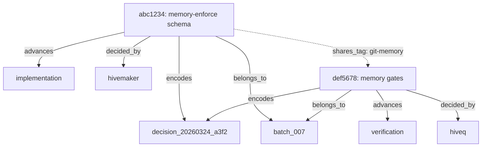

# Knowledge Network

## Graph Structure

Commits form a directed graph when linked through memory metadata.

### Node Types

| Node | Key | Properties |
|------|-----|------------|
| Commit | `commit_sha` | memory_context, retrieval_tags, timestamp |
| Decision | `decision_id` | description, who_decided, status |
| Packet | `packet_id` | batch_id, delegation_chain, status |
| Phase | `plan_phase` | name, order, active_commits |
| Agent | `who_decided` | name, decision_count, commits |

### Edge Types

| Edge | Direction | Meaning |
|------|-----------|---------|
| `encodes` | commit → decision | Commit encodes this decision |
| `belongs_to` | commit → packet | Commit was produced by this delegation |
| `advances` | commit → phase | Commit advances this plan phase |
| `decided_by` | commit → agent | Agent made the decision in this commit |
| `shares_tag` | commit ↔ commit | Commits share retrieval tags |
| `depends_on` | decision → decision | Decision depends on prior decision |
| `contains` | packet → phase | Packet spans this phase |
| `assigned_to` | packet → agent | Packet was assigned to this agent |

## Graph Construction

### From Index

```bash
# Build adjacency list from index
jq -r '
  .commits[] |
  "\(.sha) -> decision: \(.decision_id // "none")" ,
  "\(.sha) -> packet: \(.packet_id // "none")" ,
  "\(.sha) -> phase: \(.plan_phase // "none")" ,
  "\(.sha) -> agent: \(.who_decided // "none")"
' .hivemind/activity/git-memory/index/index.json
```

### From Git History

```bash
# Build graph from git log
git log --all --grep="memory_context:" --format='%H' | while read sha; do
  MSG=$(git log -1 --format='%B' $sha)
  DECISION=$(echo "$MSG" | grep -oP 'decision_id: \K\S+' || echo "none")
  PACKET=$(echo "$MSG" | grep -oP 'packet_id: \K\S+' || echo "none")
  PHASE=$(echo "$MSG" | grep -oP 'plan_phase: \K\S+' || echo "none")
  AGENT=$(echo "$MSG" | grep -oP 'who_decided: \K\S+' || echo "none")
  echo "$sha -> $DECISION -> $PACKET -> $PHASE -> $AGENT"
done
```

## Traversal Operations

### Up-Chain: commit → decision → packet → phase → epic

```
Input: commit_sha
1. Read memory record for commit_sha
2. Extract decision_id from linkage
3. Read decision from .hivemind/activity/git-memory/decisions/{decision_id}.json
4. Extract packet_id from linkage
5. Read packet from .hivemind/activity/delegation/{packet_id}.json
6. Extract plan_phase from linkage
Output: decision → packet → phase chain
```

### Down-Chain: packet → all commits

```
Input: packet_id
1. Query index: by_packet[packet_id] → list of commit SHAs
2. For each SHA, read memory record
3. Sort by timestamp
Output: ordered list of commits in this packet
```

### Peer-Find: commit + tag → related commits

```
Input: commit_sha
1. Read memory record for commit_sha
2. Extract retrieval_tags
3. For each tag, query tag index: tags/{tag}.json → list of commit SHAs
4. Deduplicate, exclude input commit
Output: related commits by shared tags
```

### Agent-Trace: agent → all decisions

```
Input: agent_name
1. Query index: by_agent[agent_name] → list of commit SHAs
2. For each SHA, extract decision_id
3. Deduplicate decisions
Output: all decisions made by this agent
```

### Phase-View: phase → all commits

```
Input: plan_phase
1. Query index: by_phase[plan_phase] → list of commit SHAs
2. For each SHA, read memory record
3. Group by packet_id
Output: all commits in this phase, grouped by packet
```

## Visualization

### Mermaid Graph



### Text Graph

```
batch_007 (packet)
├── implementation (phase)
│   ├── abc1234 (hivemaker) — memory-enforce schema
│   └── decision_20260324_a3f2
├── verification (phase)
│   ├── def5678 (hiveq) — memory gates
│   └── decision_20260324_a3f2
└── stabilization (phase)
    └── (pending)
```

## Network Health Metrics

| Metric | Formula | Healthy Range |
|--------|---------|---------------|
| Orphan rate | `memory_orphan commits / total commits` | < 5% |
| Tag coverage | `commits with ≥ 5 tags / total commits` | > 80% |
| Packet linkage | `commits with packet_id / total commits` | > 70% |
| Agent diversity | `unique who_decided values / total commits` | > 1 (not all by one agent) |
| Chain depth | `max delegation_chain length` | ≤ 5 |
