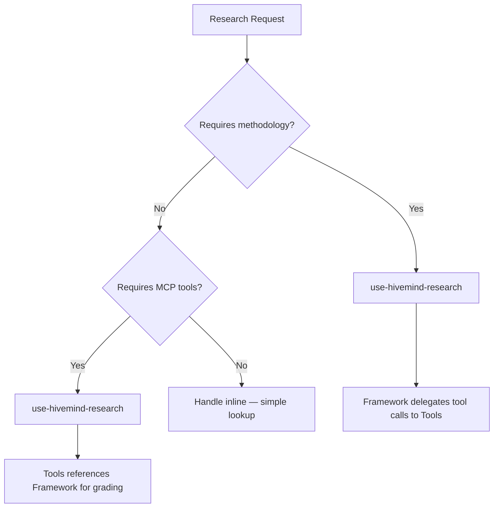

## Parameters

| Parameter | Meaning |
|-----------|---------|
| `{runtime_state_dir}` | Runtime state directory (e.g., `.hivemind/`) |
| `{runtime_activity_dir}` | Activity subdirectory (e.g., `.hivemind/activity/`) |
| `{pathing_config}` | Pathing config file (e.g., `.hivemind/pathing/active-paths.json`) |
| `{validation_script}` | Artifact validation script path |

# use-hivemind-research — Research Router

## Table of Contents

- [Load Position](#load-position)
- [Use This For](#use-this-for)
- [Routing Logic](#routing-logic)
  - [Step 1 — Classify the Request](#step-1--classify-the-request)
  - [Step 2 — Load the Correct Package](#step-2--load-the-correct-package)
  - [Step 3 — Delegate with Context](#step-3--delegate-with-context)
- [Sibling Skill Integration](#sibling-skill-integration)
- [Anti-Patterns at Router Level](#anti-patterns-at-router-level)
- [Experiment Safety Protocol](#experiment-safety-protocol)
- [Results Formatting](#results-formatting)
- [Conditional Loading](#conditional-loading)
- [Bundled Resources](#bundled-resources)

## Load Position

Layer: Domain. Requires `use-hivemind` (entry router) loaded first.

Thin entry point that classifies the research request and delegates to the correct specialist skill.

## Use This For

- User asks "research", "investigate", "compare", "evaluate", "what is the best", "how does X work"
- Any question requiring 3+ sources to answer reliably
- Technology decisions, architecture evaluation, library comparison
- API behavior investigation, pattern discovery
- User wants evidence-backed recommendations, not opinions

## Routing Logic



### Step 1 — Classify the Request

Determine the **research type** by matching signal words:

| Signal Words | Research Type | Route To |
|---|---|---|
| compare, versus, alternative, which is better | Comparison | Framework + Tools |
| how does X work, API behavior, library semantics | Tech/API | Framework + Tools |
| pattern, architecture, design approach | Pattern | Framework |
| requirements, scope, what do we need | Requirements | Framework |
| landscape, ecosystem, who does what | Landscape | Tools |
| dependency, coupling, impact, break | Cross-Dependency | Framework + Tools |
| quick lookup, simple fact, what version | Inline | Self (skip delegation) |

### Step 2 — Load the Correct Package

**Framework (methodology)** loads when:
- Question needs multi-source evidence grading
- Confidence scoring required
- Delegation to subagents needed
- Contradiction resolution anticipated

**Tools (protocols)** loads when:
- MCP providers are available
- Codebase analysis needed (Repomix)
- Official docs retrieval needed (Context7)
- Web search with extraction needed (Tavily/Exa)
- Repository deep analysis needed (DeepWiki)

**Both** load when the request is complex enough to need methodology AND tool execution.

### Step 3 — Delegate with Context

Hand off using the research delegation packet:

```markdown
## Delegation Packet
- **Research type**: <type from classification>
- **Sub-questions**: <3-5 decomposed questions>
- **Evidence sources**: <which MCP providers to use>
- **Confidence target**: full | partial | low
- **Constraints**: <scope boundaries, time limits>
```

## Sibling Skill Integration

| Skill | Integration Point |
|---|---|
| use-hivemind-delegation | Subagent spawning for parallel research threads |
| hivemind-spec-driven | Refining vague research requests into answerable questions |
| use-hivemind-context | Session health check before long research runs |
| `hivemind-synthesis` | Research + investigation → synthesis pipeline — this skill provides MCP tool routing |

## Anti-Patterns at Router Level

1. **Skipping classification** — routes to wrong package, wastes MCP calls
2. **Loading both when one suffices** — unnecessary context overhead
3. **Inline research for complex questions** — no evidence grading, no confidence scoring
4. **Recursive routing** — router must not call itself

## Experiment Safety Protocol

Research investigations are experiments. Every experiment needs safety rails.

| Rule | Implementation |
|------|----------------|
| Isolate research threads | Each investigation runs on its own branch or in a separate artifact folder |
| Checkpoint before deep dive | Commit state before entering a research rabbit hole |
| Rollback on dead end | If investigation yields nothing, discard artifacts and revert to checkpoint |
| Preserve evidence | Findings captured before rollback — never lose confirmed data |
| Abort conditions | Stop when: source is unreliable, 3 parallel threads converge on same gap, cost exceeds value |

For full protocol details, see `references/experiment-safety.md`.

## Results Formatting

All research outputs must follow a structured format for downstream consumption.

| Field | Type | Required | Description |
|-------|------|----------|-------------|
| `source` | string | Yes | Origin of the finding (repo name, doc URL, commit SHA) |
| `finding` | string | Yes | The discovered fact or conclusion |
| `confidence` | enum | Yes | `confirmed` / `inferred` / `unverified` |
| `evidence_path` | string | Yes | Relative path to supporting artifact |
| `timestamp` | ISO 8601 | Yes | When the finding was captured |

For TSV/JSON templates and aggregation rules, see `references/results-format.md`.

## Conditional Loading

| Condition | Load Reference |
|-----------|---------------|
| Technology evaluation needed | `evidence-contract.md` |
| Documentation research | `mcp-setup-guide.md` |
| Multi-source investigation | `research-classification.md` |
| Repomix codebase analysis | `repomix-ingestion.md` |
| Source credibility assessment | `evidence-contract.md` + `anti-patterns.md` |

## OpenCode Tool Matrix

| Tool | Use For | Avoid When | Research Note |
|---|---|---|---|
| `glob` | Find manifests, lockfiles, README, config targets | Content search | Brownfield packets start here |
| `grep` | Trace imports, errors, keywords, version strings | File discovery | Use before expensive MCP calls |
| `read` | Validate exact versions, README claims, package metadata | Cross-file discovery | Read only the slices needed |
| `bash` | List dependencies, git metadata, local verification | Replacing read/grep/glob | Use for dependency truth and final validation |
| `webfetch` | Known URL fetch after discovery | URL discovery | Good for official docs or release notes |
| `google_search` | Fresh public-web discovery | Version-specific docs | Use when no MCP-specific provider fits |
| `repomix_pack_codebase` | Whole-codebase truth | Tiny file questions | Best for wide brownfield analysis |

## MCP Priority Table

| Priority | Tool Chain | Best Use | Rate Limit / Budget |
|---|---|---|---|
| 1 | `context7_resolve-library-id` → `context7_query-docs` | Version-specific dependency docs | 60 req/hour free-tier budget |
| 2 | `deepwiki_ask_question` | Public repo understanding | Free, effectively unbounded |
| 3 | `tavily_tavily_search` → `tavily_tavily_extract` | Extractable web evidence | Credit budgeted: 1,000/mo free |
| 4 | `exa_web_search_exa` → `exa_crawling_exa` | Semantic discovery | 10 QPS on search |
| 5 | `brave-search_brave_web_search` | Fresh web confirmation | 50 QPS search plan |
| 6 | `repomix_pack_codebase` → `repomix_grep_repomix_output` | Local code truth | No external provider limit |

## 4-Mode Depth Workflow

| Mode | Budget | Min Sources | Credibility Floor | Default Use |
|---|---:|---:|---:|---|
| Quick | 3 min | 5 | 50 | Reversible lookup or orientation |
| Standard | 8 min | 10 | 60 | Default engineering research |
| Deep | 15 min | 15 | 70 | Architectural or migration work |
| UltraDeep | 30 min | 25 | 75 | Hard-to-reverse or externally visible decisions |

### Workflow Steps

1. Classify stakes and set mode before searching.
2. Run Phase 0.5 vocabulary discovery.
3. Choose primary research type: `technology-eval`, `codebase-investigation`, `cross-stack-analysis`, `greenfield-spec`, or `brownfield-trace`.
4. Run broad discovery only until the mode's minimum source target is reachable.
5. Validate major claims with official docs, repo evidence, or local code truth.
6. Run counter-perspective queries for Standard, Deep, and UltraDeep work.
7. Stop only when claims coverage and credibility floor match the chosen mode.

### Escalation Rules

- Escalate Quick to Standard if the first five sources disagree.
- Escalate Standard to Deep if major claims lack two independent sources.
- Escalate Deep to UltraDeep if the decision is hard to reverse.

## Vocabulary Discovery Phase

Run **Phase 0.5** before deep search.

1. Extract raw user terms, domain nouns, and action verbs.
2. Map outsider language to expert vocabulary.
3. Add adjacent terms and one exclusion term per noisy concept.
4. Store the result in `vocabulary_map` inside `templates/research-packet.json`.
5. Read `references/vocabulary-discovery.md` when the first search results feel shallow or repetitive.

Minimum output:

- 3 expert terms
- 2 adjacent terms
- 1 exclusion term

## Counter-Perspective Protocol

Treat adversarial search as mandatory for non-trivial work.

1. Write one query that assumes the preferred answer is wrong.
2. Add terms such as `failure mode`, `limitations`, `migration pain`, `not recommended`, or `counterexample`.
3. Prefer independent domains over many pages from one vendor.
4. Downgrade confidence when counter-evidence is stronger than the primary narrative.
5. Record contradictions instead of smoothing them away.

## Bash Examples (5)

Use bash for local truth gathering, then pair the result with the exact MCP call.

```bash
List direct dependencies (e.g., npm ls --depth=0, pip list, cargo tree --depth=1)
```

Pair with `context7_resolve-library-id` and `context7_query-docs` for each important dependency.

```bash
Extract dependency metadata (e.g., python3 -c "import json; print(json.load(open('package.json')).get('dependencies', {}))")
```

Pair with `deepwiki_ask_question` to inspect upstream repos named by the manifest.

```bash
Inspect remote configuration (e.g., git remote -v)
```

Pair with `repomix_pack_remote_repository` when the upstream public repo needs deeper code truth.

```bash
# Trace imports (e.g., rg "from ['\"]|require\(" src, or grep -rn "import" src)
```

Pair with `exa_web_search_exa` or `tavily_tavily_search` to research the imported libraries and integration paths.

```bash
Check project surface files (e.g., ls README.md package.json tsconfig.json)
```

Pair with `tavily_tavily_search`, `brave-search_brave_web_search`, or `webfetch` to validate docs freshness against the local project surface.

## Decision Tree: Research Type → Tool Chain

- IF `technology-eval` THEN `context7_resolve-library-id` → `context7_query-docs` → `deepwiki_ask_question` → `tavily_tavily_search`
- IF `codebase-investigation` THEN `glob` + `grep` + `read` → `repomix_pack_codebase` → `repomix_grep_repomix_output`
- IF `cross-stack-analysis` THEN package scan → Context7 per dependency → `deepwiki_ask_question` or Repomix → Tavily/Exa for compatibility evidence
- IF `greenfield-spec` THEN vocabulary discovery → `exa_web_search_exa` → `tavily_tavily_extract` → Context7 for shortlisted frameworks
- IF `brownfield-trace` THEN `package.json` + README validation → version trace → Context7 → Deepwiki/Repomix → targeted web search for unresolved gaps

## Cross-Skill Chaining

- Load `use-hivemind-delegation` when one packet needs multiple sub-questions or parallel evidence slices.
- Load `hivemind-synthesis` when multiple research returns must be merged into one evidence-backed recommendation.
- Load `use-hivemind-context` before long-running research if document freshness or prior-session drift is suspect.

## Metrics & Verification

- Source count must meet the chosen mode threshold.
- Average credibility must meet the chosen mode floor.
- Claims-evidence coverage must meet the chosen mode target.
- Placeholder text is a hard failure.
- Validate output with a validation script (e.g., `bash scripts/hm-research-validate.sh <output.json> <min-evidence>`).

## Template References

- Use `templates/research-packet.json` for machine-validated research setup.
- Use `templates/claims-evidence-table.md` for human-readable claim packaging.
- Read `references/mcp-tool-protocols.md` for exact MCP signatures, rate limits, and fallback chains.
- Read `references/cross-stack-workflow.md` for greenfield vs brownfield sequencing.

## Bundled Resources

| Resource | Path | Purpose |
|---|---|---|
| Evidence Contract | `references/evidence-contract.md` | Evidence grading, confidence scoring, source credibility |
| Tool Protocols | `references/tool-protocols.md` | MCP tool chaining, provider selection, fallback sequences |
| Research Classification | `references/research-classification.md` | Request type taxonomy, signal-word matching, routing rules |
| Anti-Patterns | `references/anti-patterns.md` | Common research mistakes and how the router avoids them |
| Delegation for Research | `references/delegation-for-research.md` | Subagent spawning patterns for parallel research threads |
| Fallback Hierarchy | `references/fallback-hierarchy.md` | Provider fallback order when primary MCP tools are unavailable |
| MCP Setup Guide | `references/mcp-setup-guide.md` | MCP provider configuration and capability verification |
| Repomix Ingestion | `references/repomix-ingestion.md` | Codebase analysis via Repomix for research contexts |
| Experiment Safety | `references/experiment-safety.md` | Git-backed experiment safety, rollback, isolation |
| Results Format | `references/results-format.md` | Structured results format (TSV/JSON), aggregation rules |
| Check MCP Readiness | `scripts/check-mcp-readiness.mjs` | MCP provider readiness verification script |
| Score Confidence | `scripts/score-confidence.sh` | Confidence scoring helper script |
| Evidence Table | `templates/evidence-table.md` | Template for evidence table format |
| MCP Config | `templates/mcp-config-template.json` | JSON template for MCP configuration |
| Research Packet | `templates/research-packet.md` | Template for research delegation packets |

## Activity Output

All artifacts produced by this skill follow the Activity Folder Protocol.

**Pathing:** See `{pathing_config}` for resolved output paths.
**Naming:** `{category}-{semantic-id}-{YYYY-MM-DD}.{ext}`
**Meta:** All JSON includes `_meta.created_at`, `_meta.updated_at`, `_meta.producer`.
**Validation:** Run `{validation_script} {path}` to confirm compliance.
