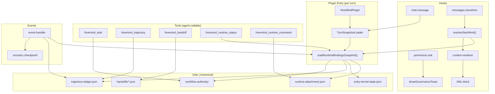

Here's my full analysis of your hivemind-plugin codebase, its conflicts, and the architecture for your core feature group.

---

## 1. Current Codebase Diagnosis: Shared Responsibilities & Conflicts

### The God-Function: `loadRuntimeBindingsSnapshot`

This is your biggest single point of pollution. It's called from **11 different files** across 5 different domains, and each call triggers a cascade of disk reads + inspections: [0-cite-0](#0-cite-0) 

Every call to `loadRuntimeBindingsSnapshot` internally calls:
- `loadRuntimeAttachmentSettings()` (disk read)
- `runtimeAttachmentSettingsExist()` (disk check)
- `detectEntryKernelState()` (disk read + 2 inspections)
- `loadTrajectoryLedger()` (disk read)
- `inspectTrajectoryLedger()` (disk read)
- `inspectWorkflowAuthority()` (disk read)
- `createBootstrapProfile()` (computation)

That's **7+ I/O operations per call**. The `TurnSnapshotLoader` in `runtime-snapshot.ts` caches per-turn, but the event handler, tool governance, harness, doctor, init, settings, and status all call it independently. [0-cite-1](#0-cite-1) 

### Cross-Feature Import Spaghetti

Features are not self-contained. The `features/` directory has **heavy upward and lateral imports**:

| Feature | Imports from outside `features/` |
|---------|--------------------------------|
| `runtime-entry/attachment.ts` | 9 cross-domain imports (core, context, shared, control-plane) |
| `runtime-entry/init.ts` | 15 cross-domain imports |
| `runtime-entry/doctor.ts` | 10 cross-domain imports |
| `session-entry/start-work-types.ts` | 6 cross-domain imports | [0-cite-2](#0-cite-2) 

### `inspectWorkflowAuthority` Called from 6 Different Domains

This function is consumed by: `core/workflow-management`, `recovery`, `features/runtime-entry`, `features/workflow`, `hooks/start-work`, and `shared/entry-kernel-state`. It's a shared responsibility that should be a single-source read, not scattered inspections. [0-cite-3](#0-cite-3) 

### The Entry Point is a Barrel Re-export Chain

`src/index.ts` re-exports **everything** from 11 domains. This means any consumer of the package gets the entire surface area, and there's no boundary enforcement: [0-cite-4](#0-cite-4) 

### The `start-work-router.ts` is a 300-line Monolith

This single function `resolveStartWork` does purpose classification, lineage routing, trajectory assessment, workflow authority inspection, readiness gating, pressure signal resolution, and entry kernel building — all synchronously in one pass: [0-cite-5](#0-cite-5) 

---

## 2. Data Lifecycle Map

Here's how data flows through the current system:



### Key Conflict: Multiple Writers to Same State

- `trajectory-ledger.json` is written by: trajectory tool, event handler, recovery engine, init, harness
- `runtime-attachment.json` is written by: init, settings, doctor, runtime command tool
- `entry-kernel-state.json` is written by: init, doctor, harness, entry-kernel-state module

There's no locking or coordination between these writers.

---

## 3. Architecture for the Agent-Work Contract

### Schema Format Recommendation: **JSON** (not YAML, not MD, not XML)

| Format | Programmatic Advantage | Disadvantage |
|--------|----------------------|--------------|
| **JSON** | Native `JSON.parse/stringify`, zero deps, Zod validation, TypeScript type inference, RFC 6902 patch support, streamable | Not human-friendly for editing |
| YAML | Human-readable | Needs `yaml` dep, no streaming, ambiguous types |
| Markdown | Agent-readable | Not programmatically parseable without custom parser |
| XML | Structured | Verbose, no native TS tooling |

JSON wins because: (a) you already use it for all `.hivemind/` state, (b) json-render's `SpecStream` pattern (RFC 6902 patches) gives you progressive building, (c) Zod gives you runtime validation + TypeScript inference for free. [0-cite-6](#0-cite-6) 

### The Agent-Work Contract Schema

Based on your requirements, here's the schema hierarchy under `.hivemind/agent-work-contract/`:

```
.hivemind/agent-work-contract/
├── active-contract.json          # Current session's contract
├── contracts/
│   ├── {contract-id}.json        # Completed/archived contracts
│   └── ...
└── delegation/
    ├── {delegation-id}.json      # Sub-session delegation records
    └── ...
```

The contract schema (Zod):

```typescript
// src/features/agent-work-contract/schema.ts
import { z } from 'zod'

const PurposeClassSchema = z.enum([
  'quick-action', 'research-brainstorm', 'project-driven'
])

const DelegationModeSchema = z.enum([
  'parallel', 'sequential', 'handoff'
])

const ResponseModeSchema = z.enum([
  'broad-search-execute',      // default: plan → update todo → execute
  'interactive-qa',            // brainstorm/QA: ingest → investigate → ask
  'deep-research',             // research: iterative deep dive
])

const TaskSchema = z.object({
  id: z.string(),
  title: z.string(),
  status: z.enum(['pending', 'active', 'delegated', 'verifying', 'complete']),
  parentTaskId: z.string().optional(),
  dependencyIds: z.array(z.string()).optional(),
  delegationMode: DelegationModeSchema.optional(),
  delegationSessionId: z.string().optional(),
  evidenceRefs: z.array(z.string()).optional(),
})

export const AgentWorkContractSchema = z.object({
  // Identity
  contractId: z.string(),
  sessionId: z.string(),
  delegationExportSessionId: z.string().optional(),
  createdAt: z.string(),
  updatedAt: z.string(),

  // User Intent
  userIntent: z.object({
    raw: z.string(),
    confidence: z.number(),
    purposeClass: PurposeClassSchema,
    requiresPlan: z.boolean(),
    requiresGovernance: z.boolean(),
  }),

  // Response Mode
  responseMode: ResponseModeSchema,

  // Workflow Frame
  workflow: z.object({
    planningPath: z.string().optional(),
    phase: z.string().optional(),
    outlineRef: z.string().optional(),
    tasks: z.array(TaskSchema),
  }),

  // Chain Actions
  chainActions: z.object({
    onTaskComplete: z.enum(['export-workflow', 'next-task', 'close']),
    onWorkflowEnd: z.enum(['export-contract', 'archive']),
    onDelegation: z.enum(['export-messages', 'handoff-packet']),
    onCompaction80: z.enum(['launch-context-agent', 'export-summary']),
  }),

  // Briefing (structured output for next agent)
  briefing: z.object({
    summary: z.string(),
    workflowState: z.string(),
    followUp: z.array(z.string()),
  }).optional(),

  // Anchor Points (decision shifts)
  anchors: z.array(z.object({
    timestamp: z.string(),
    kind: z.enum(['workflow-shift', 'planning-shift', 'stage-shift', 'user-redirect']),
    description: z.string(),
    snapshotRef: z.string().optional(),
  })).optional(),
})
```

### The Containment Strategy: Single Nested Hierarchy for Testing

Yes, you can contain all of this in one nested folder for experimentation. Here's the structure that is **transferable** to the cleaned architecture later:

```
src/features/agent-work-contract/
├── schema/
│   ├── contract.ts              # AgentWorkContractSchema (Zod)
│   ├── intent.ts                # Intent classification schema
│   ├── delegation.ts            # Delegation sub-schemas
│   └── index.ts                 # Barrel (only for this feature)
├── engine/
│   ├── contract-store.ts        # CRUD for .hivemind/agent-work-contract/
│   ├── intent-classifier.ts     # User intent → purpose class
│   ├── response-mode-resolver.ts # Purpose class → response mode
│   ├── chain-executor.ts        # Chain action triggers
│   └── anchor-recorder.ts       # Decision shift recording
├── hooks/
│   ├── event-handler.ts         # session.created/session.compacted side effects only
│   ├── compaction-hook.ts       # 80% compaction → preserve contract packet
│   ├── chat-message-gate.ts     # Optional reset/coordination only; never packet injection
│   └── delegation-export-hook.ts # Export on delegation
├── tools/
│   ├── create-contract-tool.ts  # Agent-callable: create/update contract
│   ├── classify-intent-tool.ts  # Agent-callable: classify user intent
│   └── export-contract-tool.ts  # Agent-callable: export workflow
├── types.ts                     # All TypeScript interfaces
└── index.ts                     # Feature barrel
```

**Correction (2026-03-20):** The original draft assumed a feature-local `session-start-hook.ts`. Current repo evidence and refreshed Phase 11 research show that OpenCode already delivers `session.created` through the existing plugin `event` hook. Treat `event` as the side-effect seam, `chat.message` as optional coordination only, `experimental.chat.messages.transform` as the sole runtime injector, and `experimental.session.compacting` as the compaction seam.

This is **fully transferable** because:
1. All imports are relative within the feature
2. The only external dependency is the OpenCode plugin types (`@opencode-ai/plugin`)
3. The hooks expose the standard `Hooks` interface from the SDK
4. The tools use `tool()` from `@opencode-ai/plugin/tool` [0-cite-7](#0-cite-7) [0-cite-8](#0-cite-8) 

---

## 4. SDK Utilization Strategy

The OpenCode SDK gives you two surfaces:

**Plugin surface** (`@opencode-ai/plugin`): hooks + tools registered at init time [0-cite-9](#0-cite-9) 

**SDK client** (`@opencode-ai/sdk`): runtime API calls (sessions, messages, toasts, events) [0-cite-10](#0-cite-10) 

Your current `sdk-context.ts` already captures the client reference correctly: [0-cite-11](#0-cite-11) 

**Shift toward SDK**: Instead of reading `.hivemind/` files directly in hooks, use the SDK client to:
1. **Read session state** via `client.session.get()` instead of parsing files
2. **Show toasts** via `client.tui.showToast()` (you already do this)
3. **Create sub-sessions** via `client.session.create()` for delegation
4. **Subscribe to events** via SSE for real-time state changes

The key principle: **hooks should be thin dispatchers that call feature functions, and feature functions should use the SDK client when available, falling back to disk reads when not**.

---

## 5. json-render + Octto Inspiration for Interactive Planning Artifacts

### From json-render: Schema-Catalog-Registry Pattern

json-render's `defineSchema` → `createCatalog` → `prompt()` pipeline is directly applicable to your planning artifacts: [0-cite-12](#0-cite-12) 

You could define a **planning artifact schema** that:
1. Defines the shape of planning documents (phases, tasks, dependencies)
2. Creates a catalog of allowed planning components
3. Generates a prompt that constrains the agent to produce valid planning JSON
4. Validates agent output against the schema

The `SpecStream` pattern (RFC 6902 JSON Patches) is particularly powerful for your use case — agents can **progressively build** planning artifacts line by line, and you can validate each patch: [0-cite-13](#0-cite-13) 

### From Octto: Branch-Based Exploration for Workflows

Octto's pattern of decomposing a request into parallel exploration branches, with a `SessionStore` + WebSocket server for interactive Q&A, maps directly to your workflow planning: [0-cite-14](#0-cite-14) 

For your agent-work contract, this means:
- **Bootstrapper** decomposes user intent into workflow branches
- **Probe** asks clarifying questions per branch (interactive mode)
- **Orchestrator** assembles the final contract from branch results

### Concrete Application: Interactive Planning Artifact Transfer

```typescript
// Inspired by json-render's defineSchema + octto's session store
import { defineSchema } from './planning-schema'

const planningSchema = defineSchema((s) => ({
  spec: s.object({
    phase: s.string(),
    plan: s.string(),
    type: s.ref('catalog.workTypes'),
    tasks: s.array(s.object({
      id: s.string(),
      title: s.string(),
      delegation: s.ref('catalog.delegationModes'),
      depends_on: s.array(s.string()),
    })),
    must_haves: s.object({
      truths: s.array(s.string()),
      artifacts: s.array(s.object({
        path: s.string(),
        provides: s.string(),
      })),
    }),
  }),
  catalog: s.object({
    workTypes: s.map({ props: s.zod() }),
    delegationModes: s.map({ props: s.zod() }),
  }),
}))
```

This gives you:
- **Type-safe planning artifacts** that agents can generate
- **Validation** against the schema before writing to disk
- **Streaming** via SpecStream patches as the agent builds the plan
- **Transfer** — the schema is portable, the artifacts are JSON, and the validation is Zod

---

## 6. Summary: What to Do

The `.hivemind/` bootstrap-on-first-run model is correct. The core problem is that your current code has **no boundary between read and write paths**, and **no single authority** for state. Here's the priority order:

1. **Contain the experiment** in `src/features/agent-work-contract/` as described above — it's fully transferable
2. **Use JSON** for contract schema (Zod-validated, RFC 6902 patchable)
3. **Single snapshot per turn** — extend `TurnSnapshotLoader` to be the only reader, not `loadRuntimeBindingsSnapshot` scattered everywhere
4. **SDK-first for runtime operations** — use the client for session/message operations, disk only for persistent state
5. **Chain actions as hook registrations** — each chain action (task complete → export, compaction 80% → launch agent) is a separate hook that checks a condition and dispatches

The json-render `defineSchema` + `SpecStream` pattern and octto's branch-based exploration are the right models for making your planning artifacts both machine-readable and agent-steerable.
