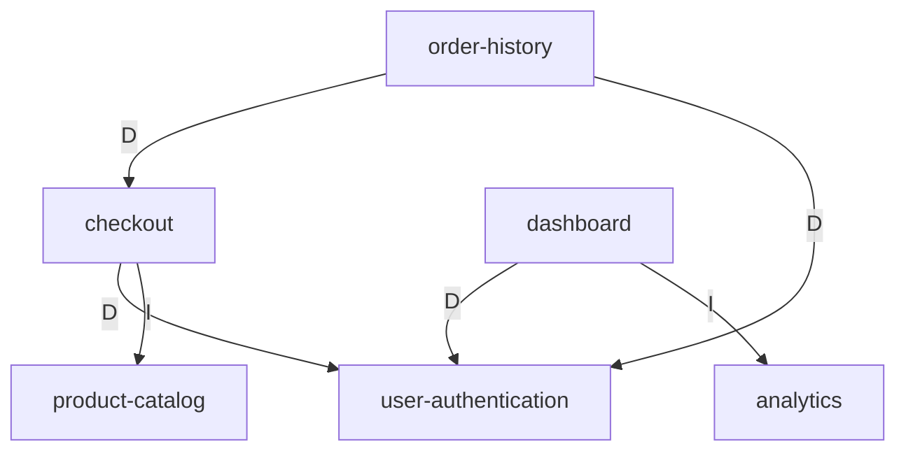

# Dependency Graph Construction Guide

## Overview

A feature dependency graph maps the relationships between features in an ecosystem. Unlike code dependency graphs (which track `import`s and `package.json`), feature dependency graphs track what features need from other features to function.

## Graph Terminology

| Term | Definition |
|------|-----------|
| **Node** | A single feature in the ecosystem |
| **Edge** | A directed dependency: A → B means "A depends on B" |
| **In-degree** | Number of features that depend on this feature |
| **Out-degree** | Number of features this feature depends on |
| **Root node** | A feature with out-degree 0 (depends on nothing) |
| **Leaf node** | A feature with in-degree 0 (nothing depends on it) |
| **Transitive dependency** | A depends on B, B depends on C → A transitively depends on C |
| **DAG** | Directed Acyclic Graph — no cycles (required for topological ordering) |

## Edge Types

Every edge in the dependency graph must be classified into one of four types:

### Data Dependency (D)
Feature A needs data that Feature B produces, stores, or manages.

**Detection questions:**
- Does A read from a database table that B writes to?
- Does A consume an event stream that B publishes to?
- Does A need a data model that B defines?
- Does A display or transform data that originates from B?

**Example:**
`order-history → checkout [D]` — order-history reads order records that checkout creates.

**Risk:** If B changes its data schema, A breaks. Contract: B must version its data schema.

### Interface Dependency (I)
Feature A calls an API, function, endpoint, or service that Feature B exposes.

**Detection questions:**
- Does A make HTTP/gRPC calls to B's service?
- Does A import and call a function from B's module?
- Does A use a UI component that B provides?
- Does A trigger a workflow or pipeline that B owns?

**Example:**
`dashboard → analytics [I]` — dashboard calls `analytics.getMetrics()` to render charts.

**Risk:** If B changes its API signature or contract, A breaks. Contract: formal API contract required.

### Temporal Dependency (T)
Feature B must exist (be built, deployed, or available) before Feature A can function or be tested in any meaningful way.

**Detection questions:**
- Would testing A require B to already exist (even in stub form)?
- Does A's setup or initialization depend on B being seeded or configured?
- Is A's core user flow impossible without B's feature being present?
- Does A's acceptance criteria reference B's existence as a prerequisite?

**Example:**
`checkout → user-authentication [T]` — checkout cannot be tested meaningfully until auth exists.

**Risk:** A is blocked until B is delivered. Plan: B in Wave N, A in Wave N+1.

### Deployment Dependency (P)
Feature A and Feature B must be deployed together, or A must be deployed before B.

**Detection questions:**
- Do A and B share a database migration that can't be split?
- Does deploying one without the other cause a broken state?
- Do A and B share infrastructure configuration (e.g., same CDN, same DNS record)?
- Is there a phased rollout where A and B must coordinate?

**Example:**
`payment-gateway ↔ notification-service [P]` — both must deploy together due to shared event schema.

**Risk:** Coupled release increases deployment risk. Plan: minimize these edges through decoupling.

## Graph Construction Algorithm

### Step 1: Enumerate Features
List every feature. Give each a unique kebab-case identifier.

```
features = [
  "user-authentication",
  "checkout",
  "dashboard",
  "analytics",
  "order-history",
  "product-catalog"
]
```

### Step 2: Build Adjacency List
For each pair (A, B), ask all four dependency type questions. Record any "yes" answer.

```python
graph = {}  # key: feature, value: list of (depends_on_feature, type)
for A in features:
    graph[A] = []
    for B in features:
        if A == B: continue
        deps = []
        if has_data_dependency(A, B):    deps.append((B, "D"))
        if has_interface_dependency(A, B): deps.append((B, "I"))
        if has_temporal_dependency(A, B): deps.append((B, "T"))
        if has_deployment_dependency(A, B): deps.append((B, "P"))
        graph[A].extend(deps)
```

### Step 3: Visualize (Optional but Recommended)
Generate a Mermaid diagram:



### Step 4: Build Dependency Matrix

Convert the adjacency list to a matrix. This is the canonical representation.

```markdown
| From \ To | auth | checkout | dash | analytics | orders | catalog |
|-----------|------|----------|------|-----------|--------|---------|
| auth      | —    |          |      |           |        |         |
| checkout  | D,T  | —        |      |           |        | I       |
| dash      | D    |          | —    | I         |        |         |
| analytics |      |          |      | —         |        |         |
| orders    | D    | D        |      |           | —      |         |
| catalog   |      |          |      |           |        | —       |
```

## Cycle Detection Algorithm

Use DFS with a recursion stack (O(V+E) time complexity):

```python
def detect_cycles(graph):
    WHITE, GRAY, BLACK = 0, 1, 2
    color = {node: WHITE for node in graph}
    cycles = []

    def dfs(node, path):
        color[node] = GRAY
        path.append(node)
        for (neighbor, _) in graph[node]:
            if color[neighbor] == GRAY:
                # Found a back edge → cycle
                cycle_start = path.index(neighbor)
                cycles.append(path[cycle_start:] + [neighbor])
            elif color[neighbor] == WHITE:
                dfs(neighbor, path)
        path.pop()
        color[node] = BLACK

    for node in graph:
        if color[node] == WHITE:
            dfs(node, [])
    return cycles
```

### Cycle Severity Classification

| Cycle Size | Severity | Resolution Strategy |
|-----------|----------|-------------------|
| 2 nodes (A ↔ B) | HIGH | Extract shared dependency into new foundational feature |
| 3-4 nodes | HIGH | Break weakest edge (lowest risk dependency type in cycle) |
| 5+ nodes | CRITICAL | Redesign feature boundaries — scope is likely wrong |

### Breaking Cycles

For each cycle, identify the weakest edge by evaluating:
1. **Dependency type:** D < I < T < P (Data is easiest to decouple, Deployment is hardest)
2. **Reversibility:** Can the dependency direction be reversed?
3. **Extraction:** Can the shared concern be extracted into a new foundational feature?
4. **Stubbing:** Can the dependency be satisfied by a stub/mock during development?

## Topological Sorting

Assuming a DAG (all cycles resolved), topological sort produces a valid build order.

```python
from collections import deque

def topological_sort(graph):
    in_degree = {node: 0 for node in graph}
    for node in graph:
        for (neighbor, _) in graph[node]:
            in_degree[neighbor] += 1

    queue = deque([node for node in graph if in_degree[node] == 0])
    order = []

    while queue:
        node = queue.popleft()
        order.append(node)
        for (neighbor, _) in graph[node]:
            in_degree[neighbor] -= 1
            if in_degree[neighbor] == 0:
                queue.append(neighbor)

    if len(order) != len(graph):
        raise ValueError("Graph has a cycle — cannot topologically sort")
    return order
```

### Parallelizable Group Detection

Features with the same minimum distance from root nodes AND no dependencies on each other can be built in parallel:

```python
def find_parallel_groups(graph, topo_order):
    # Compute depth from root nodes
    depth = {node: 0 for node in graph}
    for node in topo_order:
        for (neighbor, _) in graph[node]:
            depth[neighbor] = max(depth[neighbor], depth[node] + 1)

    # Group by depth
    groups = {}
    for node, d in depth.items():
        groups.setdefault(d, []).append(node)

    # Verify no cross-dependencies within same group
    for depth_level, nodes in groups.items():
        for i, a in enumerate(nodes):
            for b in nodes[i+1:]:
                if (b, _) in graph.get(a, []) or (a, _) in graph.get(b, []):
                    # Move one to next depth level
                    depth[b] = depth_level + 1
    return groups
```

## Common Pitfalls

| Pitfall | Symptom | Fix |
|---------|---------|-----|
| **Missing shared concepts** | Multiple features reference "user" or "auth" without declaring it as a dependency | Create `user-authentication` or `shared-identity` as a foundational feature |
| **Over-counting dependencies** | Every feature depends on every other feature | Be strict: "uses" ≠ "depends on." Only count hard blockers. |
| **Under-counting dependencies** | Features that share a database listed as independent | If they share a schema, they have a Data dependency. |
| **Confusing temp with interface** | A calls B's API but B doesn't need to exist yet (can stub) | Interface dependency (I) for API calls. Temporal dependency (T) only if B MUST exist. |
| **Ignoring transitive closure** | Only direct dependencies counted | Trace all paths. Transitive dependencies affect ordering. |
