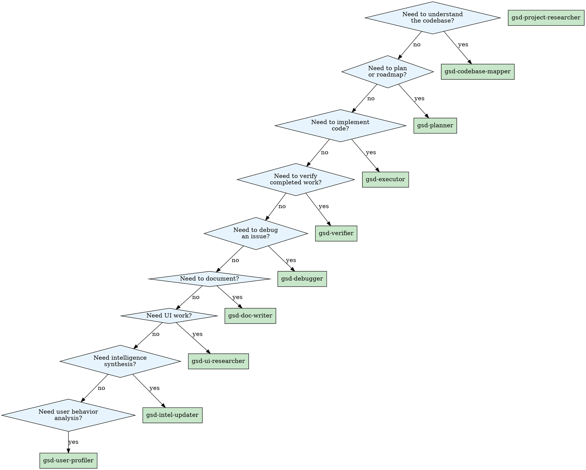

# GSD Agent Playbook

## Overview

The definitive reference for the **24-agent GSD (Get Sh*t Done) specialization matrix**. This playbook transfers complete knowledge of agent capabilities, interaction patterns, composition strategies, and failure modes across context windows and sessions.

**Core principle:** Agents are not interchangeable. Each specialist has a calibrated scope, known failure modes, and proven composition patterns. Use this document to select, stack, and monitor agents with precision.

---

## Table of Contents

- [Executive Summary](#executive-summary)
- [Domain Taxonomy](#domain-taxonomy)
  - [Agent Cluster Map](#agent-cluster-map)
  - [Domain YAML Blocks](#domain-yaml-blocks)
- [Core Concepts](#core-concepts)
  - [CQRS Boundary](#cqrs-boundary)
  - [Delegation Model](#delegation-model)
  - [Checkpoint Gates](#checkpoint-gates)
  - [Calibration Tiers](#calibration-tiers)
  - [Confidence Taxonomy](#confidence-taxonomy)
  - [Permission Model](#permission-model)
- [Domain Deep Dives](#domain-deep-dives)
  - [Research & Planning](#research--planning)
  - [Execution](#execution)
  - [Verification](#verification)
  - [Documentation](#documentation)
  - [Intelligence](#intelligence)
  - [UI Domain](#ui-domain)
  - [User Profiling](#user-profiling)
- [Cross-Reference Matrix](#cross-reference-matrix)
  - [Agent ↔ Skill Mapping](#agent--skill-mapping)
  - [Agent ↔ Workflow Routing](#agent--workflow-routing)
  - [Phase Coverage Matrix](#phase-coverage-matrix)
- [Advanced Composition Patterns](#advanced-composition-patterns)
  - [Agent Stacking](#agent-stacking)
  - [Wave Execution](#wave-execution)
  - [Failure Recovery Chains](#failure-recovery-chains)
  - [Escalation Gates](#escalation-gates)
- [Edge Cases & Failure Modes](#edge-cases--failure-modes)
  - [Known Tensions](#known-tensions)
  - [Agent-Specific Failure Modes](#agent-specific-failure-modes)
  - [Chain Breakage Patterns](#chain-breakage-patterns)
- [Decision Trees](#decision-trees)
  - [Agent Selection Flowchart](#agent-selection-flowchart)
  - [Domain Routing](#domain-routing)
  - [Troubleshooting Guide](#troubleshooting-guide)
- [Appendix](#appendix)
  - [Quick Reference: All 24 Agents](#quick-reference-all-24-agents)
  - [File Convention Standards](#file-convention-standards)
  - [Artifacts Produced Per Agent](#artifacts-produced-per-agent)
  - [Glossary](#glossary)

---

## Executive Summary

The GSD framework provides **24 specialist agents** organized across **6 domains**. Agents are dispatched by workflows (not commands directly), communicate via structured artifacts (not messages), and enforce quality through checkpoint gates.

### The Numbers at a Glance

| Metric | Value |
|--------|-------|
| Total specialist agents | 24 |
| Research & Planning domain | 8 agents |
| Execution domain | 4 agents |
| Verification domain | 4 agents |
| Documentation domain | 3 agents |
| Intelligence domain | 1 agent |
| UI domain | 3 agents |
| User Profiling domain | 1 agent |
| Agents directly routed by commands | 6 of 24 |
| Agents spawned via `Task()` tool | 18+ |

### Critical Known Issues (Handle Before Dispatch)

1. **`delegate-task` tool is broken** — migrate all delegation to `task` tool
2. **Two orchestrators exist** — `conductor` (harness tasks) and `hivefiver-orchestrator` (meta-concept creation)
3. **`coordinator.md` may be legacy** — verify against `conductor` before using
4. **Only 6 of 24 agents have direct command routing** — the rest require workflow-level dispatch

### Agent Dispatch Philosophy

<dispatch-principle>
Agents are specialized instruments, not generalists. Dispatch the narrowest agent that covers the task. Broad dispatch wastes context and produces shallow results.
</dispatch-principle>

**Rule:** If a task maps to a single agent's charter, dispatch that agent alone. If a task spans domains, compose agents in waves with checkpoint gates between waves.

---

## Domain Taxonomy

### Agent Cluster Map

```
GSD Framework — 24 Specialist Agents
├── Research & Planning (8) ──────────────────────────┐
│   researcher → synthesizer → roadmapper              │
│   phase-researcher → planner → plan-checker          │
│   advisor-researcher → assumptions-analyzer          │
├── Execution (4) ─────────────────────────────────────┤
│   executor → code-fixer                              │
│   code-reviewer → debugger                           │
├── Verification (4) ──────────────────────────────────┤
│   verifier → integration-checker                     │
│   nyquist-auditor → security-auditor                 │
├── Documentation (3) ─────────────────────────────────┤
│   doc-writer → doc-verifier → codebase-mapper        │
├── Intelligence (1) ──────────────────────────────────┤
│   intel-updater                                      │
├── UI Domain (3) ─────────────────────────────────────┤
│   ui-researcher → ui-checker → ui-auditor            │
└── User Profiling (1) ────────────────────────────────┘
    user-profiler
```

### Domain YAML Blocks

<domain name="research-planning">
```yaml
domain: research-planning
agents:
  - gsd-project-researcher
  - gsd-research-synthesizer
  - gsd-roadmapper
  - gsd-phase-researcher
  - gsd-planner
  - gsd-plan-checker
  - gsd-advisor-researcher
  - gsd-assumptions-analyzer
responsibility: Domain ecosystem research, requirements synthesis,
  roadmap generation, phase-level planning, decision analysis
input_artifacts:
  - requirements documents
  - codebase context
  - research prompts
output_artifacts:
  - .planning/research/*.md
  - .planning/SUMMARY.md
  - .planning/ROADMAP.md
  - .planning/STATE.md
  - .planning/phases/*/RESEARCH.md
  - .planning/phases/*/PLAN.md
checkpoint: Phase goal achieved → STATE.md updated → plan verified
</domain>

<domain name="execution">
```yaml
domain: execution
agents:
  - gsd-executor
  - gsd-code-fixer
  - gsd-code-reviewer
  - gsd-debugger
responsibility: Atomic code execution, fix application, code review,
  scientific-method debugging
input_artifacts:
  - PLAN.md
  - REVIEW.md
  - bug reports
output_artifacts:
  - committed code changes
  - REVIEW.md (reviewer output)
  - debug analysis reports
checkpoint: All plan items completed → tests pass → no regressions
</domain>

<domain name="verification">
```yaml
domain: verification
agents:
  - gsd-verifier
  - gsd-integration-checker
  - gsd-nyquist-auditor
  - gsd-security-auditor
responsibility: Goal-backward verification, cross-phase integration,
  validation gap filling, threat mitigation auditing
input_artifacts:
  - PLAN.md
  - completed code
  - phase goals
  - threat models
output_artifacts:
  - VERIFICATION.md
  - INTEGRATION-REPORT.md
  - NYQUIST-GAPS.md
  - SECURITY-REPORT.md
checkpoint: All gates PASS → no BLOCK findings → data flows verified
</domain>

<domain name="documentation">
```yaml
domain: documentation
agents:
  - gsd-doc-writer
  - gsd-doc-verifier
  - gsd-codebase-mapper
responsibility: Project documentation creation, fact verification
  against live codebase, codebase exploration and analysis
input_artifacts:
  - code changes
  - feature specifications
  - analysis requests
output_artifacts:
  - docs/*.md (various documentation)
  - verification reports
  - analysis documents
checkpoint: Docs verified against live code → no factual drift
</domain>

<domain name="intelligence">
```yaml
domain: intelligence
agents:
  - gsd-intel-updater
responsibility: Structured intelligence writing to .planning/intel/
  with machine-parseable, evidence-based intelligence
input_artifacts:
  - completed phases
  - research findings
  - session observations
output_artifacts:
  - .planning/intel/*.md
checkpoint: Intel structured and evidence-tagged
</domain>

<domain name="ui">
```yaml
domain: ui
agents:
  - gsd-ui-researcher
  - gsd-ui-checker
  - gsd-ui-auditor
responsibility: UI design contract creation, quality validation,
  retrospective visual auditing
input_artifacts:
  - upstream design artifacts
  - UI specifications
  - design system state
output_artifacts:
  - UI-SPEC.md
  - UI-REVIEW.md
  - quality reports with BLOCK/FLAG/PASS verdicts
checkpoint: UI-SPEC verified → no BLOCK findings → design system aligned
</domain>

<domain name="user-profiling">
```yaml
domain: user-profiling
agents:
  - gsd-user-profiler
responsibility: Session message analysis across 8 behavioral
  dimensions for developer profiling
input_artifacts:
  - session message history
  - interaction patterns
output_artifacts:
  - scored developer profile
  - confidence assessments
checkpoint: Profile scored across all 8 dimensions
</domain>
```

---

## Core Concepts

### CQRS Boundary

<concept name="cqrs">
The GSD framework enforces a **hard CQRS (Command Query Responsibility Segregation) boundary** between the two halves of the system:

| Half | Responsibility | Examples |
|------|---------------|----------|
| **Hard Harness** (write-side) | Tools that mutate state | `task`, file writes, git commits |
| **Soft Meta-Concepts** (read-side) | Skills, agents, commands, rules that guide behavior | `.opencode/` artifacts |

**Non-negotiable rule:** Soft meta-concepts never directly mutate durable state. They guide agents, who then use Hard Harness tools to perform writes. This separation prevents governance instructions from accidentally becoming side-effect producers.
</concept>

### Delegation Model

<concept name="delegation">
GSD agents are dispatched via the `Task()` tool (NOT `delegate-task` — that tool is broken). Each task carries:

```yaml
task_packet:
  objective: "What needs to be achieved"
  scope: "Boundary of allowed changes"
  input_artifacts: "Files the agent consumes"
  expected_output: "Shape of deliverable"
  validation_rules: "How success is measured"
  stopping_conditions: "When to stop even if incomplete"
```

**Delegation depth:** Agents can spawn sub-agents up to the framework's configured depth limit. Each sub-agent inherits a narrowed scope from its parent.

**Key principle:** Agents work on **artifacts**, not messages. An agent's output is a file (PLAN.md, RESEARCH.md, VERIFICATION.md), not a conversation response. This enables cross-session continuity.
</concept>

### Checkpoint Gates

<concept name="checkpoint">
Every phase and major agent handoff passes through a checkpoint gate. Gates enforce **PASS/FAIL** — no partial passes, no "good enough."

```
Phase N Complete?
├── PLAN.md exists and is substantive? → PASS/FAIL
├── All planned items executed? → PASS/FAIL
├── Tests passing? → PASS/FAIL
├── No regressions detected? → PASS/FAIL
├── STATE.md updated? → PASS/FAIL
└── VERIFICATION.md clean? → PASS/FAIL
     ↓ (all PASS)
Proceed to Phase N+1
```

**Gate discipline:** If any gate FAILS, the agent must remediate before proceeding. No gate may be skipped or deferred without explicit human override.
</concept>

### Calibration Tiers

<concept name="calibration">
Agents operate at three calibration tiers, determining rigor vs. speed tradeoffs:

| Tier | When | Behavior | Example |
|------|------|----------|---------|
| **Fast** | Simple, low-risk tasks | Minimal verification, direct execution | Fix typo, rename variable |
| **Standard** | Normal development work | Full test cycles, standard verification | Implement feature, fix bug |
| **Deep** | Complex, high-risk changes | Exhaustive analysis, multi-pass verification | Architecture change, security fix |

**Tier selection:** The dispatching workflow or orchestrator specifies the tier. Agents do not self-select tiers — they receive tier as input context.

**Default:** Standard tier unless explicitly overridden.
</concept>

### Confidence Taxonomy

<concept name="confidence">
All agent outputs carry confidence tags. These tags travel with the artifact through the chain.

| Tag | Meaning | When to Use |
|-----|---------|-------------|
| **VERIFIED** | Agent personally confirmed against live code/system | Ran the code, checked the API, tested the flow |
| **CITED** | From authoritative source (docs, SDK, official source) | Library documentation, SDK contract |
| **ASSUMED** | Reasonable inference not yet confirmed | "Likely uses Express based on package.json" |

**Downstream agents must treat ASSUMED differently from VERIFIED.** An executor acting on an ASSUMED requirement must verify before implementation. A verifier encountering ASSUMED claims must escalate them for confirmation.
</concept>

### Permission Model

<concept name="permission">
Agent permissions follow a **constraint hierarchy** — each layer can only restrict, never expand:

```
SDK permissions (hard ceiling)
  ↓ can only restrict
opencode.json global permissions
  ↓ can only restrict
AGENTS.md instructions
  ↓ can only restrict
Agent frontmatter permission blocks
  ↓ can only restrict
Rules, XML blocks, workflows, skills
```

**Agent-level overrides:** Agents define `permission` blocks in their frontmatter that override global defaults. An agent with `file: { allow: ["read"], deny: ["write", "edit", "bash"] }` is read-only regardless of global `allow: all` settings.

**Key agents with restricted permissions:**
- `gsd-project-researcher`: read-only (no write/edit/bash)
- `gsd-codebase-mapper`: read-only (produces analysis docs)
- `gsd-doc-verifier`: read-only (verification only)
- `gsd-security-auditor`: read-only on implementation files
- `gsd-nyquist-auditor`: read-only on implementation files
</concept>

---

## Domain Deep Dives

### Research & Planning

<domain-deep-dive name="research-planning">

#### Agent Roster (8 agents)

<agent name="gsd-project-researcher" lines="648">
**Role:** Domain ecosystem research before roadmap creation.

**What it does:** Explores the technology landscape surrounding a project — libraries, patterns, conventions, best practices — and produces structured research files in `.planning/research/`.

**Key patterns:**
- Uses **training data = hypothesis** philosophy — never assumes training data is current; treats it as a starting hypothesis to verify
- Produces **confidence-tagged findings** (VERIFIED/CITED/ASSUMED)
- Uses **Context7 MCP** for live library lookups
- Writes one research file per domain area explored

**Output shape:**
```
.planning/research/
├── tech-stack-research.md    # Libraries, frameworks, versions
├── patterns-research.md      # Common patterns in domain
├── constraints-research.md   # Known constraints and gotchas
└── alternatives-research.md  # Viable alternatives considered
```

**Anti-patterns:**
- Do NOT ask it to plan or roadmap — it researches only
- Do NOT trust ASSUMED findings without downstream verification
- Do NOT skip Context7 lookups for library-specific questions
</agent>

<agent name="gsd-research-synthesizer" lines="241">
**Role:** Synthesizes 4+ parallel researcher outputs into a unified `SUMMARY.md`.

**What it does:** Takes the scattered research files from `gsd-project-researcher` (which may run in parallel across domains) and produces a single, coherent research summary. Also **commits all research files** to version control.

**Key patterns:**
- Small, focused agent (241 lines — one of the leanest)
- Acts as a **fan-in** point for parallel research waves
- Commits research artifacts — ensures nothing is lost

**Output shape:** `.planning/SUMMARY.md` — a synthesized, de-duplicated research summary.

**Anti-patterns:**
- Do NOT dispatch before research is complete — it synthesizes, doesn't research
- Do NOT use as a planner — it summarizes research, doesn't create roadmaps
</agent>

<agent name="gsd-roadmapper" lines="673">
**Role:** Creates phase-based roadmaps from requirements.

**What it does:** Takes requirements (typically from `SUMMARY.md`) and produces a phased implementation roadmap where **every v1 requirement maps to exactly one phase**. Initializes `STATE.md` for tracking.

**Key patterns:**
- **1:1 requirement-to-phase mapping** — no requirement is left without a phase, no phase exists without a requirement
- **Initializes STATE.md** — this is the single source of truth for phase tracking
- Produces a roadmap where phases are ordered by dependency, not preference

**Output shape:**
```
.planning/
├── ROADMAP.md          # Phased plan with requirement mapping
└── STATE.md            # Phase tracking state (initialized)
```

**Anti-patterns:**
- Do NOT skip requirements — every v1 requirement must have a phase
- Do NOT create phases without requirements — orphan phases are invalid
- Do NOT modify STATE.md manually — it's machine-managed after initialization
</agent>

<agent name="gsd-phase-researcher" lines="735">
**Role:** Researches HOW to implement a specific phase before planning.

**What it does:** Before a planner creates a PLAN.md for a phase, the phase-researcher investigates the technical approach, libraries, patterns, and potential pitfalls specific to that phase. Produces `RESEARCH.md` consumed by the planner.

**Key patterns:**
- Uses **claim provenance system** — every technical claim is tagged with its source
- Produces phase-specific `RESEARCH.md` (distinct from project-level research)
- **Narrow scope:** one phase at a time, not the whole project

**Output shape:** `.planning/phases/{phase}/RESEARCH.md`

**Anti-patterns:**
- Do NOT confuse with `gsd-project-researcher` — that's project-wide, this is phase-specific
- Do NOT dispatch planner before phase-researcher completes — planner needs RESEARCH.md
</agent>

<agent name="gsd-planner" lines="1284">
**Role:** Creates executable phase plans.

**What it does:** The largest agent (1284 lines) takes phase requirements and research, then produces a detailed, step-by-step execution plan with **maximum 2-3 tasks per plan** to maintain focus and quality.

**Key patterns:**
- **Goal-backward methodology** — starts from the phase goal and works backward to identify necessary steps
- **Interface-first ordering** — defines interfaces before implementations
- **TDD detection** — identifies when test-driven development is required
- **Decision fidelity** — locked decisions from upstream research are non-negotiable
- **2-3 tasks max** — keeps plans focused and executable

**Output shape:** `.planning/phases/{phase}/PLAN.md`

**Anti-patterns:**
- Do NOT create plans with 5+ tasks — the agent enforces 2-3 max for quality
- Do NOT override locked decisions from upstream research
- Do NOT skip interface definition before implementation tasks
</agent>

<agent name="gsd-plan-checker" lines="867">
**Role:** Verifies plans will achieve phase goal BEFORE execution.

**What it does:** Reviews PLAN.md using **goal-backward analysis** — starts from the phase goal and verifies each plan step contributes to it. Catches planning errors before expensive execution begins.

**Key patterns:**
- **Goal-backward analysis** — same methodology as planner, applied as verification
- Checks plan quality, not code quality (that's `gsd-code-reviewer`)
- Must pass before executor runs

**Anti-patterns:**
- Do NOT run after execution — it verifies plans, not outcomes
- Do NOT confuse with `gsd-verifier` — that verifies code against goals, this verifies plans against goals
</agent>

<agent name="gsd-advisor-researcher" lines="170">
**Role:** Researches single gray-area decisions and returns comparative analysis.

**What it does:** When a specific decision point has multiple valid options with tradeoffs (e.g., "SQLite vs PostgreSQL for this use case"), produces a structured comparison.

**Key patterns:**
- Returns a **5-column comparison table**: Option | Pros | Cons | Complexity | Recommendation
- Uses **3 calibration tiers** for recommendation confidence
- **Narrow scope** — one decision at a time (170 lines — very focused)

**Output shape:** Inline decision table with recommendation.

**Anti-patterns:**
- Do NOT use for broad research — it handles single decisions only
- Do NOT skip the recommendation column — it's the primary output
</agent>

<agent name="gsd-assumptions-analyzer" lines="596">
**Role:** Deep codebase analysis for phase assumptions.

**What it does:** Before a phase executes, identifies what the plan assumes about the codebase, infrastructure, or dependencies — and verifies each assumption with evidence.

**Key patterns:**
- Produces **structured assumptions** with evidence and confidence levels
- **3-tier confidence:** Confident (verified against code) / Likely (strong evidence) / Unclear (needs investigation)
- Consumes PLAN.md and codebase to find gaps between plan assumptions and reality

**Output shape:** Structured assumptions document with evidence citations.

**Anti-patterns:**
- Do NOT use as a planner — it analyzes assumptions, doesn't create plans
- Do NOT ignore Unclear findings — they're blocking risks for execution
</agent>

#### Research & Planning Flow

```
Project kickoff
    ↓
gsd-project-researcher (parallel × domain areas)
    ↓ (research files in .planning/research/)
gsd-research-synthesizer (fan-in)
    ↓ (.planning/SUMMARY.md)
gsd-roadmapper
    ↓ (ROADMAP.md + STATE.md)
For each phase:
    gsd-phase-researcher → RESEARCH.md
    gsd-planner → PLAN.md
    gsd-plan-checker → PASS/FAIL on plan
    ↓ (if PASS)
    gsd-executor
```

</domain-deep-dive>

### Execution

<domain-deep-dive name="execution">

#### Agent Roster (4 agents)

<agent name="gsd-executor" lines="1375">
**Role:** Executes PLAN.md with atomic commits.

**What it does:** The primary execution agent. Takes a verified PLAN.md and implements it step by step, with atomic commits after each meaningful change, deviation tracking, and checkpoint protocols.

**Key patterns:**
- **Atomic commits** — one commit per plan item, never accumulate changes across items
- **Deviation rules** (4 rules) — when the plan can't be followed exactly, the executor follows defined deviation protocol rather than improvising
- **Checkpoint protocol** — records progress at defined checkpoints
- **TDD execution** — writes tests before implementation when plan requires it
- **Auto-mode detection** — detects whether the plan requires test-heavy or implementation-heavy approach
- **Sub-repo support** — handles monorepo and sub-repo contexts

**Commit discipline:** `phase: what changed — why it matters`

**Output shape:** Committed code changes with phase-tagged commits.

**Anti-patterns:**
- Do NOT execute without a verified PLAN.md (plan-checker PASS)
- Do NOT accumulate changes across multiple plan items without committing
- Do NOT deviate from plan without following the 4 deviation rules
- Do NOT skip TDD when plan specifies it
</agent>

<agent name="gsd-code-fixer" lines="1000+">
**Role:** Applies fixes from REVIEW.md.

**What it does:** Takes a code review output (REVIEW.md) and systematically applies each fix. Uses a 3-tier verification system and safe per-finding rollback.

**Key patterns:**
- **Finding parser** with fence-aware boundaries — correctly parses review findings even with markdown edge cases
- **3-tier verification** — verifies each fix at multiple levels
- **Safe per-finding rollback** — if a fix introduces a regression, rolls back that specific finding without affecting others

**Anti-patterns:**
- Do NOT fix issues not in REVIEW.md — it applies documented fixes only
- Do NOT skip verification after each fix
- Do NOT batch fixes — apply and verify individually
</agent>

<agent name="gsd-code-reviewer" lines="1000+">
**Role:** Reviews source code for bugs, security, and quality.

**What it does:** Comprehensive code review at 3 configurable depths with language-specific checks and severity classification.

**Key patterns:**
- **3 depths:** Quick (surface scan) / Standard (full review) / Deep (exhaustive with language-specific checks)
- **Severity classification:** Critical (blocking) / Warning (should fix) / Info (consider)
- **Language-specific checks** — adapts review rules to the language being reviewed

**Output shape:** `REVIEW.md` with findings organized by severity.

**Anti-patterns:**
- Do NOT skip depth selection — the depth determines review thoroughness
- Do NOT treat Info findings as optional in security-critical code
- Do NOT review non-source files (configs, docs) — it reviews source code
</agent>

<agent name="gsd-debugger" lines="1375+">
**Role:** Scientific method debugging.

**What it does:** Uses the scientific method — hypothesis formation, testing, falsification — to debug complex issues. Supports 7 investigation techniques and meta-debugging (debugging its own debugging code).

**Key patterns:**
- **Hypothesis testing framework** — forms hypotheses, designs tests, falsifies or confirms
- **7 investigation techniques** — multiple approaches for different bug types
- **Meta-debugging** — can debug its own debugging code when the investigation itself is suspect
- **Cognitive bias avoidance** — systematic avoidance of confirmation bias, anchoring, and other debugging biases

**Output shape:** Debug analysis report with confirmed root cause and fix recommendation.

**Anti-patterns:**
- Do NOT skip hypothesis formation — jumping to fixes without hypotheses is anti-pattern
- Do NOT ignore cognitive bias warnings — they're there for a reason
- Do NOT stop at first confirmed hypothesis if other hypotheses remain untested
</agent>

#### Execution Flow

```
Verified PLAN.md (plan-checker PASS)
    ↓
gsd-executor (atomic commits, deviation tracking)
    ↓
gsd-code-reviewer (depth: standard)
    ↓
If findings:
    gsd-code-fixer (apply fixes)
    ↓
    gsd-code-reviewer (re-review)
    ↓ (repeat until clean)
If bugs during execution:
    gsd-debugger (root cause analysis)
    ↓
    Fix → re-review → continue
```

</domain-deep-dive>

### Verification

<domain-deep-dive name="verification">

#### Agent Roster (4 agents)

<agent name="gsd-verifier" lines="814">
**Role:** Goal-backward verification with 4-level artifact assessment.

**What it does:** The primary verification agent. Takes completed code and the phase goal, then verifies using 4 levels of assessment that go from surface to deep.

**Key patterns:**
- **4-level verification:**
  1. **Exists** — artifact is present
  2. **Substantive** — artifact has meaningful content (not placeholder)
  3. **Wired** — artifact is connected to the system (imported, called, used)
  4. **Data-Flows** — data actually flows through the artifact end-to-end
- **Observable truths** — verifies what can be observed, not what is claimed
- **Key links** — traces requirement → implementation → verification chain
- **Anti-pattern scanning** — actively looks for known anti-patterns
- **Behavioral spot-checks** — tests actual behavior, not just structure
- **Escalation gate pattern** — escalates when verification cannot be completed

**Output shape:** `VERIFICATION.md` with 4-level assessment per artifact.

**Anti-patterns:**
- Do NOT accept "Exists" as sufficient — must verify through Data-Flows
- Do NOT skip behavioral spot-checks — structural verification alone is insufficient
- Do NOT suppress escalations — if verification can't complete, escalate
</agent>

<agent name="gsd-integration-checker" lines="443">
**Role:** Cross-phase integration verification.

**What it does:** Verifies that separately developed phases work together correctly. Checks export→import chains, API→consumer relationships, form→handler connections, and data→display flows.

**Key patterns:**
- **Export→Import verification** — what Phase A exports, Phase B correctly imports
- **API→Consumer verification** — APIs match their consumers' expectations
- **Form→Handler verification** — UI forms connect to correct handlers
- **Data→Display verification** — data flows correctly to UI
- **E2E flow verification** — complete end-to-end flows work across phase boundaries

**Output shape:** `INTEGRATION-REPORT.md` with cross-phase connectivity findings.

**Anti-patterns:**
- Do NOT run within a single phase — it verifies cross-phase connections
- Do NOT skip E2E flow verification — individual connection checks miss chain failures
</agent>

<agent name="gsd-nyquist-auditor" lines="170">
**Role:** Fills Nyquist validation gaps.

**What it does:** When the Nyquist validation framework identifies gaps (missing tests, incomplete coverage), this agent fills them by generating tests, running them, and debugging — with a maximum of 3 iterations.

**Key patterns:**
- **Generates tests** for identified gaps
- **Runs tests** and verifies
- **Debugs failures** — max 3 iterations, then escalates
- **Implementation files are READ-ONLY** — it only creates tests, never modifies source

**Anti-patterns:**
- Do NOT modify implementation files — READ-ONLY on source
- Do NOT exceed 3 debug iterations — escalate after 3
- Do NOT create tests for already-covered areas — focus on gaps only
</agent>

<agent name="gsd-security-auditor" lines="122">
**Role:** Verifies threat mitigations from PLAN.md.

**What it does:** Takes the threat model and mitigations specified in PLAN.md and verifies they're correctly implemented. Uses STRIDE methodology and ASVS levels.

**Key patterns:**
- **STRIDE-based verification** — Spoofing, Tampering, Repudiation, Information disclosure, Denial of service, Elevation of privilege
- **ASVS levels** — Application Security Verification Standard levels
- **Implementation files are READ-ONLY** — verifies but doesn't modify

**Output shape:** `SECURITY-REPORT.md` with STRIDE-aligned findings.

**Anti-patterns:**
- Do NOT modify implementation files — READ-ONLY
- Do NOT verify threats not in the plan — it verifies planned mitigations
- Do NOT skip any STRIDE category — all 6 must be checked
</agent>

#### Verification Flow

```
Phase execution complete
    ↓
gsd-verifier (4-level artifact verification)
    ↓
gsd-integration-checker (cross-phase flows)
    ↓
If test gaps:
    gsd-nyquist-auditor (fill gaps, max 3 iterations)
    ↓
gsd-security-auditor (STRIDE verification)
    ↓
All PASS → Phase gate opens
```

</domain-deep-dive>

### Documentation

<domain-deep-dive name="documentation">

#### Agent Roster (3 agents)

<agent name="gsd-doc-writer" lines="596">
**Role:** Writes and updates project documentation.

**What it does:** Creates and maintains project documentation across 10 document types in 4 operational modes. Template-driven approach ensures consistency.

**Key patterns:**
- **10 document types** — API docs, user guides, architecture docs, setup guides, troubleshooting guides, changelogs, migration guides, contributing guides, glossaries, decision records
- **4 modes:** Create (new doc) / Update (existing doc) / Supplement (add sections) / Fix (correct errors)
- **Template-driven** — uses templates for consistent structure

**Anti-patterns:**
- Do NOT write code — it writes documentation only
- Do NOT skip template usage — templates ensure consistency
- Do NOT mix modes — one mode per dispatch
</agent>

<agent name="gsd-doc-verifier" lines="195">
**Role:** Verifies factual claims in docs against live codebase.

**What it does:** Takes documentation and checks every factual claim (API signatures, file paths, configuration values, behavioral descriptions) against the actual live codebase. Produces structured JSON output.

**Key patterns:**
- **Fact verification against live code** — not against other docs
- **Structured JSON output** — machine-parseable results
- **Small, focused agent** (195 lines) — does one thing well

**Output shape:** Structured JSON with per-claim verification results.

**Anti-patterns:**
- Do NOT verify against other docs — verify against live code only
- Do NOT write or fix docs — it verifies, doesn't author
</agent>

<agent name="gsd-codebase-mapper" lines="764">
**Role:** Explores codebase, writes analysis documents.

**What it does:** Deep codebase exploration across 4 focus areas (technology, architecture, quality, concerns). Produces analysis documents consumed by other GSD commands.

**Key patterns:**
- **4 focus areas:** Technology stack / Architecture patterns / Code quality / Areas of concern
- **Read-only** — produces analysis, doesn't modify code
- **Consumer-oriented** — its output is designed to be consumed by other GSD agents

**Output shape:** Analysis documents in project analysis directory.

**Anti-patterns:**
- Do NOT modify code — read-only analysis
- Do NOT skip focus areas — all 4 areas should be covered
- Do NOT produce narrative summaries — analysis documents only
</agent>

#### Documentation Flow

```
Code changes complete
    ↓
gsd-codebase-mapper (analyze what changed)
    ↓
gsd-doc-writer (mode: create/update)
    ↓
gsd-doc-verifier (verify against live code)
    ↓
If discrepancies:
    gsd-doc-writer (mode: fix)
    ↓
Verified documentation
```

</domain-deep-dive>

### Intelligence

<domain-deep-dive name="intelligence">

#### Agent Roster (1 agent)

<agent name="gsd-intel-updater" lines="313">
**Role:** Writes structured intelligence to `.planning/intel/`.

**What it does:** Converts observations, research findings, and session learnings into machine-parseable, evidence-based intelligence records.

**Key patterns:**
- **Machine-parseable format** — structured data, not narrative
- **Evidence-based** — every intelligence record has evidence citations
- **Writes to `.planning/intel/`** — dedicated intelligence directory

**Anti-patterns:**
- Do NOT write narrative reports — intelligence must be structured
- Do NOT include unsourced claims — evidence required
- Do NOT write outside `.planning/intel/` — that's the authority path
</agent>

</domain-deep-dive>

### UI Domain

<domain-deep-dive name="ui">

#### Agent Roster (3 agents)

<agent name="gsd-ui-researcher" lines="351">
**Role:** Produces UI-SPEC.md design contracts.

**What it does:** Reads upstream design artifacts (Figma exports, design requirements, brand guidelines), detects the current design system state, and produces a concrete UI-SPEC.md design contract.

**Key patterns:**
- **Reads upstream artifacts** — doesn't invent design decisions
- **Detects design system state** — understands current UI infrastructure
- **Produces design contracts** — UI-SPEC.md is authoritative, not advisory

**Output shape:** `UI-SPEC.md` — the design contract for UI implementation.

**Anti-patterns:**
- Do NOT invent design decisions — derive from upstream artifacts
- Do NOT skip design system detection — current state matters
- Do NOT produce advisory documents — UI-SPEC.md is a contract
</agent>

<agent name="gsd-ui-checker" lines="300">
**Role:** Validates UI-SPEC.md against 6 quality dimensions.

**What it does:** Takes a UI-SPEC.md and checks it against 6 quality dimensions, producing BLOCK/FLAG/PASS verdicts.

**Key patterns:**
- **6 quality dimensions** — comprehensive quality assessment
- **BLOCK/FLAG/PASS verdicts** — clear, actionable outcomes
- **Contract validation** — verifies the spec is implementable

**Output shape:** Quality report with per-dimension verdicts.

**Anti-patterns:**
- Do NOT verify implementation — it verifies the spec, not the code
- Do NOT use vague verdicts — BLOCK/FLAG/PASS only
</agent>

<agent name="gsd-ui-auditor" lines="473">
**Role:** Retroactive 6-pillar visual audit.

**What it does:** After UI implementation, performs a comprehensive visual audit across 6 pillars. Captures screenshots and produces scored UI-REVIEW.md.

**Key patterns:**
- **6-pillar audit** — comprehensive visual assessment
- **Screenshot capture** — visual evidence for findings
- **Scored output** — UI-REVIEW.md with quantitative scores

**Output shape:** `UI-REVIEW.md` with screenshots and scores.

**Anti-patterns:**
- Do NOT audit before implementation is complete — it's retroactive
- Do NOT skip screenshot capture — visual evidence is required
- Do NOT produce unscored reports — scores enable tracking over time
</agent>

#### UI Flow

```
Design requirements available
    ↓
gsd-ui-researcher → UI-SPEC.md
    ↓
gsd-ui-checker → BLOCK/FLAG/PASS
    ↓ (if PASS)
Implementation proceeds
    ↓
Implementation complete
    ↓
gsd-ui-auditor → UI-REVIEW.md (with screenshots)
```

</domain-deep-dive>

### User Profiling

<domain-deep-dive name="user-profiling">

#### Agent Roster (1 agent)

<agent name="gsd-user-profiler" lines="171">
**Role:** Analyzes session messages across 8 behavioral dimensions.

**What it does:** Reviews session message history and produces a scored developer profile across 8 behavioral dimensions with confidence assessments.

**Key patterns:**
- **8 behavioral dimensions** — comprehensive behavioral analysis
- **Scored output** — quantitative profile, not narrative
- **Confidence levels** — each dimension scored with confidence assessment

**Output shape:** Scored developer profile with confidence levels.

**Anti-patterns:**
- Do NOT use with insufficient message history — needs adequate session data
- Do NOT treat profile as permanent — it's session-specific
- Do NOT skip confidence assessments — un-scored dimensions are not useful
</agent>

</domain-deep-dive>

---

## Cross-Reference Matrix

### Agent ↔ Skill Mapping

<table>
<tr><th>Agent</th><th>Primary Skills</th><th>Supporting Skills</th></tr>
<tr><td><code>gsd-project-researcher</code></td><td>context7-mcp, code-search-exa</td><td>deep-research</td></tr>
<tr><td><code>gsd-research-synthesizer</code></td><td>—</td><td>writing-skills</td></tr>
<tr><td><code>gsd-roadmapper</code></td><td>breakdown-epic-arch</td><td>breakdown-plan</td></tr>
<tr><td><code>gsd-phase-researcher</code></td><td>context7-mcp, code-search-exa</td><td>deep-research</td></tr>
<tr><td><code>gsd-planner</code></td><td>writing-plans, breakdown-plan</td><td>requirements-analysis</td></tr>
<tr><td><code>gsd-plan-checker</code></td><td>validate-implementation-plan</td><td>requirements-analysis</td></tr>
<tr><td><code>gsd-advisor-researcher</code></td><td>deep-research, brainstorming</td><td>critical-thinking-logical-reasoning</td></tr>
<tr><td><code>gsd-assumptions-analyzer</code></td><td>systematic-debugging</td><td>parallel-debugging</td></tr>
<tr><td><code>gsd-executor</code></td><td>subagent-driven-development, executing-plans</td><td>test-driven-development, verification-before-completion</td></tr>
<tr><td><code>gsd-code-fixer</code></td><td>receiving-code-review</td><td>systematic-debugging</td></tr>
<tr><td><code>gsd-code-reviewer</code></td><td>review</td><td>quality-playbook</td></tr>
<tr><td><code>gsd-debugger</code></td><td>systematic-debugging</td><td>parallel-debugging</td></tr>
<tr><td><code>gsd-verifier</code></td><td>verification-before-completion</td><td>quality-playbook</td></tr>
<tr><td><code>gsd-integration-checker</code></td><td>breakdown-test</td><td>verification-before-completion</td></tr>
<tr><td><code>gsd-nyquist-auditor</code></td><td>tdd-workflow</td><td>systematic-debugging</td></tr>
<tr><td><code>gsd-security-auditor</code></td><td>quality-playbook</td><td>spec-to-code-compliance</td></tr>
<tr><td><code>gsd-doc-writer</code></td><td>writing-skills, jsdoc-typescript-docs</td><td>clarify</td></tr>
<tr><td><code>gsd-doc-verifier</code></td><td>spec-to-code-compliance</td><td>—</td></tr>
<tr><td><code>gsd-codebase-mapper</code></td><td>repomix-explorer, folder-structure-blueprint-generator</td><td>context7-mcp</td></tr>
<tr><td><code>gsd-intel-updater</code></td><td>planning-with-files</td><td>—</td></tr>
<tr><td><code>gsd-ui-researcher</code></td><td>brainstorming, distill</td><td>—</td></tr>
<tr><td><code>gsd-ui-checker</code></td><td>clarify</td><td>distill</td></tr>
<tr><td><code>gsd-ui-auditor</code></td><td>review</td><td>clarify, distill</td></tr>
<tr><td><code>gsd-user-profiler</code></td><td>remembering-conversations</td><td>—</td></tr>
</table>

### Agent ↔ Workflow Routing

<table>
<tr><th>Workflow</th><th>Primary Agent</th><th>Supporting Agents</th></tr>
<tr><td><code>/plan</code></td><td>gsd-planner</td><td>gsd-phase-researcher, gsd-plan-checker</td></tr>
<tr><td><code>execute-phase</code></td><td>gsd-executor</td><td>gsd-code-reviewer, gsd-code-fixer</td></tr>
<tr><td><code>review</code></td><td>gsd-code-reviewer</td><td>gsd-verifier</td></tr>
<tr><td><code>debug</code></td><td>gsd-debugger</td><td>gsd-assumptions-analyzer</td></tr>
<tr><td><code>ship</code></td><td>gsd-verifier</td><td>gsd-integration-checker</td></tr>
<tr><td><code>deep-research</code></td><td>gsd-project-researcher</td><td>gsd-research-synthesizer, gsd-roadmapper</td></tr>
<tr><td><code>quick-fix</code></td><td>gsd-executor</td><td>gsd-code-fixer</td></tr>
<tr><td><code>deep-init</code></td><td>gsd-project-researcher</td><td>All research domain agents</td></tr>
</table>

**Note:** Only 6 of 24 agents have direct command routing. The remaining 18 agents are dispatched via `Task()` calls within workflows.

### Phase Coverage Matrix

<table>
<tr><th>Phase</th><th>Agents Involved</th><th>Gate</th></tr>
<tr><td><strong>Phase 1: Research</strong></td><td>project-researcher, research-synthesizer, roadmapper, codebase-mapper</td><td>SUMMARY.md + ROADMAP.md exist and are substantive</td></tr>
<tr><td><strong>Phase 2: Plan</strong></td><td>phase-researcher, planner, plan-checker, assumptions-analyzer</td><td>PLAN.md verified, STATE.md initialized</td></tr>
<tr><td><strong>Phase 3: Execute</strong></td><td>executor, code-reviewer, code-fixer, debugger</td><td>All plan items committed, tests passing</td></tr>
<tr><td><strong>Phase 4: Verify</strong></td><td>verifier, integration-checker, nyquist-auditor, security-auditor</td><td>4-level verification PASS, no BLOCK findings</td></tr>
<tr><td><strong>Phase 5: Document</strong></td><td>doc-writer, doc-verifier</td><td>Docs verified against live code</td></tr>
<tr><td><strong>Phase 6: Intel</strong></td><td>intel-updater</td><td>Intel structured in .planning/intel/</td></tr>
<tr><td><strong>UI Track</strong></td><td>ui-researcher, ui-checker, ui-auditor</td><td>UI-SPEC.md PASS, UI-REVIEW.md scored</td></tr>
<tr><td><strong>Profiling Track</strong></td><td>user-profiler</td><td>Profile scored across 8 dimensions</td></tr>
</table>

---

## Advanced Composition Patterns

### Agent Stacking

Agent stacking dispatches multiple agents in sequence where each agent's output is the next agent's input.

<composition name="research-to-plan-stack">
```
Stack: project-researcher → synthesizer → roadmapper → phase-researcher → planner → plan-checker

Trigger: New project or major feature initiative
Expected duration: 3-5 waves (depending on project scope)
Failure mode: Any agent failing blocks all downstream agents
Recovery: Fix the failing agent's input, re-dispatch from that point
```
</composition>

<composition name="execute-review-fix-cycle">
```
Stack: executor → code-reviewer → (if findings) code-fixer → code-reviewer → (repeat until clean)

Trigger: Verified PLAN.md ready for execution
Expected duration: 2-4 cycles per plan item
Failure mode: code-fixer introduces regressions
Recovery: debugger → root cause → fix → re-review
Max iterations: 3 fix cycles before escalation
```
</composition>

<composition name="verify-integrate-secure">
```
Stack: verifier → integration-checker → nyquist-auditor → security-auditor

Trigger: Phase execution complete
Expected duration: 1-2 waves
Failure mode: integration failures between independently developed phases
Recovery: executor patches integration points → re-verify
```
</composition>

### Wave Execution

Wave execution dispatches agents **in parallel** within a wave, then uses a fan-in agent to consolidate.

<wave name="parallel-research-wave">
```yaml
wave: parallel-research
phase: research
agents:
  - gsd-project-researcher: domain=frontend
  - gsd-project-researcher: domain=backend
  - gsd-project-researcher: domain=infrastructure
  - gsd-codebase-mapper: focus=architecture
fan-in: gsd-research-synthesizer
gate: SUMMARY.md exists and is substantive
```

**When to use:** When domain areas are independent and can be researched in parallel.

**Key rule:** Parallel agents must write to separate output files. No two agents write to the same file in the same wave.
</wave>

<wave name="parallel-verification-wave">
```yaml
wave: parallel-verification
phase: verification
agents:
  - gsd-verifier: scope=functional
  - gsd-security-auditor: scope=threat-model
fan-in: gsd-integration-checker
gate: All verifications PASS
```

**When to use:** When functional verification and security auditing are independent.

**Key rule:** Integration checker waits for ALL verification agents to complete before starting.
</wave>

### Failure Recovery Chains

When an agent fails, the recovery chain depends on the failure type:

<failure-recovery name="executor-deviation">
```
Executor detects plan deviation
    ↓
Follow deviation rules (4 rules)
    ↓
If deviation acceptable:
    Document in commit message → continue
    ↓
If deviation unacceptable:
    Stop → document deviation → escalate to planner
    ↓
Planner revises PLAN.md
    ↓
Plan-checker re-verifies
    ↓
Executor resumes with updated plan
```
</failure-recovery>

<failure-recovery name="review-findings">
```
Code-reviewer finds Critical/Warning issues
    ↓
REVIEW.md generated
    ↓
Code-fixer applies fixes (one at a time)
    ↓
Code-reviewer re-reviews
    ↓
If new findings: repeat fix cycle
    ↓
If clean: proceed to verification
```

**Max fix cycles:** 3 before escalation to debugger.
</failure-recovery>

<failure-recovery name="verification-failure">
```
Verifier finds artifact missing or insufficient
    ↓
Report in VERIFICATION.md
    ↓
If Exists fails: executor creates artifact
If Substantive fails: executor adds meaningful content
If Wired fails: executor connects artifact to system
If Data-Flows fails: executor implements data flow
    ↓
Verifier re-checks
    ↓
If still failing: escalate to planner (plan may be wrong)
```
</failure-recovery>

### Escalation Gates

Escalation gates define when an agent must stop and request higher-level intervention:

<escalation-gate name="executor-escalation">
**Trigger:** Executor cannot follow plan after exhausting deviation rules.
**Action:** Stop. Document deviation. Notify planner.
**Do NOT:** Improvise a new approach. Deviate further. Continue past the blockage.
</escalation-gate>

<escalation-gate name="verifier-escalation">
**Trigger:** Verifier cannot confirm a claim tagged ASSUMED, or a Data-Flows check fails repeatedly.
**Action:** Stop. Escalate finding in VERIFICATION.md.
**Do NOT:** Assume it works. Skip the failing check. Mark as "good enough."
</escalation-gate>

<escalation-gate name="nyquist-escalation">
**Trigger:** Nyquist auditor fails to close a gap after 3 debug iterations.
**Action:** Stop. Document gap. Escalate.
**Do NOT:** Continue debugging. Modify implementation files. Skip the gap.
</escalation-gate>

---

## Edge Cases & Failure Modes

### Known Tensions

These are documented tensions in the current framework state. Handle them explicitly when composing agent chains.

<tension id="T1">
**Title:** `delegate-task` tool is broken
**Impact:** All references to `delegate-task` in agent definitions are non-functional
**Workaround:** Use `task` tool for all delegation
**Affected agents:** Any agent that references `delegate-task` (conductor most notably)
**Resolution pending:** Migration to `task` tool in progress
</tension>

<tension id="T2">
**Title:** Two orchestrators
**Impact:** `conductor` handles harness tasks; `hivefiver-orchestrator` handles meta-concept creation. Confusion about which to use.
**Workaround:** Use `conductor` for execution workflows, `hivefiver-orchestrator` for framework/infrastructure work
**Affected agents:** Both orchestrators
**Resolution pending:** Clarification or consolidation needed
</tension>

<tension id="T3">
**Title:** `coordinator.md` may be legacy
**Impact:** May be a duplicate of `conductor` with outdated behavior
**Workaround:** Verify against `conductor` before using. If behavior is identical, prefer `conductor`.
**Affected agents:** coordinator, conductor
**Resolution pending:** Audit and deprecate if duplicate
</tension>

<tension id="T4">
**Title:** 24 agents available, only 6 directly routed
**Impact:** 18 agents require workflow-level dispatch via `Task()`, not direct command invocation
**Workaround:** Orchestration workflows must explicitly dispatch these agents
**Affected agents:** All non-directly-routed agents (research-synthesizer, assumptions-analyzer, phase-researcher, advisor-researcher, plan-checker, code-fixer, verifier, integration-checker, nyquist-auditor, security-auditor, doc-verifier, codebase-mapper, intel-updater, ui-researcher, ui-checker, ui-auditor, user-profiler)
**Resolution pending:** Either add command routing or document workflow dispatch patterns
</tension>

### Agent-Specific Failure Modes

<failure-mode agent="gsd-planner">
**Symptom:** Creates plans with 5+ tasks despite 2-3 task limit
**Root cause:** Plan scope too broad for single plan
**Fix:** Split into multiple sub-plans, each with 2-3 tasks
**Prevention:** Plan-checker enforces 2-3 task gate
</failure-mode>

<failure-mode agent="gsd-executor">
**Symptom:** Accumulates changes across multiple plan items without committing
**Root cause:** Forgetting atomic commit discipline
**Fix:** Commit after each plan item, use commit message to track
**Prevention:** Executor's auto-mode detection should flag accumulated changes
</failure-mode>

<failure-mode agent="gsd-verifier">
**Symptom:** Accepts "Exists" level verification as sufficient
**Root cause:** Skipping deeper verification levels
**Fix:** Must verify through all 4 levels (Exists → Substantive → Wired → Data-Flows)
**Prevention:** Gate checks for all 4 levels in VERIFICATION.md
</failure-mode>

<failure-mode agent="gsd-code-fixer">
**Symptom:** Applies fixes that introduce regressions
**Root cause:** Fix addresses one issue but breaks another
**Fix:** 3-tier verification after each fix, safe per-finding rollback
**Prevention:** Code-reviewer re-reviews after each fix cycle
</failure-mode>

<failure-mode agent="gsd-project-researcher">
**Symptom:** Produces ASSUMED findings without verification
**Root cause:** Skipping Context7 MCP lookups or live verification
**Fix:** Tag all findings with confidence level, downstream agents verify
**Prevention:** Confidence taxonomy enforcement, verifier escalates ASSUMED claims
</failure-mode>

<failure-mode agent="gsd-roadmapper">
**Symptom:** Creates phases without requirements, or requirements without phases
**Root cause:** Loss of 1:1 mapping discipline
**Fix:** Enforce requirement-to-phase mapping check
**Prevention:** STATE.md tracks the mapping, plan-checker verifies
</failure-mode>

<failure-mode agent="gsd-ui-researcher">
**Symptom:** Invents design decisions not derived from upstream artifacts
**Root cause:** Treating UI-SPEC.md as creative exercise rather than contract derivation
**Fix:** Every design decision must cite an upstream artifact
**Prevention:** UI-checker validates provenance of decisions
</failure-mode>

### Chain Breakage Patterns

<chain-breakage name="missing-artifact">
**Pattern:** Agent A's output (artifact X) is required by Agent B, but X was never produced.
**Detection:** Agent B fails with "file not found" or similar.
**Recovery:** Re-dispatch Agent A with correct input context. Verify artifact exists before dispatching B.
**Prevention:** Checkpoint gates verify artifact existence before proceeding.
</chain-breakage>

<chain-breakage name="corrupted-artifact">
**Pattern:** Agent A produces artifact X, but X is malformed or insufficient.
**Detection:** Agent B fails to parse X, or gate checker rejects X.
**Recovery:** Re-dispatch Agent A with corrected instructions. If repeated, check Agent A's input.
**Prevention:** Gate checkers validate artifact quality before downstream dispatch.
</chain-breakage>

<chain-breakage name="scope-creep">
**Pattern:** Agent A was supposed to do X but did X+Y, where Y conflicts with Agent B's scope.
**Detection:** Merge conflicts, duplicate work, inconsistent state.
**Recovery:** Revert Agent A's Y changes. Re-dispatch Agent B with clarified scope.
**Prevention:** Explicit scope boundaries in task packets. Gate checkers verify scope adherence.
</chain-breakage>

<chain-breakage name="confidence-erosion">
**Pattern:** Upstream ASSUMED findings propagate through chain, downstream agents treat them as VERIFIED.
**Detection:** Verifier discovers ASSUMED claim is false, requiring rollback of all dependent work.
**Recovery:** Escalate to planner. Re-plan with verified assumptions. Re-execute affected phases.
**Prevention:** Confidence tags travel with artifacts. Downstream agents check tags before acting.
</chain-breakage>

---

## Decision Trees

### Agent Selection Flowchart



### Domain Routing

<decision-tree name="domain-routing">
**Q: Where does this task belong?**

1. **"Research technology options, libraries, or patterns"** → Research & Planning domain
   - Broad project research → `gsd-project-researcher`
   - Phase-specific research → `gsd-phase-researcher`
   - Single decision comparison → `gsd-advisor-researcher`
   - Synthesize parallel research → `gsd-research-synthesizer`
   - Create roadmap → `gsd-roadmapper`
   - Create plan → `gsd-planner`
   - Check plan quality → `gsd-plan-checker`
   - Analyze assumptions → `gsd-assumptions-analyzer`

2. **"Write, fix, or change code"** → Execution domain
   - Execute a plan → `gsd-executor`
   - Apply review fixes → `gsd-code-fixer`
   - Review code → `gsd-code-reviewer`
   - Debug an issue → `gsd-debugger`

3. **"Verify completed work"** → Verification domain
   - Verify artifacts against goals → `gsd-verifier`
   - Check cross-phase integration → `gsd-integration-checker`
   - Fill test gaps → `gsd-nyquist-auditor`
   - Verify security → `gsd-security-auditor`

4. **"Create or update documentation"** → Documentation domain
   - Write docs → `gsd-doc-writer`
   - Verify docs against code → `gsd-doc-verifier`
   - Analyze codebase → `gsd-codebase-mapper`

5. **"Design UI contracts or audit UI"** → UI domain
   - Create UI spec → `gsd-ui-researcher`
   - Validate UI spec → `gsd-ui-checker`
   - Audit implemented UI → `gsd-ui-auditor`

6. **"Analyze user/developer behavior"** → User Profiling domain
   - Profile session behavior → `gsd-user-profiler`

7. **"Record structured intelligence"** → Intelligence domain
   - Write intel records → `gsd-intel-updater`
</decision-tree>

### Troubleshooting Guide

<troubleshooting>
**Problem:** Agent produced wrong output type.
**Check:** Did you dispatch the right agent? Agents have narrow scopes.
**Fix:** Check the domain routing table above. Re-dispatch the correct agent.

**Problem:** Agent failed with "file not found."
**Check:** Did the upstream agent produce the expected artifact?
**Fix:** Check checkpoint gate — was it passed? If not, re-dispatch upstream agent.

**Problem:** Agent exceeded scope boundaries.
**Check:** Was scope clearly defined in task packet?
**Fix:** Add explicit scope boundaries. Re-dispatch with narrowed scope.

**Problem:** Chain of agents stuck in loop.
**Check:** Is there a checkpoint gate between agents?
**Fix:** Add gate checker. Define max iterations for cycles.

**Problem:** Agent output quality is poor.
**Check:** Was the right calibration tier used?
**Fix:** Re-dispatch with higher tier (Standard → Deep). Verify input artifacts are substantive.

**Problem:** Two agents produced conflicting outputs.
**Check:** Do they have overlapping scopes?
**Fix:** Clarify scope boundaries. One agent should own each concern (Authority Principle).

**Problem:** `delegate-task` fails.
**Check:** Known broken tool.
**Fix:** Use `task` tool instead.

**Problem:** Conductor vs hivefiver-orchestrator confusion.
**Check:** What type of work?
**Fix:** Harness/execution work → `conductor`. Meta-concept/framework work → `hivefiver-orchestrator`.
</troubleshooting>

---

## Appendix

### Quick Reference: All 24 Agents

<table>
<tr><th>#</th><th>Agent</th><th>Domain</th><th>Lines</th><th>Key Output</th><th>Permission</th></tr>
<tr><td>1</td><td>gsd-project-researcher</td><td>Research</td><td>648</td><td>.planning/research/*.md</td><td>Read-only</td></tr>
<tr><td>2</td><td>gsd-research-synthesizer</td><td>Research</td><td>241</td><td>.planning/SUMMARY.md</td><td>Read+Write</td></tr>
<tr><td>3</td><td>gsd-roadmapper</td><td>Research</td><td>673</td><td>ROADMAP.md, STATE.md</td><td>Read+Write</td></tr>
<tr><td>4</td><td>gsd-phase-researcher</td><td>Research</td><td>735</td><td>phases/*/RESEARCH.md</td><td>Read-only</td></tr>
<tr><td>5</td><td>gsd-advisor-researcher</td><td>Research</td><td>170</td><td>Decision table</td><td>Read-only</td></tr>
<tr><td>6</td><td>gsd-assumptions-analyzer</td><td>Research</td><td>596</td><td>Assumptions doc</td><td>Read-only</td></tr>
<tr><td>7</td><td>gsd-planner</td><td>Research</td><td>1284</td><td>phases/*/PLAN.md</td><td>Read+Write</td></tr>
<tr><td>8</td><td>gsd-plan-checker</td><td>Research</td><td>867</td><td>Plan verification</td><td>Read-only</td></tr>
<tr><td>9</td><td>gsd-executor</td><td>Execution</td><td>1375</td><td>Committed code</td><td>Full</td></tr>
<tr><td>10</td><td>gsd-code-fixer</td><td>Execution</td><td>1000+</td><td>Fixed code</td><td>Write (scoped)</td></tr>
<tr><td>11</td><td>gsd-code-reviewer</td><td>Execution</td><td>1000+</td><td>REVIEW.md</td><td>Read-only</td></tr>
<tr><td>12</td><td>gsd-debugger</td><td>Execution</td><td>1375+</td><td>Debug report</td><td>Read+Write</td></tr>
<tr><td>13</td><td>gsd-verifier</td><td>Verification</td><td>814</td><td>VERIFICATION.md</td><td>Read-only</td></tr>
<tr><td>14</td><td>gsd-integration-checker</td><td>Verification</td><td>443</td><td>INTEGRATION-REPORT.md</td><td>Read-only</td></tr>
<tr><td>15</td><td>gsd-nyquist-auditor</td><td>Verification</td><td>170</td><td>NYQUIST-GAPS.md</td><td>Read-only (impl)</td></tr>
<tr><td>16</td><td>gsd-security-auditor</td><td>Verification</td><td>122</td><td>SECURITY-REPORT.md</td><td>Read-only (impl)</td></tr>
<tr><td>17</td><td>gsd-doc-writer</td><td>Documentation</td><td>596</td><td>docs/*.md</td><td>Write (docs)</td></tr>
<tr><td>18</td><td>gsd-doc-verifier</td><td>Documentation</td><td>195</td><td>Verification JSON</td><td>Read-only</td></tr>
<tr><td>19</td><td>gsd-codebase-mapper</td><td>Documentation</td><td>764</td><td>Analysis docs</td><td>Read-only</td></tr>
<tr><td>20</td><td>gsd-intel-updater</td><td>Intelligence</td><td>313</td><td>.planning/intel/*.md</td><td>Write (intel)</td></tr>
<tr><td>21</td><td>gsd-ui-researcher</td><td>UI</td><td>351</td><td>UI-SPEC.md</td><td>Read+Write</td></tr>
<tr><td>22</td><td>gsd-ui-checker</td><td>UI</td><td>300</td><td>Quality report</td><td>Read-only</td></tr>
<tr><td>23</td><td>gsd-ui-auditor</td><td>UI</td><td>473</td><td>UI-REVIEW.md</td><td>Read-only</td></tr>
<tr><td>24</td><td>gsd-user-profiler</td><td>Profiling</td><td>171</td><td>Behavioral profile</td><td>Read-only</td></tr>
</table>

### File Convention Standards

<file-conventions>
```
.planning/
├── research/                    # Project-wide research (project-researcher)
│   ├── tech-stack-research.md
│   ├── patterns-research.md
│   ├── constraints-research.md
│   └── alternatives-research.md
├── SUMMARY.md                   # Synthesized research (research-synthesizer)
├── ROADMAP.md                   # Phase roadmap (roadmapper)
├── STATE.md                     # Phase tracking state (roadmapper)
├── intel/                       # Structured intelligence (intel-updater)
│   └── *.md
└── phases/
    └── {phase-name}/
        ├── RESEARCH.md          # Phase-specific research (phase-researcher)
        ├── PLAN.md              # Execution plan (planner)
        └── VERIFICATION.md      # Verification report (verifier)

UI-SPEC.md                       # UI design contract (ui-researcher)
UI-REVIEW.md                     # UI audit report (ui-auditor)
REVIEW.md                        # Code review findings (code-reviewer)
SECURITY-REPORT.md               # Security audit (security-auditor)
INTEGRATION-REPORT.md            # Integration verification (integration-checker)
```
</file-conventions>

### Artifacts Produced Per Agent

<artifact-matrix>
<table>
<tr><th>Agent</th><th>Produces</th><th>Consumes</th><th>Commit?</th></tr>
<tr><td>gsd-project-researcher</td><td>research/*.md</td><td>Requirements, codebase</td><td>No (synthesizer commits)</td></tr>
<tr><td>gsd-research-synthesizer</td><td>SUMMARY.md</td><td>research/*.md</td><td><strong>Yes</strong></td></tr>
<tr><td>gsd-roadmapper</td><td>ROADMAP.md, STATE.md</td><td>SUMMARY.md, requirements</td><td>Yes</td></tr>
<tr><td>gsd-phase-researcher</td><td>phases/*/RESEARCH.md</td><td>ROADMAP.md, codebase</td><td>Yes</td></tr>
<tr><td>gsd-advisor-researcher</td><td>Decision table</td><td>Specific decision prompt</td><td>No</td></tr>
<tr><td>gsd-assumptions-analyzer</td><td>Assumptions doc</td><td>PLAN.md, codebase</td><td>Yes</td></tr>
<tr><td>gsd-planner</td><td>phases/*/PLAN.md</td><td>RESEARCH.md, requirements</td><td>Yes</td></tr>
<tr><td>gsd-plan-checker</td><td>Plan verification</td><td>PLAN.md, phase goal</td><td>No</td></tr>
<tr><td>gsd-executor</td><td>Committed code</td><td>PLAN.md (verified)</td><td><strong>Yes (atomic)</strong></td></tr>
<tr><td>gsd-code-fixer</td><td>Fixed code</td><td>REVIEW.md, codebase</td><td><strong>Yes (atomic)</strong></td></tr>
<tr><td>gsd-code-reviewer</td><td>REVIEW.md</td><td>Source code</td><td>No</td></tr>
<tr><td>gsd-debugger</td><td>Debug report</td><td>Bug description, codebase</td><td>No</td></tr>
<tr><td>gsd-verifier</td><td>VERIFICATION.md</td><td>Code, phase goal</td><td>No</td></tr>
<tr><td>gsd-integration-checker</td><td>INTEGRATION-REPORT.md</td><td>Cross-phase code</td><td>No</td></tr>
<tr><td>gsd-nyquist-auditor</td><td>NYQUIST-GAPS.md</td><td>Test gaps, codebase</td><td>Yes (tests only)</td></tr>
<tr><td>gsd-security-auditor</td><td>SECURITY-REPORT.md</td><td>PLAN.md threats, codebase</td><td>No</td></tr>
<tr><td>gsd-doc-writer</td><td>docs/*.md</td><td>Code changes, specs</td><td>Yes</td></tr>
<tr><td>gsd-doc-verifier</td><td>Verification JSON</td><td>Docs, live codebase</td><td>No</td></tr>
<tr><td>gsd-codebase-mapper</td><td>Analysis docs</td><td>Codebase</td><td>Yes</td></tr>
<tr><td>gsd-intel-updater</td><td>.planning/intel/*.md</td><td>Session observations</td><td>Yes</td></tr>
<tr><td>gsd-ui-researcher</td><td>UI-SPEC.md</td><td>Design artifacts</td><td>Yes</td></tr>
<tr><td>gsd-ui-checker</td><td>Quality report</td><td>UI-SPEC.md</td><td>No</td></tr>
<tr><td>gsd-ui-auditor</td><td>UI-REVIEW.md</td><td>Implemented UI</td><td>No</td></tr>
<tr><td>gsd-user-profiler</td><td>Behavioral profile</td><td>Session messages</td><td>No</td></tr>
</table>
</artifact-matrix>

### Glossary

<glossary>
<term name="ASSUMED">Confidence tag for findings inferred but not verified against live code. Downstream agents must treat with caution.</term>
<term name="Atomic commit">A git commit that captures exactly one plan item's changes. No accumulating changes across items.</term>
<term name="BLOCK/FLAG/PASS">Verdict system: BLOCK = must fix before proceeding, FLAG = should fix but not blocking, PASS = acceptable.</term>
<term name="Calibration tier">Rigor level: Fast (minimal verification), Standard (full cycles), Deep (exhaustive analysis).</term>
<term name="CQRS">Command Query Responsibility Segregation. Hard boundary between write-side (tools) and read-side (hooks/skills).</term>
<term name="Confidence taxonomy">Three-tier confidence tagging: VERIFIED (personally confirmed), CITED (from authoritative source), ASSUMED (inferred).</term>
<term name="Checkpoint gate">PASS/FAIL gate between phases or major handoffs. No partial passes.</term>
<term name="Deviation rules">The 4 rules that govern when an executor can deviate from PLAN.md. Exhaustion triggers escalation.</term>
<term name="Fan-in">Consolidation point where multiple parallel agent outputs are merged into one artifact.</term>
<term name="Goal-backward analysis">Methodology that starts from the goal and works backward to verify each step contributes.</term>
<term name="Hard Harness">The npm package portion: TypeScript tools, hooks, plugin assembly, and shared utilities in `src/`.</term>
<term name="Nyquist gaps">Test coverage gaps identified by the Nyquist validation framework. Filled by gsd-nyquist-auditor.</term>
<term name="STRIDE">Security threat model: Spoofing, Tampering, Repudiation, Information disclosure, Denial of service, Elevation of privilege.</term>
<term name="Soft Meta-Concepts">Skills, agents, commands, rules, and permissions in `.opencode/`. Guide behavior but don't directly mutate state.</term>
<term name="Task packet">Structured delegation unit containing objective, scope, input artifacts, expected output, validation rules, and stopping conditions.</term>
<term name="VERIFIED">Confidence tag for findings the agent personally confirmed against live code or system behavior.</term>
<term name="Wave execution">Parallel dispatch of independent agents within a wave, followed by fan-in consolidation and checkpoint gate.</term>
</glossary>

---

## Document Provenance

| Field | Value |
|-------|-------|
| **Created** | 2026-04-08 |
| **Source** | Analysis of 24 GSD agent definitions + governance map |
| **Governance** | AGENTS.md (root), opencode.json (permissions) |
| **Version** | 1.0 (definitive reference) |
| **Next review** | After any agent definition changes or framework evolution |

---

*This playbook is a living document. Update it when agents change, new agents are added, or composition patterns are discovered. An outdated playbook is worse than no playbook — it creates false confidence.*
