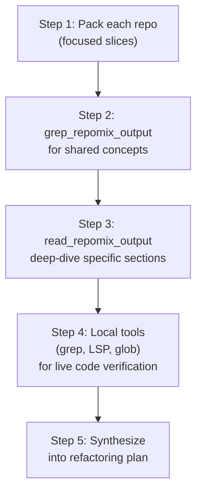
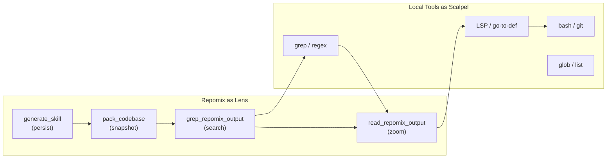

# Repomix Deep Investigation & Cross-Dependency Research Cheat Sheet

For agents working across `hivemind-plugin`, `oh-my-openagent`, `opencode`, and using `repomix` as the exploration toolkit.

---

## 1. The Two Modes of Repomix

Repomix operates in two complementary modes your agents can leverage:

| Mode | How to invoke | Best for |
|---|---|---|
| **CLI** (bash) | `repomix [dirs...] [options]` | Scripted pipelines, pre-generating packed outputs, splitting large repos |
| **MCP Server** | Via `repomixMCP` tools in agent context | Interactive agent-driven exploration, pack-then-grep workflows | [0-cite-0](#0-cite-0) [0-cite-1](#0-cite-1) 

---

## 2. MCP Tools Reference (8 tools)

Registered in `src/mcp/mcpServer.ts`: [0-cite-2](#0-cite-2) 

### 2.1 `pack_codebase` — Pack a local directory

```jsonc
{
  "directory": "/abs/path/to/hivemind-plugin",
  "compress": false,          // true = Tree-sitter ~70% token reduction
  "includePatterns": "src/**/*.ts,**/*.md",
  "ignorePatterns": "tests/**,**/*.test.ts,node_modules/**",
  "topFilesLength": 15,
  "style": "xml"              // xml | markdown | json | plain
}
```
Returns: `outputId`, `totalFiles`, `totalTokens`, `directoryStructure`. [0-cite-3](#0-cite-3) 

### 2.2 `pack_remote_repository` — Pack a GitHub repo

```jsonc
{
  "remote": "shynlee04/opencode",  // or full URL with /tree/branch
  "compress": false,
  "includePatterns": "packages/opencode/src/**",
  "ignorePatterns": "**/*.test.*"
}
``` [0-cite-4](#0-cite-4) 

### 2.3 `grep_repomix_output` — Regex search inside packed output

```jsonc
{
  "outputId": "<id-from-pack>",
  "pattern": "class\\s+\\w+Plugin",   // JS RegExp syntax
  "contextLines": 5,
  "beforeLines": 3,                    // overrides contextLines
  "afterLines": 10,                    // overrides contextLines
  "ignoreCase": true
}
```
Returns: `matches[]` with `lineNumber`, `line`, `matchedText`, plus `formattedOutput[]`. [0-cite-5](#0-cite-5) 

### 2.4 `read_repomix_output` — Read packed output (partial)

```jsonc
{
  "outputId": "<id>",
  "startLine": 500,
  "endLine": 800
}
``` [0-cite-6](#0-cite-6) 

### 2.5 `generate_skill` — Create Claude Agent Skills

```jsonc
{
  "directory": "/abs/path/to/oh-my-openagent",
  "skillName": "openagent-reference",
  "compress": true,
  "includePatterns": "src/**/*.ts"
}
```
Produces `.claude/skills/<name>/` with `SKILL.md`, `references/summary.md`, `project-structure.md`, `files.md`, `tech-stacks.md`. [0-cite-7](#0-cite-7) 

### 2.6 `attach_packed_output` — Re-use existing packed XML

```jsonc
{ "path": "/path/to/repomix-output.xml" }
```

### 2.7 `file_system_read_file` — Read a single file (with Secretlint security)

```jsonc
{ "path": "/abs/path/to/file.ts" }
```

### 2.8 `file_system_read_directory` — List directory contents

```jsonc
{ "path": "/abs/path/to/hivemind-plugin/src" }
``` [0-cite-8](#0-cite-8) 

---

## 3. CLI Quick Reference

### 3.1 Core Patterns

```bash
# Pack entire repo (default: repomix-output.xml)
repomix

# Pack specific directories
repomix src/ docs/

# Pack with include/ignore filters
repomix --include "src/**/*.ts,**/*.md" --ignore "**/*.test.ts,dist/**"

# Compressed output (~70% fewer tokens)
repomix --compress

# Output formats
repomix --style xml          # default, structured <file> tags
repomix --style markdown     # human-readable ## headers
repomix --style json         # machine-readable
repomix --style plain        # simple separators

# Custom output path
repomix -o ./analysis/hivemind-packed.xml

# Split large output into chunks
repomix --split-output 20mb

# Pipe to stdout for chaining
repomix --stdout | llm "Analyze this codebase"
``` [0-cite-9](#0-cite-9) 

### 3.2 Git-Aware Features

```bash
# Include git diffs (working tree + staged)
repomix --include-diffs

# Include commit history
repomix --include-logs --include-logs-count 100

# Sort files by change frequency (default: on)
repomix --no-git-sort-by-changes   # disable
``` [0-cite-10](#0-cite-10) 

### 3.3 Analysis-Only (No File Content)

```bash
# Metadata only — directory structure + file summary, no content
repomix --no-files

# Token count tree — identify heavy files
repomix --token-count-tree 100   # show files with ≥100 tokens
``` [0-cite-11](#0-cite-11) 

### 3.4 Remote Repos

```bash
# Pack a remote repo
repomix --remote shynlee04/opencode
repomix --remote https://github.com/shynlee04/oh-my-openagent/tree/dev

# With specific branch
repomix --remote shynlee04/hivemind-plugin --remote-branch v2.9.5-detox-dev
``` [0-cite-12](#0-cite-12) 

### 3.5 Skill Generation (CLI)

```bash
# Auto-named skill
repomix --skill-generate

# Named skill
repomix --skill-generate "hivemind-core-reference"

# Custom output dir + force overwrite
repomix --skill-generate "openagent-mcp" --skill-output ./skills/ -f
``` [0-cite-13](#0-cite-13) 

---

## 4. `repomix.config.json` — Full Schema

Place in project root. CLI flags override config values.

```jsonc
{
  "$schema": "https://repomix.com/schemas/latest/schema.json",
  "input": {
    "maxFileSize": 50000000          // 50MB default
  },
  "output": {
    "filePath": "repomix-output.xml",
    "style": "xml",                  // xml | markdown | json | plain
    "parsableStyle": false,
    "compress": false,
    "headerText": "Custom header...",
    "instructionFilePath": "repomix-instruction.md",
    "fileSummary": true,
    "directoryStructure": true,
    "files": true,
    "removeComments": false,
    "removeEmptyLines": false,
    "topFilesLength": 5,
    "showLineNumbers": false,
    "includeEmptyDirectories": true,
    "includeFullDirectoryStructure": false,
    "truncateBase64": true,
    "tokenCountTree": 50000,         // threshold or true/false
    "git": {
      "sortByChanges": true,
      "sortByChangesMaxCommits": 100,
      "includeDiffs": true,
      "includeLogs": true,
      "includeLogsCount": 50
    }
  },
  "include": [],                     // glob patterns
  "ignore": {
    "useGitignore": true,
    "useDotIgnore": true,
    "useDefaultPatterns": true,
    "customPatterns": []
  },
  "security": {
    "enableSecurityCheck": true
  },
  "tokenCount": {
    "encoding": "o200k_base"         // o200k_base | cl100k_base | etc.
  }
}
``` [0-cite-14](#0-cite-14) [0-cite-15](#0-cite-15) 

---

## 5. Cross-Dependency Research Workflows

### Your Repo Structures at a Glance

| Repo | Key Source Dirs | Language |
|---|---|---|
| `hivemind-plugin` | `src/{core,plugin,intelligence,delegation,control-plane,schema-kernel,sdk-supervisor,...}` | TS |
| `oh-my-openagent` | `src/{agents,mcp,plugin,tools,hooks,features,config,...}` | TS |
| `opencode` | `packages/{opencode,sdk,plugin,app,ui,console,...}` | TS |
| `repomix` | `src/{cli,config,core,mcp,shared}` | TS |


### 5.1 Strategy: Layered Packing for Cross-Repo Analysis



### 5.2 Recipe: Map Plugin Architecture Across All 3 Repos

**Goal**: Understand how plugin systems work in `hivemind-plugin`, `oh-my-openagent`, and `opencode` to inform refactoring.

```bash
# Step 1: Pack plugin-related code from each repo
# (use MCP pack_codebase for local repos)
```

```jsonc
// Pack hivemind-plugin's core + plugin layers
{ "directory": "/path/to/hivemind-plugin",
  "includePatterns": "src/plugin/**,src/core/**,src/schema-kernel/**,src/sdk-supervisor/**,src/index.ts",
  "ignorePatterns": "**/*.test.*,**/*.spec.*" }

// Pack oh-my-openagent's plugin system
{ "directory": "/path/to/oh-my-openagent",
  "includePatterns": "src/plugin/**,src/plugin-handlers/**,src/mcp/**,src/hooks/**,src/index.ts,src/plugin-*.ts",
  "ignorePatterns": "**/*.test.*" }

// Pack opencode's plugin + SDK packages
{ "directory": "/path/to/opencode",
  "includePatterns": "packages/plugin/**,packages/sdk/**,packages/opencode/src/**",
  "ignorePatterns": "**/*.test.*,**/*.spec.*" }
```

```jsonc
// Step 2: Search for cross-cutting concepts
{ "outputId": "<hivemind-id>", "pattern": "register|hook|lifecycle|dispose|init", "contextLines": 5 }
{ "outputId": "<openagent-id>", "pattern": "register|hook|lifecycle|dispose|init", "contextLines": 5 }
{ "outputId": "<opencode-id>", "pattern": "register|hook|lifecycle|dispose|init", "contextLines": 5 }
```

### 5.3 Recipe: Deep-Dive a Specific Subsystem

**Goal**: Understand `hivemind-plugin`'s intelligence/delegation layer before refactoring.

```jsonc
// Pack just the intelligence + delegation + governance layers
{ "directory": "/path/to/hivemind-plugin",
  "includePatterns": "src/intelligence/**,src/delegation/**,src/governance/**,src/control-plane/**",
  "compress": true }  // compressed for overview

// Then pack again WITHOUT compress for the specific module you need full code for
{ "directory": "/path/to/hivemind-plugin",
  "includePatterns": "src/intelligence/**",
  "compress": false }
```

### 5.4 Recipe: Trace a Concept Across Repos

```jsonc
// Example: How does "MCP" work across all repos?
// Pack oh-my-openagent MCP layer
{ "directory": "/path/to/oh-my-openagent",
  "includePatterns": "src/mcp/**" }

// Grep for MCP references in hivemind-plugin
{ "outputId": "<hivemind-full-id>",
  "pattern": "[Mm][Cc][Pp]|model.context.protocol|McpServer",
  "contextLines": 3, "ignoreCase": true }
```

### 5.5 Recipe: Generate Skills for Persistent Knowledge

```jsonc
// Create reusable skill references for each repo
{ "directory": "/path/to/oh-my-openagent",
  "skillName": "openagent-full-reference",
  "compress": true }

{ "directory": "/path/to/opencode",
  "skillName": "opencode-sdk-reference",
  "includePatterns": "packages/sdk/**,packages/plugin/**,packages/opencode/src/**",
  "compress": true }

{ "directory": "/path/to/hivemind-plugin",
  "skillName": "hivemind-pre-refactor-snapshot",
  "compress": false }
```

Skills land in `.claude/skills/<name>/` with `SKILL.md` + `references/` containing `summary.md`, `project-structure.md`, `files.md`, and `tech-stacks.md`. [0-cite-16](#0-cite-16) 

---

## 6. Combining Repomix MCP with Local Agent Tools

The key insight: **use repomix for holistic snapshots, use local tools for surgical precision**.

| Task | Use Repomix | Use Local Tools |
|---|---|---|
| "What does this repo look like?" | `pack_codebase` (compressed) | `list_dir` |
| "Find all implementations of X" | `grep_repomix_output` on packed output | `grep_search` / `codebase_search` |
| "Read specific function body" | `read_repomix_output` (line range) | `read_file` / LSP go-to-definition |
| "Understand type relationships" | `pack_codebase` with `includePatterns: "**/*.d.ts,**/types.ts,**/interfaces.ts"` | LSP references |
| "Compare patterns across repos" | Pack both repos, grep both outputs | N/A (local tools are single-repo) |
| "Snapshot before refactor" | `generate_skill` | `git stash` / `git tag` |
| "Analyze git history" | `--include-diffs --include-logs` | `git log`, `git blame` |

### Optimal Agent Workflow Pattern

```
1. file_system_read_directory  → orient (what's in this repo?)
2. pack_codebase (compressed)  → survey (high-level structure + signatures)
3. grep_repomix_output         → locate (find relevant patterns)
4. read_repomix_output         → zoom in (read specific sections)
5. file_system_read_file       → verify (read actual live file)
6. local grep/LSP              → trace (follow references, callers)
7. generate_skill              → persist (save knowledge for later)
```

---

## 7. Token Budget Management

| Technique | Token Impact | When to Use |
|---|---|---|
| `--compress` | ~70% reduction | Large repos, overview scans |
| `--include` patterns | Proportional reduction | Focused investigation |
| `--no-file-summary` | Minor reduction | When you only need code |
| `--no-directory-structure` | Minor reduction | When structure is known |
| `--remove-comments` | 10-30% reduction | Dense code analysis |
| `--remove-empty-lines` | 5-15% reduction | Maximize content density |
| `--split-output 2mb` | Splits into chunks | Repos exceeding context window |
| `grep_repomix_output` | Read only matches | Incremental exploration (preferred) |
| `read_repomix_output` with line range | Read only slice | Targeted deep-dive | [0-cite-17](#0-cite-17) 

---

## 8. Practical Cheat Commands for Your Specific Repos

```bash
# === hivemind-plugin: Full pre-refactor snapshot ===
cd /path/to/hivemind-plugin
repomix --include "src/**/*.ts" --ignore "**/*.test.*,**/*.spec.*" \
  --include-diffs --include-logs --include-logs-count 100 \
  -o hivemind-full.xml

# === hivemind-plugin: Compressed architecture overview ===
repomix --include "src/**/*.ts" --compress --no-file-summary \
  -o hivemind-compressed.xml

# === oh-my-openagent: Plugin + MCP system ===
repomix --include "src/plugin/**,src/mcp/**,src/hooks/**,src/tools/**,src/plugin-*.ts" \
  -o openagent-plugin-system.xml

# === opencode: SDK + Plugin packages ===
cd /path/to/opencode
repomix packages/sdk packages/plugin packages/opencode \
  --include "**/*.ts" --ignore "**/*.test.*" \
  -o opencode-sdk-plugin.xml

# === Token budget analysis for any repo ===
repomix --token-count-tree 1000 --no-files

# === Generate skills for all three ===
cd /path/to/hivemind-plugin && repomix --skill-generate "hivemind-core" --include "src/**/*.ts" -f
cd /path/to/oh-my-openagent && repomix --skill-generate "openagent-core" --include "src/**/*.ts" -f
cd /path/to/opencode && repomix --skill-generate "opencode-core" --include "packages/**/*.ts" -f
```

---

## 9. Ignore Patterns Priority

From highest to lowest:
1. `ignore.customPatterns` / `--ignore` CLI flag
2. `.repomixignore` > `.ignore` > `.gitignore` (deeper dirs win)
3. Default patterns (node_modules, .git, dist, build, etc.)

Use `.repomixignore` in each project root for repo-specific exclusions that persist across runs. [0-cite-18](#0-cite-18) 

---

## 10. Key Mental Model



**Repomix gives you the forest. Local tools give you the trees. Use both.**
