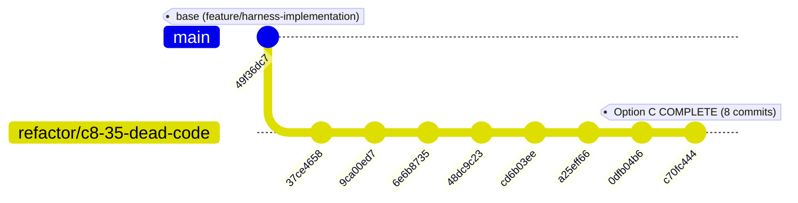

[LANGUAGE: Write this file in en per Language Governance.]
---
phase: 35
plan: C8-35-wave-2
subsystem: dead-type-inline-refactor
tags: [refactor, dead-code, types, atomic-commits, c8-35, wave-2, final]
dependency-graph: depends-on: Wave 1 (5 commits on refactor/c8-35-dead-code)
tech-stack: typescript, vitest, npm
key-files:
  - src/shared/types.ts
  - src/task-management/continuity/index.ts (BLOCKED — 0 changes verified)
  - src/tools/hivemind/hivemind-steer.ts (untracked, not committed)
metrics:
  commits: 3 (total 8 across both waves)
  files-changed-this-wave: 1 (src/shared/types.ts)
  total-files-changed: 2 (+1 test from Wave 1)
  insertions-this-wave: 3
  deletions-this-wave: 20
  total-insertions: 24
  total-deletions: 131
  typecheck: GREEN
  blocked-type-mutations: 0
  out-of-scope-mutations: 0
  types.ts-reduction: 422 → 348 lines (net -74 lines, 17.5%)
  hivemind-steer.ts: untracked (not committed)
---

# Wave 2 Summary: C8/35 Option C — Final 3 Inlining Commits

## Plan Scope

- **Branch:** `refactor/c8-35-dead-code` in worktree `/Users/apple/hivemind-c8-35`
- **Base:** `feature/harness-implementation` @ `49f36dc7`
- **Wave 1 HEAD:** `cd6b03ee` (5 Wave 1 commits ahead of base)
- **Goal:** Inline the final 3 of 10 INLINEABLE dead types into their parent consumers
- **Constraint set (same as Wave 1):**
  - Touch ONLY `src/shared/types.ts`
  - Do NOT touch BLOCKED types: `CapturedResult`, `DelegationPacket` (deferred to C9)
  - Do NOT commit `src/tools/hivemind/hivemind-steer.ts`
  - Per-commit `npm run typecheck` must be GREEN
  - No push, PR, merge, or full test suite

## Tasks Completed

| # | Commit    | Action                                                              | Files | +/-   |
|---|-----------|---------------------------------------------------------------------|-------|-------|
| 6 | `a25eff66` | Inline `DelegationPacketStatus` → `DelegationPacket.status` union   | 1     | +1/-4 |
| 7 | `0dfb04b6` | Inline `ToolCallSummary` → `CapturedResult.toolCallSummary`         | 1     | +1/-7 |
| 8 | `c70fc444` | Inline `SessionStatusType` → `SessionStatus.type` union             | 1     | +1/-9 |

## Per-Commit Evidence

### Commit 6 — `a25eff66` — `DelegationPacketStatus`
- **Removed:** `export type DelegationPacketStatus = "pending" | "running" | "completed" | "failed"`
- **Replaced:** `DelegationPacket.status: DelegationPacketStatus` → `status: "pending" | "running" | "completed" | "failed"`
- **Sole consumer:** `DelegationPacket` interface owns the union directly; `src/task-management/continuity/index.ts` imports `DelegationPacket`, not `DelegationPacketStatus` — safe
- **Pre-flight:** `grep -rn "DelegationPacketStatus" src/` returns 0 results outside JSDoc comments
- **Comment preservation:** JSDoc reference at `types.ts:125-127` preserved as historical context ("DelegationPacketStatus (4 values) is a coarse-grained packet view")

### Commit 7 — `0dfb04b6` — `ToolCallSummary`
- **Removed:** `export type ToolCallSummary = { tool: string; args?: string; output?: string; status?: string }`
- **Replaced:** `CapturedResult.toolCallSummary: ToolCallSummary[]` → `toolCallSummary: { tool: string; args?: string; output?: string; status?: string }[]`
- **Sole consumer:** `CapturedResult` now owns the inline shape; `CapturedResult` is still an exported type
- **Pre-flight:** `grep -rn "ToolCallSummary" src/` returns 0 results (export removed, only parent `CapturedResult` referenced in `continuity/index.ts`)
- **Note:** `CapturedResult` is one of the BLOCKED types (deferred to C9) — only its `toolCallSummary` field was inlined here; the type itself remains exported

### Commit 8 — `c70fc444` — `SessionStatusType`
- **Removed:** `export type SessionStatusType = "idle" | "busy" | "retry" | string`
- **Replaced:** `SessionStatus.type: SessionStatusType` → `type: "idle" | "busy" | "retry" | string`
- **Sole consumer:** `SessionStatus` interface owns the union directly
- **Pre-flight:** `grep -rn "SessionStatusType" src/` returns 0 results outside the preserved type itself (fully migrated)
- **Final type:** All 10 INLINEABLE types now addressed across both waves

## Deviations from Plan

**None for Wave 2.** All 3 commits landed as specified in the plan, with correct messages, atomic scope, and green typecheck after each commit.

**Wave 1 deviation STILL OUTSTANDING** (unchanged in Wave 2):
- `src/tools/hivemind/hivemind-steer.ts` remains untracked in both worktrees (copied by Wave 1 executor as provisioning fix, never committed). Must be committed in a separate phase before integration merge.

## Gates Passed

- [x] **Final `npm run typecheck`:** GREEN (no errors)
- [x] **3 Wave 2 commits on `refactor/c8-35-dead-code`** (verified via `git log feature/harness-implementation..refactor/c8-35-dead-code`)
- [x] **Total 8 commits** (5 Wave 1 + 3 Wave 2)
- [x] **Diff stat (Wave 2 only):** 1 file (`src/shared/types.ts`), 3 insertions / 20 deletions
- [x] **Total diff stat (both waves):** 2 files (`src/shared/types.ts` + `tests/lib/coordination/delegation/status-mapping.test.ts`), 24 insertions / 131 deletions
- [x] **BLOCKED-type consumer check:** `git diff feature/harness-implementation..refactor/c8-35-dead-code -- src/task-management/continuity/index.ts` → EMPTY (0 changes)
- [x] **hivemind-steer.ts:** STILL UNTRACKED (not committed)
- [x] **No TODO/FIXME/HACK/XXX stubs** added in modified files

## Current State (Post-Option C)

- `src/shared/types.ts`: **348 lines** (was 422, reduced by 17.5%)
- **10 of 10 INLINEABLE types** addressed across both waves:
  - Wave 1: `PermissionAction`, `LoopWindow`, `SessionBudgetOverride`, `SessionConcurrencyOverride`, `SessionPromptParams`, `SessionToolProfile`, `HarnessStatus` (cluster: 3 exports + 1 test)
  - Wave 2: `DelegationPacketStatus`, `ToolCallSummary`, `SessionStatusType`
- **2 types still BLOCKED** (deferred to C9): `CapturedResult`, `DelegationPacket` (6 call sites each in `continuity/index.ts`)

## Graph

## Next Steps

1. **`src/tools/hivemind/hivemind-steer.ts`** — Commit the untracked file in a separate baseline phase (not C8/35 scope but blocks integration merge)
2. **C9** — Deferred: plan and execute removal of 2 BLOCKED types (`CapturedResult`, `DelegationPacket`) from `continuity/index.ts`
3. **C8/34** — Typed errors + `HarnessError` base class + TUI-safe logging (next execution phase)
4. **Final reporting** — Orchestrator to commit this SUMMARY.md, update STATE.md, and report to user
5. **No push/PR/merge** performed per plan boundary — branch is local only on `refactor/c8-35-dead-code`

## Self-Check

- [x] All 3 Wave 2 commit hashes verified: `a25eff66`, `0dfb04b6`, `c70fc444` (via `git log --oneline`)
- [x] Final typecheck output captured (GREEN, 0 errors)
- [x] Files modified match expected scope (1 file: `src/shared/types.ts`)
- [x] BLOCKED types preserved (0 changes in `src/task-management/continuity/index.ts`)
- [x] `hivemind-steer.ts` still untracked (not committed)
- [x] No TODOs/FIXMEs left in modified files
- [x] 10 of 10 INLINEABLE dead types addressed
- [x] SUMMARY.md written to absolute main-worktree path
- [x] No destructive git operations performed (no push, no PR, no merge, no reset, no clean)
