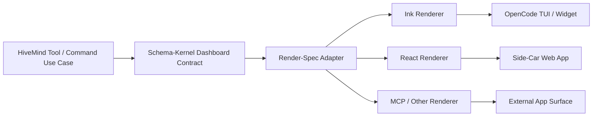

# ADR-2026-03-29: Adopt a json-render side-car rendering engine for HiveMind dashboards

**Status:** Proposed
**Date:** 2026-03-29
**Deciders:** Senior Architect, HiveMind maintainers, product-detox ratifiers
**Supersedes:** None

## Context

HiveMind needs a visual dashboard layer for configuration, control-plane monitoring, trajectory tracking, and command execution surfaces such as `hm-init`, `hm-settings`, and `hm-doctor`. The current implementation proves json-render value only in a narrow TUI slice: `hm-setting` uses `@json-render/ink`, while the dashboard path still mixes proof data and rendered string output. The repository has no shared rendering contract, no active plugin route adapter, and no web dashboard runtime.

At the same time, the json-render ecosystem is now mature enough to justify standardization: it supports a flat keyed-element spec (`{ root, elements }`), multiple renderer targets, and target-specific registries. This makes it a strong candidate for a single spec model spanning TUI and GUI surfaces.

The decision is therefore not whether HiveMind should render richer dashboards at all, but how to do so without violating existing repository law:

- tools remain under 300 LOC and own data-to-contract transformation only;
- CQRS remains intact: tools write contracts, hooks read context, plugin assembles;
- schema-kernel owns machine-authoritative cross-boundary contracts;
- renderer implementations stay outside the domain and outside tool business logic;
- any Next.js or plugin-route work must be additive and consumer-safe.

### Forces

- **Force 1:** We need one dashboard contract that can drive multiple targets without duplicating presentation logic.
- **Force 2:** Current code is tool-local and Ink-centric, so a shared rendering architecture must be introduced incrementally.
- **Force 3:** OpenCode route and side-car integration capabilities exist conceptually, but repo-level implementations are not yet proven.

## Decision

Adopt a **layered, additive side-car rendering architecture** built around **one target-agnostic json-render contract** and **multiple renderer adapters**, with rollout gated by proof phases.

### Chosen Approach

HiveMind will standardize on three layers:

1. **Core Tool Layer** — tools emit structured dashboard/view contracts and, during migration, may continue to emit current JSON/text outputs additively.
2. **Side-Car Rendering Engine** — a new optional adapter surface renders the same contract through `@json-render/ink`, `@json-render/react`, and later MCP/web targets.
3. **OpenCode Plugin Integration Layer** — the plugin may host compact widgets and, after official-interface proof, optional full-screen routes using the same contract.

This decision is **accepted as a direction, not as a claim of existing implementation**. The following are explicitly **proposed adapters**, not present-day facts in this repository:

- Next.js + `@json-render/react` + `@json-render/shadcn`
- SSE-driven side-car session mirroring
- full-screen plugin route registration
- sidebar dashboard widgets beyond today's text/status affordances

### Rationale

This option best balances reuse and architectural safety:

- It preserves **one authority owner** for dashboard contracts instead of scattering view logic across tools, plugin, and web app.
- It keeps **renderer concerns outside tools**, which aligns with Clean Architecture and existing repo guidance.
- It enables **dual rendering** from the same json-render spec, which is already validated by the library design.
- It supports **incremental migration** from the current `hm-setting` implementation instead of forcing a risky rewrite.

## Architecture Diagram



## Layer Responsibilities

| Layer | Responsibility | Owns | Must Not Own |
| --- | --- | --- | --- |
| Core Tool Layer | Produce dashboard view-model and render envelope from tool/use-case state | data extraction, normalization, contract emission | Ink/React component trees, route logic, web app concerns |
| Schema-Kernel Contract Layer | Define additive machine-authoritative dashboard contracts | versioned dashboard envelope, surface IDs, layout metadata, target-agnostic spec contract | renderer registries, JSX, framework runtime code |
| Render-Spec Adapter Layer | Convert dashboard contract into json-render spec(s) and target-specific registry inputs | adapter mapping, layout translation, target capability flags | business logic, session orchestration |
| Side-Car Rendering Engine | Render web/TUI/app dashboards from shared contract | React/Ink registries, panel layouts, tabs, session subscription adapters | tool ownership, schema authority |
| OpenCode Plugin Integration | Assemble widgets/routes using approved adapters | plugin wiring, route registration, compact widgets | contract authoring, business rules |

## Contract Surfaces

The authoritative cross-boundary types are target-agnostic and belong in schema-kernel. Renderer-specific registries remain outside schema-kernel.

```ts
type DashboardSurfaceId =
  | 'hm-settings'
  | 'hm-init'
  | 'hm-doctor'
  | 'control-plane';

type RenderTarget = 'ink' | 'react' | 'mcp-app';

interface JsonRenderElement {
  type: string;
  props: Record<string, unknown>;
  children?: string[];
  visible?: unknown;
  watch?: Record<string, unknown>;
}

interface JsonRenderSpecRecord {
  root: string;
  elements: Record<string, JsonRenderElement>;
}

interface DashboardPaneContract {
  id: 'pane40' | 'pane60' | 'sidebar';
  title: string;
  spec: JsonRenderSpecRecord;
}

interface DashboardRenderEnvelope {
  version: '1';
  surface: DashboardSurfaceId;
  layout: {
    kind: 'split-40-60' | 'tabs' | 'single';
    tabs?: Array<'settings' | 'planning' | 'handoff' | 'qa' | 'workflows'>;
  };
  panes: DashboardPaneContract[];
  targets: RenderTarget[];
  generatedAt: string;
}
```

### Ownership Rule

- **Schema-kernel owns** `DashboardRenderEnvelope` and related versioned contract types.
- **Adapters own** conversion from domain/view-model data into `JsonRenderSpecRecord`.
- **Renderers own** registry implementations for Ink, React, and future targets.

## Data Flow

```text
tool/use-case state
  -> dashboard view-model
  -> DashboardRenderEnvelope
  -> target adapter
  -> json-render spec + registry
  -> renderer target (Ink / React / MCP)
  -> surface host (plugin widget, route, side-car app)
```

### Flow Rules

1. Tools produce **structured contracts**, not framework-specific UI code.
2. Adapters transform contracts into json-render specs.
3. Renderers consume specs through target-specific registries.
4. Hosts (plugin route, widget, side-car app) only assemble and display rendered output.

## Rendering Targets

### 1. Ink TUI

- Primary near-term target.
- Reuses the current successful `renderHmSettingTui()` direction, but via shared contracts instead of tool-local inline specs.
- Must support the 40/60 split foundation for `hm-settings`.

### 2. React GUI

- Proposed side-car target.
- Intended for richer panels, tabs, and control-plane dashboards.
- Must remain **optional** and consumer-safe; it cannot become a hidden runtime dependency of the plugin package.

### 3. MCP Apps / External Surfaces

- Future-compatible target enabled by the same contract.
- Deferred until the shared contract and primary TUI/GUI adapters are proven.

## Consequences

### Positive

- One dashboard contract can drive multiple surfaces.
- Tool files stay smaller and cleaner because renderer logic moves outward.
- Dashboard behavior becomes testable at the contract layer and renderer-adapter layer separately.
- The same foundation can power configuration, control-plane, and workflow dashboards.

### Negative

- A new adapter layer must be introduced before value is fully realized.
- Migration is additive and therefore temporarily duplicates some output paths.
- Schema ownership must be kept tight or schema-kernel will become a dumping ground for UI concerns.
- Next.js, SSE, and plugin-route claims require proof work before implementation can be called supported.

### Neutral

- The existing `hm-setting` Ink rendering becomes a migration seed, not the final architecture.
- The plugin remains a host/assembly surface rather than the authority for dashboard contracts.

## Benefits and Risks

| Category | Benefit | Risk | Mitigation |
| --- | --- | --- | --- |
| Reuse | Same contract across TUI/GUI | Contract becomes too renderer-specific | Keep schema target-agnostic |
| Maintainability | UI logic leaves tools | Adapter layer adds indirection | Enforce thin adapters and TDD |
| Product velocity | New dashboards share primitives | Greenfield side-car scope expands too fast | Phase delivery around one vertical slice first |
| OpenCode integration | Plugin and side-car can share state model | Route/SSE support is not yet repo-proven | Require Phase 0 official-interface proof |

## Alternatives Considered

### Option A: Keep tool-local Ink rendering only

**Description:** Continue with the current `hm-setting` pattern and expand by adding more renderer functions inside tool folders.

**Pros:**
- Lowest immediate change cost
- Reuses existing working Ink path

**Cons:**
- Scales poorly across commands and dashboards
- Keeps UI concerns inside tools
- Does not support web or MCP reuse cleanly

**Rejected because:** It violates the longer-term need for a shared, multi-target dashboard contract and would deepen current coupling.

### Option B: Build only an OpenCode plugin route dashboard

**Description:** Skip side-car work and render everything inside the plugin through route registration and terminal widgets.

**Pros:**
- Single host surface
- Tight OpenCode integration

**Cons:**
- Current repo has no proven route adapter implementation
- Terminal layout limitations remain a risk
- No reusable web surface for richer dashboards

**Rejected because:** It overcommits to a still-unproven host capability and gives up the main advantage of json-render: target portability.

### Option C: Build a bespoke React dashboard without json-render

**Description:** Create custom React components and view-models for a standalone app while leaving the TUI path separate.

**Pros:**
- Fastest route to polished web UX
- Familiar React architecture

**Cons:**
- Duplicates TUI/web view logic
- Creates drift between surfaces
- Loses the value of shared schema-driven rendering

**Rejected because:** It solves presentation quickly but fails the architectural goal of one reusable render contract.

## Foundation Scope

The first ratified deliverable must prove the architecture on the smallest valuable slice while still covering the named product surfaces.

### Must Prove

1. **Configuration / `hm-settings`**
   - `pane40` runtime mirror
   - `pane60` settings UI
   - same contract rendered in Ink first, React second
2. **Control-plane read models**
   - trajectory status
   - workflow state
   - health summary
3. **Command dashboards**
   - `hm-init`
   - `hm-settings`
   - `hm-doctor`
4. **Load-time injection visibility**
   - skills
   - agents
   - commands
   - conditional loading state

### Explicitly Deferred Until Proven

- production-grade Next.js shell complexity beyond the first dashboard slice
- plugin full-screen routing as a default UX
- MCP app target implementation beyond contract compatibility

## Phase Plan

### Phase 0 — Proof Gates

- Prove route hosting and/or side-car attachment against official OpenCode interfaces.
- Prove that a shared `DashboardRenderEnvelope` can be emitted additively without breaking current tool output contracts.
- Prove Ink and React can render the same contract for `hm-settings`.

### Phase 1 — Contract Extraction

- Add versioned dashboard contract types in schema-kernel.
- Separate current proof data from rendered string output.
- Move tool-local rendering toward adapter seams.

### Phase 2 — `hm-settings` Vertical Slice

- Replace inline TUI/dashboard coupling with contract -> adapter -> Ink rendering.
- Add equivalent React side-car rendering for the same slice.
- Lock the 40/60 split contract and test it.

### Phase 3 — Plugin Integration

- Add compact status widget support.
- Add optional full-screen route only after official-interface proof passes.
- Keep plugin assembly-only; no business logic migration into plugin code.

### Phase 4 — Surface Expansion

- Extend the same contract to `hm-init`, `hm-doctor`, and control-plane dashboards.
- Add tabbed surfaces for Settings, Planning, Handoff, QA, and Workflows where justified by the contract.

### Phase 5 — Hardening

- Contract tests, renderer-adapter tests, and host integration tests.
- Consumer packaging review so side-car surfaces remain optional.
- Performance, failure-mode, and compatibility review.

## Compliance

- [x] Decision aligns with Clean Architecture dependency rules
- [x] Decision respects CQRS boundaries (tools write, hooks read)
- [x] Decision uses SDK-first approach (json-render and OpenCode capabilities before custom reimplementation)
- [x] Decision maintains consumer-first compatibility
- [x] Decision has one clear authority owner

## References

- `src/tools/hivefiver-setting/render.ts`
- `src/tools/hivefiver-setting/dashboard.ts`
- `src/tools/hivefiver-setting/tools.ts`
- `src/tools/hivefiver-setting/types.ts`
- `src/schema-kernel/index.ts`
- `src/control-plane/sdk-runtime.ts`
- `src/plugin/opencode-plugin.ts`
- `tests/tools/hivefiver-setting/hm-setting-render.test.ts`
- `package.json`
- `https://github.com/vercel-labs/json-render`

---

*Ratification note: this ADR is intentionally conditional. It authorizes the architecture direction and required proof gates; it does not claim that side-car, SSE, Next.js, or plugin-route adapters already exist in the current codebase.*
