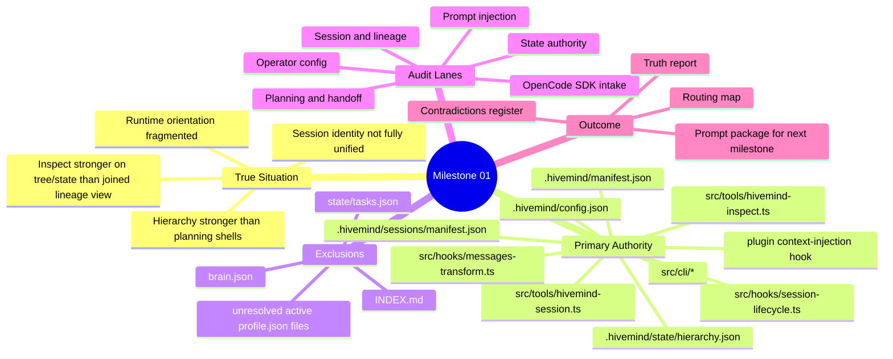
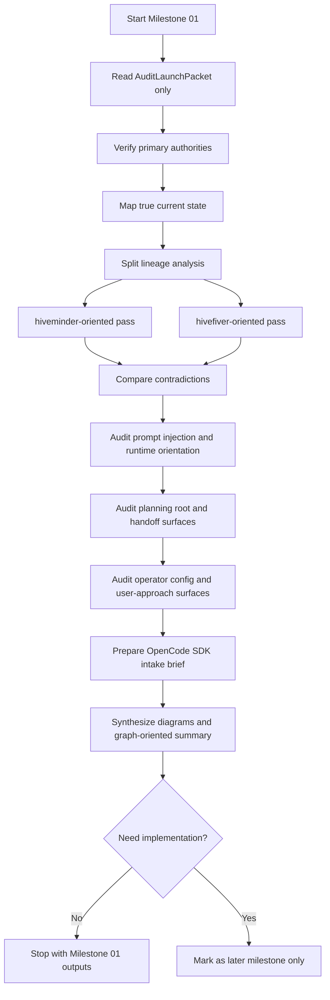

# Milestone 01 Current-State Audit Launch

Date: 2026-03-06
Group: debug/active
Status: ready-to-transfer

## Use

Paste the prompt below into a fresh session. The target session should perform deep audit and synthesis only. It must not implement code in this milestone.

## Transfer Prompt

You are starting Milestone 01 for `/Users/apple/hivemind-plugin`.

Your job is to reconstruct the true current situation of this repository and its `.hivemind` governance state, then synthesize the investigation approach with diagrams and graph-oriented outputs.

This is not an implementation milestone.
Do not patch code.
Do not propose implementation-ready changes unless explicitly asked in a later milestone.

Label all statements as one of:
- VERIFIED
- INFERRED
- PROPOSED

Start from this packet:

```yaml
audit_launch_packet:
  milestone: 1
  mode: true-situation-audit
  implementation_allowed: false
  objective:
    - reconstruct the real current state of `.hivemind`, runtime orientation, planning roots, and handoff surfaces
    - explain the current approach and contradictions with diagrams and graph-oriented synthesis
    - prepare later iterative deep-scan and OpenCode SDK synthesis
  current_truth:
    - runtime orientation is fragmented across hooks, hierarchy state, manifests, graph files, and planning shells
    - `.hivemind/state/hierarchy.json` is one of the strongest live orientation surfaces
    - `.hivemind/project/planning/*.md` mostly exists as root planning shell, not fully populated source-of-truth
    - session identity and lineage surfaces are not cleanly unified yet
    - current inspect flows are stronger at state/tree traversal than joined lineage/handoff/delegation orientation
    - operator/user-config surfaces already exist in CLI/config code and must be modeled as part of the true situation
  primary_authorities:
    - /Users/apple/hivemind-plugin/.hivemind/config.json
    - /Users/apple/hivemind-plugin/.hivemind/manifest.json
    - /Users/apple/hivemind-plugin/.hivemind/state/hierarchy.json
    - /Users/apple/hivemind-plugin/.hivemind/sessions/manifest.json
    - /Users/apple/hivemind-plugin/src/cli/init.ts
    - /Users/apple/hivemind-plugin/src/cli/interactive-init.ts
    - /Users/apple/hivemind-plugin/src/cli/scan.ts
    - /Users/apple/hivemind-plugin/src/cli/sync-assets.ts
    - /Users/apple/hivemind-plugin/src/schemas/config.ts
    - /Users/apple/hivemind-plugin/src/tools/hivemind-session.ts
    - /Users/apple/hivemind-plugin/src/tools/hivemind-inspect.ts
    - /Users/apple/hivemind-plugin/src/hooks/session-lifecycle.ts
    - /Users/apple/hivemind-plugin/src/hooks/messages-transform.ts
    - /Users/apple/hivemind-plugin/.opencode/plugins/hiveops-governance/hooks/context-injection.ts
  secondary_evidence:
    - /Users/apple/hivemind-plugin/.hivemind/graph/trajectory.json
    - /Users/apple/hivemind-plugin/.hivemind/graph/tasks.json
    - /Users/apple/hivemind-plugin/.hivemind/graph/project/project.json
    - /Users/apple/hivemind-plugin/.hivemind/handoffs/
    - /Users/apple/hivemind-plugin/.hivemind/project/planning/PROJECT.md
    - /Users/apple/hivemind-plugin/.hivemind/project/planning/STATE.md
    - /Users/apple/hivemind-plugin/.hivemind/project/planning/ROADMAP.md
    - /Users/apple/hivemind-plugin/.hivemind/project/planning/REQUIREMENTS.md
    - /Users/apple/hivemind-plugin/.hivemind/project/planning/MILESTONES.md
  excluded_sources:
    - /Users/apple/hivemind-plugin/.hivemind/state/brain.json
    - /Users/apple/hivemind-plugin/.hivemind/INDEX.md
    - /Users/apple/hivemind-plugin/.hivemind/state/tasks.json
    - unresolved /Users/apple/hivemind-plugin/.hivemind/sessions/active/*/profile.json unless used as anomaly evidence
  lineage_strategy:
    mode: hard-split-analysis
    rule:
      - keep hiveminder-oriented and hivefiver-oriented reasoning separated
      - only synthesize them together after their boundaries and conflicts are explicit
  operator_config_surfaces:
    derive:
      - profile
      - language
      - governance_mode
      - automation_level
      - expert_level
      - output_style
      - review/TDD constraints
      - sync_target
      - sync_mode
    purpose:
      - explain how the system expects to approach the user
      - explain what runtime asset surface is likely available
  deep_scan_waves:
    - wave_1_state_authority
    - wave_2_session_identity_and_lineage
    - wave_3_prompt_injection_and_runtime_orientation
    - wave_4_planning_root_and_handoff_surfaces
    - wave_5_operator_config_and_user_approach
    - wave_6_opencode_sdk_intake
    - wave_7_contradiction_resolution_and_synthesis
  anomalies_to_confirm:
    - session manifest vs active profile identity mismatch
    - empty or weak planning-root projections vs richer runtime state
    - declaration/orientation features implemented in code but not fully wired as canonical startup path
    - inspection stronger on tree/state than on joined lineage/handoff/delegation orientation
  expected_outputs:
    - current-state truth report
    - contradictions register
    - lineage and routing map
    - operator-config and user-approach map
    - prompt-surface ownership map
    - opencode sdk synthesis intake brief
    - next-milestone proposal
  handoff_rules:
    - keep outputs diagram-first and graph-oriented
    - use progressive disclosure
    - do not dump full raw context unless a source is primary authority or anomaly evidence
    - treat ongoing work as a real caveat, not a footnote
  ongoing_work_caveat:
    - there is ongoing work and more nuance than any single artifact captures
    - prefer current code plus current state surfaces over older narrative artifacts
  opencode_sdk_synthesis_next:
    - after the deepscan stabilizes the true situation, synthesize findings with current OpenCode SDK knowledge in a later pass
```

Required diagrams:





Process rules:
- Do not implement.
- Do not turn contradictions into assumptions without stating the gap.
- Do not flatten all layers into one summary. Keep these layers separate:
  - root defaults
  - project planning root
  - session overlay
  - runtime hook behavior
  - handoff/delegation behavior
  - operator config / user-approach behavior
- Use progressive disclosure:
  - start compact
  - expand only when evidence requires it
- Distinguish:
  - VERIFIED = direct file/code/runtime evidence
  - INFERRED = conclusion drawn from multiple verified facts
  - PROPOSED = later recommendation, not current truth

End by delivering:
1. a verified current-state report
2. a contradiction register
3. a lineage/routing map
4. an operator-config map
5. a prompt-surface ownership map
6. an OpenCode SDK synthesis intake note
7. a proposal for Milestone 02
