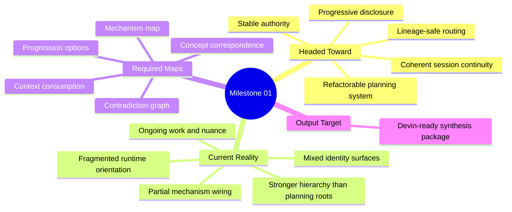
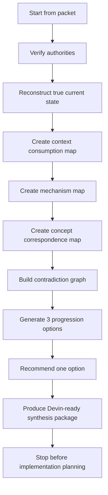
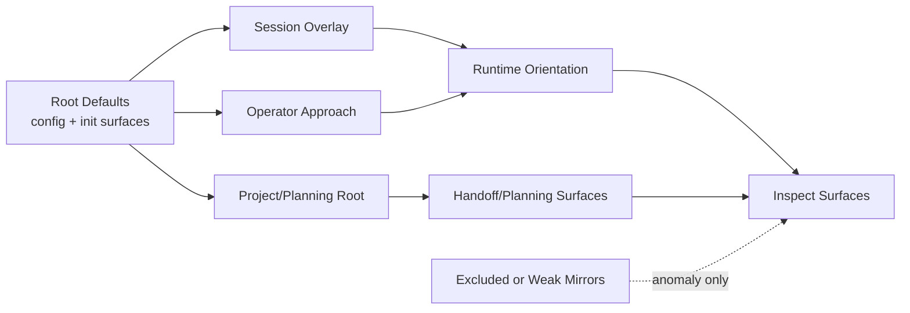

# Milestone 01 Enhanced Systematic Synthesis Prompt

Date: 2026-03-06
Group: debug/active
Status: ready-to-transfer

## Intent

This artifact is the stronger prompt for the next AI session.

Use this when the goal is not merely to inspect files, but to decide how the work should progress more systematically, map what context should be consumed and in what order, map the active mechanisms and concepts, and produce a synthesis package that can later be handed to Devin for deeper synthesis and refactor planning.

## Transfer Prompt

You are entering `/Users/apple/hivemind-plugin` to perform **Milestone 01: true-situation reconstruction and systematic synthesis framing**.

Your job is not to implement code.
Your job is to determine, from the real current state of the repository, how this effort should progress more systematically.

You must do four things in order:

1. Reconstruct the true current situation.
2. Map context consumption order and progressive disclosure rules.
3. Map mechanisms, authorities, concepts, and their mismatches.
4. Produce a synthesis package that a later agent or Devin can use to design a better refactor and planning milestone.

You are allowed to investigate deeply.
You are not allowed to patch implementation in this milestone.

All claims must be labeled:
- `VERIFIED`
- `INFERRED`
- `PROPOSED`

Do not collapse those labels together.

## North Star

The repository appears to be headed toward a governance-aware, multi-agent, lineage-sensitive orchestration system where:

- sessions know how to orient themselves from stable authority
- agents understand what to consume first and what to defer
- the runtime uses progressive disclosure instead of dumping polluted context
- operator/user configuration influences approach style without becoming prompt noise
- planning roots, runtime hooks, handoffs, and session state are coherent enough that another agent can continue work systematically

Your task is to evaluate how far the current system is from that target, what mechanisms already exist, what concepts are partially implemented, and what contradictions block clean progression.

## Core Instruction

Do not treat previous plans as truth.
Do not treat empty shells as populated architecture.
Do not treat code intent as code reality.

Start from current evidence, then decide what progression model makes the most sense.

## Audit Packet

```yaml
systematic_synthesis_packet:
  milestone: 1
  mode: true_situation_plus_progression_design
  implementation_allowed: false
  primary_objective:
    - reconstruct the true current repository situation
    - determine how work should progress more systematically from here
    - map context consumption, mechanisms, and concept correspondence
    - prepare a later Devin-oriented synthesis/refactor planning package
  current_reality_hypothesis:
    - runtime orientation is fragmented across hooks, manifests, hierarchy state, graph files, and planning shells
    - some concepts are designed in code but not fully wired as canonical runtime behavior
    - inspection is currently stronger for tree/state traversal than for full joined lineage/handoff/delegation mapping
    - operator/user config already exists and should shape approach behavior, but is not yet cleanly projected as orientation authority
    - ongoing work means no single artifact fully represents the true state
  desired_end_state_to_evaluate:
    - stable root defaults
    - coherent project projection
    - explicit session overlay
    - progressive disclosure as default
    - lineage-safe routing and handoff
    - inspectable mechanism map
    - refactorable authority model
  primary_authorities:
    - /Users/apple/hivemind-plugin/.hivemind/config.json
    - /Users/apple/hivemind-plugin/.hivemind/manifest.json
    - /Users/apple/hivemind-plugin/.hivemind/state/hierarchy.json
    - /Users/apple/hivemind-plugin/.hivemind/sessions/manifest.json
    - /Users/apple/hivemind-plugin/src/cli/init.ts
    - /Users/apple/hivemind-plugin/src/cli/interactive-init.ts
    - /Users/apple/hivemind-plugin/src/cli/scan.ts
    - /Users/apple/hivemind-plugin/src/cli/sync-assets.ts
    - /Users/apple/hivemind-plugin/src/schemas/config.ts
    - /Users/apple/hivemind-plugin/src/tools/hivemind-session.ts
    - /Users/apple/hivemind-plugin/src/tools/hivemind-inspect.ts
    - /Users/apple/hivemind-plugin/src/hooks/session-lifecycle.ts
    - /Users/apple/hivemind-plugin/src/hooks/messages-transform.ts
    - /Users/apple/hivemind-plugin/.opencode/plugins/hiveops-governance/hooks/context-injection.ts
  secondary_evidence:
    - /Users/apple/hivemind-plugin/.hivemind/graph/trajectory.json
    - /Users/apple/hivemind-plugin/.hivemind/graph/tasks.json
    - /Users/apple/hivemind-plugin/.hivemind/graph/project/project.json
    - /Users/apple/hivemind-plugin/.hivemind/handoffs/
    - /Users/apple/hivemind-plugin/.hivemind/project/planning/
  exclusions:
    - /Users/apple/hivemind-plugin/.hivemind/state/brain.json
    - /Users/apple/hivemind-plugin/.hivemind/INDEX.md
    - /Users/apple/hivemind-plugin/.hivemind/state/tasks.json
    - unresolved active profile.json files except as anomaly evidence
  hard_split:
    lineages:
      - hiveminder-oriented
      - hivefiver-oriented
    rule:
      - analyze separately first
      - synthesize only after conflicts and overlap are explicit
  mandatory_maps:
    - context_consumption_map
    - mechanism_map
    - concept_correspondence_map
    - contradiction_graph
    - progression_options
  operator_config_dimensions:
    - profile
    - language
    - governance_mode
    - automation_level
    - expert_level
    - output_style
    - review/TDD constraints
    - sync_target
    - sync_mode
  final_handoff_target:
    - produce a package a later agent or Devin can use to synthesize and refactor into a new plan
```

## Required Thinking Order

Do this in order. Do not skip ahead.

### Phase 1: Reconstruct Reality

Build a verified picture of:

- state authority
- session identity and lineage surfaces
- prompt injection and runtime orientation surfaces
- planning-root and handoff surfaces
- operator-config surfaces

### Phase 2: Build A Context Consumption Map

Before deciding what to do next, create a **context consumption map**.

For each relevant source, classify:

- `source`
- `layer`
- `trust_level`
- `consume_when`
- `consume_for`
- `do_not_use_for`
- `progressive_disclosure_rule`

Your consumption map must answer:

- what the next session should read first
- what should only be loaded after specific questions arise
- what should never be treated as source-of-truth
- where contaminated or stale sources still have anomaly value

### Phase 3: Build A Mechanism Map

Map the active mechanisms and their relationships.

At minimum include:

- CLI/init and interactive setup
- config and operator-profile shaping
- session lifecycle
- messages transform
- plugin fallback injection
- inspect flows
- planning/root projections
- graph/task surfaces
- handoff surfaces
- lineage and role inference

For each mechanism, capture:

- `mechanism_name`
- `owned_files`
- `responsibility`
- `inputs`
- `outputs`
- `authority_level`
- `known_gaps`
- `collision_risks`

### Phase 4: Build A Concept Correspondence Map

Translate high-level concerns into concrete system concepts.

Examples of the kind of mapping expected:

- session confusion -> missing or weak orientation authority
- polluted context -> over-consumption and mirror conflicts
- lineage drift -> mixed responsibility boundaries
- poor continuity -> weak handoff packet or stale session linkage
- operator mismatch -> config exists but is not projected clearly into runtime guidance

Your concept map must connect:

- user concern
- repo concept
- runtime mechanism
- affected artifacts
- likely consequence

### Phase 5: Decide Progression Options

Once the maps exist, decide how this should progress more systematically.

Produce exactly 3 progression options:

1. documentation-first stabilization
2. inspect-and-projection-first stabilization
3. runtime authority refactor preparation

For each option, explain:

- what it optimizes for
- what it delays
- what evidence supports it
- why it may or may not fit the current ongoing-work reality

Then recommend one option.

### Phase 6: Prepare Devin-Oriented Synthesis Package

Do not write an implementation plan yet.
Instead prepare a synthesis package that Devin or a later agent can use.

That package must contain:

- verified situation summary
- contradictions register
- context consumption map
- mechanism map
- concept correspondence map
- recommended progression option
- unresolved questions
- prerequisites before implementation planning

## Required Diagrams

### Situation Mindmap



### Systematic Flow



### Authority And Consumption Graph



## Output Format

Return these sections in order:

1. `VERIFIED Situation Report`
2. `VERIFIED Context Consumption Map`
3. `VERIFIED Mechanism Map`
4. `INFERRED Concept Correspondence Map`
5. `VERIFIED + INFERRED Contradiction Graph`
6. `PROPOSED Progression Options`
7. `PROPOSED Recommended Next Direction`
8. `Devin Synthesis Package`

## Hard Rules

- Do not implement code.
- Do not write a detailed implementation plan.
- Do not hide contradictions to make the system seem cleaner than it is.
- Do not over-consume context at the start.
- Do not confuse operator defaults with live session state.
- Do not treat a concept that exists in code comments or partial logic as fully realized runtime behavior.
- Prefer current code and current manifests over narrative documents.
- If evidence is thin, say so.

## Completion Condition

You are done when another engineer or Devin could read your outputs and clearly understand:

- what the system is trying to become
- what it actually is right now
- what should be consumed first vs later
- how the mechanisms currently relate
- which contradictions matter most
- which progression path should come next

Stop there.
