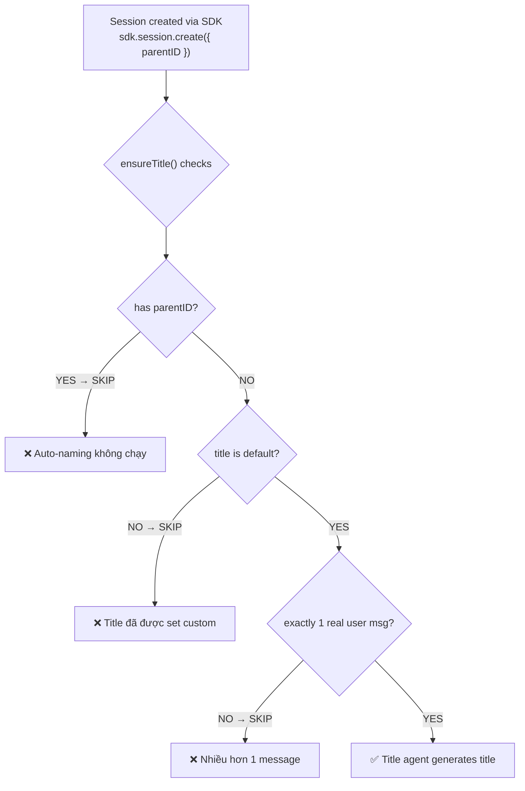

## USER (turn 1)

**source:** real-human

## Nghiên cứu và báo cáo các vấn đề sau liên quan trực tiếp tới các vấn đề sau

## Cần đọc các kiến thức sau

```markdown
/Users/apple/hivemind-plugin-private/.hivemind/registries
/Users/apple/hivemind-plugin-private/.planning/phases/23-notification-fix-and-tool-surface-docs/23-W4-SYNTHESIS.md
/Users/apple/hivemind-plugin-private/.planning/phases/23-notification-fix-and-tool-surface-docs/23-W3-SYNTHESIS.md
/Users/apple/hivemind-plugin-private/.planning/phases/23-notification-fix-and-tool-surface-docs/23-W2-SYNTHESIS.md
/Users/apple/hivemind-plugin-private/.planning/phases/23-notification-fix-and-tool-surface-docs/23-SYNTHESIS-REPORT-2026-05-23.md
/Users/apple/hivemind-plugin-private/.planning/phases/23-notification-fix-and-tool-surface-docs/23-GSD-workflow-pipeline-2026-05-23.md
/Users/apple/hivemind-plugin-private/.planning/phases/23-notification-fix-and-tool-surface-docs/23-GSD-sdk-surface-2026-05-23.md
/Users/apple/hivemind-plugin-private/.planning/phases/23-notification-fix-and-tool-surface-docs/23-GSD-REFERENCE-2026-05-23.md
/Users/apple/hivemind-plugin-private/.planning/phases/23-notification-fix-and-tool-surface-docs/23-GSD-quality-gates-2026-05-23.md
/Users/apple/hivemind-plugin-private/.planning/phases/23-notification-fix-and-tool-surface-docs/23-GSD-agent-architecture-2026-05-23.md
/Users/apple/hivemind-plugin-private/.planning/phases/23-notification-fix-and-tool-surface-docs/23-GSD-command-system-2026-05-23.md
/Users/apple/hivemind-plugin-private/.planning/phases/23-notification-fix-and-tool-surface-docs/23-DEBTS-REGISTER-2026-05-23.md
```

## Các repos để học hỏi

/Users/apple/hivemind-plugin-private/repo-for-learning-and-synthesis.md

## Các thiếu sót đang ghi nhận của hệ thống Hivemind vs. GSD vs. OMO

Hãy đối xử với các mục sau là một cluster rất lớn mà nhiều vấn đề con trong đó cần triển khai theo thứ tự và liên đới - ở phần này bạn chỉ cần đưa ra mapping cluster nào nên được sử lý trước  vì các vấn đề con bên trong tôi sẽ không liệt kê ra mà bạn phải biết được nó là gì qua cách sắp xếp toàn bộ phases qua ROADMAP và STATE

OVERVIEW results mong muốn cuối cùng: Hivemind là sự kết hợp mạnh mẽ khắc phục các điểm yếu của cả GSD và OMO tức là giữ được context intellgence qua các session dài, các command và workflows following strictly các giao thức spec-driven, research-driven, context-driven, dependencies , tech compliances,  patterns và feature completeness driven và test-driven với hệ thống quản lý state, roadmap, project, architecture  với các gatekeeping (quality, validation, verification và  tự động hoá etc nói chung adapt nâng cao các cho hệ thống agents vs subagent, commands, workflows, references và templates tương tự như GSD nhưng agents với các công cụ quản lý  task, context, hierarchy, tự động routing command và workflow manipulated qua skills và commands routing và điều phối agents quản lý context qua commits và delegation logics (task và delegate-task)  dựa trên sự học hỏi của OMO để đưa tính tự động này vào nhưng vẫn duy trì được sự collaboration với người dùng 

1. Hê thống routing thông qua commands và skills (sử dụng field subtask và agents ) để parse vs workflows, references, templates  và tự điều phối agents → tự động route workflows bài bản qua agents và subagents chúng ta vẫn chưa làm được do các điểm yếu sau
    1. Hoàn toàn thiếu commands, references và templates để parse tự động thiết lập các routing chặt chẽ
    2. thiếu looping được chia nhỏ hợp lý, có hệ thống thông qua việc hệ thống các artifacts documents → tưc agents khi tạo các artifacts trong planning, research, audit, gatekeeping quản lý code và project, requirements, dependencies thực hiện debug, review v..v… đều thiếu do việc các hệ thống tài liệu này chưa được quy định về quy cách, tính dependent, governance theo thứ tự thế nào. Ngay cả  naming các document này phải theo quy cách gì, yaml heading gồm các trường gì để chain và parse và khi nào tạo mới khi nào phải edit khi các documents và artifacts này đòi hỏi structured chặt chẽ để parse các context cần thiết - nên biết rằng context management cho workflow cho một session dài rất phức tạp
    3. hệ thống agents yếu kém chất lưượng và sự đồng nhất theo tôi qua cách hiện nay thay vì thiết lập permissions skills, custom tools ngay tại yaml của agents qua hm-* và l0, l1, l2, l3 hiện nay rất yếu kém và thiếu chủ động và không hề kiểm soát được qua các yếu tố sau
        1. agent context chỉ thiết lập ngay lần đầu profile nó sẽ prune  khi context kéo dài , qua turns và có compacts → các bước quy định looping hay gating , hierarchy, delegation logics, và checkpoints gay tại profile agents sẽ không hiệu quả ⇒ thay vào đó agent profile nên được thiết kế để nó hoàn thành chuyên môn của nó chứ không phải là nơi build logics looping hay logics check points và ngay cả logics hierarchy → 3 thứ trên phải được xây dựng trên programatic approaches mà tôi nó phụ thuộc rất lớn vào main front facing orchestrator - thứ logics duy nhất có thể build tại profile agents là logics switch agents và commands - wokrlfows (ví dụ như orchéstrator giao việc debug cho executor thì executor detect đó không phải specialist của mình thì switch qua debugger để tiếp tục) - các logics về naming, pathing, format về artifacts hoặc task công việc boundaries quy cách làm việc theo specialist cũng có thể quy định tại profile agents. Nhưng logics về  quy định looping hay gating , hierarchy, delegation logics, và checkpoints sẽ không hiệu quả → phát triển lại hệ thống agent này về quality as expert và như các điều nói trên và thin framing cho routing logics trong đó việc naming l0, l1, l2, l3 sẽ cơ cấu lại như sau (cho cả agents và skills nhưng với knowledge sau)
            1. bỏ đi l1 agent → l0 agent sẽ in charge frontfacing duy nhất
            2. các context về looping logics về  quy định looping hay gating , hierarchy, delegation logics, và checkpoints → sẽ phải absorb để đưa về các programatic features phía dưới (hoặc là programatic injections, hay các tools để điều phối task và coordination của l0 agent) và qua các primitives như command và skills
            3. agent mode thành “all” hết nhưng các agents không front facing sẽ bị hidden để nó chỉ có thể được call bở l0 agent
            4. các logic về  các logics về naming, pathing, format về artifacts hoặc task công việc boundaries quy cách làm việc theo specialist cũng có thể quy định tại profile agents - chú ý về việc agents đó phải làm việc gì tham khảo cách viết của GSD agents , tạo ra artifacts nào, control documents nào, dùng context nào, đọc context, execute việc gì đưa ra format ra sau etc đó là focus → nhóm l2 và l3 agent hoàn toàn phải làm lại hết vì thay vì l2 và l3 thì phải classify theo nhóm công việc trong một quy trình chặt chẽ của một dự án rất phức tạp với các yếu tố tôi nêu trên 
        2. Từ ý trên ta rõ ràng thấy rằng có các mảng chưa hoàn thành đã nói ở trên và đang sẵn có như session-tracker, delegation-status, coordination, agent-work-contract, injection, trajectory etc phải cần đuược thiết kế theo như trên để có thể làm được điều này
        3. và hệ thống planning và artìacts và documents cũng cần phải build theo structured output và schema bây giờ thống nhất là nó sẽ là .hivemind/planning/subdirs → nếu người dùng lựa chọn hivemind để xây dựng và một đường dẫn khác cho các framework khác nhưng thứ này phải được thiết lập dynamic qua user config plane
        4. tiếp theo là cách quản lý của chúng ta cho shipped-with primitives dạng assets đang hoàn toàn sai → tôi đề xuất nó phải quản lý qua schema và dạng code và được dụng tại assets/subdirs thay vì như bây giờ → và .opencode/subdirs hiện đang là symlinks cũng là sai nó phải là các file được trực tiếp extracted ra qua quy trình install của users và nên nhớ .opencode này lấy cả số ít và số nhiều cho agent(s), command(s) và skill(s) còn các primitives khác thì tôi không biết sao và phải nhớ rằng nó có cả global và project-based, và có cả cách dùng opencode.json để config các fields và primitives này và người dùng có thể có nhiều thứ khác từ các frameworks khác và hệ thống cả features lẫn tools hiện nay vẫn không dynamic nhận diện được nó một cách tự động và chủ động và nhất là permissions hiện nay rất conflicts cao độ

Vậy cuối cùng theo bạn thì chúng ta nên thực hiện các cluster nào theo thứ tự ra sao có cần thêm phase nào nữa vào đám sau đây không chúng ta đang ở phase 23.2 và có hơn 40+ phases vẫn chưa hoàn chỉnh của dự án này. 

### Tool: skill

**Input:**
```json
{
  "name": "hm-l3-research-chain"
}
```

**Output:** (pruned)
```
# Skill: hm-l3-research-chain
```


### Tool: skill

**Input:**
```json
{
  "name": "hm-l3-synthesis"
}
```

**Output:** (pruned)
```
# Skill: hm-l3-synthesis
```


### Tool: skill

**Input:**
```json
{
  "name": "hm-l2-feature-ecosystem"
}
```

**Output:** (pruned)
```
# Skill: hm-l2-feature-ecosystem
```


### Tool: read

**Input:**
```json
{
  "filePath": "/Users/apple/hivemind-plugin-private/.hivemind/registries"
}
```


### Tool: read

**Input:**
```json
{
  "filePath": "/Users/apple/hivemind-plugin-private/.planning/phases/23-notification-fix-and-tool-surface-docs/23-W4-SYNTHESIS.md"
}
```


### Tool: read

**Input:**
```json
{
  "filePath": "/Users/apple/hivemind-plugin-private/.planning/phases/23-notification-fix-and-tool-surface-docs/23-SYNTHESIS-REPORT-2026-05-23.md"
}
```


### Tool: read

**Input:**
```json
{
  "filePath": "/Users/apple/hivemind-plugin-private/repo-for-learning-and-synthesis.md"
}
```


### Tool: read

**Input:**
```json
{
  "filePath": "/Users/apple/hivemind-plugin-private/.planning/phases/23-notification-fix-and-tool-surface-docs/23-W2-SYNTHESIS.md"
}
```


### Tool: read

**Input:**
```json
{
  "filePath": "/Users/apple/hivemind-plugin-private/.planning/phases/23-notification-fix-and-tool-surface-docs/23-W3-SYNTHESIS.md"
}
```


### Tool: read

**Input:**
```json
{
  "filePath": "/Users/apple/hivemind-plugin-private/.planning/phases/23-notification-fix-and-tool-surface-docs/23-DEBTS-REGISTER-2026-05-23.md"
}
```


### Tool: read

**Input:**
```json
{
  "filePath": "/Users/apple/hivemind-plugin-private/.planning/phases/23-notification-fix-and-tool-surface-docs/23-GSD-REFERENCE-2026-05-23.md"
}
```


### Tool: read

**Input:**
```json
{
  "filePath": "/Users/apple/hivemind-plugin-private/.planning/phases/23-notification-fix-and-tool-surface-docs/23-GSD-workflow-pipeline-2026-05-23.md"
}
```


### Tool: read

**Input:**
```json
{
  "filePath": "/Users/apple/hivemind-plugin-private/.planning/phases/23-notification-fix-and-tool-surface-docs/23-GSD-sdk-surface-2026-05-23.md"
}
```


### Tool: read

**Input:**
```json
{
  "filePath": "/Users/apple/hivemind-plugin-private/.planning/phases/23-notification-fix-and-tool-surface-docs/23-GSD-quality-gates-2026-05-23.md"
}
```


### Tool: read

**Input:**
```json
{
  "filePath": "/Users/apple/hivemind-plugin-private/.planning/phases/23-notification-fix-and-tool-surface-docs/23-GSD-agent-architecture-2026-05-23.md"
}
```


### Tool: read

**Input:**
```json
{
  "filePath": "/Users/apple/hivemind-plugin-private/.planning/phases/23-notification-fix-and-tool-surface-docs/23-GSD-command-system-2026-05-23.md"
}
```


### Tool: glob

**Input:**
```json
{
  "callID": "call_00_bifVSOMZpJG205iRy2hk0083"
}
```


### Tool: glob

**Input:**
```json
{
  "callID": "call_01_hxw9wrmE7CLnbpBL6BiB2756"
}
```


### Tool: glob

**Input:**
```json
{
  "callID": "call_02_GT2yVxqahIGHOm83R0Ut2264"
}
```


### Tool: read

**Input:**
```json
{
  "filePath": "/Users/apple/hivemind-plugin-private/.planning/ROADMAP.md"
}
```


### Tool: read

**Input:**
```json
{
  "filePath": "/Users/apple/hivemind-plugin-private/.planning/STATE.md"
}
```


## USER (turn 2)

**source:** real-human

vậy @gsd-roadmapper và @gsd-advisor-researcher để đưa vào roadmap và state rồi tạo folders cho nó trước đi
 Use the above message and context to generate a prompt and call the task tool with subagent: gsd-roadmapper
 Use the above message and context to generate a prompt and call the task tool with subagent: gsd-advisor-researcher

### Tool: task

**Input:**
```json
{
  "description": "Research phase ordering advisability",
  "subagent_type": "gsd-advisor-researcher",
  "task_id": "ses_1a0d0e1ebffeT7lAsuRDHg61H8"
}
```

**Output:** (pruned)
```
task_id: ses_1a0d0e1ebffeT7lAsuRDHg61H8
```


## USER (turn 3)

**source:** real-human

rồi có phase nào để xây dựng commands, references, templates chưa đây cũng là  hệ thống để routing trực tiếp 

## USER (turn 4)

**source:** real-human

các primitives thêm nữa không thể chứa ở nơi cũ nữa nó phải được chueyern hoá thành schema và code để quản lý qua quy trình install .opencode là client-based không phải development

## USER (turn 5)

**source:** real-human

làm lại đọc kỹ và làm lại ## Nghiên cứu và báo cáo các vấn đề sau liên quan trực tiếp tới các vấn đề sau

## Cần đọc các kiến thức sau

```markdown
/Users/apple/hivemind-plugin-private/.hivemind/registries
/Users/apple/hivemind-plugin-private/.planning/phases/23-notification-fix-and-tool-surface-docs/23-W4-SYNTHESIS.md
/Users/apple/hivemind-plugin-private/.planning/phases/23-notification-fix-and-tool-surface-docs/23-W3-SYNTHESIS.md
/Users/apple/hivemind-plugin-private/.planning/phases/23-notification-fix-and-tool-surface-docs/23-W2-SYNTHESIS.md
/Users/apple/hivemind-plugin-private/.planning/phases/23-notification-fix-and-tool-surface-docs/23-SYNTHESIS-REPORT-2026-05-23.md
/Users/apple/hivemind-plugin-private/.planning/phases/23-notification-fix-and-tool-surface-docs/23-GSD-workflow-pipeline-2026-05-23.md
/Users/apple/hivemind-plugin-private/.planning/phases/23-notification-fix-and-tool-surface-docs/23-GSD-sdk-surface-2026-05-23.md
/Users/apple/hivemind-plugin-private/.planning/phases/23-notification-fix-and-tool-surface-docs/23-GSD-REFERENCE-2026-05-23.md
/Users/apple/hivemind-plugin-private/.planning/phases/23-notification-fix-and-tool-surface-docs/23-GSD-quality-gates-2026-05-23.md
/Users/apple/hivemind-plugin-private/.planning/phases/23-notification-fix-and-tool-surface-docs/23-GSD-agent-architecture-2026-05-23.md
/Users/apple/hivemind-plugin-private/.planning/phases/23-notification-fix-and-tool-surface-docs/23-GSD-command-system-2026-05-23.md
/Users/apple/hivemind-plugin-private/.planning/phases/23-notification-fix-and-tool-surface-docs/23-DEBTS-REGISTER-2026-05-23.md
```

## Các repos để học hỏi

/Users/apple/hivemind-plugin-private/repo-for-learning-and-synthesis.md

## Các thiếu sót đang ghi nhận của hệ thống Hivemind vs. GSD vs. OMO

Hãy đối xử với các mục sau là một cluster rất lớn mà nhiều vấn đề con trong đó cần triển khai theo thứ tự và liên đới - ở phần này bạn chỉ cần đưa ra mapping cluster nào nên được sử lý trước  vì các vấn đề con bên trong tôi sẽ không liệt kê ra mà bạn phải biết được nó là gì qua cách sắp xếp toàn bộ phases qua ROADMAP và STATE

OVERVIEW results mong muốn cuối cùng: Hivemind là sự kết hợp mạnh mẽ khắc phục các điểm yếu của cả GSD và OMO tức là giữ được context intellgence qua các session dài, các command và workflows following strictly các giao thức spec-driven, research-driven, context-driven, dependencies , tech compliances,  patterns và feature completeness driven và test-driven với hệ thống quản lý state, roadmap, project, architecture  với các gatekeeping (quality, validation, verification và  tự động hoá etc nói chung adapt nâng cao các cho hệ thống agents vs subagent, commands, workflows, references và templates tương tự như GSD nhưng agents với các công cụ quản lý  task, context, hierarchy, tự động routing command và workflow manipulated qua skills và commands routing và điều phối agents quản lý context qua commits và delegation logics (task và delegate-task)  dựa trên sự học hỏi của OMO để đưa tính tự động này vào nhưng vẫn duy trì được sự collaboration với người dùng 

1. Hê thống routing thông qua commands và skills (sử dụng field subtask và agents ) để parse vs workflows, references, templates  và tự điều phối agents → tự động route workflows bài bản qua agents và subagents chúng ta vẫn chưa làm được do các điểm yếu sau
    1. Hoàn toàn thiếu commands, references và templates để parse tự động thiết lập các routing chặt chẽ
    2. thiếu looping được chia nhỏ hợp lý, có hệ thống thông qua việc hệ thống các artifacts documents → tưc agents khi tạo các artifacts trong planning, research, audit, gatekeeping quản lý code và project, requirements, dependencies thực hiện debug, review v..v… đều thiếu do việc các hệ thống tài liệu này chưa được quy định về quy cách, tính dependent, governance theo thứ tự thế nào. Ngay cả  naming các document này phải theo quy cách gì, yaml heading gồm các trường gì để chain và parse và khi nào tạo mới khi nào phải edit khi các documents và artifacts này đòi hỏi structured chặt chẽ để parse các context cần thiết - nên biết rằng context management cho workflow cho một session dài rất phức tạp
    3. hệ thống agents yếu kém chất lưượng và sự đồng nhất theo tôi qua cách hiện nay thay vì thiết lập permissions skills, custom tools ngay tại yaml của agents qua hm-* và l0, l1, l2, l3 hiện nay rất yếu kém và thiếu chủ động và không hề kiểm soát được qua các yếu tố sau
        1. agent context chỉ thiết lập ngay lần đầu profile nó sẽ prune  khi context kéo dài , qua turns và có compacts → các bước quy định looping hay gating , hierarchy, delegation logics, và checkpoints gay tại profile agents sẽ không hiệu quả ⇒ thay vào đó agent profile nên được thiết kế để nó hoàn thành chuyên môn của nó chứ không phải là nơi build logics looping hay logics check points và ngay cả logics hierarchy → 3 thứ trên phải được xây dựng trên programatic approaches mà tôi nó phụ thuộc rất lớn vào main front facing orchestrator - thứ logics duy nhất có thể build tại profile agents là logics switch agents và commands - wokrlfows (ví dụ như orchéstrator giao việc debug cho executor thì executor detect đó không phải specialist của mình thì switch qua debugger để tiếp tục) - các logics về naming, pathing, format về artifacts hoặc task công việc boundaries quy cách làm việc theo specialist cũng có thể quy định tại profile agents. Nhưng logics về  quy định looping hay gating , hierarchy, delegation logics, và checkpoints sẽ không hiệu quả → phát triển lại hệ thống agent này về quality as expert và như các điều nói trên và thin framing cho routing logics trong đó việc naming l0, l1, l2, l3 sẽ cơ cấu lại như sau (cho cả agents và skills nhưng với knowledge sau)
            1. bỏ đi l1 agent → l0 agent sẽ in charge frontfacing duy nhất
            2. các context về looping logics về  quy định looping hay gating , hierarchy, delegation logics, và checkpoints → sẽ phải absorb để đưa về các programatic features phía dưới (hoặc là programatic injections, hay các tools để điều phối task và coordination của l0 agent) và qua các primitives như command và skills
            3. agent mode thành “all” hết nhưng các agents không front facing sẽ bị hidden để nó chỉ có thể được call bở l0 agent
            4. các logic về  các logics về naming, pathing, format về artifacts hoặc task công việc boundaries quy cách làm việc theo specialist cũng có thể quy định tại profile agents - chú ý về việc agents đó phải làm việc gì tham khảo cách viết của GSD agents , tạo ra artifacts nào, control documents nào, dùng context nào, đọc context, execute việc gì đưa ra format ra sau etc đó là focus → nhóm l2 và l3 agent hoàn toàn phải làm lại hết vì thay vì l2 và l3 thì phải classify theo nhóm công việc trong một quy trình chặt chẽ của một dự án rất phức tạp với các yếu tố tôi nêu trên 
        2. Từ ý trên ta rõ ràng thấy rằng có các mảng chưa hoàn thành đã nói ở trên và đang sẵn có như session-tracker, delegation-status, coordination, agent-work-contract, injection, trajectory etc phải cần đuược thiết kế theo như trên để có thể làm được điều này
        3. và hệ thống planning và artìacts và documents cũng cần phải build theo structured output và schema bây giờ thống nhất là nó sẽ là .hivemind/planning/subdirs → nếu người dùng lựa chọn hivemind để xây dựng và một đường dẫn khác cho các framework khác nhưng thứ này phải được thiết lập dynamic qua user config plane
        4. tiếp theo là cách quản lý của chúng ta cho shipped-with primitives dạng assets đang hoàn toàn sai → tôi đề xuất nó phải quản lý qua schema và dạng code và được dụng tại assets/subdirs thay vì như bây giờ → và .opencode/subdirs hiện đang là symlinks cũng là sai nó phải là các file được trực tiếp extracted ra qua quy trình install của users và nên nhớ .opencode này lấy cả số ít và số nhiều cho agent(s), command(s) và skill(s) còn các primitives khác thì tôi không biết sao và phải nhớ rằng nó có cả global và project-based, và có cả cách dùng opencode.json để config các fields và primitives này và người dùng có thể có nhiều thứ khác từ các frameworks khác và hệ thống cả features lẫn tools hiện nay vẫn không dynamic nhận diện được nó một cách tự động và chủ động và nhất là permissions hiện nay rất conflicts cao độ

Vậy cuối cùng theo bạn thì chúng ta nên thực hiện các cluster nào theo thứ tự ra sao có cần thêm phase nào nữa vào đám sau đây không chúng ta đang ở phase 23.2 và có hơn 40+ phases vẫn chưa hoàn chỉnh của dự án này. 

## USER (turn 6)

**source:** real-human

nghiên cứu thực tế hiện trạng bây giờ 

## USER (turn 7)

**source:** real-human

expand thêmcác  phase 24.x

## USER (turn 8)

**source:** real-human

nó liên hệ trực tiếp tới cả một routing và governance plane bắt nguồn từ việc thiết lập band dầu của users

### Tool: task

**Input:**
```json
{
  "description": "Update roadmap with new phases",
  "subagent_type": "gsd-roadmapper",
  "task_id": "ses_1a0d10e43ffeGaSQ98opwphoff"
}
```

**Output:** (pruned)
```
task_id: ses_1a0d10e43ffeGaSQ98opwphoff
```


## USER (turn 9)

**source:** real-human

nó liên hệ trực tiếp tới cả một routing và governance plane bắt nguồn từ việc thiết lập band dầu của users

### Tool: read

**Input:**
```json
{
  "filePath": "/Users/apple/hivemind-plugin-private/.planning/phases/23-notification-fix-and-tool-surface-docs/23-GSD-command-system-2026-05-23.md"
}
```


### Tool: read

**Input:**
```json
{
  "filePath": "/Users/apple/hivemind-plugin-private/.planning/phases/23-notification-fix-and-tool-surface-docs/23-GSD-workflow-pipeline-2026-05-23.md"
}
```


### Tool: read

**Input:**
```json
{
  "filePath": "/Users/apple/hivemind-plugin-private/repo-for-learning-and-synthesis.md"
}
```


### Tool: read

**Input:**
```json
{
  "filePath": "/Users/apple/hivemind-plugin-private/.planning/ROADMAP.md"
}
```


### Tool: glob

**Input:**
```json
{
  "callID": "call_02_MCGu825YH3hxfgnKZndy1590"
}
```


### Tool: glob

**Input:**
```json
{
  "callID": "call_01_C1V4FvtLDDHJfwIukvAW4998"
}
```


### Tool: glob

**Input:**
```json
{
  "callID": "call_00_86dW4TrSq4Zr15G3RURY9105"
}
```


### Tool: glob

**Input:**
```json
{
  "callID": "call_01_fde7tkXdnKWMIhtzPgxR5609"
}
```


### Tool: glob

**Input:**
```json
{
  "callID": "call_02_bi5YO3zhWUH3dCEmNdLV3299"
}
```


### Tool: glob

**Input:**
```json
{
  "callID": "call_03_ku5CApqtiwCenFWHMeG48674"
}
```


### Tool: glob

**Input:**
```json
{
  "callID": "call_00_T96tZP2VIZpJCWuLvu6q8082"
}
```


### Tool: glob

**Input:**
```json
{
  "callID": "call_01_pgj4axJFl4jzgO89sU9C1135"
}
```


### Tool: read

**Input:**
```json
{
  "filePath": "/Users/apple/hivemind-plugin-private/.opencode"
}
```


### Tool: glob

**Input:**
```json
{
  "callID": "call_00_wH3JHOr7fTHs23baGQVj0048"
}
```


### Tool: read

**Input:**
```json
{
  "filePath": "/Users/apple/hivemind-plugin-private/.opencode/commands"
}
```


### Tool: read

**Input:**
```json
{
  "filePath": "/Users/apple/hivemind-plugin-private/.hivefiver-meta-builder/commands-lab"
}
```


## USER (turn 10)

**source:** real-human

route và cập nhật và thêm folders tương ứng

### Tool: task

**Input:**
```json
{
  "description": "Update roadmap with all new phases",
  "subagent_type": "gsd-roadmapper",
  "task_id": "ses_1a0c951f2ffevfp0ejkEMTI7xf"
}
```

**Output:** (pruned)
```
task_id: ses_1a0c951f2ffevfp0ejkEMTI7xf
```


## USER (turn 11)

**source:** real-human

để hoàn thành mục tiêu này 

```markdown
OVERVIEW results mong muốn cuối cùng: Hivemind là sự kết hợp mạnh mẽ khắc phục các điểm yếu của cả GSD và OMO tức là giữ được context intellgence qua các session dài, các command và workflows following strictly các giao thức spec-driven, research-driven, context-driven, dependencies , tech compliances,  patterns và feature completeness driven và test-driven với hệ thống quản lý state, roadmap, project, architecture  với các gatekeeping (quality, validation, verification và  tự động hoá etc nói chung adapt nâng cao các cho hệ thống agents vs subagent, commands, workflows, references và templates tương tự như GSD nhưng agents với các công cụ quản lý  task, context, hierarchy, tự động routing command và workflow manipulated qua skills và commands routing và điều phối agents quản lý context qua commits và delegation logics (task và delegate-task)  dựa trên sự học hỏi của OMO để đưa tính tự động này vào nhưng vẫn duy trì được sự collaboration với người dùng 
```

Thì việc can thiệp sâu vào governance routing (phụ thuộc vào các cluster như governance config ban đầu của user tại .hivemind/config.json và các cluster như trajectory và agent-work-contract và injection và task managements etc đều cần phải thiết kế lại.) Nhưng một yếu tố mang tính kỹ thuật cần được nghiên cứu xem để agent có thể programmatically và deterministically qua tools hoặc các features có thể làm được điều này hay không

Khi user config họ muốn full-scale governance và agent-advisor tự động tức agent sẽ phải tự biết được giới hạn, biết được dependencies tự lập contract và trajectory để từ đó một session sẽ chỉ cover những luồng công việc được lên kế hoạch trước 

- Orchestrator Agent làm chủ để route đúng workflows thực hiện governance thay cho người dùng xác định đúng được workflows, routing và governance và checkpoints để điều phối các luồng con và xác định chuyển hướng nếu workflow mà users đề nghị đó không an toàn để thực hiện mà những workflows trước đó hay gatekeeping và dependent tasks trước đó cần phải làm và xác nhận ghi lên disk trước khi workflow dự định được thi hành → cơ chế cần ở đây là agent tự tạo một session mới (main session) và tạo prompt tại session mới đó với agent đề xuất để chạy → điều này liên quan tới interface tạo session và TUI main session sẽ được tạo một cách programatic và đưa người dùng tới ngay session mới đó mà họ không phải làm một cách thủ công. Tôi không biết SDK của OpenCode và Plugins SDK của nó có thể làm được điều này không hãy nghiên cứu và nếu được tôi cần triển khai một prototype để xem nó hoạt động được hay không trước khi kết nối nó vào đúng cluster feature của nó 

### Tool: read

**Input:**
```json
{
  "filePath": "/Users/apple/hivemind-plugin-private/package.json"
}
```


### Tool: read

**Input:**
```json
{
  "filePath": "/Users/apple/hivemind-plugin-private/.hivemind/STACKS-REFERENCES.md"
}
```


### Tool: deepwiki_read_wiki_structure

**Input:**
```json
{
  "callID": "call_01_xZWvFNnyai828iJhkyNG6295"
}
```


### Tool: context7_resolve-library-id

**Input:**
```json
{
  "callID": "call_00_8xuj4YLrWM0EaDZaGfI75375"
}
```


### Tool: context7_query-docs

**Input:**
```json
{
  "callID": "call_00_FaR3YubaO06P4iHXI1MR2000"
}
```


### Tool: deepwiki_ask_question

**Input:**
```json
{
  "callID": "call_01_IRQTCqIj1TeQEsf4PWPP3140"
}
```


### Tool: context7_query-docs

**Input:**
```json
{
  "callID": "call_01_iAZZAeUUfyFeTctA21tf9803"
}
```


### Tool: deepwiki_ask_question

**Input:**
```json
{
  "callID": "call_00_AzAXZJx9Yc6LXC7qsEcq3500"
}
```


### Tool: read

**Input:**
```json
{
  "filePath": "/Users/apple/hivemind-plugin-private/src/plugin.ts"
}
```


### Tool: read

**Input:**
```json
{
  "filePath": "/Users/apple/hivemind-plugin-private/src/shared/session-api.ts"
}
```


### Tool: deepwiki_ask_question

**Input:**
```json
{
  "callID": "call_01_l4nNiWnhLx6XBNrXSHGB9111"
}
```


## ASSISTANT (turn 1)

Đã research đầy đủ. Đây là kết quả:

## OpenCode SDK — Khả Năng Programmatic Session

### ✅ CÓ THỂ LÀM ĐƯỢC

| Khả năng | API | Đã dùng chưa? |
|----------|-----|---------------|
| **Tạo session** | `sdk.session.create({ agent, model, parentID, title })` | Có (`session-api.ts:44`) |
| **Tạo child session** | `parentID` param trong create | Có (delegation wiring) |
| **Fork session tại message point** | `sdk.session.fork({ sessionID, messageID })` | Chưa |
| **Prompt session** | `sdk.session.prompt({ sessionID, parts, agent, noReply })` | Có (`session-api.ts:146`) |
| **Silent inject (no reply)** | `noReply: true` | Có (notification router) |
| **Async prompt (fire-and-forget)** | `sdk.session.promptAsync()` | Có (`session-api.ts:188`) |
| **Inject TUI message** | `sdk.tui.appendPrompt({ text })` | Có (`session-api.ts:209`) |
| **Show toast notification** | `sdk.tui.showToast({ message, variant })` | Có (`session-api.ts:227`) |
| **Kiểm tra session status** | `sdk.session.status()` | Có (`session-api.ts:66`) |
| **Abort session** | `sdk.session.abort({ sessionID })` | Có (`session-api.ts:74`) |
| **Get session messages** | `sdk.session.messages({ sessionID })` | Có (`session-api.ts:79`) |

### ❌ KHÔNG THỂ (cần workaround)

| Không thể | Lý do | Workaround |
|-----------|-------|------------|
| **Redirect user sang session khác** | Không có API "switch TUI focus" | `appendTuiPrompt` + `showToast` báo user tự switch, hoặc agent chạy background session và report về main |
| **Tạo main session từ plugin** | Plugin chạy trong context của OpenCode, không thể tạo main session mới cho user | Tạo child session có agent override |

### Kiến Trúc Prototype Đề Xuất

```
Agent A (main session)
  │
  ├─ Custom tool: "governance-create-session"
  │   ├─ sdk.session.create({ agent: "governance-agent", parentID: mainSessionId })
  │   ├─ sdk.session.prompt({ sessionID: newSessionId, parts: [work brief] })
  │   └─ showToast("Governance session created: ses_xxx")
  │
  ├─ Governance Agent chạy trong child session
  │   ├─ Tự động verify dependencies, gatekeeping
  │   ├─ Lập contract và trajectory
  │   ├─ Tạo các task con → delegate cho specialist agents
  │   └─ Report kết quả về main session
  │
  └─ Fork + aggregate khi hoàn thành
      ├─ sdk.session.fork({ sessionID: govSessionId, messageID })
      └─ sdk.session.prompt({ sessionID: mainSessionId, parts: [summary] })
```

### Code Prototype (Custom Tool)

```typescript
// src/features/governance-engine/create-governance-session.ts
import { tool } from "@opencode-ai/plugin"
import { z } from "zod"

export const createGovernanceSessionTool = tool({
  description: "Create a new governance-routed session with a specialist agent",
  args: {
    agent: z.string().describe("Agent name to run the session"),
    brief: z.string().describe("Work brief for the new session"),
    model: z.string().optional().describe("Model override"),
  },
  async execute(args, context) {
    const { client } = context
    // 1. Create child session with governance agent
    const newSession = await client.session.create({
      body: { 
        agent: args.agent,
        title: `Governance: ${args.brief.slice(0, 60)}`,
        parentID: context.sessionID 
      }
    })
    // 2. Prompt the session with work
    await client.session.promptAsync({
      path: { id: newSession.data.id },
      body: { parts: [{ type: "text", text: args.brief }] }
    })
    // 3. Notify user via TUI
    await client.tui.showToast({
      body: { 
        message: `Governance session created: ${newSession.data.id}`,
        variant: "info" 
      }
    })
    return { sessionID: newSession.data.id }
  }
})
```

### Kết Luận

**Kỹ thuật khả thi.** OpenCode SDK cung cấp đầy đủ API để agent tự động tạo session, prompt background work, inject TUI, fork, và aggregate. Plugin đã có `session-api.ts` wrapper cho hầu hết APIs.

**Giới hạn duy nhất:** Không thể tự động chuyển user sang session khác. Nhưng workflow có thể thiết kế để governance agent chạy background + report về main session — user chỉ cần switch khi cần can thiệp thủ công.

Muốn tôi build prototype tool này và test với `npx vitest run` để verify feasibility? Nếu OK, nó sẽ thuộc Cluster D (Runtime Features) — có thể là P24 hoặc phase mới `P24.x-governance-engine`.

## USER (turn 12)

**source:** real-human

vậy cần cơ chế để last message của front-facing agent sẽ append nội dung và ứng dụng commit của git để ghi nhớ context sau đó yêu cầu user switch tới session đó? Nhưng hiện nay tôi không hiểu sao hệ thống naming tự động của session không chyaj nữa tìm hiểu thêm  về hệ thống này để cơ cấu hoá naming của session theo đúng với các tieu chuẩn framework của chúng ta -  để khi đó agent có thể output như " hãy chuyển tới session "naming of the session, meta, meta,ses_id  etc" để hoàn thành trước khi quay lại "naming of the current session, meta, meta, ses_id  etc" đại loại như thế . Tôi nhớ OpenCode có cơ chế naming nay nhưng ko hiểu sao giờ nó mất và nêu có can thiệp thế nào. Tôi muốn triển khai prototype phía trên đưa nó vào đúng phase của nó theo roadmap và state hiện thời luôn theo bạn nó thuộc cluster nào

### Tool: deepwiki_read_wiki_contents

**Input:**
```json
{
  "callID": "call_01_skNPGjl1z3qlKwWw2flC1212"
}
```


### Tool: task

**Input:**
```json
{
  "description": "Research OpenCode session naming system",
  "subagent_type": "general",
  "task_id": "ses_1a09321d1ffelElKxFaU7vyQ1m"
}
```

**Output:** (pruned)
```
task_id: ses_1a09321d1ffelElKxFaU7vyQ1m
```


### Tool: read

**Input:**
```json
{
  "filePath": "/Users/apple/hivemind-plugin-private/src/tools/hivemind/session-tracker.ts"
}
```


### Tool: deepwiki_ask_question

**Input:**
```json
{
  "callID": "call_01_DxRMOKygUUdmkPR8RAFC2701"
}
```


## ASSISTANT (turn 2)

Đã hiểu rõ toàn bộ cơ chế. Đây là tổng hợp và đề xuất:

## OpenCode Session Naming — Nguyên Nhân "Ngừng Chạy"



**Nguyên nhân:** Khi tạo child session với `parentID` (như Hivemind làm trong delegation), `ensureTitle()` ở `session/prompt.ts:ensureTitle` **return early** vì dòng:

```typescript
if (session.parentID || !Session.isDefaultTitle(session)) return
```

**Giải pháp:** Set title **explicitly** khi tạo session:

```typescript
sdk.session.create({
  body: {
    title: "governance: verify-dependencies-for-feature-x", // ← Set ngay
    parentID: mainSessionId,
    agent: "governance-agent"
  }
})
```

## Flow Governance Session Hoàn Chỉnh

```
┌─ Front-facing Agent ──────────────────────────────┐
│  1. Phân tích user request → cần governance flow   │
│  2. Append last message content vào TUI            │
│     (sdk.tui.appendPrompt + showToast)             │
│  3. Git commit để persist context                  │
│     ({phase}: governance handoff — why)            │
│  4. Tạo session mới với naming chuẩn               │
│     sdk.session.create({                           │
│       title: "hm-governance:verify-deps-P24.3",    │
│       agent: "governance-agent",                   │
│       parentID: <currentSessionId>                 │
│     })                                             │
│  5. Output cho user:                               │
│     "Hãy chuyển tới session 'hm-governance:verify- │
│      deps-P24.3, P24.3 phase, ses_xxx' để hoàn     │
│      thành trước khi quay lại 'main-workflow,      │
│      Phase 23, ses_yyy'"                           │
└────────────────────────────────────────────────────┘
```

## Prototype — Thuộc Phase Nào?

Prototype này xác thực feasibility và kết nối 3 cluster lại với nhau:

| Thành phần | Cluster | Phase |
|------------|---------|-------|
| `sdk.session.create` + `tui.appendPrompt` | **D** (Runtime) | Đã có sẵn trong `session-api.ts` |
| Custom session naming convention | **B** (Artifact) | P26.1 (naming convention) |
| Governance routing logic | **C** (Routing) | P24.3 (commands infrastructure) |
| Tool wrapper cho agent | **C** (Routing) | P24.6 (build hm-* commands) |

**Đề xuất: Tạo phase mới: `P24.3.1-governance-session-prototype`** — là sub-phase của P24.3, chạy NGAY, để xác thực kỹ thuật trước khi đầu tư vào infrastructure lớn. Nếu prototype pass, nó validate toàn bộ Cluster C design.

Nội dung prototype:
1. Custom tool: `create-governance-session` với Zod schema
2. Auto-naming: set title explicit + format `hm-governance:<workflow>-<context>`
3. TUI notification: toast + appendPrompt
4. Git commit: atomic commit của context hiện tại
5. User instruction: output format "chuyển tới session X để hoàn thành..."

Muốn tôi build prototype này ngay?

## USER (turn 13)

**source:** real-human

ok route cho @gsd-roadmapper rồi sau đó tạo context và route @gsd-phase-researcher rồi tạo @.opencode/command/gsd-spec-phase.md  và tiếp theo đó mới @gsd-planner 
 Use the above message and context to generate a prompt and call the task tool with subagent: gsd-roadmapper
 Use the above message and context to generate a prompt and call the task tool with subagent: gsd-phase-researcher
Called the Read tool with the following input: {"filePath":"/Users/apple/hivemind-plugin-private/.opencode/command/gsd-spec-phase.md"}
<path>/Users/apple/hivemind-plugin-private/.opencode/command/gsd-spec-phase.md</path>
<type>file</type>
<content>
1: ---
2: description: Clarify WHAT a phase delivers with ambiguity scoring; produces a SPEC.md before discuss-phase.
3: argument-hint: "<phase> [--auto] [--text]"
4: tools:
5:   read: true
6:   write: true
7:   bash: true
8:   glob: true
9:   grep: true
10:   question: true
11: ---
12: 
13: <objective>
14: Clarify phase requirements through structured Socratic questioning with quantitative ambiguity scoring.
15: 
16: **Position in workflow:** `spec-phase → discuss-phase → plan-phase → execute-phase → verify`
17: 
18: **How it works:**
19: 1. Load phase context (PROJECT.md, REQUIREMENTS.md, ROADMAP.md, STATE.md)
20: 2. Scout the codebase — understand current state before asking questions
21: 3. Run Socratic interview loop (up to 6 rounds, rotating perspectives)
22: 4. Score ambiguity across 4 weighted dimensions after each round
23: 5. Gate: ambiguity ≤ 0.20 AND all dimensions meet minimums → write SPEC.md
24: 6. Commit SPEC.md — discuss-phase picks it up automatically on next run
25: 
26: **Output:** `{phase_dir}/{padded_phase}-SPEC.md` — falsifiable requirements that lock "what/why" before discuss-phase handles "how"
27: </objective>
28: 
29: <execution_context>
30: @/Users/apple/hivemind-plugin-private/.opencode/get-shit-done/workflows/spec-phase.md
31: @/Users/apple/hivemind-plugin-private/.opencode/get-shit-done/templates/spec.md
32: </execution_context>
33: 
34: <runtime_note>
35: **Copilot (VS Code):** Use `vscode_askquestions` wherever this workflow calls `question`. They are equivalent.
36: </runtime_note>
37: 
38: <context>
39: Phase number: $ARGUMENTS (required)
40: 
41: **Flags:**
42: - `--auto` — Skip interactive questions; the agent selects recommended defaults and writes SPEC.md
43: - `--text` — Use plain-text numbered lists instead of TUI menus (required for `/rc` remote sessions)
44: 
45: Context files are resolved in-workflow using `init phase-op`.
46: </context>
47: 
48: <process>
49: Execute end-to-end.
50: 
51: **MANDATORY:** Read the workflow file BEFORE taking any action. The workflow contains the complete step-by-step process including the Socratic interview loop, ambiguity scoring gate, and SPEC.md generation. Do not improvise from the objective summary above.
52: </process>
53: 
54: <success_criteria>
55: - Codebase scouted for current state before questioning begins
56: - All 4 ambiguity dimensions scored after each interview round
57: - Gate passed: ambiguity ≤ 0.20 AND all dimension minimums met
58: - SPEC.md written with falsifiable requirements, explicit boundaries, and acceptance criteria
59: - SPEC.md committed atomically
60: - User knows they can now run /gsd-discuss-phase which will load SPEC.md automatically
61: </success_criteria>

(End of file - total 61 lines)
</content>

<system-reminder>
Instructions from: /Users/apple/hivemind-plugin-private/.opencode/AGENTS.md
# Soft Meta-Concept Sector Guidance


## NON-NEGOTIABLE RULES

- all tech, stack, SDK implementation, audit, gatekeeping  must follow deep investigation - stack research ;skills are for references not for interfaces validation; "interfaces, patterns, methods, api, signatures of specs etc" must validate against the correct versions at package.json - **MUST VALIDATE AGAINST ONLINE RESOURCES AS FOR MCP SERVER TOOLS ACTUAL FETCH** - valid and evidences with Context7, Deepwiki, Gitmcp, Github repo, Exa **AND Repomix for accurate specific patterns** etc, official - loading references from skills of stacks are outdated, as so reading code in the codebase can be polluted as many implementations are not functioning and broken. DO NOT MAKE ASSUMPTIONS OF THE STACK REPO LINKs - **EXTREMELY IMPORNTANT:** Uses of Context7, Deepwiki, Gitmcp, Github, Exa, Repomix are enforced when researching, planning, and implementing - these MUST Comply with all the **Github and Npm links that up-to-date with versiosn and NOT A PRODUCT OF MAKING UP LINKS** >  glob, list this to check these links `.hivemind/STACKS-REFERENCES.md`

- any thing under .opencode/ are not shipped-with, they are symlinks or project toolings 

- all orchestrator, coordinator, conductor agents belonging to l0, and l1 classifications MUST FOCUS ON THE DELEGATIONS - NEVER Implement the tasks yourself - when delegating DO NOT SHOW THE SPECIALIST WHAT AND HOW TO IMPLEMENT - Show HOW TO PROCESS, WHAT TO EXPECT AS RESULTS, SETTING CONSTRAINTS AND BOUNDARIES, INDICATION OF CLEAR SUCCESS METRICS

- design patterns and must be obeyed strictly according to the architecture of the project.

- atomic git commit for context preservation.

- context git commit for both code implementation, docs, planning, researching, gatekeeping, verification artifacts - do not ask if commit needed

- AGENTS.md must be routinely updated - after each cycle, each batch of implementation.

- AGENTS.md are nested under dirs and subdirs, beware when maintaining them.

- files creation and structure must be registered and keep track - we love our codetree systematically structured and we **DO Registered** folders and subfolders with `.gitkeep` 

- folders must be created in a way that is easy to navigate and understand, following the best practice of this harness. Folders must be registered with gitkeep files to ensure they are tracked by git. 

- code file must JSDOC (Run JSDOC skill) documented with clear descriptions, parameters, return values, and examples. All functions and classes must be documented.

- The front facing agents must process high-level workflows, validate dependencies of tasks across sessions through faces

- The front facing agents must delegate to suagents of specialist; front facing agents are not allowed to execute any tasks

- The front facing agents are ones converse with USERS and must know the high-level tasks flow, following strict validations, gatekeeping, and coordination of the partificating frameworks

- When delegating to agents these are the list of agents that must learn and delegate to the correct ones. When delegate to subagents make sure setting up strict guardrails, boundaries, success metrics, making sure they are awared that they are subagents and fulfill the tasked within boundaries and without any deviation ans seriously go through gatekeeping.

<!-- NOTE: explore agent is MISSING from the filesystem -->

- For effective session-resume delegation (when user disconnected and there were previous aborted delegation tasks). Do not start new delegation, start the same start with **THE EXACT SESSION ID** to resume.

- **DELEGATION STACKING — attach work onto ANY existing session:** Both `task` and `delegate-task` support attaching new work as a child of a completed main session — NOT just resuming aborted tasks. Pattern: pass the existing session ID directly.
  - **`task` tool:** set `task_id` parameter to any existing session ID (not just a previous task_id from task tool). The new subagent attaches as a child of that session.
  - **`delegate-task` tool:** pass `context` as JSON: `{"parentSessionId": "<session-id>"}`. The new delegation attaches as a child of that session.
  - Do NOT inject the session ID into the prompt text — that creates a new independent session. The correct approach is passing it as a parameter so OpenCode's hierarchy tracking properly chains the sessions.
  - **Prompt stays simple** — context from the target session is preserved through the session chain. No need to re-describe old work in the prompt. This is the same principle as `subagent_type`/`agent` parameter: you specify the agent name to select the handler, you specify `task_id`/`parentSessionId` to select the session to attach to.
  - This pattern covers BOTH use cases: **resume** (incomplete session) and **stack-on** (completed session to add new work as a child).

- The front facing agents must keep track, monitor, make sure not a single validation, verification, review steps are skips, planning , audit and verification must following format of the participated framework with honest verification and prevention of regressions. 

- **all agents** at every turn (after PER USER's prompt, **even mid-session**, after each turn), entries, shift of workflows there should be matching SKILLS that you must load, load and reload of suitable skills for the task, select ones with framework consistencies. Do not miss loading SKILLS. SKILLS are extremely important


- - **all agents** : do not confuse between the project as the harness which you are building so that users can run it with OpenCode under their projects VS. your environment of works -> meaning there are assumptions that ARE NOT ALLOWED to interprete as this sole environment but must be as wider scopes, in terms of how different projects' states, tasks types, langues, frameworks and use cases.
---
**Evidence level:** L5 documentation guidance only. This file does not prove runtime readiness; runtime claims require L1-L3 proof from authorized verification workflows.

Source architecture: `.planning/architecture/hivemind-source-plane-architecture-2026-05-07.md` — `.opencode/` is the Soft Meta-Concepts sector: OpenCode primitives (agents, commands, skills, rules, permissions) ONLY. No runtime state. No development implementation.

## 1. Sector purpose and lifecycle role

`.opencode/` is the Soft Meta-Concept sector: OpenCode primitives, rules, plugin loader wrappers, commands, skills, agents, permissions, and project configuration that compose runtime behavior from outside the npm package source. Source evidence: `.planning/codebase/ARCHITECTURE.md:209-245`, `.planning/codebase/STRUCTURE.md:124-129`.

Source evidence: `.planning/architecture/hivemind-runtime-identity-taxonomy-2026-05-07.md` — hm/hf/gate/stack/gsd lineages, L0-L3 hierarchy contract. `.planning/codebase/ARCHITECTURE.md:209-245` — Soft Meta-Concept layer.

## 2. Allowed mutation authority

- Agents, skills, commands, rules, permissions, and OpenCode config may be created or updated here when explicitly authorized by a meta-concept workflow.
- `.opencode/plugins/` may contain thin plugin loader wrappers that point OpenCode at built harness plugin entrypoints. Evidence: `.planning/codebase/STRUCTURE.md:157-164`.
- Primitive/config changes must preserve hm/hf/gate/stack lineage conventions and the L0→L3 delegation hierarchy. Evidence: `.planning/codebase/ARCHITECTURE.md:217-245`, `.planning/codebase/STRUCTURE.md:197-216`.
- Closest-sector deviation: no `src/config/` folder is created for primitive/config boundary guidance; this sector owns soft primitive/config placement while runtime config consumers remain in `src/`.

## 3. Forbidden mutations / explicit no-go boundaries

- `.opencode/` SHALL NOT store internal runtime state; `.hivemind/` is canonical state root. Evidence: `.planning/codebase/ARCHITECTURE.md:247-255`, `.planning/codebase/STRUCTURE.md:124-134`.
- `.opencode/` SHALL NOT be treated as development implementation, source code, or build output. It is exclusively for OpenCode primitives (agents, commands, skills, rules, permissions) that configure runtime behavior.
- `.opencode/` SHALL NOT contain business logic, state persistence, compiled code, or npm package source — those belong in `src/` (Hard Harness) and `.hivemind/` (Internal State).
- `.opencode/state/` is legacy migration-only and must not receive new internal state ownership. Evidence: `.planning/codebase/STRUCTURE.md:295-299`.
- Do not blur hm/hf/gate/stack lineages or ship gsd-* internal developer tooling as product primitives. Evidence: `.planning/codebase/ARCHITECTURE.md:217-233`, `.planning/codebase/STRUCTURE.md:209-216`.
- Do not edit runtime TypeScript implementation here; runtime source authority remains in `src/`.

## 4. Actors and consumers

| Actor / consumer | Uses this sector for | Boundary |
|---|---|---|
| OpenCode runtime | Discovers project config, plugin loader, commands, agents, skills, and rules | Runtime state still belongs in `.hivemind/` |
| hm-* lineage agents/skills | Product-dev workflows and specialists | STRICT lineage; no hf-* skill loading by hm-* unless explicitly routed |
| hf-* lineage agents/skills | Meta-concept authoring/building | May modify primitives only under meta-builder authorization |
| gate-* skills | Internal quality gate triad | Project-only quality gates, not shipped as generic product claims |
| stack-* skills | Framework/reference knowledge | Reference only, not implementation authority |
| `src/` Hard Harness tools | Configured through `.opencode/` primitives (agents call tools, commands route to agents) | Never imports from `.opencode/` — reads only through OpenCode SDK |

## 5. Naming and placement conventions

- Agent files use `hm-*`, `hf-*`, or `gsd-*` prefixes according to lineage; skills use `hm-*`, `hf-*`, `gate-*`, `stack-*`, or `gsd-*` prefixes. Evidence: `.planning/codebase/STRUCTURE.md:197-216`.
- Runtime skill location is `.opencode/skills/`; meta-builder source-of-truth is `.hivefiver-meta-builder/skills-lab/` and reflected to `.opencode/skills/`. Evidence: `.planning/codebase/ARCHITECTURE.md:209-215`.
- New agents, skills, and commands should originate from the meta-builder source areas before reflection to `.opencode/`. Evidence: `.planning/codebase/STRUCTURE.md:241-254`.
- Commands use OpenCode command files under `.opencode/commands/`; do not invent parallel command roots.

## 6. Quality gates and evidence expectations

- Primitive changes require discoverability validation, lineage validation, and restart/compile checks when applicable; docs-only edits here are not runtime proof.
- Do not claim permission enforcement, registry completeness, or runtime routing readiness when requirements still mark them missing/partial. Evidence: `.planning/REQUIREMENTS.md:42-56`, `.planning/PROJECT.md:29-42`.
- O3 docs-only guidance remains L5 evidence and cannot change runtime readiness. Evidence: `.planning/ROADMAP.md:47-49`.

## 7. Cross-sector alignment

- **Hard Harness (`src/`):** Runtime implementation. Compiles to dist/. Calls OpenCode SDK. Does not depend on `.opencode/` at build time.
- **Internal State (`.hivemind/`):** Durable persistence. Owned by `src/` modules through tool/hook CQRS boundaries. Canonical per Q6.
- **Meta-Authoring (`.hivefiver-meta-builder/`):** Source-of-truth for primitive authoring. Reflected to `.opencode/` via symlink or sync.
- **Governance (`.planning/`):** Documents architecture, provides phase authorization. Does not mutate `.opencode/`.
- **OMO Adaptation:** Per `.planning/research/omo-adaptation-architecture-2026-05-07.md`, OMO folder roots (`.sisyphus`, `.omx`) are REJECTED; `.opencode/` remains primitives-only.

</system-reminder>
 Use the above message and context to generate a prompt and call the task tool with subagent: gsd-planner

### Tool: task

**Input:**
```json
{
  "description": "Update roadmap with P24.3.1 phase",
  "subagent_type": "gsd-roadmapper",
  "task_id": "ses_1a08dc14dffeR6NPqsIGVv0Wpb"
}
```

**Output:** (pruned)
```
task_id: ses_1a08dc14dffeR6NPqsIGVv0Wpb
```


### Tool: task

**Input:**
```json
{
  "description": "Research P24.3.1 governance session proto",
  "subagent_type": "gsd-phase-researcher",
  "task_id": "ses_1a08aadf2ffeUK2M55J8CSkh9O"
}
```

**Output:** (pruned)
```
task_id: ses_1a08aadf2ffeUK2M55J8CSkh9O
```


### Tool: execute-slash-command

**Input:**
```json
{
  "callID": "call_00_UhT7P1w0lqNauXqv4ekw6812"
}
```


### Tool: glob

**Input:**
```json
{
  "callID": "call_00_8sKqDYWUUHyW6Uqj3CSm7084"
}
```


### Tool: read

**Input:**
```json
{
  "filePath": "/Users/apple/hivemind-plugin-private/.planning/phases/24.3.1-governance-session-prototype"
}
```


## ASSISTANT (turn 3)

Spec-phase đã dispatch (đang chạy TUI). RESEARCH.md có sẵn — tôi sẽ route planner dùng research context.

### Tool: task

**Input:**
```json
{
  "description": "Create PLAN.md for P24.3.1 prototype",
  "subagent_type": "gsd-planner",
  "task_id": "ses_1a085efe8ffeCSaDGS4qPg9okh"
}
```

**Output:** (pruned)
```
task_id: ses_1a085efe8ffeCSaDGS4qPg9okh
```


## ASSISTANT (turn 4)

Spec-phase đã dispatch (đang chạy TUI). RESEARCH.md có sẵn — tôi sẽ route planner dùng research context.

## USER (turn 14)

**source:** real-human

dispatch ở đâu có  spec trên disk đâu mà đã  dispatch đĩ mẹ con ngu này

### Tool: read

**Input:**
```json
{
  "filePath": "/Users/apple/hivemind-plugin-private/.planning/phases/24.3.1-governance-session-prototype/24.3.1-RESEARCH.md"
}
```


### Tool: read

**Input:**
```json
{
  "filePath": "/Users/apple/hivemind-plugin-private/.opencode/command/gsd-spec-phase.md"
}
```


### Tool: skill

**Input:**
```json
{
  "name": "gsd-spec-phase"
}
```

**Output:** (pruned)
```
# Skill: gsd-spec-phase
```


### Tool: write

**Input:**
```json
{
  "callID": "call_00_JADnN16WYd5DoZNNxZ0n9681"
}
```


### Tool: task

**Input:**
```json
{
  "description": "Create PLAN.md for P24.3.1 prototype",
  "subagent_type": "gsd-planner",
  "task_id": "ses_1a08426e2ffenbriRhccnLlO2p"
}
```

**Output:** (pruned)
```
task_id: ses_1a08426e2ffenbriRhccnLlO2p
```


## ASSISTANT (turn 5)

Toàn bộ chain hoàn tất:

| Step | Trạng thái | File |
|------|------------|------|
| 1. ROADMAP + STATE | ✅ Committed | `ROADMAP.md`, `STATE.md` |
| 2. Folder + `.gitkeep` | ✅ Created | `.planning/phases/24.3.1-governance-session-prototype/` |
| 3. RESEARCH.md | ✅ 477 LOC | API signatures, feasibility verdicts, code refs |
| 4. SPEC.md | ✅ Written | 9 falsifiable REQs, ambiguity 0.075 (gate 0.20 ✅) |
| 5. PLAN.md | ✅ 3 plans, 3 waves | Wave 1: tool → Wave 2: registry+tests → Wave 3: verify |

**3 plans ready:**
- **24.3.1-01**: `src/features/governance-engine/` + tool implementation
- **24.3.1-02**: Plugin registration + unit tests
- **24.3.1-03**: Typecheck + verification (REQ-08, REQ-09)

Muốn execute `/gsd-execute-phase 24.3.1` để build prototype ngay?

## USER (turn 15)

**source:** real-human

<objective>
Execute all plans in a phase using wave-based parallel execution.

Orchestrator stays lean: discover plans, analyze dependencies, group into waves, spawn subagents, collect results. Each subagent loads the full execute-plan context and handles its own plan.

Optional wave filter:
- `--wave N` executes only Wave `N` for pacing, quota management, or staged rollout
- phase verification/completion still only happens when no incomplete plans remain after the selected wave finishes

Flag handling rule:
- The optional flags documented below are available behaviors, not implied active behaviors
- A flag is active only when its literal token appears in `24.3.1`
- If a documented flag is absent from `24.3.1`, treat it as inactive

Context budget: ~15% orchestrator, 100% fresh per subagent.
</objective>

<execution_context>
@/Users/apple/hivemind-plugin-private/.opencode/get-shit-done/workflows/execute-phase.md
@/Users/apple/hivemind-plugin-private/.opencode/get-shit-done/references/ui-brand.md
</execution_context>

<runtime_note>
**Copilot (VS Code):** Use `vscode_askquestions` wherever this workflow calls `question`. They are equivalent — `vscode_askquestions` is the VS Code Copilot implementation of the same interactive question API.
</runtime_note>

<context>
Phase: 24.3.1

**Available optional flags (documentation only — not automatically active):**
- `--wave N` — Execute only Wave `N` in the phase. Use when you want to pace execution or stay inside usage limits.
- `--gaps-only` — Execute only gap closure plans (plans with `gap_closure: true` in frontmatter). Use after verify-work creates fix plans.
- `--interactive` — Execute plans sequentially inline (no subagents) with user checkpoints between tasks. Lower token usage, pair-programming style. Best for small phases, bug fixes, and verification gaps.

**Active flags must be derived from `24.3.1`:**
- `--wave N` is active only if the literal `--wave` token is present in `24.3.1`
- `--gaps-only` is active only if the literal `--gaps-only` token is present in `24.3.1`
- `--interactive` is active only if the literal `--interactive` token is present in `24.3.1`
- If none of these tokens appear, run the standard full-phase execution flow with no flag-specific filtering
- Do not infer that a flag is active just because it is documented in this prompt

Context files are resolved inside the workflow via `gsd-sdk query init.execute-phase` and per-subagent `<files_to_read>` blocks.
</context>

<process>
Execute end-to-end.
Preserve all workflow gates (wave execution, checkpoint handling, verification, state updates, routing).
</process>
Called the Read tool with the following input: {"filePath":"/Users/apple/hivemind-plugin-private/.opencode/get-shit-done/workflows/execute-phase.md"}
<path>/Users/apple/hivemind-plugin-private/.opencode/get-shit-done/workflows/execute-phase.md</path>
<type>file</type>
<content>
1: <purpose>
2: Execute all plans in a phase using wave-based parallel execution. Orchestrator stays lean — delegates plan execution to subagents.
3: </purpose>
4: 
5: <core_principle>
6: Orchestrator coordinates, not executes. Each subagent loads the full execute-plan context. Orchestrator: discover plans → analyze deps → group waves → spawn agents → handle checkpoints → collect results.
7: </core_principle>
8: 
9: <runtime_compatibility>
10: **Subagent spawning is runtime-specific:**
11: - **Claude Code:** Uses `Agent(subagent_type="gsd-executor", ...)` — blocks until complete, returns result
12: - **Copilot:** Subagent spawning does not reliably return completion signals. **Default to
13:   sequential inline execution**: read and follow execute-plan.md directly for each plan
14:   instead of spawning parallel agents. Only attempt parallel spawning if the user
15:   explicitly requests it — and in that case, rely on the spot-check fallback in step 3
16:   to detect completion.
17: - **Other runtimes:** If `Agent`/`agent` tool is unavailable, use sequential inline execution as the
18:   fallback. Check for tool availability at runtime rather than assuming based on runtime name.
19: 
20: **Fallback rule:** If a spawned agent completes its work (commits visible, SUMMARY.md exists) but
21: the orchestrator never receives the completion signal, treat it as successful based on spot-checks
22: and continue to the next wave/plan. Never block indefinitely waiting for a signal — always verify
23: via filesystem and git state.
24: </runtime_compatibility>
25: 
26: <required_reading>
27: Read STATE.md before any operation to load project context.
28: @/Users/apple/hivemind-plugin-private/.opencode/get-shit-done/references/agent-contracts.md
29: @/Users/apple/hivemind-plugin-private/.opencode/get-shit-done/references/context-budget.md
30: @/Users/apple/hivemind-plugin-private/.opencode/get-shit-done/references/gates.md
31: </required_reading>
32: 
33: <available_agent_types>
34: These are the valid GSD subagent types registered in .claude/agents/ (or equivalent for your runtime).
35: Always use the exact name from this list — do not fall back to 'general-purpose' or other built-in types:
36: 
37: - gsd-executor — Executes plan tasks, commits, creates SUMMARY.md
38: - gsd-verifier — Verifies phase completion, checks quality gates
39: - gsd-planner — Creates detailed plans from phase scope
40: - gsd-phase-researcher — Researches technical approaches for a phase
41: - gsd-plan-checker — Reviews plan quality before execution
42: - gsd-debugger — Diagnoses and fixes issues
43: - gsd-codebase-mapper — Maps project structure and dependencies
44: - gsd-integration-checker — Checks cross-phase integration
45: - gsd-nyquist-auditor — Validates verification coverage
46: - gsd-ui-researcher — Researches UI/UX approaches
47: - gsd-ui-checker — Reviews UI implementation quality
48: - gsd-ui-auditor — Audits UI against design requirements
49: </available_agent_types>
50: 
51: <process>
52: 
53: <step name="parse_args" priority="first">
54: Parse `$ARGUMENTS` before loading any context:
55: 
56: - First positional token → `PHASE_ARG`
57: - Optional `--wave N` → `WAVE_FILTER`
58: - Optional `--gaps-only` keeps its current meaning
59: - Optional `--cross-ai` → `CROSS_AI_FORCE=true` (force all plans through cross-AI execution)
60: - Optional `--no-cross-ai` → `CROSS_AI_DISABLED=true` (disable cross-AI for this run, overrides config and frontmatter)
61: 
62: If `--wave` is absent, preserve the current behavior of executing all incomplete waves in the phase.
63: </step>
64: 
65: <step name="initialize" priority="first">
66: Load all context in one call:
67: 
68: ```bash
69: # SDK resolution: prefer local gsd-tools.cjs, fall back to global gsd-sdk (#3668)
70: GSD_TOOLS="${RUNTIME_DIR:-$(git rev-parse --show-toplevel 2>/dev/null || pwd)}/get-shit-done/bin/gsd-tools.cjs"
71: if [ -f "$GSD_TOOLS" ]; then
72:   GSD_SDK="node $GSD_TOOLS"
73: elif command -v gsd-sdk >/dev/null 2>&1; then
74:   GSD_SDK="gsd-sdk"
75: else
76:   echo "ERROR: gsd-sdk not found on PATH and $GSD_TOOLS does not exist." >&2
77:   echo "Run: npx get-shit-done-cc@latest --claude --local" >&2
78:   exit 1
79: fi
80: INIT=$($GSD_SDK query init.execute-phase "${PHASE_ARG}")
81: if [[ "$INIT" == @file:* ]]; then INIT=$(cat "${INIT#@file:}"); fi
82: AGENT_SKILLS=$($GSD_SDK query agent-skills gsd-executor)
83: ```
84: 
85: Parse JSON for: `executor_model`, `verifier_model`, `commit_docs`, `parallelization`, `branching_strategy`, `branch_name`, `phase_found`, `phase_dir`, `phase_number`, `phase_name`, `phase_slug`, `plans`, `incomplete_plans`, `plan_count`, `incomplete_count`, `state_exists`, `roadmap_exists`, `phase_req_ids`, `response_language`.
86: 
87: **Model resolution:** If `executor_model` is `"inherit"`, omit the `model=` parameter from all `Agent()` calls — do NOT pass `model="inherit"` to Agent. Omitting the `model=` parameter causes Claude Code to inherit the current orchestrator model automatically. Only set `model=` when `executor_model` is an explicit model name (e.g., `"claude-sonnet-4-6"`, `"claude-opus-4-7"`).
88: 
89: **If `response_language` is set:** Include `response_language: {value}` in all spawned subagent prompts so any user-facing output stays in the configured language.
90: 
91: Read runtime/worktree config and fail closed before any executor dispatch:
92: 
93: ```bash
94: RUNTIME=$($GSD_SDK query config-get runtime --default claude 2>/dev/null || echo "claude")
95: USE_WORKTREES=$($GSD_SDK query config-get workflow.use_worktrees 2>/dev/null || echo "true")
96: EXECUTOR_STALL_INTERVAL_MINUTES=$($GSD_SDK query config-get executor.stall_detect_interval_minutes 2>/dev/null || echo "5")
97: EXECUTOR_STALL_THRESHOLD_MINUTES=$($GSD_SDK query config-get executor.stall_threshold_minutes 2>/dev/null || echo "10")
98: 
99: if [ "$RUNTIME" = "codex" ] && [ "$USE_WORKTREES" != "false" ]; then
100:   echo "FATAL: Codex execute-phase worktree isolation is unsupported. Set workflow.use_worktrees=false or use a runtime with Agent isolation=\"worktree\" support." >&2
101:   exit 1
102: fi
103: # Sweep orphaned locked worktrees from prior crashed sessions before spawning executors (#3707).
104: [ "$USE_WORKTREES" != "false" ] && $GSD_SDK query worktree.reap-orphans 2>/dev/null || true
105: ```
106: Codex maps subagents to `spawn_agent`, which has no direct Codex mapping for Claude Code's `isolation="worktree"` parameter. Failing closed prevents main-checkout edits while the workflow believes agents are isolated.
107: 
108: If the project uses git submodules, worktree isolation is unsafe **only when a plan touches a submodule path** — the executor commit protocol cannot correctly handle submodule commits inside isolated worktrees. The previous behavior unconditionally disabled worktree isolation whenever `.gitmodules` existed, which penalised every plan in a submodule project even when the plan was nowhere near a submodule. Compute submodule paths once and intersect them per-plan with the plan's declared `files_modified` frontmatter.
109: 
110: ```bash
111: # Parse submodule paths from .gitmodules once (empty if no .gitmodules).
112: # SUBMODULE_PATHS is a newline-separated list of repo-relative paths.
113: if [ -f .gitmodules ]; then
114:   SUBMODULE_PATHS=$(git config --file .gitmodules --get-regexp '^submodule\..*\.path$' 2>/dev/null | awk '{print $2}')
115: else
116:   SUBMODULE_PATHS=""
117: fi
118: ```
119: 
120: `SUBMODULE_PATHS` is exported to the `execute_waves` step, where the per-plan decision actually happens (see "Per-plan worktree decision" sub-step inside `execute_waves`). The decision is per-plan because different plans in the same wave can touch different files — only plans whose paths intersect a submodule must drop worktree isolation; plans nowhere near a submodule keep parallel isolation.
121: 
122: When `USE_WORKTREES` (project-level) is `false`, all executor agents run without `isolation="worktree"` — they execute sequentially on the main working tree instead of in parallel worktrees. The per-plan decision below has no effect when worktrees are project-disabled.
123: 
124: Read context window size for adaptive prompt enrichment:
125: 
126: ```bash
127: CONTEXT_WINDOW=$($GSD_SDK query config-get context_window 2>/dev/null || echo "200000")
128: ```
129: 
130: When `CONTEXT_WINDOW >= 500000` (1M-class models), subagent prompts include richer context:
131: - Executor agents receive prior wave SUMMARY.md files and the phase CONTEXT.md/RESEARCH.md
132: - Verifier agents receive all PLAN.md, SUMMARY.md, CONTEXT.md files plus REQUIREMENTS.md
133: - This enables cross-phase awareness and history-aware verification
134: 
135: When `CONTEXT_WINDOW < 200000` (sub-200K models), subagent prompts are thinned to reduce static overhead:
136: - Executor agents omit extended deviation rule examples and checkpoint examples from inline prompt — load on-demand via @/Users/apple/hivemind-plugin-private/.opencode/get-shit-done/references/executor-examples.md
137: - Planner agents omit extended anti-pattern lists and specificity examples from inline prompt — load on-demand via @/Users/apple/hivemind-plugin-private/.opencode/get-shit-done/references/planner-antipatterns.md
138: - Core rules and decision logic remain inline; only verbose examples and edge-case lists are extracted
139: - This reduces executor static overhead by ~40% while preserving behavioral correctness
140: 
141: **If `phase_found` is false:** Error — phase directory not found.
142: **If `plan_count` is 0:** Error — no plans found in phase.
143: **If `state_exists` is false but `.planning/` exists:** Offer reconstruct or continue.
144: 
145: When `parallelization` is false, plans within a wave execute sequentially.
146: 
147: **Runtime detection for Copilot:**
148: Check if the current runtime is Copilot by testing for the `@gsd-executor` agent pattern
149: or absence of the `Agent()` subagent API. If running under Copilot, force sequential inline
150: execution regardless of the `parallelization` setting — Copilot's subagent completion
151: signals are unreliable (see `<runtime_compatibility>`). Set `COPILOT_SEQUENTIAL=true`
152: internally and skip the `execute_waves` step in favor of `check_interactive_mode`'s
153: inline path for each plan.
154: 
155: **REQUIRED — Sync chain flag with intent.** If user invoked manually (no `--auto`), clear the ephemeral chain flag from any previous interrupted `--auto` chain. This prevents stale `_auto_chain_active: true` from causing unwanted auto-advance. This does NOT touch `workflow.auto_advance` (the user's persistent settings preference). You MUST execute this bash block before any config reads:
156: ```bash
157: # REQUIRED: prevents stale auto-chain from previous --auto runs
158: if [[ ! "$ARGUMENTS" =~ --auto ]]; then
159:   $GSD_SDK query config-set workflow._auto_chain_active false || true
160: fi
161: ```
162: 
163: Resolve `MVP_MODE` once via the centralized `phase.mvp-mode` query verb (precedence chain: CLI flag → ROADMAP `**Mode:** mvp` → `workflow.mvp_mode` config → false):
164: ```bash
165: MVP_FLAG_ARG=""
166: if [[ "$ARGUMENTS" =~ (^|[[:space:]])--mvp([[:space:]]|$) ]]; then MVP_FLAG_ARG="--cli-flag"; fi
167: MVP_MODE=$($GSD_SDK query phase.mvp-mode "${PHASE_NUMBER}" $MVP_FLAG_ARG --pick active)
168: TDD_MODE=$($GSD_SDK query config-get workflow.tdd_mode 2>/dev/null || echo "false")
169: ```
170: 
171: <step name="safe_resume_gate">
172: Before trusting `STATE.md` or dispatching any executor, derive `CURRENT_PLAN_ID`
173: from the active incomplete plan in `INIT`, then search recent history:
174: ```bash
175: CURRENT_PLAN_ID="{phase_number}-{plan_padded}"
176: SUMMARY_PATH="{phase_dir}/{plan_padded}-SUMMARY.md"
177: PLAN_COMMITS=$(git log --oneline --grep="${CURRENT_PLAN_ID}" -30)
178: ```
179: If production commits exist and `SUMMARY.md is missing`, stop before spawning a
180: new executor; continuing risks duplicate work and stale `STATE.md`/ROADMAP progress.
181: Offer these recovery options:
182: - `close out manually` — inspect commits, write SUMMARY.md, then update STATE/ROADMAP.
183: - `re-execute from scratch` — revert or supersede partial commits before dispatch.
184: - `mark-and-skip` — record the anomaly and move on only with explicit confirmation.
185: </step>
186: 
187: **MVP+TDD gate.** Task-scoped enforcement runs inside plan execution (immediately before each implementation step), where `TASK_FILE`, `PLAN_ID`, and `TASK_ID` are defined. Keep the same predicate and RED-commit contract:
188: ```bash
189: if [ "$MVP_MODE" = "true" ] && [ "$TDD_MODE" = "true" ]; then
190:   IS_BEHAVIOR_ADDING=$($GSD_SDK query task.is-behavior-adding "$TASK_FILE" --pick is_behavior_adding)
191:   if [ "$IS_BEHAVIOR_ADDING" = "true" ]; then
192:     RED_COMMIT=$(git log --oneline --grep="^test(${PHASE_NUMBER}-${PLAN_ID}):" -- "**/*.test.*" "**/*.spec.*" "tests/" | head -1)
193:     if [ -z "$RED_COMMIT" ]; then
194:       $GSD_SDK query state.update last_gate_trip "${PLAN_ID}/${TASK_ID}" || true
195:       echo "MVP+TDD GATE TRIPPED: missing RED commit for ${PLAN_ID}/${TASK_ID}"
196:       exit 1
197:     fi
198:   fi
199: fi
200: ```
201: Pure doc-only / config-only / test-only tasks return `is_behavior_adding=false` and are exempt. See `execute-mvp-tdd.md` for the halt report format.
202: </step>
203: 
204: <step name="check_blocking_antipatterns" priority="first">
205: **MANDATORY — Check for blocking anti-patterns before any other work.**
206: 
207: Look for a `.continue-here.md` in the current phase directory:
208: 
209: ```bash
210: ls ${phase_dir}/.continue-here.md 2>/dev/null || true
211: ```
212: 
213: If `.continue-here.md` exists, parse its "Critical Anti-Patterns" table for rows with `severity` = `blocking`.
214: 
215: **If one or more `blocking` anti-patterns are found:**
216: 
217: This step cannot be skipped. Before proceeding to `check_interactive_mode` or any other step, the agent must demonstrate understanding of each blocking anti-pattern by answering all three questions for each one:
218: 
219: 1. **What is this anti-pattern?** — Describe it in your own words, not by quoting the handoff.
220: 2. **How did it manifest?** — Explain the specific failure that caused it to be recorded.
221: 3. **What structural mechanism (not acknowledgment) prevents it?** — Name the concrete step, checklist item, or enforcement mechanism that stops recurrence.
222: 
223: Write these answers inline before continuing. If a blocking anti-pattern cannot be answered from the context in `.continue-here.md`, stop and ask the user for clarification.
224: 
225: **If no `.continue-here.md` exists, or no `blocking` rows are found:** Proceed directly to `check_interactive_mode`.
226: </step>
227: 
228: <step name="check_interactive_mode">
229: **Parse `--interactive` flag from $ARGUMENTS.**
230: 
231: **If `--interactive` flag present:** Switch to interactive execution mode.
232: 
233: Interactive mode executes plans sequentially **inline** (no subagent spawning) with user
234: checkpoints between tasks. The user can review, modify, or redirect work at any point.
235: 
236: **Interactive execution flow:**
237: 
238: 1. Load plan inventory as normal (discover_and_group_plans)
239: 2. For each plan (sequentially, ignoring wave grouping):
240: 
241:    a. **Present the plan to the user:**
242:       ```
243:       ## Plan {plan_id}: {plan_name}
244: 
245:       Objective: {from plan file}
246:       Tasks: {task_count}
247: 
248:       Options:
249:       - Execute (proceed with all tasks)
250:       - Review first (show task breakdown before starting)
251:       - Skip (move to next plan)
252:       - Stop (end execution, save progress)
253:       ```
254: 
255:    b. **If "Review first":** Read and display the full plan file. Ask again: Execute, Modify, Skip.
256: 
257:    c. **If "Execute":** Read and follow `/Users/apple/hivemind-plugin-private/.opencode/get-shit-done/workflows/execute-plan.md` **inline**
258:       (do NOT spawn a subagent). Execute tasks one at a time.
259: 
260:    d. **After each task:** Pause briefly. If the user intervenes (types anything), stop and address
261:       their feedback before continuing. Otherwise proceed to next task.
262: 
263:    e. **After plan complete:** Show results, commit, create SUMMARY.md, then present next plan.
264: 
265: 3. After all plans: proceed to verification (same as normal mode).
266: 
267: **Benefits of interactive mode:**
268: - No subagent overhead — dramatically lower token usage
269: - User catches mistakes early — saves costly verification cycles
270: - Maintains GSD's planning/tracking structure
271: - Best for: small phases, bug fixes, verification gaps, learning GSD
272: 
273: **Skip to handle_branching step** (interactive plans execute inline after grouping).
274: </step>
275: 
276: <step name="handle_branching">
277: Check `branching_strategy` from init:
278: 
279: **"none":** Skip, continue on current branch.
280: 
281: **"phase" or "milestone":** Use pre-computed `branch_name` from init.
282: 
283: Fork the new phase branch off `origin/HEAD` (the project's default branch), not the current HEAD — otherwise consecutive phases compound and stay unpushed (#2916). If `$BRANCH_NAME` already exists locally, reuse it as-is.
284: 
285: ```bash
286: DEFAULT_BRANCH=$(git symbolic-ref --quiet --short refs/remotes/origin/HEAD 2>/dev/null | sed 's|^origin/||')
287: DEFAULT_BRANCH=${DEFAULT_BRANCH:-main}
288: 
289: if git show-ref --verify --quiet "refs/heads/$BRANCH_NAME"; then
290:   git switch "$BRANCH_NAME" || { echo "ERROR: Could not switch to existing branch '$BRANCH_NAME'." >&2; exit 1; }
291: else
292:   if ! git fetch --quiet origin "$DEFAULT_BRANCH"; then  # #2916
293:     git show-ref --verify --quiet "refs/remotes/origin/$DEFAULT_BRANCH" \
294:       || { echo "ERROR: fetch origin/$DEFAULT_BRANCH failed and no local copy exists. Refusing to create '$BRANCH_NAME' off current HEAD (#2916)." >&2; exit 1; }
295:     echo "WARNING: fetch origin/$DEFAULT_BRANCH failed; using local copy as base." >&2
296:   fi
297:   if [ -n "$(git status --porcelain)" ]; then
298:     echo "WARNING: Uncommitted changes will be carried onto '$BRANCH_NAME' (branched off origin/$DEFAULT_BRANCH, not previous HEAD)."
299:   else
300:     git switch --quiet "$DEFAULT_BRANCH" 2>/dev/null && git merge --ff-only --quiet "origin/$DEFAULT_BRANCH" 2>/dev/null || true
301:   fi
302:   # Pinned base + fail-fast: on success HEAD is exactly at origin/$DEFAULT_BRANCH,
303:   # so a post-creation merge-base or "ahead-of" guard would be unreachable. The
304:   # explicit base argument here is the single source of correctness for #2916.
305:   git checkout -b "$BRANCH_NAME" "origin/$DEFAULT_BRANCH" \
306:     || { echo "ERROR: Could not create '$BRANCH_NAME' from origin/$DEFAULT_BRANCH (#2916)." >&2; exit 1; }
307: fi
308: ```
309: 
310: All subsequent commits go to this branch. User handles merging.
311: </step>
312: 
313: <step name="validate_phase">
314: From init JSON: `phase_dir`, `plan_count`, `incomplete_count`.
315: 
316: Report: "Found {plan_count} plans in {phase_dir} ({incomplete_count} incomplete)"
317: 
318: **Update STATE.md for phase start:**
319: ```bash
320: $GSD_SDK query state.begin-phase --phase "${PHASE_NUMBER}" --name "${PHASE_NAME}" --plans "${PLAN_COUNT}"
321: ```
322: This updates Status, Last Activity, Current focus, Current Position, and plan counts in STATE.md so frontmatter and body text reflect the active phase immediately.
323: </step>
324: 
325: <step name="discover_and_group_plans">
326: Load plan inventory with wave grouping in one call:
327: 
328: ```bash
329: PLAN_INDEX=$($GSD_SDK query phase-plan-index "${PHASE_NUMBER}")
330: ```
331: 
332: Parse JSON for: `phase`, `plans[]` (each with `id`, `wave`, `autonomous`, `objective`, `files_modified`, `task_count`, `has_summary`), `waves` (map of wave number → plan IDs), `incomplete`, `has_checkpoints`.
333: 
334: **Filtering:** Skip plans where `has_summary: true`. If `--gaps-only`: also skip non-gap_closure plans. If `WAVE_FILTER` is set: also skip plans whose `wave` does not equal `WAVE_FILTER`.
335: 
336: **Wave safety check:** If `WAVE_FILTER` is set and there are still incomplete plans in any lower wave that match the current execution mode, STOP and tell the user to finish earlier waves first. Do not let Wave 2+ execute while prerequisite earlier-wave plans remain incomplete.
337: 
338: If all filtered: "No matching incomplete plans" → exit.
339: 
340: Report:
341: ```
342: ## Execution Plan
343: 
344: **Phase {X}: {Name}** — {total_plans} matching plans across {wave_count} wave(s)
345: 
346: {If WAVE_FILTER is set: `Wave filter active: executing only Wave {WAVE_FILTER}`.}
347: 
348: | Wave | Plans | What it builds |
349: |------|-------|----------------|
350: | 1 | 01-01, 01-02 | {from plan objectives, 3-8 words} |
351: | 2 | 01-03 | ... |
352: ```
353: </step>
354: 
355: <step name="cross_ai_delegation">
356: **Optional step 2.5 — Delegate plans to an external AI runtime.**
357: 
358: This step runs after plan discovery and before normal wave execution. It identifies plans
359: that should be delegated to an external AI command and executes them via stdin-based prompt
360: delivery. Plans handled here are removed from the execute_waves plan list so the normal
361: executor skips them.
362: 
363: **Activation logic:**
364: 
365: 1. If `CROSS_AI_DISABLED` is true (`--no-cross-ai` flag): skip this step entirely.
366: 2. If `CROSS_AI_FORCE` is true (`--cross-ai` flag): mark ALL incomplete plans for cross-AI execution.
367: 3. Otherwise: check each plan's frontmatter for `cross_ai: true` AND verify config
368:    `workflow.cross_ai_execution` is `true`. Plans matching both conditions are marked for cross-AI.
369: 
370: ```bash
371: CROSS_AI_ENABLED=$($GSD_SDK query config-get workflow.cross_ai_execution 2>/dev/null || echo "false")
372: CROSS_AI_CMD=$($GSD_SDK query config-get workflow.cross_ai_command 2>/dev/null || echo "")
373: CROSS_AI_TIMEOUT=$($GSD_SDK query config-get workflow.cross_ai_timeout 2>/dev/null || echo "300")
374: ```
375: 
376: **If no plans are marked for cross-AI:** Skip to execute_waves.
377: 
378: **If plans are marked but `cross_ai_command` is empty:** Error — tell user to set
379: `workflow.cross_ai_command` via `gsd-sdk query config-set workflow.cross_ai_command "<command>"`.
380: 
381: **For each cross-AI plan (sequentially):**
382: 
383: 1. **Construct the task prompt** from the plan file:
384:    - Extract `<objective>` and `<tasks>` sections from the PLAN.md
385:    - Append PROJECT.md context (project name, description, tech stack)
386:    - Format as a self-contained execution prompt
387: 
388: 2. **Check for dirty working tree before execution:**
389:    ```bash
390:    if ! git diff --quiet HEAD 2>/dev/null; then
391:      echo "WARNING: dirty working tree detected — the external AI command may produce uncommitted changes that conflict with existing modifications"
392:    fi
393:    ```
394: 
395: 3. **Run the external command** from the project root, writing the prompt to stdin.
396:    Never shell-interpolate the prompt — always pipe via stdin to prevent injection:
397:    ```bash
398:    echo "$TASK_PROMPT" | timeout "${CROSS_AI_TIMEOUT}s" ${CROSS_AI_CMD} > "$CANDIDATE_SUMMARY" 2>"$ERROR_LOG"
399:    EXIT_CODE=$?
400:    ```
401: 
402: 4. **Evaluate the result:**
403: 
404:    **Success (exit 0 + valid summary):**
405:    - Read `$CANDIDATE_SUMMARY` and validate it contains meaningful content
406:      (not empty, has at least a heading and description — a valid SUMMARY.md structure)
407:    - Write it as the plan's SUMMARY.md file
408:    - Update STATE.md plan status to complete
409:    - Update ROADMAP.md progress
410:    - Mark plan as handled — skip it in execute_waves
411: 
412:    **Failure (non-zero exit or invalid summary):**
413:    - Display the error output and exit code
414:    - Warn: "The external command may have left uncommitted changes or partial edits
415:      in the working tree. Review `git status` and `git diff` before proceeding."
416:    - Offer three choices:
417:      - **retry** — run the same plan through cross-AI again
418:      - **skip** — fall back to normal executor for this plan (re-add to execute_waves list)
419:      - **abort** — stop execution entirely, preserve state for resume
420: 
421: 5. **After all cross-AI plans processed:** Remove successfully handled plans from the
422:    incomplete plan list so execute_waves skips them. Any skipped-to-fallback plans remain
423:    in the list for normal executor processing.
424: </step>
425: 
426: <step name="execute_waves">
427: Execute each selected wave in sequence. Within a wave: parallel if `PARALLELIZATION=true`, sequential if `false`.
428: 
429: **Stream-idle-timeout prevention — checkpoint heartbeats (#2410):**
430: 
431: Multi-plan phases can accumulate enough subagent context that the the agent API
432: SSE layer terminates with `Stream idle timeout - partial response received`
433: between a large tool_result and the next assistant turn (seen on Claude Code
434: + Opus 4.7 at ~200K+ cache_read). To keep the stream warm, emit short
435: assistant-text heartbeats — **no tool call, just a literal line** — at every
436: wave and plan boundary. Each heartbeat MUST start with `[checkpoint]` so
437: tooling and `/gsd-manager`'s background-completion handler can grep partial
438: transcripts. `{P}/{Q}` is the phase-wide completed/total plans counter and
439: increases monotonically across waves. `{status}` is `complete` (success),
440: `failed` (executor error), or `checkpoint` (human-gate returned).
441: 
442: ```
443: [checkpoint] phase {PHASE_NUMBER} wave {N}/{M} starting, {wave_plan_count} plan(s), {P}/{Q} plans done
444: [checkpoint] phase {PHASE_NUMBER} wave {N}/{M} plan {plan_id} starting ({P}/{Q} plans done)
445: [checkpoint] phase {PHASE_NUMBER} wave {N}/{M} plan {plan_id} {status} ({P}/{Q} plans done)
446: [checkpoint] phase {PHASE_NUMBER} wave {N}/{M} complete, {P}/{Q} plans done ({wave_success}/{wave_plan_count} ok)
447: ```
448: 
449: **For each wave:**
450: 
451: 1. **Intra-wave files_modified overlap check (BEFORE spawning):**
452: 
453:    Before spawning any agents for this wave, inspect the `files_modified` list of all plans
454:    in the wave. Check every pair of plans in the wave — if any two plans share even one file
455:    in their `files_modified` lists, those plans have an implicit dependency and MUST NOT run
456:    in parallel.
457: 
458:    **Detection algorithm (pseudocode):**
459:    ```
460:    seen_files = {}
461:    overlapping_plans = []
462:    for each plan in wave_plans:
463:      for each file in plan.files_modified:
464:        if file in seen_files:
465:          overlapping_plans.add(plan, seen_files[file])  # both plans overlap on this file
466:        else:
467:          seen_files[file] = plan
468:    ```
469: 
470:    **If overlap is detected:**
471:    - Warn the user:
472:      ```
473:      ⚠ Intra-wave files_modified overlap detected in Wave {N}:
474:        Plan {A} and Plan {B} both modify {file}
475:        Running these plans sequentially to avoid parallel worktree conflicts.
476:      ```
477:    - Override `PARALLELIZATION` to `false` for this wave only — run all plans in the wave
478:      sequentially regardless of the global parallelization setting.
479:    - This is a safety net for plans that were incorrectly assigned to the same wave.
480:      The planner should have caught this; flag it as a planning defect so the user can
481:      replan the phase if desired.
482: 
483:    **If no overlap:** proceed normally (parallel if `PARALLELIZATION=true`).
484: 
485: 2. **Describe what's being built (BEFORE spawning):**
486: 
487:    **First, emit the wave-start checkpoint heartbeat as a literal assistant-text
488:    line — no tool call (#2410). Do NOT skip this even for single-plan waves; it
489:    is required before any further reasoning or spawning:**
490: 
491:    ```
492:    [checkpoint] phase {PHASE_NUMBER} wave {N}/{M} starting, {wave_plan_count} plan(s), {P}/{Q} plans done
493:    ```
494: 
495:    Then read each plan's `<objective>`. Extract what's being built and why.
496: 
497:    ```
498:    ---
499:    ## Wave {N}
500: 
501:    **{Plan ID}: {Plan Name}**
502:    {2-3 sentences: what this builds, technical approach, why it matters}
503: 
504:    Spawning {count} agent(s)...
505:    ---
506:    ```
507: 
508:    - Bad: "Executing terrain generation plan"
509:    - Good: "Procedural terrain generator using Perlin noise — creates height maps, biome zones, and collision meshes. Required before vehicle physics can interact with ground."
510: 
511: 2.5. **Per-plan worktree decision (run for each plan in this wave BEFORE its dispatch):**
512: 
513:    Read and execute `get-shit-done/workflows/execute-phase/steps/per-plan-worktree-gate.md` for each plan. It extracts `PLAN_FILES` from the plan's JSON, intersects against `SUBMODULE_PATHS` (with normalization, bidirectional matching, and glob-prefix handling), and sets `USE_WORKTREES_FOR_PLAN` to `false` when the plan touches a submodule path. Append `plan_id` to a `WAVE_WORKTREE_PLANS` accumulator when `USE_WORKTREES_FOR_PLAN != false`.
514: 
515:    The dispatch branches in step 3 below MUST gate on `USE_WORKTREES_FOR_PLAN` for the current plan, not on the project-level `USE_WORKTREES`.
516: 
517: 3. **Spawn executor agents:**
518: 
519:    **Emit a plan-start heartbeat (literal line, no tool call) immediately before
520:    each `Agent()` dispatch (#2410):**
521: 
522:    `[checkpoint] phase {PHASE_NUMBER} wave {N}/{M} plan {plan_id} starting ({P}/{Q} plans done)`
523: 
524:    Pass paths only — executors read files themselves with their fresh context window.
525:    For 200k models, this keeps orchestrator context lean (~10-15%).
526:    For 1M+ models (Opus 4.6, Sonnet 4.6), richer context can be passed directly.
527: 
528:    **Worktree mode** (`USE_WORKTREES_FOR_PLAN` is not `false` — evaluated per-plan in step 2.5):
529: 
530:    Before spawning, capture the current HEAD:
531:    ```bash
532:    EXPECTED_BASE=$(git rev-parse HEAD)
533:    DISPATCH_TS=$(date -u +"%Y-%m-%dT%H:%M:%SZ")
534:    EXPECTED_BRANCH=$(git rev-parse --abbrev-ref HEAD)
535:    if [ "${USE_WORKTREES_FOR_PLAN:-true}" != "false" ] && [ -z "${WAVE_WORKTREE_MANIFEST:-}" ]; then
536:      WAVE_WORKTREE_MANIFEST=$(mktemp "${TMPDIR:-/tmp}/gsd-worktree-wave-XXXXXX.json")
537:      printf '{"worktrees":[]}\n' > "$WAVE_WORKTREE_MANIFEST"
538:      export WAVE_WORKTREE_MANIFEST
539:    fi
540:    ```
541: 
542:    **Sequential dispatch for parallel execution (waves with 2+ agents):**
543:    Dispatch each `Agent()` call **one at a time with `run_in_background: true`**. Do NOT
544:    send all Agent calls in a single message: simultaneous `git worktree add` calls race
545:    on `.git/config.lock`. Agents still run in parallel once their worktrees are created.
546: 
547:    ```text
548:    # CORRECT: one Agent() per message with run_in_background: true
549:    # WRONG: multiple Agent() calls in one message -> .git/config.lock contention
550:    ```
551: 
552:    ```text
553:    Agent(
554:      subagent_type="gsd-executor",
555:      description="Execute plan {plan_number} of phase {phase_number}",
556:      # Only include model= when executor_model is an explicit model name.
557:      # When executor_model is "inherit", omit this parameter entirely so
558:      # Claude Code inherits the orchestrator model automatically.
559:      model="{executor_model}",  # omit this line when executor_model == "inherit"
560:      isolation="worktree",
561:      prompt="
562:        <objective>
563:        Execute plan {plan_number} of phase {phase_number}-{phase_name}.
564:        Commit each task atomically. Create SUMMARY.md.
565:        Do NOT update STATE.md or ROADMAP.md — the orchestrator owns those writes after all worktree agents in the wave complete.
566:        </objective>
567: 
568:        <worktree_branch_check>
569:        FIRST ACTION: HEAD assertion MUST run before any reset/checkout. Worktrees
570:        spawned by Claude Code's `isolation="worktree"` use the `worktree-agent-<id>`
571:        namespace. If HEAD is on a protected ref (main/master/develop/trunk/release/*)
572:        or detached, HALT — do NOT self-recover by force-rewinding via `git update-ref`,
573:        that destroys concurrent commits in multi-active scenarios (#2924). Only after
574:        Step 1 passes is `git reset --hard` safe (#2015 — affects all platforms).
575:        ```bash
576:        HEAD_REF=$(git symbolic-ref --quiet HEAD || echo "DETACHED")
577:        ACTUAL_BRANCH=$(git rev-parse --abbrev-ref HEAD)
578:        if [ "$HEAD_REF" = "DETACHED" ] || echo "$ACTUAL_BRANCH" | grep -Eq '^(main|master|develop|trunk|release/.*)$'; then
579:          echo "FATAL: worktree HEAD on '$ACTUAL_BRANCH' (expected worktree-agent-*); refusing to self-recover via 'git update-ref' (#2924)." >&2
580:          exit 1
581:        fi
582:        if ! echo "$ACTUAL_BRANCH" | grep -Eq '^worktree-agent-[A-Za-z0-9._/-]+$'; then
583:          echo "FATAL: worktree HEAD '$ACTUAL_BRANCH' is not in the worktree-agent-* namespace; refusing to commit (#2924)." >&2
584:          exit 1
585:        fi
586:        ACTUAL_BASE=$(git merge-base HEAD {EXPECTED_BASE})
587:        if [ "$ACTUAL_BASE" != "{EXPECTED_BASE}" ]; then
588:          git reset --hard {EXPECTED_BASE}
589:          [ "$(git rev-parse HEAD)" != "{EXPECTED_BASE}" ] && { echo "ERROR: could not correct worktree base"; exit 1; }
590:        fi
591:        ```
592:        Per-commit HEAD/cwd-drift/path-guard: `agents/gsd-executor.md` steps 0/0a/0b + `references/worktree-path-safety.md` (in <execution_context>).
593:        </worktree_branch_check>
594: 
595:        <parallel_execution>
596:        You are running as a PARALLEL executor agent in a git worktree. Worktree path safety (cwd-drift, absolute-path guards) is in `worktree-path-safety.md` (loaded below).
597:        Run `git commit` normally — hooks run by default. Do NOT pass `--no-verify`
598:        unless the orchestrator surfaces `workflow.worktree_skip_hooks=true` in this
599:        prompt; silent bypass violates project AGENTS.md guidance (#2924).
600: 
601:        IMPORTANT: Do NOT modify STATE.md or ROADMAP.md. execute-plan.md
602:        auto-detects worktree mode (`.git` is a file, not a directory) and skips
603:        shared file updates automatically. The orchestrator updates them centrally
604:        after merge.
605: 
606:        REQUIRED: SUMMARY.md MUST be committed before you return. In worktree mode the
607:        git_commit_metadata step in execute-plan.md commits SUMMARY.md and REQUIREMENTS.md
608:        only (STATE.md and ROADMAP.md are excluded automatically). Do NOT skip or defer
609:        this commit — the orchestrator force-removes the worktree after you return, and
610:        any uncommitted SUMMARY.md will be permanently lost (#2070).
611:        REQUIRED ORDER: Write SUMMARY.md → commit → only then any narration. No text between Write and commit (truncation risk; #2070 rescue is not primary defense).
612:        </parallel_execution>
613: 
614:        <execution_context>
615:        @/Users/apple/hivemind-plugin-private/.opencode/get-shit-done/workflows/execute-plan.md
616:        @/Users/apple/hivemind-plugin-private/.opencode/get-shit-done/templates/summary.md
617:        @/Users/apple/hivemind-plugin-private/.opencode/get-shit-done/references/checkpoints.md
618:        @/Users/apple/hivemind-plugin-private/.opencode/get-shit-done/references/tdd.md
619:        @/Users/apple/hivemind-plugin-private/.opencode/get-shit-done/references/worktree-path-safety.md
620:        ${CONTEXT_WINDOW < 200000 ? '' : '@/Users/apple/hivemind-plugin-private/.opencode/get-shit-done/references/executor-examples.md'}
621:        </execution_context>
622: 
623:        <files_to_read>
624:        Read these files at execution start using the Read tool:
625:        - {phase_dir}/{plan_file} (Plan)
626:        - .planning/PROJECT.md (Project context — core value, requirements, evolution rules)
627:        - .planning/STATE.md (State)
628:        - .planning/config.json (Config, if exists)
629:        ${CONTEXT_WINDOW >= 500000 ? `
630:        - ${phase_dir}/*-CONTEXT.md (User decisions from discuss-phase — honors locked choices)
631:        - ${phase_dir}/*-RESEARCH.md (Technical research — pitfalls and patterns to follow)
632:        - ${prior_wave_summaries} (SUMMARY.md files from earlier waves in this phase — what was already built)
633:        ` : ''}
634:        - ./AGENTS.md (Project instructions, if exists — follow project-specific guidelines and coding conventions)
635:        - .claude/skills/ or .agents/skills/ (Project skills, if either exists — list skills, read SKILL.md for each, follow relevant rules during implementation)
636:        </files_to_read>
637: 
638:        ${AGENT_SKILLS}
639: 
640:        <mcp_tools>
641:        If AGENTS.md or project instructions reference MCP tools (e.g. jCodeMunch, context7,
642:        or other MCP servers), prefer those tools over Grep/Glob for code navigation when available.
643:        MCP tools often save significant tokens by providing structured code indexes.
644:        Check tool availability first — if MCP tools are not accessible, fall back to Grep/Glob.
645:        </mcp_tools>
646: 
647:        <success_criteria>
648:        - [ ] All tasks executed
649:        - [ ] Each task committed individually
650:        - [ ] SUMMARY.md created in plan directory
651:        - [ ] No modifications to shared orchestrator artifacts (the orchestrator handles all post-wave shared-file writes)
652:        </success_criteria>
653:      "
654:    )
655:    ```
656: 
657:    Immediately after each worktree `Agent()` spawn returns metadata, atomically append `{agent_id, worktree_path, branch, expected_base}` to `WAVE_WORKTREE_MANIFEST`. If any field is missing, stop and ask for recovery instead of scanning all agent worktrees.
658: 
659:    > **ORCHESTRATOR RULE — CODEX RUNTIME**: After calling Agent() above to spawn executor agent(s), stop working on this task immediately. Do not read more files, edit code, or run tests related to this task while the subagent is active. Wait for the subagent to return its result. This prevents duplicate work, conflicting edits, and wasted context. Only resume when the subagent result is available.
660: 
661:    **Sequential mode** (`USE_WORKTREES_FOR_PLAN` is `false` — either project-level `USE_WORKTREES=false`, or per-plan submodule intersection forced it false in step 2.5):
662: 
663:    Omit `isolation="worktree"` from the Agent call. Replace the `<parallel_execution>` block with:
664: 
665:    ```
666:        <sequential_execution>
667:        You are running as a SEQUENTIAL executor agent on the main working tree.
668:        Use normal git commits (with hooks). Do NOT use --no-verify.
669:        REQUIRED ORDER: Write SUMMARY.md → commit → only then any narration. No text between Write and commit (truncation risk; #2070 rescue is not primary defense).
670:        </sequential_execution>
671:    ```
672: 
673:    The sequential mode Agent prompt uses the same structure as worktree mode but with these differences in success_criteria — since there is only one agent writing at a time, there are no shared-file conflicts:
674: 
675:    ```
676:        <success_criteria>
677:        - [ ] All tasks executed
678:        - [ ] Each task committed individually
679:        - [ ] SUMMARY.md created in plan directory
680:        - [ ] STATE.md updated with position and decisions
681:        - [ ] ROADMAP.md updated with plan progress (via `roadmap update-plan-progress`)
682:        </success_criteria>
683:    ```
684: 
685:    When worktrees are disabled for a plan (per-plan or project-level), that plan's executor runs on the main working tree. If **any** plan in the current wave dropped to sequential mode, execute the affected plan(s) **one at a time** to avoid concurrent writes to the main working tree — plans in the same wave that retained worktree isolation can still run in parallel alongside the sequential ones, but two non-worktree plans in the same wave must serialize. When the project-level `USE_WORKTREES=false`, all plans in the wave serialize regardless of the `PARALLELIZATION` setting.
686: 
687: 4. **Wait for all agents in wave to complete.**
688: 
689:    **Plan-complete heartbeat (#2410):** as each executor returns (or is verified
690:    via spot-check below), emit one line — `complete` advances `{P}`, `failed`
691:    and `checkpoint` do not but still warm the stream:
692: 
693:    ```
694:    [checkpoint] phase {PHASE_NUMBER} wave {N}/{M} plan {plan_id} complete ({P}/{Q} plans done)
695:    [checkpoint] phase {PHASE_NUMBER} wave {N}/{M} plan {plan_id} failed ({P}/{Q} plans done)
696:    [checkpoint] phase {PHASE_NUMBER} wave {N}/{M} plan {plan_id} checkpoint ({P}/{Q} plans done)
697:    ```
698: 
699:    **Completion signal fallback (Copilot and runtimes where Agent() may not return):**
700: 
701:    If a spawned agent does not return a completion signal but appears to have finished
702:    its work, do NOT block indefinitely. Instead, verify completion via spot-checks:
703: 
704:    ```bash
705:    # For each plan in this wave, check if the executor finished:
706:    SUMMARY_EXISTS=$(test -f "{phase_dir}/{plan_number}-{plan_padded}-SUMMARY.md" && echo "true" || echo "false")
707:    COMMITS_FOUND=$(git log --oneline --all --grep="{phase_number}-{plan_padded}" --since="1 hour ago" | head -1)
708:    COMMITS_SINCE_DISPATCH=$(git log "${EXPECTED_BRANCH}" --since="${DISPATCH_TS}" --oneline | head -1)
709:    ```
710: 
711:    **If SUMMARY.md exists AND commits are found:** The agent completed successfully —
712:    treat as done and proceed to step 5. Log: `"✓ {Plan ID} completed (verified via spot-check — completion signal not received)"`
713: 
714:    **If SUMMARY.md does NOT exist after a reasonable wait:** The agent may still be
715:    running or may have failed silently. Check `git log --oneline -5` for recent
716:    activity. If commits are still appearing, wait longer. If no activity, report
717:    the plan as failed and route to the failure handler in step 6.
718: 
719:    **Configurable stall surveillance (#3212):** Every `${EXECUTOR_STALL_INTERVAL_MINUTES}`
720:    minutes while waiting, inspect `git log "${EXPECTED_BRANCH}" --since="${DISPATCH_TS}"`
721:    for activity. If no completion signal, no SUMMARY.md, and no expected-branch
722:    commits appear for `${EXECUTOR_STALL_THRESHOLD_MINUTES}` minutes, pause and
723:    ask for one recovery path: `continue waiting`, `kill and retry`, or
724:    `kill and switch to inline execution`.
725: 
726:    **This fallback applies automatically to all runtimes.** Claude Code's Agent() normally
727:    returns synchronously, but the fallback ensures resilience if it doesn't.
728: 
729: 5. **Post-wave hook validation (parallel mode only):** Hooks run on every executor commit by default (#2924); this post-wave run only fires when `workflow.worktree_skip_hooks=true` opted out of per-commit hooks:
730:    ```bash
731:    SKIP_HOOKS=$($GSD_SDK query config-get workflow.worktree_skip_hooks 2>/dev/null || echo "false")
732:    if [ "$SKIP_HOOKS" = "true" ]; then
733:      # Stash uncommitted changes under a named ref so we always pop (bare `git stash` strands them on hook/script failure). #3542: `refs/stash` is shared across worktrees, so this helper runs ONLY in the orchestrator's main checkout after all wave worktrees have been merged + removed; executors are forbidden from running any `git stash` subcommand (see `<destructive_git_prohibition>` in `agents/gsd-executor.md`).
734:      STASHED=false
735:      if (! git diff --quiet || ! git diff --cached --quiet) && git stash push -u -m "gsd-post-wave-hook-$$" >/dev/null 2>&1; then STASHED=true; fi
736:      git hook run pre-commit 2>&1 || echo "⚠ Pre-commit hooks failed — review before continuing"
737:      [ "$STASHED" = "true" ] && (git stash pop >/dev/null 2>&1 || echo "⚠ Could not pop gsd-post-wave-hook stash — recover manually")
738:    fi
739:    ```
740:    If hooks fail: report the failure and ask "Fix hook issues now?" or "Continue to next wave?"
741: 
742: 5.5. **Worktree cleanup (when `isolation="worktree"` was used):**
743: 
744:    **Standard wave contract:** Each wave's worktrees merge to main via the templated path below before the next wave's worktrees fork. The cleanup loop runs once per wave at the end of the wave lifecycle. Worktrees created in wave N must be fully removed before wave N+1 forks new ones.
745: 
746:    **Cross-wave dependency deviation (supported execution mode):** When the orchestrator legitimately deviates from the standard wave model — for example, a phase with cross-wave plan dependencies that requires custom inter-worktree base-update merges (e.g., `merge: bring 09-01 + 09-02 into 09-03 base`) — the cleanup loop below is NOT automatically re-entered for those custom merges. The deviation path produces correct final history but bypasses this loop, leaving `worktree-agent-*` directories in place. Use the **cleanup-tail snippet** below to remove any residual worktrees after such a deviation.
747: 
748:    When executor agents ran in worktree isolation, their commits land on temporary branches in separate working trees. After the wave completes, merge these changes back and clean up:
749: 
750:    **Manifest source of truth (#3384):** Cleanup consumes the `WAVE_WORKTREE_MANIFEST` created and populated during executor dispatch in step 3. Do not recreate or truncate it here.
751: 
752:    Prefer the bounded helper, which validates branch identity, expected base, deletion
753:    diffs, merge result, and worktree removal before deleting the temporary branch.
754:    If the helper reports a blocked cleanup, resolve the reported manifest entry and
755:    rerun the same command. Do not fall back to broad worktree discovery.
756: 
757:    ```bash
758:    [ -n "${WAVE_WORKTREE_MANIFEST:-}" ] && [ -f "$WAVE_WORKTREE_MANIFEST" ] || {
759:      echo "BLOCKED: missing WAVE_WORKTREE_MANIFEST; refusing broad worktree cleanup (#3384)." >&2
760:      exit 1
761:    }
762: 
763:    # Guard: pin cleanup back to the primary worktree and fail on branch drift (#3174).
764:    PRIMARY_WT=$(git worktree list --porcelain | awk '/^worktree /{print substr($0,10); exit}')
765:    if [ -z "$PRIMARY_WT" ]; then
766:      echo "FATAL: could not resolve primary worktree before cleanup" >&2
767:      exit 1
768:    fi
769:    if [ -n "$PRIMARY_WT" ] && [ "$(pwd -P 2>/dev/null)" != "$(cd "$PRIMARY_WT" 2>/dev/null && pwd -P)" ]; then echo "⚠ Orchestrator CWD drifted to $(pwd) — pinning to $PRIMARY_WT before worktree cleanup (#3174)"; cd "$PRIMARY_WT" || { echo "FATAL: cannot cd to primary worktree $PRIMARY_WT" >&2; exit 1; }; fi
770:    ORCH_BRANCH=$(git rev-parse --abbrev-ref HEAD)
771:    [ -z "${EXPECTED_BRANCH:-}" ] || [ "$ORCH_BRANCH" = "$EXPECTED_BRANCH" ] || { echo "FATAL: orchestrator on '$ORCH_BRANCH' but expected '$EXPECTED_BRANCH' before worktree cleanup — refusing to merge (#3174-class drift)" >&2; exit 1; }
772: 
773:    # Fail closed: SDK refusal (safety guard #3174/#3384) must surface — do not swallow exit 1.
774:    $GSD_SDK query worktree.cleanup-wave --manifest "$WAVE_WORKTREE_MANIFEST" || exit 1
775:    ```
776: 
777:    **Cleanup-tail snippet (use after any wave whose merges did not flow through the templated path above):**
778: 
779:    If the orchestrator deviated from the standard wave merge path (e.g., custom inter-worktree base-update merges with `merge: bring …` style messages), run this snippet after the custom merges are complete. It reads only `WAVE_WORKTREE_MANIFEST`; do not discover unrelated `worktree-agent-*` worktrees.
780: 
781:    ```bash
782:    # Cleanup-tail: pin orchestrator CWD to primary worktree before cleanup-tail (#3174).
783:    PRIMARY_WT=$(git worktree list --porcelain | awk '/^worktree /{print substr($0,10); exit}')
784:    if [ -n "$PRIMARY_WT" ] && [ "$(pwd -P 2>/dev/null)" != "$(cd "$PRIMARY_WT" 2>/dev/null && pwd -P)" ]; then echo "⚠ Orchestrator CWD drifted to $(pwd) — pinning to $PRIMARY_WT before cleanup-tail (#3174)"; cd "$PRIMARY_WT" || { echo "FATAL: cannot cd to primary worktree $PRIMARY_WT" >&2; exit 1; }; fi
785:    # Cleanup-tail: remove residual agent worktrees after a cross-wave-dependency deviation.
786:    # Uses only the current wave manifest to avoid touching unrelated active agents (#3384).
787:    WT_PATHS_FILE=$(mktemp "${TMPDIR:-/tmp}/gsd-worktree-paths-XXXXXX")
788:    node -e 'const fs=require("fs");const p=process.env.WAVE_WORKTREE_MANIFEST;try{if(!p)throw new Error("WAVE_WORKTREE_MANIFEST is unset");if(!fs.existsSync(p))throw new Error("manifest does not exist");const s=fs.readFileSync(p,"utf8");if(!s.trim())throw new Error("manifest is empty");const j=JSON.parse(s);for(const w of j.worktrees||[])if(w.worktree_path)console.log(w.worktree_path)}catch(e){console.error(`ERROR: cannot read worktree manifest ${p||"(unset)"}: ${e.message}`);process.exit(1)}' > "$WT_PATHS_FILE" || { echo "BLOCKED: cannot read WAVE_WORKTREE_MANIFEST; refusing cleanup (#3384)." >&2; exit 1; }
789:    while IFS= read -r WT; do
790:      [ -z "$WT" ] && continue
791:      WT_BRANCH=$(git -C "$WT" rev-parse --abbrev-ref HEAD 2>/dev/null)
792:      [ -z "$WT_BRANCH" ] || [ "$WT_BRANCH" = "HEAD" ] && continue
793:      echo "Cleaning up residual worktree: $WT (branch: $WT_BRANCH)"
794:      git worktree unlock "$WT" 2>/dev/null || true
795:      if ! git worktree remove "$WT" --force; then
796:        WT_NAME=$(basename "$WT")
797:        if [ -f ".git/worktrees/${WT_NAME}/locked" ]; then
798:          echo "⚠ Worktree $WT is locked — unlock failed; manual cleanup required:"
799:          echo "    git worktree unlock \"$WT\" && git worktree remove \"$WT\" --force && git branch -D \"$WT_BRANCH\""
800:        else
801:          echo "⚠ Residual worktree at $WT — remove failed; manual cleanup required"
802:        fi
803:      else
804:        git branch -D "$WT_BRANCH" 2>/dev/null || true
805:      fi
806:    done < "$WT_PATHS_FILE"
807:    git worktree prune
808:    ```
809: 
810:    **When to skip step 5.5:**
811: 
812:    **If no plan in this wave used worktree isolation** (project-level `USE_WORKTREES=false` OR every plan in the wave had `USE_WORKTREES_FOR_PLAN=false` — i.e. `WAVE_WORKTREE_PLANS` from step 2.5 is empty): all agents ran on the main working tree — skip this step entirely.
813: 
814:    **If the orchestrator merged via custom messages (cross-wave-dependency deviation):** the templated cleanup loop above was not triggered for those merges. Run the cleanup-tail snippet above instead. After the snippet completes, proceed to step 5.6.
815: 
816:    **If at least one plan used worktrees but others did not:** still run this cleanup — it iterates over actual `git worktree list` output and only merges back the worktrees that were created, leaving sequential plans' commits on the main tree untouched.
817: 
818:    **If no worktrees found at runtime:** Skip silently — agents may have been spawned without worktree isolation, or the orchestrator already cleaned them up.
819: 
820: 5.6. **Post-merge build & test gate:**
821: 
822:    After merging all worktrees in a wave (parallel mode), or after the last plan completes
823:    (serial mode), run a build and then the project's test suite to catch cross-plan
824:    integration issues that individual worktree self-checks cannot detect (e.g., conflicting
825:    type definitions, removed exports, import changes, link errors).
826: 
827:    This addresses the Generator self-evaluation blind spot identified in Anthropic's
828:    harness engineering research: agents reliably report Self-Check: PASSED even when
829:    merging their work creates failures.
830: 
831:    Read and execute `get-shit-done/workflows/execute-phase/steps/post-merge-gate.md`.
832: 
833: 5.7. **Post-wave shared artifact update (when at least one plan used worktrees, skip if tests failed):**
834: 
835:    When **any** executor agent in this wave ran with `isolation="worktree"`, that agent skipped STATE.md and ROADMAP.md updates to avoid last-merge-wins overwrites. The orchestrator is the single writer for these files. After worktrees are merged back, update shared artifacts once for every completed plan in the wave (worktree-mode plans **and** sequential plans that ran on the main tree but deferred to the orchestrator for tracking writes).
836: 
837:    **Only update tracking when tests passed (TEST_EXIT=0).**
838:    If tests failed or timed out, skip the tracking update — plans should
839:    not be marked as complete when integration tests are failing or inconclusive.
840: 
841:    ```bash
842:    # Guard: only update tracking if post-merge tests passed
843:    # Timeout (124) is treated as inconclusive — do NOT mark plans complete
844:    if [ "${TEST_EXIT}" -eq 0 ]; then
845:      # Update ROADMAP plan progress for each completed plan in this wave
846:      for plan_id in {completed_plan_ids}; do
847:        $GSD_SDK query roadmap.update-plan-progress "${PHASE_NUMBER}" "${plan_id}" "complete"
848:      done
849: 
850:      # Only commit tracking files if they actually changed
851:      if ! git diff --quiet .planning/ROADMAP.md .planning/STATE.md 2>/dev/null; then
852:        $GSD_SDK query commit "docs(phase-${PHASE_NUMBER}): update tracking after wave ${N}" --files .planning/ROADMAP.md .planning/STATE.md
853:      fi
854:    elif [ "${TEST_EXIT}" -eq 124 ]; then
855:      echo "⚠ Skipping tracking update — test suite timed out. Plans remain in-progress. Run tests manually to confirm."
856:    else
857:      echo "⚠ Skipping tracking update — post-merge tests failed (exit ${TEST_EXIT}). Plans remain in-progress until tests pass."
858:    fi
859:    ```
860: 
861:    Where `WAVE_PLAN_IDS` is the space-separated list of plan IDs that completed in this wave.
862: 
863:    **If no plan in this wave used worktrees** (project-level `USE_WORKTREES=false` OR `WAVE_WORKTREE_PLANS` is empty): sequential agents already updated STATE.md and ROADMAP.md themselves — skip this step.
864: 
865: 5.8. **Handle test gate failures (when `WAVE_FAILURE_COUNT > 0`):**
866: 
867:    ```
868:    ## ⚠ Post-Merge Test Failure (cumulative failures: ${WAVE_FAILURE_COUNT})
869: 
870:    Wave {N} worktrees merged successfully, but {M} tests fail after merge.
871:    This typically indicates conflicting changes across parallel plans
872:    (e.g., type definitions, shared imports, API contracts).
873: 
874:    Failed tests:
875:    {first 10 lines of failure output}
876: 
877:    Options:
878:    1. Fix now (recommended) — resolve conflicts before next wave
879:    2. Continue — failures may compound in subsequent waves
880:    ```
881: 

(Output capped at 50 KB. Showing lines 1-881. Use offset=882 to continue.)
</content>

<system-reminder>
Instructions from: /Users/apple/hivemind-plugin-private/.opencode/AGENTS.md
# Soft Meta-Concept Sector Guidance


## NON-NEGOTIABLE RULES

- all tech, stack, SDK implementation, audit, gatekeeping  must follow deep investigation - stack research ;skills are for references not for interfaces validation; "interfaces, patterns, methods, api, signatures of specs etc" must validate against the correct versions at package.json - **MUST VALIDATE AGAINST ONLINE RESOURCES AS FOR MCP SERVER TOOLS ACTUAL FETCH** - valid and evidences with Context7, Deepwiki, Gitmcp, Github repo, Exa **AND Repomix for accurate specific patterns** etc, official - loading references from skills of stacks are outdated, as so reading code in the codebase can be polluted as many implementations are not functioning and broken. DO NOT MAKE ASSUMPTIONS OF THE STACK REPO LINKs - **EXTREMELY IMPORNTANT:** Uses of Context7, Deepwiki, Gitmcp, Github, Exa, Repomix are enforced when researching, planning, and implementing - these MUST Comply with all the **Github and Npm links that up-to-date with versiosn and NOT A PRODUCT OF MAKING UP LINKS** >  glob, list this to check these links `.hivemind/STACKS-REFERENCES.md`

- any thing under .opencode/ are not shipped-with, they are symlinks or project toolings 

- all orchestrator, coordinator, conductor agents belonging to l0, and l1 classifications MUST FOCUS ON THE DELEGATIONS - NEVER Implement the tasks yourself - when delegating DO NOT SHOW THE SPECIALIST WHAT AND HOW TO IMPLEMENT - Show HOW TO PROCESS, WHAT TO EXPECT AS RESULTS, SETTING CONSTRAINTS AND BOUNDARIES, INDICATION OF CLEAR SUCCESS METRICS

- design patterns and must be obeyed strictly according to the architecture of the project.

- atomic git commit for context preservation.

- context git commit for both code implementation, docs, planning, researching, gatekeeping, verification artifacts - do not ask if commit needed

- AGENTS.md must be routinely updated - after each cycle, each batch of implementation.

- AGENTS.md are nested under dirs and subdirs, beware when maintaining them.

- files creation and structure must be registered and keep track - we love our codetree systematically structured and we **DO Registered** folders and subfolders with `.gitkeep` 

- folders must be created in a way that is easy to navigate and understand, following the best practice of this harness. Folders must be registered with gitkeep files to ensure they are tracked by git. 

- code file must JSDOC (Run JSDOC skill) documented with clear descriptions, parameters, return values, and examples. All functions and classes must be documented.

- The front facing agents must process high-level workflows, validate dependencies of tasks across sessions through faces

- The front facing agents must delegate to suagents of specialist; front facing agents are not allowed to execute any tasks

- The front facing agents are ones converse with USERS and must know the high-level tasks flow, following strict validations, gatekeeping, and coordination of the partificating frameworks

- When delegating to agents these are the list of agents that must learn and delegate to the correct ones. When delegate to subagents make sure setting up strict guardrails, boundaries, success metrics, making sure they are awared that they are subagents and fulfill the tasked within boundaries and without any deviation ans seriously go through gatekeeping.

<!-- NOTE: explore agent is MISSING from the filesystem -->

- For effective session-resume delegation (when user disconnected and there were previous aborted delegation tasks). Do not start new delegation, start the same start with **THE EXACT SESSION ID** to resume.

- **DELEGATION STACKING — attach work onto ANY existing session:** Both `task` and `delegate-task` support attaching new work as a child of a completed main session — NOT just resuming aborted tasks. Pattern: pass the existing session ID directly.
  - **`task` tool:** set `task_id` parameter to any existing session ID (not just a previous task_id from task tool). The new subagent attaches as a child of that session.
  - **`delegate-task` tool:** pass `context` as JSON: `{"parentSessionId": "<session-id>"}`. The new delegation attaches as a child of that session.
  - Do NOT inject the session ID into the prompt text — that creates a new independent session. The correct approach is passing it as a parameter so OpenCode's hierarchy tracking properly chains the sessions.
  - **Prompt stays simple** — context from the target session is preserved through the session chain. No need to re-describe old work in the prompt. This is the same principle as `subagent_type`/`agent` parameter: you specify the agent name to select the handler, you specify `task_id`/`parentSessionId` to select the session to attach to.
  - This pattern covers BOTH use cases: **resume** (incomplete session) and **stack-on** (completed session to add new work as a child).

- The front facing agents must keep track, monitor, make sure not a single validation, verification, review steps are skips, planning , audit and verification must following format of the participated framework with honest verification and prevention of regressions. 

- **all agents** at every turn (after PER USER's prompt, **even mid-session**, after each turn), entries, shift of workflows there should be matching SKILLS that you must load, load and reload of suitable skills for the task, select ones with framework consistencies. Do not miss loading SKILLS. SKILLS are extremely important


- - **all agents** : do not confuse between the project as the harness which you are building so that users can run it with OpenCode under their projects VS. your environment of works -> meaning there are assumptions that ARE NOT ALLOWED to interprete as this sole environment but must be as wider scopes, in terms of how different projects' states, tasks types, langues, frameworks and use cases.
---
**Evidence level:** L5 documentation guidance only. This file does not prove runtime readiness; runtime claims require L1-L3 proof from authorized verification workflows.

Source architecture: `.planning/architecture/hivemind-source-plane-architecture-2026-05-07.md` — `.opencode/` is the Soft Meta-Concepts sector: OpenCode primitives (agents, commands, skills, rules, permissions) ONLY. No runtime state. No development implementation.

## 1. Sector purpose and lifecycle role

`.opencode/` is the Soft Meta-Concept sector: OpenCode primitives, rules, plugin loader wrappers, commands, skills, agents, permissions, and project configuration that compose runtime behavior from outside the npm package source. Source evidence: `.planning/codebase/ARCHITECTURE.md:209-245`, `.planning/codebase/STRUCTURE.md:124-129`.

Source evidence: `.planning/architecture/hivemind-runtime-identity-taxonomy-2026-05-07.md` — hm/hf/gate/stack/gsd lineages, L0-L3 hierarchy contract. `.planning/codebase/ARCHITECTURE.md:209-245` — Soft Meta-Concept layer.

## 2. Allowed mutation authority

- Agents, skills, commands, rules, permissions, and OpenCode config may be created or updated here when explicitly authorized by a meta-concept workflow.
- `.opencode/plugins/` may contain thin plugin loader wrappers that point OpenCode at built harness plugin entrypoints. Evidence: `.planning/codebase/STRUCTURE.md:157-164`.
- Primitive/config changes must preserve hm/hf/gate/stack lineage conventions and the L0→L3 delegation hierarchy. Evidence: `.planning/codebase/ARCHITECTURE.md:217-245`, `.planning/codebase/STRUCTURE.md:197-216`.
- Closest-sector deviation: no `src/config/` folder is created for primitive/config boundary guidance; this sector owns soft primitive/config placement while runtime config consumers remain in `src/`.

## 3. Forbidden mutations / explicit no-go boundaries

- `.opencode/` SHALL NOT store internal runtime state; `.hivemind/` is canonical state root. Evidence: `.planning/codebase/ARCHITECTURE.md:247-255`, `.planning/codebase/STRUCTURE.md:124-134`.
- `.opencode/` SHALL NOT be treated as development implementation, source code, or build output. It is exclusively for OpenCode primitives (agents, commands, skills, rules, permissions) that configure runtime behavior.
- `.opencode/` SHALL NOT contain business logic, state persistence, compiled code, or npm package source — those belong in `src/` (Hard Harness) and `.hivemind/` (Internal State).
- `.opencode/state/` is legacy migration-only and must not receive new internal state ownership. Evidence: `.planning/codebase/STRUCTURE.md:295-299`.
- Do not blur hm/hf/gate/stack lineages or ship gsd-* internal developer tooling as product primitives. Evidence: `.planning/codebase/ARCHITECTURE.md:217-233`, `.planning/codebase/STRUCTURE.md:209-216`.
- Do not edit runtime TypeScript implementation here; runtime source authority remains in `src/`.

## 4. Actors and consumers

| Actor / consumer | Uses this sector for | Boundary |
|---|---|---|
| OpenCode runtime | Discovers project config, plugin loader, commands, agents, skills, and rules | Runtime state still belongs in `.hivemind/` |
| hm-* lineage agents/skills | Product-dev workflows and specialists | STRICT lineage; no hf-* skill loading by hm-* unless explicitly routed |
| hf-* lineage agents/skills | Meta-concept authoring/building | May modify primitives only under meta-builder authorization |
| gate-* skills | Internal quality gate triad | Project-only quality gates, not shipped as generic product claims |
| stack-* skills | Framework/reference knowledge | Reference only, not implementation authority |
| `src/` Hard Harness tools | Configured through `.opencode/` primitives (agents call tools, commands route to agents) | Never imports from `.opencode/` — reads only through OpenCode SDK |

## 5. Naming and placement conventions

- Agent files use `hm-*`, `hf-*`, or `gsd-*` prefixes according to lineage; skills use `hm-*`, `hf-*`, `gate-*`, `stack-*`, or `gsd-*` prefixes. Evidence: `.planning/codebase/STRUCTURE.md:197-216`.
- Runtime skill location is `.opencode/skills/`; meta-builder source-of-truth is `.hivefiver-meta-builder/skills-lab/` and reflected to `.opencode/skills/`. Evidence: `.planning/codebase/ARCHITECTURE.md:209-215`.
- New agents, skills, and commands should originate from the meta-builder source areas before reflection to `.opencode/`. Evidence: `.planning/codebase/STRUCTURE.md:241-254`.
- Commands use OpenCode command files under `.opencode/commands/`; do not invent parallel command roots.

## 6. Quality gates and evidence expectations

- Primitive changes require discoverability validation, lineage validation, and restart/compile checks when applicable; docs-only edits here are not runtime proof.
- Do not claim permission enforcement, registry completeness, or runtime routing readiness when requirements still mark them missing/partial. Evidence: `.planning/REQUIREMENTS.md:42-56`, `.planning/PROJECT.md:29-42`.
- O3 docs-only guidance remains L5 evidence and cannot change runtime readiness. Evidence: `.planning/ROADMAP.md:47-49`.

## 7. Cross-sector alignment

- **Hard Harness (`src/`):** Runtime implementation. Compiles to dist/. Calls OpenCode SDK. Does not depend on `.opencode/` at build time.
- **Internal State (`.hivemind/`):** Durable persistence. Owned by `src/` modules through tool/hook CQRS boundaries. Canonical per Q6.
- **Meta-Authoring (`.hivefiver-meta-builder/`):** Source-of-truth for primitive authoring. Reflected to `.opencode/` via symlink or sync.
- **Governance (`.planning/`):** Documents architecture, provides phase authorization. Does not mutate `.opencode/`.
- **OMO Adaptation:** Per `.planning/research/omo-adaptation-architecture-2026-05-07.md`, OMO folder roots (`.sisyphus`, `.omx`) are REJECTED; `.opencode/` remains primitives-only.

</system-reminder>
Called the Read tool with the following input: {"filePath":"/Users/apple/hivemind-plugin-private/.opencode/get-shit-done/references/ui-brand.md"}
<path>/Users/apple/hivemind-plugin-private/.opencode/get-shit-done/references/ui-brand.md</path>
<type>file</type>
<content>
1: <ui_patterns>
2: 
3: Visual patterns for user-facing GSD output. Orchestrators @-reference this file.
4: 
5: ## Stage Banners
6: 
7: Use for major workflow transitions.
8: 
9: ```
10: ━━━━━━━━━━━━━━━━━━━━━━━━━━━━━━━━━━━━━━━━━━━━━━━━━━━━━
11:  GSD ► {STAGE NAME}
12: ━━━━━━━━━━━━━━━━━━━━━━━━━━━━━━━━━━━━━━━━━━━━━━━━━━━━━
13: ```
14: 
15: **Stage names (uppercase):**
16: - `QUESTIONING`
17: - `RESEARCHING`
18: - `DEFINING REQUIREMENTS`
19: - `CREATING ROADMAP`
20: - `PLANNING PHASE {N}`
21: - `EXECUTING WAVE {N}`
22: - `VERIFYING`
23: - `PHASE {N} COMPLETE ✓`
24: - `MILESTONE COMPLETE 🎉`
25: 
26: ---
27: 
28: ## Checkpoint Boxes
29: 
30: User action required. 62-character width.
31: 
32: ```
33: ╔══════════════════════════════════════════════════════════════╗
34: ║  CHECKPOINT: {Type}                                          ║
35: ╚══════════════════════════════════════════════════════════════╝
36: 
37: {Content}
38: 
39: ──────────────────────────────────────────────────────────────
40: → {ACTION PROMPT}
41: ──────────────────────────────────────────────────────────────
42: ```
43: 
44: **Types:**
45: - `CHECKPOINT: Verification Required` → `→ Type "approved" or describe issues`
46: - `CHECKPOINT: Decision Required` → `→ Select: option-a / option-b`
47: - `CHECKPOINT: Action Required` → `→ Type "done" when complete`
48: 
49: ---
50: 
51: ## Status Symbols
52: 
53: ```
54: ✓  Complete / Passed / Verified
55: ✗  Failed / Missing / Blocked
56: ◆  In Progress
57: ○  Pending
58: ⚡ Auto-approved
59: ⚠  Warning
60: 🎉 Milestone complete (only in banner)
61: ```
62: 
63: ---
64: 
65: ## Progress Display
66: 
67: **Phase/milestone level:**
68: ```
69: Progress: ████████░░ 80%
70: ```
71: 
72: **Task level:**
73: ```
74: Tasks: 2/4 complete
75: ```
76: 
77: **Plan level:**
78: ```
79: Plans: 3/5 complete
80: ```
81: 
82: ---
83: 
84: ## Spawning Indicators
85: 
86: ```
87: ◆ Spawning researcher...
88: 
89: ◆ Spawning 4 researchers in parallel...
90:   → Stack research
91:   → Features research
92:   → Architecture research
93:   → Pitfalls research
94: 
95: ✓ Researcher complete: STACK.md written
96: ```
97: 
98: ---
99: 
100: ## Next Up Block
101: 
102: Always at end of major completions.
103: 
104: ```
105: ───────────────────────────────────────────────────────────────
106: 
107: ## ▶ Next Up
108: 
109: **{Identifier}: {Name}** — {one-line description}
110: 
111: `/clear` then:
112: 
113: `{copy-paste command}`
114: 
115: ───────────────────────────────────────────────────────────────
116: 
117: **Also available:**
118: - `/gsd-alternative-1` — description
119: - `/gsd-alternative-2` — description
120: 
121: ───────────────────────────────────────────────────────────────
122: ```
123: 
124: ---
125: 
126: ## Error Box
127: 
128: ```
129: ╔══════════════════════════════════════════════════════════════╗
130: ║  ERROR                                                       ║
131: ╚══════════════════════════════════════════════════════════════╝
132: 
133: {Error description}
134: 
135: **To fix:** {Resolution steps}
136: ```
137: 
138: ---
139: 
140: ## Tables
141: 
142: ```
143: | Phase | Status | Plans | Progress |
144: |-------|--------|-------|----------|
145: | 1     | ✓      | 3/3   | 100%     |
146: | 2     | ◆      | 1/4   | 25%      |
147: | 3     | ○      | 0/2   | 0%       |
148: ```
149: 
150: ---
151: 
152: ## Anti-Patterns
153: 
154: - Varying box/banner widths
155: - Mixing banner styles (`===`, `---`, `***`)
156: - Skipping `GSD ►` prefix in banners
157: - Random emoji (`🚀`, `✨`, `💫`)
158: - Missing Next Up block after completions
159: 
160: </ui_patterns>

(End of file - total 160 lines)
</content>
