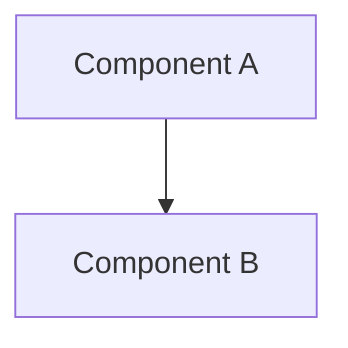

# Phase {{phase_id}}: {{phase_name}} — Research

**Researched:** {{date}}
**Domain:** Technical domain description
**Confidence:** HIGH | MEDIUM | LOW

## Summary
Provide a high-level architectural summary of the research findings, recommendations, and key decisions.

## Phase Requirements
Trace and map each requirement ID to its technical implementation approach:

| ID | Description | Research Support / Proposed Approach |
|----|-------------|--------------------------------------|
| REQ-01 | Requirement text | Proposed solution details |

## Technical Investigation & Codebase Mapping
Document the files, structures, modules, and dependencies mapped during the research phase.

### Relevant Code Locations
- [File Name](file:///path/to/file): Description of its role and responsibilities

## Standard Stack & Dependencies
List the standard stack, external dependencies, and version expectations.

| Dependency | Version | Purpose | Action required |
|------------|---------|---------|-----------------|
| library | version | purpose | install/use existing |

## Architecture Patterns
Outline the target architectural diagrams, class models, or flows.

### Anti-Patterns to Avoid
- Avoid anti-pattern A: rationale
- Avoid anti-pattern B: rationale

## Security Domain & Threat Scenarios
Analyze STRIDE threats, ASVS categories, and mitigation requirements.

| Threat | Category | Mitigation Strategy |
|--------|----------|---------------------|
| threat | category | mitigation |

## Open Questions & Risks
1. **Clarifying Question**: context, recommendation
2. **Technical Risk**: context, recommendation

## Sources & References
- Link to official docs
- Codebase files scanned
