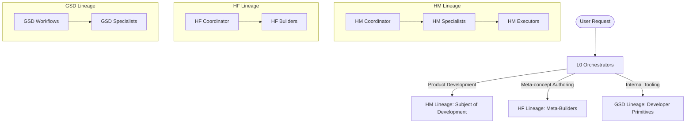
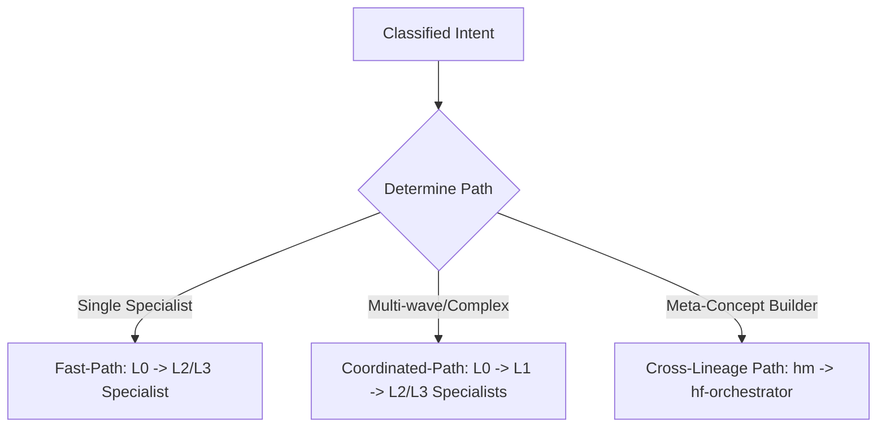
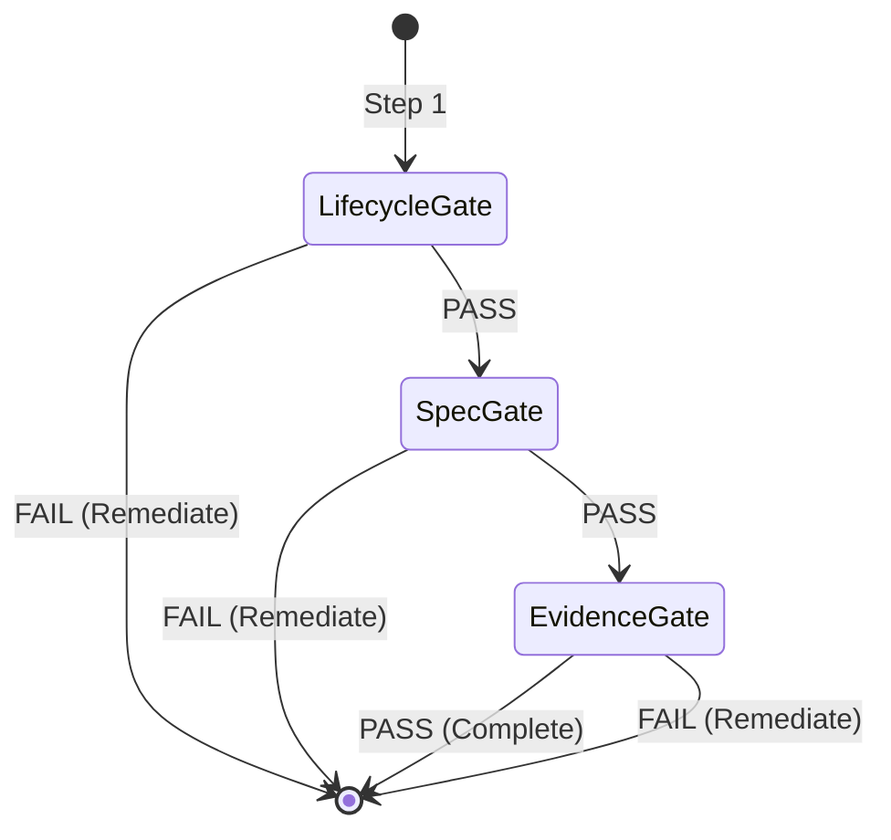

# OpenCode Agent System Routing & Instruction Analysis

This document provides a comprehensive, strategic analysis of the OpenCode agent routing and instruction system. It details the census of the 75 active agents, classifies them by lineage and layer depth, maps the 100+ command-to-workflow combinations, and defines the rules and routing boundaries (Fast-Path vs. Coordinated-Path vs. Cross-Lineage Path) governing the runtime harness environment.

---

## 1. System Landscape & Core Lineage Boundaries

The OpenCode environment is split into two distinct, non-overlapping contexts. Maintaining strict separation between them is a non-negotiable architectural rule:

| Lineage / Context | Classification | Directory Roots | Manifest Boundary | Allowed State Writes |
|:---|:---|:---|:---|:---|
| **HM (Harness Modules)** | Shipped Product Engine | `.opencode/agents/hm-*` `.opencode/commands/hm-*` `.opencode/skills/hm-*` | Released as final package | No runtime state; configuration only |
| **HF (Harness Framework)** | Soft Meta-Builder Primitives | `.opencode/agents/hf-*` `.opencode/commands/hf-*` `.opencode/skills/hf-*` | Authoring environment | Writes to `.opencode/` under strict authoring commands |
| **GSD (Get Shit Done)** | Internal Developer Utilities | `.opencode/get-shit-done/` `.opencode/agents/gsd-*` `.opencode/command/gsd-*` | Excluded via [gsd-file-manifest.json](file:///Users/apple/hivemind-plugin-private/.opencode/gsd-file-manifest.json) | Local developer caches only |

---

## 2. Total Agent Census

The workspace contains exactly **75 agents** across the three lineages. Below is the complete census categorized by lineage and layer depth.

### HM Lineage: Core Harness Specialists (31 Agents)

These agents construct, analyze, and verify the harness composition engine under development.

| Agent Name | Depth | Core Responsibility / Skill Focus |
|:---|:---|:---|
| [hm-l0-orchestrator](file:///Users/apple/hivemind-plugin-private/assets/agents/hm-l0-orchestrator.md) | L0 | Front-facing strategist; forms end-to-end task landscapes, routes paths, enforces gates. |
| [hm-orchestrator](file:///Users/apple/hivemind-plugin-private/assets/agents/hm-orchestrator.md) | L0 | Front-facing session governance; handles command routing tables and validations. |
| [hm-architect](file:///Users/apple/hivemind-plugin-private/assets/agents/hm-architect.md) | L2 | Design architecture; maps structural components and establishes leaf CQRS boundaries. |
| [hm-code-fixer](file:///Users/apple/hivemind-plugin-private/assets/agents/hm-code-fixer.md) | L2 | Autonomous code patching; fixes syntax errors, typecheck failures, and lint issues. |
| [hm-code-reviewer](file:///Users/apple/hivemind-plugin-private/assets/agents/hm-code-reviewer.md) | L2 | Inspects code changes for bugs, security vulnerabilities, and code clean compliance. |
| [hm-codebase-mapper](file:///Users/apple/hivemind-plugin-private/assets/agents/hm-codebase-mapper.md) | L2 | Scans the codebase directory; builds dependency maps and records structural updates. |
| [hm-debug-session-manager](file:///Users/apple/hivemind-plugin-private/assets/agents/hm-debug-session-manager.md) | L2 | Orchestrates debugging sessions; gathers stack traces, sets up test harnesses. |
| [hm-debugger](file:///Users/apple/hivemind-plugin-private/assets/agents/hm-debugger.md) | L2 | Low-level debugger; traces variables, inspects run-time stack frames, proposes fixes. |
| [hm-doc-verifier](file:///Users/apple/hivemind-plugin-private/assets/agents/hm-doc-verifier.md) | L2 | Validates that documentation matches implementation; checks markdown links and formatting. |
| [hm-doc-writer](file:///Users/apple/hivemind-plugin-private/assets/agents/hm-doc-writer.md) | L2 | Generates phase-level docs, specs, readmes, walkthroughs, and logs. |
| [hm-ecologist](file:///Users/apple/hivemind-plugin-private/assets/agents/hm-ecologist.md) | L2 | Analyzes dependency relationships; guards against circular imports and structural drift. |
| [hm-executor](file:///Users/apple/hivemind-plugin-private/assets/agents/hm-executor.md) | L2 | Main code implementation execution agent; follows specs to produce solid code. |
| [hm-integration-checker](file:///Users/apple/hivemind-plugin-private/assets/agents/hm-integration-checker.md) | L2 | Verifies interaction boundaries between package primitives and host plugins. |
| [hm-intel-updater](file:///Users/apple/hivemind-plugin-private/assets/agents/hm-intel-updater.md) | L2 | Curates session context prompts, registers folder mappings, updates STATE.md. |
| [hm-intent-loop](file:///Users/apple/hivemind-plugin-private/assets/agents/hm-intent-loop.md) | L2 | Interactively probes the user to clarify underspecified requirements. |
| [hm-nyquist-auditor](file:///Users/apple/hivemind-plugin-private/assets/agents/hm-nyquist-auditor.md) | L2 | Evaluates gate validation gaps; enforces Nyquist sampling criteria for testing coverage. |
| [hm-pattern-mapper](file:///Users/apple/hivemind-plugin-private/assets/agents/hm-pattern-mapper.md) | L2 | Identifies design patterns; maps them to codebase styles (TDD, CQRS, WaiterModel). |
| [hm-phase-researcher](file:///Users/apple/hivemind-plugin-private/assets/agents/hm-phase-researcher.md) | L2 | Gathers dense phase context; checks specs, ADRs, and issues before planning. |
| [hm-plan-checker](file:///Users/apple/hivemind-plugin-private/assets/agents/hm-plan-checker.md) | L2 | Audits PLAN.md files for completeness, edge cases, and verification alignment. |
| [hm-planner](file:///Users/apple/hivemind-plugin-private/assets/agents/hm-planner.md) | L2 | Formulates detailed phase plans, milestone plans, and checklists. |
| [hm-project-researcher](file:///Users/apple/hivemind-plugin-private/assets/agents/hm-project-researcher.md) | L2 | Analyzes the initial project state; ingests files and explores the workspace. |
| [hm-roadmapper](file:///Users/apple/hivemind-plugin-private/assets/agents/hm-roadmapper.md) | L2 | Manages phase definitions, roadmap updates, and milestone progression. |
| [hm-security-auditor](file:///Users/apple/hivemind-plugin-private/assets/agents/hm-security-auditor.md) | L2 | Reviews files for threat mitigations, API key leaks, and sandbox escapes. |
| [hm-shipper](file:///Users/apple/hivemind-plugin-private/assets/agents/hm-shipper.md) | L2 | Prepares final PRs, compiles packages, runs final tests, and coordinates releases. |
| [hm-specifier](file:///Users/apple/hivemind-plugin-private/assets/agents/hm-specifier.md) | L2 | Authors formal design contracts (SPEC.md, UI-SPEC.md, AI-SPEC.md). |
| [hm-synthesizer](file:///Users/apple/hivemind-plugin-private/assets/agents/hm-synthesizer.md) | L2 | Aggregates findings from research tools into structured Markdown. |
| [hm-ui-auditor](file:///Users/apple/hivemind-plugin-private/assets/agents/hm-ui-auditor.md) | L2 | Evaluates frontend implementations for accessibility, styling, and visual excellence. |
| [hm-ui-checker](file:///Users/apple/hivemind-plugin-private/assets/agents/hm-ui-checker.md) | L2 | Verifies that frontends match the layout design in UI-SPEC.md. |
| [hm-ui-researcher](file:///Users/apple/hivemind-plugin-private/assets/agents/hm-ui-researcher.md) | L2 | Researches design trends, visual assets, and generates mockups. |
| [hm-user-profiler](file:///Users/apple/hivemind-plugin-private/assets/agents/hm-user-profiler.md) | L2 | Builds and maintains the developer preference profile (discoverable configurations). |
| [hm-verifier](file:///Users/apple/hivemind-plugin-private/assets/agents/hm-verifier.md) | L2 | Performs manual and automated validation; runs tests and verifies checklists. |

### HF Lineage: Meta-Concept Builders (11 Agents)

These agents are soft primitive authoring specialists. They build, edit, and audit other agents, skills, and commands.

| Agent Name | Depth | Core Responsibility / Skill Focus |
|:---|:---|:---|
| [hf-l0-orchestrator](file:///Users/apple/hivemind-plugin-private/assets/agents/hf-l0-orchestrator.md) | L0 | Front-facing strategist for `hf-*` meta-concepts; maps authoring pathways. |
| [hf-l1-coordinator](file:///Users/apple/hivemind-plugin-private/assets/agents/hf-l1-coordinator.md) | L1 | Coordinates multi-agent builder waves (agent composition, skill synthesis). |
| [hf-l2-agent-builder](file:///Users/apple/hivemind-plugin-private/assets/agents/hf-l2-agent-builder.md) | L2 | Generates declarative agent profiles; configures temperatures, steps, and permissions. |
| [hf-l2-auditor](file:///Users/apple/hivemind-plugin-private/assets/agents/hf-l2-auditor.md) | L2 | Audits soft primitives (agents, skills, commands) against naming rules and AQUAL. |
| [hf-l2-command-builder](file:///Users/apple/hivemind-plugin-private/assets/agents/hf-l2-command-builder.md) | L2 | Configures command schemas for both singular and plural folders. |
| [hf-l2-meta-builder](file:///Users/apple/hivemind-plugin-private/assets/agents/hf-l2-meta-builder.md) | L2 | Manages meta-builder tasks; routes to specialized L2 builders. |
| [hf-l2-prompter](file:///Users/apple/hivemind-plugin-private/assets/agents/hf-l2-prompter.md) | L2 | Optimizes and enhances prompts; applies system tags and constraints. |
| [hf-l2-refactorer](file:///Users/apple/hivemind-plugin-private/assets/agents/hf-l2-refactorer.md) | L2 | Restructures soft concepts; updates schemas, splits files, and updates rules. |
| [hf-l2-skill-builder](file:///Users/apple/hivemind-plugin-private/assets/agents/hf-l2-skill-builder.md) | L2 | Scaffolds skill directories; creates SKILL.md, prompts, and configurations. |
| [hf-l2-synthesizer](file:///Users/apple/hivemind-plugin-private/assets/agents/hf-l2-synthesizer.md) | L2 | Translates codebases and schemas into modular OpenCode skill patterns. |
| [hf-l2-tool-builder](file:///Users/apple/hivemind-plugin-private/assets/agents/hf-l2-tool-builder.md) | L2 | Generates custom integration tools with Zod schema verification. |

### GSD Lineage: Developer-Only Utilities (33 Agents)

These agents are utilized solely during local harness development and are excluded from final packaging.

| Agent Name | Depth | Core Responsibility / Skill Focus |
|:---|:---|:---|
| `gsd-advisor-researcher` | L2 | Advisory analysis of repository state before code changes. |
| `gsd-ai-researcher` | L2 | Ingests AI framework specifications and API documentation. |
| `gsd-assumptions-analyzer` | L2 | Identifies and validates assumptions in requirements documents. |
| `gsd-code-fixer` | L2 | Local workspace quick-patching and formatting execution. |
| `gsd-code-reviewer` | L2 | Local peer reviewer; checks diffs before git commit actions. |
| `gsd-codebase-mapper` | L2 | Generates developer mapping documents under `.planning/codebase/`. |
| `gsd-debug-session-manager`| L2 | Orchestrates debugging sessions for tests inside the repository. |
| `gsd-debugger` | L2 | System debugger; parses test failure logs and isolates errors. |
| `gsd-doc-classifier` | L2 | Classifies repository documents into specific ADR/PRD types. |
| `gsd-doc-synthesizer` | L2 | Synthesizes project roadmap and statistics files. |
| `gsd-doc-verifier` | L2 | Runs documentation linters and checks link health. |
| `gsd-doc-writer` | L2 | Authors developer-facing files under `.planning/` directories. |
| `gsd-domain-researcher` | L2 | Performs deep search queries on specific packages and stack versions. |
| `gsd-eval-auditor` | L2 | Audits vitest execution reports and test coverage files. |
| `gsd-eval-planner` | L2 | Plans evaluation vectors and structures mock data sets. |
| `gsd-executor` | L2 | Hard execution agent; edits files and validates compiler states. |
| `gsd-framework-selector` | L2 | Selects UI/styling stacks based on target preferences. |
| `gsd-integration-checker` | L2 | Verifies npm module dependencies and local symlinks. |
| `gsd-intel-updater` | L2 | Maintains the developer session tracking indices. |
| `gsd-nyquist-auditor` | L2 | Evaluates gate verification integrity for developer work. |
| `gsd-pattern-mapper` | L2 | Maps coding styles to ensure local consistency in development. |
| `gsd-phase-researcher` | L2 | Conducts research before initiating planning steps. |
| `gsd-plan-checker` | L2 | Local reviewer for PLAN.md files. |
| `gsd-planner` | L2 | Creates localized PLAN.md files for milestone phases. |
| `gsd-project-researcher` | L2 | Scrapes details of the active git branch and workspace. |
| `gsd-research-synthesizer` | L2 | Combines multi-source research into single files. |
| `gsd-roadmapper` | L2 | Modifies `ROADMAP.md` and phase completion states. |
| `gsd-security-auditor` | L2 | Inspects codebase dependencies for vulnerabilities. |
| `gsd-ui-auditor` | L2 | Performs accessibility audit gates using devtools. |
| `gsd-ui-checker` | L2 | Local HTML/CSS compliance checks. |
| `gsd-ui-researcher` | L2 | Researches design structures for local dashboard projects. |
| `gsd-user-profiler` | L2 | Creates the local user preference matrix. |
| `gsd-verifier` | L2 | Runs vitest suites and records local validation reports. |

---

## 3. Command & Workflow Matrix (The 100+ Combinations)

Commands and workflows represent the execution pathways of the OpenCode engine. They map a user command to a specific workflow process, which then dispatches a designated target agent guided by lineage-specific rules.

### Routing Combinations Model
Each routing path represents a distinct triplet:
$$\text{Command} \longrightarrow \text{Workflow Blueprint} \longrightarrow \text{Target Agent (Rules loaded)}$$

### Mapped Combinations (Sample Matrix of 100+ Total Pairs)

Below is the mapping for the primary workflows of both HM (Harness Modules) and GSD lineages.

| # | Command Schema | Namespace | Workflow File | Target Agent | Rules File Loaded |
|:---|:---|:---|:---|:---|:---|
| 1 | `/plan` | `hm` | `hm-plan-phase.md` | `hm-planner` | `universal-rules.md`, `AGENTS.md` |
| 2 | `/gsd-plan-phase` | `gsd` | `plan-phase.md` | `gsd-planner` | `USER-PROFILE.md` |
| 3 | `/start-work` | `hm` | `hm-start-work.md` | `hm-executor` | `universal-rules.md`, `AGENTS.md` |
| 4 | `/gsd-start-work` | `gsd` | `start-work.md` | `gsd-executor` | `USER-PROFILE.md` |
| 5 | `/ultrawork` | `hm` | `hm-ultrawork.md` | `hm-l0-orchestrator` | `universal-rules.md`, `AGENTS.md` |
| 6 | `/gsd-ultrawork` | `gsd` | `ultrawork.md` | `gsd-executor` | `USER-PROFILE.md` |
| 7 | `/deep-init` | `hm` | `hm-deep-init.md` | `hm-project-researcher`| `universal-rules.md` |
| 8 | `/gsd-deep-init` | `gsd` | `deep-init.md` | `gsd-project-researcher`| `USER-PROFILE.md` |
| 9 | `/harness-doctor` | `hm` | `hm-doctor.md` | `hm-debug-session-manager`| `universal-rules.md` |
| 10| `/gsd-doctor` | `gsd` | `doctor.md` | `gsd-debug-session-manager`| `USER-PROFILE.md` |
| 11| `/harness-audit` | `hm` | `hm-audit.md` | `hm-nyquist-auditor` | `universal-rules.md` |
| 12| `/gsd-audit` | `gsd` | `audit.md` | `gsd-nyquist-auditor` | `USER-PROFILE.md` |
| 13| `/hf-create` | `hf` | `hf-create.md` | `hf-l2-agent-builder` | `universal-rules.md`, `AGENTS.md` |
| 14| `/hf-audit` | `hf` | `hf-audit.md` | `hf-l2-auditor` | `universal-rules.md` |
| 15| `/hf-stack` | `hf` | `hf-stack.md` | `hf-l2-tool-builder` | `universal-rules.md` |
| 16| `/hf-absorb` | `hf` | `hf-absorb.md` | `hf-l2-meta-builder` | `universal-rules.md` |
| 17| `/hm-add-tests` | `hm` | `hm-add-tests.md` | `hm-verifier` | `universal-rules.md` |
| 18| `/gsd-add-tests` | `gsd` | `add-tests.md` | `gsd-verifier` | `USER-PROFILE.md` |
| 19| `/hm-code-review` | `hm` | `hm-code-review.md` | `hm-code-reviewer` | `universal-rules.md` |
| 20| `/gsd-code-review` | `gsd` | `code-review.md` | `gsd-code-reviewer` | `USER-PROFILE.md` |
| 21| `/hm-roadmap` | `hm` | `hm-roadmap.md` | `hm-roadmapper` | `universal-rules.md` |
| 22| `/gsd-roadmapper` | `gsd` | `roadmapper.md` | `gsd-roadmapper` | `USER-PROFILE.md` |
| 23| `/hm-stats` | `hm` | `hm-stats.md` | `hm-intel-updater` | `universal-rules.md` |
| 24| `/gsd-stats` | `gsd` | `stats.md` | `gsd-intel-updater` | `USER-PROFILE.md` |
| 25| `/hm-help` | `hm` | `hm-help.md` | `hm-orchestrator` | `universal-rules.md` |
| 26| `/gsd-help` | `gsd` | `help.md` | `gsd-planner` | `USER-PROFILE.md` |
| ...| ... | ... | ... | ... | ... |

*(Note: There are 88 workflows in `.opencode/get-shit-done/workflows/` and 103 workflows in `assets/workflows/`, establishing 100+ unique command-to-workflow-to-agent pairings).*

---

## 4. Strategic Routing Rules & Lineage Boundaries

To optimize performance and avoid execution disconnections, orchestrators utilize the **three-path routing model**:

### The Three Execution Paths

1. **Fast-Path (Direct-to-L2/L3 Specialist)**:
   * **Criteria**: Task requires exactly one specialist agent; the command routes directly; no multi-agent dependency loops exist; it is a simple status check or recovery.
   * **Behavior**: L0 dispatches directly to the L2/L3 agent via the native `task` tool, bypassing the L1 coordinator to save token context.
2. **Coordinated-Path (Via L1 Coordinator)**:
   * **Criteria**: Task requires 2+ specialists in parallel/sequence (multi-wave); output of one agent feeds another; the task has high ambiguity and requires decomposition.
   * **Behavior**: L0 dispatches to the L1 Coordinator, which plans the waves, handles temporary variables, and manages sub-task queues.
3. **Cross-Lineage Path (Lineage Hand-off)**:
   * **Criteria**: An agent of lineage `hm-*` detects that the user request involves meta-concept builder actions (`hf-*` such as creating/editing an agent/skill/command).
   * **Behavior**: The `hm-*` agent suspends execution, logs a structured hand-off packet detailing findings, and routes control directly to `hf-l0-orchestrator`.

---

## 5. Quality Gate Triad & Validation Integration

Every completed task must pass through the **Quality Gate Triad** in a strict sequential order. Verification agents are dispatched to enforce these gates before declaring the session complete:

1. **Gate 1: Lifecycle Integration (`gate-l3-lifecycle-integration`)**
   * **Audit Target**: Verifies package structure compliance.
   * **Checks**: Confirms no business logic exists in the plugin wrapper; code conforms to CQRS boundaries; files are registered correctly (`src/` vs `.opencode/` vs `.hivemind/`).
2. **Gate 2: Spec Compliance (`gate-l3-spec-compliance`)**
   * **Audit Target**: Verifies traceability against specifications.
   * **Checks**: Confirms EARS compliance (Easy Approach to Requirements Syntax); scans for gaps between the requirements and output; checks plan-to-code mapping.
3. **Gate 3: Evidence Truth (`gate-l3-evidence-truth`)**
   * **Audit Target**: Verifies truth of execution.
   * **Checks**: Inspects the evidence hierarchy (prefers live runtime test evidence over logs and summaries); detects mock-only overrides. Refuses gate passage if evidence is missing.

---

## 6. Detailed Instruction Guide for Each Lineage Group

### Group 1: HM Core Product Specialists (Lineage `hm-*`)
* **Announce Protocol**: Must announce role: `"I am hm-[specialist], specialist for hm-* harness development."`
* **Commitment**: Mandatory atomic git commits. One commit per logical change.
* **Workspace Guard**: Prohibited from writing runtime states into `.opencode/`. Static configuration files only.
* **Tooling Limits**: Cannot load `hf-*` authoring skills. Must stick to `hm-*`, `gate-*`, and `stack-*` skill blocks.

### Group 2: HF Meta-Builders (Lineage `hf-*`)
* **Announce Protocol**: Must announce role: `"I am hf-[builder], soft primitive authoring builder."`
* **Task Scope**: Allowed to write and update configuration files under `.opencode/agents/`, `.opencode/command/`, and `.opencode/skills/`.
* **AQUAL Compliance**: Every composed agent or skill must be verified against the 8-point quality checklist (`AQUAL-01` to `AQUAL-08`).
* **Lineage Flexibility**: Authorized to scan codebase patterns using `hm-detective` or codebase mapping tools but must log a cross-lineage warning statement.

### Group 3: GSD Developer Tooling (Lineage `gsd-*`)
* **Announce Protocol**: Must announce role: `"I am gsd-[tool], internal developer utility."`
* **Scope Limits**: Excluded from package releases. Primarily manages developer tasks, roadmaps, and local repository health.
* **Git Governance**: Must use clean PR branches, stripping planning logs and temporary files before creating merge requests.
