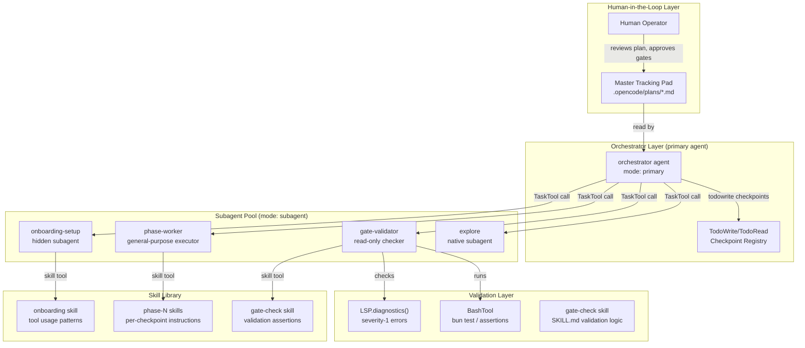
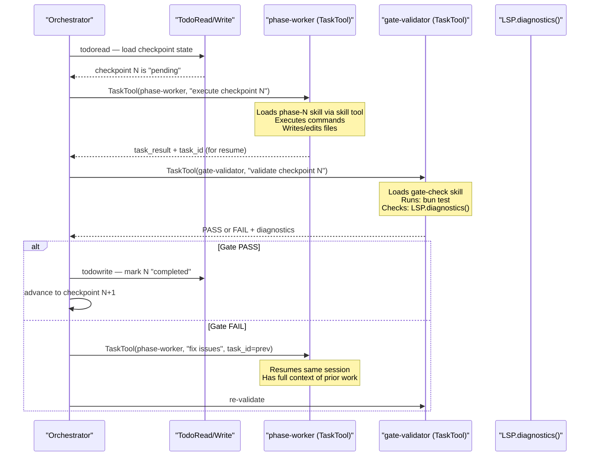
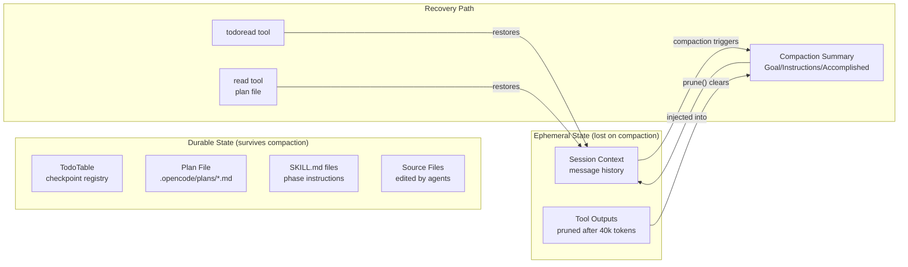

Here is a clean architecture for an AI agent harness system built entirely on opencode primitives. Every component maps to a real opencode API.

---

## Core Problem: Context Pruning Across Turns

When `SessionCompaction.isOverflow()` triggers, the `compaction` agent summarizes history and old tool outputs are pruned via `SessionCompaction.prune()`. This means an agent's "body" — its accumulated context, instructions, and working state — can be lost between turns. [0-cite-0](#0-cite-0) [0-cite-1](#0-cite-1) 

The solution: a **macro-level orchestrator** that operates above the compaction boundary, using persistent artifacts (todo list, plan files, skill definitions) as the durable state that survives pruning.

---

## Architecture Overview



---

## 1. Agent Definitions (`opencode.json`)

The orchestrator is a `primary` agent with controlled `permission.task` rules. Subagents are scoped to specific capabilities. [0-cite-2](#0-cite-2) [0-cite-3](#0-cite-3) 

```json
{
  "$schema": "https://opencode.ai/config.json",
  "default_agent": "orchestrator",
  "agent": {
    "orchestrator": {
      "mode": "primary",
      "description": "Macro-level orchestrator. Coordinates checkpoint-gated pipeline via subagents.",
      "permission": {
        "task": {
          "*": "ask",
          "onboarding-setup": "allow",
          "phase-worker": "allow",
          "gate-validator": "allow",
          "explore": "allow"
        }
      },
      "steps": 200
    },
    "onboarding-setup": {
      "mode": "subagent",
      "hidden": true,
      "description": "Initializes session, demonstrates tool usage patterns, loads onboarding skill."
    },
    "phase-worker": {
      "mode": "subagent",
      "description": "Executes a single checkpoint phase: runs commands, applies edits, loads phase-specific skills."
    },
    "gate-validator": {
      "mode": "subagent",
      "description": "Read-only validator. Runs TDD assertions and checks LSP diagnostics. Returns pass/fail.",
      "permission": {
        "edit": "ask",
        "write": "ask",
        "bash": "allow",
        "read": "allow",
        "grep": "allow",
        "skill": "allow"
      }
    }
  },
  "compaction": {
    "auto": true,
    "prune": true,
    "reserved": 15000
  }
}
```

The `permission.task` glob pattern on the orchestrator ensures it can only invoke its designated subagents — the `"*": "ask"` base rule blocks everything, then specific agents are allowed. This is enforced by `PermissionNext.evaluate("task", agentName, ruleset)`. [0-cite-4](#0-cite-4) 

---

## 2. Master Tracking Pad (Persistent State)

The orchestrator's durable state lives in two places that survive compaction:

### a) Todo List — Checkpoint Registry

The `todowrite`/`todoread` tools persist structured checkpoint state in the session's `TodoTable`. This is the orchestrator's primary state machine. [0-cite-5](#0-cite-5) 

Each todo item represents a checkpoint:

```json
[
  {"id": "cp-0", "status": "completed", "content": "Onboarding: tool demo + schema lock"},
  {"id": "cp-1", "status": "completed", "content": "Phase 1: scaffold API types"},
  {"id": "cp-2", "status": "in_progress", "content": "Phase 2: implement handlers"},
  {"id": "cp-3", "status": "pending", "content": "Phase 3: integration tests"},
  {"id": "cp-4", "status": "pending", "content": "Gate: zero LSP errors + all tests pass"}
]
```

### b) Plan File — Human-Readable Tracking Pad

The `plan` agent writes to `.opencode/plans/*.md` (the only edit path allowed for plan mode). The orchestrator reads this file to reconstruct its strategic state after compaction. [0-cite-6](#0-cite-6) 

```markdown
<!-- .opencode/plans/pipeline.md -->
# Agent Harness Pipeline

## Checkpoints
| Phase | Command | Skills | Gate | Status |
|-------|---------|--------|------|--------|
| 0 | /onboarding | onboarding | tool-demo-complete | DONE |
| 1 | scaffold types | api-types | zero LSP errors | DONE |
| 2 | implement handlers | http-handlers | tests pass | IN PROGRESS |
| 3 | integration tests | testing | coverage > 80% | BLOCKED |
```

---

## 3. Checkpoint-Gate-Unlock Pattern

This is the core loop. The orchestrator reads its todo list, dispatches work to subagents via `TaskTool`, then validates via the gate-validator before advancing.



The `TaskTool` creates child sessions with `parentID: ctx.sessionID`, and the `task_id` parameter enables session resumption — the same subagent session continues rather than starting fresh. [0-cite-7](#0-cite-7) [0-cite-8](#0-cite-8) 

---

## 4. Skills as Phase-Specific Instruction Loaders

Each checkpoint phase has a corresponding `SKILL.md` that the subagent loads on-demand via the `skill` tool. This is how you inject phase-specific commands, schemas, and validation criteria without bloating the base context. [0-cite-9](#0-cite-9) [0-cite-10](#0-cite-10) 

```
.opencode/skills/
├── onboarding/
│   └── SKILL.md          # Tool usage demo patterns
├── api-types/
│   └── SKILL.md          # Phase 1: type definitions + schema
├── http-handlers/
│   └── SKILL.md          # Phase 2: handler implementation
├── testing/
│   └── SKILL.md          # Phase 3: test patterns
└── gate-check/
    ├── SKILL.md          # Validation logic + assertion patterns
    └── scripts/
        └── validate.sh   # Bundled validation script
``` [0-cite-11](#0-cite-11) 

Example onboarding skill:

```markdown
---
name: onboarding
description: "Demonstrates tool usage patterns and establishes session schema conventions"
---

# Onboarding Skill

## Tool Usage Patterns
When starting a new session, demonstrate these patterns:

1. **Read before edit**: Always `read` a file before using `edit`
2. **LSP feedback loop**: After every `write`/`edit`, check the tool output for `<diagnostics>` blocks
3. **Schema locking**: Once types are defined, treat them as immutable for the phase

## Session Schema Convention
Output all structured data using this format:
- Field names use camelCase
- Required fields are marked with `// LOCKED` comments
- Locked fields must not be modified in subsequent phases
```

The `SkillTool` loads the full content plus lists bundled files in `<skill_files>`, giving the agent access to scripts and templates. [0-cite-12](#0-cite-12) 

---

## 5. LSP-Driven Gate Validation

The `edit`, `write`, and `apply_patch` tools all call `LSP.touchFile()` followed by `LSP.diagnostics()`, then filter for `severity === 1` (ERROR) and inject them into the tool output as `<diagnostics>` blocks. [0-cite-13](#0-cite-13) [0-cite-14](#0-cite-14) [0-cite-15](#0-cite-15) 

The gate-validator subagent uses this as its success condition:

1. **LSP check**: Read files, trigger `LSP.touchFile()`, collect `LSP.diagnostics()` — zero severity-1 errors means pass
2. **TDD assertions**: Run `bash` with test commands (`bun test`, `npm test`, etc.) — exit code 0 means pass
3. **Custom assertions**: The `gate-check` skill can define arbitrary validation logic

The `LSPClient.waitForDiagnostics()` method uses a 150ms debounce to ensure both syntax and semantic diagnostics are collected before evaluation. [0-cite-16](#0-cite-16) 

---

## 6. Turn-Based Self-Setup with Compaction Resilience

The key insight: when compaction fires, the orchestrator loses its in-context reasoning but retains:

1. **Todo list** — persisted in `TodoTable`, survives compaction
2. **Plan file** — persisted on disk at `.opencode/plans/pipeline.md`
3. **Compaction summary** — the `compaction` agent generates a structured summary with Goal/Instructions/Discoveries/Accomplished sections [0-cite-17](#0-cite-17) 

The orchestrator's system prompt (defined in its agent markdown file) includes a **self-setup protocol**:

```markdown
---
name: orchestrator
mode: primary
description: "Macro-level orchestrator for checkpoint-gated pipeline"
---

# Orchestrator Protocol

## On Every Turn
1. Read the todo list (`todoread`) to determine current checkpoint state
2. Read the plan file (`.opencode/plans/pipeline.md`) for strategic context
3. If a compaction summary exists above, use it to reconstruct working state

## Checkpoint Execution
For each pending checkpoint:
1. Dispatch work to `phase-worker` via TaskTool with the checkpoint's command and skill name
2. Dispatch validation to `gate-validator` via TaskTool
3. If gate passes: update todo list, advance to next checkpoint
4. If gate fails: resume the phase-worker session (pass task_id) with fix instructions

## Stop Conditions
- All checkpoints completed (todo list fully checked off)
- Gate fails 3 consecutive times on same checkpoint (escalate to human)
- Human sends "pause" or "stop" message
``` [0-cite-18](#0-cite-18) 

---

## 7. Plugin Hooks for Pipeline Instrumentation

The plugin system provides hooks to instrument the pipeline without modifying core code: [0-cite-19](#0-cite-19) 

```typescript
// .opencode/plugins/harness-monitor.ts
import type { PluginInstance } from "@opencode-ai/plugin"

export default ((input) => ({
  "tool.execute.after": async (ctx, result) => {
    // Track gate validation results
    if (ctx.tool === "task" && result.metadata?.sessionId) {
      // Log checkpoint progression
    }
  },
  "event": async (event) => {
    // Monitor compaction events to detect context pressure
    if (event.type === "session.compacted") {
      // Alert: orchestrator context was pruned
    }
  },
})) satisfies PluginInstance
```

The `tool.execute.before` and `tool.execute.after` hooks fire around every tool call, enabling checkpoint tracking, and the `event` hook captures compaction events. [0-cite-20](#0-cite-20) 

---

## 8. Field Locking via Session-Based Schema

Tools output structured metadata via `ctx.metadata()`. The "field locking" pattern is implemented through skill conventions: once a phase defines a type schema, subsequent phases treat fields marked `// LOCKED` as immutable. The gate-validator enforces this by diffing the schema file against its locked snapshot. [0-cite-21](#0-cite-21) 

---

## Complete Data Flow



---

## Summary of Opencode Primitives Used

| Primitive | Role in Architecture |
|-----------|---------------------|
| `Agent.Info` (mode, permission, steps) | Orchestrator + subagent definitions |
| `TaskTool` (task_id resumption) | Subagent dispatch + session continuity |
| `TodoWrite/TodoRead` | Persistent checkpoint state machine |
| `Skill` (SKILL.md, skill tool) | Phase-specific instruction injection |
| `PermissionNext.Ruleset` (permission.task) | Orchestrator → subagent access control |
| `LSP.diagnostics()` (severity-1 filter) | Gate validation success condition |
| `BashTool` | TDD assertion execution |
| `SessionCompaction` (prune, summarize) | Context management + recovery protocol |
| `Plugin.trigger` (tool.execute.after, event) | Pipeline instrumentation |
| `Tool.define` (ctx.metadata, ctx.ask) | Custom tool output with field locking |
| `Plan agent` (edit restricted to plans/) | Human-readable tracking pad |
| `Config` (opencode.json) | Agent/permission/compaction configuration | [0-cite-22](#0-cite-22) [0-cite-23](#0-cite-23) [0-cite-24](#0-cite-24) [0-cite-25](#0-cite-25)