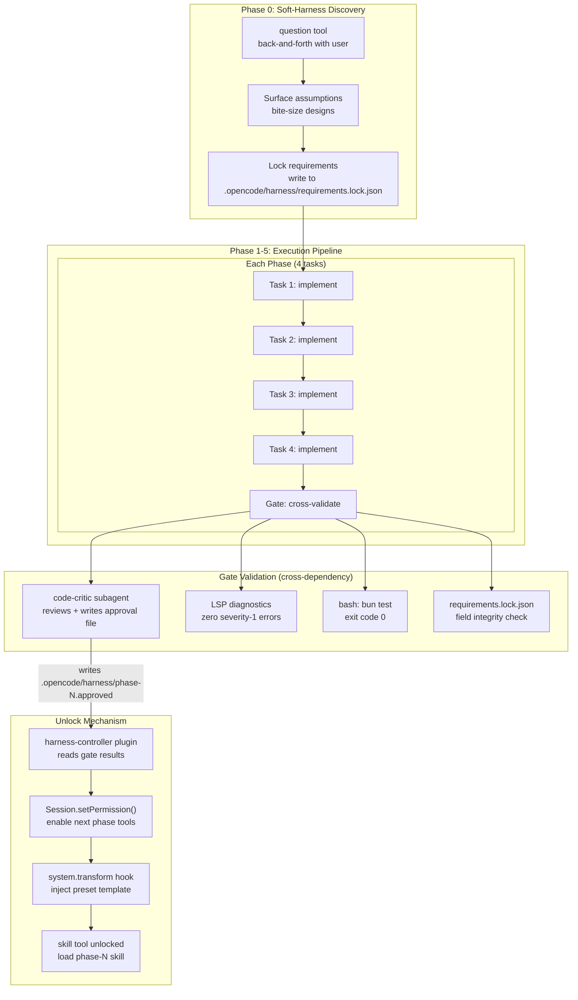
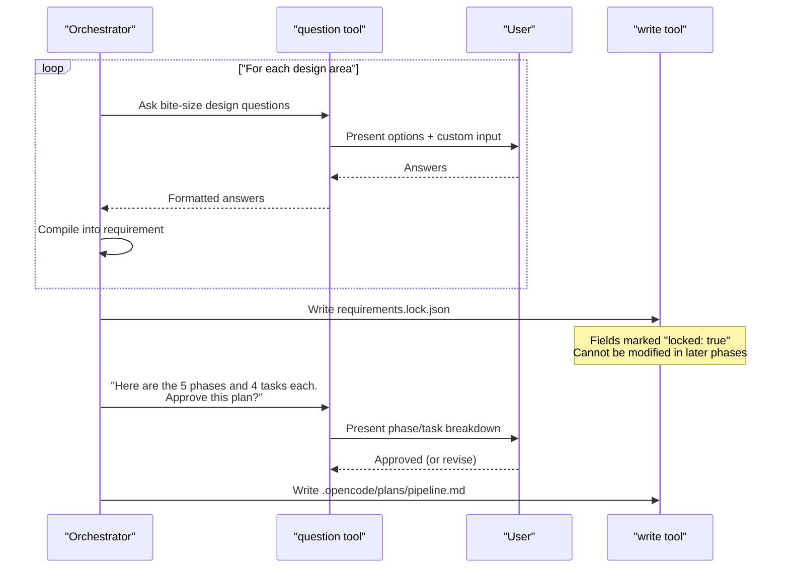
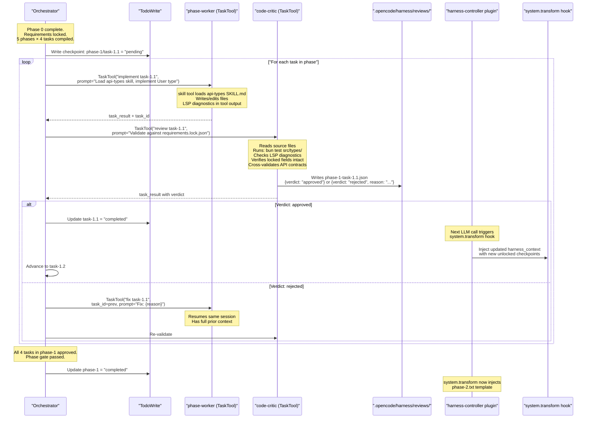

Here is the refined architecture with conditional tool preloading, cross-dependency validation via `code-critic`, soft-harness user negotiation, and preset prompt injection on unlock.

---

## The Core Mechanism: Conditional Unlock via Plugin + Permission + Skill Injection

The key insight is that opencode already has three primitives that compose into a conditional preloading system:

1. **`Session.setPermission()`** — dynamically changes which tools are available mid-session [1-cite-0](#1-cite-0) 

2. **`PermissionNext.disabled()`** — filters tools out of the LLM's tool list based on the permission ruleset (tools with `pattern: "*", action: "ask"` are removed entirely) [1-cite-1](#1-cite-1) 

3. **`experimental.chat.system.transform`** — plugin hook that injects/modifies system prompts before each LLM call [1-cite-2](#1-cite-2) 

When a checkpoint unlocks, the plugin: (a) updates session permissions to enable the next set of tools, (b) injects the preset prompt template into the system prompt, and (c) the skill tool becomes available to load phase-specific instructions.

---

## Architecture: 5 Phases × 4 Tasks with Soft-Harness



---

## 1. Soft-Harness: User Negotiation via `question` Tool

Phase 0 is a discovery phase where the orchestrator uses the `question` tool to surface assumptions and negotiate requirements with the user in bite-size chunks. [1-cite-3](#1-cite-3) 

The `question` tool presents structured options and collects answers. The orchestrator compiles these into locked requirements:



The `question` tool requires `permission.question: "allow"` on the agent. The orchestrator has this; subagents do not (by default `question` is `"ask"`). [1-cite-4](#1-cite-4) 

---

## 2. Requirements Locking: File-Based Schema with Field Locks

After user negotiation, the orchestrator writes a locked requirements file:

```json
// .opencode/harness/requirements.lock.json
{
  "version": 1,
  "locked_at": "2026-04-06T...",
  "phases": [
    {
      "id": "phase-1",
      "name": "API Type Definitions",
      "locked": true,
      "requirements": [
        {"id": "req-1.1", "description": "User entity with id, email, name", "locked": true},
        {"id": "req-1.2", "description": "REST endpoints: GET/POST /users", "locked": true},
        {"id": "req-1.3", "description": "Zod validation schemas", "locked": true},
        {"id": "req-1.4", "description": "OpenAPI spec generation", "locked": true}
      ],
      "tasks": [
        {"id": "task-1.1", "command": "define User type", "skill": "api-types", "gate": "zero-lsp-errors"},
        {"id": "task-1.2", "command": "define endpoint schemas", "skill": "api-types", "gate": "zero-lsp-errors"},
        {"id": "task-1.3", "command": "add Zod validators", "skill": "validation", "gate": "tests-pass"},
        {"id": "task-1.4", "command": "generate OpenAPI spec", "skill": "openapi", "gate": "spec-valid"}
      ]
    }
    // ... phases 2-5
  ]
}
```

The `gate-validator` subagent checks that locked fields haven't been modified by diffing the file against its snapshot. This is the "field locking" mechanism — it's enforced by convention through the gate, not by the tool system itself.

---

## 3. `code-critic` Subagent: Cross-Dependency Validation via File-Based Approval

The `code-critic` is a read-only subagent that reviews work and **writes its approval to a file**. This file-based signaling is the cross-dependency mechanism. [1-cite-5](#1-cite-5) 

```json
// opencode.json — agent definitions
{
  "agent": {
    "orchestrator": {
      "mode": "primary",
      "permission": {
        "question": "allow",
        "task": {
          "*": "ask",
          "phase-worker": "allow",
          "code-critic": "allow",
          "explore": "allow"
        }
      }
    },
    "code-critic": {
      "mode": "subagent",
      "description": "Reviews code against requirements. Writes approval/rejection to .opencode/harness/reviews/",
      "permission": {
        "edit": {
          "*": "ask",
          ".opencode/harness/reviews/*.json": "allow"
        },
        "bash": {
          "*": "ask",
          "bun test *": "allow",
          "npm test *": "allow"
        },
        "read": "allow",
        "grep": "allow",
        "skill": "allow"
      }
    },
    "phase-worker": {
      "mode": "subagent",
      "description": "Executes tasks within a phase. Tools are conditionally unlocked by the harness controller."
    }
  }
}
```

The `code-critic` can only write to `.opencode/harness/reviews/*.json` — this is enforced by the `edit` permission with path-specific rules (last-match-wins). [1-cite-6](#1-cite-6) 

The approval file:

```json
// .opencode/harness/reviews/phase-1-task-1.1.json
{
  "phase": "phase-1",
  "task": "task-1.1",
  "reviewer": "code-critic",
  "timestamp": "2026-04-06T...",
  "verdict": "approved",
  "checks": {
    "lsp_errors": 0,
    "tests_passed": true,
    "requirements_locked": true,
    "cross_deps_valid": true
  },
  "notes": "User type correctly implements all locked requirements. No LSP errors."
}
```

---

## 4. Harness Controller Plugin: Conditional Unlock Engine

This is the central piece — a plugin that reads gate results and conditionally unlocks the next phase by modifying session permissions and injecting prompt templates. [1-cite-7](#1-cite-7) 

```typescript
// .opencode/plugins/harness-controller.ts
import type { Plugin } from "@opencode-ai/plugin"
import fs from "fs/promises"
import path from "path"

const HARNESS_DIR = ".opencode/harness"
const REVIEWS_DIR = path.join(HARNESS_DIR, "reviews")
const TEMPLATES_DIR = path.join(HARNESS_DIR, "templates")
const REQUIREMENTS_FILE = path.join(HARNESS_DIR, "requirements.lock.json")

type PhaseState = {
  currentPhase: number
  currentTask: number
  unlocked: Set<string>  // "phase-1-task-1.1", etc.
}

async function loadState(directory: string): Promise<PhaseState> {
  const reqPath = path.join(directory, REQUIREMENTS_FILE)
  const requirements = JSON.parse(await fs.readFile(reqPath, "utf-8"))
  
  // Scan review files to determine what's been approved
  const unlocked = new Set<string>()
  let currentPhase = 1
  let currentTask = 1
  
  for (const phase of requirements.phases) {
    let allTasksApproved = true
    for (const task of phase.tasks) {
      const reviewPath = path.join(
        directory, REVIEWS_DIR, 
        `${phase.id}-${task.id}.json`
      )
      try {
        const review = JSON.parse(await fs.readFile(reviewPath, "utf-8"))
        if (review.verdict === "approved") {
          unlocked.add(`${phase.id}-${task.id}`)
        } else {
          allTasksApproved = false
        }
      } catch {
        allTasksApproved = false
      }
    }
    if (!allTasksApproved) {
      currentPhase = parseInt(phase.id.split("-")[1])
      // Find first unapproved task
      for (let i = 0; i < phase.tasks.length; i++) {
        if (!unlocked.has(`${phase.id}-${phase.tasks[i].id}`)) {
          currentTask = i + 1
          break
        }
      }
      break
    }
  }
  
  return { currentPhase, currentTask, unlocked }
}

export const HarnessController: Plugin = async (ctx) => {
  return {
    // Inject phase-specific prompt template when phase unlocks
    "experimental.chat.system.transform": async (input, output) => {
      if (!input.sessionID) return
      
      try {
        const state = await loadState(ctx.directory)
        const templatePath = path.join(
          ctx.directory, TEMPLATES_DIR,
          `phase-${state.currentPhase}.txt`
        )
        const template = await fs.readFile(templatePath, "utf-8")
        
        output.system.push([
          `<harness_context>`,
          `Current phase: ${state.currentPhase}, Task: ${state.currentTask}`,
          `Unlocked checkpoints: ${[...state.unlocked].join(", ")}`,
          ``,
          `<phase_instructions>`,
          template,
          `</phase_instructions>`,
          `</harness_context>`,
        ].join("\n"))
      } catch {
        // No harness configured yet — Phase 0 (discovery)
      }
    },

    // After code-critic writes approval, check if phase gate passes
    "tool.execute.after": async (input, output) => {
      if (input.tool !== "task") return
      
      // Check if this was a code-critic task that just completed
      if (!output.output.includes("code-critic")) return
      
      try {
        const state = await loadState(ctx.directory)
        // State is now updated from the review file the code-critic wrote
        // The next LLM call will pick up the new system prompt via
        // experimental.chat.system.transform
      } catch {
        // ignore
      }
    },

    // Modify tool definitions based on current phase
    "tool.definition": async (input, output) => {
      try {
        const state = await loadState(ctx.directory)
        
        // Append phase context to skill tool description
        if (input.toolID === "skill") {
          output.description += `\n\nCurrent harness phase: ${state.currentPhase}. Load the phase-${state.currentPhase} skill for instructions.`
        }
      } catch {
        // No harness active
      }
    },
  }
}
``` [1-cite-8](#1-cite-8) 

---

## 5. Preset Prompt Templates: Injected on Unlock

Each phase has a preset template in `.opencode/harness/templates/` that gets injected via the `experimental.chat.system.transform` hook:

```markdown
<!-- .opencode/harness/templates/phase-1.txt -->
# Phase 1: API Type Definitions

You are now in Phase 1. The following requirements have been locked with the user:
- User entity with id, email, name
- REST endpoints: GET/POST /users  
- Zod validation schemas
- OpenAPI spec generation

## Current Task Instructions
Load the skill for your current task using the `skill` tool.

## Available Skills for This Phase
- `api-types`: Type definition patterns and conventions
- `validation`: Zod schema patterns

## Gate Conditions (must ALL pass to advance)
1. Zero LSP severity-1 errors across all modified files
2. `bun test src/types/` exits with code 0
3. `code-critic` subagent writes approval to .opencode/harness/reviews/
4. requirements.lock.json field integrity verified (no locked fields modified)

## DO NOT
- Modify any files outside src/types/ and src/schemas/
- Change locked requirements
- Proceed to Phase 2 tasks
```

---

## 6. The Full Checkpoint-Gate-Unlock Loop with Cross-Validation



---

## 7. Custom Gate-Check Tool: Cross-Dependency Validation

A custom tool that the `code-critic` uses to perform the actual validation checks: [1-cite-9](#1-cite-9) 

```typescript
// .opencode/tools/gate-check.ts
import { tool } from "@opencode-ai/plugin"
import fs from "fs/promises"
import path from "path"
import { execSync } from "child_process"

export default tool({
  description: "Run gate validation checks for a specific phase/task checkpoint. Returns pass/fail with details.",
  args: {
    phase: tool.schema.string().describe("Phase ID (e.g., 'phase-1')"),
    task: tool.schema.string().describe("Task ID (e.g., 'task-1.1')"),
  },
  async execute(args, context) {
    const harnessDir = path.join(context.directory, ".opencode/harness")
    const results: Record<string, { passed: boolean; detail: string }> = {}

    // 1. Check requirements lock integrity
    try {
      const lockFile = path.join(harnessDir, "requirements.lock.json")
      const requirements = JSON.parse(await fs.readFile(lockFile, "utf-8"))
      const phase = requirements.phases.find((p: any) => p.id === args.phase)
      if (phase?.locked) {
        results["requirements_locked"] = { passed: true, detail: "All locked fields intact" }
      }
    } catch (e) {
      results["requirements_locked"] = { passed: false, detail: `Lock file error: ${e}` }
    }

    // 2. Run tests (TDD gate)
    try {
      const output = execSync("bun test --reporter=json 2>&1", {
        cwd: context.directory,
        timeout: 30000,
      }).toString()
      results["tests"] = { passed: true, detail: output.slice(0, 500) }
    } catch (e: any) {
      results["tests"] = { passed: false, detail: e.stdout?.toString().slice(0, 500) ?? "Tests failed" }
    }

    // 3. Check for existing review files (cross-dependency)
    const task = requirements?.phases
      ?.find((p: any) => p.id === args.phase)
      ?.tasks?.find((t: any) => t.id === args.task)
    if (task?.depends_on) {
      for (const dep of task.depends_on) {
        const reviewPath = path.join(harnessDir, "reviews", `${dep}.json`)
        try {
          const review = JSON.parse(await fs.readFile(reviewPath, "utf-8"))
          results[`dep:${dep}`] = {
            passed: review.verdict === "approved",
            detail: review.verdict === "approved" ? "Dependency approved" : `Blocked: ${review.notes}`,
          }
        } catch {
          results[`dep:${dep}`] = { passed: false, detail: "Dependency not yet reviewed" }
        }
      }
    }

    const allPassed = Object.values(results).every((r) => r.passed)
    const summary = Object.entries(results)
      .map(([k, v]) => `${v.passed ? "PASS" : "FAIL"} ${k}: ${v.detail}`)
      .join("\n")

    return `Gate check for ${args.phase}/${args.task}: ${allPassed ? "ALL PASSED" : "BLOCKED"}\n\n${summary}`
  },
})
```

---

## 8. Skill Files: Phase-Specific Instructions Loaded on Demand

Each phase/task combination has a skill that the `phase-worker` loads when it starts work: [1-cite-10](#1-cite-10) [1-cite-11](#1-cite-11) 

```
.opencode/skills/
├── onboarding/
│   └── SKILL.md          # Tool usage demo + harness conventions
├── api-types/
│   └── SKILL.md          # Phase 1 tasks 1-2: type definitions
├── validation/
│   ├── SKILL.md          # Phase 1 tasks 3-4: Zod schemas
│   └── scripts/
│       └── validate-schema.sh
├── http-handlers/
│   └── SKILL.md          # Phase 2: handler implementation
├── testing/
│   ├── SKILL.md          # Phase 3: test patterns
│   └── reference/
│       └── test-template.ts
├── integration/
│   └── SKILL.md          # Phase 4: integration
├── deployment/
│   └── SKILL.md          # Phase 5: deployment config
└── gate-review/
    └── SKILL.md          # code-critic review protocol
```

The `skill` tool is protected from pruning — `PRUNE_PROTECTED_TOOLS = ["skill"]` — so loaded skill content survives compaction: [1-cite-12](#1-cite-12) 

---

## 9. How Conditional Tool Preloading Actually Works

The tools available to the `phase-worker` subagent are controlled at session creation time via the `permission` array passed to `Session.create()`: [1-cite-13](#1-cite-13) 

The orchestrator constructs the permission ruleset based on the current phase:

```typescript
// In the orchestrator's prompt to TaskTool, the session is created with:
const session = await Session.create({
  parentID: ctx.sessionID,
  title: `Phase ${phase} Task ${task}`,
  permission: [
    // Lock down tools not needed for this phase
    { permission: "edit", pattern: "*", action: "ask" },
    // Only allow edits to phase-specific directories
    { permission: "edit", pattern: "src/types/*", action: "allow" },  // phase 1
    // Allow bash only for specific commands
    { permission: "bash", pattern: "*", action: "ask" },
    { permission: "bash", pattern: "bun test *", action: "allow" },
    { permission: "bash", pattern: "bun run lint *", action: "allow" },
  ],
})
```

When `SessionPrompt.prompt()` is called, it converts the `tools` map to permissions via `Session.setPermission()`, and `LLM.resolveTools()` filters out disabled tools before sending to the model: [1-cite-14](#1-cite-14) [1-cite-15](#1-cite-15) 

---

## 10. Complete `opencode.json` Configuration

```json
{
  "$schema": "https://opencode.ai/config.json",
  "default_agent": "orchestrator",
  "permission": {
    "*": "ask",
    "question": "allow"
  },
  "agent": {
    "orchestrator": {
      "mode": "primary",
      "description": "Soft-harness orchestrator. Negotiates requirements with user, compiles 5-phase pipeline, dispatches work, validates gates.",
      "permission": {
        "question": "allow",
        "task": {
          "*": "ask",
          "phase-worker": "allow",
          "code-critic": "allow",
          "explore": "allow"
        }
      },
      "steps": 200
    },
    "phase-worker": {
      "mode": "subagent",
      "description": "Executes a single task within a phase. Loads phase-specific skill. Edits restricted to phase scope."
    },
    "code-critic": {
      "mode": "subagent",
      "description": "Read-only reviewer. Validates against locked requirements. Writes approval to .opencode/harness/reviews/. Uses gate-check tool.",
      "permission": {
        "edit": {
          "*": "ask",
          ".opencode/harness/reviews/*.json": "allow"
        },
        "bash": {
          "*": "ask",
          "bun test *": "allow"
        },
        "question": "ask",
        "skill": "allow",
        "read": "allow",
        "grep": "allow"
      }
    }
  }
}
```

---

## Summary: How Each Requirement Maps to Primitives

| Requirement | Opencode Primitive | Mechanism |
|---|---|---|
| Conditional tool preloading | `Session.setPermission()` + `PermissionNext.disabled()` | Tools denied until gate passes, then permission updated |
| Field locking | `requirements.lock.json` + `code-critic` gate check | Convention enforced by gate-validator reading lock file |
| Cross-dependency validation | `TaskTool` → `code-critic` → writes `.json` review file | File-based signaling; `gate-check` custom tool reads dependency reviews |
| Soft-harness (user negotiation) | `question` tool with structured options | Phase 0 discovery loop; answers compiled into locked requirements |
| Bite-size designs → 5 phases × 4 tasks | `TodoWrite` + `requirements.lock.json` | Todo list tracks checkpoints; lock file defines the full matrix |
| Preset prompt template injection | `experimental.chat.system.transform` plugin hook | Plugin reads current phase state, injects template from `templates/` |
| Skill loading per phase | `SKILL.md` files + `skill` tool (prune-protected) | Phase-worker loads skill on demand; content survives compaction |
| Incremental checkpoint passing | `tool.execute.after` hook + review file scanning | Plugin detects approval files, updates system prompt for next call |
| `code-critic` approval by writing to file | `edit` permission scoped to `.opencode/harness/reviews/*.json` | Path-specific permission rules; last-match-wins | [1-cite-16](#1-cite-16) [1-cite-17](#1-cite-17) [1-cite-18](#1-cite-18) [1-cite-19](#1-cite-19) [1-cite-3](#1-cite-3) [1-cite-20](#1-cite-20)