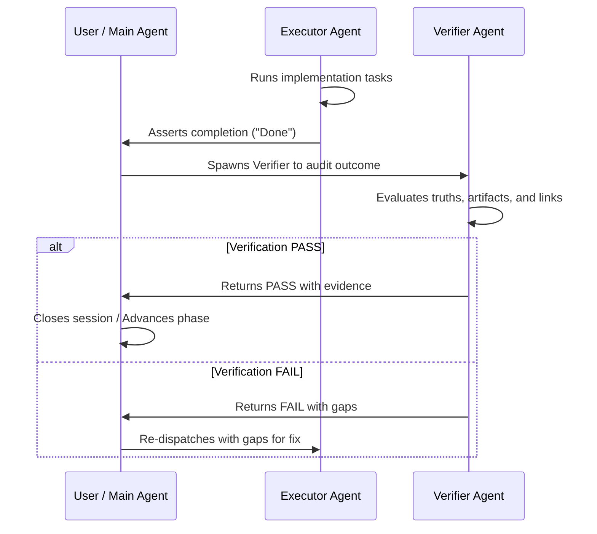

# Reference — Dual-Signal Completion Protocol

This reference outlines the dual-signal completion protocol utilized across all Hivemind session flows.

## Core Principle
Completion claims made by executing agents (e.g. "I have finished", "All tasks are complete") are not accepted based on claims alone. They must be validated by independent verification (the second signal) before the session can be formally closed.

## The Dual Signals

1. **Doer Signal (Signal 1)**: The implementer agent (e.g., `hm-executor`, `hm-code-fixer`) asserts that it has executed the tasks and claims completion.
2. **Verifier Signal (Signal 2)**: An independent auditor agent (e.g., `hm-verifier`, `hm-plan-checker`, `gate-evidence-truth`) runs verification logic and generates positive, concrete proof that the must-haves are satisfied.

## Evidence Hierarchy
Verification must provide evidence according to the following truth level structure:

- **Level 1 (L1) — Live Runtime Execution**: Executing a compiled CLI, sending an HTTP request to an active server, or running a browser test. (Strongest evidence).
- **Level 2 (L2) — Automatic Test Output**: Execution of unit/integration test suites (e.g., `npm run test` or `vitest`).
- **Level 3 (L3) — Static Analysis**: Compiling the code, running TypeScript check (`npx tsc --noEmit`), or linting.
- **Level 4 (L4) — Code Check / Grep**: Confirming that specific files exist, lines of code match regex patterns, or exports exist.
- **Level 5 (L5) — Documentation Check**: Reading file text or comments. (Weakest evidence).

## Remediating "Fake Done" Claims
If an agent claims completion without verified L1/L2 proof, the verifier must reject the claim, fail the gate, and halt session advancement.
