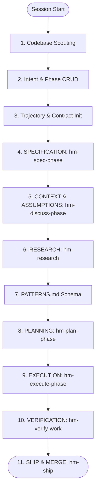

# Universal Rules & Execution Constitution

These rules govern all multi-agent orchestration, coordination, and execution workflows within the Hivemind composition engine runtime. All agents must comply with these guidelines.

---

## 1. Top-Level Role Hierarchy & Banned Inline Work

- **L0/L1 Orchestrator Strategic Boundary**: Front-facing L0/L1 orchestrator agents (e.g., `hm-l0-orchestrator`, `hm-orchestrator`) are strictly banned from performing detail work. They must NEVER read files for comprehension, analyze code blocks, write source code files, run tests, or execute command tasks inline.
- **Routing Enforced**: The orchestrator's sole authority is top-level intent classification, landscape mapping, path routing, coordinate delegation, and quality gatekeeping. All detail implementation, research, planning, and verification tasks must be routed to specialist subagents using the native `task` tool.
- **Generic Agent Prohibition**: It is strictly prohibited to use generic, untyped, or default agent types (e.g., `general`, `Explore`, `Plan`, or standard LLM models). All tasks must be assigned to domain-specific specialist agents (e.g., `hm-planner`, `hm-executor`, `hm-verifier`) defined under `.opencode/agents/hm-*`.

---

## 2. Context Budget & Performance Rules

- **Disk-First Loading**: Never inline full files into subagent prompts. Direct agents to relative paths on disk.
- **Scouting Strategy**: Before performing full file reads, use skimming and offset-reading strategies (glob, list, grep, regex, TOC offsets) to locate exact code regions and save token context.
- **Compaction Warning**: Monitor context growth. If significant context has been consumed, checkpoint progress. At 70% context budget, run the context compaction command and resume in a clean session.
- **History Preservation**: When a session is compacted or interrupted, always discover and resume from the deepest active/aborted child using its exact `task_id` rather than starting a fresh session. Do not repeat prompts when resuming.

---

## 3. Delegation, Session & Task Management

- **Discovery and Resuming**: Before spawning any subagent delegation, orchestrators must call `delegation-status({ action: "find-stackable" })` to discover active, aborted, or completed sessions. If a stackable session exists for the target agent, you MUST stack the new task onto it using `task_id` / `stackOnSessionId` to preserve state lineage.
- **Work Contracts & Trajectory**: Track all progress in the session trajectory. At each phase boundary, initialize and verify the `agent-work-contract`.
- **Checkpoint Verification**: Utilize `execute-slash-command` to transition through workflow checkpoints. Never execute phases sequentially in a single turn. Yield control after each dispatch.

---

## 4. The Canonical Hivemind (`hm-*`) Phase Loop Cycle

Every development phase must proceed through the following ordered, traversal-friendly loop cycle. Atomic git commits (incorporating both code changes and updated docs/plans) are mandatory after each checkpoint.

### Checkpoint 1: Codebase Scouting & Reading
- **When:** Starting of a session.
- **Action:** Read `.planning/ROADMAP.md`, `.planning/STATE.md`, and `.planning/REQUIREMENTS.md`. Cross-reference all claims with codebase truth. Never accept document claims without hard codebase verification. Decide the scan level of the code cluster to gain intelligence.

### Checkpoint 2: Phase CRUD & Document Alignment
- **When:** Based on user intent.
- **Action:** CRUD the phase and align the core documents (`ROADMAP.md`, `STATE.md`, `REQUIREMENTS.md`). Phase naming and numbering must be strictly conforming (e.g., `NN-name`). Validate against dependencies, global requirements, and architectural boundaries. Ensure the phase directory exists with aligned templates.

### Checkpoint 3: Trajectory & Contract Initialization
- **When:** Entering the active phase.
- **Action:** Initialize the phase trajectory and write/verify the `agent-work-contract`. Set bounds and success metrics.

### Checkpoint 4: SPECIFICATION (`hm-spec-phase`)
- **When:** Defining requirements.
- **Action:** Route to the `hm-planner` agent via `/hm-spec-phase`. Conduct a Socratic requirements loop. Score requirements ambiguity ( Composite clarity must meet ambiguity score ≤ 0.20). Write and commit `{phase_num}-SPEC.md`.

### Checkpoint 5: CONTEXT & ASSUMPTIONS (`hm-discuss-phase`)
- **When:** Aligning implementation decisions.
- **Action:** Route to the `hm-intent-loop` agent via `/hm-discuss-phase`. Identify gray areas, resolve assumptions, and lock key design decisions into `{phase_num}-CONTEXT.md`.

### Checkpoint 6: RESEARCH (`hm-research`)
- **When:** Investigating the stack and codebase.
- **Action:** Route to the `hm-phase-researcher` agent via `/hm-research`. Validate dependency versions in the lockfile and package.json. Query canonical docs and resolve library IDs using Context7 MCP. Formulate a STRIDE threat model. Write and commit `{phase_num}-RESEARCH.md`.

### Checkpoint 7: PATTERNS
- **When:** Designing complex or spec-compliant modules.
- **Action:** Generate `{phase_num}-PATTERNS.md` to specify reuse design patterns, classes, interfaces, and architecture structure before planning.

### Checkpoint 8: PLANNING (`hm-plan-phase`)
- **When:** Building the execution step list.
- **Action:** Route to the `hm-planner` agent via `/hm-plan-phase` to write `PLAN.md`. Loop with `hm-plan-checker` for correctness verification.

### Checkpoint 9: EXECUTION (`hm-execute-phase`)
- **When:** Implementing the changes.
- **Action:** Route to the `hm-executor` agent via `/hm-execute-phase`. Run execution tasks in waves, perform atomic commits, handle deviations, and verify output functionality.

### Checkpoint 10: VERIFICATION (`hm-verify-work`)
- **When:** Conducting final audits.
- **Action:** Route to the `hm-verifier` agent via `/hm-verify-work` to perform comprehensive verification checks.

### Checkpoint 11: SHIPPING (`hm-ship`)
- **When:** Completing work.
- **Action:** Route to the `hm-shipper` agent via `/hm-ship` to create pull requests, run final CI audits, and prepare for merging.

---

## 5. Quality Gate Triad Governance

All returned deliverables from specialist waves must pass the three-gate quality triad in strict sequence before final approval:
1. **Lifecycle Integration Gate** (`gate-l3-lifecycle-integration`): Check component directory compliance, CQRS write/read boundaries, event wiring, and SDK surface compliance.
2. **Spec Compliance Gate** (`gate-l3-spec-compliance`): Scan for spec-to-code gap analysis, bidirectional traceability, EARS acceptance criteria, and anti-patterns.
3. **Evidence Truth Gate** (`gate-l3-evidence-truth`): Evaluate the evidence hierarchy. Require live runtime proof (L1/L2 test output) over documentation summaries (L5). Reject mocked assertions.
