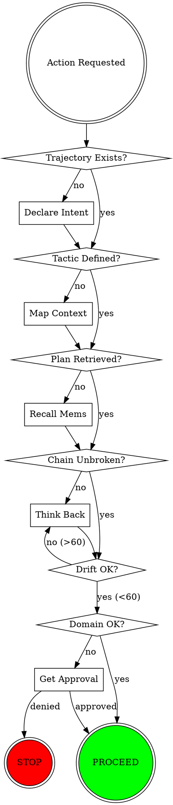

<EXTREMELY-IMPORTANT>
This is the absolute gatekeeping factor. NEVER ACT WITHOUT SUCCESS RETRIEVAL OF PLANNING.
Skipping this gatekeeping is the #1 cause of app development failures.
</EXTREMELY-IMPORTANT>

# Context-First Gatekeeping Skill

## The Prime Directive

**NEVER ACT WITHOUT SUCCESS RETRIEVAL OF PLANNING**

This is the absolute gatekeeping factor that determines whether app development succeeds or fails.

## The Five Pillars

### Pillar 1: Context-First Protocol

**Before ANY action:**
1. Load context (`scan_hierarchy`)
2. Recall relevant memories (`recall_mems`)
3. Check anchors for constraints (`list_anchors`)
4. Verify chain integrity (`think_back`)

**Pattern:**
```
LOAD → VERIFY → ACT
```

**NEVER:** Assume, guess, or "I think I remember..."

### Pillar 2: Parent Hierarchy Must Exist

**Unbroken chain requirement:**

```
Trajectory (Level 1)
└── Tactic (Level 2)
    └── Action (Level 3)
```

**Validation:**
```typescript
function validateHierarchy(): boolean {
  const hierarchy = scan_hierarchy({ action: "status" })
  
  // Level 1: Trajectory must exist
  if (!hierarchy.trajectory) {
    throw new Error("NO TRAJECTORY - Use declare_intent first")
  }
  
  // Level 2: Tactic must exist for actions
  if (!hierarchy.tactic && isActionLevel()) {
    throw new Error("NO TACTIC - Use map_context first")
  }
  
  // Level 3: Chain must be unbroken
  const ancestors = getAncestors()
  if (ancestors.length < requiredLevel) {
    throw new Error("BROKEN CHAIN - Repair with map_context")
  }
  
  return true
}
```

### Pillar 3: Never Act Without Verified Planning

**Planning must be retrieved, not assumed:**

```typescript
// WRONG - Acting on assumption
// "I remember we planned to do X, let me implement it"

// RIGHT - Verifying planning exists
const plan = recall_mems({ query: "plan trajectory tactic" })
if (!plan || plan.length === 0) {
  throw new Error("NO PLAN FOUND - Create plan before acting")
}

// THEN act based on verified plan
```

### Pillar 4: Domain Boundaries Enforced

**Never cross domains without explicit approval:**

| Domain | Allowed Paths | Forbidden Paths |
|--------|--------------|-----------------|
| Backend | `src/lib/`, `src/tools/`, `src/schemas/`, `src/hooks/` | `src/dashboard/`, `src/views/` |
| Frontend | `src/dashboard/`, `src/views/`, `src/components/` | `src/lib/`, `src/tools/`, `src/schemas/` |
| Shared | `src/types/`, `src/utils/`, `tests/` | None (can cross) |

**Validation:**
```typescript
function validateDomainBoundary(files: string[], domain: string): boolean {
  const boundaries = DOMAIN_BOUNDARIES[domain]
  
  for (const file of files) {
    const inAllowed = boundaries.allowed.some(p => file.startsWith(p))
    const inForbidden = boundaries.forbidden.some(p => file.startsWith(p))
    
    if (!inAllowed || inForbidden) {
      throw new Error(`DOMAIN VIOLATION: ${file} not in ${domain}`)
    }
  }
  
  return true
}
```

### Pillar 5: Context-Purified State

**After context compaction, NEVER trust memory:**

```typescript
// After compaction event
if (justCompacted) {
  // RELOAD everything
  think_back({ mode: "full" })  // Reload context
  recall_mems({ query: "recent" })  // Reload memories
  list_anchors()  // Reload constraints
  
  // VERIFY chain still intact
  validateHierarchy()
}
```

## The Gatekeeping Checklist

Before ANY implementation action:

```
┌─────────────────────────────────────────────────────────────┐
│                    GATEKEEPING CHECKLIST                     │
├─────────────────────────────────────────────────────────────┤
│  [ ] 1. Trajectory exists?         (declare_intent)         │
│  [ ] 2. Tactic defined?            (map_context)            │
│  [ ] 3. Plan retrieved from mems?  (recall_mems)            │
│  [ ] 4. Anchors loaded?            (list_anchors)           │
│  [ ] 5. Chain unbroken?            (scan_hierarchy)         │
│  [ ] 6. Drift acceptable (<60)?    (think_back)             │
│  [ ] 7. Domain boundaries OK?      (validateDomainBoundary) │
│  [ ] 8. No pending failures?       (brain.metrics.failures) │
└─────────────────────────────────────────────────────────────┘

IF ANY CHECK FAILS → STOP, FIX BEFORE PROCEEDING
```

## Failure Escalation Protocol

When a gate fails:

### Level 1: Auto-Recoverable
- Missing tactic → `map_context({ level: "tactic" })`
- High drift → `think_back({ mode: "full" })`

### Level 2: User Guidance Needed
- No plan found → Ask user to provide/confirm plan
- Domain violation → Ask user for cross-domain approval

### Level 3: Critical - Stop Chain
- No trajectory → Must `declare_intent` (new session)
- Broken chain → Must manually repair hierarchy

## Integration with Sequential Orchestration

This skill is the **first step** in sequential-orchestration:

```
1. context-first-gatekeeping (THIS SKILL)
   ↓ All gates pass
2. sequential-orchestration
   ↓ Sequential delegation
3. export_cycle
   ↓ Intelligence captured
4. map_context
   ↓ Hierarchy updated
```

## Red Flags - Immediate Stop

| Red Flag | Meaning | Required Action |
|----------|---------|-----------------|
| "I think..." | Assumption, not verified | STOP, verify with recall_mems |
| "Let me just..." | Bypassing gatekeeping | STOP, run gatekeeping checklist |
| "Probably works" | No verification | STOP, run quality gates |
| "I'll fix later" | Leaving broken chain | STOP, fix now before proceeding |
| "Crossing to other domain" | Boundary violation | STOP, get approval or reroute |

## Quick Commands

```bash
# Full gatekeeping check
scan_hierarchy({ action: "status" })  # Check hierarchy
think_back({ mode: "check" })          # Check drift
recall_mems({ query: "plan" })         # Check planning
list_anchors()                        # Check constraints

# Repair broken chain
map_context({ level: "tactic", content: "..." })
map_context({ level: "action", content: "..." })

# Context recovery
think_back({ mode: "full" })
```

## Gatekeeping Flow Diagram



---

*This skill is a companion to `hivemind-governance` and must be loaded BEFORE any implementation work begins.*