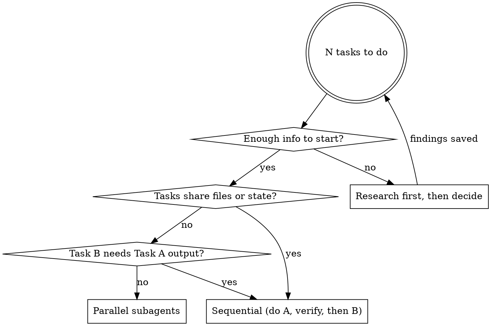

# Delegation Intelligence

**Core principle:** Every subagent cycle exports intelligence. Parallel when independent. Sequential when dependent. Never ignore a return.

## When to Use

- About to dispatch 2+ tasks
- Deciding whether to do work yourself or delegate
- Subagent just returned a result
- Managing a batch of parallel subagents
- Planning implementation order for multiple changes

## Decision: Parallel vs Sequential



### Common Patterns

**Parallel-safe (dispatch simultaneously):**
- Writing tests for different modules
- Researching independent topics
- Reading/analyzing separate files
- Creating independent utility functions

**Must be sequential (wait between each):**
- Schema change → tools that use schema → tests that verify tools
- Foundation module → modules that import it
- Config change → hooks that read config
- Any chain where file B imports from file A

**Hybrid (batch by dependency layer):**
```
Layer 1 (parallel): schema.ts + types.ts + config.ts
  ↓ wait, verify all pass
Layer 2 (parallel): tool-a.ts + tool-b.ts (both import from layer 1)
  ↓ wait, verify all pass
Layer 3 (parallel): test-a.ts + test-b.ts
  ↓ wait, verify all pass
Layer 4 (sequential): integration test → full ecosystem check
```

## After EVERY Subagent Returns — Mandatory

```typescript
// Parse the return. Was it truly successful?
// Then call export_cycle. NO EXCEPTIONS.

export_cycle({
  outcome: "success" | "partial" | "failure",
  findings: "What was learned or decided (1-3 sentences)"
})
```

**What `export_cycle` does internally (zero cooperation needed):**
1. Updates hierarchy tree — action node → complete/blocked
2. Saves findings to mems brain — shelf `cycle-intel`, tagged with timestamp
3. Links to timestamp chain — grep-able across all artifacts forever
4. Clears failure flag if present — stops the system prompt warning

**What the hook auto-captures (even without `export_cycle`):**
- Last message from subagent (first 500 chars) → `brain.cycle_log[]`
- Failure signal detection → `brain.metrics.pending_failure_ack`
- Turn count of the cycle → tracked automatically

**`export_cycle` adds RICHER intelligence on top of auto-capture:**
- Your interpretation of the outcome (not just raw text)
- Structured findings saved as mems (survive compaction + sessions)
- Hierarchy tree updated (shows decision trail visually)

## Reward — What Good Delegation Gets You

After 5 cycles with proper export:
```bash
# See the full decision trail
node bin/hivemind-tools.cjs state hierarchy
# t_30141102026 — Build auth system [ACTIVE]
#   └── tc_45141102026 — JWT middleware [ACTIVE]
#       ├── a_00151102026 — Token validator [COMPLETE]
#       │   └── cycle: success — "jose library, 12 tests"
#       ├── a_15151102026 — Refresh logic [BLOCKED]
#       │   └── cycle: partial — "rotation works, Redis fails"
#       └── a_30151102026 — Integration [ACTIVE] ← cursor

# Recall ALL intelligence from subagent work
recall_mems({ shelf: "cycle-intel" })

# Trace everything linked to a specific cycle
node bin/hivemind-tools.cjs session trace 15151102026
# Shows: hierarchy node + mem + session log — full chain
```

**Without export:** After compaction, all subagent intelligence is gone. You have a vague "it was done" but no decisions, no failures, no rationale.

## Consequence — What Bad Delegation Costs

| Pattern | Cost |
|---------|------|
| Dispatch without `map_context` first | No hierarchy node → cycle results orphaned |
| Skip `export_cycle` after return | Intelligence lost on compaction, tree not updated |
| Ignore failure signal in result | `pending_failure_ack` flag → warning every turn |
| Claim "complete" over a partial result | False confidence, bug surfaces 10x harder later |
| Parallel when files overlap | Git conflicts, race conditions, corrupted state |
| Sequential when independent | 3x slower than necessary, wasted context |

## Subagent Prompt Engineering

When dispatching, include:
1. **Specific task** — what to do (not "figure out what to do")
2. **File context** — which files to read/modify (don't make subagent discover)
3. **Verification** — how to confirm success (test command, expected output)
4. **Return format** — what to report back (outcome + findings + files changed)

```
BAD:  "Fix the auth system"
GOOD: "In src/auth/middleware.ts, the JWT validation on line 45 throws
       on expired tokens instead of refreshing. Fix the validation to
       call refreshToken() first. Verify: npm test -- auth.test.ts
       should show 0 failures. Report: outcome + which lines changed."
```

## Red Flags

| Thought | Reality |
|---------|---------|
| "Subagent said done, moving on" | Parse the result. Check for caveats. Call `export_cycle`. |
| "The failure is minor, I'll note it later" | You won't. Call `export_cycle({ outcome: "partial" })` NOW. |
| "I'll summarize all cycles at the end" | Compaction fires when it wants. Export each one as it returns. |
| "These tasks are independent enough" | Check: do they share ANY files? If yes, sequential. |
| "I'll do it all myself, faster" | 3 independent tasks × 5 min = 15 min. Or 5 min parallel. Delegate. |
| "The subagent can figure out the context" | No it can't. Provide files, constraints, verification commands. |
