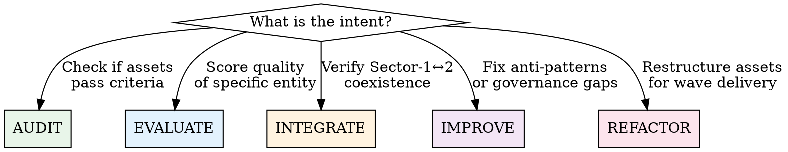

# HIVEMIND Framework Auditor

## Purpose

Single-load skill that routes `hiveminder` to the correct audit/improvement workflow based on intent. Prevents skill-avalanche (D-02) by loading ONLY the relevant reference for the current operation.

## Mode Router

Before ANY action, determine which mode applies:

---

## Mode 1: AUDIT — "Does it pass?"

**When**: Checking structural or behavioral integrity after changes, before wave gates, or on session start.

**MANDATORY — READ**: [`references/audit-criteria.md`](references/audit-criteria.md)
Then run: `bash scripts/structural-audit.sh`

**Do NOT load**: anti-pattern-catalog.md, development-patterns.md, session-mechanics.md

**Workflow**:
1. Run `scripts/structural-audit.sh` — captures S-01 through S-10 automatically
2. Review output: PASS/FAIL/WARN per criterion
3. For any FAIL: check if behavioral (B-series) verification is also needed
4. For coexistence concerns: check C-series criteria
5. Generate report using `assets/audit-report-template.md`

**Output**: Structured audit report with pass/fail per criterion + remediation paths

---

## Mode 2: EVALUATE — "How good is it?"

**When**: Scoring a specific entity (skill, command, workflow, agent) against quality dimensions.

**MANDATORY — READ**: [`references/audit-criteria.md`](references/audit-criteria.md) (for the relevant section only)

**For skill evaluation**: Also load the `skill-judge` skill (external) for D1-D8 scoring.
**For command evaluation**: Check GREEN-FLAG pattern in [`references/development-patterns.md`](references/development-patterns.md) Section 1 only.
**For workflow evaluation**: Check workflow pattern in [`references/development-patterns.md`](references/development-patterns.md) Section 2 only.

**Do NOT load**: anti-pattern-catalog.md, session-mechanics.md, alignment-matrix.md

**Workflow**:
1. Identify entity type (skill / command / workflow / agent)
2. Load the relevant section of audit-criteria.md
3. Score against applicable criteria
4. Compare to GREEN-FLAG pattern from development-patterns.md
5. Return structured score with specific improvement actions

---

## Mode 3: INTEGRATE — "Will it coexist?"

**When**: Verifying Sector-1 and Sector-2 don't conflict, checking user config preservation, validating schema compatibility.

**MANDATORY — READ**: [`references/audit-criteria.md`](references/audit-criteria.md) Section 1.3 (C-series only)
**ALSO READ**: [`references/session-mechanics.md`](references/session-mechanics.md) (full — understanding lifecycle is critical)
**ALSO READ**: [`references/alignment-matrix.md`](references/alignment-matrix.md)

**Do NOT load**: anti-pattern-catalog.md, development-patterns.md

**Workflow**:
1. Run C-01 through C-05 checks
2. Verify session lifecycle expectations from session-mechanics.md
3. Cross-reference alignment-matrix.md for gap status
4. Flag any Sector-1 changes that would break Sector-2 contracts
5. Generate integration health report

---

## Mode 4: IMPROVE — "Fix what's broken"

**When**: Anti-patterns detected in agent behavior, governance gaps found, delegation quality is poor, session rot observed.

**MANDATORY — READ**: [`references/anti-pattern-catalog.md`](references/anti-pattern-catalog.md)
Then run: `bash scripts/anti-pattern-detector.sh`

**If delegation-related**: Also read [`references/governance-checklists.md`](references/governance-checklists.md) Section 4 (Delegation Health).
**If session-related**: Also read [`references/session-mechanics.md`](references/session-mechanics.md).
**If deviation handling**: Read [`references/governance-checklists.md`](references/governance-checklists.md) Section 5 (Deviation R1-R4).

**Do NOT load**: development-patterns.md, alignment-matrix.md (unless improvement requires restructuring)

**Workflow**:
1. Run `scripts/anti-pattern-detector.sh` — identifies D-01 through D-15
2. Classify each detected pattern by severity (P0/P1/P2)
3. For each P0: apply fix from catalog immediately
4. For P1/P2: create remediation plan linked to active trajectory
5. Verify fixes with `scripts/structural-audit.sh`

---

## Mode 5: REFACTOR — "Restructure for delivery"

**When**: Preparing assets for a wave delivery, reorganizing for progressive disclosure, restructuring command/workflow chains.

**MANDATORY — READ**: [`references/development-patterns.md`](references/development-patterns.md) (full)
**ALSO READ**: [`references/governance-checklists.md`](references/governance-checklists.md)

**Do NOT load**: anti-pattern-catalog.md (unless refactor reveals anti-patterns), session-mechanics.md

**Workflow**:
1. Identify refactor scope from active wave/plan
2. Validate current state with `scripts/structural-audit.sh`
3. Apply GREEN-FLAG patterns from development-patterns.md
4. Ensure all new/modified entities pass governance checklists
5. Re-run structural audit to confirm no regressions
6. Update alignment-matrix.md with new gap status

---

## Anti-Patterns This Skill Prevents

| Anti-Pattern | How This Skill Prevents It |
|---|---|
| D-02 Skill avalanche | Mode router loads ONLY relevant references per operation |
| D-03 Redundant research | Scripts provide deterministic checks — no re-investigation |
| D-04 Planning artifact dump | All outputs use structured templates from assets/ |
| D-05 Unrouted execution | Every mode has explicit workflow steps traced to criteria |
| D-15 Skill without routing | Decision tree forces mode selection before any action |

## Remediation Routing — Which Skills Fix Which Entity

When EVALUATE or IMPROVE mode detects a deficient entity, load ONLY the skill(s) needed to fix it:

| Entity Type | Deficiency Detected | Load These Skills to Fix |
|---|---|---|
| **Command** (poor body) | Missing `<objective>/<context>/<process>/<success_criteria>` structure | Load `development-patterns.md` Section 1. Use GREEN-FLAG command template to rewrite body. |
| **Command** (unwired) | Missing `execution_context` or `required_*` fields | Load `development-patterns.md` Section 1. Add frontmatter fields linking to workflow/skills/templates/refs/prompts. |
| **Workflow** (v1 or weak) | Missing `contract_version: 2`, `entry_criteria`, `skill_bundles` per step | Load `development-patterns.md` Section 2. Migrate to Tier-1 or Tier-2 pattern. |
| **Skill** (poor trigger) | Description doesn't answer WHAT + WHEN + KEYWORDS | Load external `skill-judge` for D4 scoring. Rewrite description with trigger scenarios. |
| **Skill** (no routing) | Body loaded but no workflow/router/decision-tree in content | Load `development-patterns.md` Section 3. Add mode router or workflow steps to body. |
| **Skill** (bloated) | SKILL.md > 500 lines | Load `development-patterns.md` Section 3. Split into references/ with explicit loading triggers. |
| **Agent** (incomplete) | Missing `tasks:`, `workflows:`, or `prompts:` fields | Load `audit-criteria.md` S-01 + S-15. Add missing fields following hiveminder.md as pattern. |
| **Template** (unlinked) | No command or workflow references it | Load `audit-criteria.md` S-12. Wire to command's `required_templates` or workflow step's output. |
| **Prompt** (orphan) | No command references it via `required_prompts` | Load `audit-criteria.md` S-11. Wire to command or delete if truly unused. |
| **Reference** (orphan) | No command, workflow, or skill references it | Load `audit-criteria.md` S-13. Wire to relevant entity or delete. |
| **Delegation** (poor packet) | Missing `delegation_source`, `return_schema`, or scope | Load `development-patterns.md` Section 4. Apply minimum viable packet template. |
| **Planning artifact** (unlinked) | Exists in `.hivemind/` but no hierarchy parent | Load `governance-checklists.md` Section 1. Link to trajectory→tactic→action tree. |
| **Chain group** (inconsistent) | `chain_group` values don't match logical agent domains | Load `audit-criteria.md` S-16. Standardize group naming to match `owner_agent` domains. |

## NEVER Do

- **NEVER** load all 6 reference files at once — use mode router to select
- **NEVER** run audit scripts on `src/` code files — this skill is for Sector-2 framework assets only
- **NEVER** modify files without first running structural-audit.sh to establish baseline
- **NEVER** skip the deviation classification (R1-R4) when encountering unplanned situations during refactor
- **NEVER** treat anti-pattern detection output as "informational" — every P0 finding MUST be addressed before proceeding
- **NEVER** assume `kind: utility` commands need `execution_context` — only `kind: router` commands require it
- **NEVER** flatten user permission structures during sync (e.g., `bash: {"git push": "ask", "*": "allow"}` must NOT become `bash: "allow"`)

## Reference File Index

| File | Lines | Load When | Do NOT Load When |
|---|---|---|---|
| `references/audit-criteria.md` | 249 | Modes 1, 2, 3 | Mode 4 (unless improving structural issues) |
| `references/anti-pattern-catalog.md` | 188 | Mode 4 | Modes 1, 2, 3 (unless anti-patterns surfaced) |
| `references/session-mechanics.md` | 255 | Modes 3, 4 | Mode 1 (structural only), Mode 5 (restructure) |
| `references/development-patterns.md` | 357 | Modes 2, 5 | Mode 1 (audit only), Mode 3 (integration only) |
| `references/governance-checklists.md` | 248 | Modes 4, 5 | Modes 1, 2 (unless governance issues found) |
| `references/alignment-matrix.md` | 75 | Modes 3, 5 | Modes 1, 2, 4 |

## Script Index

| Script | Purpose | Run When |
|---|---|---|
| `scripts/structural-audit.sh` | Deterministic S-01→S-18 checks | Modes 1, 4, 5 |
| `scripts/anti-pattern-detector.sh` | Static D-01→D-15 detection | Mode 4 |
