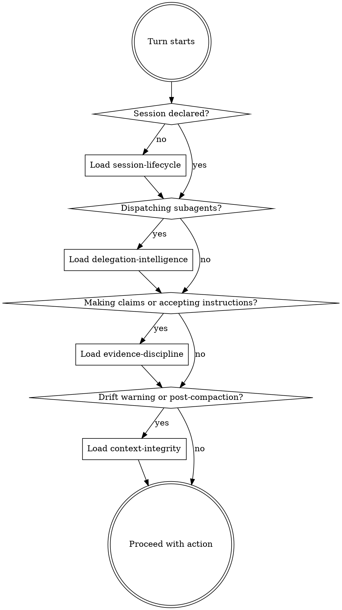

<EXTREMELY-IMPORTANT>
HiveMind governance is active in this project. You MUST follow the checkpoint below before ANY action — including clarifying questions, file reads, and code changes.

This is not optional. This applies in ALL governance modes (strict, assisted, permissive).
</EXTREMELY-IMPORTANT>

# HiveMind Governance — Bootstrap Checkpoint

## The Checkpoint (Every Turn)



## Three Forces

**REWARD** — You become smarter:
- `scan_hierarchy` → see your full decision tree, know where cursor is
- `recall_mems` → access decisions from past sessions without re-exploring
- `think_back` → turning points + anchors = instant context refresh
- `node bin/hivemind-tools.cjs session trace <stamp>` → full evidence chain across all artifacts
- `export_cycle` → builds persistent intelligence from subagent work

**CONSEQUENCE** — Skipping costs you:
- No `declare_intent` → no drift detection, silent wandering, no tree
- No `map_context` → drift compounds each turn, stale prompt warnings pile up
- No `export_cycle` → subagent intelligence lost on compaction, decisions re-made
- No `save_mem` → next session starts from zero knowledge
- Ignoring failure → system prompt warns every turn until acknowledged

**DELEGATION** — Split work correctly:
- Independent tasks → parallel subagents + `export_cycle` after each
- Dependent tasks → sequential + verify between steps
- Always: `export_cycle` after every subagent return, never skip failure

## Rationalization Table

| Thought | Reality |
|---------|---------|
| "I'll declare intent later" | Drift detection is OFF until you do. Every turn without it is untracked. |
| "This is just a quick fix" | Quick fixes compound into chaos. Use `mode: "quick_fix"` — it's designed for this. |
| "The subagent said done, moving on" | Parse the result. Was it truly done? Any caveats? Call `export_cycle`. |
| "I'll save a mem at the end" | Compaction may fire before the end. Save NOW. |
| "Governance mode is permissive, I can skip" | Permissive tracks silently. Your future self still needs the data. |
| "I know what I'm doing" | The tree doesn't. Update it so the NEXT agent knows too. |
| "This failure is minor" | Unacknowledged failure → warning every turn. Address it now. |
| "I remember the context" | After compaction you won't. After session switch you can't. Export it. |

## Discipline Skills

Load these when the checkpoint triggers:

| Skill | Load When |
|-------|-----------|
| `session-lifecycle` | Starting, updating, or closing sessions |
| `delegation-intelligence` | Dispatching subagents, deciding parallel vs sequential, processing returns |
| `evidence-discipline` | Making claims, accepting instructions, validating completions |
| `context-integrity` | Drift detected, post-compaction, stale context, recovering from chaos |

## Quick Command Reference

```bash
# Know where you are
node bin/hivemind-tools.cjs state hierarchy

# Know what happened
node bin/hivemind-tools.cjs session trace <stamp>

# Know if things are consistent
node bin/hivemind-tools.cjs validate chain

# Know everything
node bin/hivemind-tools.cjs ecosystem-check
```
