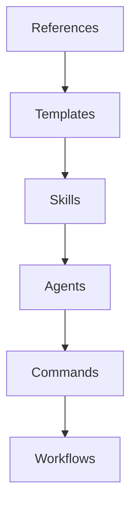

# Architect Stage Workflow

> Designs the structure, contracts, and build order for framework assets.

## Entry Criteria

- [ ] Spec stage completed (verified via state-update.sh)
- [ ] Specification approved in STATE.md
- [ ] Target asset type(s) confirmed
- [ ] Gate check passes:
  ```bash
  bash .opencode/skills/hivefiver-coordination/scripts/gate-check.sh architect "$(pwd)"
  # Expected: {"allowed": true, "reason": "spec completed"}
  ```

## Steps

### Step 1: Verify Previous Stage
**Action:** Verify spec stage is completed:
```bash
bash .opencode/skills/hivefiver-coordination/scripts/state-update.sh read | grep -q '"spec"'
```

**Verification:** Command exits 0 (spec found in completed stages).

### Step 2: Load Approved Specification
**Action:** Load approved specification from state:
```bash
bash .opencode/skills/hivefiver-coordination/scripts/hivefiver-tools.sh state load
```

**Verification:** All spec fields accessible and parsed correctly.

### Step 3: Design Asset Topology
**Action:** Design the structure of assets:
| Design Element | Description |
|----------------|-------------|
| Asset count | Number of assets needed |
| Relationships | Asset dependencies and references |
| Directory structure | Where each asset lives |
| Naming conventions | Kebab-case identifiers |

**Verification:** Topology diagram or list created.

### Step 4: Define Contracts Per Asset
**Action:** For each asset, define its contract per asset-contracts.md:

**Agent Contract:**
```yaml
name: string
description: string
scope_paths: { allow: [], forbidden: [] }
verification_obligations: array
```

**Command Contract:**
```yaml
name: string
description: string
agent: string
mode: inline|subtask
arguments: object
```

**Skill Contract:**
```yaml
name: string
description: string
# Body: Purpose, Triggers, References
```

**Workflow Contract:**
```yaml
name: string
description: string
version: string
contract_version: string
steps: array
```

**Verification:** Each asset has complete contract definition.

### Step 5: Map Dependencies
**Action:** Identify dependencies between assets:


**Verification:** Dependency graph created with clear ordering.

### Step 6: Create Build Order
**Action:** Sequence assets in dependency order:
1. References (if needed) - no dependencies
2. Templates (if needed) - may depend on references
3. Skills (if needed) - may depend on references
4. Agents - may depend on skills
5. Commands - depend on agents
6. Workflows - depend on commands

**Verification:** Build order is deterministic and dependency-respecting.

### Step 7: Run Schema-Guard Snapshot
**Action:** For any existing files that will be modified:
```bash
# Snapshot existing files before modification
bash .opencode/skills/hivefiver-coordination/scripts/schema-guard.sh snapshot .opencode/agents/<target>.md
bash .opencode/skills/hivefiver-coordination/scripts/schema-guard.sh snapshot .opencode/commands/<target>.md
```

**Verification:** Snapshots created successfully (exit code 0).

### Step 8: Validate Asset Contracts
**Action:** Verify contract schemas are valid:
```bash
bash .opencode/skills/hivefiver-coordination/scripts/hivefiver-tools.sh verify asset-contracts
```

**Verification:** Tool reports contracts valid.

### Step 9: Present Architecture for Approval
**Action:** Display architecture plan including:
- Asset topology (list/diagram)
- Contracts per asset (YAML)
- Dependency graph (ordered list)
- Build order (numbered sequence)
- Risk assessment (low/medium/high)

**Verification:** User explicitly approves architecture.

### Step 10: Update Pipeline State
**Action:** Update pipeline state:
```bash
# Set current stage
bash .opencode/skills/hivefiver-coordination/scripts/state-update.sh set-stage architect

# Mark architect as completed
bash .opencode/skills/hivefiver-coordination/scripts/state-update.sh add-completed architect

# Set target with architecture summary
bash .opencode/skills/hivefiver-coordination/scripts/state-update.sh set-target "architecture approved: <N> assets"

# Set gate result
bash .opencode/skills/hivefiver-coordination/scripts/state-update.sh set-gate passed
```

**Verification:** State update commands return success.

### Step 11: Run Quality Check
**Action:** Verify stage completion:
```bash
bash .opencode/skills/hivefiver-coordination/scripts/quality-check.sh architect "$(pwd)"
```

**Verification:** Output shows no blocking errors.

## Exit Criteria

- [ ] Asset topology designed
- [ ] Contracts defined for all assets
- [ ] Dependencies mapped
- [ ] Build order established
- [ ] Schema snapshots created (for modifications)
- [ ] User approval obtained
- [ ] Architect stage marked complete

## Error Routing

| Error | Recovery |
|-------|----------|
| Spec not completed | Route back to `/hivefiver-spec` |
| Architecture rejected | Revise based on specific feedback |
| Circular dependency | Restructure assets to break cycle |
| Contract conflict | Clarify asset boundaries |
| Schema-guard fails | Check file permissions or path |

## Offer Next

| Condition | Next Command |
|-----------|-------------|
| Architecture approved | `/hivefiver-build` |
| Architecture needs revision | `/hivefiver-architect --revise` |
| Return to spec | `/hivefiver-spec --revise` |

## Output Format

Every architect stage completion MUST emit this JSON structure:

Template reference: `.opencode/templates/hivefiver/stage-output-architect.md`

```json
{
  "stage": "architect",
  "status": "completed",
  "timestamp": "<ISO-8601>",
  "topology": {
    "assets": [
      { "type": "agent | command | skill | workflow", "name": "...", "path": "..." }
    ],
    "total_count": 0
  },
  "contracts": {
    "per_asset": [
      { "name": "...", "type": "...", "contract": {} }
    ]
  },
  "dependencies": {
    "graph": [
      { "source": "...", "target": "...", "type": "requires | references" }
    ],
    "build_order": ["references", "templates", "skills", "agents", "commands", "workflows"],
    "is_acyclic": true
  },
  "risk_assessment": "low | medium | high",
  "state_updates": {
    "pipeline_active": true,
    "current_stage": "architect",
    "completed_stages": ["start", "discovery", "intake", "spec", "architect"],
    "pipeline_target": "architecture approved: <N> assets"
  },
  "next_command": "/hivefiver-build",
  "gate_result": "passed | failed"
}
```
