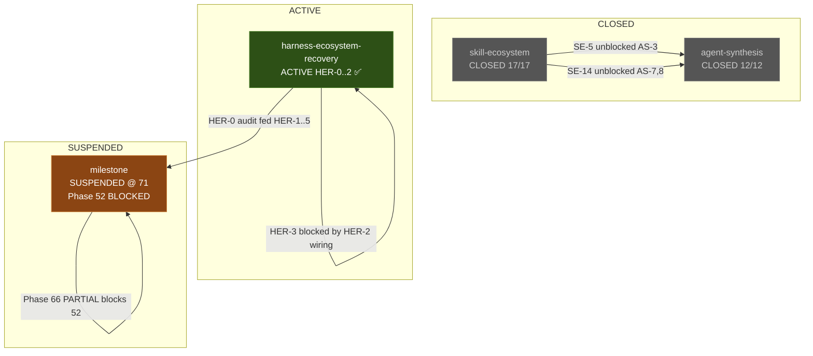
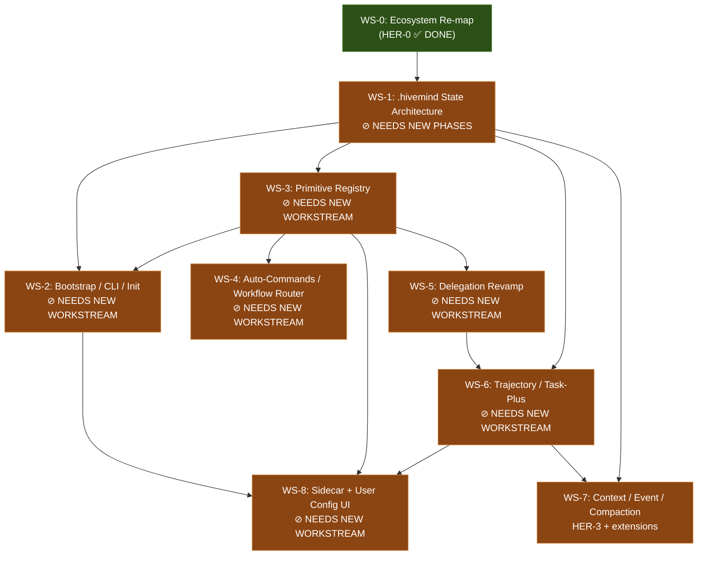

# Hivemind V3 — Master Project Skeleton

> **Purpose:** Frame the complete MVP landscape — classified, hierarchically structured, with jump links to on-disk artifacts and tracking notes toward workstreams, phases, and dependencies. This document outlines **what needs to be done**, not how to do it. All research, audits, and implementation are downstream.

> **How to read this document:**
> - Each section is self-contained with its own tracking status
> - `→ ref:` links point to on-disk artifacts (verify before following)
> - `⊘ NEEDS-PHASE` marks gaps that require new workstream phases
> - `✅ COVERED` marks items already addressed by existing phases
> - `⚠️ PARTIAL` marks items with incomplete coverage
> - Feature IDs (`f-03a`, `f-04`, etc.) trace back to the original prompt

---

## Table of Contents

1. [Project Identity](#1-project-identity)
2. [The 4 Feature Paths](#2-the-4-feature-paths)
3. [The 2 Lineages](#3-the-2-lineages)
4. [Workstream Landscape](#4-workstream-landscape)
5. [Feature Development Registry](#5-feature-development-registry)
6. [Feature Gap Classification by Path](#6-feature-gap-classification-by-path)
7. [Governance Document Status](#7-governance-document-status)
8. [.hivemind State Architecture](#8-hivemind-state-architecture)
9. [Development Order Framework](#9-development-order-framework)
10. [External References & Synthesis Sources](#10-external-references--synthesis-sources)
11. [Tracking Notes](#11-tracking-notes)

---

## 1. Project Identity

**Hivemind V3** is a **runtime composition engine** for OpenCode — an npm package (`opencode-harness`) providing tools, hooks, and a plugin for delegated session orchestration, continuity persistence, concurrency control, and runtime guardrails.

→ ref: [PROJECT.md](.planning/PROJECT.md)

### The Three Halves

| Half | What | Where | Current State |
|------|------|-------|---------------|
| **Hard Harness** (npm package) | Tools (write-side), Hooks (read-side), Plugin (assembly), Shared (leaf) | `src/` | 53 files in `src/lib/`, 16 tools in `src/tools/`, 8 hooks in `src/hooks/` |
| **Soft Primitives** (user-configurable) | Skills, Agents, Commands, Rules, Permissions | `.opencode/` | 89 agents, 59 skills, 18 commands |
| **Internal State** (deep module persistence) | Session journals, execution lineage, runtime state, vector/graph memory | `.hivemind/` | 7 subdirectories (daily-notes, event-tracker, journal, lineage, poor-prompts, state, uat) |

### Non-Negotiable Boundaries

- **GSD tooling is NOT shipped.** 65 gsd-* skills and 33 gsd-* agents are development tools only
- **`.opencode/` is for OpenCode primitives only** (Q6 decision). All internal state writes to `.hivemind/`
- **Skills are one component, not the product.** The product is the harness
- **Zero business logic in the plugin layer** — `src/plugin.ts` is assembly only

---

## 2. The 4 Feature Paths

All features, tools, engines, hooks, and modules MUST be classified into exactly one of these paths.

### Path 1 — Agent-Callable Deterministic Features

**Purpose:** Things agents can explicitly call or skills can activate.

| Sub-domain | Examples | Current Modules |
|------------|----------|-----------------|
| Task management | Task CRUD, task-plus, trajectory | `trajectory/`, `agent-work-contracts/` |
| Delegation & coordination | delegate-task, delegation-status, spawner | `delegation-manager.ts`, `spawner/`, `sdk-delegation.ts`, `command-delegation.ts` |
| Context & memory | Context retrieval, purification, graph | `continuity.ts`, `state.ts` |
| Workflow CRUD | Phase/plan/research operations | `doc-intelligence/` |
| Role-specific tools | Code (executors), docs (writers), validate (reviewers) | `src/tools/*` |

**Primary gap:** Agent permission matrix + workflow binding + practical task lifecycle are not wired end-to-end.

### Path 2 — Runtime Programmatic Features

**Purpose:** Automatic operations via OpenCode hooks, events, injections, transforms, compaction.

| Sub-domain | Examples | Current Modules |
|------------|----------|-----------------|
| Event subscriptions | session.created, session.idle, session.deleted | `src/hooks/plugin-event-observers.ts` |
| Prompt/message transform | system.transform, messages transform | `src/hooks/messages-transform.ts` |
| Compaction hooks | Compact survival, structured append | `prompt-packet/compaction-preservation.ts` |
| Tool gates | Pre/post tool-use interception | `src/hooks/create-tool-guard-hooks.ts` |
| Event tracking | Classify, persist, dual-write | `event-tracker/` |
| Runtime pressure | 10-tier pressure model, control plane | `runtime-pressure/`, `control-plane/` |
| Session entry | Purpose classification, intake gate | `session-entry/` |

**Primary gap:** Runtime hooks produce noisy state, not useful queryable context. Event-tracker output is rubbish for retrieval.

### Path 3 — Governance / Registry / Permissions / Configuration

**Purpose:** The control layer — what exists, what is allowed, what is wired, what can be stacked/chained.

| Sub-domain | Examples | Current Modules |
|------------|----------|-----------------|
| Primitive registry | Agent/skill/command/tool discovery | `primitive-registry.ts`, `primitive-loader.ts`, `primitive-scanners.ts` |
| Config compiler | Cross-primitive validation | `config-compiler.ts`, `cross-primitive-validator.ts` |
| Permission matrix | Agent→tool→skill access rules | `category-gates.ts`, `category-gate-audit.ts` |
| Restart validation | Primitive discoverability checks | `runtime-validator.ts`, `validate-restart` tool |
| Runtime policy | Trusted policy loading, workspace overrides | `runtime-policy.ts`, `workspace-runtime-policy.ts` |
| State root separation | Q6: `.hivemind/` canonical | `continuity.ts`, `delegation-persistence.ts` |

**Primary gap:** Governance must be authoritative before runtime automation grows. Broken command refs, permission blocks, and unclear registry ownership were found in UAT.

### Path 4 — Sidecar + User Onboarding + Safe Configuration

**Purpose:** User-facing setup, configuration, and control surfaces.

| Sub-domain | Examples | Current Modules |
|------------|----------|-----------------|
| CLI install/init | `npx` bootstrap, interactive setup | `src/cli/` (Phase 40 foundation) |
| `.hivemind/configs.json` | Language, mode, expert level, toggles | ⊘ NOT BUILT |
| Project bootstrap | Greenfield vs brownfield setup | ⊘ NOT BUILT |
| Sidecar dashboard | Artifact rendering, read-only state | `sidecar/readonly-state.ts` (Phase 42 foundation) |
| Doctor/checkup | Primitive health, configuration validation | ⊘ NOT BUILT |
| hf-assisted customization | Safe primitive compilation | `config-workflow/` |

**Primary gap:** This entire path was NOT validated by Team B UAT. If install/init/onboarding is weak, all other features remain internal toys.

---

## 3. The 2 Lineages

Every shipped primitive (agent, skill, command, tool) belongs to exactly one lineage.

### `hm-*` Lineage — Product Development Runtime

**Owns:** Planning, implementation, research, debugging, validation, quality gates, task lifecycle, trajectory, delegation for product work, state continuity, project workflows, codebase/document intelligence, long-session survival.

**Binding:** STRICT — hm-* agents load ONLY hm-*, gate-*, and stack-* skills.

**Current count:** 45 hm-* agents (1 L0, 1 L1, 28+ L2) + 35 hm-* skills (20 L2 + 13 L3 + 2 other)

### `hf-*` Lineage — Meta-Builder / Configuration / Compilation

**Owns:** Creating agents, skills, commands, tools. Configuring primitives. Stacking/chaining. Validating frontmatter/schema. Naming conventions. Safe customization. Doctor/checkup sessions.

**Binding:** FLEXIBLE — hf-* agents may cross-reference hm-* skills when documented.

**Current count:** 11 hf-* agents (1 L0, 1 L1, 8 L2, 1 meta-builder) + 13 hf-* skills

### Also present (not lineage-shipped)

| Prefix | Count | Purpose |
|--------|-------|---------|
| `gate-*` | 3 skills | Internal quality gate triad — THIS PROJECT ONLY |
| `stack-*` | 6 skills | Reference: bun-pty, json-render, nextjs, opencode, vitest, zod |
| `gsd-*` | 65 skills + 33 agents | Development tooling — NOT SHIPPED |

---

## 4. Workstream Landscape

### 4.1 Workstream Status Matrix

| Workstream | Status | Phases | Key Artifact |
|------------|--------|--------|--------------|
| **milestone** | SUSPENDED @ Phase 71 | 71 phases (most complete, Phase 52 BLOCKED, Phase 66 PARTIAL) | → ref: [milestone/STATE.md](.planning/workstreams/milestone/STATE.md) |
| **skill-ecosystem** | CLOSED | 17/17 phases (SE-10 deferred) | → ref: [skill-ecosystem/STATE.md](.planning/workstreams/skill-ecosystem/STATE.md) |
| **agent-synthesis** | CLOSED | 12/12 phases | → ref: [agent-synthesis/STATE.md](.planning/workstreams/agent-synthesis/STATE.md) |
| **harness-ecosystem-recovery** | ACTIVE | HER-0 ✅, HER-1 ✅, HER-2 ✅, HER-3 Blocked, HER-4 Ready, HER-5 Ready | → ref: [HER/ROADMAP.md](.planning/workstreams/harness-ecosystem-recovery/ROADMAP.md) |

### 4.2 Build Gates (current)

| Gate | Status |
|------|--------|
| `npm run typecheck` | ✅ 0 errors |
| `npm test` | ✅ 1604 passed |
| `npm run build` | ✅ Pass |
| Coverage | ✅ 90.49% statements |

### 4.3 Cross-Workstream Dependency Map



### 4.4 Dangling Dependencies & Orphan Concerns

| Concern | Owning Workstream | Status | Notes |
|---------|-------------------|--------|-------|
| Phase 52 end-user acceptance | milestone | BLOCKED | Needs L1 recovery proof; HER-1 fixed doc/config but runtime E2E still pending |
| Phase 66 recovery engine | milestone | PARTIAL | Only failure-classes; full recovery not implemented |
| Phase 53 release readiness | milestone | NO-SHIP | Cannot close until 52 + 66 resolved |
| HER-3 context & compaction | HER | BLOCKED | Depends on HER-2 prompt-packet wiring (now COMPLETE) → should be unblocked |
| HER-4 SDK integration depth | HER | READY | Depends on HER-1 (COMPLETE) |
| HER-5 agent rationalization | HER | READY | Depends on HER-1 (COMPLETE) |
| `.hivemind/configs.json` bootstrap | ⊘ NONE | NOT BUILT | No workstream owns this yet |
| CLI install/init for end users | ⊘ NONE | NOT BUILT | Phase 40 CLI substrate exists but user-facing onboarding does not |
| Auto-commands / workflow router | ⊘ NONE | NOT BUILT | `command-engine/` exists as stub only |
| Delegation revamp (practical ecosystem) | ⊘ NONE | PARTIAL | Core delegation works but lacks practical CRUD, graph-based deps, tmux/swarm |
| Task-plus / trajectory v3 | ⊘ NONE | PARTIAL | `trajectory/` and `agent-work-contracts/` exist but not wired to full lifecycle |
| Context engine / event-tracker redesign | ⊘ NONE | PARTIAL | Event-tracker writes but output is not useful for retrieval |
| Sidecar + user config UI | ⊘ NONE | FOUNDATION ONLY | Phase 42 sidecar foundation exists; no dashboard tabs |

---

## 5. Feature Development Registry

Each feature from the original prompt is registered here with its ID, classification, current state, and ownership.

### Legend

- **State:** `EXISTS` (implemented) | `PARTIAL` (stub/incomplete) | `MISSING` (not built) | `FOUNDATION` (scaffold only)
- **Owner:** workstream/phase that covers this, or `⊘ UNOWNED`

### 5.1 Control Pane Features (f-03x)

| ID | Name | Path | Lineage | State | Owner | On-Disk Reference |
|----|------|------|---------|-------|-------|-------------------|
| f-03a | Agent registry & configuration | P3 | hm + hf | PARTIAL | HER-5 (agent rationalization) | `primitive-registry.ts`, `primitive-loader.ts` |
| f-03b | Skill registry & configuration | P3 | hm + hf | PARTIAL | skill-ecosystem (CLOSED) | `primitive-scanners.ts` |
| f-03c | Tool registry & wiring | P3 | hm | PARTIAL | ⊘ UNOWNED | `src/hooks/create-tool-guard-hooks.ts` |
| f-03d | MCP tool registry & permissions | P3 | hm | MISSING | ⊘ UNOWNED | — |
| f-03e | Custom tool registry & stacking | P3 | hf | PARTIAL | ⊘ UNOWNED | `src/tools/` (16 tools exist, no registry) |
| f-03f | Hook registry & feature wiring | P3 | hm | PARTIAL | ⊘ UNOWNED | `src/hooks/` (8 hooks exist, no registry) |

### 5.2 Command & Workflow Features (f-04x)

| ID | Name | Path | Lineage | State | Owner | On-Disk Reference |
|----|------|------|---------|-------|-------|-------------------|
| f-04 | Auto-commands (`hm/hf-auto-commands`) | P1+P2+P3 | both | FOUNDATION | ⊘ UNOWNED | `command-engine/` (stub: index.ts + types.ts) |
| f-04a | Workflow router (`hm/hf-workflow-router`) | P1+P2 | both | MISSING | ⊘ UNOWNED | — |
| f-04a.i | Intent analyzer (classification, reconstruction, to-prompts) | P2 | hm | PARTIAL | ⊘ UNOWNED | `session-entry/purpose-classifier.ts` (8 classes) |
| f-04a.ii | Command creation/wiring with $ARGUMENTS parsing | P3 | hf | MISSING | ⊘ UNOWNED | — |

### 5.3 CLI & Bootstrap Features (f-05)

| ID | Name | Path | Lineage | State | Owner | On-Disk Reference |
|----|------|------|---------|-------|-------|-------------------|
| f-05 | CLI installation & bootstrap | P4 | hf | FOUNDATION | milestone Phase 40 | `src/cli/` (router, discovery, renderer, help command) |
| f-05.i | `.hivemind/configs.json` core config | P4 | shared | MISSING | ⊘ UNOWNED | — |
| f-05.ii | Greenfield/brownfield project init | P4 | hf | MISSING | ⊘ UNOWNED | — |
| f-05.iii | One-time onboarding setup | P4 | hf | MISSING | ⊘ UNOWNED | — |

### 5.4 Delegation Features (f-06)

| ID | Name | Path | Lineage | State | Owner | On-Disk Reference |
|----|------|------|---------|-------|-------|-------------------|
| f-06 | Custom delegation system revamp | P1+P2 | hm | PARTIAL | milestone Phases 14-16 | `delegation-manager.ts`, `sdk-delegation.ts`, `command-delegation.ts` |
| f-06.lanes | Delegation lanes (native/SDK/PTY/graph/swarm) | P1 | hm | PARTIAL | ⊘ UNOWNED | PTY: `pty/`, SDK: `sdk-delegation.ts`, Command: `command-delegation.ts` |
| f-06.hierarchy | L0→L1→L2→L3 delegation depth | P1 | hm | PARTIAL | agent-synthesis (CLOSED) | Agent files with depth fields |
| f-06.persistence | Write-to-disk results & reports | P2 | hm | EXISTS | milestone Phase 37 | `delegation-persistence.ts` |

### 5.5 Task Management Features (f-07)

| ID | Name | Path | Lineage | State | Owner | On-Disk Reference |
|----|------|------|---------|-------|-------|-------------------|
| f-07 | Trajectory & task-plus & agent-work-contract | P1+P2 | hm | PARTIAL | milestone Phases 56, 58 | `trajectory/`, `agent-work-contracts/` |
| f-07.i | Cross-session task dependency validation | P2 | hm | MISSING | ⊘ UNOWNED | — |
| f-07.ii | Workflow-aware task wiring to agents/skills/commands | P1 | hm | MISSING | ⊘ UNOWNED | — |
| f-07.iii | Task-to-artifact/delegation/roadmap relationships | P2 | hm | MISSING | ⊘ UNOWNED | — |

### 5.6 Context & Event Features (f-08)

| ID | Name | Path | Lineage | State | Owner | On-Disk Reference |
|----|------|------|---------|-------|-------|-------------------|
| f-08 | Event-tracker redesign | P2 | hm | PARTIAL | HER-3 (BLOCKED), milestone Phase 64 | `event-tracker/` (10 event types, dual persistence) |
| f-08.i | Context purification & retrieval profiles | P2 | hm | MISSING | ⊘ UNOWNED | — |
| f-08.ii | Time-machine replay | P2 | hm | PARTIAL | milestone Phase 41 | `journal-query.ts`, `journal-replay.ts` |
| f-08.iii | Stale context detection & hallucination prevention | P2 | hm | MISSING | ⊘ UNOWNED | — |

### 5.7 Advanced Session Features (f-09+)

| ID | Name | Path | Lineage | State | Owner | On-Disk Reference |
|----|------|------|---------|-------|-------|-------------------|
| f-09 | Long-haul session survival (compaction hooks) | P2 | hm | PARTIAL | HER-2 (COMPLETE, wired) | `prompt-packet/compaction-preservation.ts` |
| f-10 | SDK/server API injections & hook steering | P2 | hm | PARTIAL | milestone Phases 43-47 | `src/hooks/`, `session-api.ts` |
| f-11 | Specialist tools per 4 paths | P1 | both | PARTIAL | → ref: [CUSTOM-TOOLS-CRITERIA](.planning/CUSTOM-TOOLS-CRITERIA-2026-05-05.md) | `src/tools/` (16 tools, 8 categories defined) |

---

## 6. Feature Gap Classification by Path

This section maps each feature gap to the path it belongs to and identifies which gaps are **unowned** — requiring new workstream phases.

### Path 1 Gaps (Agent-Callable)

| Gap | Feature Ref | Severity | Current Coverage | Needs |
|-----|-------------|----------|------------------|-------|
| Agent permission matrix not enforcing path-aware access | f-03a | HIGH | Agents have permission fields, no runtime enforcement | ⊘ New phase: permission enforcement engine |
| Delegation lacks practical CRUD, graph-based deps | f-06 | HIGH | Core WaiterModel works, but no graph/swarm/tmux | ⊘ New workstream or HER expansion |
| Task-plus not wired to delegation/workflow lifecycle | f-07 | MEDIUM | trajectory/ and agent-work-contracts/ exist as modules | ⊘ New phase: lifecycle wiring |
| Workflow router not built | f-04a | HIGH | command-engine/ stub only | ⊘ New workstream |
| Role-specific tool access not validated E2E | f-11 | MEDIUM | Tools exist, criteria doc exists, no E2E path test | ⊘ Phase 52 scope or new phase |

### Path 2 Gaps (Runtime Programmatic)

| Gap | Feature Ref | Severity | Current Coverage | Needs |
|-----|-------------|----------|------------------|-------|
| Event-tracker output is noise, not useful context | f-08 | CRITICAL | 10 event types, dual persistence — but useless for retrieval | HER-3 (BLOCKED → should unblock now) |
| Compaction hook augmentation lacks structured append | f-09 | MEDIUM | compaction-preservation wired in HER-2 | ⊘ Extend HER-3 |
| SDK/server API injection not fully exploited | f-10 | MEDIUM | Hooks exist, limited to session/tool gates | ⊘ New phase |
| Intent analyzer incomplete | f-04a.i | MEDIUM | purpose-classifier has 8 classes, no reconstruction | ⊘ New phase |
| Cross-session context not persistent | f-08.i | HIGH | No context purification engine | ⊘ New workstream |

### Path 3 Gaps (Governance)

| Gap | Feature Ref | Severity | Current Coverage | Needs |
|-----|-------------|----------|------------------|-------|
| No unified primitive registry with stacking/chaining | f-03c,d,e,f | HIGH | Individual scanners exist, no unified registry | ⊘ New workstream (WS-3 from skeleton ref) |
| MCP tool integration not registered | f-03d | MEDIUM | No MCP tool awareness beyond what OpenCode provides | ⊘ New phase |
| Global vs project config precedence undefined | f-05.i | HIGH | No configs.json schema | ⊘ New workstream (WS-2 from skeleton ref) |
| Restart validation limited to primitive discovery | — | LOW | validate-restart works for frontmatter | Already functional |

### Path 4 Gaps (Sidecar/Onboarding)

| Gap | Feature Ref | Severity | Current Coverage | Needs |
|-----|-------------|----------|------------------|-------|
| No user-facing CLI install beyond `npx` scaffold | f-05 | CRITICAL | CLI substrate (Phase 40) exists, no onboarding | ⊘ New workstream (WS-2 from skeleton ref) |
| `.hivemind/configs.json` not designed | f-05.i | CRITICAL | Zero implementation | ⊘ New workstream |
| Sidecar dashboard not built | — | MEDIUM | readonly-state.ts exists, no UI tabs | ⊘ Phase 42 follow-up |
| Doctor/checkup mode not built | — | LOW | config-workflow/ exists | ⊘ New phase |
| Language/mode/expert-level settings not designed | f-05.i | MEDIUM | Zero implementation | ⊘ Depends on configs.json |

---

## 7. Governance Document Status

### 7.1 Root-Level Governance

| Document | Location | Last Sync | Status | Update Trigger |
|----------|----------|-----------|--------|----------------|
| PROJECT.md | `.planning/PROJECT.md` | 2026-04-25 | ⚠️ STALE — pre-dates HER workstream, doesn't reflect 4-path/2-lineage model | Skeleton completion |
| STATE.md | `.planning/STATE.md` | 2026-05-05 | ✅ CURRENT | Per-phase updates |
| ROADMAP.md | `.planning/ROADMAP.md` | — | ⚠️ EMPTY (48 bytes) | Needs master roadmap |

### 7.2 Per-Workstream Governance

| Workstream | STATE.md | ROADMAP.md | REQUIREMENTS.md | CONTEXT.md |
|------------|----------|------------|-----------------|------------|
| milestone | ✅ 548 lines | ✅ Exists | ✅ Exists | — |
| skill-ecosystem | ✅ 150 lines (CLOSED) | ✅ Exists | ✅ Exists | ✅ Exists |
| agent-synthesis | ✅ 149 lines (CLOSED) | ✅ Exists | ✅ Exists | ✅ Exists |
| harness-ecosystem-recovery | ✅ 75 lines (root STATE) | ✅ 151 lines | ⊘ MISSING | ⊘ MISSING |

### 7.3 Codebase Governance

| Document | Location | Size | Status |
|----------|----------|------|--------|
| ARCHITECTURE.md | `.planning/codebase/ARCHITECTURE.md` | 26KB | ✅ Updated HER-1 |
| CONCERNS.md | `.planning/codebase/CONCERNS.md` | 22KB | ⚠️ Unknown freshness |
| CONVENTIONS.md | `.planning/codebase/CONVENTIONS.md` | 10KB | ⚠️ Unknown freshness |
| INTEGRATIONS.md | `.planning/codebase/INTEGRATIONS.md` | 8KB | ⚠️ Unknown freshness |
| STACK.md | `.planning/codebase/STACK.md` | 4KB | ⚠️ Unknown freshness |
| STRUCTURE.md | `.planning/codebase/STRUCTURE.md` | 23KB | ⚠️ Unknown freshness |
| TESTING.md | `.planning/codebase/TESTING.md` | 13KB | ⚠️ Unknown freshness |
| IMPLEMENTATION-INVENTORY | `.planning/codebase/IMPLEMENTATION-INVENTORY-2026-05-05.md` | 27KB | ✅ NEW (HER-0) |

### 7.4 Governance Actions Needed

> These are NOT execution items — they are tracking notes for when phases address these areas.

1. `.planning/ROADMAP.md` is empty → needs master roadmap synthesized from workstream roadmaps
2. `PROJECT.md` needs 4-path/2-lineage taxonomy + HER workstream acknowledgement
3. HER workstream needs `REQUIREMENTS.md` and `CONTEXT.md`
4. Codebase docs (CONCERNS, CONVENTIONS, INTEGRATIONS, STACK, STRUCTURE, TESTING) need freshness audit
5. Per-workstream governance docs need cross-dependency manifest

---

## 8. .hivemind State Architecture

The `.hivemind/` tree is the canonical internal state root (Q6 decision). This section outlines the **target bootstrap structure** that must be designed before tools write more state.

### 8.1 Current State (on disk now)

```
.hivemind/
├── daily-notes/
├── event-tracker/          ← Session event JSON + MD (Phase 25, 64)
├── journal/                ← README.md (HER-1)
├── lineage/                ← README.md (HER-1)
├── poor-prompts/           ← This document's source
├── state/
│   ├── session-continuity.json    ← Canonical continuity store
│   └── delegations.json           ← Delegation records
└── uat/                    ← Team B UAT results
```

### 8.2 Target Bootstrap Structure (from poor prompt — NOT YET DESIGNED)

> ⊘ **NEEDS-PHASE:** This entire structure needs a design phase before implementation. See skeleton reference WS-1.

```
.hivemind/
├── configs.json                    ← f-05.i: Core runtime config
│                                      (language, mode, expert-level, toggles)
├── manifests/                      ← Primitive manifests
├── hm-brain/                       ← f-07: Task/trajectory state
│   ├── graph-state.json
│   ├── STATE.md
│   ├── advanced-task.json
│   └── trajectory-ledger.json
├── hf-brain/                       ← hf-lineage health & manifests
│   ├── health.json
│   ├── hm-primitives-manifest.json
│   ├── hf-primitives-manifest.json
│   ├── check-up-trackings.json
│   ├── doctor-session-records.md
│   └── customization-session-records.md
├── delegation-managements/         ← f-06: Delegation records & logs
├── task-managements/               ← f-07: Cross-session task state
├── plannings/                      ← Future: .planning migration target
│   └── codebase/                   ← Mirrors .planning/codebase/ structure
├── journal/                        ← EXISTS (Q3)
├── lineage/                        ← EXISTS
├── event-tracker/                  ← EXISTS (Phase 25, 64)
├── sidecar/                        ← P4: Sidecar state
├── onboarding/                     ← P4: Onboarding records
├── registries/                     ← P3: Primitive registries
├── runtime/                        ← P2: Runtime state
├── artifacts/                      ← Generated artifacts
└── logs/                           ← Operational logs
```

### 8.3 configs.json Schema Outline (from poor prompt — NOT YET DESIGNED)

> ⊘ **NEEDS-PHASE:** Schema design is prerequisite to implementation.

| Field | Type | Values | Notes |
|-------|------|--------|-------|
| `conversationLanguage` | enum | en, vi, zh, fr, ja, ko, de, es, th, id | Agent output language |
| `documentsLanguage` | enum | (same as above) | Artifact language |
| `mode` | enum | expert-advisor, hivemind-powered, free-style | Guardrail intensity |
| `userExpertLevel` | enum | clumsy-vibecoder, beginner-friendly, intermediate, architecture-driven, absolute-expert | Output adaptation |
| `delegationSystems` | object | delegate-task, background-delegation toggles | f-06 feature toggles |
| `parallelization` | boolean | — | Parallel execution |
| `atomicCommit` | boolean | — | Commit strategy |
| `commitDocs` | boolean | — | Include docs in commits |
| `workflow.*` | object | research, cross-session-validation, trajectory-control, task-plus, plan_check, verifier, discuss_mode, etc. | Workflow feature toggles |

---

## 9. Development Order Framework

### 9.1 Ordering Principles

1. **Governance before automation** — Registry/permissions must be authoritative before runtime features grow
2. **Bootstrap before features** — `.hivemind/configs.json` and CLI init must exist before features that depend on config values
3. **Delegation before orchestration** — Practical delegation ecosystem before auto-commands/workflow router
4. **Context before intelligence** — Useful context capture before context-dependent features
5. **Progressive disclosure** — Each layer completes a full-cycle workflow under OpenCode runtime before adding complexity

### 9.2 Dependency Graph of Feature Groups



### 9.3 Where New Workstreams / Phases May Be Needed

| Need | Recommendation | Rationale |
|------|---------------|-----------|
| `.hivemind/` state architecture design | Expand HER with new phases (HER-6+) OR create new workstream | Foundation for all state-writing features |
| Primitive registry + control pane | New workstream | Cross-cuts all 4 paths; too large for HER phases |
| CLI/bootstrap/onboarding | New workstream | Path 4 has zero coverage; full lifecycle from install to first session |
| Auto-commands + workflow router | New workstream OR milestone phases | Depends on primitive registry; complex enough for own workstream |
| Delegation revamp (practical ecosystem) | Expand milestone OR new workstream | Core delegation works; needs graph/swarm/CRUD/hierarchy |
| Task/trajectory lifecycle wiring | milestone phases | Modules exist; need wiring to delegation + workflows |
| Context engine redesign | Expand HER-3 + new phases | Event-tracker must produce usable context, not noise |
| Sidecar + user config UI | New workstream | Phase 42 foundation exists; needs full dashboard + config surface |

### 9.4 Checkpoint Definitions

> Checkpoints are validation gates between development layers. Each checkpoint must pass before the next layer begins.

| Checkpoint | Gate | Depends On |
|------------|------|------------|
| CP-1: State architecture locked | `.hivemind/` structure spec + schema specs exist | WS-0 (DONE) |
| CP-2: Primitive registry functional | Agent/skill/command/tool discovery + validation works E2E | CP-1 |
| CP-3: Bootstrap installable | `npx opencode-harness init` produces working setup | CP-1 + CP-2 |
| CP-4: Delegation practical | L0→L1→L2 delegation with write-to-disk results works E2E | CP-2 |
| CP-5: Context useful | Event-tracker produces queryable context slices | CP-1 |
| CP-6: End-user workflow | User can install, configure, start session, delegate, get results | CP-3 + CP-4 + CP-5 |

---

## 10. External References & Synthesis Sources

### 10.1 OpenCode Ecosystem

| Resource | URL / Path | Use For | Synthesis Rule |
|----------|------------|---------|----------------|
| OpenCode Docs — Commands | https://opencode.ai/docs/commands/ | f-04 auto-commands design | Learn patterns, don't copy |
| OpenCode Docs — Plugins | https://opencode.ai/docs/plugins/ | Hook/compaction integration | Verify API surfaces |
| OpenCode Docs — SDK | https://opencode.ai/docs/sdk/ | Advanced feature development | Version-match required |
| OpenCode Docs — Server | https://opencode.ai/docs/server/ | Server API injection | Version-match required |
| Curated ecosystem directory | `.planning/research/OPENCODE-ECOSYSTEM-REPO-DIRECTORIES.md` | Feature patterns, ideation | Check frequently |
| Awesome OpenCode (upstream) | https://github.com/awesome-opencode/awesome-opencode | Ecosystem awareness | Synthesis, not copy |

### 10.2 Synthesis Sources (concepts only — NOT code)

| Source | URL / Path | What to Learn | What to Reject |
|--------|------------|---------------|----------------|
| GSD Framework | https://github.com/gsd-build/get-shit-done/tree/main/docs | Workflow lifecycle, planning structure, command routing | GSD prefixes, GSD-specific naming, shipping GSD primitives |
| OMO (oh-my-openagent) | https://github.com/code-yeongyu/oh-my-openagent | Background task patterns, safety patterns | Outdated stack, direct code copying |
| OpenCode PTY | https://github.com/shekohex/opencode-pty | Non-interactive commands, background running | Known permission limitations |
| Background Agents | https://github.com/kdcokenny/opencode-background-agents | Background agent patterns, polling | Direct code copying |
| Dynamic Context Pruning | https://github.com/Opencode-DCP/opencode-dynamic-context-pruning | Context management patterns | Direct code copying |
| product-detox worktree | `.worktrees/product-detox/.archive/` | Conceptual patterns (code-intel, doc-intel, graph, ideation-engine) | Code (poorly written), outdated stacks |

> **CRITICAL:** For any synthesis from external sources → DO NOT simply ingest and throw in. Deeply synthesize toward Hivemind philosophies. All primitives must be transformed to hm-*/hf-* conventions with spec compliance and ecosystem validation.

### 10.3 On-Disk Reference Documents

| Document | Path | Purpose |
|----------|------|---------|
| Custom Tools Criteria | `.planning/CUSTOM-TOOLS-CRITERIA-2026-05-05.md` | Design standard for all custom tools (10 criteria, 8 categories) |
| HER-0 Ecosystem Map | `.planning/workstreams/harness-ecosystem-recovery/phases/HER-0-ecosystem-remap-audit/matrix/ecosystem-map-2026-05-05.md` | SOT for feature classification |
| Reconciliation Matrix | `.planning/workstreams/harness-ecosystem-recovery/phases/HER-0-ecosystem-remap-audit/matrix/ecosystem-reconciliation-matrix-2026-05-05.md` | Conflict resolution record |
| Module Ownership | `.planning/workstreams/harness-ecosystem-recovery/phases/HER-0-ecosystem-remap-audit/matrix/module-ownership-2026-05-05.csv` | 116 modules mapped |
| Implementation Inventory | `.planning/codebase/IMPLEMENTATION-INVENTORY-2026-05-05.md` | Current implementation state |
| Validation Decisions (Q1-Q6) | `docs/proposals/VALIDATION-DECISIONS-2026-04-25.md` | Locked architectural decisions |
| Previous Skeleton (superseded) | `.planning/SKELETON-F0R-INTEGRATED-SYSTEMATIC-APPROACH.md` | Historical ~70% reference |

---

## 11. Tracking Notes

### 11.1 Per-Section Completeness

| Section | Skeleton Status | Needs Phase Work? | Notes |
|---------|----------------|-------------------|-------|
| §1 Project Identity | ✅ Framed | No | Stable definition |
| §2 Four Paths | ✅ Framed | No | Taxonomy locked |
| §3 Two Lineages | ✅ Framed | No | Taxonomy locked |
| §4 Workstream Landscape | ✅ Framed | Yes — dangling deps need ownership | 6 items marked ⊘ UNOWNED |
| §5 Feature Registry | ✅ Framed | Yes — each UNOWNED feature needs a phase | 13 features partially/fully unowned |
| §6 Gap Classification | ✅ Framed | Yes — gaps map to new workstreams | Priority: P4 gaps (CRITICAL), f-08 (CRITICAL) |
| §7 Governance Docs | ✅ Framed | Yes — freshness audit needed | Root ROADMAP.md is empty |
| §8 .hivemind Architecture | ✅ Outlined | Yes — design phase needed | No implementation; schema outline only |
| §9 Dev Order | ✅ Framed | Yes — new workstreams need creation | Dependency graph established |
| §10 External Refs | ✅ Framed | No | Reference-only; consumed during phases |
| §11 Tracking | ✅ Initialized | Ongoing | Updated as phases execute |

### 11.2 Priority Stack (what to tackle first)

1. **CRITICAL:** `.hivemind/` state architecture design (§8) — everything writes here, nothing is designed
2. **CRITICAL:** Path 4 coverage (§6.4) — zero user-facing onboarding exists
3. **HIGH:** Primitive registry + control pane (§5.1, f-03c-f) — governance must be authoritative
4. **HIGH:** Event-tracker redesign (§5.6, f-08) — context capture is noise
5. **MEDIUM:** Auto-commands / workflow router (§5.2, f-04) — depends on registry
6. **MEDIUM:** Delegation revamp practical lanes (§5.4, f-06) — core works, needs CRUD/graph
7. **MEDIUM:** Task/trajectory lifecycle wiring (§5.5, f-07) — modules exist, need wiring
8. **LOW:** Sidecar dashboard (§6.4) — foundation exists, needs registry + config first

### 11.3 Decision Points (open — NOT decided here)

| Decision | Options | Impact | When to Decide |
|----------|---------|--------|----------------|
| How many new workstreams? | Expand HER vs. create 4-6 new workstreams | Planning complexity vs. scope clarity | Before creating any new phases |
| `.planning/` → `.hivemind/plannings/` migration? | Migrate now, migrate later, or keep both | File organization, tooling compatibility | During §8 design phase |
| Configs.json schema: minimal vs. full? | Start with 5 fields vs. full 20+ field schema | Bootstrap speed vs. future rework | During §8 design phase |
| HER workstream scope expansion? | Keep HER narrow (recovery) vs. expand to cover WS-1..8 | Workstream naming vs. scope creep | Before creating new phases |
| Root ROADMAP.md: master of masters? | Synthesize from workstreams vs. independent | Governance hierarchy | Before next governance refresh |

---

*Document created: 2026-05-06*
*Source: `.hivemind/poor-prompts/PROJECT-ISSUES-2026-05-05.md` (842 lines → this skeleton)*
*Supersedes: `.planning/SKELETON-F0R-INTEGRATED-SYSTEMATIC-APPROACH.md` (985 lines, ~70% correct)*
*Companion: `.planning/SKELETON-TRACKING-INDEX.md`*

