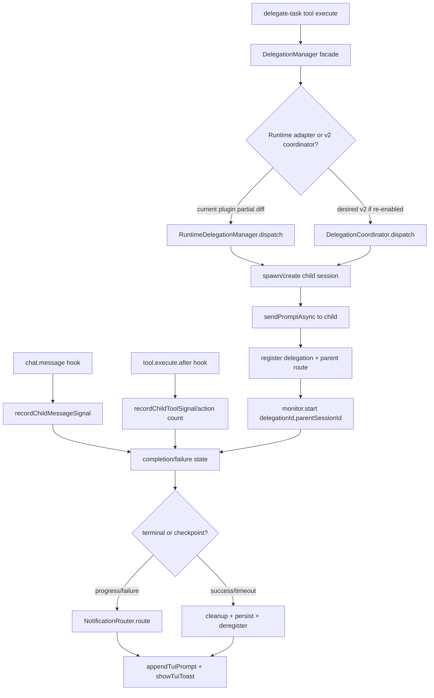

# Phase 14: Wire Monitor/Notification into DelegationManager.dispatch + Clean Up Partial Edits — Research

**Researched:** 2026-05-19  
**Domain:** OpenCode delegation lifecycle, progressive monitoring, TUI notification, completion/control tools, cleanup deprecated delegation params  
**Confidence:** HIGH cho SDK/package signatures và codebase-local surfaces; MEDIUM cho live-UAT expectations vì cần runtime proof sau implementation.

<user_constraints>
## User Constraints (from CONTEXT.md)

### Locked Decisions

### 1. Monitor Wiring: Inline trong Dispatch Path
- **Decision:** Gọi `monitor.start()` trực tiếp trong `manager-runtime.ts` sau khi `sendPromptAsync()` resolve thành công.
- **Rationale:** Đơn giản, dễ test, dễ trace. Codebase đã có partial wiring — chỉ cần hoàn thiện.
- **Impact:** `DelegationMonitor.start(delegationId, parentSessionId)` được gọi từ dispatch path, không qua hook infrastructure.

### 2. Failure Checkpoint Detection: Real-time Hooks + Progressive Injection
- **Decision:** Dùng `tool.execute.after` hook để đếm tool calls real-time (in-memory counter). Monitor đọc counter tại các checkpoint.
- **Injection cadence:** 30s → 45s → 60s → 90s → 120s → 180s
- **Injection format:** Thin-line status — session ID, delegated agent, status, tool/bash/skill/action counts. Minimal, deterministic.
- **Failure logic:**
  - 60s: Failure level 1 nếu action count không thay đổi so với baseline (0)
  - 120s: Failure level 2 nếu action count không thay đổi so với level 1
  - 180s: Failure level 3 (hard failure) nếu action count không thay đổi so với level 2
  - 300s: Failure level 4 (final) → **STOP injecting** sau mức này
- **Post-300s behavior:** Nếu tools vẫn ghi nhận action mới → stop observing (task phức tạp). Nếu sau thêm 300s (total 600s) vẫn không có assistant last message → auto-abort.
- **Session-tracker knowledge:** Áp dụng từ `.hivemind/session-tracker/` cho accurate tracking.

### 3. TUI Notification Delivery: Direct Append với System Header
- **Completion detection = 3 conditions:**
  1. Tools running >1 phút
  2. Assistant last message exists (summary/report từ agent)
  3. File changes detected (nếu task mutate files/artifacts)
- **Success notification format:** System header + delegation ID + summary + result + path + timestamp + file changes
- **Delivery mechanism:**
  - Main session live → append trực tiếp vào TUI (no queue)
  - Session ended → send message + resume session
- **Failure notification:** 2 cấp — (a) executed-running-fail, (b) fail từ threshold
- **Routing:** Notification append vào đúng parent session trong số 10 slots

### 4. Control Tools: Full Suite + Resume/Chain
- **Tools:** abort, cancel, restart, adjust-prompt, change-agent, resume, chain
- **Resume logic:** Nếu level 1 success (tools đã chạy) → resume với existing session ID, context bảo tồn, prompt đơn giản, có thể đổi agent name
- **Chain logic:** Append new task vào completed delegation's session → L0/L1 agents có context từ task trước, không hallucinate
- **Design principle:** Không delegate lại phiên mới nếu session đã chạy — resume với session ID cũ để bảo tồn context

### 5. Session Slot Management: 10 Slots per Main Session
- **Decision:** Track active delegations per `parentSessionId`. Reject dispatch khi 10 slots active.
- **Routing:** Notifications append vào đúng parent session — tránh lạc sang session khác đang vận hành song song.

### 6. Escalation-Timer Rewrite
- **Decision:** Xóa hoàn toàn logic WARN→NUDGE→ALERT→TERMINATE. Viết lại thành progressive injection + failure checkpoint detector.
- **New file:** `progressive-monitor.ts` hoặc refactor `escalation-timer.ts` thành `failure-checkpoint.ts`

### 7. Notification Router Integration
- **Decision:** `notificationRouter.register(delegationId, parentSessionId)` gọi sau delegation registration.
- **Format:** `<system_reminder>` block cho OpenCode compatibility.

### the agent's Discretion

(none explicitly provided in CONTEXT.md)

### Deferred Ideas (OUT OF SCOPE)

- Sidecar/dashboard UI — belongs to Q2 sidecar phase
- Cross-session delegation chaining across different parent sessions — only same-parent chain supported
- PTY/background-command delegation — belongs to CP-PTY phases
</user_constraints>

## Summary

Phase 14 là phase **integration + cleanup** chứ không phải greenfield: nhiều module đã tồn tại (`DelegationMonitor`, `FailureCheckpointTracker`, `NotificationRouter`, `CompletionDetector`, `SlotManager`, `DelegationCoordinator`) nhưng đường runtime đang bị lệch giữa facade `DelegationManager`, runtime adapter `manager-runtime.ts`, v2 coordinator, plugin wiring, và tool layer. [VERIFIED: codebase grep/read] Điểm planning quan trọng nhất: partial edits hiện tại đã thêm `monitor`/`notificationRouter` vào `manager-runtime.ts`, nhưng facade `manager.ts` chưa truyền hai dependency này vào `RuntimeDelegationManager`; đồng thời `plugin.ts` đã đổi từ `coordinator/lifecycle` sang `monitor/notificationRouter`, khiến v2 coordinator path không còn được tool dùng trực tiếp. [VERIFIED: git diff + src/coordination/delegation/manager.ts + src/plugin.ts]

OpenCode package versions hiện tại là `@opencode-ai/plugin@1.15.4` và `@opencode-ai/sdk@1.15.4`, published/modified 2026-05-18 trên npm. [VERIFIED: npm registry] SDK v1.15.4 exposes `session.prompt`, `session.promptAsync`, `session.messages`, `session.children`, `session.status`, `session.abort`, and `tui.appendPrompt`/`tui.showToast`; plugin ToolContext exposes `sessionID`, `messageID`, `agent`, `directory`, `worktree`, `abort`, `metadata()`, and `ask()`, but no `task` field. [VERIFIED: npm package dist/*.d.ts] Vì vậy planner phải tránh plan nào phụ thuộc custom tool gọi trực tiếp native Task qua `context.task`; dùng SDK session APIs / existing `sendPromptAsync()` wrappers hoặc ghi rõ limitation/runtime proof cần UAT. [VERIFIED: npm package dist/*.d.ts + src/shared/session-api.ts]

**Primary recommendation:** Plan theo 5 wave nhỏ: (1) protect/record dirty partial edits, (2) repair DelegationManager facade/runtime/plugin wiring, (3) connect action-count + completion + notification routing through existing hooks/wrappers, (4) cleanup deprecated `category`/`safetyCeiling` refs and stale tests, (5) run scoped → full → live UAT validation. [VERIFIED: CONTEXT.md + SPEC.md + codebase]

## Architectural Responsibility Map

| Capability | Primary Tier | Secondary Tier | Rationale |
|------------|--------------|----------------|-----------|
| SDK child-session dispatch | Coordination / API-backend runtime | Shared SDK wrapper | `DelegationManager`/`DelegationCoordinator` own dispatch orchestration; `src/shared/session-api.ts` owns SDK call wrappers. [VERIFIED: src/coordination/delegation/* + src/shared/session-api.ts] |
| Progressive monitor timers | Coordination / delegation | Plugin composition for injection | `DelegationMonitor` owns timer state; plugin injects `NotificationRouter`/TUI callbacks. [VERIFIED: monitor.ts + plugin.ts] |
| Action count capture | Hooks read-side | Coordination record update | `tool.execute.after` observes child tool calls, then delegates to manager/coordinator via `recordChildToolSignal`. Hooks must not own durable state. [VERIFIED: plugin.ts + src/hooks/AGENTS.md] |
| Completion detection | Coordination / delegation + completion | Hooks lifecycle events | `CompletionDetector`/monitor evaluate message/tool/file signals; hooks supply `chat.message`, `session.idle/error/deleted`, and tool observations. [VERIFIED: completion-detector.ts + coordinator.ts + plugin.ts] |
| TUI notification append | Shared SDK wrapper + plugin delivery callback | NotificationRouter routing | `NotificationRouter` routes by delegation ID; `appendTuiPrompt()` and `showTuiToast()` call SDK TUI surfaces. [VERIFIED: notification-router.ts + session-api.ts + SDK d.ts] |
| Durable delegation records | Task-management continuity | Coordination state-machine | Coordination must call persistence owner; it must not write `.hivemind` directly outside approved owner. [VERIFIED: src/coordination/AGENTS.md + delegation-persistence import] |
| Control actions abort/cancel/restart/resume/chain | Tools boundary + Coordination | Shared SDK wrapper | `delegation-status` is tool boundary; manager/coordinator own state transitions and session API calls. [VERIFIED: delegation-status.ts + manager.ts + coordinator.ts] |
| Category/safety cleanup | Cross-cutting source/test cleanup | Runtime policy/concurrency/spawner | Deprecated refs remain across `src`/`tests`; cleanup must distinguish obsolete delegation category gates from legitimate non-delegation “category” fields. [VERIFIED: grep] |

## Phase Boundary and Likely Deliverables

### In scope

- Repair existing partial wiring so `DelegationManager.dispatch()` actually starts monitor and registers notification routing after successful child prompt dispatch. [VERIFIED: 14-SPEC.md + manager-runtime.ts]
- Keep `notificationRouter.register(delegationId, parentSessionId)` immediately after delegation record registration, before prompt send can fail or complete. [VERIFIED: 14-CONTEXT.md + manager-runtime.ts partial diff]
- Use `tool.execute.after` and `chat.message` hooks to update child-session action/message/tool counters through `DelegationManager.recordChildToolSignal()` / `recordChildMessageSignal()`. [VERIFIED: plugin.ts]
- Route terminal success/failure/timeout notifications through `NotificationRouter.route()` and SDK-backed TUI append/toast wrapper. [VERIFIED: plugin.ts + notification-router.ts + session-api.ts]
- Remove or explicitly quarantine deprecated `category`/`safetyCeiling`/`classifications` in the delegation ecosystem and tests. [VERIFIED: 14-SPEC.md + grep]
- Add/repair control actions: `abort`, `cancel`, `restart`, `resume`, `chain`; current tool schema supports `abort/cancel/restart/redirect` only. [VERIFIED: 14-CONTEXT.md + delegation-status.ts]

### Out of scope

- PTY/background-command delegation remains CP-PTY runway. [VERIFIED: CONTEXT.md]
- Sidecar/dashboard UI is deferred. [VERIFIED: CONTEXT.md]
- Cross-parent-session chaining is out of scope; only same-parent/session-preserving chain. [VERIFIED: CONTEXT.md]
- Native Task replacement via plugin ToolContext is not supported because ToolContext v1.15.4 has no `task` field. [VERIFIED: @opencode-ai/plugin dist/tool.d.ts]

## Project Constraints (from AGENTS.md)

- Use GSD routes/agents/workflows for this project; do not route hm/hf workflows as development tooling. [VERIFIED: AGENTS.md]
- Strict TDD/spec-driven/gatekeeping is mandatory; planner must include RED/GREEN verification and scoped regression gates. [VERIFIED: AGENTS.md]
- Do not implement from planning/research lane; runtime changes belong to authorized execution. [VERIFIED: .planning/AGENTS.md]
- Runtime code lives in `src/`; `.opencode/` is soft meta-concepts only; `.hivemind/` is internal state root. [VERIFIED: AGENTS.md]
- TypeScript strict mode, `verbatimModuleSyntax`, import-type discipline, no `any` in new code, `[Harness]` errors, max 500 LOC per module. [VERIFIED: AGENTS.md]
- Runtime code changes require `npm run typecheck`; relevant Vitest scope; broader regression or justified scoped run. [VERIFIED: AGENTS.md + tests/AGENTS.md]
- Generated planning artifacts must be written to disk and referenced; docs-only evidence is L5 and cannot claim runtime readiness. [VERIFIED: .planning/AGENTS.md]
- Current dirty state includes source, planning, `.hivemind` runtime state, and `opencode.json`; planner must preserve unrelated user/session edits. [VERIFIED: git status]

## Standard Stack

### Core

| Library | Version | Purpose | Why Standard |
|---------|---------|---------|--------------|
| `@opencode-ai/plugin` | 1.15.4, npm modified 2026-05-18 | Plugin hooks + custom tool contract | Current project peer/dev dependency; exposes hooks and ToolContext fields used by plugin/tool code. [VERIFIED: npm registry + package.json + dist/index.d.ts/tool.d.ts] |
| `@opencode-ai/sdk` | 1.15.4, npm modified 2026-05-18 | Session/TUI SDK client | Provides `session.promptAsync`, `session.messages`, `session.abort`, `tui.appendPrompt`, `tui.showToast`. [VERIFIED: npm registry + dist/v2/gen/sdk.gen.d.ts] |
| `vitest` | local 4.1.6; package.json `^4.1.5`; npm latest 4.1.6 | Unit/integration test runner | Existing tests use Vitest globals and fake timers. [VERIFIED: local command + package.json + tests grep] |
| `zod` | package.json `^4.3.6`; npm latest 4.4.3 | Tool input validation | Current delegation tools validate schemas with Zod. [VERIFIED: package.json + npm registry + delegate-task.ts/delegation-status.ts] |
| TypeScript | local 5.9.3; package.json `^5.0.0` | Strict compile/type safety | Project is strict ESM TypeScript. [VERIFIED: local command + tsconfig presence + AGENTS.md] |

### Supporting

| Library/Module | Version | Purpose | When to Use |
|----------------|---------|---------|-------------|
| `src/shared/session-api.ts` wrappers | local source | Normalizes OpenCode SDK calls | Use for `sendPromptAsync`, `getSessionMessages`, `abortSession`, `appendTuiPrompt`, `showTuiToast`; avoid raw SDK calls scattered in coordination code. [VERIFIED: session-api.ts] |
| `DelegationMonitor` | local source | Progressive polling/failure checkpoints | Own timer lifecycle, injection cadence, and stop-on-completion. [VERIFIED: monitor.ts] |
| `NotificationRouter` | local source | Parent-session routing/pending notification queue | Use to avoid broadcasting notifications to wrong parent sessions. [VERIFIED: notification-router.ts] |
| `DelegationCoordinator` | local source | v2 lifecycle/slot/monitor/notification composition | Existing tests prove intended v2 composition, but plugin currently does not pass coordinator into facade after partial diff. [VERIFIED: coordinator.ts + plugin diff] |

### Alternatives Considered

| Instead of | Could Use | Tradeoff |
|------------|-----------|----------|
| Inline `monitor.start()` in `manager-runtime.ts` | Hook-only monitoring | Rejected by locked decision; hook-only path is harder to trace and contradicts CONTEXT.md. [VERIFIED: CONTEXT.md] |
| TUI append via `client.tui.appendPrompt()` | `session.prompt({ noReply: true })` | SDK exposes both `tui.appendPrompt` and `session.prompt(noReply)`; current project already wraps TUI append, so planner should prefer existing wrapper and reserve session prompt as fallback/resume path. [VERIFIED: SDK d.ts + session-api.ts] |
| Rebuild category gates | Keep/remove selectively | Reinstating category gates is explicitly out of scope; however non-delegation “category” strings in bootstrap/validation may need separate semantic review, not blind grep deletion. [VERIFIED: 14-SPEC.md + grep] |

**Installation:** No new package install is required for Phase 14. [VERIFIED: package.json + npm registry]

```bash
npm install
```

**Version verification performed:**

```bash
npm view "@opencode-ai/plugin" version dist.tarball time.modified
npm view "@opencode-ai/sdk" version dist.tarball time.modified
npm view vitest version time.modified
npm view zod version time.modified
```

## Architecture Patterns

### System Architecture Diagram



### Recommended Project Structure

Planner should not create broad new folders. Prefer surgical edits in existing modules. [VERIFIED: AGENTS.md + current source tree]

```text
src/
├── coordination/
│   ├── delegation/
│   │   ├── manager.ts                  # facade options + control API
│   │   ├── manager-runtime.ts          # legacy/runtime SDK dispatch path
│   │   ├── coordinator.ts              # v2 slot/lifecycle/monitor/notification path
│   │   ├── monitor.ts                  # polling + failure checkpoints
│   │   ├── notification-router.ts      # route parent notifications
│   │   ├── notification-formatter.ts   # pure formatting
│   │   ├── completion-detector.ts      # semantic completion checks
│   │   └── types.ts                    # contracts, remove deprecated aliases carefully
├── shared/
│   └── session-api.ts                  # SDK/TUI wrapper authority
├── tools/
│   └── delegation/
│       ├── delegate-task.ts            # dispatch tool boundary
│       └── delegation-status.ts        # status/control tool boundary
└── plugin.ts                           # composition only; no business logic
```

### Pattern 1: Dependency injection at composition root

**What:** Plugin constructs `NotificationRouter`, `DelegationMonitor`, coordinator/manager, and passes dependencies rather than importing singleton state. [VERIFIED: plugin.ts]  
**When to use:** Monitor/TUI delivery must be testable without real OpenCode runtime. [VERIFIED: current tests]  
**Example:** `setupDelegationModules()` creates `notificationRouter`, `monitor`, `coordinator`, `delegationManager`. [VERIFIED: plugin.ts]

### Pattern 2: Hook observes, manager/coordinator mutates in-memory state

**What:** `tool.execute.after` and `chat.message` hooks observe events and call `delegationManager.recordChildToolSignal()` / `recordChildMessageSignal()`. [VERIFIED: plugin.ts]  
**Why:** Hooks sector forbids durable writes and should route facts to runtime owners. [VERIFIED: src/hooks/AGENTS.md]

### Pattern 3: Failure checkpoints are action-count comparisons, not escalation labels

**What:** `FailureCheckpointTracker.check()` compares current action count with previous checkpoint and increments failure level only on no progress. [VERIFIED: escalation-timer.ts]  
**When to use:** At 60/120/180/300 seconds after dispatch. [VERIFIED: CONTEXT.md + types.ts]

### Pattern 4: Parent notification routing must be per delegation ID

**What:** `NotificationRouter.register(delegationId, parentSessionId)` must happen before any route/notification call. [VERIFIED: notification-router.ts + manager-runtime.ts partial]  
**Why:** The phase requires up to 10 concurrent delegations per parent and no cross-session pollution. [VERIFIED: CONTEXT.md + slot-manager.ts]

### Anti-Patterns to Avoid

- **Partial wiring that compiles but is unreachable:** Adding `monitor` options to runtime adapter is insufficient if facade does not pass them through. [VERIFIED: git diff + manager.ts]
- **Blind grep deletion of every `category`:** Some matches are unrelated semantics (`purpose_category`, validation category, Unicode script category). Planner must target delegation category/safety code, then verify. [VERIFIED: grep]
- **Native Task context assumption:** ToolContext v1.15.4 has no `task`; do not plan runtime behavior around `context.task`. [VERIFIED: @opencode-ai/plugin dist/tool.d.ts]
- **Hook-owned persistence:** Hooks may observe and route, but durable `.hivemind` writes belong to state/continuity owners. [VERIFIED: src/hooks/AGENTS.md + src/coordination/AGENTS.md]
- **TUI notification without idempotency:** Router supports idempotency keys; terminal and progress notifications should use deterministic keys. [VERIFIED: notification-router.ts]

## Don't Hand-Roll

| Problem | Don't Build | Use Instead | Why |
|---------|-------------|-------------|-----|
| Session prompt/async calls | Raw fetch or ad-hoc SDK shapes in manager | `sendPromptAsync()` / `sendPrompt()` wrappers | Existing wrappers normalize session ID validation and SDK body shape. [VERIFIED: session-api.ts] |
| TUI append/toast | Direct event object construction everywhere | `appendTuiPrompt()` / `showTuiToast()` wrappers | SDK exposes TUI surfaces; wrappers localize shape assumptions. [VERIFIED: SDK d.ts + session-api.ts] |
| Per-parent slot limits | New map in manager-runtime | `SlotManager` where v2 path is used | Already enforces max 10 per session and per-key limit. [VERIFIED: slot-manager.ts] |
| Failure detection | WARN/NUDGE/ALERT escalation | `FailureCheckpointTracker` action-count comparison | Locked redesign rejects warning escalation. [VERIFIED: WAVE-B3-REDESIGN + escalation-timer.ts] |
| Notification fanout | Broadcast to active sessions | `NotificationRouter.register/route` | Preserves parent-session ownership and pending replay. [VERIFIED: notification-router.ts] |
| Tool result envelopes | Bespoke strings only | `renderToolResult(success/error(...))` | Existing tools use shared response envelope. [VERIFIED: delegate-task.ts + delegation-status.ts] |

**Key insight:** The hard part is **wiring reachability**, not inventing new components. Most components exist; planner should prove which path the tool actually invokes before adding more code. [VERIFIED: codebase + git diff]

## Runtime State Inventory

| Category | Items Found | Action Required |
|----------|-------------|-----------------|
| Stored data | `.hivemind/state/delegations.json` modified in working tree; `.hivemind/session-tracker/*` modified/untracked from live sessions. [VERIFIED: git status] | Treat as runtime evidence/input only; do not revert in implementation plan unless user authorizes cleanup. Planner should isolate source edits from state artifacts. |
| Live service config | `opencode.json` is modified in working tree. [VERIFIED: git status] | Planner must inspect before execution if any plugin/tool config behavior depends on it; do not overwrite blindly. |
| OS-registered state | None found in this research; no launchd/systemd/pm2 task was inspected because phase scope is repo/runtime plugin wiring. [ASSUMED] | If live UAT depends on a local OpenCode daemon/TUI, execution plan should record runtime environment manually. |
| Secrets/env vars | No new env var required by code paths; runtime wrappers use OpenCode client from plugin context. [VERIFIED: package/code read] | No secret migration planned. |
| Build artifacts | No `dist/` inspection required for planning; source changes require rebuild/typecheck before runtime proof. [VERIFIED: package scripts] | Execution should run `npm run build` if claiming package/runtime readiness. |

## Current Code Surfaces and Dirty/Partial Edits

### Dirty/partial edits planner must preserve

- `src/coordination/delegation/manager-runtime.ts` has uncommitted additions for `monitor`, `notificationRouter`, `notificationRouter.register()`, and `monitor.start()`. [VERIFIED: git diff]
- `src/coordination/delegation/manager.ts` has uncommitted option types for monitor/router but does **not** pass them into `RuntimeDelegationManager` constructor at lines 53-56. [VERIFIED: git diff + manager.ts]
- `src/plugin.ts` uncommitted diff removed `coordinator/lifecycle` from `DelegationManager` options and passes only `monitor/notificationRouter`; this changes the tool path away from v2 coordinator. [VERIFIED: git diff]
- `src/coordination/delegation/types.ts` uncommitted diff added deprecated `ESCALATION_*` aliases for compatibility; these conflict with requirement to remove deprecated escalation/category semantics unless deliberately scoped. [VERIFIED: git diff]
- `.planning/ROADMAP.md`, CP-DT gap docs, `.hivemind/**`, and `opencode.json` also dirty/untracked; planner must not assume a clean tree. [VERIFIED: git status]

### Files likely to modify

| File | Why planner should include it |
|------|-------------------------------|
| `src/coordination/delegation/manager.ts` | Pass monitor/router into runtime adapter **or** intentionally restore coordinator/lifecycle path; add `resume`/`chain` control contracts if kept in facade. [VERIFIED: manager.ts + diff] |
| `src/coordination/delegation/manager-runtime.ts` | Dispatch path for current plugin facade; needs duplicate assignment cleanup and tests proving `register/start` reachability. [VERIFIED: manager-runtime.ts] |
| `src/plugin.ts` | Composition root owns wiring of manager/coordinator/monitor/router and hooks. Keep business logic out. [VERIFIED: plugin.ts + src/AGENTS.md] |
| `src/coordination/delegation/monitor.ts` | Ensure cadence, 300s stop, completion hook, action-count callback behavior. [VERIFIED: monitor.ts] |
| `src/coordination/delegation/escalation-timer.ts` | Failure checkpoint tracker; may rename later but current file has correct-ish semantics. [VERIFIED: escalation-timer.ts] |
| `src/coordination/delegation/notification-router.ts` | Parent route, pending queue, idempotency, terminal route integration. [VERIFIED: notification-router.ts] |
| `src/coordination/delegation/notification-formatter.ts` | `<system_reminder>` and thin-line formatting. [VERIFIED: notification-formatter.ts] |
| `src/coordination/delegation/completion-detector.ts` | 3-condition semantic completion; may need integration with SDK messages. [VERIFIED: completion-detector.ts] |
| `src/tools/delegation/delegation-status.ts` | Control schema currently lacks `resume`, `chain`, `adjust-prompt`, `change-agent`. [VERIFIED: delegation-status.ts] |
| `src/tools/delegation/delegate-task.ts` | Tool dispatch currently calls coordinator-like object, no category args; must stay aligned with manager/coordinator shape. [VERIFIED: delegate-task.ts] |
| `src/shared/session-api.ts` | Existing wrappers support SDK session/TUI operations; only modify if wrapper missing required shape. [VERIFIED: session-api.ts] |
| `tests/lib/coordination/delegation/*.test.ts` | Existing tests already cover monitor, checkpoint, completion, router, coordinator, slot manager; need update for actual runtime path. [VERIFIED: glob + grep] |
| `tests/tools/delegation/*.test.ts`, `tests/tools/delegate-task.test.ts`, `tests/tools/delegation-status.test.ts` | Tool/control/schema cleanup. [VERIFIED: glob/grep] |

## Common Pitfalls

### Pitfall 1: Wiring only the runtime adapter but not the facade
**What goes wrong:** Tests for `manager-runtime.ts` pass, but `delegate-task` still invokes a facade path that never receives monitor/router. [VERIFIED: manager.ts + plugin.ts]  
**How to avoid:** Add a test at facade/plugin setup level proving `monitor.start` and `notificationRouter.register` fire when `createDelegateTaskTool(delegationManager)` dispatches. [VERIFIED: existing tool/plugin surfaces]

### Pitfall 2: Confusing v2 coordinator path with runtime adapter path
**What goes wrong:** `DelegationCoordinator` has stronger lifecycle/slot/cleanup behavior, but current `plugin.ts` diff does not pass coordinator/lifecycle into the facade. [VERIFIED: git diff + coordinator.ts]  
**How to avoid:** Planner must choose one path for Phase 14: either restore coordinator-backed manager for tool dispatch or complete runtime adapter wiring and defer coordinator unification. Recommendation: **restore/use coordinator-backed path where possible**, because it already owns slot/notification/cleanup semantics. [VERIFIED: coordinator tests]

### Pitfall 3: Action count always stays 0
**What goes wrong:** Failure checkpoints report false failures because `getActionCount` returns 0/undefined. [VERIFIED: monitor.ts]  
**How to avoid:** Wire `tool.execute.after` child session IDs to record tool signals before relying on checkpoint logic. [VERIFIED: plugin.ts]

### Pitfall 4: Completion detector is semantically correct but never called
**What goes wrong:** `checkSemanticCompletion()` tests pass but terminal notifications never fire. [VERIFIED: completion-detector.ts + monitor.ts]  
**How to avoid:** Add hook/session-message integration test that feeds messages → `monitor.checkCompletion()` or coordinator completion path → router route. [VERIFIED: current tests lack direct plugin-level proof]

### Pitfall 5: TUI append goes to current prompt, not necessarily historical parent session
**What goes wrong:** `client.tui.appendPrompt({text})` appends to the active TUI prompt surface; routing by parent session ID still needs runtime validation when multiple parent sessions exist. [VERIFIED: SDK d.ts says append prompt has `text`, no `sessionID`; notification router stores parentSessionId]  
**How to avoid:** Use router for ownership, append a system reminder with delegation ID, and require live UAT with 2 parent sessions before claiming multi-session routing. [VERIFIED: SDK d.ts + CONTEXT.md]

### Pitfall 6: Cleanup wave deletes legitimate “category” terms
**What goes wrong:** `category` is used in primitive validation, language script classification, prompt packet purpose category, and tests unrelated to delegation category gates. [VERIFIED: grep]  
**How to avoid:** Split deletion into exact delegation params (`safetyCeilingMs`, `DelegationCategory`, category-gate files, dispatch params) vs generic category terms requiring case-by-case review. [VERIFIED: grep]

## Code Examples

### OpenCode Plugin ToolContext fields

```typescript
// Source: @opencode-ai/plugin@1.15.4 dist/tool.d.ts [VERIFIED: npm package]
export type ToolContext = {
  sessionID: string
  messageID: string
  agent: string
  directory: string
  worktree: string
  abort: AbortSignal
  metadata(input: { title?: string; metadata?: { [key: string]: any } }): void
  ask(input: AskInput): Effect.Effect<void>
}
```

### OpenCode SDK session/TUI capabilities

```typescript
// Source: @opencode-ai/sdk@1.15.4 dist/v2/gen/sdk.gen.d.ts [VERIFIED: npm package]
client.session.messages({ sessionID, limit })
client.session.prompt({ sessionID, noReply, parts, agent, tools })
client.session.promptAsync({ sessionID, noReply, parts, agent, tools })
client.session.abort({ sessionID })
client.tui.appendPrompt({ text })
client.tui.showToast({ message, variant })
```

### Existing project wrappers to prefer

```typescript
// Source: src/shared/session-api.ts [VERIFIED: codebase]
await sendPromptAsync(client, childSessionId, {
  agent: agent.name,
  parts: [{ type: "text", text: params.prompt }],
  tools: buildDelegationPromptTools(child.allowedTools),
})

await appendTuiPrompt(client, "<system_reminder>[DT:...] ...</system_reminder>")
await showTuiToast(client, "Delegation success delivered")
```

## Suggested Plan Decomposition

### Wave 0 — Dirty-state guard + source path decision
- Snapshot current git diff in plan summary; explicitly protect `.hivemind/**`, `opencode.json`, and planning artifacts not owned by execution. [VERIFIED: git status]
- Decide whether Phase 14 routes `delegate-task` through runtime adapter or v2 coordinator. Recommendation: prefer coordinator-backed path if tests can be updated quickly, because it already handles slots, notification cleanup, and completion callbacks. [VERIFIED: coordinator.ts/tests]

### Wave 1 — Dispatch reachability RED tests
- Add failing tests proving `DelegationManager` facade passes monitor/router into runtime adapter or coordinator path. [VERIFIED: current missing facade pass-through]
- Add plugin setup test proving `createDelegateTaskTool(delegationManager)` can trigger monitor/register on dispatch. [VERIFIED: plugin.ts]

### Wave 2 — Monitor + notification wiring
- Fix `manager.ts` constructor pass-through or restore `coordinator/lifecycle` options. [VERIFIED: git diff]
- Remove duplicate `this.runtimePolicy = ...` assignment in `manager-runtime.ts`. [VERIFIED: manager-runtime.ts]
- Ensure register/start order: register delegation → persist → register route → send prompt async → transition running → monitor.start. [VERIFIED: manager-runtime.ts]

### Wave 3 — Action/completion/notification integration
- Wire `recordChildToolSignal` and `recordChildMessageSignal` into whichever manager path is selected. [VERIFIED: plugin.ts]
- Add completion path using `getSessionMessages()`/semantic completion or coordinator dual-signal callback. [VERIFIED: session-api.ts + completion-detector.ts]
- Ensure terminal notifications use `<system_reminder>` format and idempotency keys. [VERIFIED: notification-formatter.ts + notification-router.ts]

### Wave 4 — Control tools and deprecated cleanup
- Extend `delegation-status` schema/control handling for `resume`, `chain`, `adjust-prompt`, `change-agent` or explicitly defer each not implemented. [VERIFIED: CONTEXT.md vs delegation-status.ts]
- Remove deprecated delegation category/safety ceiling surfaces in small batches; keep unrelated category semantics only with explicit notes. [VERIFIED: grep]

### Wave 5 — Validation and live proof
- Run scoped tests first, then `npm run typecheck`, then broader delegation/tool/hook regressions, then full `npm test` if feasible. [VERIFIED: test infrastructure]
- Require live UAT for: progressive injections, success notification, failure checkpoint, parent session routing. [VERIFIED: SPEC acceptance]

## State of the Art

| Old Approach | Current Approach | When Changed | Impact |
|--------------|------------------|--------------|--------|
| Manual polling via `delegation-status` | Automatic monitor at dispatch + hook signals + notification routing | Phase 14 spec/discuss context 2026-05-19 | Planner must wire runtime path, not add more manual status tooling. [VERIFIED: 14-SPEC.md/CONTEXT.md] |
| WARN→NUDGE→ALERT→TERMINATE escalation | Action-count failure checkpoints 60/120/180/300 | Wave B3 redesign 2026-05-19 | Tests should assert checkpoint comparison, not warning labels. [VERIFIED: WAVE-B3-REDESIGN + escalation-timer.ts] |
| Category/safetyCeiling dispatch params | Queue-key/slot/evidence-driven delegation | CP-DT remediation 2026-05-19 | Cleanup is required, but generic category terms need review. [VERIFIED: plan + grep] |
| Assumed plugin native Task seam | SDK session APIs and verified ToolContext limitations | npm packages 1.15.4, modified 2026-05-18 | Do not plan `context.task` use. [VERIFIED: npm package d.ts] |

**Deprecated/outdated:**
- `ESCALATION_THRESHOLDS`/`EscalationLevel` aliases in `types.ts` are compatibility leftovers, not the desired conceptual model. [VERIFIED: types.ts]
- `restart/redirect` terminology in `delegation-status.ts` does not match locked `resume/chain/adjust-prompt/change-agent` suite. [VERIFIED: delegation-status.ts + CONTEXT.md]

## Assumptions Log

| # | Claim | Section | Risk if Wrong |
|---|-------|---------|---------------|
| A1 | No OS-registered state matters for this repo-local phase. | Runtime State Inventory | Low: live OpenCode/TUI runner may still have external state, but execution can capture UAT environment. |

## Open Questions (RESOLVED)

1. **Should Phase 14 restore v2 coordinator-backed manager or complete runtime adapter?** — **RESOLVED:** Plans 01-03 choose runtime adapter path. `manager.ts` facade passes `monitor`/`notificationRouter` into `RuntimeDelegationManager` (manager-runtime.ts). Coordinator is retained only for slot management and hook signal recording (`recordChildMessageSignal`/`recordChildToolSignal`), not dispatch. [DECISION: CONTEXT.md D-01/D-07, Plan 01 Task 2]

2. **How should TUI append route to a specific parent session?** — **RESOLVED:** `NotificationRouter` routes by `delegationId → parentSessionId`. Unit tests assert parent ID passthrough. Live multi-session routing cannot be proven by mocks — Plan 04 Task 3 includes explicit UAT checklist with fallback: if SDK `tui.appendPrompt` lacks `sessionID`, document limitation and mark L1 routing as not-proven. [DECISION: Plan 02 Task 2, Plan 04 Task 3]

3. **Which "category" refs are actually deprecated?** — **RESOLVED:** Treated as semantic refactor with allowlist. Plan 04 Task 1 creates `14-DEPRECATED-DELEGATION-CLEANUP-AUDIT.md` before any source edits. Deprecated targets: delegation `safetyCeilingMs`, delegation category-gate params, stale `classifications`. Allowed: validation category, language script category, prompt purpose_category, security redaction key. [DECISION: Plan 04 Task 1-2]

## Environment Availability

| Dependency | Required By | Available | Version | Fallback |
|------------|-------------|-----------|---------|----------|
| Node.js | package scripts/typecheck/tests | ✓ | v26.0.0 local; project requires >=20 | — [VERIFIED: local command + package.json] |
| npm | package scripts/npm view | ✓ | 11.14.1 | — [VERIFIED: local command] |
| TypeScript | typecheck | ✓ | 5.9.3 local | — [VERIFIED: local command] |
| Vitest | scoped/full tests | ✓ | 4.1.6 local | — [VERIFIED: local command] |
| OpenCode runtime/TUI | live UAT notifications | Not proven in this research | package SDK/plugin 1.15.4 installed/resolvable | Use mocked/unit tests for L2/L3, but cannot replace L1 UAT. [VERIFIED: npm/package; UAT not run] |
| GSD graphify | graph context | ✗ command failed due missing `.opencode/sdk/shared/model-catalog.json`; graph file not found by glob | — | Continue codebase-local research. [VERIFIED: glob + command error] |

**Missing dependencies with no fallback:** None blocking research. [VERIFIED: environment checks]

**Missing dependencies with fallback:** OpenCode live TUI runtime not proven; fallback is unit/integration proof plus required later live UAT. [VERIFIED: SPEC acceptance]

## Validation Architecture

### Test Framework

| Property | Value |
|----------|-------|
| Framework | Vitest local 4.1.6 [VERIFIED: local command] |
| Config file | `vitest.config.ts` [VERIFIED: glob] |
| Quick run command | `npx vitest run tests/lib/coordination/delegation/monitor.test.ts tests/lib/coordination/delegation/escalation-timer.test.ts tests/lib/coordination/delegation/notification-router.test.ts tests/lib/coordination/delegation/coordinator.test.ts` |
| Tool run command | `npx vitest run tests/tools/delegation/delegate-task-v2.test.ts tests/tools/delegation/delegation-status-v2.test.ts tests/tools/delegate-task.test.ts tests/tools/delegation-status.test.ts` |
| Hook/plugin run command | `npx vitest run tests/hooks/ tests/plugin/ tests/integration/delegation-v2-integration.test.ts` |
| Full suite command | `npm test` |
| Typecheck command | `npm run typecheck` |

### Phase Requirements → Test Map

| Req ID | Behavior | Test Type | Automated Command | File Exists? |
|--------|----------|-----------|-------------------|--------------|
| P14-R1 | `monitor.start()` called after successful dispatch | unit/integration | `npx vitest run tests/lib/coordination/delegation/coordinator.test.ts tests/lib/coordination/delegation/manager-decomposition.test.ts` | ✅ / add facade case |
| P14-R2 | Failure checkpoints at 60/120/180/300 compare action counts | unit | `npx vitest run tests/lib/coordination/delegation/escalation-timer.test.ts tests/lib/coordination/delegation/monitor.test.ts` | ✅ |
| P14-R3 | NotificationRouter registers and routes to parent | unit/integration | `npx vitest run tests/lib/coordination/delegation/notification-router.test.ts tests/lib/coordination/delegation/full-pipeline.test.ts` | ✅ / update stale category cases |
| P14-R4 | 3-condition completion detection | unit + integration | `npx vitest run tests/lib/coordination/delegation/completion-detector.test.ts` | ✅ |
| P14-R5 | Control tools support required actions | tool unit | `npx vitest run tests/tools/delegation/delegation-status-v2.test.ts tests/tools/delegation-status.test.ts` | ✅ / add resume-chain cases |
| P14-R6 | 10 slots per parent | unit | `npx vitest run tests/lib/coordination/delegation/slot-manager.test.ts` | ✅ |
| P14-R7 | Deprecated category/safety cleanup | static + typecheck | `rg "category|safetyCeiling|classifications" src tests` then `npm run typecheck` | ❌ semantic allowlist needed |
| P14-R8 | SDK API validation | research/static | npm package d.ts inspection + RESEARCH.md | ✅ this file |

### Sampling Rate

- **Per task commit:** `npm run typecheck` + one relevant scoped `npx vitest run ...` command. [VERIFIED: AGENTS.md]
- **Per wave merge:** delegation + tool + hook scoped regression. [VERIFIED: tests present]
- **Phase gate:** `npm run typecheck`, relevant scoped regressions, `npm test` or documented pre-existing failures, then live UAT for TUI/progressive injection. [VERIFIED: SPEC acceptance]

### Wave 0 Gaps

- [ ] Add facade/plugin reachability test proving monitor/router pass-through from `createDelegateTaskTool` to selected dispatch path. [VERIFIED: missing from current tests]
- [ ] Add static/semantic cleanup allowlist for non-delegation `category` terms. [VERIFIED: grep]
- [ ] Add live-UAT checklist artifact for TUI append/progressive injection because unit mocks do not prove TUI behavior. [VERIFIED: SPEC acceptance]

## Security Domain

### Applicable ASVS Categories

| ASVS Category | Applies | Standard Control |
|---------------|---------|------------------|
| V2 Authentication | no direct auth change | Use OpenCode plugin runtime context; do not add auth logic. [VERIFIED: phase scope] |
| V3 Session Management | yes | Preserve parent/child session IDs, access checks in `delegation-status`, and same-parent chain boundary. [VERIFIED: delegation-status.ts + CONTEXT.md] |
| V4 Access Control | yes | Keep `canSessionAccessDelegation()` checks before status/control. [VERIFIED: delegation-status.ts + manager.ts] |
| V5 Input Validation | yes | Zod schemas for tool inputs; extend schema for new control actions. [VERIFIED: delegate-task.ts + delegation-status.ts] |
| V6 Cryptography | no | No crypto/security primitive changes; use `crypto.randomUUID()` already in manager runtime. [VERIFIED: manager-runtime.ts] |

### Known Threat Patterns for this stack

| Pattern | STRIDE | Standard Mitigation |
|---------|--------|---------------------|
| Cross-session notification leakage | Information Disclosure | Route by delegation ID → parentSessionId; test no broadcast. [VERIFIED: notification-router.test.ts] |
| Unauthorized delegation control | Elevation of Privilege | Require caller session lineage via `canSessionAccessDelegation()`. [VERIFIED: delegation-status.ts] |
| Prompt/context pollution from endless injections | Denial of Service | Stop injection after final checkpoint and bound thin-line format. [VERIFIED: CONTEXT.md + monitor.ts] |
| Secret leakage in status/result output | Information Disclosure | Preserve `redactTextSecrets()` in status render. [VERIFIED: delegation-status.ts] |

## Sources

### Primary (HIGH confidence)
- `.planning/phases/14-wire-monitor-notification-into-delegationmanager-dispatch-cl/14-CONTEXT.md` — locked decisions, deferred ideas. [VERIFIED: read]
- `.planning/phases/14-wire-monitor-notification-into-delegationmanager-dispatch-cl/14-SPEC.md` — 8 requirements and acceptance criteria. [VERIFIED: read]
- `src/coordination/delegation/*.ts`, `src/plugin.ts`, `src/shared/session-api.ts`, `src/tools/delegation/*.ts` — current code surfaces. [VERIFIED: read/grep]
- `@opencode-ai/plugin@1.15.4` npm package `dist/index.d.ts`, `dist/tool.d.ts` — hook and ToolContext signatures. [VERIFIED: npm registry + extracted package]
- `@opencode-ai/sdk@1.15.4` npm package `dist/v2/gen/sdk.gen.d.ts` — session/TUI SDK methods. [VERIFIED: npm registry + extracted package]
- `AGENTS.md`, `.planning/AGENTS.md`, `src/**/AGENTS.md`, `tests/AGENTS.md` — project constraints and sector boundaries. [VERIFIED: read/system reminders]

### Secondary (MEDIUM confidence)
- Context7 `/websites/opencode_ai_plugins` — plugin docs for custom tools and hooks; useful but less detailed than npm d.ts for exact signatures. [CITED: https://opencode.ai/docs/plugins]
- zread search results for `opencode-ai/opencode` — general session/message/TUI architecture, but not exact TypeScript SDK signatures. [CITED: https://zread.ai/opencode-ai/opencode]

### Tertiary (LOW confidence)
- None used for locked technical claims. [VERIFIED: research notes]

## Metadata

**Confidence breakdown:**
- Standard stack: HIGH — verified by `package.json`, npm registry, and extracted package declarations.
- Architecture: HIGH for codebase-local routing and dirty diffs; MEDIUM for live TUI multi-session behavior because SDK surface lacks `sessionID` on `tui.appendPrompt` and needs UAT.
- Pitfalls: HIGH for pass-through/partial-edit issues; MEDIUM for cleanup risk classification because some `category` semantics need human/project decision.

**Research date:** 2026-05-19  
**Valid until:** 2026-05-26 for OpenCode SDK/plugin assumptions; package modified 2026-05-18 and fast-moving. [VERIFIED: npm registry]
