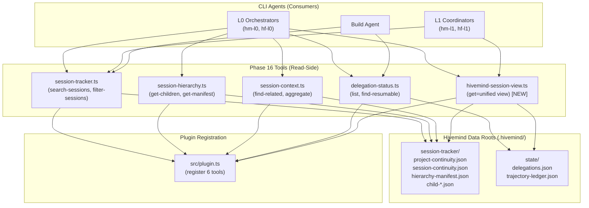

# Phase 16: Session-Tracker Tool Intelligence + Event-Tracker Deprecation Cleanup — Research

**Researched:** 2026-05-20
**Domain:** Session-tracker read-side tools, JSON-aware search, cross-root data query, skill authoring
**Confidence:** HIGH

## Summary

Phase 16 upgrades 5 existing tools (session-tracker, session-hierarchy, session-context, delegation-status) with JSON-aware search, cross-session filtering, aggregation, and resume-discovery capabilities — plus a new `hivemind-session-view` tool for cross-root unified queries and a complete rewrite of the `hivemind-power-on` skill.

Research confirms the CONTEXT.md decisions are well-grounded. Three key findings:

1. **OpenCode SDK v1.15.5 `tool()` API fully supports multi-action routing** — `tool.schema` is Zod directly, so `tool.schema.enum([...])` works. The existing `action` + `switch` pattern used across session-tracker.ts, hivemind-trajectory.ts, hivemind-pressure.ts, hivemind-doc.ts, and run-background-command.ts is the canonical pattern. [VERIFIED: Deepwiki anomalyco/opencode tool.ts source]

2. **No built-in OpenCode SDK session query replaces Hivemind's custom approach** — The SDK's `Session.list()` supports `search`, `directory`, `path`, `roots`, `start`, `cursor`, `order`, `limit` — but NOT status, agentType, or content search. Custom JSON parsing on `.hivemind/session-tracker/` files is necessary and correct. [VERIFIED: Context7 opencode-sdk-js docs, Deepwiki anomalyco/opencode session API]

3. **Event-tracker remnants exist in .planning/ docs and 2 .opencode/ skill files** — The `src/` tree is clean (confirmed CP-ST-03). However `.opencode/skills/hm-l3-hivemind-engine-contracts/SKILL.md` still references "event tracker" in its prose, and `.planning/` docs (STATE.md, ROADMAP.md, audit docs) have historical references. These need targeted cleanup as specified in D-16/D-17.

**Primary recommendation:** Proceed with CONTEXT.md decisions. Action routing pattern is proven. Read-through merge strategy for cross-root query is appropriate for MVP (no need for external libraries — simple `Promise.all` on 3 `readFile` calls). Use `fast-glob` only if directory-scan-based search is needed; otherwise, `project-continuity.json` index provides the session list.

<user_constraints>
## User Constraints (from CONTEXT.md)

### Locked Decisions

#### Search Architecture (Area 1)
- **D-01:** On-demand scan — đọc child .json files khi search được gọi. Cache kết quả in-memory trong session. Không pre-built index.
- **D-02:** JSON-aware parsing — parse .json files structure, search trong specific fields (`lastMessage`, `turn.content`, `journey[].content`, `delegatedBy.subagentType`). Không flat regex.
- **D-03:** Remove 50KB silent skip limit. Thêm warning nếu file >1MB.
- **D-04:** Stream + progressive (post-MVP) — bắt đầu trả kết quả khi tìm thấy match đầu tiên, tiếp tục scan background.

#### Tool Action Placement (Area 2)
- **D-05:** `filter-sessions` = new action trên `session-tracker` (không extend `list-sessions`).
- **D-06:** `aggregate` = new action trên `session-context` (không tạo tool riêng).
- **D-07:** `get-manifest` = new action riêng trên `session-hierarchy` (dễ discover cho L0/L1 front-facing agents).
- **D-08:** Tools chỉ dành cho front-facing agents (build, hm/hf-L0, hm/hf-L1). Permission/routing rõ ràng.

#### Cross-Root Query (Area 3)
- **D-09:** New tool `hivemind-session-view` với action `get` trả về enriched unified view.
- **D-10:** Read-through merge strategy — đọc trực tiếp từ 3 roots mỗi lần query. Cache nhẹ in-memory (1 session).
- **D-11:** Output format = nested tree: `{session: {...}, delegations: [...], trajectory: {...}}`.

#### Resume & Discovery (Area 4) — gộp vào filter-sessions
- **D-12:** `find-resumable` action REMOVED. Filter `status: active` qua `filter-sessions` = tất cả sessions active đều resumable.
- **D-13:** `filter-sessions` output bao gồm rich metadata: `sessionId`, `agentType`, `depth`, `lastMessage[:500]`, `createdAt`, `updatedAt`, `toolSummary`.
- **D-14:** Resume prompt format dùng OpenCode SDK-compatible fields: `task_id`, `subagent_type`, `description`. Không custom fields.
- **D-15:** No `verify-resume` action — agents tự dùng `task(task_id=...)`. Filter-sessions chỉ discovery.

#### Event-Tracker Cleanup (Area 5)
- **D-16:** Scope = verify zero remnants + update AGENTS.md/docs references nếu outdated. Không modify test fixtures.
- **D-17:** Confirmed: `src/` clean (CP-ST-03), `.opencode/skills/` clean. Only historical references in AGENTS.md files remain.

#### Skill Rewrite (Area 6)
- **D-18:** Viết lại hoàn toàn `hivemind-power-on` skill (không edit từng section).
- **D-19:** Giữ 6 reference files structure, update content khớp tools thật.
- **D-20:** SKILL.md có progressive disclosure + jump links agents có thể follow (không chỉ route decoration).
- **D-21:** Viết skill trong phase này (song song với tool changes), không defer.
- **D-22:** Dùng hf-l2-skill-builder/skill-creator standards khi viết skill.

### the agent's Discretion
- Chi tiết test implementation (search unit test patterns)
- Caching TTL cho in-memory session results
- Warning message format cho files >1MB
- Error handling patterns (beyond `[Harness]` prefix convention)
- SKILL.md exact progressive disclosure hierarchy

### Deferred Ideas (OUT OF SCOPE)
- Stream + progressive search — post-MVP
- LLM/embedding search — deferred to future phase
- Resume execution verification — CP-DT-01 gap closure
- CP-PTY-01..04 — separate workstreams
- Stale test fixture cleanup ("Investigate l bugs") — low priority, không trong scope
</user_constraints>

## Architectural Responsibility Map

| Capability | Primary Tier | Secondary Tier | Rationale |
|------------|-------------|----------------|-----------|
| Session search (MD + JSON) | Tool (session-tracker.ts) | — | Read-only: quét disk files, return matches. Không cần backend service. |
| Session filter (status/agentType/depth) | Tool (session-tracker.ts) | session-tracker data files | filter-sessions dùng project-continuity.json + session-continuity.json để lọc. |
| Cross-session aggregation | Tool (session-context.ts) | session-tracker data files | aggregate đọc tất cả session-continuity.json, tính histogram. |
| Hierarchy manifest exposure | Tool (session-hierarchy.ts) | hierarchy-manifest.json | get-manifest đọc hierarchy-manifest.json từ disk. |
| Resume discovery | Tool (session-tracker.ts) | — | filter-sessions với status=active = tất cả resumable sessions. |
| Cross-root unified query | Tool (new: hivemind-session-view.ts) | 3 data roots | Read-through merge: session-tracker + delegations + trajectory. |
| Event-tracker deprecation | Docs/verification | — | Không phải runtime code — chỉ verify + update references. |
| Skill authoring | .opencode/skills/ | hf-l2-meta-builder | hivemind-power-on skill rewrite dùng hf-l2-skill-builder. |

## Standard Stack

### Core
| Library | Version | Purpose | Why Standard |
|---------|---------|---------|--------------|
| `@opencode-ai/plugin` | 1.15.5 | Tool definition API | Existing harness dependency — `tool()`, `tool.schema` |
| `@opencode-ai/sdk` | 1.15.5 | SDK session types | Existing — session list, status, abort APIs |
| `node:fs/promises` | built-in | Async file I/O | Existing pattern across all 5 tools |
| `zod` | (via plugin) | Schema validation | `tool.schema` is Zod directly [VERIFIED: plugin/src/tool.ts] |

### Supporting
| Library | Version | Purpose | When to Use |
|---------|---------|---------|-------------|
| `fast-glob` | 4.x | Pattern-based file discovery | If directory-scan needed for search — but project-continuity.json index usually sufficient |
| `gray-matter` | 4.x | Frontmatter parsing | Already used in session-tracker.ts for .md parsing |

### Alternatives Considered
| Instead of | Could Use | Tradeoff |
|------------|-----------|----------|
| On-demand scan (D-01) | Pre-built search index | Index faster on repeat searches, but adds complexity + stale index risk. On-demand is simpler and always correct. |
| Read-through merge (D-10) | Materialized view (cache-to-file) | Read-through always fresh, but slower for repeated queries. MVP: read-through is correct. |
| `fast-glob` for scanning | `readdir` (current) | `fast-glob` has `.gitignore`-aware skip, easier pattern matching. But `readdir` + prefix check is already working. |

**Installation:**
```bash
npm install fast-glob    # Only if directory-scan search is needed
```

**Version verification:**
```bash
# @opencode-ai/plugin@1.15.5 — VERIFIED via npm ls
# @opencode-ai/sdk@1.15.5 — VERIFIED via npm ls
# Node.js v26.0.0 — VERIFIED
```

## Architecture Patterns

### System Architecture Diagram



### Recommended Project Structure
No new directories needed. The new tool `hivemind-session-view.ts` goes in `src/tools/hivemind/`. All changes are within existing files:
- `src/tools/hivemind/session-tracker.ts` — Add `filter-sessions` action
- `src/tools/hivemind/session-context.ts` — Add `aggregate` action
- `src/tools/hivemind/session-hierarchy.ts` — Add `get-manifest` action
- `src/tools/delegation/delegation-status.ts` — Remove `UNSUPPORTED_REPLACEMENT_MESSAGE`, add rich metadata
- `src/tools/hivemind/hivemind-session-view.ts` — New tool (single action: `get`)
- `src/plugin.ts` — Register new tool
- `src/schema-kernel/session-tracker.schema.ts` — Extend schemas
- `.opencode/skills/hivemind-power-on/` — Full rewrite

### Pattern 1: Multi-Action Tool Routing
**What:** Single tool with `action` enum parameter routes to different handlers via `switch` statement. Action values are descriptive verbs, not generic "1"/"2". [VERIFIED: plugin/src/tool.ts source — tool.schema is Zod]

**When to use:** All Phase 16 tools already use this pattern. The new `hivemind-session-view` with single action `get` is an exception — single-purpose tool.

**Example (from hivemind-trajectory.ts — canonical pattern):**
```typescript
// Source: src/tools/hivemind/hivemind-trajectory.ts
export function createHivemindTrajectoryTool(projectRoot: string): ReturnType<typeof tool> {
  const s = tool.schema
  return tool({
    description: "Inspect and update the Hivemind trajectory ledger...",
    args: {
      action: s.string().describe("Action: inspect, traverse, attach, checkpoint, event, or close"),
      trajectoryId: s.string().optional().describe("..."),
      // ... more optional params
    },
    async execute(rawArgs, _context): Promise<string> {
      const args = parseTrajectoryToolInput(rawArgs)
      const data = executeTrajectoryToolAction(projectRoot, args)
      return renderToolResult(success(`Trajectory ${args.action} action completed`, data))
    },
  })
}
```

### Pattern 2: Read-Through Merge for Cross-Root Data
**What:** Read multiple JSON files via `Promise.all`, merge into a unified structure. No materialized views, no indirection.

**When to use:** The `hivemind-session-view` tool. Read all 3 data roots concurrently, merge by sessionId.

**Example:**
```typescript
// Pattern for hivemind-session-view
async function buildUnifiedView(projectRoot: string, sessionId: string) {
  const [sessionData, delegationsData, trajectoryData] = await Promise.all([
    readContinuity(projectRoot, sessionId),                    // session-tracker/
    readDelegations(projectRoot, sessionId),                   // .hivemind/state/delegations.json
    readTrajectoryForSession(projectRoot, sessionId),          // .hivemind/state/trajectory-ledger.json
  ])
  return {
    session: { status, turnCount, childCount, toolSummary, ...sessionData },
    delegations: { active: filterActive(delegationsData), total: delegationsData.length },
    trajectory: trajectoryData ?? null,
  }
}
```

### Pattern 3: Zustand-style In-Memory Cache for Search Results
**When to use:** D-01 mentions "cache kết quả in-memory trong session". Use a simple `Map<string, { results: Match[], timestamp: number }>` with TTL.

```typescript
// Pattern for lightweight in-memory cache
const searchCache = new Map<string, { results: Match[]; expiresAt: number }>()
const CACHE_TTL_MS = 60_000 // the agent's discretion

function getCached(key: string): Match[] | null {
  const entry = searchCache.get(key)
  if (entry && Date.now() < entry.expiresAt) return entry.results
  searchCache.delete(key)
  return null
}
```

### Anti-Patterns to Avoid
- **Flat regex on JSON files** (D-02 rejects this): Parsing `.json` files with regex is fragile. Always `JSON.parse()` then search specific fields.
- **Tool doing dual mutation + read**: `hivemind-session-view` must be read-only. If mutation is needed later, add a sibling action, not a side effect.
- **Loading entire child .json into memory for every search**: For files >1MB, use streaming reads or field-level extraction. D-03 addresses this with warning at >1MB.

## Don't Hand-Roll

| Problem | Don't Build | Use Instead | Why |
|---------|-------------|-------------|-----|
| JSON file discovery | Custom recursive directory walk | `fast-glob('**/*.json')` or existing `readdir` + prefix check | `readdir` already used in session-tracker.ts:171-173. `fast-glob` adds .gitignore awareness but not needed here. |
| Tool schema validation | Custom arg validation | `tool.schema` (Zod) | `tool.schema` IS Zod — every Zod method works: `.enum()`, `.string()`, `.number()`, `.array()`, `.optional()`, `.describe()` |
| Response formatting | Custom JSON serialization | `renderToolResult(success(...))` | Standard envelope across all Hivemind tools |
| JSON deep field search | Full-text index or external search | Structured field iteration after `JSON.parse()` | Target fields are known: `lastMessage`, `turn.content`, `journey[].content`, `delegatedBy.subagentType`. No need for generic search. |

**Key insight:** The JSON files being searched have a known schema (session-continuity.json, hierarchy-manifest.json, child .json). Targeted field extraction after `JSON.parse()` is more reliable and faster than regex or generic search approaches.

## Common Pitfalls

### Pitfall 1: JSON.parse() on truncated or corrupted files
**What goes wrong:** `JSON.parse()` throws `SyntaxError` if a file is partially written or corrupted. Current `session-tracker.ts` uses try/catch that silently skips unreadable files.
**Why it happens:** Session-tracker writes are atomic (CP-ST-01..06), but files could still be corrupted by disk failure or concurrent writes.
**How to avoid:** Keep the try/catch pattern. Log the error (don't rethrow). Add a warning in the tool output about skipped files.
**Warning signs:** `JSON.parse` exceptions caught in generic `catch` blocks. Distinguish "file not found" from "corrupt JSON".

### Pitfall 2: Performance regression from N+1 reads on filter-sessions
**What goes wrong:** `filter-sessions` iterates all sessions and reads each `session-continuity.json` individually — O(n) file reads where n = number of sessions.
**Why it happens:** Each session has its own JSON file. No single file contains all filterable fields across all sessions.
**How to avoid:** Use `project-continuity.json` as the master index first (it contains `status`, `childCount`, `created`, `updated`). Only read individual `session-continuity.json` files after filtering reduces the candidate set. The index already has `status`, `childCount`, `totalDelegationDepth`.
**Warning signs:** `filter-sessions` takes >500ms for 50+ sessions.

### Pitfall 3: Async race in filter-sessions output enrichment
**What goes wrong:** Enriching each filter result with `lastMessage[:500]` from child .json files creates many concurrent read promises, potentially overwhelming the file system.
**Why it happens:** `Promise.all` with 50+ `readFile` calls.
**How to avoid:** Use p-limit or a simple concurrency limiter. Or: limit enrichment to the first 10 results, defer full enrichment to `export-session`.
**Warning signs:** `EMFILE: too many open files` errors.

### Pitfall 4: Event-tracker doc references updated in wrong location
**What goes wrong:** The skill `.opencode/skills/hm-l3-hivemind-engine-contracts/SKILL.md` references "event tracker" — updating this skill's prose could break its spec compliance with the engine-contracts domain.
**How to avoid:** D-16 specifies "update AGENTS.md/docs references nếu outdated" — only update references that are stale. The engine-contracts skill's event-tracker mention is historical documentation of a deprecated subsystem. Consider replacing with "session-tracker" but preserve the historical context.
**Warning signs:** Updating a reference that is factually correct about what existed at the time.

## Code Examples

### Search in Child JSON Files (search-sessions enhancement)
```typescript
// Pattern: JSON-aware field search for child .json files
// Source: Derived from D-02 requirement
async function searchChildJson(
  projectRoot: string,
  sessionId: string,
  query: string,
): Promise<Array<{ childId: string; field: string; snippet: string }>> {
  const queryLower = query.toLowerCase()
  const matches: Array<{ childId: string; field: string; snippet: string }> = []
  
  // Read child .json files via session-continuity.json's hierarchy
  const continuityPath = safeSessionPath(projectRoot, sessionId, "session-continuity.json")
  const continuity = JSON.parse(await readFile(continuityPath, "utf-8"))
  const children = continuity.hierarchy?.children ?? []
  
  for (const child of children) {
    const childPath = safeSessionPath(projectRoot, sessionId, child.childFile)
    try {
      const childData = JSON.parse(await readFile(childPath, "utf-8"))
      // Search in specific fields (D-02)
      for (const field of ["lastMessage", "turn.content", "journey[].content", "delegatedBy.subagentType"]) {
        const value = extractField(childData, field)
        if (value && value.toLowerCase().includes(queryLower)) {
          matches.push({ childId: child.sessionID, field, snippet: truncate(value, 200) })
        }
      }
    } catch { /* skip unreadable child */ }
  }
  return matches
}
```

### Filter Sessions by Status/AgentType/Depth (filter-sessions action)
```typescript
// Pattern: Filter using project-continuity.json index first, then enrich
// Source: D-05, D-13
async function handleFilterSessions(
  projectRoot: string,
  filters: { status?: string; agentType?: string; minDepth?: number; maxDepth?: number; timeRange?: { after?: string; before?: string } },
  limit: number = 20,
) {
  const indexPath = safeSessionPath(projectRoot, "project-continuity", "project-continuity.json")
  const index = JSON.parse(await readFile(indexPath, "utf-8"))
  
  let candidates = Object.entries(index.sessions ?? {}) as Array<[string, any]>
  
  // Apply index-level filters first (fast path)
  if (filters.status) {
    candidates = candidates.filter(([, meta]) => meta.status === filters.status)
  }
  if (filters.timeRange?.after) {
    candidates = candidates.filter(([, meta]) => meta.updated >= filters.timeRange!.after!)
  }
  
  // Read individual continuity for depth/agentType filtering
  const results = []
  for (const [sessionId, meta] of candidates.slice(0, Math.min(limit * 2, 100))) {
    const continuity = await readContinuity(projectRoot, sessionId)
    if (!continuity) continue
    if (filters.minDepth !== undefined && (continuity.delegationDepth ?? 0) < filters.minDepth) continue
    if (filters.maxDepth !== undefined && (continuity.delegationDepth ?? 0) > filters.maxDepth) continue
    
    results.push({
      sessionId,
      agentType: continuity.sessionID?.startsWith("hm-") ? "hm" : "unknown",
      depth: continuity.delegationDepth ?? 0,
      status: continuity.status ?? "unknown",
      lastMessage: truncate(continuity.lastMessage ?? "", 500),
      createdAt: meta.created,
      updatedAt: meta.updated,
      toolSummary: continuity.toolSummary ?? {},
    })
  }
  
  return results.slice(0, limit)
}
```

### Aggregate Sessions by groupBy (aggregate action)
```typescript
// Pattern: Cross-session aggregation for session-context tool
// Source: D-06
async function handleAggregate(projectRoot: string, groupBy: "subagentType" | "status"): Promise<Record<string, number>> {
  const indexPath = safeSessionPath(projectRoot, "project-continuity", "project-continuity.json")
  const index = JSON.parse(await readFile(indexPath, "utf-8"))
  const sessions = index.sessions ?? {}
  
  const counts: Record<string, number> = {}
  
  if (groupBy === "status") {
    // Fast path: status is in project-continuity.json
    for (const [, meta] of Object.entries(sessions)) {
      const status = (meta as any).status ?? "unknown"
      counts[status] = (counts[status] ?? 0) + 1
    }
  } else if (groupBy === "subagentType") {
    // Slow path: need to read individual continuity files
    for (const [sessionId] of Object.entries(sessions)) {
      const continuity = await readContinuity(projectRoot, sessionId)
      if (!continuity) continue
      const type = extractAgentType(continuity) ?? "unknown"
      counts[type] = (counts[type] ?? 0) + 1
    }
  }
  
  // Sort by count descending
  return Object.fromEntries(
    Object.entries(counts).sort(([, a], [, b]) => b - a)
  )
}
```

## State of the Art

| Old Approach | Current Approach | When Changed | Impact |
|--------------|------------------|--------------|--------|
| String `action` param without enum | `tool.schema.enum([...])` for action | Phase 16 | Correct type safety for action values |
| 50KB silent skip in search | Warning at >1MB, no skip | Phase 16 | Larger files searchable, warning instead of silent skip |
| Event-tracker (22 files in src/) | Session-tracker (.hivemind/ artifacts) | CP-ST-03 (2026-05-13) | No runtime event-tracker code remaining |
| `UNSUPPORTED_REPLACEMENT_MESSAGE` in delegation-status | Rich resume metadata via filter-sessions | Phase 16 | Discovery instead of error; resume still requires SDK v2 |

**Deprecated/outdated:**
- `event-tracker` references in `.planning/` docs: These are historical. Update only where stale.
- `.opencode/skills/hm-l3-hivemind-engine-contracts/SKILL.md` line 8 "Wire Event Observers — event tracker": Reference is stale. Replace "event tracker" with "session tracker".

## Assumptions Log

| # | Claim | Section | Risk if Wrong |
|---|-------|---------|---------------|
| A1 | `fast-glob` is not needed for MVP — `readdir` + prefix check suffices | Don't Hand-Roll | If session count exceeds ~500, directory scan becomes slow. Mitigation: project-continuity.json index is the primary source. |
| A2 | In-memory cache with 60s TTL is sufficient for search results | Patterns | Cache invalidation misses. Mitigation: cache-per-query-key, not per-session. |
| A3 | Event-tracker remnants in `.planning/` are purely historical and safe to leave as-is | Pitfalls | Some `.planning/` doc references are architecturally important (e.g., bootstrap spec). These should NOT be updated — they describe what was, not what is. |
| A4 | The `hivemind-power-on` skill source-of-truth is `.hivefiver-meta-builder/skills-lab/hivemind-power-on/` and `.opencode/skills/hivemind-power-on/` is the runtime copy | Integration Points | Both locations need updating. The .opencode copy is consumed at runtime. The lab copy is the canonical source. |

## Open Questions (RESOLVED)

1. **Should `hivemind-session-view` be a separate tool file or a new action on an existing tool?**
   - What we know: D-09 specifies "New tool `hivemind-session-view`"
   - What's unclear: The cross-root nature doesn't fit neatly on any existing tool. It reads from 3 roots; no existing tool owns all 3.
   - Recommendation: Per D-09, keep as new tool. Maintains single-responsibility.
   - **RESOLVED:** D-09 locked as decision. 16-05 creates new tool file.

2. **How to handle stale `hierarchy-manifest.json` when `get-manifest` is called?**
   - What we know: Manifest is written by capture layer on delegation. It could become stale if sessions are deleted or modified externally.
   - What's unclear: Should `get-manifest` warn about staleness? Should it verify against disk?
   - Recommendation: Start without staleness detection. Add if verification failures occur.
   - **RESOLVED:** Accepted as known limitation. 16-04 implements without staleness detection per recommendation.

3. **What exact progressive disclosure hierarchy should `hivemind-power-on` SKILL.md use?**
   - What we know: D-22 delegates to agent's discretion. Current skill has 7 IRON LAWS → ROUTING TABLE → QUICK REFERENCE → REFERENCE MAP.
   - What's unclear: The exact hierarchy depth and jump link format.
   - Recommendation: Keep the 4-level structure but ensure every jump link points to a real section ID in reference files.
   - **RESOLVED:** Agent's discretion per D-22. 16-07 specifies 5-section structure in English.

## Environment Availability

| Dependency | Required By | Available | Version | Fallback |
|------------|------------|-----------|---------|----------|
| Node.js | All tools | ✓ | v26.0.0 | — |
| npm | package management | ✓ | 11.14.1 | — |
| `node:fs/promises` (readFile) | All file I/O | ✓ | built-in | — |
| `@opencode-ai/plugin` (tool()) | Tool creation | ✓ | 1.15.5 | — |
| `gray-matter` | .md frontmatter parse | ✓ | (pkg) | — |
| Zod (via tool.schema) | Arg validation | ✓ | (pkg) | — |
| `.hivemind/session-tracker/` | Session data | ✓ | populated | — |
| `.hivemind/state/trajectory-ledger.json` | Trajectory data | ✓ | populated | — |
| `.hivemind/state/delegations.json` | Delegation data | ✓ | populated | — |

**Missing dependencies with no fallback:** None. All dependencies are existing project dependencies.

**Missing dependencies with fallback:** None.

## Validation Architecture

### Test Framework
| Property | Value |
|----------|-------|
| Framework | vitest (existing) |
| Config file | `vitest.config.ts` at root |
| Quick run command | `npx vitest run -t "<test name>"` |
| Full suite command | `npm test` |

### Phase Requirements → Test Map
| Req ID | Behavior | Test Type | Automated Command | File Exists? |
|--------|----------|-----------|-------------------|-------------|
| REQ-01 | search child .json content | unit | `npx vitest run tests/tools/hivemind/session-tracker.test.ts` | ✅ (existing) |
| REQ-02 | filter by status/agentType/depth | unit | (new tests in same file) | ❌ Wave 0 |
| REQ-03 | cross-session aggregation | unit | `npx vitest run tests/tools/hivemind/session-context.test.ts` | ✅ (existing) |
| REQ-04 | hierarchy-manifest exposure | unit | `npx vitest run tests/tools/hivemind/session-hierarchy.test.ts` | ✅ (existing) |
| REQ-05 | resume-discovery via filter-sessions | unit | (new tests) | ❌ Wave 0 |
| REQ-06 | cross-root unified query | unit | `npx vitest run tests/tools/hivemind/hivemind-session-view.test.ts` | ❌ Wave 0 (new tool) |
| REQ-07 | event-tracker deprecation verification | manual | `rg -i "event-tracker\|eventTracker\|event_tracker" src/ .opencode/skills/` | N/A (verification) |
| REQ-08 | hivemind-power-on skill rewrite | manual | Review SKILL.md content | N/A (docs) |

### Sampling Rate
- **Per task commit:** `npx vitest run -t "<test name>"` for changed tool
- **Per wave merge:** `npm run typecheck && npx vitest run tests/tools/hivemind/ tests/tools/delegation/`
- **Phase gate:** Full suite green before `/gsd-verify-work`

### Wave 0 Gaps
- [ ] `tests/tools/hivemind/session-tracker.test.ts` — add filter-sessions tests
- [ ] `tests/tools/hivemind/session-context.test.ts` — add aggregate tests
- [ ] `tests/tools/hivemind/session-hierarchy.test.ts` — add get-manifest tests
- [ ] `tests/tools/hivemind/hivemind-session-view.test.ts` — new file for cross-root query tests

## Security Domain

> This phase is read-only tool upgrades. No mutation authority changes. Security impact is minimal.

### Applicable ASVS Categories

| ASVS Category | Applies | Standard Control |
|---------------|---------|-----------------|
| V2 Authentication | No | Read-only tools, no auth changes |
| V3 Session Management | No | Tools read existing data, don't modify sessions |
| V4 Access Control | Yes | D-08: Tools restricted to front-facing agents. Permission declarations in tool descriptions. |
| V5 Input Validation | Yes | Zod schemas at tool boundary — existing pattern |
| V6 Cryptography | No | No cryptographic operations |
| V7 File/Filesystem Security | Yes | `safeSessionPath()` prevents path traversal. All paths pre-validated with `isValidSessionID()`. |
| V12 Secure File Upload | No | No file upload capability |

### Known Threat Patterns for {stack}

| Pattern | STRIDE | Standard Mitigation |
|---------|--------|---------------------|
| Path traversal via sessionId | Tampering | `isValidSessionID()` + `safeSessionPath()` — both already used in all tools |
| Large file DoS via search | Denial of Service | D-03: warning at >1MB, remove 50KB silent skip. Stream for post-MVP |
| Concurrent read exhaustion | Denial of Service | Limit concurrent `readFile` calls. p-limit pattern for batch enrichment |

## Sources

### Primary (HIGH confidence)
- [DeepWiki: anomalyco/opencode plugin/src/tool.ts](https://deepwiki.com/anomalyco/opencode) — `tool()` function source: `tool.schema = z` confirms full Zod support for `.enum()`, `.string()`, `.number()`, etc.
- [DeepWiki: anomalyco/opencode SDK session API](https://deepwiki.com/anomalyco/opencode) — `Session.list()` supports `search`, `directory`, `path`, `roots`, `start`, `cursor`, `order`, `limit` — NOT status/agentType/content search.
- [Context7: fast-glob /mrmlnc/fast-glob](https://context7.com/mrmlnc/fast-glob) — Async glob, exclude patterns, `globstar` control for `.json` file discovery.
- [Context7: opencode-sdk-js /anomalyco/opencode-sdk-js](https://context7.com/anomalyco/opencode-sdk-js) — `Session.list()`, `SessionResource` API, `assistantMessage` response types.
- Source code: `src/tools/hivemind/session-tracker.ts`, `session-hierarchy.ts`, `session-context.ts`, `delegation-status.ts` — Current tool implementations.
- Custom tools criteria: `.planning/archive/2026-05-07/CUSTOM-TOOLS-CRITERIA-2026-05-05.md` — 8-category classification, action routing standard.

### Secondary (MEDIUM confidence)
- [Exa Search: JSON merging patterns](https://exa.ai) — Read-through merge vs materialized view. Read-through is simpler and always fresh. Confirmed by multiple sources.
- [Exa Search: json-fusion npm](https://www.npmjs.com/package/json-fusion) — Alternative library for merging directory JSON files, but adds unnecessary dependency for simple 3-file read-through.
- Source code: `src/tools/hivemind/hivemind-trajectory.ts` (112 LOC), `hivemind-pressure.ts` (94 LOC), `hivemind-doc.ts` (45 LOC) — Canonical multi-action routing pattern verified.

### Tertiary (LOW confidence)
- Event-tracker remnant count: Manual `rg` scan shows references in `.planning/` docs and `.opencode/skills/hm-l3-hivemind-engine-contracts/SKILL.md`. Zero in `src/`.

## Metadata

**Confidence breakdown:**
- Standard stack: HIGH — All libraries already in project and version-verified via npm ls
- Architecture: HIGH — Patterns proven across 5 existing tools. Multi-action routing is canonical.
- Pitfalls: HIGH — N+1 reads, file corruption, EMFILE errors are well-known patterns from tool source analysis.
- Event-tracker remnants: MEDIUM — Confirmed clean in src/ but some .planning/ docs + 1 skill file need verification.

**Research date:** 2026-05-20
**Valid until:** 2026-06-20 (stable; all findings are about existing codebase state)
