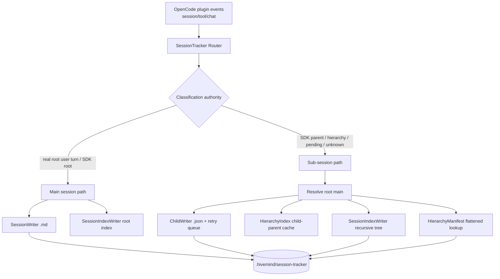

# Phase CP-ST-06: Session Tracker Root Cause Rewrite - Research

**Researched:** 2026-05-16  
**Domain:** OpenCode plugin session lifecycle capture + TypeScript file-system persistence + Vitest integration testing  
**Confidence:** HIGH for source-root causes; MEDIUM for OpenCode runtime race behavior that still needs live harness proof

<user_constraints>
## User Constraints (from CONTEXT.md)

### Locked Decisions

#### GA-1: RC-5 Error Propagation Strategy — Retry Queue

**Quyết định:** Retry queue — child writes phải **retry bằng mọi giá**. [VERIFIED: `.planning/phases/CP-ST-06-session-tracker-root-cause-rewrite/CP-ST-06-CONTEXT.md:22-37`]

#### GA-2: RC-1 getDepth() Max Depth — L2

**Quyết định:** Max depth = **L2** (3 tầng: L0+L1+L2). Fix tập trung: `getRootMain()` cho reverse-order registration, KHÔNG thay đổi max depth cap. [VERIFIED: `.planning/phases/CP-ST-06-session-tracker-root-cause-rewrite/CP-ST-06-CONTEXT.md:41-55`]

#### GA-3: RC-6 Test Replacement — Individual Audit

**Quyết định:** **Audit từng test individually**, không xóa hàng loạt. Tests mới viết = integration tests dùng real file system (temp dirs), no mocks cho persistence. [VERIFIED: `.planning/phases/CP-ST-06-session-tracker-root-cause-rewrite/CP-ST-06-CONTEXT.md:58-72`]

#### GA-4: index.ts Module Size — Trong Scope

**Quyết định:** Refactoring nằm **trong scope** CP-ST-06. Constraints: mỗi module mới ≤500 LOC; index.ts sau extract ≤500 LOC; giữ barrel re-export pattern; không đổi public API surface. [VERIFIED: `.planning/phases/CP-ST-06-session-tracker-root-cause-rewrite/CP-ST-06-CONTEXT.md:76-94`]

#### GA-5: Parallel Children — Verify bằng Tests

**Quyết định:** **Document as safe** + **verify bằng integration tests** cho 3 children song song, nested parallel, concurrent writes. [VERIFIED: `.planning/phases/CP-ST-06-session-tracker-root-cause-rewrite/CP-ST-06-CONTEXT.md:97-110`]

### the agent's Discretion

Không có section riêng trong CONTEXT.md; discretion nằm ở việc research/plan finalize extract boundaries cho index.ts và test rewrite sequencing. [VERIFIED: `.planning/phases/CP-ST-06-session-tracker-root-cause-rewrite/CP-ST-06-CONTEXT.md:82`]

### Deferred Ideas (OUT OF SCOPE)

- PTY integration. [VERIFIED: `.planning/phases/CP-ST-06-session-tracker-root-cause-rewrite/CP-ST-06-CONTEXT.md:150-155`]
- Orphan quarantine protocol. [VERIFIED: `.planning/phases/CP-ST-06-session-tracker-root-cause-rewrite/CP-ST-06-CONTEXT.md:150-155`]
- Plugin composition changes. [VERIFIED: `.planning/phases/CP-ST-06-session-tracker-root-cause-rewrite/CP-ST-06-CONTEXT.md:150-155`]
- Session recovery overhaul. [VERIFIED: `.planning/phases/CP-ST-06-session-tracker-root-cause-rewrite/CP-ST-06-CONTEXT.md:150-155`]
- GUI sidecar changes. [VERIFIED: `.planning/phases/CP-ST-06-session-tracker-root-cause-rewrite/CP-ST-06-CONTEXT.md:150-155`]
</user_constraints>

<phase_requirements>
## Phase Requirements

| ID | Description | Research Support |
|----|-------------|------------------|
| AC-RC1-01 | `getRootMain("ses_level2")` returns root regardless of registration order. [VERIFIED: `SPEC.md:51-55`] | Use a chain-walk root resolver that recomputes/repairs cached root for descendants after every `registerChild()`. [VERIFIED: `src/features/session-tracker/persistence/hierarchy-index.ts:162-199`] |
| AC-RC1-02 | Max implementation depth remains L2 per locked GA-2, despite SPEC line 53 mentioning L3. [VERIFIED: `CP-ST-06-CONTEXT.md:41-55`; VERIFIED: `SPEC.md:51-54`] | Planner must treat SPEC L3 depth wording as superseded by CONTEXT GA-2. [VERIFIED: `CP-ST-06-CONTEXT.md:43-52`] |
| AC-RC2-01..03 | `updateChildStatus()` writes root-owned nested hierarchy without flattening. [VERIFIED: `SPEC.md:64-67`] | Use recursive tree search/update in `SessionIndexWriter`, not top-level lookup only. [VERIFIED: `src/features/session-tracker/persistence/session-index-writer.ts:222-238`] |
| AC-RC3-01..03 | `gate:"none"` defaults to sub/no root directory, with exactly one real root. [VERIFIED: `SPEC.md:77-80`] | Classifier currently returns `parentID: undefined` and downstream treats that as main. [VERIFIED: `src/features/session-tracker/classification.ts:53-87`; VERIFIED: `src/features/session-tracker/index.ts:321-330`] |
| AC-RC4-01..03 | Full last non-user message must be preserved for all levels. [VERIFIED: `SPEC.md:90-93`] | Child JSON has `lastMessage`; main `.md` does not have equivalent frontmatter field today. [VERIFIED: `src/features/session-tracker/types.ts:204-229`; VERIFIED: `src/features/session-tracker/persistence/session-writer.ts:71-95`] |
| AC-RC5-01..03 | No silent child-write swallowing; errors logged with `[Harness]` and retry record. [VERIFIED: `SPEC.md:103-107`] | `ChildWriter.enqueueWrite()` currently returns `next` but stores a swallowed queue promise; `EventCapture.writeImmediateChildFile()` also catches write failure. [VERIFIED: `src/features/session-tracker/persistence/child-writer.ts:133-144`; VERIFIED: `src/features/session-tracker/capture/event-capture.ts:440-501`] |
| AC-RC6-01..04 | Individually audit/delete/rewrite stale tests; new tests use public API + real filesystem. [VERIFIED: `SPEC.md:116-120`; VERIFIED: `CP-ST-06-CONTEXT.md:58-72`] | Current scoped run shows 25 failing tests across 8 files; SPEC baseline says 30 failures across 12 files. [VERIFIED: `npx vitest run tests/features/session-tracker/` 2026-05-16; VERIFIED: `SPEC.md:18-37`] |
</phase_requirements>

## Summary

CP-ST-06 không phải patch nhỏ; nó là rewrite ranh giới phân loại + persistence của session-tracker. Root cause lớn nhất là **authority bị phân tán**: `EventCapture`, `SessionClassifier`, `HierarchyIndex`, `ChildWriter`, `SessionIndexWriter`, `MessageCapture`, và `SessionTracker.index.ts` đều đang tự quyết định một phần về main/child/root/status/turn. [VERIFIED: `src/features/session-tracker/index.ts:173-407`; VERIFIED: `src/features/session-tracker/capture/event-capture.ts:182-379`; VERIFIED: `src/features/session-tracker/classification.ts:53-87`]

Recommendation chính: dùng một **classification-and-routing authority** trước mọi I/O; chỉ một path được quyền tạo main directory; mọi path không chắc real user root phải route thành child/default-sub; child writes phải durable qua retry queue; hierarchy update phải root-owned và recursive. [VERIFIED: `CP-ST-06-CONTEXT.md:22-110`; CITED: `https://opencode.ai/docs/plugins/`]

Test strategy phải chuyển từ mock private internals sang integration tests với temp filesystem cho persistence. Vitest v4 async tests fail on rejected promises and supports `vi.waitFor` for async polling, so retry queue and parallel-child behavior can be tested deterministically without mocking `ChildWriter`/`SessionIndexWriter` internals. [CITED: Context7 `/vitest-dev/vitest` async + `vi.waitFor` docs; VERIFIED: `npm view vitest version time.modified`]

**Primary recommendation:** Rewrite theo 4 wave: (1) freeze current failure matrix + individual test audit, (2) extract routing/initialization modules from `index.ts`, (3) implement hierarchy/status/retry/default-sub as test-first integration slices, (4) delete/rewrite stale tests only with per-test rationale. [VERIFIED: `CP-ST-06-CONTEXT.md:58-94`]

## Project Constraints (from AGENTS.md)

- SessionTracker owns writes only under `.hivemind/session-tracker/`; hooks must route through module APIs, not write directly. [VERIFIED: `src/features/session-tracker/AGENTS.md:1-40`]
- `.opencode/` is soft meta-concepts only; CP-ST-06 must not mutate `.opencode/**`. [VERIFIED: `AGENTS.md`; VERIFIED: `.planning/phases/CP-ST-06-session-tracker-root-cause-rewrite/SPEC.md:146-150`]
- Runtime code belongs in `src/features/session-tracker/`; persisted internal state belongs in `.hivemind/session-tracker/`. [VERIFIED: `src/AGENTS.md`; VERIFIED: `.hivemind/AGENTS.md`]
- TypeScript strict ESM requires `.js` import extensions and `import type` for type-only imports. [VERIFIED: `src/AGENTS.md`]
- Module cap is ≤500 LOC; `index.ts` and `event-capture.ts` currently violate this. [VERIFIED: `wc -l` 2026-05-16: `index.ts` 1038 LOC, `event-capture.ts` 579 LOC]
- Code changes require `npm run typecheck` and scoped `npx vitest run tests/features/session-tracker/`; phase gate requires full `npm test`. [VERIFIED: `src/features/session-tracker/AGENTS.md`; VERIFIED: `SPEC.md:154-164`]
- New code should avoid `any` and use `[Harness]` prefix in thrown/logged errors. [VERIFIED: `AGENTS.md`; VERIFIED: `SPEC.md:124-134`]

## Architectural Responsibility Map

| Capability | Primary Tier | Secondary Tier | Rationale |
|------------|-------------|----------------|-----------|
| OpenCode event observation | Hooks / Plugin read-side | SessionTracker feature | OpenCode exposes plugin events including `session.created`, `session.idle`, `session.deleted`, `session.error`, and tool events; this project routes those events to SessionTracker. [CITED: `https://opencode.ai/docs/plugins/`; VERIFIED: `src/features/session-tracker/capture/event-capture.ts:91-160`] |
| Main-vs-child classification | `src/features/session-tracker/` routing authority | OpenCode SDK as signal source | SDK provides `session.get()` and `session.children()` APIs, but project must not let missing `parentID` become main by default. [CITED: `https://opencode.ai/docs/sdk/`; VERIFIED: `src/features/session-tracker/classification.ts:53-87`] |
| Durable child JSON persistence | `ChildWriter` + retry queue | `.hivemind/session-tracker/` state root | Child data lives in root main directory as `.json`; write failures must be retryable and not silent. [VERIFIED: `src/features/session-tracker/persistence/child-writer.ts:222-305`; VERIFIED: `CP-ST-06-CONTEXT.md:22-37`] |
| Hierarchy/status continuity | `HierarchyIndex` + `SessionIndexWriter` | `HierarchyManifestWriter` | `HierarchyIndex` is fast lookup; `session-continuity.json` preserves nested tree; manifest is flattened lookup. [VERIFIED: `src/features/session-tracker/persistence/hierarchy-index.ts:48-260`; VERIFIED: `src/features/session-tracker/types.ts:128-149`] |
| Turn counting and last message | `MessageCapture` / `ChildWriter` | `SessionWriter` frontmatter/body | Main turns are `.md`; child turns are `.json`; resume context needs full last assistant/tool content. [VERIFIED: `src/features/session-tracker/capture/message-capture.ts:173-216`; VERIFIED: `src/features/session-tracker/persistence/child-writer.ts:283-305`] |
| Test confidence | Vitest integration tests | Unit tests for pure helpers only | Persistence correctness requires real temp filesystem; private-mock tests are stale per GA-3. [VERIFIED: `CP-ST-06-CONTEXT.md:58-72`; CITED: Context7 `/vitest-dev/vitest`] |

## Standard Stack

### Core

| Library / Tool | Version | Purpose | Why Standard |
|----------------|---------|---------|--------------|
| TypeScript | installed `5.9.3`; npm latest `6.0.3` modified 2026-04-16 | Strict ESM type safety for session-tracker rewrite | Existing project stack; do not upgrade during CP-ST-06. [VERIFIED: `npx tsc --version`; VERIFIED: `npm view typescript version time.modified`; VERIFIED: `package.json:71-78`] |
| Vitest | installed `4.1.6`; npm latest `4.1.6` modified 2026-05-11 | Unit/integration test runner | Existing test framework; supports async promise failure and `vi.waitFor`. [VERIFIED: `npx vitest --version`; CITED: Context7 `/vitest-dev/vitest`] |
| Node `fs/promises` | Node local `v26.0.0`; package engine requires `>=20.0.0` | Real temp filesystem tests and atomic write implementation | Existing persistence uses `writeFile`, `rename`, `mkdir`, `readFile`; Node docs define promise FS operations and `rename()` overwrite behavior. [VERIFIED: `node --version`; VERIFIED: `package.json:103-105`; CITED: Context7 `/nodejs/node`] |
| `@opencode-ai/sdk` | package `^1.14.41`; npm latest `1.15.3` modified 2026-05-16 | Session API signals (`get`, `children`) | Existing project dependency; no upgrade in this phase because goal is session-tracker root cause rewrite, not SDK migration. [VERIFIED: `package.json:48-50`; VERIFIED: `npm view @opencode-ai/sdk version time.modified`; CITED: `https://opencode.ai/docs/sdk/`] |
| `@opencode-ai/plugin` | package `^1.14.41`; npm latest `1.15.3` modified 2026-05-16 | Plugin event hook surface | Existing peer/dev dependency; plugin events include session and tool lifecycle events. [VERIFIED: `package.json:68-73`; VERIFIED: `npm view @opencode-ai/plugin version time.modified`; CITED: `https://opencode.ai/docs/plugins/`] |

### Supporting

| Library / Tool | Version | Purpose | When to Use |
|----------------|---------|---------|-------------|
| `gray-matter` | package `^4.0.3` | Parse/update main session `.md` frontmatter | Keep for main-session metadata only. [VERIFIED: `package.json:56-59`; VERIFIED: `src/features/session-tracker/persistence/session-writer.ts:12-18`] |
| `yaml` | package `^2.8.3` | Serialize YAML frontmatter | Keep for `SessionWriter` frontmatter writes. [VERIFIED: `package.json:65-66`; VERIFIED: `src/features/session-tracker/persistence/session-writer.ts:12-18`] |
| `node:fs/promises` + temp dirs | Node built-in | Persistence integration tests | Use real filesystem temp dirs for RC-1..RC-6 persistence behavior. [CITED: Context7 `/nodejs/node`; VERIFIED: `CP-ST-06-CONTEXT.md:66-70`] |

### Alternatives Considered

| Instead of | Could Use | Tradeoff |
|------------|-----------|----------|
| Existing `ChildWriter` queue + retry queue | External persistent queue package | Do not add dependency; phase needs deterministic file retry, not distributed job processing. [ASSUMED] |
| Real temp filesystem tests | `memfs` mocks | Vitest documents fs mocking via `memfs`, but GA-3 explicitly requires no persistence mocks for new tests. [CITED: Context7 `/vitest-dev/vitest`; VERIFIED: `CP-ST-06-CONTEXT.md:66-70`] |
| OpenCode SDK-only `parentID` | Local hierarchy/pending fallback only | SDK is authoritative when available, but missing/late parentID is the exact bug domain; use SDK as signal, not sole authority. [CITED: `https://opencode.ai/docs/sdk/`; VERIFIED: `SPEC.md:69-80`] |

**Installation:**
```bash
# No new runtime dependency recommended for CP-ST-06.
# Use existing package.json stack.
```

**Version verification:** `npm view vitest`, `npm view @vitest/coverage-v8`, `npm view typescript`, `npm view @opencode-ai/sdk`, and `npm view @opencode-ai/plugin` were run on 2026-05-16. [VERIFIED: npm registry]

## Architecture Patterns

### System Architecture Diagram



### Recommended Project Structure

```text
src/features/session-tracker/
├── index.ts                    # public barrel + thin class facade, <=500 LOC
├── session-router.ts           # classify-before-I/O routing for chat/tool/session events
├── child-recorder.ts           # child route hydration + task delegation child recording
├── initialization.ts           # initialize/start/shutdown construction and seeding
├── classification.ts           # pure classification authority result types
├── capture/
│   ├── event-capture.ts        # lifecycle event capture, <=500 LOC after extract
│   └── message-capture.ts      # main .md turn capture + counter seeding
└── persistence/
    ├── hierarchy-index.ts
    ├── child-writer.ts
    ├── session-index-writer.ts
    └── retry-queue.ts          # durable failed child-write retry records
```

This structure follows GA-4 extract targets while adding a dedicated retry queue module for GA-1. [VERIFIED: `CP-ST-06-CONTEXT.md:82-94`; ASSUMED for exact `retry-queue.ts` filename]

### Pattern 1: Classify Before I/O, Unknown Defaults to Sub

**What:** All event/chat/tool paths call a shared classifier/router before `createSessionDir()` or `.md` writes. [VERIFIED: `src/features/session-tracker/index.ts:272-323`; VERIFIED: `SPEC.md:77-80`]  
**When to use:** Every hook event with a `sessionID`. [CITED: `https://opencode.ai/docs/plugins/`]  
**Prescription:** Only an explicitly root session may create a directory; `gate:"none"` must become a child/default-sub path targeting the first known root main. [VERIFIED: `SPEC.md:77-80`]

### Pattern 2: Root-Owned Recursive Hierarchy Tree

**What:** Child `.json` files and `session-continuity.json` updates should target root main directory, then update nested nodes recursively. [VERIFIED: `SPEC.md:64-67`; VERIFIED: `src/features/session-tracker/persistence/session-index-writer.ts:222-238`]  
**When to use:** L1/L2 child status updates, child creation, deleted/idle/error lifecycle events. [VERIFIED: `src/features/session-tracker/capture/event-capture.ts:298-411`]

### Pattern 3: Durable Retry Queue for Child Writes

**What:** Failed child writes produce retry records and are flushed on init + periodic tick. [VERIFIED: `CP-ST-06-CONTEXT.md:22-37`]  
**When to use:** `ChildWriter.createChildFile()`, `updateChildStatus()`, `appendChildTurn()`, `appendJourneyEntry()`, and immediate child write. [VERIFIED: `src/features/session-tracker/persistence/child-writer.ts:222-340`; VERIFIED: `src/features/session-tracker/capture/event-capture.ts:440-501`]  
**Important:** Keep queue alive without hiding failures: store an internal settled queue promise, but return/log/persist the original failure. [VERIFIED: current swallow pattern at `child-writer.ts:133-144`; CITED: Context7 `/nodejs/node` write errors]

### Pattern 4: Integration Tests Over Private Mocks

**What:** New tests should instantiate real writers against temp dirs and assert files on disk. [VERIFIED: `CP-ST-06-CONTEXT.md:66-70`]  
**When to use:** Persistence, hierarchy, retry, default-sub, parallel children. [VERIFIED: `CP-ST-06-CONTEXT.md:97-110`]  
**Vitest detail:** Async tests should `await` promises; rejected promises fail tests; use `vi.waitFor` for retry/async polling. [CITED: Context7 `/vitest-dev/vitest`]

### Anti-Patterns to Avoid

- **Patch only one caller:** `handleChatMessage`, `handleToolExecuteAfter`, `EventCapture.handleSessionIdle`, and `EventCapture.handleSessionDeleted` each classify independently today; patching one leaves data loss elsewhere. [VERIFIED: `src/features/session-tracker/index.ts:262-407`; VERIFIED: `src/features/session-tracker/capture/event-capture.ts:298-379`]
- **SDK parentID as sole truth:** OpenCode SDK exposes parent relationships, but CP-ST regressions are caused by missing/late/failed parentID paths. [CITED: `https://opencode.ai/docs/sdk/`; VERIFIED: `SPEC.md:69-80`]
- **Top-level-only hierarchy mutation:** Updating `index.hierarchy.children[childID]` cannot find nested L2 entries. [VERIFIED: `src/features/session-tracker/persistence/session-index-writer.ts:231-234`; VERIFIED: vitest failure `session-index-writer.test.ts:167`]
- **Queue swallowing:** `catch(() => {})` makes failures invisible and contradicts GA-1. [VERIFIED: `src/features/session-tracker/persistence/child-writer.ts:139-144`; VERIFIED: `CP-ST-06-CONTEXT.md:22-37`]
- **Bulk deleting tests:** GA-3 forbids deleting tests without individual audit rationale. [VERIFIED: `CP-ST-06-CONTEXT.md:58-72`]

## Don't Hand-Roll

| Problem | Don't Build | Use Instead | Why |
|---------|-------------|-------------|-----|
| File path safety | Ad-hoc string concatenation | Existing `safeSessionPath()` | It rejects traversal before sanitization and anchors under `.hivemind/session-tracker`. [VERIFIED: `src/features/session-tracker/persistence/atomic-write.ts:121-149`] |
| Atomic persistence | Direct overwrite with `writeFile(target)` | Existing write-temp-then-`rename()` helpers | Node docs define `writeFile()` replacement and `rename()` overwrite behavior; project already encapsulates it. [CITED: Context7 `/nodejs/node`; VERIFIED: `src/features/session-tracker/persistence/atomic-write.ts:33-77`] |
| YAML frontmatter parsing | Regex frontmatter parser | Existing `gray-matter` + `yaml` in `SessionWriter` | Current writer already centralizes frontmatter reads/writes. [VERIFIED: `src/features/session-tracker/persistence/session-writer.ts:12-18`; VERIFIED: `session-writer.ts:201-219`] |
| Async test polling | Manual sleeps only | Vitest `vi.waitFor` | Official docs expose wait/retry utilities with timeout/interval. [CITED: Context7 `/vitest-dev/vitest`] |
| Persistent retry state location | `.opencode/` or source files | `.hivemind/session-tracker/` under typed owner | Q6 state root forbids `.opencode/` runtime state. [VERIFIED: `.hivemind/AGENTS.md`; VERIFIED: `src/features/session-tracker/AGENTS.md`] |

**Key insight:** Không hand-roll thêm framework mới; rewrite phải consolidate authority around existing project primitives: `safeSessionPath`, atomic writers, `HierarchyIndex`, typed session records, and Vitest. [VERIFIED: source files listed above]

## Runtime State Inventory

| Category | Items Found | Action Required |
|----------|-------------|-----------------|
| Stored data | `.hivemind/session-tracker/{main}/{main}.md`, child `.json`, `session-continuity.json`, `hierarchy-manifest.json`, and `project-continuity.json` are runtime state surfaces. [VERIFIED: `src/features/session-tracker/persistence/session-writer.ts:1-9`; VERIFIED: `types.ts:128-149`; VERIFIED: `types.ts:265-329`] | Code edit + migration-safe read/write. Do not manually rewrite live state during phase; tests should build representative temp state. [VERIFIED: `.hivemind/AGENTS.md`] |
| Live service config | No external service config in scope; OpenCode SDK/client is runtime source of session metadata. [CITED: `https://opencode.ai/docs/sdk/`] | No live service patch; verify via mocked SDK + integration-style temp filesystem. [ASSUMED] |
| OS-registered state | None found in assigned files; CP-ST-06 does not touch launchd/systemd/pm2. [VERIFIED: assigned source files; ASSUMED no hidden OS state] | None. |
| Secrets/env vars | No secret/env var surfaces found in assigned files. [VERIFIED: assigned source grep for session-tracker] | None. |
| Build artifacts | `dist/` will be regenerated by `npm run build`; not an authority for planning. [VERIFIED: `package.json:30-37`] | Run typecheck/build only after implementation; no research mutation. |

## Root Cause Research Matrix

| Root Cause | Live Evidence | Rewrite Guidance | Confidence |
|------------|---------------|------------------|------------|
| RC-1 reverse-order root resolution | `registerChild()` sets `childToRootMain` only for immediate child when parent root is known; `getRootMain()` only reads cache. Reverse order produced `ses_level1` instead of `ses_root`. [VERIFIED: `hierarchy-index.ts:162-199`; VERIFIED: vitest failure `hierarchy-index.test.ts:187`] | Recompute root on read or update descendants after late parent registration; preserve L2 cap per GA-2. [VERIFIED: `CP-ST-06-CONTEXT.md:41-55`] | HIGH |
| RC-2 nested status update | `updateChildStatus()` only checks top-level `index.hierarchy.children[childID]`. [VERIFIED: `session-index-writer.ts:222-238`] | Recursive find/update for `ChildHierarchyEntry.children`; write root index only. [VERIFIED: `SPEC.md:64-67`] | HIGH |
| RC-3 default-to-sub | `SessionClassifier.classify()` returns `{ parentID: undefined, gate: "none" }`; `index.ts` then executes main path. [VERIFIED: `classification.ts:53-87`; VERIFIED: `index.ts:321-330`] | Introduce explicit classification type (`root` vs `child` vs `unknownSub`) so undefined parent no longer means root. [ASSUMED] | HIGH |
| RC-4 full lastMessage | Child writer records `lastMessage = turn.content` for non-user; type doc still says summary/first 200 chars; main writer has no `lastMessage` frontmatter. [VERIFIED: `child-writer.ts:296-299`; VERIFIED: `types.ts:225-226`; VERIFIED: `session-writer.ts:71-95`] | Add/update full last non-user content consistently for child JSON and main session frontmatter/body metadata; do not truncate. [VERIFIED: `SPEC.md:90-93`] | MEDIUM |
| RC-5 child write error swallowing | Child queue stores `next.catch(() => {})`; immediate child write catches and logs without retry. [VERIFIED: `child-writer.ts:133-144`; VERIFIED: `event-capture.ts:492-501`] | Return error to caller, persist retry record, log `[Harness]`, and keep internal chain alive separately. [VERIFIED: `CP-ST-06-CONTEXT.md:22-37`] | HIGH |
| RC-6 stale tests | Current scoped run: 25 failures/362 pass in session-tracker; failures include private mocks and legacy event-tracker cleanup assertions. [VERIFIED: `npx vitest run tests/features/session-tracker/` 2026-05-16] | Audit each failing test; keep valid pure tests; replace stale private mocks with integration tests over public API/temp files. [VERIFIED: `CP-ST-06-CONTEXT.md:58-72`] | HIGH |

## Test Rewrite Strategy

### Current Failure Matrix (2026-05-16 scoped run)

| Test file | Failures | Classification |
|-----------|----------|----------------|
| `persistence/hierarchy-index.test.ts` | 2 | Valid root-cause tests for RC-1; keep/update expected L2 cap per GA-2. [VERIFIED: vitest output] |
| `persistence/child-writer.test.ts` | 1 | Stale expectation: currently expects queue to swallow ENOENT; rewrite for retry/error propagation. [VERIFIED: vitest output; VERIFIED: `CP-ST-06-CONTEXT.md:22-37`] |
| `persistence/session-index-writer.test.ts` | 1 | Valid RC-2 nested hierarchy test; keep and make pass. [VERIFIED: vitest output] |
| `ensure-session-ready-classification.test.ts` | 5 | Mostly stale private mock tests around removed/extracted `ensureSessionReady` internals; individually audit and replace with router-level integration tests. [VERIFIED: vitest output; VERIFIED: `CP-ST-05-03-SUMMARY.md:102` from grep result] |
| `session-tracker.test.ts` | 6 | Stale private mocks for `SessionTracker` internals after extraction; preserve intent through public handler integration tests. [VERIFIED: vitest output] |
| `integration/cleanup.test.ts` | 2 | Out-of-scope legacy event-tracker cleanup expectations; CP-ST-03 removed event-tracker source. Flag/delete with rationale. [VERIFIED: vitest output; VERIFIED: `src/features/session-tracker/index.ts:918-927`] |
| `integration/pipeline.test.ts` | 1 | Potential valid turn-counter seeding regression; inspect before deleting. [VERIFIED: vitest output; VERIFIED: `message-capture.ts:241-253`] |
| `index.test.ts` | 7 | Mixed: one async polling test may be valid; classification private mock tests stale after extraction and default-sub decision changes. [VERIFIED: vitest output] |

### Required New Integration Coverage

- RC-1: reverse registration L2→L1→L0 resolves root main and stores child under root main. [VERIFIED: `CP-ST-06-CONTEXT.md:41-55`]
- RC-2: nested L2 status update updates `l1.children[l2]`, not root-level `children[l2]`. [VERIFIED: `SPEC.md:64-67`]
- RC-3: `gate:"none"`/unknown session does not create a root directory; writes child JSON under first known root. [VERIFIED: `SPEC.md:77-80`]
- RC-4: assistant/tool content stored fully in main and child lastMessage-equivalent fields. [VERIFIED: `SPEC.md:90-93`]
- RC-5: failed child write creates retry record and later flush succeeds. [VERIFIED: `CP-ST-06-CONTEXT.md:22-37`]
- GA-5: parallel child registration, nested parallel, and concurrent child writes have no lost data. [VERIFIED: `CP-ST-06-CONTEXT.md:97-110`]

## Common Pitfalls

### Pitfall 1: Treating `undefined parentID` as root
**What goes wrong:** Child sessions with missing/late SDK parent become rogue root directories. [VERIFIED: `SPEC.md:69-80`]  
**Why it happens:** Current return type uses `parentID: undefined` both for real root and unknown. [VERIFIED: `classification.ts:17-22`; VERIFIED: `classification.ts:86-87`]  
**How to avoid:** Return explicit classification kind and make unknown route to sub/default-sub. [ASSUMED]  
**Warning signs:** A child session gets `{sessionID}/{sessionID}.md` instead of `{root}/{child}.json`. [VERIFIED: `SPEC.md:77-80`]

### Pitfall 2: Fixing `ChildWriter` but leaving `EventCapture` best-effort swallow
**What goes wrong:** Retry queue exists but immediate `session.created` child-write failures still disappear. [VERIFIED: `event-capture.ts:440-501`]  
**How to avoid:** Route immediate child writes through the same retry/error surface as all other child writes. [VERIFIED: `CP-ST-06-CONTEXT.md:22-37`]

### Pitfall 3: Recomputing depth beyond locked scope
**What goes wrong:** SPEC line 53 says L3, but GA-2 explicitly locks max depth to L2. [VERIFIED: `SPEC.md:51-54`; VERIFIED: `CP-ST-06-CONTEXT.md:41-55`]  
**How to avoid:** Planner must follow CONTEXT over SPEC where they conflict. [VERIFIED: developer instructions]

### Pitfall 4: Top-level hierarchy update for nested children
**What goes wrong:** L2 status update silently no-ops because `children[childID]` is undefined at root. [VERIFIED: `session-index-writer.ts:231-234`; VERIFIED: vitest failure `session-index-writer.test.ts:167`]  
**How to avoid:** Recursive update helper with boolean result; log/retry if child not found. [ASSUMED]

### Pitfall 5: Mock tests passing while filesystem behavior is broken
**What goes wrong:** Tests assert mocked private methods instead of actual `.hivemind/session-tracker` outputs. [VERIFIED: `session-tracker.test.ts` grep output; VERIFIED: `index.test.ts` vitest failures]  
**How to avoid:** Temp-dir integration tests inspect actual files and JSON content. [VERIFIED: `CP-ST-06-CONTEXT.md:66-70`]

## Code Examples

### Queue Pattern: expose caller error but keep internal chain alive

```typescript
// Source: derived from current child-writer queue bug + GA-1 constraints.
// [VERIFIED: child-writer.ts:133-144] [VERIFIED: CP-ST-06-CONTEXT.md:22-37]
const current = this.writeQueues.get(queueKey) ?? Promise.resolve()
const operation = current.catch(() => undefined).then(fn)
this.writeQueues.set(queueKey, operation.catch(() => undefined))
return operation // caller sees rejection; queue remains usable
```

### Recursive Nested Child Status Update

```typescript
// Source: needed because updateChildStatus currently only checks root children.
// [VERIFIED: session-index-writer.ts:222-238]
function updateNestedStatus(
  children: Record<string, ChildHierarchyEntry>,
  childID: string,
  status: string,
): boolean {
  const direct = children[childID]
  if (direct) {
    direct.status = status
    return true
  }
  return Object.values(children).some((entry) =>
    updateNestedStatus(entry.children, childID, status),
  )
}
```

### Vitest Async Retry Assertion

```typescript
// Source: Context7 /vitest-dev/vitest vi.waitFor docs.
await vi.waitFor(() => {
  expect(readRetryRecord(childID)).toMatchObject({ status: "pending" })
}, { timeout: 1000, interval: 50 })
```

## State of the Art

| Old Approach | Current Approach | When Changed | Impact |
|--------------|------------------|--------------|--------|
| SDK-only or caller-local classification | Central classify-before-I/O with SDK + hierarchy + pending + default-sub | CP-ST-04/05 and CP-ST-06 locked scope | Prevents rogue root dirs and data loss. [VERIFIED: CP-ST-04/05 grep results; VERIFIED: `CP-ST-06-CONTEXT.md`] |
| Private mocks for writer internals | Public API + real temp filesystem integration tests | CP-ST-06 GA-3 | Catches path routing, atomic write, and retry behavior. [VERIFIED: `CP-ST-06-CONTEXT.md:58-72`] |
| Silent best-effort write failure | Retry queue + degraded state after max retries | CP-ST-06 GA-1 | Prevents invisible child data loss. [VERIFIED: `CP-ST-06-CONTEXT.md:22-37`] |
| `index.ts` monolith | Thin facade + extracted router/recorder/initialization modules | CP-ST-06 GA-4 | Restores ≤500 LOC cap and reviewability. [VERIFIED: `CP-ST-06-CONTEXT.md:76-94`] |

**Deprecated/outdated:**
- `tests/lib/session-tracker/*.test.ts` is listed in SPEC, but no files were found at that path in this workspace. [VERIFIED: Glob `tests/lib/session-tracker/**/*.test.ts` returned no files]
- Legacy `.hivemind/event-tracker` cleanup assertions are stale for CP-ST-06 because event-tracker cleanup was removed from SessionTracker cleanup TODO path. [VERIFIED: `src/features/session-tracker/index.ts:918-927`; VERIFIED: vitest failure `integration/cleanup.test.ts`]

## Assumptions Log

| # | Claim | Section | Risk if Wrong |
|---|-------|---------|---------------|
| A1 | No external package should be added for retry queue. | Standard Stack / Alternatives | If retry durability needs a richer state machine, implementation may under-spec retry persistence. |
| A2 | Exact filename `retry-queue.ts` is acceptable. | Recommended Project Structure | Planner may choose different naming; no runtime risk. |
| A3 | Live service config and OS state are not relevant to CP-ST-06. | Runtime State Inventory | Hidden runtime registrations could be missed, but assigned files and phase scope do not indicate any. |
| A4 | Explicit classification kind is the right implementation shape. | RC-3 / Pitfalls | Could be implemented differently; planner should preserve behavior, not necessarily shape. |

## Open Questions

1. **What is “first known root main directory” for `gate:"none"` if zero root sessions exist?**
   - What we know: SPEC requires writing under first known root. [VERIFIED: `SPEC.md:77-80`]
   - What's unclear: fallback when no root is known.
   - Recommendation: Plan must define stop/degraded behavior instead of creating root automatically. [ASSUMED]

2. **Should main `.md` lastMessage live in YAML frontmatter or a dedicated markdown section?**
   - What we know: child JSON has `lastMessage`; main frontmatter currently lacks it. [VERIFIED: `types.ts:204-229`; VERIFIED: `session-writer.ts:71-95`]
   - What's unclear: consumer expects field vs body scan.
   - Recommendation: Use frontmatter for machine recovery and preserve full text; verify no YAML size issue with large messages. [ASSUMED]

3. **Should `SessionIndexWriter.enqueueWrite()` also stop swallowing errors?**
   - What we know: CP-ST-06 locks child writes, but `SessionIndexWriter` also swallows write errors. [VERIFIED: `session-index-writer.ts:107-123`; VERIFIED: `CP-ST-06-CONTEXT.md:22-37`]
   - What's unclear: whether GA-1 applies only child `.json` writes or all session tracker writes.
   - Recommendation: Planner should include this as a bounded question/gate; do not silently leave nested status failures hidden. [ASSUMED]

## Environment Availability

| Dependency | Required By | Available | Version | Fallback |
|------------|------------|-----------|---------|----------|
| Node.js | TypeScript/Vitest/runtime fs tests | ✓ | local `v26.0.0`; package requires `>=20.0.0` | None needed. [VERIFIED: `node --version`; VERIFIED: `package.json:103-105`] |
| npm | package scripts | ✓ | `11.14.1` | None needed. [VERIFIED: `npm --version`] |
| TypeScript CLI | typecheck | ✓ | local `5.9.3` | None needed. [VERIFIED: `npx tsc --version`] |
| Vitest CLI | scoped/full tests | ✓ | local `4.1.6` | None needed. [VERIFIED: `npx vitest --version`] |
| OpenCode SDK package | API types/session calls | ✓ in package | package `^1.14.41`, latest `1.15.3` | Do not upgrade in this phase. [VERIFIED: `package.json`; VERIFIED: npm registry] |

**Missing dependencies with no fallback:** None found. [VERIFIED: commands above]  
**Missing dependencies with fallback:** None found. [VERIFIED: commands above]

## Validation Architecture

### Test Framework

| Property | Value |
|----------|-------|
| Framework | Vitest local `4.1.6`; npm latest `4.1.6`. [VERIFIED: `npx vitest --version`; VERIFIED: npm registry] |
| Config file | none detected in assigned reads; package uses default `vitest run`. [VERIFIED: `package.json:30-37`; ASSUMED no hidden config because not globbed for vitest config] |
| Quick run command | `npx vitest run tests/features/session-tracker/` [VERIFIED: executed 2026-05-16] |
| Full suite command | `npm test` [VERIFIED: `package.json:30-37`] |

### Phase Requirements → Test Map

| Req ID | Behavior | Test Type | Automated Command | File Exists? |
|--------|----------|-----------|-------------------|--------------|
| RC-1 | Reverse-order root resolution; L2 cap honored | integration/unit hybrid | `npx vitest run tests/features/session-tracker/persistence/hierarchy-index.test.ts` | ✅ existing, failing. [VERIFIED: vitest output] |
| RC-2 | Nested child status update | integration/unit hybrid | `npx vitest run tests/features/session-tracker/persistence/session-index-writer.test.ts` | ✅ existing, failing. [VERIFIED: vitest output] |
| RC-3 | Default-sub and exactly-one-root | integration | `npx vitest run tests/features/session-tracker/integration/pipeline.test.ts` plus new default-sub file | ❌ Wave 0 gap. [VERIFIED: SPEC] |
| RC-4 | Full lastMessage for L0/L1/L2 | integration | new test file under `tests/features/session-tracker/integration/` | ❌ Wave 0 gap. [VERIFIED: SPEC] |
| RC-5 | Retry queue, no silent loss | integration | new retry queue test file | ❌ Wave 0 gap. [VERIFIED: GA-1] |
| RC-6 | Test audit/delete/rewrite rationale | audit artifact + tests | scoped Vitest + audit table in plan/summary | ❌ Wave 0 gap. [VERIFIED: GA-3] |
| GA-5 | Parallel children | integration/concurrency | new parallel child integration file | ❌ Wave 0 gap. [VERIFIED: GA-5] |

### Sampling Rate

- **Per task commit:** `npx vitest run tests/features/session-tracker/<touched-area>.test.ts` + `npm run typecheck` if types changed. [VERIFIED: project rules]
- **Per wave merge:** `npx vitest run tests/features/session-tracker/`. [VERIFIED: SPEC]
- **Phase gate:** `npm run typecheck` + `npm test` + `wc -l` checks for `index.ts` and extracted modules. [VERIFIED: `SPEC.md:154-164`; VERIFIED: `CP-ST-06-CONTEXT.md:88-94`]

### Wave 0 Gaps

- [ ] Individual stale-test audit table before deletion/rewrite. [VERIFIED: GA-3]
- [ ] Default-sub integration test using real temp root. [VERIFIED: RC-3]
- [ ] Retry queue persistence + flush tests. [VERIFIED: GA-1]
- [ ] Parallel child registration/write tests. [VERIFIED: GA-5]
- [ ] Main-session full lastMessage test. [VERIFIED: RC-4]

## Security Domain

### Applicable ASVS Categories

| ASVS Category | Applies | Standard Control |
|---------------|---------|-----------------|
| V2 Authentication | no | No auth changes in CP-ST-06. [VERIFIED: SPEC scope] |
| V3 Session Management | yes | Session ID validation, classification, root/child authority. [VERIFIED: `types.ts:335-380`; VERIFIED: `classification.ts:53-87`] |
| V4 Access Control | yes | Hooks observe; feature module owns persistence; `.opencode` forbidden. [VERIFIED: `src/features/session-tracker/AGENTS.md`] |
| V5 Input Validation | yes | `isValidSessionID()`, `sanitizeSessionID()`, `safeSessionPath()`. [VERIFIED: `atomic-write.ts:97-149`; VERIFIED: `types.ts:335-380`] |
| V6 Cryptography | no | No crypto in scope. [VERIFIED: SPEC scope] |

### Known Threat Patterns for Session Tracker

| Pattern | STRIDE | Standard Mitigation |
|---------|--------|---------------------|
| Path traversal through sessionID/filename | Tampering | Use `safeSessionPath()` only. [VERIFIED: `atomic-write.ts:121-149`] |
| Silent data loss on failed child write | Repudiation / Tampering | Retry record + `[Harness]` log + degraded status after max retries. [VERIFIED: GA-1] |
| Rogue root directory creation from unknown child | Tampering / Information disclosure | Default unknown to sub; exactly one real user turn authority. [VERIFIED: phase goal; VERIFIED: SPEC RC-3] |
| Private mock tests masking persistence failure | Repudiation | Real filesystem integration tests. [VERIFIED: GA-3] |

## Sources

### Primary (HIGH confidence)
- `.planning/phases/CP-ST-06-session-tracker-root-cause-rewrite/CP-ST-06-CONTEXT.md` — locked GA decisions.
- `.planning/phases/CP-ST-06-session-tracker-root-cause-rewrite/SPEC.md` — acceptance criteria and verification commands.
- `src/features/session-tracker/index.ts`, `classification.ts`, `persistence/*.ts`, `capture/*.ts`, `types.ts` — live implementation evidence.
- `npx vitest run tests/features/session-tracker/` — current scoped failure matrix, 25 failed / 362 passed.
- `npm view ...` — npm registry package versions.

### Secondary (MEDIUM confidence)
- OpenCode official docs: `https://opencode.ai/docs/plugins/` — plugin events and hooks.
- OpenCode official docs: `https://opencode.ai/docs/sdk/` — session APIs, `session.get`, `session.children`, SDK types.
- Context7 `/vitest-dev/vitest` — async testing, `vi.waitFor`, fs mocking docs.
- Context7 `/nodejs/node` — `fs/promises`, `writeFile`, `rename`, `mkdir` behavior.

### Tertiary (LOW confidence)
- Architecture suggestions for exact module names (`session-router.ts`, `child-recorder.ts`, `retry-queue.ts`) are implementation-planning assumptions derived from GA-4. [ASSUMED]

## Metadata

**Confidence breakdown:**
- Standard stack: HIGH — verified via `package.json`, local CLI versions, npm registry, and official docs.
- Architecture: HIGH for current source root causes; MEDIUM for live OpenCode event ordering races because runtime needs integration proof.
- Pitfalls: HIGH for observed source/test failures; MEDIUM for exact rewrite module shape.

**Research date:** 2026-05-16  
**Valid until:** 2026-05-23 for OpenCode SDK/plugin event/API details; 2026-06-15 for local TypeScript/Vitest persistence strategy.
