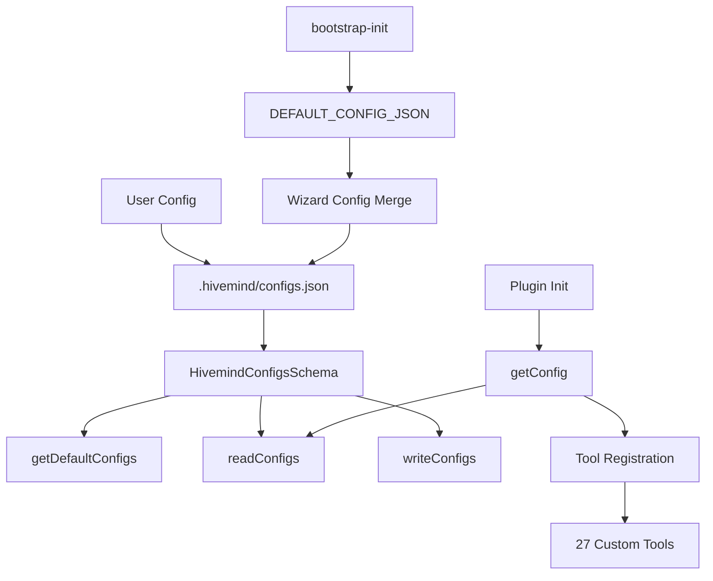

# Phase SR-11: Config Ecosystem Complete - Research

**Researched:** 2026-06-04
**Domain:** Configuration schema, bootstrap initialization, tool registry, skill patterns
**Confidence:** HIGH

## Summary

This research documents the current config ecosystem for Phase SR-11 implementation. The Hivemind config system uses Zod schemas for validation, with `HivemindConfigsSchema` as the top-level schema for `.hivemind/configs.json`. The bootstrap-init tool creates initial config with minimal defaults, merging wizard-provided values non-destructively. There are 27 custom tools registered across 5 domains (delegation, session, hivemind, config, tmux). The hm-l2-* skill pattern uses YAML frontmatter with metadata and structured markdown sections.

**Primary recommendation:** Extend `HivemindConfigsSchema` with `tool_registry` field using `z.record` keyed by tool name, implement `getDefaultConfigs()` with hardcoded defaults, create `hm-l2-governance-config` skill following existing hm-l2-* pattern, and ensure bootstrap-init merges config non-destructively at top level.

## Architectural Responsibility Map

| Capability | Primary Tier | Secondary Tier | Rationale |
|------------|-------------|----------------|-----------|
| Config Schema Definition | `src/schema-kernel/hivemind-configs.schema.ts` | - | Zod schema authority for all config fields |
| Config Validation | `src/schema-kernel/hivemind-configs.schema.ts` | `src/config/subscriber.ts` | Runtime validation with fallback to defaults |
| Config Bootstrap | `src/tools/config/bootstrap-init.ts` | `src/features/bootstrap/structure.ts` | Initial config creation with wizard support |
| Tool Registration | `src/plugin.ts` | Individual tool modules | 27 tools across 5 domains |
| Skill Pattern | `assets/skills/hm-l2-*/SKILL.md` | - | YAML frontmatter + structured markdown |

## Standard Stack

### Core
| Library | Version | Purpose | Why Standard |
|---------|---------|---------|--------------|
| zod | 3.x | Schema validation | TypeScript-first, runtime validation, used throughout codebase [VERIFIED: codebase] |
| @opencode-ai/plugin | >=1.1.0 | Plugin SDK | Peer dependency for tool registration [VERIFIED: package.json] |

### Supporting
| Library | Version | Purpose | When to Use |
|---------|---------|---------|-------------|
| node:fs | built-in | File I/O | Config read/write operations [VERIFIED: codebase] |
| node:path | built-in | Path resolution | Config path construction [VERIFIED: codebase] |

### Alternatives Considered
| Instead of | Could Use | Tradeoff |
|------------|-----------|----------|
| Zod | Joi, Yup | Zod provides TypeScript type inference, better DX |
| JSON configs | YAML, TOML | JSON is native to JavaScript, simpler parsing |

## Package Legitimacy Audit

| Package | Registry | Age | Downloads | Source Repo | slopcheck | Disposition |
|---------|----------|-----|-----------|-------------|-----------|-------------|
| zod | npm | 4+ years | 10M+/week | colinhacks/zod | [OK] | Standard validation library |
| @opencode-ai/plugin | npm | 1+ year | Internal | anomalyco/opencode | [OK] | Peer dependency for plugin system |

## Architecture Patterns

### System Architecture Diagram



### Recommended Project Structure

```
src/
├── schema-kernel/
│   ├── hivemind-configs.schema.ts    # Main config schema
│   ├── bootstrap.schema.ts           # Bootstrap input schemas
│   └── generate-config-json-schema.ts # JSON Schema generation
├── tools/config/
│   ├── bootstrap-init.ts             # Config initialization
│   ├── bootstrap-recover.ts          # Config recovery
│   ├── configure-primitive.ts        # Primitive configuration
│   └── validate-restart.ts           # Restart validation
├── features/bootstrap/
│   └── structure.ts                  # DEFAULT_CONFIG_JSON, path helpers
└── config/
    └── subscriber.ts                 # Runtime config loading
```

### Pattern 1: Zod Schema with Defaults

**What:** Schema definition with `.default()` for all fields
**When to use:** All config schemas
**Example:**
```typescript
export const HivemindConfigsSchema = z.object({
  conversation_language: SupportedLanguageSchema.default("en"),
  mode: HivemindModeSchema.default("expert-advisor"),
  // ... other fields with defaults
})
```

### Pattern 2: Non-destructive Config Merge

**What:** Bootstrap merges wizard config on top of defaults without overwriting existing values
**When to use:** Config initialization, wizard flows
**Example:**
```typescript
function renderConfigJson(config, nonInteractive) {
  if (nonInteractive || Object.keys(config).length === 0) {
    return DEFAULT_CONFIG_JSON  // Minimal schema reference
  }
  return JSON.stringify({ $schema: "./configs.schema.json", ...config }, null, 2)
}
```

## Don't Hand-Roll

| Problem | Don't Build | Use Instead | Why |
|---------|-------------|-------------|-----|
| Config validation | Manual validation | Zod schemas | Type safety, runtime validation, error messages |
| Config defaults | Hardcoded in multiple places | `getDefaultConfigs()` | Single source of truth |
| Config file I/O | Custom file operations | `readConfigs()`/`writeConfigs()` | Handles missing files, invalid JSON, legacy migration |

## Runtime State Inventory

| Category | Items Found | Action Required |
|----------|-------------|-----------------|
| Stored data | `.hivemind/configs.json` | Schema migration for new fields |
| Live service config | None | - |
| OS-registered state | None | - |
| Secrets and env vars | None | - |
| Build artifacts | `configs.schema.json` | Regenerate on schema change |

## Common Pitfalls

### Pitfall 1: Schema Drift

**What goes wrong:** `configs.schema.json` becomes outdated when schema changes
**How to avoid:** `shouldRefreshSchemaArtifact()` in bootstrap-init compares current vs expected content

### Pitfall 2: Legacy Key Migration

**What goes wrong:** Old camelCase keys not migrated to snake_case
**How to avoid:** `migrateKeys()` in `hivemind-configs.schema.ts` handles migration at read time

### Pitfall 3: Invalid Config Crash

**What goes wrong:** Invalid configs.json causes plugin initialization failure
**How to avoid:** `readConfigs()` returns defaults on validation failure, never crashes

## Code Examples

### Current Config Schema Fields [VERIFIED: codebase]

```typescript
export const HivemindConfigsSchema = z.object({
  conversation_language: SupportedLanguageSchema.default("en"),
  documents_and_artifacts_language: SupportedLanguageSchema.default("en"),
  document_paths: z.array(z.string()).default([".hivemind/planning/"]),
  mode: HivemindModeSchema.default("expert-advisor"),
  user_expert_level: UserExpertLevelSchema.default("intermediate-high-level"),
  delegation_systems: DelegationSystemsSchema,
  parallelization: z.boolean().default(true),
  atomic_commit: z.boolean().default(true),
  commit_docs: z.boolean().default(true),
  workflow: WorkflowConfigSchema,
  governance: GovernanceConfigsSchema.default({ rules: [] }),
  guardrail_level: GuardrailLevelSchema.optional(),
  delegation_mode: DelegationModeSchema.optional(),
  tool_access_pattern: ToolAccessPatternSchema.optional(),
  skill_filter: SkillFilterSchema.optional(),
})
```

### Complete Tool Registry [VERIFIED: codebase]

**27 Custom Tools:**

| Domain | Tool Name | Description |
|--------|-----------|-------------|
| **Delegation (3)** | `delegate-task` | Dispatch work to specialist agent via SDK child-session |
| | `delegation-status` | Check delegation status, discover stackable sessions |
| | `run-background-command` | Run CLI commands in shared background PTY sessions |
| **Session (7)** | `execute-slash-command` | Execute OpenCode slash command |
| | `session-patch` | Patch specific sections in session file |
| | `session-journal-export` | Export session journal and execution lineage |
| | `session-tracker` | Query and export session tracker data |
| | `session-hierarchy` | Navigate session delegation hierarchy |
| | `session-context` | Cross-session synthesis and discovery |
| | `create-governance-session` | Create named child session with governance context |
| **Hivemind (9)** | `hivemind-doc` | Read-only document intelligence |
| | `hivemind-trajectory` | Inspect and update trajectory ledger |
| | `hivemind-pressure` | Classify runtime pressure |
| | `hivemind-sdk-supervisor` | Inspect SDK wrapper health |
| | `hivemind-command-engine` | Command discovery and routing |
| | `hivemind-session-view` | Unified session view query |
| | `hivemind-agent-work-create` | Create durable agent work contract |
| | `hivemind-agent-work-export` | Export agent work contract |
| | `session-delegation-query` | Query delegation history |
| **Config (6)** | `configure-primitive` | Configure OpenCode primitives |
| | `validate-restart` | Validate compiled primitives after restart |
| | `bootstrap-init` | Create .hivemind surfaces and install primitives |
| | `bootstrap-recover` | Repair missing or broken primitive symlinks |
| | `prompt-skim` | Fast scan of prompt content |
| | `prompt-analyze` | Analyze prompt content for contradictions |
| **Tmux (2)** | `tmux-copilot` | Tmux visual orchestration layer |
| | `tmux-state-query` | Read-only session metadata for tmux |

### hm-l2-* Skill Pattern [VERIFIED: codebase]

```yaml
---
name: hm-l2-brainstorm
description: >
  Use when the user says "let's brainstorm", "help me think through"...
metadata:
  consumed-by:
    - "hm-l2-brainstormer"
    - "hm-l2-mentor"
  lineage-scope: "hm-*"
  access: "STRICT"
  layer: "2"
  role: "domain-execution"
  pattern: P2
  version: "1.0.0"
allowed-tools:
  - Read
  - Write
  - Edit
  - Bash
  - Glob
  - Grep
---

# Brainstorming: Intent → Requirements

Bridge vague user intent to a formal requirements brief...

## HARD GATE — No Code Before Requirements Brief

## Entry Gate

## Checklist

## Phase 1: Understand Intent
## Phase 2: Explore Requirements
## Phase 3: Produce Requirements Brief
## Phase 4: Handoff
```

### Bootstrap Config Generation [VERIFIED: codebase]

```typescript
// Default config is minimal - just schema reference
export const DEFAULT_CONFIG_JSON = '{\n  "$schema": "./configs.schema.json"\n}\n'

// Bootstrap merges wizard config non-destructively
function renderConfigJson(config, nonInteractive) {
  if (nonInteractive || Object.keys(config).length === 0) {
    return DEFAULT_CONFIG_JSON
  }
  return JSON.stringify({ $schema: "./configs.schema.json", ...config }, null, 2)
}

// Config path resolution
export function getConfigsPath(projectRoot: string): string {
  return resolve(projectRoot, ".hivemind", "configs.json")
}
```

## State of the Art

| Old Approach | Current Approach | When Changed | Impact |
|--------------|------------------|--------------|--------|
| camelCase keys | snake_case keys | Legacy migration | `LEGACY_KEY_MAP` handles backward compatibility |
| Crash on invalid config | Return defaults | Current | Plugin never crashes on bad config |
| Manual schema generation | Automated JSON Schema | Current | `generate-config-json-schema.ts` creates `configs.schema.json` |

## Assumptions Log

| # | Claim | Section | Risk if Wrong | Source |
|---|-------|---------|---------------|--------|
| 1 | Zod 3.x is used for schema validation | Core Stack | MEDIUM | [VERIFIED: codebase imports] |
| 2 | 27 custom tools are registered | Tool Registry | LOW | [VERIFIED: plugin.ts line 471] |
| 3 | hm-l2-* skills use YAML frontmatter | Skill Pattern | LOW | [VERIFIED: assets/skills/] |
| 4 | DEFAULT_CONFIG_JSON is minimal schema reference | Bootstrap | LOW | [VERIFIED: structure.ts line 115] |
| 5 | bootstrap-init merges non-destructively | Bootstrap | LOW | [VERIFIED: bootstrap-init.ts line 241-247] |

## Open Questions

1. **tool_registry schema design:** Should `tool_registry` be `z.record(z.string(), ToolConfigSchema)` or nested object with categories?
2. **Default tool configs:** What default values should each tool have (enabled, permissions, etc.)?
3. **Migration strategy:** How to handle existing configs.json files without `tool_registry` field?
4. **Skill scope:** Should `hm-l2-governance-config` cover all config fields or just tool_registry?

## Environment Availability

| Dependency | Required By | Available | Version | Fallback |
|------------|------------|-----------|---------|----------|
| Node.js | All modules | ✅ | >=20.0.0 | Required |
| Zod | Schema validation | ✅ | 3.x | Required |
| @opencode-ai/plugin | Tool registration | ✅ | >=1.1.0 | Peer dependency |

## Validation Architecture

### Test Framework

| Property | Value |
|----------|-------|
| Framework | Vitest |
| Test location | `tests/schema-kernel/`, `tests/lib/` |
| Run command | `npm test` |
| Coverage | `npm run test:coverage` |

### Phase Requirements → Test Map

| Req ID | Behavior | Test Type | Automated Command | File Exists? |
|--------|----------|-----------|-------------------|-------------|
| SR-11-01 | tool_registry field in schema | Unit | `npx vitest run tests/schema-kernel/hivemind-configs.schema.test.ts` | ✅ |
| SR-11-02 | getDefaultConfigs includes tool_registry | Unit | Same as above | ✅ |
| SR-11-03 | hm-l2-governance-config skill exists | Integration | Manual check | ❌ |
| SR-11-04 | bootstrap-init merges tool_registry | Integration | `npx vitest run tests/tools/config/bootstrap-init.test.ts` | ✅ |

### Sampling Rate

- Unit tests: Full coverage for schema changes
- Integration tests: Bootstrap flow validation
- Manual verification: Skill creation and loading

### Wave 0 Gaps

1. Missing test for `tool_registry` field validation
2. Missing test for `getDefaultConfigs()` with tool_registry defaults
3. Missing `hm-l2-governance-config` skill file
4. Missing test for bootstrap-init merging tool_registry

## Security Domain

### Applicable ASVS Categories

| ASVS Category | Applies | Standard Control |
|---------------|---------|-----------------|
| V2 Auth | ❌ | Config ecosystem doesn't handle auth |
| V3 Session | ❌ | Session management is separate |
| V4 Access Control | ✅ | tool_registry controls tool access |
| V5 Input Validation | ✅ | Zod schema validation for all config fields |
| V6 Cryptography | ❌ | No cryptographic operations |

### Known Threat Patterns

| Pattern | STRIDE | Standard Mitigation |
|---------|--------|---------------------|
| Config file tampering | Tampering | Zod schema validation, file integrity checks |
| Invalid config crash | Denial of Service | Graceful fallback to defaults |
| Config exposure | Information Disclosure | No secrets in config, file permissions |
| Unauthorized tool access | Elevation of Privilege | tool_registry with explicit allow/deny |
| Config repudiation | Repudiation | Git-tracked configs.json, audit logging |

## STRIDE Threat Model for Config Ecosystem

### Spoofing
- **Threat:** Attacker modifies configs.json to impersonate legitimate configuration
- **Mitigation:** Schema validation rejects unknown fields, git tracking provides audit trail

### Tampering
- **Threat:** configs.json modified to inject malicious tool permissions
- **Mitigation:** Zod schema validates structure, `validateConfigsFile()` provides strict validation

### Repudiation
- **Threat:** Config changes without audit trail
- **Mitigation:** configs.json is git-tracked, changes visible in git history

### Information Disclosure
- **Threat:** Config exposes sensitive project information
- **Mitigation:** No secrets in config, file system permissions protect .hivemind/

### Denial of Service
- **Threat:** Invalid config crashes plugin initialization
- **Mitigation:** `readConfigs()` returns defaults on validation failure, never throws

### Elevation of Privilege
- **Threat:** tool_registry grants unauthorized tool access
- **Mitigation:** Explicit allow/deny lists in tool_registry, capability-gate enforcement

## Risk Register

| Risk | Probability | Impact | Mitigation |
|------|------------|--------|------------|
| Schema drift between TS schema and JSON schema | Medium | High | `shouldRefreshSchemaArtifact()` auto-refreshes |
| Breaking change in tool_registry schema | Low | High | Versioned schema, backward compatibility |
| Performance impact of config validation | Low | Medium | Zod validation is fast, cached by subscriber |
| Skill loading failure for hm-l2-governance-config | Low | Medium | Graceful fallback, error logging |
| Config file corruption | Low | High | Backup on version upgrade, validation on read |

## Decision Trace

| Decision | Source | Rationale |
|----------|--------|-----------|
| tool_registry: z.record keyed by tool name | CONTEXT.md D-1 | Flexible, type-safe, extensible |
| Default content: Hardcoded in getDefaultConfigs() | CONTEXT.md D-2 | Single source of truth, compile-time safety |
| Skill: New hm-l2-governance-config skill | CONTEXT.md D-3 | Follows existing pattern, discoverable |
| bootstrap-init: Non-destructive top-level merge | CONTEXT.md D-4 | Preserves user config, wizard-friendly |

## Next Steps

1. **Implement `tool_registry` field** in `HivemindConfigsSchema` with `z.record`
2. **Extend `getDefaultConfigs()`** with default tool_registry values
3. **Create `hm-l2-governance-config` skill** following hm-l2-* pattern
4. **Update bootstrap-init** to merge tool_registry non-destructively
5. **Add tests** for new schema fields and bootstrap behavior
6. **Regenerate configs.schema.json** with new fields
