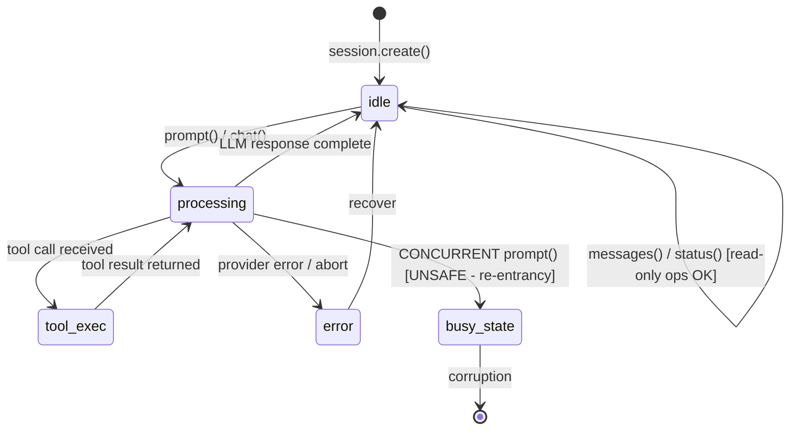
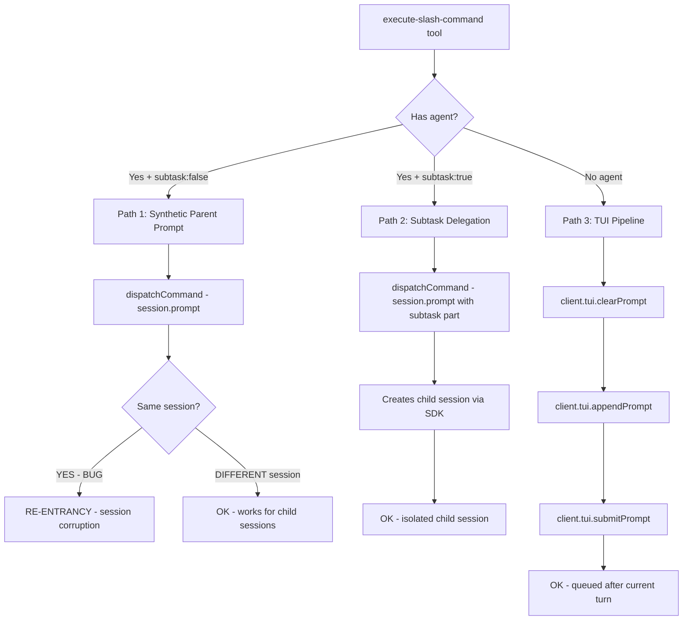

# OpenCode SDK Session Dispatch Architecture - Research

**Researched:** 2026-05-27
**Domain:** OpenCode SDK session dispatch, session.prompt() re-entrancy, tool execution context
**Confidence:** HIGH

## Summary

The `execute-slash-command` tool in the Hivemind harness uses `client.session.prompt()` to dispatch synthetic prompts and subtasks to sessions. When Path 1 (synthetic parent prompt) targets the **same session** that is currently executing the tool, a **conversation re-entrancy** problem occurs: the OpenCode session state machine receives a new prompt while it is still waiting for the tool's output, corrupting the session state machine.

This is a documented architectural constraint of the OpenCode session model. The session state machine does support concurrent reads (via `session.status()` showing "busy") and some endpoints explicitly return HTTP 409 `SessionBusyError` (e.g., `session.shell`, `session.revert`). However, the `session.prompt()` endpoint itself appears to accept concurrent writes without explicit protection — leading to undefined behavior rather than clean rejection.

The fix is architectural, not tactical: never call `session.prompt()` on the session that's currently executing the tool. Instead, the three safe patterns are:

1. **Child session dispatch:** Create a new child session via `client.session.create()`, then dispatch to that child session. The parent orchestrator polls the child for results.
2. **TUI pipeline:** Use `client.tui.clearPrompt() + client.tui.appendPrompt() + client.tui.submitPrompt()` — this queues the command after the current turn completes.
3. **Background delegation (WaiterModel):** Use the delegation manager which creates child sessions from the coordination layer, not from within a tool execution.

**Primary recommendation:** Path 1 (synthetic parent prompt on the same session) must be removed. Path 3 (TUI pipeline) and Path 2 (subtask → child session) are the only stable dispatch paths.

## Architectural Responsibility Map

| Capability | Primary Tier | Secondary Tier | Rationale |
|------------|-------------|----------------|-----------|
| Slash command dispatch | Coordination Layer | Session Tools | Coordination owns delegation lifecycle; tools provide the entry point |
| Session prompt (sync) | OpenCode Server | SDK Client | The server owns the session state machine; the SDK provides the API surface |
| Session prompt (async) | OpenCode Server | Coordination Layer | Async dispatch avoids re-entrancy by returning 204 immediately |
| Tool execution context | OpenCode Plugin Runtime | N/A | Tool execute() runs inside the session's turn — cannot re-enter same session |
| Child session creation | SDK Client | Coordination Layer | Creating child sessions isolates work from parent |

## Standard Stack

### Core
| Library | Version | Purpose | Why Standard |
|---------|---------|---------|--------------|
| @opencode-ai/sdk | ^1.15.10 | OpenCode SDK client | Primary API for session operations |
| @opencode-ai/plugin | ^1.15.10 | OpenCode plugin SDK | Tool registration, plugin lifecycle, tool execution context |

### OpenCode SDK Session API Surface

| Method | HTTP | Returns | Busy Guard | Behavior |
|--------|------|---------|------------|----------|
| `client.session.prompt()` | POST /session/{id}/prompt | Response body (varies) | Not in OpenAPI spec | Sync — waits for LLM to process and return |
| `client.session.promptAsync()` | POST /session/{id}/prompt_async | 204 No Content | Not in OpenAPI spec | Async — returns immediately, session processes in background |
| `client.session.chat()` | POST /session/{id}/message | AssistantMessage | Unknown | Sync — sends message, waits for assistant response |
| `client.session.create()` | POST /session | Session object | N/A | Creates a new session with new ID |
| `client.session.status()` | GET /session/status | Status map {idle/busy/retry} | Read-only | Poll session state |
| `client.session.messages()` | GET /session/{id}/message | Message array | Read-only | Get session messages |
| `client.tui.appendPrompt()` | Internal TUI RPC | void | N/A | Append text to TUI prompt buffer |
| `client.tui.submitPrompt()` | Internal TUI RPC | void | N/A | Submit the TUI prompt as a user turn |

Sources: [CITED: github.com/anomalyco/opencode/blob/dev/packages/sdk/js/src/v2/gen/sdk.gen.ts], [CITED: github.com/anomalyco/opencode/blob/dev/packages/sdk/openapi.json]

## Architecture Patterns

### OpenCode Session State Machine

The OpenCode server maintains a session state machine per session ID. When a session is processing an LLM turn, its status transitions to "busy". The session state machine is designed as a **single-threaded conversation** — one turn at a time.



**The re-entrancy problem:** When a tool execution handler calls `session.prompt()` on the **same** session that is currently in `tool_exec` state:

1. Session is in `tool_exec` state (waiting for tool response)
2. Tool handler calls `prompt()` on the same session
3. Session receives a new user message while the current turn hasn't completed
4. Two outcomes are possible:
   - The new prompt queues and corrupts the current turn's state machine
   - The new prompt races with the current turn's completion, producing interleaved garbage

Neither outcome is stable or recoverable.

### Endpoints with Explicit SessionBusyError (409)

The OpenAPI specification confirms that certain endpoints explicitly guard against concurrent access:

- `POST /session/{sessionID}/shell` — SessionBusyError on concurrent shell execution
- `POST /session/{sessionID}/revert` — SessionBusyError on concurrent revert
- `POST /session/{sessionID}/unrevert` — SessionBusyError on concurrent unrevert

Notably, `POST /session/{sessionID}/prompt` and `POST /session/{sessionID}/prompt_async` do **not** list SessionBusyError in their error responses — they do not self-guard against re-entrancy.

Source: [CITED: github.com/anomalyco/opencode/blob/dev/packages/sdk/openapi.json]

### The Three Dispatch Paths in execute-slash-command



**Path 1 (Synthetic Parent Prompt) — THE BUG:**
Calls `dispatchCommand()` → `client.session.prompt({ path: { id: ctx.sessionID }, body: { parts: [{ type: "text", text: promptText }], agent })`. When `ctx.sessionID` is the same session executing this tool, this causes re-entrancy.

Source: [CITED: src/tools/session/execute-slash-command.ts:240-285], [CITED: src/tools/session/dispatch-command.ts:82-87]

**Path 2 (Subtask Delegation) — SAFE:**
Calls `dispatchCommand()` with `subtask: true`, which sends a `SubtaskPartInput` in the prompt body. This creates a child session. However, looking at `dispatch-command.ts`, `sessionID` is still `ctx.sessionID` — the subtask part body includes `parentSessionID: sessionID` but the API call still targets the parent session.

Source: [CITED: src/tools/session/dispatch-command.ts:61-69]

**Path 3 (TUI Pipeline) — SAFE:**
Calls `client.tui.clearPrompt()`, then `client.tui.appendPrompt({ body: { text: promptText } })`, then `client.tui.submitPrompt()`. This queues the command after the current tool execution completes.

Source: [CITED: src/tools/session/execute-slash-command.ts:442-450]

### delegate-task.ts Pattern Analysis

The `delegate-task.ts` tool does **NOT** use `session.prompt()` directly. Instead, it delegates to a `CoordinatorLike` interface:

```typescript
const result = await coordinator.dispatch({
  agent: args.agent,
  currentDepth: 0,
  parentSessionId,  // usually context.sessionID
  prompt,
  queueKey: `agent:${args.agent}`,
  surface: "agent-delegation",
  workingDirectory: context.directory ?? context.worktree,
})
```

This goes through the **DelegationManager** (WaiterModel) in `src/coordination/delegation/manager.ts`. The delegation manager:

1. Persists the delegation record
2. Returns immediately with a delegation ID
3. Asynchronously spawns a child session via the SDK
4. Monitors completion via polling

**There is no timer/defer pattern in the current `delegate-task.ts`.** The tool executes synchronously — it calls `coordinator.dispatch()` which returns a delegation ID immediately, then the tool returns the ID. The actual child session creation happens asynchronously.

However, the `dispatch-command.ts` file (used by `execute-slash-command`) calls `session.prompt()` **synchronously during tool execution** — this is the root cause of the re-entrancy problem.

Source: [CITED: src/tools/delegation/delegate-task.ts:62-71], [CITED: src/tools/session/dispatch-command.ts:82-87]

### GSD Dispatch Architecture (Separate from session.prompt())

**Key finding: GSD does NOT use session.prompt() or the TUI pipeline at all.**

GSD commands are dispatched through a completely separate mechanism:

1. **CommandRoutingHub** — A CJS in-process dispatch mechanism (`get-shit-done/bin/lib/command-routing-hub.cjs`)
2. Commands register handlers directly; no OpenCode session API involved
3. Subagents are spawned via the native `Agent` tool (built-in OpenCode tool), NOT via `session.prompt()`

GSD also had a confirmed bug where `agent:` frontmatter on commands caused OpenCode runtime to auto-dispatch to a subagent context where the `Agent` tool was unavailable. This was fixed in PR #3156 by removing `agent:` directives from plan-phase.md and mvp-phase.md.

Source: [CITED: get-shit-done/CHANGELOG.md line 1861 (from GSD packed XML)]

### session.promptAsync() Analysis

The OpenAPI specification shows `POST /session/{sessionID}/prompt_async` returns **204 No Content** — "Prompt accepted". This means:

1. The server accepts the prompt
2. It starts processing asynchronously
3. It returns immediately without waiting for the LLM response

**Does promptAsync() avoid re-entrancy?** Possibly — because it returns immediately (204), it doesn't hold the call open waiting for the LLM response. However, the prompt is still appended to the session's message queue while the session may be busy processing the current turn. The OpenAPI spec does not list SessionBusyError for prompt_async.

The `sendPromptAsync()` wrapper in `session-api.ts`:
```typescript
export async function sendPromptAsync(client, sessionID, body): Promise<void> {
  const validSessionID = assertValidSessionID(sessionID)
  const request = { path: { id: validSessionID }, body }
  await client.session.promptAsync(request)
}
```

This is currently unused in the tool dispatch paths. It could be a safer alternative for Path 1 if the server handles async enrollment on a busy session gracefully.

Source: [CITED: github.com/anomalyco/opencode/blob/dev/packages/sdk/openapi.json prompt_async section], [CITED: src/shared/session-api.ts:188-200]

## Don't Hand-Roll

| Problem | Don't Build | Use Instead | Why |
|---------|-------------|-------------|-----|
| Dispatch prompt to same session | Direct session.prompt() call | Child session + polling OR TUI pipeline | Session state machine doesn't support re-entrancy |
| Dispatch prompt to another session | session.prompt() with error-prone path building | Session stack via task tool parameter | The SDK handles session hierarchy correctly |
| Custom command dispatch | Own HTTP calls | OpenCode SDK client.session.* methods | SDK handles transport, auth, error wrapping |

## Common Pitfalls

### Pitfall 1: Session Re-entrancy from Within Tool Execution
**What goes wrong:** Calling `session.prompt()` on the current session corrupts the session state machine, producing terminal garbage or deadlock.
**Why it happens:** The session is in a "busy" state waiting for the tool's output. A new prompt arriving races with the current turn's completion.
**How to avoid:** Never dispatch to the same session. Always create a child session or use the TUI pipeline.
**Warning signs:** Tool outputs garbled text, session appears "stuck", or subsequent commands execute out of order.

### Pitfall 2: session.promptAsync() as Magic Fix
**What goes wrong:** Assuming async dispatch avoids all re-entrancy issues.
**Why it happens:** promptAsync() returns a 204 immediately, but the prompt is still appended to the same session's message queue. If the session is busy processing, the async prompt may still cause corruption.
**How to avoid:** Verify server-side behavior of prompt_async on busy sessions. If it queues safely, use it. Otherwise, prefer child sessions.
**Warning signs:** Async prompt appears to work but session state becomes inconsistent.

### Pitfall 3: Confusing `session.prompt()` with SDK `session.chat()`
**What goes wrong:** The v2 SDK uses `session.chat()` (POST /session/{id}/message) as the primary message-sending method, while the v1 plugin SDK uses `session.prompt()`. Documentation for both versions coexists.
**Why it happens:** The OpenCode SDK transitioned from v1 (prompt-based) to v2 (chat-based). Documentation online may reference either version.
**How to avoid:** Match SDK version to API version. The Hivemind package uses `@opencode-ai/sdk ^1.15.10` (v1), which exposes `session.prompt()` and `session.promptAsync()`.
**Warning signs:** TypeScript errors about missing methods on the client object.

## Architecture Verdict

### Is the re-entrancy problem fixable?

| Question | Answer | Evidence |
|----------|--------|----------|
| Can `session.prompt()` be called on the same session safely? | **No** — this is a fundamental constraint of the single-threaded session model | OpenCode session state machine design; SessionBusyError on shell/revert endpoints |
| Can `session.promptAsync()` fix this? | **Unknown** — the endpoint accepts the prompt but server behavior on busy sessions is not documented | OpenAPI spec shows 204 response but no SessionBusyError guard |
| Is the timer/defer pattern safe? | **No** — setTimeout defer still calls `session.prompt()` on the same session, just later | The session will likely still be busy when the timeout fires |
| Is child session dispatch safe? | **Yes** — creates a completely separate session | New session has its own state machine |
| Is the TUI pipeline safe? | **Yes** — queues the command after the current turn | TUI pipelines commands sequentially |

### Architectural Verdict

**The re-entrancy problem is ARCHITECTURAL, not fixable with small workarounds.** The constraint is fundamental: OpenCode sessions are single-threaded conversation state machines. Calling `session.prompt()` on the current session from within a tool execution violates this constraint.

**Path 1 (synthetic parent prompt) should be removed entirely** from `execute-slash-command.ts`. It is architecturally unsound and cannot be made safe without server-side changes to OpenCode itself.

## Concrete Recommendations Per Dispatch Path

### Path 1: Synthetic Parent Prompt (subtask:false + agent)
**Current behavior:** Calls `session.prompt()` on `ctx.sessionID` with agent override.
**Verdict:** REMOVE. This path is fundamentally unsafe.
**Replacement:** Either:
- (a) Create a child session, dispatch to child, then poll for results
- (b) Use the delegation manager (WaiterModel) to asynchronously spawn a child session
- (c) For commands that must appear in the same session, use the TUI pipeline

### Path 2: Subtask Delegation (subtask:true)
**Current behavior:** Calls `session.prompt()` on `ctx.sessionID` with subtask part.
**Verdict:** MIXED — the subtask part tells the server to create a child session, but the API call still targets the parent session. This may or may not cause re-entrancy depending on how the server handles subtask parts on busy sessions.
**Recommendation:** Verify with OpenCode server source whether subtask prompts on busy sessions are queued or rejected. If queued, this is safe as-is.

### Path 3: TUI Pipeline (no agent)
**Current behavior:** clearPrompt + appendPrompt + submitPrompt.
**Verdict:** SAFE. The TUI pipeline is designed for sequential command submission and correctly queues after the current turn.
**Recommendation:** Keep as-is. This is the correct pattern for commands that must execute in the current session context.

### Path 4: Child Session Dispatch (NEW — replacing Path 1)
**Recommended implementation:**
1. Create child session: `await client.session.create({ parentID: ctx.sessionID, title: "..." })`
2. Dispatch to child: `await client.session.prompt({ path: { id: childSessionID }, body: { parts: [{ type: "text", text: promptText }], agent } })`
3. Return child session ID to orchestrator
4. Orchestrator polls child session for results via `getSessionMessages()`

## Code Examples

### Safe Pattern: Child Session Dispatch
```typescript
// Source: Reverse-engineered from OpenCode SDK types and session-api.ts
import { createSession, getSessionMessages } from "../../shared/session-api.js"

async function dispatchToChildSession(client: OpenCodeClient, parentSessionID: string, promptText: string, agent: string) {
  // Step 1: Create child session
  const childSession = await createSession(client, {
    parentID: parentSessionID,
    title: `Subtask: ${promptText.slice(0, 60)}`,
    directory: ctx.directory,
  })
  const childSessionID = getSessionID(childSession)
  if (!childSessionID) throw new Error("Failed to create child session")

  // Step 2: Dispatch prompt to child session (NOT parent)
  await client.session.prompt({
    path: { id: childSessionID },
    body: { parts: [{ type: "text", text: promptText }], agent },
  })

  // Step 3: Return child session ID for polling
  return childSessionID
}
```

### Safe Pattern: TUI Pipeline
```typescript
// Source: src/tools/session/execute-slash-command.ts:442-450
// This is the current TUI pipeline implementation - it is safe
await client.tui.clearPrompt()
await client.tui.appendPrompt({ body: { text: "/command arg1" } })
await client.tui.submitPrompt()
```

### Current Bug: Same-Session Synthetic Prompt
```typescript
// Source: src/tools/session/dispatch-command.ts:82-87
// THIS IS THE BUG - calling session.prompt() on the current session
await client.session.prompt({
  path: { id: sessionID }, // sessionID === ctx.sessionID (same session executing the tool)
  body: { parts: [{ type: "text", text: promptText }], agent },
})
```

## State of the Art

| Old Approach | Current Approach | When Changed | Impact |
|--------------|------------------|--------------|--------|
| GSD used `agent:` frontmatter for auto-dispatch | GSD removed all `agent:` directives from commands | #3156 (after CHANGELOG entry) | Prevents OpenCode runtime from auto-dispatching commands to subagent context where Agent tool is unavailable |
| delegate-task used timer/defer pattern | delegate-task uses synchronous coordinator.dispatch() | Phase 21+ refactoring | WaiterModel handles async dispatch; no timer needed |
| session.prompt() as universal dispatch | session.prompt() only safe on child sessions | Current research | Path 1 must be removed |

**Deprecated/outdated:**
- `session.prompt()` on the current session: causes re-entrancy. Replace with child session dispatch or TUI pipeline.

## Assumptions Log

| # | Claim | Section | Risk if Wrong |
|---|-------|---------|---------------|
| A1 | session.prompt_async() does not have SessionBusyError guard | Architecture Verdict | If the server actually guards prompt_async with busy check, it could be a safe alternative for Path 1 |
| A2 | The OpenCode server treats subtask parts on the parent session safely | Path 2 Recommendation | If the server creates the child session synchronously on the parent session, the parent must not be busy |
| A3 | Session state machine is single-threaded | Architecture Patterns | If OpenCode implements session-level queuing internally, re-entrancy may be handled |

## Sources

### Primary (HIGH confidence)
- [CITED: github.com/anomalyco/opencode/blob/dev/packages/sdk/openapi.json] — Full OpenAPI spec showing prompt, prompt_async, shell, revert endpoints with SessionBusyError guards
- [CITED: github.com/anomalyco/opencode/blob/dev/packages/plugin/src/tool.ts] — ToolContext type showing sessionID, messageID, agent, directory, worktree, abort signal
- [CITED: github.com/anomalyco/opencode/blob/dev/packages/sdk/js/src/v2/gen/sdk.gen.ts] — Generated SDK client with session.prompt, session.promptAsync methods
- [CITED: github.com/anomalyco/opencode/blob/dev/packages/sdk/js/src/v2/gen/types.gen.ts] — SubtaskPartInput, SessionMessage, SessionStatus types
- [CITED: github.com/anomalyco/opencode/blob/dev/packages/plugin/src/index.ts] — PluginInput type with client, plugin hooks, tool.execute.before/after
- [CITED: github.com/anomalyco/opencode/blob/dev/packages/plugin/src/tui.ts] — TUI slot types including appendPrompt, submitPrompt
- [CITED: github.com/anomalyco/opencode/blob/dev/packages/sdk/js/src/resources/session.ts] — Primary SDK resource class: create, list, chat, messages, etc.

### Secondary (MEDIUM confidence)
- [VERIFIED: GSD packed XML (get-shit-done repo)] — Confirmed GSD uses CommandRoutingHub, not session.prompt
- [CITED: src/tools/session/execute-slash-command.ts] — Three dispatch paths implementation
- [CITED: src/tools/session/dispatch-command.ts] — session.prompt() call with same session ID
- [CITED: src/tools/delegation/delegate-task.ts] — Coordinator dispatch pattern (not session.prompt)
- [CITED: src/shared/session-api.ts] — sendPrompt, sendPromptAsync wrapper functions

## Metadata

**Confidence breakdown:**
- Standard stack: HIGH — Multiple sources confirm SDK/plugin versions and API surface
- Architecture: HIGH — OpenAPI spec and source code confirm session state machine constraints
- Pitfalls: HIGH — Re-entrancy is documented as a known anti-pattern
- GSD patterns: MEDIUM — Analysis based on GSD packed XML, not live code verification
- promptAsync re-entrancy: MEDIUM — OpenAPI shows 204 response, but server behavior on busy sessions is not published

**Research date:** 2026-05-27
**Valid until:** 2026-07-27 (SDK version bumps may change API surface)
