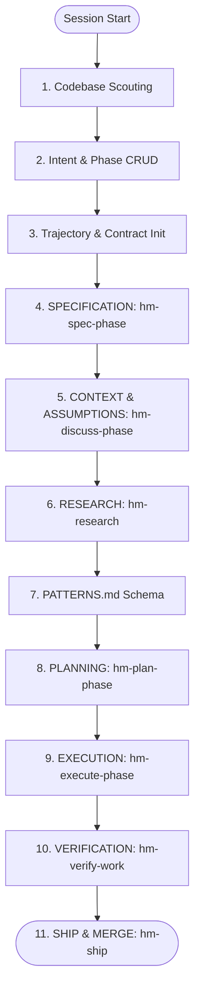

# Universal Rules & Execution Constitution

These rules govern all multi-agent orchestration, coordination, and execution workflows within the Hivemind composition engine runtime. All agents must comply with these guidelines.

---

## 1. Top-Level Role Hierarchy & Banned Inline Work

- **L0/L1 Orchestrator Strategic Boundary**: Front-facing L0/L1 orchestrator agents (e.g., `hm-l0-orchestrator`, `hm-orchestrator`) are strictly banned from performing detail work. They must NEVER read files for comprehension, analyze code blocks, write source code files, run tests, or execute command tasks inline.
- **Routing Enforced**: The orchestrator's sole authority is top-level intent classification, landscape mapping, path routing, coordinate delegation, and quality gatekeeping. All detail implementation, research, planning, and verification tasks must be routed to specialist subagents using the native `task` tool.
- **Generic Agent Prohibition**: It is strictly prohibited to use generic, untyped, or default agent types (e.g., `general`, `Explore`, `Plan`, or standard LLM models). All tasks must be assigned to domain-specific specialist agents (e.g., `hm-planner`, `hm-executor`, `hm-verifier`) defined under `.opencode/agents/hm-*`.

---

## 2. Context Budget & Performance Rules

- **Disk-First Loading**: Never inline full files into subagent prompts. Direct agents to relative paths on disk.
- **Scouting Strategy**: Before performing full file reads, use skimming and offset-reading strategies (glob, list, grep, regex, TOC offsets) to locate exact code regions and save token context.
- **Compaction Warning**: Monitor context growth. If significant context has been consumed, checkpoint progress. At 70% context budget, run the context compaction command and resume in a clean session.
- **History Preservation**: When a session is compacted or interrupted, always discover and resume from the deepest active/aborted child using its exact `task_id` rather than starting a fresh session. Do not repeat prompts when resuming.

---

## 3. Delegation, Session & Task Management

- **Discovery and Resuming**: Before spawning any subagent delegation, orchestrators must call `delegation-status({ action: "find-stackable" })` to discover active, aborted, or completed sessions. If a stackable session exists for the target agent, you MUST stack the new task onto it using `task_id` / `stackOnSessionId` to preserve state lineage.
- **Work Contracts & Trajectory**: Track all progress in the session trajectory. At each phase boundary, initialize and verify the `agent-work-contract`.
- **Checkpoint Verification**: Utilize `execute-slash-command` to transition through workflow checkpoints. Never execute phases sequentially in a single turn. Yield control after each dispatch.

---

## 4. The Canonical Hivemind (`hm-*`) Phase Loop Cycle

Every development phase must proceed through the following ordered, traversal-friendly loop cycle. Atomic git commits (incorporating both code changes and updated docs/plans) are mandatory after each checkpoint.

### Checkpoint 1: Codebase Scouting & Reading
- **When:** Starting of a session.
- **Action:** Read `.planning/ROADMAP.md`, `.planning/STATE.md`, and `.planning/REQUIREMENTS.md`. Cross-reference all claims with codebase truth. Never accept document claims without hard codebase verification. Decide the scan level of the code cluster to gain intelligence.

### Checkpoint 2: Phase CRUD & Document Alignment
- **When:** Based on user intent.
- **Action:** CRUD the phase and align the core documents (`ROADMAP.md`, `STATE.md`, `REQUIREMENTS.md`). Phase naming and numbering must be strictly conforming (e.g., `NN-name`). Validate against dependencies, global requirements, and architectural boundaries. Ensure the phase directory exists with aligned templates.

### Checkpoint 3: Trajectory & Contract Initialization
- **When:** Entering the active phase.
- **Action:** Initialize the phase trajectory and write/verify the `agent-work-contract`. Set bounds and success metrics.

### Checkpoint 4: SPECIFICATION (`hm-spec-phase`)
- **When:** Defining requirements.
- **Action:** Route to the `hm-planner` agent via `/hm-spec-phase`. Conduct a Socratic requirements loop. Score requirements ambiguity ( Composite clarity must meet ambiguity score ≤ 0.20). Write and commit `{phase_num}-SPEC.md`.

### Checkpoint 5: CONTEXT & ASSUMPTIONS (`hm-discuss-phase`)
- **When:** Aligning implementation decisions.
- **Action:** Route to the `hm-intent-loop` agent via `/hm-discuss-phase`. Identify gray areas, resolve assumptions, and lock key design decisions into `{phase_num}-CONTEXT.md`.

### Checkpoint 6: RESEARCH (`hm-research`)
- **When:** Investigating the stack and codebase.
- **Action:** Route to the `hm-phase-researcher` agent via `/hm-research`. Validate dependency versions in the lockfile and package.json. Query canonical docs and resolve library IDs using Context7 MCP. Formulate a STRIDE threat model. Write and commit `{phase_num}-RESEARCH.md`.

### Checkpoint 7: PATTERNS
- **When:** Designing complex or spec-compliant modules.
- **Action:** Generate `{phase_num}-PATTERNS.md` to specify reuse design patterns, classes, interfaces, and architecture structure before planning.

### Checkpoint 8: PLANNING (`hm-plan-phase`)
- **When:** Building the execution step list.
- **Action:** Route to the `hm-planner` agent via `/hm-plan-phase` to write `PLAN.md`. Loop with `hm-plan-checker` for correctness verification.

### Checkpoint 9: EXECUTION (`hm-execute-phase`)
- **When:** Implementing the changes.
- **Action:** Route to the `hm-executor` agent via `/hm-execute-phase`. Run execution tasks in waves, perform atomic commits, handle deviations, and verify output functionality.

### Checkpoint 10: VERIFICATION (`hm-verify-work`)
- **When:** Conducting final audits.
- **Action:** Route to the `hm-verifier` agent via `/hm-verify-work` to perform comprehensive verification checks.

### Checkpoint 11: SHIPPING (`hm-ship`)
- **When:** Completing work.
- **Action:** Route to the `hm-shipper` agent via `/hm-ship` to create pull requests, run final CI audits, and prepare for merging.

---

## 5. Quality Gate Triad Governance

All returned deliverables from specialist waves must pass the three-gate quality triad in strict sequence before final approval:
1. **Lifecycle Integration Gate** (`gate-lifecycle-integration`): Check component directory compliance, CQRS write/read boundaries, event wiring, and SDK surface compliance.
2. **Spec Compliance Gate** (`gate-spec-compliance`): Scan for spec-to-code gap analysis, bidirectional traceability, EARS acceptance criteria, and anti-patterns.
3. **Evidence Truth Gate** (`gate-evidence-truth`): Evaluate the evidence hierarchy. Require live runtime proof (L1/L2 test output) over documentation summaries (L5). Reject mocked assertions.

---

## 6. Test-Driven Development Discipline

This rule enforces the test-first discipline defined in the project root `AGENTS.md` under `## Test-Driven Development` and operationalized by `.planning//test-driven-governance-2026-06-05/GENERIC-TEST-DRIVEN-GUIDE.md`. It is the enforceable surface of that governance; the AGENTS.md section is its project-voice elaboration.

### 6.1 Required Cycle for Every Executable Change
Every change to executable behavior in this repository must follow the sequence: **RED → GREEN → Coverage → REFACTOR (only if needed)**. The cycle is enforced by the `Evidence Truth Gate` (`gate-evidence-truth`) at acceptance.

- **RED is mandatory.** A test that asserts on the public seam of the change must exist and fail before any implementation. The failure must be the asserted behavior, not an unrelated error. Test-after evidence is rejected.
- **GREEN is minimal.** The smallest change that turns the failing test green is the only acceptable first implementation. Add complexity only after a refactor cycle on a green test.
- **Coverage claim requires fresh command output.** `npm run test:coverage` from the current work session, or one of the four explicit states: `PASS` / `PARTIAL` / `MISSING` / `BLOCKED`. Estimates are rejected.
- **REFACTOR is gated by GREEN.** A refactor that regresses a green test must be reverted or split into its own cycle. Refactors performed before green are rejected.

### 6.2 One Test at a Time
Each behavior is exercised by exactly one new failing test before the next is written. Bundles of failing tests written before any implementation hide which behavior drove which design and produce test-after evidence by default. The exception is the rare case where a requirement is genuinely inseparable; the bundle must be documented in the cycle notes.

### 6.3 Public-Interface Discipline
Tests assert against externally observable surfaces. The following are the binding public seams for this project:

- **Tools**: the `tool()` factory's execute function, the JSON envelope returned to the agent, and the error envelope (`code`, `message`, optional `data`).
- **Hooks**: the mutation passed to the next middleware in the chain, the early return value, and the side effect on shared state.
- **Plugins**: the public `Plugin` interface assembled by `src/plugin.ts`, including the registration of tools, hooks, and config.
- **State stores**: the value read via the public `get`/`read` method, not the internal `Map` or file path.
- **Session lifecycle**: the phase transitions observed via the public lifecycle manager API, not the internal `state.ts` module.

Mocking internals is acceptable only when the helper is itself the slice's public contract. When a test needs to mock several internals to pass, the public seam is in the wrong place — pause and re-design.

### 6.4 Evidence Labels
Every test result carries one of four labels, highest to lowest:

- **`runtime-truthful`** — the test exercises real behavior through a public seam. Required for any acceptance claim on tool, hook, or plugin changes.
- **`transport-mocked`** — real behavior through a public seam with a transport replaced by an in-process adapter. Acceptable for SDK wrapper changes when the SDK itself is not in scope.
- **`mock-heavy`** — substitutes enough internals that any implementation would pass. Insufficient on its own; must be paired with `runtime-truthful` or `transport-mocked` evidence.
- **`manual-only`** — verified by a human, not by an executable test. Insufficient for automated gates.

`mock-heavy` and `manual-only` cannot close `runtime-truthful` acceptance criteria. They may be combined with stronger evidence, never used alone.

### 6.5 Coverage States
Coverage claims must report one of:

- **`PASS`** — `npm run test:coverage` ran and produced a percentage. Report the command, the percentage, and the date.
- **`PARTIAL`** — behavioral tests ran but coverage command did not finish or only covered a subset. Report what ran and what was missing.
- **`MISSING`** — tooling absent. Report the gap. Do not estimate.
- **`BLOCKED`** — setup or dependency failure prevented coverage. Report the command attempted and the failure.

A high coverage percentage on a slice with invalid RED is still a blocked slice. Coverage is necessary, not sufficient.

### 6.6 Test-Size Labels
Every test is labeled by size, and the size determines what evidence must accompany the commit:

- **`small`** — single unit, public seam, focused command runs in milliseconds. Evidence: focused test command output.
- **`medium`** — multiple modules or a real persistence or process boundary. Evidence: focused test command output plus a one-line setup/teardown note.
- **`large`** — end-to-end or browser-driven. Evidence: focused command output plus environment bring-up, runtime command, and a user-visible behavior note.

### 6.7 Bug Fix Path — Prove-It
Defect work follows the reproduction-first path. The reproduction is the RED phase:

1. **Reproduce.** Write a test that exhibits the user-visible defect.
2. **Prove failure matches.** The test must fail for the same reason the user observed, not an unrelated error.
3. **Minimal fix.** The smallest change that turns the test green.
4. **Prove fixed.** Run the test, confirm green, and run the surrounding test surface to confirm no regression.
5. **Preserve.** The reproduction test stays in the suite as a permanent regression guard.

The reproduction test is a non-negotiable deliverable of the fix. Removing it after merge is a regression of the test discipline.

### 6.8 Retry Budget
After three focused attempts in RED or GREEN with the same hypothesis, the implementer must stop and return a blocked handoff. More attempts without new evidence is "loop theater," not test-first execution. The blocked handoff must state the command attempted, the failure output, the hypothesis, and what evidence is needed to resume.

### 6.9 Quality Gate Interaction
The `Evidence Truth Gate` (`gate-evidence-truth`) refuses to pass without:

- A failing-then-passing focused test command log (RED → GREEN transition), OR
- A reproduction-then-fix command log for defects (Prove-It path), AND
- A coverage report in one of the four declared states from the current session, AND
- An evidence label on every test in the changed surface.

The `Spec Compliance Gate` (`gate-spec-compliance`) refuses to pass when a slice in scope is not reducible to a failing test — the test-first reduction is part of spec compliance for executable changes.

### 6.10 Authority and Sources
This rule is binding for every specialist wave and every contributor. The full methodology, including the workflow diagram and extended anti-pattern catalogue, is in:

- `.planning//test-driven-governance-2026-06-05/GENERIC-TEST-DRIVEN-GUIDE.md` — project-agnostic reference.
- `/Users/apple/hivemind-plugin-private/AGENTS.md` → `## Test-Driven Development` — Hivemind-voice elaboration.
- `.opencode/skills/hm-l2-test-driven-execution/SKILL.md` — source skill with deep references and templates.

When this rule, the AGENTS.md section, and the generic guide disagree, the AGENTS.md section governs Hivemind-specific commands and surfaces; the generic guide governs methodology; this rule is the enforceable norm.
