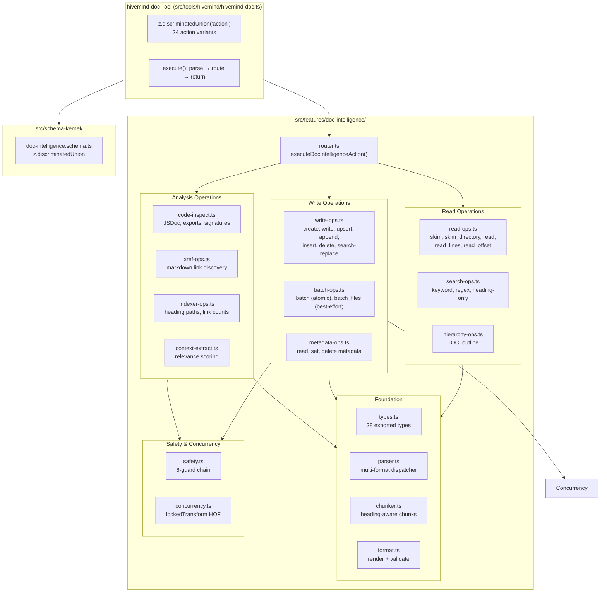

# Doc Intelligence — Full-Spectrum Document Layer

Doc Intelligence is a **standalone, multi-format document intelligence layer** embedded in the Hivemind harness. It provides hierarchy-aware CRUD, batch operations, metadata manipulation, code inspection, cross-reference analysis, document indexing, and relevance-based context extraction across Markdown, JSON, YAML, and XML files — all through a single `hivemind-doc` tool with a Zod-discriminated union interface.

**Size:** ~2,914 LOC across 18 source files, 16 test files, 73 tests ✅

---

## 1. Architecture

Doc Intelligence follows a **pure-function, stateless module design**: every operation is a standalone function that receives `projectRoot` and file path, never holding instance state. All document state lives on disk.



### The Two Halves of the Safety Chain

Every write operation passes through 6 sequential guards before touching disk:

```text
Caller provides action + path
  │
  ├─ 1. Path Security (resolved via assertPathWithinRoot — realpathSync symlink protection)
  │
  ├─ 2. File-Type Guard (WRITABLE_EXTENSIONS: .md, .json, .yaml, .yml, .xml)
  │
  ├─ 3. Governance Denylist (.hivemind/**, .opencode/**, AGENTS.md, CLAUDE.md, opencode.json)
  │
  ├─ 4. Chunk Threshold (files > 600 LOC → chunk_required signal)
  │
  ├─ 5. MAX_FILE_SIZE Guard (10 MB cap — STRIDE DoS mitigation)
  │
  └─ 6. lockedTransform (advisory lock → read → hash → transform → atomic write → unlock)
```

### CQRS Discipline

| Operation Type | FS Mode | Concurrency | Returns |
|---------------|---------|-------------|---------|
| Single-file read (skim, read, metadata, toc) | `readFileSync` | None | Sync |
| Multi-file read (search, xref, index, context) | `readFileSync` per file | None | Sync |
| Single-file write (create, write, upsert, etc.) | `readFileSync` + `writeFileSync` + `renameSync` | `lockedTransform` (advisory lock) | `Promise` |
| Batch single-file | `readFileSync` + `writeFileSync` + `renameSync` | `lockedTransform` (single lock) | `Promise` |
| Batch multi-file | `readFileSync` per file | `Promise.all` + per-file try/catch | `Promise` |

### Standalone-First Design

The entire doc-intelligence layer has **zero imports** from `.hivemind/`, `src/task-management/`, `src/coordination/`, `src/hooks/`, `src/config/`, or `src/routing/`. All file operations use only `projectRoot` + standard `node:fs`/`node:path`. It works without any Hivemind state files.

---

## 2. Action Reference — 24 Actions Across 10 Domains

All actions are dispatched through a single discriminated union with per-action Zod validation (24 variants in `doc-intelligence.schema.ts`).

### 2.1 Read Operations (Domain A)

| Action | Input | Output | Description |
|--------|-------|--------|-------------|
| `skim` | `path` | `ParsedMarkdownDocument` | Heading hierarchy, frontmatter, title, word/char count |
| `skim_directory` | `path`, `format?` | `ParsedMarkdownDocument[]` | Recursive batch skim, sorted by path |
| `read` | `path`, `maxCharacters?`, `heading?` | `content`, `characterCount`, `truncated` | Full content with optional truncation |
| `chunk` | `path`, `maxCharacters?` | `DocChunk[]` | Heading-aware chunks with stable IDs |
| `read_lines` | `path`, `startLine`, `endLine?` | `LineReadResult` | 1-indexed line range with clamping |
| `read_offset` | `path`, `offset`, `limit` | `OffsetReadResult` | Character slice at offset |

### 2.2 Write Operations (Domain B)

| Action | Input | Output | Description |
|--------|-------|--------|-------------|
| `create` | `path`, `title`, `metadata?`, `initialContent?` | `WriteReceipt` | Creates file with format-appropriate scaffolding |
| `write` | `path`, `heading`, `body`, `expectedHash?` | `SectionWriteResult \| ChunkRequiredSignal` | Replaces section body by heading |
| `upsert` | `path`, `heading`, `body`, `level?`, `expectedHash?` | `SectionWriteResult \| ChunkRequiredSignal` | Replaces or creates section |
| `append` | `path`, `heading`, `content`, `expectedHash?` | `SectionWriteResult \| ChunkRequiredSignal` | Appends to existing section body |
| `insert` | `path`, `afterHeading`, `newHeading`, `level`, `body`, `expectedHash?` | `SectionWriteResult \| ChunkRequiredSignal` | Creates section after target heading |
| `delete` | `path`, `heading?`, `mode?` | `DeleteResult \| ChunkRequiredSignal` | Deletes section or whole file (explicit `mode:"file"`) |

### 2.3 Batch Operations (Domain C)

| Action | Input | Output | Description |
|--------|-------|--------|-------------|
| `batch` | `path`, `ops: SectionEditOp[]` | `{ results: BatchOpResult[], hash }` | Atomic single-file batch edits |
| `batch_files` | `files: { path, ops }[]` | `{ results: { path, ops, error? }[] }` | Best-effort multi-file batch |

### 2.4 Metadata Operations (Domain D)

| Action | Input | Output | Description |
|--------|-------|--------|-------------|
| `metadata` | `path` | `Record<string, unknown> \| null` | Read frontmatter / top-level metadata |
| `set_metadata` | `path`, `metadata` | `{ hash, opId }` | Set/update fields, preserving existing |
| `delete_metadata` | `path`, `field` | `{ hash, opId }` | Remove a metadata field |

### 2.5 Hierarchy Operations (Domain E)

| Action | Input | Output | Description |
|--------|-------|--------|-------------|
| `toc` | `path` | Markdown formatted TOC string | Nested table of contents with anchor links |
| `outline` | `path` | `DocHeading[]` | Flat heading outline in source order |

### 2.6 Search Operations (Domain F)

| Action | Input | Output | Description |
|--------|-------|--------|-------------|
| `search` | `path`, `query`, `maxResults?`, `regex?`, `headingOnly?` | `{ query, matches: DocSearchMatch[] }` | Keyword/regex/heading-only with nearest heading context |

### 2.7 Code Inspection (Domain G)

| Action | Input | Output | Description |
|--------|-------|--------|-------------|
| `inspect` | `path` | `CodeInspectionResult` | JSDoc blocks, single-line comments, exports, function signatures |

Supported extensions: `.ts`, `.tsx`, `.js`, `.jsx`, `.mjs`, `.cjs`, `.py`, `.go`, `.rs`, `.java`, `.c`, `.cpp`, `.h` (13 extensions)

### 2.8 Cross-Reference Analysis (Domain H)

| Action | Input | Output | Description |
|--------|-------|--------|-------------|
| `xref` | `path` | `XrefLink[]` | Discovers `[text](path)` links, validates target existence |

Skips external URLs (`http://`, `https://`), anchors (`#`), and reference-style links (`[text][ref]`).

### 2.9 Document Indexing (Domain I)

| Action | Input | Output | Description |
|--------|-------|--------|-------------|
| `index` | `path` | `DocumentIndexEntry[]` | Scans directory: title, heading path, line/byte count, hash, heading count, link count |

### 2.10 Context Extraction (Domain J)

| Action | Input | Output | Description |
|--------|-------|--------|-------------|
| `context` | `path`, `query`, `tokenBudget?` | `ContextSection[]` | TF-based relevance scoring within token budget |

---

## 3. Design Principles

### 3.1 `lockedTransform` — Higher-Order Write Function

Every write operation routes through a single HOF that implements the full read-lock-transform-write cycle:

```typescript
async function lockedTransform(
  filePath: string,
  transform: (content: string, currentHash: string) => string | Promise<string>,
  options?: { expectedHash?: string },
): Promise<{ changed: boolean; hash: string; opId: string; bytesChanged: number }>
```

The cycle:
1. **Generate** unique `opId` (12-char hex via `randomBytes(6)`)
2. **Acquire** advisory lock via `proper-lockfile`
3. **Read** current file content
4. **Compute** SHA-256 content hash
5. **Check** stale-file detection (optional `expectedHash`)
6. **Transform** file content via user-provided function
7. **No-op skip** if content unchanged
8. **Atomic write** to `{file}.{opId}.tmp` → `renameSync`
9. **Release** lock

```typescript
// Example: write section body
const result = await lockedTransform(absPath, (content) => {
  return patchSectionBody(content, heading, body)
})
```

### 3.2 Zod Discriminated Union — Type-Safe Dispatch

The schema uses `z.discriminatedUnion("action", [...])` for O(1) dispatch and per-action parameter validation:

```typescript
export const DocIntelligenceInputSchema = z.discriminatedUnion("action", [
  z.object({ action: z.literal("skim"), path: z.string().min(1) }),
  z.object({
    action: z.literal("write"),
    path: z.string().min(1),
    heading: z.string().min(1),
    body: z.string(),
    expectedHash: z.string().optional(),
  }),
  z.object({
    action: z.literal("batch_files"),
    files: z.array(FileOpsSchema).min(1),
  }),
  // ... 21 more action variants
])
```

### 3.3 Parser Adapter — Format-Agnostic Interface

A dispatching `parseDocument()` function routes by file extension, returning a uniform `ParsedMarkdownDocument` type:

```typescript
export function parseDocument(relativePath: string, content: string): ParsedMarkdownDocument {
  const ext = extname(relativePath).toLowerCase()
  switch (ext) {
    case ".md": case ".mdx":  return parseMarkdownDocument(relativePath, content)
    case ".json":              return parseJsonDocument(relativePath, content)
    case ".yaml": case ".yml": return parseYamlDocument(relativePath, content)
    case ".xml":               return parseXmlDocument(relativePath, content)
    default:                   return parsePlainTextDocument(relativePath, content)
  }
}
```

### 3.4 Safety Chain — 6 Guards, Strict Order

Every write operation passes through six guards in sequence before acquiring the file lock:

1. `assertPathWithinRoot()` — Symlink-protected path resolution
2. `assertWritableExtension()` — Allowlist: `.md`, `.json`, `.yaml`, `.yml`, `.xml`
3. `assertGovernanceWriteAllowed()` — Denylist: `.hivemind/**`, `.opencode/**`, `AGENTS.md`, etc.
4. `checkChunkThreshold()` — 600-line threshold, returns `chunk_required` signal (never throws)
5. `assertFileSizeWithinLimit()` — 10 MB cap
6. `lockedTransform()` — Advisory lock + atomic write

### 3.5 Content Hashing — SHA-256 Integrity

Every write returns a SHA-256 hex hash. Optional `expectedHash` parameter enables stale-file detection — if the file was modified by another process since the caller last read it, the write is rejected:

```typescript
const result = await lockedTransform(absPath, transform, {
  expectedHash: "abc123..." // stale-file guard
})
```

### 3.6 Large-File Discipline

Files exceeding 600 lines return a `chunk_required` signal instead of modifying. The signal includes the line count, threshold, and document outline so the caller can make targeted section edits:

```typescript
type ChunkRequiredSignal = {
  status: "chunk_required"
  path: string
  lineCount: number     // 700
  threshold: number     // 600
  outline: DocHeading[] // for targeted read/write
}
```

### 3.7 Governance Write Denylist

These paths are protected from accidental modification:

```
.hivemind/**       — Internal state
.opencode/**       — Deployed primitives
opencode.json      — Config
AGENTS.md          — Agent instructions
CLAUDE.md          — Agent instructions
src/AGENTS.md      — Source agent instructions
```

A hardcoded `allowGovernance` flag (false at the tool boundary) can bypass the denylist for intentional governance writes.

### 3.8 Concurrency Safety

| Mechanism | Implementation |
|-----------|---------------|
| Advisory locks | `proper-lockfile@^4.1.2` (`lockSync`/`unlockSync`) |
| Atomic writes | Temp file `{path}.{opId}.tmp` → `renameSync` |
| Stale-file detection | Optional `expectedHash` parameter |
| Content hashing | SHA-256 via `node:crypto` |
| Lock tolerance | Single-attempt sync; no retries in sync path |

---

## 4. Usage Examples

### Create a Document

```typescript
import { createDocument } from "./write-ops.js"

const receipt = await createDocument(
  projectRoot,
  "docs/guide.md",
  "Installation Guide",
  { author: "Bot", version: "1.0" },
)
// { opId: "a1b2c3d4e5f6", hash: "sha256...", path: "docs/guide.md", created: true }
```

### Upsert a Section

```typescript
import { upsertSection } from "./write-ops.js"

// Creates "## API Reference" if missing, replaces body if exists
const result = await upsertSection(
  projectRoot,
  "docs/api.md",
  "API Reference",
  "## Authentication\n\nBearer token required.",
  2, // level
)
```

### Cross-Reference Analysis

```typescript
import { analyzeCrossReferences } from "./xref-ops.js"

const links = analyzeCrossReferences(projectRoot, "docs/")
// [{ from: "docs/guide.md", to: "usage.md", line: 10, text: "Usage Guide", valid: true }]
```

### Context Extraction

```typescript
import { extractContext } from "./context-extract.js"

const sections = extractContext(
  projectRoot,
  "docs/",
  "delegation configuration",
  4000, // token budget
)
// Sorted by relevanceScore descending, within 4000 tokens
```

### Batch Single-File Edit

```typescript
import { batchSectionEdits } from "./batch-ops.js"

const { results, hash } = await batchSectionEdits(projectRoot, "docs/changelog.md", [
  { op: "write", heading: "v2.0", body: "Major rewrite." },
  { op: "upsert", heading: "v1.5", body: "Bug fixes.", level: 3 },
  { op: "delete", heading: "v1.0" },
])
// Atomic: single lock, single write
```

### Code Inspection

```typescript
import { inspectCodeFile } from "./code-inspect.js"

const result = inspectCodeFile(projectRoot, "src/plugin.ts")
// {
//   jsdocBlocks: [{ comment: "/** ... */", pairedName: "HarnessControlPlane" }],
//   exports: [{ name: "HarnessControlPlane", kind: "class", line: 42 }],
//   signatures: [{ name: "HarnessControlPlane", params: ["deps"], returnType: null, line: 42 }],
// }
```

---

## 5. File Map

### Source Files (18 files, ~2,914 LOC)

| File | LOC | Purpose |
|------|-----|---------|
| `types.ts` | 280 | 28 exported types — all results, inputs, domain models |
| `safety.ts` | 149 | 6-guard safety chain, constants, governance denylist |
| `concurrency.ts` | 165 | `lockedTransform`, `lockedTransformSync`, SHA-256 hashing |
| `parser.ts` | 238 | Multi-format dispatcher (md/json/yaml/xml/txt) |
| `format.ts` | ~160 | Render initial content + validate by format |
| `chunker.ts` | 93 | Heading-aware chunking with token estimates |
| `router.ts` | 174 | Discriminated union dispatch for 24+ actions |
| `read-ops.ts` | 211 | skim, skim_directory, read, read_lines, read_offset |
| `search-ops.ts` | 111 | Keyword, regex, heading-only search |
| `hierarchy-ops.ts` | 76 | TOC generation, heading outline |
| `metadata-ops.ts` | 155 | Read/set/delete frontmatter |
| `write-ops.ts` | 454 | create, write, upsert, append, insert, delete, search-replace |
| `batch-ops.ts` | 106 | Atomic single-file, best-effort multi-file |
| `code-inspect.ts` | 165 | JSDoc, exports, signatures (13 extensions) |
| `xref-ops.ts` | 123 | Cross-reference link discovery |
| `indexer-ops.ts` | 104 | Document index builder |
| `context-extract.ts` | 124 | TF-based relevance scoring |
| `index.ts` | 26 | Barrel re-exports |

### Supporting Files (3 files)

| File | LOC | Purpose |
|------|-----|---------|
| `src/tools/hivemind/hivemind-doc.ts` | 69 | OpenCode tool wrapper |
| `src/schema-kernel/doc-intelligence.schema.ts` | 154 | Zod discriminated union schema |
| `src/types/proper-lockfile.d.ts` | ~25 | Type declarations |

### Test Files (16 files, ~914 LOC)

| File | Tests | Purpose |
|------|-------|---------|
| `parity.test.ts` | 5 | 5 original actions regression |
| `skim.test.ts` | 3 | Skim single + directory + format filter |
| `read.test.ts` | 6 | Read + section + line + offset |
| `chunk.test.ts` | 3 | Heading-aware chunking |
| `write.test.ts` | 9 | All 8 write operations |
| `batch.test.ts` | 2 | Atomic single-file + multi-file |
| `metadata.test.ts` | 4 | Read/set/delete metadata |
| `hierarchy.test.ts` | 2 | TOC + outline |
| `search.test.ts` | 3 | Keyword + regex + heading-only |
| `inspect.test.ts` | 2 | Code inspection |
| `xref.test.ts` | 2 | Cross-reference analysis |
| `index.test.ts` | 1 | Document indexing |
| `context.test.ts` | 1 | Context extraction |
| `safety.test.ts` | 13 | All 6 guard functions |
| `concurrency.test.ts` | 7 | Lock, atomic write, hashing |
| `format.test.ts` | 10 | Multi-format create + validate |

---

## 6. Test Evidence

- **16 test files, 73 tests — all passing** ✅
- **All tests are `runtime-truthful`** — real filesystem operations with temp workspaces, no mocking of file I/O
- **TypeScript typecheck:** PASS (zero errors)
- **Evidence levels:** L2 (test output) for 44 of 48 automated requirements; L3 (file inspection) for 4 code-review-only requirements
- **Parity regression:** All 5 original actions (`skim`, `skim_directory`, `read`, `chunk`, `search`) pass with identical output shapes

---

## 7. Integration

The `hivemind-doc` tool is registered during plugin composition and follows the standard Hivemind tool pattern:

```typescript
// plugin-registration.ts
export function registerHivemindTools(deps: HivemindToolDeps): Record<string, ReturnType<typeof tool>> {
  return {
    "hivemind-doc": createHivemindDocTool(deps.projectDirectory),
    // ... other tools
  }
}
```

**Dependency requirements:**
- `proper-lockfile@^4.1.2` (production, advisory file locking)
- `gray-matter` (pre-existing, Markdown frontmatter)
- `yaml` (pre-existing, YAML parse/stringify)
- `zod` (pre-existing, schema validation)
- No other new npm dependencies

**Node.js:** >= 20.0.0 (uses `node:crypto`, `node:fs` — no experimental features)
