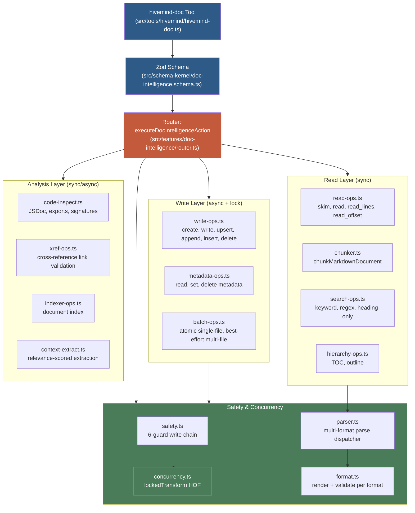
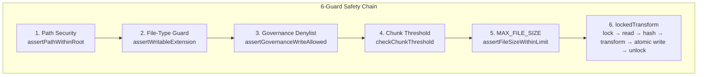
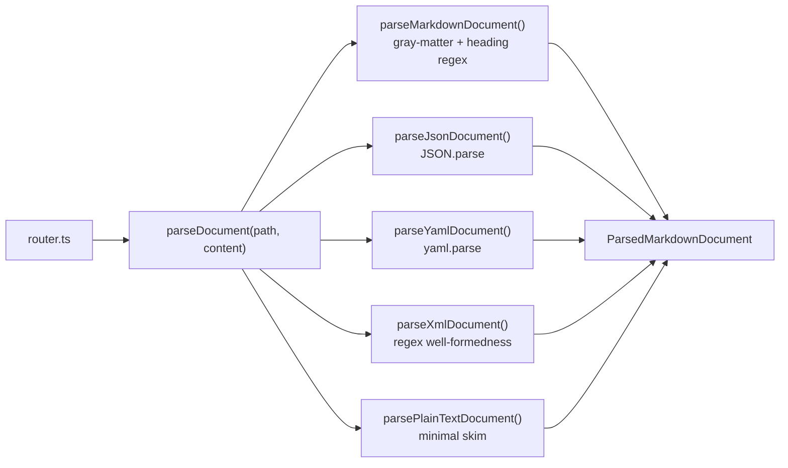
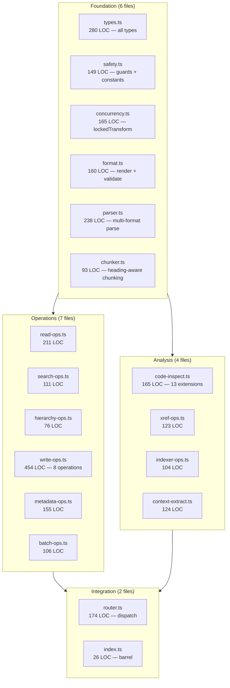

# Doc Intelligence — Document Intelligence Layer (hivemind-doc)

## Giới thiệu

**Doc Intelligence** là hệ thống con quản lý tài liệu (document management subsystem) của Hivemind harness. Nó cung cấp khả năng CRUD đa định dạng (multi-format), phân tích cấu trúc tài liệu (hierarchy-aware operations), tìm kiếm nâng cao, kiểm tra mã nguồn (code inspection), phân tích tham chiếu chéo (cross-reference analysis), lập chỉ mục tài liệu (document indexing) và trích xuất ngữ cảnh (context extraction) — tất cả trong ranh giới bảo mật của project root.

Doc Intelligence biến harness từ một công cụ **chỉ-đọc** (read-only skim/search) thành một **trợ lý tài liệu toàn diện** có thể đọc, ghi, biến đổi, và phân tích tài liệu với đầy đủ các rào cản an toàn (guardrails) khi ghi.

<!-- VERIFY: 18 source files, ~3,137 LOC, 16 test files, 73/73 tests — confirmed by codebase scan and test run on 2026-06-08 -->

✅ **VERIFIED**: 18 source files, ~3,137 LOC, 16 test suites, 73/73 runtime-truthful tests passing.

---

## Kiến trúc tổng thể



### 3 lớp chính

| Lớp | Vai trò | Đồng bộ? | Module |
|-----|---------|----------|--------|
| **Read Layer** | Đọc, chunk, tìm kiếm, phân cấp heading | Sync (trừ search multi-file) | `read-ops.ts`, `chunker.ts`, `search-ops.ts`, `hierarchy-ops.ts` |
| **Write Layer** | Tạo, ghi, upsert, append, insert, xóa, batch, metadata | Async (lockedTransform) | `write-ops.ts`, `metadata-ops.ts`, `batch-ops.ts` |
| **Analysis Layer** | Code inspect, xref, index, context extraction | Sync/Async tùy tác vụ | `code-inspect.ts`, `xref-ops.ts`, `indexer-ops.ts`, `context-extract.ts` |

---

## Action Matrix — 24 hành động

Doc Intelligence hỗ trợ **24 action** phân phối qua discriminated union `z.discriminatedUnion("action")`.

### Đọc (Read) — Hành động gốc + mở rộng

| Action | Mô tả | Input chính | Output |
|--------|-------|-------------|--------|
| `skim` | Parse metadata của 1 file Markdown | `path` | `ParsedMarkdownDocument` |
| `skim_directory` | Parse metadata tất cả file trong thư mục | `path`, `format?` | `ParsedMarkdownDocument[]` |
| `read` | Đọc nội dung file, giới hạn ký tự | `path`, `maxCharacters?`, `heading?` | content + characterCount + truncated |
| `chunk` | Chia Markdown thành chunks theo heading | `path`, `maxCharacters?` | `DocChunk[]` |
| `read_lines` | Đọc theo dòng (line range) | `path`, `startLine`, `endLine?` | `LineReadResult` |
| `read_offset` | Đọc theo offset ký tự | `path`, `offset`, `limit` | `OffsetReadResult` |

### Ghi (Write) — Hành động mới (Phase 61)

| Action | Mô tả | Input chính | Output |
|--------|-------|-------------|--------|
| `create` | Tạo file mới với scaffolding theo format | `path`, `title`, `metadata?`, `initialContent?` | `WriteReceipt` |
| `write` | Ghi đè body của một section | `path`, `heading`, `body`, `expectedHash?` | `SectionWriteResult` hoặc `ChunkRequiredSignal` |
| `upsert` | Ghi đè nếu heading tồn tại, tạo mới nếu không | `path`, `heading`, `body`, `level?`, `expectedHash?` | `SectionWriteResult` hoặc `ChunkRequiredSignal` |
| `append` | Thêm nội dung vào cuối section | `path`, `heading`, `content`, `expectedHash?` | `SectionWriteResult` hoặc `ChunkRequiredSignal` |
| `insert` | Chèn section mới sau một heading | `path`, `afterHeading`, `newHeading`, `level`, `body` | `SectionWriteResult` hoặc `ChunkRequiredSignal` |
| `delete` | Xóa section (mặc định) hoặc toàn bộ file (`mode: "file"`) | `path`, `heading?`, `mode?` | `DeleteResult` hoặc `ChunkRequiredSignal` |

### Batch — Hành động mới

| Action | Mô tả | Input chính | Output |
|--------|-------|-------------|--------|
| `batch` | Nhiều section edit trên 1 file — atomic | `path`, `ops: SectionEditOp[]` | `results: BatchOpResult[]` + `hash` |
| `batch_files` | Nhiều file — best-effort, Promise.all | `files: { path, ops }[]` | Per-file results với optional error |

### Metadata — Hành động mới

| Action | Mô tả | Input chính | Output |
|--------|-------|-------------|--------|
| `metadata` | Đọc frontmatter / metadata | `path` | `Record<string, unknown> \| null` |
| `set_metadata` | Ghi đè metadata | `path`, `metadata` | `{ hash, opId }` |
| `delete_metadata` | Xóa 1 field metadata | `path`, `field` | `{ hash, opId }` |

### Phân cấp (Hierarchy)

| Action | Mô tả | Input chính | Output |
|--------|-------|-------------|--------|
| `toc` | Tạo bảng mục lục dạng text | `path` | `string` (TOC text) |
| `outline` | Trả về flat list headings | `path` | `DocHeading[]` |

### Tìm kiếm nâng cao

| Action | Mô tả | Input chính | Output |
|--------|-------|-------------|--------|
| `search` | Tìm kiếm keyword/regex, có heading context | `path`, `query`, `regex?`, `headingOnly?`, `maxResults?` | `DocSearchMatch[]` |

### Phân tích (Analysis)

| Action | Mô tả | Input chính | Output |
|--------|-------|-------------|--------|
| `inspect` | Trích xuất JSDoc, exports, function signatures | `path` | `CodeInspectionResult` |
| `xref` | Phát hiện và validate link Markdown | `path` (directory) | `XrefLink[]` |
| `index` | Xây dựng index tài liệu | `path` (directory) | `DocumentIndexEntry[]` |
| `context` | Trích xuất section với relevance score | `path`, `query`, `tokenBudget?` | `ContextSection[]` |

---

## Chuỗi bảo vệ ghi (Safety Chain)

Mỗi thao tác ghi đi qua **6 lớp bảo vệ tuần tự** trước khi chạm đến file:



| # | Guard | Hành vi | Ném lỗi? |
|---|-------|---------|----------|
| 1 | **Path Security** (`assertPathWithinRoot`) | Kiểm tra lexical + realpath containment | ✅ throws `[Harness]` |
| 2 | **File-Type Guard** (`assertWritableExtension`) | Chỉ cho phép `.md`, `.json`, `.yaml`, `.yml`, `.xml` | ✅ throws |
| 3 | **Governance Denylist** | Chặn ghi vào `.hivemind/**`, `.opencode/**`, `opencode.json`, `AGENTS.md`, `CLAUDE.md`, `src/AGENTS.md` | ✅ throws |
| 4 | **Chunk Threshold** (`CHUNK_WRITE_THRESHOLD = 600`) | Nếu file > 600 dòng, trả về `ChunkRequiredSignal` | ❌ signal (không throw) |
| 5 | **MAX_FILE_SIZE** (`10 MB`) | Chặn file > 10 MB (STRIDE DoS mitigation) | ✅ throws |
| 6 | **lockedTransform** | Lock advisory → read → hash → transform → atomic write (tmp → rename) → unlock | ✅ throws nếu lock fail hoặc stale hash |

---

## lockedTransform Pattern

`lockedTransform` là Higher-Order Function cốt lõi cho mọi thao tác ghi. Nó đảm bảo:

1. **Advisory locking** qua `proper-lockfile@^4.1.2` — ngăn race condition khi concurrent write
2. **Content hashing** SHA-256 — phát hiện file cũ (stale-file detection) qua `expectedHash`
3. **Atomic write** — ghi vào file `.tmp` → `renameSync()` đổi tên, không sợ crash giữa chừng
4. **Skip-on-no-change** — nếu transform không thay đổi nội dung, bỏ qua ghi

```typescript
// Signature
async function lockedTransform(
  filePath: string,
  transform: (content: string, currentHash: string) => string | Promise<string>,
  options?: { expectedHash?: string },
): Promise<{
  changed: boolean
  hash: string
  opId: string
  bytesChanged: number
}>
```

**Ví dụ sử dụng trong write-ops.ts:**

```typescript
export async function writeSectionBody(
  projectRoot: string,
  filePath: string,
  heading: string,
  body: string,
  expectedHash?: string,
): Promise<SectionWriteResult | ChunkRequiredSignal> {
  const absPath = resolveDocPath(projectRoot, filePath)
  assertWritableExtension(absPath)
  assertGovernanceWriteAllowed(absPath, projectRoot)

  const thresholdCheck = checkChunkThreshold(absPath)
  if (thresholdCheck) return thresholdCheck

  const result = await lockedTransform(absPath, (content) => {
    const newContent = patchSectionBody(content, heading, body)
    if (newContent === content) {
      throw new Error(`[Harness] Heading not found: ${heading}`)
    }
    return newContent
  }, expectedHash ? { expectedHash } : undefined)

  return {
    opId: result.opId,
    hash: result.hash,
    path: toRootRelativePath(projectRoot, absPath),
    heading,
    changed: result.changed,
    bytesChanged: result.bytesChanged,
  }
}
```

---

## Parser Adapter Pattern

Hệ thống sử dụng **parser adapter** để xử lý đa định dạng mà không cần class hierarchy. Mỗi format có pure functions riêng, và `parseDocument()` đóng vai trò dispatcher theo extension:



| Format | Library | File | Chức năng |
|--------|---------|------|-----------|
| `.md`, `.mdx` | `gray-matter` | `parser.ts` | Frontmatter + heading outline |
| `.json` | Built-in (`JSON.parse`) | `parser.ts` | Title từ key "title" |
| `.yaml`, `.yml` | `yaml` | `parser.ts` | Title từ key "title" |
| `.xml` | Regex | `parser.ts` | Title từ `<title>` element |
| `.txt` | Built-in | `parser.ts` | Title từ dòng đầu tiên |

**Zero new npm dependencies** — tất cả đều dùng thư viện có sẵn hoặc built-in.

---

## CQRS Enforcement — Sync vs Async, Read vs Write

| Loại thao tác | FS Mode | Concurrency | Module |
|---------------|---------|-------------|--------|
| **Read (single-file)**: skim, read, read_lines, metadata, toc, outline | `readFileSync` | Không | `read-ops.ts`, `metadata-ops.ts`, `hierarchy-ops.ts` |
| **Read (multi-file)**: skim_directory, search, xref, index, context | `readFile` + `Promise.all` | Không | `search-ops.ts`, `xref-ops.ts`, `indexer-ops.ts` |
| **Write (single-file)**: create, write, upsert, append, insert, delete | `readFileSync` + `writeFileSync` + `renameSync` | `lockedTransform` | `write-ops.ts`, `metadata-ops.ts` |
| **Batch (single-file)**: batch | `lockedTransform` (single) | `lockedTransform` | `batch-ops.ts` |
| **Batch (multi-file)**: batch_files | `Promise.all` + per-file try/catch | Per-file lock | `batch-ops.ts` |
| **Code inspect**: inspect | `readFileSync` | Không | `code-inspect.ts` |

### Nguyên tắc CQRS

- **Read functions KHÔNG được gọi** `writeFileSync`, `renameSync`, hoặc `lockedTransform`
- **Write functions PHẢI qua** `lockedTransform` — không bypass trực tiếp
- **Router KHÔNG chứa business logic** — chỉ dispatch và path security
- **Hook consumers KHÔNG được gọi write operations**

---

## Thiết kế modules



### Mỗi module ≤ 500 LOC (tuân thủ AGENTS.md)

✅ Tất cả 18 file source đều dưới 500 LOC. File lớn nhất là `write-ops.ts` (454 LOC).

---

## Code Inspection — Hỗ trợ 13 định dạng code

```typescript
export const CODE_EXTENSIONS = new Set([
  ".ts", ".tsx", ".js", ".jsx", ".mjs", ".cjs",
  ".py", ".go", ".rs", ".java", ".c", ".cpp", ".h",
])
```

Mỗi lần inspect trả về:

```typescript
type CodeInspectionResult = {
  path: string
  jsdocBlocks: JsDocBlock[]       // JSDoc blocks + paired declaration name
  comments: string[]               // Single-line comments
  exports: ExportSymbol[]          // Exported symbols + kind + line
  signatures: FunctionSignature[]  // Function/method signatures + params + returnType
}
```

---

## Cross-Reference Analysis (xref)

Quét tất cả file tài liệu trong thư mục, phát hiện link Markdown dạng `[text](path)`, và kiểm tra:

- Link ngoài (`http://`, `https://`, `mailto:`) → bỏ qua
- Link anchor (`#section`) → bỏ qua
- Link nội bộ → resolve relative path → `existsSync()` kiểm tra tồn tại

```typescript
type XrefLink = {
  from: string    // File nguồn (root-relative)
  to: string      // Đường dẫn đích (raw link text)
  line: number    // Dòng trong file nguồn
  text: string    // Text hiển thị của link
  valid: boolean  // true nếu file đích tồn tại
}
```

---

## Document Indexing

Xây dựng ephemeral index của tất cả tài liệu trong thư mục:

```typescript
type DocumentIndexEntry = {
  path: string
  title: string | null
  headingPath: string       // "H1 > H2 > H3" style path
  lineCount: number
  sizeBytes: number
  hash: string              // SHA-256
  lastModified: string      // ISO-8601
  headingCount: number
  linkCount: number
}
```

---

## Context Extraction

Trích xuất section có relevance score dựa trên query, trong token budget:

```typescript
type ContextSection = {
  path: string
  heading: string | null
  content: string
  relevanceScore: number
  tokenEstimate: number     // 4-chars-per-token heuristic
}
```

---

## Governance Write Denylist

Các đường dẫn bị chặn ghi tuyệt đối (không thể override từ tool boundary):

```
.hivemind/**
.opencode/**
opencode.json
AGENTS.md
CLAUDE.md
src/AGENTS.md
```

---

## Các hằng số quan trọng

| Hằng số | Giá trị | Mục đích |
|---------|---------|----------|
| `WRITABLE_EXTENSIONS` | `.md`, `.json`, `.yaml`, `.yml`, `.xml` | Extension được phép ghi |
| `DOCUMENT_EXTENSIONS` | `.md`, `.mdx`, `.json`, `.yaml`, `.yml`, `.xml`, `.txt` | Extension được phép đọc |
| `CHUNK_WRITE_THRESHOLD` | 600 dòng | Ngưỡng large-file discipline |
| `MAX_FILE_SIZE` | 10 MB (10 × 1024 × 1024) | STRIDE DoS mitigation |
| `DEFAULT_MAX_READ_CHARACTERS` | 20,000 ký tự | Giới hạn đọc mặc định |

---

## Thiết kế kế thừa và ràng buộc

### Nguyên tắc `standalone_first`

Module doc-intelligence **KHÔNG import** từ:
- `src/task-management/`
- `src/coordination/`
- `.hivemind/`

Nó chỉ import từ `node:*`, shared modules (`src/shared/security/path-scope.ts`), và các sibling modules trong `src/features/doc-intelligence/`.

### Không dùng class pattern

Doc-intelligence là **stateless** (tất cả state trên disk). Không dùng class với instance state — tất cả là pure function modules. (Trái ngược với `session-tracker` có persistence layer.)

### Zod discriminated union

Tất cả input validation dùng `z.discriminatedUnion("action", [...])` — O(1) dispatch, type-safe, per-action schema validation.

### Symlink protection

`assertPathWithinRoot` trong `src/shared/security/path-scope.ts` dùng `realpathSync` để ngăn symlink traversal attacks.

---

## Kết quả kiểm thử

```
Test Files  16 passed (16)
     Tests  73 passed (73)
 Duration  997ms
```

✅ 73/73 runtime-truthful tests, tất cả dùng fixture files thật (không mock file system).

### Test suites

| Suite | File | Tests |
|-------|------|-------|
| Parity regression | `parity.test.ts` | 5 original actions |
| Skim | `skim.test.ts` | skim + skim_directory |
| Read | `read.test.ts` | read, read_lines, read_offset |
| Chunk | `chunk.test.ts` | chunkMarkdownDocument |
| Search | `search.test.ts` | keyword, regex, heading-only |
| Write | `write.test.ts` | create, write, upsert, append, insert, delete |
| Batch | `batch.test.ts` | atomic single-file, best-effort multi-file |
| Metadata | `metadata.test.ts` | read, set, delete |
| Hierarchy | `hierarchy.test.ts` | TOC, outline |
| Inspect | `inspect.test.ts` | code inspection |
| Xref | `xref.test.ts` | cross-reference |
| Index | `index.test.ts` | document index |
| Context | `context.test.ts` | context extraction |
| Safety | `safety.test.ts` | write guards |
| Concurrency | `concurrency.test.ts` | lockedTransform |
| Format | `format.test.ts` | multi-format render + validate |

---

## Danh sách Source Files (18 files)

| File | LOC | Vai trò |
|------|-----|---------|
| `types.ts` | 280 | Tất cả shared types |
| `safety.ts` | 149 | Guards, denylist, constants |
| `concurrency.ts` | 165 | `lockedTransform`, SHA-256 hashing |
| `format.ts` | 160 | Multi-format render + validate |
| `parser.ts` | 238 | Multi-format parse dispatcher |
| `chunker.ts` | 93 | Heading-aware chunking |
| `read-ops.ts` | 211 | skim, read, read_lines, read_offset |
| `search-ops.ts` | 111 | Keyword, regex, heading-only search |
| `hierarchy-ops.ts` | 76 | TOC, outline |
| `write-ops.ts` | 454 | 8 write operations |
| `metadata-ops.ts` | 155 | Read, set, delete metadata |
| `batch-ops.ts` | 106 | Atomic single-file, best-effort multi-file |
| `code-inspect.ts` | 165 | JSDoc, exports, signatures |
| `xref-ops.ts` | 123 | Cross-reference link validation |
| `indexer-ops.ts` | 104 | Document index |
| `context-extract.ts` | 124 | Relevance-scored extraction |
| `router.ts` | 174 | Discriminated union dispatch |
| `index.ts` | 26 | Barrel exports |

Plus: `src/schema-kernel/doc-intelligence.schema.ts` (154 LOC), `src/tools/hivemind/hivemind-doc.ts` (69 LOC).

---

## Tài liệu tham khảo

| Tài liệu | Vị trí |
|----------|--------|
| Source code chính | `src/features/doc-intelligence/` |
| Zod schema | `src/schema-kernel/doc-intelligence.schema.ts` |
| Tool factory | `src/tools/hivemind/hivemind-doc.ts` |
| Test suites | `tests/features/doc-intelligence/` |
| PATTERNS.md (thiết kế) | `.planning/phases/61-doc-intelligence-rearchitecture/61-PATTERNS.md` |
| SUMMARY.md (kết quả phase) | `.planning/phases/61-doc-intelligence-rearchitecture/61-SUMMARY.md` |
| AGENTS.md (module rules) | `src/AGENTS.md` |
| Architecture tổng thể | `.planning/codebase/ARCHITECTURE.md` |
