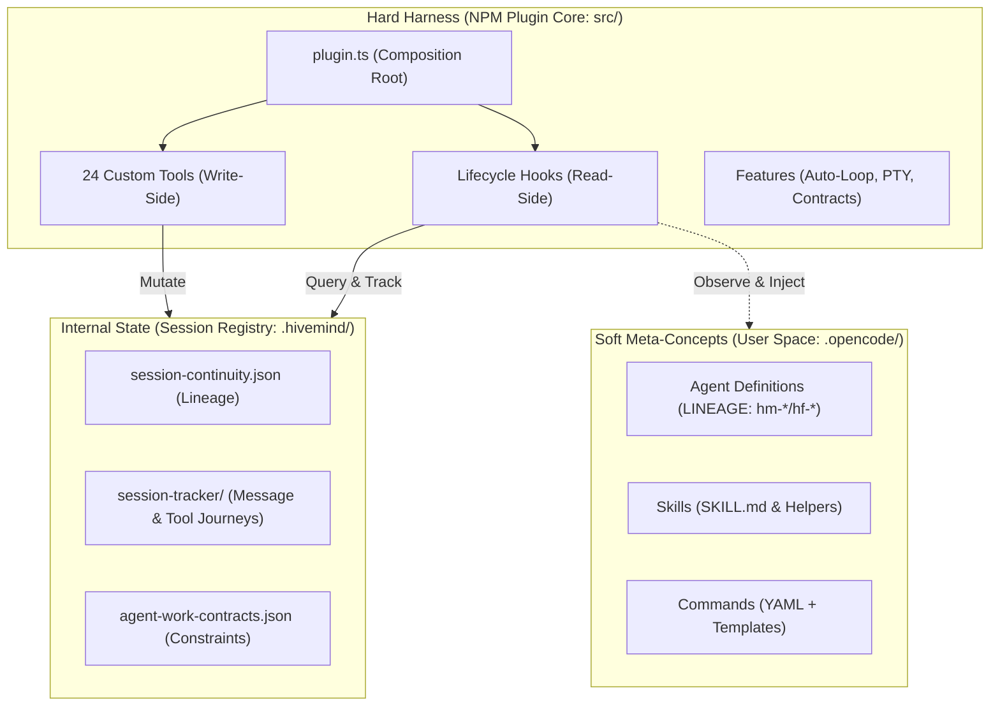

# Hivemind — Runtime Composition Engine Features

Hivemind is a **runtime composition engine** for OpenCode that enables agent collaboration, session continuity, concurrency control, and runtime guardrails. It bridges the gap between individual sessions by allowing decisions, patterns, and context to compound.

This document serves as the definitive specification for both **programmatic features** (hooks, observers, transforms) and **runtime features** (custom tools, loops, delegation structures) implemented in the Hivemind harness.

---

## 1. System Architecture & Boundaries

Hivemind separates the development harness, user-configurable primitives, and runtime persistence into three clean planes:

### The Three Planes
1. **The Hard Harness (src/)**: Pre-compiled TypeScript plugin containing 24 custom tools (write-side CQRS) and hooks (read-side CQRS). Wires directly into OpenCode.
2. **The Soft Meta-Concepts (.opencode/)**: Dynamic, user-configurable primitives (agents, skills, commands, rules, permissions). *Lineage classification:*
   - `hm-*`: Product/harness development primitives (STRICT lineage).
   - `hf-*`: Meta-builder authoring primitives (FLEXIBLE lineage).
   - `gate-*`: Quality-gate evaluation primitives (INTERNAL usage).
   - `stack-*`: Technology reference stacks.
3. **Internal State (.hivemind/)**: Canonical storage for session journals, execution trajectories, and agent work contracts.

---

## 2. Programmatic Hooks & Transformations

Programmatic hooks observe OpenCode execution phases to inject context, enforce rules, or capture state without mutating the workspace.

| Hook Name | Invocation Phase | Purpose & Behavior |
|-----------|------------------|--------------------|
| `session.created` | When a new session starts | Triggers bootstrap, copies children for forked sessions, and updates the project continuity index. |
| `system.transform` | Before user prompt is sent to LLM | Injects governance blocks, behavioral profiles, and agent-work contract constraints into the system instruction. |
| `messages.transform` | Before message delivery | Performs message formatting and context enrichment. |
| `shell.env` | Before background terminal starts | Injects environment overrides, local bins, and PTY environment options. |
| `chat.message` | After assistant/user sends a message | Captures turns, increments counters, and checks message-level contracts. |
| `tool.execute.before` | Before a tool runs | Run circuit breakers, checks budgets/contracts, and proactively discovers task-tool child sessions. |
| `tool.execute.after` | After a tool runs | Captures output metadata (tool journal, execution history) and auto-persists workflow variables. |

---

## 3. The 24 Custom Tools Specification

Hivemind registers **24 custom tools** with Zod schemas. They are divided into 4 core functional domains:

### 3.1 Config Domain Tools

Config tools handle workspace initialization, primitive configuration, and state recovery.

| Tool Name | Arguments Schema | Purpose / Description |
|-----------|------------------|----------------------|
| `bootstrap-init` | *None* | Generates the canonical `.hivemind/` and `.opencode/` folders, default configurations, and restores primitives. |
| `bootstrap-recover`| *None* | Runs diagnostic health checks (the "Doctor" mode) validating types, tests, primitives, and SDK version. |
| `configure-primitive`| `type`: enum<agent,skill,command,tool> `name`: string `config`: object | Configures settings, capabilities, or permissions for specific primitives programmatically. |
| `validate-restart` | `sessionID`: string | Checks session integrity and terminal states upon harness restarts. |
| `prompt-skim` | `path`: string | Performs lightweight scans of prompts for fast parsing. |
| `prompt-analyze` | `path`: string | Conducts deep semantic and token budget analysis on prompt packets. |

### 3.2 Session Domain Tools

Session tools control command routing, context stitching, and journey logs.

| Tool Name | Arguments Schema | Purpose / Description |
|-----------|------------------|----------------------|
| `execute-slash-command` | `command`: string `arguments`: string (opt) `agent`: string (opt) `subtask`: boolean (opt) `stackOnSessionId`: string (opt) | Dispatches slash commands using synthetic parent prompts, subtask delegation, or TUI pipeline execution. Supports context stacking. |
| `session-patch` | `sessionID`: string `patch`: object | Applies incremental updates to session variables. |
| `session-journal-export`| `sessionID`: string | Exports session event timelines as structured JSON or markdown. |
| `session-tracker` | `action`: enum<get,list,status> | Queries the session tracking database for files, turns, and child nodes. |
| `session-hierarchy` | `sessionID`: string | Generates tree diagrams of parent-child delegation chains. |
| `session-context` | `sessionID`: string | Aggregates context across the hierarchy tree to build unified LLM prompts. |
| `create-governance-session`| *None* | Spawns an isolated governance sandbox to validate security and runtime policies. |

### 3.3 Delegation Domain Tools

Delegation tools orchestrate and monitor multi-agent workflows.

| Tool Name | Arguments Schema | Purpose / Description |
|-----------|------------------|----------------------|
| `delegate-task` | `agent`: string `prompt`: string `stackOnSessionId`: string (opt) `context`: string (opt) | Spawns child sessions in the background (WaiterModel). **Preferred usage:** utilize `stackOnSessionId` to reuse context. |
| `delegation-status` | `delegationId`: string (opt) `action`: enum<status,list,control,find-stackable> `control`: object (opt) `agentFilter`: string (opt) | Checks delegation state, manages cancellation/aborts, and locates stackable completed/failed sessions. |
| `run-background-command`| `action`: enum<run,output,input,list,terminate> `command`: string `args`: array<string> (opt) `sessionId`: string (opt) | Executes terminal commands in persistent background processes (using TMUX or Bun-pty when supported). |

### 3.4 Hivemind Domain Tools

Hivemind tools manage developer constraints, trajectories, and work scopes.

| Tool Name | Arguments Schema | Purpose / Description |
|-----------|------------------|----------------------|
| `hivemind-doc` | `action`: enum<generate,verify,lint> | Automates codebase document generation and lints Markdown files. |
| `hivemind-trajectory`| `action`: enum<append,get,query> | Appends or queries records from the execution trajectory ledger. |
| `hivemind-pressure` | *None* | Measures system resource and token pressure (circuit-breaking). |
| `hivemind-sdk-supervisor`| *None* | Logs SDK execution metrics and registers API adapters. |
| `hivemind-command-engine`| `action`: enum<discover,list_commands> | Indexes all valid commands in the codebase. |
| `hivemind-session-view`| `sessionID`: string | Projects read-only workspace state for dashboard consumption. |
| `hivemind-agent-work-create`| `agent`: string `boundary`: string `evidence`: object | Generates a new agent work contract defining tasks, allowed paths, and required proof. |
| `hivemind-agent-work-export`| `contractId`: string | Compiles work contracts into structured handoff packages. |

---

## 4. Core Runtime Features & Specifications

### 4.1 Background Execution & PTY (f-06a)
- **Shared PTY Interface**: background tasks run in isolated tmux sessions or via the `bun-pty` interface.
- **Headless Fallback**: If Bun-pty or tmux are unavailable, tasks gracefully fall back to headless Node.js child processes.
- **PTY Session Survival**: OS-level PTY processes cannot survive parent plugin restarts. When recovered post-restart, they report `terminalKind: "non-resumable-after-restart"`.

### 4.2 Auto-loop / Ralph-loop
- **Self-Correcting Execution**: An auto-loop runs until the LLM returns `<promise>DONE</promise>` or hits the maximum iteration count.
- **Ralph-loop**: A specialized recursive debugging loop. If a test fails, the agent consumes error stack traces, updates its strategy, commits modifications, and re-executes tests up to 5 times before escalating to the parent L1 agent.

### 4.3 WaiterModel Delegation & Dual-Signal Completion
- **Always-Background Dispatch**: Delegations dispatched by `delegate-task` are non-blocking. The parent session receives a delegation ID immediately and polls for completion.
- **Dual-Signal Completion Protocol**: A delegation is only complete when:
  1. The **Doer** subagent asserts completion.
  2. The **Verifier** subagent or automated validation command evaluates the output and records factual evidence on disk.

### 4.4 Concurrency Semaphore
- **Queue-Key Locking**: Simultaneous tool execution is throttled via a keyed semaphore (e.g. `agent:hm-l2-researcher`).
- **Queue Safety**: Tasks waiting on a lock are queued and executed sequentially, preventing race conditions on shared files.

### 4.5 Domain-Optimized Category System
- Agent prompts and execution parameters are resolved from domain categories:
  - `visual-engineering`: High temperature, visual layouts.
  - `deep`: Low temperature, maximum thinking token limits, exhaustive search.
  - `quick`: Generalist model, zero temperature, fast output.
  - `ultrabrain`: Parallel reasoning model.

### 4.6 Session Recovery & Resumption
- **Continuity Restoration**: If a session is interrupted (due to timeouts or crashes), the lifecycle manager reconstructs the hierarchy tree and variables from `session-continuity.json`.
- **Pending Notifications**: Notifications queued while the parent session was ended are replayed to the user's terminal immediately during next initialization.
