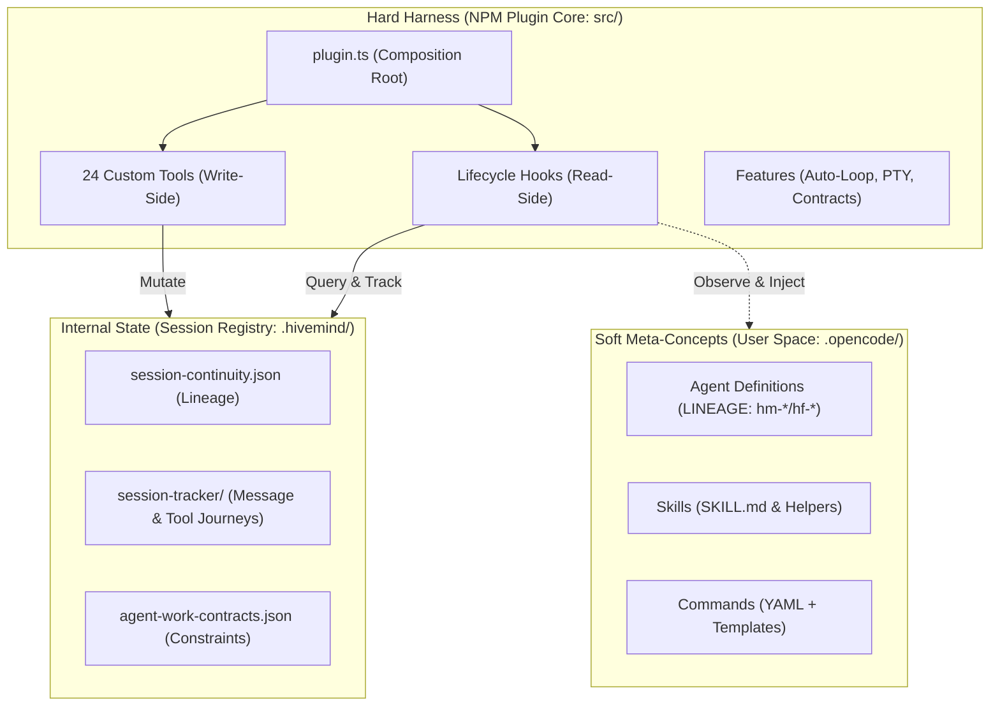

# Hivemind — Tài liệu Tính năng của Bộ máy Cấu trúc Runtime (Runtime Composition Engine)

Hivemind là một **runtime composition engine** (bộ máy cấu trúc runtime) cho OpenCode nhằm kích hoạt sự cộng tác giữa các agent, duy trì tính liên tục của session (session continuity), kiểm soát đồng thời (concurrency control) và thiết lập các rào chắn bảo vệ khi chạy (runtime guardrails). Nó kết nối các session riêng lẻ bằng cách cho phép các quyết định, pattern và ngữ cảnh (context) được tích lũy và kế thừa lẫn nhau.

Tài liệu này đóng vai trò là đặc tả kỹ thuật chính thức cho cả các **tính năng lập trình** (programmatic features như hooks, observers, transforms) và **tính năng runtime** (custom tools, loops, cấu trúc delegation) được triển khai trong harness Hivemind.

---

## 1. Kiến trúc Hệ thống & Ranh giới (Architecture & Boundaries)

Hivemind phân chia development harness, các primitive do người dùng cấu hình (user-configurable primitives) và cơ chế lưu trữ runtime thành 3 phân vùng (planes) rõ rệt:

### 3 Phân vùng Chính:
1. **Hard Harness (src/)**: Plugin viết bằng TypeScript được biên dịch sẵn, chứa **24 custom tools** (phía ghi - write-side CQRS) và các **hooks** (phía đọc - read-side CQRS). Phân vùng này kết nối trực tiếp vào OpenCode.
2. **Soft Meta-Concepts (.opencode/)**: Các primitive động có thể cấu hình bởi người dùng (agents, skills, commands, rules, permissions). *Phân loại dòng mã (Lineage classification):*
   - `hm-*`: Các primitive phát triển harness/sản phẩm (dòng mã STRICT).
   - `hf-*`: Các primitive tác giả của bộ xây dựng meta (meta-builder) (dòng mã FLEXIBLE).
   - `gate-*`: Các primitive đánh giá chất lượng (quality-gate) (sử dụng INTERNAL).
   - `stack-*`: Các stack tham chiếu công nghệ.
3. **Internal State (.hivemind/)**: Không gian lưu trữ canonical cho nhật ký session (session journals), nhật ký hành trình thực thi (execution trajectories) và hợp đồng công việc của agent (agent work contracts).

---

## 2. Programmatic Hooks & Transformations (Móc sự kiện & Biến đổi dữ liệu)

Các programmatic hooks quan sát các giai đoạn thực thi của OpenCode để inject context, thực thi quy tắc hoặc ghi lại trạng thái mà không làm thay đổi workspace.

| Tên Hook | Giai đoạn kích hoạt | Mục đích & Hành vi |
|----------|---------------------|---------------------|
| `session.created` | Khi một session mới bắt đầu | Kích hoạt bootstrap, sao chép các session con (children) cho các session được fork, và cập nhật project continuity index. |
| `system.transform` | Trước khi user prompt được gửi đến LLM | Inject các khối governance (governance blocks), behavioral profiles và các ràng buộc hợp đồng công việc (agent-work contracts) vào system instruction. |
| `messages.transform` | Trước khi phân phối message | Thực hiện định dạng message và làm phong phú ngữ cảnh (context enrichment). |
| `shell.env` | Trước khi terminal nền bắt đầu | Inject các biến môi trường ghi đè, local bins và các tùy chọn môi trường PTY. |
| `chat.message` | Sau khi assistant/user gửi message | Ghi lại các lượt hội thoại (turns), tăng bộ đếm lượt và kiểm tra hợp đồng ở cấp độ message. |
| `tool.execute.before` | Trước khi một tool chạy | Chạy các bộ ngắt mạch (circuit breakers), kiểm tra ngân sách/hợp đồng và chủ động phát hiện các child session được tạo bởi task-tool. |
| `tool.execute.after` | Sau khi một tool chạy | Ghi lại metadata đầu ra (tool journal, lịch sử thực thi) và tự động lưu trữ các biến workflow. |

---

## 3. Đặc tả 24 Custom Tools

Hivemind đăng ký **24 custom tools** với Zod schemas. Chúng được chia thành 4 miền chức năng cốt lõi:

### 3.1 Công cụ miền Cấu hình (Config Domain Tools)

Các công cụ config xử lý việc khởi tạo workspace, cấu hình primitive và khôi phục trạng thái.

| Tên Tool | Arguments Schema | Mục đích / Mô tả |
|----------|------------------|------------------|
| `bootstrap-init` | *Không có* | Tạo các thư mục canonical `.hivemind/` và `.opencode/`, cấu hình mặc định và khôi phục các primitive. |
| `bootstrap-recover`| *Không có* | Chạy kiểm tra sức khỏe hệ thống (chế độ "Doctor") để xác thực types, tests, primitives và phiên bản SDK. |
| `configure-primitive`| `type`: enum<agent,skill,command,tool> `name`: string `config`: object | Cấu hình cài đặt, khả năng (capabilities) hoặc quyền hạn cho các primitive cụ thể bằng lập trình. |
| `validate-restart` | `sessionID`: string | Kiểm tra tính toàn vẹn của session và các trạng thái terminal khi harness khởi động lại. |
| `prompt-skim` | `path`: string | Quét nhanh các prompt để phân tích cú pháp ở mức độ nhẹ. |
| `prompt-analyze` | `path`: string | Phân tích ngữ nghĩa chuyên sâu và phân tích ngân sách token trên các gói prompt. |

### 3.2 Công cụ miền Session (Session Domain Tools)

Các công cụ session điều khiển việc định tuyến lệnh, liên kết ngữ cảnh và nhật ký hành trình.

| Tên Tool | Arguments Schema | Mục đích / Mô tả |
|----------|------------------|------------------|
| `execute-slash-command` | `command`: string `arguments`: string (opt) `agent`: string (opt) `subtask`: boolean (opt) `stackOnSessionId`: string (opt) | Thực thi các slash command sử dụng synthetic parent prompts, ủy thác subtask hoặc thực thi qua TUI pipeline. Hỗ trợ xếp chồng ngữ cảnh (context stacking). |
| `session-patch` | `sessionID`: string `patch`: object | Áp dụng các cập nhật lũy tiến vào biến session. |
| `session-journal-export`| `sessionID`: string | Xuất dòng thời gian sự kiện của session dưới dạng JSON hoặc Markdown cấu trúc. |
| `session-tracker` | `action`: enum<get,list,status> | Truy vấn cơ sở dữ liệu tracking session để lấy danh sách file, lượt hội thoại và các node con. |
| `session-hierarchy` | `sessionID`: string | Tạo sơ đồ cây biểu diễn các chuỗi ủy thác parent-child (delegation chains). |
| `session-context` | `sessionID`: string | Tổng hợp ngữ cảnh trên toàn bộ cây phân cấp để xây dựng prompt LLM thống nhất. |
| `create-governance-session`| *Không có* | Tạo một hộp cát (sandbox) cô lập để xác thực bảo mật và các chính sách runtime. |

### 3.3 Công cụ miền Ủy thác (Delegation Domain Tools)

Các công cụ delegation điều phối và giám sát quy trình làm việc đa agent (multi-agent workflows).

| Tên Tool | Arguments Schema | Mục đích / Mô tả |
|----------|------------------|------------------|
| `delegate-task` | `agent`: string `prompt`: string `stackOnSessionId`: string (opt) `context`: string (opt) | Tạo các session con chạy ngầm (chế độ WaiterModel). **Cách dùng khuyến nghị:** sử dụng `stackOnSessionId` để tái sử dụng context. |
| `delegation-status` | `delegationId`: string (opt) `action`: enum<status,list,control,find-stackable> `control`: object (opt) `agentFilter`: string (opt) | Kiểm tra trạng thái ủy thác, quản lý hủy bỏ/ngắt và tìm kiếm các terminal session có thể xếp chồng (completed/failed). |
| `run-background-command`| `action`: enum<run,output,input,list,terminate> `command`: string `args`: array<string> (opt) `sessionId`: string (opt) | Thực thi các lệnh terminal trong các tiến trình chạy ngầm liên tục (sử dụng TMUX hoặc Bun-pty khi được hỗ trợ). |

### 3.4 Công cụ miền Hivemind (Hivemind Domain Tools)

Các công cụ Hivemind quản lý các ràng buộc của nhà phát triển, quỹ đạo thực thi và phạm vi công việc.

| Tên Tool | Arguments Schema | Mục đích / Mô tả |
|----------|------------------|------------------|
| `hivemind-doc` | `action`: enum<generate,verify,lint> | Tự động tạo tài liệu mã nguồn và lint các file Markdown. |
| `hivemind-trajectory`| `action`: enum<append,get,query> | Ghi thêm hoặc truy vấn nhật ký hành trình thực thi (trajectory ledger). |
| `hivemind-pressure` | *Không có* | Đo lường tài nguyên hệ thống và áp lực token (để ngắt mạch tự động - circuit-breaking). |
| `hivemind-sdk-supervisor`| *Không có* | Ghi nhật ký các chỉ số thực thi SDK và đăng ký các API adapters. |
| `hivemind-command-engine`| `action`: enum<discover,list_commands> | Chỉ mục (index) tất cả các lệnh hợp lệ trong codebase. |
| `hivemind-session-view`| `sessionID`: string | Trích xuất trạng thái workspace ở chế độ chỉ đọc để hiển thị lên dashboard. |
| `hivemind-agent-work-create`| `agent`: string `boundary`: string `evidence`: object | Tạo một hợp đồng công việc mới cho agent (agent work contract) định nghĩa nhiệm vụ, các đường dẫn được cho phép và bằng chứng yêu cầu. |
| `hivemind-agent-work-export`| `contractId`: string | Biên dịch các hợp đồng công việc thành các gói bàn giao cấu trúc (handoff packages). |

---

## 4. Đặc tả Tính năng Runtime Cốt lõi (Core Runtime Features)

### 4.1 Thực thi Ngầm & PTY (Background Execution & PTY - f-06a)
- **Shared PTY Interface**: Các tác vụ chạy ngầm hoạt động trong các session tmux cô lập hoặc qua interface `bun-pty`.
- **Headless Fallback**: Nếu Bun-pty hoặc tmux không khả dụng, các tác vụ sẽ tự động chuyển sang các tiến trình con Node.js không đầu (headless Node.js child processes).
- **PTY Session Survival**: Các tiến trình PTY ở cấp độ OS không thể sống sót qua các lần khởi động lại plugin cha. Khi khôi phục sau khi khởi động lại, chúng sẽ báo cáo `terminalKind: "non-resumable-after-restart"`.

### 4.2 Auto-loop / Ralph-loop
- **Self-Correcting Execution**: Vòng lặp tự động chạy cho đến khi LLM trả về `<promise>DONE</promise>` hoặc đạt đến số lần lặp tối đa.
- **Ralph-loop**: Vòng lặp debug đệ quy chuyên biệt. Nếu một test thất bại, agent sẽ đọc stack trace lỗi, cập nhật chiến lược, commit mã nguồn đã sửa đổi và chạy lại test lên đến 5 lần trước khi báo cáo lên agent cha L1.

### 4.3 WaiterModel Delegation & Dual-Signal Completion (Ủy thác WaiterModel & Xác thực 2 yếu tố)
- **Always-Background Dispatch**: Các ủy thác được gửi đi bởi `delegate-task` là không chặn (non-blocking). Session cha nhận được delegation ID ngay lập tức và tiến hành thăm dò (polling) trạng thái hoàn thành.
- **Dual-Signal Completion Protocol (Giao thức hoàn thành hai tín hiệu)**: Một delegation chỉ được coi là hoàn thành khi:
  1. Subagent thực hiện (**Doer**) xác nhận đã xong.
  2. Subagent kiểm tra (**Verifier**) hoặc lệnh xác thực tự động đánh giá đầu ra và ghi lại bằng chứng thực tế lên đĩa.

### 4.4 Concurrency Semaphore (Bộ điều khiển đồng thời)
- **Queue-Key Locking**: Việc thực thi các tool đồng thời bị giới hạn thông qua một semaphore có khóa (ví dụ: `agent:hm-l2-researcher`).
- **Queue Safety**: Các tác vụ chờ khóa được đưa vào hàng đợi và thực thi tuần tự, ngăn ngừa tình trạng tranh chấp tài nguyên (race conditions) trên các file dùng chung.

### 4.5 Domain-Optimized Category System (Hệ thống phân loại tối ưu hóa miền)
- Các prompt và tham số thực thi của agent được quyết định dựa trên danh mục miền (domain categories):
  - `visual-engineering`: Nhiệt độ (temperature) cao, phục vụ thiết kế giao diện trực quan.
  - `deep`: Nhiệt độ thấp, giới hạn token suy nghĩ tối đa, tìm kiếm cẩn thận tỉ mỉ.
  - `quick`: Model tổng quát, nhiệt độ bằng 0, phản hồi cực nhanh.
  - `ultrabrain`: Model suy luận song song nâng cao.

### 4.6 Khôi phục & Tiếp tục Session (Session Recovery & Resumption)
- **Continuity Restoration**: Nếu session bị gián đoạn (do timeout hoặc crash), bộ quản lý vòng đời (lifecycle manager) sẽ tái cấu trúc cây phân cấp và các biến từ file `session-continuity.json`.
- **Pending Notifications**: Các thông báo được xếp hàng đợi khi session cha đã kết thúc sẽ được hiển thị ngay lập tức lên terminal của người dùng trong lần khởi tạo session tiếp theo.
