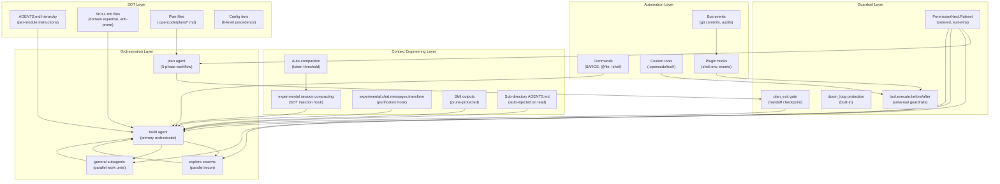

# The OpenCode Meta-Framework: Advanced Architecture & Stacking Patterns

This is a deep-systems synthesis of OpenCode's innate primitives — no SDK hacking required. The entire meta-framework is assembled purely through configuration, markdown, plugins, and scripting. Here's the full architecture map:

---

## I. The Foundational Schematic: Understanding the Layer Stack

Before stacking, know what you're stacking. OpenCode's runtime assembles context and behavior from **six tiers**, in ascending priority order:

> **Remote well-known → Global config → Custom config → Project config → `.opencode/` dirs → Inline env**

The `.opencode/` directory is your primary meta-module mount point. It auto-scans subfolders: opencode:78-86 

Each subfolder type has a deterministic discovery pattern. This means your meta-module structure is just a folder hierarchy — no code needed to register it.

---

## II. The Stateful Graph: Sessions as First-Class Nodes

### 2.1 Session Hierarchy = Your Workflow Graph

Sessions have typed parent/child relationships, forming a **directed acyclic graph of work**. Every child spawned by the `task` tool carries a `parentID` and an isolated message history. The orchestrator session is the root node. opencode:119-161 

Sessions can be **forked** at any message boundary, enabling non-destructive branching of long-running workflows without losing history: opencode:234-274 

### 2.2 Plan Files as Persistent Workflow Artifacts

The plan mode uses a **deterministic path formula** (slug + timestamp) for plan files, making them addressable artifacts in your workflow graph: opencode:333-338 

Plan files live at `.opencode/plans/` inside the git worktree (when VCS is available), making them **commitable SOT artifacts**.

---

## III. The Orchestrator Architecture: Plan → Delegate → Gate → Build

### 3.1 The Built-in Primary/Subagent Topology

OpenCode ships a ready-made orchestration topology. Know these roles cold:

| Agent | Mode | Permission Profile | Role |
|---|---|---|---|
| `build` | primary | `question: allow`, `plan_enter: allow` | Default orchestrator/implementer |
| `plan` | primary | edit restricted to plan file only | Planning-only, read + research |
| `general` | subagent | denies `todoread`/`todowrite` | Multi-step parallel work units |
| `explore` | subagent | only read/grep/glob/bash/web | Fast codebase reconnaissance |
| `compaction` | primary (hidden) | all tools denied | Context compaction agent | opencode:76-203 

### 3.2 The Plan Mode 5-Phase Deterministic Workflow

When the `plan` agent is active, the loop injects a `<system-reminder>` synthetic part that prescribes a **5-phase constrained workflow** directly into the context. This is the orchestrator's behavioral constitution:

- **Phase 1**: Parallel `explore` swarms (max 3 agents, parallel)
- **Phase 2**: Design via `general` agent
- **Phase 3**: Review and align with user intent
- **Phase 4**: Write final plan to plan file (only editable file)
- **Phase 5**: Call `plan_exit` to trigger handoff to `build` opencode:1374-1459 

The `insertReminders()` function is the **state machine transition hook** — it detects plan→build switches and auto-injects the plan file path for the build agent: opencode:1321-1371 

### 3.3 Anti-Drift: The `plan_exit` Gate

The `PlanExitTool` is the **deterministic handoff gate**. It creates a synthetic user message that switches the agent context to `build` and passes the approved plan path. The orchestrator cannot drift from plan mode without explicit user approval: opencode:19-72 

---

## IV. Permission Rulesets: The Granularity Control System

### 4.1 The Ruleset as Ordered Policy

Permissions are an **ordered array of rules** evaluated last-match-wins via `findLast`. This is how you compose fine-grained, domain-specific permission profiles that layer without conflict: opencode:236-243 

The merge strategy — defaults → agent → user session — means you can override with surgical precision at any tier: opencode:56-75 

### 4.2 Built-in Guardrails

Key built-in guardrails you should know:
- `doom_loop: "ask"` — halts infinite tool call chains
- `.env` file protection pattern in default read rules
- `external_directory` whitelist: only `Truncate.GLOB` and skill dirs are allowed
- `explore` agent: total write/edit lockdown
- `plan` agent: only its plan file is editable opencode:259-281 

### 4.3 Session-Scoped Permission Overrides

The `TaskTool` sets **session-level permission overrides** when spawning child sessions. By default, child sessions deny `todowrite`, `todoread`, and recursive `task` calls (unless the agent has explicit task permission): opencode:66-102 

### 4.4 `bypassAgentCheck` for Explicit `@agent` Invocations

When a user explicitly invokes `@agentname`, the permission check is bypassed. This is your escape hatch for user-directed orchestration: opencode:44-59 

---

## V. The Task Tool: Swarm Spawner & Stateful Sub-Session Engine

### 5.1 Anatomy of a Swarm Invocation

The `task` tool spawns a **child session** with `parentID` linkage. Calling it multiple times in a single LLM response spawns parallel swarms. The `task_id` parameter enables **sub-session resumption** — the key to stateful, multi-turn subagent chains: opencode:119-163 

The output format is machine-readable and designed for the orchestrator to parse:

```
task_id: <session_id>  ← resumption key
<task_result>
...
</task_result>
``` opencode:145-156 

### 5.2 The `explore` Agent as the Context Purification Swarm

The `explore` agent's permission profile is a **read-only reconnaissance mandate**. Its prompt instructs it to return absolute paths. This makes it the canonical tool for the "grep → glob → synthesize → return" pattern: opencode:1-17 

Dispatch multiple `explore` agents in parallel for domain decomposition (auth layer, schema layer, API layer, etc.) then synthesize results in the orchestrator.

### 5.3 Recursive Swarm Control

Only agents with an explicit `task` permission rule in their ruleset can spawn further sub-agents. Use this to create controlled depth limits: opencode:64-65 

---

## VI. Context Engineering: The Anti-Rot Stack

### 6.1 Compaction: The Built-in Context Lifecycle Manager

Auto-compaction triggers when token usage approaches the model's context limit (with a configurable buffer). The compaction agent runs with **all tools denied** and produces a structured handoff document: opencode:30-48 

The compaction summary template is your **built-in SOT handoff format** — Goal / Instructions / Discoveries / Accomplished / Relevant files: opencode:151-178 

### 6.2 The `experimental.session.compacting` Hook: Live SOT Injection

This is the **most powerful anti-rot lever**. Inject domain-specific context, schema snapshots, SOT file paths, or API contracts directly into the compaction prompt. The `prompt` field replaces the default entirely; `context` appends to it: opencode:221-226 

**Pattern**: In your compaction plugin hook, `grep` for your SOT artifacts (AGENTS.md, schema.json, plan file), read their contents, inject them as `context` strings. The next session starts with ground truth embedded.

### 6.3 Context Pruning: The 40K Token Protection Window

The prune pass goes backward through messages, truncating old tool outputs while protecting the last 40K tokens' worth of recent context. **Skill outputs are fully protected from pruning**: opencode:50-99 

### 6.4 Truncation with Delegation: Surviving Massive Outputs

When a tool output exceeds 2000 lines / 50KB, it's written to a temp file and a **delegation hint** is injected. If the agent has `task` permission, it's told to spawn an `explore` agent to consume the file with `grep`/`read`. This is the built-in "swarm on overflow" pattern: opencode:96-106 

### 6.5 Message History Transform: Context Purification Plugin

The `experimental.chat.messages.transform` hook lets you **mutate the entire message array** before it's sent to the LLM. This is where you implement context purification — redact secrets, remove irrelevant tool outputs, inject SOT summaries: opencode:200-210 

### 6.6 System Prompt Transform

Dynamically inject system-level context (current schema version, environment state, active feature flags) on every request: opencode:209-215 

---

## VII. Skills: Domain-Specific Expertise, On-Demand, Anti-Prune

### 7.1 Skill Architecture

A `SKILL.md` file with YAML frontmatter is the **atomic unit of domain expertise**. Its content is injected as a `<skill_content name="...">` XML block with a file listing — this is your repomix-style markup: opencode:99-120 

The skill's directory is exposed as a `base directory` with a `<skill_files>` listing, making all bundled scripts, templates, and references addressable.

### 7.2 Skill Discovery Hierarchy

Skills auto-discover in this order (project overrides global):
1. `~/.claude/skills/**` and `~/.agents/skills/**` (global)
2. `.claude/skills/**` and `.agents/skills/**` (project)
3. `.opencode/skill/**` and `.opencode/skills/**` (project-level opencode)
4. `config.skills.paths` (custom paths)
5. `config.skills.urls` (remote CDN via `index.json`) opencode:45-176 

### 7.3 Skills Are Protected from Compaction Pruning

`PRUNE_PROTECTED_TOOLS = ["skill"]` — skill tool outputs **cannot be pruned**. This makes skills the ideal vessel for domain expertise that must survive the entire session lifetime: opencode:53-57 

### 7.4 Skills Auto-Register as Slash Commands

Skills automatically become invocable slash commands, bridging the skill system to the command routing system. The command name is the skill name: opencode:126-138 

---

## VIII. Commands: Deterministic Workflow Templates

### 8.1 The Command Template Language

Commands are markdown files with these interpolation primitives:
- `$ARGUMENTS` — raw argument string from the user
- `$1`, `$2`, `$N` — positional argument splitting (last placeholder swallows remaining args)
- `@filepath` — auto-injects file/directory contents as context parts
- `@agentname` — wires to a subagent via `SubtaskPart`
- `` !`shell command` `` — **deterministic pre-processing**: executes shell at prompt resolution time, injects output opencode:1733-1791 

The argument parsing is: opencode:44-52 

### 8.2 The `subtask: true` Command as Orchestration Primitive

A command with `subtask: true` (or targeting a `subagent`-mode agent) becomes a `SubtaskPart` on the user message. The session loop detects this and executes it as a TaskTool call **before** the next LLM turn. This is how you chain deterministic command invocations into orchestrated workflows without any LLM round-trip overhead: opencode:350-526 

### 8.3 Command → Agent → Model Binding

Commands can be bound to a specific agent and model at definition time. The resolution order for model: command.model → command.agent.model → input.model → lastModel: opencode:1793-1858 

### 8.4 `command.execute.before` Hook: Pre-Execution Context Injection

This plugin hook fires before any command's parts are sent as a prompt. Mutate the `parts` array to prepend SOT documents, schema snapshots, or validation results: opencode:180-185 

---

## IX. Custom Tools: Programmatic Hooks as First-Class Citizens

### 9.1 Tool Registration

Drop a `.ts` or `.js` file into `.opencode/tool/`. It's auto-imported and registered. The file's `default` export becomes the tool named after the file: opencode:37-62 

### 9.2 Tool Execution Hooks: Pre/Post Guardrails

Every tool (built-in, custom, MCP) passes through `tool.execute.before` and `tool.execute.after` hooks. This is your **universal guardrail layer**: opencode:184-200 

Use `tool.execute.before` to validate args, enforce schemas, log to SOT audit trails.
Use `tool.execute.after` to capture outputs for synthesis, trigger side effects, validate results.

### 9.3 Tool Definition Hook: Dynamic Tool Steering

The `tool.definition` hook lets you rewrite any tool's **description or parameter schema** before the LLM sees it. This is how you make tools domain-aware without modifying source: opencode:232-234 

### 9.4 The `shell.env` Hook: Deterministic Environment Injection

Every bash execution passes through the `shell.env` hook. Inject project-specific environment variables, secrets, or config-derived values deterministically per session/call: opencode:188-192 

---

## X. The Instruction Hierarchy: SOT Document System

### 10.1 AGENTS.md as the Hierarchical SOT

`AGENTS.md` (also `CLAUDE.md`) files are discovered by walking **up** the directory tree from the current working directory to the worktree root. The deepest relevant instruction file wins. This gives you per-module, per-domain, per-layer instruction overrides: opencode:14-43 

### 10.2 Sub-directory Instructions: Contextual Auto-Injection

When a file is read from a subdirectory, `InstructionPrompt.resolve()` walks up from that file's directory, finds any unclaimed AGENTS.md files, and **injects them as context**. This means your per-module AGENTS.md files auto-activate when the agent touches that module: opencode:168-191 

### 10.3 Remote Instructions via URL

Instructions can be fetched from HTTP URLs — enabling shared team SOT documents hosted on internal servers or GitHub raw URLs: opencode:117-142 

---

## XI. The Plugin System: The Meta-Framework Runtime

### 11.1 Plugin Registration: Local-First

Plugins in `.opencode/plugin/*.{ts,js}` are auto-loaded. They receive the full OpenCode SDK client, project metadata, worktree path, server URL, and Bun shell — everything needed for automation: opencode:24-44 

### 11.2 The Complete Hook Surface

The plugin `Hooks` interface is your meta-framework's nervous system. Mapped to use cases:

| Hook | Use Case |
|---|---|
| `experimental.session.compacting` | Inject SOT into context handoffs |
| `experimental.chat.messages.transform` | Context purification, secret redaction |
| `experimental.chat.system.transform` | Dynamic system prompt engineering |
| `tool.execute.before` / `after` | Universal guardrails and audit |
| `tool.definition` | Domain-specific tool steering |
| `command.execute.before` | Pre-command context injection |
| `shell.env` | Deterministic bash environment |
| `chat.params` | Per-agent model parameter control |
| `permission.ask` | Custom permission resolution | opencode:148-234 

### 11.3 Plugin as Event Subscriber: the `event` Hook

The `event` hook subscribes to **all Bus events** — session lifecycle, permission requests, tool executions, todo updates. Use this for async SOT synchronization, atomic git commits on session events, or external audit logging: opencode:134-142 

---

## XII. The Bus System: The Event Fabric

The `Bus` is an in-process pub/sub event fabric. Subscribe to typed events for automation hooks:

Key events for meta-framework automation:
- `session.created` / `session.updated` — trigger atomic git commits, SOT snapshots
- `session.compacted` — fire post-compaction validation swarms
- `permission.asked` — implement custom auto-approval logic
- `todo.updated` — sync task state to external project management
- `command.executed` — post-command audit and validation triggers opencode:41-104 

---

## XIII. The Complete Meta-Framework Blueprint

Here is the synthesized architecture, assembled from all the above primitives:



### The Canonical Workflow: Plan → Explore Swarm → Gate → Implement → Validate

1. **User intent** → triggers `plan` agent (via agent switch or `plan` mode)
2. **Plan agent** → injects 5-phase system-reminder → spawns parallel `explore` swarms (read-only, domain-isolated)
3. **Explore swarms** → return absolute paths, synthesized in orchestrator → written to plan file (only writable artifact)
4. **`plan_exit` gate** → user approves → synthetic message switches to `build` agent with plan file reference
5. **Build agent** → reads plan file → dispatches `general` subagents for parallel implementation units
6. **Tool hooks** → `tool.execute.before` validates writes against schema contracts; `tool.execute.after` triggers atomic git commits via plugin
7. **Context pressure** → `experimental.session.compacting` hook injects SOT files, schema snapshots, plan file into compaction summary
8. **Next session** → starts with Goal/Instructions/Discoveries/Accomplished/Files handoff + SOT embedded in compaction summary

### Key Anti-Rot Primitives Stack

| Rot Vector | Countermeasure |
|---|---|
| Context window overflow | Auto-compaction + structured handoff template |
| Loss of SOT across compactions | `experimental.session.compacting` hook |
| Orchestrator drift | `plan_exit` gate + `insertReminders()` |
| Tool output noise | `Truncate` → temp file + delegation hint |
| Subagent context pollution | `todoread`/`todowrite` denied in child sessions |
| Recursive orchestrator loops | `doom_loop: "ask"` + `task` permission control |
| Domain expertise loss | Skills (prune-protected) + per-module AGENTS.md |
| Long-haul tool output accumulation | Context prune pass (40K protect window) | opencode:50-99 opencode:56-73 opencode:294-325 

---

## XIV. Advanced Pattern Cookbook

### Pattern 1: The SOT-Anchored Compaction Plugin

In a `.opencode/plugin/sot-compaction.ts`: subscribe to `experimental.session.compacting`. Run a shell script (`!git show HEAD:schema.json`) or read SOT files and push them into `context`. Every new session after compaction starts with ground truth. opencode:221-226 

### Pattern 2: The Atomic Git Commit Hook

In your plugin's `event` hook, listen for `session.compacted` or `tool.execute.after` where `tool === "write"`. Shell out to `git add -p && git commit -m "atomic: [session slug]"`. Non-destructive, fully automated atomic commits per AI write operation. opencode:134-142 

### Pattern 3: The Domain-Isolated Explore Swarm Command

Create `.opencode/commands/explore-domain.md`:
- Frontmatter: `subtask: true`, `agent: explore`
- Body: `Explore the $1 domain of this codebase. Return: absolute file paths, key interfaces, dependency edges. Focus: $ARGUMENTS`

Invoke: `/explore-domain auth Find all middleware and token validation flows` opencode:84-97 

### Pattern 4: The Schema-Validated Write Tool

In `.opencode/tool/schema-write.ts`: wrap the native write with a pre-validation step. Before writing JSON/YAML, parse and validate against a zod schema derived from your project's contract files. Return structured error with diff on failure. opencode:64-86 

### Pattern 5: The Repomix-Style XML Context Artifact

Structure your SKILL.md content as machine-readable XML:
```xml
<skill_content name="api-contracts">
  <schemas>...</schemas>
  <endpoints>...</endpoints>
  <validation_rules>...</validation_rules>
</skill_content>
```
Skills inject this XML block into context and it's **protected from pruning**. Every orchestrator turn has access to validated API contracts through the session lifetime. opencode:99-120 

### Pattern 6: The `@agentname` Direct Delegation Bypass

In any command template or user prompt, `@explore` bypasses the agent permission check entirely and directly wires a `SubtaskPart`. Use this for user-directed orchestration without LLM judgment overhead: opencode:1260-1283 

### Pattern 7: The Structured Output Contract Tool

The `StructuredOutput` tool (injected when `format.type === "json_schema"`) enforces that the LLM's final response matches a Zod-derived JSON schema. Use this to make orchestrator→subagent handoffs fully typed and machine-parseable: opencode:924-952 

### Pattern 8: The `steps` Budget for Orchestrator Isolation

Set `steps: N` on your orchestrator agent definition. After N agentic iterations, the loop forces a text-only response — no more tool calls. This is your **orchestrator drift prevention budget**: opencode:44-45 opencode:556-560 

---

## Notes

1. **Non-destructive by design**: None of these patterns require modifying OpenCode's source. The entire meta-framework operates through `.opencode/` directory structure, AGENTS.md files, plugin hooks, custom tools, and command templates — all addable without breaking existing dev workflows.

2. **Session hierarchy ≠ context sharing**: Child sessions spawned by `task` have isolated message histories. The orchestrator receives only the synthesized `<task_result>` text. To pass structured context *into* a subagent, embed it in the `prompt` parameter of the TaskTool call. This is why Skills (which inject into the child's context) and well-structured prompt templates are critical for sub-session quality. opencode:14-25 

3. **The `config.compaction.reserved` field** lets you tune the buffer tokens reserved for model output before compaction triggers — useful for agents that produce long-form outputs: opencode:42-48 

4. **Skill remote URL discovery** (`config.skills.urls`) lets you serve a team-wide skill registry from a CDN or internal server — with `index.json` listing skill names, descriptions, and file manifests. This is how you distribute organizational knowledge without committing it per-project: opencode:39-97 

5. **The `experimental.chat.messages.transform` hook is stateless per-call** — it receives the full `messages` array on every LLM request. Mutations are ephemeral (not persisted to DB
### Citations
**File:** packages/opencode/src/config/config.ts (L78-86)
```typescript
    // Config loading order (low -> high precedence): https://opencode.ai/docs/config#precedence-order
    // 1) Remote .well-known/opencode (org defaults)
    // 2) Global config (~/.config/opencode/opencode.json{,c})
    // 3) Custom config (OPENCODE_CONFIG)
    // 4) Project config (opencode.json{,c})
    // 5) .opencode directories (.opencode/agents/, .opencode/commands/, .opencode/plugins/, .opencode/opencode.json{,c})
    // 6) Inline config (OPENCODE_CONFIG_CONTENT)
    // Managed config directory is enterprise-only and always overrides everything above.
    let result: Info = {}
```
**File:** packages/opencode/src/session/index.ts (L119-161)
```typescript
  export const Info = z
    .object({
      id: Identifier.schema("session"),
      slug: z.string(),
      projectID: z.string(),
      workspaceID: z.string().optional(),
      directory: z.string(),
      parentID: Identifier.schema("session").optional(),
      summary: z
        .object({
          additions: z.number(),
          deletions: z.number(),
          files: z.number(),
          diffs: Snapshot.FileDiff.array().optional(),
        })
        .optional(),
      share: z
        .object({
          url: z.string(),
        })
        .optional(),
      title: z.string(),
      version: z.string(),
      time: z.object({
        created: z.number(),
        updated: z.number(),
        compacting: z.number().optional(),
        archived: z.number().optional(),
      }),
      permission: PermissionNext.Ruleset.optional(),
      revert: z
        .object({
          messageID: z.string(),
          partID: z.string().optional(),
          snapshot: z.string().optional(),
          diff: z.string().optional(),
        })
        .optional(),
    })
    .meta({
      ref: "Session",
    })
  export type Info = z.output<typeof Info>
```
**File:** packages/opencode/src/session/index.ts (L234-274)
```typescript
  export const fork = fn(
    z.object({
      sessionID: Identifier.schema("session"),
      messageID: Identifier.schema("message").optional(),
    }),
    async (input) => {
      const original = await get(input.sessionID)
      if (!original) throw new Error("session not found")
      const title = getForkedTitle(original.title)
      const session = await createNext({
        directory: Instance.directory,
        title,
      })
      const msgs = await messages({ sessionID: input.sessionID })
      const idMap = new Map<string, string>()

      for (const msg of msgs) {
        if (input.messageID && msg.info.id >= input.messageID) break
        const newID = Identifier.ascending("message")
        idMap.set(msg.info.id, newID)

        const parentID = msg.info.role === "assistant" && msg.info.parentID ? idMap.get(msg.info.parentID) : undefined
        const cloned = await updateMessage({
          ...msg.info,
          sessionID: session.id,
          id: newID,
          ...(parentID && { parentID }),
        })

        for (const part of msg.parts) {
          await updatePart({
            ...part,
            id: Identifier.ascending("part"),
            messageID: cloned.id,
            sessionID: session.id,
          })
        }
      }
      return session
    },
  )
```
**File:** packages/opencode/src/session/index.ts (L333-338)
```typescript
  export function plan(input: { slug: string; time: { created: number } }) {
    const base = Instance.project.vcs
      ? path.join(Instance, ".opencode", "plans")
      : path.join(Global.Path.data, "plans")
    return path.join(base, [input.time.created, input.slug].join("-") + ".md")
  }
```
**File:** packages/opencode/src/agent/agent.ts (L44-45)
```typescript
      steps: z.number().int().positive().optional(),
    })
```
**File:** packages/opencode/src/agent/agent.ts (L56-75)
```typescript
    const defaults = PermissionNext.fromConfig({
      "*": "allow",
      doom_loop: "ask",
      external_directory: {
        "*": "ask",
        ...Object.fromEntries(whitelistedDirs.map((dir) => [dir, "allow"])),
      },
      question: "deny",
      plan_enter: "deny",
      plan_exit: "deny",
      // mirrors github.com/github/gitignore Node.gitignore pattern for .env files
      read: {
        "*": "allow",
        "*.env": "ask",
        "*.env.*": "ask",
        "*.env.example": "allow",
      },
    })
    const user = PermissionNext.fromConfig(cfg.permission ?? {})

```
**File:** packages/opencode/src/agent/agent.ts (L76-203)
```typescript
    const result: Record<string, Info> = {
      build: {
        name: "build",
        description: "The default agent. Executes tools based on configured permissions.",
        options: {},
        permission: PermissionNext.merge(
          defaults,
          PermissionNext.fromConfig({
            question: "allow",
            plan_enter: "allow",
          }),
          user,
        ),
        mode: "primary",
        native: true,
      },
      plan: {
        name: "plan",
        description: "Plan mode. Disallows all edit tools.",
        options: {},
        permission: PermissionNext.merge(
          defaults,
          PermissionNext.fromConfig({
            question: "allow",
            plan_exit: "allow",
            external_directory: {
              [path.join(Global.Path.data, "plans", "*")]: "allow",
            },
            edit: {
              "*": "deny",
              [path.join(".opencode", "plans", "*.md")]: "allow",
              [path.relative(Instance, path.join(Global.Path.data, path.join("plans", "*.md")))]: "allow",
            },
          }),
          user,
        ),
        mode: "primary",
        native: true,
      },
      general: {
        name: "general",
        description: `General-purpose agent for researching complex questions and executing multi-step tasks. Use this agent to execute multiple units of work in parallel.`,
        permission: PermissionNext.merge(
          defaults,
          PermissionNext.fromConfig({
            todoread: "deny",
            todowrite: "deny",
          }),
          user,
        ),
        options: {},
        mode: "subagent",
        native: true,
      },
      explore: {
        name: "explore",
        permission: PermissionNext.merge(
          defaults,
          PermissionNext.fromConfig({
            "*": "deny",
            grep: "allow",
            glob: "allow",
            list: "allow",
            bash: "allow",
            webfetch: "allow",
            websearch: "allow",
            codesearch: "allow",
            read: "allow",
            external_directory: {
              "*": "ask",
              ...Object.fromEntries(whitelistedDirs.map((dir) => [dir, "allow"])),
            },
          }),
          user,
        ),
        description: `Fast agent specialized for exploring codebases. Use this when you need to quickly find files by patterns (eg. "src/components/**/*.tsx"), search code for keywords (eg. "API endpoints"), or answer questions about the codebase (eg. "how do API endpoints work?"). When calling this agent, specify the desired thoroughness level: "quick" for basic searches, "medium" for moderate exploration, or "very thorough" for comprehensive analysis across multiple locations and naming conventions.`,
        prompt: PROMPT_EXPLORE,
        options: {},
        mode: "subagent",
        native: true,
      },
      compaction: {
        name: "compaction",
        mode: "primary",
        native: true,
        hidden: true,
        prompt: PROMPT_COMPACTION,
        permission: PermissionNext.merge(
          defaults,
          PermissionNext.fromConfig({
            "*": "deny",
          }),
          user,
        ),
        options: {},
      },
      title: {
        name: "title",
        mode: "primary",
        options: {},
        native: true,
        hidden: true,
        temperature: 0.5,
        permission: PermissionNext.merge(
          defaults,
          PermissionNext.fromConfig({
            "*": "deny",
          }),
          user,
        ),
        prompt: PROMPT_TITLE,
      },
      summary: {
        name: "summary",
        mode: "primary",
        options: {},
        native: true,
        hidden: true,
        permission: PermissionNext.merge(
          defaults,
          PermissionNext.fromConfig({
            "*": "deny",
          }),
          user,
        ),
        prompt: PROMPT_SUMMARY,
      },
    }
```
**File:** packages/opencode/src/session/prompt.ts (L294-325)
```typescript
    while (true) {
      SessionStatus.set(sessionID, { type: "busy" })
      log.info("loop", { step, sessionID })
      if (abort.aborted) break
      let msgs = await MessageV2.filterCompacted(MessageV2.stream(sessionID))

      let lastUser: MessageV2.User | undefined
      let lastAssistant: MessageV2.Assistant | undefined
      let lastFinished: MessageV2.Assistant | undefined
      let tasks: (MessageV2.CompactionPart | MessageV2.SubtaskPart)[] = []
      for (let i = msgs.length - 1; i >= 0; i--) {
        const msg = msgs[i]
        if (!lastUser && msg.info.role === "user") lastUser = msg.info as MessageV2.User
        if (!lastAssistant && msg.info.role === "assistant") lastAssistant = msg.info as MessageV2.Assistant
        if (!lastFinished && msg.info.role === "assistant" && msg.info.finish)
          lastFinished = msg.info as MessageV2.Assistant
        if (lastUser && lastFinished) break
        const task = msg.parts.filter((part) => part.type === "compaction" || part.type === "subtask")
        if (task && !lastFinished) {
          tasks.push(...task)
        }
      }

      if (!lastUser) throw new Error("No user message found in stream. This should never happen.")
      if (
        lastAssistant?.finish &&
        !["tool-calls", "unknown"].includes(lastAssistant.finish) &&
        lastUser.id < lastAssistant.id
      ) {
        log.info("exiting loop", { sessionID })
        break
      }
```
**File:** packages/opencode/src/session/prompt.ts (L350-526)
```typescript
      // pending subtask
      // TODO: centralize "invoke tool" logic
      if (task?.type === "subtask") {
        const taskTool = await TaskTool.init()
        const taskModel = task.model ? await Provider.getModel(task.model.providerID, task.model.modelID) : model
        const assistantMessage = (await Session.updateMessage({
          id: Identifier.ascending("message"),
          role: "assistant",
          parentID: lastUser.id,
          sessionID,
          mode: task.agent,
          agent: task.agent,
          variant: lastUser.variant,
          path: {
            cwd: Instance.directory,
            root: Instance,
          },
          cost: 0,
          tokens: {
            input: 0,
            output: 0,
            reasoning: 0,
            cache: { read: 0, write: 0 },
          },
          modelID: taskModel.id,
          providerID: taskModel.providerID,
          time: {
            created: Date.now(),
          },
        })) as MessageV2.Assistant
        let part = (await Session.updatePart({
          id: Identifier.ascending("part"),
          messageID: assistantMessage.id,
          sessionID: assistantMessage.sessionID,
          type: "tool",
          callID: ulid(),
          tool: TaskTool.id,
          state: {
            status: "running",
            input: {
              prompt: task.prompt,
              description: task.description,
              subagent_type: task.agent,
              command: task.command,
            },
            time: {
              start: Date.now(),
            },
          },
        })) as MessageV2.ToolPart
        const taskArgs = {
          prompt: task.prompt,
          description: task.description,
          subagent_type: task.agent,
          command: task.command,
        }
        await Plugin.trigger(
          "tool.execute.before",
          {
            tool: "task",
            sessionID,
            callID: part.id,
          },
          { args: taskArgs },
        )
        let executionError: Error | undefined
        const taskAgent = await Agent.get(task.agent)
        const taskCtx: Tool.Context = {
          agent: task.agent,
          messageID: assistantMessage.id,
          sessionID: sessionID,
          abort,
          callID: part.callID,
          extra: { bypassAgentCheck: true },
          messages: msgs,
          async metadata(input) {
            await Session.updatePart({
              ...part,
              type: "tool",
              state: {
                ...part.state,
                ...input,
              },
            } satisfies MessageV2.ToolPart)
          },
          async ask(req) {
            await PermissionNext.ask({
              ...req,
              sessionID: sessionID,
              ruleset: PermissionNext.merge(taskAgent.permission, session.permission ?? []),
            })
          },
        }
        const result = await taskTool.execute(taskArgs, taskCtx).catch((error) => {
          executionError = error
          log.error("subtask execution failed", { error, agent: task.agent, description: task.description })
          return undefined
        })
        const attachments = result?.attachments?.map((attachment) => ({
          ...attachment,
          id: Identifier.ascending("part"),
          sessionID,
          messageID: assistantMessage.id,
        }))
        await Plugin.trigger(
          "tool.execute.after",
          {
            tool: "task",
            sessionID,
            callID: part.id,
            args: taskArgs,
          },
          result,
        )
        assistantMessage.finish = "tool-calls"
        assistantMessage.time.completed = Date.now()
        await Session.updateMessage(assistantMessage)
        if (result && part.state.status === "running") {
          await Session.updatePart({
            ...part,
            state: {
              status: "completed",
              input: part.state.input,
              title: result.title,
              metadata: result.metadata,
              output: result.output,
              attachments,
              time: {
                ...part.state.time,
                end: Date.now(),
              },
            },
          } satisfies MessageV2.ToolPart)
        }
        if (!result) {
          await Session.updatePart({
            ...part,
            state: {
              status: "error",
              error: executionError ? `Tool execution failed: ${executionError.message}` : "Tool execution failed",
              time: {
                start: part.state.status === "running" ? part.state.time.start : Date.now(),
                end: Date.now(),
              },
              metadata: part.metadata,
              input: part.state.input,
            },
          } satisfies MessageV2.ToolPart)
        }

        if (task.command) {
          // Add synthetic user message to prevent certain reasoning models from erroring
          // If we create assistant messages w/ out user ones following mid loop thinking signatures
          // will be missing and it can cause errors for models like gemini for example
          const summaryUserMsg: MessageV2.User = {
            id: Identifier.ascending("message"),
            sessionID,
            role: "user",
            time: {
              created: Date.now(),
            },
            agent: lastUser.agent,
            model: lastUser.model,
          }
          await Session.updateMessage(summaryUserMsg)
          await Session.updatePart({
            id: Identifier.ascending("part"),
            messageID: summaryUserMsg.id,
            sessionID,
            type: "text",
            text: "Summarize the task tool output above and continue with your task.",
            synthetic: true,
          } satisfies MessageV2.TextPart)
        }

        continue
      }
```
**File:** packages/opencode/src/session/prompt.ts (L556-560)
```typescript
      // normal processing
      const agent = await Agent.get(lastUser.agent)
      const maxSteps = agent.steps ?? Infinity
      const isLastStep = step >= maxSteps
      msgs = await insertReminders({
```
**File:** packages/opencode/src/session/prompt.ts (L924-952)
```typescript
  /** @internal Exported for testing */
  export function createStructuredOutputTool(input: {
    schema: Record<string, any>
    onSuccess: (output: unknown) => void
  }): AITool {
    // Remove $schema property if present (not needed for tool input)
    const { $schema, ...toolSchema } = input.schema

    return tool({
      id: "StructuredOutput" as any,
      description: STRUCTURED_OUTPUT_DESCRIPTION,
      inputSchema: jsonSchema(toolSchema as any),
      async execute(args) {
        // AI SDK validates args against inputSchema before calling execute()
        input.onSuccess(args)
        return {
          output: "Structured output captured successfully.",
          title: "Structured Output",
          metadata: { valid: true },
        }
      },
      toModelOutput(result) {
        return {
          type: "text",
          value: result.output,
        }
      },
    })
  }
```
**File:** packages/opencode/src/session/prompt.ts (L1260-1283)
```typescript
        if (part.type === "agent") {
          // Check if this agent would be denied by task permission
          const perm = PermissionNext.evaluate("task", part.name, agent.permission)
          const hint = perm.action === "deny" ? " . Invoked by user; guaranteed to exist." : ""
          return [
            {
              ...part,
              messageID: info.id,
              sessionID: input.sessionID,
            },
            {
              messageID: info.id,
              sessionID: input.sessionID,
              type: "text",
              synthetic: true,
              // An extra space is added here. Otherwise the 'Use' gets appended
              // to user's last word; making a combined word
              text:
                " Use the above message and context to generate a prompt and call the task tool with subagent: " +
                part.name +
                hint,
            },
          ]
        }
```
**File:** packages/opencode/src/session/prompt.ts (L1321-1371)
```typescript
  async function insertReminders(input: { messages: MessageV2.WithParts[]; agent: Agent.Info; session: Session.Info }) {
    const userMessage = input.messages.findLast((msg) => msg.info.role === "user")
    if (!userMessage) return input.messages

    // Original logic when experimental plan mode is disabled
    if (!Flag.OPENCODE_EXPERIMENTAL_PLAN_MODE) {
      if (input.agent.name === "plan") {
        userMessage.parts.push({
          id: Identifier.ascending("part"),
          messageID: userMessage.info.id,
          sessionID: userMessage.info.sessionID,
          type: "text",
          text: PROMPT_PLAN,
          synthetic: true,
        })
      }
      const wasPlan = input.messages.some((msg) => msg.info.role === "assistant" && msg.info.agent === "plan")
      if (wasPlan && input.agent.name === "build") {
        userMessage.parts.push({
          id: Identifier.ascending("part"),
          messageID: userMessage.info.id,
          sessionID: userMessage.info.sessionID,
          type: "text",
          text: BUILD_SWITCH,
          synthetic: true,
        })
      }
      return input.messages
    }

    // New plan mode logic when flag is enabled
    const assistantMessage = input.messages.findLast((msg) => msg.info.role === "assistant")

    // Switching from plan mode to build mode
    if (input.agent.name !== "plan" && assistantMessage?.info.agent === "plan") {
      const plan = Session.plan(input.session)
      const exists = await Filesystem.exists(plan)
      if (exists) {
        const part = await Session.updatePart({
          id: Identifier.ascending("part"),
          messageID: userMessage.info.id,
          sessionID: userMessage.info.sessionID,
          type: "text",
          text:
            BUILD_SWITCH + "\n\n" + `A plan file exists at ${plan}. You should execute on the plan defined within it`,
          synthetic: true,
        })
        userMessage.parts.push(part)
      }
      return input.messages
    }
```
**File:** packages/opencode/src/session/prompt.ts (L1374-1459)
```typescript
    if (input.agent.name === "plan" && assistantMessage?.info.agent !== "plan") {
      const plan = Session.plan(input.session)
      const exists = await Filesystem.exists(plan)
      if (!exists) await fs.mkdir(path.dirname(plan), { recursive: true })
      const part = await Session.updatePart({
        id: Identifier.ascending("part"),
        messageID: userMessage.info.id,
        sessionID: userMessage.info.sessionID,
        type: "text",
        text: `<system-reminder>
Plan mode is active. The user indicated that they do not want you to execute yet -- you MUST NOT make any edits (with the exception of the plan file mentioned below), run any non-readonly tools (including changing configs or making commits), or otherwise make any changes to the system. This supersedes any other instructions you have received.

## Plan File Info:
${exists ? `A plan file already exists at ${plan}. You can read it and make incremental edits using the edit tool.` : `No plan file exists yet. You should create your plan at ${plan} using the write tool.`}
You should build your plan incrementally by writing to or editing this file. NOTE that this is the only file you are allowed to edit - other than this you are only allowed to take READ-ONLY actions.

## Plan Workflow

### Phase 1: Initial Understanding
Goal: Gain a comprehensive understanding of the user's request by reading through code and asking them questions. Critical: In this phase you should only use the explore subagent type.

1. Focus on understanding the user's request and the code associated with their request

2. **Launch up to 3 explore agents IN PARALLEL** (single message, multiple tool calls) to efficiently explore the codebase.
   - Use 1 agent when the task is isolated to known files, the user provided specific file paths, or you're making a small targeted change.
   - Use multiple agents when: the scope is uncertain, multiple areas of the codebase are involved, or you need to understand existing patterns before planning.
   - Quality over quantity - 3 agents maximum, but you should try to use the minimum number of agents necessary (usually just 1)
   - If using multiple agents: Provide each agent with a specific search focus or area to explore. Example: One agent searches for existing implementations, another explores related components, a third investigates testing patterns

3. After exploring the code, use the question tool to clarify ambiguities in the user request up front.

### Phase 2: Design
Goal: Design an implementation approach.

Launch general agent(s) to design the implementation based on the user's intent and your exploration results from Phase 1.

You can launch up to 1 agent(s) in parallel.

**Guidelines:**
- **Default**: Launch at least 1 Plan agent for most tasks - it helps validate your understanding and consider alternatives
- **Skip agents**: Only for truly trivial tasks (typo fixes, single-line changes, simple renames)

Examples of when to use multiple agents:
- The task touches multiple parts of the codebase
- It's a large refactor or architectural change
- There are many edge cases to consider
- You'd benefit from exploring different approaches

Example perspectives by task type:
- New feature: simplicity vs performance vs maintainability
- Bug fix: root cause vs workaround vs prevention
- Refactoring: minimal change vs clean architecture

In the agent prompt:
- Provide comprehensive background context from Phase 1 exploration including filenames and code path traces
- Describe requirements and constraints
- Request a detailed implementation plan

### Phase 3: Review
Goal: Review the plan(s) from Phase 2 and ensure alignment with the user's intentions.
1. Read the critical files identified by agents to deepen your understanding
2. Ensure that the plans align with the user's original request
3. Use question tool to clarify any remaining questions with the user

### Phase 4: Final Plan
Goal: Write your final plan to the plan file (the only file you can edit).
- Include only your recommended approach, not all alternatives
- Ensure that the plan file is concise enough to scan quickly, but detailed enough to execute effectively
- Include the paths of critical files to be modified
- Include a verification section describing how to test the changes end-to-end (run the code, use MCP tools, run tests)

### Phase 5: Call plan_exit tool
At the very end of your turn, once you have asked the user questions and are happy with your final plan file - you should always call plan_exit to indicate to the user that you are done planning.
This is critical - your turn should only end with either asking the user a question or calling plan_exit. Do not stop unless it's for these 2 reasons.

**Important:** Use question tool to clarify requirements/approach, use plan_exit to request plan approval. Do NOT use question tool to ask "Is this plan okay?" - that's what plan_exit does.

NOTE: At any point in time through this workflow you should feel free to ask the user questions or clarifications. Don't make large assumptions about user intent. The goal is to present a well researched plan to the user, and tie any loose ends before implementation begins.
</system-reminder>`,
        synthetic: true,
      })
      userMessage.parts.push(part)
      return input.messages
    }
    return input.messages
  }
```
**File:** packages/opencode/src/session/prompt.ts (L1733-1791)
```typescript
  const bashRegex = /!`([^`]+)`/g
  // Match [Image N] as single token, quoted strings, or non-space sequences
  const argsRegex = /(?:\[Image\s+\d+\]|"[^"]*"|'[^']*'|[^\s"']+)/gi
  const placeholderRegex = /\$(\d+)/g
  const quoteTrimRegex = /^["']|["']$/g
  /**
   * Regular expression to match @ file references in text
   * Matches @ followed by file paths, excluding commas, periods at end of sentences, and backticks
   * Does not match when preceded by word characters or backticks (to avoid email addresses and quoted references)
   */

  export async function command(input: CommandInput) {
    log.info("command", input)
    const command = await Command.get(input.command)
    const agentName = command.agent ?? input.agent ?? (await Agent.defaultAgent())

    const raw = input.arguments.match(argsRegex) ?? []
    const args = raw.map((arg) => arg.replace(quoteTrimRegex, ""))

    const templateCommand = await command.template

    const placeholders = templateCommand.match(placeholderRegex) ?? []
    let last = 0
    for (const item of placeholders) {
      const value = Number(item.slice(1))
      if (value > last) last = value
    }

    // Let the final placeholder swallow any extra arguments so prompts read naturally
    const withArgs = templateCommand.replaceAll(placeholderRegex, (_, index) => {
      const position = Number(index)
      const argIndex = position - 1
      if (argIndex >= args.length) return ""
      if (position === last) return args.slice(argIndex).join(" ")
      return args[argIndex]
    })
    const usesArgumentsPlaceholder = templateCommand.includes("$ARGUMENTS")
    let template = withArgs.replaceAll("$ARGUMENTS", input.arguments)

    // If command doesn't explicitly handle arguments (no $N or $ARGUMENTS placeholders)
    // but user provided arguments, append them to the template
    if (placeholders.length === 0 && !usesArgumentsPlaceholder && input.arguments.trim()) {
      template = template + "\n\n" + input.arguments
    }

    const shell = ConfigMarkdown.shell(template)
    if (shell.length > 0) {
      const results = await Promise.all(
        shell.map(async ([, cmd]) => {
          try {
            return await $`${{ raw: cmd }}`.quiet().nothrow().text()
          } catch (error) {
            return `Error executing command: ${error instanceof Error ? error.message : String(error)}`
          }
        }),
      )
      let index = 0
      template = template.replace(bashRegex, () => results[index++])
    }
```
**File:** packages/opencode/src/session/prompt.ts (L1793-1858)
```typescript

    const taskModel = await (async () => {
      if (command.model) {
        return Provider.parseModel(command.model)
      }
      if (command.agent) {
        const cmdAgent = await Agent.get(command.agent)
        if (cmdAgent?.model) {
          return cmdAgent.model
        }
      }
      if (input.model) return Provider.parseModel(input.model)
      return await lastModel(input.sessionID)
    })()

    try {
      await Provider.getModel(taskModel.providerID, taskModel.modelID)
    } catch (e) {
      if (Provider.ModelNotFoundError.isInstance(e)) {
        const { providerID, modelID, suggestions } = e.data
        const hint = suggestions?.length ? ` Did you mean: ${suggestions.join(", ")}?` : ""
        Bus.publish(Session.Event.Error, {
          sessionID: input.sessionID,
          error: new NamedError.Unknown({ message: `Model not found: ${providerID}/${modelID}.${hint}` }).toObject(),
        })
      }
      throw e
    }
    const agent = await Agent.get(agentName)
    if (!agent) {
      const available = await Agent.list().then((agents) => agents.filter((a) => !a.hidden).map((a) => a.name))
      const hint = available.length ? ` Available agents: ${available.join(", ")}` : ""
      const error = new NamedError.Unknown({ message: `Agent not found: "${agentName}".${hint}` })
      Bus.publish(Session.Event.Error, {
        sessionID: input.sessionID,
        error: error.toObject(),
      })
      throw error
    }

    const templateParts = await resolvePromptParts(template)
    const isSubtask = (agent.mode === "subagent" && command.subtask !== false) || command.subtask === true
    const parts = isSubtask
      ? [
          {
            type: "subtask" as const,
            agent: agent.name,
            description: command.description ?? "",
            command: input.command,
            model: {
              providerID: taskModel.providerID,
              modelID: taskModel.modelID,
            },
            // TODO: how can we make task tool accept a more complex input?
            prompt: templateParts.find((y) => y.type === "text")?.text ?? "",
          },
        ]
      : [...templateParts, ...(input.parts ?? [])]

    const userAgent = isSubtask ? (input.agent ?? (await Agent.defaultAgent())) : agentName
    const userModel = isSubtask
      ? input.model
        ? Provider.parseModel(input.model)
        : await lastModel(input.sessionID)
      : taskModel

```
**File:** packages/opencode/src/tool/plan.ts (L19-72)
```typescript
export const PlanExitTool = Tool.define("plan_exit", {
  description: EXIT_DESCRIPTION,
  parameters: z.object({}),
  async execute(_params, ctx) {
    const session = await Session.get(ctx.sessionID)
    const plan = path.relative(Instance, Session.plan(session))
    const answers = await Question.ask({
      sessionID: ctx.sessionID,
      questions: [
        {
          question: `Plan at ${plan} is complete. Would you like to switch to the build agent and start implementing?`,
          header: "Build Agent",
          custom: false,
          options: [
            { label: "Yes", description: "Switch to build agent and start implementing the plan" },
            { label: "No", description: "Stay with plan agent to continue refining the plan" },
          ],
        },
      ],
      tool: ctx.callID ? { messageID: ctx.messageID, callID: ctx.callID } : undefined,
    })

    const answer = answers[0]?.[0]
    if (answer === "No") throw new Question.RejectedError()

    const model = await getLastModel(ctx.sessionID)

    const userMsg: MessageV2.User = {
      id: Identifier.ascending("message"),
      sessionID: ctx.sessionID,
      role: "user",
      time: {
        created: Date.now(),
      },
      agent: "build",
      model,
    }
    await Session.updateMessage(userMsg)
    await Session.updatePart({
      id: Identifier.ascending("part"),
      messageID: userMsg.id,
      sessionID: ctx.sessionID,
      type: "text",
      text: `The plan at ${plan} has been approved, you can now edit files. Execute the plan`,
      synthetic: true,
    } satisfies MessageV2.TextPart)

    return {
      title: "Switching to build agent",
      output: "User approved switching to build agent. Wait for further instructions.",
      metadata: {},
    }
  },
})
```
**File:** packages/opencode/src/permission/next.ts (L236-243)
```typescript
  export function evaluate(permission: string, pattern: string, ...rulesets: Ruleset[]): Rule {
    const merged = merge(...rulesets)
    log.info("evaluate", { permission, pattern, ruleset: merged })
    const match = merged.findLast(
      (rule) => Wildcard.match(permission, rule.permission) && Wildcard.match(pattern, rule.pattern),
    )
    return match ?? { action: "ask", permission, pattern: "*" }
  }
```
**File:** packages/opencode/src/permission/next.ts (L259-281)
```typescript
  /** User rejected without message - halts execution */
  export class RejectedError extends Error {
    constructor() {
      super(`The user rejected permission to use this specific tool call.`)
    }
  }

  /** User rejected with message - continues with guidance */
  export class CorrectedError extends Error {
    constructor(message: string) {
      super(`The user rejected permission to use this specific tool call with the following feedback: ${message}`)
    }
  }

  /** Auto-rejected by config rule - halts execution */
  export class DeniedError extends Error {
    constructor(public readonly ruleset: Ruleset) {
      super(
        `The user has specified a rule which prevents you from using this specific tool call. Here are some of the relevant rules ${JSON.stringify(ruleset)}`,
      )
    }
  }

```
**File:** packages/opencode/src/tool/task.ts (L14-25)
```typescript
const parameters = z.object({
  description: z.string().describe("A short (3-5 words) description of the task"),
  prompt: z.string().describe("The task for the agent to perform"),
  subagent_type: z.string().describe("The type of specialized agent to use for this task"),
  task_id: z
    .string()
    .describe(
      "This should only be set if you mean to resume a previous task (you can pass a prior task_id and the task will continue the same subagent session as before instead of creating a fresh one)",
    )
    .optional(),
  command: z.string().describe("The command that triggered this task").optional(),
})
```
**File:** packages/opencode/src/tool/task.ts (L44-59)
```typescript
    parameters,
    async execute(params: z.infer<typeof parameters>, ctx) {
      const config = await Config.get()

      // Skip permission check when user explicitly invoked via @ or command subtask
      if (!ctx.extra?.bypassAgentCheck) {
        await ctx.ask({
          permission: "task",
          patterns: [params.subagent_type],
          always: ["*"],
          metadata: {
            description: params.description,
            subagent_type: params.subagent_type,
          },
        })
      }
```
**File:** packages/opencode/src/tool/task.ts (L64-65)
```typescript
      const hasTaskPermission = agent.permission.some((rule) => rule.permission === "task")

```
**File:** packages/opencode/src/tool/task.ts (L66-102)
```typescript
      const session = await iife(async () => {
        if (params.task_id) {
          const found = await Session.get(params.task_id).catch(() => {})
          if (found) return found
        }

        return await Session.create({
          parentID: ctx.sessionID,
          title: params.description + ` (@${agent.name} subagent)`,
          permission: [
            {
              permission: "todowrite",
              pattern: "*",
              action: "deny",
            },
            {
              permission: "todoread",
              pattern: "*",
              action: "deny",
            },
            ...(hasTaskPermission
              ? []
              : [
                  {
                    permission: "task" as const,
                    pattern: "*" as const,
                    action: "deny" as const,
                  },
                ]),
            ...(config.experimental?.primary_tools?.map((t) => ({
              pattern: "*",
              action: "allow" as const,
              permission: t,
            })) ?? []),
          ],
        })
      })
```
**File:** packages/opencode/src/tool/task.ts (L119-163)
```typescript
      const messageID = Identifier.ascending("message")

      function cancel() {
        SessionPrompt.cancel(session.id)
      }
      ctx.abort.addEventListener("abort", cancel)
      using _ = defer(() => ctx.abort.removeEventListener("abort", cancel))
      const promptParts = await SessionPrompt.resolvePromptParts(params.prompt)

      const result = await SessionPrompt.prompt({
        messageID,
        sessionID: session.id,
        model: {
          modelID: model.modelID,
          providerID: model.providerID,
        },
        agent: agent.name,
        tools: {
          todowrite: false,
          todoread: false,
          ...(hasTaskPermission ? {} : { task: false }),
          ...Object.fromEntries((config.experimental?.primary_tools ?? []).map((t) => [t, false])),
        },
        parts: promptParts,
      })

      const text = result.parts.findLast((x) => x.type === "text")?.text ?? ""

      const output = [
        `task_id: ${session.id} (for resuming to continue this task if needed)`,
        "",
        "<task_result>",
        text,
        "</task_result>",
      ].join("\n")

      return {
        title: params.description,
        metadata: {
          sessionId: session.id,
          model,
        },
        output,
      }
    },
```
**File:** packages/opencode/src/agent/prompt/explore.txt (L1-17)
```text
You are a file search specialist. You excel at thoroughly navigating and exploring codebases.

Your strengths:
- Rapidly finding files using glob patterns
- Searching code and text with powerful regex patterns
- Reading and analyzing file contents

Guidelines:
- Use Glob for broad file pattern matching
- Use Grep for searching file contents with regex
- Use Read when you know the specific file path you need to read
- Use Bash for file operations like copying, moving, or listing directory contents
- Adapt your search approach based on the thoroughness level specified by the caller
- Return file paths as absolute paths in your final response
- For clear communication, avoid using emojis
- Do not create any files, or run bash commands that modify the user's system state in any way

```
**File:** packages/opencode/src/session/compaction.ts (L30-48)
```typescript
  const COMPACTION_BUFFER = 20_000

  export async function isOverflow(input: { tokens: MessageV2.Assistant["tokens"]; model: Provider.Model }) {
    const config = await Config.get()
    if (config.compaction?.auto === false) return false
    const context = input.model.limit.context
    if (context === 0) return false

    const count =
      input.tokens.total ||
      input.tokens.input + input.tokens.output + input.tokens.cache.read + input.tokens.cache.write

    const reserved =
      config.compaction?.reserved ?? Math.min(COMPACTION_BUFFER, ProviderTransform.maxOutputTokens(input.model))
    const usable = input.model.limit.input
      ? input.model.limit.input - reserved
      : context - ProviderTransform.maxOutputTokens(input.model)
    return count >= usable
  }
```
**File:** packages/opencode/src/session/compaction.ts (L50-99)
```typescript
  export const PRUNE_MINIMUM = 20_000
  export const PRUNE_PROTECT = 40_000

  const PRUNE_PROTECTED_TOOLS = ["skill"]

  // goes backwards through parts until there are 40_000 tokens worth of tool
  // calls. then erases output of previous tool calls. idea is to throw away old
  // tool calls that are no longer relevant.
  export async function prune(input: { sessionID: string }) {
    const config = await Config.get()
    if (config.compaction?.prune === false) return
    log.info("pruning")
    const msgs = await Session.messages({ sessionID: input.sessionID })
    let total = 0
    let pruned = 0
    const toPrune = []
    let turns = 0

    loop: for (let msgIndex = msgs.length - 1; msgIndex >= 0; msgIndex--) {
      const msg = msgs[msgIndex]
      if (msg.info.role === "user") turns++
      if (turns < 2) continue
      if (msg.info.role === "assistant" && msg.info.summary) break loop
      for (let partIndex = msg.parts.length - 1; partIndex >= 0; partIndex--) {
        const part = msg.parts[partIndex]
        if (part.type === "tool")
          if (part.state.status === "completed") {
            if (PRUNE_PROTECTED_TOOLS.includes(part.tool)) continue

            if (part.state.time.compacted) break loop
            const estimate = Token.estimate(part.state.output)
            total += estimate
            if (total > PRUNE_PROTECT) {
              pruned += estimate
              toPrune.push(part)
            }
          }
      }
    }
    log.info("found", { pruned, total })
    if (pruned > PRUNE_MINIMUM) {
      for (const part of toPrune) {
        if (part.state.status === "completed") {
          part.state.time.compacted = Date.now()
          await Session.updatePart(part)
        }
      }
      log.info("pruned", { count: toPrune.length })
    }
  }
```
**File:** packages/opencode/src/session/compaction.ts (L151-178)
```typescript
    const defaultPrompt = `Provide a detailed prompt for continuing our conversation above.
Focus on information that would be helpful for continuing the conversation, including what we did, what we're doing, which files we're working on, and what we're going to do next.
The summary that you construct will be used so that another agent can read it and continue the work.

When constructing the summary, try to stick to this template:
---
## Goal

[What goal(s) is the user trying to accomplish?]

## Instructions

- [What important instructions did the user give you that are relevant]
- [If there is a plan or spec, include information about it so next agent can continue using it]

## Discoveries

[What notable things were learned during this conversation that would be useful for the next agent to know when continuing the work]

## Accomplished

[What work has been completed, what work is still in progress, and what work is left?]

## Relevant files / directories

[Construct a structured list of relevant files that have been read, edited, or created that pertain to the task at hand. If all the files in a directory are relevant, include the path to the directory.]
---`

```
**File:** packages/plugin/src/index.ts (L148-234)
```typescript
export interface Hooks {
  event?: (input: { event: Event }) => Promise<void>
  config?: (input: Config) => Promise<void>
  tool?: {
    [key: string]: ToolDefinition
  }
  auth?: AuthHook
  /**
   * Called when a new message is received
   */
  "chat.message"?: (
    input: {
      sessionID: string
      agent?: string
      model?: { providerID: string; modelID: string }
      messageID?: string
      variant?: string
    },
    output: { message: UserMessage; parts: Part[] },
  ) => Promise<void>
  /**
   * Modify parameters sent to LLM
   */
  "chat.params"?: (
    input: { sessionID: string; agent: string; model: Model; provider: ProviderContext; message: UserMessage },
    output: { temperature: number; topP: number; topK: number; options: Record<string, any> },
  ) => Promise<void>
  "chat.headers"?: (
    input: { sessionID: string; agent: string; model: Model; provider: ProviderContext; message: UserMessage },
    output: { headers: Record<string, string> },
  ) => Promise<void>
  "permission.ask"?: (input: Permission, output: { status: "ask" | "deny" | "allow" }) => Promise<void>
  "command.execute.before"?: (
    input: { command: string; sessionID: string; arguments: string },
    output: { parts: Part[] },
  ) => Promise<void>
  "tool.execute.before"?: (
    input: { tool: string; sessionID: string; callID: string },
    output: { args: any },
  ) => Promise<void>
  "shell.env"?: (
    input: { cwd: string; sessionID?: string; callID?: string },
    output: { env: Record<string, string> },
  ) => Promise<void>
  "tool.execute.after"?: (
    input: { tool: string; sessionID: string; callID: string; args: any },
    output: {
      title: string
      output: string
      metadata: any
    },
  ) => Promise<void>
  "experimental.chat.messages.transform"?: (
    input: {},
    output: {
      messages: {
        info: Message
        parts: Part[]
      }[]
    },
  ) => Promise<void>
  "experimental.chat.system.transform"?: (
    input: { sessionID?: string; model: Model },
    output: {
      system: string[]
    },
  ) => Promise<void>
  /**
   * Called before session compaction starts. Allows plugins to customize
   * the compaction prompt.
   *
   * - `context`: Additional context strings appended to the default prompt
   * - `prompt`: If set, replaces the default compaction prompt entirely
   */
  "experimental.session.compacting"?: (
    input: { sessionID: string },
    output: { context: string[]; prompt?: string },
  ) => Promise<void>
  "experimental.text.complete"?: (
    input: { sessionID: string; messageID: string; partID: string },
    output: { text: string },
  ) => Promise<void>
  /**
   * Modify tool definitions (description and parameters) sent to LLM
   */
  "tool.definition"?: (input: { toolID: string }, output: { description: string; parameters: any }) => Promise<void>
}
```
**File:** packages/opencode/src/tool/truncation.ts (L96-106)
```typescript

    const hint = hasTaskTool(agent)
      ? `The tool call succeeded but the output was truncated. Full output saved to: ${filepath}\nUse the Task tool to have explore agent process this file with Grep and Read (with offset/limit). Do NOT read the full file yourself - delegate to save context.`
      : `The tool call succeeded but the output was truncated. Full output saved to: ${filepath}\nUse Grep to search the full content or Read with offset/limit to view specific sections.`
    const message =
      direction === "head"
        ? `${preview}\n\n...${removed} ${unit} truncated...\n\n${hint}`
        : `...${removed} ${unit} truncated...\n\n${hint}\n\n${preview}`

    return { content: message, truncated: true, outputPath: filepath }
  }
```
**File:** packages/opencode/src/tool/skill.ts (L99-120)
```typescript
      return {
        title: `Loaded skill: ${skill.name}`,
        output: [
          `<skill_content name="${skill.name}">`,
          `# Skill: ${skill.name}`,
          "",
          skill.content.trim(),
          "",
          `Base directory for this skill: ${base}`,
          "Relative paths in this skill (e.g., scripts/, reference/) are relative to this base directory.",
          "Note: file list is sampled.",
          "",
          "<skill_files>",
          files,
          "</skill_files>",
          "</skill_content>",
        ].join("\n"),
        metadata: {
          name: skill.name,
          dir,
        },
      }
```
**File:** packages/opencode/src/skill/skill.ts (L45-176)
```typescript
  // External skill directories to search for (project-level and global)
  // These follow the directory layout used by Claude Code and other agents.
  const EXTERNAL_DIRS = [".claude", ".agents"]
  const EXTERNAL_SKILL_PATTERN = "skills/**/SKILL.md"
  const OPENCODE_SKILL_PATTERN = "{skill,skills}/**/SKILL.md"
  const SKILL_PATTERN = "**/SKILL.md"

  export const state = Instance.state(async () => {
    const skills: Record<string, Info> = {}
    const dirs = new Set<string>()

    const addSkill = async (match: string) => {
      const md = await ConfigMarkdown.parse(match).catch((err) => {
        const message = ConfigMarkdown.FrontmatterError.isInstance(err)
          ? err.data.message
          : `Failed to parse skill ${match}`
        Bus.publish(Session.Event.Error, { error: new NamedError.Unknown({ message }).toObject() })
        log.error("failed to load skill", { skill: match, err })
        return undefined
      })

      if (!md) return

      const parsed = Info.pick({ name: true, description: true }).safeParse(md.data)
      if (!parsed.success) return

      // Warn on duplicate skill names
      if (skills[parsed.data.name]) {
        log.warn("duplicate skill name", {
          name: parsed.data.name,
          existing: skills[parsed.data.name].location,
          duplicate: match,
        })
      }

      dirs.add(path.dirname(match))

      skills[parsed.data.name] = {
        name: parsed.data.name,
        description: parsed.data.description,
        location: match,
        content: md.content,
      }
    }

    const scanExternal = async (root: string, scope: "global" | "project") => {
      return Glob.scan(EXTERNAL_SKILL_PATTERN, {
        cwd: root,
        absolute: true,
        include: "file",
        dot: true,
        symlink: true,
      })
        .then((matches) => Promise.all(matches.map(addSkill)))
        .catch((error) => {
          log.error(`failed to scan ${scope} skills`, { dir: root, error })
        })
    }

    // Scan external skill directories (.claude/skills/, .agents/skills/, etc.)
    // Load global (home) first, then project-level (so project-level overwrites)
    if (!Flag.OPENCODE_DISABLE_EXTERNAL_SKILLS) {
      for (const dir of EXTERNAL_DIRS) {
        const root = path.join(Global.Path.home, dir)
        if (!(await Filesystem.isDir(root))) continue
        await scanExternal(root, "global")
      }

      for await (const root of Filesystem.up({
        targets: EXTERNAL_DIRS,
        start: Instance.directory,
        stop: Instance,
      })) {
        await scanExternal(root, "project")
      }
    }

    // Scan .opencode/skill/ directories
    for (const dir of await Config.directories()) {
      const matches = await Glob.scan(OPENCODE_SKILL_PATTERN, {
        cwd: dir,
        absolute: true,
        include: "file",
        symlink: true,
      })
      for (const match of matches) {
        await addSkill(match)
      }
    }

    // Scan additional skill paths from config
    const config = await Config.get()
    for (const skillPath of config.skills?.paths ?? []) {
      const expanded = skillPath.startsWith("~/") ? path.join(os.homedir(), skillPath.slice(2)) : skillPath
      const resolved = path.isAbsolute(expanded) ? expanded : path.join(Instance.directory, expanded)
      if (!(await Filesystem.isDir(resolved))) {
        log.warn("skill path not found", { path: resolved })
        continue
      }
      const matches = await Glob.scan(SKILL_PATTERN, {
        cwd: resolved,
        absolute: true,
        include: "file",
        symlink: true,
      })
      for (const match of matches) {
        await addSkill(match)
      }
    }

    // Download and load skills from URLs
    for (const url of config.skills?.urls ?? []) {
      const list = await Discovery.pull(url)
      for (const dir of list) {
        dirs.add(dir)
        const matches = await Glob.scan(SKILL_PATTERN, {
          cwd: dir,
          absolute: true,
          include: "file",
          symlink: true,
        })
        for (const match of matches) {
          await addSkill(match)
        }
      }
    }

    return {
      skills,
      dirs: Array.from(dirs),
    }
  })
```
**File:** packages/opencode/src/command/index.ts (L44-52)
```typescript
  export function hints(template: string): string[] {
    const result: string[] = []
    const numbered = template.match(/\$\d+/g)
    if (numbered) {
      for (const match of [...new Set(numbered)].sort()) result.push(match)
    }
    if (template.includes("$ARGUMENTS")) result.push("$ARGUMENTS")
    return result
  }
```
**File:** packages/opencode/src/command/index.ts (L84-97)
```typescript
    for (const [name, command] of Object.entries(cfg.command ?? {})) {
      result[name] = {
        name,
        agent: command.agent,
        model: command.model,
        description: command.description,
        source: "command",
        get template() {
          return command.template
        },
        subtask: command.subtask,
        hints: hints(command.template),
      }
    }
```
**File:** packages/opencode/src/command/index.ts (L126-138)
```typescript
    for (const skill of await Skill.all()) {
      // Skip if a command with this name already exists
      if (result[skill.name]) continue
      result[skill.name] = {
        name: skill.name,
        description: skill.description,
        source: "skill",
        get template() {
          return skill.content
        },
        hints: [],
      }
    }
```
**File:** packages/opencode/src/tool/registry.ts (L37-62)
```typescript
  export const state = Instance.state(async () => {
    const custom = [] as Tool.Info[]

    const matches = await Config.directories().then((dirs) =>
      dirs.flatMap((dir) =>
        Glob.scanSync("{tool,tools}/*.{js,ts}", { cwd: dir, absolute: true, dot: true, symlink: true }),
      ),
    )
    if (matches.length) await Config.waitForDependencies()
    for (const match of matches) {
      const namespace = path.basename(match, path.extname(match))
      const mod = await import(pathToFileURL(match).href)
      for (const [id, def] of Object.entries<ToolDefinition>(mod)) {
        custom.push(fromPlugin(id === "default" ? namespace : `${namespace}_${id}`, def))
      }
    }

    const plugins = await Plugin.list()
    for (const plugin of plugins) {
      for (const [id, def] of Object.entries(plugin.tool ?? {})) {
        custom.push(fromPlugin(id, def))
      }
    }

    return { custom }
  })
```
**File:** packages/opencode/src/tool/registry.ts (L64-86)
```typescript
  function fromPlugin(id: string, def: ToolDefinition): Tool.Info {
    return {
      id,
      init: async (initCtx) => ({
        parameters: z.object(def.args),
        description: def.description,
        execute: async (args, ctx) => {
          const pluginCtx = {
            ...ctx,
            directory: Instance.directory,
            worktree: Instance,
          } as unknown as PluginToolContext
          const result = await def.execute(args as any, pluginCtx)
          const out = await Truncate.output(result, {}, initCtx?.agent)
          return {
            title: "",
            output: out.truncated ? out.content : result,
            metadata: { truncated: out.truncated, outputPath: out.truncated ? out.outputPath : undefined },
          }
        },
      }),
    }
  }
```
**File:** packages/opencode/src/session/instruction.ts (L14-43)
```typescript
const FILES = [
  "AGENTS.md",
  "CLAUDE.md",
  "CONTEXT.md", // deprecated
]

function globalFiles() {
  const files = []
  if (Flag.OPENCODE_CONFIG_DIR) {
    files.push(path.join(Flag.OPENCODE_CONFIG_DIR, "AGENTS.md"))
  }
  files.push(path.join(Global.Path.config, "AGENTS.md"))
  if (!Flag.OPENCODE_DISABLE_CLAUDE_CODE_PROMPT) {
    files.push(path.join(os.homedir(), ".claude", "CLAUDE.md"))
  }
  return files
}

async function resolveRelative(instruction: string): Promise<string[]> {
  if (!Flag.OPENCODE_DISABLE_PROJECT_CONFIG) {
    return Filesystem.globUp(instruction, Instance.directory, Instance).catch(() => [])
  }
  if (!Flag.OPENCODE_CONFIG_DIR) {
    log.warn(
      `Skipping relative instruction "${instruction}" - no OPENCODE_CONFIG_DIR set while project config is disabled`,
    )
    return []
  }
  return Filesystem.globUp(instruction, Flag.OPENCODE_CONFIG_DIR, Flag.OPENCODE_CONFIG_DIR).catch(() => [])
}
```
**File:** packages/opencode/src/session/instruction.ts (L117-142)
```typescript
  export async function system() {
    const config = await Config.get()
    const paths = await systemPaths()

    const files = Array.from(paths).map(async (p) => {
      const content = await Filesystem.readText(p).catch(() => "")
      return content ? "Instructions from: " + p + "\n" + content : ""
    })

    const urls: string[] = []
    if (config.instructions) {
      for (const instruction of config.instructions) {
        if (instruction.startsWith("https://") || instruction.startsWith("http://")) {
          urls.push(instruction)
        }
      }
    }
    const fetches = urls.map((url) =>
      fetch(url, { signal: AbortSignal.timeout(5000) })
        .then((res) => (res.ok ? res.text() : ""))
        .catch(() => "")
        .then((x) => (x ? "Instructions from: " + url + "\n" + x : "")),
    )

    return Promise.all([...files, ...fetches]).then((result) => result.filter(Boolean))
  }
```
**File:** packages/opencode/src/session/instruction.ts (L168-191)
```typescript
  export async function resolve(messages: MessageV2.WithParts[], filepath: string, messageID: string) {
    const system = await systemPaths()
    const already = loaded(messages)
    const results: { filepath: string; content: string }[] = []

    const target = path.resolve(filepath)
    let current = path.dirname(target)
    const root = path.resolve(Instance.directory)

    while (current.startsWith(root) && current !== root) {
      const found = await find(current)

      if (found && found !== target && !system.has(found) && !already.has(found) && !isClaimed(messageID, found)) {
        claim(messageID, found)
        const content = await Filesystem.readText(found).catch(() => undefined)
        if (content) {
          results.push({ filepath: found, content: "Instructions from: " + found + "\n" + content })
        }
      }
      current = path.dirname(current)
    }

    return results
  }
```
**File:** packages/opencode/src/plugin/index.ts (L24-44)
```typescript
  const state = Instance.state(async () => {
    const client = createOpencodeClient({
      baseUrl: "http://localhost:4096",
      directory: Instance.directory,
      // @ts-ignore - fetch type incompatibility
      fetch: async (...args) => Server.App().fetch(...args),
    })
    const config = await Config.get()
    const hooks: Hooks[] = []
    const input: PluginInput = {
      client,
      project: Instance.project,
      worktree: Instance,
      directory: Instance.directory,
      serverUrl: Server.url(),
      $: Bun.$,
    }

    for (const plugin of INTERNAL_PLUGINS) {
      log.info("loading internal plugin", { name: plugin.name })
      const init = await plugin(input).catch((err) => {
```
**File:** packages/opencode/src/plugin/index.ts (L134-142)
```typescript
    Bus.subscribeAll(async (input) => {
      const hooks = await state().then((x) => x.hooks)
      for (const hook of hooks) {
        hook["event"]?.({
          event: input,
        })
      }
    })
  }
```
**File:** packages/opencode/src/bus/index.ts (L41-104)
```typescript
  export async function publish<Definition extends BusEvent.Definition>(
    def: Definition,
    properties: z.output<Definition["properties"]>,
  ) {
    const payload = {
      type: def.type,
      properties,
    }
    log.info("publishing", {
      type: def.type,
    })
    const pending = []
    for (const key of [def.type, "*"]) {
      const match = state().subscriptions.get(key)
      for (const sub of match ?? []) {
        pending.push(sub(payload))
      }
    }
    GlobalBus.emit("event", {
      directory: Instance.directory,
      payload,
    })
    return Promise.all(pending)
  }

  export function subscribe<Definition extends BusEvent.Definition>(
    def: Definition,
    callback: (event: { type: Definition["type"]; properties: z.infer<Definition["properties"]> }) => void,
  ) {
    return raw(def.type, callback)
  }

  export function once<Definition extends BusEvent.Definition>(
    def: Definition,
    callback: (event: {
      type: Definition["type"]
      properties: z.infer<Definition["properties"]>
    }) => "done" | undefined,
  ) {
    const unsub = subscribe(def, (event) => {
      if (callback(event)) unsub()
    })
  }

  export function subscribeAll(callback: (event: any) => void) {
    return raw("*", callback)
  }

  function raw(type: string, callback: (event: any) => void) {
    log.info("subscribing", { type })
    const subscriptions = state().subscriptions
    let match = subscriptions.get(type) ?? []
    match.push(callback)
    subscriptions.set(type, match)

    return () => {
      log.info("unsubscribing", { type })
      const match = subscriptions.get(type)
      if (!match) return
      const index = match.indexOf(callback)
      if (index === -1) return
      match.splice(index, 1)
    }
  }
```
**File:** packages/opencode/src/skill/discovery.ts (L39-97)
```typescript
  export async function pull(url: string): Promise<string[]> {
    const result: string[] = []
    const base = url.endsWith("/") ? url : `${url}/`
    const index = new URL("index.json", base).href
    const cache = dir()
    const host = base.slice(0, -1)

    log.info("fetching index", { url: index })
    const data = await fetch(index)
      .then(async (response) => {
        if (!response.ok) {
          log.error("failed to fetch index", { url: index, status: response.status })
          return undefined
        }
        return response
          .json()
          .then((json) => json as Index)
          .catch((err) => {
            log.error("failed to parse index", { url: index, err })
            return undefined
          })
      })
      .catch((err) => {
        log.error("failed to fetch index", { url: index, err })
        return undefined
      })

    if (!data?.skills || !Array.isArray(data.skills)) {
      log.warn("invalid index format", { url: index })
      return result
    }

    const list = data.skills.filter((skill) => {
      if (!skill?.name || !Array.isArray(skill.files)) {
        log.warn("invalid skill entry", { url: index, skill })
        return false
      }
      return true
    })

    await Promise.all(
      list.map(async (skill) => {
        const root = path.join(cache, skill.name)
        await Promise.all(
          skill.files.map(async (file) => {
            const link = new URL(file, `${host}/${skill.name}/`).href
            const dest = path.join(root, file)
            await mkdir(path.dirname(dest), { recursive: true })
            await get(link, dest)
          }),
        )

        const md = path.join(root, "SKILL.md")
        if (await Filesystem.exists(md)) result.push(root)
      }),
    )

    return result
  }
```