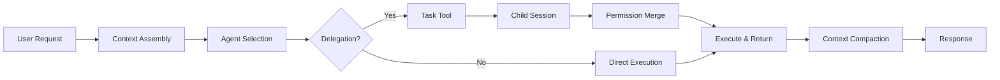

# OpenCode Unified Architecture Narrative

> **Purpose:** This document provides a unified architecture narrative and cross-document index for the OpenCode knowledge base, serving as the definitive navigation guide for understanding how all components work together as a cohesive system.

---

## Table of Contents

| Section | Anchor | Time Estimate |
|---------|--------|---------------|
| [Executive Summary](#executive-summary) | `#executive-summary` | 5 min |
| [Part 1: The Big Picture](#part-1-the-big-picture) | `#part-1-the-big-picture` | 15 min |
| [Part 2: Conceptual Hierarchy](#part-2-conceptual-hierarchy) | `#part-2-conceptual-hierarchy` | 20 min |
| [Part 3: Component Deep Dives](#part-3-component-deep-dives) | `#part-3-component-deep-dives` | 30 min |
| [Part 4: Cross-Document Index](#part-4-cross-document-index) | `#part-4-cross-document-index` | 10 min |
| [Part 5: Reading Paths](#part-5-reading-paths) | `#part-5-reading-paths` | 5 min |
| [Quick Reference Card](#quick-reference-card) | `#quick-reference-card` | 3 min |

---

## Executive Summary

### What is OpenCode?

OpenCode is an **AI agent orchestration framework** that enables sophisticated multi-agent workflows through deterministic context engineering, hierarchical session management, and intelligent delegation patterns. It provides the infrastructure for building meta-systems where AI agents can coordinate, delegate, and execute complex tasks autonomously.

### The Five Core Documents

| Document | Role | Primary Focus |
|----------|------|---------------|
| [`OPENCODE-CONCEPTS-ADVANCED.md`](OPENCODE-CONCEPTS-ADVANCED.md) | **Foundation Hub** | Architecture, Taxonomy, Configuration |
| [`OPENCODE-DETERMINISTIC-CONTEXT-AGENT-DELEGATION.md`](OPENCODE-DETERMINISTIC-CONTEX-AGENT-DELEGATION.md) | **Pattern Reference** | Context Engineering, Delegation Chains |
| [`opencode-full-sdk-mechanism.md`](opencode-full-sdk-mechanism.md) | **Implementation Hub** | SDK APIs, Session Manipulation, Hooks |
| [`opencode-sdk-QA-deepwiki.md`](opencode-sdk-QA-deepwiki.md) | **Q&A Reference** | Prompt Injection, Message Transformation |
| [`OPENCODE-PRIMARY-COORDINATOR-AGENT.md`](OPENCODE-PRIMARY-COORDINATOR-AGENT.md) | **Application Guide** | Coordinator Patterns, Team Intelligence |

### Key Architectural Decisions

1. **Agent Taxonomy**: Primary, Subagent, and "All" modes define agent visibility and delegation capability
2. **Permission System**: Last-match-wins ruleset with session-level overrides for fine-grained control
3. **Session Hierarchy**: Parent-child session relationships enable safe delegation with context isolation
4. **Context Management**: Auto-compaction and reminder injection maintain agent focus across long sessions
5. **Plugin Architecture**: Lifecycle hooks enable deep customization without core modifications

---

## Part 1: The Big Picture

### How OpenCode Works as a System

OpenCode operates as a **layered cognitive architecture** where each layer builds upon the previous:

```
┌─────────────────────────────────────────────────────────────────┐
│                    APPLICATION LAYER                            │
│         Primary Coordinator Agent (Strategic Orchestration)     │
│                     ↓ delegates to                              │
├─────────────────────────────────────────────────────────────────┤
│                     PATTERN LAYER                               │
│      Delegation Chains, Context Engineering, Wave Execution     │
│                     ↓ implemented via                           │
├─────────────────────────────────────────────────────────────────┤
│                    MECHANISM LAYER                              │
│       SDK APIs, Session Manipulation, Plugin Hooks              │
│                     ↓ built on                                  │
├─────────────────────────────────────────────────────────────────┤
│                    FOUNDATION LAYER                             │
│    Agent Taxonomy, Permission System, Configuration Hierarchy   │
└─────────────────────────────────────────────────────────────────┘
```

### The Core Loop: Request → Context → Action → Delegation



### Information Flow Between Components

| From | To | Mechanism | Purpose |
|------|-----|-----------|---------|
| Config Files | Agent System | Precedence Stack | Load agent definitions and permissions |
| Agent Description | Task Tool | Description Injection | Enable intelligent delegation decisions |
| Parent Session | Child Session | Permission Merge | Restrict subagent capabilities |
| Plugin Hooks | Message Pipeline | Transform Hooks | Modify context before LLM call |
| Compaction Engine | Session State | Continuation Prompt | Preserve context across turns |

---

## Part 2: Conceptual Hierarchy

### Foundation → Mechanism → Pattern → Application

The OpenCode knowledge base follows a **progressive disclosure** model:

#### Layer 1: Foundation (CONCEPTS-ADVANCED.md)

**What you learn:**
- Agent Taxonomy (Primary, Subagent, All)
- Configuration Hierarchy (7-level precedence stack)
- Permission System (Last-match-wins ruleset)
- Skills System (Domain-specific instruction packs)
- Tool Registry (Native and custom tools)

**Key Concepts:**
| Concept | Definition | Document Section |
|---------|------------|------------------|
| Agent Mode | Classification determining visibility and delegation capability | [#1-the-agent-taxonomy](OPENCODE-CONCEPTS-ADVANCED.md#1-the-agent-taxonomy) |
| Permission Ruleset | Ordered array of `{permission, pattern, action}` rules | [#4-the-permission-system](OPENCODE-CONCEPTS-ADVANCED.md#4-the-permission-system) |
| Config Precedence | 7-level merge order from remote to managed config | [#3-the-yamljson-configuration-hierarchy](OPENCODE-CONCEPTS-ADVANCED.md#3-the-yamljson-configuration-hierarchy) |

#### Layer 2: Mechanism (opencode-full-sdk-mechanism.md)

**What you learn:**
- Session Prompt Loop (How messages flow through the system)
- Context Injection Points (Where to intercept and modify)
- Plugin Hook System (Lifecycle events for customization)
- Compaction Mechanics (How context is preserved)

**Key Mechanisms:**
| Mechanism | Purpose | Document Section |
|-----------|---------|------------------|
| `insertReminders` | Inject synthetic system-reminder parts into user messages | [#q1-agent-context-direction](opencode-full-sdk-mechanism.md#q1-agent-context-direction) |
| `resolveTools` | Dynamic tool resolution based on agent and session context | [#q1-agent-context-direction](opencode-full-sdk-mechanism.md#q1-agent-context-direction) |
| Session Compaction | Summarize prior context into continuation prompt | [#q2-session-manipulation](opencode-full-sdk-mechanism.md#q2-session-manipulation) |

#### Layer 3: Pattern (DETERMINISTIC-CONTEXT-AGENT-DELEGATION.md)

**What you learn:**
- Progressive Context Injection (State-based context loading)
- Context Rot Prevention (Pollution avoidance across sessions)
- Wave-Based Execution (Parallel execution with dependencies)
- Quality Gates (Permission rules and tool hooks for validation)

**Key Patterns:**
| Pattern | Use Case | Document Section |
|---------|----------|------------------|
| Progressive Injection | Load context based on execution phase | [#1-progressive-context-injection-based-on-execution-state](OPENCODE-DETERMINISTIC-CONTEX-AGENT-DELEGATION.md#1-progressive-context-injection-based-on-execution-state) |
| Wave Execution | Parallel agent execution with dependency tracking | [#5-wave-based-parallel-execution-with-dependency-tracking](OPENCODE-DETERMINISTIC-CONTEX-AGENT-DELEGATION.md#5-wave-based-parallel-execution-with-dependency-tracking) |
| Quality Gates | Enforce standards through permission rules | [#4-implementing-quality-gates-through-permission-rules-and-tool-hooks](OPENCODE-DETERMINISTIC-CONTEX-AGENT-DELEGATION.md#4-implementing-quality-gates-through-permission-rules-and-tool-hooks) |

#### Layer 4: Application (PRIMARY-COORDINATOR-AGENT.md)

**What you learn:**
- Coordinator Philosophy (Beyond simple task routing)
- Team Intelligence (Agent capability matrices)
- Cognitive Frameworks (Deep traverse deduction)
- Delegation Mastery (When and how to delegate)

**Key Applications:**
| Application | Scenario | Document Section |
|-------------|----------|------------------|
| Agent Selection | Choosing the right agent for a task | [#team-intelligence-agent-domain-mastery](OPENCODE-PRIMARY-COORDINATOR-AGENT.md#team-intelligence-agent-domain-mastery) |
| Delegation Decision | Determining delegation strategy | [#delegation-mastery](OPENCODE-PRIMARY-COORDINATOR-AGENT.md#delegation-mastery) |
| Strategic Planning | Long-haul context governance | [#strategic-planning-capabilities](OPENCODE-PRIMARY-COORDINATOR-AGENT.md#strategic-planning-capabilities) |

---

## Part 3: Component Deep Dives

### 3.1 Agent System

**Foundation:** [`OPENCODE-CONCEPTS-ADVANCED.md`](OPENCODE-CONCEPTS-ADVANCED.md#1-the-agent-taxonomy)

The Agent System defines **who** performs work:

```
Agent Taxonomy
├── Primary Agents (User-facing, TUI-selectable)
│   ├── build (Default execution agent)
│   ├── plan (Read-only planning)
│   └── Custom primary agents
├── Subagents (Delegation-only workers)
│   ├── general (Multi-step research & execution)
│   ├── explore (Fast codebase search)
│   └── Custom subagents
└── "All" Mode (Both primary and subagent)
```

**Critical Fields:**
- `description` — Injected into Task tool for delegation decisions
- `permission` — Per-agent ruleset for access control
- `steps` — Max agentic loop iterations

**Cross-References:**
- SDK manipulation: [`opencode-full-sdk-mechanism.md`](opencode-full-sdk-mechanism.md#q1-agent-context-direction)
- Coordinator patterns: [`OPENCODE-PRIMARY-COORDINATOR-AGENT.md`](OPENCODE-PRIMARY-COORDINATOR-AGENT.md#team-intelligence-agent-domain-mastery)

### 3.2 Permission System

**Foundation:** [`OPENCODE-CONCEPTS-ADVANCED.md`](OPENCODE-CONCEPTS-ADVANCED.md#4-the-permission-system)

The Permission System defines **what** agents can do:

```
Permission Evaluation Flow
┌─────────────────────────────────────────────────────────────┐
│  Tool Call Request                                          │
│       ↓                                                     │
│  Merge Rulesets (defaults → user → agent → session)        │
│       ↓                                                     │
│  Find Last Match (glob pattern matching)                    │
│       ↓                                                     │
│  Action: allow | deny | ask                                 │
│       ↓                                                     │
│  Doom Loop Guard (3x identical call detection)              │
└─────────────────────────────────────────────────────────────┘
```

**Permission Categories:**
| Category | Tools Covered | Pattern Scope |
|----------|---------------|---------------|
| `edit` | edit, write, patch, multiedit | File glob patterns |
| `bash` | bash | Full command string |
| `task` | task | Agent name being delegated to |
| `skill` | skill | Skill name |

**Cross-References:**
- Quality gates: [`OPENCODE-DETERMINISTIC-CONTEX-AGENT-DELEGATION.md`](OPENCODE-DETERMINISTIC-CONTEX-AGENT-DELEGATION.md#4-implementing-quality-gates-through-permission-rules-and-tool-hooks)
- Session overrides: [`opencode-full-sdk-mechanism.md`](opencode-full-sdk-mechanism.md#q2-session-manipulation)

### 3.3 Session Management

**Foundation:** [`opencode-full-sdk-mechanism.md`](opencode-full-sdk-mechanism.md#q2-session-manipulation)

The Session System defines **where** context lives:

```
Session Hierarchy
┌─────────────────────────────────────────────────────────────┐
│  Main Session (Primary Agent)                               │
│  ├── Session ID: root-uuid                                  │
│  ├── Permission: Full ruleset                               │
│  ├── TODO: Owned                                            │
│  └── Child Sessions ↓                                       │
│      ┌─────────────────────────────────────────────────────┐│
│      │  Child Session (Subagent)                           ││
│      │  ├── Session ID: child-uuid                         ││
│      │  ├── Permission: Merged (restricted)                ││
│      │  ├── TODO: Denied                                   ││
│      │  └── task: Denied (unless explicitly granted)       ││
│      └─────────────────────────────────────────────────────┘│
└─────────────────────────────────────────────────────────────┘
```

**Session Lifecycle:**
1. **Creation** — Via `session.create` or Task tool delegation
2. **Prompt Loop** — `SessionPromptLoop` processes messages
3. **Compaction** — Auto-triggered at context threshold
4. **Export** — Via `export_cycle` for handoffs

**Cross-References:**
- Context management: [`OPENCODE-DETERMINISTIC-CONTEX-AGENT-DELEGATION.md`](OPENCODE-DETERMINISTIC-CONTEX-AGENT-DELEGATION.md#2-preventing-context-rot-and-pollution-across-delegated-sessions)
- Q&A reference: [`opencode-sdk-QA-deepwiki.md`](opencode-sdk-QA-deepwiki.md#q1)

### 3.4 Context Engineering

**Foundation:** [`OPENCODE-DETERMINISTIC-CONTEX-AGENT-DELEGATION.md`](OPENCODE-DETERMINISTIC-CONTEX-AGENT-DELEGATION.md#advanced-context-engineering--deterministic-steering-in-opencode)

Context Engineering defines **how** agents stay focused:

```
Context Injection Points
┌─────────────────────────────────────────────────────────────┐
│  System Prompt Assembly                                     │
│  ├── Agent prompt (overrides provider default)              │
│  ├── Provider-specific system prompt                        │
│  ├── InstructionPrompt files (AGENTS.md)                    │
│  └── Plugin system transform hooks                          │
├─────────────────────────────────────────────────────────────┤
│  Message Pipeline                                           │
│  ├── insertReminders (synthetic system-reminders)           │
│  ├── experimental.chat.messages.transform                   │
│  └── noReply prompts (context without response)             │
├─────────────────────────────────────────────────────────────┤
│  Compaction Continuity                                      │
│  ├── experimental.session.compacting hook                   │
│  └── Continuation prompt generation                         │
└─────────────────────────────────────────────────────────────┘
```

**Key Techniques:**
| Technique | Mechanism | Use Case |
|-----------|-----------|----------|
| Reminder Injection | `insertReminders` | Keep agent on task |
| Message Transform | Plugin hook | Rewrite context before LLM |
| noReply Prompts | SDK method | Add context silently |
| Compaction Hook | Plugin hook | Persist critical context |

**Cross-References:**
- SDK mechanisms: [`opencode-full-sdk-mechanism.md`](opencode-full-sdk-mechanism.md#q1-agent-context-direction)
- Q&A workarounds: [`opencode-sdk-QA-deepwiki.md`](opencode-sdk-QA-deepwiki.md#q1)

### 3.5 Delegation Patterns

**Foundation:** [`OPENCODE-PRIMARY-COORDINATOR-AGENT.md`](OPENCODE-PRIMARY-COORDINATOR-AGENT.md#delegation-mastery)

Delegation Patterns define **when** to delegate:

```
Delegation Decision Tree
┌─────────────────────────────────────────────────────────────┐
│  Task Requirements Analysis                                  │
│       ↓                                                     │
│  Domain Match? ─────────────────────────────────────────────┤
│       │ Yes                    │ No                          │
│       ↓                        ↓                             │
│  Select Specialist        Complexity > 7?                    │
│       │                    │ Yes    │ No                     │
│       │                    ↓         ↓                       │
│       │               hiveplanner  Direct Execution          │
│       │                                                     │
│  Scope Verification                                          │
│  ├── Check forbidden paths                                  │
│  ├── Verify file overlap                                    │
│  └── Assess dependencies                                    │
│       ↓                                                     │
│  Execution Mode: Sequential (default) | Parallel (isolated) │
└─────────────────────────────────────────────────────────────┘
```

**Delegation Best Practices:**
1. **Description Clarity** — Subagent descriptions must clearly state capabilities
2. **Permission Restriction** — Child sessions inherit restricted permissions
3. **Evidence Return** — Subagents must return actionable evidence
4. **No Recursive Delegation** — Default deny `task` in child sessions

**Cross-References:**
- Agent taxonomy: [`OPENCODE-CONCEPTS-ADVANCED.md`](OPENCODE-CONCEPTS-ADVANCED.md#1-the-agent-taxonomy)
- Wave execution: [`OPENCODE-DETERMINISTIC-CONTEX-AGENT-DELEGATION.md`](OPENCODE-DETERMINISTIC-CONTEX-AGENT-DELEGATION.md#5-wave-based-parallel-execution-with-dependency-tracking)

---

## Part 4: Cross-Document Index

### Concept-to-Section Mapping

| Concept | Foundation Doc | Mechanism Doc | Pattern Doc | Application Doc |
|---------|---------------|---------------|-------------|-----------------|
| **Agent Taxonomy** | [CONCEPTS §1](OPENCODE-CONCEPTS-ADVANCED.md#1-the-agent-taxonomy) | — | — | [COORDINATOR §Team](OPENCODE-PRIMARY-COORDINATOR-AGENT.md#team-intelligence-agent-domain-mastery) |
| **Permission System** | [CONCEPTS §4](OPENCODE-CONCEPTS-ADVANCED.md#4-the-permission-system) | — | [DELEGATION §4](OPENCODE-DETERMINISTIC-CONTEX-AGENT-DELEGATION.md#4-implementing-quality-gates-through-permission-rules-and-tool-hooks) | — |
| **Session Lifecycle** | [CONCEPTS §9](OPENCODE-CONCEPTS-ADVANCED.md#9-sessions) | [SDK §Q2](opencode-full-sdk-mechanism.md#q2-session-manipulation) | [DELEGATION §3](OPENCODE-DETERMINISTIC-CONTEX-AGENT-DELEGATION.md#3-maintaining-state-across-session-boundaries) | — |
| **Context Management** | [CONCEPTS §10](OPENCODE-CONCEPTS-ADVANCED.md#10-context-management) | [SDK §Q1](opencode-full-sdk-mechanism.md#q1-agent-context-direction) | [DELEGATION §1-2](OPENCODE-DETERMINISTIC-CONTEX-AGENT-DELEGATION.md#1-progressive-context-injection-based-on-execution-state) | — |
| **Plugin Hooks** | [CONCEPTS §11](OPENCODE-CONCEPTS-ADVANCED.md#11-the-plugin-system) | [SDK §Q1](opencode-full-sdk-mechanism.md#q1-agent-context-direction) | [DELEGATION §4](OPENCODE-DETERMINISTIC-CONTEX-AGENT-DELEGATION.md#4-implementing-quality-gates-through-permission-rules-and-tool-hooks) | — |
| **Delegation** | [CONCEPTS §1](OPENCODE-CONCEPTS-ADVANCED.md#1-the-agent-taxonomy) | — | [DELEGATION §Full](OPENCODE-DETERMINISTIC-CONTEX-AGENT-DELEGATION.md#advanced-context-engineering--deterministic-steering-in-opencode) | [COORDINATOR §Delegation](OPENCODE-PRIMARY-COORDINATOR-AGENT.md#delegation-mastery) |
| **Prompt Engineering** | [CONCEPTS §8](OPENCODE-CONCEPTS-ADVANCED.md#8-the-prompt-architecture) | [SDK §Q1](opencode-full-sdk-mechanism.md#q1-agent-context-direction) | — | — |
| **Configuration** | [CONCEPTS §3](OPENCODE-CONCEPTS-ADVANCED.md#3-the-yamljson-configuration-hierarchy) | — | — | — |
| **Skills System** | [CONCEPTS §6](OPENCODE-CONCEPTS-ADVANCED.md#6-the-skills-system) | — | — | — |
| **Tool Registry** | [CONCEPTS §7](OPENCODE-CONCEPTS-ADVANCED.md#7-tools--tooling) | — | — | — |

### Use Case to Document Mapping

| Use Case | Primary Document | Supporting Documents |
|----------|-----------------|---------------------|
| **Creating a custom agent** | [CONCEPTS §1-2](OPENCODE-CONCEPTS-ADVANCED.md#1-the-agent-taxonomy) | [COORDINATOR §Team](OPENCODE-PRIMARY-COORDINATOR-AGENT.md#team-intelligence-agent-domain-mastery) |
| **Implementing delegation** | [DELEGATION §Full](OPENCODE-DETERMINISTIC-CONTEX-AGENT-DELEGATION.md) | [CONCEPTS §4](OPENCODE-CONCEPTS-ADVANCED.md#4-the-permission-system), [COORDINATOR §Delegation](OPENCODE-PRIMARY-COORDINATOR-AGENT.md#delegation-mastery) |
| **Building a plugin** | [CONCEPTS §11](OPENCODE-CONCEPTS-ADVANCED.md#11-the-plugin-system) | [SDK §Q1](opencode-full-sdk-mechanism.md#q1-agent-context-direction), [QA §Q1](opencode-sdk-QA-deepwiki.md#q1) |
| **Managing context** | [SDK §Q1](opencode-full-sdk-mechanism.md#q1-agent-context-direction) | [DELEGATION §1-2](OPENCODE-DETERMINISTIC-CONTEX-AGENT-DELEGATION.md#1-progressive-context-injection-based-on-execution-state), [QA §Q1](opencode-sdk-QA-deepwiki.md#q1) |
| **Building a coordinator** | [COORDINATOR §Full](OPENCODE-PRIMARY-COORDINATOR-AGENT.md) | [DELEGATION §Full](OPENCODE-DETERMINISTIC-CONTEX-AGENT-DELEGATION.md), [CONCEPTS §1](OPENCODE-CONCEPTS-ADVANCED.md#1-the-agent-taxonomy) |
| **Troubleshooting sessions** | [QA §Full](opencode-sdk-QA-deepwiki.md) | [SDK §Q2](opencode-full-sdk-mechanism.md#q2-session-manipulation) |
| **Setting up permissions** | [CONCEPTS §4](OPENCODE-CONCEPTS-ADVANCED.md#4-the-permission-system) | [DELEGATION §4](OPENCODE-DETERMINISTIC-CONTEX-AGENT-DELEGATION.md#4-implementing-quality-gates-through-permission-rules-and-tool-hooks) |

### FAQ Cross-References

| Question | Answer Location |
|----------|----------------|
| How do I inject context without triggering a response? | [QA §Q1](opencode-sdk-QA-deepwiki.md#q1) - `noReply` prompts |
| How do I transform messages before the LLM sees them? | [QA §Q1](opencode-sdk-QA-deepwiki.md#q1) - `experimental.chat.messages.transform` |
| How do I prevent context rot in delegated sessions? | [DELEGATION §2](OPENCODE-DETERMINISTIC-CONTEX-AGENT-DELEGATION.md#2-preventing-context-rot-and-pollution-across-delegated-sessions) |
| How do I implement quality gates? | [DELEGATION §4](OPENCODE-DETERMINISTIC-CONTEX-AGENT-DELEGATION.md#4-implementing-quality-gates-through-permission-rules-and-tool-hooks) |
| How do I choose the right agent for a task? | [COORDINATOR §Team](OPENCODE-PRIMARY-COORDINATOR-AGENT.md#team-intelligence-agent-domain-mastery) |
| How do I configure agent permissions? | [CONCEPTS §4](OPENCODE-CONCEPTS-ADVANCED.md#4-the-permission-system) |
| How does session compaction work? | [SDK §Q1](opencode-full-sdk-mechanism.md#q1-agent-context-direction), [CONCEPTS §10](OPENCODE-CONCEPTS-ADVANCED.md#10-context-management) |
| What is the configuration precedence order? | [CONCEPTS §3](OPENCODE-CONCEPTS-ADVANCED.md#3-the-yamljson-configuration-hierarchy) |

---

## Part 5: Reading Paths

### Path 1: New Developer Onboarding

**Goal:** Understand OpenCode fundamentals and start using agents effectively.

**Time Estimate:** 2-3 hours

| Step | Document | Section | Time | Focus |
|------|----------|---------|------|-------|
| 1 | [CONCEPTS-ADVANCED](OPENCODE-CONCEPTS-ADVANCED.md) | §1 Agent Taxonomy | 15 min | Understand agent types |
| 2 | [CONCEPTS-ADVANCED](OPENCODE-CONCEPTS-ADVANCED.md) | §3 Config Hierarchy | 10 min | Learn configuration loading |
| 3 | [CONCEPTS-ADVANCED](OPENCODE-CONCEPTS-ADVANCED.md) | §4 Permission System | 15 min | Understand access control |
| 4 | [CONCEPTS-ADVANCED](OPENCODE-CONCEPTS-ADVANCED.md) | §9 Sessions | 10 min | Learn session basics |
| 5 | [SDK-MECHANISM](opencode-full-sdk-mechanism.md) | §Q1 Context Direction | 15 min | Understand context flow |
| 6 | [QA-DEEPWIKI](opencode-sdk-QA-deepwiki.md) | §Q1 | 10 min | Learn injection techniques |

**Key Takeaways:**
- Agents are classified as Primary, Subagent, or All
- Configuration merges from 7 sources with defined precedence
- Permissions use last-match-wins evaluation
- Context can be injected at multiple points

### Path 2: Plugin Developer

**Goal:** Build plugins that extend OpenCode functionality.

**Time Estimate:** 3-4 hours

| Step | Document | Section | Time | Focus |
|------|----------|---------|------|-------|
| 1 | [CONCEPTS-ADVANCED](OPENCODE-CONCEPTS-ADVANCED.md) | §11 Plugin System | 20 min | Understand hook architecture |
| 2 | [SDK-MECHANISM](opencode-full-sdk-mechanism.md) | §Q1 Context Direction | 20 min | Learn injection points |
| 3 | [SDK-MECHANISM](opencode-full-sdk-mechanism.md) | §Q2 Session Manipulation | 15 min | Understand session hooks |
| 4 | [QA-DEEPWIKI](opencode-sdk-QA-deepwiki.md) | §Q1 | 20 min | Master message transformation |
| 5 | [DELEGATION](OPENCODE-DETERMINISTIC-CONTEX-AGENT-DELEGATION.md) | §4 Quality Gates | 15 min | Implement validation hooks |
| 6 | [CONCEPTS-ADVANCED](OPENCODE-CONCEPTS-ADVANCED.md) | §6 Skills System | 15 min | Create skill packs |

**Key Takeaways:**
- Plugin hooks are the primary extension mechanism
- `experimental.chat.messages.transform` enables message rewriting
- `experimental.session.compacting` enables context persistence
- Skills provide domain-specific instruction packs

### Path 3: Advanced Customization

**Goal:** Build sophisticated multi-agent systems with deterministic control.

**Time Estimate:** 5-6 hours

| Step | Document | Section | Time | Focus |
|------|----------|---------|------|-------|
| 1 | [CONCEPTS-ADVANCED](OPENCODE-CONCEPTS-ADVANCED.md) | Full document | 60 min | Complete foundation |
| 2 | [DELEGATION](OPENCODE-DETERMINISTIC-CONTEX-AGENT-DELEGATION.md) | §Full | 45 min | Master context engineering |
| 3 | [SDK-MECHANISM](opencode-full-sdk-mechanism.md) | §Full | 30 min | Deep SDK knowledge |
| 4 | [COORDINATOR](OPENCODE-PRIMARY-COORDINATOR-AGENT.md) | §Full | 45 min | Build coordinator agents |
| 5 | [QA-DEEPWIKI](opencode-sdk-QA-deepwiki.md) | §Full | 30 min | Advanced techniques |
| 6 | [KNOWLEDGE-SYNTHESIS-MAP](OPENCODE-KNOWLEDGE-SYNTHESIS-MAP.md) | §Full | 20 min | Understand relationships |

**Key Takeaways:**
- Progressive context injection enables state-based loading
- Wave execution enables parallel agent coordination
- Quality gates enforce standards through permissions
- Coordinator agents require deep understanding of all layers

### Path 4: Troubleshooting

**Goal:** Diagnose and fix issues with agent behavior.

**Time Estimate:** 1-2 hours

| Step | Document | Section | Time | Focus |
|------|----------|---------|------|-------|
| 1 | [QA-DEEPWIKI](opencode-sdk-QA-deepwiki.md) | §Q1 | 15 min | Context injection issues |
| 2 | [CONCEPTS-ADVANCED](OPENCODE-CONCEPTS-ADVANCED.md) | §4 Permission System | 10 min | Permission debugging |
| 3 | [SDK-MECHANISM](opencode-full-sdk-mechanism.md) | §Q2 | 10 min | Session issues |
| 4 | [DELEGATION](OPENCODE-DETERMINISTIC-CONTEX-AGENT-DELEGATION.md) | §2 Context Rot | 10 min | Context pollution |
| 5 | [CONCEPTS-ADVANCED](OPENCODE-CONCEPTS-ADVANCED.md) | §10 Context Management | 10 min | Compaction issues |

**Common Issues & Solutions:**
| Issue | Likely Cause | Solution Location |
|-------|--------------|-------------------|
| Agent not delegating | Description unclear | [CONCEPTS §2](OPENCODE-CONCEPTS-ADVANCED.md#2-the-agent-body) |
| Permission denied | Ruleset evaluation | [CONCEPTS §4](OPENCODE-CONCEPTS-ADVANCED.md#4-the-permission-system) |
| Context lost | Compaction behavior | [SDK §Q1](opencode-full-sdk-mechanism.md#q1-agent-context-direction) |
| Infinite loop | Doom loop guard | [CONCEPTS §4](OPENCODE-CONCEPTS-ADVANCED.md#4-the-permission-system) |
| Subagent overstepping | Permission merge | [CONCEPTS §4](OPENCODE-CONCEPTS-ADVANCED.md#4-the-permission-system) |

---

## Quick Reference Card

### Agent Taxonomy

| Mode | Visibility | Delegation | Example |
|------|------------|------------|---------|
| `primary` | TUI-selectable | Can delegate | `build`, `plan` |
| `subagent` | Hidden | Delegated to only | `general`, `explore` |
| `all` | Both | Both | Custom agents |

### Permission Actions

| Action | Behavior |
|--------|----------|
| `allow` | Proceed without asking |
| `deny` | Hard-block, throw `DeniedError` |
| `ask` | Prompt user (interactive only) |

### Configuration Precedence (Low → High)

1. Remote `.well-known/opencode`
2. Global `~/.config/opencode/opencode.json`
3. Custom (`OPENCODE_CONFIG` env)
4. Project `opencode.json`
5. `.opencode/` directories
6. `OPENCODE_CONFIG_CONTENT`
7. Managed `/etc/opencode/`

### Key Plugin Hooks

| Hook | Purpose |
|------|---------|
| `experimental.chat.messages.transform` | Modify messages before LLM |
| `experimental.chat.system.transform` | Modify system prompts |
| `experimental.session.compacting` | Customize compaction |
| `tool.execute.before` | Intercept tool calls |
| `tool.execute.after` | Post-process tool output |

### Session Hierarchy

```
Main Session (Primary)
├── Full permissions
├── Owns TODO
└── Can create child sessions
    └── Child Session (Subagent)
        ├── Merged (restricted) permissions
        ├── TODO: denied
        └── task: denied (unless granted)
```

### Context Injection Points

| Point | Mechanism | Use Case |
|-------|-----------|----------|
| System Prompt | Agent `prompt` field | Override provider default |
| Reminder | `insertReminders` | Keep agent on task |
| Transform | Plugin hook | Rewrite before LLM |
| noReply | SDK method | Add context silently |
| Compaction | Plugin hook | Persist across turns |

### Delegation Decision

```
1. Domain match? → Select specialist
2. Complexity > 7? → hiveplanner
3. Urgency = critical? → hivehealer
4. Verify scope (no forbidden path overlap)
5. Default: Sequential (Parallel only if isolated)
```

---

## Document Relationships Diagram

```mermaid
flowchart TB
    subgraph Foundation["Foundation Layer"]
        CA["CONCEPTS-ADVANCED.md<br/>📖 Foundation Hub"]
    end
    
    subgraph Mechanism["Mechanism Layer"]
        SM["opencode-full-sdk-mechanism.md<br/>⚙️ Implementation Hub"]
        QA["opencode-sdk-QA-deepwiki.md<br/>❓ Q&A Reference"]
    end
    
    subgraph Pattern["Pattern Layer"]
        DD["DETERMINISTIC-CONTEXT-<br/>AGENT-DELEGATION.md<br/>🔗 Delegation Patterns"]
    end
    
    subgraph Application["Application Layer"]
        PC["PRIMARY-COORDINATOR-AGENT.md<br/>🎯 Coordinator Guide"]
    end
    
    subgraph Meta["Meta Layer"]
        KS["KNOWLEDGE-SYNTHESIS-MAP.md<br/>🗺️ Relationship Map"]
        AN["ARCHITECTURE-NARRATIVE.md<br/>📘 This Document"]
    end
    
    CA -->|"Architecture Concepts"| SM
    CA -->|"Agent Taxonomy"| DD
    CA -->|"Configuration Hierarchy"| PC
    CA -->|"Permission System"| DD
    
    SM <-->|"Complementary Reference"| QA
    SM -->|"SDK Hooks"| DD
    SM -->|"Session APIs"| PC
    
    DD -->|"Delegation Patterns"| PC
    DD -->|"Context Engineering"| PC
    
    QA -.->|"Workarounds"| DD
    
    KS -->|"Synthesizes"| AN
    CA -->|"Foundation"| AN
    SM -->|"Mechanisms"| AN
    DD -->|"Patterns"| AN
    PC -->|"Application"| AN
    
    style CA fill:#4A90D9,stroke:#2E5A8B,color:#fff
    style SM fill:#50C878,stroke:#2E8B57,color:#fff
    style QA fill:#50C878,stroke:#2E8B57,color:#fff
    style DD fill:#FFB347,stroke:#CC8800,color:#fff
    style PC fill:#FF6B6B,stroke:#CC5555,color:#fff
    style KS fill:#9B59B6,stroke:#7D3C98,color:#fff
    style AN fill:#1ABC9C,stroke:#16A085,color:#fff
```



---

## Next Steps

1. **New to OpenCode?** Start with [Reading Path 1: New Developer Onboarding](#path-1-new-developer-onboarding)
2. **Building a plugin?** Follow [Reading Path 2: Plugin Developer](#path-2-plugin-developer)
3. **Building complex systems?** Take [Reading Path 3: Advanced Customization](#path-3-advanced-customization)
4. **Something not working?** Use [Reading Path 4: Troubleshooting](#path-4-troubleshooting)

---

*This document is maintained as part of the OpenCode knowledge base. For updates and contributions, refer to the [Knowledge Synthesis Map](OPENCODE-KNOWLEDGE-SYNTHESIS-MAP.md).*
