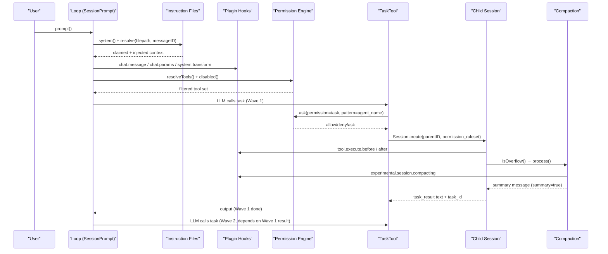

## Table of Contents

| Section | Topic | Anchor |
|---------|-------|--------|
| Q3 | Meta-Framework Context | #q3 |
| Q3 Answer | Advanced Context Engineering Techniques | #advanced-context-engineering--deterministic-steering-in-opencode |
| Q4 Answer | Architecture Overview | #architecture-overview |
| Q4 Answer | Progressive Context Injection | #1-progressive-context-injection-based-on-execution-state |
| Q4 Answer | Context Rot Prevention | #2-preventing-context-rot-and-pollution-across-delegated-sessions |
| Q4 Answer | State Persistence | #3-maintaining-state-across-session-boundaries |
| Q4 Answer | Quality Gates | #4-implementing-quality-gates-through-permission-rules-and-tool-hooks |
| Q4 Answer | Wave-Based Execution | #5-wave-based-parallel-execution-with-dependency-tracking |

---

## Q3
Can you also enlighten me on topics, techniques, and concepts of advanced steering and context-engineering toward driving both programmatically and deterministically by chaining and combining with the above advanced concepts for a complex, spec-driven, test-driven development where context-engineering, prompting techniques that utilizing hooks, scripts, agents of domains specific delegate multi-level cycles of delegation and hand-off workflows  - improving  without any compromising of either autonomy, agent self-governance, quality-gatekeeping, prevention of context rot and context pollution - the workflows that heavy on iterative  tech stacks research and synthesis,  of the complexity that cross-dependencies, cross-architectures maintaining the accuracy by the swarms of agents and workflows chained and parsed through structured and pre-determined schematic and symlinks context for example - this knowledge will become  essential for meta-builder engineer the lower-level subagents, agents of domain-specific and the concepts to coordinate the flows.

The example of such can be taken through a meta-framework below, though this is not built exclusively on OpenCode this demonstrate what I meant above - because I want to create something much more holistic

```markdown

## Workflow Diagrams

### Full Project Lifecycle

```
  ┌──────────────────────────────────────────────────┐
  │                   NEW PROJECT                    │
  │  /gsd:new-project                                │
  │  Questions -> Research -> Requirements -> Roadmap│
  └─────────────────────────┬────────────────────────┘
                            │
             ┌──────────────▼─────────────┐
             │      FOR EACH PHASE:       │
             │                            │
             │  ┌────────────────────┐    │
             │  │ /gsd:discuss-phase │    │  <- Lock in preferences
             │  └──────────┬─────────┘    │
             │             │              │
             │  ┌──────────▼─────────┐    │
             │  │ /gsd:plan-phase    │    │  <- Research + Plan + Verify
             │  └──────────┬─────────┘    │
             │             │              │
             │  ┌──────────▼─────────┐    │
             │  │ /gsd:execute-phase │    │  <- Parallel execution
             │  └──────────┬─────────┘    │
             │             │              │
             │  ┌──────────▼─────────┐    │
             │  │ /gsd:verify-work   │    │  <- Manual UAT
             │  └──────────┬─────────┘    │
             │             │              │
             │     Next Phase?────────────┘
             │             │ No
             └─────────────┼──────────────┘
                            │
            ┌───────────────▼──────────────┐
            │  /gsd:audit-milestone        │
            │  /gsd:complete-milestone     │
            └───────────────┬──────────────┘
                            │
                   Another milestone?
                       │          │
                      Yes         No -> Done!
                       │
               ┌───────▼──────────────┐
               │  /gsd:new-milestone  │
               └──────────────────────┘
```

### Planning Agent Coordination

```
  /gsd:plan-phase N
         │
         ├── Phase Researcher (x4 parallel)
         │     ├── Stack researcher
         │     ├── Features researcher
         │     ├── Architecture researcher
         │     └── Pitfalls researcher
         │           │
         │     ┌──────▼──────┐
         │     │ RESEARCH.md │
         │     └──────┬──────┘
         │            │
         │     ┌──────▼──────┐
         │     │   Planner   │  <- Reads PROJECT.md, REQUIREMENTS.md,
         │     │             │     CONTEXT.md, RESEARCH.md
         │     └──────┬──────┘
         │            │
         │     ┌──────▼───────────┐     ┌────────┐
         │     │   Plan Checker   │────>│ PASS?  │
         │     └──────────────────┘     └───┬────┘
         │                                  │
         │                             Yes  │  No
         │                              │   │   │
         │                              │   └───┘  (loop, up to 3x)
         │                              │
         │                        ┌─────▼──────┐
         │                        │ PLAN files │
         │                        └────────────┘
         └── Done
```

### Validation Architecture (Nyquist Layer)

During plan-phase research, GSD now maps automated test coverage to each phase
requirement before any code is written. This ensures that when Claude's executor
commits a task, a feedback mechanism already exists to verify it within seconds.

The researcher detects your existing test infrastructure, maps each requirement to
a specific test command, and identifies any test scaffolding that must be created
before implementation begins (Wave 0 tasks).

The plan-checker enforces this as an 8th verification dimension: plans where tasks
lack automated verify commands will not be approved.

**Output:** `{phase}-VALIDATION.md` -- the feedback contract for the phase.

**Disable:** Set `workflow.nyquist_validation: false` in `/gsd:settings` for
rapid prototyping phases where test infrastructure isn't the focus.

### Execution Wave Coordination

```
  /gsd:execute-phase N
         │
         ├── Analyze plan dependencies
         │
         ├── Wave 1 (independent plans):
         │     ├── Executor A (fresh 200K context) -> commit
         │     └── Executor B (fresh 200K context) -> commit
         │
         ├── Wave 2 (depends on Wave 1):
         │     └── Executor C (fresh 200K context) -> commit
         │
         └── Verifier
               └── Check codebase against phase goals
                     │
                     ├── PASS -> VERIFICATION.md (success)
                     └── FAIL -> Issues logged for /gsd:verify-work
```

### Brownfield Workflow (Existing Codebase)

```
  /gsd:map-codebase
         │
         ├── Stack Mapper     -> codebase/STACK.md
         ├── Arch Mapper      -> codebase/ARCHITECTURE.md
         ├── Convention Mapper -> codebase/CONVENTIONS.md
         └── Concern Mapper   -> codebase/CONCERNS.md
                │
        ┌───────▼──────────┐
        │ /gsd:new-project │  <- Questions focus on what you're ADDING
        └──────────────────┘
```

---

1. starting with `command`  + flagging - i.e `/gsd-phase-planning --phase-1`  →  https://github.com/gsd-build/get-shit-done/blob/main/commands/gsd/plan-phase.md   (this include $ARGUMENT with flags - and deterministic scripting as context → users manually copy and paste from the last output of agent’s suggestion. 
    1. the commands are stacked with agent-specific → and they are often engineered with “prompting techniques” like “progressive disclosure patterns” to bundle with “content and context for specificity and in-depth instruction of that of workflows - for example this https://github.com/gsd-build/get-shit-done/blob/main/get-shit-done/workflows/plan-phase.md is for planning a phase, guidelines through templates (and these can be bundled as for they also applying techniques of subagent delegation so the chains can go further as of what promptings to send to subagent of the assigned flow, the expected returned etc) → https://github.com/gsd-build/get-shit-done/tree/main/get-shit-done/templates you can bash listing and sample some of them 
    2. they can be more complex depends on which one if it needs routing or packed with 
2. planning agent get initiated in new context = new session https://github.com/gsd-build/get-shit-done/blob/main/agents/gsd-planner.md 
3. The other group I would call them “the context-engineering and quality-gate facilitators” -  they act as utilities through toolings and also chained with the command workflow learn more here https://github.com/gsd-build/get-shit-done/tree/main/get-shit-done/references - bash listing and synthesize how they utilize “atomic git committing” for both planning and implementing activities with STATE context control. 
    1.  there is also a global facilitator like this context-engineering hook https://github.com/gsd-build/get-shit-done/blob/main/hooks/gsd-context-monitor.js

**The summary below is the “toolings”** 

summary of them, toolings, and in-code is here https://github.com/gsd-build/get-shit-done/blob/main/get-shit-done/bin/gsd-tools.cjs
```
### Answer
<!-- CLASSIFICATION: context-engineering, deterministic-control, meta-builder -->
<!-- SYNTHESIS-TAGS: multi-level-delegation, plugin-hooks, progressive-disclosure, permission-guards, context-packets -->
<!-- FAST-TRACK: context-engineering-patterns, deterministic-delegation, plugin-architecture, progressive-disclosure, permission-systems -->
# Advanced Context Engineering & Deterministic Steering in OpenCode

## Core Techniques for Programmatic Agent Control

### 1. Multi-Level Delegation Chains with Structured Packets

Create command workflows that enforce deterministic hand-offs:

```yaml
# .opencode/commands/phase-research.md
---
description: "Execute phase research with parallel subagents"
agent: "phase-coordinator"
subtask: true
---
Phase Research: $1
Research Areas:
- Stack Research -> @stack-researcher
- Feature Research -> @feature-researcher  
- Architecture Research -> @arch-researcher
- Risk Research -> @risk-researcher

Deliverable: RESEARCH.md with consolidated findings
Validation: All 4 areas must complete before synthesis
``` opencode:656-663 

### 2. Context Engineering via Plugin Hooks

Implement context governance that prevents rot:

```ts
// .opencode/plugins/context-engineering.ts
export default function({ client }) {
  return {
    "chat.message": async (msg) => {
      // Enforce session initialization
      if (!msg.sessionDeclared) {
        await injectSkill("session-lifecycle");
      }
      
      // Track context drift
      const drift = calculateDrift(msg);
      if (drift > 0.4) {
        await injectSkill("context-recovery");
      }
    },
    
    "tool.execute.before": async ({ tool, args }) => {
      // Quality gate before tool execution
      if (tool === "task") {
        await validateDelegationPacket(args);
      }
    }
  };
}
``` opencode:783-830 

### 3. Progressive Disclosure Architecture

Structure skills to load context incrementally:

```yaml
# .opencode/skills/phase-planning/SKILL.md
---
name: phase-planning
description: "Multi-phase planning with progressive disclosure"
---
## Level 0: Discovery (always loaded)
- Check phase dependencies
- Load basic template structure

## Level 1: Triage (on phase match)
- Load full phase template
- Initialize research trackers

## Level 2: Deep Research (complexity > 7)
- Load architecture references
- Enable cross-dependency mapping

## Level 3: Full Synthesis (multi-phase)
- Load entire framework context
- Enable systemic pattern matching
``` opencode:16-24 

### 4. Deterministic Permission Guards

Configure permissions to enforce quality gates:

```json
{
  "permission": {
    "task": {
      "*": "deny",
      "phase-*": "allow",
      "research-*": "allow"
    },
    "edit": {
      "src/**": "deny",
      "tests/**": "deny",
      "plans/**": "allow"
    },
    "skill": {
      "framework-*": "ask",
      "critical-*": "ask"
    },
    "doom_loop": "deny"
  }
}
``` opencode:30-62 

## Implementation Patterns

### 1. Wave-Based Execution Coordination

```yaml
# .opencode/commands/execute-wave.md
---
description: "Execute dependency-aware wave parallelization"
agent: "wave-coordinator"
subtask: true
---
Wave Execution for Phase: $1

Dependency Analysis:
- Parse PLAN.md for task dependencies
- Build dependency graph
- Identify independent tasks (Wave 1)

Wave 1 (Parallel):
- Execute: @executor-a task-1
- Execute: @executor-b task-2
- Execute: @executor-c task-3

Wave 2 (Sequential):
- Wait for Wave 1 completion
- Execute dependent tasks
- Validate wave outputs

Quality Gates:
- Each task must return evidence bundle
- Failed tasks trigger rollback protocol
- Success updates phase trajectory
```

### 2. Cross-Session Context Persistence

```markdown
# AGENTS.md (project root)
## Phase Context Persistence
- Active Phase: {current_phase}
- Phase Trajectory: {trajectory_id}
- Last Wave: {wave_number}
- Pending Dependencies: {dependency_list}
- Quality Gates Status: {gate_status}

## Research Synthesis Cache
- Stack Research: {stack_research_summary}
- Architecture Patterns: {arch_patterns}
- Risk Assessment: {risk_matrix}
- Test Coverage Map: {test_coverage}
``` opencode:13-29 

### 3. Anti-Pattern Prevention System

```ts
// .opencode/tools/context-validator.ts
export default {
  description: "Validates context integrity before operations",
  args: { 
    operation: z.enum(["delegate", "edit", "phase_transition"]),
    context: z.object({
      phase: z.string(),
      wave: z.number(),
      dependencies: z.array(z.string())
    })
  },
  async execute(args, ctx) {
    // Check for context rot
    if (args.context.wave > 1 && !hasWaveCompletion(args.context.phase, args.context.wave - 1)) {
      throw new Error("Wave dependency violation");
    }
    
    // Validate scope boundaries
    if (args.operation === "edit" && isOutsideScope(args.context)) {
      throw new Error("Scope creep detected");
    }
    
    return { valid: true, checks: ["dependencies", "scope", "quality_gates"] };
  }
};
``` opencode:34-58 

## Quality Gate Architecture

### 1. Validation Layers

```yaml
# .opencode/skills/validation-layers/SKILL.md
---
name: validation-layers
description: "Multi-layer validation framework"
---
## Layer 1: Input Validation
- Verify delegation packet completeness
- Check permission boundaries
- Validate context integrity

## Layer 2: Process Validation  
- Monitor execution in real-time
- Check for doom_loop patterns
- Validate intermediate outputs

## Layer 3: Output Validation
- Verify evidence bundle completeness
- Check test coverage requirements
- Validate architectural compliance

## Layer 4: System Validation
- Update phase trajectory
- Persist learnings to memory
- Trigger next wave if ready
```

### 2. Evidence-Based Verification

```yaml
# .opencode/commands/verify-phase.md
---
description: "Verify phase completion with evidence"
agent: "phase-verifier"
subtask: true
---
Phase Verification: $1

Required Evidence:
- [ ] All tasks completed with status
- [ ] Test coverage > 80%
- [ ] Architecture compliance check
- [ ] No outstanding blockers
- [ ] Dependencies resolved

Validation Commands:
- npm test --coverage
- npm run lint
- npm run type-check
- npm run security-audit

Failure Protocol:
- Log issues in PHASE_ISSUES.md
- Create recovery tasks
- Rollback if critical failures
```

## Context Engineering Best Practices

### GREEN Flags (Do These)

- ✅ Use plugin hooks for automatic context injection
- ✅ Structure skills with progressive disclosure levels
- ✅ Implement permission-based quality gates
- ✅ Maintain cross-session context via AGENTS.md
- ✅ Use deterministic command templates
- ✅ Validate delegation packets before execution
- ✅ Track context drift and trigger recovery
- ✅ Persist evidence bundles for verification

### RED Flags (Avoid These)

- ❌ Loading all skills at once (causes context pollution)
- ❌ Skipping permission validation for speed
- ❌ Delegating without structured context packets
- ❌ Ignoring doom_loop detection
- ❌ Manual context copying between sessions
- ❌ Flat context without hierarchical organization
- ❌ Skipping evidence verification
- ❌ Allowing unrestricted edit permissions opencode:32-48 

## Advanced Techniques

### 1. Context Schematics with Symlinks

```bash
# Create structured context links
.ln -s .opencode/schemas/phase-schema.json .phase/SCHEMA.json
.ln -s .opencode/templates/phase-template.md .phase/TEMPLATE.md
.ln -s AGENTS.md .phase/CONTEXT.md
```

### 2. Atomic Git State Management

```yaml
# .opencode/commands/commit-phase.md
---
description: "Atomically commit phase state"
agent: "state-manager"
---
Commit Phase State: $1

Atomic Operations:
- Commit phase artifacts
- Tag with phase identifier
- Update trajectory pointer
- Lock phase for verification

Rollback Protocol:
- If verification fails
- Reset to phase tag
- Restore previous context
- Log rollback reason
```

### 3. Cross-Architecture Dependency Mapping

```ts
// .opencode/tools/dependency-mapper.ts
export default {
  description: "Map cross-architecture dependencies",
  args: { phase: z.string() },
  async execute(args, ctx) {
    const dependencies = await parsePhasePlan(args.phase);
    const graph = buildDependencyGraph(dependencies);
    const waves = calculateExecutionWaves(graph);
    
    return {
      graph,
      waves,
      critical_path: findCriticalPath(graph),
      risk_points: identifyRisks(graph)
    };
  }
};
```

This architecture enables sophisticated, deterministic control over agent swarms while maintaining context integrity and quality gates throughout complex, multi-phase development workflows. opencode:68-247 

Wiki pages you might want to explore:
- [Overview (anomalyco/opencode)](/wiki/anomalyco/opencode#1)
### Citations
## Q4
Can you also enlighten me on topics, techniques, and concepts of advanced steering and context-engineering toward driving both programmatically and deterministically by chaining and combining with the above advanced concepts for a complex, spec-driven, test-driven development where context-engineering, prompting techniques that utilizing hooks, scripts, agents of domains specific delegate multi-level cycles of delegation and hand-off workflows  - improving  without any compromising of either autonomy, agent self-governance, quality-gatekeeping, prevention of context rot and context pollution - the workflows that heavy on iterative  tech stacks research and synthesis,  of the complexity that cross-dependencies, cross-architectures maintaining the accuracy by the swarms of agents and workflows chained and parsed through structured and pre-determined schematic and symlinks context for example - this knowledge will become  essential for meta-builder engineer the lower-level subagents, agents of domain-specific and the concepts to coordinate the flows.
### Answer
<!-- CLASSIFICATION: context-engineering, system-architecture, deep-technical -->
<!-- SYNTHESIS-TAGS: plugin-hooks, session-compaction, permission-rulesets, task-tool, batch-tool, five-systems-integration -->
<!-- FAST-TRACK: plugin-architecture, session-management, permission-engine, multi-agent-workflows, context-injection, state-persistence, quality-gates -->
# OpenCode: Deterministic Context Engineering & Multi-Level Delegation

OpenCode's architecture weaves together five interlocking systems — plugin hooks, instruction file resolution, session compaction, the permission ruleset engine, and the `task`/`batch` tools — into a coherent framework for deterministic, multi-agent workflows. Here is a deep technical breakdown of each mechanism.

---

<!-- CLASSIFICATION: system-architecture, integration, visualization -->
<!-- SYNTHESIS-TAGS: mermaid-diagram, system-flow, five-mechanisms, pipeline-overview -->
<!-- FAST-TRACK: architecture-overview, system-integration, workflow-diagrams -->
## Architecture Overview

```mermaid
graph TD
  "User Prompt" --> "SessionPrompt.prompt()"
  "SessionPrompt.prompt()" --> "createUserMessage()"
  "createUserMessage()" --> "InstructionPrompt.resolve()"
  "createUserMessage()" --> "Plugin.trigger(chat.message)"
  "SessionPrompt.prompt()" --> "SessionPrompt.loop()"
  "SessionPrompt.loop()" --> "resolveTools()"
  "resolveTools()" --> "PermissionNext.ask()"
  "resolveTools()" --> "Plugin.trigger(tool.execute.before/after)"
  "SessionPrompt.loop()" --> "SessionCompaction.isOverflow()"
  "SessionCompaction.isOverflow()" --> "SessionCompaction.process()"
  "SessionCompaction.process()" --> "Plugin.trigger(experimental.session.compacting)"
  "SessionPrompt.loop()" --> "TaskTool.execute()"
  "TaskTool.execute()" --> "Session.create(parentID, permission)"
  "TaskTool.execute()" --> "SessionPrompt.prompt() [child]"
  "BatchTool.execute()" --> "Promise.all(tool calls)"
```

---

<!-- CLASSIFICATION: context-injection, prompt-engineering, layer-architecture -->
<!-- SYNTHESIS-TAGS: system-prompts, instruction-files, walk-up-discovery, claim-system, ephemeral-reminders, plan-mode -->
<!-- FAST-TRACK: context-injection, system-prompts, instruction-resolution, plugin-hooks, plan-mode-injection -->
## 1. Progressive Context Injection Based on Execution State

Context is built up incrementally across multiple layers, each triggered by different execution events.

### Layer 1: Static System Instructions (Always Applied)
At the start of every LLM call, the `LLM.stream()` function assembles the system prompt by composing the agent's own prompt, the provider-specific prompt, and any per-user-message `system` override. This is always the first stratum of context. opencode:67-91 

Plugins can reshape the system prompt after initial assembly via the `experimental.chat.system.transform` hook, and the result is re-joined to maintain a two-part structure for KV-cache efficiency. opencode:84-97 

### Layer 2: Instruction File Resolution (Walk-Up Discovery)
`InstructionPrompt.system()` scans the filesystem upward from the working directory to find `AGENTS.md`, `CLAUDE.md`, and `CONTEXT.md` files, including files referenced as URLs or absolute paths from config. opencode:71-115 

The critical progression mechanism is `InstructionPrompt.resolve()`. When the agent reads a file with the `read` tool, this function is called to walk upward from the file's directory looking for instruction files *between* that file and the project root. This means context is **injected precisely when the agent enters a new subdirectory** — it is not injected upfront. opencode:171-196 

A **claim** system prevents the same instruction file from being injected more than once per message turn: `claim()` records per-message-ID which files have already been loaded, and `isClaimed()` gates re-injection. opencode:51-68 

The `InstructionPrompt.loaded()` function also inspects existing `read` tool parts in the message history to avoid reloading files that are already in context due to a prior, non-compacted tool call. opencode:147-162 

### Layer 3: Ephemeral Reminders Injected Mid-Loop
When the session loop is on step > 1 and there are queued user messages, `SessionPrompt.loop()` wraps those messages in a `<system-reminder>` block before passing them to the model. This is done on an ephemeral clone of the messages and is never written to the database. opencode:629-648 

### Layer 4: Plan-Mode Phase-Based Injection
`insertReminders()` detects agent mode transitions (plan → build, build → plan) and ephemerally inserts phase-appropriate system reminders. When entering plan mode, a full multi-phase workflow prompt is inserted, structuring the agent into exploration, design, review, and final-plan phases. opencode:1374-1458 

### Layer 5: Plugin Hook on Every New Message
Every new user message creation triggers `Plugin.trigger("chat.message", ...)`, allowing any plugin to inspect or mutate both the `UserMessage` object and its `parts` array before they are committed to the database. opencode:1295-1313 

---

<!-- CLASSIFICATION: context-management, session-lifecycle, compaction -->
<!-- SYNTHESIS-TAGS: context-rot-prevention, session-compaction, filter-compacted, prune, child-sessions, isolation -->
<!-- FAST-TRACK: context-rot, session-compaction, context-pollution, child-session-isolation, compaction-agent -->
## 2. Preventing Context Rot and Pollution Across Delegated Sessions

### Compaction: Summarize and Truncate Stale History
When token usage hits the overflow threshold (model context minus a reserved buffer of 20,000 tokens or the model's max output, whichever is smaller), `SessionCompaction.isOverflow()` triggers. opencode:30-48 

`SessionCompaction.process()` sends the entire conversation history to a dedicated **compaction agent** (which has all tools denied by default) with a structured prompt requesting a Goal/Instructions/Discoveries/Accomplished/Files summary. The resulting assistant message is tagged `summary: true`, which acts as a session boundary marker. opencode:101-179 

The compaction prompt can be overridden or extended by plugins via `experimental.session.compacting`, allowing domain-specific context preservation rules. opencode:145-149 

### `filterCompacted()`: Horizon-Based History Trimming
`MessageV2.filterCompacted()` walks the message stream in reverse and stops loading older history once it finds a compaction boundary — an assistant `summary` message whose `parentID` is covered by a `compaction` part in a user message. Only messages after the last compaction are sent to the model. opencode:794-809 

### Prune: Timestamp-Gated Tool Output Erasure
`SessionCompaction.prune()` goes backward through all tool call parts and marks old, bulky tool outputs as `compacted` (setting `state.time.compacted`). When `toModelMessages()` converts parts to LLM-facing messages, any compacted tool output is replaced with `"[Old tool result content cleared]"`. The `skill` tool is protected from pruning. opencode:51-99 opencode:619-622 

### Child Sessions Are Isolated Namespaces
Child sessions created by `TaskTool` receive their own `parentID` and a hardcoded permission ruleset that **denies `todowrite`, `todoread`, and (unless the agent has the `task` permission) `task`** itself. This prevents a child session from mutating the parent's todo list or spawning unauthorized sub-sub-agents. opencode:72-102 

---

<!-- CLASSIFICATION: state-management, session-persistence, data-layer -->
<!-- SYNTHESIS-TAGS: sqlite-storage, task-resumption, compaction-handoff, claim-cleanup, permission-persistence, cross-session -->
<!-- FAST-TRACK: state-persistence, session-storage, task-resumption, sqlite-backend, compaction-protocol -->
## 3. Maintaining State Across Session Boundaries

### Persistent SQLite-Backed Message Store
All messages and parts are stored in SQLite via `Session.updateMessage()` and `Session.updatePart()` using upsert semantics. The `MessageTable` and `PartTable` use cascade deletes for structural integrity. The session's `parentID` field creates a persistent parent-child link. opencode:581-666 

### Task Resumption via `task_id`
`TaskTool` exposes a `task_id` parameter that accepts a prior session ID. When provided, instead of creating a fresh child session, it looks up the existing session by ID and continues prompting into it, preserving all previous message history. opencode:66-102 

### Compaction as a Cross-Boundary Handoff Protocol
The compaction summary is specifically structured for agent handoff: it captures goal, instructions, discoveries, work accomplished, and relevant file paths. The comment in the code makes the intent explicit — *"The summary that you construct will be used so that another agent can read it and continue the work."* opencode:151-177 

### `InstructionPrompt.clear()`: Turn-Scoped Claim Cleanup
Instruction file claims are scoped per message turn using `defer(() => InstructionPrompt.clear(info.id))`. This ensures that when a new turn starts, the walk-up discovery will re-check which instruction files need injection, avoiding false "already loaded" states. opencode:596-596 

### `Session.Info.permission`: Persisted Per-Session Ruleset
The `permission` field on `Session.Info` is a full `PermissionNext.Ruleset` array stored in the database alongside the session. This allows child sessions to carry their constrained ruleset across process restarts or reconnects. opencode:142-143 

---

<!-- CLASSIFICATION: quality-gates, permission-system, governance -->
<!-- SYNTHESIS-TAGS: ruleset-evaluation, permissionnext, ctx-ask, plugin-hooks, doom-loop, tool-definition, quality-validation -->
<!-- FAST-TRACK: quality-gates, permission-rules, plugin-hooks, tool-hooks, doom-loop-detection, automated-validation -->
## 4. Implementing Quality Gates Through Permission Rules and Tool Hooks

### The Ruleset Evaluation Engine
`PermissionNext.evaluate()` finds the **last matching rule** in a merged ruleset (using wildcard matching on both the `permission` name and the `pattern`). Last-wins semantics mean more-specific rules appended later override broader earlier rules. opencode:236-243 

Rulesets from two sources are always merged at call time: the **agent's own permission ruleset** and the **session's persisted permission ruleset**. This creates a two-level delegation lattice — what the agent allows, further constrained by what the session allows. opencode:773-780 

### Tool-Level Permission Gate (`ctx.ask`)
Every tool receives a `ctx.ask()` function in its `Tool.Context`. Calling it triggers `PermissionNext.ask()`, which evaluates the merged agent+session ruleset and either passes silently (`allow`), blocks with an explanation (`deny`), or suspends execution as a pending promise waiting for a human response (`ask`). opencode:131-161 

The three error types communicate distinct semantics to the loop: `RejectedError` (user rejected without message — halt), `CorrectedError` (user rejected with feedback — continue with guidance), and `DeniedError` (config rule auto-denied — halt with rule details). opencode:259-281 

### Plugin-Level Permission Gate (`permission.ask` hook)
Before a permission request blocks on human input, `Permission.ask()` fires `Plugin.trigger("permission.ask", info, { status: "ask" })`. A plugin can set the status to `"allow"` or `"deny"` to auto-resolve the gate programmatically — enabling fully automated CI-grade permission policies. opencode:133-142 

### `tool.execute.before` / `tool.execute.after` Hooks
Every tool execution — whether a built-in tool, an MCP tool, or a `task` subtask — is wrapped in `Plugin.trigger("tool.execute.before", ...)` and `Plugin.trigger("tool.execute.after", ...)` calls. Plugins can mutate `args` before execution and `output` after, enabling input sanitization, output transformation, logging, or test assertion gates. opencode:793-828 

### Doom-Loop Detection
`SessionProcessor` counts the last N tool parts on the current message. If the last `DOOM_LOOP_THRESHOLD` (3) parts are all the same tool called with identical inputs, it raises a `permission: "doom_loop"` request, which defaults to `"ask"` in all agents. This is a built-in quality gate against infinite repetition. opencode:150-176 

### `PermissionNext.disabled()`: Static Tool Removal
Before tools are even offered to the LLM, `LLM.resolveTools()` calls `PermissionNext.disabled()` to compute a set of tools whose top-level permission is `deny` with pattern `*`. Those tools are deleted from the tool map before `streamText()` is called, so the LLM never knows they exist. opencode:262-269 opencode:245-257 

### `tool.definition` Hook: Dynamic Tool Description Mutation
`ToolRegistry.tools()` calls `Plugin.trigger("tool.definition", { toolID }, output)` for every tool before it is registered, allowing plugins to rewrite the tool's description and parameters schema sent to the LLM. This is a powerful gate: you can narrow the tool's behavior at the prompt level. opencode:154-165 

---

<!-- CLASSIFICATION: parallel-execution, workflow-orchestration, concurrency -->
<!-- SYNTHESIS-TAGS: wave-execution, task-tool, batch-tool, subtaskpart, dependency-tracking, permission-filter, multi-call -->
<!-- FAST-TRACK: wave-execution, parallel-delegation, task-tool, batch-tool, dependency-tracking, agent-permissions -->
## 5. Wave-Based Parallel Execution with Dependency Tracking

### The `task` Tool: Forking Independent Child Sessions
`TaskTool.execute()` creates a child session with `Session.create({ parentID: ctx.sessionID, ... })`, then calls `SessionPrompt.prompt()` on that child session and awaits its result. The parent session is suspended while the child runs. opencode:66-163 

The LLM's tool-calling protocol naturally supports **wave-based parallelism**: because `streamText()` can return multiple tool calls in a single response, an orchestrator agent can invoke `task` multiple times in one assistant turn, and the AI SDK executes those tool calls concurrently. The task description explicitly encourages this: *"Launch multiple agents concurrently whenever possible, to maximize performance; to do that, use a single message with multiple tool uses."* opencode:19-19 

### The `batch` Tool: Intra-Turn Parallel Tool Execution
`BatchTool` accepts an array of `{ tool, parameters }` objects and executes them all with `Promise.all()`, up to 25 at once. Each call gets its own `PartTable` row with independent status tracking (`running` → `completed` / `error`). The output aggregates per-tool success/failure. opencode:32-132 

`BatchTool` is blocked from calling itself (preventing exponential fan-out) but any other tool in the registry can be batched. opencode:5-6 

### `SubtaskPart` for Command-Triggered Parallelism
A `SubtaskPart` in the message store acts as a deferred task descriptor. When the session loop finds a pending `SubtaskPart`, it directly invokes `TaskTool.execute()` with `bypassAgentCheck: true`, then continues the loop. This means command-invoked subtasks are serialized into the loop but avoid the human-facing permission check. opencode:352-526 

### Dependency Tracking via Sequential LLM Turns
True wave-based dependency tracking is handled by the LLM's own reasoning: the orchestrator receives tool results from Wave 1 before generating its next assistant message containing Wave 2's tool calls. The session loop's `while(true)` structure ensures each wave of tool calls completes before the next LLM call is made. opencode:294-326 

### Agent Permission Filter on Task Tool Discovery
`TaskTool`'s dynamic description is built by filtering available agents through `PermissionNext.evaluate("task", a.name, caller.permission)`. Agents that would be denied are excluded from the description entirely, so the LLM only sees agents it is permitted to spawn. opencode:31-41 

---

## How All Five Systems Work Together: An Integrated Picture



The five mechanisms form a deterministic pipeline:

1. **Instruction files** provide progressive, filesystem-anchored context injection scoped by the agent's exploration path, with claim locks preventing duplicate injection per turn.
2. **Compaction** prevents context rot by maintaining a rolling summary horizon and pruning stale tool outputs, with plugin hooks allowing custom summarization logic.
3. **`parentID` + `permission` on sessions** maintains hierarchical state across delegation boundaries, with task IDs enabling resumption.
4. **`PermissionNext` rulesets** (merged from agent + session), combined with `tool.execute.before/after` and `permission.ask` plugin hooks, create a layered quality gate that can be enforced statically (tool removal), dynamically (per-call `ask`), or programmatically (plugin auto-resolution).
5. **Multi-call tool invocation in a single LLM turn** (via `task` or `batch`) plus the loop's sequential-turn architecture provide wave-based parallelism with implicit dependency tracking via the LLM's own turn boundary.

---

## Notes

- **`batch` vs. `task` parallelism**: `batch` runs multiple tools inside the *same* session context and is best for I/O-parallel leaf operations. `task` creates *isolated* child sessions with their own permission namespaces and is best for delegation of autonomous multi-step subtasks.
- **The `experimental.batch_tool` flag** must be set to `true` in config for `BatchTool` to appear in the tool registry; it is not on by default. opencode:117-117 
- **The `doom_loop` permission** is `ask` by default (not `deny`), so it pauses for human confirmation rather than hard-stopping. Setting it to `deny` in config would make doom-loop detection a hard quality gate. opencode:55-57 
- **`PermissionNext` approved state is in-memory only** for the current session run; the code explicitly notes it is not yet persisted to disk. opencode:227-230
### Citations
**File:** packages/opencode/src/session/llm.ts (L67-97)
```typescript
    const system = []
    system.push(
      [
        // use agent prompt otherwise provider prompt
        // For Codex sessions, skip SystemPrompt.provider() since it's sent via options.instructions
        ...(input.agent.prompt ? [input.agent.prompt] : isCodex ? [] : SystemPrompt.provider(input.model)),
        // any custom prompt passed into this call
        ...input.system,
        // any custom prompt from last user message
        ...(input.user.system ? [input.user.system] : []),
      ]
        .filter((x) => x)
        .join("\n"),
    )

    const header = system[0]
    const original = clone(system)
    await Plugin.trigger(
      "experimental.chat.system.transform",
      { sessionID: input.sessionID, model: input.model },
      { system },
    )
    if (system.length === 0) {
      system.push(...original)
    }
    // rejoin to maintain 2-part structure for caching if header unchanged
    if (system.length > 2 && system[0] === header) {
      const rest = system.slice(1)
      system.length = 0
      system.push(header, rest.join("\n"))
    }
```
**File:** packages/opencode/src/session/llm.ts (L262-269)
```typescript
  async function resolveTools(input: Pick<StreamInput, "tools" | "agent" | "user">) {
    const disabled = PermissionNext.disabled(Object.keys(input.tools), input.agent.permission)
    for (const tool of Object.keys(input.tools)) {
      if (input.user.tools?.[tool] === false || disabled.has(tool)) {
        delete input.tools[tool]
      }
    }
    return input.tools
```
**File:** packages/opencode/src/session/instruction.ts (L51-68)
```typescript
  function isClaimed(messageID: string, filepath: string) {
    const claimed = state().claims.get(messageID)
    if (!claimed) return false
    return claimed.has(filepath)
  }

  function claim(messageID: string, filepath: string) {
    const current = state()
    let claimed = current.claims.get(messageID)
    if (!claimed) {
      claimed = new Set()
      current.claims.set(messageID, claimed)
    }
    claimed.add(filepath)
  }

  export function clear(messageID: string) {
    state().claims.delete(messageID)
```
**File:** packages/opencode/src/session/instruction.ts (L71-115)
```typescript
  export async function systemPaths() {
    const config = await Config.get()
    const paths = new Set<string>()

    if (!Flag.OPENCODE_DISABLE_PROJECT_CONFIG) {
      for (const file of FILES) {
        const matches = await Filesystem.findUp(file, Instance.directory, Instance.worktree)
        if (matches.length > 0) {
          matches.forEach((p) => {
            paths.add(path.resolve(p))
          })
          break
        }
      }
    }

    for (const file of globalFiles()) {
      if (await Bun.file(file).exists()) {
        paths.add(path.resolve(file))
        break
      }
    }

    if (config.instructions) {
      for (let instruction of config.instructions) {
        if (instruction.startsWith("https://") || instruction.startsWith("http://")) continue
        if (instruction.startsWith("~/")) {
          instruction = path.join(os.homedir(), instruction.slice(2))
        }
        const matches = path.isAbsolute(instruction)
          ? await Array.fromAsync(
              new Bun.Glob(path.basename(instruction)).scan({
                cwd: path.dirname(instruction),
                absolute: true,
                onlyFiles: true,
              }),
            ).catch(() => [])
          : await resolveRelative(instruction)
        matches.forEach((p) => {
          paths.add(path.resolve(p))
        })
      }
    }

    return paths
```
**File:** packages/opencode/src/session/instruction.ts (L147-162)
```typescript
  export function loaded(messages: MessageV2.WithParts[]) {
    const paths = new Set<string>()
    for (const msg of messages) {
      for (const part of msg.parts) {
        if (part.type === "tool" && part.tool === "read" && part.state.status === "completed") {
          if (part.state.time.compacted) continue
          const loaded = part.state.metadata?.loaded
          if (!loaded || !Array.isArray(loaded)) continue
          for (const p of loaded) {
            if (typeof p === "string") paths.add(p)
          }
        }
      }
    }
    return paths
  }
```
**File:** packages/opencode/src/session/instruction.ts (L171-196)
```typescript
  export async function resolve(messages: MessageV2.WithParts[], filepath: string, messageID: string) {
    const system = await systemPaths()
    const already = loaded(messages)
    const results: { filepath: string; content: string }[] = []

    const target = path.resolve(filepath)
    let current = path.dirname(target)
    const root = path.resolve(Instance.directory)

    while (current.startsWith(root) && current !== root) {
      const found = await find(current)

      if (found && found !== target && !system.has(found) && !already.has(found) && !isClaimed(messageID, found)) {
        claim(messageID, found)
        const content = await Bun.file(found)
          .text()
          .catch(() => undefined)
        if (content) {
          results.push({ filepath: found, content: "Instructions from: " + found + "\n" + content })
        }
      }
      current = path.dirname(current)
    }

    return results
  }
```
**File:** packages/opencode/src/session/prompt.ts (L294-326)
```typescript
    while (true) {
      SessionStatus.set(sessionID, { type: "busy" })
      log.info("loop", { step, sessionID })
      if (abort.aborted) break
      let msgs = await MessageV2.filterCompacted(MessageV2.stream(sessionID))

      let lastUser: MessageV2.User | undefined
      let lastAssistant: MessageV2.Assistant | undefined
      let lastFinished: MessageV2.Assistant | undefined
      let tasks: (MessageV2.CompactionPart | MessageV2.SubtaskPart)[] = []
      for (let i = msgs.length - 1; i >= 0; i--) {
        const msg = msgs[i]
        if (!lastUser && msg.info.role === "user") lastUser = msg.info as MessageV2.User
        if (!lastAssistant && msg.info.role === "assistant") lastAssistant = msg.info as MessageV2.Assistant
        if (!lastFinished && msg.info.role === "assistant" && msg.info.finish)
          lastFinished = msg.info as MessageV2.Assistant
        if (lastUser && lastFinished) break
        const task = msg.parts.filter((part) => part.type === "compaction" || part.type === "subtask")
        if (task && !lastFinished) {
          tasks.push(...task)
        }
      }

      if (!lastUser) throw new Error("No user message found in stream. This should never happen.")
      if (
        lastAssistant?.finish &&
        !["tool-calls", "unknown"].includes(lastAssistant.finish) &&
        lastUser.id < lastAssistant.id
      ) {
        log.info("exiting loop", { sessionID })
        break
      }

```
**File:** packages/opencode/src/session/prompt.ts (L352-526)
```typescript
      if (task?.type === "subtask") {
        const taskTool = await TaskTool.init()
        const taskModel = task.model ? await Provider.getModel(task.model.providerID, task.model.modelID) : model
        const assistantMessage = (await Session.updateMessage({
          id: Identifier.ascending("message"),
          role: "assistant",
          parentID: lastUser.id,
          sessionID,
          mode: task.agent,
          agent: task.agent,
          variant: lastUser.variant,
          path: {
            cwd: Instance.directory,
            root: Instance.worktree,
          },
          cost: 0,
          tokens: {
            input: 0,
            output: 0,
            reasoning: 0,
            cache: { read: 0, write: 0 },
          },
          modelID: taskModel.id,
          providerID: taskModel.providerID,
          time: {
            created: Date.now(),
          },
        })) as MessageV2.Assistant
        let part = (await Session.updatePart({
          id: Identifier.ascending("part"),
          messageID: assistantMessage.id,
          sessionID: assistantMessage.sessionID,
          type: "tool",
          callID: ulid(),
          tool: TaskTool.id,
          state: {
            status: "running",
            input: {
              prompt: task.prompt,
              description: task.description,
              subagent_type: task.agent,
              command: task.command,
            },
            time: {
              start: Date.now(),
            },
          },
        })) as MessageV2.ToolPart
        const taskArgs = {
          prompt: task.prompt,
          description: task.description,
          subagent_type: task.agent,
          command: task.command,
        }
        await Plugin.trigger(
          "tool.execute.before",
          {
            tool: "task",
            sessionID,
            callID: part.id,
          },
          { args: taskArgs },
        )
        let executionError: Error | undefined
        const taskAgent = await Agent.get(task.agent)
        const taskCtx: Tool.Context = {
          agent: task.agent,
          messageID: assistantMessage.id,
          sessionID: sessionID,
          abort,
          callID: part.callID,
          extra: { bypassAgentCheck: true },
          messages: msgs,
          async metadata(input) {
            await Session.updatePart({
              ...part,
              type: "tool",
              state: {
                ...part.state,
                ...input,
              },
            } satisfies MessageV2.ToolPart)
          },
          async ask(req) {
            await PermissionNext.ask({
              ...req,
              sessionID: sessionID,
              ruleset: PermissionNext.merge(taskAgent.permission, session.permission ?? []),
            })
          },
        }
        const result = await taskTool.execute(taskArgs, taskCtx).catch((error) => {
          executionError = error
          log.error("subtask execution failed", { error, agent: task.agent, description: task.description })
          return undefined
        })
        const attachments = result?.attachments?.map((attachment) => ({
          ...attachment,
          id: Identifier.ascending("part"),
          sessionID,
          messageID: assistantMessage.id,
        }))
        await Plugin.trigger(
          "tool.execute.after",
          {
            tool: "task",
            sessionID,
            callID: part.id,
            args: taskArgs,
          },
          result,
        )
        assistantMessage.finish = "tool-calls"
        assistantMessage.time.completed = Date.now()
        await Session.updateMessage(assistantMessage)
        if (result && part.state.status === "running") {
          await Session.updatePart({
            ...part,
            state: {
              status: "completed",
              input: part.state.input,
              title: result.title,
              metadata: result.metadata,
              output: result.output,
              attachments,
              time: {
                ...part.state.time,
                end: Date.now(),
              },
            },
          } satisfies MessageV2.ToolPart)
        }
        if (!result) {
          await Session.updatePart({
            ...part,
            state: {
              status: "error",
              error: executionError ? `Tool execution failed: ${executionError.message}` : "Tool execution failed",
              time: {
                start: part.state.status === "running" ? part.state.time.start : Date.now(),
                end: Date.now(),
              },
              metadata: part.metadata,
              input: part.state.input,
            },
          } satisfies MessageV2.ToolPart)
        }

        if (task.command) {
          // Add synthetic user message to prevent certain reasoning models from erroring
          // If we create assistant messages w/ out user ones following mid loop thinking signatures
          // will be missing and it can cause errors for models like gemini for example
          const summaryUserMsg: MessageV2.User = {
            id: Identifier.ascending("message"),
            sessionID,
            role: "user",
            time: {
              created: Date.now(),
            },
            agent: lastUser.agent,
            model: lastUser.model,
          }
          await Session.updateMessage(summaryUserMsg)
          await Session.updatePart({
            id: Identifier.ascending("part"),
            messageID: summaryUserMsg.id,
            sessionID,
            type: "text",
            text: "Summarize the task tool output above and continue with your task.",
            synthetic: true,
          } satisfies MessageV2.TextPart)
        }

        continue
      }
```
**File:** packages/opencode/src/session/prompt.ts (L596-596)
```typescript
      using _ = defer(() => InstructionPrompt.clear(processor.message.id))
```
**File:** packages/opencode/src/session/prompt.ts (L629-648)
```typescript
      const sessionMessages = clone(msgs)

      // Ephemerally wrap queued user messages with a reminder to stay on track
      if (step > 1 && lastFinished) {
        for (const msg of sessionMessages) {
          if (msg.info.role !== "user" || msg.info.id <= lastFinished.id) continue
          for (const part of msg.parts) {
            if (part.type !== "text" || part.ignored || part.synthetic) continue
            if (!part.text.trim()) continue
            part.text = [
              "<system-reminder>",
              "The user sent the following message:",
              part.text,
              "",
              "Please address this message and continue with your tasks.",
              "</system-reminder>",
            ].join("\n")
          }
        }
      }
```
**File:** packages/opencode/src/session/prompt.ts (L773-780)
```typescript
      async ask(req) {
        await PermissionNext.ask({
          ...req,
          sessionID: input.session.id,
          tool: { messageID: input.processor.message.id, callID: options.toolCallId },
          ruleset: PermissionNext.merge(input.agent.permission, input.session.permission ?? []),
        })
      },
```
**File:** packages/opencode/src/session/prompt.ts (L793-828)
```typescript
          const ctx = context(args, options)
          await Plugin.trigger(
            "tool.execute.before",
            {
              tool: item.id,
              sessionID: ctx.sessionID,
              callID: ctx.callID,
            },
            {
              args,
            },
          )
          const result = await item.execute(args, ctx)
          const output = {
            ...result,
            attachments: result.attachments?.map((attachment) => ({
              ...attachment,
              id: Identifier.ascending("part"),
              sessionID: ctx.sessionID,
              messageID: input.processor.message.id,
            })),
          }
          await Plugin.trigger(
            "tool.execute.after",
            {
              tool: item.id,
              sessionID: ctx.sessionID,
              callID: ctx.callID,
              args,
            },
            output,
          )
          return output
        },
      })
    }
```
**File:** packages/opencode/src/session/prompt.ts (L1295-1313)
```typescript
    await Plugin.trigger(
      "chat.message",
      {
        sessionID: input.sessionID,
        agent: input.agent,
        model: input.model,
        messageID: input.messageID,
        variant: input.variant,
      },
      {
        message: info,
        parts,
      },
    )

    await Session.updateMessage(info)
    for (const part of parts) {
      await Session.updatePart(part)
    }
```
**File:** packages/opencode/src/session/prompt.ts (L1374-1458)
```typescript
    if (input.agent.name === "plan" && assistantMessage?.info.agent !== "plan") {
      const plan = Session.plan(input.session)
      const exists = await Bun.file(plan).exists()
      if (!exists) await fs.mkdir(path.dirname(plan), { recursive: true })
      const part = await Session.updatePart({
        id: Identifier.ascending("part"),
        messageID: userMessage.info.id,
        sessionID: userMessage.info.sessionID,
        type: "text",
        text: `<system-reminder>
Plan mode is active. The user indicated that they do not want you to execute yet -- you MUST NOT make any edits (with the exception of the plan file mentioned below), run any non-readonly tools (including changing configs or making commits), or otherwise make any changes to the system. This supersedes any other instructions you have received.

## Plan File Info:
${exists ? `A plan file already exists at ${plan}. You can read it and make incremental edits using the edit tool.` : `No plan file exists yet. You should create your plan at ${plan} using the write tool.`}
You should build your plan incrementally by writing to or editing this file. NOTE that this is the only file you are allowed to edit - other than this you are only allowed to take READ-ONLY actions.

## Plan Workflow

### Phase 1: Initial Understanding
Goal: Gain a comprehensive understanding of the user's request by reading through code and asking them questions. Critical: In this phase you should only use the explore subagent type.

1. Focus on understanding the user's request and the code associated with their request

2. **Launch up to 3 explore agents IN PARALLEL** (single message, multiple tool calls) to efficiently explore the codebase.
   - Use 1 agent when the task is isolated to known files, the user provided specific file paths, or you're making a small targeted change.
   - Use multiple agents when: the scope is uncertain, multiple areas of the codebase are involved, or you need to understand existing patterns before planning.
   - Quality over quantity - 3 agents maximum, but you should try to use the minimum number of agents necessary (usually just 1)
   - If using multiple agents: Provide each agent with a specific search focus or area to explore. Example: One agent searches for existing implementations, another explores related components, a third investigates testing patterns

3. After exploring the code, use the question tool to clarify ambiguities in the user request up front.

### Phase 2: Design
Goal: Design an implementation approach.

Launch general agent(s) to design the implementation based on the user's intent and your exploration results from Phase 1.

You can launch up to 1 agent(s) in parallel.

**Guidelines:**
- **Default**: Launch at least 1 Plan agent for most tasks - it helps validate your understanding and consider alternatives
- **Skip agents**: Only for truly trivial tasks (typo fixes, single-line changes, simple renames)

Examples of when to use multiple agents:
- The task touches multiple parts of the codebase
- It's a large refactor or architectural change
- There are many edge cases to consider
- You'd benefit from exploring different approaches

Example perspectives by task type:
- New feature: simplicity vs performance vs maintainability
- Bug fix: root cause vs workaround vs prevention
- Refactoring: minimal change vs clean architecture

In the agent prompt:
- Provide comprehensive background context from Phase 1 exploration including filenames and code path traces
- Describe requirements and constraints
- Request a detailed implementation plan

### Phase 3: Review
Goal: Review the plan(s) from Phase 2 and ensure alignment with the user's intentions.
1. Read the critical files identified by agents to deepen your understanding
2. Ensure that the plans align with the user's original request
3. Use question tool to clarify any remaining questions with the user

### Phase 4: Final Plan
Goal: Write your final plan to the plan file (the only file you can edit).
- Include only your recommended approach, not all alternatives
- Ensure that the plan file is concise enough to scan quickly, but detailed enough to execute effectively
- Include the paths of critical files to be modified
- Include a verification section describing how to test the changes end-to-end (run the code, use MCP tools, run tests)

### Phase 5: Call plan_exit tool
At the very end of your turn, once you have asked the user questions and are happy with your final plan file - you should always call plan_exit to indicate to the user that you are done planning.
This is critical - your turn should only end with either asking the user a question or calling plan_exit. Do not stop unless it's for these 2 reasons.

**Important:** Use question tool to clarify requirements/approach, use plan_exit to request plan approval. Do NOT use question tool to ask "Is this plan okay?" - that's what plan_exit does.

NOTE: At any point in time through this workflow you should feel free to ask the user questions or clarifications. Don't make large assumptions about user intent. The goal is to present a well researched plan to the user, and tie any loose ends before implementation begins.
</system-reminder>`,
        synthetic: true,
      })
      userMessage.parts.push(part)
      return input.messages
    }
    return input.messages
```
**File:** packages/opencode/src/session/compaction.ts (L30-48)
```typescript
  const COMPACTION_BUFFER = 20_000

  export async function isOverflow(input: { tokens: MessageV2.Assistant["tokens"]; model: Provider.Model }) {
    const config = await Config.get()
    if (config.compaction?.auto === false) return false
    const context = input.model.limit.context
    if (context === 0) return false

    const count =
      input.tokens.total ||
      input.tokens.input + input.tokens.output + input.tokens.cache.read + input.tokens.cache.write

    const reserved =
      config.compaction?.reserved ?? Math.min(COMPACTION_BUFFER, ProviderTransform.maxOutputTokens(input.model))
    const usable = input.model.limit.input
      ? input.model.limit.input - reserved
      : context - ProviderTransform.maxOutputTokens(input.model)
    return count >= usable
  }
```
**File:** packages/opencode/src/session/compaction.ts (L51-99)
```typescript
  export const PRUNE_PROTECT = 40_000

  const PRUNE_PROTECTED_TOOLS = ["skill"]

  // goes backwards through parts until there are 40_000 tokens worth of tool
  // calls. then erases output of previous tool calls. idea is to throw away old
  // tool calls that are no longer relevant.
  export async function prune(input: { sessionID: string }) {
    const config = await Config.get()
    if (config.compaction?.prune === false) return
    log.info("pruning")
    const msgs = await Session.messages({ sessionID: input.sessionID })
    let total = 0
    let pruned = 0
    const toPrune = []
    let turns = 0

    loop: for (let msgIndex = msgs.length - 1; msgIndex >= 0; msgIndex--) {
      const msg = msgs[msgIndex]
      if (msg.info.role === "user") turns++
      if (turns < 2) continue
      if (msg.info.role === "assistant" && msg.info.summary) break loop
      for (let partIndex = msg.parts.length - 1; partIndex >= 0; partIndex--) {
        const part = msg.parts[partIndex]
        if (part.type === "tool")
          if (part.state.status === "completed") {
            if (PRUNE_PROTECTED_TOOLS.includes(part.tool)) continue

            if (part.state.time.compacted) break loop
            const estimate = Token.estimate(part.state.output)
            total += estimate
            if (total > PRUNE_PROTECT) {
              pruned += estimate
              toPrune.push(part)
            }
          }
      }
    }
    log.info("found", { pruned, total })
    if (pruned > PRUNE_MINIMUM) {
      for (const part of toPrune) {
        if (part.state.status === "completed") {
          part.state.time.compacted = Date.now()
          await Session.updatePart(part)
        }
      }
      log.info("pruned", { count: toPrune.length })
    }
  }
```
**File:** packages/opencode/src/session/compaction.ts (L101-179)
```typescript
  export async function process(input: {
    parentID: string
    messages: MessageV2.WithParts[]
    sessionID: string
    abort: AbortSignal
    auto: boolean
  }) {
    const userMessage = input.messages.findLast((m) => m.info.id === input.parentID)!.info as MessageV2.User
    const agent = await Agent.get("compaction")
    const model = agent.model
      ? await Provider.getModel(agent.model.providerID, agent.model.modelID)
      : await Provider.getModel(userMessage.model.providerID, userMessage.model.modelID)
    const msg = (await Session.updateMessage({
      id: Identifier.ascending("message"),
      role: "assistant",
      parentID: input.parentID,
      sessionID: input.sessionID,
      mode: "compaction",
      agent: "compaction",
      variant: userMessage.variant,
      summary: true,
      path: {
        cwd: Instance.directory,
        root: Instance.worktree,
      },
      cost: 0,
      tokens: {
        output: 0,
        input: 0,
        reasoning: 0,
        cache: { read: 0, write: 0 },
      },
      modelID: model.id,
      providerID: model.providerID,
      time: {
        created: Date.now(),
      },
    })) as MessageV2.Assistant
    const processor = SessionProcessor.create({
      assistantMessage: msg,
      sessionID: input.sessionID,
      model,
      abort: input.abort,
    })
    // Allow plugins to inject context or replace compaction prompt
    const compacting = await Plugin.trigger(
      "experimental.session.compacting",
      { sessionID: input.sessionID },
      { context: [], prompt: undefined },
    )
    const defaultPrompt = `Provide a detailed prompt for continuing our conversation above.
Focus on information that would be helpful for continuing the conversation, including what we did, what we're doing, which files we're working on, and what we're going to do next.
The summary that you construct will be used so that another agent can read it and continue the work.

When constructing the summary, try to stick to this template:
---
## Goal

[What goal(s) is the user trying to accomplish?]

## Instructions

- [What important instructions did the user give you that are relevant]
- [If there is a plan or spec, include information about it so next agent can continue using it]

## Discoveries

[What notable things were learned during this conversation that would be useful for the next agent to know when continuing the work]

## Accomplished

[What work has been completed, what work is still in progress, and what work is left?]

## Relevant files / directories

[Construct a structured list of relevant files that have been read, edited, or created that pertain to the task at hand. If all the files in a directory are relevant, include the path to the directory.]
---`

    const promptText = compacting.prompt ?? [defaultPrompt, ...compacting.context].join("\n\n")
```
**File:** packages/opencode/src/session/message-v2.ts (L619-622)
```typescript
            if (part.state.status === "completed") {
              const outputText = part.state.time.compacted ? "[Old tool result content cleared]" : part.state.output
              const attachments = part.state.time.compacted ? [] : (part.state.attachments ?? [])

```
**File:** packages/opencode/src/session/message-v2.ts (L794-809)
```typescript
  export async function filterCompacted(stream: AsyncIterable<MessageV2.WithParts>) {
    const result = [] as MessageV2.WithParts[]
    const completed = new Set<string>()
    for await (const msg of stream) {
      result.push(msg)
      if (
        msg.info.role === "user" &&
        completed.has(msg.info.id) &&
        msg.parts.some((part) => part.type === "compaction")
      )
        break
      if (msg.info.role === "assistant" && msg.info.summary && msg.info.finish) completed.add(msg.info.parentID)
    }
    result.reverse()
    return result
  }
```
**File:** packages/opencode/src/tool/task.ts (L31-41)
```typescript
  const caller = ctx?.agent
  const accessibleAgents = caller
    ? agents.filter((a) => PermissionNext.evaluate("task", a.name, caller.permission).action !== "deny")
    : agents

  const description = DESCRIPTION.replace(
    "{agents}",
    accessibleAgents
      .map((a) => `- ${a.name}: ${a.description ?? "This subagent should only be called manually by the user."}`)
      .join("\n"),
  )
```
**File:** packages/opencode/src/tool/task.ts (L66-163)
```typescript
      const session = await iife(async () => {
        if (params.task_id) {
          const found = await Session.get(params.task_id).catch(() => {})
          if (found) return found
        }

        return await Session.create({
          parentID: ctx.sessionID,
          title: params.description + ` (@${agent.name} subagent)`,
          permission: [
            {
              permission: "todowrite",
              pattern: "*",
              action: "deny",
            },
            {
              permission: "todoread",
              pattern: "*",
              action: "deny",
            },
            ...(hasTaskPermission
              ? []
              : [
                  {
                    permission: "task" as const,
                    pattern: "*" as const,
                    action: "deny" as const,
                  },
                ]),
            ...(config.experimental?.primary_tools?.map((t) => ({
              pattern: "*",
              action: "allow" as const,
              permission: t,
            })) ?? []),
          ],
        })
      })
      const msg = await MessageV2.get({ sessionID: ctx.sessionID, messageID: ctx.messageID })
      if (msg.info.role !== "assistant") throw new Error("Not an assistant message")

      const model = agent.model ?? {
        modelID: msg.info.modelID,
        providerID: msg.info.providerID,
      }

      ctx.metadata({
        title: params.description,
        metadata: {
          sessionId: session.id,
          model,
        },
      })

      const messageID = Identifier.ascending("message")

      function cancel() {
        SessionPrompt.cancel(session.id)
      }
      ctx.abort.addEventListener("abort", cancel)
      using _ = defer(() => ctx.abort.removeEventListener("abort", cancel))
      const promptParts = await SessionPrompt.resolvePromptParts(params.prompt)

      const result = await SessionPrompt.prompt({
        messageID,
        sessionID: session.id,
        model: {
          modelID: model.modelID,
          providerID: model.providerID,
        },
        agent: agent.name,
        tools: {
          todowrite: false,
          todoread: false,
          ...(hasTaskPermission ? {} : { task: false }),
          ...Object.fromEntries((config.experimental?.primary_tools ?? []).map((t) => [t, false])),
        },
        parts: promptParts,
      })

      const text = result.parts.findLast((x) => x.type === "text")?.text ?? ""

      const output = [
        `task_id: ${session.id} (for resuming to continue this task if needed)`,
        "",
        "<task_result>",
        text,
        "</task_result>",
      ].join("\n")

      return {
        title: params.description,
        metadata: {
          sessionId: session.id,
          model,
        },
        output,
      }
    },
```
**File:** packages/opencode/src/session/index.ts (L142-143)
```typescript
      permission: PermissionNext.Ruleset.optional(),
      revert: z
```
**File:** packages/opencode/src/session/index.ts (L581-666)
```typescript
  export const updateMessage = fn(MessageV2.Info, async (msg) => {
    const time_created = msg.role === "user" ? msg.time.created : msg.time.created
    const { id, sessionID, ...data } = msg
    Database.use((db) => {
      db.insert(MessageTable)
        .values({
          id,
          session_id: sessionID,
          time_created,
          data,
        })
        .onConflictDoUpdate({ target: MessageTable.id, set: { data } })
        .run()
      Database.effect(() =>
        Bus.publish(MessageV2.Event.Updated, {
          info: msg,
        }),
      )
    })
    return msg
  })

  export const removeMessage = fn(
    z.object({
      sessionID: Identifier.schema("session"),
      messageID: Identifier.schema("message"),
    }),
    async (input) => {
      // CASCADE delete handles parts automatically
      Database.use((db) => {
        db.delete(MessageTable).where(eq(MessageTable.id, input.messageID)).run()
        Database.effect(() =>
          Bus.publish(MessageV2.Event.Removed, {
            sessionID: input.sessionID,
            messageID: input.messageID,
          }),
        )
      })
      return input.messageID
    },
  )

  export const removePart = fn(
    z.object({
      sessionID: Identifier.schema("session"),
      messageID: Identifier.schema("message"),
      partID: Identifier.schema("part"),
    }),
    async (input) => {
      Database.use((db) => {
        db.delete(PartTable).where(eq(PartTable.id, input.partID)).run()
        Database.effect(() =>
          Bus.publish(MessageV2.Event.PartRemoved, {
            sessionID: input.sessionID,
            messageID: input.messageID,
            partID: input.partID,
          }),
        )
      })
      return input.partID
    },
  )

  const UpdatePartInput = MessageV2.Part

  export const updatePart = fn(UpdatePartInput, async (part) => {
    const { id, messageID, sessionID, ...data } = part
    const time = Date.now()
    Database.use((db) => {
      db.insert(PartTable)
        .values({
          id,
          message_id: messageID,
          session_id: sessionID,
          time_created: time,
          data,
        })
        .onConflictDoUpdate({ target: PartTable.id, set: { data } })
        .run()
      Database.effect(() =>
        Bus.publish(MessageV2.Event.PartUpdated, {
          part,
        }),
      )
    })
    return part
```
**File:** packages/opencode/src/permission/next.ts (L131-161)
```typescript
  export const ask = fn(
    Request.partial({ id: true }).extend({
      ruleset: Ruleset,
    }),
    async (input) => {
      const s = await state()
      const { ruleset, ...request } = input
      for (const pattern of request.patterns ?? []) {
        const rule = evaluate(request.permission, pattern, ruleset, s.approved)
        log.info("evaluated", { permission: request.permission, pattern, action: rule })
        if (rule.action === "deny")
          throw new DeniedError(ruleset.filter((r) => Wildcard.match(request.permission, r.permission)))
        if (rule.action === "ask") {
          const id = input.id ?? Identifier.ascending("permission")
          return new Promise<void>((resolve, reject) => {
            const info: Request = {
              id,
              ...request,
            }
            s.pending[id] = {
              info,
              resolve,
              reject,
            }
            Bus.publish(Event.Asked, info)
          })
        }
        if (rule.action === "allow") continue
      }
    },
  )
```
**File:** packages/opencode/src/permission/next.ts (L227-230)
```typescript
        // TODO: we don't save the permission ruleset to disk yet until there's
        // UI to manage it
        // db().insert(PermissionTable).values({ projectID: Instance.project.id, data: s.approved })
        //   .onConflictDoUpdate({ target: PermissionTable.projectID, set: { data: s.approved } }).run()
```
**File:** packages/opencode/src/permission/next.ts (L236-243)
```typescript
  export function evaluate(permission: string, pattern: string, ...rulesets: Ruleset[]): Rule {
    const merged = merge(...rulesets)
    log.info("evaluate", { permission, pattern, ruleset: merged })
    const match = merged.findLast(
      (rule) => Wildcard.match(permission, rule.permission) && Wildcard.match(pattern, rule.pattern),
    )
    return match ?? { action: "ask", permission, pattern: "*" }
  }
```
**File:** packages/opencode/src/permission/next.ts (L245-257)
```typescript
  const EDIT_TOOLS = ["edit", "write", "patch", "multiedit"]

  export function disabled(tools: string[], ruleset: Ruleset): Set<string> {
    const result = new Set<string>()
    for (const tool of tools) {
      const permission = EDIT_TOOLS.includes(tool) ? "edit" : tool

      const rule = ruleset.findLast((r) => Wildcard.match(permission, r.permission))
      if (!rule) continue
      if (rule.pattern === "*" && rule.action === "deny") result.add(tool)
    }
    return result
  }
```
**File:** packages/opencode/src/permission/next.ts (L259-281)
```typescript
  /** User rejected without message - halts execution */
  export class RejectedError extends Error {
    constructor() {
      super(`The user rejected permission to use this specific tool call.`)
    }
  }

  /** User rejected with message - continues with guidance */
  export class CorrectedError extends Error {
    constructor(message: string) {
      super(`The user rejected permission to use this specific tool call with the following feedback: ${message}`)
    }
  }

  /** Auto-rejected by config rule - halts execution */
  export class DeniedError extends Error {
    constructor(public readonly ruleset: Ruleset) {
      super(
        `The user has specified a rule which prevents you from using this specific tool call. Here are some of the relevant rules ${JSON.stringify(ruleset)}`,
      )
    }
  }

```
**File:** packages/opencode/src/permission/index.ts (L133-142)
```typescript
    switch (
      await Plugin.trigger("permission.ask", info, {
        status: "ask",
      }).then((x) => x.status)
    ) {
      case "deny":
        throw new RejectedError(info.sessionID, info.id, info.callID, info.metadata)
      case "allow":
        return
    }
```
**File:** packages/opencode/src/session/processor.ts (L150-176)
```typescript

                    const parts = await MessageV2.parts(input.assistantMessage.id)
                    const lastThree = parts.slice(-DOOM_LOOP_THRESHOLD)

                    if (
                      lastThree.length === DOOM_LOOP_THRESHOLD &&
                      lastThree.every(
                        (p) =>
                          p.type === "tool" &&
                          p.tool === value.toolName &&
                          p.state.status !== "pending" &&
                          JSON.stringify(p.state.input) === JSON.stringify(value.input),
                      )
                    ) {
                      const agent = await Agent.get(input.assistantMessage.agent)
                      await PermissionNext.ask({
                        permission: "doom_loop",
                        patterns: [value.toolName],
                        sessionID: input.assistantMessage.sessionID,
                        metadata: {
                          tool: value.toolName,
                          input: value.input,
                        },
                        always: [value.toolName],
                        ruleset: agent.permission,
                      })
                    }
```
**File:** packages/opencode/src/tool/registry.ts (L117-117)
```typescript
      ...(config.experimental?.batch_tool === true ? [BatchTool] : []),
```
**File:** packages/opencode/src/tool/registry.ts (L154-165)
```typescript
          const output = {
            description: tool.description,
            parameters: tool.parameters,
          }
          await Plugin.trigger("tool.definition", { toolID: t.id }, output)
          return {
            id: t.id,
            ...tool,
            description: output.description,
            parameters: output.parameters,
          }
        }),
```
**File:** packages/opencode/src/tool/task.txt (L19-19)
```text
1. Launch multiple agents concurrently whenever possible, to maximize performance; to do that, use a single message with multiple tool uses
```
**File:** packages/opencode/src/tool/batch.ts (L5-6)
```typescript
const DISALLOWED = new Set(["batch"])
const FILTERED_FROM_SUGGESTIONS = new Set(["invalid", "patch", ...DISALLOWED])
```
**File:** packages/opencode/src/tool/batch.ts (L32-132)
```typescript
    async execute(params, ctx) {
      const { Session } = await import("../session")
      const { Identifier } = await import("../id/id")

      const toolCalls = params.tool_calls.slice(0, 25)
      const discardedCalls = params.tool_calls.slice(25)

      const { ToolRegistry } = await import("./registry")
      const availableTools = await ToolRegistry.tools({ modelID: "", providerID: "" })
      const toolMap = new Map(availableTools.map((t) => [t.id, t]))

      const executeCall = async (call: (typeof toolCalls)[0]) => {
        const callStartTime = Date.now()
        const partID = Identifier.ascending("part")

        try {
          if (DISALLOWED.has(call.tool)) {
            throw new Error(
              `Tool '${call.tool}' is not allowed in batch. Disallowed tools: ${Array.from(DISALLOWED).join(", ")}`,
            )
          }

          const tool = toolMap.get(call.tool)
          if (!tool) {
            const availableToolsList = Array.from(toolMap.keys()).filter((name) => !FILTERED_FROM_SUGGESTIONS.has(name))
            throw new Error(
              `Tool '${call.tool}' not in registry. External tools (MCP, environment) cannot be batched - call them directly. Available tools: ${availableToolsList.join(", ")}`,
            )
          }
          const validatedParams = tool.parameters.parse(call.parameters)

          await Session.updatePart({
            id: partID,
            messageID: ctx.messageID,
            sessionID: ctx.sessionID,
            type: "tool",
            tool: call.tool,
            callID: partID,
            state: {
              status: "running",
              input: call.parameters,
              time: {
                start: callStartTime,
              },
            },
          })

          const result = await tool.execute(validatedParams, { ...ctx, callID: partID })
          const attachments = result.attachments?.map((attachment) => ({
            ...attachment,
            id: Identifier.ascending("part"),
            sessionID: ctx.sessionID,
            messageID: ctx.messageID,
          }))

          await Session.updatePart({
            id: partID,
            messageID: ctx.messageID,
            sessionID: ctx.sessionID,
            type: "tool",
            tool: call.tool,
            callID: partID,
            state: {
              status: "completed",
              input: call.parameters,
              output: result.output,
              title: result.title,
              metadata: result.metadata,
              attachments,
              time: {
                start: callStartTime,
                end: Date.now(),
              },
            },
          })

          return { success: true as const, tool: call.tool, result }
        } catch (error) {
          await Session.updatePart({
            id: partID,
            messageID: ctx.messageID,
            sessionID: ctx.sessionID,
            type: "tool",
            tool: call.tool,
            callID: partID,
            state: {
              status: "error",
              input: call.parameters,
              error: error instanceof Error ? error.message : String(error),
              time: {
                start: callStartTime,
                end: Date.now(),
              },
            },
          })

          return { success: false as const, tool: call.tool, error }
        }
      }

      const results = await Promise.all(toolCalls.map((call) => executeCall(call)))
```
**File:** packages/opencode/src/agent/agent.ts (L55-57)
```typescript
    const defaults = PermissionNext.fromConfig({
      "*": "allow",
      doom_loop: "ask",
```