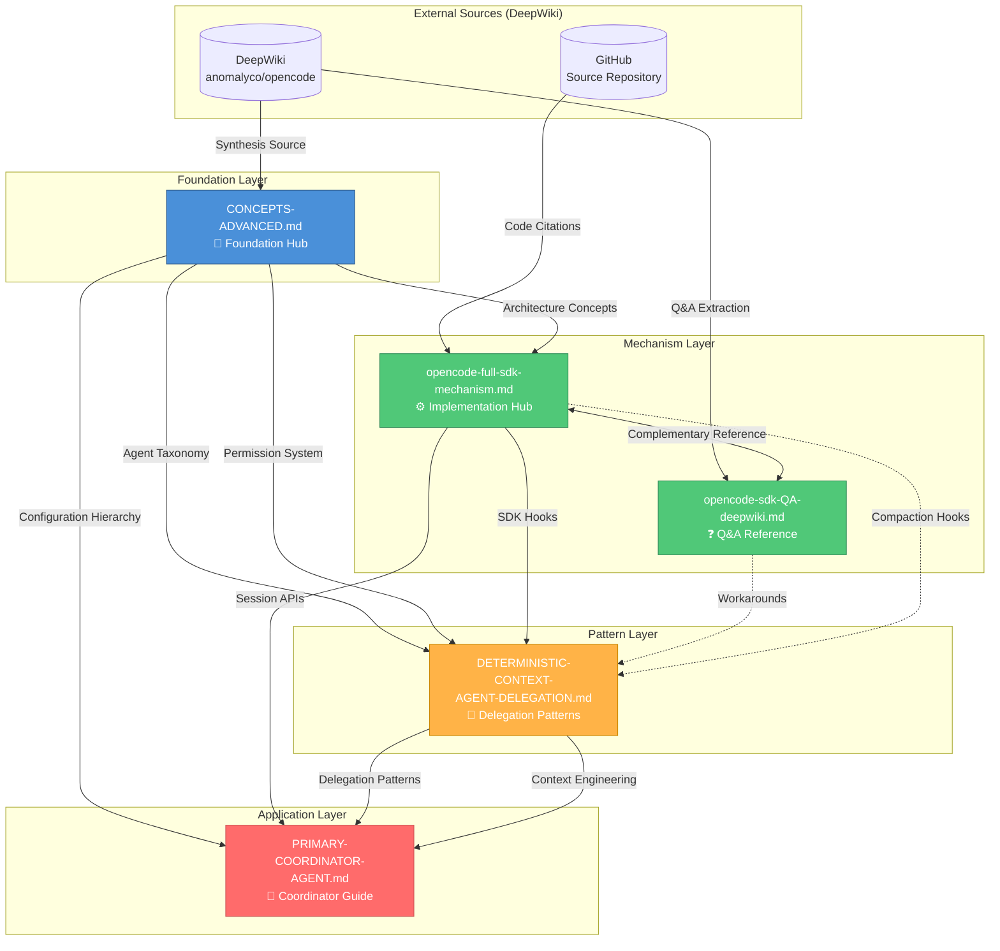
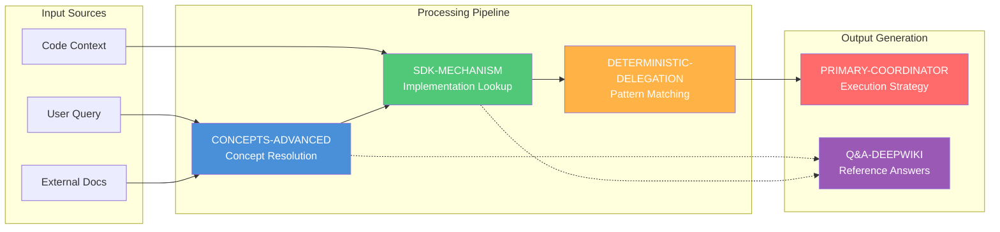

# OpenCode Knowledge Synthesis Map

> **Purpose:** This document maps the interconnections, dependencies, and relationships between the 5 core OpenCode knowledge documents, providing a unified navigation structure for meta-builders and system architects.

---

## Table of Contents

| Section | Anchor | Classification |
|---------|--------|----------------|
| Executive Summary | [#executive-summary](#executive-summary) | `overview, synthesis, navigation` |
| Part 1: Knowledge Graph | [#part-1-knowledge-graph](#part-1-knowledge-graph) | `visualization, relationships, flow` |
| Part 2: Dependency Matrix | [#part-2-dependency-matrix](#part-2-dependency-matrix) | `cross-reference, strength, coverage` |
| Part 3: Unified Narrative | [#part-3-unified-narrative-structure](#part-3-unified-narrative-structure) | `story, layers, progression` |
| Part 4: Gap Analysis | [#part-4-gap-analysis](#part-4-gap-analysis) | `missing-links, recommendations, actions` |
| Action Items | [#action-items-for-cross-reference-improvements](#action-items-for-cross-reference-improvements) | `tasks, priorities, implementation` |

---

## Executive Summary

### Document Inventory

| Document | Role | Layer | Primary Focus |
|----------|------|-------|---------------|
| [`OPENCODE-CONCEPTS-ADVANCED.md`](OPENCODE-CONCEPTS-ADVANCED.md) | Foundation Hub | Foundation | Architecture, Taxonomy, Configuration |
| [`OPENCODE-DETERMINISTIC-CONTEXT-AGENT-DELEGATION.md`](OPENCODE-DETERMINISTIC-CONTEX-AGENT-DELEGATION.md) | Pattern Reference | Pattern | Context Engineering, Delegation Chains |
| [`opencode-full-sdk-mechanism.md`](opencode-full-sdk-mechanism.md) | Implementation Hub | Mechanism | SDK APIs, Session Manipulation, Hooks |
| [`opencode-sdk-QA-deepwiki.md`](opencode-sdk-QA-deepwiki.md) | Q&A Reference | Reference | Prompt Injection, Message Transformation |
| [`OPENCODE-PRIMARY-COORDINATOR-AGENT.md`](OPENCODE-PRIMARY-COORDINATOR-AGENT.md) | Application Guide | Application | Coordinator Patterns, Team Intelligence |

### Key Findings

| Finding | Status | Impact |
|---------|--------|--------|
| Session Lifecycle overlap | **Strong** (4/5 docs) | High - Core unifying concept |
| Plugin Hooks coverage | **Moderate** (3/5 docs) | Medium - Extension point |
| Context Management | **Strong** (4/5 docs) | High - Cross-cutting concern |
| Event System | **Gap** (0/5 docs local) | High - External dependency |
| Hub-and-Spoke Model | **Confirmed** | CONCEPTS-ADVANCED as hub |

---

## Part 1: Knowledge Graph

### Mermaid Flowchart: Document Relationships



### Information Flow Diagram



---

## Part 2: Dependency Matrix

### Concept Coverage Matrix

| Concept | CONCEPTS-ADVANCED | DETERMINISTIC-DELEGATION | SDK-MECHANISM | SDK-QA | COORDINATOR | Coverage |
|---------|-------------------|--------------------------|---------------|--------|-------------|----------|
| **Agent Taxonomy** | ██████████ (Primary) | ████░░░░░░ (Secondary) | ███░░░░░░░ (Mentioned) | ░░░░░░░░░░ (None) | ██████░░░░ (Applied) | **4/5** |
| **Session Lifecycle** | ████████░░ (Core) | ████████░░ (Core) | ██████████ (Primary) | ██████░░░░ (Applied) | █████░░░░░ (Referenced) | **5/5** |
| **Plugin Hooks** | ███████░░░ (Documented) | ██████████ (Primary) | ██████████ (Primary) | ████████░░ (Applied) | ░░░░░░░░░░ (None) | **4/5** |
| **Permission System** | ██████████ (Primary) | █████░░░░░ (Applied) | ███░░░░░░░ (Mentioned) | ░░░░░░░░░░ (None) | ████░░░░░░ (Referenced) | **4/5** |
| **Context Management** | ████████░░ (Core) | ██████████ (Primary) | ██████████ (Primary) | ████████░░ (Applied) | █████░░░░░ (Referenced) | **5/5** |
| **Compaction** | █████░░░░░ (Documented) | ███████░░░ (Applied) | ██████████ (Primary) | █████░░░░░ (Referenced) | ░░░░░░░░░░ (None) | **4/5** |
| **Delegation Patterns** | ███░░░░░░░ (Mentioned) | ██████████ (Primary) | ███░░░░░░░ (Mentioned) | ░░░░░░░░░░ (None) | ██████████ (Primary) | **3/5** |
| **Skills System** | ██████████ (Primary) | ███░░░░░░░ (Mentioned) | ░░░░░░░░░░ (None) | ░░░░░░░░░░ (None) | ███░░░░░░░ (Referenced) | **3/5** |
| **Tool Registry** | ██████████ (Primary) | ███░░░░░░░ (Mentioned) | █████░░░░░ (Applied) | ░░░░░░░░░░ (None) | ███░░░░░░░ (Referenced) | **4/5** |
| **Prompt Architecture** | ██████████ (Primary) | ███░░░░░░░ (Mentioned) | ███████░░░ (Applied) | ██████████ (Primary) | ░░░░░░░░░░ (None) | **4/5** |
| **Event System** | ░░░░░░░░░░ (None) | ░░░░░░░░░░ (None) | ░░░░░░░░░░ (None) | ░░░░░░░░░░ (None) | ░░░░░░░░░░ (None) | **0/5** |

### Cross-Reference Strength Analysis

| Source → Target | Reference Type | Strength | Bidirectional |
|-----------------|----------------|----------|---------------|
| CONCEPTS-ADVANCED → SDK-MECHANISM | `related_docs` | **Strong** | ✅ Yes |
| CONCEPTS-ADVANCED → DETERMINISTIC-DELEGATION | `related_docs` | **Strong** | ✅ Yes |
| CONCEPTS-ADVANCED → COORDINATOR | `related_docs` | **Strong** | ✅ Yes |
| CONCEPTS-ADVANCED → SDK-QA | `related_docs` | **Strong** | ✅ Yes |
| SDK-MECHANISM → SDK-QA | `related_docs` | **Moderate** | ❌ No |
| DETERMINISTIC-DELEGATION → COORDINATOR | `related_docs` | **Moderate** | ❌ No |

### Missing Links to Add

| From Document | Missing Link To | Rationale | Priority |
|---------------|-----------------|-----------|----------|
| SDK-QA | DETERMINISTIC-DELEGATION | Shared context engineering patterns | **High** |
| SDK-QA | COORDINATOR | Prompt transformation for coordination | **Medium** |
| COORDINATOR | SDK-MECHANISM | Session manipulation for coordination | **Medium** |
| DETERMINISTIC-DELEGATION | SDK-QA | Workaround patterns reference | **Medium** |

---

## Part 3: Unified Narrative Structure

### The Five-Layer Documentation Architecture

The OpenCode documentation follows a **progressive disclosure** pattern, guiding readers from foundational concepts to practical application:

```
┌─────────────────────────────────────────────────────────────────┐
│                    LAYER 5: APPLICATION                         │
│         PRIMARY-COORDINATOR-AGENT.md                            │
│    "How do I build a front-facing coordinator agent?"           │
│    → Team Intelligence, Delegation Mastery, Cognitive Models    │
└─────────────────────────────────────────────────────────────────┘
                              ▲
                              │ Applies patterns from
┌─────────────────────────────────────────────────────────────────┐
│                    LAYER 4: PATTERN                             │
│         DETERMINISTIC-CONTEXT-AGENT-DELEGATION.md               │
│    "How do I engineer context and delegate deterministically?"  │
│    → Multi-level chains, Progressive disclosure, Quality gates  │
└─────────────────────────────────────────────────────────────────┘
                              ▲
                              │ Uses mechanisms from
┌─────────────────────────────────────────────────────────────────┐
│                    LAYER 3: REFERENCE                           │
│         opencode-sdk-QA-deepwiki.md                             │
│    "What are the answers to specific SDK questions?"            │
│    → Prompt injection, Message transformation, Workarounds      │
└─────────────────────────────────────────────────────────────────┘
                              ▲
                              │ References
┌─────────────────────────────────────────────────────────────────┐
│                    LAYER 2: MECHANISM                           │
│         opencode-full-sdk-mechanism.md                          │
│    "How does the SDK implement these concepts?"                 │
│    → Session manipulation, Plugin hooks, Compaction             │
└─────────────────────────────────────────────────────────────────┘
                              ▲
                              │ Implements
┌─────────────────────────────────────────────────────────────────┐
│                    LAYER 1: FOUNDATION                          │
│         OPENCODE-CONCEPTS-ADVANCED.md                           │
│    "What are the core concepts and architecture?"               │
│    → Agent Taxonomy, Permissions, Configuration, Skills         │
└─────────────────────────────────────────────────────────────────┘
```

### Reading Paths by Use Case

| Use Case | Recommended Path | Estimated Time |
|----------|------------------|----------------|
| **New to OpenCode** | CONCEPTS-ADVANCED → SDK-MECHANISM → SDK-QA | 45-60 min |
| **Building Custom Agents** | CONCEPTS-ADVANCED → COORDINATOR → DETERMINISTIC-DELEGATION | 40-50 min |
| **Implementing Plugins** | SDK-MECHANISM → SDK-QA → DETERMINISTIC-DELEGATION | 35-45 min |
| **Context Engineering** | DETERMINISTIC-DELEGATION → SDK-MECHANISM → SDK-QA | 30-40 min |
| **Quick Reference** | SDK-QA → (jump to specific topic) | 5-15 min |

### Narrative Cohesion Analysis

| Document | Story Role | Narrative Function |
|----------|------------|-------------------|
| CONCEPTS-ADVANCED | **World-Building** | Establishes the universe of OpenCode concepts, defines terminology, sets constraints |
| SDK-MECHANISM | **Technical Manual** | Explains how things work under the hood, provides implementation details |
| SDK-QA | **Troubleshooting Guide** | Answers specific questions, provides workarounds for edge cases |
| DETERMINISTIC-DELEGATION | **Pattern Language** | Documents proven patterns for complex workflows |
| COORDINATOR | **Hero's Journey** | Shows how to apply all knowledge to build the ultimate coordinator |

---

## Part 4: Gap Analysis

### Identified Gaps

#### Gap 1: Event System Documentation

| Attribute | Details |
|-----------|---------|
| **Gap** | Event Bus / Event System not documented in local docs |
| **Impact** | High - Critical for plugin development and reactive workflows |
| **Evidence** | Event system only mentioned in external DeepWiki sources |
| **Recommendation** | Create dedicated Event System section in SDK-MECHANISM or new document |

**Suggested Content:**
```markdown
## Event System Architecture
- Event Bus implementation
- Event types and schemas
- Plugin subscription patterns
- Event-driven workflow examples
```

#### Gap 2: Hook Execution Order

| Attribute | Details |
|-----------|---------|
| **Gap** | Hook execution order not explicitly documented |
| **Impact** | Medium - Important for deterministic behavior |
| **Evidence** | Multiple hooks mentioned but execution sequence unclear |
| **Recommendation** | Add Hook Execution Order diagram to SDK-MECHANISM |

**Suggested Content:**
```markdown
## Hook Execution Order

1. `experimental.chat.system.transform` - System prompt modification
2. `experimental.chat.messages.transform` - Message array modification
3. `experimental.session.compacting` - Pre-compaction injection
4. `tool.execute.before` - Pre-tool validation
5. `tool.execute.after` - Post-tool processing
```

#### Gap 3: Terminology Normalization

| Term | Variations Found | Recommended Standard |
|------|------------------|---------------------|
| Session | "session", "main session", "child session", "parent session" | **Session** (qualified when hierarchical) |
| Context | "context", "context packet", "context engineering", "context management" | **Context** (use specific modifiers) |
| Delegation | "delegation", "task delegation", "agent delegation", "subagent delegation" | **Delegation** (agent-to-agent) |
| Hook | "hook", "plugin hook", "experimental hook" | **Plugin Hook** (with namespace) |

#### Gap 4: Code Example Cross-Linking

| Attribute | Details |
|-----------|---------|
| **Gap** | Code examples in different docs could reference each other |
| **Impact** | Low - Would improve discoverability |
| **Evidence** | Similar plugin hook examples exist in SDK-MECHANISM and DETERMINISTIC-DELEGATION |
| **Recommendation** | Add "See also" references between similar code examples |

### Gap Priority Matrix

| Gap | Impact | Effort | Priority Score | Action |
|-----|--------|--------|----------------|--------|
| Event System | High | Medium | **9/10** | Create new section |
| Hook Execution Order | Medium | Low | **7/10** | Add diagram |
| Terminology Normalization | Medium | Low | **6/10** | Create glossary |
| Code Example Cross-Linking | Low | Low | **4/10** | Add references |

---

## Action Items for Cross-Reference Improvements

### High Priority (Complete within 1 week)

| ID | Action | Document | Owner | Status |
|----|--------|----------|-------|--------|
| A1 | Add Event System section to SDK-MECHANISM | `opencode-full-sdk-mechanism.md` | Docs Team | 🔴 Pending |
| A2 | Add bidirectional link: SDK-QA ↔ DETERMINISTIC-DELEGATION | Both documents | Docs Team | 🔴 Pending |
| A3 | Create Hook Execution Order diagram | `opencode-full-sdk-mechanism.md` | Docs Team | 🔴 Pending |

### Medium Priority (Complete within 2 weeks)

| ID | Action | Document | Owner | Status |
|----|--------|----------|-------|--------|
| B1 | Add terminology glossary section | `OPENCODE-CONCEPTS-ADVANCED.md` | Docs Team | 🟡 Pending |
| B2 | Add "See also" references between code examples | All documents | Docs Team | 🟡 Pending |
| B3 | Add link: COORDINATOR → SDK-MECHANISM | `OPENCODE-PRIMARY-COORDINATOR-AGENT.md` | Docs Team | 🟡 Pending |

### Low Priority (Complete within 1 month)

| ID | Action | Document | Owner | Status |
|----|--------|----------|-------|--------|
| C1 | Create unified index document | New: `OPENCODE-INDEX.md` | Docs Team | 🟢 Pending |
| C2 | Add visual navigation diagram to each doc | All documents | Docs Team | 🟢 Pending |
| C3 | Create interactive documentation site | External | Dev Team | 🟢 Future |

### Recommended New Documents

| Document | Purpose | Priority |
|----------|---------|----------|
| `OPENCODE-EVENT-SYSTEM.md` | Dedicated event bus documentation | **High** |
| `OPENCODE-GLOSSARY.md` | Unified terminology reference | **Medium** |
| `OPENCODE-QUICK-START.md` | 5-minute getting started guide | **Medium** |
| `OPENCODE-COOKBOOK.md` | Recipe-style examples | **Low** |

---

## Appendix: Document Metadata Summary

### Frontmatter Schema Compliance

| Document | YAML Frontmatter | `fast_track` | `synthesis_categories` | `related_docs` | `related_skills` |
|----------|------------------|--------------|------------------------|----------------|------------------|
| CONCEPTS-ADVANCED | ✅ Complete | ✅ 10 items | ✅ 10 categories | ✅ 6 docs | ✅ 5 skills |
| DETERMINISTIC-DELEGATION | ✅ Complete | ✅ 8 items | ✅ 8 categories | ✅ 4 docs | ✅ 5 skills |
| SDK-MECHANISM | ✅ Complete | ✅ 8 items | ✅ 8 categories | ✅ 3 docs | ✅ 4 skills |
| SDK-QA | ⚠️ Partial | ❌ Missing | ❌ Missing | ❌ Missing | ❌ Missing |
| COORDINATOR | ✅ Complete | ✅ 6 items | ✅ 7 categories | ✅ 4 docs | ✅ 5 skills |

### Recommended Frontmatter Additions for SDK-QA

```yaml
---
description: "OpenCode SDK Q&A Reference - Prompt Injection, Message Transformation, and Context Workarounds"
agent: hiveminder
references: https://deepwiki.com/search/opencode-sdk-mechanisms
source_repo: anomalyco/opencode
tags: ["opencode", "sdk", "qa", "prompt-injection", "message-transform", "workarounds"]
classification:
  domain: "opencode-sdk"
  category: "qa-reference"
  subcategory: "implementation-workarounds"
  depth: "technical-reference"
  cognitive_model: "problem-solution"
fast_track:
  - "prompt-injection"
  - "message-transformation"
  - "noreply-prompts"
  - "compaction-hooks"
  - "system-prompt-transform"
synthesis_categories:
  - "sdk-workarounds"
  - "prompt-engineering"
  - "context-injection"
  - "plugin-patterns"
related_docs:
  - name: "OPENCODE-CONCEPTS-ADVANCED.md"
    relationship: "architectural-concepts"
  - name: "opencode-full-sdk-mechanism.md"
    relationship: "complementary-implementation"
  - name: "OPENCODE-DETERMINISTIC-CONTEXT-AGENT-DELEGATION.md"
    relationship: "context-engineering-patterns"
related_skills:
  - "context-integrity"
  - "session-lifecycle"
  - "delegation-intelligence"
created: "2026-02-28"
updated: "2026-02-28"
version: "1.1"
---
```

---

## Change Log

| Date | Version | Changes | Author |
|------|---------|---------|--------|
| 2026-02-28 | 1.0.0 | Initial creation of Knowledge Synthesis Map | Documentation Specialist |

---

*This document is maintained as part of the OpenCode documentation ecosystem. For updates, refer to the related documents listed in the frontmatter.*
