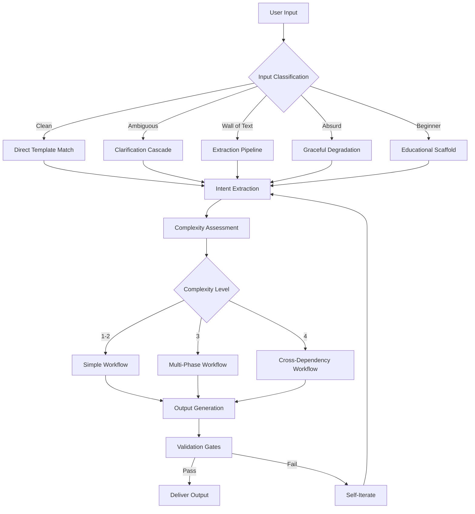
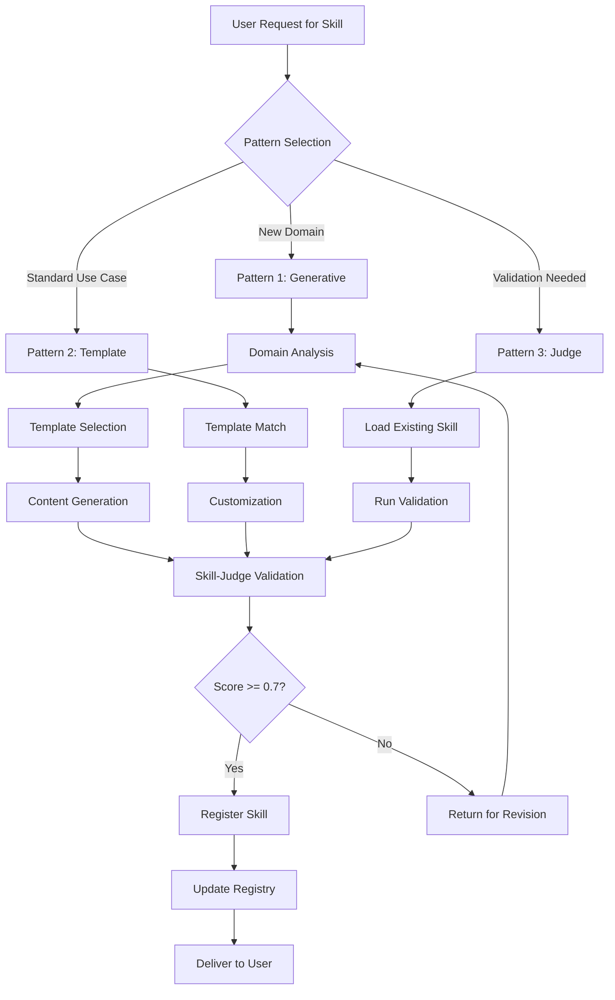

# HiveFiver Meta-Builder Module Specification

> **Document ID:** SPEC-META-BUILDER-2026-03-01
> **Status:** Canonical Specification
> **Purpose:** Define the comprehensive module for building meta-concepts that serve users of all expertise levels in the OpenCode/HiveMind ecosystem

---

## Table of Contents

| Section | Anchor | Classification |
|---------|--------|----------------|
| Executive Overview | [#executive-overview](#executive-overview) | `overview, purpose, scope` |
| Part 1: User Input Handling | [#part-1-user-input-handling](#part-1-user-input-handling) | `input-processing, edge-cases, robustness` |
| Part 2: Progressive Disclosure Architecture | [#part-2-progressive-disclosure-architecture](#part-2-progressive-disclosure-architecture) | `context-management, cognitive-load, levels` |
| Part 3: Skill Creation Patterns | [#part-3-skill-creation-patterns](#part-3-skill-creation-patterns) | `skills, patterns, templates` |
| Part 4: Command Workflow Design | [#part-4-command-workflow-design](#part-4-command-workflow-design) | `commands, chaining, deterministic-flows` |
| Part 5: Agent Configuration | [#part-5-agent-configuration](#part-5-agent-configuration) | `agents, permissions, delegation` |
| Part 6: Quality Gates & Validation | [#part-6-quality-gates--validation](#part-6-quality-gates--validation) | `validation, evidence, acceptance-criteria` |
| Part 7: Context Engineering | [#part-7-context-engineering](#part-7-context-engineering) | `context, drift-prevention, compaction` |
| Part 8: Integration Patterns | [#part-8-integration-patterns](#part-8-integration-patterns) | `integration, hivefiver, hivemind` |
| Appendices | [#appendices](#appendices) | `reference, templates, examples` |

---

## Executive Overview

### Purpose Statement

The **HiveFiver Meta-Builder Module** is a front-facing system designed to transform user inputs of any complexity, ambiguity, or format into structured meta-concepts that operate seamlessly within the OpenCode and HiveMind frameworks. This module serves users ranging from absolute beginners to expert architects, handling projects from simple scripts to Level 4/4 complexity cross-dependency systems.

### Core Philosophy

```
┌─────────────────────────────────────────────────────────────────────┐
│                    META-BUILDER PRINCIPLES                          │
├─────────────────────────────────────────────────────────────────────┤
│  1. UNIVERSAL ACCESSIBILITY                                         │
│     → Every user, regardless of expertise, can produce valid output │
│                                                                     │
│  2. PROGRESSIVE DISCLOSURE                                          │
│     → Load context incrementally; never overwhelm                   │
│                                                                     │
│  3. DETERMINISTIC QUALITY                                           │
│     → Every output passes validation gates                          │
│                                                                     │
│  4. SELF-ITERATING COMPLETION                                       │
│     → No gaps, no intervention needed, autonomous refinement        │
│                                                                     │
│  5. CONTEXT INTEGRITY                                               │
│     → Zero drift, zero hallucination, evidence-backed              │
└─────────────────────────────────────────────────────────────────────┘
```

### Scope Coverage Matrix

| Dimension | Coverage | Implementation |
|-----------|----------|----------------|
| **Horizontal** | All tech stacks | Framework detection, stack-specific templates |
| **Vertical** | All complexity levels (1-4) | Progressive disclosure, tiered validation |
| **User Expertise** | Beginner → Expert | Adaptive prompting, guided workflows |
| **Input Types** | Clean → Ambiguous → Wall-of-text | Input classification, extraction pipelines |
| **Output Types** | Skills, Commands, Agents, Workflows | Template system, schema validation |

---

## Part 1: User Input Handling

### 1.1 Input Classification System

The Meta-Builder must classify and route user inputs through a deterministic classification pipeline:

```yaml
input_classification:
  types:
    - type: "clean_specification"
      indicators:
        - "Clear objective statement"
        - "Defined scope and constraints"
        - "Specific technology mentions"
      handling: "Direct template matching"
      
    - type: "ambiguous_request"
      indicators:
        - "Vague objective"
        - "Missing constraints"
        - "Multiple possible interpretations"
      handling: "Clarification cascade with guided questions"
      
    - type: "wall_of_text"
      indicators:
        - ">1000 characters without structure"
        - "Mixed topics and contexts"
        - "No clear separation of concerns"
      handling: "Extraction pipeline with summarization"
      
    - type: "absurd_request"
      indicators:
        - "Logically impossible requirements"
        - "Contradictory constraints"
        - "Beyond system capabilities"
      handling: "Graceful degradation with alternatives"
      
    - type: "beginner_confused"
      indicators:
        - "Terminology misuse"
        - "Fundamental misunderstandings"
        - "Request for guidance"
      handling: "Educational scaffold with templates"
```

### 1.2 Input Processing Pipeline



### 1.3 Edge Case Handling

#### 1.3.1 Contradictory Requirements

```yaml
contradiction_handling:
  detection:
    - "Parse all constraints into structured format"
    - "Identify logical conflicts via constraint solver"
    - "Score conflict severity (minor/major/blocking)"
  
  resolution:
    minor:
      action: "Auto-resolve with user preference history"
      notification: "Inform user of resolution"
    major:
      action: "Present options with trade-offs"
      notification: "Request user decision"
    blocking:
      action: "Explain impossibility with alternatives"
      notification: "Offer pivot options"
```

#### 1.3.2 Information Overload

```yaml
overload_handling:
  detection:
    - "Token count exceeds threshold"
    - "Topic diversity score > 0.7"
    - "No single clear objective"
  
  strategy:
    step_1: "Segment into distinct topics"
    step_2: "Identify primary intent via clustering"
    step_3: "Create topic queue for sequential handling"
    step_4: "Present segmented plan to user"
    step_5: "Execute in priority order"
```

#### 1.3.3 Beginner with Complex Request

```yaml
beginner_complex_handling:
  detection:
    - "Complexity score > 3"
    - "Expertise indicators absent"
    - "Confusion markers present"
  
  strategy:
    step_1: "Acknowledge complexity"
    step_2: "Decompose into learnable units"
    step_3: "Provide progressive disclosure path"
    step_4: "Offer guided implementation"
    step_5: "Include educational checkpoints"
```

### 1.4 Intent Extraction Schema

```typescript
interface ExtractedIntent {
  // Core identification
  primary_objective: string;
  secondary_objectives: string[];
  
  // Classification
  request_type: "create" | "modify" | "audit" | "improve" | "doctor";
  complexity_level: 1 | 2 | 3 | 4;
  domain: string[];
  tech_stack: TechStackIdentifier[];
  
  // Constraints
  constraints: {
    hard: Constraint[];    // Non-negotiable
    soft: Constraint[];    // Preferences
    implicit: Constraint[]; // Inferred from context
  };
  
  // Scope
  scope: {
    in_scope: string[];
    out_of_scope: string[];
    uncertain: string[];
  };
  
  // Output expectations
  expected_deliverables: DeliverableType[];
  validation_criteria: ValidationCriterion[];
  
  // User context
  user_expertise: "beginner" | "intermediate" | "advanced" | "expert";
  preferred_workflow: "guided" | "autonomous" | "interactive";
}
```

---

## Part 2: Progressive Disclosure Architecture

### 2.1 Level-Gated Information Model

The Meta-Builder implements a strict progressive disclosure system to prevent context overload:

```yaml
disclosure_levels:
  L0_discovery:
    description: "Name and description only"
    token_cost: "~100 tokens"
    trigger: "Always visible"
    content:
      - "Skill/Command/Agent name"
      - "One-line description"
      - "Complexity indicator"
    example: |
      skill: "react-component-builder"
      description: "Builds React components with TypeScript"
      complexity: 2

  L1_triage:
    description: "Full body content"
    token_cost: "~500-2000 tokens"
    trigger: "On explicit need or user request"
    content:
      - "Full SKILL.md body"
      - "Basic templates"
      - "Quick-start examples"
    load_condition: "User invokes skill or command"

  L2_domain:
    description: "Specific reference sections"
    token_cost: "~1000-5000 tokens"
    trigger: "On domain-specific operation"
    content:
      - "Detailed references"
      - "Domain-specific templates"
      - "Integration patterns"
    load_condition: "Complexity > 2 or domain match"

  L3_deep:
    description: "Full references and scripts"
    token_cost: "~5000-15000 tokens"
    trigger: "Full audit or expert mode only"
    content:
      - "Complete reference documentation"
      - "All bundled scripts"
      - "Cross-reference mappings"
    load_condition: "Complexity = 4 or explicit audit request"
```

### 2.2 Cognitive Load Management

```yaml
cognitive_governance:
  max_concurrent_skills: 3
  max_concurrent_commands: 5
  
  load_calculation:
    formula: "current_tokens + planned_load < context_window * 0.6"
    
  overflow_prevention:
    - "Halt before loading L2/L3 content"
    - "Request explicit user confirmation"
    - "Offer to unload non-essential context"
    
  protection_rules:
    - "NEVER load L2/L3 unless checkpoint requires it"
    - "ALWAYS prefer L0/L1 for initial triage"
    - "UNLOAD completed skills before loading new ones"
```

### 2.3 Disclosure Decision Tree

```
User Request Arrives
    │
    ├── Is this a new request?
    │   ├── YES → Load L0 only
    │   └── NO → Continue with current level
    │
    ├── Does request match a skill/command?
    │   ├── YES → Load L1 for matched item
    │   └── NO → Offer discovery options
    │
    ├── Is complexity > 2?
    │   ├── YES → Prompt for L2 load
    │   └── NO → Continue with L1
    │
    ├── Is complexity = 4 OR audit mode?
    │   ├── YES → Warn about L3 token cost
    │   │         └── Get explicit confirmation
    │   └── NO → Maintain current level
    │
    └── Execute with current disclosure level
```

### 2.4 Context Window Protection

```yaml
context_protection:
  thresholds:
    warning: "60% of context window"
    critical: "80% of context window"
    maximum: "90% of context window"
    
  actions:
    warning_level:
      - "Log warning to user"
      - "Suggest context compaction"
      - "Offer to unload skills"
      
    critical_level:
      - "Auto-invoke compaction"
      - "Block new L2/L3 loads"
      - "Force L0/L1 only"
      
    maximum_level:
      - "HALT all new context loading"
      - "Force compaction cycle"
      - "Require user intervention"
```

---

## Part 3: Skill Creation Patterns

### 3.1 Skill Pattern Taxonomy

The Meta-Builder supports three primary skill creation patterns:

#### Pattern 1: Skill-Creator (Generative)

```yaml
pattern_1_generative:
  purpose: "Create new skills from user specifications"
  
  input_requirements:
    - "Clear domain definition"
    - "Specific use case"
    - "Expected output format"
    
  creation_flow:
    step_1:
      name: "Domain Analysis"
      action: "Analyze domain requirements and map to existing patterns"
      
    step_2:
      name: "Template Selection"
      action: "Select appropriate base template from registry"
      
    step_3:
      name: "Content Generation"
      action: "Generate SKILL.md with progressive disclosure structure"
      
    step_4:
      name: "Validation"
      action: "Validate against skill-judge criteria"
      
    step_5:
      name: "Registration"
      action: "Register skill in project skill registry"
      
  output_schema:
    path: ".opencode/skills/{skill-name}/SKILL.md"
    required_sections:
      - "name"
      - "description"
      - "trigger_conditions"
      - "instructions"
      - "examples"
```

#### Pattern 2: Skill-Writing (Template-Based)

```yaml
pattern_2_template:
  purpose: "Create skills from pre-defined templates with customization"
  
  template_library:
    - template: "research-skill"
      triggers: ["research", "investigate", "explore"]
      sections: ["discovery", "synthesis", "reporting"]
      
    - template: "implementation-skill"
      triggers: ["implement", "build", "create"]
      sections: ["planning", "execution", "verification"]
      
    - template: "audit-skill"
      triggers: ["audit", "review", "validate"]
      sections: ["criteria", "inspection", "reporting"]
      
    - template: "doctor-skill"
      triggers: ["fix", "repair", "debug"]
      sections: ["diagnosis", "treatment", "prevention"]
      
  customization_points:
    - "domain_specific_instructions"
    - "validation_criteria"
    - "output_templates"
    - "integration_hooks"
```

#### Pattern 3: Skill-Judge (Validation)

```yaml
pattern_3_validation:
  purpose: "Validate and score skills against quality criteria"
  
  validation_dimensions:
    - dimension: "Clarity"
      weight: 0.2
      criteria:
        - "Clear trigger conditions"
        - "Unambiguous instructions"
        - "Well-defined scope"
        
    - dimension: "Completeness"
      weight: 0.25
      criteria:
        - "All required sections present"
        - "Examples provided"
        - "Edge cases documented"
        
    - dimension: "Integration"
      weight: 0.2
      criteria:
        - "Proper disclosure levels"
        - "Context protection rules"
        - "Delegation patterns"
        
    - dimension: "Evidence"
      weight: 0.2
      criteria:
        - "Validation gates defined"
        - "Success criteria measurable"
        - "Failure modes documented"
        
    - dimension: "Maintainability"
      weight: 0.15
      criteria:
        - "Version information"
        - "Update procedures"
        - "Dependency documentation"
        
  scoring:
    minimum_pass: 0.7
    excellence_threshold: 0.9
    
  actions:
    pass: "Register skill"
    marginal: "Flag for improvement"
    fail: "Return for revision"
```

### 3.2 Skill Template Schema

```yaml
skill_template:
  # Frontmatter
  metadata:
    name: "{skill-name}"
    description: "{one-line-description}"
    version: "1.0.0"
    created: "{date}"
    tags: []
    
  # Trigger configuration
  triggers:
    keywords: []
    patterns: []
    complexity_range: [1, 4]
    
  # Progressive disclosure content
  levels:
    L0:
      visible: true
      content: "name + description"
      
    L1:
      trigger: "on_invoke"
      sections:
        - "overview"
        - "quick_start"
        - "basic_examples"
        
    L2:
      trigger: "complexity_gt_2"
      sections:
        - "detailed_instructions"
        - "advanced_examples"
        - "integration_patterns"
        
    L3:
      trigger: "audit_mode"
      sections:
        - "complete_reference"
        - "all_scripts"
        - "cross_references"
        
  # Validation gates
  validation:
    pre_conditions: []
    post_conditions: []
    success_criteria: []
    
  # Integration hooks
  integration:
    requires_skills: []
    provides_to: []
    delegates_to: []
```

### 3.3 Skill Creation Workflow



---

## Part 4: Command Workflow Design

### 4.1 Command Architecture

Commands serve as the **initiators** that start stacking and chaining workflows:

```yaml
command_taxonomy:
  initiator_commands:
    purpose: "Start new workflows"
    examples:
      - "/hivefiver-init"
      - "/hivefiver-skillforge"
      - "/hivefiver-ideate"
    behavior: "Create new session context, load initial skills"
    
  workflow_commands:
    purpose: "Execute multi-step workflows"
    examples:
      - "/hivefiver-architect"
      - "/hivefiver-build"
      - "/hivefiver-deploy"
    behavior: "Chain multiple skills, manage state"
    
  utility_commands:
    purpose: "Provide specific functionality"
    examples:
      - "/hivefiver-doctor"
      - "/hivefiver-audit"
      - "/hivefiver-validate"
    behavior: "Single-purpose execution with validation"
    
  bridge_commands:
    purpose: "Connect to external systems"
    examples:
      - "/hivefiver-gsd-bridge"
      - "/hivefiver-ralph-bridge"
    behavior: "Transform context, delegate to external agents"
```

### 4.2 Command Definition Schema

```yaml
command_definition:
  # Metadata
  name: "{command-name}"
  description: "{one-line-description}"
  version: "1.0.0"
  
  # Invocation
  invocation:
    pattern: "/{command-name} {arguments}"
    arguments:
      - name: "{arg1}"
        type: "string | flag | option"
        required: true | false
        default: null
        
  # Execution mode
  execution:
    mode: "inline | subtask"
    agent: "{agent-name}"
    
  # Template interpolation
  template:
    header: |
      # {command-name}
      
      Context: {parent_context}
      Objective: {objective}
      
    body: |
      ## Instructions
      
      {instructions}
      
      ## Constraints
      
      {constraints}
      
    footer: |
      ## Expected Output
      
      {output_format}
      
  # Chaining
  chain:
    pre_commands: []
    post_commands: []
    parallel_commands: []
    
  # Skill integration
  skills:
    load_on_start: []
    load_during: []
    unload_on_complete: []
```

### 4.3 Deterministic Chaining Patterns

#### Sequential Chain

```yaml
sequential_chain:
  description: "Execute commands in strict order"
  
  pattern:
    step_1:
      command: "/hivefiver-init"
      produces: "project_context"
      
    step_2:
      command: "/hivefiver-architect"
      requires: "project_context"
      produces: "architecture_plan"
      
    step_3:
      command: "/hivefiver-build"
      requires: "architecture_plan"
      produces: "implementation"
      
  error_handling:
    on_failure: "HALT chain"
    on_partial: "Checkpoint and retry"
```

#### Parallel Chain

```yaml
parallel_chain:
  description: "Execute independent commands concurrently"
  
  pattern:
    trigger: "/hivefiver-research --parallel"
    
    branches:
      branch_a:
        command: "/hivefiver-research --stack"
        produces: "stack_research"
        
      branch_b:
        command: "/hivefiver-research --features"
        produces: "feature_research"
        
      branch_c:
        command: "/hivefiver-research --architecture"
        produces: "architecture_research"
        
    merge:
      command: "/hivefiver-synthesize"
      requires: ["stack_research", "feature_research", "architecture_research"]
      
  conditions:
    - "Zero file overlap between branches"
    - "Zero state dependency between branches"
    - "Zero output dependency between branches"
```

#### Wave-Based Execution

```yaml
wave_execution:
  description: "Execute in dependency-ordered waves"
  
  wave_0:
    description: "Scaffolding and infrastructure"
    tasks:
      - "Create project structure"
      - "Initialize test infrastructure"
      - "Setup validation framework"
      
  wave_1:
    description: "Independent implementations"
    tasks:
      - "Implement feature A"
      - "Implement feature B"
      - "Implement feature C"
    conditions: "All wave_0 tasks complete"
    
  wave_2:
    description: "Integration tasks"
    tasks:
      - "Integrate A + B"
      - "Integrate B + C"
    conditions: "All wave_1 tasks complete"
    
  wave_3:
    description: "Final assembly"
    tasks:
      - "Final integration"
      - "End-to-end testing"
    conditions: "All wave_2 tasks complete"
```

### 4.4 Command-Skill Integration

```yaml
command_skill_integration:
  pattern:
    step_1:
      action: "Command invoked"
      behavior: "Parse arguments, identify required skills"
      
    step_2:
      action: "Load L0 for identified skills"
      behavior: "Show available skills without loading full content"
      
    step_3:
      action: "Execute command logic"
      behavior: "Load L1 for skills as needed"
      
    step_4:
      action: "Complexity assessment"
      behavior: "If complexity > 2, prompt for L2 load"
      
    step_5:
      action: "Complete execution"
      behavior: "Unload skills, preserve results"
```

---

## Part 5: Agent Configuration

### 5.1 Agent Mode Taxonomy

```yaml
agent_modes:
  primary:
    description: "User-facing entry points"
    characteristics:
      - "Selectable in TUI"
      - "Owns todo management"
      - "Can own plan cycles"
      - "Cannot be delegated to"
    use_cases:
      - "Main coordinator agents"
      - "Front-facing interfaces"
      
  subagent:
    description: "Delegated workers"
    characteristics:
      - "Invoked via task tool only"
      - "Runs in child session"
      - "Inherits parent permissions"
      - "Cannot own todos"
    use_cases:
      - "Specialized domain agents"
      - "Parallel execution units"
      
  all:
    description: "Dual-mode agents"
    characteristics:
      - "Available as primary AND subagent"
      - "Context-aware behavior switching"
      - "Full permission set"
    use_cases:
      - "Flexible utility agents"
      - "Context-dependent roles"
```

### 5.2 Agent Configuration Schema

```yaml
agent_configuration:
  # Identity
  name: "{agent-name}"
  description: "{description-for-delegation-decisions}"
  mode: "primary | subagent | all"
  
  # Model configuration
  model:
    provider: "{provider}"
    model_id: "{model}"
    
  # Behavior tuning
  temperature: 0.3
  top_p: null
  max_steps: 10
  
  # Permission ruleset
  permission:
    # Default rules
    "*": "allow"
    doom_loop: "ask"
    
    # Tool-specific rules
    task:
      "*": "deny"
      "hive-*": "allow"
      
    edit:
      "src/**": "deny"
      "tests/**": "deny"
      
    skill:
      "*": "allow"
      "experimental-*": "ask"
      
  # Scope constraints
  scope:
    in_scope_paths:
      - "docs/**"
      - "plans/**"
    out_of_scope_paths:
      - "src/**"
      - "tests/**"
      
  # Custom prompt
  prompt: |
    You are {agent-name}, a {role} agent.
    
    Your responsibilities:
    - {responsibility_1}
    - {responsibility_2}
    
    Your constraints:
    - {constraint_1}
    - {constraint_2}
```

### 5.3 Permission System Integration

```yaml
permission_system:
  # Last-match-wins evaluation
  evaluation_order:
    - "Global defaults"
    - "Agent-specific rules"
    - "Session-level overrides"
    - "Delegation-time restrictions"
    
  # Permission actions
  actions:
    allow: "Execute without asking"
    deny: "Block execution entirely"
    ask: "Request user confirmation"
    
  # Common patterns
  patterns:
    deny_all_delegate_specific:
      task:
        "*": "deny"
        "specific-agent": "allow"
        
    read_only:
      edit:
        "*": "deny"
      write:
        "*": "deny"
        
    sandboxed:
      bash:
        "*": "ask"
      edit:
        "sandbox/**": "allow"
        "*": "deny"
```

### 5.4 Delegation Packet Schema

```yaml
delegation_packet:
  # Metadata
  metadata:
    delegation_source: "agent"
    delegation_depth: 1
    parent_agent: "{parent-name}"
    packet_id: "{uuid}"
    timestamp: "{iso8601}"
    
  # Parent context
  parent_context:
    trajectory_id: "{uuid}"
    tactic_id: "{uuid}"
    context_summary: "2-3 lines of context"
    active_assumptions: []
    blockers: []
    
  # Task definition
  task:
    objective: "Clear, specific, measurable goal"
    type: "implementation | research | debug | planning | qa"
    complexity: 1-4
    urgency: "critical | high | normal | low"
    
    in_scope_paths: []
    out_of_scope_paths: []
    
    constraints: []
    success_criteria: []
    
  # Resources
  resources:
    skills_to_load: []
    references_to_read: []
    memories_to_recall: []
    
  # Return schema
  return_schema:
    format: "structured"
    required_fields:
      status: "success | partial | failure"
      confidence: 0-100
      files_modified: []
      evidence: {}
      issues: []
      metrics: {}
```

---

## Part 6: Quality Gates & Validation

### 6.1 Validation Gate Architecture

```yaml
validation_gates:
  pre_execution:
    name: "Entry Criteria Gate"
    checks:
      - "All required inputs present"
      - "Dependencies satisfied"
      - "Permissions validated"
      - "Context window sufficient"
    on_failure: "HALT and report"
    
  during_execution:
    name: "Progress Gate"
    checks:
      - "Step completion verified"
      - "No doom loops detected"
      - "Context drift within bounds"
      - "Evidence being collected"
    on_failure: "Checkpoint and alert"
    
  post_execution:
    name: "Exit Criteria Gate"
    checks:
      - "All success criteria met"
      - "Evidence bundle complete"
      - "No orphaned state"
      - "Proper cleanup performed"
    on_failure: "Rollback and retry"
```

### 6.2 Evidence-Based Validation

```yaml
evidence_system:
  # Evidence hierarchy
  hierarchy:
    L1_direct:
      type: "Direct observation"
      reliability: "Highest"
      examples:
        - "read_file output"
        - "Tool result"
        - "Command output"
        
    L2_indirect:
      type: "Indirect inference"
      reliability: "High"
      examples:
        - "grep match"
        - "File existence"
        - "Pattern detection"
        
    L3_historical:
      type: "Historical record"
      reliability: "Medium"
      examples:
        - "recall_mems result"
        - "Anchor data"
        - "Previous session state"
        
    L4_pattern:
      type: "Pattern recognition"
      reliability: "Medium"
      examples:
        - "Similar past situations"
        - "Domain knowledge"
        
    L5_judgment:
      type: "Expert judgment"
      reliability: "Lowest"
      examples:
        - "Reasoning without verification"
        
  # Validation rules
  rules:
    - "L4-L5 claims require L1-L2 verification"
    - "All claims must cite evidence source"
    - "Confidence < 100% requires stated assumptions"
```

### 6.3 Acceptance Criteria Framework

```yaml
acceptance_criteria:
  # Functional criteria
  functional:
    - criterion: "Core functionality works"
      validation: "Execute test suite"
      evidence: "Test results"
      
    - criterion: "Edge cases handled"
      validation: "Edge case test suite"
      evidence: "Edge case results"
      
  # Non-functional criteria
  non_functional:
    - criterion: "Performance acceptable"
      validation: "Benchmark execution"
      evidence: "Timing metrics"
      
    - criterion: "No regressions"
      validation: "Regression test suite"
      evidence: "Regression results"
      
  # Integration criteria
  integration:
    - criterion: "Integrates with existing system"
      validation: "Integration tests"
      evidence: "Integration results"
      
    - criterion: "No breaking changes"
      validation: "Compatibility tests"
      evidence: "Compatibility results"
```

### 6.4 Self-Iteration Protocol

```yaml
self_iteration:
  description: "Autonomous refinement until acceptance"
  
  protocol:
    step_1:
      name: "Execute"
      action: "Run task with current parameters"
      
    step_2:
      name: "Validate"
      action: "Check all acceptance criteria"
      
    step_3:
      name: "Evaluate"
      action: "Determine pass/fail/marginal"
      
    step_4:
      name: "Iterate"
      condition: "fail or marginal"
      action: "Adjust parameters, retry"
      max_iterations: 3
      
    step_5:
      name: "Report"
      condition: "pass or max_iterations reached"
      action: "Deliver results with evidence"
      
  constraints:
    - "Never iterate without parameter change"
    - "Each iteration must be justified"
    - "Report all iterations in final output"
```

---

## Part 7: Context Engineering

### 7.1 Context Lifecycle Management

```yaml
context_lifecycle:
  # Session initialization
  initialization:
    required_action: "declare_intent"
    parameters:
      mode: "plan_driven | quick_fix | exploration"
      focus: "Current objective"
    updates:
      - "brain.json: session state"
      - "hierarchy.json: trajectory node"
      
  # Context updates
  update:
    required_action: "map_context"
    parameters:
      level: "trajectory | tactic | action"
      content: "Current focus"
    updates:
      - "Reset turn_count"
      - "Boost drift_score"
      - "Update hierarchy cursor"
      
  # Session termination
  termination:
    required_action: "compact_session"
    parameters:
      summary: "What was accomplished"
    updates:
      - "Save anchors for critical decisions"
      - "Classify session memory"
      - "Export intelligence"
```

### 7.2 Drift Detection & Prevention

```yaml
drift_detection:
  # Scoring system
  scoring:
    excellent:
      range: "80-100"
      action: "Proceed with confidence"
      
    caution:
      range: "60-79"
      action: "Gather more context, verify trajectory"
      
    warning:
      range: "40-59"
      action: "STOP, run think_back, realign"
      
    critical:
      range: "0-39"
      action: "HALT, explain to user, request guidance"
      
  # Prevention mechanisms
  prevention:
    - "Every turn: Check drift_score"
    - "Every delegation: Verify context packet"
    - "Every compaction: Validate hierarchy"
    - "Every completion: Export intelligence"
```

### 7.3 Compaction Strategy

```yaml
compaction_strategy:
  # Trigger conditions
  triggers:
    - "Context window > 80% full"
    - "Explicit user request"
    - "End of major phase"
    
  # Compaction process
  process:
    step_1:
      name: "Summarize"
      action: "Create continuation prompt with key context"
      
    step_2:
      name: "Prune"
      action: "Remove old tool outputs except protected skills"
      
    step_3:
      name: "Preserve"
      action: "Keep skill content, anchors, critical decisions"
      
    step_4:
      name: "Resume"
      action: "Continue with compacted context"
      
  # Protected content
  protected:
    - "Skill tool outputs"
    - "Anchor data"
    - "Active trajectory nodes"
    - "Pending tasks"
```

### 7.4 Anti-Pattern Prevention

```yaml
anti_patterns:
  D02_skill_avalanche:
    detection: ">3 skills loaded in one turn"
    prevention: "Halt, unload non-essential, apply progressive disclosure"
    
  D07_upstream_amnesia:
    detection: "delegation_source missing"
    prevention: "Reject packet, require proper context"
    
  D10_scope_creep:
    detection: "Modified files outside in_scope_paths"
    prevention: "STOP, rollback, redefine scope"
    
  D13_broken_chain:
    detection: "Step executes despite entry_criteria FAIL"
    prevention: "Halt execution, repair chain, re-verify"
    
  D14_session_rot:
    detection: "drift_score < 60, turn_count > 20"
    prevention: "Trigger context recovery, re-align trajectory"
```

---

## Part 8: Integration Patterns

### 8.1 HiveFiver Module Integration

```yaml
hivefiver_integration:
  # Module structure
  structure:
    location: "modules/hivefiver-meta/"
    components:
      - "module.yaml: Module definition"
      - "skills/: Skill pack directory"
      - "commands/: Command definitions"
      - "agents/: Agent configurations"
      - "templates/: Output templates"
      
  # Registration
  registration:
    file: "modules/registry.yaml"
    entry:
      name: "hivefiver-meta"
      version: "1.0.0"
      dependencies: []
      provides:
        - "meta-builder capabilities"
        - "skill creation"
        - "command workflows"
```

### 8.2 HiveMind Framework Integration

```yaml
hivemind_integration:
  # Tool integration
  tools:
    - "hivemind_session: Session lifecycle"
    - "hivemind_hierarchy: Decision tree management"
    - "hivemind_memory: Knowledge persistence"
    - "hivemind_anchor: Immutable anchors"
    - "hivemind_cycle: Session export"
    
  # Hook integration
  hooks:
    - "session-lifecycle: Context injection"
    - "soft-governance: Permission enforcement"
    - "compaction: Context management"
    
  # State integration
  state:
    - "brain.json: Session state"
    - "hierarchy.json: Decision tree"
    - "anchors.json: Critical decisions"
    - "mems.json: Persistent memory"
```

### 8.3 Cross-Module Dependencies

```yaml
cross_module:
  # Dependencies
  depends_on:
    - module: "hivemind-core"
      version: ">=1.0.0"
      reason: "Core tools and state management"
      
    - module: "hiveq-quality"
      version: ">=1.0.0"
      reason: "Quality gates and validation"
      
  # Provides to
  provides_to:
    - module: "hiverd-research"
      capability: "Skill creation for research"
      
    - module: "hiveq-quality"
      capability: "Validation skill templates"
```

### 8.4 External System Bridges

```yaml
external_bridges:
  # GSD Bridge
  gsd_bridge:
    command: "/hivefiver-gsd-bridge"
    purpose: "Transform context for GSD workflow"
    mapping:
      - "HiveFiver skills → GSD commands"
      - "HiveMind state → GSD context files"
      
  # Ralph Bridge
  ralph_bridge:
    command: "/hivefiver-ralph-bridge"
    purpose: "Transform context for Ralph-TUI execution"
    mapping:
      - "PRD → beads issues"
      - "User stories → execution tasks"
```

---

## Appendices

### Appendix A: Skill Templates

#### A.1 Research Skill Template

```markdown
---
name: "{name}-research"
description: "Research skill for {domain}"
version: "1.0.0"
triggers:
  keywords: ["research", "investigate", "{domain}"]
---

## Overview

This skill provides structured research capabilities for {domain}.

## Quick Start

1. Define research questions
2. Execute research plan
3. Synthesize findings
4. Report results

## Detailed Instructions

### Phase 1: Question Formulation
{question_instructions}

### Phase 2: Research Execution
{execution_instructions}

### Phase 3: Synthesis
{synthesis_instructions}

### Phase 4: Reporting
{reporting_instructions}

## Examples

{examples}

## Validation

- All research questions answered
- Sources cited
- Findings synthesized
```

#### A.2 Implementation Skill Template

```markdown
---
name: "{name}-implementation"
description: "Implementation skill for {feature}"
version: "1.0.0"
triggers:
  keywords: ["implement", "build", "create", "{feature}"]
---

## Overview

This skill provides structured implementation for {feature}.

## Quick Start

1. Analyze requirements
2. Design solution
3. Implement code
4. Verify functionality

## Detailed Instructions

### Phase 1: Requirements Analysis
{requirements_instructions}

### Phase 2: Solution Design
{design_instructions}

### Phase 3: Implementation
{implementation_instructions}

### Phase 4: Verification
{verification_instructions}

## Examples

{examples}

## Validation

- Requirements met
- Tests passing
- Code reviewed
```

### Appendix B: Command Templates

#### B.1 Initiator Command Template

```markdown
---
description: "{description}"
agent: "{agent-name}"
---

# {Command Name}

Context: {context_variables}
Objective: {objective}

## Instructions

{instructions}

## Constraints

{constraints}

## Expected Output

{output_format}
```

#### B.2 Workflow Command Template

```markdown
---
description: "{description}"
agent: "{agent-name}"
subtask: true
---

# {Command Name}

## Input

{input_specification}

## Process

{process_steps}

## Output

{output_specification}

## Validation

{validation_criteria}
```

### Appendix C: Validation Checklists

#### C.1 Skill Validation Checklist

```yaml
skill_validation:
  structure:
    - "[ ] SKILL.md exists"
    - "[ ] Frontmatter valid"
    - "[ ] All required sections present"
    
  content:
    - "[ ] Clear trigger conditions"
    - "[ ] Progressive disclosure levels defined"
    - "[ ] Examples provided"
    - "[ ] Validation gates specified"
    
  integration:
    - "[ ] Context protection rules"
    - "[ ] Delegation patterns documented"
    - "[ ] Evidence requirements defined"
    
  quality:
    - "[ ] No ambiguous instructions"
    - "[ ] Edge cases documented"
    - "[ ] Version information present"
```

#### C.2 Command Validation Checklist

```yaml
command_validation:
  definition:
    - "[ ] Command file exists"
    - "[ ] Metadata complete"
    - "[ ] Arguments defined"
    
  execution:
    - "[ ] Agent specified"
    - "[ ] Mode defined (inline/subtask)"
    - "[ ] Template complete"
    
  integration:
    - "[ ] Skill dependencies listed"
    - "[ ] Chain patterns defined"
    - "[ ] Error handling specified"
```

### Appendix D: Quick Reference Cards

#### D.1 Progressive Disclosure Quick Reference

| Level | Token Cost | Trigger | Content |
|-------|------------|---------|---------|
| L0 | ~100 | Always | Name + Description |
| L1 | ~500-2K | On invoke | Full body + basics |
| L2 | ~1K-5K | Complexity > 2 | Domain references |
| L3 | ~5K-15K | Audit mode | Complete reference |

#### D.2 Permission Actions Quick Reference

| Action | Behavior | Use Case |
|--------|----------|----------|
| `allow` | Execute without asking | Trusted operations |
| `deny` | Block entirely | Forbidden operations |
| `ask` | Request confirmation | Sensitive operations |

#### D.3 Context Health Quick Reference

| Score | Status | Action |
|-------|--------|--------|
| 80-100 | Excellent | Proceed |
| 60-79 | Caution | Verify |
| 40-59 | Warning | Realign |
| 0-39 | Critical | HALT |

---

## Document Status

| Attribute | Value |
|-----------|-------|
| **Version** | 1.0.0 |
| **Status** | Canonical Specification |
| **Created** | 2026-03-01 |
| **Author** | Documentation Specialist |
| **Approved** | Pending Review |

---

## Part 9: V2 Architecture — Self-Delegation Model

### 9.1 Architecture Decision

The V2 architecture replaces 6 specialized sub-agents (mf-specifier, mf-architect, mf-auditor, mf-researcher, mf-crafter, mf-verifier) with a SELF-DELEGATION model where hivefiver delegates to itself with different modes controlled by two skill packages.

**Rationale:**
- Sub-agents cannot inherit parent loaded skills (OpenCode limitation)
- Sub-agents start with fresh 200K context — no shared state
- Self-delegation preserves loaded skill context across stages
- Two skills provide equivalent routing + quality without agent overhead

### 9.2 Skill Architecture

| Skill | Role | Pattern |
|-------|------|---------|
| `hivefiver-mode` | Turn-start routing, SOT reading, stage detection | Deterministic script + progressive reference loading |
| `hivefiver-coordination` | Quality gates, constraints, delegation steering | Template-based + validation (SPEC Pattern 2 + 3) |

### 9.3 Self-Delegation Flow

```
Turn Start → hivefiver-mode fires → reads SOT → determines stage
  │
  ├── Stage requires continuation → execute in current context
  ├── Stage requires fresh context → self-delegate with checkpoint
  └── Stage complete → hivefiver-coordination validates → advance
```

### 9.4 Deprecated Assets (To Delete)

**Agents:** mf-specifier.md, mf-architect.md, mf-auditor.md, mf-researcher.md, mf-crafter.md, mf-verifier.md
**Skills (old):** hivefiver-persona-routing, meta-builder-governance, hivefiver-bilingual-tutor, hivefiver-domain-pack-router, hivefiver-gsd-compat, hivefiver-mcp-research-loop, hivefiver-ralph-tasking, hivefiver-skill-auditor, hivefiver-spec-distillation

### 9.5 Session-Based Delegation Mechanism

HiveFiver V2 leverages OpenCode's programmatic session creation for clean-context self-delegation:

| API | Method | Use Case |
|-----|--------|----------|
| SDK | `session.create()` | Create child session with permissions |
| SDK | `session.prompt()` | Send parsed workflow prompt |
| SDK | `session.command()` | Execute slash command |
| CLI | `opencode run --agent hivefiver` | Self-delegate with clean context |

**Flow:**
1. `route-stage.sh` determines current stage
2. `route-stage.sh --delegate` outputs the `opencode run` command
3. Parsed prompt = workflow instructions (skills to load, stage, command, constraints, quality gate)
4. Permission constraints injected per stage via PermissionRuleset
5. Child session executes with clean 200K context + fresh skill loading

**Why this matters:**
- Skills load fresh in each session (no inherited pollution)
- Permissions enforce scope at session level (not just agent level)
- Parsed prompts ARE the workflow instructions (deterministic behavior)
- Session titles enable traceability (`hivefiver:stage:spec`)

---

## Change Log

| Version | Date | Changes |
|---------|------|---------|
| 1.0.0 | 2026-03-01 | Initial specification document |
| 1.1.0 | 2026-03-01 | Part 9 added: V2 self-delegation model, mf-* agents deprecated, hivefiver-mode and hivefiver-coordination skills specified, session-based delegation mechanism (Section 9.5) |

---

*This specification document is the canonical reference for the HiveFiver Meta-Builder Module. All implementations must conform to the patterns, schemas, and validation criteria defined herein.*
