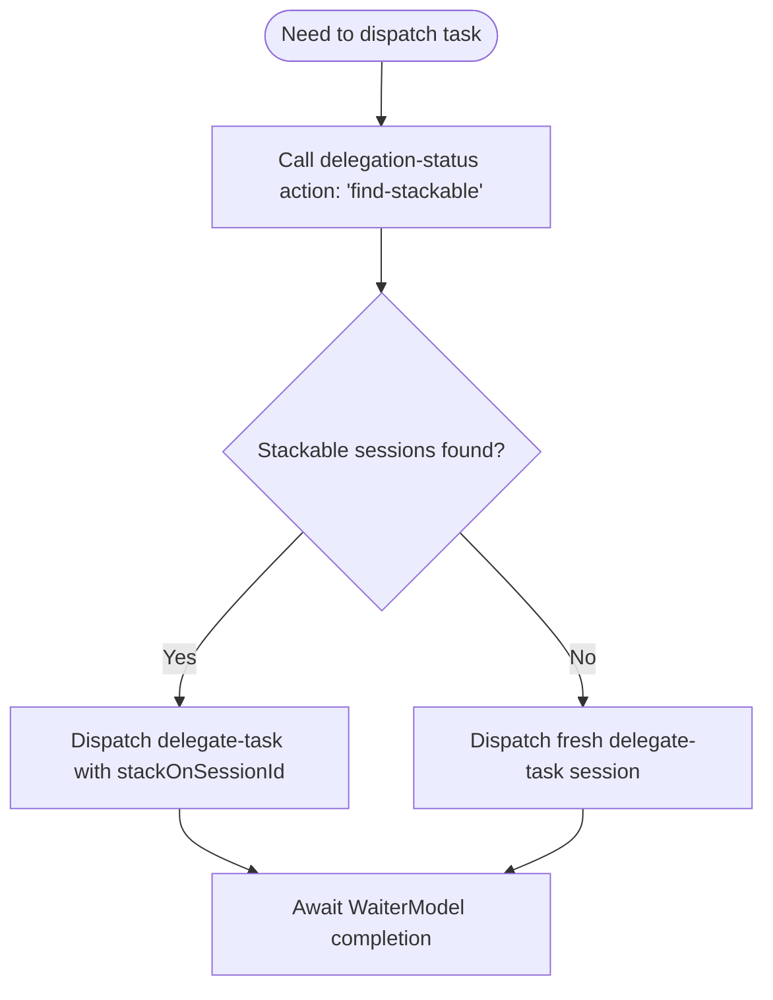

# Hivemind — User & Developer Guide

Welcome to the **Hivemind User and Developer Guide**. This guide provides practical instructions for developers, orchestrators, and subagents on how to interact with the Hivemind composition engine, execute slash commands, manage agent delegation, and leverage session continuity.

---

## 1. CLI Commands & Initialization

Hivemind is packaged as a standard CLI utility called `hivemind`. You can run diagnostic checks and bootstrap your project using these core commands:

```bash
# Initialize a new Hivemind workspace (creates .hivemind/ and .opencode/ directories)
npx hivemind init

# Run system diagnostic checklist (the Doctor mode checkup)
npx hivemind doctor

# Validate configuration schemas and primitive structures
npx hivemind validate
```

> [!TIP]
> Always run `npx hivemind doctor` before launching long-running multi-agent sessions to verify TypeScript compilation, test status, and plugin bindings.

---

## 2. Session Stacking & Continuity Protocols

One of Hivemind's core capabilities is **Session Stacking**—the ability to attach new executions or subtask dispatches onto a pre-existing (completed, failed, aborted, or active) session. This preserves parent-child context and prevents loss of learned history.

### 2.1 The "Stack-On" Delegation Protocol
Before spawning any new delegation, you must check for stackable or resumable sessions using `delegation-status`:



### 2.2 Finding & Stacking Sessions
Call `delegation-status` to find sessions matching your target agent:
```json
// Tool Call: delegation-status({ action: "find-stackable", agentFilter: "hm-l2-researcher" })
// Tool Output:
{
  "success": true,
  "stackable": [
    {
      "childSessionId": "ses_1ed9df1adffe2hbJudz3sK60y3",
      "agent": "hm-l2-researcher",
      "status": "error",
      "delegateTaskCommand": "delegate-task({ agent: 'hm-l2-researcher', prompt: '...', stackOnSessionId: 'ses_1ed9df1adffe2hbJudz3sK60y3' })"
    }
  ]
}
```

If a stackable session is returned, **always prefer stacking** over spawning a new session. Run the recommended `delegateTaskCommand`.

---

## 3. Command Usage & Workflow Flags

Hivemind commands support standard modifiers to control behavior in non-interactive runtimes.

| Flag | Behavior | Example Usage |
|------|----------|---------------|
| `--force` | Bypasses confirmation gates and forces full regeneration or overwriting. | `/gsd-docs-update --force` |
| `--verify-only` | Runs a dry-run audit or fact-check without making file modifications. | `/gsd-docs-update --verify-only` |

> [!WARNING]
> Running commands with `--force` will overwrite hand-written documents. Ensure you have committed your changes before using it.

---

## 4. Subagent Guidelines & Work Contracts

When you are dispatched as a subagent under the Hivemind engine, you must obey the following execution rules:

### 4.1 Announcing Your Role
At the start of your execution, you must announce your classification and domain to establish communication transparency:
> *"I am a subagent of class `L2 Specialist` running role `hm-l2-researcher`. I will fulfill the requested task within my contract boundaries."*

### 4.2 Honoring allowedSurfaces
Your execution is bounded by the **Agent Work Contract** (located at `.hivemind/state/agent-work-contracts.json`).
- You are strictly restricted to reading and writing files specified in `allowedSurfaces`.
- Do not touch files in `nonGoals` or outer workspace domains.
- If you encounter permission errors or missing capabilities, report them to the parent L1 coordinator instead of attempting silent bypasses.

### 4.3 Checklist for Subagents
Before declaring a task complete, you must pass the quality gate checklist:
- [ ] Code builds without errors (`npm run typecheck`).
- [ ] Tests pass cleanly with zero failures (`npm run test`).
- [ ] No secret patterns or API keys are written in documentation or source files.
- [ ] Factual assertions are verified against actual codebase states.
- [ ] Handoff documents or output files are fully committed to Git.
