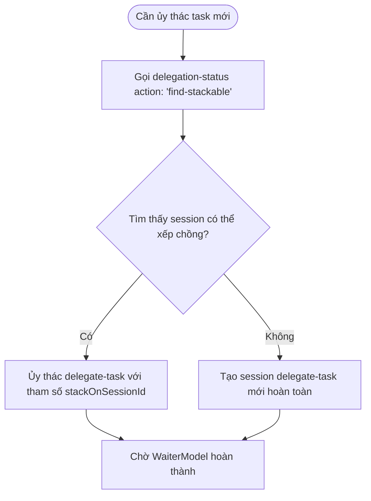

# Hivemind — Hướng dẫn Sử dụng & Lập trình (User & Developer Guide)

Chào mừng bạn đến với **Hướng dẫn Sử dụng và Lập trình Hivemind**. Tài liệu này cung cấp các chỉ dẫn thực tế dành cho lập trình viên, điều phối viên (orchestrators) và các subagents về cách tương tác với bộ máy cấu trúc Hivemind (Hivemind composition engine), thực thi các slash command, quản lý việc ủy thác agent (agent delegation) và tận dụng tính liên tục của session (session continuity).

---

## 1. Các Lệnh CLI & Khởi tạo (Initialization)

Hivemind được đóng gói dưới dạng một công cụ CLI tiêu chuẩn có tên là `hivemind`. Bạn có thể chạy kiểm tra chẩn đoán hệ thống và thực hiện bootstrap dự án của mình bằng các lệnh cốt lõi sau:

```bash
# Khởi tạo một workspace Hivemind mới (tạo các thư mục .hivemind/ và .opencode/)
npx hivemind init

# Chạy danh sách chẩn đoán hệ thống (chạy kiểm tra chế độ "Doctor")
npx hivemind doctor

# Xác thực các config schema và cấu trúc primitive
npx hivemind validate
```

> [!TIP]
> Hãy luôn chạy `npx hivemind doctor` trước khi bắt đầu các session chạy ngầm đa agent kéo dài (multi-agent sessions) để đảm bảo biên dịch TypeScript, trạng thái test và liên kết plugin hoạt động hoàn hảo.

---

## 2. Xếp chồng Session & Giao thức Liên tục (Session Stacking & Continuity Protocols)

Một trong những tính năng mạnh mẽ nhất của Hivemind là **Session Stacking** (Xếp chồng Session)—khả năng gắn các lượt thực thi mới hoặc các nhiệm vụ phụ (subtask dispatches) vào một session có sẵn trước đó (dù đã hoàn thành, thất bại, bị hủy hoặc đang hoạt động). Điều này giúp bảo toàn ngữ cảnh parent-child và ngăn ngừa mất mát dữ liệu lịch sử đã học.

### 2.1 Giao thức Ủy thác "Stack-On"
Trước khi bắt đầu bất kỳ delegation mới nào, bạn phải kiểm tra xem có session nào có thể xếp chồng (stackable) hoặc có thể khôi phục (resumable) hay không bằng cách sử dụng `delegation-status`:



### 2.2 Tìm kiếm & Xếp chồng Session
Gọi công cụ `delegation-status` để tìm kiếm các session phù hợp với agent mục tiêu:
```json
// Tool Call: delegation-status({ action: "find-stackable", agentFilter: "hm-l2-researcher" })
// Tool Output:
{
  "success": true,
  "stackable": [
    {
      "childSessionId": "ses_1ed9df1adffe2hbJudz3sK60y3",
      "agent": "hm-l2-researcher",
      "status": "error",
      "delegateTaskCommand": "delegate-task({ agent: 'hm-l2-researcher', prompt: '...', stackOnSessionId: 'ses_1ed9df1adffe2hbJudz3sK60y3' })"
    }
  ]
}
```

Nếu một session có thể xếp chồng được trả về, **hãy luôn ưu tiên xếp chồng** thay vì tạo một session mới. Hãy chạy lệnh đề xuất `delegateTaskCommand`.

---

## 3. Cách Sử dụng Lệnh & Các Flag Quy trình công việc (Workflow Flags)

Các lệnh Hivemind hỗ trợ các flag tiêu chuẩn để điều khiển hành vi trong môi trường thực thi không tương tác (non-interactive runtimes).

| Flag | Hành vi | Ví dụ Sử dụng |
|------|---------|---------------|
| `--force` | Bỏ qua các bước xác nhận và bắt buộc tái tạo hoặc ghi đè toàn bộ dữ liệu. | `/gsd-docs-update --force` |
| `--verify-only` | Chạy thử nghiệm chẩn đoán (dry-run) hoặc kiểm tra thực tế mà không thay đổi file. | `/gsd-docs-update --verify-only` |

> [!WARNING]
> Việc chạy các lệnh với flag `--force` sẽ ghi đè lên các tài liệu tự viết thủ công (hand-written). Hãy đảm bảo bạn đã commit các thay đổi của mình trước khi chạy.

---

## 4. Hướng dẫn dành cho Subagent & Hợp đồng Công việc (Work Contracts)

Khi bạn được ủy thác hoạt động như một subagent dưới sự điều phối của bộ máy Hivemind, bạn phải tuân thủ các quy tắc thực thi sau:

### 4.1 Khai báo Vai trò của Bạn (Announcing Your Role)
Bắt đầu lượt thực thi, bạn phải công bố phân loại và miền hoạt động để thiết lập tính minh bạch trong giao tiếp:
> *"Tôi là subagent thuộc lớp `L2 Specialist` đảm nhận vai trò `hm-l2-researcher`. Tôi sẽ hoàn thành tác vụ được yêu cầu trong ranh giới hợp đồng của mình."*

### 4.2 Tôn trọng Ranh giới allowedSurfaces
Phạm vi thực thi của bạn bị giới hạn nghiêm ngặt bởi **Agent Work Contract** (nằm tại `.hivemind/state/agent-work-contracts.json`).
- Bạn chỉ được phép đọc và ghi các file được định nghĩa rõ ràng trong danh sách `allowedSurfaces`.
- Tuyệt đối không chạm vào các file nằm trong danh sách `nonGoals` hoặc các phân vùng workspace bên ngoài.
- Nếu bạn gặp lỗi quyền truy cập hoặc thiếu chức năng, hãy báo cáo lại cho điều phối viên cha L1 (L1 coordinator) thay vì tìm cách vượt qua một cách âm thầm.

### 4.3 Danh sách Kiểm tra (Checklist) dành cho Subagent
Trước khi tuyên bố hoàn thành tác vụ, bạn phải vượt qua checklist của quality gate:
- [ ] Mã nguồn tự biên dịch thành công không có lỗi (`npm run typecheck`).
- [ ] Tất cả các test đều vượt qua thành công (`npm run test`).
- [ ] Không có chuỗi ký tự nhạy cảm (secrets) hoặc API keys nào được ghi lại trong tài liệu hoặc mã nguồn.
- [ ] Các phát biểu thực tế trong tài liệu được đối chiếu chính xác với trạng thái codebase thực tế.
- [ ] Các tài liệu bàn giao hoặc file kết quả đã được commit đầy đủ vào Git.
