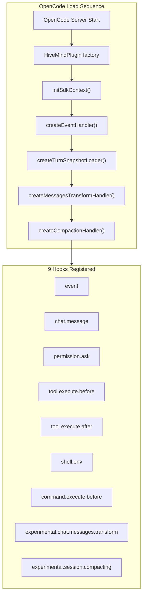
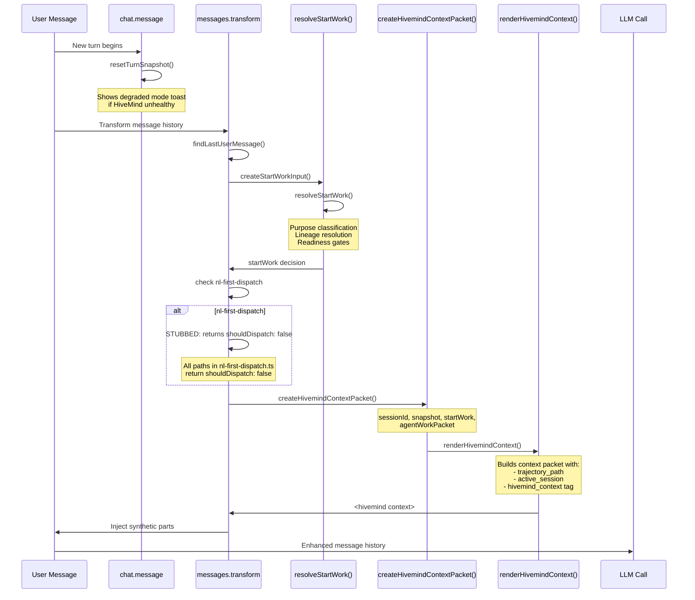
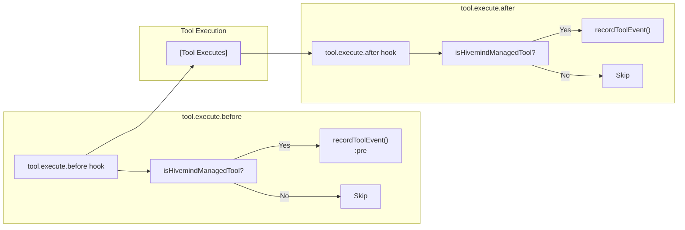
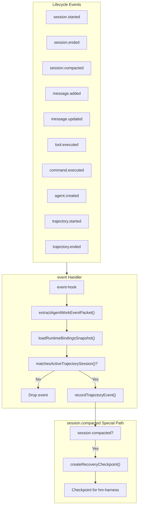
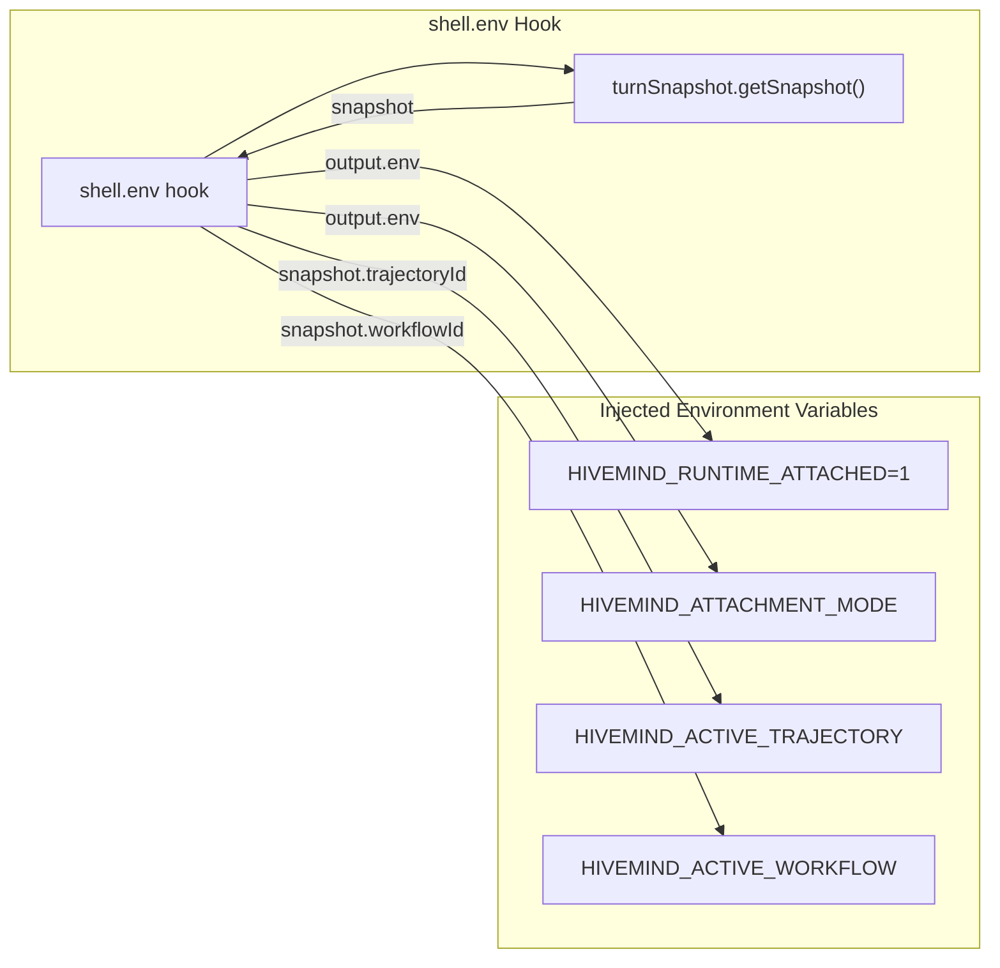
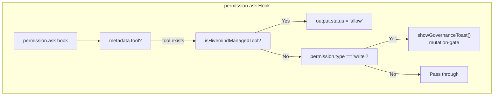
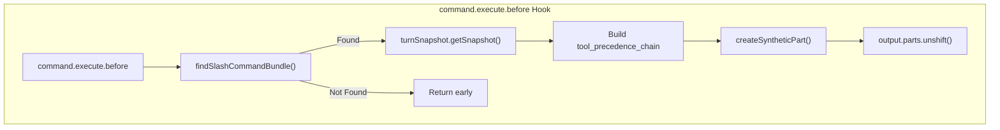
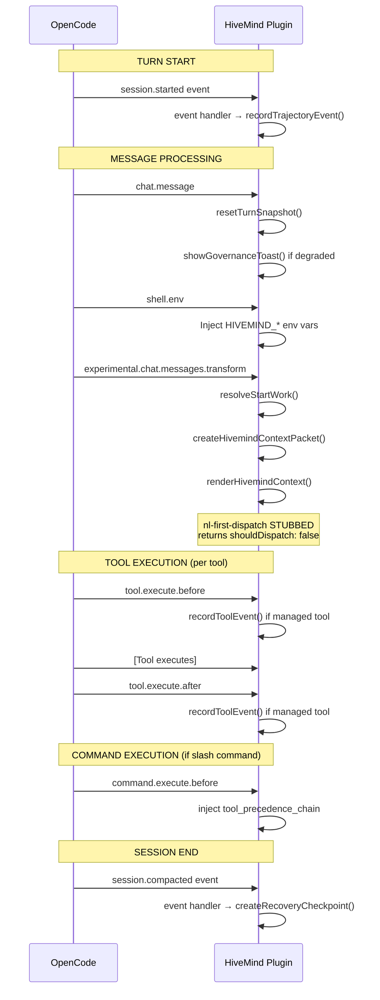

# HiveMind Hook Pipeline Diagram

> **Document ID**: `hook-pipeline-diagram-2026-03-23`
> **SOT**: `src/plugin/opencode-plugin.ts`, `src/hooks/event-handler.ts`, `src/plugin/messages-transform-adapter.ts`
> **Stub Status**: `nl-first-dispatch` returns `shouldDispatch: false` in all paths

---

## 1. Hook Registration Flow



**Hook Registration Order (opencode-plugin.ts:59-165)**:

| # | Hook Key | Handler Created | Scope |
|---|----------|------------------|-------|
| 1 | `event` | `createEventHandler()` | Session |
| 2 | `chat.message` | Inline (lines 73-85) | Turn |
| 3 | `permission.ask` | Inline (lines 86-103) | Turn |
| 4 | `tool.execute.before` | Inline (lines 104-109) | Turn |
| 5 | `tool.execute.after` | Inline (lines 158-162) | Turn |
| 6 | `shell.env` | Inline (lines 110-116) | Turn |
| 7 | `command.execute.before` | Inline (lines 117-157) | Turn |
| 8 | `experimental.chat.messages.transform` | `createMessagesTransformHandler()` | Turn |
| 9 | `experimental.session.compacting` | `createCompactionHandler()` | Session |

---

## 2. Message Processing Pipeline



**Key Functions**:

| Function | Location | Purpose |
|----------|----------|---------|
| `resolveStartWork()` | `hooks/start-work/start-work-router.ts` | Purpose classification, lineage, readiness gates |
| `createHivemindContextPacket()` | `plugin/context-renderer.ts` | Builds canonical context packet |
| `renderHivemindContext()` | `plugin/context-renderer.ts` | Renders packet to string format |
| `maybeExecuteNlFirstRuntimeDispatch()` | `features/runtime-entry/nl-first-dispatch.ts` | **STUBBED** - always returns `shouldDispatch: false` |

---

## 3. Tool Execution Pipeline



**Managed Tools** (`hooks/runtime-loader/tool-governance.ts`):

| Tool Name | Purpose |
|-----------|---------|
| `hivemind_runtime_status` | Runtime status reporting |
| `hivemind_runtime_command` | Command execution |
| `hivemind_task` | Task management |
| `hivemind_trajectory` | Trajectory tracking |
| `hivemind_handoff` | Agent handoff |
| `hivemind_doc` | Documentation access |
| `hivemind_agent_work_create_contract` | Contract creation |
| `hivemind_agent_work_export_contract` | Contract export |

---

## 4. Session Lifecycle Events



**Event Handler Logic** (`hooks/event-handler.ts:87-124`):

```
1. Extract agent-work event packet
2. Load runtime bindings snapshot
3. If no trajectoryId → DROP
4. If session not in trajectory → DROP
5. Record trajectory event with evidence refs
6. If session.compacted → create recovery checkpoint
```

---

## 5. Environment Injection



---

## 6. Permission Gate



---

## 7. Command Execution Pipeline



---

## 8. Complete Hook Execution Order (Per Turn)



---

## 9. Scope of Impact Matrix

| Hook | Turn | Session | Subsession | Notes |
|------|------|---------|------------|-------|
| `event` | — | ✅ | ✅ | All lifecycle events |
| `chat.message` | ✅ | — | — | Reset turn snapshot |
| `permission.ask` | ✅ | — | — | Auto-allow managed tools |
| `tool.execute.before` | ✅ | — | — | Pre-tool event recording |
| `tool.execute.after` | ✅ | — | — | Post-tool event recording |
| `shell.env` | ✅ | — | — | Env injection per turn |
| `command.execute.before` | ✅ | — | — | Pre-command context injection |
| `messages.transform` | ✅ | — | — | Primary injection pipeline |
| `session.compacting` | — | ✅ | ✅ | Recovery checkpoint creation |

---

## 10. Stubbed Code: `nl-first-dispatch`

**Location**: `src/features/runtime-entry/nl-first-dispatch.ts`

**All code paths return `shouldDispatch: false`**:

```typescript
// Line 47: Control plane primitive found
return { plan: { shouldDispatch: false, routeKind: 'control-plane', ... } }

// Line 59: No command available
return { plan: { shouldDispatch: false, routeKind: 'none', ... } }

// Line 70: Command bundle not found
return { plan: { shouldDispatch: false, routeKind: 'none', ... } }

// Line 80: Default fallback
return { plan: { shouldDispatch: false, routeKind: 'workflow-command', ... } }
```

**Impact**: The NL-first runtime dispatch mechanism is non-functional. The `dispatch.plan.shouldDispatch` check in `messages-transform-adapter.ts:84` never triggers, so the turn snapshot reset at line 87 (`turnSnapshot.resetTurnSnapshot()`) is never called after dispatch.

---

## Appendix: File References

| File | Lines | Role |
|------|-------|------|
| `src/plugin/opencode-plugin.ts` | 40-172 | Plugin factory, 9 hook registrations |
| `src/hooks/event-handler.ts` | 87-125 | Event routing to trajectory ledger |
| `src/plugin/messages-transform-adapter.ts` | 38-131 | Primary message injection pipeline |
| `src/plugin/compaction-adapter.ts` | 23-46 | Session compaction context |
| `src/features/runtime-entry/nl-first-dispatch.ts` | 32-86 | **STUBBED** dispatch logic |
| `src/plugin/runtime-snapshot.ts` | 20-35 | Per-turn snapshot caching |
