<!-- generated-by: gsd-doc-writer -->

# Architecture

## Tổng quan hệ thống / System Overview

`hivemind` là một **runtime composition engine** cho nền tảng AI coding OpenCode — được phân phối dưới dạng gói npm (`hivemind` v0.1.0). Đây là một plugin TypeScript kết nối các công cụ tùy chỉnh (write-side, CQRS command) và hook sự kiện (read-side, CQRS query) vào hệ thống plugin của OpenCode, cung cấp khả năng điều phối session ủy quyền, duy trì continuity bền vững, kiểm soát đồng thời, phát hiện hoàn thành tín hiệu kép (dual-signal completion), và guardrail runtime.

Hivemind is a **runtime composition engine** for the OpenCode AI coding platform — delivered as an npm package (`hivemind` v0.1.0). It is a TypeScript plugin that wires custom tools (write-side, CQRS command) and event hooks (read-side, CQRS query) into OpenCode's plugin system to provide delegated session orchestration, durable continuity persistence, concurrency control, dual-signal completion detection, and runtime guardrails.

### Hai nửa kiến trúc / Two Havles

Hệ thống có hai nửa không bao giờ được nhầm lẫn:

| Half | What | Where | Architecture Reference |
|------|------|-------|----------------------|
| **Hard Harness** (npm package) | Tools (write-side), Hooks (read-side), Plugin (assembly), Shared (leaf), Task-Management (state), Coordination (delegation), Features (runtime), Config, Routing | `src/` | CQRS, 9-surface model |
| **Soft Meta-Concepts** (user-configurable) | Skills, Agents, Commands, Rules, Permissions — NEVER development implementation, NEVER runtime state | `.opencode/` | Primitives-only |
| **Internal State** (deep module persistence) | Session journals, execution lineage, runtime state, vector/graph memory — NEVER stored in `.opencode/` | `.hivemind/` | Canonical Q6 root |
| **Meta-Authoring** (source-of-truth) | Lab environment for authoring primitives before reflection to `.opencode/` | `.hivefiver-meta-builder/` | Source-of-Truth layer |
| **Governance** (planning/authorization) | Requirements, roadmaps, architecture maps, phase authorization — never runtime code | `.planning/` | Planning/Governance sector |

### Kiểu kiến trúc / Architectural Style

Kiến trúc là **event-driven CQRS pha trộn Plugin Architecture**:

- **Tools (command/write side)**: Mọi tool nhận input, kiểm tra qua Zod schema (trong `src/schema-kernel/`), thực thi mutation (ủy quyền, cấu hình, patch), và trả kết quả. Không tool nào chứa business logic phức tạp — tất cả đều ủy quyền xuống coordination/task-management layer.
- **Hooks (query/read side)**: Hook quan sát sự kiện của OpenCode runtime (idle, error, deleted, message) và route chúng đến lifecycle manager. Hook không bao giờ tự mutation state.
- **Plugin (assembly root)**: `src/plugin.ts` là composition root — mỏng (~664 LOC), chỉ chịu trách nhiệm khởi tạo dependency, wire hook factory, và đăng ký 23 custom tool.

The architecture is **event-driven CQRS blended with Plugin Architecture**:

- **Tools (command/write side)**: Each tool receives input, validates via Zod schemas (in `src/schema-kernel/`), performs mutations (delegation, config, patch), and returns results. No tool contains complex business logic — all delegate to the coordination/task-management layer.
- **Hooks (query/read side)**: Hooks observe OpenCode runtime events (idle, error, deleted, message) and route them to the lifecycle manager. Hooks never mutate state themselves.
- **Plugin (assembly root)**: `src/plugin.ts` is the composition root — deliberately thin (~664 LOC), responsible only for instantiating dependencies, wiring hook factories, and registering 23 custom tools.

## Sơ đồ thành phần / Component Diagram

```mermaid
graph TD
    OC[OpenCode Runtime]
    PLUGIN[plugin.ts<br/>Composition Root ~664 LOC<br/>23 tools, 8 hooks]

    subgraph Tools [Write-Side — src/tools/]
        DT[delegate-task]
        DS[delegation-status]
        RBC[run-background-command]
        ESC[execute-slash-command]
        SP[session-patch]
        ST[session-tracker]
        SH[session-hierarchy]
        SCTX[session-context]
        SJ[session-journal-export]
        CP[configure-primitive]
        VR[validate-restart]
        BI[bootstrap-init]
        BR[bootstrap-recover]
        PS[prompt-skim]
        PA[prompt-analyze]
        HD[hivemind-doc]
        HT[hivemind-trajectory]
        HP[hivemind-pressure]
        HS[hivemind-sdk-supervisor]
        HCE[hivemind-command-engine]
        HSV[hivemind-session-view]
        HAWC[hivemind-agent-work]
        CGS[create-governance-session]
    end

    subgraph Hooks [Read-Side — src/hooks/]
        CH[core-hooks<br/>event, messages.transform]
        SHK[session-hooks<br/>session.read.*]
        TGH[tool-guard-hooks<br/>circuit-breaker, budget]
        TBG[tool-before-guard]
        TAC[tool-after-composer]
        TAF[tool-after-workflow]
        CMC[chat-message-capture]
        CQRS[cqrs-boundary]
    end

    subgraph Coordination [Delegation — src/coordination/]
        DM[DelegationManager<br/>WaiterModel dispatch]
        DC[DelegationCoordinator]
        DD[DelegationDispatcher]
        DL[DelegationLifecycle]
        DMON[DelegationMonitor]
        CD[CompletionDetector<br/>dual-signal]
        CQ[ConcurrencyQueue<br/>keyed semaphore]
        AR[AgentResolver]
        SM[SlotManager]
        NR[NotificationRouter]
        PN[PeriodicNotifier]
        RH[DelegationRetryHandler]
        SPWN[spawner/<br/>session-creator, auto-loop, ralph-loop]
    end

    subgraph TaskMgmt [State — src/task-management/]
        CONT[continuity/<br/>session-continuity.json I/O]
        JL[journal/<br/>append-only event timeline]
        TRJ[trajectory/<br/>execution lineage ledger]
        LC[lifecycle/<br/>state machine]
    end

    subgraph Features [Runtime Capabilities — src/features/]
        FEAT_SCT[session-tracker]
        FEAT_AL[auto-loop]
        FEAT_RL[ralph-loop]
        FEAT_PTY[background-command/pty]
        FEAT_DOC[doc-intelligence]
        FEAT_GE[governance-engine]
        FEAT_PP[prompt-packet]
        FEAT_RP[runtime-pressure]
        FEAT_SS[sdk-supervisor]
        FEAT_AWC[agent-work-contracts]
        FEAT_BOOT[bootstrap]
    end

    subgraph Shared [Leaf — src/shared/]
        SA[session-api.ts<br/>SDK wrappers]
        ST[state.ts<br/>in-memory Maps]
        TY[types.ts<br/>shared types]
        HL[helpers.ts, tool-helpers.ts]
        TR[tool-response.ts]
        RP[runtime-policy.ts]
        SEC[security/<br/>path-scope, redaction]
    end

    subgraph Schema [Validation — src/schema-kernel/]
        ZK[Zod schemas<br/>~20 schema files]
    end

    subgraph Config [Configuration — src/config/]
        CS[config/subscriber.ts]
        CC[config/compiler.ts]
    end

    subgraph Routing [Entry — src/routing/]
        SE[session-entry/<br/>purpose classifier]
        BP[behavioral-profile/<br/>profile resolver]
        CE[command-engine]
    end

    OC -->|imports plugin| PLUGIN
    PLUGIN -->|registers 7 delegation tools| DT & DS & RBC
    PLUGIN -->|registers 7 session tools| ESC & SP & ST & SH & SCTX & SJ & CGS
    PLUGIN -->|registers 8 hivemind tools| HD & HT & HP & HS & HCE & HSV & HAWC
    PLUGIN -->|registers 6 config tools| CP & VR & BI & BR & PS & PA
    PLUGIN -->|wires 8 hooks| CH & SHK & TGH & TBG & TAC & TAF & CMC & CQRS
    PLUGIN -->|instantiates| DM
    PLUGIN -->|instantiates| LC
    PLUGIN -->|instantiates| FEAT_SCT

    DM -->|dispatches via| DC
    DC -->|uses| DD & DL & DMON & CD & CQ & AR & SM & NR & PN & RH
    DM -->|creates sessions| SPWN

    LC -->|reads/writes| CONT
    LC -->|reads/writes| ST
    LC -->|uses| SA
    LC -->|owns| CD

    CH -->|routes events to| LC
    TBG -->|enforces policy| RP

    SPWN -->|uses| SA

    CONT & ST & SA & HL & RP --> TY
    TRJ --> CONT
    JL --> CONT
    FEAT_SCT --> SA & ST
    FEAT_AWC --> ST

    CS --> CC
    SE --> RP
    BP --> RP

    ZK -.->|validates| DT & CP & BI & VR & HT & HP
    TY -.-> ZK
```



## Luồng dữ liệu / Data Flow

### 1. Khởi tạo Plugin / Plugin Initialization Flow

The plugin lifecycle starts when OpenCode loads the plugin module:

```
OpenCode runtime imports plugin.ts
  → HarnessControlPlane({ client, directory }) called
  → 1. Load runtime policy (loadRuntimePolicy + resolveWorkspaceRuntimePolicy)
  → 2. Load Hivemind configs (getConfig — lazy-cached, falls back to defaults)
  → 3. Create PTY manager if supported (createPtyManagerIfSupported — graceful fallback)
  → 4. Create SessionTracker (constructCoreDependencies)
  → 5. Wire delegation modules (setupDelegationModules)
      → SlotManager, AgentResolver, DelegationDispatcher, CompletionDetector
      → NotificationRouter, PeriodicNotifier, DelegationLifecycle, DelegationMonitor
      → DelegationCoordinator, DelegationManager
  → 6. Async recovery of pending delegations (delegationManager.recoverPending)
  → 7. Create lifecycle manager (createHarnessLifecycleManager)
  → 8. Hydrate from continuity (lifecycleManager.hydrateFromContinuity)
  → 9. Drain pending delegation notifications
  → 10. Wire completion detector into delegation manager
  → 11. Initialize session tracker (async, fire-and-forget)
  → 12. Register 23 tools (4 domain registration functions)
  → 13. Register 8 hooks (core, session, guard, before/after, compose, message)
  → Return plugin object { config, tool, hooks, event observers }
```

The entire initialization is synchronous except the async fire-and-forget calls (`recoverPending`, `sessionTracker.initialize`, legacy migration) — plugin init never blocks the OpenCode startup.

### 2. Luồng Ủy quyền / Delegation Flow

When an agent calls `delegate-task`:

```
Agent calls delegate-task tool
  → src/tools/delegation/delegate-task.ts creates delegation packet
  → DelegationManager.dispatch(packet)
     → 1. Validate agent via AgentResolver
     → 2. Acquire concurrency slot via SlotManager
     → 3. Dispatch via DelegationDispatcher → SDK child session or PTY
     → 4. Lifecycle transitions: dispatched → running
     → 5. Persist delegation record (delegation-persistence.ts → .hivemind/state/)
     → 6. Monitor execution via DelegationMonitor
     → 7. CompletionDetection watches for:
        - System event: session.idle signal (via lifecycle hooks)
        - Polling signal: message count stability across polls
     → 8. Dual-signal = idle event + stable message count → transition to completed
     → 9. NotificationRouter delivers result + notification back to parent
  → Return delegation ID immediately (WaiterModel — always-background)
```

### 3. Luồng Continuity / Session Continuity Flow

State persistence ensures durability across harness restarts:

```
Delegation created → session ID recorded → journal append → continuity update
  → src/task-management/journal/index.ts appends event to journal
  → src/task-management/continuity/index.ts writes session-continuity.json
  → src/task-management/trajectory/index.ts tracks execution lineage
  → In-memory state in src/shared/state.ts (Maps) — volatile complement

On restart:
  → lifecycleManager.hydrateFromContinuity() reads .hivemind/state/session-continuity.json
  → delegationManager.recoverPending() recovers in-flight delegations
  → replayPendingDelegationNotifications() drains queued notifications
```

### CQRS Boundary Enforcement

```
Tool execution (write side):
  tool.execute.before hook (src/hooks/transforms/tool-before-guard.ts)
    → validate tool against runtime policy (circuit breaker, budget)
    → check agent work contract enforcement
    → detect task tool dispatch for proactive child session discovery
  tool.execute → tool executes
  tool.execute.after hook (src/hooks/transforms/tool-after-composer.ts)
    → capture tool metadata via session tracker
    → summarize output for downstream consumers

Session event (read side):
  event hook → core-hooks.ts routes to lifecycleManager.handleEvent()
    → if session.idle: feed CompletionDetector
    → if session.error/deleted: transition state, persist
    → no mutations outside lifecycle manager
```

## Abstraction chính / Key Abstractions

| Abstraction | File | Purpose |
|-------------|------|---------|
| `HarnessControlPlane` | `src/plugin.ts` | Composition root. Thin async factory (~664 LOC) that instantiates dependencies, wires hook factories, and registers 23 custom tools via 4 domain registration functions. No business logic. |
| `DelegationManager` | `src/coordination/delegation/manager.ts` | Core delegation orchestrator. Handles WaiterModel dispatch (always-background), dual-signal completion monitoring, PTY/SDK dispatch, and recovery. Used by `delegate-task` and `delegation-status` tools. |
| `DelegationCoordinator` | `src/coordination/delegation/coordinator.ts` | Coordinates the delegation pipeline: dispatcher, monitor, notification router, lifecycle, detector, retry handler chain. The inner orchestration core behind DelegationManager. |
| `CompletionDetector` | `src/coordination/completion/detector.ts` | Dual-signal completion detection. Watches for session.idle terminal events AND message count stability before declaring completion. Configurable stability timeout. |
| `SlotManager` | `src/coordination/delegation/slot-manager.ts` | Concurrency slot management — controls how many concurrent delegations are allowed. |
| `AgentResolver` | `src/coordination/delegation/agent-resolver.ts` | Resolves target agents from delegation requests against the OpenCode agent registry. |
| `SessionTracker` | `src/features/session-tracker/index.ts` | Typed owning module for session knowledge capture. Tracks events, creates artifacts, handles recovery across restarts. Constructed before delegation modules for proactive child session discovery. |
| `ContinuityStore` (module) | `src/task-management/continuity/index.ts` | Durable JSON persistence I/O — CRUD operations for session-continuity.json. Includes in-memory cache (store-cache.ts) and delegation persistence (delegation-persistence.ts). Implements deep-clone-on-read, atomic writes, Q6 canonical path (`.hivemind/state/`). |
| `HarnessLifecycleManager` | `src/task-management/lifecycle/index.ts` | Session lifecycle state machine. Manages state transitions (created, queued, dispatching, running, completed, failed), roots budgets, owns the CompletionDetector. Hydrates from continuity on startup. |
| `RuntimePolicy` | `src/shared/runtime-policy.ts` | Runtime policy loading and resolution. Defines defaults (concurrency limits, budget limits, max delegation depth), validates workspace-level policy YAML files, enforces behavioral constraints on agents. |
| `NotificationRouter` | `src/coordination/delegation/notification-router.ts` | Routes delegation completion/error/timeout notifications back to parent sessions. Handles TUI delivery and pending notification persistence. |
| `CQRSBoundary` | `src/hooks/composition/cqrs-boundary.ts` | Classifies hook invocations as read or write to enforce CQRS separation. Prevents hooks from accidentally mutating state. |

### Chế độ ủy quyền: WaiterModel / Delegation Model: WaiterModel

The core delegation pattern is **WaiterModel** — always-background asynchronous dispatch:

```
dispatch(packet)
  → delegationManager.dispatch() returns delegation ID immediately
  → agent polls with delegation-status tool
  → CompletionDetector runs in background (event-driven + polling)
  → On completion: result available via delegation-status
  → NotificationRouter pushes terminal notification to parent session TUI
```

This is fundamentally different from synchronous RPC — the calling agent never blocks on delegation completion. Two parallel detection paths ensure reliability:
1. **System event path**: `session.idle` event → lifecycle manager → CompletionDetector.feed()
2. **Polling path**: DelegationManager polls child message count → detects stability across polls

Both signals must agree (dual-signal) before declaring completion.

## Cấu trúc thư mục / Directory Structure Rationale

```
src/
├── plugin.ts                  # Composition root (~664 LOC) — single entrypoint OpenCode loads
├── index.ts                   # Public API re-exports — exposes HarnessControlPlane + modules
├── coordination/              # Delegation orchestration & concurrency control
│   ├── delegation/            #   DelegationManager, coordinator, dispatcher, lifecycle, etc.
│   │   ├── manager.ts         #     WaiterModel dispatch (~365 LOC)
│   │   ├── coordinator.ts     #     Inner orchestration chain
│   │   ├── dispatcher.ts      #     Task dispatch
│   │   ├── lifecycle.ts       #     State transitions
│   │   ├── monitor.ts         #     Status monitoring
│   │   ├── agent-resolver.ts  #     Agent resolution against registry
│   │   ├── slot-manager.ts    #     Concurrency slots
│   │   ├── retry-handler.ts   #     Retry logic
│   │   ├── notification-router.ts #  Notification routing
│   │   ├── periodic-notifier.ts   #  Periodic TUI push
│   │   └── sdk-child-session-starter.ts # SDK child session creation
│   ├── completion/            #   Dual-signal completion detection
│   │   └── detector.ts
│   ├── concurrency/           #   Task queue management
│   │   └── queue.ts
│   ├── spawner/               #   Session creation (auto-loop, ralph-loop)
│   │   ├── auto-loop.ts       #     Auto-loop implementation
│   │   ├── ralph-loop.ts      #     Ralph loop with escalation
│   │   ├── session-creator.ts #     Session creation
│   │   ├── spawn-request-builder.ts # Spawn request construction
│   │   └── agent-primitive-policy.ts # Primitive-defined policy
│   ├── command-delegation/    #   Slash command delegation
│   └── sdk-delegation/        #   SDK child session delegation handler
├── task-management/           # Session state, continuity, journal, trajectory
│   ├── continuity/            #   Durable JSON persistence I/O
│   │   ├── index.ts           #     CRUD operations for session-continuity.json
│   │   ├── store-cache.ts     #     In-memory cache
│   │   └── delegation-persistence.ts # Delegation record I/O
│   ├── journal/               #   Append-only event timeline
│   │   ├── index.ts           #     Journal entry operations
│   │   ├── query.ts           #     Journal query operations
│   │   ├── replay.ts          #     Journal replay
│   │   └── execution-lineage.ts #   Lineage tracking
│   ├── trajectory/            #   Execution lineage ledger
│   │   ├── index.ts, ledger.ts, store-operations.ts, types.ts
│   └── lifecycle/             #   State machine for task lifecycle
│       └── index.ts
├── features/                  # Standalone runtime capabilities
│   ├── session-tracker/       #   Session event tracking & recovery
│   ├── auto-loop/             #   Automatic task loop
│   ├── ralph-loop/            #   Ralph loop with escalation
│   ├── background-command/    #   Background PTY command execution
│   │   └── pty/               #     PTY runtime (bun-pty or fallback)
│   ├── doc-intelligence/      #   Document querying (skim, read, chunk, search)
│   ├── governance-engine/     #   Governance session creation
│   ├── prompt-packet/         #   Prompt packet handling
│   ├── runtime-pressure/      #   Runtime pressure monitoring & classification
│   ├── sdk-supervisor/        #   SDK wrapper health diagnostics
│   ├── agent-work-contracts/  #   Agent work contract persistence & enforcement
│   └── bootstrap/             #   Primitive registry, control plane, cross-primitive validation
├── hooks/                     # Event hook factories (read-side CQRS)
│   ├── lifecycle/             #   Core lifecycle hooks (event, messages.transform)
│   │   ├── core-hooks.ts      #     Core lifecycle management
│   │   └── session-hooks.ts   #     Session-specific lifecycle
│   ├── guards/                #   Tool execution guardrails & governance blocks
│   │   ├── tool-guard-hooks.ts
│   │   └── governance-block.ts
│   ├── observers/             #   Event observers (delegation, session-entry, session-main)
│   │   ├── event-observers.ts
│   │   ├── session-entry-consumer.ts
│   │   ├── session-main-consumer.ts
│   │   ├── session-tracker-consumer.ts
│   │   └── delegation-consumer.ts
│   ├── transforms/            #   Tool input/output transforms & message capture
│   │   ├── tool-before-guard.ts
│   │   ├── tool-after-composer.ts
│   │   ├── tool-after-workflow.ts
│   │   └── chat-message-capture.ts
│   └── composition/           #   CQRS boundary classification
│       └── cqrs-boundary.ts
├── tools/                     # Custom tool implementations (write-side CQRS)
│   ├── delegation/            #   delegate-task.ts, delegation-status.ts
│   ├── session/               #   execute-slash-command, session-patch, session-tracker, etc.
│   ├── config/                #   configure-primitive, validate-restart, bootstrap-init/recover
│   ├── hivemind/              #   hivemind-doc, trajectory, pressure, command-engine, etc.
│   └── prompt/                #   prompt-skim, prompt-analyze
├── routing/                   # Session entry classification & behavioral profile
│   ├── session-entry/         #   Purpose classifier, intake gate, profile resolver
│   ├── behavioral-profile/    #   Profile resolution & definitions
│   └── command-engine/        #   Command bundle discovery & analysis
├── config/                    # Config subscriber, compiler, workflow management
│   ├── subscriber.ts
│   ├── compiler.ts
│   └── workflow/
├── schema-kernel/             # Zod validation schemas (~20 schema files)
│   ├── hivemind-configs.schema.ts
│   ├── tool.schema.ts, agent/command-frontmatter.schema.ts
│   ├── session-tracker/trajectory/runtime-pressure schemas
│   └── bootstrap/doc-intelligence/command-engine schemas
├── shared/                    # Leaf utilities, types, and SDK wrappers
│   ├── session-api.ts         #   Typed OpenCode SDK wrappers
│   ├── types.ts               #   Shared type definitions (leaf module)
│   ├── state.ts               #   In-memory state Maps
│   ├── helpers.ts             #   Pure utility functions
│   ├── runtime-policy.ts      #   Runtime policy loading
│   ├── workspace-runtime-policy.ts
│   ├── task-status.ts         #   Task status definitions
│   ├── tool-response.ts       #   Standard tool response envelope
│   ├── tool-helpers.ts        #   Tool helper utilities
│   ├── plugin-tool-output-summary.ts
│   ├── session-naming.ts      #   Session naming utilities
│   ├── security/              #   Path scope validation, data redaction
│   └── errors/                #   Error type definitions
├── sidecar/                   # Read-only state projection (GUI sidecar)
│   └── readonly-state.ts      #   Aggregated state — read-only, never mutates
└── cli/                       # CLI substrate for programmatic dispatch
    ├── index.ts               #   CLI entry point
    ├── router.ts              #   Command routing
    ├── discovery.ts           #   CLI discovery
    ├── renderer.ts            #   CLI rendering
    ├── commands/              #   CLI commands (init, doctor, recover, version, help)
    └── ui/                    #   CLI prompts
```

**Giải thích / Rationale:**

- **`plugin.ts` is deliberately thin** — it only assembles. All logic is pushed into dedicated factory/module files, keeping the composition root scannable and the dependency graph clear.
- **`coordination/` holds delegation orchestration** — the `DelegationManager` centralizes WaiterModel dispatch, while specialized submodules (dispatcher, lifecycle, monitor, retry) keep individual files under 500 LOC.
- **`task-management/` owns all state persistence** — continuity (JSON file I/O), journal (append-only event timeline), trajectory (execution lineage), and lifecycle (state machine) are separated by concern, not combined.
- **`features/` isolates standalone runtime capabilities** — each feature (session-tracker, auto-loop, PTY, doc-intelligence, etc.) is self-contained with its own module directory. Features depend on shared/ but not on each other.
- **`hooks/` and `tools/` map to CQRS surfaces** — hooks observe (read), tools mutate (write). The `composition/cqrs-boundary.ts` explicitly classifies each invocation to enforce this separation.
- **`schema-kernel/` centralizes all Zod schemas** — tool input validation, frontmatter contracts, and configuration shapes are in one place, making them discoverable and version-locked.
- **`shared/` is strictly leaf** — no module in `shared/` imports from any other `src/` directory (except Zod types). Guarantees no circular dependencies.
- **`routing/` isolates session entry** — purpose classification, behavioral profile resolution, and command engine analysis are extracted from plugin.ts into dedicated modules.

## Quy tắc phụ thuộc / Dependency Rules (Non-Negotiable)

1. **No circular dependencies** — enforced by the module graph. `src/shared/types.ts` is the root leaf. `src/shared/helpers.ts` is pure utility — no project-internal imports.
2. **Max module size: 500 LOC** — monitored; extraction thresholds trigger when files approach this limit. `plugin.ts` at ~664 LOC is the acknowledged exception as composition root.
3. **Deep-clone-on-read** in continuity store — all read operations return cloned objects to prevent mutation aliasing.
4. **`[Harness]` prefix** on all thrown errors — ensures error origin is identifiable in the OpenCode runtime.
5. **No `any` types on new code** — strict TypeScript mode (`strict: true`, `noUnusedLocals`, `noUnusedParameters`, `noImplicitReturns`).
6. **`verbatimModuleSyntax: true`** — use `import type` for type-only imports to prevent runtime import costs.
7. **Dual-layer state**: durable JSON file (`src/task-management/continuity/`) + in-memory Maps (`src/shared/state.ts`) — the volatile complement.

## Source vs Deploy / Source-of-Truth Model

The shipped OpenCode primitives (agents, commands, skills, workflows, references, templates) follow a **source-of-truth → deploy** model:

```
Source:  assets/                      — AUTHOR all primitives here
Author:  .hivefiver-meta-builder/     — Meta-authoring environment before reflection
Deploy:  .opencode/                   — Synced via scripts/sync-assets.js
Tooling: .opencode/get-shit-done/     — GSD developer tooling (NOT shipped)
```

Key principles:
- NEVER develop directly in `.opencode/` — it is a deployed copy
- If `.opencode/` is deleted, `npm run build` (or `node scripts/sync-assets.js`) regenerates everything
- Exception: `gsd-*` primitives are developer tooling (GSD framework used to build the project), NOT shipped primitives
- User-modified files in `.opencode/` are backed up (`.backup` suffix) before overwrite during updates

## Mô hình Plugin / Plugin Composition Root Pattern

The composition root pattern is visible in `src/plugin.ts`:

```typescript
export const HarnessControlPlane: Plugin = async ({ client, directory }) => {
  // 1. Load configuration and policies
  const runtimePolicy = loadRuntimePolicy(resolveWorkspaceRuntimePolicy(directory))
  const hivemindConfig: HivemindConfigs = getConfig(directory)
  const ptyManager = await createPtyManagerIfSupported()

  // 2. Create core runtime objects
  const sessionTracker = new SessionTracker({ client, projectRoot: directory })
  const delegationModules = setupDelegationModules({ client, directory, ptyManager, runtimePolicy })
  const lifecycleManager = createHarnessLifecycleManager({ client, delegationManager, runtimePolicy })

  // 3. Register tools (4 domain registration functions)
  const delegationTools = registerDelegationTools({ delegationManager, hivemindConfig, ... })
  const sessionTools = registerSessionTools({ client, sessionTracker, ... })
  const hivemindTools = registerHivemindTools({ ... })
  const configTools = registerConfigTools({ ... })

  // 4. Wire hooks
  return {
    config: async () => {},
    ...createCoreHooks({ ... }),
    ...sessionReadHooks,
    "tool.execute.before": createToolBeforeGuard({ ... }),
    "chat.message": async (input, output) => { ... },
    tool: { ...delegationTools, ...sessionTools, ...hivemindTools, ...configTools },
    "tool.execute.after": async (input, output) => { ... },
  }
}
```

The pattern ensures:
- **Zero business logic in the plugin layer** — it only assembles and wires
- **Domain registration functions** (`registerDelegationTools`, `registerSessionTools`, etc.) organize tool registration by concern
- **All dependencies are passed explicitly** via typed dependency interfaces (`DelegationToolDeps`, `SessionToolDeps`, etc.) — no global singletons or service locators
- **Async startup is fire-and-forget** — `recoverPending()`, `sessionTracker.initialize()`, and legacy migrations all run asynchronously without blocking plugin init
- **Dependency injection closure** (Phase 36.1 R-COMPLETION-DETECTOR-05): `delegationManager.setCompletionDetector()` closes the dependency loop between DelegationManager and CompletionDetector without forcing constructor order changes

## Quyết định kiến trúc / Validation Decisions (Q1–Q6)

Six architectural decisions locked 2026-04-25 as the foundation for all current and future development:

| Decision | Description |
|----------|-------------|
| **Q1** | Hybrid + Spec-Driven Automated Runtime Detection — deep codemap, file watcher, MCP tools, dependency graph; Layer 2 taxonomy |
| **Q2** | Artifact-Focused Sidecar — Next.js 15 + `@json-render/react`, reads `.hivemind/` and `.planning/`, READ-ONLY for canonical state |
| **Q3** | Session Journal as Complement + Time-Machine — append-only event timeline, independent of `continuity.ts` |
| **Q4** | MVP = 5 of 8 memory categories; Post-MVP = 3 with explicit gates |
| **Q5** | Full RICH gate required — 0 of 25 skills pass today is honest status; no threshold lowering |
| **Q6** | `.hivemind/` is internal state root; `.opencode/` is ONLY for OpenCode primitives — one-way migration |

## Cross-Cutting Concerns

- **Logging**: Structured logging via `client.app.log()` with service/level/message structure (`[Harness]` prefix). All log calls are fire-and-forget — never block execution.
- **Validation**: Zod schemas in `src/schema-kernel/` validate all tool inputs, configuration shapes, frontmatter contracts, and runtime pressure data.
- **Authentication**: None — Hivemind runs within the OpenCode environment with inherited permissions.
- **Security**: File-based persistence under `.hivemind/` with path scope validation and data redaction in `src/shared/security/`. Plugin architecture limits execution surface.
- **PTY**: Optional `bun-pty` dependency — runtime gracefully falls back to headless `node:child_process` when bun-pty is absent.
- **Recovery after restart**: PTY delegations surface `terminalKind: "non-resumable-after-restart"` (OS PTY processes do not survive parent restart). SDK delegations are recoverable.

<!-- VERIFY: The package is published as hivemind on npm — verify the latest published version at https://www.npmjs.com/package/hivemind -->
<!-- VERIFY: Repository URL https://github.com/shynlee04/hivemind-plugin — verify this exists and is the correct upstream -->
